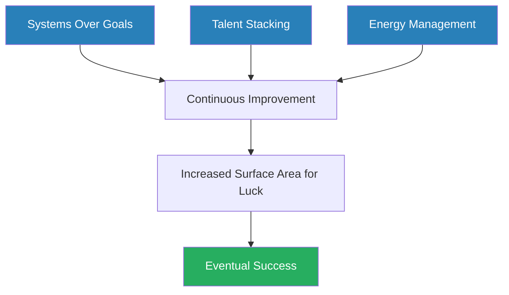
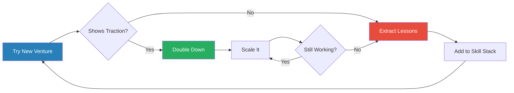
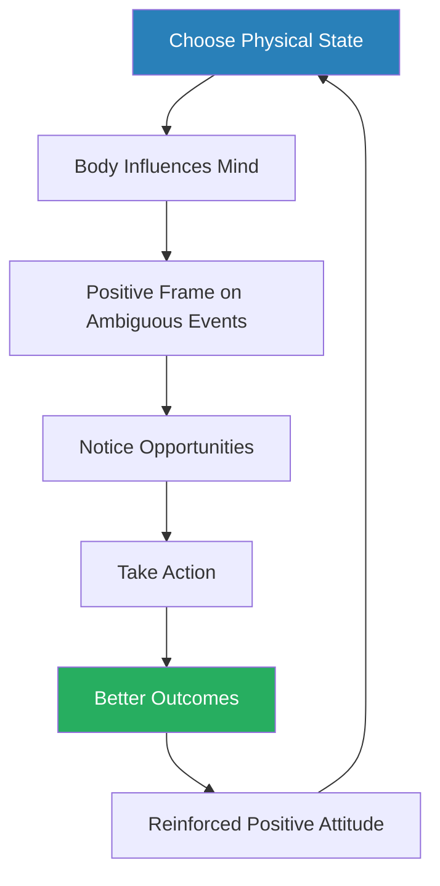
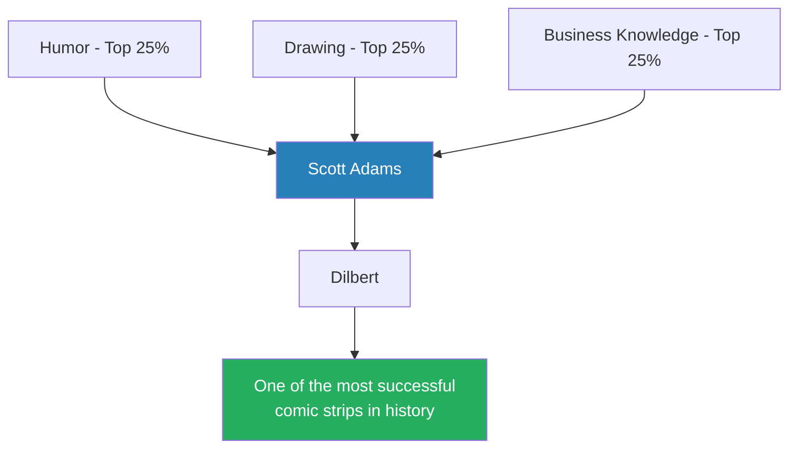
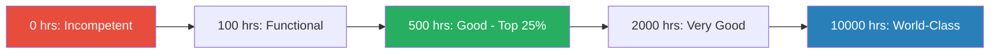
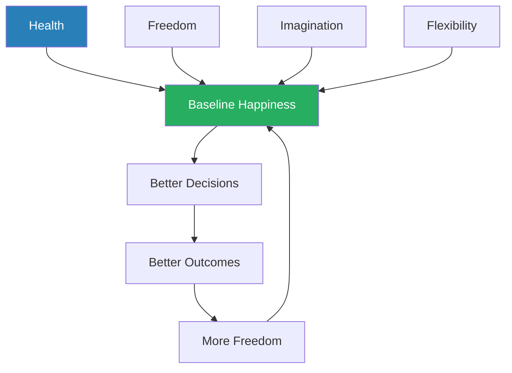
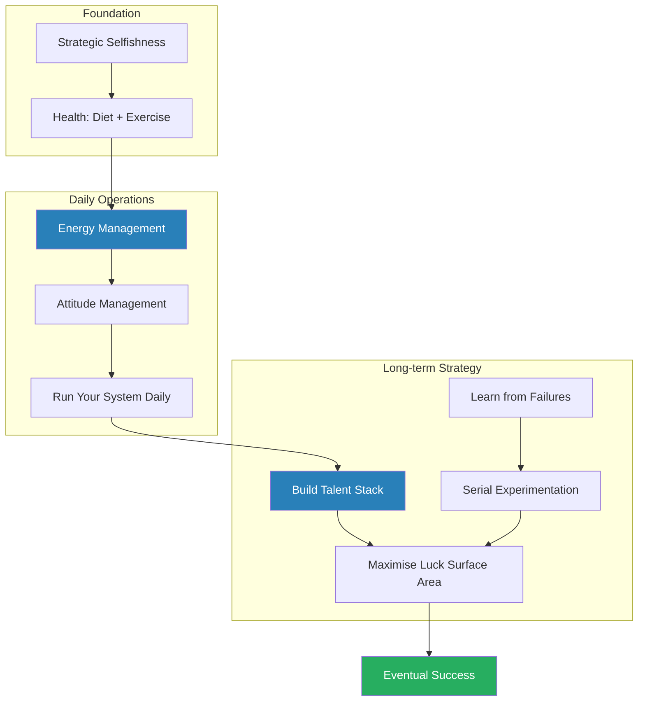
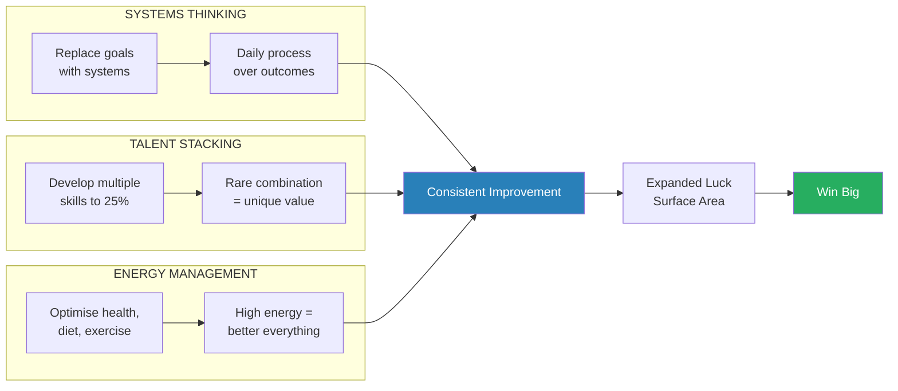

# How to Fail at Almost Everything and Still Win Big — Scott Adams

> Scott Adams — the creator of Dilbert — failed at more ventures than most people ever attempt. He flopped as a computer programmer, a commercial lender, a budget analyst, a restaurant investor, a grocery delivery entrepreneur, a creator of meditation aids, a publisher, a software developer, and more. Each failure taught him something. The cumulative effect of all those failures, combined with a handful of decent-but-not-world-class skills, eventually produced one of the most successful comic strips in history. This book is his attempt to reverse-engineer what happened: not a motivational speech, but a personal operating system built on choosing systems over goals, stacking ordinary talents into extraordinary combinations, and managing your energy like it is your most valuable resource. Adams writes with the deadpan humor you would expect from the man behind Dilbert — self-deprecating, contrarian, and bracingly honest about how little he actually knows for certain.

---

## About the Author

Scott Adams is a trained economist and MBA who spent sixteen years in various corporate roles at Crocker National Bank and Pacific Bell before Dilbert made him famous. He launched the strip in 1989 after years of submitting work to syndicates and being rejected. Dilbert eventually appeared in over 2,000 newspapers in 65 countries, making Adams one of the most widely read cartoonists in history. Beyond cartooning, Adams has written extensively about persuasion, systems thinking, and personal effectiveness. He is notably forthright about his own limitations — he calls himself "a guy who failed at more things than most people even try" and insists the reader should be skeptical of anything a cartoonist recommends.

---

## The Big Idea

- The conventional wisdom about success is backwards — people are told to set specific goals, work hard toward them, and celebrate when they arrive
- Adams argues that <b style="color: #27ae60">goals are for losers and systems are for winners</b>
- A **goal** is a specific outcome: lose twenty pounds, get promoted, publish a book
  - Until you achieve it, you exist in a state of perpetual pre-success failure
  - Once you achieve it, the motivation evaporates — now what?
- A <b style="color: #2980b9">system</b> is an ongoing process you follow regularly that increases your odds of success over time
  - "Exercising every day" is a system; "losing twenty pounds" is a goal
  - "Learning something new in every job" is a system; "becoming CEO" is a goal
  - Systems keep you engaged and improving regardless of any individual outcome

The second pillar is the <b style="color: #2980b9">talent stack</b>:

- You do not need to be the best in the world at any single thing
- If you become reasonably good — top 25% — at two or more complementary skills, the combination becomes rare and valuable
- Adams is not the funniest person alive, not the best artist, not the deepest business thinker — but the intersection of humor + drawing + business knowledge is a market of approximately one person
- <b style="color: #27ae60">Every skill you add to your stack multiplies rather than adds to your value</b>

The third pillar is <b style="color: #2980b9">personal energy management</b>:

- Organise your life around what maximises your personal energy — not around what seems most important, most urgent, or most noble
- When your energy is high, you make better decisions, think more creatively, and persist through setbacks
- When your energy is low, everything suffers — your willpower, your relationships, your output
- <b style="color: #e74c3c">Sacrificing your energy for short-term productivity is borrowing from your future self at ruinous interest rates</b>

Adams's three pillars — systems, talent stacking, and energy management — feed into a virtuous cycle where consistent effort expands your exposure to lucky breaks.

---

## Key Concepts at a Glance

| Concept | One-line summary |
|---------|-----------------|
| **Systems vs. Goals** | Ongoing processes beat specific targets because they keep you improving regardless of outcomes |
| **Talent Stack** | Combine several "good enough" skills into a rare, valuable package |
| **Personal Energy** | Manage your schedule around what gives you energy, not what seems most important |
| **Deciding vs. Wanting** | Wanting is passive; deciding commits you to a process and activates pattern recognition |
| **Strategic Selfishness** | Take care of yourself first so you have something to offer others |
| **Failure as Data** | Every failure teaches something — it is only wasted if you stop experimenting |
| **Luck as Position** | Luck is not random; it finds people who try many things across broad skill sets |
| **Affirmations** | Writing desired outcomes repeatedly — Adams reports results but cannot confirm the mechanism |
| **Happiness Formula** | Health + freedom + imagination + flexibility = the conditions for happiness |
| **Pattern Recognition** | Success leaves observable patterns; learn to spot them across domains |
| **Lack of Fear of Embarrassment** | Willingness to look foolish dramatically expands what you can attempt |
| **Simplicity** | In diet, fitness, and strategy — the simpler the system, the more likely you are to follow it |

---

## Part I: The Foundations

### Chapter 1: The Time I Was Kidnapped by Aliens

*Adams opens with a deliberate provocation — a ridiculous title designed to signal that this book will not take itself too seriously.*

- Adams establishes his credentials, which are essentially anti-credentials:
  - He is not a psychologist, a neuroscientist, or a business professor
  - He is a cartoonist who failed at a remarkable number of things before one of them worked
  - He warns the reader that his sample size is one (himself) and his evidence is mostly anecdotal
- This self-deprecation is strategic — by lowering expectations, he makes his insights land without the reader's anti-guru defenses firing
- <b style="color: #27ae60">The implicit argument: lived experience from someone who actually built something is more useful than theory from someone who has not</b>
- Adams lists a partial catalogue of his failures:
  - Computer programming, budget analysis, commercial lending, restaurant investment, grocery delivery service, meditation guide publishing, software development, velcro-based inventions, and more
  - Each one taught him something, even as each one failed
- The tone is set: this will be funny, honest, and unapologetically based on personal experience rather than research studies
- Adams also introduces a key framing device he returns to throughout the book:
  - He separates advice into two categories — things that worked for him personally, and things he has observed working for others
  - He explicitly asks the reader to treat the book as a menu, not a prescription
  - Take what resonates, test it against your own experience, discard what doesn't work
  - <b style="color: #e74c3c">The worst thing you can do with advice from a cartoonist — or anyone else — is follow it blindly</b>

> [!example] Adams's Catalogue of Failures
> - Before Dilbert, Adams tried and failed at a staggering number of ventures:
>   - A computer game he tried to sell by mail order — sold almost nothing
>   - A food-related invention that went nowhere
>   - A plan to create a chain of meditation centers — never got off the ground
>   - A velcro-related product — no market interest
>   - A grocery delivery service — years before the internet made it feasible
>   - Various software products — none gained traction
> - Each failure cost him time, money, and ego — but each also deposited skills, contacts, or knowledge he would use later
> - The restaurant failure taught him about operations and customer psychology
> - The software failures taught him about product design and user behavior
> - The meditation center failure taught him about marketing and location economics
> **The lesson:** The failures were not wasted — they were tuition payments for an education he could not have gotten any other way.

---

### Chapter 2: Goals vs. Systems

*This is the chapter the book is famous for, and it reframes how most people think about ambition.*

- <b style="color: #2980b9">A goal</b> is a specific result you want to achieve — it is a destination
- <b style="color: #2980b9">A system</b> is something you do on a regular basis that increases your odds of happiness and success in the long run — it is a direction
- The difference is not semantic — it changes how you feel every single day:
  - The goal-oriented person exists in a state of continuous failure until the moment of achievement
  - The system-oriented person succeeds every time they run their system
  - After achieving a goal, the goal-oriented person loses their source of motivation
  - After running their system, the system-oriented person has improved their odds and can keep going

> [!tip] Core Insight
> If your system is "learn something valuable in every job," you succeed every day you learn. If your goal is "become VP by 40," you fail every day you're not VP.

- Adams distinguishes between a system and a mere habit:
  - A habit is something you do automatically without thinking
  - A system is a deliberate, designed process oriented toward improving your long-term odds
  - All systems may become habits, but not all habits are systems — scrolling social media is a habit, not a system

| | Goals | Systems |
|--|-------|---------|
| **Timeframe** | Future-focused | Present-focused |
| **Emotional state** | Perpetual pre-success failure | Daily sense of forward motion |
| **After achievement** | Motivation collapses | Motivation continues |
| **Failure response** | "I failed" (identity-level) | "That attempt didn't work; I'll adjust" |
| **Measurement** | Binary: achieved or not | Continuous: am I running the system? |
| **Examples** | Lose 20 pounds, get promoted, write a book | Exercise daily, learn something in every role, write every morning |

This table captures the fundamental emotional difference Adams is pointing to — systems keep you psychologically healthy while goals often do not.

Systems outperform goals across every psychological dimension — particularly in resilience and sustainability, where the gap is most dramatic.

> [!example] Adams's Restaurant Failure
> - Adams invested in a restaurant in the 1990s — it was a specific goal: open a successful restaurant
> - The restaurant failed, losing him his investment
> - But through the process, he learned about business operations, customer psychology, food costs, and managing employees
> - None of that knowledge was wasted — it fed into his understanding of business that made Dilbert's office humor so precisely targeted
> - If he had framed it as a system ("learn about running a business"), the venture was a success from day one
> **The lesson:** The same experience is a failure or a success depending entirely on whether you framed it as a goal or a system.

- <b style="color: #e74c3c">The danger of goal-thinking is that it makes you miserable on the way to something that may never arrive</b>
- Systems thinking does not mean you lack ambition — it means you put your ambition into the process rather than the outcome
- Adams practiced this himself: his system was "keep trying new things, learn from each one, and maintain enough skills that something eventually clicks"

> [!example] The Gym Goal vs. The Gym System
> - Adams uses a fitness analogy to make the distinction concrete
> - The goal-oriented person says: "I want to lose twenty pounds by June"
>   - From January through May, they are in a state of failure — they haven't lost twenty pounds yet
>   - If they slip up in March and eat badly for a week, they feel like they've blown it
>   - If they reach the goal in June, they celebrate — and then often regain the weight because the goal is done
> - The system-oriented person says: "I exercise every day"
>   - Every day they exercise, they succeed — the system ran
>   - If they skip a day, they run the system again tomorrow — no existential crisis
>   - There is no endpoint — the system keeps producing results indefinitely
> **The lesson:** The goal-oriented person is unhappy five months out of six. The system-oriented person succeeds every single day.

- Adams extends the framework beyond personal fitness:
  - In business: "make a million dollars" is a goal; "launch a new project every six months and learn from each" is a system
  - In relationships: "find the perfect partner" is a goal; "become the kind of person who attracts great partners" is a system
  - In learning: "get a degree" is a goal; "learn something new every day" is a system
  - The system-oriented approach is psychologically healthier because it provides daily satisfaction rather than deferred hope

---

### Chapter 3: My System for Success

*Adams lays out the operating system that produced Dilbert — not a grand strategy, but a process of serial experimentation.*

- Adams's personal system had a few consistent elements:
  - Try lots of things — the more experiments you run, the more likely one succeeds
  - Learn from every attempt, especially the failures
  - Acquire skills that complement each other
  - Prioritise personal energy above all other resources
  - Simplify everything — complex systems fail under real-world conditions

> [!example] The Dilbert Origin Story
> - Adams submitted comic strips to multiple syndicates while working a full-time job at Pacific Bell
> - He was rejected repeatedly — no one thought a comic strip about office life would sell
> - He kept refining, kept submitting, kept his day job as a safety net
> - United Media eventually picked up the strip — not because Adams was the most talented cartoonist, but because he was persistent and his subject matter (corporate absurdity) resonated with readers
> - By the time Dilbert succeeded, Adams had already failed at dozens of other ventures — but each one contributed skills to his stack
> **The lesson:** The system was not "become a famous cartoonist." The system was "keep trying things and getting better." Dilbert was a byproduct.

- <b style="color: #27ae60">Adams's core operating principle: every failure increases your odds on the next attempt, provided you learn from it</b>
- He draws a distinction between failing forward (extracting lessons and skills) and failing in place (repeating the same mistakes)
- The serial experimentation approach requires:
  - Low cost of failure — never bet everything on one attempt
  - Speed — try things quickly, abandon them quickly if they're not working
  - Breadth — try across different domains to discover unexpected synergies
  - Honesty — be ruthlessly honest about what is working and what is not

> [!example] Adams at Pacific Bell
> - Adams spent years working at Pacific Bell (later part of AT&T) in various corporate roles
> - He found the work mind-numbing — but he treated it as his laboratory
> - He studied how large organisations actually worked: the politics, the incentives, the absurdities
> - He observed the gap between what managers said and what they did
> - He noticed which people got promoted and why — and it was rarely the most talented
> - Every boring meeting, every pointless memo, every dysfunctional team became raw material for Dilbert
> - The corporate job was not a failure — it was a sixteen-year research project that happened to come with a salary
> **The lesson:** Even a job you dislike can be a system if you're extracting knowledge, skills, and material from it every day.

- Adams connects his serial experimentation to a broader principle about <b style="color: #2980b9">entrepreneurial thinking</b>:
  - Traditional career advice says: find your passion, commit to it, work hard until you succeed
  - Adams's approach says: try lots of things, commit to the ones showing traction, abandon the rest quickly
  - This mirrors how venture capitalists operate — they fund many bets knowing most will fail, because the winners more than compensate
  - <b style="color: #27ae60">You are the venture capitalist of your own life — diversify your experiments, cut your losses fast, and double down on what works</b>

Adams's serial experimentation cycle — try, evaluate, learn, repeat — mirrors venture capital logic applied to a single career.

---

### Chapter 4: Deciding vs. Wanting

*Adams draws a sharp line between two mental states that sound similar but produce completely different outcomes.*

- **Wanting** is passive — it's a wish, a daydream, a "wouldn't it be nice if..."
  - Wanting does not activate any particular behaviour
  - You can want something your entire life without ever doing anything about it
  - Wanting is comfortable because it requires no risk
- <b style="color: #2980b9">Deciding</b> is active — it's a commitment that changes what you do, how you spend your time, and what you say no to
  - When you decide, you start reorganising your life around the decision
  - You begin noticing opportunities and resources that were always there but invisible to you
  - Adams connects this to the psychological concept of **selective attention** — once you decide, your brain starts filtering reality differently

> [!example] Adams Decides to Become a Cartoonist
> - Adams did not "want" to be a cartoonist — he decided he would become one
> - The decision meant he started drawing every day, studying other comic strips, learning about syndication
> - He noticed a book on cartooning in a store he would have walked past before the decision
> - He met people in the industry who could help, because he was now actively looking for them
> - The decision itself changed what he saw, who he talked to, and how he spent his free time
> **The lesson:** Deciding is not the same as wishing. A decision reorganises your perception of reality.

- <b style="color: #e74c3c">The trap of wanting: it feels productive because you're thinking about your future, but it produces zero action</b>
- Adams suggests a practical test: if you haven't changed your daily behaviour, you have not decided — you are still wanting
- The mechanism behind deciding:
  - Your reticular activating system (the brain's relevance filter) adjusts to notice things related to your decision
  - You start saying no to things that conflict with your decision
  - You reorganise your time — what was once leisure becomes practice time
  - Social proof kicks in — you tell people about your decision, which creates accountability

> [!example] The Practical Test: Wanting vs. Deciding
> - Adams offers a sharp diagnostic anyone can apply to their own life
> - If you say "I want to write a novel" but have not written a single page this month, you are wanting — not deciding
> - If you say "I want to get in shape" but have not changed what you eat or when you exercise, you are wanting
> - A decision rearranges your calendar, your priorities, and your daily habits — immediately, not "someday"
> - Adams applied this test to himself constantly: if he wasn't actively doing something about an aspiration, he admitted he was merely wanting it and either escalated to a decision or dropped the pretense entirely
> **The lesson:** The gap between wanting and deciding is the gap between thinking about your life and changing it.

---

## Part II: Programming Your Personal Operating System

### Chapter 5: Selfishness — The Strategic Kind

*Adams makes the uncomfortable argument that being selfish — in the right order — is the most generous thing you can do.*

- Adams defines three levels of priority:
  1. **Selfish** — taking care of your own health, energy, skills, and finances
  2. **Generous** — helping others from your surplus
  3. **Stupid** — sacrificing yourself to the point where you have nothing left to offer anyone
- <b style="color: #27ae60">The counterintuitive insight: level 1 (selfish) enables level 2 (generous), while skipping straight to level 2 usually leads to level 3 (stupid)</b>
- Adams uses the airplane oxygen mask analogy — you cannot help the person next to you if you pass out first
- This is not an argument for narcissism or indifference:
  - Strategic selfishness means eating well so you have energy for your family
  - It means exercising so you don't become a burden on others
  - It means investing in your skills so you can earn enough to be financially generous
  - It means saying no to low-value commitments so you can say yes to high-value ones
- <b style="color: #e74c3c">The person who martyrs themselves for everyone else's needs is not heroic — they are depleted, resentful, and ultimately less helpful than the person who takes care of themselves first</b>

| Priority Level | Example | Outcome |
|---------------|---------|---------|
| **Selfish (1st)** | Exercise, eat well, sleep enough, invest in skills | Sustained energy, capacity to help others |
| **Generous (2nd)** | Help family, mentor others, contribute to community | Meaningful impact from a position of strength |
| **Stupid (3rd)** | Skip meals to work overtime, neglect health for others | Burnout, resentment, eventual collapse |

Adams is blunt: most self-help books tell you to put others first. He says that advice produces exhausted, burned-out people who resent the very people they're trying to help.

> [!example] The Oxygen Mask Principle in Practice
> - Adams illustrates this with the familiar airplane safety announcement: put on your own oxygen mask before helping others
> - Nobody calls that instruction selfish — everyone understands that an unconscious person cannot help anyone
> - Yet in daily life, people routinely skip their own "oxygen masks":
>   - They skip exercise to work late for their team
>   - They eat badly because they're too busy taking care of family
>   - They neglect their own skills development because they're mentoring others
> - The long-term result is predictable: burnout, declining health, growing resentment, and eventually less ability to help anyone at all
> - Adams argues the truly generous path runs through taking care of yourself first — not instead of others, but before others
> **The lesson:** Selfishness and generosity are not opposites. Strategic selfishness is the prerequisite for sustainable generosity.

- Adams acknowledges that this framework can be misused:
  - It is not a justification for ignoring legitimate obligations
  - It does not mean never sacrificing for others
  - The test is whether your "selfishness" is building your capacity to contribute, or whether it is just avoidance disguised as self-care
  - <b style="color: #e74c3c">If "taking care of yourself" means binge-watching television while your family needs you, that is not strategic selfishness — that is ordinary selfishness</b>

---

### Chapter 6: The Energy Metric

*Adams proposes replacing the standard productivity question — "What's most important?" — with a more useful one: "What gives me energy?"*

- <b style="color: #2980b9">The energy metric</b> is Adams's personal organising principle:
  - Some activities charge your batteries — they leave you feeling more alive, more creative, more capable
  - Other activities drain your batteries — they leave you exhausted, foggy, and unmotivated
  - Most people organise their days around urgency or importance; Adams organises his around energy
- The reasoning:
  - When your energy is high, you make better decisions, tolerate more frustration, and produce higher-quality work
  - When your energy is low, even easy tasks feel impossible and you make poor choices
  - <b style="color: #27ae60">Energy is the master resource — everything else (willpower, creativity, persistence, sociability) depends on it</b>

> [!example] Adams's Morning Routine
> - Adams discovered through experimentation that his creative energy peaked in the morning
> - He restructured his entire day to do creative work (cartooning, writing) first, before anything could drain him
> - Administrative tasks, meetings, and errands were pushed to the afternoon, when his energy naturally dipped
> - Exercise was placed at a time that recharged rather than depleted him
> - The result: higher output, better quality, and no reliance on willpower to push through creative work
> **The lesson:** Matching your highest-energy hours to your most important work is a force multiplier.

- Adams identifies common energy boosters and drainers:

| Energy Boosters | Energy Drainers |
|----------------|----------------|
| Exercise (right amount, right time) | Excessive sitting |
| Meaningful creative work | Bureaucratic obligations |
| Socialising with positive people | Socialising with negative people |
| Learning new skills | Repetitive busywork |
| Adequate sleep | Sleep deprivation |
| Proper nutrition | Sugar crashes and junk food |
| Progress on something you care about | Spinning wheels on things that don't matter |
| Feeling of control over your schedule | Feeling controlled by others' agendas |

Exercise and creative work together account for nearly 40% of daily energy — explaining why Adams insists on protecting morning hours for creative output and making exercise non-negotiable.

- The energy metric connects directly to the systems framework:
  - A good system is one that tends to increase your energy over time
  - A bad system is one that depletes your energy, even if it seems productive in the short term
  - <b style="color: #e74c3c">If your daily routine leaves you exhausted by evening, your system is broken — no matter how many tasks you checked off</b>

> [!tip] Core Insight
> Organise your day around energy, not importance. When energy is high, everything else follows. When energy is low, nothing works.

- Adams takes the energy concept further by connecting it to decision quality:
  - High-energy states produce better judgment, more creative thinking, and greater resilience to setbacks
  - Low-energy states produce impulsive decisions, narrow thinking, and fragility
  - The most common mistake: spending your peak energy hours on email and administrative work, then trying to do creative work in the afternoon when your tank is empty
  - <b style="color: #27ae60">Schedule your day so that your most important work gets your best energy — not whatever is left over</b>

---

### Chapter 7: Managing Your Attitudes

*Adams treats attitude not as a personality trait but as a tool you can deliberately manage — like adjusting the settings on a machine.*

- Most people think of their attitude as a fixed reaction to circumstances:
  - Good things happen → good attitude
  - Bad things happen → bad attitude
- Adams argues the causation often runs the other way:
  - Good attitude → you notice good things → more good things happen
  - Bad attitude → you notice problems → more problems seem to appear
- <b style="color: #2980b9">Attitude management</b> is a skill, not a personality trait:
  - You can choose to focus on what's working rather than what's broken
  - You can choose to interpret ambiguous situations positively rather than negatively
  - You can choose your physical state (posture, breathing, exercise) to influence your mental state
- Adams is not advocating toxic positivity or denying reality:
  - He acknowledges that some situations are genuinely terrible
  - The point is that for the vast majority of daily situations — the ambiguous ones, the small setbacks, the interpersonal frictions — you have a choice about how to frame them
  - <b style="color: #27ae60">Choosing the frame that gives you energy is not delusion; it is strategy</b>

Adams's attitude-management loop — your physical state shapes your mental frame, which shapes what you notice, which shapes your actions, which shapes your results, which reinforces the cycle.

> [!example] The Body-Mind Connection
> - Adams noticed that when he forced himself to smile — physically, even when he didn't feel like it — his mood actually shifted
> - He experimented with posture: standing tall and open vs. hunched and closed
> - The physical state consistently influenced the mental state, not the other way around
> - This aligns with research on embodied cognition — the body sends signals to the brain, not just the other way around
> **The lesson:** You can hack your attitude through your physiology — don't wait to feel good before acting good.

- Adams also observes that attitude is contagious:
  - Spending time with optimistic, energetic people raises your own energy and outlook
  - Spending time with chronically negative people drains you, regardless of your own disposition
  - This connects to the strategic selfishness framework — choosing your social environment is a form of energy management
  - <b style="color: #e74c3c">You cannot maintain a positive attitude if you are constantly surrounded by people who drain your energy and reinforce negative framing</b>

---

### Chapter 8: It's Hard Not to Be an A-hole

*A short, sharp chapter about the social costs of being the smartest person in the room — and why being right is often the wrong strategy.*

- Adams observes that intelligent people often fall into a trap:
  - They are frequently right about factual matters
  - Being right feels good, so they correct people often
  - Correcting people makes those people feel stupid
  - People who feel stupid around you will avoid you, undermine you, or resent you
- <b style="color: #e74c3c">Being right is not a social strategy — it is often a social liability</b>
- The cost of always being right:
  - You win the argument but lose the relationship
  - People stop sharing ideas with you because they fear being corrected
  - You become isolated in your correctness
  - Your energy gets spent on battles that don't matter
- Adams's approach:
  - Save your corrections for things that actually matter
  - Let people be wrong about small things — it costs you nothing
  - Focus on being effective rather than being right
  - Use humor to defuse situations where you disagree

> [!example] The Dinner Party Correction
> - Adams describes the social dynamics of correcting someone at a dinner party
> - Someone states an incorrect fact — maybe they attribute a quote to the wrong person or get a date wrong
> - The smart person's instinct is to correct them — "Actually, that was Churchill, not Roosevelt"
> - The correction might be factually right, but socially it accomplishes nothing except making the other person feel stupid in front of others
> - The corrector feels a brief flash of superiority; the corrected person feels a lasting sting of humiliation
> - The people watching learn one thing: don't share ideas around this person
> - Adams trained himself to suppress the correction impulse for anything that does not materially matter
> **The lesson:** Being right is cheap. Being liked is valuable. Don't trade the second for the first.

- This connects to Adams's energy framework:
  - Arguments over trivial facts drain energy from both parties
  - The person who "wins" the argument still loses energy
  - <b style="color: #27ae60">The most energy-efficient social strategy is to reserve your intellectual energy for things that actually affect outcomes</b>
- Adams also connects this to the talent stack:
  - Social skill — the ability to get along with people, to make them feel good in your presence — is one of the most powerful skills you can add to any stack
  - It is not about being fake or inauthentic; it is about choosing which truths are worth stating aloud
  - The person who is smart AND likeable has a far better talent stack than the person who is merely smart

---

### Chapter 9: Lack of Fear of Embarrassment

*Adams identifies one trait that separates people who attempt big things from people who don't — and it is not talent, intelligence, or connections.*

- <b style="color: #2980b9">Lack of fear of embarrassment</b> is, in Adams's view, one of the most powerful and underrated success factors:
  - Most people never try because they are afraid of looking foolish
  - The person who is willing to look stupid in public has an enormous advantage — they can attempt things that others won't even consider
  - Adams traces his own willingness to embarrass himself back to his childhood and early career
- The mechanism:
  - Fear of embarrassment is essentially fear of social judgment
  - Social judgment is painful because humans evolved in small tribes where reputation determined survival
  - In modern life, most "embarrassing" moments are forgotten by everyone except you within days
  - The asymmetry is massive: the cost of embarrassment is tiny and temporary; the cost of not trying is permanent
  - <b style="color: #27ae60">The person who tries and fails embarrassingly is still ahead of the person who never tried at all</b>

> [!example] Adams's First Public Speaking Experience
> - Early in his career, Adams volunteered to give a presentation at work despite having zero public speaking experience
> - He was terrible — nervous, fumbling, poorly prepared
> - His colleagues noticed, and he felt embarrassed
> - But the experience taught him something: the embarrassment faded within days, while the skill of public speaking improved with every attempt
> - He kept volunteering for presentations, getting slightly better each time
> - Eventually, public speaking became one of the skills in his talent stack
> **The lesson:** Embarrassment is a temporary emotion. The skills you gain by pushing through it are permanent.

> [!example] Submitting Comics to Syndicates
> - Adams sent his early comic strips to syndication companies knowing they were not very good
> - He received rejection after rejection — each one a small embarrassment
> - A more pride-sensitive person would have stopped after the first few rejections
> - Adams treated each rejection as information: What didn't they like? What could he improve?
> - The willingness to endure repeated rejection — repeated embarrassment — was the difference between becoming a published cartoonist and remaining a hobbyist
> **The lesson:** If you are not willing to be rejected, you are not willing to succeed.

- Adams quantifies the asymmetry between embarrassment and opportunity:
  - Embarrassment lasts hours to days — most people forget your failure within a week
  - The skills and knowledge gained from attempting something last years to a lifetime
  - The opportunities missed by not trying are gone forever
  - <b style="color: #e74c3c">The real embarrassment is reaching the end of your life and realising you never attempted the things you cared about because you were afraid of what people might think</b>

---

## Part III: The Talent Stack

### Chapter 10: Recognising Your Talents and Knowing When to Quit

*Adams tackles two complementary problems: how do you know what you're good at, and how do you know when to stop trying?*

- Recognising your talents is harder than it sounds because:
  - Natural talent often feels easy to you, so you assume it's easy for everyone
  - The things you find effortless are often the things others find difficult — that gap is your talent
  - People around you will notice your talents before you do — pay attention to what others compliment you on repeatedly
- Adams offers several signals that you have found a talent:
  - You do it without being asked
  - You lose track of time while doing it
  - Other people tell you you're good at it (even if you don't believe them)
  - You improve faster than average when you practice it
  - You keep returning to it even when it's not required

> [!tip] Core Insight
> If people keep telling you you're good at something and you keep thinking "anyone could do that" — that is probably your talent. The ease you feel is the talent.

- **Knowing when to quit** is the other side of the coin:
  - Adams does not subscribe to "never give up" — he thinks knowing when to quit is just as important as persistence
  - His rule of thumb: if you have been working at something for a reasonable amount of time and you see no signs of progress, move on
  - "Signs of progress" does not mean success — it means improvement, learning, or increasing interest from others
  - <b style="color: #e74c3c">The sunk cost fallacy kills more careers than lack of talent — people keep investing in losing propositions because they've already invested so much</b>
- The quit-or-persist decision depends on pattern recognition:
  - Are you getting better? Keep going.
  - Are you stuck at the same level despite effort? Consider quitting.
  - Are you learning things you can use elsewhere? The venture may be failing, but you are succeeding.

> [!example] Adams's Quit Criteria in Action
> - Adams applied his own quit criteria repeatedly throughout his career
> - When his grocery delivery service showed zero signs of customer traction after months of effort, he quit — and redirected that energy into other experiments
> - When his early comic strip submissions kept getting rejected, he did NOT quit — because each submission was slightly better than the last, and editors were giving more constructive feedback with each round
> - The difference was not persistence vs. giving up; it was reading the signals of traction vs. stagnation
> - The grocery business had no forward momentum; the cartooning showed a clear trajectory of improvement
> **The lesson:** Persistence is only a virtue when the trendline points upward. When it flatlines, persistence becomes stubbornness.

---

### Chapters 11-12: The Math of Success and the Talent Stack

*Adams introduces his most original and practically useful idea — that ordinary skills, combined strategically, produce extraordinary results.*

- <b style="color: #2980b9">The talent stack</b> is Adams's term for the idea that you can become extraordinarily valuable by combining several "merely good" skills:
  - You do not need to be world-class at anything
  - Being in the top 25% of two or more complementary skills makes you rare
  - The more skills you stack, the rarer — and more valuable — you become
- The math behind it:
  - Being in the top 1% of one skill is extraordinarily difficult — it requires years of dedicated practice and some genetic luck
  - Being in the top 25% of three different skills is achievable for most reasonably motivated people
  - The person who is top 25% in business + humor + writing is rarer than the person who is top 5% in any one of those fields
  - <b style="color: #27ae60">Every skill you add doesn't just add to your value — it multiplies it, because the combination becomes exponentially rarer</b>

Adams's talent stack combined three ordinary skills into an extraordinary result — none of them world-class, but the intersection was unique.

> [!example] Adams's Personal Talent Stack
> - Adams was not the best artist — many cartoonists could draw better than he could
> - He was not the funniest writer — many comedians were funnier
> - He was not the most insightful business thinker — many MBAs understood corporate dynamics better
> - But almost nobody on earth combined all three: decent art + decent humor + deep corporate experience
> - That three-skill intersection defined a market segment of approximately one person
> - Dilbert succeeded not because Adams was the best at anything, but because he was the only person at the intersection of those three skills
> **The lesson:** You don't need to be exceptional. You need to be the only one at your particular intersection.

- Adams recommends specific skills that are useful in almost any stack:

| Skill | Why It's Valuable in Any Stack |
|-------|-------------------------------|
| **Public speaking** | Amplifies every other skill; most people are terrible at it |
| **Writing** | The ability to communicate clearly in writing is rare and valued everywhere |
| **Psychology** | Understanding why people do what they do improves everything from sales to management |
| **Business basics** | Accounting, marketing, negotiation — knowing the fundamentals of how business works |
| **Persuasion** | The ability to change minds is the most leveraged skill in any field |
| **Technology** | Basic technical literacy multiplies your effectiveness in the modern economy |
| **Design** | Visual communication and aesthetic sense improve any output |
| **Conversation** | Social skills make you likeable, and likeable people get more opportunities |

The force network reveals how skills don't just add to your value — they interconnect, with persuasion and conversation acting as high-connectivity hubs that amplify everything else.

- Adams stresses that the talent stack is not about mediocrity:
  - It is about strategic allocation of your learning effort
  - Getting from 0% to 75% in a skill takes far less time than getting from 95% to 99%
  - <b style="color: #e74c3c">Spending years grinding toward the top 1% in one skill is a high-risk strategy — you might never get there, and you've neglected everything else</b>
  - Spending months getting to the top 25% in several complementary skills is a low-risk, high-reward strategy

> [!example] The Specialist vs. The Generalist
> - Adams contrasts two hypothetical professionals to illustrate the talent stack
> - Person A spends a decade becoming a top-1% programmer — they are technically brilliant but struggle to communicate, manage people, or sell ideas
> - Person B spends that same decade becoming a top-25% programmer who is also a decent writer, a competent public speaker, and knowledgeable about business
> - Person A can write better code — but Person B can lead a team, pitch to investors, write documentation that humans can read, and bridge the gap between engineering and the rest of the company
> - In most organisations, Person B is far more valuable and promotable than Person A
> - The specialist has deeper expertise but narrower applicability; the generalist with stacked skills has broader utility
> **The lesson:** The question is not "how good are you at one thing?" but "what rare combination can you offer?"

---

### Chapter 13: Is Practice the Key to Success?

*Adams takes a nuanced position on the "10,000 hours" debate — respecting deliberate practice while challenging the idea that practice alone is sufficient.*

- Adams acknowledges that practice matters enormously:
  - You cannot become competent at anything without putting in repetitions
  - The people at the top of any field have always practiced more than the people below them
  - There is no substitute for doing the work
- But he pushes back on the idea that practice is the ONLY variable:
  - Talent matters — some people learn certain skills faster than others
  - Strategy matters — practicing the wrong thing does not help
  - Timing matters — being in the right place at the right time is often decisive
  - Complementary skills matter — the talent stack can make moderate skill more valuable than extreme skill in a single domain
- <b style="color: #27ae60">Adams's synthesis: practice is necessary but not sufficient, and the return on practice follows a curve of diminishing returns — the first few hundred hours matter far more than the last few thousand</b>
- This connects directly to the talent stack:
  - The first hundred hours in a new skill produce massive improvement (you go from terrible to decent)
  - The last hundred hours before mastery produce tiny improvement (you go from great to slightly greater)
  - The talent-stack strategy exploits this curve: invest the high-return early hours across multiple skills rather than the low-return late hours in a single skill

The diminishing returns of practice — the leap from incompetent to good (top 25%) is fast and cheap; the leap from very good to world-class is slow and expensive.

- Adams draws a practical implication:
  - If you have 1,000 hours to invest in your development, you face a choice
  - Option A: spend all 1,000 hours on one skill, moving from good to very good in that single domain
  - Option B: spend 500 hours on each of two new skills, becoming functionally competent in both
  - Option B usually produces more career value because the combination is rarer than slightly better performance in one area
  - <b style="color: #e74c3c">The "10,000 hours" narrative can be dangerous because it encourages people to invest all their development capital in a single skill, ignoring the power of combinations</b>

---

## Part IV: Luck, Pattern Recognition, and Affirmations

### Chapter 14: Timing Is Luck Too

*Adams argues that luck is not something that merely happens to you — it is something you can systematically position yourself to receive.*

- Adams is honest about the role of luck in his own success:
  - Dilbert launched at a time when corporate culture was becoming a universal topic of conversation
  - The newspaper syndication model still existed and was profitable
  - Email was just becoming widespread, allowing readers to send Adams story ideas directly from their offices
  - If he had launched ten years earlier or ten years later, the outcome might have been completely different
- But Adams does not throw up his hands and say "it's all luck":
  - <b style="color: #2980b9">Luck has a surface area</b> — the more things you try, the more skills you develop, and the more people you know, the larger your surface area for lucky breaks
  - You cannot control which specific thing will work, but you can control how many things you attempt
  - You cannot control timing, but you can control your readiness to capitalise when timing turns favorable
- <b style="color: #27ae60">The formula: maximize attempts × maximize skills × maximize readiness = maximize luck</b>

> [!example] The Email Factor
> - When Dilbert launched in 1989, Adams had no way of knowing that corporate email was about to explode
> - As email spread through offices in the early 1990s, office workers began forwarding Dilbert strips to each other
> - This was essentially free, viral marketing — years before the internet made viral marketing a concept
> - Adams did not plan for this — he got lucky with timing
> - But he was in a position to benefit because he had been consistently publishing, consistently building an audience, and consistently staying in the game
> **The lesson:** You can't plan for lucky timing, but you can make sure you're in the game when it arrives.

> [!example] Adams and the Early Internet
> - Adams was one of the first cartoonists to establish a presence on the internet in the mid-1990s
> - He published his email address with his strips, inviting readers to send story ideas
> - Thousands of office workers wrote in with tales of corporate absurdity from their own workplaces
> - This gave Adams an endless supply of material — his readers were essentially writing the strip for him
> - He was positioned for this lucky break because he was curious about technology (part of his talent stack) and willing to experiment with a new medium others dismissed
> **The lesson:** Curiosity about new things expands your surface area for luck in ways you cannot predict.

---

### Chapter 15: Pattern Recognition

*Adams argues that successful people share observable patterns — and that learning to spot these patterns is itself a trainable skill.*

- Adams has spent his career observing successful people and noticing what they have in common:
  - They treat failure as education, not identity
  - They manage their energy systematically
  - They pursue systems rather than goals
  - They develop broad skill sets rather than narrow expertise
  - They are willing to look foolish
  - They are strategic about selfishness
- <b style="color: #2980b9">Pattern recognition</b> is the ability to see these recurring themes across different domains and individuals:
  - It requires paying attention to what works, not just what is interesting
  - It requires intellectual honesty — being willing to see patterns that contradict your existing beliefs
  - It requires exposure to diverse situations — the more different contexts you experience, the more patterns you can recognise
- Adams connects pattern recognition to the systems framework:
  - A system for observing and cataloguing patterns is more valuable than any individual pattern
  - The person who can spot patterns across domains has a massive advantage in predicting what will work next
- <b style="color: #27ae60">Pattern recognition is a meta-skill — it makes every other skill more effective because you can see what works faster and avoid what fails</b>
- Adams identifies several patterns he has observed in successful people:
  - They simplify — successful strategies are almost always simpler than you would expect
  - They focus on energy, not time — they guard their energy fiercely
  - They stack skills — they are rarely the best at one thing but are unusually competent across multiple domains
  - They embrace embarrassment — they are willing to fail publicly and repeatedly
  - They design systems — they do not rely on willpower or motivation alone

---

### Chapters 16-17: Affirmations

*Adams's most controversial and most carefully hedged section — his personal experience with affirmations, presented with explicit skepticism about why they might work.*

- <b style="color: #2980b9">Affirmations</b>, as Adams practiced them, involve writing a specific desired outcome fifteen times per day, phrased as a present-tense fact:
  - "I, Scott Adams, will become a famous cartoonist"
  - Written repeatedly, by hand, every day
- Adams reports several striking results:
  - He used affirmations before taking the GMAT and scored higher than expected
  - He used affirmations about becoming a famous cartoonist — which happened
  - He used affirmations about stock picks that performed well
- **But Adams is explicit about the limitations of his evidence:**
  - His sample size is one person
  - He cannot distinguish between affirmation effects and coincidence
  - Confirmation bias is a real concern — he may be remembering the hits and forgetting the misses
  - He offers several possible non-magical explanations for why affirmations might work

> [!abstract] Possible Mechanisms for Affirmations
> 1. **Focus:** Writing a goal repeatedly forces you to think about it, which activates selective attention (you start noticing opportunities related to the goal)
> 2. **Commitment:** The physical act of writing creates a sense of commitment and accountability
> 3. **Priming:** Repeated exposure to the desired outcome primes your brain to act in ways that move you toward it
> 4. **Confidence:** Affirming something repeatedly may subtly increase your confidence, which changes your behaviour in ways that make the outcome more likely
> 5. **Selection bias:** You remember the affirmations that worked and forget the ones that didn't

- <b style="color: #27ae60">Adams's recommendation: try affirmations because the cost is near zero (a few minutes per day) and the potential upside is significant, even if the mechanism is unclear</b>
- <b style="color: #e74c3c">What Adams explicitly does NOT claim: that affirmations are magic, that they override physics, or that wanting something enough makes it happen</b>
- The intellectual honesty of this section is notable — Adams shares his experience without pretending to have certainty about what it means
- Adams connects affirmations back to the deciding vs. wanting framework:
  - Writing affirmations is closer to "deciding" than "wanting" — it forces a daily physical action
  - The act of writing makes the abstract concrete
  - Even if the mechanism is entirely psychological (focus + priming + confidence), that is still a real and valuable effect
  - The question is not whether affirmations are "magic" — it is whether the daily practice of writing your intentions changes your behaviour in useful ways

---

## Part V: The Happiness Equation

### Chapter 18: Happiness

*Adams offers a practical formula for happiness that avoids both pop-psychology fluff and clinical coldness.*

- Adams's <b style="color: #2980b9">happiness formula</b>: **Health + Freedom + Imagination + Flexibility**
- Each component is necessary but not sufficient on its own:
  - **Health:** without physical health, nothing else matters — pain and fatigue overwhelm all other variables
  - **Freedom:** the ability to control your own schedule and make your own choices
  - **Imagination:** the capacity to envision a future better than the present
  - **Flexibility:** the willingness to change direction when circumstances change
- Adams distinguishes between happiness and pleasure:
  - Pleasure is momentary — a good meal, a funny joke, a win
  - Happiness is a baseline state — it is how you feel when nothing particular is happening
  - Most people try to increase pleasure when they should be working on their baseline happiness
  - <b style="color: #27ae60">The baseline is determined by your health, freedom, imagination, and flexibility — not by any specific achievement or possession</b>

The four pillars of Adams's happiness formula (green) dramatically outweigh conventional success markers (red) in their impact on baseline happiness — confirming that what most people chase matters least.

Adams's happiness formula is a reinforcing loop — each component feeds the baseline, which improves your decision-making, which generates outcomes that increase your freedom and health further.

> [!example] Adams's Voice Problem and Happiness
> - In 2005, Adams developed spasmodic dysphonia — a neurological condition that made it nearly impossible to speak
> - For years, he could not have normal conversations, give speeches, or order food in a restaurant
> - The condition attacked his freedom (couldn't communicate normally) and his imagination (doctors said it was permanent)
> - Adams fell into a depression — not because of external circumstances, but because two pillars of his happiness formula had been knocked out
> - When he eventually found a treatment that restored his voice (through an unconventional surgery), his happiness returned not because anything else had changed, but because freedom and imagination were restored
> **The lesson:** Happiness is structural, not situational. Remove a pillar and it collapses regardless of how much money or success you have.

- Adams on **imagination** as a happiness component:
  - This is the most unusual element of his formula
  - Imagination means the ability to picture a plausible path to a better future
  - People who cannot imagine things getting better — who feel permanently trapped — are deeply unhappy regardless of their actual circumstances
  - This explains why some people in objectively terrible situations maintain hope (they can imagine a way out) while some people in objectively great situations are miserable (they cannot imagine things getting better)
  - <b style="color: #e74c3c">Depression is often a failure of imagination more than a failure of circumstances</b>

- Adams on **flexibility** as a happiness component:
  - Flexibility means not being so attached to any single outcome that its loss destroys you
  - It connects directly to the systems-over-goals philosophy — systems are flexible by nature; goals are rigid
  - A flexible person can lose a job and see it as an opportunity; a rigid person sees it only as a catastrophe
  - Flexibility requires cultivating multiple options, multiple skills, and multiple sources of meaning
  - <b style="color: #27ae60">The person with one plan is fragile; the person with five plans is antifragile</b>

---

### Chapter 19: Humor

*Adams treats humor not as a gift you either have or lack, but as a learnable skill with specific, identifiable patterns.*

- Adams's credentials on humor are strong — he has been making millions of people laugh through Dilbert for decades
- He identifies several structural patterns that underlie most humor:
  - **Surprise:** humor almost always involves a setup that creates an expectation, followed by a punchline that violates it
  - **Recognition:** people laugh when they see their own experience reflected back to them in a slightly exaggerated way
  - **Superiority:** some humor works by making the audience feel smarter than the target
  - **Incongruity:** placing something in a context where it does not belong
- Adams argues humor belongs in the talent stack because:
  - Funny people are more likeable, and likeable people get more opportunities
  - Humor defuses tension, which is valuable in negotiation and conflict
  - The ability to be funny is rare enough that it creates differentiation in almost any field
  - Humor requires quick pattern recognition, which is useful far beyond comedy
- <b style="color: #27ae60">Humor is a meta-skill — it improves your communication, your relationships, and your resilience simultaneously</b>

| Humor Pattern | How It Works | Example |
|--------------|-------------|---------|
| **Surprise** | Setup creates expectation, punchline violates it | Any good joke with a twist ending |
| **Recognition** | Audience sees their own experience exaggerated | Dilbert's portrayal of pointless meetings |
| **Superiority** | Audience feels smarter than the target | Slapstick comedy, political satire |
| **Incongruity** | Something is placed in the wrong context | A formal business report written in pirate language |
| **Exaggeration** | A real truth is amplified to absurd proportions | "Our meetings have meetings" |
| **Understatement** | A significant event is described in deliberately minimal terms | "The ship sank. That was somewhat inconvenient." |

These patterns are learnable — you can study them, practice them, and get better at deploying them.

> [!example] How Adams Built Humor Into His Stack
> - Adams did not start as a naturally funny person — he was an economist and a corporate employee
> - He studied comedy the way an engineer studies systems: breaking jokes down into components, identifying the patterns, practicing the structures
> - He started with written humor (easier than live comedy because you can edit) and gradually expanded to speaking
> - Dilbert's humor is almost entirely recognition-based — readers laugh because they see their own workplace absurdities mirrored back at them
> - The humor skill multiplied the value of his other skills: decent drawing + business knowledge alone would have produced a boring comic; adding humor made it a phenomenon
> **The lesson:** Humor is not a talent you are born with. It is a skill you can reverse-engineer and practice like any other.

---

## Part VI: The Health System

### Chapter 20: Diet

*Adams takes a pragmatic, systems-based approach to nutrition — not a scientifically rigorous diet plan, but a simple, followable system.*

- Adams is upfront that he is not a nutritionist and has no credentials in the field
- His approach to diet follows the same philosophy as everything else in the book: simplicity beats perfection
- <b style="color: #2980b9">Adams's diet system</b> is built on a few principles:
  - **Simplicity:** if a diet is too complicated to follow, you won't follow it — the system fails
  - **Energy focus:** eat whatever makes you feel energetic and avoid whatever makes you feel sluggish
  - **Experimentation:** try different approaches and track how they make you feel
  - **Habit over willpower:** design your environment so that healthy eating is the path of least resistance

> [!abstract] Adams's Diet Principles
> 1. Pay attention to how food makes you feel one hour after eating — not how it tastes in the moment
> 2. Simple carbs (white bread, sugar, pasta) tend to produce energy crashes; protein and vegetables tend to sustain energy
> 3. Eat when you're hungry, not when the clock says you should
> 4. Make healthy food convenient and unhealthy food inconvenient
> 5. Don't try to use willpower — change your environment instead
> 6. If a diet is too complicated to explain in one sentence, it will fail

- The key insight connecting diet to the book's larger framework:
  - Diet is a system, not a goal
  - "Lose 20 pounds" is a goal — it makes you miserable until you achieve it and provides no guidance on how to maintain afterward
  - "Eat in a way that maximises my energy" is a system — it works every day, requires no endpoint, and self-corrects because you can feel the results
  - <b style="color: #27ae60">When you make energy your dietary metric, the right choices become obvious without counting calories or following complicated rules</b>

> [!example] Adams's Simple Carb Discovery
> - Adams experimented with eliminating simple carbohydrates — white bread, pasta, sugar — from his regular diet
> - He did not do this based on a nutritional theory or a doctor's recommendation; he did it by paying attention to how he felt after eating
> - He noticed a consistent pattern: meals heavy in simple carbs left him sluggish and foggy within an hour, while meals heavy in protein and vegetables sustained his energy
> - He did not need to count calories or follow a complicated plan — the energy metric told him everything he needed to know
> - His system became: eat foods that give you energy, avoid foods that steal it
> **The lesson:** The best diet is the one you can feel working. Pay attention to your body's response, not a chart on a wall.

---

### Chapter 21: Fitness

*Adams applies his systems philosophy to exercise — making the case that the best workout is the one you will actually do.*

- Adams has experimented with many forms of exercise over the years:
  - Weight training, running, walking, racquet sports, swimming
  - He found that the specific type of exercise mattered far less than consistency
- <b style="color: #2980b9">Adams's fitness system</b>:
  - **Make it automatic:** exercise should be a default behaviour, not a decision you make each day
  - **Remove friction:** exercise at a convenient time and place — the fewer obstacles, the more likely you are to do it
  - **Reward immediately:** choose forms of exercise that feel good during or immediately after, not just forms that produce long-term results
  - **Lower the bar:** on days when you don't feel like exercising, just show up and do something — even ten minutes counts
- The connection to the larger system:
  - Exercise is the single most powerful energy management tool available
  - It boosts mood, improves cognitive function, enhances sleep, and increases willpower
  - <b style="color: #e74c3c">Not exercising is not saving time — it is borrowing energy from every other activity in your day</b>

> [!example] The "Just Go to the Gym" Rule
> - Adams found that his biggest obstacle to exercise was the decision to start
> - On days when he felt tired or unmotivated, the thought of a full workout was paralyzing
> - His solution: on those days, he committed only to showing up at the gym — nothing more
> - Once there, he almost always ended up doing something — even if it was just twenty minutes on the treadmill
> - The key insight was that starting was the hard part; continuing was easy
> - By lowering the bar to "just show up," he removed the decision burden that was preventing him from exercising
> **The lesson:** The best exercise system is the one that eliminates the decision to exercise. Make showing up automatic.

> [!tip] Core Insight
> The best exercise program is not the one that burns the most calories — it is the one you will actually do consistently. Optimise for consistency, not intensity.

- Adams connects fitness to every other concept in the book:
  - Exercise is a system (not a goal) — "exercise daily" vs. "lose 20 pounds"
  - Exercise is an energy booster — it is the foundation of the energy metric
  - Exercise reduces fear of embarrassment — physical confidence translates to social confidence
  - Exercise is a talent stack component — a physically fit person has advantages in energy, appearance, and mental clarity that amplify all other skills
  - <b style="color: #27ae60">If you could only follow one piece of advice from this entire book, Adams would say: exercise every day, whatever form you can sustain</b>

---

## Part VII: Pulling It All Together

### The Master System

*Adams's final synthesis — how all the individual ideas connect into a coherent personal operating system.*

- Adams closes by connecting all the threads:
  - Use **systems** instead of goals to stay motivated and improve continuously
  - Build a **talent stack** by developing multiple complementary skills to the top 25% level
  - Manage your **personal energy** as your most important resource
  - **Decide** rather than want — commit to a direction and let your brain do the filtering
  - Be **strategically selfish** — take care of yourself first so you can help others from surplus
  - Embrace **failure as data** — every experiment that doesn't work teaches you something
  - Maximize your **surface area for luck** by trying many things and developing broad skills
  - Don't fear **embarrassment** — it is temporary, while the skills gained are permanent
  - Maintain the four pillars of **happiness**: health, freedom, imagination, flexibility
  - Develop **pattern recognition** — observe what works for successful people and adapt it
  - Keep everything **simple** — complex systems fail under real-world conditions

Adams's master system connects daily energy management (the foundation) through systematic skill-building (the strategy) to expanded opportunity (the outcome).

> [!abstract] Adams's Personal Operating System — Summary
> 1. Take care of your health first (diet, exercise, sleep) — this is the foundation
> 2. Organise each day around energy — do creative/important work when energy peaks
> 3. Build skills in your talent stack — invest in being top 25% in complementary areas
> 4. Run serial experiments — try many things, learn from each, abandon what isn't working
> 5. Treat failures as data, not as identity — you failed, you are not a failure
> 6. Decide, don't want — make active commitments that change your daily behaviour
> 7. Manage your attitude as a tool — choose frames that give you energy
> 8. Don't fear embarrassment — it fades; skills don't
> 9. Maintain all four pillars of happiness — health, freedom, imagination, flexibility
> 10. Keep your systems simple — complexity is the enemy of consistency

---

## How Systems, Talent Stacking, and Energy Connect

The three pillars of Adams's philosophy are not independent — they reinforce each other. Systems thinking keeps you consistent, talent stacking makes you rare, and energy management fuels both.

---

## The Verdict

Adams's greatest contribution is the talent stack concept — the idea that you don't need to be world-class at any single thing, just "good enough" at several complementary things. This is genuinely liberating advice for the vast majority of people who will never be the best in the world at anything. It reframes the question from "what am I the best at?" to "what unusual combination can I build?" Combined with the systems-over-goals framework, it provides a practical operating philosophy that is both motivating in the short term and strategically sound in the long term. Adams's other major contribution is applying systems thinking to personal life with the same rigor that engineers apply it to machines.

The book's weaknesses are real. Adams's evidence is almost entirely anecdotal — his sample size is himself, and he freely admits this. The affirmations section is the most problematic: Adams shares his personal experiences with affirmations but cannot offer any plausible mechanism beyond the ones that already explain the result without invoking affirmations (focus, commitment, confidence). The diet and fitness chapters offer reasonable but unremarkable advice that could be found in any health book. And Adams's habit of presenting his personal experience as universal wisdom — while charming — sometimes leads him to overstate conclusions that a more disciplined thinker would hedge. The book also has a slight undercurrent of survivorship bias: Adams's system worked for him, but how many other cartoonists followed similar systems and never made it?

The readers who benefit most are those in the early-to-mid stages of their careers — people who are talented but not sure how to deploy that talent, people who have failed at a few things and need a framework for making sense of those failures, and people who are stuck in goal-oriented thinking and need permission to think in systems. The book is also excellent for generalists who have been told their whole lives that they need to "specialize" — Adams gives them a counter-narrative and a strategy. People who are already deeply specialized and successful may find less value here.

Compared to other books in the personal development space, Adams occupies a unique niche. His talent stack concept complements Cal Newport's [[So Good They Can't Ignore You - Cal Newport|skill-capital thesis]] but approaches it from a different angle — Newport says "get really good at something"; Adams says "get pretty good at several things." His systems thinking aligns with [[Essentialism - Greg McKeown|McKeown's essentialism]] in its emphasis on focusing on what works rather than what's popular. His attitude toward failure resonates with [[Antifragile - Nassim Nicholas Taleb|Taleb's antifragility]] — the idea that some systems gain from disorder. And his energy management philosophy parallels the personal energy ideas in [[Deep Work - Cal Newport|Deep Work]], though Adams is less rigorous and more intuitive in his approach. What makes this book distinctive is Adams's voice: funny, honest, self-deprecating, and entirely unconcerned with appearing scholarly. It is a self-help book that doesn't feel like a self-help book, and for many readers, that is exactly what makes it work.

---

## Related Reading

- [[So Good They Can't Ignore You - Cal Newport]] — Newport's complementary argument for skill development, focusing on depth rather than breadth
- [[Range - David Epstein]] — Academic support for Adams's generalist thesis: breadth often beats depth
- [[Essentialism - Greg McKeown]] — Systems for cutting the nonessential and focusing on what matters
- [[Deep Work - Cal Newport]] — Energy management and focused work as competitive advantages
- [[Antifragile - Nassim Nicholas Taleb]] — Why disorder and failure can make systems stronger, not weaker
- [[Thinking in Bets - Annie Duke]] — How to make better decisions under uncertainty, complementing Adams's pattern recognition
- [[The Psychology of Money - Morgan Housel]] — Another book that uses personal stories to illuminate systemic truths
- [[Man's Search for Meaning - Viktor Frankl]] — The deepest exploration of how attitude determines experience
- [[12 Rules for Life - Jordan Peterson]] — Another personal philosophy framework, more grounded in psychology and mythology
- [[The Lean Startup - Eric Ries]] — Systems thinking applied to business: build, measure, learn — the professional version of Adams's serial experimentation
