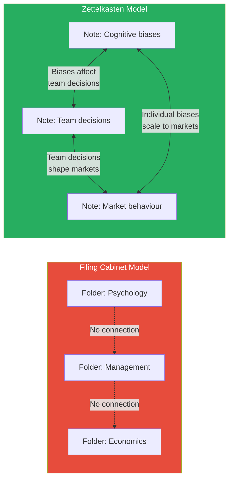
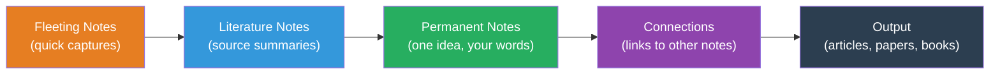
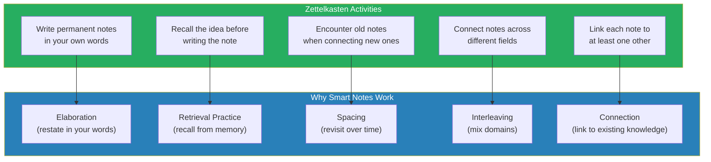
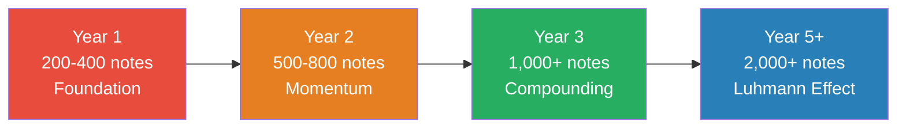
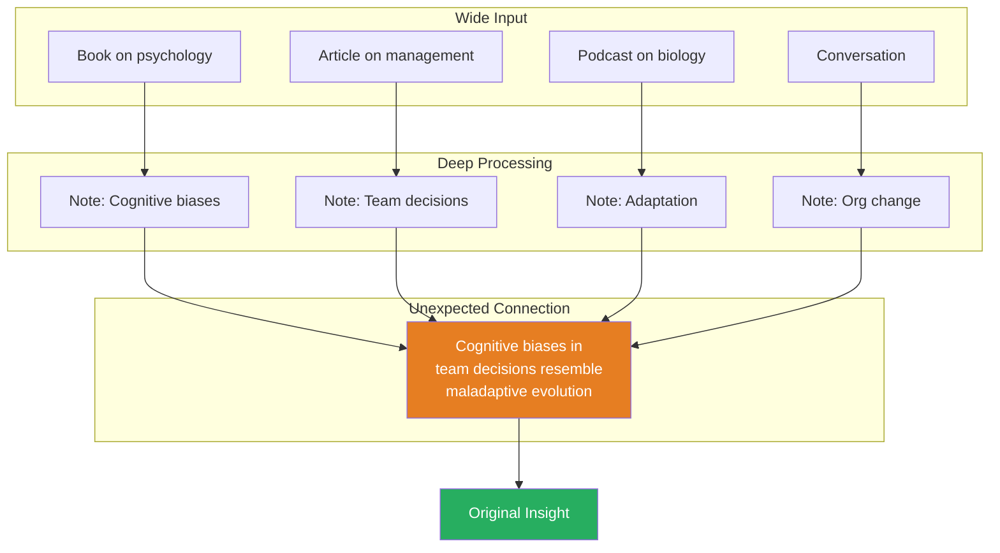

# How to Take Smart Notes — Sönke Ahrens

> Niklas Luhmann was a German sociologist who published 70 books and over 400 academic articles across an extraordinary range of disciplines — law, economics, politics, art, religion, ecology, media.
> His secret was not genius, long hours, or obsessive discipline. It was a wooden box of index cards.
> Sönke Ahrens explains how Luhmann's "Zettelkasten" (slip-box) system works and why it transforms reading, thinking, and writing from a painful, linear grind into a self-reinforcing cycle of insight.
> The core claim is radical: **writing is not the outcome of thinking — writing IS thinking.** If you are not writing in your own words, you are not learning.
> Most people treat notes like souvenirs — proof they visited a book. Luhmann treated notes like bricks — raw material for building something new.

---

## About the Author

Sönke Ahrens is a German writer and academic who teaches philosophy of education at the University of Hamburg. He encountered Niklas Luhmann's Zettelkasten while researching academic productivity and realised the system was virtually unknown in the English-speaking world. This book — first published in German, then expanded for English audiences — brought Luhmann's method to an international audience and sparked the modern "tools for thought" movement that includes apps like Obsidian, Roam Research, and Logseq. Ahrens's contribution is not the Zettelkasten itself — that credit belongs to Luhmann. His contribution is explaining WHY it works, drawing on decades of research in cognitive psychology, learning science, and knowledge management.

---

## Key Concepts at a Glance

| Concept | One-line summary |
|---------|-----------------|
| **Zettelkasten** | A network of atomic notes connected by links — an external thinking partner |
| **Fleeting Notes** | Quick captures that must be processed or discarded within 24 hours |
| **Literature Notes** | Brief summaries of sources restated in your own words |
| **Permanent Notes** | One atomic idea, written clearly enough for someone else to understand |
| **Project Notes** | Temporary notes gathered for a specific output, discarded after |
| **Elaboration** | Restating ideas in your own words — the engine of deep understanding |
| **The Collector's Fallacy** | Mistaking highlighting and filing for genuine learning |
| **Bottom-Up Structure** | Letting topics emerge from connected note clusters, not imposed categories |
| **Structure Notes** | Tables of contents that serve as entry points to note clusters |
| **Retrieval Practice** | Recalling from memory strengthens learning far more than rereading |
| **Spacing Effect** | Time gaps between encounters with an idea deepen retention |
| **Interleaving** | Mixing topics in a single session produces better long-term learning |
| **Bridge Notes** | Notes that explicitly connect two seemingly unrelated clusters |
| **Synthesis Notes** | Notes that synthesise the relationship between multiple permanent notes |

---

## The Big Idea

- <b style="color: #2980b9">Most note-taking systems are filing cabinets — they store information in categories. The Zettelkasten is a conversation partner — it generates new ideas by forcing connections between notes.</b>
- The system separates capture (fast, low-effort) from processing (slow, high-effort) and makes processing the core intellectual activity
- <b style="color: #27ae60">One idea per note. Written in your own words. Always connected to at least one existing note. That is the entire system.</b>
- The Zettelkasten is not a productivity hack — it is a thinking system that changes how you engage with information at a fundamental level
- Every element — the one-idea-per-note rule, the forced rewriting, the bottom-up connections — maps to a specific finding in learning research
- The system compounds: early effort produces slow returns, but after a critical mass of connected notes, the network begins generating insights you did not plan

### Why Conventional Note-Taking Fails

*The way you were taught to take notes in school is not just unhelpful — it actively prevents the deep processing that produces real understanding.*

Most people take notes the way they were taught: copy what the teacher says, file it by subject, review before the test. This approach has three fatal flaws:

- **It treats your brain as a storage device**
  - Your brain is terrible at storage — it forgets most of what it encounters within days
  - Using it as a filing cabinet is like using a Ferrari as a paperweight
  - The brain is designed for generating ideas, not archiving them
- **It keeps ideas in silos**
  - Notes filed in "Psychology" never meet notes filed in "Management"
  - The best ideas live at the intersection of domains
  - Innovation happens when unrelated concepts collide — silos prevent that collision
- **It requires retrieval from the same context**
  - You can only find a note if you remember where you filed it
  - If you cannot remember the category, the note is effectively lost
  - This makes serendipitous rediscovery nearly impossible

The Zettelkasten solves all three:
- It externalises storage (so your brain can focus on thinking)
- It connects ideas across domains (so insights emerge from unexpected combinations)
- It uses links instead of categories (so every note is findable from multiple entry points)

---

### The Paradigm Shift

*Ahrens asks you to abandon everything you believe about what notes are for — and that shift changes not just how you take notes but how you think.*

| Old Paradigm | New Paradigm |
|-------------|-------------|
| Notes are a record of what I have read | Notes are a product of what I have THOUGHT |
| Notes should capture the author's words | Notes should capture MY understanding |
| Notes belong in categories | Notes belong in NETWORKS |
| The goal is to store information | The goal is to generate new ideas |
| I organise notes when I take them | I let organisation emerge from connections |
| A good note is comprehensive | A good note is atomic — one idea only |
| I take notes for later reference | I take notes for current thinking |
| My notes are finished when I write them | My notes are alive — they gain value as connections grow |

This table captures the fundamental reorientation. Every row represents a habit you must consciously reverse.

The filing cabinet isolates knowledge into silos. The Zettelkasten weaves knowledge into a network where every idea can reach every other idea.

---

## Part 1: The Four Note Types

*Ahrens identifies four distinct types of notes — and most Zettelkasten failures come from confusing them.*

Understanding the differences between note types is critical. Each serves a specific function in the workflow, and treating one type as another breaks the system.

Each note type is a stage in the processing pipeline — raw input gradually refined into connected knowledge.

| Note Type | Purpose | Lifespan | Where It Lives | Example |
|-----------|---------|----------|---------------|---------|
| **Fleeting** | Capture a thought before it disappears | Hours — process or discard within 24h | Phone, pocket notebook, scratchpad | "Interesting parallel between chunking and Zettelkasten links" |
| **Literature** | Brief summary of a source's key ideas in YOUR words | Permanent — stored with bibliographic reference | Reference manager or dedicated file | "Oakley argues focused/diffuse modes alternate. Key: diffuse requires disengagement." |
| **Permanent** | One atomic idea, written clearly for someone else | Permanent — the building blocks of the slip-box | The slip-box (Obsidian vault, card box) | "Learning requires elaboration — restating ideas forces deeper processing than rereading." |
| **Project** | Notes collected for a specific output | Temporary — discarded or archived after | Project folder | Outline for "Chapter 3: Why Rereading Fails" |

---

### Fleeting Notes

*Fleeting notes are the most dangerous note type — they feel productive but are worthless if not processed within a day.*

- A fleeting note is a reminder, not a thought — it says "I had an idea about X" but does NOT contain the developed idea itself
- If you capture 10 fleeting notes during the day and do not process them that evening, you will look at them tomorrow and think: "What did I mean by this?"
- <b style="color: #e74c3c">Every fleeting note must be either converted into a permanent note or discarded within 24 hours. There is no middle ground.</b>
- Keep them ultra-short: 1-2 sentences maximum
- Include enough context to jog your memory: "The idea about feedback loops — connects to Coyle's Culture Code chapter on safety"
- The danger lies in the illusion of productivity — ten fleeting notes feel like ten captured ideas, but without processing they are ten empty gestures

> [!example] The Overflowing Pocket Notebook
> - A reader keeps a Moleskine notebook and jots down ideas throughout the day
> - By Friday, the notebook has 30 fleeting notes from the week
> - She sits down to process them on Saturday — and cannot remember what half of them meant
> - "Interesting thing about framing" — framing of what? In what context? What was the insight?
> - The notes that were captured with one or two words of context ("framing — Cialdini ch. 6, the wine-tasting experiment") survive. The rest are dead.
> **The lesson:** A fleeting note without context is just clutter. Add enough words to reconstruct the idea, or do not bother capturing it at all.

Ahrens emphasises that the speed and convenience of fleeting notes is their greatest strength and their greatest trap:
- They are frictionless to create — which encourages capture
- But frictionless capture without disciplined processing produces a pile of mystery fragments
- <b style="color: #e74c3c">The notebook full of unprocessed fleeting notes is not a knowledge system — it is a graveyard of intentions</b>

---

### Literature Notes

*Literature notes bridge the gap between what you read and what you think — they capture the author's ideas in your formulation, not theirs.*

- Written during or immediately after reading
- Summarise the key ideas of the source in YOUR words — not quotes, not copies
- Stored permanently alongside the bibliographic reference
- <b style="color: #2980b9">The purpose is comprehension, not archival</b> — if you cannot restate the idea without looking at the original text, you have not understood it
- Keep them brief — 1-3 sentences per key idea from a chapter
- They answer the question: "What did the author argue, and why?"
- A literature note is not a permanent note — it is a stepping stone toward one

The distinction between literature notes and permanent notes trips up most beginners:
- A literature note says: "Kahneman argues that System 1 makes fast decisions based on heuristics"
- A permanent note says: "Fast decisions use mental shortcuts that trade accuracy for speed — and these shortcuts are invisible to the person using them"
- The literature note references the source. The permanent note references your thinking.

> [!tip] Core Insight
> Literature notes are about THE SOURCE. Permanent notes are about YOUR THINKING. Confusing these two types is the single most common Zettelkasten failure.

> [!example] The Difference in Practice
> - A student reads a chapter of Kahneman's Thinking, Fast and Slow about the anchoring effect
> - Her literature note reads: "Kahneman ch. 11 — anchoring effect. Judges gave shorter sentences when they had just rolled low dice. Even experts are influenced by arbitrary numbers."
> - Her permanent note, written later, reads: "Decision-making is anchored by whatever number appears first, even when that number is clearly irrelevant. This means the first price quoted in a negotiation shapes all subsequent offers — not because the number is informative, but because the brain cannot ignore it."
> - The literature note captures Kahneman. The permanent note captures her understanding.
> **The lesson:** Literature notes are about someone else's ideas. Permanent notes are about what those ideas mean to you.

---

### Permanent Notes

*The permanent note is where intellectual work happens — this is not capturing, this is thinking.*

A good permanent note has these characteristics:

- **One idea only** — if you find yourself writing "AND" or "ALSO," split the note
- **In your own words** — not a quote, not a paraphrase, YOUR formulation
- **Self-contained** — someone who has not read the source should understand it
- **Linked** — connected to at least one other permanent note
- **Brief** — 3-8 sentences, long enough to be useful, short enough to be atomic

> [!example] Good vs Bad Permanent Notes
> - **Good:** "Retrieval practice is more effective than rereading. Attempting to recall information from memory strengthens neural pathways more effectively than re-exposure. Students who test themselves retain more than students who reread — even when the rereading group spends more total time. The mechanism: retrieval forces the brain to reconstruct the memory. Rereading merely creates familiarity, which the brain mistakes for understanding."
> - **Bad:** "Learning stuff. Oakley says retrieval practice is better than rereading. She also talks about the Pomodoro Technique and chunking and the Einstellung Effect and sleep and exercise and spaced repetition."
> - The good note has one idea, uses original formulation, is self-contained, and explains the mechanism
> - The bad note has multiple ideas, uses the author's words, is not self-contained, and explains nothing
> **The lesson:** A permanent note that contains six ideas is actually six unfinished permanent notes crammed together. Split them.

<b style="color: #27ae60">The test for a permanent note: could someone who has never read the source understand this note? If not, rewrite it until they could.</b>

Why the one-idea rule matters:
- Atomic notes can be recombined in unlimited ways — a note containing six ideas can only be used as a block
- When you connect a multi-idea note, the connection is ambiguous — which idea are you linking to?
- Splitting forces you to clarify each idea individually, which is itself a form of elaboration
- A slip-box of 1,000 atomic notes is far more powerful than a slip-box of 200 multi-idea notes

---

### Project Notes

*Project notes are temporary scaffolding — useful during a writing project, discarded afterward.*

- Collected for a specific output: a paper, article, presentation, or decision
- Include outlines, rough drafts, comments, reminders specific to that project
- <b style="color: #e74c3c">Do not mix project notes with permanent notes</b> — project notes live in a separate space and are archived or deleted when the project ends
- The permanent notes that fed the project remain in the slip-box for future use
- The project notes that served their purpose do not clutter the permanent collection

The key distinction:
- Permanent notes are context-free — they work in any project
- Project notes are context-bound — they only make sense within one project
- Mixing them degrades both: permanent notes get cluttered with project-specific details, and project notes get lost in the general collection

---

## Part 2: The Zettelkasten Workflow

*The workflow is deceptively simple — five steps that turn passive reading into compounding knowledge.*

### Step 1: Read with a Pen

*The pen transforms reading from passive absorption into active engagement — and that transformation is where learning begins.*

- Never read without writing — capture brief literature notes as you go
- Keep them short — the goal is to identify key ideas, not to transcribe
- <b style="color: #e74c3c">The pen is not for marking the text. It is for thinking about the text.</b>
- When you write while reading, you activate a different cognitive mode than passive scanning
- Your brain shifts from "absorbing" to "evaluating" — and evaluation is where learning happens
- The difference between reading with a pen and reading without one is the difference between a conversation and a lecture — one is active, the other is passive
- "I only do what is easy" — Luhmann's principle applied even here: writing while reading made processing easier later

> [!example] Feynman's Notebooks
> - Richard Feynman kept detailed notebooks throughout his career
> - When a historian asked to study Feynman's "notes on his thought process," Feynman corrected him
> - "They aren't a record of my thinking process. They ARE the thinking process."
> - The act of writing was not documentation — it was cognition itself
> - Luhmann said the same thing about his slip-box: the cards were not a record of thoughts he had already finished. They were the place where thinking happened.
> **The lesson:** Writing is not a downstream activity that follows thinking. Writing IS the thinking. If you are not writing, you are not fully thinking.

The parallel between Feynman and Luhmann is striking:
- Both were prolific across multiple domains
- Both credited their writing practices — not their raw intelligence — for their productivity
- Both described their notebooks and cards as extensions of their minds, not records of them
- The implication: intelligence is not a fixed capacity but a practice that can be supported by tools

---

### Step 2: Process into Permanent Notes

*This step is the bottleneck — and the treasure. Everything before it is preparation. Everything after it is assembly.*

- At the end of the day or reading session, review fleeting and literature notes
- For each idea worth keeping, write one permanent note in your own words
- <b style="color: #2980b9">The test: could someone who has not read the source understand this note? If not, rewrite it.</b>
- This step is where the intellectual work happens — and where most people cut corners
- The processing step converts passive input into active knowledge
- Without it, you have a collection. With it, you have a thinking system.

> [!abstract] The Daily Processing Routine
> 1. Set aside 15-30 minutes each evening (non-negotiable)
> 2. Review all fleeting notes captured during the day
> 3. For each one worth keeping, write a permanent note: one idea, your words, self-contained
> 4. Discard any fleeting notes you cannot reconstruct or that no longer seem important
> 5. File each permanent note with at least one link to an existing note
> 6. Read 2-3 existing notes in the cluster where you are filing — this triggers connections

<b style="color: #e74c3c">The single most common failure point is skipping step 2. People capture all day but never process. Notes pile up. Processing becomes overwhelming. The system collapses.</b>

Why the evening routine works:
- The ideas are still fresh — you read them today, so context is intact
- The interval between reading and processing creates a small spacing effect
- A fixed time removes the decision cost of "when should I do this?"
- 15-30 minutes is short enough to be sustainable but long enough to be meaningful

---

### Step 3: Connect

*The connection step is where the Zettelkasten earns its name — without links, it is just a pile of notes.*

- Before filing a permanent note, ask: what existing notes does this relate to?
- Add explicit links — the connection is where insight happens
- <b style="color: #27ae60">A note without connections is a dead note. The value of the system is in the network, not the individual cards.</b>
- Connections are not just "related to" — they should explain HOW and WHY two ideas relate
- The act of connecting forces you to think about relationships between ideas — which is itself a form of learning
- Over time, the connections become more interesting than the notes themselves
- Luhmann did not just link — he wrote a sentence or two explaining why the linked notes were related

> [!example] The Cross-Domain Connection That Became a Paper
> - Luhmann was reading about biological evolution when he noticed a structural parallel to legal systems
> - Both evolve through variation, selection, and retention — random changes are tested, the useful ones survive
> - A folder system would have filed "biology" in one place and "law" in another
> - The Zettelkasten's link-based structure allowed the connection to emerge naturally
> - That single connection became a published paper on the evolution of legal norms
> - The paper could not have existed without the cross-domain link — neither the biology notes nor the law notes contained the insight alone
> **The lesson:** The most original ideas do not come from deeper expertise in one domain. They come from unexpected connections between two domains. The Zettelkasten makes those connections visible.

> [!example] The Unexpected Link Between Negotiation and Marketing
> - A knowledge worker writes a permanent note about Chris Voss's "mirroring" technique from Never Split the Difference
> - While filing it, she notices a connection to an older note about copywriting: both techniques use repetition to create a sense of rapport and agreement
> - She writes a bridge note: "Mirroring in conversation and repetition in copy both exploit the brain's tendency to feel comfortable with the familiar"
> - Six months later, when preparing a presentation on persuasion, this bridge note becomes the central argument
> **The lesson:** The connections you make while filing notes are seeds. Some lie dormant for months before they germinate into something original.

---

### Step 4: Let Structure Emerge

*This step is the hardest for planners to accept: do not impose categories. Let topics reveal themselves.*

- Do not create folders or categories from the top down
- Instead, let clusters of connected notes reveal topics, arguments, and gaps
- When a cluster reaches critical mass, it becomes the skeleton of an article, chapter, or book
- <b style="color: #e74c3c">This is the opposite of how most people write. Most people start with a thesis and look for supporting evidence — confirmation bias. The Zettelkasten starts with evidence and discovers what thesis it supports — genuine inquiry.</b>

The bottom-up approach has three advantages over top-down planning:
- It eliminates confirmation bias — you discover what the evidence supports, not what you hoped it would support
- It produces richer arguments — because the evidence was collected without a predetermined conclusion
- It surfaces topics you did not expect — the clusters that form are often more interesting than any topic you would have chosen deliberately

> [!example] Structure Emerging in Practice
> - A reader has been reading books about leadership, psychology, and communication for six months
> - Without planning it, she notices that 15 of her permanent notes cluster around a theme: "Why honest feedback fails in organisations"
> - Notes from [[Crucial Conversations - Kerry Patterson|Crucial Conversations]], [[The Culture Code - Daniel Coyle|The Culture Code]], and her own workplace observations all converge on the same pattern
> - She did not set out to write about feedback — the Zettelkasten revealed it as a topic worth exploring
> - Now she has a ready-made outline and supporting evidence, generated bottom-up from her reading
> **The lesson:** The best topics for writing are not chosen — they are discovered. The Zettelkasten surfaces what your reading has been circling around, even when you have not noticed it yourself.

---

### Step 5: Write from Your Notes

*By the time you sit down to write, the intellectual work is already done — writing becomes assembly, not creation.*

When a cluster is ready, the writing process becomes straightforward:

- Pull all notes in the relevant cluster
- Arrange them in a logical sequence — this IS your outline
- Write a rough draft, using each note as a paragraph seed
- Fill in transitions and arguments
- Revise

```mermaid
flowchart TD
    subgraph TRAD ["Traditional Process"]
        T1["Choose topic"] --> T2["Research<br>(starting from zero)"]
        T2 --> T3["Outline<br>(top-down)"]
        T3 --> T4["Write<br>(agonising blank page)"]
        T4 --> T5["Revise"]
    end
    subgraph ZK ["Zettelkasten Process"]
        Z1["Read widely<br>(ongoing)"] --> Z2["Process into<br>permanent notes<br>(ongoing)"]
        Z2 --> Z3["Notice cluster<br>reaching critical mass"]
        Z3 --> Z4["Pull cluster<br>Arrange into argument"]
        Z4 --> Z5["Write<br>(assembling, not creating)"]
        Z5 --> Z6["Revise"]
    end
    style T4 fill:#e74c3c,color:#fff
    style Z5 fill:#27ae60,color:#fff
```

<b style="color: #27ae60">Steps 1-2 of the workflow are done BEFORE you have a writing project. By the time you sit down to write, you already have a rich network of processed, connected ideas. You never start from a blank page.</b>

The red node in the traditional process is where writer's block lives. The green node in the Zettelkasten process is where that block disappears — because you are assembling pre-processed ingredients, not generating ideas from nothing.

> [!tip] Core Insight
> Writer's block is not a creativity problem. It is a workflow problem. If you sit down to write with nothing but an idea and a blank page, your brain must simultaneously generate content, organise structure, evaluate quality, and maintain motivation. The Zettelkasten eliminates the blank page entirely.

Ahrens draws a useful analogy:
- Writing from a blank page is like cooking without ingredients — you must shop, prep, and cook simultaneously
- Writing from a Zettelkasten is like assembling a meal from pre-prepped ingredients — the hard work was distributed across many small sessions
- The professional chef preps ingredients hours before service. The Zettelkasten user processes notes days, weeks, or months before writing.

---

## Part 3: Why Most Note-Taking Fails

*Ahrens identifies three traps that explain why most people read extensively but retain almost nothing.*

### Trap 1: The Collector's Fallacy

*Highlighting, bookmarking, and filing feels productive but produces no understanding.*

- <b style="color: #e74c3c">The act of highlighting a sentence does not engage the brain in any meaningful processing. It is the illusion of learning.</b>
- You feel like you have captured something, but your brain has done no work
- Studies consistently show that students who highlight perform no better on tests than students who simply read without highlighting
- The Collector's Fallacy extends to digital tools:
  - Saving articles to Pocket
  - Bookmarking web pages
  - Starring emails
  - Clipping to Evernote
  - All create the feeling of progress without the reality of understanding
- The mechanism behind the fallacy: the brain confuses the act of marking something as "important" with the act of understanding it
- <b style="color: #2980b9">Recognition is not recall</b> — you can recognise a highlighted passage without being able to reproduce or apply the idea

> [!example] The Highlighting Study
> - Cognitive psychologist Jeffrey Karpicke ran an experiment with university students studying textbook chapters
> - One group highlighted and reread their highlights — the most popular study technique
> - Another group read once, then closed the book and tried to recall what they had read
> - The highlighting group was MORE CONFIDENT they had learned the material
> - But on the actual test, the retrieval group dramatically outperformed them
> - The highlighting had created a false sense of familiarity: students recognised the marked passages and mistook recognition for understanding
> **The lesson:** The most popular study technique is the least effective. The least popular — forced recall — is the most effective. The Zettelkasten's permanent note step IS forced recall.

---

### Trap 2: The Planning Trap

*Starting with a thesis and then looking for supporting material produces confirmation bias, not discovery.*

- When you have a thesis first, you unconsciously select evidence that supports it and ignore evidence that contradicts it
- <b style="color: #27ae60">The Zettelkasten reverses this: you collect and connect ideas first, then see what arguments emerge from the connections</b>
- This is why Luhmann could write about such a wide range of topics — he did not start with a topic and research it
- He noticed clusters of connected notes forming around a topic and followed them
- The bottom-up approach produces genuine inquiry rather than post-hoc justification

The planning trap is pervasive in academic writing:
- Students are taught to choose a thesis, then find evidence
- This creates a prosecution mentality — build the case for a predetermined conclusion
- The Zettelkasten user approaches like a detective — collect evidence first, then see what story it tells
- The detective approach produces more honest, more nuanced, and more original conclusions

> [!example] The Dissertation Student's Mistake
> - A PhD student chooses a thesis: "Social media increases political polarisation"
> - She then spends six months finding evidence to support this claim
> - Confirmation bias ensures she finds plenty of supporting evidence and unconsciously downplays counterevidence
> - A Zettelkasten user would approach differently: collect and process notes on social media, political behaviour, and polarisation from multiple perspectives
> - After months of connected note-taking, the cluster might reveal a more nuanced thesis: "Social media amplifies existing polarisation in some contexts while bridging divides in others"
> - The bottom-up thesis is richer because it was discovered, not imposed
> **The lesson:** If you already know what you want to prove, you are not researching — you are prosecuting. Let the evidence lead.

---

### Trap 3: Category Imprisonment

*Filing notes into rigid folders prevents the cross-domain connections that produce original ideas.*

- The best ideas live at the intersection of different domains
- A note about "feedback loops" might be relevant to biology, management, psychology, AND economics — but a folder system forces you to choose one
- <b style="color: #2980b9">The Zettelkasten uses links instead of folders, allowing every note to exist in multiple contexts simultaneously</b>
- Categories are imposed from the outside. Links reflect how ideas actually relate to each other.
- The folder model mirrors how libraries organise books — by subject
- The link model mirrors how the brain organises knowledge — by association

| Note-Taking Approach | Strength | Fatal Weakness |
|---------------------|----------|---------------|
| **Highlighting** | Fast, easy | Zero processing — no learning occurs |
| **Summarising in margins** | Some processing | Trapped in the book — cannot be reconnected |
| **Folder-based notes** | Organised, retrievable | Category imprisonment — prevents connections |
| **Tag-based notes** | Flexible categorisation | Tags do not explain relationships |
| **Zettelkasten** | Forces processing + enables connection | Requires discipline and initial investment |

Each approach in this table trades convenience for depth. Only the Zettelkasten demands both processing AND connection — which is why it is the only approach that compounds over time.

The Zettelkasten dominates every cognitive dimension — particularly idea generation and cross-domain connection, where simpler systems score near zero.

---

### The Highlighting Epidemic

*Ahrens reserves his sharpest criticism for the most popular study technique in the world.*

Research by cognitive psychologist Jeffrey Karpicke demonstrated:
- Students who highlighted and reread performed NO BETTER on tests than students who simply read without marking
- Students who practised retrieval (closed the book and recalled) dramatically outperformed both groups
- <b style="color: #e74c3c">The most popular study technique is the least effective. The least popular technique is the most effective.</b>

The reason is neurological:
- Highlighting does not engage the brain in any deep processing
- It creates a visual marker ("I have been here") that the brain later interprets as understanding ("I know this")
- But recognition is not recall — you can recognise a word in a foreign language without being able to produce it
- Recognition is passive, recall is active
- Only active processing produces durable learning

> [!example] The Knowledge Worker's Highlighting Problem
> - A manager saves 200 articles to Pocket over the course of a year
> - She stars 50 emails "for later" and bookmarks dozens of web pages
> - At the end of the year, she feels she has built a knowledge base
> - But when a colleague asks about a trend she "saved" six months ago, she cannot articulate the key insight — only that she "read something about it somewhere"
> - The information was saved but never processed — it sits in digital limbo
> - The Zettelkasten replaces this hollow accumulation with genuine intellectual work: you must THINK about every idea, rewrite it, and connect it
> **The lesson:** Collecting is not learning. Processing is learning. If you would not write a permanent note about it, you did not learn it.

---

### Information Overload Is a Processing Problem

*The modern complaint about "information overload" misdiagnoses the problem entirely.*

- The issue is not that there is too much information — the issue is that we have no system for processing it
- Luhmann consumed vast amounts of information — books, articles, lectures — without ever feeling overloaded
- His slip-box processed information as it arrived, converting raw input into structured knowledge
- <b style="color: #27ae60">Information overload is a processing problem, not a volume problem. With the right system, more input produces more insight — not more overwhelm.</b>
- The Zettelkasten converts the firehose of modern information into a manageable stream: read, capture, process, connect, forget about it (the system remembers for you)
- Without the system, the firehose stays a firehose

The analogy Ahrens draws is useful:
- A kitchen without a sink, stove, or counter is overwhelmed by any amount of groceries
- A kitchen with proper equipment can handle enormous quantities of raw ingredients and convert them into meals
- The Zettelkasten is the kitchen — the equipment that converts raw information into usable knowledge

---

## Part 4: The Science Behind Smart Notes

*Ahrens does not just describe the system — he explains why it works, drawing on decades of cognitive science research.*

### Elaboration

*The most powerful learning technique has a name — and the Zettelkasten makes it automatic.*

- <b style="color: #2980b9">Elaboration</b> is the most powerful learning technique — restating ideas in your own words and connecting them to what you already know
- This forces the brain to process information at a deeper level than mere recognition
- Writing a permanent note IS elaboration — you cannot write "one idea in your own words" without deeply engaging with the material
- <b style="color: #27ae60">The Zettelkasten turns elaboration from an occasional study technique into a daily habit embedded in your workflow</b>
- Every time you convert a literature note into a permanent note, you are practising elaboration
- The evidence is overwhelming: students who elaborate retain dramatically more than students who reread, highlight, or summarise passively

How elaboration works neurologically:
- When you restate an idea in your own words, your brain must retrieve related concepts from long-term memory
- It must find the right language — which requires understanding, not just recognition
- It must evaluate whether your restatement accurately captures the original — which requires comparison
- Each of these sub-processes strengthens the memory trace in a different way
- The result: the idea is stored with multiple retrieval paths, making it easier to find later

---

### Retrieval Practice

*The act of trying to remember something makes you better at remembering it — and the Zettelkasten builds this into every session.*

- <b style="color: #2980b9">Retrieval practice</b> — attempting to recall information from memory — is significantly more effective for learning than rereading or reviewing
- When you sit down to write a permanent note from a literature note, you are practising retrieval
- You must recall the idea clearly enough to reformulate it — this recall strengthens the memory trace
- The Zettelkasten makes retrieval practice automatic: you do it every time you process a note
- Studies by Roediger and Karpicke show that one retrieval attempt is worth multiple rereadings for long-term retention

The mechanism:
- Rereading creates a feeling of fluency — "this is easy, so I must know it"
- But fluency is not learning — it is familiarity
- Retrieval is effortful — and the effort is precisely what strengthens the memory
- The testing effect: students who are tested remember more than students who study, even when the study group spends more total time

---

### Spacing

*Time between encounters with an idea is not wasted time — it is when the brain consolidates learning.*

- <b style="color: #2980b9">The spacing effect</b> — the brain consolidates learning during the gaps between study sessions
- The Zettelkasten naturally incorporates spacing:
  - You read today
  - You process tonight
  - You encounter the note again weeks or months later when a new note connects to it
  - Each encounter strengthens the memory
- This is not planned spaced repetition (like Anki) — it is organic spacing driven by the natural growth of the note network
- The result is the same: ideas encountered multiple times across long intervals are retained far better than ideas crammed in a single session

Why organic spacing may be even better than systematic spacing:
- In Anki, the algorithm decides when you see a card — the encounter is context-free
- In the Zettelkasten, you encounter an old note because a NEW idea connects to it — the encounter has context
- Contextual re-encounter is more meaningful than algorithmic re-encounter because it creates additional connections

---

### Interleaving

*Mixing topics in a single session feels harder — and that is exactly why it works.*

- <b style="color: #2980b9">Interleaving</b> — mixing different topics during study — produces better long-term learning than studying one topic at a time
- The Zettelkasten naturally interleaves:
  - When you process notes from a book on psychology, you might connect them to notes on management, philosophy, and biology — all in the same session
  - This mixing forces the brain to discriminate between concepts, strengthening understanding
- Interleaving feels harder in the moment — which is why students avoid it — but produces dramatically better retention and transfer
- The Zettelkasten makes interleaving effortless because the connection step naturally crosses domain boundaries

Each Zettelkasten activity maps to a proven learning mechanism — the system is not arbitrary, it is scientifically grounded.

> [!tip] Core Insight
> The Zettelkasten does not just happen to align with learning science — every element was shaped by the same cognitive forces that researchers later identified. Luhmann discovered empirically what psychologists proved experimentally.

---

## Part 5: The Luhmann Method in Practice

*Luhmann maintained his slip-box from the early 1960s until his death in 1998 — and his daily routine reveals why the system worked so well.*

### Luhmann's Productivity

*The numbers alone are staggering — but the consistency behind them is what matters.*

- 90,000 index cards accumulated over 35 years
- He did not organise by topic — he organised by connection
- Each new note was filed behind the note it most closely related to, with links to other relevant notes
- When asked how he was so productive, Luhmann said he never forced himself to work on anything he did not feel like
- His system meant there was always something to work on — another cluster of notes approaching critical mass
- He never experienced writer's block, because he never started from a blank page

> [!example] Luhmann's Astonishing Output
> - Over his career, Luhmann published 70 books and 400+ academic articles
> - His topics spanned sociology, law, economics, politics, art, religion, ecology, and mass media
> - He had no research assistants — the slip-box was his only collaborator
> - When he received a book contract, he could estimate the page count before writing — because he already knew how many connected notes he had on the topic
> - He worked regular hours, took no heroic measures, and described his work as genuinely enjoyable
> - Colleagues with similar intelligence and similar hours produced a fraction of the output
> **The lesson:** The difference was not talent or discipline. The difference was a system that made productive work the path of least resistance.

> [!example] The Contrast with His Peers
> - German academia in the 1960s-90s was not short of brilliant sociologists
> - Jürgen Habermas, Luhmann's intellectual rival, was considered equally gifted — yet produced fewer works across a narrower range
> - The difference was not intelligence or work ethic — both men were highly disciplined
> - Luhmann had a system that converted daily reading into compounding intellectual capital
> - His peers relied on memory, filing cabinets, and willpower — all of which have diminishing returns
> - Luhmann's system had increasing returns: each new note made the entire network more valuable
> **The lesson:** At equal levels of talent and effort, the person with the better system wins — and the margin grows over time.

---

### Luhmann's Daily Routine

> [!abstract] The Daily Zettelkasten Routine
> 1. **Morning:** Read — books, articles, papers. Take brief literature notes.
> 2. **Afternoon:** Process literature notes into permanent notes. One idea per card. Written in his own words.
> 3. **Before filing:** Ask: "Where does this fit? What does it connect to?" File behind the most related existing note. Add cross-reference links.
> 4. **When ready to write:** Pull a cluster of connected notes. Arrange them into an argument. Write.

- The routine was not rigid or punishing — Luhmann described it as following his curiosity
- If he was stuck on one topic, he switched to another cluster — there was always something ready
- "I never force myself to do anything I don't feel like"
- <b style="color: #27ae60">This is the Zettelkasten's deepest advantage: it makes productive work feel like play, because you are always working on what interests you most in the moment.</b>
- The system transformed willpower problems into curiosity problems — and curiosity is a far more reliable fuel than discipline

---

### The Writer's Block Cure

*Luhmann never experienced writer's block — and the reason explains why most people do.*

> [!example] Why Luhmann Never Had Writer's Block
> - Writer's block happens when you try to think and write simultaneously — generating ideas and organising them at the same time
> - Luhmann separated these processes completely across days, weeks, and months
> - By the time he sat down to write a chapter, he had 20-50 connected notes already processed and linked
> - Writing was literally arranging cards in sequence and then expanding each card into a paragraph
> - The intellectual work had been distributed across hundreds of small sessions over months
> - The writing session was assembly — snapping together pre-fabricated components
> **The lesson:** Writer's block is not a creativity deficit. It is a workflow failure. Separate the thinking from the writing, and the block disappears.

The deeper insight about writer's block:
- The blank page is terrifying because it asks you to do too many things at once: generate ideas, evaluate them, organise them, phrase them, and maintain momentum
- The Zettelkasten distributes these tasks across time:
  - Generating ideas happens while reading
  - Evaluating happens while processing
  - Organising happens while connecting
  - Phrasing happens while writing permanent notes
  - When you finally "write," only one task remains: assembly

---

## Part 6: Structure Notes and the Index

*Luhmann's slip-box had no folders. But it did have structure notes — entry points that made 90,000 cards navigable.*

### What Is a Structure Note?

- A <b style="color: #2980b9">structure note</b> is not a permanent note (one idea) — it is a table of contents for a cluster
- It lists and briefly describes related permanent notes and how they connect to each other
- Structure notes serve as entry points: you start at a structure note and follow links into a cluster
- In Obsidian, a structure note is often called a Map of Content (MOC)

| Note Type | Purpose | Content |
|-----------|---------|---------|
| **Permanent note** | Store one atomic idea | The idea, in your own words, with links |
| **Structure note** | Navigate a cluster of permanent notes | A list of related notes with brief descriptions of how they relate |
| **Index note** | Entry point for the entire system | A short list of the most important structure notes |

When a structure note becomes too long, you have found a topic worth writing about — the cluster has reached critical mass.

### When to Create Structure Notes

- <b style="color: #27ae60">Do not create structure notes prematurely — let them emerge when a cluster has 8-12+ notes that form a coherent theme</b>
- A premature structure note is just a category in disguise — it imposes order from the top down
- A timely structure note is a recognition of order that has already emerged from the bottom up
- Review your clusters periodically — when you notice a pattern, capture it in a structure note

---

### Folders vs Links

| Folders | Links |
|---------|-------|
| A note can exist in only one folder | A note can be linked from unlimited locations |
| Cross-domain connections are invisible | Cross-domain connections are explicit |
| Structure is imposed from the top down | Structure emerges from the bottom up |
| Finding a note requires remembering where you filed it | Finding a note requires following connections |
| Rigid — hard to reorganise | Fluid — reorganisation is natural |

<b style="color: #e74c3c">The folder system mirrors how libraries organise books. The link system mirrors how the brain organises knowledge.</b> Your brain does not have a "psychology" folder and a "business" folder. Your brain has connections — "this idea is like that idea." The Zettelkasten mirrors this natural architecture.

---

## Part 7: The Compound Effect of Smart Notes

*The Zettelkasten is a compound interest machine for ideas — and like compound interest, the early returns seem negligible while the long-term returns are extraordinary.*

### Year 1: Foundation
- 200-400 permanent notes
- Starting to see connections between notes
- Still feels like extra work compared to passive reading
- Occasional "aha" moments when a new note connects to an old one you had forgotten about

### Year 2: Momentum
- 500-800 permanent notes
- Clusters forming around major themes
- Reading feels richer because every book connects to existing notes
- First outputs (articles, presentations, decisions) generated directly from note clusters

### Year 3: Compounding
- 1,000+ permanent notes
- The system begins generating ideas YOU did not expect — connections emerge that you never consciously made
- Writing becomes dramatically faster: pull a cluster, arrange, write
- You can speak fluently about any topic in your slip-box because the ideas have been processed, connected, and revisited many times

### Year 5+: The Luhmann Effect
- 2,000+ permanent notes
- The system is a genuine thinking partner — it "suggests" connections and topics
- Your intellectual output accelerates because each new input connects to a rich existing network
- You never start from zero — every project builds on a foundation of thousands of processed ideas

Connections grow faster than notes (network effect), and insights accelerate even faster — the Zettelkasten's compound returns become exponential after year 2.

The colour shift from red to blue mirrors the experience: what starts as effortful investment gradually becomes effortless returns.

> [!example] The 90,000-Card Proof
> - After 90,000 notes over 35 years, Luhmann could write a book proposal and tell the publisher the approximate page count
> - He knew exactly how many connected notes he had on any given topic
> - His slip-box did not just store his thinking — it became a second brain that could generate outputs he had not planned
> - A note about cybernetics from 1968 could connect to a note about art theory from 1985 — creating an insight neither note contained alone
> - The longer the practice continued, the more powerful the system became
> **The lesson:** The compound effect of smart notes is the most powerful intellectual investment available. Small daily deposits into a connected knowledge base produce extraordinary returns over years.

---

## Part 8: The Zettelkasten and Creativity

*Ahrens makes a compelling case that the Zettelkasten is not just a learning tool — it is a creativity engine.*

The most original ideas come not from blank-slate brainstorming but from unexpected connections between existing ideas.

### The Creativity Sequence

- **Absorb widely** — Read across domains. Take notes on everything interesting.
- **Process deeply** — Convert each interesting idea into a permanent note, in your own words.
- **Connect deliberately** — Link each note to existing notes. Look for surprising connections.
- **Encounter accidentally** — As your slip-box grows, you stumble on connections you did not plan:
  - A psychology insight linked to an engineering principle
  - A historical pattern connected to a management challenge
  - A philosophical argument that illuminates a design problem
- **Synthesise intentionally** — When a surprising connection emerges, explore it. Write about it. This is where original ideas are born.

> [!example] How Luhmann Made Cross-Domain Connections
> - Luhmann was a sociologist, but his slip-box contained notes from biology, cybernetics, philosophy, linguistics, art, and theology
> - His most original contributions came from connecting ideas across these domains
> - He applied biological evolution concepts to legal systems
> - He used cybernetic feedback loops to explain social structures
> - He drew on philosophical epistemology to reframe sociological methodology
> - A folder system would have kept these domains completely separate
> - The link-based Zettelkasten let them collide — and the collisions produced original scholarship
> **The lesson:** Creativity is not about having original thoughts from nothing. It is about making original connections between existing thoughts. The Zettelkasten is a connection engine.

### The Creativity Mechanism

Why does the Zettelkasten produce more creative output than brainstorming?

- **Brainstorming draws from what is currently in working memory** — a tiny fraction of what you know
- **The Zettelkasten draws from everything you have ever processed** — a vast, interconnected network
- Brainstorming favours obvious associations. The Zettelkasten surfaces non-obvious ones.
- <b style="color: #27ae60">Creativity is not about having original thoughts. It is about making original connections between existing thoughts. The Zettelkasten is a connection engine.</b>

The orange node is where the magic happens — four independent notes from four different domains collide to produce an insight that none of them contained alone.

---

## Part 9: The Role of Willpower and Motivation

*Ahrens argues that most productivity advice gets motivation backwards — and the Zettelkasten corrects the error.*

### Why Willpower Is the Wrong Tool

- Most productivity systems rely on willpower: force yourself to sit down, force yourself to write, force yourself to stay focused
- Research on willpower (particularly Roy Baumeister's work on ego depletion) suggests willpower is a depletable resource
- <b style="color: #e74c3c">A system that requires constant willpower is a system that will eventually fail</b>
- The Zettelkasten succeeds because it reduces the need for willpower:
  - You never face a blank page (so you do not need willpower to start)
  - You always have multiple clusters to work on (so you can follow your interest)
  - Small daily processing sessions feel manageable (so you do not need heroic effort)
  - The feedback loop of connecting notes is inherently rewarding (so motivation is intrinsic)

> [!tip] Core Insight
> Luhmann never forced himself to work on anything he did not feel like. The system gave him the freedom to follow his curiosity — and that curiosity, not discipline, was the engine of his productivity.

---

### The Motivation Flywheel

*The best systems do not require motivation — they generate it.*

- Good systems create their own motivation:
  - You process a note → you see a connection → you feel an insight → you want to process another note
  - The more notes you have, the more connections you find, the more rewarding the process becomes
- <b style="color: #27ae60">The Zettelkasten is self-reinforcing: early effort creates structures that make future effort easier and more enjoyable</b>
- This is the opposite of most study methods, which become more tedious as the material accumulates

The flywheel analogy is precise:
- A flywheel is hard to start — each push requires effort and produces little visible movement
- But after enough pushes, momentum takes over — the wheel spins with minimal input
- The Zettelkasten flywheel: the first 100 notes require discipline, but after 500 the system begins pulling you in
- By 1,000 notes, the act of connecting becomes genuinely pleasurable because every new note triggers multiple "aha" moments

---

## Part 10: Common Objections and Mistakes

*Ahrens anticipates the resistance his readers will feel — and addresses each objection directly.*

### "This sounds like a lot of work."

- It is more work per book than passive reading — but the work compounds
- After a year, you have a searchable, connected knowledge base that produces insights automatically
- Passive reading for a year produces nothing except a vague sense of having read a lot
- Consider the maths: 20 books a year with smart notes = 2,000+ connected ideas after 10 years versus 300 vague memories from 30 books a year without them
- The real question: is reading without processing actually reading, or is it entertainment?

---

### "I don't write papers. Why do I need this?"

- You do not need to be an academic
- Anyone who reads, attends meetings, or makes decisions based on information benefits from processing that information into connected, retrievable notes
- The output can be: better questions in meetings, clearer emails, more informed decisions, more interesting conversations
- The Zettelkasten is not a writing tool — it is a thinking tool that happens to make writing easier

---

### "I already use [Evernote / Apple Notes / Google Docs]."

- The tool does not matter — the practice matters
- If your notes are highlights and copies rather than reformulations in your own words, and if they live in isolation rather than connected networks, you have a filing cabinet, not a thinking system
- You can implement the Zettelkasten in any tool — the question is whether you do the intellectual work
- <b style="color: #e74c3c">Switching tools without changing practices is rearranging deck chairs</b>

---

### "I tried it and it didn't stick."

- The most common reason: trying to process too much at once
- People read a whole book, take 50 literature notes, then feel overwhelmed trying to convert all of them into permanent notes
- The fix is radical simplicity: one permanent note per day

> [!abstract] The Minimum Viable Zettelkasten
> 1. Start with ONE permanent note per day
> 2. That is 365 ideas per year — more than most people produce in a decade of passive reading
> 3. Keep each note to one idea, 3-8 sentences
> 4. Link each note to at least one existing note
> 5. Scale up only after the daily habit is established
> 6. After 100 notes, you will start seeing connections
> 7. After 500, clusters will emerge
> 8. After 1,000, you will never face a blank page again

---

### "What if I write a note that turns out to be wrong?"

- Good — that is how learning works
- A Zettelkasten is not a database of truths — it is a thinking tool
- When you discover that a note is wrong, write a new note correcting it and link them together
- The correction process IS the learning
- <b style="color: #2980b9">The most valuable notes in your slip-box may be the ones you later revised — because the revision trail IS your intellectual development made visible</b>

---

## Part 11: Implementation Mistakes

*These are the errors that cause most Zettelkasten attempts to fail — recognise them early.*

| Mistake | Why It Happens | How to Fix It |
|---------|---------------|--------------|
| **Copying instead of reformulating** | Easier to copy than rewrite | Force yourself: use your own words. If you cannot, you do not understand it yet. |
| **Notes that are too long** | Trying to capture everything from a chapter | One idea per note. If it contains two ideas, split it. |
| **No connections** | Filing notes and moving on | NEVER file a note without linking it to at least one existing note. |
| **Top-down categories** | Familiar from school and work | Resist the urge to create folders. Use links and let structure emerge. |
| **Tool obsession** | The community loves tools | Spend 30 minutes choosing a tool. Spend the rest of your life writing notes. |
| **Trying to process everything** | Perfectionism | Start with one note per day. Not everything deserves a permanent note. |
| **Skipping literature notes** | Going straight from reading to permanent notes | Literature notes are the bridge — they capture the source's ideas before you process your own. |
| **Not reviewing old notes** | Out of sight, out of mind | When filing a new note, read 2-3 existing notes in the same cluster. |

Copying instead of reformulating and failing to make connections account for nearly half of all Zettelkasten failures — both are symptoms of the same root cause: skipping the intellectual work.

> [!example] The Perfectionist's Failure
> - A new Zettelkasten user decides to process every idea from every book he reads
> - He reads a 300-page book and produces 40 literature notes
> - Sitting down to convert them into permanent notes, he feels paralysed by the volume
> - He spends three hours processing the first 8, gets frustrated, and abandons the remaining 32
> - A week later, he reads another book but does not process the notes — "I'll catch up later"
> - Within a month, the system is dead
> **The lesson:** Be selective. Not every idea deserves a permanent note. The Zettelkasten is not about capturing everything — it is about processing the ideas that genuinely change how you think.

---

## Part 12: Advanced Techniques

*Once the basic workflow is established, these techniques deepen the system's power.*

### 1. Contradiction Notes

- When you encounter an idea that contradicts an existing permanent note, do not delete the old note
- Write a new note that captures the contradiction and link both
- Over time, your most interesting clusters will be the ones where you have captured genuine intellectual tension
- <b style="color: #e74c3c">The most valuable notes are not confirmations of what you already believe. They are challenges to what you believe.</b>

Contradiction notes serve a dual purpose:
- They prevent your slip-box from becoming an echo chamber of your existing views
- They create the intellectual tension from which original insights emerge
- A cluster with only agreeing notes produces a summary. A cluster with disagreeing notes produces an argument.

### 2. Question Notes

- Sometimes the most important thing to capture is not an answer but a question
- Write a permanent note that asks a question you cannot yet answer, and link it to related notes
- As your slip-box grows, you may find that the answer emerges from unexpected connections
- Question notes are attractors — they pull future reading toward them

### 3. Bridge Notes

- A bridge note explicitly connects two seemingly unrelated clusters
- "Negotiation tactics from Chris Voss → Marketing copy techniques → Both use emotional framing to shift perception"
- <b style="color: #2980b9">Bridge notes are where the most original insights live</b> — they connect domains that appear separate
- Luhmann's most cited papers grew from exactly this kind of cross-domain bridge

### 4. Decay Notes

- Some ideas have a shelf life — outdated statistics, superseded frameworks, corrected understanding
- Do not delete them — mark them as "decayed" and link to the note that replaced them
- The history of your thinking is itself valuable
- Decay notes prevent your slip-box from becoming a museum of obsolete ideas while preserving the intellectual trail

### 5. Synthesis Notes

- When a cluster reaches critical mass, write a synthesis note
- A synthesis note does not capture a single idea — it synthesises the relationship between multiple notes
- This is the step between permanent notes and finished writing
- <b style="color: #27ae60">A good synthesis note is already a rough draft of an article</b>

> [!abstract] The Monthly Synthesis Practice
> 1. Pick one cluster of 10+ notes
> 2. Write a one-paragraph synthesis: "The relationship between these notes is..."
> 3. Identify gaps — what questions remain unanswered?
> 4. Identify tensions — where do notes in this cluster disagree?
> 5. The synthesis often becomes the thesis statement of an article, presentation, or chapter

---

## Part 13: The Zettelkasten vs Other Systems

*Understanding what the Zettelkasten is NOT helps clarify what it IS.*

| System | Philosophy | Strengths | Weaknesses | Best For |
|--------|-----------|-----------|------------|---------|
| **Zettelkasten** | Bottom-up, connection-based | Generates new ideas; compounds over time | High initial investment; requires discipline | Long-term knowledge building |
| **Cornell Method** | Top-down, question-based | Good for lectures; structured review | No connection between notes; isolated | Classroom note-taking |
| **Mind Mapping** | Visual, radial | Good for brainstorming; spatial thinkers | Does not scale; no retrieval practice | Single-session brainstorming |
| **GTD** | Action-based, task-focused | Great for productivity | Not designed for learning or ideas | Task management |
| **PARA (Tiago Forte)** | Project-based, top-down | Good for project-oriented workers | Categories can imprison ideas | Short-to-medium term projects |
| **Commonplace Book** | Collection-based, chronological | Low friction; simple | No connections; no processing | Casual collection |

The Zettelkasten's outsized block reflects its unique compounding property — it is the only system where value increases with every note added, while all others plateau.

> [!example] PARA vs Zettelkasten: The Key Difference
> - Tiago Forte's PARA system (Projects, Areas, Resources, Archives) organises information by PROJECT — what you are working on now
> - The Zettelkasten organises information by CONNECTION — how ideas relate to each other
> - PARA is excellent for productivity — shipping deliverables, managing tasks, staying organised
> - The Zettelkasten is excellent for thinking — developing expertise, generating insights, building intellectual capital
> - If you need to ship a deliverable next week, use PARA
> - If you need to develop deep expertise over years, use the Zettelkasten
> - Many knowledge workers use both systems in parallel
> **The lesson:** PARA and Zettelkasten are not competitors — they solve different problems. PARA manages your projects. The Zettelkasten develops your mind.

The deeper distinction:
- PARA asks: "Which project does this serve?"
- The Zettelkasten asks: "What does this connect to?"
- PARA is useful NOW. The Zettelkasten is useful FOREVER.
- The best knowledge workers run both: PARA for execution, Zettelkasten for thinking

---

## Part 14: Smart Notes in the Digital Age

*Ahrens wrote before Obsidian and Roam existed, but the modern "tools for thought" movement is a direct descendant of his work.*

| Tool | Zettelkasten Strength | Best For |
|------|---------------------|----------|
| **Obsidian** | Bidirectional links, graph view, local files | Privacy-conscious users, Markdown lovers |
| **Roam Research** | Block-level references, daily notes, outliner | Researchers who think in fragments |
| **Logseq** | Open source, outliner + page-based, local files | Open-source advocates |
| **Notion** | Databases, templates, collaboration | Teams who need shared knowledge bases |
| **Physical index cards** | No distractions, tactile processing | Anyone who thinks better on paper |

Each tool has advantages, but none of them matter if you do not do the intellectual work. The tool is the container. The practice is the substance.

> [!example] The Tool Trap
> - A new Zettelkasten user spends three weeks configuring Obsidian — choosing themes, installing plugins, designing templates, testing CSS snippets
> - After three weeks of setup, he has written zero permanent notes
> - Meanwhile, Luhmann built the most productive academic career of the 20th century with a wooden box and handwritten index cards
> - The system's power comes from the practice — forced elaboration, atomic notes, explicit connections — not from the software
> **The lesson:** Choose a tool in 30 minutes and start writing. You can always migrate later. The tool you use matters far less than whether you use any tool at all.

> [!example] The Physical vs Digital Debate
> - Luhmann used physical index cards because that was what existed in the 1960s
> - Modern users have digital tools with search, backlinks, and graph views — features Luhmann would have loved
> - But digital tools also introduce failure modes Luhmann never faced: notification interruptions, plugin rabbit holes, format migrations
> - The physical card forces focus: you write one thing on one card, then file it
> - The digital note invites distraction: you can link, tag, template, embed, and customise endlessly
> **The lesson:** If you find yourself spending more time configuring your system than writing notes, go analogue for a month. The constraint clarifies the practice.

---

## Part 15: The Limitations of Smart Notes

*Ahrens's book has genuine weaknesses, and acknowledging them makes the advice more trustworthy.*

- **The startup cost is real**
  - The system requires sustained investment before it begins paying returns
  - Most people quit during the first few months because the compound effect has not kicked in yet
  - This is the "Year 1: Foundation" problem — the effort is high and the rewards are not yet visible
- **Not everything needs a permanent note**
  - Ahrens does not provide clear guidance on what to process and what to let go
  - In practice, you need to develop judgment about which ideas are worth preserving
  - This judgment takes time to build and cannot be taught in a book
- **The book is more theoretical than practical**
  - Ahrens explains WHY the system works (cognitive science) better than HOW to implement it (step-by-step)
  - Readers looking for a setup guide will need to supplement with online resources
  - The gap between understanding the theory and building the habit is wider than Ahrens acknowledges
- **Consistent daily practice is required**
  - Like exercise, the Zettelkasten only works if you do it regularly
  - A slip-box you add to once a month is a filing cabinet, not a thinking system
  - Ahrens does not adequately address what to do when life interrupts the daily routine
- **Physical vs digital gap**
  - Ahrens wrote primarily about physical index cards
  - The modern digital tools offer significant advantages (search, backlinks, graph view) that the original framework does not address
  - Digital tools also introduce new failure modes (distraction, overengineering) that physical cards do not

> [!tip] Core Insight
> The biggest barrier to adopting the Zettelkasten is not complexity — it is the ego. Most people believe they can hold ideas in their heads. Luhmann's response: the human mind is designed for having ideas, not for storing them. Outsource the storage. Free the mind for what it does best — thinking.

---

## The Verdict

*How to Take Smart Notes* is a short book with a disproportionately large impact. It changed how a generation of knowledge workers thinks about reading, writing, and learning. The core insight is genuinely transformative: learning is not about consuming information, it is about processing information — restating it in your own words, connecting it to what you already know, and building a network of ideas that grows more valuable with every addition. If you internalise that one idea and build a daily practice around it, this book will change how you think.

The book has real weaknesses. The writing is occasionally academic and repetitive — Ahrens circles back to the same points multiple times, which strengthens the argument but tests patience. He spends more time explaining why the system works (cognitive science) than showing how to implement it (step-by-step). The gap between "I understand the Zettelkasten" and "I actually do the Zettelkasten daily" is wider than the book acknowledges, and readers looking for a practical setup guide will need to supplement with online resources, community guides, or tools like Obsidian that provide a digital Zettelkasten environment out of the box.

The book serves heavy readers, writers, students, and knowledge workers best — anyone who consumes information regularly and wants that consumption to compound into genuine expertise rather than evaporate into vague memories. If you read 20+ books a year and cannot articulate the key ideas from most of them, this book diagnoses the problem and prescribes the cure. If you write for a living and dread the blank page, the Zettelkasten approach eliminates that dread by separating thinking from writing across time.

Compared to Tiago Forte's *Building a Second Brain*, Ahrens is more philosophically rigorous but less practically accessible. Forte gives you a system you can implement this weekend; Ahrens gives you a system you will still be refining in five years. Compared to Cal Newport's [[Deep Work - Cal Newport|Deep Work]], Ahrens provides the WHAT (what to do during deep work sessions) while Newport provides the WHEN and HOW (how to protect the time and focus). Read together, they form a complete framework: Newport tells you to protect two hours of uninterrupted focus every day, and Ahrens tells you to spend those two hours processing notes into your Zettelkasten. The combination is more powerful than either book alone.

---

## Related Reading

- [[Deep Work - Cal Newport|Deep Work]] — Processing notes into permanent form requires the deep, distraction-free focus Newport describes. Smart Notes is the WHAT; Deep Work is the HOW of creating the environment.
- [[A Mind for Numbers - Barbara Oakley|A Mind for Numbers]] — Oakley's retrieval practice, elaboration, and chunking are the cognitive mechanisms behind why the Zettelkasten works. Reading both books together creates a complete picture of effective learning.
- [[Peak - Anders Ericsson|Peak]] — Deliberate practice applied to intellectual work: processing notes IS the practice. Each permanent note is a rep that builds better mental representations.
- [[Essentialism - Greg McKeown|Essentialism]] — Focus on fewer, better inputs and process them deeply rather than collecting broadly. Essentialism provides the filter; Smart Notes provides the processing system.
- [[Thinking in Bets - Annie Duke|Thinking in Bets]] — Duke's emphasis on examining your reasoning maps to the Zettelkasten's forced elaboration: both require you to make your thinking explicit.
- [[Seeking Wisdom - Peter Bevelin|Seeking Wisdom]] — Bevelin's mental models approach pairs naturally with a Zettelkasten — each mental model becomes a permanent note that connects to examples across domains.
- [[The Effective Executive - Peter Drucker|The Effective Executive]] — Drucker's systematic approach to knowledge work is the management equivalent of Luhmann's systematic approach to intellectual work.
- [[Antifragile - Nassim Nicholas Taleb|Antifragile]] — The Zettelkasten itself is antifragile: every new input makes the system stronger. Random encounters with old notes produce unexpected insights. Disorder produces order.
- [[Influence - Robert Cialdini|Influence]] — Reading Cialdini with smart notes means each persuasion principle becomes a permanent note connected to real-world examples from other books.
