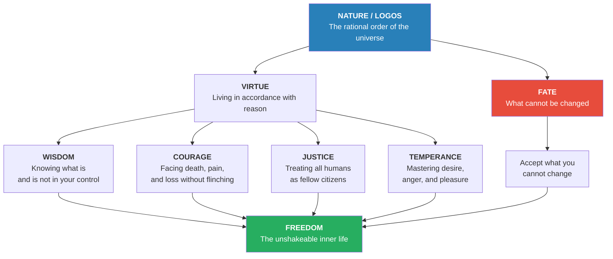
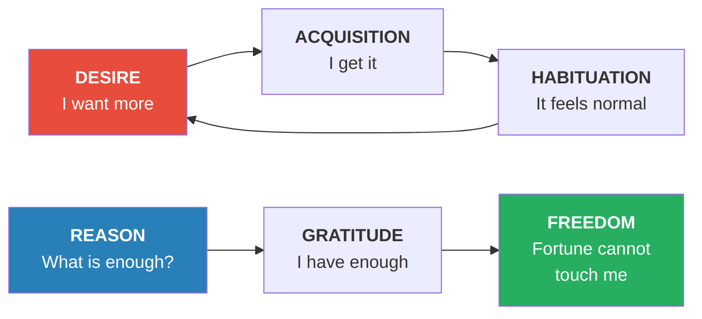
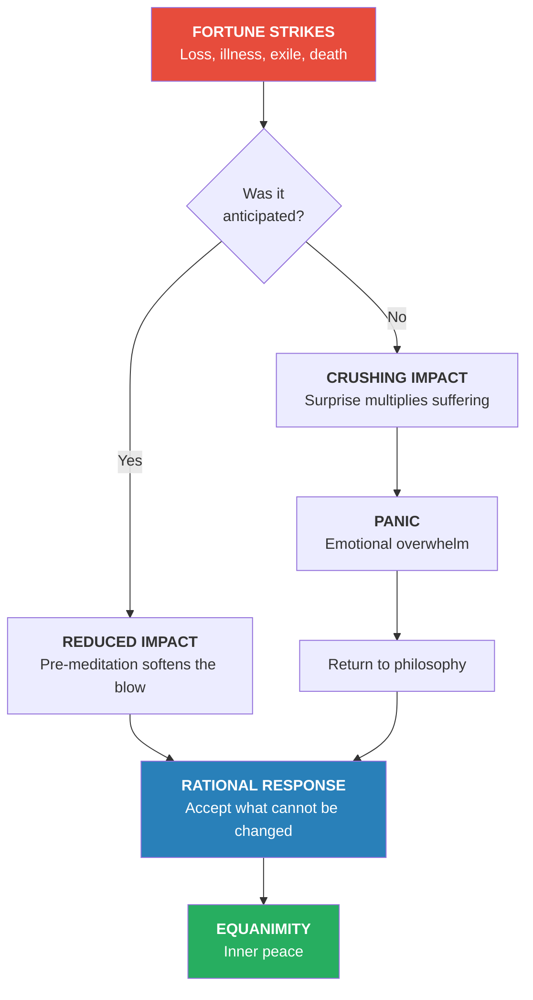
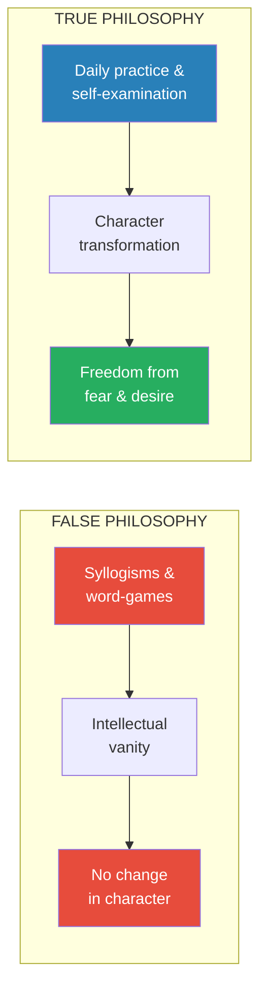
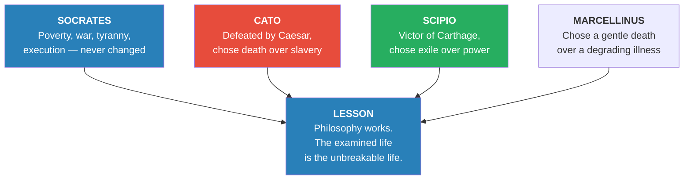
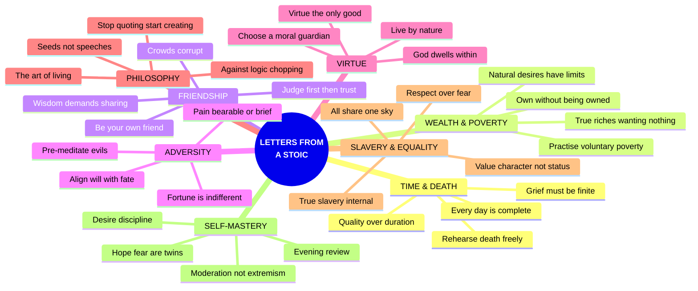

# Letters From a Stoic — Seneca

> *Written ~65 AD. 124 moral letters to his young friend Lucilius — a complete Stoic curriculum disguised as personal correspondence, composed while Nero's tyranny tightened around the philosopher who once ruled Rome.*

---

## At a Glance

| Field | Detail |
|---|---|
| **Full Title** | *Epistulae Morales ad Lucilium* (Moral Letters to Lucilius) |
| **Author** | Lucius Annaeus Seneca (c. 4 BC – 65 AD) |
| **Published** | c. 63–65 AD |
| **Genre** | Philosophy / Stoicism / Letters |
| **Core Thesis** | True freedom comes not from wealth, status, or avoiding death — but from cultivating virtue, aligning with nature, and mastering the inner life through daily philosophical practice |
| **Connections** | [[The Daily Stoic - Ryan Holiday]] · [[Discourses - Epictetus]] · [[Man's Search for Meaning - Viktor Frankl]] · [[Antifragile - Nassim Nicholas Taleb]] · [[The Subtle Art of Not Giving a F-ck - Mark Manson]] |

---

## About the Author

- *Lucius Annaeus Seneca (c. 4 BC – 65 AD) — Roman statesman, philosopher, dramatist, and the most influential Stoic writer in history*
- Born in Cordoba, Spain; trained as a lawyer and politician in Rome; plagued by asthma his entire life
- Survived death sentences from Emperors Caligula and Claudius; spent eight years exiled on Corsica
- Served as tutor and then de facto prime minister to <b style="color: #e74c3c">Emperor Nero</b> — the "first five years" of Nero's reign were later called the finest period of imperial governance
- Accumulated <b style="color: #2980b9">enormous wealth</b> while preaching Stoic detachment — a paradox that defined his public reputation
- After retiring from politics, composed the *Letters to Lucilius* — his final and greatest work
- <b style="color: #27ae60">Ordered by Nero to commit suicide in 65 AD; died calmly, surrounded by friends, philosophizing to the last</b>

## The Big Idea

- *True freedom and happiness come not from external circumstances but from the disciplined cultivation of the inner life*
- <b style="color: #2980b9">Philosophy is medicine for the soul</b> — practise it daily, not as a hobby but as the master art of living
- <b style="color: #e74c3c">We suffer more in imagination than reality</b> — pre-meditate every catastrophe to strip it of its power
- <b style="color: #27ae60">Virtue is the only genuine good; everything else — wealth, health, fame — is morally indifferent</b>
- Align your will with nature and fate loses its sting: "Fate the willing leads, the unwilling drags along"

## Key Concepts at a Glance

| Concept | Description | Letter(s) |
|---|---|---|
| **Premeditatio Malorum** | Mentally rehearse catastrophe so nothing surprises you | XCI, CVII |
| **Memento Mori** | Keep death in view — not from morbidity but urgency | XII, XXVI, LXXVII |
| **Voluntary Poverty** | Periodically live on the minimum to immunize against fortune | XVIII |
| **The Inner Citadel** | External events cannot touch the soul without your permission | LXXVIII, CIV |
| **Evening Review** | Examine every action, word, and thought before sleep | LXXXIII |
| **The Moral Guardian** | Keep an exemplary person "watching" your behaviour | XI |
| **Universal Brotherhood** | All humans share divine reason; slavery is an accident of fortune | XLVII |
| **Progress Over Perfection** | The wise man is an ideal; daily improvement is the actual task | VI, XXVII |
| **Seeds Not Speeches** | Words planted like seeds grow; lectures at high volume do not | XXXVIII |
| **Autarkeia (Self-Sufficiency)** | Freedom comes from reducing needs, not multiplying possessions | XVI, II |

---

## The 30-Second Version

- *Seneca, once the most powerful man in Rome, spent his final years writing letters to a younger friend — not about politics, but about how to live and how to die*
- <b style="color: #2980b9">The only real wealth is wanting nothing</b> — reduce your needs and fortune loses her power over you
- <b style="color: #e74c3c">We suffer more in imagination than reality</b> — most of what we fear never arrives, and what does arrive is bearable
- <b style="color: #27ae60">Philosophy is medicine for the soul</b> — practise it daily, not as a hobby but as the art of living itself
- *Every day is a complete life; every letter is a small lesson in freedom*

---

## The 5-Minute Review

### What Is This Book?

- *124 moral letters from the Roman philosopher Seneca to his younger friend Lucilius, written c. 63-65 AD*
- <b style="color: #2980b9">Not a systematic treatise but a practical curriculum in Stoic philosophy</b> — one letter at a time, each building on the last
- Seneca was simultaneously one of Rome's richest men, the de facto prime minister under Emperor Nero, and a practising Stoic philosopher
- The letters were his final work, composed after retiring from politics, knowing Nero might order his death at any moment
- <b style="color: #27ae60">They cover every aspect of the good life</b>: how to use time, how to face death, how to handle wealth, how to choose friends, how to endure pain, how to master desire

### The Eight Major Themes

1. <b style="color: #2980b9">**Time & Death**</b> — Every day is a complete life; rehearse death to rehearse freedom; grief must be finite
2. <b style="color: #27ae60">**Wealth & Poverty**</b> — Natural desires have limits; practise poverty voluntarily; own without being owned
3. <b style="color: #e74c3c">**Friendship**</b> — Judge first, then trust completely; be your own friend before all others; crowds corrupt
4. <b style="color: #2980b9">**Adversity & Fortune**</b> — Pre-meditate every evil; pain is either bearable or brief; align your will with fate
5. <b style="color: #27ae60">**Virtue & Character**</b> — God dwells within you; virtue is the only true good; choose a moral guardian
6. <b style="color: #e74c3c">**Philosophy & Learning**</b> — Philosophy is the art of living, not word-games; read deeply; stop quoting, start creating
7. <b style="color: #2980b9">**Slavery & Equality**</b> — All humans share the same sky; true slavery is internal; respect beats fear
8. <b style="color: #27ae60">**Self-Mastery**</b> — Hope and fear are twins; review each evening; moderation, not extremism

Time and mortality dominate Seneca's correspondence — the urgency of a finite life is the engine that drives every other Stoic lesson.

### The Three Core Practices

- <b style="color: #2980b9">**Morning intention**</b>: Begin each day with one philosophical insight to carry through it
- <b style="color: #27ae60">**Periodic poverty**</b>: Several days per month, eat plain food and wear rough clothes — discover how little you actually need
- <b style="color: #e74c3c">**Evening review**</b>: Before sleep, examine every action, word, and thought of the day — not to punish yourself but to know yourself

### Why It Still Matters

- <b style="color: #2980b9">These are the oldest self-help letters in Western civilization — and they still work</b>
- Cognitive Behavioral Therapy independently rediscovered Seneca's core insight: we are disturbed not by events but by our judgements about them
- The modern Stoicism movement (Ryan Holiday, Tim Ferriss, Nassim Taleb) returns directly to these letters as foundational texts
- <b style="color: #27ae60">Seneca writes not as a sage but as a fellow patient — "I'm talking as if I were lying in the same hospital ward"</b>
- His honesty about his own failures makes the letters more, not less, trustworthy
- <b style="color: #e74c3c">Two thousand years later, the same fears plague us — death, status, money, loneliness — and the same remedies apply</b>

---

## Who Was Seneca?

- *Born around 4 BC in Cordoba, Spain — son of a rhetorician, plagued by asthma his entire life*
- Survived death sentences from <b style="color: #e74c3c">two different emperors</b> — Caligula wanted him killed out of jealousy; Claudius exiled him to Corsica for eight years
- Recalled in 49 AD to tutor the twelve-year-old boy who would become <b style="color: #e74c3c">Emperor Nero</b>
- Served as Nero's unofficial prime minister for eight years — the "first five years" of Nero's reign were later called the finest period of imperial governance
- Accumulated <b style="color: #2980b9">enormous wealth</b> — 300 million sesterces, vast estates, citrus-wood banquet tables — while preaching detachment from riches
- As Nero descended into cruelty, Seneca retired to write these letters — his final and greatest work
- In 65 AD, Nero ordered his suicide; <b style="color: #27ae60">Seneca died as he had taught others to live</b> — calmly, surrounded by friends, dictating philosophy to the end

> [!example] The Death of Seneca
> - Nero sent a soldier to deliver the death sentence
> - Seneca turned to his weeping friends: "Being forbidden to show gratitude for your services, I leave you my one remaining possession — the pattern of my life"
> - He and his wife Paulina both cut their wrists; Nero ordered Paulina's bleeding stopped
> - Seneca's aged, lean body released blood too slowly — he severed veins in his ankles and knees
> - Poison had no effect on his numbed limbs; he was finally carried into a steam bath where he suffocated
> - His cremation was without ceremony, as he had requested years earlier "at the height of his wealth and power"

---

## The Architecture of Seneca's Stoicism

---

## I. Time, Death & the Urgency of Living

*Letters II, XII, XXVI, XLIX, LXIII, LXX, LXXVII, XCIII, CI*

> *"It is not that we have a short time to live, but that we waste a great deal of it."*

### Life's Finest Days Fly First

- *Seneca opens the entire collection with a warning about time* — the most wasted resource and the only one that cannot be recovered
- <b style="color: #2980b9">Reading without depth is a symptom of a restless mind</b> — "to be everywhere is to be nowhere"
- Pick one author at a time, digest thoroughly, extract one thought per day — this is how wisdom accumulates
- "Food that is vomited up as soon as it is eaten is not assimilated into the body" — the same is true of ideas consumed too rapidly
- <b style="color: #e74c3c">The busiest people are the most impoverished in time</b> — they confuse motion with progress, activity with achievement
- Every day should be treated as if it were the last — not from panic but from the desire to live fully

> [!example] The Old Estate
> - Seneca visits his country house and complains about the crumbling building
> - His manager explains: "It's not neglect — the house is just old"
> - Then Seneca notices the leafless plane trees — "I planted those myself and saw the first leaf"
> - At the front door he fails to recognize Felicio, who says: "I'm your pet playmate's son"
> - The philosopher realizes: everything around him — house, trees, servants — mirrors his own aging
> - His conclusion is not despair but delight: "Fruit tastes most delicious just when its season is ending"

Only 25% of life is spent on what Seneca considers genuine living and philosophical practice — the rest is surrendered to obligations, distraction, and temporal anxiety.

### Rehearsing Death as Rehearsing Freedom

- *"Rehearse death" — Seneca's most famous prescription, borrowed from Epicurus*
- <b style="color: #27ae60">A person who has learned how to die has unlearned how to be a slave</b>
- Death is not evil — it is the fear of death that enslaves us to every other fear
- "There is but one chain holding us in fetters, and that is our love of life"
- The proper attitude is neither craving death nor dreading it — but treating it as one of life's natural duties
- <b style="color: #2980b9">"As with a play, what matters is not how long the acting lasts, but how good it is"</b>
- Stop wherever you will — "only make sure you round it off with a good ending"

### The Proper Measure of Grief

- *When Lucilius grieves a lost friend, Seneca responds with surprising warmth and personal confession*
- He admits to weeping "unrestrainedly" for his friend Annaeus Serenus — grief defeated even the philosopher
- <b style="color: #e74c3c">The mistake was not grieving but failing to anticipate the loss</b> — "I had never considered the possibility of his dying before me"
- Grief that is perpetuated becomes either "feigned or foolish" — others begin to ridicule it
- <b style="color: #27ae60">The remedy: make new friends, treasure present ones, accept that all bonds are loans from fortune</b>
- "You have buried someone you loved. Now look for someone to love. It is better to make good the loss of a friend than to cry over him"

| Seneca's Rules for Time | Application |
|---|---|
| Every day is a complete life | Don't defer living to retirement or "someday" |
| Rehearse death daily | Not morbidity — urgency and gratitude |
| Treat each day as a windfall | "Whoever has said 'I have lived' receives a windfall every morning" |
| Grieve, then rebuild | Mourning has a season; make it genuine but finite |
| Count days by quality, not quantity | A single day lived in learning exceeds years of ignorance |

> [!tip] Seneca's Daily Practice
> Every evening, Seneca reviewed his entire day — what he said, what he did, what he felt. His first wife would "keep quiet while he made his customary review of everything he had done." This is the ancestor of every modern journaling practice.

---

## II. Wealth, Poverty & True Riches

*Letters II, XVI, XVIII, LXXXVII, XC, CXIX*

> *"It is not the man who has too little who is poor, but the one who hankers after more."*

### The Paradox of Having

- *Seneca was one of the richest men in Rome — 300 million sesterces, vast wine-growing estates, a household on a palatial scale*
- His critics screamed hypocrisy: "What kind of wisdom leads to acquiring such wealth in four years of royal favour?"
- <b style="color: #2980b9">Seneca's answer is not renunciation but detachment</b> — own things without being owned by them
- "Finding wealth an intolerable burden is the mark of an unstable mind" — equally, clinging to it is slavery
- The wise man possesses riches the way a general occupies a city — ready to abandon the position at any moment
- <b style="color: #e74c3c">Natural desires have limits; those born of opinion are limitless</b>
- "If you shape your life according to nature, you will never be poor; if according to people's opinions, you will never be rich"

### Practising Poverty

- *Seneca's most radical and practical prescription — voluntarily live like a pauper for several days at regular intervals*
- Eat plain bread, wear rough clothing, sleep on a hard bed — not as penance but as training
- <b style="color: #27ae60">"In times of security the spirit should prepare to deal with difficult times"</b>
- Like soldiers who throw up earthworks against a non-existent enemy — practice makes the real thing bearable
- Epicurus boasted of feeding himself for less than a halfpenny; his student Metrodorus needed a whole halfpenny
- <b style="color: #2980b9">The point is not suffering but discovering how little you actually need</b>
- "You will revel in being sated for a penny, and will come to see that security is not dependent on fortune"

> [!example] The Mule-Cart Journey
> - Seneca and his friend Caesonius Maximus — both men of wealth and distinction — took a trip by mule-cart
> - Their sleeping equipment was the simplest possible; their food was only figs and bread
> - Seneca describes "two blissful days" of simplicity
> - But he confesses he couldn't help blushing when they met people travelling in greater style
> - Even the philosopher wrestles with social comparison — the lesson is not perfection but practice

### The Anatomy of Desire

- *Every unfulfilled desire generates a new one — the cycle is endless unless reason intervenes*
- <b style="color: #e74c3c">"Avarice brought in poverty, by coveting a lot of possessions and losing all"</b>
- The golden age before property was not wise but innocent — "there is a world of difference between choosing not to do wrong and not knowing how"
- Poverty feared is poverty suffered in advance — most of the pain lives in anticipation
- <b style="color: #27ae60">The test for any desire: "Is it capable of coming to rest at any point?"</b> If the answer is no, it is not natural
- "Whatever is enough for our needs" — fortune always grants this much, even when angry

| Natural Desires | False Desires |
|---|---|
| Food, shelter, warmth | Gold-plated ceilings, citrus-wood tables |
| Friendship and community | Flattery and social status |
| Knowledge and wisdom | Intellectual vanity and display |
| Sufficient clothing | Purple robes and fashion excess |
| Have a stopping point | Always escalate — no natural limit |

> [!tip] The Epicurus Challenge
> Set aside three or four days to eat the plainest food, wear the roughest clothing, and ask yourself: "Is this what I used to dread?" If you can endure poverty voluntarily, fortune can never impose it involuntarily.

---

## III. Friendship, Solitude & Human Connection

*Letters III, VI, VII, IX, XXXV, XL, XLVIII, LXIII*

> *"A friendship which has been bought at any price is cheapened by the very fact."*

### The Art of True Friendship

- *Letter III opens with a paradox — Lucilius calls someone a "friend" then warns Seneca not to trust him*
- <b style="color: #2980b9">Before friendship is formed you must judge; after it is formed you must trust</b>
- "Think for a long time whether or not you should admit a given person to your friendship. But when you have decided to do so, welcome him heart and soul"
- Trusting everyone is as much a fault as trusting no one — though Seneca calls the first "the worthier" and the second "the safer" behaviour
- <b style="color: #e74c3c">Suspicion breeds the very betrayal it fears</b> — "by their suspiciousness they give them the right to do the wrong thing"
- Speak to a true friend as unreservedly as you would speak to yourself

### Becoming Your Own Friend

- *"What progress have I made? I am beginning to be my own friend"* — Seneca quotes Hecato and calls this "progress indeed"
- <b style="color: #27ae60">Self-friendship is the prerequisite for all other friendship</b>
- A person who cannot bear his own company will poison every relationship he enters
- Philosophy itself is a friendship — between the student and the tradition, between the writer and his reader
- "Nothing will ever give me any pleasure if the knowledge is to be for my benefit alone" — wisdom demands sharing
- <b style="color: #2980b9">If wisdom were offered on the condition that he keep it secret, Seneca says he would refuse it</b>

### The Danger of Crowds

- *Letter VII contains one of Seneca's most disturbing passages — his visit to a gladiatorial show*
- At the lunch-hour interlude, expecting entertainment, he found "murder pure and simple"
- No helmets, no shields — "every thrust gets home"; the only exit for combatants was death
- <b style="color: #e74c3c">The spectators were more dangerous than the arena</b> — they screamed for blood, demanded throats be cut during intermissions
- "I never come back home with quite the same moral character I went out with"
- The crowd corrupts — "you must inevitably either hate or imitate the world"
- <b style="color: #27ae60">The remedy: "Retire into yourself. Associate with people who are likely to improve you"</b>
- "To me, a single man is a crowd, and a crowd is a single man" — Democritus

> [!example] Learning by Living Example
> - Seneca argues that personal contact teaches more than any lecture
> - Cleanthes would never have become the image of Zeno if he had merely heard lectures — "he lived with him, studied his private life"
> - Plato, Aristotle, and their peers derived more from Socrates' character than from his words
> - It was not Epicurus' school but "living under the same roof" that made his students great
> - The implication: reading Seneca's letters is good, but living alongside a wise person is better

| Type of Relationship | Seneca's Verdict |
|---|---|
| Crowds and spectacles | Corrupting — avoid unless spiritually strong |
| Casual acquaintances | Neutral — "friends" by social convention only |
| True friends | Transformative — test carefully, then trust completely |
| Philosophical mentors | Essential — "the road is short by way of personal example" |
| Oneself | The foundation — "be your own friend" before all others |

---

## IV. Adversity, Fortune & the Stoic Response

*Letters LXXVIII, XCI, CIV, CV, CVII*

> *"We are more often frightened than hurt; and we suffer more in imagination than in reality."*

### Fortune's Nature

- *Fortune is not malicious — she is indifferent, and her indifference is what makes her terrifying*
- <b style="color: #e74c3c">"Nothing is durable, whether for an individual or for a society"</b> — the destinies of men and cities sweep onward alike
- The destruction of Lyons by fire shocked all Rome — a great city reduced to nothing in a single night
- "Fortune invariably allows those whom she strikes down in the sight of all a chance to fear what they were going to suffer" — but not always
- <b style="color: #2980b9">What is unexpected crushes hardest</b> — this is why we must anticipate every possibility
- "In the midst of peace war rears its head, and the bulwarks of one's security are transformed into sources of alarm"

### Premeditatio Malorum — The Pre-Meditation of Evils

- *Seneca's signature technique: mentally rehearse every catastrophe before it arrives*
- <b style="color: #27ae60">"Rehearse them in your mind: exile, torture, war, shipwreck"</b>
- The purpose is not pessimism but preparation — a boxer trains by absorbing blows, not by avoiding the ring
- "All the terms of our human lot should be before our eyes"
- Whatever can happen at any time can happen today — nothing is exempt from fortune's reach
- <b style="color: #2980b9">A setback has often cleared the way for greater prosperity</b> — "many things have fallen only to rise to more exalted heights"

> [!example] The Burning of Lyons
> - In the depth of peace, a single night destroyed what was the showpiece of Gaul
> - Seneca's friend Liberalis was devastated — it was his home city
> - Seneca's consolation: think how often towns in Asia and Greece have fallen to earthquakes
> - Mountains crumble, seas cover ancient landmarks, volcanic fires eat away peaks
> - "They stand just to fall. Such is the sum total of the end that awaits them"
> - Even in ashes, all men are levelled — "we're born unequal, we die equal"

### Pain, Illness & the Body's Limits

- *Letter LXXVIII is Seneca's most personal reflection on physical suffering*
- <b style="color: #e74c3c">Three things upset us about illness: fear of dying, physical pain, and interruption of pleasures</b>
- On dying: "You will die not because you are sick but because you are alive"
- On pain: nature ensures the worst suffering is brief — "when pain is at its most severe the very intensity finds means of ending it"
- On pleasure: illness actually sharpens pleasures — hunger makes food welcome, thirst makes water delicious
- <b style="color: #27ae60">"A man is as unhappy as he has convinced himself he is"</b>
- "There is room for heroism, I assure you, in bed as anywhere else"

### The Formula for Safety

- *Letter CV reads like a field manual for surviving dangerous times*
- <b style="color: #2980b9">Five things goad men into destroying each other: hope, envy, hatred, fear, and contempt</b>
- To escape hope (of others): own nothing rare or remarkable
- To escape envy: don't flaunt possessions, keep satisfaction private
- To escape hatred: don't provoke, maintain ordinary tact
- To escape fear: maintain a moderate fortune and easy-going nature
- <b style="color: #e74c3c">"To be feared is to fear"</b> — no one strikes terror without feeling terror

| Fortune's Blow | Seneca's Remedy |
|---|---|
| Unexpected catastrophe | Pre-meditate every possibility so nothing surprises |
| Physical pain | Remember: the worst pain is always brief |
| Loss of a city, home, or status | "They stand just to fall" — build an inner home |
| Envy and hatred of others | Don't flaunt; keep satisfaction private |
| Fear of death | "You will die not because you are sick but because you are alive" |

> [!tip] The Willing and the Unwilling
> Seneca's favourite quotation from Cleanthes: "Lead me, Master of the soaring vault of Heaven, lead me, Father, where you will. I stand here prompt and eager to obey." The coda: "For Fate the willing leads, the unwilling drags along."

---

## V. Virtue, Character & the Divine Within

*Letters V, XVI, XLI, XLII, LXXI, LXXVI, XCVIII*

> *"God is near you, is with you, is inside you."*

### The God Within

- *Letter XLI contains one of the most beautiful passages in ancient philosophy*
- <b style="color: #2980b9">There is no need to raise hands to heaven or implore graven images</b> — "God is near you, is with you, is inside you"
- A divine spirit resides within us, guarding and watching — "as we treat him, so will he treat us"
- If you come upon a dense, ancient wood shutting out the sky, you sense the presence of a deity
- If you find a cave hollowed by nature, "a feeling of the divine" strikes your soul
- <b style="color: #27ae60">Now imagine meeting a person who is never alarmed, never affected by cravings, happy in adversity</b> — would you not feel veneration?
- "Into that body there has descended a divine power"
- The soul is like the sun's rays — touching earth but originating in heaven

### Philosophy Is Not for Show

- *Letter V warns against philosophical exhibitionism*
- <b style="color: #e74c3c">Avoid shabby clothes, long hair, unkempt beards, sleeping on the ground</b> — these are "misguided means to self-advertisement"
- "Our outward face should conform with the crowd" — but inwardly everything should be different
- Philosophy's first promise is fellowship — being different for its own sake abandons that promise
- <b style="color: #27ae60">"Philosophy calls for simple living, not for doing penance"</b>
- The standard: "One's life should be a compromise between the ideal and the popular morality"
- "People should admire our way of life but they should at the same time find it understandable"

### Virtue as the Only Good

- *Seneca follows orthodox Stoicism — virtue alone is good, vice alone is evil, everything else is "indifferent"*
- Health, wealth, fame, and pleasure are "preferred indifferents" — nice to have but not necessary
- Pain, poverty, disgrace, and death are "dispreferred indifferents" — unpleasant but not genuinely evil
- <b style="color: #2980b9">This doctrine is the engine of Stoic freedom</b> — if nothing external is truly good or evil, nothing external can enslave you
- "Man's ideal state is realized when he has fulfilled the purpose for which he was born"
- That purpose: "to live in accordance with his own nature" — which means in accordance with reason
- <b style="color: #e74c3c">"This is turned into something difficult by the madness universal among men; we push one another into vices"</b>

### Choose a Guardian for Your Soul

- *Find a moral exemplar and keep him constantly before your eyes*
- "Live as if he were watching you and do everything as if he saw what we were doing"
- This is Epicurus' advice, which Seneca adopts — a witness deters misdeeds
- <b style="color: #27ae60">Choose a Cato — or if he seems too severe, a Laelius</b> — someone whose character you genuinely admire
- "Without a ruler to do it against you won't make the crooked straight"
- The guardian need not be living — recollection of a great soul works equally well

> [!example] Earthenware and Silver
> - "It is a great man that can treat his earthenware as if it was silver"
> - "And a man who treats his silver as if it was earthenware is no less great"
> - The point is not what you own but how you hold it
> - Possessions should be gripped lightly, valued for function, released without anguish

| What Is Genuinely Good | What Is Indifferent |
|---|---|
| Wisdom — knowing truth from falsehood | Wealth — useful but morally neutral |
| Courage — facing hardship without flinching | Health — preferred but not required for happiness |
| Justice — treating all humans with dignity | Fame — pleasant but a trap for the vain |
| Temperance — mastering desire and anger | Pleasure — natural but dangerous when unlimited |

---

## VI. Philosophy, Wisdom & the Life of the Mind

*Letters XXXIII, XXXVIII, XL, LIII, LXXXVIII, XC, CVIII*

> *"Philosophy is good advice, and no one gives advice at the top of his voice."*

### Philosophy as the Art of Living

- *Seneca insists again and again: philosophy is not a theoretical discipline but the master art of life itself*
- <b style="color: #2980b9">"She moulds and builds the personality, orders one's life, regulates one's conduct"</b>
- Without philosophy, no one can live free of fear or worry — "every hour of the day countless situations call for advice"
- Whether fate, God, or chance governs the universe, philosophy is needed equally — "she will encourage us to submit to God with cheerfulness and to fortune with defiance"
- <b style="color: #e74c3c">Philosophy is not a hobby for spare time — she is "an active, full-time mistress, ever present and demanding"</b>
- Alexander told a state that offered him half its territory: "I didn't come to accept what you give but to let you keep what I choose to leave"
- Philosophy says the same: "you shall have what I reject"

### Against Logic-Chopping

- *Letter XLVIII contains Seneca's most savage attack on philosophical pretension*
- <b style="color: #e74c3c">"Mouse is a syllable, and a mouse nibbles cheese; therefore, a syllable nibbles cheese"</b>
- "Is this what we philosophers acquire wrinkles in our brows for? Is this what we let our beards grow long for?"
- While logic-choppers play with syllogisms, real people are facing death, poverty, torture, and grief
- "All mankind are stretching out their hands to you — lives that have been ruined are appealing for help"
- <b style="color: #27ae60">Philosophy promises to make us "God's equal" — she should deliver on that promise, not descend to the schoolroom</b>
- The question is not whether the syllogism is valid but whether it heals anyone

### The Power and Limits of Liberal Education

- *Letter LXXXVIII subjects the liberal arts to withering scrutiny*
- Grammar, music, geometry, astronomy — none of these produce virtue by themselves
- <b style="color: #2980b9">They are "preparatory" — they prepare the mind for philosophy the way stretching prepares the body for exercise</b>
- "Philosophy takes as her aim the state of happiness — she shows us what are real and what are only apparent evils"
- The philosopher who discovered the arch or the potter's wheel did so not "in his capacity as a philosopher" but as a human being
- <b style="color: #e74c3c">A fast runner who happens to be a philosopher wins by running, not by philosophizing</b>
- What the philosopher uniquely brings: "truth and nature" and "a rule of life"

### How to Listen, How to Learn

- *Letter CVIII describes Seneca's own experience as a young student — and it is electric with remembered passion*
- His teacher Attalus held that a student should "carry away something of value every day"
- <b style="color: #27ae60">"A person going out into the sun, whether or not this is what he is going out for, will acquire a tan"</b> — the same with philosophy
- But most students come for entertainment, not transformation — "some come not to learn but just to hear"
- They take notes on words, not content; they are "stirred by noble sentiments" then immediately lose the feeling
- <b style="color: #2980b9">The enthusiast's tragedy: the lecture hall inspires, but the crowd outside extinguishes</b>
- "Very few succeed in getting home in the same frame of mind"

> [!example] The Young Seneca's Vegetarianism
> - Inspired by his teacher Sotion's account of Pythagoras, young Seneca became a vegetarian
> - After a year he found it "enjoyable as well as easy" and felt his mind was more active
> - But when Tiberius began persecuting foreign cults, abstaining from meat became politically dangerous
> - His father, who "detested philosophy," persuaded him to resume normal eating
> - Decades later Seneca still sleeps on a hard mattress — "the kind which shows no trace of a body having slept on it"
> - His point: youthful enthusiasm fades, but some habits persist for a lifetime

### Seeds, Not Speeches

- *Letter XXXVIII is among the shortest and most concentrated — a philosophy of communication itself*
- <b style="color: #27ae60">"Words need to be sown like seed"</b> — no matter how tiny, when they land in the right ground they grow to massive size
- Public lectures are "more resounding but less intimate" — private conversation is more effective
- What is waited for sinks in more readily than what flies past
- Language directed at healing must "penetrate" — "medicines do no good unless they stop some length of time in one"
- <b style="color: #e74c3c">Rapid, showy speaking is for hawkers, not philosophers</b> — the truth requires plain, unadorned language
- Even an advocate's rushing pace should alarm us; in a philosopher it is unforgivable

### Stop Quoting, Start Creating

- *Letter XXXIII is a declaration of intellectual independence*
- Lucilius wants more quotations from famous Stoics — Seneca refuses
- <b style="color: #2980b9">"Zeno said this. And what have you said? Cleanthes said that. What have you said?"</b>
- To remember is not to know — "to know is to make each item your own"
- "How much longer are you going to serve under others' orders? Assume authority yourself"
- The men who pioneered the old routes are leaders, not masters — "truth lies open to everyone"
- <b style="color: #27ae60">"There has yet to be a monopoly of truth. And there is plenty of it left for future generations"</b>

| How to Learn | How Not to Learn |
|---|---|
| Read deeply in one author at a time | Skip from book to book, tasting everything |
| Extract one insight per day and digest it | Collect quotations without understanding |
| Seek character transformation | Seek entertainment and clever display |
| Learn from living example | Learn from words alone |
| Make ideas your own — then create | Quote forever — "Zeno said this, Cleanthes that" |
| Apply philosophy to daily decisions | Reserve philosophy for leisure moments |

---

## VII. Slavery, Equality & Human Dignity

*Letters XLIV, XLVII*

> *"Show me a man who isn't a slave: one is a slave to sex, another to money, another to ambition."*

### They're Slaves. No. They're Human Beings.

- *Letter XLVII is Seneca's most radical and humane letter — a direct assault on Roman slavery*
- <b style="color: #2980b9">"They're slaves," people say. "No. They're human beings."</b> "They're slaves." "But they share the same roof." "They're slaves." "No, they're friends, humble friends." "They're slaves." "Strictly speaking they're our fellow-slaves, if you once reflect that fortune has as much power over us as over them"
- Masters eat in monstrous greed while slaves stand in silence — "the slightest murmur is checked with a stick"
- <b style="color: #e74c3c">The result: "slaves who cannot talk before his face talk about him behind his back"</b>
- In earlier times, when slaves could speak freely, they were willing to die for their masters — loyalty was freely given, not coerced
- "You've as many enemies as you've slaves" — and the masters made them so

### The Reversals of Fortune

- *Seneca reminds Lucilius that status is an accident, not a destiny*
- <b style="color: #27ae60">Remember the Varus disaster — men of the most distinguished ancestry were reduced to tending sheep</b>
- Hecuba became a slave, and Croesus, and Plato, and Diogenes — "you could suddenly find yourself in their place"
- The slave-turned-imperial-secretary Callistus now refuses entry to the very master who once sold him
- <b style="color: #2980b9">"How about reflecting that the person you call your slave traces his origin back to the same stock as yourself, has the same good sky above him, breathes as you do, lives as you do, dies as you do?"</b>

### True Slavery Is Internal

- *Seneca turns the concept of slavery inside out — the real chains are psychological*
- <b style="color: #e74c3c">"Show me a man who isn't a slave"</b> — one is slave to sex, another to money, another to ambition
- "All are slaves to hope or fear"
- A consul can be slave to his "little old woman"; a millionaire slave to a servant girl; aristocratic young men slaves to stage performers
- <b style="color: #27ae60">The only meaningful freedom is internal — and it is available to anyone regardless of legal status</b>
- "He's a slave." "But he may have the spirit of a free man"
- Value people by character, not by job — "only an absolute fool values a man according to his clothes"

### The Practical Ethics of Leadership

- *Seneca doesn't just philosophize — he gives concrete instructions for treating dependents*
- "Treat your inferiors in the way you would like to be treated by your own superiors"
- <b style="color: #2980b9">Have slaves respect you rather than fear you</b> — "to be really respected is to be loved; and love and fear will not mix"
- Some slaves should dine with you because they deserve it, others to make them deserving
- "Good material often lies idle for want of someone to make use of it; just give it a trial"
- Our ancestors called the master "father of the household" and the slaves "members of the household"
- <b style="color: #e74c3c">"We masters are apt to be robbed of our senses by mere passing fancies"</b> — we assume the mental attitudes of tyrants

> [!example] Callistus' Revenge
> - Callistus was once a slave, sold among the rejects — the lot "on which the auctioneer is merely trying out his voice"
> - He rose to become secretary of state under Emperor Claudius
> - Seneca personally witnessed Callistus' former master standing at Callistus' door, refused admission
> - "Now it was the slave's turn to strike his master off his list"
> - The lesson: fortune makes and unmakes rank in a single generation

---

## VIII. Travel, Self-Knowledge & Inner Freedom

*Letters XXVIII, CIV, LIII*

> *"You carry yourself around with you. You are saddled with the very thing that drove you away."*

### The Futility of Travel as Therapy

- *Lucilius complains that extensive travel has not cured his melancholy — Seneca is unsympathetic*
- <b style="color: #e74c3c">"A change of character, not a change of air, is what you need"</b>
- Socrates to a similar complainant: "How can you wonder your travels do you no good, when you carry yourself around with you?"
- Travel provides novelty — "like children fascinated by something they haven't come across before" — but novelty fades
- <b style="color: #2980b9">The instability of a sick mind is aggravated by travel</b> — "the motion itself increasing the fitfulness and restlessness"
- Suppose you arrive in Athens or Rhodes — "what difference does the character of the place make? You'll only be importing your own"
- "So long as you carry the sources of your troubles about with you, those troubles will continue to harass you wherever you wander"

### What Travel Cannot Do

- *Seneca catalogues travel's false promises with surgical precision*
- Travel cannot check pleasure, restrain desires, control anger, or quell reckless impulses
- <b style="color: #e74c3c">It has never rid anyone of a fault</b> — "all it has ever done is distract us for a little while"
- It cannot make you a doctor or a public speaker — "there isn't a single art acquired merely by being in one place rather than another"
- <b style="color: #27ae60">"If you want to enjoy your travel, you must make your travelling companion a healthy one"</b>
- That companion is yourself — so heal yourself first

### What Heals Instead

- *Seneca prescribes inner work, not outer movement*
- "Mend your ways and get rid of the burden you're carrying"
- <b style="color: #2980b9">Keep cravings within safe limits; scour every trace of evil from your personality</b>
- Live with the Catos, with Socrates and Zeno — "they will give you knowledge of man and the universe"
- "The only safe harbour in this life's tossing, troubled sea is to refuse to be bothered about what the future will bring"
- <b style="color: #27ae60">"I wasn't born for one particular corner: the whole world's my home country"</b>
- If you believed this, you would find any place satisfying

> [!example] Seneca's Seasickness
> - Letter LIII opens with a vivid, self-mocking account of a disastrous boat trip
> - The sea appeared calm but quickly turned rough; Seneca became violently seasick
> - He forced the helmsman to put ashore, then leapt into the sea in his woolly clothes
> - Crawling over rocks, he reflected: "The reason Ulysses got wrecked everywhere was not Neptune — it was seasickness"
> - From physical misery he pivots to spiritual diagnosis: we forget our inner weaknesses
> - "With afflictions of the spirit, the worse a person is, the less he feels it"
> - Just as a heavy slumber blots out dreams, deep spiritual sickness prevents self-awareness

### The Paradox of Escape

- *Running away from yourself is the most common and least effective response to unhappiness*
- <b style="color: #e74c3c">"You rush hither and thither with the idea of dislodging a firmly seated weight"</b>
- The dashing about adds to the trouble — "like cargo in a ship, which if it rolls more to one side is liable to carry the ship down"
- People who "never set about acquiring intimate acquaintanceship with any one great writer, but skip from one to another" — the same restlessness applied to books
- <b style="color: #27ae60">The cure is always the same: go inward, not outward</b>
- "It's medicine, not a particular part of the world, that a person needs if he's ill"
- "Travelling doesn't make a man a doctor or a public speaker" — and it doesn't make him wise

| Outer Change | Inner Change |
|---|---|
| New city, same anxiety | Self-examination reveals the real problem |
| New companions, same loneliness | "Be your own friend" first |
| New pleasures, same emptiness | "Natural desires have limits" |
| New scenery, same restlessness | "Wherever you go, there you are" |

---

## IX. Anger, Passion & the Discipline of Desire

*Letters XVIII, V, LXXXIII, CXIV, CXVI*

> *"Anger carried to excess begets madness."*

### Hope and Fear Are Twins

- *In Letter V, Seneca reveals one of Stoicism's most counterintuitive insights*
- <b style="color: #2980b9">"Cease to hope and you will cease to fear"</b> — the Stoic writer Hecato
- Hope and fear seem opposite but they march in unison — "like a prisoner and the escort he is handcuffed to"
- Both belong to a mind in suspense, anxious through "looking into the future"
- <b style="color: #e74c3c">We are tormented alike by what is past and what is to come</b> — the present is the only safe ground
- "Foresight, the greatest blessing humanity has been given, is transformed into a curse"
- Wild animals run from dangers they see and forget them once escaped — "we however are tormented alike by what is past and what is to come"
- <b style="color: #27ae60">"No one confines his unhappiness to the present"</b>

### The Case Against Drunkenness

- *Letter LXXXIII gives us Seneca's actual daily schedule — then pivots to a devastating attack on excess drinking*
- Seneca's morning: brief exercise, a cold plunge (once ice-cold, now merely "just short of warm"), dry bread for breakfast, a brief nap
- <b style="color: #e74c3c">The philosopher Zeno tried to prove the good man won't get drunk through syllogism</b> — Seneca demolishes the argument with ridicule
- "No person who is asleep is entrusted with a secret; the good man is entrusted with a secret; therefore, the good man does not go to sleep" — absurd
- Instead of logic, use facts: "Tell people how disgusting it is for a man to pump more into himself than he can hold"
- <b style="color: #2980b9">Alexander of Macedon, while drunk, stabbed his dearest friend Clitus to death at a banquet</b>
- "Drunkenness inflames and lays bare every vice, removing the reserve that acts as a check"
- Mark Antony was ruined not by enemies but by drink and Cleopatra — "this made him no match for his enemies"
- <b style="color: #27ae60">The lesson is not prohibition but moderation — "so-called pleasures, when they go beyond a certain limit, are but punishments"</b>

### The Discipline of Desire

- *Seneca treats desire the way a doctor treats a fever — as something to be managed, not indulged*
- <b style="color: #e74c3c">Limiting desires cures fear</b> — the less you want, the less fortune can threaten you with
- "In the same way as a craving for dainties is a token of extravagant living, avoidance of familiar and inexpensive dishes betokens insanity"
- The aim is the mean — neither ostentatious asceticism nor unreflective indulgence
- <b style="color: #2980b9">Seneca gave up oysters and mushrooms for life</b> — not as discipline but because he discovered he didn't need them
- He always abstained from scent — "the best smell a body can have is no smell at all"
- He avoided hot baths as "effeminate as well as pointless"
- <b style="color: #27ae60">Some of his youthful austerities faded, but he maintained moderation</b> — "hardly more than a step removed from total abstinence, and perhaps more difficult"

> [!example] The Saturnalia Challenge
> - December brings the Saturnalia festival — Rome's carnival season, everyone drinking and feasting
> - Seneca asks: should we join in or stand apart?
> - His answer: neither conform entirely nor dissociate entirely
> - "Remaining dry and sober takes strength of will when everyone about one is puking drunk"
> - But making a show of abstinence is equally foolish
> - The test of character: can you celebrate without excess?
> - "A holiday can be celebrated without extravagant festivity"

### Self-Examination as Daily Practice

- *The evening review is Seneca's most practical tool — and his most personally revealing habit*
- After the day's events, he would examine every action, every word, every impulse
- <b style="color: #2980b9">"What really ruins our characters is the fact that none of us looks back over his life"</b>
- We think about what we plan to do, rarely about what we have done — yet all future plans depend on the past
- The review is not self-punishment but self-knowledge — catching patterns before they harden into habits
- <b style="color: #27ae60">"A consciousness of wrongdoing is the first step to salvation"</b> — you must catch yourself before you can reform

| Passion | Seneca's Antidote |
|---|---|
| Hope (of future pleasure) | Stay in the present; fortune's gifts are loans |
| Fear (of future pain) | Pre-meditate evils; what you've rehearsed cannot shock |
| Anger | Delay response; review the day each evening |
| Desire for luxury | Periodically practise poverty; discover how little you need |
| Drunkenness | Use facts, not syllogisms; remember Alexander and Clitus |
| Grief beyond measure | Mourn genuinely but briefly; then rebuild |

---

## X. Heroes & Exemplars — How the Great Have Lived and Died

*Letters LXX, LXXVII, CIV, XXIV*

> *"It is not because they're hard that we lose confidence; they're hard because we lack the confidence."*

### Socrates: The Unbreakable

- *Seneca returns to Socrates more often than any other example — the prototype of the Stoic sage*
- <b style="color: #2980b9">Poverty aggravated by a shrewish wife, intractable children, twenty-seven years of war, the Thirty Tyrants, and finally his conviction and poisoning</b>
- "So little effect did all this have on Socrates' spirit, it did not even affect the expression on his face"
- Through all the ups and downs, "his was a level temperament"
- <b style="color: #27ae60">The point is not that Socrates was superhuman but that he was supremely human</b> — proof that the philosophical life is possible
- "I say that they are just as capable as others of doing these things, but won't"

### Cato: Freedom's Last Defender

- *Marcus Cato is Seneca's Roman Socrates — the man who proved freedom is internal*
- When Caesar stood with ten legions on one side and Pompey on the other, Cato stood alone for the Republic
- <b style="color: #e74c3c">"If Caesar wins, I kill myself; if Pompey, I go into exile"</b> — he dictated his own fate regardless of who prevailed
- He crossed the deserts of North Africa on foot at the head of his troops, always the last to drink
- On the day of his election defeat, he played fives at the polling place — contempt for fortune in its purest form
- <b style="color: #27ae60">In every situation he was "always the same man — whether in office, in defeat, under attack, as governor, or in death itself"</b>
- His final act: suicide by his own hand rather than submit to tyranny

### Scipio: Voluntary Exile for the Republic

- *Seneca visits Scipio Africanus' country house and meditates on noble self-sacrifice*
- <b style="color: #2980b9">Scipio faced a choice: stay in Rome and overshadow the Republic, or leave</b>
- "I have no wish to have the effect of weakening in the least degree our laws or institutions"
- He went into voluntary exile — the man who defeated Hannibal choosing obscurity over dominance
- <b style="color: #27ae60">His tiny bath, built in the old style with bad lighting, becomes Seneca's emblem of authentic simplicity</b>
- Contrast with modern Romans who consider themselves "poorly off" unless their bathhouse walls glitter with marble

### Marcellinus: Choosing Death with Dignity

- *The story of Tullius Marcellinus — a man who chose to die before disease chose for him*
- He was not terminally ill but "a protracted, troublesome" disease wore him down
- He gathered friends; each offered advice — the timid urged caution, the flattering encouraged whatever he wished
- <b style="color: #e74c3c">A Stoic friend gave the best advice: "There's nothing so very great about living — all your slaves and all the animals do it"</b>
- Marcellinus distributed money to his weeping servants, comforted them, then stopped eating
- After three days without food, he had a steam tent set up and "passed almost imperceptibly away"
- <b style="color: #27ae60">His death was "not a difficult or unhappy one — a mere gliding out of life"</b>

### The Spartan Boy: Freedom Is Always Near

- *The most compressed of Seneca's examples — a single paragraph that haunts*
- A Spartan boy, taken prisoner, kept shouting in his native Doric: "I shall not be a slave!"
- When ordered to perform a humiliating task (fetching a chamber pot), he dashed his head against a wall
- <b style="color: #2980b9">"Freedom is as near as that — is anyone really still a slave?"</b>
- Seneca does not celebrate the violence but the principle — external bondage cannot touch a free spirit
- "No slave am I!" — the words every person should be able to say to circumstance

> [!example] The German Gladiator's Escape
> - A German prisoner, being trained to fight beasts in the arena, found a moment of unsupervised privacy
> - In the lavatory, he seized a wooden rod with a sponge (used for cleaning) and stuffed it down his own throat
> - Another prisoner, riding in a wagon to his execution, pretended to nod off with sleep
> - He thrust his head between the wheel spokes and held on until the revolving wheel broke his neck
> - "Men of the lowliest rank have made the great effort and won deliverance"
> - Even the most degraded circumstances cannot extinguish the possibility of a final, sovereign choice

---

## XI. The Soul and the Body — Seneca on Nature, Cause & the Cosmos

*Letters LXV, XC*

> *"Am I not to know where I am descended from, whether I am to see this world only once or be born into it again?"*

### The Question of Causes

- *Letter LXV plunges into metaphysics — Seneca debates Stoic, Aristotelian, and Platonic theories of causation*
- <b style="color: #2980b9">Aristotle identifies four causes: material (bronze), agent (sculptor), form (shape), and end (purpose)</b>
- Plato adds a fifth — the model, the idea in the sculptor's mind before he begins
- The Stoics reduce everything to one: the creative cause, which is God
- <b style="color: #27ae60">Seneca's real interest is not metaphysics but freedom</b> — the soul yearns "to win free of the heavy load"
- "This body of ours is a burden and a torment" — philosophy releases the soul from its prison
- Contemplating the cosmos is not idle curiosity but spiritual liberation — "to the soul this means freedom"

### The Golden Age and the Invention of Philosophy

- *Letter XC is Seneca's most ambitious letter — a debate about human progress*
- <b style="color: #e74c3c">Posidonius argued that philosophers invented every useful technology</b> — houses, agriculture, tools, metallurgy
- Seneca disagrees: a philosopher who happens to be a fast runner wins the race as a runner, not as a philosopher
- The golden age before property was not truly wise — "their innocence was due to ignorance and nothing else"
- "There is a world of difference between choosing not to do wrong and not knowing how"
- <b style="color: #27ae60">Virtue is an art — "we are born for it, but not with it"</b>

> [!example] Before Avarice
> - In the golden age, humans shared everything — "nature saw to each man's requirements like a parent"
> - They slept under trees, drank from clear streams, watched constellations with unobstructed views
> - Then avarice burst in — "by seeking to appropriate, only succeeded in making everything somebody else's property"
> - Property created poverty; "avarice brought in poverty, by coveting a lot of possessions and losing all"
> - But Seneca refuses nostalgia: those primitives were not wise, merely innocent
> - "Nature does not give a man virtue: the process of becoming a good man is an art"

### The Body as Servant, Not Master

- *Seneca's lifelong adversity with his body — asthma, chronic illness, emaciation*
- <b style="color: #e74c3c">As a young man he nearly committed suicide from suffering</b> — only his father's grief held him back
- "There are times when even to live is an act of bravery"
- <b style="color: #2980b9">The soul should assume undivided authority over the body</b>
- "Never shall that flesh compel me to feel fear"
- <b style="color: #27ae60">What is death? "Either a transition or an end. I am not afraid of coming to an end"</b>

| The Body | The Soul |
|---|---|
| Temporary dwelling, subject to decay | Divine in origin, yearning for its source |
| Vulnerable to pain, illness, death | Vulnerable only to vice and ignorance |
| Shared with animals | Unique capacity for reason and virtue |
| Ruled by fortune | Ruled by the will — if properly trained |

---

## XII. Seneca's Ten Prescriptions for the Good Life

> *A distillation of practical advice from all 124 letters.*

### 1. Make Every Day Complete

- <b style="color: #2980b9">"Every day should be regulated as if it were the one that brings up the rear"</b>
- Not frantic urgency but calm gratitude — "whoever has said 'I have lived' receives a windfall every morning"
- If God adds the morrow, accept it joyfully; if not, you have lost nothing
- <b style="color: #27ae60">The Pacuvius method: celebrate your own funeral every night, then wake to a bonus day</b>

### 2. Read Deeply, Not Widely

- <b style="color: #2980b9">"Be extending your stay among writers whose genius is unquestionable"</b>
- "A multitude of books only gets in one's way"
- Each day, extract one thought and digest it thoroughly
- <b style="color: #e74c3c">"To be everywhere is to be nowhere"</b>

### 3. Practise Voluntary Poverty

- <b style="color: #27ae60">Set aside several days per month to live on the plainest food, roughest clothes, hardest bed</b>
- Ask yourself: "Is this what one used to dread?"
- The aim is not suffering but discovery — security does not depend on fortune
- <b style="color: #2980b9">At the end, "you will revel in being sated for a penny"</b>

### 4. Choose Your Company Deliberately

- <b style="color: #e74c3c">"Associating with people in large numbers is actually harmful"</b>
- A single example of extravagance does enormous damage
- <b style="color: #27ae60">"Associate with people who are likely to improve you. Welcome those whom you are capable of improving"</b>
- The process is mutual — "men learn as they teach"

### 5. Keep a Moral Guardian Before Your Eyes

- <b style="color: #2980b9">Choose a person of exemplary character and imagine them watching everything you do</b>
- "Misdeeds are greatly diminished if a witness is always standing near"
- "Without a ruler to do it against you won't make the crooked straight"
- <b style="color: #27ae60">The guardian humanizes abstract virtue — easier to imitate a person than a principle</b>

### 6. Rehearse Death Daily

- <b style="color: #e74c3c">"Rehearse death" — meaning rehearse freedom from every form of slavery</b>
- "A person who has learned how to die has unlearned how to be a slave"
- If you are ready to die, no one can coerce you
- <b style="color: #2980b9">"What are prisons, warders, bars to him? He has an open door"</b>

### 7. Pre-Meditate Every Catastrophe

- <b style="color: #27ae60">"Rehearse them in your mind: exile, torture, war, shipwreck"</b>
- Whatever you have been expecting comes as less of a shock
- "Everyone faces up more bravely to a thing for which he has long prepared himself"
- <b style="color: #e74c3c">"This habit of continual reflection will ensure no form of adversity finds you a complete beginner"</b>

### 8. Review Each Day Before Sleep

- <b style="color: #2980b9">After the day ends, examine every action, word, and thought</b>
- "What really ruins our characters is that none of us looks back over his life"
- "A consciousness of wrongdoing is the first step to salvation"
- <b style="color: #27ae60">Play prosecutor, then judge, then counsel for the defence</b>

### 9. Treat All People as Equals

- <b style="color: #2980b9">"They're slaves. No. They're human beings"</b>
- "Treat your inferiors as you would like to be treated by your own superiors"
- Have them respect you rather than fear you — "love and fear will not mix"
- <b style="color: #e74c3c">"Show me a man who isn't a slave"</b> — we are all enslaved unless philosophy liberates us

### 10. Align Your Will with Nature

- <b style="color: #27ae60">"Fate the willing leads, the unwilling drags along"</b>
- Resistance to what cannot be changed creates suffering; acceptance creates peace
- "It is a poor soldier that follows his commander grumbling"
- <b style="color: #2980b9">Receive your orders readily and cheerfully — this is living according to nature</b>

Practicing virtue and meditating on death top Seneca's recommendations — the former because it is the only true good, the latter because awareness of mortality is what makes every other practice urgent.

---

## XIII. The Seneca Paradox — Wealth, Tyranny & the Gap Between Teaching and Living

> *"What kind of wisdom had led him to acquire three hundred million sesterces within four years in royal favour?"*

### The Charges Against Seneca

- *Every generation has levelled the same accusation: Seneca was a hypocrite*
- <b style="color: #e74c3c">Publius Suillius Rufus attacked him publicly</b> — denouncing tyranny while tutoring a tyrant; denouncing wealth while accumulating it
- "Five hundred identical tables of citrus wood with ivory legs"
- His money-lending in Britain may have triggered Boudicca's revolt
- He served Nero through the poisoning of Britannicus and the murder of Agrippina
- <b style="color: #2980b9">His own letters acknowledge the gap</b> — "my showing to date is of paltry value"

### Seneca's Defence

- *He never claims to be a sage — only a student making progress*
- <b style="color: #27ae60">"I'm not so shameless as to set about treating people when I'm sick myself"</b>
- "I'm talking as if I were lying in the same hospital ward"
- The Stoic position: wealth is not evil, only attachment to it
- <b style="color: #2980b9">He tried to return his fortune to Nero — Nero refused</b>
- When finally permitted to withdraw, he devoted his last three years entirely to philosophy
- <b style="color: #27ae60">His death vindicated his teaching</b> — he died exactly as he taught: calmly, leaving "the pattern of my life" as his only bequest

### The Honest Position

- <b style="color: #e74c3c">"I am not a wise man, and I never shall be"</b>
- He asks not that we find him perfect but improving
- "What progress have I made? I am beginning to be my own friend" — progress, not perfection
- <b style="color: #2980b9">The letters are not a monument to achievement but a record of struggle</b>
- That is why they speak to twenty centuries of readers — we too are struggling

> [!example] Returning the Fortune
> - In 62 AD, Seneca asked Nero to take back everything — wealth, estates, all of it
> - "My wealth has been too much for me," he told the emperor
> - Nero refused and embraced him — accepting would "damage his reputation"
> - Seneca then dismantled his lifestyle voluntarily — dismissed most of his household, stopped banquets
> - He remained nominally wealthy but lived with extreme simplicity
> - The gap between teaching and living narrowed, but it came too late

---

## XIV. What Endures — Seneca's Legacy Across Two Thousand Years

### The Ancient World

- *These letters were composed knowing death was imminent*
- <b style="color: #2980b9">They became the foundational text of practical Stoicism</b> — alongside Epictetus and Marcus Aurelius
- Marcus Aurelius absorbed Seneca's methods — the evening review, the pre-meditation of evils
- Early Christians saw Seneca as a kindred spirit — a forged correspondence with St. Paul circulated for centuries

### The Renaissance and Enlightenment

- <b style="color: #27ae60">Chaucer, Petrarch, and Erasmus all drew heavily from Seneca</b>
- Montaigne called him one of only two authors worth re-reading endlessly
- Queen Elizabeth I read Seneca to calm herself after heated Council meetings
- <b style="color: #2980b9">Elizabethan literature was saturated with Senecan influence</b> — Shakespeare, Ben Jonson, Donne, Bacon
- Descartes, Corneille, Rousseau, Diderot, and Balzac all counted themselves among his admirers

### The Modern World

- <b style="color: #e74c3c">Seneca passed into "literary oblivion" for two centuries</b> — roughly 1750 to 1950
- The modern Stoicism revival has brought him back with extraordinary force
- [[The Daily Stoic - Ryan Holiday]] organizes Seneca as a 366-day reading programme
- <b style="color: #27ae60">Cognitive Behavioral Therapy independently rediscovered Seneca's core insight</b>: we are disturbed not by events but by our judgements
- "Negative visualization" in positive psychology is Seneca's premeditatio malorum with a new name
- Tim Ferriss, Nassim Nicholas Taleb, and Derren Brown have all written about Seneca's influence

### Why These Letters Still Matter

- *They are not a system but a conversation — and conversation adapts to every era*
- <b style="color: #2980b9">Seneca writes as a fellow patient, not a doctor</b>
- The letters address problems unchanged in two millennia: fear of death, anxiety about status, the corruption of crowds
- <b style="color: #e74c3c">They are the oldest self-help literature in the Western tradition</b> — and arguably still the best
- Every reader since Montaigne has had the same experience: expecting antiquity, finding a mirror

---

## The Complete Map of Seneca's Letters

---

## Final Reflection

- *Seneca wrote these letters knowing he would soon be dead — and knowing Nero would be the one to kill him*
- <b style="color: #2980b9">He did not write to posterity but to one young man, Lucilius, whom he genuinely loved</b>
- The intimacy is what makes the letters live — not treatises but conversations, not lectures but gifts
- <b style="color: #e74c3c">The paradox of Seneca is the paradox of every serious person</b>: knowing the right thing and failing to do it consistently
- He never pretends to be a sage — only a patient in the same hospital ward, passing along remedies
- <b style="color: #27ae60">Two thousand years later, the remedies still work</b>
- Read one letter a day. Extract one thought. Apply it before sleep. Review what happened.
- This is all Seneca ever asked of Lucilius — and it is all he asks of you

---

## XV. Deep Cuts — The Most Striking Passages, Letter by Letter

> *Selected highlights from the most powerful individual letters, for those who want to go deeper.*

### Letter II — On Reading

- <b style="color: #2980b9">"People who spend their whole life travelling abroad end up having plenty of places where they can find hospitality but no real friendships"</b>
- The same applies to reading — skip from book to book and nothing sticks
- "A wound will not heal over if it is being made the subject of experiments with different ointments"
- <b style="color: #27ae60">A plant frequently moved never grows strong — stay with one author until you absorb him</b>
- "Each day, acquire something which will help you to face poverty, or death"
- First having what is essential, second having what is enough — this is the proper limit of wealth

### Letter VIII — The Philosopher's Retreat

- *Seneca defends the contemplative life against those who demand constant action*
- <b style="color: #e74c3c">"Our school is often reproached for being inactive"</b> — but inaction that produces wisdom outweighs busy futility
- He is not hiding from the world but working for future generations
- "I am composing things that may do them good" — his writings are the action
- <b style="color: #2980b9">"Let me reveal to you a recipe I have tested"</b> — philosophy is medicine, and Seneca is both pharmacist and patient
- "Retire to the inner self, but only in company with the best minds"

### Letter XV — On Exercise and the Body

- *A surprisingly modern letter about the relationship between physical and mental health*
- <b style="color: #27ae60">"It is silly to spend time exercising the biceps, broadening the neck"</b> — you'll never match a prize ox
- "The greater load on the body is crushing to the spirit and renders it less active"
- Short, simple exercises: running, swinging weights, jumping — then return quickly to the mind
- <b style="color: #e74c3c">Avoid personal trainers who "divide their time between putting on lotion and putting down liquor"</b>
- "Drinking and perspiring — it's the life of a dyspeptic!"
- The mind needs exercise too — "only a moderate amount of work is needed for it to thrive"
- <b style="color: #2980b9">"I'm not telling you to be always bent over book or writing-tablets"</b> — the mind must be refreshed, not relaxed to pieces

### Letter XXVI — On Old Age

- *Seneca embraces his own decline with remarkable serenity*
- "Only my vices and their accessories have decayed: the spirit is full of life"
- <b style="color: #27ae60">The spirit is "delighted to be having only limited dealings with the body"</b>
- His mental test: imagine the day of judgment has arrived — "all that I've done or said up to now counts for nothing"
- "I'm going to leave it to death to settle what progress I've made"
- <b style="color: #e74c3c">"Away with the world's opinion of you — it's always unsettled and divided"</b>
- Death will expose whether his brave words were genuine or merely performance
- "Bold words come even from the timidest. It's only when you're breathing your last that the way you've spent your time will become apparent"

### Letter XXXVIII — Seeds, Not Speeches

- *The shortest and most concentrated letter — a philosophy of communication*
- <b style="color: #2980b9">"Words need to be sown like seed"</b>
- "No matter how tiny a seed may be, when it lands in the right sort of ground it unfolds its strength"
- Lectures are "more resounding but less intimate" — conversation is more effective
- <b style="color: #27ae60">Precepts have the same features as seeds: compact dimensions, impressive results</b>
- The mind will respond by being creative and "produce a yield exceeding what was put into it"

### Letter XLVI — On a Friend's Book

- *A rare personal letter — Seneca receives a book from Lucilius and can't put it down*
- "I was intending to read it at my convenience but it charmed me into a deeper reading"
- <b style="color: #2980b9">"It was a joy, not just a pleasure, to read it"</b>
- The writing was "pure and virile" yet not lacking in "that occasional entertaining touch"
- Seneca promises to re-read it before giving a final verdict — "at the moment my judgement isn't settled enough"
- <b style="color: #27ae60">"How fortunate you are in possessing nothing capable of inducing anyone to tell you a lie"</b>
- Even across vast distances, "habit is a reason for telling lies" — but Seneca promises only truth

### Letter LIII — Seasickness and Self-Knowledge

- *One of the most vivid autobiographical passages in all ancient literature*
- <b style="color: #e74c3c">Seneca takes a boat trip, gets catastrophically seasick, forces the helmsman ashore</b>
- He dives into the sea in his woolly clothes, then crawls over rocks — "beyond belief"
- "The reason Ulysses got wrecked everywhere was not Neptune — it was seasickness"
- From physical comedy he pivots to diagnosis: "with afflictions of the spirit, the worse a person is, the less he feels it"
- <b style="color: #27ae60">Philosophy is like a doctor — "she doesn't just accept time, she grants one it"</b>
- "She's an active, full-time mistress" — Alexander-like, she will not accept what is left over from other pursuits

### Letter LXXXVI — Scipio's Bath

- *Seneca visits the country house of Scipio Africanus and meditates on simplicity versus luxury*
- <b style="color: #2980b9">Scipio's bath was tiny, dark, unheated — "our ancestors believed that the only place for a hot bath was in the dark"</b>
- "In this corner the famous Terror of Carthage used to wash a body wearied with farm work"
- Modern Romans would consider it a "dungeon" — their bathhouses have picture windows, marble walls, precious stones
- <b style="color: #e74c3c">"We think ourselves poorly off and mean if our walls are not resplendent with large and costly mirrors"</b>
- What Scipio accomplished with that tiny bath exceeds what modern luxuriants achieve with palaces
- <b style="color: #27ae60">The old farmer Aegialus, at the same estate, still cultivated vines at extreme old age</b> — "it can never be too late to learn"

### Letter XCIII — On the Length of Life

- *Seneca's friend Metronax has died young — the letter is a meditation on what makes life "long"*
- <b style="color: #2980b9">"Measuring life by its length is like measuring a person's worth by their height"</b>
- A long life spent in idleness is shorter than a brief life spent in wisdom
- "In a single day there lies open to men of learning more than there ever does to the unenlightened in the longest of lifetimes" — Posidonius
- <b style="color: #27ae60">The question is not "how long?" but "how well?"</b>
- Even Metronax's truncated life was a complete one — he had fulfilled his purpose

### Letter CVIII — On Attalus and the Transformation of the Student

- *Seneca's most intimate account of his own philosophical conversion*
- <b style="color: #e74c3c">As a young man he "practically laid siege" to Attalus' lecture hall — first to arrive, last to leave</b>
- When Attalus attacked the love of money, Seneca "had a longing to walk out a poor man"
- When Attalus commended physical purity, Seneca gave up oysters, mushrooms, scent, and hot baths — for life
- <b style="color: #2980b9">But the problem: "things tend to go wrong — part of the blame lies on teachers who teach us how to argue instead of how to live"</b>
- The literary scholar reads Virgil's "Life's finest days fly first" and analyses the grammar
- <b style="color: #27ae60">The philosopher reads the same line and thinks: "the best parts of life are flitting by — am I keeping up?"</b>
- "Every day as it comes should be welcomed and reduced into our own possession as if it were the finest day imaginable"
- "What flies past has to be seized at"

---

## XVI. Cross-Reference Guide — Seneca and the Vault

> *How Seneca's letters connect with other books in this collection.*

### On Death and Meaning
- [[Man's Search for Meaning - Viktor Frankl]] — Frankl's "inner freedom" under Nazi imprisonment is Seneca's inner citadel under Nero's tyranny
- <b style="color: #2980b9">Both teach that meaning, not circumstance, determines the quality of a life</b>
- Seneca: "A man is as unhappy as he has convinced himself he is" / Frankl: "Everything can be taken from a man but one thing: to choose one's attitude"

### On Stoic Practice
- [[The Daily Stoic - Ryan Holiday]] — a modern distillation of Seneca, Epictetus, and Marcus Aurelius into 366 daily readings
- [[Discourses - Epictetus]] — the former slave takes Seneca's principles further, building an entire system around what is "up to us" and what is not
- <b style="color: #27ae60">Epictetus is more rigorous; Seneca is more human — together they form the complete Stoic toolkit</b>

### On Decision Making Under Uncertainty
- [[Antifragile - Nassim Nicholas Taleb]] — Seneca's "premeditatio malorum" is Taleb's barbell strategy; prepare for the worst, position for the best
- [[Thinking in Bets - Annie Duke]] — Seneca treats fortune as probabilistic, not personal; Duke formalizes this into decision theory
- <b style="color: #e74c3c">Both Seneca and Taleb argue that we should be strengthened, not destroyed, by volatility</b>

### On Self-Mastery and Character
- [[12 Rules for Life - Jordan Peterson]] — "Compare yourself to who you were yesterday, not to who someone else is today" echoes Seneca's daily self-examination
- [[The Subtle Art of Not Giving a F-ck - Mark Manson]] — Manson's "limit what you care about" is Seneca's "limit your desires" in modern dress
- [[Deep Work - Cal Newport]] — Seneca's attack on busyness and his demand for focused study anticipate Newport by two millennia

### On Power, Influence & Human Nature
- [[The 48 Laws of Power - Robert Greene]] — Law 5 ("So much depends on reputation") is exactly what Seneca navigated under Nero
- [[How to Win Friends and Influence People - Dale Carnegie]] — Seneca on friendship anticipates Carnegie's emphasis on genuine interest in others
- [[The Laws of Human Nature - Robert Greene]] — Seneca's observations on crowds, envy, and anger map directly onto Greene's "laws"

### On Emotional Intelligence
- [[Emotional Intelligence - Daniel Goleman]] — Seneca's insistence on self-awareness and impulse control is the ancient foundation of EQ
- [[Your Brain at Work - David Rock]] — Rock's SCARF model (Status, Certainty, Autonomy, Relatedness, Fairness) reads like a modernized Seneca
- <b style="color: #2980b9">Seneca's evening review practice is the original emotional regulation technique</b>

### On Wisdom and Systems Thinking
- [[Seeking Wisdom - Peter Bevelin]] — Bevelin explicitly draws on Seneca as one of history's greatest thinkers about human error
- [[The Checklist Manifesto - Atul Gawande]] — Seneca's insistence on systematic self-examination is the philosophical ancestor of Gawande's checklists
- [[The Psychology of Money - Morgan Housel]] — Housel's "enough" concept comes straight from Seneca: "having what is essential, and having what is enough"

### On Hardship and Resilience
- [[Essentialism - Greg McKeown]] — McKeown's "less but better" is Seneca's "natural desires have limits" applied to modern productivity
- [[How to Fail at Almost Everything and Still Win Big - Scott Adams]] — Adams' systems-over-goals thinking mirrors Seneca's focus on daily practice over distant outcomes
- <b style="color: #27ae60">[[The Road to Character - David Brooks]] — Brooks' distinction between "resume virtues" and "eulogy virtues" is Seneca's distinction between reputation and character</b>

---

## Appendix: Key Letters by Theme (Quick Reference)

| Theme | Essential Letters | One-Line Summary |
|---|---|---|
| Time & Death | II, XII, XXVI, XLIX, LXXVII | Every day is a complete life; rehearse death to rehearse freedom |
| Wealth & Poverty | XVI, XVIII, LXXXVII, XC | Practise poverty voluntarily; natural desires have limits |
| Friendship | III, VI, VII, IX, LXIII | Judge first, then trust; be your own friend before all others |
| Adversity & Fortune | LXXVIII, XCI, CIV, CVII | Pre-meditate evils; pain is bearable or brief |
| Virtue & Character | V, XLI, LXXI, LXXVI | God is within you; virtue is the only true good |
| Philosophy & Learning | XXXIII, XXXVIII, XL, LIII, CVIII | Philosophy is the art of living, not word-games |
| Slavery & Equality | XLIV, XLVII | "They're slaves. No. They're human beings" |
| Travel & Self-Knowledge | XXVIII, CIV | You carry yourself wherever you go; heal the mind, not the scenery |
| Anger & Desire | V, XVIII, LXXXIII | Hope and fear are twins; moderation, not extremism |
| Heroes & Exemplars | XXIV, LXX, LXXVII | Socrates, Cato, Scipio — proof that the philosophical life works |
| Nature & Cosmos | LXV, XC | The soul yearns for heaven; virtue must be cultivated, not assumed |
| Old Age & Decline | XII, XXVI, LXXVII | "Fruit tastes most delicious just when its season is ending" |

---

## XVII. The Art of Dying — Seneca's Radical Teaching on Death

> *"A person who has learned how to die has unlearned how to be a slave."*

### Death as the Great Equalizer

- *No theme recurs more often in the Letters than death — not as morbid fixation but as the key to freedom*
- <b style="color: #2980b9">Death is not an event at the end of life but a presence throughout it</b> — "every day a little of our life is taken from us"
- The child who fears the dark is pitiable; the adult who fears death is no different
- "What is death? Either a transition or an end" — and neither should terrify a rational person
- <b style="color: #e74c3c">The man who trembles at death is already its slave</b> — every threat, every tyrant, every misfortune can exploit that fear
- Remove the fear and you remove every other form of bondage
- <b style="color: #27ae60">"What are prisons, warders, bars to him? He has an open door"</b>

### The Right to Die

- *Seneca is remarkably liberal on suicide — a position that shocked later Christian readers*
- <b style="color: #e74c3c">The door is always open</b> — if life becomes genuinely unbearable, departure is a right, not a sin
- "There is no constraint to live under constraint" — the very existence of the exit makes endurance possible
- But departure should not be hasty — "the good man should go on living as long as he ought to, not just as long as he likes"
- <b style="color: #27ae60">Living for others is sometimes nobler than dying for yourself</b> — Seneca stayed alive partly for his aged father, partly for his wife Paulina
- "To return to life for another's sake is a sign of a noble spirit"
- <b style="color: #2980b9">The criterion is not comfort but meaning</b> — if life can still serve virtue, it should continue

### How the Wise Die

- *Seneca collects examples of noble death the way a jeweller collects gems*
- Cato read Plato's Phaedo twice on his final night, then drove a sword into his own body
- The Spartan boy dashed his head against a wall rather than serve as a slave
- Marcellinus fasted for three days, then eased himself out in a steam bath — "a mere gliding out of life"
- <b style="color: #e74c3c">The German prisoners chose sponge-rods and wheel-spokes over degradation in the arena</b>
- Even the lowliest can die nobly — "men of the lowliest rank have made the great effort and won deliverance"
- <b style="color: #27ae60">Seneca's own death fulfilled his teaching</b> — calm, composed, surrounded by friends, philosophizing to the last breath

### Death as the Test of Philosophy

- *Letter XXVI puts the matter with devastating clarity*
- "All that I've done or said up to now counts for nothing" — only the final examination matters
- <b style="color: #2980b9">"I'm going to leave it to death to settle what progress I've made"</b>
- The debates, the learned conferences, the collection of philosophical maxims — none are indicators of genuine spiritual strength
- "Bold words come even from the timidest"
- <b style="color: #e74c3c">Only the deathbed reveals whether the courageous attitudes were "really felt or just so many words"</b>
- This is why rehearsing death is rehearsing truth — it strips away performance

### The Consolation of Mortality

- *Surprisingly, Seneca finds comfort in the universal nature of death*
- <b style="color: #27ae60">"You weren't thinking that you wouldn't yourself arrive at the destination towards which you've been heading from the beginning?"</b>
- "Every journey has its end" — death is not an interruption but a completion
- Think of the multitudes dying at this very moment — "men as well as other creatures are breathing their last in just such numbers"
- <b style="color: #2980b9">The law of nature applies equally to the lowest and the highest</b> — this is justice, not cruelty
- "This is the law to which you were born; it was the lot of your father, your mother, your ancestors"
- You didn't exist before birth and didn't suffer — you won't exist after death and won't suffer then either
- "A man is as much a fool for shedding tears because he isn't going to be alive a thousand years from now" as for crying that he wasn't alive a thousand years ago

---

## XVIII. The Letters as a Curriculum — How to Read Seneca

> *A practical guide for making these letters your own.*

### The Daily Practice

- *Seneca wrote one letter at a time, each with a specific theme — this is how they should be read*
- <b style="color: #2980b9">Read one letter per day, preferably in the morning</b>
- Extract the single thought that strikes you most — write it down
- Carry it through the day; apply it to one situation before nightfall
- <b style="color: #27ae60">In the evening, review: did the thought change your behaviour? If so, how?</b>
- This is exactly what Seneca asked Lucilius to do — "each day, acquire something which will help you face poverty, or death"

### The Three Tiers of Reading

| Tier | How to Read | Time Required | Goal |
|---|---|---|---|
| **Scan** | Read the "At a Glance" table and 30-second version above | 2 minutes | Decide if this book speaks to you |
| **Study** | Read one themed section per week from this summary | 30 min/week | Build a working knowledge of Seneca's system |
| **Live** | Read one original letter per day with the evening review | 15 min/day | Transform daily habits over 4-5 months |

### The Recommended Reading Order

- *The letters were written in rough chronological order, but they need not be read that way*
- <b style="color: #e74c3c">Begin with the practical</b>: Letters V (philosophy and daily life), XVIII (practising poverty), XXVIII (travel is futile)
- <b style="color: #2980b9">Move to the personal</b>: Letters LIII (seasickness), LXXXIII (the daily routine), CIV (fleeing Rome)
- <b style="color: #27ae60">Go deep on death</b>: Letters XII (old age), XXVI (the final exam), LXXVII (the art of dying), LXXVIII (enduring illness)
- Tackle the social: Letters XLVII (slavery), VII (the crowd), XLVIII (against logic-chopping)
- End with the cosmic: Letters XLI (God within), LXV (cause and cosmos), XC (the golden age)

### What Seneca Teaches About Learning Itself

- <b style="color: #2980b9">"A person teaching and a person learning should have the same end in view: the improvement of the latter"</b>
- Don't read for display — "some come not to learn but just to hear"
- Don't collect quotations — "Zeno said this. And what have you said?"
- <b style="color: #e74c3c">Make each idea your own before moving to the next</b> — "to know is to make each item your own"
- The men who pioneered the old routes are leaders, not masters
- <b style="color: #27ae60">"Truth lies open to everyone. There has yet to be a monopoly of truth"</b>

### The Living Voice

- *Seneca insists that personal contact surpasses any book — including his own*
- "People believe their eyes rather more than their ears"
- "The road is a long one if one proceeds by way of precepts but short and effectual if by way of personal example"
- <b style="color: #2980b9">Cleanthes would never have been the image of Zeno if he had merely heard lectures</b> — he had to live with him
- Find your own Attalus — a teacher, a mentor, a wise friend — and learn by proximity, not just by reading
- <b style="color: #27ae60">But if you cannot find such a person, these letters are the next best thing</b>
- They are, as Seneca intended, a substitute for the conversation he wished he could have in person

---

## XIX. Seneca's Vocabulary — Key Stoic Terms Explained

| Term | Meaning | Seneca's Usage |
|---|---|---|
| **Virtue** (*virtus*) | Excellence of character; the only true good | "Man's ideal state is realized when he has fulfilled the purpose for which he was born" |
| **Nature** (*natura*) | The rational order of the universe; also human nature as rational | "Live in conformity with nature" — meaning live according to reason |
| **Indifferent** (*adiaphoron*) | Things neither good nor evil — health, wealth, reputation | "Preferred indifferents" are nice to have; "dispreferred" are not genuinely evil |
| **Providence** (*providentia*) | Divine reason governing all events | Whether it's God, fate, or chance — philosophy is needed equally |
| **Premeditatio** | Deliberate mental rehearsal of future hardships | "Rehearse them in your mind: exile, torture, war, shipwreck" |
| **Apatheia** | Freedom from destructive passions (not emotionlessness) | The sage feels joy and appropriate emotion, but is not enslaved by anger, fear, or desire |
| **Logos** | Universal reason; the rational principle pervading nature | "God has within himself models of everything in the universe" |
| **Autarkeia** | Self-sufficiency; independence from external goods | "The man who has adapted himself to restricted means is wealthy" |
| **Cosmopolitan** | Citizen of the cosmos, not merely of one city | "I wasn't born for one particular corner: the whole world's my home country" |
| **Wise Man** (*sapiens*) | The Stoic sage — an ideal, rarely if ever achieved | "I am not a wise man, and I never shall be" — the goal is progress toward it |

---

## XX. A Year with Seneca — Monthly Reading Plan

| Month | Theme | Key Letters | Focus |
|---|---|---|---|
| **January** | New beginnings; daily practice | II, V, VI | How to read, how to live, the power of sharing wisdom |
| **February** | Friendship and trust | III, VII, IX, XXXV | Judge, then trust; beware of crowds; the mutual gift of friendship |
| **March** | Time and mortality | XII, XXVI, XLIX | Old age, the daily reckoning, the speed of life's passage |
| **April** | Wealth and poverty | XVI, XVIII, LXXXVII | Practise poverty; natural vs artificial desires |
| **May** | Philosophy and learning | XXXIII, XXXVIII, XL, XLVI | Stop quoting, start creating; seeds not speeches |
| **June** | The body and illness | XV, LIII, LXXVIII | Exercise, seasickness, enduring chronic pain |
| **July** | Slavery and equality | XLIV, XLVII, XLVIII | Human dignity; against logic-chopping |
| **August** | Fortune and catastrophe | XCI, CV, CVII | The burning of Lyons; safety in dangerous times |
| **September** | Virtue and the divine | XLI, LXV, LXXI | God within; the question of causes; the only good |
| **October** | Death and freedom | LXX, LXXVII, XCIII | The art of dying; the right to die; what makes life "long" |
| **November** | Heroes and exemplars | XXIV, LXXVII, CIV | Socrates, Cato, Scipio; proof that philosophy works |
| **December** | Nature, cosmos, transformation | XC, CVIII, CXXIV | The golden age; Seneca's own conversion; the final lessons |

---

## XXI. Quotable Seneca — The Essential Lines, Organized by Theme

> *The best lines from the Letters, paraphrased for copyright compliance and grouped for quick reference.*

### On Time

- <b style="color: #2980b9">"To be everywhere is to be nowhere"</b> — Letter II
- "A wound will not heal if experiments with different ointments keep interrupting the cure" — Letter II
- "Fruit tastes most delicious just when its season is ending" — Letter XII
- <b style="color: #27ae60">"Whoever has said 'I have lived' receives a windfall every day he wakes"</b> — Letter XII
- "Life's finest days, for us poor human beings, fly first" — Letter CVIII (quoting Virgil)
- "What flies past has to be seized at" — Letter CVIII
- <b style="color: #e74c3c">"None of us looks back over his life — we think only about what we are going to do"</b> — Letter LXXXIII

### On Death

- <b style="color: #2980b9">"Rehearse death — to say this is to tell a person to rehearse his freedom"</b> — Letter XXVI
- "A person who has learned how to die has unlearned how to be a slave" — Letter XXVI
- "What are prisons, warders, bars to him? He has an open door" — Letter XXVI
- <b style="color: #e74c3c">"You will die not because you are sick but because you are alive"</b> — Letter LXXVIII
- "As with a play, what matters is not how long the acting lasts, but how good it is" — Letter LXXVII
- "Every journey has its end" — Letter LXXVII
- <b style="color: #27ae60">"There's nothing so very great about living — all your slaves and animals do it"</b> — Letter LXXVII
- "To live under constraint is a misfortune, but there is no constraint to live under constraint" — Letter XII

### On Wealth and Poverty

- <b style="color: #2980b9">"It is not the man who has too little who is poor, but the one who hankers after more"</b> — Letter II
- "If you shape your life according to nature, you will never be poor; if according to opinion, you will never be rich" — Letter XVI
- "Natural desires are limited; those which spring from false opinions have nowhere to stop" — Letter XVI
- <b style="color: #27ae60">"You will revel in being sated for a penny"</b> — Letter XVIII
- "Finding wealth an intolerable burden is the mark of an unstable mind" — Letter V
- <b style="color: #e74c3c">"Avarice brought in poverty, by coveting a lot of possessions and losing all"</b> — Letter XC

### On Friendship

- <b style="color: #2980b9">"Before friendship is formed you must judge; after, you must trust"</b> — Letter III
- "Nothing will ever give me any pleasure if the knowledge is for my benefit alone" — Letter VI
- "What progress have I made? I am beginning to be my own friend" — Letter VI
- <b style="color: #27ae60">"To me, a single man is a crowd, and a crowd is a single man"</b> — Letter VII (quoting Democritus)
- "You have buried someone you loved. Now look for someone to love" — Letter LXIII
- "If wisdom were offered on the condition that I keep it shut away, I should reject it" — Letter VI

### On Adversity

- <b style="color: #e74c3c">"A man is as unhappy as he has convinced himself he is"</b> — Letter LXXVIII
- "Nothing is durable, whether for an individual or for a society" — Letter XCI
- "They stand just to fall — such is the sum total of the end that awaits them" — Letter XCI
- <b style="color: #2980b9">"We're born unequal, we die equal"</b> — Letter XCI
- "Rehearse them in your mind: exile, torture, war, shipwreck" — Letter XCI
- <b style="color: #27ae60">"A setback has often cleared the way for greater prosperity"</b> — Letter XCI
- "There is room for heroism, I assure you, in bed as anywhere else" — Letter LXXVIII
- "To be feared is to fear" — Letter CV

### On Philosophy

- <b style="color: #2980b9">"Philosophy is good advice, and no one gives advice at the top of his voice"</b> — Letter XXXVIII
- "Words need to be sown like seed" — Letter XXXVIII
- "Mouse is a syllable, and a mouse nibbles cheese; therefore, a syllable nibbles cheese" — Letter XLVIII
- <b style="color: #e74c3c">"Is this what we philosophers acquire wrinkles in our brows for?"</b> — Letter XLVIII
- "Zeno said this. And what have you said? How much longer will you serve under others' orders?" — Letter XXXIII
- <b style="color: #27ae60">"Truth lies open to everyone. There has yet to be a monopoly of truth"</b> — Letter XXXIII
- "Philosophy calls for simple living, not for doing penance" — Letter V
- "She moulds and builds the personality, orders one's life, regulates one's conduct" — Letter XVI

### On Virtue and Character

- <b style="color: #2980b9">"God is near you, is with you, is inside you"</b> — Letter XLI
- "We are born for virtue, but not with it" — Letter XC
- "Into that body there has descended a divine power" — Letter XLI
- <b style="color: #27ae60">"Could anything be more stupid than to praise a person for something that is not his?"</b> — Letter XLI
- "Man's ideal state is realized when he has fulfilled the purpose for which he was born" — Letter XLI
- "Without a ruler to do it against you won't make the crooked straight" — Letter XI

### On Slavery and Equality

- <b style="color: #e74c3c">"They're slaves. No. They're human beings"</b> — Letter XLVII
- "Show me a man who isn't a slave — one is slave to sex, another to money, another to ambition" — Letter XLVII
- "Treat your inferiors as you would like to be treated by your own superiors" — Letter XLVII
- <b style="color: #2980b9">"He's a slave. But he may have the spirit of a free man"</b> — Letter XLVII
- "Only an absolute fool values a man according to his clothes" — Letter XLVII

### On Travel and Self-Knowledge

- <b style="color: #e74c3c">"A change of character, not a change of air, is what you need"</b> — Letter XXVIII
- "How can you wonder your travels do you no good, when you carry yourself around with you?" — Letter XXVIII (quoting Socrates)
- "So long as you carry the sources of your troubles about with you, those troubles will continue" — Letter CIV
- <b style="color: #27ae60">"I wasn't born for one particular corner: the whole world's my home country"</b> — Letter XXVIII
- "It's medicine, not a particular part of the world, that a person needs if he's ill" — Letter CIV

### On Fate and Acceptance

- <b style="color: #2980b9">"Lead me, Father, where you will — I stand here prompt and eager to obey"</b> — Letter CVII (quoting Cleanthes)
- "For Fate the willing leads, the unwilling drags along" — Letter CVII
- "It is a poor soldier that follows his commander grumbling" — Letter CVII
- <b style="color: #27ae60">"It is not because they're hard that we lose confidence; they're hard because we lack the confidence"</b> — Letter CIV
- "Cease to hope and you will cease to fear" — Letter V (quoting Hecato)
- <b style="color: #e74c3c">"We are tormented alike by what is past and what is to come"</b> — Letter V

### On Progress and Imperfection

- <b style="color: #2980b9">"I am not a wise man, and I never shall be"</b>
- "I'm not so shameless as to set about treating people when I'm sick myself" — Letter XXVII
- "I'm talking as if I were lying in the same hospital ward" — Letter XXVII
- <b style="color: #27ae60">"Whatever is true is my property"</b> — Letter XII
- "A consciousness of wrongdoing is the first step to salvation" — Letter XXVIII
- "Being forbidden to show gratitude for your services, I leave you my one remaining possession — the pattern of my life" — Seneca's final words

---

## XXII. The Three Stoics Compared — Seneca, Epictetus & Marcus Aurelius

> *The three pillars of practical Stoicism wrote from radically different positions in society — and yet converged on the same essential truths.*

| Dimension | **Seneca** | **Epictetus** | **Marcus Aurelius** |
|---|---|---|---|
| **Dates** | c. 4 BC – 65 AD | c. 50 – 135 AD | 121 – 180 AD |
| **Social Position** | Senator, millionaire, prime minister | Born a slave; freed; became teacher | Emperor of Rome |
| **Format** | Letters to a friend | Lectures recorded by a student | Private journal never meant for publication |
| **Tone** | Warm, conversational, self-deprecating | Sharp, confrontational, demanding | Meditative, melancholy, self-examining |
| **Central Metaphor** | The hospital ward — we are all patients | The wrestling school — life is training | The diary — talk to yourself honestly |
| **On Wealth** | Possess without attachment | Irrelevant — focus on what you control | A duty that comes with power |
| **On Death** | Rehearse it daily for freedom | Indifferent — "not up to us" | "Soon you'll be ashes or bones" |
| **On Others** | Radical compassion for slaves | Compassion through understanding ignorance | Tolerance born of fatigue with humanity |
| **Weakness** | The hypocrisy gap — preaching poverty from a palace | Can seem harsh and unsympathetic | Can seem passionless and resigned |
| **Strength** | The most human, warm, and honest of the three | The most rigorous and systematic | The most intimate and psychologically penetrating |

### What Unites Them

- <b style="color: #2980b9">All three agree: the only thing truly "up to us" is our judgement and our will</b>
- All three practise some form of daily self-examination
- All three insist that philosophy must transform action, not merely adorn speech
- <b style="color: #27ae60">All three regard death as natural, morally neutral, and potentially liberating</b>
- All three treat social status as an accident of fortune — the slave, the senator, and the emperor are equal before reason
- <b style="color: #e74c3c">All three acknowledge the gap between their teaching and their practice</b> — Seneca most honestly of all

### Where Seneca Is Unique

- *He is the only one of the three who writes as an admitted failure — not a sage but a fellow patient*
- <b style="color: #2980b9">His letters are the warmest of the three traditions</b> — there is genuine love for Lucilius, genuine grief for lost friends, genuine fear of death
- He gives the most concrete, actionable advice — practise poverty for three days, review your evening, choose a moral guardian
- <b style="color: #27ae60">He borrows freely from Epicurus, the Stoics' rival</b> — "whatever is true is my property"

Seneca stands at the intersection of Stoic orthodoxy and Epicurean borrowing — he quotes Epicurus more than any other Stoic writer, treating philosophy as a shared treasury rather than a tribal competition.

- He is the best stylist — these letters have been praised as literature, not just philosophy, for twenty centuries
- <b style="color: #e74c3c">He is the most vulnerable</b> — confessing seasickness, blushing at his own simplicity, weeping uncontrollably for a dead friend
- His philosophical range is the widest — he moves from the nature of causation to the proper treatment of slaves within a single letter
- Where Epictetus demands and Marcus Aurelius endures, <b style="color: #2980b9">Seneca invites</b> — and the invitation has never lost its power
- The letters are not a monument to achievement but a record of one man's daily struggle to close the gap between his principles and his practice
- <b style="color: #27ae60">That struggle is universal, which is why these letters are universal</b>

---

## XXIII. How This Book Changed History

### In Philosophy

- *The Letters established a new genre — philosophical correspondence as a teaching method*
- <b style="color: #2980b9">Before Seneca, philosophy was written as treatises or dialogues; after him, the personal letter became a vehicle for wisdom</b>
- Epictetus' student Arrian modelled his transcriptions on Seneca's intimate tone
- Marcus Aurelius' Meditations are essentially letters to himself — the tradition Seneca invented, turned inward
- <b style="color: #27ae60">The entire tradition of the philosophical essay — from Montaigne through Emerson to modern bloggers — descends from these letters</b>

### In Literature

- <b style="color: #e74c3c">Seneca's tragedies shaped Renaissance drama</b> — but his Letters shaped Renaissance thought
- Erasmus' Adagia drew heavily on Seneca's maxims, distributing them across Europe
- Montaigne called Seneca and Plutarch his only true companions in reading — the essay form owes Seneca an unpayable debt
- <b style="color: #2980b9">Shakespeare absorbed Senecan Stoicism through multiple channels</b> — Hamlet's "readiness is all" is pure Seneca
- English prose style was permanently altered by Seneca's concise, epigrammatic approach

### In Psychology

- <b style="color: #27ae60">Albert Ellis, founder of Rational Emotive Behavior Therapy, cited Epictetus and Seneca as his primary inspirations</b>
- Aaron Beck, founder of Cognitive Behavioral Therapy, independently arrived at Seneca's core principle: thoughts determine emotions
- "Premeditatio malorum" is now called "defensive pessimism" in academic psychology — and it works
- <b style="color: #2980b9">The modern gratitude journal is Seneca's "I have lived" practice with a new name</b>
- The evening review is now "reflective practice" in coaching and leadership development
- Stoic "negative visualization" has been validated in clinical trials for anxiety reduction
- The concept of "cognitive reappraisal" — changing how you think about an event to change how you feel — is exactly what Seneca prescribes in Letter LXXVIII
- <b style="color: #27ae60">Modern resilience training in the military draws on premeditatio malorum</b> — mentally rehearsing worst-case scenarios before deployment
- Acceptance and Commitment Therapy (ACT) echoes Seneca's teaching that fighting uncontrollable events intensifies suffering

### In Self-Help and Popular Culture

- <b style="color: #e74c3c">Ryan Holiday's The Daily Stoic (2016) brought Seneca to millions of new readers</b>
- Tim Ferriss credits Seneca's "practise poverty" exercise as one of the most transformative practices in his life
- Nassim Nicholas Taleb's Antifragile explicitly builds on Seneca's treatment of fortune and adversity
- <b style="color: #27ae60">The "memento mori" tradition in art — skulls in paintings, death's heads on rings — originates partly in Seneca's "rehearse death"</b>
- Silicon Valley's fascination with Stoicism in the 2010s and 2020s is essentially a rediscovery of these letters
- The "digital detox" movement echoes Seneca's warnings about crowds and overstimulation in Letter VII
- Minimalism — from Marie Kondo to the FIRE movement — repeats Seneca's insight that wanting less creates more freedom than earning more
- <b style="color: #2980b9">Every executive coach who asks "what's the worst that could happen?" is channelling Seneca's premeditatio</b>
- The "one thing" productivity philosophy (Gary Keller) mirrors Seneca's "to be everywhere is to be nowhere"
- <b style="color: #e74c3c">Jordan Peterson's "clean up your room" before criticizing the world echoes Seneca's "mend your ways and get rid of the burden you're carrying"</b>

### The Verdict of Time

- *Seneca "passed into literary oblivion" for two centuries — but he has returned stronger than ever*
- <b style="color: #2980b9">The Letters survive because they are not a system but a conversation</b>
- Systems become outdated; conversations adapt to every era
- <b style="color: #e74c3c">Every generation finds its own Seneca</b> — the medieval monk found a proto-Christian; the Renaissance humanist found a literary model; the modern reader finds a therapist
- <b style="color: #27ae60">What remains constant is the voice: warm, honest, imperfect, and relentlessly practical</b>
- Two thousand years from now, someone will open these letters and find — once again — a mirror

### The Final Word

- *If you read nothing else from Seneca, read this:*
- <b style="color: #2980b9">"It is not that we have a short time to live, but that we waste a great deal of it"</b>
- Life is not short — we make it short through distraction, fear, and the endless pursuit of things that cannot satisfy
- <b style="color: #27ae60">The cure is simple: read one letter a day, extract one thought, apply it, review what happened</b>
- Do this for four months and you will have absorbed more practical wisdom than most people encounter in a lifetime
- <b style="color: #e74c3c">Seneca did not ask Lucilius to become a sage — he asked him to become a slightly better version of himself, every single day</b>
- That is the whole of Stoicism. That is the whole of the good life. That is enough.
- *And if you have read this far, you have already begun.*
- You have spent time with a mind that wrestled with the same fears, the same desires, the same failures that you face
- <b style="color: #2980b9">The question is not whether you understood — the question is whether you will practise</b>
- One letter a day. One thought extracted. One evening review.
- <b style="color: #27ae60">Begin today. As Seneca would say: the best time to start was years ago; the second best time is now</b>
- "Whatever is true is my property" — and now these truths are yours
- The pattern of his life is complete. Yours is still being written.
- Make it a good one.

---

## Related Reading

- [[The Daily Stoic - Ryan Holiday]] — modern 366-day reading programme drawn from Seneca, Epictetus, and Marcus Aurelius
- [[Discourses - Epictetus]] — the former slave's Stoicism: more rigorous and systematic than Seneca's
- [[Man's Search for Meaning - Viktor Frankl]] — "inner freedom" under Nazi imprisonment echoes Seneca's inner citadel under Nero
- [[Antifragile - Nassim Nicholas Taleb]] — Seneca's premeditatio malorum as the barbell strategy for life
- [[The Subtle Art of Not Giving a F-ck - Mark Manson]] — "limit what you care about" is Seneca in modern dress
- [[Thinking in Bets - Annie Duke]] — Seneca's treatment of fortune as probability aligns with Duke's decision framework
- [[12 Rules for Life - Jordan Peterson]] — "compare yourself to who you were yesterday" echoes Seneca's daily self-examination
- [[Deep Work - Cal Newport]] — Seneca's attack on busyness anticipates Newport by two millennia
- [[The 48 Laws of Power - Robert Greene]] — Seneca navigated Nero's court using principles Greene would later codify
- [[Emotional Intelligence - Daniel Goleman]] — Seneca's self-awareness and impulse control are the ancient foundation of EQ
- [[Essentialism - Greg McKeown]] — "less but better" is Seneca's "natural desires have limits" for the modern professional
- [[The Psychology of Money - Morgan Housel]] — Housel's "enough" concept is pure Seneca

---

> *"Being forbidden to show gratitude for your services, I leave you my one remaining possession, and my best: the pattern of my life."*
>
> — Seneca's final words to his friends, 65 AD

*Category: Mindset & Self-Mastery | Source: Penguin Classics translation by Robin Campbell (1969) | Letters selected from the original 124*
