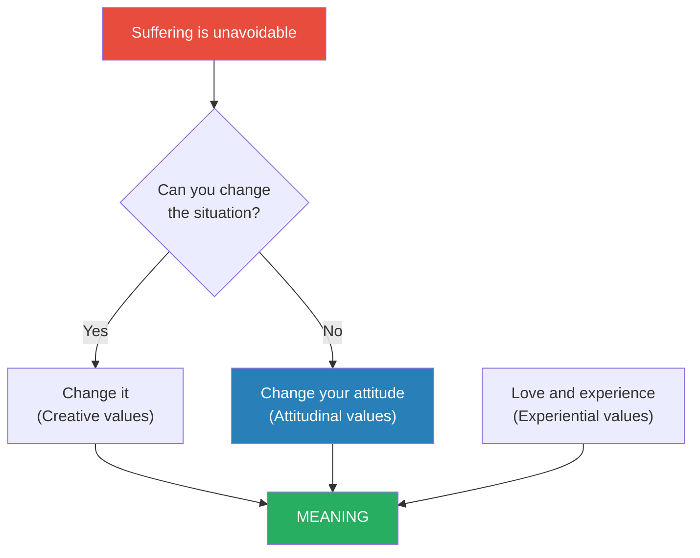
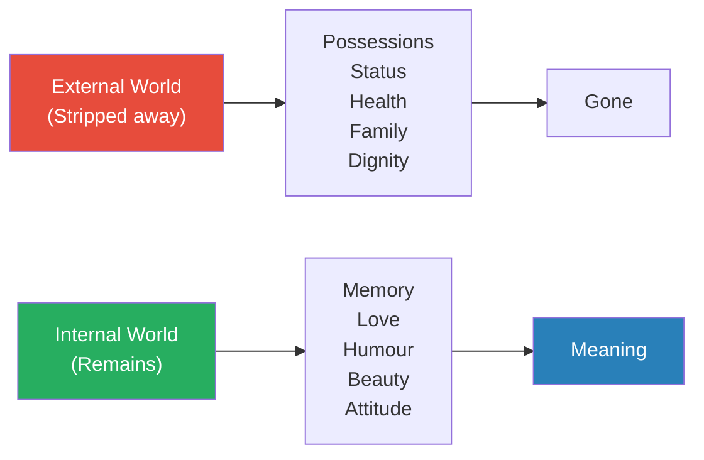
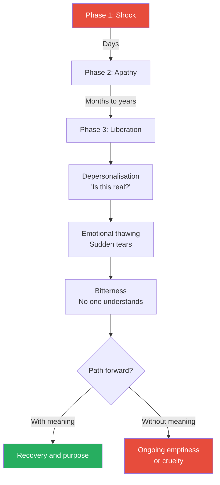
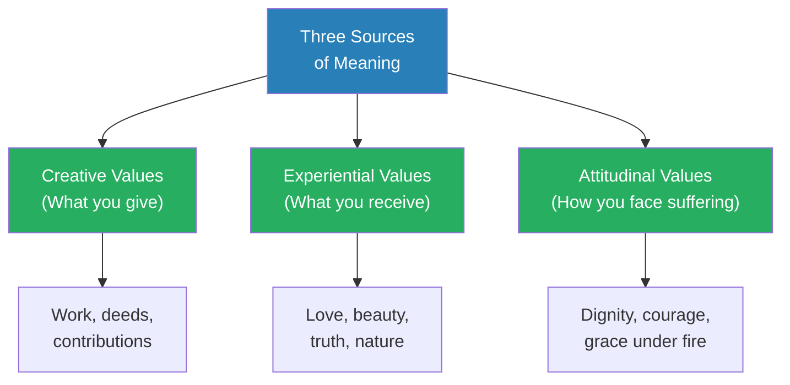
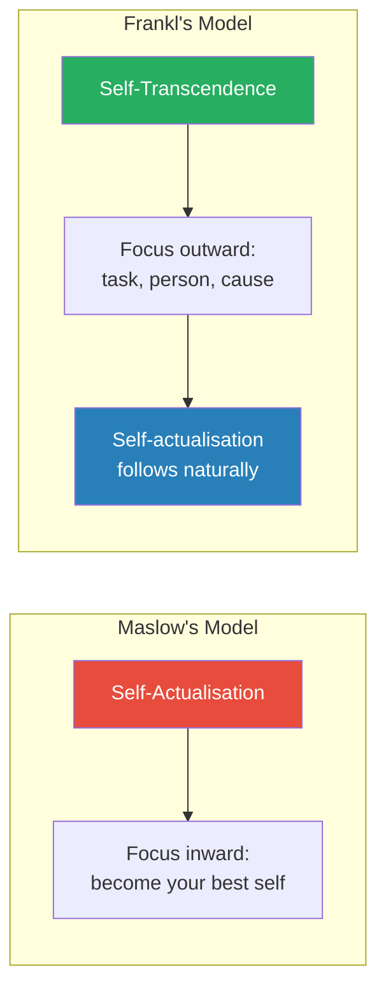
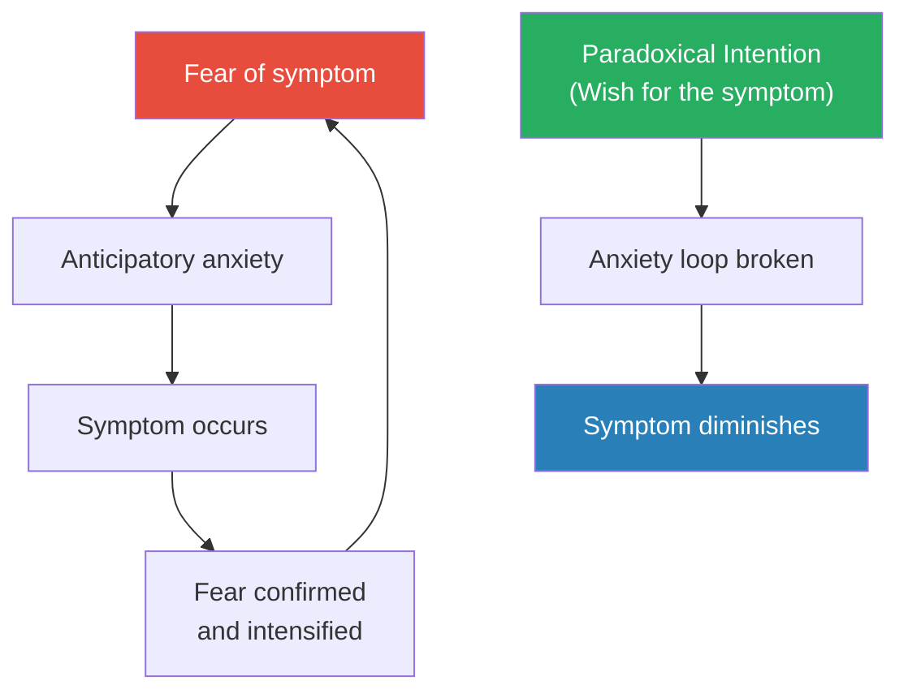
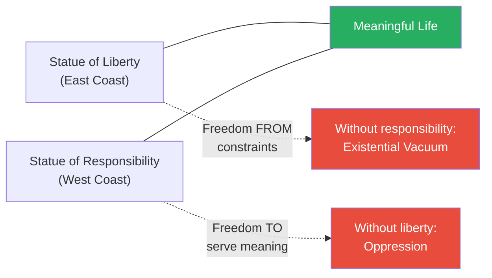

# Man's Search for Meaning — Viktor E. Frankl

> Viktor Frankl survived Auschwitz, Dachau, and two other Nazi concentration camps between 1944 and 1945. His parents, brother, and pregnant wife did not.
> From that annihilation, he drew a single, unshakeable conclusion: the people who survived the camps were not the strongest or the smartest — they were the ones who found meaning in their suffering.
> The first half of this short, searing book is a memoir of the camps — a psychiatrist's clinical eye turned on the most extreme human degradation ever engineered. The second half is an introduction to logotherapy — Frankl's school of psychotherapy built on the premise that the primary human drive is not pleasure (as Freud believed) or power (as Adler believed) but the search for meaning.
> It has sold over sixteen million copies worldwide, been translated into more than fifty languages, and was named one of the ten most influential books in America by the Library of Congress.
> It is one of the most important books of the twentieth century, and one of the shortest. Every sentence earns its place.

---

## About the Author

Viktor Emil Frankl (1905–1997) was an Austrian neurologist, psychiatrist, philosopher, and Holocaust survivor. Before the war, he had already developed the foundations of logotherapy while directing the neurological department at the Rothschild Hospital in Vienna, where he treated thousands of patients at risk of suicide. He was deported to Auschwitz in September 1944 along with his wife Tilly, his parents, and his brother Walter — all of whom perished in the camps. After liberation in April 1945, he returned to Vienna and wrote the first draft of this book in nine consecutive days, dictating much of it to assistants. He went on to hold professorships at the University of Vienna for twenty-five years, lectured at Harvard, Stanford, and over two hundred other universities worldwide, and received twenty-nine honorary doctoral degrees before his death at age ninety-two.
His book *Man's Search for Meaning* has sold over sixteen million copies and has been translated into more than fifty languages — making it one of the most widely read non-fiction works of all time.

---

## The Big Idea

- <b style="color: #2980b9">"He who has a why to live can bear almost any how"</b> — Nietzsche's aphorism, quoted by Frankl as the book's governing thesis
- The central insight from the camps: when everything external is stripped away — possessions, status, health, family, dignity, hope — what remains is <b style="color: #27ae60">the freedom to choose your attitude toward your circumstances</b>
- This is what Frankl calls the "last of human freedoms" — the one freedom that cannot be taken by any external force
- Those prisoners who found meaning — in love, in a task yet to complete, in the attitude they chose toward unavoidable suffering — survived at higher rates than those who surrendered to despair
- Frankl does not romanticise suffering — he is explicit that unnecessary suffering is masochistic, not meaningful
  - Meaning through suffering applies only when suffering cannot be avoided
  - When you can change the situation, you should change it
  - The hierarchy is clear: create first, experience second, endure last

---

- <b style="color: #2980b9">Logotherapy</b>, from the Greek *logos* (meaning), is the therapeutic system Frankl built from these observations:
  - It is forward-looking rather than backward-looking — it asks "what is your life asking of you?" rather than "what happened to you as a child?"
  - It treats the patient as a meaning-seeking being, not a pleasure-seeking or power-seeking one
  - It holds that meaning is objective and discoverable — not invented by the patient, but found in the world through tasks, encounters, and attitudes
- Where Freudian psychoanalysis digs into the past and Adlerian psychology focuses on social comparison and superiority, logotherapy points the patient toward the future — toward a meaning that has not yet been fulfilled

Frankl's three pathways to meaning form the core architecture of the book — every story, every clinical case, every philosophical argument maps back to this diagram.

---

## Key Concepts at a Glance

| Concept | One-line summary |
|---------|-----------------|
| **Logotherapy** | Therapy through meaning — the "Third Viennese School" after Freud and Adler |
| **The Will to Meaning** | The primary human drive is not pleasure or power but the search for meaning |
| **Three Sources of Meaning** | Creative values (work), Experiential values (love/beauty), Attitudinal values (suffering) |
| **The Last Freedom** | The freedom to choose your attitude — the one thing no one can take from you |
| **The Existential Vacuum** | The modern epidemic of boredom, emptiness, and meaninglessness |
| **Noogenic Neurosis** | Mental illness originating from a crisis of meaning, not a biological or psychological cause |
| **Sunday Neurosis** | Depression that strikes when the weekend reveals a life empty of purpose |
| **Paradoxical Intention** | Prescribing the symptom to break the anxiety or phobia cycle |
| **Dereflection** | Redirecting attention away from the self and toward a meaningful task or person |
| **Tragic Optimism** | Saying yes to life in spite of everything — finding meaning despite pain, guilt, and death |
| **Self-Transcendence** | The idea that being human means being directed toward something beyond yourself |
| **Dimensional Ontology** | Viewing the human being across multiple dimensions — biological, psychological, and spiritual |

---

## Part 1: Experiences in a Concentration Camp

*Frankl does not write as a victim. He writes as a psychiatrist observing the psychological reactions of himself and his fellow prisoners under conditions no laboratory could ever ethically create — and drawing conclusions about what it means to be human.*

### Arrival and the First Selection

- Frankl and approximately 1,500 others arrived at Auschwitz by train in October 1944
- They had been crammed into cattle cars — eighty people per car, each allowed to carry only what they were wearing
- At arrival, an SS officer directed each person to the left or the right with a casual flick of his finger
  - Left: the gas chambers (roughly 90% of each transport)
  - Right: forced labour
- Of the 1,500 on Frankl's transport, only about 150 were sent to the right
- Frankl was saved partly by chance and partly by a small act of defiance — he stood taller, presenting himself as a worker rather than an academic

> [!example] The Manuscript in the Coat (1944)
> - Before deportation, Frankl had completed a manuscript — his life's work on logotherapy, years of clinical research and philosophical development
> - He sewed the manuscript into the lining of his coat, hoping to preserve it through whatever came next
> - Upon arrival at Auschwitz, prisoners were ordered to strip and surrender all possessions
> - The coat — and with it, his entire manuscript — was taken and destroyed
> - In exchange, he was given the threadbare rags of a prisoner who had already been sent to the gas chamber
> - In the pocket of those rags, he found a single torn page from a Hebrew prayer book containing the Shema Yisrael — the most central prayer in Judaism
> - Frankl interpreted this as a sign: he must live his manuscript rather than merely write it
> **The lesson:** When everything you have created is destroyed, the task is not to mourn the loss but to create again — to live the ideas rather than merely document them.

---

### The Three Phases of Camp Psychology

*Frankl the psychiatrist observed that every prisoner — himself included — passed through three distinct psychological phases. Understanding these phases reveals how the human mind adapts to the unimaginable.*

| Phase | Period | Characteristic Symptom | Psychological Function |
|-------|--------|----------------------|----------------------|
| **1. Shock** | Arrival (first days) | Disbelief, curiosity, occasional humour | Defence mechanism — the mind refuses to accept reality |
| **2. Apathy** | Settled captivity (weeks to months) | Emotional death, numbness, indifference to cruelty | A necessary anaesthesia of the soul — without it, the mind would break |
| **3. Depersonalisation** | After liberation | Inability to feel pleasure, disbelief that freedom is real | The personality must slowly relearn how to feel after years of protective shutdown |

Phase 2 (Apathy) was the longest and most lethal — low emotional intensity masked the highest survival threat, as prisoners who surrendered to numbness often died within days.

---

#### Phase 1: Shock

- The first phase began the moment prisoners glimpsed the barbed wire and smokestacks of Auschwitz
- <b style="color: #2980b9">The "delusion of reprieve"</b> — a well-known psychological phenomenon — dominated this phase:
  - Condemned people cling to the hope that somehow they will be spared
  - Prisoners told themselves that their camp would be different, that the chimneys were not what they appeared to be, that surely someone would intervene
  - This delusion served a protective function — it kept prisoners functioning during the critical first hours when psychological collapse was most likely
- Frankl noticed moments of dark humour even during the first hours
  - A fellow prisoner joked about the shower sign above what they feared was a gas chamber
  - Gallows humour became a survival tool — a way of asserting psychological distance from horror

> [!example] The Curious Detachment (Auschwitz, 1944)
> - On his first morning, Frankl and other new arrivals watched veteran prisoners move through routines with blank faces
> - They witnessed a beating and felt horror — but noticed the veterans barely looked up
> - Frankl realised with clinical fascination that he was observing the psychological mechanism of adaptation in real time
> - Within days, he himself would stop reacting to beatings, to corpses in the ditches, to the smell from the chimneys
> - He recognised this as the beginning of Phase 2 — the protective numbness that the psyche generates to survive what conscious feeling cannot endure
> **The lesson:** The human mind has built-in circuit breakers. When reality becomes too terrible, the mind dims its own emotional capacity to prevent total breakdown.

---

#### Phase 2: Apathy — The Death of Feeling

*The second phase was the longest and the most dangerous — a state of emotional anaesthesia so complete that prisoners could watch atrocities and feel nothing at all. Frankl the psychiatrist watched himself losing his own humanity and took clinical notes on the process.*

- <b style="color: #27ae60">Apathy was not weakness — it was the mind's survival strategy</b>
  - Without emotional numbness, the constant exposure to beatings, starvation, disease, and death would have destroyed every prisoner within weeks
  - The psyche protects itself by narrowing its focus to the most primitive concerns: food, warmth, avoiding the next blow
- Prisoners' inner lives contracted to almost nothing:
  - They stopped dreaming about the future
  - They stopped mourning the dead
  - They stopped feeling disgust at the vermin, the filth, the conditions
  - They could eat a bowl of watery soup next to a corpse and think only of whether they might get a second bowl
- <b style="color: #e74c3c">This emotional death was the default trajectory — and it killed more prisoners than typhus</b>
  - Once a prisoner stopped caring entirely, they entered a downward spiral
  - They refused to get dressed, refused to wash, refused to go to roll call
  - They lay in their bunks and smoked their last cigarette — a sign every prisoner recognised as the end
  - The camp veterans had a saying: when a man smokes his last cigarette, he is beyond help

> [!example] The Man Who Smoked His Last Cigarette
> - Frankl describes a pattern he witnessed repeatedly in the camps
> - A prisoner would withdraw — no longer speaking, no longer eating his ration, no longer responding to commands
> - Then he would take out his hidden cigarette — prisoners traded food for tobacco, so a cigarette had real survival value
> - The act of smoking it meant the prisoner had decided, consciously or unconsciously, that survival was no longer worth the effort
> - Within 48 hours of smoking that cigarette, the prisoner was invariably dead
> - The cause was not the cigarette — it was the extinction of the will to live
> **The lesson:** The body follows the mind. When the mind declares that life is no longer worth living, the body complies — often with astonishing speed.

---

#### The Camp Hierarchy and the Moral Test

*Frankl's account of the camp's social structure reveals a disturbing truth about human nature: extreme conditions do not make people better or worse — they reveal what was already there.*

- The camps created a brutal internal hierarchy:
  - **SS guards** — absolute power, unlimited cruelty
  - **Capos** — prisoners selected by the SS to serve as overseers of other prisoners
  - **Ordinary prisoners** — the vast majority, subject to the whims of both guards and Capos
- <b style="color: #e74c3c">The Capo system was one of the most psychologically devastating features of the camps</b>:
  - Capos were given marginally better food, lighter work, and the authority to beat other prisoners
  - Many Capos became more brutal than the SS guards themselves — because their survival depended on pleasing the guards
  - The selection process was deliberate: the SS chose the most aggressive and least empathetic prisoners as Capos, knowing they would enforce discipline more viciously than hired guards
  - This created moral degradation from within — prisoners were not only oppressed by their captors but by their own fellow prisoners

> [!example] The Capo Who Was Once a Surgeon
> - Frankl describes a Capo who had been a respected physician before the war
> - Given authority over other prisoners, the man became a sadist — beating those who moved too slowly, denying water to the sick, favouring those who flattered him
> - Other prisoners who had known him before were stunned — this was not the man they remembered
> - Frankl's analysis: the Capo had not become a different person; the extreme conditions had surfaced traits that comfort and civilisation had previously suppressed
> - When the sole incentive is survival, some people abandon every principle that normal life made easy to maintain
> **The lesson:** Character is not tested in comfort. It is tested when everything — food, warmth, safety — depends on how far you are willing to compromise your values.

- But Frankl is emphatic that the camps also revealed the opposite:
  - Some guards were kind — quietly giving prisoners extra bread, looking the other way during minor infractions
  - Some prisoners maintained extraordinary moral integrity — sharing their last rations, caring for the sick, refusing to become Capos even when offered
  - <b style="color: #27ae60">The camps proved that in every group — even the worst — there are decent individuals, and in every group — even the best — there are those who will fail the moral test</b>
  - Frankl refuses to divide humanity into "good people" and "bad people" — he insists that the dividing line runs through every individual

> [!example] The SS Guard Who Smuggled Medication
> - Frankl describes an SS officer at one of his camps who secretly purchased medication for prisoners using his own money
> - The guard risked severe punishment — aiding prisoners was a court-martial offence
> - He never spoke of it and asked for nothing in return
> - After liberation, some prisoners testified on his behalf, saving him from prosecution
> - Frankl uses this story to argue against collective guilt — the idea that all members of a group share the guilt of the group's worst members
> **The lesson:** Decency is not a function of group membership. It is an individual choice that can be made under any conditions, by anyone — even a member of the most criminal organisation in history.

> [!tip] Core Insight
> Frankl's most controversial and least comfortable claim: neither suffering nor privilege determines moral character. Suffering does not automatically ennoble. Power does not automatically corrupt. In every situation, the individual retains the freedom — and the responsibility — to choose who they will be.

---

- But within this grey landscape of apathy, something remarkable happened for some prisoners:
  - Their inner lives intensified rather than diminished
  - <b style="color: #27ae60">As the external world was reduced to nothing, the internal world became vivid</b>
  - Frankl describes prisoners standing in freezing roll call at 3 AM, watching a sunset through the barbed wire and being moved to tears by its beauty
  - He describes impromptu poetry recitations in the barracks, prisoners sharing fragments of Goethe or Rilke from memory
  - The uglier the external world became, the more some prisoners retreated into beauty, memory, love, and imagination

> [!example] The Sunset Through the Barbed Wire
> - One evening, exhausted from a day of digging frozen ground, the prisoners were marched back to camp
> - The sky over Salzburg had turned a violent orange and purple — one of those sunsets so dramatic it looks unreal
> - A prisoner next to Frankl tugged his sleeve and whispered: "How beautiful the world could be"
> - For a few minutes, in silence, emaciated prisoners who had not eaten a proper meal in months stood watching the sky
> - Frankl recognised this as evidence that beauty could penetrate even the most degraded conditions — that the human capacity for awe was not extinguished by starvation
> **The lesson:** The capacity for beauty, wonder, and transcendence exists independently of external circumstances. It can be suppressed, but it cannot be destroyed.

> [!tip] Core Insight
> The apathy phase reveals the central paradox of the camps: the same conditions that killed the inner life of most prisoners intensified the inner life of a few. The difference was not physical strength or prior psychological health — it was whether the prisoner could find something worth preserving inside themselves.

---

#### The Role of Love and Memory

*Frankl's most famous passage comes from this phase — his discovery that love transcends physical presence and that thinking of the beloved is itself a form of meaning.*

- During a forced march in the bitter cold, stumbling over frozen ground in the dark, Frankl found his mind turning to his wife Tilly
- He did not know whether she was alive or dead (she was, in fact, already dead — murdered at Bergen-Belsen)
- But he discovered that her physical existence was irrelevant to the love he felt:
  - He could see her face with absolute clarity
  - He could hear her voice, her laugh, her encouragement
  - <b style="color: #27ae60">The image of the beloved gave his suffering a context, a direction, a reason to keep walking</b>
- He understood in that moment what the poets and mystics had always said: love transcends the physical person
  - It does not require the beloved to be alive
  - It does not require the beloved to be present
  - The act of loving — of holding someone in your consciousness — is itself a form of meaning

> [!example] The Forced March to Dachau (Winter 1944-45)
> - Frankl was marched with other prisoners through frozen terrain, beaten by guards if they slowed
> - His shoes were torn and his feet were bleeding
> - To survive the march psychologically, he began an imaginary conversation with his wife
> - He asked her questions and heard her answers — her image became more real to him than the guards, the ice, the pain
> - A fellow prisoner stumbled and fell beside him, muttering: "If our wives could see us now"
> - Frankl realised that they were both doing the same thing — using love as a psychological anchor against despair
> - He later wrote that this was the moment he understood that love is "the ultimate and highest goal to which man can aspire"
> **The lesson:** Love does not require physical proximity. Holding the image of someone you love in your mind — actively, deliberately — is itself a form of meaning strong enough to sustain life through the worst conditions.

The camp stripped away every external possession and identity marker. What remained — or didn't — determined who survived.

---

### The Prisoners Who Gave Up and the Prisoners Who Endured

*Frankl observed that survival in the camps was not random. Physical robustness played a role, but psychological orientation played a larger one — sometimes a decisive one.*

- <b style="color: #e74c3c">The most dangerous moment was when a prisoner lost their orientation toward the future</b>
  - A prisoner who no longer believed they would see their family, complete their work, or experience freedom again had nothing to pull them forward
  - Without that forward pull, the present became unbearable
  - The present was always unbearable — the only thing that made it survivable was the belief that it was temporary
- The prisoners who survived tended to have:
  - A specific person they wanted to see again
  - A specific task they wanted to complete
  - A religious faith that gave suffering a transcendent context
  - Or an unusual capacity for finding beauty, humour, or meaning in the daily details of camp life

> [!example] The Man Who Dreamed of March 30 (1945)
> - A fellow prisoner — a well-known composer — confided to Frankl in February 1945 that he had dreamed they would be liberated on March 30
> - He was filled with hope, certain the dream was prophetic
> - As March progressed with no sign of liberation, his hope began to falter
> - By March 29, he had developed a high fever
> - On March 30 — the day of his predicted liberation — he became delirious
> - On March 31, he was dead
> - The official cause was typhus — but Frankl observed that many prisoners carried typhus without dying from it
> - His interpretation: the man's immune system collapsed at the exact moment his meaning was extinguished
> - When the dream proved false, his will to meaning disappeared — and his body followed
> **The lesson:** Hope without a foundation is dangerous. But hopelessness is worse. The prisoners who survived were not the most optimistic — they were the ones whose meaning did not depend on a specific date or outcome.

---

- Frankl records a critical speech he gave to fellow prisoners in a particularly dark period:
  - Several prisoners had expressed suicidal thoughts
  - The camp's conditions had worsened — rations had been cut, the cold had intensified, and a rumour was circulating that they would all be gassed
  - Frankl stood before them and argued that life still had meaning — even here, even now
  - He told one man that his child was waiting for him in another country — that child still needed a father
  - He told another that he was a scientist whose research was unfinished — the world needed his work
  - He told the group that their suffering itself could be meaningful if they chose to bear it with dignity
  - <b style="color: #27ae60">The speech worked — not because it was eloquent, but because it gave each man a specific, personal reason to survive the next day</b>

> [!abstract] Frankl's Method for Restoring the Will to Live
> 1. Stop asking "What do I expect from life?" — this leads to despair when life delivers suffering
> 2. Instead ask: "What does life expect from ME?" — this reverses the question and puts the person in the position of answering
> 3. Identify one specific, concrete thing that only this person can do: a child to raise, a book to write, a person to love
> 4. Make the future concrete rather than abstract: not "things will get better" but "your daughter in Switzerland needs you to walk through that door"
> 5. Reframe suffering as a task: if you cannot change the situation, can you bear it with dignity?

---

> [!example] The Scientist and the Series of Books (Camp Speech)
> - During the speech, Frankl turned to a specific prisoner — a scientist who had begun a series of textbooks before the war
> - The series was unfinished — several volumes remained to be written, and no one else had the knowledge to complete them
> - Frankl told him: "You cannot be replaced. No one else can write those books. They are waiting for you."
> - The man wept — not from sadness, but from the sudden recontact with his own identity as a creator, not just a prisoner number
> - He survived the war and completed the series
> **The lesson:** Abstract hope ("things will get better") is weak. Concrete, personal meaning ("this specific task needs you specifically") is strong enough to keep a person alive.

---

### The Decision Not to Escape

*One of the most revealing episodes in the book is Frankl's account of a moment when he had the opportunity to escape — and chose not to.*

> [!example] Frankl's Choice to Stay (1944)
> - A fellow prisoner who worked in the camp hospital told Frankl that a group was planning an escape
> - Frankl was invited to join — his medical skills would be valuable
> - He was tempted — escape might mean survival, might mean reaching the Allies, might mean freedom
> - But then he walked through the camp's "typhus ward" — a shed full of dying prisoners, some of them his patients
> - One patient looked up at him with feverish eyes and said: "You too are getting out?"
> - Frankl felt a wave of something he could not name — responsibility, guilt, obligation, love — and made his decision
> - He told the escape group he was staying
> - He returned to the typhus ward and sat with his patients
> - As it turned out, the escape group was recaptured and killed
> - But Frankl insists this was not the point — he did not stay because he foresaw the outcome; he stayed because his patients needed him
> **The lesson:** Meaning is not always convenient. Sometimes it asks you to stay in the place of greatest suffering because that is where you are most needed.

> [!tip] Core Insight
> The decision not to escape is Frankl's thesis in action. He did not choose the logical option (escape and survive) or the hedonistic option (minimise suffering). He chose the meaningful option — remain with those who depended on him. This is the will to meaning overriding both the will to pleasure and the will to power.

---

#### Phase 3: After Liberation — The Psychology of the Freed Prisoner

*Liberation was not the joyful moment the world imagined. For most prisoners, it was a psychological crisis as severe as the imprisonment itself.*

- When American soldiers liberated Frankl's camp in April 1945, many prisoners did not react at all
  - They had lost the capacity to feel joy
  - <b style="color: #2980b9">"We had literally lost the ability to feel pleased"</b>
  - They walked out of the gates and looked at the fields and flowers and felt nothing
- The psychological process of recovery was slow and painful:
  - First came a period of depersonalisation — "Is this real? Is it a dream?"
  - Then came a gradual thawing of emotion — prisoners would suddenly burst into tears for no apparent reason
  - Then came bitterness — the discovery that no one on the outside understood what they had been through, that the world had continued without them, that their families were dead
  - <b style="color: #e74c3c">Some liberated prisoners became cruel themselves</b> — having been oppressed so completely, they now justified their own violence: "We suffered, so we are entitled"
  - Frankl warns that this cycle of the oppressed becoming the oppressor is one of the greatest dangers of prolonged suffering

> [!example] The Farmer's Field (April 1945)
> - Shortly after liberation, Frankl walked with a fellow prisoner through a field of young crops
> - The other man, still dazed, began trampling the green shoots
> - Frankl stopped him and said: "You cannot do that"
> - The man looked at him blankly — after years of having everything taken from him, the concept of respecting property felt foreign
> - Frankl realised that liberation had removed the external chains but not the internal damage
> - The prisoner was free, but freedom without meaning was just another form of emptiness
> **The lesson:** Freedom alone is not enough. Without meaning to direct it, freedom can become destructive.

- Frankl emphasises that the psychological damage of liberation was deepened by the returning prisoner's discovery that the world had moved on:
  - Their homes were occupied by strangers
  - Their families were dead
  - Their friends had forgotten them — or worse, did not want to hear about what had happened
  - The returning prisoner who expected gratitude or understanding found mostly embarrassment and impatience
  - <b style="color: #e74c3c">The loneliest moment was not in the camp — it was coming home to a world that could not comprehend what you had endured</b>

> [!example] The Man Who Returned to His Village (1945)
> - Frankl describes a prisoner who walked for days after liberation to return to his village in Austria
> - He arrived to find his house intact, his street unchanged, his neighbours going about their routines
> - He knocked on doors expecting to be received as someone returned from the dead
> - Instead, his neighbours were awkward and distant — some had profited from the deportation of Jews, and his presence was an uncomfortable reminder
> - He stood in the middle of the village square and felt more alone than he had ever felt in the camp
> - In the camp, at least the suffering was shared — here, it was invisible
> **The lesson:** Liberation from physical imprisonment is only the first step. Liberation from psychological damage requires something harder: finding new meaning in a world that has moved on without you.

The three phases map the prisoner's psychological journey — but the critical fork comes after liberation, when meaning (or its absence) determines whether freedom becomes healing or hollow.

---

## Part 2: Logotherapy in a Nutshell

*Frankl writes the second part of the book as a concise introduction to the therapeutic system he spent his career developing — one built not in a lecture hall but in the camps, where he tested its principles against the worst conditions humanity has ever created.*

### The Will to Meaning — The Third Viennese School

*Frankl positions logotherapy as the successor to two earlier Viennese schools of psychotherapy. Where Freud and Adler saw pleasure and power, Frankl sees meaning — and argues the evidence is on his side.*

- <b style="color: #2980b9">The First Viennese School</b> — Sigmund Freud:
  - The primary human drive is the **will to pleasure** — the pursuit of gratification and the avoidance of pain
  - Neurosis arises from the repression of instinctual drives, particularly sexual ones
  - Therapy involves uncovering the unconscious conflicts driving the patient's symptoms
- <b style="color: #2980b9">The Second Viennese School</b> — Alfred Adler:
  - The primary human drive is the **will to power** — the desire for significance, superiority, and control
  - Neurosis arises from feelings of inferiority and the compensatory strategies people develop
  - Therapy involves understanding the patient's "style of life" and their pursuit of fictional goals
- <b style="color: #2980b9">The Third Viennese School</b> — Viktor Frankl:
  - The primary human drive is the <b style="color: #27ae60">will to meaning</b> — the desire to find purpose, significance, and value in one's existence
  - Neurosis can arise from a frustrated will to meaning — what Frankl calls <b style="color: #2980b9">noogenic neurosis</b> (from the Greek *noos*, mind)
  - Therapy involves helping the patient discover the unique meaning waiting for them in their specific life situation

| School | Founder | Primary Drive | Source of Neurosis | Therapy Focus |
|--------|---------|--------------|-------------------|---------------|
| **Psychoanalysis** | Freud | Will to pleasure | Repressed instincts | Uncover unconscious conflicts |
| **Individual Psychology** | Adler | Will to power | Feelings of inferiority | Understand compensatory strategies |
| **Logotherapy** | Frankl | Will to meaning | Existential vacuum | Discover concrete personal meaning |

Frankl's logotherapy claims the largest block because the will to meaning encompasses and explains the other drives — pleasure and power are by-products of meaning, not substitutes for it.

Frankl is careful not to reject Freud and Adler entirely — he acknowledges that pleasure and power matter. But he argues they are side effects of meaning, not ends in themselves.

---

- Frankl's evidence for the will to meaning:
  - In the camps, prisoners who had meaning survived; those who lost it died — even when their physical conditions were identical
  - In clinical practice, patients who found meaning recovered; those who were merely given pleasure or power did not
  - The epidemic of meaninglessness in affluent societies — where pleasure and power are abundant but depression and suicide are rising — suggests that neither pleasure nor power satisfies the deepest human need
  - <b style="color: #e74c3c">Pleasure pursued directly becomes compulsive and unsatisfying</b> — this is Frankl's explanation for addiction, which he sees as a substitute for meaning
  - Power pursued as an end in itself becomes hollow and paranoid — the dictator who has everything but trusts no one

> [!tip] Core Insight
> Pleasure and power are by-products of a meaningful life, not substitutes for one. Chase meaning, and pleasure and fulfilment follow naturally. Chase pleasure directly, and it recedes — the phenomenon Frankl calls "hyper-intention."

---

### The Three Sources of Meaning

*Frankl identifies three — and only three — pathways through which a human being can find genuine meaning. Every meaningful moment in every human life, he argues, falls into one of these categories.*

#### 1. Creative Values — What You Give to the World

- <b style="color: #27ae60">Meaning through creating</b>: a work, a deed, a contribution, an act of service
- This is the most obvious pathway — the one most people think of first
  - Writing a book, building a business, raising a child, solving a problem, making a meal
  - Any act of creation that puts something into the world that wasn't there before
- Frankl emphasises that creative meaning does not require grand achievement:
  - The carpenter who builds a cabinet well has found meaning through creative values
  - The nurse who comforts a dying patient has found meaning through creative values
  - The prisoner who shares half his bread has found meaning through creative values
- <b style="color: #e74c3c">The danger of creative values</b>: when people identify meaning exclusively with their work, retirement or job loss can trigger an existential crisis

> [!example] Frankl Reconstructing His Manuscript (1944-45)
> - After the original manuscript was destroyed at Auschwitz, Frankl did not give up on its ideas
> - Instead, he began mentally reconstructing the key arguments — lecturing to imaginary audiences in his head during forced marches, during roll call, during the endless hours of waiting
> - He scribbled notes on scraps of paper when he could find them
> - The act of reconstructing his life's work became itself a form of creative meaning — a reason to survive each day
> - After liberation, he dictated the final version of the book in nine days
> - The published version of *Man's Search for Meaning* became one of the most influential books of the twentieth century — born from the destruction of its own earlier draft
> **The lesson:** Creative meaning is not destroyed when its products are destroyed. The capacity to create again is itself a form of meaning.

---

#### 2. Experiential Values — What You Receive from the World

- <b style="color: #27ae60">Meaning through experiencing</b>: encountering beauty, truth, love, nature, art, another human being
- This pathway is passive in form but active in reception — it requires openness, attention, and the willingness to be moved
- Frankl's primary example is love:
  - Love is not merely an emotion — it is a mode of seeing
  - To love someone is to see their essential nature, their potential, the person they could become
  - The lover sees what is hidden from everyone else — and by seeing it, helps bring it into existence
- But experiential values extend beyond love:
  - A prisoner watching a sunset through barbed wire is finding meaning through experiential values
  - A patient listening to music that moves them to tears is finding meaning through experiential values
  - A philosopher encountering a truth for the first time is finding meaning through experiential values

> [!example] The Impromptu Concert in the Barracks
> - Frankl describes an evening when a prisoner who had been a professional singer stood up in the barracks
> - Without accompaniment, without an audience that had paid admission, without even adequate light, he began to sing
> - The other prisoners stopped what they were doing — some had been fighting over scraps, some had been lying in apathetic silence
> - For a few minutes, the barracks was transformed — not physically, but experientially
> - Prisoners wept — not from sadness, but from the sudden re-contact with beauty
> - Frankl notes that this was not escapism; it was the opposite — it was a moment of heightened reality, of being more alive, not less
> **The lesson:** Beauty is not a luxury to be enjoyed after survival is secured. It is a form of meaning that sustains survival itself.

---

#### 3. Attitudinal Values — How You Face What Cannot Be Changed

- <b style="color: #27ae60">Meaning through the attitude you take toward unavoidable suffering</b>
- This is Frankl's most radical and original contribution — the idea that suffering itself can be a source of meaning
- But he is emphatic about the conditions:
  - The suffering must be unavoidable — if you can remove the cause, you should
  - The meaning comes from the attitude, not from the suffering itself
  - <b style="color: #e74c3c">Choosing to suffer when you don't have to is not meaningful — it is masochistic</b>
- How attitudinal values work:
  - When you face suffering you cannot change, you still have a choice about HOW you face it
  - You can face it with dignity, courage, and grace — or with bitterness, self-pity, and despair
  - The choice of attitude is itself an achievement — a moral act that transforms raw suffering into something meaningful
  - This is what Frankl calls the "defiant power of the human spirit"

> [!example] The Doctor Mourning His Wife (Clinical Case)
> - After the war, Frankl treated an elderly doctor who was consumed by grief after the death of his wife
> - Two years had passed, and the man could not recover — he loved her deeply and saw no reason to continue
> - Frankl asked him a single question: "What would have happened if you had died first, and your wife had survived?"
> - The doctor answered immediately: "That would have been terrible. She would have suffered so much."
> - Frankl replied: "You see? She has been spared that suffering — and the price is that you must survive and mourn her."
> - The man said nothing, shook Frankl's hand, and left
> - His grief did not disappear — but it was transformed from meaningless suffering into a meaningful sacrifice
> - By reframing the grief as something he was bearing so that his wife did not have to, the doctor found attitudinal meaning in his pain
> **The lesson:** Suffering ceases to be suffering the moment it finds a meaning. It does not become pleasant — but it becomes bearable.

> [!tip] Core Insight
> Attitudinal values are the final safety net of the human spirit. When you cannot create and you cannot experience — when you are stripped of every capacity except consciousness itself — you can still choose your stance toward your fate. This is the "last of human freedoms" and the foundation of everything Frankl teaches.

The three sources form a hierarchy of last resort: when creative values are blocked, experiential values remain; when experiential values are blocked, attitudinal values remain. There is no situation in which all three are simultaneously unavailable.

---

### The Existential Vacuum

*Frankl identifies what he believes is the defining psychological disease of modernity — not anxiety, not depression, but a deeper emptiness from which both arise.*

- <b style="color: #2980b9">The existential vacuum</b> is the state of inner emptiness that results from a frustrated will to meaning
- It manifests as:
  - Pervasive boredom — not the boredom of having nothing to do, but the boredom of nothing mattering
  - A sense that life is pointless, directionless, fundamentally empty
  - Apathy, cynicism, and the feeling that nothing is worth investing in
- Frankl traces the vacuum to two losses unique to modernity:
  - **The loss of instinct**: unlike animals, humans are not told by their biology what they must do
  - **The loss of tradition**: unlike previous generations, modern people are not told by their culture what they should do
  - The result: no internal compass and no external compass, leaving the individual adrift
- <b style="color: #e74c3c">The existential vacuum is the soil in which neurosis, depression, aggression, and addiction take root</b>

---

- Frankl observed the vacuum spreading even in the 1960s and 1970s — and predicted it would worsen:
  - He noted that affluence makes the vacuum more visible, not less — when basic needs are met, the absence of meaning has nowhere to hide
  - He found that the vacuum was especially prevalent among young people and retirees — two groups whose social roles are most ambiguous
  - He documented what he called <b style="color: #2980b9">the mass neurotic triad</b> — three symptoms he saw as the direct consequences of the existential vacuum:
    - **Depression** — the experience that nothing matters
    - **Aggression** — destructive behaviour as a response to inner emptiness (if nothing matters, there is no reason not to be violent)
    - **Addiction** — the attempt to fill the vacuum with substances, stimulation, or compulsive activity
  - <b style="color: #e74c3c">All three, Frankl argued, are meaning-deficiency diseases</b> — you cannot treat them effectively without addressing the underlying vacuum

Depression and addiction dominate the symptom profile of the existential vacuum — both are meaning-deficiency diseases that cannot be treated effectively without addressing the underlying emptiness.

---

- Frankl identifies three common escape routes people use to flee the vacuum — all of which fail:
  - **Conformism**: doing what everyone else does — following the crowd because you cannot find your own direction
  - **Totalitarianism**: doing what someone tells you to do — surrendering your freedom to an authority because independence feels unbearable
  - **Pleasure-seeking**: filling the emptiness with stimulation — drugs, sex, entertainment, consumption — which provides temporary relief but deepens the vacuum in the long run

> [!example] The Sunday Neurosis
> - Frankl coined the term "Sunday neurosis" to describe a pattern he saw repeatedly in his clinical practice
> - Patients who were busy and productive all week would collapse into depression every weekend
> - When the structure of work was removed, the meaninglessness of their lives became visible
> - The rush of weekday activity had been masking an underlying vacuum — like noise drowning out silence
> - When the noise stopped on Sunday, the silence was unbearable
> - Frankl used these cases to argue that busyness is not the same as meaning — and that many apparently successful people are running from emptiness rather than toward purpose
> **The lesson:** If you dread unstructured time, it may be because activity is your anaesthetic. The existential vacuum becomes visible when you stop moving.

---

### Noogenic Neurosis

*Frankl draws a critical clinical distinction: not all mental suffering has psychological or biological origins. Some of it comes from the spirit — from the dimension of meaning.*

- <b style="color: #2980b9">Noogenic neurosis</b> is mental illness that originates in the *noological* (spiritual/meaning) dimension of human existence
  - It is not caused by conflicts between drives (Freud) or feelings of inferiority (Adler)
  - It is caused by conflicts of conscience, clashes of values, or a frustrated will to meaning
- Frankl estimated that roughly 20% of the neuroses he encountered in clinical practice were noogenic in origin
  - These patients did not need their unconscious explored or their childhood analysed
  - They needed help discovering what their life was asking of them
- <b style="color: #e74c3c">The danger of misdiagnosis</b>: treating a noogenic neurosis with conventional psychotherapy is like treating a broken leg with antidepressants — it addresses the wrong dimension entirely

| Neurosis Type | Origin | Example | Correct Treatment |
|--------------|--------|---------|-------------------|
| **Psychogenic** | Psychological conflicts | Repressed trauma, anxiety disorders | Psychotherapy (Freud, Adler) |
| **Somatogenic** | Biological/medical | Brain chemistry imbalance, hormonal issues | Medication, medical treatment |
| **Noogenic** | Meaning/spiritual | Existential crisis, loss of purpose, value conflicts | Logotherapy — finding meaning |

Frankl's three-category system is not meant to replace existing diagnoses — it is meant to add a dimension that conventional psychiatry ignores.

---

### Dimensional Ontology

*To explain how logotherapy relates to other approaches, Frankl introduces a metaphor from geometry — viewing the human being not as a flat surface but as a three-dimensional entity.*

- <b style="color: #2980b9">Dimensional ontology</b> is Frankl's way of resolving apparent contradictions between different views of human nature:
  - A cylinder, viewed from the side, looks like a rectangle
  - The same cylinder, viewed from below, looks like a circle
  - Both views are "true" — but neither captures the full reality of the three-dimensional object
- Applied to the human being:
  - Viewed from the biological dimension, a person is a collection of organs, chemistry, and drives
  - Viewed from the psychological dimension, the same person is a collection of instincts, conditioning, and unconscious conflicts
  - Viewed from the noological (spiritual/meaning) dimension, the same person is a being capable of self-transcendence, conscience, and the search for meaning
  - <b style="color: #27ae60">None of these views is wrong — but each alone is incomplete</b>
- The practical implication: a therapist who works only in the biological dimension (medication) or only in the psychological dimension (talk therapy) may miss the fact that the patient's suffering originates in the dimension of meaning

---

### Self-Transcendence — The Essence of Human Existence

*Frankl argues that the most fundamental characteristic of being human is not self-actualisation (as Maslow believed) but self-transcendence — the capacity to reach beyond yourself toward something or someone other than yourself.*

- <b style="color: #2980b9">Self-transcendence</b> means that being human is always being directed toward something beyond the self:
  - A meaning to fulfil
  - A person to love
  - A cause to serve
- Frankl explicitly disagrees with Abraham Maslow's hierarchy of needs:
  - Maslow places self-actualisation at the top of the pyramid — the idea that the ultimate goal is to become the best version of yourself
  - Frankl argues this is exactly backwards: <b style="color: #27ae60">self-actualisation happens as a side effect of self-transcendence</b>
  - The person who aims at self-actualisation misses it; the person who aims at a meaningful task achieves self-actualisation without trying
  - This parallels Frankl's argument about pleasure: happiness, like self-actualisation, cannot be pursued directly — it must ensue as a by-product of meaning

Frankl inverts the self-help assumption: the route to becoming your best self is to stop focusing on yourself and start focusing on what your life is asking of you.

---

### Paradoxical Intention

*One of logotherapy's most practical clinical techniques — a method for treating phobias and anxiety by prescribing the very thing the patient fears.*

- <b style="color: #2980b9">Paradoxical intention</b> works by asking the patient to deliberately wish for or exaggerate the feared outcome:
  - A patient who fears sweating in public is told: "Try to sweat as much as you possibly can — aim to drench yourself"
  - A patient who cannot sleep is told: "Try to stay awake as long as possible — don't let yourself fall asleep"
  - A patient who fears trembling during a presentation is told: "Show them just how brilliantly you can tremble"
- The mechanism:
  - <b style="color: #27ae60">Anxiety feeds on the attempt to suppress it</b> — the more you try NOT to be anxious, the more anxious you become
  - This is <b style="color: #2980b9">anticipatory anxiety</b>: the fear of the symptom produces the symptom, which reinforces the fear
  - Paradoxical intention breaks the cycle by replacing fearful avoidance with humorous exaggeration
  - When you try to produce the symptom intentionally, the involuntary mechanism that drives it is disrupted
  - Humour is the key ingredient — the ability to laugh at yourself creates psychological distance from the fear

> [!example] The Sweating Salesman (Clinical Case)
> - A patient came to Frankl suffering from severe hyperhidrosis — excessive sweating triggered by social anxiety
> - Every time he anticipated meeting a client, he began to sweat — and the awareness of sweating made him sweat more
> - The anticipatory anxiety had created a self-reinforcing loop: fear of sweating → sweating → more fear → more sweating
> - Frankl instructed him: "The next time you meet a client, try to show them just how much you can sweat. Tell yourself: 'I'm going to sweat so much they'll need a mop'"
> - The patient reported that when he tried to sweat deliberately, he could not — the paradoxical intention broke the anxiety loop
> - Within weeks, the chronic sweating had resolved
> **The lesson:** The attempt to suppress a symptom fuels it. The willingness to embrace it — with humour — defuses it.

> [!example] The Insomniac (Clinical Case)
> - Another patient had suffered from insomnia for years
> - Every night, he tried desperately to fall asleep — and the trying kept him awake
> - The harder he tried, the more alert he became — classic anticipatory anxiety applied to sleep
> - Frankl told him: "Don't try to sleep. Instead, try to stay awake. Keep your eyes open as long as you can."
> - The patient reported falling asleep within minutes — the paradoxical instruction removed the performance pressure that was preventing sleep
> **The lesson:** Sleep, like happiness, cannot be forced. It comes when you stop chasing it.

> [!abstract] The Paradoxical Intention Technique
> 1. Identify the feared symptom (sweating, insomnia, trembling, blushing)
> 2. Recognise the anticipatory anxiety loop: fear of symptom → symptom → more fear
> 3. Deliberately wish for the symptom: "I will try to sweat / tremble / blush as much as possible"
> 4. Exaggerate with humour: "I'll show them the most spectacular trembling they've ever seen"
> 5. The deliberate intention disrupts the involuntary mechanism — the symptom loses its power
> 6. Repeat until the anticipatory anxiety is extinguished

The anxiety loop is self-reinforcing — fear causes the symptom, which causes more fear. Paradoxical intention inserts a deliberate, humorous wish into the loop, breaking the involuntary mechanism.

---

### Dereflection

*Where paradoxical intention addresses excessive fear (hyper-intention), dereflection addresses excessive self-observation (hyper-reflection).*

- <b style="color: #2980b9">Dereflection</b> is the technique of redirecting attention away from the self and toward a task, a person, or a meaningful engagement
- It targets <b style="color: #2980b9">hyper-reflection</b> — the tendency to monitor yourself so closely that the very act of observation disrupts the observed process:
  - A man who constantly monitors his sexual performance creates the very dysfunction he fears
  - A student who obsessively monitors whether she is "learning" cannot concentrate enough to learn
  - A speaker who watches his own delivery becomes stilted and unnatural
- The mechanism:
  - Many human functions — sexual arousal, creativity, sleep, learning, flow — work best when they are not consciously observed
  - <b style="color: #e74c3c">Excessive self-monitoring disrupts the spontaneous processes that produce the desired outcome</b>
  - Dereflection works by giving the patient something outside themselves to focus on — a partner, a task, a cause — so that the self-monitoring stops and the natural function resumes
- Dereflection connects directly to self-transcendence:
  - When you aim at yourself (pleasure, performance, self-actualisation), you miss
  - When you aim beyond yourself (meaning, service, love), the self-focused goals happen as side effects

> [!example] The Man Who Couldn't Stop Watching Himself (Clinical Case)
> - A young man came to Frankl complaining that he could not enjoy conversations — he was always monitoring how he was coming across
> - During social interactions, a running commentary played in his head: "Am I being interesting? Do they like me? Was that joke funny?"
> - The self-monitoring made him stilted and artificial, which made the conversations worse, which increased the monitoring
> - Frankl instructed him to focus entirely on the other person — their words, their expressions, their needs — and to forget about himself completely
> - The patient protested: "But what if I say something stupid?"
> - Frankl replied: "You will. And it won't matter. Because you'll be too absorbed in the other person to notice."
> - Within weeks, the patient's social anxiety had significantly diminished — not because he had conquered his fear, but because he had redirected his attention
> **The lesson:** Self-consciousness is the enemy of natural functioning. The cure is not more self-awareness but less — redirect attention outward and the self takes care of itself.

> [!tip] Core Insight
> Paradoxical intention and dereflection are clinical applications of the same philosophical principle: human flourishing happens as a by-product of self-transcendence, not as a result of self-focus. Stop watching yourself and start engaging with the world — the rest follows.

---

### Tragic Optimism

*In a postscript added in 1984, Frankl addresses the question readers most often asked him: how can you remain optimistic after the Holocaust?*

- <b style="color: #2980b9">Tragic optimism</b> is the capacity to remain optimistic in spite of the "tragic triad":
  - **Pain** — unavoidable suffering
  - **Guilt** — the awareness of past wrongdoing
  - **Death** — the certainty that life will end
- This is emphatically not naive optimism:
  - Frankl is not saying "everything will be fine" or "look on the bright side"
  - He is saying: even in the presence of pain, guilt, and death, it is possible to find meaning
  - <b style="color: #27ae60">Tragic optimism transforms each element of the triad</b>:
    - Pain → achievement (through the attitude you take toward it)
    - Guilt → motivation for change (through taking responsibility and growing)
    - Death → urgency for responsible action (through the awareness that time is limited)
- Frankl explicitly rejects the "pursuit of happiness" as a life goal:
  - Happiness cannot be pursued — it must ensue
  - The more you chase happiness directly, the more it eludes you
  - <b style="color: #e74c3c">Making happiness a goal is self-defeating</b> — it turns into hyper-intention (trying too hard) and hyper-reflection (monitoring yourself for signs of happiness)
  - Instead: pursue meaning, and happiness follows as a by-product

| Tragic Triad Element | Without Meaning | With Meaning (Tragic Optimism) |
|---------------------|----------------|-------------------------------|
| **Pain** | Despair, bitterness, self-pity | Achievement — bearing suffering with dignity |
| **Guilt** | Self-destruction, paralysis, denial | Growth — taking responsibility and changing |
| **Death** | Nihilism, escapism, recklessness | Urgency — acting responsibly because time is finite |

Meaning transforms the tragic triad from a source of despair into a source of growth — the gap between the two profiles is the distance between nihilism and tragic optimism.

---

> [!example] Frankl's Own Tragic Optimism (1945-1997)
> - Frankl emerged from the camps having lost his wife, his parents, his brother, and his manuscript
> - He was thirty-nine years old, emaciated, alone, and living in a bombed-out city
> - Within weeks, he began treating patients again — including fellow survivors
> - He remarried in 1947 (his second wife, Eleonore, would remain his partner for fifty years)
> - He dictated his book in nine days, rebuilt his career, became one of the most influential psychiatrists of the twentieth century
> - He did not deny his grief — he spoke of his first wife with deep love throughout his life
> - But he refused to let grief become the organising principle of his existence
> - He chose to let his losses become the foundation of his teaching rather than the end of his story
> **The lesson:** Tragic optimism is not a theory Frankl proposed from comfort. It is a practice he lived from the ashes of total loss.

---

## The Philosophical Roots

*Frankl draws on a rich tradition of existential philosophy — though he wears his influences lightly and rarely buries the reader in citations.*

- <b style="color: #2980b9">Existentialism</b> — Frankl belongs to the existentialist tradition, alongside Kierkegaard, Heidegger, Jaspers, and Sartre
  - All share the premise that existence precedes essence — you are not born with a fixed nature; you create yourself through your choices
  - But Frankl diverges from Sartre on a critical point:
    - Sartre: meaning is invented — life is inherently meaningless, and you must create your own purpose from nothing
    - Frankl: meaning is discovered — it exists objectively in the world, waiting for you to find it through your specific life situation
    - This difference matters clinically: a patient told "invent your own meaning" feels the burden of creation; a patient told "discover the meaning life is asking of you" feels the relief of response
- <b style="color: #2980b9">Stoicism</b> — Frankl's emphasis on the "last freedom" to choose your attitude echoes the Stoic principle of the dichotomy of control
  - Marcus Aurelius: "You have power over your mind, not outside events"
  - Epictetus: "It is not things that disturb us, but our judgments about things"
  - Frankl experienced what the Stoics theorised — and his account from the camps validates Stoic philosophy with evidence no thought experiment could provide

---

- <b style="color: #2980b9">Nietzsche</b> — the aphorism "He who has a why to live can bear almost any how" is the book's guiding star
  - Frankl credits Nietzsche repeatedly and extends his insight into clinical practice
  - The "why" is the patient's meaning; the "how" is whatever suffering they are currently enduring
  - Logotherapy's clinical method is, in essence, helping the patient find their "why"
- <b style="color: #2980b9">Kierkegaard</b> — Frankl's emphasis on individual responsibility and authentic choice echoes Kierkegaard's concept of subjective truth
  - Each person must answer life's question for themselves — no one else can do it for them
  - This is both liberating and terrifying — the freedom to choose is also the burden of responsibility
- <b style="color: #2980b9">Dostoevsky</b> — Frankl quotes Dostoevsky's insight that "there is only one thing I dread: not to be worthy of my sufferings"
  - This captures the attitudinal values framework in a single sentence
  - The question is not whether you will suffer — you will — but whether you will suffer worthily

---

## Meaning in Practice — How Logotherapy Works

*Unlike psychoanalysis, which looks backward into the patient's past, logotherapy looks forward — toward the meaning that each patient's unique life is calling them to fulfil.*

### The Logotherapeutic Stance

- The therapist does not tell the patient what their meaning is:
  - <b style="color: #27ae60">Meaning is personal and non-transferable</b> — what gives my life meaning cannot be prescribed for your life
  - The therapist's role is to widen the patient's field of vision so that they can see the meaning that is already there
  - Frankl compares the logotherapist to an ophthalmologist: the eye doctor does not tell you what to see — they correct your vision so you can see for yourself
- The fundamental question is always the same, but the answer is always different:
  - "What does your life expect from you right now?"
  - For one patient, it may be a child who needs them
  - For another, it may be a scientific discovery they alone can make
  - For a third, it may be the dignity with which they face a terminal diagnosis

> [!abstract] The Logotherapeutic Question
> 1. Do not ask: "What do I expect from life?"
> 2. Instead ask: "What does life expect from me?"
> 3. Look for the specific, concrete meaning in your current situation
> 4. Ask: "Who or what needs me right now? What can only I do?"
> 5. Act on the answer — meaning is fulfilled through action, not contemplation

---

### Conscience as a Meaning-Detector

- Frankl assigns a unique role to <b style="color: #2980b9">conscience</b> in logotherapy:
  - Conscience is not the Freudian superego (internalised parental rules)
  - It is not social conditioning or cultural norms
  - It is the intuitive organ that detects meaning — the faculty that senses what a specific situation is asking of a specific person
- Conscience operates pre-reflectively:
  - You often know what is right before you can articulate why
  - The feeling of "I should do this" or "something is wrong here" is conscience detecting a meaning-opportunity
  - <b style="color: #e74c3c">Ignoring conscience repeatedly leads to its atrophy</b> — the voice gets quieter, the signal gets weaker, until the person can no longer detect meaning at all
- This is one of the mechanisms behind the existential vacuum:
  - A person who has spent years doing what is expected, what is convenient, or what is profitable — rather than what their conscience directs — gradually loses contact with their own meaning-detector
  - Logotherapy helps restore that contact

---

### Frankl's Critique of Pan-Determinism

*One of the sharpest arguments in the book is Frankl's attack on the idea that human beings are fully determined by their biology, psychology, or circumstances — a view he considers not merely wrong but dangerous.*

- <b style="color: #2980b9">Pan-determinism</b> is the belief that every human action is fully explained by prior causes:
  - Biological determinism: "Your genes made you do it"
  - Psychological determinism: "Your childhood made you do it"
  - Sociological determinism: "Your environment made you do it"
- Frankl rejects all three — not because they contain no truth, but because they contain only partial truth:
  - Biology, psychology, and sociology all shape behaviour — but they do not determine it completely
  - <b style="color: #27ae60">There is always a residual freedom — the freedom to take a stand toward conditions, to choose an attitude, to transcend circumstances</b>
  - The camps proved this: prisoners in identical conditions made radically different choices — some became saints, others became savages
  - If behaviour were fully determined by conditions, all prisoners would have responded identically
- Frankl considers pan-determinism not just intellectually false but morally dangerous:
  - If people believe they are fully determined, they stop taking responsibility
  - <b style="color: #e74c3c">"Every age has its own collective neurosis"</b> — and Frankl believed the collective neurosis of the modern age was the fatalistic belief that we are helpless products of our circumstances
  - A therapist who tells a patient "your childhood made you this way" is not healing them — they are giving them an excuse to remain unchanged
  - A society that tells its members "your genes/upbringing/class determined your fate" is not liberating them — it is stripping them of agency

> [!example] The Prisoner Who Chose Dignity (Auschwitz)
> - Frankl describes a prisoner — a former professor — who was assigned to one of the most degrading work details in the camp
> - He was forced to carry human waste in open buckets, beaten if he spilled any, mocked by the guards
> - Every external condition pointed toward dehumanisation — and most prisoners in that detail broke psychologically
> - This man did not. He carried the buckets with an upright posture, spoke to other prisoners with courtesy, and maintained his composure even during beatings
> - He told Frankl: "They can make me carry this, but they cannot make me carry it as a broken man"
> - He survived the war. Many physically stronger men on the same detail did not
> **The lesson:** Determinism says this man's behaviour was caused by his conditions. Frankl says his behaviour was his answer to his conditions — and the difference between those two statements is the difference between slavery and freedom.

---

### The Meaning of Life — Frankl's Answer to the Ultimate Question

*Frankl does not give a single answer to the question "What is the meaning of life?" — he explains why the question itself is malformed.*

- The question "What is the meaning of life?" implies there is one universal answer — a single purpose that applies to all people at all times
- Frankl argues this is like asking "What is the best move in chess?" — it depends entirely on the specific position on the board
  - The meaning of YOUR life is unique to you, to this moment, to this set of circumstances
  - No one else can answer it for you, and your answer today may be different from your answer tomorrow
- <b style="color: #27ae60">Life asks the questions — you provide the answers through your actions</b>
  - Most people get this backwards: they demand that life explain itself to them
  - Frankl reverses the relationship: life is the one asking, and each person must respond
  - The response is not verbal — it is existential: you answer with how you live, what you create, who you love, and how you face what you cannot change
- Meaning is also bound by time:
  - <b style="color: #2980b9">The transitoriness of life</b> does not rob it of meaning — it creates meaning
  - If life were eternal, there would be no urgency to act
  - Because life ends, every moment matters — every choice is irreversible, every opportunity is unrepeatable
  - What you have done cannot be undone — it is "safely stored in the past"
  - Frankl considers the past the most reliable part of existence: the future is uncertain, the present is fleeting, but the past is permanent

> [!tip] Core Insight
> Nothing is more practical than Frankl's reversal of the meaning question. Instead of the paralysing "What is the meaning of my life?" — which invites abstract philosophising — ask: "What is life asking of me today, in this specific situation, with these specific capacities?" That question always has a concrete answer.

---

### The Statue of Liberty and the Statue of Responsibility

*In one of the book's most memorable asides, Frankl proposes a physical monument to complement America's most famous symbol.*

- Frankl argues that freedom without responsibility is hollow — and potentially destructive:
  - The existential vacuum is partly caused by freedom without direction
  - Modern Western societies have maximised individual liberty but have not equally emphasised individual responsibility
  - <b style="color: #27ae60">Freedom is the negative aspect of human existence (freedom FROM) — responsibility is the positive aspect (freedom TO)</b>
- He suggests — half seriously, half provocatively — that a "Statue of Responsibility" be erected on the West Coast to complement the Statue of Liberty on the East Coast:
  - Liberty without responsibility leads to the existential vacuum
  - Responsibility without liberty leads to oppression
  - Both are needed for a meaningful life
- This proposal has been taken up by the Viktor Frankl Institute, and efforts to build such a statue continue to this day

Freedom and responsibility are not opposites — they are the two faces of a meaningful existence. You need both.

---

## The Book's Legacy and Influence

*Man's Search for Meaning has shaped fields far beyond psychiatry — from philosophy and theology to business leadership and trauma recovery.*

- Sold over 16 million copies worldwide and translated into more than 50 languages
- Named by the Library of Congress as one of the ten most influential books in America
- Influenced multiple therapeutic traditions:
  - <b style="color: #2980b9">Acceptance and Commitment Therapy (ACT)</b> — draws on Frankl's idea that struggling against painful experiences makes them worse
  - <b style="color: #2980b9">Positive psychology</b> — Martin Seligman's work on meaning as a component of well-being explicitly references Frankl
  - <b style="color: #2980b9">Existential therapy</b> — Irvin Yalom, Rollo May, and others built on Frankl's existential approach
- Influenced philosophical and religious thinkers:
  - The book resonates with Stoic philosophy (see [[Meditations - Marcus Aurelius|Meditations]] and [[The Daily Stoic - Ryan Holiday|The Daily Stoic]])
  - It has been embraced by Christian, Jewish, Buddhist, and secular humanist traditions — each finding in Frankl's framework something compatible with their own understanding of meaning
- Influenced popular psychology and self-help:
  - Stephen Covey's *The 7 Habits of Highly Effective People* draws heavily on Frankl's idea of the space between stimulus and response — Covey's famous formulation "between stimulus and response there is a space" is directly attributed to Frankl
  - Jordan Peterson's *12 Rules for Life* explicitly builds on Frankl's meaning framework, arguing that meaning (not happiness) is the proper aim of life (see [[12 Rules for Life - Jordan Peterson|12 Rules for Life]])
  - Mark Manson's *The Subtle Art of Not Giving a F*ck* echoes Frankl's argument that the pursuit of happiness is self-defeating and that choosing meaningful suffering is the path to a good life
- Influenced trauma research and recovery:
  - The concept of <b style="color: #2980b9">post-traumatic growth</b> — the idea that people can emerge from trauma not merely intact but psychologically stronger — draws directly on Frankl's observations of camp survivors
  - Modern trauma therapists often use meaning-making as a core component of recovery — helping patients find purpose in their suffering rather than merely processing it
  - The resilience research of George Bonanno and others has confirmed Frankl's observation that meaning-orientation predicts recovery from traumatic events
- Frankl's practical legacy:
  - The Viktor Frankl Institute in Vienna continues to train logotherapists and conduct research
  - Logotherapy training programmes exist in over thirty countries
  - The "Statue of Responsibility" foundation continues working toward Frankl's proposed monument

---

## The Verdict

*Man's Search for Meaning* is one of those rare books whose authority does not come from the elegance of its argument or the prestige of its author — it comes from the fact that its ideas were tested in the most extreme conditions humanity has ever created, and they held. Frankl did not theorise about suffering from a university office. He endured Auschwitz, watched nearly everyone he loved die, and emerged with a framework for finding meaning that has helped millions of people navigate their own, less extreme, forms of pain. The book's power is not in its prose (which is sometimes clinical) but in the weight behind every sentence — you know that the man writing this earned the right to say it.

The book's weakness is the brevity of its second half. Logotherapy as presented here is a sketch, not a system — readers who want the full clinical picture will need to turn to Frankl's more detailed works, particularly *The Will to Meaning* and *The Doctor and the Soul*. The philosophical claims are sometimes asserted more than argued: the distinction between "discovering" meaning and "inventing" it, for instance, is stated as fact but not fully defended against the existentialist objection that meaning is a human projection onto an indifferent universe. And the clinical evidence Frankl presents is largely anecdotal — case studies and camp observations rather than controlled research.

The reader who benefits most is the one who is suffering and cannot see why — the person going through grief, illness, career collapse, relationship loss, or any experience that feels meaningless. Frankl's framework does not make suffering pleasant, but it makes it bearable by reframing the question: not "why is this happening to me?" but "what is this asking of me?" That reframing alone has changed millions of lives.

Among books on meaning and suffering, *Man's Search for Meaning* stands alongside [[Meditations - Marcus Aurelius|Meditations]] as one of the foundational texts — one written by a Roman emperor, the other by a camp prisoner, both arriving at the same conclusion from opposite ends of the power spectrum: you cannot control what happens to you, but you can always control how you respond. Where Marcus Aurelius offers philosophical discipline, Frankl offers existential evidence. Together, they form the most complete argument for human agency in the face of suffering that Western thought has produced.

---

## Related Reading

- [[Meditations - Marcus Aurelius|Meditations]] — The Stoic counterpart: accepting what cannot be changed and focusing on what can be
- [[The Daily Stoic - Ryan Holiday|The Daily Stoic]] — Daily Stoic practices that parallel Frankl's emphasis on attitude and response
- [[Discourses - Epictetus|Discourses]] — The foundational Stoic text on the dichotomy of control that Frankl echoes throughout
- [[12 Rules for Life - Jordan Peterson|12 Rules for Life]] — Peterson explicitly builds on Frankl's meaning framework and extends it with evolutionary psychology
- [[The Subtle Art of Not Giving a F-ck - Mark Manson|The Subtle Art of Not Giving a F*ck]] — Manson's argument that happiness follows from choosing meaningful problems echoes Frankl's thesis
- [[Deep Work - Cal Newport|Deep Work]] — Finding meaning through mastery, focus, and contribution — Frankl's "creative values" in practice
- [[Mindset - Carol S. Dweck|Mindset]] — Dweck's growth mindset parallels Frankl's insistence that human potential is never fixed
- [[The Four Agreements - Don Miguel Ruiz|The Four Agreements]] — Simplicity as a path to freedom from self-imposed suffering
- [[Relentless - Tim S. Grover|Relentless]] — A different take on mental toughness — pressure-tested resilience through performance rather than philosophy
- [[Feel the Fear and Do It Anyway - Susan Jeffers|Feel the Fear and Do It Anyway]] — Jeffers' approach to fear echoes Frankl's paradoxical intention — move toward what frightens you
- [[Range - David Epstein|Range]] — Epstein's argument for breadth and experimentation parallels Frankl's insistence that meaning is found, not manufactured
- [[Emotional Intelligence - Daniel Goleman|Emotional Intelligence]] — Goleman's framework for understanding emotional responses connects to Frankl's analysis of camp psychology and emotional shutdown
- [[How Will You Measure Your Life - Clayton M. Christensen|How Will You Measure Your Life]] — Christensen's question echoes Frankl's reversal: life asks the questions, and you answer with how you live
