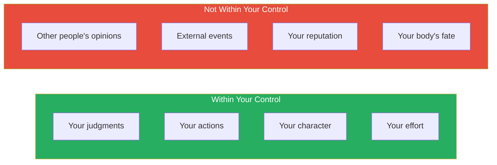
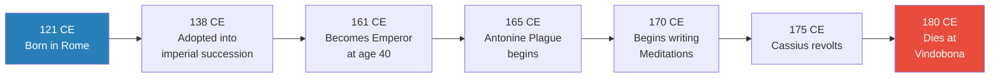
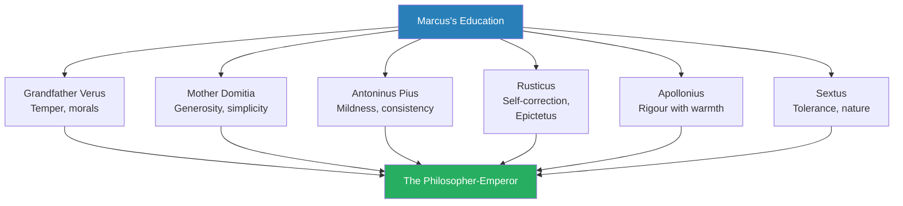
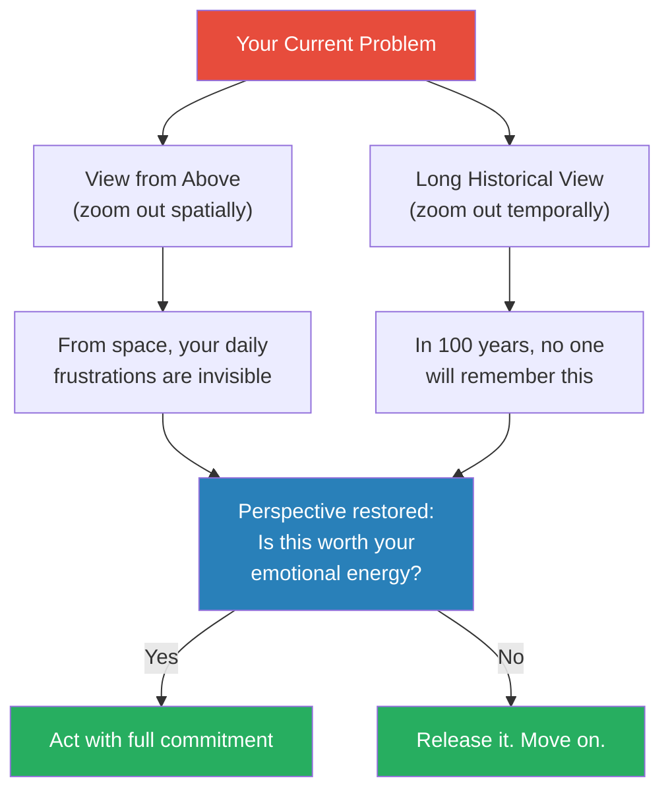
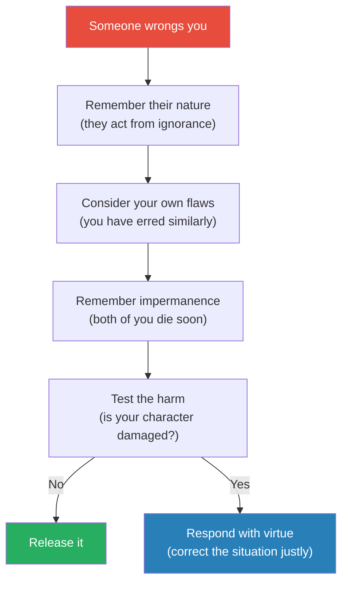
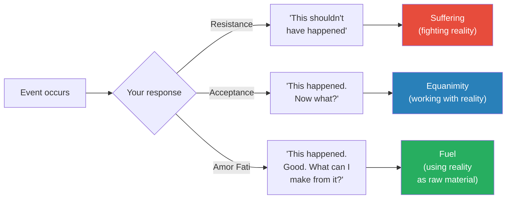
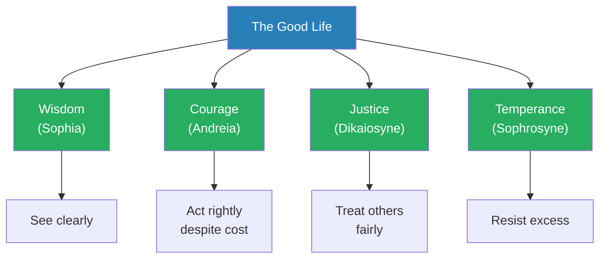
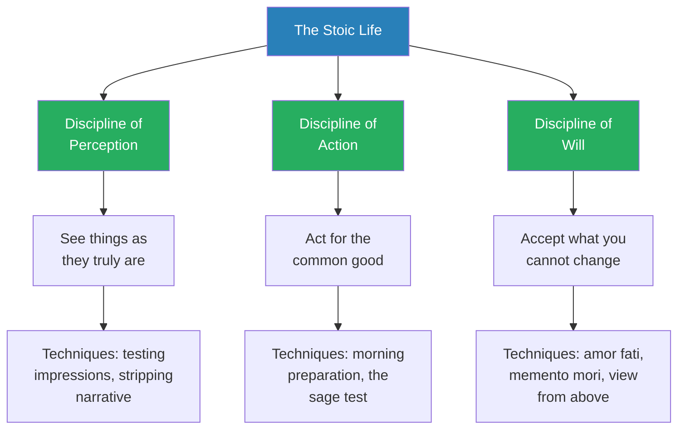

# Meditations — Marcus Aurelius

> Marcus Aurelius was the most powerful man in the world — Emperor of Rome at the height of its power — and he spent his private hours writing a journal of self-criticism, reminders, and philosophical exercises that he never intended anyone to read.
> *Meditations* is that journal: twelve books of Stoic self-examination written during military campaigns, plagues, betrayals, and the daily grind of governing an empire.
> It is the original self-help book — two thousand years old and still the most honest, because it was written for an audience of one.
> The core message is devastatingly simple: you cannot control what happens to you. You can only control how you respond. Everything else — fame, wealth, pleasure, other people's opinions — is noise.
> What makes this book inexhaustible is not what Marcus achieved but that he kept trying — every entry is evidence of a man who failed at his own standards yesterday and is attempting to do better today.

---

## About the Author

Marcus Aurelius (121–180 CE) was Roman Emperor from 161 to 180 CE, the last of the "Five Good Emperors" — a dynasty that presided over the most stable and prosperous period in Roman history. He was born Marcus Annius Verus into a prominent political family. Emperor Hadrian noticed his character and arranged for his adoption into the imperial succession. Marcus was trained from adolescence for rule — studying rhetoric, law, and philosophy.

His philosophical education was the defining force of his life. He studied under Junius Rusticus, who introduced him to Epictetus's *Discourses* — the text that would become Marcus's philosophical North Star. He also studied with Apollonius of Chalcedon, Sextus of Chaeronea, and the Stoic philosopher Claudius Maximus. By the time he became emperor at age 40, Marcus had spent decades immersing himself in Stoic philosophy.

His reign was a relentless series of crises:
- **The Antonine Plague** (165–180 CE) — one of the deadliest pandemics in Roman history, killing an estimated 5–10 million people, including possibly Marcus himself
- **The Marcomannic Wars** (166–180 CE) — Germanic and Sarmatian tribes pressing against the Danube frontier, forcing Marcus to spend years in military campaigns far from Rome
- **The revolt of Avidius Cassius** (175 CE) — a trusted general who declared himself emperor based on a false rumour of Marcus's death
- **The decline of civic institutions** — corruption, plague-driven economic collapse, and constant military pressure eroding the foundations Marcus was trying to maintain

*Meditations* was written in Greek during his final military campaigns along the Danube frontier — likely in his tent, after long days of command, as a private exercise in self-discipline. He titled the work "To Himself." He never intended it to be read by anyone else.

> [!tip] Why This Context Matters
> *Meditations* is not the product of a comfortable philosopher in an ivory tower. It was written by a man facing plague, war, betrayal, and the slow disintegration of the world he was responsible for. Every entry was a reminder Marcus needed in that moment — not an abstract principle, but a tool for surviving the next day. That is why the book still resonates: it was written under pressure, for immediate use, by someone with everything to lose.

---

## The Big Idea

- <b style="color: #2980b9">The Dichotomy of Control</b> — the foundational Stoic principle: some things are within your power (your thoughts, judgments, and actions) and some things are not (other people's behaviour, external events, your reputation, your body)
- <b style="color: #27ae60">Focus entirely on what is within your control. Release attachment to everything else.</b>
- This is not passive resignation — it is the most active form of agency: pouring all your energy into the only things you can actually change
- Marcus inherited this idea from Epictetus, who expressed it most concisely: "Some things are up to us and some things are not up to us"
- What Marcus adds is the daily, grinding practice of applying this principle when everything around you is falling apart — when plague kills your soldiers, when your general betrays you, when your son shows signs of becoming a tyrant
- The dichotomy of control is not a philosophical insight you grasp once and then possess forever — it is a discipline you must re-learn every morning, because every morning your mind forgets and starts reaching for things it cannot hold

The green box is where all your energy should go. The red box is where most people waste theirs.

Marcus pours 80% of his energy into the two things he can actually control — judgments and actions — while treating everything outside his control as background noise deserving minimal emotional investment.

---

## Key Concepts at a Glance

| Concept | One-line summary |
|---------|-----------------|
| **Dichotomy of Control** | Focus on what you can control; release what you cannot |
| **Memento Mori** | Remember you will die — this gives urgency and perspective |
| **The View from Above** | Zoom out to cosmic scale — your problems shrink to nothing |
| **Amor Fati** | Love your fate — accept what happens as if you chose it |
| **The Obstacle Is the Way** | What stands in the way becomes the way — impediments are opportunities |
| **Premeditatio Malorum** | Negative visualisation — imagine the worst so it cannot surprise you |
| **Morning Preparation** | Prepare each day for ingratitude, arrogance, and betrayal |
| **The Inner Citadel** | Build an internal fortress that no external event can breach |
| **Sympatheia** | All things are interconnected — what injures the hive injures the bee |
| **Discipline of Assent** | Pause before accepting any impression — test it against reality |
| **Impermanence** | Everything passes — fame, empires, life itself. Act accordingly. |
| **The Four Virtues** | Wisdom, courage, justice, temperance — the complete guide to good action |

The dichotomy of control and equanimity score highest because they are the twin pillars — one tells you what to focus on, the other tells you how to feel about everything else.

---

## The Historical Context: Why This Book Exists

*Understanding when and where Marcus wrote transforms how you read him.*

Marcus's life arc shows a man who spent decades preparing for power, then spent two decades wielding it under the worst possible conditions.

The book was written during the last decade of Marcus's life — a period when everything was going wrong:
- The plague was decimating his army
- The tribes kept attacking along the Danube
- His trusted general Avidius Cassius betrayed him
- His wife Faustina was the subject of scandalous rumours
- Waiting in the wings was his son Commodus — who would become one of Rome's worst emperors and undo much of what Marcus had built

> [!example] The Cassius Revolt (175 CE)
> - Avidius Cassius, one of Marcus's most capable generals, received a false report that Marcus had died
> - Cassius declared himself emperor and seized control of the eastern provinces
> - When Marcus learned of the revolt, his response was remarkably measured — he reportedly hoped to pardon Cassius rather than punish him
> - Before Marcus could reach the east, Cassius was assassinated by his own officers
> - Marcus refused to read Cassius's private correspondence, ordering it burned — he did not want to know who else might have been disloyal
> - He showed mercy to Cassius's family and supporters, sparing them from the retribution that Roman custom expected
> **The lesson:** Marcus applied his Stoic principles even to treason — responding with restraint rather than rage, and choosing not to know things that would force him to punish.

---

### Why Marcus Chose Commodus

This question has haunted historians for nearly two millennia:

- **Political reality** — Commodus was Marcus's only surviving biological son. Bypassing him for a non-family member could have triggered civil war immediately — Roman succession was always contested, and blood claims were powerful
- **Paternal blindness** — even Stoic philosophers can be blinded by love for their children. Marcus may have believed Commodus would grow into the role
- **The Stoic blind spot** — Marcus's philosophy focused on individual virtue — what one person can control. It provided less guidance for systemic problems like institutional design and succession planning
  - <b style="color: #e74c3c">Stoicism is a philosophy of personal character, not of institutional architecture. The greatest personal virtue cannot compensate for a broken system.</b>
- **Historical convention** — the "adoption of the best man" tradition was less a formal principle and more a historical accident — the previous four "Good Emperors" had no surviving biological sons

> [!example] The Commodus Catastrophe (After 180 CE)
> - Commodus became emperor at age 18 upon Marcus's death
> - He quickly abandoned the Danube frontier campaigns his father had fought for years
> - He renamed Rome "Colonia Commodiana" and the months of the year after his own titles
> - He fought as a gladiator in the arena, violating every Roman norm of imperial dignity
> - He was strangled to death by his wrestling partner in 192 CE, after a conspiracy involving his mistress and senior advisors
> - His death triggered a civil war that ended the Pax Romana and plunged Rome toward the Crisis of the Third Century
> **The lesson:** Personal virtue in a leader — even decades of it — cannot substitute for building systems that survive the leader's departure.

---

## Core Teachings — Book by Book

*Meditations contains twelve books, written over several years. They do not follow a linear argument — they circle back to the same themes obsessively, as Marcus reminds himself of truths he keeps forgetting under pressure.*

### Book 1: Debts — What I Learned from Others

*Marcus begins his private journal not with self-examination but with acknowledgment of how much he owes to others — the most powerful man in the world starts with humility.*

**Historical context:** Book 1 was likely composed or at least revised in its final form while Marcus was on campaign along the Danube, probably at Carnuntum or Sirmium. It reads as a retrospective — Marcus looking back on his entire life of education and mentorship before plunging into the urgent present-tense self-commands of Books 2–12. Some scholars believe it was written last, as a preface to the journal he had already been keeping.

Book 1 is unique in *Meditations*: it is a gratitude catalogue. Marcus lists the people who shaped him and what he learned from each. This is not polite acknowledgment — it is a detailed accounting of specific virtues he observed in specific people and tried to absorb into his own character.

The structure is revealing — Marcus organises his debts by person, and the specificity of each entry shows how carefully he studied the people around him:

- From his grandfather Verus: "good morals and the government of my temper"
- From his mother Domitia Lucilla: generosity, simplicity, and "abstinence not only from evil deeds but from evil thoughts"
  - She also modelled religious devotion without superstition — a rare balance in Roman aristocracy
- From his great-grandfather: the importance of private tutors over public schools, and willingness to spend lavishly on education
- From his adoptive father Antoninus Pius: "mildness of temper," consistency, and indifference to superficial honours
- From his Stoic tutor Rusticus: the habit of self-correction and the introduction to Epictetus
- From Sextus of Chaeronea: "tolerance and the example of a household governed by its head"
  - Also from Sextus: "the idea of living according to nature" and a certain gravity that was not grim but warm
- From Alexander the Grammarian: not correcting people's speech in a way that humiliates them — teaching by example, not by rebuke
- From Apollonius of Chalcedon: combining intellectual rigour with emotional warmth — being both scholarly and approachable
  - Apollonius also taught Marcus to remain the same person in moments of crisis and in moments of ease
- From Fronto, his rhetoric teacher: awareness of "the envy, duplicity, and hypocrisy that power produces"
- From Alexander the Platonist: not telling people "I'm too busy" — respecting those who need your attention
- From the gods themselves: that he was given good teachers, a good family, and the circumstances to pursue philosophy

> [!example] The Lesson of Antoninus Pius
> - Marcus devotes the longest section of Book 1 to his adoptive father and predecessor, Emperor Antoninus Pius
> - He catalogues over twenty specific virtues he observed: frugality without ostentation, willingness to listen, patience with slow processes, indifference to honours
> - Antoninus never hurried anyone, never displayed anger in public, never cared about receiving credit
> - He investigated everything thoroughly before making decisions and never changed a verdict once convinced
> - He ate simply, dressed simply, and worked tirelessly — but without making a show of his discipline
> - Antoninus could endure sitting through long meetings without needing a break, and he tolerated friends who contradicted him
> - He was cheerful without being showy, well-informed without being pedantic
> - Marcus clearly saw Antoninus as the model emperor — the standard against which he measured himself
> **The lesson:** The people who shape us most are not those who lecture us but those who model virtue so consistently that it becomes contagious.

> [!example] The Gift of Rusticus
> - Junius Rusticus was the tutor who changed Marcus's intellectual life
> - He introduced Marcus to the *Discourses* of Epictetus — the slave-philosopher whose ideas would become Marcus's operating system
> - More importantly, Rusticus taught Marcus the habit of self-examination — the practice of catching yourself in error and correcting course without shame
> - Marcus credits Rusticus with "the idea of needing to reform and regulate my character"
> - Rusticus also steered Marcus away from the rhetorical showmanship that Roman aristocrats prized — the ornate speeches and clever arguments that impressed audiences but solved nothing
> - Without Rusticus, Marcus might have remained a conventional Roman aristocrat — educated but unreflective
> **The lesson:** A single teacher, offering the right text at the right moment, can redirect the course of a life.

> [!example] The Lesson of Alexander the Grammarian
> - Alexander was a grammar teacher who taught Marcus a deceptively important social skill
> - When people used incorrect grammar or mispronounced words, Alexander would not correct them directly
> - Instead, he would work the correct form naturally into his own reply — modelling the right usage without embarrassing the speaker
> - This seems trivial until you realise how much Roman social life revolved around public speaking — a correction in front of others was a devastating humiliation
> - Marcus absorbed this principle and generalised it: teach by doing, not by criticising
> **The lesson:** The best corrections are invisible. Show the right way; do not announce the wrong one.

> [!tip] Core Insight
> Book 1 is a masterclass in a practice that modern psychology has rediscovered: gratitude journaling. Marcus doesn't list what he's grateful for in abstract terms. He names specific people and specific lessons. This specificity is what makes gratitude effective.

<b style="color: #27ae60">The key insight: Marcus begins his private journal not with ambition or self-examination but with acknowledgment. He starts with what he received before addressing what he must do.</b>

Book 1 also contains an implicit warning that Marcus addresses to himself:
- The fact that he had so many excellent teachers means he has no excuse for failing to live virtuously
- Other people can plead ignorance — Marcus cannot
- This is the burden of education: once you know what is right, failing to do it is not ignorance but cowardice
- The gratitude catalogue is therefore also a weight — a list of debts he must repay through daily practice

The section on the gods at the end of Book 1 is often overlooked but is crucial:
- Marcus thanks the gods not for good fortune but for good circumstances of character
- He is grateful that he was not corrupted by his grandfather's concubines
- He is grateful that he did not lose his virginity prematurely
- He is grateful that his wife was "so obedient, so loving, so straightforward"
- He is grateful that he found competent teachers for his children
- These are not general blessings — they are specific moral risks that Marcus recognises he could have fallen into and didn't
- The implication: character is fragile. Marcus knows he could have become a different, worse person under different circumstances

Marcus's character was not innate — it was assembled from dozens of teachers over decades. The diagram above shows just the six most influential.

---

### Book 2: Written Among the Quadi — On Mortality and Duty

*Written during a military campaign against the Quadi tribe on the Danube, Book 2 is where Marcus confronts mortality directly — not as a philosophical exercise but as a man surrounded by death.*

**Historical context:** The superscription "Written among the Quadi, on the Gran" places this book firmly in the military theatre. Marcus was camped near the Hron River (in modern Slovakia), commanding the Roman response to Germanic tribal incursions. His soldiers were dying from combat and from plague. The Antonine Plague — likely smallpox — had already killed millions across the empire and was ravaging the legions. When Marcus writes about death in Book 2, he is writing from inside it.

- <b style="color: #2980b9">Memento Mori</b> — "remember you will die" — appears here as a practical tool, not a morbid fixation
- "Think of your life — what you lived through. Now the play is over. Leave the stage"
- The body is "a river of becoming, a river that never stops"
- Everything external is "smoke and nothing"
- <b style="color: #e74c3c">The only thing that matters is the work of the present moment — the rest is either past (gone) or future (uncertain)</b>

Marcus establishes a critical distinction in Book 2 that runs through the rest of the journal:
- **Three components of a human being:** body, breath (life force), and mind (the ruling faculty)
- The body is not truly yours — it ages, sickens, and dies regardless of your will
- The breath is borrowed — it was given at birth and will be returned at death
- Only the mind — specifically, your capacity for judgment — is genuinely yours
- <b style="color: #27ae60">Therefore, all your attention and care should be directed at the one thing you actually own: your mind and its judgments</b>

This three-part distinction has practical consequences that Marcus develops across subsequent books:
- If your body is not truly yours, physical pain is not a genuine loss — it is a temporary discomfort in a vessel you do not own
- If your breath is borrowed, death is not a theft — it is a return of something that was never yours
- If only your mind is truly yours, then the only genuine harm is harm to your capacity for clear judgment — and that harm can only come from you, from your own failure to think clearly

> [!example] The Memento Mori in Action
> - Marcus didn't write about death as a philosophical abstraction — he was surrounded by it
> - The Antonine Plague was killing his soldiers by the thousands
> - The Quadi battles were killing them faster
> - When he writes "you could leave life right now," he means it literally — an arrow, a disease, a bad night could end him before morning
> - This proximity to death is what gives his writing its urgency
> - He is not theorising about mortality — he is practising staying focused while death stands beside him
> **The lesson:** Memento mori works not because it is depressing but because it is true. Once you absorb the truth of your mortality, you stop wasting time on things that do not matter.

Book 2 also introduces one of Marcus's most practical ideas — the <b style="color: #2980b9">morning preparation for difficult people</b>:
- "When you wake up in the morning, tell yourself: the people I deal with today will be meddling, ungrateful, arrogant, dishonest, jealous, and surly"
- This is not cynicism — it is preparation
- By expecting difficulty, you remove the element of surprise — and surprise is what converts frustration into rage
- When the difficult person actually appears, you can say: "I expected this. I'm ready"
- Marcus pairs this preparation with a crucial reminder: these difficult people are still your kin
  - They share the same rational nature you do
  - They are acting from ignorance, not malice
  - Your preparation is not about building walls — it is about maintaining composure so you can respond with justice

Book 2 also contains Marcus's meditation on how briefly anyone is remembered:
- He notes that Hippocrates, the great physician, died of plague himself
- Alexander the Great and his stable boy both ended up in the same place — dust
- Pompey, Caesar, Augustus — men who shook the world — are now names in a history lesson
- <b style="color: #2980b9">The brevity of posthumous fame</b> is a recurring theme, but in Book 2 it carries special urgency: Marcus can hear the cries of the dying outside his tent as he writes

> [!example] The Physician Who Died of Plague
> - Marcus notes the irony of Hippocrates — the father of medicine — dying of disease
> - The man who devoted his life to healing could not heal himself
> - Similarly, astrologers who predicted the deaths of others died themselves
> - Marcus uses these examples not to mock but to illustrate: no expertise exempts you from mortality
> - The physician's skill, the astrologer's predictions, the general's victories — all end the same way
> - Therefore, do your work well while you can, and do not confuse competence with invulnerability
> **The lesson:** You are not special. Death does not make exceptions for the talented, the powerful, or the good. This fact is not discouraging — it is clarifying.

Book 2 contains a passage that reveals Marcus's internal conflict about the value of philosophy under pressure:
- He asks himself whether philosophy is a luxury — something you do when times are easy and abandon when times are hard
- His answer is firm: philosophy is most needed precisely when things are worst
- The soldier who trains in peacetime but drops his shield in battle has wasted his training
- Similarly, the philosopher who can stay calm in a library but falls apart in a crisis has missed the point entirely
- <b style="color: #27ae60">Philosophy is not for good times. It is for exactly this — the plague, the war, the betrayal, the tent at midnight when everything is falling apart.</b>

Marcus also reflects on the brevity of the human lifespan in cosmic terms:
- Even a "long" life of eighty years is a blink when measured against the age of the universe
- The difference between dying at thirty and dying at eighty is negligible from the cosmic perspective
- This is meant to reduce not just the fear of death but the anxiety about timing — "I haven't had enough time" loses its sting when you realise that no amount of time would ever feel like enough
- <b style="color: #2980b9">The issue is never how much time you have. The issue is what you do with the time you are given.</b>

---

### Book 3: In Carnuntum — On Focus and Character

*Written at the Roman military base of Carnuntum in modern Austria, Book 3 is Marcus's treatise on concentration — the art of doing one thing at a time with full attention.*

**Historical context:** Carnuntum was the headquarters of the Pannonian legions and Marcus's primary base during the Marcomannic Wars. It was a frontier town — rough, military, far from the sophistication of Rome. Marcus lived here in conditions that were comfortable by military standards but sparse by imperial ones. The location matters: far from Roman distractions, Marcus could focus on philosophy. But the constant pressure of military command meant his focus was perpetually contested. Book 3 reads like the journal of a man fighting for his own attention.

- <b style="color: #27ae60">"Concentrate every minute on doing what's in front of you with precise and genuine seriousness"</b>
- Don't waste time on what others think of you
- Every moment of distraction is a moment of life lost
- Your character is the only thing you take with you — everything else stays behind
- Marcus argues that scattered attention is a form of disrespect — to the task, to the moment, and to yourself

Book 3 develops a theme that modern productivity writers would rediscover two millennia later:
- <b style="color: #e74c3c">The greatest threat to meaningful work is not opposition but distraction</b>
- Marcus was not distracted by smartphones, but he was distracted by gossip, spectacles, luxury, and the constant social demands of imperial life
- His prescription: ruthlessly eliminate everything that does not serve your purpose
- Ask of every activity: "Is this necessary?" If the answer is no, eliminate it — not because it is bad, but because your time is finite and non-renewable
- Marcus draws a distinction between what is merely pleasant and what is genuinely valuable
  - Pleasant activities fill time; valuable activities fill life
  - The test: will this matter on your deathbed? If not, it is a distraction

Marcus also introduces the idea that beauty exists in unexpected places:
- The cracks in bread, the skin on figs, the foam on a boar's mouth — none of these are conventionally beautiful, but they possess a natural perfection
- <b style="color: #2980b9">The trained eye finds beauty in things others overlook</b> — this is a metaphor for the Stoic approach to life itself: finding value in what most people dismiss or resent
- Difficulty, hardship, even ugliness can be seen as expressions of nature's order — if you train yourself to see them that way
- Marcus gives the example of the jaws of wild animals and the way overripe fruit splits — these are not beautiful by conventional standards, but they have a "bloom and attractiveness" to anyone who studies nature deeply

Book 3 contains one of Marcus's more striking passages on old age and physical decline:
- He notes that the body's decline is a natural process, like autumn following summer
- A person who fights ageing is fighting nature itself — which is as futile as fighting the tide
- The Stoic response is not to rage against ageing but to recognise that the value of life lies in how you use your remaining time, not in how much time remains
- "Do not act as if you had ten thousand years to live. While you still can, while you still have the chance, be good."

Marcus also warns against intellectual vanity in Book 3:
- He cautions himself against writing or speaking for display rather than for truth
- The temptation was real — Marcus was educated in rhetoric, and Roman culture prized eloquent speech
- His corrective: write plainly, think clearly, and never confuse cleverness with wisdom
- This explains the spare, direct style of *Meditations* — Marcus deliberately avoided ornament because ornament was a distraction from substance

> [!example] The Beauty of Bread Crusts
> - Marcus pauses in Book 3 to describe the beauty of bread cracking in the oven
> - The fissures in the crust are not designed by the baker — they are accidental
> - Yet they have a kind of beauty that appeals to anyone who looks closely
> - Marcus uses this as a metaphor: many things in life that appear accidental or ugly actually possess a deeper order
> - The Stoic who trains their perception can find beauty in difficulty, order in chaos, and meaning in what others dismiss
> - The person who can only see beauty in obvious places — sunsets, symmetry, youth — has not yet learned to see
> **The lesson:** Train your eye. Beauty and meaning are everywhere, but they reveal themselves only to those who look closely enough.

> [!example] Carnuntum and the Frontier Life
> - Carnuntum was no Rome — it was a military town on the edge of the empire, surrounded by dense forests and hostile territory
> - Marcus lived there for extended periods during the 170s CE, commanding operations against Germanic tribes
> - The town had an amphitheatre (for the soldiers' entertainment) and a legionary fortress, but none of the cultural sophistication Marcus had grown up with
> - Living in Carnuntum forced Marcus to practise what he preached: stripping away the inessential
> - No elaborate dinners, no philosophical salons, no political theatre — just the work of command and the discipline of the journal
> - The simplicity was, in a sense, a gift: fewer distractions meant more clarity
> **The lesson:** Sometimes the conditions you would not choose are the conditions that force the deepest work.

> [!example] The Warning Against Rhetorical Display
> - Marcus was trained by Fronto, one of the most celebrated rhetoricians in Rome — a man who crafted speeches the way an artist paints
> - Roman aristocrats competed in eloquence the way modern elites compete in credentials — your public speaking ability was your social currency
> - Marcus records that Rusticus steered him away from this pursuit — away from "writing on speculative subjects" and "delivering little lectures"
> - He came to see rhetorical display as a trap: it rewarded cleverness over truth, performance over substance
> - Book 3 reflects this correction — the entries are deliberately unpolished, sometimes grammatically rough, because Marcus valued clarity over elegance
> - The contrast with Fronto's ornate style is stark and intentional: Marcus chose substance, even at the cost of literary beauty
> **The lesson:** Clarity is a higher virtue than eloquence. The person who speaks plainly and means it outranks the person who speaks beautifully and means nothing.

> [!tip] Core Insight
> Focus is not a productivity technique — it is a moral commitment. When you scatter your attention across trivialities, you are choosing to waste the only non-renewable resource you possess: your time alive.

---

### Book 4: On Impermanence and Perspective

*This is where Marcus deploys two of his most powerful psychological techniques — the View from Above and the long historical perspective — to dissolve the grip of daily anxieties.*

**Historical context:** Book 4's location is less certain than Books 2 and 3, but internal evidence suggests Marcus was still on the Danube frontier. The tone is more reflective than the earlier books — less urgent, more philosophical. Marcus appears to be writing during a relative lull in the fighting, using the breathing room to develop ideas that Books 2 and 3 had only sketched.

**<b style="color: #2980b9">The View from Above:</b>** Imagine looking down on the earth from a great height:
- Watch the armies march, the cities bustle, the ships cross the sea
- From above, it all looks like ants scurrying
- Your problems — the meeting that went badly, the colleague who annoyed you, the missed opportunity — are invisible from this altitude
- This is not escapism — it is recalibration
- After the view from above, return to your life with a corrected sense of proportion

**<b style="color: #2980b9">The Long View:</b>** Think of all the people who came before you:
- Emperors, generals, philosophers, lovers — all dust now
- Think of all the people who will come after you — they will forget you just as you have forgotten those who came before
- This is not depressing — it is liberating
- If nothing you do will be remembered in a thousand years, you are free to do it well for its own sake

Marcus lists specific examples of the long view in Book 4:
- The court of Augustus — wife, daughter, grandchildren, sister, advisors — all gone
- The court of Hadrian — same
- Every great doctor who knitted his brow over dying patients — dead himself
- Every astrologer who predicted others' deaths — dead himself
- <b style="color: #27ae60">"Asia, Europe — corners of the world. The whole ocean — a drop in the universe. Mount Athos — a clod of dirt. The present — a split second in eternity."</b>

> [!example] The Augustus Meditation
> - Marcus pauses to catalogue the household of Emperor Augustus, who ruled nearly two centuries before him
> - Augustus's wife Livia, his daughter Julia, his grandsons Gaius and Lucius — all dead
> - His advisors, freedmen, friends — all dead
> - The entire household, once the most powerful constellation of people in the world, reduced to a sentence in a journal
> - Marcus then extends this to the entire household of Antoninus Pius — his own adoptive father
> - Faustina (Antoninus's wife), the friends, the advisors — gone, every one
> - Marcus uses this not as morbid fascination but as medicine — the cure for taking your own importance too seriously
> - If Augustus's world vanished utterly, yours will too — so stop clinging to it and start living in it
> **The lesson:** Impermanence is not a threat to be feared but a fact to be used — it dissolves vanity, creates urgency, and frees you to act without attachment to outcomes.

Both techniques converge on the same question: given how vast the universe is and how brief your life is, is this really worth your suffering?

Book 4 also contains one of Marcus's most quoted lines on the nature of change:
- "Loss is nothing else but change, and change is nature's delight"
- <b style="color: #2980b9">Everything that exists is already in the process of becoming something else</b>
- Resisting change is resisting reality itself — and reality always wins

Book 4 further develops the concept of <b style="color: #2980b9">the inner retreat</b>:
- "People look for retreats for themselves, in the country, to the coast, or in the mountains. You can retreat into yourself at any time."
- You do not need a physical location to find peace — you carry the retreat within you
- This internal retreat is always available: in a crowd, in a crisis, in a meeting
- The practice is to withdraw briefly into your own mind, reconnect with your principles, and then re-engage with the world from a position of clarity
- <b style="color: #27ae60">The retreat is not escape — it is recalibration. You go inward to come back outward better.</b>

Marcus elaborates on what you should think about during this inner retreat:
- Remind yourself of the dichotomy of control — what is and is not within your power
- Recall the brevity of life — this problem will not matter in a century
- Return to the question: "What would virtue demand of me right now?"
- After this brief internal check, re-engage — you should not stay in the retreat, because your duty is in the world

> [!example] The Retreat That Needs No Travel
> - Marcus notes that Roman aristocrats spent enormous sums on country villas and coastal retreats
> - They believed that peace required a change of location — that stress was caused by the city, and serenity could be found at the seaside
> - Marcus argues this is backwards: the person who is troubled in Rome will be troubled in Baiae
> - You bring your mind with you wherever you go — and it is your mind, not your location, that determines your peace
> - The person who masters the inner retreat has something no villa can provide: peace that is always available, independent of circumstance
> - Marcus then adds a pointed observation: the retreat into yourself should be "free of disorder" — meaning, your inner world must be ordered by principles, not left as a tangle of competing desires and fears
> **The lesson:** Peace is portable. If you need to go somewhere to find it, you have not yet found it.

Book 4 also contains Marcus's reflections on the futility of seeking novelty:
- "Nothing is new. Everything you are looking at, your ancestors saw. Everything you are experiencing, they experienced."
- The fundamental patterns of human life — ambition, betrayal, love, loss, conflict — repeat across every generation
- Marcus uses this observation not to induce fatalism but to reduce the sense that your problems are unique or unprecedented
- <b style="color: #e74c3c">The belief that your suffering is special is itself a form of suffering. When you realise that every human who ever lived faced the same essential challenges, the isolation dissolves.</b>

Marcus further develops in Book 4 his thoughts on the nature of harm and reputation:
- He argues that the damage caused by insult or slander is entirely in the interpretation of the person who receives it
- A stone thrown at a dog makes the dog chase the stone. A lion ignores the stone and looks at who threw it
- <b style="color: #2980b9">Marcus's advice: be the lion, not the dog.</b> Do not chase every provocation — examine the source, evaluate whether it merits a response, and if not, return to your work
- He adds that most reputational damage is temporary — the people gossiping about you today will have moved on to someone else tomorrow
- The only reputation that truly matters is the one you hold in your own mind — and that is entirely within your control

> [!tip] Core Insight
> The View from Above and the Long View are not philosophy — they are psychological tools. They work the way a zoom lens works on a camera: same scene, different magnification, completely different emotional response.

---

### Book 5: On Effort and Morning Reluctance

*Book 5 opens with one of the most relatable passages in all of ancient literature: the Emperor of Rome arguing with himself about getting out of bed.*

**Historical context:** Book 5 was likely written during the winter months on the Danube frontier — cold, dark mornings in a military camp. The opening passage about not wanting to get out of bed gains additional weight when you consider the conditions: Marcus was sleeping in a tent or basic quarters, waking to face the demands of commanding an army, administering an empire by letter, and managing the ongoing plague. The reluctance was not laziness — it was the accumulated exhaustion of years of crisis.

He writes (paraphrased): "At dawn, when you have trouble getting out of bed, tell yourself: I have to go to work — as a human being. What do I have to complain about, if I'm going to do what I was born for — the things I was brought into the world to do?"

- <b style="color: #2980b9">Even the Emperor of Rome didn't want to get up in the morning.</b> This makes him human — and makes his philosophy credible
- His answer to the reluctance is not motivation or discipline — it is purpose. You get up because you have work to do. Not work for money or fame, but the work of being a good human being
- "People who love what they do wear themselves down doing it — they even forget to wash or eat. Do you have less respect for your own nature than the engraver has for engraving?"
- Marcus then draws an unflattering comparison with animals: ants, bees, and spiders all do their work without complaint — shall the emperor of Rome do less than a bee?

> [!example] The Morning Reluctance Passage
> - Marcus begins Book 5 by recording an internal argument: one voice wants to stay in bed, the other insists he get up
> - The voice of comfort says: "It's warm here. Five more minutes."
> - The voice of duty responds: "Were you born to lie under blankets? You were born to act."
> - Marcus then shames himself gently — ants, bees, and spiders all do their appointed work without complaint
> - He does not claim to leap out of bed filled with purpose — he admits the reluctance and reasons his way past it
> - The passage captures two thousand years of human experience in a single moment: the gap between knowing what you should do and actually doing it
> - The honesty of this passage is what makes it timeless — anyone who has set an alarm and then negotiated with themselves about hitting snooze recognises Marcus instantly
> **The lesson:** Motivation is unreliable. Purpose is the engine that starts even on cold mornings.

Book 5 also contains one of Marcus's most important insights about emotional management:

- "Today I escaped anxiety. Or no, I discarded it, because it was within me, in my perceptions — not outside"
- <b style="color: #e74c3c">This single sentence captures the entire Stoic position on anxiety: it is not caused by external events. It is caused by your judgments about external events. Change the judgment, and the anxiety dissolves.</b>
- Modern anxiety treatment (especially CBT) is based on exactly this principle — you don't change the situation, you change your relationship to the situation

Marcus develops this further with a striking analogy:
- A cucumber is bitter — throw it away. There are brambles in the path — step around them
- That's all you need. Don't add: "Why do bitter cucumbers exist? Why are there brambles?"
- <b style="color: #27ae60">The event is just the event. The "why" and the "this shouldn't be" are additions your mind creates — and they are the actual source of your suffering</b>

Book 5 further addresses the question of why people behave badly:
- Marcus argues that wrongdoing always stems from ignorance — no one deliberately harms themselves, and harming others always harms the wrongdoer's character
- Therefore, the person who wrongs you is not your enemy — they are a victim of their own confused judgment
- The correct response to being wronged is not anger but instruction — and if instruction fails, patience
- This is one of the hardest principles in Stoicism: treating your enemies as patients rather than adversaries

Marcus also introduces a powerful thought on the relationship between difficulty and purpose:
- "The obstacle in the path becomes the path. Never forget, within every obstacle is an opportunity to improve our condition"
- <b style="color: #2980b9">The Obstacle Is the Way</b> — this concept, later popularised by Ryan Holiday, originates here
- A fire turns whatever fuel you throw on it into more flame and brightness — similarly, a trained mind converts obstacles into fuel for growth
- The key word is "trained" — this conversion is not automatic. It requires the daily practice Marcus is engaged in throughout *Meditations*

> [!abstract] Marcus's Morning Practice
> 1. Acknowledge the reluctance — "I don't want to get up." (Honest, not self-judging)
> 2. Remember your purpose — "What is the work that only I can do today?"
> 3. Prepare for difficulty — "Today I will meet frustration, ingratitude, and setbacks. I am prepared."
> 4. Commit to effort, not outcomes — "I will do my best today. The results are not in my control."
> 5. Get up — the reluctance will pass within minutes. It always does.

Book 5 also contains one of Marcus's most elegant passages on co-operation:
- He argues that human beings were made for one another — the way the upper teeth were made for the lower teeth, or the way two hands were made to work together
- To act against one another is therefore to act against nature
- And acting against nature — whether through anger, obstruction, or indifference — damages the actor more than the target
- <b style="color: #2980b9">Social co-operation is not a moral preference — it is a design specification. You are built for it the way a hand is built for grasping.</b>

Marcus's thoughts on fortune and misfortune in Book 5 are also worth noting:
- He argues that what people call "misfortune" is actually just "fortune" that does not match their preferences
- The universe does not distribute events according to your wishes
- When the universe gives you something you did not want, you have two options: resent the universe (futile) or use what you have been given (Stoic)
- <b style="color: #27ae60">The Stoic does not ask "Why me?" The Stoic asks "What now?"</b>

> [!example] The Fire That Uses Everything as Fuel
> - Marcus returns in Book 5 to the image of a great fire
> - An ordinary fire is extinguished by what is thrown on it — too much wood smothers the flame
> - But a great fire absorbs everything: the more you throw on it, the larger and brighter it burns
> - Marcus argues that a trained Stoic mind should be like the great fire
> - Obstacles, insults, setbacks, losses — all become fuel for the practitioner
> - The untrained mind is the small fire: every difficulty threatens to extinguish it
> - The trained mind is the great fire: every difficulty makes it stronger
> **The lesson:** You cannot choose what the world throws at you. You can choose whether it extinguishes you or fuels you.

---

### Book 6: On the Nature of the Universe

*Book 6 is the most philosophical section of Meditations, where Marcus wrestles with the Stoic concept of Logos — the rational order underlying all of reality — and draws practical conclusions from cosmic principles.*

**Historical context:** Internal evidence suggests Book 6 was written during a period when Marcus had time for deeper reflection — possibly during winter quarters when active campaigning paused. The philosophical depth and length of the entries suggest he was not writing under immediate military pressure. Some scholars place this book in the early 170s CE, when Marcus was still establishing his base of operations on the Danube and had not yet faced the Cassius revolt.

- Everything that happens is part of the <b style="color: #2980b9">Logos</b> — the rational structure of the universe
- <b style="color: #27ae60">Your job is not to fight reality but to work with it. Accept what happens and respond with virtue.</b>
- "The universe is change. Life is opinion." — your experience of events is shaped not by the events themselves but by your judgments about them
- What disturbs people is not things, but their judgments about things (Marcus is paraphrasing Epictetus here)

Marcus uses the Logos concept to ground his ethics:
- If the universe is rationally ordered, then everything that happens — including suffering — serves a purpose within the whole
- You may not be able to see the purpose from your limited vantage point, but that does not mean the purpose is absent
- This is not blind faith — it is a working assumption that allows you to engage with difficulty rather than rail against it
- <b style="color: #e74c3c">Whether the universe is governed by providence or atoms, your ethical obligations remain the same: act with virtue, serve the common good, and maintain your character</b>

This last point deserves emphasis because it shows Marcus's philosophical sophistication:
- He acknowledges two competing worldviews: Stoic providence (the universe is rationally ordered) and Epicurean atomism (the universe is random)
- He does not try to prove one over the other
- Instead, he argues that the ethical conclusion is the same either way:
  - If the universe is ordered, then cooperate with the order
  - If the universe is random, then you need virtue even more — because no external order will save you
- This move makes Marcus's philosophy robust against metaphysical uncertainty — it works regardless of your cosmological beliefs

Book 6 also contains Marcus's thoughts on the relationship between the individual and the community:
- "What is not good for the hive is not good for the bee"
- Humans are social creatures by nature — built for cooperation, not isolation
- Anyone who cuts themselves off from the human community is like a branch cut from a tree — they may survive temporarily, but they have severed their connection to the source of life
- <b style="color: #2980b9">Sympatheia</b> — the interconnectedness of all things — is not a sentimental idea but a structural one. You are part of a system. Damaging the system damages you.

Marcus also addresses the question of reputation in Book 6:
- How much of your anxiety comes from worrying about what other people think?
- Marcus answers: almost all of it — and almost all of it is wasted energy
- Other people's opinions of you are outside your control. They are also constantly changing, easily manipulated, and based on incomplete information
- A person who bases their self-worth on others' opinions has built on sand
- "How much trouble he avoids who does not look to see what his neighbour says or does or thinks"

Marcus further develops his argument about the nature of desire in Book 6:
- He observes that most desires are not truly your own — they are borrowed from social convention, from other people's expectations, from the general noise of what "everyone wants"
- The Stoic practice is to examine each desire and ask: "Is this mine? Does it serve my nature? Or am I chasing it because others do?"
- <b style="color: #2980b9">Marcus distinguishes between natural needs (food, shelter, community) and manufactured wants (luxury, fame, excess)</b>
- Natural needs are satisfied easily. Manufactured wants can never be satisfied — they expand to fill whatever resources you devote to them

> [!example] The Vine and the Grapes
> - Marcus uses a recurring image in Book 6: the vine that produces grapes
> - A vine produces grapes and asks nothing in return — no applause, no gratitude, no recognition
> - It simply does what it was made to do, and then it does it again the next season
> - Marcus argues that humans should be the same — do good work because it is your nature to do good work, not because you expect a reward
> - The moment you start expecting recognition for your virtue, you have corrupted the virtue itself
> - "Is a horse expected to trumpet? Is a vine expected to produce grapes and then demand applause?"
> **The lesson:** True service expects nothing in return. The reward of doing the right thing is that you did the right thing.

> [!example] The Branch Cut from the Tree
> - Marcus uses a vivid metaphor to illustrate the danger of social isolation
> - A branch cut from a tree can be placed in water and kept alive temporarily
> - But it will never grow, never bear fruit, never become what it was meant to be
> - A person who withdraws from human connection faces the same fate — survival without flourishing
> - Marcus emphasises that this withdrawal can be physical (hermitage) or psychological (resentment, contempt, misanthropy)
> - The person who says "I hate people" has cut themselves from the tree — and will wither
> **The lesson:** Humans are social by design. Withdrawing from community is not independence — it is self-amputation.

> [!tip] Core Insight
> Whether the universe is designed or random, the ethical imperative is the same. Marcus treats the "grand cosmic question" as irrelevant to daily practice — what matters is not why the universe exists, but how you respond to what it presents.

---

### Book 7: On Dealing with Others

*This book returns to Marcus's most persistent challenge — other people — and develops his most detailed framework for maintaining composure when others frustrate, betray, or harm you.*

**Historical context:** Book 7 appears to have been written during active campaigning — the entries are shorter, more fragmented, and more emotionally charged than the reflective passages of Books 4 and 6. Marcus was likely dealing with the constant interpersonal friction of military command: disagreements among his generals, complaints from provincial governors, reports of corruption and incompetence. The tone suggests a man who is exhausted by human behaviour and trying very hard not to let that exhaustion curdle into contempt.

- "The best revenge is not to be like your enemy"
- <b style="color: #e74c3c">When someone wrongs you, consider: they are doing what they think is right, according to their own understanding. They are not evil — they are ignorant. Correct if you can. Tolerate if you cannot. But do not become them.</b>
- "It never ceases to amaze me: we all love ourselves more than other people, but care more about their opinion than our own"
- No one can hurt you unless you allow your judgment to be affected

Marcus develops a systematic approach to difficult people in Book 7:

1. **Remember their nature** — they are acting from their own understanding, which is flawed (as is yours)
2. **Consider your own flaws** — you have done similar things to others, in different forms
3. **Remember impermanence** — they will be dead soon, and so will you. Is this worth your finite emotional energy?
4. **Test the harm** — does their behaviour actually damage your character? If not, it is not a real harm. Only actions that corrupt your soul count as genuine injuries.
5. **Focus on your response** — their action is their business. Your response is yours. Make it worthy of you.

This five-step process converts reactive anger into measured response — the difference between reacting and choosing.

> [!example] Marcus on Anger and Its Costs
> - Marcus returns to anger repeatedly throughout Book 7, always with the same argument: anger costs more than the provocation
> - A colleague insults you — the insult lasts thirty seconds. Your angry brooding about it lasts hours or days.
> - The original provocation was a pinprick. Your anger turned it into a wound.
> - Marcus compares anger to picking up a hot coal to throw at someone — you burn yourself first
> - He notes that the Stoic response is not to suppress anger but to prevent it from arising by correcting the judgment that causes it
> - The judgment "he wronged me" creates anger. The judgment "he acted from his understanding, which is limited" creates compassion — or at least indifference
> **The lesson:** Anger punishes the angry person far more than the person who provoked it.

<b style="color: #27ae60">Marcus's most radical claim about other people: they cannot harm you without your consent. The harm exists only if you add the judgment "this is harmful" to the raw event. Remove the judgment, and the event loses its power.</b>

Book 7 also introduces the idea that <b style="color: #2980b9">pain and pleasure are morally neutral</b>:
- Pain is a sensation — nothing more. Your judgment about it ("this is unbearable," "this shouldn't be happening") is what creates suffering
- Pleasure is equally neutral — pursuing it as a goal leads to dependency and disappointment
- The Stoic goal is not to avoid pain or seek pleasure but to respond to both with equanimity
- Marcus uses the example of gladiators and soldiers who endure extraordinary pain without complaint — demonstrating that the human capacity to tolerate pain far exceeds what comfort-seeking suggests

Book 7 also contains Marcus's thoughts on the nature of fame:
- "Think about how few know your name now. In another generation, fewer still. Eventually: none."
- Fame is one of the most seductive externals — and one of the most worthless
- The person you admire most from history is now forgotten by most of the world
- The fame you seek will be equally temporary
- <b style="color: #e74c3c">Pursuing fame is pursuing other people's opinions about you — the very definition of wasting energy on what you cannot control</b>

Marcus extends his analysis of fame with a striking psychological observation:
- People who pursue fame are essentially asking strangers to hold their self-worth for them
- If the strangers approve, the fame-seeker feels good. If they disapprove, the fame-seeker collapses.
- This is a form of voluntary slavery — you have given the keys to your inner state to people who do not know you and do not care about you
- The alternative: ground your self-worth in your character, which is the one thing entirely within your control

> [!example] The Hot Coal of Anger
> - Marcus offers one of ancient literature's most vivid images for the cost of anger
> - Anger is like picking up a burning coal to throw at someone who has offended you
> - The coal burns your hand before it ever reaches the other person
> - In many cases, the intended target does not even notice your anger — they have moved on
> - Meanwhile, you are nursing a burned hand, replaying the offence, and building a grievance that will poison tomorrow as well
> - Marcus adds that the angry person often does more damage to themselves than the original offence ever could — relationships destroyed, judgments clouded, health undermined, all by the anger, not by the provocation
> **The lesson:** Before you pick up the coal, ask: who will this burn?

Book 7 also contains Marcus's thoughts on the persistence required for Stoic practice:
- He acknowledges that he fails at his own principles constantly
- He does not beat himself up for the failures — he simply tries again
- "Not to feel exasperated, or defeated, or despondent because your days aren't packed with wise or moral actions. But to get back up when you fail, to celebrate behaving like a human — however imperfectly — and fully embrace the pursuit you've embarked on."
- <b style="color: #27ae60">This passage reveals the deepest truth about Meditations: it is not the work of a man who mastered Stoicism. It is the work of a man who kept practising it, despite constant failure.</b>
- The practice is not about getting it right. It is about getting up after getting it wrong.

---

### Book 8: On Our Place in Nature

*Book 8 deepens the concept of Sympatheia — interconnectedness — and argues that understanding your place within the whole is the foundation of ethical action.*

**Historical context:** Book 8 was probably written during a period of sustained campaigning when Marcus was deeply embedded in the military community. The emphasis on social obligation and one's place within the larger system reflects a man who was not only governing an empire but living daily in the tight-knit community of a Roman military camp, where individual action visibly affected everyone around him.

- You are a part of nature, not separate from it
- Everything that happens to you is part of the whole — just as a foot belongs to the body, you belong to the universe
- <b style="color: #2980b9">Resisting your fate is like a foot complaining about walking. You were made for this.</b>
- Loss is not possible because nothing was ever truly yours — not your possessions, not your relationships, not your body

Marcus develops his most sustained argument about integrity in Book 8:

- "Never regard something as doing you good if it makes you betray a trust, or lose your sense of shame, or makes you show hatred, suspicion, ill will, or hypocrisy"
- <b style="color: #27ae60">Before any action, ask: "Is this consistent with who I want to be?" If not, don't do it — regardless of the external benefit.</b>
- No external gain (money, power, reputation, comfort) is worth compromising your internal character
- Marcus returns repeatedly to this test because the temptation was constant — as emperor, he could have had anything he wanted, and people constantly offered him shortcuts that required moral compromise

Book 8 contains a particularly powerful passage on the nature of wrongdoing and response:
- Marcus distinguishes between two kinds of wrong: wrongs committed through desire and wrongs committed through anger
- The person who wrongs through desire is seeking pleasure — they are weak
- The person who wrongs through anger is reacting to perceived pain — they are reactive
- Neither is truly evil — both are confused about what is good
- Marcus's point: understanding the cause of wrongdoing does not excuse it, but it should change your emotional response to it
  - Pity the person who wrongs through desire — they are enslaved by appetites
  - Pity the person who wrongs through anger — they are enslaved by reactions

Marcus also introduces in Book 8 a meditation on the nature of pleasure that deepens his earlier observations:
- He argues that most pleasures are borrowed from the body and have nothing to do with your true self
- The pleasure of food is the body's pleasure, not the mind's. The pleasure of luxury is convention's pleasure, not nature's
- When you strip away the bodily and conventional pleasures, what remains is the pleasure of living well — of acting with virtue, of exercising your rational nature to its fullest
- <b style="color: #2980b9">This is the only pleasure that does not diminish with repetition</b> — bodily pleasures require escalation (more food, more luxury, more stimulation), but the pleasure of virtue is self-renewing

> [!example] The Hive and the Bee
> - Marcus uses the metaphor of bees and hives throughout Book 8 to illustrate social obligation
> - A bee that leaves the hive to pursue its own interests weakens the hive — and eventually dies itself, because it cannot survive alone
> - Similarly, a person who acts purely in self-interest damages the community — which eventually damages them
> - Marcus was not speaking abstractly — he governed an empire of millions and understood that social cohesion depends on individuals accepting their obligations
> - "What injures the hive injures the bee" — the Stoic case for generosity and collaboration is not sentimental but structural
> - You are part of a system. Damaging the system damages you, even if the damage is not immediately visible
> **The lesson:** Self-interest, pursued exclusively, is self-defeating. You cannot prosper while the community around you decays.

Book 8 also contains Marcus's reflections on the nature of time:
- The present moment is all that exists — the past is gone, the future is uncertain
- <b style="color: #e74c3c">Even the longest life, when measured against eternity, is a single point</b>
- The person who dies at thirty and the person who dies at ninety lose the same thing: the present moment. Because that is all either of them ever had.
- This insight is meant to reduce the fear of death by reducing the perceived magnitude of the loss

Marcus adds a striking argument about the equality of all lives before death:
- Alexander the Great and his stable boy were "brought to the same place by death"
- The conqueror and the conquered, the emperor and the slave — death equalises them all
- This is not meant to trivialise achievement but to relativise it — your accomplishments matter while you are alive, but they do not follow you into oblivion
- Therefore, pursue achievement for its own sake, not for the permanence it cannot deliver

Book 8 also contains one of Marcus's most direct passages on the futility of complaint:
- He notes that complaining about a situation does nothing to change it — it merely adds a second burden (the emotional weight of resentment) to the first burden (the situation itself)
- The person who carries a heavy pack and also complains about it is carrying two loads: the physical one and the mental one
- The Stoic drops the mental load — not by pretending the physical one is light, but by refusing to add narrative to weight
- <b style="color: #27ae60">Complaining is a tax you pay on top of the original difficulty. The Stoic refuses to pay it.</b>

> [!example] Alexander and His Stable Boy
> - Marcus pauses in Book 8 to make one of his most memorable observations
> - Alexander the Great — the conqueror of the known world, the man who wept because there were no more lands to conquer — died at age 32
> - His stable boy — whose name history did not bother to record — also died
> - Both ended up in the same place: dust
> - Marcus's point is not that Alexander's achievements were worthless — they were impressive by any standard
> - His point is that achievement, no matter how extraordinary, does not follow you past death
> - The stable boy and the conqueror are now equal. They have been equal for centuries.
> - Therefore: pursue achievement for its own sake, for the good it does while you are alive, not for the immortality it cannot deliver
> **The lesson:** Death is the great equaliser. What matters is not what you leave behind but what you do while you are here.

> [!tip] Core Insight
> You belong to the universe the way an organ belongs to a body. Your purpose is not independent of the whole — it is defined by it. Act for the common good, not because altruism is noble, but because the common good IS your good.

---

### Book 9: On Injustice and Suffering

*Book 9 deals with the hardest question in Stoic philosophy: how to respond to genuine injustice — not petty annoyance, but real harm done by real people.*

**Historical context:** The Cassius revolt of 175 CE likely shadows this book. Marcus was dealing with the aftermath of the most significant betrayal of his reign — a trusted general seizing power. The entries on injustice, wrongdoing, and the appropriate response to being harmed carry the weight of personal experience. Marcus was not philosophising about hypothetical wrongs — he was processing real ones, and trying to respond according to his principles rather than his emotions.

- Injustice harms the person who commits it more than the person who suffers it
- <b style="color: #e74c3c">The person who wrongs you damages their own character. You can choose to keep yours intact.</b>
- This does not mean passivity — Marcus was a military commander who fought wars and enforced laws
- It means not allowing injustice to corrupt your inner world while you work to address it in the outer world

Marcus addresses the apparent contradiction between Stoic acceptance and active resistance to injustice:
- You accept the fact that injustice exists — this is how humans behave, given their limited understanding
- You do not accept that injustice should go unanswered — you work to correct it through just means
- But you refuse to let the process of fighting injustice turn you into an unjust person
- <b style="color: #27ae60">The goal is not to win against injustice at any cost — it is to fight injustice without becoming the thing you are fighting</b>

> [!example] Marcus's Response to the Cassius Revolt
> - When Avidius Cassius declared himself emperor, Marcus's advisors urged swift and brutal retaliation
> - Marcus chose restraint — he marched east but hoped to pardon rather than punish
> - When Cassius was killed by his own officers before Marcus arrived, Marcus reportedly wept — he had lost the chance to show mercy
> - He ordered Cassius's private correspondence burned unread, so he would not know which senators and officials had supported the revolt
> - He spared Cassius's family and children, contrary to Roman tradition of punishing traitors' families
> - His reasoning was Stoic: Cassius acted from his own understanding (however wrong), and vengeance would damage Marcus's character more than it would repair the empire
> **The lesson:** The most powerful response to betrayal is not retaliation but the refusal to let betrayal change who you are.

Book 9 also develops Marcus's thinking on the nature of sin and wrongdoing:
- <b style="color: #2980b9">Involuntary wrongdoing</b> — Marcus argues that most people who do wrong are acting from ignorance, not malice
- They genuinely believe their actions are justified — they are operating from a faulty understanding of what is good
- This does not excuse their behaviour, but it should change your emotional response to it
- Pity rather than anger is the appropriate response to someone who harms others through ignorance — the way you would pity someone with a physical illness rather than condemn them

Marcus deepens his argument about the relationship between suffering and interpretation:
- "Remove the judgment 'I have been harmed' and the harm is removed"
- This does not deny that painful events occur — it argues that suffering is compounded by the narrative you attach to events
- A broken leg is painful. "This shouldn't have happened to me" is suffering piled on top of pain
- The Stoic does not deny the pain — they refuse to add the suffering
- <b style="color: #27ae60">This distinction between pain (inevitable) and suffering (optional) is one of Marcus's most enduring contributions to practical psychology</b>

Book 9 also contains a passage on the nature of prayer that reveals Marcus's practical spirituality:
- Marcus does not ask the gods for things — that would be trying to control externals
- Instead, he proposes that prayer should be a request for internal change: "Help me not to fear this. Help me not to desire that. Help me not to be angry."
- The Stoic prayer is not about changing circumstances — it is about changing the self that encounters those circumstances
- This approach to prayer removes the element of supernatural bargaining and replaces it with self-work

> [!example] Marcus on the Nature of Harm
> - Marcus presents a thought experiment in Book 9: imagine someone has wronged you
> - Now ask: has your character been damaged? Has your capacity for virtue been reduced?
> - If the answer is no — and it almost always is — then you have not been genuinely harmed
> - The person who insulted you changed the air vibrations in a room. They did not change your soul.
> - The person who cheated you took money or property. They did not take your integrity.
> - The only thing that can genuinely harm you is your own decision to respond with vice: anger, dishonesty, cruelty, or self-pity
> - And that decision is always, entirely, yours
> **The lesson:** Other people can take your possessions, your reputation, even your life. They cannot take your character unless you hand it to them.

Book 9 also contains one of Marcus's most searching passages on the limits of Stoic acceptance:
- He asks: if everything that happens is part of nature's plan, does that mean I should accept evil?
- His answer is carefully layered:
  - Accept the fact that evil exists — fighting the existence of evil is fighting nature
  - Do not accept specific acts of evil — work to correct them through just action
  - But never allow the fight against evil to make you evil — that is the real defeat
- This three-part distinction is essential because it prevents Stoicism from collapsing into passive quietism
- Marcus was not passive. He fought wars, enforced laws, and administered justice. But he fought without hatred, and he administered justice without vengeance.

Marcus also reflects on the nature of kindness in Book 9:
- True kindness is not performed for display or gratitude
- It is like a vine producing grapes — the act is its own completion
- The person who does a kind act and then stands around waiting for thanks has not truly been kind — they have made an investment and are expecting a return
- <b style="color: #2980b9">Marcus's standard: do the good thing, and then move on to the next good thing. Do not keep a ledger.</b>

Book 9 also develops Marcus's thinking on the relationship between anger and justice:
- He makes a crucial distinction: anger feels like justice, but it is not justice
- Justice is measured, proportionate, and focused on the common good
- Anger is disproportionate, self-serving, and focused on punishing the offender
- <b style="color: #e74c3c">The person who punishes from anger punishes too harshly. The person who corrects from justice corrects precisely.</b>
- Marcus was in a position to punish people — he commanded armies and controlled courts. This distinction was not abstract for him. It was the difference between governance and tyranny.

> [!example] Marcus on Stoic Prayer
> - Marcus transforms the concept of prayer from petition into self-discipline
> - Where most Romans prayed for wealth, victory, health, or favour from the gods, Marcus argues this approach is backwards
> - Praying for externals is asking the gods to rearrange the universe around your preferences — an act of breathtaking arrogance
> - Instead, Marcus proposes praying for changed responses: "Grant me the strength not to fear death. Grant me the clarity not to resent this person. Grant me the discipline not to crave what I do not need."
> - This redefinition of prayer aligns it with Stoic practice — you are not asking for the world to change, but for yourself to improve
> - The irony is that this form of prayer is more likely to "work" — you cannot control the weather, but you can develop the resilience to endure it
> **The lesson:** Do not pray for lighter burdens. Pray for stronger shoulders.

---

### Book 10: On Self-Improvement

*Book 10 is the most practical section of Meditations — a toolkit of mental techniques for managing your own mind when emotions threaten to overwhelm rational judgment.*

**Historical context:** Book 10 reads like a field manual for psychological self-management. The entries are terse and tool-like — suggesting Marcus was writing under pressure and needed practical reminders, not philosophical reflections. He was likely deep into the later phase of the Marcomannic Wars (around 177–179 CE), when the campaigns had dragged on for years and exhaustion was as dangerous as the enemy.

- Practice <b style="color: #2980b9">"stripping away"</b> the narrative from events:
  - "He insulted me" becomes "he made sounds with his mouth"
  - The insult only exists if you add the interpretation
  - The raw sensory data is neutral — your mind adds the story that creates the suffering
- When you feel angry, wait — the anger will pass. It always does
  - If you act during anger, you will regret it
  - If you wait, you will respond with clarity
- <b style="color: #27ae60">Check your impressions. Every event arrives as a raw sensation. You add the judgment: "this is bad," "this is unfair," "this shouldn't be happening." Remove the judgment and the suffering disappears.</b>

| Raw Event | Judgment Added | Suffering Created |
|-----------|---------------|-------------------|
| Boss gives feedback | "He thinks I'm incompetent" | Shame, anxiety, resentment |
| Partner is quiet | "She's angry at me" | Fear, defensiveness |
| Colleague gets promoted | "I've been passed over" | Jealousy, self-doubt |
| Project fails | "I'm a failure" | Depression, withdrawal |

| Raw Event | No Judgment Added | Response |
|-----------|-------------------|----------|
| Boss gives feedback | "He shared his assessment" | Evaluate it. Useful? Apply it. Not useful? Discard it. |
| Partner is quiet | "She is quiet" | Ask: "How are you?" |
| Colleague gets promoted | "She was promoted" | Evaluate your own performance. Adjust if needed. |
| Project fails | "The project did not succeed" | Analyse what went wrong. Apply lessons. Start again. |

The difference between these two tables is the difference between a life of chronic reactivity and a life of measured response. The events are identical. The experience is entirely different.

Book 10 also contains Marcus's thoughts on self-improvement as a process, not a destination:
- You will never achieve perfect Stoic virtue — Marcus certainly didn't, and he knew it
- The goal is not perfection but daily practice
- <b style="color: #e74c3c">Each time you catch yourself adding an unnecessary judgment, you strengthen your ability to catch it next time. The practice is cumulative.</b>
- Marcus compares this to physical training — you do not become strong by lifting weights once, but by lifting them repeatedly over months and years

> [!example] The Stripping Technique Applied
> - Marcus describes receiving news of a setback — perhaps a military defeat or a political betrayal
> - His first instinct is to react: anger, frustration, the desire to punish
> - Then he applies the stripping technique: "What actually happened? Someone made a decision. The outcome was not what I preferred."
> - Stripped of the narrative ("they betrayed me," "this is unfair," "this shouldn't have happened"), the event becomes manageable
> - He can now respond rationally: what is the best course of action given what has actually occurred?
> - The narrative added nothing except emotional turbulence — it did not change the facts or improve his options
> **The lesson:** Between the event and your suffering stands a narrative. The narrative is optional.

Marcus adds a powerful observation about the nature of disturbance:
- "The things you think about determine the quality of your mind. Your soul takes on the colour of your thoughts."
- This is not mysticism — it is pattern recognition applied to psychology
- If you spend your days thinking about grievances, you become a grievance collector
- If you spend your days thinking about what you can contribute, you become a contributor
- <b style="color: #2980b9">Mental habits shape character the way physical habits shape the body</b> — what you practise, you become

Book 10 also develops Marcus's thinking on what makes an action good:
- An action is good if it serves the common good
- An action is good if it is consistent with your rational nature
- An action is good if it could be performed openly — without shame or concealment
- The secrecy test is particularly useful: if you would be ashamed for others to see what you are doing, you should not be doing it
- Marcus adds that this test applies to thoughts as well as actions — if you would be ashamed for others to know what you are thinking, your thinking needs correction

Marcus also introduces in Book 10 a meditation on the nature of change that complements his earlier reflections:
- He observes that nothing in the universe maintains its form permanently — rivers change course, mountains erode, languages evolve, empires rise and collapse
- The person who resists change is not being strong — they are being brittle
- <b style="color: #27ae60">Adaptability is not weakness. It is the most fundamental survival skill in a universe defined by impermanence.</b>
- Marcus compares the adaptable person to water: it does not fight the shape of its container — it fills it. And yet water, over time, carves through stone.

> [!example] The Colour of Thoughts
> - Marcus observes that a person's mind takes on the quality of their habitual thoughts
> - A person who dwells on grievances develops a grievance-coloured mind — suspicious, resentful, quick to interpret events as slights
> - A person who dwells on gratitude develops a gratitude-coloured mind — appreciative, generous, quick to see the good in situations
> - Marcus notes this is not a one-time choice but a daily practice — you must actively choose which thoughts to dwell on
> - Left unchecked, the mind defaults to negativity — this is why the journal practice matters
> - Each evening, Marcus reviews his thoughts and redirects the ones that have strayed
> **The lesson:** Your thoughts are not neutral visitors. They are architects. They build the mind you will inhabit tomorrow.

---

### Book 11: On Rationality and Death

*Book 11 weaves together two themes: the power of rational thought as humanity's highest capacity and the nearness of death as the ultimate motivator.*

**Historical context:** Book 11 was likely written during the later years of Marcus's campaigns — around 178–179 CE — when his health was declining. Ancient sources suggest Marcus suffered from chronic stomach problems, possibly an ulcer or worse. The Antonine Plague may have already begun its final assault on his body. The entries about death in Book 11 have a different quality than those in Books 2 and 4 — they are less philosophical and more personal. Marcus is not arguing against the fear of death; he is preparing for his own.

- Rational thought is the highest human capacity — it is what separates you from animals
- Use it: when emotions surge, pause and think. When impulses arise, evaluate them before acting
- Death is not to be feared — it is a natural process, as natural as being born
- <b style="color: #2980b9">"It is not death that a man should fear — he should fear never beginning to live"</b>

Marcus develops a powerful argument about the nature of harm in Book 11:
- Something can only harm you if it makes you a worse person
- Physical pain does not make you worse — it merely makes you uncomfortable
- Loss of reputation does not make you worse — it merely changes other people's opinions
- Only actions that compromise your virtue — dishonesty, cowardice, injustice, excess — constitute genuine harm
- <b style="color: #27ae60">Therefore, the only thing you need to protect is your character. Everything else can be lost without real damage.</b>

Book 11 also contains Marcus's reflections on the nature of comedy and tragedy:
- Comedy and tragedy use the same material — human life — but frame it differently
- The person who sees life as tragedy is overwhelmed by suffering
- The person who sees life as comedy recognises the absurdity of human pretension
- Marcus recommends something closer to comedy: see the absurdity of human striving, including your own, without becoming cynical about it
- He notes that the Old Comedy (Aristophanes and his contemporaries) used frankness and direct speech to teach virtue through laughter — there is a philosophical purpose in seeing the ridiculous clearly

Marcus also includes in Book 11 a series of maxims about social behaviour that reveal his practical side:
- Never act reluctantly — if you are going to help someone, help them fully and without resentment
- Never act for applause — the desire for applause corrupts the action
- Never say more than is needed — excess words dilute the message and reveal insecurity
- <b style="color: #e74c3c">When you help someone reluctantly, you have done two harmful things: you have poisoned the act for the other person, and you have corroded your own character by practising resentment</b>

Book 11 also contains an important passage on the nature of rational community:
- Marcus argues that rational beings are naturally suited for community — reason is what connects them
- Animals herd by instinct; humans collaborate by reason
- When you act anti-socially — with anger, selfishness, or contempt — you are acting against your nature
- Acting against nature is the Stoic definition of vice
- Therefore, anti-social behaviour is not merely rude — it is a form of self-harm, because it contradicts your fundamental design

> [!example] Marcus on the Theatre of Life
> - Marcus compares human existence to a stage performance — an image he returns to throughout the later books
> - The actors strut and declaim, full of self-importance, convinced their roles are permanent
> - But the play ends. The costumes come off. The actors are just people again.
> - Similarly, emperors, generals, and senators play their roles with great seriousness — but the roles are temporary
> - Marcus, as emperor, understood that he too was playing a role — and that the role would end
> - "Remember — you are an actor in a play determined by the playwright. If he wants it short, it is short. If he wants it long, it is long."
> **The lesson:** Play your role well, but never mistake the role for your identity. The role ends. You are what remains after the costume comes off.

> [!example] Marcus on Reluctant Generosity
> - Marcus observes that many people help others but do so grudgingly
> - They give money to a beggar while sighing audibly. They help a colleague while muttering about the imposition.
> - Marcus argues this is worse than not helping at all — at least refusal is honest
> - Reluctant help poisons the gift: the receiver feels the resentment, and the giver practises bitterness
> - The Stoic standard: if you are going to help, help fully and freely. If you cannot help freely, do not help — and do not feel guilty about it
> - Better to say "I cannot" honestly than to say "I will" resentfully
> **The lesson:** Generosity corrupted by resentment is not generosity. Either give freely or decline honestly.

Book 11 also contains Marcus's thoughts on the soul's relationship to the body:
- The soul can maintain its own sphere of tranquillity even when the body is in pain, fear, or discomfort
- Marcus uses the image of a sphere — smooth, self-contained, undistorted by what presses against it from outside
- The untrained soul is like clay: pressed on one side, it deforms. Every external event changes its shape.
- The trained soul is like the sphere: external pressures touch the surface but do not change the form
- This is not a claim that pain is illusory — Marcus acknowledged pain freely. It is a claim that pain need not distort your judgment or character.
- <b style="color: #2980b9">The sphere of the soul</b> — this image captures the Stoic ideal more precisely than any abstract argument: remain yourself, regardless of what presses against you

Marcus also offers an important clarification on what it means to "not care" about externals:
- It does not mean apathy — Marcus cared deeply about Rome, about his family, about justice
- It means not allowing externals to determine your inner state
- You can work passionately for a cause while remaining detached from the specific outcome
- The surgeon who cares about the patient but does not panic during surgery is the model — care without reactivity

Marcus develops in Book 11 a concept he calls <b style="color: #2980b9">the soul's own light</b>:
- He argues that the well-ordered soul generates its own illumination — it does not depend on external sources of meaning, validation, or purpose
- A lamp does not ask permission to shine. It shines because that is its nature.
- Similarly, the virtuous person does not wait for favourable circumstances to act well — they act well because virtue is their nature
- When external conditions are dark — plague, war, betrayal — the soul's own light is what you navigate by
- <b style="color: #27ae60">This image of internal illumination is Marcus's most poetic expression of Stoic self-sufficiency: you carry your own light. No external darkness can extinguish it unless you allow it.</b>

> [!example] The Sphere of the Soul
> - Marcus develops one of his most powerful metaphors in Book 11: the soul as a perfect sphere
> - A sphere, by its nature, maintains its shape regardless of what touches it
> - It does not bulge when pushed, flatten when pressed, or distort when struck
> - Marcus argues that the trained soul should behave the same way: external events — praise, blame, pain, pleasure — touch its surface but do not change its essential nature
> - The untrained soul, by contrast, is constantly being reshaped by circumstances — happy when praised, crushed when criticised, anxious when threatened
> - The difference between the two is not talent or luck — it is practice. Daily, deliberate practice.
> **The lesson:** The shape of your soul is in your hands. External events touch the surface. Only you determine the form.

---

### Book 12: Final Reflections

*The last book reads like a man saying goodbye — though Marcus may not have known it would be his final writings. The tone is quieter, more resolved, less argumentative than earlier books.*

**Historical context:** Book 12 was almost certainly written in Marcus's last months — either at Vindobona (modern Vienna) or Sirmium (modern Sremska Mitrovica, Serbia). Marcus died on 17 March 180 CE, probably from the Antonine Plague, though some historians suggest his chronic health problems were the primary cause. He was 58 years old. The entries in Book 12 have a terminal quality: they are shorter, gentler, and more accepting than anything in the previous eleven books. Marcus is no longer arguing with himself. He is settling accounts.

- Everything you have been told about life is compressed into one insight: <b style="color: #27ae60">do good work, treat others justly, and accept whatever comes</b>
- The universe will continue without you. This is not a tragedy — it is the natural order
- Your task is simple: be a good person today. Not forever. Just today
- "Reflect on the last time you postponed something — and how many of those who were once alive are now dead. Life is short. Act now."

Marcus returns to the theme of impermanence one final time, but with a different emotional register:
- Earlier books use impermanence as a corrective — "stop worrying, nothing lasts"
- Book 12 uses impermanence as a source of tenderness — "cherish what you have, because it won't last"
- <b style="color: #2980b9">The shift from correction to tenderness suggests Marcus's own relationship with mortality evolved over the years of writing</b>
- By Book 12, he is not arguing against the fear of death — he is at peace with it

Book 12 also contains Marcus's final thoughts on the relationship between philosophy and action:
- "Waste no more time arguing about what a good man should be. Be one."
- <b style="color: #e74c3c">This is Marcus's rebuke to people (including himself) who study philosophy without practising it</b>
- Philosophy is not a body of knowledge to be mastered — it is a set of tools to be used
- The person who reads every Stoic text but cannot manage their own anger has missed the point entirely

Marcus addresses the fear of death directly in Book 12:
- Death is not an evil — it is a natural process, as natural as birth
- You did not exist before you were born, and that bothers no one. You will not exist after you die. Why should that be different?
- Even the fear that death will cut short your projects is misplaced — your projects were never guaranteed completion. You always worked in uncertainty.
- Marcus notes that Hippocrates healed many but got sick himself; the Chaldean astrologers predicted others' deaths but could not predict their own; Alexander, Pompey, Caesar — men who destroyed entire cities — eventually left life themselves
- <b style="color: #27ae60">The question is not whether you will die but whether you will have lived. And "living" means acting with virtue — which you can do today, right now, regardless of how much time remains.</b>

Book 12 contains a striking passage where Marcus confronts the possibility that the universe is meaningless:
- "Either the world is a mere chaos of random atoms, or it is a unified whole governed by order and providence"
- If the universe is ordered: cooperate with the order. Your role has meaning within the whole.
- If the universe is random: all the more reason to maintain your own internal order — because nothing external will provide it for you
- Either way, the practical conclusion is the same: be virtuous, serve others, accept what comes
- This argument makes Stoicism uniquely resilient to existential doubt — it does not require you to believe in God, purpose, or meaning to function

Marcus also includes a passage on the nature of completion that serves as an unintentional farewell:
- A person who has lived well, even if briefly, has lived a complete life
- Completeness is not about duration but about quality — the person who lives with virtue for thirty years has lived a more complete life than the person who lives without it for ninety
- Marcus uses the analogy of a play: a play can be short and still be complete. The length does not determine the quality.
- "The playwright can end the performance in three acts. And you — you can walk offstage with grace."

Marcus also reflects on the trap of perpetual preparation:
- Some people spend their entire lives getting ready to live — acquiring knowledge, accumulating resources, building foundations — but never actually living
- <b style="color: #e74c3c">"It is not that we have a short time to live, but that we waste a great deal of it."</b> (Marcus echoes Seneca here, suggesting he was familiar with the broader Stoic tradition beyond Epictetus)
- The person who says "I will live well once X happens" is bargaining with time they do not have
- Marcus's counter: there is no "ready." There is only now. Start living well with whatever you have, wherever you are

Marcus closes with a reflection on the three disciplines that structure Stoic life:
- **The Discipline of Perception** — see things as they truly are, without distortion
- **The Discipline of Action** — act for the common good, with justice and courage
- **The Discipline of Will** — accept what you cannot change, with grace and without resentment
- These three disciplines map onto the dichotomy of control: perception governs your inner world, action governs your behaviour, and will governs your relationship to fate

> [!example] Marcus's Final Counsel
> - The closing passages of Book 12 are among the most powerful in ancient literature
> - Marcus, likely writing in a military tent with death approaching, offers his final counsel to himself
> - "You have lived your life. Now live what's left properly."
> - Not perfectly. Not heroically. Properly
> - The word choice is deliberate: Marcus's standard was not greatness but decency. Not glory but integrity. Not legacy but today
> - He ends where he began — with a focus on the present moment
> - The twelve books have covered perception, action, will, other people, death, duty, nature, and fate
> - But the final message is about today — do your work, be kind, accept what comes
> **The lesson:** After twelve books of philosophical self-examination, Marcus's conclusion is devastatingly simple: be decent, today.

> [!example] Marcus on Deathbed Regrets
> - Marcus anticipates a question that modern palliative care research has confirmed: what do dying people regret?
> - He observes that no one on their deathbed wishes they had spent more time worrying
> - No one regrets having been too kind, too patient, or too generous
> - The regrets cluster around omission: things left unsaid, kindnesses withheld, courage not exercised, days wasted on triviality
> - Marcus uses this observation to redirect his own priorities — away from the urgent and toward the important
> - The urgent screams for attention; the important waits patiently until it is too late
> **The lesson:** Live now as you would wish to have lived when you are dying. The deathbed has no surprises — only confirmations of what you already knew.

> [!tip] Core Insight
> The twelve books circle the same themes obsessively — not because Marcus lacked new ideas, but because the old ideas kept slipping away under pressure. Meditations is not a philosophy book. It is a practice journal. The repetition IS the method.

---

## The Twelve Books at a Glance

| Book | Location | Core Theme | Emotional Register |
|:----:|----------|-----------|-------------------|
| 1 | Retrospective (Rome/Danube) | Gratitude for teachers | Warm, appreciative |
| 2 | Among the Quadi, on the Gran | Mortality and duty | Urgent, pressured |
| 3 | Carnuntum (Austria) | Focus and character | Disciplined, spare |
| 4 | Danube frontier | Impermanence and perspective | Reflective, cosmic |
| 5 | Danube frontier (winter) | Effort and morning reluctance | Honest, self-challenging |
| 6 | Winter quarters | Nature of the universe (Logos) | Philosophical, probing |
| 7 | Active campaign | Dealing with others | Frustrated, determined |
| 8 | Military camp | Our place in nature | Meditative, systemic |
| 9 | Post-Cassius revolt | Injustice and suffering | Searching, wounded |
| 10 | Late Marcomannic Wars | Self-improvement techniques | Terse, practical |
| 11 | Declining health | Rationality and death | Personal, preparing |
| 12 | Final months (Vindobona) | Final reflections | Quiet, resolved |

The emotional trajectory of the twelve books mirrors a life under sustained pressure: beginning with gratitude, moving through urgency and frustration, and arriving at acceptance.

The final books (11-12) show the highest intensity — Marcus was writing during his most challenging military campaigns, when the gap between Stoic ideals and brutal reality was widest.

---

## The Stoic Toolkit: Practical Techniques

*Marcus doesn't just articulate principles — he practises specific techniques. These are the most important ones, explained in enough detail to use.*

### 1. Premeditatio Malorum (Negative Visualisation)

Each morning, imagine the worst that could happen today. Not to create anxiety, but to inoculate yourself against surprise.

- "Today I will meet ingratitude, arrogance, betrayal, envy, and selfishness"
- By imagining difficulty in advance, you remove the element of surprise — and surprise is what makes difficulty unbearable
- <b style="color: #2980b9">When the difficult thing actually happens, you can say: "I expected this. I'm prepared."</b>
- This is not pessimism — a pessimist believes bad things will happen and despairs. Marcus believes bad things will happen and prepares.

### 2. The Inner Citadel

The Stoic concept of an internal fortress that external events cannot breach:

- Your body can be imprisoned, but your mind remains free
- Your reputation can be destroyed, but your character is yours to maintain
- Your plans can be thwarted, but your response is always within your control
- <b style="color: #27ae60">The inner citadel is built through daily practice: each time you choose your response rather than reacting automatically, the walls grow stronger</b>

### 3. Memento Mori (Remember You Will Die)

Not morbid — practical. The awareness of death creates urgency and perspective.

- If you knew you had six months to live, would you spend today worrying about that email?
- If you knew your partner would die tomorrow, would you still be annoyed about the dishes?
- <b style="color: #e74c3c">Death is the ultimate perspective tool. It asks: does this actually matter? And most of the time, the answer is no.</b>

### 4. Amor Fati (Love Your Fate)

The most radical Stoic practice: not merely accepting what happens, but actively choosing to love it.

- Whatever happens was meant to happen — not by a personal God, but by the rational structure of the universe (Logos)
- Your job is not to wish for a different reality but to work with the reality you have
- <b style="color: #27ae60">"A blazing fire makes flame and brightness out of everything that is thrown into it." Be the fire.</b>

The three responses to any event form a hierarchy: resistance creates suffering, acceptance creates stability, amor fati creates growth.

### 5. The Discipline of Assent

Before accepting any impression — any emotional reaction, any judgment, any narrative — pause and examine it:

- An impression arrives: "My boss is angry at me"
- Before you assent (agree and react), pause: "Is this true? Do I have evidence? Or is this my mind adding a story?"
- <b style="color: #27ae60">Most impressions are not facts — they are interpretations. The discipline of assent is the practice of telling the difference.</b>

### 6. Stripping Away the Narrative

When an event disturbs you, describe it in the most neutral terms possible:
- "She yelled at me" becomes "She produced loud vocalisations in my direction"
- "I failed" becomes "The outcome did not match my intention"
- "They rejected me" becomes "They chose someone else"

<b style="color: #2980b9">The suffering is never in the event. It is always in the narrative you add to the event.</b> Strip the narrative, and the suffering dissolves.

> [!abstract] The Complete Stripping Technique
> 1. Notice the emotional disturbance — anger, shame, anxiety, resentment
> 2. Identify the narrative: what story are you telling yourself about what happened?
> 3. Strip the story: describe the raw event in neutral, factual terms
> 4. Notice the gap: the neutral description produces far less emotional charge
> 5. Respond to the facts, not the story — what is the best action given what actually happened?

---

## The Complete Stoic Exercises from Meditations

| Exercise | Instructions | Frequency | Purpose |
|----------|-------------|-----------|---------|
| **Morning Preparation** | "Today I will meet ingratitude, arrogance, betrayal..." | Daily, upon waking | Remove surprise; prepare for difficulty |
| **Dichotomy of Control** | Sort all concerns into "within my control" and "not" | Throughout the day | Focus energy; reduce anxiety |
| **Testing Impressions** | Before reacting, ask: "Is this impression accurate?" | Every time you feel triggered | Prevent reactive behaviour |
| **The View from Above** | Imagine rising above earth until your problem is invisible | When overwhelmed | Restore perspective |
| **Memento Mori** | Remember you will die. Ask: does this matter? | When procrastinating or worrying | Create urgency and clarity |
| **Premeditatio Malorum** | Imagine the worst that could happen | Before important events | Remove the power of surprise |
| **Stripping the Narrative** | Describe events without judgment | When upset | Dissolve unnecessary suffering |
| **Amor Fati** | "This happened. Good. What can I make from it?" | After setbacks | Convert obstacles into fuel |
| **Evening Review** | "What did I resist? Where did I improve? Where did I fail?" | Daily, before sleep | Continuous self-improvement |
| **Gratitude Review** | Name specific people and what they taught you | Weekly or when resentful | Reconnect with appreciation |
| **The Sage Test** | "What would the wisest person I know do here?" | Before difficult decisions | Access better judgment |
| **Voluntary Discomfort** | Practise being cold, hungry, or deprived briefly | Weekly | Reduce dependence on comfort |

These twelve exercises, practised consistently, constitute a complete system for emotional regulation, decision-making, and character development.

Memento mori (remembering death) claims the largest share — for Marcus, awareness of mortality was not morbid but motivating, the practice that gave every other exercise its urgency.

> [!abstract] Marcus's Evening Review
> 1. What went well today? Where did I act with virtue?
> 2. What went poorly? Where did I act from impulse, anger, or fear?
> 3. Where did I add unnecessary narrative to events? (The judgment test)
> 4. What triggered my strongest emotional reactions? Were those reactions proportionate?
> 5. What is one thing I can do better tomorrow?

The evening review is the complement to the morning preparation. Together, they create a daily feedback loop: prepare in the morning, review in the evening, adjust tomorrow. Over weeks and months, this cycle produces measurable change in emotional regulation and decision quality.

---

## The Four Stoic Virtues in Meditations

*Marcus organises his thinking around the four cardinal Stoic virtues — the complete framework for evaluating any action or decision.*

The four virtues are not independent qualities but facets of a single thing: good character. You cannot truly possess one without the others.

### Wisdom (Sophia)

The ability to see things as they really are — without distortion from fear, desire, or bias:

- "Everything we hear is an opinion, not a fact. Everything we see is a perspective, not the truth."
- Wisdom for Marcus means testing every impression before accepting it as real
- <b style="color: #2980b9">The wise person sees clearly. The unwise person reacts to their interpretation of events, not to the events themselves.</b>
- Wisdom also means knowing the limits of your knowledge — recognising when you do not have enough information to act and withholding judgment until you do

### Courage (Andreia)

The willingness to do what is right even when it is costly, frightening, or unpopular:

- Marcus showed courage not primarily on the battlefield (though he commanded armies) but in his daily governance — making difficult decisions, confronting uncomfortable truths, maintaining integrity under political pressure
- "Waste no more time arguing about what a good man should be. Be one."
- Courage for Marcus means acting on your principles, not just holding them
- It also means the courage to examine yourself honestly — to see your own flaws without looking away

### Justice (Dikaiosyne)

Treating others fairly — which Marcus considered the most important virtue because it is the only one that necessarily involves other people:

- "What injures the hive injures the bee."
- Marcus returned again and again to the idea that humans are social creatures with obligations to each other
- <b style="color: #27ae60">Justice for Marcus means: do what is right for the community, not just for yourself. Serve. Contribute. Give more than you take.</b>
- Justice also includes the Stoic principle of cosmopolitanism — seeing yourself as a citizen of the world, not just your city or nation

### Temperance (Sophrosyne)

Moderation, self-control, and the ability to resist excess:

- Marcus practised temperance in everything: food, drink, luxury, anger, ambition, even his response to praise
- "Receive without pride, let go without attachment."
- Temperance for Marcus means not needing more than is necessary — and not being enslaved by what you do have
- It also means emotional temperance: not reacting with excessive anger, excessive joy, or excessive grief to events that are, in cosmic terms, trivial

| Virtue | Marcus's Application | Modern Application |
|--------|---------------------|-------------------|
| **Wisdom** | Testing impressions before reacting | Pausing before responding to email, news, or criticism |
| **Courage** | Confronting betrayal and crisis with composure | Speaking truth in meetings, making hard decisions |
| **Justice** | Governing for the common good despite personal cost | Treating colleagues fairly, giving credit, serving the team |
| **Temperance** | Living simply despite being the richest man alive | Resisting lifestyle inflation, knowing when to stop |

---

## The Three Stoic Disciplines

*Behind the individual techniques lies a deeper structure: the three Stoic disciplines that organise all of Marcus's thought.*

The three disciplines correspond to the three areas of human experience: thought, behaviour, and fate. Master all three, and no external circumstance can disturb your equilibrium.

---

## Stoicism vs. Other Philosophies

*Understanding where Stoicism fits among competing philosophies helps you see what it offers that others don't — and what it lacks.*

| Question | Stoicism | Epicureanism | Buddhism | Existentialism |
|----------|----------|-------------|----------|---------------|
| What is the good life? | A life of virtue and duty | A life of measured pleasure | A life free from attachment | A life of authentic choice |
| What causes suffering? | False judgments about events | Unnecessary desires | Attachment and craving | Inauthenticity and bad faith |
| What about death? | Accept it — use it for perspective | Don't fear it — you won't experience it | Recognise impermanence | Face it — it reveals what matters |
| What about other people? | Serve them — it's your duty | Enjoy small circles of friends | Practice compassion for all | Respect their radical freedom |
| What about fate? | Love it (Amor Fati) | Avoid it when possible | Accept it (karma) | Create meaning from it |

All four traditions diagnose the same disease — self-created suffering — but prescribe different treatments.

The key difference between Stoicism and Buddhism is worth highlighting because they are often confused:
- Buddhism seeks to eliminate desire entirely — the goal is non-attachment, a state beyond craving
- Stoicism does not ask you to stop wanting things — it asks you to want the right things (virtue) and to hold external desires lightly
- A Buddhist aims to transcend the game. A Stoic aims to play it well.
- Marcus wanted to be a good emperor, wanted Rome to thrive, wanted his soldiers to survive — he did not try to stop wanting. He tried to stop letting his wants control his inner state.

The key difference between Stoicism and Existentialism is also significant:
- Existentialism says the universe has no inherent meaning — you must create your own
- Stoicism says the universe does have inherent meaning (Logos) — your job is to discover it and align with it
- Both traditions demand personal responsibility, but for different reasons: the existentialist because there is no one else to blame, the Stoic because reason demands it

---

## The Antonine Plague: Writing Philosophy Under Pandemic

*Understanding the pandemic that ravaged Marcus's empire gives his philosophical reflections a weight that abstract philosophy lacks.*

The Antonine Plague struck the Roman Empire around 165 CE — brought back by soldiers returning from campaigns in the East. Most modern scholars believe it was smallpox, though some argue for measles. Whatever its exact nature, its effects were devastating:

- **Death toll:** Estimated 5–10 million people across the empire over fifteen years
- **Military impact:** Entire legions were decimated. Marcus had to recruit gladiators, slaves, and even bandits to fill the ranks
- **Economic collapse:** Tax revenue plummeted as workers died. Marcus was forced to auction imperial possessions — gold cups, silk robes, even his wife's jewellery — to fund the army
- **Social disruption:** Cities emptied. Trade routes collapsed. Communities that had been stable for generations were hollowed out.
- **Duration:** Unlike a single catastrophic event, the plague lingered for fifteen years — from 165 until Marcus's death in 180 CE

> [!example] Marcus Auctions the Imperial Treasures (c. 170 CE)
> - When the plague and wars drained the imperial treasury, Marcus refused to raise taxes on an already-devastated population
> - Instead, he held a public auction in the Forum of Trajan, lasting two months
> - He sold imperial gold and crystal goblets, silk garments, his wife Faustina's jewellery, and decorative objects from the imperial palace
> - He also sold paintings by famous artists and ornamental furniture from the imperial bedrooms
> - The gesture was partly practical (he needed money) and partly symbolic (the emperor sharing the suffering of his people)
> - When the wars ended and money flowed again, Marcus allowed anyone who had bought items to return them for a full refund — though no one was compelled to do so
> **The lesson:** Leadership under crisis means sharing the cost, not passing it down. Marcus could have taxed his subjects into deeper misery. He chose to sell his own possessions first.

The plague forms the invisible backdrop of *Meditations*:
- When Marcus writes about death, he is not writing about a philosophical abstraction — death was in his camp, in his court, in his household
- When he writes about accepting what you cannot control, he is writing as a man who watched his empire's population collapse and could do nothing to stop it
- When he writes about focusing on the present moment, he is writing as a man who did not know whether he would be alive next month
- <b style="color: #2980b9">The plague gives Meditations its urgency. Without it, these would be the reflections of a comfortable philosopher. With it, they are survival notes.</b>

The plague also tested Marcus's commitment to justice:
- There was enormous public pressure to blame the plague on Christians, whose refusal to participate in public sacrifices was seen as angering the gods
- Marcus, though he did not actively protect Christians, resisted calls for mass persecution — at least until local magistrates took matters into their own hands
- His response to the plague was practical rather than scapegoating: he hired more physicians, reformed burial practices, and tried to maintain supply lines to affected areas
- <b style="color: #e74c3c">This is the hardest test of Stoic philosophy: maintaining rational governance when everyone around you is panicking, dying, and looking for someone to blame</b>

---

## Marcus Aurelius and Modern Psychology

*The parallels between Stoic practice and modern evidence-based psychology are striking — and not coincidental.*

| Stoic Practice | Modern Equivalent | Evidence Base |
|---------------|-------------------|---------------|
| Testing impressions | Cognitive Behavioural Therapy (CBT) | Extensive (Aaron Beck, 1960s–present) |
| Premeditatio malorum | Defensive pessimism | Moderate (Julie Norem, 2001) |
| Memento mori | Terror Management Theory | Strong (Greenberg, Solomon & Pyszczynski) |
| The View from Above | Self-distancing | Strong (Ethan Kross, 2014) |
| Stripping the narrative | Cognitive defusion (ACT) | Strong (Steven Hayes, 2006) |
| Evening review | Reflective journaling | Moderate (Pennebaker, 1997) |
| Amor fati | Post-traumatic growth | Strong (Tedeschi & Calhoun, 1996) |
| Morning preparation | Implementation intentions | Strong (Peter Gollwitzer, 1999) |

> [!example] The CBT Connection
> - Aaron Beck, one of the founders of Cognitive Behavioural Therapy, explicitly acknowledged that his approach was inspired by Stoic philosophy
> - The core CBT principle — "it is not things that disturb us, but our judgments about things" — comes directly from Epictetus
> - When a CBT therapist asks you to examine your automatic thoughts and test them against evidence, they are prescribing exactly what Marcus performed every night in his journal
> - Albert Ellis, who founded Rational Emotive Behaviour Therapy (REBT) before Beck, was even more explicit — he called his approach "applied Stoicism"
> - The Stoics were practising cognitive therapy 2,000 years before it had a name
> **The lesson:** Modern psychology did not invent these techniques — it rediscovered and validated them with empirical research.

---

## Common Misconceptions About Stoicism

| Misconception | The Reality |
|--------------|------------|
| "Stoicism means suppressing emotions" | Stoicism means examining emotions before acting on them. Marcus felt anger, grief, and frustration — he just didn't let them drive his behaviour. |
| "Stoics don't care about anything" | Marcus cared deeply — about Rome, about justice, about his duty. He simply didn't let caring become craving. |
| "Stoicism is for privileged people" | Epictetus was a slave. Stoicism was designed for anyone because it focuses on the only thing everyone has: their mind. |
| "Stoicism means accepting injustice" | Marcus fought wars and enforced laws. Stoic acceptance is about your inner state, not your external actions. |
| "Stoicism is cold and robotic" | Read Book 1 of Meditations — it is a love letter to the people who shaped Marcus. Stoicism eliminates reactivity, not warmth. |
| "Stoicism is easy for an emperor" | Marcus's journal reveals constant struggle — with anger, frustration, reluctance, and self-doubt. Power does not make Stoic practice easier; it makes the stakes higher. |

---

## The Most Quotable Passages

*Meditations is arguably the most quotable book in the Western canon.*

| Passage (Paraphrased) | Application |
|-----------------------|-------------|
| "You have power over your mind, not outside events. Realise this, and you will find strength." | Redirect energy to what you CAN influence |
| "The impediment to action advances action. What stands in the way becomes the way." | Ask: what does this obstacle make possible? |
| "Waste no more time arguing about what a good man should be. Be one." | Stop philosophising. Start acting. |
| "It is not death that a man should fear. He should fear never beginning to live." | The real tragedy is a life of quiet avoidance |
| "How much more grievous are the consequences of anger than the causes of it." | Your angry response costs more than the provocation |
| "Everything we hear is an opinion, not a fact. Everything we see is a perspective, not the truth." | You are hearing interpretation, not objective reality |
| "The soul becomes dyed with the colour of its thoughts." | What you think about consistently is what you become |
| "Never esteem anything as of advantage to you that will make you break your word or lose your self-respect." | No gain is worth compromising your integrity |

---

## Who Marcus Aurelius Was NOT

Understanding who Marcus was requires understanding who he was not:

- **He was not a philosopher.** He was a practitioner. He studied philosophy to use it, not to contribute to it. *Meditations* contains no original philosophical ideas — it is the application of Epictetus's ideas to daily life
- **He was not a saint.** He persecuted Christians. He presided over gladiatorial games. He chose Commodus as heir. Stoic virtue did not make him perfect
- **He was not calm by nature.** The journal makes clear that he struggled with anger, frustration, and impatience — constantly. *Meditations* are the writings of someone who practised serenity, not someone who possessed it

> [!example] The Hagiography Problem
> - Modern Stoic writers sometimes present Marcus as a flawless sage — he wasn't
> - He was a deeply flawed human being who used philosophy to manage his flaws — with mixed success
> - He persecuted Christians, allowed gladiatorial spectacles to continue, and made the catastrophic succession decision regarding Commodus
> - But this makes him MORE relatable, not less
> - If Marcus had been naturally serene, his journal would be useless to anyone who isn't
> - Because he struggled, his advice is credible for anyone who struggles
> **The lesson:** The most powerful thing about Meditations is not what Marcus achieved — it is that he kept trying.

It is also important to understand what *Meditations* is not as a text:

- **It is not a finished work.** There is no evidence that Marcus planned or structured the twelve books. The "book" divisions may have been imposed later by editors. The text is a raw journal — unpolished, repetitive, and self-contradictory in places.
- **It is not addressed to you.** Every sentence was written by Marcus for Marcus. When he says "you," he means himself. This makes the text more honest but occasionally more obscure — he references personal situations without explaining them, because he did not need to explain them to himself.
- **It is not Stoic doctrine.** Marcus does not attempt to present Stoic philosophy systematically. For that, read [[Discourses - Epictetus|Epictetus]]. Marcus cherry-picks the ideas that help him survive the day and ignores (or may not have fully understood) the more technical aspects of Stoic physics and logic.
- **It is not free from contradiction.** In some passages Marcus seems to believe in divine providence; in others, he considers the possibility that the universe is random atoms. In some places he seems at peace with death; in others, he is clearly trying to convince himself. The contradictions are not a weakness — they are the point. This is a human being thinking out loud, not a system being presented.

---

## The Enduring Influence of Meditations

| Person/Domain | How Meditations Influenced Them |
|--------------|-------------------------------|
| **Bill Clinton** | Read *Meditations* annually during his presidency |
| **Ryan Holiday** | Built a career and movement around popularising Marcus's ideas |
| **Tim Ferriss** | One of the most recommended books by guests on his podcast |
| **James Mattis** | Carried a copy during deployments as a Marine general |
| **Cognitive Behavioural Therapy** | CBT's foundational principle comes directly from Stoic philosophy |
| **12-Step Programmes** | The Serenity Prayer is Marcus's dichotomy of control |
| **Mindfulness movement** | Marcus's "testing impressions" parallels mindfulness techniques |
| **Nelson Mandela** | Read Marcus and other Stoics during his 27 years of imprisonment on Robben Island |
| **Frederick the Great** | Kept a copy of *Meditations* during his military campaigns in the Seven Years' War |

The influence of *Meditations* is particularly notable in military leadership:
- Marcus wrote as a military commander, and his techniques for maintaining composure under fire — literal fire — resonate with soldiers in every era
- The U.S. military's "tactical breathing" and "stress inoculation" training programmes echo Marcus's premeditatio malorum
- The emphasis on mission over personal comfort, on duty over desire, and on maintaining judgment under pressure are themes that run through both Stoic philosophy and modern military doctrine

The Stoic revival of the 21st century has brought Marcus back into mainstream culture:
- Ryan Holiday's *The Obstacle Is the Way* (2014) drew directly on Marcus's "the impediment to action advances action"
- The book became popular among NFL coaches, Silicon Valley entrepreneurs, and military leaders
- Tim Ferriss called Stoicism "an operating system for thriving in high-stress environments"
- The Daily Stoic newsletter, based largely on *Meditations*, reaches millions of readers
- <b style="color: #2980b9">Marcus would almost certainly have been uncomfortable with his celebrity. He warned repeatedly against caring about fame.</b>

---

## Reading Meditations: A Practical Guide

### How NOT to Read It

- **Don't read it cover to cover in one sitting.** It was not written that way and is not meant to be consumed that way. You will find it repetitive and lose patience
- **Don't expect a linear argument.** There is no thesis, no conclusion, no narrative arc. It is a journal — fragments written over years
- **Don't look for original philosophy.** Marcus was not an original thinker. His originality lies in the application, not the theory
- **Don't romanticise the author.** Marcus was a flawed human being — a persecutor of Christians, a father who failed to prepare for succession, a man who struggled with the same weaknesses he warned against. Read him as a fellow traveller, not a guru.

### How to Read It

1. **Open to a random page.** Read one entry. Sit with it
2. **Ask: "What does this mean for me today?"** Not in the abstract — specifically
3. **Write a brief response.** Marcus wrote to himself. Write back
4. **Return tomorrow.** Over weeks and months, the cumulative effect will be profound
5. **Keep it by your bedside.** *Meditations* is not a book you finish. It is a book you live with

### Which Books to Start With

If you want a guided entry point rather than random reading:
- **Start with Book 5** — the morning reluctance passage is immediately relatable and establishes Marcus's voice
- **Then read Book 2** — the memento mori entries and morning preparation create urgency
- **Then Book 4** — the View from Above and the Long View provide the cosmic perspective
- **Then Book 1** — the gratitude catalogue lands differently once you know the man writing it
- **Then read the rest in order** — Books 6–12 deepen themes already established
- Save Book 12 for last regardless — it reads as a farewell and should be approached after you know the writer

---

## The Translations: Which One to Read

| Translator | Year | Style | Best For |
|-----------|------|-------|---------|
| **Gregory Hays** | 2002 | Modern, clean, accessible | First-time readers |
| **Robin Hard** | 2011 | Scholarly but readable | Readers who want accuracy with notes |
| **Maxwell Staniforth** | 1964 | Classic, slightly archaic | Readers who enjoy traditional language |
| **Robin Waterfield** | 2021 | Fresh, with detailed commentary | Serious students of Stoicism |
| **George Long** | 1862 | Victorian, formal | Historical interest only |

> [!tip] The Recommendation
> Read Gregory Hays first. It reads like a modern journal rather than an ancient text. When you're ready for more depth, move to Robin Hard or Robin Waterfield for scholarly apparatus and historical context.

---

## The Key Themes in One Table

| Theme | Core Insight | Books | Modern Relevance |
|-------|-------------|:-----:|-----------------|
| **Dichotomy of Control** | Focus on what you can change; release what you cannot | Nearly all | Anxiety management |
| **Impermanence** | Everything passes — use this for perspective, not despair | 2, 4, 6, 9, 12 | Gratitude, letting go |
| **Duty** | You exist to contribute, not to consume | 2, 5, 7, 8 | Leadership, purpose |
| **Anger** | Always costs more than the provocation | 6, 7, 10, 11 | Conflict management |
| **Death** | Remember it daily to create clarity and urgency | 2, 4, 9, 12 | Prioritisation |
| **Other People** | They act from their own understanding; prepare for difficulty | 2, 5, 7, 9 | Relationship management |
| **Character** | The only thing you own; guard it above all else | Every book | Integrity, identity |
| **The Present** | The only moment you have; don't waste it | 2, 3, 8, 12 | Focus, mindfulness |

---

## The Verdict

*Meditations* is not a book you read once. It is a book you return to — in moments of crisis, frustration, grief, or ambition — and find exactly the sentence you need. Its power comes from its authenticity: these are not lessons a philosopher prepared for students but notes a struggling human wrote to himself while governing an empire and fighting a war. Marcus Aurelius was not trying to be wise for posterity. He was trying to be better tomorrow than he was today. That is what makes the book inexhaustible.

The writing style requires patience. Marcus repeats himself frequently. He circles back to the same themes — impermanence, the dichotomy of control, the uselessness of anger, the nearness of death — in different formulations across all twelve books. Some readers find this meditative. Others find it tedious. The repetition is intentional: Marcus was trying to drill these ideas into his own mind, the way a musician practises scales. You are overhearing him practise. If the repetition bothers you, you are reading it wrong — open to a random page, absorb one entry, and close the book. Return tomorrow.

The deepest weakness of *Meditations* is what it cannot address: systemic problems. Marcus's philosophy is a philosophy of individual virtue — it tells you how to be a good person, but not how to build good institutions. His catastrophic decision to appoint Commodus as heir demonstrates the limit: no amount of personal virtue can compensate for a broken succession system. Readers who are looking for guidance on building organisations, designing systems, or creating institutional change will need to look elsewhere. Stoicism tells you how to be good. It does not tell you how to make the world good.

The best readers of *Meditations* are people under pressure — leaders facing crisis, individuals dealing with loss, anyone who feels overwhelmed by circumstances they cannot control. Marcus wrote for exactly this audience: himself, under extreme pressure. If your life is comfortable and unchallenged, the book may feel academic. Wait until things fall apart, and then open it. It will feel like it was written for you — because it was written for someone in exactly your situation, nearly two thousand years ago.

If you read one book from the ancient world, read this one. Not because Marcus was the greatest philosopher — he wasn't (that's Epictetus) — but because he was the greatest practitioner. He didn't just think about how to live well. He did it, under conditions that would have broken most people, and he left evidence of the struggle. The journal is the evidence of that practice. And the practice is available to anyone.

---

## Related Reading

- [[Discourses - Epictetus|Discourses]] — Marcus's primary philosophical source, more systematic and direct. If *Meditations* is the student's journal, *Discourses* is the teacher's lectures.
- [[Man's Search for Meaning - Viktor Frankl|Man's Search for Meaning]] — Frankl's "choose your attitude" is Stoicism tested in Auschwitz. If Marcus proves that Stoic philosophy works for an emperor, Frankl proves it works for a prisoner.
- [[Essentialism - Greg McKeown|Essentialism]] — Focus on what matters, let go of everything else. McKeown's modern productivity framework is Stoic philosophy in business casual.
- [[Deep Work - Cal Newport|Deep Work]] — Newport's focused concentration is Marcus's "concentrate every minute on doing what's in front of you" applied to knowledge work.
- [[12 Rules for Life - Jordan Peterson|12 Rules for Life]] — Peterson draws heavily on Stoic themes, particularly the idea that meaning is found through accepting responsibility and suffering.
- [[Antifragile - Nassim Nicholas Taleb|Antifragile]] — Taleb's concept of gaining from disorder is the aggressive cousin of Marcus's amor fati. Where Marcus says "accept the obstacle," Taleb says "use it to get stronger."
- [[Thinking in Bets - Annie Duke|Thinking in Bets]] — Duke's separation of decision quality from outcome quality is the modern, probabilistic version of the dichotomy of control.
- [[The Psychology of Money - Morgan Housel|The Psychology of Money]] — Housel's insight that financial success is more about behaviour than knowledge echoes Marcus's priority of character over circumstance.
