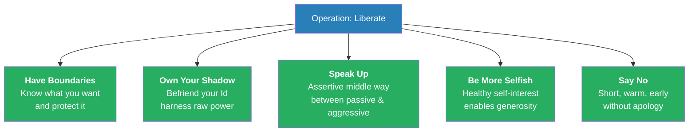
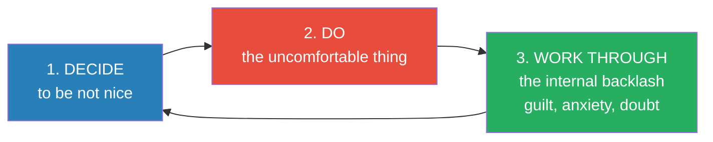
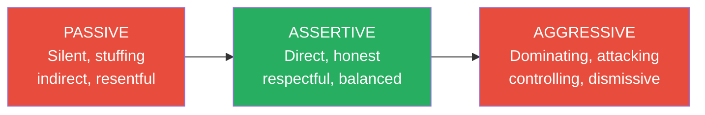
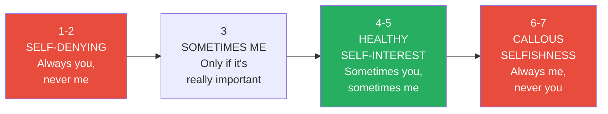
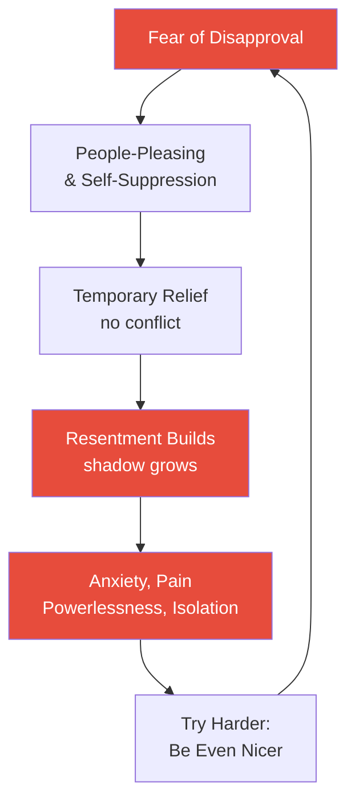

# Not Nice — Aziz Gazipura

> *You have spent years perfecting the art of being pleasant. Smiling when you wanted to scream. Saying yes when every cell in your body screamed no. Monitoring every word, gesture, and micro-expression to ensure no human within a three-mile radius felt a flicker of discomfort. And the reward for this heroic selflessness? Chronic anxiety, simmering resentment, physical pain, and the gnawing suspicion that nobody actually knows who you are. Dr. Aziz Gazipura — a clinical psychologist who spent a decade trapped in the same cage — wants to show you the door.*

---

## At a Glance

## About the Author

**Dr. Aziz Gazipura** is a clinical psychologist trained at Stanford and Palo Alto Universities, and the founder of The Center for Social Confidence. He is internationally known as a leading expert on confidence and assertiveness, reaching hundreds of thousands of people through coaching, YouTube, podcasting, and books including *The Solution to Social Anxiety* and *The Art of Extraordinary Confidence*. What makes Gazipura distinctive is his radical vulnerability: he spent over a decade trapped in severe social anxiety, people-pleasing, panic attacks, and chronic physical pain before transforming his life through the very methods he teaches. He lives in Portland, Oregon with his wife Candace and two sons, Zaim and Arman.

## The Big Idea

<b style="color: #2980b9">Niceness is not a virtue — it is a fear-driven survival strategy</b> that creates chronic anxiety, resentment, physical pain, powerlessness, and isolation. The opposite of nice is not being a jerk — it is being <b style="color: #27ae60">authentically, boldly yourself</b>: direct, boundaried, assertive, and genuinely loving from a place of choice rather than fear. Liberation comes through five pillars — having boundaries, owning your shadow, speaking up, practicing healthy self-interest, and saying no — all of which require a willingness to tolerate the discomfort that your old programming tells you will destroy you. It won't. On the other side of that discomfort is the most powerful, connected, and loving version of yourself.

## Key Concepts at a Glance

| | |
|---|---|
| **Core argument** | Niceness is a fear-driven survival strategy, not a virtue — shedding it makes you more loving, not less |
| **Structure** | 4 parts, 15 chapters + epilogue, 30-day action plan |
| **Key frameworks** | Five Pillars of Not Nice, Selfish Spectrum, Resentment Formula, Three Communication Modes |
| **Best for** | Chronic people-pleasers, conflict-avoiders, anyone whose "goodness" creates anxiety and resentment |
| **Pairs with** | [[When I Say No I Feel Guilty - Manuel J. Smith]], [[Emotional Blackmail - Susan Forward]], [[The Subtle Art of Not Giving a F-ck - Mark Manson]] |

---

## The 30-Second Version

- <b style="color: #e74c3c">Nice is not kind</b> — it is a fear-based strategy for avoiding disapproval, rooted in childhood conditioning
- It costs you five things: anxiety, resentment, physical pain, powerlessness, and isolation
- <b style="color: #27ae60">The opposite of nice is not being a jerk — it is being real</b>: direct, honest, boundaried, and authentically yourself
- Liberation requires five pillars: <b style="color: #2980b9">Have Boundaries, Own Your Shadow, Speak Up, Be More Selfish, and Say No</b>
- The pathway runs through discomfort, not around it — bold action comes first, comfort is the last result

---

## The 5-Minute Version

### The Nice Person Cage

*Gazipura opens with a confession: he was the nicest guy you'd ever meet — and it nearly destroyed him.*

- He defines nice not as kindness but as **self-monitoring for approval** — constantly scanning whether people like you, adjusting your behavior to eliminate all friction
- At a dinner party, "be nice" means: smile, nod, laugh at everything, avoid controversial topics, never interrupt, speak only when spoken to
- The underlying theory: if I please everyone and ruffle no feathers, people will give me love, promotions, friendships, and everything I want

> [!tip] The Critical Distinction
> - **Nice** = driven by fear of disapproval; you perform goodness to avoid rejection
> - **Kind** = driven by genuine care; you freely choose generosity from a place of strength

### Where Nice Comes From

- <b style="color: #2980b9">Nice Training</b> begins in childhood — parents condition obedience, politeness, and conflict avoidance through approval/withdrawal cycles
- Children learn a "Good Boy/Good Girl" list: qualities that earn love (agreeable, quiet, high-achieving) and a "Bad" list that triggers withdrawal (outspoken, angry, defiant, needy)
- The <b style="color: #e74c3c">Approval Seeker</b> develops with a prime directive (avoid all disapproval) and secondary mission (earn positive regard) — these run unconsciously in every interaction
- Over-responsibility for others' feelings turns guilt into a permanent state — the "Guilt Bubble"
- Anger becomes the forbidden emotion; conflict avoidance becomes a master skill

### The Five Costs of Nice

| Cost | How It Manifests |
|------|-----------------|
| **Anxiety** | Chronic worry about others' perceptions, replaying conversations, scanning for mistakes |
| **Resentment & Rage** | Suppressed anger at being mistreated, displaced onto safe targets (family, drivers) |
| **Physical Pain** | Repressed emotions create chronic pain — back, neck, stomach, wrists, TMJ (Sarno's TMS theory) |
| **Powerlessness** | Learned helplessness, victim stance, waiting for life to reward niceness instead of taking action |
| **Isolation** | The paradox: you do everything to be liked but feel chronically lonely because no one knows the real you |

Liberation collapses all five costs by 60-80 points — the biggest drops are in powerlessness and resentment, the two costs that compound most destructively over time.

### The Five Pillars of Liberation

**Pillar 1 — Have Boundaries:** Know what you want in each situation, communicate it clearly, and maintain it. Use a personal "Bill of Rights" to anchor your sense of entitlement to basic human dignities.

**Pillar 2 — Own Your Shadow:** Your Id (selfish, angry, desirous part) is not your enemy — it is your primary source of energy and power. Use shadow journaling and rage walks to access and release repressed emotions.

**Pillar 3 — Speak Up:** Move from passive or aggressive communication to the assertive middle way. Upgrade your relationship map with five truths: people aren't fragile, upset is temporary, directness creates respect, you can handle reactions, and others want to help.

**Pillar 4 — Be More Selfish:** Shift from self-sacrificing (level 1-2) to healthy self-interest (level 4-5) on the Selfish Spectrum. The Resentment Formula: giving without choice = resentment.

**Pillar 5 — Say No:** Short, unapologetic, warm. Make it about you, not about them. Say no early rather than stalling with polite delays.

### Living On Your Terms

- <b style="color: #2980b9">Discomfort is the gateway to freedom</b> — every growth edge requires tolerating uncomfortable feelings
- Choose **Discomfort A** (expressing yourself, temporary) over **Discomfort B** (stuffing yourself, compounding)
- Dismantle inherited "should" rules and consciously choose your own
- The ultimate goal is <b style="color: #27ae60">Bold Authenticity</b>: being known rather than being liked, being the authority in your own life

---

## The Full Read

### Part I: The Anatomy of Nice

---

#### What Nice Really Is

*Gazipura begins with a thought experiment. Imagine arriving at a dinner party and your companion says: "Be nice, OK?"*

- You would smile more, nod more, laugh at jokes you don't get, avoid controversial topics, speak only when invited, and generally make yourself as frictionless as possible
- This is what "nice" actually means — it is a **performance of pleasantness** designed to eliminate all negative reactions from others
- The underlying (inaccurate) theory of relationships:

> [!example] The Nice Person's Theory of Relationships
> - If I please everyone, keep a low profile, and never create friction
> - Then people will like me, love me, and give me everything I want
> - Promotions, friendships, dates, respect — all of it will flow to me
> - This theory is, as Gazipura bluntly puts it, "bunk"

- The opposite of nice is **not** being a jerk — it is being real, direct, honest, and authentic
- Being not nice means you are still kind, caring, and generous — but from a place of choice and power, not from fear and obligation
- The shift is from *"Was that good enough? Did everyone like me?"* to *"I am the decider. I am the creator of my life."*

---

#### The Author's Rock Bottom

*Gazipura's personal story forms the emotional spine of the book — he doesn't just theorize about niceness, he lived in its cage for years.*

> [!example] The Warcraft III Moment
> - Senior year of college, Gazipura has spent months mustering courage to ask one woman out, gets rejected, comes home devastated
> - Sits down with spaghetti noodles and Ragu sauce to play Warcraft III — his escape from a loveless, small existence
> - As the Battlenet login screen loads, he hears muffled laughter from his roommate's bedroom — a woman's laughter, joyful and intimate
> - Sitting there with steam rising from his noodles, the orc on the screen staring back at him, he feels the full weight of his constricted future
> - Something snaps: a tidal wave of anger, resistance, and raw energy — "I'm willing to do whatever it takes"
> - He calls this **Unstoppable Energy** — the moment when change becomes inevitable
- The pattern repeats across thousands of clients: each person has their own threshold moment in dating, career, social life, or self-respect where they decide they cannot take one more day of this constriction

- After his breakthrough moment, he studied eBooks, took courses, practiced approaching strangers, and made massive progress in confidence
- But the nice-guy patterns kept returning — he could make bold first impressions but then collapse into people-pleasing in relationships

> [!example] Panic in the Park
> - Four months into a relationship, Gazipura is lying on a blanket in a beautiful park with his girlfriend on a sunny day
> - He goes to use the bathroom and is hit by one of the most intense panic attacks of his life
> - His mind races with images of literally running out of the park and driving away, leaving her on the blanket
> - He paces back and forth in front of the bathroom for fifteen to twenty minutes, unable to go back
> - When he finally returns, she is relaxed in the sun, unaware of his crisis
> - He keeps his terror entirely to himself — classic nice-guy concealment

- This pattern — getting close then fleeing — repeated across multiple relationships, leading to the devastating belief: *"There is something fundamentally broken inside of me"*
- The real problem wasn't a defect but a prison of niceness: he hid all "negative" parts of himself, so he could never feel truly loved because nobody actually knew him

---

#### Nice Training: How You Were Programmed

*Every chronic people-pleaser was manufactured, not born.*

> [!example] "Don't Say That — That's Not Nice"
> - At a playground, a father pushes his son on the swings while the mother pushes their daughter
> - The daughter says she wants Dad to push her instead of Mom
> - The father fires back instantly, in a sharp tone: "Don't say that. That's not nice."
> - Case closed — no exploration of why she preferred Dad, whether she missed him, whether Mom wasn't pushing hard enough
> - The message: your honest preferences are offensive; suppress them

- Parents want obedient, polite, non-aggressive children — but these traits don't produce confident, assertive adults
- The disconnect: we hammer in "don't defy me" for 18 years, then expect the adult to be bold, outspoken, and a leader
- The **Good Boy/Good Girl List** exercise reveals the template:
  - What you had to be to receive love (obedient, athletic, cheerful, high-achieving)
  - What you could never be (defiant, emotional, outspoken, needy)
  - These lists have been dictating your choices ever since, mostly unconsciously

---

#### The Approval Seeker Inside

- Everyone has an internal Approval Seeker with two objectives:
  - **Prime Directive:** Avoid all judgment, criticism, and disapproval at any cost
  - **Secondary Objective:** Earn positive perceptions and approval
- The prime directive always outweighs the secondary — safety first, likability second
- This creates impossibly high standards: no one can have a negative thought about you, feel uncomfortable in your presence, or show any nonverbal disapproval
- The result: you become hypervigilant, scanning every micro-expression and adjusting yourself constantly
- It is exhausting — and invisible to others. From the outside you look calm and pleasant; inside you are running a surveillance operation
- Any interaction becomes an internal audit: "Did they like that? Was it funny enough? Those two laughed, but she seems irritated by me."
- Fifteen common signs of approval-seeking include: hesitating to speak, excessive smiling and nodding, over-laughing, agreeing when you disagree, name-dropping, avoiding eye contact, apologizing preemptively, and hiding parts of yourself

**The Nice Person's Beliefs (Running in the Background)**

| Belief | The Truth |
|--------|----------|
| "I'm responsible for how others feel" | Others are responsible for their own feelings — you can be considerate without being their emotional manager |
| "My needs don't matter as much as others'" | Your needs matter equally — denying them doesn't make you noble, it makes you resentful |
| "Conflict is dangerous and should be avoided" | Conflict is the doorway to intimacy, respect, and deeper understanding |
| "If people knew the real me, they'd reject me" | The real you is what creates genuine connection — the mask creates isolation |
| "Asking for what I want is selfish" | Asking is how adults meet needs — expecting others to mind-read is the real imposition |
| "Being upset/angry makes me a bad person" | All emotions are natural signals — suppressing them makes you sick, not virtuous |
| "If I'm nice enough, I'll eventually get what I want" | The passive path rarely delivers — bold action creates results |

Every false belief drops by 70-90 points after liberation — the most dramatic collapse is "niceness gets rewards," the foundational lie that keeps the entire system running.

---

#### The Guilt Bubble

*If the Approval Seeker is the engine, guilt is the fuel.*

- Nice people walk through life inside a **Guilt Bubble** — a permanent state of feeling responsible for everyone's emotional experience
- The logic: if someone around you feels sad, bored, confused, or uncomfortable, it must be your fault — and you must fix it
- This creates an impossible standard: you are simultaneously all-powerful (responsible for everyone's emotions) and completely powerless (unable to say no or protect yourself)
- Gazipura compares it to a transparent prison: from the outside, nothing looks wrong — you're smiling, helping, giving — but inside you are suffocating under the weight of everyone's feelings
- Guilt is the Superego's primary weapon against the Id — any impulse toward self-interest is punished with crushing guilt
- The trap: the more guilt you feel, the more you accommodate, the more resentment builds, the more guilt you feel about the resentment

---

#### Don't Be Mad: The Anger Taboo

*Of all the emotions nice people suppress, anger is the most forbidden — and the most costly.*

> [!example] Stolen Credit at Work
> - A female client discovers her boss has taken credit for a major project she completed
> - She feels stressed and overwhelmed but can't name the emotion underneath
> - When Gazipura suggests she might be angry, she resists: "I'm not angry. I'm just... frustrated"
> - Through guided role-play where she expresses her anger directly (as if speaking to her boss), she accesses intense rage
> - This release reconnects her with her power and agency — she moves from victim to creator
> - The anger becomes fuel: raw fire refined through an internal machine into productive assertiveness

- Nice people become masters of **conflict avoidance** — not just avoiding fights, but avoiding all disagreement, tension, or differing opinions
- Two primary mechanisms of avoidance:

**The Submissive Stance:**

- Drawn from primate pack behavior — the omega wolf avoids eye contact, moves nervously, exposes its belly when confronted
- Human versions: avoiding eye contact, speaking only when spoken to, stepping aside for others, excessive smiling, compulsive apologizing
- Over-apologizing is a particularly human form of submission: saying sorry for bumping shoulders, grabbing the door handle at the same time, starting to speak simultaneously
- We call it "politeness" — it is actually rooted in submissiveness and conflict avoidance

> [!example] The Omega Lion
> - In a nature documentary, seven adolescent male lions hunt together until old enough to find mates
> - When they kill a zebra, six lions fit around the carcass — all but the omega
> - The omega can only reach the zebra's head, timidly licking the scalp, ready to flee if any higher-ranked lion approaches
> - The narrator observes: "The omega does not often get enough food to eat, and does not survive. He is not a desirable male and will never find a mate."
> - Human hierarchies are more abstract — but the instinct to submit is the same

**Over-accommodating** means saying yes to everything without hesitation or negotiation — and never asking for what you want because you don't want to be a burden
- The combination of saying yes to everything and never asking for anything leads to feeling overcommitted, overwhelmed, and secretly resentful

---

#### The Five Costs of Nice

*Gazipura calls them "specters" — invisible forces that haunt every chronic people-pleaser.*

> [!tip] The Five Specters Are Predictable
> Every nice person experiences the same five costs in roughly the same order. They are not mysterious, random afflictions — they are the direct, predictable consequences of living in fear of others' disapproval.

**Cost 1: Anxiety**

- Chronic worry about others' perceptions — replaying conversations, scanning for mistakes, anticipating disapproval
- Rumination: picking apart interactions for evidence of having said the wrong thing
- If you suggested the restaurant or the movie, you feel responsible for everyone's experience
- The nervous system stays in fight-flight-freeze mode, flooding the body with cortisol and adrenaline
- Messes with sleep, digestion, libido, mood, and energy
- Gazipura personally replayed conversations obsessively — picking them apart for everything he did wrong, said wrong, or could have done better
- Even ordinary conversations got this treatment; the anxiety wasn't reserved for dramatic moments

**Cost 2: Resentment & Rage**

- Beneath the anxiety lives anger — the fight response that nice people never allow themselves to feel
- The nicer you are, the more resentment you carry, because you are treating everyone as if they are an unreasonable boss
- If you imagine others as harsh, judgmental, and holding power over you, your Id fights back
- Suppressed anger gets displaced: kind to the boss, irritable with the spouse and kids
- The Superego blocks awareness of anger because rage is incompatible with being a "good person"

**Cost 3: Chronic Physical Pain**

*This is Gazipura's most controversial claim — and most personal.*

> [!example] The Cascade of "Injuries"
> - At fifteen, Gazipura wakes up with shooting pain in his left buttock and collapses — beginning a four-year journey through dozens of doctors and diagnoses
> - Eventually diagnosed with Ankylosing Spondylitis, given medication that helped
> - But then: chronic stomach problems, IBS, neck and upper back pain, TMJ, wrist pain (RSI), guitar-ending injury, shoulder pain from swimming, knee pain from running, plantar fasciitis from biking
> - Each injury made him abandon that activity permanently — his life grew smaller and smaller
> - He believed his body was fundamentally defective and destined for injury

- Drawing on Dr. John Sarno's work, Gazipura argues that much chronic pain is **psychogenic** — created by repressed emotion, not structural damage
- Physical pain serves as the ultimate defense mechanism: it is absorbing, distracting, and appears entirely physical ("I slept wrong" / "I sat too long")
- The pain keeps threatening emotions (rage, grief, desire) safely out of awareness
- By feeling and processing repressed emotions directly, Gazipura eliminated TMJ, wrist pain, back pain, shoulder pain, plantar fasciitis, IBS, and more
- He now lifts heavy weights, runs, and uses his body fully — a liberation he considers even more profound than overcoming social anxiety

**Cost 4: Powerlessness**

- The nice stance is inherently passive — you follow rules and hope life rewards you
- This creates **learned helplessness**: you train yourself to see goals as out of reach, so you don't try
- The unspoken bargain: *"If I'm nice and play by the rules, life will bring me good things"* — but it doesn't work
- You feel like others get the promotions, the dates, the opportunities — while you wait on the sidelines being good
- Challenging the rules stirs anxiety and guilt, so you double down: be nicer, more pleasing, more accommodating

**Cost 5: Isolation**

- The cruelest irony: you do all of this to be loved, but you feel chronically lonely
- People may like you, but they don't *know* you — they know your mask, your performance
- Partial contact creates partial connection — the deep intimacy you crave requires revealing your real self
- Nice is a stop sign on vulnerability, authenticity, and genuine self-expression
- You are controlled, managed, and rigid — and the real you remains trapped

---

#### The Five Levels of Commitment

*Before moving to solutions, Gazipura introduces a framework for assessing whether you are actually ready to change — borrowed from Dr. Robert Wubbolding's Reality Therapy.*

| Level | Name | Mindset | Likely Outcome |
|-------|------|---------|---------------|
| 1 | **Lack of Commitment** | "I don't really want to change anything" | Nothing changes |
| 2 | **Outcome Without Effort** | "I want results but I don't want to do anything" | Fantasizing, excuses, no action |
| 3 | **Trying** | "I'll try, maybe, probably" — bare minimum effort | Some action until it gets hard, then quit |
| 4 | **Do My Best** | Consistent effort — but leaves the door open for giving up | Real progress, but "I did my best" becomes a story for quitting |
| 5 | **Whatever It Takes** | Total commitment — no exit routes, no excuses | Inevitable success; just a matter of time |

- Level 5 is what Gazipura activated on his Warcraft III night: "I will do whatever it takes"
- The power of Level 5: it cuts off all escape routes — if you don't know something, learn it; if you're scared, face it; if you believe you can't, you must
- Most people operate at Level 3 ("I'll work on speaking up just enough to not be completely silent") — this never produces transformation
- The question: "Am I going to dabble or decide?"

> [!warning] Dabbling Gets You Nothing
> Gazipura has dabbled at learning Spanish — books started, Rosetta Stone attempted "passionately" for four days. He doesn't speak Spanish. He never will — unless he decides at Level 5 that he *must*. The same applies to shedding niceness.

---

### Part II: The Five Pillars of Not Nice

---

#### Operation: Liberate

*Gazipura frames the transformation as a three-step process, repeated endlessly:*

- Step 1 is choosing bold authenticity over safety — deciding that your freedom matters more than others' comfort
- Step 2 is taking the action: saying no, speaking up, setting a boundary
- Step 3 is the hardest: processing the guilt, anxiety, and self-doubt that flood in *after* the bold action
- He calls this **Boldness Training Boot Camp (BTB)** — a term his wife Candace coined during her own struggles with assertiveness

---

#### Pillar 1: Have Boundaries

*Boundaries aren't walls — they are the difference between knowing what you want and being willing to act on it.*

- A boundary requires two things: **(1)** clarity about what you want, and **(2)** willingness to communicate and maintain it
- Most nice people struggle with step one — they have suppressed their wants so thoroughly that they genuinely don't know what they prefer
- The first exercise is relentlessly asking: *"What do I want in this situation?"* — not what you should want, what you actually want

> [!abstract] The Bill of Rights Exercise
> - Create a personal declaration of rights — things you are unconditionally entitled to as a human being
> - Examples: "I have the right to say no without guilt," "I have the right to make mistakes," "I have the right to change my mind," "I have the right to feel angry"
> - Read this list aloud daily, especially before situations that trigger people-pleasing
> - This anchors your sense of basic entitlement so boundary-setting feels less like transgression

- **The Peace Process:** A body-centered mindfulness technique for processing difficult emotions
  - Locate the feeling in your body (chest, throat, stomach)
  - Bring all attention there — stay out of your analytical mind
  - Breathe into the sensation with curiosity, acceptance, patience, and love
  - Gently repeat: *"It's OK. You're OK."*
  - Twenty minutes daily of this practice dramatically reduces fear of others' disapproval

---

#### Pillar 2: Own Your Shadow

*Gazipura applies Freud's structural model to explain why nice people are secretly miserable.*

- **Id:** The pleasure-seeking, impulsive inner child — wants fun, sex, food, freedom, and zero responsibility. Gets enraged when denied.
- **Superego:** The inner moral police — enforces rules about how you "should" be. Uses guilt as its primary weapon.
- **Ego:** The mediator that tries to navigate between the two in the real world.

- Nice people are completely identified with the Superego — they *are* the rules
- The Id (anger, desire, selfishness, aggression) gets shoved into the **shadow** — the basement of your psyche
- But what you repress doesn't weaken — it grows stronger, more twisted, and starts running your life from underground

> [!example] David Burns and the Fellowship
> - During doctoral training at Stanford, Gazipura's colleague Jeff agonizes over competitive feelings toward two friends applying for the same fellowship position
> - He feels guilty for wanting to win, for hoping they fail — his Superego calls him selfish and greedy
> - Dr. David Burns (Gazipura's teacher) does something unexpected: instead of helping Jeff reduce his competitiveness, he *fully plays it*
> - In a role-play, Burns embodies Jeff's shadow — unapologetically owning the desire to win, the selfishness, the competitive fire
> - When challenged ("That's so selfish of you"), Burns responds cheerfully: "You don't know the half of it!"
> - The result: Jeff feels secure and self-assured, not because his shadow disappeared, but because he stopped fighting it

**Top 10 Things Lurking in Your Shadow:**

| # | Shadow Content |
|---|---------------|
| 1 | Frustration, anger, or resentment with people closest to you |
| 2 | Judgmental thoughts about friends, colleagues, boss |
| 3 | Sexual desire for people you "shouldn't" desire |
| 4 | Sexual feelings you or others might deem inappropriate |
| 5 | Dissatisfaction with big life situations (job, marriage, city) |
| 6 | Grief, sadness, and pain of loss going back to childhood |
| 7 | Deep uncertainty — self-doubt, doubt of purpose, doubt of God |
| 8 | Strong sensitivity to comments, feeling secretly enraged |
| 9 | Desire for vengeance or retaliation |
| 10 | Impulses toward physical violence |

> [!abstract] Shadow Journal Technique
> - Find a completely private and secure place to write — a locked file, a document you'll delete after, a hidden notebook
> - For 15-20 minutes, write freely, quickly, uninhibitedly from the shadow parts of your mind
> - Let it be ugly: typos, fragments, expletives, rants, confessions
> - Never go back and read it — this isn't a memoir, it's an emotional purge
> - Prompting questions: What is upsetting you? What pressures do you feel? What demands enrage you? What does your inner three-year-old want?

> [!abstract] Rage Walk Technique
> - Walk for 20+ minutes with no headphones, no phone, no distractions
> - Focus on frustrations, anger, and resentments — let yourself fully feel agitation
> - Walk quickly, let your face express the feelings, mutter or speak aloud
> - Breathe deeply, tap your chest with your dominant hand
> - Afterward: feeling lighter, clearer, more resourceful — the opposite of what you'd expect

- The key insight: your shadow is your **primary source of power**
- Anger, aggression, and desire are the deepest motivators in all species
- When disconnected from shadow, you lose energy, presence, and influence — others speak over you, dominate you, demand more from you
- When harnessed, shadow energy flows through an internal "refining machine" and comes out as assertiveness
- Your Id screaming *"Shut the f**k up, Gary!"* gets refined into: "Hold on, Gary, I'm not done. Let me finish my point." — calm, firm, commanding

> [!example] Crawling Skin: The Author's Shadow Journal
> - After several weeks without journaling, Gazipura notices pain in his shoulder and foot — his mind blames running and the gym
> - He knows better: opens his shadow journal and starts digging
> - Just below the surface: rage at his one-year-old's screeching, hatred of the demanding breakfast routine, resentment of all parenting responsibilities
> - The journal is full of misspelled run-on rants and expletives — nothing he'd show anyone
> - That afternoon, he has a conversation with Candace about it — not to fix anything, just to be heard
> - Result: his mood transforms dramatically; he becomes patient, warm, and playful with his kids
> - Key insight: suppressing shadow drains enormous energy; releasing it through journaling or conversation restores vitality, creativity, and love

---

#### Pillar 3: Speak Up

*Gazipura argues that speaking up is 90% inner game and only 10% strategy — you can know exactly what to say and still freeze in the moment.*

**The Peacemaker Pattern**

- Most nice people were the peacemakers of their families — the ones who hated discord and found ways to minimize it
- Often they have a sibling who is effortlessly assertive, which makes the nice one wonder: *"Why did I end up this way?"*
- Two factors: (1) we all come out different — some are more sensitive from birth; (2) tolerance — whoever tolerates the "mess" less does the cleaning, whoever tolerates conflict less becomes the peacemaker

**Three Modes of Communication**

| Mode | Core Mindset | Behavior |
|------|-------------|----------|
| **Passive** | Others' needs matter more than mine; speaking up is dangerous | Silent compliance, indirect anger (sighs, withdrawal, sarcasm), denying feelings |
| **Aggressive** | My needs matter, yours are irrelevant; I take what I want | Berating, yelling, intimidating, smearing, controlling outcomes |
| **Assertive** | My needs matter AND so do yours; let's discuss what works | Direct expression, I-statements, willingness to hear others, holding firm when needed |

- Most people are predominantly passive and occasionally explode into aggression — then feel terrible about it
- The **assertive middle way** combines the beneficial elements: going after what you want (like aggressive) while being aware of others (like passive) — without either's excess
- Key insight: assertiveness actually makes people like you *more*, not less

**The 5 Relationship Truths (Map Upgrade)**

- Your old relationship map is full of errors that steer you toward people-pleasing and paralysis
- These five truths correct the most common distortions:

| # | Old Map (Fear-Based) | New Map (Empowered) |
|---|---------------------|-------------------|
| 1 | If I'm honest, I'll crush people | <b style="color: #27ae60">People aren't fragile</b> — they are strong, resilient, and can handle truth |
| 2 | If I upset someone, it's permanent damage | <b style="color: #27ae60">Upset is temporary</b> — emotional reactions pass; silence costs forever |
| 3 | Being direct makes people dislike you | <b style="color: #27ae60">Directness creates respect</b> — people trust those who say what they mean |
| 4 | I can't handle it if they react badly | <b style="color: #27ae60">You can handle their reactions</b> — discomfort is survivable |
| 5 | People don't want to hear my needs | <b style="color: #27ae60">Others actually want to meet your needs</b> — but you have to ask |

**Asking for What You Want**

> [!example] Project ULTRA
> - Gazipura designs an intense health regimen: 3:30 AM writing, 5:00 AM personal training four days a week, meticulously planned meals
> - His wife Candace is on board — until reciprocity kicks in: "You work out four days a week. I want to go to Barre 3 classes."
> - He asks: "How many days?" She hedges at three. He pushes gently: "How many would you *really* want?"
> - "Five days per week," she says — and her energy visibly lifts
> - He agrees, then spends the first two weeks getting pouty and irritable when she leaves for class
> - When she offers to scale back, he catches himself: "This isn't a sign that you need to give something up. This is a sign that I need to keep growing."
> - He learns to handle solo mornings with two toddlers, ends up enjoying them
> - Moral: the people around you care and want to support you, even if there is friction

- Three things that make asking for what you want terrifying (and why they're wrong):
  - You believe it's inherently selfish and demanding (it's not — it's how adults meet needs)
  - You believe people will reject you for having needs (usually they want to help — but you have to ask)
  - You believe you should be able to figure it out yourself (this is the childhood conditioning of "don't be a burden")

**The Courage to Be Real**

- Our ideas of how speaking up will go are usually far more dramatic than reality
- We imagine a conversation as a sheer cliff with no ropes — one false move and death
- In reality, it's more like a steep hill — legs burn a little, you get out of breath, but it's not fatal
- The more you practice, the more you realize: you say things, people respond, the world rotates
- Once in a while someone has a strong negative reaction — but it's rare, and it's survivable
- Generally, people don't seem bothered by your increased boldness, and many actually prefer you this way

**Post Speak-Up Freak-out (PSF)**

- After speaking up boldly, your **Safety Police** activate: replaying the interaction, finding every possible way it went wrong
- The freak-out feels real and urgent — *"That was way too forceful. Jennifer's face when I said that to Charles..."*
- The truth: this is just your nervous system trying to drag you back into the comfort zone
- Your sensors are still calibrated to "nice person" settings — anything bold registers as offensive
- Gazipura's prescription: give yourself an internal high-five, then look up "Le Freak" by Chic on YouTube and dance

---

#### Pillar 4: Be More Selfish

*This chapter is designed to push every button the nice person has.*

- If you polled 100 people, almost all would say selfishness is bad — it has the moral weight of a slur
- But Gazipura distinguishes between **destructive selfishness** (callously using others) and **healthy self-interest** (taking care of yourself so you can give freely)

**The Selfish Spectrum**

- Most nice people hover around **level 2** (You First, Then Me) — meeting their needs only after everyone else is covered
- Under stress they drop to **level 1** (Always You, Never Me) — completely forgoing their own needs
- Healthy self-interest exists at **levels 4-5** — you look inward first, identify what you need, then skillfully factor in others
- Level 5 sounds terrible ("Usually Me First") but it prevents the self-sacrifice cycle that destroys relationships

**The Resentment Formula**

> [!tip] The Mathematics of Resentment
> **Giving + No Choice About It = Resentment**
>
> You can give generously and far more than you receive — and feel joyful doing it. But if the giving is done under pressure (internal or external), and you feel you have no choice, resentment is inevitable. The key variable isn't *how much* you give but *whether you feel free* while giving.

- Often the pressure is internal — your own nice-person programming commanding you to say yes
- If anger is completely taboo, the resentment manifests as anxiety, depression, panic attacks, or chronic pain
- The pattern: give too much → feel you have no choice → build resentment → try to fix it by giving even more → dig deeper into the hole

> [!example] Jason's Six-Year Trap
> - Jason, late thirties, has known for years he wants to end his six-year relationship
> - But his partner becomes extremely distraught whenever he hints at change: "How could you *do* this to me?"
> - So he waits: first for her to get a job, then for her to settle into a new city after they move, then past the holidays, then past her job dissatisfaction
> - Years pass — there is never a "right time" because he is not operating from his own center
> - Gazipura uses the **Complete Self-Interest (CSI)** technique: "If every choice were based entirely on what's easiest and most desirable for you, what would you do?"
> - Jason's voice changes instantly — deeper, certain, no hesitation: "I would wait three weeks until after the holidays, then end it. I'd rent myself an AirBnB. Come back a week later and start moving out."
> - The reconnection with his own desire unlocks his power — but his Superego attacks immediately: "That's so selfish and inconsiderate!"
> - Gazipura's reframe: Jason isn't staying to protect *her* from pain — he's staying to protect *himself* from the shame and guilt of causing pain

**Your Real Responsibilities**

- You *are* responsible for: meeting your own needs, uncovering what you want, taking effective steps to get it
- You are *not* responsible for: other people's feelings, wants, needs, and emotional reactions
- Doing something for someone else is just one possible way for them to meet their needs — if you say no, it's their responsibility to find another way
- Putting yourself first increases your happiness, joy, and capacity to love — so you can give freely instead of resentfully

---

#### Pillar 5: Say No

*The nice person's kryptonite — a simple two-letter word that feels like detonating a nuclear weapon.*

**Five Tips for Masterful No's:**

| Tip | No-Noob | No-Master |
|-----|---------|-----------|
| **1. Short & Direct** | "I'm sorry, I can't make it. I would love to normally, but I have to pick up my dog and I have a report due. It's been a crazy week. Sorry :)" | "Thanks for the invite. I can't make it this time, but let me know about the next one." |
| **2. No Apologies** | Apologizes twice in one message | Zero apologies — you've done nothing wrong |
| **3. Make It About You** | "I don't want to spend the whole weekend with you guys" | "I notice I need more alone time on weekends to recharge. I'd like to come Saturday and head home that evening." |
| **4. Warmth & Appreciation** | Marshals inner warrior, says no harshly | "Thanks for the invite, Dad, I appreciate how much you love having us out there. I think we'll pass on the RV idea." |
| **5. Say No Early** | "Hmm, let me check my calendar..." (stalls for weeks) | "Ehh, I'm not a big fan of comic book movies. Let's do something else." |

> [!example] The Weekend Getaway Dilemma
> - A client's friends invite her on an entire weekend group trip — she finds it fun but exhausting due to her introverted nature
> - She has been declining with fake excuses, creating a pattern of rejection her friend doesn't understand
> - In coaching, she discovers a new option: attend Saturday only, drive home Saturday night
> - The key phrase: "I love spending time with you all. I noticed I really need alone time to recharge, so I'd like to come Saturday and head home that evening."
> - Role-play with guilt-tripping friend: "Well, if that's what you want. I'll let everyone know you don't want to stay the whole weekend."
> - The client finds it painful — but practices sitting with the discomfort using the Peace Process
> - Gazipura asks: "What if it were safe for you to say what you wanted? What if others temporarily felt disappointed, but loved you anyway?"

- <b style="color: #2980b9">Beware the word "but"</b> — it negates everything before it
  - Instead of: "I really enjoy spending time with you, **but** I'm busy"
  - Try: "I really enjoy spending time with you, **and** unfortunately I'm busy this weekend"
  - Or make it two sentences: "I really enjoy spending time with you. I'm busy this weekend, so I won't be able to join."

---

### Applying Not Nice: The Professional Arena

*Gazipura doesn't treat work as a separate domain — the same nice patterns that poison your personal life also sabotage your career.*

**How Niceness Kills Your Career:**
- You don't speak up in meetings because you might say something wrong or step on toes
- You don't advocate for raises or promotions because asking feels "pushy"
- You don't push back on unreasonable demands because you don't want to be seen as "difficult"
- You don't share your ideas boldly because someone might disagree
- You smile, nod, do excellent work, and hope someone notices — they often don't

**The Professional Application of the Five Pillars:**

| Pillar | At Work |
|--------|---------|
| **Boundaries** | Declining projects that aren't yours; leaving at a reasonable hour; saying "that's not my responsibility" |
| **Shadow** | Acknowledging competitive feelings about colleagues; processing resentment toward your boss privately |
| **Speak Up** | Interrupting to share your idea; pushing back on feedback you disagree with; asking the uncomfortable question |
| **Self-Interest** | Negotiating your salary; pursuing the promotion; taking the opportunity even if a colleague also wants it |
| **Say No** | Declining meetings that waste your time; refusing to take on more than your share; saying "I can't do that by Friday" |

- Gazipura shares that getting passed over for promotions is often not about skill — it's about not being seen as "leadership material" because you're too quiet, too accommodating, too agreeable
- Others who are outspoken, bold, and willing to disagree get noticed and advanced — not because they're better, but because they're visible

- The professional stakes of niceness are concrete: Gazipura describes clients who are objectively more skilled than their peers but remain stuck at the same level for years because they won't advocate for themselves, won't challenge senior leadership, and won't make their achievements visible
- The fix isn't becoming ruthlessly political — it's becoming assertive enough that your competence can actually be seen and rewarded

---

### Part III: Living on Your Terms

---

#### Increase Your Discomfort Tolerance

*This chapter reframes the entire journey through a single lens: everything you want is on the other side of discomfort.*

- The reason you stay nice can be reduced to one word: **comfort** — being nice is more comfortable in the short term than being real
- Speaking up, being direct, having conflict — all uncomfortable. Staying silent is comfortable (moment to moment)
- But the long-term cost of comfort-seeking is enormous: anxiety, resentment, depression, stagnation

> [!tip] The Two Discomforts
> - **Discomfort A:** Expressing the real you and dealing with the uncomfortable feelings that arise — *temporary, leads to growth*
> - **Discomfort B:** Stuffing the real you and dealing with anxiety, resentment, pain, and depression — *compounds, no end in sight*
> - You cannot avoid discomfort. You can only choose which kind.

**The Ice Shower Experiment**

> [!example] Cold Water and a Three-Year-Old Yoda
> - Gazipura commits to one-minute cold showers daily: one minute hot, one minute cold, repeat
> - Day one: his heart pounds, his body enters fight-or-flight just reaching for the faucet
> - His three-year-old son Zaim comes to watch: "I'm scared!" says Dad. "Why?" asks Zaim — a question Dad cannot answer well
> - Within two days, the fear response disappears; within two weeks, he likes the intensity
> - Zaim starts taking his own ice showers: "I want cold for four minutes" (he means four seconds)
> - Within days, the boy spends more time under cold than hot — a tiny beast of discomfort tolerance
> - The experiment raises a life-changing question: *"Is discomfort tolerance transferable from one domain to another?"*

- Answer: yes — building capacity to tolerate physical discomfort increases your capacity to tolerate emotional discomfort (saying no, speaking up, handling criticism)
- Gazipura extended the experiment to diet (reducing 600 calories/day, cutting delicious fats) and found the same principle: sustained voluntary discomfort builds a transferable "muscle"
- Two components of discomfort: **(1)** actual physical sensations in the body, and **(2)** the mental label "this is bad and should stop" — the second component creates most of the suffering

**Handling Others' Upset: Three Techniques**

*Disarming (from David Burns):*
- When someone is upset, they want to be heard — not argued with or told they're wrong
- Simply acknowledge what they're feeling with empathy, then find a grain of truth in what they're saying
- Instead of: "It's only for the afternoon. We went to dinner last night and I'll be there Sunday" (defensive)
- Try: "I'm sorry you're feeling sad, sweetie. You were hoping we'd spend the afternoon together, and it feels like I'm choosing them over you." (empathy + reflection)
- No apology for your choice, no defense — just witnessing their experience

*The Acceptance Paradox:*
- The most powerful way to handle criticism: accept a piece of it as true *without* agreeing you're a bad person
- Criticism: "Your books are garbage — long-winded, no value at all."
- Response: "They definitely are long! My books aren't for everybody. Some people really don't like them."
- The only criticism that truly wounds you is one that aligns with a criticism you already have of yourself — the acceptance paradox neutralizes both the external and internal critic

*Embarrassment Inoculation:*
- Intentionally doing embarrassing things to eliminate fear of judgment: lying down on a busy sidewalk, dancing on a street corner, trying to order pizza at an ice cream shop
- You discover it's no big deal — and you can handle whatever happens
- Over time, you actually start to enjoy embarrassment — it becomes proof that you're alive and taking risks
- The progression: embarrassment → discovery that nothing bad happens → the fear shrinks → you do it again → eventually you genuinely enjoy the sensation of social boldness

---

#### Choose Your Rules

*Most of the rules governing your behavior were never consciously chosen — they were installed during childhood and run automatically.*

- **"Should" Rules** are inherited commandments: you should always be polite, you should never make people uncomfortable, you should put others first, you should be humble, you should always forgive
- Exercise: list every "should" rule you can identify, then ask three questions for each:
  - *Where did this come from?* (Parent, teacher, religion, culture?)
  - *Does it serve me?* (Does following this rule make my life better or worse?)
  - *Do I want to keep it?* (Would I consciously choose this rule today?)
- Many rules were useful once (keeping a small child safe from danger) but become prisons for the adult who follows them unquestioningly
- The shift: from unconscious rule-following to **conscious rule-choosing** — you become the author of your own moral code
- This is not about becoming amoral — it is about replacing inherited defaults with deliberately chosen values

> [!warning] The "Change Back" Phenomenon
> When you start operating from new rules, the people around you will resist — sometimes aggressively. Family members may guilt-trip you. Friends may make sarcastic comments. Partners may confront you directly.
>
> This is the **"change back" phenomenon** from family therapy: others unconsciously communicate *"I don't like this! Be the old you again!"*
>
> Don't panic. Some relationships will deepen as you grow. Others will fall away — and they were never truly relationships with the real you anyway.

**Strengthening Your Reality**

> [!abstract] The Five Questions
> - **What do you love?** (What do you like, appreciate, enjoy?)
> - **What do you hate?** (What irritates, annoys, or enrages you?)
> - **What do you believe?** (Start each sentence with "I believe...")
> - **What is great about you?** (Strengths, quirks, endearing traits?)
> - **What's your purpose?** (Why are you here? What will you do?)
>
> Write the answers, then read them aloud — not as an operations manual but as the most valuable thing in the world shared with your closest ally. Live from this place.

---

#### 100% You: Bold Authenticity

*The culmination of the entire book — becoming the authority in your own life and being known rather than being liked.*

- After working with thousands of people, Gazipura identifies one universal pattern: **if someone feels they cannot be themselves, they suffer — period**
- It doesn't matter how much money, fame, or love they have — inauthenticity creates pain
- The pain goes underground as physical symptoms, apathy, anxiety, depression — but these are actually beautiful signals that the human spirit will not settle for less than freedom

**Being Known vs. Being Liked**

- The nice person's primary goal in every interaction: *get them to like me*
- This creates impression management, tension, social anxiety — and paradoxically, less likability
- The shift: make your primary goal *being known* — sharing who you actually are, finding out who they actually are
- Knowing someone means sharing what is truly happening inside: thoughts, feelings, preferences, desires — not a filtered, managed version
- When you stop trying to be liked and aim to be known, people like you far more — the **paradox of niceness**

> [!example] Andrew McCallister: The Fantasy Self
> - At age seven, Gazipura gets a miniature basketball hoop and spends hours making championship-winning shots
> - But it is not "Aziz" making those shots — it is "Andrew McCallister," a name he invented for this purpose
> - As a child with a "weird" name who was teased ("Aziz the disease"), he learned that his real identity wasn't the kind that wins championships and crowds
> - He carried this pattern unconsciously into adulthood: after attending a Tony Robbins seminar at 24, he spent ten years unconsciously trying to *be* Tony Robbins
> - Every coaching session ended with dissatisfaction: "Tony could have one conversation and everything would transform instantly"
> - At another Robbins event in December 2016, the spell broke — he saw Tony as just another person making an impact, not a demigod
> - The release was enormous: "I don't have to be anyone other than who I am"

**Be the Authority**

- Most nice people look to others as the authority in their lives — the expert, the parent, the confident colleague who seems to have it all figured out
- Certainty does not correlate with accuracy — someone can be completely sure and completely wrong
- Deep down, you have a part that always knows the next best move for you — your intuition
- Reclaiming inner authority means: consider what teachers suggest, weigh the options, then **decide for yourself** and stand in that decision firmly

---

### Part IV: The 30-Day Boldness Training Boot Camp

*Gazipura doesn't let you close the book without a concrete action plan — four weeks of daily challenges designed to progressively stretch your comfort zone.*

| Week | Theme | Sample Challenges |
|------|-------|-------------------|
| **Week 1: Foundation** | Building awareness and internal permission | Take the Nice Assessment; practice "I don't need your approval" mantra; list everything you want; create your Bill of Rights; own your shadow for a day |
| **Week 2: Forge** | Beginning to take action in the world | Daily ice showers; endure imagined disapproval for 15 minutes; take deliberately long to order at a café; notice disagreements without voicing them; ask for something for free |
| **Week 3: Fire** | Direct confrontation with discomfort | Voice a real disagreement; go an entire day without apologizing; maintain direct eye contact in conversations; say no to something; set one boundary; have an uncomfortable conversation; do something "selfish" |
| **Week 4: Integration** | Full expression and celebration | Practice full self-expression for a day; combine gratitude with personal power; take a leadership moment; have a difficult conversation you've been avoiding; do a form of public speaking; celebrate your growth; write your future vision |

The crossover happens around day 21 — after three weeks of consistent practice, boldness exceeds discomfort for the first time, and the acceleration becomes self-reinforcing.

- The metaphor: this is gym training for your assertiveness muscle — going once a week and lifting a five-pound weight won't change anything
- Expect the **"Change Back" phenomenon**: people around you will resist your new boldness because they're comfortable with the old you
- Some relationships will deepen; some will fall away — and that creates space for people who love the authentic you

---

### Epilogue: Not Nice in Action

*The book's most delightful section — Gazipura shares real, messy, sometimes awkward stories from his life while writing the book.*

> [!example] "Is That a Nice Way of Saying No?"
> - A colleague asks for book marketing advice; Gazipura offers a three-way strategy call with a marketing expert friend
> - She declines politely: "I don't want to take up that much of your time... I feel so bad asking for free advice"
> - Old Aziz would have just sent a few tips via email and dropped it. Not Nice Aziz writes back directly: "I'm not sure if your response is not wanting to impose, or perhaps a nice way of saying no? If it's the latter, that's OK."
> - His inner freak-out begins immediately: "You sound pissed off. She's going to think you felt rejected."
> - Her response: "Really, really honestly it is because I dread phone conversations. LOL."
> - She was being nice. His directness revealed the truth. No one died.

> [!example] The Podcast Cancellation
> - A coach requests to interview Gazipura for his podcast — Gazipura doesn't want to do it but can't articulate why
> - He gives a nice-guy stall: "We're booked for four months, let's check back then"
> - Four months later, the man returns — still doesn't want to, books it anyway
> - While writing this book about saying no, he finally cancels: sends a vulnerable, honest email about overcommitting
> - The response is a guilt-trip: "I've told my readers, my family, nearly everyone. They'll think I'm a liar or you're a complete asshole."
> - Old Aziz would have caved. New Aziz breathes, reconnects with himself, and responds with compassion and brevity: "Unfortunately, I will not be able to answer those questions via email. I wish you all the best."
> - He feels at peace, not because the other person is happy, but because he honored himself

> [!example] Play Doctor — 785 Times
> - Zaim has an elaborate pretend-doctor game with a specific script involving Teddy, Scodger Digit (a purple T-Rex), and a very particular sequence of events
> - Gazipura says yes every time because the "good dad" voice tells him to
> - Result: the Resentment Formula in action — giving + no choice = irritation masquerading as presence
> - The breakthrough: "I could just say no." He says "No, let's play the knock-down game instead." Zaim says "OK!" — completely unfazed
> - So simple from the outside, so revolutionary from inside the nice-person cage

> [!example] "Man, I'm Too Nice"
> - At a Mexican restaurant, Gazipura's dad heads to the bathroom
> - A young woman is fiddling with the key in the lock — the door is wide open
> - Dad asks if she's using it; she gives a vague response about the key while he walks past her into the bathroom
> - A nearby diner calls out: "There's another bathroom in the back!"
> - The young woman replies with a rueful laugh: "Thanks. Man, I'm too nice."
> - She had held the door open and yielded the bathroom to a stranger rather than say: "Yes, I'm about to use this"

> [!example] You Talk Too Much
> - At the gym with his friend and trainer Josh, Gazipura is feeling energized and talkative — sharing extra stories, keeping the floor when they both start talking at once
> - Immediately his inner critic activates: "He didn't like that. You talked too much. You're always talking too much."
> - This pattern has haunted him since adolescence — even after amazing social nights, the critic would replay everything and find evidence of being excessive
> - This time, he dismisses it: "It's OK for me to be excited sometimes. If he was annoyed, that's fine."
> - Later that day, a text from Josh: "Love seeing you all the time my man, and I love seeing you step up and play big. Proud of you."
> - Gazipura laughs out loud — the day he is most energized and talkative is the day his friend says he loves being around him
> - The inner critic was not just wrong — it was 100% the opposite of reality

---

## Key Frameworks at a Glance

### The Nice Person Cycle

### The Liberation Cycle

- **Decide** → Act boldly → Feel discomfort → Process the backlash → Realize you survived → Decide again → Act more boldly → Feel less discomfort → The cycle accelerates

### The Complete Selfish Spectrum (Expanded)

| Level | Label | Behavior Pattern |
|-------|-------|-----------------|
| 1 | Always You, Never Me | Complete self-denial; needs don't exist |
| 2 | You First, Then Me | Meet others' needs first; yours only if there's anything left |
| 3 | Sometimes Me (If REALLY Important) | Advocate for yourself only in emergencies |
| 4 | Sometimes You, Sometimes Me | Balanced give and take; conscious of both |
| 5 | Usually Me First, Then You | Look inward first, identify your needs, then factor in others skillfully |
| 6 | Me First, You if Convenient | Self-focused with diminishing concern for impact |
| 7 | Always Me, Never You | Callous disregard for others' experience |

- <b style="color: #27ae60">Healthy self-interest = levels 4-5</b> — not the "fair" midpoint of 3-4 that most nice people aim for
- Level 5 is where you identify your needs first, then work out how to meet them in a way that considers others — this is what Gazipura modeled in Project ULTRA

Levels 4-5 produce the optimal profile — high self-care and authenticity with low resentment, confirming that healthy self-interest is the sweet spot between self-denial and callousness.

---

## The Toolbox: Practical Techniques

| Technique | Purpose | How To |
|-----------|---------|--------|
| **Bill of Rights** | Anchor your basic entitlements | Write a personal declaration of rights; read aloud daily |
| **Peace Process** | Process difficult emotions | Locate feeling in body → breathe into it → "It's OK. You're OK." → 20 min daily |
| **Shadow Journal** | Release repressed emotions | 15-20 min uncensored writing in a private/locked file; never re-read |
| **Rage Walk** | Express anger safely | 20+ min walk, no distractions; mutter, rage, breathe deeply, tap chest |
| **CSI (Complete Self-Interest)** | Reconnect with your desires | Ask: "If I had zero obligation to anyone, what would I do?" — notice how clarity returns |
| **Embarrassment Inoculation** | Kill fear of judgment | Intentionally do mildly embarrassing things in public; notice you survive |
| **Ice Showers** | Build discomfort tolerance | 1 min hot, 1 min cold, repeat; daily for 30 days |
| **Disarming** | Handle others' upset | Reflect their feelings with empathy + find a grain of truth to agree with |
| **Acceptance Paradox** | Neutralize criticism | Accept a piece of the criticism as true without accepting you're a bad person |
| **"What Do I Want?"** | Build self-awareness | Ask this multiple times per day in every situation; don't dismiss the answers |
| **Strengthening Your Reality** | Solidify identity | Answer five questions (love/hate/believe/strengths/purpose); read aloud |

---

## The 15 Principles of Not Nice

| # | Principle | One-Line Summary |
|---|-----------|-----------------|
| 1 | <b style="color: #e74c3c">Nice ≠ Kind</b> | Niceness is fear-driven monitoring; kindness is freely chosen generosity |
| 2 | <b style="color: #e74c3c">Fear, Not Virtue</b> | People-pleasing comes from terror of disapproval, not moral superiority |
| 3 | <b style="color: #2980b9">Anger Is Power</b> | Suppressed anger is your primary fuel source for assertiveness |
| 4 | <b style="color: #2980b9">Shadow = Life Force</b> | The parts you repress (anger, desire, selfishness) are your energy |
| 5 | <b style="color: #27ae60">People Aren't Fragile</b> | Others can handle your truth — treating them as delicate is disrespectful |
| 6 | <b style="color: #27ae60">Upset Is Temporary</b> | Others' negative reactions pass; your silence costs permanently |
| 7 | <b style="color: #e74c3c">Giving + No Choice = Resentment</b> | Self-sacrifice without autonomy creates toxic anger |
| 8 | <b style="color: #27ae60">Self-Interest Enables Generosity</b> | Taking care of yourself makes you more loving, not less |
| 9 | <b style="color: #2980b9">Discomfort Is the Gateway</b> | Everything you want is on the other side of your comfort zone |
| 10 | <b style="color: #2980b9">The PSF Is Normal</b> | Guilt and anxiety after assertiveness = Safety Police, not reality |
| 11 | <b style="color: #27ae60">You Are the Authority</b> | Stop looking to others; trust your own intuition and decisions |
| 12 | <b style="color: #27ae60">Be Known > Be Liked</b> | Authentic connection requires revelation, not performance |
| 13 | <b style="color: #e74c3c">Repressed Emotion Creates Pain</b> | Chronic physical pain often stems from stuffed anger (TMS theory) |
| 14 | <b style="color: #e74c3c">"Should" Rules Are Prisons</b> | Most rules governing your behavior weren't consciously chosen |
| 15 | <b style="color: #2980b9">Action First, Comfort Last</b> | Bold action → smoother execution → eventually comfort. Never the reverse. |

---

## The Nice Person's Diagnostic Checklist

*How many of these describe you?*

- [ ] You replay conversations scanning for things you said wrong
- [ ] You say "I'm sorry" for things that don't warrant apology
- [ ] You feel responsible for others' moods and try to "fix" their unhappiness
- [ ] You say yes before you've even considered whether you want to
- [ ] You feel guilty when you do something enjoyable for yourself
- [ ] You avoid sharing opinions that differ from the group
- [ ] You have difficulty making eye contact with authority figures
- [ ] You laugh too hard at jokes that aren't funny
- [ ] You often know what you want to say but can't make yourself say it
- [ ] You describe yourself with some version of "there's something wrong with me"
- [ ] You have chronic pain your doctors can't fully explain
- [ ] You feel secretly resentful toward people you are outwardly generous to
- [ ] You avoid approaching people you find attractive or interesting
- [ ] You experience the Post Speak-Up Freak-out after being honest
- [ ] You wait for the "right time" to have difficult conversations (it never comes)

---

## The Verdict

> *A deeply personal, surprisingly practical liberation manual. Gazipura writes with the vulnerability of someone who has lived every chapter — from chronic panic attacks to happy marriage, from gaming-chair paralysis to running a coaching empire. The book is uneven (the TMS/pain chapter will lose some readers, the 30-day plan could be tighter), but its core message lands with force: niceness is not a virtue, it is a cage, and the key has been in your pocket all along.*

**Strengths:**
- Extraordinary vulnerability — Gazipura doesn't just teach; he confesses his worst moments with unflinching honesty
- The five pillars are operationally clear — you know exactly what to do, not just what to think
- Resentment Formula is brilliantly simple and universally applicable
- The epilogue is the best section — real, messy, imperfect stories that show what "not nice" actually looks like in daily life
- Discomfort tolerance as the meta-skill is a genuinely powerful reframe

**Limitations:**
- The TMS/psychogenic pain chapter is controversial and may erode credibility for skeptical readers
- Some repetition — the core message could be delivered in fewer chapters
- The 30-day plan, while practical, feels rushed compared to the depth of the earlier chapters
- Limited discussion of cultural and gender dynamics in niceness (briefly acknowledged but not deeply explored)
- Heavily focused on the author's experience as a heterosexual man — some examples may not resonate equally

**Bottom line:** If you recognize yourself in the Nice Person diagnostic checklist above, this book may be the most important thing you read this year. It is less polished than [[When I Say No I Feel Guilty - Manuel J. Smith]] but more emotionally honest, less academic than [[Emotional Blackmail - Susan Forward]] but more actionable. It sits at the intersection of assertiveness training and shadow work — a rare combination that addresses both the behavioral *how* and the psychological *why*.

**Who should read this first:** Anyone who finishes a social interaction and immediately replays it looking for mistakes. Anyone who says "sorry" more than five times a day for things that aren't their fault. Anyone whose stomach knots at the thought of someone being disappointed in them. Anyone who has thought, even once: "I know what I want to say, but I just can't make myself say it."

**Who might find it less useful:** Those already comfortable with assertiveness who face specific manipulation tactics (try [[In Sheep's Clothing - George K. Simon]] instead). Those looking for strict CBT protocols for social anxiety (this is more experiential than clinical). Those who need gender-specific frameworks — the book acknowledges but doesn't deeply explore how niceness manifests differently across genders and cultures.

**Reading order suggestion:** If you've never read assertiveness literature, start here — it's the most accessible entry point. If you've already read [[When I Say No I Feel Guilty - Manuel J. Smith]], this adds the emotional/shadow dimension that Smith's more clinical approach lacks. Pair with [[Emotional Blackmail - Susan Forward]] to understand when others exploit your nice patterns.

---

## How to Use This Book (Gazipura's Prescription)

*Not Nice is not meant to be read passively — Gazipura designs it as an intervention, not an education.*

**The Recommended Sequence:**
1. Read Part I slowly, doing all reflection exercises — let yourself feel the discomfort of recognizing your patterns
2. Create your Good Boy/Good Girl lists (Ch 2) and your Bill of Rights (Ch 6) before moving forward
3. Read the five pillars in Part II and begin applying immediately — don't wait until you've finished the book
4. Use the Shadow Journal and Rage Walk techniques at least three times before reading Part III
5. Commit to the 30-Day BTB Plan — do not cherry-pick; the progression is intentional
6. Re-read the Epilogue whenever you need proof that this work is messy, imperfect, and still worth doing

**Three Non-Negotiable Daily Practices:**
- Ask "What do I want in this situation?" multiple times per day
- Do the Peace Process for 20 minutes (body-focused emotion processing)
- Write in the Shadow Journal for 15-20 minutes (uncensored emotional purge)

**The Golden Rule of Not Nice:**
- You are going to feel uncomfortable. You are going to feel guilty. Your Safety Police will freak out. Your inner critic will tell you that you've gone too far, that people hate you, and that terrible things are about to happen.
- None of that is true. It is just the old programming fighting to keep you in the cage.
- The evidence: every person Gazipura has guided through this process reports the same result — "It gets better. As you let go of niceness, guilt, pleasing others, and fear of conflict, everything improves."

---

## Related Reading

| Book | Connection |
|------|-----------|
| [[When I Say No I Feel Guilty - Manuel J. Smith]] | The foundational assertiveness text — more structured techniques, less personal narrative |
| [[Emotional Blackmail - Susan Forward]] | Understanding how others use guilt and obligation as control tools |
| [[In Sheep's Clothing - George K. Simon]] | Recognizing when your niceness is being exploited by covert-aggressive personalities |
| [[The Gaslight Effect - Robin Stern]] | When niceness leads to losing your sense of reality in relationships |
| [[The Subtle Art of Not Giving a F-ck - Mark Manson]] | Similar irreverent tone; overlapping theme of choosing your values over social expectations |
| [[13 Things Mentally Strong People Don't Do - Amy Morin]] | Practical mental strength habits that complement the assertiveness work here |
| [[Feel the Fear and Do It Anyway - Susan Jeffers]] | Discomfort tolerance as the gateway to growth — the philosophical sibling to Gazipura's approach |
| [[12 Rules for Life - Jordan Peterson]] | Shadow integration, taking responsibility, and the danger of being "too agreeable" |

---

*Summary by Book Summary Vault · Source: Not Nice (2017) by Dr. Aziz Gazipura · All stories paraphrased; no passage exceeds fair-use limits*
