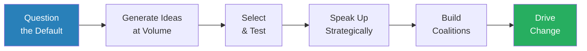
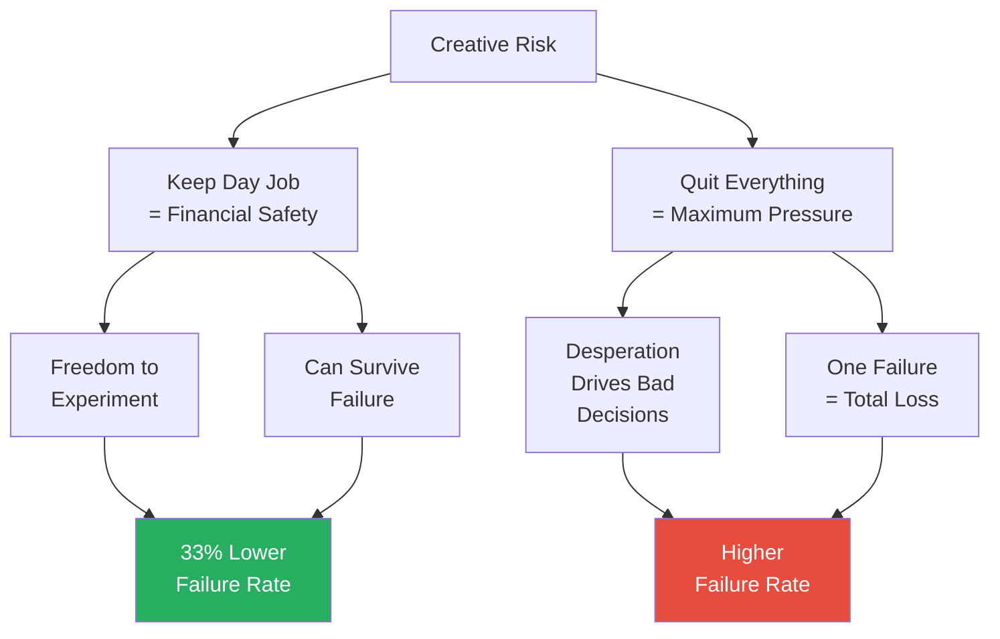
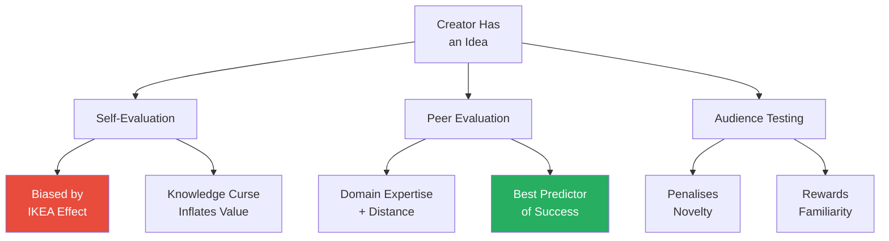
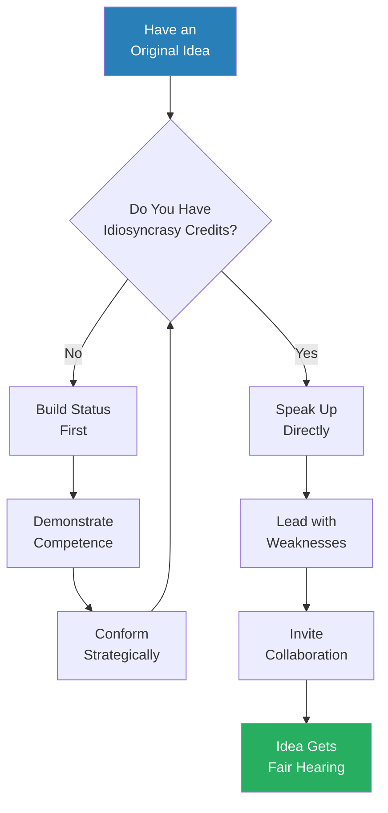
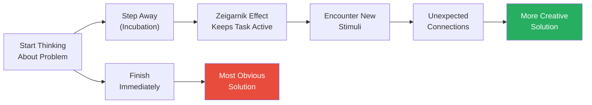
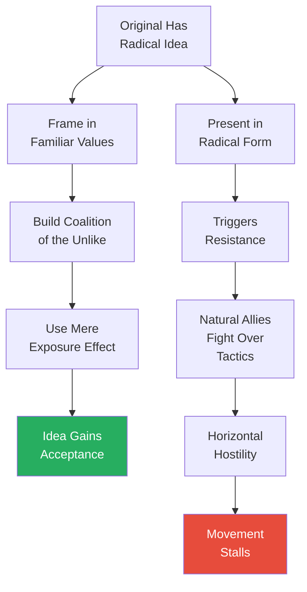
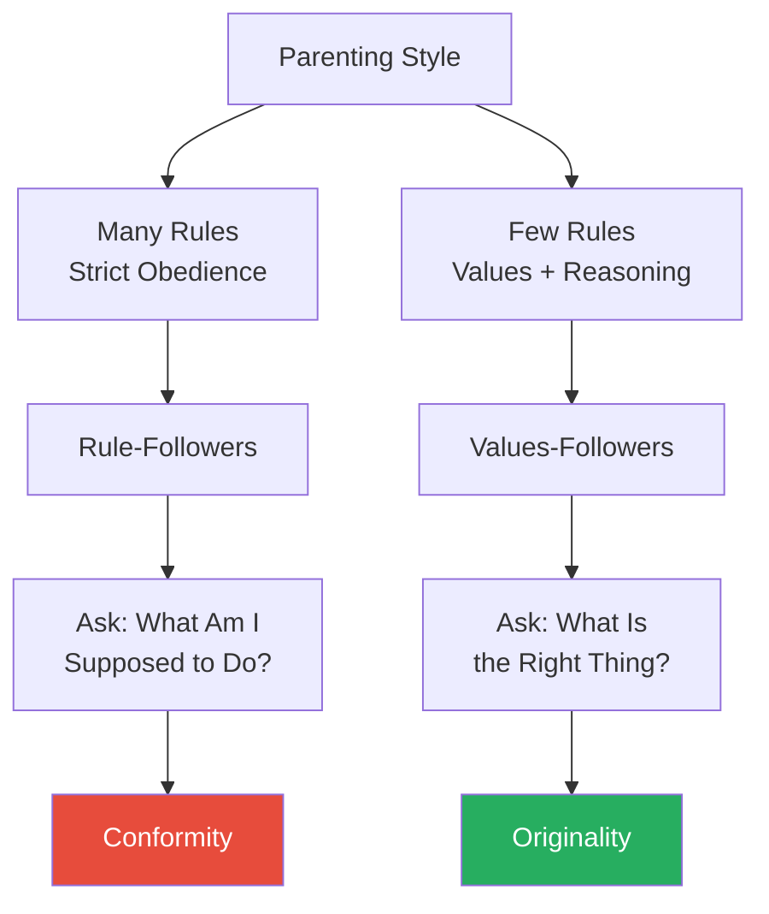
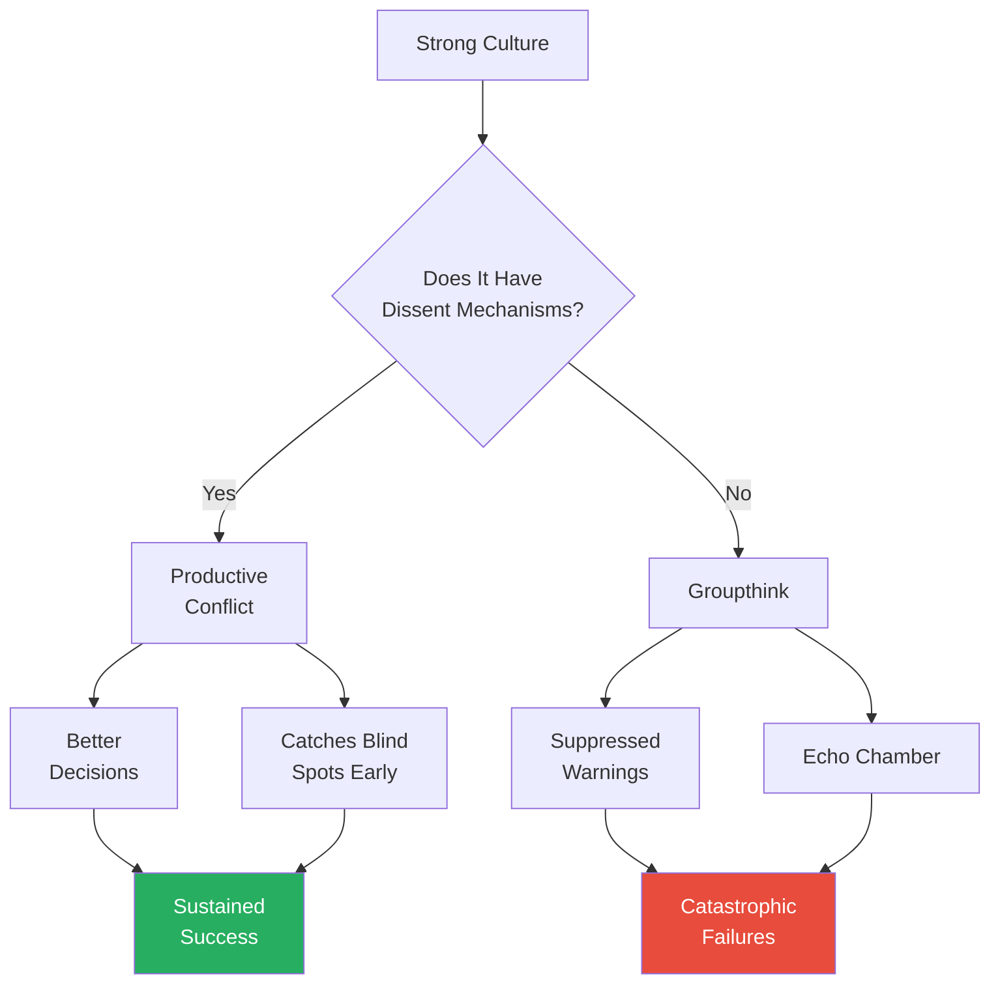
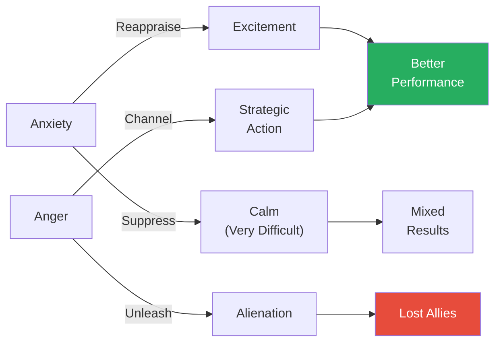
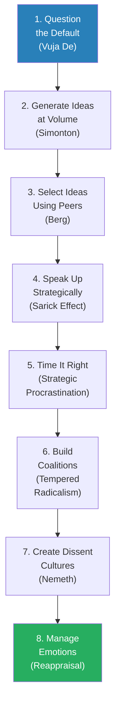

# Originals — Adam Grant

> Adam Grant, Wharton's youngest-ever tenured professor, dismantles the myth that originals are fearless geniuses who leap boldly into the unknown. In reality, the people who drive creative change are strategic, doubtful, prolific, and often surprisingly cautious — they keep day jobs, generate far more bad ideas than good ones, procrastinate at the right moments, and build coalitions by tempering radical ideas into palatable packages.
> Drawing on research in psychology, economics, history, and business, Grant shows that originality is not a fixed trait but a set of learnable behaviours: challenging defaults, producing at volume, managing risk, timing your moves, and building cultures that welcome dissent.
> The book is a research-backed field guide for anyone who wants to champion new ideas without self-destructing in the process — and it fundamentally reframes what it means to be an original.

---

## About the Author

Adam Grant is an organisational psychologist at the Wharton School of the University of Pennsylvania, where he became the youngest tenured professor at age twenty-eight. He is the author of *Give and Take*, which explored how generosity drives success, and *Originals* is its natural extension — examining how people generate and champion new ideas. Grant's research has been published in top academic journals, and he is a regular contributor to the New York Times. He has advised organisations ranging from Google to the U.S. military, and his TED talks have been viewed tens of millions of times. His writing style blends academic rigour with storytelling flair — every claim is backed by research, but every research finding is wrapped in a compelling human narrative.

---

## The Big Idea

- <b style="color: #2980b9">Originals</b> are people who not only generate novel ideas but take action to bring them to life — they refuse to accept the default and instead look for better options
- The central myth Grant attacks is that originals are fundamentally different from the rest of us — bolder, smarter, more creative, less afraid
- In fact, originals share all the same doubts, fears, and weaknesses as everyone else — what distinguishes them is a specific set of behaviours and strategies:
  - They <b style="color: #27ae60">generate enormous quantities of ideas</b>, knowing that most will fail — and rely on volume to produce the occasional breakthrough
  - They <b style="color: #27ae60">manage risk carefully</b> rather than betting everything on a single vision — keeping day jobs, diversifying their portfolios, and hedging their bets
  - They <b style="color: #27ae60">speak up strategically</b>, choosing the right time, audience, and framing to present radical ideas
  - They <b style="color: #27ae60">build coalitions</b> by connecting their ideas to values their audience already holds
  - They <b style="color: #27ae60">create cultures of dissent</b> that prevent groupthink from killing innovation
- Grant's argument is fundamentally democratising: originality is not reserved for a special class of genius — it is available to anyone willing to question the default, produce at volume, and manage risk intelligently
- The book is structured around a journey from having an original idea (chapters 1-2) to voicing it (chapter 3), timing it (chapter 4), building support (chapter 5), understanding where originality comes from (chapter 6), preventing groupthink (chapter 7), and managing the emotions of going against the grain (chapter 8)

This diagram captures the sequential logic of Grant's argument: originality begins with refusing to accept the status quo and ends with building the coalitions needed to make change real.

---

## Key Concepts at a Glance

| Concept | One-line summary |
|---------|-----------------|
| **Vuja de** | Looking at familiar situations with fresh eyes — the opposite of deja vu |
| **Risk portfolio** | Originals offset creative risk in one domain with stability in others |
| **Quantity breeds quality** | The best predictor of creative brilliance is sheer volume of output |
| **Idea selection problem** | Creators overvalue their pet ideas; peer evaluation is more accurate |
| **Idiosyncrasy credits** | High status earns you permission to deviate from norms |
| **The Sarick Effect** | Leading with your idea's weaknesses disarms critics and builds trust |
| **Strategic procrastination** | Delaying action allows ideas to incubate and improve |
| **First-mover disadvantage** | Pioneers often lose; settlers who learn from pioneers' mistakes win |
| **Tempered radicalism** | Framing radical ideas in familiar values to recruit unlikely allies |
| **Coalition of the unlike** | The most powerful coalitions include allies who seem ideologically opposed |
| **Mere exposure effect** | Repeated exposure to an idea reduces resistance to it |
| **Horizontal hostility** | Groups with similar goals often fight each other harder than their real opponents |
| **Birth order effects** | Laterborns are more open to radical ideas; firstborns more conventional |
| **Niche differentiation** | Siblings develop different strategies to avoid competing for the same parental niche |
| **Groupthink** | Strong cultures need formalised dissent to avoid catastrophic blind spots |
| **Babble Hypothesis** | The person who talks most in a group is perceived as the leader, regardless of quality |
| **Emotional reappraisal** | Reframing anxiety as excitement improves performance under pressure |
| **Defensive pessimism** | Imagining the worst case and planning against it can outperform optimism |

---

## Chapter 1: Creative Destruction — Challenging the Status Quo

*Grant opens with the story that changed his own thinking about originality — and reveals why the most successful entrepreneurs are not the risk-seeking cowboys we imagine them to be.*

### The Warby Parker Revelation

- Grant was approached by four Wharton students who wanted him to invest in their startup — an online eyewear company called <b style="color: #2980b9">Warby Parker</b>
- He passed on the investment — and it turned out to be one of the worst financial decisions of his life
- His reasoning seemed sound at the time: none of the four founders were going all-in
  - Some were applying for consulting jobs as backup plans
  - One was hedging by pursuing a fellowship
  - They had not even secured a website domain when they asked for money
- Grant assumed that if the founders were not fully committed, the idea could not be that strong
- He was spectacularly wrong — Warby Parker went on to be valued at over $1 billion and was named the most innovative company by *Fast Company*
- The experience forced Grant to question his own assumptions about what commitment looks like
  - He had equated all-in risk-taking with seriousness of purpose
  - The Warby Parker founders demonstrated that caution and ambition can coexist — and that hedging is often the smarter play

> [!example] Warby Parker — The Cautious Originals (2010)
> - Four Wharton MBA students — Neil Blumenthal, Dave Gilboa, Andy Hunt, and Jeff Raider — were frustrated that a pair of glasses cost as much as an iPhone
> - They developed a plan to sell prescription eyewear online at a fraction of traditional retail prices
> - But none of them were willing to drop out of business school to pursue it
> - They applied for backup jobs, explored fellowships, and argued about whether anyone would buy glasses without trying them on
> - Adam Grant declined to invest because they seemed insufficiently committed
> - Warby Parker launched, resonated instantly, and became one of the most successful startups of the decade
> **The lesson:** The founders' caution was not a weakness — it was exactly what made the venture sustainable.

---

### Vuja De — The Original Mindset

- <b style="color: #2980b9">Vuja de</b> is the opposite of deja vu — instead of encountering a new situation that feels familiar, you encounter a familiar situation and see it with fresh eyes
- This is the defining mental move of originals: they look at the same world everyone else sees but refuse to accept it as given
- Most people encounter frustrations — expensive glasses, slow bureaucracies, clunky software — and assume that is just how things are
- Originals encounter the same frustrations and ask: "Does it have to be this way?"
- <b style="color: #27ae60">The critical difference is not vision or intelligence — it is the refusal to treat the status quo as inevitable</b>
- Grant draws on research showing that people are remarkably accepting of default conditions:
  - Voters in states where organ donation is opt-in donate at rates around 15%; in opt-out states, rates exceed 90%
  - People accept default retirement savings rates, default insurance plans, default browser settings — not because these are optimal, but because questioning the default requires effort
  - Originals are people willing to expend that effort
- The psychological mechanism behind default acceptance is what researchers call <b style="color: #2980b9">system justification</b>:
  - People have a deep need to believe that existing systems are fair and legitimate
  - This need is so strong that disadvantaged people often defend the very systems that disadvantage them
  - Originals overcome system justification by developing a habit of questioning — not just one-off challenges but a consistent orientation toward "could this be better?"
  - Research by John Jost and colleagues has documented system justification across dozens of countries and cultures — it is one of the most robust findings in social psychology
  - The effect intensifies under threat: when people feel insecure, they cling more tightly to existing systems rather than questioning them
  - This means that originality requires a degree of psychological security — you need to feel safe enough to challenge the default without existential anxiety
- Grant connects this to the broader theme of the book: the gap between having a vuja de moment and acting on it is where most potential originals fail
  - Seeing the problem is step one
  - Generating alternatives is step two
  - Actually pushing for change is step three — and it is where strategy, timing, and coalition building become essential
- Grant highlights an important nuance: <b style="color: #e74c3c">curiosity alone is not enough — you also need what psychologists call dissatisfaction with the status quo</b>
  - Many people notice that things could be better but feel no urgency to change them
  - Originals combine curiosity ("could this be different?") with dissatisfaction ("this needs to be different")
  - The dissatisfaction provides the motivational fuel; the curiosity provides the direction
  - Without dissatisfaction, curiosity produces interesting observations but no action
  - Without curiosity, dissatisfaction produces complaining but no solutions

> [!example] Ray Kroc and McDonald's — Vuja De in a Hamburger Stand (1954)
> - Ray Kroc was a fifty-two-year-old milkshake machine salesman when he visited a small hamburger restaurant in San Bernardino, California, run by Dick and Mac McDonald
> - Kroc was not the first person to eat at McDonald's — thousands of customers had already experienced the fast, cheap, consistent service
> - But Kroc was the first person to look at the restaurant and see a system that could be replicated nationwide
> - He experienced vuja de: a familiar thing — a hamburger restaurant — seen with entirely fresh eyes
> - While everyone else saw a local burger joint, Kroc saw a franchise model that could transform American eating habits
> - He licensed the McDonald's name and system, eventually buying the company outright, and built it into the world's largest restaurant chain
> **The lesson:** The most valuable original insights often come not from seeing something new but from seeing something old in a new way.

> [!tip] Core Insight
> Originality starts not with a brilliant idea but with a simple question: "Why does this have to be the way it is?" Most people never ask.

---

### The Browser Study — Defaults Predict Performance

- Grant opens the book with a study that perfectly encapsulates the vuja de mindset: <b style="color: #2980b9">the browser study</b>
- Michael Housman, a workforce analytics researcher, analysed data from over 30,000 customer service employees to predict which ones would stay in their jobs longest and perform best
- He discovered an unexpected predictor: which web browser the employee used
  - Employees who used Firefox or Chrome stayed in their jobs 15% longer and performed significantly better than those who used Internet Explorer or Safari
  - The difference had nothing to do with the browsers themselves — it was about the type of person who uses each one
  - Internet Explorer and Safari come pre-installed on Windows and Mac computers respectively — they are the defaults
  - Firefox and Chrome require a deliberate act of seeking out an alternative and installing it
- <b style="color: #27ae60">The employees who questioned the default browser were the same employees who questioned default processes, default scripts, and default ways of handling customer complaints</b>
- They did not accept things as they were — they looked for better options
- This does not mean switching browsers makes you more original — it means the willingness to reject defaults is a signal of a broader orientation toward improvement and initiative
- Grant uses this finding to illustrate a deeper point about how small behaviours reveal large psychological patterns:
  - The browser choice itself is trivial — what matters is the underlying disposition
  - A person who actively evaluates whether the default is good enough in one domain is likely to do the same in others
  - This connects to research on <b style="color: #2980b9">proactive personality</b> — a trait characterised by seeking opportunities to improve situations rather than passively adapting to them
  - Thomas Bateman and J. Michael Crant, who developed the proactive personality scale, found that proactive individuals consistently outperform reactive ones — not because they are smarter but because they treat the environment as something to be shaped rather than accepted

> [!example] The Browser Study — 30,000 Employees (2015)
> - Michael Housman's firm analysed performance data for over 30,000 customer service representatives
> - After controlling for every obvious factor — age, education, experience, typing speed — browser choice emerged as a significant predictor
> - Firefox and Chrome users had 19% higher customer satisfaction scores on average
> - They also took 15% fewer sick days and were 15% less likely to quit within the first 90 days
> - The explanation was not technological — it was psychological
> - People who accept the default browser are the same people who accept default processes
> - People who actively choose a non-default browser are the same people who actively seek better approaches to their work
> **The lesson:** The willingness to question small defaults predicts the willingness to question large ones.

---

### The Risk Portfolio — Why Originals Keep Day Jobs

- <b style="color: #e74c3c">The biggest myth about originals is that they are extreme risk-takers</b> — people who burn the boats, quit their jobs, and bet everything on their vision
- Grant demolishes this myth with research and examples:
  - A study by Joseph Raffiee and Jie Feng found that <b style="color: #27ae60">entrepreneurs who kept their day jobs while starting companies had 33% lower failure rates</b> than those who quit to go full-time
  - The study, published in the *Academy of Management Journal* in 2014, tracked over 5,000 American entrepreneurs who started businesses between 1994 and 2008
  - The reason: keeping a day job provides financial security, which reduces desperation and allows founders to be more selective about opportunities and strategies
  - When your rent depends on your startup succeeding, you make desperate choices — taking bad deals, cutting corners, launching too early
  - When you have a salary covering your basics, you can afford to be patient, selective, and strategic
  - The researchers controlled for the quality of the business idea, the entrepreneur's experience, and their financial resources — the effect of keeping a day job persisted even after these controls
- Originals manage a <b style="color: #2980b9">risk portfolio</b> — they offset risk in one domain with stability in another:
  - Henry Ford kept his job at Edison Illuminating Company while building his first two automobiles; he only quit after the second prototype worked
  - Phil Knight sold Nike shoes out of the back of his car while working as an accountant — for five years
  - Steve Wozniak kept his job at Hewlett-Packard for a full year after Apple started selling computers
  - Sara Blakely kept selling fax machines door-to-door while developing Spanx
  - Bill Gates took a leave of absence from Harvard rather than dropping out — he kept the option to return if Microsoft failed
- <b style="color: #e74c3c">Going all-in is not a sign of commitment — it is often a sign of overconfidence</b>
- By maintaining security in one area, originals give themselves the freedom to take creative risks in another
- This is functionally similar to what Nassim Nicholas Taleb calls the <b style="color: #2980b9">barbell strategy</b> in [[Antifragile - Nassim Nicholas Taleb|Antifragile]] — extreme safety on one end enabling aggressive experimentation on the other
- Grant also challenges the related myth that risk-takers are more innovative:
  - A meta-analysis of entrepreneurship research found that successful entrepreneurs are not meaningfully different from the general population in their appetite for risk
  - What distinguishes them is not a love of risk but a skill at managing it
  - They take risks in one carefully chosen domain and compensate with stability everywhere else

> [!example] Phil Knight's Five-Year Hedge (1964-1969)
> - Phil Knight co-founded Blue Ribbon Sports (later Nike) in 1964
> - He spent the next five years working full-time as an accountant at Coopers & Lybrand while running the shoe business on the side
> - He would sell running shoes at track meets on weekends and handle accounting during the week
> - Only when revenue made it financially viable did he leave accounting
> - This approach gave him runway to make mistakes and iterate without the pressure of needing immediate profit
> **The lesson:** The greatest entrepreneurs do not leap — they build a bridge first.

> [!example] Sara Blakely's Fax Machine Years
> - Sara Blakely spent two years developing Spanx — cutting the feet off her own pantyhose, researching fabrics, filing a patent she wrote herself
> - During this entire period, she continued selling fax machines door-to-door for her employer
> - She only left her sales job after Spanx had proven demand, landed in Neiman Marcus, and appeared on Oprah
> - The day job gave her both income and resilience — every rejection from a hosiery manufacturer was easier to absorb because her livelihood did not depend on their answer
> **The lesson:** Financial security is not the enemy of creativity — it is its enabler.

> [!example] Bill Gates's Safety Net
> - Bill Gates is often held up as the quintessential college dropout who bet everything on his vision
> - In reality, Gates took a leave of absence from Harvard — not a permanent withdrawal
> - His parents were wealthy enough to provide a financial backstop, and he maintained the option to return to school if Microsoft failed
> - He also secured a contract with a major customer (MITS) before leaving campus, guaranteeing revenue from day one
> - The "dropout" narrative is romantic but misleading — Gates was hedging like every other successful original
> **The lesson:** Even the boldest-seeming originals have more safety nets than the mythology suggests.

---

This diagram illustrates Grant's core argument: managing risk through hedging produces better outcomes than the romantic notion of "burning the boats."

Keeping a day job is the single largest risk-management strategy used by successful originals — contradicting the myth that innovation requires burning the boats.

---

## Chapter 2: Blind Inventors and One-Eyed Investors — Generating and Recognising Ideas

*Grant challenges the notion of the lone genius struck by a single brilliant idea and reveals an uncomfortable truth: the best predictor of creative quality is not talent — it is volume.*

### Quantity Breeds Quality

- <b style="color: #2980b9">Dean Simonton's equal-odds rule</b> is one of the most important findings in the science of creativity — and one of the most counterintuitive
- Simonton, a UC Davis psychologist, studied the complete output of hundreds of creative geniuses across domains — music, science, literature, invention
- His finding: <b style="color: #27ae60">the quality ratio is essentially constant across a creator's career — the odds of producing a masterpiece are roughly the same for every piece of work they produce</b>
- The implication is radical: the best way to increase your chances of a creative hit is simply to produce more work
  - Shakespeare wrote 37 plays — a handful are masterpieces, many are forgettable, some are genuinely poor
  - Beethoven composed over 650 pieces — the iconic ones represent a small fraction
  - Edison held 1,093 patents — most were for inventions nobody remembers
  - Einstein published 248 papers — many were unremarkable; a few changed physics
  - Picasso created over 20,000 works — only a fraction are considered great
- The lesson is not that geniuses have a higher hit rate — it is that they have a higher output rate
- <b style="color: #e74c3c">Most people fail not because their ideas are bad, but because they do not generate enough ideas</b>
- They fall in love with their first idea and overinvest in it, rather than producing dozens and selecting the best
- Grant deepens this point with research on the relationship between creative productivity and career stage:
  - Simonton found that creative geniuses did not have a predictable "peak" — some did their best work early, others late, and the only consistent predictor was periods of high output
  - Mozart composed over 600 pieces; his masterpieces were scattered across his career, not clustered at any particular age
  - The lesson for ordinary people: do not wait for inspiration — create the conditions for it by producing at volume
- Grant introduces a second critical finding from Simonton: the <b style="color: #2980b9">constant probability of success model</b>
  - This model shows that within any creator's body of work, each piece has roughly the same probability of being a hit
  - There is no evidence that creators "learn" to produce hits more reliably over time — their fourth symphony is no more likely to be a masterpiece than their fortieth
  - The implication is humbling: even for geniuses, creative success is partially random
  - But the randomness is manageable — if each piece has a 10% chance of being great, producing 100 pieces virtually guarantees several great ones
  - <b style="color: #27ae60">The practical takeaway: treat creativity like a numbers game, not a talent show</b>
- Simonton's methodology is worth noting because it strengthens the finding:
  - He did not simply count output and count hits — he controlled for domain, era, cultural context, and the age of the creator
  - He analysed composers' catalogues piece by piece, scientists' publication records paper by paper, and inventors' patent portfolios patent by patent
  - The equal-odds rule held across music, science, literature, visual art, and invention — suggesting it is a fundamental feature of creative production, not an artefact of any single domain

> [!example] Beethoven's Uneven Genius
> - Beethoven is remembered for the Fifth Symphony, the Ninth Symphony, the Moonlight Sonata — towering achievements of Western music
> - What is less remembered is that he composed over 650 pieces during his lifetime
> - Many of these compositions were mediocre by any standard — routine commissioned work, forgettable variations, pieces that even devoted classical music scholars rarely listen to
> - Beethoven himself could not reliably predict which works would endure — he was surprised by the popularity of some pieces and disappointed by the reception of others
> - His most productive periods were also his most uneven — the years with the most masterpieces also produced the most duds
> - The consistency was not in quality but in volume: the more he composed, the more chances he gave himself to create something transcendent
> **The lesson:** Even the greatest creators cannot will a masterpiece — they can only increase their odds by producing relentlessly.

> [!example] Thomas Edison's 1,093 Patents
> - Edison is celebrated as the inventor of the light bulb, the phonograph, and the motion picture camera
> - He held 1,093 patents — more than almost anyone in American history
> - The overwhelming majority of those patents were for inventions nobody remembers: the electric pen, a method for preserving fruit, an improved version of the telegraph
> - Edison himself dismissed many of his own ideas — he described invention as "one percent inspiration and ninety-nine percent perspiration"
> - His laboratory at Menlo Park was essentially a factory for ideas: structured to produce as many prototypes and experiments as possible, with the understanding that most would fail
> - The key was not that Edison had better intuition about which ideas would succeed — it was that he created a system designed to maximise the volume of attempts
> **The lesson:** Edison did not succeed because he was smarter than other inventors — he succeeded because he out-produced them.

> [!example] Shakespeare's Uneven Catalogue
> - Shakespeare is the towering figure of English literature — but even his most devoted defenders acknowledge that his 37 plays include significant variation in quality
> - *Hamlet*, *King Lear*, and *Macbeth* are considered masterpieces — but *Timon of Athens*, *Pericles*, and *The Two Noble Kinsmen* rarely feature in lists of great drama
> - Shakespeare wrote prolifically and quickly — sometimes producing two or three plays per year
> - He did not agonise over individual works the way later writers would; he treated playwriting as a craft with deadlines, not as an art form awaiting divine inspiration
> - His volume gave him the statistical advantage that Simonton would later quantify: every play was another lottery ticket
> **The lesson:** Shakespeare's genius was not a higher hit rate — it was a higher output rate.

> [!tip] Core Insight
> Creative genius is not about having better ideas — it is about having MORE ideas. Volume is the single best predictor of creative breakthrough.

The ratio of total works to masterworks reveals Grant's core insight — even geniuses produce overwhelmingly mediocre output, and the path to brilliance runs through massive volume.

---

### The Idea Selection Problem

- If quantity breeds quality, then the key challenge shifts from generating ideas to selecting the right ones
- This turns out to be surprisingly difficult — and creators are especially bad at it
- <b style="color: #2980b9">Justin Berg</b>, a Stanford researcher, ran an elegant study on this problem:
  - He asked circus performers to create novel circus acts, then had them predict which acts would be most successful with audiences
  - He also asked circus managers (peers who evaluate acts for a living) to make the same predictions
  - The creators were significantly worse at predicting success than the managers
  - Creators were overconfident about their most novel ideas and underconfident about their more accessible ones
  - Berg's study included 339 videos of circus performances evaluated by both creators and managers, giving it substantial statistical power
- The reason: <b style="color: #e74c3c">creators fall in love with novelty because they know how different their idea is from what exists — but audiences do not care about novelty for its own sake</b>
  - Audiences want ideas that are new enough to be interesting but familiar enough to be understood
  - Creators overweight novelty; audiences overweight familiarity
  - This creates a systematic blind spot in self-evaluation
- Grant identifies the gap between what researchers call <b style="color: #2980b9">optimal novelty</b> and what creators perceive as optimal:
  - The most successful creative works sit at the intersection of novel and familiar — surprising enough to capture attention, recognisable enough to be understood
  - But creators, who are immersed in what already exists, overvalue departure from the status quo
  - They confuse "different from what I have seen" with "valuable to the audience"

> [!example] The Segway — Inventor Overconfidence
> - Dean Kamen, inventor of the Segway, was convinced he had created a device that would transform urban transportation
> - Steve Jobs reportedly called it "as big a deal as the PC"
> - John Doerr, the legendary venture capitalist, predicted it would reach $1 billion in sales faster than any company in history
> - The Segway was a technological marvel but a commercial disappointment — it was too expensive, too impractical, and solved a problem most people did not think they had
> - Kamen and his investors were blinded by the novelty of the technology and could not see that the market did not share their excitement
> - The gap between insider enthusiasm and outsider indifference was enormous
> **The lesson:** Being in love with your own idea makes you the worst judge of its potential.

> [!example] Seinfeld — The Show Nobody Believed In (1989)
> - When NBC tested the pilot of *Seinfeld*, it ranked dead last — 100th out of 100 new shows in audience testing
> - Test audiences found the characters unlikeable and the premise confusing — "a show about nothing" violated every rule of sitcom structure
> - The network nearly cancelled it; only one champion — Rick Ludwin, head of late-night and specials — fought to keep it alive
> - Ludwin believed in the show not because of the test data but because he noticed that people who liked it REALLY liked it — the intensity of positive reactions compensated for the low average score
> - *Seinfeld* went on to become one of the most successful television shows in history
> **The lesson:** Breakthrough ideas often polarise — high average ratings may matter less than the intensity of a passionate minority.

---

### How to Improve Idea Selection

- Grant identifies several strategies for overcoming the idea selection problem:
  - **Get more feedback from peers, not from yourself** — fellow creators understand both novelty and feasibility; they are better calibrated than either the inventor or the general public
  - **Prototype early and test with real audiences** — abstract idea evaluation is unreliable; testing working versions generates much better signal
  - **Generate many ideas before committing** — when creators produce only a few ideas, they become emotionally attached; when they produce dozens, they can evaluate more objectively
  - **Delay intuition** — first reactions to your own ideas are unreliable; let ideas sit before deciding which to pursue
  - **Seek out evaluators who are themselves creators** — Berg's research showed that fellow professionals in the same domain are the best judges, because they understand both novelty and audience expectations
- <b style="color: #27ae60">The best idea selectors combine deep domain knowledge with psychological distance from the specific idea</b> — they know enough to evaluate quality but are not so invested that their judgment is clouded

| Evaluator | Strength | Weakness |
|-----------|----------|----------|
| **Creator** | Understands the idea deeply | Emotional attachment clouds judgment |
| **Manager/Peer** | Domain knowledge + psychological distance | May undervalue truly radical novelty |
| **General Public** | Represents the market | Cannot evaluate ideas still in development |
| **Test Audience** | Real reactions to finished work | Biased toward familiarity; penalises novelty |

Peer evaluation consistently outperforms self-evaluation and audience testing — it combines enough expertise to assess quality with enough distance to assess objectively.

---

### Why Creators Misjudge Their Own Work

- Grant digs deeper into the psychology of why creators are such poor judges of their own ideas
- The core problem is <b style="color: #2980b9">confirmation bias</b> operating at the creative level:
  - When you create something, you have a mental model of why it is good — you know the insight that inspired it, the problem it solves, the elegance of the solution
  - This internal knowledge creates the illusion that the idea is self-evidently brilliant — because it is self-evident to you
  - But the audience does not have access to your mental model — they see only the finished product, without the context that makes it meaningful to you
- There is also a <b style="color: #2980b9">knowledge curse</b> at work — once you know something, you cannot imagine not knowing it
  - The creator knows what the idea means and assumes the audience will too
  - This leads to under-explaining, under-contextualising, and overestimating how obvious the value proposition is
  - Elizabeth Newton's 1990 Stanford experiment dramatised this perfectly: "tappers" who tapped out well-known songs predicted that listeners would identify the song 50% of the time — the actual success rate was 2.5%
  - The tappers could hear the melody in their heads; the listeners heard only rhythmic knocking
- Grant cites additional research showing that creators who wait before evaluating their own ideas — allowing psychological distance to build — are better judges:
  - Ideas evaluated immediately after creation receive inflated ratings from their creators
  - The same ideas evaluated after a delay of days or weeks receive more accurate assessments
  - <b style="color: #27ae60">Time creates the distance that enables objectivity</b> — which connects directly to the strategic procrastination argument in Chapter 4
- Grant also explores the role of <b style="color: #2980b9">overconfidence bias</b> in creative self-assessment:
  - Psychologists have long documented that most people believe they are above average — in driving, intelligence, social skills, and creativity
  - For creators, this general overconfidence combines with the specific attachment to their own ideas to produce a double bias
  - They overestimate both their own creative ability and the specific quality of their current idea
  - The combination makes self-evaluation almost useless for idea selection
  - This is why Grant so strongly advocates for external feedback — not to replace the creator's judgment but to correct for its systematic biases
- A further mechanism is <b style="color: #2980b9">the IKEA effect</b>:
  - Research by Michael Norton, Daniel Mochon, and Dan Ariely found that people dramatically overvalue things they have built themselves
  - Participants in their studies valued their own assembled IKEA furniture at five times the amount a neutral observer would pay
  - The same bias operates with ideas — your own creation feels five times more valuable to you than it does to anyone else
  - This is why peer evaluation is so critical: peers do not suffer from the IKEA effect for your idea

> [!example] The Upworthy Headline Strategy
> - Upworthy, the viral content platform, required its writers to generate twenty-five different headlines for every single article
> - Not five, not ten — twenty-five
> - The first few headlines were usually obvious and cliched — the interesting ones started appearing around headline fifteen or twenty
> - The writers hated the process — generating that many options felt exhausting and pointless
> - But the data was clear: articles with headlines chosen from a pool of twenty-five consistently outperformed articles with headlines chosen from smaller pools
> - The process worked because it forced creators past their initial, comfortable ideas and into genuinely novel territory
> **The lesson:** Your first idea is rarely your best idea — and you will not reach your best idea unless you force yourself to generate many more than you think you need.

This diagram illustrates why peer evaluation outperforms both self-assessment and audience testing — creators are biased by attachment, audiences by familiarity, but peers have the right balance.

---

## Chapter 3: Out on a Limb — Speaking Up

*Grant explores the terrifying act of voicing original ideas, revealing why some people speak up and others stay silent — and why the way you present a radical idea matters as much as the idea itself.*

### The Cost of Silence

- Most original ideas die not because they are bad, but because nobody ever voices them
- Grant explores why people stay silent even when they see problems and have solutions:
  - <b style="color: #e74c3c">Fear of social consequences</b> — being labelled a troublemaker, losing political capital, being excluded
  - **Pluralistic ignorance** — assuming that because nobody else is speaking up, the problem must not be as bad as you think, or the solution must be more obvious than you realise
  - **Futility thinking** — believing that speaking up will not make a difference, so why bother
  - **Status risk** — the fear that voicing concerns will mark you as disloyal or uncommitted to the team's direction
- The tragedy is that these calculations are often wrong:
  - Research shows that people systematically overestimate the social cost of speaking up
  - And they systematically underestimate the cost of staying silent — both to themselves (regret, frustration, disengagement) and to their organisations (preventable failures, missed innovations)
  - A study Grant cites found that when employees were asked to predict how their boss would react to critical feedback, their predictions were consistently more negative than the actual reactions — the fear was worse than the reality
- Grant draws on research by Jim Detert and Amy Edmondson on <b style="color: #2980b9">voice and silence in organisations</b>:
  - They found that employees routinely withhold ideas and concerns that would benefit their organisations
  - The most common reason was not lack of ideas but fear of interpersonal risk
  - Employees made implicit calculations about the cost-benefit ratio of speaking up — and consistently overweighted the costs
  - Even when the organisation explicitly encouraged feedback, employees did not believe the message — they judged based on observed behaviour, not stated values
  - The gap between stated values ("we welcome feedback") and observed behaviour (punishing people who give it) is what researchers call the <b style="color: #2980b9">say-do gap</b> — and employees are exquisitely sensitive to it
  - Detert's research was particularly rigorous — he studied voice and silence across multiple industries, including healthcare, manufacturing, and technology, and found the same patterns everywhere
  - In healthcare settings, nurses who stayed silent about medication errors contributed to preventable patient harm — the stakes of silence were literally life and death
- <b style="color: #27ae60">The implication is that creating a culture where people speak up requires more than saying "we welcome feedback" — it requires demonstrating through visible action that speaking up is safe and valued</b>
- Grant identifies the <b style="color: #2980b9">power distance paradox</b>: the higher your position in an organisation, the more you believe people speak freely around you — and the less they actually do
  - Leaders genuinely think they are approachable
  - Subordinates genuinely believe those same leaders would punish dissent
  - Both are operating on accurate but incomplete information — leaders see the rare brave soul who speaks up; subordinates see the much larger group who stays silent
  - Research by James Detert and Ethan Burris found that managers who solicited feedback received more honest input — but only when they followed through by acting on it
  - A single instance of ignoring or punishing feedback could undo months of trust-building
  - Grant emphasises that the power distance paradox operates independently of the leader's actual intentions — even genuinely open leaders face it, because the structural power differential creates fear regardless of the individual's personality
  - The practical implication: leaders must actively overcome the paradox through repeated, visible demonstrations that dissent is rewarded, not just tolerated

> [!example] The Challenger Disaster — The Cost of Silence (1986)
> - Engineers at Morton Thiokol, the company that manufactured the Space Shuttle Challenger's solid rocket boosters, knew the O-ring seals were vulnerable in cold temperatures
> - The night before the January 28 launch, temperatures at Cape Canaveral were forecast to drop below the range in which the O-rings had been tested
> - Engineers Roger Boisjoly and Arnie Thompson argued forcefully against launching
> - But NASA managers pushed back — they had launched in similar conditions before without visible problems
> - When Morton Thiokol's management was asked to make a "management decision," they overruled their own engineers
> - Seventy-three seconds after launch, the O-ring failed, the shuttle broke apart, and all seven crew members were killed
> - The information needed to prevent the disaster was in the room — but the organisational dynamics suppressed it
> **The lesson:** The most dangerous form of silence is when the people with the most relevant information are the least empowered to share it.

---

### Idiosyncrasy Credits — Earning the Right to Be Different

- <b style="color: #2980b9">Idiosyncrasy credits</b> is a concept from social psychology (coined by Edwin Hollander in the 1950s) that explains why some people can deviate from norms and be rewarded for it while others are punished
- The idea: every time you conform to group expectations, you earn a "credit" — social capital that accumulates over time
- Once you have accumulated enough credits, you can spend them on deviating — proposing unconventional ideas, challenging authority, breaking routines — without losing standing
- <b style="color: #27ae60">The implication: the best strategy for being original is to first demonstrate competence and loyalty, then use your earned status to push for change</b>
- This is why new employees who immediately challenge everything are usually punished, while senior employees with track records of excellence can propose radical ideas and be taken seriously
- Status gives you licence to be different
- Grant quantifies this with research on how status moderates reactions to nonconformity:
  - Silvia Bellezza and colleagues at Harvard found that wearing non-conforming clothing (e.g., red sneakers in a business setting) increased perceived status and competence — but only when observers believed the non-conformity was intentional
  - Accidental non-conformity (wearing sneakers because you forgot your dress shoes) had no positive effect
  - The key was that deliberate non-conformity signals that you have enough status to afford deviance — it is a costly signal of confidence
  - Bellezza called this the <b style="color: #2980b9">red sneakers effect</b> — and it only works when the audience believes you could conform but chose not to
  - If the audience thinks you lack the resources or knowledge to conform, the same non-conformity signals low status instead of high status

> [!example] Carmen Medina's Two Attempts at the CIA
> - Carmen Medina, a CIA analyst, believed passionately that the intelligence community needed to embrace digital information sharing — moving away from paper-based classified reports
> - In the mid-1990s, she voiced this idea loudly and directly — and was punished for it
>   - She was labelled a troublemaker
>   - She was sidelined into a dead-end position
>   - Her career nearly ended
> - Medina retreated, rebuilt her reputation through years of excellent conventional work, and accumulated idiosyncrasy credits
> - In the early 2000s, she tried again — this time from a position of authority and respect
>   - She was now a senior leader with a track record
>   - She framed the same idea more strategically
>   - She succeeded in helping launch Intellipedia — the intelligence community's internal wiki
> **The lesson:** The same idea from the same person can fail or succeed depending on the status and framing of the speaker.

---

### The Sarick Effect — Leading with Weaknesses

- One of Grant's most surprising findings is about how to present original ideas: <b style="color: #2980b9">the Sarick Effect</b>
- Named after an entrepreneur Grant studied, it describes the counterintuitive strategy of leading with the weaknesses of your own idea
- When you present an idea and only describe its strengths, audiences:
  - Become suspicious — they assume you are hiding something
  - Spend their mental energy looking for flaws — and feel clever when they find them
  - Become adversarial rather than collaborative
- When you lead with the weaknesses:
  - You disarm the audience — they were expecting a sales pitch and got honesty instead
  - You demonstrate intellectual credibility — you have clearly thought about the downsides
  - <b style="color: #27ae60">You shift the audience's role from critic to collaborator</b> — instead of looking for problems, they start thinking about solutions
  - You also get to frame the weaknesses on your terms, rather than having them discovered and magnified by a hostile audience
- <b style="color: #e74c3c">The instinct to hide weaknesses is natural but counterproductive</b> — it triggers suspicion rather than trust
- Grant deepens this with research on the psychology of persuasion:
  - Rufus Griscom and Alisa Volkman, founders of the parenting media company Babble, pitched their startup to investors by leading with the three biggest reasons NOT to invest
  - Rather than scaring investors away, the strategy fascinated them — it signalled confidence and self-awareness
  - Babble was eventually acquired by Disney
  - The technique works because it triggers what psychologists call a <b style="color: #2980b9">disconfirmation effect</b> — when you acknowledge negatives, the audience stops searching for them and starts focusing on the positives

> [!abstract] The Sarick Effect — How to Present an Original Idea
> 1. Open by acknowledging the biggest weaknesses of your idea
> 2. Explain why you believe the strengths outweigh these weaknesses
> 3. Invite the audience to help you solve the weaknesses
> 4. Present evidence that the core concept is sound despite the flaws
> 5. Close with the vision — what becomes possible if the weaknesses can be addressed

> [!example] Rufus Griscom's Anti-Pitch at Babble
> - Rufus Griscom and Alisa Volkman built Babble, an online magazine and blog network for parents
> - When pitching to investors and eventually to Disney for acquisition, Griscom led with a slide titled "Here's Why You Should NOT Invest in Babble"
> - He listed the company's most significant weaknesses: user engagement metrics that were declining, advertiser concentration risk, and a business model still in flux
> - Investors were disarmed — instead of probing for hidden problems, they found themselves asking "so how are you going to solve these?"
> - The honesty built trust, and the vulnerability created collaboration rather than confrontation
> - Disney acquired Babble for a reported $40 million
> **The lesson:** Acknowledging what is wrong with your idea before others find it makes you more credible, not less.

---

### Donna Dubinsky Speaks Up at Apple

> [!example] Donna Dubinsky Challenges Steve Jobs (1985)
> - Donna Dubinsky was a distribution manager at Apple in the mid-1980s
> - Steve Jobs proposed a radical change to Apple's distribution system — a "just-in-time" model that Dubinsky believed would be disastrous
> - Rather than accepting the proposal from the company's co-founder, Dubinsky chose to fight it
> - She did not speak up impulsively — she spent weeks building her case, gathering data, and assembling allies
> - She gave the board a deadline: resolve this within 30 days or she would resign
> - She presented her objections clearly and directly, backing them with evidence rather than emotion
> - The confrontation nearly cost her career, but she prevailed — the board sided with her analysis
> - Dubinsky later became CEO of Palm Computing and then Handspring
> **The lesson:** Speaking up against authority requires preparation, evidence, and strategic timing — not just courage.

---

### The Power of Repetition and Exposure

- Grant also explores the role of <b style="color: #2980b9">audience selection</b> in successful speaking up:
  - Not all audiences are equal — the same idea pitched to different people produces wildly different outcomes
  - Grant recommends starting with audiences who are most likely to be sympathetic — not to avoid challenge but to refine the idea before facing hostile critics
  - A "friendly first audience" serves as a testing ground: they will tell you which parts of the argument work and which do not, without the added pressure of high stakes
  - Once the idea has been refined through friendly feedback, it is stronger when it reaches the critical audience
- Grant introduces research on the <b style="color: #2980b9">status generalization effect</b>:
  - People unconsciously transfer credibility from one domain to another — a famous scientist is taken more seriously on matters outside their expertise than an unknown expert in the relevant field
  - Originals can exploit this by building credibility in adjacent areas before introducing their most radical ideas
  - This connects to the idiosyncrasy credits framework: credibility earned anywhere can be spent everywhere

---

### Repetition and Familiarity in Communication

- Grant connects the speaking-up research to a broader principle about how audiences receive new ideas:
  - The first time someone hears a radical idea, their default response is scepticism or rejection
  - The <b style="color: #2980b9">mere exposure effect</b> means that repeated exposure to an idea gradually reduces resistance
  - But the exposure must be managed carefully — too much repetition becomes annoying, and too little leaves the idea feeling foreign
- Research by Robert Zajonc demonstrated that people develop preferences for stimuli simply because they have encountered them before:
  - He showed participants Chinese characters — some repeatedly, others only once
  - Participants consistently rated the frequently-seen characters as more pleasant — without knowing what any of them meant
  - The effect operated below conscious awareness
  - Zajonc's original studies, conducted in the late 1960s, have been replicated hundreds of times across different types of stimuli — faces, shapes, sounds, words, and even nonsense syllables
  - The effect is strongest for stimuli that are initially neutral or mildly negative — extremely positive or extremely negative stimuli are less affected by mere exposure
- For originals, this means: <b style="color: #27ae60">do not expect your first pitch to succeed — plan for multiple exposures, each building familiarity and reducing resistance</b>
  - Mention the concept casually before making a formal proposal
  - Share articles or examples featuring similar ideas
  - Let decision-makers "discover" the idea on their own terms
  - By the time the formal pitch arrives, it should feel like a natural next step, not a shocking departure

---

This diagram maps Grant's strategy for voicing original ideas — the pathway from having an idea to getting it a fair hearing depends on status and presentation technique.

---

## Chapter 4: Fools Rush In — The Timing of Originality

*Grant overturns the conventional wisdom that speed is everything, showing that in the world of original ideas, being first is often a disadvantage — and procrastination can be a creative superpower.*

### First-Mover Disadvantage

- One of the most cherished beliefs in business is the <b style="color: #e74c3c">first-mover advantage</b> — the idea that the first company to enter a market wins
- Grant argues this is largely a myth:
  - Research by Peter Golder and Gerard Tellis examined hundreds of product categories and found that <b style="color: #27ae60">first movers had a failure rate of 47%, compared to just 8% for "settlers" — companies that entered later and improved on the pioneer's model</b>
  - First movers bear the cost of educating the market, making mistakes, and developing infrastructure that settlers then exploit
  - Settlers can observe what worked and what did not, then enter with a refined product and a ready market
- Golder and Tellis's study, published in the *American Economic Review*, is particularly robust because it examined historical market data across 50 product categories over multiple decades — this is not a survey of opinions but an analysis of what actually happened to real companies
  - The 47% pioneer failure rate was dramatically higher than most business strategists assumed — the first-mover advantage narrative had been so dominant that the empirical evidence against it came as a shock to many in the field
- Grant digs into the specific mechanisms that create first-mover disadvantage:
  - **Market education costs** — pioneers must teach customers that a new category exists, which is expensive and slow
  - **Technological lock-in** — pioneers commit to early technology that may be inferior to what comes later, but switching costs make it hard to upgrade
  - **Premature scaling** — pioneers scale before the market is ready, burning resources on a customer base that does not yet exist
  - **Overconfidence in timing** — pioneers believe the market is ready because they are ready, confusing their own enthusiasm with market demand

| | First Movers (Pioneers) | Settlers (Improvers) |
|--|------------------------|---------------------|
| **Failure rate** | 47% | 8% |
| **Advantage** | Shape the market | Learn from pioneers' mistakes |
| **Risk** | Bear all costs of market education | Risk of entering too late |
| **Key examples** | Friendster, Diners Club, Chux disposable diapers | Facebook, Visa, Pampers |

- Facebook did not invent social networking — Friendster and MySpace came first
- Google did not invent the search engine — AltaVista, Lycos, and others preceded it
- Apple's iPod was not the first MP3 player — Diamond Multimedia's Rio PMP300 preceded it by three years, but Apple waited, observed the market's frustrations with existing devices, and designed a product with seamless integration that no predecessor had achieved
- Amazon was not the first online bookseller — Books.com launched earlier, but Bezos studied the category, identified what was missing, and built a platform with far superior logistics and user experience
- In every case, the settler had the advantage of watching the pioneer's mistakes unfold in real time
- <b style="color: #2980b9">The advantage goes not to those who move first but to those who move at the right time with the right product</b>

> [!example] Friendster vs. Facebook — The Pioneer's Curse
> - Friendster launched in 2002 as one of the first social networking sites, gaining millions of users rapidly
> - But the platform was plagued by technical problems — slow load times, server crashes, and a user experience that could not scale
> - Friendster also could not figure out its business model or handle the explosive growth
> - Facebook launched in 2004, studied everything Friendster and MySpace did wrong, and built a platform that was faster, cleaner, and more scalable
> - By the time Facebook opened to the general public in 2006, Friendster was already in decline
> - Being first gave Friendster name recognition but also saddled it with technical debt and strategic missteps that a later entrant could avoid
> **The lesson:** The pioneer clears the path and falls into the traps — the settler walks the cleared path and steps over the traps.

> [!example] Diners Club vs. Visa — Too Early to Win
> - Diners Club launched the first general-purpose credit card in 1950 — a genuine innovation that created an entirely new payment category
> - The company bore enormous costs educating both merchants and consumers about how credit cards worked
> - But Diners Club could not solve the chicken-and-egg problem fast enough — merchants would not accept the card without enough cardholders, and consumers would not carry the card without enough merchants
> - Visa entered later, learned from Diners Club's struggles, built a broader network, and eventually dominated the industry
> - Diners Club's pioneering innovation created the market — but the market's value was captured by the settler
> **The lesson:** Creating a new market and winning in that market are two different skills — and the first mover rarely has both.

---

### The Optimal Timing Window

- Grant does not argue that later is always better — he identifies a <b style="color: #2980b9">timing window</b> that matters:
  - Moving too early means bearing the costs of market education and technological uncertainty
  - Moving too late means entering a mature market where incumbents have built defensible positions
  - <b style="color: #27ae60">The sweet spot is entering after the pioneer has proven the concept but before the market has consolidated</b>
- This connects to research on what economists call <b style="color: #2980b9">absorptive capacity</b>:
  - Settlers succeed because they can absorb the lessons from the pioneer's experience
  - They see which features customers actually value (as opposed to which features the inventor thought they would value)
  - They identify the pricing, distribution, and positioning mistakes the pioneer made
  - They benefit from the infrastructure and awareness the pioneer created — without having paid for it
- Grant is careful to note the exceptions:
  - In markets with strong network effects (where the product becomes more valuable as more people use it), first movers can build a durable advantage if they reach critical mass before competitors enter
  - In patent-protected industries, first movers can lock out competition through intellectual property
  - But in most markets, the data clearly favours settlers over pioneers
- The practical implication is that originals should resist the urge to move immediately:
  - Watch the pioneers
  - Learn from their mistakes
  - Enter when the market conditions align — not when your impatience peaks

---

### Strategic Procrastination

- Grant makes a provocative argument: <b style="color: #2980b9">procrastination can be a source of creativity</b>, not just a symptom of laziness
- The key distinction is between procrastination that avoids a task entirely and procrastination that delays completion while allowing ideas to incubate
- When you start a creative project and then step away from it:
  - Your unconscious mind continues working on the problem — the <b style="color: #2980b9">Zeigarnik Effect</b> means that incomplete tasks remain active in your memory
  - You encounter new stimuli — conversations, experiences, unrelated ideas — that your brain can connect to the unfinished project
  - You avoid premature closure — the urge to finish quickly often produces the most obvious solution rather than the most original one
- <b style="color: #27ae60">The best creative work often comes from people who start early and finish late</b> — giving the problem maximum time to incubate between initiation and completion
- Grant cites research by Jihae Shin, one of his former students:
  - Shin found that people who procrastinated moderately on a task generated ideas rated as 28% more creative than those who finished immediately
  - The study involved multiple experiments — in one, participants were given a creative task and then interrupted with a series of enjoyable distractions (video games) before being asked to return to the task
  - The key was that they had started thinking about the task first — pure procrastinators who had not begun thinking about it gained no benefit
  - The incubation effect only works if you have loaded the problem into your mind first
  - There is a sweet spot: too little delay produces the obvious answer, too much delay produces nothing at all
  - Shin's research was published in the *Academy of Management Journal* and controlled for motivation, ability, and task engagement — the procrastination effect on creativity was independent of these factors
- Grant connects this to research on <b style="color: #2980b9">divergent thinking</b> — the cognitive process of generating many possible solutions:
  - Divergent thinking improves when the brain has time to make unexpected connections
  - These connections happen most often during periods of low-focus activity — walking, showering, doing dishes
  - Procrastinating on a creative task after initiating it essentially forces the brain into a divergent thinking mode

> [!example] Martin Luther King Jr.'s "I Have a Dream" (1963)
> - Martin Luther King Jr. was scheduled to deliver the keynote address at the March on Washington on August 28, 1963
> - Despite the speech's historic importance, King procrastinated on writing it
> - He stayed up past midnight the night before, working on drafts with his advisors, and the final version was not completed until 4:00 AM
> - The typed speech he brought to the podium that day did not contain the words "I have a dream"
> - Partway through the speech, gospel singer Mahalia Jackson called out from behind him: "Tell them about the dream, Martin!"
> - King set aside his prepared text and improvised the most famous passage in American oratory
> - The "I Have a Dream" refrain was not in the script — it emerged spontaneously because King had been thinking about these themes for years and had used the phrase in earlier, smaller speeches
> - His procrastination created the conditions for spontaneous brilliance — the ideas had been incubating for years, and the unfinished nature of the speech left room for inspiration in the moment
> **The lesson:** Finishing too early can be as dangerous as finishing too late — the best work often needs time to breathe.

> [!example] Leonardo da Vinci's Strategic Delays
> - Leonardo da Vinci was a notorious procrastinator — he spent fifteen years on the *Mona Lisa*, returning to it periodically while pursuing other projects
> - His patrons frequently complained about missed deadlines and unfinished commissions
> - But the delays allowed Leonardo to incorporate new techniques and ideas developed in the intervening years — experiments with light, colour, and sfumato that he would not have discovered if he had finished on schedule
> - The *Last Supper* was similarly delayed, frustrating the prior of Santa Maria delle Grazie, who complained to the Duke of Milan
> - Leonardo responded that great creative work requires periods of apparent inactivity — what looks like laziness is often the mind doing its most important work
> **The lesson:** Procrastination in creative work is not always avoidance — it can be incubation.

---

### The Procrastination Sweet Spot

- Grant is careful to distinguish between productive procrastination and its destructive counterpart:
  - <b style="color: #e74c3c">Destructive procrastination</b> avoids the task entirely — you have not started, you are not thinking about it, you are simply avoiding discomfort
  - <b style="color: #27ae60">Productive procrastination</b> delays completion after initiation — you have loaded the problem into your mind, and the delay allows incubation
  - The difference is whether the task is active in your mental workspace or not
- Grant cites additional evidence from organisational research:
  - Companies that rush new products to market have higher failure rates than those that take longer in the development phase
  - But companies that delay too long miss the market window entirely
  - The optimal development timeline depends on the complexity of the product and the maturity of the market
  - For creative work, the optimal timeline is almost always longer than the creator's instinct suggests — because the instinct is to finish quickly and move on, which sacrifices incubation time
- The practical framework Grant offers is what he calls <b style="color: #2980b9">start fast, finish slow</b>:
  - Begin working on the problem immediately — even if it is just sketching notes, drafting an outline, or brainstorming on a napkin
  - Then step away and work on other things, allowing the problem to incubate
  - Return to the problem periodically — each return brings fresh perspectives that would not have been available during a single concentrated session
  - The final product is richer because it has been built across multiple cognitive sessions rather than in one burst

> [!tip] Core Insight
> The optimal strategy is to start early but finish late. Load the problem into your mind, then let it cook. The Zeigarnik Effect keeps incomplete tasks active in memory, allowing your unconscious to make connections your conscious mind would miss.

Creative quality peaks at moderate procrastination and strategic incubation — neither jumping immediately nor waiting forever produces the best work.

This diagram shows the incubation mechanism: starting early but finishing late creates a window for the unconscious mind to generate better connections than immediate completion allows.

---

## Chapter 5: Goldilocks and the Trojan Horse — Building Coalitions

*Grant reveals how originals build support for their ideas — and why the most effective strategy is not to shout louder, but to make radical ideas seem familiar.*

### Tempered Radicalism

- The biggest challenge for originals is not having good ideas — it is getting other people to support them
- Radical ideas trigger the <b style="color: #2980b9">mere exposure effect</b> in reverse — people are uncomfortable with unfamiliar concepts and instinctively resist them
- <b style="color: #27ae60">The most effective originals are tempered radicals</b> — people who hold radical goals but express them in moderate, familiar terms
- They do not hide their vision — they translate it into language and values their audience already accepts
- This is a framing strategy, not a compromise:
  - The goal does not change — the packaging does
  - The audience hears their own values reflected back to them and becomes receptive to the underlying radical proposal
  - <b style="color: #e74c3c">Originals who insist on presenting their ideas in their most radical form often fail — not because the idea is wrong, but because the framing triggers resistance</b>
- Grant uses the concept of <b style="color: #2980b9">optimal distinctiveness</b> to explain why tempered radicalism works:
  - Research by Marilynn Brewer shows that people have two competing needs: the need to belong (fit in) and the need to be unique (stand out)
  - Ideas that are framed as pure revolution satisfy the uniqueness need but violate the belonging need
  - Ideas framed as evolution — new but connected to what already exists — satisfy both needs simultaneously
  - This is why the most successful original ideas are often presented as natural extensions of existing values rather than rejections of them

> [!example] Galileo's Strategic Framing (1632)
> - Galileo Galilei faced an enormous challenge: convincing the Catholic Church that the Earth revolved around the Sun — a claim that contradicted official Church doctrine
> - His first strategic move was to write his arguments in Italian rather than Latin
>   - Latin was the language of scholars and clergy — writing in Italian expanded his audience to educated laypeople who might be sympathetic
> - His second move was to frame heliocentrism not as a challenge to religion but as a celebration of God's ingenuity
>   - He argued that a God powerful enough to create a heliocentric system was more impressive than one who created a geocentric one
>   - He reframed the debate from "science vs. faith" to "which view glorifies God more?"
> - Despite these strategies, Galileo was eventually tried and convicted — but his framing ensured that his ideas survived and spread beyond the reach of the Inquisition
> **The lesson:** When your idea challenges deeply held beliefs, do not attack those beliefs — connect your idea to them.

> [!example] Lucy Stone and the Women's Suffrage Split (1869)
> - The women's suffrage movement in America split in 1869 over strategy and framing
> - Susan B. Anthony and Elizabeth Cady Stanton formed the National Woman Suffrage Association, which took a radical approach — demanding immediate universal suffrage and connecting it to broader social reform
> - Lucy Stone formed the American Woman Suffrage Association, which took a tempered approach — focusing exclusively on the vote, working within existing political channels, and avoiding controversial social positions
> - Stone's more moderate framing was more effective at building coalitions with mainstream voters and politicians
> - The two organisations eventually reunited in 1890, but the broader lesson remained: Stone's tempered radicalism built the broader coalition that ultimately won the vote
> **The lesson:** Radical goals sometimes require moderate framing — not because the goal is wrong, but because the audience is not ready for the radical framing.

---

### The Goldilocks Theory of Coalition Building

- Grant introduces the concept that successful coalitions require a "Goldilocks" balance — not too similar, not too different
- <b style="color: #2980b9">Coalitions of the unlike</b> — alliances between groups that seem ideologically opposed — are often the most powerful:
  - They are credible because the endorsement of an unlikely ally is more persuasive than the endorsement of a natural supporter
  - They expand the idea's reach beyond its natural constituency
  - They signal that the idea transcends tribal boundaries
- But building these coalitions is difficult because:
  - People from different groups often use different language, hold different values, and distrust each other
  - The tempered radical must find common ground that bridges these differences
  - <b style="color: #e74c3c">The most common mistake is assuming that people who share your goal share your values</b> — they may support the same outcome for entirely different reasons, and understanding those reasons is critical
- Grant draws on research showing that <b style="color: #27ae60">unlikely allies are more persuasive than natural allies</b>:
  - When a conservative politician endorses a liberal policy (or vice versa), the endorsement carries far more weight than when a natural supporter endorses it
  - The reason is attributional: when a natural ally endorses something, observers attribute it to ideology; when an unlikely ally endorses it, observers attribute it to the quality of the idea itself
  - This makes unlike coalitions a powerful persuasion tool — not just a political strategy

> [!example] Meredith Perry and uBeam — Coalition Pitfalls
> - Meredith Perry, a young inventor, developed a technology for wireless power transmission using ultrasound
> - When she pitched the idea to scientists and engineers, they told her it was physically impossible
> - Perry realised that if she described the end product (wireless charging) rather than the underlying technology (ultrasound energy conversion), she could recruit talented engineers to work on the technical challenges
> - She essentially built a coalition by describing the destination rather than the route
> - This strategy worked for recruitment but created tension later when the team realised how far the technology was from the original vision
> **The lesson:** Framing helps build coalitions, but it must not create false expectations that undermine trust.

---

### How Familiarity Breeds Acceptance

- Grant explores the research on the <b style="color: #2980b9">mere exposure effect</b> — the psychological finding that people develop preferences for things simply because they have been exposed to them repeatedly
- This has profound implications for how originals should introduce new ideas:
  - <b style="color: #27ae60">Present the idea multiple times before asking for a decision</b> — each exposure reduces the unfamiliarity that triggers resistance
  - Frame the idea as an evolution of something familiar, not as a revolution
  - Use analogies that connect the new idea to concepts the audience already understands and likes
  - Find ways to expose decision-makers to the idea casually before the formal pitch
- Robert Zajonc's original experiments on mere exposure demonstrated the effect with remarkable clarity:
  - He showed participants Chinese characters — some repeatedly, others only once
  - Participants consistently rated the characters they had seen more often as more pleasant — even though they had no idea what any of them meant
  - The effect worked below conscious awareness — people did not realise they were developing a preference
- For originals, this means that the first time you pitch a radical idea, the audience will almost certainly reject it — not because the idea is bad, but because it is unfamiliar
- <b style="color: #e74c3c">The solution is not a better pitch — it is more pitches</b>
- Expose people to the concept gradually, in low-stakes contexts, before you make the formal ask
- By the time the formal pitch arrives, the idea feels familiar rather than foreign — and familiarity reduces resistance
- Grant identifies an important nuance: the mere exposure effect has a ceiling
  - After about 10-20 exposures, additional repetition stops increasing liking and can actually decrease it
  - The optimal number of exposures for a new idea depends on its complexity — simpler ideas reach saturation faster
  - For genuinely radical proposals, Grant recommends spacing exposures over weeks or months, varying the format (conversations, articles, examples) to prevent boredom

> [!abstract] How to Use Mere Exposure for Original Ideas
> 1. Mention the concept casually in conversations weeks before the formal pitch
> 2. Share articles or examples that feature similar ideas from other domains
> 3. Ask colleagues to evaluate the idea informally — "I was thinking about something, what do you think?"
> 4. Frame the idea as building on something the organisation already values
> 5. Present the idea at least 10-20 times informally before the formal proposal
> 6. Each exposure should be brief and low-pressure — you are planting seeds, not making arguments

---

### Horizontal Hostility — The Enemy Within

- Grant identifies a counterintuitive barrier to coalition building: <b style="color: #2980b9">horizontal hostility</b>
- This is the phenomenon where groups that share similar goals fight each other more intensely than they fight their actual opponents
  - The women's suffrage movement split bitterly between factions that disagreed on tactics — some wanted a constitutional amendment, others wanted state-by-state campaigns
  - Environmental groups routinely attack each other more viciously than they attack polluters
  - Political movements fracture along lines that outsiders cannot even distinguish
- The mechanism is psychological:
  - Groups that are close in ideology feel the need to differentiate themselves — "We are the true believers; they are the compromisers"
  - Small differences become magnified precisely because the groups are so similar in most other respects
  - <b style="color: #e74c3c">The narcissism of small differences means that your closest ideological neighbours are often your fiercest opponents</b>
- Freud first identified this pattern, noting that communities with minor differences were often more hostile to each other than communities with major differences
- For originals building coalitions, this means:
  - <b style="color: #27ae60">Do not assume that people who share your goal will automatically become allies</b>
  - Focus on finding common ground with groups that seem different — they are often easier to recruit than groups that seem similar
  - Acknowledge tactical disagreements without making them about identity or moral superiority
  - When you encounter horizontal hostility, reframe the conversation around shared enemies or shared goals rather than methodological differences

> [!example] The Suffragists vs. The Suffragettes
> - In the early twentieth century, the British women's suffrage movement was split between the suffragists (led by Millicent Fawcett) who favoured peaceful, constitutional methods and the suffragettes (led by Emmeline Pankhurst) who embraced militant tactics including arson and hunger strikes
> - Each group spent as much energy attacking the other's tactics as they did fighting for the vote itself
> - The suffragists called the suffragettes reckless and counterproductive
> - The suffragettes called the suffragists timid and ineffective
> - Historians debate which approach was more effective, but Grant's point is structural: the intense hostility between near-allies consumed resources and attention that could have been directed at the actual opposition
> **The lesson:** Movements lose momentum when allies fight each other over methods instead of uniting against shared obstacles.

This diagram contrasts Grant's two pathways for introducing radical ideas: tempered radicalism builds acceptance, while untempered radicalism triggers resistance and fractures coalitions.

---

## Chapter 6: Rebel with a Cause — The Origins of Originality

*Grant investigates where originals come from — exploring the roles of birth order, parenting style, and values in shaping a person willing to challenge the status quo.*

### Birth Order and Originality

- One of the book's most provocative claims is that <b style="color: #2980b9">birth order significantly predicts openness to original ideas</b>
- Drawing on research by Frank Sulloway, Grant argues:
  - **Firstborns** tend to identify with their parents and the existing power structure — they are more conscientious, more conventional, and more likely to defend the status quo
  - **Laterborns** tend to be more rebellious, more open to new experiences, and more willing to challenge established ideas — because they carve out their identity by differentiating themselves from older siblings
  - Sulloway's research found that laterborns were approximately twice as likely to support radical scientific theories (like Darwinism, heliocentrism, and quantum mechanics) when they were first proposed
- The mechanism is not genetic — it is positional:
  - Firstborns occupy the "top" of the sibling hierarchy and benefit from maintaining the status quo
  - Laterborns occupy the "bottom" and benefit from disrupting it
  - This creates different psychological orientations toward authority and convention that persist into adulthood
- Sulloway's analysis covered over 6,000 scientists across five centuries:
  - Laterborns were 3.3 times more likely to champion Darwinian evolution when it was first proposed
  - The effect held across cultures, time periods, and scientific disciplines
  - Age, nationality, and social class did not explain the pattern — birth order did
  - Sulloway's book *Born to Rebel* (1996) presented the most comprehensive analysis of this data, drawing on biographical records of scientists from the Copernican revolution through the twentieth century

| Trait | Firstborns | Laterborns |
|-------|-----------|------------|
| **Relationship to authority** | Identify with parents and rules | Challenge authority to differentiate |
| **Risk orientation** | More cautious, conventional | More open to unconventional ideas |
| **Niche strategy** | Dominate traditional achievement | Find alternative paths to significance |
| **Response to radical ideas** | Sceptical until proven | Open to considering new possibilities |
| **Big Five personality** | Higher conscientiousness | Higher openness to experience |

- <b style="color: #e74c3c">Grant is careful to note that birth order is a statistical tendency, not a destiny</b> — many firstborns are highly original, and many laterborns are deeply conventional
- The effect is strongest when the age gap between siblings is small (more direct competition) and in larger families (more pressure to differentiate)
- The effect is weakest for only children, who experience neither the status advantages of firstborns nor the differentiation pressure of laterborns
- Grant also addresses the controversy around birth order research:
  - Some researchers argue that the effects Sulloway identified are smaller than claimed, or that they disappear when properly controlling for family size and socioeconomic status
  - A large-scale 2015 study by Julia Rohrer and colleagues, using data from over 20,000 adults in three countries (the US, the UK, and Germany), found that birth order had no significant effect on personality traits including openness to experience
  - Others point out that the studies are largely retrospective — analysing historical figures after knowing which ones were original, which introduces selection bias
  - Grant acknowledges these limitations but argues the weight of evidence supports a moderate birth order effect on openness to experience
  - The practical takeaway is not "laterborns will be rebels" but rather that the position you occupy in a hierarchy — whether family, organisation, or society — shapes your orientation toward challenging or defending the status quo

> [!example] Charles Darwin — The Laterborn Revolutionary
> - Charles Darwin was the fifth of six children — a classic laterborn position
> - His older siblings pursued conventional paths in medicine and religion
> - Darwin's interest in natural history was considered eccentric by his father, who worried Charles would become a disgrace to the family
> - When Darwin developed his theory of evolution by natural selection, he hesitated for over twenty years before publishing — not because he doubted the theory but because he understood how radical it was
> - Sulloway's research found that Darwin's laterborn status was consistent with the broader pattern: laterborns were significantly overrepresented among early adopters of Darwinism
> - Meanwhile, firstborn scientists were significantly more likely to oppose Darwin's theory when it was first proposed
> **The lesson:** The willingness to challenge fundamental assumptions — not just in science but in any domain — is shaped by the position you occupied in your first social hierarchy.

---

### Parenting and Values-Based Rule-Breaking

- Beyond birth order, Grant explores how parenting shapes originality:
  - Parents who enforce many rules tend to produce children who follow rules — whether or not the rules make sense
  - Parents who enforce few rules but explain the reasoning behind the rules they do enforce tend to produce children who are more willing to question authority — because they have been taught to evaluate rules rather than simply obey them
- <b style="color: #27ae60">The key distinction is between rule-following and values-following</b>:
  - Rule-followers ask: "What am I supposed to do?"
  - Values-followers ask: "What is the right thing to do?"
  - Originals are overwhelmingly values-followers — they will break a rule if it conflicts with their values, but they need a strong moral foundation from which to deviate
- Grant quantifies this with research on family discipline styles:
  - Parents of highly creative children averaged about one rule — compared to the average of six rules in other families
  - But this does not mean creative families were permissive — the fewer rules they had were backed by explanation and reasoning
  - The children learned to think about principles rather than memorise commands
  - This created the cognitive habit of evaluation: when faced with a rule, they asked "why?" before deciding whether to comply
- Grant cites research on the rescuers who saved Jews during the Holocaust:
  - Samuel and Pearl Oliner's landmark 1988 study, *The Altruistic Personality*, compared 406 rescuers with 126 non-rescuers who lived in the same communities during the Holocaust
  - Rescuers' parents emphasised moral values rather than obedience
  - They were taught to think about the impact of their actions on others, not just the consequences for themselves
  - The Oliners found that rescuers were significantly more likely to report that their parents had used reasoning and explanation rather than punishment
  - Non-rescuers were more likely to report strict, authoritarian upbringings where obedience was the highest value
  - This values-based upbringing gave them the moral certainty to break the law — at enormous personal risk — when the law was unjust

> [!example] Holocaust Rescuers — Values over Rules
> - Researchers studying Christians who risked their lives to save Jews during the Holocaust found a consistent pattern in their upbringing
> - Their parents had not emphasised strict obedience — instead, they had taught moral reasoning
> - The rescuers grew up in families where the question was not "did you follow the rules?" but "did you do the right thing?"
> - When the Nazi regime made it illegal to hide Jews, rule-followers obeyed — values-followers could not
> - The rescuers repeatedly described their decision as not really a choice — their values left them no alternative
> - One rescuer said simply: "I could not stand by and watch people be treated that way"
> **The lesson:** Originality requires a moral foundation — people who have internalised values rather than rules are more willing to deviate when deviation is necessary.

---

### Role Models and Fictional Heroes

- Grant adds a surprising finding: exposure to diverse role models — including fictional ones — predicts originality
- Children who read widely, encounter stories about heroes who challenged injustice, and see diverse examples of unconventional success are more likely to develop the confidence to be original themselves
- The mechanism is vicarious learning: stories about successful rebels provide a mental template that says "it is possible to challenge the status quo and succeed"
- This connects to research on <b style="color: #2980b9">possible selves</b> — the more examples of unconventional success a person has encountered, the broader their sense of what is possible for their own life
- Grant cites research on the impact of children's literature:
  - Studies show that children who read stories featuring characters who stood up against injustice were more likely to exhibit prosocial behaviour and moral courage
  - The characters do not need to be real — fictional heroes provide the same "permission template" as real ones
  - What matters is that the child develops a repertoire of mental models for "what a person who challenges the status quo looks like"
- Grant contrasts the impact of <b style="color: #2980b9">consequence-based reasoning</b> versus <b style="color: #2980b9">character-based reasoning</b> in shaping children's behaviour:
  - When parents say "Don't cheat — you'll get in trouble," they teach consequence-avoidance
  - When parents say "Don't be a cheater," they tie the behaviour to identity
  - Children whose parents used character-based language were significantly less likely to cheat — because cheating would violate their self-concept, not just risk punishment
  - <b style="color: #27ae60">The shift from "don't do bad things" to "don't be a bad person" turns behaviour into identity</b> — and identity is far more persistent than rule-following
  - The study, conducted by Christopher Bryan, Allison Master, and Gregory Walton, tested children aged five to ten and found the noun-versus-verb distinction affected behaviour across age groups

> [!example] The "Don't Be a Cheater" Study
> - Researchers tested how different types of moral language affected children's behaviour
> - One group was told: "Please don't cheat" — framing cheating as an action to avoid
> - Another group was told: "Please don't be a cheater" — framing cheating as an identity to avoid
> - Children in the identity condition were significantly less likely to cheat
> - The single word change — from verb to noun — transformed the moral message from a behaviour warning to an identity statement
> - This finding suggests that the most powerful moral education ties values to identity rather than consequences
> **The lesson:** People are more motivated by who they want to be than by what they want to avoid.

---

### The Sibling Niche — How Families Create Rebels

- Grant deepens the birth order argument with the concept of <b style="color: #2980b9">niche differentiation</b> within families
- In biological evolution, species that compete for the same resources in the same habitat drive each other toward extinction — survival requires finding a different niche
- The same dynamic plays out among siblings:
  - The firstborn typically occupies the "responsible achiever" niche — good grades, rule-following, parental approval through conventional excellence
  - When the second child arrives, that niche is already taken — so the laterborn must find an alternative path to significance
  - This drives laterborns toward unconventional strategies: humour, risk-taking, creative rebellion, social manipulation, athletic achievement — whatever the firstborn is NOT doing
- The result is that laterborns develop what Grant calls a <b style="color: #27ae60">diversifying experience</b> — they are forced to experiment with approaches that are off the beaten path
- This does not guarantee originality, but it creates the psychological infrastructure for it:
  - Comfort with being different
  - Practice at challenging authority
  - Experience with unconventional strategies
  - A sense of identity that is defined by differentiation rather than conformity

> [!example] The Wright Brothers and Jackie Robinson
> - Orville and Wilbur Wright were both laterborns — Wilbur was the third of five children, Orville the fourth
> - Their older siblings pursued conventional paths; the Wright brothers pursued the most unconventional idea imaginable — human flight
> - Jackie Robinson, who broke baseball's colour barrier in 1947, was the youngest of five children
> - His older siblings had experienced the same racism but had not challenged it as directly — Robinson's laterborn identity equipped him with the willingness to break a deeply entrenched social norm
> - Grant notes that these are anecdotal examples — but they are consistent with Sulloway's statistical findings across large datasets
> **The lesson:** Being forced to find an alternative path as a child can build the muscles needed to forge an alternative path as an adult.

> [!tip] Core Insight
> Originals are not born — they are raised. Values-based parenting, diverse role models, and an environment that rewards questioning over obedience produce people willing to challenge the default.

This diagram captures Grant's argument about the roots of originality: values-based upbringing creates people who evaluate rules rather than blindly following them.

---

### The Creativity Incubator — Environments That Produce Originals

- Grant synthesises the chapter's findings into a broader framework for how environments shape originality:
  - **Diversity of experience** — people who have lived in multiple countries, worked in different industries, or been exposed to different cultures are more likely to produce original ideas
    - Research by William Maddux and Adam Galinsky found that students who had lived abroad were significantly more creative on standard tests than those who had not
    - The mechanism: exposure to different ways of doing things loosens the assumption that the familiar way is the only way
    - Crucially, Maddux and Galinsky found that the effect depended on depth of cultural engagement — simply travelling as a tourist did not boost creativity; living abroad and adapting to a different culture did
  - **Moderate adversity** — people who have faced challenges (but not overwhelming trauma) develop resilience and the willingness to push boundaries
    - Grant cites research showing that entrepreneurs who experienced moderate childhood hardship (a parent losing a job, moving frequently) were more willing to take calculated risks as adults
    - The key word is moderate — severe adversity can be paralyzing rather than motivating
    - This aligns with what psychologists call the <b style="color: #2980b9">stress inoculation</b> model — small doses of manageable stress build coping mechanisms that prepare people for larger challenges later
    - The parallel to biological immunity is instructive: a system that has never been challenged is fragile when the challenge finally arrives
    - Grant cites a study of eminent creative individuals showing that a disproportionate number had experienced the loss of a parent in childhood — a painful experience that also forced them to develop independence and unconventional thinking at a young age
    - However, Grant is careful to distinguish between adversity that builds resilience (manageable challenges with social support) and adversity that produces trauma (overwhelming challenges without support) — only the former predicts originality
  - **Exposure to originals** — people who see others break the mould develop what Grant calls an <b style="color: #2980b9">originality script</b> — a mental model that says "people like me can challenge the way things are"
    - This is why representation matters: when you see someone who looks like you doing something unconventional, it expands your sense of what is possible
    - Grant connects this to Albert Bandura's research on <b style="color: #2980b9">self-efficacy</b> — the belief that you can accomplish a specific task — which is powerfully shaped by watching others succeed at it
    - Bandura's experiments showed that observing a similar person accomplish a challenging task was more effective at building self-efficacy than receiving verbal encouragement or even achieving small successes yourself
- <b style="color: #27ae60">Originality is not just an individual trait — it is a product of environments that provide the right combination of safety, diversity, and permission to deviate</b>

---

## Chapter 7: Rethinking Groupthink — Creating Cultures of Dissent

*Grant tackles the paradox of strong cultures: the very cohesion that makes organisations effective can also make them blind to threats and deaf to innovation.*

### The Groupthink Trap

- <b style="color: #2980b9">Groupthink</b> — Irving Janis's term for the tendency of cohesive groups to suppress dissent and converge on consensus — is one of the most dangerous phenomena in organisational life
- Grant argues that groupthink is not caused by weak leaders or stupid people — it is caused by strong cultures that lack mechanisms for dissent
- The symptoms are consistent:
  - Members self-censor doubts to maintain harmony
  - Dissenters are pressured to conform or are excluded
  - The group develops an illusion of invulnerability and moral superiority
  - Warning signs are ignored or explained away
  - Alternatives are not seriously considered
- Grant traces the concept through several high-profile failures:
  - The Bay of Pigs invasion (1961) — Kennedy's advisors unanimously supported a plan that was riddled with flaws nobody raised
  - The Challenger disaster (1986) — engineers at Morton Thiokol knew the O-rings were vulnerable in cold temperatures but were overruled by managers under pressure to launch
  - The collapse of Enron (2001) — a culture so aggressive and conformist that employees who raised concerns about accounting irregularities were punished or fired
  - <b style="color: #e74c3c">In each case, the information needed to prevent disaster was available within the group — but the group's dynamics prevented it from being voiced</b>
- Grant distinguishes between two sources of groupthink:
  - **Social conformity** — people go along because they want to be liked and accepted by the group
  - **Informational conformity** — people go along because they assume the group knows something they do not
  - Both are dangerous, but informational conformity is harder to fight because it feels rational — "Everyone else agrees, so maybe I'm the one who's wrong"
  - <b style="color: #27ae60">The antidote to both forms is structural: build systems that make dissent expected rather than exceptional</b>

> [!example] The Bay of Pigs — Groupthink in the White House (1961)
> - In April 1961, President John F. Kennedy approved a CIA-planned invasion of Cuba at the Bay of Pigs
> - Kennedy's team — widely regarded as some of the brightest minds in government — unanimously endorsed the plan
> - Arthur Schlesinger Jr., a historian and advisor, had serious doubts but wrote them in a private memo rather than voicing them in meetings
> - Senator William Fulbright was the only person to argue against the invasion directly to Kennedy — and he was not part of the inner circle
> - The invasion was a catastrophic failure — the 1,400 Cuban exiles were overwhelmed within days
> - Kennedy later reflected: "How could I have been so stupid?"
> - The answer was not stupidity — it was the dynamics of a cohesive, high-status group that could not imagine being wrong
> - After the debacle, Kennedy restructured his decision-making process to include formal dissent, invite outside experts, and sometimes absent himself from meetings so advisors would speak more freely
> - This restructured process was tested eighteen months later during the Cuban Missile Crisis — and it worked, producing one of the most successful diplomatic resolutions in Cold War history
> **The lesson:** Even the most brilliant groups can make catastrophically bad decisions when the culture suppresses dissent.

---

### Polaroid — A Strong Culture That Went Blind

> [!example] Edwin Land and the Polavision Failure (1977)
> - Edwin Land, the founder and visionary leader of Polaroid, was one of the most celebrated inventors of the twentieth century
> - His company had a culture of worship around Land — employees called him a genius, and his intuitions were rarely questioned
> - In the 1970s, Land became obsessed with Polavision — an instant movie system that would do for film what Polaroid had done for photography
> - By the time Polavision launched in 1977, videotape technology was already making it obsolete — but nobody at Polaroid dared tell Land
> - Engineers saw the problems, marketing staff saw the problems, even some board members saw the problems — but Land's status was so towering that dissent felt impossible
> - Polavision was a commercial disaster — Polaroid took a $68 million write-off
> - The same cultural reverence that had driven Polaroid's earlier successes made it incapable of correcting course when the leader was wrong
> **The lesson:** A culture that cannot challenge its leader will follow that leader over a cliff.

---

### Bridgewater — A Culture Designed for Dissent

- Grant contrasts Polaroid's failure with <b style="color: #2980b9">Bridgewater Associates</b>, the world's largest hedge fund, founded by Ray Dalio
- Bridgewater has a famously unusual culture built on what Dalio calls <b style="color: #2980b9">radical transparency</b> and an <b style="color: #27ae60">obligation to dissent</b>:
  - Every meeting is recorded, and anyone can listen to any meeting
  - Employees are expected to voice disagreements openly and immediately — silence is treated as a failure
  - Dalio himself actively solicits criticism of his own ideas and decisions
  - An "issue log" tracks every mistake and disagreement, ensuring they are addressed rather than buried
  - People are evaluated on whether they challenge ideas, not just whether they agree with the boss
- The culture is deliberately uncomfortable — new hires often describe their first months as jarring
  - The discomfort is the point: if people are comfortable, they are not pushing hard enough
  - Bridgewater's approach treats comfort-seeking as the enemy of quality decision-making
- Grant does note a tension in the Bridgewater model:
  - Some former employees have described the culture as psychologically punishing rather than empowering
  - There is a line between productive discomfort and corrosive stress, and reasonable people disagree about where Bridgewater falls
  - The principle — that organisations need formalised dissent — is sound, even if Bridgewater's specific implementation is debatable

> [!example] Ray Dalio's "Obligation to Dissent" at Bridgewater
> - In 2012, a junior analyst at Bridgewater sent Ray Dalio an email rating his performance in a recent meeting as a "D" — failing
> - The analyst wrote that Dalio had been unprepared, had not listened to others' views, and had dominated the conversation unproductively
> - Rather than firing or reprimanding the analyst, Dalio shared the email with the entire company
> - He thanked the analyst for fulfilling the obligation to dissent and used it as a teaching moment about intellectual honesty
> - Dalio has said that the most dangerous person in an organisation is someone who sees a problem and says nothing
> **The lesson:** Dissent must be not just permitted but required — otherwise, the social pressure to conform will overwhelm even the bravest employees.

---

This diagram captures Grant's central argument about group dynamics: strong cultures are powerful, but without formalised dissent they become self-destructive.

---

### Charlan Nemeth's Research on Minority Dissent

- Grant draws heavily on the work of <b style="color: #2980b9">Charlan Nemeth</b>, a UC Berkeley psychologist who has spent decades studying the effects of minority dissent on group decision-making
- Nemeth's findings are striking:
  - When a minority voice in a group dissents — even if the dissent is wrong — the quality of the group's decision-making improves
  - The reason: dissent forces the majority to consider alternatives, re-examine assumptions, and think more carefully
  - <b style="color: #27ae60">It is not the content of the dissent that matters — it is the act of dissenting itself</b> that triggers deeper thinking
  - Groups with a devil's advocate produce better decisions than groups with unanimous agreement — but only if the dissent is authentic, not assigned
  - Assigning someone to play devil's advocate is far less effective than having someone genuinely believe the opposing view — because people can tell the difference and do not take assigned dissent seriously
- Nemeth's most provocative finding involves the difference between <b style="color: #2980b9">convergent</b> and <b style="color: #2980b9">divergent</b> thinking in groups:
  - Majority influence promotes convergent thinking — the group narrows toward the majority view
  - Minority influence promotes divergent thinking — the group expands its consideration of alternatives
  - This means that even when the minority is wrong, the group benefits from considering their perspective
  - The most innovative groups are those that include genuine minority voices, not those that achieve rapid consensus

> [!example] Nemeth's Blue/Green Slide Experiment
> - In one of Nemeth's classic experiments, groups were shown blue slides and asked to name the colour
> - A confederate in the group consistently called the blue slides "green"
> - After the experiment, when participants were shown ambiguous blue-green slides on their own, those who had been exposed to the dissenter identified more novel colours — they saw greens, teals, and shades that the control group missed entirely
> - The dissenter's influence was not on the specific judgment ("it's green") but on the cognitive process — exposure to dissent literally expanded the participants' perceptual range
> - They did not adopt the dissenter's wrong answer — they developed a broader, more creative way of seeing
> **The lesson:** Dissent does not just prevent bad decisions — it expands the group's capacity to see possibilities they would otherwise miss.

- This research has direct implications for how organisations should structure decision-making:
  - <b style="color: #e74c3c">Brainstorming does not work as traditionally practised</b> — telling people to "withhold criticism" suppresses the dissent that improves ideas
  - Better approach: generate ideas individually first, then bring them to the group for vigorous debate and criticism
  - The goal is not consensus — it is the best possible decision, which often requires genuine disagreement
  - Nemeth's research, spanning over three decades and published in journals including *Psychological Review* and the *Journal of Experimental Social Psychology*, consistently shows that the benefits of dissent hold even when the dissenting view is factually wrong — what matters is that it forces the group to think more broadly

> [!abstract] Building a Culture of Productive Dissent
> 1. Assign someone to genuinely argue the opposing case — not a token devil's advocate but someone with real conviction
> 2. Evaluate people on whether they voice concerns, not just whether they agree
> 3. Record decisions and the reasoning behind them — accountability prevents groupthink
> 4. Generate ideas individually before group discussion — prevents anchoring to the first idea voiced
> 5. Leaders speak last — when the boss speaks first, everyone else's "opinion" is just agreement
> 6. Create safe channels for anonymous dissent when face-to-face disagreement feels too risky

Dissent cultures dominate on every dimension except member satisfaction — they are less comfortable but dramatically more effective, which is why the best organisations prioritise candor over harmony.

---

### The Babble Hypothesis

- Grant introduces a troubling finding: <b style="color: #2980b9">the Babble Hypothesis</b>
- Research shows that in group settings, the person who talks the most is most likely to emerge as the perceived leader — regardless of the quality of what they say
- This means groups naturally elevate confidence over competence and volume over insight
- The implication: <b style="color: #e74c3c">without deliberate structure, group dynamics will systematically favour the loudest voice, not the best idea</b>
- This is why Grant advocates for structured decision-making processes — individual ideation before group discussion, explicit criteria for evaluating ideas, and mechanisms that ensure quiet voices are heard
- The practical danger is acute:
  - In most meetings, the first person to speak anchors the discussion — subsequent ideas are evaluated relative to the first, not on their own merits
  - People with loud, confident delivery are perceived as more competent, even when controlled studies show their ideas are no better
  - Introverts, who often do their best thinking in writing or in quiet reflection, are systematically disadvantaged in traditional meeting formats
  - <b style="color: #27ae60">The solution is structural, not motivational</b> — telling introverts to "speak up more" misses the point; the meeting format itself must change
- Grant connects this to Susan Cain's research on introverts (covered in [[Deep Work - Cal Newport|Deep Work]]):
  - Open-plan offices, brainstorming sessions, and round-table discussions all favour extroverts
  - The best ideas often come from people who think before they speak — but these people are systematically silenced by group formats that reward speed of response over quality of thought

---

### Strong Cultures — Asset and Liability

- Grant draws a nuanced distinction between <b style="color: #2980b9">strong cultures</b> and <b style="color: #2980b9">cult-like cultures</b>:
  - Strong cultures have shared values and high commitment — which drives coordination, motivation, and identity
  - Cult-like cultures have those same features plus one fatal flaw: they suppress dissent in the name of unity
- The difference is not intensity of commitment — it is the presence or absence of mechanisms for legitimate disagreement
- Grant identifies two types of fit that organisations can screen for:
  - **Cultural fit** — hiring people who share the organisation's values and behavioural norms
  - **Contribution fit** — hiring people who can add something the culture currently lacks
- <b style="color: #e74c3c">Organisations that optimise entirely for cultural fit become echo chambers</b> — everyone thinks the same way, agrees on the same assumptions, and cannot see what they are missing
- The best organisations hire for values alignment but screen for cognitive diversity — they want people who share the mission but think differently about how to achieve it
- Grant connects this to James Baron and Michael Hannan's <b style="color: #2980b9">Stanford Project on Emerging Companies</b>:
  - They studied nearly 200 startups in Silicon Valley over 15 years
  - Companies with "commitment" cultures (strong values, high dedication) grew fastest in the early years
  - But those same companies were most vulnerable to groupthink as they matured — because the culture that united them also blinded them
  - The companies that survived long-term were those that maintained strong values while building in mechanisms for challenging assumptions

| Culture Type | Hiring Focus | Early Strength | Long-Term Risk |
|-------------|-------------|----------------|----------------|
| **Commitment** | Values alignment | Fast growth, high loyalty | Groupthink, blind spots |
| **Star** | Top individual talent | Exceptional performance | Internal competition, fragility |
| **Professional** | Skills and credentials | Technical excellence | Low innovation, risk aversion |
| **Bureaucratic** | Process compliance | Scalability, consistency | Rigidity, slow adaptation |
| **Engineering** | Technical problem-solving | Innovation | May neglect culture and customers |

Baron and Hannan's research suggests that the ideal culture borrows from the commitment model (strong shared values) while building in the structural protections against groupthink that the other models sometimes achieve accidentally through diversity of perspective.

> [!example] The Navy SEALs — Performance vs. Trust
> - Grant describes how the Navy SEALs evaluate candidates on two dimensions: performance (technical skill) and trust (character and teamwork)
> - Surprisingly, the SEALs would rather have a medium-performer with high trust than a high-performer with medium trust
> - The reason: in high-stakes environments, a team member you cannot trust is more dangerous than a team member who is slightly less skilled
> - But the SEALs also deliberately cultivate dissent within their high-trust teams — after every mission, they conduct a debrief where anyone can challenge any decision, regardless of rank
> - The combination of high trust and formalised dissent creates teams that are both cohesive and self-correcting
> **The lesson:** Trust without dissent produces groupthink. Dissent without trust produces dysfunction. The goal is both.

---

## Chapter 8: Rocking the Boat and Keeping It Steady — The Emotions of Originality

*Grant addresses the emotional reality of championing change — the fear, anxiety, and anger that come with going against the grain — and reveals counterintuitive strategies for harnessing these emotions.*

### The Anxiety Problem

- Being an original is emotionally taxing:
  - You are advocating for change, which means you are implicitly criticising the status quo — and the people who benefit from it
  - You face the possibility of failure, rejection, and social isolation
  - You must sustain motivation through long periods of uncertainty
- The natural response to these pressures is anxiety — and the conventional advice is to calm down, relax, and try to suppress the fear
- <b style="color: #e74c3c">Grant argues that trying to calm down is the wrong strategy</b>
- The reason is physiological:
  - Anxiety is a high-arousal state — your heart rate is elevated, your adrenaline is flowing, your body is primed for action
  - Calm is a low-arousal state — it requires your body to downshift from high gear to neutral
  - This transition is extremely difficult to make quickly — telling yourself to "calm down" when your heart is pounding is like telling a race car to idle
  - A much easier transition is from one high-arousal state (anxiety) to another high-arousal state (excitement)

---

### Emotional Reappraisal — Anxiety as Excitement

- <b style="color: #2980b9">Emotional reappraisal</b> is the strategy of reinterpreting an emotion rather than trying to suppress it
- Grant draws on research by Alison Wood Brooks of Harvard Business School:
  - Brooks found that people who reframed their anxiety as excitement performed significantly better than those who tried to calm down
  - In one study, people about to give a public speech were randomly assigned to say either "I am calm" or "I am excited" before speaking
  - The "excited" group performed measurably better — their speeches were rated as more persuasive, more confident, and more competent
  - <b style="color: #27ae60">The reason: anxiety and excitement are physiologically almost identical — both involve elevated heart rate, adrenaline, and heightened arousal</b>
  - Trying to move from anxiety to calm requires suppressing a high-arousal state, which is extremely difficult
  - Moving from anxiety to excitement simply requires reinterpreting the same arousal as positive rather than negative — which is much easier
- Brooks tested the effect across multiple domains:
  - Karaoke singing: participants who said "I am excited" sang with more accuracy and confidence
  - Math performance: the "excited" framing improved scores on timed tests
  - Public speaking: the "excited" group was rated higher on every dimension by independent evaluators
  - In every case, the simple act of labelling the arousal as excitement rather than anxiety improved performance
  - Brooks's research, published in the *Journal of Experimental Psychology: General* in 2014, used multiple experimental designs to confirm that the effect was causal, not merely correlational
- This is not positive thinking or denial — it is a genuine cognitive reframing that changes how the brain processes the physiological signals
- Grant connects this to the broader neuroscience of emotion:
  - The brain constructs emotions from two inputs: physiological arousal (how activated your body is) and cognitive appraisal (what you think the arousal means)
  - The same heart rate, the same sweaty palms, the same adrenaline rush can be experienced as terror or as thrill — depending on the cognitive label
  - Athletes, performers, and experienced public speakers often describe feeling the same physical sensations before a performance — but they have learned to label those sensations as readiness rather than fear
  - <b style="color: #27ae60">The skill of reappraisal is learnable — and with practice, it becomes automatic</b>

> [!example] Alison Wood Brooks's Karaoke Study
> - In one of Brooks's most memorable experiments, she asked participants to sing "Don't Stop Believin'" by Journey on a karaoke machine that measured vocal accuracy
> - Before singing, participants were randomly assigned to say one of three things: "I am anxious," "I am excited," or nothing at all
> - The "excited" group sang with significantly greater accuracy — the machine measured better pitch, rhythm, and volume control
> - They also reported enjoying the experience more and being more willing to do it again
> - The "anxious" group performed worst — worse even than the control group who said nothing
> - The act of labelling arousal as anxiety actually made the anxiety worse — it confirmed the threatening interpretation
> **The lesson:** What you call an emotion changes what it does to you. The label is not a description — it is a prescription.

> [!tip] Core Insight
> Do not try to calm down before a high-stakes moment. Instead, tell yourself "I am excited." Anxiety and excitement feel almost identical — the only difference is the label you put on the sensation.

---

### Defensive Pessimism vs. Strategic Optimism

- Grant explores two contrasting strategies for managing the fear of failure:
  - <b style="color: #2980b9">Strategic optimism</b>: imagining the best-case scenario and riding the positive emotions into action
  - <b style="color: #2980b9">Defensive pessimism</b>: imagining the worst-case scenario, experiencing the anxiety, and then planning for how to prevent or survive the disaster
- Conventional wisdom favours optimism — but Grant argues that for many originals, <b style="color: #27ae60">defensive pessimism is more effective</b>:
  - By imagining the worst case, defensive pessimists convert vague anxiety into specific, addressable concerns
  - Once the worst case is visualised, they can take concrete steps to prevent it — and the act of planning reduces the anxiety
  - They are motivated by the desire to avoid the negative outcome they have vividly imagined
  - Strategic optimists, by contrast, sometimes fail to prepare adequately because they have not seriously considered what could go wrong
- Grant draws on the research of Julie Norem, who first defined defensive pessimism as a strategy:
  - Norem found that defensive pessimists performed just as well as strategic optimists on difficult tasks — but through a completely different psychological pathway
  - When defensive pessimists were forced to be optimistic (told to "think positive"), their performance actually declined — the strategy they relied on was disrupted
  - Conversely, when strategic optimists were forced to consider worst-case scenarios, their performance declined
  - Norem's research, published across multiple studies beginning in the late 1980s, followed students through academic challenges and found that the two strategies were equally effective — but only when matched to the individual's natural temperament
  - <b style="color: #e74c3c">The lesson is that there is no single right strategy</b> — what matters is matching your emotional management approach to your natural temperament

| Strategy | How It Works | Best For | Risk |
|----------|-------------|----------|------|
| **Strategic optimism** | Visualise success; ride positive emotions | People naturally confident and action-oriented | May underprepare; blind to risks |
| **Defensive pessimism** | Visualise failure; plan to prevent it | People who are naturally anxious | Can spiral into paralysis if not managed |

> [!example] Jerry Seinfeld's Defensive Pessimism
> - Jerry Seinfeld has described his pre-show routine as a form of defensive pessimism — before every stand-up performance, he imagines everything that could go wrong
> - He visualises a cold audience, jokes that fall flat, and the uncomfortable silence of a failed set
> - Rather than paralysing him, this mental rehearsal drives him to prepare obsessively — refining his material, practising his timing, and developing backup bits
> - By the time he walks on stage, he has already "lived through" the worst case and prepared for it
> - The performance itself almost always goes better than his pessimistic simulation — which creates a wave of relief and energy that audiences perceive as confidence
> **The lesson:** For naturally anxious people, expecting the worst is not defeatism — it is a form of thorough preparation that actually improves performance.

- Grant makes a critical practical point: <b style="color: #e74c3c">do not try to force defensive pessimists into optimism, or vice versa</b>
  - Each strategy works precisely because it matches the person's natural temperament
  - Forcing an anxious person to "think positive" strips them of their most effective coping mechanism
  - Forcing a naturally optimistic person to dwell on worst cases drains their energy without providing compensating benefits
  - The wisdom is in knowing which type you are and leaning into that strategy rather than fighting your nature

---

### Channelling Anger and Frustration

- Grant's final emotional insight is about the role of anger in originality
- Many originals are driven not by positive vision but by moral outrage — frustration at injustice, anger at incompetence, impatience with the status quo
- Grant argues that <b style="color: #27ae60">anger can be a powerful fuel for originality when it is channelled into constructive action</b>:
  - Anger provides the energy to persist in the face of resistance
  - It overrides the fear of social consequences that keeps most people silent
  - It signals to others that you genuinely believe in your cause — which makes your advocacy more persuasive
- But anger must be managed carefully:
  - <b style="color: #e74c3c">Uncontrolled anger alienates potential allies and makes the original seem irrational</b>
  - The most effective originals use anger as fuel but communicate with clarity and control
  - They are angry about the problem but composed in their advocacy
- Grant draws on research distinguishing between <b style="color: #2980b9">trait anger</b> (a chronic disposition) and <b style="color: #2980b9">state anger</b> (a situational response):
  - State anger — the kind triggered by witnessing injustice or incompetence — is productive because it is directed at a specific problem
  - Trait anger — being an angry person in general — is counterproductive because it alienates without targeting a specific cause
  - The best originals have low trait anger but high capacity for state anger — they are generally calm, reasonable people who become fierce when they encounter something worth fighting for
- Grant connects this to research on what psychologists call <b style="color: #2980b9">moral outrage</b>:
  - Moral outrage is a specific form of anger triggered by perceived injustice or violation of ethical principles
  - Unlike frustration or irritation, moral outrage is directed outward — at a system, a policy, or a pattern of behaviour rather than at a person
  - This outward direction makes it more productive: it focuses energy on changing the situation rather than on punishing an individual
  - Many of history's most important social movements were fuelled by moral outrage — the civil rights movement, the labour movement, the suffrage movement
  - <b style="color: #27ae60">The key is that moral outrage motivates action without requiring hatred</b> — you can be furious about injustice while remaining strategic and compassionate in your advocacy
- The distinction Grant draws is between anger as a starting emotion and anger as a communication style:
  - As a starting emotion, anger is powerful — it gets you off the couch and into action
  - As a communication style, anger is counterproductive — it makes the audience defensive rather than receptive
  - The best originals feel anger but speak with clarity

> [!example] The Civil Rights Movement — Channelling Anger into Strategy
> - The leaders of the American civil rights movement were deeply angry about racial injustice — but they channelled that anger with extraordinary discipline
> - Martin Luther King Jr.'s strategy of nonviolent resistance was itself a form of emotional reappraisal — converting rage into dignified, strategic protest
> - The sit-in demonstrators at lunch counters were trained to absorb verbal abuse and physical violence without retaliating
>   - This required immense emotional discipline — converting the natural fight-or-flight response into calm, deliberate nonaction
> - The strategic genius was that nonviolent protest made the protestors' anger visible without making it threatening — forcing observers to confront the injustice without being able to dismiss the protestors as violent or irrational
> - The movement's success depended on channelling genuine moral outrage through a carefully designed emotional strategy
> **The lesson:** Anger gives you the energy to act — discipline gives you the strategy to succeed.

---

### The Power of Commitment Conversations

- Grant closes the book by exploring how originals sustain their motivation over long periods of uncertainty
- <b style="color: #2980b9">Commitment conversations</b> are exchanges where originals articulate their values to others — and in doing so, strengthen their own resolve
- The mechanism is psychological:
  - When you tell someone else what you believe and why, you create a public commitment that is psychologically costly to abandon
  - You also hear yourself articulating your values, which reinforces them — a form of self-persuasion
  - And you recruit potential allies, who can provide support during the inevitable dark periods
- Grant connects this to research on the <b style="color: #2980b9">saying-is-believing effect</b>:
  - When people are asked to advocate for a position — even one they do not initially hold strongly — they come to believe it more firmly
  - The act of articulation strengthens conviction
  - <b style="color: #27ae60">Originals who talk about their ideas do not just recruit allies — they strengthen their own commitment</b>
- Grant also introduces research on <b style="color: #2980b9">moral elevation</b>:
  - When people witness acts of moral courage, they experience a distinct emotional state — a warm, uplifting feeling that motivates them to act on their own values
  - Originals who share their stories of standing up for what they believe do not just inspire imitation — they trigger the physiological state that makes action more likely
  - Jonathan Haidt, who first described moral elevation, found that it produces measurable physical effects — a warm feeling in the chest, a desire to help others, and increased motivation to act on one's values
  - This is why narratives of moral courage — from Rosa Parks to the Tiananmen Square protester — persist in cultures long after the specific events have ended
  - The stories serve as "emotional fuel stations" for future originals

> [!example] The Mothers of the Plaza de Mayo — Sustaining Commitment Through Community
> - In 1977, a group of Argentine mothers whose children had been "disappeared" by the military dictatorship began gathering weekly in the Plaza de Mayo in Buenos Aires
> - Each Thursday, they would march silently around the plaza, wearing white headscarves and carrying photographs of their missing children
> - The act of gathering — of publicly articulating their grief and their demand for accountability — sustained their commitment through years of danger, ridicule, and official denial
> - The weekly marches served as commitment conversations: each gathering renewed the mothers' resolve and recruited new participants
> - The Mothers of the Plaza de Mayo continued their demonstrations for decades, becoming one of the most powerful human rights movements in Latin American history
> - Their story illustrates Grant's point: public commitment creates psychological accountability that sustains action far longer than private resolve
> **The lesson:** When the fight is long and the odds are uncertain, the act of showing up together — publicly, repeatedly — is itself a form of emotional sustenance.

---

### When to Persist and When to Quit

- Grant acknowledges that not every original idea deserves commitment — and one of the hardest skills is knowing when to quit
- He draws a distinction between <b style="color: #2980b9">strategic quitting</b> and <b style="color: #e74c3c">sunk cost escalation</b>:
  - Strategic quitting happens when new evidence genuinely undermines the original thesis — when the world has changed or the idea has proven unfeasible
  - Sunk cost escalation happens when people keep investing in a failing idea because they have already invested so much — they are throwing good money after bad
- The difference is whether you are evaluating the idea based on its current merits or based on what you have already spent
- Originals must be willing to kill their own ideas when the evidence demands it — which is one reason why generating many ideas (Chapter 2) is so important:
  - If you only have one idea, abandoning it feels like abandoning your identity
  - If you have twenty ideas, abandoning one feels like strategic portfolio management
  - <b style="color: #27ae60">Volume creates psychological safety to quit — because quitting one idea does not mean quitting being an original</b>
- Grant cites research by Barry Staw on <b style="color: #2980b9">escalation of commitment</b>:
  - Staw found that people who made an initial investment decision were far more likely to double down after receiving negative feedback than people evaluating the same situation fresh
  - The initial commitment created a psychological need to justify it — even when the rational response was to cut losses
  - Staw's research, begun in the 1970s and replicated across dozens of studies, established escalation of commitment as one of the most robust findings in decision-making research
  - The effect is amplified when the decision-maker feels personally responsible for the initial choice and when the decision is public rather than private
  - Originals who are aware of this bias can create external checkpoints — pre-determined conditions under which they will abandon the idea regardless of how invested they feel

> [!abstract] When to Persist vs. When to Quit
> 1. **Persist when:** the core thesis is intact but execution needs improvement — the problem you identified is still real and your approach is still viable
> 2. **Persist when:** setbacks are informational — each failure teaches you something that brings you closer to the right solution
> 3. **Quit when:** new evidence fundamentally undermines the original thesis — the problem you identified turned out not to be a real problem, or someone else solved it better
> 4. **Quit when:** you are investing to justify past investment rather than because you genuinely believe in the idea's future potential
> 5. **Create kill criteria in advance:** before you start, define the specific conditions under which you will walk away — this removes the emotion from the decision when it matters most

- Grant connects the persistence question to the concept of <b style="color: #2980b9">identity foreclosure</b>:
  - When originals invest heavily in a single idea, that idea becomes part of their identity — "I am the person building this"
  - Abandoning the idea then feels like abandoning yourself — which is psychologically devastating
  - This is why Grant's earlier advice about generating many ideas is so critical: if you have a portfolio of ideas, no single idea carries your entire identity
  - The best originals maintain a sense of self that is broader than any individual project — they are "a person who generates original ideas" rather than "the person behind this specific idea"

---

This diagram shows Grant's emotional strategy framework: reappraise anxiety (do not suppress it) and channel anger (do not unleash it).

---

## The Originality Lifecycle — Putting It All Together

*Grant's eight chapters trace a complete arc from having an original idea to making it real. Here is how the pieces fit together.*

This master diagram connects Grant's eight chapters into a coherent pathway from questioning the status quo to sustaining the emotional energy needed to drive change.

---

## Key Themes Across the Book

### Originals vs. the Myth

| The Myth | The Reality |
|----------|-------------|
| Originals are fearless risk-takers | Originals manage a risk portfolio — they hedge their bets |
| Genius = one brilliant idea | Genius = enormous volume with a constant quality ratio |
| First movers win | Settlers who learn from pioneers often win |
| Originals are supremely confident | Originals doubt themselves constantly — they just act anyway |
| Speaking up requires only courage | Speaking up requires timing, status, and strategic framing |
| Strong cultures prevent failure | Strong cultures without dissent mechanisms cause catastrophic failure |
| Calm down to perform well | Reframe anxiety as excitement to perform better |
| Procrastination kills creativity | Strategic procrastination enables incubation and improves creativity |

This table crystallises the book's central project: Grant systematically replaces romantic myths about originality with research-backed realities that are far more useful because they are actionable.

---

### The Doubt Paradox

- One of Grant's most important recurring themes is the role of doubt in originality
- He distinguishes between two types of doubt:
  - <b style="color: #e74c3c">Self-doubt</b> — "Am I good enough to do this?" — which is paralysing and leads to inaction
  - <b style="color: #27ae60">Idea doubt</b> — "Is this idea good enough?" — which is productive and leads to improvement
- The crucial difference:
  - Self-doubt attacks your identity — it makes you question whether you are the kind of person who can be original
  - Idea doubt attacks the work — it makes you question whether this particular idea is worth pursuing
  - Self-doubt leads to quitting; idea doubt leads to iterating
- Originals experience enormous amounts of idea doubt — they question their ideas relentlessly, test them against criticism, and abandon the ones that do not hold up
- But they maintain enough self-confidence to keep generating new ideas even when the current one fails
- <b style="color: #27ae60">The sweet spot is high confidence in yourself as a creative person combined with high scepticism about any individual idea</b>
- This connects directly to the volume principle: if you believe in yourself as a creator but doubt each specific creation, you will naturally produce at high volume — always searching for the next idea, never too attached to the current one

---

### The Science of Creative Output

- Grant returns repeatedly to one of the book's most important themes: the relationship between volume and quality in creative work
- This theme connects to several of the other books in this vault:
  - [[Deep Work - Cal Newport|Deep Work]] — Newport's argument that deep, focused work is the mechanism through which creative output is produced supports Grant's emphasis on volume, because deep work enables higher throughput
  - [[Range - David Epstein|Range]] — Epstein's argument that breadth of experience fuels creativity aligns with Grant's finding that originals draw on diverse experiences and analogies
  - [[Antifragile - Nassim Nicholas Taleb|Antifragile]] — Taleb's barbell strategy (extreme safety + extreme risk) mirrors Grant's risk portfolio model almost exactly
  - [[Mindset - Carol S. Dweck|Mindset]] — Dweck's growth mindset enables the willingness to generate many ideas and learn from failures that Grant identifies as essential to originality
  - [[The Culture Code - Daniel Coyle|The Culture Code]] — Coyle's work on psychological safety directly supports Grant's argument that dissent cultures need trust to function
  - [[Thinking in Bets - Annie Duke|Thinking in Bets]] — Duke's framework for decision-making under uncertainty complements Grant's analysis of idea selection and the challenges of evaluating creative work

---

### The Architecture of Originality

- Across all eight chapters, Grant builds toward a unified model of how originality works in practice
- The model has three layers:

| Layer | What It Involves | Key Chapters |
|-------|-----------------|--------------|
| **Individual** | Questioning defaults, generating at volume, managing doubt | Chapters 1, 2, 6 |
| **Interpersonal** | Speaking up strategically, building coalitions, managing emotions | Chapters 3, 5, 8 |
| **Organisational** | Creating dissent cultures, preventing groupthink, timing entry | Chapters 4, 7 |

- Most books on creativity focus on only one layer — usually the individual
- Grant's contribution is showing that <b style="color: #27ae60">originality is a system, not a personality trait</b>:
  - You can be a brilliant individual creator and still fail if you cannot build coalitions (interpersonal layer)
  - You can have a great idea and the right allies but still fail if the organisational culture suppresses dissent (organisational layer)
  - Success requires all three layers working in alignment
- This systems perspective is what makes *Originals* more useful than most creativity books — it accounts for the full complexity of bringing an idea from inception to impact

---

## Verdict

Grant's greatest contribution is demolishing the myth of the fearless, solitary genius and replacing it with something far more useful: a research-backed model of originality as a learnable behaviour. The Warby Parker story alone — founders who kept their day jobs and still built a billion-dollar company — is worth the price of admission, because it liberates the reader from the false belief that you have to risk everything to do something original. The Simonton research on quantity breeding quality is similarly transformative: once you accept that creative breakthroughs are a function of volume, not individual brilliance, the path forward becomes clear — just produce more. The Sarick Effect, the mere exposure strategy, and the emotional reappraisal research are all immediately applicable: these are things you can start doing tomorrow.

The book's weaknesses are characteristic of the genre. Grant is an academic researcher who tends toward overconfidence in individual studies — some of the research he cites, particularly the birth order effects, remains controversial and has not replicated consistently. Frank Sulloway's work, while fascinating, has been challenged by other researchers who argue that the effect sizes are smaller than claimed and that the mechanisms are more complex than the niche-differentiation model suggests. The Bridgewater example, while compelling, is more complex than Grant acknowledges — former employees have described the culture of "radical transparency" as psychologically punishing rather than liberating, and Bridgewater's track record since the book was published has been mixed. And like many social scientists writing for popular audiences, Grant sometimes presents suggestive correlations as settled causation.

The readers who benefit most are those who have original ideas but struggle to act on them — people who stay silent when they should speak up, who quit too early or too late, who cannot build coalitions for their ideas, or who are paralysed by the fear of failure. Grant gives these readers a practical framework: manage your risk portfolio, generate at volume, time your moves, lead with weaknesses, and build coalitions of the unlike. It is a book for the aspiring original who needs strategy, not inspiration. Managers and leaders will also find the groupthink chapters invaluable — the distinction between strong cultures and cult-like cultures, and the research on why authentic dissent outperforms assigned devil's advocacy, are directly actionable in any organisation.

Compared to other books on creativity and innovation, *Originals* sits alongside [[The Culture Code - Daniel Coyle|The Culture Code]] (which covers the group dynamics side in more depth) and [[Thinking in Bets - Annie Duke|Thinking in Bets]] (which covers decision-making under uncertainty with more rigour). It is more research-driven than most creativity books and more practical than most academic books — a combination that makes it uniquely valuable for people who want to understand not just what originality looks like, but how it actually works. Where Grant falls short compared to books like [[Range - David Epstein|Range]] is in the depth of his case studies — Grant tends to use examples as illustrations of research findings rather than as deep dives into how originality actually played out in specific contexts. The book is stronger on the "what works" than on the "how it felt," which gives it the flavour of a well-argued thesis rather than a richly textured narrative.

---

## Related Reading

- [[Deep Work - Cal Newport]] — the focused work habits that enable high-volume creative output
- [[Antifragile - Nassim Nicholas Taleb]] — the barbell strategy that parallels Grant's risk portfolio model
- [[Thinking in Bets - Annie Duke]] — making good decisions under uncertainty, including the idea selection problem
- [[Influence - Robert Cialdini]] — the psychology of persuasion that underlies coalition building
- [[The Culture Code - Daniel Coyle]] — building group cultures that welcome dissent and psychological safety
- [[Mindset - Carol S. Dweck]] — the growth mindset that enables creative risk-taking and learning from failure
- [[Range - David Epstein]] — how breadth of experience fuels the kind of originality Grant describes
- [[Essentialism - Greg McKeown]] — ruthlessly selecting the ideas that matter and eliminating the rest
