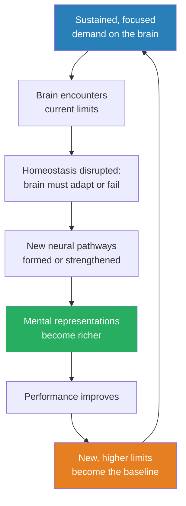
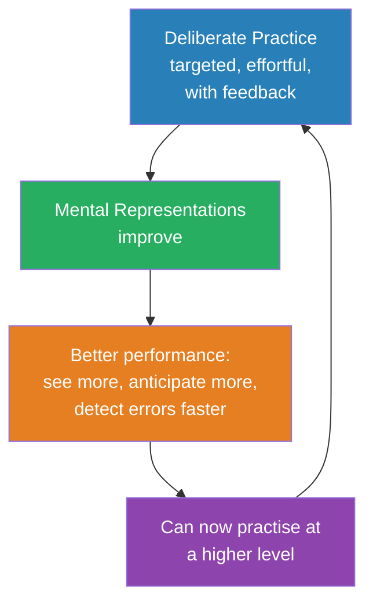
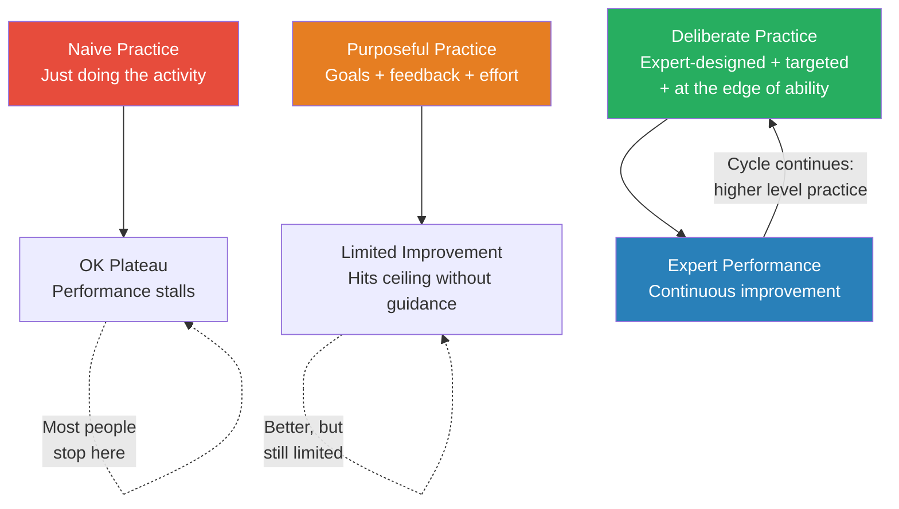
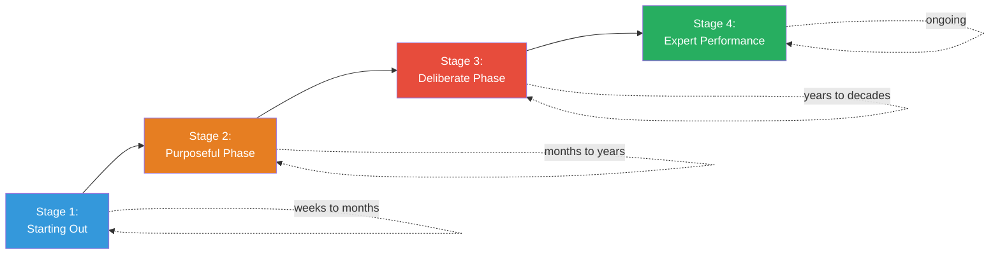
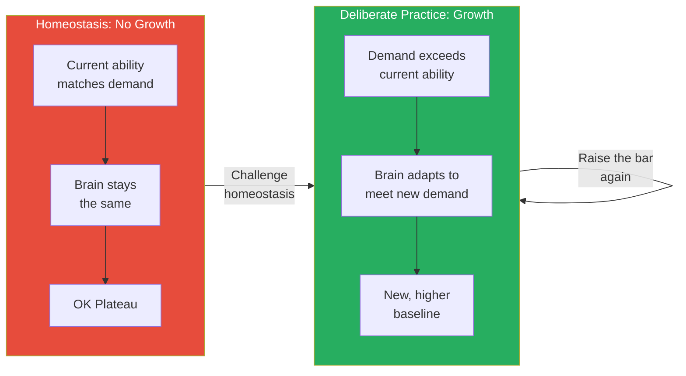

# Peak — Anders Ericsson

> Malcolm Gladwell told the world it takes 10,000 hours to become an expert. He got it from Anders Ericsson's research — and Ericsson says Gladwell got it wrong. It is not about hours. It is about what you do during those hours. Naive practice — just repeating an activity — produces a plateau, not mastery. Deliberate practice — targeted, feedback-rich, uncomfortable effort designed by a teacher to address specific weaknesses — is what produces world-class performance. The mechanism is not mysterious: experts build increasingly sophisticated mental representations — internal models that let them see what novices cannot. This book is the researcher's own correction of the most famous misquotation in modern psychology.

---

## About the Author

Anders Ericsson (1947–2020) was a Swedish psychologist and Conradi Eminent Scholar at Florida State University. He spent three decades studying expert performers across domains — chess, music, sports, medicine, memory — and became the world's foremost researcher on the science of expertise. His landmark 1993 paper, "The Role of Deliberate Practice in the Acquisition of Expert Performance," fundamentally changed how researchers think about talent, skill, and human potential. Ericsson's research showed, consistently and across dozens of domains, that what separates experts from everyone else is not innate talent but the quantity and quality of their practice.

Malcolm Gladwell popularised Ericsson's work in *Outliers* (2008), reducing the nuanced research to a catchy soundbite: "It takes 10,000 hours to become an expert." Ericsson was deeply frustrated by this simplification. The 10,000-hour figure was an average across a specific study of violinists — not a universal rule. And more importantly, it ignored the most critical variable: what you do during those hours. *Peak*, co-written with science writer Robert Pool, was Ericsson's attempt to set the record straight and present the complete, nuanced account of what his research actually shows.

---

## The Big Idea

- <b style="color: #2980b9">Expertise is not born — it is built through deliberate practice</b>: structured, effortful training designed to improve specific aspects of performance
- The "10,000 hours" rule is misleading because it ignores the type of practice
  - 10,000 hours of naive practice produces mediocrity, not mastery
  - 10,000 hours of deliberate practice — targeted exercises, expert feedback, progressive difficulty — produces genuine expertise
  - The hours are a proxy; the method is the cause
- <b style="color: #27ae60">The key cognitive mechanism is mental representations</b> — rich internal models that experts build through years of deliberate practice
  - These representations allow experts to perceive patterns, anticipate outcomes, and make decisions that are invisible to novices
  - They operate largely below conscious awareness, which is why expert performance looks like "natural talent" from the outside
- The brain is not a fixed machine — it physically changes in response to sustained, focused demand
  - London taxi drivers grow larger hippocampi
  - Musicians develop greater cortical representation of their playing fingers
  - This is anatomical change, not metaphor
- There is no evidence of a "talent ceiling" for most skills — the limit is practice quality, not genetic endowment
  - Genetic factors influence body size, basic temperament, and possibly initial learning speed
  - But within the normal range of human variation, practice is the dominant factor in determining performance

---

## Key Concepts at a Glance

| Concept | One-line summary |
|---------|-----------------|
| **Naive practice** | Repeating an activity with no specific goals or feedback — produces a plateau |
| **Purposeful practice** | Practice with goals, focus, and feedback — better, but limited without expert guidance |
| **Deliberate practice** | Expert-designed training targeting specific weaknesses at the edge of ability |
| **Mental representations** | Rich internal models that let experts see patterns invisible to novices |
| **The OK Plateau** | The point where performance becomes automatic and improvement stops |
| **Homeostasis** | The brain's resistance to change — deliberate practice disrupts it |
| **The comfort zone model** | Learning only happens at the edge of current ability |
| **Chunking** | Grouping information into meaningful units for faster processing |
| **The 10,000-hour myth** | Gladwell's oversimplification — hours mean nothing without the right practice |
| **Neuroplasticity** | The brain physically restructures itself in response to sustained demand |

---

## Chapter 1: The Power of Purposeful Practice

*A college student with an ordinary memory learns to remember 82 random digits — and in doing so, reveals that human potential is not fixed but trainable.*

The book opens with the Steve Faloon experiment — one of the most famous studies in the science of expertise, and the story that first convinced Ericsson that something extraordinary was happening with practice.

> [!example] Steve Faloon's 82 Digits (1978)
> - Steve Faloon was an ordinary Carnegie Mellon undergraduate with an ordinary memory span of about 7 digits — the same as most people
> - Ericsson challenged him to memorise increasingly longer sequences of random digits, with immediate feedback after each attempt
> - In the first few sessions, Faloon hit a wall at 8 or 9 digits — exactly where you would expect an average person to plateau
> - Instead of quitting, Faloon began developing strategies — chunking the digits into meaningful groups based on running times (he was a competitive runner)
> - He created retrieval structures, building hierarchical memory systems that allowed him to store and recall far more information
> - After 200+ hours of practice across two years, Faloon could remember 82 random digits — more than ten times the normal capacity
> - Tests before and after confirmed his working memory was unchanged — what changed was his mental representations
> **The lesson:** The same brain, working with better internal software, produced performance that would seem impossible without context.

Faloon's story contains two additional insights that Ericsson emphasises throughout the book:

- **The strategies evolved.** Faloon's initial approach — rote repetition — hit a ceiling quickly
  - He had to develop new strategies: chunking digits into meaningful groups, creating hierarchical structures, building retrieval cues
  - Each new strategy expanded his capacity until it, too, plateaued
  - Then he invented another approach — and the cycle continued
  - This is the pattern of expertise development in every field: strategy → plateau → new strategy → breakthrough
- **The methods were transferable.** After Faloon's success was published, other researchers trained new subjects using similar methods
  - They achieved similar results — some even surpassing Faloon
  - One subject, Dario Donatelli, eventually reached over 100 digits using refined versions of Faloon's approach
  - This confirmed that the improvement was a product of the practice method, not of Faloon's individual characteristics
  - <b style="color: #27ae60">The method, not the person, was the cause</b>

---

The chapter introduces the distinction between <b style="color: #2980b9">naive practice</b> and <b style="color: #2980b9">purposeful practice</b>. Most people never move past naive practice — they just do the activity, hoping that repetition alone will produce improvement. It does not.

Ericsson identifies four requirements for purposeful practice:

- **Specific goals** — "Memorise one more digit than yesterday," not "get better at memorising"
  - Vague goals produce vague results
  - Specific goals create a clear target to aim at and a clear measure of success or failure
- **Full concentration** — No distractions, no autopilot
  - The moment you can do something on autopilot, you have stopped improving
  - Full concentration is what forces the brain to build new representations
  - Multitasking during practice is not just less effective — it is practice-destroying
- **Immediate feedback** — Know right away whether you succeeded or failed
  - Without feedback, you cannot identify errors
  - Without identifying errors, you cannot correct them
  - Without correcting errors, you cannot improve
  - The feedback loop must be tight — delayed feedback weakens the connection between action and correction
- **Getting out of your comfort zone** — If it is easy, you are not improving
  - Comfort means the brain's current structures are adequate for the demand
  - No adaptation is needed, so none occurs
  - <b style="color: #e74c3c">If practice feels comfortable, you are maintaining your current level — not building a new one</b>

---

Ericsson illustrates the contrast between naive and purposeful practice with an additional study on memory training:

> [!example] The Memory Athlete Progression
> - After Faloon's experiment, Ericsson recruited additional subjects to train using similar digit-memory methods
> - Some subjects followed structured protocols with specific targets, feedback, and progressive difficulty
> - Others simply practised on their own, without guidance, hoping repetition would produce improvement
> - The structured group improved dramatically — several exceeded 80 digits
> - The unstructured group plateaued between 15 and 25 digits, regardless of how many hours they put in
> - The difference was not intelligence, motivation, or starting ability — it was the structure of the practice itself
> **The lesson:** Hours without structure produce a plateau. Structure without hours produces nothing. You need both.

> [!tip] Core Insight
> Ask yourself about any activity you are trying to improve: Do I have a specific goal for this session? Am I giving it my full attention? Am I getting feedback on each attempt? Am I working on something I cannot currently do? If any answer is no, you are doing naive practice — and your improvement has probably plateaued.

---

## Chapter 2: Harnessing Adaptability

*The brain is not a fixed organ. It is a dynamic system that physically restructures itself in response to sustained demand — and the evidence is anatomical, not metaphorical.*

This chapter presents the neurological evidence that the brain physically changes in response to sustained practice. Ericsson argues that this adaptability — <b style="color: #2980b9">neuroplasticity</b> — is the biological foundation of all expertise.

> [!example] London Taxi Drivers and the Growing Hippocampus (2000)
> - To earn their licence, London cabbies must pass "The Knowledge" — a gruelling exam requiring memorisation of 25,000 streets, thousands of landmarks, and hundreds of optimised routes
> - The training takes 3–4 years of intensive study, with many candidates dropping out
> - Neuroscientist Eleanor Maguire used MRI scans to compare taxi drivers' brains with those of bus drivers (who follow fixed routes)
> - The taxi drivers had significantly larger posterior hippocampi — the brain region responsible for spatial navigation
> - The longer they had been driving, the larger the growth — a dose-response relationship
> - Bus drivers, who navigate the same routes daily, showed no such enlargement
> **The lesson:** The brain grew in response to the demand. This is not metaphorical — it is anatomical.

Other examples of brain adaptation reinforce the point:

- **Professional musicians** have enlarged cortical representations of the fingers they use most
  - The earlier they started training, the more pronounced the enlargement
  - This is not because musically-inclined children are born with larger motor cortices — it is because years of practice physically expanded them
  - String players who started before age 7 showed the most dramatic cortical expansion
- **Juggling novices** show increased grey matter density in visual-motor coordination areas after just three months of practice
  - When they stop practising, the grey matter shrinks back
  - The brain builds only what it needs — and dismantles what it does not
  - This reversibility proves the changes are practice-dependent, not genetic
- **Braille readers** develop expanded somatosensory cortex for their reading fingers
  - The cortical area devoted to the reading finger grows measurably larger than the corresponding area for the same finger on the other hand
  - The same person, the same genes — but different experience produces different brain architecture
- **Mathematicians** show increased grey matter in the inferior parietal lobules — the regions involved in abstract numerical reasoning
  - The more years of advanced mathematical training, the greater the structural change
  - This is not a story about "math brains" — it is a story about brains that have done a lot of math

---

Ericsson introduces the concept of <b style="color: #2980b9">homeostasis</b> — the body and brain's tendency to resist change and seek equilibrium. This principle explains both why practice works and why naive practice does not:

- The body is a system that prefers stability
  - When current demands can be met with current structures, no adaptation occurs
  - Only when demand exceeds capacity does the system build new capacity
  - This is the same principle that governs muscle growth — lift heavier weights, grow stronger muscles
- <b style="color: #27ae60">Deliberate practice is a sustained disruption of homeostasis</b>
  - It creates a demand the brain cannot meet with its current structures
  - The brain responds by building new neural pathways, strengthening existing connections, and expanding relevant regions
  - This is why deliberate practice feels uncomfortable — discomfort is the sensation of homeostasis being challenged
- <b style="color: #e74c3c">If practice feels easy, the brain is NOT adapting</b>
  - The comfortable feeling means current structures are adequate
  - No new construction is needed, so none occurs
  - This is the neurological explanation for the OK Plateau

The analogy to physical training is precise:

- A weightlifter who lifts the same weight every day will maintain their current strength but never build new muscle
- Only by progressively increasing the load — disrupting muscular homeostasis — does growth occur
- The brain works identically: it grows only in response to demand that exceeds its current capacity
- And like physical training, the demand must be sustained but not overwhelming — too much challenge causes breakdown, not growth

---

The virtuous cycle of adaptation: sustained challenge forces the brain to build new structures, which raises the baseline, which allows the next round of challenge to push even higher.

> [!tip] Core Insight
> If the brain can physically grow and rewire in response to practice, then "I am not naturally talented at this" is not a permanent condition. It is a description of your current brain state — which is changeable.

---

## Chapter 3: Mental Representations

*The invisible cognitive architecture that separates experts from novices — and the reason expert performance looks like magic from the outside.*

This is the theoretical heart of the book. <b style="color: #2980b9">Mental representations</b> are the cognitive mechanism that explains expert performance. Everything else in the book — deliberate practice, feedback, coaching — serves the ultimate purpose of building better mental representations.

- A mental representation is an internal model that corresponds to some pattern in the external world
- Everyone has mental representations — you have one for the word "dog" that includes visual, auditory, and conceptual information
- But expert mental representations are qualitatively different from novice ones:
  - They are richer — encoding more information per unit
  - They are more detailed — distinguishing subtle differences that novices cannot perceive
  - They are more hierarchical — organising information into nested structures rather than flat lists
  - They are more action-oriented — directly linked to what to do, not just what to know
  - They are more flexible — capable of handling novel situations within the domain, not just rehearsed scenarios

> [!example] Chess Grandmasters and Pattern Recognition
> - Researchers showed chess positions from real games to grandmasters and beginners for 5 seconds, then asked them to reconstruct the positions
> - Grandmasters could reconstruct the positions almost perfectly — beginners could place only a few pieces
> - But when shown randomly arranged pieces (not from a real game), grandmasters performed no better than beginners
> - The grandmasters did not have better memory — they had better pattern recognition
> - They saw the real-game positions not as 32 individual pieces but as familiar configurations: attack patterns, defensive structures, strategic formations
> - Random positions contained no patterns to recognise, so their advantage disappeared
> **The lesson:** Expert memory is not about storage capacity. It is about the ability to compress complex information into recognisable patterns.

---

| Feature | Novice Representation | Expert Representation |
|---------|---------------------|---------------------|
| **Content** | Surface features (what it looks like) | Deep structure (how it works) |
| **Organisation** | Flat list of facts | Hierarchical network of principles |
| **Scope** | One context | Multiple contexts |
| **Speed** | Slow, conscious processing | Fast, automatic pattern recognition |
| **Anticipation** | Cannot predict what comes next | Can anticipate multiple steps ahead |
| **Error detection** | Cannot tell when something is wrong | Immediately notices deviations from expected patterns |
| **Transfer** | Applies only to exact situations seen before | Generalises to novel situations within the domain |

This table captures the qualitative difference between novice and expert representation. The expert does not simply know more — they organise what they know differently, and that organisation makes the knowledge functional rather than inert.

> [!example] Medical Diagnosis: Two Doctors, Same Patient
> - A medical student examines a patient and sees symptoms: fever, cough, chest pain, elevated white blood cell count
> - The student thinks through a differential diagnosis list sequentially, checking each possibility against the symptoms
> - An experienced physician examines the same patient and immediately recognises a pattern: "This looks like pneumonia"
> - The physician does not think through a list — they perceive the diagnosis as a single recognisable unit
> - Their mental representation of "pneumonia" includes the cluster of symptoms as one integrated pattern, not as separate data points
> - The expert is not smarter — they have richer mental representations built through thousands of patient encounters
> **The lesson:** Expertise is not about processing speed. It is about pattern compression — seeing wholes where novices see parts.

---

The relationship between mental representations and deliberate practice is circular and self-reinforcing:

This virtuous cycle accelerates over time — experts improve faster than intermediates, not slower, because their superior representations guide more effective practice.

- <b style="color: #27ae60">Practice builds representations → better representations enable more effective practice → more effective practice builds even better representations</b>
- This explains why the gap between experts and novices widens with time, not narrows
- The expert's advantage compounds — each cycle of practice produces more improvement than the previous one because it is guided by richer representations

---

The most dramatic manifestation of expert mental representations is the ability to perceive things invisible to non-experts:

- A wine sommelier tastes 30+ distinct flavour components in a single sip — a novice tastes "red wine"
- A football coach watches a play and sees 11 players' positions, speeds, and likely next moves — a casual viewer sees chaos
- An experienced radiologist spots tumours in X-rays that are invisible to residents — not because their eyes are sharper, but because their representations tell them what to look for
- <b style="color: #2980b9">This is not superior sensory equipment — it is superior mental software</b>
  - The experts' senses receive the same input
  - Their representations extract more information from it

Ericsson uses the concept of <b style="color: #2980b9">chunking</b> to explain one critical mechanism by which mental representations operate:

- Chunking is the process of grouping individual pieces of information into larger, meaningful units
- A novice chess player sees 32 individual pieces — a grandmaster sees 5–6 familiar chunks (attack formations, pawn structures, king safety patterns)
- A novice reader processes individual letters — a skilled reader processes whole words, and eventually phrases, as single units
- Each chunk compresses multiple pieces of information into one recognisable unit, freeing up working memory for higher-level thinking
- <b style="color: #27ae60">Chunking is how experts overcome the limitations of working memory</b> — they do not have larger working memory, they have more efficient compression

> [!tip] Core Insight
> Because experts' mental representations operate largely below conscious awareness, experts often cannot explain how they do what they do. A chess grandmaster "just sees" the right move. A master chef "just knows" the dish needs more acid. This creates the illusion of innate talent — it looks like magic because the underlying representations are invisible. But they were built, rep by rep, over years of deliberate practice.

Mental representations and deliberate practice occupy the largest areas because they are the twin engines of expertise — representations provide the cognitive architecture while deliberate practice is the construction method that builds it.

---

## Chapter 4: The Gold Standard

*Not all practice is created equal. Ericsson draws a sharp line between purposeful practice and the far more demanding standard of deliberate practice — and explains why the distinction matters.*

This chapter defines the criteria that separate <b style="color: #2980b9">deliberate practice</b> from all other forms of practice. Purposeful practice is good. Deliberate practice is the gold standard — and it is significantly harder to achieve.

Deliberate practice requires:

- **An established field with well-defined performance metrics** — you can measure improvement objectively
  - Chess has ratings. Music has competitions. Sports have times and scores.
  - In these fields, deliberate practice is straightforward because you know what "better" looks like
  - Fields without clear metrics make deliberate practice harder but not impossible
- **Expert teachers who know what good training looks like** — someone who has trained other experts and knows the pedagogy
  - Not just someone who performs well, but someone who understands how performance is built
  - A great pianist is not automatically a great piano teacher
  - The teacher must understand the training methods that produce expertise, not just the end state
- **Training exercises specifically designed to improve targeted aspects of performance** — not generic practice, but exercises that address your specific weaknesses
  - A violinist practising the passages they already play well is not doing deliberate practice
  - A violinist practising the three bars they cannot yet play cleanly — slowly, with a metronome, comparing to a reference recording — is
  - The exercises must be granular enough to isolate specific sub-skills
- **Practice at the edge of current ability** — always working on what you cannot yet do
  - Too easy = no adaptation (homeostasis maintained)
  - Too hard = breakdown and discouragement
  - Just beyond current ability = the growth zone
  - <b style="color: #27ae60">The sweet spot is the point where you fail roughly 50% of the time</b> — hard enough to force adaptation, achievable enough to avoid demoralisation
- **Full concentration and conscious effort** — this is NOT "flow"
  - Flow is performing within current ability — it feels effortless and automatic
  - Deliberate practice is pushing beyond current ability — it feels effortful and frustrating
  - <b style="color: #e74c3c">Confusing deliberate practice with flow is one of the most common mistakes people make</b>
- **Immediate, informative feedback** — not just "right/wrong" but "why" and "how to fix it"
  - Delayed feedback is far less effective because the link between action and outcome weakens with time
  - Vague feedback ("good job") is nearly useless — specific feedback ("your left hand is collapsing on the B-flat transition") drives improvement
  - The best feedback loops are built into the practice itself, not added after the fact

---

The three levels of practice produce dramatically different outcomes. Most people never leave naive practice. Those who do usually reach purposeful practice but lack the expert guidance to achieve true deliberate practice.

---

| Practice Type | Feels Like | Produces |
|--------------|-----------|----------|
| Naive practice | Comfortable, automatic | Plateau |
| Purposeful practice | Challenging, focused | Improvement (with limits) |
| Deliberate practice | Uncomfortable, frustrating, effortful | Expert performance |
| Flow / performance | Effortless, joyful | Execution of existing skill (no new learning) |

The distinction between flow and deliberate practice is critical. Many people believe they are practising when they are actually performing. Playing your favourite songs on guitar is performance. Isolating the chord transition you keep botching and drilling it at half speed with a metronome is practice. Both involve the guitar. Only one produces improvement.

Deliberate practice demands the highest levels across every dimension — especially expert feedback and targeting weaknesses — which is why it alone produces expert performance while naive practice flatlines on all fronts.

> [!example] The Violinists Who Practised Differently (1993)
> - Ericsson studied violin students at Berlin's Universitat der Kunste, dividing them into three groups based on professor nominations
> - "Best" violinists — expected to become international soloists
> - "Good" violinists — expected to join professional orchestras
> - "Music teachers" — expected to teach, not perform
> - By age 20, the best had accumulated roughly 10,000 hours of practice, the good about 8,000, and the teachers about 4,000
> - But the critical finding was not just the hours — it was how they spent them
> - The best violinists spent significantly more time in deliberate practice (difficult passages, with a teacher, targeting weaknesses) and less time in enjoyable playing
> - They rated practice as the most important activity AND the least enjoyable
> **The lesson:** The best performers did not simply practise more — they practised differently. And they found it less pleasant, not more.

---

The daily schedules of elite performers revealed another surprising pattern:

| Time | Best Violinists | Average Violinists |
|------|----------------|-------------------|
| **Morning** | Deliberate practice session #1 (focused, difficult, teacher-guided) | Mixed activities |
| **Late morning** | Break and recovery | Continue practising |
| **After lunch** | Nap (recovery and consolidation) | No nap |
| **Afternoon** | Deliberate practice session #2 | Leisure or light playing |
| **Evening** | Rest, recovery, early sleep | Variable |

- <b style="color: #27ae60">The best performers practised LESS total time per day than average performers — but the time they did practise was of dramatically higher quality</b>
- They also slept more — including afternoon naps — recognising that rest is not the absence of practice but a critical component of it
- Sleep is when memory consolidation happens — when the brain integrates new learning into existing structures
- The takeaway: it is better to practise with full intensity for 3 focused hours than to practise with half attention for 6 hours

> [!example] The Napping Advantage
> - When Ericsson examined the daily routines of the best violinists, one finding stood out: they napped significantly more than their less accomplished peers
> - The best violinists averaged 2.8 hours of sleep per afternoon, compared to 0.9 hours for the average group
> - This was not laziness — it was strategic recovery
> - During sleep, the brain consolidates what was learned during practice, moving it from fragile short-term storage to durable long-term representation
> - The nap was not separate from the training — it was part of the training
> **The lesson:** Recovery is not the opposite of practice. It is the second half of it.

> [!tip] Core Insight
> Even elite performers rarely sustain more than 4 hours of true deliberate practice per day. Beyond that, quality drops and the risk of burnout increases. If you are practising for 8 hours, you are not doing deliberate practice — you are doing something else and calling it practice.

---

## Chapter 5: Principles of Deliberate Practice on the Job

*Most professionals stop improving after their first year or two. This chapter explains why — and how to break through the plateau in fields where there are no coaches, no established methods, and no clear metrics.*

This is one of the most practically valuable chapters, because it addresses the hardest application of deliberate practice: professional knowledge work, where the conditions for true deliberate practice rarely exist.

- In most professional fields, there are no established training methods comparable to those in music or chess
- There are no expert coaches who know how to train others to expert level
- Performance metrics are ambiguous — what does "better" mean for a manager, a writer, or a strategist?
- <b style="color: #e74c3c">This means most knowledge workers stop improving after their first year or two — they reach the OK Plateau and stay there for the rest of their careers</b>
- Research on doctors is particularly alarming: studies show that experienced physicians are often no more accurate diagnosticians than recent graduates — and in some specialties, they are actually worse
  - The experience gives them confidence, not competence
  - Without deliberate practice, experience merely reinforces existing habits — including bad ones

Ericsson's answer: create your own deliberate practice system, even in fields that lack one.

> [!example] The Top Gun Revolution (1969)
> - In the early years of the Vietnam War, the US Navy's kill ratio dropped dramatically — they were losing too many pilots in aerial combat
> - Pilots were trained well enough to fly, but not well enough to fight
> - The Navy created Top Gun — an intensive training programme where pilots practised dogfighting against instructors flying enemy tactics
> - Every engagement was followed by detailed debriefing: what you did, what the enemy did, what you should have done differently
> - The kill ratio tripled after the programme was implemented
> - The Air Force, which did not create a comparable programme, saw no improvement over the same period
> **The lesson:** Realistic simulation + expert feedback + focus on weaknesses = dramatic improvement, even in life-or-death domains.

- <b style="color: #27ae60">The Top Gun approach is a model for deliberate practice in any field: create realistic simulations, practise under pressure, get immediate expert feedback, focus on weaknesses, repeat</b>

---

Applying this to knowledge work requires creative adaptation:

| Domain | Naive Practice | Deliberate Practice |
|--------|---------------|-------------------|
| **Writing** | Writing a lot and hoping it improves | Studying great writers, identifying specific techniques, practising one technique per session, comparing output to models |
| **Public speaking** | Giving presentations and getting general feedback | Recording yourself, reviewing with a coach, isolating specific weaknesses (pacing, pauses, structure), practising those in isolation |
| **Management** | Running meetings and hoping to get better | Role-playing difficult conversations, getting 360-degree feedback on specific behaviours, working with an executive coach |
| **Medical diagnosis** | Seeing patients and learning from outcomes | Reviewing cases where you were wrong, analysing why, studying the correct diagnosis, tracking your accuracy rate |
| **Programming** | Writing code all day at work | Solving algorithmic challenges targeting weak areas, studying others' code reviews, time-boxing problems to build speed |

The pattern is consistent: naive practice means doing the activity and hoping experience produces improvement. Deliberate practice means identifying specific weaknesses, designing exercises that target them, and creating feedback loops to measure progress.

> [!example] Benjamin Franklin's Self-Taught Writing Method (1720s)
> - Franklin admired the essays in *The Spectator*, a British literary magazine, and decided to improve his own writing to match that standard
> - He read an essay he admired, then made brief notes on each sentence's core argument
> - He waited several days until the original wording had faded from memory
> - He then tried to reconstruct the essay from his notes alone
> - He compared his version to the original, identified where the original was superior, and studied what made it better
> - He then tried writing the same arguments in verse — forcing himself to expand his vocabulary and find different phrasings
> - He converted the verse back to prose and compared again
> - He repeated this process across dozens of essays over months
> **The lesson:** This is textbook deliberate practice — two centuries before the term existed. Franklin had models, targeted exercises, feedback, and progressive difficulty.

---

> [!abstract] Creating Your Own Deliberate Practice System
> 1. Identify the specific sub-skills your job requires (not "management" but "giving difficult feedback," "running efficient meetings," "strategic prioritisation")
> 2. Find your weakest sub-skill — ask colleagues and managers for honest assessment
> 3. Design exercises that target that specific weakness in isolation
> 4. Create feedback loops: record yourself, compare to models, track objective metrics, seek specific critiques
> 5. Limit practice sessions to 60–90 minutes of full concentration
> 6. Track improvement over weeks and months — visible progress sustains motivation
> 7. Once the weakest sub-skill improves, reassess and target the next weakest

Ericsson acknowledges that this self-directed approach is imperfect — without an expert teacher, you may design the wrong exercises or misdiagnose your weaknesses. But imperfect deliberate practice is still vastly superior to naive practice.

---

## Chapter 6: Principles of Deliberate Practice in Everyday Life

*You do not need a world-class coach to practise deliberately. But you do need structure, feedback, and the willingness to be uncomfortable.*

This chapter addresses the individual learner who does not have access to a coach or established training methods. Ericsson acknowledges that true deliberate practice — as defined in the previous chapter — is only fully available in well-developed fields with expert teachers. But he argues that the principles can be adapted for self-directed learning.

Key principles for self-directed practice:

- **Find models of expert performance** — study the best in your field
  - What do they do differently from average performers?
  - What specific skills do they possess that you lack?
  - How did they develop those skills?
  - Models give you a target to aim at and a standard to compare yourself against
- **Break the skill into components** — do not try to improve "writing" as a monolithic skill
  - Improve sentence structure, then argumentation, then transitions, then opening hooks
  - Each component gets its own targeted practice
  - This decomposition is essential because improvement happens at the sub-skill level, not the skill level
  - <b style="color: #2980b9">The expert decomposes a complex skill into 15–20 sub-skills, then systematically targets the weakest ones</b>
- **Create feedback loops** — without feedback, you are practising blind
  - Record yourself and review the recordings
  - Compare your output to models of excellence
  - Use objective metrics where possible
  - Ask for honest, specific assessment from people whose judgment you trust
- <b style="color: #2980b9">Maintain motivation through structure</b>
  - Deliberate practice is inherently unpleasant — it requires working on weaknesses, not strengths
  - Schedule sessions in advance — if it is not on the calendar, it will not happen
  - Limit sessions to 60–90 minutes — the brain cannot sustain full concentration longer than that
  - Track progress visibly — a chart showing improvement over weeks is powerful motivation
  - When you can see the improvement, the discomfort becomes more tolerable
- **Be patient with the process** — expertise is measured in years, not weeks
  - The compound returns of deliberate practice become visible around month 6
  - They become dramatic around year 3
  - <b style="color: #e74c3c">Most people quit before they see the returns</b>

---

### Finding and Using a Teacher

Ericsson devotes significant attention to the role of teachers and coaches:

- The best teachers are not always the best performers
  - Performing and teaching are different skills
  - The ideal teacher understands the training methods, not just the end state
  - They can diagnose your specific weaknesses and design exercises to target them
- **How to evaluate a potential teacher:**
  - Have they trained other people to high levels of performance? (This is more important than their own performance level)
  - Can they articulate what they would work on with you and why?
  - Do they individualise instruction, or teach everyone the same way?
  - Do they provide specific, actionable feedback after each session?
- **When to change teachers:**
  - When you have plateaued despite sustained effort
  - When your teacher cannot explain what you need to work on next
  - When their feedback has become generic rather than specific
  - Different stages of development may require different teachers with different expertise

> [!example] The Suzuki Method
> - Shinichi Suzuki, a Japanese violin teacher, developed a method for teaching very young children to play the violin
> - The method was based on the observation that every child learns their mother tongue — even children who struggle with formal education
> - Suzuki argued this was because language learning follows the principles of deliberate practice: immersion, immediate feedback (parents correct pronunciation), graduated difficulty (simple words before complex sentences), and sustained practice over years
> - He applied the same principles to violin: children started by listening extensively, then played simple pieces with immediate feedback, gradually increasing difficulty
> - The method produced thousands of competent young violinists — far more than traditional conservatory methods
> - Critics argued the children lacked creativity. But the point was not to create prodigies — it was to prove that structured, deliberate training could produce competence in virtually any child
> **The lesson:** If the training method is right, the "talent" of the student becomes far less important than the quality of the instruction.

---

### The OK Plateau: The Most Common Trap

One of the most practically useful concepts in the book. The <b style="color: #2980b9">OK Plateau</b> explains why most people stop improving after their initial learning phase — and why they mistakenly believe they have reached their natural limit.

The pattern:

- You start learning a new skill — typing, cooking, driving, managing
- You improve rapidly at first (everything is new; the brain is building fresh neural pathways)
- You reach a functional level — "good enough" to get the job done
- The skill becomes automatic — you stop paying conscious attention to it
- You plateau. Years pass. You do not get better. You get more experienced — but not more skilled.
- <b style="color: #e74c3c">Most people mistake experience for expertise. Ten years of experience is NOT ten years of improvement — it is one year of improvement followed by nine years of repetition.</b>

> [!example] The Typing Plateau
> - Almost everyone learns to type
> - Almost no one gets faster after the first year or two
> - You learned enough to be functional, then stopped paying attention to your technique
> - Your speed plateaued — not because of a physical limit, but because you stopped practising deliberately
> - Studies show that typists who deliberately practise — identifying their slowest finger transitions, designing drills to target them, using typing software that tracks errors — can dramatically increase their speed after years on the plateau
> - The same studies show that simply typing more (naive practice) produces no improvement at all
> **The lesson:** The limit was never physical. It was attentional. The brain stopped adapting because the demand stopped exceeding the capacity.

---

Ericsson identifies three strategies for breaking through the OK Plateau:

- **Make the automatic conscious again** — film yourself, track your errors, measure your performance objectively
  - You cannot improve what you cannot see
  - Automation hides errors from conscious awareness
  - Bringing the automatic back to conscious attention reveals weaknesses you did not know you had
- **Design exercises that target your weakest component** — do not practise what you are already good at
  - Practising strengths is comfortable but useless for improvement
  - Practising weaknesses is uncomfortable but transformative
  - <b style="color: #27ae60">The discomfort is a signal that adaptation is occurring</b>
- **Get expert feedback** — a teacher or coach can see things you cannot
  - They know the field's training methods
  - They can diagnose weaknesses you are blind to
  - They can design the right exercises for your specific situation

| Plateau Behaviour | Breakthrough Behaviour |
|-------------------|----------------------|
| Practise the same way every time | Vary your practice deliberately |
| Focus on what you are already good at | Focus on your weakest skill |
| Practise on autopilot | Practise with full, conscious attention |
| No feedback or only general feedback | Seek specific, immediate feedback |
| Avoid discomfort | Seek productive discomfort |
| Measure time spent ("I practised for an hour") | Measure improvement ("I improved X by Y%") |

> [!tip] Core Insight
> The OK Plateau is not your limit. It is the limit of your current practice method. Change the method and the plateau breaks.

Naive practice flatlines around year 1 as skills become automatic, while deliberate practice continues climbing because it systematically disrupts homeostasis — the widening gap between the curves explains why ten years of experience without structure produces no more expertise than one.

---

## Chapter 7: The Road to Extraordinary

*The stories of child prodigies and extraordinary performers — and the hidden practice behind every one of them.*

This chapter tells the stories of supposedly "natural" prodigies and extraordinary performers, and systematically reveals the deliberate practice behind each one.

> [!example] The Polgar Experiment (1960s–1990s)
> - Laszlo Polgar, a Hungarian educational psychologist, set out to prove that geniuses are made, not born
> - Before having children, he published a book arguing that early, intensive, expert-guided training could produce world-class performance in virtually any domain
> - He then married Klara, and together they trained their three daughters — Susan, Sofia, and Judit — in chess from early childhood
> - The training was structured, systematic, and intensive — hours of daily practice with expert-level instruction
> - All three daughters became world-class chess players
> - Susan became the first woman to earn the Grandmaster title through the regular (non-gender-segregated) rating system
> - Judit became the strongest female chess player in history, at one point ranked 8th in the world overall — ahead of nearly every male grandmaster alive
> - Critics argue the sisters may have had genetic advantages — but the deliberate, systematic nature of their training makes it impossible to attribute their success to genetics alone
> **The lesson:** At minimum, the Polgar story proves that deliberate practice is necessary. At maximum, it suggests deliberate practice is sufficient.

---

The Mozart myth is the other centrepiece of this chapter. Mozart is the poster child for innate genius. But Ericsson takes the myth apart piece by piece:

- His father Leopold was one of Europe's most accomplished music teachers — author of the era's definitive textbook on violin instruction
- Mozart began intensive, expert-guided training at age 3 — earlier than virtually any other musician of his era
- His early compositions were heavily arranged and edited by his father — they were not independent creations
- His first truly original masterwork (*Piano Concerto No. 9*) did not appear until he was 21 — after 18 years of intensive, expert-guided practice
- By the time Mozart produced work that we now consider "genius," he had accumulated more deliberate practice than almost any musician alive

> [!example] Mozart: Prodigy or Product of Training?
> - When people invoke Mozart as proof of innate genius, they picture a child composing symphonies effortlessly
> - The reality: his father Leopold was arguably Europe's greatest music pedagogue
> - Leopold began training Wolfgang at age 3 — an unprecedentedly early start
> - Mozart's early compositions, long held up as proof of genius, were in fact heavily edited and arranged by Leopold — scholars now classify them as student work supervised by a master teacher
> - His first composition that musicologists consider a genuine masterwork did not appear until he was 21
> - By that point, he had been training intensively for 18 years — more practice than most professional musicians accumulate in a lifetime
> **The lesson:** Mozart was not born a genius. He was raised by one of the best music educators in Europe and trained from near-infancy. His "natural talent" was actually the world's most intensive early music education.

- <b style="color: #e74c3c">The talent narrative is seductive because it absolves the observer of responsibility</b>
  - If Mozart was born a genius, then your own mediocrity is not your fault — you simply were not born with the gift
  - If Mozart was trained into genius, then your mediocrity is a product of your practice method — which is within your control to change
  - The talent story is comfortable. The practice story is empowering but uncomfortable.

---

### The Stages of Expertise Development

Ericsson identifies a common progression that experts follow across domains:

Each stage has distinct characteristics:

| Stage | Duration | What Happens | How It Feels |
|-------|----------|-------------|-------------|
| **1. Starting Out** | Weeks to months | Learning basics through instruction and repetition; quick improvement | Fun — novelty keeps motivation high |
| **2. Purposeful Phase** | Months to years | Setting specific goals, seeking feedback, pushing beyond comfort zone | Harder — working on weaknesses, not strengths |
| **3. Deliberate Phase** | Years to decades | Working with expert coaches using established methods; building expert-level mental representations | Uncomfortable much of the time |
| **4. Expert Performance** | Ongoing | Rich, automatic representations guide performance; continued improvement through sophisticated practice | Paradoxically, experts practise MORE deliberately than anyone else |

- <b style="color: #e74c3c">Most people quit in Stage 2</b> — they have moved past the novelty of Stage 1, hit the OK Plateau, and concluded that they have reached their natural limit
- They have not — they have reached the limit of their current practice method
- Deliberate practice (Stage 3) can break through this barrier, but it requires accepting discomfort, seeking coaching, and targeting weaknesses instead of performing strengths

---

The role of motivation shifts across these stages:

- **Stage 1** — motivation comes from novelty, visible progress, and external encouragement (parents, teachers)
- **Stage 2** — motivation must become internal; external rewards decline as the work gets harder
- **Stage 3** — motivation comes from commitment to a long-term identity ("I am a musician," not "I play music")
  - Ericsson notes that nearly every expert he studied had at least one parent or mentor who was deeply involved in their early training
  - The transition from external to internal motivation is the most critical psychological shift in expertise development
- **Stage 4** — motivation is self-sustaining; the expert derives satisfaction from the quality of their own performance and the pursuit of mastery itself

> [!tip] Core Insight
> The path to expertise is not a straight line of increasing motivation. It is a U-curve: high motivation at the start (novelty), a valley of declining motivation in the middle (the plateau), and sustained motivation at the expert level (identity and purpose). Most people quit in the valley.

---

## Chapter 8: But What About Natural Talent?

*The most provocative chapter. Ericsson makes the strongest possible case against innate talent — and confronts the evidence that does not fit his thesis.*

Ericsson's argument against the "talent" explanation proceeds in four steps:

- In every field studied, the top performers practised significantly more than lesser performers
  - This correlation holds across music, chess, sports, medicine, and memory
  - There are no known exceptions — no one has achieved expert performance without extensive practice
- No one has ever been found who achieved expert performance without extensive practice
  - "Natural talents" who seem to appear fully formed always turn out, on investigation, to have extensive hidden practice histories
  - The child who draws photorealistic portraits at age 10 has typically been drawing obsessively since age 3
- The "talent" that people observe in experts is actually the product of their mental representations — which were built through practice
  - What looks like innate ability is actually the invisible iceberg of accumulated practice
- Genetic factors may influence body size, basic temperament, and possibly initial learning speed — but they do not determine the ceiling of skill development
  - <b style="color: #27ae60">Within the normal range of human variation, practice quality is the dominant factor in determining performance</b>

---

Ericsson devotes considerable attention to debunking specific talent myths:

- **"Perfect pitch is innate."**
  - Studies show that children who undergo musical training before age 6 can develop perfect pitch at high rates
  - Japanese children trained in the Suzuki method develop it routinely
  - It appears to be a product of early training, not genetic endowment
  - The "innate" label sticks because most people begin music training after the critical window has closed

- **"Savants prove talent is genetic."**
  - Ericsson examines several "savant" cases and finds that, upon investigation, each involved extensive hidden practice
  - The child prodigy who memorises phone books has typically been obsessively practising memory tasks for years
  - Adults do not notice because the practice happens during what looks like "play"

- **"Some people just pick things up faster."**
  - Ericsson concedes that initial learning speed varies between individuals
  - But he argues that initial speed is a poor predictor of ultimate skill level
  - <b style="color: #e74c3c">The tortoise often beats the hare because the hare relies on "natural talent" and never develops a deliberate practice habit</b>
  - The tortoise, aware of their limitations, builds a practice system that compounds over time

> [!example] The Autism and Chess Study
> - Researchers studied a group of children with autism who had developed extraordinary chess abilities
> - Initial reports framed their skill as evidence of innate savant ability
> - Closer investigation revealed that these children spent 5–8 hours per day studying chess positions and playing games
> - Their autism did not give them a chess advantage — it gave them the hyper-focus and obsessive repetition that, unintentionally, constituted deliberate practice
> - The same mechanism that made them fixate on routines also made them fixate on chess positions until they had built expert-level mental representations
> **The lesson:** What looked like innate savant ability was actually the product of thousands of hours of intense, focused engagement — driven not by structured training but by the obsessive repetition that autism sometimes produces.

---

| The Talent Story | The Practice Story |
|-----------------|-------------------|
| "She is a natural" | She started training at age 4 with an expert coach |
| "He has a gift for music" | He practised 4 hours a day for 15 years |
| "She just sees things others don't" | She built mental representations through thousands of cases |
| "He was born to do this" | He was trained to do this, starting earlier than anyone realised |
| "She has perfect pitch" | She was trained in tonal recognition before age 6 |
| "He is a prodigy" | He accumulated thousands of hours before anyone noticed him |

> [!tip] Core Insight
> Ericsson does NOT say genetics do not matter at all. He acknowledges that body size matters in basketball, that lung capacity matters in swimming, and that basic personality traits influence which activities people are drawn to. What he DOES say is: within the normal range of human variation, practice quality is the dominant factor. The person who practises deliberately will almost always outperform the "naturally talented" person who practises naively.

---

## Chapter 9: Where Do We Go From Here?

*Ericsson extends his findings beyond individual skill development to education, parenting, and the structure of society itself — arguing that the talent model has held back human potential for centuries.*

The final chapter looks at the implications of deliberate practice for education and society at large.

- **Education is broken** because it focuses on knowledge transfer (lectures, reading) rather than skill building (practice, feedback, iteration)
  - The factory model of education assumes students are passive recipients of information
  - Deliberate practice research shows they should be active builders of mental representations
  - <b style="color: #27ae60">The most effective teaching looks like coaching: identify the student's current level, design exercises targeting their specific weaknesses, provide immediate feedback, gradually increase difficulty</b>

| Traditional Teaching | Coaching-Based Teaching |
|---------------------|----------------------|
| Lecture → homework → test | Assessment → targeted exercises → feedback → reassessment |
| Same pace for all students | Individualised based on each student's weaknesses |
| Measures knowledge (what you know) | Measures skill (what you can do) |
| Feedback comes days or weeks later | Feedback is immediate |
| Student role: passive absorber | Student role: active practiser |
| Teacher role: information deliverer | Teacher role: practice designer |

---

Ericsson points out something striking about education: by the time a student graduates from high school, they have spent approximately 10,000 hours in a classroom.

- If those hours were structured as deliberate practice — with individual feedback, targeted exercises, and progressive difficulty — every student would be expert-level at something
- Instead, most of those hours are spent in passive lectures with minimal individualised feedback
- The 10,000 hours are wasted — not because the time is not available, but because the practice structure is wrong
- <b style="color: #2980b9">This is Ericsson's most radical claim: the difference between expert and ordinary performance is not primarily genetic — it is structural</b>
  - The experts had better practice systems
  - Give everyone better practice systems, and the gap shrinks dramatically

> [!example] The Medical School Revolution
> - Traditional medical education followed the lecture model: students sat in classrooms memorising anatomy, physiology, and pathology from textbooks and lectures
> - A handful of innovative programmes began shifting toward practice-based learning: students worked with simulated patients, received immediate feedback on diagnostic accuracy, and repeated clinical scenarios until their performance improved
> - Studies comparing the two approaches found that practice-based students developed better diagnostic skills, made fewer errors, and retained knowledge longer
> - The mechanism was exactly what Ericsson's theory predicts: active practice builds mental representations that passive listening does not
> **The lesson:** Even in a field as rigorous as medicine, the shift from passive learning to deliberate practice produces measurably better outcomes.

---

Ericsson also addresses parenting and early development:

- Early exposure and encouragement matter enormously — not because of "critical periods" in the genetic sense, but because early practice accumulates
- The child who starts chess at 4 has a 6-year head start over the child who starts at 10 — and those early years of representation-building compound
- Parents who want their children to develop expertise should:
  - Introduce skills early, when the child is curious and playful
  - Provide expert instruction as soon as the child shows sustained interest
  - Make practice structured and progressive — not just "go play"
  - Support the child through the difficult middle years when novelty fades
  - Gradually shift motivation from external (rewards, praise) to internal (identity, purpose)
- <b style="color: #e74c3c">The biggest mistake parents make is confusing early ability with permanent talent</b>
  - A child who shows early aptitude but receives no structured training will be overtaken by a less "talented" child who practises deliberately
  - The Polgar experiment proved this conclusively

> [!example] The Perfect Pitch Training Study
> - Researchers in Japan conducted a study where they trained groups of children aged 2–6 in pitch identification using a structured Suzuki-style programme
> - The children received daily short sessions where they listened to musical tones and learned to identify them by name
> - After several months, virtually all children in the programme could identify pitches accurately — the ability called "perfect pitch"
> - Children who began the programme after age 6 had much lower success rates
> - This was not evidence of a genetic gift — it was evidence of a training window
> - The children who developed perfect pitch were not born different — they were trained during a period when their auditory systems were maximally plastic
> **The lesson:** Many abilities we call "innate" are actually the product of early training during windows of high neural plasticity. Miss the window, and the ability appears impossible. Hit the window with the right training, and it appears universal.

---

## The Ericsson vs Gladwell Debate

*Understanding the gap between the researcher's findings and the journalist's popularisation — and why the distortion matters.*

The tension between Ericsson and Gladwell is more than academic — it shapes how millions of people think about talent and effort.

| | Gladwell's Claim (*Outliers*) | Ericsson's Actual Research (*Peak*) |
|--|-------------------------------|-------------------------------------|
| **The rule** | 10,000 hours of practice = expertise | There IS no universal hour number |
| **What matters** | Time spent | Type of practice done during that time |
| **Talent's role** | Barely mentioned | Acknowledged but subordinate to practice |
| **The message** | "Anyone can become great with enough practice" | "Anyone can improve dramatically with the RIGHT practice" |
| **The risk** | People practise naively for 10,000 hours and expect mastery | People may underestimate the effort required |
| **Accessibility** | Extremely catchy and memorable | More accurate but less viral |

- Where Gladwell helped: he made the idea of "practice over talent" mainstream
  - Before *Outliers*, most people assumed expertise was primarily genetic
  - Gladwell shifted the conversation toward effort — that was valuable
- Where Gladwell hurt: by reducing the message to "10,000 hours," he implied that all hours are equal
  - This led millions of people to practise naively — logging hours without targeting weaknesses, without feedback, without expert guidance
  - <b style="color: #e74c3c">The 10,000-hour myth is Gladwell's most dangerous simplification: it tells people that time alone produces expertise, when in fact time without structure produces only the OK Plateau</b>

The difference between the two models is not subtle. Gladwell's model is a straight line: time in → expertise out. Ericsson's model is a cycle: targeted practice → feedback → representation building → higher-level practice → repeat.

Ericsson also objects to the way the "10,000 hours" number was derived:

- The figure came from his 1993 study of Berlin violinists — the best had averaged roughly 10,000 hours of practice by age 20
- But this was an average — the range was significant, with some experts accumulating considerably more and others less
- The number varied dramatically across domains: chess grandmasters, elite athletes, and concert pianists all accumulated different totals
- And most critically, it was the type of practice — not the total hours — that predicted performance level
- <b style="color: #e74c3c">Treating 10,000 as a magic number is like saying "the average millionaire drank 50,000 cups of coffee" — the correlation is real, the causation is nonsensical</b>

> [!tip] Core Insight
> Ericsson's real message was never about a number. It was about a method. The question is not "Have I put in my 10,000 hours?" but "Am I practising the right way?" Most people put in their hours and wonder why they are not experts. The answer: they were accumulating experience, not building expertise.

---

## The Adaptability of the Human Brain

*The evidence for neuroplasticity is not metaphorical — it is anatomical. The brain literally grows new structures in response to sustained demand.*

Ericsson returns to this theme throughout the book because it is the biological foundation of everything else. If the brain were truly fixed, deliberate practice would produce only marginal improvements. The fact that the brain physically restructures itself is what makes dramatic improvement possible.

| Study | What Changed | How Long |
|-------|-------------|---------|
| **London taxi drivers** | Larger posterior hippocampi (spatial navigation) | 3–4 years of "The Knowledge" training |
| **Professional musicians** | Enlarged motor cortex for playing hand | Years of practice from childhood |
| **Jugglers** | Increased grey matter in visual-motor areas | 3 months of practice |
| **Braille readers** | Expanded somatosensory cortex for reading finger | Years of daily reading |
| **Mathematicians** | Increased grey matter in parietal lobes | Years of advanced study |
| **Meditators** | Thicker prefrontal cortex and insula | Years of meditation practice |

London taxi drivers and professional musicians show the most dramatic brain changes because their training spans years of sustained, intensive demand — confirming that the duration and intensity of practice directly predicts the magnitude of neural restructuring.

- <b style="color: #27ae60">The brain is not a fixed organ — it is a dynamic, adaptive system that physically rewires itself in response to sustained demand</b>
- "I am not naturally talented at X" is a statement about your current brain — not about your brain's permanent potential
- With sustained deliberate practice, the brain literally grows new structures to meet the demand
- The only requirements are:
  - Sustained demand (deliberate practice)
  - Adequate time (months to years)
  - Appropriate rest (including sleep, which is when consolidation happens)
  - Progressive difficulty (the demand must keep increasing as the brain adapts)

---

### Homeostasis: Why the Brain Resists Change

The brain actively resists change. It seeks equilibrium — the state where current demands can be met without adaptation. This is efficient but limiting.

- If you do the same job the same way every day, your brain never needs to adapt
  - No new structures are built
  - No existing structures are strengthened
  - You maintain your current level — but you do not exceed it
- Deliberate practice is a sustained disruption of homeostasis
  - It creates a demand the brain cannot meet with its current structures
  - The brain responds by building new capacity
  - But it only builds exactly what is needed — and only if the demand is sustained
- The principle also explains why practice must be progressive
  - Once the brain adapts to a given level of difficulty, that level becomes the new homeostasis
  - The demand must increase to continue driving adaptation
  - This is why deliberate practice requires constantly raising the bar

The diagram captures the fundamental choice: stay within homeostasis and plateau, or deliberately disrupt it and grow.

Ericsson emphasises that the brain's adaptability has limits that must be respected:

- **Overtraining degrades performance** — pushing too hard for too long produces the opposite of growth
  - The brain needs consolidation time (sleep, rest) to integrate new learning
  - Without adequate recovery, mental representations become fragile rather than robust
  - Elite performers intuitively understood this — which is why the best violinists napped and slept more, not less
- **Age matters for some but not all adaptations** — young brains are more plastic, but adult brains are far more adaptable than previously believed
  - Children who begin music training before age 7 show the most dramatic cortical changes
  - But adults who begin deliberate practice in new domains still show measurable brain adaptation
  - The window does not close — it narrows, requiring more intense and sustained practice to produce comparable changes
- **The adaptations are use-it-or-lose-it** — stop practising and the brain gradually dismantles the structures it built
  - The juggling study showed grey matter shrinking when practice stopped
  - This means expertise requires ongoing maintenance, not just initial construction

---

## The Limitations of Deliberate Practice

*Where the framework shines, where it struggles, and what it leaves unanswered.*

No book summary is complete without an honest assessment of the framework's boundaries. Ericsson's theory is powerful, but it has real limitations:

- **The definition is restrictive.** Ericsson defines "deliberate practice" so narrowly that it only fully applies in domains with established training methods and expert coaches — music, chess, sports, certain medical procedures
  - For creative fields, entrepreneurship, or interpersonal skills, the framework is less directly applicable
  - Ericsson acknowledges this but does not fully resolve it
  - The gap between "deliberate practice in theory" and "deliberate practice in practice" is wider than the book admits
- **The talent debate is oversimplified.** Ericsson makes the strongest possible case against innate talent, but the truth is likely more nuanced
  - Genetic factors clearly influence height, reaction time, and possibly working memory capacity
  - The question is not whether genes matter — it is how much they matter relative to practice
  - David Epstein's *Range* provides a valuable counterpoint, arguing that late sampling and breadth of experience may matter more than early specialisation
- **The motivation problem.** The book explains what to practise but not how to sustain the motivation to do it
  - Deliberate practice is inherently unpleasant — it requires working on things you are bad at
  - Many readers will nod along and then continue practising naively
  - The psychological challenge of sustaining years of uncomfortable practice is the book's biggest unaddressed problem
- **The privilege of access.** Expert coaching, structured training programmes, and hours of daily practice require resources
  - Time, money, access to teachers — these are not equally distributed
  - Ericsson acknowledges this briefly but does not grapple with it deeply
  - The Polgar sisters had two parents who devoted their lives to their training — most families cannot replicate this
- **The recovery problem.** Ericsson discusses recovery (naps, sleep, rest days) but does not give it the emphasis it deserves
  - Modern sports science has shown that recovery is as important as practice
  - Chronic overtraining produces burnout and injury, not expertise
  - The 4-hour daily limit on deliberate practice is mentioned but not explored in depth
- **The team dimension.** Ericsson focuses on individual skill development
  - Many of the most important skills in modern work — collaboration, communication, collective problem-solving — are team skills
  - These do not fit neatly into the individual deliberate practice framework
- **Measurement challenges.** In fields with clear metrics (chess rating, running speed), deliberate practice produces measurable improvement
  - In fields with ambiguous metrics (leadership, creativity, emotional intelligence), it is much harder to design exercises and measure progress
  - The book offers principles but not specific measurement strategies for these domains
  - Without clear metrics, it is also harder to maintain motivation — you cannot see yourself improving

---

## The Verdict

*Peak* is the corrective that the "10,000 hours" meme desperately needed. Ericsson's message is both more demanding and more hopeful than Gladwell's: expertise requires not just time but the right kind of time — and that kind of time is available to anyone willing to structure their practice deliberately. The book is most powerful as a diagnostic tool. If you have been practising something for years without improving, you are almost certainly doing naive practice. Ericsson shows you exactly what to change — and his evidence, accumulated across three decades of research in dozens of domains, is overwhelming.

The book's single greatest contribution is the concept of mental representations as the mechanism underlying expert performance. Before Ericsson, "practice makes perfect" was folk wisdom with no explanatory power. After Ericsson, we understand WHY practice works: it builds increasingly sophisticated internal models that allow experts to perceive, decide, and act in ways that novices cannot. This is not a vague claim — it is supported by brain imaging studies showing physical changes in the brains of people who practise deliberately. The theory is elegant, well-evidenced, and practically useful.

The weaknesses are real but contained. The writing is clear but academic — Pool helps, but the book occasionally reads like a research paper with anecdotes rather than a narrative driven by story. The definition of deliberate practice is so restrictive that it only fully applies in a handful of domains with established training methods. The talent debate is oversimplified — Ericsson pushes his case further than the evidence strictly supports, minimising genetic contributions that other researchers (notably David Epstein in *Range*) take more seriously. And the motivation problem — how to sustain years of uncomfortable practice — is barely addressed.

How does it compare to other books on expertise and learning? *Peak* is the scientific foundation. [[Deep Work - Cal Newport|Deep Work]] provides the environmental conditions (distraction-free focus) that deliberate practice requires. [[Mindset - Carol S. Dweck|Mindset]] provides the psychological precondition (believing improvement is possible). And [[Range - David Epstein|Range]] provides the counterargument — that breadth, late sampling, and diverse experience may matter more than early specialisation in many domains. Read *Peak* first for the mechanism, then the others for context and debate.

Who benefits most? Anyone stuck on a plateau. Anyone who has been doing something for years without improving and cannot figure out why. Anyone who has told themselves "I am just not talented enough" and used that story as permission to stop trying. Teachers and coaches will find the book invaluable as a scientific foundation for effective instruction. Parents will rethink how they develop their children's abilities. And knowledge workers — who typically stop improving after their first year or two — will find the framework for breaking through the OK Plateau to be worth the price of the book alone. Pair it with [[Deep Work - Cal Newport|Deep Work]] for the focused environment deliberate practice requires, [[Mindset - Carol S. Dweck|Mindset]] for the growth-oriented belief system that makes sustained practice psychologically possible, and [[Range - David Epstein|Range]] for the counterargument about early specialisation versus broad sampling.

---

## Related Reading

- [[Deep Work - Cal Newport|Deep Work]] — Deep work is the environment in which deliberate practice happens; without distraction-free focus, no practice is truly deliberate
- [[Mindset - Carol S. Dweck|Mindset]] — Growth mindset is the belief system that makes deliberate practice psychologically possible; without believing you can improve, you will not sustain the effort
- [[Range - David Epstein|Range]] — Epstein's direct counterargument: early specialisation versus late sampling; both cite overlapping research with opposite conclusions; read both to form your own view
- [[Essentialism - Greg McKeown|Essentialism]] — McKeown's "less but better" philosophy provides the focus necessary to sustain deliberate practice: you can only practise deliberately in a few domains, so choose wisely
- [[Deep Work - Cal Newport|So Good They Can't Ignore You]] — Newport's "career capital" is built through deliberate practice applied to professional skills
- [[The Effective Executive - Peter Drucker|The Effective Executive]] — Drucker's focus on systematic self-improvement is deliberate practice applied to management
- [[12 Rules for Life - Jordan Peterson|12 Rules for Life]] — Peterson's emphasis on accepting responsibility connects to the discipline required for sustained deliberate practice
- [[The Culture Code - Daniel Coyle|The Culture Code]] — Coyle's research on high-performing groups shows that team excellence is built through the same mechanisms as individual excellence
- [[The Checklist Manifesto - Atul Gawande|The Checklist Manifesto]] — Gawande's checklists prevent the degradation of mental representations when cognitive load is high
- [[Noise - Cass R. Sunstein|Noise]] — Kahneman and Sunstein's work on inconsistent judgment shows why expert mental representations matter: without them, even trained professionals make wildly inconsistent decisions
- [[Thinking in Bets - Annie Duke|Thinking in Bets]] — Duke's framework for evaluating decisions under uncertainty complements Ericsson's emphasis on feedback quality; in domains with noisy feedback, deliberate practice must account for luck
- [[Man's Search for Meaning - Viktor Frankl|Man's Search for Meaning]] — Frankl's logotherapy connects to the motivation problem Ericsson leaves unresolved: purpose sustains effort when the practice itself is uncomfortable
