# Range: Why Generalists Triumph in a Specialized World — David Epstein

> David Epstein marshals research from sports, education, cognitive science, and innovation to argue that breadth beats depth in a complex world. His thesis: the domains that matter most — leadership, strategy, creative problem-solving — are "wicked" environments where rules are unclear, feedback is delayed, and patterns do not repeat. In these environments, the generalist who draws on diverse experience, thinks by analogy across fields, and experiments before committing consistently outperforms the narrow specialist. Epstein builds his case through biographical narratives (Roger Federer, Van Gogh, Nintendo's Gunpei Yokoi), rigorous research (Tetlock's forecasting study, Bjork's desirable difficulties, Kahneman and Klein's expert-performance collaboration), and a structural argument that our institutions systematically overvalue early specialisation and undervalue range. The book is a manifesto for the late bloomer, the career-switcher, and anyone who has ever felt behind for not picking a lane sooner.

---

## About the Author

David Epstein is a science journalist and author whose own biography is an advertisement for his thesis. He studied environmental science at Columbia University, where he conducted Arctic ecology research, before pivoting to tabloid crime reporting, then becoming a senior writer at Sports Illustrated. His first book, *The Sports Gene* (2013), explored genetic and developmental influences on athletic performance and led him to the research on late specialisation that inspired *Range*. Epstein is a synthesiser by temperament: he draws connections across disciplines rather than drilling into one, and his background in both hard science and narrative journalism gives him the tools to translate dense research into accessible argument. The winding path from Arctic ice cores to bestselling author is itself a case study in the match-quality thesis he advances.

---

## The Big Idea

- The modern world is increasingly <b style="color: #2980b9">wicked</b> — its most important problems have unclear rules, delayed feedback, and few repeating patterns
- In wicked environments, the strategies that work in <b style="color: #2980b9">kind</b> environments (chess, golf, classical music performance) — early specialisation, deliberate practice, pattern repetition — do not just fail
  - <b style="color: #e74c3c">They can actively harm</b>, producing cognitive entrenchment where deep expertise becomes a prison that blinds people to novel solutions
- The alternative is <b style="color: #2980b9">range</b>: broad experience across domains, the habit of thinking by analogy rather than by rote, a willingness to experiment and switch paths, and the patience to endure a sampling period that looks inefficient but builds a cross-domain pattern library no specialist can match
- <b style="color: #27ae60">The people who change the world are almost never the narrowest specialists</b>
  - From Kepler to Darwin to the superforecasters who beat intelligence analysts — they are the ones who can see connections that the specialists, trapped in their trenches, cannot

---

- The book's deepest provocation: the apparent "waste" of a winding career path is not waste at all
  - It is the optimal strategy for finding <b style="color: #2980b9">match quality</b> — the fit between who you are and what you do
  - It builds the cognitive flexibility that wicked domains demand
- <b style="color: #e74c3c">Our institutions are systematically misaligned</b> with the demands of a complex, changing world:
  - Education systems funnel children into specialities too early
  - Corporations reward narrow depth over adaptive breadth
  - Culture celebrates the prodigy and the 10,000-hour grinder
- <b style="color: #27ae60">The generalist who looks like they are falling behind is often the person best prepared for what is coming next</b>

---

## Key Concepts at a Glance

| Concept | One-line summary |
|---------|-----------------|
| **Kind vs wicked learning environments** | Kind = clear rules and instant feedback; wicked = ambiguous rules, delayed feedback, novel problems |
| **The sampling period** | Broad exploration before commitment builds cross-domain pattern recognition that specialists lack |
| **Desirable difficulties** | Learning that feels slow and frustrating produces deeper, more transferable knowledge |
| **Analogical thinking** | Solving problems by mapping structural similarities from distant domains, not applying familiar templates |
| **Match quality** | The fit between your abilities and your work, discoverable only through experimentation |
| **The outsider advantage** | Distance from a problem domain can matter more than proximity, because outsiders bypass domain assumptions |
| **Fox vs hedgehog thinking** | Integrating multiple perspectives beats viewing everything through one powerful lens |
| **Cognitive entrenchment** | Deep expertise can make people worse when conditions change, not better |
| **The inside view vs the outside view** | Comparing to a reference class of similar cases beats immersing yourself in unique internal details |
| **Lateral thinking with withered technology** | Combining old, well-understood components in novel ways beats chasing the cutting edge |
| **Deliberate amateurism** | Maintaining breadth of interests is a conscious innovation strategy, not a hobby |
| **Dropping familiar tools** | Under pressure, people cling to practised methods even when those methods are killing them |

The treemap reveals that Epstein's argument rests on four interlocking pillars — understanding environments, choosing development strategies, cultivating thinking modes, and enabling innovation — with analogical thinking and match quality as the largest nodes reflecting their centrality to the thesis.

---

## Chapter 1: Roger Federer and Tiger Woods — The Cult of the Head Start

*The world worships the Tiger Woods story — start early, specialise relentlessly, dominate. But the research says Roger Federer's winding path through multiple sports is the far more reliable route to excellence.*

The book opens with a tale of two origin stories that frame everything that follows.

> [!example] **Tiger Woods — The Early-Specialisation Archetype**
> - His father, Earl, placed a putter in his hands at seven months old
> - At two, Tiger appeared on national television demonstrating his swing
> - At three, he shot 48 over nine holes
> - By age eight, he had beaten his father
> - Every hour was golf, from the crib
> - Malcolm Gladwell used Tiger as the poster child for the 10,000-hours thesis: greatness comes from starting early and never doing anything else
> **The lesson:** Tiger's story became the dominant cultural narrative about how excellence is built — but it is the exception, not the rule.

> [!example] **Roger Federer — The Sampling Archetype (Basel, Switzerland)**
> - As a child, Federer played badminton, basketball, handball, tennis, table tennis, and football with his mother's local club
> - His parents refused to pressure him toward any single sport
> - When coaches urged them to move Roger into a tennis academy, they declined — he was having too much fun playing everything
> - His mother, a tennis coach herself, deliberately avoided coaching him — she wanted him to find his own path
> - He did not commit fully to tennis until his mid-teens, well after many of his future rivals had been training exclusively for years
> - He went on to become, by most accounts, the greatest tennis player in history
> **The lesson:** The head start is less important than the breadth of the foundation.

<b style="color: #27ae60">Federer is the norm and Tiger is the outlier</b> — the research confirms this across multiple domains:
- A study of German top-division footballers found that players who eventually made the national team had spent **more** time playing other sports as children than those who specialised early
  - The sampling gave them general athletic skills — spatial awareness, coordination, improvisation — that transferred powerfully to their eventual sport
- Research across Olympic sports found that elite athletes specialised **later** on average than near-elite athletes
  - The near-elite athletes had specialised earlier and hit a performance ceiling earlier
- A study by John Sloboda found that exceptional young musicians did not practise more than good ones — they distributed their practice across **three instruments** rather than concentrating on one
  - The breadth gave them a richer understanding of musical structure that deepened their eventual specialisation

---

> [!example] **The Czech Sports System**
> - Researchers studying Czech national team athletes across multiple sports found a remarkably consistent pattern
> - The athletes who reached the highest levels had spent their childhood in what Epstein calls the "sampling period" — participating in a variety of sports and physical activities
> - They entered structured training for their eventual sport significantly later than their less successful peers
> - The early specialisers often burned out, suffered overuse injuries, or simply plateaued at a level below the top
> - The breadth of physical competencies built during the sampling period — balance, reaction time, spatial awareness, varied movement patterns — created an athletic foundation that pure repetition of one sport could not match
> **The lesson:** The pattern is not unique to one country or one sport. Across cultures and disciplines, sampling before specialising produces better long-term outcomes.

Epstein is careful to acknowledge that early specialisation does work in a narrow set of domains:
- Activities with <b style="color: #2980b9">kind learning environments</b> — where patterns repeat, rules are clear, and feedback is immediate — reward early, intense, narrowly focused practice
- Chess, golf, classical music performance, and certain individual sports fit this description
- Tiger Woods worked precisely because golf is a kind environment: the ball does not move, the course conditions are knowable, and the motor patterns repeat
- <b style="color: #e74c3c">The error is generalising from kind-environment success to the rest of life</b>, where most of what matters is wicked

The distinction between kind and wicked environments originates from a landmark collaboration between Daniel Kahneman and Gary Klein:
- Kahneman studies how expertise fails — how trained professionals make systematic errors
- Klein studies how expertise succeeds — how firefighters and nurses make brilliant snap decisions
- They spent years arguing before realising they were studying different environments
- <b style="color: #27ae60">Klein's experts operated in kind environments</b>: clear patterns, rapid feedback, years of repetition creating reliable intuition
- <b style="color: #e74c3c">Kahneman's experts operated in wicked environments</b>: ambiguous signals, delayed feedback, no repeating patterns — where intuition became a liability
- Their joint 2009 paper established that expert intuition is trustworthy only in kind environments
- The paper's implications are profound: before trusting your gut, you must first ask whether you are in an environment where gut feelings are calibrated by experience — or one where they are merely confident guesses
- Kahneman later called their collaboration "my most satisfying professional experience" — two researchers who studied opposite conclusions discovered they were both right, but in different contexts
- The kind/wicked framework became the theoretical backbone of Epstein's entire argument

| Feature | Kind Environment | Wicked Environment |
|---------|-----------------|-------------------|
| **Rules** | Clear and stable | Ambiguous and shifting |
| **Feedback** | Immediate and accurate | Delayed, noisy, or absent |
| **Patterns** | Repeat reliably | Novel, non-repeating |
| **Optimal strategy** | Early specialisation, deliberate practice | Broad sampling, analogical thinking |
| **Example domains** | Chess, golf, fire-line decisions | Strategy, innovation, leadership, policy |
| **Best metaphor** | Repeatedly hitting a known target | Navigating unfamiliar terrain in fog |

Most of the modern world — business, geopolitics, technology, creative work — falls on the wicked side of the spectrum.

The radar profile reveals how dramatically kind and wicked environments diverge — and why strategies optimised for one collapse in the other, with practice transfer being the sole dimension where wicked environments score higher because breadth, not repetition, is what transfers.

Epstein makes a point that is easy to miss but critically important:
- <b style="color: #e74c3c">Most people dramatically underestimate how wicked their environment actually is</b>
- A financial analyst may believe they operate in a kind environment — numbers, models, clear outcomes — but financial markets are deeply wicked: the rules change, feedback is delayed and noisy, and the same strategy that worked last decade may fail catastrophically in the next
- A doctor may believe medicine is a kind environment — symptoms, diagnoses, treatments — but many medical decisions involve ambiguous symptoms, incomplete information, and outcomes that take years to manifest
- A manager may believe organisational leadership is a kind environment — clear metrics, direct reports, performance reviews — but the interpersonal, political, and strategic dimensions of leadership are profoundly wicked
- The mismatch between perceived kindness and actual wickedness is itself one of the most dangerous cognitive traps — it leads people to apply kind-environment strategies (narrow specialisation, pattern repetition, confidence in expertise) to wicked-environment problems, with predictably bad results

> [!tip] Core Insight
> The culture worships Tiger because his story is simpler and more dramatic. But the research points toward Federer: sample broadly, play freely, and let specialisation come later, naturally, from a wider base.

This is the development path Epstein champions: breadth first builds the pattern library from which deep, flexible expertise later emerges.

---

The chapter also introduces the <b style="color: #2980b9">ten-thousand-hours rule</b> and its misapplication:
- Anders Ericsson's original research on deliberate practice studied violin students at a Berlin conservatory and found that the best players had accumulated more hours of solitary, structured practice
- Malcolm Gladwell popularised this as the "10,000-hour rule" in *Outliers*, using Tiger Woods and the Beatles as examples
- Epstein argues that Gladwell's generalisation is dangerous:
  - The 10,000-hours finding applies to domains with kind learning environments — where the relationship between practice and performance is direct and linear
  - In wicked environments, 10,000 hours of narrow practice can produce cognitive rigidity rather than mastery
  - <b style="color: #e74c3c">Ericsson himself objected to Gladwell's generalisation</b> — he stressed that deliberate practice must be structured, feedback-rich, and domain-appropriate
  - The cultural impact of the rule pushed parents and institutions toward even earlier specialisation — exactly the wrong response to a world that is becoming more wicked

> [!example] **The 10,000-Hours Misapplication in Youth Sports**
> - After Gladwell's book, youth sports programmes across the United States intensified their early-specialisation regimes
> - Children as young as six were placed in year-round training for a single sport, with parents citing the 10,000-hour rule as justification
> - The American Academy of Pediatrics subsequently issued warnings against early sport specialisation, citing increased rates of burnout, overuse injuries, and dropout
> - Research by the American Medical Society for Sports Medicine found that young athletes who specialised in a single sport before age 12 were 70-93% more likely to suffer overuse injuries than those who played multiple sports
> - The irony: the very rule meant to produce excellence was systematically destroying the broad foundation that excellence requires
> **The lesson:** A rule derived from kind-environment research became a prescription applied to wicked environments — with predictably harmful results.

---

## Chapter 2: How the Wicked World Was Made — The Flynn Effect and Abstract Thinking

*The modern mind is fundamentally different from the premodern mind — and that difference is what makes range both possible and necessary.*

- IQ scores have risen dramatically and consistently throughout the twentieth century — a phenomenon known as the <b style="color: #2980b9">Flynn Effect</b>, after the political scientist James Flynn who first documented it
- The gains are not in raw processing power or vocabulary
- They are in **abstract, classificatory thinking**: the ability to detach from concrete experience and reason about categories, hypotheticals, and relationships between concepts
- Flynn estimated that the average person in 1900 would have scored around 70 on a modern IQ test — not because they were less intelligent, but because they used a fundamentally different cognitive toolkit
- The gains are largest on the most abstract subtests — Raven's Progressive Matrices, which measure pure pattern recognition — and smallest on the most concrete ones like arithmetic and vocabulary

> [!example] **Luria's Uzbek Villagers (1930s Central Asia)**
> - Soviet psychologist Alexander Luria showed remote Uzbek villagers a drawing of a saw, a hatchet, a log, and a hammer, and asked which did not belong
> - A modern respondent instantly says "the log" — it is the only non-tool
> - But the villagers refused to remove any item
> - A log without a saw is useless, they said — you need all four together to do actual work
> - They reasoned entirely from concrete, lived experience and could not — or would not — think in abstract categories
> - When Luria pressed, one man said he had never been to a cold region and would not conclude its bears were white — he would only reason from direct observation
> - Another man was asked: "All bears in the North are white. Novaya Zemlya is in the North. What colour are the bears there?" He simply answered that he'd never been there and couldn't say
> - The villagers were not unintelligent — their reasoning was perfectly adaptive for their world
> **The lesson:** Abstract, classificatory thinking is not innate intelligence — it is a cognitive tool trained by education and modern life.

---

Flynn's insight was that formal education teaches people what he called <b style="color: #2980b9">"scientific spectacles"</b>:
- The ability to classify, abstract, and transfer knowledge from one context to another
- This is not a sign of superior intelligence — it is a cognitive tool, trained by schooling and modern life
- Without it, every problem is a unique, concrete situation requiring its own solution
- With it, problems have structural features that connect them to other problems
- The Uzbek villagers were not inferior thinkers — they had no need for abstraction in their daily lives, so they never developed the habit
- Flynn traced the IQ gains country by country and found they correlated almost perfectly with the spread of formal education, industrialisation, and urbanisation
  - Countries that modernised earlier showed earlier gains
  - Countries that modernised later showed later gains
  - The pattern was identical everywhere — the gains were environmental, not genetic
- Flynn's data was striking in its consistency: every industrialised nation showed the same rising trajectory, regardless of ethnicity, geography, or political system
  - The one common factor was exposure to increasingly abstract modes of thinking through schooling and modern occupational demands

> [!example] **The Ewe Farmers (West Africa)**
> - Researchers studying the Ewe people of West Africa found a similar pattern
> - Farmers who had attended formal schooling could classify items by abstract categories
> - Farmers who had not attended school classified items by practical function — just like Luria's villagers
> - The difference was not IQ or capacity — it was exposure to the cognitive habit of abstraction
> - Once taught, the skill transferred to domains the farmers had never encountered in school
> **The lesson:** Modern education's greatest gift is not facts but a way of thinking — one that allows knowledge to travel across domains.

---

> [!example] **Flynn and His Father's Generation**
> - Flynn observed that his own father, a highly intelligent man born in the early twentieth century, reasoned about the world differently from someone educated in the 1980s
> - His father could solve practical problems brilliantly but struggled with hypotheticals — "What if?" questions that had no grounding in direct experience
> - This was not a deficit of intelligence — it was a different mode of engaging with the world
> - One generation could reason from experience; the next could also reason from abstraction
> - Flynn argued that this shift was not evolution — it happened too fast for that — but a cultural transformation in how minds were trained to operate
> **The lesson:** The cognitive revolution of the twentieth century was not about smarter brains but about new habits of thought made possible by modern institutions.

The implication for range is direct:
- The modern world demands exactly the kind of <b style="color: #27ae60">far transfer</b> — applying knowledge from one domain to a structurally similar but superficially different domain — that abstract thinking enables
- Generalists are not just people who know a little about a lot
- <b style="color: #27ae60">They are people who can recognise deep structural patterns across domains</b>
- That ability is what the Flynn Effect has equipped the modern mind to do
- The modern world has created the cognitive conditions that make range possible — and simultaneously created the wicked complexity that makes range necessary

Flynn also found that the gains were not uniform across all subtests of intelligence:
- The largest gains appeared on tests of abstract reasoning and pattern recognition — precisely the skills that enable analogical thinking across domains
- The smallest gains appeared on tests of factual knowledge and arithmetic — skills that are concrete and domain-specific
- This selective pattern supports Epstein's argument: the cognitive revolution was not about knowing more but about thinking differently
- The modern mind is not better at any particular task — it is better at transferring what it knows from one context to another
- This transfer capacity is the cognitive foundation on which range is built

The chapter also makes a subtler point about the nature of intelligence itself:
- What we measure as intelligence is not a fixed biological capacity — it is partly a set of cognitive habits shaped by cultural demands
- A world that rewards abstraction produces abstract thinkers
- A world that rewards concrete, local knowledge produces concrete thinkers
- Neither group is smarter in any absolute sense — they are equipped for different environments
- <b style="color: #e74c3c">The danger is assuming that our modern cognitive style is natural rather than trained</b> — and therefore failing to cultivate it deliberately

> [!tip] Core Insight
> The modern mind's greatest gain is not processing speed but abstract classification — the ability to see structural patterns across domains. This is precisely what range exploits.

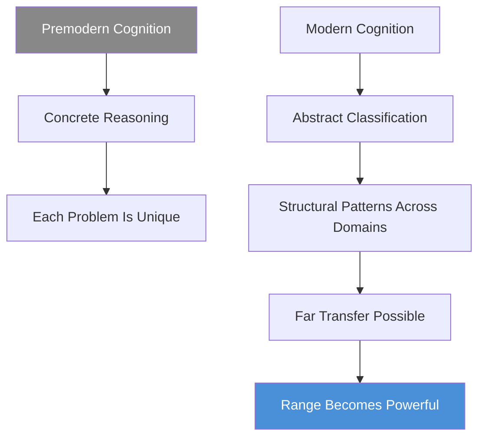

This diagram illustrates the chapter's central argument: the Flynn Effect created the cognitive conditions — abstract, classificatory thinking — that make cross-domain range a viable and powerful strategy.

The chapter has a subtle but important implication for education:
- Schools that teach classification, abstraction, and analogy are not just teaching "thinking skills" — they are training the cognitive infrastructure that makes range possible
- Schools that focus primarily on content — memorising facts, learning procedures — may produce students who score well on knowledge tests but cannot transfer their knowledge to novel domains
- <b style="color: #e74c3c">The most valuable education is not the one that fills you with the most information</b> — it is the one that best equips you to think abstractly across contexts
- This aligns directly with the desirable-difficulties research in Chapter 4: the teaching methods that produce the deepest abstract understanding are often the ones that feel least efficient in the moment

> [!example] **The Fermi Estimation Method**
> - Epstein cites the physicist Enrico Fermi, who was famous for posing seemingly unanswerable questions — "How many piano tuners are in Chicago?" — and teaching students to break them down into estimable components
> - Fermi problems have no single correct answer — they train the habit of structural decomposition: taking an unfamiliar problem and relating it to things you do know
> - This is pure abstract transfer — applying mathematical reasoning to domains where no formula exists
> - Fermi problems have become a standard tool in consulting interviews and MBA programmes precisely because they test the capacity for far transfer
> - The ability to do a Fermi estimation is a direct product of the cognitive revolution Flynn documented: premodern thinkers, trained only in concrete reasoning, could not have done it
> **The lesson:** The modern mind's greatest advantage is not knowing more but being able to reason structurally about what it does not know.

---

## Chapter 3: When Less of the Same Is More — The Venetian Music Experiment

*In seventeenth-century Venice, orphan girls who rotated across multiple instruments produced more extraordinary music than narrow specialists — centuries before the research confirmed why.*

> [!example] **The Venetian Ospedali (17th-18th Century Venice)**
> - Four charitable institutions for orphaned, abandoned, and illegitimate girls produced some of the finest musicians in Europe
> - Visitors came from across the continent to hear their orchestras
> - Vivaldi taught at one of them, the Ospedale della Pieta
> - What made these orphan musicians extraordinary was not intense drilling on a single instrument — it was the opposite
> - The figlie del coro rotated across multiple instruments: a girl might study violin, then switch to oboe, then learn the organ
> - They sang, they composed, they conducted
> - The breadth of their musical experience produced virtuosity that stunned audiences accustomed to narrow specialists
> **The lesson:** The Venetian orphans became extraordinary precisely because no one designed a rigid development pathway for them.

Epstein contrasts this with the <b style="color: #2980b9">Suzuki method</b>, which dominates modern music education:
- Suzuki emphasises starting early on one instrument, following a rigidly sequenced curriculum, and accumulating hours
- It is modelled on kind-environment logic: repetition, feedback, gradual progression
- It produces competent young performers who can execute well-rehearsed pieces
- <b style="color: #e74c3c">What it does not reliably produce is creative, flexible musicians</b> who can adapt to novel musical situations, improvise, or compose
- The Suzuki student who plays a perfect recital piece may struggle to sight-read a new score or jam with other musicians
- The method treats music as a motor-skill problem — repeat the physical motions until they are automatic — rather than a cognitive and expressive challenge

---

The research bears this out across multiple studies:
- A study of music students found that the ones who became the highest achievers were **not** those who practised the most hours on their primary instrument
- They were the ones who had **sampled across instruments** before settling
- Their early breadth gave them a richer understanding of music as a system, not just a set of motor skills on one device
- A longitudinal study of young musicians found that those who quit early were, on average, indistinguishable in their practice hours from those who continued — the difference was that the quitters had sampled fewer instruments and had less internal motivation
  - The samplers kept playing because they had found something they genuinely loved
  - The non-samplers felt trapped in a choice someone else had made for them
- The research also revealed a motivational paradox:
  - Children who were allowed to explore multiple instruments reported higher intrinsic motivation even years later
  - Children who were funnelled into a single instrument early reported higher extrinsic motivation (pleasing parents, earning grades) but lower enjoyment
  - The intrinsically motivated samplers were more likely to persist through the genuinely difficult later stages of musical development

> [!example] **Jack Cecchini — The Sampling Musician (Chicago)**
> - Cecchini grew up in Chicago playing guitar in various settings — jazz clubs, classical recitals, rock bands
> - He never committed to a single genre or style in his youth
> - By the time he was in his twenties, he had developed a musical vocabulary so broad that he could move fluidly between genres that most musicians treated as separate worlds
> - He became a sought-after session musician precisely because of his versatility — producers hired him when they needed someone who could adapt to any context
> - His sampling period looked unfocused to observers who expected him to pick a lane, but it was building a cross-genre flexibility that pure specialists could not replicate
> **The lesson:** In music, as in sport, the samplers who look unfocused are often building the most durable kind of competence.

---

| Approach | Method | Short-term Result | Long-term Result |
|----------|--------|-------------------|------------------|
| **Suzuki/early specialisation** | One instrument from age 3-4, rigid curriculum | Impressive early performances | Technical competence, limited flexibility |
| **Venetian sampling** | Multiple instruments, rotation, composition | Slower visible progress | Deep musical understanding, creative mastery |
| **Modern sampling research** | Try 2-3 instruments before committing | "Wasted" time on non-primary instruments | Stronger eventual specialisation, higher motivation |

The pattern repeats: early investment in breadth looks like waste but compounds into an advantage the narrow specialist cannot replicate.

Epstein also addresses the <b style="color: #2980b9">"talent hotbed"</b> question:
- Why do certain places produce disproportionate numbers of elite musicians, athletes, or innovators?
- The conventional explanation focuses on intensive training cultures — the Russian ballet tradition, South Korean piano academies, Dominican baseball factories
- But many talent hotbeds share an overlooked feature: they expose young people to enormous variety before funnelling them toward a speciality
- Dominican baseball players often play multiple positions and multiple sports before being scouted
- Russian chess players are often introduced to the game alongside art, music, and mathematics
- <b style="color: #27ae60">The hotbed produces excellence not because it specialises early but because it provides a rich sampling environment from which natural specialisation can emerge</b>

> [!example] **The Brazilian Football Factory**
> - Brazil produces more world-class footballers per capita than any other nation
> - The conventional explanation is early, intensive training — but the reality is the opposite
> - Brazilian children grow up playing futsal — a fast-paced, small-sided indoor game played with a smaller, heavier ball on a hard court
> - Futsal develops close ball control, quick decision-making, spatial awareness, and improvisation in ways that standard football training does not
> - Many Brazilian stars — Pele, Zico, Ronaldo, Ronaldinho, Neymar — credit futsal with developing their skills
> - The key insight: futsal is not football — it is a different game that develops transferable athletic and cognitive skills
> - The Brazilian talent factory works precisely because it does NOT start children with narrow football specialisation — it gives them a related but different environment that builds broader motor and cognitive competencies
> **The lesson:** The world's most productive talent pipeline is a sampling system disguised as a specialisation system.

> [!tip] Core Insight
> The sampling period that looks like wasted time or unfocused dabbling is actually building a foundation of flexible knowledge that narrow early training cannot match.

<b style="color: #27ae60">Exploration produced mastery</b> — the chapter reinforces a pattern that runs through the entire book: the Venetian orphans became extraordinary precisely because no one designed a rigid development pathway for them. The absence of a "system" was the system.

Epstein draws a broader lesson about the relationship between structure and creativity:
- Highly structured training produces reliable execution of known patterns
- Less structured sampling produces the ability to generate novel patterns
- The world rewards both — but the harder-to-find, higher-value skill is generation, not execution
- <b style="color: #e74c3c">The paradox of talent development</b>: the more precisely we optimise training for measurable outcomes, the more we eliminate the unstructured exploration from which truly original performance emerges
- This dynamic plays out not just in music but in science, business, and technology — wherever creative recombination matters more than flawless repetition

> [!example] **The Suzuki vs Jazz Comparison**
> - Epstein notes that the jazz tradition — where musicians learn by sitting in on sessions, playing by ear, absorbing multiple styles, and improvising in real time — produces a fundamentally different kind of musician from the classical tradition
> - Jazz musicians frequently demonstrate superior abilities in musical cognition tasks: identifying chord changes in unfamiliar songs, transposing melodies to new keys on the fly, and collaborating with musicians they have never met
> - Classical musicians trained through the Suzuki method often struggle with exactly these tasks despite having more total practice hours
> - The jazz musician's path looks undisciplined by classical standards — no rigidly sequenced curriculum, no single teacher controlling the development plan
> - But it is precisely this looseness that develops the adaptive musical intelligence that the structured path does not
> **The lesson:** The training method that looks more rigorous often develops a narrower form of competence. The method that looks messy develops the broader capability.

---

## Chapter 4: Learning, Fast and Slow — Desirable Difficulties

*The conditions that produce the fastest visible progress often produce the shallowest learning — and the teachers who feel most helpful are often the ones whose students learn the least.*

- Robert Bjork's research programme at UCLA demonstrates that <b style="color: #e74c3c">the conditions which produce the fastest visible progress often produce the shallowest learning</b>
- This is one of the most counterintuitive findings in all of cognitive science, and Epstein gives it a full chapter because the implications reach far beyond education
- Bjork coined the term <b style="color: #2980b9">"desirable difficulties"</b> — obstacles that slow down learning in the moment but dramatically improve retention and transfer over time

> [!abstract] The Four Desirable Difficulties (Robert Bjork, UCLA)
> 1. **Generation** — struggling to produce an answer, even incorrectly, builds stronger memory traces than being given the answer
> 2. **Spacing** — distributing practice over time forces repeated reconstruction; forgetting and re-retrieving is itself a form of learning
> 3. **Interleaving** — mixing different problem types forces learners to identify which strategy applies before applying it
> 4. **Testing** — retrieval practice, even without feedback, strengthens learning more than re-reading or re-studying

---

<b style="color: #2980b9">The generation effect</b>:
- Struggling to produce an answer, even incorrectly, builds stronger memory traces than being given the answer
- In experiments, students forced to guess the meaning of a foreign vocabulary word before seeing the correct answer — even though their guesses were almost always wrong — retained the correct meaning significantly better than students who were simply shown the word-meaning pair
- The act of generating a wrong answer created a mental hook that the correct answer attached to
- This runs counter to the instinct of most teachers, who want to prevent errors and deliver smooth, clear instruction
- Bjork calls this <b style="color: #2980b9">"pre-testing"</b> — testing students on material they have not yet studied
  - The pre-test scores are terrible, but the subsequent learning is dramatically improved
  - The struggle to generate an answer — any answer — primes the brain to encode the correct answer more deeply when it arrives

<b style="color: #2980b9">Spacing</b>:
- Distributing practice over time, rather than massing it, forces repeated reconstruction of knowledge
- Massed practice (cramming) produces rapid short-term gains that feel productive
- Spaced practice produces slower visible progress but far superior long-term retention
- The reason: forgetting and re-retrieving is itself a form of learning — each retrieval strengthens the pathway
- The feeling of struggle during spaced practice is not a sign that learning has failed — it is a sign that deep encoding is occurring
- Bjork's research shows that the optimal spacing interval is longer than most people intuitively choose — learning should feel slightly uncomfortable

> [!example] **The Cramming Paradox — Medical Students**
> - Researchers compared medical students who crammed material into concentrated study sessions with students who spaced the same material over longer intervals
> - The crammers performed better on exams taken immediately after the study period — confirming what every student intuitively feels: cramming "works"
> - But when tested months later on the same material — the timeframe relevant to actual medical practice — the crammers retained dramatically less
> - The spaced-practice students felt less prepared going into their exams and scored slightly lower on immediate tests
> - But they retained the material far longer and could apply it to novel clinical scenarios more effectively
> - The implication for medical education is sobering: the exam system rewards the study strategy that produces the most fragile knowledge
> **The lesson:** The study method that feels most productive and earns the best grades is the one that produces the most perishable understanding.

---

<b style="color: #2980b9">Interleaving</b>:
- Mixing different problem types in training, rather than blocking them by category, forces learners to identify which strategy applies before applying it
- This is harder and feels less productive — students who interleave consistently report feeling like they are learning less, even as they demonstrably learn more
- The mechanism: blocked practice lets you know the solution method before you encounter the problem; interleaved practice forces you to diagnose the problem type first
  - In real-world performance, diagnosis comes before execution — interleaving practises the complete skill

> [!example] **Interleaved Baseball Batting Practice**
> - In a study of baseball batters, those who faced a random mix of fastballs, curveballs, and changeups in practice performed worse during practice but dramatically better in games
> - The blocked group could recognise a curveball when they knew a curveball was coming
> - The interleaved group could recognise one when they did not know what was coming — which is, of course, the actual condition in a real game
> - The blocked group had practised identification in a kind environment; the interleaved group had practised in a wicked one
> **The lesson:** Practise in conditions that match the complexity of actual performance, not in simplified conditions that make you feel competent.

> [!example] **Interleaved Art Identification**
> - Researchers showed students paintings by twelve different artists
> - One group studied all paintings by one artist, then all by the next (blocked)
> - The other group studied the same paintings in a mixed, interleaved order
> - On a test using new paintings by the same artists, the interleaved group identified the correct artist significantly more often
> - The interleaved group had to develop abstract style categories — what makes a Cezanne a Cezanne, distinct from a Renoir
> - The blocked group could rely on short-term memory and surface similarities rather than developing genuine classificatory skill
> **The lesson:** Interleaving forces the brain to extract the deep structure that distinguishes one category from another.

---

<b style="color: #2980b9">Testing</b>:
- Retrieval practice, even without feedback, strengthens learning more than re-reading or re-studying
- The act of trying to remember something is more powerful than reviewing it
- Students who test themselves learn more than students who study longer — even when the test is difficult and the students get many answers wrong
- The mechanism: retrieval is an active process that strengthens neural pathways; re-reading is passive and creates an illusion of familiarity that masquerades as understanding
- A meta-analysis by Roediger and Butler confirmed the testing effect across dozens of studies: testing consistently outperformed re-study, and the advantage grew larger as the delay between study and final test increased
- The implication is striking: the learning strategy that feels least productive in the moment produces the most durable knowledge over time

> [!example] **The Air Force Academy Calculus Study**
> - Researchers examined thousands of cadets across hundreds of sections taught by different instructors
> - Instructors who made students struggle the most — who used interleaving, testing, and generation — produced the worst short-term exam scores in their own courses
> - But their students performed best in subsequent, more advanced courses
> - The instructors who produced the best short-term scores (through clear explanations and blocked practice) produced students who fell apart when the material got harder or took unfamiliar forms
> - Students punished the best teachers in course evaluations, rating the struggle-inducing teachers lower because the experience felt worse, even though it produced better outcomes
> - The researchers noted that the evaluation system was actively rewarding the least effective teaching
> **The lesson:** The feeling of learning and the fact of learning are, in many cases, inversely related.

---

A parallel finding emerged at Italy's Bocconi University, where the same pattern repeated in economics courses. And in a study with rhesus macaques:
- Animals trained with hints learned to perform the task quickly but retained nothing when the hints were removed
- Animals that had to struggle through without hints learned slowly but retained the skill for life
- The parallel across species suggests that the desirable-difficulties effect is not a quirk of human psychology but a fundamental feature of how neural systems encode durable knowledge

> [!example] **Kornell's Vocabulary Study**
> - Nate Kornell, one of Bjork's graduate students, ran a series of experiments on vocabulary learning
> - Students who were tested on words they had barely studied — and got the answers wrong — later recalled those words better than students who had spent the same time simply studying without testing
> - Even when students received no feedback on whether their test answers were right or wrong, the act of retrieval itself strengthened the memory trace
> - Students consistently rated the testing condition as less effective and less enjoyable — yet it consistently produced superior retention
> - Kornell's results replicated across age groups, from college students to older adults
> **The lesson:** The brain treats effortful retrieval as a signal that this information matters, encoding it more deeply than information that arrives without effort.

> "Learning that is easy is like writing in sand, here today and gone tomorrow." — Elizabeth Bjork

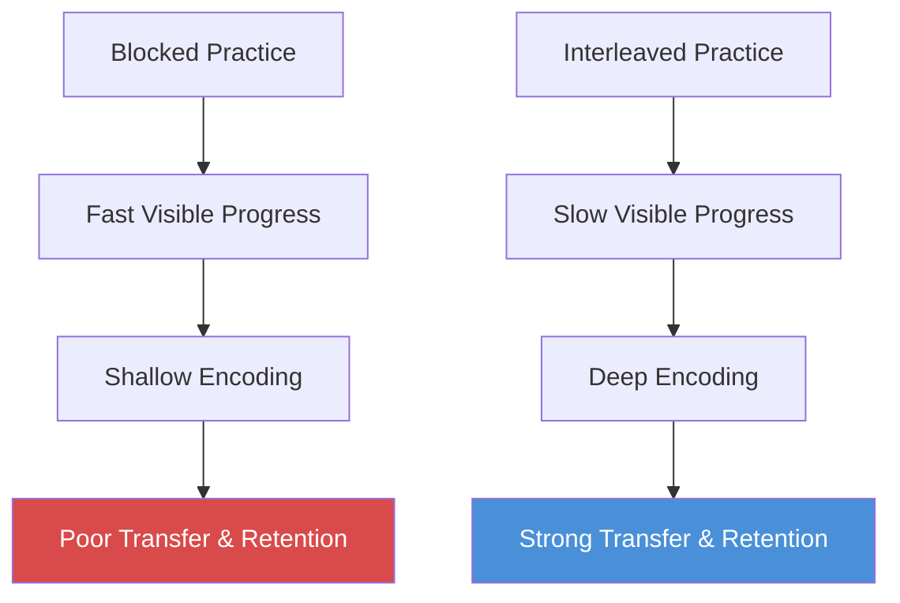

This diagram shows the paradox at the heart of Bjork's research: the training method that feels worse consistently produces better long-term results.

> [!tip] Core Insight
> The feeling of learning and the fact of learning are inversely related. The struggle IS the learning. The cult of visible, immediate progress is antithetical to deep development.

<b style="color: #27ae60">The struggle IS the learning</b> — the lesson is unsettling for anyone who equates progress with smooth mastery. It means that the most effective learning environments are often the least pleasant ones, and that student evaluations may systematically punish the teachers whose methods produce the deepest understanding.

The implications extend far beyond the classroom:
- Corporate training programmes that prioritise smooth, satisfying experiences may be optimising for employee happiness at the expense of actual skill development
- Medical education that shields trainees from difficult cases too early may produce confident but fragile practitioners
- Self-directed learners who choose the study method that feels most productive are likely choosing the least effective one
- <b style="color: #e74c3c">The fluency illusion</b> — the tendency to confuse ease of processing with depth of understanding — is the root of the problem
  - When information goes in smoothly, we feel we know it
  - When it goes in with friction, we feel confused
  - The friction is doing more work than the smoothness — but our internal monitoring system reports the opposite

> [!example] **The Karate Kid Problem — Wax On, Wax Off**
> - Epstein uses a metaphor drawn from pedagogy research: the best teachers are like Mr Miyagi in *The Karate Kid* — their methods look pointless or irrelevant until the student suddenly discovers that the "wasted" practice has built exactly the skills they need
> - But unlike the movie, real students do not get a dramatic reveal — they often never realise that the difficult, frustrating practice was what produced their competence
> - They attribute their later success to their own talent or to the later, more "relevant" training, not to the early struggle that built their foundation
> - This creates a systematic bias against desirable-difficulties methods: the teachers who use them get no credit, and the students who benefit from them do not know what helped them
> **The lesson:** The most effective training looks the least effective in real time — and the people who benefit from it often do not know what helped them.

---

## Chapter 5: Thinking Outside Experience — Analogical Reasoning

*The generalist's most powerful cognitive weapon is the distant analogy — and the further the analogy reaches, the more likely it is to produce a genuine breakthrough.*

- This chapter makes the case that <b style="color: #2980b9">cross-domain analogical thinking</b> is the primary engine of creative breakthroughs — and the generalist's most powerful cognitive tool
- Epstein distinguishes between two types of analogy:
  - <b style="color: #e74c3c">Surface analogies</b> — problems that look similar — come to mind easily but often mislead because the resemblance is cosmetic
  - <b style="color: #27ae60">Deep structural analogies</b> — problems that work the same way but look entirely different — require conscious effort but produce genuine insight
- The key research finding: most people default to surface analogies and need deliberate training — or exposure to multiple domains — to reach for structural ones

> [!example] **Johannes Kepler and Planetary Motion**
> - Kepler did not crack the problem of planetary motion by staring harder at astronomical data
> - He did it by systematically importing analogies from entirely unrelated domains
> - He compared the sun's influence on planets to light radiating from a source — both weaken with distance
> - He compared it to magnets attracting iron — force acting at a distance without physical contact
> - He imagined boats being pushed by river currents and brooms sweeping surfaces
> - Each analogy captured one aspect of the gravitational relationship; none captured it perfectly; together, they built the conceptual scaffolding for a new physics
> - Epstein notes that Kepler used more analogies per page than any other scientist of his era — it was not a random habit but his central method
> **The lesson:** Kepler was not a better astronomer than his peers. He was a better analogiser.

---

> [!example] **Karl Duncker's Radiation Problem**
> - Subjects must figure out how to destroy a tumour with radiation without damaging the surrounding tissue
> - The solution is to use multiple weak beams converging from different directions so that only the tumour receives a lethal dose
> - When given no prior analogous story, almost nobody solves it
> - When given one prior story with a parallel structure — a general who divides his army to converge on a fortress from multiple roads — about 30% of subjects solve the problem
> - When given two analogous stories and told to use them, the success rate jumps to approximately 80%
> - Crucially, when given two analogous stories without being told to use them, subjects still performed better — the mere presence of multiple analogies primed structural thinking
> - The most successful subjects could articulate the shared structure: "converging from multiple directions" — this abstract principle was the transferable insight
> **The lesson:** Multiple distant analogies are more powerful than a single close one. Each highlights a different structural feature, and together they make the deep structure visible.

> [!example] **Darwin and the Malthusian Insight**
> - Darwin's breakthrough on natural selection came not from studying animals more carefully but from reading Thomas Malthus on human population
> - Malthus argued that population growth would always outstrip food supply, creating competition for scarce resources
> - Darwin imported the concept into biology: organisms produce more offspring than can survive, so those best adapted to their environment are more likely to reproduce
> - The analogy was between economics and biology — two domains with no obvious surface similarity
> - Darwin himself noted in his notebooks that the Malthus reading was the moment the theory crystallised
> **The lesson:** The most important analogy in the history of biology came from a completely different field.

---

> [!example] **The Ambiguity Problem — Northwestern Study**
> - Researchers Dedre Gentner and colleagues at Northwestern gave business students strategic problems and asked them to generate solutions
> - Students who first compared multiple case studies — even superficially different ones — produced better solutions than those who studied a single case in great depth
> - The act of comparing cases forced students to extract structural principles rather than memorising surface details
> - Students who studied one case deeply were more likely to get trapped in the specifics of that case
> - The comparison group generated more creative strategies and were better at transferring their solutions to novel problems
> - Gentner calls this process "structural alignment" — comparison forces the mind to find common relational structures
> **The lesson:** If you want to understand a problem deeply, study it alongside a superficially different problem that shares its structure.

Epstein also covers the <b style="color: #2980b9">inside view versus outside view</b> distinction, drawn from Kahneman and Lovallo:

| Dimension | Inside View | Outside View |
|-----------|------------|-------------|
| **Focus** | Unique internal details of this specific case | Reference class of structurally similar past cases |
| **Method** | Deep immersion in specifics | Analogy to base rates |
| **Confidence** | Increases with more detail | Stays calibrated to evidence |
| **Accuracy** | Degrades with more detail | Improves with broader comparison |
| **Typical error** | Overestimates uniqueness, extreme predictions | May miss genuinely unique factors |

---

<b style="color: #e74c3c">The inside view produces systematically worse predictions</b>:
- Private equity investors overestimated their own projects' returns by approximately 50% until forced to compare their project to analogous external projects
- The more internal details people considered, the more extreme and inaccurate their judgments became
- A study of major infrastructure projects found that 90% went over budget — largely because managers took the inside view, focusing on the unique features of their project rather than asking, "What usually happens with projects like this?"
- <b style="color: #27ae60">The outside view is, structurally, an analogy</b>: this situation is like those situations, so expect similar outcomes
- The generalist who has encountered many different domains naturally defaults to the outside view because they have more reference classes to draw on

> "The more information experts had, the more extreme their predictions." — David Epstein

The chapter connects analogical thinking to a specific cognitive process that Gentner has studied for decades:
- <b style="color: #2980b9">Structural alignment</b> occurs when the mind maps the relational structure of one situation onto another
- The process requires temporarily ignoring surface features — which look different — and attending only to the relationships between elements
- This is cognitively expensive and requires working memory resources that surface matching does not
- Training in multiple domains naturally develops the habit because you encounter the same deep structures in different surface forms
- Without multi-domain experience, you never encounter the "same structure, different surface" pattern often enough to develop the skill automatically
- This is why business school case studies are more effective when taught comparatively than when taught one at a time — the comparison forces structural alignment

> [!tip] Core Insight
> When facing a novel problem, generate analogies from as many distant domains as possible before committing to a solution. When predicting outcomes, always compare to a reference class rather than immersing yourself in unique details.

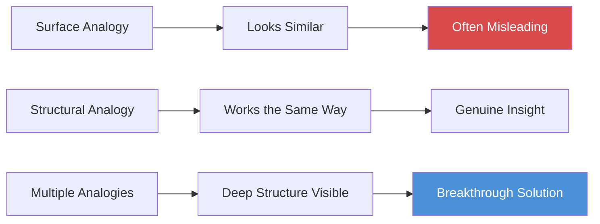

This diagram maps the chapter's hierarchy of analogy: surface resemblance misleads, structural mapping reveals, and multiple structural analogies together illuminate the deep pattern that produces breakthroughs.

The chapter connects analogical thinking directly to range:
- The person with experience in only one domain can only generate analogies from that domain — and those analogies are usually surface-level because they are too close to the problem
- The person with experience across multiple domains has a vastly richer library of structural templates to draw on
- <b style="color: #27ae60">Breadth is literally the raw material of analogical thinking</b> — you cannot map from a domain you have never encountered
- This is why the generalist who "wastes" time sampling across fields is actually building the cognitive infrastructure that produces breakthrough insights
- The specialist, by contrast, becomes trapped in what Epstein calls a <b style="color: #2980b9">"cognitive tunnel"</b> — able to see deep into one domain but unable to see across to any other
- Gentner's research quantifies this: when asked to solve a problem, people with experience in a single domain generate on average 1.5 analogies, nearly all from that domain; people with experience across three or more domains generate 3-4 analogies from multiple fields
- The multi-domain thinkers not only generate more analogies but generate more structurally diverse ones — increasing the probability that at least one will capture the deep structure of the problem

Across every wicked domain Epstein examines — from Tetlock's 20-year forecasting tournament to InnoCentive's open-innovation challenges to long-run career outcomes — generalists consistently outperform specialists, with the advantage widening as the environment grows more ambiguous.

> [!example] **The Ambiguity Experiment — Lab vs Real World**
> - Researchers gave participants problems with ambiguous instructions that could be interpreted in multiple ways
> - Participants who had training in a single domain consistently interpreted the ambiguous problem through the lens of their training — even when that interpretation led to inferior solutions
> - Participants with broad experience across domains were more likely to consider multiple interpretations and select the one that best fit the problem's actual structure
> - The single-domain participants were not stupid — they were victims of their own expertise, which pre-selected the interpretation before conscious deliberation could intervene
> - The researchers concluded that domain diversity functions as a kind of cognitive insurance against premature commitment to a single problem framing
> **The lesson:** Breadth does not just provide more analogies — it prevents the tunnel vision that makes specialists unable to see the problem as it actually is.

---

## Chapter 6: The Trouble with Too Much Grit — Match Quality and When to Quit

*Grit without match quality is misdirected persistence — the stubborn continuation of a path that does not suit you, justified by sunk costs.*

- This chapter mounts a careful, evidence-based challenge to one of the most popular ideas in modern self-improvement: Angela Duckworth's concept of **grit**
- <b style="color: #2980b9">Match quality</b> — the fit between who you are and what you do — is one of the strongest predictors of both performance and satisfaction
  - But it can only be discovered through action, not introspection
  - You cannot know whether a path suits you until you walk it for a while
- <b style="color: #27ae60">The optimal career strategy involves a period of deliberate experimentation</b> — testing different paths, extracting information about fit, and pivoting when the information warrants it
- Economists call this <b style="color: #2980b9">"learning by doing"</b> — you invest short periods in multiple areas to gather information, then commit to the area where the evidence of fit is strongest

> [!example] **Scottish vs English University Systems (Ofer Malamud)**
> - In Scotland, students sampled broadly across disciplines before declaring a major
> - In England, students committed to a single field at the point of entry
> - The Scottish students started their specialisation later and with fewer domain-specific skills
> - But they ended up with better career outcomes, higher earnings, and — critically — fewer costly career switches later in life
> - Early commitment did not eliminate the need to switch; it just delayed the switch and made it more expensive
> - The Scottish system's "waste" of broad exploration turned out to be an investment that paid dividends over an entire career
> - Malamud's data showed that the late-committing Scottish graduates were roughly 40% less likely to switch careers than the early-committing English graduates
> **The lesson:** Sampling broadly before committing is not indecisiveness — it is optimal information gathering.

The economics of match quality are striking:
- Economists have modelled the match-quality problem as a <b style="color: #2980b9">"multi-armed bandit"</b> problem — you have multiple slot machines (career paths) with unknown payoff rates, and you must decide how much time to spend sampling before committing to one
- The optimal solution from mathematics: sample broadly at first, then gradually narrow as you accumulate information about the payoff rates
- The mistake most people make: they commit too early, before they have enough information to identify the best option
- The mistake the culture encourages: treat any sampling period as wasted time rather than as the optimal information-gathering strategy it mathematically is
- <b style="color: #27ae60">The economically optimal strategy looks irresponsible by conventional standards</b> — it involves trying many things, quitting most of them, and committing late
- This creates a painful social dynamic: the person pursuing the mathematically optimal strategy is judged negatively by peers who committed early, even though the early committers are, on average, making a suboptimal choice

---

> [!example] **The Dark Horse Project (Harvard, Todd Rose and Ogi Ogas)**
> - Researchers studied people who were both fulfilled and successful across an enormous range of fields — from a dog-show judge to a NASA astronaut to a celebrity sommelier
> - They expected to find common traits — grit, ambition, or early clarity of purpose
> - What they found instead was a near-universal pattern: virtually all of these people had followed winding, non-linear paths that they themselves considered abnormal at the time
> - They had experimented, quit things, changed direction, and eventually stumbled into the work that suited them
> - Many reported feeling embarrassed by their winding paths until they realised that the winding was what had led them to fit
> - Rose and Ogas called this "the dark horse mindset" — the willingness to prioritise personal fulfilment over conventional achievement markers
> **The lesson:** The straight-line career that looks impressive on a CV turned out to be the exception, not the rule.

Epstein then turns his attention to **grit** and its limitations:
- Duckworth's research shows that grit — defined as perseverance and passion for long-term goals — predicts success in specific, measurable contexts
- At West Point's notorious Beast Barracks, grittier cadets were more likely to survive the brutal initial training period
- But there is a twist:
  - The West Point graduates who were **most** "invested" in the Army — those with the highest sunk costs, the most prestigious preparatory programmes — left the military soonest after their mandatory service period ended
  - Not because they lacked grit, but because they discovered better-fitting options
  - Their investment in the path made them better at enduring it — <b style="color: #e74c3c">it did not make the path better for them</b>

---

> [!example] **The West Point Sunk Cost Paradox**
> - Cadets admitted through prestigious Congressional nominations and prep school pipelines — who had invested the most in the idea of a military career before arriving — were the ones most likely to leave after their mandatory five-year service commitment
> - Cadets who had arrived through less prestigious pathways — ROTC, direct applications, enlisted-to-officer programmes — were more likely to stay for a full career
> - The heavily invested cadets had proven their grit by surviving West Point, but their prior investment had been in a path chosen before they had enough information to know whether it suited them
> - Their grit carried them through — but did not generate match quality
> **The lesson:** Persistence through a bad fit is not grit — it is waste. The gritty person on the wrong path is just a persistent sufferer.

The <b style="color: #2980b9">Grit Scale</b> conflates two very different things:
- **Work ethic** — the willingness to persist through difficulty, which is valuable everywhere
- **Consistency of interests** — sticking with the same pursuit over time, which is only valuable if match quality has been established
- A person who works extremely hard across multiple domains — switching paths when the evidence warrants it — scores low on grit but may be making the strategically optimal career decisions
- The scale cannot distinguish between productive persistence and stubborn attachment to a poor-fitting path

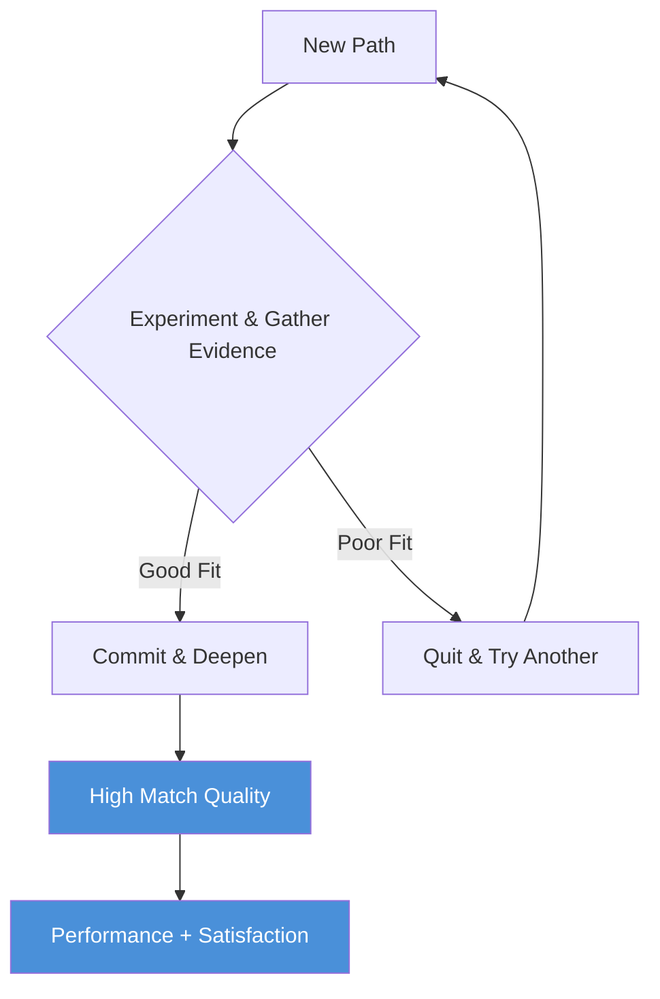

This diagram shows the match-quality discovery process: experimentation, evidence gathering, and strategic quitting are not signs of failure but features of the optimal search strategy.

> [!example] **Levitt's Coin-Flip Experiment (Freakonomics)**
> - Steven Levitt ran a study through the Freakonomics website where people struggling with a major life decision — should I quit my job, end my relationship, move to a new city — were instructed to flip a coin
> - Heads meant make the change; tails meant stay
> - Six months later, those who had been told by the coin to make the change were happier than those told to stay
> - The effect held regardless of the domain — career, relationship, or geography
> - People are, on average, too slow to quit
> - Levitt concluded that the status quo bias is powerful enough that even a random nudge toward change improves outcomes
> **The lesson:** The bias toward staying is stronger than the bias toward changing, and it costs people more than they realise.

---

The research on **sunk costs** reinforces Levitt's findings:
- Daniel Kahneman and Amos Tversky demonstrated that people weigh losses roughly twice as heavily as equivalent gains — <b style="color: #2980b9">loss aversion</b>
- When applied to career decisions, this means people stay in ill-fitting jobs, relationships, and training programmes far longer than an objective analysis of future prospects would warrant
- <b style="color: #e74c3c">The question is never "how much have I invested?"</b> — it is "given what I now know, what should I do next?"
- Seth Godin's concept of "the Dip" is relevant here: every new pursuit has a valley between initial excitement and eventual competence, and the skill is distinguishing between a temporary dip (which you should push through) and a dead end (which you should abandon)
- Epstein argues that most people err on the side of pushing through too many dead ends because quitting feels like moral failure

> "Compare yourself to yourself yesterday, not to younger people who aren't you." — David Epstein

> [!tip] Core Insight
> Grit without match quality is misdirected persistence. The hardest and most important career skill is learning when to quit one path and try another.

Epstein makes a final, important distinction in this chapter:
- <b style="color: #27ae60">Strategic quitting is not the same as giving up</b>
- Giving up is abandoning effort entirely — collapsing under difficulty
- Strategic quitting is reallocating effort from a poor-fit pursuit to a better-fit one — it requires MORE courage than staying, not less
- The person who quits a prestigious but ill-fitting career to try something uncertain is making a bet on their own long-term match quality
- Society reads this as failure, but the research says it is optimal search behaviour
- Van Gogh "quit" six careers before finding painting — each quit was not a failure but a successful elimination of a poor match

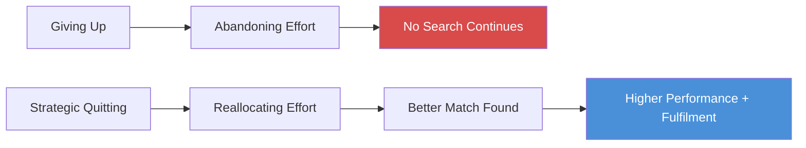

This diagram distinguishes the two forms of quitting: giving up ends the search entirely, while strategic quitting redirects effort toward a better-fitting path.

---

## Chapter 7: Flirting with Your Possible Selves — Short-Range Planning

*The conventional wisdom — set a long-term goal and work backward — is exactly wrong for most people. Self-knowledge does not precede experience; it follows from it.*

- Epstein argues that the conventional wisdom about career planning — set a long-term goal and work backward — is exactly wrong for most people
- The better strategy is <b style="color: #2980b9">short-range planning</b>: test, learn, and adjust in rapid cycles, keeping maximum optionality for as long as the information warrants
- This contradicts the entire genre of career advice that tells people to "begin with the end in mind"

> [!example] **Frances Hesselbein and the Girl Scouts**
> - Frances Hesselbein became CEO of the Girl Scouts of the USA — the largest organisation for women and girls in the world — without ever planning to have a career at all
> - In her twenties, she was asked to lead a troop of ten Girl Scouts in her small Pennsylvania town
> - She said she would do it temporarily
> - One thing led to another: more troops, then a regional role, then a national committee
> - At 54, she was asked to lead the entire organisation
> - She transformed it, making it diverse and modern, and later founded a leadership institute that bore her name
> - Peter Drucker called her the best CEO in America
> **The lesson:** Her path was a series of short-term experiments, each one revealing the next step. She never had a five-year plan.

---

> [!example] **Herminia Ibarra's Career Changers (INSEAD)**
> - Ibarra, an organisational behaviour professor, studied mid-career professionals going through career transitions
> - She found that the conventional advice — "figure out who you are, then find a matching career" — fails because self-knowledge does not precede experience
> - It follows from it
> - You cannot discover who you are through introspection alone
> - You discover it through action — by testing different possible selves and seeing which ones feel right
> - The successful career-changers in her research did not plan their transition — they experimented their way into it
> - They tried side projects, took on temporary roles, volunteered in new fields, and gradually moved toward the work that generated energy rather than drained it
> - Ibarra called these activities "identity experiments" — low-cost ways to try on new professional selves before committing
> **The lesson:** Identity is not a fixed thing to be discovered — it is a moving target to be constructed through action.

Epstein also invokes the <b style="color: #2980b9">end of history illusion</b>, identified by psychologist Dan Gilbert:
- In studies, people of all ages readily acknowledged that they had changed enormously over the previous ten years — their tastes, values, friendships, and goals had all shifted
- But those same people consistently predicted that they would change very little over the **next** ten years
- Every age group believes it has arrived at the person it will be forever — this is demonstrably wrong
- Personality traits, especially openness and conscientiousness, continue to shift well into middle age
- A 20-year-old, a 40-year-old, and a 60-year-old each believe they are finally the finished version of themselves — and each is wrong
- Gilbert's data showed that the magnitude of predicted future change was consistently far smaller than the magnitude of actual past change — at every age
- The effect held across every dimension Gilbert tested: personality, core values, personal preferences, and even physical taste in food and music
- Participants were willing to pay significant sums to attend a concert by their current favourite band ten years in the future — even though they would not pay to attend a concert by their favourite band from ten years ago

---

The implication:
- <b style="color: #e74c3c">Early career commitments are predictions about a person who does not yet exist</b>
- The 22-year-old who commits to a lifetime in accounting is making a bet about the preferences and abilities of a 35-year-old stranger
- The more important the decision, the more reason to delay it until you have better information about who you will become
- This is not laziness or indecision — it is rational response to genuine uncertainty about one's own future self

Paul Graham, the Y Combinator founder, captures the principle:
- <b style="color: #27ae60">Hard work WITHOUT premature commitment</b> — the combination that conventional career advice cannot accommodate because it demands both hard work AND early commitment as a single package
- Graham advises young people to "stay upwind" — keep options open, develop general capabilities, and let the specific path emerge from experience

> [!example] **Django Reinhardt's Adaptation**
> - Reinhardt, the legendary jazz guitarist, was a Romani musician in France who lost the use of two fingers on his fretting hand in a caravan fire at age 18
> - Rather than abandoning music or trying to replicate his previous technique, he invented an entirely new playing style using only his two remaining functioning fingers and his thumb
> - The new technique produced a sound no one had ever heard before — and it became one of the most distinctive and influential styles in jazz history
> - Reinhardt could not have predicted or planned this path — it emerged from his willingness to adapt when circumstances forced a change
> - His greatest creative achievement was inseparable from his greatest personal setback
> **The lesson:** The capacity to adapt when plans fail matters more than the quality of the original plan.

---

> [!example] **The Fencing Coach Analogy (Ibarra)**
> - Ibarra compared career development to learning fencing: a beginner who tries to plan the perfect sequence of moves in advance will be outmanoeuvred by an opponent who adapts in real time
> - The best fencers do not plan — they react to the flow of the match, adjusting their approach based on what the opponent reveals
> - Similarly, the best career-changers did not plan their new identity — they reacted to what each experiment revealed about their own preferences and abilities
> - The plan-and-execute model assumes you know the terrain in advance; the test-and-learn model acknowledges that you do not
> **The lesson:** In an uncertain world, adaptation speed beats planning quality.

> [!tip] Core Insight
> Self-knowledge follows from experience, not introspection. The optimal career strategy is short-range planning: test, learn, and adjust in rapid cycles.

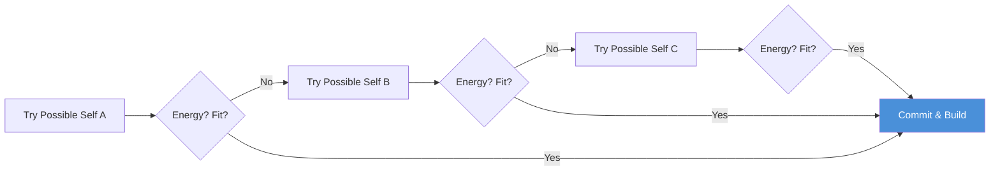

This diagram maps Ibarra's experimental identity model: try, evaluate, and move forward only when genuine fit emerges from the experiment.

The chapter draws a sharp distinction between two career development philosophies:

| Dimension | Plan-and-Implement | Test-and-Learn |
|-----------|-------------------|----------------|
| **Assumption** | You know who you are at 22 | You discover who you are through action |
| **Method** | Set long-term goal, work backward | Short experiments, rapid iteration |
| **Time horizon** | 10-20 year plan | 6-18 month cycles |
| **Quitting** | Failure of character | Successful information gathering |
| **Heroes** | Tiger Woods, child prodigies | Federer, Van Gogh, Hesselbein |
| **Works best in** | Kind environments | Wicked environments |

Epstein acknowledges that test-and-learn is psychologically harder because it requires tolerating ambiguity:
- The plan-and-implement model provides a comforting narrative — you know where you are going, even if you are wrong
- The test-and-learn model provides better outcomes — but requires sitting with uncertainty about your own identity for extended periods
- Most career advice is written by people who found their calling early and cannot imagine the winding path as anything other than waste
- <b style="color: #e74c3c">The advice industry systematically misrepresents the process by which most successful people actually find their work</b>

---

## Chapter 8: The Outsider Advantage — Solving Problems with Distance

*For problems that have resisted insider expertise, the further a solver's background is from the problem domain, the more likely they are to crack it.*

<b style="color: #27ae60">Distance from the problem domain can be the decisive advantage</b> — for problems that have resisted insider expertise. This chapter presents some of the book's most compelling and surprising evidence.

> [!example] **InnoCentive's Outsider Solvers**
> - InnoCentive is an open-innovation platform where companies post problems that their internal teams have been unable to solve, offering cash prizes
> - Karim Lakhani, a Harvard professor, studied the results and found a startling pattern: the further a solver's expertise was from the problem domain, the MORE likely they were to produce a winning solution
> - A chemist solved an oil-spill cleanup problem by adapting an idea from the concrete industry — a vibrating device that keeps concrete from hardening was structurally the same solution needed to keep oil from congealing in Arctic water
> - A retired telecom engineer solved a NASA problem about predicting solar particle storms using methods from his entirely unrelated field
> - An agricultural scientist solved a pharmaceutical problem by applying crop-dusting principles to drug delivery
> - The pattern held across hundreds of challenges and multiple years of data
> - Lakhani concluded that the outsider's advantage was not luck — it was structural
> **The lesson:** Distance from the problem was an asset, not a liability.

---

> [!example] **Jill Viles and the Muscular Dystrophy Insight**
> - Jill Viles had Emery-Dreifuss muscular dystrophy, a rare condition that wasted her muscles
> - She was not a scientist, but she was an obsessive observer of her own body
> - One day she noticed that an Olympic sprinter had a physique strikingly similar to her own — an unusual musculature she recognised from the mirror
> - She wrote to scientists suggesting that her dystrophy and the sprinter's exceptional muscle development might share a genetic basis — specifically, a connection involving the protein myostatin
> - The scientists dismissed her; she was a layperson with no credentials
> - Years later, the molecular connection she had intuited was confirmed: both conditions involved myostatin mutations, one causing deficiency and one causing overexpression
> - Her insight was a structural analogy — two superficially opposite conditions (muscle wasting vs muscle hypertrophy) linked by the same underlying mechanism
> **The lesson:** An outsider with zero domain expertise saw what specialists could not because she was not constrained by their framing.

Specialists suffer from two related cognitive traps that explain why insiders get stuck:

<b style="color: #2980b9">The Einstellung effect</b>:
- Defaulting to a familiar solution even when a better one exists, because the familiar solution springs to mind first and blocks consideration of alternatives
- Chess experts, shown positions where a familiar but suboptimal move exists alongside an unfamiliar but superior one, tend to choose the familiar move
- <b style="color: #e74c3c">Their expertise actively prevents them from seeing the better option</b>
- Eye-tracking studies confirmed it: their gaze was literally drawn to the familiar pattern and away from the novel solution
- The mechanism is not laziness — it is that the expert's pattern-matching system fires so quickly that it pre-empts any exploration of alternatives
- In Merim Bilali's chess research, masters who were shown a board with a well-known five-move checkmate AND a lesser-known three-move checkmate consistently went for the longer, familiar solution — their eyes gravitated to the known pattern and avoided the better one

---

<b style="color: #2980b9">Cognitive entrenchment</b>:
- Deep expertise making people unable to frame a problem in any way other than the one their training dictates
- When accountants deeply trained in one set of tax rules were given problems using new rules, they performed **worse** than novices
- Their deep practice had not made them flexible experts — it had made them rigid ones
- Bridge players with decades of experience, given a game with slightly altered rules, were outperformed by intermediates
- <b style="color: #e74c3c">The deep grooves of expertise had become trenches they could not climb out of</b>
- The phenomenon is distinct from the Einstellung effect: Einstellung is about a specific solution blocking a better one; entrenchment is about an entire way of framing the problem becoming inescapable

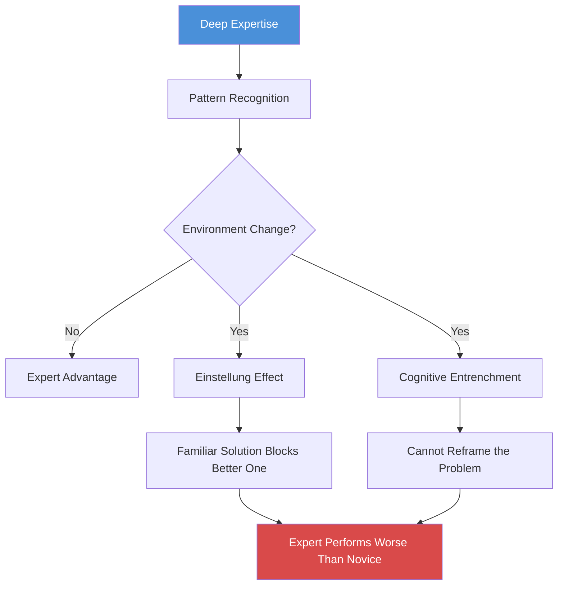

This diagram shows how deep expertise, normally an advantage, becomes a trap the moment the environment changes. The same pattern recognition that enables mastery becomes the cage that prevents adaptation.

> "Having one foot outside your world gives you the ability to make connections." — David Epstein

---

> [!example] **Don Swanson's Undiscovered Public Knowledge (University of Chicago)**
> - Information scientist Don Swanson demonstrated "undiscovered public knowledge" — important connections between published findings in different scientific fields that no one has made because specialists do not read outside their silo
> - Swanson found that the published literature on fish oil and the published literature on Raynaud's disease each contained information that, if combined, would suggest fish oil as a treatment for Raynaud's
> - The connection existed in the published record for years
> - No one saw it because the fish oil researchers did not read the Raynaud's journals, and vice versa
> - It took a librarian — someone whose profession is connecting disparate bodies of knowledge — to see it
> - Swanson went on to find eleven such connections, several of which led to successful clinical treatments
> - He coined the term "undiscovered public knowledge" to describe information that exists in the scientific record but remains invisible because it is trapped in separate silos
> **The lesson:** As knowledge specialises, the interfaces between silos become the most fertile ground for discovery.

> [!example] **The Foxborough Company — Outsiders in Industrial Chemistry**
> - A large chemical company posted an open challenge to find a way to prevent a specific chemical compound from crystallising during manufacturing
> - Their internal chemists — world experts in the compound — had worked on the problem for months without success
> - The winning solution came from a scientist trained in a completely different branch of chemistry, who recognised the crystallisation problem as structurally similar to a well-known problem in his own field
> - He applied a standard technique from his domain that the internal chemists had never encountered
> - The internal chemists knew too much about their specific compound to see the general structural problem it represented
> **The lesson:** Insider knowledge can be a prison. The specialist sees the specific case; the outsider sees the class of cases.

Why does the outsider advantage work? Epstein identifies three mechanisms:
- **Fresh framing**: the outsider does not know the "correct" way to frame the problem, so they frame it from first principles — sometimes hitting on a framing that insiders dismissed or never considered
- **Cross-domain transfer**: the outsider brings solution templates from their own domain that may structurally fit but would never occur to an insider
- **Absence of sunk costs**: the outsider has no intellectual investment in previous failed approaches and can evaluate all options without the drag of prior commitment

> [!tip] Core Insight
> The person who can see across disciplinary boundaries is rare by definition — because the system trains everyone to look within them. Distance from a problem is often the decisive advantage.

---

## Chapter 9: Lateral Thinking with Withered Technology — Recombination over Invention

*Innovation comes less from inventing entirely new things than from combining old, well-understood things in new ways — and the quality of recombination depends on the breadth of the recombiner.*

<b style="color: #27ae60">Innovation comes less from inventing entirely new things than from combining old, well-understood things in new ways</b> — the chapter's hero is Gunpei Yokoi of Nintendo.

> [!example] **Gunpei Yokoi and the Game Boy (Nintendo, 1989)**
> - Yokoi was an electronics engineer at Nintendo when it was still a playing-card company
> - He was a mediocre engineer by his own admission — he could never compete with the brilliant specialists at Sony or Toshiba
> - But he had a gift for seeing old technology with fresh eyes
> - The Game Boy used a processor that was already outdated and a greenish monochrome display when competitors offered colour
> - But it was cheap, durable, portable, and — most importantly — it had Tetris
> - The Game Boy dominated the portable gaming market for over a decade
> - Competitors who chased the cutting edge produced technically superior devices that were expensive, fragile, battery-hungry, and commercially irrelevant
> - Yokoi's explicit philosophy was to use mature, well-understood components in ways their creators had not imagined
> **The lesson:** Cross-domain creativity mattered more than raw technical specs.

> [!abstract] Lateral Thinking with Withered Technology (Yokoi's Method)
> 1. Identify mature, cheap, well-understood technology components that are no longer cutting-edge
> 2. Study them for properties and capabilities that their original domain does not exploit
> 3. Combine components from different technology generations and domains
> 4. Optimise for user experience and reliability rather than technical specifications
> 5. Let competitors chase the cutting edge while you recombine the proven

---

> [!example] **Andy Ouderkirk and 3M's Cross-Division Inventions**
> - Andy Ouderkirk, a prolific inventor at 3M with dozens of patents, studied the company's most successful products and found that the most impactful ones combined technologies from DIFFERENT divisions
> - Reflective road signs combined 3M's knowledge of adhesives with their knowledge of abrasives with their knowledge of light-management films — three separate internal specialities that no single specialist would have brought together
> - Ouderkirk found that the most prolific inventors at 3M were not the deepest specialists
> - They were people with breadth across multiple technology platforms, who could see opportunities at the intersections
> - He called these cross-divisional inventions, and they represented a disproportionate share of 3M's most commercially important products
> - Ouderkirk himself had moved between divisions multiple times — each move gave him knowledge of a new technology domain that he could later recombine
> **The lesson:** The best innovations came from people who had range across the company's knowledge, not from those who went deepest into one area.

The analysis of **18 million scientific papers** reinforces this finding at scale:
- Researchers at Northwestern and the University of Chicago examined what predicted whether a paper would become a "hit" — a highly cited, field-shaping contribution
- The answer was not novelty per se
- It was the combination of a large body of conventional knowledge with an atypical knowledge source — a surprising import from an unexpected field
- <b style="color: #e74c3c">Papers that drew only from expected sources made incremental contributions</b>
- Papers that were entirely novel were often incomprehensible and ignored
- <b style="color: #27ae60">The sweet spot was 90% conventional, 10% surprise</b> — papers that combined the familiar with the unexpected
- The same pattern held across every scientific discipline the researchers examined — it was not a quirk of one field

---

<b style="color: #2980b9">Serial innovators</b> — people who produce multiple significant innovations across their careers — share a distinctive profile:
- They tend to be **"pi-shaped"**: deep expertise in at least two domains, plus broad knowledge across many
- They are not dilettantes — they are disciplined generalists who have invested significantly in more than one area
- They actively maintain breadth as a strategic resource:
  - Read widely outside their field
  - Attend conferences in unrelated disciplines
  - Cultivate hobbies that have nothing obvious to do with their work
- The contrast with the T-shaped professional (deep in one area, shallow awareness of others) is instructive:
  - T-shaped professionals make excellent specialists
  - Pi-shaped professionals make the connections that create new fields

| Professional Shape | Description | Strength | Limitation |
|-------------------|-------------|----------|------------|
| **I-shaped** | Deep in one domain only | Deep technical mastery | Cannot see beyond silo |
| **T-shaped** | Deep in one domain, broad awareness | Can collaborate across teams | Awareness is shallow |
| **Pi-shaped** | Deep in two+ domains, broad across many | Makes connections that create new fields | Takes longer to develop |

The pi-shaped innovator takes longer to build but has the combinatorial advantage that produces breakthrough contributions.

Epstein also introduces the concept of <b style="color: #2980b9">"knowledge networks"</b>:
- Every innovator carries a personal network of knowledge — the sum of all domains they have encountered and the connections between them
- Narrow specialists have dense networks in one area but no bridges to other areas
- Generalists have sparser networks in any single area but rich bridges between areas
- <b style="color: #27ae60">The bridges are where innovation lives</b> — not in the densest clusters of domain-specific knowledge, but in the connections between clusters
- This is the structural explanation for why 3M's cross-divisional inventions outperformed single-division inventions: they drew on more bridges in the company's collective knowledge network
- Individual inventors with the most bridges — those who had worked across multiple divisions, attended conferences in unrelated fields, or maintained diverse hobbies — produced the most impactful patents

> [!example] **Claude Shannon — The Father of Information Theory**
> - Shannon is widely considered the most important electrical engineer of the twentieth century
> - His foundational paper on information theory drew on Boolean algebra, thermodynamics, probability theory, and cryptography — an extraordinary range of domains for a single paper
> - Shannon was also a dedicated tinkler — he built juggling machines, flame-throwing trumpets, and a computer that could solve Rubik's Cube
> - His hobbies were not distractions from his serious work — they were expressions of the same combinatorial curiosity that produced his breakthroughs
> - Shannon himself said that his most productive method was to work on multiple problems simultaneously, letting insights from one domain spark ideas in another
> **The lesson:** The breadth that looks like distraction is often the combinatorial engine that produces the deepest contributions.

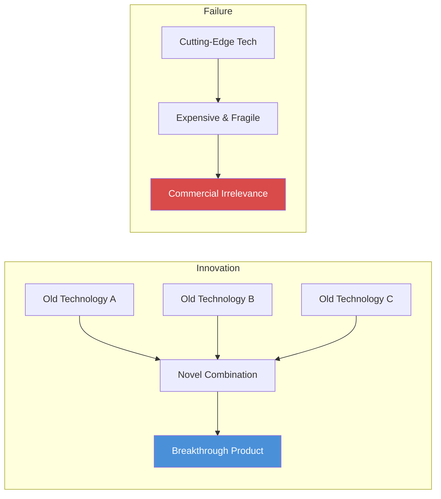

Yokoi's approach — recombining mature, understood components — consistently beats the strategy of chasing the cutting edge. Innovation is a recombination problem, and breadth determines the quality of the recombination.

> [!tip] Core Insight
> Innovation is a recombination problem. You cannot combine what you do not know. The generalist who has sampled widely has a richer combinatorial library — and it is from that library that breakthroughs emerge.

Epstein also tells the story of how the comic book industry illustrates recombination at scale:
- Researchers studying comic book creators found that the most commercially successful and critically acclaimed comics were produced by teams that combined established genre conventions with elements imported from outside the genre
- Teams composed entirely of genre veterans produced predictable, incremental work
- Teams with some members from outside the genre — or members who worked across multiple genres — produced the "hits"
- <b style="color: #27ae60">The pattern was identical to the 18-million-paper finding</b>: 90% convention plus 10% surprise equals maximum impact

> [!example] **The Nintendo Wii — Yokoi's Legacy (2006)**
> - When Nintendo launched the Wii in 2006, competitors Sony and Microsoft were locked in an arms race over processing power and graphics quality
> - Nintendo, following Yokoi's philosophy even after his death, used an underpowered processor and low-resolution graphics — but paired them with a novel motion-control interface
> - The controller technology was not new — accelerometers and gyroscopes had existed for decades in other industries
> - Nintendo's innovation was applying this mature technology to gaming in a way that expanded the audience beyond traditional gamers
> - The Wii became the bestselling console of its generation, outselling both the PlayStation 3 and the Xbox 360
> - Sony and Microsoft's technically superior machines competed for the same narrow audience; Nintendo created a new one
> **The lesson:** Yokoi's principle endured: recombining old technology for a new audience beat chasing the cutting edge for the existing audience.

---

## Chapter 10: Fooled by Expertise — Why Foxes Beat Hedgehogs

*The most famous and confident experts are the worst at predicting the future — and more information makes them worse, not better.*

- Philip Tetlock's <b style="color: #2980b9">20-year forecasting study</b> is one of the most important bodies of evidence in the book, and Epstein gives it the extended treatment it deserves
- In the early 1980s, Tetlock began collecting predictions from 284 experts — political scientists, economists, intelligence analysts, journalists — about geopolitical events
- He tracked **82,361 predictions** over two decades
- The results were devastating for the expert class:
  - The average expert was roughly as accurate as a dart-throwing chimpanzee
  - <b style="color: #e74c3c">The most famous, most confident, most frequently consulted experts were the WORST of all</b>
  - The relationship between fame and accuracy was inverse — the better known the pundit, the worse their predictions

Tetlock borrowed Isaiah Berlin's fox-and-hedgehog distinction to explain the pattern:

| Dimension | Hedgehog | Fox |
|-----------|----------|-----|
| **Knowledge style** | One big framework applied to everything | Many small frameworks, flexibly deployed |
| **Narrative** | Compelling, single-cause explanations | Nuanced, multi-cause, qualified |
| **Confidence** | High and unwavering | Moderate and calibrated |
| **When wrong** | Explains away the miss, never updates model | Updates beliefs incrementally with new evidence |
| **Media appeal** | High — dramatic and quotable | Low — hedging is boring on television |
| **Prediction accuracy** | Worst among all experts | Best among all experts |

---

<b style="color: #e74c3c">Hedgehogs</b> know one big thing:
- View every problem through a single powerful framework — Marxism, free-market economics, game theory
- Excellent at constructing compelling narratives that explain everything
- Exude the confidence that television producers and newspaper editors reward
- When predictions fail, they deploy self-protective explanations:
  - The timing was off
  - An unprecedented event intervened
  - They were "almost right"
- **Never update their model** — just explain away the miss
- Tetlock found that hedgehogs actually became less accurate as they accumulated more expertise — additional information gave them more ammunition for their existing framework without ever challenging it

<b style="color: #27ae60">Foxes</b> know many small things:
- Draw on multiple frameworks, tolerate ambiguity, hedge their predictions
- Crucially — update their beliefs when new evidence arrives
- Less dramatic on television, far more accurate
- The difference is not intelligence or access to information — it is a style of thinking:
  - Hedgehogs start with a theory and bend the evidence to fit
  - Foxes start with the evidence and let multiple theories compete
  - Hedgehogs seek confirmation; foxes seek disconfirmation

---

> [!example] **Tetlock's Good Judgment Project — Superforecasters**
> - Tetlock recruited thousands of ordinary people — not experts, not intelligence analysts — to forecast geopolitical events through IARPA (the intelligence community's research arm)
> - The best of them, the superforecasters, were spectacularly good
> - They beat intelligence analysts who had access to classified information
> - They beat prediction markets
> - The superforecasters had no special credentials and no security clearances
> - What they had was broad curiosity, the habit of seeking disconfirming evidence, granular probability thinking (not "probably" but "73%"), and active open-mindedness — treating their own beliefs as hypotheses to be tested rather than positions to be defended
> - When placed into teams, the best forecasters improved even further — their willingness to update made collaboration genuinely productive
> - Tetlock called their approach "dragonfly eye" — compositing many partial views into a comprehensive picture, the way a dragonfly's compound eye works
> **The lesson:** The best predictors of the future are not specialists with deep knowledge but generalists with broad perspectives and intellectual humility.

> [!example] **The Political Experts Who Got the Soviet Union Wrong**
> - Tetlock's study included predictions about whether the Soviet Union would collapse
> - The hedgehog experts on both sides — those who predicted swift collapse and those who predicted enduring stability — were wrong
> - The hedgehog hawks predicted imminent Soviet aggression that never came
> - The hedgehog doves predicted Soviet reform and renewal that never materialised
> - The foxes, who hedged their predictions and considered multiple scenarios, were closer to what actually happened — a gradual unravelling that surprised almost everyone
> - The hedgehogs on each side were more confident, more quotable, and more wrong
> **The lesson:** Confidence and accuracy are negatively correlated among experts in uncertain domains.

---

> "The most impactful inventors cross domains rather than deepen them." — David Epstein

One of Tetlock's most counterintuitive findings:
- <b style="color: #e74c3c">More information and more experience made hedgehogs WORSE, not better</b>
- Additional data gave hedgehogs more material to fold into their existing narrative, making them more confident without making them more accurate
- For foxes, more information was genuinely useful because they had the cognitive flexibility to let it change their minds
- The implication is that expertise alone is value-neutral — what determines whether knowledge helps or hinders is the cognitive style of the knower
- Tetlock found that even telling hedgehogs about their poor track record did not improve their future performance — they reframed the feedback as irrelevant to their method

> [!tip] Core Insight
> The quality of a prediction depends more on HOW you think than on WHAT you know. Breadth of perspective, not depth of expertise, predicts judgment quality in uncertain environments.

<b style="color: #27ae60">Breadth of perspective, not depth of expertise, predicts judgment quality in uncertain environments</b> — the most dangerous expert is the one who knows the most about the least, because their confidence is real, their model is powerful within its narrow domain, and they cannot see the boundaries of that domain.

Epstein connects this directly to the media ecosystem:
- Television rewards hedgehog thinking because simplicity and confidence are compelling on camera
- Audiences prefer clear, dramatic narratives to nuanced, probabilistic assessments
- The experts who get the most airtime are, by Tetlock's data, the least accurate
- <b style="color: #e74c3c">The market for expertise systematically selects for the wrong kind</b>
- Fox-style thinking — "on the one hand, but on the other hand" — is precisely what audiences find boring and unsatisfying
- The result is a public discourse dominated by the people whose judgment the evidence most thoroughly discredits

> [!abstract] Superforecaster Traits (Tetlock's Findings)
> - **Broad curiosity** — interested in many domains, not just their speciality
> - **Granular probability** — think in specific percentages, not vague categories like "probably"
> - **Active open-mindedness** — treat own beliefs as hypotheses, not identities
> - **Dragonfly eye** — composite many partial perspectives into a single picture
> - **Incremental updating** — adjust beliefs with each new piece of evidence, never in one dramatic revision
> - **Intellectual humility** — readily say "I was wrong" and mean it
> - **Perpetual beta** — never consider their forecasting model "finished"

The superforecaster profile maps almost perfectly onto Epstein's description of the ideal generalist: broad, flexible, humble, and constantly updating.

Epstein draws an important distinction between two kinds of expertise:
- <b style="color: #2980b9">Translational expertise</b> — the ability to apply known solutions to well-defined problems — is what we usually mean by "expert," and it works well in kind environments
- <b style="color: #2980b9">Integrative expertise</b> — the ability to synthesise information across domains and generate novel framings — is what wicked environments actually demand
- Tetlock's hedgehogs had enormous translational expertise; his foxes had integrative expertise
- The tragedy of the expert class is that the type of expertise the media rewards, institutions select for, and society celebrates is precisely the type that performs worst in the environments that matter most
- <b style="color: #e74c3c">We are systematically promoting the wrong kind of expert</b> — and punishing the kind the evidence says we need

> [!example] **The AIDS Researcher Who Didn't Study AIDS**
> - Epstein tells the story of a researcher who made a significant contribution to AIDS treatment not by studying AIDS itself but by studying an unrelated family of enzymes for years
> - When the connection between his enzyme research and HIV replication was discovered, his "unrelated" expertise became the key to a new class of treatments
> - He had not planned this — no one could have predicted that his particular area of expertise would become relevant to AIDS
> - The connection was visible only in retrospect, and only to someone who could see across the boundary between two specialised fields
> - Had he been pressured to abandon his "unrelated" research in favour of direct AIDS research, the breakthrough might never have happened
> **The lesson:** The research that looks irrelevant today may be the foundation of tomorrow's breakthrough — but only if we let it survive long enough for the connection to be discovered.

---

## Chapter 11: Learning to Drop Your Familiar Tools — When Expertise Kills

*Under pressure, people and organisations default to their most practised methods — even when those methods are clearly wrong for the situation. The tools become identity, and identity is something people will die rather than abandon.*

<b style="color: #e74c3c">Under pressure, people and organisations default to their most practised methods</b> — even when those methods are clearly wrong for the situation at hand. This chapter is about the lethal consequences of tool attachment.

> [!example] **The Challenger Disaster (NASA, January 28, 1986)**
> - The temperature at Cape Canaveral was 36 degrees Fahrenheit — far colder than any previous launch
> - Engineers at Morton Thiokol had strong qualitative evidence that the O-ring seals in the boosters became dangerously rigid in cold weather
> - They had observed blow-by on previous flights, and the worst cases correlated with cold launch temperatures
> - But NASA's culture was quantitative: if you could not express a concern as a number, it did not count as engineering judgment
> - The engineers tried to translate their qualitative alarm into the quantitative format NASA demanded, but the charts were unconvincing because the data was limited
> - Roger Boisjoly, the engineer with the most direct knowledge, later testified that he could not get his concerns heard because they did not fit the format the institution demanded
> - Their bosses overruled them — the launch proceeded
> - Seventy-three seconds later, the O-ring failed and seven people died
> **The lesson:** NASA did not fail to see the danger. It failed to see the danger in its own methodology.

---

> [!example] **The Mann Gulch Fire (Montana, 1949)**
> - Thirteen smokejumpers parachuted into a Montana canyon to fight what they thought was a routine fire
> - The fire blew up, and within minutes a wall of flame was racing uphill toward them
> - Their foreman, Wagner Dodge, did something no one had ever done before: he stopped running, bent down, and lit a small fire in the grass at his feet
> - As his own fire consumed the fuel around him, he lay down in the ashes and the main fire burned over him
> - He had invented what is now called an "escape fire"
> - Dodge shouted to his men to join him — they ignored him and kept running, carrying their heavy tools
> - Twelve of the thirteen died
> - The men who died could not make sense of what Dodge was doing — a firefighter lighting a fire in the path of a fire was inconceivable within their training
> **The lesson:** Dodge survived because he was willing to abandon everything he had been trained to do. His men died because they were not.

> [!example] **The South Canyon / Storm King Mountain Fire (1994)**
> - Fourteen firefighters died in nearly identical circumstances to Mann Gulch — forty-five years later
> - Investigators found that many of them had not dropped their tools even as they were being overrun
> - The tools weighed between twenty and forty pounds
> - Dropping them would have increased running speed by 15-20% — the difference between life and death
> - But the firefighters would not let go
> - One survivor later said he could not explain why he kept carrying his chainsaw — it just felt wrong to let go of it
> - Post-incident analysis revealed that several victims were found with their tools still gripped in their hands
> **The lesson:** The tools were not just tools. They were identity. A firefighter without a chainsaw is not a firefighter.

---

Karl Weick, the organisational theorist, studied these cases and identified the mechanism:
- The tools were not just tools — they were <b style="color: #2980b9">identity</b>
- A firefighter without a chainsaw is not a firefighter
- A NASA engineer without quantitative evidence is not an engineer
- <b style="color: #e74c3c">When your tools are part of who you are, setting them aside is an act of self-erasure</b> — and that is something people will die rather than do

Weick generalised the principle beyond physical tools:
- Organisations cling to familiar processes even when the processes are producing bad outcomes
- Experts cling to familiar frameworks even when the frameworks do not fit the situation
- Professionals cling to familiar identities even when those identities are liabilities
- The more deeply a tool is embedded in identity, the harder it is to set aside — and the more dangerous it becomes when the situation changes
- Weick proposed that the ability to "drop your tools" — metaphorically and literally — is a distinct skill that must be consciously cultivated
- The mechanism is deeply psychological:
  - Tools provide <b style="color: #2980b9">ontological security</b> — they tell you who you are and what you are supposed to do
  - In a crisis, when everything else is falling apart, the tools are the last source of stable identity
  - Dropping them means entering a state of terrifying openness — you are no longer a firefighter or an engineer or a doctor
  - You are just a person in a situation, with no script
  - <b style="color: #e74c3c">Most people would rather fail using a familiar method than succeed using an unfamiliar one</b> — because failure with the right tools preserves identity, while success without them challenges it

> "The challenge we all face is how to maintain the benefits of breadth... while still being able to focus." — David Epstein

---

Epstein uses these cases to argue for <b style="color: #2980b9">organisational incongruence</b> — the deliberate introduction of conflicting cultural signals:
- Tetlock's experimental work showed that organisations with cross-pressures (formal process + encouragement to dissent) learned faster and made better decisions than those with perfectly congruent cultures
- Wernher von Braun's NASA — the Apollo-era NASA, before the institutional rigidity set in — used **"Monday Notes"**:
  - An informal weekly communication system where any engineer could write directly to von Braun about concerns, bypassing the formal chain of command
  - The formal hierarchy provided structure; the informal channel provided flexibility
  - The combination produced an organisation that could handle novel problems
  - By the time of Challenger, the Monday Notes were long gone — the organisation had become culturally congruent, and that congruence killed people

> [!example] **Himalayan Expedition Teams Study (5,104 teams)**
> - Researchers studied over five thousand Himalayan expedition teams and found a striking pattern
> - Teams from cultures with strong hierarchical values reached the summit more often — but they also had MORE deaths
> - The hierarchy drove performance but suppressed dissent
> - When conditions changed unexpectedly — as they do on high-altitude mountains — the teams that could not challenge the leader's plan were the teams that died
> - Teams from cultures with more egalitarian values reached the summit slightly less often but came home alive far more reliably
> - The hierarchy was a tool — a tool that the culture would not drop even when it was lethal
> **The lesson:** The discipline is not in mastering your tools but in recognising when you are outside the domain where they apply.

> [!tip] Core Insight
> The most dangerous moment is not when you have no tools. It is when you have tools you trust, in a situation they cannot solve.

The chapter closes with a structural observation about how organisations can cultivate the ability to drop tools:
- <b style="color: #27ae60">The key is building identity around adaptability rather than around specific methods</b>
- A firefighter whose identity is "I am someone who saves lives" can drop a chainsaw; a firefighter whose identity is "I am a sawyer" cannot
- An engineer whose identity is "I solve problems" can abandon quantitative analysis when the situation calls for qualitative judgment; an engineer whose identity is "I do quantitative analysis" cannot
- NASA's Apollo-era culture succeeded because von Braun's Monday Notes created a dual identity: we are rigorous engineers AND we are willing to hear anything from anyone
- When the dual identity collapsed into the single identity of rigorous process, the organisation lost its ability to handle the unexpected

> [!example] **Karl Weick's Organisational Sensemaking**
> - Weick studied organisations that regularly face novel, high-stakes situations — aircraft carriers, emergency rooms, nuclear power plants
> - He found that the most reliable ones — which he called "high-reliability organisations" — shared a counter-intuitive feature
> - They were simultaneously structured and flexible, combining rigorous standard operating procedures with explicit encouragement to deviate from those procedures when the situation warranted it
> - The worst failures occurred in organisations that had only one mode: either pure procedure (NASA at Challenger) or pure improvisation (chaotic emergency responses)
> - The best organisations taught people to recognise when they had crossed the boundary of their tools' usefulness — and gave them permission to drop those tools without shame
> **The lesson:** Reliability does not come from rigid adherence to procedure. It comes from knowing when procedure applies and when it does not.

---

## Chapter 12: Deliberate Amateurs — Unstructured Exploration as Innovation Strategy

*Breakthrough innovation depends on maintaining space for inefficiency and breadth within systems that demand specialisation — and the "wasteful" exploration is what makes the "efficient" application possible.*

<b style="color: #27ae60">Breakthrough innovation depends on maintaining space for inefficiency and breadth</b> within systems that demand specialisation.

> [!example] **Oliver Smithies and Saturday Morning Experiments (Nobel Prize, Chemistry)**
> - Oliver Smithies won the Nobel Prize for developing gel electrophoresis — one of the foundational techniques of modern molecular biology
> - He developed it during his "Saturday Morning Experiments" — a weekly block of unstructured lab time that he protected for decades
> - On Saturday mornings, Smithies would pursue whatever curiosity had struck him during the week, with no pressure to produce publishable results
> - Most of these experiments led nowhere
> - But over a career, the ones that did lead somewhere changed biology
> - His lab notebooks show that some of his most important insights came from failures during Saturday experiments that pointed him in unexpected directions
> - He maintained the practice for his entire career — well past the point where he could have justified it on any formal metric
> **The lesson:** His Nobel-winning work was not the product of a targeted research programme. It emerged from decades of disciplined, deliberate play.

---

> [!example] **Andre Geim and Friday Night Experiments (Nobel Prize, Physics)**
> - Geim won the Nobel Prize for isolating graphene — a single-atom-thick sheet of carbon with extraordinary properties
> - He discovered it during his self-imposed "Friday Night Experiments," a practice he maintained explicitly to counteract the hyper-specialisation of modern academic science
> - Geim would invite colleagues and students to explore random curiosities using whatever equipment was available
> - The most famous Friday Night Experiment involved levitating a live frog using the diamagnetic properties of water in a powerful magnetic field — this won him the Ig Nobel Prize
> - He is the only person in history to have won both an Ig Nobel and a real Nobel
> - The graphene experiment itself was absurdly simple — he used Scotch tape to peel layers off a piece of graphite, getting thinner and thinner until he had a single layer of atoms
> - No sophisticated equipment, no massive funding — just broad curiosity applied with everyday tools
> **The lesson:** The levitating frog and graphene share a common origin: unstructured time, broad curiosity, and the willingness to pursue ideas that look foolish.

> [!example] **Arturo Casadevall's HIV Argument (Johns Hopkins)**
> - When HIV emerged in the 1980s, it was identifiable and eventually treatable only because society had previously invested in studying retroviruses — a class of virus with no known practical relevance at the time
> - Retrovirologists were studying their subject out of pure curiosity
> - Had someone demanded to know the "application" of retrovirus research in 1975, there would have been no answer
> - Yet without that prior investment, HIV would have been an invisible, incomprehensible plague
> - Casadevall used this case to argue that the current grant-funding model, which demands researchers specify practical applications in advance, is systematically destroying the exploratory research that makes applied breakthroughs possible
> - He estimated that the number of truly novel scientific findings has declined even as the number of scientists has exploded — because the funding structure punishes exploration
> **The lesson:** Hyper-focused, application-driven science is parasitic on the broad, curiosity-driven science that came before it. Without the "wasteful" breadth, the "efficient" application has nothing to apply.

---

Nobel laureates and <b style="color: #2980b9">deliberate amateurism</b>:
- Nobel laureates are **22 times more likely** than other scientists to have serious artistic hobbies — acting, painting, music, creative writing
- This is not a coincidence and not just a lifestyle preference
- The artistic engagement provides a different mode of thinking — pattern recognition through aesthetic and narrative rather than analytical frameworks — that cross-pollinates with scientific reasoning
- <b style="color: #27ae60">The deliberate amateur is not wasting time</b> — they are building the combinatorial library from which breakthroughs are assembled
- The artists among the scientists brought habits of mind — comfort with ambiguity, tolerance for failure, willingness to follow surprising leads — that purely analytical training does not develop
- National Academy of Sciences members were also significantly more likely than the general scientific population to maintain serious outside interests — the correlation held even after controlling for available time, funding, and prestige
- The pattern was not limited to any single scientific discipline — it held across physics, chemistry, biology, and medicine alike

The doughnut chart makes the 22x disparity visceral: Nobel laureates are overwhelmingly deliberate amateurs with serious artistic pursuits, while typical scientists rarely maintain outside creative interests — suggesting that breadth of engagement is not a distraction from breakthrough work but a precondition for it.

> [!example] **Santiago Ramon y Cajal — The Artist-Scientist**
> - Cajal, the father of modern neuroscience, was a dedicated artist before he became a scientist
> - His detailed drawings of neural structures were superior to those of his contemporaries not because he had better microscopes but because his artistic training had taught him to observe more carefully
> - He saw structures in brain tissue that other scientists missed — not because they lacked the equipment, but because they lacked the visual habit of attention that art had trained in Cajal
> - His drawings of neurons are still used in textbooks today, over a century later
> - The "amateur" artistic skill was inseparable from the "professional" scientific insight
> **The lesson:** The breadth that looks like a hobby is often the foundation of the breakthrough.

---

The chapter closes with a structural argument about research funding:
- <b style="color: #e74c3c">Modern grant agencies overwhelmingly fund narrow, incremental, "safe" projects</b> with clear applications
- High-risk, high-reward exploratory research — the kind that produced both graphene and the retroviral knowledge that made HIV treatable — is systematically defunded
- The system optimises for efficiency and predictability
- But breakthroughs are, by definition, neither efficient nor predictable
- A system with zero exploration is one that will never produce anything truly new — it will only refine what already exists
- Howard Hughes Medical Institute (HHMI) provides a counterexample: they fund people, not projects, giving researchers freedom to explore
  - HHMI-funded scientists produce fewer incremental papers but dramatically more breakthrough papers than conventionally funded scientists
  - The willingness to tolerate failure and meandering is what makes the breakthroughs possible

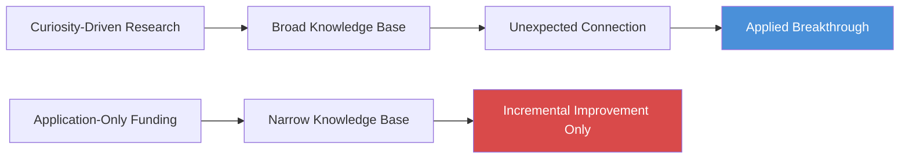

This diagram shows Casadevall's argument: applied breakthroughs depend on a broad base of curiosity-driven knowledge. Funding only applied research starves the system of the raw material from which breakthroughs emerge.

| Funding Model | Approach | Short-term Output | Long-term Output |
|--------------|----------|-------------------|------------------|
| **Traditional grants** | Fund specific projects with defined outcomes | High volume of incremental papers | Few breakthroughs |
| **HHMI model** | Fund people, not projects; tolerate failure | Fewer papers, more "failures" | Dramatically more breakthrough discoveries |
| **Industry R&D** | Fund near-term product development | Rapid iteration on existing products | Dependent on external basic research |
| **Yokoi/recombination** | Fund cross-domain exploration | Slow, unpredictable outputs | Novel combinations no specialist would find |

The most productive research environments in history — Bell Labs, Xerox PARC, early Google — shared the common feature of giving talented people unstructured time and broad freedom. When those environments were "optimised" for efficiency, the breakthroughs stopped.

> [!example] **Bell Labs — The Cathedral of Range**
> - Bell Labs produced the transistor, the laser, information theory, Unix, the C programming language, and eight Nobel Prizes
> - Its research culture explicitly encouraged scientists to wander between departments, attend seminars outside their field, and collaborate across disciplinary boundaries
> - Mervin Kelly, the director who built the lab's golden age, designed the physical space so that scientists from different disciplines had to walk past each other's offices — engineering chance encounters between people who would otherwise never interact
> - When AT&T broke up and Bell Labs was restructured for efficiency, the exploratory research budget was slashed and the cross-disciplinary wandering was curtailed
> - The breakthrough discoveries stopped almost immediately
> **The lesson:** Bell Labs' greatest output was not any single invention but the environment itself — a place where range was structurally encouraged rather than merely tolerated.

> [!tip] Core Insight
> A system that eliminates all "wasteful" exploration in favour of targeted efficiency will never produce anything truly new. The deliberate amateur is building the combinatorial library from which breakthroughs are assembled.

---

## Conclusion: Expanding Your Range

*The book's emotional core: the anxiety of feeling behind is both wrong and dangerous, because the evidence overwhelmingly favours the broad explorer over the early committer.*

The final pages return to the book's emotional core: the anxiety of feeling behind.

- In a world that celebrates prodigies and early achievers, anyone who is still exploring at 30, 35, or 40 feels like a failure
- Epstein argues that this feeling is both wrong and dangerous:
  - Wrong because the evidence overwhelmingly favours the broad explorer over the early committer
  - Dangerous because it pushes people into premature specialisation out of social pressure rather than genuine fit
  - The social cost of appearing unfocused or "behind" is real — but the long-term cost of premature commitment is greater
- The data on late bloomers is more encouraging than most people realise:
  - The average age of a successful first-time entrepreneur is 45, not 25 — despite the cultural fixation on Silicon Valley wunderkinder
  - A study by MIT, Northwestern, and the US Census Bureau found that among the fastest-growing startups, the average founder age was even higher — and founders in their fifties were nearly twice as likely to build a high-growth company as founders in their twenties
  - Nobel Prize winners in science have gotten older over time, not younger — the average age at prize-winning discovery has risen steadily, suggesting that the most important problems increasingly require the kind of cross-domain knowledge that takes time to accumulate
  - Many of the most celebrated creators — Toni Morrison published her first novel at 39, Julia Child published her first cookbook at 49, Vera Wang designed her first dress at 40 — would have been dismissed as "behind" by any conventional career timeline
  - The cultural narrative about youth and innovation is not supported by the data — it is supported by a handful of prominent exceptions (Zuckerberg, Gates, Jobs) that receive disproportionate media coverage
  - The actual distribution of achievement is far more age-diverse than the popular narrative suggests

> [!example] **Van Gogh's Late Start**
> - Van Gogh tried and failed at being an art dealer, a schoolmaster, a bookseller, a university student, a minister, and a missionary before beginning to paint at 27
> - He produced his entire artistic output in roughly ten years
> - Every previous "failure" had been a match-quality experiment that narrowed the search
> - The experiences gave him a depth of emotional range and human empathy that fuelled his art
> - Had he committed to art at 15, he might have developed greater technical skill but would have lacked the inner life that made his paintings extraordinary
> - His "wasted" years as a minister among coal miners gave him the subject matter and emotional intensity that defined his greatest works
> **The lesson:** His late start was not a handicap. It was the precondition for finding the work that suited him.

---

> [!example] **The Overspecialised Young Professionals**
> - Epstein cites research showing that young workers who specialise very early tend to earn more in their twenties than peers who are still exploring
> - But by their thirties and forties, the early explorers catch up and often surpass the early specialisers
> - The early specialisers' initial advantage was real but temporary — they had monetised their head start
> - The late specialisers' advantage was slower to appear but more durable — they had found better fit
> - The pattern mirrors the desirable-difficulties research from Chapter 4: the approach that produces faster visible progress in the short term produces worse long-term outcomes
> **The lesson:** The advantage of early commitment is real but temporary. The advantage of broad exploration is delayed but lasting.

He invokes **Michelangelo**, who famously said — in a letter written when he was 87 — "I am still learning":
- Michelangelo's late work was his best
- His style evolved continuously throughout his life
- He never stopped experimenting, never settled into a fixed approach, never decided that he had found the optimal method and should simply repeat it
- <b style="color: #27ae60">The willingness to remain a beginner, even after decades of mastery, was inseparable from his genius</b>

> "I am still learning." — attributed to Michelangelo

---

Epstein's closing argument ties together the book's central threads:
- The world is becoming more wicked, not more kind — AI and automation handle the kind-environment tasks, leaving humans with the wicked ones
- In a wicked world, the specialist's advantage narrows while the generalist's advantage widens
- The institutions that will thrive are those that create space for breadth, tolerate meandering, and value match quality over grit
- The individuals who will thrive are those who resist the pressure to specialise prematurely, who treat every experience as data about fit, and who maintain the cognitive flexibility to think across domains

The book's final pages also address the institutional dimension:
- Education systems that track students early and penalise late specialisation are structurally misaligned with the research on match quality
- Hiring systems that reward linear CVs and punish career changes are selecting against the very people the research says perform best in wicked environments
- Performance evaluation systems that measure narrow depth — publications in one field, years in one role, consistency of a single trajectory — systematically undervalue the breadth that produces the most important contributions
- <b style="color: #e74c3c">The institutions that shape careers are optimised for a world that no longer exists</b> — a kind world of stable rules and repeating patterns, not the wicked world of ambiguity and constant change

He addresses the common objection that range is simply a euphemism for lack of commitment:
- <b style="color: #e74c3c">Range is not the absence of depth</b> — it is the pursuit of depth in multiple areas, sequentially or in parallel
- The generalist Epstein champions is not someone who knows a little about everything and a lot about nothing
- It is someone who has invested deeply in several domains and can see the connections between them
- Roger Federer did not dabble at tennis — he became the greatest player in history
- But his path to that depth ran through the breadth of his childhood sampling
- The sampling was not the opposite of depth — it was the foundation for a richer, more flexible form of depth

> [!example] **Charles Darwin's Breadth**
> - Darwin was not a narrow biologist — he studied geology, read widely in economics and philosophy, collected beetles obsessively as a young man, and spent years classifying barnacles
> - His theory of natural selection drew on Malthusian economics, Lyell's geology, the biogeography he observed during the Beagle voyage, and the animal breeding practices of English farmers
> - No single discipline contained the insight — it required seeing the structural connections across all of them
> - Darwin's genius was not in any one area of expertise but in the way he combined insights from multiple areas into a framework that none of them could have produced alone
> - Epstein argues that Darwin is the prototypical range-advantaged thinker: deeply curious across many domains, willing to spend time on apparently unrelated pursuits, and able to see the structural analogies that connect them
> **The lesson:** The greatest integrative theory in the history of biology was produced by a man whose career path — geology, barnacle taxonomy, pigeon breeding, island biogeography, economic theory — would look unfocused on any modern CV.

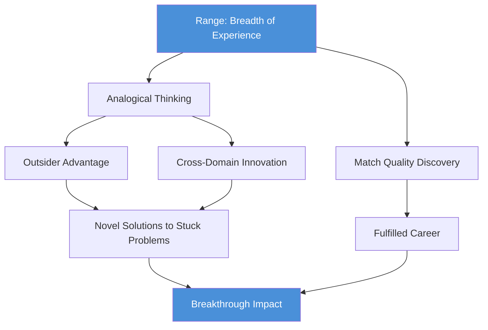

This diagram traces the book's central argument: range enables both analogical thinking and match quality, which together produce the outsider advantage, cross-domain innovation, and ultimately breakthrough impact in a wicked world.

---

Epstein's closing advice is simple but powerful:
- Compare yourself to yourself yesterday, not to younger people who have taken a different path
- Explore widely before committing deeply
- Experiment with possible selves rather than planning from the armchair
- Do not feel behind — the evidence says you are building something the early committers cannot
- Embrace the slow path — the learning that feels inefficient is producing the most durable understanding
- Seek out the uncomfortable: interleave your practice, test yourself before you feel ready, and resist the fluency illusion
- Maintain breadth deliberately — read outside your field, cultivate interests that seem irrelevant, attend to the interfaces between domains
- When you find match quality, commit — but do not mistake premature commitment for match quality just because commitment feels comfortable
- <b style="color: #27ae60">The world is wicked, and the people best suited to navigate it are the ones who have seen the most of it</b>

---

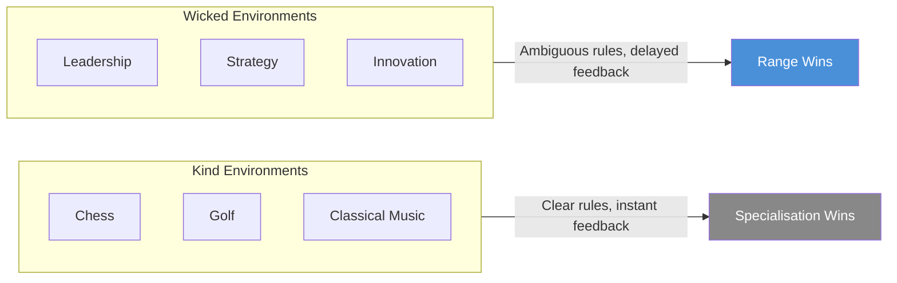

The foundational distinction of the entire book: the nature of the environment determines whether specialisation or range is the optimal strategy. Most of the modern world falls on the wicked side of the spectrum.

---

## Key Quotes

- "Compare yourself to yourself yesterday, not to younger people who aren't you." — David Epstein
- "The challenge we all face is how to maintain the benefits of breadth... while still being able to focus." — David Epstein
- "The more information experts had, the more extreme their predictions." — David Epstein, on inside-view bias
- "The most impactful inventors cross domains rather than deepen them." — David Epstein, on serial innovators
- "Learning that is easy is like writing in sand, here today and gone tomorrow." — Elizabeth Bjork, as cited by Epstein
- "Having one foot outside your world gives you the ability to make connections." — David Epstein
- "I am still learning." — attributed to Michelangelo, as cited by Epstein
- "Lateral thinking with withered technology." — Gunpei Yokoi, as cited by Epstein

---

## The Verdict

*Range* is the most important book written in the last decade about why generalists matter, and its strength lies not in any single argument but in the convergence of evidence from radically different fields.

- The kind/wicked distinction, drawn from Kahneman and Klein's landmark collaboration, provides the theoretical foundation — it transforms the debate from "is specialisation good?" to "what kind of environment are you in?"
- Tetlock's forecasting data, based on 82,361 predictions over twenty years, is among the most rigorous studies of expert judgment ever conducted and delivers a devastating verdict on narrow specialisation in uncertain domains
- Bjork's desirable-difficulties research, replicated across decades and domains, upends the common-sense assumption that smooth learning is good learning — and has direct implications for how education systems should be designed
- The InnoCentive outsider-advantage findings are compelling precisely because they are large-scale and field-based rather than laboratory-constructed
- Together, these strands form a powerful argument that breadth is not the consolation prize for people who failed to specialise early — it is a cognitive strategy that matches the demands of a complex, rapidly changing world

The book's weaknesses are real but bounded.

- Epstein relies heavily on biographical narratives — Van Gogh, Hesselbein, Django Reinhardt, the Venetian orphans — that suffer from classic survivorship bias
  - We see the late bloomers who bloomed — we do not see the vast majority who sampled broadly and never found their calling
  - Epstein acknowledges this once and then proceeds to cherry-pick for the remainder of the book
  - A reader who wants to be persuaded will be; a sceptic will note that the counter-examples are conspicuously absent
- The transition from sampling to commitment is underspecified:
  - The book is excellent on why you should explore
  - It is nearly silent on how to know when you have explored enough — when the marginal value of another experiment has fallen below the cost of delayed commitment
  - This is a significant gap, because for many readers, the actionable question is not "should I explore?" but "when should I stop?"
- The evidence quality is uneven:
  - Some arguments rest on rigorous, large-scale studies (Tetlock, Bjork, the 18-million-paper analysis)
  - Others rest on compelling but anecdotal biographical narratives that could be matched by equally compelling counter-narratives
  - The reader must keep track of which arguments are supported by systematic evidence and which by cherry-picked stories

The concept of "range" itself is slippery:
- It bundles together several distinct phenomena that have different mechanisms, different evidence bases, and different practical implications:
  - **Cognitive flexibility** — the ability to think analogically (well-evidenced)
  - **Career experimentation** — the willingness to switch paths (anecdotally supported through biography)
  - **Diverse professional experience** — having worked across domains
  - **Learning strategy** — interleaving, spacing, desirable difficulties (rigorously studied)
- Treating them as manifestations of a single concept called "range" obscures the differences and makes the argument harder to evaluate critically

Still, the core insight holds and has only grown more relevant since publication.

- In a world that is becoming more wicked — where AI automates the kind-environment tasks and leaves humans with the novel, ambiguous, cross-domain challenges — the person who can draw connections across fields will consistently outperform the person who can only go deeper into what they already know
- The book is essential reading for anyone who has ever felt behind for not specialising sooner, and a useful corrective for anyone who designs education, hiring, or development systems that reward narrow depth at the expense of useful breadth
- It does not tell you everything you need to know about building a generalist career — the political and structural barriers to being valued as a generalist in specialist institutions are completely absent from Epstein's analysis — but it provides the intellectual foundation that makes the case irrefutable at the level of evidence
- Epstein's journalism shines throughout: the stories are vivid, the pacing is excellent, and the research is presented accessibly without being dumbed down — a difficult balance that reflects his own range as a writer

Ultimately, *Range* succeeds because it addresses a genuine emotional need: it tells people who have taken winding paths that their paths were not mistakes. It provides a research-backed framework for understanding why late starts, career changes, and apparent "wasted" time often turn out to be the most productive investments a person can make. In a culture that celebrates the prodigy narrative and punishes the explorer, this message is both reassuring and — for many readers — genuinely liberating. The book's imperfections are real, but its core contribution to how we think about human development is substantial and enduring.

---

## Related Reading

- [[So Good They Can't Ignore You - Cal Newport|So Good They Can't Ignore You]] — Cal Newport argues for building rare and valuable skills ("career capital") through deliberate practice, offering a complementary and sometimes competing perspective on depth vs breadth
- [[Mastery - Robert Greene|Mastery]] — Robert Greene profiles masters across disciplines, many of whom followed the winding paths Epstein describes, though Greene emphasises eventual deep commitment
- [[The First 90 Days - Michael D. Watkins|The First 90 Days]] — Michael Watkins on navigating transitions, relevant to Epstein's match-quality thesis about how to enter new domains effectively
- [[Power - Jeffrey Pfeffer|Power]] — Jeffrey Pfeffer on how organisations actually allocate influence, a useful companion for understanding the structural barriers generalists face in specialist institutions
- [[Thinking in Systems - Donella H. Meadows|Thinking in Systems]] — Donella Meadows on systems thinking, a complementary framework for the kind of cross-domain structural reasoning Epstein champions
- [[Mindset - Carol S. Dweck|Mindset]] — Carol Dweck on growth vs fixed mindset, relevant to Epstein's argument that the willingness to be a beginner repeatedly is a strategic advantage
- [[Superforecasting - Philip E. Tetlock|Superforecasting]] — Tetlock's own deep dive into the fox-style thinking that Epstein draws on heavily in his forecasting chapter
- [[Deep Work - Cal Newport|Deep Work]] — Newport's case for undistracted focus, which represents the specialisation side of the depth-vs-breadth tension Epstein engages with
- [[Antifragile - Nassim Nicholas Taleb|Antifragile]] — Taleb's argument that systems which gain from disorder share structural logic with Epstein's case for broad, adaptive range over rigid specialisation
