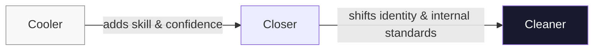
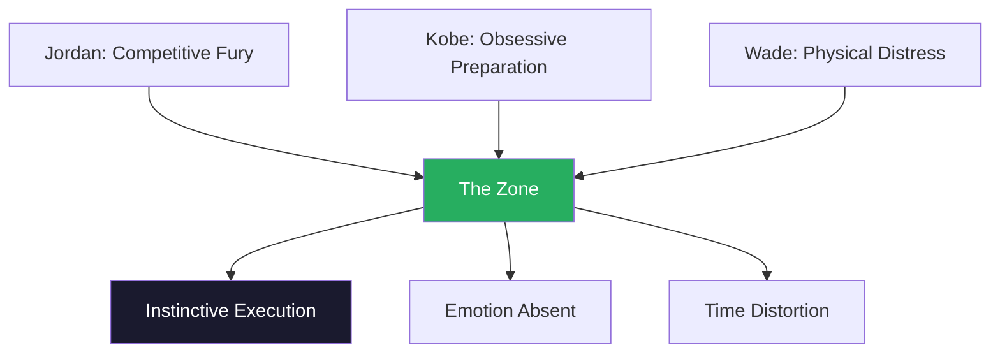
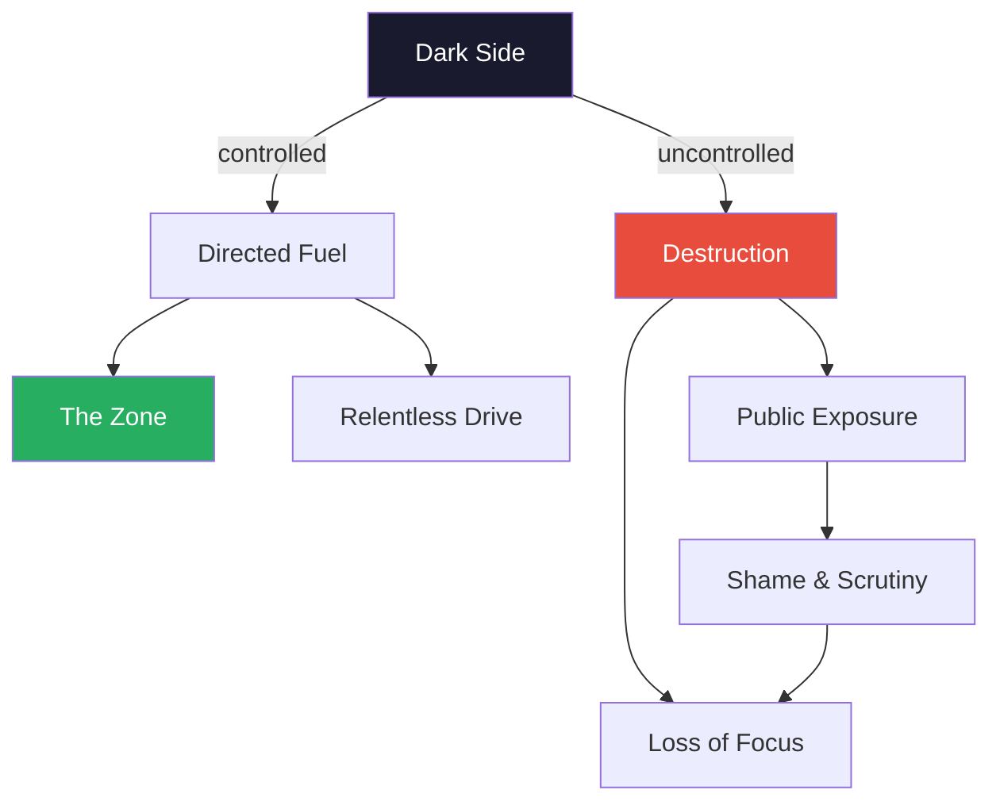
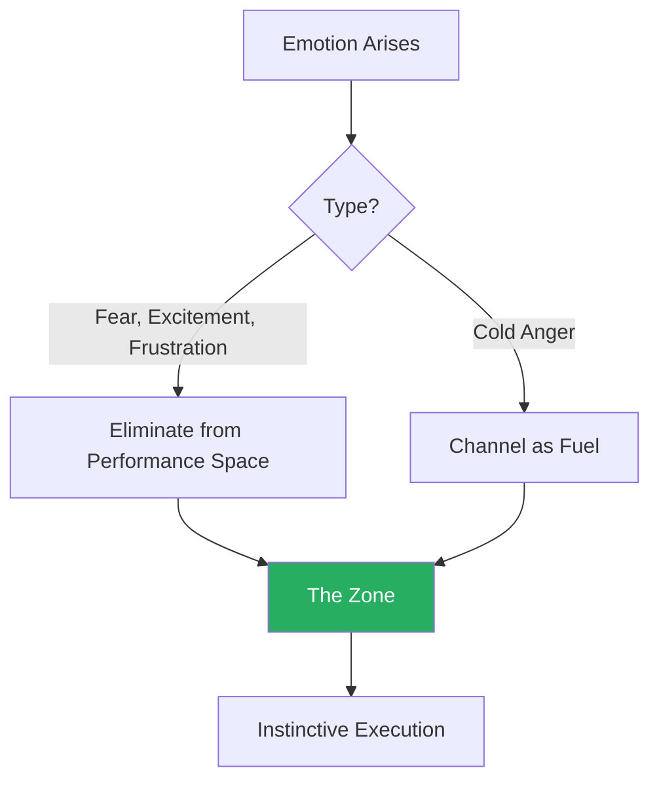
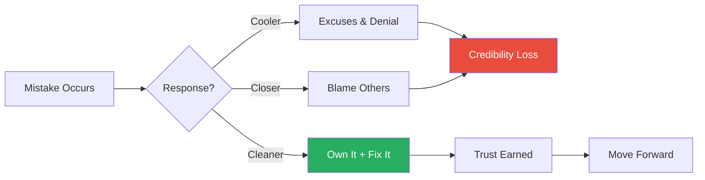
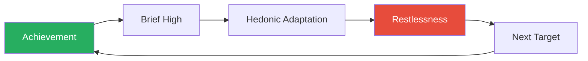
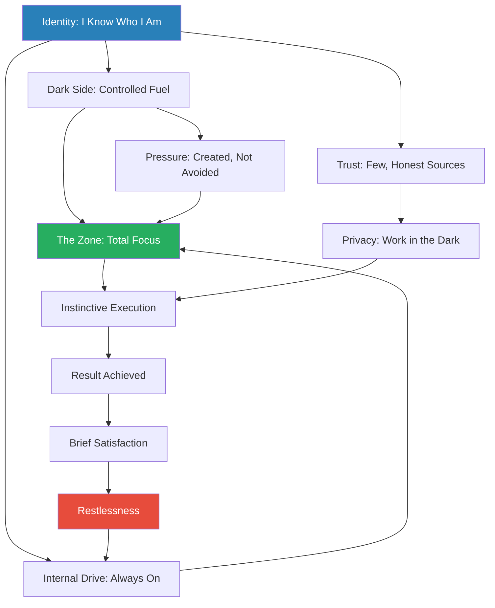

# Relentless: From Good to Great to Unstoppable — Tim S. Grover

> Tim Grover spent three decades as the personal trainer to Michael Jordan, Kobe Bryant, and Dwyane Wade — the most dominant competitors of their era. *Relentless* is his distillation of what separates the merely great from the genuinely unstoppable. His thesis: the gap between good and elite is not talent, training, or opportunity. It is a psychological operating system he calls the **Cleaner** mindset — an insatiable addiction to results, an instinct sharpened by preparation so deep that conscious thought becomes unnecessary, and a willingness to channel a controlled "dark side" that most people are taught to suppress. The book is part taxonomy, part manifesto, part challenge. It does not ask whether you want to be the best. It asks what you are willing to do — and to give up — to get there.

---

## About the Author

Tim S. Grover grew up in Chicago and studied kinesiology at the University of Illinois at Chicago. In 1989, he cold-called the Chicago Bulls to offer his services as a personal trainer — and ended up working with Michael Jordan for the next fifteen years. He went on to train Kobe Bryant, Dwyane Wade, Charles Barkley, and hundreds of other elite athletes through his company, Attack Athletics. His vantage point is unique: not a psychologist theorising about peak performance from the outside, but a practitioner who stood next to the most dominant competitors on Earth and watched how they thought, trained, recovered, broke down, and rebuilt themselves under conditions that would destroy most people. That proximity — and the bluntness it produced — gives the book its force and its limitation.

---

## The Big Idea

*Grover strips away motivation, passion, and positive thinking to reveal the real engine of elite performance: a psychological identity he calls the Cleaner.*

- Grover's central argument is that elite performance is not about motivation, passion, or positive thinking
- It is about a specific **psychological identity** — what he calls being a <b style="color: #2980b9">Cleaner</b>
- Cleaners are not the best because they try harder or want it more
- They are the best because they have internalised a set of mental habits so deeply that excellence is instinctive rather than effortful

He organises the world of competitors into three tiers:

- <b style="color: #2980b9">Coolers</b> — good, reactive, wait to be told
- <b style="color: #2980b9">Closers</b> — great, handle pressure when it arrives
- <b style="color: #2980b9">Cleaners</b> — unstoppable, create pressure, run toward the hardest thing in the room

The taxonomy is not about talent — it is about how you respond to difficulty, how you relate to discomfort, and whether your standards are set internally or externally.

- The uncomfortable implication running through the book is that most people are Coolers who believe they are Closers
- The jump from Closer to Cleaner is not a matter of effort but of identity — a fundamental shift in how you see yourself and what you are willing to tolerate
- Grover makes no apology for this — he is not interested in making people feel good about where they are
- He is interested in showing them what the next level actually costs

The book is structured around thirteen characteristics that define the Cleaner — thirteen chapters, each opening with the same phrase: "When you're a Cleaner..." followed by the trait:

- These traits build on each other, forming a composite portrait of the psychological operating system that produced Jordan's six championships, Kobe's five, and Wade's three
- Grover is careful to note that he is not describing a healthy, balanced life
- <b style="color: #e74c3c">He is describing what it takes to be the absolute best, and the price that comes with it</b>

---

## Key Concepts at a Glance

| Concept | One-line summary |
|---------|-----------------|
| **Cooler / Closer / Cleaner** | Three-tier taxonomy of competitors based on psychological disposition, not talent |
| **The Dark Side** | Suppressed instincts and competitive hunger that fuel elite performance — propulsion, not pathology |
| **The Zone** | Total concentration where emotion disappears and performance becomes purely instinctive |
| **"Don't Think"** | Preparation so deep that execution requires no conscious thought — trained instinct, not impulsiveness |
| **Controlled Anger** | The only productive emotion under pressure — cold and directed, never explosive or visible |
| **Addiction to Results** | An insatiable compulsion to achieve where the win is the drug and the high fades almost immediately |
| **Discomfort as Fuel** | Growth requires sustained, purposeful discomfort — when training is harder than the game, the game feels easy |
| **Ownership Without Excuses** | When you make a mistake, say so in one sentence and move on — the truth is one sentence, everything after is noise |
| **Internal Drive** | Motivation is external and temporary — drive is internal and permanent because it is identity, not stimulus |
| **Crisis Competence** | Being the person called when everything fails — trust earned through delivery, not credentials |

---

## The Cooler / Closer / Cleaner Taxonomy

*Grover's signature framework classifies every competitor — in sport, business, or life — into one of three tiers defined not by talent but by their relationship to pressure, emotion, and internal standards.*

| Trait | **Cooler** (Good) | **Closer** (Great) | **Cleaner** (Unstoppable) |
|-------|-------------------|--------------------|--------------------------|
| Pressure | Avoids it | Handles it when necessary | Seeks and creates it constantly |
| Decisions | Waits to be told | Studies, then decides | Decides instantly from instinct |
| Preparation | Reacts to events | Plans for expected scenarios | Prepares for every variable, improvises beyond |
| Competition | Watches others | Studies opponents | Makes opponents study him |
| Emotion | Governed by emotions | Manages emotions | Eliminates emotions from performance |
| Failure | Accepts defeat | Works harder | Refuses to recognise failure — finds another path |
| Celebration | Celebrates freely | Celebrates achievements | Never satisfied, already planning the next move |
| Recognition | Wants to be liked | Wants respect | Wants to be feared, then respected |
| Motivation | Needs external push | Self-motivated for goals | Drive is identity — the question never arises |
| Accountability | Makes excuses | Assigns blame | Owns the mistake, presents the fix |

The taxonomy's real power is as a diagnostic: it forces you to ask not "Am I talented?" but "How do I respond when the stakes are highest and no one is watching?"

The radar shape reveals that the Cleaner-to-Closer gap is far wider than the Closer-to-Cooler gap — the jump to unstoppable requires near-maximum capacity across every psychological dimension simultaneously.

---

**Coolers:**

- Competent and reliable but fundamentally reactive
- Do what is asked of them, rarely more
- Wait for instructions, avoid risk, and are content with being part of the team
- On the basketball court, the Cooler is the player who passes the ball when the shot clock is running down
  - He does not want the responsibility of taking the shot
  - He wants someone else to bear that weight
- Coolers are not without talent — many are highly skilled
  - What limits them is a psychological ceiling: they do not want the burden that comes with being the person who decides
  - They prefer to contribute from within the structure rather than to define the structure

**Closers:**

- Genuinely talented and can perform under pressure when the moment demands it
- Study the game, prepare for known challenges, and rise to occasions
- Grover uses the example of a player who hits the game-winning shot when the opportunity presents itself — and then celebrates it
- <b style="color: #27ae60">The Closer is great — but waits for the moment to arrive rather than manufacturing it</b>
- Closers are dangerous because they look like Cleaners in highlight reels
  - The difference is invisible until you see the full body of work: Closers have great games — Cleaners have great careers
  - The Closer delivers when conditions align; the Cleaner delivers when conditions are hostile

**Cleaners:**

- Operate on an entirely different plane
- Do not wait for pressure to arrive — they generate it
- Do not study opponents — they force opponents to study them
- Their standards are internal, their drive is self-sustaining, and their relationship to discomfort is one of active pursuit rather than passive tolerance
- They treat every situation — practice, regular season, playoffs, personal crisis — with the same intensity
  - There is no "off" switch because the intensity is not something they turn on
  - It is something they cannot turn off

> [!example] Jordan Manufacturing Pressure
> - Jordan did not just take the last shot — he told his teammates beforehand that he was going to take it
> - He described exactly how the play would unfold
> - Then he went out and executed it precisely as described
> - He manufactured the pressure, told everyone it was coming, and then delivered
> - This was not arrogance — it was the elimination of ambiguity so everyone knew the plan and could execute their role
> **The lesson:** The Cleaner difference is not handling pressure — it is creating it.

> [!example] Charles Barkley: The Closer Who Knew
> - Grover trained Charles Barkley and observed him up close for years
> - Barkley was immensely talented, one of the most gifted power forwards in history
> - He could dominate games, take over quarters, and intimidate opponents
> - But Barkley himself recognised the gap between his tier and Jordan's
> - The difference was not physical — Barkley was arguably more naturally gifted athletically
> - The difference was in the psychological operating system: Barkley had limits he was willing to accept; Jordan did not
> **The lesson:** Self-awareness about your tier is itself a form of intelligence — Barkley's honesty about the gap showed a Closer's wisdom.

This progression is not a smooth gradient — the jump from Closer to Cleaner requires an identity shift, not just incremental improvement.

---

## Chapter-by-Chapter: The Thirteen Traits of a Cleaner

### 1. "You Keep Pushing Yourself Harder When Everyone Else Has Had Enough"

*The opening chapter establishes Grover's foundational claim: Cleaners are defined not by what they do when conditions are favourable, but by what they do when conditions are brutal and everyone around them has quit.*

> [!example] Jordan's Flu Game — 1997 NBA Finals, Game 5
> - Jordan woke up violently ill before Game 5 against the Utah Jazz
> - He was running a high fever, could barely stand, and his team thought he would not play
> - He played 44 minutes and scored 38 points
> - He hit the go-ahead three-pointer with under a minute left
> - The Jazz had Karl Malone and John Stockton at the peak of their powers
> - Jordan beat them while vomiting between plays
> - When the game ended, he collapsed into Scottie Pippen's arms
> **The lesson:** Jordan did not play through illness because he was brave — he played because sitting out was psychologically unbearable.

- Grover uses this story not as an example of physical toughness but as an illustration of the psychological compulsion that drives a Cleaner
- <b style="color: #27ae60">The Cleaner does not weigh the costs of continuing — he finds the cost of stopping intolerable</b>
- This is a critical distinction: it is not courage in the conventional sense
  - Courage implies a choice between doing something hard and doing something easy
  - For the Cleaner, the easy option does not exist — stopping is harder than continuing

> [!example] Kobe's Torn Achilles (April 2013)
> - Kobe tore his Achilles tendon — one of the most painful injuries in sport
> - Rather than collapsing, he walked to the free-throw line
> - He made both shots
> - Then he walked off the court under his own power
> - The arena was silent — not from shock at the injury, but from shock at the response
> - Kobe later said the idea of not making the free throws never entered his mind
> **The lesson:** This is not machismo — it is reflexive prioritisation of the immediate objective over everything else, including self-preservation.

Grover contrasts this with players who take themselves out of games with minor ailments:

- A hamstring tightens up, and the Cooler sits down
- The Closer plays through it but mentions it afterwards
- The Cleaner never mentions it at all
- The distinction is not about pain tolerance — it is about what occupies your attention
  - The Cooler's attention goes to the pain
  - The Closer's attention is split between the pain and the game
  - The Cleaner's attention stays on the game; the pain is filtered out

> "When you're a Cleaner, you don't need a kick in the ass. You ARE the kick in the ass." — Tim S. Grover

> [!tip] Core Insight
> The mechanism beneath this trait is **internal pressure**. Most people are driven by external accountability — coaches, deadlines, audiences. When the external pressure is removed, their performance drops. The Cleaner carries his own pressure everywhere, holding himself to an internal standard that exceeds anything the outside world could impose.

---

### 2. "You Get Into the Zone, Shut Out Everything Else, and Control the Uncontrollable"

*Grover reveals the psychological state that underpins every Cleaner performance — a place where distraction, doubt, and emotion simply cease to exist.*

<b style="color: #2980b9">The Zone</b> is Grover's term for the state of total concentration where external pressure disappears, emotion is absent, and performance becomes instinctive. Its characteristics:

- A deep calm that is not relaxation — it is the absence of distraction
- Complete trust in preparation, allowing the body to execute without conscious interference
- Zero awareness of external noise: crowds, critics, doubters, personal problems
- <b style="color: #2980b9">Controlled anger</b> as the entry point — cold and directed, never explosive or visible
- Time perception shifts — minutes feel like seconds, the performer is entirely absorbed in the present
- Self-consciousness disappears — there is no observer watching the self perform; there is only the performance

Each of Grover's three primary athletes entered the Zone through a different mechanism:

> [!example] Jordan's Entry — Competitive Fury
> - Grover describes watching Jordan's eyes change before games
> - A shift from the laughing, trash-talking personality to something colder and more focused
> - The transformation was physical: posture changed, breathing changed, the quality of his attention narrowed to a single point
> - Jordan's trigger was the memory of a slight, a loss, a critic — real or manufactured
> - Teammates learned to recognise it and stay out of his way
> - The entire team could tell when Jordan had "flipped" — the energy in the locker room changed
> **The lesson:** The Zone is not a mystical state — it is a trained response activated by specific triggers.

> [!example] Kobe's Entry — Obsessive Preparation
> - Kobe would study game film for hours before a game
> - He ran through every possible scenario until he had eliminated uncertainty entirely
> - By the time the game started, he had already played it in his mind dozens of times
> - The Zone, for Kobe, was the point where the film stopped running and the instincts took over
> - He once told Grover that he felt "bored" by the time the game started — because he had already seen everything that was about to happen
> **The lesson:** Kobe's path to the Zone was intellectual — certainty through exhaustive preparation.

> [!example] Wade's Entry — Physical Distress (2006 Finals)
> - Wade's entry point was often pain — playing through injury, using the adrenaline of physical distress to sharpen focus
> - During the 2006 Finals against Dallas, Wade was playing on a badly injured knee
> - Grover worked on him for hours before games
> - By Game 3, Wade had entered a state where the knee simply did not exist in his awareness
> - He averaged 34.7 points for the series and won the championship
> - The pain had become the doorway — once he pushed through it, everything else fell away
> **The lesson:** Pain itself can become a gateway to the Zone when the performer refuses to let it register.

Three different doorways, one destination — the Zone is accessible through multiple paths, but the state itself is consistent across all Cleaners.

---

<b style="color: #e74c3c">Emotion is the fastest exit from the Zone.</b>

- Fear, rage, jealousy, and even excitement all redirect attention away from the task
- Grover tells the story of a player who got so excited about making a spectacular dunk that he lost focus for the next three possessions and gave up easy baskets
- The celebration pulled him out of the Zone
- The Cleaner learns to recognise emotional intrusion and eliminate it in real time

The only emotion that survives inside the Zone is **controlled anger** — and even that must remain invisible:

- Grover distinguishes sharply between explosive anger (which scatters focus) and cold anger (which concentrates it)
- Jordan's famous composure on the court was not the absence of anger
- It was the presence of a very specific kind of anger — the kind that does not explode outward but burns inward, fuelling intensity without disrupting precision
- Explosive anger announces itself — cold anger hides behind a mask of calm and deploys itself through action, not display

---

### 3. "You Know Exactly Who You Are"

*This chapter reveals why the Cleaner's unshakeable self-knowledge is not arrogance — it is the foundation that makes every other trait possible.*

- Grover's argument: Cleaners do not question who they are
- They do not have existential crises about their purpose, their role, or their value
- They know what they do, they know they are the best at it, and they do not need external validation to confirm it
- <b style="color: #27ae60">This certainty is not bravado — it is settled internal fact, confirmed daily by preparation and results</b>

> [!example] Jordan's Settled Certainty
> - Jordan never questioned whether he was the best basketball player alive
> - It was not arrogance — it was a settled fact in his own mind, confirmed by his preparation and his results
> - This certainty freed him from the psychological burden that hampers most people: the constant need to prove themselves, to seek reassurance, to worry about how they are perceived
> - Jordan did not play to prove he was the best — he played because he was the best, and playing was what the best did
> **The lesson:** Self-knowledge is not confidence — it is the absence of the need for external confirmation.

> [!example] Kobe's Clash with Shaq
> - When Shaquille O'Neal was the dominant force on the Lakers, Kobe made no secret of his belief that the team was his
> - This caused enormous friction — with Shaq, with teammates, with coaches, with fans
> - But Kobe was operating from a place of absolute self-knowledge
> - He knew who he was and what he was willing to sacrifice
> - The opinions of others were irrelevant to that internal certainty
> - Even when the team lost and critics blamed his selfishness, Kobe did not recalibrate — he doubled down
> **The lesson:** Identity stability means adversity does not trigger an identity crisis — it triggers a doubling-down on what you do best.

Grover contrasts this with athletes who change their game based on criticism:

- A player shoots poorly in one game, reads the papers the next morning, and starts passing instead of shooting
- He has allowed external input to override his internal identity
- <b style="color: #27ae60">The Cleaner would read the same criticism and shoot more</b>

The mechanism: <b style="color: #2980b9">identity stability under pressure</b>:

- When you know who you are, adversity does not trigger an identity crisis
- It triggers a doubling-down on what you do best
- Jordan's response to every challenge — from the Detroit Pistons' physical defence to the media's scrutiny of his gambling — was to become more himself, not less
- This stability extends beyond performance:
  - Cleaners do not change their personality to match the room
  - They do not soften their edges to make others comfortable
  - They are the same person in the boardroom, the locker room, and the living room

> "Don't think. You already know what you have to do." — Tim S. Grover

> [!tip] Core Insight
> This self-knowledge extends to knowing your flaws. Grover does not argue that Cleaners are perfect. He argues they know exactly where their imperfections lie and have made peace with them — or weaponised them. Jordan's gambling, Kobe's obsessive isolation, Wade's recklessness — Grover treats these not as bugs but as inseparable features of the same operating system that produced their greatness.

---

### 4. "You Have a Dark Side That You Can Control"

*Grover makes his most provocative claim: the fuel for extraordinary achievement is not gratitude or positivity — it is a reservoir of suppressed instincts that society tells you to drain away.*

- Every elite performer, Grover argues, is powered by a <b style="color: #2980b9">dark side</b> — a reservoir of suppressed instincts, competitive rage, and the refusal to accept the world as it is
- This is not a flaw to be corrected — it is the fuel source for everything extraordinary

The dark side is composed of whatever you have been told to suppress:

- Aggression, obsession, the desire to dominate
- The refusal to lose
- The hunger for more when everyone says you should be satisfied
- Society teaches people to be polite, moderate, and agreeable
- <b style="color: #27ae60">Cleaners learn to harness what lies beneath that social training</b>
- The dark side is not evil — it is raw human drive stripped of socialisation
  - What makes it "dark" is only that society has labelled it unacceptable
  - What makes it powerful is that it operates outside the limits that constrain most people

> [!example] Jordan's Manufactured Slights
> - Jordan's dark side was competitive fury
> - He took perceived slights — a word from an opponent, a slight from a coach, even a teammate's lack of effort — and stored them as fuel
> - He would remember a comment made years earlier and use it to generate the intensity needed for a game that had nothing to do with the person who made it
> - The slight did not have to be real — Jordan would manufacture disrespect if none existed
> - He once elevated a minor comment by a bench player into a personal vendetta that lasted an entire season
> - The feeling of being doubted was the fuel his engine ran on
> **The lesson:** The dark side does not need real enemies — it manufactures them.

> [!example] Kobe's Isolation as Fuel
> - Kobe's dark side was different in flavour but identical in function
> - His fuel was isolation — the willingness to be completely alone in his pursuit
> - He did not need teammates to like him or coaches to understand him
> - He needed only the work and the results
> - This isolation was painful — Kobe acknowledged it openly — but it was also the source of his power
> - He was willing to go where no one else would follow
> - In interviews later in his career, Kobe described the isolation not as a sacrifice but as a preference — he genuinely preferred being alone with the work
> **The lesson:** The dark side takes different forms in different people, but the function is always the same — propulsion.

> [!example] Tiger Woods — The Dark Side Uncontrolled
> - Grover references a performer (widely understood to be Tiger Woods) whose dark side, kept hidden for years, eventually exploded into public view
> - The performer's private behaviour — a separate life kept completely compartmentalised — functioned as fuel for years
> - When that compartment was breached and the private became public, the performer lost access to the Zone
> - The shame and scrutiny contaminated the fuel source
> - Performance collapsed not because the dark side was wrong, but because it could no longer be controlled once it was exposed
> **The lesson:** The dark side requires darkness — exposure destroys its function.

---

Grover is careful to distinguish between harnessing the dark side and being consumed by it:

- The Cleaner uses it as controlled fuel — like a jet engine, dangerous but directional
- <b style="color: #e74c3c">When the dark side escapes control, it becomes destructive</b>
- The dark side cannot survive in the light — when it is exposed, the performer loses the Zone because the fuel source has been contaminated by shame, guilt, and public scrutiny

> "Everyone has a dark side. The question is whether you control it or it controls you." — Tim S. Grover

- The model is provocative because it rejects the positive-psychology consensus that high performance comes from gratitude, mindfulness, and self-acceptance
- Grover's position is blunter: the people who achieve the most are often driven by something darker, hungrier, and less comfortable than the self-help industry wants to admit
- He does not celebrate this — he simply reports what he has observed across three decades of working with the best

The dark side is the same force whether it produces championships or catastrophe — the difference is whether the performer maintains directional control.

The asymmetry is revealing: the Zone and internal drive dominate the Cleaner's psychology, while the trust circle is deliberately kept small — maximum output, minimum vulnerability.

---

### 5. "You're Not Intimidated by Pressure, You Thrive on It"

*This chapter deepens the three-tier model by showing that the Cleaner's relationship to pressure is not tolerance — it is active creation.*

- Coolers avoid pressure
- Closers handle pressure
- <b style="color: #27ae60">Cleaners seek it out and create it</b>

The key insight is that pressure is not objective — it is a neurological response shaped by experience:

- A person who has been under intense pressure a thousand times does not experience the thousand-and-first time the same way a novice does
- The nervous system adapts — what once triggered a fight-or-flight cascade now triggers a performance cascade
- The Cleaner has trained under so much pressure that the high-stakes moment feels familiar, not threatening

> [!example] Jordan's Last Championship — 1998 NBA Finals, Game 6
> - The Bulls are down by three with under a minute to play against the Utah Jazz
> - Jordan drives and scores
> - Then he steals the ball from Karl Malone
> - Then he hits the championship-winning shot over Bryon Russell with 5.2 seconds left
> - Three plays, each under maximum pressure, each executed with the calm of a practice session
> - Jordan engineered this moment — he wanted the ball with the game on the line and told his teammates to clear out
> - The image of Jordan holding his follow-through after the final shot is one of the most iconic in sports history — not because of the shot, but because of the calm
> **The lesson:** Jordan did not manage the moment — he manufactured it. The pressure was not something that happened to him; it was something he created because he performed best inside it.

> [!example] Wade's 2006 Finals Breakout
> - Wade was 24 years old, playing in his first Finals, against a veteran Dallas team led by Dirk Nowitzki
> - Miami fell behind 0-2
> - Wade responded by averaging nearly 40 points over the next four games
> - His knee was wrecked and his body was breaking down
> - The more the pressure increased, the better he played
> - Grover describes sitting with Wade before Game 3 and seeing no anxiety — only impatience
> - Wade wanted the game to start so he could prove what he already knew
> **The lesson:** For a Cleaner, pressure is not a threat to manage — it is the condition under which they perform best.

> [!tip] Core Insight
> The mechanism beneath this trait is **pressure tolerance as trained capacity**. Most people experience pressure as a threat — their bodies shift into fight-or-flight, adrenaline floods the system, and fine motor skills degrade. Cleaners have been under so much pressure, so many times, that their nervous systems have adapted. Pressure triggers a performance response, not a threat response.

- This is not innate — it is trained
- Jordan's clutch shooting was the product of thousands of practice sessions where he deliberately put himself under simulated pressure:
  - Taking shots with teammates watching
  - Attaching stakes to practice outcomes
  - Imposing penalties for missing
- By the time real pressure arrived, his body had already been there a thousand times
- The implication: pressure tolerance is a skill, not a trait
  - You build it the same way you build any other skill — through deliberate, repeated exposure
  - The Cooler avoids this exposure; the Closer accepts it when it arrives; the Cleaner seeks it out

---

### 6. "When Everyone Else Is Hitting the Panic Button, They're Looking for You"

*Grover reveals how the Cleaner becomes irreplaceable — not through brilliance alone, but through the compounding effect of being the person who delivers when everything has already failed.*

- Cleaners are the last resort — called when everyone else has failed
- They do not volunteer for easy tasks — they are summoned for impossible ones
- <b style="color: #2980b9">Crisis competence</b> is the term for this — the ability to function at full capacity when the system around you is collapsing

> [!example] Grover Saves Wade's Knee (2006 Finals)
> - The Heat's medical staff had been working on Wade's knee for days without success
> - Wade called Grover
> - Grover flew to Miami, assessed the situation, and designed a treatment protocol in three hours that the full medical team had not found in three days
> - The difference was not knowledge — it was willingness to try unconventional approaches under extreme pressure
> - Wade played the next game and the Heat won the championship
> **The lesson:** The crisis responder earns trust not through credentials but through results under pressure.

> [!example] Jordan as Emotional Anchor
> - In games where the Bulls were down in the fourth quarter, the entire team would look at Jordan
> - Not just for a big shot — for an emotional anchor
> - Jordan's composure under crisis was contagious
> - When the best player on the floor showed zero panic, the rest of the team recalibrated their own anxiety downward
> - Jordan was not just performing under crisis — he was absorbing the crisis for the entire team
> - Scottie Pippen, Horace Grant, Steve Kerr — all described the calming effect of watching Jordan remain unfazed
> **The lesson:** Crisis competence is not just individual — it stabilises everyone around you.

> [!example] Kobe's Calm Before Elimination (2010 Finals)
> - Down 3-2 in the series against Boston, facing elimination
> - A reporter asked Kobe if he was nervous
> - His response was one word: "No."
> - He was not performing calm — he was calm
> - The team followed that energy into Game 6 and eventually Game 7, which they won
> - Grover describes the contrast with other players on the roster who were visibly anxious — Kobe's stillness recalibrated the room
> **The lesson:** Authentic composure under extreme pressure is contagious.

The underlying principle: <b style="color: #2980b9">crisis competence compounds into irreplaceability</b>:

- The more crises you resolve, the more you are summoned
- The more you are summoned, the more indispensable you become
- It is a virtuous cycle — but only if you actually deliver
- <b style="color: #e74c3c">Being called for emergencies and failing is worse than never being called at all</b>
- The expectation that accompanies the summons makes failure more visible, not less

The psychology behind crisis leadership:

- Most people freeze under crisis because they are processing the situation while trying to act
- The Cleaner has already processed the situation — or a version of it — in advance
  - The preparation was so thorough that the crisis feels familiar
  - The response is pattern-matched from thousands of prior scenarios
- This is why Grover emphasises preparation so heavily throughout the book
  - The person who is calm in a crisis is not naturally calm — they are pre-prepared
  - They have already lived through a version of this moment in their training

---

### 7. "You Don't Compete With Anyone — You Make Them Compete With You"

*Grover inverts the conventional wisdom about studying the competition — Cleaners do not react to opponents; they force opponents to react to them.*

- Cleaners do not study the competition and adjust
- They set the standard and force everyone else to adjust to them
- <b style="color: #27ae60">They do not react — they dictate</b>
- This principle operates on both the physical and psychological levels:
  - Physically, the Cleaner plays his game regardless of the opponent's strategy
  - Psychologically, the Cleaner occupies the opponent's mind before the competition even begins

> [!example] Larry Bird at the 1988 Three-Point Contest
> - Bird walked into the locker room before the event
> - He looked at the other competitors and said: "Which one of you is finishing second?"
> - He was not joking
> - He then went out and won
> - The comment itself was a competitive act — it put every other shooter on the defensive before a single ball was launched
> - Several competitors later admitted they were thinking about Bird's comment when they were shooting
> **The lesson:** The psychological battle can be won before the physical competition begins.

> [!example] Jordan Visiting the Opponent's Locker Room
> - Grover describes Jordan walking into the opposing team's locker room before games
> - Not to scout — but to let them know he was there
> - The visit itself was the weapon
> - It planted a seed of doubt in the opponent's mind: this man is so confident that he is visiting us before the game — what does he know that we do not?
> - Opposing players later described the visits as disorienting — they were trying to prepare for a game, and the person they were preparing against was standing in their space, smiling
> **The lesson:** Presence alone, backed by track record, is a form of dominance.

> [!example] Kobe's Declaration of Ownership
> - When the Lakers acquired Pau Gasol, when they traded for Dwight Howard, when any new star arrived, Kobe's message was immediate and unambiguous: "It's my team"
> - This was not ego for ego's sake — it was the establishment of hierarchy
> - In Kobe's model, a team with an unclear leader is a team that will fracture under pressure
> - By claiming ownership openly, he eliminated ambiguity — everyone knew who made the final decision and who took the last shot
> - Even Phil Jackson, a master of managing egos, accepted this dynamic with Kobe because the alternative — a leadership vacuum — was worse
> **The lesson:** Declaring ownership is not arrogance — it is structural clarity.

> [!tip] Core Insight
> The mechanism: when you play your own game, your opponent must react to you, which puts them off their own game. When you study and react to the opponent, you surrender initiative — you are playing defence psychologically, even if you are on offence physically. The Cleaner defines the terms of engagement and forces the opponent to respond to a game they did not choose.

The limitation Grover acknowledges in passing:

- This requires sufficient track record that others feel compelled to respond
- Bird's locker-room comment works because everyone in the room knows Bird's record
- A rookie making the same comment would be laughed at
- <b style="color: #e74c3c">Dictating terms from a position of total obscurity is not confidence — it is delusion</b>
- You must first earn the right to dictate through demonstrated excellence

---

### 8. "You Make Decisions, Not Suggestions"

*Grover attacks hesitation as fear in disguise and reveals how Cleaners collapse the gap between thought and action to zero.*

- Most people make suggestions and wait for consensus
- Cleaners make decisions and act
- Overthinking kills momentum
- <b style="color: #27ae60">The first instinct is usually right — everything after is fear disguised as analysis</b>

> [!example] Jordan Skipping Pre-Game Strategy Meetings
> - Jordan famously refused to attend pre-game strategy meetings
> - Not because he was lazy, but because he had already internalised every variable
> - He knew what he would do before the situation arose
> - The meeting would only introduce doubt into a system that ran on certainty
> - Phil Jackson, one of the greatest coaches in NBA history, understood that his job with Jordan was not to give instructions but to create an environment where Jordan's instincts could operate without interference
> **The lesson:** For the Cleaner, pre-game time is not for preparation — it is for activation.

Grover draws a contrast with Closers:

- Closers spend the pre-game hours watching film, studying the opponent's tendencies, running through playbooks
- They are preparing well
- But the Cleaner has already done all of that work — days, weeks, months before
- The Cleaner is not learning — he is loading the already-learned patterns into his body

> [!example] Kobe's Pre-Manufactured Instinct
> - Kobe's decision-making was equally instinctive but differently expressed
> - Where Jordan trusted his improvisation in the moment, Kobe trusted his exhaustive preparation
> - Kobe would spend entire off-seasons developing specific moves for specific opponents
> - He studied footage of Hakeem Olajuwon to develop his post moves, footage of Michael Jordan to develop his mid-range game, footage of Magic Johnson to develop his passing
> - By the time the season started, his "instinct" was actually the product of thousands of hours of deliberate practice for exact situations he knew would arise
> - His decision in the moment felt instant because the decision had already been made in the gym months ago
> **The lesson:** Trained instinct and raw instinct look identical in the moment — but the preparation behind them is worlds apart.

> "Decide. Act. Repeat." — Tim S. Grover

> [!abstract] The "Don't Think" Progression
> 1. **Learn everything** — study, train, analyse, absorb
> 2. **Internalise it** — repetition until knowledge becomes unconscious
> 3. **Let go** — trust the preparation and act from instinct

- This is not anti-intellectualism — Grover is emphatic that instinct must be *trained*
- <b style="color: #2980b9">Untrained instinct is impulsiveness; trained instinct is the product of thousands of hours of preparation expressed without hesitation</b>
- The moment of performance is not the moment for analysis
- Analysis belongs in preparation — execution belongs to instinct
- The progression is crucial: you cannot skip to step three
  - People who try to "trust their instinct" without the preparation behind it are just being reckless
  - The Cleaner's effortless execution is the visible tip of an invisible mountain of work

---

### 9. "You Don't Require Motivation — Your Drive Comes From Within"

*Grover attacks the entire motivation industry and draws a sharp line between external motivation (which fades) and internal drive (which is permanent because it is identity, not stimulus).*

- <b style="color: #e74c3c">If you need someone to motivate you, you are not a Cleaner</b>
- Motivation is external — drive is internal
- External motivation fades the moment the motivator leaves the room
- Internal drive is permanent because it is part of your identity, not a response to stimulus

| Dimension | Motivation | Drive |
|-----------|-----------|-------|
| Source | External — coaches, speeches, rewards | Internal — identity, compulsion, standard |
| Duration | Temporary — fades when stimulus is removed | Permanent — part of who you are |
| Trigger | Needs to be activated | Always on — cannot be turned off |
| Question | "Why should I do this?" | Never asks — the doing IS the reason |
| Result | Effort when watched | Effort regardless of audience |

Grover's contempt for the motivation industry is palpable throughout this chapter — he views motivational speakers as entertainers who produce temporary emotional highs that evaporate within hours.

> [!example] Jordan's 5 a.m. Workouts
> - Jordan would arrive at 5 a.m. after playing a game the night before, after staying out until 2 a.m., after sleeping three hours
> - No one asked him to come
> - No one checked if he showed up
> - He came because not coming was inconceivable
> - The drive was not something he summoned — it was something he could not turn off
> - Grover would sometimes arrive at the gym before dawn to set up, only to find Jordan already there, already sweating
> **The lesson:** For the Cleaner, the question "Why should I do this?" never arises — the doing is the reason.

> [!example] Kobe's Three-a-Day Off-Season Regime
> - Kobe would text Grover at 4:30 a.m. to arrange training — not occasionally, but routinely
> - Three sessions per day during the off-season, each targeting a different dimension of his game
> - Session one: skill work — specific moves, footwork, shooting
> - Session two: physical conditioning — strength, agility, endurance
> - Session three: competitive simulation — full-speed scrimmages against professional-level opponents
> - Grover asked him once why he worked so hard when he was already the best
> - Kobe's response, paraphrased: because being the best today does not guarantee being the best tomorrow
> **The lesson:** Internal drive is not fuelled by deficiency — it operates even from a position of dominance.

> [!example] Wade's Refusal to Accept Physical Limitation
> - After multiple knee surgeries, doctors told Wade to manage his workload
> - His body was breaking down
> - Wade's response was to train harder, not smarter — at least initially
> - Grover eventually helped him find a balance between relentless drive and physical reality
> - But the initial impulse was pure Cleaner: the body says stop, the mind says more
> - The compromise was itself a form of Cleaner behaviour: Wade accepted the physical limitation but refused to accept a lower standard of output
> **The lesson:** The Cleaner's drive does not negotiate with physical reality — it overrides it until forced to compromise.

The distinction Grover draws between motivation and drive:

- **Motivation** answers the question "Why should I do this?"
- **Drive** does not ask the question at all
- The Cleaner does not need a reason — the work is the reward, the result is the only acknowledgement required

> [!tip] Core Insight
> This is also the chapter where Grover is most explicit about the cost. The same drive that produces championships also produces an inability to stop, to rest, to be present in non-competitive situations. Jordan's gambling, Kobe's training through injuries that needed rest, Wade's refusal to manage his body — all were expressions of an internal drive that does not know how to moderate itself. The drive is the gift and the curse, and Grover does not pretend otherwise.

---

### 10. "You'd Rather Be Feared Than Liked"

*Perhaps the book's most controversial chapter — and the one most likely to be misapplied — Grover argues that likability creates social comfort but not leverage.*

- <b style="color: #27ae60">Being liked is irrelevant — being feared, and then respected for delivering what everyone feared you would, is the mark of a Cleaner</b>

> [!example] Jordan's Psychological Warfare
> - Jordan walking into opponents' locker rooms before games was not friendliness — it was psychological warfare
> - He wanted opponents thinking about him instead of their own game plan
> - Jordan did not care if they liked him — he cared if they feared him
> - And they did — because the fear was grounded in undeniable competence
> - Reggie Miller, one of the toughest competitors of the era, admitted that playing against Jordan was psychologically exhausting — not because of anything Jordan said, but because of what he might do
> **The lesson:** Fear backed by competence creates space to operate without interference.

> [!example] Kobe's Toxic Championship Run (2003-2004)
> - Kobe's teammates actively disliked him for much of his career
> - Shaq resented his intensity; role players found him cold and demanding
> - In 2003-2004, the Lakers assembled a superteam — Shaq, Kobe, Karl Malone, Gary Payton — and lost the Finals partly because the internal chemistry was so toxic
> - But Kobe did not change
> - He understood that likability creates social comfort but not leverage
> - People do not challenge someone whose track record is undeniable — they may not enjoy working with that person, but they do not get in their way
> **The lesson:** Kobe's model is both vindication and warning — the 2004 loss shows the cost when fear overwhelms team cohesion.

Grover describes calling himself an "asshole" and treating it as a compliment:

- If you are doing your job at the highest level, you will make people uncomfortable
- You will demand more than they want to give
- You will hold standards that feel unreasonable
- The people who call you an asshole are the people who cannot match your intensity
- Their discomfort is a measure of the gap between their standards and yours

> "You don't have to love the work. You just have to crave the result." — Tim S. Grover

---

Wade's approach was different:

- Wade was naturally more personable than Jordan or Kobe — more willing to build relationships, more socially graceful
- But even Wade, when it mattered, chose results over relationships
- In the 2006 Finals, Wade's intensity was so consuming that he barely spoke to teammates off the court
- He was not being cold — he was being a Cleaner: everything that did not contribute to winning was eliminated from his attention
- After the championship, the relationships resumed — but during the pursuit, they were secondary

The mechanism beneath "fear over likability" — <b style="color: #2980b9">the calculus of interference</b>:

- When people like you, they feel entitled to give you opinions, to suggest modifications, to involve themselves in your process
- When people fear your competence, they give you space
- They do not second-guess, they do not interfere — they let you work
- For a Cleaner, space to work without interference is the most valuable resource there is

The obvious limitation:

- This model was forged in professional sports, where results are immediately and publicly measurable
- <b style="color: #e74c3c">In more ambiguous environments, where outcomes are subject to interpretation and attribution is political, pure "fear and respect" can backfire</b>
- The principle is strongest when competence is demonstrable and weakest when it depends on others' perceptions

---

### 11. "You Trust Very Few People, and Those You Trust Better Never Let You Down"

*Grover's chapter on trust is one of the most revealing in the book, because it exposes the isolation that comes with the Cleaner mindset — and the paradox that the most powerful people have the fewest reliable sources of truth.*

- Cleaners trust very few people
- Those they trust must deliver truth, not flattery
- <b style="color: #27ae60">The most valuable person in a Cleaner's circle is the one willing to say what nobody else will</b>

> [!example] Grover's Fifteen Years with Jordan
> - Over fifteen years, Grover never told Jordan what he wanted to hear — he told him what was true
> - If Jordan's body was breaking down, Grover said so
> - If Jordan's approach to a workout was wrong, Grover said so
> - If Jordan was doing something self-destructive, Grover said so
> - This radical honesty — delivered without deference or softening — was why Jordan kept calling
> - In a world where everyone around a superstar learns to manage the truth, the person who does not manage it becomes indispensable
> **The lesson:** Truth-telling, not flattery, is the currency that buys permanent trust with a Cleaner.

> [!example] Steve Kerr Earns Jordan's Trust Through Confrontation
> - During a practice scrimmage, Jordan was pushing Kerr around
> - Kerr pushed back
> - Jordan punched him in the face
> - From that point forward, Jordan treated Kerr differently — with more respect, more inclusion, more trust
> - The willingness to stand up to a Cleaner, even at personal cost, is what earns their respect
> - Deference earns only contempt
> - When the 1997 Finals came down to the wire, Jordan passed to Kerr for the championship-winning shot — trusting the man who had stood up to him
> **The lesson:** You cannot earn a Cleaner's trust by being agreeable — only by being willing to challenge them.

Kobe's trust circle was even smaller than Jordan's:

- Grover describes Kobe as someone who trusted almost no one completely
- The few people who earned his trust — Grover included — earned it through years of demonstrated competence and unflinching honesty
- Kobe had no patience for sycophants
- He could detect flattery instantly and treated it as disqualifying
- <b style="color: #e74c3c">If you told Kobe what he wanted to hear, you were never trusted again</b>

> [!tip] Core Insight
> The mechanism: successful people are surrounded by sycophants who manage truth to protect access. This creates information asymmetry where the leader's decisions degrade because inputs are filtered. The person who tells the truth — even uncomfortable truth — becomes the Cleaner's most valued advisor precisely because they are the only source of reliable data.

Grover warns about the flip side of extreme trust:

- When someone in the inner circle betrays it, the damage is catastrophic
- He does not give specific examples — the discretion itself is a demonstration of the principle
- Betrayal by a trusted person hits a Cleaner harder than any competitive loss
- The response is absolute: once trust is broken, it is never restored
- The Cleaner does not forgive betrayal — he removes the person from his life entirely and moves forward
- There is no second chance, no redemption arc — the relationship is severed permanently
  - This seems extreme, but Grover argues it is efficient
  - The energy spent rebuilding trust that was broken is energy diverted from performance

---

### 12. "You Don't Celebrate Your Achievements — You're Too Focused on What's Next"

*Grover reveals the paradox at the heart of the Cleaner: the addiction that produces extraordinary achievement also makes it impossible to enjoy what has been accomplished.*

- Cleaners are not motivated by money, fame, or recognition
- They are driven by an addiction to the result itself — the win, the accomplishment, the proof of dominance
- <b style="color: #27ae60">This addiction is never satisfied</b>

> [!example] Jordan's Extra Finger
> - After each championship, Jordan held up an extra finger, signalling the next one
> - After the first title in 1991, he held up two fingers; after the second, three
> - By the sixth, the message had compounded into something almost frightening: this man won six championships, and after each one, the only thought visible on his face was that there would be another
> - Grover describes being at the championship celebrations and watching Jordan's attention drift
> - Within hours of winning, Jordan was already restless — the high was fading, the next season was forming in his mind
> - The champagne was still being sprayed and Jordan was mentally planning the next campaign
> **The lesson:** For the Cleaner, the celebration is the emptiest moment — not the fullest.

Grover himself embodied this principle:

- He describes leaving victory celebrations early — not because he was anti-social, but because he could not sit still
- The win was processed in minutes
- The next challenge was already calling
- He found parties after victories physically uncomfortable because his body was ready to work, not to celebrate

> [!example] Kobe's Post-Championship Work Ethic
> - Kobe won five championships
> - After each one, he spent the summer working harder than he had the year before
> - The celebration was a day; the off-season work started the next morning
> - Other players take months off after a championship run — Kobe took hours
> - He once told a reporter that the fifth championship was not about the fifth ring — it was about what the fifth ring meant he could do next
> **The lesson:** The Cleaner's response to victory is not gratitude — it is restlessness.

The mechanism — <b style="color: #2980b9">hedonic adaptation</b> — works *for* the Cleaner rather than against them:

- The psychological tendency for any achievement to quickly become the new baseline
- Because they never expect satisfaction, they are never disappointed when it fades
- They simply move on to the next objective
- For most people, hedonic adaptation is a trap: you achieve something, feel good briefly, then feel empty
- For the Cleaner, the emptiness is not a problem to solve — it is the engine's idle state, waiting for the next target

> "Cleaners don't want to hear 'I'm so proud of you.' They want to hear what's next." — Tim S. Grover

The cost is real:

- Grover acknowledges that this mindset produces isolation, relationship strain, and an inability to enjoy what has been accomplished
- His own marriage, his relationships with friends, his ability to simply be present — all were affected by the same relentless forward motion that built his career
- He frames these as acceptable trade-offs, but he is honest enough to acknowledge that others might weigh the equation differently
- The people who love the Cleaner often suffer the most — because they are celebrating a win that the Cleaner has already moved past

---

### 13. "You Handle Your Business in Private — What You Do in the Dark Determines What You Achieve in the Light"

*The final chapter returns to the dark side, but now from the angle of privacy — arguing that the most important work happens where no one can see it, and that exposure is the enemy of instinct.*

- The work that matters most happens where no one can see it:
  - The pre-dawn workouts
  - The film study at midnight
  - The treatment sessions at 3 a.m.
  - The decisions made in silence

> [!example] Jordan's Pre-Dawn Training
> - Grover describes arriving at the gym at 5 a.m. and finding Jordan already there, already sweating, already deep into a workout
> - No one was watching and no one would know
> - Jordan was not training for an audience
> - He was training because the alternative — being less prepared than he could be — was intolerable to his internal standard
> - The gym at 5 a.m. was Jordan's sanctuary — no cameras, no fans, no media, just the work and the standard
> **The lesson:** The Cleaner trains for the standard, not the audience.

> [!example] Kobe's 4 a.m. Workout Regime
> - Kobe would arrive at the gym before dawn, work out for two hours, then go back to sleep
> - Then work out again, then attend regular team practice, then work out a third time
> - This regimen was not publicly known for most of his career — it was private
> - The results — the fluid mid-range game, the defensive versatility, the post moves he developed later in his career — were public
> - The work that produced them was invisible
> - When reporters eventually discovered this schedule and asked about it, Kobe seemed confused by the attention — to him, it was simply what he did
> **The lesson:** The public performance is the tip of an iceberg built entirely in the dark.

Grover extends this principle beyond physical training to what he calls "handling your business":

- Personal problems, financial issues, relationship crises — the Cleaner deals with these privately
- He does not bring them to the court, the office, or the public eye
- <b style="color: #27ae60">The dark side stays in the dark not because it is shameful but because it is private — and privacy is control</b>

When the private becomes public:

- The performer loses the Zone
- The dark side cannot survive in sunlight
- Exposure creates self-consciousness, and self-consciousness is the enemy of instinct
- <b style="color: #e74c3c">Once you start thinking about what people think of you, you have exited the Zone and may never get back in</b>

> [!tip] Core Insight
> The chapter also addresses the unglamorous reality of elite preparation. Most of what produces greatness is boring. Repetition is boring. Film study is boring. Treatment and recovery are boring. The Cleaner does not need the work to be exciting — he needs it to be effective. The willingness to do tedious work in private, without recognition or applause, is the final and perhaps most important trait separating Cleaners from Closers.

> "What you do in the dark determines who you are in the light." — Tim S. Grover

---

## Emotional Control Under Pressure

*Grover's position on emotion runs as a thread through the entire book — this section pulls that thread together into one of his most important and most debatable claims.*

- <b style="color: #e74c3c">Emotion makes you weak in competitive contexts</b>
- Fear, frustration, jealousy, excitement — all of them divert attention from execution
- The Cleaner does not suppress emotion (which creates internal conflict) but eliminates it from the performance space entirely

The distinction matters:

- Grover is not arguing for emotional numbness in all of life
- He is arguing that the arena of competition — whatever that arena is — requires a specific psychological state where emotion has been temporarily set aside

**Controlled anger** is the exception:

- Cold, directed anger — the kind that sharpens focus rather than scattering it — is the one emotional state that can coexist with elite performance
- It must never be explosive or visible
- The moment anger becomes visible, it provides intelligence to opponents and destabilises allies

> [!example] Kobe's Non-Reaction to Matt Barnes
> - During a game, Barnes wound up as if to throw the ball at Kobe's head from inches away
> - Kobe did not flinch, did not blink, did not move
> - His face showed nothing
> - The image went viral because it was so startling — the complete absence of the startle reflex in a situation designed to provoke it
> - That non-reaction was not acting — it was the Zone in physical form: total control, zero emotional leakage, complete mastery of the body's reflexive systems
> - Barnes later admitted the non-reaction was more intimidating than any trash talk he had ever experienced
> **The lesson:** True emotional control is not performed composure — it is the absence of the need to perform it.

---

> [!example] Jordan's Heart Rate Under Pressure
> - In the closing seconds of tight games, when every player on the court was operating at maximum adrenaline, Jordan's heart rate would drop
> - Grover describes this as almost physiologically impossible — and yet it happened consistently
> - The pressure that accelerated everyone else's nervous system decelerated Jordan's
> - He became calmer as the stakes increased
> - This was not natural talent — it was the product of so many high-pressure repetitions that his body had learned to treat championship-deciding moments as routine
> **The lesson:** Emotional control is not willpower — it is adaptation through relentless exposure.

The Cleaner's emotional system during performance is a filter — only cold anger passes through; everything else is blocked.

Cold anger is the only emotion where high intensity produces a positive Zone effect — every other emotion, no matter how intensely felt, degrades performance.

> "Controlled anger is a deadly weapon." — Tim S. Grover

Grover's model of emotional processing in the heat of competition:

- The emotion arises — this is involuntary and unavoidable
- The Cleaner does not deny its existence — he redirects or discards it in milliseconds
- The discarding is not suppression (which creates internal tension) — it is genuine release
  - Suppression holds the emotion in place while trying to ignore it
  - Release lets it pass through without engaging it
- The distinction is critical: suppression accumulates stress; release maintains clarity
- Only cold anger is retained — because its function is directional, not disruptive

---

## Discomfort as Fuel

*Grover's training philosophy is built on a premise that inverts the modern obsession with recovery and comfort — and his evidence for it is three decades of championships.*

- <b style="color: #27ae60">Every day, do something you do not want to do</b>
- Growth requires sustained discomfort
- Comfort creates repetition without improvement

Grover's approach to designing workouts was deliberately adversarial:

- He would push athletes past the point where their bodies wanted to stop, past the point where their minds wanted to quit
- Into a territory where the only thing keeping them going was the refusal to be beaten by a workout
- The workout was the opponent — if you could beat the workout, the actual opponent on the court felt manageable

> [!example] Wade's 2006 Finals — Body Held Together by Willpower
> - After multiple knee surgeries, Wade's body was objectively breaking down
> - The comfortable path was to reduce intensity, manage minutes, extend the career through conservation
> - Grover and Wade chose the opposite — they trained harder, but smarter
> - They redesigned the workouts to put maximum stress on the systems that could handle it while protecting the compromised ones
> - The result: Wade's 2006 Finals performance, widely considered one of the greatest individual performances in NBA history, produced while his body was held together by training, treatment, and willpower
> **The lesson:** Purposeful discomfort, intelligently directed, can produce extraordinary results even from a compromised position.

> [!example] Grover's "Three More" Protocol
> - When athletes reached the point of exhaustion in training — when they believed they had nothing left — Grover would say "three more"
> - Not three more reps, not three more minutes — just three more of whatever they were doing
> - The number was almost arbitrary — the point was to teach the athlete that the moment they believed they were done, they were not
> - The body's "stop" signal arrives well before actual failure
> - Training past that signal — consistently, deliberately — recalibrates the body's understanding of its own limits
> - Over time, the "stop" signal itself moves further and further out
> **The lesson:** The body lies about its limits — and training teaches you to recognise the lie.

The important qualification — <b style="color: #2980b9">discomfort must be purposeful</b>:

- Creating chaos through poor planning is not the same as embracing difficult challenges
- Grover makes this distinction explicitly
- Seeking out hard things is Cleaner behaviour
- Creating hard things through disorganisation is Cooler behaviour
- The two can look similar from the outside, but the internal experience is completely different

| Type of Discomfort | Source | Effect | Tier |
|-------------------|--------|--------|------|
| Purposeful | Deliberate challenge | Growth, adaptation | Cleaner |
| Chaotic | Poor planning, disorganisation | Stress, burnout | Cooler |
| Avoided | Comfort-seeking | Stagnation | Cooler |
| Tolerated | Accepted when unavoidable | Modest improvement | Closer |

The Cleaner's relationship with discomfort is deliberate and directional — the Cooler's is accidental and chaotic.

> [!tip] Core Insight
> Even Grover acknowledges that the Cleaner lifestyle is not sustainable indefinitely — burnout is real, and even the most relentless performers eventually need to step away. Jordan retired three times. Kobe's body eventually gave out. Wade played his final seasons in obvious physical decline. The dark side fuels extraordinary performance for a finite window. It does not burn forever.

---

## Ownership and Accountability

*One of Grover's sharpest and most immediately applicable principles: the truth is one sentence, and everything after that is noise.*

- <b style="color: #27ae60">When you make a mistake, say so in one sentence and move on</b>
- No excuses, no explanations, no blame
- The energy spent defending a failure is energy stolen from fixing it

> "The truth is one sentence. Everything after that is an excuse." — Tim S. Grover

The three tiers handle mistakes differently:

| Tier | Response to Mistakes | Example |
|------|---------------------|---------|
| **Cooler** | Makes excuses | The ref was bad, the weather was wrong, didn't get enough playing time |
| **Closer** | Assigns blame | The teammate missed the pass, the coach called the wrong play |
| **Cleaner** | Says "my fault" and presents the fix | One sentence of ownership, one sentence of solution, move on |

> [!example] Grover's Treatment Timing Mistake (2006 Finals)
> - Grover miscalculated the timing of Wade's treatment protocol during the 2006 Finals
> - The treatment was effective but ran late, cutting into Wade's pre-game preparation
> - Grover's response: "I fucked up the timing. Here's what we're doing differently tomorrow."
> - No narrative, no defence, no explanation of why it happened
> - One sentence of ownership, one sentence of solution, move on
> - Wade's response was equally Cleaner: he did not dwell on it, did not express frustration, did not ask for reassurance
> **The lesson:** Ownership without a plan is confession — ownership with a plan is leadership.

> [!example] Jordan's Instant Recalibration
> - When Jordan missed a shot or made a turnover, his response was not self-recrimination
> - It was immediate recalibration — he processed the mistake in seconds, not minutes, not at halftime
> - Then he made the next play as if the mistake had never happened
> - The mistake existed in his awareness only long enough to extract the correction
> - After that, it was deleted
> - Grover estimates that Jordan's mistake-processing time was under three seconds — the fastest he had ever observed in any athlete
> **The lesson:** The speed of mistake processing is a competitive advantage in itself.

The mechanism beneath this trait is <b style="color: #2980b9">cognitive efficiency</b>:

- Denial consumes cognitive resources that should be directed toward resolution
- Others typically already know the truth — the denial only destroys credibility
- The person who owns a mistake and fixes it earns more trust than the person who never made the mistake in the first place

The Cleaner's mistake-response cycle is the fastest of all three tiers — and the only one that produces trust rather than destroying it.

The qualification:

- Ownership must come with competence
- Admitting failure without a path forward is confession, not leadership
- <b style="color: #e74c3c">The Cleaner's ownership is always followed by action</b> — the fix, the adjustment, the next move
- Without the action, ownership is just public self-flagellation, which serves no one

---

## The Addiction to Results

*Grover uses the word "addiction" not as metaphor but as diagnosis — the Cleaner's relationship to winning has the same structure as an addict's relationship to a substance.*

- Cleaners are not motivated by money, fame, or recognition
- They are driven by an <b style="color: #2980b9">addiction to the result itself</b>
- The high is brief, tolerance builds quickly, and the need for the next fix is overwhelming

The addiction cycle is self-reinforcing — each achievement raises the baseline, demanding a bigger result to produce the same high.

---

> [!example] Jordan's Contract Negotiations
> - Through much of his career, Jordan was dramatically underpaid relative to his value
> - He did not fight for money the way other stars did
> - Money was not what drove him — winning drove him
> - The contract was a formality; the championship ring was the drug
> - When Jordan finally received a market-rate salary in his final two seasons with the Bulls (over $30 million per year), it did not change his behaviour at all — the money was irrelevant to the engine
> **The lesson:** The Cleaner's currency is not compensation — it is conquest.

> [!example] Kobe's Inability to Delegate
> - Kobe wanted to take every shot, make every play, control every outcome
> - This was not selfishness in the conventional sense — it was the addict's need to be the one who administers the dose
> - The result had to come through his hands or it did not count
> - This made him extraordinary and also difficult: teammates felt sidelined by someone who trusted only himself to produce the outcome
> - Later in his career, Kobe learned to delegate more — not because the addiction faded, but because he found a way to channel it through making others better
> **The lesson:** The addiction drives excellence but also isolation — the addict trusts no one else with the supply.

> [!example] Wade Playing Through Career-Threatening Injuries
> - Wade played through injuries that would have ended most careers
> - The alternative — sitting out and watching someone else produce the result — was worse than the pain
> - The result was the analgesic: as long as he was pursuing it, the pain was manageable
> - When the pursuit stopped, the pain became overwhelming
> **The lesson:** The addiction provides its own anaesthesia — but only while the pursuit continues.

> "Cleaner law: you're never satisfied. You find a way to turn everything into fuel." — Tim S. Grover

The cost of this addiction is a recurring theme:

- Grover does not romanticise it
- The same compulsion that produces six championships also produces:
  - An inability to be present with family
  - An inability to enjoy vacations
  - An inability to sit still when the body desperately needs rest
- The addiction does not distinguish between productive intensity and destructive obsession — it simply demands more
- The Cleaner's challenge is not to eliminate the addiction — that would eliminate the engine — but to direct it toward targets that justify the cost

---

## The Cleaner's Operating System — Complete Map

*Pulling together all thirteen traits into a unified view of how the Cleaner's psychology functions as an integrated system.*

The system is self-reinforcing: identity feeds drive, drive enters the Zone, the Zone produces results, results confirm identity — and the cycle begins again.

The heatmap confirms that all three athletes operated at Cleaner level across the board, but Jordan and Kobe reached ceiling intensity on nearly every trait while Wade's slightly lower scores on self-knowledge and dictating terms reflect his more relational leadership style.

---

## Key Quotes

- "When you're a Cleaner, you don't need a kick in the ass. You ARE the kick in the ass." — Tim S. Grover
- "Don't think. You already know what you have to do." — Tim S. Grover
- "Controlled anger is a deadly weapon." — Tim S. Grover
- "The truth is one sentence. Everything after that is an excuse." — Tim S. Grover
- "You don't have to love the work. You just have to crave the result." — Tim S. Grover
- "Cleaner law: you're never satisfied." — Tim S. Grover
- "Everyone has a dark side. The question is whether you control it or it controls you." — Tim S. Grover
- "What you do in the dark determines who you are in the light." — Tim S. Grover

---

## The Verdict

*Relentless* is a psychological accelerant, not a complete system. Its greatest contribution is the <b style="color: #2980b9">Cooler / Closer / Cleaner taxonomy</b> — a simple, memorable diagnostic for how you respond to pressure, and an honest mirror for people who believe they are operating at a higher level than they actually are. The taxonomy is powerful because it is genuinely useful as a self-assessment tool. Most frameworks for thinking about performance are aspirational — they describe what you should be. Grover's taxonomy is diagnostic — it describes what you probably are, and it is not flattering about it. The "Don't Think" principle and the Dark Side model offer a genuinely different perspective on peak performance from the positive-psychology mainstream, and Grover's proximity to Jordan, Bryant, and Wade gives these ideas a credibility that armchair theorists cannot match.

The book's greatest weakness is **survivorship bias**. Grover's entire framework rests on three data points — Jordan, Bryant, and Wade — all from the same sport, same era, same trainer. For every athlete who harnessed the dark side into greatness, hundreds were consumed by it. Grover acknowledges this in passing but never seriously engages with the failure rate of his model. The "dark side" theory is also unfalsifiable: if you succeed, the dark side worked; if you fail, you did not control it well enough. This is a theory that can never be wrong, which means it can never be tested, which means it is closer to philosophy than science. The emotional control model, while compelling in the context of sports performance, is also oversimplified for domains where emotional intelligence — reading others, building trust, expressing appropriate vulnerability — is a performance variable in itself.

The reader who benefits most from *Relentless* is someone who already has talent and work ethic but lacks the psychological permission to be as intense as they want to be. Grover's real gift is not teaching new skills but validating a specific kind of person — the person who already has a dark side, already craves results obsessively, already finds celebration empty, and has been told by the world to calm down, be more balanced, be more likeable. For that person, *Relentless* is not instruction. It is recognition. It says: the thing you feel is not a disorder. It is an operating system. Here is what it looks like when it is running at full capacity.

The model is incomplete for domains outside professional sports. Grover's insistence that "results speak for themselves" is demonstrably false in many professional contexts, where perception, relationships, and positioning determine whose results get noticed. His "be feared" advice is powerful when you are Michael Jordan — and dangerous when you lack that level of irreplaceability. Read *Relentless* for the psychological fuel — for the honest, unvarnished portrait of what obsessive excellence actually looks like from the inside. But read it alongside thinkers who understand the terrain where raw intensity alone is not enough: where the ability to read a room, build alliances, and manage perception determines whether your results are rewarded or ignored. Grover provides the engine. Other books provide the navigation. The combination is formidable. Either one alone is insufficient.

---

## Related Reading

- [[The 48 Laws of Power - Robert Greene|The 48 Laws of Power]] — the political and strategic layer that Grover's model lacks; where Grover provides the engine of relentless execution, Greene provides the navigation system
- [[Mindset - Carol S. Dweck|Mindset]] — Dweck's growth mindset framework complements Grover's taxonomy; her research shows how identity beliefs about talent and effort shape performance trajectories
- [[Deep Work - Cal Newport|Deep Work]] — Newport's argument for sustained concentration shares Grover's emphasis on eliminating distraction, but in an intellectual rather than physical domain
- [[So Good They Can't Ignore You - Cal Newport|So Good They Can't Ignore You]] — Cal Newport's argument for building career capital through deliberate practice; shares Grover's emphasis on skill over passion but in a calmer, more sustainable register
- [[Peak - Anders Ericsson|Peak]] — Ericsson's research on deliberate practice provides the scientific foundation for Grover's "Don't Think" progression; trained instinct is deliberate practice made automatic
- [[Power - Jeffrey Pfeffer|Power: Why Some People Have It and Others Don't]] — Jeffrey Pfeffer's research on how power actually works in organisations; fills the gap Grover leaves by ignoring perception, politics, and positioning
- [[Stealing the Corner Office - Brendan Reid|Stealing the Corner Office]] — a direct counterpoint to Grover's "results speak for themselves" assumption; Reid argues that perception is rewarded, not performance, and provides the political toolkit the Cleaner needs
