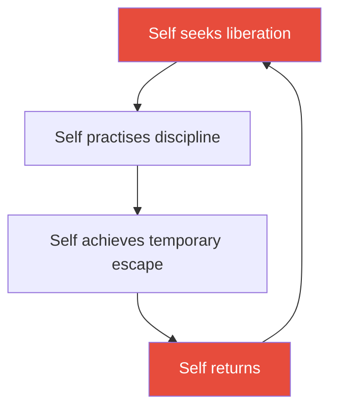
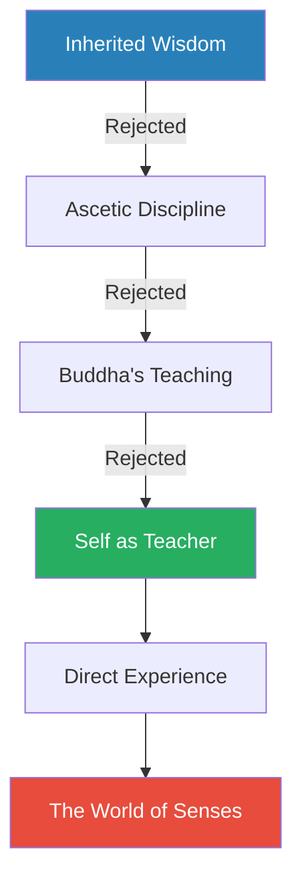
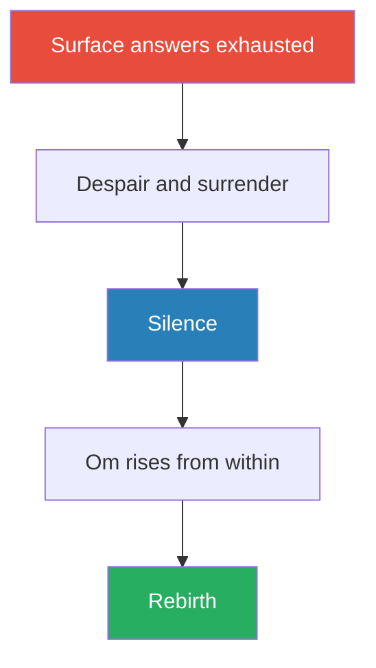
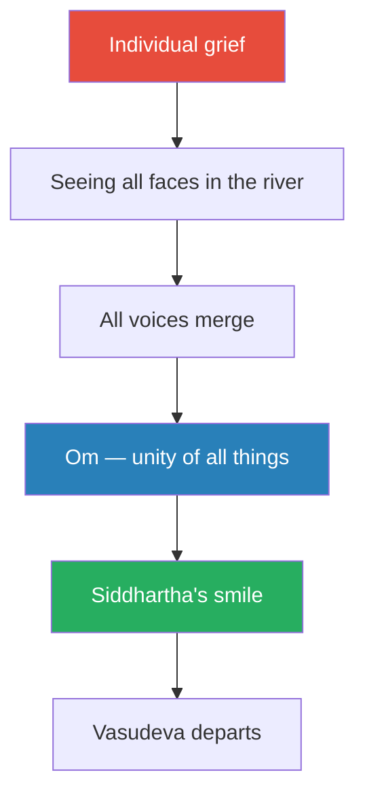
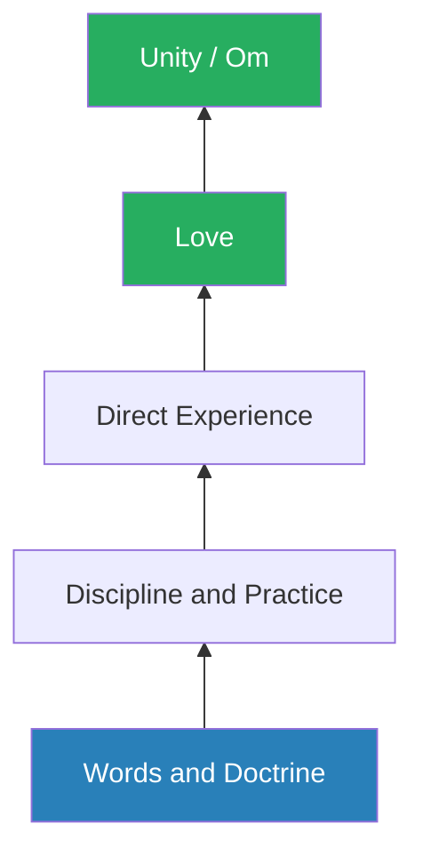
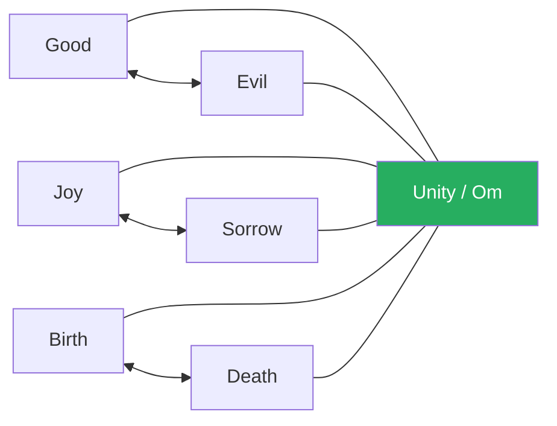

# Siddhartha — Hermann Hesse

> Hermann Hesse's *Siddhartha* follows a young Brahmin's son in ancient India who abandons privilege, rejects the Buddha's teachings, plunges into worldly desire, nearly destroys himself, and ultimately finds enlightenment not through any doctrine but through listening to a river.
> Written in 1922 by a German Nobel laureate in the middle of his own spiritual crisis, it is one of the most widely read novels of the twentieth century — a book that launched a million backpacking trips and still outsells most self-help books a century later.
> The novel's radical argument: wisdom cannot be taught. No teacher, no scripture, no discipline can hand you understanding. You must live through everything — pleasure, pain, greed, love, loss — and arrive at wisdom through the sum of your own experience.
> It is not a Buddhist novel, though the Buddha appears in it. It is not a Hindu novel, though it is saturated with Hindu imagery. It is a novel about what happens when a brilliant person refuses to accept anyone else's answers and insists on finding truth for himself.
> At barely 150 pages, it contains more genuine insight about the spiritual journey than most 500-page treatises. It is a book you read in an afternoon and think about for decades.

---

## About the Author

Hermann Hesse (1877–1962) was a German-Swiss poet, novelist, and painter whose work explored the individual's search for authenticity, self-knowledge, and spirituality. Born into a family of Pietist missionaries with deep ties to India, Hesse grew up surrounded by Eastern philosophy — his maternal grandfather had spent decades in India as a missionary and Indologist. Hesse suffered a severe psychological crisis in his forties, underwent Jungian psychoanalysis with a student of Carl Jung, and wrote *Siddhartha* during 1919–1922 as a direct response to that inner turmoil. He won the Nobel Prize in Literature in 1946 and became a countercultural icon in the 1960s when American and European youth adopted his novels as guides for spiritual rebellion. His other major works include *Steppenwolf*, *The Glass Bead Game*, and *Demian*.

---

## The Big Idea

- Hesse's central thesis is deceptively simple: <b style="color: #27ae60">wisdom cannot be transmitted from one person to another through words</b>
- Knowledge can be taught — facts, techniques, doctrines, the names of things
- But wisdom — the deep, lived understanding of reality — can only be acquired through direct personal experience
  - This includes the experiences we would most like to skip: desire, failure, shame, loss, and suffering
  - There are no shortcuts, no advanced placements, no borrowed enlightenments
- Siddhartha meets the Buddha himself and recognises him as the most enlightened being who has ever lived — and still walks away
  - Not because the Buddha is wrong, but because following the Buddha would mean accepting someone else's experience as a substitute for his own
  - The flaw is not in the teaching but in the act of teaching itself

---

- The novel tracks a complete <b style="color: #2980b9">spiritual arc</b> that mirrors the stages most seekers pass through:
  - **Inherited faith** — the beliefs you absorb from family and culture
  - **Intellectual rebellion** — rejecting inherited beliefs for something more rigorous
  - **Ascetic discipline** — trying to think or discipline your way to truth
  - **Worldly immersion** — abandoning the spiritual for the sensory
  - **Crisis and despair** — hitting bottom when neither world satisfies
  - **Surrender and listening** — giving up the need to seek and learning to be present
  - **Integration** — accepting all parts of the journey as necessary and simultaneous
- Hesse insists that you cannot skip stages — the merchant phase is as essential as the ascetic phase
  - The goal is not to avoid sin but to pass through it with awareness
  - Siddhartha's years of greed and pleasure are not wasted years — they are the education his intellect could never provide

---

- The novel's deepest symbol is the <b style="color: #2980b9">river</b> — which teaches without speaking, contains all time simultaneously, and reveals that all opposites are illusions:
  - The water at the source is also the water at the mouth
  - The child Siddhartha and the old man Siddhartha exist at the same time
  - Joy and suffering are the same current viewed from different banks
- This is not abstract philosophy — Hesse dramatises it through twelve chapters of vivid storytelling, giving the reader the same arc of experience that Siddhartha undergoes

Siddhartha's journey is not a straight line from ignorance to wisdom — it is a descent through indulgence and despair before the final ascent through surrender and listening.

---

## Key Concepts at a Glance

| Concept | One-line summary |
|---------|-----------------|
| **Wisdom vs. Knowledge** | Knowledge can be taught; wisdom can only be lived |
| **The Limits of Teaching** | Even the Buddha cannot hand his enlightenment to another person |
| **The Necessity of Sin** | You cannot transcend desire without first experiencing it fully |
| **The River** | Central metaphor for time, unity, and the eternal present |
| **Om** | The sacred syllable representing the unity of all things |
| **Samsara** | The cycle of worldly desire that must be lived through, not avoided |
| **Listening** | The deepest form of learning — what the river and Vasudeva model |
| **The Ferryman** | The teacher who teaches by pointing, not by preaching |
| **The Wound of Love** | Attachment to his son is the final lesson Siddhartha needed |
| **The Smile** | Enlightenment expressed not as ecstasy but as serene acceptance |
| **Unity of Opposites** | All dualities — good/evil, joy/sorrow, life/death — are one |
| **Self-Transcendence** | Wisdom arrives only when the seeker stops seeking |

---

Only in the Ferryman phase — after decades of excess, loss, and surrender — does Siddhartha's inner state reach fullness across every dimension, revealing that wholeness required living through each lopsided stage.

---

## Part One: The Seeker

### Chapter 1 — The Brahmin's Son

*Siddhartha has everything a young man in ancient India could want — wealth, intellect, beauty, adoration — and none of it satisfies him.*

- Siddhartha is the son of a Brahmin — the highest caste in Hindu society, the priestly and scholarly class
- He is handsome, brilliant, and beloved by everyone around him
  - His father, a learned Brahmin, has taught him all the scriptures and rituals
  - His mother adores him
  - His best friend Govinda follows him with devotion
  - Young women in the village are drawn to him
- Yet Siddhartha feels a persistent, unnamed dissatisfaction:
  - He has mastered the prayers, the meditations, the philosophical arguments
  - He can debate with the wisest Brahmins and hold his own
  - But none of it has brought him closer to <b style="color: #2980b9">Atman</b> — the eternal Self, the divine essence within
  - <b style="color: #e74c3c">The rituals feel hollow — they describe the divine without actually reaching it</b>

---

- His father represents the path of inherited wisdom:
  - A good man, a wise man, a man who has followed every rule
  - But Siddhartha senses that even his father has not found inner peace
  - The knowledge is real but incomplete — like reading about water without ever being wet
- Hesse establishes the difference between two kinds of knowing from the very first chapter:
  - **Conceptual knowledge** — understanding the words, the doctrines, the logical structure of a belief system
  - **Experiential knowledge** — understanding that lives in the body, that changes how you breathe and walk and see
  - Siddhartha's dissatisfaction comes from having the first without the second
  - He senses that the entire Brahmin tradition, however sophisticated, operates at the conceptual level

> [!example] Siddhartha's Restless Evenings
> - Every evening after prayers, Siddhartha and Govinda sit beneath the banyan tree
> - Govinda is content — the prayers bring him comfort, the rituals give him structure
> - Siddhartha is restless — he performs the rituals perfectly but feels nothing
> - He begins to wonder whether the Brahmin teachings are a cup that appears full but is actually empty
> - His father notices the restlessness but cannot address it — he has no answer beyond "study harder, pray more"
> **The lesson:** Mastery of a system's content does not guarantee access to its deeper truth.

- Siddhartha hears about the <b style="color: #2980b9">Samanas</b> — wandering ascetics who have renounced all possessions and comforts in pursuit of spiritual liberation
  - They live in the forest, eat almost nothing, endure extreme heat and cold
  - They seek to destroy the ego through physical suffering and meditation
- He tells his father he intends to join them
  - His father is horrified — this means abandoning family, caste, and everything they represent
  - Siddhartha stands motionless through the entire night, waiting silently for permission
  - By dawn, his father recognises something immovable in his son and grants reluctant blessing

> [!example] The Night of Standing
> - Siddhartha tells his father of his intention to leave and join the Samanas
> - His father forbids it — a Brahmin's son does not become a wandering beggar
> - Siddhartha does not argue, does not plead, does not defy — he simply stands in the corner of the room, arms folded, and waits
> - Hours pass — evening turns to midnight, midnight to dawn
> - His father gets up several times to check whether Siddhartha is still standing — each time, the young man is in exactly the same position, unmoved
> - By morning, his father sees not stubbornness but certainty — a force that cannot be argued with, only yielded to
> - He gives his blessing with a broken heart and asks only that Siddhartha return if he finds disillusionment instead of bliss
> **The lesson:** True resolve does not need argument. It expresses itself through stillness, not force.

> [!tip] Core Insight
> The first act of genuine seeking requires leaving the safety of inherited answers — even when those answers are sophisticated and the people offering them are wise and loving.

- <b style="color: #27ae60">Govinda chooses to follow Siddhartha</b> — this is the first of many moments where Govinda's path (following) diverges from Siddhartha's (leading)
- The two young men walk into the forest, leaving behind everything they have known

---

### Chapter 2 — With the Samanas

*Siddhartha trades the comforts of Brahmin life for radical self-denial — and discovers that destroying the self through willpower is just another form of self.*

- For three years, Siddhartha lives with the Samanas in the forest
- He learns their disciplines with characteristic speed and brilliance:
  - **Fasting** — going days without food to weaken the body's hold on the mind
  - **Breath control** — slowing the heartbeat, entering deep meditative states
  - **Pain endurance** — standing in the sun, sitting in the rain, ignoring physical sensation
  - **Ego dissolution** — attempting to empty the self entirely, to become nothing

---

- The techniques work — up to a point:
  - Siddhartha can enter trance states, can slow his breathing to near-death, can endure suffering without flinching
  - He learns to project his consciousness into animals and objects — to feel what a heron feels, what a stone feels
  - But <b style="color: #e74c3c">every time he leaves the trance, the self returns</b>
  - The ego cannot destroy itself — it is like using a sword to cut the hand that holds it

> [!example] Siddhartha's Observation to Govinda
> - After three years of ascetic practice, Siddhartha confides his doubt to Govinda
> - He notes that the oldest Samana — a man who has practised these disciplines for sixty years — has still not achieved liberation
> - If sixty years of fasting, pain, and meditation have not freed the old man, Siddhartha reasons, then the method itself may be flawed
> - He compares the Samana techniques to drunkenness — they offer temporary escape from the self, not permanent freedom
> - A drunkard in the tavern achieves the same thing for a few hours: brief oblivion, then the return of ordinary suffering
> **The lesson:** Techniques that produce altered states are not the same as techniques that produce wisdom.

- Siddhartha begins to formulate his first original insight:
  - <b style="color: #27ae60">Self-denial is still about the self</b> — the ascetic who obsesses over not-eating is as fixated on food as the glutton
  - Running from the world and running toward it are both forms of running — neither is stillness
  - There is a circular trap in all self-directed spiritual practice: the one who is seeking is the same one who is blocking
- Hesse builds this insight carefully over the three Samana years:
  - At first Siddhartha is enthusiastic — the discipline feels like progress
  - Then he notices that each achievement creates a new attachment — pride in fasting, pride in endurance, pride in ego-lessness
  - <b style="color: #e74c3c">Spiritual pride is the subtlest and most dangerous form of ego</b> — it disguises itself as its own opposite

The circular trap of ego-driven spiritual practice — the self cannot destroy itself through its own effort.

- When word comes that the historical Buddha — <b style="color: #2980b9">Gotama</b> — is teaching nearby, Siddhartha decides to go hear him
  - Not because he expects to become a follower, but because he wants to see a man who has actually broken through

---

### Chapter 3 — Gotama

*Siddhartha meets the most enlightened being in the world, recognises the perfection of his teaching, and walks away — because even perfect wisdom cannot be borrowed.*

- Siddhartha and Govinda travel to the grove where Gotama (the historical Buddha) is teaching
- Siddhartha recognises the Buddha's enlightenment immediately:
  - Not through his words, which are elegant and clear
  - But through his presence — his walk, his gaze, the way he holds his begging bowl
  - Every gesture radiates peace — <b style="color: #27ae60">this is a man who has genuinely arrived</b>

> [!example] Siddhartha Recognises the Buddha
> - The Buddha walks into the grove wearing simple robes, carrying a begging bowl
> - Siddhartha watches him move and knows instantly that this man is different from every teacher he has encountered
> - It is not the words — it is the bearing, the stillness, the complete absence of effort or performance
> - Siddhartha turns to Govinda and says simply: "This is the one"
> - They listen to the sermon, which lays out the Four Noble Truths and the Eightfold Path with crystalline clarity
> **The lesson:** Genuine wisdom is visible in how a person moves through the world, not just in what they say.

---

- Govinda is convinced — he asks to join the Buddha's order of monks and is accepted
  - This is the great divergence: Govinda follows the teacher; Siddhartha follows himself
  - Govinda's path is faith; Siddhartha's path is experience
- Siddhartha requests a private audience with the Buddha to explain why he cannot follow

| Path | Govinda | Siddhartha |
|------|---------|------------|
| **Method** | Following a teacher | Following experience |
| **Trust in** | The Buddha's doctrine | His own direct encounter with reality |
| **Risk** | Never thinking for himself | Making every mistake personally |
| **Strength** | Humility, devotion | Independence, courage |
| **Blind spot** | Dependence on authority | Arrogance, isolation |

Both paths are legitimate — Hesse does not condemn Govinda's choice. But the novel follows Siddhartha's path precisely because it is the harder, lonelier, more dangerous one.

---

- In the private conversation, Siddhartha makes the most important philosophical argument in the novel:
  - He tells the Buddha that his teaching is flawless — logically coherent, beautifully expressed, clearly the product of genuine enlightenment
  - But there is <b style="color: #e74c3c">one gap in the teaching that cannot be closed</b>: the Buddha achieved his enlightenment not through following a doctrine but through his own lived experience
  - The doctrine describes the destination but cannot reproduce the journey
  - <b style="color: #27ae60">"You have found salvation from death. It came to you from your own seeking, on your own path, through thought, through meditation, through knowledge, through enlightenment. Not through a teaching."</b>
  - Therefore, no follower can reach the same place by following the teaching — because following is the opposite of what the Buddha actually did
- The logic is rigorous and paradoxical:
  - The Buddha became enlightened by not following — by sitting under the Bodhi tree alone and refusing to move
  - His teaching tells others to follow him
  - But following the Buddha is structurally the opposite of what the Buddha did
  - <b style="color: #2980b9">The teaching contradicts its own origin story</b>

> [!tip] Core Insight
> The Buddha's enlightenment came from searching, not from following. Anyone who follows the Buddha is doing the exact opposite of what the Buddha did.

- The Buddha smiles — he does not argue, does not try to retain Siddhartha
  - He warns him gently against being too clever, but lets him go
  - This moment reveals the Buddha's own wisdom: he does not cling to his followers
- Siddhartha walks away from the greatest teacher in history
  - This is the novel's boldest claim: <b style="color: #2980b9">even perfect teaching is insufficient</b>
  - The individual must find truth through the full catastrophe of their own life

---

### Chapter 4 — Awakening

*Having rejected every teacher — his father, the Samanas, the Buddha — Siddhartha is finally alone with himself, and the world floods in.*

- Walking away from the Buddha's grove, Siddhartha experiences a sudden, overwhelming shift in awareness:
  - For the first time in his life, he is truly alone — no teacher, no doctrine, no companion
  - Govinda has stayed with the Buddha; Siddhartha's father is far behind; the Samanas are abandoned
  - <b style="color: #27ae60">He is naked before the world, with nothing between himself and experience</b>
- The world appears to him as if seen for the first time:
  - The sky is blue — not the idea of blue, but the actual, overwhelming sensation of blue
  - The leaves are green, the path is dusty, the birds are singing — and all of it is vivid, immediate, real
  - He has spent his entire life thinking about the world and has never actually noticed it
- This is the pivotal moment of Part One:
  - All his previous seeking was a form of avoidance — studying reality instead of experiencing it
  - The Brahmin teachings were a map; the Samana disciplines were a technique; the Buddha's doctrine was a description
  - None of them were the thing itself

> [!example] The World Floods In
> - As Siddhartha walks alone through the forest, he suddenly notices the colour of the trees, the smell of the earth, the feeling of his feet on the path
> - He realises with a shock that he has been a sleepwalker — his mind has been so busy with concepts and abstractions that he has never actually been present to the physical world
> - A butterfly lands on his hand and he stares at it in wonder, as if he has never seen a living thing before
> - He begins to laugh — all those years of meditation and study, and he missed the most obvious thing: the world is right here
> **The lesson:** Thinking about reality is not the same as experiencing it. The map is not the territory.

---

- Siddhartha makes a decision that will define the rest of his life:
  - <b style="color: #27ae60">He will learn from himself — from his own body, his own desires, his own mistakes</b>
  - He will not flee from the world of the senses but enter it fully
  - He will not suppress desire but follow it wherever it leads
- This is a terrifying choice:
  - Without a teacher, there is no safety net
  - Without a doctrine, there is no way to know if you are on the right path
  - Without a community, there is no one to catch you when you fall
- But Siddhartha sees this vulnerability as the point — only by risking everything can he learn anything real
- He also notices something new about his own identity:
  - For years he has been "Siddhartha the Brahmin's son" or "Siddhartha the Samana" — defined by his role
  - Now he is simply Siddhartha — a person, a body, a consciousness in the world
  - <b style="color: #2980b9">The stripping away of roles reveals the self beneath the labels</b>
  - This self is both more frightening and more real than any role he has played

Each rejection strips away another layer of borrowed authority until Siddhartha stands naked before experience itself.

---

## Part Two: The World

### Chapter 5 — Kamala

*Siddhartha enters the city and discovers that desire is its own education — but first he must become someone the world recognises.*

- Siddhartha arrives at a large city and immediately encounters a beautiful woman being carried in a sedan chair:
  - This is <b style="color: #2980b9">Kamala</b>, the city's most famous courtesan — wealthy, intelligent, sophisticated
  - Siddhartha is struck by desire for the first time in his life — not the abstract desire he suppressed as a Samana, but raw, physical attraction
  - He decides he wants to learn the art of love from her

> [!example] Siddhartha's First Encounter with Kamala
> - Siddhartha, still dressed in rags from his years as a Samana, approaches Kamala's garden
> - She laughs at him — he is filthy, barefoot, with matted hair
> - He asks her to teach him the art of love
> - She tells him plainly: love is an art, and she teaches only those who bring gifts — fine clothes, money, jewels
> - When he asks what he has to offer, she turns the question back: "What can you do?"
> - He answers with three capabilities: "I can think, I can wait, I can fast"
> - Kamala recognises immediately that these three skills — patience, discipline, and strategic thinking — will make him wealthy
> - She tells him to get fine clothes, learn to be a merchant, and return when he has something to offer
> **The lesson:** The skills of the ascetic — patience, discipline, delayed gratification — translate directly into worldly power.

---

- Kamala connects Siddhartha with <b style="color: #2980b9">Kamaswami</b>, a wealthy merchant who needs a clever partner
- Siddhartha transforms himself rapidly:
  - He bathes, cuts his hair, buys fine clothes
  - He enters Kamaswami's business and quickly proves his worth
  - His years of mental discipline give him an enormous advantage in commerce
  - He can out-think, out-wait, and out-endure any negotiating partner

| Samana Skill | Worldly Application |
|-------------|-------------------|
| **Fasting** | Willingness to walk away from any deal — no desperation |
| **Patience** | Ability to wait for the right opportunity instead of grabbing the first one |
| **Thinking** | Analytical clarity — seeing through complexity to the essential calculation |
| **Emotional detachment** | Freedom from the anxiety and greed that cloud other merchants' judgement |

The same capacities that made Siddhartha a formidable ascetic make him a formidable businessman — Hesse is showing that spiritual and worldly power share the same roots.

> [!example] Siddhartha and Kamaswami's Failed Deal
> - Kamaswami sends Siddhartha to a distant village to buy a rice harvest
> - When Siddhartha arrives, the rice has already been sold to another merchant
> - Instead of returning empty-handed and anxious, Siddhartha stays in the village for days
> - He befriends the farmers, listens to their problems, helps with small tasks
> - He returns to Kamaswami without rice but with something more valuable — deep knowledge of the region, its people, and future opportunities
> - Kamaswami is furious at first, then astonished when the relationships Siddhartha built yield far larger profits over the following months
> **The lesson:** The person who can wait, who does not grasp, who builds relationships instead of chasing transactions — this person wins in the long run.

---

- Kamala becomes his teacher in a new domain:
  - She teaches him the art of love — not just physical pleasure but emotional intelligence, attentiveness, the reading of another person
  - She is the first person who treats him as an equal, not as a disciple or a master
  - <b style="color: #27ae60">She recognises something in Siddhartha that he does not yet see in himself: he is a visitor in the world of the senses, not a permanent resident</b>
  - She tells him that he is incapable of truly loving — he holds something back, some core of himself that remains untouched by desire

> [!tip] Core Insight
> Kamala sees that Siddhartha's greatest strength — his ability to remain detached — is also his greatest limitation. He can pass through experiences without being changed by them, which means he is still not fully alive.

---

- Siddhartha's relationship with Kamala reveals a deeper pattern in the novel:
  - Every teacher gives him something genuine, but no teacher gives him everything
  - The Brahmins gave him concepts; the Samanas gave him discipline; the Buddha gave him a vision of the destination
  - Kamala gives him something none of them could: <b style="color: #2980b9">embodied knowledge</b> — understanding that lives in the body, not in the mind
  - She teaches him that the senses are not enemies to be conquered but instruments of understanding
  - Touch, taste, sensation — these are forms of intelligence that ascetics discard at their peril
- Kamala also introduces Siddhartha to the concept of <b style="color: #2980b9">reciprocity in love</b>:
  - With the Brahmins, knowledge flowed one way — from teacher to student
  - With the Samanas, the relationship was between the individual and his own suffering
  - With Kamala, for the first time, Siddhartha must give as well as receive
  - She demands presence, attentiveness, generosity — and she gives the same in return
  - This is the first hint that love, not thought, might be the key to understanding

> [!example] Kamala's Assessment of Siddhartha
> - After many months together, Kamala tells Siddhartha that he is the best student she has ever had
> - She also tells him that he is the most difficult — because part of him is always elsewhere
> - She compares him to a star that passes through the night sky — brilliant, beautiful, but ultimately unreachable
> - She says: "You do not love. If you did, you could not treat love as an art"
> - Siddhartha is stung by this observation but cannot refute it
> - Years later, by the river, he will understand that she was right — and that the capacity for love she saw missing was the final piece of his education
> **The lesson:** Self-awareness has a blind spot — the things we cannot see about ourselves are often the things closest to us.

---

### Chapter 6 — Amongst the People

*Siddhartha becomes rich and successful, but success itself begins to feel like another form of sleep.*

- Years pass. Siddhartha becomes wealthy, respected, and comfortable:
  - He lives in a fine house, eats rich food, drinks wine, gambles
  - He is generous — the money does not grip him at first
  - He treats commerce as a game, which gives him an advantage over those who take it seriously
- But Hesse tracks the slow, almost imperceptible corruption:
  - At first, Siddhartha observes the world of the "child people" (his term for ordinary humans) with amused detachment
  - He sees their anxieties, their petty ambitions, their desperate attachments — and feels superior to all of it
  - <b style="color: #e74c3c">This superiority is itself the first stage of his corruption</b> — it prevents him from learning what ordinary life has to teach

---

- The transformation happens gradually, like water wearing down stone:
  - He begins to care about his trades, to feel irritation when a deal falls through
  - He develops a taste for luxury — the fine wine, the silk robes, the perfumed baths
  - He gambles more and more — not for money but for the thrill of risk, the high of winning
  - He becomes impatient, irritable, demanding — qualities that would have horrified the young ascetic
- Hesse draws a crucial parallel:
  - The Samana path and the merchant path look like opposites — one rejects pleasure, the other pursues it
  - But both are forms of the same restlessness — the Samana runs from desire, the merchant runs toward it, and neither achieves stillness
  - <b style="color: #2980b9">Samsara</b> — the cycle of worldly attachment and suffering — is not a place but a state of mind
- The concept of the <b style="color: #2980b9">"child people"</b> evolves over the course of the chapter:
  - At first, Siddhartha uses it condescendingly — the ordinary people who are driven by simple desires and fears
  - He believes he is observing them from above, like a scientist studying insects
  - But gradually he realises that he has become one of them — and that the distinction was always false
  - <b style="color: #27ae60">The "child people" possess something Siddhartha lacks: the ability to love simply, to care without philosophy, to give themselves fully to another person</b>
  - His detachment, which he mistook for superiority, is actually a disability

> [!example] The Slow Corruption of Siddhartha
> - In his first year as a merchant, Siddhartha treats money as a game — he gives freely, loses without caring, laughs at Kamaswami's anxiety
> - In his fifth year, he begins checking his accounts with the same nervous energy as Kamaswami
> - In his tenth year, he is gambling recklessly, drinking heavily, and treating servants with contempt
> - He has become the very thing he once observed with detached amusement — a "child person" lost in the cycle of craving and disappointment
> - The transformation was so gradual that he did not notice it happening
> **The lesson:** You do not fall into corruption in a single dramatic moment — you drift into it so slowly that you mistake the drift for standing still.

---

### Chapter 7 — Samsara

*Siddhartha hits bottom — the spiritual seeker has become everything he once despised, and the weight of it nearly kills him.*

- Siddhartha is now fully trapped in <b style="color: #2980b9">Samsara</b> — the wheel of worldly existence:
  - He gambles compulsively, chasing the brief intensity of risk
  - He eats and drinks to excess, then fasts to punish himself, then returns to excess
  - He treats people as instruments — sources of pleasure, profit, or entertainment
  - <b style="color: #e74c3c">The contempt he once felt for "child people" has turned inward — he now despises himself</b>

- Hesse makes an essential point about the spiritual journey:
  - This phase is not a failure — it is a necessary passage
  - Siddhartha could not have understood desire from the outside
  - The Samanas tried to transcend desire by avoiding it — and failed
  - Siddhartha is learning about desire by drowning in it — and this too is education
  - But education through suffering has a cost: you may not survive the lesson

---

- The mechanics of Samsara as Hesse portrays it:
  - It is not simply "sin" or "pleasure-seeking" — it is the cycle itself that traps
  - Pleasure leads to craving, craving leads to acquisition, acquisition leads to boredom, boredom leads to more intense pleasure
  - Each rotation of the wheel requires higher stakes: more wine, bigger gambles, more exotic distractions
  - <b style="color: #e74c3c">The wheel accelerates — what satisfied for a year now satisfies for a month, then a week, then a day</b>
  - This is the addiction pattern, and Hesse describes it with clinical precision decades before the modern understanding of dopamine and tolerance

> [!example] Siddhartha's Dream of the Dead Bird
> - Deep in his period of spiritual decay, Siddhartha has a vivid dream
> - Kamala keeps a rare golden songbird in a cage — a beautiful, delicate creature that sings every morning
> - In the dream, the bird falls silent, and Siddhartha looks into the cage to find it dead
> - He takes the small body and throws it into the street — and as he does so, he feels that he has thrown away everything good and valuable in his own life
> - He wakes in anguish, overwhelmed by self-disgust
> - The dead bird is his soul — killed by years of indulgence and spiritual neglect
> **The lesson:** The soul gives warnings. When the song stops, you are already in danger.

- The dream marks the beginning of the end of Siddhartha's worldly phase:
  - He cannot ignore what he has become
  - The pleasure no longer pleases; the games no longer thrill; the wine no longer numbs
  - He is stranded between two worlds — unable to return to the spiritual life he abandoned and unable to continue the worldly life that is destroying him
- He leaves the city without telling anyone — simply walks away from everything, as he once walked away from his father's house
  - Hesse draws the deliberate parallel: the same man, the same pattern, decades later
  - But this departure carries shame and exhaustion, not idealistic energy

---

### Chapter 8 — By the River

*Siddhartha reaches the lowest point of his life — and in the moment of greatest despair, hears the voice that has been waiting for him all along.*

- Siddhartha wanders to the river — the same river he crossed years ago when entering the city as a young man full of confidence
- Now he is middle-aged, exhausted, self-loathing, and empty:
  - Every path he has tried has failed — the Brahmin rituals, the Samana disciplines, the Buddha's teaching, the worldly life
  - He has run through the entire catalogue of available paths and found none of them sufficient
  - <b style="color: #e74c3c">He considers drowning himself</b> — the weight of his wasted years feels unbearable

> [!example] Siddhartha at the Edge
> - Standing at the river's edge, Siddhartha looks down into the water and sees his own reflection — a face he barely recognises
> - He leans forward, drawn by the dark water, the promise of oblivion
> - The desire to end his life is not dramatic or theatrical — it is quiet, tired, the exhaustion of a man who has tried everything
> - He begins to fall toward the water
> - And then, from deep within himself — or from the river — he hears a single syllable: **Om**
> - The sacred word rises up from some forgotten depth and stops him like a hand on his chest
> - He sinks to the ground at the river's edge and falls into the deepest sleep of his life
> **The lesson:** The lowest point is not the end — it is the place where something buried can finally be heard because every other voice has gone silent.

---

- When he wakes, the world has changed — or rather, he has changed:
  - He sees the river not as a barrier or a tool but as a living presence
  - He feels that his years of wandering, seeking, and suffering were not wasted but necessary
  - Every wrong turn was part of the education; every failure was a lesson
  - <b style="color: #27ae60">He needed to become a sinner in order to understand sin, needed to become desperate in order to understand despair</b>
- He also wakes to find someone watching him — a familiar face:
  - It is Govinda, his childhood friend, now a monk in the Buddha's order
  - Govinda does not recognise the rich, exhausted man sleeping by the river as his old friend
  - When Siddhartha identifies himself, Govinda is shocked — and concerned
- The reunion is brief but significant:
  - Govinda has spent twenty years following the Buddha's path faithfully
  - Siddhartha has spent twenty years following his own path recklessly
  - Neither has yet arrived at wisdom — but both are closer than they know
  - The parallel is precise: the faithful follower and the reckless individualist are equally incomplete at this midpoint

> [!tip] Core Insight
> You cannot hear the deepest truths until you have exhausted every surface-level answer. The voice of Om was always there — Siddhartha could not hear it over the noise of his own seeking.

The paradox of spiritual breakthrough: you find what you are looking for only when you stop looking.

---

### Chapter 9 — The Ferryman

*Siddhartha meets the teacher he did not know he was looking for — a simple ferryman who teaches by listening to the river.*

- Siddhartha walks along the river and comes to the ferry crossing where, years ago, a ferryman had carried him across for free
- The ferryman is still there: <b style="color: #2980b9">Vasudeva</b> — an old, quiet man with a perpetual smile
  - Siddhartha had met him briefly years ago and noticed something unusual about him
  - Vasudeva had the same quality as the Buddha — a deep, effortless peace — but without the teaching, without the philosophy, without the words
- Siddhartha asks to stay and learn the ferryman's trade
  - Vasudeva accepts him without questions, without conditions
  - There is no entrance exam, no doctrine, no initiation
  - He simply says: the river has much to teach

---

- Vasudeva's method of teaching is <b style="color: #27ae60">radical non-instruction</b>:
  - He does not lecture, does not explain, does not philosophise
  - He listens — to the river, to Siddhartha, to the passengers who cross
  - When Siddhartha tells him his entire life story — the Brahmins, the Samanas, the Buddha, Kamala, the years of wealth and ruin — Vasudeva listens with total attention
  - He does not judge, advise, or interpret
  - <b style="color: #27ae60">He listens the way the river listens — absorbing everything, reflecting everything, holding nothing</b>

> [!example] Vasudeva Listens to Siddhartha's Story
> - Siddhartha tells Vasudeva everything — his childhood, his years of seeking, his descent into pleasure and self-loathing
> - Vasudeva sits by the river and gives him complete, undivided attention
> - He does not interrupt, does not offer commentary, does not say "I understand" or "That happened to me too"
> - When Siddhartha finishes, he feels lighter — as if the story has flowed out of him into the river
> - Vasudeva says simply: "The river has told me the same things"
> - He does not explain what he means. He does not need to.
> **The lesson:** The rarest and most powerful form of teaching is listening without agenda — creating a space where another person can hear their own truth.

---

- Siddhartha begins to learn from the river:
  - He sits beside it for hours, watching the water flow
  - He notices that the river contains all sounds — laughter, weeping, singing, anger — blended into a single voice
  - He notices that the river is always the same and always different — the water passes but the river remains
  - He begins to understand what the river is teaching:

| River Lesson | Meaning |
|-------------|---------|
| **The river is everywhere at once** | The water at the source is the same water at the mouth — time is an illusion |
| **The river never hurries** | It reaches the ocean without effort because it follows its own nature |
| **The river contains all voices** | Joy and suffering are not opposites — they are the same current |
| **The river does not hold on** | It receives everything — rain, leaves, stones — and lets everything pass through |
| **The river is always present** | It does not remember the past or anticipate the future — it exists only in now |

- This is the education that no teacher could have provided:
  - Not because the river is smarter than the Buddha, but because the river does not teach — it demonstrates
  - The Buddha describes unity in words; the river embodies unity in its nature
  - Siddhartha can only receive this lesson now because he has been broken open by experience — the young intellectual who left his father's house would have dismissed the river as a pretty metaphor

> [!example] The Voices in the Water
> - Late one evening, Siddhartha sits at the river's edge and begins to distinguish individual sounds within the water's voice
> - He hears a child laughing — and then the laugh shifts into the sound of a woman weeping
> - He hears an old man's sigh, then a young man's shout of triumph
> - Each sound is distinct for a moment, then dissolves back into the river's unified voice
> - He realises that the river is not mixing sounds together — they were never separate
> - The laughing and the weeping, the triumph and the sorrow, exist simultaneously in every drop of water
> **The lesson:** What we experience as separate emotions, separate lives, separate moments — the river shows as one continuous flow.

---

### Chapter 10 — The Son

*The final lesson comes not from a river or a teacher but from the most ordinary and painful of human experiences — a father's helpless love for his child.*

- Kamala, after years of living as a wealthy courtesan, has given up her life of luxury and become a pilgrim
  - She is travelling to see the Buddha, who is rumoured to be dying
  - She has a young son — Siddhartha's son, whom Siddhartha has never met
- Near the river, she is bitten by a snake and carried to Vasudeva's hut by her attendants
  - She is dying when Siddhartha finds her
  - She smiles when she recognises him — there is no anger, no accusation
  - <b style="color: #27ae60">She tells him that his son — called Young Siddhartha — is his</b>
  - She dies peacefully, having made her own journey from desire to acceptance

> [!example] Kamala's Death by the River
> - Kamala arrives at the ferry crossing with her young son, already weakened by the snakebite
> - She is carried to Vasudeva's hut, where Siddhartha recognises her with a shock of grief and joy
> - She is no longer the beautiful, calculating courtesan of the city — she has become a pilgrim, travelling to pay respects to the dying Buddha
> - She looks at Siddhartha and sees the same thing she saw decades ago — a man who cannot fully surrender to love
> - But now she sees it with tenderness, not criticism
> - She dies with a smile on her face — a smile that Siddhartha recognises as something he has seen before, on the face of the Buddha
> **The lesson:** Kamala's journey mirrors Siddhartha's — from privilege through indulgence to spiritual peace. She arrives at the same destination by a different road.

---

- Young Siddhartha is angry, spoiled, and defiant:
  - He has been raised in luxury and resents being dragged to a ferryman's hut
  - He treats his father with contempt
  - He breaks things, refuses to work, insults Vasudeva
  - He wants to go back to the city, to wealth, to the life he knew
- Siddhartha loves his son with an overwhelming, painful tenderness:
  - <b style="color: #e74c3c">This is the one form of attachment he cannot philosophise away</b>
  - He has transcended his desire for wealth, for pleasure, for status — but he cannot transcend his love for his own child
  - He tries to win the boy over with patience, with kindness, with gentle discipline
  - Nothing works — the boy hates the simple life and wants to leave

---

- Vasudeva watches this struggle with quiet compassion:
  - He does not intervene — he knows that Siddhartha must learn this lesson for himself
  - He has already learned it: years ago, Vasudeva had his own son, who also left
  - He gently suggests that Siddhartha is repeating an ancient pattern — the father who tries to impose his wisdom on a child who must make his own journey

> [!example] Young Siddhartha Runs Away
> - One morning, the boy is gone — he has stolen money from Vasudeva's hut, taken the boat across the river, and vanished toward the city
> - Siddhartha chases after him, running through the forest, calling his name
> - He reaches the city and stands at the edge, unable to enter — the city represents everything he has already lived through and transcended
> - He realises he cannot follow his son into that life any more than his own father could follow him into the forest
> - He turns back toward the river, broken-hearted
> **The lesson:** You cannot protect your child from suffering. Every person must walk their own path, make their own mistakes, and find their own way home.

- This is the wound that completes Siddhartha's education:
  - He has known intellectual frustration (the Brahmins), physical deprivation (the Samanas), philosophical admiration (the Buddha), sensual pleasure (Kamala), worldly success (Kamaswami), and existential despair (the river)
  - But he has never known <b style="color: #2980b9">helpless love</b> — the love that wants to save someone and cannot
  - This is what Kamala meant when she said he was incapable of love — he had always held something back, always maintained a core of detachment
  - The son broke through that detachment and left a wound that cannot be healed by thinking or meditating
  - <b style="color: #27ae60">The wound itself is the teacher</b>

> [!tip] Core Insight
> All of Siddhartha's spiritual achievements — his intellect, his discipline, his detachment — were forms of control. The son teaches him the one thing control cannot reach: helpless, unrequited love.

---

### Chapter 11 — Om

*Standing at the river in grief, Siddhartha finally hears what the river has been saying all along — and the boundary between self and world dissolves.*

- After losing his son, Siddhartha sits by the river for days, consumed by grief:
  - He recognises the feeling — it is the same desperate love his own father felt when Siddhartha left home
  - He has become his father — and he now understands what his leaving cost
  - <b style="color: #2980b9">The wheel has come full circle</b>: the son who left his father's house is now the father whose son has left

---

- Staring into the river, Siddhartha begins to see faces:
  - His own face — as a child, as a young ascetic, as a wealthy merchant, as a desperate man by the water's edge
  - His father's face, lined with grief
  - Kamala's face, smiling in death
  - Govinda's face, earnest and seeking
  - His son's face, twisted with anger
  - The faces of thousands of other people — all seeking, all suffering, all loving, all dying
- And then the faces merge:
  - They are all one face — one river — one voice
  - The river is not a metaphor — it is the literal experience of unity
  - All the individual streams of suffering and joy and desire and loss flow together into a single sound
  - That sound is <b style="color: #27ae60">Om</b> — the syllable of unity, the word that contains all words

> [!example] Siddhartha Hears the River's Voice
> - The river's voice shifts and deepens
> - At first it sounds like weeping — the grief of a thousand mothers, fathers, children
> - Then it sounds like laughter — the joy of lovers, of children playing, of old men who have made peace with death
> - Then the weeping and the laughter merge into a single sound that is neither — or both
> - The sound is Om — not the syllable chanted in meditation, but the living, breathing vibration underneath all of existence
> - Siddhartha's pain does not disappear — it expands until it includes everyone's pain, and in that expansion it transforms
> **The lesson:** Individual suffering becomes bearable when it is recognised as universal. Your grief is everyone's grief. Your joy is everyone's joy.

---

- Vasudeva has been sitting beside Siddhartha through this experience:
  - He recognises what is happening — he has been through it himself
  - When Siddhartha turns to look at him, Vasudeva smiles — the same smile as the Buddha
  - Vasudeva says simply: "You have heard"
  - Then he announces that his work is done — he will leave the ferry and go into the forest to die
  - He walks into the trees and disappears

The sequence from personal suffering to universal compassion — the river transforms grief not by removing it but by revealing its universality.

- The departure of Vasudeva is one of the novel's most beautiful passages:
  - Vasudeva does not die dramatically — he simply returns to the wholeness he has always been part of
  - He does not leave a teaching, a school, or a doctrine
  - He leaves a smile — the same smile the Buddha wore, the same smile Kamala wore at death
  - <b style="color: #27ae60">The smile is the teaching — it says: I accept everything, I hold nothing, I am at peace</b>
- Siddhartha is now the ferryman — carrying others across the river as Vasudeva once carried him

---

### Chapter 12 — Govinda

*The novel ends where it began — with two old friends — and Siddhartha transmits his understanding in the only way wisdom can be transmitted: not through words but through presence.*

- Many years later, Govinda — now an elderly monk who has spent his entire life following the Buddha's path — hears about a wise ferryman and comes to see him
  - He does not recognise Siddhartha at first — decades have passed, and the wealthy merchant and the ragged ascetic have both disappeared into the quiet old man by the river
  - When Govinda realises who the ferryman is, he asks the question he has been carrying for a lifetime: "What have you found? What can you teach me?"

---

- Siddhartha's answer is the novel's philosophical climax:
  - <b style="color: #27ae60">"Wisdom cannot be passed on"</b> — it can be found, it can be lived, it can be demonstrated, but it cannot be spoken
  - Every attempt to put wisdom into words turns it into something else — into knowledge, into opinion, into doctrine
  - The words are always only half-true — because reality contains opposites simultaneously, and language forces you to choose one side
  - A stone is a stone, but it is also an animal, a plant, a human being, a Buddha — it is all things at once, and any word you use to describe it captures only one angle

- Siddhartha makes a crucial distinction between <b style="color: #2980b9">seeking</b> and <b style="color: #2980b9">finding</b>:
  - A seeker is someone who has a goal — and having a goal means you are looking for one thing and missing everything else
  - <b style="color: #e74c3c">Seeking is a form of blindness</b> — you find the thing you are looking for only when you stop looking and start seeing
  - This is why the Buddha's teaching cannot produce more Buddhas — the teaching creates seekers, and seekers are, by definition, not yet finders

| Seeking | Finding |
|---------|---------|
| Has a goal | Has no goal |
| Excludes everything that is not the target | Includes everything |
| Driven by dissatisfaction | Rests in acceptance |
| Looks forward to a future state | Exists in the present |
| Creates a gap between seeker and truth | Dissolves the gap |

---

- Govinda listens but does not fully understand — he has spent his life as a seeker, and the idea that seeking itself is the obstacle is difficult to absorb
  - He asks: "Do you have no doctrine, no faith?"
  - Siddhartha answers: he has many convictions, but they are not beliefs in the usual sense
  - He believes that <b style="color: #27ae60">love is the most important thing in the world</b>
  - Not romantic love or parental love specifically, but the capacity to regard every person, every object, every moment with love and acceptance
  - The opposite of love is not hatred — it is judgement, evaluation, the constant sorting of the world into good and bad, worthy and unworthy

> [!example] The Final Exchange Between Siddhartha and Govinda
> - Govinda, now old and weary, admits that he has followed the Buddha's path faithfully for decades and still has not found peace
> - He asks Siddhartha if he has any final teaching — any word, any technique, any truth that might help
> - Siddhartha smiles — the same smile he saw on the Buddha's face, on Vasudeva's face, on Kamala's face at death
> - He says: "Kiss my forehead"
> - Govinda, confused but trusting, leans forward and kisses Siddhartha's forehead
> - In that moment, Govinda sees visions: a river of faces — men, women, children, animals, gods — all flowing into one another, all suffering, all loving, all dying, all being reborn
> - He sees the face of the Buddha, the face of Siddhartha, the face of everyone who has ever lived — all merged into one expression of unity
> - He falls to his knees, weeping — not with sadness but with recognition
> **The lesson:** Wisdom cannot be spoken. It can only be transmitted through presence — through a touch, a gesture, a moment of complete openness between two human beings.

> [!tip] Core Insight
> The novel ends not with a doctrine but with a kiss — because the truth Siddhartha has found cannot be put into words. It can only be experienced directly, person to person, in a moment of total presence.

---

## The Novel's Central Arguments

### Argument 1: Wisdom Is Not Transferable

*Hesse builds an entire novel around one philosophical claim — and dramatises it so thoroughly that the reader experiences the argument rather than merely hearing it.*

- This is the spine of the entire novel — the argument that separates Siddhartha from Govinda, from the Buddha, from every teacher he encounters:
  - Knowledge is transferable — you can teach someone mathematics, history, even meditation techniques
  - <b style="color: #27ae60">Wisdom is not transferable</b> — it is the residue of lived experience, and it belongs only to the person who lived it
  - Every attempt to package wisdom into a teaching necessarily distorts it
  - The words are always half-truths — they capture one angle and miss the others
- Hesse is not anti-intellectual — he does not dismiss teaching or learning:
  - The Buddha's teaching is described as flawless, beautiful, logically perfect
  - But logical perfection is not the same as experiential truth
  - You can describe the taste of an orange with perfect accuracy and the listener will still not know what an orange tastes like

---

### Argument 2: Sin Is Part of the Path

- Hesse's second radical claim: <b style="color: #2980b9">you cannot transcend what you have not experienced</b>
  - The ascetic who avoids desire does not understand desire — he understands avoidance
  - The monk who renounces wealth does not understand wealth — he understands renunciation
  - To truly understand something, you must pass through it
- Siddhartha's years as a merchant, gambler, and hedonist are not a detour from enlightenment — they are a necessary stage:
  - He learns what desire actually feels like from the inside
  - He learns what attachment costs — not as an abstract concept but as lived suffering
  - He learns that worldly pleasure is real but insufficient — not because someone told him so, but because he experienced its insufficiency firsthand
- <b style="color: #e74c3c">The danger of this argument</b>: it can be used to justify any behaviour ("I need to experience it to transcend it")
  - Hesse is aware of this risk — Siddhartha nearly dies in the process
  - The argument is not "sin is good" but "sin is unavoidable if you are seeking genuine understanding rather than borrowed beliefs"

---

### Argument 3: Time Is an Illusion

- The river teaches Siddhartha that time — past, present, future — is a human construction:
  - The river exists at every point simultaneously — source, middle, mouth, ocean
  - Siddhartha-the-child and Siddhartha-the-old-man exist at the same time
  - <b style="color: #27ae60">Every moment contains all moments</b>
- This has practical implications:
  - If time is an illusion, then the idea of "becoming" — of working toward a future state of enlightenment — is also an illusion
  - You do not become enlightened in the future; you are already the thing you seek
  - The seeking itself creates the illusion of distance
  - When you stop seeking, you discover that you were already there
- Hesse's treatment of time anticipates several modern philosophical ideas:
  - The "eternal now" of mystical traditions — the idea that the present moment is the only reality
  - The Buddhist concept of <b style="color: #2980b9">sunyata</b> (emptiness) — the idea that all fixed categories, including temporal ones, are constructions
  - The paradox of self-improvement: if you believe you need to become something different, you have already created a separation between who you are and who you want to be
  - <b style="color: #e74c3c">That separation is itself the source of suffering</b> — the gap between "I am here" and "I should be there" is the engine of restlessness
- The river demonstrates this by simply being what it is:
  - It does not try to reach the ocean — it flows, and the ocean is where it arrives
  - It does not remember its source with nostalgia or anticipate its destination with longing
  - It is fully present at every point along its course
  - This is what Vasudeva models and what Siddhartha eventually learns: <b style="color: #27ae60">stop trying to become, and simply be</b>

---

### Argument 4: Love Is the Final Teacher

- Siddhartha's intellectual journey spans decades and covers every major spiritual tradition available to him
- But the breakthrough comes through love — specifically, through the helpless, unrequited love of a parent for a child:
  - This is the one experience he cannot control, cannot philosophise, cannot transcend through willpower
  - It breaks through his detachment and forces him to feel what ordinary people feel every day
  - <b style="color: #27ae60">The wound of love accomplishes what decades of meditation could not — it dissolves the boundary between Siddhartha and the rest of humanity</b>
- Hesse's hierarchy of teachers:
  - Words are the weakest teacher (Brahmin scriptures, the Buddha's sermons)
  - Discipline is stronger but still limited (Samana asceticism)
  - Experience is powerful but dangerous (worldly life)
  - Love is the most powerful teacher of all — because it is involuntary, uncontrollable, and irreducible

Hesse's hierarchy of teachers — each level is more powerful and less controllable than the one below it.

The expanding wedges show that Siddhartha's most transformative lessons came not from ideas he could control but from forces — love, unity — that overwhelmed his defences.

---

## Structural Patterns and Parallels

*Hesse structures the novel around a series of mirrors and echoes — moments where Siddhartha repeats, in a new key, something that happened earlier.*

| Event (Part One) | Mirror Event (Part Two) |
|-----------------|----------------------|
| Siddhartha leaves his father's house | Siddhartha's son leaves the ferryman's hut |
| His father stands grieving, unable to stop him | Siddhartha stands grieving, unable to stop his son |
| He crosses the river heading toward the city | He sits by the river, watching his son cross toward the city |
| He rejects the Buddha's teaching | His son rejects his father's wisdom |
| Govinda follows the Buddha | Siddhartha stays by the river alone |
| The young ascetic enters the forest | The old ferryman enters the forest (Vasudeva) |
| Kamala laughs at the ragged Samana | Siddhartha smiles at the confused Govinda |

- These mirrors are not coincidences — they are Hesse's way of dramatising the river's teaching:
  - Everything recurs; every pattern repeats
  - The son becomes the father; the student becomes the teacher; the seeker becomes the found
  - <b style="color: #27ae60">Understanding this pattern is not the same as escaping it — but recognising the pattern brings peace instead of suffering</b>

---

## Character Analysis

### Siddhartha — The Individual Path

- Siddhartha represents the person who must verify everything for themselves:
  - He cannot accept secondhand truth, no matter how perfect it appears
  - This makes him brilliant, courageous, and profoundly lonely
  - His greatest strength — intellectual independence — is also his greatest source of suffering
  - He must touch every flame to know that fire burns
- His name is deliberately the same as the Buddha's birth name (Siddhartha Gautama):
  - Hesse is making a point: there is a "Buddha" — an awakened one — in every person
  - The historical Buddha found his path; this Siddhartha must find his own
  - They arrive at the same place by completely different routes

### Govinda — The Faithful Path

- Govinda is not a lesser character — he represents a legitimate alternative to Siddhartha's path:
  - He is humble, devoted, consistent
  - He follows the Buddha's teaching faithfully for fifty years
  - He achieves genuine spiritual development — he is not a fool or a failure
  - But he has not yet achieved peace — he is still seeking, still hoping, still not quite there
- <b style="color: #2980b9">Govinda's tragedy is gentle</b>: he has done everything right and still feels incomplete
  - This is Hesse's most nuanced point — following the rules perfectly does not guarantee arrival
  - Govinda needs the kiss at the end — the direct transmission of experience — because words alone, even the Buddha's words, were not enough for him either

Govinda's devotion earned him discipline and structure, but Siddhartha's willingness to suffer and seek independently produced a deeper — if more painful — peace.

---

### Vasudeva — The Silent Teacher

- Vasudeva is the novel's most mysterious and beloved character:
  - He has no doctrine, no method, no philosophy
  - He ferries people across the river, listens to them, listens to the water, and smiles
  - He is already where Siddhartha is trying to get — and he got there without any of the dramatic seeking
  - His secret: <b style="color: #27ae60">he learned to listen instead of to think</b>

| Quality | Vasudeva | Every Other Teacher |
|---------|----------|-------------------|
| **Method** | Listening | Speaking |
| **Knowledge** | Embodied | Articulated |
| **Ego** | Nearly absent | Present (even the Buddha has a teaching to transmit) |
| **Teaching style** | Points toward the river | Explains concepts |
| **Duration** | Permanent peace | Ongoing seeking |

- Vasudeva is Hesse's portrait of what the spiritual journey looks like when it is complete:
  - No fireworks, no drama, no revelations
  - Just quiet presence, deep listening, and an inexplicable smile
  - He disappears into the forest at the end because his work is done — he has pointed Siddhartha toward the river, and the river has done the rest

Every teacher poured a different tributary into Siddhartha's understanding — none alone was sufficient, but the river of his life carried them all into a single, integrated wisdom.

---

### Kamala — The Worldly Mirror

- Kamala is more complex than she initially appears:
  - She begins as a teacher of sensual pleasure — shrewd, beautiful, transactional
  - She ends as a pilgrim dying by the river with a smile on her face
  - Her journey mirrors Siddhartha's: from privilege through worldly mastery to spiritual peace
  - But her journey happens mostly off-page — Hesse gives us only the beginning and the end
- Kamala sees Siddhartha more clearly than anyone else in the novel:
  - She recognises his detachment as a strength and a limitation
  - She tells him he cannot truly love — and she is right, at that point in his life
  - She gives him a son — the instrument of his final education
  - <b style="color: #27ae60">In death, she achieves the same smile as the Buddha — proving that the path through worldly life can lead to the same destination as the path of renunciation</b>

---

## Themes in Depth

### The Unity of Opposites

*Hesse's most philosophically ambitious claim: all opposites are illusions created by language and thought.*

- Siddhartha articulates this in his final conversation with Govinda:
  - The world is not divided into good and evil, sacred and profane, spiritual and worldly
  - These divisions are created by the mind's need to categorise and judge
  - <b style="color: #2980b9">Reality itself is undivided</b> — a stone is already everything, already Buddha, already soil
  - Time creates the appearance of separation: the stone "will become" soil, the child "will become" an adult
  - But if time is an illusion, then the stone is already soil, the child is already an adult — everything is simultaneous

- This has profound implications for the spiritual seeker:
  - If Siddhartha-the-sinner and Siddhartha-the-saint exist simultaneously, then the sinner is not separate from the saint
  - The years of greed and pleasure are not separate from the years of peace and understanding
  - <b style="color: #27ae60">All of it is one life, one river, one flow</b>
  - Judging your past self as "wrong" creates a false division — the past self was a necessary part of the present self

The unity of opposites — all apparent dualities converge in the river's voice, in the syllable Om, in the recognition that division is an illusion created by thought.

---

### The Problem of Language

- Hesse returns again and again to the inadequacy of words:
  - "Words do not express thoughts very well" — Siddhartha's observation
  - Every statement is a half-truth because it selects one aspect of reality and ignores the rest
  - The sentence "the world is beautiful" is true, but so is "the world is terrible" — and both together are still incomplete
  - <b style="color: #e74c3c">Language forces choice where reality contains simultaneity</b>
- This is why Siddhartha cannot answer Govinda's questions with words:
  - Any verbal answer would be a distortion
  - The kiss at the end is Hesse's solution — direct transmission, bypassing language entirely
  - The vision Govinda sees during the kiss contains everything that words cannot: the river of faces, the unity of all beings, the simultaneous presence of all time

---

### The Bildungsroman Tradition

- *Siddhartha* is a <b style="color: #2980b9">Bildungsroman</b> — a novel of formation or education — in the German literary tradition:
  - It follows a single character from youth through error to maturity
  - Like Goethe's *Wilhelm Meister* or Thomas Mann's *The Magic Mountain*, it uses the protagonist's journey as a vehicle for philosophical exploration
  - But Hesse subverts the genre in one crucial way:
    - Traditional Bildungsromans end with the protagonist integrated into society — wiser, more mature, ready to take their place in the world
    - Siddhartha ends with the protagonist stepping outside society entirely — not as a rejection but as a transcendence
    - He does not return to the city, does not take a position, does not teach — he ferries people across the river and smiles

---

## What the Novel Does Not Say

*It is easy to misread Siddhartha as anti-intellectual or anti-religion — but Hesse is far more careful than that.*

- Hesse is often read as anti-intellectual or anti-teaching — but this is a misreading:
  - The Buddha's teaching is never described as wrong — it is described as incomplete
  - Siddhartha's Brahmin education is never described as worthless — it gave him the conceptual vocabulary he needed
  - The Samana disciplines are never described as pointless — they gave him the physical resilience to survive his years of indulgence
  - <b style="color: #27ae60">Each phase of the journey contributes something essential — nothing is wasted</b>
- Hesse is also not saying "just do whatever you want":
  - Siddhartha's years of indulgence nearly kill him
  - The novel is honest about the cost of learning through experience: it hurts, it takes decades, it may destroy you
  - The path of experience is not easier than the path of faith — it is harder
  - But for some people — the Siddharthas of the world — it is the only path that leads to genuine understanding
- The novel does not argue that all paths are equally valid:
  - It argues that each path contributes something, but no single path is complete
  - The Brahmin path gives knowledge without experience
  - The Samana path gives discipline without understanding
  - The worldly path gives experience without meaning
  - The river path gives meaning — but only because it comes after everything else
  - <b style="color: #2980b9">The destination requires the entire journey, including the wrong turns</b>

---

## The Verdict

Hesse wrote *Siddhartha* during the deepest crisis of his own life, and it shows — not in the sense of melodrama or self-indulgence, but in the sense of hard-won authenticity. Every insight in this novel has the weight of personal experience behind it. The book's greatest contribution is its central claim: that wisdom is not transferable, that the individual must pass through desire and despair and love to arrive at understanding, and that no teacher — not even the greatest teacher who ever lived — can do this work for you. This is a radical, uncomfortable idea, and Hesse dramatises it with extraordinary economy and beauty. In barely 150 pages, he covers more spiritual ground than most writers cover in a lifetime.

The novel's weakness is its treatment of Kamala and the "child people" — the ordinary humans who populate the city. Siddhartha's contempt for them, while eventually transcended, is presented without much pushback. Hesse seems to share his protagonist's sense that spiritual seekers are fundamentally different from ordinary people, and while the novel ultimately argues for compassion and unity, there is a persistent undertone of spiritual elitism that sits uncomfortably with the book's egalitarian message. The women in the novel exist primarily in relation to Siddhartha — Kamala as teacher and mirror, the unnamed mother as background — and their inner lives are largely unexplored. This is a limitation of its era but a limitation nonetheless.

Who benefits most from *Siddhartha*? Anyone who has felt the pull of spiritual seeking and the frustration of being told that someone else's answers should satisfy them. Readers in their twenties discovering the gap between inherited beliefs and lived experience. Readers in their forties confronting the emptiness of worldly success. Readers of any age who suspect that the truth they are looking for cannot be found in books — and who appreciate the irony of finding that truth expressed, beautifully, in a book. It is a novel for people who need permission to make their own mistakes.

Compared to other books in this space, *Siddhartha* occupies a unique position. It is more accessible than the actual Buddhist and Hindu scriptures it draws from, more narratively compelling than most philosophical novels, and more honest about the cost of the spiritual path than the contemporary self-help books it often gets shelved next to. It pairs naturally with [[Man's Search for Meaning - Viktor Frankl]], which makes a complementary argument about meaning through suffering; with [[Meditations - Marcus Aurelius]], which offers the Stoic perspective on acceptance; and with [[Discourses - Epictetus]], which explores the boundary between what we control and what we do not. It remains, a century after publication, one of the most read and least understood novels in the world — because understanding it requires, as Siddhartha himself would insist, living it.

---

## Related Reading

| Book | Connection |
|------|-----------|
| [[Man's Search for Meaning - Viktor Frankl]] | Finding meaning through suffering — Frankl's logotherapy echoes Siddhartha's attitudinal values |
| [[Meditations - Marcus Aurelius]] | Acceptance of the present moment and what cannot be changed |
| [[Discourses - Epictetus]] | The distinction between what is up to us and what is not — echoes Siddhartha's surrender |
| [[12 Rules for Life - Jordan Peterson]] | The necessity of confronting chaos and integrating the shadow |
| [[Deep Work - Cal Newport]] | Depth over surface — Siddhartha's river listening as the ultimate "deep work" |
| [[Essentialism - Greg McKeown]] | The disciplined pursuit of less — the ferryman's radical simplicity |
| [[The Four Agreements - Don Miguel Ruiz]] | Spiritual wisdom in accessible form — a modern parallel |
| [[The Subtle Art of Not Giving a F-ck - Mark Manson]] | Accepting suffering as part of growth — different tone, same insight |
