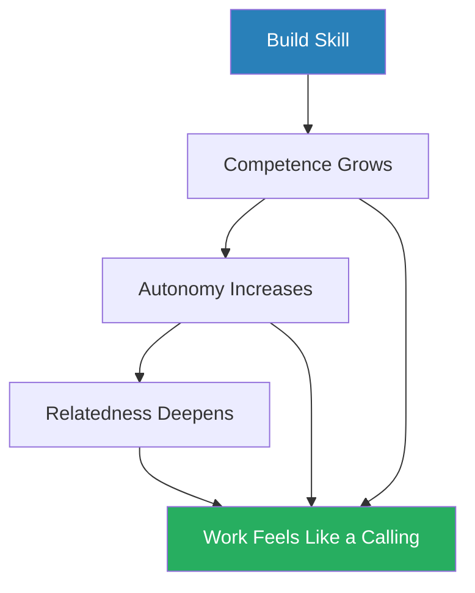
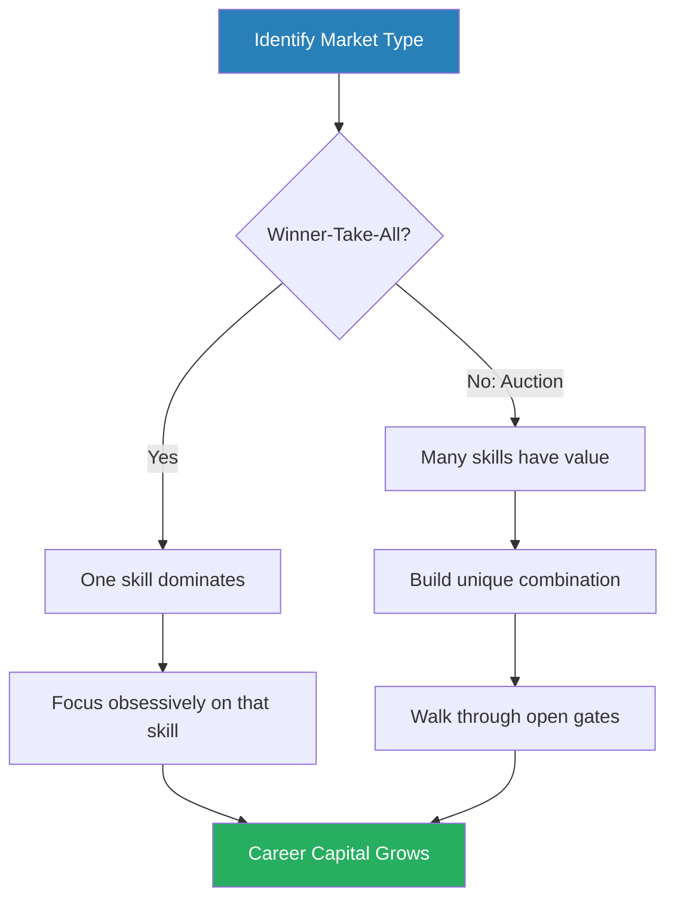
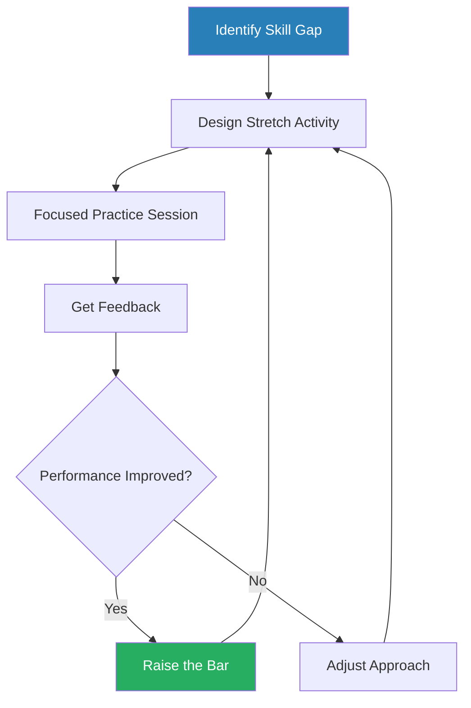
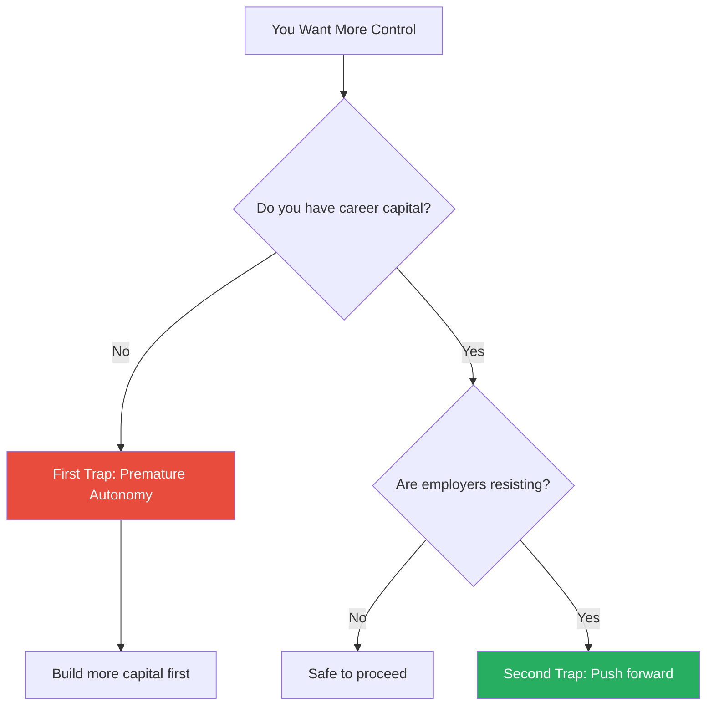
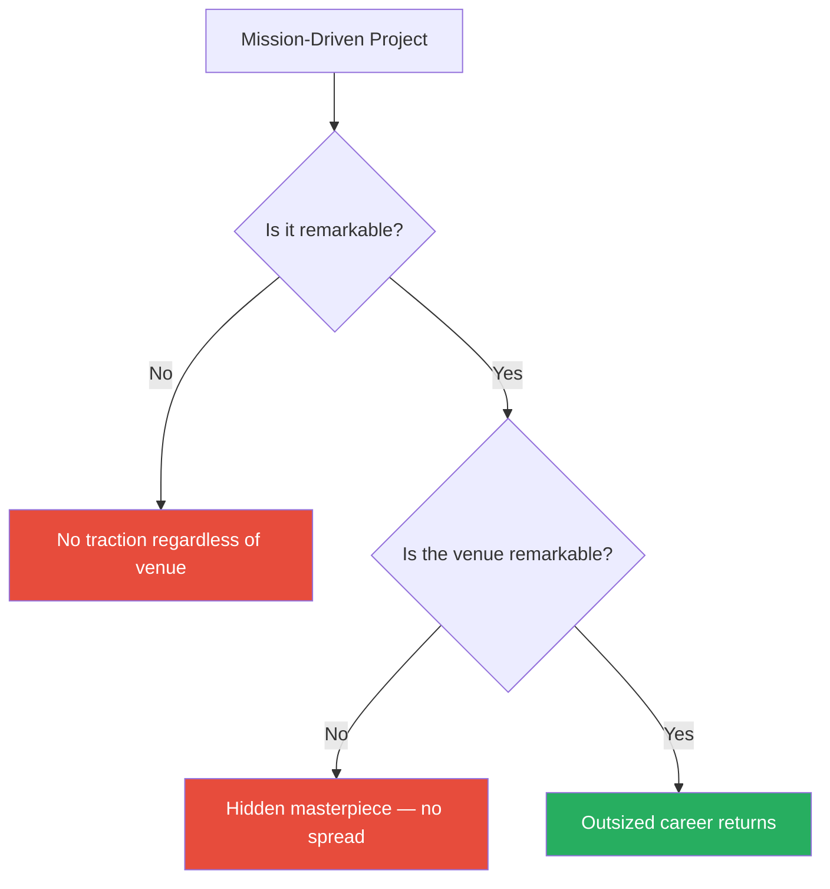
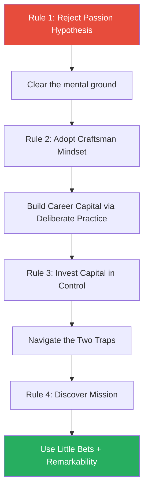

# So Good They Can't Ignore You — Cal Newport

> Cal Newport's contrarian career book dismantles the most pervasive piece of career advice in modern culture: "follow your passion." Drawing on research in self-determination theory, deliberate practice, and the economics of rare skills, he argues that passion is not something you discover — it is something you build. The path to work you love is not introspection but mastery. First, develop rare and valuable skills ("career capital") through deliberate practice. Then invest that capital to acquire the traits that actually make work great: autonomy, creativity, impact, and mission. The book is structured as four sequential rules, each building on the last, illustrated with case studies ranging from Steve Jobs to a venture capitalist to a Moroccan archaeologist. Newport's thesis is simple and discomforting: "working right" matters far more than "finding the right work."

---

## About the Author

Cal Newport is a computer science professor at Georgetown University, specialising in the theory of distributed algorithms. He published *So Good They Can't Ignore You* at age 30, while still an assistant professor — unusually early for someone writing about career strategy with this much confidence. His academic training gives the book its distinctive flavour: Newport approaches career questions the way an engineer approaches a design problem, looking for mechanisms, evidence, and falsifiable claims rather than inspiration and anecdote. He later wrote *Deep Work* (2016) and *Digital Minimalism* (2019), extending his core insight about sustained, focused effort into broader philosophies of concentration and technology use. His books share a common thread: the things most people treat as matters of taste or personality — career choices, work habits, technology use — are better treated as engineering problems with discoverable solutions.

---

## The Big Idea

- Newport's central argument is that the conventional "follow your passion" advice has the causal arrow backwards
- <b style="color: #27ae60">Passion does not lead to great work — great work leads to passion</b>
- The traits that make a job fulfilling — **autonomy**, **creativity**, **impact**, and **mission** — are rare and valuable
- Basic economics tells you that rare and valuable things require rare and valuable offerings in return
- Those offerings are skills: what Newport calls <b style="color: #2980b9">career capital</b>

This reframes the entire question of career satisfaction:
- Instead of asking "What am I passionate about?" you should ask "What am I becoming excellent at?"
- Instead of searching for the perfect job, you should make yourself too valuable to ignore in the job you have
- The title comes from Steve Martin's advice to aspiring comedians, and it captures the book's philosophy in a single sentence: stop worrying about whether you have found your calling, and start getting so good that the question becomes irrelevant

The argument unfolds across four rules, each building on the last:
- **Rule 1** tears down the passion hypothesis
- **Rule 2** replaces it with career capital theory and the craftsman mindset
- **Rule 3** explains how to invest career capital wisely — and how to avoid the traps that destroy it
- **Rule 4** shows how mission, the ultimate expression of a fulfilling career, emerges only after you have accumulated enough capital to see what is possible

The four rules are sequential and cumulative:
- You cannot skip to mission without first building capital
- You cannot build capital without the craftsman mindset
- You cannot adopt the craftsman mindset while clinging to the passion hypothesis
- The book's structure is its argument

The four rules form a strict sequence — each depends on the one before it, and skipping ahead is the most common career mistake Newport identifies.

---

## Key Concepts at a Glance

| Concept | One-line summary |
|---------|-----------------|
| **The Passion Hypothesis** | The flawed belief that matching your job to a pre-existing passion is the key to happiness |
| **Career Capital** | Rare and valuable skills you can exchange for rare and valuable job traits |
| **The Craftsman Mindset** | An output-centric orientation — "What can I offer?" instead of "What do I get?" |
| **Deliberate Practice** | Structured activities designed to push you past your current ability, with feedback |
| **Winner-Take-All vs Auction Markets** | Two market types that demand different skill-investment strategies |
| **The Three Disqualifiers** | Three conditions under which the craftsman mindset does not apply |
| **The Two Control Traps** | The twin dangers of seeking autonomy too early (without capital) or too late (against resistance) |
| **The Law of Financial Viability** | Decision test: "Are people willing to pay me for this?" |
| **The Adjacent Possible** | Opportunities visible only from the cutting edge of a field |
| **Little Bets** | Small, concrete experiments that generate feedback and reveal the path forward |
| **The Law of Remarkability** | For a mission to succeed, the work must be remarkable and launched where remarks can spread |

---

## Rule 1: Don't Follow Your Passion

*Newport takes aim at the most sacred cow in career advice and argues that "follow your passion" is not just unhelpful but actively dangerous.*

- Newport opens by attacking the default counsel of commencement speakers, career coaches, and well-meaning parents
- <b style="color: #e74c3c">"Follow your passion" sounds generous, even liberating — Newport argues it is wrong</b>
- He calls this advice the <b style="color: #2980b9">passion hypothesis</b> — the belief that the key to occupational happiness is to first figure out what you are passionate about and then find a job that matches
- The hypothesis is so deeply embedded in modern culture that questioning it feels almost immoral

> "Telling someone to 'follow their passion' is not just an act of innocent optimism, it is potentially an act of sabotage."

- His case rests on three pillars, each supported by research and illustrated with stories that undermine the passion narrative

### Most People Do Not Have Career-Relevant Passions

- A study by the Canadian psychologist <b style="color: #2980b9">Robert Vallerand</b> surveyed a large group of university students, asking them to identify their passions
- Most could — but when Vallerand categorised the results, 84% of identified passions fell into a narrow cluster: sports, art, music, and hobbies like reading and dancing
- <b style="color: #e74c3c">Only 4% of identified passions had any connection to work or education</b>
- The gap is devastating to the passion hypothesis:
  - If most people's passions are hockey and dance, telling them to "follow their passion" into the job market is telling them to chase something that does not exist in a professional context
  - The advice assumes a condition — a pre-existing vocational passion — that the data says most people do not have
  - For the 96% whose passions are not career-relevant, the advice is not merely unhelpful — it creates a permanent sense of inadequacy
  - It implies that everyone else has found their calling and that you are broken for not finding yours

Vallerand's research reveals the fatal flaw in "follow your passion" advice: 96% of identified passions have no connection to viable career paths, leaving most people chasing something that cannot exist in a professional context.

> [!example] Thomas and the Search for a Calling
> - Thomas, a young Zen practitioner, spent years searching for his vocational calling
> - He drifted through a series of jobs and monastic retreats, convinced that the right career would feel like a calling the moment he found it
> - He tried organic farming, then teaching English abroad, then Zen monastic life itself
> - It never did — not because Thomas lacked self-knowledge, but because the framework he was using was wrong
> - He was searching for a feeling that most people never have before they start working
> - Thomas eventually found his way into a technology career — not through passion but through accumulated skill and circumstance
> **The lesson:** The passion hypothesis sends people searching for a feeling that rarely exists before mastery.

- Newport is careful to distinguish between two things:
  - Having interests and curiosities — which is normal and healthy
  - Having a pre-existing passion that maps neatly onto a career path — which is rare and often retrospectively constructed
- The problem is not interest — it is the expectation that interest should precede effort

---

### Passion Grows with Mastery, Not Before It

- <b style="color: #2980b9">Amy Wrzesniewski</b>, a researcher at Yale, studied how people experience their work
- She categorised workers into three groups:
  - Those who see their work as a **job** (a way to pay bills)
  - Those who see it as a **career** (a path to advancement)
  - Those who see it as a **calling** (an integral part of identity)
- The critical finding: the strongest predictor of experiencing work as a "calling" was not the type of job but the number of years spent doing it
- College administrative assistants who had been in their roles for decades were more likely to describe their work as a calling than newly minted lawyers or doctors
- <b style="color: #27ae60">Competence breeds engagement — engagement breeds passion — the causal arrow runs from mastery to passion, not the other way around</b>

This finding inverts the entire passion framework:
- The conventional wisdom says: find work you love, then you will be good at it
- The research says: get good at work, then you will love it
- The difference between a "job" and a "calling" is not what you do — it is how long and how well you have been doing it

| Experience Level | Likely Work Orientation | Why |
|-----------------|------------------------|-----|
| Early career (0-3 years) | Job — "This pays the bills" | Insufficient skill and mastery to feel engaged |
| Developing (3-10 years) | Career — "I'm building toward something" | Growing competence creates ambition |
| Expert (10+ years) | Calling — "This is part of who I am" | Deep mastery generates intrinsic meaning |

Wrzesniewski's research suggests this progression is natural and predictable — not a sign that you picked the wrong career.

The stacked progression shows that "calling" orientation rises steadily with tenure — the strongest predictor of experiencing work as a calling is not what you do but how long you have been doing it.

---

- This is consistent with <b style="color: #2980b9">Self-Determination Theory (SDT)</b>, the leading academic framework for understanding motivation
- SDT identifies three basic psychological needs:
  - **Autonomy** — control over your actions
  - **Competence** — a sense of mastery
  - **Relatedness** — connection to others
- None of these require matching your job to a pre-existing passion
- All of them grow naturally as you become more skilled and experienced
- The implication: almost any job can become a calling — if you stay long enough and get good enough

The three needs of Self-Determination Theory are all byproducts of accumulated expertise, not preconditions for choosing a career.

> [!tip] Core Insight
> Passion is not a prerequisite for great work — it is a byproduct of mastery. The causal arrow runs from skill to satisfaction, not the other way around.

---

### The Passion Mindset Breeds Chronic Dissatisfaction

- When you approach work asking "What is the world offering me?", every imperfection becomes evidence that you are in the wrong place
- The passion mindset turns normal workplace friction — a boring meeting, an unreasonable deadline, a difficult colleague — into an existential crisis
- "If I were really doing what I loved, this wouldn't bother me," the thinking goes
- So the person quits, searches again, and finds the same friction in a new setting
- The cycle repeats — and each repetition reinforces the belief that the right career is still out there, just beyond reach
- <b style="color: #e74c3c">The passion mindset creates a moving target that can never be hit because the target itself is an illusion</b>

Newport sees this pattern repeated across the people he interviews:
- People with the passion mindset are constantly evaluating their feelings about their work
- Every bad day is a data point suggesting they are in the wrong field
- Every good day is ignored because it contradicts the narrative of mismatch
- The result is a chronic, low-level anxiety that no job change can cure
- Newport connects this to a broader cultural phenomenon: career-related anxiety has risen in lockstep with the spread of passion-based advice
  - As more commencement speakers urge graduates to "find their passion," more graduates report feeling lost and anxious about their careers
  - The advice itself generates the very dissatisfaction it claims to cure

> [!example]- Steve Jobs: The Myth vs The Reality
> - The popular narrative frames Jobs as someone who followed his passion for technology into a garage and built Apple from pure love of computing
> - Newport dismantles this meticulously — Jobs was a Zen Buddhist who attended Reed College, dropped out, audited a calligraphy class, travelled to India, and experimented with psychedelics
> - His early interests were Eastern mysticism and arts, not circuit boards
> - Apple began as a money-making scheme — Steve Wozniak designed the Apple I, and Jobs spotted a commercial opportunity
> - The initial plan was to sell circuit boards to hobbyists, not to change the world
> - Jobs did not follow his passion into technology — he stumbled into it, became extraordinarily good at it, and developed his passion retrospectively
> - By the time he described Apple as his life's work, he had spent decades building mastery
> - The calligraphy class that Jobs famously credited for Apple's typography was an afterthought, not a guiding passion — he only connected the dots looking backward
> **The lesson:** Even the poster child for "follow your passion" actually followed the craftsman path.

> "If a young Steve Jobs had taken his own advice and decided to only pursue work he loved, he would probably have become one of the Los Altos Zen Center's most popular teachers."

---

> [!example] Ira Glass's Long Apprenticeship at NPR
> - Glass spent years as a tape cutter and segment producer at NPR — unglamorous, technically demanding work — before eventually creating *This American Life*
> - He did not arrive at NPR burning with passion for radio — he arrived with curiosity and a willingness to learn
> - His early recordings were, by his own admission, terrible — he could hear the gap between what he wanted to produce and what he was actually producing
> - His passion developed over a decade of steadily improving competence
> - Glass himself has described his early work as embarrassingly bad, and credits persistence and craft — not passion — for his eventual success
> - By the time *This American Life* launched in 1995, Glass had been doing radio work for seventeen years
> **The lesson:** Passion follows competence, not the other way around.

> [!example] The Roadtrip Nation Founders
> - Newport discusses the founders of Roadtrip Nation, who drove around the country interviewing people about how they found fulfilling careers
> - The pattern they discovered was consistent: almost nobody started with a clear passion
> - Successful people described a process of gradually developing interest, skill, and eventually love for their work
> - The founders themselves did not start with a passion for career education — they built their organisation through iterative experimentation and growing expertise
> **The lesson:** The evidence from hundreds of interviews confirms Newport's thesis — passion is built, not found.

---

## Rule 2: Be So Good They Can't Ignore You

*If passion is not the answer, what is? Newport builds his theoretical core in layers: economic logic, psychological orientation, and practical mechanism.*

### Career Capital Theory

- The traits that make work great — autonomy, creativity, impact — are rare and valuable
- This is not a philosophical claim; it is an observation about supply and demand:
  - Most jobs do not offer much of these traits
  - The ones that do are in high demand
  - Supply and demand applies to careers just as it applies to markets
- <b style="color: #27ae60">To get something rare and valuable, you must offer something rare and valuable in return</b>
- That something is skill — Newport calls this exchange <b style="color: #2980b9">career capital theory</b>, and it is the book's most important contribution

Career capital theory explains two things simultaneously:
- **Why following your passion often fails:** you are demanding rare traits (a job you love, with freedom and meaning) without offering rare skills in return — you are trying to buy a mansion with pocket change
- **Why the craftsman approach succeeds:** by building the currency first, you earn the right to spend it

The theory also explains a common observation:
- People early in their careers rarely love their work — and this is perfectly normal
- They have not yet accumulated enough capital to trade for the traits that make work lovable
- The dissatisfaction is not a sign that they are in the wrong field — it is a sign that they are at the beginning of a capital-accumulation process
- This reframe alone can relieve enormous anxiety: feeling unfulfilled at 25 is not evidence of a wrong turn — it is evidence that you have not yet built enough to trade

> [!example] Al Merrick: The Surfboard Shaper
> - Merrick spent decades shaping boards by hand in a small workshop in Santa Barbara
> - He did not start with a grand vision of building a surfboard empire — he started with a commitment to making each board better than the last
> - Over years, his craftsmanship became legendary — Kelly Slater, the greatest competitive surfer in history, rode Merrick's boards exclusively
> - Merrick's boards became so sought-after that he could name his terms — choosing which projects to take, setting his own schedule, working only with surfers he respected
> - Only after accumulating this enormous reservoir of skill and reputation did Merrick gain the autonomy, creativity, and impact that made his career extraordinary
> **The lesson:** The career capital came first. The dream job came second.

---

- <b style="color: #2980b9">Ira Glass</b> appears again here as a career capital case study
- Newport traces Glass's trajectory from tape cutter (1978) to segment producer to host of *This American Life* (1995) — seventeen years of patient capital accumulation
- At each stage, Glass was trading on skills he had built in the previous stage:
  - As a tape cutter, he learned the mechanics of radio production
  - As a segment producer, he learned storytelling structure
  - As a reporter, he learned interviewing technique and narrative pacing
  - Each skill layer was career capital that opened the next opportunity
- He did not get a nationally syndicated show because he wanted one — he got it because he had spent nearly two decades becoming one of the best storytellers in American radio

> [!tip] Core Insight
> Career capital theory reframes the career question from "What job matches my passion?" to "What rare skills can I accumulate, and what can I trade them for?"

---

### The Craftsman Mindset vs The Passion Mindset

- Two orientations to work compete for your attention:

| Mindset | Core Question | Focus | Result |
|---------|--------------|-------|--------|
| **Passion Mindset** | "What can the world offer me?" | What is missing, wrong, unmet | Chronic dissatisfaction |
| **Craftsman Mindset** | "What can I offer the world?" | Quality of what you produce | Continuous improvement |

- The passion mindset seems reasonable, but it is insidious:
  - It directs your attention inward, toward what is wrong and what is not meeting your expectations
  - It makes every workplace flaw feel like evidence of a mismatch
  - Because no job is perfect, it generates a steady stream of dissatisfaction
  - It creates a consumer orientation toward your career — as if the right job were a product you could find on a shelf
- The craftsman mindset redirects attention outward, toward the quality of what you produce:
  - It replaces the unanswerable question of identity ("Who am I really?") with a concrete and actionable question of craft ("Am I getting better?")
  - It turns every task into an opportunity for improvement rather than a test of whether you are in the right place
  - It makes the work itself — not the feelings about the work — the primary focus
  - It is liberating precisely because it is measurable — you can always answer "Did I improve today?" even when you cannot answer "Is this my calling?"

> [!example] Jordan Tice: The Obsessive Guitarist
> - Tice, a professional guitarist in his early twenties, practises with a discipline that would exhaust most professionals
> - He isolates difficult passages, records himself playing them, reviews the recordings critically, and repeats
> - He pushes past the point of comfort into the zone where his fingers fail and his technique breaks down — then does it again
> - His practice sessions look nothing like "playing guitar for fun" — they look like gruelling, systematic skill construction
> - Tice does not ask whether music is his passion — he asks whether his playing is improving
> - The passion question has become irrelevant because his entire orientation is toward output quality
> **The lesson:** The passion question is irrelevant to someone focused on getting better.

> "Regardless of what you do for a living, approach your work like a true performer."

- The Nashville session guitarist <b style="color: #2980b9">Mark Casstevens</b> captures the craftsman mindset in a single maxim:
  - When he sits down to record, he has one goal — to make the song better
  - Not to showcase his skills, not to express himself, not to find meaning
  - Just to make the thing he is working on as good as it can possibly be
  - The meaning, the satisfaction, the passion — all of it follows from that commitment to excellence
  - Casstevens has recorded on hundreds of albums and played with dozens of artists
  - His career capital is immense — not because he chased passion but because he relentlessly pursued quality

The radar profile reveals why the craftsman mindset dominates across every career dimension — its outward focus on output quality and skill-building creates a virtuous cycle, while the passion mindset's inward focus on feelings produces chronic dissatisfaction and stagnation.

---

Newport is careful to note that the craftsman mindset is not applicable to all jobs. He identifies <b style="color: #2980b9">three disqualifiers</b>:

| Disqualifier | Explanation | Example |
|-------------|-------------|---------|
| **No opportunity to develop rare skills** | If the job offers no room for growth, staying and grinding will not produce career capital | A dead-end data entry role with no variation |
| **The work is useless or actively harmful** | If you believe your work damages the world, the craftsman mindset becomes moral self-deception | Working for a company whose products you consider unethical |
| **The people are intolerable** | If the work environment is toxic enough to prevent sustained effort, no amount of craft will overcome it | A workplace with persistent harassment or abuse |

- If any of these apply, the right move is to leave, not to adopt the craftsman mindset
- But the bar is deliberately high — normal workplace frustration does not qualify
- <b style="color: #27ae60">Discomfort is not a disqualifier — discomfort is often a sign that you are in exactly the right place to grow</b>
- Newport wants to prevent the disqualifiers from becoming escape hatches for people who simply find the craftsman mindset uncomfortable
- The disqualifiers are genuine pathologies, not ordinary dissatisfactions

---

### Winner-Take-All vs Auction Markets

*Before you can build career capital efficiently, you need to understand what kind of market you are operating in.*

- Not all career capital markets work the same way, and <b style="color: #e74c3c">misidentifying your market is one of the most expensive mistakes you can make</b>
- Newport distinguishes two types:

| Market Type | What Matters | Strategy | Example |
|------------|-------------|----------|---------|
| **Winner-Take-All** | Only one type of capital | Focus obsessively on that single skill | Television scriptwriting, stand-up comedy, blogging |
| **Auction** | Many types of capital are valuable | Build a unique combination through "open gates" | Venture capital, consulting, academia |

- In a **winner-take-all market**, there is only one type of career capital that matters:
  - For screenwriters, it is the quality of the script
  - For stand-up comedians, it is the quality of the material
  - For bloggers, it is the quality of the writing
  - Everything else — networking, credentials, appearance — is secondary
  - The strategy is relentless focus on that single capital type

- In an **auction market**, many different types of capital are valuable:
  - You can generate a unique collection of skills that makes you hard to replace
  - Newport calls the entry points for accumulating capital <b style="color: #2980b9">open gates</b> — opportunities to build skill that are available to you right now
  - The strategy is to identify open gates and walk through them systematically
  - The value comes not from any single skill but from the rare combination

> [!example] Alex Berger: Misidentifying the Market
> - Berger, an aspiring television writer, initially treated Hollywood as an auction market
> - He diversified his efforts across production, networking, schmoozing, and writing — took jobs as a production assistant, built relationships, learned the industry from every angle
> - But his scripts were mediocre
> - When he finally recognised that television writing is a winner-take-all market — only the script matters — he refocused entirely on writing quality
> - He locked himself in a room and wrote, and wrote, and rewrote
> - He stopped attending industry parties and started spending his evenings at the keyboard
> - Within two years of this shift, he had sold a script and landed a staff writing position
> **The lesson:** Years of diversification delayed the only investment that actually mattered.

---

- In contrast, <b style="color: #2980b9">Mike Jackson</b>, a venture capitalist at a cleantech firm, correctly identified his market as an auction:
  - He had a PhD in environmental engineering, experience in government energy policy, and growing expertise in finance
  - No single one of these skills made him exceptional, but the combination was rare and valuable
  - He treated his career as a portfolio, deliberately accumulating skills in areas where his unique combination could not be replicated
  - His PhD gave him technical credibility that most finance people lacked
  - His government experience gave him policy insight that most PhDs lacked
  - His finance training gave him deal-making ability that most engineers lacked
  - The intersection of all three made him almost impossible to replace

Misidentifying your market type is costly because it leads you to distribute effort where concentration is needed, or to concentrate where distribution would be more effective.

> [!tip] Core Insight
> Your first task in building career capital is identifying your market type. In winner-take-all markets, focus ruthlessly. In auction markets, diversify strategically.

---

### Deliberate Practice

*This is the most important practical section of the book — the mechanism by which career capital is actually built.*

- The concept of <b style="color: #2980b9">deliberate practice</b>, drawn from the psychologist K. Anders Ericsson, is Newport's answer to how career capital is actually built
- Most professionals reach an "acceptable" level of performance early in their careers and then plateau:
  - They work hard — long hours, busy schedules — but they do not improve
  - A doctor with twenty years of experience is not necessarily a better diagnostician than one with five
  - A teacher with three decades in the classroom does not necessarily produce better learning outcomes than one with ten years
  - This is not laziness — it is the natural result of operating on autopilot once basic competence is reached

> "If you just show up and work hard, you'll soon hit a performance plateau."

- The reason is that routine work, no matter how demanding, is not the same as practice designed to stretch your abilities
- Answering emails for twelve hours is exhausting — it is not deliberate practice
- Running a meeting is work — it is not deliberate practice
- The distinction is critical: <b style="color: #e74c3c">effort without strain produces experience without improvement</b>

---

Deliberate practice has specific characteristics that distinguish it from mere effort:

- **It targets a skill just beyond your current ability** — not so far beyond that you cannot engage with it, but far enough that it requires real strain
  - This is what Ericsson calls the "zone of proximal development" in skill acquisition
  - Too easy and you are consolidating, not growing
  - Too hard and you are frustrated, not learning
  - The sweet spot is the edge of your ability — where performance breaks down but can be rebuilt better
- **It provides immediate feedback on performance** — without feedback, you cannot correct errors; without correction, you cannot improve
  - Musicians who practise with recordings improve faster than those who do not
  - Chess players who study grandmaster games improve faster than those who just play casual games
  - The feedback loop must be tight — delayed feedback allows errors to become habits
- **It involves intense, focused concentration** — multitasking is the enemy of deliberate practice
  - The cognitive load of working at the edge of your ability demands your full attention
  - Newport notes that most knowledge workers spend their days in a state of semi-distraction that makes deliberate practice impossible
- **It is uncomfortable** — if it feels easy, it is not working
  - <b style="color: #27ae60">The discomfort is the signal that growth is occurring</b>
  - Newport calls this the "strain" of deliberate practice and argues that most people avoid it, which is precisely why it works as a differentiator
  - The people who can tolerate the strain consistently outperform those who cannot — not because they have more talent but because they spend more time at the edge

> [!abstract] Deliberate Practice Checklist
> 1. Identify the specific skill you need to improve
> 2. Determine your market type (winner-take-all or auction)
> 3. Design an activity that targets just beyond your current ability
> 4. Ensure immediate feedback is available (recording, metrics, expert review)
> 5. Commit to intense, undistracted focus during practice
> 6. Embrace the discomfort — strain is the signal of growth
> 7. Track your hours to ensure you are actually practising, not just working

Deliberate practice is a cycle, not a one-time event — each round of feedback raises the bar for the next session.

---

> [!example] Neil Charness's Chess Study
> - Psychologist Neil Charness investigated what separated grandmasters from intermediate players
> - Both groups had spent approximately the same total number of hours playing chess
> - But grandmasters had spent five times more of those hours in **serious study** — analysing grandmaster games, working through tactical puzzles, studying openings under intense concentration
> - The intermediate players had spent their hours playing casual games, which were enjoyable but did not push them past their current ability
> - Total hours were identical — the distribution of those hours determined the outcome
> - The grandmasters' practice was uncomfortable by design — they deliberately chose puzzles at the edge of their ability
> **The lesson:** It is not how many hours you work that matters, but how many of those hours are spent in deliberate practice.

> [!example] Jordan Tice's Practice Method
> - Tice provides Newport's most vivid portrait of deliberate practice in a creative field
> - He does not simply play through songs — he isolates the precise passages where his technique breaks down
> - He records himself, listens back critically, identifies the specific technical failure, and designs exercises to target it
> - He practises these exercises until the passage is clean, then moves to the next breakdown point
> - The process is systematic, uncomfortable, and effective — each session produces measurable improvement
> - Tice's approach is the opposite of "noodling" — the pleasant, unfocused playing that most amateur musicians mistake for practice
> **The lesson:** Deliberate practice requires systematic identification and elimination of specific weaknesses, not general effort.

---

- Newport profiles **Mike Jackson** again to show what deliberate practice looks like in knowledge work:
  - Jackson tracks his time in a spreadsheet with obsessive precision
  - He limits email to 90 minutes a day
  - He devotes the majority of his working hours to the two activities he is actually judged on: fundraising and deal sourcing
  - Jackson has essentially engineered his workday to maximise career-capital-building activities and minimise everything else
  - He treats career capital accumulation the way an athlete treats training: with structure, measurement, and relentless focus
  - His spreadsheet is not a productivity hack — it is a feedback mechanism that tells him whether his time distribution matches his capital-building goals

Newport acknowledges openly that deliberate practice is more natural in fields with clear feedback loops — music, chess, athletics, mathematics — and harder to implement in knowledge work:
- In most professional settings, the definition of "better" is ambiguous, feedback is delayed, and there is no equivalent of a musical scale or a chess puzzle
- His solutions for bridging this gap include:
  - Keeping a <b style="color: #2980b9">research bible</b> — a notebook where you record one new result from your reading each week and speculate about how it might connect to your own work
  - Tracking deliberate practice hours separately from total working hours
  - Seeking out **stretch projects** that force you to operate at the edge of your ability — projects that feel slightly too difficult for your current skill level
  - Creating artificial deadlines and accountability structures that mimic the tight feedback loops of music or athletics
- He describes his own system of tracking "core thinking hours" — time spent on genuinely difficult intellectual problems, as opposed to administrative overhead
  - In one month, he logged only 42 hours of such thinking, despite working far more total hours
  - A sobering illustration of how little of a typical workweek is spent on genuine capital accumulation
  - Most knowledge workers would find similar ratios if they tracked honestly

> "The key thing is to force yourself through the work, force the skills to come; that's the hardest phase."

- Newport draws this quote from **Ira Glass**, who made the same point about creative work:
  - There is a painful gap between your taste (which develops quickly) and your ability (which develops slowly)
  - You can recognise great radio storytelling long before you can produce it
  - The only way across the gap is sustained, uncomfortable practice
  - Most people quit during the gap — they interpret the discomfort as a sign that they lack talent, when it is actually a sign that their taste is ahead of their skill

> [!tip] Core Insight
> Deliberate practice — not raw hours or busyness — is the mechanism that actually builds career capital. Most professionals plateau because they confuse being busy with getting better.

---

## Rule 3: Turn Down a Promotion

*The title is deliberately provocative. Newport argues that control — over what, how, and when you work — is one of the most valuable things career capital can buy, and that the pursuit of control is fraught with traps at both ends of the skill spectrum.*

### Why Control Matters

- Research consistently shows that autonomy improves everything:
  - Newport cites a study of 320 small businesses conducted by researchers at Cornell — half granted employees significant autonomy, half used traditional top-down management
  - <b style="color: #27ae60">The autonomy-granting businesses grew at four times the rate of the top-down firms</b>
  - The effect was not marginal — it was dramatic and consistent across industries
- He describes <b style="color: #2980b9">Results-Only Work Environments (ROWE)</b>, pioneered at Best Buy's corporate headquarters:
  - In a ROWE, employees are judged solely on results — no one cares when you arrive, when you leave, or whether you work from the office or the beach
  - The only metric that matters is whether the work gets done
  - Employee turnover dropped by 90%, and productivity increased significantly
  - When people have control over how they work, they work better and stay longer
- These findings are consistent with decades of research in self-determination theory:
  - Autonomy is a basic psychological need — not a luxury
  - When it is satisfied, intrinsic motivation flourishes
  - When it is denied, even objectively prestigious and well-compensated work becomes grinding and joyless
  - This explains why some highly paid professionals are miserable while some modestly paid workers are deeply satisfied

> "Giving people more control over what they do and how they do it increases their happiness, engagement, and sense of fulfillment."

- Newport argues that control is the single most important trait you can acquire with career capital:
  - It is more important than money (beyond a basic threshold)
  - It is more important than prestige
  - It is more important than job title
  - The people who report the highest levels of career satisfaction are not necessarily the highest-paid or most prestigious — they are the ones with the most control over their daily lives

---

### The First Control Trap: Autonomy Without Capital

*The first trap catches dreamers who pursue freedom before they have built anything worth trading for it.*

- People quit their jobs to start businesses, go freelance, travel the world, or "live their dreams" — but they have nothing rare and valuable to offer the market
- <b style="color: #e74c3c">The courage is real — the capital is insufficient</b>
- The result is unsustainable autonomy that collapses under financial reality
- Newport calls this the <b style="color: #2980b9">first control trap</b> — and it is particularly seductive in a culture that celebrates bold leaps and risk-taking
- The trap is amplified by survivorship bias — we hear about the rare person who quit their job and thrived, never about the thousands who quit and failed quietly

> [!example] Lisa Feuer: Courage Without Capital
> - Feuer left a successful career in marketing and advertising — a career in which she had been promoted, compensated, and valued — to become a yoga instructor
> - The passion mindset told her that yoga was her true calling
> - She enrolled in teacher training, opened a small practice, and waited for students
> - They did not come in sufficient numbers — the market for yoga instruction was saturated, and Feuer had no distinctive skill to set her apart
> - Within a few years, Feuer was effectively broke, relying on food stamps to feed herself
> - She had abundant capital in marketing — she had none in yoga instruction
> - The tragedy was not that she changed careers — it was that she changed into a field where she was starting from zero
> **The lesson:** The market does not reward bravery; it rewards value.

> [!example] Jane's Premature Non-Profit
> - Jane dropped out of a graduate programme to launch a non-profit connecting the developing world with educational technology
> - The mission was admirable, but Jane had no relevant expertise — no background in education, technology, international development, or non-profit management
> - She was trying to spend capital she had not earned
> - The non-profit struggled to attract funding, volunteers, or institutional partnerships
> - Jane ended up back where she started, older and chastened
> - Her peers who stayed in their programmes and built expertise were now in positions to make the impact Jane had dreamed of — because they had the capital to back their ambitions
> **The lesson:** Ambition without capital is just wishful thinking.

- The pattern is consistent: people who pursue control without capital find that the market is indifferent to their dreams
- The first control trap is not about ambition being wrong — it is about ambition being premature
- Newport is explicit: he is not arguing against risk-taking, entrepreneurship, or career changes
- He is arguing against risk-taking that is disconnected from capital

---

### The Second Control Trap: Capital That Employers Will Not Release

*The second trap is more subtle and more insidious — it catches people whose capital is so valuable that their employers fight to keep them on the conventional path.*

- People who have accumulated enough career capital to gain meaningful control find that their employers resist the change
- Promotions, raises, flattering new responsibilities, and emotional appeals are deployed — not to reward the employee, but to keep them where their capital serves the organisation most
- The employee faces a paradox:
  - Their capital has made them valuable enough to demand control
  - But the same capital makes them too valuable for the organisation to let go
  - <b style="color: #e74c3c">The resistance feels like a warning — but it is actually validation</b>

> [!example] Lulu Young: Employer Resistance as Proof of Capital
> - Young systematically built her career capital through excellent performance at her company
> - At each stage, she negotiated for more control rather than more money or prestige
> - She wanted a reduced-hours arrangement that would let her spend time on outside projects
> - Her employer resisted — not because she was bad at her job, but because her excellence made her more valuable in her current role at full capacity
> - The resistance was not a sign that her move was wrong — it was a sign that her capital was real
> - She persisted, and eventually negotiated the arrangement she wanted — from a position of strength, not desperation
> **The lesson:** When employers fight to keep you, your career capital is genuine.

> [!example] Lewis: The Medical Resident Who Pushed Back
> - Lewis, a medical resident, took an unconventional leave from his residency programme to pursue independent research
> - The hospital pushed back hard — supervisors warned the leave would damage his career, peers thought he was making a mistake
> - But Lewis had spent years building clinical skill and a strong research record — his capital was real
> - The institutional pressure was the second trap in action — the institution fighting to keep a valuable asset on the conventional track
> - Lewis persisted, and the leave ultimately enhanced rather than damaged his career, opening new research directions that would not have been available within the standard residency path
> **The lesson:** Institutional resistance to your autonomy can be evidence that you have something worth fighting for.

---

> [!example] Ryan Voiland: Capital-Backed Farming
> - Voiland wanted to leave a stable job to become an organic farmer — on the surface, this sounds like the first control trap
> - But Voiland had spent years building agricultural skills, studying farming methods, and developing a detailed business plan
> - He was not acting on passion alone — he had career capital in farming
> - The market validated it: the Farm Services Agency approved his loan application, which required a credible business plan and demonstrated capability
> - The agency did not lend him money because his dream was admirable — they lent him money because his skills were real
> **The lesson:** Voiland's farm succeeded because his move was capital-backed, not courage-backed.

The two traps produce identical symptoms — resistance from others — but the causes and correct responses are opposite.

---

### The Law of Financial Viability

- Newport borrows a heuristic from the entrepreneur <b style="color: #2980b9">Derek Sivers</b> to distinguish the traps: <b style="color: #27ae60">"Are people willing to pay me for this?"</b>
- Money is a "neutral indicator of value":
  - Unlike encouragement from friends (who are being kind), likes on social media (which are free), or your own self-assessment (which is biased), money requires genuine sacrifice from the person offering it
  - If someone — an employer, a client, an investor, a lender — is willing to exchange money for what you offer, your career capital is real
  - If no one is willing to pay, you are likely in the first trap, mistaking courage for capital
- The law is brutally simple but remarkably effective at cutting through self-deception:
  - It forces you to test your capital against the market before making irreversible decisions
  - It replaces subjective self-assessment with objective external validation

> "Do what people are willing to pay for."

> [!example] Derek Sivers and CD Baby
> - Sivers was a professional musician who wanted to go full-time with CD Baby, his fledgling online store for independent musicians
> - He did not quit his music career the moment he had the idea
> - He waited until his CD Baby income matched his day-job salary — the market had to validate the move before he would commit to it
> - This was not timidity — it was discipline
> - Sivers understood that his enthusiasm was not evidence of viability
> - Only the market's willingness to pay was real evidence
> - CD Baby eventually sold for $22 million
> **The lesson:** The discipline of waiting for financial validation — rather than leaping on faith — was what made the success possible.

- Voiland's Farm Services Agency loan serves the same function:
  - The loan was not charity — it required the agency to evaluate his business plan, his agricultural skills, and the viability of his operation
  - The agency's willingness to put money at risk was objective evidence that his capital was real
  - If the agency had rejected his application, that would have been evidence of insufficient capital — a signal to build more before trying again

> [!tip] Core Insight
> When uncertain about a career move, ask whether anyone is willing to pay. The answer cuts through self-deception with surgical precision.

| Test | Passes Financial Viability? | Action |
|------|---------------------------|--------|
| Employer offers raise to retain you | Yes — your capital is real | Push for autonomy (second trap) |
| Clients pay for your freelance work | Yes — market validates your skill | Consider the leap |
| Friends say "you should totally do that!" | No — encouragement is free | Build more capital first |
| You feel passionate and excited | No — feelings are not evidence | Test against the market |
| A lender approves your business loan | Yes — their money is at risk | Proceed with confidence |

The law of financial viability provides a simple binary test that separates real capital from wishful thinking.

---

## Rule 4: Think Small, Act Big

*The final rule addresses mission — and Newport's treatment is characteristically contrarian: mission cannot be found through introspection but only discovered from the cutting edge of a field.*

- Having a <b style="color: #2980b9">mission</b> transforms a career from a series of disconnected jobs into a coherent narrative with direction and meaning
- A mission provides focus, motivation, and a framework for making decisions about what opportunities to pursue and which to decline
- But Newport argues that mission cannot be found through introspection, brainstorming, or courage
- It can only be discovered from the cutting edge of a field, after years of capital accumulation
- <b style="color: #27ae60">Mission is a product of expertise, not a precondition for it</b>

### The Adjacent Possible

- Newport borrows the concept of the <b style="color: #2980b9">adjacent possible</b> from the scientist Stuart Kauffman (via Steven Johnson's *Where Good Ideas Come From*)
- In biology, the adjacent possible describes the set of new molecular combinations that become available at each step of evolution:
  - Before oxygen appeared in the atmosphere, aerobic organisms were not in the adjacent possible — they could not exist
  - Once oxygen appeared, they were suddenly right next door, waiting to be discovered
  - The adjacent possible expands with each new development — each innovation makes the next set of innovations conceivable
- In careers, the adjacent possible describes the set of new opportunities and directions that become visible once you reach the frontier of your field:
  - These opportunities are invisible to everyone else because they require deep expertise to see
  - A graduate student in biology cannot see the adjacent possible that a tenured professor with twenty years of research can see
  - The student lacks the capital to perceive what is possible
  - Mission lives in the adjacent possible — and you can only see it from the cutting edge

---

- <b style="color: #e74c3c">This explains why premature mission-seeking fails</b>:
  - You cannot see the adjacent possible from the middle of a field — only from its cutting edge
  - A young person agonising over their "life's mission" is looking for something that cannot yet be seen
  - The answer is not to search harder but to advance further
  - Mission-anxiety in young people is not a character flaw — it is a structural impossibility
  - They are being asked to see something that requires expertise they have not yet built

Newport's concept also explains a phenomenon he observes repeatedly: multiple discoveries:
- When a field reaches a certain point, the same breakthrough often occurs independently in multiple labs
- This is because the adjacent possible has opened for everyone at the cutting edge simultaneously
- Missions work the same way — they become visible at a specific level of expertise, not through a specific act of inspiration

> [!example] Pardis Sabeti: Mission from the Frontier
> - Sabeti, a Harvard computational biologist, spent years in graduate school and postdoctoral research, slowly building deep expertise at the intersection of genetics and computer science
> - She did not arrive at Harvard with a fully formed mission — she arrived with curiosity and a willingness to do the hard work of capital accumulation
> - Her early years involved learning computational methods, studying population genetics, and publishing incremental research — none of it obviously pointing toward a grand mission
> - Her mission — using computational algorithms to identify genetic signatures of natural selection, particularly for genes that confer resistance to infectious diseases like malaria — crystallised only after nearly a decade of building expertise
> - The mission was not available to her as a first-year graduate student — it lived in the adjacent possible, visible only from the cutting edge
> - Once she could see it, the mission seemed obvious and inevitable — but that feeling of obviousness was itself evidence of how far she had advanced
> **The lesson:** Mission lives in the adjacent possible — you can only see it once you have accumulated enough capital to reach the frontier.

---

> [!example] Sarah: The Cost of Premature Mission-Seeking
> - Sarah, a graduate student, spent her early years in a state of paralysing anxiety about her mission
> - She hopped between research groups, took personality assessments, and read self-help books, all in an attempt to discover her calling
> - Nothing worked because there was nothing to discover — yet
> - Her capital was insufficient to see the adjacent possible
> - While her peers who focused on building capital were making research breakthroughs, Sarah was trapped in a cycle of introspection and career counselling
> - Newport argues her anxiety was not a sign of insufficient self-knowledge but of premature searching
> **The lesson:** The cure for mission-anxiety is not more introspection but more expertise.

- The implication of "Think small, act big" is not a paradox but a sequence:
  - First, think small: patiently build expertise in a specific domain, one skill at a time, through deliberate practice
  - Then, act big: once you can see the adjacent possible, commit to a bold mission that only someone with your capital could identify
  - The "small" is the daily work of capital accumulation
  - The "big" is the mission that emerges from that accumulation

> [!tip] Core Insight
> Mission cannot be discovered through introspection. It can only be seen from the cutting edge of a field — which means you must do the hard work of getting there first.

---

### Little Bets

*Once you have identified a mission from the adjacent possible, the next question is how to pursue it — and Newport argues against grand plans in favour of small experiments.*

- Newport advocates for <b style="color: #2980b9">little bets</b> — small, concrete experiments that generate feedback and reveal the best path forward
- The concept comes from Peter Sims's book *Little Bets*:
  - Sims studied how innovators across diverse fields — comedians, military strategists, entrepreneurs — develop breakthrough ideas
  - The common pattern was not visionary planning but iterative experimentation
  - Grand plans fail because they require you to predict the future — which you cannot do
  - Little bets succeed because they let you discover the future through trial and error

Why little bets work:
- Each bet is small enough to fail without consequence but concrete enough to produce real feedback
- The sequence of bets generates a trajectory that could not have been predicted in advance
- They allow you to discover what works rather than deciding in advance what should work
- They limit downside risk while preserving upside optionality
- They transform mission-pursuit from a single high-stakes gamble into a portfolio of low-stakes experiments

> [!example] Chris Rock: Comedy as Iterative Experiment
> - Before filming a major comedy special, Rock does not retreat to his study to write the perfect set
> - He goes to a small club in New Jersey — sometimes several nights a week for months — and tests new material
> - He walks on stage with a yellow legal pad full of half-formed ideas and tries them out
> - Most jokes bomb — the audience stares — Rock makes a note and moves on
> - Over forty to fifty appearances, the material is refined through audience feedback
> - The jokes that survive are the ones that make it into the final special
> - The final set appears seamless and inevitable — but it was built through dozens of small, awkward failures
> **The lesson:** The set is not written — it is evolved through a series of little bets.

> "Rather than believing they have to start with a big idea or plan out a whole project in advance, they make a methodical series of little bets."

---

> [!example]- Kirk French: From DVDs to the Discovery Channel
> - French, an archaeologist at Penn State, pursued a sequence of small projects that eventually led to a television career — an outcome he could never have predicted
> - He started by digitising DVDs of local archaeological sites — a small, unglamorous project requiring minimal investment
> - The DVDs led to an interest in filming techniques, which led to a pilot for a local show about archaeology
> - The pilot attracted the attention of a producer, who connected French with the Discovery Channel
> - French ended up hosting *American Treasures*, a nationally televised show about archaeological discoveries
> - Each step was a small bet — compact enough to fail without consequence but concrete enough to generate feedback and new opportunities
> - If any single bet had failed — if the DVDs had not led to filming interest, if the pilot had not attracted a producer — French would have lost almost nothing
> **The lesson:** The sequence of bets produced a trajectory that no amount of advance planning could have predicted.

- Newport also describes Sabeti's approach to her mission:
  - Even after identifying her mission (computational detection of natural selection), Sabeti did not make a single dramatic commitment
  - She pursued a series of small research projects, each testing a different computational approach
  - Some worked, some did not — the ones that worked opened new directions, the ones that failed taught her which approaches were dead ends
  - Her career-defining paper — identifying genetic resistance to Lassa fever in West African populations — emerged from this iterative process
  - The paper was not the product of a grand plan — it was the product of a sequence of little bets that converged on a remarkable finding

| Approach | Risk | Feedback Quality | Typical Outcome |
|----------|------|-----------------|-----------------|
| Grand Plan | High — all-or-nothing | Delayed — years before validation | Expensive failure or accidental success |
| Little Bets | Low — each bet is cheap | Immediate — each bet generates data | Iterative convergence on what works |

Little bets outperform grand plans because they substitute market feedback for personal prediction.

Mission emerges from the adjacent possible, then little bets iteratively refine the path — failure feeds back into the next experiment.

---

### The Law of Remarkability

*Having a mission and making little bets is necessary but not sufficient — the work itself must stand out, and it must be visible.*

- For a mission-driven project to succeed at scale, it must satisfy two conditions simultaneously
- Newport calls this the <b style="color: #2980b9">law of remarkability</b>

**Condition 1: The project must be remarkable** — in the literal sense that it compels people to remark about it:
- Newport borrows Seth Godin's metaphor of the <b style="color: #2980b9">purple cow</b>: in a field of brown cows, a purple cow is impossible to ignore
- Most work is brown-cow work — competent, professional, forgettable
- Remarkable work stands out because it violates expectations — it makes people stop, notice, and tell someone else
- The bar is high: "good" is not remarkable, "excellent" is not remarkable — only "I have to tell someone about this" is remarkable

**Condition 2: The project must be launched in a venue conducive to remarking** — a platform, community, conference, or infrastructure where word can spread:
- An extraordinary project hidden in a drawer is just a diary entry
- The same project presented at a major conference, published in an open-access journal, or released as open-source software enters a network where it can propagate
- The venue must have an audience that is primed to notice and share the kind of work you are producing

> "For a mission-driven project to succeed, it should be remarkable in two different ways."

---

> [!example] Giles Bowkett and Archaeopteryx
> - Bowkett, a programmer, built Archaeopteryx — a program that used artificial intelligence to generate original music
> - The content was striking: a computer programme that composed listenable music using AI algorithms, at a time when most people had never heard of machine-generated art
> - The venue was perfect: Bowkett released Archaeopteryx as an open-source project in the Ruby programming community, a tight-knit network of developers who communicated through conferences, blogs, and mailing lists
> - The combination produced outsized career returns — conference invitations, job offers, and a reputation that would have taken years to develop through conventional means
> - Bowkett did not set out to build his reputation — he set out to build something remarkable in a venue where remarks could spread
> **The lesson:** Remarkable content in a remarkable venue produces outsized returns.

Newport contrasts this with projects that satisfy only one condition:
- A remarkable project in an invisible venue gains no traction (the painter who creates masterpieces but shows them to no one)
- An ordinary project in a visible venue gains no attention (the conference talk that everyone forgets by lunch)
- <b style="color: #27ae60">Both conditions must be present simultaneously for a mission-driven project to generate sustainable career returns</b>

| Scenario | Content | Venue | Outcome |
|----------|---------|-------|---------|
| Bowkett's Archaeopteryx | Remarkable (AI-generated music) | Remarkable (Ruby open-source community) | Outsized career returns |
| Sabeti's *Nature* paper | Remarkable (new genetic method) | Remarkable (*Nature* journal) | Widespread funding and recognition |
| Brilliant artist in isolation | Remarkable | Invisible | No traction |
| Generic conference talk | Ordinary | Visible | Forgotten immediately |

The law of remarkability is not about self-promotion — it is about strategic alignment between the quality of your output and the visibility of your venue.

---

Sabeti's work satisfies the law of remarkability as well:
- Her computational detection of natural selection was genuinely remarkable — a new method that revealed something previously invisible about the human genome
- She published in *Nature*, one of the most visible venues in all of science
- The combination produced widespread attention, funding, and opportunities that sustained her mission for years
- If she had published the same result in an obscure journal, the career impact would have been a fraction of what she achieved

A project must pass both tests — remarkable content and a remarkable venue — to generate the career returns that sustain a mission.

---

## Newport's Own Story

*Newport weaves his own career through the book as a quiet running example — proof that his framework is not just theory but lived practice.*

- At the time of writing, he was an untenured assistant professor at Georgetown — a position earned through a systematic, craftsman-oriented approach to academic computer science
- His graduate school strategy:
  - Rather than following his passion or searching for a grand mission, he focused obsessively on producing high-quality research papers
  - He treated each paper as a little bet — a concrete output that would generate feedback and open new directions
  - He tracked his "core thinking hours" — time spent on genuinely difficult theoretical problems
  - He was dismayed to find that most of his workweek was consumed by email, meetings, and administrative tasks
  - He redesigned his schedule to protect thinking time, and his research output increased
  - The redesign was itself an act of career capital investment — he was trading efficiency in low-value tasks for intensity in high-value ones

---

- His system for generating research ideas:
  - He kept a <b style="color: #2980b9">research bible</b> — a document in which he summarised one interesting result from his reading each week and speculated about how it might connect to his own work
  - The research bible was not a planning tool — it was a little-bet machine, a structured way to generate small intellectual experiments that might reveal new directions
  - Most entries led nowhere — but the ones that did led to his most productive research lines
  - The research bible demonstrates the core principle of little bets: systematic, low-cost experimentation that generates disproportionate returns

> [!abstract] Newport's Research Bible Method
> 1. Read one paper per week from the frontier of your field
> 2. Summarise the key result in a single paragraph
> 3. Write one paragraph speculating on how it connects to your own work
> 4. Review the bible monthly to identify patterns and emerging directions
> 5. Turn promising connections into small research projects (little bets)

- His mission — understanding the role of algorithms in distributed systems — emerged gradually from years of capital accumulation:
  - He did not choose it from a menu of options
  - It appeared in the adjacent possible after he had spent enough time at the cutting edge of his field to see what was there
  - The mission felt obvious once it emerged — but it would have been invisible to him even two or three years earlier

---

- Newport also provides a candid account of his own deliberate practice:
  - As a theoretical computer scientist, his core skill is proving mathematical theorems about distributed algorithms
  - This is some of the most mentally demanding work imaginable — hours staring at a whiteboard, trying to find a proof technique that will work
  - He describes sessions where he makes no visible progress for weeks — and the temptation to retreat into email, meetings, and other "productive" activities that feel like work but do not build capital
  - His discipline is to return to the whiteboard regardless of how unproductive the previous session felt
  - The strain is the point — and Newport's willingness to endure it is what separates his research productivity from peers who spend their days on administrative tasks

Newport is refreshingly honest about the unglamorous reality of his own path:
- No eureka moments
- No burning passion
- No dramatic leaps
- Just years of methodical, sometimes uncomfortable work, guided by the craftsman mindset and measured by the output it produced
- He presents himself not as an exemplar of brilliance but as evidence that the system works even for ordinary people who execute it consistently
- His story is deliberately anti-romantic — he wants the reader to see that the craftsman path is available to anyone willing to do the work, not just the naturally gifted

> [!tip] Core Insight
> Newport's own story is his most persuasive evidence: a conventional academic career made extraordinary not by passion or luck but by systematic application of the craftsman mindset, deliberate practice, and little bets.

---

## How the Four Rules Connect

*The book's structure is not arbitrary — each rule builds on the previous one, and the logic is cumulative.*

The complete framework forms a single argument from first principles to full career strategy.

The treemap reveals the architecture of Newport's argument: each of the four rules contains distinct sub-components that build upon one another, with Rule 2 (Build Capital) carrying the most conceptual weight as the engine that powers everything else.

- **Rule 1 clears the mental ground** — by showing that the passion hypothesis is false, it frees you from the paralysing search for the "right" career
- **Rule 2 provides the alternative** — the craftsman mindset and career capital theory give you a positive programme to replace the passion hypothesis
- **Rule 3 teaches you to invest wisely** — career capital is useless if you spend it on the wrong things or if the traps consume it
- **Rule 4 shows the endgame** — mission, the highest expression of a fulfilling career, emerges naturally once enough capital has been accumulated

The sequence matters because each rule depends on the ones before it:
- If you skip Rule 1, the passion mindset will sabotage your attempts to adopt the craftsman mindset
- If you skip Rule 2, you will lack the capital to navigate the control traps
- If you skip Rule 3, you will either pursue premature autonomy or surrender your capital to an employer
- Rule 4 is the reward — but only for those who have done the work of Rules 1 through 3

Newport's most common career mistakes map directly onto violations of this sequence:

| Mistake | Rule Violated | What Happened |
|---------|--------------|---------------|
| Quitting to "follow your passion" | Skipped Rule 1 | Chased a feeling instead of building skill |
| Pursuing autonomy without capital | Skipped Rule 2 | No rare skills to trade for freedom |
| Accepting promotions that reduce control | Ignored Rule 3 | Traded autonomy for money or prestige |
| Searching for mission before expertise | Skipped to Rule 4 | Could not see the adjacent possible yet |

The book's most important structural insight is that these are not independent mistakes — they are all consequences of entering the sequence at the wrong point.

---

## The Verdict

*So Good They Can't Ignore You* is one of the strongest counterarguments to the "follow your passion" orthodoxy that dominates modern career advice. Its greatest contribution is <b style="color: #2980b9">career capital theory</b> — the insight that fulfilling work is not found through introspection but built through the patient accumulation and strategic investment of rare skills. This is a genuinely powerful idea, and Newport presents it with the clarity and rigour of someone trained in mathematical proof. The two control traps are an excellent contribution that captures a real dynamic most career advice ignores: the paradox that both too little and too much career capital create obstacles to gaining autonomy. The law of financial viability is a simple, memorable, and immediately usable decision tool. The concept of the adjacent possible provides a compelling explanation for why premature mission-seeking fails — an explanation that is both intellectually satisfying and practically useful.

The book's primary weakness is its evidence base. Newport relies on curated case studies rather than systematic research. His examples skew heavily toward American professionals from elite institutions — MIT, Stanford, Harvard, Dartmouth, Georgetown. The framework's applicability to people facing structural barriers — discrimination, economic constraints, institutional gatekeeping — is assumed rather than demonstrated. Career capital theory rests on a meritocratic assumption: that the market reliably rewards rare and valuable skills. In environments where politics, favouritism, or structural bias determine outcomes, capital alone may be necessary but not sufficient. Newport treats structural barriers as edge cases rather than common realities. The result is a framework that works best for people who already have access to functioning meritocracies — which is to say, people who already have significant privilege. The book would be stronger if it acknowledged this limitation directly rather than leaving it as an unstated assumption.

Newport also underplays the role that passion — once it *emerges* from mastery — plays in sustaining the gruelling work that deliberate practice demands. He is right that passion is a poor starting criterion. He is less convincing that it is unimportant once it arrives. The craftsman mindset requires years of uncomfortable, often tedious effort. The people Newport profiles who successfully sustain this effort — Jordan Tice, Pardis Sabeti, Steve Martin — all appear to develop genuine passion for their work along the way. Newport acknowledges this in passing but does not give it sufficient weight. The question is not whether passion should come first (Newport is right that it should not) but whether it matters at all (Newport implies it does not, which seems wrong). A more complete framework would integrate both insights: passion is a poor compass but an excellent fuel.

Despite these limitations, the core argument is sound and the book deserves its influence. For anyone paralysed by the question "What should I do with my life?", Newport offers a liberating reframe: stop searching for the answer and start building the skills that will make the answer obvious. The book is most useful for people early in their careers who feel anxious about not having found their passion, for mid-career professionals who are contemplating a dramatic change, and for anyone who has been told to "follow their heart" and found the advice useless. It is less useful for people facing genuine structural obstacles that the meritocratic framework cannot address, and for those already deeply embedded in toxic work environments where the craftsman mindset cannot compensate for systemic dysfunction. The book is best read alongside [[Deep Work - Cal Newport|Deep Work]] (which extends the deliberate practice argument into a full philosophy of focused concentration), [[Peak - Anders Ericsson|Peak]] (which gives a more rigorous account of deliberate practice), and [[Range - David Epstein|Range]] (which offers a necessary counterpoint by showing the value of breadth and exploration). Read together, these books form a remarkably coherent account of how careers actually develop — not through revelation but through craft, not through passion but through mastery, and not through grand plans but through small experiments that reveal the path as you walk it.

---

## Related Reading

- [[Deep Work - Cal Newport]] — Newport's follow-up, extending the deliberate practice argument into a full philosophy of focused concentration
- [[Peak - Anders Ericsson]] — Anders Ericsson's definitive account of deliberate practice, the mechanism Newport relies on for career capital accumulation
- [[Range - David Epstein]] — David Epstein's counterpoint showing the value of breadth, exploration, and late specialisation
- [[Essentialism - Greg McKeown]] — Greg McKeown's argument for doing less but better, which complements Newport's focus on deliberate practice over busyness
- [[Mindset - Carol S. Dweck]] — Carol Dweck's research on growth mindset, the psychological foundation that makes the craftsman mindset possible
- [[How Will You Measure Your Life - Clayton M. Christensen]] — Clayton Christensen's framework for career and life decisions, which shares Newport's scepticism of passion-based planning
- [[The Almanack of Naval Ravikant - Eric Jorgenson]] — Naval's emphasis on building specific knowledge and leverage echoes Newport's career capital theory
