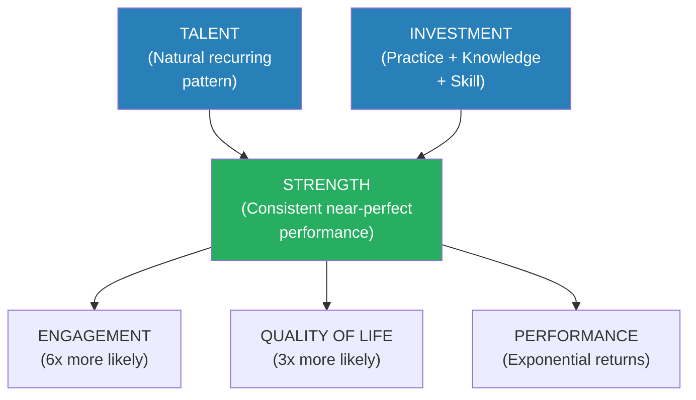
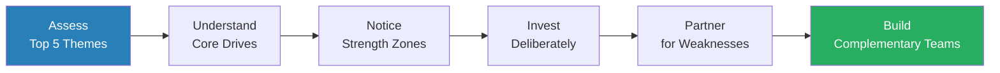
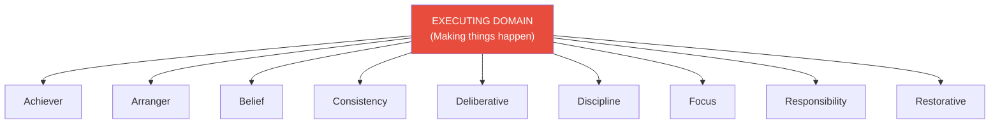
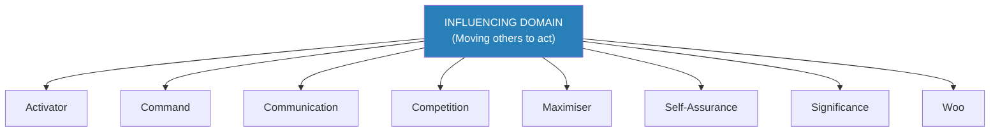
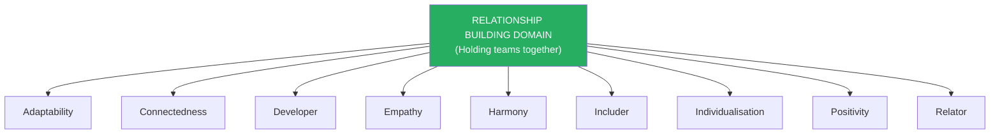
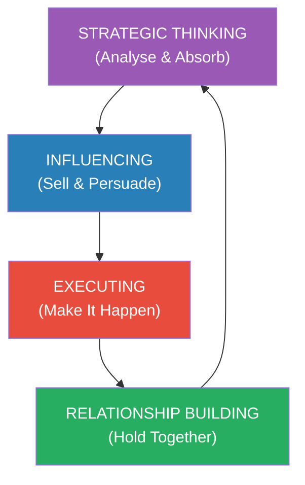
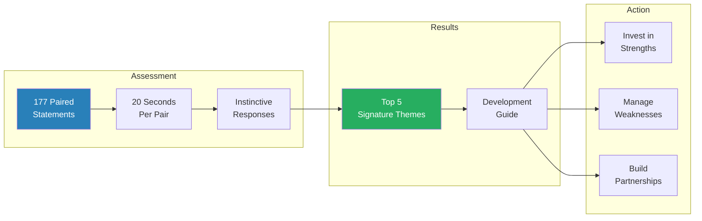

# StrengthsFinder 2.0 — Tom Rath

> Tom Rath and the Gallup organisation spent decades studying what makes people excel, and their conclusion is counterintuitive: you will grow the most in the areas where you are already strong, not in the areas where you are weak.
> StrengthsFinder 2.0 is built around a 34-theme taxonomy of human talent — recurring patterns of thought, feeling, and behaviour that can be productively applied.
> Rath argues that the "well-rounded" development model — fix your weaknesses, become adequate at everything — produces mediocrity, not excellence.
> The alternative: identify your top talents, invest in them deliberately, and manage your weaknesses rather than obsessing over them.
> Based on Gallup's study of over two million individuals, the book includes an online assessment that ranks your personal top five "Signature Themes" and provides a practical guide to all 34 themes.
> The odds of someone else having the same top five themes in the same order are roughly one in thirty-three million — the book's core message is that this uniqueness is your greatest asset.

---

## About the Author

Tom Rath is a researcher and author who spent over a decade at the Gallup organisation, eventually becoming one of its senior scientists and advisors. He is the grandson of Dr. Donald O. Clifton, whom the American Psychological Association honoured as "the Father of Strengths-Based Psychology" — the man who created the original Clifton StrengthsFinder assessment after forty years of studying top performers across hundreds of professions. Rath built on his grandfather's life work to write StrengthsFinder 2.0 in 2007, updating the assessment and expanding the practical guidance for each of the 34 themes. The book has sold over five million copies and has become one of the most widely used talent development tools in the world. Rath has also authored several other books including *How Full Is Your Bucket?* and *Eat Move Sleep*, but StrengthsFinder 2.0 remains his most influential work by a wide margin.

---

## The Big Idea

- <b style="color: #2980b9">Strengths-based development</b> inverts the conventional wisdom of personal growth — instead of pouring energy into fixing your worst areas, you invest that energy into developing your best areas
- A **strength** is not simply something you are good at — it is the product of a natural **talent** (a recurring pattern of thought, feeling, or behaviour) multiplied by deliberate **investment** (practice, skill-building, and knowledge acquisition)
- <b style="color: #27ae60">You cannot manufacture talent where none exists</b> — by your mid-teens, your brain has completed a process called synaptic pruning that physically wires certain neural pathways to be stronger than others, and those pathways become your talents
- The practical implication is stark: developing a genuine talent into a world-class strength yields exponential returns, while trying to build strength in a talentless area yields only modest, linear improvement at best
- <b style="color: #e74c3c">The "well-rounded" development myth costs organisations and individuals billions</b> in wasted effort — Gallup's data shows that people who focus on their strengths are six times more likely to be engaged at work and three times more likely to report an excellent quality of life

Rath organises the 34 themes into four broad <b style="color: #2980b9">domains</b> that describe how people contribute:

| Domain | What It Does | Number of Themes |
|--------|-------------|:----------------:|
| **Executing** | Makes things happen — turns ideas into reality | 9 |
| **Influencing** | Reaches a wider audience — sells ideas and takes charge | 8 |
| **Relationship Building** | Holds a team together — creates bonds and connection | 9 |
| **Strategic Thinking** | Absorbs and analyses information — helps teams make better decisions | 8 |

No domain is superior to another. The strongest teams have a balance across all four domains, though no single individual needs to be balanced — that is precisely the point.

The four domains are nearly equal in size — Executing and Relationship Building each hold 9 themes while Influencing and Strategic Thinking each hold 8 — reinforcing Rath's point that no domain is inherently more important than another.

The Strengths Equation shows how talent and investment combine multiplicatively — raw talent without investment stays potential, while investment without talent produces only modest competence.

---

## Key Concepts at a Glance

| Concept | One-line summary |
|---------|-----------------|
| **Talent** | A naturally recurring pattern of thought, feeling, or behaviour |
| **Investment** | Time spent practising, developing skills, and building knowledge |
| **Strength** | Talent multiplied by investment — consistent near-perfect performance |
| **Weakness management** | Don't ignore weaknesses — partner around them, use systems, don't obsess |
| **Signature Themes** | Your top five talent themes — the foundation for development |
| **Four Domains** | Executing, Influencing, Relationship Building, Strategic Thinking |
| **Synaptic pruning** | Brain process by mid-teens that physically wires your strongest neural pathways |
| **The "best of" question** | "Do you get to do what you do best every day?" — the strongest predictor of engagement |
| **Complementary partnerships** | Pair with people whose strengths cover your weaknesses |
| **Strength zones** | The activities and tasks where your talents are most naturally activated |

---

## Quick Lookup Table — All 34 Themes

| Theme | Domain | Core Drive |
|-------|--------|-----------|
| **Achiever** | Executing | Internal fire for daily accomplishment |
| **Activator** | Influencing | Impatience for action — learn by doing |
| **Adaptability** | Relationship Building | Lives in the present, flows with change |
| **Analytical** | Strategic Thinking | Demands proof, searches for causes |
| **Arranger** | Executing | Orchestrates complexity — people, resources, logistics |
| **Belief** | Executing | Guided by core values and enduring purpose |
| **Command** | Influencing | Takes charge, confronts, decides under pressure |
| **Communication** | Influencing | Brings ideas to life through words and stories |
| **Competition** | Influencing | Measures progress by outperforming others |
| **Connectedness** | Relationship Building | Senses links between all people and events |
| **Consistency** | Executing | Fairness, equal treatment, predictable rules |
| **Context** | Strategic Thinking | Understands the present by studying the past |
| **Deliberative** | Executing | Careful, vigilant, anticipates obstacles |
| **Developer** | Relationship Building | Spots and cultivates potential in others |
| **Discipline** | Executing | Craves routine, structure, and order |
| **Empathy** | Relationship Building | Senses emotions, sees through others' eyes |
| **Focus** | Executing | Sets direction, filters distractions, follows through |
| **Futuristic** | Strategic Thinking | Energised by visions of what could be |
| **Harmony** | Relationship Building | Seeks consensus, avoids conflict |
| **Ideation** | Strategic Thinking | Fascinated by ideas and unexpected connections |
| **Includer** | Relationship Building | Accepts everyone, draws outsiders in |
| **Individualisation** | Relationship Building | Intrigued by unique qualities of each person |
| **Input** | Strategic Thinking | Craves information — collects ideas, facts, artefacts |
| **Intellection** | Strategic Thinking | Loves thinking — introspective, mental depth |
| **Learner** | Strategic Thinking | Energised by the journey from ignorance to competence |
| **Maximiser** | Influencing | Transforms good into great — focuses on strengths |
| **Positivity** | Relationship Building | Contagious enthusiasm and optimism |
| **Relator** | Relationship Building | Values deep, authentic, existing relationships |
| **Responsibility** | Executing | Psychological ownership of every commitment |
| **Restorative** | Executing | Energised by solving problems and fixing what's broken |
| **Self-Assurance** | Influencing | Confident in own judgement — trusts inner compass |
| **Significance** | Influencing | Wants to make an impact and be recognised |
| **Strategic** | Strategic Thinking | Sees patterns, creates alternative paths forward |
| **Woo** | Influencing | Wins Others Over — thrives on meeting strangers |

This table gives you the full landscape. The detailed treatment of each theme follows, organised by domain.

---

## Part I: The Case for Strengths

### Chapter 1 — The Weakness-Fixing Trap

*Rath opens with the question that most people answer incorrectly: which will help you grow more — working on your strengths, or fixing your weaknesses?*

- Gallup surveyed people across dozens of countries with a simple question: "Which do you think will help you be most successful — building on your strengths, or fixing your weaknesses?"
- In the United States, 41% said strengths; the majority said weaknesses
- In China and Japan, the weakness-fixation was even more extreme — over 70% chose weaknesses
- <b style="color: #e74c3c">The entire global educational and corporate development system is built on the weakness-fixing model</b> — report cards highlight low grades, performance reviews focus on "areas for improvement," and development plans target deficits
- This approach is not just inefficient — it is psychologically draining:
  - Working in weakness areas is inherently demotivating
  - It produces, at best, adequacy — never excellence
  - It diverts energy from the areas where you could achieve exponential growth

> [!example] The School Report Card Problem
> - A child comes home with marks: A in English, A in Social Studies, C in Biology, F in Mathematics
> - Nearly every parent focuses the conversation on the F — what happened in maths? We need to get you a tutor
> - The A grades — the areas of genuine talent — receive a brief "good job" and no further investment
> - The implicit message: your best areas need no attention; pour all your energy into your worst
> - This pattern repeats throughout education, university, and into the corporate performance review
> **The lesson:** The weakness-fixing model trains people from childhood to ignore their greatest assets.

- <b style="color: #27ae60">The strengths-based alternative is not to ignore weaknesses — it is to manage them while investing disproportionately in strengths</b>
- Managing a weakness means:
  - Finding a partner whose strength is your weakness
  - Building a system or process that compensates
  - Getting just good enough to prevent the weakness from derailing you
  - Deliberately choosing roles where the weakness is irrelevant
- <b style="color: #e74c3c">What it does NOT mean: spending all your development budget trying to turn an F into a B</b>

---

### Chapter 2 — The Science of Strengths

*The argument rests on neuroscience: your talents are literally hardwired by your mid-teens, and no amount of effort can rewire them.*

- Between the ages of roughly 3 and 15, the human brain undergoes a process called <b style="color: #2980b9">synaptic pruning</b>:
  - At age 3, a child has approximately 300 billion synaptic connections
  - By age 15, half of those connections have been pruned away
  - The connections that survive and strengthen are the ones used most frequently
  - These surviving pathways become your talents — your brain's superhighways
- This is not metaphorical — it is physical, neurological architecture:
  - A talent for empathy means the mirror neuron pathways are physically stronger
  - A talent for analytical thinking means the logical reasoning circuits are physically denser
  - A talent for discipline means the prefrontal cortex routines for structure-building are more robust
- <b style="color: #27ae60">You can build knowledge and skills in any area, but you cannot create new talent pathways after pruning is complete</b>
- This explains why:
  - Some people learn leadership effortlessly while others struggle despite years of training
  - Some people are naturally empathetic while others have to consciously work at reading emotions
  - Two people in the same training programme produce radically different outcomes

> [!tip] Core Insight
> Talent is the multiplier. Investment without talent produces linear, modest gains. Investment in a genuine talent produces exponential, compounding returns. This is why strengths-based development outperforms weakness-fixing.

---

### Chapter 3 — Gallup's Data

*The numbers behind strengths-based development are not marginal improvements — they are dramatic differences in engagement, performance, and well-being.*

- Gallup's research base spans over two million individuals across hundreds of professions and dozens of countries
- <b style="color: #2980b9">The "Best Of" Question</b> — "At work, I have the opportunity to do what I do best every day" — is the single strongest predictor of engagement that Gallup has ever measured:
  - Only about 1 in 3 employees worldwide strongly agrees with this statement
  - Teams where most members agree show dramatically higher productivity, customer satisfaction, and retention
  - Teams where few members agree show higher turnover, more safety incidents, and lower customer scores

| Metric | Strengths-focused teams | Weakness-focused teams |
|--------|:----------------------:|:---------------------:|
| Employee engagement | 6x higher | Baseline |
| Quality of life | 3x higher | Baseline |
| Productivity | Significantly higher | Baseline |
| Turnover | Significantly lower | Baseline |

Gallup's data reveals that strengths-focused teams outperform weakness-focused teams by dramatic multipliers — 6x in engagement and 3x in quality of life — proving that the strengths approach is not incremental improvement but a categorical shift in outcomes.

- The data holds across cultures, industries, and job levels
- <b style="color: #27ae60">The implication is organisational, not just personal</b> — teams and companies that align people to their strengths outperform those that do not

> [!example] The Teacher Study
> - Gallup studied teachers across the United States who produced exceptional student outcomes
> - These top-performing teachers used radically different methods from one another — some were strict disciplinarians, others were warm and collaborative, others were entertainers
> - The common thread was not method — it was that each teacher was using THEIR natural strengths as their teaching instrument
> - A teacher high in Woo connected with every student personally; a teacher high in Discipline created structured routines; a teacher high in Competition turned lessons into games
> - When a school tried to standardise teaching methods, the top performers declined — because the imposed method no longer aligned with their strengths
> **The lesson:** Excellence does not come from following a single best method — it comes from finding the method that activates your specific talents.

> [!example] Tiger Woods and the Short Game
> - Tiger Woods was already the world's best golfer, yet he continued to invest heavily in refining his short game — his strongest area
> - Conventional coaching would have said: work on your weakest areas to become more balanced
> - Woods's approach: pour investment into talent and create an insurmountable advantage in his best domain
> - The result was a period of dominance in golf that may never be repeated
> **The lesson:** The highest returns come from investing in your strengths, not from trying to eliminate all weaknesses.

---

### Chapter 4 — How to Use This Book

*Rath provides a practical framework for moving from assessment results to real development.*

- Take the Clifton StrengthsFinder assessment (included with the book purchase) — 177 paired statements, 20 seconds per pair
- You receive your <b style="color: #2980b9">Top 5 Signature Themes</b> — these are the foundation for development
- The odds of someone else having the same top 5 in the same order: <b style="color: #27ae60">1 in 33 million</b>
- Three practical steps after receiving your results:
  1. **Read the theme descriptions** — understand the core drive, not just the label
  2. **Notice the themes in action** — pay attention to when you feel energised, in flow, and effective
  3. **Find complementary partners** — seek people whose top themes cover your bottom themes

> [!abstract] The Strengths Development Process
> 1. Take the Clifton StrengthsFinder assessment to identify your top 5 themes
> 2. Study each theme — understand its core drive, its language, its blind spots
> 3. Notice when you are in your "strength zones" — activities that leave you energised, not drained
> 4. Invest deliberately — build knowledge and skills in your top theme areas
> 5. Manage weaknesses — partner, systematise, or reposition, but do not obsess
> 6. Build complementary teams — seek people whose strengths cover your gaps

This process is not a one-time exercise — it is a continuous cycle of awareness, investment, and partnership.

---

## Part II: The 34 Themes

### Domain 1 — Executing Themes

*The nine Executing themes are the engines that turn intention into accomplishment. People dominant in this domain are the ones who make things actually happen.*

The Executing domain contains people who are wired to get things done — they are the ones who catch the ball and run with it while others are still planning.

---

#### Achiever

*The internal furnace that never goes out — Achievers wake up at zero every morning and need to accomplish something tangible by nightfall.*

- <b style="color: #2980b9">Achiever</b> is defined by a relentless, internal drive to accomplish — every single day
- This is not ambition in the conventional sense — it is a deep-seated need to produce:
  - The Achiever's internal scorecard resets to zero every morning
  - Every day demands its own set of tangible accomplishments
  - A day without achievement feels incomplete, regardless of how much was accomplished yesterday
- The stamina that comes with Achiever is remarkable:
  - These are the people who can work long hours and still feel energised
  - They set the pace on teams, often by example rather than by instruction
  - Their productivity is consistently high, not just during crunch periods
- <b style="color: #e74c3c">The shadow side</b>: Achievers can burn out partners and teammates with their relentless pace, and they may confuse busyness with meaningful progress

> [!example] The Achiever's Daily Reset
> - A manager with dominant Achiever described her morning routine: she wakes up feeling a void — yesterday's accomplishments have already evaporated
> - She keeps a daily checklist and physically crosses items off throughout the day
> - Even on weekends and holidays, she needs to feel she has "earned" relaxation by completing something tangible first
> - She recognised that her team sometimes felt inadequate because they could never match her pace — she had to learn that her Achiever was a talent, not a universal standard
> **The lesson:** Achiever is an internal fire, not a productivity technique — it cannot be taught, but it can be channelled.

- <b style="color: #27ae60">When partnered with Focus or Discipline, Achiever becomes a precision engine</b> — not just busy, but strategically productive
- Without those complementary themes, Achiever risks scattering energy across too many tasks

---

#### Arranger

*Arrangers are conductors — they see the pieces of a complex situation and instinctively know which configuration will produce the best result.*

- <b style="color: #2980b9">Arranger</b> is the talent for managing many moving parts simultaneously
- Where Discipline craves fixed routine, Arranger thrives on dynamic complexity:
  - Enjoys juggling multiple variables at once
  - Instinctively knows which person should be in which role
  - Reconfigures resources on the fly when circumstances change
- Arrangers are at their best when the situation is chaotic and the variables are numerous:
  - Event planning, project management, logistics
  - Building teams by matching people to roles based on their individual strengths
  - Handling crises where the plan needs to change in real time
- <b style="color: #27ae60">The Arranger's superpower is flexibility within complexity</b> — they can hold the full picture in their head and rearrange pieces without losing sight of the goal
- The key distinction between Arranger and Discipline:
  - Discipline creates a fixed routine and follows it precisely
  - Arranger creates a dynamic configuration and adjusts it constantly
  - Both produce order — but Discipline's order is static and Arranger's order is fluid

> [!example] The Arranger as Event Coordinator
> - A conference organiser with dominant Arranger managed a three-day event with 40 speakers, 12 venues, and 2,000 attendees
> - When two keynote speakers cancelled the morning of day two, she reshuffled the entire schedule within an hour — moving workshops, reassigning rooms, and promoting a breakout speaker to the main stage
> - She described the experience as energising, not stressful — the more variables she had to juggle, the more alive she felt
> - Her colleagues with Deliberative and Discipline were rattled by the chaos; she was thriving in it
> **The lesson:** Arranger is not about planning — it is about dynamic orchestration in real time.

---

#### Belief

*Belief is the anchor — people with this theme have core values that are fixed, enduring, and non-negotiable, and these values give their life direction and meaning.*

- <b style="color: #2980b9">Belief</b> provides an internal compass that rarely wavers
- These are not beliefs about specific issues — they are deep values about how life should be lived:
  - Family, integrity, ethics, service, fairness — the specifics vary, but the strength of conviction does not
  - Work must have meaning beyond the paycheck
  - When work aligns with values, the Belief person is tireless; when it conflicts, they wither
- <b style="color: #27ae60">Belief provides purpose</b> — and purpose is one of the strongest drivers of sustained motivation
- <b style="color: #e74c3c">The risk</b>: Belief can make a person inflexible, resistant to pragmatic compromises, or judgmental of those with different values

---

#### Consistency

*Consistency is the level playing field — people with this theme are deeply uncomfortable with special treatment and fiercely committed to fairness.*

- <b style="color: #2980b9">Consistency</b> craves a world where the rules apply equally to everyone
- This is not rule-following for its own sake — it is a deeply felt conviction that fairness requires predictability:
  - Clear procedures that do not bend for status or connections
  - Rewards distributed based on objective criteria, not favouritism
  - Transparent processes that everyone can understand and rely on
- Consistency people are the natural guardians of organisational equity:
  - They notice when someone gets special treatment before anyone else does
  - They push for standardised processes and documented procedures
  - They resist arbitrary exceptions, even when those exceptions might benefit them personally
- <b style="color: #e74c3c">The tension</b>: Consistency can clash with Individualisation (which wants to treat each person uniquely) — neither is wrong, but they pull in opposite directions

---

#### Deliberative

*Deliberative is the brake pedal in a world that celebrates the accelerator — these people anticipate what can go wrong and proceed only when they have prepared for it.*

- <b style="color: #2980b9">Deliberative</b> people are serious, careful, and private by nature
- They do not leap before looking — they look, look again, consider the angles, and then step carefully:
  - They anticipate obstacles that others miss entirely
  - They prefer calculated, well-considered decisions over quick, instinctive ones
  - They are selective about who they trust and slow to open up
- In a culture that celebrates speed and spontaneity, Deliberative can be undervalued:
  - But every team needs someone who asks "what could go wrong?"
  - Deliberative people prevent costly mistakes that optimists never see coming
- <b style="color: #27ae60">Paired with Strategic or Analytical, Deliberative produces exceptionally sound decision-making</b>

---

#### Discipline

*Discipline is the love of structure — not imposed structure, but self-created order that turns a chaotic world into something predictable and manageable.*

- <b style="color: #2980b9">Discipline</b> craves routine, order, and structure
- These people are not merely organised — they need organisation to function:
  - They create timelines, break projects into manageable steps, and set up routines
  - They are uncomfortable with surprises and last-minute changes
  - Their world runs on schedules, lists, and repeatable processes
- <b style="color: #27ae60">Discipline's contribution is precision and reliability</b> — they deliver consistently, on time, and to specification
- They bring order to chaotic environments and help teams stay on track when complexity threatens to overwhelm

> [!tip] Core Insight
> Discipline is not about control for its own sake — it is about creating the structure that allows excellence to be repeatable rather than accidental.

---

#### Focus

*Focus is the compass — these people set a direction, filter out everything that does not contribute to reaching the destination, and follow through with determination.*

- <b style="color: #2980b9">Focus</b> is the talent for setting a clear direction and staying on it
- Where Achiever is about producing output, Focus is about producing the RIGHT output:
  - Focus people set goals and use them as a filtering mechanism
  - Every action is evaluated against the question: "Does this move me toward my goal?"
  - They are impatient with tangents, interruptions, and unnecessary meetings
- <b style="color: #27ae60">Focus is the theme that gives other Executing themes their direction</b> — Achiever without Focus is just busy; Achiever with Focus is powerfully productive
- <b style="color: #e74c3c">The risk</b>: Focus people can become too narrow, missing peripheral opportunities or alienating colleagues who want to explore before committing

| Theme Pair | Result |
|-----------|--------|
| **Focus + Achiever** | Directed, sustained productivity |
| **Focus + Discipline** | Systematic pursuit of goals with precise routines |
| **Focus + Strategic** | Goal-setting with multiple paths to achievement |
| **Focus + Activator** | Quick launch toward a clear target |

These combinations show how Focus amplifies other Executing themes by giving them direction.

---

#### Responsibility

*Responsibility is the promise keeper — once these people commit, they feel a deep psychological obligation to follow through, no matter the personal cost.*

- <b style="color: #2980b9">Responsibility</b> is about psychological ownership of commitments
- This goes far beyond reliability — it is an emotional bond with one's word:
  - If they say they will do something, it is done — not because they have to, but because they literally cannot live with breaking a commitment
  - They volunteer for extra work because they feel obligated to contribute
  - They take it personally when things go wrong, even if it was not entirely their fault
- <b style="color: #27ae60">Responsibility people are the ones you can count on absolutely</b> — but this comes at a cost:
  - They can overcommit because saying no feels like a moral failure
  - They take on other people's responsibilities when they see things slipping
  - They carry guilt disproportionate to their actual role in failures

> [!example] The Cost of Responsibility Without Boundaries
> - A project manager with dominant Responsibility found herself regularly working weekends to cover for underperforming teammates
> - She did not resent the work — she resented the idea of the project failing more
> - Her manager had to intervene and point out that her Responsibility was enabling others to avoid theirs
> - She learned to distinguish between her commitments and other people's commitments — Responsibility is a strength, but without boundaries it becomes self-exploitation
> **The lesson:** Responsibility must be channelled — owning your commitments is a strength; owning everyone else's is a path to burnout.

---

#### Restorative

*Restorative is the fixer — these people are energised by problems, not drained by them, because every problem is a puzzle waiting to be solved.*

- <b style="color: #2980b9">Restorative</b> is the talent for diagnosing and solving problems
- While most people avoid problems, Restorative people are drawn to them:
  - They enjoy figuring out what is wrong and restoring it to working order
  - They are energised by the diagnostic process — narrowing down causes, testing solutions
  - They take personal satisfaction in bringing broken things back to life
- This applies to things, processes, people, and relationships:
  - The IT professional who loves debugging
  - The consultant who thrives on turnaround situations
  - The friend who people go to when they need help untangling a mess
- <b style="color: #27ae60">Restorative paired with Analytical creates a powerful diagnostic engine</b> — the Analytical identifies the root cause, and the Restorative fixes it

---

### Domain 2 — Influencing Themes

*The eight Influencing themes are about reaching outward — moving people, selling ideas, taking charge, and making sure the team's voice is heard beyond its own walls.*

People dominant in Influencing themes are wired to persuade, sell, and take charge — they ensure that ideas do not die in committee.

---

#### Activator

*Activators believe that the best learning happens through action — planning is fine, but at some point you have to stop talking and start doing.*

- <b style="color: #2980b9">Activator</b> is defined by impatience for action
- Where Deliberative people want to analyse before acting, Activators want to act and then adjust:
  - "When can we start?" is their signature question
  - They believe that a decision is only truly made when action begins
  - They are catalysts — they energise stalled groups and push past analysis paralysis
- <b style="color: #27ae60">Activators are invaluable on teams that over-think and under-execute</b>
- <b style="color: #e74c3c">The risk</b>: Activators can push too quickly, skipping essential planning steps and creating problems that Deliberative people would have anticipated

> [!example] The Activator and the Stalled Project
> - A product team spent three months debating the design of a new feature, cycling through rounds of analysis and stakeholder input without making a decision
> - The Activator on the team proposed building a rough prototype in two weeks and testing it with real users
> - The prototype revealed issues that no amount of analysis had predicted — and it also validated the core concept
> - The team shipped the feature six weeks later — having spent more time deliberating about whether to build it than actually building it
> **The lesson:** Action creates information that planning cannot — Activators push teams past the point of diminishing returns on analysis.

---

#### Command

*Command is the ability to take charge — not because you want power, but because someone needs to make the call, and you are willing to be that person.*

- <b style="color: #2980b9">Command</b> is the talent for taking control of situations and making things clear
- People with Command are not intimidated by confrontation:
  - They share their opinions directly, even when those opinions are unpopular
  - They make decisions when the group is paralysed by indecision
  - They confront problems and people that others avoid
- This is not about being aggressive — it is about <b style="color: #27ae60">emotional willingness to bear the weight of decisions</b>:
  - They accept the risk that comes with decisive action
  - They are comfortable being the one who says what everyone else is thinking
  - They take charge in crises when leadership is needed immediately
- <b style="color: #e74c3c">Command without Empathy or Harmony can come across as bulldozing</b> — the best Command people learn to wield their directness with awareness of its impact

---

#### Communication

*Communicators are natural storytellers — they bring ideas to life through vivid language, compelling narratives, and the ability to hold an audience.*

- <b style="color: #2980b9">Communication</b> is the talent for putting thoughts into words that captivate
- These people are the narrators, presenters, and writers:
  - They search for the perfect phrase to capture an idea
  - They use images, examples, and stories to make dry concepts vivid
  - They enjoy speaking to groups and can hold attention naturally
- <b style="color: #27ae60">Communication turns complex ideas into accessible stories</b> — making it essential for teams that need to sell their work to others
- Communication people often serve as the "translator" between technical experts and non-technical audiences
- The difference between Communication and other verbal skills:
  - Communication is not just speaking clearly — it is making ideas come alive
  - A person with Analytical might explain precisely; a person with Communication makes you feel it
  - The best communicators do not just inform — they transport their audience into the idea

---

#### Competition

*Competition is the measurement of progress through comparison — these people need a race, a rival, a scoreboard to bring out their best performance.*

- <b style="color: #2980b9">Competition</b> is the drive to outperform
- This is not hostile or destructive — it is a measurement system:
  - Competition people instinctively compare their performance to others
  - They need a benchmark, a rival, a leaderboard to feel energised
  - They celebrate winning and are genuinely deflated by losing
  - They push themselves harder when they can see someone ahead of them
- <b style="color: #27ae60">Competition creates urgency and raises standards</b> — when a Competition person joins a team, the performance bar tends to rise for everyone
- <b style="color: #e74c3c">The risk</b>: Competition can become toxic if winning becomes more important than contributing, or if every interaction becomes a contest

| Healthy Competition | Unhealthy Competition |
|--------------------|-----------------------|
| Uses comparison to push personal best | Wins at others' expense |
| Celebrates rivals' excellence | Diminishes rivals' achievements |
| Energised by challenge | Crushed by any loss |
| Raises the whole team's standard | Creates zero-sum dynamics |

This table distinguishes the productive and destructive expressions of Competition.

---

#### Maximiser

*Maximisers are not interested in fixing what is broken — they are interested in taking what is already good and making it great.*

- <b style="color: #2980b9">Maximiser</b> is the strength-amplification theme — and it is the theme most aligned with the book's entire philosophy
- Where Restorative sees problems and wants to fix them, Maximiser sees potential and wants to optimise it:
  - They gravitate toward what is working, not what is failing
  - They push good performance to excellent performance
  - They are more interested in developing a strength from good to world-class than in bringing a weakness from poor to adequate
- <b style="color: #27ae60">Maximiser people instinctively understand the strengths philosophy</b> — they are natural advocates for investing in what already works
- They are often excellent at recognising others' strengths and helping channel them:
  - They notice when someone is doing something well and encourage more of it
  - They get frustrated by remedial work — their energy comes from polishing, not repairing

> [!tip] Core Insight
> Maximiser is the StrengthsFinder philosophy embodied as a talent. If you have Maximiser in your top 5, the entire strengths-based approach will feel intuitively obvious. If you do not, the book is asking you to think like a Maximiser.

---

#### Self-Assurance

*Self-Assurance is the inner compass — these people trust their own judgement and are confident they can manage whatever life throws at them.*

- <b style="color: #2980b9">Self-Assurance</b> is not about competence — it is about confidence in one's own ability to navigate
- People with this theme have an internal sense of certainty:
  - They trust their instincts and feel capable of making decisions without extensive external validation
  - They are not easily swayed by others' opinions — they have their own compass
  - They project calm authority because they genuinely believe they can handle what comes
- <b style="color: #27ae60">Self-Assurance is rare and powerful</b> — it gives people the courage to take risks, make unpopular decisions, and stand alone when necessary
- <b style="color: #e74c3c">Without Empathy or Includer to temper it</b>, Self-Assurance can appear as arrogance or dismissiveness

---

#### Significance

*Significance is the drive to matter — to be known, recognised, and remembered for making an important contribution.*

- <b style="color: #2980b9">Significance</b> craves impact and recognition
- This is not vanity — it is a deep need to do things that matter:
  - They want to be known for something meaningful
  - They are drawn to roles where their contribution is visible and acknowledged
  - They set high standards for themselves because they want to be seen as credible and important
- <b style="color: #27ae60">Significance drives people to aim high</b> — because mediocre, invisible work is intolerable to them
- They are often the people who step up for high-profile, high-risk projects because the visibility matches their need for impact

---

#### Woo

*Woo — Winning Others Over — is the social spark plug. These people thrive on meeting strangers and turning them into friendly acquaintances.*

- <b style="color: #2980b9">Woo</b> stands for "Winning Others Over" — the talent for making connections with new people
- Woo people are energised by unfamiliar social situations:
  - They enjoy breaking the ice and making strangers comfortable
  - They can work a room, start conversations, and find common ground quickly
  - They collect acquaintances the way Input people collect information
- <b style="color: #27ae60">Woo is invaluable in roles that require broad networking, sales, or public engagement</b>
- The critical distinction between Woo and Relator:
  - Woo wants to meet everyone; Relator wants to deepen existing relationships
  - Woo is energised by the first conversation; Relator is energised by the hundredth
  - Teams need both — Woo opens doors, Relator builds lasting bonds behind them

> [!example] Woo vs. Relator at a Conference
> - Two colleagues attend the same industry conference
> - The Woo colleague meets 40 new people, exchanges business cards, and remembers one interesting fact about each — she is energised and buzzing by the end
> - The Relator colleague seeks out three people she already knows, has deep hour-long conversations with each, and leaves feeling fulfilled
> - Both had productive conferences — but they drew energy from completely different types of interaction
> - Neither approach is superior; the team benefits when the Woo person opens new relationships and the Relator person deepens them
> **The lesson:** Woo and Relator are complementary, not competing — broad connection and deep connection are both essential.

---

### Domain 3 — Relationship Building Themes

*The nine Relationship Building themes are the glue of teams — the connective tissue that holds individuals together and creates something greater than the sum of its parts.*

Relationship Building themes are often undervalued in performance-driven cultures, but Gallup's data is clear: teams without strong relationship builders fracture under pressure.

---

#### Adaptability

*Adaptability is the art of living in the present — these people do not resist change because they barely notice it; they simply adjust and keep moving.*

- <b style="color: #2980b9">Adaptability</b> is the talent for going with the flow
- These people do not need a plan to feel comfortable:
  - They respond to the demands of the moment rather than following a predetermined script
  - They are flexible, calm in chaos, and able to pivot without stress
  - They expect change and are never thrown by it
- <b style="color: #27ae60">Adaptability is the antidote to rigidity</b> — on a team full of planners, the Adaptability person keeps everyone sane when the plan falls apart
- <b style="color: #e74c3c">The shadow side</b>: without Focus or Discipline to complement it, Adaptability can become directionlessness — flowing wherever the current goes without making progress toward any destination

---

#### Connectedness

*Connectedness is the faith that things happen for a reason — that every person and every event is part of something larger than itself.*

- <b style="color: #2980b9">Connectedness</b> is a philosophical or spiritual talent
- People with this theme sense bridges and links where others see random events:
  - They believe in a larger purpose connecting all people
  - They are sensitive to the impact of actions on others — because everything is connected
  - They often serve as the conscience of a team, reminding people of shared humanity
- <b style="color: #27ae60">Connectedness provides perspective and meaning</b> — especially during difficult times when others lose sight of the bigger picture

---

#### Developer

*Developers see potential the way miners see gold — invisible to most people, but unmistakable to them. They are energised by watching others grow.*

- <b style="color: #2980b9">Developer</b> is the talent for seeing and cultivating potential in others
- Developers are natural coaches, mentors, and teachers:
  - They notice small improvements that others miss
  - They celebrate incremental growth — the struggling employee who just had their first good week
  - They invest time in others' development not as a duty but as a source of genuine satisfaction
- <b style="color: #27ae60">Developer is what makes the strengths philosophy scalable</b> — Developers naturally see others' talents and want to help cultivate them

> [!example] The Developer's Eye for Growth
> - A team leader with dominant Developer noticed that a quiet junior analyst consistently asked the most insightful questions during meetings — questions that cut to the core of problems
> - While others saw a shy introvert who needed to "speak up more" (weakness-fixing), the Developer saw Analytical and Intellection in action
> - She gave the analyst pre-meeting materials and specifically invited her analysis during discussions, creating space for the talent to emerge
> - Within a year, the analyst was the team's go-to person for complex problem diagnosis — a role that would never have materialised under the "fix your weakness" approach
> **The lesson:** Developer sees what is already there and creates conditions for it to flourish — this is strengths-based leadership in action.

---

#### Empathy

*Empathy is not sympathy — it is the ability to feel what another person is feeling, to see the world through their emotional lens, without choosing to.*

- <b style="color: #2980b9">Empathy</b> is the talent for sensing other people's emotions
- This is not a choice or a skill — it is an involuntary, constant reception of emotional information:
  - They can walk into a room and immediately sense the mood
  - They know when someone is upset even when that person is smiling
  - They feel others' joy, anxiety, frustration, and excitement as if it were their own
- <b style="color: #27ae60">Empathy is invaluable for leadership, customer service, and conflict resolution</b> — the ability to accurately read emotions is a superpower in any interpersonal context
- <b style="color: #e74c3c">The cost</b>: Empathy people absorb emotional toxicity — they cannot simply "turn it off," which makes toxic environments particularly draining for them
- Empathy differs from Individualisation:
  - Empathy reads emotions
  - Individualisation reads characteristics, preferences, and working styles
  - Both understand people deeply, but through different channels

---

#### Harmony

*Harmony is the peacemaker — not because these people are passive, but because they genuinely believe that conflict wastes energy that could be spent on progress.*

- <b style="color: #2980b9">Harmony</b> seeks areas of agreement
- Harmony people are not afraid of conflict — they see it as unnecessary friction:
  - They look for common ground in every disagreement
  - They steer conversations toward practical consensus
  - They believe that most conflicts are about ego, not substance
- <b style="color: #27ae60">Harmony accelerates team progress</b> — while others are debating, the Harmony person finds the point of agreement and moves the group forward
- <b style="color: #e74c3c">The risk</b>: Harmony can suppress necessary conflict — sometimes teams need to hash out genuine disagreements, and premature consensus leads to poor decisions

---

#### Includer

*Includers are the opposite of gatekeepers — they look at the edges of every group and invite in the people standing on the outside.*

- <b style="color: #2980b9">Includer</b> is the talent for acceptance and integration
- These people are instinctively aware of who is being left out:
  - They notice the quiet person at the meeting who has not spoken
  - They invite new members into established groups
  - They resist cliques, hierarchies, and any social structure that excludes
- <b style="color: #27ae60">Includer ensures that teams hear all voices, not just the loudest</b> — and in doing so, often surfaces perspectives that would otherwise be lost
- Includer and Individualisation are complementary:
  - Includer brings everyone into the circle
  - Individualisation figures out how each person in the circle contributes uniquely

---

#### Individualisation

*Individualisation is the talent for seeing each person as irreducibly unique — not as a type, not as a category, but as a distinct human being with specific traits, motivations, and needs.*

- <b style="color: #2980b9">Individualisation</b> is intrigued by the unique qualities of each person
- Where Consistency wants to treat everyone the same, Individualisation knows that treating everyone the same means treating most people wrong:
  - They intuitively know what motivates each team member
  - They figure out how different people should be managed, recognised, and challenged
  - They are natural matchmakers — putting the right person in the right role
- <b style="color: #27ae60">Individualisation is the key to strengths-based management</b> — the manager who can see each person's unique talent profile and deploy them accordingly

> [!example] The Individualisation Manager
> - A sales director with dominant Individualisation managed twelve salespeople and knew that each one responded to different motivators
> - One needed public recognition; another found public praise embarrassing and preferred a private note
> - One was driven by competition and responded to leaderboards; another was driven by mastery and needed harder problems to solve
> - A "one-size-fits-all" incentive programme would have motivated four of the twelve; her individualised approach motivated all twelve
> - Her team's performance was consistently the highest in the region
> **The lesson:** The best managers do not treat everyone equally — they treat everyone uniquely.

---

#### Positivity

*Positivity is contagious enthusiasm — these people lift the energy of every room they enter, not through forced optimism but through genuine lightheartedness.*

- <b style="color: #2980b9">Positivity</b> is the talent for enthusiasm, optimism, and energy
- This is not naivety — Positivity people can see the problems; they simply choose to focus on the possibilities:
  - They are generous with praise and quick to celebrate small wins
  - They create an upbeat atmosphere that makes work more enjoyable
  - They lift morale during difficult periods — not by denying reality, but by highlighting what is going well
- <b style="color: #27ae60">Positivity is the emotional fuel of teams</b> — when energy drops, the Positivity person re-ignites it
- <b style="color: #e74c3c">The risk</b>: Positivity can be perceived as dismissive if used to bypass genuine concerns — "staying positive" when the situation demands honest acknowledgement of problems creates distrust

---

#### Relator

*Relators crave depth, not breadth — they want a small circle of close, authentic relationships where real trust has been earned over time.*

- <b style="color: #2980b9">Relator</b> is the counterpart to Woo — where Woo opens new connections, Relator deepens existing ones
- Relator people are drawn to authenticity and intimacy:
  - They are uncomfortable with small talk and prefer substantive conversation
  - They invest heavily in a small number of close relationships
  - They are loyal, trustworthy, and expect the same in return
- <b style="color: #27ae60">Relator creates the deep trust that high-performing teams depend on</b> — trust is not built by broad networking but by consistent, vulnerable, authentic connection over time
- Relator people often take time to warm up — they may seem reserved at first, but once they invest in a relationship, their commitment is profound

---

### Domain 4 — Strategic Thinking Themes

*The eight Strategic Thinking themes are the cerebral engine of a team — the people who absorb information, see patterns, and help the team make better decisions.*

---

#### Analytical

*Analytical is the demand for proof — these people challenge every claim, search for root causes, and will not accept "trust me" as evidence.*

- <b style="color: #2980b9">Analytical</b> is the talent for rigorous, evidence-based thinking
- Analytical people are natural sceptics — constructively so:
  - They question data, assumptions, and conclusions
  - They search for patterns, causes, and correlations
  - They strip away opinion to get to objective reality
- <b style="color: #27ae60">Analytical provides intellectual rigour</b> — every team needs someone who asks "what is the evidence for that?"
- Paired with Restorative, Analytical creates a diagnostic powerhouse; paired with Strategic, it creates a decision-making engine

---

#### Context

*Context looks backward to move forward — these people understand the present by studying how it came to be.*

- <b style="color: #2980b9">Context</b> is the talent for understanding the past to inform the present
- Context people are the institutional historians:
  - They study precedent before making decisions
  - They understand why things are the way they are — not just what they are
  - They provide perspective that prevents teams from repeating old mistakes
- <b style="color: #27ae60">Context is the antidote to organisational amnesia</b> — the tendency to keep solving the same problems because no one remembers the last time they were solved
- <b style="color: #e74c3c">The risk</b>: Context can become backward-looking conservatism — using the past to resist all change rather than to inform it

---

#### Futuristic

*Futuristic is the telescope — these people are energised by visions of what could be, and they inspire others by painting vivid pictures of tomorrow.*

- <b style="color: #2980b9">Futuristic</b> is the talent for vision and forward thinking
- Futuristic people are dreamers with a practical edge:
  - They think in terms of "what if" and "wouldn't it be great if"
  - They see possibilities that others dismiss as unrealistic
  - They inspire teams by articulating a compelling picture of the future
- <b style="color: #27ae60">Futuristic provides direction and motivation</b> — people follow a vision, not a spreadsheet
- Paired with Communication, Futuristic becomes powerfully persuasive — the ability to envision the future combined with the ability to describe it vividly

> [!example] The Futuristic CEO
> - A technology CEO with dominant Futuristic described her company's future in vivid detail during all-hands meetings — not just revenue targets but what the world would look like when their product succeeded
> - She talked about the specific customer whose life would change, the industry that would be transformed, the problem that would cease to exist
> - Engineers who had been grinding on technical debt found renewed energy because they could see what the work was building toward
> - Context on her leadership team balanced her forward gaze by ensuring the company learned from past product launches
> **The lesson:** Futuristic does not just predict the future — it creates emotional investment in getting there.

---

#### Ideation

*Ideation is the thrill of the unexpected connection — these people are fascinated by ideas, especially ideas that link seemingly unrelated concepts.*

- <b style="color: #2980b9">Ideation</b> is the talent for creative, conceptual thinking
- Ideation people collect ideas the way some people collect stamps:
  - They are energised by brainstorming, "what if" questions, and novel approaches
  - They find connections between things that appear unrelated
  - They revel in complexity and are bored by simplicity
- <b style="color: #27ae60">Ideation is the innovation engine</b> — without it, teams solve old problems with old methods
- <b style="color: #e74c3c">The risk</b>: Ideation without Executing themes to ground it produces a constant stream of ideas that never become reality — the team drowns in possibilities without shipping anything

---

#### Input

*Input is the collector — these people are instinctively curious, and they gather and archive information, objects, ideas, and artefacts because they might be useful someday.*

- <b style="color: #2980b9">Input</b> is the talent for information collection and curation
- Input people are voracious learners with a specific twist — they collect for potential future use:
  - They read widely, clip articles, bookmark resources, and file ideas
  - They are the team members who say "I read something about this — let me find it"
  - They are walking libraries of potentially useful information
- <b style="color: #27ae60">Input provides the raw material for insight</b> — Ideation and Strategic people often depend on Input people to supply the facts and frameworks they need
- The difference between Input and Learner:
  - Input is about collecting — the pleasure is in having the information
  - Learner is about the process — the pleasure is in the journey from ignorance to competence

---

#### Intellection

*Intellection is the love of thinking itself — these people are characterised by introspection, mental depth, and the need for time alone to process ideas.*

- <b style="color: #2980b9">Intellection</b> is the talent for deep, sustained thinking
- Intellection people need mental stimulation the way Achiever people need daily accomplishment:
  - They enjoy solitary thinking time — often their best ideas emerge during quiet reflection
  - They are drawn to philosophical, abstract, or complex questions
  - They need to process before speaking — they are the opposite of "thinking out loud"
- <b style="color: #27ae60">Intellection provides depth</b> — in a world of shallow, reactive thinking, the Intellection person digs to the bedrock
- <b style="color: #e74c3c">In fast-paced, action-oriented cultures, Intellection can be undervalued</b> — but the deepest insights rarely come from snap decisions

---

#### Learner

*Learner is the love of the journey — the exhilarating passage from ignorance to competence, regardless of the subject matter.*

- <b style="color: #2980b9">Learner</b> is the talent for continuous growth and development
- The subject matters less than the process:
  - Learners are energised by the early stages of mastering something new
  - They sign up for courses, dive into new topics, and teach themselves skills — not for the credential, but for the thrill of learning
  - They may or may not become experts — the plateau of mastery is less exciting than the climb
- <b style="color: #27ae60">Learner ensures continuous adaptation</b> — in a changing world, the ability to learn quickly is perhaps the most valuable meta-talent
- Learner differs from Input:
  - Learner craves the process of learning — the feeling of growing
  - Input craves the product of learning — the information itself

> [!tip] Core Insight
> Learner is not about accumulating credentials — it is about the psychological charge that comes from the journey of mastering something new. The destination matters less than the climb.

---

#### Strategic

*Strategic is the ability to see paths where others see walls — these people quickly sort through clutter, spot patterns, and find the best way forward.*

- <b style="color: #2980b9">Strategic</b> is the talent for pattern recognition and path creation
- Strategic people process information differently:
  - They see multiple potential scenarios playing out simultaneously
  - They quickly eliminate dead ends and focus on the most promising paths
  - They ask "what if" not as a creative exercise but as a practical navigation tool
- <b style="color: #27ae60">Strategic is perhaps the most valuable complement to any Executing theme</b> — it ensures that effort is directed toward the right goal via the right path
- Strategic is not the same as having a strategy:
  - A strategy is a plan — anyone can learn to write one
  - Strategic is a mode of thinking — the instinctive ability to see patterns and alternative paths before others do

> [!example] The Strategic Thinker in Crisis
> - A supply chain director with dominant Strategic faced a major disruption when a key supplier's factory was damaged by flooding
> - While her colleagues focused on the immediate problem (finding a replacement supplier), her Strategic mind was already three moves ahead
> - She identified that three of their products used components from the same vulnerable region and proposed a diversification plan that prevented future disruptions
> - She also noticed that a competitor was likely affected by the same flood and moved quickly to secure alternative supply, gaining market share during the competitor's downtime
> - Her thinking was not sequential (step 1, step 2) — it was simultaneous, seeing multiple paths and consequences at once
> **The lesson:** Strategic does not just solve the current problem — it sees the landscape of problems and opportunities that surrounds it.

---

## How the Four Domains Work Together

*No single domain is complete without the others — the most effective teams are not composed of identical people but of complementary talents across all four domains.*

The four domains form a cycle: Strategic Thinking generates the insight, Influencing sells the idea, Executing delivers the result, and Relationship Building sustains the team through the process.

- <b style="color: #27ae60">A team does not need every member to have themes in every domain</b> — but the team as a whole must have coverage across all four
- A team of all Executors will get things done but may execute the wrong strategy
- A team of all Strategic Thinkers will have brilliant ideas but never ship anything
- A team of all Influencers will sell a vision but lack the depth to make it real
- A team of all Relationship Builders will bond deeply but may avoid the conflict needed for progress

| Team Imbalance | Symptom | Fix |
|---------------|---------|-----|
| All Executing, no Strategic Thinking | Works hard on the wrong things | Add Analytical, Strategic, or Futuristic |
| All Strategic Thinking, no Executing | Analysis paralysis | Add Activator, Achiever, or Focus |
| All Influencing, no Relationship Building | Sells but fractures internally | Add Empathy, Harmony, or Relator |
| All Relationship Building, no Influencing | Great team, invisible to stakeholders | Add Communication, Woo, or Command |

This table shows how domain imbalances produce predictable team dysfunctions.

---

## Theme Interactions and Complementary Pairs

*The real power of StrengthsFinder emerges not from individual themes but from the way themes combine — your unique theme combination creates capabilities that no single theme produces alone.*

| Theme Pair | What It Creates |
|-----------|----------------|
| **Achiever + Focus** | Directed productivity — not just busy, but strategically productive |
| **Analytical + Restorative** | Diagnostic powerhouse — finds the root cause and fixes it |
| **Communication + Futuristic** | Visionary storytelling — paints compelling pictures of the future |
| **Empathy + Individualisation** | Deep people-reading — understands both emotions and characteristics |
| **Strategic + Activator** | Decisive strategy — sees the best path and immediately takes it |
| **Woo + Relator** | Full relationship spectrum — opens doors and builds lasting bonds |
| **Discipline + Arranger** | Structured flexibility — orderly approach that adapts to complexity |
| **Command + Empathy** | Directness with awareness — makes tough calls without being callous |
| **Ideation + Analytical** | Rigorous creativity — generates ideas and stress-tests them |
| **Developer + Maximiser** | Talent cultivation — spots potential and polishes it to excellence |

These pairs show how complementary themes create capabilities greater than either theme alone.

The heatmap reveals that the strongest synergies (darkest green) cluster within domains — like Achiever+Focus in Executing or Analytical+Restorative in Strategic Thinking — while cross-domain pairings like Communication+Futuristic create powerful bridges between Influencing and Strategic Thinking.

---

## Theme Tensions

*Some themes naturally pull in opposite directions — these tensions are not flaws but design features that explain why teams need diversity.*

| Theme A | Theme B | The Tension |
|---------|---------|------------|
| **Consistency** | **Individualisation** | Same rules for everyone vs. unique treatment for each |
| **Deliberative** | **Activator** | Wait and analyse vs. act now and adjust |
| **Harmony** | **Command** | Seek consensus vs. decide and move |
| **Context** | **Futuristic** | Look backward for wisdom vs. look forward for inspiration |
| **Adaptability** | **Focus** | Go with the flow vs. follow the plan |
| **Positivity** | **Analytical** | See the opportunity vs. see the risk |

These tensions are not conflicts to resolve — they are the productive friction that creates balanced decision-making on a team.

> [!tip] Core Insight
> You do not need to be internally balanced. You need to be on a team that is collectively balanced. Your job is to be excellent at YOUR themes and find partners who are excellent at theirs.

---

## The Strengths Philosophy in Practice

### What "Managing Weaknesses" Actually Looks Like

*Rath is emphatic that strengths-based development does not mean ignoring weaknesses — it means refusing to build your development plan around them.*

- <b style="color: #2980b9">Weakness management</b> has four practical strategies:
  1. **Partner** — find someone whose strength is your weakness and build a complementary relationship
  2. **Systematise** — create checklists, routines, or tools that compensate for the weakness
  3. **Reposition** — move to a role where the weakness is irrelevant
  4. **Good enough** — invest just enough to prevent the weakness from derailing you, then redirect energy to strengths
- <b style="color: #e74c3c">What it does NOT mean</b>:
  - Spending six months in a training programme to become mediocre at something you have no talent for
  - Building your annual development goals around your lowest performance areas
  - Feeling guilty about not being good at everything

> [!abstract] The Four Weakness Management Strategies
> 1. **Partner:** Find someone whose top themes cover your bottom themes — let them handle what drains you
> 2. **Systematise:** Build checklists, templates, or automations that compensate — structure replaces talent
> 3. **Reposition:** Move to a role where the weakness does not matter — change the game instead of struggling at the wrong one
> 4. **Good enough:** Invest the minimum required to prevent derailment — then redirect ALL remaining energy to strengths

> [!example] Colin Powell's Weakness Management
> - General Colin Powell knew that detail orientation was not his strength — he thought in broad strategic strokes, not line items
> - Rather than spending years trying to develop the detail skills he lacked, he surrounded himself with staff officers who were meticulous about details
> - His Command and Strategic themes set the direction; his team's Analytical, Deliberative, and Discipline themes ensured nothing was missed
> - Powell did not become a detail person — he built a team where his weakness was someone else's strength
> **The lesson:** Weakness management is not about self-improvement — it is about self-awareness combined with team design.

---

### Why One-Size-Fits-All Development Fails

*Rath's most provocative claim is that most corporate training is fundamentally misdirected — not because the training is bad, but because it assumes everyone needs the same thing.*

- The standard corporate development model:
  - Identify competency gaps through performance reviews
  - Assign training to close the gaps
  - Measure improvement against a universal competency framework
  - Repeat annually
- <b style="color: #e74c3c">The flaw in this model</b>: it assumes that the competency framework represents an ideal that everyone should aspire to — that the goal is a well-rounded employee who is adequate at everything
- Gallup's data says the opposite:
  - The best performers are NOT well-rounded — they are spiky, with extraordinary strengths in a few areas
  - They succeed not despite their gaps but because they invest so heavily in their strengths that the strengths overwhelm the weaknesses
  - Well-rounded people are average at everything and exceptional at nothing

The radar chart illustrates Rath's central thesis: top performers have a "spiky" profile with dramatic peaks in a few areas (green), while the well-rounded profile (red) stays safely average everywhere — adequate at everything, exceptional at nothing.

> [!example] The Great Teacher Study
> - Gallup studied teachers across the United States who consistently produced exceptional student outcomes — their students learned more than comparable students in other classrooms
> - The researchers expected to find a common teaching method — a "best practice" they could scale
> - Instead, they found that the best teachers used radically different methods:
>   - A teacher with dominant Woo built personal relationships with every student
>   - A teacher with dominant Discipline ran a highly structured classroom with clear routines
>   - A teacher with dominant Competition turned every lesson into a game or contest
>   - A teacher with dominant Empathy sensed when students were struggling before they said a word
> - The common factor was not method — it was that each teacher was deploying their specific strengths as their primary teaching instrument
> - When a school district attempted to standardise teaching methods, the top performers' results declined — the imposed method did not match their strengths
> **The lesson:** Excellence is not a method — it is a person deploying their unique strengths. Standardisation kills it.

---

### The Signature Themes Assessment

*The Clifton StrengthsFinder assessment is not a personality test — it measures recurring patterns of thought, feeling, and behaviour that can be productively applied.*

- The assessment presents 177 pairs of statements and gives you 20 seconds per pair to choose which describes you more
- The time limit is intentional — it forces instinctive responses rather than overthought answers
- You receive a ranked list of your <b style="color: #2980b9">Top 5 Signature Themes</b> — these are the themes where your talent is most naturally concentrated
- The mathematics of uniqueness:
  - 34 themes, ranked — the number of possible Top 5 combinations in order is approximately 33 million
  - <b style="color: #27ae60">The odds of someone else sharing your exact Top 5 in the same order: roughly 1 in 33 million</b>
  - This means your theme combination is effectively a fingerprint — no one else has exactly the same pattern
- The assessment measures talent, not knowledge or skill:
  - Talent is the raw material — recurring patterns that are neurologically wired
  - Knowledge is what you learn — facts, frameworks, techniques
  - Skill is what you practise — the steps of an activity
  - <b style="color: #2980b9">Strength = Talent x Investment (Knowledge + Skill)</b>

The assessment-to-action pipeline shows how the StrengthsFinder process moves from measurement to practical development.

---

## Common Misconceptions

*Rath addresses several misunderstandings that frequently derail the strengths-based approach.*

| Misconception | Reality |
|--------------|---------|
| "Strengths-based means ignore weaknesses" | It means manage weaknesses — do not build your development plan around them |
| "I need to be well-rounded" | Teams need to be well-rounded; individuals need to be sharp |
| "Anyone can be anything with enough effort" | You can learn knowledge and skills anywhere; you cannot create talent where none exists |
| "My bottom themes are weaknesses" | They are areas of lesser talent, not necessarily weaknesses — a weakness only matters if it interferes with your goals |
| "I should change my themes" | Themes are stable — they reflect neurological wiring, not temporary preferences |
| "Top 5 is all that matters" | Top 5 is the starting point — themes 6-10 also matter, and the full 34 provide context |

---

## The History of Strengths Psychology

*The strengths movement did not start with a book — it started with a question that Don Clifton asked decades before positive psychology became a field.*

- <b style="color: #2980b9">Dr. Donald O. Clifton</b> was a psychologist at the University of Nebraska who spent forty years studying human excellence
- His driving question: "What would happen if we studied what was RIGHT with people instead of what was WRONG with them?"
  - Psychology had spent a century cataloguing disorders, deficits, and dysfunctions
  - Clifton wanted to know what made top performers different — not what made struggling people struggle
- He developed structured interviews with top performers across hundreds of professions:
  - Best teachers, best salespeople, best managers, best nurses, best engineers
  - Patterns emerged — recurring themes of talent that appeared again and again
  - These patterns became the 34 themes of the Clifton StrengthsFinder
- In 2002, the American Psychological Association named Clifton <b style="color: #27ae60">"the Father of Strengths-Based Psychology"</b>
- Clifton died in 2003; his grandson Tom Rath continued the work with StrengthsFinder 2.0

> [!example] Clifton's Origin Story
> - As a young educational psychology student in the 1950s, Don Clifton noticed that the entire field of psychology was focused on pathology — what makes people sick, broken, or dysfunctional
> - He asked a deceptively simple question: what if we studied success with the same rigour that we study failure?
> - He began interviewing top performers in every field he could access — and found that excellence was not the absence of weakness but the presence of specific, identifiable talents
> - Over forty years, he built the largest database of human talent ever assembled, eventually housed at the Gallup organisation
> - That database became the foundation for the 34 themes that StrengthsFinder measures today
> **The lesson:** The entire strengths movement began with one researcher refusing to accept that understanding human weakness was more important than understanding human excellence.

---

## Verdict

The greatest contribution of StrengthsFinder 2.0 is its fundamental reframing of personal development. In a world where performance reviews focus on "areas for improvement" and education systems spotlight the lowest grades, Rath and the Gallup organisation present compelling evidence that this approach is not just inefficient — it is actively counterproductive. The neuroscience of synaptic pruning provides a biological foundation for what many people intuitively sense: you grow most in the areas where you are already talented. The 34-theme taxonomy gives people a common language for discussing talents that most organisations lack entirely. Before StrengthsFinder, conversations about strengths were vague ("she's good with people"); after it, they become precise ("she leads with Individualisation and Developer, which is why she excels at one-on-one coaching but struggles with standardised processes").

The book's weaknesses are real but manageable. The Gallup research, while massive in scale, is largely proprietary — the organisation has published engagement statistics but has not submitted the StrengthsFinder's psychometric properties to the same level of peer-reviewed scrutiny as, say, the Big Five personality model. The 34 themes feel somewhat arbitrary — why not 30 or 40? And the assessment itself captures only the Top 5 by default (the full 34 ranking requires an additional purchase), which can lead people to ignore themes 6-10 that may also be highly relevant. The book's treatment of each theme is also relatively shallow — a few pages per theme, with the "Ideas for Action" sections reading more like generic advice than genuinely tailored guidance.

The reader who benefits most from StrengthsFinder 2.0 is anyone who feels stuck in a development model that asks them to fix their weaknesses. Managers will find the four-domain framework invaluable for team composition — it provides a concrete way to diagnose why a team keeps having the same problems (usually a domain imbalance). Individuals will find relief in the permission to stop apologising for their gaps and start investing in their gifts. The book is most powerful when used as a team tool rather than a solo exercise — the real magic happens when a group of people can see each other's themes and understand why certain collaborations work brilliantly while others produce friction.

Compared to other strengths and personality frameworks, StrengthsFinder occupies a practical middle ground. The Big Five (OCEAN) is more scientifically rigorous but less actionable. The MBTI is more culturally popular but less empirically grounded. The VIA Character Strengths framework (from positive psychology's Martin Seligman) is more academically respected but less focused on workplace application. StrengthsFinder's advantage is its specificity — 34 themes is granular enough to be genuinely differentiating, and the Gallup data behind it, while proprietary, is vast. For readers interested in the broader psychology of talent and expertise, [[Peak - Anders Ericsson]] provides the deliberate practice framework, [[Mindset - Carol S. Dweck]] explores the growth vs. fixed mindset distinction, and [[Range - David Epstein]] offers a counterpoint by arguing that breadth sometimes outperforms depth.

---

## Related Reading

- [[Mindset - Carol S. Dweck]] — The growth mindset framework complements strengths-based development by emphasising that talent is a starting point, not a ceiling
- [[Peak - Anders Ericsson]] — The science of deliberate practice explains HOW to invest in your strengths once you have identified them
- [[Range - David Epstein]] — A counterpoint that argues breadth and late specialisation sometimes produce better outcomes than early focus
- [[Deep Work - Cal Newport]] — The practice of sustained concentration that turns talent into exceptional output
- [[So Good They Can't Ignore You - Cal Newport]] — Argues that passion follows mastery, which aligns with the strengths thesis
- [[Essentialism - Greg McKeown]] — The philosophy of "less but better" that complements the strengths principle of investing in fewer areas for greater impact
- [[The Culture Code - Daniel Coyle]] — How high-performing teams build the safety and belonging that allow individual strengths to emerge
