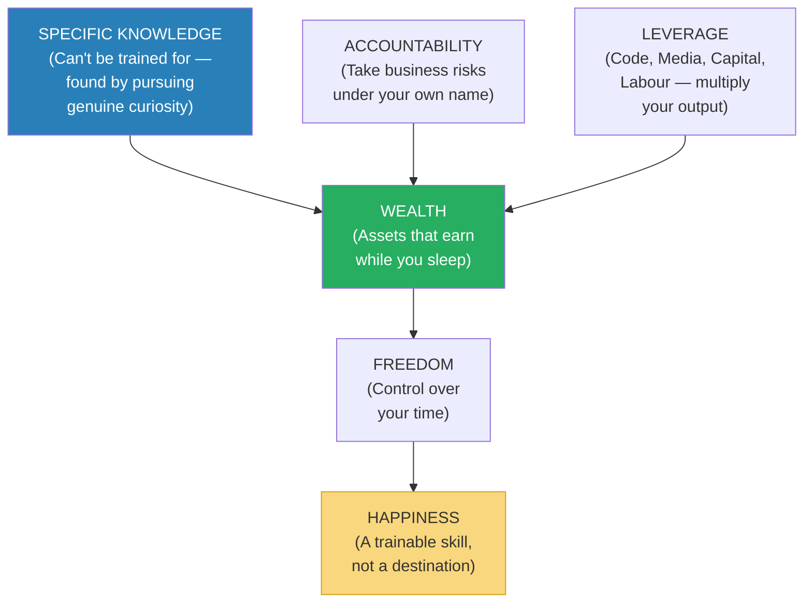
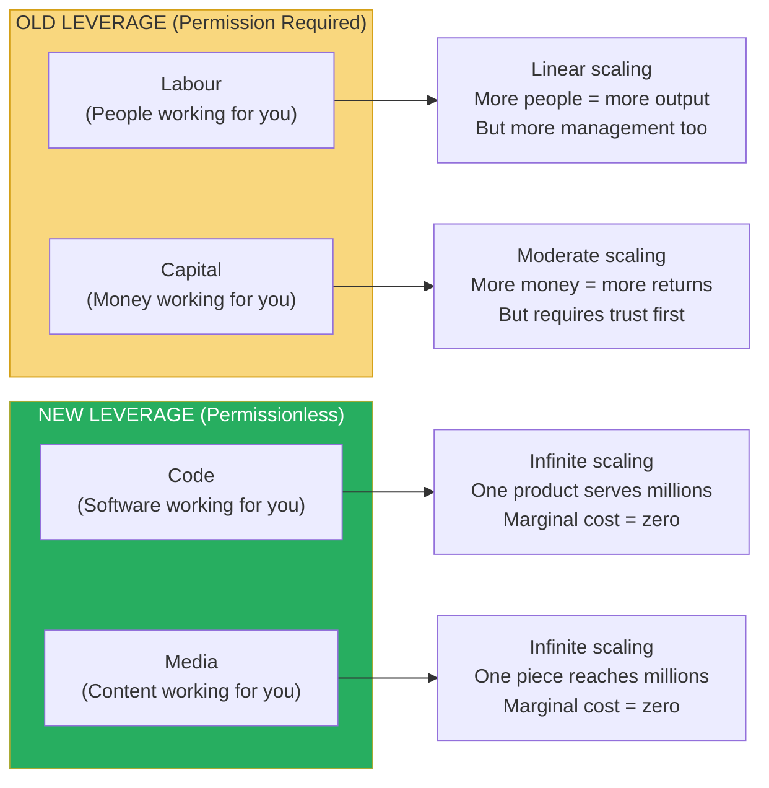
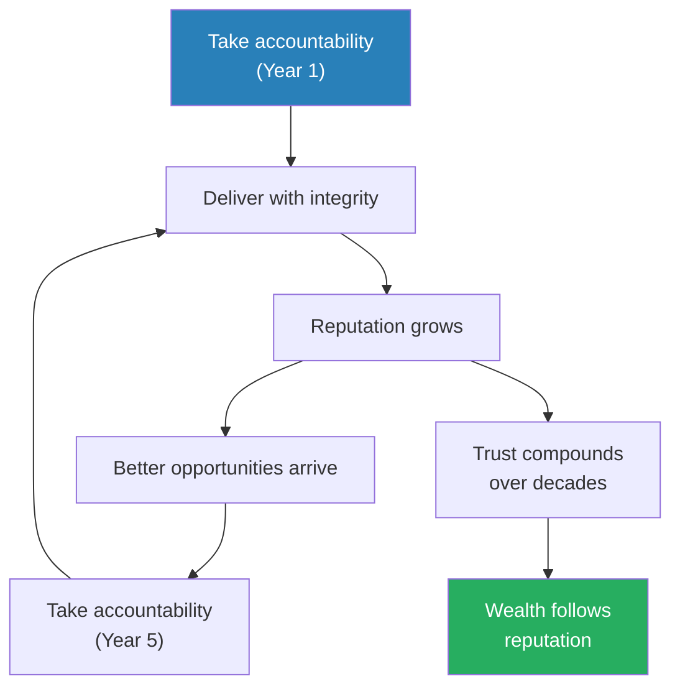
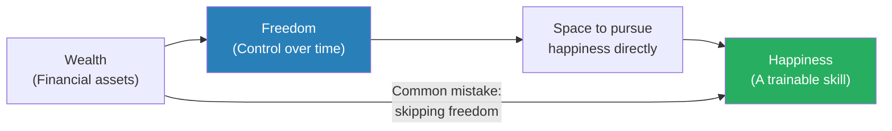
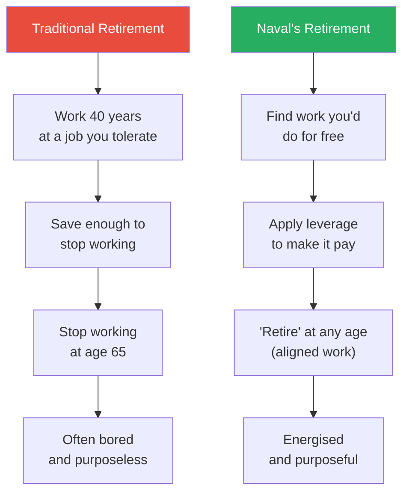

# The Almanack of Naval Ravikant — Eric Jorgenson

> Naval Ravikant is an angel investor, philosopher-entrepreneur, and one of the most quotable thinkers in Silicon Valley — a man whose tweets, podcast appearances, and tweetstorms have made him a modern-day oracle for a generation of founders, investors, and seekers.
> Eric Jorgenson curated Naval's best thinking into this book, which covers two subjects that Naval considers inseparable: how to get rich (without getting lucky) and how to be happy (without external conditions).
> Naval's core insight on wealth: it is built through leverage (code, media, capital, labour), specific knowledge (unique to you, impossible to train for), and accountability (taking risks under your own name) — not through trading time for money.
> Naval's core insight on happiness: it is a skill that can be trained through present-moment awareness, desire reduction, and the deliberate choice to interpret reality in a way that produces peace rather than suffering.
> The book reads like a modern *Meditations* — compressed, aphoristic, and designed to be re-read slowly rather than consumed quickly.
> It is the most potent distillation of practical wisdom about wealth and happiness published in the last decade.

---

## About the Author

Eric Jorgenson is an author and product strategist who compiled this book from Naval Ravikant's public output — tweets, podcast interviews, blog posts, and tweetstorms — with Naval's cooperation but minimal editorial intervention. Naval Ravikant is the co-founder and former CEO of AngelList, the platform that transformed startup fundraising. He is an early investor in over 200 companies including Uber, Twitter, Postmates, and Wish. He is known not for his investing record alone but for the philosophical framework behind it — a synthesis of economics, evolutionary psychology, game theory, and Eastern philosophy that he communicates in compressed, memorable form. Naval did not write this book. He spoke it — through years of conversations, tweets, and interviews. Jorgenson collected, organised, and presented it. The result reads less like a book and more like a transmission.

---

## The Big Idea

- Naval's framework rests on a single distinction: <b style="color: #2980b9">seek wealth, not money or status</b>
- **Wealth** = assets that earn while you sleep — businesses, investments, intellectual property, equity
- **Money** = how we transfer time and wealth — a medium of exchange, nothing more
- **Status** = your rank in a social hierarchy — a zero-sum game where someone must lose for you to win
- <b style="color: #e74c3c">People who pursue status play zero-sum games: for them to win, someone must lose</b>
- People who pursue wealth play positive-sum games: they create value that didn't exist before
- <b style="color: #27ae60">Wealth creation is fundamentally about giving society what it wants but doesn't yet know how to get — at scale</b>
- The confusion between wealth and status is the root of enormous suffering:
  - Status-seekers tear others down to climb higher
  - Wealth-creators build things that lift everyone up
  - Society rewards both — but only wealth creation makes the world better
- Naval considers the status game fundamentally corrosive to both ethics and happiness:
  - It requires constant comparison with others
  - It is inherently adversarial — your gain is someone else's loss
  - It produces anxiety because status is always relative and always fragile

---

- The book is divided into two halves:
  1. **Building Wealth** — the mechanics of creating economic freedom
  2. **Building Happiness** — the practice of creating internal freedom
- Naval considers both equally important and deeply connected
- The wealth section is NOT a get-rich-quick manual — it is a framework for understanding how modern wealth is created
- The happiness section is NOT self-help — it is applied philosophy, drawing heavily from Buddhism and Stoicism
- The two halves are connected by freedom: wealth buys freedom from financial constraint, happiness training buys freedom from psychological constraint

Naval's entire worldview flows through freedom as the central node — wealth enables it materially, happiness training enables it psychologically, and without both, you remain trapped.

---

## Key Concepts at a Glance

| Concept | One-line summary |
|---------|-----------------|
| **Seek Wealth, Not Money or Status** | Wealth = assets that earn while you sleep; status = your rank in a zero-sum hierarchy |
| **Specific Knowledge** | Knowledge that can't be trained for — found by pursuing your genuine curiosity and passion |
| **Accountability** | Take business risks under your own name; society rewards risk-bearers with equity, not wages |
| **Leverage** | The multiplier that turns output from 1x to 1000x — four types: labour, capital, code, media |
| **Judgment** | The meta-skill — leverage applied wisely to high-stakes decisions |
| **Permissionless Leverage** | Code and media require no one's permission to deploy and scale infinitely |
| **Long-Term Games** | Compound interest applies to relationships and reputation, not just money |
| **Happiness Is a Default State** | Happiness is what remains when you remove the sense that something is missing |
| **Desire Is Suffering** | Every desire is a contract with yourself to be unhappy until you get the thing |
| **The Monkey Mind** | The restless prediction engine that creates suffering by never being satisfied |
| **Retirement Redefined** | Retirement is when you stop sacrificing today for tomorrow — at any age |
| **Clear Thinking** | The ultimate competitive advantage — almost everything else can be automated |
| **The Hourly Rate** | Set an aspirational rate and refuse activities beneath it |
| **Identity as Prison** | The more labels you adopt, the less freely you can think |

---

## Part 1: Building Wealth

### The Three Ingredients of Wealth

*Naval reduces the entire wealth-creation process to three ingredients that must work together — miss any one and the formula fails.*

- Naval's wealth formula: <b style="color: #2980b9">Specific Knowledge + Accountability + Leverage = Wealth</b>
- Each ingredient is necessary but none is sufficient alone:
  - Specific knowledge without accountability means you're an interesting hobbyist nobody pays
  - Accountability without leverage means you're a hardworking sole proprietor who trades time for money
  - Leverage without specific knowledge means you're scaling mediocrity
- The formula is multiplicative, not additive — zero in any factor zeros the whole equation
- This is Naval's most original contribution: a clear, simple framework that explains why some people generate enormous wealth while equally smart, equally hardworking people do not
- The answer is rarely effort or even intelligence — it is the combination of these three elements

The dominant flow through Freedom (80%) versus the thin direct path from Wealth to Happiness (20%) visualises Naval's core warning: wealth only produces happiness when it first buys freedom — skipping that step is the mistake most high earners make.

---

### Specific Knowledge: What You Can't Be Trained For

*Naval's most counterintuitive insight: the most valuable knowledge is the kind no one can teach you.*

- <b style="color: #2980b9">Specific knowledge</b> is knowledge that cannot be taught in a classroom or learned from a textbook
- It is unique to you — built from your peculiar combination of skills, interests, personality, and life experience
- The defining test: if someone can be trained for it in a course, it's not specific knowledge — it's generic knowledge
- Generic knowledge is a commodity — many people have it, so it commands commodity prices
- Specific knowledge is a monopoly — only you have it, so it commands monopoly returns
- Examples of specific knowledge:
  - A natural ability to sell that comes from deep empathy and conversational instinct
  - Deep expertise in a niche domain acquired through obsessive curiosity over decades
  - The ability to see patterns others miss because of an unusual combination of experiences
  - Unusual skill stacks — biology + programming + persuasion, or music + mathematics + storytelling
- <b style="color: #27ae60">Specific knowledge is often found by pursuing your genuine curiosity</b> — not by following a prescribed career path or market trends
- It feels like play to you and looks like talent to others
- It is often developed through apprenticeships, mentorships, and real-world experience — not through formal education
- When someone has specific knowledge, you can recognise it because their work has a quality that feels effortless yet inimitable

> [!example] Scott Adams and the Skill Stack
> - Naval cites Scott Adams, the creator of Dilbert, as a case study in specific knowledge
> - Adams was not the best artist — thousands of illustrators were more skilled
> - He was not the best writer — thousands of authors were more eloquent
> - He was not the funniest comedian — thousands of stand-ups were sharper
> - He was not the deepest business thinker — thousands of MBAs had more theoretical knowledge
> - But he was in the top 25% of all four skills simultaneously
> - A decent artist + decent writer + decent business understanding + decent humour = a monopoly on business-relevant cartoon comedy
> - No one else had that exact combination, so no one could compete with him
> **The lesson:** Specific knowledge often lives at the intersection of skills, not at the peak of any one skill.

---

> [!example] Naval's Own Specific Knowledge
> - Naval's specific knowledge lies at the intersection of technology investing, philosophical thinking, and concise communication
> - He didn't plan this combination — it emerged from following his genuine interests
> - As a teenager, he was obsessed with computers and science fiction
> - As a young adult, he fell into Silicon Valley startups because the technology fascinated him
> - Simultaneously, he was reading voraciously — Seneca, the Buddha, evolutionary psychology, game theory
> - Over time, these interests converged into a unique perspective: understanding startups through the lens of philosophy and game theory
> - No business school teaches this combination because it can't be formalised into a curriculum
> - It emerged organically from decades of genuine curiosity
> **The lesson:** You can't plan your way to specific knowledge. You follow curiosity and let the combination emerge.

> [!tip] Finding Your Specific Knowledge
> Naval's questions to identify it:
> 1. "What did you love doing as a child, before anyone told you what to do?"
> 2. "What do you find easy that others find hard?"
> 3. "What can you do that doesn't feel like work to you?"
> 4. "What topics would you read about for fun on a Saturday morning?"
> 5. "What do people consistently come to you for help with?"
>
> The overlap of these answers IS your specific knowledge. It feels like play to you and looks like talent to others.

---

### Accountability: Betting on Yourself

*Society doesn't pay people for effort or hours — it pays them for risk-bearing. The more risk you shoulder, the more you earn.*

- <b style="color: #2980b9">Accountability</b> means taking business risks under your own name and bearing the consequences — both the upside and the downside
- This is the mechanism by which society allocates its greatest rewards:
  - Employees are paid for their time — predictable but capped
  - Entrepreneurs are paid for their judgment — unpredictable but uncapped
  - The difference is accountability: the entrepreneur bears the risk of being wrong
- The person who takes credit (and blame) for outcomes builds a reputation — which attracts both resources and opportunities
- <b style="color: #e74c3c">The people who are rewarded most in society are those who bear risk — specifically, the risk of being wrong in public</b>
- This is why equity beats salary in the long run:
  - Equity is compensation for accountability — you win big or lose big
  - Salary is compensation for time — you earn predictably but modestly
  - The salaried worker's income is linear: more hours = more money, but stop working = stop earning
  - The equity holder's income is nonlinear: the right decision can produce 100x returns, and the asset earns while you sleep
- <b style="color: #27ae60">Accountability requires courage — it means being willing to fail publicly, be criticised publicly, and bear consequences publicly</b>
- Most people avoid accountability because they fear public failure:
  - They hide behind committees and collective decisions
  - They avoid putting their name on anything risky
  - They prefer the safety of anonymity to the exposure of ownership
- Naval's blunt assessment: these people will be comfortable but never wealthy

> [!example] The Anonymous Employee vs The Named Founder
> - Consider two equally talented engineers at a tech company in 2010
> - Engineer A stays employed — writes excellent code, gets promoted, earns a good salary
> - Engineer B leaves to build a product under her own name — takes accountability for whether it succeeds or fails
> - Engineer A earns $200K/year for 10 years = $2M total, steady and predictable
> - Engineer B struggles for 3 years, nearly fails, then her product finds product-market fit and sells for $50M
> - The difference is not talent or effort — both are equally skilled and hardworking
> - The difference is accountability: Engineer B bore the risk of public failure, and society rewarded that risk with 25x the compensation
> **The lesson:** You cannot get wealthy without accepting the risk of being publicly wrong.

---

- Naval connects accountability to **reputation** — your reputation is the compound interest on your accountability:
  - Every time you take a risk and succeed, your reputation grows
  - Every time you take a risk and handle failure with integrity, your reputation also grows
  - Over time, your reputation attracts resources: investors, partners, customers, talent
  - This creates a virtuous cycle: reputation → opportunities → more accountability → more reputation
- <b style="color: #e74c3c">The one thing that destroys reputation irreversibly: unethical behaviour</b>
  - You can recover from failure — people admire those who try and fail with integrity
  - You cannot recover from dishonesty — once trust is broken, the compound interest of reputation goes to zero

---

### Leverage: The Multiplier

*Leverage is what separates the person who earns $50/hour from the person who earns $50,000/hour — both may work equally hard, but one has multiplied their output.*

- Leverage is what turns specific knowledge + accountability into wealth
- Without leverage, you are limited to earning proportional to your hours worked
- With leverage, a single decision or a single piece of work can produce returns thousands of times larger than the effort invested
- <b style="color: #2980b9">There are four types of leverage:</b>

| Type | Description | Permission Required? | Example |
|------|-------------|:--------------------:|---------|
| **Labour** | Other people working for you | Yes — you need to recruit and manage | A CEO with 10,000 employees |
| **Capital** | Other people's money working for you | Yes — you need investors or lenders | A hedge fund manager investing $1B |
| **Code** | Software working for you | No — permissionless | A developer who writes an app used by millions |
| **Media** | Content working for you | No — permissionless | A creator who builds an audience of millions |

The distinction between permission-required and permissionless leverage is Naval's most practically useful insight for the modern era.

Code and Media dominate on scalability and potential return while scoring near-zero on permission and marginal cost — confirming why Naval calls them "the leverage behind the newly rich."

---

- **Labour leverage** is the oldest form:
  - Kings, generals, and CEOs have used it for millennia
  - Its weakness: it requires managing humans, which is expensive, slow, and unpredictable
  - Every additional worker adds both capacity AND complexity
  - Diminishing returns set in quickly — a team of 10 is not 10x as productive as one person
- **Capital leverage** is the traditional path to great wealth:
  - Warren Buffett, Ray Dalio, and the finance industry run on it
  - Its weakness: you need someone else's permission (investors, banks) to access it
  - You must build trust and a track record before anyone gives you their money
  - It also requires a rare skill: good judgment about where to deploy capital
- <b style="color: #27ae60">Code and media are the new leverage — they are available to anyone, require no one's permission, and scale infinitely</b>
  - A single piece of software can serve a billion users at near-zero marginal cost
  - A single blog post, podcast, or video can reach millions without any gatekeeper's approval
  - <b style="color: #e74c3c">Labour and capital are the old leverage — they require permission and have diminishing returns</b>
- The new rich are not people who manage large labour forces or large capital pools — they are people who have built systems (code, media, products) that work while they sleep

This diagram captures the fundamental shift Naval identifies: the democratisation of leverage through technology.

---

> [!example] The Programmer and the Factory Owner
> - Naval contrasts two wealth-builders to illustrate permissionless leverage
> - A factory owner in the 1950s needed millions in capital, hundreds of workers, physical infrastructure, supply chains, and government permits to build a manufacturing business
> - A programmer in 2020 needs a laptop and an internet connection to build a software product that serves millions
> - The factory owner's wealth was gated by permission: bank loans, labour unions, regulatory approvals, physical geography
> - The programmer's wealth is gated only by skill: can she build something people want?
> - Both can become wealthy — but the programmer's path requires no one's permission, no capital, and no employees
> - This is why the composition of the world's wealthiest has shifted dramatically toward technology founders
> **The lesson:** The most powerful leverage available today requires no permission — only skill and a computer.

> [!example] Naval and AngelList as Leverage
> - AngelList itself is an example of Naval practising what he preaches
> - Before AngelList, startup fundraising required permission from a small circle of venture capitalists who acted as gatekeepers
> - Naval built a platform (code leverage) that opened fundraising to thousands of new investors
> - The platform worked 24 hours a day, serving thousands of startups simultaneously, while Naval slept
> - One product, built once, created value for hundreds of thousands of people — without Naval needing to be present for each transaction
> - He also built a media presence (tweet threads, podcast appearances) that reached millions without gatekeepers
> **The lesson:** Naval doesn't just theorise about permissionless leverage — he built his career on it.

---

### Judgment: The Meta-Skill

*Leverage amplifies whatever you point it at — which makes the direction you choose far more important than the speed at which you move.*

- <b style="color: #2980b9">Judgment</b> is the ability to make decisions with long-term positive expected value — even when the short-term outcome is uncertain
- Naval considers it the most important skill because it determines where you point your leverage
- Good judgment + high leverage = massive wealth creation
- Bad judgment + high leverage = massive wealth destruction
- This is why Naval says direction matters more than speed:
  - A person with good judgment and modest effort will outperform a person with bad judgment and heroic effort
  - Working 80 hours a week on the wrong thing produces nothing of value
  - Working 10 hours a week on the right thing can produce enormous value
- Judgment comes from:
  - Accumulated specific knowledge — deep understanding of a domain
  - Pattern recognition from experience — having seen enough situations to recognise what matters
  - Clear thinking — the ability to reason without cognitive biases distorting your analysis
  - The ability to tolerate uncertainty — most important decisions are made with incomplete information

> [!tip] Core Insight
> Leverage is a force multiplier for your judgment. This means the most valuable thing you can do is improve the quality of your decisions — not the quantity of your effort.

---

- Naval offers several <b style="color: #2980b9">decision-making heuristics</b> — simple rules that approximate good judgment:
  - "If you can't decide between two options, the answer is neither" — indecision signals that neither option is compelling enough
  - "Easy decisions, hard life. Hard decisions, easy life" — the comfortable choice now usually creates problems later
  - "The direction you pick matters more than how fast you move" — doing the wrong thing efficiently is worse than doing the right thing slowly
  - "Short-term pain, long-term gain — that's the formula for everything worthwhile"
- These heuristics are simple to state but extraordinarily difficult to follow because they require overriding the brain's preference for comfort, certainty, and immediate gratification
- Naval's advantage: he has trained himself to sit with discomfort long enough to let his judgment work, rather than reaching for the quick, easy answer

---

### Play Long-Term Games with Long-Term People

*Compound interest is the most powerful force in the universe — and it applies to reputation, relationships, and knowledge, not just money.*

- <b style="color: #2980b9">"All the returns in life come from compound interest"</b> — this is Naval's most fundamental principle about how value accumulates
- Compound interest doesn't just apply to money — it applies to every domain where trust, skill, and knowledge build on themselves:
  - **Relationships:** a business partnership of 10 years has compounded trust — each interaction is easier, faster, and more valuable than if you were starting fresh
  - **Reputation:** every time you deliver on a promise, your reputation compounds — people refer you, seek you out, give you the benefit of the doubt
  - **Knowledge:** every concept you learn connects to others — the thousandth book is more valuable than the first because you have a richer web to connect it to
  - **Skill:** every hour of practice builds on previous hours — the ten-thousandth hour produces breakthroughs the first hour couldn't
- <b style="color: #e74c3c">Short-term players extract value. Long-term players create value.</b>
- The short-term player asks: "How do I get the most from this interaction?"
- The long-term player asks: "How do I make this relationship so valuable that we both benefit from continuing it indefinitely?"

> [!example] Warren Buffett and the Power of Time
> - Naval points to Warren Buffett as the ultimate long-term player
> - Buffett has been investing since age 10 — he is now in his 90s
> - 99.7% of his net worth was accumulated after his 50th birthday
> - His skill is investing, but his secret is TIME — more than 80 years of compounding
> - He didn't get rich by being the best investor — he got rich by being a good investor for the longest time
> - Most investors try to beat the market each quarter; Buffett plays a game measured in decades
> - This mirrors the insight in [[The Psychology of Money - Morgan Housel|The Psychology of Money]]: the most powerful variable in wealth-building is not return rate but time horizon
> **The lesson:** Compounding requires patience. The greatest returns come to those who play the longest games.

---

> [!example] The Silicon Valley Reputation Network
> - Naval observes that Silicon Valley operates as an iterated game — the same people interact repeatedly over decades
> - A founder who burns an investor in 2010 will find that investor warning others in 2015
> - A founder who treats employees well in 2010 will find those employees becoming investors, customers, and advocates in 2020
> - Naval's own career illustrates this: his early reputation for integrity and fair dealing meant that by 2015, the best founders sought him out as an angel investor
> - His reputation compounded: each honest deal reinforced trust, which attracted better deals, which produced better outcomes, which reinforced trust further
> - This virtuous cycle took 20 years to build but now runs on its own momentum
> **The lesson:** In a connected world where information flows freely, your reputation is your most valuable asset — and it compounds like money.

This is Naval's compounding reputation flywheel — the mechanism by which long-term players outperform short-term extractors.

---

### Arm Yourself: The Famous Tweetstorm

*In 2018, Naval published a tweetstorm called "How to Get Rich (without getting lucky)" that distilled his wealth philosophy into a sequence of principles. It became one of the most viral threads in Twitter history.*

- The tweetstorm is the backbone of the book's wealth section — almost everything in Part 1 is an expansion of these compressed principles
- Naval's key tweets from the thread:
  - "Seek wealth, not money or status"
  - "Understand that ethical wealth creation is possible"
  - "You're not going to get rich renting out your time"
  - "You will get rich by giving society what it wants but does not yet know how to get — at scale"
  - "Arm yourself with specific knowledge, accountability, and leverage"
  - "Specific knowledge is knowledge you cannot be trained for"
  - "When specific knowledge is taught, it's through apprenticeships, not schools"
  - "Code and media are permissionless leverage — the leverage behind the newly rich"
  - "There is no skill called 'business.' Avoid business magazines and business classes"
  - "Study microeconomics, game theory, psychology, persuasion, ethics, mathematics, and computers"
  - "Reading is faster than listening. Doing is faster than watching."
  - "Set and enforce an aspirational personal hourly rate"
  - "Become the best in the world at what you do. Keep redefining what you do until this is true."
- The tweetstorm worked because each tweet was a compressed version of a deep idea — just provocative enough to demand expansion
- The book IS that expansion

---

### The Hourly Rate Heuristic

*Naval's simplest but most practically useful tool: assign yourself an aspirational hourly rate and refuse to spend time on anything that pays less.*

- <b style="color: #2980b9">The aspirational personal hourly rate</b> is a decision-making filter, not an actual billing rate
- If your rate is $1,000/hour, then:
  - Spending an hour arguing with your landlord over a $100 charge is irrational — it costs $1,000 of your time to recover $100
  - Spending an hour on a $50 task you could delegate is irrational — you could pay someone $50 to do it and use that hour to create $1,000 in value
  - Spending an hour on busywork that produces no long-term value is irrational — it consumes your most finite resource for no return
- <b style="color: #27ae60">The hourly rate forces constant evaluation: "Is this the best use of my time right now?"</b>
- The point is not that you currently earn that rate — the point is that you BEHAVE as if you do, which forces you to shed low-value activities and focus on high-leverage ones
- This is related to what Drucker calls effectiveness vs efficiency (see [[The Effective Executive - Peter Drucker|The Effective Executive]]) — doing the right things matters more than doing things right
- Naval's personal rule: if a task can be done by someone else at a lower hourly rate, delegate it — no exceptions, even if you can do it better

> [!abstract] Setting Your Aspirational Hourly Rate
> 1. Pick a number that feels uncomfortably high — $500, $1,000, $5,000/hour
> 2. Use it as a filter for every activity: "Would someone earning $X/hour spend time on this?"
> 3. If not, find a way to eliminate or delegate it
> 4. Focus your time exclusively on activities that COULD produce $X/hour in long-term value — even if they don't produce immediate income
> 5. Re-evaluate quarterly — as your skills and leverage grow, your rate should increase
>
> The rate is aspirational. You may not earn it today. But behaving as if you do reshapes every decision about how you spend your time.

---

### Escape Competition Through Authenticity

*The ultimate competitive strategy is to stop competing — by becoming so uniquely yourself that no one else can occupy your niche.*

- <b style="color: #2980b9">"Escape competition through authenticity"</b> is Naval's answer to the question of how to build a sustainable advantage in a world where every skill can eventually be copied
- If you're competing on the same dimensions as everyone else — better grades, more credentials, harder hours — you're in a race to the bottom
- <b style="color: #27ae60">The only sustainable advantage is being uniquely YOU</b> — because no one else can replicate your specific combination of skills, interests, personality, and experience
- This connects directly to specific knowledge: your authenticity IS your specific knowledge
- Naval's logic chain:
  - If you're doing what feels authentic to you, you'll work harder at it (because it doesn't feel like work)
  - If you work harder, you'll get better faster
  - If you get better faster, you'll develop skills no one else has
  - If you have skills no one else has, you've escaped competition entirely
- <b style="color: #e74c3c">The worst version of this: trying to be someone else</b>
  - Copying another person's path means you'll always be a second-rate version of them
  - Playing by someone else's rules means you're competing on their turf, where they have every advantage
  - "If it feels like work, you'll be outworked by someone for whom it feels like play"

> [!example] The Musician vs The Investment Banker
> - Naval contrasts two hypothetical people to illustrate authenticity as competitive advantage
> - Person A loves music but takes an investment banking job because it pays well
> - Person B loves finance and becomes an investment banker because it genuinely fascinates them
> - Person A works 80 hours a week but it feels like 80 hours of drudgery — they burn out, produce adequate work, and never develop the instincts that come from genuine passion
> - Person B works 80 hours a week but half of it feels like play — they develop deep intuition, notice patterns others miss, and become the person everyone wants on their deal team
> - After 10 years, Person B has compounded skill, reputation, and judgment that Person A — despite equal hours and perhaps equal intelligence — never developed
> **The lesson:** Authenticity is not a luxury. It is the most powerful competitive strategy available.

---

## Part 2: Building Happiness

### Happiness Is a Skill, Not a Destination

*Naval's most provocative claim: happiness is not something that happens to you — it is a skill you train, like fitness or meditation.*

- <b style="color: #2980b9">"Happiness is there when you remove the sense that something is missing"</b>
- Naval's definition is explicitly Buddhist: happiness is not the PRESENCE of pleasure but the ABSENCE of desire
- This is radically different from how most people think about happiness:
  - Common view: happiness = getting what you want
  - Naval's view: happiness = not wanting what you don't have
- <b style="color: #e74c3c">Every desire is a contract with yourself to be unhappy until you get the thing you desire</b>
  - "I'll be happy when I get the promotion" means "I am choosing to be unhappy until the promotion arrives"
  - "I'll be happy when I find the right partner" means "I am choosing to be unhappy until that person appears"
  - Each desire you hold is a unit of self-imposed suffering
- <b style="color: #27ae60">The fewer desires you have, the more baseline happiness you have</b>
- This is NOT the same as apathy or laziness:
  - Naval is one of the most productive and driven people in Silicon Valley
  - The distinction: NEEDING something to be happy vs WANTING something while already being happy
  - You can want to build a great company without requiring its success for your peace of mind
  - You can want a loving relationship without making your contentment contingent on finding one

> [!tip] Core Insight
> Happiness is not about getting more. It is about wanting less. Every desire you drop increases your baseline happiness without requiring anything from the external world.

---

### The Desire Trap

*Naval maps the mechanism of desire with unusual precision — showing why the pursuit of happiness through acquisition is structurally doomed to fail.*

- Most people organise their lives around desire: "I want X. I will work toward X. When I get X, I will be happy."
- <b style="color: #e74c3c">The problem: the moment you get X, a new desire immediately replaces it</b>
- This is what psychologists call **hedonic adaptation** — the well-documented tendency to return to a baseline level of happiness regardless of positive life changes:
  - Got the promotion? Now you want the next one
  - Got the house? Now you want a bigger one
  - Got the relationship? Now you want it to be different
  - Got the money? Now you worry about losing it
- Naval calls this the <b style="color: #2980b9">"desire treadmill"</b> — running perpetually toward a horizon that recedes at exactly your running speed
- The treadmill is not a personal failing — it is a feature of human psychology:
  - Evolution designed us to never be satisfied, because satisfied animals stop striving and die
  - The restless desire for MORE was adaptive on the savanna — but it is maladaptive in a world of abundance
  - Our brains are running Stone Age software in a modern world

The desire treadmill is a closed loop — no amount of acquisition can break the cycle because the cycle is built into the structure of desire itself.

---

- Naval's alternative is not to stop wanting things but to change your relationship with wanting:
  - Recognise that desire is a choice, not an involuntary condition
  - Before adopting a new desire, ask: "Am I willing to be unhappy until I get this?"
  - Practice wanting fewer things simultaneously — "one big desire at a time, not fifty small ones"
  - <b style="color: #27ae60">Happiness is a choice you make by dropping expectations and desires that don't serve you</b>
- This parallels the Stoic distinction between what is "up to us" and what is not (see [[Discourses - Epictetus|Discourses]])
- And it echoes the Buddhist concept of tanha (craving) as the root of suffering

---

### The Monkey Mind

*Naval borrows from Buddhist psychology to explain why most people are unhappy most of the time — and why meditation is the most rational thing a high-performer can do.*

- The <b style="color: #2980b9">"monkey mind"</b> is Naval's term for the restless, chattering, never-satisfied stream of consciousness that most people experience as their normal mental state
- It is a prediction and pattern-matching machine — evolved to anticipate threats and opportunities on the savanna
- On the savanna, this was adaptive:
  - "Was that movement in the grass a lion?" (threat detection)
  - "That berry bush was here last season — will it fruit again?" (opportunity tracking)
  - "That person from the rival tribe — can they be trusted?" (social evaluation)
- In the modern world, where physical threats are rare, the monkey mind doesn't stop scanning:
  - It shifts to social threats: "Did my boss seem cold in that meeting?"
  - Status competitions: "Why did she get promoted instead of me?"
  - Imagined futures: "What if I lose my job? What if the economy crashes?"
  - Ruminations about the past: "I should have said something different in that conversation"
- <b style="color: #e74c3c">The monkey mind is a problem-generating engine running in a world where most of the problems are imaginary</b>
- <b style="color: #2980b9">"A busy mind accelerates the passage of time. A calm mind slows it."</b>
- This is why so many successful people feel perpetually anxious despite having achieved everything they wanted — their monkey mind doesn't care about achievements, it cares about scanning for threats

---

- Naval's solution: meditation — but not for spiritual reasons
- He treats meditation as a cognitive tool, like a fitness routine for the mind:
  - "I don't meditate to become a better person. I meditate because it's the most rational thing I can do."
  - "Twenty minutes of meditation produces ten hours of better decision-making. That's an insane return on investment."
- His preferred method is characteristically simple: sit quietly and observe thoughts without engaging with them
  - "Watch the thoughts go by like cars on a highway, without getting in any of them"
  - Don't try to stop thinking — that's impossible and counterproductive
  - Just notice the thoughts and let them pass
  - Over time, the gap between thoughts widens, and the sense of being controlled by thoughts weakens
- <b style="color: #27ae60">The goal is not to empty the mind but to stop identifying with its contents</b>
  - You are not your thoughts — you are the awareness behind the thoughts
  - Once you recognise this, the monkey mind loses its power over you
  - The thoughts still arise, but they no longer control your behaviour

> [!example] Naval on the Return on Investment of Meditation
> - Naval frames meditation in the language of investing — deliberately, to reach an audience that wouldn't otherwise consider it
> - He describes his own experience: before meditation, he would make decisions while agitated, anxious, or reactive
> - These decisions were often suboptimal — driven by emotion rather than judgment
> - After establishing a daily meditation practice, he noticed that his decisions improved markedly
> - Not because he became wiser, but because he could access the wisdom he already had — without the noise of the monkey mind interfering
> - He estimates that 20 minutes of morning meditation saves him from at least 2-3 poor decisions per day
> - At his level of leverage, each poor decision could cost millions — making meditation the highest-ROI activity in his day
> **The lesson:** Meditation is not a spiritual luxury. It is a cognitive investment with measurable returns.

---

### Happiness Habits

*Naval doesn't just philosophise about happiness — he identifies specific, trainable practices that shift your baseline state.*

| Practice | Description | Mechanism |
|----------|-------------|-----------|
| **Meditation** | 20-60 min daily, observing thoughts without engaging | Breaks identification with the monkey mind; creates the "observer" perspective |
| **Gratitude** | Deliberately noticing what you have rather than what you lack | Shifts attention from desire (what's missing) to appreciation (what's present) |
| **Presence** | Practising being fully HERE — in the body, in the moment | Most unhappiness comes from living in the past (regret) or future (anxiety); presence eliminates both |
| **Acceptance** | Accepting reality as it is, not as you wish it were | Resistance to reality IS suffering; acceptance eliminates it |
| **Low information diet** | Reducing news, social media, and inputs that trigger anxiety | The monkey mind feeds on inputs; fewer inputs = calmer mind |
| **Physical health** | Exercise, sleep, nutrition | A fit body supports a fit mind; you can't think clearly when you feel terrible |

Each practice targets a different mechanism of unhappiness — together they form a comprehensive system for training the mind.

Meditation and Presence show the steepest growth curve over time — low immediate payoff but transformative at the one-year mark — which mirrors Naval's insistence that happiness, like wealth, compounds.

---

- The happiness habits are not one-off interventions — they are daily practices that accumulate:
  - Day 1 of meditation feels pointless
  - Day 100 of meditation produces noticeable calm
  - Day 1,000 of meditation produces a fundamentally different relationship with your own mind
- This mirrors the compounding logic Naval applies to wealth: small daily investments produce enormous long-term returns
- <b style="color: #27ae60">Happiness compounds just like money — but only if you practise consistently</b>
- Naval's hierarchy of the practices:
  1. **Presence** is the foundation — without it, the others don't work
  2. **Meditation** is the tool for developing presence
  3. **Acceptance** is the attitude that presence enables
  4. **Gratitude** is the natural result of acceptance
  5. **Physical health** is the substrate that makes all the others possible

---

### The Wealth-Happiness Connection

*Naval refuses to dismiss wealth as unimportant for happiness — but he maps its contribution with precision, showing where money helps and where it stops helping.*

- <b style="color: #27ae60">"Money can buy you freedom, and freedom is the foundation of happiness"</b>
- But money beyond the point of freedom has diminishing returns for happiness
- Naval maps the relationship in stages:
  - **$0 to basic needs met:** money dramatically increases happiness (removing hunger, shelter insecurity, and survival stress)
  - **Basic needs to financial independence:** money moderately increases happiness (removing work stress, expanding choices, creating time freedom)
  - **Financial independence to extreme wealth:** money barely increases happiness (more options, but options themselves don't create happiness)
- <b style="color: #e74c3c">The mistake most people make: they pursue money as if it will make them happy. It won't. It will make them FREE — which gives them the space to pursue happiness directly.</b>
- <b style="color: #2980b9">"The purpose of wealth is freedom. The purpose of freedom is happiness. Most people skip directly from wealth to happiness and miss freedom entirely."</b>

The arrow from Wealth directly to Happiness (the common mistake) represents the belief that money itself produces happiness — when it actually only produces the conditions for happiness.

---

- Naval also identifies a trap unique to high earners:
  - The more money you make, the more your lifestyle inflates
  - Lifestyle inflation means your "freedom number" keeps rising
  - You earn more but need more, so you never reach the point where money buys freedom
  - This is why some people earning $500K/year feel less free than someone earning $50K/year with low expenses
- <b style="color: #27ae60">"The three big ones in life are wealth, health, and happiness. We pursue them in that order, but their importance is reverse."</b>
- Health matters more than wealth because without health you can't enjoy anything
- Happiness matters more than health because your experience of life IS your happiness
- Yet we spend most of our time optimising wealth — the least important of the three

---

## Deep Dive: Naval on Learning

### Becoming a Perpetual Learner

*Naval's most practical advice for developing specific knowledge: read voraciously, read broadly, and read the originals — not the summaries.*

- <b style="color: #2980b9">"The most important skill for getting rich is becoming a perpetual learner"</b>
- Naval reads voraciously — but not in the way most people think of reading:
  - He reads multiple books simultaneously, abandoning any that don't hold his interest
  - He re-reads foundational texts rather than chasing the latest bestseller
  - He reads across disciplines — physics, biology, philosophy, economics, history, psychology — because the best ideas emerge at intersections
- <b style="color: #27ae60">"Read what you love until you love to read"</b>
  - Forced reading kills the love of learning
  - Genuine curiosity sustains it indefinitely
  - Most people quit reading because school made it feel like a chore
  - Naval's remedy: give yourself permission to read only what genuinely interests you, even if it's "not productive"
- His reading philosophy: <b style="color: #2980b9">the foundations matter more than the frontiers</b>
  - He reads more science and mathematics than business books
  - He reads more philosophy than self-help
  - He reads the original thinkers — Darwin, Smith, Feynman, Seneca — rather than their popularisers
  - "If you understand the basics deeply, you can re-derive the advanced conclusions yourself"

> [!abstract] Naval's Reading Rules
> 1. "Read what you love until you love to read"
> 2. "It's not about how many books you finish — it's about how many ideas stick"
> 3. "Read the great books, not the new books" — a book that has survived 100 years will likely survive 100 more (this is Taleb's Lindy Effect — see [[Antifragile - Nassim Nicholas Taleb|Antifragile]])
> 4. "Don't be afraid to abandon a book — life is too short to finish books you don't enjoy"
> 5. "Re-read the best books — you get more from a second reading of a great book than a first reading of a good one"
> 6. "Read across disciplines — the best ideas come from the intersection of fields"

---

### The Foundations vs The Frontiers

*Naval's reading list reveals a pattern: he invests in knowledge that has long half-lives, not knowledge that will be obsolete next year.*

| Foundation Subjects | Why Naval Reads Them | Frontier Subjects | Why Naval Avoids Them |
|--------------------|-----------------------|------------------|-----------------------|
| Mathematics | The language of nature — all models are built on it | Business books | "There is no skill called 'business'" |
| Science (physics, biology, evolution) | The ground truth about how the world works | Self-help | "Read the original philosophers instead" |
| Philosophy (Stoicism, Buddhism, epistemology) | Frameworks for thinking about thinking | News | "Designed to alarm, not inform" |
| Economics (microeconomics, game theory) | How incentives shape human behaviour | Social media | "The monkey mind's junk food" |
| Psychology (cognitive biases, decision-making) | Understanding your own irrational tendencies | Trendy non-fiction | "If it won't matter in 10 years, it doesn't matter now" |
| Computer science | The language of the new leverage (code) | Industry reports | "By the time it's in a report, the opportunity is gone" |

Naval's reading strategy optimises for ideas that compound — foundational concepts that remain true across decades, not trending topics that expire in months.

Foundation subjects (blue-green-purple slices) consume roughly 90% of Naval's reading diet, while the frontier categories he explicitly warns against — business books, self-help, and news — occupy a sliver, illustrating his "read the originals, not the popularisers" philosophy.

---

- The distinction between foundations and frontiers maps onto Naval's concept of specific knowledge:
  - Foundation knowledge gives you the TOOLS to develop specific knowledge
  - Frontier knowledge gives you the SAME information everyone else has
  - Tools are permanent and multiplicative; information is temporary and additive
- <b style="color: #27ae60">"I don't want to read the latest book on productivity. I want to understand thermodynamics, game theory, and probability — because those are the operating systems that everything else runs on."</b>

---

### Mental Models

*Naval builds his judgment through a diverse toolkit of conceptual frameworks — borrowed from science, economics, psychology, and philosophy.*

- <b style="color: #2980b9">Mental model thinking</b> means building a diverse set of conceptual frameworks from different disciplines and applying them to whatever problem you face
- This approach is shared by Charlie Munger (see [[Seeking Wisdom - Peter Bevelin|Seeking Wisdom]]), who calls it "a latticework of mental models"
- Naval's most-used mental models:
  - **Compound interest** (from mathematics) — applies to money, relationships, knowledge, and reputation
  - **Incentives** (from economics) — "Show me the incentive and I'll show you the outcome"
  - **Evolution / natural selection** (from biology) — markets, ideas, and companies evolve through variation and selection
  - **Inversion** (from mathematics) — instead of asking "how do I succeed?" ask "what would guarantee failure?" and avoid those things
  - **Margin of safety** (from engineering) — always build in room for error
  - **Opportunity cost** (from economics) — the cost of anything is what you give up to get it
  - **Skin in the game** (from Taleb) — don't trust anyone who doesn't bear the consequences of their advice
  - **Principal-agent problem** (from economics) — when someone manages your money/business, their incentives differ from yours
  - **Occam's razor** (from philosophy) — the simplest explanation is usually the correct one

> [!example] Inversion Applied to Business
> - Naval uses Charlie Munger's inversion technique as a primary decision tool
> - Instead of asking "How do I build a successful company?" he inverts the question: "What would guarantee failure?"
> - Partnering with people I don't trust
> - Building something nobody wants
> - Scaling before finding product-market fit
> - Spending more than I earn
> - Working in a field that bores me
> - By identifying and avoiding the guaranteed failure modes, success becomes much more likely
> - Munger's version: "All I want to know is where I'm going to die, so I never go there"
> **The lesson:** Avoiding stupidity is easier and more reliable than seeking brilliance.

> [!example] The Principal-Agent Problem in Everyday Life
> - Naval uses this economics concept to explain why so much advice is bad
> - Your financial advisor earns commissions on products they sell you — their incentive is to sell, not to serve
> - Your real estate agent earns a percentage of the sale price — their incentive is to close quickly, not to get you the best deal
> - Your doctor is trained in a system that profits from treatment, not prevention — their incentive structure can distort their advice
> - Naval's rule: whenever someone gives you advice, ask "What do they gain if I follow this advice?"
> - If their incentives aren't aligned with yours, discount their advice heavily
> **The lesson:** Always check the incentive structure behind advice before following it.

---

## Deep Dive: Naval on Relationships and Ethics

### Play Iterated Games

*Game theory reveals why ethical behaviour is not just morally right but strategically optimal — in any game you play more than once.*

- <b style="color: #2980b9">"Play iterated games. All the returns in life come from compound interest."</b>
- An **iterated game** is one you play repeatedly with the same people
- In a one-shot game (you'll never see this person again), defection and exploitation can "win":
  - Cheat a stranger in a tourist trap you'll never visit again
  - Take advantage in a one-time transaction with no future contact
- In an iterated game (you'll interact with this person for years), <b style="color: #27ae60">cooperation always wins</b>:
  - Your reputation compounds with each honest interaction
  - Trust enables faster, deeper, more valuable collaboration
  - The short-term gain from defection is always dwarfed by the long-term loss of reputation
- <b style="color: #e74c3c">"If you're going to screw someone, you'd better make sure you never see them again. In a connected world, you always see them again."</b>
- The optimal strategy in iterated games (from Robert Axelrod's game theory research): **generous tit-for-tat**
  - Cooperate first
  - Reciprocate what others do
  - Forgive quickly
  - Never initiate defection

---

### Ethics as Long-Term Strategy

*Naval reframes ethics from a moral obligation to a strategic imperative — in a world where information flows freely, being trustworthy is simply the optimal strategy.*

- Naval doesn't frame ethics as a moral obligation but as a <b style="color: #2980b9">strategic imperative</b>
- In iterated games with information flowing freely, ethical behaviour is the optimal strategy:
  1. Your reputation is your most valuable asset — unethical behaviour destroys it
  2. Trustworthy people attract other trustworthy people — creating compounding networks of value
  3. Untrustworthy people attract untrustworthy people — creating compounding networks of extraction
- This creates two divergent spirals:
  - The ethical spiral: integrity → trust → better partners → better outcomes → more trust
  - The unethical spiral: dishonesty → distrust → worse partners → worse outcomes → more dishonesty
- <b style="color: #27ae60">"Ethics is not just doing what's right. It's doing what's smart. In the long run, they're the same thing."</b>
- Naval notes that this insight is ancient — it is essentially the same point made by the Stoics, by Confucius, and by virtually every enduring ethical tradition
- The modern addition: the internet has made the world into one giant iterated game, because information about unethical behaviour travels instantly and permanently

---

### On Identity

*Naval argues that the labels you attach to yourself are not self-knowledge but self-imprisonment — each one narrows the range of things you're willing to think and do.*

- <b style="color: #e74c3c">"The more labels you have for yourself, the dumber they make you"</b>
- When you identify as a "Democrat" or "Republican," a "manager" or "engineer," a "winner" or a "victim," you constrain your thinking:
  - The label becomes a tribe
  - Tribal loyalty overrides rational analysis
  - You start defending positions because they belong to your tribe, not because they're true
- <b style="color: #2980b9">Naval deliberately avoids identity labels</b>:
  - He refuses to call himself a "libertarian," "investor," or "entrepreneur"
  - Each label comes with a package of beliefs he hasn't individually evaluated
  - By refusing the label, he remains free to think about every question independently
- This connects to his happiness philosophy:
  - Identity creates expectations ("As a successful person, I should have X")
  - Expectations create desires ("I need X to maintain my identity")
  - Desires create suffering ("I don't have X yet, so I'm unhappy")
  - <b style="color: #27ae60">Identity → expectations → desires → suffering</b>

> [!example] The Identity Trap in Practice
> - Naval gives several examples of how identity constrains thinking
> - "I'm a conservative" becomes "I must oppose this policy" — without evaluating the policy on its merits
> - "I'm a startup founder" becomes "I must keep grinding" — without questioning whether the startup is worth grinding for
> - "I'm not a math person" becomes "I can't learn this" — without trying
> - "I'm a vegan" becomes "I must defend this diet against all evidence" — without considering that your body's needs may change
> - In each case, the identity has replaced thinking with reflex
> - The label decides your position before you've evaluated the evidence
> **The lesson:** Every identity you adopt narrows the range of things you're willing to think and do. The fewer identities you carry, the freer you are.

---

## Deep Dive: Naval's Life Philosophy

### On Meaning

*Where most thinkers insist that life must have a purpose, Naval finds liberation in the absence of one.*

- Unlike Frankl (see [[Man's Search for Meaning - Viktor Frankl|Man's Search for Meaning]]), Naval doesn't believe life has inherent meaning
- <b style="color: #2980b9">"Life has no meaning. But that's OK — because we get to create our own."</b>
- He finds this liberating, not depressing:
  - If there's no predetermined purpose, you are free to choose ANY purpose
  - You are not failing to fulfil some cosmic obligation — you are free to define your own success
  - The weight of "finding your purpose" dissolves when you realise you get to INVENT it
- His chosen purpose: "To create and to share what I've learned"
- <b style="color: #27ae60">The absence of externally imposed meaning is the ultimate freedom — it means the meaning of YOUR life is entirely up to you</b>
- This places Naval in the existentialist tradition — closer to Camus and Sartre than to the religious or spiritual traditions that insist on a given meaning
- But his conclusion is optimistic where existentialism is often bleak: the freedom to create meaning is a gift, not a burden

---

### On Death

*Like the Stoics, Naval uses the awareness of death not as a source of dread but as a tool for clarity.*

- <b style="color: #2980b9">"The most important thing to understand is that you're going to die. This is the great equaliser."</b>
- Death awareness strips away distraction:
  - If you're going to die, most of what you're worrying about doesn't matter
  - If you're going to die, the time you're wasting on low-value activities is irrecoverable
  - If you're going to die, the relationships you've neglected deserve your attention NOW
  - If you're going to die, the status games you're playing are absurd
- This echoes Marcus Aurelius's practice of *memento mori* (see [[Meditations - Marcus Aurelius|Meditations]]) — remembering death to sharpen your appreciation of life
- Naval's practical application:
  - He uses death awareness to filter decisions: "Will this matter when I'm dying?"
  - If yes, do it now — don't postpone
  - If no, stop spending time on it
- <b style="color: #27ae60">"Live as if you were going to die tomorrow. Learn as if you were going to live forever."</b>
- The paradox: death awareness doesn't produce urgency — it produces calm, because it clarifies what actually matters

---

### On Simplicity

*Naval's recurring theme across wealth, happiness, and philosophy: if something is complicated, you don't understand it yet.*

- <b style="color: #2980b9">Complexity is a sign of confusion; simplicity is a sign of understanding</b>
- This principle applies everywhere:
  - If you can't explain your business in one sentence, you don't understand it
  - If you can't explain your investment thesis in one paragraph, you don't understand it
  - If you can't explain your life philosophy in three principles, you haven't thought hard enough
- Simplicity is not the same as simplistic:
  - Simplistic = leaving out important complexity (bad)
  - Simple = distilling complexity into its essence (good)
  - "Everything should be as simple as possible, but not simpler" (Einstein)
- <b style="color: #27ae60">Naval's own life philosophy in three principles:</b>
  1. Seek wealth through specific knowledge, accountability, and leverage
  2. Seek happiness through reducing desires and living in the present
  3. Seek truth through first-principles thinking and reading broadly
- The simplicity of this framework is itself evidence of deep thinking — it took Naval decades to arrive at these three sentences

---

## Deep Dive: Naval on Specific Knowledge — Extended Examples

### What Specific Knowledge Looks Like in Practice

*Naval moves beyond theory to show how specific knowledge manifests in real careers — and why it cannot be planned, only discovered.*

- Specific knowledge is NOT about being the world's foremost expert in a narrow field
- It is about <b style="color: #2980b9">the unique combination of skills, interests, personality traits, and experiences that only YOU possess</b>
- No two people have the same specific knowledge because no two people have the same life

| Person | Their Specific Knowledge | Why It's Unmatchable |
|--------|------------------------|---------------------|
| **Elon Musk** | Physics + engineering + business + risk tolerance + first-principles thinking | No school teaches this combination; it emerged from unique obsessions |
| **Oprah Winfrey** | Empathy + interviewing + media production + mass-market storytelling + personal vulnerability | Developed through decades of live broadcast, not through any degree |
| **Naval himself** | Technology + investing + philosophy + communication + game theory | The intersection of Silicon Valley investing with Eastern philosophy is uniquely his |
| **A great surgeon** | Fine motor skills + spatial reasoning + calm under pressure + deep anatomical knowledge | Built through 10,000+ hours of deliberate practice most couldn't endure |
| **A successful podcaster** | Curiosity + interviewing skill + audio production + consistency + audience intuition | "Trained" through years of public conversations and refinement |

- <b style="color: #27ae60">In each case, the specific knowledge emerged from genuine curiosity and obsession — not from a career plan</b>
- These people didn't sit down and say "I will develop specific knowledge in X"
- They followed their curiosity until it became unique
- The career path emerged from the knowledge, not the other way around

---

### Specific Knowledge and Education

*Naval is deliberately provocative about formal education — arguing that it produces the opposite of what builds wealth.*

- <b style="color: #e74c3c">"There is no skill called 'business.' Avoid business magazines and business classes."</b>
- His argument is structural:
  - Business schools teach general frameworks that everyone learns
  - General frameworks = generic knowledge = commodity = low value
  - Specific knowledge = unique = high value
  - Therefore, business school systematically produces LOW-value knowledge while charging HIGH-value prices
- <b style="color: #27ae60">"When specific knowledge is taught, it's through apprenticeships, not schools"</b>
  - Specific knowledge is too contextual to be captured in a curriculum
  - It is too experiential to be transmitted in a lecture
  - It is too personal to be standardised across students
- The exception: foundational subjects (mathematics, science, programming) that give you the TOOLS to develop specific knowledge
  - These are worth studying formally because they are permanent, general-purpose cognitive tools
  - But even here, Naval would say: study them because you're genuinely curious, not because a career counsellor told you to

> [!example] The MBA vs The Dropout
> - Naval contrasts two paths to illustrate the education question
> - Path A: spend $200K and 2 years on an MBA, learning the same frameworks as 500 classmates, emerging with generic knowledge that every other MBA also has
> - Path B: spend $200K and 2 years building something — a product, a business, a body of work — acquiring specific knowledge through trial, error, and real-world feedback
> - The MBA graduate has credentials that signal competence to employers
> - The builder has specific knowledge that produces value directly
> - The MBA graduate competes with 500 identical classmates for the same jobs
> - The builder competes with no one because their knowledge is unique to them
> - Naval doesn't say MBAs are worthless — he says they optimise for the wrong thing: generic employability rather than specific irreplaceability
> **The lesson:** Education that makes you more like everyone else is less valuable than experience that makes you more like yourself.

---

## Deep Dive: Naval on Health

### The Hierarchy of Wealth

*Naval places health above wealth in his personal hierarchy — and argues that most successful people have the order backwards.*

- <b style="color: #2980b9">Naval's hierarchy: health > wealth > relationships > everything else</b>
- "A healthy man has a thousand wishes. A sick man has one."
- He considers physical health the foundation on which everything else rests:
  - Cognitive performance depends on sleep, nutrition, and exercise
  - Emotional regulation depends on a well-functioning nervous system
  - Energy to pursue wealth and happiness depends on physical vitality
  - Even judgment — the meta-skill — degrades when the body is neglected
- His health protocol is characteristically simple and rooted in first principles:
  - **Exercise:** strength training + walking — "Lift weights to look good. Walk to feel good. The rest is optional."
  - **Sleep:** 7-8 hours, no negotiation — "Sleep is the best performance-enhancing drug, and it's free."
  - **Nutrition:** mostly whole foods, avoid sugar and processed food — "If your grandmother wouldn't recognise it as food, don't eat it."
  - **Fasting:** intermittent fasting (16-hour fast, 8-hour eating window) — "Humans evolved to handle periods without food."
  - **Meditation:** 20-60 minutes daily — "The most productive thing you can do for your mind."

> [!abstract] Naval's Health Stack
> 1. Sleep 7-8 hours (non-negotiable — the foundation of everything)
> 2. Exercise daily (strength + walking — doesn't need to be fancy)
> 3. Eat mostly whole foods (avoid sugar, processed food, and anything unrecognisable)
> 4. Fast intermittently (16/8 — eat within an 8-hour window)
> 5. Meditate daily (20+ minutes — sit, observe thoughts, don't engage)
> 6. Spend time in nature (sunlight, fresh air, green space)
> 7. Minimise alcohol, caffeine, and drugs (clear mind over stimulated mind)
>
> "The body and mind are one system. You can't optimise the mind while neglecting the body."

---

- What makes Naval's health advice distinctive is not its content (which is standard) but its FRAMING:
  - He treats health as an investment, not a chore
  - He measures it in decision-quality, not in appearance or longevity
  - He connects it explicitly to wealth creation: "A foggy mind makes bad decisions. Bad decisions at high leverage destroy wealth."
- <b style="color: #27ae60">Health is not a separate domain from wealth — it is the substrate on which wealth-creating judgment depends</b>

---

## Deep Dive: Naval on Decision-Making

### The Art of Clear Thinking

*Naval identifies clear thinking as the ultimate competitive edge — because in a world of leverage, the quality of your decisions matters infinitely more than the quantity of your effort.*

- <b style="color: #2980b9">"Clear thinking is the ultimate edge. Almost everything else can be automated or delegated."</b>
- You can hire people to execute, but you can't hire people to think for you (at least not yet)
- You can automate processes, but you can't automate judgment
- This makes the quality of your thinking the one variable that determines the trajectory of your life
- Naval identifies six enemies of clear thinking:
  - **Social pressure** — doing what others expect instead of what you think is right
  - **Ego** — needing to be right rather than needing to find the truth
  - **Emotion** — making decisions while angry, afraid, or excited
  - **Complexity** — overcomplicating decisions that should be simple
  - **Sunk costs** — continuing a losing strategy because you've already invested
  - **Information overload** — consuming so much input that you can't process any of it
- Each enemy operates through a different mechanism, but they all produce the same result: distorted judgment

---

### Naval's Decision Heuristics

*Simple rules that approximate good judgment without requiring perfect information.*

| Heuristic | Description |
|-----------|-------------|
| **"If you can't decide, the answer is no"** | Indecision signals that neither option is compelling — wait for a clear yes |
| **"Run uphill"** | When choosing between two paths, pick the harder one — it's usually more rewarding |
| **"The direction matters more than the speed"** | Doing the wrong thing fast is worse than doing the right thing slowly |
| **"Easy choices, hard life. Hard choices, easy life."** | Short-term comfort produces long-term suffering and vice versa |
| **"The more you know, the less you diversify"** | Diversification hedges against ignorance; deep knowledge allows concentration |
| **"99% of effort is wasted in the wrong direction"** | Optimise effectiveness (right things) before efficiency (things right) — echoes [[The Effective Executive - Peter Drucker|Drucker]] |
| **"The smarter you are, the less you should read the news"** | News is optimised for attention capture, not understanding |

These heuristics are simple to state and extraordinarily difficult to follow because they require overriding the brain's preference for comfort, certainty, and immediate gratification.

---

> [!example] "Run Uphill" — Naval's Defining Choice
> - Early in his career, Naval faced a choice: take a high-paying job at a prestigious firm or co-found a startup with uncertain prospects
> - The corporate job was easy — good salary, clear status, predictable path
> - The startup was hard — no salary, no status, high probability of failure
> - He chose the startup — the harder path, the one that ran uphill
> - That startup eventually became AngelList, which transformed venture capital
> - The corporate job would have made him comfortable; the startup made him free
> - Naval's reflection: "Everyone else was taking the easy path, which meant there was less competition on the hard path"
> **The lesson:** The hard choice is usually the right choice — because difficulty deters most people, which means less competition for those willing to endure it.

> [!example] "If You Can't Decide, the Answer Is No"
> - Naval applies this heuristic to investing, relationships, and life decisions
> - When evaluating a startup investment, if he finds himself agonising over whether to invest, he passes
> - The reasoning: truly great opportunities produce an immediate, visceral "yes"
> - If you're deliberating, it means the expected value isn't compelling enough to overcome uncertainty
> - The same applies to job offers, relationships, and even dinner plans
> - Most people say "yes" by default and regret later; Naval says "no" by default and preserves his optionality
> **The lesson:** Your time and attention are finite. Protect them by requiring a clear "yes" before committing.

---

## Deep Dive: Naval's Contrarian Views

### Why Naval Disagrees with Common Wisdom

*Naval is not contrarian for its own sake — he arrives at unconventional conclusions by reasoning from first principles rather than accepting received wisdom.*

| Common Wisdom | Naval's Contrarian View |
|--------------|----------------------|
| "Follow your passion" | "Don't follow your passion. Develop skills until you're passionate about what you're good at." (Echoes [[So Good They Can't Ignore You - Cal Newport|Cal Newport]]) |
| "Work-life balance" | "Seek work-life INTEGRATION — do work you'd do for free" |
| "Networking is key" | "Networking with intent is sleazy. Be genuinely helpful and the right people find you." |
| "Save 10% of your income" | "Don't save — invest. Savings are eroded by inflation." |
| "Get a mentor" | "The best mentors are dead people whose books survived." |
| "Diversify your portfolio" | "Diversification is for people who don't know what they're doing." |
| "Failure is not an option" | "Failure is the BEST option — if you learn from it." |
| "Money can't buy happiness" | "Money CAN buy freedom. Freedom CAN create conditions for happiness." |

---

- What makes Naval's contrarianism valuable rather than merely provocative is that each contrarian view follows logically from his framework:
  - "Follow your passion" fails because passion without skill produces nothing of value
  - "Work-life balance" fails because it presupposes that work is something you need to balance AGAINST rather than something you want to integrate WITH
  - "Networking is key" fails because transactional relationships don't compound
  - "Diversify" fails because it is a substitute for judgment, not a complement to it
- <b style="color: #27ae60">Naval's contrarianism is systematic, not random — each position is derived from the same core principles</b>

---

### The Retirement Redefinition

*Naval redefines retirement in a way that makes it achievable at any age — and reveals that most "retired" people aren't actually retired at all.*

- <b style="color: #2980b9">"Retirement is when you stop sacrificing today for an imaginary tomorrow"</b>
- This is Naval's most radical redefinition
- Most people define retirement as: stop working when you're old and have enough money
- Naval defines it as: stop doing things you don't want to do, at any age
- Under Naval's definition:
  - You can "retire" at 30 if your expenses are low and your income is passive
  - You can never "retire" at 70 if you're still trading time for money doing work you hate
  - Many wealthy retirees aren't actually retired — they're just bored people who stopped working without finding work they love
- <b style="color: #27ae60">True retirement is not about money — it's about ALIGNMENT: doing only what you would do even if you weren't being paid</b>
- Naval's approach: find the work you love FIRST (specific knowledge + genuine curiosity), then figure out how to make it pay (accountability + leverage)
- "I retired at 40 — not because I stopped working, but because I started working only on things I'd do for free"

The two paths produce radically different outcomes — one optimises for escape from work, the other for integration with it.

---

## Naval's Most Compressed Wisdom

*A selection of Naval's most potent aphorisms — the kind of sentences that contain entire philosophies.*

- "A calm mind, a fit body, and a house full of love. These things cannot be bought. They must be earned."
- "If you can't see yourself working with someone for life, don't work with them for a day."
- "Free people make free choices. Free choices mean you get unequal outcomes."
- "The secret to happiness is not having more. It's wanting less."
- "You're never going to get rich renting out your time."
- "Escape competition through authenticity."
- "You make your own luck if you stay at it long enough."
- "Peace is happiness at rest. Happiness is peace in motion."
- "You can have everything you want in life — if you're willing to give up everything you don't want."
- "If you're so smart, why aren't you happy?"
- "The three big ones in life are wealth, health, and happiness. We pursue them in that order, but their importance is reverse."

---

## The Verdict

*The Almanack of Naval Ravikant* is the most potent distillation of practical wisdom about wealth and happiness published in the last decade. Its power lies in compression: Naval says in one sentence what other authors take a chapter to say, and every sentence has been road-tested through years of public sharing, debate, and refinement. The specific knowledge / accountability / leverage framework is the clearest explanation of how wealth is actually created in the modern economy. The distinction between permissionless leverage (code, media) and permission-required leverage (labour, capital) is essential for anyone building in the 21st century. No other book maps the mechanics of wealth creation with this level of clarity and compression.

The happiness section is less original but no less valuable. Naval is essentially translating Buddhism and Stoicism into Silicon Valley language — and for an audience that might never read the *Dhammapada* or *Meditations*, his translation may be the most accessible entry point available. The desire treadmill concept, the monkey mind framing, and the connection between freedom and happiness are all borrowed from ancient traditions — but Naval's genius is making them feel urgent and practical rather than abstract and spiritual. The framing of happiness as a skill (like fitness) rather than a destination (like a promotion) is powerful precisely because it speaks the language of the audience that needs it most.

The book's weakness is its format. Because it is curated from tweets, podcasts, and interviews rather than written as a continuous argument, it lacks narrative flow. Some sections feel repetitive — the same idea appears in slightly different formulations across multiple chapters. And Naval's extreme confidence in his own views can occasionally shade into guru territory, presenting complex questions as if they have simple answers. He is also notably silent on the role of luck and structural advantage in wealth creation — his framework implicitly assumes a level of freedom and opportunity that many people don't have. The specific knowledge framework is powerful but may be less useful for someone struggling with basic survival than for someone who already has the luxury of following their curiosity.

Despite these limitations, the book stands as a unique contribution. It occupies a territory that no other book covers: the intersection of modern wealth-creation strategy with ancient happiness philosophy, delivered in compressed, memorable, re-readable form. For readers who find themselves oscillating between the ambition of wanting more and the wisdom of wanting less, Naval offers a coherent framework for holding both simultaneously — building wealth as a means to freedom while training happiness as a skill independent of circumstances. It is the rare book that gets better on re-reading, because each aphorism contains more than you can absorb the first time.

---

## Related Reading

- [[The Psychology of Money - Morgan Housel|The Psychology of Money]] — Housel's "wealth is what you don't see" is Naval's "seek wealth, not status" with data
- [[Meditations - Marcus Aurelius|Meditations]] — The Stoic foundation Naval builds his happiness philosophy on
- [[Zero to One - Peter Thiel|Zero to One]] — Thiel's contrarian monopoly thinking aligns with Naval's "become the best in the world at what you do"
- [[Antifragile - Nassim Nicholas Taleb|Antifragile]] — Taleb's optionality concept is Naval's "permissionless leverage" in a different frame
- [[Deep Work - Cal Newport|Deep Work]] — Newport's focused concentration is the practice of Naval's "apply specific knowledge with leverage"
- [[Man's Search for Meaning - Viktor Frankl|Man's Search for Meaning]] — Frankl's "choose your attitude" echoes Naval's "happiness is a choice"
- [[The Subtle Art of Not Giving a F-ck - Mark Manson|The Subtle Art]] — Manson's "choose your suffering" is Naval's "desire is a contract with yourself to be unhappy"
- [[Essentialism - Greg McKeown|Essentialism]] — McKeown's "less but better" applied to life, not just productivity
- [[Discourses - Epictetus|Discourses]] — The Stoic distinction between what is "up to us" and what is not, which Naval builds on
- [[So Good They Can't Ignore You - Cal Newport|So Good They Can't Ignore You]] — Newport's "skill trumps passion" is Naval's "specific knowledge" with a different label
- [[Seeking Wisdom - Peter Bevelin|Seeking Wisdom]] — Munger's latticework of mental models, which Naval explicitly borrows from
- [[The Effective Executive - Peter Drucker|The Effective Executive]] — Drucker's effectiveness-over-efficiency framework that Naval echoes throughout
