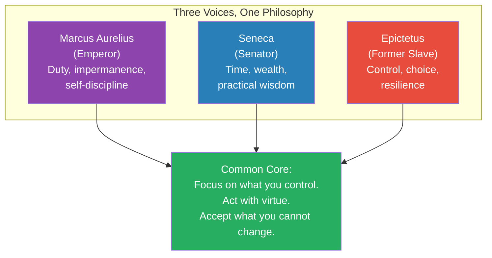
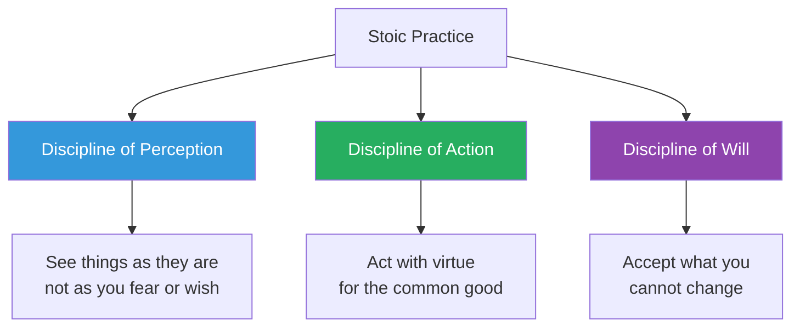
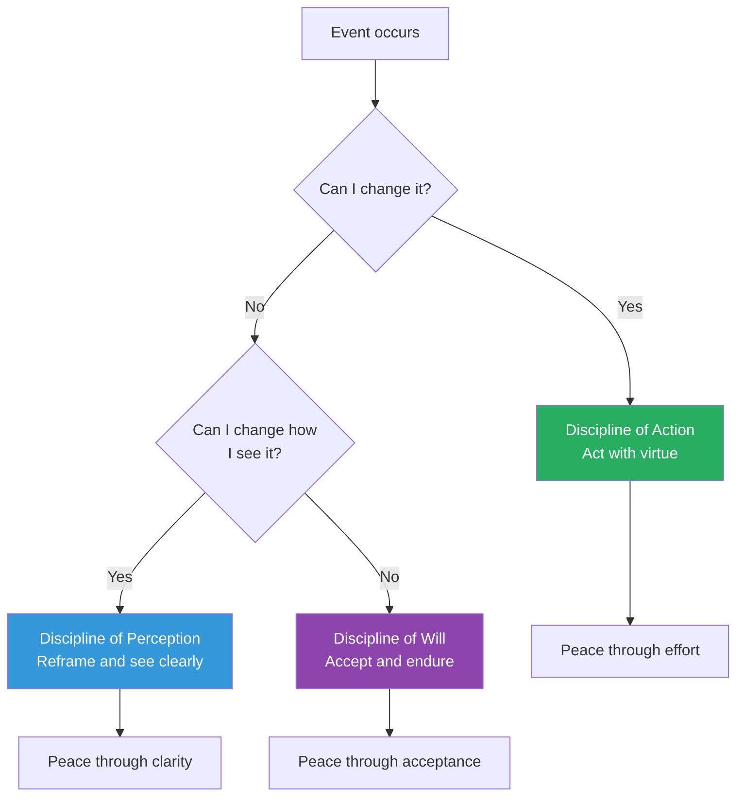
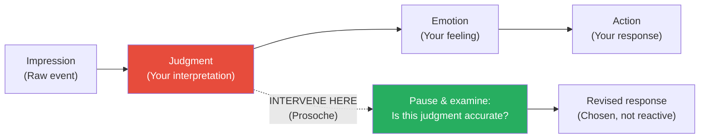
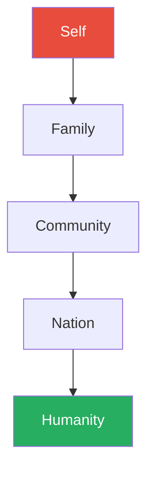
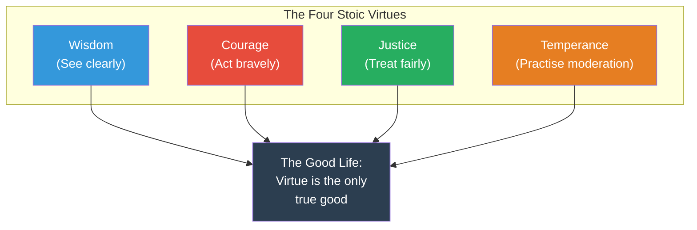
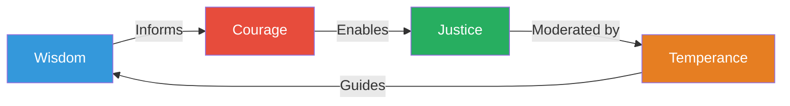
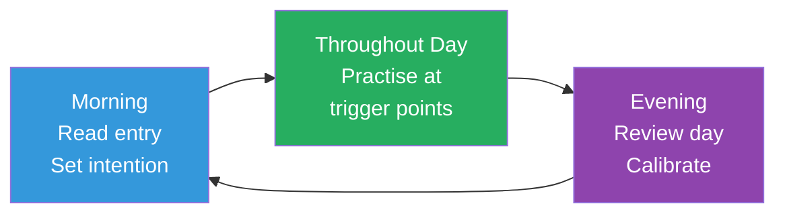
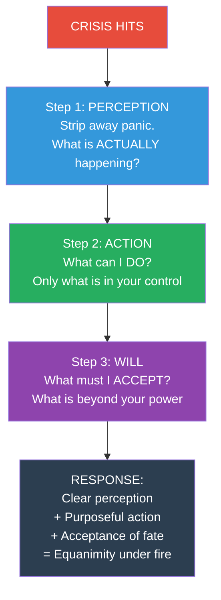

# The Daily Stoic — Ryan Holiday

> Ryan Holiday took the three pillars of Stoic philosophy — Marcus Aurelius, Seneca, and Epictetus — and distilled them into 366 daily meditations, one for every day of the year.
> Each entry pairs an original translation of a Stoic passage with a short, modern interpretation designed to be read in under two minutes.
> The book is organised into twelve monthly themes that map the Stoic path from clarity of perception through disciplined action to acceptance of fate.
> Holiday's genius is not originality — he would be the first to say so. It is translation: rendering 2,000-year-old philosophy into instructions clear enough to use in a meeting, during a crisis, or when staring at the ceiling at 3 a.m.
> It is not a book you read cover to cover. It is a book you live with — one page each morning, every morning, for a year and then again.

---

## About the Author

Ryan Holiday is a former marketing strategist turned author and modern Stoicism's most effective populariser. After dropping out of college at 19, he became the Director of Marketing at American Apparel and a media strategist for bestselling authors. His first book, *Trust Me, I'm Lying*, was a confessional about media manipulation. His subsequent pivot to Stoic philosophy — beginning with *The Obstacle Is the Way* (2014) — transformed both his career and his public identity. Holiday runs the Daily Stoic website and email newsletter, which reaches over two million subscribers, and has built a physical bookstore called The Painted Porch in Bastrop, Texas — named after the Stoa Poikile, the painted porch in Athens where Stoicism was originally taught.

His Stoicism series includes:
- *The Obstacle Is the Way* (2014) — Perception, action, and will applied to obstacles
- *Ego Is the Enemy* (2016) — How ego undermines success at every stage
- *Stillness Is the Key* (2019) — The power of quiet in a noisy world
- *The Daily Stoic* (2016) — The daily practice book that ties them all together
- *Discipline Is Destiny* (2022) — Temperance as the foundational virtue
- *Right Thing, Right Now* (2024) — Justice as the most important Stoic virtue

---

## The Big Idea

*Holiday argues that philosophy is not a subject you study — it is a discipline you practise daily, like physical exercise, and that the ancient Stoics built the most practical system ever devised for doing exactly that.*

- <b style="color: #2980b9">The Three Disciplines of Stoicism</b> — Perception (how you see the world), Action (how you act in it), and Will (how you accept what you cannot change) — form a complete operating system for every situation life presents
- The book structures the year as a curriculum: January through April covers Perception, May through August covers Action, September through December covers Will
- Each daily entry contains two elements: an original translation of a passage from Marcus Aurelius, Seneca, or Epictetus, followed by Holiday's modern interpretation showing how the idea applies to everyday challenges
- <b style="color: #27ae60">One meditation per day, drawn from the source texts, designed to be immediately applicable to modern life</b>
- The power is cumulative — no single entry transforms you, but 366 consecutive days of deliberate philosophical reflection restructures how you process everything
- The Stoics themselves compared philosophy to medicine — it is not something you learn about, it is something you take daily to prevent disease of the soul
- Holiday selects passages from across the full corpus of surviving Stoic texts, but draws most heavily from Marcus Aurelius's *Meditations*, Epictetus's *Discourses* and *Enchiridion*, and Seneca's *Letters to Lucilius* and moral essays

> [!warning] This Is Not a Book to Read Once
> The single biggest mistake people make with *The Daily Stoic* is reading it cover to cover in a weekend. That defeats the entire purpose. The book is designed as a daily practice — one entry per day, every day, for a year. The ideas are not complex. They don't need to be. What they need is repetition, application, and time. A gym routine done once is useless. A gym routine done daily for a year transforms your body. This book works the same way, for your mind.

### Why Daily Practice Matters

- The Stoics compared philosophy to athletics — an athlete who trains once a month is not an athlete, and a philosopher who reflects once a month is not a philosopher
- <b style="color: #e74c3c">Marcus Aurelius wrote in his journal almost every day — not because he enjoyed writing, but because his Stoic composure would erode if he did not constantly reinforce it</b>
- Seneca wrote letters to Lucilius as a daily practice of philosophical self-examination
- Epictetus required his students to practise the dichotomy of control every morning before they did anything else
- The brain defaults to reactivity, anxiety, and self-centredness — Stoic practice is the daily counterweight that keeps those defaults in check
- The compound effect is the mechanism: small daily corrections, sustained over months and years, produce a fundamentally different relationship with difficulty, desire, and fear
- Holiday draws the comparison to brushing your teeth — you do not stop brushing because your teeth are clean; you brush every day because they need constant maintenance
- The same logic applies to your mind: one morning of clarity does not protect you from an afternoon of reactivity unless you have built the habit deep enough that it fires automatically

---

## Key Concepts at a Glance

| Concept | One-line summary |
|---------|-----------------|
| **Dichotomy of Control** | Separate what is in your power from what is not — then focus only on the first |
| **Premeditatio Malorum** | Imagine the worst in advance to remove the power of surprise |
| **Amor Fati** | Do not merely accept what happens — love it and use it as fuel |
| **Memento Mori** | Remember you will die — the most effective priority-setting tool ever invented |
| **The Three Disciplines** | Perception, Action, and Will — a complete system for any situation |
| **Voluntary Discomfort** | Deliberately practise hardship to reduce dependence on comfort |
| **The Evening Review** | Each night, interrogate yourself: what did I resist, improve, or fail at? |
| **The View from Above** | Rise above your situation mentally to correct distorted proportions |
| **Apatheia** | Freedom from destructive passions — not apathy, but emotional sovereignty |
| **The Four Virtues** | Wisdom, Courage, Justice, Temperance — the only true goods |
| **Prosoche** | Self-attention — watching your own mind with the detachment of a scientist |
| **Sympatheia** | The interconnectedness of all things — your actions ripple outward |

---

## Quick Lookup Table — The 12 Monthly Themes

| Month | Theme | Core Question | Discipline | Key Stoic Source |
|-------|-------|---------------|-----------|-----------------|
| January | **Clarity** | What is within my control? | Perception | Epictetus, *Discourses* 1.1 |
| February | **Passions & Desires** | What am I chasing that I don't need? | Perception | Seneca, *Letters* 13 |
| March | **Awareness** | Am I paying attention to my own mind? | Perception | Marcus, *Meditations* 9.13 |
| April | **Unbiased Thought** | Am I seeing clearly or through bias? | Perception | Marcus, *Meditations* 6.13 |
| May | **Right Action** | Am I doing what I should, not just what I want? | Action | Epictetus, *Discourses* 3.23 |
| June | **Problem Solving** | Can I turn this obstacle into an advantage? | Action | Marcus, *Meditations* 5.20 |
| July | **Duty** | Am I fulfilling my obligations? | Action | Marcus, *Meditations* 5.1 |
| August | **Pragmatism** | Am I focused on what works, not what is ideal? | Action | Seneca, *Letters* 22 |
| September | **Fortitude** | Can I endure this? | Will | Seneca, *Letters* 78 |
| October | **Virtue & Kindness** | Am I treating others justly? | Will | Marcus, *Meditations* 2.1 |
| November | **Acceptance** | Can I accept what I cannot change? | Will | Epictetus, *Enchiridion* 8 |
| December | **Meditation on Mortality** | Am I living as if this could be my last day? | Will | Marcus, *Meditations* 2.4 |

```mermaid
flowchart LR
    J["January<br>Clarity"] --> F["February<br>Desires"] --> MA["March<br>Awareness"] --> AP["April<br>Bias"]
    AP --> MY["May<br>Right Action"] --> JU["June<br>Obstacles"] --> JL["July<br>Duty"] --> AU["August<br>Pragmatism"]
    AU --> S["September<br>Fortitude"] --> O["October<br>Virtue"] --> N["November<br>Acceptance"] --> D["December<br>Mortality"]

    subgraph PERC ["Discipline of Perception"]
        J
        F
        MA
        AP
    end
    subgraph ACT ["Discipline of Action"]
        MY
        JU
        JL
        AU
    end
    subgraph WILL ["Discipline of Will"]
        S
        O
        N
        D
    end
    style PERC fill:#3498db,color:#fff
    style ACT fill:#27ae60,color:#fff
    style WILL fill:#8e44ad,color:#fff
```

The year flows as a single arc: first you learn to see clearly, then you learn to act rightly, then you learn to accept what remains beyond your control.

The treemap reveals the book's hidden curriculum: each discipline receives exactly four months and roughly equal days, ensuring the reader builds perception, action, and will in balanced proportion across the year.

---

## The Three Source Philosophers

*Holiday draws from three Stoic masters, and understanding who they were transforms how you read the daily entries — because each speaks from a radically different life experience, proving that Stoic philosophy works for everyone, not just the privileged.*

### Marcus Aurelius (121–180 CE) — The Emperor

- The most powerful man in the ancient world: Emperor of Rome at the height of its territorial extent
- Marcus wrote *Meditations* as a private journal during military campaigns, plagues, and political betrayals
- His entries are self-critical, repetitive, and honest — he returns to the same themes (impermanence, duty, controlling reactions) because he kept forgetting them under pressure
- <b style="color: #2980b9">Marcus proves that Stoicism works at the top</b> — power, wealth, and fame did not corrupt him because he had a daily practice of philosophical self-examination
- His most quoted line in the book: "You have power over your mind — not outside events"
- Marcus is the Stoic you turn to when you are in a position of responsibility and feel the weight of it
- He often wrote about the ephemeral nature of fame and legacy — reminding himself that Alexander the Great and his mule-driver were both reduced to the same dust

> [!example] Marcus Writing During the Marcomannic Wars (170s CE)
> - Marcus Aurelius spent much of his reign fighting the Marcomannic Wars along the Danube frontier
> - Surrounded by death, disease, and the weight of imperial decisions, he wrote *Meditations* not for publication but as private self-instruction
> - The journal entries repeat the same themes obsessively — impermanence, duty, self-control — because the pressure of war kept eroding his composure
> - He was not writing philosophy in a comfortable study — he was writing it in a military tent, trying to hold himself together as emperor
> - The Antonine Plague was sweeping through the empire at the same time, killing millions — Marcus faced it while also managing military campaigns on multiple fronts
> **The lesson:** Even the most powerful man in the world needed daily reminders to practise what he believed.

---

### Seneca (4 BCE–65 CE) — The Advisor

- Roman senator, playwright, tutor to Emperor Nero, and one of the wealthiest men in Rome
- His letters to his friend Lucilius are masterclasses in practical philosophy — warm, humane, self-deprecating, and full of specific advice
- He wrote about time management, dealing with anger, preparing for adversity, and the proper attitude toward wealth
- <b style="color: #27ae60">Seneca proves that Stoicism works in the real world</b> — he navigated Roman politics, survived exile, accumulated and lost a fortune, and ultimately faced execution with composure
- His most quoted line in the book: "It is not that we have a short time to live, but that we waste a great deal of it"
- Seneca is the Stoic you turn to when you need practical advice delivered with literary elegance
- His range was extraordinary — he wrote tragedies for the stage, philosophical essays on the brevity of life, technical letters on natural science, and consolation letters to grieving friends

> [!example] Seneca's Practice of Voluntary Poverty
> - Every few weeks, Seneca would eat the cheapest food, wear rough clothing, and sleep on a hard surface
> - He was not poor — he was one of the wealthiest men in Rome
> - His reasoning: "Set aside certain days during which you shall be content with the scantiest fare, saying to yourself: is this the condition I feared?"
> - By deliberately practising discomfort, he removed the power of fear — he could face loss because he had already rehearsed it
> - The practice kept his baseline for happiness low, making ordinary life feel abundant
> - He recommended this to Lucilius not as asceticism but as insurance — the man who has practised poverty will not be destroyed by it
> **The lesson:** Rehearse the worst so it loses its power over you.

> [!example] Seneca's Exile to Corsica (41–49 CE)
> - Emperor Claudius banished Seneca to the island of Corsica on trumped-up charges of adultery
> - Seneca spent eight years in exile — far from Rome, from power, from the intellectual life he loved
> - Rather than collapse, he used the years to write some of his finest philosophical works, including *Consolation to Helvia* (his mother) and *On the Shortness of Life*
> - His practice of voluntary discomfort had prepared him — exile was just an extended version of what he had been rehearsing for years
> - When he was eventually recalled to serve as Nero's tutor, he returned without bitterness
> **The lesson:** The person who has rehearsed hardship can survive it with their dignity intact.

---

### Epictetus (50–135 CE) — The Slave

- Born a slave in the Roman Empire, Epictetus gained his freedom and became one of the most influential teachers in ancient philosophy
- His *Discourses* and *Enchiridion* (Handbook) are the most direct, practical, and confrontational Stoic texts — because Epictetus had no patience for theory without application
- <b style="color: #e74c3c">Epictetus proves that Stoicism works at the bottom</b> — as a slave, the only thing he controlled was his mind; his philosophy was not an intellectual luxury but a survival tool
- His most quoted line in the book: "It's not what happens to you, but how you react to it that matters"
- Epictetus is the Stoic you turn to when you need blunt, no-nonsense instruction
- After gaining his freedom, he taught in Rome until Emperor Domitian banished all philosophers from the city — he relocated to Nicopolis in Greece and continued teaching there until his death

> [!example] Epictetus and the Broken Leg
> - Epictetus walked with a limp — tradition says his master deliberately broke his leg
> - When asked about it, Epictetus reportedly said (paraphrased): "You can break my leg, but you cannot break my will"
> - This is not motivational poster material — it is the testimony of a man who developed the dichotomy of control not as an abstract principle but as the only way to maintain his dignity under conditions of absolute powerlessness
> - His teaching was sharper and more confrontational than Marcus or Seneca precisely because he had endured more
> - He told his students that if they wanted comfortable philosophy, they should go elsewhere — his classroom demanded transformation, not entertainment
> **The lesson:** When you control nothing external, the mind is everything.

---

| Philosopher | Life Station | Writing Style | When to Read Him |
|------------|-------------|---------------|-----------------|
| **Marcus Aurelius** | Emperor | Self-critical journal, repetitive reminders | When you carry responsibility and need perspective |
| **Seneca** | Senator/Advisor | Warm letters, literary elegance, practical advice | When you need specific guidance on a real-world problem |
| **Epictetus** | Former slave | Blunt lectures, confrontational challenges | When you need someone to tell you the hard truth |

Three radically different lives — emperor, senator, slave — converging on the same conclusions about how to live well.

Epictetus scored highest on hardship and practical advice precisely because his philosophy was forged in slavery — the less you possess externally, the more fiercely you develop what is internal.

---

## The Three Disciplines

*The entire architecture of the book rests on three disciplines that Epictetus identified as the foundation of Stoic practice — and together they cover every possible situation a human being can face.*

The three disciplines form a complete decision framework: Perception tells you what to pay attention to, Action tells you what to do about it, and Will tells you how to respond to what you cannot change.

### The Discipline of Perception

- <b style="color: #2980b9">The Discipline of Perception</b> is the art of seeing events as they actually are — stripped of fear, wishful thinking, and emotional overlay
- Most suffering comes not from events but from your interpretation of events
- The Stoic trains perception the way an athlete trains a muscle: through daily repetition of specific exercises
- Key exercises include the dichotomy of control, the view from above, voluntary discomfort, and stripping away the narrative
- Perception is the first discipline because everything else depends on it — you cannot act rightly if you see incorrectly
- The Stoics used the term **phantasia** for the initial impression that hits your mind, and **sunkatathesis** for the act of assenting to it — perception training is about widening the gap between impression and assent

### The Discipline of Action

- <b style="color: #2980b9">The Discipline of Action</b> is the art of doing what is right — not what is easy, comfortable, or popular
- The Stoics were not passive: Marcus governed an empire, Seneca managed Rome's finances, Epictetus ran a school
- <b style="color: #27ae60">Right action means acting according to reason and virtue even when it is difficult, unpopular, or unrewarded</b>
- The discipline covers duty, problem-solving, pragmatism, and courage
- Action without perception is reckless; perception without action is cowardice — the Stoics demand both
- The key test: would you still do this if no one was watching and no one would ever know?

### The Discipline of Will

- <b style="color: #2980b9">The Discipline of Will</b> is the art of accepting what you cannot change — not passively but with love
- This is the hardest discipline because it requires surrendering the illusion of control over outcomes
- The will handles what perception and action cannot: the things that simply are, regardless of how you see them or what you do about them
- Key concepts include fortitude, acceptance, amor fati, and memento mori
- The will is the final discipline because it covers the irreducible remainder — after you have seen clearly and acted rightly, what is left is fate, and you must make peace with it

> [!tip] The Three Disciplines as a Complete System
> Perception tells you what to pay attention to. Action tells you what to do about it. Will tells you how to respond to what you cannot change. Together, they cover every possible situation: you either change what you can (action), accept what you cannot (will), or adjust how you see it (perception). There is no situation that escapes this framework.

This diagram maps the Stoic response to any event: first try to change it, then try to reframe it, and if neither works, accept it with equanimity.

---

## Part 1: The Discipline of Perception (January–April)

*The first four months dismantle the assumption that you see the world as it is — and teach you to see it as it actually is, stripped of fear, desire, and bias.*

### January: Clarity

*January's meditations establish the single most important mental move in Stoicism — the separation of what is within your control from what is not.*

- <b style="color: #2980b9">The Dichotomy of Control</b> is the master skill of Stoic philosophy — every other technique flows from it
- The first task each morning: separate what is in your control from what is not, then direct all energy toward the first category
- What is in your control: your judgments, your intentions, your desires, your aversions — in short, your own mind
- What is not in your control: other people's behaviour, the weather, the economy, your reputation, your health outcomes, the past
- <b style="color: #27ae60">The exercise is not intellectual — it is practical: every time you feel anxiety, ask "Is this within my control?" and redirect accordingly</b>
- Epictetus taught that this distinction is so fundamental that confusing the two categories is the root of all human suffering
- When you worry about what someone thinks of you, you have confused an external (their opinion) with something you can control
- When you agonise over a decision already made, you have confused the past (unchangeable) with the present (still actionable)

The dichotomy of control also operates at a subtler level than most people realise:

- There is a spectrum between "fully in my control" and "fully outside my control" — the Stoics acknowledge this but insist you focus on your end of the spectrum
- Your effort is in your control; the result of your effort is not
- Your preparation is in your control; the questions on the exam are not
- Your pitch is in your control; the client's decision is not
- <b style="color: #e74c3c">The most common error is treating partially controllable things as fully controllable — and then blaming yourself when the uncontrollable portion does not cooperate</b>
- Epictetus's instruction was radical: treat everything outside your direct will as if it were someone else's business entirely
- This sounds extreme until you observe how much suffering comes from trying to control other people's opinions, the economy, or the weather

The sharp binary split is the point: Epictetus insisted there is no middle ground — you either direct energy toward what you control (green) or waste it on what you cannot (red), and the ratio of green to red in your daily attention determines your peace of mind.

#### Highlighted Meditations — January

> [!example] January 1: Control and Choice (Epictetus, *Discourses* 2.5)
> - The very first entry in the book quotes Epictetus: "The chief task in life is simply this: to identify and separate matters so that I can say clearly to myself which are externals not under my control, and which have to do with the choices I actually control"
> - Holiday's commentary: this single distinction — what is up to me and what is not — is the most important mental move you will ever learn
> - He asks the reader to practise it every morning, starting today, starting now
> - The entry sets the tone for the entire year: Stoicism is not a philosophy of grand ideas but of daily mental hygiene
> - It is deliberately placed on January 1 — the day of new beginnings — because everything else in the book builds on this foundation
> **The lesson:** Master this one distinction and you have the foundation for everything else.

> [!example] January 4: The Big Three (Epictetus, *Discourses* 3.2)
> - This entry lays out Epictetus's three areas of training: desire, action, and assent
> - Desire: learning to want only what is in your control
> - Action: doing what duty and reason demand
> - Assent: not accepting every impression your mind generates as true
> - Holiday frames these as the training programme for the year ahead — each month will work on one of these areas
> - Epictetus argued that most people never train at all — they go through life on autopilot, reacting to impressions without ever questioning them
> **The lesson:** Philosophy is a training programme, not a subject you study once and forget.

> [!example] January 11: If You Want to Be Steady (Epictetus, *Discourses* 2.18)
> - Epictetus tells his students that if they want to be free, they must stop wishing for anything that depends on others
> - He uses the example of wanting a person to love you — you cannot control their heart, only your own behaviour
> - Wishing for things outside your control is the definition of slavery, regardless of your legal status
> - Holiday applies this to modern anxieties: wanting a promotion (not in your control), wanting someone to apologise (not in your control), wanting the news to be better (not in your control)
> - The steady person is not the person who gets what they want — it is the person who wants only what they can get through their own effort
> **The lesson:** Freedom is not getting everything you want — it is wanting only what you can control.

> [!example] January 20: Reignite Your Thoughts (Marcus, *Meditations* 7.2)
> - Marcus writes that he can return to clarity whenever he chooses — the capacity for philosophical composure never leaves, it just gets buried under distractions
> - Holiday's commentary: the tools are always available; the question is whether you pick them up
> - The metaphor of reigniting a fire — the embers are always there, you just need to blow on them
> - This is a reassurance entry: even if you have lost your practice for weeks or months, you can restart immediately
> - Marcus needed this reminder himself — his journal shows him constantly drifting and re-centring, drifting and re-centring
> **The lesson:** You never lose the capacity for clarity — you just stop using it. Start again now.

> [!example] January 25: The Only Prize (Epictetus, *Discourses* 1.4)
> - Epictetus asks: what is the prize of the Olympic games? A crown of olive leaves
> - But athletes trained for years, endured pain, followed strict diets — all for a few moments of glory and a wreath
> - The prize of philosophy is far greater: serenity, freedom from fear, self-mastery
> - Yet people will not commit even a fraction of the effort they give to athletics or career to the training of their own minds
> - Holiday contrasts this with modern life: people train for marathons, study for degrees, and practise instruments for years — but expect philosophical wisdom to arrive without effort
> **The lesson:** The greatest prize — tranquillity of mind — requires the greatest training commitment.

> [!example] Cleanthes and the Water Carrier
> - Cleanthes, the second head of the Stoic school, worked as a water carrier at night to fund his philosophical studies during the day
> - He was mocked by other students for his poverty and his manual labour
> - When hauled before the Athenian authorities to explain how he supported himself (they suspected he was idle), he produced the well-owner as a witness
> - He did not complain about the work or the mockery — he focused on what was within his control: showing up, studying, learning
> - He led the Stoic school for over 30 years after Zeno's death
> **The lesson:** What others think of your circumstances is not your concern — what you do within those circumstances is.

> [!example] Epictetus on the Broken Cup
> - Epictetus taught his students to practise with small things before large ones
> - When your favourite cup breaks, he said, remind yourself: "It was just a cup"
> - When your favourite garment tears: "It was just a garment"
> - Train yourself on these trivial losses so that when something truly important is taken — a friendship, your health, a loved one — you have already built the muscle of acceptance
> - The principle: start small, build tolerance, and the large losses become bearable
> - Epictetus added a darker instruction: when you kiss your child goodnight, whisper to yourself "Tomorrow you might die" — not to be morbid, but to never take presence for granted
> **The lesson:** You learn to accept great losses by practising on small ones.

#### Additional Key Entries — January

> [!example] January 7: Seven Functions of the Mind (Marcus, *Meditations* 3.16)
> - Marcus identifies seven capacities of the mind: choice, refusal, desire, repulsion, preparation, purpose, and assent
> - Holiday's point: you control all seven of these — every single one is internal
> - External events cannot force you to choose, desire, or assent to anything — that power resides entirely within you
> - The meditation functions as a capability inventory: before lamenting what you cannot control, catalogue what you can
> - Marcus listed these seven functions not as abstract categories but as daily tools — each one is something you use every hour of every day
> **The lesson:** You have seven powerful tools that no one can take from you. Learn to use them deliberately.

> [!example] January 15: Peace Is in Your Reaching (Seneca, *Letters* 56)
> - Seneca wrote this letter while living above a noisy bathhouse — surrounded by splashing, shouting, singing, and the slap of massages
> - His argument: external noise cannot disturb a mind that is genuinely at peace — it is the untrained mind that requires perfect silence to function
> - Holiday translates: if you need perfect conditions to be productive, calm, or focused, you have made yourself dependent on conditions you cannot control
> - Seneca trained himself to write philosophy amid noise specifically to prove that tranquillity is internal, not circumstantial
> - The modern application: the person who can only focus in a quiet room has fragile concentration; the person who can focus anywhere has robust concentration
> **The lesson:** If you need the world to be quiet to be at peace, you will never be at peace. Build the quiet inside.

> [!example] January 29: Keep It Simple (Epictetus, *Discourses* 4.1)
> - Epictetus challenges the notion that freedom requires external conditions — wealth, status, political power
> - His definition of freedom is entirely internal: the person who needs nothing from anyone is free; the person who needs approval, comfort, or security is a slave, regardless of their legal status
> - Holiday connects this to the modern pursuit of financial independence as the path to freedom — Epictetus would say that financial independence achieved without mental independence is just a different form of bondage
> - The person who retires early but spends their days anxious about their portfolio has exchanged one master for another
> - True freedom is wanting only what is within your power — your judgments, your effort, your character
> - Epictetus practised what he preached: he owned almost nothing, lived in a small house with minimal furniture, and was reportedly one of the most contented people in the ancient world
> **The lesson:** Freedom is not about having enough — it is about needing less. The person who needs nothing is free.

### How January Changes Your Day

- The practical effect of January's training is a dramatic reduction in wasted emotional energy
- Most people spend 60–80% of their worry on things they cannot control — January's discipline redirects that energy
- The person who has practised the dichotomy of control for 31 days enters February with a noticeably calmer default state
- They still feel frustration, fear, and desire — but they catch themselves faster and redirect sooner
- The compound effect: by the end of January, the question "Is this within my control?" becomes semi-automatic
- Holiday describes this as building a new "first response" — instead of panic, the trained mind's first response is sorting

> [!abstract] The January Daily Check-In
> Each morning during January, before the day begins, ask yourself three questions:
> 1. What am I worried about today? (Name the specific worry)
> 2. Is this within my control? (Separate the controllable from the uncontrollable)
> 3. What will I focus on instead? (Redirect energy to what IS within your power)
> The check-in takes under a minute and prevents hours of wasted mental energy.

---

### February: Passions and Desires

*February's meditations confront the desires that pull you off course — not by suppressing them, but by examining whether they are worth pursuing at all.*

- "It is not that we have a short time to live, but that we waste a great deal of it." — Seneca, *On the Shortness of Life*
- Holiday emphasises that Stoicism does not mean suppressing emotion — it means not being enslaved by it
- <b style="color: #e74c3c">The Stoic test: before pursuing any desire, ask — is this in my control? Will it make me a better person? Or is it just appetite?</b>
- The difference between a need and an appetite is that a need can be satisfied while an appetite always demands more
- The Stoics distinguished between **propatheiai** (initial emotional reactions, which are natural and unavoidable) and **pathe** (full-blown passions that have received rational assent)
- The goal is not to eliminate the initial reaction — you will flinch when startled, feel desire when tempted, feel fear when threatened
- <b style="color: #27ae60">The goal is to catch yourself between the reaction and the response, and choose whether to assent to the emotion or let it pass</b>

| Desire | Stoic Question | Possible Conclusion |
|--------|---------------|-------------------|
| "I want that promotion" | Is this in my control? | The work is. The decision is not. Focus on the work. |
| "I want them to respect me" | Is this in my control? | My behaviour is. Their opinion is not. Behave with integrity. |
| "I want to be rich" | Will this make me better? | Only if wealth enables virtue. Wealth as an end is empty. |
| "I want revenge" | Is this in my control? | My response is. Their punishment is not. Let go. |
| "I want to be famous" | Will this last? | No. Alexander the Great is dust. Focus on character. |
| "I want them to apologise" | Is this in my control? | Their behaviour is not. Your healing does not require their participation. |

#### Highlighted Meditations — February

> [!example] February 1: For the Hot-Headed (Seneca, *On Anger* 2.28)
> - Seneca observed that anger promises great things — victory, justice, vindication — but delivers only regret
> - He described anger as a temporary madness: the face flushes, the voice rises, reason shuts down
> - His advice: when you feel anger rising, do nothing — delay is the antidote
> - He compared the angry person to a person falling off a cliff — once the fall begins, they cannot stop midway
> - Holiday translates this to modern situations: the angry email, the impulsive text, the retort you cannot take back
> - The cure is not suppression but time — anger almost always fades if you give it even ten minutes
> **The lesson:** Anger promises justice but delivers destruction. Give it time and it dissolves on its own.

> [!example] February 13: Pleasure Can Become Punishment (Seneca, *Letters* 83)
> - Holiday cites Seneca's observation that excessive pursuit of pleasure inevitably becomes its own punishment
> - The person who must have the finest wine at every meal eventually cannot enjoy ordinary wine
> - Since most meals serve ordinary wine, they have condemned themselves to perpetual dissatisfaction
> - The person who needs luxury to feel comfortable has made themselves fragile
> - Seneca's practice of voluntary discomfort was designed to prevent exactly this trap
> - He was not against pleasure — he was against dependence on pleasure, which transforms joy into a requirement
> **The lesson:** The more you require for happiness, the more opportunities you create for misery.

> [!example] February 20: The Grand Illusion of Fear (Seneca, *Letters* 13)
> - This is one of the book's most quoted entries — Seneca's observation that "We suffer more often in imagination than in reality"
> - Holiday breaks down the mathematics of worry: most things we fear never happen, and even the things that do happen are rarely as bad as we imagined
> - Seneca did not say that bad things never happen — he said that the mind's anticipation of bad things is almost always worse than the reality
> - The person who worries about a presentation for two weeks suffers for two weeks; the person who gives the presentation poorly suffers for twenty minutes
> - Fear creates a phantom tax on every experience — you pay the cost of the bad thing before it happens, and usually it never does
> - Holiday recommends writing down your worst fears and then checking them against reality a month later — the gap is consistently enormous
> **The lesson:** You are a far better survivor than you are a predictor. Stop paying the phantom tax of imagined catastrophe.

> [!example] February 24: The Real Source of Harm (Marcus, *Meditations* 4.7)
> - Marcus writes that the harm is never in the event — it is in your reaction to the event
> - He uses the example of an insult: the words are just air vibrations; it is your interpretation that creates the wound
> - If a stranger yelled the same insult in a language you did not understand, you would feel nothing — proving the damage comes from meaning, not sound
> - Holiday applies this to modern grievances: the rude driver, the passive-aggressive email, the rejection letter
> - None of these harm you until you decide they do — the decision is what creates the suffering
> **The lesson:** Nothing outside your mind can hurt you without your permission.

> [!example] February 28: When to Rest (Seneca, *On Tranquillity of Mind* 17)
> - Seneca advises that the mind, like a field, needs rest — constant cultivation without fallow periods depletes it
> - He did not preach relentless productivity — he preached intentional alternation between effort and recovery
> - Holiday translates: the desire to "hustle" constantly is itself a form of bondage — you are enslaved to activity rather than to leisure, but slavery is slavery regardless of the chain's material
> - Seneca recommended walks in nature, conversation with friends, and even moderate drinking as restorative practices
> - The key distinction: rest chosen deliberately is recovery; rest forced by burnout is defeat
> - The pragmatic Stoic works hard and rests hard — neither is accidental
> **The lesson:** Rest is not laziness — it is the maintenance schedule that keeps the machine running.

> [!example] Musonius Rufus on Eating Simply
> - Musonius Rufus, Epictetus's teacher, argued that the purpose of food is nourishment, not entertainment
> - He did not forbid delicious food — he warned against the habit of requiring it
> - His test: if you cannot enjoy a simple meal of bread and water, your relationship to food is broken
> - The person who eats simply can enjoy a feast as a bonus; the person who feasts daily cannot enjoy simplicity at all
> - Musonius practised what he preached — even in exile, he maintained his dietary discipline
> **The lesson:** Simplicity expands your capacity for enjoyment; luxury shrinks it.

> [!abstract] The Desire Audit
> When you feel a strong desire pulling you, run it through the Stoic filter:
> 1. Is this within my control? (If not, redirect energy to what IS)
> 2. Will this make me a better person? (If not, it is appetite, not purpose)
> 3. Would I still want this if nobody knew about it? (Tests whether it is genuine or performative)
> 4. Will this matter in 10 years? (Perspective check)
> 5. Am I running toward something or away from something? (Running from discomfort is not the same as moving toward virtue)

### The Stoic Relationship to Pleasure and Pain

- The Stoics were not ascetics — they did not reject pleasure
- They rejected **dependence** on pleasure — the distinction matters enormously
- <b style="color: #27ae60">The Stoic is not the person who feels nothing — the Stoic is the person who feels everything but is not controlled by what they feel</b>
- Seneca enjoyed wealth, good food, and literary fame — but he tested himself regularly to ensure he could live without them
- The term <b style="color: #2980b9">apatheia</b> does not mean "apathy" in the modern sense — it means freedom from destructive passions, emotional sovereignty rather than emotional numbness

| Unhealthy Relationship | Healthy Relationship |
|----------------------|---------------------|
| "I need this to be happy" | "I enjoy this, but I do not need it" |
| "I cannot function without my routine" | "My routine helps, but I can adapt if I must" |
| "If I lose this, I will be devastated" | "If I lose this, I will grieve and then rebuild" |
| "I deserve comfort" | "I prefer comfort, but I can endure discomfort" |

> [!example] February 8: Have No Opinion (Marcus, *Meditations* 6.52)
> - Marcus writes that you always have the option of having no opinion about something — and that if you exercise this option, nothing can disturb your peace
> - Holiday's point: most of what upsets you is not the event but your opinion about the event — and you do not need to have an opinion about everything
> - The colleague's annoying habit, the politician's latest statement, the stranger's driving — you are under no obligation to form a judgment about any of these
> - Marcus applied this ruthlessly: as emperor, thousands of matters crossed his desk daily, and he deliberately chose to have no opinion on most of them — preserving his mental energy for the decisions that actually required it
> - The practice is surprisingly difficult — the mind generates opinions automatically, and restraining them feels unnatural
> - But the payoff is enormous: the person who has opinions about everything is exhausted; the person who reserves their opinions for what matters is focused
> **The lesson:** You do not need an opinion about everything. Having no opinion is the most underused freedom you possess.

### The February Transformation

- By the end of February, the reader has spent 59 days training two related skills: sorting (what is in my control) and filtering (what do I actually need)
- February's discipline peels away a layer of social conditioning — the belief that more is better, that desire is natural and should be followed, that denying yourself is a form of punishment
- The Stoic reframe: desire is natural, but acting on every desire is a choice — and most choices to pursue desire lead to more desire, not to satisfaction
- February also introduces the concept of **preferred indifferents** — things the Stoics acknowledged were preferable (health, wealth, reputation) but not necessary for a good life
- You can prefer wealth without needing it; you can prefer health without collapsing when it fails
- The distinction frees you to pursue good things without being destroyed when they do not arrive
- The Stoics developed a precise vocabulary for this:
  - **Proêgmena** — preferred indifferents (health, wealth, reputation) — pursue them but do not depend on them
  - **Apoproêgmena** — dispreferred indifferents (illness, poverty, disrepute) — avoid them but do not be destroyed by them
  - **Adiaphora** — truly indifferent things (the colour of your shoes, the weather) — do not waste any mental energy on these at all
- This three-tier system is more sophisticated than the simple dichotomy of "good" and "bad" — it allows the Stoic to pursue success without being enslaved by it and to endure failure without being crushed by it

---

### March: Awareness

*March turns your attention inward — teaching you to watch your own mind the way a scientist watches an experiment, with curiosity rather than judgment.*

- <b style="color: #2980b9">Prosoche</b> — the Stoic practice of self-attention — is the ancient predecessor of modern mindfulness
- Marcus wrote: "Today I escaped anxiety. Or no, I discarded it, because it was within me, in my own perceptions — not outside" (*Meditations* 9.13)
- The March entries emphasise that most people sleepwalk through their days, reacting automatically to stimuli without ever examining their own thought patterns
- Awareness means catching yourself in the act of adding narrative to raw experience — noticing the gap between what happened and what you told yourself about it
- <b style="color: #27ae60">The goal is not to eliminate thoughts but to stop mistaking thoughts for facts</b>
- The Stoics identified a sequence: impression arrives, judgment forms, emotion follows, action results — awareness allows you to intervene at the judgment stage
- Without awareness, you are a puppet of your own impressions — every external event pulls a string and you dance
- The Stoics called the untrained mind a "ball in the rapids" — bounced from rock to rock by external events, never choosing its own direction
- Awareness is what transforms the ball into a boat — still in the rapids, still facing the rocks, but now with the ability to steer

Awareness creates a gap between impression and judgment — and in that gap lies your entire freedom.

#### Highlighted Meditations — March

> [!example] March 6: Don't Tell Yourself Stories (Marcus, *Meditations* 8.49)
> - Marcus reminds himself not to elaborate on what happens — to describe events without dramatic overlay
> - "Do not say 'I have been wronged.' Just say 'This happened.'"
> - The distinction is critical: "I was wronged" assigns blame, triggers anger, and launches a revenge narrative; "This happened" describes reality and invites clear thinking
> - Holiday applies this to modern conflict: when someone cuts you off in traffic, the event is "They pulled in front of me"; the story is "They disrespected me, they are reckless, they do not care about my safety"
> - The event takes one second; the story can ruin an hour
> **The lesson:** The story you add to the event causes more damage than the event itself.

> [!example] March 11: Find the Right Scene (Epictetus, *Discourses* 3.16)
> - Epictetus warns that you become like the people you spend time with — their habits, their attitudes, their standards seep into you without your noticing
> - He compares it to a piece of charcoal near a fire — even without touching the flame, the charcoal begins to glow
> - Holiday translates: if you spend your time with complainers, you will complain; if you spend it with people who take responsibility, you will take responsibility
> - The Stoic practice of awareness extends to awareness of your environment — choosing your influences is itself an act of self-discipline
> - Epictetus was blunt about this: if your friends make you worse, they are not your friends, no matter how much you enjoy their company
> **The lesson:** Before you examine your thoughts, examine who is shaping them.

> [!example] March 16: That Responsible Party (Marcus, *Meditations* 9.13)
> - This is the famous "Today I escaped anxiety" entry
> - Marcus corrects himself mid-sentence: "No, I discarded it, because it was within me, in my own perceptions — not outside"
> - Holiday highlights the self-correction as the whole point — Marcus catches himself using the passive voice ("I escaped") and switches to the active voice ("I discarded")
> - The passive voice makes anxiety something that happens to you; the active voice makes it something you carry and can choose to put down
> - This is awareness in action: watching your own language for signs of disowned agency
> **The lesson:** You do not escape anxiety — you create it, and you can choose to put it down.

> [!example] March 22: The Sign of True Education (Epictetus, *Discourses* 1.4)
> - Epictetus says the sign of a truly educated person is not what they know but how they handle what they do not know
> - The educated person does not panic when confronted with a problem — they ask "What tools do I have for this?"
> - The uneducated person panics, blames, and flails — not because they lack knowledge, but because they lack self-awareness about their own reactions
> - Holiday connects this to the modern workplace: the person who calmly asks "What do we know, and what do we need to find out?" versus the person who spirals into worst-case scenarios
> **The lesson:** Education is not about knowing more — it is about reacting less.

> [!example] March 29: You Can Make Yourself a Stoic Right Now (Epictetus, *Discourses* 2.19)
> - Epictetus challenges a student who says he is not yet ready to call himself a philosopher
> - His response: you do not need to wait for readiness — the moment you choose to examine your impressions rather than be ruled by them, you are practising philosophy
> - Holiday's interpretation: the greatest enemy of progress is the belief that progress requires some prior qualification
> - You do not need to read every Stoic text before you practise — you need to practise before you read another text
> - The entry is a call to immediate action: stop preparing to become philosophical and start being philosophical right now, with whatever situation is in front of you
> **The lesson:** You do not become a Stoic by studying. You become a Stoic by choosing your response to this moment.

> [!example] Marcus and the Morning Mirror
> - Marcus Aurelius made a habit of morning self-examination — not gazing at a physical mirror but examining his own assumptions before the day began
> - He would remind himself that the people he would meet today would be meddling, ungrateful, and arrogant
> - This was not cynicism — it was preparation: by expecting imperfection, he could respond with patience instead of surprise
> - The practice converted potential frustration into anticipated normalcy
> - He extended this to himself: he would also remind himself that he too was capable of being ungrateful and meddling — the people who annoyed him were mirrors of his own worst tendencies
> **The lesson:** When you expect difficulty, difficulty cannot ambush you.

> [!example] Seneca's Evening Accounting
> - Each evening, Seneca would review his entire day in his mind, like a courtroom prosecutor examining a case
> - He interrogated himself: "What bad habit did I cure today? What fault did I resist? In what area am I better?"
> - He described the practice to Lucilius: "When the light is taken away and my wife has fallen silent, I examine my entire day and retrace my actions and words"
> - He was not self-punishing — the review was dispassionate, clinical, focused on improvement rather than guilt
> - He argued that the day unexamined is the day wasted — not because nothing happened, but because nothing was learned from what happened
> **The lesson:** A day without self-examination is a day without growth.

> [!example] March 26: Self-Deception Is the Enemy (Marcus, *Meditations* 3.4)
> - Marcus writes that the person who lies to others is a thief — but the person who lies to themselves is a fool
> - Self-deception is the most dangerous cognitive error because it is invisible to the person committing it
> - Holiday identifies common forms of self-deception: telling yourself you are "fine" when you are not, pretending a bad situation is acceptable because changing it is scary, claiming you "do not care" about something that obviously bothers you
> - The Stoic practice of awareness specifically targets self-deception — by watching your own thoughts with scientific detachment, you catch yourself in the act of lying to yourself
> - Marcus was ruthless about this in his journal — he called himself out repeatedly for cowardice, self-indulgence, and hypocrisy, not to punish himself but to see clearly
> **The lesson:** You cannot fix what you will not see. The first person you must be honest with is yourself.

> [!example] March 18: Where Is the Good? (Epictetus, *Discourses* 2.1)
> - Epictetus asks his students a deceptively simple question: "Where is the good?"
> - His answer is emphatic: the good is in your will — in your ability to choose your response — and nowhere else
> - It is not in your body, which can be broken; not in your possessions, which can be taken; not in your reputation, which others control
> - Holiday connects this to the modern search for happiness in external achievements: the promotion, the house, the relationship — none of which reliably produce lasting satisfaction
> - Epictetus argued that people search for the good in the wrong place, like someone looking for their keys under the streetlight because the light is better there, even though they dropped the keys in the dark alley
> - The dark alley is your own mind — harder to navigate, but the only place where the keys actually are
> **The lesson:** Stop looking for the good in places where it cannot be found. The good is in your will, and nowhere else.

### March and the Inner Observer

- March's accumulated effect is the development of what the Stoics called the "inner observer" — a part of you that watches yourself thinking, feeling, and acting, without being swept away by those thoughts, feelings, and actions
- This is not dissociation — it is metacognition, the ability to think about your thinking
- The inner observer notices: "I am getting angry" rather than simply being angry
- It notices: "I am telling myself a story about what happened" rather than mistaking the story for truth
- It notices: "I am avoiding this because it is uncomfortable" rather than rationalising the avoidance
- With 90 days of daily practice (January through March), this observer becomes semi-permanent — not always active, but available when needed
- The inner observer is the Stoic's most valuable tool, because it creates the gap between stimulus and response where freedom lives
- The Stoics described three levels of self-awareness, each deeper than the last:
  - **Level 1: Retrospective awareness** — noticing after the fact that you reacted badly ("I should not have said that")
  - **Level 2: Real-time awareness** — catching yourself in the act of reacting ("I am getting angry right now")
  - **Level 3: Anticipatory awareness** — recognising the conditions that trigger reactivity before they arrive ("This meeting will test my patience — I will prepare")
- Most people operate at Level 1 — they recognise mistakes only in hindsight
- Three months of daily Stoic practice typically moves the reader to Level 2 — catching reactions in real time
- Level 3 — Marcus's morning practice of anticipating difficulty — becomes available only after sustained practice over months

> [!abstract] The Perception Toolkit
> Holiday draws out several specific perception exercises from the Stoics:
> - **The View from Above** — Imagine looking down on your situation from a great height; how important is it really?
> - **Voluntary Discomfort** — Practise being cold, hungry, or uncomfortable; you will realise how little you actually need
> - **Strip Away the Narrative** — Describe what happened without judgment: "She said X" not "She insulted me"
> - **The Premortem** — Before a decision, imagine it going terribly wrong; what would that teach you about the decision?
> - **The Sage Test** — Ask: "What would the wisest person I know do right now?" Then do that.

---

### April: Unbiased Thought

*April pushes perception further, asking not just whether you are paying attention but whether what you see is distorted by bias, ego, or emotional investment.*

- Epictetus: "Don't explain your philosophy. Embody it" (*Enchiridion* 46)
- <b style="color: #e74c3c">The most dangerous bias is the one you do not know you have</b> — April's entries train you to question your own certainty
- The Stoics identified several sources of distorted thinking:
  - **Confirmation bias** — seeing only evidence that supports what you already believe
  - **Emotional reasoning** — treating feelings as facts ("I feel threatened, so I must be in danger")
  - **Ego protection** — refusing to see your own role in a problem because admitting it would be painful
  - **Social proof** — believing something because everyone around you believes it
- Marcus repeatedly warned himself against the seduction of his own intelligence — being smart does not protect you from bias; it makes you better at rationalising it
- Epictetus taught that the philosopher must be willing to say "I do not know" — certainty is the enemy of wisdom, because the certain person has stopped investigating
- <b style="color: #27ae60">The unexamined opinion is as dangerous as the unexamined life — perhaps more so, because you act on it without realising it is unexamined</b>

The Stoics identified a crucial mechanism behind bias:

- The mind does not merely receive information — it actively constructs a narrative around it
- This narrative feels like reality, but it is a product of your particular history, fears, and desires
- Two people can witness the same event and construct entirely different narratives — proving that the narrative is not the event but an interpretation of it
- The trained mind catches itself constructing narratives and asks: "Is this the event, or is this my story about the event?"
- April's discipline builds on March's awareness by adding a critical evaluation layer: you are now watching not just your thoughts but the quality of your thoughts
- The Stoics would say that most arguments between people are not about what happened but about the stories each person has constructed about what happened

#### Highlighted Meditations — April

> [!example] April 7: Embody Your Philosophy (Epictetus, *Enchiridion* 46)
> - This entry contains one of the most piercing challenges in the book: "Don't explain your philosophy. Embody it."
> - Holiday observes that most people who read philosophy love to talk about it — quote it on social media, recommend books, lecture friends
> - But the true test is whether you live it: do you actually stay calm in traffic? Do you actually forgive? Do you actually stop worrying about things you cannot control?
> - Epictetus had no patience for students who could recite Chrysippus but could not manage their own temper
> - The entry challenges the reader to spend April practising rather than studying — less reading, more doing
> **The lesson:** The philosopher who talks about courage but runs from discomfort is not a philosopher — they are a professor.

> [!example] April 13: Never Do Anything Out of Habit (Marcus, *Meditations* 4.2)
> - Marcus warns against the tyranny of routine — doing things because "that is how they have always been done" rather than because they make sense
> - Holiday translates: the meeting you attend every week out of habit, the argument you have with your spouse that follows the same script every time, the assumption about a colleague that has never been tested
> - Marcus was an emperor surrounded by court rituals that had been performed for centuries — and he questioned every single one
> - The practice is to ask "Why?" before every habitual action — not to eliminate all routine, but to distinguish chosen routine from thoughtless repetition
> **The lesson:** The unexamined habit is a chain you cannot feel until you try to move.

> [!example] April 18: Opinions Are Like... (Marcus, *Meditations* 6.13)
> - Marcus reminds himself that everything he sees is just an opinion — not a fact, not a truth, but a perspective shaped by his experience, his fears, and his desires
> - He pushed further: even his own moral judgments are opinions — and they might be wrong
> - Holiday asks the reader to try a radical experiment: for one day, treat every strong opinion as possibly incorrect
> - Not as definitely incorrect — just possibly
> - The effect is remarkable: anger softens, certainty relaxes, curiosity returns
> **The lesson:** The moment you become certain, you become blind. Hold your opinions loosely.

> [!example] April 22: Thoughts Are Just Thoughts (Marcus, *Meditations* 5.2)
> - Marcus writes that every hour offers the opportunity to think clearly — but most people let their hours pass without a single examined thought
> - Holiday translates: the anxious thought that loops through your mind at 2 a.m. feels urgent and true, but it is just a thought — not a fact, not a command, not a prophecy
> - The Stoics distinguished between having a thought and believing a thought — you cannot stop the first, but you absolutely control the second
> - Marcus practised treating his own thoughts as advisory, not authoritative — his mind suggested things, and he decided whether to accept them
> - The practice is deceptively simple: when a disturbing thought arises, say to yourself "I am having the thought that..." rather than "It is true that..."
> - That small grammatical shift creates enough distance to choose your response
> **The lesson:** You are not your thoughts. You are the one who decides which thoughts to believe.

> [!example] April 25: There Is No "There" (Seneca, *Letters* 28)
> - Seneca writes to Lucilius after Lucilius has been travelling, hoping a change of scenery would fix his unhappiness
> - Seneca's response is devastating: "Do you think you are the only one this has happened to? Are you surprised that after all your travel, you have not managed to outrun gloom?"
> - The problem, Seneca explains, is that you take yourself with you — your anxieties, your habits, your unexamined mind all board the plane
> - Holiday applies this to modern life: the person who changes jobs, cities, and relationships hoping the next one will finally make them happy
> - The Stoic diagnosis: the problem is internal; the solution must be internal too
> **The lesson:** Wherever you go, there you are. Fix the traveller, not the destination.

> [!example] April 28: The Problem with Cleverness (Seneca, *Letters* 48)
> - Seneca warns against the trap of using philosophy to be clever rather than to be good
> - He critiques the logicians of his day who could construct brilliant syllogisms but could not control their temper at dinner
> - Holiday applies this to the modern intellectual who reads widely, debates impressively, and lives no differently from someone who has never opened a philosophy book
> - Seneca's test was ruthless: has this philosophy changed how you treat your slave? Has it changed how you respond to insult? Has it changed how you face death?
> - If the answer to all three is no, the philosophy is decoration, not medicine
> - Holiday extends this to the "Stoic social media" phenomenon: people who quote Marcus Aurelius on Instagram but lose their composure in a traffic jam
> - Seneca would say they have confused philosophical literacy with philosophical practice — and the two are not even in the same category
> **The lesson:** Cleverness without character change is intellectual entertainment, not philosophy. The question is not what you know but how you live.

> [!example] Cato Walking Barefoot Through Rome
> - Cato the Younger deliberately walked barefoot and underdressed through Rome
> - He was not making a fashion statement — he was training himself to be indifferent to public opinion
> - Roman citizens stared, pointed, and whispered; Cato kept walking
> - His reasoning: if he could endure social disapproval over something trivial, he could endure it over something that mattered — like opposing Julius Caesar
> - The practice was a form of bias inoculation: removing the power of social judgment over his decisions
> - When Cato later stood against Caesar in the Roman Senate, his ability to withstand public pressure had been trained through years of such deliberate exposure
> **The lesson:** Train against trivial social pressure so it cannot control you on the important things.

> [!example] Zeno's Shipwreck and the Birth of Stoicism
> - Zeno of Citium, the founder of Stoicism, was a wealthy merchant until a shipwreck destroyed his entire cargo
> - Stranded in Athens with nothing, he wandered into a bookshop and began reading about Socrates
> - He later said: "I made my most prosperous voyage when I was shipwrecked"
> - The catastrophe stripped away his biases about what mattered — wealth, status, comfort — and replaced them with philosophy
> - Zeno went on to found the Stoic school at the Stoa Poikile — the painted porch from which Stoicism takes its name
> **The lesson:** Sometimes the worst thing that happens to you is the best thing that could happen — if you let it change how you see the world.

### April's Culmination: The Prepared Mind

- April completes the Discipline of Perception — four months of training in how to see clearly
- The reader who has practised daily now has four capabilities that most people never develop:
  - **Sorting** (January): automatically distinguishing what is in their control from what is not
  - **Filtering** (February): recognising desires and asking whether they serve virtue or appetite
  - **Observing** (March): watching their own thoughts without being hijacked by them
  - **Testing** (April): questioning their own certainty and checking for bias
- These four months are not just preparation for the Action months — they are the foundation of every Stoic decision
- The person entering May has spent 120 days training their perception — and that training changes everything that follows
- Holiday structures the book this way because the Stoics themselves insisted: perception comes first; without clear sight, all action is blind

---

## Part 2: The Discipline of Action (May–August)

*The middle four months of the book are about translating clear perception into purposeful action — and they demolish the myth that Stoicism is a passive philosophy.*

> [!warning] Stoicism Is Not Passivity
> The most common misconception about Stoicism is that it promotes resignation — "accept everything and do nothing." The Daily Stoic demolishes this myth. The middle four months of the book are entirely about action: doing your duty, solving problems, acting with courage, showing up when it is hard. The Stoic accepts outcomes but NOT inaction. You do your best — then accept whatever follows.

### May: Right Action

*May's theme is about aligning your actions with your values — not doing what is easy, popular, or comfortable, but doing what is right.*

- "First say to yourself what you would be; and then do what you have to do." — Epictetus, *Discourses* 3.23
- <b style="color: #27ae60">Right action means acting according to reason and virtue even when it is difficult, unpopular, or unrewarded</b>
- Holiday distinguishes between acting for approval (which is desire-driven) and acting from principle (which is virtue-driven)
- The test of right action: would you still do this if no one was watching and no one would ever know?
- The Stoics were deeply social philosophers — they did not retreat into caves; they governed, taught, served, and engaged with the messy world
- Right action also means right inaction — sometimes the virtuous response is to do nothing, to wait, to hold back when others are rushing forward recklessly
- <b style="color: #2980b9">The Stoic concept of kathêkon</b> — appropriate action — recognises that the right action depends on your specific role, relationships, and circumstances
- The Stoics distinguished between three types of action:
  - **Kathêkon** — appropriate, fitting action that aligns with your nature and role
  - **Katorthoma** — perfectly right action, achievable only by the theoretical sage
  - **Hamartema** — a mistake, an action that falls short of what virtue demands
- Most people never think about the quality of their actions — they act from habit, impulse, or social pressure
- May's discipline asks: is this action appropriate to who I am, what I owe, and what virtue requires?

#### Highlighted Meditations — May

> [!example] May 1: The Futility of Selfishness (Marcus, *Meditations* 11.4)
> - Marcus writes that a branch cut off from the tree is also cut off from the forest
> - A person who cuts themselves off from others through selfishness severs their own connection to the human community
> - Holiday's interpretation: selfishness is not just morally wrong — it is practically foolish, because humans thrive only in connection
> - The Stoics were not individualists despite their focus on inner work — they believed that the purpose of personal development was service to others
> - Marcus governed an empire of millions not for personal glory but because the role demanded it
> **The lesson:** Self-improvement that does not serve others is just a more sophisticated form of selfishness.

> [!example] May 8: Good and Evil Come from Within (Epictetus, *Discourses* 1.29)
> - Holiday writes about the last time you were burned by someone — the dishonest partner, the scheming colleague, the two-faced friend
> - The real question: was it what they did, or was it that you had trusted them and they violated that trust?
> - The Stoics would say: you control your own integrity, not theirs
> - Be honest even when others are not; be generous even when others are not
> - Not because you are naive — because you have decided what kind of person you will be, regardless of what others choose
> **The lesson:** Your character is your business. Their character is theirs.

> [!example] May 17: The Stoic Gets to Work (Epictetus, *Discourses* 2.16)
> - Epictetus describes the philosopher as someone who does not just think about virtue but gets up and does something about it
> - He mocks the student who can recite every principle but cannot control themselves at dinner, let alone in a crisis
> - Holiday connects this to the modern gap between intention and execution — people who read ten productivity books but never ship anything
> - The Stoic measure of progress is not what you know but what you do — today, this morning, right now
> - Epictetus demanded that his students leave each lecture and immediately apply what they had learned, reporting back on what happened
> **The lesson:** Philosophy that stays in the classroom is not philosophy — it is entertainment.

> [!example] May 23: Show, Don't Tell (Epictetus, *Enchiridion* 46)
> - This entry returns to a core Epictetan theme: let your actions speak for your philosophy
> - Holiday observes that the person who talks least about Stoicism but lives most calmly is the real Stoic
> - Epictetus told a student who had memorised Chrysippus: "Show me your progress in living, not in quoting"
> - The test: does knowing this philosophy change how you treat the waiter, how you respond to a delayed flight, how you handle bad news?
> - If not, the reading is entertainment, not practice
> **The lesson:** The world does not need more people who can explain Stoicism — it needs more people who embody it.

> [!example] May 12: Character Is Destiny (Heraclitus, via Marcus)
> - Holiday references Heraclitus's famous declaration, which Marcus Aurelius adopted: "Character is fate"
> - The quality of your decisions — accumulated over years — shapes the trajectory of your life more than any single event
> - A person with good character who faces bad luck recovers; a person with bad character who receives good luck squanders it
> - Holiday traces this through modern examples: the entrepreneur who builds and rebuilds because their character makes success inevitable, versus the lottery winner who is bankrupt within five years because no windfall can compensate for poor judgment
> - The Stoics believed character was the only thing fully within your control — and therefore the only thing worth investing in
> **The lesson:** You cannot control what happens to you, but you absolutely control who you become. And who you become determines what happens next.

> [!example] Marcus Aurelius and the Morning Reluctance
> - Even the Emperor of Rome did not want to get out of bed
> - Marcus wrote: "At dawn, when you have trouble getting out of bed, tell yourself: I have to go to work — as a human being"
> - He continued: "Do I exist to keep warm under the covers? But it is nicer here... Were you born for this — to feel nice?"
> - The passage is beloved because it shows Marcus arguing with himself — and winning the argument through duty, not willpower
> - He did not use motivation or inspiration — he used logic: you were born for a purpose, and that purpose is not comfort
> **The lesson:** Duty does not wait for motivation. You act because it is right, not because you feel like it.

> [!example] May 30: Quality Over Quantity (Seneca, *Letters* 2)
> - Seneca advises Lucilius to read fewer books more deeply rather than many books superficially
> - The principle extends beyond reading: do fewer things, but do them with full commitment
> - Holiday translates: the person who has ten projects half-finished has accomplished nothing; the person who completes one project excellently has accomplished everything that matters
> - The Stoic emphasis on right action includes doing the right amount — not too much, not too little
> - Seneca would rather Lucilius digest one philosopher thoroughly than skim a dozen — because wisdom comes from depth, not breadth
> - The modern application is ruthless prioritisation: what is the one thing you should do today? Do that, and do it well
> **The lesson:** The person who does one thing excellently outperforms the person who does ten things adequately.

### The Character Test of Action

- May's meditations reveal that action is the true test of character — anyone can profess virtue while sitting comfortably
- The gap between professed values and actual behaviour is what the Stoics called the most common human failing
- <b style="color: #e74c3c">Words without corresponding action are worse than silence — they are self-deception dressed as wisdom</b>
- The Stoic test is relentlessly practical: not "What do you believe?" but "What did you do today?"
- May trains the reader to close the gap between intention and action, between principle and practice, between the person they want to be and the person they actually are
- The gap is universal — even Marcus Aurelius wrote about it constantly, which is proof that even the most disciplined practitioner struggles with the distance between what they know and what they do
- The five-month reader now has enough accumulated practice to notice this gap in real time: they know what the right action is (perception trained in January through April), and May demands that they actually do it

The Stoics identified several common obstacles to right action:

- **Comfort** — doing the right thing is often uncomfortable; the mind defaults to the path of least resistance
- **Social pressure** — doing the right thing when others are doing the wrong thing requires courage that most people do not exercise
- **Delayed gratification** — right action often pays off long-term rather than immediately, and the mind prefers immediate rewards
- **Fear of failure** — sometimes the right action carries the risk of visible failure, and the mind would rather do nothing than fail publicly
- **Overthinking** — sometimes the right action is obvious, but analysis paralysis prevents execution
- May's discipline addresses each of these obstacles through daily examples, stories, and direct instruction

---

### June: Problem Solving and The Obstacle Is the Way

*June draws heavily on the concept that became Holiday's bestselling book: the obstacle is not something that happens before the real work — the obstacle IS the real work.*

- "The impediment to action advances action. What stands in the way becomes the way." — Marcus Aurelius, *Meditations* 5.20
- <b style="color: #2980b9">The Obstacle Is the Way</b> — Holiday's signature framework — holds that every impediment contains within it an opportunity
- When you lose your job, you gain the opportunity to redirect your career
- When a project fails, you learn what does not work — and can now avoid repeating it
- When someone treats you unfairly, you gain the opportunity to practise patience and resilience
- The Stoics did not invent the idea of learning from adversity — they systematised it into a daily discipline
- The key is the word "advances" — the obstacle does not merely fail to stop you; it actually propels you forward, because the skills you develop in overcoming it are more valuable than the easy path would have provided

> [!tip] The Obstacle Reframe
> When you face a difficulty, use this three-step Stoic reframe:
> 1. **Perception:** "What is actually happening?" (Strip away the narrative. Describe it neutrally.)
> 2. **Action:** "What can I do about it?" (Focus only on what is within your control.)
> 3. **Will:** "Can I accept what I cannot change?" (Release attachment to outcomes beyond your influence.)

- <b style="color: #27ae60">The obstacle reframe converts almost any problem into a manageable challenge by separating what you can control from what you cannot</b>
- This is not toxic positivity — it is not saying "everything happens for a reason"
- It is saying: given that this has happened, what is the most useful response?
- Holiday is careful to distinguish the Stoic approach from denial:
  - Denial says "This is not happening" — it rejects reality
  - Toxic positivity says "Everything happens for a reason" — it invents a narrative
  - The Stoic says "This has happened. Now what?" — it accepts reality and acts
- The Stoic does not need to believe the obstacle is "good" to respond well — they only need to believe that their response can be good
- This is a crucial distinction: the obstacle may genuinely be terrible, but your response to it is still within your control

#### Highlighted Meditations — June

> [!example] June 3: The Obstacle Itself (Marcus, *Meditations* 5.20)
> - The entry that contains the most famous line in the book — the one Holiday built an entire career around
> - Marcus writes that the mind adapts to obstacles the way fire consumes fuel — what blocks the path becomes the path
> - Holiday unpacks the metaphor: fire does not resent the log; it converts the log into heat and light
> - The Stoic does not resent the obstacle; they convert the obstacle into growth, learning, and strength
> - This is not optimism — it is a technology of response: regardless of whether the obstacle is "good," your response to it can always be productive
> **The lesson:** The obstacle is not in your way — it IS your way.

> [!example] June 12: Turn It Around (Seneca, *Letters* 78)
> - Seneca writes about illness — he suffered from lifelong health problems including asthma and bouts of fever
> - Rather than rage against his body, he used illness as philosophical training: it forced patience, revealed what mattered, and reminded him of mortality
> - Holiday translates: the cancelled meeting becomes time to think; the traffic jam becomes time to practise patience; the difficult colleague becomes a workout for your composure
> - The reframe does not deny the difficulty — it redirects the energy the difficulty generates
> - Seneca observed that he learned more about himself during illness than during health, because illness stripped away all pretence
> **The lesson:** Every setback is training in disguise — but only if you choose to train.

> [!example] June 19: Deliberately Seek Out Difficulty (Seneca, *Letters* 18)
> - Seneca goes further than accepting obstacles — he recommends seeking them out
> - He told Lucilius to set aside days of deliberate hardship: cold baths, simple food, hard beds
> - The purpose is twofold: it builds tolerance for future hardship, and it reveals how little you actually need to be content
> - Holiday extends this to modern challenges: taking the harder project, having the uncomfortable conversation, volunteering for the assignment no one wants
> - The person who only faces easy challenges never discovers what they are capable of
> **The lesson:** Comfort is a slow poison. The antidote is chosen difficulty.

> [!example] June 24: What the Obstacle Demands (Marcus, *Meditations* 6.50)
> - Marcus writes that every obstacle demands a specific virtue in response — some demand patience, some demand courage, some demand creativity
> - Holiday's interpretation: the obstacle is not just a test of character in general; it tells you specifically what you need to develop
> - A financial setback demands prudence and resourcefulness; a personal betrayal demands forgiveness and self-examination; a public failure demands humility and resilience
> - The person who reads the obstacle correctly gains not just a solution but a new capacity
> - Marcus practised this during the plague — the obstacle demanded administrative patience, compassion for the dying, and the courage to keep governing when the situation seemed hopeless
> - The plague did not make Marcus a better emperor because it was "good" — it made him better because it forced the development of capacities he would not have needed in peacetime
> **The lesson:** The obstacle tells you what you need to learn. Listen to it.

> [!example] June 28: Turning Enemies into Allies (Marcus, *Meditations* 6.6)
> - Marcus observes that even the people who obstruct you serve a purpose — they test your patience, reveal your weaknesses, and force you to become better
> - Holiday uses the example of a difficult boss: instead of resenting them, the Stoic asks "What is this person teaching me about managing difficulty?"
> - The person who irritates you most is often the person you learn from most — not because they are wise, but because they force you to practise what you know
> - Marcus specifically warned against wishing for an easier life — the easy life produces weakness
> **The lesson:** The person who tests your patience the most is your best teacher — whether they intend to be or not.

> [!example] Thomas Edison's Factory Fire (1914)
> - Holiday uses Edison's response to his factory burning down as a modern illustration of the obstacle principle
> - When Edison's factory caught fire, destroying years of prototypes and records, his son expected devastation
> - Instead, Edison told his son to go get his mother — "She will never see a fire like this again"
> - The next morning, Edison surveyed the damage and said: "There is great value in disaster. All our mistakes are burned up. Thank God we can start anew."
> - Within three weeks, his factory was operating again
> **The lesson:** The fire destroyed things. Edison decided what those things meant — and chose opportunity over despair.

> [!example] June 8: Try the Other Handle (Epictetus, *Enchiridion* 43)
> - Epictetus uses the metaphor of a jar with two handles — one that makes it easy to carry, one that makes it impossible
> - Every situation has two handles: the one that makes it unbearable (the injustice, the inconvenience, the unfairness) and the one that makes it manageable (the lesson, the opportunity, the growth)
> - Holiday translates: your brother wronged you — that is one handle; but he is also your brother, and the relationship might be repaired — that is the other handle
> - The Stoic always reaches for the second handle, not because it is true and the first is false, but because the second handle is useful and the first is destructive
> - Epictetus did not say "pretend the injustice did not happen" — he said "do not let the injustice be the only thing you see"
> - The practice is a form of mental agility: can you hold both the difficulty and the opportunity in the same moment, and then choose which one to act on?
> **The lesson:** Every situation has two handles. The handle you grab determines whether the load is bearable or crushing.

### The Obstacle Framework in Practice

- Holiday's "obstacle is the way" framework has been adopted by NFL teams, military units, and corporate executives — all tracing back to Marcus's single journal entry
- The framework works because it eliminates the victim narrative: there is no "this should not be happening" — there is only "this is happening, what now?"
- The framework also prevents paralysis: instead of mourning the obstacle, you immediately pivot to "How can I use this?"
- June's accumulated effect: the reader begins to see obstacles differently — not as interruptions to their plan but as integral parts of it
- The person who has spent six months with *The Daily Stoic* now has perception (how to see clearly) and action (how to respond to obstacles) — the final discipline, will, begins in September

| Without the Obstacle Reframe | With the Obstacle Reframe |
|------------------------------|--------------------------|
| "This project failed — I am a failure" | "This project failed — what did I learn that makes the next one better?" |
| "They rejected my proposal — they do not value me" | "They rejected my proposal — now I can improve it or find a better fit" |
| "I got sick right before the deadline" | "I got sick — this tests whether my work is good enough to survive without my constant attention" |
| "The market crashed" | "The market crashed — am I positioned to buy what is now cheap?" |

---

### July: Duty

*July addresses obligation — the Stoic belief that human beings are social creatures with duties to their families, communities, and species, and that withdrawing from the world is not an option.*

- Marcus: "At dawn, when you have trouble getting out of bed, tell yourself: I have to go to work — as a human being" (*Meditations* 5.1)
- Seneca argued that even in retirement, you have a duty to serve through writing, teaching, and example
- <b style="color: #e74c3c">Duty is not about doing what you are told — it is about doing what is right, even when no one is watching, even when there is no reward</b>
- The Stoics distinguished between duty to self (self-improvement, self-control) and duty to others (justice, service, contribution)
- Marcus felt the weight of duty more than anyone — he did not want to be emperor, but he served because Rome needed him
- The concept of <b style="color: #2980b9">oikeiosis</b> — natural affinity expanding outward in concentric circles from self to family to community to humanity — grounds the Stoic view that duty is not imposed but natural
- Holiday presents duty not as a burden but as a source of meaning — the person without duty is adrift, because they have nothing larger than their own desires to organise their life around
- The person who complains about their obligations is really complaining about having a meaningful life — strip away all obligations and what remains is purposelessness
- Marcus understood this acutely: being emperor was exhausting, but it gave his life structure and purpose that no amount of private philosophical study could match

The Stoic concept of oikeiosis: duty radiates outward from self to humanity, and the fully developed person feels obligation at every level.

#### Highlighted Meditations — July

> [!example] July 2: On Duty and Circumstance (Epictetus, *Discourses* 2.10)
> - Epictetus uses the metaphor of an actor in a play: you did not choose your role — rich or poor, emperor or slave, parent or childless — but you must play it excellently
> - The quality of the actor is not judged by the size of the role but by the quality of the performance
> - Holiday applies this to the person who says "If only I had a better job / better parents / more money, then I could live virtuously"
> - Epictetus would respond: virtue does not require ideal circumstances — it requires you to act well within whatever circumstances you have
> - The slave who acts with dignity is more virtuous than the emperor who acts with cruelty — the role is irrelevant; the performance is everything
> **The lesson:** You did not choose your circumstances. You absolutely choose how you respond to them.

> [!example] July 11: The Obligation of the Powerful (Marcus, *Meditations* 3.5)
> - Marcus writes that those who have power have a greater obligation to use it justly — power magnifies both virtue and vice
> - Holiday translates: the manager who cuts corners affects more people than the individual contributor; the parent who loses their temper shapes a child's entire emotional landscape
> - Marcus felt this acutely — his decisions as emperor affected millions, and he was terrified of making the wrong ones
> - The passage is a warning against casual power: do not treat your influence as a personal perk; treat it as a public trust
> **The lesson:** The more power you have, the more carefully you must use it.

> [!example] July 15: You Can Leave This Life Right Now (Marcus, *Meditations* 2.11)
> - Marcus writes a striking line: "Think of yourself as if you might leave life at any moment. Act accordingly."
> - Holiday's point is not about morbidity but about urgency — if you knew this was your last day, would you spend it arguing with a colleague? Would you postpone that apology? Would you skip your duty because you felt tired?
> - Marcus used mortality as a motivational tool for fulfilling obligations — not as a reason to abandon them
> - The person who remembers death does not quit their responsibilities; they execute them with greater clarity and less pettiness
> - Holiday connects this to a modern paradox: people who know they have limited time are often the most productive and generous, not the most hedonistic
> **The lesson:** Mortality does not diminish duty — it clarifies it. Do what matters now, because now is all you have.

> [!example] July 20: Doing the Right Thing Is Reward Enough (Marcus, *Meditations* 9.42)
> - Marcus asks why you would want a reward for doing good, when doing good is its own reward
> - He compares it to the eye asking for a reward for seeing, or the feet demanding payment for walking
> - Holiday's commentary: the person who does the right thing only when it is rewarded will eventually stop doing the right thing when the rewards stop
> - True virtue is self-rewarding — the person who acts with integrity feels the satisfaction of alignment between values and actions, and that satisfaction does not depend on anyone noticing
> **The lesson:** If you need external validation for doing the right thing, you are not doing the right thing — you are performing it.

> [!example] Marcus Aurelius: The Reluctant Emperor
> - Marcus Aurelius never wanted to be emperor — he was a philosopher by temperament, not a politician
> - He was adopted by Emperor Antoninus Pius and groomed for succession against his own inclinations
> - When the role fell to him, he accepted it as duty — not ambition, not desire, but obligation
> - He then spent nearly two decades governing during plague, war, and betrayal while maintaining his philosophical practice
> - His private journal reveals the strain: he constantly reminded himself why duty mattered, because his emotions told him to walk away
> - He refused to name a successor from his own bloodline based on merit, but ultimately chose Commodus, believing it was his duty as a father — a decision that would prove catastrophic for Rome
> **The lesson:** Duty is not about wanting to do something — it is about doing it because it must be done.

> [!example] Epictetus Teaching After Exile
> - When Emperor Domitian banished all philosophers from Rome in 93 CE, Epictetus could have retired or fallen silent
> - Instead, he relocated to Nicopolis in Greece and established a new school
> - He taught for decades, drawing students from across the empire — including Arrian, who recorded his *Discourses*
> - He lived simply, never married until late in life (when he adopted an orphan), and devoted himself entirely to teaching
> - His sense of duty was not to Rome but to philosophy itself — he believed he owed it to his students and to truth
> **The lesson:** Duty survives exile, hardship, and displacement — it follows you wherever you go because it lives inside you, not in your circumstances.

> [!example] July 28: Serving a Larger Purpose (Marcus, *Meditations* 6.54)
> - Marcus writes that the hand, the foot, and the eye all serve the body — they do not exist for themselves
> - Similarly, the individual exists not for themselves alone but as part of the human community
> - Holiday's point: duty is not a burden imposed from outside — it is the natural consequence of recognising that you are part of something larger
> - When the hand refuses to serve the body, both suffer — when the individual refuses to serve the community, both suffer
> - Marcus connected this to the concept of sympatheia — the interconnection of all things — which means that your duty to others is also duty to yourself
> **The lesson:** Duty is not sacrifice — it is participation in something larger than yourself.

> [!example] July 24: Not About You (Marcus, *Meditations* 8.14)
> - Marcus reminds himself that he does not exist for himself — he exists for the community, for Rome, for humanity
> - Holiday translates: the person who asks "What is in it for me?" before every action has fundamentally misunderstood their role in the world
> - Marcus governed during plague and war not because it served his interests — it clearly did not; it was destroying his health — but because the role demanded it
> - The entry is a corrective to modern individualism: self-care is important, but it is not the purpose of life — service is
> - Marcus would say that the person who spends their entire life on self-improvement without ever turning that improvement outward has built a beautiful house and then locked the door
> - The Stoic duty of service is not martyrdom — it is the natural expression of a life connected to others through sympatheia
> **The lesson:** You were not put here for yourself. The highest purpose of self-improvement is service to others.

### Duty vs. People-Pleasing

- Holiday is careful to distinguish Stoic duty from toxic people-pleasing
- Duty is chosen, principled, and aligned with virtue — you do what is right because it is right
- People-pleasing is reactive, fear-based, and aligned with approval — you do what others want because you are afraid of their disapproval
- The Stoic who fulfils their duty may displease many people in the process — Marcus's decisions as emperor were frequently unpopular
- <b style="color: #e74c3c">The test: are you doing this because it is right, or because you are afraid of what happens if you do not?</b>
- If the answer is fear, it is not duty — it is bondage wearing the mask of virtue

| Stoic Duty | People-Pleasing |
|------------|----------------|
| Chosen after reflection | Reactive, driven by anxiety |
| Aligned with your values | Aligned with others' expectations |
| May disappoint some people | Tries to disappoint no one |
| Feels right even when hard | Feels wrong even when easy |
| Based on "What is right?" | Based on "What will they think?" |
| Energising, purposeful | Depleting, resentful |

---

### August: Pragmatism

*August is about getting things done in the real world — not in the ideal world the philosopher imagines, but in the messy, imperfect world that actually exists.*

- "If it is endurable, then endure it. Stop complaining." — Marcus Aurelius, *Meditations* 10.3
- The pragmatic Stoic does not wait for perfect conditions — they work with what they have
- Seneca was a millionaire philosopher who got his hands dirty in Roman politics — he was the ultimate pragmatist
- <b style="color: #2980b9">Pragmatism in Stoic terms</b> means accepting reality as your starting material, not your excuse
- The Stoics were not utopians — they did not believe the world could be perfected; they believed individual character could be continuously improved within an imperfect world
- <b style="color: #27ae60">The pragmatic question is not "What should the world be?" but "Given what the world IS, what is the best action available to me right now?"</b>

| Idealist Approach | Pragmatic Stoic Approach |
|-------------------|------------------------|
| "I will wait for the right moment" | "This moment is what I have. I will start now." |
| "If only I had better resources" | "What can I do with the resources I have?" |
| "This system is broken — I cannot work within it" | "I will improve what I can while working within it" |
| "I need more training before I am ready" | "I will learn by doing and correct as I go" |
| "I will speak up when conditions are safer" | "If it needs to be said, I will say it now" |

The pragmatic Stoic operates by several rules:

- **Start with reality, not ideals.** The question is never "What should the world be?" but "Given what the world is, what is the best action available to me?"
- **Measure by outcomes, not intentions.** The person who meant well but accomplished nothing has not practised virtue — they have practised sentimentality
- **Compromise when necessary.** Seneca did not have the luxury of pure principles — he served under Nero, which required daily ethical compromises; the alternative was withdrawal, which would have cost thousands of lives he was in a position to save
- **Reject perfectionism.** The pragmatist does not wait for the perfect plan — they execute the best available plan and adjust as they go
- **Prioritise relentlessly.** Not everything can be done — the pragmatist focuses on the highest-impact actions and releases the rest

#### Highlighted Meditations — August

> [!example] August 5: Silence Is Strength (Epictetus, *Enchiridion* 33)
> - Epictetus instructs his students: "Be mostly silent. Say only what is necessary, and say it in few words."
> - Holiday translates: the urge to comment on everything, to share every opinion, to fill every silence — this is not communication, it is compulsion
> - The pragmatic Stoic speaks when speech serves a purpose and stays silent when it does not
> - Epictetus observed that most conversation is gossip, complaint, or performance — none of which improves anyone
> - The student who leaves a lecture and immediately explains everything they learned has not yet absorbed it — they are externalising before they have internalised
> **The lesson:** The person who speaks least often speaks most powerfully — because people know that when they talk, it matters.

> [!example] August 14: Think Before You Act (Marcus, *Meditations* 4.17)
> - Marcus writes that before every action, you should ask: "What am I about to do? And what kind of person does this action make me?"
> - The pragmatist is not impulsive — they act decisively but only after a moment of reflection
> - Holiday distinguishes between speed and haste: speed is acting quickly with purpose; haste is acting quickly without thought
> - Marcus governed an empire where rapid decisions were necessary — but he never confused the urgency of timing with the recklessness of impulse
> - The two-second pause before speaking, the five-minute review before sending the email — these micro-delays prevent most regrets
> **The lesson:** Acting fast is a virtue. Acting without thinking is a vice. The difference is a few seconds of reflection.

> [!example] August 19: The Real Power of Restraint (Seneca, *Letters* 22)
> - Seneca tells Lucilius to think carefully about what he commits to — because every commitment is a withdrawal from a finite account of time and energy
> - The pragmatic philosopher does not say yes to everything — they are ruthless about protecting their capacity for the things that truly matter
> - Holiday translates: the person who attends every meeting, responds to every request, and takes on every project is not productive — they are scattered
> - Seneca's most pragmatic advice is about subtraction, not addition: "It is not that we have too little time, but that we waste too much of it"
> - The pragmatist asks before every commitment: "Is this the best use of the only resource I cannot replenish?"
> - Seneca practised this by declining social invitations that served no purpose, withdrawing from political intrigues that distracted from his philosophical work, and eventually attempting to retire from Nero's court altogether
> **The lesson:** Saying no to the wrong things is as important as saying yes to the right ones. Guard your time like your life depends on it — because it does.

> [!example] August 22: Do Not Be Deceived by Form (Marcus, *Meditations* 6.13)
> - Marcus practises what he calls "stripping away the legend" — seeing things for what they physically are, not what convention calls them
> - Purple robes are just sheep's wool dyed in shellfish blood; sex is friction and a spasm; a gourmet meal is a dead animal
> - Holiday's interpretation: this is not cynicism but clarity — removing the glamour to see the substance
> - The pragmatist values substance over appearance: the fancy job title that hides a miserable daily reality, the impressive credential that conceals incompetence, the expensive dinner that masks a shallow relationship
> - Strip away the form and ask: what is this actually?
> **The lesson:** Appearances deceive. Always look at the substance underneath.

> [!example] August 29: One Day at a Time (Marcus, *Meditations* 7.69)
> - "Think of yourself as dead. You have lived your life. Now take what is left and live it properly."
> - Holiday interprets this not as morbid but as liberating — if your life up to this point were complete, you would be free to live the remainder without baggage
> - The pragmatic application: stop carrying regrets from the past and anxieties about the future; today is the only day you have
> - Marcus wrote this during military campaigns when death was a daily reality — the instruction was literal, not metaphorical
> - The entry functions as a reset button: whatever happened before today is done; your only question is what to do with what remains
> **The lesson:** Every morning is a second chance. Live this day as if it were a bonus you did not expect.

> [!example] Seneca the Pragmatic Philosopher
> - Seneca is often criticised for hypocrisy: he preached Stoic simplicity while being one of the wealthiest men in Rome
> - But Holiday argues this misses the point entirely
> - Seneca did not say wealth was evil — he said dependence on wealth was dangerous
> - He proved it by practising voluntary poverty regularly: giving up luxuries for days at a time to confirm he could live without them
> - His pragmatism was in navigating the real world — Roman politics, Nero's court, immense wealth — while maintaining his philosophical practice
> - He moderated Nero's worst impulses for years, arguably saving thousands of lives through pragmatic engagement rather than principled withdrawal
> **The lesson:** Philosophy that cannot survive contact with reality is not philosophy — it is fantasy.

> [!example] August 25: The Discipline of Desire (Epictetus, *Discourses* 3.12)
> - Epictetus returns to a theme he considers the most dangerous: desire that masquerades as ambition
> - He distinguishes between wanting to do excellent work (which is within your control) and wanting to be recognised for excellent work (which is not)
> - Holiday's interpretation: the social media age has fused creation with recognition so tightly that people cannot tell the difference — they do not know whether they want to write a book or want to be someone who has written a book
> - Epictetus would interrogate: strip away the applause, the followers, the book deal — would you still do this work if no one ever saw it?
> - If the answer is yes, the desire is genuine; if the answer is no, you are enslaved by the opinion of others
> - The entry applies the pragmatic test ruthlessly: how much of what you call ambition is actually fear of insignificance?
> **The lesson:** Test your ambition by removing the audience. What remains is real.

### The Halfway Point: What Eight Months of Practice Builds

- By the end of August, the reader has completed eight months — 243 daily meditations
- The Discipline of Perception (January–April) taught them to see clearly
- The Discipline of Action (May–August) taught them to act rightly
- What remains is the hardest discipline: accepting what you cannot change
- The reader entering September is not the same person who started in January — they have built genuine mental habits through repetition
- Holiday's structure is deliberate: you need the first eight months of training before you can face the hardest questions — mortality, loss, suffering, and fate
- The Discipline of Will requires everything the other two disciplines taught, because acceptance without clear perception is denial, and acceptance without right action is passivity
- The final four months test whether the philosophical foundation is real or merely theoretical

The practical changes after eight months of daily practice include:

- **Reaction time** has slowed — there is a gap between stimulus and response that did not exist before
- **Worry volume** has decreased — the question "Is this within my control?" fires automatically and redirects wasted energy
- **Desire clarity** has sharpened — you can distinguish between genuine needs and appetites dressed as needs
- **Bias awareness** has developed — you catch yourself constructing narratives and can question them in real time
- **Duty orientation** has strengthened — you default to "What should I do?" rather than "What do I want to do?"
- **Problem response** has shifted — obstacles trigger the "What can I use this for?" response rather than the "Why is this happening to me?" response
- None of these changes happened on a single dramatic day — they accumulated, imperceptibly, over 243 mornings of reading and 243 evenings of review

---

## Part 3: The Discipline of Will (September–December)

*The final four months address the hardest Stoic discipline: accepting what you cannot change — not passively, not resignedly, but with love.*

- "The art of living is more like wrestling than dancing." — Marcus Aurelius, *Meditations* 7.61
- <b style="color: #2980b9">Amor Fati</b>: love your fate — not merely tolerate it but embrace it as if you chose it
- The final discipline: when you have perceived clearly and acted rightly, accept the outcome, whatever it is
- The will is tested most severely by death, loss, betrayal, and the slow erosion of age — situations where no amount of clear perception or right action can change the fundamental reality
- The Discipline of Will is what separates Stoicism from simple self-help:
  - Self-help tends to focus on what you can change — goals, habits, mindset
  - Stoicism equally addresses what you cannot change — loss, death, fate
  - The will is the faculty that handles the irreducible remainder — the part of life that no amount of positive thinking, hard work, or smart strategy can alter
- The person entering September has had eight months to build their perception and action skills — and now those skills are tested against the things that break people: suffering, injustice, mortality, and loss
- If the first eight months were the gymnasium, the final four months are the arena — and the opponent is fate itself

### September: Fortitude and Resilience

*September's entries are about endurance — the ability to keep going when everything in you wants to stop.*

- "The impediment to action advances action. What stands in the way becomes the way." — Marcus Aurelius, *Meditations* 5.20
- Holiday draws on military leaders, athletes, and entrepreneurs who faced devastating setbacks and kept going
- <b style="color: #27ae60">Fortitude is not about being unaffected by pain — it is about being affected by pain and continuing anyway</b>
- The Stoics make a critical distinction between pain and suffering:
  - **Pain** is the raw sensation of difficulty — it is unavoidable
  - **Suffering** is the narrative you add to the pain — it is optional
  - "This hurts" is pain; "This hurts and it should not be happening and it is unfair and I cannot take it" is suffering
  - The will handles pain by refusing to add the narrative
- <b style="color: #e74c3c">The person who says "I cannot bear this" is usually wrong — they can bear it, they just do not want to, and that reluctance is the suffering they are adding to the pain</b>

The Stoics also identified a positive dimension of fortitude:

- Endurance is not just surviving difficulty — it is growing through it
- The person who endures a hardship is not merely unchanged — they are stronger, because the endurance itself built capacity
- Marcus compared this to a wrestler: the wrestler who trains against a strong opponent becomes stronger, not weaker
- The person who has endured poverty knows they can endure poverty — and that knowledge is itself a form of wealth
- The person who has endured grief knows they can endure grief — and that knowledge removes the fear of future grief
- Fortitude, therefore, is self-reinforcing: each exercise of endurance makes the next exercise easier

#### Highlighted Meditations — September

> [!example] September 3: The Test of Character (Seneca, *Letters* 71)
> - Seneca writes that prosperity reveals nothing about character — anyone can be virtuous when life is easy
> - It is adversity that reveals who you really are: the sudden loss, the unexpected diagnosis, the betrayal by someone you trusted
> - Holiday's interpretation: do not measure yourself by how you perform on good days — measure yourself by how you perform on the worst day
> - Seneca compared life to a ship: in calm seas, you cannot tell a good captain from a bad one; only the storm reveals the difference
> - The implication: if you want to develop character, you should welcome difficulty — not because it is pleasant, but because it is the only gymnasium that builds the muscles that matter
> **The lesson:** Calm seas make mediocre sailors. The storm is where you discover who you are.

> [!example] September 9: Preparation, Not Panic (Seneca, *Letters* 76)
> - Seneca argues that the person who has practised for adversity meets it calmly; the person who has not meets it with panic
> - The difference is not courage — it is preparation
> - He uses the example of the gladiator: the trained fighter enters the arena alert but composed; the untrained prisoner enters terrified
> - Holiday connects this to modern resilience: the person who has thought about job loss, health crises, and relationship failures before they happen is not being morbid — they are rehearsing
> - Premeditatio malorum is not pessimism — it is the philosophical equivalent of a fire drill
> **The lesson:** You do not rise to the occasion — you fall to the level of your preparation.

> [!example] September 14: What Is Unbearable? (Epictetus, *Discourses* 2.1)
> - Epictetus asks his students: what is truly unbearable? Not the event itself — but your judgment that it is unbearable
> - He uses a piercing example: imprisonment is not unbearable; the belief that you should not be imprisoned is what creates the agony
> - Holiday extends this to modern hardships: the difficult boss is not unbearable; the narrative that "I should not have to deal with this" is what makes it intolerable
> - Epictetus pushed his students hard on this point — if a former slave with a broken leg can bear his circumstances without complaint, what excuse does anyone else have?
> - The entry does not minimise real suffering — it distinguishes between the suffering itself and the resistance to suffering, which doubles the pain
> - Epictetus argued that most people never test their endurance because they quit at the first sign of discomfort — and therefore never discover how much they can actually bear
> **The lesson:** Nothing is unbearable unless you decide it is. Test your limits before you accept them.

> [!example] September 18: The Inner Citadel (Marcus, *Meditations* 8.48)
> - Marcus describes the mind as an **inner citadel** — a fortress that cannot be breached from outside, only surrendered from within
> - No one can force you to think, feel, or believe anything — they can torture your body, imprison you, take everything you own, but your mind remains yours
> - Holiday connects this to Viktor Frankl's experience in Auschwitz — the Stoic claim tested under the most extreme conditions imaginable
> - The inner citadel is not a retreat from life — it is a secure base from which you engage with life, knowing that your core cannot be violated
> - Marcus needed this concept during the plague and the wars — when external reality was uncontrollable, the citadel was all he had
> **The lesson:** They can take everything except your mind. Guard it with everything you have.

> [!example] September 25: You Are Not Fragile (Epictetus, *Discourses* 1.24)
> - Epictetus tells a student who is afraid of exile: "You are afraid of what cannot hurt you"
> - Exile, poverty, illness, even death — none of these damage the thing that matters most: your capacity for rational choice
> - Holiday observes that modern culture encourages fragility — treating every discomfort as a crisis, every difficulty as a trauma
> - Epictetus would be appalled: he endured slavery, a broken leg, and exile, and his response was "So what? My mind is still free"
> - The entry challenges the reader to examine where they are treating themselves as fragile when they are actually robust
> **The lesson:** You are tougher than you think. Stop treating yourself as breakable.

> [!example] Seneca Facing Execution (65 CE)
> - When Emperor Nero ordered Seneca to take his own life, Seneca did not beg, negotiate, or flee
> - He turned to his weeping friends and asked: "Where are those fine words of philosophy? Where is all that preparation against future evils?"
> - He then opened his veins with composure, continuing to dictate philosophy to his secretary as he died
> - The scene is theatrical — Roman historians may have embellished it — but the core fact remains: Seneca had spent decades preparing for exactly this moment
> - His voluntary discomfort, his evening reviews, his letters to Lucilius — all of it was rehearsal for the final test
> - His wife Paulina attempted to die with him; Nero's soldiers stopped her, but her willingness demonstrates the depth of conviction Seneca inspired
> **The lesson:** Daily practice is rehearsal for the moment when everything depends on your composure.

> [!example] Stockdale in the Hanoi Hilton
> - Admiral James Stockdale, a prisoner of war in Vietnam for over seven years, credited Epictetus's *Enchiridion* with his survival
> - Stockdale had studied the small Stoic handbook before deployment and applied its principles under torture
> - He separated what he could control (his responses, his integrity) from what he could not (the torture, the isolation, the uncertainty)
> - He later said that the optimists — the ones who kept saying "We'll be out by Christmas" — were the ones who broke, because they added expectation to suffering
> - Stockdale survived by accepting the reality of his situation while refusing to surrender his character
> **The lesson:** Stoicism is not an armchair philosophy — it has been tested under the most extreme conditions humans have ever endured.

> [!example] September 21: The Ability to Take a Hit (Seneca, *On Providence* 4)
> - Seneca argues that the gods (or the logos) test good people with difficulty — not to punish them, but to strengthen them
> - He uses the analogy of the trainer and the athlete: the trainer puts the best athletes through the hardest workouts, not the weakest ones
> - Holiday translates: if your life feels difficult, consider that it may be training, not punishment — the difficulty is building something in you that ease never could
> - Seneca pushed further: the person who has never suffered is not to be envied — they are to be pitied, because they have never been tested and therefore do not know what they are made of
> - This is not toxic positivity — Seneca is not saying suffering is good; he is saying that the capacity to endure suffering, once developed, is one of the most valuable possessions a human being can have
> - He pointed to athletes who deliberately take hits during training to build their tolerance — the philosopher does the same with life's difficulties
> **The lesson:** Difficulty is not evidence that something has gone wrong — it may be evidence that something is being built.

### The Spectrum of Endurance

- September introduces an important nuance: fortitude is not a single ability but a spectrum of responses depending on the severity of the challenge
- Minor annoyances (traffic, a rude cashier, a delayed flight) require only patience — the lightest form of fortitude
- Moderate setbacks (job loss, a failed project, a broken relationship) require resilience — the ability to absorb a blow and recover
- Severe crises (serious illness, death of a loved one, imprisonment) require endurance — the ability to carry a burden for months or years without breaking
- Existential challenges (facing your own mortality, accepting permanent loss) require the deepest form of fortitude — what the Stoics called the acceptance of fate
- September trains across the entire spectrum, starting with minor patience exercises and building toward the deepest forms of acceptance
- The compound effect: the person who has practised patience on small annoyances for eight months is better prepared for the severe crises that will inevitably arrive

| Level | Example | Stoic Response | Source |
|-------|---------|---------------|--------|
| Annoyance | Traffic jam | Patience — use the time to reflect | Marcus, *Meditations* 5.1 |
| Setback | Job loss | Resilience — redirect, rebuild | Seneca, *Letters* 78 |
| Crisis | Serious illness | Endurance — carry the burden with dignity | Epictetus, *Discourses* 1.24 |
| Existential | Facing death | Acceptance — embrace the inevitable | Marcus, *Meditations* 2.4 |

---

### October: Virtue and Kindness

*October shifts from self-directed practice to other-directed action — the Stoic virtue of justice, which Marcus considered the most important of all.*

- Marcus wrote: "When you wake in the morning, tell yourself: the people I deal with today will be meddling, ungrateful, arrogant" (*Meditations* 2.1)
- This is not cynicism — it is preparation: by expecting difficulty, you are better equipped to respond with kindness rather than reactivity
- <b style="color: #2980b9">The Stoic treats others well not because they deserve it, but because that is who the Stoic has decided to be</b>
- Justice extends beyond the legal sense — it means giving others their due, acting with integrity, serving the common good
- <b style="color: #27ae60">Marcus Aurelius considered justice the highest virtue because it is impossible to practise alone — wisdom, courage, and temperance can be practised in solitude, but justice requires other people</b>
- The Stoics believed in **sympatheia** — the interconnection of all things — which means that treating others badly ultimately damages yourself, and treating others well strengthens the whole fabric of human life

The Stoics built their case for justice on several arguments:

- **The argument from nature:** Human beings are social animals — we are designed to live in communities, and treating others badly violates our own nature
- **The argument from interconnection:** Sympatheia means that harming others literally harms yourself — you are part of the same web
- **The argument from rationality:** Every person shares the same rational faculty — the logos within each individual is a fragment of the universal logos — and this shared nature creates an obligation of mutual respect
- **The argument from self-interest:** The person who treats others unjustly eventually faces the consequences — through damaged relationships, social isolation, or the corrosion of their own character
- Marcus used all four arguments at various points in his journal, suggesting that he needed multiple reasons to sustain his commitment to justice under the pressure of ruling an empire

#### Highlighted Meditations — October

> [!example] October 1: The Universal Nature of Virtue (Marcus, *Meditations* 2.1)
> - The opening meditation of October is Marcus's famous morning preparation
> - He tells himself that today he will encounter ingratitude, arrogance, dishonesty, and malice
> - But — and this is the crucial part — these people act this way out of ignorance, not evil; they do not know any better
> - Because they share the same rational nature as Marcus, they are his kin; to harm them would be to harm himself
> - Holiday unpacks the radical implication: the Stoic does not withdraw from difficult people — they engage with compassion, because the difficult person is suffering from their own ignorance
> **The lesson:** Preparing for difficulty with others is not pessimism — it is the foundation of patience.

> [!example] October 8: An Honest Living (Musonius Rufus, *Lecture 11*)
> - Musonius Rufus taught that the honest life is the only life worth living — not because dishonesty does not pay, but because the dishonest person must live with who they have become
> - He compared dishonesty to a disease: the symptoms may be invisible, but the rot is internal
> - Holiday translates this to modern ethics: the shortcut that saves time but compromises integrity, the lie that protects your reputation but corrodes your self-respect
> - Musonius was exiled twice by Roman emperors — each time for speaking truth that the powerful did not want to hear
> - His example proved his teaching: an honest life may cost you comfort, but it cannot cost you your character
> **The lesson:** Dishonesty is a debt you pay with interest — the longer it compounds, the more it costs.

> [!example] October 12: The Kindness of the Stoic (Marcus, *Meditations* 11.18)
> - Marcus writes that the first response to wrongdoing should always be teaching, not punishment
> - He asks himself: did this person know they were doing wrong? If not, educate them. If so, they are suffering from a worse condition than anything you could inflict — they are trapped in their own ignorance
> - Holiday's interpretation challenges the modern instinct to punish: the cancel culture, the public shaming, the "they should have known better" — all of these assume malice where ignorance is more likely
> - Marcus repeatedly chose mercy over severity — not because he was soft, but because mercy is a higher expression of justice than punishment
> - He governed by the principle that the purpose of authority is to improve people, not to destroy them
> - The entry pushes the reader toward a radical compassion that is not naive — it is earned through nine months of rigorous inner work
> **The lesson:** The person who wrongs you is suffering from their own ignorance. Your job is not to punish them but to remain who you are.

> [!example] October 16: Forgiveness (Marcus, *Meditations* 7.22)
> - Marcus writes that people do wrong through ignorance, not malice — and the proper response to ignorance is education, not punishment
> - Holiday applies this to the grudges people carry: the ex-friend who wronged you, the family member who disappointed you, the colleague who betrayed you
> - Marcus's radical move: instead of asking "How dare they?", ask "What would I be like if no one had ever taught me better?"
> - Forgiveness in the Stoic sense is not absolution — it is releasing the burden of resentment because carrying it harms you more than it harms them
> - Marcus practised this with people who plotted against him — including Cassius, who raised a rebellion; Marcus's response was to destroy Cassius's letters unread, refusing to pursue vengeance against his supporters
> **The lesson:** Forgiveness is not a gift to the person who wronged you — it is a gift to yourself.

> [!example] October 25: The Best Revenge (Marcus, *Meditations* 6.6)
> - "The best revenge is not to be like your enemy"
> - Holiday returns to this line repeatedly throughout October because it captures the entire Stoic approach to conflict
> - The person who wrongs you is inviting you to descend to their level — the Stoic refuses the invitation
> - This is not weakness — it requires more strength to absorb an insult without retaliating than to strike back
> - Marcus practised this as emperor: when generals betrayed him, his instinct was revenge, but his training told him otherwise — maintain your character, regardless of theirs
> **The lesson:** When someone wrongs you, the most powerful response is to remain who you are.

> [!example] Marcus Aurelius and the Ungrateful Citizens
> - Marcus Aurelius spent years on military campaigns defending Rome's borders, often at the cost of his health and happiness
> - The citizens of Rome were frequently ungrateful — they complained about taxes, rioted over grain shortages, and showed little appreciation for his sacrifices
> - Marcus's journal reveals his frustration, but also his resolution: he served Rome not because Romans deserved it, but because service was his duty
> - He treated ungrateful citizens with justice because that was what virtue required, not because it was reciprocated
> - He wrote to himself: "The best revenge is not to be like your enemy" — a line that Holiday returns to repeatedly throughout October
> **The lesson:** Virtue is not a transaction — you do what is right regardless of whether it is returned.

> [!example] Marcus and the Gladiatorial Games
> - Marcus Aurelius famously disliked the gladiatorial games — he found them tedious and brutal
> - But rather than ban them outright (which would have caused political upheaval), he made them less lethal by requiring blunted weapons
> - His journals reveal that he would bring paperwork to the games and do administrative work while the crowd roared
> - This was pragmatic justice: he could not eliminate the institution, so he moderated it while fulfilling his ceremonial obligations
> - He did not pretend to enjoy it or withdraw from it — he did his duty within the constraints reality imposed
> **The lesson:** Justice sometimes means reducing harm rather than eliminating it — and working within a broken system rather than abandoning it.

> [!example] October 20: The Stoic Duty of Generosity (Seneca, *On Benefits* 1.2)
> - Seneca wrote extensively about generosity — not as charity but as a natural expression of interconnection
> - His argument: the generous person does not give because they expect something in return; they give because giving is what a rational, connected human being does
> - Holiday translates: the tip you leave, the favour you do, the time you give — these are not transactions; they are expressions of who you are
> - Seneca warned against what he called "usury of favours" — giving with the expectation of return, which corrupts both the giver and the gift
> - He practised aggressive generosity himself — giving money, time, and counsel freely, even to people who were unlikely to reciprocate
> - His test for genuine generosity: would you still give if the recipient never knew it was you?
> - If the answer is yes, the giving is genuine; if the answer is no, it is a purchase of gratitude, not a gift
> **The lesson:** True generosity expects nothing in return — not even thanks. Give because giving is who you choose to be.

### The Social Dimension of Stoicism

- October demolishes the myth that Stoicism is purely an individualist philosophy
- The Stoics were deeply social — they believed that human beings are designed for community, not isolation
- <b style="color: #2980b9">Marcus's concept of sympatheia</b> — the interconnection of all things — means that harming another person is literally harming yourself, because you are part of the same organism
- The modern misreading of Stoicism as "mind your own business and ignore others" directly contradicts the ancient texts
- Epictetus taught his students to treat every person they met as a brother or sister — not metaphorically, but as a recognition of shared rational nature
- Seneca wrote extensively about the duty of generosity — giving not because it is reciprocated but because giving is what virtuous people do
- October's entries challenge the reader to extend their Stoic practice outward: it is not enough to be calm internally; you must also be just externally
- The person who is tranquil but selfish has failed the Stoic test — true Stoicism combines inner peace with outer service

---

### November: Acceptance

*November addresses the ultimate Stoic challenge: accepting what is — not what should be, not what you wish for, but what actually exists right now.*

- "Do not seek for things to happen the way you want them to; rather, wish that what happens happens the way it happens: then you will be happy." — Epictetus, *Enchiridion* 8
- Acceptance is not resignation — resignation says "nothing matters," while acceptance says "this matters, and I cannot change it, so I will work with it"
- <b style="color: #e74c3c">The distinction between acceptance and resignation is critical — acceptance is active, engaged, and forward-looking; resignation is passive, defeated, and backward-looking</b>
- The Stoics believed in <b style="color: #2980b9">the logos</b> — a rational order underlying the universe — which made acceptance easier because they trusted that events, even painful ones, were part of a coherent whole
- You do not need to share their cosmology to benefit from their practice — even without believing in a rational universe, you can observe that fighting unchangeable reality wastes energy that could be spent on what you can change

| Acceptance | Resignation |
|-----------|-------------|
| "This is what happened. What now?" | "This is what happened. Nothing matters." |
| Looks forward — seeks the best response | Looks backward — replays what went wrong |
| Energised — redirects effort productively | Depleted — effort drains into resentment |
| Emotionally honest — "I am sad, and I will act anyway" | Emotionally numbed — "I have given up feeling" |

#### Highlighted Meditations — November

> [!example] November 2: The River of Time (Marcus, *Meditations* 4.43)
> - Marcus compares existence to a river — everything is constantly flowing, changing, dissolving
> - Nothing you see right now will exist in this exact form again — not the people, not the buildings, not even your own body
> - Holiday's interpretation: fighting impermanence is fighting the fundamental nature of reality
> - The person who clings to how things were is trying to hold the river still — and the river always wins
> - Marcus found this not depressing but liberating: if everything changes, then the bad situation you are in right now will also change
> - The river metaphor cuts both ways — do not cling to good things either, because clinging creates the conditions for suffering when they inevitably change
> **The lesson:** Everything flows. The person who accepts this gains freedom; the person who fights it gains only exhaustion.

> [!example] November 7: You Can Choose What You Focus On (Epictetus, *Discourses* 1.1)
> - Epictetus returns to the most fundamental Stoic principle: your attention is within your control even when nothing else is
> - Holiday's interpretation: in any given moment, you can focus on what you have lost or on what remains; on what went wrong or on what you can still do; on the injustice or on your response to it
> - The choice of focus is not denial — it is triage: in a crisis, the emergency doctor does not mourn the patients who cannot be saved; they focus all energy on the patients they can help
> - Epictetus practised this during his years as a slave — he could not change his legal status, but he could choose what his mind dwelt on during those years
> - Holiday connects this to the modern experience of setback: after a divorce, a firing, or a health diagnosis, the initial shock passes and a choice emerges — focus on the loss or focus on the path forward
> - Neither choice changes the facts; both choices dramatically change your experience of those facts
> **The lesson:** You cannot always choose what happens, but you always choose where you point your attention. That choice shapes everything.

> [!example] November 11: Amor Fati — Love Your Fate (Marcus, *Meditations* 5.8)
> - Holiday's entry on amor fati — love of fate — is one of the most powerful in the book
> - He cites Nietzsche (who borrowed the concept from the Stoics): "My formula for greatness in a human being is amor fati"
> - The radical claim: do not just accept what happens — love it, use it as fuel
> - Holiday uses the metaphor of fire: a blazing fire turns everything thrown into it — wood, paper, trash — into more fire
> - Be the fire: take whatever life throws at you and convert it into energy
> - This is the most aggressive form of acceptance — it goes beyond tolerance, beyond patience, into active embrace
> - Marcus wrote that events are neither good nor bad — they are raw material, and the philosopher's job is to build something useful from whatever arrives
> **The lesson:** Do not merely endure what happens — use it.

> [!example] November 16: The Premortem (Seneca, *Letters* 91)
> - Seneca writes after the city of Lyons (Lugdunum) burned to the ground in a single night — a prosperous Roman colony reduced to ash
> - His observation: the people of Lyons were devastated because they never imagined this could happen
> - If they had practised premeditatio malorum — imagining the worst — the reality would still have been painful, but the shock would not have compounded the pain
> - Holiday translates: before any major decision, project, or life event, imagine it going completely wrong — not to create anxiety, but to prepare your response
> - The premortem is now used by elite military units, surgeons, and project managers — all of whom trace the practice, whether they know it or not, back to Seneca
> **The lesson:** The person who has imagined the worst is never caught off guard by it.

> [!example] November 22: Everything Is On Loan (Epictetus, *Discourses* 3.24)
> - Epictetus teaches that nothing you have is truly yours — it is all on loan from the universe, and the loan can be recalled at any time
> - Your health, your wealth, your relationships, even your life — all borrowed, all temporary
> - This sounds harsh until you realise the alternative: treating things as permanent possessions creates the conditions for devastating loss
> - Holiday connects this to modern grief: the parent who loses a child suffers not only the loss but the violation of "This should not have happened" — but if the child was always on loan, the suffering becomes "I am grateful for the years I had"
> - Epictetus was not being cold — he was offering the only perspective that makes loss bearable without denial
> **The lesson:** Hold everything gently. It is all on loan, and the lender can call it back at any time.

> [!example] November 28: Wishing Things Were Different (Epictetus, *Enchiridion* 8)
> - This entry contains what may be the most important single sentence in the entire book
> - "Do not seek for things to happen the way you want them to; rather, wish that what happens happens the way it happens"
> - Holiday unpacks the implication: every time you say "I wish this were different," you are fighting reality — and reality always wins
> - The Stoic does not say "I do not care what happens" — they say "I will work with whatever happens"
> - This is not passivity — it is the most efficient possible use of mental energy, because none of it is wasted on wishing things were different
> **The lesson:** Wanting reality to be different is the source of most human misery. Accept what is, then work from there.

> [!example] Marcus and the Death of His Children
> - Marcus Aurelius lost at least nine of his thirteen children — most in infancy or childhood
> - His journals do not deny the grief — they reveal it, painfully and honestly
> - But he does not allow the grief to become an excuse for abandoning his duties or surrendering to despair
> - He returns repeatedly to the theme of impermanence: everything is on loan, including the people you love
> - The acceptance was not cold — it was heartbroken, and it continued functioning anyway
> **The lesson:** Acceptance does not mean the absence of pain — it means the refusal to let pain become the end of your story.

> [!example] November 25: The Discipline of Assent (Epictetus, *Discourses* 3.2)
> - Epictetus returns to the most technical of the three Stoic disciplines — assent, the moment when you agree with an impression and make it your own
> - The untrained mind assents automatically: the impression "I have been insulted" arrives, and the mind immediately agrees, triggering anger
> - The trained mind pauses: the impression arrives, and the mind asks "Is this accurate? Was I actually insulted, or did someone just say words that my narrative engine converted into an insult?"
> - Holiday's interpretation: the discipline of assent is the ultimate mental skill — the ability to refuse your own mind's first draft
> - Epictetus compared the untrained mind to a sentry who lets every visitor through the gate without checking credentials — the trained mind checks every impression before granting entry
> - The practical application is surprisingly simple: when a disturbing thought arrives, ask "Do I agree with this? Does this impression match reality?" — and if the answer is no, refuse assent
> - This does not change the external event; it changes your relationship to the event, which is the only thing that matters
> **The lesson:** Your mind generates impressions automatically. You decide which ones to believe. That decision is the seat of all freedom.

### The Mechanics of Acceptance

- November's entries reveal that acceptance is not a single act but a process with identifiable stages
- The Stoics anticipated modern grief psychology by nearly two millennia:
  - First, the event happens — this is raw reality, unavoidable
  - Second, resistance arises — the mind says "This should not be happening"
  - Third, the resistance causes additional suffering beyond the original pain
  - Fourth, awareness (trained through March's discipline) catches the resistance
  - Fifth, the trained mind releases the resistance — not the grief, but the "this should not be happening" overlay
  - Sixth, what remains is clean pain — painful but bearable, because the narrative has been stripped away
- <b style="color: #27ae60">The Stoic does not skip any stage — they feel everything, but they do not add the destructive narrative that converts pain into prolonged suffering</b>
- This process must be practised on small losses (a broken phone, a cancelled plan, a minor disappointment) before it can work on the losses that truly matter
- November's accumulated effect: the reader develops the ability to feel grief without being destroyed by it, to absorb loss without adding the narrative of injustice

> [!tip] The Acceptance Sequence
> Event happens → Resistance arises ("This should not be") → Awareness catches the resistance → Choice: add narrative (suffering) or release it (clean pain) → Release → Forward movement with what remains.

---

### December: Meditation on Mortality

*The final month of the year brings the Stoic practice full circle with the most powerful perspective tool available: memento mori — remember you will die.*

- This is not morbid — it is the most effective priority-setting tool ever invented
- <b style="color: #e74c3c">If you knew you had six months to live, would you spend today worrying about that email? Would you hold that grudge? Would you postpone that conversation?</b>
- December's entries create urgency — not the frantic urgency of panic, but the clear urgency of someone who knows their time is finite and wants to use it well
- Marcus: "Think of yourself as dead. You have lived your life. Now take what is left and live it properly" (*Meditations* 7.56)
- <b style="color: #27ae60">The awareness of death is not depressing — it is clarifying; it burns away everything trivial and leaves only what matters</b>
- The Stoics practised what Holiday calls "the last time meditation" — imagining that each experience might be your last:
  - The last time you drive this route
  - The last time you see this friend
  - The last time you hold your child
- The practice does not create sadness — it creates presence, because you stop taking the ordinary for granted

The Stoics developed several specific memento mori practices that Holiday references across December's entries:

- **The morning reminder:** Before the day begins, remind yourself that this could be your last day — not to create panic but to set priorities
- **The evening gratitude:** Before sleep, reflect on the day as if it were your last — were you satisfied with how you spent it?
- **The relationship audit:** Look at the people closest to you and ask: if one of them died tomorrow, would I regret how I treated them today?
- **The legacy question:** What would you want people to say about you at your funeral? Are you living in a way that makes that testimony truthful?
- **The time accounting:** How many days have you already lived? How many might you have left? Are the two numbers in balance with how you are spending your time?
- Marcus practised all of these, and December's entries cycle through them with increasing urgency as the year draws to a close

#### Highlighted Meditations — December

> [!example] December 1: Think of the Generations Before (Marcus, *Meditations* 4.48)
> - Marcus lists the great rulers and thinkers who came before him — and notes that they are all dead
> - Alexander the Great, Caesar, Pompey, Augustus — all reduced to dust
> - Holiday's point: if the most powerful people in history could not outrun death, neither can you
> - But this is not despair — it is liberation from the tyranny of comparison and ambition
> - If Alexander is dust, your anxiety about the quarterly report is absurd — not because the report does not matter, but because your life matters more than any single report, and your life is finite
> **The lesson:** The most powerful people who ever lived are now dust. Use your time wisely.

> [!example] December 7: It Could Happen to You (Seneca, *Letters* 63)
> - Seneca reminds Lucilius that every misfortune he witnesses happening to others could happen to him
> - The house fire, the sudden diagnosis, the unexpected death — none of these are reserved for other people
> - Holiday's translation: the news stories you scroll past casually — the car accident, the layoff, the house destroyed by a storm — those are not abstract events happening to strangers; they are previews of possibilities in your own life
> - Seneca did not say this to create anxiety — he said it to create gratitude: every day that these catastrophes do not happen to you is a gift, and you should live accordingly
> - The practice converts passive news consumption into active philosophical reflection: instead of "How terrible for them," think "That could be me — am I living as though I know that?"
> **The lesson:** The misfortunes you witness are not distant — they are reminders of your own vulnerability. Let that awareness make you present.

> [!example] December 10: Do Not Wait for an Epiphany (Seneca, *Letters* 1)
> - Seneca opens his correspondence with Lucilius by declaring: "Reclaim your time. The greatest portion of our lives passes while we are doing nothing"
> - Holiday warns against waiting for the perfect moment, the divine sign, the sudden inspiration that will finally make you act
> - Seneca would say: the sign is that you are alive right now — what more do you need?
> - The entry demolishes the fantasy of the dramatic turning point: most people who transform their lives do so not through a single revelation but through a decision to start today, followed by another decision to continue tomorrow
> - Seneca was 63 when Nero ordered his death — his decades of philosophical practice were not preparation for a dramatic moment; they were the practice itself
> **The lesson:** Stop waiting for the epiphany. Start with the next five minutes.

> [!example] December 18: What Do You Have to Show for Your Years? (Seneca, *On the Shortness of Life* 3)
> - Seneca asks a devastating question: if you added up all the time you spent on gossip, social media (in his day, the forum), pointless arguments, and aimless entertainment — how many years have you lost?
> - He estimates that most people have lived less than a quarter of their actual lives — the rest was consumed by trivia
> - Holiday applies the calculation to modern life: hours per day on the phone, weeks per year in meetings that accomplish nothing, years spent on resentments that never resolve
> - Seneca's argument is not that leisure is wrong — it is that unconscious leisure is theft, and you are both the thief and the victim
> - He urged Lucilius to guard his time more carefully than his money — because money can be earned again, but time cannot
> **The lesson:** You have not been given a short life — you have wasted a long one.

> [!example] December 24: The Good and Beautiful Day (Marcus, *Meditations* 10.15)
> - Marcus reminds himself that each day contains everything he needs — the opportunity to practise virtue, to serve others, to think clearly
> - The "good" day is not the day when everything goes right — it is the day when you respond to everything rightly
> - Holiday uses this entry to reframe the holiday season: instead of chasing the "perfect" celebration, practise being fully present for the imperfect one
> - Marcus did not have many perfect days — he spent most of his reign at war, burying children, and fighting plague — yet he called them good because he met them with his principles intact
> **The lesson:** A good day is not defined by what happens to you — it is defined by how you meet what happens.

> [!example] December 31: The Final Entry (Marcus, *Meditations* 2.4)
> - The last entry of the year quotes Marcus: "Reflect on the last time you postponed something — how many of those people are now dead"
> - Holiday's commentary asks: what are you waiting for? What excuse are you using to delay the life you want to live?
> - The entry functions as both an ending and a beginning — the reader is meant to close the book on December 31 and open it again on January 1
> - The circularity is intentional: Stoic practice never ends, because human nature never stops needing correction
> - It is the perfect closing because it connects back to January's theme of control — the only thing you control is how you spend the time you have left
> **The lesson:** The best time to start living according to your values was years ago. The second best time is now.

> [!abstract] The Memento Mori Practice
> Holiday recommends a specific practice for December (and any time you need perspective):
> 1. Imagine your own funeral — who is there? What do they say about you? Is that what you want them to say?
> 2. Imagine this is your last day — what would you do differently? Do that.
> 3. Imagine you will live to 90 — are you building a life you want to live for that long? Or are you drifting?
> 4. Look at your calendar for the week — if you died on Sunday, would you be satisfied with how you spent the week?

> [!example] Seneca on the Shortness of Life
> - Seneca's essay *On the Shortness of Life* is one of the most quoted texts in December's entries
> - His argument: life is not short; we make it short by wasting it on trivial pursuits
> - He catalogued the ways people squander time: pointless social obligations, endless business meetings, entertainment that numbs rather than nourishes
> - His most devastating observation: people guard their money carefully but spend their time — the only truly non-renewable resource — as if they had an unlimited supply
> - "It is not that we have a short time to live, but that we waste a great deal of it"
> **The lesson:** You have enough time. You are spending it on the wrong things.

> [!example] December 14: The Practicing Stoic vs. the Theoretical Stoic (Marcus, *Meditations* 5.9)
> - Marcus writes that some things in life can be understood only through experience — you cannot learn courage by reading about it; you must practise it
> - Holiday uses this entry to address the reader directly: you have been reading daily for nearly a year now — the question is not whether you understand Stoic philosophy, but whether you have become a different person
> - The theoretical Stoic can explain the dichotomy of control; the practising Stoic uses it automatically when the car breaks down
> - The theoretical Stoic can define amor fati; the practising Stoic embraces the cancelled flight as found time
> - The theoretical Stoic can quote Epictetus; the practising Stoic stays calm when the doctor delivers bad news
> - Holiday's point: December's mortality meditations are the final exam — not a written exam but a lived one
> - The person who has practised for eleven months will respond to December's memento mori entries with depth, not just intellectual agreement; they will feel the urgency in their bones, not just understand it in their minds
> **The lesson:** Eleven months of practice should have moved Stoicism from your bookshelf to your nervous system. If it has not, start again on January 1 — and this time, apply more and read less.

### Death as a Teacher

- December completes the annual arc by transforming death from a source of dread into a tool for living
- The Stoic relationship with death is unique among philosophical traditions:
  - The Epicureans said death is nothing — when it arrives, you are not there to experience it
  - The Stoics said death is something — not to be feared, but to be used as a constant companion that clarifies priorities
  - The key difference: the Epicurean dismisses death; the Stoic embraces it as a teacher
- Marcus practised what Holiday calls "living in reverse" — imagining the end of life and working backward to determine what matters now
- The person who has genuinely internalised mortality does not procrastinate, hold grudges, or postpone important conversations
- <b style="color: #27ae60">Death awareness is the most reliable antidote to pettiness — when you remember that everyone in the argument will be dead in a hundred years, the argument loses its urgency</b>
- December's final gift: the reader who has practised memento mori for 31 days enters the new year with a radically different relationship to time — they waste less of it, cherish more of it, and spend it on what actually matters

The paradox of death awareness is that it makes life more vivid, not less:

- The person who forgets they will die takes everything for granted — the morning coffee, the child's laughter, the warmth of the sun
- The person who remembers they will die treats every experience as if it might be their last — because it might be
- Marcus wrote extensively about the vanity of fame: emperors who were worshipped in their lifetime were forgotten within two generations
- Seneca observed that most people act as if they will live forever — postponing the important conversation, delaying the creative project, tolerating the unfulfilling routine
- The Stoic uses death not as a source of despair but as a filter that separates the essential from the trivial
- After December, the reader has a tool that works in any situation: when you are unsure whether something matters, ask "Will this matter when I am dying?" — and the answer is almost always clarifying

### The Completed Year

- By December 31, the reader has completed 366 daily meditations across three disciplines
- The Discipline of Perception (Jan–Apr) taught them to see clearly
- The Discipline of Action (May–Aug) taught them to act rightly
- The Discipline of Will (Sep–Dec) taught them to accept what remains
- Holiday's final instruction: open the book again on January 1 and start over
- The circularity is the point — Stoic practice never ends, because human nature never stops needing correction
- Each pass through the year deepens the practice — the second year catches subtleties the first year missed, and the third year refines what the second year established
- The reader who stays with the practice for multiple years is no longer reading philosophy — they are living it

What changes after a full year of practice:

- The dichotomy of control becomes a reflex, not a technique — you no longer need to consciously ask the question; it fires automatically when stress arrives
- Your emotional recovery time shrinks dramatically — where a bad event used to ruin a day, it now disrupts an hour, then a minute, then barely registers
- You notice other people's reactivity with compassion rather than judgment — you recognise what they have not yet learned, because you remember what you were like before January 1
- Your relationship with time transforms — you waste less of it on trivia, protect it more fiercely, and use it more deliberately
- You become quieter — not because you have nothing to say, but because you have learned that most situations do not require your commentary
- You develop what Holiday calls "philosophical muscle memory" — the ability to respond to difficulty with the right tool, in the right moment, without having to think about which tool to use
- The greatest change is the one most difficult to describe: you become less afraid — not because the world has become safer, but because you have developed the internal resources to handle whatever it throws at you

---

## The Four Stoic Virtues

*Holiday weaves the four cardinal Stoic virtues throughout the year's entries — understanding them gives you the framework for interpreting every daily meditation.*

### 1. Wisdom (Sophia)

- The ability to see clearly — to distinguish what is true from what is false, what is within your control from what is not, what matters from what does not
- Wisdom is the foundation — without clear perception, right action is impossible
- <b style="color: #2980b9">Wisdom is not intelligence — you can be intelligent and unwise; wisdom is the application of intelligence to the question of how to live</b>
- In practice: pausing before reacting, examining your impressions, questioning your assumptions
- The Stoics believed wisdom was the beginning of all other virtues — you cannot be brave, just, or temperate without first seeing clearly what the situation requires

### 2. Courage (Andreia)

- The willingness to do what is right even when it is difficult, dangerous, or costly
- Courage is not the absence of fear — it is action in the presence of fear
- The Stoics recognised physical courage but emphasised moral courage: speaking truth, standing by principles, accepting consequences
- "It is not because things are difficult that we do not dare; it is because we do not dare that things are difficult." — Seneca, *Letters* 104
- Courage also includes the willingness to be wrong publicly, to change your mind when the evidence demands it, and to admit mistakes

### 3. Justice (Dikaiosyne)

- Treating others fairly — the most social of the virtues and, according to Marcus, the most important
- Justice extends beyond the legal sense: giving others their due, acting with integrity, serving the common good
- <b style="color: #27ae60">Marcus considered justice the highest virtue because it is the only one that requires other people</b>
- In practice: being honest, being generous, not exploiting power, standing up for those who cannot stand up for themselves
- The Stoic concept of **oikeiosis** — expanding circles of concern from self to family to community to humanity — grounds justice in natural human connection

### 4. Temperance (Sophrosyne)

- Moderation, self-control, and the ability to do nothing when nothing should be done
- Temperance is not about denying yourself pleasure — it is about not being enslaved by pleasure
- It applies to everything: food, money, ambition, anger, even the pursuit of virtue itself (fanaticism is a failure of temperance)
- In practice: knowing when to stop, when to hold back, when to let something go
- <b style="color: #e74c3c">Temperance is the virtue most often violated by otherwise virtuous people — the person who fights for justice with such fury that they become unjust; the person who pursues wisdom so obsessively that they become impractical</b>

All four virtues feed a single outcome: the good life, which the Stoics defined not as pleasure or success but as a life lived in accordance with virtue.

| Virtue | What It Looks Like in Practice | What Its Absence Looks Like |
|--------|-------------------------------|---------------------------|
| **Wisdom** | Pausing to think before reacting to bad news | Sending the angry email immediately |
| **Courage** | Raising a concern when everyone else stays silent | Going along with a bad decision to avoid conflict |
| **Justice** | Giving credit where it is due, even when no one would notice | Taking credit for someone else's work |
| **Temperance** | Knowing when to stop working, stop arguing, stop pushing | Burning out, overreacting, pushing until you break something |

### How the Virtues Interact

- The four virtues are not independent — they form a system where each supports and checks the others
- Wisdom without courage produces paralysis — you see clearly what needs to be done but are afraid to do it
- Courage without wisdom produces recklessness — you act boldly on mistaken perceptions
- Justice without temperance produces fanaticism — you pursue fairness with such intensity that you become unfair yourself
- Temperance without justice produces passivity — you hold back even when action is required
- <b style="color: #2980b9">The Stoic ideal is the person who exercises all four virtues simultaneously</b> — seeing clearly (wisdom), acting bravely (courage), treating others fairly (justice), and knowing when to stop (temperance)
- This is why the Stoics said virtue is one — you cannot truly have any single virtue without all four

The four virtues form a reinforcing loop: wisdom informs courage, courage enables justice, justice is moderated by temperance, and temperance guides wisdom back to clarity.

---

## The Daily Practice — In Detail

*Holiday recommends a simple routine, but the simplicity is deceptive — done consistently, this routine restructures how you process every event in your day.*

Holiday structures the daily practice around three touchpoints: morning, throughout the day, and evening. Each touchpoint is brief — the entire daily investment is ten minutes — but the compound effect over 365 days transforms casual philosophical interest into embedded character.

The Stoics themselves modelled this approach:

- Marcus Aurelius wrote in his journal each morning and evening — his *Meditations* are the product of this daily discipline
- Seneca reviewed his entire day each evening, interrogating himself with the dispassionate curiosity of a courtroom judge
- Epictetus required his students to practise the dichotomy of control before breakfast, apply it during the day, and report on their results the next morning

Holiday's genius was recognising that the modern reader needs the same structure the ancient students had — but packaged in a format that works with a busy schedule. The daily entry is the assignment. The evening review is the feedback loop. The next morning is the recalibration.

### The Morning Ritual (5 minutes)

> [!abstract] Morning Stoic Practice
> 1. **Read the day's entry** (2 min) — Read the Stoic passage and Holiday's interpretation
> 2. **Sit with it** (1 min) — Do not rush; let the idea settle; what does it actually mean?
> 3. **Apply it** (2 min) — Ask: "What is one specific situation today where this principle applies?" Name it. Visualise using it.

### The Throughout-the-Day Practice

- When triggered by frustration, desire, or fear, recall the morning's principle
- The trigger is the practice opportunity — you do not become Stoic by reading about Stoicism, you become Stoic by applying it in the moment of difficulty
- <b style="color: #2980b9">Holiday recommends a physical anchor</b>: a memento mori coin, a bracelet, or a rubber band on the wrist — something that reminds you to pause and choose your response rather than react
- The physical anchor works because it creates a micro-interruption — the moment you notice it, you are reminded to check in with yourself, and that brief pause is often enough to shift from reactive mode to reflective mode

### The Evening Review (5 minutes)

This is Seneca's practice, described in his letters to Lucilius (*Letters* 83). Every evening, before sleep:

- **What weakness did I resist today?** (Where did I practise self-control?)
- **Where did I improve?** (Where was I better than yesterday?)
- **Where did I fail?** (Where did I react instead of respond? Where did I violate my own principles?)

> [!abstract] The Evening Journal Template
> | Question | Today's Answer |
> |----------|---------------|
> | What went well today? | |
> | What did I struggle with? | |
> | What was within my control that I handled well? | |
> | What was NOT within my control that I tried to control anyway? | |
> | Where did I react instead of respond? | |
> | What will I do differently tomorrow? | |

The daily Stoic cycle is a loop: morning preparation, daytime application, evening review — repeated 365 times to build permanent habits.

### Why the Format Works

- Holiday's genius is not the content but the container — the daily format solves the implementation problem that defeats most philosophical reading
- Most people who read *Meditations* or the *Enchiridion* are intellectually moved but practically unchanged — they agree with the ideas but do not build them into daily habits
- The daily format creates **forcing function** — one page each morning is small enough that you cannot claim you do not have time, and specific enough that you know exactly what to do
- The compound effect over 365 days is the mechanism: no single entry transforms you, but 365 consecutive days of deliberate philosophical reflection restructures how you process difficulty, desire, and fear
- The evening review adds a feedback loop: you are not just absorbing ideas passively; you are testing them against the day's events and calibrating your practice
- The physical book format also matters — Holiday recommends a physical copy rather than a digital version, because the tactile act of opening a book, finding today's page, and reading it creates a ritual that digital consumption does not
- The ritual itself becomes an anchor — after a few weeks, the morning feels incomplete without it, and that incompleteness is the practice taking root

### Adapting the Practice for Different Situations

| Situation | Adaptation |
|-----------|-----------|
| Travel | Read the entry on your phone — the practice is more important than the format |
| Crisis | Read the entry AND revisit it at midday — double the dose when the need is greatest |
| Low motivation | Read the entry even when you do not feel like it — especially then, because that is when the discipline matters most |
| Sharing with a partner | Read the same entry together and discuss — the conversation deepens the practice for both |
| Using with a journal | Write one sentence after reading: "Today's principle applies to..." and name a specific situation |
| After a gap | Do not try to "catch up" — just start with today's entry and continue forward |

---

## The 12 Most Powerful Stoic Exercises

*These exercises are drawn from across the year's entries and represent the core toolkit Holiday extracts from the ancient Stoics.*

### 1. The Dichotomy of Control (Daily)

- Before reacting to anything, ask: "Is this within my control?"
- If yes, act — if no, release
- This single question prevents more wasted energy than any other mental habit
- Source: Epictetus, *Discourses* 1.1 and *Enchiridion* 1

### 2. Premeditatio Malorum (Morning)

- Imagine the worst that could happen today — not to create anxiety but to remove the power of surprise
- Marcus: "Begin each morning by telling yourself: today I will meet with meddling, ingratitude, arrogance" (*Meditations* 2.1)
- The visualisation is not pessimism — it is preparation; the person who expects difficulty is never ambushed by it
- Source: Seneca, *Letters* 91; Marcus, *Meditations* 2.1

### 3. The Evening Review (Nightly)

- Seneca's three questions: What did I resist? Where did I improve? Where did I fail?
- The review is not self-punishment — it is calibration
- Source: Seneca, *On Anger* 3.36

### 4. Voluntary Discomfort (Weekly)

- Deliberately practise being cold, hungry, or deprived
- Seneca: "Is this the condition I feared?" You will find it bearable
- The practice inoculates you against loss — you cannot fear what you have already experienced
- Source: Seneca, *Letters* 18

### 5. The View from Above (When overwhelmed)

- Imagine rising above the earth until your problem is invisible
- Return with corrected proportions — most crises shrink to their actual size
- Source: Marcus, *Meditations* 9.30

### 6. Memento Mori (When procrastinating)

- Remember you will die
- This is not morbid — it is the most effective priority-setting tool ever invented
- If this were your last week, would you spend it on this?
- Source: Marcus, *Meditations* 2.4; Seneca, *On the Shortness of Life*

### 7. Amor Fati (When something bad happens)

- Do not just accept it — love it, use it
- Be the fire that turns fuel into flame
- Source: Marcus, *Meditations* 5.8; Epictetus, *Enchiridion* 8

### 8. Stripping Away the Narrative (When upset)

- Describe what happened without judgment
- "He raised his voice" not "He attacked me" — the suffering is in the story, not the event
- Source: Marcus, *Meditations* 8.49

### 9. The Sage Test (Before speaking or acting)

- Ask: "What would the wisest person I know do in this situation?"
- Then do that
- Source: Epictetus, *Discourses* 2.18

### 10. The Last Time Meditation (When annoyed by routine)

- Imagine this is the last time you will do this — the last commute, the last meeting, the last time you will see this person
- Does it change how you experience it?
- Source: Marcus, *Meditations* 2.4

### 11. Negative Visualisation for Gratitude (When taking things for granted)

- Imagine losing what you have: your home, your health, your partner, your children
- Feel the loss — then open your eyes; everything is still here
- Source: Epictetus, *Discourses* 3.24; Seneca, *Letters* 63

### 12. The Waiting Game (When tempted to react in anger)

- When angry, do nothing — wait
- The anger will pass — it always does
- If you act during anger, you will regret it; if you wait, you will respond with clarity
- Source: Seneca, *On Anger* 2.29

### Exercises Mapped to the Three Disciplines

| Exercise | Discipline | Best Used When |
|----------|-----------|---------------|
| Dichotomy of Control | Perception | Anxiety, worry, frustration |
| Premeditatio Malorum | Perception | Before important events, morning preparation |
| Stripping Away Narrative | Perception | After conflict, during upset |
| The View from Above | Perception | Overwhelm, loss of perspective |
| The Sage Test | Action | Moral uncertainty, temptation |
| Voluntary Discomfort | Action | Comfort addiction, fear of loss |
| The Waiting Game | Action | Anger, impulse to react |
| Memento Mori | Will | Procrastination, pettiness, complacency |
| Amor Fati | Will | Adversity, loss, setback |
| The Last Time Meditation | Will | Taking things for granted, resentment toward routine |
| The Evening Review | All three | Daily calibration and growth |
| Negative Visualisation | Perception + Will | Ingratitude, entitlement |

Memento mori and morning reflection dominate the practice because Holiday, like the ancient Stoics, treats death-awareness and daily preparation as the two anchors around which every other exercise orbits.

---

## 10 Best Entries (Selected Highlights)

| Date | Source | Key Idea |
|------|--------|---------|
| **Jan 1** | Epictetus, *Discourses* 2.5 | Separate what is in your control from what is not. This is the master skill. |
| **Feb 20** | Seneca, *Letters* 13 | "We suffer more often in imagination than in reality." Most fear is fictional. |
| **Mar 16** | Marcus, *Meditations* 9.13 | "Today I escaped anxiety. Or no, I discarded it, because it was within me." |
| **Apr 7** | Epictetus, *Enchiridion* 46 | "Don't explain your philosophy. Embody it." Less talk, more practice. |
| **Jun 3** | Marcus, *Meditations* 5.20 | "The impediment to action advances action." The obstacle IS the way. |
| **Jul 14** | Seneca, *Letters* 104 | "It is not because things are difficult that we do not dare." Fear creates difficulty. |
| **Aug 29** | Marcus, *Meditations* 7.56 | "Think of yourself as dead. Now take what is left and live it properly." |
| **Oct 5** | Marcus, *Meditations* 6.6 | "The best revenge is not to be like your enemy." Refuse corruption. |
| **Nov 22** | Epictetus, *Discourses* 3.24 | "Make the best use of what is in your power, and take the rest as it happens." |
| **Dec 31** | Marcus, *Meditations* 2.4 | "Reflect on the last time you postponed something." Act now. |

---

## Stoicism Applied: Common Life Situations

*The three disciplines are not abstract categories — they are a crisis response protocol that works in real time, in real situations.*

### The Crisis Protocol

This three-step protocol converts the three disciplines into a crisis response sequence: first see clearly, then act purposefully, then accept the outcome.

| Crisis | Perception | Action | Will |
|--------|-----------|--------|------|
| Job loss | "I no longer have this job." | Update CV, reach out to network | The decision was not mine. The response is. |
| Health diagnosis | "The doctor said X." | Research, get second opinions, follow treatment | Some things are beyond my power. My attitude is not. |
| Relationship ending | "This relationship has ended." | Process grief, learn lessons, maintain dignity | I cannot control another person's feelings. |
| Financial loss | "I have lost X amount." | Assess, adjust, rebuild | The past cannot be undone. The future is still open. |

---

### Pain vs Suffering

> [!tip] The Stoic Distinction
> Pain is the raw sensation of difficulty — it is unavoidable. Suffering is the narrative you add to the pain — it is optional. "This hurts" is pain. "This hurts and it should not be happening and it is unfair and I cannot take it" is suffering. The will handles pain by refusing to add the narrative.

---

### Dealing with Difficult People

Epictetus provides the clearest framework:

- **Remember:** They are acting according to their understanding, not yours
- **Ask:** "Does their behaviour actually harm my character?" (Usually, no)
- **Check:** "Am I taking this personally?" (If so, that is my problem, not theirs)
- **Act:** Respond with integrity regardless of how they behave
- **Release:** Their behaviour is not within your control — your response is
- **Perspective:** Marcus reminded himself that even the most annoying person is a relative in the broader human family — connected through sympatheia

The Stoic approach to difficult people rests on a key insight: the difficult person is not your enemy — they are your teacher. Not because they intend to teach you, but because every interaction with them is an opportunity to practise patience, composure, and the dichotomy of control.

> [!example] Marcus and Cassius's Rebellion (175 CE)
> - Avidius Cassius, one of Marcus's most trusted generals, raised a rebellion and declared himself emperor
> - Marcus's response was remarkably measured — he told his troops that he hoped to resolve the situation without bloodshed
> - When Cassius was assassinated by his own soldiers before Marcus could reach him, Marcus ordered that Cassius's letters and correspondence be burned unread
> - His stated reason: he did not want to discover which senators had supported the rebellion, because then he would be forced to punish them
> - He chose ignorance over vengeance — not because he was weak, but because he valued justice over retribution
> - The Senate wanted blood; Marcus gave mercy — and the empire was more stable for it
> **The lesson:** Sometimes the most powerful response to betrayal is deliberate mercy — not because your enemy deserves it, but because vengeance corrodes the avenger.

---

### During Grief

- The Stoics did not deny grief — Marcus wept when his children died; Seneca wrote agonised letters after losing his father and his son
- What the Stoics denied was the usefulness of prolonged, self-destructive grief
- <b style="color: #27ae60">Grieve fully, then ask: "What would the person I lost want me to do with the rest of my life?" Honour them by living well, not by suffering endlessly</b>
- Epictetus: "Remind yourself that what you love is mortal. Allow yourself the moment of grief. Then return to your duties"
- The Stoic practice of memento mori — remembering that everyone dies — is actually a practice of gratitude: if you remember your loved ones will die, you cherish them more while they are alive
- Seneca's *Consolation to Marcia* is the fullest Stoic treatment of grief — he tells a grieving mother that her son's life was a gift, not a possession, and that gratitude for the years she had with him is more fitting than fury at the years she lost

> [!example] Seneca's Consolation to Marcia
> - Marcia had been grieving her son's death for three years — her mourning had consumed her entirely
> - Seneca did not tell her to stop grieving — he told her she had grieved long enough, and that her son would not have wanted his death to destroy his mother's remaining life
> - He asked her to imagine her son speaking from beyond death: "Mother, why do you weep? I have completed my journey — and you are wasting the rest of yours on sorrow for me"
> - His argument was not that grief is wrong but that prolonged, self-destructive grief dishonours the dead — the greatest tribute to a loved one is to live well in their memory, not to collapse in their absence
> - Seneca distinguished between natural mourning (which heals) and performative mourning (which becomes its own identity) — the person who defines themselves by their loss has turned grief into an identity, which prevents recovery
> **The lesson:** Honour the dead by living fully, not by dying slowly alongside them.

### Dealing with Anger

- Anger is the emotion the Stoics addressed most frequently — Seneca wrote an entire treatise on it (*De Ira*)
- Seneca's argument: anger promises justice but delivers destruction — it feels righteous but produces regret

> [!abstract] Seneca's Anti-Anger Protocol
> When you feel anger rising, follow these steps:
> 1. **Pause** — do nothing for at least 10 seconds; the initial surge of anger peaks and begins to fade almost immediately if you do not feed it
> 2. **Breathe** — take three deliberate breaths; this activates the parasympathetic nervous system and overrides the fight-or-flight response
> 3. **Ask** — "Is this within my control?" (If not, redirect energy)
> 4. **Ask** — "Will acting on this anger make me a better person?" (If not, release it)
> 5. **Ask** — "How will I feel about this tomorrow? In a week? In a year?" (Perspective check)
> 6. **Respond** — not from the anger but from the clarity that follows the anger's passing

- The Stoic response to anger follows a specific sequence:
  - Recognise the anger as it arises (awareness, trained in March)
  - Do not act on it — the first rule of anger management is delay
  - Ask: "Is this within my control?" (the dichotomy, trained in January)
  - Ask: "Will acting on this anger make me a better person?" (the desire filter, trained in February)
  - If the answer to either question is no, release the anger — it is serving appetite, not virtue
- <b style="color: #e74c3c">Seneca observed that no great decision was ever made in anger — anger narrows perception, eliminates nuance, and demands immediate action, which is the opposite of wisdom</b>
- The Stoic is not the person who never feels angry — they are the person who feels angry and waits before acting on it
- The waiting itself is the practice — and almost always, the anger fades before the action becomes necessary

---

### When Acceptance Is Not Enough

> [!warning] The Limits of Acceptance
> "Accept what you cannot change" is wise advice for weather, aging, and other people's opinions. It is NOT adequate advice for systemic injustice. If the system is broken, the Stoic duty — DUTY, not resignation — is to work to change it. Marcus did not accept the Germanic invasions — he fought them. Seneca did not accept Nero's tyranny silently — he tried to moderate it. The Stoic fights injustice while maintaining inner composure. Both matter.

---

## Before and After: A Day With and Without The Daily Stoic

### Monday Without The Daily Stoic

- You wake up and immediately check your phone — email from your boss, terse and unclear
- Your stomach drops — you spend the commute constructing worst-case scenarios
- At work, a colleague makes a snide comment in a meeting — you replay it for two hours, composing devastating comebacks you will never use
- Afternoon: a project deadline gets moved up — you feel overwhelmed and resentful
- Evening: you vent to your partner about how unfair everything is, then scroll social media until you are too numb to think
- You go to bed agitated, replaying the day's grievances

### Monday With The Daily Stoic

- You wake up — before touching your phone, you read the day's entry: February 20, "We suffer more often in imagination than in reality"
- You sit with it for a minute, then check your email — boss's tone is terse, but is it about you? (Agreement: do not assume, ask if needed)
- At work, a colleague makes a snide comment — you notice the urge to react, remember the morning's theme, and let it pass; it takes 10 seconds
- Afternoon: deadline moves up — you ask "What is within my control? What is not?" and focus on the former
- Evening: you do Seneca's review — what went well? You did not take the comment personally. What could improve? You could have asked the boss to clarify
- You go to bed calm — the day was not perfect, but you chose your response to it

The contrast is not about perfection — the person practising Stoic principles still has bad moments. The difference is recovery time:

- Without the practice: frustrations compound throughout the day, each one adding to the pile
- With the practice: frustrations are processed individually, in the moment, and released
- The accumulation effect is dramatic — over a week, a month, a year, the person with the practice carries far less unprocessed resentment, fear, and frustration
- Their relationships improve because they react less and respond more
- Their sleep improves because they process the day's events before bed rather than carrying them into the night
- Their decision-making improves because they are making choices from clarity rather than from accumulated emotional noise

---

## Stoicism vs Other Philosophical Traditions

*Understanding how Stoicism differs from other schools helps clarify what it is — and what it is not.*

| Tradition | Core Claim | Stoic Response |
|-----------|-----------|---------------|
| **Epicureanism** | Pleasure is the highest good | Pleasure is a preferred indifferent — pursue it, but do not depend on it |
| **Buddhism** | Suffering comes from attachment | The Stoics agree — but they add that duty requires engagement, not withdrawal |
| **Existentialism** | You must create your own meaning | The Stoics agree on responsibility, but they trust in an underlying rational order (logos) |
| **Cynicism** | Reject all social conventions | The Stoics share the Cynic emphasis on virtue but reject their rejection of social participation |
| **Hedonism** | Maximise pleasure, minimise pain | The Stoics see this as slavery to sensation — virtue, not pleasure, is the goal |
| **Nihilism** | Nothing has inherent meaning | The Stoics insist that virtue has inherent value, regardless of outcomes |

The Stoics occupy a distinctive position: more engaged than the Buddhists, more restrained than the Epicureans, more social than the Cynics, and more grounded than the existentialists.

### Stoicism and Buddhism: A Deeper Comparison

- Both traditions recognise that suffering is primarily caused by mental activity rather than external events
- Both practise awareness of the present moment and detachment from outcomes
- The key difference is in their response to the diagnosis:
  - Buddhism prescribes withdrawal from desire and the cycle of attachment
  - Stoicism prescribes engagement with the world through duty, virtue, and service
- The Buddhist sage seeks nirvana — release from the cycle of suffering
- The Stoic sage seeks eudaimonia — flourishing through virtuous action in the world
- A person drawn to contemplative retreat would find Buddhism more natural; a person drawn to active engagement would find Stoicism more natural
- Holiday does not explicitly compare the traditions, but the daily practice format he created has structural similarities to Buddhist meditation practices — brief, daily, cumulative
- The biggest practical difference: Buddhism says desire is the root of suffering; Stoicism says misplaced desire is the root of suffering — wanting what is in your control is healthy; wanting what is not is destructive

### Stoicism and Modern Self-Help

- The modern self-help movement has adopted many Stoic ideas — often without attribution
- "Focus on what you can control" is the dichotomy of control
- "Turn lemons into lemonade" is the obstacle is the way
- "Live in the present" is prosoche
- "Attitude is everything" is the Stoic claim that events are neutral and only judgments create suffering
- The difference between Stoicism and self-help is depth: self-help often presents these ideas as simple tricks; Stoicism presents them as a comprehensive philosophical system that requires daily practice, self-examination, and commitment to virtue
- Holiday occupies an interesting position — he writes in the accessible self-help register but grounds his advice in the full philosophical tradition
- The risk is that readers take the accessible surface and miss the philosophical depth — which is precisely what the "Limitations" section addresses

| Self-Help Version | Stoic Original | What Gets Lost |
|-------------------|---------------|---------------|
| "Stay positive!" | "Strip away the narrative" | The Stoic is not positive — they are accurate. The goal is clear perception, not forced optimism. |
| "You can do anything!" | "Focus only on what is in your control" | The Stoic acknowledges limits. The dichotomy of control is about directing effort wisely, not pretending there are no limits. |
| "Fake it till you make it" | "Embody your philosophy" | The Stoic demands authenticity, not performance. Acting from genuine principle, not from a mask. |
| "Everything happens for a reason" | "Amor fati" | The Stoic does not claim events have a hidden purpose. They say: regardless of why this happened, your response can be productive. |
| "No pain, no gain" | "Voluntary discomfort" | The Stoic does not glorify suffering. They practise it strategically to reduce dependence on comfort. |

---

## Common Misconceptions About Stoicism

*The Daily Stoic tackles these misconceptions not through argument but through daily demonstration — 366 entries that show what Stoicism actually looks like in practice, one page at a time.*

The most damaging misconception is the conflation of Stoicism with emotional suppression. This misunderstanding has caused enormous harm, particularly among men who use "being Stoic" as an excuse not to process their emotions. Holiday's book is a direct corrective: the Stoics felt deeply — Marcus wept for his children, Seneca agonised over his exile, Epictetus expressed outrage at injustice — but they did not allow their feelings to dictate their actions. The distinction between feeling an emotion and being controlled by an emotion is the single most important nuance the book conveys.

| Misconception | What *The Daily Stoic* Actually Teaches |
|--------------|---------------------------------------|
| "Stoics suppress their emotions" | Stoics examine their emotions before acting on them — feel everything, but do not be controlled by what you feel |
| "Stoicism means accepting injustice" | Marcus fought wars, Seneca managed an empire's finances, Epictetus ran a school — acceptance applies to outcomes, not to inaction |
| "Stoics don't care about anything" | Marcus cared deeply about Rome, justice, and duty — the Stoic cares intensely but about what is in their power |
| "Stoicism is only for privileged people" | Epictetus was born a slave with nothing except his mind — his philosophy was survival, not luxury |
| "Stoicism is cold and rational" | Book 1 of *Meditations* is a love letter to the people who shaped Marcus — Stoicism is warm, compassionate, and deeply human |
| "Stoicism is about individual self-help" | The Stoic virtues include justice — the obligation to treat others fairly and to serve the common good |
| "Stoicism is outdated" | The technology changes; human nature does not — anger, fear, desire, and death are the same problems today as in 180 CE |

---

## The Science Behind Stoic Practice

*Modern psychology has validated many Stoic techniques — often under different names and backed by controlled studies the ancients never had.*

| Stoic Practice | Modern Equivalent | Research Finding |
|---------------|-------------------|-----------------|
| Dichotomy of control | Locus of control (Rotter, 1966) | Internal locus of control correlates with lower anxiety, better performance |
| Premeditatio malorum | Defensive pessimism | Imagining worst-case scenarios reduces anxiety in anxious individuals |
| Evening review | Reflective journaling | Daily journaling reduces stress and improves emotional processing |
| Stripping away narrative | Cognitive defusion (ACT therapy) | Separating self from thoughts reduces emotional impact |
| Voluntary discomfort | Exposure therapy | Graduated exposure to feared stimuli reduces anxiety |
| Memento mori | Terror Management Theory | Death awareness increases prosocial behaviour and meaning-seeking |
| Amor fati | Post-traumatic growth | People who find meaning in adversity show greater resilience |

> [!example] The CBT Connection
> - Cognitive Behavioural Therapy — the most evidence-based psychotherapy — was explicitly inspired by Stoic philosophy
> - Aaron Beck, one of CBT's founders, acknowledged that his approach was built on the Stoic principle that disturbance comes not from events but from our judgments about events
> - Albert Ellis, who developed Rational Emotive Behaviour Therapy, directly cited Epictetus as his primary influence
> - When Holiday asks you to "strip away the narrative" from an event, he is prescribing the same technique that millions of therapy patients learn in CBT sessions
> - The Stoics were practising cognitive therapy 2,000 years before it had a name
> **The lesson:** Modern science has validated what the Stoics knew intuitively — your thoughts about events cause more distress than the events themselves.

### The Neuroscience of Stoic Practice

- Modern neuroscience has begun to explain WHY the Stoic exercises work at a physiological level:
  - **The prefrontal cortex** (the seat of rational decision-making) can override the **amygdala** (the fight-or-flight centre) — but only if it is trained to do so
  - The Stoic practice of pausing before reacting (prosoche) literally strengthens the neural pathways between the prefrontal cortex and the amygdala
  - **Neuroplasticity** explains the compound effect: daily practice builds new neural pathways, and over months and years, the new pathways become the default response
  - **Cognitive reappraisal** — the psychological term for the Stoic practice of reframing — has been shown in fMRI studies to reduce amygdala activation when facing threatening stimuli
  - **Habituation** — the process by which repeated exposure to a stimulus reduces the emotional response — explains why voluntary discomfort works: by deliberately exposing yourself to manageable hardship, you reduce the fear response to future hardship
- The Stoics did not have neuroscience, but they had 500 years of accumulated practical wisdom about what works — and modern science is confirming their observations one study at a time
- Holiday does not discuss the neuroscience in the book — his approach is practical, not theoretical — but the scientific validation provides additional confidence that the practices are not just philosophically appealing but biologically effective

### The Therapeutic Applications

- Stoic practices have been formally integrated into several evidence-based therapeutic approaches:
  - **CBT** (Cognitive Behavioural Therapy) — directly inspired by Epictetus; the core technique of identifying and challenging distorted thoughts is the Stoic practice of examining impressions
  - **ACT** (Acceptance and Commitment Therapy) — uses cognitive defusion (separating self from thoughts), which mirrors the Stoic practice of stripping away narrative
  - **DBT** (Dialectical Behaviour Therapy) — the "distress tolerance" module teaches skills remarkably similar to Stoic fortitude and voluntary discomfort
  - **REBT** (Rational Emotive Behaviour Therapy) — Albert Ellis explicitly cited Epictetus as his primary philosophical influence
  - **Positive Psychology** — Seligman's concept of "learned optimism" draws on the Stoic insight that explanatory style (how you interpret events) determines emotional outcome
- This does not mean that Stoic practice replaces therapy — but it does mean that someone practising *The Daily Stoic* is building skills that therapeutic traditions consider foundational

---

## The Structure of a Daily Entry

*Understanding how Holiday constructed each entry helps the reader extract maximum value from the daily practice.*

Every entry in *The Daily Stoic* follows a consistent three-part structure:

- **The Stoic passage** (top of the page): An original translation of a quote from Marcus, Seneca, Epictetus, or occasionally another Stoic thinker. Holiday commissioned fresh translations specifically for this book, aiming for clarity and directness rather than academic fidelity.
- **The modern interpretation** (body of the page): Holiday's commentary explaining what the passage means in the context of modern life. The best entries include a concrete story or example; the weaker entries simply paraphrase the original passage without adding much.
- **The date and theme** (framing): Each entry is assigned to a specific date and belongs to that month's overarching theme. This means you do not need to choose which entry to read — the book has already made the choice for you, and each month builds on the previous one.

The design is deliberately low-friction:

- One page — you cannot claim it is too long
- No prerequisite reading — you do not need to know Greek philosophy
- No exercises or homework — the application happens naturally during the day
- No sequence dependency within a month — missing a day does not derail the practice
- The physical layout matters: Holiday recommends a physical book rather than an e-reader because the tactile habit of opening the book, finding today's page, and closing it creates a ritual that digital consumption cannot replicate

---

## Key Stoic Concepts Glossary

| Term | Origin | Meaning | Daily Application |
|------|--------|---------|-----------------|
| **Apatheia** | Greek | Freedom from destructive passions (NOT apathy) | Not being controlled by anger, fear, or desire |
| **Ataraxia** | Greek | Tranquillity of mind | The calm that comes from right practice |
| **Amor Fati** | Latin | Love of fate | Embracing whatever happens as fuel |
| **Dichotomy of Control** | Epictetus | Only your judgments and actions are "up to you" | The daily sorting: my business vs. not my business |
| **Eudaimonia** | Greek | Human flourishing through virtue | The goal: not pleasure, but a life well-lived |
| **Hegemonikon** | Greek | The ruling faculty of the mind | Your capacity to choose your response |
| **Kathêkon** | Greek | Appropriate action, fitting duty | Acting according to your role and circumstances |
| **Logos** | Greek | The rational order of the universe | Everything that happens is part of a rational whole |
| **Memento Mori** | Latin | Remember you will die | Use death as a perspective and urgency tool |
| **Oikeiosis** | Greek | Natural affinity expanding outward | You are connected to all people — act accordingly |
| **Phantasia** | Greek | Initial impression, mental representation | The raw data before your judgment distorts it |
| **Premeditatio Malorum** | Latin | Pre-meditation of evils | Imagine the worst in advance to remove surprise |
| **Propatheiai** | Greek | Pre-passions, initial emotional reactions | The flinch before rational judgment — natural and unavoidable |
| **Prosoche** | Greek | Attention, mindfulness | The practice of watching your own thoughts |
| **Sunkatathesis** | Greek | Assent, agreement to an impression | The moment you accept an impression as true |
| **Sympatheia** | Greek | The interconnectedness of all things | Your actions ripple outward; everything is connected |
| **Virtue (Arete)** | Greek | Excellence of character | Wisdom, courage, justice, temperance — the only true goods |

### Understanding the Core Terms

The three most frequently misunderstood Stoic terms deserve fuller explanation:

**Apatheia** is not apathy. In modern English, "apathy" means not caring. In Stoic Greek, **apatheia** means freedom from destructive passions — specifically, freedom from the four root passions the Stoics identified:
- **Fear** (phobos) — irrational aversion to future events
- **Desire** (epithumia) — irrational craving for external things
- **Distress** (lupê) — irrational contraction caused by present events
- **Pleasure-seeking** (hêdonê) — irrational expansion caused by present events

The Stoic who achieves apatheia still feels — they feel joy (chara), caution (eulabeia), and wishing (boulêsis), which are the healthy counterparts to the destructive passions. The distinction is between being moved by what happens and being controlled by what happens.

**Amor fati** is not masochism. Loving your fate does not mean enjoying suffering — it means refusing to waste energy wishing your circumstances were different. The person who practises amor fati says: "This is the hand I was dealt. I will play it with everything I have." The fire metaphor is perfect: fire does not complain about what fuel is thrown in — it converts everything into heat and light. Be the fire.

**Memento mori** is not morbidity. Remembering death is the most effective antidote to pettiness, procrastination, and misplaced priorities. The person who remembers they will die does not become depressed — they become focused. They stop wasting time on arguments that do not matter, projects that do not align with their values, and relationships that do not deserve their energy.

---

## The Limitations

- **Brevity sacrifices depth.** Each entry is one page — this is a feature for daily practice but a limitation for serious study. Some of the most profound Stoic ideas are reduced to a paragraph that does not do them justice.
- **Holiday's interpretations are sometimes thin.** When the source passage is rich, Holiday's commentary occasionally adds little beyond restating the obvious. The best entries are the ones where he provides a modern story or application; the weakest are the ones where he simply paraphrases.
- **The selection is biased toward Marcus.** Marcus Aurelius features most prominently, with Seneca second and Epictetus third. This is understandable — Marcus is the most quotable — but it means the more systematic and confrontational voice of Epictetus is underrepresented.
- **No engagement with Stoicism's critics.** Holiday presents Stoicism as universally applicable, but there are legitimate criticisms:
  - Can you really choose your response to trauma?
  - Is "accepting what you cannot change" sometimes an excuse for not fighting hard enough?
  - Is the dichotomy of control too neat for a messy world?
  - The book does not address these questions.
- **The repetition.** Because the book covers 366 days on overlapping themes, there is inevitable repetition. Some entries in the same month feel like minor variations on the same idea. This is arguably by design — Stoic practice IS repetition — but it can feel thin on a first read-through.
- **Missing Stoics.** The book draws almost exclusively from the "big three" — Marcus, Seneca, Epictetus — with occasional appearances by Musonius Rufus, Cleanthes, and Zeno. Other important Stoic thinkers (Chrysippus, Posidonius, Panaetius) are largely absent, giving an incomplete picture of the tradition.
- **Survivorship bias in examples.** The stories Holiday tells tend to feature people who overcame adversity — Edison, Stockdale, the Stoic masters themselves. This can create the misleading impression that right thinking always leads to good outcomes, when the Stoic point is actually that right thinking is its own reward regardless of outcome.
- **Cultural blind spots.** Stoicism emerged in a slave-holding, patriarchal society. While the philosophy itself transcends its origins — Epictetus was a slave, after all — Holiday rarely addresses the tension between Stoic ideals and the world that produced them. A modern reader might fairly ask: is it easier to "accept what you cannot change" when you are an emperor than when you are genuinely powerless?
- **Emotional complexity understated.** While Holiday correctly notes that Stoicism is not about suppressing emotions, some entries can read as overly confident about the ability to "choose" emotional responses. Modern neuroscience suggests that emotional regulation is more complex than a simple choice — particularly for people with trauma histories, anxiety disorders, or depression. The Stoic framework is powerful, but it is not a substitute for professional mental health support.

> [!warning] The Important Caveat
> The Daily Stoic is a practice book, not a philosophy book. It tells you what to do, not why the Stoics believed it worked at a deep level. For the philosophical depth — cosmology, ethics, the nature of virtue — you need the original sources: [[Meditations - Marcus Aurelius|Meditations]], [[Discourses - Epictetus|Discourses]], and Seneca's *Letters from a Stoic*. Think of *The Daily Stoic* as the warm-up that prepares you for the real workout.

---

## The Verdict

*The Daily Stoic* is the most practical entry point into Stoic philosophy available. It requires no prior knowledge of ancient texts. It demands only two minutes a day. And it works — not because the individual meditations are profound (some are, some are not) — but because the habit of daily philosophical reflection changes how you process everything else. If you read [[Meditations - Marcus Aurelius|Meditations]] and wished someone would tell you exactly how to apply it, this is that book.

The book's strength is also its limitation: each entry is deliberately brief (one page). This means you get breadth but not depth. For deeper treatment of any single theme, you will want the original sources: [[Meditations - Marcus Aurelius|Meditations]] for Marcus, [[Discourses - Epictetus|Discourses]] for Epictetus, or Seneca's letters. Holiday's modern interpretations are generally excellent — clear, practical, and grounded. Occasionally they lean toward self-help platitudes rather than philosophical rigour, but for a book designed to be read in 120 seconds per day, the calibration is appropriate.

The greatest contribution of *The Daily Stoic* is that it solves the implementation problem. Most people who encounter Stoicism are intellectually convinced but practically inactive. They agree with Marcus and Epictetus but do not actually practise what they teach. Holiday's format — one entry per day, brief enough that you cannot claim you do not have time — removes every excuse. The ideas are not new. The delivery mechanism is. And the delivery mechanism is what makes the difference between a philosophy you admire and a philosophy you live.

The real test of *The Daily Stoic* is not whether you like reading it. It is whether you are still reading it six months from now. The book is a habit, not a book. Judge it by the habit, not by any single page. Those who use it as designed — one page each morning, an evening review each night, sustained over months and years — will find that Stoic philosophy stops being something they read and becomes something they live. The transformation is not dramatic on any given day — but look back over a year and the compound effect is unmistakable.

How does *The Daily Stoic* compare to other Stoic introductions? Marcus Aurelius's *Meditations* is deeper and more personal, but it lacks structure — you are reading a man's private journal, and the entries can feel repetitive without context. Epictetus's *Discourses* is more systematic and challenging, but it can feel academic. Seneca's *Letters* are the most practical of the ancient sources, but 124 letters is a significant reading commitment. Holiday's book sits below all three in philosophical depth but above all three in accessibility and structure. It is the onramp, not the highway — but without the onramp, most people never reach the highway at all.

The book's most underappreciated contribution is structural, not philosophical. There are hundreds of Stoic books available. What distinguishes *The Daily Stoic* is that it answers the question that every other Stoic introduction leaves unanswered: "What, exactly, do I do with this knowledge? How do I start? What does day one look like? And day two? And day ninety?" Holiday's answer is the daily entry — one page, every morning, with a built-in evening review. It is not the most intellectually sophisticated Stoic book. It may be the most practically useful one.

| Stoic Introduction | Strength | Weakness | Best For |
|-------------------|----------|----------|----------|
| **The Daily Stoic** | Structure, accessibility, daily format | Brevity, occasional thinness | Beginners who need a daily practice framework |
| **Meditations** | Depth, authenticity, personal urgency | No structure, repetitive, requires context | Intermediate readers who want to hear a philosopher think in real time |
| **Discourses** | Systematic, confrontational, comprehensive | Can feel academic, length is daunting | Serious students who want the full philosophical toolkit |
| **Letters from a Stoic** | Practical, warm, literary, specific | 124 letters is a large commitment | Readers who enjoy epistolary format and want practical advice |
| **The Obstacle Is the Way** | Clear framework, modern examples | Covers only one of three disciplines | Readers facing a specific obstacle who need motivation |
| **A Guide to the Good Life** (Irvine) | Academic rigour, historical context | Less accessible, more theoretical | Readers who want the philosophy before the practice |

---

## Who Should Read This Book

| Reader | What They Will Get |
|--------|-------------------|
| **Stoic beginners** | The gentlest possible introduction — 2 minutes a day, no Greek required |
| **Regular Meditations readers** | A structured daily companion that connects ancient texts to modern life |
| **People who struggle with reactivity** | Daily practice in pausing before reacting |
| **Leaders and managers** | A morning calibration routine that builds equanimity and composure |
| **Anyone in a difficult season** | Daily reminders that difficulty is temporary and your response is what matters |
| **Parents** | A framework for modelling self-control and emotional regulation |
| **Recovering perfectionists** | The Stoic emphasis on effort over outcomes is profoundly liberating |
| **Anyone who tried meditation but could not stick with it** | A 2-minute philosophical practice with more structure than silent meditation |

### Who Should NOT Read This Book

- **Academic philosophers** looking for rigorous analysis of Stoic theory — this is a practice book, not a philosophy textbook; for depth, go directly to the primary sources
- **People in acute mental health crisis** — while Stoic practices are therapeutically valuable, they are not a substitute for professional treatment; the book can complement therapy but should not replace it
- **Readers who want novelty** — if you already know the Stoic tradition well, this book will feel like familiar territory in a daily devotional format; the value is in the format, not in new ideas
- **Anyone allergic to repetition** — the book deliberately repeats core themes across months, which is the point (Stoic practice IS repetition) but can frustrate readers who want constant novelty

---

## The Reading Path: What to Read After The Daily Stoic

*For readers who complete a year with The Daily Stoic and want to go deeper, Holiday's book naturally leads to several paths.*

### Path 1: The Source Texts

If you want to go deeper into Stoic philosophy, read the original authors in this order:

- **Start with Marcus** — [[Meditations - Marcus Aurelius|Meditations]] is the most accessible ancient Stoic text because it was never meant for publication; Marcus is talking to himself, and the intimacy is immediate
- **Move to Epictetus** — [[Discourses - Epictetus|Discourses]] is more systematic and confrontational; where Marcus gently reminds himself, Epictetus grabs you by the collar and demands change
- **Finish with Seneca** — *Letters from a Stoic* is the most practical and literary of the three; Seneca writes with warmth, humour, and the precision of a man who has navigated the real world at the highest levels

### Path 2: Modern Stoic Applications

- Holiday's own series extends the themes:
  - *The Obstacle Is the Way* deepens the Action discipline — how to turn adversity into advantage
  - *Ego Is the Enemy* deepens the Perception discipline — how ego distorts your view of reality
  - *Stillness Is the Key* deepens the Will discipline — how to find inner calm amid external chaos
  - *Discipline Is Destiny* covers the virtue of temperance — self-control as the foundation of character
  - *Right Thing, Right Now* covers the virtue of justice — treating others fairly as the highest Stoic ideal
- William B. Irvine's *A Guide to the Good Life* provides the academic framework that Holiday's practical approach does not — it explains the philosophical foundations in detail while also offering practical techniques

### Path 3: Adjacent Philosophies and Ideas

The following books deepen specific themes from *The Daily Stoic* through different lenses, connecting Stoic principles to modern psychology, decision-making, and personal effectiveness.

Each recommendation below maps to one of the three Stoic disciplines, showing how the same ideas appear in different intellectual traditions:

## Related Reading

- [[Meditations - Marcus Aurelius|Meditations]] — The primary source for many of the daily entries; Marcus's private journal. Read *The Daily Stoic* first for accessibility, then *Meditations* for depth.
- [[Discourses - Epictetus|Discourses]] — The most systematic and direct Stoic source Holiday draws from. Epictetus is more practical and confrontational than Marcus.
- [[Man's Search for Meaning - Viktor Frankl|Man's Search for Meaning]] — Frankl's logotherapy is Stoicism tested in the 20th century's darkest moment. The Stoic claim that you can choose your response to anything is proven in Auschwitz.
- [[Deep Work - Cal Newport|Deep Work]] — The focused morning routine that pairs naturally with daily Stoic practice.
- [[Essentialism - Greg McKeown|Essentialism]] — Focus on what matters, let go of everything else — the Stoic message in productivity language.
- [[12 Rules for Life - Jordan Peterson|12 Rules for Life]] — Peterson draws on Stoic themes, particularly accepting responsibility for your own suffering.
- [[Antifragile - Nassim Nicholas Taleb|Antifragile]] — Taleb's "gain from disorder" is the aggressive cousin of Stoic acceptance: where Marcus says "accept the obstacle," Taleb says "use it to get stronger."
- [[Thinking in Bets - Annie Duke|Thinking in Bets]] — Duke's separation of decision quality from outcome quality is the Stoic dichotomy of control applied to probabilistic thinking.
