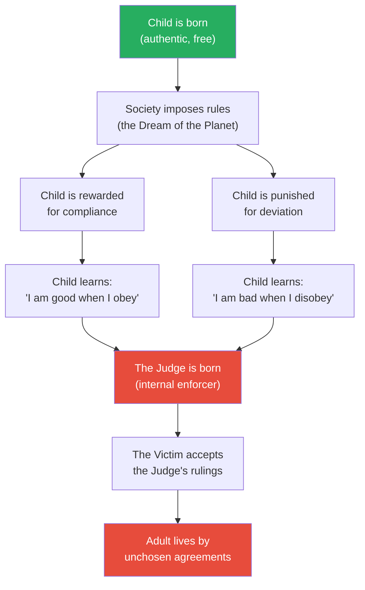
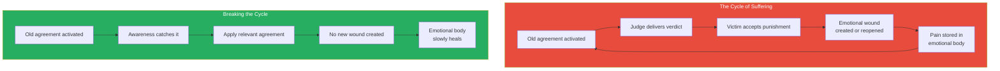
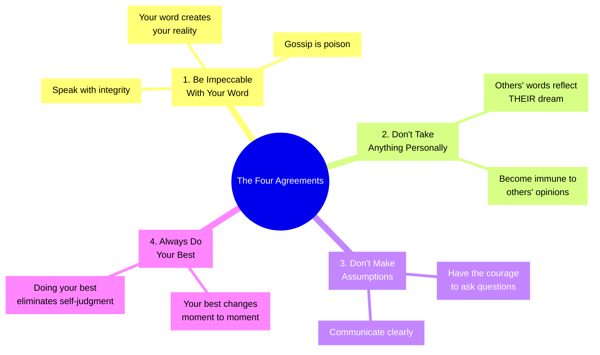
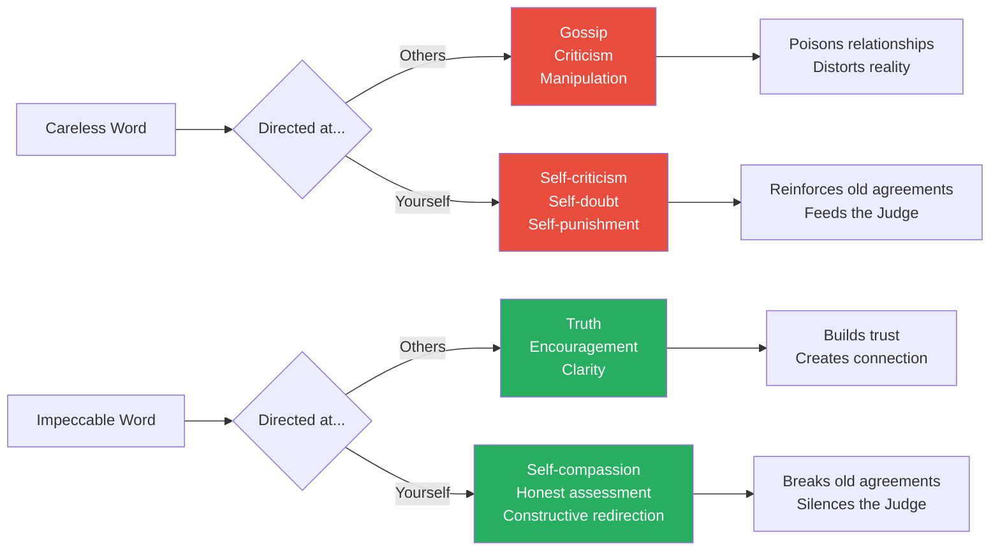
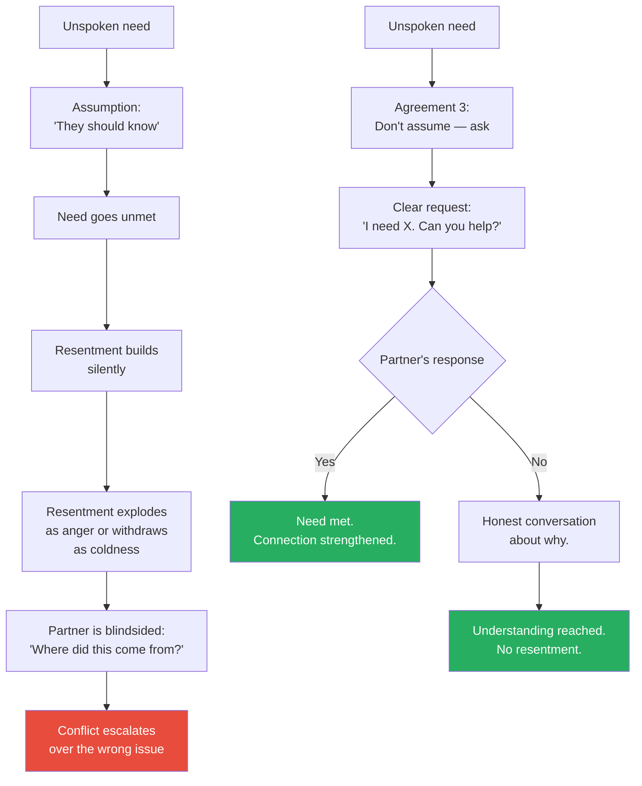
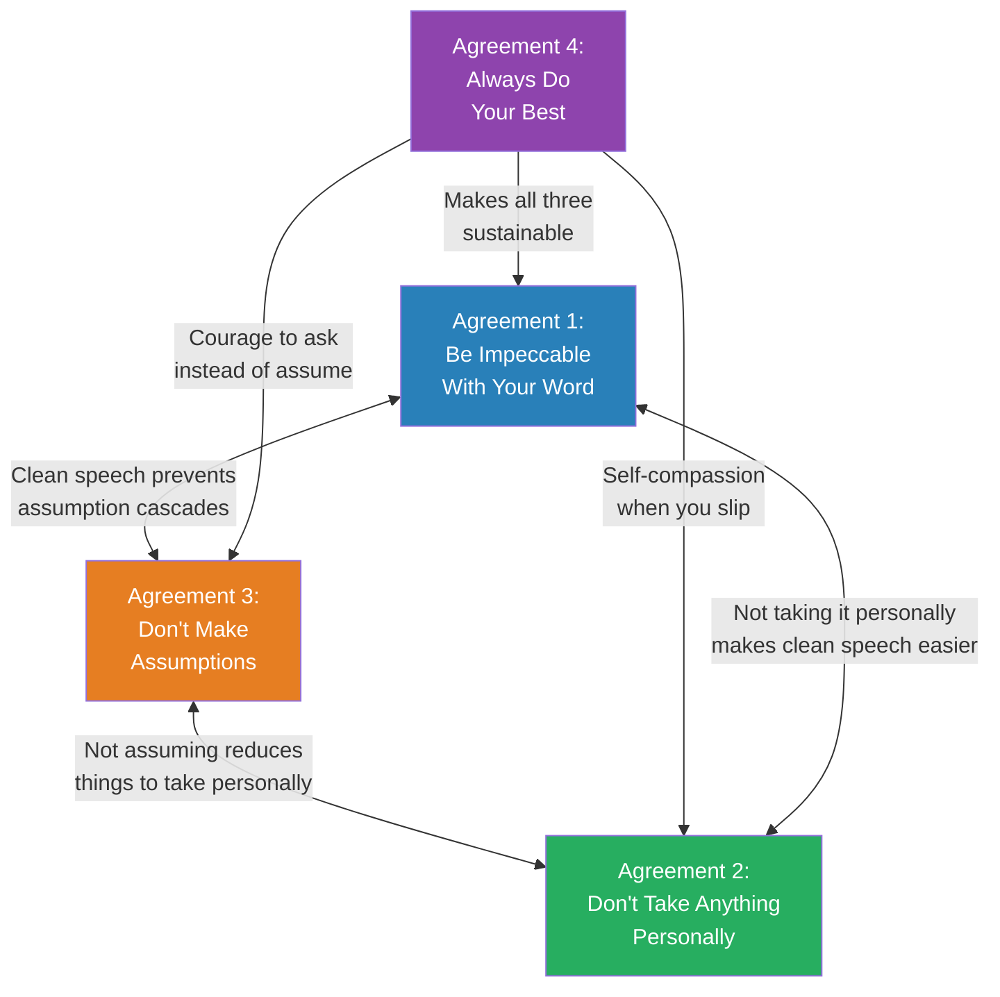

# The Four Agreements — Don Miguel Ruiz

> Don Miguel Ruiz distils ancient Toltec wisdom into four deceptively simple rules that, if practised consistently, eliminate the vast majority of unnecessary suffering from your life. The agreements are: Be impeccable with your word. Don't take anything personally. Don't make assumptions. Always do your best. They sound like refrigerator magnets. They are not. Each one, when genuinely understood and practised, dismantles a deeply ingrained pattern of self-inflicted pain that most people carry from childhood to the grave without ever questioning. The book is short, spiritual, and repetitive — and it has sold over 12 million copies because the ideas, once absorbed, are impossible to forget. Ruiz's genius lies not in novelty but in compression: four handles that address the root causes of most human misery.

---

## About the Author

Don Miguel Ruiz is a Mexican author and teacher of Toltec spirituality. He was born into a family of healers in rural Mexico — his mother was a curandera (healer) and his grandfather was a nagual (shaman). Ruiz trained as a surgeon and practised medicine for years before a near-fatal car accident in the early 1970s changed the course of his life. During his recovery, he began studying his family's ancestral Toltec traditions — a pre-Columbian knowledge system he describes not as a religion but as a way of life centred on personal freedom. He spent years apprenticing with his mother and completing spiritual exercises in the Mexican desert before he began teaching. His writing career began late — *The Four Agreements* was published when he was 52 — but the book became a slow-burn phenomenon, spending over a decade on the New York Times bestseller list and receiving a public endorsement from Oprah Winfrey that accelerated its reach into mainstream culture.

> [!tip] Why This Book Endures
> Most self-help books are read once and forgotten. *The Four Agreements* is the kind of book people buy five copies of — one for themselves and four to give away. Its power lies not in novelty but in compression: four rules that address the root causes of most human suffering. The ideas are ancient. The packaging is unforgettable.

---

## The Big Idea

- As children, we made thousands of <b style="color: #2980b9">agreements</b> with ourselves and the world — beliefs we absorbed from parents, teachers, religion, and culture before we were old enough to question any of them
- Most of these agreements are not chosen — they are imposed through reward and punishment until the child internalises the rules and begins enforcing them on themselves
- "You're not smart enough." "Men don't cry." "You have to work hard to deserve love." "If people don't approve of you, something is wrong with you."
- These agreements become the invisible architecture of our inner world — <b style="color: #e74c3c">they run on autopilot and create most of our suffering without us ever recognising them as optional</b>
- The path to freedom is not about adding new beliefs on top of old ones — it is about <b style="color: #27ae60">subtracting the false agreements you have been carrying since childhood and replacing them with four deliberately chosen ones</b>
- Ruiz's framework draws from Toltec tradition but resonates across Stoicism, Buddhism, and cognitive behavioural therapy because it targets universal mechanisms of human suffering
- The four agreements are not intellectual propositions to be debated — they are practices to be lived, failed at, and returned to daily

> [!warning] The Uncomfortable Truth
> You did not choose most of the beliefs that govern your life. They were installed in you before you were old enough to question them. Every time you feel "not good enough," that is not your voice — it is an agreement you made with someone else's opinion decades ago. The agreements feel like truth because you have never examined them. They are not truth. They are programming.

---

## Key Concepts at a Glance

| Concept | One-line summary |
|---------|-----------------|
| **The Dream of the Planet** | The collective belief system society imposes on every child before they can resist |
| **Domestication** | The reward-and-punishment process that trains children to conform to the dream |
| **Agreements** | The beliefs you accepted as truth during domestication — your invisible operating system |
| **The Judge** | The inner voice that enforces old agreements through relentless self-criticism |
| **The Victim** | The part of you that believes the Judge's verdicts and accepts punishment as deserved |
| **Personal Importance** | The belief that everything is about you — the root of interpersonal suffering |
| **The Mitote** | The thousand conflicting voices in your head, all talking at once |
| **The Book of Law** | The complete set of unchosen rules that governs your life |
| **The Emotional Body** | The accumulated weight of stored wounds, suppressed pain, and unexpressed emotions |
| **The Toltec Path** | The three-step process — awareness, transformation, intent — for breaking free |

---

## Chapter 1: Domestication and the Dream of the Planet

*Before Ruiz presents the four agreements, he dismantles the invisible prison most people live in without realising it — and shows why you need new agreements in the first place.*

This opening chapter is the philosophical foundation for everything that follows. Ruiz argues that you cannot adopt the four agreements until you understand the system they are designed to replace.

### The Dream of the Planet

Ruiz uses the metaphor of a <b style="color: #2980b9">"dream"</b> to describe the collective belief system of human society:

- Every culture, family, religion, and school has a dream — a set of rules about how to behave, what to value, what is acceptable, and what is not
- This dream existed before you were born — you were born into it and had no say in its construction
- The dream includes rules about everything: what is beautiful, what is successful, what is masculine, what is feminine, what is sinful, what is honourable
- Different cultures have different dreams, which is why behaviour that is noble in one culture is shameful in another
- <b style="color: #e74c3c">The dream is not reality — it is a shared hallucination that humans collectively maintain and enforce through social pressure</b>
- Most people never question the dream because everyone around them is living inside the same one
- The dream feels like "the way things are" — it takes enormous effort to see it as "one possible way of interpreting things"

> [!example] The Dream in Action
> - In one culture, a woman who speaks her mind is "strong" — in another, she is "disrespectful"
> - Neither judgment is about the woman herself — both are about the dream of the culture she lives in
> - The dream defines what is "normal" — and anything outside the dream is punished, ridiculed, or suppressed
> - A child raised in one dream will feel deep shame about behaviour that a child in another dream would celebrate
> **The lesson:** Your deepest beliefs about right and wrong, success and failure, worthiness and shame are not universal truths — they are local rules from a specific dream.

---

### Domestication

Children are not born with the dream — they are trained into it through a process Ruiz calls <b style="color: #2980b9">"domestication."</b> This is not a metaphor. It is the same process used to train animals: reward desired behaviour, punish undesired behaviour, repeat until the subject complies automatically.

- Parents say "good boy" when you behave as they want and withdraw love when you don't
- Teachers reward compliance and punish individuality
- Religion offers heaven for obedience and hell for disobedience
- Peer groups enforce conformity through inclusion and exclusion
- <b style="color: #e74c3c">The punishment does not have to be physical — the withdrawal of approval is enough to reshape a child's entire personality</b>

The critical insight: at some point during childhood, you no longer needed external punishment. You internalised the rules and began punishing yourself. The external enforcer became an internal one. The Judge was born.

- Before domestication: you were authentic, spontaneous, and free — you expressed emotions without calculation and explored the world without fear of judgment
- During domestication: you learned which parts of yourself were acceptable and which had to be hidden, suppressed, or denied
- After domestication: you became your own prison guard — enforcing rules you never chose, punishing yourself for violations no one else even notices

> [!example] The Good Child's Bargain
> - A child learns that her parents smile and give affection when she is quiet, obedient, and agreeable
> - She learns that when she is loud, angry, or defiant, love is withdrawn — not permanently, but enough to terrify a child who depends on that love for survival
> - She makes an unconscious agreement: "I will suppress my anger and my needs in exchange for love and safety"
> - Twenty years later, she is an adult who cannot express anger, cannot state her needs, and feels overwhelming guilt whenever she prioritises herself
> - She calls this "just who I am" — but it is not who she is. It is who she was trained to be at age five.
> **The lesson:** Domestication does not create your personality — it creates a mask you wear so consistently that you forget it is a mask.

This diagram shows the full arc of domestication — from authentic child to self-policing adult.

---

### The Judge and the Victim

Once domestication is complete, two internal characters run your psychological life:

**The Judge** is the voice that constantly evaluates you — and finds you lacking:
- It says: "You should have done better." "You're too fat." "You're not as smart as your sister." "People are judging you."
- The Judge enforces every agreement you ever made, especially the ones that cause pain
- It never takes a day off — it is the most relentless taskmaster you will ever encounter
- <b style="color: #e74c3c">The Judge does not care about your wellbeing — it cares about compliance with the old agreements</b>

**The Victim** is the part of you that receives the Judge's verdict and believes it:
- The Victim feels guilty, ashamed, and unworthy
- It accepts punishment as deserved
- It says: "The Judge is right — I am not good enough"
- The Victim and the Judge form a closed loop — one delivers the verdict, the other accepts it, and the cycle repeats endlessly

> [!example] The Thousand Punishments
> - You make one mistake at work — a small error in a presentation
> - The Judge immediately activates: "You're incompetent. Everyone noticed. They're all thinking less of you now."
> - The Victim absorbs the verdict: shame, anxiety, self-doubt
> - You replay the mistake in your mind for days, each replay delivering fresh punishment
> - No court of law would sentence someone to be punished a thousand times for the same offence — but the Judge does this every day, for offences far smaller than any court would hear
> **The lesson:** Most people punish themselves far more harshly than anyone else ever would. The Judge has no sense of proportionality.

| Without Awareness | With Awareness |
|-------------------|----------------|
| You believe the Judge's voice is "just being realistic" | You recognise the Judge as an inherited program |
| You feel guilty for not meeting standards you never chose | You question whose standards you are living by |
| You punish yourself repeatedly for the same mistakes | You forgive yourself and redirect your energy |
| You assume your beliefs about yourself are facts | You see beliefs as agreements that can be renegotiated |

---

### The Mitote

Ruiz introduces the concept of the <b style="color: #2980b9">"mitote"</b> — a Toltec word for the chaotic marketplace of a thousand voices in your head:

- The mitote is what happens when all your conflicting agreements try to operate simultaneously
- One voice says "take the risk," another says "play it safe"
- One agreement says "you deserve love," another says "you have to earn it"
- One rule says "be yourself," another says "fit in or be rejected"
- The mitote is not thinking — it is noise. It is the sound of a mind at war with itself
- <b style="color: #e74c3c">Most people mistake the mitote for their own thoughts — they do not realise that the internal chaos is generated by hundreds of contradictory agreements all firing at once</b>

The four agreements cut through the mitote by replacing thousands of conflicting rules with four clear ones.

### The Book of Law

Ruiz introduces one more concept before presenting the agreements: the <b style="color: #2980b9">"Book of Law"</b> — his metaphor for the complete set of agreements that governs your life:

- The Book of Law was written during domestication — mostly by other people
- It contains rules you never chose: "I must be thin to be loved," "I must earn more than my peers to be worthy," "I must never show weakness"
- The Book of Law is enforced by the Judge and obeyed by the Victim — and most people never realise it exists
- <b style="color: #27ae60">The four agreements are a new Book of Law — one you write yourself, consciously, with full awareness of what you are choosing</b>

> [!example] Reading Your Own Book of Law
> - Consider the rules you live by — really examine them
> - When someone says "I have to work 60 hours a week or I'm not a real professional," that is an agreement from their Book of Law
> - When someone says "if I express anger, people will abandon me," that is another agreement
> - When someone says "I must always be available to others or I'm selfish," that is yet another
> - These rules feel like facts. They are not. They are sentences in a book that was written by someone else before you were old enough to hold a pen
> **The lesson:** You are living by rules you never wrote and never agreed to. The four agreements ask you to throw out the old book and start with four pages.

The treemap reveals that the Judge and Victim together dominate the inner landscape — occupying more psychological space than the Mitote, Book of Law, and Emotional Body combined, which is why Ruiz insists awareness of this internal pair is the first step toward freedom.

---

### The Emotional Body

Ruiz also discusses the <b style="color: #2980b9">"emotional body"</b> — the accumulated weight of unexpressed emotions, old wounds, and suppressed pain that most people carry:

- The emotional body is dense with stored suffering: every time you were shamed as a child, every time you swallowed your anger to keep the peace, every time you pretended to be fine when you were not
- Each wound is like a scar that can be reopened by any situation that echoes the original injury
- The four agreements gradually dissolve the emotional body by stopping the cycle of new wounds:
  - When you stop taking things personally, you stop adding new injuries to the pile
  - When you stop making assumptions, you stop generating false conflicts
  - When you are impeccable with your word, you stop poisoning yourself with self-criticism
  - When you always do your best, you stop the guilt that creates new wounds
- <b style="color: #27ae60">Over time, the old wounds begin to heal — not because you process them one by one, but because you stop reopening them</b>

The left cycle shows how suffering perpetuates itself automatically; the right path shows how the four agreements interrupt the loop.

---

## The Four Agreements — Overview

This map shows the four agreements and their core sub-principles — each agreement addresses a distinct mechanism of suffering.

The radar shows that assumptions cause the sharpest suffering before practice, while "Always Do Your Best" provides the deepest relief — collapsing the Judge's favourite weapon, self-punishment, from 80 down to 10.

---

## Chapter 2: Agreement 1 — Be Impeccable With Your Word

*Ruiz calls this the most important and most difficult agreement — if you could master only one, he says, this is the one to choose.*

### Why the Word Matters

The word is not just communication — it is creation. Every belief you hold began as a word someone spoke to you. "You're smart." "You're lazy." "You'll never amount to anything." Those words became agreements, and those agreements became your reality.

- <b style="color: #2980b9">"Impeccable" comes from the Latin *sin peccatus* — without sin</b>
- To be impeccable with your word means to use it only in the direction of truth and love
- This applies to what you say to others AND — crucially — what you say to yourself
- The word is the most powerful tool you possess: it can create beauty or it can destroy everything
- <b style="color: #e74c3c">The most damaging misuse of the word is not lying to others — it is the constant stream of self-criticism most people direct at themselves every waking hour</b>

> [!example] The Power of a Single Word
> - Ruiz tells the story of a mother who came home after a terrible day at work
> - Her young daughter was singing happily — just singing for the joy of it
> - The mother, overwhelmed and irritable, snapped: "Shut up! You have an ugly voice."
> - The girl never sang again — not as a teenager, not as an adult
> - One sentence, spoken in a moment of frustration, created an agreement that lasted decades
> - The daughter did not decide her voice was ugly through careful analysis — she absorbed it as fact because the word came from someone she trusted completely
> **The lesson:** A single careless word from a trusted source can create an agreement that shapes a life.

---

### The Spell of Black Magic

Ruiz uses the provocative term <b style="color: #2980b9">"black magic"</b> to describe what happens when words are used to manipulate, hurt, or control. He does not mean literal sorcery — he means the power of words to cast spells on people's minds:

- A teacher who tells a child "you're not good at maths" casts a spell that may last a lifetime — the child stops trying, confirms the prophecy, and carries the label into adulthood
- A partner who says "nobody else would want you" uses words to create an invisible prison
- A parent who says "you're just like your father — a failure" implants an agreement that the child may spend decades trying to disprove — or worse, fulfilling
- <b style="color: #27ae60">The antidote is "white magic" — using your word to build, heal, and liberate</b>
- White magic is telling someone "I believe in you" and meaning it, saying "you did well" when they did, speaking truth even when it is uncomfortable

> [!example] The Teacher's Spell
> - Ruiz describes a scenario where a teacher tells a class that a particular student is "the worst reader in the group"
> - The child believes the teacher — an authority figure in the child's dream
> - The child stops trying to read well — the agreement says "I am bad at reading," so why bother?
> - Years later, the child — now an adult — avoids reading, avoids writing, avoids any situation where their literacy might be tested
> - The teacher probably forgot the comment by the end of the week. The child carried it for a lifetime
> **The lesson:** Words spoken by authority figures to children are not casual — they are programming instructions that the child's mind executes without question.

---

### Gossip: The Worst Poison

Ruiz devotes significant attention to gossip, calling it the most common and destructive misuse of the word:

- Gossip is emotional poison transmitted through language
- When you gossip about someone, you are feeding others a distorted version of reality — your interpretation, your judgment, your dream projected onto another person
- <b style="color: #e74c3c">The person who receives gossip absorbs it as information, and it changes how they see the person being discussed — without that person ever being present to defend themselves</b>
- Gossip is how the Dream of the Planet enforces its rules: through social pressure, reputation destruction, and tribal exclusion
- It feels harmless — "just venting" or "just sharing" — but it spreads like a virus, infecting every listener with a distorted version of someone else's reality
- Gossip bonds people through shared negativity — which is why it is so seductive and so hard to stop

> [!example] The Gossip Virus
> - Imagine you tell a friend: "I think Maria is difficult to work with"
> - Your friend now sees Maria through that lens — every interaction is filtered through your judgment
> - Your friend tells another colleague, adding their own embellishment
> - Within a week, Maria has a "reputation" she knows nothing about, built entirely on one person's frustrated interpretation of one interaction
> - Maria wonders why people are treating her differently — she has no idea a spell has been cast on her through gossip
> **The lesson:** Gossip is not harmless venting. It is the deployment of your creative power to alter someone's reality without their knowledge or consent.

> [!tip] The Gossip Test
> Before you speak about someone who is not present, ask three questions: Is it true? Is it necessary? Is it kind? If it fails any of these tests, you are not being impeccable with your word.

---

### Being Impeccable With Yourself

The most overlooked part of this agreement is the inner dimension. Most people would never say to a friend what they routinely say to themselves:

| What You Say to Yourself | What It Actually Is |
|--------------------------|-------------------|
| "I'm so stupid" | A spell you're casting on your own mind |
| "I always mess things up" | An agreement you're reinforcing with repetition |
| "I don't deserve this" | The Judge's verdict, accepted by the Victim |
| "Nobody likes me" | A gossip campaign against yourself |
| "I'll never be good enough" | Black magic directed inward |

- Every self-critical statement reinforces an old agreement
- <b style="color: #27ae60">Being impeccable with your word means treating your inner dialogue with the same care you would use when speaking to someone you deeply love</b>
- This does not mean lying to yourself or refusing to see your flaws — it means describing reality honestly without adding self-punishment

This diagram shows the two directions the word can travel and the consequences of each.

---

## Chapter 3: Agreement 2 — Don't Take Anything Personally

*This agreement sounds simple. It is revolutionary. If you could truly stop taking things personally, you would become virtually immune to the emotional damage that other people's words and actions can inflict.*

### The Core Insight

Nothing others do is because of you. What others say and do is a projection of their own dream — their own beliefs, wounds, fears, and desires. When someone insults you, they are not describing you. They are describing their own internal world and projecting it onto you.

- <b style="color: #2980b9">If someone says "you're stupid," that statement tells you nothing about your intelligence — it tells you everything about their emotional state</b>
- This applies equally to praise: when someone says "you're amazing," that is also their projection, not objective truth
- <b style="color: #e74c3c">Taking things personally is an act of supreme selfishness — it assumes that everything is about you</b>
- Other people live in their own dream, fight their own inner Judge, carry their own emotional wounds — their behaviour is almost always about their internal world, not about you

> [!example] The Stranger's Anger
> - Imagine you are walking down the street and a stranger screams an insult at you
> - You feel hurt, offended, destabilised
> - Then you learn the stranger is mentally ill and screams at everyone who passes
> - Suddenly the hurt vanishes — the words are the same, but you have stopped taking them personally
> - Ruiz's point: the stranger's mental state is always the explanation for their words, whether they are mentally ill or perfectly sane
> - Everyone is living in their own dream — their words describe their dream, not your reality
> **The lesson:** Nothing changed about the words. What changed is that you stopped making them about you.

---

### Why We Take Things Personally

The root cause is what Ruiz calls <b style="color: #2980b9">"personal importance"</b> — the belief that the world revolves around you:

- Your boss is short with you → "She doesn't like me" (rather than: she had a bad morning)
- A friend cancels plans → "He doesn't value our friendship" (rather than: something came up)
- Your partner is quiet → "She's angry at me" (rather than: she is processing something unrelated to you)
- A colleague does not invite you to a meeting → "I'm being excluded" (rather than: the meeting was not relevant to your role)
- <b style="color: #27ae60">In each case, you have made yourself the centre of someone else's universe — which is both inaccurate and exhausting</b>

Personal importance is the maximum expression of selfishness, because it assumes that everything people say and do is a personal statement about you. It turns other people's entire lives into commentaries on your worth.

> [!example] The Performance Review
> - You receive a performance review with three positives and one area for improvement
> - You fixate on the one criticism — you replay it for days
> - You tell yourself the reviewer does not like you, does not see your value, or is out to get you
> - In reality, the reviewer spent five minutes writing the feedback and has not thought about it since
> - The story you have constructed — days of suffering — exists only in your mind
> - Agreement 2 dissolves it in an instant: the feedback is about the reviewer's perception, filtered through their own dream — evaluate it for useful information, discard the rest
> **The lesson:** The suffering was not caused by the feedback. It was caused by taking the feedback personally.

---

### The Immunity

When you stop taking things personally, you gain a kind of <b style="color: #27ae60">emotional immunity</b>. Other people's opinions, judgments, and actions pass through you like wind through an open window. They cannot hook you because you are no longer offering a hook.

| With Personal Importance | Without Personal Importance |
|--------------------------|---------------------------|
| Other people's moods control your emotions | Your emotional state is internally generated |
| You need approval to feel safe | You approve of yourself regardless |
| Criticism is an attack to be defended against | Criticism is data to be evaluated |
| Praise is a drug you need more of | Praise is a gift you can appreciate without attachment |
| You constantly read between the lines | You take people at face value and ask when unclear |

### The Scale of Personal Importance

Ruiz's concept of "personal importance" exists on a spectrum. The more important you believe you are — the more you believe everything is about you — the more you suffer:

| Level | Personal Importance | Example | Suffering Level |
|-------|-------------------|---------|----------------|
| **5 — Narcissistic** | Everything is about me | "She didn't smile at me — she must be plotting against me" | Extreme |
| **4 — High** | Most things are about me | "They didn't invite me to the meeting — I'm being excluded" | High |
| **3 — Normal** | Some things are about me | "His criticism was harsh — maybe he has a point, but it stings" | Moderate |
| **2 — Aware** | Few things are about me | "She's in a bad mood — probably nothing to do with me" | Low |
| **1 — Free** | Almost nothing is about me | "He yelled at me. That's his internal weather. What's useful here?" | Minimal |

Most people operate at Level 3-4 without realising it. The goal of Agreement 2 is to move toward Level 1-2 — not by becoming indifferent, but by accurately assessing what is and is not about you.

The steep drop between Level 3 (Normal) and Level 2 (Aware) illustrates Ruiz's central claim: simply recognising that most events are not about you eliminates more than half of interpersonal suffering overnight.

---

### The Connection Between Agreements 1 and 2

Agreements 1 and 2 work together in a reinforcing loop:

- If you are impeccable with your word (Agreement 1), you will not use your word to take things personally — you will not gossip about the person who offended you, you will not tell yourself a victim story, you will not use your inner dialogue to amplify the perceived slight
- If you don't take things personally (Agreement 2), it becomes much easier to be impeccable with your word, because you are no longer reacting from a place of hurt
- <b style="color: #27ae60">Together, they create a virtuous cycle: clean speech reduces personalisation, and non-personalisation enables cleaner speech</b>

---

## Chapter 4: Agreement 3 — Don't Make Assumptions

*This agreement addresses the source of most relationship conflicts: the stories we invent about what other people think, feel, and intend — and then treat as facts.*

### The Assumption Machine

The human mind hates uncertainty. When it encounters a gap in information, it fills the gap with a story — and then forgets that the story is fiction. This happens constantly, automatically, and below the level of awareness:

- Your partner does not text back for three hours → Your mind generates a story: "They're ignoring me" / "They're with someone else" / "They don't care"
- Your boss schedules an unexpected meeting → Your mind generates a story: "I'm in trouble" / "I'm being fired" / "They found out about my mistake"
- A friend does not laugh at your joke → Your mind generates a story: "They think I'm not funny" / "They don't like me anymore"
- <b style="color: #2980b9">The assumption feels like knowledge, but it is imagination — and you react to the imagination as if it were real</b>
- The emotional response to an assumption is identical to the emotional response to a fact — your body does not know the difference

> [!example] The Silent Treatment Spiral
> - A husband comes home quiet after a long day
> - His wife assumes he is angry at her — she becomes cold and withdrawn to protect herself
> - He notices her distance and assumes she is upset about something he did
> - He becomes defensive
> - She interprets his defensiveness as confirmation that he was angry all along
> - By the end of the evening, they are in a full argument — and neither one has actually said what they are thinking
> - The entire conflict was constructed from assumptions — not a single fact was exchanged
> **The lesson:** Two people can destroy an evening — or a relationship — without a single honest word being spoken.

---

### The Courage to Ask

Ruiz says the cure for assumptions is devastatingly simple: ask questions. Communicate what you actually want. Say what you actually mean.

- Instead of assuming your boss is unhappy with your work, ask: "How do you feel about my progress on this project?"
- Instead of assuming your partner knows what you need, say: "I need X. Can you help me with that?"
- Instead of assuming a friend is angry, ask: "You seem quiet — is everything okay?"
- <b style="color: #27ae60">This requires courage because asking reveals vulnerability — and the Dream of the Planet teaches us that vulnerability is weakness</b>
- But the alternative — suffering in silence while your mind invents increasingly dramatic stories — is far worse than a moment of vulnerable honesty

> [!tip] The Assumption Audit
> When you notice yourself feeling hurt, anxious, or angry about something someone else did (or didn't do), ask yourself: "Am I responding to something that actually happened, or to a story I invented about what happened?" If the answer is a story, you have two choices: ask the person directly, or let the story go.

---

### Assumptions About Yourself

The most dangerous assumptions are the ones you make about yourself:

- "I can't do that"
- "I'm not the kind of person who..."
- "I'll never be good at..."
- "People like me don't..."

These are not observations — they are agreements masquerading as facts. And because you never question them, they function as invisible ceilings on your life.

- <b style="color: #e74c3c">Self-assumptions are the hardest to catch because they feel like self-knowledge rather than self-limitation</b>
- The difference between "I'm not good at public speaking" (an assumption) and "I haven't practised public speaking much" (a fact) is enormous — the first closes a door; the second opens one

---

### Assumptions in Relationships

Ruiz argues that one of the most destructive assumptions people make is: <b style="color: #e74c3c">"If you love me, you should know what I want without me having to say it."</b> This assumption has probably ended more relationships than infidelity:

- It places an impossible burden on the other person — telepathy
- It creates resentment when they inevitably fail to read your mind
- It punishes them for a crime they did not know they were committing
- The antidote is radical clarity: state your needs, ask about theirs, and never punish someone for failing to guess what you never communicated
- This requires vulnerability — and vulnerability is what the Dream of the Planet trained you to avoid

| The Assumption | The Reality | The Agreement 3 Response |
|----------------|-------------|------------------------|
| "They should know what I need" | Nobody is a mind reader | State your needs clearly |
| "They're ignoring me on purpose" | They may not have noticed | Ask: "Hey, is everything okay?" |
| "They're angry at me" | They might be tired, stressed, or distracted | Ask: "You seem quiet — is something on your mind?" |
| "This will never work out" | You are predicting a future that hasn't happened | Stay present. Evaluate evidence, not stories |

---

### The Assumption Cascade

Assumptions rarely come alone. They cascade — one assumption triggers another, which triggers another, until you have constructed an entire narrative from nothing:

> [!example] The Promotion Assumption Cascade
> - Your manager schedules a meeting with HR → You assume: "I'm in trouble"
> - Based on that assumption → You assume: "It must be about the project deadline I missed"
> - Based on that → You assume: "They're going to put me on a performance plan"
> - Based on that → You assume: "I'll probably get fired within six months"
> - Based on that → You start rehearsing what you will tell your spouse
> - The meeting turns out to be about a promotion
> - You spent 48 hours living in a fictional nightmare — the assumption cascade is your mind's most efficient suffering generator
> **The lesson:** The mind can take a single ambiguous data point and construct an entire tragedy in minutes. Agreement 3 interrupts the cascade at the first link.

The left path shows the assumption spiral in relationships; the right path shows what happens when you replace assumptions with direct communication.

---

### Communication Styles and Assumption Traps

Different communication styles create different assumption traps:

| Communication Style | The Assumption Trap | The Agreement 3 Response |
|--------------------|-------------------|------------------------|
| **Direct communicators** | "They're being rude" | Recognise that directness is a style, not an attack |
| **Indirect communicators** | "They're hiding something" | Ask for clarification rather than interpreting silence |
| **Conflict-avoidant people** | "Everything is fine" (when it isn't) | Gently create safe space for honest conversation |
| **Expressive communicators** | "They're overreacting" | Recognise that emotional expression is their processing style |

> [!example] The Cross-Cultural Assumption Trap
> - A colleague from a high-context culture (Japan, China, Korea) says "that's an interesting idea" — they mean "I disagree completely"
> - A colleague from a low-context culture (Germany, Netherlands, Israel) says "this is wrong" — they mean nothing personal, just factual correction
> - Without Agreement 3, you map your own cultural assumptions onto their words and create phantom conflicts
> - With Agreement 3, you ask: "Can you tell me more about what you mean?" — and the phantom conflict dissolves
> **The lesson:** Most cross-cultural misunderstandings are not caused by genuine disagreement but by assumptions about what someone's words mean in your cultural dream versus theirs.

---

## Chapter 5: Agreement 4 — Always Do Your Best

*The fourth agreement is the engine that makes the other three sustainable. Without it, the first three agreements become new sources of self-punishment rather than liberation.*

### The Variable Best

The key insight of this agreement is that your best is not a fixed standard — it changes from moment to moment:

- <b style="color: #2980b9">The instruction is not "always be perfect" — it is "always give what you have to give in this moment"</b>
- Your best when you are well-rested is different from your best when you are sick
- Your best on a good day is different from your best during a crisis
- Your best at the beginning of a long day is different from your best at the end
- If you did your best and it was not enough, there is nothing to regret
- If you did less than your best, the Judge will punish you — not because you failed, but because you know you held back

> [!example] The Surgeon's Variable Best
> - A surgeon who performs three operations in a day will not perform the third with the same freshness as the first
> - But if she brings her full attention, her accumulated skill, and her genuine care to each operation — she is doing her best
> - The fourth agreement does not demand that the third operation be as sharp as the first
> - It demands that she give everything she has left, honestly and without holding back
> **The lesson:** Your best is not a fixed line — it moves with your energy, your health, your circumstances. The agreement is to meet that moving line, not an impossible fixed one.

---

### Why This Agreement Matters for the Other Three

Agreement 4 is the safety net that prevents the other three agreements from becoming new weapons for the Judge:

- You will not be impeccable with your word every time — you will gossip, you will criticise yourself. But if you were doing your best, you can forgive yourself and try again tomorrow
- You will take things personally sometimes — the old habits are deep. But if you were doing your best to practise detachment, you can release the slip without self-punishment
- You will make assumptions — the habit is automatic. But if you were doing your best to catch them and ask instead, you can acknowledge the lapse without spiralling into shame
- <b style="color: #27ae60">Without Agreement 4, the other three become perfectionist standards that the Judge uses to punish you even more — which defeats the entire purpose</b>

| Situation | What "Your Best" Looks Like | What Perfectionism Would Demand |
|-----------|---------------------------|-------------------------------|
| First week at a new job | Showing up prepared, asking questions, learning names | Already performing like a ten-year veteran |
| Recovering from illness | Getting through the day, doing essential tasks | Full output as if nothing happened |
| Going through a divorce | Managing your emotions, showing up for your children | Maintaining peak professional performance |
| Learning a new skill | Making mistakes, improving slowly, staying curious | Being good at it immediately |
| Grieving a loss | Getting out of bed, eating, being gentle with yourself | "Moving on" on someone else's timeline |

---

### The Anti-Burnout Agreement

There is a subtle and important point hidden in Agreement 4 that most readers miss: <b style="color: #e74c3c">doing your best also means not doing MORE than your best.</b>

- Over-giving, over-working, and over-performing are not signs of virtue — they are violations of this agreement
- If you push past your genuine capacity day after day, you are not "doing your best" — you are abusing yourself in the name of productivity
- The agreement has a built-in calibration mechanism: your best adjusts to your reality, not your ambition

> [!example] The Over-Achiever's Collapse
> - A manager works 70-hour weeks for months, telling herself she is "doing her best"
> - In reality, she passed her genuine best at 50 hours — the extra 20 hours are driven by fear, not excellence
> - She burns out, gets ill, and performs worse than she would have at 50 hours
> - Agreement 4 would have told her: your best today is 50 hours of focused work and then rest. Anything beyond that is not your best — it is the Judge's impossible standard wearing the mask of dedication
> **The lesson:** "Always do your best" includes the word "your" — not the Judge's best, not your competitor's best, not society's best. Yours.

---

### Action as the Antidote

Ruiz emphasises that the agreements are not beliefs to be held — they are practices to be lived:

- You do not "believe in" being impeccable with your word — you do it, you practise it, you fail, and you practise again
- <b style="color: #27ae60">The fourth agreement transforms the other three from ideals into a daily practice — imperfect, messy, human, and ongoing</b>
- It is the bridge between understanding the agreements (which takes an hour) and living them (which takes a lifetime)
- The practice itself generates the transformation — not the understanding

---

### How the Four Agreements Work as a System

The four agreements are not independent rules — they are an interconnected system where each one supports and reinforces the others:

This diagram shows the reinforcement loops — each agreement strengthens the others.

**The reinforcement loops:**
- If you don't make assumptions (A3), you have less to take personally (A2)
- If you don't take things personally (A2), your speech becomes cleaner (A1)
- If your speech is clean (A1), you create fewer situations that trigger assumptions (A3)
- If you always do your best (A4), you can forgive yourself when you violate any of the other three

> [!tip] Where to Start
> If you are overwhelmed and don't know where to begin, Ruiz suggests starting with Agreement 2 — don't take anything personally. It is the quickest to produce results because it immediately reduces the number of situations that cause you suffering. Once you stop taking things personally, the other three agreements become much easier to practise.

---

| Agreement | What It Cures | The Suffering It Eliminates |
|-----------|--------------|---------------------------|
| **Be impeccable with your word** | Gossip, self-criticism, careless speech | Self-inflicted emotional wounds |
| **Don't take anything personally** | Sensitivity to others' opinions | Needless offence, hurt feelings, people-pleasing |
| **Don't make assumptions** | Misunderstanding, projection, silent resentment | Relationship conflict from unspoken expectations |
| **Always do your best** | Perfectionism, regret, self-judgment | The inner critic that says "you should have done more" |

Nearly half of all daily suffering (47%) traces back to Agreements 1 and 2 — self-criticism and sensitivity to others' opinions — which explains why Ruiz calls "Be Impeccable With Your Word" the most important agreement and "Don't Take Anything Personally" the fastest to produce results.

---

## Common Objections and Ruiz's Responses

*Readers frequently push back on the agreements — their simplicity invites scepticism. Ruiz has answers for each objection.*

### "Don't take anything personally? What about legitimate criticism?"

- Ruiz is not saying to ignore feedback or refuse to learn from others
- He is saying: <b style="color: #2980b9">evaluate the content of criticism without absorbing the emotional charge</b>
- If your boss says your report has errors, the useful information is "check the report for errors"
- The useless addition — "and this means I'm incompetent" — is you taking it personally
- Separate the data from the drama — the data is useful, the drama is self-inflicted

### "Don't make assumptions? But we HAVE to assume things to function."

- Ruiz acknowledges that practical assumptions are necessary — you assume the floor will hold you when you step on it, you assume traffic lights mean what they are supposed to mean
- The agreement targets interpersonal assumptions: the stories you invent about what other people think, feel, and intend
- Those assumptions are almost always wrong and almost always cause suffering
- Practical assumptions keep you alive; interpersonal assumptions keep you miserable

### "Always do your best? That sounds like toxic productivity."

- Only if you misread it
- Ruiz explicitly says your best changes from moment to moment
- On a day when you are ill, your best might be getting out of bed
- <b style="color: #27ae60">The agreement is not about productivity — it is about self-compassion</b>
- It says: whatever you genuinely gave today is enough. Stop punishing yourself for not giving more.

### "This is too simple. Real life is more complicated."

- Ruiz would agree — real life IS complicated
- That is precisely why you need simple rules
- Complex systems — a human life, a relationship, a career — are not navigated with complex rules
- They are navigated with clear principles applied consistently
- The four agreements are simple to understand and endlessly complex to practise

---

## Chapter 6: The Toltec Path to Freedom

*The final chapters move from the four agreements themselves to the process of actually breaking free from old agreements — a three-step path Ruiz calls awareness, transformation, and intent.*

### Step 1: Awareness — The Art of Seeing

Before you can break old agreements, you have to see them. Most people do not know they are living by unchosen rules:

- Notice when the Judge speaks: "You should have done better." "You're not enough."
- Notice when you take something personally: feel the hook, feel the emotional reaction, and trace it back to the agreement underneath
- <b style="color: #2980b9">Notice when you make assumptions: catch the moment when your mind invents a story and presents it as fact</b>
- Awareness is not the same as change — it is the prerequisite for change
- You cannot break a rule you do not know you are following

> [!abstract] The Awareness Practice
> 1. For one week, carry a small notebook or use your phone
> 2. Every time you catch yourself in a moment of suffering — irritation, shame, anxiety, anger — pause
> 3. Write down what agreement is being violated
> 4. "I feel hurt because I assumed she was criticising me"
> 5. "I feel ashamed because my inner Judge says I should be further along by now"
> 6. After seven days, review your notes — you will see patterns: the same few agreements triggering most of your pain

---

### Step 2: Transformation — The Art of Dying

Ruiz uses dramatic language for this step. He calls it <b style="color: #2980b9">"the art of dying"</b> — not physical death, but the death of the old self:

- Every old agreement you break is a small death
- The person who believed "I'm not smart enough" has to die so that a new person — one who is free from that belief — can be born
- This process is uncomfortable because identity is built on agreements — even painful ones provide a sense of "who I am"
- When you stop believing "I'm the kind of person who can't speak up in meetings," you lose a piece of your identity — even if it was a piece that caused suffering
- <b style="color: #e74c3c">People resist freedom because the familiar prison feels safer than the unknown</b>

> [!example] The Pushback from Others
> - When you start breaking agreements, the people around you will resist
> - They will say "you've changed" — and they will not mean it as a compliment
> - Your freedom threatens their dream, because it implies that the rules they follow are optional
> - A friend who has always been able to manipulate you through guilt will feel confused and angry when guilt stops working
> - A partner who has always been able to control you through criticism will escalate when criticism stops landing
> - This pushback is not a sign that you are doing something wrong — it is a sign that you are breaking free from the shared dream
> **The lesson:** Expect resistance. The dream has an immune system, and it activates when someone starts waking up.

---

### Step 3: Intent — The Art of Creating

The final step is not passive — it is the active choice to create new agreements:

- You replace "I'm not good enough" with "I am doing my best and that is enough"
- You replace "I need others to approve of me" with "I approve of myself"
- You replace "I must be perfect" with "I must be honest"
- <b style="color: #27ae60">Intent is not willpower — it is the sustained direction of your attention toward the life you want</b>
- Every time you practise one of the four agreements, you weaken an old agreement and strengthen a new one
- Over time, the new agreements become automatic — just as the old ones once were

```mermaid
flowchart LR
    subgraph OLD ["Old Operating System"]
        A1["Unchosen agreements"]
        A2["The Judge enforces them"]
        A3["The Victim obeys"]
        A4["Suffering on autopilot"]
    end
    subgraph PATH ["The Toltec Path"]
        B1["1. Awareness<br>(see the agreements)"]
        B2["2. Transformation<br>(let old self die)"]
        B3["3. Intent<br>(create new agreements)"]
    end
    subgraph NEW ["New Operating System"]
        C1["Four chosen agreements"]
        C2["The Judge is silenced"]
        C3["Freedom replaces<br>suffering"]
    end
    OLD --> B1
    B1 --> B2
    B2 --> B3
    B3 --> NEW
    style OLD fill:#e74c3c,color:#fff
    style NEW fill:#27ae60,color:#fff
    style PATH fill:#2980b9,color:#fff
```

This diagram shows the full journey from unconscious suffering to conscious freedom through the three-step Toltec path.

---

## Chapter 7: The New Dream — Heaven on Earth

*The book's final chapter describes what life looks like when you have broken the old agreements and replaced them with four chosen ones — what Ruiz calls "the new dream."*

### What Freedom Looks Like

| Life Under Old Agreements | Life Under the Four Agreements |
|---------------------------|-------------------------------|
| You need others to approve of you to feel safe | You approve of yourself regardless of what others think |
| You constantly monitor what people think about you | Other people's opinions pass through you without sticking |
| Conflict sends you into anxiety or defensiveness | Conflict is an opportunity to practise clarity and courage |
| Your mood depends on what happened to you today | Your mood depends on how you choose to respond |
| You carry old wounds from things people said years ago | Old wounds have been released because you stopped feeding them |
| You gossip about others and criticise yourself | You speak with integrity — to others and to yourself |
| You spend energy on resentment, worry, and regret | That energy is redirected toward creation, connection, and joy |

---

### The Practice Is the Point

The book ends where it begins: with the recognition that the four agreements are not beliefs to be adopted but practices to be lived:

- You will forget them — you will violate them
- You will take things personally, make assumptions, gossip, and judge yourself
- The question is not whether you will fail but whether you will return to the practice after failing
- <b style="color: #27ae60">The practice itself is the transformation — not the understanding, not the intention, but the daily, imperfect, repeated effort</b>

> [!abstract] The Daily Review
> 1. Each morning, remind yourself of the four agreements
> 2. Each evening, review your day without judgment:
> 3. Was I impeccable with my word today? Where did I slip?
> 4. Did I take anything personally? What hooked me?
> 5. Did I make assumptions? Where did I invent stories?
> 6. Did I do my best? Not perfectly — but genuinely?
> 7. The goal is not perfection. The goal is awareness. And awareness, practised daily, is freedom.

---

### Forgiveness as Fuel

Ruiz devotes significant attention to forgiveness — not as a moral obligation but as a practical necessity:

- The emotional body is full of stored resentment, old wounds, and unexpressed pain
- <b style="color: #2980b9">Forgiveness is not saying "what you did was okay" — forgiveness is saying "I am no longer willing to carry the weight of what you did"</b>
- The first person you need to forgive is yourself — for all the times you violated your own integrity, for all the agreements you made that hurt you, for all the years you spent living someone else's dream
- Forgiveness is not a single act — it is an ongoing practice of releasing stored poison from the emotional body

> [!example] The Weight of Unforgiveness
> - Imagine carrying a heavy backpack everywhere you go
> - Each rock in the backpack is a resentment — something someone said ten years ago, a betrayal you never processed, an insult you are still replaying
> - The rocks do not hurt the people who put them there — they only hurt you
> - Every day you carry the backpack, you have less energy for the things that matter
> - Forgiveness is not about the people who wronged you — it is about putting down the backpack
> **The lesson:** Unforgiveness is a punishment you inflict on yourself while waiting for the other person to suffer.

---

### Personal Freedom

For Ruiz, <b style="color: #27ae60">personal freedom</b> means something specific: the freedom to be who you really are, without fear, without guilt, and without shame:

- Most people are not free — they are prisoners of their own beliefs
- They do not choose how they feel — their emotions are triggered automatically by old agreements
- They do not choose what they think — their thoughts are generated by the mitote
- Personal freedom means reclaiming authorship of your inner life

| Prison | Freedom |
|--------|---------|
| You feel what old agreements tell you to feel | You choose your emotional response |
| You think what the mitote generates | You direct your attention deliberately |
| Your identity is built on other people's opinions | Your identity is built on self-knowledge |
| You live in a dream you didn't create | You create your own dream consciously |
| Happiness depends on external conditions | Happiness is generated internally |
| Love is conditional — earned through performance | Love is unconditional — given freely, starting with yourself |

---

## The Fifth Agreement

In 2010, Ruiz and his son Don Jose Ruiz published a sequel: *The Fifth Agreement*. The fifth agreement is: **Be sceptical, but learn to listen.**

- Be sceptical of every message you receive — including your own thoughts
- But do not dismiss everything — learn to listen for the truth behind the words
- <b style="color: #2980b9">The fifth agreement adds a meta-layer to the other four: it teaches you to question everything — including the four agreements themselves</b>
- It is the agreement that prevents dogma — because even good rules can become prisons if followed without awareness
- Scepticism without listening is cynicism; listening without scepticism is naivety — the fifth agreement is the balance point

---

## The Agreements Applied: Seven Common Life Scenarios

*The four agreements are abstract until you see them applied to the situations where you actually suffer. Here are seven common scenarios — before and after.*

### Scenario 1: You Get Negative Feedback at Work

**Old pattern:** Feel crushed → assume you are about to be fired → go home and vent to your partner → replay the conversation for days → perform worse because you are anxious

**Four Agreements response:**
- A2: The feedback reflects your boss's standards and perspective, not your fundamental worth
- A3: Don't assume the worst — ask clarifying questions about what specifically needs to change
- A1: Don't poison yourself with self-talk like "I'm terrible at this"
- A4: Take the useful information and apply it — that is doing your best

### Scenario 2: Your Partner Is Distant

**Old pattern:** Assume they are angry at you → become cold in response → they notice your coldness and withdraw further → you interpret their withdrawal as confirmation → three days of silent suffering

**Four Agreements response:**
- A3: Don't assume — ask: "You seem quiet. Is something going on?"
- A2: If they are upset, it may have nothing to do with you
- A1: Don't gossip about it to friends before you have talked to your partner
- A4: Give your partner the benefit of the doubt — that is doing your best in a relationship

### Scenario 3: A Friend Cancels Plans Again

**Old pattern:** Assume they don't value the friendship → feel hurt → start pulling away → they notice your distance and do the same → the friendship slowly dies from mutual assumptions

**Four Agreements response:**
- A3: Don't assume — they might be overwhelmed, ill, or overcommitted
- A2: Their scheduling isn't a statement about your worth
- A1: Be honest: "I've noticed we've cancelled a few times. I miss hanging out. Can we find a time that works?"
- A4: Express your feelings clearly — that is doing your best as a friend

### Scenario 4: You Make a Mistake in Front of Others

**Old pattern:** Shame spiral → assume everyone noticed → assume everyone is judging you → avoid those people for weeks → overcompensate with perfectionism

**Four Agreements response:**
- A2: Other people are thinking about their own lives, not about your mistake from two weeks ago
- A1: Don't repeat the story of the mistake to yourself 500 times — that is using your word against yourself
- A3: Don't assume people are judging you — most of them forgot before you finished your sentence
- A4: You did your best in that moment. Correct and move on.

### Scenario 5: Someone Gossips About You

**Old pattern:** Feel betrayed → gossip about THEM in retaliation → create a tribal conflict → spend enormous energy managing the fallout

**Four Agreements response:**
- A2: What they said reflects their inner world, not who you are
- A1: Don't retaliate with counter-gossip — that is using your word as a weapon
- A3: Don't assume you know why they did it or what their motivations were
- A4: Respond with dignity. If necessary, address it directly with the person. That is doing your best.

### Scenario 6: You're Stuck in a Job You Hate

**Old pattern:** Assume you can't leave → tell yourself stories about why change is impossible → use your word against yourself ("I'm trapped," "I have no options") → take your frustration personally when colleagues seem happier

**Four Agreements response:**
- A3: Don't assume you are trapped — investigate options with curiosity, not despair
- A1: Be honest with yourself about what you want — "I am choosing to stay for now because of X" is very different from "I'm trapped"
- A2: Other people's career satisfaction is not a commentary on yours
- A4: Do your best where you are while actively creating alternatives

### Scenario 7: You're Triggered by Social Media

**Old pattern:** See someone's highlight reel → assume their life is perfect → compare yourself unfavourably → feel inadequate → scroll more to numb the feeling

**Four Agreements response:**
- A3: Don't assume their curated posts represent their actual life
- A2: Their success is not a statement about your failure
- A1: Don't use your inner word to attack yourself: "Why can't I be like that?" is black magic aimed at yourself
- A4: Do your best with YOUR life. Close the app. Go do something real.

---

## Before and After: A Day With and Without the Agreements

### Without the Four Agreements

You wake up and check your phone. A colleague sent a terse email. You assume she is angry at you (violation of Agreement 3). You spend the morning worrying about it. You tell your partner "I think she hates me" — a story you have invented (violation of Agreement 1). At work, she is short with everyone — it has nothing to do with you — but you take it personally anyway (violation of Agreement 2). You spend the afternoon replaying the interaction, beating yourself up for not responding better (violation of Agreement 4). By evening, you are exhausted from a conflict that existed entirely in your imagination.

### With the Four Agreements

You wake up and check your phone. A colleague sent a terse email. You notice the urge to assume she is angry (Agreement 3: don't make assumptions). You decide to ask her directly when you see her. At work, you ask: "Hey, your email seemed brief — is everything okay?" She laughs: "Sorry, I was rushing between meetings." The entire imaginary conflict dissolves in ten seconds. You did not gossip about it (Agreement 1), you did not take it personally (Agreement 2), you did not make assumptions (Agreement 3), and you did your best to respond with clarity and courage (Agreement 4). You have a normal, productive day.

---

## The Four Agreements in Other Frameworks

Ruiz's ideas are not unique to Toltec tradition. The same principles appear across philosophy, psychology, and spiritual traditions — which is evidence of their universality.

| The Four Agreements | Stoic Equivalent | CBT Equivalent | Buddhist Equivalent |
|--------------------|-----------------|----------------|-------------------|
| Be impeccable with your word | "Speak only what is true and necessary" | Cognitive restructuring — changing self-talk | Right Speech |
| Don't take anything personally | "Others' opinions are not within your control" | De-personalisation — separating self from events | Non-attachment |
| Don't make assumptions | "Test your impressions before reacting" | Cognitive distortions — identifying mind-reading | Beginner's Mind |
| Always do your best | "Virtue is its own reward" | Behavioural activation — focus on effort, not outcome | Right Effort |

> [!example] The Stoic Connection
> - Marcus Aurelius wrote in his private journal: "When you wake in the morning, tell yourself: the people I deal with today will be meddling, ungrateful, arrogant, dishonest"
> - This is Ruiz's Agreement 2 in Roman armour
> - Both authors are saying the same thing: other people's behaviour is about them, not about you
> - Prepare for it. Don't let it destabilise you
> - Two thousand years apart, two different traditions, the same fundamental insight
> **The lesson:** The universality of these ideas across cultures and centuries suggests they describe something real about human psychology, not just one tradition's preferences.

---

## The Verdict

*The Four Agreements* is either profound or simplistic, depending on how seriously you take its deceptive simplicity. The ideas are not new — Stoics, Buddhists, and cognitive therapists have said similar things for centuries. What Ruiz adds is compression: four rules that, between them, cover an extraordinary range of human suffering. The genius is in the packaging, not the novelty.

The book's spiritual language will put off some readers — references to "the dream of the planet" and Toltec metaphysics can feel vague and ungrounded. The writing is repetitive, and Ruiz makes sweeping claims without the kind of evidence that would satisfy a sceptical reader. He presents Toltec tradition with a reverence that occasionally tips into mystification, and there is no empirical data to be found anywhere in the book. If you need research citations to take an idea seriously, this book will frustrate you.

The real test is not whether you agree with the agreements — almost everyone does on first reading. The real test is whether you can catch yourself in the moment of violation. Can you notice when you gossip? When you take something personally? When you assume? When you phone it in? That noticing — that moment of awareness — is the entire practice. And it is harder than any intellectual exercise the book contains. The book is most powerful for readers who are trapped in cycles of self-criticism, assumption-driven anxiety, or chronic sensitivity to other people's opinions. It gives them four clear handles to grab when the old habits take over.

*The Four Agreements* sits in a distinctive position among self-help classics. It is simpler than [[12 Rules for Life - Jordan Peterson|12 Rules for Life]], more spiritual than [[Essentialism - Greg McKeown|Essentialism]], less rigorous than any cognitive behavioural therapy manual, and more practical than most philosophical texts. Its closest cousin is [[Discourses - Epictetus|Epictetus]], who also taught that suffering comes from our judgments about events, not from events themselves — just in Greek rather than Toltec. If you read one book about reducing unnecessary suffering, this is a strong candidate — not because it teaches you something you don't already know, but because it makes what you know unforgettable.

---

## Related Reading

- [[Man's Search for Meaning - Viktor Frankl|Man's Search for Meaning]] — Frankl's insight that you can choose your response to suffering is Agreement 2 and Agreement 4 tested in the most extreme circumstances imaginable. Frankl found meaning in a concentration camp; Ruiz would say he broke his old agreements and chose new ones under impossible conditions.
- [[Discourses - Epictetus|Discourses]] — Epictetus taught that suffering comes not from events but from our judgments about events. Ruiz says the same thing in Toltec language. The overlap is so exact that reading both illuminates both.
- [[12 Rules for Life - Jordan Peterson|12 Rules for Life]] — Peterson's rules are longer and more culturally specific, but the project is the same: compress practical wisdom into memorable principles. Peterson is more intellectual; Ruiz is more spiritual.
- [[Essentialism - Greg McKeown|Essentialism]] — The disciplined pursuit of less. If the four agreements are about subtracting false beliefs, essentialism is about subtracting false priorities. Both books argue that freedom comes from elimination, not accumulation.
- [[Deep Work - Cal Newport|Deep Work]] — Newport's argument for focused attention maps to Agreement 4's emphasis on bringing your full capacity to what you are doing. Both authors understand that scattered effort is wasted effort.
- [[Emotional Intelligence - Daniel Goleman|Emotional Intelligence]] — Goleman provides the neuroscience behind why Agreements 2 and 3 are so hard: the amygdala hijack makes us react before we think. Reading Goleman after Ruiz explains the biological machinery underneath the spiritual framework.
- [[The Gaslight Effect - Robin Stern|The Gaslight Effect]] — Stern's work on gaslighting shows what happens when someone else weaponises your word against you — the dark inversion of Agreement 1. Understanding gaslighting deepens your appreciation of why being impeccable with your word matters.
