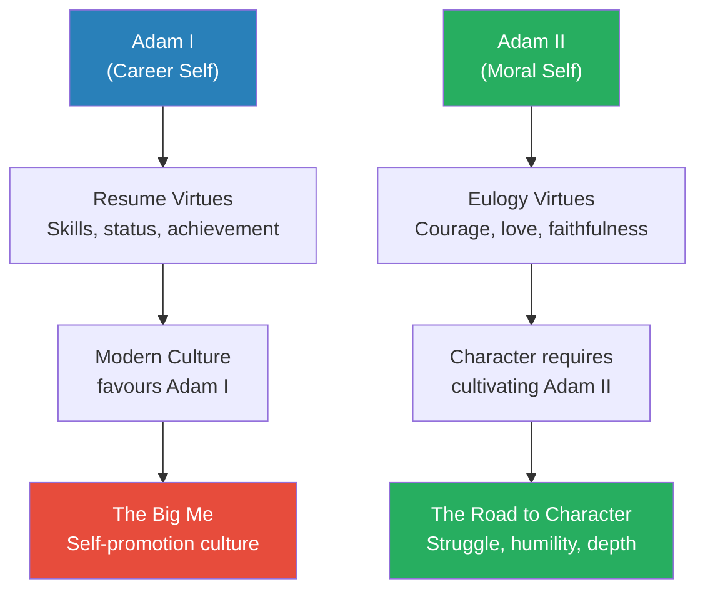
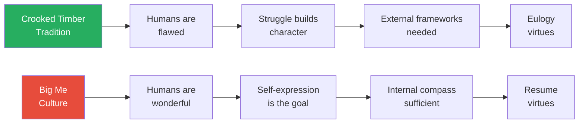
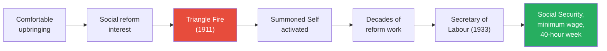
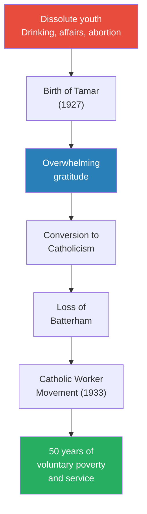
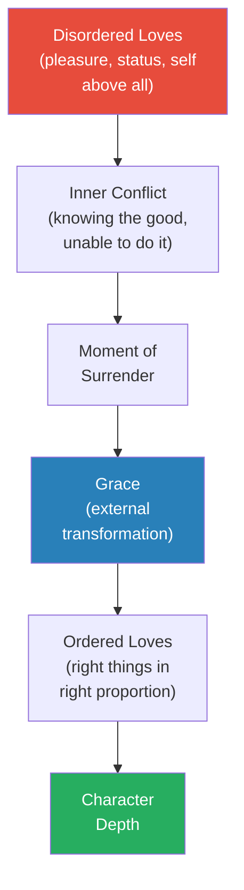
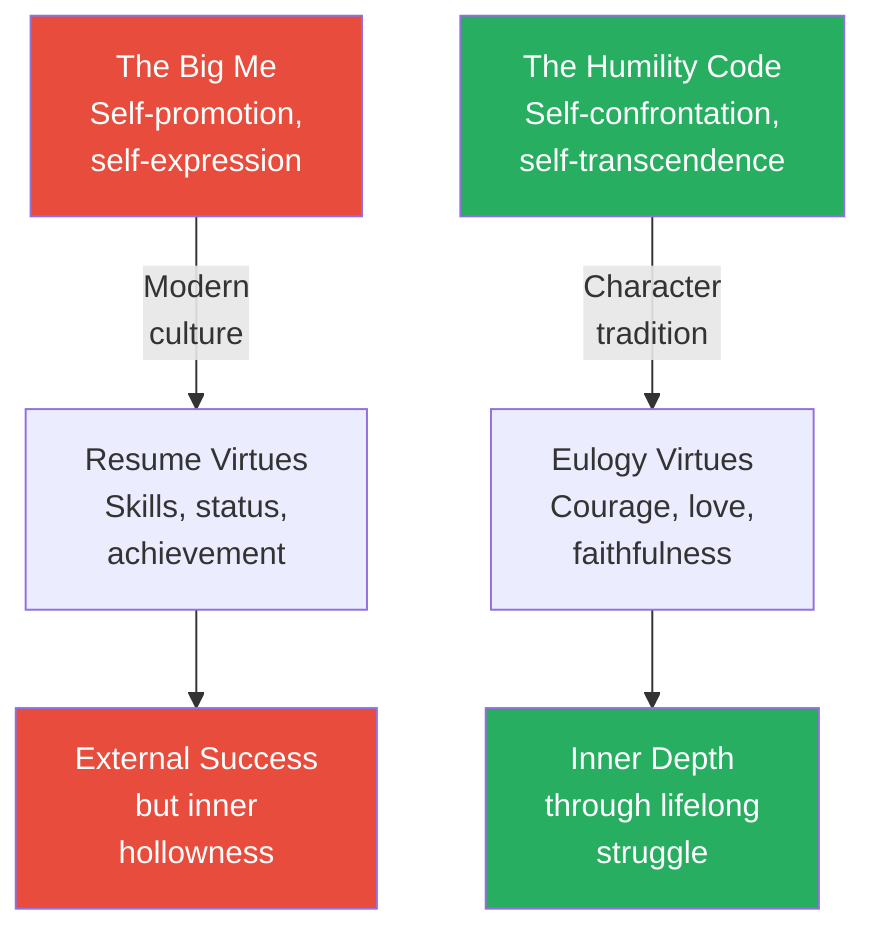

# The Road to Character — David Brooks

> David Brooks, the New York Times columnist known for bridging politics and moral philosophy, opens with a confession: he has spent most of his career building resume virtues — the skills that make you successful in the marketplace — while neglecting eulogy virtues — the qualities people praise at your funeral, like courage, honesty, faithfulness, and depth of character.
> The book is his attempt to correct that imbalance, not through self-help prescriptions but through deep biographical portraits of people who walked the harder road — Frances Perkins, Dwight Eisenhower, Dorothy Day, George Marshall, A. Philip Randolph, Bayard Rustin, George Eliot, Augustine, and Samuel Johnson — each of whom confronted their own brokenness and built something profound from it.
> Drawing on Rabbi Joseph Soloveitchik's distinction between "Adam I" (the career self) and "Adam II" (the moral self), Brooks argues that our culture has lost the language and institutions for building inner character, and that recovering them requires a kind of moral realism that begins with humility.
> It is part cultural critique, part moral philosophy, part biographical anthology — and it reads like a conversation with a deeply intelligent friend who has realised, midway through life, that the things he thought mattered most may not matter at all.
> This is one of the most important books of the 2010s on what it means to live a good life, not a merely successful one.

---

## About the Author

David Brooks is a Canadian-born American political and cultural commentator who has written a twice-weekly opinion column for the New York Times since 2003. He appears regularly as a commentator on PBS NewsHour and NPR, and previously worked at the Wall Street Journal and the Weekly Standard. Brooks is known for an unusual combination — a conservative political sensibility paired with deep reading in moral philosophy, sociology, and psychology. His earlier books, *Bobos in Paradise* (2000) and *The Social Animal* (2011), explored the intersection of culture, class, and human nature. *The Road to Character* marked a turning point in his own writing — more personal, more searching, less certain — and he has described it as the book he needed to write for himself as much as for his readers.

---

## The Big Idea

- <b style="color: #2980b9">Resume Virtues vs. Eulogy Virtues</b> — the central distinction that organises the entire book:
  - **Resume virtues** are the skills you bring to the marketplace — strategic thinking, productivity, expertise, credentials
  - **Eulogy virtues** are the things people say about you at your funeral — whether you were kind, brave, honest, capable of deep love, faithful to a cause larger than yourself
  - Most of us would say eulogy virtues are more important — yet most of us spend far more time cultivating resume virtues
  - Brooks argues this is not an accident but a cultural shift: we live in a society that has systematically dismantled the moral vocabulary and institutional scaffolding that once helped people build character
- The book borrows its moral framework from Rabbi <b style="color: #2980b9">Joseph Soloveitchik's</b> 1965 essay *The Lonely Man of Faith*, which distinguishes between two Adams:
  - **Adam I** wants to build, create, produce, and discover — the external, career-oriented self that seeks status and accomplishment
  - **Adam II** wants to embody moral qualities — the internal, spiritual self that seeks not to do but to be
  - Adam I asks: "How do I build a great career?" Adam II asks: "Why am I here? What is my life for?"
  - These two Adams live in permanent tension — and modern culture has almost entirely sided with Adam I
- <b style="color: #27ae60">The road to character runs through struggle, not achievement</b>:
  - Every biographical subject in the book became deep not through success but through confronting weakness, failure, suffering, or moral crisis
  - Character is forged in the gap between what you want to be and what you actually are
  - The process is not linear — it is a U-shaped curve: you must go down into honest self-confrontation before you can rise into genuine depth
- Brooks identifies what he calls <b style="color: #e74c3c">the culture of the Big Me</b> — a modern ethos that tells people they are wonderful just as they are, that self-expression is the highest good, and that the primary project of life is to develop and display your personal brand
  - This culture produces people who are good at self-promotion but bad at self-knowledge
  - It offers no framework for dealing with moral failure, suffering, or the limits of the self
  - It has replaced the moral vocabulary of sin, virtue, and character with the therapeutic vocabulary of self-esteem, self-expression, and self-actualisation

This diagram maps Brooks' core architecture: two selves, two sets of virtues, and a culture that has tipped dangerously toward one side.

---

## Key Concepts at a Glance

| Concept | One-line summary |
|---------|-----------------|
| **Resume Virtues** | Skills and accomplishments that earn worldly success |
| **Eulogy Virtues** | Moral qualities people honour at your funeral |
| **Adam I / Adam II** | The career self vs. the moral self — both necessary, one neglected |
| **The Big Me** | Modern culture of self-promotion, self-expression, and personal branding |
| **The Summoned Self** | Character built by answering an external call, not by cultivating an internal brand |
| **The Crooked Timber** | Kant's insight that humans are inherently flawed — and that is the starting point |
| **Self-Conquest** | Mastering your own worst tendencies through discipline and habit |
| **Ordered Love** | Augustine's framework — loving the right things in the right proportion |
| **The U-Shaped Curve** | The path to depth runs downward through struggle before rising into character |
| **The Humility Code** | Brooks' 15 propositions for building moral character in a Big Me world |
| **Vocation / Calling** | Work that answers a need in the world, not just a desire in yourself |
| **Moral Realism** | The belief that humans are fundamentally flawed and need struggle to grow |
| **Moral Imagination** | The capacity to see others' inner struggles with compassion, not judgment |
| **Grace** | Transformation that comes from beyond the self — unearned and uncontrolled |

---

## Chapter 1: The Shift

*Brooks opens with a radio broadcast from 1945 to argue that an entire moral culture has vanished — and that we are worse for its absence.*

### The Bing Crosby Moment

- In the summer of 1945, just after the end of World War II, the singer Bing Crosby appeared on a radio programme called *Command Performance*
- The show was a celebration of victory — the Allies had won the war
- But what struck Brooks, listening to the recording decades later, was the tone: <b style="color: #27ae60">the people on the programme were self-effacing, humble, quick to credit others, uncomfortable with praise</b>
  - They deflected compliments toward their comrades
  - They expressed gratitude rather than triumph
  - They seemed almost embarrassed by attention
- Brooks contrasts this with modern culture, where self-promotion is a professional requirement:
  - College application essays demand that teenagers present themselves as unique, extraordinary, world-changing
  - Social media rewards self-display
  - Self-help books tell readers they are already wonderful
  - Corporate culture demands "personal branding"
- The contrast is not just tonal — it reflects a <b style="color: #2980b9">deep structural shift</b> in how an entire civilisation understands the relationship between the individual and the moral order:
  - In 1945, the default assumption was that humans were flawed and needed external moral frameworks to keep them in check
  - By 2015, the default assumption was that humans were naturally good and needed only to express their authentic selves

> [!example] The Humility Shift in Numbers
> - In 1950, the Gallup Organisation asked high school seniors if they considered themselves an "important person" — 12% said yes
> - By the late 2000s, that figure had risen to 80%
> - Brooks argues this is not because teenagers became more important — it is because the culture began telling them they were
> - The word "character" itself shifted meaning: in the 19th century it meant moral rectitude; by the late 20th century it meant a collection of interesting personal qualities
> - Meanwhile, research on narcissism showed a steady upward trend — scores on the Narcissistic Personality Inventory climbed consistently across the same decades
> **The lesson:** The cultural infrastructure for humility did not collapse overnight — it eroded gradually, and we barely noticed.

The near-vertical leap from 12% to 80% of students calling themselves "important" mirrors the simultaneous doubling of narcissism scores — evidence that the culture did not merely shift attitudes but rewired an entire generation's self-concept.

---

### Resume Virtues vs. Eulogy Virtues

- <b style="color: #2980b9">Resume virtues</b> are what make you useful:
  - They include professional skills, credentials, strategic thinking, productivity
  - They are what you put on LinkedIn
  - They serve Adam I — the external, achieving self
- <b style="color: #2980b9">Eulogy virtues</b> are what make you good:
  - They include courage, honesty, capacity for deep love, commitment to something larger than yourself
  - They are what people say about you when you are gone
  - They serve Adam II — the internal, moral self
- Most people, if pressed, would say eulogy virtues are more important
- Yet most people spend the vast majority of their energy on resume virtues
- <b style="color: #e74c3c">Brooks admits he is one of them</b> — this book is his attempt to correct the balance
- The distinction is not about choosing one over the other:
  - Both Adams are necessary — you need to make a living and contribute to the world
  - The problem is not that Adam I exists but that Adam II has been starved
  - The culture provides abundant support for building resume virtues — schools, mentors, career advice, professional development
  - It provides almost no support for building eulogy virtues — the moral traditions that once served this function have withered

---

### The Crooked Timber Tradition

- Brooks traces a moral tradition he calls the <b style="color: #2980b9">Crooked Timber tradition</b>, after Immanuel Kant's observation: "Out of the crooked timber of humanity, no straight thing was ever made"
- This tradition holds several uncomfortable truths:
  - Humans are not naturally good — they are a complex mix of noble impulses and selfish drives
  - Character is not built by following your passions — it is built by struggling against your weaknesses
  - The self is not to be trusted — it needs external frameworks (moral traditions, communities, callings) to keep it in check
  - <b style="color: #27ae60">Suffering and struggle are not obstacles to a good life — they are the raw material from which character is forged</b>
- This tradition stands in direct opposition to the Big Me culture, which says:
  - You are already enough
  - Follow your bliss
  - Be true to yourself
  - The answers are inside you
- Brooks argues the Crooked Timber tradition was once the default moral framework in Western culture:
  - Religious traditions (Christian, Jewish, Islamic) all begin with the premise that humans are fallen and need redemption
  - Secular traditions from the ancient Stoics through the Enlightenment thinkers assumed human nature required discipline and cultivation
  - The shift from "I am broken and must be repaired" to "I am wonderful and must be expressed" happened gradually across the 20th century
  - By the early 21st century, the Crooked Timber tradition had virtually disappeared from mainstream culture — replaced by the therapeutic ethos of self-acceptance
- <b style="color: #e74c3c">The cost of losing this tradition</b> is not just moral — it is psychological:
  - Without a framework for confronting your own weaknesses, you have no tools when failure arrives
  - Without a vocabulary for sin and redemption, moral failure becomes an identity crisis rather than a growth opportunity
  - Without models of self-conquest, ambition has no counterweight
  - Without institutions that demand humility — churches, fraternal orders, moral communities — there is nothing to check the ego's natural expansion

> [!tip] Core Insight
> Character is not built by celebrating your strengths. It is built by struggling with your weaknesses — and the struggle never ends.

The two traditions produce fundamentally different assumptions about what a person needs to become good — and therefore fundamentally different kinds of people.

---

## Chapter 2: The Summoned Self — Frances Perkins

*Brooks introduces his first biographical portrait — a woman who did not choose her calling but was chosen by a catastrophe, and who spent the rest of her life answering it.*

### Before the Fire

- Frances Perkins was born in 1880 into a comfortable, conservative New England family
- She was educated at Mount Holyoke College, where she was exposed to social reform ideas but remained essentially conventional
- After college, she moved to Chicago and later New York, teaching and doing settlement house work
- She was earnest, competent, and socially conscious — but she had no grand plan, no overwhelming ambition
- She was, by her own description, an ordinary person doing ordinary good work
- Her upbringing gave her a sense of obligation but not yet a mission — she cared about others without knowing what form that caring would take

### The Triangle Shirtwaist Factory Fire (March 25, 1911)

> [!example] The Fire That Changed America
> - On March 25, 1911, a fire broke out on the eighth floor of the Triangle Shirtwaist Factory in lower Manhattan
> - The factory employed mostly young immigrant women — Italian and Jewish — working in cramped, locked rooms sewing garments
> - The doors were locked from the outside to prevent workers from taking breaks
> - The fire escape collapsed under the weight of fleeing workers
> - Frances Perkins, then 31 years old, was having tea at a friend's apartment in Washington Place when she heard the sirens
> - She ran to the scene and watched as young women — some of them on fire — jumped from the eighth, ninth, and tenth floors
> - 146 workers died, many of them girls as young as 14
> - Perkins stood on the sidewalk and watched them fall
> **The lesson:** Some callings do not arrive as whispers of inspiration — they arrive as screams from burning buildings.

- <b style="color: #27ae60">The fire did not give Perkins new skills — it gave her a new identity</b>
- Before the fire, she was a concerned citizen doing good works
- After the fire, she became a person with a mission — labour reform became not her interest but her vocation
- Brooks calls this the <b style="color: #2980b9">Summoned Self</b>:
  - The person who does not ask "What do I want?" but "What is being asked of me?"
  - The person whose identity is shaped by an encounter with something outside themselves — a moral demand they cannot ignore
  - The opposite of the Big Me self, which asks "How can I express myself?"
  - The Summoned Self does not emerge from introspection or personality tests — it emerges from collision with reality

---

### Perkins' Transformation

- After the fire, Perkins joined the Factory Investigating Commission
- She spent years visiting factories, documenting conditions, building coalitions
- She became one of the most effective labour reformers in American history:
  - She did not seek the spotlight — she sought results
  - She was not charismatic — she was relentless
  - She subordinated her ego to the mission
- In 1933, Franklin Roosevelt appointed her Secretary of Labour — the first woman in a US cabinet
- She drove the passage of:
  - The Social Security Act
  - The Fair Labor Standards Act (minimum wage, 40-hour work week, ban on child labour)
  - The Civilian Conservation Corps
  - Unemployment insurance

> [!example] Perkins' Self-Effacing Strategy
> - Perkins deliberately adopted a matronly appearance — sensible dresses, a tricorn hat — to disarm opposition
> - She knew that as the first woman in the cabinet, she would face constant scrutiny
> - Rather than fight for personal recognition, she redirected attention to the policy
> - She once said she wanted to be known not as a woman who held office but as someone who got results
> - When she died in 1965, most Americans had never heard her name — but nearly all of them benefited from her work
> **The lesson:** The deepest influence often belongs to people who never sought credit.

> [!example] Perkins and the New Deal Strategy
> - When Roosevelt offered Perkins the cabinet position, she did something no other cabinet nominee had done — she presented him with a list of demands
> - Before accepting, she required Roosevelt to commit to a specific legislative agenda: Social Security, minimum wage legislation, unemployment insurance, a ban on child labour
> - She was not negotiating for power — she was ensuring that the position would serve the mission she had committed to since 1911
> - Roosevelt agreed to every point
> - Over the next twelve years, Perkins delivered on nearly all of them — the most productive tenure of any Secretary of Labour in American history
> - She treated the position as an instrument, not a prize
> **The lesson:** Vocation is not about what the role gives you — it is about what the role allows you to give.

- Brooks draws a key distinction through Perkins' story:
  - The Big Me culture says: "Find your passion and pursue it"
  - Perkins' life says: <b style="color: #27ae60">"You don't find your calling — your calling finds you, if you are paying attention"</b>
  - Vocation is not about self-expression — it is about self-transcendence
  - It requires submitting your ego to something larger — a cause, a community, a moral demand
- The Summoned Self operates on a fundamentally different logic than the Big Me:
  - The Big Me asks: "What do I want to do with my life?"
  - The Summoned Self asks: "What is my life asking me to do?"
  - The Big Me starts with the self and works outward
  - The Summoned Self starts with the world's needs and works inward
  - <b style="color: #e74c3c">The danger of the Big Me approach</b> is that it produces people who are endlessly searching for the perfect self-expression rather than committing to the imperfect work in front of them

Perkins' trajectory illustrates the Summoned Self pattern: external crisis transforms comfortable competence into moral calling.

> [!tip] Core Insight
> The Summoned Self is not a career strategy — it is an identity transformation. It happens when a person's encounter with suffering or injustice makes it impossible to return to their previous, comfortable self.

---

## Chapter 3: Self-Conquest — Dwight Eisenhower

*Brooks uses Eisenhower to explore how character can be built through the long, unglamorous discipline of suppressing your worst tendencies — not once, but thousands of times over decades.*

### The Volcano Inside

- Dwight Eisenhower, the man who would become the calm, reassuring Supreme Commander of Allied Forces, began life with a violent temper
- As a boy in Abilene, Kansas, he was prone to explosive rages:
  - He would beat his fists against trees until they bled
  - He fought constantly with other boys
  - His anger was not righteous — it was uncontrolled, volcanic, and frightening
- The Eisenhower household was poor but morally serious:
  - His parents were deeply religious — River Brethren, a Mennonite sect
  - The family emphasised self-control, hard work, and suppression of vanity
  - His mother Ida was the moral centre of the household — calm, principled, and unflinching

> [!example] The Halloween Night Lesson
> - When Eisenhower was about ten years old, his older brothers were given permission to go out trick-or-treating on Halloween night
> - Dwight was told he was too young to go
> - He flew into a rage, ran outside, and beat his fists against the trunk of an apple tree until they were torn and bloody
> - His father carried him inside and sent him to bed
> - Later that night, his mother Ida came to his room, bandaged his hands, and sat beside him
> - She told him: "He that conquereth his own soul is greater than he who taketh a city" — a paraphrase of Proverbs 16:32
> - Years later, Eisenhower said this was the most important conversation of his life
> - Ida had not punished him — she had shown him that his anger was not his enemy's problem but his own
> **The lesson:** The first and most important battle is always against yourself.

### The Discipline of Self-Suppression

- <b style="color: #27ae60">Eisenhower did not eliminate his temper — he learned to master it</b>
- This mastery was not a single dramatic victory but decades of daily practice:
  - He kept a list of people he resented and forced himself to be civil to them
  - He wrote furious letters and then filed them away unsent — a practice he called "filing in the B file" (B for burn)
  - He trained himself to absorb insults without responding
  - He cultivated an outward calm that masked the intensity still churning underneath
- Brooks sees this as a specific model of character-building: <b style="color: #2980b9">self-conquest through habit</b>
  - You do not conquer your worst tendencies by understanding them
  - You conquer them by building habits that override them
  - Each act of self-restraint makes the next one slightly easier
  - Over time, what began as painful suppression becomes second nature
- This model contradicts the modern therapeutic assumption that suppression is psychologically unhealthy:
  - The modern view holds that emotions should be expressed, not suppressed — that bottling things up leads to breakdown
  - Eisenhower's life suggests the opposite — that the disciplined management of emotion is not repression but mastery
  - The key distinction: Eisenhower did not deny his anger — he acknowledged it privately and chose not to act on it publicly
  - <b style="color: #e74c3c">Expression is not the only healthy response to strong emotion — sometimes restraint is the more courageous act</b>
- The habit model draws on an older psychological tradition:
  - William James argued that character is essentially a bundle of habits — and that habits can be deliberately formed
  - Aristotle taught that virtue is not a feeling or a knowledge but a practice — you become courageous by doing courageous things
  - Eisenhower's life is a case study in this ancient insight applied to modern circumstances

> [!example] The Unsent Letters
> - Throughout his career, Eisenhower wrote scathing letters to people who had angered or insulted him
> - He would pour his fury onto paper — detailed, precise, devastating
> - Then he would put the letter in a drawer, never to be sent
> - He called this his "B file" — B for burn, because the letters were meant to be destroyed
> - The practice served a dual purpose: it gave his anger an outlet, and it prevented his anger from causing damage
> - Decades later, some of these unsent letters were found — they reveal a man of far more passion and temper than his public persona ever suggested
> **The lesson:** Mastery is not the absence of strong feelings — it is the discipline of choosing which feelings to act on.

---

### The MacArthur Years

- From 1933 to 1939, Eisenhower served as an aide to General Douglas MacArthur — a man who was brilliant, theatrical, and spectacularly egotistical
- <b style="color: #e74c3c">MacArthur treated Eisenhower as a glorified secretary</b> — keeping him in the background, taking credit for his work, making him wait
- Eisenhower endured this for six years:
  - He could have protested, demanded recognition, or transferred out
  - Instead, he submitted to the role, learned everything he could, and bided his time
  - He later said that he "studied dramatics under MacArthur"
- Brooks argues this was not passivity — it was <b style="color: #27ae60">strategic self-restraint</b>:
  - Eisenhower was building the muscle of ego-suppression
  - He was learning how to put institutional goals ahead of personal ambition
  - The years of invisibility taught him something MacArthur never learned: how to lead without needing to be the star
  - Every day of serving under MacArthur was another repetition of the self-conquest habit — another small act of swallowing pride in service of a larger purpose

> [!example] The D-Day Decision (June 1944)
> - On the night before D-Day, Eisenhower faced the most consequential military decision of the 20th century
> - Weather reports were uncertain — proceeding risked catastrophe, waiting risked losing the element of surprise
> - He sat alone with the decision, knowing that if the invasion failed, thousands of deaths would be his responsibility
> - He had already written a statement taking full personal blame in case of failure: "If any blame or fault attaches to the attempt, it is mine alone"
> - He gave the order to go
> - The same man who once punched trees in uncontrolled rage made one of history's most disciplined decisions under unbearable pressure
> **The lesson:** Self-conquest is not a single event but a lifetime of practice that prepares you for the moments that matter most.

| Trait | Young Eisenhower | Mature Eisenhower |
|-------|-----------------|-------------------|
| **Temper** | Explosive, uncontrolled rages | Controlled, channelled intensity |
| **Ego** | Competitive, combative | Self-effacing, institutional loyalty |
| **Ambition** | Raw, undirected | Patient, strategic |
| **Response to insult** | Fists and fury | "B file" — write it, file it, forget it |
| **Leadership style** | Dominance | Collaboration and delegation |

Eisenhower's transformation illustrates that character is not about having good instincts — it is about building the discipline to override bad ones.

> [!tip] Core Insight
> Character is not the absence of flaws. It is the mastery of them — achieved through thousands of small acts of self-restraint, compounded over a lifetime.

---

## Chapter 4: Struggle — Dorothy Day

*Brooks turns to a woman whose road to character ran through dissolution, sin, and a conversion so radical it cost her every relationship she valued.*

### The Dissolute Years

- Dorothy Day (1897-1980) spent her twenties living a life that would horrify the devout Catholic she would become:
  - She drank heavily in Greenwich Village bars with the literary bohemians of the 1910s and 1920s
  - She had a series of love affairs — some passionate, some reckless
  - She had an abortion — a decision that haunted her for the rest of her life
  - She attempted suicide at least once
  - She married briefly and disastrously
- Brooks does not present Day's early life as a cautionary tale — he presents it as evidence of <b style="color: #2980b9">the crooked timber</b>:
  - Day was not a naturally virtuous person who maintained her goodness
  - She was a deeply flawed person who confronted her flaws and, through struggle, built something extraordinary
  - The depth of her later moral seriousness was inseparable from the depth of her earlier moral failure
  - Her dissolute years gave her an intimate understanding of human weakness that no sheltered life could have produced
- <b style="color: #e74c3c">Day's early life refutes the comfortable version of the character story</b>:
  - She did not grow up virtuous and stay that way
  - She did not have a single dramatic conversion and become perfect
  - She fell, suffered, and slowly, painfully rebuilt — and continued to struggle for the rest of her life

---

### The Birth of Tamar

> [!example] The Gratitude That Demanded a Response (1926)
> - In 1926, Day discovered she was pregnant by her common-law husband, Forster Batterham, an anarchist and atheist
> - Batterham did not want the child — he was philosophically opposed to bringing new life into a suffering world
> - Day wanted the child desperately, in part because she feared her earlier abortion had left her unable to conceive
> - When her daughter Tamar was born on March 4, 1927, Day experienced something she had never felt before: overwhelming, unconditional gratitude
> - The gratitude was so intense that it felt like a demand — she needed to thank someone, and the only someone large enough was God
> - She had Tamar baptised in the Catholic Church
> - Batterham, who despised religion, gave her an ultimatum: the Church or him
> - She chose the Church — and lost the only man she truly loved
> **The lesson:** Sometimes the path to moral depth requires sacrificing the things you love most.

- <b style="color: #27ae60">Day's conversion was not comfortable — it was agonising</b>
- She did not float serenely into faith — she crawled into it, giving up relationships, community, and the bohemian identity that had defined her
- Brooks sees this as a pattern:
  - The road to character often demands that you sacrifice something you value — comfort, status, a relationship, a version of yourself
  - It is not addition (adding virtues to your existing life) but subtraction (cutting away the parts of yourself that resist depth)
  - Day sacrificed romantic love, intellectual community, and social respectability — all at once
  - What she gained was not happiness but something harder and deeper: a sense of moral purpose that organised her entire remaining life

---

### The Catholic Worker Movement

- In 1933, Day co-founded the <b style="color: #2980b9">Catholic Worker movement</b> with Peter Maurin, a French peasant philosopher
- The movement's principles were radical:
  - Voluntary poverty — Day and her community lived among the poorest of the poor
  - Hospitality — they opened "houses of hospitality" that fed and sheltered anyone who came to the door
  - Pacifism — Day opposed every war, including World War II, a position that made her deeply unpopular
  - Direct action — rather than lobbying for government programmes, they lived the change they sought
- Day ran the Catholic Worker newspaper (sold for one cent a copy — a price that never changed) and managed the houses for nearly fifty years
- She was arrested multiple times for civil disobedience
- <b style="color: #e74c3c">She never softened her positions to gain respectability</b>:
  - She opposed the Vietnam War when it was popular to support it
  - She refused to pay federal taxes because they funded the military
  - She supported Caesar Chavez's farmworkers when the Catholic hierarchy was lukewarm
  - Her consistency was itself a form of character — she did not adjust her convictions to the audience

> [!example] Day's Daily Struggle with Sainthood
> - Day famously resisted being called a saint — "Don't call me a saint. I don't want to be dismissed that easily"
> - She struggled with anger, impatience, and pride throughout her life
> - She found the people she served — the alcoholics, the mentally ill, the difficult poor — genuinely hard to love
> - She wrote openly in her diary about her frustrations, her failures of charity, her moments of wanting to walk away
> - She stayed anyway — not because she was naturally saintly, but because she believed staying was what was asked of her
> - Her diaries reveal a woman in constant interior conflict — not a serene saint but a fighter who chose the harder path every morning
> **The lesson:** Character is not the absence of struggle — it is the decision to keep going despite it.

Day's arc is the most dramatic U-curve in the book — the deepest descent produced the most radical moral transformation.

> [!tip] Core Insight
> Day's life proves that character does not require a clean starting point. The most morally serious people are often those who fell the furthest and chose to climb back — not once, but every day for the rest of their lives.

---

## Chapter 5: Self-Mastery — George Marshall

*Brooks profiles the man who may be the greatest example of institutional loyalty over personal glory in American history — a leader who subordinated his ego so completely that most people today cannot name his accomplishments.*

### The Art of Institutional Selflessness

- George Catlett Marshall (1880-1959) spent his career in the United States Army building a reputation for one thing above all: <b style="color: #27ae60">he could be trusted to put the institution ahead of himself</b>
- This was not a natural disposition — it was a cultivated discipline:
  - Marshall was ambitious, competitive, and proud
  - But he had internalised a moral code from his upbringing and from the Virginia Military Institute (VMI) that treated self-promotion as a form of weakness
  - He believed that the purpose of an individual was to serve something larger — the Army, the nation, the mission
- Marshall's selflessness was not saintly — it was strategic in the deepest sense:
  - He understood that institutions are stronger than individuals
  - He believed that a leader who makes himself indispensable weakens the institution he serves
  - His goal was to build systems and develop people, not to build a personal brand
  - <b style="color: #2980b9">Institutional loyalty</b> meant doing what was best for the organisation even when it conflicted with what was best for him

---

### The D-Day Command

> [!example] Marshall's Greatest Sacrifice (1943)
> - In late 1943, the question of who would command the D-Day invasion — the most important military operation in history — came down to two candidates: George Marshall and Dwight Eisenhower
> - Everyone assumed Marshall would get the command — he was the senior officer, the strategic architect, the man who had built the army that would fight
> - Marshall wanted the command desperately — it would be the crowning achievement of a military career spent in staff roles
> - President Roosevelt told Marshall the decision was his — he could have the command if he asked for it
> - Marshall refused to ask — he told Roosevelt: "The decision must be yours. My wishes should play no part"
> - Roosevelt chose Eisenhower, later saying he could not sleep at night with Marshall out of Washington
> - Marshall returned to his desk and continued running the war without a word of complaint or self-pity
> **The lesson:** The deepest form of character is the willingness to subordinate your desires to something larger — even when no one would blame you for claiming what you have earned.

- <b style="color: #e74c3c">This was not strategic — Marshall genuinely believed asking would be wrong</b>
- His moral code held that duty meant serving where you were needed, not where you wanted to be
- Brooks sees Marshall as the purest embodiment of institutional selflessness:
  - He never wrote a memoir (unlike virtually every other senior commander)
  - He refused to vote, believing a military officer should remain above politics
  - He turned down lucrative speaking fees and corporate board positions after the war
  - When he retired from the Army, his net worth was modest — he had never sought to monetise his fame

---

### The Marshall Plan

- After the war, Marshall served as Secretary of State under Truman
- In 1947, he proposed the <b style="color: #2980b9">European Recovery Program</b> — what became known as the Marshall Plan:
  - It provided $13 billion (roughly $170 billion in today's dollars) in economic aid to rebuild war-devastated Europe
  - It was motivated not by charity but by strategic vision — Marshall understood that a devastated Europe would become a breeding ground for communism
  - It was also motivated by moral conviction — Marshall believed the United States had an obligation to help rebuild what the war had destroyed
- The Marshall Plan succeeded spectacularly:
  - It rebuilt Western European economies within a decade
  - It created the foundations for the European Union
  - It established the United States as a global leader through generosity rather than coercion
- Marshall won the Nobel Peace Prize in 1953 — the only professional soldier ever to receive it
- The irony is telling: the man who refused to claim the D-Day command ended up with a legacy far larger than any battlefield victory — a legacy of institutional thinking applied to an entire continent's recovery

> [!tip] Core Insight
> Marshall's life demonstrates that the highest form of leadership is not commanding attention but commanding trust — and trust is earned by consistently putting the mission ahead of yourself.

| Comparison | MacArthur | Marshall |
|-----------|-----------|---------|
| **Style** | Theatrical, dramatic | Quiet, methodical |
| **Ego** | Front and centre | Deliberately invisible |
| **Credit** | Sought and claimed it | Deflected and shared it |
| **Memoirs** | Wrote them | Refused to write them |
| **Post-war** | Ran for president | Served wherever asked |
| **Legacy** | Famous personality | Famous programme |
| **Lasting impact** | Controversial reputation | Nobel Peace Prize |

The MacArthur-Marshall contrast is one of Brooks' most powerful illustrations: both were exceptional military leaders, but their characters could not have been more different. MacArthur is remembered as a personality; Marshall is remembered as a programme that rebuilt a continent.

---

## Chapter 6: Dignity — A. Philip Randolph and Bayard Rustin

*Brooks uses two civil rights leaders — one visible, one hidden — to explore how dignity can be both a personal quality and a political weapon, and what it costs to maintain under unbearable pressure.*

### A. Philip Randolph: The Voice of Dignity

- Asa Philip Randolph (1889-1979) was the son of an African Methodist Episcopal minister in Jacksonville, Florida
- He grew up in the Jim Crow South, surrounded by racial humiliation, but his parents instilled in him a sense of <b style="color: #2980b9">interior dignity</b>:
  - Dignity was not something the world gave you — it was something you carried inside
  - No one could take it from you unless you surrendered it
  - It expressed itself through bearing, speech, and the refusal to be diminished
- Randolph became the most important Black labour leader in American history:
  - He organised the <b style="color: #2980b9">Brotherhood of Sleeping Car Porters</b> in 1925 — the first major African American union
  - The Pullman Company fought him for twelve years before recognising the union in 1937
  - He pressured President Roosevelt into issuing Executive Order 8802, banning racial discrimination in defence industries (1941)
  - He pressured President Truman into desegregating the armed forces (1948)
- Randolph's dignity was not merely personal — it was a deliberate strategy:
  - He understood that in a culture that denied Black people their humanity, the most revolutionary act was to behave with unshakable composure
  - His opponents expected anger, supplication, or surrender — he gave them none of these
  - His bearing communicated a message more powerful than any speech: I am your equal, and we both know it

> [!example] Randolph's Meeting with FDR (1941)
> - In 1941, Randolph threatened to lead 100,000 African Americans in a march on Washington unless Roosevelt banned racial discrimination in defence industries
> - Roosevelt, who needed Black support but feared alienating Southern Democrats, tried to charm Randolph into backing down
> - Randolph was immune to charm — he sat in the Oval Office with perfect composure and repeated his demand
> - Roosevelt, accustomed to getting his way, was astonished by Randolph's unshakable calm
> - He signed Executive Order 8802 — the first federal action on civil rights since Reconstruction
> **The lesson:** Dignity is not passive. When wielded by someone who cannot be flattered, intimidated, or bought, it becomes the most powerful force in the room.

---

### Bayard Rustin: The Hidden Architect

- <b style="color: #2980b9">Bayard Rustin</b> (1912-1987) was one of the most brilliant organisers in American history — and one of the most deliberately hidden:
  - He was a master strategist, a Quaker, a pacifist trained in Gandhian nonviolence
  - He taught Martin Luther King Jr. the principles and tactics of nonviolent resistance
  - He was the chief organiser of the 1963 March on Washington — the event at which King delivered the "I Have a Dream" speech
  - He was also gay — openly so in his personal life — at a time when homosexuality was a criminal offence
- <b style="color: #e74c3c">Rustin's homosexuality was used against the movement</b>:
  - Segregationist Senator Strom Thurmond read Rustin's arrest record into the Congressional Record
  - Movement leaders, including some who admired Rustin, kept him in the background to avoid giving enemies ammunition
  - Randolph protected Rustin as much as he could, but the cost was that Rustin's contributions went largely unrecognised
  - Rustin bore this erasure without public complaint — a form of dignity that Brooks finds almost unbearable to contemplate

> [!example] Organising the March on Washington (1963)
> - Rustin was given eight weeks to organise a march that would bring 250,000 people to Washington, D.C.
> - He managed every detail — transportation, portable toilets, sound systems, food, first aid, security, and the speaking order
> - He did this knowing that Randolph, not he, would be the public face of the march
> - He accepted this arrangement not with bitterness but with a kind of strategic humility — he understood that the cause mattered more than his credit
> - The march was flawless — one of the great logistical and moral achievements in American history
> - Rustin's name appeared nowhere in most accounts of the event for decades
> **The lesson:** Some of the deepest character is built by people who do the work knowing they will never receive the credit.

- Brooks draws a powerful lesson from the Randolph-Rustin pairing:
  - <b style="color: #27ae60">Dignity is not just a personal quality — it is a form of moral authority</b>
  - Randolph's dignity was visible, public, and politically powerful
  - Rustin's dignity was hidden, sacrificial, and equally essential
  - Both men subordinated personal recognition to a cause larger than themselves
  - Both paid enormous personal costs — Randolph in decades of struggle, Rustin in invisibility

### The Moral Architecture of Dignity

- Brooks uses this chapter to distinguish between two types of dignity:
  - **External dignity** — how you carry yourself, how you present to the world, how you refuse to be diminished by others' treatment of you
  - **Internal dignity** — the quiet knowledge of your own worth that does not depend on recognition, applause, or victory
- Randolph embodied both — his bearing was regal, his composure unshakable, and his inner conviction absolute
- Rustin's dignity was almost entirely internal — the world denied him external recognition, yet he maintained his commitment to the work without bitterness
- <b style="color: #27ae60">The deepest form of dignity is the kind that survives invisibility</b> — it does not require an audience to sustain itself
- Brooks connects this to the broader argument of the book:
  - The Big Me culture defines dignity through visibility — followers, likes, recognition, awards
  - The character tradition defines dignity through what you do when no one is watching and no one will ever know
  - Rustin's life is the most powerful refutation of the Big Me in the entire book — he did world-changing work and accepted near-total anonymity

| Dimension | A. Philip Randolph | Bayard Rustin |
|-----------|-------------------|---------------|
| **Dignity type** | External and internal | Primarily internal |
| **Visibility** | Public face of the movement | Hidden architect |
| **Cost** | Decades of confrontation | Decades of erasure |
| **Recognition** | Eventually celebrated | Recognised only posthumously |
| **Character test** | Composure under pressure | Commitment without credit |

Both men demonstrate that dignity is built through what you endure, not what you display — but they endured different kinds of hardship.

> [!tip] Core Insight
> The true test of dignity is not how you behave when the world is watching — it is how you behave when you know the world will never see.

---

## Chapter 7: Love — George Eliot

*Brooks uses the Victorian novelist to explore how love — not romantic sentimentality but genuine self-giving attachment — can transform a person from intellectual brilliance into moral depth.*

### The Unloved Intellectual

- George Eliot was the pen name of Mary Anne Evans (1819-1880), one of the greatest novelists in the English language
- She was, by all accounts, physically plain:
  - Henry James called her "magnificently ugly — deliciously hideous"
  - Her contemporaries frequently noted her appearance before her intellect
  - She suffered deeply from this — Victorian culture measured women's worth partly by their beauty
- But she was also one of the most formidable intellects in England:
  - She translated major works of German philosophy and theology
  - She was the anonymous editor of the Westminster Review, one of the most important intellectual journals of the era
  - She read voraciously in science, philosophy, history, and literature
- <b style="color: #e74c3c">Before love, Eliot's brilliance was cold</b> — she was a devastating literary critic, brilliant at dismantling other writers' weaknesses but producing nothing original of her own
- Her early life illustrates a pattern Brooks returns to throughout the book:
  - Intellectual power without moral depth produces criticism, not creation
  - The capacity to judge is not the same as the capacity to understand
  - Something had to soften her — and that something was love

---

### The Lewes Transformation

> [!example] George Eliot and George Henry Lewes (1854)
> - In 1854, Mary Anne Evans began a relationship with George Henry Lewes — a writer, critic, and philosopher
> - Lewes was legally married to another woman but could not obtain a divorce under Victorian law (his wife had children with another man, but Lewes had condoned the arrangement, which barred him from divorce)
> - Evans and Lewes chose to live together openly as a couple — a decision that made them social outcasts
> - Victorian society was brutal: Evans was shunned by her own family, banned from respectable homes, and treated as a fallen woman
> - But Lewes provided something she had never had: unconditional love and intellectual encouragement
> - He believed she could write fiction — not just criticism — and he pushed her to try
> - Under his encouragement, she wrote her first novel, *Scenes of Clerical Life*, in 1857, under the pseudonym George Eliot
> **The lesson:** Love does not just comfort — it transforms. Eliot's novels exist because Lewes saw in her something she could not see in herself.

- <b style="color: #27ae60">Love transformed Eliot from a critic into a creator</b>:
  - Before Lewes, she judged others' work with brilliant severity
  - After Lewes, she began to see human weakness with compassion rather than contempt
  - This shift — from judgment to empathy — is the moral engine of her greatest novels
- Her masterpiece, *Middlemarch* (1871-1872), is often called the greatest novel in the English language:
  - It is a study of moral choice, failed idealism, and the slow, difficult work of becoming a decent person
  - Every character is flawed — but the novel treats their flaws with understanding, not condemnation
  - Brooks sees *Middlemarch* as a fictional expression of the road to character — it shows people struggling with their own limitations and occasionally, painfully, growing
- The connection between love and moral vision is not incidental — Brooks argues it is causal:
  - Being loved gave Eliot the security to be vulnerable
  - Being vulnerable allowed her to see others' vulnerability
  - Seeing others' vulnerability transformed her from a judge into a novelist of extraordinary moral depth

---

### What Eliot Teaches About Love and Character

- Brooks draws several lessons from Eliot's story:
  - <b style="color: #2980b9">Love as moral transformation</b> — genuine love does not just make you happy; it changes what you see and how you see it
  - The shift from criticism to compassion is a moral achievement, not an intellectual one
  - It requires vulnerability — Eliot had to risk social destruction to experience the love that transformed her
  - <b style="color: #e74c3c">Brilliance without love produces judgment; brilliance with love produces wisdom</b>

| Before Lewes | After Lewes |
|-------------|-------------|
| Brilliant literary critic | Brilliant novelist |
| Judged others' weaknesses | Understood others' struggles |
| Cold intellectual analysis | Warm moral imagination |
| Produced nothing original | Produced *Middlemarch* |
| Feared vulnerability | Embraced it despite the cost |
| Saw human weakness as contemptible | Saw human weakness as universal |

### The Moral Imagination in Middlemarch

- Brooks spends significant time on *Middlemarch* because he sees it as a fictional embodiment of the road to character:
  - The novel follows multiple characters through moral choices — marriage, ambition, money, duty — and shows how each choice reveals or shapes character
  - Dorothea Brooke, the novel's heroine, begins with grand idealistic ambitions and ends with something quieter and more profound — a life of unrecognised goodness
  - Edward Casaubon, Dorothea's first husband, represents the danger of intellectual ambition without moral depth — he spends decades on a scholarly project that is fundamentally hollow
  - Tertius Lydgate, the ambitious doctor, is undone by his inability to resist social pressures and his own vanity
- Eliot's genius, in Brooks' reading, is that she does not condemn any of these characters:
  - She shows how each failure is understandable — rooted in recognisable human weakness
  - She extends to her characters the same compassion that Lewes extended to her
  - <b style="color: #27ae60">The moral imagination — the ability to see others' struggles from the inside — is itself a form of character</b>
- The novel's famous final paragraph describes Dorothea's influence as the kind that "spread in unvisitable ways" — invisible, unmeasurable, but real
  - This connects directly to Brooks' argument about eulogy virtues: the most important contributions are often the ones that cannot be quantified or put on a resume
  - Dorothea is the fictional counterpart to Frances Perkins, George Marshall, and Bayard Rustin — people whose deepest influence was invisible

> [!tip] Core Insight
> Love is not just an emotion — it is a moral force that shifts you from judging others to understanding them, from intellectual brilliance to moral wisdom.

---

## Chapter 8: Ordered Love — Augustine

*Brooks turns to the 4th-century bishop whose concept of "ordered love" provides the philosophical backbone of the entire book — the idea that character depends not on what you love but on whether you love the right things in the right order.*

### The Young Augustine

- Augustine of Hippo (354-430 AD) spent his youth chasing exactly the things modern culture celebrates:
  - Intellectual ambition — he wanted to be the most brilliant rhetorician in the Roman Empire
  - Sexual pleasure — he kept a concubine for fifteen years and fathered a son out of wedlock
  - Status — he sought prestigious appointments and powerful patrons
  - His famous prayer from the *Confessions*: "Grant me chastity — but not yet"
- Brooks presents the young Augustine as <b style="color: #e74c3c">a prototype of the Big Me</b>:
  - Brilliant, ambitious, self-focused, using his talents to advance his own position
  - Aware of his moral failings but unwilling to change
  - Trapped in what Augustine himself called <b style="color: #2980b9">disordered loves</b> — loving lower things (pleasure, status) more than higher things (truth, goodness, God)
- Augustine's genius was not just intellectual — it was introspective:
  - He understood his own psychology with devastating clarity
  - He knew exactly what he was doing wrong and why
  - But knowledge was not enough to change him — he needed something beyond himself

---

### The Conversion Scene

> [!example] The Garden in Milan (386 AD)
> - In the summer of 386 AD, Augustine was living in Milan, serving as a professor of rhetoric
> - He had been reading Paul's epistles and listening to Ambrose, the bishop of Milan, preach
> - He was intellectually convinced of Christianity but could not bring himself to commit — the cost to his ambitions and pleasures was too high
> - One afternoon, tormented by indecision, he went into a garden and wept
> - He heard the voice of a child from a neighbouring house chanting: "Tolle lege, tolle lege" — "Take up and read, take up and read"
> - He picked up a copy of Paul's Epistle to the Romans and read the first passage his eyes fell on — a passage about putting aside the desires of the flesh
> - In that moment, he wrote, "all the darkness of doubt vanished away"
> - He abandoned his career, his ambitions, and his sexual relationships, was baptised by Ambrose, and eventually became the bishop of Hippo in North Africa
> **The lesson:** Transformation sometimes arrives not through gradual improvement but through a single moment of surrender — but only after years of preparation have made you ready to receive it.

### Ordered Love

- Augustine's central contribution to moral philosophy, as Brooks presents it, is the concept of <b style="color: #2980b9">ordered love (ordo amoris)</b>:
  - The problem is not that we love bad things — it is that we love things in the wrong order
  - Money, pleasure, status, intellectual achievement are not evil — they become evil when they are loved more than they deserve
  - <b style="color: #27ae60">Character consists of loving the right things in the right proportion</b>:
    - Love of God (or ultimate truth/goodness) at the top
    - Love of neighbour next
    - Love of self in proper proportion — not eliminated, but subordinated
  - Sin, in Augustine's framework, is not primarily a list of forbidden acts — it is a disordering of loves:
    - Loving pleasure more than purpose
    - Loving status more than service
    - Loving yourself more than others
- This framework is extraordinarily flexible — it applies far beyond religious contexts:
  - A person who loves money more than family has disordered loves
  - A person who loves approval more than honesty has disordered loves
  - A person who loves comfort more than growth has disordered loves
  - The question is never "Do you love?" but "Do you love the right things in the right order?"

---

### Grace and the Limits of Self-Help

- Brooks uses Augustine to introduce a concept that complicates the rest of the book: <b style="color: #2980b9">grace</b>
- Augustine believed that humans cannot save themselves through willpower alone:
  - The will itself is broken — it wants what it should not want and cannot want what it should
  - Transformation requires an external intervention — grace — that the person does not earn and cannot control
  - This is fundamentally different from the self-help tradition, which assumes you can fix yourself if you try hard enough
- <b style="color: #e74c3c">Brooks is not writing a religious book</b> — but he takes Augustine's point seriously:
  - Even in secular terms, the deepest personal transformations often involve something beyond willpower
  - Falling in love, encountering suffering, being humbled by failure — these are not self-generated experiences
  - The road to character requires a certain receptivity — an openness to being changed by something outside yourself
- This insight connects back to the Summoned Self:
  - Perkins was summoned by the Triangle Fire
  - Day was summoned by the birth of her daughter
  - Eisenhower was summoned by his mother's words
  - In each case, transformation came from outside — the person's role was to be open enough to receive it

Augustine's framework — from disordered loves through surrender to ordered loves — provides the moral architecture that unifies every biographical portrait in the book.

> [!tip] Core Insight
> The problem is not what you love — it is the order in which you love it. Character is the discipline of putting first things first and keeping lesser loves in their proper place.

---

## Chapter 9: Self-Examination — Samuel Johnson

*Brooks profiles the most celebrated literary figure of 18th-century England — a man who used relentless self-examination not as therapy but as moral discipline, and whose greatness was inseparable from his awareness of his own weakness.*

### The Man of Contradictions

- Samuel Johnson (1709-1784) was the dominant figure in English letters for the second half of the 18th century:
  - He compiled the first great English dictionary (published 1755)
  - He was the most famous conversationalist of his era, immortalised in Boswell's *Life of Johnson*
  - He was a poet, essayist, critic, and moralist of extraordinary range
- But Johnson was also a man of profound suffering:
  - He struggled with what would today be diagnosed as severe depression and obsessive-compulsive disorder
  - He was physically disfigured — partially blind in one eye, scarred by scrofula, afflicted with tics and involuntary movements
  - He was terrified of death and of going mad
  - He fought laziness, procrastination, and gluttony his entire life
  - He was often cruel in conversation, deploying his formidable wit as a weapon
- Johnson's contradictions are the point:
  - He was simultaneously the wisest man in England and one of the most tormented
  - He could diagnose moral failings with surgical precision — in others and in himself — but he could not cure his own
  - His greatness and his weakness were inseparable — the depth of his moral insight came directly from the depth of his moral struggle

---

### The Practice of Self-Examination

- What made Johnson extraordinary, in Brooks' telling, was not his talent but his <b style="color: #27ae60">ruthless honesty about his own failings</b>:
  - Every New Year's Day, he wrote prayers and resolutions in his private diary
  - These were not cheerful affirmations — they were agonised confessions:
    - He accused himself of sloth, of wasting time, of failing to use his gifts
    - He begged God for the strength to change
    - The next year, he would write almost identical confessions — because he had not changed
  - He kept this practice for decades — a cycle of self-accusation, resolution, failure, and renewed self-accusation
- The practice had a specific quality that Brooks finds profound:
  - Johnson did not pretend he was making progress when he was not
  - He did not lower his standards to match his performance
  - He maintained an unbridgeable gap between who he was and who he thought he should be — and he lived in that gap, honestly, for his entire life

> [!example] Johnson's New Year's Prayers
> - On January 1, 1766, Johnson wrote: "Almighty God... enable me to shake off sloth and to redeem the time misspent"
> - On January 1, 1769: "I have led a life so dissipated and useless, and my terrours and perplexities have so much increased"
> - On January 1, 1775: "My days are easier, but my nights grow more restless and tedious"
> - Year after year, the same confessions, the same resolutions, the same failures
> - Johnson never stopped writing them — not because they worked, but because the practice itself was the point
> - The act of honest self-examination, even without improvement, was a form of moral seriousness
> **The lesson:** Self-knowledge does not require self-improvement. The willingness to look honestly at yourself, year after year, is itself a form of character.

---

### Johnson's Moral Philosophy

- Johnson believed several things that set him apart from both his contemporaries and ours:
  - <b style="color: #2980b9">Humans are fundamentally self-deceiving</b> — we construct elaborate rationalisations for our worst behaviour
  - The primary moral task is not to achieve great things but to resist the daily temptations of laziness, selfishness, and vanity
  - Compassion for others begins with honesty about yourself — you cannot truly understand others' weaknesses until you have faced your own
- Johnson's charity was legendary:
  - He took in a series of impoverished and difficult people — a blind woman, a former prostitute, a querulous doctor — and supported them in his own home for years
  - He did not sentimentalise the poor — he simply helped them, often at great personal inconvenience
  - He gave away much of his income despite being far from wealthy himself
  - His charity was not performative — most people learned of it only after his death

> [!example] Johnson and the Oyster Woman
> - One night, walking home through London, Johnson found an impoverished woman collapsed in the street
> - She was a former prostitute, ill and destitute
> - Johnson — one of the most famous men in England — picked her up, carried her on his back to his own home, and had her nursed back to health
> - He then helped her find a way to support herself
> - He never mentioned the incident publicly — Boswell recorded it only because a servant told him
> **The lesson:** Character is what you do when no one is watching and no one will ever know.

> [!example] Johnson's Dictionary as Moral Project (1755)
> - Johnson spent nine years compiling his *Dictionary of the English Language*, published in 1755
> - Other countries had used entire academies for similar projects — Johnson did it nearly alone, with a handful of assistants
> - But the Dictionary was not merely a lexicographic achievement — it was a moral one
> - Johnson embedded his values in his definitions, his illustrative quotations, and his preface
> - His definition of "patron" was a barely veiled attack on Lord Chesterfield, who had failed to support the project: "One who looks with unconcern on a man struggling for life in the water, and when he has reached ground, encumbers him with help"
> - The Dictionary is simultaneously a reference work and a self-portrait — it reveals a man who believed that precision with language was a form of moral discipline
> **The lesson:** Even mundane work can be a vehicle for character when it is done with moral seriousness and intellectual honesty.

---

### What Johnson Teaches About Self-Examination

- Brooks draws several lessons from Johnson's life:
  - <b style="color: #27ae60">Self-examination is not self-improvement</b> — it is a practice, not a programme
  - The goal is not to fix yourself but to know yourself — and to carry that knowledge with humility
  - Johnson's self-examination made him a better writer, a more compassionate friend, and a more honest moralist — but it never made him a comfortable or satisfied person
  - <b style="color: #e74c3c">The modern self-help culture promises transformation; Johnson's tradition promises only honesty</b>
  - Honesty, sustained over a lifetime, is its own form of moral achievement

| Modern Self-Help | Johnson's Tradition |
|-----------------|-------------------|
| You can fix yourself | You can know yourself |
| Positive affirmations | Honest self-accusation |
| Progress is linear | Struggle is permanent |
| The goal is happiness | The goal is moral seriousness |
| Look inward for answers | Look inward for honest questions |
| Success is measurable | Character is invisible |

### Johnson's Legacy for the Road to Character

- Johnson's life raises a question that runs through the entire book: <b style="color: #2980b9">what is the relationship between self-knowledge and self-improvement?</b>
- The modern assumption is that self-knowledge leads to self-improvement — if you understand your flaws, you can fix them
- Johnson's life suggests a different relationship:
  - Self-knowledge is its own form of moral achievement — independent of whether it leads to improvement
  - The person who honestly confronts their failings, year after year, and keeps trying — even without visible progress — is doing moral work
  - This is profoundly counterintuitive in a culture obsessed with metrics, progress, and measurable outcomes
- Brooks sees Johnson as the purest example of <b style="color: #27ae60">moral realism</b> — the unflinching acknowledgment that:
  - You are worse than you think
  - You will probably not get much better
  - The struggle itself — not the victory — is what builds character
  - The refusal to stop trying, even after decades of failure, is a form of moral heroism

> [!tip] Core Insight
> Johnson's life proves that the road to character has no finish line. The willingness to keep examining, keep confessing, and keep struggling — without the promise of arrival — is itself the deepest form of moral seriousness.

---

## Chapter 10: The Big Me and The Humility Code

*Brooks returns to his cultural argument and closes the book with a manifesto — fifteen propositions that summarise the moral tradition he has been excavating through nine chapters of biography.*

### The Culture of the Big Me

- Brooks traces the rise of what he calls <b style="color: #2980b9">the Big Me culture</b> through several developments:
  - The self-esteem movement of the 1980s and 1990s — telling children they were special just for existing
  - The social media revolution — creating platforms that reward self-promotion and self-display
  - The decline of moral vocabulary — words like "sin," "virtue," "character," and "duty" became embarrassing or old-fashioned
  - The rise of the meritocracy — the idea that your achievements define your worth
  - The therapeutic culture — replacing moral frameworks with psychological ones, treating every human problem as a matter of feelings rather than character
- <b style="color: #e74c3c">The Big Me culture produces a specific kind of person</b>:
  - Good at self-presentation but bad at self-knowledge
  - Comfortable with self-promotion but uncomfortable with self-criticism
  - Skilled at networking but incapable of deep friendship
  - Driven by ambition but lacking purpose
  - Successful by external measures but hollow by internal ones
- Brooks traces the intellectual roots of the Big Me:
  - The Romantic movement elevated self-expression over self-discipline
  - The humanistic psychology movement of the 1960s and 1970s (Abraham Maslow, Carl Rogers) emphasised self-actualisation
  - The self-esteem movement translated these academic ideas into school curricula and parenting advice
  - Social media provided the perfect technological platform for a culture already oriented toward self-display
  - The cumulative effect was a society that had lost the ability to talk seriously about character, virtue, and moral failure

---

### The Humility Code

- Brooks closes the book with <b style="color: #2980b9">The Humility Code</b> — fifteen propositions distilled from the lives he has profiled:

> [!abstract] The Humility Code — 15 Propositions
> 1. We don't live for happiness, we live for holiness — a life of purpose, meaning, and moral depth
> 2. The long road to character begins with an accurate assessment of your own nature — you are not as good as you think
> 3. We are all sinners — we all have weaknesses we cannot fully overcome through willpower alone
> 4. In the struggle against weakness, humility is the greatest virtue — and pride the greatest vice
> 5. Pride blinds us to our own weaknesses and makes us certain when we should be uncertain
> 6. Character is built through the confrontation with your own weaknesses, not the cultivation of your strengths
> 7. The best people are not those with the fewest flaws but those who struggle most honestly with the flaws they have
> 8. The things that lead us astray are short-term — pleasure, status, ego; the things that save us are long-term — commitment, discipline, love
> 9. We are ultimately saved not by our own efforts but by grace — moments of unearned transformation that come from beyond the self
> 10. We are not primarily defined by our individual choices but by our commitments — to people, institutions, traditions, and causes larger than ourselves
> 11. The external world matters less than the internal one — success without character is hollow
> 12. Character is a set of dispositions, desires, and habits that are slowly engraved through long practice
> 13. No person can achieve self-mastery on their own — we need redemptive assistance from outside
> 14. Wisdom begins with a recognition of your own ignorance and moral limitations
> 15. The purpose of life is not self-fulfilment but self-transcendence — giving yourself to something larger

---

### The Road Itself

- Brooks acknowledges that the Humility Code is countercultural — it runs against nearly every message modern society sends:
  - Society says: be yourself; the Code says: confront yourself
  - Society says: follow your passion; the Code says: answer your calling
  - Society says: you are enough; the Code says: you are not enough — and that is where growth begins
- <b style="color: #27ae60">The road to character is not a destination — it is a practice</b>:
  - Perkins practised it through a lifetime of labour reform
  - Eisenhower practised it through decades of self-restraint
  - Day practised it through voluntary poverty and service
  - Marshall practised it through institutional selflessness
  - Randolph and Rustin practised it through dignity under oppression
  - Eliot practised it through the moral imagination of her novels
  - Augustine practised it through ordered love
  - Johnson practised it through relentless self-examination
- None of them arrived — they all travelled
- Brooks does not exempt himself from this judgment:
  - He admits that writing the book did not make him a person of deep character
  - He is still more Adam I than Adam II
  - The book is not a proclamation of his own virtue but an aspiration toward a standard he has not met
  - This honesty is itself a small act of the humility he describes

The book's final argument: modern culture and the character tradition produce fundamentally different kinds of people — and you must choose which road to walk.

---

## The U-Shaped Journey of Character

*Every biographical portrait in the book follows the same deep structure — a descent into struggle followed by a slow, painful ascent into depth.*

This U-shaped arc maps every life in the book: Perkins begins in comfortable reform work and descends through the fire; Eisenhower begins in uncontrolled rage and descends through years of ego suppression; Day descends through dissolution and rises through conversion; Marshall descends through the sacrifice of the D-Day command and rises through the Marshall Plan; Augustine descends through disordered loves and rises through grace.

The two lines cross at the point of surrender — the exact moment when external success is sacrificed for inner commitment — illustrating Brooks' thesis that the road to character requires descending through failure before moral depth can rise above where surface comfort ever reached.

---

## Summary of Character Portraits

| Figure | Chapter | Core Virtue | Key Struggle | Defining Moment |
|--------|---------|-------------|-------------|-----------------|
| **Frances Perkins** | 2 | Vocation | Comfort to calling | Triangle Shirtwaist Fire (1911) |
| **Dwight Eisenhower** | 3 | Self-conquest | Volcanic temper | Mother's lesson: "conquereth his own soul" |
| **Dorothy Day** | 4 | Surrender | Dissolution to faith | Birth of daughter Tamar (1927) |
| **George Marshall** | 5 | Institutional loyalty | Ego to service | Refusing the D-Day command (1943) |
| **A. Philip Randolph** | 6 | Dignity | Racism to moral authority | Confronting FDR in the Oval Office (1941) |
| **Bayard Rustin** | 6 | Sacrificial service | Invisibility to mission | Organising the March on Washington (1963) |
| **George Eliot** | 7 | Love as transformation | Judgment to compassion | Relationship with G.H. Lewes (1854) |
| **Augustine** | 8 | Ordered love | Disordered desires to grace | The garden in Milan (386 AD) |
| **Samuel Johnson** | 9 | Self-examination | Lifelong moral struggle | New Year's prayers (decades) |

The heatmap reveals that while each figure's primary virtue burns brightest along the diagonal, secondary strengths like institutional loyalty (Eisenhower, Randolph) and surrender (Augustine, Day) connect figures who otherwise walked very different roads.

Each portrait demonstrates a different facet of the same truth: character is not given but earned — through confrontation with the parts of yourself you would rather not see.

Resume virtues dominate in cultural support and measurability, while eulogy virtues score overwhelmingly higher in legacy value and inner satisfaction — illustrating why modern culture drifts toward the former despite the latter mattering more at life's end.

---

## The Verdict

Brooks' greatest contribution is recovering a moral vocabulary that modern culture has nearly abandoned. Words like "sin," "character," "vocation," and "humility" had become relics of a bygone era — embarrassing, preachy, irrelevant. Brooks dusts them off and shows, through nine biographical portraits, that they describe real psychological and moral processes that are as operative today as they were in Augustine's North Africa or Johnson's London. The distinction between resume virtues and eulogy virtues alone is worth the price of the book — it gives language to a discomfort that millions of successful people feel but cannot articulate: the sense that they are winning at a game that does not ultimately matter.

The book's weaknesses are real but predictable. Brooks' biographical subjects are almost entirely drawn from the Western, Christian tradition — there is no room here for Buddhist detachment, Confucian duty, or the moral traditions of Africa, Asia, or indigenous cultures. His portraits, while beautifully written, can feel selective — he chooses the details that support his thesis and leaves out the ones that complicate it. The Eisenhower chapter, for instance, says little about Eisenhower's presidency, where the virtues of self-conquest sometimes shaded into moral passivity on civil rights. And there is an uncomfortable irony at the book's core: Brooks, a wealthy, famous New York Times columnist, writing about humility and the dangers of self-promotion is a bit like a hedge fund manager writing about the spiritual dangers of wealth. He acknowledges this tension in the opening pages but never fully resolves it.

The book is most valuable for readers who have achieved some measure of external success and feel the hollow echo inside it — people who have built impressive resumes and now wonder what they have built in themselves. It speaks to the midlife question par excellence: "Is this all there is?" It does not offer a programme or a set of exercises — it offers examples, stories, and a moral framework that readers must apply to their own lives. It is also valuable for younger readers who sense that the culture's emphasis on self-promotion and personal branding is missing something essential but cannot quite name what that something is.

Compared to other books in this space, *The Road to Character* sits between [[Man's Search for Meaning - Viktor Frankl|Man's Search for Meaning]] (which is more intense and more personal) and [[12 Rules for Life - Jordan Peterson|12 Rules for Life]] (which is more prescriptive and more combative). It shares DNA with [[How Will You Measure Your Life - Clayton M. Christensen|How Will You Measure Your Life]], which asks similar questions from a different angle. It is less practical than [[Deep Work - Cal Newport|Deep Work]] or [[Essentialism - Greg McKeown|Essentialism]] but more philosophically substantial. Where those books teach you how to do fewer things better, Brooks is asking whether the things you are doing are worth doing at all. Among books on character specifically, it is gentler than Peterson, deeper than most self-help, and more accessible than the philosophical traditions it draws on.

---

## Related Reading

- [[Man's Search for Meaning - Viktor Frankl]] — Frankl's argument that meaning, not pleasure, is the primary human drive; shares Brooks' conviction that suffering can be a catalyst for depth
- [[12 Rules for Life - Jordan Peterson]] — Peterson's case for responsibility and order echoes Brooks' Humility Code, with a more combative, psychological tone
- [[Meditations - Marcus Aurelius]] — The emperor's private journal of self-examination is the ancient prototype for Johnson's New Year's prayers
- [[Discourses - Epictetus]] — Stoic self-mastery and the distinction between what is and is not in your control map directly onto Eisenhower's self-conquest
- [[Deep Work - Cal Newport]] — Newport's discipline of depth over distraction parallels Brooks' argument that character requires sustained effort against easy alternatives
- [[How Will You Measure Your Life - Clayton M. Christensen]] — Christensen's question about what makes a life meaningful is the practical, personal version of Brooks' cultural argument
- [[Essentialism - Greg McKeown]] — McKeown's case for doing less connects to Brooks' argument that character requires saying no to the inessential
- [[The Effective Executive - Peter Drucker]] — Marshall's institutional selflessness is Drucker's executive effectiveness taken to its moral conclusion
- [[Thinking in Bets - Annie Duke]] — Duke's framework for decision-making under uncertainty complements Johnson's tradition of honest self-assessment without the illusion of certainty
