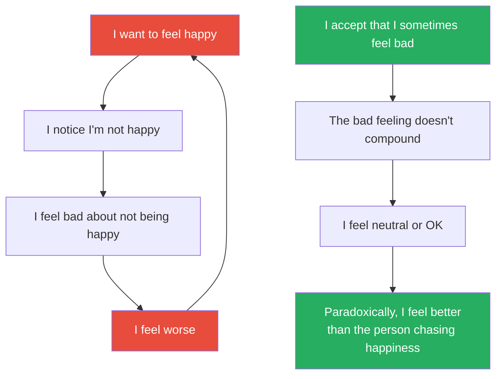
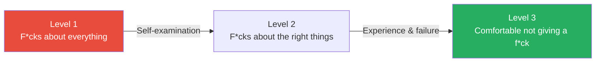
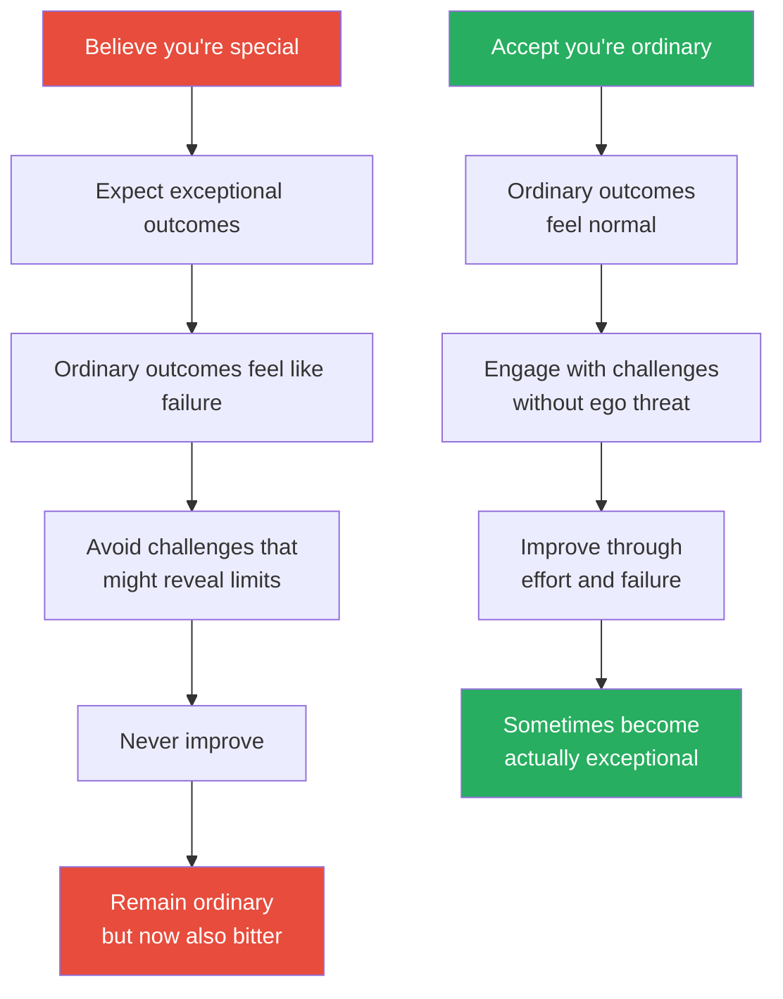
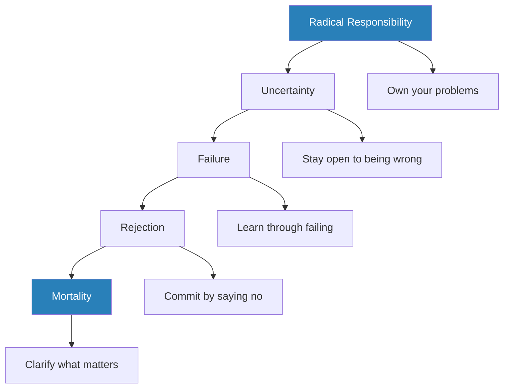
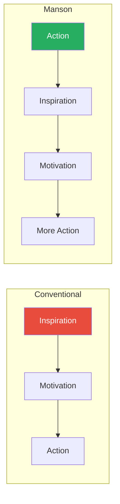
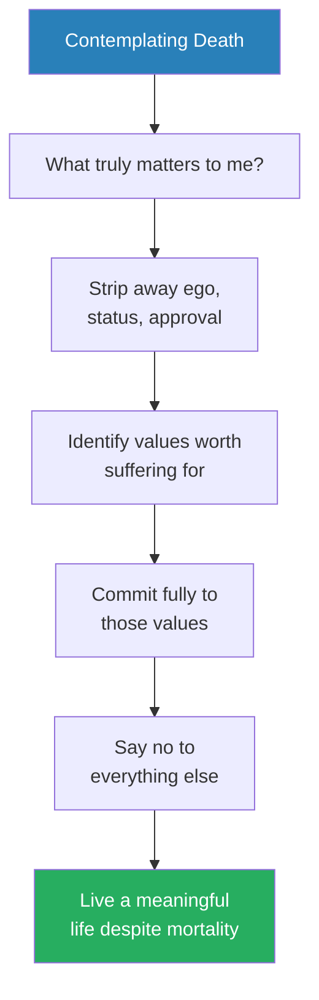
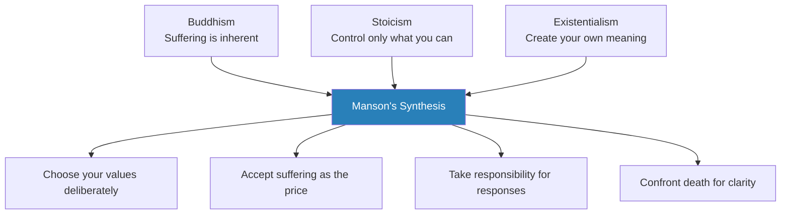

# The Subtle Art of Not Giving a F*ck — Mark Manson

> Mark Manson's counterintuitive self-help book argues that the key to a good life is not giving a f*ck about MORE — it's giving a f*ck about LESS. About only what is true, immediate, and important.
> The conventional self-help message — "think positive, visualise success, you deserve everything, you are special" — actually makes people feel worse by setting impossible standards and creating a toxic feedback loop of inadequacy.
> Manson's alternative: accept that life involves suffering, choose your suffering wisely, embrace your limitations, take responsibility for your problems even when they're not your fault, and stop pretending that happiness means the absence of pain.
> It is self-help for people who hate self-help — profane, irreverent, occasionally crude, and underneath all of that, surprisingly philosophical.
> The book has sold over 12 million copies and been translated into 60+ languages, making it one of the bestselling non-fiction books of the 2010s.
> Its lasting contribution is the reframe: the question is not "how do I feel good?" but "what am I willing to feel BAD for?"

---

## About the Author

Mark Manson is a blogger turned bestselling author who built his audience on markmanson.net, where his profanity-laden, no-BS writing about relationships, values, and personal growth attracted millions of readers. Before becoming a writer, he was a dating coach — an experience that taught him how much human suffering comes from pursuing the wrong values and from the belief that you're entitled to feel good all the time. He holds no advanced degrees in psychology or philosophy, but draws extensively on both — particularly the Stoics (Marcus Aurelius, Epictetus), the Buddhists (suffering as the default condition), and the existentialists (Sartre, Camus, Kierkegaard). His follow-up book, *Everything Is F*cked: A Book About Hope*, extended the philosophical argument into questions of meaning, hope, and civilisation.

---

## The Big Idea

- <b style="color: #2980b9">Not giving a f*ck does not mean being indifferent</b> — it means being comfortable with being different
- It means choosing what you give a f*ck ABOUT — and giving zero f*cks about everything else
- <b style="color: #e74c3c">The conventional self-help message creates a toxic loop</b>:
  - "You should feel happy" → You notice you're not happy → You feel bad about not being happy → You feel worse → "You should feel happy" → repeat
- Manson calls this the <b style="color: #2980b9">Feedback Loop from Hell</b>: feeling bad about feeling bad, being anxious about being anxious, being angry about being angry
- <b style="color: #27ae60">The fix: accept the negative emotion. Don't layer a second emotion on top of it.</b>
- The core argument rests on three philosophical traditions:
  - **Buddhism:** suffering is the default condition of life — the question is what you suffer FOR
  - **Stoicism:** focus only on what you can control, release everything else
  - **Existentialism:** life has no inherent meaning, so you must create meaning through deliberate choice
- These traditions converge on a single point: <b style="color: #27ae60">a good life is not a life free of problems — it is a life of problems worth solving</b>
- Manson translates this into a practical framework:
  - Choose your values deliberately (not by default)
  - Accept suffering as the price of those values
  - Take responsibility for your responses (even when the situation is not your fault)
  - Embrace uncertainty, failure, and limitation as tools for growth
  - Confront death as the ultimate clarifier

---

### The Backwards Law

*The book's most philosophically interesting idea — borrowed from Alan Watts — reveals why chasing happiness guarantees you will never catch it.*

- <b style="color: #2980b9">The desire for a more positive experience is itself a negative experience. The acceptance of a negative experience is itself a positive experience.</b>
- This paradox operates at every level:
  - Pursuing happiness makes you hyper-aware of all the ways you're NOT happy
  - Accepting unhappiness paradoxically makes you more content
  - The person who doesn't care about social approval IS socially approved — because people respect authenticity
  - The person who doesn't need to feel good all the time DOES feel good more often — because they're not fighting their own emotions
- The mechanism is attention-based:
  - When you chase a positive state, you fixate on the gap between where you are and where you want to be
  - That gap becomes your dominant experience — not the positive state itself
  - When you accept a negative state, the gap disappears — you are simply where you are
  - Without the gap demanding your attention, positive emotions return naturally
- Alan Watts put it this way: the mud settles only when you stop stirring the water
- <b style="color: #27ae60">Manson's version: "Not giving a f*ck doesn't mean not caring. It means being comfortable with being different."</b>

The left loop is the Feedback Loop from Hell — endlessly self-reinforcing. The right path is Manson's alternative — acceptance breaking the cycle and producing the contentment that chasing happiness never could.

---

## Key Concepts at a Glance

| Concept | One-line summary |
|---------|-----------------|
| **Not Giving a F*ck** | Choosing what matters to you and ignoring everything else — not apathy but selectivity |
| **The Backwards Law** | Pursuing happiness makes you unhappy; accepting unhappiness makes you happier |
| **The Feedback Loop from Hell** | Feeling bad about feeling bad — the meta-emotion trap |
| **You Are Not Special** | The self-esteem movement lied: you are not extraordinary, and accepting that is liberating |
| **The Value of Suffering** | All life involves suffering; the question is not how to avoid it but what is WORTH suffering for |
| **Good Values vs Bad Values** | Good values: reality-based, socially constructive, controllable. Bad values: superstitious, destructive, uncontrollable |
| **Responsibility vs Fault** | You are responsible for your problems even when they're not your fault |
| **The Certainty Trap** | Being wrong is productive; being certain is dangerous |
| **Manson's Law of Avoidance** | The more something threatens your identity, the more you will avoid doing it |
| **The Do Something Principle** | Action creates motivation — not the other way around |
| **The Importance of Saying No** | Commitment means rejecting all alternatives — freedom without rejection is meaningless |
| **Death as a Compass** | Contemplating mortality is not morbid — it is the ultimate clarifier of values |

---

## Chapter 1: Don't Try

*Manson opens with a poet who never "tried" to succeed — and whose tombstone carries the most counterintuitive advice in the self-help canon.*

### Charles Bukowski and the Paradox of Success

- <b style="color: #2980b9">Charles Bukowski's</b> tombstone reads two words: "Don't try"
- Bukowski was a drunk, a womaniser, a terrible employee, a degenerate gambler, and a prolific writer of poetry and short fiction
- He spent decades submitting work to literary magazines and being rejected — and he kept writing anyway
- At age fifty, a small publisher named John Martin at Black Sparrow Press offered him a modest monthly stipend to quit his post-office job and write full-time
- Bukowski didn't succeed because he tried harder than everyone else or because he believed in himself — he succeeded because he accepted his failures and limitations and kept writing anyway
- He never tried to be something he wasn't — he didn't clean up, didn't go corporate, didn't become respectable
- <b style="color: #27ae60">The lesson: stop trying to be something you're not. Accept who you are — including the ugly parts — and work from there.</b>

> [!example] Bukowski's Tombstone
> - Charles Bukowski spent thirty years working at a Los Angeles post office, drinking himself half to death every night, and writing poems on whatever scraps of paper he could find
> - He was rejected by magazines, ignored by the literary establishment, and dismissed as a lowlife
> - He did not "believe in himself." He did not "visualise success." He did not follow any programme of self-improvement
> - He simply accepted that he was a flawed, struggling writer — and wrote anyway
> - At fifty, he was finally published. By the time he died, he had written six novels, thousands of poems, and was one of the most widely read American poets of the century
> - His tombstone reads: "Don't try"
> **The lesson:** Bukowski succeeded not by trying to be exceptional, but by accepting who he was and doing the work regardless.

- <b style="color: #e74c3c">This is not an excuse for laziness</b> — it's a reframe:
  - Effort directed at becoming someone else is wasted
  - Effort directed at becoming more of who you already are is productive
  - The difference is subtle but crucial: Bukowski didn't stop writing. He stopped pretending to be something he wasn't.

---

### The F*ck Budget

- Manson's central metaphor: <b style="color: #2980b9">imagine you have a finite budget of f*cks</b> — and every day, you're spending them
- Some expenditures are worthwhile:
  - Your health
  - Your relationships
  - Your meaningful work
  - Your deeply held values
- Most expenditures are wasteful:
  - What strangers think of you
  - Whether someone cut you off in traffic
  - Whether your Instagram post got enough likes
  - Whether your colleague's email was slightly rude
- <b style="color: #27ae60">The art of not giving a f*ck is BUDGETING — deciding in advance what deserves your limited emotional energy and ruthlessly cutting everything else</b>
- This is not apathy — it is strategic emotional investment
- This maps directly onto the Essentialist framework (see [[Essentialism - Greg McKeown|Essentialism]]) — applied to your emotional life, not just your schedule

---

### The Three Levels of Not Giving a F*ck

*Manson identifies a developmental progression in how people allocate their f*cks — and most people never make it past the first stage.*

| Level | Age Range | What You Give a F*ck About | The Problem |
|-------|:---------:|--------------------------|-------------|
| **Level 1: F*cks about everything** | Teens / early twenties | Everything — every opinion, every slight, every comparison, every social media post | Emotionally exhausted, anxious, people-pleasing, identity-less |
| **Level 2: F*cks about the right things** | Late twenties / thirties | Your craft, your close relationships, your values, your health | Still derailed by external judgment, but recovering faster |
| **Level 3: Comfortable not giving a f*ck** | Forties+ (if you've done the work) | Only what genuinely matters to you — everything else gets a shrug | You care deeply about a few things and are genuinely unbothered by the rest |

- <b style="color: #27ae60">Level 3 is the goal — but most people get stuck at Level 1 for life</b>
- The transition from Level 1 to Level 2 requires honest self-examination: "What do I ACTUALLY value, separate from what I've been told to value?"
- The transition from Level 2 to Level 3 requires experience: enough life lived to know what matters and what doesn't — enough failures to know that most fears are overblown
- <b style="color: #2980b9">This is why older people are often happier than younger people</b> — not because their lives are better, but because they've learned what not to give a f*ck about
- Research by Laura Carstensen on ageing and emotional positivity supports this — older adults show a "positivity effect," not because they're delusional, but because they've become selective about where they invest emotionally

> [!example] The Aging Paradox
> - Surveys consistently find that people in their sixties and seventies report higher life satisfaction than people in their twenties and thirties
> - This baffles researchers who expected declining health, shrinking social circles, and proximity to death to produce misery
> - Carstensen's socioemotional selectivity theory explains it: when time horizons shorten, people automatically prioritise emotional meaning over novelty-seeking
> - They stop trying to impress strangers. They stop obsessing over career status. They invest in the relationships that actually matter
> - In Manson's framework: they've naturally arrived at Level 3 — not through philosophical insight, but through lived experience
> **The lesson:** The wisdom that comes with age is largely the wisdom of knowing what not to give a f*ck about. The book is an attempt to shortcut that journey.

Most people remain at Level 1 indefinitely — Manson's book is essentially a manual for accelerating the transition to Level 3.

As emotional maturity rises from Level 1 to Level 3, wasted suffering drops almost inversely — the hallmark of Level 3 is not the absence of suffering but the near-total elimination of suffering that leads nowhere.

---

## Chapter 2: Happiness Is a Problem

*Manson retells the story of the Buddha to make a point that would horrify most self-help authors: happiness is not a destination, and the pursuit of it is the problem.*

### The Disappointment Panda

- Manson invents a hypothetical superhero: <b style="color: #2980b9">the Disappointment Panda</b>
- This panda goes door to door telling people uncomfortable truths they need to hear:
  - "You're not as talented as you think"
  - "Your relationship is failing because of you, not your partner"
  - "Your business idea is bad and will probably fail"
- The Disappointment Panda is the hero nobody wants but everybody needs
- <b style="color: #27ae60">The book itself IS the Disappointment Panda</b> — it tells you truths that are unpleasant but necessary
- The Disappointment Panda embodies the core tension of the book:
  - People SAY they want the truth
  - But they actually want comfortable lies — "You're doing great," "Follow your passion," "You deserve better"
  - The truth — that you're average, your problems are mundane, and you're partly responsible for your own suffering — is genuinely unpleasant
  - But it is also genuinely liberating, because once you accept it, you can stop performing and start living

> [!example] The Hedonic Treadmill
> - Manson describes the psychological phenomenon known as hedonic adaptation
> - A person gets a raise — they feel great for two weeks, then their expectations adjust and the new salary feels normal
> - A person buys a new car — the thrill fades within a month, and now they're eyeing the next model up
> - A person achieves a long-sought goal — the celebration is brief, and then they immediately set a new, higher goal
> - This is not a defect in human nature — it is human nature
> - The treadmill never stops. The goalposts never stop moving. "I will be happy when..." is a sentence with no ending
> **The lesson:** Happiness is not a destination you arrive at — it is the quality of the problems you're solving right now.

---

### The Buddha's Discovery

- Manson retells the story of Siddhartha Gautama:
  - Born into extreme wealth — his father shielded him from all suffering
  - At twenty-nine, he saw an old man, a sick man, a corpse, and a monk — and realised that suffering exists
  - He abandoned his palace and tried extreme asceticism — fasting, sleeping on the ground, meditating for weeks
  - Neither extreme worked — not extreme pleasure, not extreme denial
- The Buddha's conclusion, and the foundation of Buddhist philosophy:
  - <b style="color: #2980b9">Suffering is inherent to the human experience — it is not a bug, it is a feature</b>
  - The cause of suffering is not pain itself but our resistance to it — our insistence that things should be different
  - The path out is not the elimination of all problems but the solving of meaningful ones
- Manson's insight about the middle way:
  - The Buddha tried both extremes — total indulgence and total denial — and rejected both
  - This mirrors Manson's own rejection of extreme positivity ("everything is awesome!") and extreme negativity ("nothing matters")
  - <b style="color: #27ae60">The path is in the middle: acknowledge suffering, choose it wisely, and find meaning through the struggle itself</b>

> [!tip] Core Insight
> Life is essentially an endless series of problems. The solution to one problem merely creates another. Happiness is not the absence of problems — it is the process of solving problems that matter to you.

---

### Emotions Are Overrated

- <b style="color: #e74c3c">Emotions are not oracles — they are suggestions</b>
- Manson argues that the modern obsession with "how do you feel?" has produced a generation of people enslaved to their moods:
  - Feeling anxious does not mean something is wrong
  - Feeling angry does not mean you are being wronged
  - Feeling happy does not mean you are making the right choice
- Emotions evolved as feedback signals — quick, imprecise indicators that something in your environment needs attention
- They are useful data, not commandments:
  - A pang of jealousy might signal an unmet need — or it might signal insecurity that has nothing to do with reality
  - A wave of anxiety might signal real danger — or it might be your brain pattern-matching to a threat that doesn't exist
- <b style="color: #27ae60">The question is not "How do I feel?" but "What are my emotions telling me, and is that information accurate?"</b>
- This echoes the cognitive-behavioural insight: thoughts and feelings are not facts (see [[Thinking in Bets - Annie Duke|Thinking in Bets]] on separating decision quality from outcome quality)
- Manson distinguishes between two modes of engaging with emotion:

| Mode | Approach | Result |
|------|----------|--------|
| **Emotion as master** | "I feel bad, therefore something IS bad" | Reactive, unstable, easily manipulated |
| **Emotion as data** | "I feel bad — let me examine why and whether the feeling is accurate" | Reflective, stable, self-directed |

The first mode is the default for most people. The second mode is a skill that must be deliberately cultivated — and it is the emotional equivalent of what Kahneman calls engaging System 2 rather than defaulting to System 1.

---

### Choose Your Struggle

- "Who you are is defined by what you're willing to struggle for"
- <b style="color: #2980b9">The question is not "What do you want to enjoy?" but "What pain are you willing to sustain?"</b>
- Everyone wants a great body — not everyone is willing to endure the early mornings, the soreness, the dietary discipline
- Everyone wants a successful business — not everyone is willing to endure the years of failure, uncertainty, and eighty-hour weeks
- Everyone wants a great relationship — not everyone is willing to endure the difficult conversations, the compromises, the vulnerability
- This is the central diagnostic question of the book — and Manson argues it is far more useful than "What do you want?":
  - "What do you want?" produces fantasy answers — wealth, fame, love, freedom
  - "What are you willing to suffer for?" produces real answers — because it forces you to confront the COST of what you want
  - The gap between what you say you want and what you're willing to struggle for is the gap between your stated values and your actual values
- <b style="color: #27ae60">Your actual values are revealed by your behaviour, not your words</b>

> [!example] The Wannabe Rock Star
> - Manson describes a young man who says he wants to be a professional musician more than anything in the world
> - But when pressed on what he actually DOES, the picture falls apart:
>   - He practises sporadically, not daily
>   - He avoids playing gigs because they're stressful
>   - He doesn't send demos to labels because he fears rejection
>   - He spends most of his time imagining fame rather than doing the work
> - He doesn't want to be a rock star — he wants to FEEL like a rock star
> - He wants the result without the process, the destination without the journey
> **The lesson:** You don't get to choose your reward without also choosing the suffering that comes with it. The suffering IS the path.

> [!example] Manson's Own Music Failure
> - Manson himself wanted to be a rock star as a teenager
> - He played guitar, started bands, dreamed of touring the world
> - But when he was honest with himself, he realised he didn't want the STRUGGLE that came with music — the touring, the poverty, the endless rehearsals
> - What he actually enjoyed struggling with was writing — the loneliness of it, the revision, the self-doubt
> - He redirected his energy accordingly, and that led to his career as an author
> **The lesson:** Your willingness to struggle tells you more about your values than your daydreams do.

---

## Chapter 3: You Are Not Special

*Manson takes aim at the participation-trophy generation and argues that the belief in your own specialness is not empowering — it is crippling.*

### The Self-Esteem Movement

- <b style="color: #e74c3c">The self-esteem movement of the 1980s-90s told an entire generation that they were special, unique, and destined for greatness</b>
- The logic seemed sound: if children believe they are special, they will achieve great things
- The research says otherwise:
  - High self-esteem does not cause better performance — it correlates with it, but the causation runs the other direction (achievement → self-esteem, not self-esteem → achievement)
  - Artificially inflated self-esteem produces narcissism, entitlement, and fragility
  - Children praised for being "smart" rather than for effort become LESS willing to take on challenges (Carol Dweck's research — see [[Mindset - Carol S. Dweck|Mindset]])
- <b style="color: #2980b9">The result: a generation that expects exceptional outcomes without exceptional effort</b>
- The deeper mechanism:
  - When your self-worth is tied to being "special," ordinary experiences become threatening
  - An ordinary grade, an ordinary job, an ordinary relationship — these feel like FAILURES rather than normal life
  - The bar is set impossibly high, and everything below it feels like falling short

---

### Two Flavours of Entitlement

- Manson identifies two forms of entitlement, and both are equally destructive:

| Type | Belief | Behaviour | Result |
|------|--------|-----------|--------|
| **Grandiose entitlement** | "I'm awesome and the rest of you all suck" | Expects special treatment, dismisses criticism, blames others for failures | Narcissism, broken relationships, inability to learn |
| **Victim entitlement** | "I suck and the rest of you are all awesome" | Expects special treatment through pity, uses suffering as currency, avoids responsibility | Learned helplessness, chronic dissatisfaction, manipulation |

- Both forms share the same root: <b style="color: #e74c3c">placing yourself at the centre of the universe</b>
- The grandiose narcissist thinks they deserve success because they're inherently superior
- The perpetual victim thinks they deserve sympathy because they're inherently unfortunate
- Both refuse to engage with reality on its own terms
- <b style="color: #27ae60">The cure for both: accept that you are ordinary — that your problems are not unique, your suffering is not special, and you are not the centre of anyone's universe but your own</b>
- Manson emphasises that the two types often flip between each other:
  - The narcissist, when confronted with undeniable failure, sometimes collapses into victimhood
  - The victim, when given a platform for their suffering, sometimes inflates into grandiosity
  - Both are strategies for avoiding the same uncomfortable truth: you are average, and that is perfectly OK

> [!example] The Story of Jimmy
> - Manson describes a man named Jimmy who was told by his family that he was "gifted" from a young age
> - Jimmy was above average in school — not spectacular, but good enough that the "gifted" label stuck
> - As an adult, Jimmy bounced between jobs, relationships, and cities — always convinced that his big break was just around the corner
> - He never committed to anything because commitment would mean discovering his limits — and discovering limits would shatter the "gifted" identity
> - At thirty-five, Jimmy had achieved nothing exceptional and felt like a fraud
> - The problem was not a lack of talent but an excess of entitlement: the belief that talent SHOULD produce results without struggle
> **The lesson:** The "you're special" message is not a gift — it's a trap. It makes ordinary struggle feel like personal failure.

> [!example] The Technology of Entitlement
> - Manson argues that social media has turbocharged the entitlement problem
> - Platforms like Instagram and Facebook create a curated highlights reel — everyone's best moments, best angles, best achievements
> - The consumer of this content compares their everyday reality to everyone else's curated best, and feels inadequate
> - The producer of this content curates obsessively, investing emotional energy in projecting an image rather than living a life
> - Both sides are trapped in the same bad value: external validation
> - The result is a generation that simultaneously feels entitled to exceptional experiences and inadequate for not having them
> **The lesson:** Technology did not create entitlement — but it amplified it into a constant, inescapable background hum.

---

### The Tyranny of Exceptionalism

- Modern culture bombards people with stories of the exceptional:
  - The youngest billionaire
  - The overnight viral sensation
  - The child prodigy
  - The rags-to-riches transformation
- <b style="color: #2980b9">The statistical reality: these people are extreme outliers</b>
- The vast majority of human lives are ordinary — ordinary jobs, ordinary relationships, ordinary problems
- <b style="color: #27ae60">An ordinary life is not a failed life — it is the norm, and it can be deeply meaningful</b>
- The obsession with exceptionalism produces:
  - Constant comparison (social media accelerates this — see [[You Are Not So Smart - David McRaney|You Are Not So Smart]] on the availability heuristic)
  - Chronic dissatisfaction with genuine achievements
  - A never-ending treadmill of "not enough"
- The irony Manson loves: "The rare people who do become truly exceptional do so not because they believe they're exceptional — they become exceptional because they're obsessed with improvement"
- And obsession with improvement requires acknowledging that you are not yet where you want to be — the opposite of entitlement

The left path is the entitlement trap — the right path is Manson's prescription for genuine growth.

---

## Chapter 4: The Value of Suffering

*Not all suffering is created equal — the meaning of your suffering depends entirely on the values that produce it.*

### Good Values vs Bad Values

- Manson introduces the most actionable framework in the book: <b style="color: #2980b9">the distinction between good values and bad values</b>
- Every source of suffering in your life can be traced back to a value — a standard you're holding yourself to
- The quality of that value determines whether the suffering is productive or destructive

| Dimension | Good Values | Bad Values |
|-----------|------------|-----------|
| **Reality-based** | Honesty, creativity, humility, curiosity | Popularity, being liked by everyone, always being right |
| **Socially constructive** | Vulnerability, standing up for beliefs, generosity | Dominating others, feeling superior, material status |
| **Controllable** | I can choose to be honest TODAY | I cannot control whether people like me |

- <b style="color: #e74c3c">Bad values are superstitious (based on magical thinking), socially destructive (require someone to lose for you to win), and uncontrollable (depend on external circumstances)</b>
- <b style="color: #27ae60">Good values are reality-based (grounded in evidence), socially constructive (benefit others as well as yourself), and controllable (within your power to act on)</b>

Good values score high across every dimension Manson identifies — they are grounded in reality, benefit others, and remain within your control — while bad values collapse on precisely the dimensions that matter most for sustained well-being.

---

### How Values Shape Suffering

- When your values are good, your suffering has meaning:
  - "I'm struggling because I chose to pursue honesty in this relationship"
  - "I'm suffering because I'm pushing myself to create something difficult"
  - "I feel uncomfortable because I'm growing beyond my current abilities"
- When your values are bad, your suffering is empty:
  - "I'm miserable because I'm not as popular as I want to be"
  - "I'm suffering because I can't control what others think of me"
  - "I feel terrible because someone else got what I wanted"
- <b style="color: #2980b9">The difference is not in the intensity of the suffering but in its direction</b> — good values point suffering toward growth, bad values point it toward a dead end
- Manson argues that most people never examine the VALUES underneath their suffering:
  - They try to fix the suffering itself (through positive thinking, distraction, or avoidance)
  - But the suffering keeps returning because the underlying value hasn't changed
  - It is like taking painkillers for a broken bone — the symptoms recede, but the fracture remains
  - <b style="color: #27ae60">The only lasting fix is to replace the bad value with a good one</b>

> [!example] Dave Mustaine — Success as a Bad Value
> - Dave Mustaine was the original lead guitarist for Metallica
> - In 1983, the band kicked him out just before they recorded their first album — reportedly for excessive drinking and aggressive behaviour
> - Mustaine was devastated and made it his life's mission to form a band more successful than Metallica
> - He founded Megadeth, which became one of the best-selling heavy metal bands of all time — selling over 38 million albums worldwide
> - By any objective standard, Mustaine was phenomenally successful
> - Yet in interviews, he described himself as a failure — because his value was not "make great music" but "be MORE successful than Metallica"
> - Since Metallica sold over 120 million albums, Mustaine's metric guaranteed he would always feel inadequate
> **The lesson:** When your value is comparison-based and uncontrollable, even extraordinary success feels like failure.

> [!example] Pete Best — Acceptance as a Good Value
> - Pete Best was the original drummer for the Beatles, replaced by Ringo Starr in 1962 — just before the band became the most famous musical act in history
> - For years, Best struggled with depression and bitterness
> - Eventually, he accepted what had happened, found peace in a quieter life, married, had children, and played in smaller bands
> - In later interviews, Best said he was happy — genuinely, not performatively
> - His value shifted from "I should have been a Beatle" (uncontrollable, comparison-based) to "I'm grateful for the life I have" (reality-based, controllable)
> **The lesson:** Manson contrasts Best with Mustaine to show that the same type of event — being kicked out of a legendary band — produces misery or contentment depending entirely on the value you attach to it.

> [!tip] Core Insight
> The source of your suffering matters more than the amount. Suffering for good values builds you up. Suffering for bad values tears you down. The question is never "How do I stop suffering?" — it's "Am I suffering for the right reasons?"

---

### Manson's Five Counter-Intuitive Values

- The book is structured around five values that Manson considers essential — and all of them are counterintuitive:

| Value | Counterintuitive Because... |
|-------|-----------------------------|
| **Radical responsibility** | You must take responsibility even for things that aren't your fault |
| **Uncertainty** | You must embrace being wrong rather than defending being right |
| **Failure** | You must be willing to fail — repeatedly — to improve |
| **Rejection** | You must say no and accept rejection as the price of commitment |
| **Mortality** | You must contemplate death to clarify what matters |

- Each of these values corresponds to a chapter in the second half of the book
- Together, they form a complete philosophy: <b style="color: #27ae60">take ownership, stay humble, keep failing, choose deliberately, and remember you're going to die</b>

Responsibility receives the largest share because it is the foundational value — without owning your problems first, the other four values (uncertainty, failure, rejection, mortality) have nothing to build on.

These five values form a sequential chain — each one builds on the previous and becomes possible only when the earlier foundation is in place.

---

## Chapter 5: You Are Always Choosing

*Manson draws the sharpest distinction in the book — the one between fault and responsibility — and argues that confusing the two is one of the most common sources of human misery.*

### Responsibility vs Fault

- <b style="color: #2980b9">Responsibility and fault are not the same thing</b> — and conflating them is catastrophic
- **Fault** is past-tense — it's about who caused the problem
- **Responsibility** is present-tense — it's about who is going to deal with it
- You are not at fault for everything that happens to you:
  - Bad luck is real
  - Other people's actions are real
  - Systemic injustice is real
  - Genetic predispositions are real
- But you ARE responsible for how you respond — because you are always choosing your response, even if the choices are limited
- <b style="color: #27ae60">"We don't always control what happens to us. But we always control how we interpret what happens to us, and how we respond."</b>

> [!example] The Responsibility Inheritance
> - Manson uses the analogy of someone leaving a baby on your doorstep
> - You did not choose this. It is not your fault. You did nothing to cause it.
> - But the baby is still there. And you are still responsible for what happens next.
> - You can call the authorities, find the child a home, or raise it yourself — but you cannot pretend the baby doesn't exist
> - Similarly, you may not have caused your depression, your dysfunctional family, your health problems, or your financial situation
> - But they are on YOUR doorstep. And only you can decide what to do about them.
> **The lesson:** Fault is about the past. Responsibility is about the present. They are completely independent variables.

---

### The Choosing Paradox

- Manson argues that even when you feel you have "no choice," you are still choosing:
  - The person who stays in a miserable job is choosing security over uncertainty
  - The person who stays in a bad relationship is choosing familiarity over loneliness
  - The person who avoids confrontation is choosing comfort over honesty
- <b style="color: #e74c3c">The refusal to acknowledge your choice is the most disempowering thing you can do</b> — because it means you've handed control of your life to circumstances
- <b style="color: #27ae60">Acknowledging the choice — even when all options are bad — is the first step toward agency</b>
- This echoes Viktor Frankl's insight from the concentration camps: "Between stimulus and response there is a space. In that space lies our freedom" (see [[Man's Search for Meaning - Viktor Frankl|Man's Search for Meaning]])
- And Marcus Aurelius: "You have power over your mind — not outside events. Realise this, and you will find strength." (see [[Discourses - Epictetus|Discourses]])

> [!example] William James and the Choice to Believe
> - Manson tells the story of William James, the father of American psychology
> - In his twenties, James suffered from severe depression, physical ailments, and suicidal ideation
> - He had failed at medicine, failed at science, and felt his life was pointless
> - James made a decision: he would spend one year believing that he was 100% responsible for everything in his life — every action, every response, every interpretation
> - If after one year nothing changed, he would end his life
> - Within months, his health improved, his depression lifted, and he began the work that would make him one of the most influential psychologists in history
> - The content of his belief may have been philosophically imperfect — but the ACT of choosing responsibility transformed his experience
> **The lesson:** Taking radical responsibility is not about being right. It's about being empowered. The belief itself changes your behaviour, which changes your outcomes.

> [!abstract] The Responsibility Reframe Protocol
> 1. Acknowledge reality — "This happened. It sucks. I'm allowed to feel bad about it."
> 2. Separate fault from responsibility — "This may not be my fault. But it IS my problem to deal with."
> 3. Identify the response within your control — "I can't change what happened. I CAN change what I do next."
> 4. Act on the response — "Here is what I'm going to do."

---

### The Victimhood Trap

*Manson identifies a particularly insidious pattern: the weaponisation of victimhood, where suffering becomes a strategy rather than a condition to be overcome.*

- <b style="color: #e74c3c">Some people use their victimhood as a shield against responsibility</b>
- The logic: "Bad things happened to me, therefore I am not responsible for my current situation"
- The problem:
  - While the bad things may be real, the conclusion does not follow
  - You can simultaneously be a genuine victim AND be responsible for your response
  - Refusing responsibility does not undo the victimisation — it extends it
- Manson is careful to note:
  - He is NOT saying that victims are to blame for what happened to them
  - He IS saying that staying in victimhood mode — refusing to take any action because of past injustice — is a choice, and a destructive one
  - The distinction is between acknowledging what happened (healthy) and using what happened as a permanent excuse (destructive)

---

## Chapter 6: You're Wrong About Everything (But So Am I)

*Manson argues that certainty is the enemy of growth — and that the willingness to be wrong is the single most underrated trait a person can develop.*

### The Certainty Trap

- <b style="color: #e74c3c">Certainty is the enemy of growth</b>
- If you're certain you're right, you can't learn anything new
- If you're certain your beliefs are correct, contradictory evidence becomes a threat rather than an opportunity
- <b style="color: #2980b9">"Being wrong opens us up to the possibility of change. Being wrong brings the opportunity for growth."</b>
- The willingness to be wrong about your values, your beliefs, your identity, and your worldview is what makes change possible
- <b style="color: #27ae60">This is why dogmatic people are stuck and curious people grow — curiosity requires the humility to admit you might be wrong</b>

---

### The Dangers of Pure Certainty

- Manson identifies several ways that certainty destroys people:
  - **Certainty about your identity:** "I'm a smart person" → you avoid challenges that might prove otherwise → you never grow
  - **Certainty about your beliefs:** "I know the right way to live" → you dismiss perspectives that contradict yours → you become rigid and brittle
  - **Certainty about others:** "My partner should behave this way" → you can't accept them as they are → the relationship degrades
  - **Certainty about the future:** "This will definitely work out" → you don't plan for failure → when it doesn't work, you're devastated
- <b style="color: #2980b9">Manson's Law of Avoidance</b>: the more something threatens your identity, the more you will avoid doing it
  - The person who identifies as "smart" avoids intellectual challenges
  - The person who identifies as "nice" avoids necessary confrontations
  - The person who identifies as "successful" avoids risks that might produce failure
- <b style="color: #e74c3c">Your identity becomes your prison</b> — the bars are made of certainty
- The antidote is what Manson calls <b style="color: #2980b9">holding your identity lightly</b>:
  - Define yourself by your values and processes, not by your outcomes or labels
  - "I'm someone who values learning" rather than "I'm smart"
  - "I'm someone who tries to be kind" rather than "I'm a nice person"
  - The first framing allows for failure and growth. The second demands perfection and produces fragility.

> [!example] The Psychological Study of Cults
> - Manson references Leon Festinger's famous study of a doomsday cult in the 1950s
> - The cult leader, Dorothy Martin, predicted the world would end on December 21, 1954
> - Members sold their possessions, quit their jobs, and gathered to be rescued by aliens
> - When December 21 came and went without apocalypse, Festinger expected the members to abandon the cult
> - Instead, they became MORE committed — they declared that their faith had saved the world
> - This is cognitive dissonance in action: when reality contradicts a deeply held belief, people don't update the belief — they reinterpret reality
> - Manson argues that everyone does this, not just cult members — we all have beliefs we protect from evidence
> **The lesson:** The more invested you are in a belief, the harder it becomes to let it go — and the more creative your rationalisations become.

---

### Manson's Questions for Uncertainty

- Manson recommends three questions to challenge your own certainty:

> [!abstract] Three Questions for Self-Doubt
> 1. **"What if I'm wrong?"** — This is the basic humility check. If the answer is "I can't be wrong about this," you're almost certainly wrong about this.
> 2. **"What would it mean if I were wrong?"** — This reveals the emotional stakes. The more painful the implications, the more likely you are to resist the possibility.
> 3. **"Would being wrong create a better or worse problem?"** — Sometimes being wrong about one thing (e.g., "I'm not good enough") would actually create a better problem (e.g., "I need to work harder").

- These questions are not designed to produce paralysing self-doubt:
  - They are designed to keep your beliefs flexible and your identity fluid
  - <b style="color: #27ae60">The person who regularly asks "What if I'm wrong?" learns faster, adapts quicker, and recovers from setbacks more easily than the person who never does</b>

---

## Chapter 7: Failure Is the Way Forward

*Manson dismantles the culture of avoiding failure and reveals why the willingness to fail is actually the willingness to succeed.*

### The Failure/Success Relationship

- <b style="color: #2980b9">"Improvement at anything is based on thousands of tiny failures, and the magnitude of your success is based on how many times you've failed at something"</b>
- Manson argues that our culture's fear of failure is what produces mediocrity — because the only way to avoid failure is to avoid trying
- The person who has failed 100 times and kept going has learned 100 things the person who never tried doesn't know
- <b style="color: #27ae60">"If someone is better than you at something, it's likely because she has failed at it more than you have"</b>
- This is not motivational platitude — it is literally how skill acquisition works:
  - The brain strengthens neural pathways through repetition
  - Repetition includes, necessarily, failed attempts
  - Each failure provides feedback that calibrates the next attempt
  - Mastery is not the absence of failure — it is the accumulation of failure

---

### The Do Something Principle

- <b style="color: #2980b9">The Do Something Principle</b> is Manson's antidote to the "I need to feel motivated first" trap:
  - The conventional model: Inspiration → Motivation → Action
  - Manson's model: <b style="color: #27ae60">Action → Inspiration → Motivation → Action</b>
- You don't need to feel inspired to act — you need to act to feel inspired
- "Action isn't just the effect of motivation; it is also the cause of it."

The conventional model leaves you waiting for inspiration that may never arrive. Manson's model starts with the smallest possible action and lets momentum do the rest.

- The practical application:
  - Don't wait until you "feel like" going to the gym — just put on your shoes and walk out the door
  - Don't wait until you "feel like" writing — just open the document and write one terrible sentence
  - Don't wait until you "feel like" having the hard conversation — just start talking
  - <b style="color: #27ae60">The action itself generates the motivation that the conventional model assumes must come first</b>

> [!example] Manson's Writing Process
> - Manson describes his own writing routine as a series of failures
> - He sits down, writes garbage, deletes it, writes more garbage, finds one decent paragraph buried in the mess, builds from that
> - The first draft is never good. The second is usually bad. The third is OK. The fourth is the one he publishes
> - He doesn't wait for inspiration — he generates it through the act of writing badly
> - "If I waited until I felt like writing before I wrote, I'd never write anything"
> **The lesson:** Professional writers don't have more inspiration than amateurs. They have more tolerance for producing bad work as the necessary precursor to good work.

> [!example] The VW Bug Story
> - Manson tells the story of a man he knew in college who wanted to start a business but was paralysed by indecision
> - The man spent years researching business models, reading books, attending seminars — but never starting anything
> - One day, he stumbled across a beat-up VW Bug, bought it cheaply, fixed it up, and sold it for a small profit
> - This one small action — buying and flipping one car — taught him more about business than years of reading had
> - He went on to build a successful used car business, one small action at a time
> **The lesson:** Don't try to figure everything out before you start. Start, and the figuring-out happens through the doing.

---

### Pain Is Part of the Process

- Manson distinguishes between two types of pain:
  - **Pain from bad values** — suffering that leads nowhere, driven by comparison, entitlement, or uncontrollable metrics
  - **Pain from good values** — suffering that drives growth, driven by honest effort, learning, and chosen struggle
- <b style="color: #e74c3c">The fear of pain is worse than the pain itself</b> — most people who avoid failure discover that the avoidance produces more suffering than the failure would have
- The gym is a perfect metaphor: the muscle literally tears and rebuilds stronger
- Emotional growth works the same way:
  - The painful conversation strengthens the relationship
  - The failed business attempt teaches you what to do differently
  - The rejected manuscript teaches you how to write better
- <b style="color: #27ae60">Growth is painful. Non-growth is also painful. The difference is that growth-pain leads somewhere.</b>

---

## Chapter 8: The Importance of Saying No

*Manson argues that the modern obsession with "keeping your options open" is a subtle form of cowardice — and that commitment requires the courage to reject.*

### Rejection Is a Skill

- <b style="color: #2980b9">Saying yes to everything is the same as saying yes to nothing</b>
- Commitment to a value, a relationship, a career, or a path means REJECTING all the alternatives
- Modern culture celebrates optionality:
  - "Keep your options open"
  - "Don't limit yourself"
  - "You can be anything you want"
- Manson's counterpoint: <b style="color: #e74c3c">unlimited optionality is not freedom — it is paralysis</b>
  - The person with infinite options commits to nothing
  - The person who commits to nothing achieves nothing meaningful
  - Meaning requires the narrowing of possibility — the deliberate closing of doors

---

### Freedom vs Meaning

- Manson draws a crucial distinction between freedom and meaning:
  - **Freedom** = the ability to choose from many options
  - **Meaning** = the result of having chosen — and then committed to — one option
- <b style="color: #27ae60">"Freedom grants the opportunity for greater meaning, but by itself there is nothing necessarily meaningful about it"</b>
- The backpacker who has been to thirty countries but committed to none may have less meaning in their life than the farmer who has tended the same land for forty years
- The serial dater who keeps swiping may feel less fulfilment than the person who chose one partner and did the hard work of building something lasting
- This is not an argument against exploration — it is an argument that exploration without eventual commitment produces a life of surfaces without depth

> [!example] Manson's Travel Lesson
> - Manson spent several years in his twenties travelling the world — living in dozens of countries, meeting thousands of people
> - He had maximum freedom: no job, no mortgage, no commitments, no responsibilities
> - And he was miserable — not despite the freedom, but partly because of it
> - Without anything to anchor himself to, every experience felt fleeting and shallow
> - When he eventually committed to writing, to a relationship, to building something that lasted, his life gained meaning precisely because it lost some freedom
> - The meaning came from the commitment, not from the exploration that preceded it
> **The lesson:** Freedom is the prerequisite for meaning, not the meaning itself. You must eventually choose — and choosing means giving things up.

> [!example] Romeo and Juliet — The Romantic Myth
> - Manson deconstructs the Romeo and Juliet story as a cautionary tale, not a love story
> - Two teenagers meet, become infatuated, and within days multiple people are dead — including themselves
> - The relationship was based on intensity, not depth — on novelty, not commitment
> - Modern culture romanticises this pattern: passion over stability, novelty over depth, feeling over choice
> - Manson argues that real love is not the rush of infatuation but the sustained choice to show up for someone even when it's boring, difficult, or uncomfortable
> - Real love requires saying no — no to other options, no to the fantasy of something better, no to the escape hatch
> **The lesson:** Commitment is not the enemy of love. It IS love. Everything else is just excitement.

---

### Healthy vs Unhealthy Relationships

- Manson identifies the markers of each:

| Healthy Relationships | Unhealthy Relationships |
|----------------------|------------------------|
| Both people take responsibility for their own problems | One or both people blame the other for their problems |
| Conflict is about resolving the issue | Conflict is about winning the argument |
| "No" is respected | "No" triggers guilt, punishment, or withdrawal |
| Each person has their own identity | One or both lose themselves in the relationship |
| Boundaries are clear and maintained | Boundaries are blurred, tested, or nonexistent |
| Support means helping the other face their problems | "Support" means solving their problems for them |

- <b style="color: #2980b9">The desire to avoid rejection at all costs — to keep everyone happy, to never cause conflict</b> — is what Manson calls "a deep and subtle form of entitlement"
- It's entitlement because it prioritises your comfort (avoiding conflict) over the relationship's health (honest communication)
- <b style="color: #27ae60">Healthy relationships require the willingness to hear "no," say "no," and tolerate the discomfort of disagreement</b>
- This connects directly to his earlier framework:
  - Avoiding conflict = bad value (uncontrollable, socially destructive)
  - Honest communication = good value (controllable, socially constructive)
  - The suffering that comes from honest conversation is productive. The suffering that comes from dishonest peace is destructive.

> [!tip] Core Insight
> A relationship where you cannot say "no" is not a relationship — it is a hostage situation. Boundaries are not walls that keep people out. They are the foundation that makes genuine connection possible.

---

## Chapter 9: ...And Then You Die

*The book's final chapter is its most philosophical — Manson confronts mortality head-on and argues that death is not the enemy of a meaningful life but the very thing that makes meaning possible.*

### The Existential Terror

- Manson draws on the work of Ernest Becker, author of *The Denial of Death*:
  - Becker argued that all human behaviour is motivated by the terror of death
  - We build civilisations, religions, legacies, and identities as "immortality projects" — attempts to transcend our mortality
  - These projects give us meaning, but they also trap us — because we become so invested in them that we lose sight of the life we're actually living
- <b style="color: #2980b9">Manson's insight: the denial of death is also the denial of life</b>
  - When you refuse to accept that you will die, you also refuse to accept the urgency of living
  - The person who acts as though they have infinite time is the person who wastes the most of it
- Becker's framework helps explain many of the book's earlier themes:
  - Entitlement is an immortality project — "I'm special, therefore I matter, therefore I won't be forgotten"
  - Bad values are often immortality projects — pursuing fame, status, and legacy as buffers against the void
  - The certainty trap is an immortality project — "If I'm right about everything, I'm in control, and if I'm in control, I'm safe"
  - <b style="color: #27ae60">Accepting death dissolves all of these — because none of them actually work</b>

---

### The Death of Josh

- Manson's most personal story in the book centres on his friend Josh:

> [!example]- The Death of Josh
> - Josh was Manson's close friend in college
> - He was charismatic, popular, and seemed to have everything ahead of him
> - During a night of partying at a lake, Josh dove from a cliff into the water
> - He didn't resurface. He had struck a shallow rock and died instantly
> - Manson was there when it happened. He was nineteen years old
> - The death shattered Manson's assumptions about life:
>   - That he had time
>   - That youth guaranteed a future
>   - That bad things happen to other people
> - In the months that followed, Manson became obsessed with mortality — reading philosophy, questioning everything he had assumed about how to live
> - He credits Josh's death with catalysing the existential shift that eventually produced the book
> - "I thought a lot about what Josh would have wanted. He would have wanted me to live well."
> **The lesson:** The awareness of death doesn't paralyse — it clarifies. When you know time is finite, you stop wasting it on things that don't matter.

---

### Death as a Compass

- <b style="color: #27ae60">Contemplating death is not morbid — it is the most practical values exercise that exists</b>
- Manson channels the Stoic practice of *memento mori* (see [[Discourses - Epictetus|Discourses]] and [[The Daily Stoic - Ryan Holiday|The Daily Stoic]]):
  - If you knew you had one year to live, what would you give a f*ck about?
  - The answer to that question reveals your true values — stripped of social pressure, ego, and status games
- <b style="color: #e74c3c">"The fear of death follows from the fear of life"</b> (Mark Twain, cited by Manson)
- <b style="color: #27ae60">Death is not the enemy. A life spent giving f*cks about the wrong things IS the enemy.</b>
- The person who has confronted their mortality:
  - Spends less energy on trivial concerns
  - Commits more fully to what matters
  - Says "no" more easily to what doesn't
  - Takes more risks on what does
  - Is less afraid of failure, rejection, and embarrassment — because all of these are trivial compared to the one thing that is actually coming

> [!abstract] The Deathbed Test
> 1. Before any major decision, ask: "On my deathbed, will I regret NOT doing this?"
> 2. If yes — do it, regardless of fear, discomfort, or social judgement
> 3. If no — don't do it, regardless of how much pressure you feel
> 4. Apply this test especially to things you're avoiding out of fear rather than genuine disinterest

---

### The Legacy Question

- Manson ends the book with a question about legacy:
  - Not "What do I want to be remembered for?" (that's an ego question)
  - But <b style="color: #2980b9">"What problem do I want to have solved?"</b>
- The person who focuses on being remembered is giving a f*ck about their reputation — an uncontrollable bad value
- The person who focuses on solving a problem is giving a f*ck about contribution — a controllable good value
- <b style="color: #27ae60">Death makes this distinction crystal clear: your reputation dies with you. Your contribution outlives you.</b>
- This connects the final chapter back to the first:
  - Bukowski's tombstone says "Don't try" — and yet his work endures
  - He didn't try to be remembered. He tried to write honestly. The legacy was a side effect.
  - The person chasing legacy gets neither the life nor the legacy. The person living by good values gets both.

This is the book's final argument in visual form — mortality is not the end of meaning but its beginning.

---

## Deep Dive: Manson's Philosophical Sources

### Buddhism: Suffering as the Default

- Manson draws heavily on the Four Noble Truths:
  1. Life involves suffering (*dukkha*)
  2. Suffering arises from desire and attachment
  3. Suffering can end when desire and attachment end
  4. The path to ending suffering involves right action, right thought, right intention
- His translation: <b style="color: #2980b9">"Life is essentially an endless series of problems. The solution to one problem is merely the creation of another."</b>
- This is not pessimism — it's realism
- Once you accept it, the pressure to achieve a problem-free state evaporates
- <b style="color: #27ae60">The Buddhist insight: happiness is not the absence of problems. It is the presence of problems worth solving.</b>

---

### Stoicism: What You Can and Can't Control

- Manson channels Epictetus (see [[Discourses - Epictetus|Discourses]]): <b style="color: #2980b9">"Some things are within our power, while others are not"</b>
- Things within your power: your judgments, your actions, your values, your effort
- Things NOT within your power: other people's opinions, external events, your reputation, outcomes
- <b style="color: #27ae60">Give a f*ck ONLY about things within your power. Everything else is noise.</b>
- This maps directly onto Manson's good values / bad values framework:
  - Good values are controllable (within your power) = things worth giving a f*ck about
  - Bad values are uncontrollable (outside your power) = things NOT worth giving a f*ck about

---

### Existentialism: Meaning Through Choice

- Manson draws on Sartre and Camus: <b style="color: #2980b9">life has no inherent meaning — you must create it through your choices</b>
- "In the face of the inevitable mortality of existence, the only meaningful value is the one you choose for yourself"
- This is why the book ends with death: <b style="color: #27ae60">contemplating death forces you to choose what matters — because you can't take everything with you</b>
- Camus argued that the absurdity of life — the gap between our desire for meaning and the universe's indifference — doesn't liberate us from responsibility. It increases it.
- Manson's translation: the fact that life is ultimately meaningless doesn't free you from responsibility — it INCREASES your responsibility, because you can't blame anyone else for your choices

Manson's contribution is not original philosophy — it is translation. He takes ideas that are thousands of years old and makes them accessible to readers who would never pick up the Dhammapada or the Enchiridion.

The treemap reveals that Manson draws most heavily from Buddhism (suffering as the starting condition) and Stoicism (focus on what you control), with Existentialism providing the crucial final ingredient — that meaning is not found but chosen.

---

## Deep Dive: Common Misreadings of the Book

### What Manson Is NOT Saying

*The book's profane title invites misinterpretation — and Manson has spent years clarifying what he actually means.*

| What People Think He's Saying | What He's Actually Saying |
|------------------------------|--------------------------|
| "Don't care about anything" | "Care intensely about a few things and stop caring about everything else" |
| "Be selfish and rude" | "Be honest and boundaried — which sometimes LOOKS selfish to people used to your people-pleasing" |
| "Suffering is bad" | "Suffering is inevitable — the question is whether you're suffering for the RIGHT things" |
| "You shouldn't try to improve" | "Improve by ACCEPTING where you are, not by hating yourself into change" |
| "Positive thinking is wrong" | "Forced positive thinking is wrong. Genuine optimism that acknowledges reality is fine." |
| "Self-help is useless" | "Most self-help creates dependency on the next book. THIS self-help tries to make you self-sufficient." |
| "Life is meaningless" | "Life has no externally imposed meaning — which means you get to choose your own" |

> [!example] The Asshole Misreading
> - Many readers take the book as permission to be an asshole — to stop caring about others, to blow off responsibilities, to justify selfishness with "I just don't give a f*ck"
> - This is the opposite of what Manson means
> - Not giving a f*ck about trivial things FREES your emotional energy to give a f*ck about important things — your values, your relationships, your integrity, your contribution
> - The person who gives zero f*cks about everything is not enlightened — they are depressed
> - The person who gives carefully chosen f*cks about the RIGHT things is free
> - Manson himself has addressed this repeatedly: the book is about being MORE engaged with what matters, not less engaged with everything
> **The lesson:** "Not giving a f*ck" is not apathy — it is radical selectivity. The goal is fewer but deeper investments of emotional energy.

---

## Deep Dive: The Values Test

*Manson's most practical contribution — a simple filter for evaluating whether your suffering is productive or destructive.*

### Running the Test

- For any source of suffering in your life, run it through three questions:

| Question | Good Value Answer | Bad Value Answer |
|----------|------------------|-----------------|
| "Is this within my control?" | Yes — I can act on it | No — it depends on external factors or other people |
| "Is this reality-based?" | Yes — grounded in evidence and experience | No — based on fantasy, magical thinking, or comparison |
| "Is this socially constructive?" | Yes — pursuing this makes the world or my relationships better | No — pursuing this requires others to lose or suffer |

- If all three answers are "good value" → this is worth giving a f*ck about. Pursue it.
- If any answer is "bad value" → <b style="color: #e74c3c">this is consuming your emotional energy without producing anything worthwhile. Drop it or replace the value driving it.</b>

> [!example] The Values Test in Action
> - **Scenario:** "I'm unhappy because my Instagram post didn't get enough likes"
>   - Value = popularity (bad: uncontrollable, comparison-based)
>   - Replace with: "I'm going to post what's genuinely meaningful to me and not check the metrics"
>   - New value = creative expression (good: controllable, reality-based)
> - **Scenario:** "I'm angry because my colleague got promoted and I didn't"
>   - Value = being recognised as superior (bad: depends on others' decisions)
>   - Replace with: "I'm going to focus on doing better work and having honest conversations about my career"
>   - New value = professional growth (good: within my control, constructive)
> - **Scenario:** "I'm stressed because I'm not sure if my business idea will work"
>   - Value = creative problem-solving and learning (good: reality-based, constructive, controllable)
>   - This suffering is PRODUCTIVE — it's driving you toward growth. Keep it.
> **The lesson:** The test reveals whether your suffering is a signal to change direction or a sign that you're on the right path.

---

## Deep Dive: Manson's Daily Practices

| Practice | Description | Purpose |
|----------|-------------|---------|
| **The values check** | "What did I give a f*ck about today? Was it worth it?" | Prevents f*ck inflation — the tendency to give more f*cks over time |
| **The certainty challenge** | "What am I certain about that might be wrong?" | Prevents dogmatic thinking and keeps you open to growth |
| **The suffering question** | "What am I suffering for right now? Is it worth it?" | Ensures your suffering is driving toward values you've chosen, not values imposed on you |
| **The deathbed test** | "If I died tomorrow, would this matter?" | The ultimate f*ck filter |
| **The action bias** | "What am I avoiding? What would I do if I weren't afraid?" | Prevents analysis paralysis and fear-based inaction |

- These five practices form a daily check-in system:
  - The values check catches f*ck creep (giving a f*ck about things you shouldn't)
  - The certainty challenge catches intellectual rigidity
  - The suffering question catches misaligned values
  - The deathbed test catches trivial concerns masquerading as important ones
  - The action bias catches avoidance disguised as "thinking about it"

---

## The Verdict

*The Subtle Art of Not Giving a F*ck* is self-help for people who hate self-help — and that's precisely what makes it effective. Manson's profane, irreverent voice makes uncomfortable truths surprisingly palatable: you're not special, your problems aren't unique, you're going to die, and most of what you're giving a f*ck about doesn't matter. The book's greatest contribution is making three ancient philosophical traditions — Buddhism, Stoicism, and existentialism — accessible to an audience that would never pick up the original texts. The "Backwards Law," the good-values/bad-values framework, and the fault/responsibility distinction are ideas that, once absorbed, permanently change how you evaluate your own suffering.

The book's weakness is real but bounded. Manson sometimes mistakes vulgarity for depth — the profanity occasionally feels like a substitute for rigour rather than a complement to it. The philosophy, borrowed almost entirely from Buddhism, Stoicism, and existentialism, is not as original as his confident voice implies — readers of [[Discourses - Epictetus|Discourses]], [[Man's Search for Meaning - Viktor Frankl|Man's Search for Meaning]], or Alan Watts will recognise every major idea. The later chapters on commitment and death feel rushed compared to the earlier ones. And his anecdotes occasionally feel manufactured for effect rather than drawn from lived experience. The Dave Mustaine and Pete Best examples, while effective, are surface-level treatments of genuinely complex stories.

The reader who benefits most is the one drowning in conventional self-help — the person who has read twenty books about positive thinking, vision boards, and "manifesting abundance" and still feels terrible. Manson is the antidote to that entire genre. He is also effective for younger readers (twenties and thirties) navigating the transition from Level 1 (giving a f*ck about everything) to Level 2 (giving a f*ck about the right things). For older, more philosophically literate readers, the book will feel familiar — but even then, the framework of good values vs bad values provides a useful daily filter.

Compared to other books in the self-help space, *The Subtle Art* sits between the philosophical depth of [[Man's Search for Meaning - Viktor Frankl|Man's Search for Meaning]] and the practical minimalism of [[Essentialism - Greg McKeown|Essentialism]]. It lacks Frankl's gravitas and McKeown's systematic framework, but it compensates with accessibility and voice. No other book in the genre makes these ideas this easy to absorb. As a gateway drug to genuine philosophical thinking about values, suffering, and what makes a life meaningful — wrapped in a package that people who would NEVER read Seneca or the Dhammapada will actually pick up and read — it works brilliantly.

---

## Related Reading

- [[Man's Search for Meaning - Viktor Frankl|Man's Search for Meaning]] — The serious, tested version of Manson's suffering thesis — Frankl lived it in Auschwitz
- [[Discourses - Epictetus|Discourses]] — The Stoic source Manson draws from, especially on accepting what you can't control
- [[Meditations - Marcus Aurelius|Meditations]] — The emperor's private journal on the same themes — responsibility, mortality, values
- [[The Four Agreements - Don Miguel Ruiz|The Four Agreements]] — A gentler, more spiritual version of the same "choose your battles" message
- [[The Almanack of Naval Ravikant - Eric Jorgenson|The Almanack of Naval Ravikant]] — Naval's "desire is a contract with yourself to be unhappy" is the Buddhist root of Manson's Backwards Law
- [[Essentialism - Greg McKeown|Essentialism]] — McKeown's "less but better" applied to life priorities, not just productivity
- [[Antifragile - Nassim Nicholas Taleb|Antifragile]] — Taleb's embrace of volatility and disorder mirrors Manson's embrace of suffering
- [[Thinking in Bets - Annie Duke|Thinking in Bets]] — Duke's "resulting" trap maps onto Manson's certainty trap
- [[12 Rules for Life - Jordan Peterson|12 Rules for Life]] — Peterson's more structured, more conservative version of the same "take responsibility" message
- [[Deep Work - Cal Newport|Deep Work]] — Newport's argument for depth over breadth parallels Manson's argument for selective f*ck-giving
- [[Mindset - Carol S. Dweck|Mindset]] — Dweck's research on growth mindset provides the empirical foundation for Manson's "failure is the way forward"
