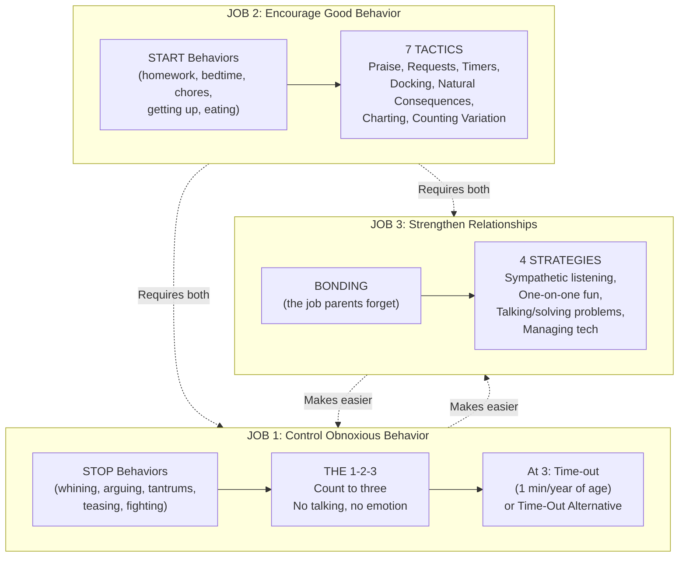
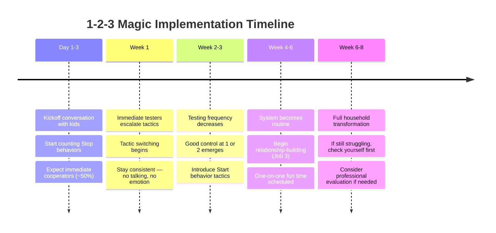
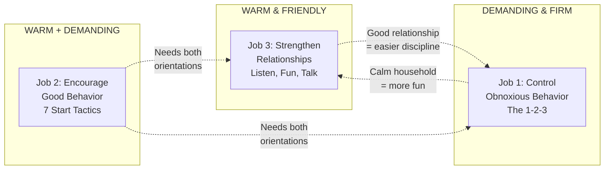
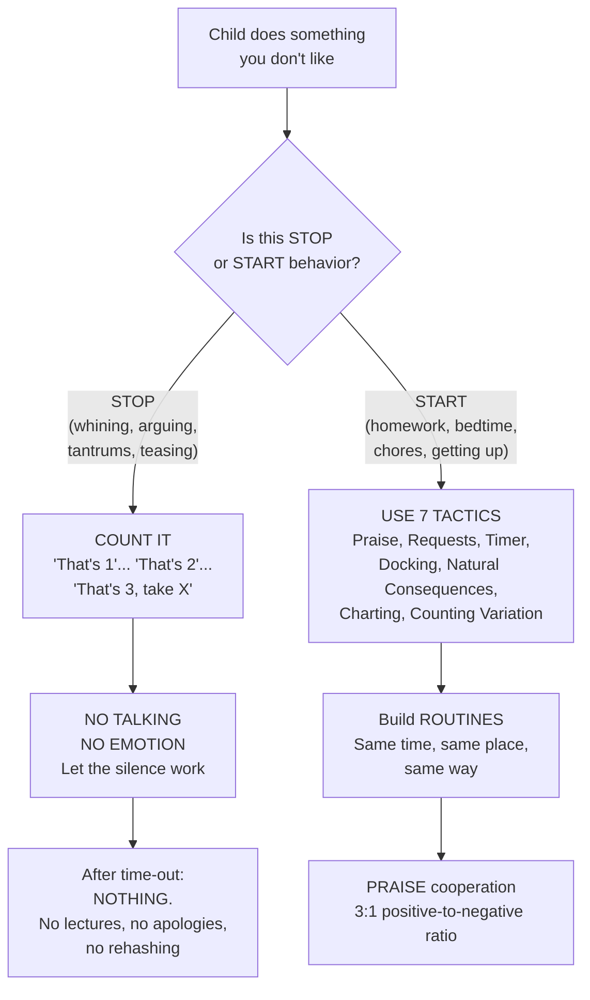

# 1-2-3 Magic — Thomas W. Phelan

> Your eight-year-old daughter wants a Twinkie before dinner. You say no. She pushes. You explain. She pushes harder. You explain more. She accuses you of never giving her anything. You defend yourself. She brings up her brother. You bring up yesterday's half-eaten peanut butter sandwich. She screams that she's going to kill herself and run away from home. You scream back. Ten minutes have passed. Everyone is miserable. No one learned anything. Thomas Phelan watched this exact pattern destroy the peace of thousands of families across forty years of clinical practice, and he noticed that the parents always made the same two mistakes: they talked too much and they got too emotional. This book offers a devastatingly simple alternative. When your child misbehaves, you hold up one finger and say "That's 1." If it continues, "That's 2." If it still continues, "That's 3, take 5"—and the child goes to a brief time-out. No lectures. No arguing. No emotional explosions. The magic is not in the counting. The magic is in what you *don't* say.

---

## About the Author

Thomas W. Phelan is a clinical psychologist who has spent over forty years working with children, parents and families in the suburbs of Chicago. He is the author of several books on parenting and ADHD, but 1-2-3 Magic is his signature work—it has sold over two million copies and been translated into numerous languages. Now in its fourth edition, the book has also spawned companion DVDs, a classroom adaptation (*1-2-3 Magic for Teachers*), and a children's version (*1-2-3 Magic for Kids*).

Phelan's background is not academic theory—it's the trenches. He developed the 1-2-3 system by working directly with families, including many with ADHD, Oppositional Defiant, and Conduct Disorder children. His approach is unapologetically behavioral, rooted in the conviction that children are not small adults who can be reasoned into cooperation. He is warm, funny and blunt, and freely admits to his own parenting failures throughout the book—including the time his kids had to be told three times to stop fighting in the car before he turned the ice cream trip around.

The book is deliberately positioned as the *only* parenting book you need. Phelan's view is that most parents are drowning in conflicting advice and need one clear, simple system they can start using today. Whether you agree with that claim or not, the system's simplicity is its greatest asset.

---

## The Big Idea

- <b style="color: #2980b9">The two biggest discipline mistakes are too much talking and too much emotion</b>: when parents lecture, explain, reason and argue during discipline, they make things worse—not better. And when parents get visibly upset, they accidentally reward the misbehavior by giving the child a sense of power (the "Big Splash")
- <b style="color: #e74c3c">Children are not "little adults"</b>: the Little Adult Assumption—the belief that kids are basically reasonable and just need enough information to behave—is the root of most discipline failures. Kids are not born reasonable and unselfish. They must be trained
- <b style="color: #27ae60">The 1-2-3 counting method</b>: for obnoxious "Stop" behaviors (whining, arguing, tantrums), simply count to three with five-second pauses. At three, a brief time-out or consequence follows. No talking, no emotion. The silence forces the child to take responsibility for their own behavior
- There are **three parenting jobs**: (1) controlling obnoxious behavior, (2) encouraging good behavior, and (3) strengthening your relationship with your children. Each requires different strategies. Most parents only think about Job #1
- **Stop behavior and Start behavior are fundamentally different**: Stop behavior (teasing, screaming, arguing) takes one second to end—count it. Start behavior (homework, bedtime, chores) takes twenty minutes or more—use seven other tools instead
- The counting method works not because of the counting itself, but because of the **No-Talking and No-Emotion rules** that accompany it. The pregnant pause after each count is where the real discipline happens

---

## Key Concepts at a Glance

| Concept | One-line summary |
|---------|-----------------|
| **Little Adult Assumption** | Kids aren't small reasonable adults — stop reasoning and start training |
| **Stop vs. Start behavior** | Obnoxious behavior gets counted; constructive behavior gets other tools |
| **The 1-2-3 / Counting** | Three calm warnings with five-second pauses; at three, a consequence |
| **No-Talking Rule** | Silence during discipline forces the child to take responsibility |
| **No-Emotion Rule** | Parental emotional outbursts reward misbehavior with the Big Splash |
| **Big Splash** | Kids feel powerful when they can get adults visibly upset |
| **Talk-Persuade-Argue-Yell-Hit** | The predictable escalation when parents try to reason with a frustrated child |
| **Six Testing Tactics** | Badgering, Temper, Threat, Martyrdom, Butter Up, Physical — count all but Butter Up |
| **Seven Start Tactics** | Praise, Simple Requests, Timers, Docking, Natural Consequences, Charting, Counting Variation |
| **Three Parenting Jobs** | Control bad behavior + encourage good behavior + strengthen the relationship |
| **Discuss problems, count attacks** | When to listen sympathetically vs. when to set a limit |
| **Dictatorship to democracy** | Young children need clear authority; teens need more voice and participation |

---

## 30-Second Version

Stop talking and stop getting upset when your child misbehaves. Children are not little adults—they cannot be reasoned into cooperation. Instead, use a three-count warning system: "That's 1"… five seconds… "That's 2"… five seconds… "That's 3, take 5." At three, the child goes to a brief time-out or loses a privilege. No lectures, no emotional outbursts, no debates. For getting kids to *do* things (homework, bedtime, chores), use different tools: praise, timers, natural consequences, charts. And make sure you also invest in the relationship through sympathetic listening and one-on-one fun. Three jobs, done consistently and calmly, will transform your household.

---

---

The radar chart shows how the system dramatically improves all six core parenting dimensions, with the biggest gains in stopping obnoxious behavior and enforcing the No-Talking Rule.

Whining — the devastating 4-1 combo of Martyrdom plus Badgering — is children's all-time favorite testing tactic, followed by straight Badgering and Temper.

Most families see dramatic improvement within two weeks, with the full system taking six to eight weeks to become second nature.

## Part I: The Philosophy — Why Your Current Approach Isn't Working

### The Warm and Demanding Parent

Phelan opens with a simple observation from decades of research: <b style="color: #2980b9">effective parents are warm and friendly on one hand, but demanding and firm on the other</b>. These two qualities are not contradictory — different situations call for different orientations. Your daughter feeds the dog without being asked? Time for warmth. Your daughter slaps her brother? Time for firmness. Bedtime? Both. The warm side says "I love you and I'll take care of you." The demanding side says "I expect something from you."

The parenting profession involves three distinct jobs:

| Job | What it means | Primary orientation |
|-----|--------------|-------------------|
| **#1: Control obnoxious behavior** | Stop the whining, arguing, tantrums, teasing, fighting | Demanding/firm |
| **#2: Encourage good behavior** | Get homework done, get to bed, do chores, eat supper | Both warm and demanding |
| **#3: Strengthen relationships** | Listen, have fun together, enjoy one another | Warm/friendly |

Most parents focus obsessively on Jobs #1 and #2 and neglect Job #3 — which is ironic, because a strong relationship makes the other two jobs dramatically easier.

### The Little Adult Assumption

This is the concept Phelan returns to more than any other. <b style="color: #e74c3c">The Little Adult Assumption is the semi-conscious belief that children are basically reasonable and unselfish — just smaller versions of adults</b>. If that's true, then whenever kids misbehave, the problem must be that they lack information. The solution? Just explain.

So your eight-year-old teases his five-year-old sister for the eighteenth time since they got home from school. You sit him down and deliver the three golden reasons: it hurts her, it makes you angry, and how would he feel if someone treated him that way? And then — in your fantasy — his face brightens with insight and he says, "Gee, I never looked at it like that before!" Then he stops bothering his sister for the rest of his life.

> [!warning] The Talk-Persuade-Argue-Yell-Hit Syndrome
> When words and reasons fail (as they inevitably do), frustrated parents escalate. First they talk calmly. Then they try to persuade. Then they start arguing. Arguing becomes yelling. And yelling — in some families — becomes hitting. The vast majority of parental spanking is simply a parental temper tantrum: the adult doesn't know what else to do.

Phelan's antidote to the Little Adult Assumption is deliberately provocative: "Instead of imagining your kids as little adults, think of yourself as a wild animal trainer." He doesn't mean whips and chairs. He means choosing a method that is largely nonverbal and repeating it until the trainee does what you want. The trainer is patient, gentle and persistent.

> [!tip] The One-Explanation Rule
> One explanation, if the behavior is new or dangerous, is fine. It's the attempts at repeated explanations that get parents and children into trouble. Too much talking irritates and distracts children.

### The Two Biggest Discipline Mistakes

**Mistake #1: Too much talking.** Words and reasons during discipline are not neutral — they actively make things worse. Excessive talking irritates children, confuses them with too much information, and — most importantly — invites argument. When you give six reasons why your child should behave, the real message becomes: "You don't have to behave unless I can give you good enough reasons." That's not discipline. That's begging.

**Mistake #2: Too much emotion.** When kids are small, they feel inferior — smaller, less skilled, less privileged. They constantly seek evidence that they can make an impact on the world. If your four-year-old can get big-old you screaming, red-faced and slamming doors, that's the <b style="color: #e74c3c">Big Splash</b>. Your emotional outburst accidentally makes your child feel powerful. An important rule follows: If your child does something you don't like, get upset about it on a regular basis, and she'll repeat it for you.

The solution: the **No-Talking and No-Emotion rules**. During discipline, very little talking and very little emotion. Be consistent, decisive and calm. These two rules are the non-negotiable foundation of the entire 1-2-3 system.

---

## Part II: The 1-2-3 — Controlling Obnoxious Behavior

### How Counting Works

The mechanics are deceptively simple. Your child does something obnoxious — whining, arguing, teasing, tantruming. You hold up one finger and say calmly, "That's 1." You wait five seconds. If the behavior continues, you hold up two fingers: "That's 2." Five more seconds. If it still continues: "That's 3, take 5" — and the child goes to a time-out (one minute per year of age) or receives a time-out alternative (loss of privilege, earlier bedtime, small fine).

After the time-out, nothing happens. No lecture. No apology demanded. No rehashing. You do not say: "Now are you going to be a good boy? Do you realize what you've been doing to your mother all afternoon? Why do we have to go through this all the time?"

What happens over time? <b style="color: #27ae60">You start getting good control at 1 or 2</b>. The first time you stop a sibling fight from across the room with just "That's 1" — no getting up, no yelling, no consequences — you'll feel the magic.

### The Famous Twinkie Example

This is the book's signature illustration, showing the method's progression in three scenes:

**Scene I — Mom as Little Adult:**
"Can I have a Twinkie?" "No, we're eating at six." "Yeah, but I want one." "I just told you." "You never give me anything." "What do you mean? You have clothes, a roof, I'm feeding you in two seconds!" "You gave Joey one a half-hour ago." "Are you your brother?" "I PROMISE I'll eat my dinner!" "Don't give me that! Yesterday you had half a sandwich and didn't eat anything!" "THEN I'M GOING TO KILL MYSELF AND RUN AWAY FROM HOME!" "WELL, BE MY GUEST!"

Everything Mom said was true. Her talking still made things worse.

**Scene II — Mom begins counting:**
"Yeah, but I want one." "That's 1." "You never give me anything!" "That's 2." "THEN I'M GOING TO KILL MYSELF AND RUN AWAY FROM HOME!" "That's 3, take 5."

Much better. The temporarily unhappy child disappears for a rest period and the episode is over.

**Scene III — After the child is used to counting:**
"Yeah, but I want one." "That's 1." (Pause.) "Oh, all right." (Grumpy exit from kitchen.)

> [!tip] The Grumpy Exit
> Mom doesn't count the "Oh, all right" grumpiness because the behavior is minor and the child is leaving the scene. If the child had said "Oh, all right, you stupid jerk!" — automatic 3, longer time-out.

### Time-Out Alternatives

Time-outs aren't always practical (in the car, in public, with bigger kids). Phelan provides a menu of **time-out alternatives (TOAs)**:

| TOA | Example |
|-----|---------|
| Earlier bedtime | 15-30 minutes earlier |
| Loss of screen time | No electronics for 2 hours or the evening |
| Monetary fine | 25-50 cents off allowance |
| Small chore | Wash the bathroom sink |
| Loss of privilege | No friend over, no dessert |
| Separation | Both kids must go to different places |

The key principle: consequences should be brief, reasonable and just potent enough to do the job. The goal is teaching, not revenge.

### The Six Types of Testing and Manipulation

When you start counting, about half of children cooperate immediately. The other half test. Phelan identifies <b style="color: #e74c3c">six specific tactics children use when frustrated</b>, and naming them gives parents an enormous advantage:

| # | Tactic | What it sounds like | The child's message |
|---|--------|-------------------|-------------------|
| 1 | **Badgering** | "Please, please, please! Why? Why? Why?" | "Keep at you until you break" |
| 2 | **Temper / Intimidation** | "I HATE YOU!" Screaming, verbal attacks | "I'll scare you into giving in" |
| 3 | **Threat** | "I'm going to run away!" "I'll never speak to you again!" | "Something bad will happen unless you give me what I want" |
| 4 | **Martyrdom** | "No one loves me." "I never get anything." Crying, pouting | "I'll make you feel so guilty you cave" |
| 5 | **Butter Up** | "You're the nicest mom in the world!" | "You'll feel too good about me to say no" |
| 6 | **Physical** | Hitting, breaking things, running away | "I'll use force" |

> [!warning] The Child's Implicit Deal
> With the first four tactics, the child is saying: "You're making me uncomfortable by not giving me what I want. But now I'm making YOU uncomfortable too. Here's my deal: you call off your dogs and I'll call off mine." If you give in, testing stops *instantly*. But then the child is running your house.

The all-time favourite tactic? <b style="color: #e74c3c">Whining</b> — which is Martyrdom (#4) + Badgering (#1), the devastating 4-1 combo.

The management rule is simple: **count all testing tactics except Butter Up**. Butter Up is the least obnoxious and sometimes hard to distinguish from genuine affection. The other five are Stop behaviors and should be counted.

> [!tip] If Your Child Has a Favourite Tactic, It's Working
> It's working either because (1) the child gets their way when they use it, or (2) the child gets effective revenge — a Big Splash that makes you visibly upset. Both outcomes reinforce the tactic.

### Sibling Rivalry, Tantrums and Pouting

**Sibling rivalry:** Count both kids. Never ask the world's two stupidest questions: "What happened?" and "Who started it?" Don't expect the older child to act more mature during a fight.

**Tantrums:** For children four and older, the time-out doesn't start until the tantrum is over. If it takes the child fifteen minutes to calm down, the rest period starts after fifteen minutes. For two-and three-year-olds, just let them out after a couple of minutes even if they're still tantruming.

**Pouting:** Ignore it. Pouting is designed to make you feel guilty. If the child follows you around to make sure you see the sour face ("aggressive pouting"), count it.

### Counting in Public

The child's nuclear weapon in public is the threat of embarrassment. The key principle: <b style="color: #2980b9">the long-term welfare of your kids comes before short-term worries about what others think of you</b>.

Count identically in public. At 3, use "Time-Out Room, Time-Out Place": the car, a store corner, a bathroom, a bench. Some parents carry a small time-out mat. Others leave the grocery cart in the aisle and take the child to the car. One mother perfectly ignored a 20-minute grocery store tantrum, calmly shopping through blood-curdling screams. She checked out, walked past the bubble-gum machine — and then stopped and bought her son a piece of gum. One moment of weakness rewarded the entire tantrum.

---

## Part IV: Encouraging Good Behavior — The Seven Start Tactics

Counting works for Stop behavior because ending an annoying action takes one second. But Start behavior — homework, bedtime, chores, getting dressed — takes twenty minutes or more. Different problem, different tools.

### 1. Praise

The most underused tool. We suffer from a biological curse: <b style="color: #e74c3c">angry people make noise, happy people keep quiet</b>. If your kids are playing nicely in the next room, the chance of you getting up to praise them is near zero. But if they start fighting, you're on your feet instantly. The result: children hear from us mostly when our feedback is negative.

The antidote: aim for a **three-to-one positive-to-negative ratio**. Praise effort, not just results. Praise in front of other people for maximum impact. Deliver unexpected praise for maximum memorability.

### 2. Simple Requests

Three factors determine whether a request works: **tone** (avoid "chorevoice" — the nagging, aggravated tone), **spontaneity** (don't interrupt a child who's playing to demand garbage duty), and **phrasing** ("I want your homework done by five" beats "Don't we think it's time to start our homework?").

### 3. Kitchen Timers

Kids naturally want to beat a ticking device. The timer is not testable — machines cannot be emotionally manipulated. "You've got ten minutes to pick up those three things. I bet you can't beat it!" Response from a five-year-old: "Oh yes I can!" — and she runs off to do it.

### 4. The Docking System

If you don't do the work, you don't get paid. <b style="color: #27ae60">If you don't do the work, I'll do it for you — and you'll pay me</b>. The charge comes off the allowance. The child agrees to feed the dog by 6 pm. Day two, the dog is unfed at 6:30. You feed it and dock 15 cents. When the boy yells "WHAT DID YOU DO THAT FOR?!" you say, "That's 1." Let the money do the talking. Do not launch into a righteous speech about broken promises.

### 5. Natural Consequences

Let the big, bad world teach the child. No coat in winter? The cold talks. No lunch packed? An empty stomach talks. Pajamas to school? The preschooler spent two and a half hours in flowered booties and butterflies. His mother never had a morning problem again.

### 6. Charting

A calendar on the fridge with stickers (young kids) or points (older kids) for completing tasks. Build in discontinuation criteria — when the child earns good scores for two weeks, that item comes off the chart. Celebrate the graduation with pizza.

### 7. Counting Variation

The exception: counting *can* be used for Start behavior, but only if the task takes less than two minutes. Hang up a coat, feed the cat, come into the room. "Would you please come here?" "I can't, I'm busy." "That's 1." "Oh, all right!"

---

## Applying the Start Tactics: Common Battlegrounds

### Up and Out in the Morning

Morning is a cascade of Start behaviors: get out of bed, wash up, get dressed, eat breakfast, leave with the right equipment. For younger children (2-5), use simple charts with stickers combined with timers. Praise lavishly. Do as much preparation as you can the night before.

For older children (9+), Phelan recommends a gutsy natural consequences approach: tell them that getting up and out is now **entirely their responsibility**. You will wake them once (or get them an alarm). You will not supervise, nag or remind. If they dilly-dally and miss the car pool, they get to school late and explain to the principal without a parental excuse note.

> [!warning] The Hardest Part
> Extreme self-restraint is required. You will want to nag. You will want to intervene. One mother said: "If I'm going to have to keep quiet and not watch, I want a martini — not a cup of coffee." It usually takes no more than five days. Let the kids get burned. The lessons sink in deeper than any lecture.

### Bedtime

Phelan's **Basic Bedtime Method**: fixed routine, same time every night, brief pleasant ritual (snack, bath, story, lights out), then *leave the room*. If the child comes out, count. If counting reaches 3, the rest period is served and then the bedtime routine resumes — but shorter (less story time). The child learns that testing costs them the parts of bedtime they enjoy.

For nighttime waking: no lights, no talking, assume the child needs the bathroom, be gentle, and don't let the child sleep in your bed regularly.

### Homework

Don't sit with the child for the entire homework session — that makes you a permanent crutch. Establish a regular time and place. Use a timer. If the child has questions, help briefly and leave. If homework consistently takes too long or produces too much frustration, consider a professional evaluation — don't just escalate the nagging.

---

## Part V: Strengthening Your Relationship

### Sympathetic Listening

When your ten-year-old bursts through the door yelling "My music teacher's an idiot!" you have two impulses. Impulse one: "That's no way to talk!" Impulse two: "Tell me what happened." Impulse two is almost always correct. He's not screaming at you — he's upset about something and you don't know what it is.

Phelan's listening toolkit:

| Strategy | Example |
|----------|---------|
| **Openers** | "Tell me what happened." "Oh?" "Wow." |
| **Nonjudgmental questions** | "What do you think made you do that?" "What was going through your mind?" |
| **Reflecting feelings** | "That must have been really embarrassing." "I haven't seen you this mad in a while." |
| **Checks / Summaries** | "So you thought it wasn't fair for her to make you do it when no one else had to." |

> [!success] Discuss Problems, Count Attacks
> This is the critical rule for knowing when to listen vs. when to count. If the child is upset but not being disrespectful to you, listen. If the child is attacking you — "Mom, you idiot!" — count. The line is often blurry, so lean toward listening when possible.

### Overparenting: The Opposite of Listening

Overparenting means forcing unnecessary corrective comments on a child. A mother sees her nine-year-old pushing a cart toward a man in the dairy aisle and says loudly, "Now watch out for that man over there!" — as though the girl couldn't see him. The message: "You're incompetent; you need me to supervise everything."

Overparenting produces the **Anxious Parent, Angry Child** syndrome. The parent's anxiety creates the child's resentment. Want to encourage independence? Listen more. Direct less.

### One-on-One Fun

<b style="color: #2980b9">Show me two people who have fun together frequently and I'll show you a good relationship.</b> Phelan makes a provocative claim: if he had to choose between communication and shared fun as the more important ingredient in a long-term relationship, he'd choose fun.

Family activities are overrated for bonding because (1) sibling rivalry, (2) conflicting agendas, and (3) the best bonding happens one-on-one. Take each child separately and regularly do something you both enjoy. It doesn't have to involve leaving the house or spending money. Staying up twenty minutes late for a special activity with Mom or Dad is often the highlight of a child's week.

### When Can You Talk?

Not during discipline — that's the worst time. The child is angry, defensive and not open-minded. Anything you say becomes material for argument.

Kids learn through three channels: (1) **insight** — occasionally a single explanation works, (2) **insight plus practice** — much more common; like learning to drive, behavioral skills require hundreds of repetitions, and (3) **social learning** — kids observe everything you do, whether you're aware of it or not.

Your modeling matters more than your lectures. If you are respectful toward others, your kids will tend to be the same. If you scream during road rage, your kids learn that screaming is how adults handle frustration.

---

## Best Stories

### The Ice Cream Car Rides

Phelan's own family. The kids fought in the back seat every time they went for evening ice cream. One night he announced the new deal: "If you hit a count of 3 before we get to the store, we turn right around." They hit 3 halfway there. He turned the car around. Second attempt, same thing — 3 before they were three hundred yards from the house. Before the third attempt, Phelan imagines the kids' conversation: "Isn't it a shame that most children in the world, except us, have normal fathers? Unfortunately, our Dad turned out to be a shrink. But he's got the car and he's got the money, so if we want some ice cream, we'd better put up with his stupid games." Third attempt: kids started fighting, hit 1 — and instantly went silent.

### King Louis XIV

An eight-year-old boy whose parents felt he was running the house. When first counted to his room, he completely trashed it: emptied the dresser, ripped the bedding, cleared the closet, tore down the curtains. His parents did the unthinkable — they left the mess. They kept counting. The boy had to find his pajamas in the wreckage. His clothes didn't match for a week. After ten days of calm time-outs, they helped him clean up. After that, a count of 1 stopped him cold.

### The Boy Who Couldn't Run Away

A six-year-old, counted and timed out for squirting the dog, threatened to run away. He packed a small bag and walked out the front door. Five minutes later he walked back in and yelled at his father: "I couldn't run away because you guys won't let me cross the street!"

### Pajamas to Preschool

A mother whose preschooler wouldn't get dressed in the morning sent him to school in his pajamas — flowered booties and butterflies on his chest. He spent two and a half hours with his peers in that outfit. She never had a morning problem again.

### The Bubble-Gum Machine

A mother perfectly endured her four-year-old's 20-minute grocery store tantrum, calmly reading the rice box while he howled. She shopped. She checked out. She walked past the bubble-gum machine on the way out — and stopped to buy him a piece of gum. Twenty minutes of excellent discipline, undone in one second.

---

Praise and Natural Consequences rank highest because they work through intrinsic motivation — the child cooperates because they feel good about it or because reality teaches the lesson.

This flow shows how the majority of stop behaviors resolve at Count 1 or 2 — the system's power lies in what happens before Count 3, not after it.

## Deep Dive: Managing Testing and the Adjustment Period

### Immediate Cooperators vs. Immediate Testers

When you start counting, children fall into two groups. **Immediate cooperators** — about half — simply respond. They are less disruptive, more pleasant to be around, and the household improves quickly. Enjoy them.

**Immediate testers** get worse before they get better. They react to your new authority in two predictable ways:

1. **Tactic escalation.** The volume and length of their preferred tactic doubles. Tantrums get louder, badgering gets more relentless, martyrdom gets more dramatic.
2. **Tactic switching.** They try strategies you haven't seen before, or return to ones they abandoned years ago. The most common switch is from badgering/martyrdom to temper — when whining stops working, kids often blow up.

> [!success] Tactic Switching Is a Good Sign
> If your child is switching tactics, it means their usual method is failing. You are winning. Stay the course. Don't get discouraged. Keep counting. Keep quiet. This testing phase is temporary.

Some children become **delayed testers** — they cooperate at first but start pushing back weeks later, once the novelty wears off. This can feel disillusioning. The remedy is simple: reread the book, recommit to No-Talking and No-Emotion, and get back to basics.

### Common Traps Parents Fall Into

| Trap | What it looks like | The fix |
|------|-------------------|---------|
| **The Negotiator** | "OK, what if I just let you watch one more minute?" | Don't bargain during a count. The count is not an opening position. |
| **The Guilt Tripper** | Caving after martyrdom because "maybe she's right — maybe I am too strict" | Your job is to frustrate your kids regularly. That's not cruelty, it's parenting. |
| **The Explainer** | Giving reason after reason, hoping the child will finally say "Oh, I see" | One explanation if necessary. Then silence. |
| **The Delayed Counter** | Letting behavior slide because you're tired, then overreacting | Be consistent. Count the same things every time. Your mood shouldn't change the rules. |
| **The Retaliator** | Extending time-out or adding extra consequences because you're angry | Time-out is one minute per year. Period. Your frustration is not a sentencing guideline. |
| **The Public Surrender** | Changing the rules in public because of embarrassment | Count identically everywhere. If you cave in public, the child learns to save their worst for audiences. |

### What to Do When Nothing Seems to Work

If the 1-2-3 has been in place for six to eight weeks and you're still struggling:

1. **Check yourself first.** Are you truly following No-Talking and No-Emotion? Most "failures" of the system are actually parents who forgot the rules — talking too much between counts, getting visibly upset, or arguing after time-out.
2. **Check consistency.** Are both parents counting? Is the babysitter on board? Inconsistency is the system's biggest enemy.
3. **Consider professional evaluation.** Some children have ADHD, anxiety, sensory issues, or other conditions that require additional support beyond standard behavioral management.
4. **Watch for too much counting.** If you're counting all day long, something bigger may be going on — either in the child's life or in the parent-child relationship. Consider whether Job #3 (relationship) has been neglected.

---

## Deep Dive: Stop vs. Start — The Before and After

These scenarios illustrate the system across different ages and situations:

### Before and After: The Morning Rush (Age 6)

**Before 1-2-3 Magic:**
"Get dressed! How many times do I have to tell you? Your sister is already ready! Why are you still in your pajamas? We're going to be late AGAIN! PUT THOSE TOYS DOWN! GET DRESSED RIGHT NOW!"

**After:**
The chart on the fridge shows three items: get dressed, brush teeth, eat breakfast. The timer is set for 20 minutes. At 7:15, Mom says, "Timer's starting." At 7:35, the child has earned two stickers — she was dressed and brushed her teeth but breakfast was rushed. Mom says, "Two out of three! Great job on the teeth." Tomorrow she'll aim for three.

### Before and After: Sibling Rivalry (Ages 7 and 9)

**Before:**
"STOP IT! Who started this? You ALWAYS pick on your brother! I don't care who did what — both of you go to your rooms! No, I said GO! Did you hear me? DO YOU WANT ME TO COME OVER THERE?"

**After:**
From the kitchen, Dad hears arguing escalating in the family room. "That's 1 for both of you." The noise continues. "That's 2." Silence. Kids resume playing. Dad says nothing. Total time: eight seconds. No one's blood pressure changed.

### Before and After: Homework Resistance (Age 10)

**Before:**
"Why can't you just sit down and do it? It's not that hard! When I was your age... You'll never get into a good school if... Come back here! I'm talking to you!"

**After:**
Regular homework time: 4-4:30 pm at the kitchen table. Timer set for 30 minutes. Mom is available for brief questions but does not sit with the child. If the child argues about doing homework ("This is stupid!"), "That's 1." If the child does a good job, "You knocked that out fast today — nice work." If the child consistently can't complete work, Mom schedules a meeting with the teacher rather than escalating the nagging.

### Before and After: Public Tantrum (Age 4)

**Before:**
(Whispering frantically) "Stop it! Everyone is looking! You're embarrassing me! Fine, FINE, here's the candy bar!"

**After:**
"That's 1." Child screams louder. "That's 2." Child throws himself on the floor. "That's 3." Mom calmly takes the child by the hand, walks to the car, and waits for the tantrum to end. No words. No visible frustration. Back into the store to finish shopping. The fourth time they visit this store, the child hits 1 and stops. The fifth time, the child doesn't even start.

---

## The Three Parenting Jobs at a Glance

> [!quote] The Bottom Line
> If you are frustrated about discipline, it's probably because you're doing one of two things wrong: talking too much or getting too emotional. Fix those two things and the counting almost takes care of itself. Then make sure you invest in the relationship — because a child who likes you is a child who wants to cooperate with you.

---

## Practical Application: The 1-2-3 Cheat Sheet

### Getting Started: The Kickoff Conversation

Sit down with the kids and explain the new system. Keep it under five minutes:

"From now on, when you do something you're not supposed to, we'll say 'That's 1.' That's a warning. If you don't stop, 'That's 2.' If you still don't stop, 'That's 3, take 5' — and you'll go to your room for a rest period. When you come out, we don't talk about it unless it's really necessary. If you do something really bad to start with, we'll go straight to 3."

Then rehearse. Role-play with the kids. Have them practice being counted. Have them count you. Praise their cooperation. Don't expect them to be grateful. Expect them to poke each other and exchange knowing glances.

### The Complete Decision Tree

### What to Say — and What Never to Say

| Situation | Never say this | Say this instead |
|-----------|---------------|-----------------|
| Child is whining | "How many times do I have to tell you?!" | "That's 1." |
| Sibling fight | "What happened? Who started it?" | "That's 1 for both of you." |
| Child argues after count | "Listen to me, young man..." | (Nothing. Silence. Wait five seconds.) |
| Time-out is over | "Are you going to be good now?" | (Nothing. Resume normal life.) |
| Child says "I don't care" | "You'd better start caring!" | (Ignore the comment. It usually means the opposite.) |
| Child misbehaves in public | "Don't embarrass me!" | "That's 1." (Identical to at home.) |
| Child tests with martyrdom | "Stop feeling sorry for yourself!" | (Walk away. Don't feed the guilt.) |
| After a good day | (Silence — the biological curse) | "You kids did a great job getting along today." |

### The No-Talking and No-Emotion Rules in Practice

These rules do not mean you become a robot. Positive emotion is encouraged — laugh, praise, hug, enjoy your kids. The rules apply specifically to **discipline and conflict situations**. During those moments:

- **No Talking** means one explanation (if the behavior is new), then count. No repeated reasons. No justifications. No rhetorical questions ("How many times do I have to tell you?"). No commentary between counts. No debriefing after time-out.
- **No Emotion** means calm voice, steady tone, no yelling, no sarcasm, no visible anger. The goal is to be decisive without being dramatic. Your silence communicates authority far more effectively than your words.

> [!danger] The Litmus Test
> If after six weeks of using the 1-2-3 you still cannot stop talking too much and getting too emotional during discipline, Phelan recommends seeking professional help — for yourself, not the child. The program is a control on parental behavior as much as it is on children's behavior.

---

## The Verdict

This is the parenting discipline book for parents who need results fast and are tired of approaches that feel like graduate seminars in child psychology. Phelan doesn't ask you to analyse your child's inner emotional world before responding to a tantrum. He doesn't ask you to validate feelings before setting a limit. He asks you to be quiet and count.

The system works because it removes the two things that sabotage most discipline: talking and emotion. When you stop arguing and stop getting visibly upset, you deprive the child of both the argument they want and the Big Splash that rewards them. What's left is a simple, predictable structure: the child knows exactly what will happen if they misbehave, and — crucially — the consequence arrives without drama.

The greatest strength of 1-2-3 Magic is its **practicality**. Parents know exactly what to say, when to say it, and what to do at every step. The Six Testing Tactics alone are worth the read — once you can name Badgering, Temper, Threat, Martyrdom, Butter Up and Physical, you see them everywhere and they lose their power over you.

---

## Common Objections — And Phelan's Answers

> [!warning] "This sounds too harsh. You're just controlling kids with fear."
> Phelan distinguishes between punishment that is cruel and punishment that is brief and reasonable. A five-minute time-out is not cruel. It is a momentary interruption of the child's activities. Most kids come back from time-out having forgotten the whole thing. The real cruelty, Phelan argues, is the Talk-Persuade-Argue-Yell-Hit cycle that occupies hours and leaves everyone damaged.

> [!warning] "Kids should respond the first time. Why give them three chances?"
> Because they're kids. Giving two warnings before a consequence is how children learn to make good choices. The chance comes immediately — in the five seconds after each count. That's where self-control is practised.

> [!warning] "What about the child's feelings? You never ask why they're upset."
> Phelan separates feelings from behavior. He's not against feelings — Part V is entirely about sympathetic listening. But during a discipline moment, processing feelings rewards the misbehavior and delays the consequence. Listen later, when everyone is calm.

> [!warning] "My child says 'I don't care' about time-outs."
> The child who says "I don't care" almost always means the opposite. If their room were such a great place to be, they would have already been up there. The power of the 1-2-3 comes from interruption of the child's current activity, not from the aversiveness of the room.

> [!warning] "Shouldn't I make my child apologise?"
> Phelan is sceptical. Many apologies are forced, insincere, and amount to "continuation of the battle by verbal means." If apologies work naturally in your family, fine. But requiring one from a still-angry child is usually an exercise in hypocrisy.

---

### Limitations

The system's behaviorist orientation is both its strength and its weakness. <b style="color: #e74c3c">Counting addresses the behavior without addressing the emotional state beneath it</b>. A child counted for screaming after you turned off the TV may comply — but they haven't learned what to do with the frustration that caused the screaming. [[No-Drama Discipline - Daniel J. Siegel]] and [[The Whole-Brain Child - Daniel J. Siegel]] argue that connection must precede correction — that a child in a reactive brain state cannot genuinely learn from a consequence, only fear it. Phelan would counter that the learning happens in the silence after the count, and that too much emotional processing during discipline rewards the misbehavior.

This is the central tension in modern discipline philosophy, and honest parents will find truth on both sides. The best approach may be to use Phelan's system for the mechanics of daily discipline (it is remarkably effective for whining, arguing, sibling rivalry and public tantrums) while drawing on Siegel's framework for the deeper work of emotional development.

Other limitations:

- The relationship-building section (Part V) is significantly thinner than the discipline sections, despite Phelan's insistence that it matters
- Time-outs as the primary consequence have been questioned by attachment researchers who argue they communicate emotional withdrawal
- Cultural contexts beyond North American middle-class norms receive no attention
- The "wild animal trainer" and "benign dictatorship" metaphors, though qualified, may alienate parents seeking a more collaborative approach
- Limited guidance for children with significant emotional challenges beyond brief mentions of ADHD

Despite these limitations, 1-2-3 Magic remains one of the most effective, accessible and immediately usable discipline systems available. If you are a parent who yells too much, argues too much, or feels your children are running the house, this book will change your household in two weeks.

---

## Who Should Read This Book

| Reader | Why |
|--------|-----|
| **Parents drowning in arguments** | The No-Talking Rule alone will transform your daily life |
| **Parents who yell and feel guilty** | The No-Emotion Rule gives you a concrete alternative to rage |
| **Parents of 2-12 year olds** | The sweet spot for this system — designed for this age range |
| **Parents who've tried "understanding" approaches and failed** | This is the opposite end of the spectrum — structure first, connection second |
| **Teachers and childcare providers** | The system translates directly to classroom management |
| **Co-parents who need alignment** | Simple enough that both parents and babysitters can use it consistently |
| **Parents of ADHD or oppositional children** | Developed partly from Phelan's clinical work with these populations |

---

## Connections

| Book | Connection |
|------|-----------|
| [[No-Drama Discipline - Daniel J. Siegel]] | The philosophical counterpoint. Siegel says connect before you redirect; Phelan says stop talking and count. Siegel addresses the child's emotional state; Phelan addresses the behavior. Together they represent the two poles of modern discipline: relationship-first vs. structure-first. Honest parents will use both. |
| [[The Whole-Brain Child - Daniel J. Siegel]] | The upstairs/downstairs brain model challenges the counting approach: a child whose "lid is flipped" may comply out of fear rather than genuine learning. Phelan would reply that the silence after a count is where self-regulation begins. |
| [[How to Talk So Kids Will Listen - Adele Faber & Elaine Mazlish]] | The communication toolkit that complements Phelan's Job #3. What Phelan calls "sympathetic listening" is essentially a simplified version of Faber & Mazlish's approach. Read this to deepen the relationship side. |
| [[How to Talk So Little Kids Will Listen - Joanna Faber & Julie King]] | The toddler version of communication-based discipline — helps with the parts of parenting that counting can't reach. |
| [[No Bad Kids - Janet Lansbury]] | RIE approach: acknowledging feelings while setting firm limits. More emotionally attuned than Phelan but less structured. A useful middle ground. |
| [[Unconditional Parenting - Alfie Kohn]] | The strongest philosophical challenge. Kohn would reject counting, time-outs and the entire behaviorist framework as coercive. Phelan would say Kohn is the Little Adult Assumption taken to its extreme. Read both and make your own judgment. |
| [[Emotional Intelligence - Daniel Goleman]] | The EQ skills that Phelan's Job #3 builds: self-awareness, self-regulation, empathy. Phelan's system develops these indirectly through structure; Goleman provides the theoretical framework. |
| [[The Self-Driven Child - William Stixrud & Ned Johnson]] | The autonomy case. Stixrud argues that children need a sense of control over their lives. Phelan's "dictatorship to democracy" progression aligns in principle but the counting system heavily emphasises the dictatorship end. |
| [[Parenting from the Inside Out - Daniel J. Siegel]] | For parents who find they cannot follow the No-Emotion Rule — who keep yelling despite knowing better. Siegel's book explores how your own childhood history hijacks your parenting. Phelan acknowledges this issue but doesn't address it. |
| [[Hunt, Gather, Parent - Michaeleen Doucleff]] | Cross-cultural evidence that low-drama discipline is the global norm. Doucleff's "TEAM" framework (Togetherness, Encourage, Autonomy, Minimal interference) overlaps with Phelan's three jobs but emphasises inclusion and modelling over counting. |

---

## The One Sentence That Captures the Book

> <b style="color: #27ae60">When your child misbehaves, your silence will speak louder than your words — so hold up a finger, say the number, and shut your mouth.</b>

That's the whole method. Count calmly. Don't talk. Don't get upset. Follow through with a brief consequence if you reach three. Then let it go. No lectures. No guilt. No drama. The child learns to take responsibility for their own behavior because *you* stopped taking responsibility for *talking them into it*.

---

## Five Things You Can Start Tomorrow

1. **Identify your child's favourite testing tactic.** Is it Badgering? Temper? Martyrdom? Whining (the 4-1 combo)? Once you name it, it loses half its power.

2. **Try the No-Talking Rule for one day.** When your child misbehaves, give one calm sentence — then stop. Don't explain. Don't justify. Don't answer back. Notice what happens.

3. **Count one thing.** Pick the most annoying Stop behavior in your house right now (whining is usually the winner). Explain to your child what you're going to do. Start counting it. Be consistent.

4. **Praise three times.** Before the day is over, find three genuine things to praise about each child. Say them out loud. Fight the biological curse.

5. **Schedule one-on-one time.** Pick one child. Plan fifteen minutes this week — just the two of you. No agenda. No siblings. Just fun. Watch what happens to your relationship.

*Three parenting jobs. Two simple rules. One very quiet finger. That's 1-2-3 Magic.*

---

## Key Phrases to Remember

| Phrase | What it means |
|--------|--------------|
| "That's 1" | A calm, non-negotiable warning — not the opening of a debate |
| "No-Talking, No-Emotion" | The foundation of the whole system — your silence is your power |
| "Stop vs. Start" | Different behaviors require different tools — never count homework |
| "Big Splash" | Your emotional outburst accidentally rewards your child's misbehavior |
| "Little Adult Assumption" | The delusion that more explaining will produce cooperation |
| "Talk-Persuade-Argue-Yell-Hit" | The escalation trap that talking too much inevitably produces |
| "Discuss problems, count attacks" | The rule for knowing when to listen vs. when to set a limit |
| "Dictatorship to democracy" | The household evolves — firm authority for young kids, more voice for teens |
| "Whining = 4-1 combo" | Martyrdom + Badgering — children's all-time favourite testing tactic |
| "Chorevoice" | The nagging, aggravated tone that kills cooperation before you even ask |
