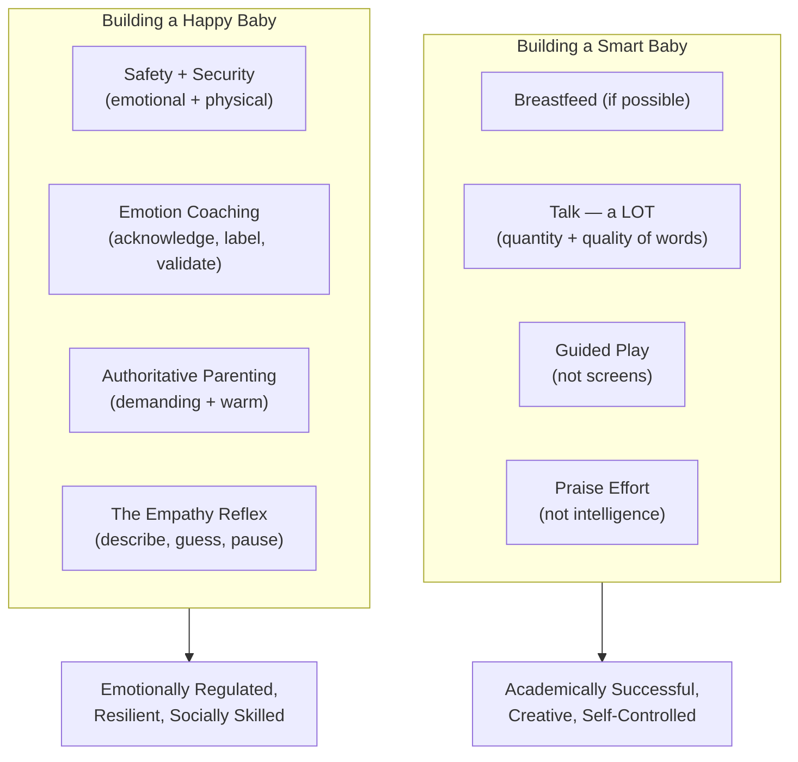
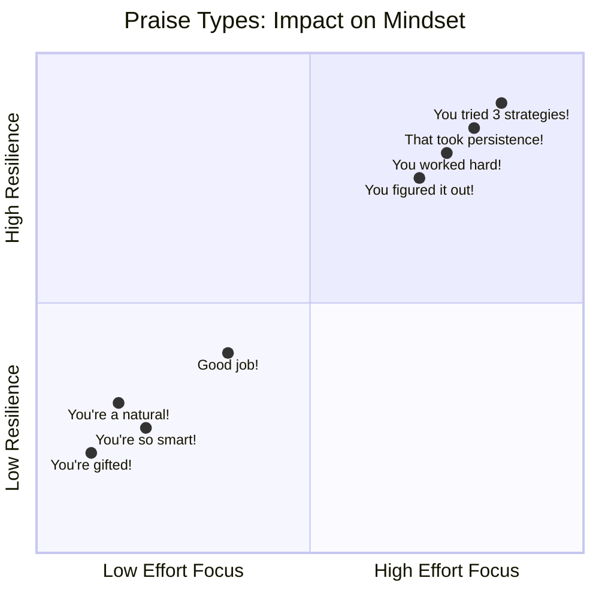
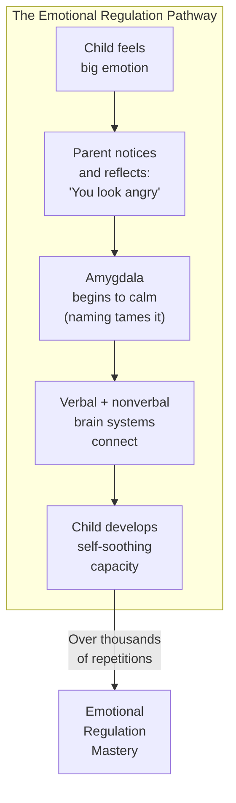
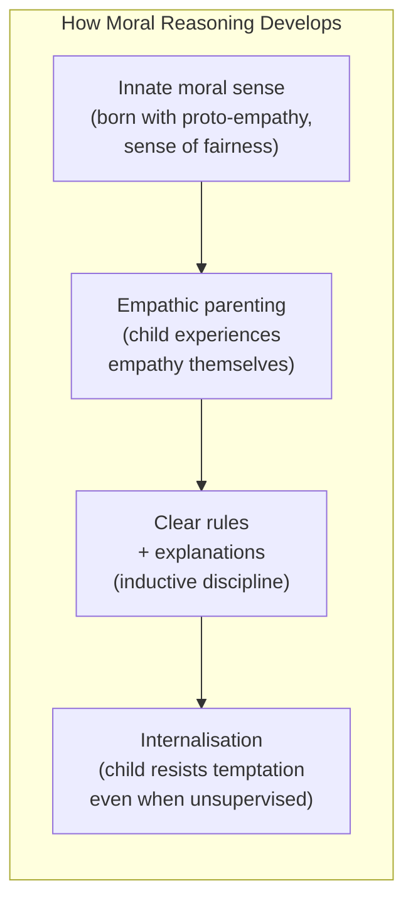
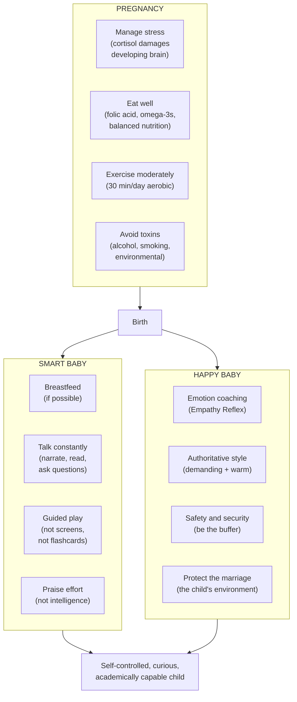

# Brain Rules for Baby — John Medina

> No commercial product has ever been shown to improve a developing baby's brain. Not Baby Einstein. Not Mozart CDs. Not prenatal university. Not educational apps. What actually builds smart, happy brains? Peer-reviewed science points to a handful of deceptively simple things: during pregnancy, manage stress and eat well. After birth, talk to your child constantly, read to them, let them play, praise their effort (not their intelligence), and make friends with their emotions rather than dismissing them. This book is a developmental molecular biologist's translation of what the research actually says — versus what the $20 billion baby-products industry wants you to believe.

---

## About the Author

John Medina is a developmental molecular biologist and affiliate professor of bioengineering at the University of Washington School of Medicine. He is the director of the Brain Center for Applied Learning Research at Seattle Pacific University. His Brain Rules series has sold millions of copies worldwide.

What makes Medina unusual among parenting authors is his evidence standards. He only includes research findings that meet three criteria: (1) published in a peer-reviewed journal, (2) successfully replicated, and (3) ideally confirmed by independent research groups. When evidence is preliminary or contested, he says so explicitly. This rigour makes the book trustworthy in a field drowning in unsubstantiated claims.

Medina is also genuinely funny. The book is peppered with anonymous confessions from real parents (sourced from TruuConfessions.com) and stories from his own family life with his wife Kari and sons Josh and Noah. The tone is warm, self-deprecating, and never preachy.

---

## The Big Idea

- <b style="color: #2980b9">Intelligence is not about IQ — it is about executive function</b>: impulse control, working memory, and cognitive flexibility. The best predictor of academic success is not intelligence but self-control.
- <b style="color: #e74c3c">Emotional regulation is the key to happiness</b>: parents who acknowledge and label children's emotions (emotion coaching) raise more emotionally intelligent children. Dismissing or punishing emotions backfires.
- <b style="color: #27ae60">The brain's primary job is survival, not learning</b>: a child who feels safe and emotionally secure has the bandwidth to learn. A stressed child cannot learn, no matter how enriched the environment.
- Genetics account for roughly 50% of a child's potential. Parents control the other 50% — the "soil" in which the genetic "seed" grows.
- During pregnancy, four things help the baby's brain: healthy weight, balanced nutrition (especially folic acid and omega-3s), moderate exercise, and stress management. Four things hurt: excessive stress, alcohol (no known safe amount), smoking, and toxic environments.
- After birth, the four seeds of intelligence are: breastfeeding (if possible), talking to your child (quantity and quality of words), guided play (not screen time), and praising effort rather than intelligence.
- Authoritative parenting (demanding + warm) consistently produces the best outcomes across every measurable domain — academic, social, emotional, and behavioural.
- No screen time before age 2. Every hour of TV per day before age 2 increases attention problems by 10%.

---

## Key Concepts at a Glance

| Concept | One-line summary |
|---------|-----------------|
| **Seed and Soil** | Genetics (seed) provide ~50% of potential; environment (soil) provides the rest |
| **Executive function** | Impulse control + working memory + cognitive flexibility = the real intelligence |
| **The Empathy Reflex** | Describe the emotion, guess its source, pause — the most powerful emotional tool |
| **Emotion coaching** | Making friends with the child's emotions rather than dismissing or punishing them |
| **Authoritative parenting** | Demanding AND warm — clear rules with emotional responsiveness |
| **Praise effort, not intelligence** | "You worked really hard" (builds resilience) vs "You're so smart" (builds fragility) |
| **Talking is the #1 brain builder** | Quantity and quality of words directed at the child predicts vocabulary, IQ, and academic success |
| **No screen time under 2** | Zero proven benefit; demonstrated harm to attention and language development |
| **Safety first** | The brain prioritises survival; a stressed child cannot learn |
| **Breastfeeding** | Associated with higher IQ, better immune function, and lower obesity risk (when possible) |

---

## 30-Second Version

Your baby's brain is not a empty vessel to be filled with Mozart and flashcards. It is a survival organ that develops best when four conditions are met: (1) physical safety, (2) emotional security, (3) rich language exposure, and (4) freedom to explore through play. During pregnancy, the baby mostly wants to be left alone — protect it from stress, toxins, and malnutrition. After birth, talk to your child constantly (the number of words they hear predicts their IQ), read to them daily, let them play (not on screens), and when emotions arise, acknowledge them rather than dismissing them. Praise effort, not talent. Be both demanding and warm. There are no shortcuts, no products, and no hacks — just the ancient, evidence-backed work of being a present, responsive, loving parent.

---

Genetics account for roughly 50% of a child's potential — but the other 50% is environment that parents control, with language exposure being the single most powerful lever.

## Part 1: Pregnancy — The Baby Wants to Be Left Alone

### Brain Development in the Womb

The developing brain produces neurons at 500,000 cells per minute — more than 8,000 per second — for weeks on end. This furious pace starts about three weeks after conception and continues through the first half of pregnancy. During this period, the baby needs one thing above all: to be left alone.

Medina uses the "Goldilocks Principle" to frame prenatal development. Just as Goldilocks rejected Papa Bear's and Mama Bear's extremes in favour of Baby Bear's "just right," biological survival demands a balance between opposing forces. Too much stimulation hurts. Too little nutrition hurts. The sweet spot — moderate exercise, balanced diet, managed stress, zero toxins — is the "just right" zone for fetal brain development.

Some evolutionary biologists believe morning sickness exists precisely for this reason — to keep the mother eating bland, safe foods and resting, which protects the rapidly developing brain from toxins and physical stress.

> [!example] The Boris Brott Story
> Legendary conductor Boris Brott was rehearsing a piece of music for the first time when the cellist began to play and something extraordinary happened: he instantly knew the piece. He could predict every phrase, anticipate the entire flow, and conduct it without the score. Freaking out, he called his mother — a professional cellist. She burst out laughing. It was the piece she had been rehearsing while pregnant with him, the cello pressed against her late-pregnancy abdomen, a structure filled with sound-conducting fluid capable of relaying musical information to her unborn son. His developing brain had recorded the memories. "All the scores I knew by sight were the ones she had played while she was pregnant with me," Brott later said.

### When Can Your Baby Sense You?

The baby's sensory systems develop in a staggered sequence — and the critical distinction is between *reception* (the hardware) and *perception* (the software). Neurons for touch begin forming at just four weeks post-conception, but the baby cannot truly perceive touch until the fifth month. Hearing hardware appears at four weeks, but perception does not come online until the beginning of the third trimester.

| Sense | Hardware Begins | Perception Begins | Notable Finding |
|-------|:-:|:-:|---|
| **Touch** | 4 weeks | ~5 months | Nearly the entire skin surface is sensitive by 12 weeks |
| **Sight** | 4 weeks | 3rd trimester | Brain forms 10 billion synapses/day for vision alone |
| **Hearing** | 4 weeks | 3rd trimester | Babies recognise — and prefer — their mother's voice at birth |
| **Smell** | 5 weeks | 3rd trimester | Newborns prefer the perfume their mother wore during pregnancy |
| **Taste** | 8 weeks | 3rd trimester | Mothers who drank carrot juice in late pregnancy had babies who preferred carrot juice |

> [!tip] Flavour Programming
> What you eat in the third trimester can shape your baby's food preferences. Mothers who consumed carrot juice during late pregnancy had babies who preferred carrot-flavoured cereal after birth. Lactating mothers who ate green beans and peaches while nursing produced toddlers with the same preferences. This is called "flavour programming" — and it means healthy eating during pregnancy may give your child a head start on liking vegetables.

> [!warning] No Brain-Boosting Products Work
> No commercial product has ever been shown to improve a developing baby's brain. Not prenatal universities, not Mozart CDs, not belly speakers, not educational apps. Medina is emphatic: the $20 billion baby-products industry trades on parental anxiety, not evidence. Save your money.

### What Actually Helps During Pregnancy

**1. Healthy weight gain.** Gaining the right amount of weight (typically 25-35 pounds for a normal-weight woman) provides the nutrients and energy the developing brain needs.

**2. Balanced nutrition.** Folic acid in the first weeks prevents neural tube defects (76% reduction). Omega-3 fatty acids (especially DHA) support brain cell membrane development. Iron supports oxygen transport to the developing brain.

**3. Moderate exercise.** Aerobic exercise during pregnancy is associated with better brain development. It improves blood flow to the placenta and may reduce stress hormones. The recommendation: 30 minutes of moderate aerobic exercise per day.

**4. Stress management.** This is the most important. Toxic stress (chronic, unrelenting) floods the womb with cortisol, which damages the developing brain. The baby's stress response system calibrates itself based on the mother's stress levels. A chronically stressed mother produces a baby with a chronically activated stress response — setting the child up for anxiety, attention problems, and emotional dysregulation.

> [!danger] The Stress Connection
> Excessive stress is the number one threat to a developing baby's brain. Cortisol, the stress hormone, crosses the placenta freely. In small amounts, it is harmless. In chronic, high doses, it literally reshapes the baby's developing brain, altering the stress response system for years. The single most important thing a pregnant woman's partner can do: reduce her stress. This means emotional support, practical help, and protecting her from unnecessary conflict.

### What Hurts During Pregnancy

- **Toxic stress** — see above
- **Alcohol** — there is no known safe amount during pregnancy. Fetal alcohol spectrum disorders are 100% preventable.
- **Smoking** — reduces oxygen to the baby; associated with lower birth weight, cognitive deficits, and behaviour problems
- **Drugs and environmental toxins** — mercury, lead, certain medications

---

Authoritative parenting dominates every outcome dimension — it matches how the brain develops, providing safety for learning (warmth) and structure for the prefrontal cortex (demands).

All six brain-building activities increase in importance as the child ages — but talking and narrating matter from the very first day.

The force diagram reveals that Authoritative Parenting is the only rule that connects equally to both smart and happy child outcomes — demanding AND warm produces the best results across all domains.

Effort-focused praise occupies the upper-right quadrant — building both mastery orientation and resilience — while trait praise clusters in the fragile lower-left.

## Part 2: Smart Baby — What Intelligence Actually Is

### Intelligence Is Not IQ

Medina spends considerable time redefining intelligence. The popular conception — IQ as a fixed number that predicts success — is wrong. What actually predicts academic and life success is **executive function**: a set of cognitive skills housed in the prefrontal cortex.

Executive function has three components:
1. **Impulse control** — the ability to resist a strong inclination to do one thing and instead do what is most appropriate
2. **Working memory** — the ability to hold information in mind and manipulate it
3. **Cognitive flexibility** — the ability to switch perspectives, adapt to changed demands, and think creatively

> [!success] The Marshmallow Test Insight
> Walter Mischel's famous marshmallow experiment showed that the ability to delay gratification at age four predicted SAT scores, social competence, and stress management decades later — more reliably than IQ. Self-control is the real superpower.

### The Four Seeds of a Smart Brain

**1. Breastfeeding (when possible).** Associated with IQ gains of about 8 points, better immune function, and lower obesity risk. Medina is careful to note: "when possible" — breastfeeding is not always feasible, and formula-fed children do fine. But the evidence for cognitive benefits is robust.

**2. Talking to your child — a LOT.** This is the single most powerful brain-building activity a parent can do. The quantity and quality of words directed at a child (not overheard from TV or adult conversation) is the strongest predictor of vocabulary, IQ, and later academic performance.

> [!example] The Hart and Risley Study
> Researchers tracked families for years and found staggering differences in language exposure by socioeconomic status. By age three, children in professional families had heard approximately 30 million more words than children in welfare families. The vocabulary gap at age three predicted academic performance in third grade. The variable was not income — it was talk. Parents who talked more, regardless of income, had children with larger vocabularies and higher IQs.

The type of talk matters too. The most beneficial language is:
- **Varied vocabulary** — use real words, not dumbed-down versions
- **Long, complex sentences** — more clauses, more ideas per sentence
- **Questions** — "What do you think?" prompts cognitive engagement
- **Responsive** — following the child's lead, talking about what they are interested in

**3. Guided play.** Open-ended, child-directed play with an available (but not controlling) adult nearby is the brain's preferred learning mode for young children. Not flashcards. Not educational apps. Not structured lessons. Play.

Medina cites the HighScope Perry Preschool study: disadvantaged children who received high-quality play-based early education had dramatically better outcomes decades later — higher earnings, lower crime rates, more stable relationships — than a control group that received direct academic instruction.

**4. Praise effort, not intelligence.** Carol Dweck's research shows that children praised for being "smart" develop a fixed mindset — they avoid challenges, give up easily, and collapse when they fail. Children praised for "working hard" develop a growth mindset — they embrace challenges, persist through difficulty, and treat failure as data.

| "You're so smart!" | "You worked really hard!" |
|---|---|
| Fixed mindset | Growth mindset |
| Avoids challenges | Embraces challenges |
| Collapses at failure | Persists through failure |
| Performance-oriented | Mastery-oriented |
| Fragile self-esteem | Resilient self-esteem |

> [!tip] The Praise Rule
> Describe the effort and process, not the trait. "I noticed you tried three different strategies before you got it" beats "You're a natural" every time.

### The Screen Time Problem

Medina is unequivocal: no screen time before age 2. The evidence is clear:

- **Zero proven cognitive benefit** from educational videos or apps for children under 2
- **Every hour of TV per day before age 2** increases the risk of attention problems by nearly 10%
- **Language development is impaired** — babies learn language from live human interaction, not from screens
- **The "video deficit"** — babies consistently learn less from screens than from identical live demonstrations

After age 2, limited, high-quality, co-viewed screen time is acceptable. But it should never replace talking, reading, and play.

---

## Part 3: Happy Baby — The Emotion System

### Emotional Regulation Is the Key

Medina argues that the most important thing parents can build in their child's brain is not intelligence but emotional regulation — the ability to manage feelings without being overwhelmed by them. A child who can regulate emotions can learn anything. A child who cannot regulate emotions cannot learn much at all, regardless of IQ.

Medina frames emotions not as feelings but as neurological "Post-it notes" — tagging systems that tell the brain what to pay attention to. Emotions prioritise our sensory world into things we should notice and things we can safely ignore. The problem for young children is that their emotions come online long before their ability to understand or label them. A toddler can feel rage, fear, and joy before they have any idea what those experiences are. This gap between feeling and understanding is why tantrums are so intense — the child is frightened by the size of their own emotions.

> [!example] The Power of Labelling — Medina's Own Story
> One of Medina's sons was prone to Richter-scale tantrums. During one particularly fierce episode, Medina moved close, waited for the storm to subside slightly, then said: "You know, son, we have a word for this feeling. I would like to tell you that word. Is that OK?" The boy nodded, still crying. "It is called being 'frustrated.' You are feeling frustrated. Can you say 'frustrated'?" His son suddenly looked at him as though hit by a train. "Frustrated! I am FRUSTRATED!" Still sobbing, he grabbed Medina's leg. "Frustrated! Frustrated! Frustrated!" he kept repeating, as if the word were a harness tossed by a first responder. He quickly calmed down. The neurological effect of learning to verbalise feelings — exactly as the research predicted.

### The Empathy Reflex

This is the book's most practical tool. When your child is experiencing a strong emotion:

**Step 1: Describe the emotional state you think you see.**
"You look really frustrated right now."

**Step 2: Make a guess at the source.**
"I think it's because your tower keeps falling down."

**Step 3: Pause.**
Let the child confirm, correct, or elaborate. Do not rush to fix, lecture, or redirect. Just be present.

> [!success] Why the Empathy Reflex Works
> When you label a child's emotion, two things happen neurologically: (1) the amygdala calms down — naming the feeling reduces its intensity, and (2) the child feels "felt" — understood at an emotional level, which builds the secure base from which all learning occurs. This is the same mechanism Siegel and Bryson call "Name It to Tame It."

### Emotion Coaching vs Emotion Dismissing

John Gottman's research (which Medina cites extensively) identified two parenting styles around emotions:

| Emotion Coaching | Emotion Dismissing |
|---|---|
| "I can see you're angry." | "Stop crying, it's not that bad." |
| "That must be really frustrating." | "You're overreacting." |
| "Tell me about what happened." | "Just get over it." |
| Views emotions as opportunities for teaching | Views emotions as problems to eliminate |
| Children: better emotional regulation, better academic performance, fewer behaviour problems, better health | Children: poorer emotional regulation, more behaviour problems, difficulty in relationships |

> [!danger] The Cost of Emotion Dismissing
> Children whose emotions are consistently dismissed learn: "My feelings are wrong. I should not have them. I cannot trust my internal experience." This does not make the emotions go away — it drives them underground, where they surface as anxiety, aggression, withdrawal, or psychosomatic symptoms.

### Authoritative Parenting: The Gold Standard

Medina reviews Diana Baumrind's classic parenting styles research and confirms: **authoritative parenting** (demanding + warm) consistently produces the best outcomes.

| Style | Demands | Warmth | Result |
|-------|---------|--------|--------|
| **Authoritative** | High | High | Best outcomes across all domains |
| **Authoritarian** | High | Low | Compliance but resentment; poorer emotional health |
| **Permissive** | Low | High | Insecurity; poorer self-regulation |
| **Neglectful** | Low | Low | Worst outcomes across all domains |

"Demanding" means: clear rules, consistent boundaries, high expectations, follow-through.
"Warm" means: emotional responsiveness, empathy, physical affection, acceptance of the child's feelings.

Both are required. One without the other produces suboptimal results.

---

## Part 4: Relationship — The Marriage Matters

One of the most unexpected sections: Medina devotes significant space to the parents' relationship, arguing that it is the single most important environmental factor in a child's development.

### The Research Finding

The quality of the parents' marriage is the number one predictor of a child's future emotional health — more than socioeconomic status, more than educational attainment, more than parenting style.

When parents fight destructively (contempt, stonewalling, criticism, defensiveness — Gottman's "Four Horsemen"), children's stress hormones spike, their sleep deteriorates, their immune systems weaken, and their emotional regulation capacity diminishes.

> [!warning] Children Are Marriage Barometers
> Children are exquisitely sensitive to the emotional climate between their parents. They pick up on tension, hostility, and disconnection — even when parents believe they are hiding it. A hostile marriage is toxic to a child's developing brain, regardless of how well you parent when directly interacting with the child.

### What Helps the Relationship

1. **Empathise with your partner** — especially during the transition to parenthood, which is among the most stressful life events
2. **Fight fair** — disagreement is normal; contempt is toxic. Repair after every rupture.
3. **Maintain your relationship** — date nights, adult conversation, physical affection
4. **Get sleep** — sleep deprivation is the number one destroyer of marital satisfaction in new parents

---

## Deep Dive: The Hart and Risley Word Gap

One of the most influential studies in child development, and a centrepiece of Medina's argument for talking as the #1 brain builder.

Betty Hart and Todd Risley spent years recording and transcribing every word spoken to children in 42 families from different socioeconomic backgrounds. Their findings:

- By age 3, children in **professional families** had heard approximately **30 million more words** than children in welfare families
- By age 3, children in professional families had **vocabularies twice as large**
- The vocabulary gap at age 3 **predicted academic performance through age 9**
- The critical variable was not income, race, or education — it was **the number of words directed at the child**

> [!example] What "Talking" Means
> The beneficial talk is not background noise from TV or overheard adult conversation. It is **talk directed at the child** — narrating activities, asking questions, responding to babbling, reading books, having conversations (even one-sided with pre-verbal babies). The child's brain needs to be the intended audience.

Medina also emphasises quality:
- **Variety of vocabulary** — use real words, not simplified versions
- **Complexity of sentences** — longer sentences with subordinate clauses
- **Question-asking** — "What do you think?" engages the child's brain actively
- **Responsiveness** — following the child's interest, not lecturing on your own topics

---

## Deep Dive: The Myth-Busting Section

Medina systematically dismantles popular parenting myths:

| Myth | Reality |
|------|---------|
| "Playing Mozart makes babies smarter" | The original "Mozart Effect" study was done on college students, not babies, and showed a tiny, temporary improvement on one spatial reasoning task. It has never been replicated with infants. |
| "Educational videos boost language development" | Babies learn language from live human interaction, not from screens. The "video deficit" — babies consistently learn less from screens than from identical live demonstrations — is well-documented. |
| "Baby Einstein products boost IQ" | Disney was forced to offer refunds after the products were shown to have zero educational benefit and potentially harmful effects on language development. |
| "More stimulation = better brain development" | During the first half of pregnancy, the baby needs LESS stimulation. After birth, the best stimulation is simple: talking, reading, and play. |
| "Genetics determines everything" | Genetics accounts for about 50% of variance. The other 50% is environment — which parents influence enormously. |
| "IQ is the best predictor of success" | Self-control (executive function) is a better predictor of academic success, income, health, and relationship quality than IQ. |

---

## Deep Dive: Emotion Coaching in Practice

### Scenario 1: Toddler Tantrum at the Store

**Emotion Dismissing:** "Stop crying! There's nothing to cry about. If you don't stop, we're going straight home."

**Emotion Coaching:**
- Step 1 (Describe): "You're really upset right now."
- Step 2 (Guess): "I think you wanted that toy and I said no."
- Step 3 (Pause): Wait. Let the child confirm or correct.
- Follow up: "It's disappointing when you can't have something you want. I understand."
- Then (after calm): "The answer is still no. But I hear you."

### Scenario 2: Child Afraid of the Dark

**Emotion Dismissing:** "There's nothing to be afraid of. Just go to sleep."

**Emotion Coaching:**
- Step 1: "You look scared."
- Step 2: "I wonder if the dark feels different when you're alone."
- Step 3: Pause. Listen.
- Follow up: "What would help you feel safer? Should we leave the hall light on?"

### Scenario 3: Child Hits a Sibling

**Emotion Dismissing:** "That's terrible! You're a bad boy! Go to your room!"

**Emotion Coaching:**
- Step 1: "You're really angry."
- Step 2: "I think you're upset because your sister took your toy."
- Step 3: Pause.
- Follow up: "I understand the anger. But hitting is not OK. What else could you do when you're that angry?"

> [!tip] The Counterintuitive Truth
> Emotion coaching does not make children more emotional — it makes them LESS emotional over time. Children whose feelings are consistently acknowledged develop better emotional regulation than children whose feelings are consistently dismissed. The brain calms faster when it feels understood.

---

## Deep Dive: Sleep — The Overlooked Brain Rule

Medina argues that sleep is the most underrated factor in child development and parental wellbeing.

### For the Child:
- Sleep is when the brain consolidates learning — memories formed during the day are strengthened during sleep
- Sleep deprivation in young children is associated with attention problems, behaviour issues, and impaired cognitive function
- The sleep environment matters: dark, quiet, consistent routine, predictable timing

### For the Parents:
- Sleep deprivation is the #1 predictor of marital dissatisfaction in new parents
- It impairs executive function in adults — reducing patience, impulse control, and emotional regulation (exactly the skills parenting requires)
- Medina's practical advice: take turns, accept help, prioritise sleep over housework, and abandon perfectionism

> [!danger] The Sleep-Behaviour Connection
> Before attributing your child's difficult behaviour to any other cause, check their sleep. A child who is not sleeping enough will show symptoms that mimic ADHD, anxiety, oppositional defiance, and emotional dysregulation. Many "behaviour problems" are actually sleep problems.

---

## Common Objections

> [!tip] "I can't breastfeed. Is my baby doomed?"
> Absolutely not. Medina is explicit: the cognitive benefits of breastfeeding are real but modest (~8 IQ points in some studies). Formula-fed children develop normally and do well. Breastfeeding is a recommendation, not a moral judgment.

> [!tip] "We can't afford no screen time — I need the TV to cook dinner."
> Medina acknowledges the practical reality. His recommendation is a ceiling, not a cliff. If you use screens, keep them minimal, choose high-quality content, and never use them as a substitute for human interaction. Even 15 minutes less screen time per day, replaced by talking or reading, makes a measurable difference.

> [!tip] "My child cries a lot. Is something wrong?"
> Probably not. Babies cry an average of 2-3 hours per day. Crying is communication, not a sign of parental failure. The Empathy Reflex works even with pre-verbal babies: "You're upset. I think you might be hungry. Let's check."

> [!tip] "Does the order of parenting style (warm before demanding, or demanding before warm) matter?"
> Yes. Connection first, then boundaries — exactly as Siegel and Lansbury also recommend. The warmth creates the secure base from which the child can accept demands.

---

## What the Four Seeds of Intelligence Mean in Practice

| Seed | Daily Practice | Time Required |
|------|---------------|---------------|
| **Breastfeed** (if possible) | On demand in infancy; as long as mutually desired | N/A |
| **Talk** | Narrate your day. Ask questions. Respond to babbling. Read aloud. | Woven into everything — not a separate activity |
| **Play** | Open-ended, child-directed. Blocks, art materials, outdoor exploration. Let the child lead. | 30+ minutes of unstructured play daily |
| **Praise effort** | "You tried three different ways!" "That was hard and you stuck with it." | Every time you are tempted to say "Good job!" or "You're so smart!" |

---

## Deep Dive: What "Guided Play" Means

Medina distinguishes between three types of play, arguing that one is dramatically more beneficial for brain development than the others:

| Type | Description | Brain Benefit |
|------|-------------|---------------|
| **Free play** | Child plays alone or with peers, no adult involvement | Builds creativity, social skills, executive function — excellent |
| **Guided play** | Child leads, adult is present and available but not directing. Adult asks questions, extends ideas, provides materials. | The optimal learning mode — combines child's motivation with adult's scaffolding |
| **Directed play** | Adult leads, child follows instructions (flashcards, structured lessons, educational apps) | Minimal brain benefit for under-5s. Often counterproductive — kills intrinsic motivation. |

The HighScope Perry Preschool study is Medina's strongest evidence. Disadvantaged children were randomly assigned to either a high-quality **play-based** preschool or a **direct-instruction** preschool. Both groups showed initial IQ gains. But decades later, the play-based group had dramatically better life outcomes: higher earnings, lower crime rates, more stable relationships, better health. The direct-instruction group's gains faded. Play built something that lasted; instruction did not.

> [!success] Why Play Works
> Play is not a break from learning. It IS learning. During play, children:
> - Exercise executive function (impulse control, planning, flexible thinking)
> - Test hypotheses about how the world works (cause and effect)
> - Practise social skills (negotiation, cooperation, conflict resolution)
> - Build emotional regulation (managing frustration, handling loss in games)
> - Develop creativity (imagining, pretending, inventing)
> All of this happens naturally, without instruction, when children are given time, space, and materials.

### Practical Play Guidelines by Age

| Age | Best Play Activities | Adult's Role |
|-----|---------------------|-------------|
| **0-6 months** | Tummy time, grasping objects, face-to-face interaction, peek-a-boo | Be the toy — your face, voice, and touch are all they need |
| **6-12 months** | Exploring objects, banging, mouthing, dropping, filling/emptying containers | Provide safe objects. Narrate what they do. |
| **1-2 years** | Water play, sand, stacking, pushing/pulling, balls, simple puzzles, music | Follow their lead. Extend their play with questions: "What happens if...?" |
| **2-3 years** | Pretend play, art materials, building, outdoor exploration, simple games | Join their pretend world. Provide open-ended materials. |
| **3-5 years** | Complex pretend play, construction, early board games, cooperative games, nature exploration | Ask questions. Introduce gentle challenges. Let them teach you. |

---

## Deep Dive: The Stress-Brain Connection

Medina's treatment of stress is one of the most important sections of the book. He distinguishes between three types of stress:

**1. Positive stress:** Brief, mild, and buffered by a supportive adult. Example: meeting a new person, getting a vaccination. This is good for development — it exercises the stress response system.

**2. Tolerable stress:** More intense but still time-limited and buffered by a caring adult. Example: a family illness, a natural disaster. With adult support, children can process and recover.

**3. Toxic stress:** Intense, prolonged, and without adequate adult buffering. Example: chronic neglect, ongoing domestic violence, severe parental mental illness. This damages the developing brain.

> [!danger] How Toxic Stress Damages the Brain
> Chronic cortisol exposure:
> - Kills neurons in the hippocampus (memory and learning centre)
> - Weakens the prefrontal cortex (executive function)
> - Strengthens the amygdala (fear and threat response)
> - Impairs the immune system
> - Alters the stress response system permanently (the child becomes hyper-reactive to stress)
>
> The result: a child who is chronically anxious, has difficulty learning, struggles to regulate emotions, and is primed for threat in every situation. This is not a character flaw — it is a neurological injury caused by environmental stress.

The critical variable is **buffering**. A child can tolerate remarkable stress if they have a consistent, attuned adult who provides emotional safety. The adult's calm, connected presence literally protects the child's developing brain from cortisol damage.

> [!tip] The Implication for Parents
> You cannot protect your child from all stress — nor should you. What you can do is be the buffer. Your calm presence, your emotional attunement, your reliability — these are the shield that protects their brain from toxic levels of stress. This is why the parent's own emotional regulation matters so much.

---

## Deep Dive: Why Reading Is the Ultimate Brain-Building Activity

Medina calls shared reading "the single most important activity for developing the knowledge required for eventual success in reading." But he goes further: shared reading builds far more than literacy.

### What Happens in the Brain During Shared Reading

1. **Language exposure** — books contain vocabulary and sentence structures rarely used in conversation
2. **Attention training** — the child practises sustained focus on a single activity
3. **Narrative comprehension** — the child learns cause and effect, sequence, and character motivation
4. **Emotional processing** — stories provide a safe context to explore complex emotions
5. **Social bonding** — the physical closeness and shared attention strengthen attachment
6. **Imagination** — the child creates mental images, building visualisation skills

> [!example] The Book-Reading Study
> Researchers found that children who were read to daily from birth had heard approximately 1.4 million more words by age five than children who were never read to. The readers had larger vocabularies, better comprehension, and stronger school readiness — controlling for every other variable including income and parental education.

### How to Read to Young Children (Medina's Guidelines)

- **Start at birth.** The baby cannot understand the words, but they absorb the rhythm, tone, and intimacy.
- **Read with expression.** Use different voices. Be dramatic. Make it fun.
- **Let the child lead.** If they want to turn pages, go backward, or stay on one page for five minutes, follow their interest.
- **Ask questions.** "What do you think happens next?" "How does the bear feel?" (For older toddlers and preschoolers.)
- **Make it a daily ritual.** Bedtime reading is the most common, but any time works.
- **Real books beat e-books.** Studies show children learn more from physical books than from screens.

---

## Deep Dive: The Authoritative Parenting Evidence

Medina presents the evidence for authoritative parenting as among the most robust findings in developmental psychology. Across decades of research, in multiple cultures, using multiple methodologies, the same result emerges: children of authoritative parents (high demands + high warmth) consistently outperform children of every other parenting style.

### Outcomes by Parenting Style

| Outcome | Authoritative | Authoritarian | Permissive | Neglectful |
|---------|:---:|:---:|:---:|:---:|
| Academic performance | Best | Moderate | Below average | Worst |
| Emotional regulation | Best | Poor | Poor | Worst |
| Self-esteem | Highest | Low | Variable | Lowest |
| Social competence | Highest | Low | Moderate | Lowest |
| Substance abuse | Lowest | Moderate | High | Highest |
| Depression/anxiety | Lowest | Moderate | Moderate | Highest |
| Delinquency | Lowest | Moderate | High | Highest |

> [!success] Why Authoritative Works
> It matches how the brain develops. The "warm" component (empathy, emotional responsiveness, secure attachment) provides the safety the brain needs to learn. The "demanding" component (clear rules, consistent boundaries, high expectations) provides the structure the prefrontal cortex needs to exercise and develop. Remove either component and something important is missing.

This is the scientific foundation beneath every book on this shelf: Siegel's "connect and redirect," Lansbury's "kind and firm," Davies' "freedom and limits," Doucleff's "TEAM" — all are implementations of authoritative parenting.

---

## Before and After: Brain Rules in Practice

| Scenario | Without Brain Rules | With Brain Rules |
|----------|-------------------|-----------------|
| **Baby is crying** | "What's wrong NOW?" (frustration) | Empathy Reflex: "You're upset. I think you might be hungry." (describe, guess, pause) |
| **Toddler builds a tower** | "Good job! You're so smart!" | "You worked really hard stacking those blocks. That one kept falling and you figured out how to balance it." |
| **Child gets a bad grade** | "You need to study harder!" | "That was a tough test. What parts were hardest? What could we try differently?" |
| **Child wants screen time** | Give in for peace and quiet | "Let's read a book together first, and then you can watch one show." |
| **Bedtime resistance** | Negotiation, threats, giving in | Consistent routine, calm presence, same time every night, empathetic but firm |
| **Partner argument in front of child** | Escalate, then pretend nothing happened | Pause, take it private, repair if the child witnessed it |

---

## Frequently Asked Questions

> [!tip] "My baby is already 18 months old. Have I missed the critical window?"
> No. Brain development continues for decades. The first five years are the most rapid period of growth, but neuroplasticity continues throughout life. Start where you are. Every word you speak, every emotion you coach, every book you read builds neural pathways — at any age.

> [!tip] "Is breastfeeding really that important?"
> It has measurable cognitive benefits (approximately 8 IQ points in some studies) and significant immune benefits. But Medina is careful: "when possible" is the operative phrase. Many babies who are exclusively formula-fed thrive. Do not let breastfeeding become a source of guilt — stress itself is more damaging than formula.

> [!tip] "How much should I talk to my baby if they can't talk back?"
> As much as possible. Narrate your day, describe what you see, sing songs, read books. They are absorbing everything even before they can produce words. The brain is building the vocabulary architecture long before the first word emerges.

> [!tip] "I'm a single parent. The marriage advice doesn't apply to me."
> The underlying principle does: the child needs a calm, stable emotional environment. For single parents, this means managing your own stress, building a support network, and providing the emotional buffering that protects the child's brain. The specific recommendations about marital quality can be adapted to any primary relationship in the child's life.

> [!tip] "Can educational apps help after age 2?"
> Some high-quality, interactive apps (not passive video) may have modest benefits after age 2. But they should supplement, not replace, human interaction. The brain learns best from live, responsive, socially embedded experiences. No app matches a conversation.

> [!tip] "What about exercise? Does physical activity help brain development?"
> Absolutely. Medina cites research showing that aerobic exercise increases executive function scores by 50-100% across the life span — from young children to the elderly. Parents who start children on vigorous exercise early are 1.5 times more likely to have children for whom exercise becomes a lifelong habit. Fit children score higher on executive function tests than sedentary children, and the gains persist as long as the exercise does. The best results come from exercising *with* your children.

> [!tip] "Does music training help?"
> Yes, and the evidence is striking. Children who studied any instrument for at least ten years, starting before age seven, responded with dramatically faster speed to subtle variations in emotion-laden cues — such as a baby's cry. Musical training fine-tunes the brain's ability to detect emotional nuance in speech. Researcher Dana Strait noted that musically trained brains "respond more quickly and accurately than the brains of non-musicians," a skill that translates directly into better perception of emotion in everyday settings.

> [!tip] "What about hyper-parenting? Is it possible to try too hard?"
> Yes. Medina devotes a section to the dangers of "hyper-parenting" — pushing children to achieve milestones before their brains are ready. Extreme expectations stunt higher-level thinking by forcing the brain to revert to lower-level strategies (memorisation rather than understanding). Pressure extinguishes curiosity — children stop asking "Am I curious about this?" and start asking "What will satisfy the powers that be?" Continual parental disappointment creates toxic stress and can lead to learned helplessness. As Medina writes: "Parenting is not a race."

---

## Deep Dive: The Science of Happiness — The Grant Study

One of the book's most compelling sections is Medina's treatment of what actually makes people happy. He draws on the Grant Study — the oldest ongoing experiment in the history of modern American science.

Since 1937, Harvard researchers have exhaustively tracked several hundred people for nearly 75 years, collecting intimate data on their relationships, careers, health, and happiness. The project's caretaker for over four decades, psychologist George Vaillant, summarised the finding:

> *"The only thing that really matters in life are your relationships to other people."*

Successful friendships — the messy bridges connecting friends and family — are the single best predictor of happiness across the life span. By middle age, they are the *only* predictor. Money increases happiness only up to about $50,000 per year in income; past that point, wealth and happiness part ways.

> [!success] What This Means for Parents
> If friendships predict happiness, then your job as a parent is clear: teach your child how to make and keep friends. This requires two skills above all others — emotional regulation (managing your own feelings) and empathy (understanding other people's feelings). Both are teachable. Both are built through the parenting behaviours Medina describes: emotion coaching, the Empathy Reflex, authoritative parenting. Building a happy child is not about enrichment programmes or academic achievement. It is about relationships.

Other behaviours that predict happiness, according to the research:
- A steady dose of altruistic acts
- Making lists of things for which you are grateful (short-term happiness boost)
- Cultivating a general "attitude of gratitude" (long-term happiness)
- Sharing novel experiences with loved ones
- A ready "forgiveness reflex" when loved ones slight you

---

## Deep Dive: The Dangers of Hyper-Parenting

Medina devotes a significant section to a cautionary tale about the opposite of neglect: trying too hard. He calls it "hyper-parenting," and he argues it can be nearly as damaging as disengagement.

Developmental psychologist David Elkind categorised overachieving parents into types: *Gourmet parents* (high achievers who want their kids to succeed as they did), *College-degree parents* (who believe the sooner academic training starts, the better), *Outward-bound parents* (who want survival skills for a dangerous world), and *Prodigy parents* (financially successful and suspicious of the education system).

The dirty secret: extreme intellectual pressure is usually counterproductive.

| Danger | What Happens | Why It Matters |
|--------|-------------|---------------|
| **Extreme expectations stunt higher thinking** | The brain reverts to lower-level memorisation strategies ("pony tricks") | The child parrots facts without understanding — a counterfeit intelligence |
| **Pressure extinguishes curiosity** | The child stops asking "Am I curious?" and starts asking "What will satisfy the powers that be?" | Exploratory behaviour — the engine of real learning — shuts down |
| **Continual disappointment becomes toxic stress** | Parental anger or disappointment creates learned helplessness | The child learns they cannot control negative outcomes and stops trying |

> [!warning] No Two Brains Develop at the Same Rate
> Children do not march through developmental milestones in lockstep. Einstein reportedly did not speak in complete sentences until age three. A child who is a maths whiz at four is not necessarily one at nine. The brain follows a developmental timetable as individual as its owner's personality. Comparing your child to other children is not only counterproductive — it is neurologically uninformed. Medina's advice: "Write this across your heart before your child comes into the world: parenting is not a race."

---

## What Changes After Reading This Book

**In what you believe:**
- Intelligence is about executive function, not IQ — and executive function is built through play, talk, and emotional coaching
- The brain's primary job is survival, not learning — safety and emotional security come first
- No product can substitute for a responsive human relationship
- Praise of effort builds resilience; praise of intelligence builds fragility

**In what you do:**
- You talk more — narrating, describing, reading, asking questions
- You praise differently — effort and process, not traits and outcomes
- You respond to emotions differently — coaching instead of dismissing
- You play more and structure less
- You turn off screens and pick up books
- You take your own sleep and relationship more seriously

**In how you feel:**
- Less anxious about "doing enough" — the evidence-based essentials are simple and free
- Less tempted by brain-boosting products — you know the marketing is not backed by science
- More confident — because you understand WHY the things you do work
- More patient — because you understand the developmental timeline (the brain takes 25 years to finish)

| Rule | What It Means | What to Do |
|------|-------------|-----------|
| **Safety first** | The brain prioritises survival. A stressed child cannot learn. | Create physical and emotional safety. Reduce marital conflict. |
| **Talk, talk, talk** | Words are the #1 brain builder. | Talk to your child constantly — narrate, describe, ask questions, read aloud. |
| **Praise effort** | "Smart" praise builds fragility; "effort" praise builds resilience. | "You worked really hard" instead of "You're so smart." |
| **Emotion-coach** | Acknowledge and label emotions rather than dismissing or punishing them. | Use the Empathy Reflex: describe, guess, pause. |
| **Play freely** | Open-ended play is how young brains learn best. | Less structured activity, more free exploration and guided play. |
| **No screens under 2** | Zero benefit; demonstrated harm. | Real interaction, not digital. |
| **Breastfeed if possible** | Associated with cognitive and health benefits. | No guilt if not possible — formula-fed children do well too. |
| **Read every day** | Shared reading builds vocabulary, attention, and emotional connection. | Start at birth. Make it a daily ritual. |
| **Be authoritative** | Demanding + warm = best outcomes. | Clear rules AND emotional responsiveness. |
| **Protect the marriage** | The parents' relationship is the child's primary environment. | Empathise, fight fair, stay connected, sleep. |

---

## The Verdict

This is the most rigorously evidence-based parenting book on the shelf. Where other books offer philosophy (Kohn), neuroscience frameworks (Siegel), practical techniques (Lansbury, Davies), or cross-cultural perspectives (Doucleff), Medina offers the raw data — what the peer-reviewed research actually shows, stripped of ideology and product marketing.

The book's greatest strength is its evidence standards. Medina does not speculate. When he says "no screen time before age 2," he backs it with specific studies. When he says "praise effort, not intelligence," he cites Dweck's experiments in detail. When he debunks baby-boosting products, he does so with the specificity of a scientist reviewing a paper. This makes the book an excellent foundation for parents who want to know WHY the respectful parenting approaches (Siegel, Lansbury, Davies, Doucleff) work.

The writing is accessible, warm, and frequently funny — no small achievement for a molecular biologist writing about synaptogenesis. The anonymous parent confessions from TruuConfessions.com ("I told my kids today that they were acting like children. They promptly reminded me that they were children. Whoops!") provide comic relief that makes the science go down easily. Medina's own family stories — particularly his sons Josh and Noah — make the book feel personal rather than academic.

The structure is also well-designed. The book progresses logically from pregnancy through smart baby to happy baby to moral baby, with each section building on the last. The conclusion ties everything together into two central themes: empathy first, and emotions matter most. As Medina puts it: "Parenting is all about developing human hearts."

> [!success] The Book's Unique Contribution
> Most parenting books tell you *what* to do. This one tells you *why* it works — at the neurological level. When Medina explains that labelling a child's emotion calms the amygdala, you understand the mechanism behind the Empathy Reflex. When he shows that cortisol literally kills hippocampal neurons, you understand why toxic stress is dangerous — not as a metaphor but as biology. This mechanistic understanding gives parents confidence that they are not following fads but applying science.

### Limitations

- The book focuses on pregnancy through age 5 and does not extend to older children
- Some sections (especially on pregnancy and brain development) are dense and may overwhelm first-time readers
- The chapter on marriage, while evidence-based, may feel out of place to single parents or those in non-traditional family structures
- The "smart baby" framing may appeal to achievement-oriented parents but misses the broader humanistic goals of parenting
- Published in 2010, some statistics and references are now dated (though the core findings remain valid)
- The "no screen time under 2" recommendation, while supported by research, may feel impractical for parents without support systems
- The Hart and Risley "30 million word gap" study, while influential, has faced methodological critiques since publication — though the core finding (more talk = better outcomes) remains well-supported by subsequent research
- Medina focuses almost exclusively on research from Western, educated, industrialised societies — the cross-cultural perspective is thin (read [[Hunt, Gather, Parent - Michaeleen Doucleff]] for the global view)

---

## Who Should Read This Book

| Reader | Why |
|--------|-----|
| **Expectant parents** | The pregnancy section alone is worth the read — clear, evidence-based, myth-busting |
| **Parents of 0-2 year olds** | The smart baby and happy baby sections provide the scientific foundation for everything you do |
| **Parents who want evidence** | The most rigorously referenced parenting book available |
| **Parents tempted by brain-boosting products** | Medina will save you thousands of dollars and much anxiety |
| **Parents who have read Siegel/Lansbury/Davies** | This provides the underlying science that explains WHY their approaches work |
| **Teachers and early childhood educators** | The chapters on play, talk, and emotional regulation are directly applicable to classroom practice |
| **Anyone sceptical of parenting books** | Medina's evidence standards are the antidote to pop psychology — if it's not replicated in peer-reviewed research, it's not in this book |

> [!tip] Who Might Want a Different Book Instead
> If you are looking for practical daily techniques (what to say in the moment), start with [[No Bad Kids - Janet Lansbury]] or [[The Montessori Toddler - Simone Davies]]. If you want the neuroscience applied to ages 0-12, go to [[The Whole-Brain Child - Daniel J. Siegel]]. If you want the philosophical underpinning, try [[Unconditional Parenting - Alfie Kohn]] or [[The Gardener and the Carpenter - Alison Gopnik]]. Brain Rules for Baby is the *evidence base* — it tells you what the research says and why it matters, not how to implement it minute by minute.

---

## Related Reading

| Book | Connection |
|------|-----------|
| [[The Whole-Brain Child - Daniel J. Siegel]] | Applies the same neuroscience to ages 0-12 with 12 practical strategies — the natural companion |
| [[No-Drama Discipline - Daniel J. Siegel]] | Medina's "emotion coaching" and "authoritative parenting" are implemented through Siegel's connect-and-redirect |
| [[Parenting from the Inside Out - Daniel J. Siegel]] | Why the parent's own emotional history shapes their ability to provide the empathy Medina describes |
| [[The Montessori Toddler - Simone Davies]] | Guided play and practical life activities are the Montessori implementation of Medina's "play is the brain's learning mode" |
| [[No Bad Kids - Janet Lansbury]] | RIE calm leadership embodies the authoritative (demanding + warm) style Medina identifies as optimal |
| [[Hunt, Gather, Parent - Michaeleen Doucleff]] | Cross-cultural evidence supporting Medina's findings on talking, play, and emotional regulation |
| [[Cribsheet - Emily Oster]] | Complementary data-driven approach — Oster covers the same evidence on breastfeeding, sleep, and screens from an economist's perspective |
| [[Simplicity Parenting - Kim John Payne]] | The antidote to hyper-parenting — Payne's argument for reducing stimulation aligns with Medina's Goldilocks Principle |
| [[The Self-Driven Child - William Stixrud & Ned Johnson]] | Extends Medina's executive function research into adolescence and autonomy |
| [[The Danish Way of Parenting - Jessica Joelle Alexander]] | Cross-cultural confirmation that play, empathy, and reframing produce resilient children |
| [[Mindset - Carol S. Dweck]] | The research on praise and effort that Medina cites extensively — read this for the full treatment |
| [[Emotional Intelligence - Daniel Goleman]] | The EQ framework that Medina's emotion-coaching approach builds in children |
| [[Unconditional Parenting - Alfie Kohn]] | Philosophical alignment on the problems with praise and punishment |
| [[The Gardener and the Carpenter - Alison Gopnik]] | The developmental psychology that supports Medina's emphasis on play and exploration over instruction |

---

## Five Things You Can Do Tomorrow Morning

1. **Talk to your baby while doing everything.** Narrate your day: "I'm putting on your nappy. Now we're going to the kitchen. I'm making coffee — can you smell it?" The words are brain food. Use varied vocabulary, long sentences, and real words — not dumbed-down versions. Ask questions even of pre-verbal babies. The goal is not their comprehension; it is their exposure to language patterns.

2. **When your child shows emotion, use the Empathy Reflex.** "You look frustrated. I think your block tower keeps falling. That's really annoying, isn't it?" Describe, guess, pause. Resist the urge to fix, redirect, or lecture. Just be present with the feeling. Research shows this calms the amygdala and builds the neural circuitry for emotional regulation. It works even with pre-verbal babies.

3. **Replace "You're so smart!" with "You worked really hard on that."** Just once. Notice the difference in how it feels — and in how your child responds. Then try describing the process: "I noticed you tried three different strategies before you got it. That took persistence." This builds a growth mindset that embraces challenges rather than a fixed mindset that avoids them.

4. **Turn off the TV for children under 2.** Replace it with ten minutes of reading together, ten minutes of free play, and ten minutes of conversation. This is the evidence-based alternative. After age 2, choose interactive content, watch it together, and discuss what happened. Kids with TVs in their bedrooms score an average of 8 points lower on maths and language tests.

5. **Check in with your partner.** "How are you doing? What do you need from me today?" The relationship between parents is the soil in which everything else grows. Start morning and afternoon check-ins — a quick phone call or text. Maintain the friendship through small gestures of appreciation. And if one of you is drowning in housework, rebalance now — before resentment takes root.

---

## Key Phrases to Remember

| Phrase | What It Means |
|--------|--------------|
| "Seed and soil" | Genetics provide potential; environment provides conditions |
| "Executive function" | Self-control + working memory + flexibility = real intelligence |
| "The Empathy Reflex" | Describe the emotion, guess the source, pause |
| "Praise effort, not intelligence" | "You worked hard" builds resilience; "You're smart" builds fragility |
| "No screen time under 2" | Zero proven benefit; demonstrated harm |
| "Demanding AND warm" | Authoritative parenting = the gold standard |
| "Talk, talk, talk" | Words are the #1 brain builder |
| "Safety first" | A stressed brain cannot learn |
| "The baby wants to be left alone" | During early pregnancy, minimal interference is best |
| "The marriage is the child's environment" | Parental relationship quality predicts child outcomes |

---

## Deep Dive: The Transition to Parenthood

Medina dedicates an entire section to something most parenting books ignore: the earthquake that hits a couple's relationship when a baby arrives. Research shows marital satisfaction drops dramatically for roughly two-thirds of couples after the birth of their first child.

### The Four Grapes of Wrath

Medina identifies four sources of conflict that predictably explode after a baby arrives:

1. **Sleep deprivation** — the single most corrosive factor. Sleep-deprived adults have impaired executive function, lower empathy, shorter fuses, and worse decision-making — exactly the opposite of what parenting requires.

2. **Social isolation** — especially for the primary caregiver. The sudden loss of adult interaction, career identity, and social life creates loneliness and resentment.

3. **Unequal workload** — when one partner feels they are doing significantly more than the other, contempt builds. This is the most common complaint.

4. **Depression** — postpartum depression affects approximately 1 in 7 mothers and 1 in 10 fathers. It is neurological, not a character failing, and requires professional treatment.

> [!warning] Why the Marriage Matters for the Baby
> The baby's stress response system calibrates itself to the emotional environment. A household filled with chronic conflict produces a baby bathed in cortisol. The research is unambiguous: hostile, contemptuous marriages produce children with worse outcomes across every measure — academic, social, emotional, and physical health — regardless of how well the parents interact directly with the child.

### What Protects the Relationship

- **Empathise with your partner** before educating or problem-solving
- **Fight fair** — no contempt, no stonewalling, no character attacks. Use "I feel..." not "You always..."
- **Repair quickly** — reconnect after every disagreement
- **Sleep** — take shifts, accept help, lower standards for housework
- **Maintain the friendship** — small gestures of appreciation, brief daily check-ins
- **Get help early** — if depression symptoms appear, seek professional support immediately

---

## Deep Dive: Moral Development — The Empathy Connection

Medina's final chapters address moral development, arguing that empathy is the foundation of all moral reasoning.

### How Empathy Develops

Babies are born with proto-empathy — they cry when other babies cry, they mirror facial expressions, they are drawn to human faces and voices. This is the biological seed. But the seed only grows into mature empathy if the child experiences empathy themselves — from their caregivers.

**The Empathy Cycle:**
1. Child feels an emotion
2. Caregiver notices and reflects the emotion back ("You look sad")
3. Child feels understood ("My internal state is seen and valued")
4. Child's brain builds the neural circuitry for recognising emotions in others
5. Over thousands of repetitions, the child develops the capacity for empathy

> [!success] You Cannot Teach Empathy by Lecturing About Empathy
> Empathy is caught, not taught. A child who is consistently shown empathy develops empathy. A child who is consistently dismissed or punished for their emotions does not develop it — no matter how many times you tell them to "be kind." The modelling IS the curriculum.

### Rules and Empathy Together

Medina argues that moral development requires both empathy AND rules. A child needs to know: "This behaviour is wrong" (the rule) AND "Here is how that behaviour affects other people" (the empathy). Rules without empathy produce compliance. Empathy without rules produces nice children who do not understand consequences. Both together produce moral reasoning.

> [!tip] The Moral Development Formula
> **Rule** + **Empathy** = **Moral Reasoning**
> "Hitting is not OK" (rule) + "Look at your brother's face — he's crying because it hurt" (empathy) = a child who understands both the boundary and the reason for it.

### Inductive Discipline: The Most Effective Method

Medina reviews the research on discipline strategies and concludes that one approach towers above all others: **inductive parenting**. This involves three elements applied consistently:

1. **Clear, consistent rules** — the child knows exactly what is expected and what happens if a rule is broken
2. **Swift, proportionate consequences** — delivered calmly, not in anger, as close to the infraction as possible
3. **Explanation of the rule** — "We don't hit because hitting hurts people. Look at your sister's face."

The third element is what makes inductive discipline uniquely powerful. When parents explain the *reason* behind a rule — especially when they point out how the child's behaviour affects other people — children are far more likely to *internalise* the rule rather than merely comply with it out of fear.

> [!example] What Kids Actually Prefer
> Researchers asked children between preschool and high school age what discipline styles they thought worked best. By a large margin, inductive parenting got the biggest endorsement. The next most-favoured approach was actual punishment (clear consequences). Dead last? The withdrawal of parental affection or laissez-faire permissiveness. Four- to nine-year-olds particularly hated permissiveness — even more than they disliked love-withdrawal. Children want clear rules enforced by warm parents who explain why.

> [!danger] Should You Spank?
> Medina reviews the evidence on corporal punishment and is unambiguous: the association between spanking and negative behavioural outcomes is more robust than the link between lead exposure and lowered IQ, and more robust than the association between secondhand smoke and cancer. Spanking predicts increased aggression, poorer mental health, damaged parent-child relationships, and lower moral internalisation. Medina calls it "a lazy form of parenting" and notes that he and his wife do not do it.

### The Moral Baby's Brain: Facts and Emotions Working Together

Medina explains that moral reasoning is not a purely rational process. In the brain, regions that process emotions and regions that guide decision-making work together to mediate moral awareness. The famous case of Phineas Gage — the railway worker whose prefrontal cortex was destroyed by an iron bar — illustrates what happens when this partnership breaks down: Gage retained his analytical abilities but lost his capacity for moral judgment and social behaviour.

---

## The Brain Rules for Baby — Complete Reference

---

## Medina's Evidence Hierarchy

One of the book's most valuable contributions is its transparent evidence standards:

| Evidence Level | What Medina Includes | Examples |
|---|---|---|
| **Gold standard** | Replicated in multiple peer-reviewed studies by independent groups | Authoritative parenting outcomes, Hart-Risley word gap, Dweck's praise research |
| **Strong** | Published in peer-reviewed journals, replicated at least once | Breastfeeding cognitive benefits, screen time effects under 2 |
| **Preliminary** | Published but not yet replicated; Medina flags these explicitly | Some specific exercise-during-pregnancy findings |
| **Excluded** | Not published in peer-reviewed literature, or based on anecdote/marketing | All commercial brain-boosting products, prenatal universities, Baby Einstein |

This hierarchy is why the book feels so trustworthy. When Medina makes a claim, you know the evidence behind it. When the evidence is limited, he tells you. This level of intellectual honesty is rare in parenting literature.

---

## How Brain Rules for Baby Connects to the Rest of the Shelf

This book provides the **scientific evidence base** that explains why every other book on the Parenting & Child Development shelf works:

| Book | Brain Rules Explains Why |
|------|------------------------|
| [[The Whole-Brain Child - Daniel J. Siegel]] | Integration works because the brain develops through connection between regions — and parents shape that connection |
| [[No-Drama Discipline - Daniel J. Siegel]] | "Connect and redirect" works because the amygdala must be calmed before the prefrontal cortex can learn |
| [[The Montessori Toddler - Simone Davies]] | Practical life and guided play are the brain's preferred learning mode for under-5s |
| [[No Bad Kids - Janet Lansbury]] | Calm authority works because the parent's emotional state co-regulates the child's nervous system |
| [[Hunt, Gather, Parent - Michaeleen Doucleff]] | Including children in real life works because the brain learns best through hands-on, socially embedded experience |

Read this book first for the science. Then read the others for the implementation.

---

## The One Sentence That Changes Everything

> <b style="color: #2980b9">"The greatest brain-boosting technology in the world is probably a $2 cardboard book, read by a loving caregiver."</b>

No app, no toy, no video, no curriculum comes close to the brain-building power of a human being talking to, reading to, and emotionally connecting with a child. The technology is ancient. The evidence is modern. And it costs almost nothing.

Medina closes the book with a reflection that elevates the entire project beyond neuroscience into something deeper: "I said that parenting is all about developing human brains, but my aim was inches too high. Parenting is all about developing human hearts. There is no idea in this book more important for new parents than that one."

The data are clear. The essentials are simple. And they are available to every parent, regardless of income, education, or circumstance:

- **Talk** to your child
- **Read** to your child
- **Make friends** with their emotions
- **Be both** demanding and warm
- **Protect** the relationship between their caregivers

Everything else is noise.

*The brain was forged in a world that was not only pre-Internet but pre-Ice Age. Its needs are ancient. Meet them, and you will raise a child who is both smart and happy — which, in the end, is the same thing.*

