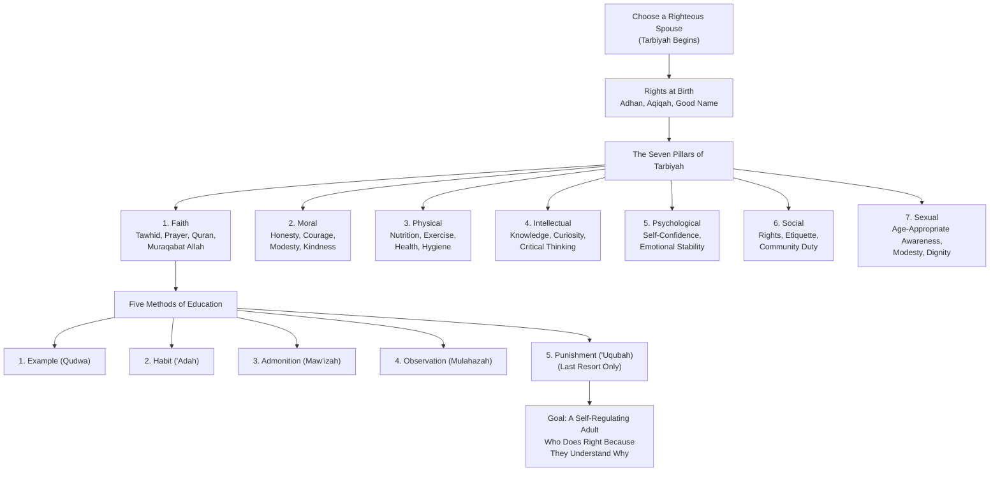
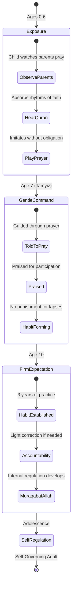
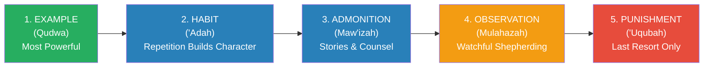
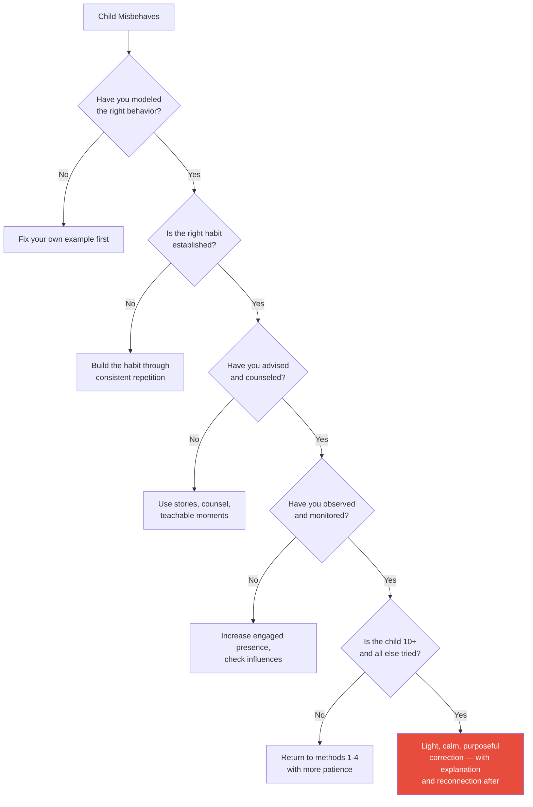

# Child Education in Islam — Abdullah Nasih Ulwan

> Every child is born upon the *fitrah* — a natural disposition toward God, toward goodness, toward truth. And then life happens. The parents happen. Abdullah Nasih Ulwan's masterwork, originally published in Arabic as *Tarbiyat al-Awlad fi al-Islam*, begins from this Prophetic premise and builds the most comprehensive Islamic framework for child-rearing ever assembled. Seven pillars — faith, morality, body, mind, psychology, social conduct, and sexuality — cover every dimension of what it means to raise a human being. Five methods — example, habit, admonition, observation, and punishment (in that order, with punishment explicitly last) — provide the pedagogy. The result is not a book about making children behave. It is a book about building a complete human being who will one day stand before God and give an account. And it begins not at birth, but at marriage — because the first act of raising a good child is choosing a good spouse.

---

## About the Author

Abdullah Nasih Ulwan (1928-1987) was a Syrian Islamic scholar, educator, and social activist born in Aleppo. He studied at Al-Azhar University in Cairo and earned a doctorate in Islamic education. He taught at King Abdulaziz University in Jeddah, Saudi Arabia, and was deeply involved in social reform movements across the Arab world.

*Child Education in Islam* (*Tarbiyat al-Awlad fi al-Islam*) is his magnum opus — a two-volume work that has been translated into dozens of languages and remains the most widely referenced Islamic text on child-rearing. Written in the 1970s-80s, it emerged from Ulwan's conviction that the decline of Muslim societies could be traced directly to failures in parenting. He believed that if families returned to the comprehensive Islamic educational framework — grounded in Quran, Sunnah, and the practice of the early Muslim generations — the ummah would renew itself from the family unit upward.

Ulwan was not a theorist in an ivory tower. He ran youth programs, counseled families, and witnessed firsthand the consequences of neglectful or misdirected parenting. His writing carries the urgency of a man who saw education as the front line of civilizational survival.

---

## The Big Idea

- <b style="color: #2980b9">Islam provides a complete system for raising children across seven dimensions</b>: faith, morality, body, intellect, psychology, social conduct, and sexuality. No dimension can be neglected without creating an imbalance in the child's development
- <b style="color: #e74c3c">The decay of Muslim societies begins at home</b>: when parents fail their educational trust (*amanah*), the effects radiate outward — into schools, communities, and nations. Tarbiyah is not a private family matter; it is the foundation of civilizational health
- <b style="color: #27ae60">The educator must embody what they teach</b>: education by example (*qudwa*) is the most powerful of the five methods. A parent who lies cannot teach honesty. A parent who neglects prayer cannot instill devotion. The child watches everything
- Every child is born with *fitrah* — a natural inclination toward God and goodness. The parent's role is not to create goodness from nothing, but to *preserve and nurture* what is already there
- Punishment is the last resort, not the first tool. The five methods are hierarchical: example → habit → admonition → observation → punishment. Most problems should be solved before reaching the fifth method
- The most powerful internal regulator is *muraqabat Allah* — the consciousness that God sees everything. When a child internalizes this, external enforcement becomes less necessary
- Tarbiyah begins before birth, with the choice of a righteous spouse, and extends through adolescence. It is a lifelong project measured in years, not moments

---

## Key Concepts at a Glance

| Concept | One-line summary |
|---------|-----------------|
| **The Seven Pillars** | Faith, moral, physical, intellectual, psychological, social, and sexual education — a complete taxonomy |
| **Fitrah** | Every child's innate disposition toward God and goodness — the educator's job is to preserve it |
| **Tarbiyah** | Islamic education in its fullest sense: nurturing, training, refining, and guiding the whole person |
| **Muraqabat Allah** | God-consciousness as the supreme internal regulator — doing right when no one is watching |
| **The Five Methods** | Example, habit, admonition, observation, punishment — hierarchical and in that order |
| **Qudwa (Example)** | The most powerful method — children learn by watching, not by being told |
| **Amanah (Trust)** | Parenting is a divine trust; parents will be questioned about how they discharged it |
| **Justice Between Children** | Favoritism is oppression (*dhulm*) — equal treatment is non-negotiable |
| **The Command-at-Seven Model** | Introduce prayer at seven, expect compliance at ten — graduated religious habit-building |
| **The Ship Hadith** | Social responsibility: if those below deck drill a hole, everyone drowns unless stopped |
| **Haya' (Modesty)** | Not mere shyness but a deep sense of moral self-awareness that guards against wrongdoing |
| **Rifq (Gentleness)** | The Prophet's default mode — severity is the rare exception, not the rule |

---

## 30-Second Version

Islam provides a complete system for raising children across seven dimensions: faith, morality, body, mind, psychology, social conduct, and sexuality. The parent is a shepherd accountable to God for every child in their care. Five methods — example, habit, storytelling, observation, and punishment (strictly last resort) — form the pedagogy. The most powerful force is the parent's own character: children learn what they see lived, not what they hear lectured. The supreme internal regulator is *muraqabat Allah* — when a child internalizes that God sees everything, they do right even when no one is watching. Tarbiyah begins with choosing a righteous spouse and does not end until the child stands as a self-governing adult.

---

---

Faith education is the foundation on which all other pillars rest — Ulwan is unambiguous that without iman, morality lacks its anchor and self-regulation lacks its deepest source of power.

Education by Example dominates because it is the most powerful AND the most demanding method — you cannot give what you do not have.

Patience (Sabr) has the deepest Qur'anic foundation — mentioned over 90 times in the Qur'an — while Generosity (Karam) has the richest Prophetic narrations, with the Prophet described as "more generous than the wind."

The Command-at-Seven model is a graduated three-stage system: exposure (0-6), gentle encouragement (7-9), and firm expectation (10+) — perfectly aligned with cognitive readiness.

## Part One: Before the Child — Marriage and the Newborn's Rights

*Tarbiyah does not begin at the child's first tantrum. It does not even begin at the child's birth. It begins when two people decide to marry. The choice of spouse is the first parenting decision you will ever make.*

### Choosing a Spouse as Tarbiyah

The Prophet Muhammad said: "Choose for your offspring, for lineage has an effect." Ulwan opens with this hadith to establish a principle that modern genetics and developmental psychology would recognize: the child's environment begins with the parents themselves. A righteous spouse brings faith, character, and stability into the home before a child is even conceived.

The criteria the Prophet emphasized for choosing a wife — faith above wealth, beauty, and lineage — is reframed by Ulwan as the first act of child protection. A home built on *taqwa* (God-consciousness) creates the ecosystem in which all seven pillars of tarbiyah can flourish.

### Rights at Birth

Islam prescribes specific rituals for the newborn, each carrying pedagogical significance:

| Practice | Timing | Significance |
|----------|--------|-------------|
| **Adhan** (call to prayer in the ear) | Immediately after birth | The first sound is the declaration of God's greatness — tarbiyah begins at the first breath |
| **Tahnik** (softening palate with a date) | First day | Prophetic sunnah; connection to the Prophet's practice |
| **Good name** | Within the first days | The child's name shapes identity — names carry meaning and aspiration |
| **Aqiqah** (sacrificial animal) | Seventh day | Gratitude to God; social celebration of the child's arrival |
| **Circumcision** | Varies (typically early) | Hygiene and Abrahamic tradition |
| **Breastfeeding** | Up to two years | Quranic instruction (2:233); nutritional, immunological, and bonding benefits |

> [!info] The Adhan Story
> When the Prophet's grandson Hasan was born, the Prophet himself recited the adhan into the infant's ear. Ulwan draws a powerful lesson: the very first sound a Muslim child hears should be the declaration that God is the greatest. Before the child can understand language, the foundation of faith is already being laid.

---

## Pillar 1: Faith Education — The Foundation of Everything

*Every other pillar rests on this one. Without faith, morality lacks its anchor, social duty lacks its motivation, and self-regulation lacks its deepest source of power. Ulwan is unambiguous: iman comes first, and everything else follows.*

### Teaching Tawhid from the Earliest Age

The child's first coherent words, Ulwan argues, should include "La ilaha illa Allah" (There is no god but God). Not because a toddler comprehends monotheistic theology, but because the declaration plants a seed that will grow as the child's intellect develops. The concept is progressive immersion: surround the child with the language, rituals, and environment of faith from the beginning, and the understanding deepens naturally over time.

### The Command-at-Seven, Discipline-at-Ten Model

The Prophet instructed: "Command your children to pray at the age of seven, and discipline them for it at ten, and separate them in their beds."

Ulwan unpacks this hadith as a graduated pedagogical model:

| Age | Approach | Rationale |
|-----|----------|-----------|
| **0-6** | Exposure and modeling | The child observes parents praying, hears Quran, absorbs the rhythms of faith without formal obligation |
| **7-9** | Gentle command and encouragement | The child is told to pray, guided through it, praised for doing it — but not punished for lapses. The habit is being built |
| **10+** | Firm expectation with consequences | By now the habit should be established. The child who neglects prayer at ten can be disciplined — lightly, within strict conditions — because they have had three years of guided practice |

> [!tip] Why Seven?
> Ulwan connects the age of seven to what Islamic scholars call *tamyiz* — the age of discernment, when a child can distinguish right from wrong, understand instructions, and begin to form moral judgments. Modern developmental psychology recognizes a similar cognitive leap around ages 6-7 (Piaget's concrete operational stage). The Prophet's instruction aligns spiritual habit-building with cognitive readiness.

### Muraqabat Allah — The Supreme Regulator

<b style="color: #2980b9">The single most important concept in Ulwan's entire framework</b> is *muraqabat Allah* — the internalized consciousness that God sees everything you do, even when no human being is watching.

Ulwan argues that external enforcement (rules, punishments, surveillance) can only govern behavior when the enforcer is present. The child who refrains from stealing only because a parent is watching has not been truly educated. The child who refrains because they know *Allah is watching* has internalized the deepest form of moral regulation.

> [!example] The Girl and the Milk
> Caliph Umar ibn al-Khattab, walking through Madinah at night, overheard a mother telling her daughter to water down the milk before selling it. The daughter refused: "Umar has forbidden mixing water with milk." The mother said: "Umar cannot see us." The daughter replied: <b style="color: #27ae60">"But the Lord of Umar can see us."</b>
>
> This girl had internalized *muraqabat Allah*. Her moral compass did not depend on whether a ruler was watching. This, for Ulwan, is the ultimate goal of faith education — producing a human being whose integrity does not require external surveillance.

### Quran and Love of the Prophet

Two practical pillars of faith education:

1. **Quran memorization and understanding** — Not rote memorization without comprehension, but a living relationship with the text. Ulwan recommends progressive engagement: recitation at young ages, understanding of meaning at older ages, application of principles throughout
2. **Love of the Prophet** — Teaching children the Prophet's biography (*sirah*), his character, his kindness to children, and his role as the model human being. The goal is not abstract reverence but personal connection: "This is the kind of person I want to be"

---

## Pillar 2: Moral Education — Building Character

*Faith without character is incomplete. The second pillar translates belief into behavior — the daily, observable conduct that reveals what a person truly values.*

### Virtues to Instill

Ulwan provides a systematic catalog of virtues, each grounded in Quranic and Prophetic sources:

| Virtue | Arabic Term | Core Meaning |
|--------|------------|--------------|
| **Honesty** | *Sidq* | Truthfulness in speech, action, and intention — the Prophet called it the path to righteousness |
| **Trustworthiness** | *Amanah* | Reliability in discharging obligations — the Prophet was known as "Al-Amin" (The Trustworthy) before prophethood |
| **Modesty** | *Haya'* | Not mere shyness but a moral sensitivity that prevents wrongdoing from within |
| **Courage** | *Shaja'ah* | Standing for truth even when difficult — moral courage, not mere physical bravery |
| **Patience** | *Sabr* | Endurance through hardship, restraint from impulse, persistence in doing right |
| **Generosity** | *Karam* | Giving freely without calculation — the Prophet was described as "more generous than the wind" |
| **Justice** | *'Adl* | Fairness in all dealings, even toward those you dislike |
| **Kindness** | *Ihsan* | Excellence and beauty in treatment of others — doing more than the minimum |

### Vices to Combat

For each vice, Ulwan provides the Islamic diagnosis, the Prophetic remedy, and practical prevention strategies:

**Lying:** The Prophet warned that lying leads to wickedness and wickedness leads to the Fire. But Ulwan adds a practical dimension: the parent who tells a child "Come here, I'll give you something" with no intention of giving has just taught lying by example. The story is direct — the Prophet told a woman that calling her child under a false promise would be recorded as a lie against her.

**Envy (*hasad*):** Ulwan traces childhood envy primarily to parental favoritism. When parents give one child more attention, gifts, or praise than another, they plant the seed of resentment. The antidote is absolute justice between children — the Prophet refused to witness a gift given to one child when the others received nothing.

**Anger (*ghadab*):** The Prophet's advice was concise: "Do not become angry." When asked again, he repeated it. Ulwan teaches children practical anger management: changing position (sit if standing, lie down if sitting), making wudu (ablution), seeking refuge in Allah from Shaytan, and removing yourself from the provoking situation.

> [!warning] The Favoritism Principle
> An-Nu'man ibn Bashir's father wanted to give him a special gift. The Prophet asked: "Do you want all your children to be equally dutiful to you?" "Yes." "Then do not do this." Ulwan elevates this to a foundational principle: <b style="color: #e74c3c">favoritism between children is a form of oppression (*dhulm*) that damages both the favored child and the neglected one.</b> The favored child develops entitlement; the neglected child develops resentment. Both are harmed.

---

## Pillar 3: Physical Education — The Body as Trust

*The body is not the soul's prison — it is the soul's vehicle. Islam treats the body as an amanah (trust) that must be maintained, strengthened, and protected. A child who is malnourished, neglected, or physically untrained cannot fulfill their purpose.*

### Obligations of Physical Care

Ulwan outlines a comprehensive framework for physical education:

**Nutrition and Breastfeeding:** The Quran specifies two full years of breastfeeding (2:233). Ulwan treats this not as a suggestion but as a divine instruction with clear nutritional, immunological, and emotional bonding benefits. Beyond infancy, the child deserves wholesome food — the Prophet's guidance on moderation in eating ("one-third for food, one-third for drink, one-third for air") applies as a lifelong principle.

**Disease Prevention and Treatment:** Seeking medical treatment is not a lack of faith — the Prophet instructed: "Seek treatment, for Allah has not created a disease without creating a cure for it." Ulwan was ahead of his time in emphasizing preventive health care, vaccination, and hygiene as Islamic obligations.

**Physical Training:** The Prophet specifically encouraged three activities: <b style="color: #2980b9">swimming, archery, and horseback riding</b>. Ulwan interprets these not as exhaustive but as representative — activities that build strength, precision, and courage. The broader principle is that children should be physically active, trained in self-defense, and accustomed to physical effort.

**Sleep, Hygiene, and Bodily Care:** Regular sleep patterns, cleanliness (the Prophet said "cleanliness is half of faith"), dental care, and grooming are all part of the physical education framework. The child who learns to care for their body learns to respect the trust God has given them.

> [!tip] The Moderation Principle
> Islam forbids both excess and neglect of the body. Overeating, vanity, and obsessive self-care are condemned alongside neglect, filth, and weakness. The goal is a body that is strong enough to serve its purpose, maintained enough to function well, and disciplined enough not to become a distraction from higher aims.

---

## Pillar 4: Intellectual Education — Cultivating the Mind

*The first word revealed in the Quran was "Read" (Iqra'). Islam places intellectual development not as a secular luxury but as a sacred duty. The parent who raises an ignorant child has failed a fundamental obligation.*

### Three Levels of Intellectual Duty

Ulwan distinguishes between:

1. **Obligatory knowledge (*fard 'ayn*)** — What every Muslim must know: the basics of faith (*aqidah*), the rules of prayer and worship, the difference between *halal* and *haram*. This is non-negotiable for every child.

2. **Communally obligatory knowledge (*fard kifayah*)** — Specialized knowledge that the community needs: medicine, engineering, agriculture, governance. If enough community members pursue it, the obligation is met. If no one does, the entire community is sinful.

3. **Recommended knowledge** — Broad learning that enriches the individual and the community: history, literature, languages, sciences beyond the obligatory minimum.

### Cultivating Intellectual Curiosity

Ulwan encourages parents to:
- Answer children's questions seriously, not dismissively
- Provide access to beneficial books and learning materials
- Expose children to the intellectual heritage of Islamic civilization — the contributions of Muslim scholars to mathematics, medicine, astronomy, and philosophy
- Foster critical thinking within an Islamic framework — the Quran repeatedly commands reflection (*tafakkur*), contemplation (*tadabbur*), and reasoning (*ta'aqqul*)

> [!info] The Intellectual Heritage
> Ulwan reminds parents that Muslim scholars pioneered algebra (Al-Khwarizmi), optics (Ibn al-Haytham), medicine (Ibn Sina), geography (Al-Idrisi), and philosophy of history (Ibn Khaldun). A child raised ignorant of this heritage is robbed of a powerful source of intellectual confidence and identity.

---

## Pillar 5: Psychological Education — The Inner World

*A child can pray five times a day, recite the Quran, and observe every external obligation — and still be psychologically damaged. Ulwan dedicates an entire pillar to the child's inner world, recognizing that emotional health is not a Western luxury but an Islamic priority.*

### Psychological Diseases and Their Causes

Ulwan identifies several psychological conditions that educators must prevent and, where necessary, treat:

| Condition | Arabic | Root Cause | Antidote |
|-----------|--------|-----------|----------|
| **Inferiority complex** | *Shu'ur bil-naqs* | Parental humiliation, constant comparison, neglect | Affirm the child's worth, celebrate their unique strengths, avoid comparison |
| **Excessive fear** | *Khawf* | Threats, scary stories, punitive parenting | Gradual exposure to challenges, reassurance, building courage incrementally |
| **Envy** | *Hasad* | Favoritism, comparison with siblings or peers | Justice between children, gratitude training, contentment |
| **Chronic anger** | *Ghadab* | Unaddressed frustration, modeling of anger by parents | Prophetic anger management: change position, make wudu, seek refuge in Allah |
| **Paralyzing shyness** | *Khajal* | Overprotection, lack of social exposure | Gradual social engagement, encouragement, distinguishing healthy *haya'* from unhealthy timidity |

> [!danger] Comparison Kills Confidence
> Ulwan is emphatic: <b style="color: #e74c3c">never compare your child to another child — not a sibling, not a cousin, not a classmate.</b> Every comparison sends the message: "You are not enough." The parent who says "Why can't you be like your brother?" has just planted the seed of an inferiority complex that may take decades to uproot. Each child has their own *fitrah*, their own strengths, their own trajectory.

### Building Psychological Resilience

The antidote to psychological fragility is not overprotection but calibrated challenge:

- **Let children face age-appropriate difficulty.** The Prophet sent his own cousin Abdullah ibn Abbas on errands as a young boy, teaching him responsibility through experience.
- **Validate emotions without validating harmful behavior.** The child can be angry; the child cannot hit. The emotion is acknowledged; the action is redirected.
- **Provide unconditional love as the baseline.** The child who knows they are loved regardless of performance has the psychological security to take risks, fail, and grow.
- **Avoid shame as a disciplinary tool.** Shame attacks identity ("You are bad"); correction addresses behavior ("What you did was wrong"). Ulwan, like modern psychology, draws this distinction clearly.

---

## Pillar 6: Social Education — Living in Community

*Islam does not produce hermits. The well-raised Muslim child is not merely personally righteous — they are socially responsible. They understand their obligations to parents, neighbors, the elderly, the poor, and the broader ummah.*

### The Hierarchy of Social Rights

Ulwan outlines a structured system of social obligations:

1. **Rights of parents** — Obedience, kindness, service, and patience — even when the parent is difficult. The Quran places kindness to parents immediately after worship of God (17:23).
2. **Rights of neighbors** — The Prophet said that Jibril (Gabriel) kept emphasizing the neighbor's rights until he thought the neighbor would inherit from him. Kindness to neighbors is not optional.
3. **Rights of teachers** — Respect for knowledge and those who transmit it.
4. **Rights of the elderly** — The Prophet said: "He is not one of us who does not show mercy to our young and respect to our elderly."
5. **Rights of the poor and orphans** — Charity (*sadaqah*) and care for the vulnerable as essential community obligations.

### Social Etiquette (*Adab*)

Ulwan catalogs specific behaviors children should learn:

| Context | Etiquette |
|---------|-----------|
| **Eating** | Eat with the right hand, say *bismillah*, do not criticize food, do not overeat |
| **Greeting** | Initiate the *salaam*, the young greets the old, the walking greets the sitting |
| **Seeking permission** | Knock before entering, announce yourself, respect privacy |
| **Gatherings** | Do not sit in someone's place, make room for others, lower your voice |
| **Visiting the sick** | A communal obligation with specific Prophetic etiquette |
| **Public spaces** | Remove harm from the road, do not obstruct others, maintain cleanliness |

### The Ship Hadith — Social Responsibility

> [!example] The Parable of the Ship
> The Prophet described people aboard a ship. Those on the upper deck have access to water; those below do not. If those below decide to drill a hole in the hull to get water, the entire ship will sink — <b style="color: #e74c3c">unless those above stop them</b>.
>
> Ulwan uses this hadith to teach children that social responsibility is not optional. You cannot say "It's their problem, not mine" when someone's actions threaten the collective. Enjoining good and forbidding evil (*amr bil ma'ruf wa nahy 'an al-munkar*) is every Muslim's duty — including children, at their level.

---

## Pillar 7: Sexual Education — Dignity, Not Shame

*This is perhaps the most courageous section of Ulwan's work. Writing in a cultural context where sexual topics were deeply taboo, he insisted that sexual education is a parental duty — and that silence is not modesty but negligence.*

### Age-Appropriate Stages

Ulwan provides a graduated framework:

| Stage | Age | Approach |
|-------|-----|----------|
| **Early childhood** | 0-6 | Teach proper names for body parts, establish physical boundaries, begin gender-appropriate behavior |
| **Age of discernment** | 7-10 | Separation of sleeping arrangements (Prophetic instruction), modesty in dress and behavior, basic understanding of gender differences |
| **Pre-puberty** | 10-12 | Preparation for physical changes, instruction on *ghusl* (ritual bathing), deepening understanding of modesty |
| **Adolescence** | 13+ | Frank discussion of sexual desire, the Islamic framework for marriage, protection from *haram* (forbidden) relationships, guidance on managing desire through fasting, worship, and productive activity |

### Key Principles

- <b style="color: #27ae60">Knowledge protects; ignorance endangers.</b> The child who receives sexual education from their parents receives it within a framework of values. The child who receives it from peers, the internet, or the street receives it without context or morality.
- **Separation of sleeping arrangements at ten** — The Prophetic instruction to separate children's beds at age ten. Ulwan treats this as both a practical safeguard and an early lesson in bodily autonomy and privacy.
- **Modesty (*haya'*) is taught, not merely imposed.** The child should understand *why* modesty matters — not just follow rules but internalize values.
- **Marriage is presented positively** — not as a restriction on desire but as the sanctioned, beautiful, and dignified fulfillment of a natural human need.

> [!success] Why This Section Matters
> In many Muslim communities, sexual education is avoided entirely, left to peers and media to fill the void. Ulwan's insistence — grounded in Quranic and Prophetic evidence — that parents *must* address sexuality with their children is both prophetic and practically urgent. A child armed with knowledge and values is far better protected than a child armed with silence.

---

## The Five Methods of Education

*If the seven pillars describe WHAT to teach, the five methods describe HOW to teach it. This is the book's most practically powerful section — a pedagogy that is hierarchical, intentional, and grounded in the Prophet's own educational practice.*

### Method 1: Education by Example (*Al-Qudwa*)

<b style="color: #27ae60">The most powerful method and the one that requires the most from the educator.</b>

Children learn primarily by watching, not by listening. The parent who tells their child to be honest while lying to a caller ("Tell them I'm not home") has just delivered a lesson — in dishonesty. The parent who lectures about patience while screaming in traffic teaches impatience. The parent who commands prayer while neglecting it teaches that prayer is optional.

Ulwan presents the Prophet Muhammad as the supreme *qudwa* — and then turns the mirror on parents: "You are your child's first prophet." Not in the theological sense, but in the pedagogical sense: the child's first model of what a good human being looks like is the parent standing in front of them.

> [!quote] "If the educator is truthful, the child learns truthfulness. If the educator is trustworthy, the child learns trustworthiness. If the educator is devout, the child absorbs devotion."

The principle is simple and devastating: **you cannot give what you do not have.** The parent who wants to raise a child of character must first become a person of character. This is why Ulwan's framework is not merely a parenting manual — it is a self-improvement program for the parent.

### Method 2: Education by Habit (*Al-'Adah*)

Repetition builds character. The child who prays every day from age seven does not merely learn the mechanics of prayer — they internalize the habit of turning to God. The child who says "bismillah" before eating every meal does not merely follow a rule — they develop the reflex of God-consciousness in daily life.

Ulwan connects this to the Prophetic instruction to command children to pray at seven — three full years before accountability begins at ten. The purpose of those three years is habit formation, not obligation. By the time obligation arrives, the habit is already established.

**Practical applications:**
- Establish daily routines around prayer, Quran recitation, and dhikr (remembrance of God)
- Build habits of greeting, gratitude, and courtesy through repetition, not lectures
- Use morning and evening supplications (*adhkar*) as habit anchors
- Start early — habits formed in childhood are neurologically stronger than those formed later

### Method 3: Education by Admonition (*Al-Maw'izah*)

Storytelling, counsel, and teaching through narrative and example. Ulwan identifies several types:

1. **Direct counsel** — Heart-to-heart conversations, clear and loving
2. **Stories of the Prophets** — Quranic narratives of Ibrahim, Yusuf, Musa, and others as moral instruction
3. **Stories of the Companions** — Real examples of courage, sacrifice, and integrity
4. **Seizing teachable moments** — When an event occurs (a death, a natural disaster, a moral dilemma), the educator connects it to divine wisdom
5. **The example of Luqman** — The Quranic passage (31:13-19) where Luqman advises his son is Ulwan's model of perfect admonition: clear, loving, comprehensive, and grounded in tawhid

> [!example] Luqman's Advice
> "O my son, do not associate anything with Allah. Indeed, association with Him is a great injustice... O my son, establish prayer, enjoin what is right, forbid what is wrong, and be patient over what befalls you... And do not turn your cheek in contempt toward people, and do not walk through the earth exultantly. Indeed, Allah does not like every self-deluded and boastful person."
>
> In a single passage: tawhid, worship, social responsibility, patience, humility, and moderation. Ulwan calls this the finest parenting speech ever recorded.

### Method 4: Education by Observation (*Al-Mulahazah*)

The educator must observe the child — their behavior, friendships, habits, interests, and struggles — not as a spy or a controller, but as a <b style="color: #2980b9">shepherd (*ra'i*) who is responsible for the flock</b>.

The hadith is explicit: "Each of you is a shepherd, and each of you is responsible for his flock." The father is a shepherd over his household. The mother is a shepherd over her husband's home and children.

**What to observe:**
- Who the child befriends (the Prophet said a person is on the religion of their close friend)
- What the child reads, watches, and consumes intellectually
- How the child behaves when they think no one is watching (this reveals the true state of tarbiyah)
- Signs of emotional distress, bullying, or negative influences
- Academic and spiritual development

**The balance:** Observation is not surveillance. The child needs privacy, trust, and space to develop autonomy. The over-monitored child becomes either sneaky or dependent. The unmonitored child becomes vulnerable. Ulwan advocates for engaged presence — the parent who is attentive without being suffocating.

### Method 5: Education by Punishment (*Al-'Uqubah*)

<b style="color: #e74c3c">The last resort — to be used only when the first four methods have been sincerely attempted and have proven insufficient.</b>

Ulwan is extraordinarily careful here, because he knows this section can be — and has been — misused. He provides strict conditions:

| Condition | Requirement |
|-----------|------------|
| **Age** | Not before age ten (following the Prophetic hadith) |
| **Sequence** | Only after example, habit, admonition, and observation have failed |
| **Target** | Never on the face — the Prophet explicitly forbade this |
| **Emotion** | Never administered in anger — the educator must be calm |
| **Severity** | Light — must not cause injury, leave marks, or break skin |
| **Quantity** | Maximum of three light strikes |
| **Purpose** | Correction and deterrence, never vengeance or humiliation |
| **Follow-up** | The educator explains the reason after the child calms down; reconnection is essential |

> [!danger] The Misuse Warning
> Ulwan explicitly warns against parents who use punishment as their first and primary tool. A parent who beats a child regularly has not practiced Islamic education — they have practiced abuse. The Prophet's overwhelming mode was gentleness (*rifq*), patience, and encouragement. He said: "Gentleness is not found in anything except that it beautifies it, and it is not removed from anything except that it makes it ugly."
>
> The five methods are hierarchical for a reason. If you are reaching for punishment frequently, the problem is not the child — it is the first four methods.

### The Graduated Response in Practice

---

## Best Stories and Parables

The power of Ulwan's book lies not just in its frameworks but in its stories — drawn from the Quran, the Prophet's life, and the early Muslim generations. These are the moments that make the principles come alive.

### 1. The Girl and the Milk

Caliph Umar ibn al-Khattab walked through Madinah at night and overheard a mother instructing her daughter to dilute milk with water before selling it. The daughter protested: "Umar has forbidden this." The mother replied: "Umar cannot see us." The daughter answered: "The Lord of Umar sees us."

Umar was so impressed that he later married his son to this girl. The lesson: *muraqabat Allah* — when a child internalizes that God sees everything, no human surveillance is needed. This girl's moral compass did not depend on whether the Caliph was watching. She had been raised with the first pillar intact.

### 2. The Prophet and the False Promise

A woman called her child over, promising to give him something. The Prophet asked what she intended to give. "A date," she said. He replied: if she had called the child with no intention of giving anything, it would have been recorded against her as a lie.

The implication is devastating in its simplicity: <b style="color: #e74c3c">every casual deception models dishonesty</b>. "We'll go to the park later" with no intention of going. "Santa brought you this." "I'll be there in one minute" when you mean thirty. The child learns that words and reality need not match.

### 3. The Prophet's Tenderness

A Bedouin man saw the Prophet kissing his grandchild Hasan and expressed amazement: "I have ten children and have never kissed any of them." The Prophet looked at him and said: "What can I do for you if Allah has removed mercy from your heart?"

Ulwan uses this to dismantle the cultural myth that severity equals strong parenting. The Prophet — the greatest educator in Islamic history — was physically affectionate, gentle, and emotionally present with children. Toughness is not a virtue in tarbiyah. Mercy is.

### 4. The Unjust Gift

An-Nu'man ibn Bashir's father brought the Prophet a gift he had given to An-Nu'man alone, asking the Prophet to witness it. The Prophet asked: "Have you given all your children the same?" No. "Then do not ask me to witness injustice. Would you like all your children to treat you equally?" Yes. "Then treat them equally."

This is the foundational hadith for Ulwan's justice principle. The Prophet refused to even *witness* favoritism — let alone endorse it. The parent who buys one child a gift and not the others, who praises one child's accomplishments and ignores another's, who gives one more time and attention — is practicing injustice that will bear fruit in resentment, rivalry, and broken family bonds.

### 5. Luqman's Counsel

The Quran records Luqman's advice to his son across several verses (31:13-19) — a masterclass in the admonition method:

- **Begin with tawhid:** "Do not associate anything with Allah"
- **Establish prayer and social responsibility:** "Enjoin what is right, forbid what is wrong"
- **Build resilience:** "Be patient over what befalls you"
- **Teach humility:** "Do not turn your cheek in contempt toward people"
- **Teach moderation:** "Be moderate in your pace and lower your voice"

The entire passage is delivered in love, not anger. In clarity, not ambiguity. In wisdom, not threat. This is what admonition looks like at its finest.

### 6. Umar ibn Abdulaziz and the Oil Lamp

The Caliph Umar ibn Abdulaziz was so scrupulous about the distinction between public and private resources that when a visitor came to discuss a personal matter, he extinguished the government oil lamp and lit his own — because state resources could not be used for private conversations.

His children grew up watching this. They absorbed the lesson without a single lecture: *public trust is sacred.* Education by example, at the highest level, producing a family that understood accountability not as a rule but as a way of life.

### 7. The Ship Parable

The Prophet described passengers on a ship: those on the upper deck have access to water; those on the lower deck do not. If those below decide to drill a hole in the hull to access water directly, the entire ship sinks — unless those above intervene.

For children, the lesson is social responsibility: you cannot ignore harm being done to the community simply because it does not directly affect you. The child who sees bullying and does nothing, who watches a classmate being excluded and remains silent, has failed the test of the ship.

---

## The Verdict

This is not a gentle bedtime-reading parenting book. It is a systematic treatise — dense, comprehensive, and relentlessly grounded in Islamic primary sources. It demands as much from the parent as it does for the child.

**What makes it exceptional:**

- **Comprehensiveness.** The seven-pillar framework covers dimensions that most parenting books — Western or Islamic — ignore entirely. How many parenting manuals address sexual education, social responsibility, *and* psychological health as distinct domains requiring deliberate attention? Ulwan does, and he does it within a coherent framework where each pillar supports the others.

- **The hierarchy of methods.** Placing punishment explicitly last — after example, habit, admonition, and observation — is not merely a nice sentiment. It is a structural argument. The parent who reaches for punishment first has skipped four steps. The book forces you to ask: "Have I modeled this? Have I built the habit? Have I counseled and advised? Have I been paying attention?" Most behavioral problems dissolve before you reach the fifth method.

- **The mirror it holds up to the parent.** Education by example is the most powerful method because it is the most demanding. You cannot outsource character formation. You cannot teach what you do not live. This is Ulwan's most uncomfortable and most important insight.

- **The fitrah principle.** The idea that every child is born inclined toward goodness — and that the parent's role is to preserve and nurture that inclination rather than create it from nothing — is both theologically profound and practically liberating. You are not fighting the child's nature. You are working with it.

### Limitations

- **Cultural specificity.** The book reflects mid-20th century Syrian and Arab social norms. Some recommendations on gender roles, domestic arrangements, and social expectations require thoughtful contextualization for contemporary readers — particularly those in Western Muslim communities.

- **Gender treatment.** While Ulwan affirms the education of both boys and girls, the framework sometimes defaults to male-centered examples and assumptions about women's roles that modern readers may find limiting.

- **Limited engagement with other traditions.** The book presents Islam's educational framework as self-sufficient, with minimal engagement with non-Islamic educational scholarship. Modern readers may wish for more dialogue between Ulwan's insights and those of developmental psychology, neuroscience, and cross-cultural parenting research.

- **The punishment section.** Despite Ulwan's careful conditions and warnings, this section has historically been misread and misapplied by parents who skip the nuance and seize the permission. The strict conditions deserve to be printed in bold every time the topic is discussed.

- **Repetitiveness.** The book is thorough to the point of repetition, particularly in its hadith citations. A more concise treatment of the same framework would reach more readers.

- **Psychological depth.** While the psychological pillar is genuinely valuable, it lacks the depth of modern child psychology. Ulwan identifies the diseases but does not always provide the granular tools for treatment that contemporary readers expect.

Despite these limitations, *Child Education in Islam* remains indispensable for Muslim parents seeking a comprehensive, source-grounded framework for raising their children. Its seven-pillar structure has no equal in Islamic literature, and its insistence on the educator's own character as the primary teaching tool resonates across every tradition and era.

---

## What Changes After Reading This Book

**In how you see parenting:**
- From "keeping kids out of trouble" to "building a complete human being across seven dimensions"
- From "discipline when they misbehave" to "the five methods — have I tried the first four?"
- From "teach them the rules" to "embody the rules and let them watch"

**In how you see yourself:**
- The mirror of Method 1 (Example) forces honest self-assessment: "Am I living what I'm teaching?"
- The *amanah* concept adds weight: "I will be asked about how I raised this child"
- The fitrah principle adds hope: "My child's nature is inclined toward good — I just need to nurture it"

**In how you see your child:**
- Not a blank slate to be written upon, but a being born with *fitrah* — an innate disposition toward God and goodness
- Not a problem to be managed, but a trust (*amanah*) to be honored
- Not merely your child, but God's creation temporarily in your care

---

## Practical Application: Seven Pillars in Daily Life

### A Weekly Framework

| Day | Pillar Focus | Practical Activity |
|-----|-------------|-------------------|
| **Monday** | Faith | Family Quran time — read, discuss meaning, apply to life |
| **Tuesday** | Moral | Discuss a virtue at dinner — tell a story, ask "What would you do?" |
| **Wednesday** | Physical | Active play, sport, or outdoor activity together |
| **Thursday** | Intellectual | Visit a library, discuss an Islamic scholar's contribution, or explore a new topic |
| **Friday** | Psychological | One-on-one time with each child — check in on feelings, affirm their unique strengths |
| **Saturday** | Social | Community service, visiting family, or practicing hospitality |
| **Sunday** | Sexual (age-appropriate) | Ongoing — answer questions honestly, reinforce modesty values, maintain open communication |

> [!tip] You Don't Need Seven Separate Sessions
> The seven pillars are not silos — they overlap naturally. A family hike (physical) where you discuss the beauty of God's creation (faith) and your child shares what is troubling them (psychological) addresses three pillars simultaneously. The framework is for awareness, not rigid scheduling.

### The Five Methods: A Self-Audit Checklist

Before reaching for correction, ask yourself:

- [ ] **Example:** Am I modeling this behavior myself? (If not, start here)
- [ ] **Habit:** Have I built a consistent routine around the expected behavior? (If not, establish it)
- [ ] **Admonition:** Have I told the story, given the counsel, seized the teachable moment? (If not, try it)
- [ ] **Observation:** Am I paying attention to who influences my child and how they spend their time? (If not, engage)
- [ ] **Punishment:** Have I exhausted the first four methods? Is the child over ten? Am I calm? Is the correction proportionate? (If not, return to methods 1-4)

### Building Muraqabat Allah — Practical Steps

This is the long game — the most important and most difficult thing to build:

1. **Talk about Allah naturally throughout the day.** "Look at that sunset — *subhanAllah*." "We're honest because Allah loves honesty." "Allah sees your kindness even when no one else does."
2. **Connect rules to divine wisdom, not arbitrary authority.** Not "Because I said so" but "Because Allah has taught us that this is better for us."
3. **Praise moral choices, especially private ones.** "I noticed you were honest when it would have been easy to lie. That took courage. Allah loves that."
4. **Use the story of the girl and the milk.** Retell it at appropriate moments. Ask: "What would you have done?"
5. **Model it yourself.** When you resist temptation, share the reasoning: "I could have done X, but Allah sees everything, and I want to do what's right."

---

## Connections

| Book | Connection |
|------|-----------|
| [[Hunt, Gather, Parent - Michaeleen Doucleff]] | Doucleff's cross-cultural research validates Ulwan's core methods: modeling behavior, gradual autonomy, community involvement, and minimal punishment. Inuit, Maya, and Hadzabe parents practice education by example and habit without calling it *qudwa* or *'adah* |
| [[No-Drama Discipline - Daniel J. Siegel]] | Connect-and-redirect parallels Ulwan's hierarchy: connection (methods 1-3) before correction (methods 4-5). Both frameworks place punishment last and insist the child must be calm before teaching can land |
| [[The Whole-Brain Child - Daniel J. Siegel]] | Siegel's upstairs/downstairs brain model maps onto Ulwan's graduated approach — you cannot teach the downstairs brain; you must engage the upstairs brain through connection first |
| [[Parenting from the Inside Out - Daniel J. Siegel]] | The parent's own formation shaping the child's education is Ulwan's Method 1 (Example) restated in neuroscience terms |
| [[How to Talk So Kids Will Listen - Adele Faber & Elaine Mazlish]] | Practical communication techniques that complement Ulwan's admonition method — different vocabulary, same principle: listen, validate, then guide |
| [[Unconditional Parenting - Alfie Kohn]] | Kohn's critique of punishment and extrinsic rewards resonates with Ulwan's placement of punishment as last resort and his emphasis on internal motivation (*muraqabat Allah*) over external compliance |
| [[The Danish Way of Parenting - Jessica Joelle Alexander]] | The Danish emphasis on empathy, reframing, and no ultimatums aligns with Ulwan's gentleness-first (*rifq*) principle and his insistence on understanding before correcting |
| [[Simplicity Parenting - Kim John Payne]] | Environmental simplification as preventive tarbiyah — Ulwan's observation method includes monitoring influences and removing harmful ones |
| [[Emotional Intelligence - Daniel Goleman]] | The psychological pillar (Pillar 5) maps directly onto Goleman's EQ competencies: self-awareness, self-regulation, empathy, social skills, and motivation |
| [[No Bad Kids - Janet Lansbury]] | Lansbury's respectful approach to toddler limits — firm boundaries delivered with empathy — mirrors Ulwan's balance of clear standards and gentle delivery |

---

## The One Paragraph That Changes Everything

> <b style="color: #2980b9">Every child is born upon the fitrah — inclined toward God, toward goodness, toward truth. The parent's job is not to create goodness from nothing but to preserve and nurture what is already there. And the most powerful tool you have is not a lecture, not a rule, not a punishment — it is your own life. Your child will become not what you tell them to be, but what they see you being. Fix yourself first. The rest will follow.</b>

This is the insight that transforms Islamic parenting from a checklist of do's and don'ts into a lifelong spiritual practice. Raising a child is not just something you do for the child — it is something that refines *you*. The seven pillars are not just a curriculum for the child; they are a mirror for the parent. Every pillar asks: "Do you embody this yourself?" Every method begins with: "Are you the example?"

*Tarbiyah is not a task you complete. It is a trust you carry — from the day you choose your spouse to the day you stand before God and give your account.*

---

## Five Things You Can Do Tomorrow Morning

1. **Examine your own example.** Pick one behavior you want your child to adopt — honesty, patience, prayer consistency — and ask: "Am I modeling this myself?" If not, fix your own practice first. Method 1 before all others.

2. **Build one new habit.** Choose a small daily practice to establish with your child — morning adhkar (supplications), saying bismillah before meals, or a five-minute family Quran session. Consistency matters more than duration.

3. **Tell one story at dinner.** Pick a story from the Prophet's life or the Companions — the girl and the milk, the Prophet's kindness to children, Luqman's advice. Let the story do the teaching. This is Method 3 in action.

4. **Check your justice meter.** Have you given each of your children equal attention, affection, and praise today? If one child has received more, correct the balance. Favoritism is not a small thing — the Prophet refused to even witness it.

5. **Have one honest conversation about God.** Not a lecture — a conversation. "Why do you think Allah asks us to pray?" "What do you think it means that Allah sees everything?" Let the child think, question, and discover. *Muraqabat Allah* is built through reflection, not instruction.

---

## Extended Deep Dive: The Educator's Character as Curriculum

### Method 1 in Practice — What It Actually Demands

Ulwan's insistence on education by example (*qudwa*) is the most personally demanding element of his framework. It is also the most easily glossed over. Parents nod at "be a good example" and move on to the techniques. But Ulwan won't let them. He returns to this point again and again, each time with sharper specificity.

What does it mean in daily life?

| Area | What Children Watch | What They Learn |
|------|-------------------|----------------|
| **Prayer** | Does the parent pray on time, or squeeze it in at the last moment? Does the parent pray with focus, or rush through the motions? | Whether prayer is a priority or an afterthought |
| **Honesty** | Does the parent tell the child to say "he's not home" when the phone rings? Does the parent inflate stories or minimize mistakes? | Whether truth is a living value or a situational convenience |
| **Anger** | Does the parent yell, slam doors, or name-call when frustrated? Or do they visibly pause, breathe, and choose a different response? | Whether anger is dangerous and explosive or manageable and human |
| **Charity** | Does the parent talk about giving or actually give — in front of the children, so they see the act? | Whether generosity is theory or practice |
| **Relationships** | Does the parent speak about neighbors and relatives with kindness or with gossip and contempt? | Whether *adab* applies when the other person isn't present |
| **Work ethic** | Does the parent follow through on commitments, arrive on time, and do quality work — even when no one is checking? | Whether *muraqabat Allah* governs the parent's professional life |
| **Spouse treatment** | Does the father speak to the mother with respect? Does the mother honor the father's dignity in front of the children? | Whether the Islamic ideal of *mawaddah wa rahmah* (love and mercy between spouses) is real or decorative |

The devastating implication: <b style="color: #e74c3c">every gap between what you preach and what you practice becomes visible to your children</b>. They may not mention it. They may not even consciously process it. But their behavior will reflect the reality they observed, not the ideals they heard.

Ulwan quotes the Quran: "O you who believe, why do you say what you do not do? It is most hateful in the sight of Allah that you say what you do not do" (61:2-3). For the parent-educator, this verse carries a specific weight: the distance between your words and your actions is the distance between what you teach and what your child learns.

### The Prophet as Educator — Specific Examples

Ulwan presents the Prophet Muhammad not as a distant figure but as a hands-on parent and teacher whose methods can be analyzed and replicated:

**Physical affection.** The Prophet kissed his grandchildren, carried them on his shoulders during prayer, and extended his prostration when they climbed on his back during worship. He once said: "Whoever does not show mercy will not receive mercy." His tenderness was public, frequent, and unapologetic — directly contradicting the cultural norm among many Arabs of his time that considered emotional expression with children to be weakness.

**Patience with mistakes.** When a young man came to the Prophet and asked permission to commit fornication, the companions were outraged. The Prophet sat the young man down, asked calm questions — "Would you accept this for your mother? Your sister? Your daughter?" — and with each answer the young man's own moral reasoning engaged. No yelling. No condemnation. The Prophet placed his hand on the young man's chest and prayed for him. The young man left, and the narrators report that nothing was more hateful to him afterward than what he had asked for. This is Method 3 (admonition) at its finest — engaging the heart through respectful dialogue, not crushing the spirit through shame.

**Delegating responsibility.** The Prophet appointed young men to significant roles: Usama ibn Zayd was given command of an army at approximately eighteen years old. Mu'adh ibn Jabal was sent as governor and teacher to Yemen while still young. These were not ceremonial appointments — they carried real authority and real consequences. Ulwan uses these examples to argue that children rise to the level of responsibility they're given, and that overprotection stunts the very growth parents seek.

**Gentleness as default.** The Prophet said: "Allah is gentle and loves gentleness, and He gives through gentleness what He does not give through harshness." Ulwan makes this the operating principle of the educator: <b style="color: #27ae60">gentleness (*rifq*) is not a secondary technique — it is the atmosphere in which all education takes place</b>. Harshness is the emergency deviation, not the baseline.

---

## Extended Deep Dive: Practical Integration of the Seven Pillars

### The Pillars Are Not Silos — They Reinforce Each Other

A common misunderstanding of Ulwan's framework: treating the seven pillars as separate curriculum areas to be taught in isolation. In practice, they interweave constantly:

**Faith + Physical:** The five daily prayers involve physical movement — standing, bowing, prostrating. Teaching a child to pray teaches them faith *and* physical discipline simultaneously. Fasting during Ramadan is both a spiritual practice and a lesson in physical self-regulation.

**Moral + Social:** Honesty is a moral virtue, but it is practiced in social contexts. Teaching a child to be truthful with friends, to return borrowed items, to admit mistakes at school — these are moral lessons embedded in social interactions.

**Intellectual + Faith:** The Quran repeatedly commands reflection, contemplation, and reasoning. The child who learns to think critically within an Islamic framework — "Why does the Quran describe the stages of fetal development?" "How did Muslim scholars contribute to mathematics?" — is developing both pillars simultaneously.

**Psychological + Moral:** A child with a healthy self-concept is far more likely to demonstrate moral courage. The child plagued by an inferiority complex may lie to avoid criticism, cheat to avoid failure, or bully to compensate for felt inadequacy. Psychological health is the soil from which moral behavior grows.

**Sexual + Social:** Teaching modesty isn't just about individual behavior — it's about respecting others' boundaries, understanding consent, and navigating social expectations around gender. The social dimension of sexual education is inseparable from the personal dimension.

### A Day in the Life: Seven Pillars Without Trying

A practical illustration of how the pillars integrate naturally:

| Time | Activity | Pillars Engaged |
|------|----------|----------------|
| **Fajr (dawn)** | Family wakes for dawn prayer together | Faith, Physical (movement of prayer), Psychological (discipline, self-regulation) |
| **Breakfast** | Children help prepare and clean up; say *bismillah*; eat with right hand | Social (contribution, etiquette), Physical (nutrition), Faith (remembrance) |
| **School** | Child encounters a moral dilemma — a friend cheats on a test | Moral (honesty), Social (loyalty vs. integrity), Intellectual (reasoning about right and wrong) |
| **After school** | Physical play, sport, or outdoor activity | Physical (strength, health), Psychological (stress release, confidence) |
| **Homework** | Parent helps without doing it for the child; discusses what they're learning | Intellectual (curiosity, knowledge), Psychological (building competence) |
| **Maghrib (sunset)** | Family prayer followed by short Quran reading and discussion | Faith, Intellectual (comprehension), Social (family bonding) |
| **Bedtime** | One-on-one time; parent asks about the child's day, shares a story from the *sirah* | Psychological (emotional check-in), Faith (love of the Prophet), Moral (lessons from stories) |

The key insight: <b style="color: #2980b9">you don't need seven separate educational programs</b>. You need a conscious, attentive presence that recognizes educational opportunities as they arise naturally throughout the day. The seven pillars are a diagnostic tool — they tell you where to look, not what to schedule.

---

## Extended Deep Dive: Addressing Common Misapplications

### The Punishment Distortion

Ulwan's careful treatment of punishment has been widely misapplied. Some parents extract the permission ("physical discipline is allowed after age ten") while ignoring the four preceding methods and the strict conditions. Ulwan anticipated this and spent considerable space on safeguards, but the distortion persists.

A corrective framework:

> [!danger] Before Any Physical Correction, Ask:
> 1. **Am I modeling this behavior myself?** If I haven't fixed my own practice, I have no standing to correct my child's.
> 2. **Have I built the habit consistently?** Three years of gentle training (ages 7-10 for prayer) should precede any firmness.
> 3. **Have I used stories, counsel, and loving conversation?** The child should understand the *why* before facing the *what*.
> 4. **Have I been paying attention?** Maybe the child is struggling with something I haven't noticed — a bully, anxiety, learning difficulties, depression.
> 5. **Am I calm?** If I'm angry, I must wait. Discipline administered in anger is not correction — it is vengeance.
> 6. **Is this proportionate?** Three light strikes, maximum. No face. No marks. No injury. If this feels insufficient, the problem is not the child — it is my first four methods.
> 7. **Will I reconnect afterward?** Every correction must end with love, explanation, and restoration of the relationship.

The test of whether the five methods are being practiced correctly: <b style="color: #27ae60">a parent who rarely or never reaches Method 5 is probably doing Methods 1-4 well</b>. A parent who frequently reaches Method 5 is almost certainly failing at Methods 1-4. The frequency of punishment is a diagnostic of the educator's practice, not the child's character.

### The Gender Gap

Ulwan wrote in a context where boys' education was emphasized over girls'. While he affirms the education of both sexes, modern readers note that many of his examples default to male pronouns and male-centered scenarios. A contemporary application of his framework requires deliberate attention to girls' education across all seven pillars — including intellectual and physical education, where cultural practice often falls short of Islamic principle.

The Quran's command to "read" (*iqra'*) was addressed to all of humanity, not to men alone. The Prophet's wife Aisha was one of the most prolific narrators of hadith and a recognized authority in Islamic jurisprudence. Fatimah al-Fihri founded the University of al-Qarawiyyin in 859 CE — arguably the world's oldest continuously operating university. The intellectual pillar applies equally to daughters, and parents who restrict their daughters' education violate the spirit of the framework they claim to follow.

### Adapting for the Contemporary Context

Ulwan wrote before the internet, before social media, before the global village made every cultural influence available to every child at the tap of a screen. His observation method (*mulahazah*) requires updating for the digital age:

| Ulwan's Era | Contemporary Application |
|-------------|------------------------|
| "Monitor who the child befriends" | Monitor online friendships, social media connections, and group chats — where much modern socialization occurs |
| "Observe what the child reads" | Include what the child watches, streams, follows, and consumes on YouTube, TikTok, and gaming platforms |
| "How the child behaves when they think no one is watching" | The child's digital behavior — what they post, comment, and share when they believe parents aren't seeing |
| "Signs of negative influences" | Online radicalization, cyberbullying, exposure to pornography, predatory contacts |
| "Academic and spiritual development" | Screen time's impact on attention span, sleep quality, and capacity for deep reading and reflection |

The principle remains identical: <b style="color: #2980b9">engaged presence, not surveillance</b>. The parent who installs monitoring software without building trust has substituted technology for relationship. The parent who builds trust and maintains open dialogue has a child who comes to them when they encounter something disturbing online — because the child knows the parent will respond with guidance, not punishment.

---

## Extended Deep Dive: Building a Culture of Tarbiyah in the Home

### From Individual Moments to Family Culture

The most common failure in applying Ulwan's framework: treating tarbiyah as a series of isolated interventions rather than a continuous family culture. The parent who lectures about honesty on Monday and gossips on Tuesday has not practiced tarbiyah — they've practiced inconsistency.

Building a culture means:

**Physical environment.** The home reflects what the family values. A dedicated prayer area (even a corner with a clean mat), Quran visible and accessible, books that reflect faith and intellectual curiosity, a family calendar showing Islamic dates alongside school events — these physical cues communicate priorities without a single word.

**Rituals and rhythms.** Family Quran time after Fajr or Maghrib — even five minutes. Friday preparation together. Ramadan traditions that children look forward to. Eid celebrations that rival secular holidays in joy and festivity. Regular family meals where everyone contributes and converses.

**Language.** The phrases used habitually: *bismillah* before beginning, *alhamdulillah* after completing, *insha'Allah* when planning, *astaghfirullah* when making mistakes. These are not empty formulas when used consciously — they are micro-moments of *muraqabat Allah* that accumulate into a God-conscious orientation toward life.

**Conflict resolution.** When family members disagree, how is it handled? The family that practices Ulwan's framework resolves conflict through listening, understanding, and seeking what is just — modeling the social pillar in real time. The family that resorts to shouting, sulking, or authoritarian decree teaches children that power determines outcomes, not truth.

**Community.** The family does not exist in isolation. Regular engagement with the mosque community, service projects, visiting the sick, feeding the hungry — these activities teach the social pillar through experience rather than instruction. The child who has served food at a homeless shelter understands charity differently than the child who has only heard about it.

### The Long View — Tarbiyah as a Twenty-Year Project

Ulwan's framework is not a quick fix. It is a multi-decade commitment that begins before conception and extends until the child stands as a self-governing adult. Parents who expect results within weeks or months are measuring the wrong thing. The fruit of tarbiyah appears in the adult, not the toddler.

The parent planting seeds at age four may not see the harvest until age twenty-four. The story told at age seven may become the moral compass consulted at age thirty-seven. The habit of prayer established at age eight may become the anchor that holds a young adult steady through a faith crisis at age nineteen. <b style="color: #27ae60">Tarbiyah is an investment in a future you may not live to see.</b> And that is precisely what makes it an act of faith.

> [!quote] The Shepherd's Trust
> "Each of you is a shepherd, and each of you is responsible for his flock." The weight of this hadith falls differently when you realize the Prophet wasn't speaking only to rulers and governors. He was speaking to every parent who tucks a child into bed at night. The flock is small. The responsibility is enormous. And the accounting will be thorough.

---

## The Educator's Daily Audit

A simple tool drawn from the five methods for nightly reflection:

| Question | Method | If the Answer Is "No"... |
|----------|--------|--------------------------|
| Did I model the behavior I expect from my child today? | Example | Fix my own practice before expecting anything from the child |
| Did my child practice a good habit consistently today? | Habit | Re-establish the routine; consistency matters more than perfection |
| Did I share a story, a lesson, or a moment of wisdom today? | Admonition | Tell one story at dinner tomorrow — the Prophet's life has thousands |
| Did I notice what my child did, who they spent time with, how they felt? | Observation | Tomorrow, ask one real question and listen to the full answer |
| Did I need to correct my child? Was I calm? Was I fair? | Punishment | If I was angry, apologize. If I was unfair, make amends. Repair always matters |

The audit takes two minutes. Done nightly, it transforms tarbiyah from aspiration to practice.

---

## Extended Deep Dive: Stories as Curriculum — The Admonition Method in Detail

### Why Stories Work Better Than Lectures

Ulwan's third method — education by admonition (*maw'izah*) — relies heavily on narrative. There is a reason for this that goes beyond cultural preference: <b style="color: #2980b9">stories bypass the defensive mechanisms that lectures activate</b>. When a parent says "You should be honest," the child's mind may resist, argue, or tune out. When a parent tells the story of the girl and the milk, the child enters the narrative, identifies with the character, and arrives at the moral conclusion themselves. The lesson sticks because the child discovered it rather than being told it.

The Quran itself is approximately one-third narrative. The stories of Ibrahim, Yusuf, Musa, Nuh, and other prophets are told not as historical records but as moral instruction. Each story contains layers of meaning that reveal themselves at different developmental stages. The five-year-old who hears about Yusuf understands forgiveness. The fifteen-year-old hearing the same story understands the complexity of family betrayal, resilience in captivity, and the long arc of divine justice.

### A Story Library for Parents

Ulwan catalogs stories across several categories. Here is a practical selection organized by the virtue they teach:

| Virtue | Story | Source | Age |
|--------|-------|--------|-----|
| **Honesty** | The girl and the milk (Umar) | Companions | 5+ |
| **Honesty** | The Prophet and the false promise (date) | Hadith | 3+ |
| **Courage** | Bilal under the boulder — refusing to renounce Islam | Sirah | 7+ |
| **Patience** | Ayyub's long illness and steadfast faith | Quran | 8+ |
| **Generosity** | The Prophet giving his only cloak to a man who asked | Hadith | 5+ |
| **Justice** | An-Nu'man and the unjust gift | Hadith | 6+ |
| **Forgiveness** | Yusuf forgiving his brothers who sold him | Quran | 7+ |
| **Humility** | Umar ibn Abdulaziz and the oil lamp | Companions | 9+ |
| **Trustworthiness** | The Prophet as "Al-Amin" — trusted by his enemies | Sirah | 6+ |
| **Social responsibility** | The ship parable | Hadith | 8+ |
| **Tawakkul (reliance on God)** | Ibrahim walking into the fire | Quran | 6+ |
| **Mercy** | The Prophet and the Bedouin who kissed no children | Hadith | 4+ |
| **Standing for truth** | Abu Bakr defending the Prophet when no one else would | Sirah | 8+ |

### How to Tell Stories Effectively

Ulwan provides implicit guidance that can be made explicit:

1. **Tell, don't read.** Eye contact, voice modulation, dramatic pauses — these make a story live. Reading from a book creates distance; telling from memory creates intimacy.
2. **Ask, don't explain.** After the story, resist the urge to deliver the moral. Instead: "What do you think happened next?" "Why do you think she said that?" "What would you have done?" Let the child extract the lesson.
3. **Connect to their life.** "Have you ever been in a situation where telling the truth was scary?" The story becomes relevant when it touches the child's own experience.
4. **Return to stories over time.** The same story told at age five, ten, and fifteen will yield different insights each time. The child's growing mind finds new layers with each revisiting.
5. **Let children tell stories back.** When a child retells a story in their own words, they process and internalize it far more deeply than passive listening allows.

---

## Extended Deep Dive: The Role of Environment in Tarbiyah

### Prevention Through Environmental Design

A principle that runs throughout Ulwan's work but deserves explicit attention: <b style="color: #27ae60">the most effective education prevents problems rather than correcting them</b>. Much of what parents experience as "misbehavior" is actually a child responding predictably to a poorly designed environment.

**Physical environment:** The home filled with fragile objects, then policed with constant "Don't touch!" creates an adversarial dynamic. The home designed for children — with accessible shelves, child-sized tools, safe spaces to explore — reduces conflict naturally.

**Social environment:** Ulwan emphasizes monitoring friendships because he understands that the Prophet's warning — "A person is on the religion of their close friend" — applies with special force to children. The child whose closest friends are kind, honest, and faith-oriented will absorb those qualities. The child whose circle is characterized by vulgarity, dishonesty, or cruelty will absorb those instead — regardless of what the parent teaches at home.

**Intellectual environment:** A home with books, discussions, and intellectual curiosity produces intellectually curious children. A home with only screens and entertainment produces passive consumers. The parent who asks questions at dinner — "What did you learn today?" "What made you think?" — creates an intellectual culture that the child will carry forward.

**Spiritual environment:** A home where prayer is visible, Quran is audible, and God-consciousness permeates daily conversation creates a spiritual atmosphere that shapes the child's inner world. The spiritual environment is not created by Islamic decoration on the walls — it is created by the quality of the family's relationship with Allah as expressed in daily life.

The genius of Ulwan's environmental approach: <b style="color: #2980b9">when the environment is right, most of the seven pillars are addressed simultaneously and continuously, without any formal teaching sessions</b>. The family that prays together, eats together, reads together, serves their community together, and discusses their experiences together is practicing all seven pillars — naturally, daily, and joyfully.

---

## Closing Perspective

Ulwan's *Child Education in Islam* remains, nearly five decades after its original publication, the most comprehensive and systematically organized Islamic framework for raising children. Its seven pillars have no rival in breadth. Its five methods have no rival in practical hierarchy. And its central demand — that the educator's own character is the primary curriculum — has no rival in moral seriousness.

The book asks more of the parent than it asks for the child. That is its most uncomfortable and most important feature. The parent who truly implements Ulwan's framework will be transformed in the process — because you cannot model what you do not possess, you cannot teach what you do not practice, and you cannot build in your child what you have not built in yourself.

*Tarbiyah is not something you do to your child. It is something you do to yourself — and your child watches, absorbs, and becomes.*
