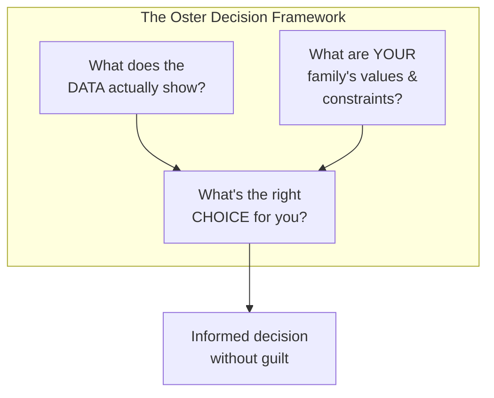
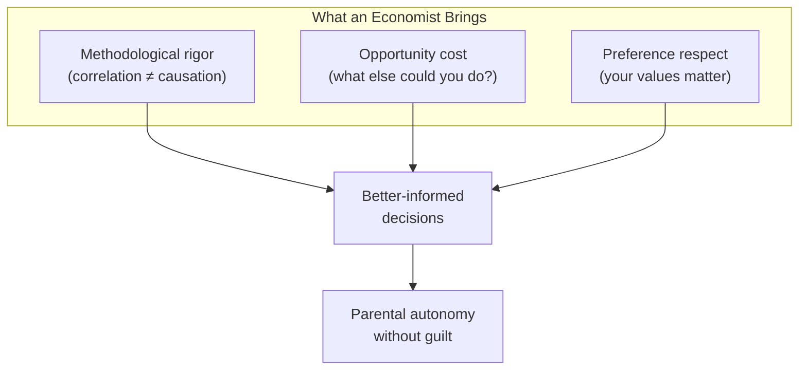
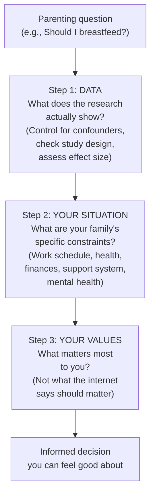
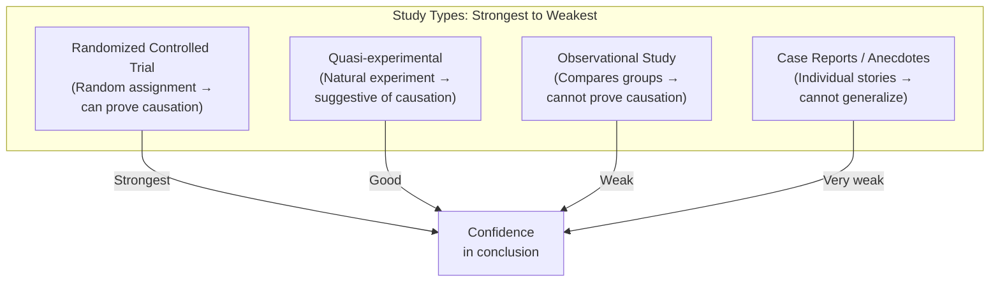

# Cribsheet — Emily Oster

> What if the fiercest debates in parenting — breast vs. bottle, co-sleeping vs. crib, cry-it-out vs. attachment parenting — turn out to be much less clear-cut than either side claims? Emily Oster, a Brown University economist who specializes in health data, does what almost no other parenting author does: she reads the actual studies, evaluates their methodology, distinguishes correlation from causation, and tells you what the evidence really shows. The answer, again and again, is: it's more nuanced than you've been told, the effects are smaller than you think, and the "right" choice depends on your family's specific values and constraints. This book won't tell you what to do. It will give you the data and a framework for deciding — and in doing so, it may be the most liberating parenting book you'll ever read.

---

## About the Author

Emily Oster is a professor of economics at Brown University, where she teaches courses on statistics, health economics, and data analysis. Her research focuses on development economics and health economics, including work on HIV in Africa and the economics of the American health-care system.

Her first parenting book, *Expecting Better* (2013), applied the same data-driven approach to pregnancy, challenging conventional wisdom on alcohol, caffeine, bed rest, and other topics. It became a bestseller and established Oster as the parenting world's most prominent data nerd. *Cribsheet* extends the approach from pregnancy to the first three years of life.

Oster is unusual in the parenting space because she has no clinical background, no therapy practice, and no particular philosophy of child-rearing. She is a methodologist — an expert in evaluating evidence. Her contribution is not to tell you what values to hold but to tell you what the data actually supports, so you can make informed decisions based on your own values.

She is also disarmingly honest about her own parenting: she describes the swaddle crisis, the Rock 'n Play dependency, the anxiety spirals at 3 a.m., and the Etsy market for oversized swaddle blankets with the self-deprecating humor of someone who knows that having expertise in data analysis doesn't protect you from parenting panic.

Her husband Jesse, also an economist, appears throughout the book as both a parenting partner and a sounding board for decision-making. Their shared language of cost-benefit analysis gives them a framework for making family decisions together — from meal planning (the meal-kit analysis that opens the introduction) to whether to have a second child. This is both endearing and illustrative: the decision framework she teaches isn't just theory. It's how she actually lives.

One important disclaimer: Oster is not a pediatrician, a psychologist, or a child development researcher. She is a methodologist — someone who evaluates evidence for a living. She doesn't tell you what to believe. She tells you what the evidence can and cannot support. This means her book is more trustworthy on questions of methodology ("Is this a good study?") than on questions of clinical judgment ("Is this normal for my baby?"). For the latter, see your doctor. For the former, see Oster.

---

## The Big Idea

- <b style="color: #2980b9">Most parenting debates are driven by bad data interpretation, not by actual evidence</b>: when you control for confounders and distinguish correlation from causation, many fierce controversies largely dissolve
- <b style="color: #e74c3c">The biggest error in parenting research is confusing correlation with causation</b>: breastfed babies do better on many measures, but mothers who breastfeed are also wealthier, more educated, and more health-conscious — controlling for these factors dramatically shrinks the apparent benefits
- <b style="color: #27ae60">The "right" answer depends on your family's values and constraints</b>: Oster provides a decision framework that separates data (what does the research show?) from values (what matters most to your family?) — because the same data can support different decisions for different families
- Even when effects are statistically significant, they may be too small to matter practically — a benefit that shows up in a study of 10,000 children may be invisible in any individual family
- The atmosphere around parenting is judgmental, anxious, and absolutist; a data-driven approach can restore autonomy and reduce guilt
- You have choices, but you have less control than you think — and that's actually liberating

---

## Key Concepts at a Glance

| Concept | One-line summary |
|---------|-----------------|
| **Correlation ≠ Causation** | Just because A and B occur together doesn't mean A causes B |
| **Confounding variables** | Factors (income, education, health behavior) that are correlated with both the parenting choice and the outcome |
| **Randomized trials** | The gold standard — randomly assign people to groups; any differences in outcomes can be attributed to the intervention |
| **Observational studies** | Most parenting research — compare people who made different choices; can't prove causation because groups differ in many ways |
| **Effect size** | How big the difference actually is — statistical significance doesn't mean practical importance |
| **The decision framework** | (1) What does the data say? (2) What are your family's constraints? (3) What's right for you? |
| **The Bottom Line** | Each chapter's summary of what the evidence actually supports |

---

## 30-Second Version

An economist reads the actual research behind every major early-parenting debate and finds that most controversies are far less clear-cut than advocates claim. Breastfeeding benefits are real but much smaller than advertised once you control for the fact that breastfeeding mothers are wealthier and more educated. Sleep training is safe and effective with no evidence of harm. Vaccination is overwhelmingly supported by evidence. Maternal employment doesn't harm children. Screen time effects are modest. The "right" choice on almost every issue depends on your family's specific values and constraints — not on a universal rule. Oster provides the data and a framework for deciding; you provide the values. The result is a book that gives parents something rare: the confidence to make their own informed choices without guilt.

---

The gap between public perception and actual evidence is the source of most parenting anxiety — the claims driving guilt are dramatically weaker than parents have been told.

Every parenting decision flows through three channels — data quality, family values, and family constraints — converging into an informed decision that replaces guilt with confidence.

Crying peaks at 6 weeks then steadily declines, sleep consolidates after 6 months, and parental confidence grows as both normalize — the hardest period is temporary.

## The Big Debates: What the Data Actually Shows

### Breastfeeding: The Most Politically Charged Topic in Parenting

This is Oster's most controversial chapter — and her most methodologically rigorous. The conventional wisdom: "breast is best" across virtually every dimension of infant health and development. The data reality: it's more complicated.

The problem is confounding. Mothers who breastfeed in the United States are disproportionately wealthier, more educated, and more health-conscious than mothers who don't. These same factors independently predict better child outcomes. When studies compare breastfed to formula-fed babies without controlling for these differences, breastfeeding appears to confer enormous benefits. When you *do* control for them, the benefits shrink dramatically.

| Claimed benefit | What the data actually shows |
|----------------|----------------------------|
| Higher IQ | Largely disappears when you control for maternal education and income |
| Better long-term health | Most claims are based on observational studies with poor controls |
| Reduced obesity | Inconsistent evidence; sibling studies show minimal effect |
| Fewer ear infections | Small, real effect in the first year |
| Fewer GI infections | **The strongest finding**: real, meaningful reduction in diarrheal illness |
| Better bonding | No evidence that bonding requires breastfeeding specifically |
| Reduced allergies | Evidence is mixed and weak |

> [!tip] The PROBIT Trial
> The single best study on breastfeeding is the PROBIT trial — a randomized trial conducted in Belarus that encouraged some hospitals to promote breastfeeding more aggressively. This is the closest we have to a true experiment. It found real but modest benefits: reduced gastrointestinal infections and fewer cases of eczema in the first year. But it found *no* significant effects on obesity, allergies, dental health, behavior, IQ, or other commonly claimed outcomes.

> [!warning] What This Doesn't Mean
> Oster is not anti-breastfeeding. She breastfed her own children. Her point is that the decision should be based on accurate information, not inflated claims. If breastfeeding works for your family, great. If it doesn't — if it's causing maternal depression, if the baby isn't gaining weight, if it's creating unsustainable stress — the data does not support the claim that you're causing lasting harm by switching to formula.

### The Breastfeeding How-To

Oster includes a separate chapter on the mechanics of breastfeeding for those who choose to do it — covering latch, positioning, supply issues, pumping, and the common problems (mastitis, plugged ducts, tongue tie). This is unusual for a data book and reflects her pragmatism: once you've decided to breastfeed based on the evidence, you need practical guidance to make it work.

Key practical findings:
- **Supply is established in the first few weeks** — frequent nursing in the early days is important for building supply
- **Pumping is less efficient than nursing** — but for working mothers, it's often the only option
- **Supplementing with formula doesn't "ruin" breastfeeding** — despite the "nipple confusion" fear, most babies can switch between breast and bottle without problems
- **Lactation consultants can help** — but their advice varies enormously in quality; look for IBCLCs (International Board Certified Lactation Consultants)

---

## The First Days: What Nobody Tells You

### The Hospital Stay

Oster covers the immediate postpartum period with bracing honesty:

- **Newborn weight loss**: babies typically lose 5-10% of birth weight in the first days; this is normal and not a sign that breastfeeding isn't working
- **Jaundice**: extremely common (60% of newborns); usually resolves on its own; phototherapy is safe and effective when needed
- **The Apgar score**: a quick assessment at 1 and 5 minutes after birth; low scores at 1 minute are very common and almost always improve by 5 minutes; the 5-minute score is more predictive but still limited
- **Circumcision**: Oster reviews the data with her usual neutrality — slight medical benefits (reduced UTI risk, reduced HIV transmission risk) that are modest enough to make this a values-based decision rather than a medical one

### Coming Home

> [!example] The Mesh Underwear Chapter
> Chapter 3 is titled "Trust Me, Take the Mesh Underwear" — referring to the disposable mesh underwear hospitals provide postpartum. Oster uses this as a jumping-off point for discussing maternal recovery: perineal healing, cesarean recovery, postpartum depression screening (she includes the full Edinburgh Postnatal Depression Scale), and the reality that most postpartum guidance focuses entirely on the baby while ignoring the fact that the mother just went through a major physical event.

### Postpartum Depression

Oster takes this seriously and provides actionable data:

- Affects 10-15% of new mothers (and some fathers)
- Often undiagnosed because symptoms overlap with normal new-parent exhaustion
- The Edinburgh Postnatal Depression Scale is a validated screening tool — Oster includes it in the book and encourages readers to take it
- Treatment (therapy, medication, or both) is effective
- Untreated postpartum depression affects not just the mother but the baby — through reduced responsiveness and impaired bonding

> [!danger] Take This Seriously
> If you score high on the depression screening, or if you recognize the symptoms in yourself or your partner, seek help. This is one area where the data is unambiguous: postpartum depression is common, treatable, and harmful if untreated. There is no benefit to suffering through it.

---

## Organizing Your Baby: Schedules and Structure

Oster addresses the schedule question with characteristic data-driven pragmatism. Should you put your baby on a schedule from day one, or follow the baby's lead?

The data: there is no evidence that early scheduling produces better outcomes than baby-led feeding and sleeping. There *is* evidence that some structure (consistent bedtime routines, predictable daily rhythms) helps babies sleep better by around 3-4 months. But rigid hour-by-hour schedules are not supported by evidence and can increase parental stress.

> [!tip] The Middle Path
> Oster recommends a "loose structure" approach: establish consistent rhythms (wake up, nap, play, feed, bedtime) without insisting on exact times. Babies' needs vary day to day, and forcing a rigid schedule on a two-week-old is a recipe for frustration. By 3-4 months, most babies naturally develop more predictable patterns — and you can gently shape those patterns with consistent routines.

---

## Sleep Training: The Full Picture

This topic deserves deeper treatment because it generates more parental anxiety than almost any other.

### What Sleep Training Actually Is

"Sleep training" is a broad category that includes several different approaches:

| Method | Description | Evidence |
|--------|-------------|---------|
| **Extinction (cry-it-out)** | Put baby down awake; don't return until morning | Effective; no evidence of harm |
| **Graduated extinction (Ferber)** | Check on baby at increasing intervals; don't pick up | Effective; no evidence of harm |
| **Fading** | Gradually reduce parental presence at bedtime | Effective but slower; no evidence of harm |
| **Bedtime routine only** | Consistent routine; no specific sleep intervention | Modest evidence of improved sleep |

### The Middlemiss Controversy

The single most-cited study by sleep-training opponents is Middlemiss et al. (2012), which found that babies' cortisol levels remained elevated even after they stopped crying during sleep training. This is presented as evidence that babies "give up" rather than learning to self-soothe — that the silence is despair, not sleep.

Oster's assessment: the study has serious methodological problems. It had no control group. Cortisol was only measured on the first night (when elevation is expected) and not on subsequent nights. And the conclusion that elevated cortisol equals psychological damage is not supported — cortisol rises during many normal experiences (being in a car seat, visiting the doctor) without causing harm.

> [!success] The Reassuring Data
> The strongest evidence comes from a randomized trial in Australia (Hiscock et al., 2008) that followed sleep-trained children for five years. At every follow-up, there were *no differences* between sleep-trained and non-sleep-trained children on measures of: emotional health, behavioral problems, sleep quality, parent-child attachment, or cortisol levels. The researchers specifically looked for harm and found none.

### When to Sleep Train

Oster notes that sleep training is typically recommended after 4-6 months, when babies are developmentally capable of sleeping longer stretches. Before that age, night waking is normal and biologically appropriate. After 4-6 months, if the current sleep situation is working for everyone, there's no reason to change it. If it's *not* working — if parents are sleep-deprived to the point of impaired functioning, depression, or unsafe behavior (falling asleep while driving) — the data supports sleep training as a safe and effective option.

---

## Allergies and Solid Food: The Reversal

This is one of the most dramatic examples of how parenting advice can reverse itself based on new data.

For decades, parents were told to delay introducing allergenic foods (peanuts, eggs, shellfish) until after the first birthday or even later. The logic seemed sound: give the immune system time to mature before exposing it to potential allergens.

Then the LEAP trial (Learning Early About Peanut Allergy) was published in 2015 and upended everything. Children at high risk for peanut allergy who were introduced to peanuts *early* (between 4-11 months) had an 80% lower rate of peanut allergy compared to children who avoided peanuts.

The current recommendation is the opposite of what it was a decade ago: introduce allergenic foods early, not late. This includes peanuts, eggs, and other common allergens.

> [!warning] The Lesson
> The peanut reversal illustrates one of Oster's broader themes: parenting recommendations change as new data emerges. The "experts" who told you to avoid peanuts were acting on the best available evidence at the time — and they were wrong. Humility about the limits of current knowledge is essential. Today's conventional wisdom may be tomorrow's retracted advice.

---

## What Oster Gets Right That Others Miss

### 1. Maternal Well-Being Matters

Most parenting books treat the mother as a means to an end — her job is to optimize the baby's outcomes. Oster insists that maternal well-being is *part of the equation*. A mother who is miserable, depressed, sleep-deprived, or resentful because she followed prescriptive advice that didn't work for her family is not providing optimal care — even if she's following the "right" rules.

### 2. Families Are Different

What works for a family with two professional incomes, a supportive extended family, and access to high-quality child care is different from what works for a single mother working two jobs with no family support. Oster's framework explicitly accounts for this. The "right" answer depends on your specific circumstances — and anyone who claims a universal prescription is ignoring reality.

### 3. Parenting Choices Are Portfolios, Not Individual Bets

Each individual decision (breast or bottle, sleep train or don't, work or stay home) has a small effect. What matters is the overall portfolio: a loving, responsive, stable environment. Getting one decision "wrong" (by whatever standard) is unlikely to matter if the overall pattern is good. This should be enormously reassuring to parents who agonize over every choice.

### 4. The Internet Is Not Your Friend at 3 a.m.

Oster repeatedly warns against seeking parenting advice on the internet in a state of exhaustion and anxiety. The internet amplifies extreme positions, rewards confident claims over nuanced evidence, and substitutes judgment for data. A parenting book you've read calmly during the day is a better resource than a Facebook group at midnight.

> [!success] The Oster Test for Parenting Advice
> When someone gives you parenting advice — whether it's your mother-in-law, your pediatrician, or the internet — ask:
> 1. What evidence supports this claim?
> 2. Is it based on a randomized trial or an observational study?
> 3. Were confounders controlled for?
> 4. How big is the actual effect?
> 5. Does this account for my family's specific situation?
> If the advice-giver can't answer these questions, treat the advice with appropriate skepticism.

### Sleep Training: Safe, Effective, and Not Harmful

The sleep-training debate produces more parental guilt than almost any other. Oster's review of the evidence is clear:

- **Cry-it-out and graduated extinction work**: multiple randomized trials show they improve infant sleep and reduce parental depression
- **No evidence of harm**: studies following sleep-trained children found no differences in attachment security, behavioral problems, or cortisol levels years later
- **The Middlemiss study** — often cited by sleep-training opponents for showing elevated cortisol in babies who stopped crying — has been widely misinterpreted; the babies' cortisol was elevated on the first night but *not* on subsequent nights, and the study had no control group

> [!success] The Bottom Line on Sleep Training
> Sleep training is safe and effective. It does not damage your child's attachment or emotional development. But it's also not *required*. If you're happy with your current sleep situation, there's no reason to change it. The data gives you permission to choose either path without guilt.

### Sleep Position and Co-Sleeping

Back sleeping reduces SIDS risk — this finding is robust and has saved thousands of lives since the "Back to Sleep" campaign began. Bed-sharing increases SIDS risk — this is also well-supported, though the risk is amplified by smoking, drinking, and soft bedding.

Room-sharing (baby in a separate sleep surface in the parents' room) is recommended by the AAP, but Oster notes the evidence is weaker than the AAP suggests. Most of the data comes from studies that don't distinguish room-sharing from bed-sharing.

> [!danger] The Honest Assessment
> Bed-sharing carries real risks, and the risks are not eliminated by doing it "safely." But Oster also acknowledges that exhausted parents sometimes fall asleep with their babies accidentally — and that planned bed-sharing with safety precautions may be less dangerous than accidentally falling asleep on a couch. The data-driven approach means presenting all the risks honestly rather than issuing absolutist directives that parents will violate out of desperation.

### Vaccination: The Easiest Chapter

Oster's shortest and most emphatic section. The evidence for vaccine safety and efficacy is overwhelming. The single study (Wakefield, 1998) that claimed a link between the MMR vaccine and autism was fraudulent — the author lost his medical license, and the paper was retracted. Dozens of subsequent studies involving millions of children have found no link.

Oster reviews the data with her usual rigor and finds this is the one topic where there is essentially no ambiguity:

- Vaccines work: they prevent diseases that kill and disable children
- Vaccines are safe: the most common side effects are mild (soreness, low fever)
- The autism link is nonexistent: the evidence is as close to conclusive as science gets
- Alternative schedules (spreading out vaccines) have no evidence of benefit and increase the period during which children are vulnerable

She also addresses the logic of herd immunity: even if you believe your child's individual risk from a disease is low, unvaccinated children put other children at risk — particularly immunocompromised children who can't be vaccinated. There is a collective responsibility dimension that goes beyond individual cost-benefit analysis.

> [!success] Bottom Line
> Vaccinate your children on the recommended schedule. This is one of the very few topics where the data points overwhelmingly in one direction. There is no legitimate scientific controversy.

### Co-Sleeping: The Nuanced Risk

This topic requires more nuance than most sources provide. Oster's assessment:

**Back sleeping** reduces SIDS risk — this is the single most important sleep safety recommendation, supported by decades of data and credited with dramatically reducing SIDS rates since the "Back to Sleep" campaign.

**Bed-sharing** (baby sleeping in the parents' bed) increases SIDS risk. But the risk varies enormously by context:

| Risk factor | Effect on bed-sharing risk |
|------------|--------------------------|
| Smoking (parent or in household) | Dramatically increases risk |
| Alcohol or drug use | Dramatically increases risk |
| Soft bedding, pillows, blankets | Increases risk |
| Premature or low-birth-weight baby | Increases risk |
| Sofa or armchair sleeping | Very high risk |
| Non-smoking, sober parents on firm surface | Risk exists but is much smaller |

**Room-sharing** (baby in a separate sleep surface in the parents' room) is recommended by the AAP for the first 6-12 months. Oster notes the evidence supporting room-sharing is weaker than the AAP suggests — most studies don't distinguish between room-sharing and bed-sharing.

> [!danger] The Honest Assessment
> Bed-sharing carries real risks. But Oster also acknowledges a practical reality: exhausted parents sometimes fall asleep with their babies accidentally — on the couch, in a recliner, in bed. Planned bed-sharing with safety precautions (firm mattress, no blankets, no smoking or drinking, baby on back) may be less dangerous than accidentally falling asleep in an unsafe position. The data-driven approach means presenting all the risks honestly rather than issuing absolutist directives that parents will violate out of desperation, leading to potentially more dangerous situations.

---

## The Newborn Period: Data for the Fog

The first weeks of parenting are a blur of sleep deprivation, anxiety, and love. Oster provides data-driven reassurance on the most common newborn concerns:

### Feeding Frequency

Newborns eat frequently — every 2-3 hours is normal. There is no evidence that scheduling feeds in the first weeks improves outcomes. Feed on demand (when the baby seems hungry) and don't watch the clock.

### Weight Loss

Newborns typically lose 5-10% of their birth weight in the first 3-5 days. This is normal. They should regain birth weight by 10-14 days. Weight loss beyond 10% may warrant supplementation — and supplementing with formula does not "ruin" breastfeeding.

### Crying

Average crying peaks at 6-8 weeks and declines thereafter. Some babies cry much more than average (colic affects ~20% of infants). Colic is not caused by anything parents did wrong, and it resolves on its own by 3-4 months. There is no reliable treatment.

### The "Fourth Trimester"

Oster endorses the concept that newborns in the first three months are essentially still in fetal development, having been "evicted" from the womb before they were fully ready. Swaddling, white noise, gentle motion, and frequent holding mimic the womb environment and help most newborns regulate.

> [!tip] The Data on Swaddling
> Swaddling helps most newborns sleep longer and cry less. It's safe when done correctly (snug on the arms, loose on the hips). Stop swaddling when the baby can roll over — usually around 3-4 months. The "Miracle Blanket crisis" from Oster's introduction is actually a data point: when she was forced to stop swaddling abruptly, her baby adapted fine. Parents' anxiety about transitions is often worse than the transitions themselves.

---

## What the Data Can't Tell You

Oster is refreshingly honest about the limits of her approach. Data can tell you:

- The average effect of breastfeeding across 10,000 families
- Whether sleep training harms children on average
- The probability of various outcomes given various choices

Data cannot tell you:

- What your specific baby needs right now, tonight, at 3 a.m.
- Whether the choice that's right on average is right for your particular family
- What values you should hold
- How to feel about your choices
- Whether the emotional experience of breastfeeding (or formula-feeding, or co-sleeping, or any other choice) is "worth it" to you

The decision framework bridges this gap by combining data with values. But Oster knows — and says — that some of the most important parenting decisions are ultimately about how things feel, not about what the data shows. The parent who breastfeeds because it brings her joy and connection is making a valid choice even if the health data is ambiguous. The parent who formula-feeds because breastfeeding was destroying her mental health is also making a valid choice. The data gives permission; the heart decides.

### Maternal Employment: No, It Doesn't Hurt Your Child

This may be the most emotionally loaded topic for working mothers. Oster's review:

- The largest and best-designed studies find no negative effects of maternal employment on children's cognitive or behavioral development
- Some studies find *positive* effects, particularly for daughters of working mothers (who grow up to be more likely to work and to earn more)
- The quality of child care matters far more than whether the mother is working
- The biggest study, using National Longitudinal Survey data, found that children of working mothers performed just as well on cognitive tests, had similar behavioral outcomes, and showed no measurable disadvantage compared to children of stay-at-home mothers

The guilt around this topic is intense and culturally specific. In many countries, maternal employment is assumed to be normal and supported by infrastructure (paid leave, universal child care). In the United States, the infrastructure barely exists, and mothers are left to feel that they're making an impossible choice between their career and their child's well-being. The data says: your child will be fine. The real question is what works for *you*.

> [!tip] The Real Question
> The data doesn't tell you whether to work or stay home. It tells you that *your child will be fine either way*. The decision should be based on what works for your family — financially, emotionally, professionally — not on guilt about harming your child.

### Child Care: Quality Over Type

When parents do work, who should care for the child? Oster reviews the evidence on different types of care:

- **Relative care** (grandparents, aunts): no systematic evidence that it's better or worse than other types
- **Nanny/au pair**: very little research; quality depends entirely on the individual
- **Home-based day care**: moderate evidence; quality varies enormously
- **Center-based day care**: the best-studied option; high-quality center care shows modest positive effects on school readiness

The key finding: *quality* matters far more than *type*. A warm, responsive grandparent is better than a cold, understaffed day care center. A high-quality day care center is better than a distracted, overwhelmed nanny. The variable that predicts child outcomes isn't the category of care — it's the quality of the relationships within that care.

> [!warning] The Cost Crisis
> Oster doesn't shy away from the economic reality: quality child care in the United States is staggeringly expensive. For many families, the "choice" between working and staying home is actually a choice between earning enough to pay for care and not earning enough to make working worthwhile. This is a policy failure, not a parenting failure.

### Screen Time: Less Scary Than You Think

The AAP recommends no screen time before 18 months and limited screen time after that. Oster's assessment of the evidence:

- Very young children (under 18 months) don't learn much from screens — they learn from human interaction
- For older toddlers, educational programming (Sesame Street) has measurable positive effects on school readiness — this is one of the best-studied interventions in child development
- The evidence that moderate screen time causes behavioral problems or attention disorders is weak and mostly correlational — families that use more screen time differ in many ways from families that don't
- Context matters enormously: watching TV with a parent who discusses the content is categorically different from being parked in front of a screen alone
- Video chat (with grandparents, for example) appears to be genuinely interactive and beneficial, even for young children

| Screen time concern | What the data shows |
|-------------------|-------------------|
| Causes ADHD | No causal evidence; correlational only |
| Delays language | Weak evidence; may apply to very high levels of passive viewing |
| Causes obesity | Weak evidence; correlation with snacking habits rather than screens per se |
| Destroys sleep | Some evidence that screens before bedtime disrupt sleep — blue light effect |
| Makes kids violent | No convincing evidence for moderate, age-appropriate content |
| Educational programs help | Yes — Sesame Street studies are among the strongest in child development |

> [!warning] The Real Risk
> The biggest concern isn't that screens damage brains. It's opportunity cost: time spent on screens is time not spent on other activities (outdoor play, reading, social interaction) that have clearer developmental benefits. The question isn't "Will screens hurt my child?" but "What else could my child be doing?"

### Discipline: The Data on What Works

Oster covers toddler discipline with characteristic even-handedness:

- **Spanking/physical punishment**: consistent evidence of harm across multiple studies; associated with increased aggression, behavioral problems, and anxiety; no evidence of effectiveness; the AAP recommends against it
- **Time-outs**: supported by evidence as effective when done correctly — brief, calm, consistent, in a non-stimulating environment; not associated with long-term harm
- **Positive reinforcement**: can be effective for specific behaviors, but Oster notes (echoing Kohn) that over-reliance on rewards can undermine intrinsic motivation
- **Ignoring minor misbehavior**: evidence supports this for attention-seeking behavior that isn't dangerous
- **Natural consequences**: limited evidence; works for some situations but not others

> [!tip] The Temperament Factor
> Oster emphasizes what many discipline books overlook: what works depends on the child's temperament. A strong-willed child may respond differently to time-outs than a sensitive child. A child who craves attention will respond differently to ignoring than a child who is naturally independent. There is no one-size-fits-all discipline approach, and any book that claims otherwise is oversimplifying.

### Potty Training: The Data Says Relax

Oster's review of potty training research contains one of the book's clearest findings:

- Children trained later (after 27 months) learn faster and have fewer accidents than children trained earlier
- There is no evidence that early training produces better long-term outcomes — virtually all children are fully trained by age 4 regardless of when training began
- The "readiness signs" approach (waiting for the child to show interest and ability) is well-supported
- Intensive methods (spending a weekend on potty training) work for some children but not others
- M&M's and sticker charts can accelerate the process but aren't necessary

> [!success] Bottom Line
> Don't start before your child is ready. Don't compare your timeline to anyone else's. The child who trains at 2 and the child who trains at 3.5 end up in the same place. The only real consequence of early training is more laundry for you.

---

## Physical Milestones: "Is My Kid Normal?"

This is one of the most anxiety-producing areas for new parents. Oster addresses it with both data and compassion.

### Walking

- The average child walks independently at 12 months, but the normal range is 9-18 months
- Late walking (after 15 months) is almost never a sign of developmental problems
- Early walking is not a sign of advanced development
- There is no evidence that walkers, bouncers, or other devices help or hinder walking

### Talking

- First words typically appear between 10-14 months; by 18 months, most children have at least 10 words
- The normal range for language development is enormous — some children are speaking in sentences at 18 months while others barely have 5 words
- Late talking (fewer than 50 words at 24 months) is common and usually resolves on its own — most "late talkers" catch up by age 3-4
- The number of words a child hears from parents is correlated with vocabulary development, but causation is hard to establish
- Bilingual children may appear delayed in each individual language but are not delayed in total language ability

> [!tip] The Worry Threshold
> Oster provides a useful framework: your pediatrician will flag genuine developmental concerns. If they're not worried, you probably shouldn't be. The variation in normal development is far wider than most parents realize. The child who walks at 10 months and the child who walks at 16 months are both completely normal.

---

## The Home Front: Relationship and Family Dynamics

The final section of the book addresses topics that affect parents rather than children directly.

### Internal Politics (Your Relationship)

Having a baby is hard on relationships. Oster is characteristically blunt: marital satisfaction drops significantly after the birth of a first child, and the drop is larger for women than men. The data suggests this is driven by:

- Sleep deprivation
- Unequal division of labor (women do more, even when both partners work)
- Loss of identity and autonomy
- Financial stress
- Reduced intimacy

> [!warning] The Division of Labor Problem
> The single biggest predictor of relationship dissatisfaction after a baby is the perception that the division of labor is unfair. This isn't just about who does more work — it's about whether both partners feel the arrangement is equitable. Oster recommends having explicit conversations about who does what, rather than assuming responsibilities will naturally sort themselves out.

### Having Another Child

Oster reviews the evidence on:

- **Spacing**: children spaced 2-3 years apart show slightly better outcomes than those spaced very closely or very far apart, but the effects are small
- **Number of children**: more children means fewer resources per child (time, money, attention), but the effects on individual child outcomes are modest
- **Birth order**: first-borns do slightly better on cognitive measures, but the differences are small and may reflect parenting intensity rather than birth order per se

The bottom line: the decision about when and whether to have another child should be based on your family's desires, not on optimizing child outcomes. The data differences are too small to outweigh your own preferences.

---

## The Economist's Contribution to Parenting

What does an economist bring to parenting that a psychologist, pediatrician, or educator doesn't? Three things:

### 1. Methodological Rigor

Economists are trained to identify confounders, assess study design, and distinguish correlation from causation. This training is directly applicable to evaluating parenting research, which is overwhelmingly observational and plagued by confounding.

### 2. The Concept of Opportunity Cost

Every parenting choice has a cost — not just in money, but in time, energy, and foregone alternatives. The mother who quits her job to breastfeed incurs not just lost income but lost career advancement, lost identity, and potentially lost mental health. An economist includes these costs in the decision matrix; most parenting advisors don't.

### 3. Respect for Individual Preferences

Economics assumes that different people have different preferences, and that the "best" outcome depends on what you value. Oster doesn't tell you what to value. She tells you what the data shows, then lets you apply your own values to the decision. This is genuinely respectful of parental autonomy in a way that most prescriptive parenting books are not.

---

## The Limits of Data

Oster is honest about what data can't do. It can tell you the average effect of breastfeeding across thousands of families. It can't tell you what your specific baby needs. It can tell you that sleep training doesn't cause long-term harm on average. It can't tell you how your specific child will respond.

Data also can't tell you what to value. If you believe breastfeeding is important for reasons that go beyond measurable health outcomes — bonding, tradition, personal meaning — the data showing modest average benefits doesn't invalidate your choice. Conversely, if the data shows modest benefits and breastfeeding is destroying your mental health, the data gives you permission to stop.

The decision framework works best when you use data to inform your values, not replace them. The worst outcome is making a decision based on bad data and then living with guilt about it. The best outcome is making a decision based on good data and your own genuine preferences — and feeling confident in it.

> [!success] The Liberation
> The deepest gift of this book isn't any specific finding about breastfeeding or sleep training. It's the permission to trust yourself. When you know what the data actually shows — that the effects are smaller than you've been told, that your child will likely be fine regardless of which choice you make on most of these issues — you can stop agonizing and start parenting. You can make the choice that works for your family and move on. That's not indifference. It's informed confidence.

---

## The Decision Framework in Practice

Oster's framework is deceptively simple but genuinely useful:

> [!example] Applying the Framework: Breastfeeding
> **Data**: Real but modest benefits, mainly reduced GI infections in the first year. Most other claimed benefits are confounded by socioeconomic factors.
> **Your situation**: Are you able to breastfeed comfortably? Does it cause pain, stress, or depression? Can you afford formula? Do you have workplace support for pumping?
> **Your values**: How much do the proven benefits matter relative to the costs to you? Is maternal well-being part of the equation?
> **Decision**: Different families will reasonably reach different conclusions — and *that's the point*.

---

## Correlation vs. Causation: The Master Lesson

If you take one thing from this book, it's this: **correlation is not causation**. This error underlies virtually every inflated claim in parenting.

| What we observe | What people conclude | What's really going on |
|----------------|---------------------|----------------------|
| Breastfed babies have higher IQs | Breastfeeding makes babies smarter | Mothers who breastfeed tend to be more educated — education, not milk, drives the IQ difference |
| Kids who watch less TV do better in school | TV makes kids dumb | Parents who limit TV also read more, talk more, and are more engaged — engagement, not TV restriction, drives the difference |
| Children in day care are more aggressive | Day care causes aggression | Children in day care are exposed to more peers earlier — some aggression is normal social development, not pathology |
| Co-sleeping babies die more often | Co-sleeping kills babies | Co-sleeping deaths are concentrated in families with smoking, drinking, and unsafe sleep surfaces — risk varies enormously by context |

The lesson isn't that these parenting choices don't matter. It's that the *size* of their effects is usually much smaller than advocates claim, and the effects are often driven by factors other than the choice itself.

> [!tip] How to Read a Parenting Study
> When someone cites a study to tell you what you should do, ask:
> 1. **Was it randomized?** If not, it can't prove causation
> 2. **What was controlled for?** If they didn't control for income, education, and health behaviors, the results are suspect
> 3. **How big was the effect?** A statistically significant difference that amounts to 0.5 IQ points is meaningless in practice
> 4. **Was it replicated?** A single study proves nothing; look for consistent findings across multiple studies
> 5. **Who is telling you about it?** People with an agenda (on either side) cherry-pick studies that support their position

---

## The Emotional Undercurrent

Oster doesn't just present data. She addresses the emotional landscape of early parenting with unusual honesty.

### The Guilt Machine

The parenting world is structured to produce guilt. Every choice is framed as having potentially catastrophic consequences. Breastfeeding advocates say formula will damage your child. Sleep-training opponents say crying it out will destroy attachment. Working-mom critics say day care will harm development. The data shows that *none of these claims are well-supported* — but the guilt persists because the claims are repeated so loudly and so often.

> [!warning] The Judgment Trap
> Oster observes that parenting discussions on the internet routinely deteriorate into moral judgment: "If you co-sleep, you don't care about your baby." "If you use formula, you're lazy." These judgments are not based on data. They're based on insecurity, tribal identity, and the human need to believe that our own choices are the only correct ones. The data-driven approach is an antidote: when you know what the evidence actually shows, other people's opinions lose their power.

### The Control Illusion

The swaddle-breaking story captures a deeper truth: parents have far less control than they think. Your child is a unique human being with their own temperament, developmental timeline, and preferences. The difference between the child who sleeps through the night at three months and the one who doesn't is mostly not about what you did. It's about who they are.

This is simultaneously terrifying and liberating. Terrifying because it means you can't guarantee outcomes. Liberating because it means you don't have to.

---

## The Verdict

This is the single best book for reducing parenting anxiety through data. Oster doesn't pretend to be a parenting philosopher or a child development expert. She's an economist who knows how to read studies, and she brings that skill to a field drowning in ideology and bad data interpretation.

**Limitations:**
- The book covers birth to ~age 3 only; older children's issues aren't addressed
- Oster's cool, data-driven tone may feel cold to parents who want emotional resonance and relationship guidance — this book tells you what the data says about breastfeeding; it doesn't help you connect with your baby
- The framework works best for discrete, testable questions (sleep training: yes or no?) and less well for the more complex, values-laden questions of parenting philosophy
- Some critics argue Oster is too willing to dismiss small effects — a tiny average reduction in IQ across a population may not matter to an individual, but it matters to a society
- The focus on American data means some findings may not generalize across cultures
- Oster occasionally sounds dismissive of concerns she considers poorly supported — this can alienate readers who hold those concerns for personal or cultural reasons rather than empirical ones

**What it does brilliantly:**
- Finally gives parents the actual data behind the biggest parenting debates, presented honestly and accessibly
- The breastfeeding chapter alone could save millions of mothers from unnecessary guilt
- The correlation-vs-causation framework is applicable far beyond parenting — it's a life skill
- The decision framework respects parental autonomy: "here's the data; you decide" rather than "do what I say"
- The chapter-ending "Bottom Lines" are genuinely useful quick references that you'll return to again and again
- Oster's personal stories (the swaddle crisis, the meal-kit analysis, the Rock 'n Play dependency) make data science feel human and relatable
- The book is structured for both cover-to-cover reading and as a reference guide — you can jump to whatever topic is keeping you up at night
- The appendix of further reading connects each topic to the primary research, allowing motivated parents to go deeper

### The Bottom Lines: Chapter by Chapter

For quick reference, here are Oster's "Bottom Line" conclusions across the major topics:

| Topic | The Bottom Line |
|-------|----------------|
| **Breastfeeding** | Real but modest benefits; biggest proven effect is reduced GI infections; formula is a fine alternative |
| **Sleep position** | Back sleeping reduces SIDS; consistent, strong evidence |
| **Co-sleeping** | Increases SIDS risk; risk amplified by smoking, drinking, soft bedding; room-sharing is safer |
| **Sleep training** | Safe and effective; no evidence of harm to attachment or development |
| **Vaccination** | Overwhelmingly supported; no link to autism; vaccinate on schedule |
| **Maternal employment** | No negative effects on child development; some positive effects |
| **Child care** | Quality matters more than type; center-based care has slight academic advantages |
| **Screen time** | Modest effects; educational content can be positive; context matters more than hours |
| **Spanking** | Harmful; no evidence of effectiveness; don't do it |
| **Time-outs** | Effective and not harmful when done correctly |
| **Potty training** | Later is easier; no benefit to early training |
| **Walking milestones** | Normal range is 9-18 months; late walking is almost never a problem |
| **Language milestones** | Enormous normal variation; most late talkers catch up |
| **Allergenic foods** | Introduce early (4-11 months), not late; dramatic reversal from previous advice |
| **Postpartum depression** | Common (10-15%), treatable, and harmful if untreated; screen for it |
| **Relationship after baby** | Satisfaction drops; division of labor is the biggest predictor; talk about it |
| **Second child spacing** | 2-3 years is slightly associated with better outcomes; effects are small |

### Where Oster Fits in the Parenting Canon

Oster occupies a unique niche. She is not a philosopher (like Gopnik), not a therapist (like Siegel), not a moralist (like Kohn), and not a practitioner (like Lansbury). She is a data scientist applied to parenting. Her contribution is not to tell you *what kind of parent to be* but to give you *accurate information* so you can be the kind of parent *you want to be*.

This means she pairs beautifully with the other books in this collection:

- Read **Gopnik** for *why* childhood exists → then read **Oster** for *what the data says* about specific choices
- Read **Kohn** for *why* unconditional love matters → then read **Oster** for *whether the evidence supports* the techniques you're considering
- Read **Siegel** for *how* your brain affects your parenting → then read **Oster** for *what the research says* about the specific issues that trigger you
- Read **Lansbury** for *how* to handle toddler behavior → then read **Oster** for *whether the evidence* supports what Lansbury recommends (it usually does)

The danger is reading Oster *alone*, without the philosophical and relational depth of the other authors. Data tells you what is likely to happen. It doesn't tell you what kind of person you want to be, what kind of relationship you want to have with your child, or what values you want to transmit. For that, you need the other books. Oster provides the map; the others provide the compass.

---

## The Oster Method: A Summary for Every Decision

When facing any parenting decision, Oster's approach boils down to five steps:

1. **Identify the question clearly** — "Should I breastfeed?" is actually several questions: "What are the health benefits? What are the costs to me? What are the alternatives?"

2. **Find the best evidence** — look for randomized trials first; if only observational studies exist, check whether they controlled for confounders; look at multiple studies, not just one

3. **Assess the effect size** — even if a benefit is "real," ask how big it is; a reduction from 5% to 4% risk is different from a reduction from 50% to 25%

4. **Add your family's context** — what are your constraints? Your resources? Your health? Your mental state? Your partner's situation? Your other children's needs?

5. **Make the decision and let go of guilt** — once you've done the analysis, commit to the choice and stop second-guessing; you made the best decision you could with the available information

> [!success] The Gift This Book Gives
> In a parenting culture that manufactures guilt, Oster offers something radical: permission to be confident in your own decisions. Not because she's given you the "right" answer, but because she's shown you that the data doesn't support the catastrophic claims that keep you up at night. Your child will most likely be fine regardless of whether you breastfeed or formula-feed, sleep train or don't, work or stay home. What matters is that you're engaged, loving, and making decisions based on your own informed judgment — not on other people's anxieties.

---

## Data Literacy for Parents: A Quick Reference

| When someone says... | Ask... |
|---------------------|--------|
| "Studies show breastfeeding raises IQ" | Were they randomized? Did they control for maternal education? |
| "Sleep training damages attachment" | Which study? Control group? Long-term follow-ups? |
| "Screen time causes ADHD" | Correlation or causation? What confounders were controlled? |
| "My baby is behind on milestones" | Behind compared to what? What's the actual normal range? |
| "You should never..." / "You must always..." | According to what evidence? How big is the effect? Trade-offs? |

### The Confounder Trap: Why Most Parenting Studies Mislead

This deserves one more illustration because it's so central to Oster's argument. Consider the claim that "children who are read to every day have higher IQs." This is true as a correlation. But parents who read to their children every day also tend to:

- Have higher levels of education themselves
- Have higher incomes
- Have more books in the home
- Spend more time talking to their children
- Live in neighborhoods with better schools
- Have been read to themselves as children

When you control for all of these factors, the independent contribution of daily reading to IQ becomes much harder to isolate. This doesn't mean reading to your child doesn't matter — it probably does, and it's certainly enjoyable. But the size of the effect is almost certainly smaller than the raw correlation suggests.

The same logic applies to virtually every parenting correlation you've ever heard:

- Breastfed babies are healthier → but breastfeeding mothers are healthier to begin with
- Children who eat dinner with their families are better adjusted → but families that eat together have more resources and stability
- Kids who play sports are more disciplined → but families that enroll kids in sports have more money and more involved parents

In every case, the *observed* correlation is real. The *causal* claim is unproven. And the *actual effect* of the parenting choice, isolated from everything else, is almost always smaller than you've been told.

---

## The Parenting Anxiety Industrial Complex

Oster doesn't use this term, but it describes what her book is fighting against. The modern parenting ecosystem — books, blogs, Facebook groups, Instagram accounts, pediatric advice, product marketing — is structured to produce anxiety. Every choice is framed as having potentially catastrophic consequences. The message, explicit or implicit, is: *if you don't do this right, you will damage your child*.

The data says otherwise. On almost every major parenting question, the differences in outcomes between the "recommended" choice and the alternative are small. Children are remarkably resilient. Good-enough parenting produces good-enough outcomes. The only truly harmful things are the extremes: severe neglect, abuse, deprivation of basic needs. The middle ground — where virtually all anxious parents live — is a zone of remarkably similar outcomes.

> [!tip] The Good-Enough Principle
> Donald Winnicott's concept of the "good-enough mother" gets empirical support from Oster's data review. You don't need to optimize every decision. You don't need to get everything right. You need to provide love, safety, nutrition, and a reasonably stimulating environment. Beyond that, the marginal returns on optimization are tiny. The energy you spend agonizing over breast vs. bottle would be better spent sleeping, or playing with your child, or just enjoying the fact that you're a parent.

---

## How This Book Changed the Parenting Conversation

When *Cribsheet* was published in 2019, it sparked controversy precisely because it challenged sacred cows. Breastfeeding advocates accused Oster of undermining public health messaging. Sleep-training opponents dismissed her methodology. Some reviewers complained that reducing parenting to data misses the emotional and relational dimensions.

These criticisms have merit — and Oster acknowledges most of them. But the book's impact has been overwhelmingly positive. It gave millions of parents permission to trust their own judgment. It provided a vocabulary for evaluating claims ("correlation vs. causation," "confounders," "effect size") that equips parents to be critical consumers of advice. And it modeled something rare in the parenting world: intellectual humility — the willingness to say "the data is unclear" rather than "do what I say."

The parenting world before Oster: ideology masquerading as science. The parenting world after Oster: still full of ideology, but now with a data-literate counterweight.

---

## A Note on Privilege

Oster's framework works best for families with choices. The mother deciding between breastfeeding and formula has options. The mother who can't afford formula doesn't. The parents debating whether to sleep train have a safe sleep environment. The parents whose baby sleeps in a drawer don't.

This is not a criticism of the book — every book has an audience — but it's worth acknowledging. The data shows that the single largest predictor of child outcomes is not any individual parenting choice but socioeconomic status. The fact that we spend so much cultural energy debating breast vs. bottle while millions of children lack adequate nutrition, safe housing, and quality health care is itself a form of privilege blindness.

Oster's most radical implication, though she doesn't frame it this way, may be this: if individual parenting choices matter less than we think, then the most impactful thing a society can do for children is not to write more parenting books — it's to invest in the infrastructure (universal health care, paid leave, quality child care, poverty reduction) that creates the conditions in which all families can thrive.

---

## Who Should Read This Book

| Reader | Why |
|--------|-----|
| Anxious new parents overwhelmed by conflicting advice | The data will calm you down |
| Working mothers feeling guilty | The evidence shows your child will be fine |
| Parents debating breastfeeding vs. formula | The most honest assessment of the evidence available |
| Anyone who has been judged for a parenting choice | Data is the antidote to judgment |
| Science-minded parents | You'll love the methodology discussions |
| Partners who disagree on parenting decisions | The framework gives you a shared language for decision-making |
| Fans of [[The Gardener and the Carpenter - Alison Gopnik\|Gopnik]] or [[Unconditional Parenting - Alfie Kohn\|Kohn]] | This provides the data complement to their philosophical arguments |
| Anyone making a specific parenting decision right now | Use the relevant chapter as a data-driven reference |
| Grandparents who give outdated advice | The data will help you explain why things have changed since they raised children |
| Parents of multiples or second-time parents | The "do-over" perspective (trying different approaches with different kids) runs throughout |

---

## The Book's Structure: How to Use It

Cribsheet is designed to be both read and referenced. Here's how to use it most effectively:

### As a Cover-to-Cover Read
Follow the chronological structure from birth through age 3. Each chapter builds on the previous one, and Oster's framework becomes more intuitive with practice.

### As a Reference Guide
Jump to whatever chapter addresses your current concern. Each chapter is self-contained, with its own data review and "Bottom Line" summary. You can read the sleep training chapter at midnight and the breastfeeding chapter at 4 a.m. — each stands alone.

### As a Conversation Starter
Share the framework with your partner, your parents, or your mommy group. "What does the data actually show?" is a question that can defuse heated debates and redirect conversations toward evidence rather than ideology.

### As a Complement to Other Parenting Books
Oster provides the *what* (data); other authors provide the *why* (philosophy), the *how* (techniques), and the *who* (self-understanding):

| Question | Best Book |
|----------|-----------|
| What does the data say? | **Cribsheet** (Oster) |
| Why does childhood exist? | [[The Gardener and the Carpenter - Alison Gopnik\|Gopnik]] |
| How do I connect with my child? | [[The Whole-Brain Child - Daniel J. Siegel\|Siegel]] |
| What should I say when my toddler melts down? | [[No Bad Kids - Janet Lansbury\|Lansbury]] |
| Why do I react the way I do? | [[Parenting from the Inside Out - Daniel J. Siegel\|Siegel]] |
| What's wrong with rewards and punishment? | [[Unconditional Parenting - Alfie Kohn\|Kohn]] |
| How do other cultures parent? | [[Hunt, Gather, Parent - Michaeleen Doucleff\|Doucleff]] |

Together, these books give you a complete toolkit: data, philosophy, brain science, practical scripts, self-understanding, cultural perspective, and the confidence to use them all.

---

## One More Thing: On Parenting and Economics

Oster ends the book with a reflection on what economics teaches us about parenting that other disciplines don't. Economics is fundamentally about trade-offs — the recognition that every choice has costs, that resources (time, money, energy, attention) are limited, and that optimizing one dimension often means sacrificing another.

This is the reality of parenting. You can't breastfeed around the clock *and* sleep eight hours *and* work full-time *and* exercise *and* maintain your marriage *and* keep a clean house. Something gives. The question is what.

Most parenting advice ignores trade-offs. It tells you to breastfeed, and also to sleep when the baby sleeps, and also to bond with your partner, and also to exercise for your mental health — as if all of these things can happen in the same 24 hours. An economist recognizes that they can't, and that choosing one means giving up another. This isn't failure. It's life.

The parents who are most at peace are not the ones who made the "right" choices on every issue. They're the ones who made *their* choices with clear eyes, good information, and acceptance of the trade-offs — and then let go of the rest.

That is the gift of data-driven parenting: not certainty, but clarity. Not perfection, but peace.

And peace, for a new parent at 3 a.m. with a screaming baby and a phone full of contradictory advice, is worth more than all the data in the world.

*Read the data. Know your values. Make your choice. Let go of the guilt. Love your child. That's the whole book. That's enough.*

---

*For Oster's updated data analyses and new research reviews, visit her newsletter at [ParentData.org](https://parentdata.org).*
<!-- end -->

---

## Related Reading

- [[Brain Rules for Baby - John Medina]] — complementary neuroscience perspective on early development
- [[The Gardener and the Carpenter - Alison Gopnik]] — the evolutionary "why" behind Oster's data-driven "what"
- [[Unconditional Parenting - Alfie Kohn]] — the philosophical foundation that Oster's data can support or challenge
- [[No Bad Kids - Janet Lansbury]] — practical discipline approach for the toddler years Oster covers
- [[The Whole-Brain Child - Daniel J. Siegel]] — brain science for the child strategies Oster evaluates
- [[Hunt, Gather, Parent - Michaeleen Doucleff]] — cross-cultural perspective that puts Western anxieties in context
- [[The Self-Driven Child - William Stixrud & Ned Johnson]] — shares the emphasis on reducing parental anxiety
- [[Parenting from the Inside Out - Daniel J. Siegel]] — the relational depth that complements Oster's data focus
- [[The Montessori Toddler - Simone Davies]] — practical, philosophy-driven approach to the toddler years
- [[No-Drama Discipline - Daniel J. Siegel]] — brain-science discipline approach for the age range Oster covers
- [[Simplicity Parenting - Kim John Payne]] — reducing overwhelm in family life — a values approach that complements Oster's data approach
- [[The Danish Way of Parenting - Jessica Joelle Alexander]] — how an entire culture approaches the decisions Oster analyzes individually

---

## FAQ

**Q: Is Oster anti-breastfeeding?**
A: No. She breastfed her own children. She's anti-inflated-claims. Her point is that the decision should be based on accurate data, not guilt.

**Q: Does she account for the emotional aspects of parenting?**
A: Partially. She includes maternal well-being in her decision framework and acknowledges that data alone can't capture the full picture. But emotional depth is not this book's strength — read Siegel or Kohn for that.

**Q: Is this book just for data nerds?**
A: No. Oster writes accessibly and uses personal stories to make the data relatable. You don't need a statistics background. But if you're allergic to numbers, this may not be your cup of tea.

**Q: What about topics she doesn't cover?**
A: The book stops at about age 3. For older children, Oster has written *The Family Firm* (ages 5-12). For emotional development and attachment, see [[Parenting from the Inside Out - Daniel J. Siegel|Siegel]] or [[The Whole-Brain Child - Daniel J. Siegel|The Whole-Brain Child]].

**Q: Does the data change over time?**
A: Yes, and Oster acknowledges this. Her website (ParentData) provides updated analyses as new research is published. The peanut allergy reversal is a dramatic example. The framework for evaluating evidence, however, is timeless.

**Q: Is Oster just telling privileged parents what they want to hear?**
A: This is a fair critique. Oster's framework works best for families with resources and options. For families in poverty, "What are your preferences?" is less relevant than "What can you afford?" Oster is aware of this but her primary audience is middle-class parents drowning in conflicting advice.

**Q: My pediatrician says something different. Who do I trust?**
A: Both, for different reasons. Your pediatrician knows your specific child. Oster knows the literature. The two are complementary: your doctor provides personalized medical advice; Oster provides the data context.

**Q: I'm overwhelmed. Where do I start?**
A: Start with whatever question is causing the most anxiety right now. You don't need to read cover to cover — use it as a reference guide for specific decisions.

---

## Five Things You Can Do Tomorrow Morning

1. **Stop googling at 3 a.m.** — the internet will make you more anxious, not less; if you need reassurance about a parenting choice, consult a book you've read calmly during the day, not a Facebook group in the middle of the night

2. **Apply the three-step framework** to one decision that's stressing you: (1) What does the data say? (2) What are our family's constraints? (3) What's right for us? Write it down if it helps — seeing the decision laid out can cut through the anxiety spiral

3. **Give yourself permission** — if you're formula-feeding and feeling guilty, know that the data does not support the catastrophic claims; if you're sleep-training and someone judged you, know that the evidence shows it's safe; if you're working and feeling torn, know that the studies show your child will be fine

4. **Ask about effect sizes** — the next time someone tells you a parenting choice "makes a difference," ask: how much difference? A statistically significant result that amounts to one fewer cold per year or 0.5 IQ points may not be worth restructuring your life for

5. **Separate data from values** — recognize that even when the data is clear, the decision still depends on what you value most; two families can look at the same evidence and make different choices, and both can be right; the goal is informed confidence, not universal agreement

---

## Key Phrases to Remember

| Phrase | Meaning |
|--------|---------|
| "Correlation is not causation" | The master lesson of this entire book |
| "Control for confounders" | The step that changes most parenting research from alarming to reassuring |
| "What does the data actually show?" | The question to ask before accepting any parenting claim |
| "The right answer depends on your family" | There is no universal prescription |
| "You have less control than you think" | And that's liberating, not terrifying |
| "Effect size matters" | A tiny statistically significant difference is not a reason to restructure your life |
| "The Bottom Line" | Oster's chapter-ending summaries of what the evidence supports |
| "Opportunity cost" | The economist's way of saying: what else could you be doing with that time and energy? |
| "The guilt machine" | What the parenting industry has become — producing anxiety, not information |
| "Here's the data; you decide" | The fundamental respect for parental autonomy that defines this book |
| "Good enough is good enough" | The marginal returns on parenting optimization are tiny |
| "Data + values = decision" | The complete formula for informed parenting |

### The Key Numbers to Remember

If you want to carry a few data points in your head, these are the ones Oster would prioritize:

- **85%** — the percentage of parenting outcome variation that is NOT explained by the specific choices parents agonize over (it's explained by genetics, socioeconomic status, and unmeasured factors)
- **10-15%** — the percentage of new mothers affected by postpartum depression; screen for it
- **80%** — the reduction in peanut allergy risk when peanuts are introduced early (the LEAP trial)
- **0** — the number of well-designed studies showing long-term harm from sleep training
- **0** — the number of well-designed studies showing a vaccine-autism link
- **6-8 weeks** — when infant crying peaks; it gets better after that
- **9-18 months** — the normal range for first independent walking
- **27+ months** — the age at which potty training is easiest and fastest
- **$245,000** — the estimated cost of raising a child in the US to age 18 (not including college)

---

## A Final Word: The Paradox of Control

Oster's deepest insight is not about any specific parenting topic. It's about control itself.

> [!success] The Swaddle Lesson
> "As a parent, you want nothing more than to do the right thing for your children, to make the best choices for them. At the same time, it can be impossible to know what those best choices are. Things crop up that you never thought about — even with a second kid, probably even with a fifth kid. The world, and your child, surprise you all the time. It is hard not to second-guess yourself, even on the small things."

The swaddle story that opens the book is really a story about surrender. Oster made a perfect plan. Life intervened. The baby was fine. The plan was irrelevant. This is the microcosm of all parenting: you prepare as well as you can, you make the best decisions you can with available data, and then you let go — because your child is a person, not a project, and they will become who they're going to become regardless of whether they were breastfed or formula-fed, sleep-trained or not, potty-trained at 2 or at 3.5.

The data doesn't just inform your decisions. It liberates you from the illusion that you control the outcome. And that liberation — the ability to stop agonizing and start enjoying — may be the most valuable thing any parenting book can offer.

---

*One Sentence That Changes Everything:*

> **"The right inputs to a parenting decision are data — the best evidence on the question — and your family's preferences and constraints; everyone else's opinions are not a necessary ingredient."**

