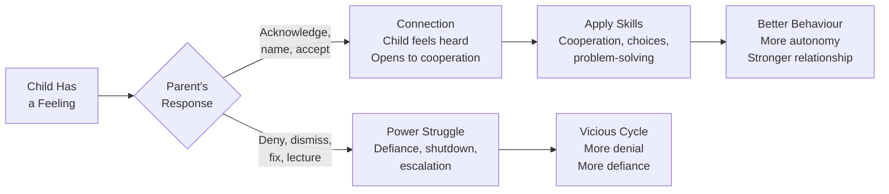
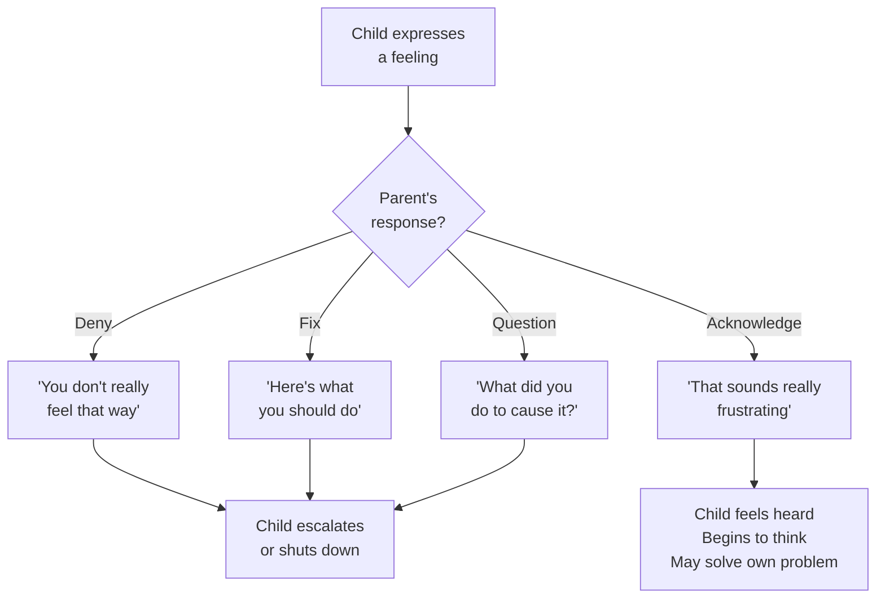
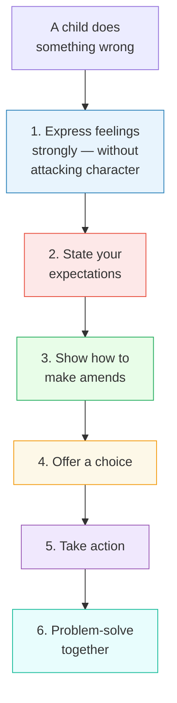
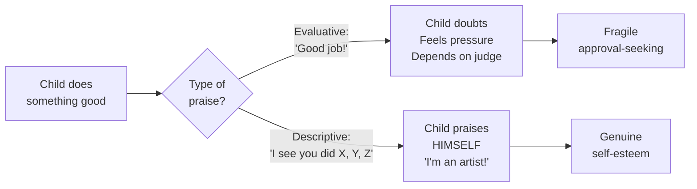
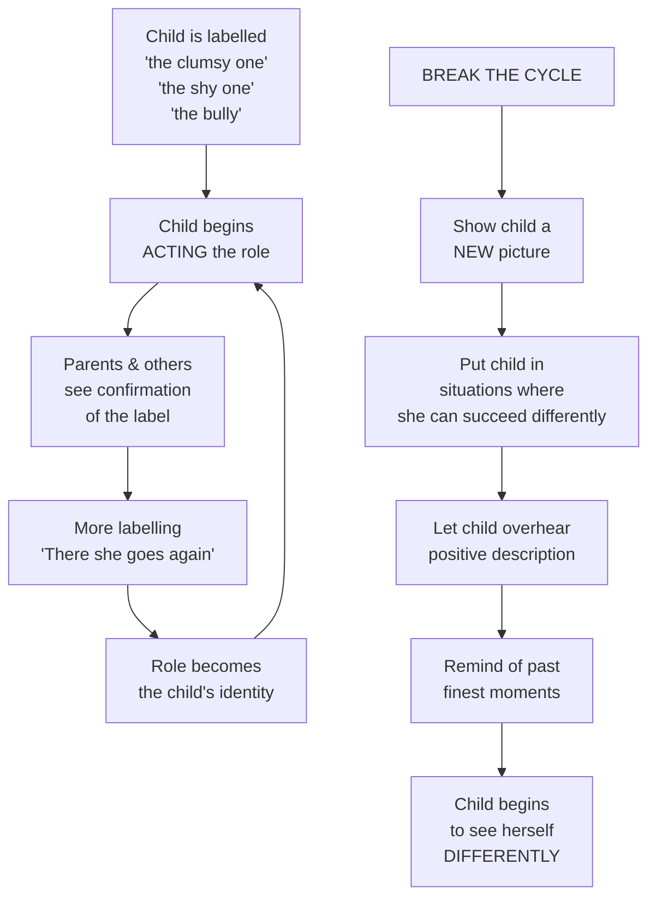
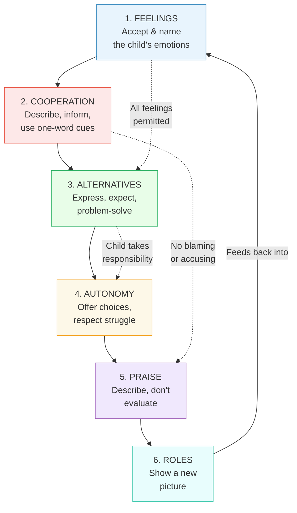
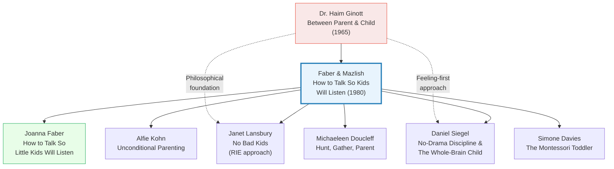

# How to Talk So Kids Will Listen & Listen So Kids Will Talk — Adele Faber & Elaine Mazlish

> I was a wonderful parent before I had children. I was an expert on why everyone else was having problems with theirs. Then I had three of my own.

---

## About the Authors

Adele Faber and Elaine Mazlish were young mothers in New York when they began attending parent workshops led by Dr. Haim Ginott, the child psychologist whose 1965 book *Between Parent and Child* revolutionised how adults think about communicating with children. Ginott's sudden death in 1973 left his work unfinished. Faber and Mazlish became his most influential torchbearers.

Their first book, *Liberated Parents/Liberated Children* (1974), told the personal story of their transformation. But readers demanded something more practical — "lessons," "exercises," "tear-out reminder pages." So Faber and Mazlish distilled years of workshops into this book: a step-by-step, illustrated, self-teaching program for parents. It became the most widely read parenting book of the late twentieth century — over three million copies sold, translated into thirty languages, adapted into a PBS series, and used in more than 150,000 parent groups worldwide.

What makes the book distinctive is its format. Each chapter follows the structure of a live workshop: comic-strip illustrations showing skills in action, practice exercises, extended dialogue examples, Q&A from real parents, and a tear-out reminder page. It reads less like a book and more like a conversation with a wise, funny, self-deprecating friend who has been exactly where you are.

Adele's daughter, Joanna Faber, later co-authored [[How to Talk So Little Kids Will Listen - Joanna Faber & Julie King|How to Talk So Little Kids Will Listen]], adapting the methods for toddlers and preschoolers — proof that these skills hold across generations.

---

## The Big Idea

- <b style="color: #2980b9">There is a direct connection between how children feel and how they behave</b> — when kids feel right, they behave right. The fastest way to change behaviour is to change how a child feels — and that starts with acknowledging those feelings instead of denying them
- <b style="color: #e74c3c">Most parents habitually deny their children's feelings without realising it</b> — "You're not really hungry, you just ate." "There's no reason to be upset." "You don't actually hate your brother." This steady denial confuses children, teaches them not to trust their own perceptions, and creates adversarial dynamics
- <b style="color: #27ae60">Respectful communication is not a personality trait — it is a set of learnable skills</b> — six specific, practicable skills that replace the autopilot habits of blaming, lecturing, threatening, and punishing
- The book's architecture: **(1)** Help with feelings → **(2)** Engage cooperation → **(3)** Replace punishment → **(4)** Encourage autonomy → **(5)** Praise descriptively → **(6)** Free from roles
- Every skill rests on a single foundation: treating children as whole human beings whose feelings, perspectives, and dignity matter — even when their behaviour needs to change

---

## Key Concepts at a Glance

| Concept | One-line summary |
|---------|-----------------|
| **Acknowledge feelings** | Name what the child feels instead of denying, fixing, or minimising it |
| **Give the wish in fantasy** | "I wish I could make that banana ripe for you right now!" |
| **Describe, don't accuse** | "There's a wet towel on the bed" instead of "Why do you always leave your towel?" |
| **Say it with a word** | "The towel!" — lets the child's own intelligence fill in the rest |
| **Problem-solve together** | Brainstorm solutions with the child instead of imposing punishments |
| **Descriptive praise** | "I see you sorted Legos, cars, and animals into separate boxes" instead of "Good job!" |
| **Free from roles** | Show the child a new picture of himself — the "bully" who was gentle, the "shy one" who spoke up |
| **Alternatives to "No"** | Give information, accept feelings, describe the problem, offer a substitute |
| **The feeling-behaviour link** | Accept the feeling, limit the behaviour: "You're furious at your brother. Tell him with words, not fists." |
| **First-person statements** | "I don't like sleeping in a wet bed" instead of "You're so inconsiderate" |

---

## 30-Second Version

Most parent-child conflicts start the same way: the child expresses a feeling, the parent denies it, and a power struggle erupts. Faber and Mazlish offer six learnable skills to break this cycle. First, acknowledge the child's feelings instead of dismissing them. Second, engage cooperation by describing what you see rather than blaming. Third, replace punishment with problem-solving. Fourth, encourage autonomy by offering choices and respecting struggle. Fifth, use descriptive praise so the child learns to evaluate himself. Sixth, free children from the roles they've been cast in. The result is not permissiveness — feelings are always accepted, but behaviour has clear limits. It's a shift from "How do I make this child obey?" to "How do I help this child think, feel, and cooperate?"

---

The biggest transformation occurs in acknowledging feelings and descriptive praise — the two areas where most parents habitually do the opposite of what works.

The force network shows that Self-Esteem and Internal Motivation are the most connected outcomes — multiple skills feed into these, creating a resilient web of positive development.

Only 12% of typical parental responses to an upset child are empathic — the other 88% inadvertently deny feelings, offer unsolicited advice, or interrogate.

## Skill 1: Helping Children Deal with Their Feelings

This is the foundation of everything. Faber opens the book with a confession: after her first session with Dr. Ginott on "children's feelings," she went home sure that *other parents* denied their children's feelings. Then she listened to herself for one day:

- **Child:** "Mommy, I'm tired." **Mother:** "You couldn't be tired. You just napped."
- **Child:** "It's hot in here." **Mother:** "It's cold. Keep your sweater on."
- **Child:** "That TV show was boring." **Mother:** "No, it wasn't. It was very interesting."

Every conversation turned into an argument — and she was systematically teaching her children not to trust their own perceptions.

> [!insight] The Core Discovery
> When children's feelings are denied, they escalate. When feelings are acknowledged, children calm down — often within minutes — and begin to solve their own problems. The feeling must be dealt with *before* the behaviour can change.

### The Four Tools for Acknowledging Feelings

| Tool | What It Sounds Like | Why It Works |
|------|-------------------|--------------|
| **Listen with full attention** | Put down the phone, make eye contact, lean in | A distracted "Uh-huh" while scrolling says "You're not important enough for my full presence" |
| **Acknowledge with a word** | "Oh." "Mmm." "I see." | A simple acknowledgment invites the child to continue exploring their own thoughts |
| **Give the feeling a name** | "That sounds frustrating." "You seem disappointed." | Naming feelings helps children make sense of chaotic inner experiences |
| **Give the wish in fantasy** | "I wish I could make that banana ripe right now!" | When you can't fix the situation, showing that you understand the wish is often enough |

### What NOT to Do: The Eight Wrong Responses

Faber puts the reader in the child's shoes with a brilliant exercise. Imagine you're upset about your boss yelling at you. A friend tries to "help" in eight different ways:

1. **Denial of feelings:** "There's no reason to be so upset. You're probably just tired."
2. **The philosophical response:** "Look, life is like that. Things don't always turn out the way we want."
3. **Advice:** "You know what I think you should do? Tomorrow morning go straight to your boss..."
4. **Questions:** "What exactly did you do to make him so angry?"
5. **Defending the other person:** "I can understand your boss's reaction. He's probably under pressure."
6. **Pity:** "Oh, you poor thing! I feel so sorry for you."
7. **Amateur psychoanalysis:** "Has it ever occurred to you that the real reason you're upset is that your boss represents a father figure?"
8. **The empathic response:** "That sounds like a rough experience. To be publicly humiliated like that, especially after working so hard — that must have been really upsetting."

Only the last one makes you feel heard. Every other response, however well-intentioned, makes you feel worse. And yet those first seven responses are exactly what most parents default to when their children are upset.

> [!example] Joshua's Angry Circles
> Three-year-old Joshua is on the floor having a full tantrum. His mother hands him a pencil and paper: "Show me how angry you are. Draw me a picture of the way you feel." Joshua jumps up and draws furious circles. "This is how angry I am!" She says, "You really ARE angry!" and hands him another sheet. After four sheets of scribbling, Joshua draws a circle with two eyes and a smiling mouth: "Now I show my happy feelings." From hysteria to smiling in two minutes — because someone let him express what he felt.

> [!example] Todd and the Purple Crayon
> Three-year-old Todd has cerebral palsy and screams for hours when frustrated. His mother grabs a purple crayon and draws wild zigzag lines: "Todd, is this how angry you feel?" Todd snatches the crayon, slashes the paper, stabs it full of holes, tears it to shreds. When he's finished, he looks up and says: "I love you, Mommy." It was the first time he'd ever said those words.

### Five Important Cautions

1. **Don't parrot** — "I don't like David" / "You don't like David" feels mocking. Try: "Something about David bothers you."
2. **Match the intensity** — A cool, clinical "You're angry" when the child is furious feels dismissive. "Boy, you must be FURIOUS!" shows you're right in there with them.
3. **Don't overdo the intensity** — If the child is mildly annoyed and you respond with "How COULD he do that to you?!" you burden the child with your emotions.
4. **Don't repeat their self-insults** — When a child says "I'm stupid," don't say "So you think you're stupid." Say: "It can be discouraging when work takes longer than you expect."
5. **Sometimes silence is enough** — Some children just need a parent's presence, an arm around the shoulder, and the murmured words "Something happened."

---

## Skill 2: Engaging Cooperation

Every parent knows the daily litany: "Hang up your coat." "Stop hitting your brother." "Brush your teeth." "Do your homework." "Turn off the TV." The problem is not what we're asking — it's how we're asking. Faber identifies the ten most common (and least effective) ways parents try to get children to do things:

| Method | Example | Why It Backfires |
|--------|---------|-----------------|
| **Blaming and accusing** | "You left the door open AGAIN!" | Child feels attacked, defends instead of acts |
| **Name-calling** | "You're such a slob!" | Child internalises identity, lives up to it |
| **Threats** | "If you don't clean up, no TV for a week!" | Teaches the child to calculate risk, not responsibility |
| **Commands** | "Clean your room RIGHT NOW!" | Breeds resentment and power struggles |
| **Lecturing** | "How many times have I told you..." | Child tunes out after the first sentence |
| **Warnings** | "You're going to fall off that!" | Undermines confidence; child may do it just to prove a point |
| **Martyrdom** | "Do you know how hard I work for this family?" | Produces guilt, not genuine cooperation |
| **Comparisons** | "Why can't you be more like your sister?" | Creates rivalry, resentment, and shame |
| **Sarcasm** | "Oh, wonderful. You left your bike in the rain again." | Humiliates; teaches the child that cruelty is normal |
| **Prophecy** | "You'll never amount to anything!" | The darkest of all — can become self-fulfilling |

### The Five Skills for Engaging Cooperation

These five alternatives replace all ten destructive patterns above:

**1. Describe what you see (or describe the problem)**

> "There's a wet towel on the bed."

Instead of "You ALWAYS leave your towel everywhere!" — describing the problem takes out the finger-pointing and lets the child focus on what needs to be done.

**2. Give information**

> "The towel is getting my blanket wet."

Information is a gift the child can use forever. He'll need to know that milk turns sour when unrefrigerated, that open cuts need to be kept clean. The key: leave off the insult at the end — "Dirty clothes go in the hamper. *You'll never learn, will you?*"

**3. Say it with a word**

> "The towel!"

Teenagers especially appreciate this: "Door." "Dog." "Dishes." The one-word statement invites the child to use his own intelligence. He thinks: "What about the dog? Oh, I didn't walk him yet."

> [!warning] Don't Use Their Name
> Never use your child's name as the one-word statement. A disapproving "Susie!" many times a day teaches the child to associate her own name with disapproval.

**4. Describe what you feel**

> "I don't like sleeping in a wet bed!"

Children can handle hearing: "This isn't a good time for me. I'm tense and distracted." One single mother described her patience like fruit: "I have as much patience as a watermelon now." Later: "About the size of a pea. I think we ought to quit before it shrivels." Her son learned to ask: "Mom, what size is your patience now? Could you read us a story tonight?"

**5. Write a note**

> *(above the towel rack)* "Please put me back so I can dry. Thanks! Your Towel"

Children love receiving notes — both those who can read and those who can't. Teenagers told the authors that a note "can make you feel good — as if you were getting a letter from a friend." Most importantly: "They didn't get any louder."

> [!tip] Combining and Escalating
> These skills can be used in combination and increasing intensity. Start with describing: "The towel there is getting my blanket wet." Add the one-word: "Jill, the towel!" If ignored, escalate with feeling: "I DON'T WANT TO SLEEP IN A COLD, WET BED ALL NIGHT!" Or drop a note: "Wet towels on my bed make me see red!"

> [!example] Green Paint Everywhere
> A mother arrives home to find her two sons covered in green watercolor paint. Instead of screaming, she describes: "I see two boys with green paint on their hands and faces!" They look at each other and run to the bathroom to wash. She then finds green paint on the bathroom tiles. "I see green paint on the bathroom walls!" Her older son grabs a rag: "To the rescue!" After cleaning, she describes again: "I see that someone helpful cleaned all the green paint off the bathroom walls." The younger one pipes up: "And now I'M going to clean off the sink!"

### The Authenticity Rule

Faber learned a painful lesson: after a workshop session, she came home, tripped over her daughter's skates, and sweetly said, "Skates belong in the closet." Her daughter didn't move. Faber hit her.

Two insights emerged:

1. **Be authentic.** Sounding patient when you're angry backfires — you eventually explode. A bellowed "Skates belong in the closet!" would have been more honest and more effective.
2. **Don't give up after one try.** If the first skill doesn't work, use another, or escalate. You have options.

---

## Skill 3: Alternatives to Punishment

This is the most controversial chapter in the book — and the one that transforms the most families. Faber and Mazlish make a radical claim: **punishment doesn't work.** Not because they're soft, but because punishment teaches children the wrong lesson. A punished child is not thinking about what they did wrong. They're thinking about revenge.

> [!danger] What a Punished Child Actually Thinks
> "She's mean and I hate her."
> "I'll do it again and just not get caught."
> "I'm a bad person."
> "I'll get even."
>
> Notice: none of these thoughts involve taking responsibility, making amends, or figuring out how to do better next time. That's the fundamental problem with punishment — it shifts the child's focus from *their behaviour* to *your unfairness*.

### What the Experts Say

Faber marshals a parade of experts against punishment:

- **Dr. Fitzhugh Dodson:** "Punishment is a very ineffective method of discipline... it often has the effect of teaching the child to behave in exactly the opposite way from the way we want."
- **Rudolf Dreikurs:** "The use of punishment only helps the child to develop a greater power of resistance and defiance."
- **Selma Fraiberg:** A child can set up a cycle where punishment cancels the "crime" and "the child, having paid for his mischief, is free to repeat the act another time without attendant guilt feelings."

### The Six Alternatives to Punishment

| Alternative | Example (borrowed saw left in rain) |
|-------------|-------------------------------------|
| **Express feelings strongly** | "I'm FURIOUS that my new saw was left outside to rust in the rain!" |
| **State expectations** | "I expect my tools to be returned after they've been borrowed." |
| **Show how to make amends** | "What this saw needs now is a little steel wool and a lot of elbow grease." |
| **Offer a choice** | "You can borrow my tools and return them, or you can give up the privilege. You decide." |
| **Take action** | *Child:* "Why is the toolbox locked?" *Father:* "You tell me why." |
| **Problem-solve** | "What can we work out so you can use my tools when you need them, and I'll be sure they're there when I need them?" |

### The Five-Step Problem-Solving Process

This is the crown jewel of the chapter — and arguably of the entire book. When recurring conflicts keep erupting, sit down together and:

1. **Talk about the child's feelings and needs** — "I imagine you must be feeling..." Don't rush this. Only when the child feels heard will she consider your feelings.
2. **Talk about YOUR feelings and needs** — "Here's what I feel about the situation..."
3. **Brainstorm together** — Write down ALL ideas without evaluating. Wild, silly, impractical — everything goes on the list.
4. **Decide together** — Go through the list, cross out what either party can't live with, keep what works for both.
5. **Follow through** — Put the plan into action. Revisit if needed.

> [!example] Bobby's Dinner Problem
> Bobby keeps coming home late for dinner. His mother has yelled, punished, pleaded — nothing works. She tries problem-solving:
>
> *Mother:* "Bobby, I know you want to keep playing outside. You hate having to stop when you're having fun. But I worry when you're late and dinner gets cold."
>
> They brainstorm: Bobby comes home late and Mom doesn't worry (crossed out — Mom DOES worry). Pick up Bobby at playground (crossed out — "Kenny would tease me"). Get watch fixed. Leave dinner in oven. Eat fifteen minutes later.
>
> Final plan: Dinner moves to 6:15 (fifteen more minutes to play). Bobby pays part of watch repair from his savings. Occasionally, he can call ahead to have dinner kept warm.
>
> What actually happened: Bobby proposed listening for the 6 o'clock firehouse whistle as his signal to start home. He kept his word.

> [!example] Van and the Dangerous Intersection
> Six-year-old Van has been crossing a busy intersection he's been strictly forbidden to cross. His mother has already taken away his bicycle, his television, his allowance — "what was left?" In desperation, she tries problem-solving.
>
> She tells Van they have a problem and asks him to think about solutions until supper. At the table, with Dad listening, Van announces excitedly: "Every night, when Daddy comes home, we'll go to the corner, and he'll teach me how to look at the lights and when to cross. And on my seventh birthday I'll cross by myself."
>
> His parents almost fell out of their chairs. "I guess we've both been underestimating our son."

### Punishment vs. Natural Consequences

Faber draws a critical distinction. Punishment is the parent deliberately depriving or inflicting pain "for your own good." Natural consequences arise from the child's own behaviour:

A father's teenage son borrows his navy sweater and returns it covered in chalk and spaghetti sauce. The natural consequence: Dad refuses to lend it again. No lecture, no "grounding." The son knows why. A month later, when the son asks to borrow a shirt, Dad asks for written reassurance. The son writes a note promising to keep it clean. The responsibility to change belongs to the borrower — not to a parent who "teaches lessons" through punitive suffering.

---

## Skill 4: Encouraging Autonomy

Faber opens this chapter with an admission about her grandmother. Her grandmother used to say admiringly of a neighbour, "She's the most wonderful mother. What she doesn't do for that child!" Faber grew up believing that good mothers "did" for their children. She not only "did" for them — she *thought* for them as well. The result: daily contests of will, ending with bad feelings all around.

The turning point: asking herself, "Do I have any choice here? Must I take over? Or can I put the children in charge instead?"

> [!insight] The Paradox of Parental Love
> "It's a bittersweet road we parents travel. We start with total commitment to a small, helpless human being. Over the years we worry, plan, comfort, and try to understand. We give our love, our labor, our knowledge, and our experience — so that one day he or she will have the inner strength and confidence to leave us."

### The Six Skills for Encouraging Autonomy

| Skill | Instead of... | Try... |
|-------|-------------|--------|
| **Let children make choices** | "Take your bath now." | "Do you want your bath before your show or after?" |
| **Show respect for struggle** | "Here, let me do it for you." | "Boots can be tricky. Sometimes it helps to push the heel down first." |
| **Don't ask too many questions** | "How was school? Did you swim? Do you like the teacher?" | "Glad to see you. Welcome home." |
| **Don't rush to answer questions** | Immediate, complete explanation | "That's an interesting question. What do you think?" |
| **Encourage outside resources** | "Here's what you should eat..." | "Maybe the school nurse could help you with a nutrition plan." |
| **Don't take away hope** | "Forget it, teachers can't get jobs." | "So you're thinking of becoming a teacher! That's a big goal." |

### Why Each Skill Matters

**Choices** — It might seem inconsequential to ask a child whether she wants a half glass of milk or a whole, her toast light or dark. But to the child, each small choice represents one more opportunity to exert control over her own life. There is so much a child *must* do that it's easy to understand the resentment: "You must take your medicine. Stop drumming. Go to bed now." A choice about *how* reduces the fight about *whether*: "Would the medicine be easier with apple juice or ginger ale?"

**Respect for struggle** — When we say "Try it, it's easy," we do the child no favour. If he succeeds at something "easy," he feels he hasn't accomplished much. If he fails, he's failed at something simple. Instead: "It's not easy" or "That can be hard." Now if he succeeds, he's conquered something difficult. If he fails, at least it was a tough task.

**Don't ask too many questions** — The classic "Where did you go?" / "Out." / "What did you do?" / "Nothing." didn't come from nowhere. One particular question to avoid: "Did you have fun today?" This demands that the child not only attend the event but also *enjoy* it. If he didn't, he has his own disappointment plus the burden of yours.

**Don't rush to answer questions** — When a child asks "What is a rainbow?" or "Why can't people just do whatever they want?", she's already done some thinking about the answer. By giving immediate answers, we do her mental exercise for her. Instead: "You wonder about that. What do you think?" The process of searching is as valuable as the answer.

> [!example] Robby Becomes "His Own Man"
> A single father realises he's been the "cookie policeman" — hiding cookies and doling them out one at a time. After the autonomy session, he puts the box on the table: "Robby, I'm not going to be the cookie policeman anymore. This is the only box I'm buying this week. You can eat it all at once or make it last. It's up to you." Result: Robby takes two cookies every day and three on the weekend.
>
> Then the father stops sitting over homework: "I have confidence that if you give yourself time you'll be able to figure it out on your own." At bedtime, Robby says: "I did all my homework myself. I love you, Daddy." The next day: "From now on, Daddy, I want to be my own man. Okay?"

> [!example] Jonathan Claps for Himself
> A nursery school teacher is trying to convince a young mother that her son will be fine without her in the classroom. After Mom leaves, little Jonathan needs the bathroom but won't go. "Can't." "Why not?" "'Cause my Mommy isn't here. She claps for me when I finish." The teacher says: "Jonathan, you can go to the bathroom and then clap for yourself." From behind the closed door: the sound of applause. That afternoon, Jonathan tells his mother: "Mommy, I can clap for myself. I don't need you anymore!"

### More Ways to Encourage Autonomy

Beyond the six main skills, Faber lists additional principles:

- **Let her own her own body** — Stop constantly brushing hair out of eyes, straightening shoulders, tucking in blouses. Children experience this fussing as an invasion of physical privacy.
- **Stay out of the minutiae** — "Why do you write with your nose on the paper? Button your cuffs! That old sweatshirt has got to go!" Translation from the child: "Quit bugging me. Get off my back. It's my business."
- **Don't talk about a child in front of him** — "Well, in first grade he was unhappy because of his reading..." Children feel like objects when discussed this way.
- **Let a child answer for himself** — When someone asks "Does Johnny enjoy school?", say: "Johnny can tell you. He's the one who knows."
- **Show respect for eventual readiness** — "I'm not concerned. When you're ready, you'll get into the water."
- **Watch out for too many "Nos"** — A blunt "No" is experienced as a call to arms. Alternatives: give information ("We eat dinner in five minutes"), accept feelings ("I can see you'd love to go"), describe the problem, offer a substitute, give time to prepare.

---

## Skill 5: Praise and Self-Esteem

Faber opens this chapter with the tale of two seven-year-old boys, Bruce and David, who live across the street from each other. Both have mothers who love them. But their mornings are very different.

Bruce hears: "Get up now! You're going to be late again!" Then: "Where are your shoes? Are you planning to go barefoot?" Then: "Look at what you're wearing — that blue sweater looks awful with that green shirt." Then: "Watch how you pour your juice. Don't spill it the way you usually do!" Bruce pours and spills. "I don't know what to do with you."

David hears: "Seven o'clock. Do you want to get up now or take five more minutes?" Then: "Hey, you're dressed already — all you have left are your shoes!" He spills his juice too. "The cleanup rag is in the sink," his mother calls. David gets the rag and wipes it up.

Later, their teacher asks for volunteers: who'll paint a sign, serve lemonade, make a speech? The question is: which boy raises his hand?

> [!insight] The Problem with Evaluative Praise
> Faber puts the reader through an exercise that exposes the hidden problems with "Good job!" praise:
> - You heat canned soup. Guest says: "You're a great cook!" You think: *"She's either lying or knows nothing about food."*
> - You dress up. Someone says: "You're always so beautifully dressed." You think: *"You should have seen me an hour ago."*
> - Someone calls you "brilliant" after one good class discussion. You think: *"How will I perform next time?"*
>
> Evaluative praise creates doubt, anxiety, and pressure — even in adults. Now imagine what it does to children.

### The Revolution: Descriptive Praise

Dr. Ginott taught Faber that helpful praise comes in two parts:

1. **The adult describes with appreciation what she sees or feels**
2. **The child, after hearing the description, praises himself**

The first time Faber tried it, her four-year-old shoved scribbles under her nose: "Is it good?" Instead of "Very good," she described: "Well, I see you went circle, circle, circle... wiggle, wiggle, wiggle... dot, dot, dot, and slash, slash!"

"Yeah!" he nodded enthusiastically.

"How did you ever think to do this?"

He thought awhile. "Because I'm an artist."

The adult describes. The child praises himself.

### The Three Tools of Descriptive Praise

| Tool | Example |
|------|---------|
| **Describe what you see** | "I see a clean floor, a smooth bed, and books neatly lined up on the shelf." |
| **Describe what you feel** | "It's a pleasure to walk into this room!" |
| **Sum up the behaviour with a word** | "You sorted out your Legos, cars, and farm animals and put them in separate boxes. That's what I call *organisation*!" |

> [!example] The Bed-Making Breakthrough
> Michael makes his bed for the first time. The spread doesn't cover the pillows and is dragging on the floor. His mother doesn't point out the flaws. She says: "Wow, you got the spread to cover most of the bed!" The next morning, Michael calls her in: "See, I got it to cover the pillow too. And I made the sides even!" Without a single criticism, he improved on his own — because someone described what he did right.

> [!example] Hans Sets the Table
> Hans, nine, never takes initiative around the house. One night his mother asks him to set the table. Instead of nagging, she describes to her husband (within earshot): "Frank, did you see what Hans did? He got the placemats out, the dishes, the salad bowl, the napkins, the silverware, and he even remembered your beer! That's really taking full responsibility." The next day, Hans appears in the kitchen unbidden: "Mom, I came to set the table." His mother: "The more I look for the best in him, the easier it is for him to be better."

### Cautions About Praise

1. **Match praise to age and ability** — Telling a teenager "I see you're brushing your teeth every day" is insulting, not encouraging.
2. **Avoid hinting at past failures** — "Well, you FINALLY played that piece right!" Focus on the present: "I really liked the strong, rhythmic beat in that piece."
3. **Don't overdo enthusiasm** — Daily doses of "You're so gifted! You should be at Carnegie Hall!" become pressure. The child thinks: "They want it more than I want it."
4. **Be prepared for repetition** — If you praise whistle-blowing, expect five more blasts. Praise invites repetition. Use it selectively.

### Praise Under Difficult Circumstances

Often children can use praise at the very times we're least likely to give it — when they're NOT doing especially well.

Lisa's penmanship was terrible. Her mother criticised every night. Lisa accepted the label: a note to her teacher wasn't signed because "the teacher will know it's from me, because of the bad handwriting." Her mother stopped criticising and started finding one neat letter, one good word, one clean sentence to comment on. After months of this: Lisa's handwriting improved 100 percent.

When Karen lost her subway pass, her mother's first impulse was to bawl her out. Instead: "Come to think of it, Karen, you've held on to your subway pass for the last three and a half terms of high school. That's a lot of days of being responsible." Karen said: "I guess so. But I'm not taking any more chances. When I get my new one, I'm keeping it in my wallet."

---

## Skill 6: Freeing Children from Playing Roles

The final skill addresses a subtle but devastating problem: once a child is cast in a role — the bully, the princess, the shy one, the irresponsible one — the role becomes a self-fulfilling prophecy.

Faber recalls the moment her son David was born. Five seconds had passed and he hadn't breathed. The nurse slapped his back. Nothing. "He's a stubborn one!" the nurse said. He finally cried. Faber dismissed the comment — "foolish words from a foolish woman." But every time David refused food, balked at nursery school, or wouldn't wear a sweater, the thought flitted through her mind: *She was right. He IS stubborn.*

> [!danger] How Roles Get Assigned
> The casting happens innocently:
> - Mary says to her brother: "Get me my glasses." He says: "Quit bossing."
> - Mary says to Mother: "Brush my hair and get out all the knots." Mother says: "You're being bossy again."
> - Mary says to Daddy: "Don't talk now. I'm watching my show." Daddy: "Listen to the big boss!"
>
> And little by little, the child who has been given the name begins to play the game. If everyone calls Mary bossy, then that's what she must be.

### The Six Skills for Freeing Children from Roles

| Skill | Example |
|-------|---------|
| **Look for opportunities to show the child a new picture of himself** | To the "selfish" child: "You shared your snack with your friend even though you were hungry. That took generosity." |
| **Put children in situations where they can see themselves differently** | Ask the "irresponsible" child to water the plants or care for the class hamster |
| **Let children overhear you say something positive about them** | "He stuck with that model even when the parts didn't fit. He wouldn't give up." |
| **Model the behaviour you'd like to see** | Instead of calling the child a quitter, show patience with your own difficult tasks |
| **Be a storehouse for the child's finest moments** | "I remember when you were four and the dog got loose — you stayed calm and got him back all by yourself." |
| **When child acts according to old label, state your feelings and expectations** | "I don't like that. I expect you to be as generous with your brother as you are with your friends." |

### The Puzzle Experiment

Faber uses a powerful thought experiment. Imagine you're eight years old and walk into the living room where your parents are doing a jigsaw puzzle. You ask to join them. Three scenarios:

**Scene 1 (The Slow One):** Mother asks "Did you do your homework? Were you able to understand it?" Father says "Watch how Mom and I do it, and then we'll let you try one piece." When you place a piece wrong, Mother sighs: "Can't you see that's a straight edge?"

**Scene 2 (The Pest):** Mother: "Don't you have something else to do?" Father: "Can't we ever have a peaceful moment?" Mother rolls her eyes.

**Scene 3 (The Capable One):** Mother: "Want to join us?" Father: "If you want to, though some of the pieces are tricky." You put a piece in wrong, and no one reacts. You figure it out yourself. When you find a hard piece, Father says: "A lot of sky pieces look alike. That's really hard."

Same child, same puzzle, same mistake — but in each scene, the parents' view of the child creates a completely different internal experience.

> [!example] The Princess — A Before and After
> The book includes a dramatic two-part script showing the same mother and daughter (Susie, "the Princess") in two different scenarios. In Part I, the mother uses all the old approaches — giving in, defending herself, bribing with a playdate, apologising excessively. Susie manipulates, whines, and escalates. In Part II, the mother uses every skill in the book:
>
> - When Susie complains about a blue notebook: "Why didn't I buy red?" Mother turns it back: "Why didn't I?" Susie figures it out herself: "Because the store didn't have a red one?"
> - When Susie demands a sleepover on an inconvenient night, Mother states her expectations firmly: "The choice is tomorrow night or next Saturday."
> - When Susie throws her book and cries, Mother says: "Books are not for throwing! When you feel strongly, tell me with words."
> - When Susie accuses "You don't love me!" — Mother doesn't get pulled in: "Now is not the time to talk about love. Now we're trying to decide the best night for your friend to visit."
>
> Susie eventually picks up the phone and tells her friend: "You can't come tonight. My parents are having some dumb company. You can come tomorrow or next Saturday." The role of "Princess who always gets her way" was gently but firmly dismantled.

### The Book's Final Message on Roles

"Let's not cast ourselves in roles either — good parent, bad parent, permissive parent, authoritarian parent. Let's start thinking of ourselves as human beings first, with great potential for growth and change. If our children deserve a thousand chances, and then one more, let's give ourselves a thousand chances — and then two more."

---

## Putting It All Together: The Complete System

The six skills are not isolated techniques — they form an integrated system where each skill reinforces the others:

### How the Skills Layer in Practice

Consider a single scenario: your ten-year-old son, who has been labelled "the irresponsible one," loses his third library book this semester.

| Old approach | Skilled approach |
|-------------|-----------------|
| "You LOST another book?! What is WRONG with you? You're the most irresponsible kid I've ever seen!" | **Feelings:** "Ugh, that's frustrating — you really liked that book." |
| "That's it — no more library privileges until you prove you can be responsible." | **Cooperation:** "Library books cost money to replace. We need to figure this out." |
| *(Grounds child for a week)* | **Alternatives:** "What can we work out so you can enjoy library books AND make sure they come home safely?" |
| | **Autonomy:** Let HIM come up with the plan (a designated book spot, a library bag) |
| | **Praise:** When he returns the next book: "Three weeks and that book is back in perfect condition. That's what I call follow-through." |
| | **Role-freeing:** To another adult, within earshot: "He set up his own system for keeping track of his library books. He's really taking ownership of it." |

---

## The 30th Anniversary Afterword: What the World Taught Them

The updated edition includes letters from parents around the globe, plus reflections from teachers, social workers, and even parents of teenagers. Several themes emerge:

### The Skills Work Across Cultures

From Poland: "For years we have been under Communist rule. Now we have political freedom, but your book shows us how to be free within ourselves — how to give respect to ourselves and respect to our families."

From China: A babysitter named Xing Ying was caring for Jennifer, a five-year-old who had been hit and locked in dark rooms by a previous caregiver. Traditional Chinese methods of telling children how to behave didn't work. But after reading the book: "Jennifer began to talk more, and we gradually became good friends."

From Australia: "I greet them with 'I'm glad to hear you come in the door' and not 'How was school today?' — I get a smile. My elder daughter is actually instigating conversation with me and not avoiding me."

### The Skills Work with Teenagers

A father describes his fourteen-year-old wanting to see a violent R-rated film. Instead of banning it outright, he shares his values: "This movie is all about connecting sex with violence, and I think that is a sick connection. Sex shouldn't have anything to do with one person hurting or using another."

"I didn't give him the money and I hope he didn't go. But even if he did, I have a feeling he'll be sitting there with my voice in his head. Because of our relationship, there's a good chance he'll at least consider my point of view."

### The Skills Heal Adults Too

One mother, raised with verbal abuse: "After several years of escaping life through drugs and alcohol, I sought therapy. My therapist recommended your book and it has been a terrific help — not only with how I talk to my son but in how I now talk to myself. I try not to belittle myself anymore."

Another: "I am a forty-year-old mother... My father still manages to say something hurtful every time we see each other. After reading your book, I found the courage to stand up to my father. Recently, when he told me I was lazy, I replied that he might see me that way but that I had another picture of myself."

### The Skills Transform Classrooms

A teacher describes Marco, the class clown disrupting everyone. Instead of sending him to the principal, she asks: "Marco, I need to talk to you. What do you think would help you to learn?" Stunned silence. "Maybe I should take notes." The next day Marco raised his hand and talked in class.

Another teacher on a student with terrible handwriting: "I began to use descriptive language to point out his positives. 'You caught your own error.' 'You persisted until you got the right answer.' The next week he turned in every single assignment."

---

## Before and After: The Language Transformation

One of the book's most powerful contributions is the sheer volume of before-and-after dialogue examples. Here is a condensed reference:

### Feelings

| Before (Denying) | After (Acknowledging) |
|------------------|-----------------------|
| "You're not really hungry, you just ate." | "Even though you just ate, you're still feeling hungry." |
| "There's no reason to cry. It's not that bad." | "I can see something really upset you." |
| "You don't hate your brother. You love him." | "Sounds like you're really angry at your brother right now." |
| "Stop being such a baby." | "That must have hurt." |

### Cooperation

| Before (Attacking) | After (Describing) |
|-------------------|--------------------|
| "How many times do I have to tell you to hang up your coat?!" | "I see a coat on the floor." |
| "You're disgusting — eating with your fingers!" | "Food is for eating with a fork." |
| "You never remember anything!" | "Your lunch!" |
| "You'd forget your head if it weren't attached." | *(Writes a note)* "Don't forget me! Your Lunch" |

### Punishment vs. Problem-Solving

| Before (Punishing) | After (Problem-Solving) |
|--------------------|------------------------|
| "You hit your sister — go to your room for an hour!" | "I can see you're furious at your sister. Hitting is not allowed. Use your words to tell her how you feel." |
| "No TV for a week — maybe that'll teach you." | "Let's sit down and figure out a plan that works for both of us." |
| "You're grounded!" | "I expect this to change. What's your plan for making it happen?" |

### Praise

| Before (Evaluative) | After (Descriptive) |
|--------------------|---------------------|
| "Good job!" | "I see you used three different colours and filled the whole page." |
| "You're such a good boy!" | "You shared your last cookie with your friend. That took generosity." |
| "I'm so proud of you!" | "You must be so proud of yourself!" |
| "You're the best artist in the class!" | "That drawing shows a lot of detail — I see the cat has whiskers, stripes, and even a shadow." |

---

## The Deeper Philosophy: What This Is Really About

The book's final chapter strips away all the techniques and reveals the beating heart of the approach:

> We want to find a way to live with one another so that we can feel good about ourselves and help the people we love feel good about themselves. We want to find a way to live without blame and recrimination. We want to find a way to express our irritation or anger without doing damage. We want to find a way that makes it possible for our children to be caring and responsible. We want to break the cycle of unhelpful talk that has been handed down from generation to generation.

This is not a book about "getting kids to behave." It's a book about building human beings who can think, feel, and cooperate — not because they fear punishment but because they have internalised genuine values. It's about treating the parent-child relationship as the most important laboratory for character development.

> [!insight] The Generational Legacy
> "We want to break the cycle of unhelpful talk that has been handed down from generation to generation, and pass on a different legacy to our children — a way of communicating that they can use for the rest of their lives, with their friends, their coworkers, their parents, their mates, and one day with children of their own."

### The Attitude Behind the Words

The skills are useless without the right attitude. Faber makes this explicit:

**The attitude that children thrive on:** "You're basically a lovable, capable person. Right now there's a problem that needs attention. Once you're aware of it, you'll probably respond responsibly."

**The attitude that defeats children:** "You're basically irritating and inept. You're always doing something wrong, and this latest incident is one more proof of your wrongness."

The same words, spoken from different attitudes, produce opposite results. "The towel!" said with warmth and confidence invites cooperation. "The TOWEL!" said with contempt and exasperation invites defiance.

### The Hardest Part

Faber is honest about the difficulty: "The hardest part is not the learning of the separate steps. With a little study, that can be accomplished. The hardest part is the shift we have to make in attitude. We have to stop thinking of the child as a 'problem' that needs correction. We have to give up the idea that because we're adults we always have the right answer. We have to stop worrying that if we're not 'tough enough' the child will take advantage of us."

### Feelings vs. Behaviour: The Critical Distinction

One common objection: "If I accept all of my child's feelings, won't that give him the idea that anything he does is all right?" Faber addresses this directly. The approach is permissive only with feelings — never with behaviour.

"I can see that you're having fun making designs in the butter with your fork." That acknowledges the feeling. But then: "Butter is not for playing with. If you want to make designs, you can use your clay." That sets the limit.

The distinction is essential: feelings are internal, and they are always valid. A child cannot choose what he feels. He CAN choose what he does. When we accept the feeling ("You're really angry at your sister"), we free the child's energy to manage the behaviour. When we deny the feeling ("You're not really angry"), the child spends all his energy fighting to be heard — and the behaviour gets worse.

### About "Please" — A Surprising Caution

Faber includes a counterintuitive warning about saying "please." For small favours — "please pass the salt" — it's fine. But when you're genuinely upset, a gentle "please" can backfire:

*"Please don't jump on the sofa."* (Child continues.) *"Please don't do that!"* (Child jumps again.) *"I said 'please,' didn't I?"* (SLAP.)

When you've been nice and been ignored, anger follows swiftly. A loud, firm "Sofas are not for jumping on!" would have stopped the behaviour sooner — and without violence.

### Handling "I'm Sorry"

Some children use "I'm sorry" as a way of placating an angry parent. They apologise instantly and repeat the behaviour tomorrow. For these children:

- "Sorry means behaving differently."
- "Sorry means making changes."
- "I'm glad to hear you're sorry. That's the first step. The second step is to ask yourself what can be done about it."

Genuine remorse should be translated into action, not just words.

---

## The Humour Factor

Something often overlooked in discussions of this book: it's genuinely funny. Faber and Mazlish bring a self-deprecating warmth that makes difficult lessons go down easily.

A father acknowledges his daughter Holly's fury at her gym teacher. Holly escalates: "I'm so mad at her, I could step on her... I'd like to stick pins in a doll of her and make her suffer." Father joins in: "Hang her by the thumbs." "Boil her in oil." "Turn her over a spit." Holly starts laughing, then reflects: "I sure know NOW how to hit the volleyball to satisfy her."

The father's reflection: "Usually I might have said, 'You probably did something wrong to make her yell.' She would probably have slammed the door and raged in her room about what an insensitive idiot she had for a father."

Another parent uses a robot voice to get chores done: "This-is-RC3C. The-next-person-who-takes-ice-and-doesn't-refill-tray-will-be-orbited-into-outer-space."

And the mother who describes her patience in fruit: "I have as much patience as a watermelon now." An hour later: "About the size of a pea. I think we ought to quit before it shrivels."

The message: parenting doesn't have to be grim. Humour is a legitimate tool — one that children respond to far better than lectures.

---

## The Most Powerful Stories in the Book

### Douglas and the Bully

Six-year-old Douglas comes home and tells his mother that a bigger boy has sent a "deputy" to say he's going to be "beat up" tomorrow. The mother's first reaction: pure hysteria. Keep him home. Teach him self-defence overnight. Instead, she decides just to listen.

Douglas launches into a monologue: "I've figured out three strategies for defence. First, I'll try to talk him out of fighting — explain that it's uncivilised. Then if that doesn't work, I'll put on my glasses, but if he's a bully that won't stop him. Then, if nothing else works, I'll get Kenny to attack him. Kenny is so strong the bully will just look at him and be scared."

"Okay... it'll be okay... I have plans to use." He walked out relaxed.

His mother: "I was so impressed. I had no idea he could be so brave or so creative about handling his own problems. And all this came about because I just listened and kept out of his way." She quietly called his teacher to alert her. The next day the bully never came near him.

### The "I'm Stupid" Dialogue

Eight-year-old Hans keeps calling himself stupid. His father tries the compassionate approach — "Hans, you're not stupid" — but it goes nowhere. "I am too stupid." "You're one of the smartest eight-year-olds I know." "I am not. I'm stupid." On and on.

Then his mother comes in, exhausted from a horrendous day. She sits on the edge of the bed. A phrase from class comes to her: "Those are rough feelings to have."

Hans stops. "Yeah." Something about that simple acknowledgment gives her the strength to continue. She starts talking about special things Hans has said or done over the years. Hans begins participating: "Remember when you couldn't find your car keys and I said to look in the car and they were there?" Ten minutes later, she kisses good night "a boy who had restored his faith in himself."

> [!quote] The Father's Insight
> "The more you try to push a child's unhappy feelings away, the more he becomes stuck in them. The more comfortably you can accept the bad feelings, the easier it is for kids to let go of them. If you want to have a happy family, you'd better be prepared to permit the expression of a lot of unhappiness."

### The Nine-Dollar Tantrum

Nicky, ten, casually mentions that three of his textbooks are missing and his mother has to pay nine dollars. She loses it completely — but instead of punishing, she uses "I" statements at full volume:

"I am FURIOUS! I am ENRAGED! Three books are lost and now I have to cough up nine dollars! I'm so angry I feel like I'm going to EXPLODE!"

When she stops screaming, "the most concerned little face appeared in the doorway" and Nicky says: "Mom, I'm sorry. You don't have to cough up the nine dollars. I'll cough it up out of my allowance."

"I have surely NEVER stopped feeling angry so fast and so completely. What are a few lost books to a person who has a son who really CARES about her feelings!"

### Kristin Conquers the Dark

Kristin, eight, has been afraid of the dark for as long as anyone can remember. Then her report card arrives — full of praise. She spends the day reading it over. At bedtime, she quotes it to her mother: "A girl who is responsible, who works well with others, who obeys the rules, who is respectful of others, who reads fourth-grade books but is only in third grade — SHE won't be afraid of what's not there! I'm going to sleep."

She slept through the night for the first time.

### Brian Finds His Courage

Nine-year-old Brian is shy and lacking confidence. His teacher has been making humiliating comments about his haircut and clothes. Brian asks his mother what to do. She nearly gives advice but catches herself. Instead, she says: "Brian, I think you're mature enough to handle this situation. I have great confidence in you."

The next day, Brian goes to the headmaster on his own. He comes home ten feet tall: "Mommy, the headmaster said I had courage to come to him, and he was glad that I was strong enough to."

His mother: "You handled that difficult situation all by yourself!" Brian: "Yeah!"

---

## The Complete Toolkit: Quick-Reference Summary

### When a Child Is Upset

1. Listen with full attention
2. Acknowledge with a word — "Oh," "Mmm," "I see"
3. Give the feeling a name — "That sounds frustrating"
4. Give the wish in fantasy — "I wish I could make it rain candy right now!"

### When You Need Cooperation

1. Describe what you see — "There's a wet towel on the bed"
2. Give information — "The towel is getting my blanket wet"
3. Say it with a word — "The towel!"
4. Describe what you feel — "I don't like sleeping in a wet bed!"
5. Write a note

### Instead of Punishment

1. Express your feelings strongly — without attacking character
2. State your expectations
3. Show the child how to make amends
4. Offer a choice
5. Take action
6. Problem-solve together

### To Encourage Autonomy

1. Let children make choices
2. Show respect for a child's struggle
3. Don't ask too many questions
4. Don't rush to answer questions
5. Encourage use of sources outside the home
6. Don't take away hope

### For Praise That Builds Self-Esteem

1. Describe what you see
2. Describe what you feel
3. Sum up praiseworthy behaviour with a word

### To Free Children from Roles

1. Show the child a new picture of himself
2. Put children in situations where they can see themselves differently
3. Let children overhear something positive about themselves
4. Model the behaviour you'd like to see
5. Be a storehouse for the child's finest moments
6. State your feelings and expectations when the old role surfaces

---

## The Verdict

This is one of the most important parenting books ever written — and it earns that distinction not through theory but through sheer practicality. Faber and Mazlish don't lecture about child psychology. They show you *exactly what to say* in the moments that matter most.

**What makes it exceptional:**

- **The format is genius.** Each chapter functions as a self-contained workshop. The exercises, cartoons, before-and-after dialogues, and parent stories make the skills stick in a way that abstract advice never could. You can flip to any reminder page and use it immediately.
- **It respects both the parent and the child.** This is not a book about letting children walk all over you. "All feelings are permitted; not all behaviours are." The approach is firm *and* kind — not one at the expense of the other.
- **The stories are extraordinary.** Joshua's angry circles, Todd's purple crayon, Van's intersection solution, Douglas's three strategies, Robby becoming "his own man" — these aren't hypothetical examples. They're real parents and real children, reported in their own words. They carry an emotional power that no amount of theory can match.
- **It's been pressure-tested for decades.** Three million copies. Thirty languages. 150,000 workshop groups. PBS series. Feedback from parents across cultures confirming: this works.

**What to watch for:**

- The book is most effective for **verbal children** (roughly ages 4-teen). For toddlers under 3, the sequel [[How to Talk So Little Kids Will Listen - Joanna Faber & Julie King|How to Talk So Little Kids Will Listen]] adapts the methods for pre-verbal and early-verbal children.
- Some parents find the **exercise format** frustrating. They want to skip the fill-in-the-blank sections and get to the answers. Resist this temptation — the exercises are where the learning happens.
- The book doesn't address **neurodivergent children** specifically. Some skills may need adaptation for children with autism, ADHD, or sensory processing differences.
- Like all skill-based approaches, there's a **transition period.** Children accustomed to the old dynamic may be suspicious or hostile at first. Persist. Most people respond to genuine respect eventually.

**Bottom line:** If you only read one parenting communication book, make it this one. It's the original, and nothing that came after has improved on its essential message: children are whole human beings, feelings come before behaviour, and respectful communication is a learnable skill.

---

## Who Should Read This Book

| Reader | Why |
|--------|-----|
| **Any parent of children ages 4-18** | The core audience — these skills apply to everything from bedtime battles to teenage curfew negotiations |
| **Parents who find themselves yelling, threatening, or punishing and hating it** | The book offers concrete alternatives, not guilt trips |
| **Teachers and school counsellors** | Multiple teachers testify to classroom transformations using these skills |
| **Adults healing from difficult childhoods** | The skills apply to self-talk: "I try not to belittle myself anymore" |
| **Couples in conflict** | Every skill in this book works between adults too — the principles are universal |
| **Grandparents re-entering childcare** | Updated skills for a different generation of children |
| **People who liked the idea of respectful parenting but found other books too theoretical** | This is the most practical parenting book in existence — scripts, cartoons, exercises, and real dialogue |

---

## Frequently Asked Questions

**Isn't this just being permissive?**
No. The approach is permissive only in the sense that all *feelings* are permitted. Behaviour has clear limits. "I can see you're furious at your brother. Tell him with words, not fists." The feeling is accepted. The hitting is stopped.

**My child is three — is she too young for this?**
Some of the skills work beautifully with toddlers (acknowledging feelings, offering choices, giving information). For a version specifically adapted for ages 2-7, see [[How to Talk So Little Kids Will Listen - Joanna Faber & Julie King|How to Talk So Little Kids Will Listen]].

**My teenager rolls his eyes at everything. Will this work?**
Teenagers in the authors' workshops said they preferred this approach — especially the one-word cues ("Door." "Dog.") and notes ("They didn't get any louder"). The key with teens is authenticity: they detect phoniness instantly.

**What if I grew up with parents who denied my feelings?**
This is incredibly common. Many readers report that the book heals *their own* emotional patterns as much as it helps their children. Learning to accept your child's feelings often means learning to accept your own.

**I tried acknowledging my child's feelings and he said "So what?" What now?**
Keep going. A child accustomed to feeling-denial may test the new approach. Also, check your tone — a cool, clinical "You're angry" feels dismissive. "Boy, you must be FURIOUS!" shows you're right in there with them.

**My partner doesn't read parenting books. Can I do this alone?**
Yes. Many parents report dramatic changes working solo. Often, the other parent begins noticing results and becomes curious. One father's response after watching his wife use the drawing technique with their screaming toddler: "Keep going to that group."

**Won't descriptive praise sound weird and unnatural?**
At first, yes. "Good job!" is a deeply ingrained habit. But descriptive praise quickly starts to feel more authentic because it IS more authentic. You're actually paying attention to what the child did instead of tossing off a generic "Great!"

---

## Five Things You'll Think About Long After Reading

1. **The feeling comes before the behaviour.** You cannot get lasting cooperation from a child who feels unheard. This one insight explains 80% of parent-child conflict.

2. **Most of what we say to children is some form of denial.** "You're not tired." "You don't really feel that way." "There's no reason to be upset." Once you hear it, you can't unhear it — in your own speech and everyone else's.

3. **Children solve their own problems when adults stop solving for them.** Douglas's three strategies, Bobby's dinner plan, Van's intersection proposal — children are far more capable than we assume, if we create space for them to think.

4. **The way a parent talks to a child becomes the child's inner voice.** "What is WRONG with you?" becomes the child's self-talk for decades. "That must have been really hard for you" becomes a lifetime of self-compassion.

5. **Descriptive praise creates something evaluative praise never can: internal motivation.** When you say "Good job," the child learns to seek your approval. When you describe what you see, the child learns to approve of himself. "Because I'm an artist."

---

## Key Phrases Worth Remembering

| Phrase | When to Use It |
|--------|---------------|
| "That sounds really frustrating." | When a child is upset and you're tempted to fix or dismiss |
| "I wish I could make it happen for you." | When you can't give them what they want |
| "I see a [describe what you see]." | When something needs to be done |
| "What do you think?" | When a child asks a question they can think about themselves |
| "Tell me more about that." | When you want to understand instead of judge |
| "That's what I call [positive quality]!" | After describing praiseworthy behaviour |
| "Those are rough feelings to have." | When a child is in deep distress |
| "I'm not interested in blame. I am interested in solutions." | When siblings are fighting or blaming each other |
| "I expect you to [state expectation]." | Instead of threatening or punishing |
| "We need to find something that works for BOTH of us." | When entering a problem-solving conversation |
| "When you're ready, you will." | When respecting eventual readiness |
| "Remember when you [finest moment]?" | When a child is stuck in a negative self-image |

---

## Related Reading

| Book | Connection |
|------|-----------|
| [[How to Talk So Little Kids Will Listen - Joanna Faber & Julie King]] | The direct sequel for ages 2-7, by Faber's daughter |
| [[No Bad Kids - Janet Lansbury]] | Shares Ginottian DNA: calm authority, acknowledging feelings, no punishment |
| [[No-Drama Discipline - Daniel J. Siegel & Tina Payne Bryson]] | Neuroscience behind "connect before redirect" — explains WHY these skills work |
| [[The Whole-Brain Child - Daniel J. Siegel & Tina Payne Bryson]] | "Name it to tame it" is the brain-science version of "give the feeling a name" |
| [[Unconditional Parenting - Alfie Kohn]] | Philosophical critique of rewards and punishments that deepens Chapters 3 and 5 |
| [[The Montessori Toddler - Simone Davies]] | Emphasis on autonomy, choice, and respect for struggle maps to Chapter 4 |
| [[Hunt, Gather, Parent - Michaeleen Doucleff]] | Cross-cultural evidence for autonomy, minimal questioning, and child capability |
| [[Parenting from the Inside Out - Daniel J. Siegel]] | Why parents "revert to old ways" under stress — the neuroscience of parental triggers |
| [[The Danish Way of Parenting - Jessica Joelle Alexander]] | Danish emphasis on reframing parallels Chapter 6 (Freeing from Roles) |
| [[Brain Rules for Baby - John Medina]] | "Label the emotion" validated by neuroscience data |
| [[Crucial Conversations - Kerry Patterson]] | The adult parallel: making it safe, sharing stories, exploring others' paths |
| [[Never Split the Difference - Chris Voss]] | Tactical empathy and labelling — same human psychology, different context |

---

## Closing Thought

> [!quote] Haim Ginott's Legacy
> Dr. Haim Ginott, the psychologist whose work inspired this book, cared deeply that there be "no more scratches on their souls." Faber and Mazlish took that vision and turned it into something millions of parents could actually use — a practical, warm, often funny guide to treating children as the full human beings they are. The book's final message applies to parents as much as to children: "If our children deserve a thousand chances, and then one more, let's give ourselves a thousand chances — and then two more."

---

## How This Book Connects to the Parenting Library

This is the original that launched a thousand variations. Ginott planted the seed. Faber and Mazlish made it grow into a forest that now spans neuroscience (Siegel), cross-cultural research (Doucleff), Montessori philosophy (Davies), and progressive education (Kohn). Read this book first. Everything else will make more sense.

---

*"There is no substitute for your own sensitivity."* — Adele Faber & Elaine Mazlish

