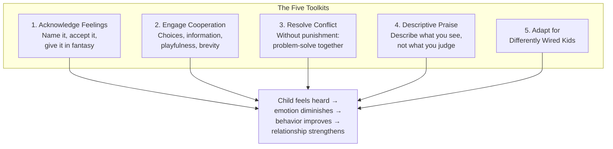
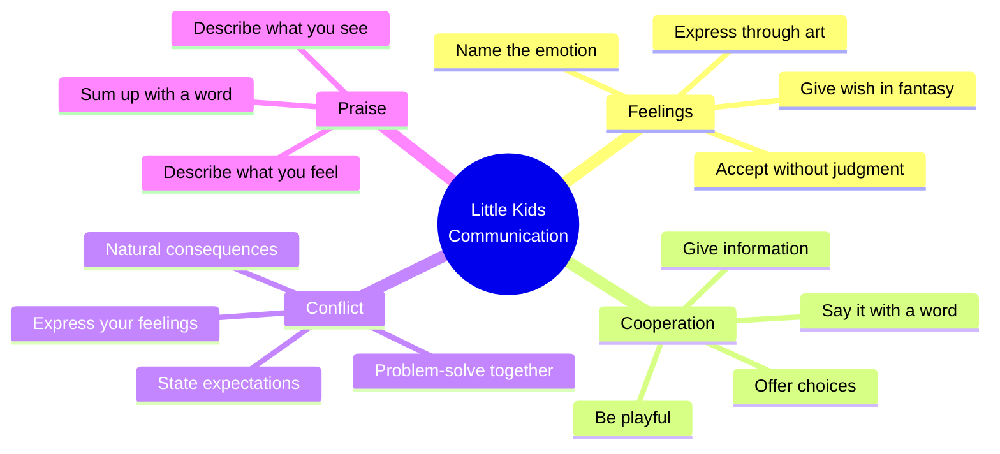
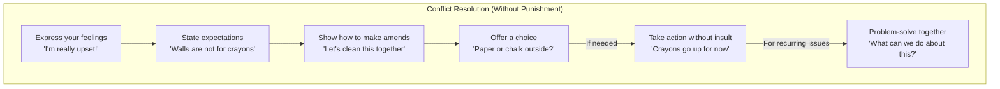
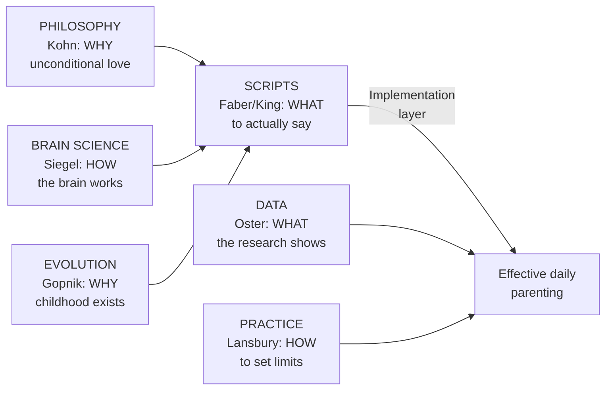

# How to Talk So Little Kids Will Listen — Joanna Faber & Julie King

> Your three-year-old is screaming on the floor of the grocery store because you won't buy the cereal with the cartoon character. Your five-year-old hits his sister and then lies about it. Your two-year-old refuses to put on shoes — any shoes, ever — as if footwear were a personal insult. You've tried reasoning, bribing, threatening, and deep breathing. Nothing works. This book will give you something that does: a set of practical communication tools, tested across decades and adapted specifically for the ages when emotions are biggest and language is smallest. The secret isn't a discipline technique. It's a shift in how you talk — and more importantly, how you listen.

---

## About the Authors

Joanna Faber grew up as a living test subject. Her mother, Adele Faber, co-authored the legendary *How to Talk So Kids Will Listen & Listen So Kids Will Talk* (1980), one of the bestselling parenting books of all time. Joanna experienced every tool in the book firsthand — as a child, then as a parent of three, and finally as a workshop leader who teaches the approach to other families.

Julie King is a parent educator, school counselor, and co-facilitator of "How to Talk" workshops. She brings clinical experience from working with families across a wide range of backgrounds and challenges, including children with autism spectrum disorder and sensory processing differences.

Together they wrote this book to answer the most common question they heard in workshops: "But what about *little* kids? My two-year-old can't 'use his words.' My three-year-old doesn't care about logical explanations. How do I do this with kids who are still learning what feelings *are*?"

The answer: the same principles apply, but the implementation has to be adapted. Little kids need more physical expression, more playfulness, more fantasy, more brevity, and less talking. This book provides that adaptation — complete with cartoon illustrations, real-parent stories, and scripts you can use tonight.

---

## The Big Idea

- <b style="color: #2980b9">When children don't feel right, they can't behave right</b>: most "behavior problems" in young children are actually unprocessed emotions looking for an exit — address the feeling and the behavior often resolves itself
- <b style="color: #e74c3c">Feelings that are denied get bigger; feelings that are acknowledged diminish</b>: the counterintuitive truth is that naming and accepting a child's emotion ("You're really mad!") makes it smaller, while dismissing it ("There's nothing to be afraid of!") makes it bigger
- <b style="color: #27ae60">Playfulness is the most underused parenting tool</b>: young children live in a world of imagination, and a parent who can enter that world — giving shoes a voice, using a funny accent, turning cleanup into a game — can accomplish in thirty seconds what threats and lectures can't achieve in an hour
- You don't need to choose between being "firm" and being "kind" — the tools allow you to hold limits while maintaining connection
- Punishment creates enemies; problem-solving creates partners — when you involve children in finding solutions, they develop genuine internal motivation
- Descriptive praise ("You put your shoes on all by yourself!") builds competence; evaluative praise ("Good boy!") builds dependence on external validation

---

## Key Concepts at a Glance

| Concept | One-line summary |
|---------|-----------------|
| **Acknowledge feelings** | Name the emotion; give it in fantasy; use art/writing/play |
| **Engage cooperation** | Give information, offer choices, be playful, use "I" messages |
| **Resolve without punishment** | Express feelings strongly, state expectations, problem-solve together |
| **Descriptive praise** | Describe what you see; let the child draw their own conclusion |
| **The fantasy wish** | "I wish I could give you a hundred ice creams right now!" |
| **Say it with a word** | "Shoes!" instead of "How many times do I have to tell you to put on your shoes?" |
| **Make it a game** | "Can you get dressed before I count to ten?" or "Your shoes are cold! They want to go on your warm feet!" |
| **Problem-solve together** | "We have a problem. You want X, I need Y. What can we do?" |

---

## 30-Second Version

When young children melt down, refuse, hit, or lie, the problem is almost never willful defiance — it's overwhelming emotion that they can't yet manage or express. Five toolkits address the core challenges: (1) Acknowledge feelings first — name the emotion, accept it, give it in fantasy if needed. (2) Engage cooperation through choices, information, playfulness, and brevity rather than commands and threats. (3) Resolve conflict without punishment — express your feelings, state expectations, show how to make amends, and problem-solve together. (4) Praise descriptively — describe what you see rather than evaluating. (5) Adapt for neurodivergent children who need modifications. The approach works because it addresses the child's inner experience rather than just the outer behavior — and because it treats even the smallest children as people whose feelings matter.

---

Playfulness is the single most effective tool for toddlers — young children live in imagination, and a parent who can enter that world accomplishes in seconds what threats cannot.

Acknowledging feelings and engaging cooperation together account for half of all daily interactions — they are the workhorses of the entire system.

Naming the feeling and giving it in fantasy are the two most frequently deployed tools — because nearly every conflict with a young child begins with an unprocessed emotion.

The four branches of the communication system interconnect — acknowledging feelings makes cooperation possible, cooperation prevents conflict, and descriptive praise reinforces all positive behavior.

## Toolkit 1: Acknowledge Feelings

*"When kids don't feel right, they can't behave right." This is the foundation of everything that follows.*

The natural parental response to a child's distress is to fix it, minimize it, or explain it away:

| What we typically say | Why it doesn't work |
|----------------------|-------------------|
| "There's nothing to be scared of!" | Denies the child's reality; makes the feeling bigger |
| "Stop crying, it's not a big deal" | Tells the child their feelings are wrong |
| "You're fine!" | The child is clearly not fine; this breaks trust |
| "Big boys don't cry" | Teaches that emotions are shameful |
| "Just ignore him and he'll stop" | The child learns their distress doesn't matter |

The alternative: acknowledge the feeling. Name it. Accept it. Give it room.

### The Four Steps

1. **Name the feeling**: "You're really frustrated!" or "That made you angry!" or "You seem scared."
2. **Accept without judgment**: "It's hard when you can't have what you want." Don't argue with the feeling.
3. **Give it in fantasy**: "I wish I could make it rain chocolate milk right now!" This is surprisingly powerful with young children — even when they know it's impossible, having their wish acknowledged helps them accept reality.
4. **Express through art or play**: "Let's draw a picture of how mad you are!" or "Show me with the play-doh what happened."

> [!example] The Monster Under the Bed
> A child was terrified at bedtime. The parent's first instinct: "There's no monster. Monsters aren't real." This didn't help — the child's fear was real even if the monster wasn't. The solution: acknowledge the fear ("You're really scared that something might be under there"), give it in fantasy ("I wish I had a magic wand that could make all the scary things disappear!"), and create a concrete solution ("Let's make Monster Spray!" — a spray bottle with water and lavender). The child sprayed under the bed every night. The fear diminished because it was acknowledged and addressed, not denied.

> [!tip] Why This Works (The Brain Science)
> When a child's amygdala is activated by strong emotion, the prefrontal cortex — the part of the brain responsible for logic, language, and impulse control — goes offline. You literally *cannot* reason with a flooded child. But naming the emotion ("You're really mad!") activates the left hemisphere, which helps integrate and regulate the right hemisphere's emotional storm. This is what Siegel calls "name it to tame it" in [[The Whole-Brain Child - Daniel J. Siegel|The Whole-Brain Child]], and Faber & King have turned it into a practical script.

### What Acknowledgment Is NOT

Acknowledging feelings does not mean:
- Agreeing with the child ("You're right, bedtime is stupid")
- Giving in to the demand ("Okay, you can have the candy")
- Allowing dangerous behavior ("Go ahead and hit your brother")
- Being passive ("Do whatever you want")

It means: "I hear you. I see how you feel. Your feelings are valid — and there are still limits on what you can do."

### The Science of "Name It to Tame It"

Faber & King don't use much brain science terminology, but the neuroscience supporting their approach is robust. When a child's amygdala floods with emotion, the prefrontal cortex (responsible for logic, language, and self-regulation) goes offline. That's why reasoning with a screaming toddler is futile — the reasoning hardware is temporarily unavailable.

But here's the key finding: naming an emotion activates the left hemisphere's language centers, which helps integrate and regulate the right hemisphere's emotional storm. This is what Daniel Siegel calls "name it to tame it" — and it's exactly what Faber & King's "acknowledge feelings" tool does in practice.

The fantasy wish works through a similar mechanism. When you say "I wish I could make it rain chocolate milk right now!" you're communicating three things simultaneously: (1) I understand what you want, (2) I take your desire seriously, and (3) I'm on your side even though I can't give you what you want. This combination of empathy and limit-holding is the sweet spot of effective parenting.

> [!example] The Grocery Store Meltdown
> Your three-year-old is screaming for candy at checkout. Instead of "No! Stop it!" try: "You really want that candy. It looks so delicious! I wish we could buy every candy bar in the store and make a candy mountain at home! But we're not buying candy today. Would you like to pick out a banana or an apple for the car?" This sequence: acknowledges (you want candy), gives in fantasy (candy mountain!), holds the limit (not today), and offers a choice (banana or apple). It won't work every time. But it works far more often than "Because I said so."

### When Acknowledgment Isn't Enough

Faber & King are honest: sometimes acknowledging feelings doesn't stop the behavior. A child who is kicking his sister needs to be physically separated regardless of how well you name his feelings. The approach is:

1. Stop the harmful action (physical safety first — always)
2. Acknowledge the feeling ("You were REALLY angry at her!")
3. State the limit ("I can't let you kick. Kicking hurts.")
4. Offer an alternative ("You can stamp your feet or punch a pillow")
5. Later, when calm: problem-solve ("What could you do next time you feel that angry?")

The critical sequence: safety first, feelings second, problem-solving third. You never skip the feelings step — even when the behavior was genuinely wrong.

---

## Toolkit 2: Engage Cooperation

*"Feelings schmeelings, she has to brush her teeth." This chapter addresses the pragmatic reality: feelings matter, AND the child needs to get dressed, eat dinner, go to bed, and stop throwing things.*

### Eight Tools for Getting Kids to Do What They Have To Do

Instead of commands ("Put on your shoes NOW"), try:

| Tool | Example |
|------|---------|
| **Give information** | "We're leaving in five minutes. People need shoes when they go outside" (not "Put your shoes on!") |
| **Offer a choice** | "Do you want to wear the red shoes or the blue ones?" |
| **Say it with a word** | "Shoes!" (brief, non-lecturing, surprisingly effective) |
| **Describe what you see** | "I see a girl with bare feet and it's almost time to go" |
| **Use a note** | Write a note from the shoes: "Dear Sophie, we're cold! Please put us on. Love, Your Shoes" |
| **Be playful** | Give the shoes a voice: "Brrr! We're so cold! Please put us on your nice warm feet!" |
| **Use an "I" message** | "I worry when we're late because the teacher starts without us" |
| **Do the unexpected** | Start putting the shoes on your own feet: "These don't fit me! Whose feet do these belong to?" |

> [!success] Why Playfulness Is the Secret Weapon
> Young children live in a world where stuffed animals talk, blankets are capes, and a cardboard box is a spaceship. A parent who enters this world — giving shoes a personality, turning cleanup into a race against the timer, making the toothbrush "hungry" for sugar bugs — is speaking the child's native language. Playfulness doesn't undermine authority. It builds cooperation through delight rather than fear.

> [!example] The Shoe Rebellion
> A toddler refused to put on shoes every single morning. The parent had tried commands, threats, and bargaining — all failed. Then she tried giving the shoes a voice: "Brrr! We're so cold! We need Sophie's warm feet!" The toddler giggled and put the shoes on. It took five seconds. The previous morning's battle had taken twenty minutes.

### The "Give Information" Principle

Children are more likely to cooperate when they understand *why*. But the information must be delivered without lectures or judgments:

- Instead of "Stop running!" → "We walk inside. Running is for outside."
- Instead of "Don't touch the stove!" → "The stove is hot. Hot things burn."
- Instead of "Share with your sister!" → "When you're done with the truck, Maya is waiting for a turn."

This works because it treats the child as a person capable of understanding, not as a subject who must obey.

### The Power of "I" Messages

Instead of "You're so messy!" try "I get frustrated when I find toys all over the floor because someone might trip." The shift from "you" to "I" is transformative:

- "You" messages attack character: "You're so careless!"
- "I" messages share your experience: "I feel worried when milk spills on the computer because it could break"

"I" messages give children information about how their actions affect others — which is the foundation of empathy. "You" messages just make them defensive.

### Parents Have Feelings Too

One of the book's most valuable sections is about what happens when *parents* are overwhelmed. Faber & King are blunt: you cannot pour from an empty cup. When you're exhausted, hungry, touched-out, or triggered by your own childhood issues, the tools will feel impossible.

Their advice:

1. **Name your OWN feelings**: "I am so frustrated right now I could scream!" (Saying this out loud to your child is actually modeled as healthy — it shows that adults have big feelings too, and it's better than acting on the frustration)
2. **Take a parent time-out**: "I need a minute to calm down. I'm going to the bathroom. I'll be right back." This models self-regulation.
3. **Lower the bar**: On hard days, survival IS success. Screens are fine. Cereal for dinner is fine. The house being messy is fine.
4. **Get help**: If you're consistently at the end of your rope, you may need more support — a partner who does more, a babysitter, a therapist, a parent support group

> [!warning] The Oxygen Mask Principle
> "If you need to rage and weep and vent, go right ahead, but not at the children. Call a friend. Write in your journal. Your children should not be the repository of your adult woes and frustrations. Children need to feel that you can handle your own emotions." This is the flight-attendant wisdom applied to parenting: put your own oxygen mask on first.

---

## Toolkit 3: Resolve Conflict Without Punishment

*When the other tools aren't enough — when a child has done something genuinely wrong — Faber & King offer alternatives to punishment that address the behavior while preserving the relationship.*

### Why Punishment Backfires

Punishment (including time-outs, loss of privileges, and "consequences") has three predictable effects on young children:

1. **Rage**: the child is angry at the punisher, not reflective about the behavior
2. **Revenge**: the child plans how to get back at the parent (or the sibling who "got them in trouble")
3. **Retreat**: the child focuses on not getting caught next time — not on doing the right thing

> [!warning] The Time-Out Room
> What is the child in the time-out actually thinking? Not "I should be kinder to my sister." More likely: "This is so unfair. I hate Mom. Next time I'll hit Sophie when Mom isn't looking."

### The Alternative: Six Steps

1. **Express your feelings strongly** (without attacking character): "I'm FURIOUS that the wall has crayon all over it!"
2. **State your expectations**: "I expect walls to stay clean. Crayons are for paper."
3. **Show how to make amends**: "Here's a sponge. Let's see how much we can get off."
4. **Offer a choice**: "You can draw on paper at the table, or use chalk outside. Which would you like?"
5. **Take action without insult**: If crayons keep appearing on walls, crayons go up on a high shelf: "I'll put the crayons away for now. When you're ready to use them on paper, let me know." (No lecture, no "I told you so.")
6. **Problem-solve together**: "We have a problem. You love drawing on big surfaces. I need the walls to stay clean. What can we do?" Let the child generate solutions — even silly ones. Write them all down. Then choose one together.

> [!example] The Hitting Brother
> A five-year-old hit his three-year-old sister. Instead of time-out, the parent:
> 1. Separated them physically (safety first)
> 2. Acknowledged the aggressor's feeling: "You were really frustrated with her!"
> 3. Stated the limit: "I can't let you hit. Hitting hurts."
> 4. Asked for repair: "Your sister is crying. What could you do to help her feel better?"
> 5. Problem-solved: "When you're that angry, what could you do instead of hitting?"
>
> The child suggested: "Stamp my feet really hard." The parent agreed this was a great solution. Over weeks, the hitting diminished — not because the child feared punishment, but because he had an alternative strategy that was acknowledged and validated.

---

## Toolkit 4: Descriptive Praise

*"Not all odes are equal." This chapter echoes Kohn's critique of praise but offers a practical alternative rather than just saying "stop praising."*

### Evaluative vs. Descriptive Praise

| Evaluative ("Good job!") | Descriptive ("I see...") |
|--------------------------|-------------------------|
| "Good drawing!" | "I see you used three different shades of blue! And that swirl in the corner — tell me about that." |
| "You're such a good sharer!" | "You noticed that Maya didn't have a truck, and you gave her one of yours." |
| "Great job getting dressed!" | "You put your shirt on, your pants on, your socks on, and your shoes — all by yourself!" |
| "You're so smart!" | "You figured out that if you turned the puzzle piece sideways, it would fit!" |

Why does this matter? Evaluative praise makes the child dependent on the adult's judgment. Descriptive praise lets the child develop their own internal standards. When you describe what you see, the child adds the evaluation themselves: "Yeah, I *am* a good friend!" or "I *can* get dressed by myself!" This self-evaluation is far more powerful and durable than external validation.

> [!tip] The Snowflake Principle
> This echoes a story from [[Unconditional Parenting - Alfie Kohn|Unconditional Parenting]]: when Kohn asked a boy if he liked his snowflake craft instead of evaluating it, the boy admitted he didn't — and then thoughtfully described what he'd do differently. Evaluation shuts down reflection. Description opens it up.

---

## Toolkit 5: Adaptations for Differently Wired Kids

*A rare and valuable chapter that most parenting books omit entirely.*

Faber & King dedicate a full chapter to children with autism spectrum disorder, sensory processing differences, and ADHD. The core principles remain the same — acknowledge feelings, offer choices, avoid punishment — but the implementation needs modification:

- **For children with autism**: use visual supports (pictures, charts), give extra processing time, be concrete rather than figurative, respect sensory needs
- **For children with sensory issues**: reduce sensory input during transitions, offer sensory alternatives (fidgets, weighted blankets), acknowledge that overwhelming sensory experiences are *real*, not "drama"
- **For children with ADHD**: shorten instructions, build in movement breaks, use timers and visual countdowns, make cooperation physical rather than verbal

> [!success] The Inclusion Principle
> The modifications for neurodivergent children are often good practice for *all* children. Visual supports, extra processing time, and reduced sensory input help neurotypical kids too. The toolkit doesn't have a "normal kids" version and a "special kids" version — it has a core set of principles and a range of implementation strategies that can be adjusted for any child.

---

## Part II: The Tools in Action

The second half of the book applies the five toolkits to specific, common scenarios:

### Food Fights

- Don't force children to eat. Don't use dessert as a reward for eating vegetables.
- Offer choices: "Would you like broccoli or carrots tonight?"
- Involve children in cooking: kids who help prepare food are more likely to eat it
- Acknowledge the feeling: "You wish you could have ice cream for every meal!"
- Give information: "Your body needs different kinds of food to grow strong"

### Morning Madness

- Prepare the night before (clothes laid out, bags packed)
- Use playfulness: "Can you get dressed before the timer goes off?"
- Give information: "The bus comes at 7:45"
- Offer choices: "Do you want to brush teeth first or get dressed first?"
- Avoid power struggles over clothing: a child who insists on wearing a tutu to school is expressing autonomy, not defiance

### Sibling Rivalry

- Don't take sides or try to determine "who started it" — this is almost always impossible to resolve fairly and turns you into a judge rather than a helper
- Acknowledge both children's feelings: "You're both really frustrated!"
- Describe the problem: "Two kids, one toy"
- Problem-solve together: "What could we do so you both get to play?"
- Resist the urge to impose fairness: "I can see this is hard for both of you" is better than "You need to share"
- Don't force apologies: "Say you're sorry" produces hollow words, not genuine remorse; instead, help the aggressor see the impact: "Look at your brother's face. He seems really sad."
- Avoid comparison: "Your sister got dressed without any trouble" is a recipe for resentment, not cooperation
- Give each child individual time: much sibling conflict is actually a bid for parental attention; when children feel secure in their individual relationship with you, they have less need to compete

> [!example] The New Baby Problem
> When a new sibling arrives, the older child's world turns upside down. Faber & King recommend:
> - Acknowledge the feelings (ALL of them, including ugly ones): "Sometimes you wish the baby would go back where she came from"
> - Don't deny negative feelings: "Of course you love your brother!" — the child may NOT love the brother right now, and that's okay to feel
> - Give the feeling in fantasy: "I bet sometimes you wish you were still the only kid and you had Mom and Dad all to yourself"
> - Create special one-on-one time with the older child
> - Don't assign the older child the role of "helper" or "big kid" unless they volunteer
> - Never compare: "The baby doesn't make a fuss like you do" is devastating

### The Cooperation Toolkit: Detailed Examples

Here are extended examples of each cooperation tool in action:

**GIVE INFORMATION** (instead of commands)
- Instead of "Don't stand on the chair!" → "Chairs are for sitting. Feet go on the floor."
- Instead of "Stop yelling!" → "When people yell inside, it hurts everyone's ears."
- Instead of "Eat your vegetables!" → "Your body needs vegetables to grow strong bones."

**OFFER A CHOICE** (instead of directives)
- Instead of "Put on your jacket!" → "It's cold outside. Do you want the red jacket or the blue one?"
- Instead of "Time for bed!" → "Would you like to hop to bed like a bunny or fly like an airplane?"
- Instead of "Clean up now!" → "Do you want to pick up the books or the blocks first?"

**SAY IT WITH A WORD** (instead of a lecture)
- Instead of "How many times have I told you to hang up your coat when you come inside?" → "Coat!"
- Instead of "You need to remember to flush the toilet every single time!" → "Toilet!"
- Instead of "Your lunch box has been sitting on the counter since you got home..." → "Lunch box!"

**DESCRIBE WHAT YOU SEE** (instead of accusing)
- Instead of "You're making a mess!" → "I see paint on the table."
- Instead of "You didn't brush your teeth!" → "I see a toothbrush that's still dry."
- Instead of "You hit your brother again!" → "I see a boy with tears on his face."

**USE A NOTE** (instead of nagging)
- Note on the door: "Please remember to lock me! —The Door"
- Note on the bathroom mirror: "Don't forget us! —Your Teeth"
- Note in the lunch box: "I love you! —Mom" (not a cooperation tool, just a nice thing to do)

**BE PLAYFUL** (instead of threatening)
- Instead of "If you don't get in the car RIGHT NOW..." → "The car is hungry! It needs kids in it! Quick, before it eats the garage!"
- Instead of "Stop throwing food!" → Pick up a piece of broccoli, hold it to your ear: "Wait — the broccoli is telling me something... it says it wants to go in your tummy, not on the floor!"
- Instead of "Put your toys away!" → "The toys are having a race to see who gets back in the box first! Ready, set, go!"

**USE AN "I" MESSAGE** (instead of "you" accusations)
- Instead of "You're so loud!" → "I can't hear myself think when there's so much noise."
- Instead of "You're being rude!" → "I feel hurt when someone talks to me in that tone."
- Instead of "You're always late!" → "I worry when I'm waiting and I don't know where you are."

**DO THE UNEXPECTED** (instead of the same old battle)
- Instead of the morning shoe battle → start putting the shoes on your own feet: "These are WAY too small for me! Whose feet are these for?"
- Instead of arguing about brushing teeth → pretend the toothbrush is a microphone and "interview" the child about their day while brushing
- Instead of the same bedtime lecture → write a "bedtime story" starring the child as the hero who fights sleep monsters

### Lies

- Children under 5 don't lie in the adult sense — they engage in "creative interpretation of reality" (wishful thinking, fantasy, testing boundaries)
- Don't ask questions you already know the answer to ("Did you eat the cookies?" when there are crumbs on their face)
- Instead, describe what you see: "I see cookie crumbs on your face and an empty plate"
- Acknowledge the wish: "You wish you could eat cookies all day!"
- State the expectation: "Cookies are for after lunch"

> [!warning] The Trap Question
> "Did you hit your brother?" is a trap. The child knows the "right" answer is no, so they lie. Then you punish them for lying on top of the original offense. A better approach: "I saw you hit your brother. That must have been frustrating. Hitting hurts. What happened?"

The deeper lesson: most childhood "lying" is actually a sign that the child understands social rules (they know hitting is wrong) but lacks the impulse control to follow them (they hit anyway) and the courage to confess (they fear punishment). The solution isn't to crack down on lying — it's to create an environment where truth-telling is safe. Children who aren't punished are less afraid of confessing, which means they lie less.

### Shopping with Children

The grocery store is the most public, most stressful parenting arena. Faber & King's approach:

**Before the trip:**
- Feed the child first (never shop with a hungry toddler)
- Set expectations: "We're buying food for dinner. We're not buying candy today."
- Involve them: "Can you help me find the bananas?"

**During the trip:**
- Give them a job: "Can you put the apples in the bag?"
- Offer choices: "Should we get the red grapes or the green ones?"
- Acknowledge feelings: "I know you want that cereal. The box looks so exciting!"
- Give it in fantasy: "I wish we could fill the whole cart with candy!"
- When things go wrong, describe what you see rather than scold: "I see a girl sitting on the floor. The store needs us to walk."

**When the meltdown happens anyway:**
- Acknowledge: "You're really upset. This is hard."
- Remove to a quiet spot if possible (bathroom, car)
- Wait it out. Don't lecture during the meltdown — the reasoning brain is offline.
- Debrief later: "That was a hard trip. What was the hardest part?"

### Bedtime Battles

The bedtime chapter is one of the longest in Part II because bedtime combines every challenge: separation anxiety, overtiredness, fear of the dark, desire for more parental attention, and the simple fact that going to sleep means the fun is over.

Key tools for bedtime:
- **Establish a predictable routine**: bath → pajamas → story → song → goodnight; the same sequence every night
- **Offer choices within the routine**: "Which pajamas? Which story?"
- **Acknowledge the difficulty**: "It's hard to stop playing and go to bed. You wish you could stay up all night!"
- **Give it in fantasy**: "What if bedtime was at midnight and you got to eat pizza in bed?"
- **Address fears**: Monster Spray, a "brave bear" to stand guard, a flashlight they control
- **Use a timer for transitions**: "When the timer goes off, we start the bedtime routine"
- **Don't engage in negotiations**: state the limit once with empathy; don't get pulled into a legal argument with a four-year-old lawyer

> [!tip] The Bedtime Visit
> For children who keep getting up, Faber & King suggest the "scheduled visit": "I'll come check on you in five minutes." This gives the child something to anticipate and reduces the anxiety of separation. Many children fall asleep before the five minutes are up.

### Dealing with Whining

Whining is one of the most universally irritating child behaviors. The typical response — "Stop whining!" — doesn't work because it dismisses the underlying need. Instead:

1. **Acknowledge the need behind the whine**: "It sounds like you really want a snack"
2. **Request a normal voice**: "I want to help you, but it's hard for me to understand when you talk like that. Can you tell me in your regular voice?"
3. **Model the regular voice**: "Can you say it like this: 'Mom, I'm hungry, can I have a snack?'"
4. **When the child uses their normal voice, respond promptly**: this reinforces the behavior you want

The key insight: children whine because they feel powerless. When you address the underlying need, the whining becomes unnecessary.

---

## The Inner Voice: Why These Tools Matter Beyond Childhood

The book opens with Peggy O'Mara's quote: "The way we talk to our children becomes their inner voice." This is not just a nice sentiment — it's supported by developmental psychology.

The way parents talk to young children literally shapes the child's self-talk — the internal narration that will accompany them for life. A child who hears "What's wrong with you?" develops an inner voice that asks "What's wrong with me?" A child who hears "You were really frustrated, and you found a way to handle it" develops an inner voice that says "I can handle hard feelings."

This is why the specific *words* in this book matter so much. It's not just about getting your toddler to put on shoes. It's about what your toddler will say to *herself* when she faces a challenge twenty years from now. Will she hear an internal critic ("You always screw things up") or an internal ally ("That was hard, but you can figure this out")?

The tools in this book aren't just communication strategies. They're the building materials of your child's inner architecture.

> [!success] The Long Game
> When you describe instead of evaluate ("You put all the blocks away!" instead of "Good job!"), you're building a child who can assess her own work. When you acknowledge feelings instead of dismissing them ("You're really mad!" instead of "Stop crying!"), you're building a child who can identify and process her own emotions. When you problem-solve instead of punish ("What could you do differently?" instead of "Go to your room!"), you're building a child who can navigate conflicts as an adult.
>
> Every single interaction is a deposit in the account of your child's inner voice. These tools help you make deposits of empathy, competence, and self-worth — rather than deposits of shame, helplessness, and fear.

---

## Quick-Reference Tool Chart

For the parent who needs help RIGHT NOW:

| Situation | Try This First | If That Doesn't Work |
|-----------|---------------|---------------------|
| **Tantrum** | Acknowledge: "You're SO upset!" | Give it in fantasy: "I wish..." |
| **Won't get dressed** | Offer choice: "Red shirt or blue?" | Be playful: give the shirt a voice |
| **Hitting** | Separate, then: "You were really angry!" | Problem-solve: "What else could you do?" |
| **Won't eat** | Offer choice: "Carrots or peas?" | Involve: "Help me stir the pot" |
| **Bedtime resistance** | Routine + acknowledge: "It's hard to stop playing" | Fantasy: "What if bedtime was midnight?" |
| **Won't share** | Describe: "Two kids, one toy" | Problem-solve: "What could we do?" |
| **Whining** | Acknowledge need: "You sound hungry" | Model: "Can you say it like this?" |
| **Lying** | Describe what you see: "I see crumbs on your face" | Acknowledge wish: "You wish you could..." |
| **Public meltdown** | Acknowledge + remove to quiet spot | Wait it out; debrief later |
| **Won't clean up** | Make it a game: "Race against the timer!" | Do it together |
| **Leaving the playground** | Advance notice + acknowledge | Fantasy: "I wish we could live here!" |
| **Fear (dark, monsters)** | Acknowledge: "You're scared" + fantasy solution | Monster Spray, brave bear, flashlight |

---

## The Tone: Why This Book Feels Different

Most parenting books are written in one of three tones: clinical (here's what the research says), prescriptive (here's what you should do), or confessional (here's how I screwed up). Faber & King manage a fourth: *collaborative*. The book reads like a workshop — you feel like you're in a room with other parents, sharing stories, trying tools, laughing at failures, and celebrating small victories.

This tone is intentional. The Faber/Mazlish approach was developed in parent workshops, not in labs or therapists' offices. The insights come from thousands of parents who tried the tools, reported what worked and what didn't, and refined the approach collectively. The book preserves this workshopping spirit — complete with stories from real parents (with names changed) that illustrate both successes and hilarious failures.

The humor is genuine and never at the child's expense. Faber & King clearly *like* children — their weirdness, their intensity, their creativity, their absolute conviction that the purple cup is fundamentally different from the blue cup. This affection infuses every page and makes the tools feel like extensions of love rather than management techniques.

### Why "Just Ignore It" Doesn't Work

Many parents are told to ignore unwanted behavior — the theory being that if you don't give it attention, it will stop. Faber & King explain why this often backfires with young children:

1. **Young children can't distinguish between "I'm ignoring the behavior" and "I'm ignoring YOU"** — to a two-year-old, being ignored feels like being abandoned
2. **The behavior usually gets worse before it gets better** — the child escalates because their signal isn't being received, not because they're "testing" you
3. **Ignoring misses the underlying need** — the child who is whining, clinging, or acting out usually needs something (attention, food, sleep, comfort); ignoring the behavior doesn't address the need
4. **It teaches the child that their distress doesn't matter** — which is the opposite of the emotional intelligence we're trying to build

The alternative: acknowledge the feeling behind the behavior, address the need if possible, and redirect to an acceptable expression. "You're pulling on my leg because you really want me to pick you up. I'm cooking right now and can't hold you. Would you like to sit on this stool next to me so you can watch?"

### The Problem with "Good Job!"

Faber & King echo Kohn's critique of evaluative praise but make it concrete for everyday parenting:

> [!example] Two Versions of Praise
> **Evaluative**: "Good job on your drawing! You're such a great artist!"
> - Child learns: my drawing is good because Mom said so
> - Risk: dependence on external validation; fear of producing a "bad" drawing
>
> **Descriptive**: "I see you drew a house with a red door and smoke coming out of the chimney! And there's a cat on the roof! Tell me about the cat."
> - Child learns: Mom noticed the details I worked on; I can describe my own work
> - Benefit: builds internal standards; encourages reflection; promotes conversation

The shift is subtle but transformative. Evaluative praise closes the conversation ("Good job!" → "Thanks" → silence). Descriptive praise opens it ("Tell me about..." → "Well, the cat is..." → genuine dialogue about the child's creative process).

### Why Choices Matter So Much for Young Children

The ages of 2-7 are defined by a developing sense of autonomy. The child is discovering that they are a separate person with separate desires — and they want to exercise that separateness. This is healthy and necessary for development.

When every decision is made for them ("Put on these clothes, eat this food, go to bed now"), the child's autonomy drive has nowhere to go except opposition. Offering choices channels this drive productively:

- "Would you like to walk to the car or hop like a bunny?" — either way, you get to the car
- "Red cup or blue cup?" — either way, they drink the milk
- "Teeth first or pajamas first?" — either way, the bedtime routine happens

The child gets the experience of deciding. You get cooperation. Everyone wins.

But the choices must be genuine. "Would you like to clean up, or would you like to clean up?" is not a real choice. Neither is offering a choice and then overruling the child's selection. If you offer red cup or blue cup, you must honor the answer — otherwise you're teaching that choices are an illusion, which is worse than not offering them at all.

### The "Can't" vs. "Won't" Distinction

Faber & King encourage parents to assume "can't" before assuming "won't." A child who doesn't comply with a request may not be defying you. They may be:

- **Developmentally unable**: a two-year-old can't wait patiently for 20 minutes; a three-year-old can't sit still through a long dinner
- **Emotionally overwhelmed**: a child in the grip of a tantrum literally can't hear your logical explanation
- **Physically depleted**: hungry, tired, or under-exercised children don't have the resources for self-regulation
- **Struggling with executive function**: a four-year-old who "forgets" to put away toys may genuinely lack the organizational capacity, not the willingness

When you assume "can't," you respond with help. When you assume "won't," you respond with punishment. The first builds competence and trust. The second builds resentment and shame.

> [!tip] The Developmental Lens
> Before getting angry at a child's "misbehavior," ask: "Is this something a child this age can reasonably be expected to do?" If the answer is no, the problem isn't the child — it's your expectation. Adjusting expectations to match development eliminates a huge percentage of daily conflicts.

---

## A Note on Cultural Context

Faber & King's approach was developed primarily within white, middle-class American culture. They acknowledge this and make some effort to address cultural variation, but the core tools assume a relatively individualistic framework where children's autonomy and emotional expression are valued.

In cultures where respect for elders, family harmony, and group cohesion are prioritized over individual expression, some tools may need adaptation. Offering choices to a child in a culture where children are expected to defer to adults may feel inappropriate. Acknowledging angry feelings in a culture where emotional restraint is valued may feel counterproductive.

The underlying principles — that children are people deserving of respect, that feelings drive behavior, and that connection is more effective than coercion — are arguably universal. But the specific implementation (giving shoes a voice, making cleanup a game) may need cultural translation.

For a cross-cultural perspective on these principles, see [[Hunt, Gather, Parent - Michaeleen Doucleff|Hunt, Gather, Parent]], which shows how non-Western cultures achieve cooperation and emotional regulation through different but philosophically compatible means.

### Cleanup

- Make it a game: "Can we pick up all the red things first?"
- Use a timer: "Let's see how much we can put away before the song ends!"
- Give a choice: "Do you want to pick up the blocks or the cars?"
- Do it together: young children aren't developmentally ready to clean up alone; working alongside them teaches the skill and maintains connection

### Screen Time Battles

- Give advance notice: "Five more minutes, then the iPad goes off"
- Acknowledge the feeling: "I know you want to keep watching. It's hard to stop something fun"
- Offer a transition: "When the show is over, we're going to make a snack together"
- Be playful: "The iPad is tired! It needs to take a nap now"

---

## Chapter 5¼: The Basics — When Tools Won't Work

*This short but essential chapter lists the conditions under which NO communication tool will be effective.*

Faber & King call these "The Basics" — the physical prerequisites for emotional regulation:

1. **Sleep**: a tired child cannot process emotions or cooperate. No amount of skillful communication overcomes sleep deprivation.
2. **Food**: a hungry child is an irrational child. "Hangry" is real, especially for toddlers whose blood sugar crashes frequently.
3. **Exercise/Movement**: young children need to move their bodies. A child who has been sitting in a car seat, stroller, or classroom all day will struggle with any request that requires more sitting still.
4. **Screen limits**: excessive screen time before bed disrupts sleep; excessive screen time during the day displaces physical activity and social interaction.
5. **The parent's state**: when YOU are sleep-deprived, hungry, or emotionally depleted, your capacity for patient, creative communication collapses. Take care of yourself so you can take care of them.

> [!tip] The Diagnostic Question
> When a child is melting down and nothing is working, ask yourself: "When did she last eat? When did she last sleep? When did she last run around? Am I exhausted?" The answer to one of these questions will often explain the meltdown better than any behavioral analysis.

---

## The Verdict

This is the most practical parenting book in the entire collection — the one you'll have open on the kitchen counter at 7 a.m. when your toddler is refusing shoes. Where Siegel gives you brain science and Kohn gives you philosophy, Faber & King give you *scripts*. Actual words you can say, tonight, that have a reasonable chance of working.

**Limitations:**
- The book is light on theory — if you want to understand *why* these tools work at a neurological or psychological level, read [[The Whole-Brain Child - Daniel J. Siegel|The Whole-Brain Child]] or [[Unconditional Parenting - Alfie Kohn|Unconditional Parenting]]
- Some tools require a level of patience and creativity that exhausted parents may not have at 6 a.m.
- The cartoon illustrations, while helpful for quick reference, may feel juvenile to some adult readers
- The book is specifically for ages 2-7; for older children, see [[How to Talk So Kids Will Listen - Adele Faber & Elaine Mazlish|How to Talk So Kids Will Listen]]
- Playfulness is powerful but not always sufficient for serious behavioral issues — this book is not a substitute for professional evaluation if something deeper is going on

**What it does brilliantly:**
- Gives you actual words to say in the hardest moments — not principles, not theories, *scripts*
- The "give it in fantasy" tool is genuinely transformative for toddlers — "I wish I could make it rain chocolate milk!" can defuse a tantrum in seconds
- The Part II scenarios (food fights, morning madness, sibling rivalry, lies) cover exactly the situations that drive parents crazy
- The chapter on neurodivergent children is unusually thoughtful and practical
- The tone is warm, funny, and reassuring — you feel like you're getting advice from a friend, not a lecture from an expert
- The book includes both cartoon illustrations for quick reference AND detailed real-parent stories for depth — serving both the skimming parent and the deep reader
- The Faber lineage (Ginott → Faber/Mazlish → Faber/King) means these tools have been refined across three generations and tested by millions of families

### Before and After: Old Way vs. New Way

| Situation | Old Way (Commands & Punishment) | New Way (Faber & King Tools) |
|-----------|-------------------------------|------------------------------|
| Child won't eat dinner | "You're not leaving this table until you finish your peas!" | "Your body needs different kinds of food. Would you like peas or carrots tonight?" |
| Child hits sibling | "Go to your room!" "No TV for a week!" | "You were REALLY angry. I can't let you hit. Hitting hurts. What else could you do when you're that mad?" |
| Child won't get dressed | "Get dressed RIGHT NOW or we're not going to the park!" | Give shirt a voice: "Brrr! I'm cold! I need Sophie's warm tummy!" |
| Child lies about breaking something | "You're in BIG trouble for lying!" | "I see the vase is broken. That was Grandma's special vase. I'm really upset. How can we fix this?" |
| Child has tantrum in store | "If you don't stop crying I'm taking away your toy!" | "You REALLY wanted that cereal. I wish we could buy everything in the store! We're not buying it today. Would you like to help me pick the apples?" |
| Child won't brush teeth | "Open your mouth NOW!" | Toothbrush voice: "I'm SO hungry! Let me eat those sugar bugs! Chomp chomp chomp!" |
| Child refuses bath | "You're dirty and you HAVE to take a bath!" | "Bath time! Do you want bubbles or bath paint tonight? You decide!" |
| Child keeps getting up at bedtime | "If you get up one more time..." | "I know it's hard to fall asleep alone. I'll come check on you in five minutes." |

### The Emotional Bank Account

Faber & King don't use this term, but the concept runs throughout. Every positive interaction — every acknowledged feeling, every playful moment, every descriptive praise — is a deposit in the emotional bank account of your relationship. Every command, every threat, every dismissal is a withdrawal.

When the account is full, children are more willing to cooperate with requests they don't like, more resilient after setbacks, and more likely to come to you when they're in trouble. When the account is overdrawn — when the relationship has become primarily about control — children become defensive, defiant, or withdrawn.

The tools aren't just techniques for getting cooperation. They're deposits in the account. Every time you acknowledge a feeling ("You're really mad!") or make a task playful ("Can the shoes find your feet?"), you're building the relationship that makes everything else possible.

### Applying the Tools to Real Life: A Sample Morning

**6:30 AM** — Child wakes up cranky (probably hungry)
- Give information: "Breakfast is almost ready!" (not "Stop whining!")
- Offer choice: "Cereal or toast today?"

**6:45 AM** — Child refuses to get dressed
- Be playful: shirt gets a voice ("I'm so lonely in the drawer! I need a warm body!")
- Offer choice: "These pants or those ones?"
- If still resistant, acknowledge: "You wish you could stay in pajamas all day! Me too!"

**7:00 AM** — Sibling conflict over a toy
- Describe the problem: "Two kids, one toy. That's a tough situation."
- Acknowledge both feelings: "You both really want to play with it"
- Problem-solve: "What could we do so everyone gets a turn?"

**7:15 AM** — Won't put on shoes
- Say it with a word: "Shoes!" (with a smile)
- Make it a game: "Can you get your shoes on before I count to ten? Ready... one... two..."
- If resistance: acknowledge + hold limit: "I know you'd rather go barefoot. Feet need shoes when we go outside."

**7:25 AM** — Tantrum at the door because they want to bring 47 stuffed animals
- Acknowledge: "You wish you could bring ALL your animals! You love them so much!"
- Fantasy: "What if we had a bus just for your stuffed animals?"
- Hold limit with choice: "You can bring one animal. Which one will be the lucky one today?"

**7:30 AM** — Out the door (mostly).

This isn't a fantasy scenario. This is what the tools look like when they work. Some mornings they won't work this smoothly. Some mornings you'll resort to "shoes, NOW" and that's okay. The goal isn't perfection. The goal is having tools in your toolbox other than threats and commands — and using them often enough that they become your default.

---

## Why This Approach Works with "Strong-Willed" Children

Parents of strong-willed children often feel that the Faber/King approach is "too soft." They've tried being nice and it didn't work. Their child needs FIRM LIMITS.

Faber & King would agree — strong-willed children DO need firm limits. What they don't need is limits delivered through punishment. Here's why the tools work especially well with strong-willed kids:

1. **Strong-willed children resist control** — the more you push, the harder they push back. Offering choices gives them a sense of autonomy within your limits. They feel powerful rather than powerless.

2. **Strong-willed children have big feelings** — acknowledging those feelings doesn't make the child weaker. It makes them feel seen, which reduces the intensity of the feeling and the behavior.

3. **Strong-willed children respond to respect** — they are incredibly sensitive to whether adults treat them as people or as problems. The tools communicate: "I respect you and I'm working with you" rather than "I'm bigger than you and you'll do what I say."

4. **Strong-willed children become strong-willed adults** — the very traits that make a toddler exhausting (determination, persistence, independence, conviction) make an adult remarkable. The goal is to channel these traits, not crush them.

> [!success] The Reframe
> A "strong-willed child" isn't a defective child. She's a child with a powerful engine and no steering yet. Your job isn't to turn off the engine — it's to help her build the steering. The tools in this book are steering lessons, not engine killers.

---

## Who Should Read This Book

| Reader | Why |
|--------|-----|
| Parents of toddlers and preschoolers (ages 2-7) | This is written specifically for you |
| Anyone who says "How many times do I have to tell you?" | The tools will break the cycle of nagging and yelling |
| Parents who've read Siegel or Kohn and want practical scripts | This is the implementation layer |
| Parents of neurodivergent children | Chapter 5 provides thoughtful modifications |
| Grandparents, babysitters, and teachers | The tools work in any adult-child relationship |
| Fans of [[No Bad Kids - Janet Lansbury\|No Bad Kids]] who want more specific scripts | Lansbury provides the philosophy; Faber/King provide the words |

---

## Related Reading

- [[How to Talk So Kids Will Listen - Adele Faber & Elaine Mazlish]] — the original classic for older children (ages 7+); same principles, more verbal orientation
- [[No Bad Kids - Janet Lansbury]] — the RIE philosophy that aligns with this approach; Lansbury for philosophy, Faber/King for scripts
- [[The Whole-Brain Child - Daniel J. Siegel]] — the brain science behind why these tools work; "name it to tame it" = acknowledge feelings
- [[No-Drama Discipline - Daniel J. Siegel]] — connect-and-redirect in Siegel's framework; same principles, different language and theoretical depth
- [[Unconditional Parenting - Alfie Kohn]] — the research foundation for why punishment backfires and acknowledgment works; deeper philosophy
- [[The Montessori Toddler - Simone Davies]] — complementary approach for the same age range; Montessori for environment, Faber/King for communication
- [[The Gardener and the Carpenter - Alison Gopnik]] — the evolutionary case for why playfulness and autonomy matter in childhood
- [[Cribsheet - Emily Oster]] — data-driven complement for the factual questions this book doesn't address
- [[Parenting from the Inside Out - Daniel J. Siegel]] — if these tools aren't working, the issue may be in your own attachment history — start here
- [[Hunt, Gather, Parent - Michaeleen Doucleff]] — cross-cultural approaches to cooperation and emotional regulation
- [[Simplicity Parenting - Kim John Payne]] — reducing environmental overwhelm so children (and parents) have the capacity for these tools
- [[Brain Rules for Baby - John Medina]] — the neuroscience of early development that explains why these tools work at the brain level

### The Complete Toolkit: This Book + Others

For the parent who wants maximum practical impact, here is the recommended reading order:

1. **This book first** — get the scripts and start using them tonight
2. [[The Whole-Brain Child - Daniel J. Siegel|The Whole-Brain Child]] — understand *why* the scripts work at the brain level
3. [[No Bad Kids - Janet Lansbury|No Bad Kids]] — deepen the philosophy for the toddler years
4. [[Unconditional Parenting - Alfie Kohn|Unconditional Parenting]] — challenge your assumptions about praise, rewards, and punishment
5. [[Parenting from the Inside Out - Daniel J. Siegel|Parenting from the Inside Out]] — when the tools aren't working, look inward

This sequence moves from the most immediately practical to the most deeply transformative. Each book adds a layer of understanding that makes the previous books more effective.

---

## FAQ

**Q: My child is too young to "use his words." Will this still work?**
A: Yes — in fact, that's exactly why this book exists. For pre-verbal or barely verbal children, the tools emphasize physical expression (stomping, drawing), fantasy ("I wish I could..."), playfulness (giving objects voices), and brevity (one word: "Shoes!"). You don't need a verbal child to acknowledge feelings.

**Q: Isn't this just permissive parenting?**
A: No. The tools include clear limits, strong expressions of parental feeling ("I'm FURIOUS about the crayon on the wall!"), and action without insult (removing the crayons). The difference is that limits are held *with* empathy rather than *through* punishment.

**Q: What if the playful approach doesn't work?**
A: Not every tool works every time with every child. The book offers eight cooperation tools for a reason — if playfulness fails, try giving information, or offering a choice, or saying it with a word. And sometimes, despite your best efforts, the child will melt down anyway. That's normal. The tools improve the odds; they don't guarantee the outcome.

**Q: How is this different from the original How to Talk So Kids Will Listen?**
A: Same principles, different age range. The original targets school-age children who can engage in verbal reasoning. This adaptation adds more playfulness, more fantasy, more physical expression, and more brevity — all tailored to the developmental reality of ages 2-7.

**Q: Can I use these tools if I wasn't raised this way?**
A: Absolutely. Faber & King acknowledge that these tools feel unnatural at first, especially if you were raised with punishment and commands. They recommend practicing one tool at a time, starting with the one that feels most comfortable. Over time, the new patterns become second nature.

**Q: What if my partner doesn't use these tools?**
A: It helps when both parents use the same approach, but it's not required. Children can adapt to different communication styles from different adults. If your partner is skeptical, suggest trying one tool for a week and seeing what happens. Results are more convincing than arguments.

**Q: My child is older than 7. Is this book still useful?**
A: The principles apply at any age, but the implementation is tailored for 2-7. For older children, read the original [[How to Talk So Kids Will Listen - Adele Faber & Elaine Mazlish|How to Talk So Kids Will Listen]]. Many parents report reading both and combining the approaches.

**Q: These tools seem manipulative. Am I tricking my child?**
A: Giving shoes a funny voice isn't manipulation — it's entering your child's world. Manipulation means controlling someone by concealing your true intentions. These tools are transparent: you want cooperation, and you're making it fun rather than fearful. The child isn't being tricked; they're being respected enough to be engaged on their own terms.

---

## How This Book Fits the Parenting Canon

This book is the *implementation layer*. It takes the philosophical principles of Kohn (don't punish, don't reward), the brain science of Siegel (connect before redirect, name it to tame it), and the developmental reality of Gopnik (children learn through play and exploration) — and turns them into sentences you can say to a screaming three-year-old at 7 a.m.

Every other book in this collection tells you *what kind of parent to be*. This one tells you *what to say*. That makes it the most immediately useful book in the set — and the one you'll refer to most often in the daily trenches of life with little kids.

### The Faber Legacy

It's worth noting the remarkable lineage of this approach. Adele Faber and Elaine Mazlish studied under Haim Ginott, who was a pioneer of empathic communication with children in the 1960s. Ginott's core insight — "children are deserving of respect" — ran counter to the authoritarian parenting of his era. Faber and Mazlish translated Ginott's ideas into the massively bestselling *How to Talk So Kids Will Listen* (1980). And now Joanna Faber, Adele's daughter, has adapted the approach for the youngest children.

This means the ideas in this book have been tested across three generations — first in Ginott's practice, then in millions of families through the original *How to Talk*, and now in the toddler and preschool years through this adaptation. The tools have been refined over sixty years of real-world use. They work because they've been battle-tested by millions of parents with millions of children — not because some expert thought they sounded good in theory.

---

## Additional Scenarios from Part II

### Tattling

Young children tattle constantly: "Mom! He took my crayon!" The instinct is to adjudicate: who's right, who's wrong? Faber & King suggest a different approach:

1. **Acknowledge the tattler's feeling**: "That's frustrating when someone takes your stuff"
2. **Ask what they want**: "What do you want to happen?"
3. **Redirect to problem-solving**: "What could you say to him about that?"

The goal is to teach the child to resolve conflicts directly rather than relying on a parental judge. For safety concerns ("Mom! He's climbing the bookshelf!"), of course you intervene immediately.

### Tooth-Brushing

One of the most common daily battles. Options:
- Let the toothbrush "talk": "I'm so hungry! I want to eat those sugar bugs!"
- Offer a choice: "Do you want the blue toothbrush or the red one?"
- Give information: "Sugar bugs live on your teeth and eat them if we don't brush them off"
- Make it a song: brush for the duration of a favorite song
- Let the child brush YOUR teeth first, then you brush theirs

### Bath Time Resistance

- Make it sensory: bubbles, bath paint, cups for pouring
- Offer a choice: "Bath or shower tonight?"
- Give advance notice: "Five more minutes of playing, then bath time"
- Be playful: "The bathtub is calling your name! It says it's lonely without you!"

### Leaving the Playground

- Give advance notice: "Five more slides, then we go"
- Acknowledge: "It's so hard to leave when you're having fun!"
- Give information: "The playground will be here tomorrow"
- Offer a transition: "Would you like to race me to the car, or hop like a bunny?"
- Fantasy wish: "I wish we could live at the playground!"

---

## Five Things You Can Do Tomorrow Morning

1. **Acknowledge one feeling without fixing it** — when your child is upset, resist the urge to solve the problem; instead, name what you see: "You're really frustrated that the tower fell down!" Then wait.

2. **Replace one command with information** — instead of "Put your coat on!" try "It's cold outside today. Bodies need coats when it's cold."

3. **Be playful once** — give an object a voice, make a silly face, turn a task into a game; "Can you hop to the bathroom like a bunny for teeth-brushing?"

4. **Describe instead of evaluate** — instead of "Good job!" after your child draws something, try: "I see a lot of purple in this picture! And look at these circles — tell me about them."

5. **When conflict erupts, try one alternative to punishment** — express your feeling ("I'm upset!"), state your expectation ("Blocks are for building, not throwing"), and problem-solve: "What could you build with the blocks instead?"

---

## Key Phrases to Remember

| Phrase | Meaning |
|--------|---------|
| "When kids don't feel right, they can't behave right" | Behavior is a symptom of unprocessed emotion |
| "Feelings that are denied get bigger" | Dismissing emotions makes them worse, not better |
| "Give it in fantasy" | "I wish I could give you a hundred ice creams!" — surprisingly effective |
| "Say it with a word" | "Shoes!" instead of a five-minute lecture |
| "Describe, don't evaluate" | "You put all the blocks away!" not "Good job!" |
| "Take action without insult" | Remove the crayons without a lecture or an "I told you so" |
| "Problem-solve together" | "We have a problem. What can we do?" |
| "A person's a person, no matter how small" | The Dr. Seuss quote that opens the book — and captures its philosophy |
| "The way we talk to our children becomes their inner voice" | Peggy O'Mara's quote — the deepest reason these tools matter |
| "Can't before won't" | Assume the child can't before assuming they won't — it changes everything |
| "Two kids, one toy" | Describe the problem without taking sides |
| "Shoes!" | One word instead of a lecture — brevity is power with young children |
| "Look at his face" | Directing attention to the impact on others — building empathy |
| "What could you do instead?" | The question that replaces punishment with problem-solving |
| "I'm cooking and can't hold you — would you like to sit on this stool?" | The perfect sentence: acknowledgment + limit + alternative |
| "The car is hungry! It needs kids in it!" | Playfulness as the fastest path to cooperation |
| "I'll come check on you in five minutes" | The scheduled visit — reduces bedtime separation anxiety |
| "When the timer goes off" | External authority (the timer) replaces parental authority — nobody argues with a timer |
| "I see paint on the table" | Description instead of accusation — opens dialogue instead of provoking defense |
| "What's the hardest part?" | The question that unlocks what's really going on beneath the behavior |
| "Your body needs different kinds of food" | Information instead of commands — treats the child as capable of understanding |
| "I wish we could live at the playground!" | The fantasy wish for leaving — acknowledges what the child wants, even when you can't give it |

---

## A Note to Skeptics

If you're reading this summary and thinking "This sounds great on paper but my kid would never fall for it" — you're probably right that it won't work every time. No approach does. But consider this:

Your current approach — whatever it is — also doesn't work every time. The question isn't whether these tools are perfect. It's whether they work *more often* and *with fewer side effects* than commands, threats, and punishment.

The evidence says yes. Not because the tools are magic, but because they address the actual mechanism of young children's behavior: emotion drives action, and acknowledged emotion is quieter than denied emotion. When you treat a child's feelings as real and valid — even when you can't give them what they want — you're working *with* their brain rather than against it.

Try one tool. Just one. For one week. See what happens. That's all Faber & King ask. And if it doesn't work? Try a different one. There are eight cooperation tools for a reason. Different children respond to different approaches. The goal is to have enough tools in your belt that you're never stuck with only "Because I said so."

And if even that feels like too much — if you're too exhausted to be playful, too triggered to be patient, too overwhelmed to remember any script — then remember just one thing:

When in doubt, acknowledge the feeling first.

"You're really upset."
"This is hard."
"I can see how much you wanted that."

Three words can change the trajectory of a moment. And enough changed moments can change the trajectory of a childhood.

---

*"A person's a person, no matter how small." — Dr. Seuss*

*"The way we talk to our children becomes their inner voice." — Peggy O'Mara*

---

## One Last Tool: Forgiveness (For Yourself)

The final and most important tool isn't in any chapter. It's the tool of self-forgiveness.

You will forget these tools. You will default to yelling, threatening, and "Because I said so." You will lose your patience at 7 a.m. when the shoes are still not on and the bus is coming. You will say "Good job!" a hundred times before you remember to describe instead of evaluate. You will punish when you meant to problem-solve.

This is normal. This is human. This is what every parent who has ever read a parenting book and then failed to implement it at 3 a.m. already knows: knowledge doesn't automatically become practice.

Faber & King are gentle about this. They recommend starting with ONE tool — whichever one feels most natural — and practicing it for a week before adding another. They acknowledge that the tools feel awkward and unnatural at first, especially if you were raised with commands and punishment. They remind you that even using the tools 20% of the time is better than 0% of the time.

And they remind you that your relationship with your child is not made or broken by any single interaction. It's made by the pattern over time. A parent who yells sometimes but also acknowledges feelings, offers choices, and repairs ruptures is building a fundamentally different relationship than a parent who only yells.

Progress, not perfection. That's the standard. And if you need to hear it said one more time: you are already a better parent than you think, because you're reading this book, you care enough to try, and your child knows it — even when you lose your temper over the shoes.

> [!success] The Dr. Seuss Promise
> "A person's a person, no matter how small." Your two-year-old is a full person — with real feelings, real desires, real fears, and a real need to be heard. The tools in this book are simply ways of honoring that personhood. They don't always work. They're not magic. But they communicate something that no punishment or reward ever can: *I see you. I hear you. You matter. And I'm on your side.*

---

*One Sentence That Changes Everything:*

> **"The way we talk to our children becomes their inner voice."**

