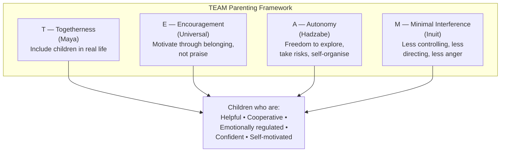
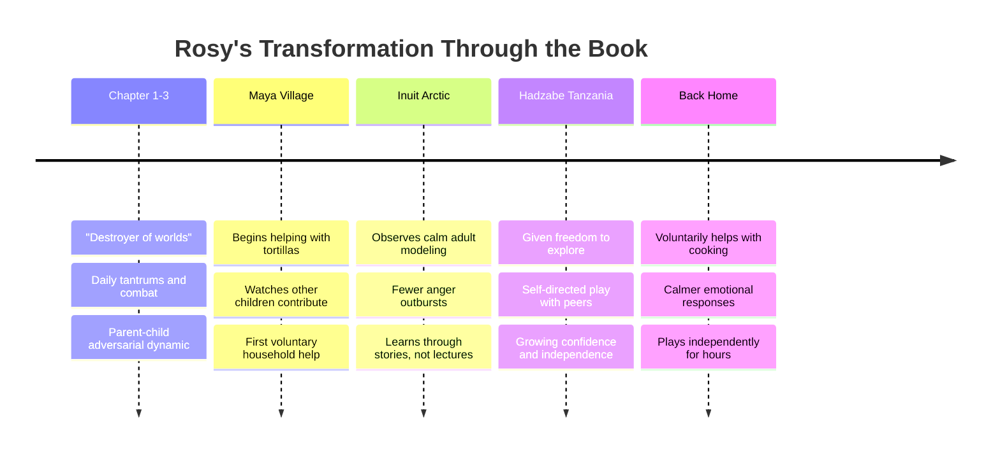
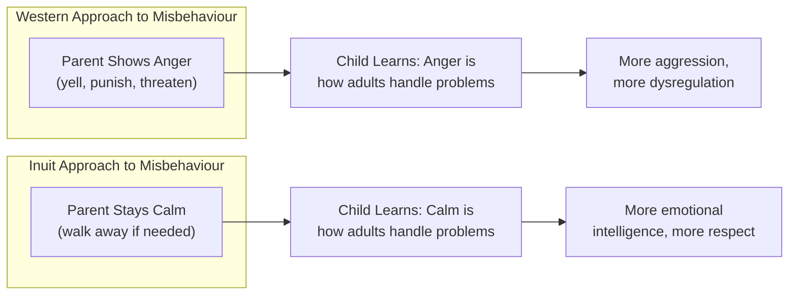
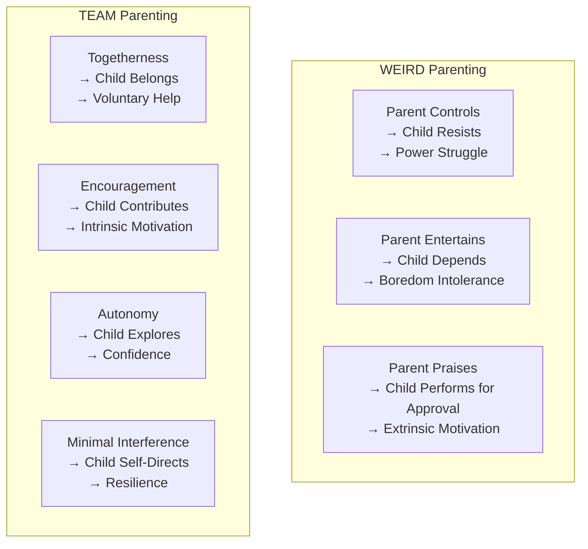
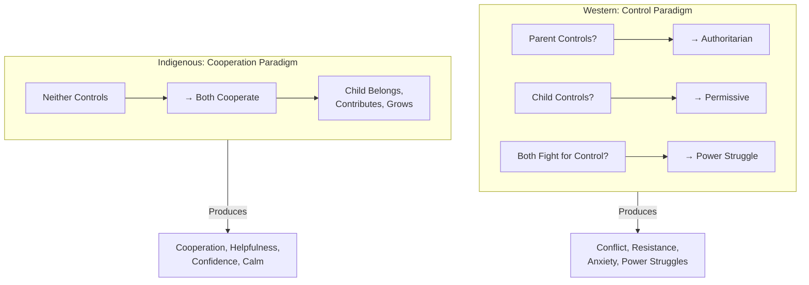
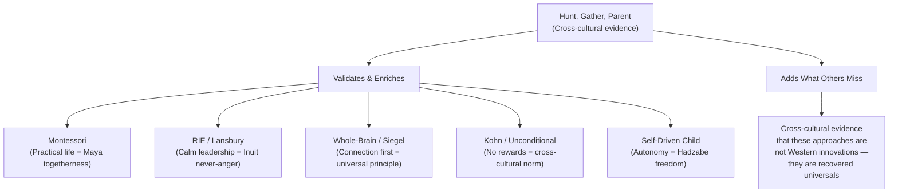

# Hunt, Gather, Parent — Michaeleen Doucleff

> An NPR science reporter hits rock bottom with her toddler daughter: tantrums, hitting, biting, and a relationship disintegrating into daily combat. She travels to three indigenous communities — Maya in Mexico, Inuit in the Arctic, Hadzabe in Tanzania — living with families and bringing her daughter along as a parenting test case. What she discovers overturns almost everything Western culture believes about raising children. The most helpful, emotionally intelligent, and confident children in the world are raised without praise charts, structured activities, time-outs, or constant parental attention. They are raised through inclusion in real life, calm emotional modelling, storytelling instead of lecturing, and enormous respect for children's autonomy. This book is the missing perspective in Western parenting — the other 88% of humanity that parenting books never mention.

---

## About the Author

Michaeleen Doucleff is a correspondent for NPR, where she covers global health and science. She holds a PhD in chemistry from UC Berkeley and spent seven years in laboratories before switching to journalism. Her scientific training shows in the book: she cross-references her observations with anthropological research, evolutionary biology, and psychology studies.

The book is deeply personal. Doucleff is brutally honest about her failures as a parent — the screaming, the anger, the feeling of being trapped in combat with a three-year-old. She describes lying in bed at 5am "preparing for battle" with her daughter Rosy. This honesty makes the book trustworthy. She is not preaching from a position of expertise — she is learning alongside the reader, humbled by parents who have mastered what she cannot.

Rosy, her daughter, is a co-protagonist. She travels everywhere with Doucleff — sleeping in a hammock in a Maya village, helping hunt narwhal with an Inuit grandfather, digging tubers with Hadzabe mothers. Rosy's transformation over the course of the book — from "destroyer of worlds" to a genuinely helpful, cooperative child — is the book's most convincing evidence.

---

## The Big Idea

- <b style="color: #2980b9">Western parents are the WEIRDest in the world</b> — many practices we consider essential (constant praise, child-centred play, nuclear family, stimulation-based parenting) are cultural anomalies absent from the vast majority of human cultures and history
- <b style="color: #e74c3c">For 99.9% of human existence, children were raised using a universal approach</b> built on four pillars: Togetherness, Encouragement, Autonomy, and Minimal interference (TEAM)
- <b style="color: #27ae60">The most helpful, cooperative, emotionally intelligent children in the world are raised WITHOUT</b>: praise charts, structured activities, time-outs, constant parental attention, or child-centred play
- Maya parents raise the most helpful children by including them in real work from infancy — cooking, cleaning, farming, caring for siblings — not through chore charts or rewards
- Inuit parents raise the most emotionally regulated children by never showing anger toward a child, never yelling, and using storytelling and drama to teach consequences
- Hadzabe parents raise the most confident children by giving them enormous autonomy — freedom to explore, take risks, and self-organise with minimal adult intervention
- Western culture's obsession with control — either parent controls child or child controls parent — sets up adversarial relationships. Indigenous cultures operate on cooperation, not control.
- The nuclear family is one of the most non-traditional family structures in human history — for most of our species' existence, parenting was multigenerational

---

## Key Concepts at a Glance

| Concept | One-line summary |
|---------|-----------------|
| **WEIRD parenting** | Western, Educated, Industrialized, Rich, Democratic — our parenting is the global outlier |
| **TEAM** | Togetherness, Encouragement, Autonomy, Minimal interference — the universal parenting pillars |
| **Acomedido** | Maya concept: the child who voluntarily helps without being asked |
| **Never in anger** | Inuit principle: yelling at a child is immature; calm is the only acceptable adult response |
| **Dramas** | Inuit teaching tool: acting out consequences through small theatrical scenes rather than lecturing |
| **Autonomy** | Hadzabe principle: children need freedom to explore, take risks, and learn from experience |
| **The blizzard** | Nuclear family isolates parent and child like a blizzard traps them in a house — historically unnatural |
| **Interference** | Western parents interfere too much — controlling, directing, praising, narrating, entertaining |
| **Togetherness** | Include children in real adult work rather than creating separate "children's activities" |
| **Encouragement** | Motivate through belonging and contribution, not through praise and rewards |

---

## 30-Second Version

Western parenting is a global outlier. We are the only culture that entertains children, separates them from adult work, uses praise as the primary motivator, and raises them in nuclear families without extended community. Indigenous cultures worldwide share a different approach: include children in real life (Maya togetherness), never show anger (Inuit emotional modelling), give children freedom to learn through experience (Hadzabe autonomy), and encourage without forcing (universal). The result: children who voluntarily help, regulate their emotions, resolve conflicts independently, and show remarkable confidence. The secret is not a technique — it is a relationship built on cooperation rather than control.

---

Indigenous TEAM parenting produces dramatically more helpful, emotionally regulated, and confident children — while simultaneously reducing parent stress and eliminating the need to constantly entertain.

Each TEAM pillar connects through specific cultural practices to one of three core outcomes — helpfulness, emotional calm, and confidence.

Practices that WEIRD parents consider essential are virtually absent in indigenous cultures — and yet indigenous children consistently outperform Western children on helpfulness, emotional regulation, and autonomy.

Rosy's arc from "destroyer of worlds" to a cooperative, self-regulated child is the book's most convincing evidence that the TEAM framework works.

## Section 1: The WEIRDest Parents in the World

### What Is WEIRD?

In 2010, psychologist Joe Henrich and colleagues published a landmark paper showing that Western cultures are statistical outliers on virtually every psychological measure — perception, cooperation, fairness, punishment, even how we see optical illusions. They coined the acronym WEIRD: Western, Educated, Industrialized, Rich, Democratic.

The parenting implications are profound. Many practices we consider "best practice" or "evidence-based" have been tested almost exclusively on WEIRD populations (96% of psychology studies use Western subjects). When tested on other cultures, the results often do not replicate.

> [!warning] Parenting Practices That Are WEIRD (Not Universal)
> - Constant verbal praise ("Good job!") — most cultures do not praise children this way
> - Child-centred play (parents getting on the floor to play with children) — historically, children played with other children, not adults
> - Structured activities and classes — uniquely Western invention of the last century
> - The nuclear family as the ideal unit — for 99.9% of human history, families were multigenerational
> - Separation of children from adult work — children have always participated in real life
> - Parenting as entertainment — the idea that a parent's job is to stimulate, entertain, and engage the child constantly
> - Time-outs — no parallel exists in indigenous cultures

### The Blizzard Metaphor

Anthropologist David Lancy compares the modern nuclear family to being trapped in a blizzard: parent and child isolated together, with the parent forced to be the sole source of connection, entertainment, stimulation, and love. This isolation creates tension, exhaustion, and adversarial dynamics that simply did not exist when parenting was embedded in a multigenerational community.

---

## Section 2: The Maya Method — Togetherness

*How to raise the most helpful children in the world*

### The Central Discovery

In a Maya village in the Yucatán, Doucleff witnesses something that blows her mind: twelve-year-old Angela wakes up on spring break and, before doing anything else, starts washing the breakfast dishes. No one asked. No chore chart. When asked why, Angela says simply: "I like to help my mother."

This is not a fluke. Across Maya communities, researchers have documented that children are remarkably, voluntarily helpful — and this helpfulness increases with age rather than decreasing (as it does in WEIRD cultures).

### How They Do It: Acomedido

The Maya have a concept called *acomedido* — roughly translated as "the person who voluntarily contributes to a group effort." It is the highest social virtue. A person who is acomedido notices what needs to be done and does it without being asked.

Maya children develop acomedido through a simple mechanism: **inclusion in real adult work from infancy.**

> [!example] The Maya Inclusion Method
> - A toddler watches their mother make tortillas. The mother gives them a small piece of dough.
> - A three-year-old helps carry items to the market.
> - A five-year-old helps prepare food, wash dishes, care for younger siblings.
> - A nine-year-old runs errands independently.
> - A twelve-year-old can manage household tasks autonomously.
>
> At no point is the child given a "chore chart" or "assignment." They are simply included in the family's work, at their own level, from the beginning. The intrinsic motivation to help develops naturally from belonging and participation.

### Why Western Chore Charts Backfire

Doucleff explains that chore charts, reward systems, and "assigned tasks" often undermine the very helpfulness they are trying to build. They communicate: "Helping is not something you want to do. It is something you must be incentivised to do." They transform a cooperative act into a transactional one.

Maya parents do the opposite: they make helping feel like a privilege, a sign of growing up, a contribution to something the child belongs to. They do not assign or reward. They include and appreciate.

> [!tip] How to Apply the Maya Method
> 1. **Welcome your toddler's "help" — even when it slows you down.** A two-year-old stirring batter badly is building the neural pathway for voluntary helpfulness.
> 2. **Stop separating "children's activities" from "adult work."** Include them in cooking, cleaning, shopping, gardening.
> 3. **Ditch the chore chart.** Instead, let children contribute voluntarily and notice when they do.
> 4. **Lower your expectations of the outcome.** The point is not a clean floor. The point is a child who wants to clean.
> 5. **Never pay or reward for household help.** Helping is part of belonging to a family — not a transaction.

---

## Section 3: Inuit Emotional Intelligence — Never in Anger

*How to teach children to control their anger*

### The Central Discovery

In Inuit communities in the Canadian Arctic, Doucleff observes something astonishing: adults never yell at children. Never. Showing anger toward a child is considered a sign of immaturity — the adult equivalent of a toddler tantrum. An adult who yells at a child loses respect in the community.

And yet, Inuit children are remarkably well-behaved, emotionally regulated, and respectful. How?

### The Inuit Approach to Anger

> [!danger] The Inuit Rule
> **Never discipline while angry.** If you feel anger rising, walk away. Come back when you are calm. Anger is contagious — when you show anger to a child, you teach anger. When you model calm, you teach calm. This is not philosophy. This is how Inuit have raised children for thousands of years in one of the harshest environments on earth.

### Teaching Tools: Stories and Dramas

Instead of lecturing, threatening, or punishing, Inuit parents teach through two powerful tools:

**1. Stories.** When a child misbehaves, rather than lecturing, an elder tells a story — often featuring the child as a character — that illustrates the natural consequences of the behaviour. "There was a boy who hit his mother. One day, the sea creature came and took him away because sea creatures only want children who are kind to their mothers."

These stories are not threats. They are delivered calmly, often with humour, and they embed the lesson in narrative memory — which is far more durable than a lecture.

**2. Dramas.** Small theatrical performances where an adult acts out a scenario with the child. For example, if a child has been biting, the parent might (during a calm moment) pretend to bite the child gently, then ask: "Did you like that? How did it feel?" The child laughs, but the lesson lands. They experience the consequence from the other side.

> [!example] An Inuit Drama in Action
> Rosy has been hitting Doucleff. An Inuit grandmother, during a calm, playful moment, asks Rosy: "Why do you hit your mama?" Rosy doesn't answer. The grandmother continues: "Can I hit your mama?" Rosy's eyes go wide. "No!" she says, and moves to protect her mother. In that moment, the empathy circuit fires. No lecture was needed.

### What Western Parents Get Wrong About Anger

Doucleff is blunt: Western culture normalises adult anger toward children. We yell, threaten, punish, and lose our tempers — and then wonder why our children are aggressive and emotionally dysregulated. The Inuit approach is a mirror that reveals how bizarre and counterproductive this is.

---

## Section 4: Hadzabe Confidence — Autonomy

*How to raise the most confident children in the world*

### The Central Discovery

Among the Hadzabe hunter-gatherers of Tanzania, children enjoy a level of autonomy that would terrify most Western parents. Young children roam freely, play without adult supervision, use knives, build fires, and make their own decisions about when to eat, sleep, and come home. And yet, childhood anxiety and depression are virtually unknown.

### The Autonomy Principle

The Hadzabe operate on a principle that Western culture has almost entirely abandoned: **children are competent beings who learn best through self-directed experience.** Adults provide the community, the safety net, and the modelling — but they do not direct, control, or hover.

> [!success] What Autonomy Builds
> - **Confidence:** "I can handle this" — because they have handled it, repeatedly
> - **Resilience:** falls, failures, and frustrations are processed naturally, not catastrophised by anxious adults
> - **Executive function:** self-direction, planning, risk assessment, decision-making — all exercised constantly
> - **Social skills:** children self-organise into multi-age groups, resolving conflicts without adult mediation
> - **Intrinsic motivation:** activities are chosen, not assigned — the child learns what they want to learn

### The Western Problem: Too Much Interference

Doucleff argues that Western parents interfere too much. We control too much. We direct too much. We praise too much. We entertain too much. We narrate too much. Every moment of a child's day is adult-mediated.

The result: children who cannot self-start, cannot self-soothe, cannot self-direct, and cannot tolerate boredom or uncertainty. The very skills we want to build (resilience, independence, self-regulation) are undermined by our constant interference.

> [!tip] How to Reduce Interference
> 1. **Stop narrating their play.** You do not need to provide a running commentary on everything they do.
> 2. **Stop over-praising.** "Good job!" for every action teaches dependence on external validation.
> 3. **Let them be bored.** Boredom is the birthplace of creativity and self-direction.
> 4. **Let them take risks.** Climbing, falling, and getting back up is how confidence is built.
> 5. **Let them fail.** The urge to rescue is the urge to control. Failure is data, not trauma.
> 6. **Let them resolve conflicts.** Step back. Watch. Intervene only if someone is in danger.

---

## The TEAM Framework: A New Paradigm for Western Parents

TEAM is the book's practical synthesis of what all three cultures share:

### T — Togetherness

Include children in your real life. Stop creating a separate "children's world" of activities, entertainment, and structured play. Cook together. Clean together. Shop together. Garden together. Fix things together. The child participates at their level — a toddler stirs, a five-year-old chops soft vegetables, a ten-year-old plans the meal.

> [!example] Togetherness in Practice
> Before: You cook dinner while your child watches a screen in the other room.
> After: Your child stands on a step stool next to you, tearing lettuce, pouring measured ingredients, wiping the counter. Dinner takes ten minutes longer. The child has practised fine motor skills, sequencing, contribution, and belonging. And they are more likely to eat what they helped create.

### E — Encouragement (Not Praise)

Maya, Inuit, and Hadzabe parents rarely praise children with "Good job!" They do not use sticker charts or reward systems. Instead, they encourage through:

- **Noticing contribution:** "I see you carried that water all by yourself."
- **Expressing genuine appreciation:** "Thank you. That really helped."
- **Communicating belonging:** "You're part of this family, and we do this together."
- **Modelling gratitude:** showing rather than telling

> [!danger] Why "Good Job!" Is Problematic
> - It is evaluative — the child performs for the adult's approval
> - It is generic — "good job" on everything means "good job" on nothing
> - It shifts motivation from internal (I enjoy this) to external (the adult approves)
> - It creates praise dependency — the child stops trying without the external validation
> - Cross-cultural research shows that cultures with the least verbal praise produce the most intrinsically motivated children

### A — Autonomy

Give children real choices and real freedom, appropriate to their age. Let them take risks, make mistakes, and experience natural consequences. Do not hover, rescue, or over-direct.

The key insight from the Hadzabe: children are far more competent than Western culture gives them credit for. A three-year-old who is allowed to climb a tree (with a watchful but non-interfering adult nearby) builds more confidence than one who is told "be careful!" and pulled away.

### M — Minimal Interference

This is the hardest pillar for Western parents because it asks you to do *less*:

| What to reduce | What to do instead |
|---|---|
| Constant narration of their play | Sit quietly and observe |
| Directing their activities | Follow their lead |
| Solving their problems | Let them struggle and figure it out |
| Mediating every conflict | Let children work it out (intervene only for safety) |
| Filling every silence | Allow boredom — it sparks creativity |
| Over-praising | Notice and appreciate genuinely |
| Entertaining them | Include them in your real activities |

---

## Rosy's Transformation

The most powerful evidence in the book is Rosy herself. When the book begins, she is a "destroyer of worlds" — hitting, biting, tantruming, and locked in daily combat with her mother.

By the end of the book, after multiple trips and months of Doucleff implementing TEAM principles, Rosy is genuinely helpful, cooperative, and emotionally regulated. She voluntarily contributes to household tasks. She manages her anger without hitting. She plays independently without demanding constant entertainment.

Doucleff does not claim perfection. Rosy still has hard days. But the trajectory has changed fundamentally — from an adversarial, control-based relationship to a cooperative, togetherness-based one.

> [!success] The Key Shift
> Doucleff stopped trying to control Rosy and started including her. She stopped entertaining Rosy and started working alongside her. She stopped praising and started appreciating. She stopped reacting in anger and started modelling calm. The transformation was not instant — it took months — but it was real and lasting.

---

## Before and After: Applying TEAM

| Situation | WEIRD Response | TEAM Response |
|-----------|---------------|---------------|
| **Child resists getting dressed** | Power struggle, threats, bribery | Give them time. Offer two options. If not dressed, go as-is (natural consequence). |
| **Child is bored** | Turn on a screen, suggest an activity, entertain them | "I'm making dinner. Want to help?" Include them in real life. Or let them be bored. |
| **Child won't do chores** | Chore chart, rewards, consequences | Drop the chore chart. Include them in housework naturally. Appreciate when they contribute. Never pay for help. |
| **Child has a tantrum** | Yell, threaten, time-out, or give in | Stay calm. Do not show anger. Acknowledge the feeling. Wait for it to pass. (Inuit approach.) |
| **Child is fighting with sibling** | Mediate, referee, separate them | Let them work it out (unless someone is in danger). Multi-age play naturally teaches conflict resolution. |
| **Child refuses to try something new** | Force, bribe, or lecture | Model. Show interest yourself. Invite without pressure. Let them come to it on their own timeline. |

---

## Deep Dive: The Problem with Praise

This is one of the most challenging sections for Western parents. Doucleff presents research from multiple disciplines arguing that constant verbal praise ("Good job!" "You're so smart!" "What a great drawing!") is counterproductive:

1. **It shifts motivation from internal to external.** The child starts performing for the praise rather than for the satisfaction of the activity itself.

2. **It creates fragility.** Children praised for being "smart" (rather than for effort) are more likely to avoid challenges and give up quickly when things get hard (Carol Dweck's research).

3. **It can feel manipulative.** Children are sensitive to authenticity. Generic praise that does not match the situation erodes trust.

4. **Cross-cultural evidence.** In cultures where parents praise the least, children show the highest levels of intrinsic motivation, voluntary helpfulness, and persistence.

The alternative is not coldness or withholding. It is genuine, specific acknowledgement and appreciation — the difference between "Good job!" (evaluation) and "Thank you, that really helped" (gratitude).

> [!tip] What to Do Instead of Praising
> - **Describe:** "You used a lot of red in that painting."
> - **Appreciate:** "Thank you for carrying that. It really helped."
> - **Ask:** "How did that feel when you climbed to the top?"
> - **Be present.** Your attention is the reward.
> - **Let the activity speak.** A child who builds a tower does not need you to evaluate it.

---

## Deep Dive: How Maya Parents Create Acomedido Children

The Maya approach to raising helpful children is not a single technique — it is an entire culture of inclusion that begins in infancy and builds over years.

### Stage 1: Watch and Welcome (Age 0-2)

The infant is always present during adult work — in arms, in a wrap, on a lap. They absorb everything. When a toddler reaches for a broom or a pot, the parent does not redirect them to a toy. They hand them a small version of the real thing, or a piece of the real material.

> [!example] A Maya Mother's Response to a Toddler "Helping"
> A Western parent whose toddler grabs the mop: "No, sweetie, that's not a toy. Here, play with this instead."
> A Maya parent whose toddler grabs the mop: gives them a rag and shows them where the floor is wet.
> The Western response teaches: adult work is not for you. The Maya response teaches: you belong here.

### Stage 2: Contribute at Your Level (Age 2-5)

The child does real tasks, matched to their ability. Stir the pot. Carry the tortillas. Wipe the table. Fetch items. The quality of the output is not the point — the participation is. Maya parents do not correct the child's work or redo it in front of them. They accept the contribution.

### Stage 3: Take Initiative (Age 5-10)

The child begins to notice what needs doing without being told. They have watched long enough to understand the household's rhythms. They see dirty dishes and wash them. They see a younger sibling who needs attention and engage them. This is acomedido emerging naturally — not from rewards, but from years of inclusion and belonging.

### Stage 4: Full Competence (Age 10+)

By pre-adolescence, Maya children can manage significant household responsibilities independently. Angela waking up to wash dishes on spring break is not an isolated act of virtue — it is the predictable outcome of a childhood spent as a contributing member of the household.

### Why Western Children Become LESS Helpful with Age

In Western culture, helpfulness follows the opposite trajectory: toddlers are eager to help, but by school age, they resist, and by adolescence, getting them to do anything requires threats or bribes. Doucleff argues this happens because:

1. We redirect toddlers away from real work and toward toys — teaching them that adult work is not for them
2. We introduce chore charts and rewards — teaching them that helping is a transaction
3. We separate children's lives from adult lives — removing the context in which voluntary helping develops

The Maya trajectory works because the foundation is never transactional. Helping is belonging.

---

## Deep Dive: Inuit Teaching Through Stories and Dramas

The Inuit approach to discipline is perhaps the most radical departure from Western practice in the book.

### The Core Rule: Never Show Anger to a Child

Inuit elder Sally told Doucleff: "Why would you yell at a child? It would be like yelling at a puppy for chewing your shoe. They don't know any better yet. They are just learning."

In Inuit culture, an adult who shows anger toward a child is considered immature — like a child themselves. Anger is seen as a loss of control that shames the adult, not the child. The emotional regulation expected of adults toward children is absolute.

### How It Works: Waiting for the Calm Moment

Inuit parents do not address misbehaviour in the heat of the moment (when both adult and child are dysregulated). They wait. Sometimes hours, sometimes until the next day. Then, when everyone is calm, they use one of two tools:

**Stories:** An elder tells a narrative that features the problematic behaviour and its consequences. The story is entertaining, often funny, and always memorable. It encodes the lesson in the child's narrative memory — far more durable than a lecture delivered during a tantrum.

**Dramas:** Small role-plays where the adult acts out a scenario. If a child has been biting, the adult might (playfully) pretend to bite, then ask how it feels. The child experiences the consequence empathically rather than punitively.

> [!example] A Complete Inuit Drama
> Rosy has been hitting her mother. Days later, during a calm, playful moment by the ocean, Inuit grandmother Elizabeth turns to Rosy and says, conversationally:
> "Why do you hit your mama?"
> Rosy does not answer.
> "Do you want to make your mama cry?"
> Rosy shakes her head.
> "Can I hit your mama?"
> Rosy's eyes widen. "No!" She moves protectively toward Doucleff.
> Elizabeth nods, satisfied. The lesson has landed — through empathy, not punishment.

### The Compound Effect of Never-Anger

Over years, the Inuit never-anger approach produces children who have absorbed a deep model: adults handle problems with calm. Emotional regulation is not taught through lectures or techniques — it is transmitted through thousands of interactions where the adult models the exact emotional state they want the child to develop.

> [!success] The Mirror Effect
> Children mirror their parents' emotional state. If the parent's default response to frustration is anger, the child absorbs: "Anger is the appropriate response to frustration." If the parent's default response is calm problem-solving, the child absorbs: "Calm is the appropriate response to frustration." Over years, this mirroring builds the child's own emotional regulation capacity — without a single lesson on "anger management."

---

## Deep Dive: Hadzabe Children and the Antidote to Anxiety

Western children are experiencing an epidemic of anxiety. Approximately one in three teenagers meets criteria for an anxiety disorder. Meanwhile, in Hadzabe communities, childhood anxiety is essentially unknown.

Doucleff argues this is not genetic or coincidental — it is a direct consequence of how children spend their days:

| Western Children | Hadzabe Children |
|---|---|
| Days structured by adults | Days largely self-directed |
| Constant adult supervision | Minimal adult supervision (within a safe community) |
| Risks prevented by helicopter parents | Risks assessed and taken by children themselves |
| Failures cushioned by adult rescue | Failures experienced and processed naturally |
| Play directed by adults or screens | Play self-organised in multi-age groups |
| Nature: occasional, scheduled | Nature: constant, immersive |
| Alone time: rare | Alone time and peer time: abundant |

> [!danger] The Anxiety Mechanism
> Anxiety is fundamentally about feeling unable to cope with uncertainty. Western parenting inadvertently builds anxiety by:
> 1. Removing uncertainty (over-scheduling, over-structuring)
> 2. Preventing failure (hovering, rescuing)
> 3. Modelling anxiety (constant worry, "be careful!")
>
> Hadzabe parenting builds confidence by doing the opposite:
> 1. Allowing uncertainty (self-directed days)
> 2. Allowing failure (falls, conflicts, mistakes)
> 3. Modelling calm (adults are relaxed and unworried)

### The Nature Connection

Hadzabe children spend virtually all day outdoors. Western research increasingly confirms what indigenous cultures have always known: time in nature reduces anxiety, improves emotional regulation, builds attention, and enhances physical health. The Hadzabe do not schedule "outdoor time" — outdoor IS time.

> [!tip] The Simplest Hadzabe Lesson for Western Parents
> Take your child outside. Every day. For as long as possible. Let them play freely — digging, climbing, running, exploring. Do not direct the play. Do not narrate. Just be present and let nature do the teaching.

---

## Deep Dive: The Control Problem in Western Parenting

Doucleff identifies the root issue: Western parenting revolves around **control** — who has it, who wants it, and who fights for it.

- **Authoritarian parents:** Parent controls. Child submits. Result: resentment, rebellion, anxiety.
- **Permissive parents:** Child controls. Parent submits. Result: insecurity, chaos, lack of boundaries.
- **Helicopter parents:** Parent controls everything. Child develops no autonomy. Result: dependence, fragility, anxiety.

Indigenous parenting largely operates outside the control paradigm. The relationship is not about who is in charge — it is about cooperation, contribution, and belonging. The child is neither controlled nor in control. They are *included*.

---

## What Changes After Reading This Book

**In how you see Western parenting:**
- You recognise practices you assumed were universal as cultural anomalies
- Praise, chore charts, structured activities, constant supervision — all look different once you see them through a cross-cultural lens
- The nuclear family stops looking "traditional" and starts looking abnormally isolated

**In how you parent:**
- You include your child in real life more — cooking, cleaning, shopping, fixing
- You reduce praise and increase genuine appreciation
- You give more autonomy and take more risks
- You respond to misbehaviour with calm, not anger
- You let children be bored, fail, and resolve their own conflicts more often

**In how you feel:**
- Less pressure — because the TEAM approach asks you to do less, not more
- Less guilt — because your struggles are not personal failures but cultural deficits
- More hope — because there is a proven alternative that has worked for thousands of years
- More connection — because togetherness replaces entertainment as the basis of your relationship

---

## Frequently Asked Questions

> [!tip] "Doesn't this romanticise indigenous cultures?"
> Doucleff addresses this directly. She is not claiming these cultures are perfect, that their lives are easy, or that they represent a "paradise lost." She is observing that they have specific, tested parenting skills that produce measurable results — skills that Western culture has lost. Many indigenous communities face real hardships, including poverty, historical trauma, and displacement. The book honours their parenting expertise without idealising their circumstances.

> [!tip] "I live in a city apartment. How do I give my child Hadzabe-level autonomy?"
> Adapt the principle, not the specific practice. Let them climb higher at the playground (without saying "be careful!"). Let them walk ahead of you on the pavement. Let them pour their own juice (and spill it). Let them resolve a sibling argument without your intervention. Each small act of autonomy builds the confidence pathway.

> [!tip] "My child is in full-time daycare. How do I do 'togetherness'?"
> The quantity matters less than the quality and the intention. When you are together — mornings, evenings, weekends — include them. Let them help make breakfast, pack lunches, fold laundry. Even fifteen minutes of genuine togetherness (cooking side by side, not playing a parent-directed game) builds the acomedido pathway.

> [!tip] "Won't my child think I don't care if I stop praising?"
> They will notice the shift. Initially, some children will seek the familiar "Good job!" But genuine appreciation ("Thank you — that really helped") and genuine attention (being present and interested) fill the need far more deeply than generic praise ever did. The relationship gets richer, not emptier.

> [!tip] "What about safety? I can't just let my toddler use knives."
> Doucleff is clear: safety limits are non-negotiable. The Hadzabe are not reckless — they are contextually confident. A Hadzabe child using a knife has been observing adults use knives for years and has the motor skills to do so safely. Match autonomy to capability. A two-year-old can use a butter knife. A five-year-old can use a small sharp knife with supervision. Assess, adapt, and trust gradually.

> [!tip] "This sounds like a lot of work."
> The paradox: TEAM parenting is actually LESS work than WEIRD parenting. You are doing less entertaining, less directing, less hovering, less narrating. You are including the child in work you are already doing. The shift is in mindset (from "I need to manage my child's every moment" to "I need to include my child in my life") — not in workload.

> [!tip] "What about neurodivergent children?"
> The TEAM principles are flexible. A child with ADHD may need more scaffolding around autonomy. A child with autism may need more predictability in togetherness activities. The core principles (include, encourage, give autonomy, minimise interference) apply universally, but implementation adapts to the individual child.

---

## Practical Tools from Each Culture

### From the Maya: How to Build Acomedido

**This week:**
1. Welcome your toddler's "help" during one daily task — even if it slows you down
2. Stop redirecting them to toys when they want to do what you are doing
3. When they contribute, say "Thank you" not "Good job!"
4. Let them carry something real — groceries, laundry, dishes

**This month:**
1. Involve them in meal preparation at their level — washing, tearing, stirring, pouring
2. Give them a real responsibility — feeding the pet, watering a plant, setting the table
3. Stop using a chore chart if you have one — let helping be natural, not assigned
4. Notice and appreciate voluntary contributions without over-celebrating

### From the Inuit: How to Stay Calm

**This week:**
1. The next time you feel anger rising, walk away. Come back when calm.
2. Practice the Inuit question: "Why would I yell at a child? They are just learning."
3. When your child misbehaves, address it later during a calm moment — not in the heat

**This month:**
1. Create a story for a recurring behaviour problem — make it funny, memorable, and featuring your child as a character
2. Try a small drama: act out the problematic behaviour yourself and ask how it feels
3. Track your anger incidents — aim to reduce by one per week
4. Notice how your child's behaviour changes when your anger decreases

### From the Hadzabe: How to Increase Autonomy

**This week:**
1. Let your child be bored for 15 minutes without offering entertainment
2. At the playground, resist saying "be careful" — say "I see you're up high" instead
3. Let them fail at one small task without rescuing

**This month:**
1. Reduce screen time by 30 minutes and replace with unstructured outdoor time
2. Let your child walk ahead of you for short distances
3. Step back from one sibling conflict and see if they can resolve it
4. Give them a real tool — a small broom, a garden trowel, a butter knife — and let them use it

---

## How This Book Connects to Other Parenting Approaches

The book does not contradict any of the respectful parenting approaches in the Parenting & Child Development shelf. It provides the cross-cultural evidence base that explains WHY these approaches work: they align with how children have been raised for tens of thousands of years. Montessori's practical life, Lansbury's calm authority, Siegel's connect-and-redirect, Kohn's anti-reward stance — all are present in indigenous cultures, independently discovered across continents and millennia.

---

## Sleep: The Cross-Cultural Perspective

The final chapter addresses sleep, a topic on which Western advice varies wildly:

- **Co-sleeping is the global norm.** The Western practice of putting infants in a separate room from birth is the anomaly, not the standard. Most human cultures have parents and children sleeping in close proximity.
- **Bedtime battles are a Western creation.** In cultures where children sleep near family, fall asleep naturally when tired, and are not subjected to rigid schedules, the elaborate bedtime routines (and the resistance that accompanies them) are rare.
- **A tired child is a misbehaving child.** Many "behaviour problems" are actually sleep problems in disguise. Address sleep first before addressing behaviour.

> [!tip] The Simple Sleep Insight
> In most indigenous cultures, children fall asleep when they are tired — not at a parent-designated time. They sleep near family members, in physical contact. Western bedtime battles often result from imposing an adult schedule on a child's natural rhythm, in conditions of isolation (alone in a dark room) that are evolutionarily unprecedented.

---

## The Transformation of Rosy — A Timeline

| When | Rosy's Behaviour | What Changed |
|------|-----------------|-------------|
| **Before trip to Mexico** | Tantrums, hitting, biting, daily combat with mother | — |
| **After Maya village** | Doucleff begins including Rosy in real work | Rosy starts showing interest in helping |
| **After Inuit community** | Doucleff stops showing anger; uses stories and dramas | Rosy's aggression decreases significantly |
| **After Hadzabe** | Doucleff gives Rosy more autonomy and reduces interference | Rosy becomes more self-directed and confident |
| **Months later** | Rosy voluntarily helps with household tasks, regulates emotions better, plays independently | The relationship has shifted from adversarial to cooperative |

The transformation is not instant. It takes months. But it is real, documented, and visible. Doucleff does not claim Rosy became a perfect child — she claims the trajectory changed fundamentally.

---

## The Deeper Message

> [!success] You Are Not a Bad Parent
> "Maybe I've had such trouble with Rosy, not because I'm a bad mom, but because I just haven't had someone to teach me how to be a good mom."
>
> This is the book's most compassionate insight. Western parents are not failing because they are lazy, selfish, or incompetent. They are failing because their culture has stripped away the multigenerational knowledge, the community support, and the time-tested parenting wisdom that every other culture on earth still maintains. The book does not blame parents. It blames cultural isolation — and then offers the antidote.

*The most helpful children in the world are not rewarded, praised, or chore-charted into helpfulness. They are included into it.*

---

## Deep Dive: Sleep

The final chapter addresses sleep, drawing on cross-cultural evidence:

- **Co-sleeping is the global norm.** In the vast majority of human cultures, parents and young children sleep in close proximity. The Western practice of putting infants in a separate room is the anomaly.
- **Bedtime battles are largely a Western creation.** In cultures where children sleep near parents, in family groups, or with siblings, the elaborate bedtime routines (and the resistance that comes with them) are rare.
- **Exhaustion creates behaviour problems.** Many misbehaviour issues are actually sleep issues in disguise. Address sleep first.

---

## Common Objections

> [!warning] "This romanticises indigenous cultures."
> Doucleff addresses this directly. She is not claiming these cultures are perfect or that their lives are easy. She is observing that they have developed specific parenting skills over thousands of years that produce measurable results — and that Western culture is missing these skills.

> [!warning] "I can't give my child Hadzabe-level autonomy in a city."
> You can adapt the principle. The goal is not to let your child roam the bush. It is to give more freedom than you currently do — to let them climb a bit higher, struggle a bit longer, fail a bit more, and resolve conflicts a bit more independently.

> [!warning] "My child needs more structure, not less."
> Some children do. The TEAM framework is flexible. The core principles — togetherness, encouragement, autonomy, minimal interference — can be calibrated for individual children. A child with ADHD may need more external structure around autonomy. But the underlying principles still apply.

> [!warning] "I don't have a multigenerational community."
> This is real and Doucleff acknowledges it. The nuclear family's isolation is one of the root problems. Her practical advice: build community intentionally — neighbours, friends, multi-family activities. Even imperfect community is better than none.

---

## The Verdict

This is the most paradigm-shifting parenting book available. It does not give you techniques — it gives you a new lens through which to see childhood, parenthood, and the entire enterprise of raising children. Once you understand that Western parenting is the global outlier — that most of what we do is not "evidence-based" but "WEIRD-culture-based" — you cannot unsee it.

The book's greatest strength is its combination of personal narrative, investigative journalism, and cross-cultural research. Doucleff is a gifted storyteller, and the chapters set in Maya, Inuit, and Hadzabe communities are vivid and compelling. You feel like you are there — watching Angela wash dishes at dawn, listening to an Inuit grandmother explain why yelling at a child is immature, observing Hadzabe children play independently in the bush.

The TEAM framework provides a practical synthesis, and the "Tips and Tools" sections at the end of each culture section translate the big ideas into daily actions. The advice is not overwhelming — it is about doing LESS, not more. Stop over-praising. Stop over-directing. Stop over-entertaining. Include your child in real life. Stay calm. Trust their competence.

### Limitations

- The book's scope is ambitious, which means no single culture is covered in the depth an anthropologist would provide — this is journalism, not ethnography
- Some advice (especially around autonomy and risk-taking) may feel impractical in urban Western environments without significant adaptation
- The book focuses primarily on toddlers and young children; less guidance for older children and teens
- Doucleff's personal narrative, while compelling, occasionally overshadows the cross-cultural content
- The "WEIRD" framing, while effective, can come across as dismissive of Western culture's genuine strengths
- Not all indigenous parenting practices are transferable — context matters enormously
- The book could do more to address how to implement these ideas when both parents work full-time and childcare is outsourced

Despite these limitations, this is essential reading. If you have read only Western parenting books, this is the corrective you need. It will make you question assumptions you did not know you had, and it will offer an alternative that is both ancient and revolutionary.

---

## Who Should Read This Book

| Reader | Why |
|--------|-----|
| **Parents exhausted by power struggles** | The TEAM framework replaces control-based parenting with cooperation-based parenting |
| **Parents who praise constantly** | The cross-cultural evidence on praise will change your approach overnight |
| **Parents who over-schedule and over-entertain** | Permission to do less and include children in real life instead |
| **Anyone who has only read Western parenting books** | This is the missing 88% of the global perspective |
| **Parents of toddlers** | Rosy's transformation is directly applicable to the toddler years |
| **Parents feeling isolated** | Validation that the nuclear family model is historically abnormal — and permission to seek community |

---

## Related Reading

| Book | Connection |
|------|-----------|
| [[The Montessori Toddler - Simone Davies]] | Montessori's "practical life" is essentially the Maya togetherness approach — include children in real work |
| [[No Bad Kids - Janet Lansbury]] | RIE's calm leadership aligns with the Inuit never-anger principle |
| [[The Whole-Brain Child - Daniel J. Siegel]] | The neuroscience behind why calm emotional modelling (Inuit) and connected parenting (Maya) builds better brains |
| [[No-Drama Discipline - Daniel J. Siegel]] | "Connect and redirect" is the Western neuroscience translation of universal indigenous discipline |
| [[Unconditional Parenting - Alfie Kohn]] | Kohn's case against praise and rewards is supported by the cross-cultural evidence here |
| [[The Self-Driven Child - William Stixrud & Ned Johnson]] | Autonomy emphasis directly aligns with Hadzabe child-freedom approach |
| [[The Danish Way of Parenting - Jessica Joelle Alexander]] | Another cross-cultural perspective — Denmark as a partially non-WEIRD culture |
| [[Simplicity Parenting - Kim John Payne]] | Reducing overstimulation and over-scheduling — aligned with TEAM's minimal interference principle |
| [[The Gardener and the Carpenter - Alison Gopnik]] | Philosophical complement — the "gardener" metaphor for parenting as providing conditions, not controlling outcomes |
| [[Brain Rules for Baby - John Medina]] | The brain science that explains why togetherness, calm, and autonomy produce better developmental outcomes |

---

## Five Things You Can Do Tomorrow Morning

1. **Include your child in one real household task.** Not a "pretend" task — a real one. Let them help make breakfast, wipe the table, or carry the laundry. Welcome their messy contribution.

2. **Replace "Good job!" with a description or a thank you.** "You carried that all the way!" or "Thank you — that really helped." Just once. See how it feels.

3. **When you feel anger rising toward your child, walk away.** Come back when you are calm. Channel the Inuit grandmother: "Why would you yell at a child? They are just learning."

4. **Let your child be bored for fifteen minutes without offering entertainment.** See what they come up with. Trust their capacity to self-direct.

5. **Observe your own interference for one hour.** Count how many times you direct, correct, praise, narrate, or suggest. Then try reducing by half. Notice what happens.

---

## Key Phrases to Remember

| Phrase | What It Means |
|--------|--------------|
| "WEIRD parenting" | Our approach is the global outlier, not the universal norm |
| "TEAM" | Togetherness, Encouragement, Autonomy, Minimal interference |
| "Acomedido" | The child who voluntarily helps without being asked |
| "Never in anger" | Yelling at a child is immature — model the emotional state you want to see |
| "Include, don't entertain" | Real life together beats structured activities apart |
| "Encourage, don't praise" | Belonging and appreciation over evaluation and rewards |
| "Trust their competence" | Children are far more capable than Western culture assumes |
| "Reduce interference" | Less controlling, directing, narrating, and rescuing |
| "The blizzard" | Nuclear family isolation is historically abnormal |
| "Cooperation, not control" | The relationship should be collaborative, not adversarial |

---

## The One Sentence That Changes Everything

> <b style="color: #2980b9">"Maybe I've had such trouble with Rosy, not because I'm a bad mom, but because I just haven't had someone to teach me how to be a good mom."</b>

Western culture has lost the parenting knowledge that most human societies transmit from generation to generation. This book begins to recover it — from the Maya, the Inuit, and the Hadzabe. The knowledge is not exotic or ancient. It is what parents have always known, everywhere, until very recently. Include your children. Stay calm. Trust them. And do less.

*The most helpful children in the world are not rewarded, praised, or chore-charted into helpfulness. They are included into it.*

---

## The Four TEAM Principles Applied to Common Challenges

### Morning Routines

**WEIRD:** Parent nags, hurries, battles. **TEAM:** Togetherness (do the routine side by side), autonomy (child chooses clothes laid out the night before, dresses independently), minimal interference (stop saying "hurry"), encouragement ("You got dressed by yourself — that helps us a lot").

### Screen Time

**WEIRD:** Strict rules, timer battles, meltdowns. **TEAM:** Replace some screen time with togetherness activities (cooking, outdoor exploration). When they choose a non-screen activity, notice without praising. Give them autonomy within the boundary: "One show or outside play — your choice."

### Sibling Conflict

**WEIRD:** Parent mediates every dispute. **TEAM:** Let them work it out unless safety is at risk. Give them a shared cooperative task. After they resolve a conflict: "You two figured that out by yourselves."

### Tantrums in Public

**WEIRD:** Embarrassment, threats, bribery. **TEAM:** Stay calm (Inuit). Acknowledge: "You're really upset." Wait for the natural arc. Reconnect after: "That was hard. I'm right here." Do not perform for the audience.

---

## The WEIRD Practices Checklist

A self-audit — not to judge, but to notice inherited practices you might reconsider:

- [ ] Do I praise constantly ("Good job!" for everything)?
- [ ] Do I entertain my child when they are bored?
- [ ] Do I separate "kids' activities" from "adult work"?
- [ ] Do I hover and narrate their play?
- [ ] Do I use chore charts or rewards for household help?
- [ ] Do I mediate every sibling conflict?
- [ ] Do I yell when I'm frustrated?
- [ ] Do I control the structure of their entire day?
- [ ] Do I say "be careful!" at every physical risk?
- [ ] Do I parent in isolation without community support?

Every "yes" is an opportunity to shift toward TEAM.

---

## A Note on the Book's Structure

Five sections: (1) The WEIRD Problem — why Western parenting is the global outlier. (2) Maya Togetherness — raising helpful children. (3) Inuit Emotional Intelligence — teaching anger control through stories and dramas. (4) Hadzabe Confidence — building resilience through autonomy and nature. (5) Western Parenting 2.0 — integrating TEAM into modern Western life, including sleep. Each section ends with practical "Tips and Tools" guides immediately usable by Western families.

---

## Doucleff's Most Important Insight

> [!success] Cooperation, Not Control
> The single biggest difference between WEIRD parenting and universal parenting is the axis of the relationship. Western culture organises it around **control**: who has it, who fights for it. Indigenous cultures organise it around **cooperation**: how can we work together?
>
> When you shift from control to cooperation, the adversarial dynamics that drive most parenting struggles dissolve. The child is not your opponent. They are your teammate. A child who feels included, appreciated, and trusted has very little reason to fight.

This insight unlocks every other principle — Maya togetherness, Inuit calm, Hadzabe autonomy. All are expressions of the same truth: children cooperate when they feel they belong. They resist when they feel controlled.

---

## The Transformation Timeline

| When | Rosy's Behaviour | What Changed |
|------|-----------------|-------------|
| **Before Mexico** | Tantrums, hitting, biting, daily combat | — |
| **After Maya village** | Begins including Rosy in real work | Rosy starts showing interest in helping |
| **After Inuit community** | Doucleff stops showing anger; uses stories | Rosy's aggression decreases |
| **After Hadzabe** | Gives Rosy more autonomy, reduces interference | Rosy becomes more self-directed |
| **Months later** | Voluntarily helps, regulates emotions, plays independently | Relationship shifted from adversarial to cooperative |

---

## The One Sentence That Changes Everything

> <b style="color: #2980b9">"Maybe we've been looking at parenting through a keyhole — and there's a whole world of wisdom on the other side of the door."</b>

Open the door. Include your children. Stay calm. Trust their competence. Do less. Belong more.

*The best parenting tools are not modern inventions. They are ancient recoveries.*

