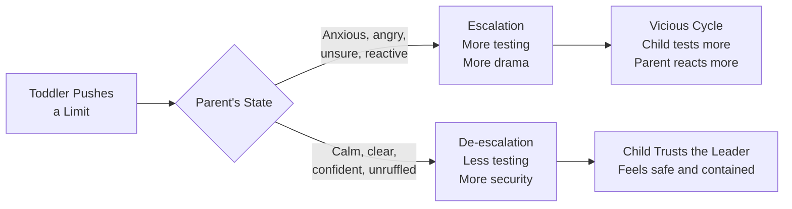
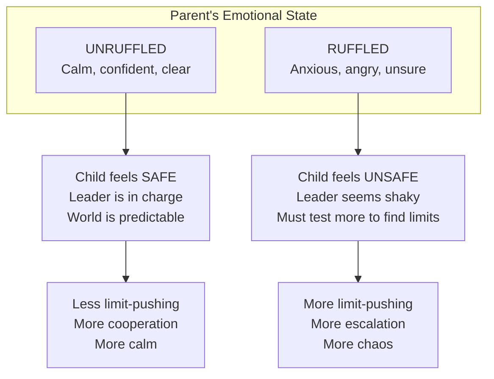
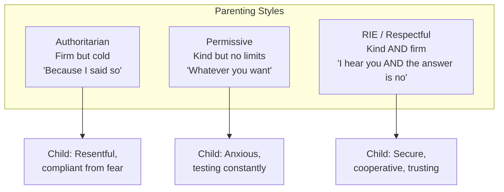
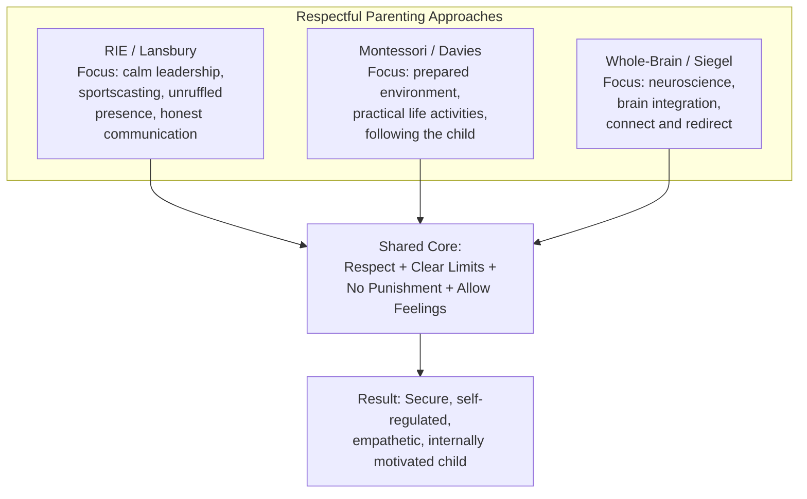

# No Bad Kids — Janet Lansbury

> A toddler acting out is not shameful, nor is it behaviour that needs punishing. It is a cry for attention, a shout-out for sleep, or a call to action for firmer, more consistent limits. It is the push-pull of a toddler testing their burgeoning independence — the overwhelming impulse to step out of bounds, while desperately needing to know they are securely reined in. There are no bad kids, just impressionable young people wrestling with emotions and impulses, trying to communicate their feelings the only way they know how.

---

## About the Author

Janet Lansbury is a parenting advisor, writer, and student of Magda Gerber, who founded RIE (Resources for Infant Educarers). Lansbury's approach to parenting is built entirely on Gerber's teachings: that babies and toddlers are whole people — sentient, aware, intuitive, and communicative — and deserve to be treated with the same respect we would give any other person.

Lansbury spent years in parent-toddler classrooms, observing what actually works in real-time discipline situations. Her website, JanetLansbury.com, and her podcast, "Unruffled," have reached millions of parents worldwide. This book is a curated collection of 32 articles from her site, each addressing a specific toddler discipline topic — from hitting and biting to tantrums, food fights, and back-talk.

What makes Lansbury distinctive is her tone: calm, direct, no-nonsense, and deeply compassionate. She writes the way she wants parents to speak to their toddlers — without drama, without manipulation, and without shame. Her voice is that of the "benevolent CEO" she describes: confident, warm, and completely unruffled.

---

## The Big Idea

- <b style="color: #2980b9">There are no bad kids</b> — only children trying to communicate their needs with limited tools. When we label them as "bad," we give them a shame-based identity to internalise
- <b style="color: #e74c3c">Children NEED limits</b> — "Lack of discipline is not kindness, it is neglect" (Magda Gerber). Limits provide safety, clarity, and emotional security
- <b style="color: #27ae60">The parent's emotional state almost always dictates the child's reaction</b> — if we are anxious, angry, or unsure, the child picks up on it and escalates. Calm authority invites cooperation.
- The key to discipline is confident, calm leadership — like a "benevolent CEO" who guides with matter-of-fact clarity, not emotional reactivity
- No punishments, no time-outs, no bribes, no distractions — just honest, direct communication and natural consequences
- "All feelings allowed, not all behaviour" — children can express any emotion; certain behaviours are calmly stopped
- Tantrums are healthy emotional release, not problems to be fixed or punished. Stay present, stay calm, let the feelings flow
- Respect is the foundation: speak honestly, acknowledge the child's perspective, follow through consistently, and never use shame

---

## Key Concepts at a Glance

| Concept | One-line summary |
|---------|-----------------|
| **RIE Philosophy** | Babies are whole people — treat them with respect from birth |
| **Benevolent CEO** | Respond to misbehaviour like a calm, confident leader — no anger, no lectures |
| **Staying unruffled** | Your emotional state sets the tone. Calm invites cooperation; anxiety invites escalation |
| **All feelings allowed** | Children can express any emotion; certain behaviours need limits |
| **Natural consequences** | The consequence should logically follow the behaviour, not be an arbitrary punishment |
| **No time-outs** | "Time out of what? Time out of life?" — Magda Gerber |
| **Sportscasting** | Narrate what you see without judgment: "You're trying to grab that toy." |
| **Acknowledge first** | Validate the child's perspective before setting the limit |
| **The healing power of tantrums** | Tantrums release built-up emotion. Don't stop them — support them |
| **Honest communication** | Speak to toddlers as people. No baby talk, no tricks, no manipulation |

---

## 30-Second Version

Toddlers push limits because they need to — it is how they learn about the world, test their independence, and find security. Your job is to be their calm, confident leader. Set clear boundaries without anger, shame, or drama. Acknowledge their feelings ("You really want to stay at the park"), then hold the limit ("It's time to go"). Let them have their emotional response — crying, protesting, even tantruming — without punishing the feelings. No time-outs, no bribes, no distractions. Just honest, direct, respectful communication and natural consequences. The calmer you are, the safer they feel, and the less they need to test.

---

Calm leadership and unconditional love score equally highest — the parent's emotional state is the most important variable in any discipline interaction.

The Calm CEO approach dominates across every behavior type — it consistently outperforms punishment, yelling, distraction, and ignoring.

Limit testing peaks around 24 months then declines as emotional regulation and language capacity grow — the most intense testing period is temporary and developmentally normal.

## The Nine Guidelines for Toddler Discipline

Lansbury opens the book with nine foundational guidelines that form the backbone of everything that follows:

### 1. Begin with a Predictable Environment and Realistic Expectations

A predictable daily routine enables a child to anticipate what is expected of them. This is the beginning of discipline. Home is the ideal place for toddlers to spend most of their day. We cannot expect a toddler's best behaviour at dinner parties, long shopping trips, or overscheduled days.

> [!warning] Realistic Expectations
> Many discipline problems are actually expectation problems. A two-year-old cannot sit still in a restaurant for an hour. A tired toddler cannot behave well at a 5pm errand run. Before labelling behaviour as "bad," ask: "Am I expecting something that is developmentally unreasonable?"

### 2. Don't Be Afraid or Take Misbehaviour Personally

When toddlers act out, parents often worry: "Is my child a bully? A brat?" When parents project these fears, the child either internalises the negative label or picks up on the parent's tension, which escalates the misbehaviour.

> [!danger] The Labelling Trap
> A child who is called "aggressive" begins to see themselves as aggressive. A child who is called "bad" begins to believe they are bad. Labels create identities. Describe the behaviour ("You hit your friend"), never the child ("You're a hitter").

### 3. Respond in the Moment, Calmly, Like a CEO

This is Lansbury's signature metaphor: imagine you are a successful CEO and your toddler is a respected employee. The CEO guides with confident efficiency. She does not use an uncertain, questioning tone. She does not get angry or emotional. She does not lecture. She states the expectation clearly and follows through.

"I won't let you throw that. If you throw it again, I will need to take it away." Then take it away if they throw it again. No drama. No anger. No second chances. Just calm, consistent follow-through.

> [!tip] The CEO Tone
> The CEO tone is not cold or authoritarian. It is warm, matter-of-fact, and confident. Think of the difference between:
> - "HOW MANY TIMES DO I HAVE TO TELL YOU?!" (emotional, reactive, out of control)
> - "I won't let you do that." (calm, clear, in charge)
> Both communicate a limit. Only the second one makes the child feel safe.

### 4. Speak in First Person

Stop calling yourself "Mommy" or "Daddy" in the third person. "Mommy doesn't want you to hit the dog" is indirect and confusing. "I don't want you to hit the dog" is direct and honest. Toddlers need first-person, direct communication.

### 5. No Time-Outs

Magda Gerber asked in her Hungarian accent: "Time out of what? Time out of life?" Time-outs are disconnection at the moment the child most needs connection. If a child needs to leave a situation (a party, a playdate), that is not a punishment — it is a caring response to a child who is signalling that they have had enough.

### 6. Natural Consequences, Not Arbitrary Punishments

| Natural Consequence | Arbitrary Punishment |
|---|---|
| You throw food → mealtime is over | You throw food → no TV tonight |
| You refuse to get dressed → we can't go to the park | You refuse to get dressed → you lose dessert |
| You hit your friend → we leave the playdate | You hit your friend → go to your room |

Natural consequences make logical sense to the child. They appeal to the child's developing sense of fairness. Arbitrary punishments feel unjust and create resentment rather than understanding.

### 7. Don't Discipline a Child for Crying

This is crucial: children need rules for behaviour, but their emotional responses to those rules should be allowed — even encouraged. When you set a limit and the child cries, protests, or has a tantrum, that is healthy emotional expression, not misbehaviour.

> [!danger] Never Punish Feelings
> "Stop crying" is one of the most damaging things a parent can say. It teaches the child that their emotions are unacceptable. Instead: "I can see you're really upset about this. It's OK to cry. I'm right here."

### 8. Unconditional Love

Withdrawing affection as discipline teaches the child that your love is conditional on their behaviour. This creates insecurity, not cooperation. Love must be the constant — the unshakeable foundation on which discipline rests.

### 9. Never Spank

Lansbury is unequivocal: spanking is never acceptable. It teaches that violence is an appropriate response to frustration. It damages trust. Research consistently shows that children who are spanked are more likely to be aggressive, not less.

---

## Why Toddlers Push Limits: Eight Reasons

Understanding WHY a child is testing boundaries transforms how you respond:

| Reason | What's Happening | How to Respond |
|--------|-----------------|---------------|
| **SOS — can't function** | Fatigue, hunger, overstimulation. The child's body is sending distress signals through behaviour. | Address the underlying need. Leave the situation. Feed them. Put them to bed. |
| **Need for clarity** | "What will happen if I do this? What about on Monday? What if I'm cranky?" They are testing the consistency of the boundary. | Be boringly consistent. Same calm response every time. |
| **Drama is interesting** | The parent's emotional reaction has created a compelling story the child wants to re-enact. | Reduce your reaction. Be matter-of-fact. Make the behaviour boring. |
| **Testing leadership** | "Do I have a capable leader? Can this person handle me?" | Show them you can. Be calm, clear, and unshakeable. |
| **Releasing feelings** | Built-up stress, anxiety, or emotion needs to come out. The limit-pushing behaviour triggers the release (often a tantrum). | Hold the limit calmly. Welcome the feelings. Let the storm pass. |
| **Imitating parents** | Children absorb and mirror adult behaviour. If you snatch things, they snatch things. | Model the behaviour you want to see. |
| **Seeking attention** | Connection has been in short supply, or negative attention is better than no attention. | Fill the connection tank proactively. Spend quality time before they demand it through misbehaviour. |
| **Needing love** | Feeling out of favour, ignored, or uncertain about the relationship. | Reassure with hugs, presence, and patience. "To love toddlers is to know them." |

> [!success] Rule #1
> **Never, ever take a child's limit-pushing behaviour personally.** They love you. They need you. They are not trying to destroy you. They are trying to learn about the world — and about you.

---

## Staying Unruffled: The Parent's Secret Weapon

"Staying unruffled" is Lansbury's term for what neuroscience calls emotional regulation and co-regulation. It is the single most important discipline skill a parent can develop.

When you are calm, your child's nervous system mirrors your calm. When you are agitated, their nervous system mirrors your agitation. You are the thermostat, not the thermometer. You set the emotional temperature of the room.

### How to Stay Unruffled

- **Remind yourself: this behaviour is normal and healthy.** Testing limits is a toddler's job.
- **Don't take it personally.** They are not attacking you. They are learning.
- **Use few words.** Long lectures signal that you are unsure. Short, clear statements signal confidence.
- **Lower your voice, don't raise it.** A quiet, firm voice is more authoritative than a shout.
- **Expect the testing.** If you know it's coming, you won't be caught off-guard.
- **Remember: they need you to be the leader.** A child who has an anxious, reactive leader does not feel safe.

> [!example] Lansbury's Secret for Staying Calm
> "I imagine myself as a person wearing a suit of armour — strong, compassionate, and impervious. My child's behaviour bounces off me. I can observe it, acknowledge it, set a limit on it, but I am not rattled by it. I am their anchor in the storm."

---

## The Healing Power of Tantrums

This is one of the most counterintuitive and important chapters in the book. Most parents view tantrums as problems to be solved, behaviours to be stopped, or evidence of failed parenting. Lansbury sees them differently: tantrums are healthy emotional release.

### Why Tantrums Are Good

Children accumulate stress, frustration, disappointment, and confusion throughout their day. Their immature brains cannot process these feelings the way adults can. A tantrum is the brain's way of discharging this emotional buildup — like a pressure valve releasing steam.

When a child has a full tantrum — crying, screaming, flailing — and is allowed to complete it without being punished, distracted, or shut down, they typically emerge calmer, lighter, and more cooperative. The feelings have been processed. The system has been reset.

> [!success] The Tantrum Reframe
> Instead of "My child is losing it" → "My child is releasing it."
> Instead of "How do I make this stop?" → "How do I support them through this?"
> Instead of "I'm failing as a parent" → "My child feels safe enough with me to let go."

### How to Support a Tantrum

1. **Stay present.** Do not leave them alone. Your calm presence communicates: "I can handle this. You are safe."
2. **Stay calm.** Your energy sets the tone. If you panic, they panic harder. If you are anchored, they can anchor to you.
3. **Do not try to fix, distract, or reason.** The tantrum has its own natural arc. Let it peak and subside.
4. **Acknowledge the feeling.** "You are really upset. I hear you." Do not add "but" or try to redirect yet.
5. **Block unsafe behaviour.** If they are hitting, kicking, or throwing, calmly prevent it. "I won't let you hit. I'm going to hold your hands until you're ready."
6. **Wait.** The storm will pass. It always does.
7. **Reconnect.** When calm returns, offer a hug or a gentle word. "That was big. I'm glad you got those feelings out."

> [!warning] What NOT to Do During a Tantrum
> - Do not punish ("Go to your room until you calm down")
> - Do not shame ("Big boys don't cry" / "Stop making a scene")
> - Do not bribe ("If you stop crying, you can have a cookie")
> - Do not distract ("Look! A birdie!")
> - Do not reason ("You're being silly — there's nothing to cry about")
> - Do not match their intensity (yelling back, grabbing, threatening)

### Why Distraction Is Problematic

Lansbury devotes a full chapter to why she opposes distraction as a discipline tool. Many parenting experts recommend it, but she argues it is a form of emotional dismissal:

1. **It invalidates the child's experience.** The message is: "What you're feeling isn't important enough to deal with."
2. **It teaches emotional avoidance.** Instead of learning to process difficult feelings, the child learns to suppress and redirect them.
3. **It doesn't work long-term.** The underlying feeling remains unresolved and will resurface — often in worse form.
4. **It undermines trust.** The child learns that the parent will not help them with difficult emotions.

The alternative: acknowledge the feeling, set the limit if needed, and allow the emotional response. "You wanted to stay. It's time to go. I know that's disappointing."

---

## Talking to Toddlers: Communication That Works

### Speak Normally

Do not use baby talk. Toddlers have been immersed in language for many months and understand far more than they can speak. Use full sentences, slow down, and pause after each sentence to give them processing time.

### Turn No into Yes

Instead of: "Don't bounce on me!" → "I want you to sit still on my lap."
Instead of: "Don't interrupt!" → "I hear you. When Daddy and I finish, I'll listen only to you."

Positive instructions tell the child what TO do. Negative instructions ("don't," "stop," "no") tell them only what NOT to do and leave them without a clear path forward.

### Offer Real Choices (Not False Ones)

"Would you like to put the toy on the shelf or in the box?" — real choice within a boundary.
"Do you want to go to Aunt Mary's house?" — false choice (you're going regardless). When the child says "No!" you're stuck.

Limit choices to two simple options. Open-ended questions ("What do you want to wear?") overwhelm toddlers.

### Acknowledge First, Always

Before setting a limit or redirecting, acknowledge the child's perspective:

- "You want to play longer outside, but it's time to come in. I know that's hard."
- "You wanted that toy and your friend has it. That's frustrating."
- "You're upset that I said no. It's OK to be disappointed."

Acknowledgement does not mean agreement. It means: "I see you. I hear you. Your experience is real." A child who feels understood is far more likely to cooperate.

> [!tip] The Acknowledgement Formula
> **Name what you see** + **Set the limit** + **Allow the feeling**
> "You want to climb on the table. I won't let you climb on the table. I can see that frustrates you."
> Three sentences. No drama. No lecture. No shame.

---

## Specific Behaviour Challenges

### Hitting, Biting, Kicking, Pushing

- **It is a phase.** The combination of intense emotions and zero impulse control makes physical aggression inevitable in toddlers.
- **Stop it calmly and immediately.** "I won't let you hit." Block the hand gently but firmly. No anger.
- **Do not overreact.** A big reaction makes the behaviour more interesting and more likely to recur.
- **Look for the trigger.** Tired? Hungry? Overwhelmed? Frustrated? Seeking attention?
- **Offer alternatives.** "You can hit this pillow. You can stomp your feet." Give them a safe outlet.
- **Sportscast.** "You wanted that toy and you hit to get it. I can't let you hit. Let's find another way."

### Food Fights

- Toddlers will test limits around food — throwing, refusing, playing.
- Keep meals calm and pressure-free. Do not beg, bribe, or force.
- "Food stays on the plate. If you throw it, I'll know you're done eating."
- Follow through. If they throw, calmly end the meal.
- Trust their appetite. They will not starve themselves.

### Whining

- Whining is a communication tool, not a character flaw.
- Acknowledge: "I hear you. Are you trying to tell me something?"
- Set the expectation: "I want to hear what you need. Can you try again in your regular voice?"
- Do not shame or mock the whining. Do not ignore the child.

### Back-Talk and "Sass"

- Strong-willed children express strong opinions. This is healthy, even when annoying.
- Do not match their intensity or take it personally.
- Acknowledge the feeling behind the words: "You're really angry about this."
- Set the boundary on disrespectful language: "I hear that you're upset. I'm not OK with being called stupid."
- Let the less important battles go. Save your authority for what matters.

### Refusing to Cooperate

Common reasons children will not follow directions:
1. They didn't hear you (give processing time — count to ten silently)
2. They are engrossed in something (acknowledge before redirecting)
3. The request was phrased as a question when it wasn't ("Can you put your shoes on?" → "It's time to put your shoes on")
4. There are too many choices or too much talk
5. They are testing the limit (respond once calmly, then follow through with action)

---

## Common Discipline Mistakes

Lansbury identifies the most frequent errors parents make:

| Mistake | Why It Fails | The Fix |
|---------|-------------|---------|
| **Talking too much** | Lectures signal uncertainty and create stories around behaviour | Say it once, clearly. Then act. |
| **Asking instead of telling** | "Can you stop hitting?" invites "No!" | "I won't let you hit." (Statement, not question.) |
| **Losing emotional control** | Your agitation becomes their agitation | Pause. Breathe. Channel the CEO. |
| **Being inconsistent** | If the rule changes daily, the child must test daily | Same response, every time, without fail. |
| **Punishing emotions** | "Stop crying!" teaches emotional suppression | "You can be as upset as you want. Hitting is not OK." |
| **Using distractions** | Dismisses the child's real experience | Acknowledge the feeling, set the limit, allow the response. |
| **Giving warnings that aren't followed through** | "If you do that one more time..." (five times) | Say it once. Follow through immediately. |
| **Making threats you won't keep** | "We're never coming back here!" (you will) | Only state consequences you will actually enforce. |
| **Labelling the child** | "You're so aggressive" / "Why are you always so difficult?" | Describe the behaviour, not the identity. |
| **Waiting too long to respond** | Once the moment passes, it's too late | Respond immediately, in the moment, calmly. |

---

## Respectful Parenting Is NOT Passive Parenting

> [!warning] The Most Common Misunderstanding
> Many people hear "respectful parenting" and assume it means permissive parenting — letting the child do whatever they want. Lansbury is emphatic: this is wrong.
>
> Respectful parenting has MORE limits, not fewer. The difference is in HOW those limits are delivered — with calm confidence rather than anger and shame. A child with no limits does not feel free. They feel unsafe. Structure and boundaries are acts of love.

"When respect becomes indulgence" is an entire chapter. Lansbury describes parents who are so afraid of upsetting their child that they never set boundaries. The result: an anxious, out-of-control child who is desperately looking for a leader and not finding one.

The Montessori and RIE position is identical: **kind AND firm**. Both elements are essential. Kindness without firmness is permissiveness. Firmness without kindness is authoritarianism. The goal is authoritative leadership: warm, clear, consistent, and unshakeable.

---

## Deep Dive: Sportscasting — Narrating Without Judging

Sportscasting is one of the most practical tools in the RIE approach. It means narrating what you observe, without adding judgment, evaluation, or emotional charge.

| Judging | Sportscasting |
|---------|--------------|
| "That wasn't very nice" | "You took the toy from Sam's hands" |
| "You're being so rough!" | "You're pushing the blocks really hard" |
| "Good sharing!" | "You gave Emma a turn with the truck" |
| "Bad boy for hitting" | "You hit your sister. I won't let you hit" |

Why sportscasting works:
- It keeps the parent objective and calm
- It gives the child information without shame
- It avoids labels (good/bad, nice/mean)
- It treats the child as intelligent enough to draw their own conclusions
- It models observation and emotional neutrality

> [!tip] When to Sportscast
> - When two children are in conflict: "Sam has the truck. Maya, you want the truck."
> - When a child is struggling: "You're working hard to get that lid off."
> - When a child does something hurtful: "You threw the block and it hit Kai. That hurt him."
> - When a child achieves something: "You climbed all the way to the top."
> Notice: no "good job," no "that's bad," no "be careful." Just what you see.

### Sportscasting vs Praise

Lansbury is skeptical of conventional praise. "Good job!" is evaluative — it teaches the child to perform for external approval. Sportscasting ("You did it!") describes what happened and lets the child decide how to feel about it.

| Praise | Sportscasting Alternative |
|--------|--------------------------|
| "Good job cleaning up!" | "You put all the blocks back on the shelf." |
| "What a beautiful painting!" | "I see you used a lot of red and blue." |
| "You're such a good sharer!" | "You gave Ella a turn. She looks happy." |
| "Good boy for eating your vegetables!" | "You tried the broccoli." |

The distinction is subtle but important: praise evaluates from the outside. Sportscasting describes from the outside and lets the child evaluate from the inside. This builds intrinsic motivation rather than dependence on external validation.

---

## Deep Dive: The Power of "No" — For Parents

One of the most counterintuitive chapters: parents need to become comfortable saying "no" and meaning it.

Many parents avoid saying no because:
- They want to be their child's friend
- They fear the child's emotional reaction (the tantrum)
- They feel guilty about setting limits
- They were raised with harsh discipline and overcorrect toward permissiveness

But Lansbury argues that a clear, calm "no" is one of the most loving things a parent can say:

> [!success] Why "No" Is a Gift
> A child who hears a clear, consistent "no" learns:
> - The world has boundaries, and boundaries are safe
> - Their parent is a strong, reliable leader
> - Not getting what they want is survivable
> - Their emotional reaction to "no" will be accepted and supported
> - They can trust the rules because the rules do not change
>
> A child who never hears "no" learns:
> - There are no boundaries, which feels chaotic and scary
> - Their parent cannot handle their emotions
> - Getting what they want requires escalation
> - The world is unpredictable and unsafe

The key is in the delivery. "No" delivered with anger, frustration, or guilt creates stress. "No" delivered with calm confidence and emotional warmth creates security.

---

## Deep Dive: Siblings — Your Child's New Baby Blues

Lansbury devotes significant attention to how existing toddlers respond to a new sibling. Key principles:

- **All feelings about the new baby are welcome.** Jealousy, anger, resentment, regression — these are normal. Do not force the older child to "love" the baby.
- **Never leave a toddler alone with a baby.** Not because the toddler is "bad" — but because their impulse control is near zero and their feelings are enormous.
- **Sportscast what you see.** "You're looking at the baby. I think you might want to touch her. I'm going to stay close."
- **Protect the baby calmly.** If the toddler is rough: "I won't let you push the baby. I can see you're having big feelings about her."
- **One-on-one time is essential.** The older child needs dedicated time with each parent, without the baby present.
- **Acknowledge the loss.** The toddler has lost their position as the sole focus. This is a genuine grief. "I know it's different now. You used to have all of Mummy's attention, and now you have to share."

---

## Deep Dive: The Choices Our Kids Can't Make

Lansbury identifies specific decisions that toddlers should NOT be making — not because they are incapable, but because the decisions are beyond their developmental capacity and create anxiety:

1. **Whether to go to bed.** Bedtime is not a choice. It is a boundary. ("It's bedtime now" — not "Do you want to go to bed?")
2. **What to eat for dinner.** Offer limited healthy options, but do not let the child dictate the menu.
3. **Whether to wear a seatbelt / hold your hand in a car park.** Safety limits are non-negotiable.
4. **How to treat other people.** Hitting, kicking, and biting are always stopped. The child does not choose whether these are acceptable.
5. **Whether to go to the doctor.** Health needs override preferences.

These are areas where the parent must lead with confidence. Offering choices within these domains (which pyjamas, which healthy snack) gives the child autonomy without the burden of decisions they are not equipped to make.

> [!warning] When Choices Become Burdens
> Some parents offer so many choices that the child becomes anxious and overwhelmed. A two-year-old asked "What do you want for breakfast?" faces an impossible decision. A two-year-old asked "Banana or toast?" can decide immediately. Too much choice is not freedom — it is overwhelm.

---

## Deep Dive: Guilt-Free Discipline — A Success Story

One of the most powerful chapters is a parent's letter describing how she transformed her discipline approach. Key moments from her story:

1. She realised she was giving too many warnings without following through
2. She started saying "I won't let you" and immediately acting
3. Her son's testing increased for two weeks (recalibration)
4. Then it dropped dramatically
5. She noticed he was calmer, happier, and more affectionate
6. She felt less guilty because she was being consistent and kind, not reactive and punitive

The parent writes: "I used to feel guilty because I was either too harsh or too permissive. Now I feel clear. I set the limit, I follow through, I allow the feelings, and I move on. The guilt is gone because I know I am being fair."

> [!success] The Guilt Paradox
> Parents who use punitive discipline feel guilty because they are hurting their child. Parents who are permissive feel guilty because they are not guiding their child. Respectful discipline eliminates both sources of guilt: you are setting clear limits (guiding) without anger or shame (not hurting). The guilt goes away because the approach is aligned with your values.

---

## What Changes After Reading This Book

**In how you see your toddler:**
- From "bad kid" to "child communicating a need"
- From "defiant" to "testing limits, which is their job"
- From "manipulative" to "impulsive with an immature prefrontal cortex"
- From "terrible twos" to "the age of curiosity and self-discovery"

**In how you respond:**
- You channel the CEO: calm, clear, matter-of-fact
- You say it once, then act — no more five warnings
- You acknowledge before you correct
- You stay unruffled when they test
- You allow the tantrum to run its course without panic

**In how you feel:**
- Less guilt — because your approach is consistent and kind
- Less anger — because you are not taking behaviour personally
- Less exhaustion — because you are not in a constant power struggle
- More confidence — because you have a clear philosophy
- More connection — because discipline happens within the relationship, not against it

---

## Frequently Asked Questions

> [!tip] "Isn't 'staying unruffled' just suppressing my own emotions?"
> No. Unruffled does not mean emotionless. It means regulated. You feel the frustration — you just do not let it drive your response. After the moment passes, process your emotions: talk to your partner, journal, vent to a friend. The goal is not to suppress your feelings, but to choose not to act from them in the moment.

> [!tip] "My child doesn't respond to my calm voice. Should I raise it?"
> Raising your voice signals that you are not in control. It may produce short-term compliance but creates long-term escalation. If the calm voice is not working, the issue is usually follow-through, not volume. Say it once calmly, then act. The action is what communicates seriousness, not the volume.

> [!tip] "What about safety situations? Can I yell then?"
> Yes. A sharp "STOP!" when a child runs toward a busy road is appropriate and potentially life-saving. Reserve that intensity for genuine emergencies, and it will have maximum impact. If you use it for every minor infraction, it loses its power.

> [!tip] "My partner still uses time-outs and punishments. What do I do?"
> You cannot control your partner's approach, but you can model a different one. When your partner sees that calm, connected discipline produces better results with less drama, they often become curious. Share Lansbury's podcast ("Unruffled") or the short articles on her website as gentle introductions.

> [!tip] "Is this just for toddlers? My child is five."
> The principles extend to any age. The core ideas — stay calm, set clear limits, acknowledge feelings, follow through consistently, allow emotional expression — work for five-year-olds, ten-year-olds, and teenagers. The specific language and examples in this book are toddler-focused, but the framework is universal.

> [!tip] "How do I handle limit-setting in public when I feel judged?"
> The audience does not matter. Your child matters. A calm, quiet response in public is always more effective (and more dignified) than a dramatic one. Most onlookers respect a parent who is handling a meltdown with composure. The ones who judge are not parenting your child.

> [!tip] "My toddler laughs or smirks when I set a limit. Is that disrespect?"
> No. The smirk is nervousness, not defiance. The child is testing and is uncertain about the outcome. They are masking their anxiety with a smile. Do not take it as mockery. Simply hold the limit calmly and wait. The smirk will disappear once the child trusts your consistency.

---

## Complete Scenario Walkthroughs

### Scenario 1: The Grocery Store (Age 2)

Your two-year-old grabs items off shelves and throws them in the aisle.

**RIE response:** "I see you want to grab things from the shelf. I'm going to hold your hand while we walk." If they resist: "You're upset about having your hand held. I understand. My job is to keep you safe and keep the store tidy." If they melt down: carry them out calmly. "We'll try again another day."

**Key principle:** Do not set up the child to fail. If they are tired or hungry, a grocery trip is unreasonable. If you must go, keep it short and bring a snack.

### Scenario 2: The Playdate Gone Wrong (Age 3)

Your three-year-old pushes another child off a toy. The other parent is watching.

**RIE response:** Move to the children calmly. "I saw you push Maya. I won't let you push. She was playing with that toy." To Maya: "Are you OK?" To your child: "You wanted that toy. You can ask Maya for a turn, or choose something else."

If your child pushes again: "I can see you're having a hard time. We're going to take a break." Remove them from the situation temporarily — not as punishment, but as support.

**Key principle:** Do not perform for the other parent. Respond to your child's need, not the audience's expectation.

### Scenario 3: Bedtime Resistance (Age 2.5)

Your toddler gets out of bed repeatedly, asks for more water, more stories, more cuddles.

**RIE response:** Set the routine clearly and follow it every night. "We've read two stories, had a drink, and said goodnight. It's time to sleep now. I love you." If they get up: calmly return them to bed with minimal interaction. "It's bedtime. I love you." Repeat as many times as needed — without anger, without negotiation, without extra stories.

**Key principle:** Consistency is everything. If you cave on the third night, you have taught them: "If I persist long enough, the rule changes." Hold the line with warmth and you will have fewer battles within a week.

### Scenario 4: The "I Want" Meltdown (Age 2)

You pass a toy in a shop window. Your toddler screams: "I WANT THAT!"

**RIE response:** "You see that toy and you really want it. I hear you. We're not getting it today." Allow the emotional response. If they tantrum: "I know you're disappointed. It's hard to see something you want and not get it." Do not buy the toy to stop the crying. Do not distract. Just hold the boundary and hold the child (metaphorically or literally).

**What you are teaching:** Disappointment is survivable. Wanting something and not getting it is a normal human experience. The parent will not give in to pressure, but will support the feeling.

### Scenario 5: Defiance with a Smile (Age 18 months)

Your eighteen-month-old drops food from their highchair, watches your face, and smiles.

**RIE response:** "I see you dropped your food. If you drop it again, I'll know you're finished eating." If they drop again: "You're showing me you're done. Let's clean up." Remove the plate calmly.

**Key principle:** This is not defiance. It is a science experiment. The child is testing: "What happens when I drop this? What face does my parent make? Is the reaction interesting?" If your reaction is big, the experiment is fascinating and they will repeat it endlessly. If your reaction is boring, the experiment is concluded and they move on.

---

## The Magda Gerber Foundation

The entire book rests on Magda Gerber's RIE philosophy. Key RIE principles worth understanding:

- **Observe more, do less.** Watch what the child is doing before intervening. They may be working something out on their own.
- **Respect the child's competence.** Do not do for a child what they can do for themselves.
- **Honest communication.** Talk to the child about what is happening — nappy changes, mealtimes, transitions — rather than doing things to them without narration.
- **Slow down.** Give children time to process, respond, and participate. Do not rush.
- **Trust the process.** Children develop on their own timeline. Your job is to provide the conditions, not force the outcome.
- **"The goal is inner-discipline, self-confidence, and joy in the act of cooperation."** — Magda Gerber

This last quote is the north star of the entire RIE approach. Not compliance. Not obedience. Inner-discipline — the ability to regulate yourself because you understand why, not because you fear the consequences.

---

## How RIE Compares to Other Respectful Parenting Approaches

All three approaches share the same fundamental values. Where they differ is in emphasis:

| Approach | Primary Strength | Where It Adds Value |
|----------|-----------------|-------------------|
| **RIE (Lansbury)** | What to SAY in the moment | The words, the tone, the CEO metaphor, the specific phrases |
| **Montessori (Davies)** | What to SET UP in the environment | The prepared home, activities, practical life, independence |
| **Whole-Brain (Siegel)** | WHY it works neurologically | The brain science, upstairs/downstairs, reactive/receptive states |

Reading all three gives you the complete picture: the science (Siegel), the environment (Davies), and the words (Lansbury).

---

## The RIE Discipline Approach at a Glance

| Principle | In Practice |
|-----------|-----------|
| **Babies are whole people** | Speak to them honestly, not with baby talk or manipulation |
| **Be the CEO** | Calm, confident, warm authority — not emotional reactivity |
| **Stay unruffled** | Your state sets the tone. Calm invites calm. |
| **All feelings allowed** | Never punish emotions. Always stop harmful behaviour. |
| **Natural consequences** | Logical connection between action and result. No arbitrary punishment. |
| **No time-outs** | Connection, not isolation. |
| **No distractions** | Honest acknowledgement of feelings, not emotional avoidance. |
| **Sportscast** | Describe what you see without judgment or labels. |
| **Acknowledge first** | Validate perspective before setting limit. |
| **Say it once, then act** | Words first, calm follow-through second. |
| **Repair when you fail** | You will lose your cool. Go back and reconnect. |

---

## Recommended Further Resources

Lansbury recommends several resources for parents wanting to go deeper:

- **Magda Gerber, *Dear Parent: Caring for Infants with Respect*** — the foundational RIE text
- **Alfie Kohn, *Unconditional Parenting*** — the philosophical case against rewards and punishment
- **Patty Wipfler, *Listening to Children*** — on the healing power of allowing children's emotions
- **Janet Lansbury's podcast, "Unruffled"** — real parent questions answered in the RIE approach, 10-15 minutes each
- **JanetLansbury.com** — the blog that became this book, with hundreds of additional articles

---

## The Compound Effect of Respectful Discipline

> [!success] What You Are Building
> Each time you stay unruffled during a test, you are wiring your child's brain: "My parent can handle me. The world is safe."
> Each time you set a clear limit without anger, you are teaching: "Rules are fair and consistent."
> Each time you allow a tantrum to run its course, you are modelling: "Big feelings are survivable."
> Each time you acknowledge before you correct, you are communicating: "You matter to me, even when I disagree with your actions."
>
> Over thousands of interactions — over months and years — these moments compound into a child who is secure, cooperative, emotionally intelligent, and internally motivated. Not because they were punished into compliance, but because they were guided into understanding.
>
> This is the Magda Gerber legacy: not obedient children, but children with inner-discipline, self-confidence, and joy in the act of cooperation.

*There are no bad kids. Just small people learning how to be human, with your help.*

---

## Deep Dive: Setting Limits Without Yelling

Lansbury's formula for setting limits is simple and consistent:

### Step 1: State the limit clearly
"I won't let you throw food."

### Step 2: Follow through with calm action
Pick up the plate. End the meal. No anger, no drama.

### Step 3: Acknowledge the feeling
"You didn't want dinner to be over. I understand."

### Step 4: Allow the emotional response
If they cry or tantrum, stay present. Do not punish the emotion.

### Step 5: Move on
Once calm returns, reconnect naturally. No lectures, no rehashing.

> [!example] A Complete Scenario
> **Your two-year-old keeps climbing on the coffee table despite being told not to.**
>
> First time: "I don't want you to climb on the table. Tables are for putting things on, not for climbing." (Gently guide them off.)
>
> Second time: "I see you want to climb. I'm going to help you down. Tables are not for climbing." (Lift them off calmly.)
>
> Third time: "You're showing me you really want to climb. I'm going to move you away from the table. You can climb on the cushions." (Move them and offer an alternative.)
>
> Throughout: no raised voice, no anger, no "How many times do I have to tell you?" Just calm, repetitive, boring consistency. Each time, the boundary is reinforced. Each time, the child gets closer to internalising it. This may take 50 repetitions. That is normal.

---

## Deep Dive: When Gentle Discipline Isn't Working

Lansbury addresses this question directly, because it is the one parents ask most often. "I'm being respectful and calm, and my child is STILL misbehaving. What am I doing wrong?"

Common reasons gentle discipline "isn't working":

1. **You're not actually following through.** You state the limit but do not act. The child learns: the words are empty.

2. **You're not being consistent.** You enforce on Monday but not on Wednesday. The child learns: keep testing.

3. **Your tone is uncertain.** You're asking instead of telling. "Can you please stop?" is not a limit. "I won't let you do that" is.

4. **You're talking too much.** Long explanations signal that you are negotiating, not leading.

5. **You're waiting too long.** By the time you intervene, the moment has passed. React immediately.

6. **The child has unmet needs.** They are tired, hungry, or disconnected. Address the need first.

7. **You're not allowing the feelings.** You set the limit but then try to stop the tantrum that follows. The tantrum IS the working-through. Let it happen.

8. **Your relationship needs repair.** If trust has been damaged by previous punitive discipline, it takes time to rebuild. Keep going. The child is watching to see if this new approach is real.

> [!tip] The Timeline
> Gentle discipline is not a quick fix. If you switch from punitive to respectful discipline, expect 2-4 weeks of increased testing as the child recalibrates. They are checking: "Is this person serious? Will they hold the limit without getting angry?" Once they trust your consistency, the testing reduces dramatically.

---

## Before and After: RIE Responses to Common Situations

| Situation | Before (Reactive) | After (RIE/Unruffled) |
|-----------|-------------------|----------------------|
| **Child throws toy at your face** | "OW! Don't you DARE! That's it — time out!" | "I won't let you throw that at me. That hurts." (Take the toy calmly.) "You seem frustrated. Can you tell me what's going on?" |
| **Child refuses to leave the park** | Threaten, bribe, or physically drag them | "It's time to go. I know you want to stay. I'm going to carry you to the car now." (Do it calmly, even if they scream.) |
| **Child hits sibling** | "You're so mean! Go to your room!" | "I won't let you hit your sister." (Block the hit.) "You're angry. I understand. Hitting is not OK." |
| **Child says "I hate you"** | "Don't talk to me like that!" / deep hurt | "I hear that you're very angry right now." (Let it roll off. Do not take it personally.) |
| **Child whines for a toy at the store** | Buy it to stop the noise / threaten | "You really want that. The answer is no today. I know that's disappointing." (Hold the limit. Allow the feelings.) |
| **Child won't get dressed** | Power struggle. Force clothes on. Both upset. | "It's time to get dressed. Would you like the red shirt or the blue shirt?" If they refuse: "I see you're not ready. I'm going to help you." (Dress them calmly.) |

---

## Parenting a Strong-Willed Child

Lansbury reframes "strong-willed" as "a child with a strong sense of self" — which is a quality we actually want to cultivate, not crush.

Strong-willed children:
- Need more consistency, not less
- Need their autonomy respected wherever possible (offer choices, involve them in decisions)
- Need limits delivered with even MORE calm and confidence (they will test harder)
- Need to feel that their voice matters, even when the answer is no
- Will push back harder at the beginning of gentle discipline, but once trust is established, they become the most cooperative children — because they are cooperating from genuine internal motivation, not compliance from fear

> [!success] The Paradox of the Strong-Willed Child
> The more you try to control a strong-willed child, the more they resist. The more you respect their autonomy within clear limits, the more they cooperate. They do not respond to force. They respond to trust. Give them real choices, real respect, and real consistency, and they will give you real cooperation.

---

## The Verdict

This is the most direct, practical, and instantly usable toddler discipline book available. Where Siegel and Bryson give you the neuroscience and Davies gives you the Montessori environment, Lansbury gives you the words. She tells you exactly what to say, how to say it, and what tone to use — in dozens of specific scenarios that every parent of a toddler will recognise.

The CEO metaphor is transformative. Once you internalise the idea that you are the calm, confident leader — not the emotionally reactive peer — everything about your discipline approach changes. Your voice changes. Your body language changes. Your child's response changes.

The book's essay-collection format is both a strength and a limitation. Each chapter is self-contained and can be read independently, which makes it an excellent reference. But this means there is some repetition across chapters, and the book lacks the narrative arc of a traditionally structured parenting book. If you want deep neuroscience, read [[The Whole-Brain Child - Daniel J. Siegel]]. If you want Montessori environment and activities, read [[The Montessori Toddler - Simone Davies]]. If you want the words — what to actually say in the moment — read this book.

The RIE philosophy underneath is radical in the best sense. It asks you to see your baby and toddler as a full human being from day one. Not a blank slate. Not an adversary. Not a project to be managed. A person to be respected. This shift in perspective is the foundation on which every specific technique rests.

### Limitations

- Essay-collection format means some repetition and lack of narrative structure
- Focused almost exclusively on toddlers (1-3); less guidance for older children
- The "no distractions" position is controversial — many other respectful parenting experts use gentle distraction as a valid tool for very young children
- Less theoretical depth than Siegel/Bryson — Lansbury tells you what to do but provides less explanation of the neuroscience behind it
- Cultural context is primarily Western, middle-class American
- Some parents may find the "unruffled" standard aspirational — staying completely calm during a full meltdown requires practice and self-regulation that not all parents have developed
- Does not significantly address neurodivergent children or children with trauma histories

---

## Who Should Read This Book

| Reader | Why |
|--------|-----|
| **Parents of toddlers (1-3)** | This is written specifically for you — every scenario is one you will recognise |
| **Parents who find themselves yelling** | The CEO metaphor and "staying unruffled" will transform your default response |
| **Parents confused by conflicting discipline advice** | Lansbury cuts through the noise with a clear, consistent philosophy |
| **Parents who have read Siegel/Bryson** | This provides the specific words and phrases to use in practice |
| **Parents who feel guilty about discipline** | The "no bad kids" reframe removes shame for both parent and child |
| **Anyone who was raised with punishment-based discipline** | Provides a complete alternative model grounded in respect |

---

## Related Reading

| Book | Connection |
|------|-----------|
| [[The Whole-Brain Child - Daniel J. Siegel]] | The neuroscience behind why Lansbury's calm, connected approach works — explains the developing brain that Lansbury is intuitively responding to |
| [[No-Drama Discipline - Daniel J. Siegel]] | Same philosophy, different vocabulary. "Connect and redirect" = Lansbury's "acknowledge then set the limit" |
| [[The Montessori Toddler - Simone Davies]] | Overlapping philosophy of respectful limits; Montessori adds the prepared environment and activity framework |
| [[Unconditional Parenting - Alfie Kohn]] | Shares opposition to punishment and rewards; Kohn provides the philosophical depth, Lansbury provides the practical application |
| [[Hunt, Gather, Parent - Michaeleen Doucleff]] | Cross-cultural evidence that calm, matter-of-fact limit-setting is the default worldwide — not a Western invention |
| [[How to Talk So Little Kids Will Listen - Joanna Faber & Julie King]] | Complementary communication techniques — more strategies for the "how to talk" part of discipline |
| [[Brain Rules for Baby - John Medina]] | The brain science of 0-5 development that explains WHY toddlers are impulsive, emotional, and need patient guidance |
| [[The Danish Way of Parenting - Jessica Joelle Alexander]] | Danish approach to discipline emphasises empathy and reframing — closely aligned with RIE |
| [[Simplicity Parenting - Kim John Payne]] | Reducing overstimulation — aligned with Lansbury's emphasis on predictable environments and fewer demands |
| [[Emotional Intelligence - Daniel Goleman]] | The EQ framework that respectful discipline builds: self-awareness, self-regulation, empathy |

---

## Five Things You Can Do Tomorrow Morning

1. **The next time your child tests a limit, channel the CEO.** Lower your voice. Shorten your sentence. "I won't let you do that." Follow through with calm action. No anger, no drama.

2. **Acknowledge before you correct.** Before setting any limit, say one sentence that validates their perspective: "You really want to stay" / "I can see you're frustrated" / "That was disappointing."

3. **Let the next tantrum run its course.** Do not distract, bribe, or punish. Just stay present, stay calm, and say: "I'm here. It's OK to be upset." Time how long it lasts. It is probably shorter than you think.

4. **Replace one "don't" with a "do."** Instead of "Don't run!" → "Walking feet inside." Instead of "Don't throw!" → "The ball goes on the floor." Positive instructions are easier for toddler brains to process.

5. **Say "I won't let you" instead of "Stop it!"** This small language shift changes everything. "Stop it!" is reactive and emotional. "I won't let you" is calm, authoritative, and communicates that you are in charge — which is exactly what they need to hear.

---

## Key Phrases to Remember

| Phrase | What It Means |
|--------|--------------|
| "I won't let you" | Calm authority — you are the leader |
| "There are no bad kids" | Behaviour is communication, not identity |
| "Lack of discipline is not kindness, it is neglect" | Limits are love |
| "Staying unruffled" | Your calm sets the emotional temperature |
| "All feelings allowed, not all behaviour" | Emotions are never wrong; some actions are |
| "Never take it personally" | They are testing the limit, not attacking you |
| "To love toddlers is to know them" | Understanding is the foundation of discipline |
| "Time out of what? Time out of life?" | Connection, not isolation |
| "Say it once, then act" | Words first, then calm follow-through |
| "Be the CEO" | Confident, warm, matter-of-fact leadership |

---

## The One Sentence That Changes Toddler Discipline

> <b style="color: #2980b9">"The emotional state of the parent almost always dictates the child's reaction."</b>

If you change nothing else, change this: your response to misbehaviour. Not the consequence. Not the technique. Not the words. Your *state*. When you are calm, clear, and confident, your toddler's world makes sense. They have a leader they can trust. They feel safe. And a child who feels safe has far less need to test.

*There are no bad kids. Just small people learning how to be human, with your help.*

---

## Additional Frequently Asked Questions

> [!tip] "My child is 'good' at daycare but falls apart at home. Am I doing something wrong?"
> This is actually a compliment. Children hold it together in environments where they feel less safe to release. They fall apart at home because home is where they feel safest. The meltdown after daycare is trust, not failure.

> [!tip] "Should I force my child to say sorry?"
> No. A forced apology teaches nothing except how to say words you do not mean. Instead, help them make amends through action: "Your friend is upset. What could you do to help them feel better?"

> [!tip] "My child seems to get WORSE when I start doing this. Is it working?"
> Yes. The initial increase in testing is called an "extinction burst" — the child is recalibrating. They are checking: "Is this new approach real?" This phase typically lasts 2-4 weeks. Hold the line with warmth. What emerges on the other side is dramatically better behaviour.

> [!tip] "Is RIE evidence-based?"
> RIE is grounded in Magda Gerber's five decades of clinical observation, informed by paediatrician Emmi Pikler. Modern neuroscience (Siegel, Bryson, Porges) has subsequently validated the core RIE principles: co-regulation, secure attachment, emotional expression, developing prefrontal cortex, and authoritative parenting.

---

## A Final Word from Magda Gerber

*"The goal is inner-discipline, self-confidence, and joy in the act of cooperation."*

Not obedience. Not compliance. Not silence. **Joy in cooperation.** A child who helps because they want to. Who follows rules because they understand them. Who controls their impulses not from fear, but from internal capacity.

This is what respectful discipline builds. One calm, honest, unruffled interaction at a time.

