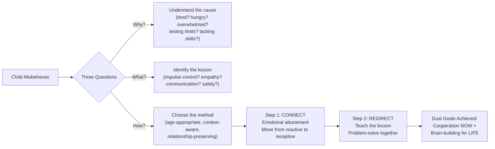
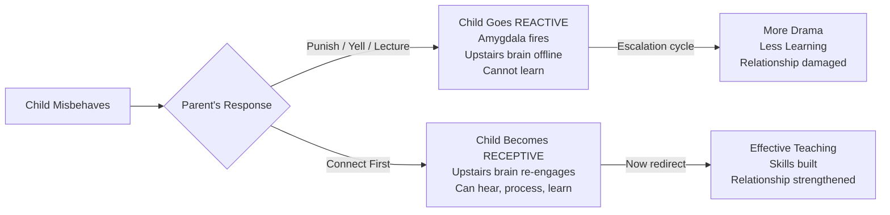
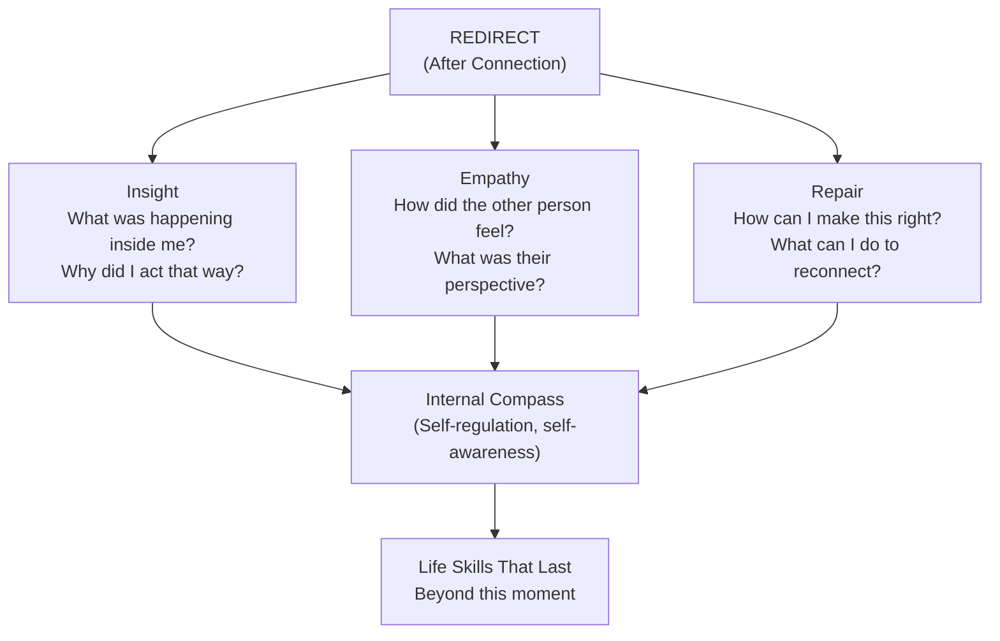
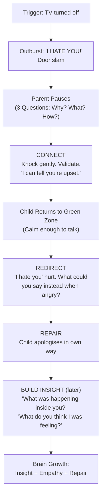
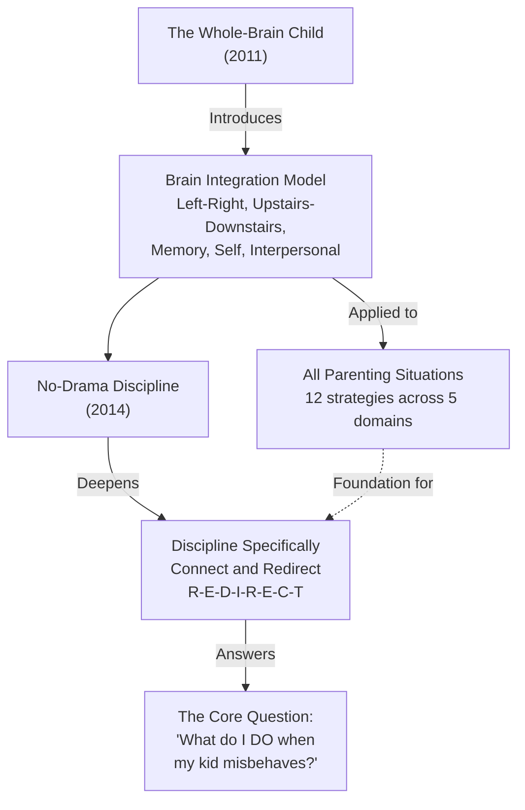

# No-Drama Discipline — Daniel J. Siegel & Tina Payne Bryson

> A cereal bowl gets thrown across the kitchen. The dog has been painted blue. Your child threatens a sibling. What do you do? Most parents react: yell, punish, give a consequence. But the word "discipline" comes from the Latin *disciplina* — to teach. This book argues that every disciplinary moment is a teaching moment, and that the most effective discipline strategy is not punishment but connection followed by redirection. When you connect emotionally first, you move your child from a reactive brain state (where learning is impossible) to a receptive brain state (where teaching actually lands). Then you redirect toward the lesson. The result: less drama for you, more brain development for your child, and a stronger relationship between you.

---

## About the Author

Daniel J. Siegel and Tina Payne Bryson are the same team behind [[The Whole-Brain Child - Daniel J. Siegel]]. Siegel is a clinical professor of psychiatry at UCLA and the developer of interpersonal neurobiology. Bryson is a pediatric psychotherapist and the executive director of The Center for Connection.

This book was written in direct response to the most common question they received after *The Whole-Brain Child*: "I understand the brain model — but what do I actually DO when my kid misbehaves?" Where the first book introduced the brain integration framework across all domains of parenting, *No-Drama Discipline* applies that framework specifically and deeply to the discipline context. It is the practical discipline manual that the first book hinted at.

The authors are refreshingly honest about their own failures. The book includes a section called "When a Parenting Expert Loses It," where both Siegel and Bryson confess their worst discipline moments — flipped lids, raised voices, responses they regret. This normalises imperfection and reinforces the book's core message: discipline is not about being perfect, it is about repairing and teaching.

---

## The Big Idea

- <b style="color: #2980b9">Discipline means "to teach," not "to punish"</b>: the word comes from the Latin *discipulus* (student, learner). A child receiving discipline is not a prisoner — they are a student
- <b style="color: #e74c3c">Every disciplinary moment has two goals</b>: (1) the short-term external goal of stopping the behaviour and gaining cooperation, and (2) the long-term internal goal of building the brain's capacity for self-control, empathy, insight, and moral reasoning
- <b style="color: #27ae60">Connect and Redirect is the core method</b>: first connect emotionally to move the child from reactive to receptive, then redirect toward the lesson. Connection is not permissiveness — it is the prerequisite for effective teaching
- Punishment and consequences alone are often counterproductive — they trigger the reactive downstairs brain rather than engaging the learning upstairs brain
- Before responding to any misbehaviour, ask three questions: **Why** did my child act this way? **What** lesson do I want to teach? **How** can I best teach it?
- A child in a reactive state literally cannot learn. Their stress hormones are flooding, their amygdala has hijacked their prefrontal cortex, and the upstairs brain is offline. No amount of lecturing, threatening, or consequence-giving will land until they are calm
- Discipline should build your relationship, not damage it. The child who feels connected to you is the child most motivated to cooperate with you

---

## Key Concepts at a Glance

| Concept | One-line summary |
|---------|-----------------|
| **Discipline = teaching** | Not punishment, not consequences — teaching skills that last a lifetime |
| **Dual goals** | External (cooperation now) + Internal (brain-building for life) |
| **Connect and Redirect** | Emotional connection first, logical teaching second |
| **Three Questions** | Why? What? How? — asked before every discipline response |
| **Reactive vs Receptive** | A reactive brain cannot learn; connection creates receptivity |
| **Autopilot vs Intentional** | Most parents react on autopilot; the goal is intentional, responsive discipline |
| **R-E-D-I-R-E-C-T** | Eight specific redirection strategies |
| **1-2-3 Discipline** | One definition, two principles, three outcomes |
| **Chase the why** | Behaviour is communication; look for what the child is trying to express |
| **Repair** | When you mess up (and you will), repair the relationship quickly |
| **Proactive discipline** | Prevention is better than reaction — anticipate, prepare, build skills before crises |

---

## 30-Second Version

Stop punishing and start teaching. When your child misbehaves, ask three questions: Why did they act this way? What do I want to teach? How can I best teach it? Then execute in two steps: (1) Connect — attune emotionally, validate feelings, help them calm down so their upstairs brain comes back online; (2) Redirect — once receptive, teach the lesson, problem-solve together, set boundaries. This approach stops the behaviour just as effectively as punishment (often more so), but it also builds self-control, empathy, and moral reasoning in the child's developing brain. It reduces drama for the whole family. And it strengthens rather than damages your relationship.

---



Traditional punishment is nearly as effective at stopping immediate behavior — but Connect & Redirect crushes it on every long-term brain-building outcome.

The discipline pipeline flows from three diagnostic questions through connection strategies to redirection techniques — every path leads to either immediate cooperation or long-term brain growth.

A quarter of all misbehavior is simply a tired, hungry, or overwhelmed child — asking "Why?" before reacting would prevent most discipline escalations.

```mermaid
quadrantChart
    title Discipline Approaches: Short-Term vs. Long-Term Effectiveness
    x-axis Low Long-Term Brain Building --> High Long-Term Brain Building
    y-axis Low Immediate Compliance --> High Immediate Compliance
    Spanking: [0.1, 0.7]
    Yelling: [0.15, 0.6]
    Time-Out (punitive): [0.25, 0.65]
    Bribery: [0.2, 0.7]
    Logical Consequences: [0.5, 0.55]
    Connect then Redirect: [0.85, 0.7]
    Problem-Solving: [0.9, 0.5]
    Collaborative Discussion: [0.8, 0.45]
```
Connect & Redirect occupies the ideal upper-right quadrant — high immediate compliance AND high long-term brain building — while punishment-based approaches cluster in the upper-left with compliance but no growth.

## Chapter 1: ReTHINKING Discipline

*Most parents operate on autopilot when their child misbehaves: react, punish, lecture, repeat. This chapter asks you to step off autopilot and become intentional — to work from a clear philosophy rather than a reflexive habit.*

### The Autopilot Problem

When a four-year-old slaps you because you said you needed to finish an email before playing Legos, what do you do? On autopilot, you might grab him, say through clenched teeth "Hitting is not OK!" and march him to a time-out.

Is this the worst possible response? No. But it is reactive rather than responsive. It addresses the surface behaviour without understanding the cause, and it teaches through fear rather than through learning.

> [!warning] Reactive vs Responsive
> **Reactive** = you respond from your own emotional state (anger, frustration, exhaustion). The child's behaviour triggers your downstairs brain, and you act from that triggered state.
> **Responsive** = you pause, engage your upstairs brain, consider the situation, and choose a response that serves both the short-term and long-term goals of discipline.
> The pause between reactive and responsive is the beginning of intentional parenting.

### The Three Questions

Before responding to any misbehaviour, ask:

1. **Why did my child act this way?** Look beyond the surface. Was she tired? Hungry? Overwhelmed? Seeking connection? Testing a boundary? Lacking a skill? When we approach with curiosity instead of assumptions, we often discover that the child was trying to express something but handled it badly.

2. **What lesson do I want to teach in this moment?** The goal is not to give a consequence. It is to teach — about self-control, sharing, respectful communication, safety, empathy, or whatever the situation calls for.

3. **How can I best teach this lesson?** Considering the child's age, developmental stage, temperament, and the context, what approach will actually get the lesson through?

> [!example] The Slapping Four-Year-Old — Reframed
> **Why?** He wanted connection (Legos with Dad). He does not yet have the impulse control or communication skills to handle frustration about waiting. He is four.
> **What?** That hitting is never OK, and that he can use words to express frustration ("I'm mad I have to wait").
> **How?** Connect first — acknowledge his frustration ("You really want to play, and waiting is hard"). Then redirect — "Hitting hurts. When you're frustrated, you can say 'I'm mad' or stomp your feet. Let me finish this email, and then we'll build something awesome."

### What Discipline Is NOT

| What people think discipline is | What discipline actually is |
|------|------|
| Punishment | Teaching |
| Consequences | Skill-building |
| Making the child suffer so they learn | Helping the child understand so they grow |
| Power and control | Connection and guidance |
| "Because I said so" | "Let me help you understand why" |
| Making the behaviour stop NOW | Building the brain to make better choices FOREVER |

> [!danger] The Problem with Punishment-Only Discipline
> Punishment can stop a behaviour in the short term through fear. But it does not teach the child *what to do instead*. It does not build self-regulation, empathy, or moral reasoning. And it damages the parent-child relationship — the very relationship that motivates cooperation. Children who are consistently disciplined through punishment learn that power and control are the tools for getting what you want. They comply out of fear, not understanding.

---

## Chapter 2: Your Brain on Discipline

*This chapter revisits the brain model from The Whole-Brain Child and applies it specifically to discipline. The core insight: a child in a reactive brain state cannot learn. Connection moves them to a receptive state where teaching is possible.*

### Reactive vs Receptive States

When a child misbehaves and the parent immediately punishes, lectures, or yells, what happens in the child's brain?

The amygdala fires. Stress hormones (cortisol, adrenaline) flood the system. The downstairs brain takes over. The upstairs brain — the part that can learn, reflect, empathise, and make good choices — goes offline. The child is now in a **reactive state**.

In a reactive state, a child literally cannot:
- Process the lesson you are trying to teach
- Regulate their emotions
- Consider the consequences of their actions
- Think about how someone else feels
- Make a plan for better behaviour next time

> [!warning] Lecturing a Reactive Child
> Lecturing a child who is in a reactive state is like trying to teach someone to swim while they are drowning. They cannot hear you. They are in survival mode. The only thing that will move them out of this state is connection — someone attuning to their emotional experience and helping them feel safe enough for the upstairs brain to come back online.

The **receptive state** is where learning happens. In a receptive state, the child's upstairs brain is engaged. They can hear you, process what you are saying, and actually learn from the experience. Connection is the bridge from reactive to receptive.



### The Green Zone, Red Zone, and Blue Zone

The book introduces a colour framework for emotional states:

| Zone | Brain State | What It Looks Like | What the Child Needs |
|------|------------|-------------------|---------------------|
| **Green Zone** | Integrated, regulated | Calm, flexible, receptive, engaged | This is where teaching lands. Redirect here. |
| **Red Zone** | Hyperaroused, reactive (chaos bank) | Screaming, hitting, out of control, flooded | Connection. Soothing. Co-regulation. NOT lectures or consequences. |
| **Blue Zone** | Hypoaroused, shut down (rigidity bank) | Withdrawn, flat, "I don't care," dissociated | Gentle connection. Attunement. NOT demands for engagement. |

The goal of the "connect" step is always the same: help the child move from the red or blue zone back into the green zone. Only in the green zone can meaningful redirection occur.

---

## Chapter 3: From Tantrum to Tranquility — Connection Is the Key

*Connection is the first and most critical step of No-Drama Discipline. This chapter explains WHY connection works neurologically and dismantles the objection that connecting with a misbehaving child is the same as coddling or permissiveness.*

### Why Connection First?

When your child is upset and acting out, their downstairs brain has taken over. The amygdala is activated. Stress hormones are flooding their system. The upstairs brain — the part that can hear your lesson, understand consequences, feel empathy, and plan better behaviour — is offline.

Connection does something specific and measurable in the brain: it activates the child's social engagement system (mediated by the vagus nerve and the release of oxytocin), which calms the amygdala and allows the upstairs brain to re-engage. Connection is not a fuzzy emotional concept — it is a neurobiological mechanism.

> [!success] Connection Is Not Permissiveness
> This is the objection the authors hear most frequently. "If I connect with my child when they're misbehaving, won't I be rewarding the bad behaviour?"
> No. Connection means acknowledging what the child is feeling. It does not mean approving what they did. "I can see you're really angry" is not the same as "It's OK that you hit your sister." Connection establishes the relational safety that makes the child receptive to the lesson. Without it, the lesson bounces off a closed neural gate.

### The Three Outcomes of Connection

When you connect with a child during a discipline moment, three things happen:

1. **The child feels felt.** They experience that someone understands their internal world. This is the foundation of secure attachment and the prerequisite for cooperation.

2. **The child's brain state shifts.** The nervous system moves from fight/flight/freeze toward calm and engagement. The upstairs brain comes back online.

3. **The relationship strengthens.** Instead of experiencing discipline as rejection ("I'm bad and my parent is angry"), the child experiences it as care ("I made a mistake and my parent still loves me"). This makes them *more* motivated to cooperate, not less.

> [!tip] The Sequence Matters
> Connection → Calm → Receptivity → Redirection → Learning.
> Skip connection, and you get: Punishment → Resistance → Escalation → No Learning → Relationship Damage.
> The sequence is not arbitrary. It follows the architecture of the developing brain.

---

## Chapter 4: No-Drama Connection in Action

*This chapter provides specific, practical strategies for connecting with a child during discipline moments — what to say, what not to say, and how to communicate connection through nonverbal cues.*

### Communicate Comfort

Before anything else, communicate that you are a safe harbour. Get below the child's eye level. Use a warm tone. Offer physical affection if the child is receptive (some children do not want to be touched when upset — respect that). The nonverbal signals matter more than the words.

### Validate, Validate, Validate

> [!example] Validation vs Dismissal
> **Dismissal:** "Stop crying. It's not that big a deal."
> **Validation:** "You're really upset about this. I can see that."
> 
> Dismissal says: "Your feelings are wrong." The child learns to distrust their own internal experience.
> Validation says: "Your feelings make sense." The child learns that emotions are information, not threats.
> 
> Validation does NOT mean agreement with the behaviour. You can validate the emotion while still setting a clear limit on the behaviour: "You're really angry that your brother took your toy. I get that. But hitting is never OK."

### Listen Before You Lecture

Most parents start talking (lecturing, explaining, consequence-giving) before the child is ready to listen. The authors are blunt: **shut your mouth and listen first.** Let the child express what they are feeling. Reflect it back. Ask clarifying questions. Only when the child shows signs of calming — softer body, slower breathing, restored eye contact — is it time to redirect.

### Avoid These Connection Killers

| Connection Killer | What It Sounds Like | Why It Fails |
|---|---|---|
| **Dismissing** | "You're fine. Get over it." | Tells the child their feelings are wrong |
| **Fixing** | "Here's what you should do..." (before connecting) | Skips the emotional step; child cannot process solutions yet |
| **Lecturing** | "How many times have I told you..." | Triggers shame and defensiveness, not learning |
| **Threatening** | "If you don't stop right now..." | Activates the amygdala; moves child further from receptive |
| **Comparing** | "Your sister never does this." | Triggers shame and sibling rivalry |
| **Minimising** | "It's just a toy. There are bigger problems in the world." | Invalidates the child's experience |

> [!success] What Connection Sounds Like
> "I can see you're really upset."
> "That was hard, wasn't it?"
> "Tell me what happened."
> "I'm right here."
> "I love you, and we're going to figure this out."
> "It makes sense that you feel that way."

---

## Chapter 5: 1-2-3 Discipline — Redirecting for Today and Tomorrow

*Once connection has moved the child from reactive to receptive, it is time to redirect. This chapter provides the framework: one definition, two principles, three outcomes.*

### One Definition: Discipline = Teaching

Every redirection should teach something. If your response to misbehaviour does not build a skill or deepen understanding, reconsider whether it is actually discipline or just punishment wearing a different hat.

### Two Principles

**Principle 1: Wait until your child is ready.**

Do not try to teach while the child is still in the red or blue zone. Wait for the green zone. This sometimes means waiting minutes, sometimes hours, sometimes until the next day. The lesson will be far more effective when the upstairs brain is fully online.

> [!warning] Timing Is Everything
> The worst time to teach a lesson is in the heat of the moment. The best time is after the child has calmed down and the relationship has been reconnected. This does not mean you ignore the behaviour. It means you address it when the child can actually hear you.

**Principle 2: Be consistent but not rigid.**

Consistency means your child can predict what you will do — that you will always address certain behaviours and always follow through. Rigidity means applying the same consequence regardless of context, mood, developmental stage, or extenuating circumstances. Consistency builds safety. Rigidity builds resentment.

> [!tip] Consistent Does Not Mean Identical
> You can be consistent in your values (hitting is never OK) while being flexible in your methods (sometimes the best response is a conversation, sometimes it is a consequence, sometimes it is a hug and a redirect). The child needs to know what you stand for. They do not need you to be a robot.

### Three Outcomes (What Redirection Should Build)

Every redirection interaction should work toward at least one of these three outcomes:

**1. Insight** — the ability to look inward and understand your own emotions, motives, and patterns. "Why do you think you got so angry?" "What was happening inside you right before you hit?"

**2. Empathy** — the ability to see things from another person's perspective. "How do you think your sister felt when you said that?" "What do you think was going on for your friend?"

**3. Repair** — the ability to make things right after a rupture. "What could you do to help fix this?" "Is there something you could say to your brother to reconnect?"



---

## Chapter 6: Addressing Behaviour — As Simple as R-E-D-I-R-E-C-T

*This chapter provides eight specific redirection strategies, each one a concrete tool for the moment after you have connected and the child is in a receptive state.*

### R — Reduce Words

When redirecting, fewer words are more powerful. A long lecture triggers the left brain's "tuning out" mechanism. Short, clear, direct communication lands better.

Instead of: "How many times have I told you that we don't throw things in the house? You could have broken the window, and then what would we have done? Do you think windows grow on trees?"

Try: "Not inside. Outside is for throwing."

> [!tip] The Fewer Words Rule
> When emotions are high, processing capacity is low. Match your word count to your child's current bandwidth. For a toddler in the aftermath of a meltdown, three to five words may be the maximum. For an older child just returning to the green zone, one or two sentences.

### E — Embrace Emotions

All feelings are welcome. Not all behaviours are. This is the fundamental distinction.

"You can be as angry as you want. You cannot hit." This validates the emotion while setting a clear boundary on the action. The child learns that anger is a normal human experience, not something to fear or suppress — but that there are acceptable and unacceptable ways to express it.

### D — Describe, Don't Preach

Instead of lecturing about what the child should have done, describe what you observed and let them participate in the reflection.

| Preaching | Describing |
|---|---|
| "You need to be nicer to your sister!" | "I noticed your sister looked really sad after you said that." |
| "How many times do I have to tell you to put your shoes away?" | "I see shoes in the middle of the hall." |
| "You should know better than to hit." | "You hit your brother. What happened right before that?" |

Describing invites the child into the conversation as a thinker, not a defendant. It engages the upstairs brain.

### I — Involve the Child in Discipline

Whenever possible, involve the child in the process of addressing their behaviour. Ask them to identify what went wrong, what they could do differently, and what would help repair the situation.

> [!example] Involving a Six-Year-Old
> "So you grabbed the toy from Amir and he started crying. What do you think happened for him? ... What could you do next time when you really want a turn? ... Is there anything you want to do now to help Amir feel better?"
> 
> This is dramatically more effective than: "You took his toy. That was mean. Say sorry." The first approach exercises the upstairs brain (insight, empathy, problem-solving). The second produces a hollow apology and no skill-building.

### R — Reframe a No into a Conditional Yes

Instead of leading with "No," reframe into what they CAN do or WHEN they can do it.

| No | Conditional Yes |
|---|---|
| "No, you can't have ice cream." | "Absolutely — right after dinner." |
| "No, you can't go to Emma's house." | "That sounds fun. Let's plan it for Saturday." |
| "Stop jumping on the couch!" | "You can jump as much as you want — outside on the trampoline." |

> [!tip] Why This Works
> The brain responds to "no" as a threat, triggering the amygdala. A conditional yes keeps the upstairs brain engaged. The child hears possibility, not rejection. You have set the same boundary, but without the neurological fight-or-flight response.

### E — Emphasise the Positive

Catch them being good. Notice and name the behaviour you want to see more of. The brain wires for what gets attention. If you only notice misbehaviour, you are inadvertently wiring the brain to produce more of it.

"I noticed you shared your snack with your sister without being asked. That was really kind."

"You were so patient waiting for your turn. That must have been hard, but you did it."

### C — Creatively Approach the Situation

Humour, silliness, play, and surprise are powerful redirectors — especially with young children. A playful tone disarms the amygdala and engages the upstairs brain.

> [!example] Creative Redirection with a Toddler
> Your two-year-old refuses to put on shoes. Instead of a power struggle: "Oh no! Your shoes are SO SAD! They miss your feet! Listen — can you hear them crying? 'We want feeeeet!'" The child laughs, the tension breaks, the shoes go on. You achieved compliance without a single threat.

### T — Teach Mindsight Tools

Mindsight is the ability to see your own mind — to observe internal states without being consumed by them. Every redirection is an opportunity to build this capacity.

- Help children name their emotions with precision (not just "upset" — angry? disappointed? embarrassed? scared?)
- Teach SIFT: Sensations, Images, Feelings, Thoughts
- Remind them of the wheel of awareness: "You're stuck on one point of the rim. Can you find your way back to the hub?"
- Use the hand model: "Did your lid flip? Let's fold those fingers back down."

---

## The R-E-D-I-R-E-C-T Framework at a Glance

| Letter | Strategy | Core Idea |
|--------|---------|-----------|
| **R** | Reduce words | Less is more when emotions are high |
| **E** | Embrace emotions | All feelings are OK; not all behaviours are |
| **D** | Describe, don't preach | Observe and invite reflection, don't lecture |
| **I** | Involve the child | Make them a participant in discipline, not a recipient |
| **R** | Reframe no into conditional yes | Say when/how they can, not just that they can't |
| **E** | Emphasise the positive | Catch them being good; attention wires the brain |
| **C** | Creatively approach | Humour, play, and surprise defuse tension |
| **T** | Teach mindsight tools | Build the internal skills of self-awareness and self-regulation |

---

## Proactive vs Reactive Discipline

> [!success] The Best Discipline Happens Before the Problem
> Much misbehaviour can be prevented by anticipating triggers and building skills proactively. Hungry children melt down — feed them before the grocery run. Tired children lose impulse control — protect sleep. Overscheduled children act out — simplify. Children who lack vocabulary for their emotions hit — teach emotion words during calm times. Proactive discipline is not about avoiding all conflict, but about reducing unnecessary conflict so you have energy for the conflicts that matter.

Proactive strategies include:
- **Establish structure and predictability.** Children who know what to expect feel safer and act out less.
- **Teach skills during calm moments.** Practise deep breathing, emotion naming, and the hand model when everyone is in the green zone — not during a crisis.
- **Set up for success.** If your child always loses it at the end of long days, shorten the day. If transitions are hard, give warnings: "In five minutes we're leaving the park."
- **Stay connected.** A child who feels connected to you throughout the day is far less likely to misbehave. Connection is preventive medicine.

---

## Before and After: No-Drama Discipline in Practice

| Situation | Typical (Autopilot) Response | No-Drama Response |
|-----------|---------------------------|-------------------|
| **4-year-old hits parent** | Grab child, say "Hitting is not OK!" through clenched teeth, time-out | Pause. Connect: "You're really frustrated about waiting." Redirect: "Hitting hurts. When you're mad, you can say 'I'm angry' or stomp your feet." |
| **7-year-old refuses homework** | "Do it NOW or no screen time!" | Connect: "This looks really frustrating." Ask: "What's the hardest part?" Problem-solve together. |
| **3-year-old throws food** | "No throwing! You're done with dinner!" | Short and calm: "Food stays on the plate." If repeated: "I can see you're done eating. Let's clean up together." |
| **10-year-old is rude to parent** | "Don't you dare talk to me that way! Go to your room!" | Pause. Later (green zone): "What you said hurt. I want to understand what was going on for you. And I need us to find a respectful way to communicate even when you're upset." |
| **5-year-old won't share** | "Share right now or I'm taking it away from both of you!" | Describe: "I notice Kai is waiting for a turn." Involve: "How long do you want before you pass it to Kai? Two minutes?" |
| **Siblings fighting** | "Both of you, to your rooms! I don't want to hear it!" | Separate if unsafe. Then: "I can see you're both really upset. When you're calm, we'll talk about what happened. I want to hear both sides." |

---

## Common Objections and Responses

> [!warning] "This sounds too soft. Kids need consequences."
> The book is not against consequences. It is against consequences as the *primary* discipline tool. Natural consequences (you leave your coat, you get cold) are powerful teachers. But imposed consequences delivered in anger, without connection or teaching, are often just punishment by another name. The question is always: is this consequence building a skill, or just inflicting discomfort?

> [!warning] "If I connect with a misbehaving child, I'm rewarding bad behaviour."
> Connection is not approval. "I can see you're really angry" is not "It's great that you hit your sister." Acknowledging a child's internal state does not reinforce the external behaviour. It does the opposite — it calms the nervous system so the child can hear the boundary you are about to set.

> [!warning] "I don't have time for all this connecting."
> Connecting typically takes less time than the drama that results from not connecting. A thirty-second moment of empathy ("That must be frustrating") can prevent a thirty-minute power struggle. The investment is tiny. The return is enormous.

> [!warning] "My parents disciplined me with punishment and I turned out fine."
> The authors address this directly: "Fine is a low bar." Many adults who were raised with punishment-based discipline function well in the world but struggle with emotional regulation, vulnerability, intimacy, or self-understanding in ways they have normalised. The question is not whether children can survive punitive discipline, but whether there is a better way that builds more skills and causes less harm.

> [!warning] "What about in public? I can't just let my child scream in a restaurant."
> You can still connect in public. A calm, quiet response ("I know, this is hard. Let's step outside for a minute") is both more effective and more dignified than yelling. Most onlookers will respect a parent who is calm. The ones who judge are not parenting your child.

---

## Twenty Discipline Mistakes Even Great Parents Make

The book includes this checklist in the appendix. Key items:

1. **Disciplining while dysregulated yourself** — your own lid is flipped; pause first
2. **Talking too much** — lectures during emotional moments do not land
3. **Focusing on the behaviour rather than the child** — asking "What's wrong with you?" instead of "What's happening for you?"
4. **Forgetting the developmental stage** — expecting a three-year-old to have the impulse control of a ten-year-old
5. **Saying "you always" or "you never"** — creates a fixed identity, not a growth opportunity
6. **Shaming** — "What's wrong with you?" / "You should know better" / "I'm so disappointed in you"
7. **Disciplining for your own benefit** — to vent your frustration rather than to teach
8. **Being inconsistent** — enforcing boundaries sometimes but not others
9. **Being rigid** — applying the same consequence regardless of context
10. **Skipping repair** — not reconnecting after a discipline interaction goes badly

> [!danger] The Shame Trap
> Shame ("You're a bad kid") and guilt ("What you did was wrong") are different. Guilt is about behaviour and can motivate change. Shame is about identity and produces only defensiveness, withdrawal, or rebellion. Effective discipline produces guilt without shame. "That was a hurtful thing to do" (guilt, about action). "You're a mean kid" (shame, about identity).

---

## The Conclusion: Four Messages of Hope

The book closes with four reassurances for parents:

### 1. There Is No Magic Wand

No single approach works every time with every child. What matters is your overall pattern of interaction — not perfection in any single moment.

### 2. Your Children Need You, Not a Perfect Parent

Children do not need a parent who never makes mistakes. They need a parent who repairs after mistakes. The repair itself teaches one of the most important life lessons: relationships survive rupture.

### 3. Relationship Is the Bottom Line

When all else fails, ask: "Am I strengthening or damaging my relationship with my child right now?" If the relationship is strong, everything else can be taught over time.

### 4. Everything Can Change

The brain is plastic. Neural pathways can be rewired. Even if you have been disciplining reactively for years, starting now with connection and redirection will begin building new pathways — in your child's brain and in your own.

---

## The Connect and Redirect Sequence: A Complete Walkthrough

To show how the entire method works from start to finish:

**Your six-year-old screams "I HATE YOU!" and slams the door because you turned off the TV.**

**Step 1 — Pause.** Do not react. Breathe. Notice your own emotional state. Are you about to flip your lid? If so, take ten seconds before responding.

**Step 2 — Three Questions.**
- **Why?** She was engrossed in a show and felt the loss of control. She does not actually hate you. She lacks the emotional vocabulary and impulse control to express "I'm really disappointed and angry about losing something I was enjoying."
- **What?** That it is OK to be angry, but that "I hate you" is hurtful and there are better ways to express frustration.
- **How?** Connect first, then redirect. But not through the closed door.

**Step 3 — Connect.** Wait a minute, then knock gently. "I can tell you're really upset about the TV going off. That was a good show, wasn't it?" Sit near her. Do not lecture. Let her express the frustration. Validate: "It makes sense you're disappointed."

**Step 4 — Redirect (when she is calm).** "I understand you were mad. And 'I hate you' really hurt. When you're angry, what's something you could say instead?" Let her generate options. If she struggles: "What about 'I'm really mad about this'? Or 'I don't like this rule'?"

**Step 5 — Repair.** "Is there anything you want to say about the 'I hate you' part?" Give her space to apologise in her own way, on her own timeline. Do not force a hollow "sorry."

**Step 6 — Build Insight.** Later, during a calm moment: "Remember when you slammed the door? What was happening inside you right before that? ... What do you think I was feeling when you said 'I hate you'?"

> [!success] What She Learns
> - Her anger is valid and survivable
> - There are acceptable and unacceptable ways to express it
> - Her parent can handle her big emotions without falling apart or retaliating
> - She can repair a relationship rupture
> - She can reflect on her own internal experience (insight) and consider another's (empathy)
> All of this from a single TV-related meltdown. This is discipline as brain architecture.



---

## Deep Dive: Why Time-Outs Are Often Counterproductive

The authors do not categorically oppose time-outs, but they argue that the way most parents use them is counterproductive.

A traditional time-out says: "Go sit in the corner/your room until you calm down." The message the child receives: "When you have big emotions, you are sent away. You must handle your distress alone."

The problem is neurological. A child in the red zone (amygdala hijack) does not have the brain infrastructure to self-regulate in isolation — especially young children. Sending them away when they are most distressed teaches emotional isolation, not self-regulation.

> [!danger] What Time-Outs Wire
> If a child repeatedly experiences being sent away during their moments of greatest distress, the neural pathway that gets wired is: "When I am overwhelmed, I am alone." This is the opposite of what we want. We want: "When I am overwhelmed, someone helps me, and then I learn to help myself."

The alternative the authors propose is a "time-in": staying with the child during their distress, co-regulating (using your calm nervous system to help regulate theirs), and then redirecting once they are in the green zone.

This does not mean there are no consequences. It means that consequences come after connection, not instead of it. And it means that the consequence is connected to the behaviour and serves a teaching purpose, rather than being a reflexive punishment.

> [!tip] When Separation IS Appropriate
> Sometimes a child (especially an older child) genuinely wants and needs space when upset. This is different from a punitive time-out. The key distinction: is the child choosing space because they know they need to calm down (self-regulation in action)? Or is the parent imposing isolation as a punishment? The first is healthy. The second is problematic.

---

## Deep Dive: The Difference Between Consequences and Punishment

The authors draw a sharp line:

| Punishment | Teaching Consequence |
|---|---|
| Designed to make the child suffer | Designed to make the child learn |
| Arbitrary connection to the behaviour | Logical connection to the behaviour |
| Imposed in anger | Delivered with empathy |
| Focuses on what the child did wrong | Focuses on what the child can do differently |
| Damages the relationship | Preserves the relationship |
| Example: "You hit your brother, so no dessert tonight" (no connection between hitting and dessert) | Example: "You hit your brother, so we need to take a break from playing together until we can figure out how to play safely" (logical connection) |

Natural consequences — where the world itself provides the feedback — are the most powerful teachers. You leave your raincoat at home, you get wet. You refuse to do your homework, you face the teacher's response. The parent's job is often to resist the urge to rescue and allow the natural consequence to teach its lesson.

---

## Deep Dive: Discipline Across Ages

### Toddlers (1-3)

The toddler brain is almost entirely downstairs. The upstairs brain is barely online. Toddlers are not being "bad" — they are being toddlers. Their impulse control is near zero. Their emotional regulation capacity is near zero. They need connection and redirection, not punishment.

- Keep redirections very short (3-5 words)
- Use distraction and environmental management extensively
- Model the behaviour you want to see
- Do not expect them to remember the rule next time — they will need hundreds of repetitions

### Preschoolers (3-6)

The upstairs brain is coming online but is still under heavy construction. "Why?" questions mean the left brain is engaging. They can begin to understand simple cause-and-effect and participate in problem-solving.

- Start involving them in discipline: "What could you do differently?"
- Use the hand model to teach about flipping the lid
- Practise emotion naming during calm moments
- Offer choices to exercise the upstairs brain

### School-Age (6-12)

The prefrontal cortex is significantly more capable. Children can reflect, plan, empathise, and regulate — but inconsistently. They still flip their lids. The upstairs brain is stronger but not yet reliable.

- Increase involvement in problem-solving and consequence-setting
- Build insight: "What was happening inside you?"
- Build empathy: "How do you think they felt?"
- Build repair: "What could you do to make this right?"
- Be aware that peer relationships are intensifying and shame is a bigger risk

---

## When a Parenting Expert Loses It

One of the most valuable sections of the book is the authors' own confessions. Both Siegel and Bryson share stories of their worst discipline moments — times they yelled, said things they regret, lost their temper, and failed to practise what they preach.

This serves two purposes:

1. **Normalisation.** Every parent flips their lid sometimes. It is not a sign of failure — it is a sign of being human.

2. **Modelling repair.** What matters is not whether you lose it, but what you do afterward. The repair conversation — going back to your child, acknowledging what happened, taking responsibility, and reconnecting — is itself a discipline moment. It teaches your child that relationships survive mistakes, and that accountability is a strength.

> [!success] The Repair Script
> "I'm sorry I yelled. I was really frustrated, and I lost my cool. That wasn't fair to you. You didn't deserve that. I'm going to work on handling my anger better. Are you OK? Can I give you a hug?"
>
> This teaches: adults make mistakes too. Taking responsibility is brave. Relationships can be repaired. Love does not disappear because someone got angry.

---

## What Changes After Reading This Book

**In how you see misbehaviour:**
- From "My child is being bad" to "My child is having a hard time"
- From "How do I make this stop?" to "What is my child trying to communicate?"
- From "What consequence should I give?" to "What lesson does this moment call for?"

**In how you respond:**
- You pause before reacting
- You ask the three questions (Why? What? How?)
- You connect before you redirect
- You check: am I engaging the upstairs brain or triggering the downstairs?
- You choose teaching over punishment

**In your relationship:**
- Discipline moments become less terrifying for the child
- Your child trusts that they can make mistakes without losing your love
- Cooperation increases because connection increases
- The overall drama level in your household drops dramatically

**In your child's brain:**
- Stronger prefrontal cortex from repeated exercise of decision-making, empathy, and self-regulation
- Better emotional vocabulary from naming and embracing emotions
- Greater capacity for insight, empathy, and repair — skills that serve every relationship for life

---

## The Verdict

This is the discipline book you should read before any other discipline book. Not because it has all the answers — no book does — but because it provides the *operating framework* that makes every other discipline strategy more effective.

The core insight is deceptively simple: connect before you redirect. But simple does not mean easy. It requires overriding your own reactive downstairs brain in the moments when your child is most frustrating. It requires pausing when every instinct says react. It requires trusting that connection is not permissiveness, that empathy is not weakness, and that teaching is more powerful than punishment.

What makes this book work is that it is not ideology — it is neuroscience translated into practice. The authors do not ask you to be softer, nicer, or more patient on faith. They explain exactly what is happening in your child's brain during a meltdown, exactly why punishment triggers the wrong neural circuitry, and exactly how connection activates the systems required for learning. The R-E-D-I-R-E-C-T framework gives you eight concrete strategies to use once connection is established.

The biggest limitation is the same as its predecessor: it assumes a reasonably stable home environment and a parent who is capable of self-regulation. For parents who are themselves chronically dysregulated — due to their own trauma history, mental health challenges, or lack of support — the book's advice may feel impossibly out of reach. The authors acknowledge this but do not adequately address it. *Parenting from the Inside Out* goes deeper on this topic.

### Additional Limitations

- The book overlaps significantly with *The Whole-Brain Child* — parents who have read both may find approximately 30% of the content redundant
- Some readers may find the tone occasionally repetitive, as the authors revisit the connect-and-redirect principle from many angles
- The R-E-D-I-R-E-C-T acronym is helpful as a framework but somewhat forced in its execution
- Cultural contexts beyond Western, middle-class norms receive limited attention
- The book is strongest on toddler and preschool discipline and less detailed for pre-teen challenges

Despite these limitations, this is an essential companion to *The Whole-Brain Child*. If that book provides the operating system, *No-Drama Discipline* provides the most-used application. Together, they form the most comprehensive, science-based parenting toolkit available.

---

## Who Should Read This Book

| Reader | Why |
|--------|-----|
| **Parents who have read The Whole-Brain Child** | This is the natural next step — applying the brain model specifically to discipline |
| **Parents struggling with tantrums and defiance** | The connect-and-redirect method and the upstairs/downstairs tantrum distinction will transform your response |
| **Parents who feel guilty about yelling** | The book normalises imperfection and provides both a better method AND a repair protocol |
| **Parents who rely heavily on consequences** | Offers a more effective alternative that builds skills rather than just suppressing behaviour |
| **Teachers and childcare providers** | The R-E-D-I-R-E-C-T framework translates directly to classroom management |
| **Anyone whose default discipline is autopilot** | The three questions (Why? What? How?) alone will change how you respond |

---

## Related Reading

| Book | Connection |
|------|-----------|
| [[The Whole-Brain Child - Daniel J. Siegel]] | The foundational companion — introduces the brain model that this book applies to discipline. Read first. |
| [[Parenting from the Inside Out - Daniel J. Siegel]] | Goes deeper into why your own childhood history shapes your discipline reactions, and how to address it |
| [[How to Talk So Little Kids Will Listen - Joanna Faber & Julie King]] | The communication techniques here are "connect and redirect" in conversational form — they pair perfectly |
| [[No Bad Kids - Janet Lansbury]] | RIE approach to toddler discipline — same philosophy (respect + limits), different vocabulary |
| [[Unconditional Parenting - Alfie Kohn]] | The philosophical case against punishment-based discipline — more radical but deeply aligned |
| [[The Montessori Toddler - Simone Davies]] | Natural consequences, prepared environment, and respectful limits — a practical complement |
| [[Hunt, Gather, Parent - Michaeleen Doucleff]] | Cross-cultural perspective showing that low-drama discipline is the global norm, not the Western exception |
| [[Brain Rules for Baby - John Medina]] | Complementary neuroscience — focuses on the 0-5 brain development that underlies discipline capacity |
| [[The Danish Way of Parenting - Jessica Joelle Alexander]] | Danish approach to discipline emphasises empathy, reframing, and natural consequences — closely aligned |
| [[Emotional Intelligence - Daniel Goleman]] | The EQ skills that No-Drama Discipline builds: self-awareness, self-regulation, empathy, social skills |

---

## Deep Dive: Saying No to the Behaviour but Yes to the Child

This phrase captures the essence of No-Drama Discipline. It means that every disciplinary interaction communicates two things simultaneously:

1. **The behaviour is not acceptable.** The boundary is clear. Hitting is not OK. Screaming at the dinner table is not OK. Lying is not OK. There is no ambiguity about the standard.

2. **The child is still loved, valued, and respected.** The relationship is not conditional on behaviour. The child does not need to earn connection by being good. The connection is the baseline, and discipline operates within it, not against it.

This dual message is what distinguishes No-Drama Discipline from both permissive parenting ("We don't really address bad behaviour because we don't want to upset the child") and authoritarian parenting ("Obey or face consequences, and your feelings about it are irrelevant").

> [!example] The Dual Message in Practice
> "I love you AND hitting is not OK."
> "I can see you're really upset AND we need to find a better way to express that."
> "I'm always on your side AND what you said to your sister was hurtful."
> The AND is critical. It is not "I love you BUT..." (which cancels the first statement). It is "I love you AND..." (which holds both truths simultaneously).

---

## Five Practical Scenarios: Complete Walkthroughs

### Scenario 1: The Toddler Who Bites (Age 2)

**Trigger:** Your two-year-old bites another child at the playground.

**Chase the why:** Toddlers bite because they lack language. Biting is communication — frustration, overstimulation, or a desire for something they cannot articulate. It is not aggression in the adult sense.

**Connect:** Pick up your child calmly. Gentle voice: "Ow, biting hurts. I can see you're frustrated." Check on the other child.

**Redirect:** Short and simple: "Teeth are for food, not for friends. When you're frustrated, you can say 'no' or come find me." Do not expect her to remember this next time. She will need dozens of repetitions.

**What you are building:** The earliest pathways of impulse control and alternative expression. Each calm repetition strengthens the circuit.

### Scenario 2: The Lying Five-Year-Old

**Trigger:** Your five-year-old drew on the wall with marker. When asked, he says: "I didn't do it."

**Chase the why:** Five-year-olds lie because their upstairs brain is developing the capacity for imagination and narrative, but not yet the moral sophistication to distinguish between wish and reality. He wishes he had not done it. His lie is closer to magical thinking than deception.

**Connect:** Do not interrogate or trap. "I can see there's marker on the wall. I'm not angry — I just want to talk about it. It's OK to tell me what happened."

**Redirect:** "When something goes wrong, I need you to tell me the truth so we can fix it together. Let's clean this up. And next time you want to draw, let's find paper."

**What you are building:** Trust in honesty. The pathway: "When I tell the truth, my parent helps me fix it rather than punishing me." This makes future truth-telling more likely, not less.

### Scenario 3: The Defiant Eight-Year-Old

**Trigger:** You tell your eight-year-old to turn off the video game for dinner. He says: "No. I'm not coming. You can't make me."

**Chase the why:** He is engrossed in the game. The transition from a highly stimulating activity to a less stimulating one is neurologically difficult. His downstairs brain does not want to surrender the dopamine hit.

**Connect:** Do not escalate. "I can see you're in the middle of something. That's frustrating." Sit next to him for a moment.

**Redirect:** "Dinner's ready and it's time to come. You can save your game and come to the table now, or I'll need to turn it off in two minutes. Your choice." Give him agency within the boundary.

**Repair (if needed):** If he does come grudgingly, do not punish the grudge. Acknowledge: "Thanks for coming even though you didn't want to. That took self-control." At dinner, reconnect with something he cares about.

### Scenario 4: The Anxious Ten-Year-Old

**Trigger:** Your ten-year-old refuses to go to a birthday party despite having been excited about it all week. She says: "I don't want to go. My stomach hurts."

**Chase the why:** The stomach ache is likely implicit memory — anxiety manifesting as a physical sensation. Something about the party (social uncertainty, fear of being left out, a previous bad experience) is activating her amygdala.

**Connect:** "It sounds like you're feeling nervous. Tell me about it." Listen without immediately problem-solving.

**Redirect:** "Your brain might be remembering a time when something social felt scary. What do you think is making you worried?" Help her make the implicit explicit. Then: "What's one thing we could do to make it feel easier? Should I walk you in? Should you text your friend first?"

**What you are building:** The ability to identify anxiety, understand its source, and develop coping strategies — rather than avoidance, which reinforces the anxiety.

### Scenario 5: The Remorseless Eleven-Year-Old

**Trigger:** Your eleven-year-old deliberately excludes a classmate from a group project. When you bring it up, she shrugs and says: "She's annoying. I don't care."

**Chase the why:** Pre-teen social dynamics. She may be establishing social status, responding to peer pressure, or genuinely lacking empathy for this particular classmate. The "I don't care" is likely a defence against guilt she does feel but does not want to acknowledge.

**Connect:** Do not lecture on kindness. Instead: "Tell me about what happened with your group project." Listen to the whole story. Acknowledge the parts that are real for her: "It sounds like you find it hard to work with her."

**Redirect with empathy-building:** "I get that. Some people are harder to work with. But imagine you were the one left out. How would that feel?" Let her sit with it. "What could you do to include her even if you find it hard?" Then, later: "I noticed it was tough for you to think about her feelings. That takes practice. I'm proud of you for trying."

**What you are building:** Empathy as a skill, not a lecture. The capacity to consider another person's experience even when it is uncomfortable. This is prefrontal cortex exercise in its most important form.

---

## Practical Cheat Sheet: What to Do in the Moment

When your child misbehaves and your own amygdala is firing, use this sequence:

### 1. PAUSE (2-10 seconds)
- Do not react from your downstairs brain
- Take a breath
- Notice your body state (clenched jaw? tight chest? hot face?)
- Remind yourself: this is a teaching moment, not a threat

### 2. CHASE THE WHY (5 seconds of reflection)
- Why might my child have acted this way?
- Are they tired? Hungry? Overwhelmed? Seeking connection?
- What developmental stage are they in?
- What skill are they lacking?

### 3. CONNECT (30 seconds to 5 minutes)
- Get on their level physically
- Use warm tone and empathetic expression
- Validate the emotion: "I can see this is really hard"
- Do NOT lecture, threaten, or consequence-give yet
- Wait for signs of calming: softer body, restored eye contact, slowed breathing

### 4. REDIRECT (1-5 minutes)
- Use R-E-D-I-R-E-C-T strategies
- Reduce words. Describe, don't preach.
- Involve them: "What could you do differently next time?"
- Reframe no into conditional yes when possible
- Build insight: "What was happening inside you?"
- Build empathy: "How do you think she felt?"
- Build repair: "What could you do to make it right?"

### 5. FOLLOW UP (later — minutes, hours, or next day)
- Circle back when everyone is in the green zone
- Reinforce the lesson briefly
- Acknowledge effort if they tried to apply the learning
- Strengthen the connection: spend positive time together

> [!success] The Whole Sequence Takes Less Time Than You Think
> In most cases, connect-and-redirect resolves a discipline situation in 2-10 minutes. The traditional approach (punish → child escalates → parent escalates → tears → everyone upset → no teaching occurs) routinely takes 20-45 minutes and leaves everyone worse off. Connection is not only more effective — it is more efficient.

---

## Key Phrases to Remember

| Phrase | What It Means |
|--------|--------------|
| "Discipline means to teach" | Your job is not to punish but to build skills |
| "Connect and redirect" | Emotional safety first, logical teaching second |
| "Why? What? How?" | The three questions before every response |
| "Chase the why" | Look beneath the behaviour to understand the cause |
| "Say no to the behaviour, yes to the child" | Set limits AND maintain connection simultaneously |
| "Reactive to receptive" | Connection moves the brain state from closed to open |
| "When you're seeing red, wait for green" | Do not teach during emotional flooding — wait for calm |
| "Relationship is the bottom line" | When in doubt, protect the relationship |
| "R-E-D-I-R-E-C-T" | Eight strategies for teaching after connection |
| "Repair, repair, repair" | When you mess up, go back and reconnect |
| "Natural consequences are the best teachers" | Let the world teach when it can |
| "One definition, two principles, three outcomes" | Teaching / ready + consistent / insight + empathy + repair |

---

## The One Paragraph That Changes Everything

> <b style="color: #2980b9">A child who is dysregulated cannot learn. A child who feels disconnected will not cooperate. A child who is shamed will not grow. Connection — real, empathic, non-judgmental connection — is the bridge between the child's reactive brain and their learning brain. Without it, consequences are just punishment. With it, even the simplest redirection becomes a lesson that wires the brain for life.</b>

This is the insight that transforms discipline from a dreaded, drama-filled obligation into one of the most powerful teaching tools a parent has. Every meltdown is an opportunity. Every defiant moment is a curriculum. Every time you connect before you redirect, you are building the architecture of a self-regulated, empathetic, resilient human being.

*Discipline is not the opposite of love. It is one of the highest expressions of it.*

---

## Frequently Asked Questions

> [!tip] "Should I ever use time-outs?"
> The authors suggest replacing punitive time-outs with "time-ins" — staying with the child during distress and co-regulating. However, if an older child genuinely prefers and requests space to calm down, that is healthy self-regulation and should be supported. The key distinction: is the space chosen or imposed? Is it a tool for self-regulation or a punishment?

> [!tip] "What about when kids are being deliberately manipulative?"
> The authors acknowledge that older children can and do use strategic behaviour (upstairs tantrums). In these cases, firm limits are appropriate. "I can see you want that toy. The answer is no. I'm happy to talk about it when you're ready to use a calm voice." This sets a boundary without drama. If the child persists, calmly follow through.

> [!tip] "How do I get my co-parent on board with this approach?"
> Do not lecture your partner about neuroscience. Instead, model the approach. When they see that connect-and-redirect resolves situations faster and with less drama, most partners become curious. Share the Refrigerator Sheet or the "Note to Our Child's Caregivers" from the appendix.

> [!tip] "My child's other parent uses punishment-based discipline. Will this confuse them?"
> Children adapt to different relational contexts. The most important thing is that at least one caregiver consistently offers connection-based discipline. Over time, the child will notice the difference and gravitate toward the approach that makes them feel safer.

> [!tip] "Is this approach evidence-based?"
> Yes. It draws on attachment theory (Bowlby, Ainsworth), interpersonal neurobiology (Siegel), the neuroscience of emotional regulation, and developmental psychology research on authoritative parenting (Baumrind). The research consistently shows that children raised with warm, firm, connected discipline have the best outcomes across every measurable domain.

> [!tip] "What if I've been using punishment for years? Is it too late to switch?"
> Never too late. The brain is plastic throughout life. Start with repair: "I've been learning some new things about how to handle conflict in our family, and I want to try something different. I'm sorry for the times I've yelled or punished when I could have listened first." Then begin connecting before redirecting. The shift will be noticed and felt — by your child and by you.

---

## The Research Foundation

The No-Drama Discipline approach is grounded in:

- **Attachment theory** (Bowlby, Ainsworth): secure attachment is the foundation of cooperation and emotional health
- **Authoritative parenting research** (Baumrind): high warmth + high structure produces the best outcomes across every domain (academic, social, emotional, behavioural)
- **Interpersonal neurobiology** (Siegel): relationships literally shape brain structure through neuroplasticity
- **Polyvagal theory** (Porges): the social engagement system (activated by connection) and the defensive system (activated by threat) cannot operate simultaneously
- **Emotional regulation research**: co-regulation (adult regulating child's state) precedes self-regulation (child regulating own state)
- **Executive function development**: the prefrontal cortex develops through exercise (practice at decision-making, empathy, impulse control), not through punishment

---

## How This Book Complements The Whole-Brain Child



Read *The Whole-Brain Child* first for the brain model. Read *No-Drama Discipline* second for the discipline-specific application. Together they form a complete system: understand the brain, then use that understanding to teach, connect, and raise a child who is integrated, resilient, and kind.

---

## The One Sentence That Changes Discipline Forever

> <b style="color: #27ae60">Before you discipline, ask: "Is my child's upstairs brain online right now?" If no, connect first. If yes, redirect and teach. That is the entire method.</b>

Everything else — the R-E-D-I-R-E-C-T strategies, the three questions, the twenty mistakes, the zones, the dual goals — is elaboration on this one neurological fact: **a brain that is not receptive cannot learn.** Make the brain receptive through connection, and teaching becomes possible. Skip connection, and every consequence, lecture, and punishment is wasted breath.

*Connect. Redirect. Repeat. For the rest of their childhood. And watch what grows.*

---

## Five Things You Can Do Tomorrow Morning

1. **The next time your child misbehaves, pause for five seconds before responding.** In those five seconds, ask the three questions: Why? What? How? This pause is the difference between reactive and responsive.

2. **Connect before you correct — every single time.** Before you set a boundary, say one empathetic sentence: "I can see this is hard" or "You're really frustrated." Just one sentence. Then set the boundary.

3. **Replace one lecture with one question.** Instead of telling your child what they should have done, ask them: "What do you think you could do differently next time?"

4. **Use a conditional yes instead of a no.** "Yes, you can have ice cream — right after dinner." Same boundary, different brain response.

5. **When you flip your lid (and you will), repair within the hour.** Go back and say: "I'm sorry I raised my voice. I was frustrated. That wasn't fair to you." This models the exact skill you want your child to learn.

