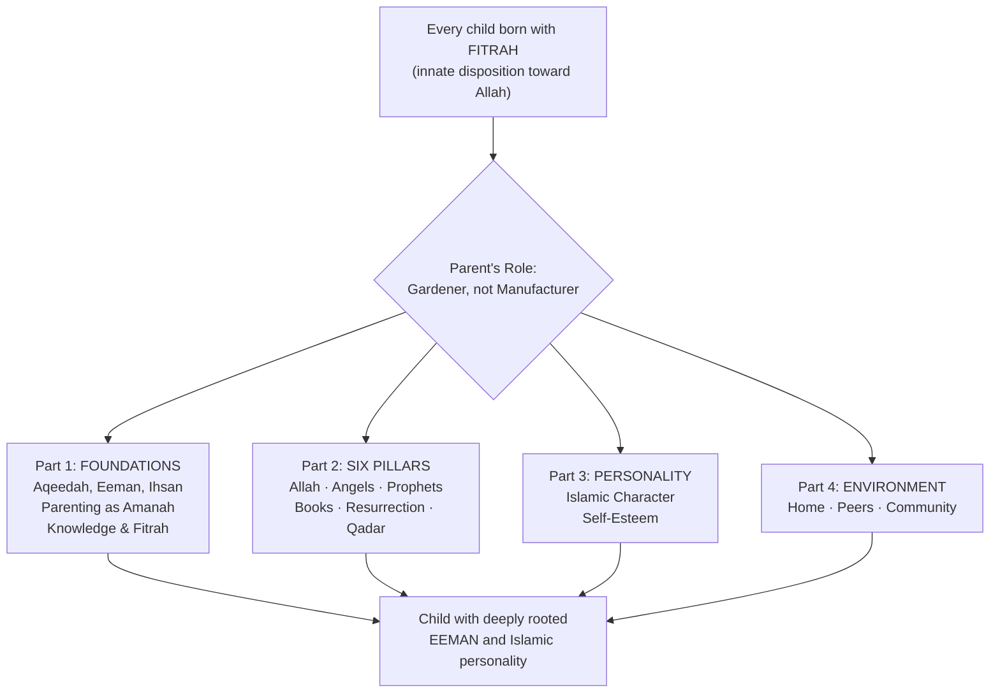
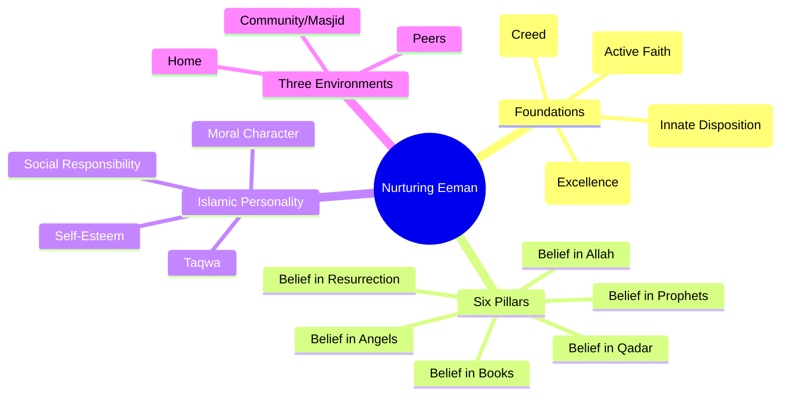
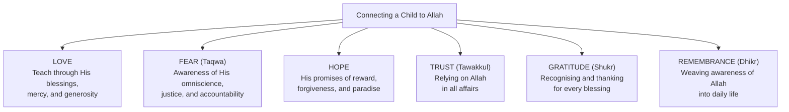
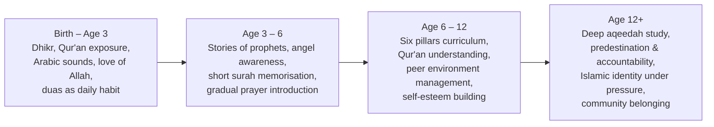
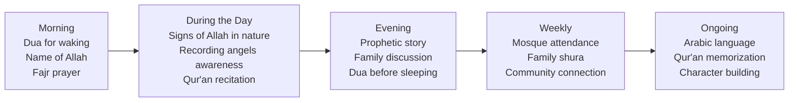

# Nurturing Eeman in Children — Aisha Hamdan

> Your child is born already knowing. Deep within them, before they can speak, before they can walk, before the world shapes a single habit — a seed of faith is already planted. The Qur'an calls it **fitrah**, the innate disposition toward recognizing Allah and submitting to Him. Every human being is born with it. This book makes a simple, urgent case: the supreme responsibility of Muslim parents is not academic achievement, material comfort, or social status — it is nurturing that seed. Eeman (faith) is the only real protection a child has against the moral confusion of the modern world. And the parent is the gardener. This is your manual for watering the seed.

---

## About the Author

Aisha Hamdan is an educator and scholar who brings together Islamic scholarship and modern developmental psychology. She writes as a fellow Muslim parent — earnest, scholarly, and deeply grounded in the Qur'an and the Sunnah of Prophet Muhammad (peace be upon him). Her approach is systematic: she does not offer vague spiritual advice, but a structured curriculum for raising children whose faith is deeply rooted.

The book was published in 2013 but draws on classical Islamic sources that are timeless. It fills a specific gap in the parenting literature: while Western parenting books address discipline, emotional intelligence, and brain development, they rarely address the spiritual dimension of childhood. And while Islamic literature addresses faith obligations, it rarely organizes them into a practical, parent-friendly framework. Hamdan does both — she provides the *what* (every pillar of faith a child needs to understand), the *why* (Qur'anic and hadith evidence), and the *how* (age-appropriate strategies, stories, and daily practices).

This is the first Islamic parenting book in this vault, and it establishes vocabulary that will be referenced by other Islamic titles: eeman, fitrah, aqeedah, tawheed, taqwa, ihsan, and amanah.

---

## The Big Idea

- <b style="color: #2980b9">Eeman is the supreme parenting goal</b>: above grades, career, wealth, or social standing. A child with strong faith has an internal compass that guides every decision for life — and the hereafter
- <b style="color: #e74c3c">The fitrah is already planted — your job is not to install faith but to nurture it</b>: every child is born with an innate disposition toward knowing Allah. The hadith is explicit: "Every child is born on the fitrah; it is his parents who make him a Jew, a Christian, or a Zoroastrian." The parent is a gardener, not a manufacturer
- <b style="color: #27ae60">Six pillars of eeman provide a concrete curriculum</b>: belief in Allah, the angels, the prophets, the divine books, the Day of Resurrection, and predestination. Each pillar requires specific strategies for connecting children through stories, daily practices, and experiential learning
- Parents will be questioned before Allah about how they raised their children — parenting is an **amanah** (sacred trust), not a lifestyle choice
- The Prophet Muhammad's own teaching methods — storytelling, gradualness, offering alternatives, attention to human nature — form a pedagogical toolkit for parents
- Three environmental circles (home, peers, community) must all be actively managed to protect and reinforce the child's spiritual development
- Self-esteem is not a Western luxury — it is an Islamic necessity. A child who feels loved, accepted, and confident is better equipped to resist peer pressure and live their faith openly

---

## Key Concepts at a Glance

| Concept | One-line summary |
|---------|-----------------|
| **Eeman** | Active, living faith — expressed in belief, speech, and action; increases and decreases |
| **Fitrah** | The innate disposition toward recognizing Allah, present at birth in every child |
| **Aqeedah** | The creed — firm beliefs held in the heart, transmitted from Allah and His Messenger |
| **Ihsan** | The highest level of worship — serving Allah as if you see Him |
| **Tawheed** | The oneness of Allah — the absolute foundation of Islamic belief |
| **Amanah** | Sacred trust — children are an amanah from Allah that parents will be held accountable for |
| **Taqwa** | God-consciousness — awareness of Allah in every action and decision |
| **Luqman's Template** | The parenting goals from Qur'an 31:12-19 — tawheed, prayer, good character, patience, humility |
| **Environmental Circles** | Home, peers, and community — three zones parents must actively manage |
| **Prophet's Teaching Methods** | Stories, parables, gradualness, alternatives, attention to human nature |

---

## 30-Second Version

Every child is born with the seed of faith already planted. The parent's job is to water it. This book provides a systematic, Qur'an-based framework for nurturing eeman in children: start with the foundations (understand aqeedah, eeman, and ihsan yourself), then connect your child to each of the six pillars of faith through stories, daily practices, and experiential learning. Build an Islamic personality with strong self-esteem. And actively manage the three environments that shape your child — home, peers, and community. Eeman is the only real protection against the moral confusion of modern life. It is the supreme parenting goal.

---

---

Most parents overemphasize belief in Allah while neglecting the other five pillars — Hamdan argues all six must be taught with roughly equal depth for balanced faith development.

The home environment has the single greatest impact on a child's spiritual development — more than peers and community combined — reinforcing that tarbiyah begins at home.

As peer influence rises and parental influence declines, the goal is for internalized faith to grow fast enough to become the child's own compass by adolescence.

The four-part framework moves from theological foundations through doctrinal pillars to character development and environmental management — a complete curriculum for Muslim parents.

## Part One: The Foundations

### Chapter 1 — Aqeedah, Eeman, and Ihsan

*Before you can nurture faith in your child, you must understand what faith actually means in Islam. This chapter defines the three levels of religious commitment and establishes the vocabulary for everything that follows.*

The book opens with the **hadith of Angel Gabriel** — one of the most important narrations in all of Islam. Gabriel appears before Prophet Muhammad as a man with extremely white clothing and jet-black hair. He sits down, places his knees against the Prophet's knees, and asks three questions: What is Islam? What is eeman? What is ihsan?

These three questions define three ascending levels:

| Level | Meaning | What It Involves |
|-------|---------|-----------------|
| **Islam** | Submission | The five pillars: testimony of faith, prayer, fasting, charity, pilgrimage |
| **Eeman** | Faith | Belief in Allah, the angels, the prophets, the books, the Day of Resurrection, and predestination |
| **Ihsan** | Excellence | Worshipping Allah as if you see Him — knowing that even if you cannot see Him, He sees you |

**Aqeedah** (creed) is the firm belief held in the heart. It is not something humans invent — it is transmitted from Allah through His Messenger. Aqeedah is the foundation. Eeman builds on aqeedah and adds action: it is belief expressed through the tongue and demonstrated through the limbs. And eeman is not static — it <b style="color: #2980b9">increases with knowledge and good deeds, and decreases with ignorance and sin</b>. This is critical for parents: your child's faith is a living thing that needs continuous nourishment.

### Chapter 2 — The Responsibility of Parenting

*Children are not just a blessing — they are a test. And parents will be questioned about how they handled that test.*

Hamdan establishes the stakes early. On the Day of Judgment, every parent will be asked: what did you do with the children Allah entrusted to you? Did you raise them on faith, or did you neglect their souls while providing for their bodies?

> [!warning] The Amanah of Parenting
> The Prophet Muhammad said: "Each of you is a shepherd and each of you is responsible for his flock." Parenting is not a lifestyle — it is an amanah (sacred trust) with consequences that extend into eternity. The parent who raises a righteous child earns ongoing reward even after death.

The chapter uses **Luqman's advice to his son** (Qur'an 31:12-19) as the definitive parenting goals template. Luqman was a wise man whom Allah honoured with an entire chapter of the Qur'an. His advice to his son provides a priority sequence that every Muslim parent should memorize:

1. **Tawheed** — Do not associate anything with Allah (the absolute foundation)
2. **Gratitude to Allah and parents** — Kindness and obedience
3. **Awareness of Allah's omniscience** — Nothing is hidden from Him
4. **Prayer** — Establishing the connection with Allah
5. **Enjoining good and forbidding evil** — Active moral responsibility
6. **Patience** — In the face of whatever befalls you
7. **Humility and moderation** — Do not walk arrogantly; lower your voice

> [!tip] The Luqman Template
> Notice the sequence: spiritual foundation first (tawheed), then relationship obligations (parents), then awareness (taqwa), then practice (prayer), then social responsibility (enjoining good), then resilience (patience), then character (humility). This is not arbitrary — it is a curriculum ordered by priority. Everything builds on the first item.

### Chapter 3 — The Basics of Parenting

*The marital relationship is the soil. If the soil is toxic, no seed will thrive.*

This chapter makes a claim that many parenting books echo from a secular perspective: <b style="color: #e74c3c">the single most important thing you can do for your children is maintain a strong, loving marriage</b>. In Hamdan's framework, the marital relationship creates the emotional and spiritual environment in which eeman can grow.

Key principles from this chapter:

- **Parents must nurture their own eeman first.** You cannot give what you do not have. A parent whose own faith is weak will struggle to transmit faith to their children
- **The rights of children in Islam include:** a righteous lineage, a good name, breastfeeding, good upbringing, kindness, and education
- **Breastfeeding and early attachment** are emphasized with both Islamic sources (the Qur'an recommends two years of breastfeeding) and modern attachment research
- **Supplications for righteous children** — making dua is not passive hope; it is an active parenting strategy rooted in the belief that Allah responds to sincere prayer

### Chapter 4 — Knowledge and Education in Islam

*Knowledge comes before action. You cannot teach what you do not know.*

Islam places extraordinary emphasis on knowledge. The first word revealed to Prophet Muhammad was "Read." The Prophet said that seeking knowledge is obligatory for every Muslim. For parents, this has a practical implication: <b style="color: #27ae60">you must educate yourself about your deen before you can educate your children</b>.

The chapter introduces the **Prophet Muhammad's teaching methods** — a pedagogical toolkit that every parent can use:

| Method | How the Prophet Used It | Parent Application |
|--------|------------------------|-------------------|
| **Illustrative parables** | Used concrete images to explain abstract concepts | Use everyday examples to explain faith concepts to children |
| **Narrative stories** | Told stories of previous prophets and nations | Share stories of the prophets as bedtime routines |
| **Gradualness** | Introduced obligations progressively over 23 years | Do not overwhelm young children with all obligations at once |
| **Offering alternatives** | When correcting, offered what to do instead of only what not to do | When a child does something wrong, redirect to the Islamic alternative |
| **Attention to human nature** | Adapted his approach to the listener's capacity | Match your teaching to your child's age and temperament |

> [!example] The Prophet's Gradualness
> Islam's obligations were revealed over 23 years, not all at once. Prayer was established gradually. Alcohol was prohibited in stages. The Prophet understood that human nature requires progressive introduction. Parents should follow the same principle: introduce obligations step by step, building from simple to complex, from love of Allah to formal worship.

### Chapter 5 — Fitrah: The Seed Already Planted

*This is the most hopeful chapter in the book — and its most distinctive contribution.*

The **fitrah** is the innate disposition toward recognizing Allah and submitting to Him. Every child is born with it. This is not a metaphor — it is Islamic doctrine grounded in both Qur'an and hadith.

The Qur'anic evidence comes from a remarkable passage (7:172): before the creation of the physical world, Allah took a covenant from every soul that would ever exist. He asked: "Am I not your Lord?" And every soul replied: "Yes, we bear witness." The fitrah is the echo of this pre-worldly covenant, embedded in every child's spiritual DNA.

The hadith evidence is equally clear: "Every child is born on the fitrah; it is his parents who make him a Jew, a Christian, or a Zoroastrian." The implication is powerful: <b style="color: #2980b9">the default state of every child is recognition of Allah. The parent's job is not to install something foreign, but to protect and nurture what is already there.</b>

This reframes the parent's entire role. You are not a manufacturer building a Muslim from raw materials. You are a gardener tending a seed that Allah Himself has planted. Your job is to provide water (knowledge), sunlight (love and connection), and protection from weeds (negative environmental influences). The seed will grow — if you do your part.

> [!success] The Gardener Model
> The fitrah framework is profoundly hopeful. It means that when you teach your child about Allah, you are not introducing a stranger — you are reintroducing someone the child's soul already knows. When you nurture faith, you are working *with* the child's nature, not against it. This should give every Muslim parent confidence: Allah has already done the hardest part. Your job is maintenance.

But the fitrah is also vulnerable. Satan works to corrupt it. Parents can unknowingly damage it through neglect, exposure to un-Islamic values, or failure to provide spiritual nourishment. The fitrah is like a plant: it will grow toward the light if given the chance, but it can be stunted or killed by poor conditions.

---

## Part Two: Connecting Children to the Six Pillars of Eeman

This is the operational heart of the book. Hamdan takes each of the six pillars of eeman and asks: how do you make this real for a child? Not as abstract theology, but as lived experience woven into daily life.

### Chapter 6 — Allah, the Exalted

*The longest chapter, because belief in Allah is the foundation upon which everything else is built.*

Teaching a child about Allah is not a single conversation. It is a multi-dimensional, lifelong process. Hamdan identifies at least six dimensions of connection that parents should cultivate:

<b style="color: #2980b9">Love should be the dominant note, especially with young children.</b> Begin by teaching children about Allah's blessings — their eyes, their food, their family, the rain, the sun. Every blessing is a gift from Allah. When a child feels loved by Allah, they naturally want to please Him. Fear (taqwa) should be introduced as reverent awareness, not terror — Allah sees everything, even what is hidden in the heart, and He is perfectly just.

**Signs of Allah in nature** are a particularly powerful teaching tool. When it rains, ask: who sends the rain? When you see a flower, ask: who created this? When you look at the stars: who placed them? The Qur'an itself uses this method repeatedly, directing attention to natural phenomena as evidence of the Creator. A parent who walks through the world narrating Allah's signs is building faith through daily experience, not just through formal instruction.

**Dhikr (remembrance)** is the simplest and most consistent method. Teach children to say *bismillah* before eating, *alhamdulillah* after sneezing, *subhanallah* when they see something beautiful, *astaghfirullah* when they make a mistake. These small phrases, repeated thousands of times throughout childhood, wire awareness of Allah into the child's neural and spiritual architecture.

### Chapter 7 — The Angels

Children cannot see angels, but they can learn to feel their presence. Angels accompany every person from the womb to the grave. An angel breathed life into the foetus and recorded the child's provision, lifespan, and destiny. Guardian angels stand before and behind each person, protecting them by Allah's decree. Recording angels sit on each shoulder — the one on the right writing good deeds, the one on the left writing sins.

> [!example] Making Angels Real in Daily Life
> When it rains: "Who brings the rain?" Allah commands the angel Meeka'eel.
> When a child does a good deed: "The angel on your right shoulder just recorded that."
> When a child resists temptation: "The angel on your left was about to write a sin — but because you stopped, the angel on your right recorded a good deed instead."
> Before sleep: "The angels say ameen to your supplications."

Hamdan uses the **story of the three Israelites** — a leper, a blind man, and a bald man, each healed and enriched by an angel, then tested for gratitude — to illustrate that angels are active agents in human lives. Children learn that angels are real, that they intervene, and that Allah sends them to test and support His servants.

### Chapter 8 — The Prophets and Messengers

The prophets are <b style="color: #27ae60">the ultimate role models for children</b>. Ibrahim (Abraham) demonstrated absolute trust in Allah when asked to sacrifice his son. Musa (Moses) confronted the most powerful ruler on earth with nothing but faith and a staff. Yusuf (Joseph) resisted temptation at its peak. Muhammad — the seal of the prophets — modelled patience, courage, kindness, justice, and mercy in every domain of life.

Hamdan emphasises that prophetic stories should be told as *stories* — with narrative tension, vivid detail, and emotional engagement — not as dry biographical facts. The Prophet Muhammad himself used storytelling as his primary teaching method. Parents should read, learn, and retell these stories with passion. Bedtime, car rides, and family gatherings are all opportunities.

### Chapter 9 — The Books and Revelation

The Qur'an is not a historical document — it is the direct, preserved, living word of Allah, relevant to every situation a child will face. A child's relationship with the Qur'an should encompass four dimensions:

| Dimension | What It Means |
|-----------|--------------|
| **Memorisation** | Hifz — committing surahs to memory, beginning with the short ones |
| **Recitation** | Tilawah — proper pronunciation and tajweed, ideally daily |
| **Understanding** | Tafsir — knowing what the words mean, not just their sounds |
| **Application** | Amal — living by the Qur'an's guidance in daily decisions |

A child who only memorises without understanding has a parrot's relationship with the Qur'an. A child who understands but does not apply has a scholar's relationship without a practitioner's conviction. The goal is all four: a child who carries the Qur'an in their memory, on their tongue, in their mind, and in their actions.

### Chapter 10 — The Day of Resurrection and the Hereafter

<b style="color: #e74c3c">Awareness of accountability transforms behaviour from the inside out.</b> When a child truly understands that every action — even every thought and intention — will be presented on the Day of Judgment, external surveillance becomes unnecessary. The child develops an internal moral compass.

The Prophet's framing is powerful: "Be in this world as though you were a stranger or a traveller." This world is temporary — a place of testing, not a destination. The person whose primary concern is the hereafter will find focus and contentment in this life. The person whose primary concern is this world will find only anxiety and distraction.

Hamdan discusses teaching children about both Paradise (as motivation) and Hellfire (as warning), but insists on balance. A child raised only on fear becomes anxious and legalistic. A child raised only on hope becomes complacent. The Islamic model combines both: strive for Paradise, protect yourself from the Fire, and trust in Allah's mercy and justice.

### Chapter 11 — Divine Will and Predestination

The final pillar is taught through one of the most beautiful hadiths in the entire tradition. The Prophet Muhammad took the young Ibn Abbas aside and told him:

*"Be mindful of Allah, and Allah will protect you. Be mindful of Allah, and you will find Him in front of you. If you ask, ask of Allah. If you seek help, seek help of Allah. Know that if the entire nation gathered to benefit you, they could only benefit you with what Allah had already prescribed. And if they gathered to harm you, they could only harm you with what Allah had already prescribed. The pens have been lifted and the pages have dried."*

This teaching produces <b style="color: #27ae60">courage, resilience, and independence from human approval</b>. A child who internalises predestination does not bow to peer pressure, does not despair in hardship, and does not become arrogant in success. A young man ostracised for praying at school is unbothered — he knows the path of truth is protected by Allah. A young girl teased for wearing hijab refuses to remove it — she knows that what is destined for her cannot be prevented.

The twin responses to predestination are **patience** (sabr) in hardship and **gratitude** (shukr) in ease. The Prophet said: "The affair of the believer is amazing — it is always good for him. If something joyful comes, he gives thanks and that is good. If something harmful comes, he is patient and that is good."

> [!quote] Teaching Predestination Through Difficulty
> When a child in a Muslim family was asked about her two siblings with Down syndrome, she said: "These are my doors to paradise." This child had internalised the belief that difficulty is not punishment but opportunity — an affliction to be borne with patience for the sake of Allah's reward.

---

## Part Three: Developing an Islamic Personality

### Chapter 12 — Character Formation

Hamdan provides a practical checklist for building Islamic character:

- **Begin from birth.** The earliest years are the most receptive. A child who hears the call to prayer at birth and grows up surrounded by Islamic practice absorbs it as naturally as language
- **Teach the Islamic perspective on everything.** News events, schoolyard conflicts, career decisions — help children see the world through the lens of Islam
- **Be role models.** Children absorb more from what they observe than what they are told. A parent who prays on time, speaks truthfully, and handles adversity with patience is the most powerful lesson available
- **Foster pride in being Muslim.** Especially in minority contexts, children need a positive Islamic identity that is a source of strength, not embarrassment
- **Place Islam above ethnicity.** Muslim identity transcends national and cultural boundaries

### Chapter 13 — Building Self-Esteem

This chapter bridges Western developmental psychology and Islamic values. <b style="color: #2980b9">Self-esteem is not vanity — it is the internal foundation that enables a child to live their faith under pressure.</b> A child who feels worthless will seek validation from peers and abandon principles at the first sign of rejection. A child who feels valued, competent, and loved has the internal resources to stand alone.

| Strategy | How to Implement |
|----------|-----------------|
| **Unconditional love** | Express love as a constant, not as a reward for good behaviour |
| **Quality time** | Be fully present. Listen genuinely. Show interest in their world |
| **Positive feedback** | Catch them doing right and name the specific behaviour |
| **Allow expression** | Create space for children to express their feelings without judgment |
| **Active listening** | Put devices down. Make eye contact. Reflect back what you hear |
| **Shura (consultation)** | Involve children in family decisions appropriate to their age |
| **Responsibility** | Give age-appropriate tasks. Trust their growing capabilities |
| **Family meetings** | Regular structured discussions where every member has a voice |

> [!tip] Shura in the Family
> Consultation is deeply Islamic — Allah praises the believers "whose affairs are decided by consultation among themselves" (42:38). Applying shura in the family teaches children that their voice matters, builds decision-making skills, and communicates respect. The final decision rests with parents, but the process of being heard transforms a child's sense of worth.

---

## Part Four: Managing the Environment

### Chapter 14 — The Home Environment

The home should be a sanctuary where Allah is remembered. The Prophet said the difference between a home where Allah is remembered and one where He is not is like the difference between the living and the dead.

Practical strategies for an eeman-rich home:

- **Establish prayer in the home.** Not just at the mosque — pray voluntary prayers at home. Designate a prayer area. Pray together as a family
- **Make the Qur'an a daily presence.** Recite Soorat al-Baqarah regularly — the Prophet said Satan flees from a house where it is recited
- **Create a home study circle.** Regular family learning sessions covering aqeedah, Islamic law, Qur'anic memorisation, and prophetic stories
- **Maintain an Islamic library.** Books, recordings, and resources for all age levels
- **Say supplications at transitions.** Bismillah when entering the home. Specific duas for leaving, eating, sleeping
- **Invite righteous people.** Their presence elevates the household's spiritual atmosphere
- **Remove negative influences.** This is where the television discussion falls

> [!warning] The Television Problem
> Hamdan's critique of television (written before smartphones and social media) is prescient in its principles, even if dated in its specifics. Her core arguments: children spend more hours in front of screens than in meaningful conversation with parents. Television exposes children to values antithetical to Islam — materialism, immodesty, violence, disrespect for authority, and subtle forms of polytheism (superheroes with god-like powers, magic as a normal force). Children lack the critical thinking skills to filter what they absorb. And most dangerously, the values they see on screen become normalised through repetition and desensitisation. The principles apply with even greater force to social media and smartphones.

### Chapter 15 — The Peer Environment

Between ages six and twelve, children spend roughly 40 percent of waking hours with peers. By the teenage years, they spend twice as much time with friends as with parents. This is natural — but it means the quality of those friendships matters enormously.

The Prophet said: "A person is upon the religion of his close friend, so let each of you look at whom he befriends." And: "The example of a good companion and a bad one is like a perfume seller and a blacksmith. The perfume seller will either give you perfume, sell you some, or you will at least smell something pleasant. The blacksmith will either burn your clothes or you will smell something foul."

Parents should actively help children find and cultivate friendships with sincere, practicing Muslim peers — and gently redirect them away from companions who are careless about their faith.

### Chapter 16 — The Community Environment

The broadest circle. Children should feel a sense of belonging to the global Muslim ummah — a community that transcends geography, ethnicity, and nationality. This is built through participation in mosque activities, Islamic schools, community events, and awareness of Muslim affairs around the world.

---

## Best Stories from the Book

1. **The Story of Luqman** (Qur'an 31:12-19) — A wise father's comprehensive advice to his son: do not associate partners with Allah, be grateful, be aware of His omniscience, establish prayer, enjoin good, be patient, walk humbly. The entire parenting curriculum in seventeen verses.

2. **The Hadith of Gabriel** — The angel appears as a man with white clothing and black hair, asks the Prophet to define Islam, eeman, and ihsan. The foundational text for understanding the levels of faith.

3. **The Three Israelites and the Angel** — A leper, a blind man, and a bald man are each healed and given wealth. Later tested by an angel in disguise asking for charity. Only the formerly blind man passes — "Take anything you wish." Teaches children that angels are real, that blessings are tests, and that gratitude is the correct response.

4. **The Repentant Man's Camel** — A traveller loses his camel in the desert with all his provisions. He lies down to die. The camel returns. The Prophet says Allah's joy at a servant's repentance exceeds this man's joy. Teaches children about Allah's mercy through vivid narrative.

5. **The Young Ibn Abbas and Predestination** — The Prophet teaches a boy: "Be mindful of Allah and He will protect you." A model for how to teach the most abstract pillar of faith to a child — through direct, personal, memorable words.

---

## Practical Application

### What to Do Tomorrow

1. **Start with dhikr.** Teach your child one new phrase this week — bismillah before eating, alhamdulillah after finishing, subhanallah at something beautiful. Build the habit of mentioning Allah throughout the day

2. **Tell one prophetic story.** At bedtime or during a car ride, tell a story from the life of a prophet. Tell it as a *story* — with emotion, detail, and suspense

3. **Narrate Allah's signs.** On your next walk outside, point to three things and ask: "Who created this?" The rain, a tree, the sky. Build the habit of seeing the world as evidence of Allah

4. **Pray together.** If you are not already praying together as a family, start with one prayer. Make it a shared experience, not a solitary obligation

5. **Audit your home environment.** What is your child consuming through screens? What values are being absorbed unconsciously? What could be added (an Islamic book, a Qur'an recording) and what should be removed?

### The Long-Term Curriculum

---

## Connections

| Book | Connection |
|------|-----------|
| [[No-Drama Discipline - Daniel J. Siegel]] | Secular neuroscience approach to discipline — complements Hamdan's spiritual framework with brain-based methods for connection and redirection |
| [[The Whole-Brain Child - Daniel J. Siegel]] | Brain integration model that enriches the understanding of how children process the abstract concepts of faith |
| [[Unconditional Parenting - Alfie Kohn]] | Kohn's unconditional love framework aligns closely with Hamdan's emphasis on love and acceptance as the foundation for character |
| [[Hunt, Gather, Parent - Michaeleen Doucleff]] | Cross-cultural parenting insights that echo Hamdan's critique of Western materialist parenting norms |
| [[Parenting from the Inside Out - Daniel J. Siegel]] | The parent's own inner work parallels Hamdan's insistence that parents must nurture their own eeman first |
| [[Simplicity Parenting - Kim John Payne]] | Payne's reduction of environmental clutter aligns with Hamdan's call to remove negative influences from the home |
| [[Man's Search for Meaning - Viktor Frankl]] | Frankl's purpose-driven life parallels eeman as the organising principle of existence — both argue that meaning is the antidote to despair |
| [[Emotional Intelligence - Daniel Goleman]] | The EQ skills (self-awareness, self-regulation, empathy) map directly onto the Islamic personality Hamdan describes |
| [[The Danish Way of Parenting - Jessica Joelle Alexander]] | Values-based parenting from a different cultural lens — both books argue that character is built through environment and modelling, not punishment |
| [[Brain Rules for Baby - John Medina]] | The neuroscience of early childhood development confirms Hamdan's emphasis on the critical importance of the first five years |

---

## The Verdict

This is not a parenting tips book. It is a comprehensive spiritual curriculum for raising children whose faith is the organising principle of their lives. Its greatest strength is the **fitrah framework** — the idea that every child arrives with the seed of faith already planted, and the parent's job is to be a gardener, not a manufacturer. This is genuinely hopeful and reframes the entire parenting task in a way that reduces anxiety and increases confidence.

The **six pillars curriculum** gives parents a concrete, systematic framework for spiritual education. Instead of vague exhortations to "teach your kids about Islam," Hamdan provides a structured progression: here is what to teach, here is the evidence, here are the stories, here are the daily practices.

The **Prophet's teaching methods** — storytelling, gradualness, offering alternatives, attention to human nature — are not only Islamically grounded but align remarkably well with modern educational research. The chapter on **self-esteem** demonstrates that Islamic values and Western developmental psychology can be complementary rather than contradictory.

### Limitations

- The book is **heavily repetitive** — the same Qur'anic verses and hadiths reappear across multiple chapters
- The **television discussion** is dated (pre-smartphone era), though the underlying principles remain relevant
- There is **no age-specific developmental guidance** — advice tends to be general rather than calibrated to specific stages
- **Discipline and conflict resolution** are barely addressed — the book focuses on what to teach but not how to handle resistance
- The text **assumes high Islamic literacy** in the reader and may be inaccessible to parents who are new to Islam or have limited knowledge
- **Gender roles** are presented prescriptively without engagement with the diversity of Muslim family structures
- The **community chapter** is thin compared to the richness of the home environment discussion

Despite these gaps, this is an essential resource for Muslim parents who want to move beyond "teaching kids to pray" to building a complete, deeply rooted Islamic personality. It is the spiritual foundation upon which all other parenting strategies — discipline, communication, emotional intelligence — can be built.

---

## Who Should Read This Book

| Reader | Why |
|--------|-----|
| **Muslim parents seeking a structured approach** | Provides a systematic framework rather than scattered advice — the six pillars curriculum gives you a roadmap |
| **Parents in Western/diaspora contexts** | Addresses the specific challenge of raising Muslim children in non-Muslim environments |
| **Parents who feel their children's faith is superficial** | The book's explicit goal is moving from "Muslim by name" to "genuine believer" |
| **New Muslims with children** | Comprehensive introduction to the Islamic worldview of parenting with clear terminology |
| **Parents who have read secular parenting books** | Fills the spiritual dimension that secular books cannot address |
| **Anyone who read The Whole-Brain Child and wants the Islamic complement** | The fitrah framework is the spiritual counterpart to brain integration |

---

## Five Things You Can Do This Week

1. **Learn Luqman's seven priorities** (tawheed, gratitude to parents, awareness of Allah, prayer, enjoining good, patience, humility) and evaluate: which ones are you actively teaching? Which are you neglecting?

2. **Introduce one new dhikr phrase** into your family's daily routine. Bismillah before meals. Alhamdulillah after finishing. Subhanallah at something beautiful. Small phrases, repeated daily, build lifelong habits.

3. **Tell one story from the life of the prophets** at bedtime this week. Not a lecture — a story. With detail, emotion, and a lesson that the child discovers for themselves.

4. **Audit your child's three environments.** Home: Is Allah remembered here daily? Peers: Who are their closest friends? Community: Are they connected to Muslim community life?

5. **Nurture your own eeman first.** The book's deepest insight may be its simplest: you cannot give what you do not have. Before focusing on your child's spiritual development, ask — when did I last work on my own?

## Part Two: Connecting Children to the Six Pillars of Eeman

*This is the heart of the book — six chapters, each devoted to one pillar of faith, each providing a doctrinal foundation and practical strategies for making that pillar real in a child's life. Think of it as a curriculum.*

### Chapter 6 — Allah, the Exalted

*This is the longest and most important chapter. Everything else builds on the child's relationship with Allah.*

Connecting a child to Allah is not a single conversation — it is a lifelong project with multiple dimensions. Hamdan organizes the child's relationship with Allah around several categories:

**Teaching Allah's Names and Attributes.** Allah has 99 names (Ar-Rahman, Ar-Raheem, Al-Malik, Al-Quddus...), and each name reveals an aspect of His nature. Parents should introduce these names naturally in daily life: when a child recovers from illness, mention **Ash-Shafi** (the Healer). When food appears on the table, mention **Ar-Razzaq** (the Provider). When the child feels scared, remind them of **Al-Hafidh** (the Protector). Over time, the child builds a rich, textured understanding of who Allah is — not an abstract concept, but a living, caring, all-knowing presence.

**Signs of Allah in Nature.** The Qur'an repeatedly directs attention to the natural world as evidence of Allah's existence and power. Hamdan encourages parents to do the same: point out the stars, the rain, the human body, the cycle of seasons. Each observation becomes an opportunity to say, "Who created this?" The goal is to develop <b style="color: #2980b9">a habit of seeing Allah's hand in everything — a kind of spiritual literacy that reads the world as a divine text</b>.

**Developing Multiple Dimensions of Connection:**

| Dimension | What It Means | How to Nurture It |
|-----------|--------------|-------------------|
| **Love of Allah** | The child feels drawn to Allah with warmth and affection | Talk about Allah's mercy, kindness, and gifts; associate Allah with positive experiences |
| **Fear of Allah** | The child avoids disobedience out of awe and respect | Age-appropriate discussions of accountability; not terrorizing but cultivating healthy reverence |
| **Hope in Allah** | The child trusts that Allah's mercy is vast | Emphasize that Allah forgives, that His mercy encompasses all things |
| **Trust in Allah (tawakkul)** | The child relies on Allah after taking action | Model trust by saying "We do our best, then trust Allah for the outcome" |
| **Gratitude to Allah** | The child recognizes and appreciates blessings | Daily practice of naming blessings; saying Alhamdulillah habitually |
| **Remembrance of Allah (dhikr)** | Allah is present in the child's consciousness throughout the day | Morning and evening supplications, before-meal prayers, bedtime duas |

> [!warning] Fear vs Love — The Balance
> Hamdan emphasizes that the child's connection to Allah should begin with love and gradually incorporate appropriate fear (reverence). A child who learns about Hellfire before they learn about Allah's mercy may develop anxiety rather than faith. The Prophet's own approach was to emphasize mercy first. When teaching young children, lead with love — "Allah loves you," "Allah made you," "Allah gives you everything you have." Introduce accountability as the child matures.

### Chapter 7 — The Angels

*Angels make the unseen world tangible for children. They are real beings with real jobs, and children find them fascinating.*

Belief in angels is the second pillar of eeman, and Hamdan argues that it is one of the easiest pillars to connect children to — because children are naturally drawn to the idea of invisible beings with specific missions.

Key angel concepts for children:

- **Angels are created from light** and they worship Allah without ceasing
- **Recording angels** sit on each person's right and left shoulder, writing down every deed — good and bad. This makes behaviour concrete: "Your angel is writing that down"
- **Guardian angels** protect the person from harm by Allah's permission
- **The Angel of Death (Malak al-Mawt)** takes souls at the appointed time
- **Jibreel (Gabriel)** brought the revelation to the prophets
- **Mika'eel (Michael)** is responsible for rain and provision
- **Israfeel** will blow the trumpet on the Day of Resurrection

> [!example] The Three Israelites
> Hamdan uses this hadith story to make angels vivid for children: a leper, a blind man, and a bald-headed man are each healed by an angel and given wealth. Years later, an angel visits each in disguise, asking for help. Only the formerly blind man — who remained grateful and remembered that his blessings came from Allah — passes the test. The other two denied ever having been afflicted. This story teaches children that angels are active in the world, that gratitude matters, and that how you respond to blessing reveals your character.

### Chapter 8 — The Prophets and Messengers

*The prophets are the heroes of Islam, and their stories are the most powerful teaching tool parents have.*

Belief in the prophets is the third pillar, and Hamdan emphasizes that prophetic stories are <b style="color: #27ae60">the single most effective way to teach children about faith, character, courage, and reliance on Allah</b>. Children learn through narrative, and Islam provides an inexhaustible treasury of prophetic narratives.

Key prophetic stories and their lessons:

| Prophet | Key Lesson for Children |
|---------|------------------------|
| **Ibrahim (Abraham)** | Absolute tawheed — smashing the idols, trusting Allah in the fire, willingness to sacrifice his son |
| **Musa (Moses)** | Courage against tyranny; trusting Allah at the Red Sea; patience with his community |
| **Yusuf (Joseph)** | Resisting temptation; patience through injustice; Allah's plan is greater than human scheming |
| **Nuh (Noah)** | Perseverance in dawah despite rejection; obedience to Allah even when it seems irrational |
| **Muhammad** | The complete model — mercy, justice, courage, humility, trust in Allah in every circumstance |

Hamdan recommends making prophetic stories a daily or weekly family ritual — at bedtime, during car rides, at the dinner table. The stories should be told with vivid detail and emotional engagement, not as dry recitations.

### Chapter 9 — The Books and Revelation

*The Qur'an is not just a book to be recited — it is a living guide that should shape every aspect of the child's life.*

Belief in the divine books is the fourth pillar. While Muslims believe in the original Torah, Psalms, and Gospel as divine revelation, the Qur'an holds a unique status as the final, preserved revelation from Allah.

Hamdan identifies three levels of connection with the Qur'an that parents should cultivate:

1. **Recitation (tilawah)** — The child learns to read the Qur'an in Arabic with proper pronunciation. This is the baseline. Memorization (hifdh) is strongly encouraged, beginning with short surahs and building progressively
2. **Understanding (tadabbur)** — The child does not just read the words but understands their meaning. Hamdan stresses the importance of teaching Arabic to enable direct comprehension
3. **Application (amal)** — The child lives by what the Qur'an teaches. This is the ultimate goal — a child whose daily decisions are guided by Qur'anic values

> [!tip] Daily Qur'an Connection
> Hamdan suggests making the Qur'an a daily presence: recitation after Fajr (morning prayer), a short explanation of a verse at the dinner table, listening to beautiful recitation during car rides. The goal is not to make the Qur'an a chore but to make it feel like a natural, beloved part of the child's day — the way water is natural to a plant.

### Chapter 10 — The Day of Resurrection and the Hereafter

*Teaching children about the afterlife creates a moral framework that extends beyond this world.*

The fifth pillar of eeman — belief in the Day of Resurrection — provides what Hamdan calls <b style="color: #e74c3c">the ultimate accountability framework</b>. A child who truly believes that every action will be weighed on the Day of Judgment has an internal moral compass that no peer pressure can override.

Key concepts Hamdan teaches through this pillar:

- **This world is temporary.** The real life is the hereafter. This perspective helps children avoid becoming enslaved to material possessions or social status
- **Every action is recorded.** The recording angels document everything. On the Day of Judgment, each person will be given their book of deeds
- **Paradise (Jannah) is real.** Vivid descriptions from hadith — rivers of milk and honey, palaces, reunion with loved ones, the ultimate reward of seeing Allah's face
- **Hellfire (Jahannam) is real.** Not used to terrorize, but to create appropriate reverence and motivation to avoid disobedience
- **Accountability is individual.** No one can carry another's burden. Each person stands before Allah alone

> [!warning] Age-Appropriate Teaching
> Hamdan is careful to note that very young children should learn about the hereafter primarily through the beauty of Paradise. Detailed descriptions of Hellfire should be introduced gradually as the child matures. The goal is motivation, not trauma. A child who desires Paradise is more effectively motivated than one who merely fears Hellfire.

### Chapter 11 — Divine Will and Predestination

*The sixth pillar is the most intellectually challenging — and one of the most practically important for building resilience.*

Belief in **qadar** (divine decree/predestination) has four components that Hamdan explains:

1. **Allah's Knowledge** — Allah knows everything that has happened and everything that will happen
2. **Allah's Writing** — Everything is recorded in the Preserved Tablet (Al-Lawh Al-Mahfoodh)
3. **Allah's Will** — Nothing happens except by Allah's permission
4. **Allah's Creation** — Allah is the creator of everything, including human actions

The practical value of this pillar for children is enormous: it builds <b style="color: #27ae60">resilience, patience, and gratitude</b>. When something bad happens, the child learns to say "This is from Allah's decree" and to be patient. When something good happens, the child learns to be grateful. Neither success nor failure is random — both are part of Allah's wisdom.

> [!example] The Hadith of Ibn Abbas
> The Prophet Muhammad taught the young companion Ibn Abbas one of the most powerful lessons in all of Islamic teaching: "Be mindful of Allah, and Allah will protect you. Be mindful of Allah, and you will find Him in front of you. If you ask, ask of Allah. If you seek help, seek help from Allah. Know that if the entire nation were to gather together to benefit you, they would not benefit you except with what Allah has already written for you. And if they gathered to harm you, they would not harm you except with what Allah has already written against you."
>
> This hadith is a complete curriculum in predestination, trust, and independence — taught by the Prophet directly to a child. Hamdan holds it up as the model for how parents should teach qadar.

---

## The Six Pillars at a Glance

| Pillar | Core Teaching | Primary Strategy |
|--------|--------------|-----------------|
| **Allah** | Allah is real, present, loving, all-knowing, and deserving of worship | Names and attributes in daily life; signs in nature |
| **Angels** | Invisible beings with real missions; recording every deed | Stories from hadith; daily awareness of recording angels |
| **Prophets** | Heroes of faith whose stories teach courage, patience, and trust | Narrative storytelling as a family ritual |
| **Books** | The Qur'an is a living guide for daily life | Recitation, understanding, and application — daily |
| **Resurrection** | This life is temporary; the real life is the hereafter | Paradise as motivation; accountability as moral compass |
| **Predestination** | Everything happens by Allah's will and wisdom | Building patience, gratitude, and trust through daily events |

---

## Part Three: Developing an Islamic Personality

### Chapter 12 — Additional Keys to Developing Islamic Personality

*Faith alone is not enough. The child needs a complete personality — character, confidence, and identity — built on an Islamic foundation.*

Hamdan moves from doctrinal education (the six pillars) to character formation. The pillars give the child *what* to believe; this chapter gives them *who to be*.

Key principles for developing Islamic personality:

**Begin from birth.** The Islamic personality is not something you bolt on at age seven when the child starts praying. It begins with the adhan (call to prayer) whispered in the newborn's ear, with the tahneek (touching the palate with a date), with the choice of a meaningful name. Every early experience shapes the child's identity.

**Teach the Islamic perspective on everything.** When something happens — a natural disaster, a news story, a conflict at school, a personal loss — help the child see it through an Islamic lens. "Why do you think Allah allowed this to happen?" "What does the Qur'an say about how to treat people who hurt us?" "What would the Prophet do?" The goal is to make Islamic thinking the child's <b style="color: #2980b9">default operating system, not an add-on</b>.

**Role modelling is supreme.** Children absorb more from what they *see* than what they *hear*. A parent who prays consistently, speaks kindly, controls anger, shows charity, and turns to Allah in difficulty teaches more by example than a thousand lectures. Conversely, a parent who lectures about patience but screams when frustrated teaches the child that Islamic values are aspirational, not real.

**Pride in being Muslim.** In environments where Muslims are a minority, children may feel ashamed or embarrassed by their identity. Hamdan insists that parents must actively cultivate <b style="color: #27ae60">pride in being Muslim</b> — not arrogance, but a quiet confidence that their faith is a gift, not a burden. This means celebrating Islamic holidays with enthusiasm, making mosque attendance joyful, dressing in Islamic clothing with dignity, and speaking about Islam with warmth rather than obligation.

**Islam over ethnicity.** The bond between Muslims is faith, not race, language, or national origin. Children should learn that the ummah (Muslim nation) transcends ethnic boundaries. An Arab Muslim, a Pakistani Muslim, an African Muslim, and a European Muslim are all part of one family united by the shahada.

### Chapter 13 — Building Self-Esteem

*This chapter bridges Western psychology and Islamic values — and it may be the most practically useful chapter in the book.*

Hamdan draws on developmental psychology to argue that <b style="color: #e74c3c">self-esteem is not a Western luxury but an Islamic necessity</b>. A child with weak self-esteem is more vulnerable to peer pressure, more likely to compromise their values to gain acceptance, and less equipped to stand firm in their faith when challenged.

Self-esteem in Hamdan's framework has two components:
- **Self-concept** — how the child sees themselves ("I am a Muslim," "I am capable," "I am loved")
- **Self-esteem** — how the child feels about what they see ("I am proud to be Muslim," "I feel confident in my abilities," "I feel worthy of love")

Strategies for building self-esteem:

| Strategy | What It Looks Like |
|----------|-------------------|
| **Unconditional love** | "I love you because you are my child — not because you pray perfectly or get good grades" |
| **Quality time** | Dedicated, distraction-free time with each child — presence communicates value |
| **Positive feedback** | Specific praise: "I noticed you were patient when your brother took your toy — that was strong of you" |
| **Allowing expression** | Let children voice their feelings, opinions, and disagreements. Listening communicates respect |
| **Active listening** | Eye contact, reflection, curiosity — "Tell me more about that" |
| **Consultation (shura)** | Include children in family decisions appropriate to their age. This builds agency and belonging |
| **Fostering responsibility** | Give age-appropriate duties. Completing real tasks builds genuine confidence |
| **Encouraging independence** | Progressively allow children to make their own choices and handle their own problems |

> [!success] Family Meetings
> Hamdan recommends regular family meetings where children have a voice. Discuss upcoming events, family rules, challenges, and plans. Children who feel consulted feel valued. And shura (consultation) is itself a Qur'anic principle — practicing it at home teaches children that their opinions matter in Islam, not just in democracy.

---

## Part Four: Environmental Factors

### Chapter 14 — The Home Environment

*The home is the most powerful environment shaping the child's faith. It is either a greenhouse for eeman or a desert that starves it.*

Hamdan provides a detailed blueprint for creating a home environment that continuously reinforces eeman:

- **Establish prayer in the home.** The Prophet specifically recommended praying at home (sunnah prayers) rather than exclusively at the mosque. When children see parents praying regularly at home, prayer becomes as natural as eating
- **Make learning ongoing.** An Islamic library, regular family reading, Qur'an recitation after Fajr, discussions of Islamic topics at meals — knowledge should flow through the home like air
- **Know supplications for the home.** Islam provides specific duas for entering the home, leaving the home, eating, sleeping, waking, and more. These turn routine activities into acts of worship and keep Allah's name present throughout the day
- **Invite righteous people.** The company you keep shapes the atmosphere of your home. Regular visits from knowledgeable, pious friends expose children to multiple role models
- **Remove negative influences.** This is the chapter's most controversial section. Hamdan argues for strict management of media exposure, with an extended discussion of television's dangers: wasted time, exposure to values that contradict Islam, materialism, violence, romantic content inappropriate for children, and even polytheistic themes in children's cartoons

> [!warning] The Media Challenge
> Hamdan wrote in 2013, before TikTok, before YouTube Kids became a babysitter, before smartphones were in every child's pocket. Her concerns about television apply tenfold to today's digital environment. The principle is timeless even if the specific technology is dated: <b style="color: #e74c3c">unmanaged media exposure is one of the greatest threats to a child's fitrah</b>. Parents must be active gatekeepers, not passive observers.

### Chapter 15 — The Peer Environment

*As children grow, peers gradually replace parents as the primary influence. Parents must prepare for this transition.*

Hamdan cites research showing that peer influence increases dramatically with age, peaking in adolescence. The implications for Muslim parents:

- **Choose the peer environment actively.** Islamic schools, mosque youth groups, Muslim community events — these are not optional extras but strategic decisions about who shapes your child
- **Teach friendship criteria.** The Prophet compared good and bad companions to a perfume seller and a blacksmith. A perfume seller either gives you perfume, you buy from him, or at minimum you enjoy his scent. A blacksmith either burns your clothes, or at minimum you endure his smoke. Teach children to evaluate friendships by this standard
- **Friendship based on love of Allah.** The strongest bond between people in Islam is shared faith. Children who build friendships on this foundation have relationships that reinforce their values rather than erode them

### Chapter 16 — The Community Environment

*The ummah is the child's extended family. Community belonging strengthens individual faith.*

The shortest chapter, but it makes an important point: children need to feel they belong to something larger than their family. Practical strategies:

- Participate regularly in mosque activities
- Attend Islamic conferences and community events as a family
- Encourage children to volunteer in Islamic organizations
- Connect with Muslims from diverse backgrounds to reinforce the universality of Islam
- Follow current events affecting the Muslim world and discuss them as a family

---

## Best Stories

The book is rich with stories from the Qur'an and hadith. These are the ones that anchor the framework:

**1. Luqman's Advice to His Son** (Ch 2) — From Qur'an 31:12-19. The wise Luqman sits with his son and delivers a complete parenting curriculum in seven verses: tawheed, gratitude, awareness of Allah, prayer, enjoining good, patience, humility. This passage is the book's organizing metaphor — the template for what every Muslim parent should teach.

**2. The Hadith of Gabriel** (Ch 1) — Angel Gabriel appears as a man, sits before the Prophet, and asks the three defining questions of Islam: What is Islam? What is eeman? What is ihsan? Establishes the entire framework of faith levels.

**3. The Hadith of Ibn Abbas** (Ch 11) — The Prophet teaches a young boy the most comprehensive lesson in trust and predestination. "Be mindful of Allah, and Allah will protect you." Shows that deep theological concepts can be taught directly to children through personal relationship.

**4. The Three Israelites** (Ch 7) — Three men healed by an angel are later tested by an angel in disguise. Only the grateful one passes. Teaches children that blessings come with a test: will you remember who gave them?

**5. The Covenant Before Birth** (Ch 5) — Before creation, every soul stood before Allah and testified to His lordship. The fitrah is the residue of this primordial covenant. This story gives children a sense of cosmic belonging — they are not accidents but beings with a pre-existing relationship with their Creator.

**6. The Repentant Man and His Camel** (Ch 4) — A man loses his camel in the desert with all his provisions. He lies down to die. The camel returns. His joy is indescribable. Allah's joy at a servant's repentance exceeds this man's joy at recovering his life. This story makes Allah's mercy vivid and personal for children.

---

## Practical Application

> [!tip] Five Things You Can Do This Week
> 1. **Name one attribute of Allah each morning.** At breakfast, mention one of Allah's names and what it means: "Allah is Ar-Rahman — the Most Merciful. That means He loves you even more than I do." Build up gradually until your child knows all 99 names
> 2. **Start a prophetic story routine.** Choose one prophet's story per week. Tell it at bedtime or during a car ride with vivid detail. Let your child ask questions and draw connections
> 3. **Make the recording angels real.** When your child does something good, say: "Your angel just wrote that down." When they are tempted to do something wrong, ask: "What do you want your angel to write?"
> 4. **Hold a family shura.** Gather your family and discuss one decision together — a weekend plan, a rule change, a charitable cause to support. Give each child a voice. Model the Islamic principle of consultation
> 5. **Audit your home environment.** Walk through your home and ask: what does a visitor learn about our priorities from what they see? Is there a Qur'an visible? Islamic art? Bookshelves with beneficial knowledge? Or does the television dominate?

### Building the Eeman Curriculum Into Daily Life

---

## What Changes After Reading This Book

**In how you see your child:**
- From "I need to make my child Muslim" to "My child was born knowing Allah — I just need to nurture that"
- From "Academic success is the priority" to "Eeman is the priority that makes everything else meaningful"
- From "Religious education is for the weekend school" to "Every moment is a teaching opportunity"

**In how you parent:**
- You begin to see yourself as a gardener, not a manufacturer
- You teach through stories, not lectures — following the Prophet's method
- You manage all three environments (home, peers, community) deliberately
- You nurture your own eeman first, recognizing that you cannot give what you don't have

**In your home:**
- The Qur'an becomes a daily presence, not a decoration
- Supplications become part of routine activities
- Family meetings create a culture of consultation and belonging
- Media exposure is actively managed rather than passively tolerated

---

## The Verdict

This is a foundational book for Muslim parents who want a systematic, Qur'an-based framework for raising children with deeply rooted faith. Its greatest strength is structure: where most Islamic parenting advice is scattered across lectures, pamphlets, and general reminders, Hamdan organizes the entire project of spiritual education into a coherent, four-part curriculum. The fitrah framework is genuinely hopeful and empowering — it tells parents that they are working *with* their child's nature, not against it. The six-pillar structure gives parents a concrete checklist. And the Prophet's teaching methods provide a pedagogical toolkit that any parent can use.

The book is strongest in Parts One and Two, where the foundations and the six pillars are laid out with scholarly depth and practical suggestion. The self-esteem chapter (Ch 13) is a valuable bridge between Western psychology and Islamic values.

### Limitations

- The book is repetitive in places, with the same Qur'anic verses and hadiths appearing multiple times
- The media discussion is dated (2013, pre-smartphone era) — the principles are sound but the specific advice needs updating
- Gender role discussions are prescriptive and may not resonate with all Muslim families
- There is almost no attention to discipline methods, conflict resolution, or handling misbehaviour — a significant gap for parents in the trenches
- No age-specific developmental milestones or timelines — the advice tends to be general rather than "do this at age 3, this at age 7"
- The book assumes a high level of Islamic literacy in the reader — parents new to Islam may find it challenging
- The community chapter is thin compared to the rich content on home environment and the six pillars

Despite these limitations, the book fills a genuine gap. It is the rare Islamic parenting book that is both scholarly and practical, both doctrinally sound and parent-friendly. For Muslim parents who feel overwhelmed by the task of raising faithful children in a secular world, this book says: the seed is already planted. Your job is to water it. And here is exactly how.

---

## Connections

| Book | Connection |
|------|-----------|
| [[No-Drama Discipline - Daniel J. Siegel]] | Siegel's brain-based discipline methods fill the gap that Hamdan leaves — she focuses on spiritual formation, he focuses on behavioural management. Together they cover the whole child |
| [[The Whole-Brain Child - Daniel J. Siegel]] | Brain integration model that complements the fitrah framework — both assume the child has innate capacity that parents nurture rather than install |
| [[Unconditional Parenting - Alfie Kohn]] | Kohn's unconditional love framework aligns closely with Hamdan's emphasis on acceptance and avoiding conditional affection |
| [[Hunt, Gather, Parent - Michaeleen Doucleff]] | Cross-cultural parenting perspectives that echo Hamdan's critique of Western materialist parenting |
| [[Parenting from the Inside Out - Daniel J. Siegel]] | The parent's own inner work parallels Hamdan's insistence that parents nurture their own eeman first |
| [[Simplicity Parenting - Kim John Payne]] | Payne's reduction of environmental stimulation aligns with Hamdan's concerns about media and negative influences |
| [[Emotional Intelligence - Daniel Goleman]] | The EQ skills map onto Hamdan's self-esteem chapter and her vision of an Islamic personality with self-awareness |
| [[Man's Search for Meaning - Viktor Frankl]] | Frankl's purpose-driven existence parallels eeman as the organizing principle of life — both argue that meaning protects against despair |
| [[Child Education in Islam - Abdullah Ulwan]] | Ulwan's comprehensive Islamic education framework covers much of the same ground with greater emphasis on discipline and correction |
| [[Positive Parenting in the Muslim Home - Noha Alshugairi & Munira Lekovic Ezzeldine]] | Complementary Islamic parenting perspective with more emphasis on practical daily strategies |
| [[The Danish Way of Parenting - Jessica Joelle Alexander]] | Values-based parenting from a different cultural lens; comparable emphasis on empathy, community, and humility |

---

## The One Paragraph That Changes Everything

> <b style="color: #2980b9">Your child was born already knowing Allah. Before they could speak, before they could walk, before the world laid a single finger on them — the fitrah was already there, planted by their Creator. Every child enters this world with an innate recognition of the One who made them. The question is not whether the seed exists. The question is whether you will water it. Every prophetic story you tell, every name of Allah you teach, every prayer you establish, every moment of gratitude you model — these are drops of water on that seed. And if you are faithful to the gardening, what grows will be more beautiful and more resilient than anything you could have manufactured on your own.</b>

*The seed is planted. Your job is to water it. Begin today.*
