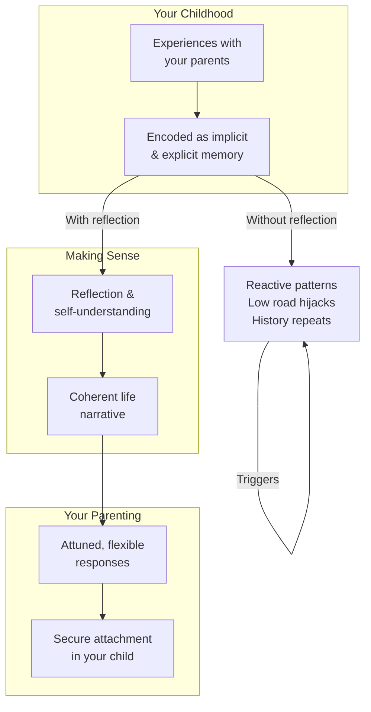
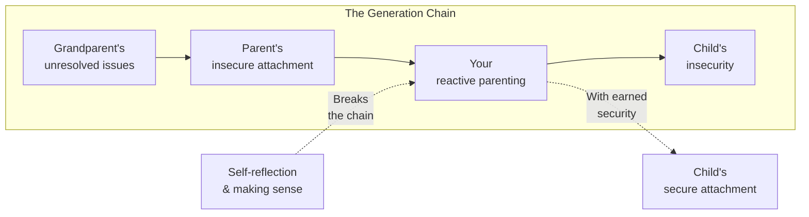
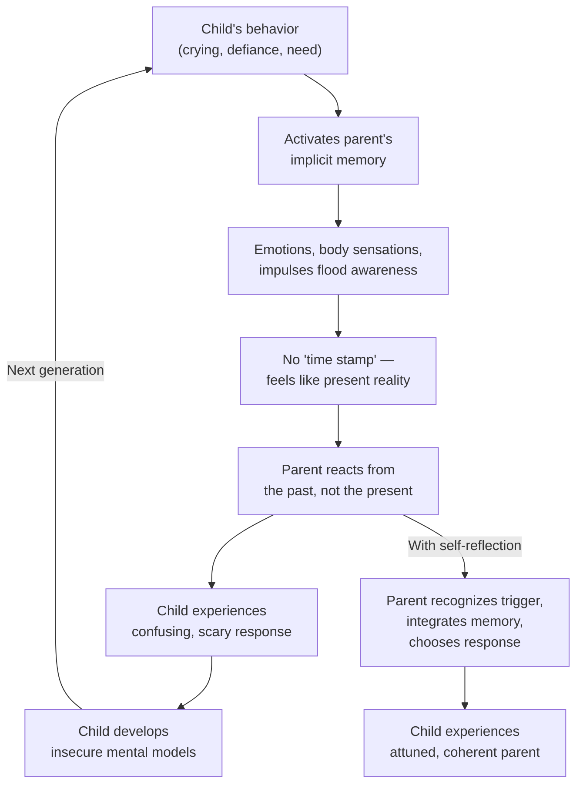
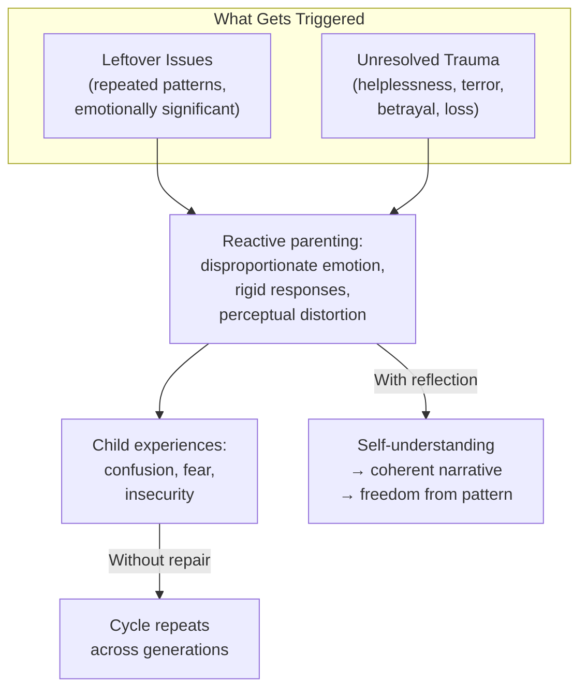
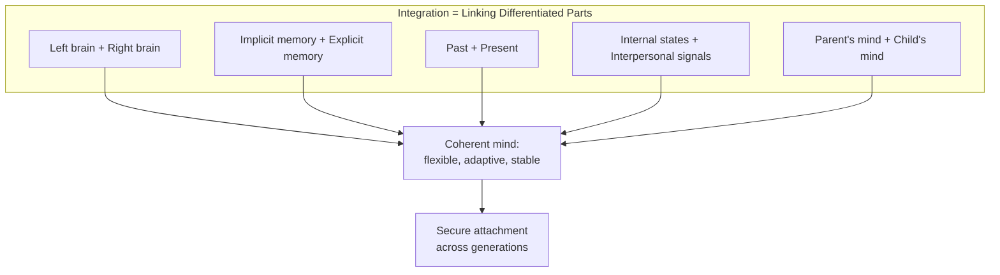
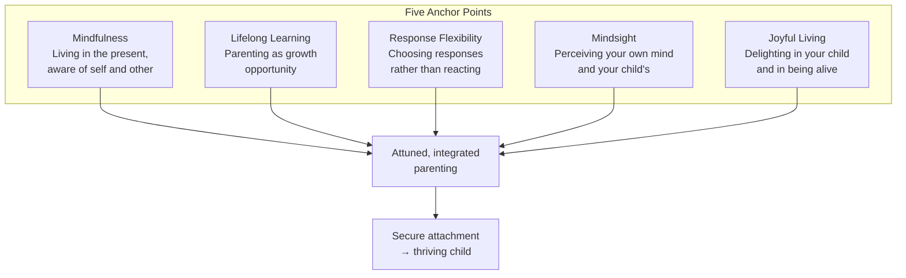

# Parenting from the Inside Out — Daniel J. Siegel & Mary Hartzell

> What if the most important thing you can do for your child has nothing to do with your child — and everything to do with you? Daniel Siegel, the psychiatrist who gave us interpersonal neurobiology, teams up with early childhood educator Mary Hartzell to deliver the most counterintuitive parenting book you'll ever read: the one that says stop trying to fix your kid and start trying to understand yourself. Research shows that the single strongest predictor of a child's security of attachment is not any parenting technique — it's how well the parent has made sense of their own childhood. Not whether the childhood was good or bad. How well it has been *understood*. This book shows you how to do that understanding — and why it changes everything.

---

## About the Author

Daniel J. Siegel is a clinical professor of psychiatry at the UCLA School of Medicine and founding co-director of the Mindful Awareness Research Center. He developed the field of interpersonal neurobiology, which examines how relationships and the brain interact to shape the mind. His book *The Developing Mind* laid the scientific groundwork; this book translates it into a guide for parents.

Mary Hartzell directed a nursery school for over thirty years and developed parent education courses that emphasized self-reflection. She and Siegel met when his daughter attended her school. They discovered their approaches were deeply parallel: Siegel brought the neuroscience, Hartzell brought the classroom wisdom. Together they created an integrated seminar that became this book.

This is Siegel's most personal work. Where *The Whole-Brain Child* gives strategies for managing children's brains, and *No-Drama Discipline* offers connect-and-redirect techniques, *Parenting from the Inside Out* asks: what's happening in *your* brain when your child triggers you? And what can you do about it?

---

## The Big Idea

- <b style="color: #2980b9">How you make sense of your childhood is the strongest predictor of your child's attachment security</b> — not what happened to you, but how well you've processed and integrated those experiences into a coherent life story
- <b style="color: #e74c3c">Without self-understanding, history repeats itself</b> — unprocessed childhood experiences create "leftover issues" and "unresolved trauma" that get triggered in the parent-child relationship, producing reactions that have nothing to do with the child
- <b style="color: #27ae60">You are not destined to repeat your parents' patterns</b> — research on "earned security" shows that adults who had difficult childhoods but have come to make sense of those experiences can raise securely attached children just as effectively as those who had ideal childhoods
- The brain has two memory systems: implicit (emotions, body sensations, mental models — present from birth, no sense of recall) and explicit (facts and autobiographical events — develops after age 1-2). Unprocessed implicit memories drive reactive parenting without our awareness
- The "low road" (amygdala hijack) shuts off the prefrontal cortex, making flexible response impossible; the "high road" keeps integration intact. Self-understanding builds resilience against low-road takeovers
- Five anchor points for parenting: mindfulness, lifelong learning, response flexibility, mindsight, and joyful living

---

## Key Concepts at a Glance

| Concept | One-line summary |
|---------|-----------------|
| **Implicit memory** | Emotions, body sensations, mental models — encoded without awareness, recalled without knowing it's memory |
| **Explicit memory** | Facts and autobiographical events — requires conscious attention, includes sense of recall |
| **Leftover issues** | Patterns from repeated childhood experiences that create reactive triggers in parenting |
| **Unresolved trauma** | Extreme experiences involving helplessness/terror that remain unintegrated and flood the present |
| **Coherent life narrative** | A story of your life that integrates past and present, emotion and fact — the hallmark of earned security |
| **Adult Attachment Interview** | Research tool that predicts child attachment by assessing how coherently adults tell their life story |
| **Earned security** | Adults who had difficult childhoods but made sense of them — their children are just as securely attached |
| **High road / Low road** | Prefrontal integration (flexible response) vs. amygdala hijack (reactive, rigid, flooded) |
| **Contingent communication** | Responsive, reciprocal interaction where you perceive and respond to the child's actual signals |
| **Mindsight** | The ability to perceive your own mind and the minds of others — the foundation of empathy |
| **Rupture and repair** | Disconnections are inevitable; repair is what teaches children that relationships survive conflict |
| **ABC's of Attachment** | Attunement (aligning states), Balance (regulating physiology), Coherence (organized mind) |

---

Earned security parents match continuous security parents across nearly all competencies — the key finding is that the gap is small and closable through self-reflection.

---

## 30-Second Version

The strongest predictor of your child's security of attachment is not your parenting technique — it's how well you've made sense of your own childhood. Unprocessed experiences create implicit memories that hijack your parenting: you react with rage, withdrawal, or anxiety that has nothing to do with your child and everything to do with your past. The solution isn't better discipline strategies — it's self-understanding. By reflecting on your own childhood, identifying your triggers, and integrating your life story into a coherent narrative, you free yourself from reactive patterns and become capable of the attuned, flexible, joyful parenting your child needs. You don't need a perfect childhood. You need to have made sense of the one you had. Research on "earned security" proves this conclusively: parents who had terrible childhoods but processed them can raise children who are just as securely attached as any other. The chain of intergenerational pain can be broken. It starts with you. It starts with one honest look inward.

---

## How We Remember: Implicit and Explicit Memory

*The first and most foundational chapter explains why your past controls your present — even when you don't remember it.*

### Two Memory Systems

The brain has two fundamentally different ways of recording experience. Understanding the difference is the key to understanding why you sometimes react to your child in ways that mystify you.

**Implicit memory** is present from birth. It encodes emotions, body sensations, behavioral responses, perceptions, and mental models. Its defining feature: when implicit memory is retrieved, *there is no internal sensation that something is being recalled*. You experience the emotion or sensation as part of your present reality, not as something from the past. You can encode implicit memory without conscious attention — you don't even need to know it's happening.

**Explicit memory** develops after the first birthday. It comes in two forms: semantic (factual) memory and autobiographical memory (which includes a sense of self and time). Explicit memory requires conscious attention to encode and includes a sense of recollection when retrieved.

| | Implicit Memory | Explicit Memory |
|---|----------------|----------------|
| **Present from** | Birth | ~12-18 months |
| **Sense of recall?** | No — feels like present reality | Yes — feels like remembering |
| **Requires attention?** | No | Yes |
| **Includes** | Emotions, body sensations, mental models, perceptions | Facts, autobiographical events |
| **Brain structure** | Amygdala, various circuits | Hippocampus, prefrontal cortex |
| **When triggered** | You feel it *now* without knowing it's from *then* | You know you're remembering something |

> [!danger] Why This Matters for Parenting
> When your toddler's screaming triggers a flood of panic, rage, or the urge to flee — and the intensity of your reaction seems wildly disproportionate to the situation — you are likely experiencing implicit memory. Your brain is reactivating emotional patterns from your own childhood. But because implicit memory carries no "time stamp," you don't recognize it as memory. You experience it as a reasonable response to what's happening right now. This is how history repeats itself without our knowledge or consent.

### Mental Models

One crucial form of implicit memory is the mental model — generalizations the brain creates from repeated experiences. If a baby is consistently comforted when distressed, she develops a mental model: "When I'm upset, someone will help me. The world is safe." If she is consistently ignored, the model is different: "When I'm upset, no one comes. I'm on my own."

These models become the lens through which we see all subsequent relationships. They operate without our awareness. A parent who was ignored as a child may unconsciously ignore her own child's distress — not because she doesn't care, but because her mental model says distress isn't something that gets responded to.

### Childhood Amnesia

Before approximately age two, the hippocampus — the brain structure needed for autobiographical memory — isn't sufficiently developed. This means none of us can consciously remember our earliest experiences. But this doesn't mean those experiences didn't shape us. Implicit memory is fully active from birth. The emotional tone of your first two years — whether you were held, responded to, left alone — is encoded in your body and your mental models, even though you have no autobiographical record of it.

This creates a profound parenting paradox: the most formative period of your life is the one you can't consciously remember. The patterns it established are invisible to you — but they run your life.

> [!tip] The Prefrontal Cortex: Integration Central
> The prefrontal cortex — located at the very front of the brain — is the master integrator. It links implicit and explicit memory, connects left hemisphere (logic, language) with right hemisphere (emotion, body sensation, imagery), and enables self-awareness, response flexibility, and mindsight. It's profoundly shaped by attachment relationships and continues to develop throughout life. This is why change remains possible at any age.

### How Unprocessed Memory Creates Reactive Parenting

The mechanism is straightforward once you understand it:

1. Your child does something (screams, defies, cries)
2. The behavior activates an implicit memory from your childhood
3. Emotions, body sensations, and behavioral impulses flood your awareness
4. Because implicit memory carries no "time stamp," you experience these as appropriate responses to the present
5. You react — often with disproportionate intensity — from a place that has nothing to do with your child
6. Your child experiences a parent whose reactions don't match the situation — creating confusion, fear, or insecurity
7. Without reflection, the pattern repeats

The shoe-shopping story illustrates a mild version. Dan's "Stop the Crying" story illustrates a more intense version. But the mechanism is identical: implicit memory from the past floods the present, and without the context of conscious recall, the parent mistakes it for a reasonable response to the child.

### The Generation Chain

This is how patterns pass across generations. A parent with unresolved attachment issues creates insecure attachment in their child. That child grows up, becomes a parent, and — unless they've done the work of making sense of their own experience — recreates the same dynamics with their own children. The chain continues until someone breaks it through self-reflection.

> [!warning] The Chain Can Go Both Directions
> Positive attachment also transmits across generations. Parents who received secure attachment, or who achieved earned security through self-understanding, create the conditions for secure attachment in their children, who then grow up equipped to do the same. Each generation that achieves security strengthens the chain for the next. Breaking a cycle of insecure attachment is not just a personal achievement — it's a gift to every generation that follows.

### The Divorced Mother's Projection

A recently divorced mother whose husband left abruptly became furious with her three-year-old son's demands for her time. Still unable to deal with her own loneliness and abandonment, she found his "demanding behaviors" — which were really just normal bids for connection — threatening. She projected her discomfort with her own neediness onto him. She felt rejected and alone, feelings not dissimilar to experiences in her own childhood. She was unable to be receptive to her own child's healthy desire to be close to her.

As she processed the pain of her divorce and integrated it into her understanding of her own childhood patterns, she stopped becoming unreasonably angry. She realized her unresolved issues had been impairing her ability to respond warmly to her son's perfectly normal needs.

This story illustrates a crucial principle: *awareness creates the possibility of choice*. When we are able to choose our responses, we're not being controlled by emotional reactions that are driven more by our own internal state than by what our child is actually doing.

---

## Leftover Issues and Unresolved Trauma

*Siegel distinguishes between two levels of unprocessed past experience, both of which hijack parenting.*

### Leftover Issues

These are patterns from repeated childhood experiences that create reactive triggers. They're not necessarily traumatic — they can come from ordinary but emotionally significant experiences that were never processed.

> [!example] Shopping for Shoes
> Mary dreaded buying shoes for her sons. Every trip became an ordeal of indecision, anxiety, and conflict. Her six-year-old finally asked: "Didn't you like to get new shoes as a kid?" The question unlocked the memory: she was one of nine children, shoe shopping was chaotic and frustrating, her perfectly average-sized feet meant slim pickings at sales, her sister with "special" narrow feet always got what she wanted, and their mother's anxiety about money made every trip miserable. Mary wasn't reacting to her sons — she was reliving her own childhood shoe-shopping trauma, thirty years later, without knowing it.

### Unresolved Trauma

More extreme than leftover issues. These involve experiences of helplessness, terror, betrayal, or profound loss that remain unintegrated. They can produce flashbacks, dissociation, and sudden shifts in state of mind.

> [!example] Stop the Crying
> Dan experienced inexplicable panic when his infant son cried inconsolably. One day, a flashback hit: he was back in the pediatrics treatment room of UCLA Medical Center during his internship, holding down screaming, terrified children while drawing their blood. He and his partner had to suppress their empathy to survive the year — shutting off their ears, hardening their hearts, looking away from the children's faces. The trauma was never processed. When his own baby cried inconsolably, the implicit memory flooded back — panic, helplessness, the urge to flee — without any sense that it was a memory. It felt like the present.

---

## How We Construct Reality: The Life Narrative

*The second chapter reveals the most surprising finding in attachment research: it's not what happened to you that predicts your child's attachment — it's how you tell the story.*

### The Adult Attachment Interview

Mary Main and colleagues at UC Berkeley developed the Adult Attachment Interview (AAI) — a set of about twenty questions about your childhood. The interview is recorded, transcribed, and analyzed. The key finding: the *coherence* of the narrative — how the story is told, not the content — predicts the child's attachment with approximately 85% accuracy. Even when given to expectant parents before the baby is born, the AAI predicts the yet-to-be-born child's attachment at one year.

### Four Adult Attachment States

The AAI reveals four states of mind with respect to attachment. Each produces a distinctive narrative style and predicts a specific pattern in the child.

| Adult State | Narrative Style | Child's Attachment |
|------------|----------------|-------------------|
| **Secure/Autonomous** | Coherent, integrated, reflective; values relationships; connects past to present | Secure |
| **Dismissing** | Minimal detail; insists on lack of recall; minimizes importance of relationships; "It was fine" | Avoidant |
| **Preoccupied** | Flooded by past; intrusions of leftover issues; can't stay on topic; still enmeshed | Anxious/Ambivalent |
| **Unresolved** | Disoriented when discussing trauma/loss; sudden shifts; lapses in reasoning | Disorganized |

Each adult attachment state produces a distinctive narrative style that predicts the child's attachment pattern with approximately 85% accuracy — the most robust finding in developmental psychology.

> [!example] The Secure Narrative
> "My mother and father were very caring, but my father had a problem with manic-depressive illness. It really made growing up unpredictable for my sisters and me. It helped that my mother knew how scared I was of my father's moods. She was very tuned in to me. It was very frightening, although at the time I thought being scared was normal. But in thinking about it now I realize how much my father's unpredictability shaped so much of my life as a child, and even into my twenties. I really had to work on myself so I could be a better parent. I'm not so reactive and my son and I get along great."
>
> This is coherent: specific memories, emotional honesty, connection between past and present, recognition of both difficulty and growth. This mother had a hard childhood but has *made sense of it*.

> [!example] The Dismissing Narrative
> "My own mother and father lived at home and created the kind of house that is a good one for a child to grow in. We went to many activities and I was given all of the experiences any child would expect from a good home. For discipline we were taught right from wrong and given the right direction for how to succeed in life. I don't remember exactly how they did this, but I do know it was a good childhood overall. That's about it."
>
> Logically consistent but not coherent. No autobiographical richness, no emotional specificity, no sense of a self living through time. The insistence on lack of recall isn't a memory problem — research shows these individuals have normal intelligence and can remember other aspects of their childhoods (TV shows, sports events). The emotional desert of their family life simply didn't produce the arousal needed to encode rich autobiographical memories.

> [!example] The Preoccupied Narrative
> "My childhood growing up? It was something else! We were very close, not too close, but close enough. Sometimes they'd get pretty rough — even this weekend, I guess it was Mother's Day, and she thought we were too hard on our kids. I mean, she said I was too rough on my son. But she never said that about my two brothers when we were kids. No. It's always me. But I don't care. Or it could. But I wouldn't let it happen. Should I?"
>
> Past and present bleed together. This father can't maintain the boundary between then and now. His leftover issues intrude into every conversation, making coherent reflection impossible.

> [!example] The Unresolved Narrative
> "I don't think I ever really felt threatened as a kid. I mean, not that it wasn't scary. But it was. My father would come home drunk sometimes, but my mother was the real kicker. She had this way of trying to get you to trust her, but... her face would change suddenly and you never knew who to trust. I mean, she looks so strange, kind of furious and frightened in one package, all contorted and her eyes so piercing."
>
> Notice the shift from past tense ("would come home") to present tense ("she looks so strange") — a lapse in monitoring that reveals unresolved processing. The speaker is momentarily *back there*, not here describing what happened.

### Why Coherence Matters More Than Content

This is the book's most revolutionary insight. The AAI doesn't measure whether your childhood was good or bad. It measures whether your mind has *integrated* those experiences — linking emotion with narrative, implicit with explicit, past with present — into a coherent whole. A person who suffered tremendous adversity but has achieved coherence will raise a securely attached child. A person who had a "fine" childhood but has never reflected on it may raise an insecurely attached one.

Mary Ainsworth herself assessed AAI transcripts and found that reporting trauma or loss, by itself, did not predict negative outcomes for the child. It was the finding of *disorientation and disorganization* while discussing trauma or loss — the "Unresolved" classification — that predicted disorganized attachment. The important thing is not what happened. It's how the person has come to process those events.

### What Makes a Narrative Coherent?

Coherence isn't about having a polished, eloquent story. It's about the narrative having certain qualities that reflect an integrated mind:

| Quality | What it looks like | What its absence looks like |
|---------|-------------------|---------------------------|
| **Freshness** | Memories feel alive, specific, embodied | Generic, rehearsed, or "I don't remember" |
| **Emotional balance** | Acknowledges both positive and negative | All good ("perfect childhood") or all bad ("it was terrible") |
| **Reflexivity** | Connects past experiences to present patterns | No sense of how past influences present |
| **Perspective** | Can see parents as people with their own histories | Idealizes or demonizes parents |
| **Integration** | Past tense stays in the past; present stays present | Past intrudes into present; tenses shift mid-sentence |
| **Specificity** | Particular memories illustrate general claims | General statements without supporting evidence |
| **Acknowledgment** | Admits uncertainty, complexity, mixed feelings | Everything is black-and-white |

You can practice this. Write about a childhood memory. Read it back. Does it have these qualities? Where does it falter? The places where coherence breaks down are the places where unprocessed material lives — and the places where your parenting is most likely to be hijacked.

### The Earned Security Research: Hope in Data

The "earned security" finding is worth dwelling on because it is the most hopeful finding in all of developmental psychology.

In early studies, researchers identified adults whose AAI narratives were coherent (predicting secure attachment in their children) but whose described childhood experiences were negative — neglect, harshness, emotional unavailability. These adults had "earned" their security. Their children were securely attached to them.

Alan Sroufe's longitudinal study followed children from infancy to age 19, adding a crucial finding: some individuals who were *observed* as insecurely attached in infancy had developed coherent AAI narratives by young adulthood. They had moved from insecurity to security. The mechanism appears to be supportive relationships — with friends, teachers, therapists, romantic partners — that helped them process and integrate difficult early experiences.

The practical implication: if you had a difficult childhood, you are not doomed to repeat it. If you have already repeated some patterns you wish you hadn't, you can change. The brain's integrative circuits — particularly the prefrontal cortex — continue to develop throughout life. Every moment of self-reflection, every honest conversation with a trusted person, every journal entry that connects past to present is literally building new neural pathways.

> [!success] The Most Important Sentence in the Book
> "Even those of us who had quite difficult childhoods often have had some positive relationships during those years that can offer a seed of strength to help us overcome early adversity." Find that seed. Water it. Build from it. Your child's security depends not on whether you had it easy, but on whether you've done the work of understanding.

> [!tip] Earned Security: The Most Hopeful Finding in All of Attachment Research
> Adults who had genuinely difficult childhoods — neglect, inconsistency, even trauma — can develop a "secure/autonomous" narrative if they have done the work of making sense of those experiences. Their children are just as securely attached as children of parents who had ideal childhoods. The key isn't what happened to you. It's what you've done with what happened to you.

---

## How We Feel: Emotion and Connection

*Emotion is not just something we feel — it's the fundamental process by which we connect with our children.*

### Primary Emotion: The Music of the Mind

Siegel distinguishes between categorical emotions (sadness, anger, fear, joy — the ones we can name) and primary emotions (the deeper surges of energy that say "Pay attention!" and "Good or bad?"). Primary emotions are communicated through nonverbal signals: facial expression, tone of voice, gestures, posture, timing, intensity.

These primary emotions are always present — they are the continuous "music of the mind." Categorical emotions (the ones we can label) are just the occasional loud notes. If we only pay attention to categorical emotions — waiting until someone is visibly angry or crying — we miss the vast majority of emotional communication that creates connection.

Connecting at the level of primary emotion is how we "feel felt" by another person. When parent and child are attuned at this level, both experience a sense of joining — a resonance that may be mediated by mirror neurons. This joining isn't just pleasant — it's biologically necessary. It regulates the child's nervous system, supports brain development, and creates the internal sense of security that is the foundation of healthy attachment.

> [!tip] Why Children Say "Good" or "Bad"
> When you ask a child how she feels and she says "Good" or "Bad" or "Okay," adults often push for more specific language. But Siegel points out that these simple words are actually direct expressions of primary emotional processes — the brain's initial assessment of whether something is approach-worthy or withdrawal-worthy. Accepting these responses as valid, rather than dismissing them as insufficiently articulate, honors the child's primary emotional experience.

> [!example] The Sycamore Tree
> Four-and-a-half-year-old Sara, cautious and physically tentative, finally walked across a fallen log in the playground. A student teacher exploded: "Yea! Hooray! You're terrific! You're the greatest!" Sara managed a faint smile, stood rigidly — and avoided the log for weeks. The teacher's response reflected *her own* excitement, not Sara's experience. An attuned response would have been: "Sara, I watched you carefully put one foot in front of the other and you walked all the way across. You did it! It was a little scary, but you kept going." This reflects the child's internal experience back to her, allowing her to own the accomplishment rather than performing for the adult's enthusiasm.

> [!example] Connecting Under Water
> A father who "felt nothing" his entire life discovered emotional connection with his daughter while snorkeling. Freed from words — communicating only through gestures and eye contact through their masks — they experienced a profound sense of joining. "I'll bet it had to do with our nonverbal communication," he realized. "So often I am thinking about what to say that I totally lose track of what is really happening." His left-brain dominance had blocked the right-brain processes where connection lives.

### The Beetle Jar Moment

Your child runs in from the yard, excited about colorful beetles in a jar. You see bugs loose in the house and snap: "Get those creepy things out of here!" The child's joy and discovery are missed. An attuned response: get down on his level, look at what he's showing you, share his curiosity. "Wow, they're colorful little beetles! Where did you find them? I think they'll be happiest living outside." You can still set the boundary — bugs stay outside — while honoring the child's emotional experience.

The key insight: attune first, redirect second. This sequence is not just a technique — it's the fundamental architecture of contingent communication. The child needs to feel *felt* before he can accept a limit. When we skip the attunement step and go straight to the redirect ("Get those out of here!"), the child doesn't just lose the bugs. He loses the sense that his inner world matters.

### Mirror Neurons and Empathy

Siegel introduces the neuroscience of mirror neurons — brain cells that fire both when we perform an action and when we observe someone else performing it. These neurons don't just mirror physical actions; they mirror *intentions*. When we perceive another person's emotions, our mirror neuron system creates a corresponding state inside us. This is the neural basis of empathy.

For parenting, the implication is profound: when your child sees your enraged face during a low-road episode, their mirror neuron system creates a corresponding state of rage and terror inside them. They don't just *see* your anger — they *feel* it in their own nervous system. This is how a parent's unresolved trauma becomes wired into the child's brain.

> [!success] The Positive Side
> Mirror neurons also explain why attuned parenting is so powerful. When you are calm, present, and emotionally resonant, your child's mirror neuron system picks up that state and helps regulate their own nervous system. You don't teach calm through words. You transmit it through your face, your tone, your body. Being a regulated parent is the single most effective regulation strategy for your child.

---

## How We Communicate: Contingent Connection

*The foundation of secure attachment is contingent communication — a responsive dance of signals between parent and child.*

Contingent communication means: the signals sent by the child are directly perceived, understood, and responded to by the parent. It's a dance — a reciprocal give-and-take where each partner's response depends on what the other actually communicated, not on a predetermined script.

From the very beginning of life, contingent communication is what builds the brain. When a baby smiles and a parent smiles back, waits, and lets the baby respond again — a dialogue is begun that says: "I see you. I'm listening to you. I'll give back a reflection of yourself that is valued, so you can see and value yourself too."

### The Neural Basis of Connection

Here's the neuroscience: when we send a signal and receive a contingent response, our brain creates an internal representation of "self-as-changed-by-the-other." This representation becomes a central aspect of our identity. With repeated contingent interactions, we develop an internal sense of coherence — a grounded, empowered feeling of being connected to a social world. Without contingent communication, the self lacks this grounding. The child feels invisible, unreal, disconnected.

### The Mattress Store Terror

A father went to a baby furniture store with his three-and-a-half-year-old son. He carried a mattress to the car, thinking his son was beside him. But the mattress blocked the boy's view — for about two minutes, the child couldn't see his father and thought he'd been abandoned at the store. The father found him standing with tears rolling down his face.

The father reassured him: "I was right here the whole time." When they got home, the boy told his mother how his father had "left him alone at the store." She carefully retold the story from the child's perspective, checking in with both of them. Late that afternoon, the boy looked up and asked: "Did Daddy really leave me alone at the store?"

Two minutes of perceived abandonment created an emotional experience so intense the child was still processing it hours later. This illustrates a crucial Siegel principle: what seems trivial to adults can be profoundly significant to a child. And the remedy — retelling the story, honoring the child's feelings, leaving the door open for future questions — is exactly the process of integration that prevents leftover issues from forming.

> [!warning] The Returning-Home Trap
> A mother comes home from work. Her 22-month-old runs to greet her. She gives a quick, distracted hug and heads to the bedroom to change. The child follows, crying, demanding to be picked up. She tries to put him off. He lies on the floor kicking the wall. She gets stern: "I'm not going to play with you unless you stop that!" He swings at her. Now she withholds positive attention because he's "not behaving well."
>
> His original signal was simple: *I need to reconnect with you after a long day apart*. If she had sat on the couch for five minutes to talk and cuddle before changing clothes, the entire evening would have unfolded differently.

### The Seven Practices of Integrative Communication

| Practice | What it means |
|----------|--------------|
| **Awareness** | Be mindful of your own feelings and others' nonverbal signals |
| **Attunement** | Allow your state of mind to align with your child's |
| **Empathy** | Open your mind to sense their experience and point of view |
| **Expression** | Communicate your internal responses with respect |
| **Joining** | Share openly in the give-and-take, verbally and nonverbally |
| **Clarification** | Help make sense of the experience together |
| **Sovereignty** | Respect the dignity and separateness of each person's mind |

---

## How We Attach: The ABC's

*Attachment research provides the scientific foundation for everything in this book.*

### Attunement, Balance, Coherence

- **Attunement**: aligning your internal state with your child's through nonverbal resonance — eye contact, facial expression, tone of voice, timing
- **Balance**: the regulation your physical presence and attuned communication provide to your child's immature brain — regulating sleep-wake cycles, stress responses, heart rate, digestion
- **Coherence**: the outcome — an adaptive, stable, flexible mind that can respond to a changing world

When these three are present, children develop secure attachment. When they're disrupted — by parental unavailability, inconsistency, or frightening behavior — insecure attachment develops.

> [!danger] Disorganized Attachment: Fright Without Solution
> The most concerning attachment pattern occurs when the parent — the person the child must turn to for safety — is also the source of fear. The child faces an impossible paradox: approach the source of comfort or flee the source of danger? Main and Hesse call this "fright without solution." The child's behavior becomes chaotic and disoriented during reunion with the parent. Long-term studies show these children have the most difficulty with emotional regulation and social relationships.
>
> Critically, the parent doesn't need to be abusive to create this pattern. Sudden, unpredictable shifts in state of mind — spacing out when the child is distressed, becoming suddenly enraged over a minor infraction, showing a frightened face for no apparent reason — are sufficient. These behaviors typically stem from the parent's own unresolved trauma, which produces the abrupt internal shifts that terrify the child.

### The Research Foundation

The attachment research lineage is remarkable in its depth:

- **John Bowlby** (1907-1990) proposed that actual experiences with parents create an internal "secure base." His ideas transformed institutional care: children went from rotating caregivers to having assigned primary caregivers, and went from dying to thriving
- **Mary Ainsworth** (1913-1999) developed the infant-strange-situation test — the gold standard for measuring infant attachment. In this lab procedure, a one-year-old is briefly separated from the parent, left with a stranger, then reunited. The critical data comes from the reunion: how does the baby behave when the parent returns?
- **Alan Sroufe** followed children from infancy to young adulthood, finding that attachment patterns predict leadership ability, peer relationships, and emotional regulation decades later
- **Mary Main** defined the disorganized category and created the Adult Attachment Interview, discovering that *how adults tell their life story* predicts their child's attachment

### The Infant Strange Situation: What Each Pattern Looks Like

| Attachment | Reunion Behavior | What It Means |
|-----------|-----------------|---------------|
| **Secure** | May be upset during separation; seeks proximity at reunion; quickly soothed; returns to play | "I trust you to help me when I'm distressed" |
| **Avoidant** | Appears unbothered by separation; ignores parent at reunion; continues playing | "I've learned not to expect help, so I won't ask" (but physiological measures show they *do* notice) |
| **Anxious/Ambivalent** | Very distressed during separation; seeks proximity at reunion but isn't easily soothed; clings, doesn't return to play | "I'm not sure you'll be there for me, so I can't let go" |
| **Disorganized** | Chaotic, contradictory behavior at reunion — approaching then freezing, rocking, falling prone | "You are both my source of comfort and my source of fear — I have no strategy" |

Roughly two-thirds of infants in non-clinical samples develop secure attachment, while disorganized attachment — the most concerning pattern — remains relatively rare outside high-risk populations.

The avoidant pattern deserves special attention because it looks like independence. The baby appears fine — unbothered, self-sufficient. But physiological measures (cortisol levels, heart rate) reveal the truth: the baby's stress system is fully activated. The baby has simply learned to *hide* distress because expressing it brings no comfort — or worse, brings rejection. This is not resilience. It's a coping strategy born from emotional deprivation.

### Ainsworth's Core Finding

The key variable that predicted infant attachment was *sensitivity*: the parent's ability to perceive, accurately interpret, and respond promptly and appropriately to the child's signals. Parents who were sensitive had securely attached babies. Parents who were rejecting had avoidantly attached babies. Parents who were inconsistently available had ambivalently attached babies. Parents who were frightening or disoriented had babies with disorganized attachment.

The cumulative finding: when relationships remain stable, infant attachment strongly predicts adult attachment. But when relationships change — through new supportive connections, therapy, or self-reflection — attachment can change too. Security can be earned.

---

## The High Road and the Low Road

*This chapter gives parents a practical framework for understanding their own emotional hijacks.*

### What Happens on the Low Road

When stress triggers unresolved issues, the amygdala floods the prefrontal cortex, shutting off the brain's capacity for flexible, reflective response. You lose access to mindsight, empathy, and rational thought. You're on the low road.

The low road has four elements:

1. **Trigger** — an internal or external event activates an unresolved issue
2. **Transition** — the feeling of being on the edge, about to lose it
3. **Immersion** — you're on the low road; reflection is suspended; intense emotions dominate
4. **Recovery** — reactivating the high road; high vulnerability to reentering the low road

> [!example] Stuck on the Low Road
> A father in Dan's practice experienced "crazy" fits of rage when his daughter didn't comply with his requests. He would feel a trembling in his arms, pressure in his head, then enter a dissociated state where he would squeeze her arm or hit her. He felt ashamed and couldn't understand why he did this to a child he loved. In therapy, the story emerged: as a child, he was repeatedly chased and beaten by his alcoholic father. His depressed mother couldn't protect him. When his daughter's normal childhood irritation triggered his implicit memory of an angry face, the cascade began — and he was back in childhood terror, lashing out from a place of helpless rage.

> [!tip] The Hand Model of the Brain
> Make a fist with your thumb tucked inside your fingers. Your wrist is the brainstem. Your thumb is the limbic system (amygdala). Your folded fingers are the prefrontal cortex. When you "flip your lid" — extend your fingers up — the prefrontal cortex loses contact with the limbic system. You've left the high road. This is Siegel's famous model, used in therapy, classrooms, and parenting workshops worldwide.

### Getting Back to the High Road

When you recognize you're on the low road:
- Remove yourself from interaction with your child
- Move your body — stretch, walk, change position
- Watch your breathing
- Use self-talk: "I am on the low road and these feelings are not dependable"
- Once calm, observe your internal sensations
- Reflect on what triggered the cascade
- Repair the disconnection with your child

Siegel emphasizes that the first step toward change is *recognition*. Even being able to observe yourself on the low road — "I can see I'm flooding, even though I can't stop it yet" — is a crucial beginning. With practice, the moment of recognition comes earlier: during transition rather than immersion, and eventually at the trigger itself, before the cascade begins.

### The Shame Trap

Many parents feel so ashamed of their low-road episodes that they can't reflect on them. The shame itself becomes a barrier to the very self-understanding that could prevent future episodes. Siegel addresses this directly: knowing about the brain can transform self-judgment into self-acceptance. "I didn't choose to flip my lid. My amygdala hijacked my prefrontal cortex because an unresolved implicit memory was activated. That's not a character flaw — it's a brain process. And brain processes can change."

This reframing — from "I'm a terrible parent" to "My brain was doing something I can learn to recognize and manage" — is one of the book's most therapeutic contributions.

### The Park Story: A Low-Road Episode in Detail

A mother is playing happily with her 3½-year-old at the park. She tells him it's time to go, but then runs into a friend and starts chatting. The boy keeps playing — climbing, sliding, exploring. Eventually she looks at her watch, realizes she's late, and explodes: "Come down this INSTANT!" She's furious. He hides in a tunnel. She yanks his arm, hurting him. He cries. She yells about him being a "bad boy." He pushes her away. She yells more — now about hitting.

What happened? Her anger wasn't about his behavior (normal for 3½). It was about *her* issue — perhaps an inability to set boundaries that was triggered by the realization she was late. Her child became the target of a cascade that had nothing to do with him.

If she could have recognized the transition — the moment she noticed herself becoming disproportionately angry — she might have taken a breath, acknowledged to herself that the anger was about her own pattern, and responded to her son with the calm firmness of the high road: "Time to go, buddy. I know you're having fun. Let's race to the car."

---

## Rupture and Repair

*The most reassuring chapter in the book: you don't have to be perfect. You have to be willing to repair.*

Disconnections between parent and child are inevitable. You will lose your temper. You will miss signals. You will react from the low road. The question isn't whether ruptures will happen — it's whether repair follows.

Repair teaches children something profoundly important: relationships can survive conflict. They can be broken and mended. This is more valuable than never having a rupture at all, because it builds resilience and trust in the durability of love.

### The Paradox of Repair

Repair isn't just about fixing what went wrong. It's about modeling something children desperately need to see: that adults can acknowledge mistakes, take responsibility, and reconnect. Children who experience consistent repair learn that anger doesn't destroy love, that conflict is survivable, and that relationships are stronger for having been tested.

Children who *don't* experience repair learn something very different: that anger means abandonment, that conflict means the end, and that the safest strategy is to avoid rocking the boat.

> [!success] How to Repair
> 1. **Acknowledge what happened** — "I yelled at you and that wasn't okay"
> 2. **Take responsibility** — "That was about my feelings, not about you"
> 3. **Reconnect emotionally** — physical comfort, eye contact, warm tone
> 4. **Explain (age-appropriately)** — "Sometimes grown-ups get overwhelmed too"
> 5. **Reassure** — "I love you no matter what. Even when I'm upset, that doesn't change"

Repair is not just for the child's benefit. Each repair is an act of integration — linking the low-road experience with high-road reflection, weaving the rupture into a coherent narrative. Over time, this process builds the parent's own earned security.

---

## Pathways Toward Growth

*Siegel offers specific guidance for each insecure attachment style, framing change as a matter of neural integration.*

### For Those with a Dismissing Pattern

The adaptation that served you in an emotional desert — minimizing the importance of relationships, living primarily in left-brain logic — now prevents you from connecting with your child's emotional world. Growth means activating the underdeveloped right hemisphere: paying attention to body sensations, nonverbal signals, imagery, and autobiographical memory. Journaling is particularly helpful because self-reflective writing inherently requires collaboration between the hemispheres.

### For Those with a Preoccupied Pattern

The adaptation that served you with inconsistent parents — hypervigilance about relationships, anxiety about whether others are dependable — now floods your parenting with the urgency and confusion of old attachment wounds. Growth means learning to self-soothe through relaxation techniques and self-talk: "I feel this uncertainty now, but I am doing the best I can." Realizing that "I am lovable" can replace the implicit belief "I am unlovable" — a child's conclusion arising from noncontingent connections with parents.

### For Those with Unresolved Trauma

The disorganization that overwhelms your system during stress isn't a character flaw — it's the legacy of experiences that were too overwhelming to integrate at the time. Growth requires facing what feels unbearable, often with professional support. Resolution involves linking the fragmented elements of implicit memory (emotions, body sensations, images) with explicit narrative, creating a coherent story that places the trauma in the past where it belongs.

The process of healing from unresolved trauma typically involves:

1. **Recognition** — acknowledging that unresolved material exists and is affecting your parenting
2. **Safety** — creating a safe context (a trusted relationship, a therapeutic setting) for the work
3. **Gradual exposure** — allowing fragmented implicit memories to surface without being overwhelmed
4. **Integration** — linking these fragments to explicit narrative: "This happened, it was terrible, and it's in the past"
5. **Coherence** — weaving the trauma into a life story that includes but is not dominated by it
6. **Ongoing practice** — maintaining integration through continued reflection, journaling, and relational support

> [!danger] When to Seek Professional Help
> If thinking about your childhood produces flashbacks, dissociation (feeling unreal or detached), intense emotional flooding that you can't control, or sudden shifts in your state of mind — these are signs of unresolved trauma that may benefit from professional support. Self-reflection is powerful, but some wounds require a trained companion on the healing journey. This is not weakness. It is wisdom.

> [!tip] You Can Parent Yourself from the Inside Out
> The skills your parents couldn't give you — self-soothing, emotional regulation, self-compassion — you can develop now. Finding ways that work to help your right hemisphere learn to self-soothe is the key. You are giving to yourself the tools your parents were not able to offer you as a child. In many ways, this *is* parenting yourself from the inside out.

### Journaling as Integration

Siegel and Hartzell strongly recommend journaling as a path to coherence. Writing about your life inherently requires both hemispheres to collaborate: the right hemisphere generates emotional and sensory memories, the left hemisphere organizes them into words and narrative. The act of writing *is* the act of integration.

You don't need to write eloquently. You don't need to write daily. You just need to write honestly about experiences that carry emotional charge. Over time, the fragmented elements of implicit memory become woven into explicit narrative. The story becomes more coherent. And coherence in your story translates to coherence in your parenting.

Some people prefer to talk rather than write. This works too — as long as the listener is trustworthy and the conversation involves genuine reflection rather than rehearsed performance. The key is moving internal experience into external expression, whatever form that takes.

---

## Mindsight and Reflective Dialogue

*The final chapter introduces Siegel's signature concept — and its application to the parent-child relationship.*

Mindsight is the ability to perceive your own mind and the minds of others. It involves focusing on thoughts, feelings, perceptions, sensations, memories, beliefs, and intentions — the basic elements of mental life.

### Beyond Behavior to the Mind Beneath

Most parents respond to their child's behavior by focusing on the surface level — what the child *did*. Mindsight means looking beneath behavior to see the mind that produced it. When your child hits her brother, the surface-level response is "Don't hit." The mindsight response asks: what was she feeling? What need was she trying to meet? What internal experience produced that external action?

This shift — from behavior management to mind perception — transforms every parenting interaction. Instead of "Stop that!" you ask "What's going on inside you right now?" Instead of "Go to your room!" you say "You seem really frustrated. Can you help me understand?"

Parents who focus on the level of mind rather than behavior nurture the development of emotional understanding and compassion. Talking with children about their thoughts, memories, and feelings provides them with the essential interpersonal experiences necessary for self-understanding and building social skills.

### Nonverbal Communication: The Real Language of Attachment

Siegel emphasizes that words are only a fraction of how we communicate. The nonverbal messages — eye contact, facial expression, tone of voice, gestures, body posture, timing and intensity of response — may reveal our internal processes more directly than our words. Being sensitive to nonverbal communication helps us better understand our children and relate with compassion.

This is why the father in the "Connecting Under Water" story experienced his first deep connection with his daughter while snorkeling — freed from the left-brain dominance of verbal communication, they could finally connect through the right-brain channels where attunement lives.

> [!tip] Reflective Dialogue in Practice
> Instead of: "How was school?" → "Fine."
> Try: "What was the hardest part of today?" or "Was there a moment when someone made you feel good?" or "I noticed you seemed quiet when you got home — what were you thinking about?"
>
> These questions invite children to reflect on their inner experience rather than produce a socially acceptable answer. They communicate: "I'm interested in what's happening inside you, not just what happened around you."

### The Integration of Left and Right

Much of the book can be understood through the lens of hemispheric integration. The left hemisphere processes language, logic, linear thinking, and factual memory. The right hemisphere processes emotion, body sensation, imagery, nonverbal communication, and autobiographical memory.

A dismissing attachment style may reflect left-hemisphere dominance — logical but emotionally disconnected. A preoccupied style may reflect right-hemisphere flooding — emotionally overwhelmed with poor logical coherence. A secure, coherent narrative requires the integration of both — emotion and logic, body and mind, past and present, self and other.

Self-reflective writing is particularly powerful because it inherently requires both hemispheres to collaborate. The right hemisphere generates the emotional and sensory memories; the left hemisphere organizes them into words and narrative. The act of writing integrates what was previously fragmented.

---

## The Central Message

Siegel and Hartzell return again and again to a single finding: the Adult Attachment Interview's coherence score — how well an adult has integrated their life story — predicts their child's attachment with approximately 85% accuracy. This finding has been replicated across cultures, age groups, and research teams. It is one of the most robust findings in developmental psychology.

What this means in practice is both humbling and empowering:

- **Humbling**: no parenting technique, no discipline strategy, no enrichment program comes close to the predictive power of the parent's own self-understanding
- **Empowering**: you can change. The brain continues to develop. Earned security is real. Making sense of your life is the single most powerful thing you can do for your child

> [!success] The Promise of This Book
> "Making sense of our lives can free us from the otherwise almost predictable situation in which we recreate the damage to our children that was done to us in our own childhoods." This is not therapy-speak. It's the conclusion of decades of rigorous research across multiple countries and thousands of families. Your past does not have to become your child's future.

---

## Integration: The Master Theme

If you had to reduce this entire book to a single word, it would be *integration*. Integration is the linking of differentiated parts into a functional whole. An integrated mind connects:

- Left hemisphere (logic, language) with right hemisphere (emotion, body, imagery)
- Implicit memory (unconscious patterns) with explicit memory (conscious narrative)
- Past experience with present awareness
- Internal states with interpersonal communication
- The parent's mind with the child's mind

When integration is present, you have coherence — a flexible, adaptive, stable mind. When integration is absent, you have either rigidity (stuck, repetitive patterns) or chaos (flooding, disorganization). All of the problems described in this book — reactive parenting, low-road hijacks, insecure attachment, intergenerational transmission of trauma — are problems of *dis-integration*. And all of the solutions — self-reflection, coherent narrative, attunement, repair — are processes of *integration*.

Memory integration (implicit + explicit) receives the most coverage because it explains the mechanism by which unprocessed childhood experiences hijack parenting in the present.

This is why Siegel titled his field "interpersonal neurobiology" — because the mind is not just a brain process. It emerges from the intersection of neurobiology and interpersonal relationships. Integration happens both within a single brain and between brains in relationship. Parenting is, at its deepest level, the process of one mind helping another mind integrate.

---

## What Integration Looks Like Day to Day

The theoretical framework can feel abstract. Here is what integrated parenting looks like in practice:

**Morning routine:** Your four-year-old refuses to get dressed. An unintegrated response: "We're late! Put your clothes on NOW!" An integrated response: you notice your frustration rising, recognize that the urgency is about your own anxiety about being late (leftover issue from a parent who punished lateness), take a breath, and say: "I can see you're not ready yet. We do need to get going. Would you like to pick your own outfit?"

**Bedtime:** Your child stalls, asks for water, another story, one more hug. An unintegrated response: increasingly harsh demands to stay in bed. An integrated response: you recognize that separation is hard for children (and for you — your own separation anxiety may be activated), provide a calm, connected routine, and acknowledge the difficulty: "I know it's hard to say goodnight. I'll be right in the next room, and I'll see you first thing in the morning."

**Conflict between siblings:** Your children are fighting over a toy. An unintegrated response: yelling, separating them, punishing the aggressor. An integrated response: you get down to their level, acknowledge both children's feelings, help them solve the problem together, and — if you notice yourself becoming disproportionately angry — you ask yourself what about *this* conflict is triggering *your* implicit memories.

**After a low-road moment:** You yelled. You slammed a door. You said something you regret. An unintegrated response: pretend it didn't happen, or justify it ("He deserved it"). An integrated response: wait until you've calmed down, go to your child, acknowledge what happened, take responsibility, reconnect physically, and reassure: "I love you. That was about my frustration, not about you."

> [!success] The Daily Practice of Coherence
> Making sense of your life isn't a one-time event. It's a daily practice — noticing triggers, reflecting on reactions, connecting past to present, repairing ruptures, and gradually building a more coherent narrative. Each moment of reflection strengthens the integrative circuits of the prefrontal cortex. Each repair deepens the attachment relationship. Each time you catch yourself on the low road and choose a different response, you are literally rewiring your brain — and your child's.

---

## Questions for Parental Self-Reflection

Siegel and Hartzell provide a set of questions adapted from the Adult Attachment Interview for personal use. These aren't a clinical tool — they're an invitation to deepen self-understanding:

1. What was it like growing up? Who was in your family?
2. How did you get along with your parents early in childhood? How did the relationship evolve?
3. Did you ever feel rejected or threatened by your parents?
4. How did your parents discipline you? What impact did that have?
5. Do you recall your earliest separations from your parents?
6. Did anyone significant die during your childhood?
7. How did your parents communicate when you were happy? When you were distressed?
8. Was there anyone besides your parents who took care of you?
9. If you had difficult times, were there positive relationships you could depend on?
10. How have your childhood experiences influenced your adult relationships?

> [!warning] The Point of These Questions
> The goal isn't to produce a "correct" answer. It's to notice *how* you tell the story. Do you minimize? ("It was fine, nothing to report.") Do you get flooded? ("Even thinking about it makes me furious.") Do you lose track of past and present? ("She still does that — I mean, she did that when I was seven.") The patterns in your narrative reveal the patterns in your attachment.

---

## The Verdict

This is the parenting book that doesn't look like a parenting book. There are no discipline strategies, no sleep-training methods, no scripts for handling tantrums. Instead, there is something far more powerful: a scientific framework for understanding why you react the way you do — and how to change it.

**Limitations:**
- The neuroscience sections ("Spotlight on Science") are dense and may overwhelm readers who just want practical guidance
- The book is repetitive — the same core ideas (implicit memory, coherent narrative, earned security) are restated in every chapter
- There are fewer concrete "what to do" moments than in Siegel's later books (*The Whole-Brain Child*, *No-Drama Discipline*)
- The self-reflection exercises require genuine vulnerability and may surface painful material — some readers may need professional support
- The book assumes a level of psychological-mindedness that not all readers bring
- The "Spotlight on Science" sections, while fascinating, can feel like reading a textbook — some readers will love them, others will skip

**What it does brilliantly:**
- The "earned security" finding is genuinely life-changing: you are not condemned to repeat your parents' patterns
- Dan's "Stop the Crying" story is one of the most honest and vulnerable passages in any parenting book — a psychiatrist admitting he was traumatized and didn't know it
- The implicit/explicit memory framework makes reactive parenting scientifically understandable rather than shameful
- The attachment narrative examples (secure, dismissing, preoccupied, unresolved) are extraordinarily vivid and immediately recognizable — most readers will see themselves or their parents in one of them
- The low road/high road model gives parents a language for their worst moments that doesn't require self-blame — "My amygdala hijacked my prefrontal cortex" is better than "I'm a terrible parent"
- Mary's shoe-shopping story perfectly illustrates how ordinary leftover issues hijack everyday parenting — proving that you don't need a traumatic childhood to benefit from this book
- The self-reflection questions at the end of the attachment chapter may be the most valuable three pages in any parenting book — they invite the exact kind of reflective processing that builds coherence

### Before and After: Reactive vs. Reflective Parenting

| Situation | Reactive (Low Road) | Reflective (High Road) |
|-----------|-------------------|----------------------|
| Baby won't stop crying | Panic, rage, urge to flee | "This is triggering my implicit memory. My baby needs me to be calm" |
| Toddler defies you | "She's doing this on purpose!" | "She's developing autonomy. What does she need?" |
| Child's emotions overwhelm you | Shut down, withdraw, or explode | "I'm flooding. I need a moment to regulate before I respond" |
| Child reminds you of your parent | Disproportionate anger or fear | "This feeling belongs to my past, not to my child" |
| Bedtime battles | Escalating threats and yelling | "Separation is hard for both of us. Let me attune first" |
| Child cries after conflict | Withdrawal ("He needs to learn") | Repair: hold, reconnect, reassure |

### How This Book Fits the Siegel Trilogy

| Book | Focus | Key Question |
|------|-------|-------------|
| **Parenting from the Inside Out** | The parent's inner life | "What's happening inside ME?" |
| **The Whole-Brain Child** | The child's brain development | "What's happening inside MY CHILD?" |
| **No-Drama Discipline** | The interaction between parent and child | "How do we handle conflict TOGETHER?" |

Read them in this order for the deepest understanding: Inside Out first (understand yourself), Whole-Brain Child second (understand your child), No-Drama Discipline third (put it all together in daily practice).

### The Genes vs. Experience Question

Siegel addresses a crucial concern: is attachment genetic or experiential? Research by van Ijzendoorn and colleagues found no correlation between AAI results and variables known to have genetic components (intelligence, personality traits, lifestyle preferences). Attachment is primarily shaped by relationship experiences, not genetics. But genes and experience interact: a child with a genetic vulnerability may do fine with sensitive caregiving but struggle without it. Stephen Suomi's primate research showed that infant monkeys with a particular gene variant developed normally when raised by responsive mothers but showed abnormal behavior when raised without maternal care. The mother provided a "buffer" that prevented the gene from being expressed. Nurture doesn't just complement nature — it literally determines whether certain genes are activated.

---

## Who Should Read This Book

| Reader | Why |
|--------|-----|
| Parents who keep repeating patterns they swore they'd break | This book explains *why* — and offers a path out |
| Anyone with a difficult childhood who wants to parent differently | The earned-security research is your liberation |
| Parents who "flip their lid" and don't know why | The low road/high road framework makes it scientifically understandable |
| Fans of [[The Whole-Brain Child - Daniel J. Siegel\|The Whole-Brain Child]] | This is the prequel — understand your own brain before trying to manage your child's |
| Therapists and counselors who work with families | The attachment interview framework is clinically invaluable |
| Anyone who wants to understand themselves better | This book works as personal development, not just parenting |
| Couples expecting their first child | Understanding your own attachment patterns before the baby arrives is the best preparation |
| Adult children of alcoholics or addicts | The implicit memory and low-road frameworks give scientific language to lived experience |
| Teachers and childcare workers | The contingent communication and attunement principles apply to any adult-child relationship |
| Grandparents who want to understand their adult children's parenting struggles | The attachment framework illuminates intergenerational patterns without assigning blame |
| Anyone preparing for parenthood | This is the best single book to read before becoming a parent — understanding yourself is the best preparation |

---

## Related Reading

- [[The Whole-Brain Child - Daniel J. Siegel]] — the companion that applies the same brain science to child strategies
- [[No-Drama Discipline - Daniel J. Siegel]] — connect-and-redirect techniques built on this book's foundation
- [[Unconditional Parenting - Alfie Kohn]] — shares the emphasis on self-reflection; Kohn focuses on conditional love, Siegel on attachment coherence
- [[The Gardener and the Carpenter - Alison Gopnik]] — the evolutionary framework for why relationship trumps technique
- [[No Bad Kids - Janet Lansbury]] — practical application of respectful, attuned parenting with toddlers
- [[How to Talk So Kids Will Listen - Adele Faber & Elaine Mazlish]] — communication techniques that implement contingent communication
- [[Brain Rules for Baby - John Medina]] — complementary neuroscience, less focused on parental self-understanding
- [[Emotional Intelligence - Daniel Goleman]] — the broader framework for how emotional understanding shapes all relationships

### Siegel's Other Books: A Reading Order

For those who want to go deeper into Siegel's work:

1. **Parenting from the Inside Out** (this book) — the foundation: understand yourself
2. **The Developing Mind** — the full scientific framework (academic but rich)
3. **The Whole-Brain Child** — strategies for your child's brain development
4. **No-Drama Discipline** — applying connect-and-redirect to daily discipline
5. **The Power of Showing Up** — the most accessible summary of the attachment research
6. **The Yes Brain** — building resilience, balance, and insight in children
7. **Mindsight** — Siegel's most personal account of the concept he pioneered

Each builds on *Parenting from the Inside Out* as the foundation. Start here, then branch out as your interests lead you.

For the full parenting canon across all 15 books in this vault, see the [[Parenting & Child Development]] section of the index.
- [[Hunt, Gather, Parent - Michaeleen Doucleff]] — cross-cultural evidence showing how communal attachment provides resilience
- [[The Montessori Toddler - Simone Davies]] — prepared environment approach that naturally supports contingent communication
- [[Simplicity Parenting - Kim John Payne]] — reducing environmental overwhelm so both parent and child can stay on the high road
- [[The Self-Driven Child - William Stixrud & Ned Johnson]] — autonomy and sense of control as outcomes of secure attachment
- [[The Danish Way of Parenting - Jessica Joelle Alexander]] — a culture that embodies many of the attachment principles Siegel describes
- [[Emotional Intelligence - Daniel Goleman]] — the broader framework for how emotional understanding shapes all relationships
- [[Cribsheet - Emily Oster]] — data-driven parenting decisions that complement Siegel's relational focus

### How This Book Changed the Field

Before *Parenting from the Inside Out*, most parenting advice focused on what to do *to* children. Siegel and Hartzell shifted the lens: the most impactful thing parents can do is understand *themselves*. This was not a new finding — Mary Main's AAI research had been available since the 1980s — but it was the first time this research was translated into a book parents could actually use.

The book's influence extends far beyond individual families. It changed how therapists work with parents (many now start with the parent's attachment history rather than the child's behavior). It changed how parenting education is designed (self-reflection exercises are now standard). And it established a principle that is now widely accepted but was radical at the time: *the parent's state of mind is more important than any technique*.

### A Note on the Science

Siegel is careful to distinguish between established findings and emerging hypotheses. The Adult Attachment Interview research is rock-solid — replicated across countries, decades, and research teams. The mirror neuron material is more speculative — exciting but still being investigated. The brain anatomy sections ("The Brain in the Palm of Your Hand") are simplified models that serve as useful metaphors rather than precise neuroscience. This transparency about the status of different claims is unusual in parenting books and speaks to Siegel's scientific integrity.

The "Spotlight on Science" sections at the end of each chapter go much deeper into the research for interested readers. They are genuinely substantial — not dumbed-down summaries but real engagement with primary literature. Readers with a scientific background will find them invaluable. Others can skip them without losing the core message.

### The Book's Place in Siegel's Work

Siegel has written many books, but this one is the foundation. Everything else he's written for parents — *The Whole-Brain Child*, *No-Drama Discipline*, *The Power of Showing Up*, *The Yes Brain* — builds on the framework established here. If you read only one Siegel book, this is the one. If you read all of them, this is the one to read first. Understanding your own attachment history gives you the internal platform from which every other parenting strategy becomes genuinely effective rather than mechanically applied.

---

## The Inside-Out Approach in Summary

To bring the whole book together, here is the "inside-out" approach in its simplest form:

### What to Understand About Yourself
- What was your childhood like? Not the facts — the *feelings*
- What are your triggers? When do you react with disproportionate intensity?
- What implicit memories are being activated in those moments?
- What attachment patterns did you develop? Dismissing, preoccupied, or a mix?
- Where are your leftover issues? Your unresolved traumas?
- How coherent is your life narrative? Can you connect past to present with emotional honesty?

### What to Practice With Your Child
- Contingent communication: perceive, interpret, and respond to their *actual* signals
- Attunement: align your internal state with theirs before trying to redirect
- Mindsight: look beneath behavior to the mind underneath
- Repair: acknowledge ruptures, take responsibility, reconnect
- Reflective dialogue: talk about thoughts, feelings, and memories — yours and theirs
- Response flexibility: pause between trigger and reaction; choose rather than react

### What to Remember When You Fail
- Everyone enters the low road sometimes
- What matters is not perfection but repair
- Every moment of self-reflection builds integration
- Earned security is as good as continuous security — your children will be fine
- The brain continues to develop throughout life — it is never too late to change
- You are breaking a chain that may have run for generations — that is heroic work

> [!success] The Core Promise
> You don't need to have had a perfect childhood. You don't need to be a perfect parent. You need to be willing to look inward — honestly, courageously, compassionately — and to keep growing. Your self-understanding is the greatest gift you can give your child. Not because it makes you a flawless parent, but because it makes you a *present* one — aware of your own mind, attuned to your child's, and capable of the connection that turns ordinary moments into the building blocks of a secure life.

---

## FAQ

**Q: Do I need therapy to benefit from this book?**
A: Not necessarily. Many people deepen their self-understanding through reflection, journaling, and trusted conversations. But if you have unresolved trauma — experiences that produce flashbacks, dissociation, or intense emotional flooding — professional support may be important.

**Q: What if I can't remember my childhood?**
A: Siegel addresses this directly. "Not remembering" is itself informative — it may indicate a dismissing attachment style where emotional experiences were minimized. The implicit memories are still there, shaping your behavior even without conscious recall.

**Q: Is this book saying my parents damaged me?**
A: No. It's saying your parents did the best they could given their own histories — and that you can do better by doing what they likely couldn't: reflecting on how those experiences shaped you. There is no blame in this framework, only understanding.

**Q: How is this different from The Whole-Brain Child?**
A: *The Whole-Brain Child* gives strategies for managing your child's brain. This book asks you to understand your *own* brain first. Read this one for the foundation; read that one for the techniques.

**Q: Can I really change my attachment style?**
A: Yes. The earned-security research is clear: adults can move from insecure to secure attachment through self-understanding and nurturing relationships. The brain continues to develop throughout life — especially the integrative prefrontal regions. Change is possible at any age.

**Q: What if my partner has a different attachment style than mine?**
A: Children can have different attachment patterns with different caregivers. A child may be securely attached to one parent and insecurely attached to the other. The good news: one secure attachment provides a foundation of resilience. The challenging news: unresolved issues between partners can amplify each other's triggers.

**Q: Is it too late? My children are already teenagers.**
A: The brain continues to develop throughout life, and the attachment system remains open to change. It is never too late to begin the work of self-understanding, and it is never too late to repair relationships. Adolescence is actually a period of renewed neural plasticity — a window of opportunity for both parent and child to grow.

**Q: What's the relationship between this book and therapy?**
A: Siegel explicitly acknowledges that this book is not a substitute for therapy, particularly for unresolved trauma. But the framework it provides — implicit memory, the low road, coherent narrative — can make therapy more effective by giving you a language for what you're experiencing. Many therapists use this book with clients.

**Q: My partner and I had very different childhoods. How does that affect our parenting?**
A: Each partner brings their own attachment history. A dismissing parent may find a preoccupied partner's emotional intensity overwhelming. A preoccupied parent may experience a dismissing partner's emotional distance as rejection. Understanding each other's patterns — without judgment — can transform these differences from a source of conflict into an opportunity for complementary growth. The goal isn't for both partners to have the same style but for both to move toward greater coherence.

**Q: I notice the patterns this book describes, but I can't seem to change them. Why?**
A: Insight alone is necessary but not always sufficient. Siegel distinguishes between *intellectual* understanding (left brain: "I know my mother was emotionally unavailable") and *integrated* understanding (both hemispheres: "I can feel what that was like, and I can see how it shaped me, and I can hold that knowledge with compassion"). The first is a thought. The second is a transformation. Moving from one to the other often requires the relational support of a trusted friend, partner, or therapist — because attachment patterns were formed in relationships and are most powerfully changed in relationships.

---

## Five Things You Can Do Tomorrow Morning

1. **Notice your triggers** — the next time you have a disproportionate reaction to your child, pause and ask: "Is this about what's happening now, or about something from my past?" You don't need to resolve it immediately — just naming the possibility begins the process of integration

2. **Tell your story** — write or speak about a childhood memory that still carries emotional charge; notice how you tell it — do you minimize ("It was fine"), flood ("I still get so angry"), or stay present with both the facts and the feelings? The pattern in your telling reveals the pattern in your attachment

3. **Repair a recent rupture** — go to your child and acknowledge a moment when you were on the low road; "I yelled yesterday and I'm sorry. That was about my frustration, not about you." Don't explain away or minimize. Just own it, reconnect, and reassure

4. **Practice the hand model** — when you feel yourself "flipping your lid," name it: "My fingers are going up. I need to pause before I respond." Teach the model to your children too — it gives everyone a shared language for emotional flooding that replaces shame with understanding

5. **Ask one reflective question** — instead of asking your child "How was school?" ask "What was the hardest part of today?" or "Was there a moment when you felt really good?" or simply "What's on your mind?" — then listen without evaluating, fixing, or redirecting

Remember: every one of these actions is simultaneously an act of self-understanding *and* an act of connection with your child. That's what "inside out" means — your inner growth and your parenting growth are the same process. You cannot do one without the other. And your child benefits from both.

The most powerful thing you will ever do as a parent is not any technique you learn, any boundary you set, or any enrichment program you enroll your child in. It is the ongoing, imperfect, courageous work of understanding yourself — so that what you pass on to your child is not your unprocessed pain, but your hard-won wisdom.

---

## Key Phrases to Remember

| Phrase | Meaning |
|--------|---------|
| "Making sense of your life" | The single most powerful thing you can do for your child |
| "Earned security" | You can overcome a difficult childhood through self-understanding |
| "Implicit memory has no time stamp" | Past emotions feel like present reality |
| "The low road" | When the amygdala hijacks the prefrontal cortex |
| "Contingent communication" | Responding to what the child actually signals, not what you expect |
| "Coherent narrative" | An integrated life story connecting past, present, and future |
| "Rupture and repair" | Disconnections are inevitable; repair is what matters |
| "Mindsight" | The ability to see your own mind and your child's |
| "You are not destined to repeat" | The liberating promise of the research |
| "How, not what" | It's how you tell your story, not what happened, that predicts your child's attachment |
| "Leftover issues" | Ordinary childhood patterns that create reactive triggers decades later |
| "Feel felt" | The experience of being truly understood by another person |
| "Integration" | Linking differentiated parts into a functional whole — the master concept |
| "Awareness creates choice" | When you can see your implicit patterns, you can choose differently |
| "Nature needs nurture" | Genes are designed to be shaped by experience — the brain expects responsive caregiving |
| "The generation chain" | Unresolved issues pass from parent to child until someone reflects and breaks the pattern |
| "Response flexibility" | The opposite of a knee-jerk reaction — the ability to pause and choose |
| "Coherence, not perfection" | You don't need a flawless story — you need an honest, integrated one |
| "The prefrontal cortex continues to develop" | Change is possible at any age because the brain's integrative regions keep growing |
| "Chance favors the prepared mind" | Having knowledge about development prepares you to understand your child and yourself |
| "Children need to be enjoyed, not managed" | The difference between joyful living and anxious controlling |

---

*One Sentence That Changes Everything:*

> **"Making sense of our lives can free us from the otherwise almost predictable situation in which we recreate the damage to our children that was done to us in our own childhoods."**
