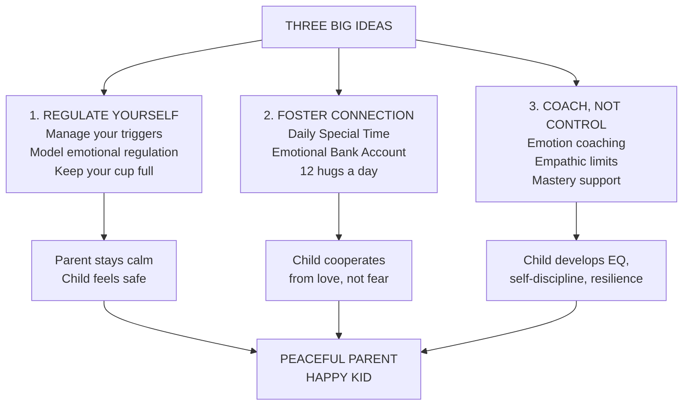
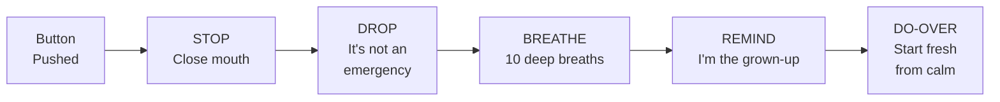

# Peaceful Parent, Happy Kids — Laura Markham

> A seven-year-old boy pushes the lawn mower through his father's prize flower bed, leaving a two-foot-wide path of destruction. The father's voice starts climbing toward a full-blown rage — and then his wife puts her hand on his shoulder and says: "David, please remember... we're raising children, not flowers." That single line captures the entire philosophy of this book. Laura Markham, a clinical psychologist who runs the AhaParenting.com community, argues that the secret of peaceful parents isn't better discipline, cleverer consequences, or more effective threats. It's a radical inward shift: <b style="color: #2980b9">manage your own emotional triggers first</b>, <b style="color: #27ae60">build a deep connection with your child second</b>, and <b style="color: #e74c3c">coach rather than control third</b>. Do those three things and your child will cooperate — not from fear, but from love. The result: less yelling, fewer power struggles, happier kids, and parents who actually enjoy parenting.

---

## About the Author

Laura Markham holds a PhD in clinical psychology from Columbia University, where she studied under attachment researchers Lawrence Aber and Arietta Slade. She founded AhaParenting.com, one of the largest peaceful parenting communities online, and has coached thousands of parents through private practice and workshops. Her intellectual lineage runs through John Bowlby (attachment theory), Dan Siegel (interpersonal neurobiology), John Gottman (emotional intelligence in families), Allan Schore (affect regulation and brain development), and Alfie Kohn (questioning punishment-based discipline).

What makes Markham distinctive among parenting authors is her insistence that the real work of parenting happens inside the parent, not inside the child. Where most parenting books ask "How do I get my kid to behave?", Markham asks "How do I regulate myself so I can show up as the parent my child needs?" She is refreshingly honest about the difficulty of this — she doesn't pretend peaceful parenting is easy. But she's firm that it works, and that it's the only approach that builds both cooperation now and emotional health for life.

---

## The Big Idea

The book rests on **Three Big Ideas** that thread through every chapter:

- <b style="color: #2980b9">Regulating Yourself</b>: Your number one responsibility as a parent is managing your own emotions. An adult's peaceful presence is more powerful than yelling could ever be. When you regulate yourself, your children learn to regulate themselves — by watching you. You can't pour from an empty cup.

- <b style="color: #27ae60">Fostering Connection</b>: Children cooperate when they feel deeply connected to you. Without that bond, no discipline technique works — it's like riding a bike up a steep hill. With it, parenting feels like coasting downhill. Connection is the prerequisite for everything else.

- <b style="color: #e74c3c">Coaching, Not Controlling</b>: Rather than punishing, threatening, or manipulating children into compliance, effective parents coach — helping children manage emotions (emotion coaching), setting limits with empathy rather than force (loving guidance), and supporting the child's natural drive to explore and master the world (mastery coaching). This produces children who *want* to behave, not children who merely *fear* not behaving.

---

## Key Concepts at a Glance

| Concept | One-line summary |
|---------|-----------------|
| **Three Big Ideas** | Regulate yourself, foster connection, coach don't control — the organizing spine of everything |
| **Emotional Bank Account** | Every interaction is a deposit or withdrawal; keep a 5-to-1 positive ratio or expect defiance |
| **Special Time** | 15 minutes daily of child-directed, undivided attention — the single most powerful connection tool |
| **Stop, Drop, and Breathe** | Three-step process to interrupt yelling: stop talking, drop the issue, take ten deep breaths |
| **SAP Disorder** | Sacrificing yourself on the Altar of Parenthood — kills joy, creates resentment, models martyrdom |
| **Empathy with Limits** | The sweet spot between authoritarian and permissive: high responsiveness + high demandingness |
| **Time-In vs Time-Out** | Replace isolation with connection — misbehavior is an SOS, not a crime |
| **Emotional Backpack** | Children carry accumulated unexpressed feelings that spill out as misbehavior; unpack through safe expression |
| **Three Rs** | Reflection, Repair, Responsibility — how children make amends without forced apologies |
| **Mastery Cycle** | Explore → practice → struggle → master → joy → explore again — built on love, respect, scaffolding |
| **Do-Over** | When you mess up (and you will), stop, apologize, and start the interaction over — models repair |
| **North Star** | Parents as the attachment figure children orbit around; when the star moves, the child must reorient |


Children who receive consistent emotion coaching develop dramatically stronger EQ across all dimensions — the gap is widest in self-soothing and empathy, the two skills most dependent on parental modeling.

---

## 30-Second Version

Stop trying to control your child's behavior and start managing your own emotions. Your calm is more powerful than any punishment. Build a deep, daily connection with your child — that connection is what makes them *want* to cooperate. When they misbehave, don't punish: coach. Empathize with the feeling, set the limit, and help them process the emotions driving the behavior. The result is a child who develops genuine self-discipline, emotional intelligence, and resilience — not because they fear you, but because they love you and have internalized your guidance.

---



---

## Part One: Regulating Yourself

### Chapter 1: Peaceful Parents Raise Happy Kids

*This is the foundation chapter — and the hardest one. Markham's argument is that parenting difficulty doesn't come from not knowing what to do with your child. It comes from not being able to manage what's happening inside you.*

### Your Number One Responsibility

The airlines tell you to put on your own oxygen mask first. Kids can't reach those masks. If you lose function, nobody gets saved.

The same principle applies to emotions. Children can't manage their own rage, jealousy, or fear by themselves. They need you to help them. But when you're stressed, exhausted, and running on empty, you can't help anyone. <b style="color: #2980b9">Your first responsibility in parenting is being mindful of your own inner state</b> — not controlling your child, not making sure they behave, not even teaching them right from wrong. Those all come after you've put on your own mask.

Mindfulness here doesn't mean meditation retreats. It means noticing your emotions without acting on them. When your child does something that makes you want to scream, you feel the anger rise, but you don't open your mouth until you've chosen what to say. Your child will act like a child — that's guaranteed. Someone has to act like the grown-up.

> [!tip] The Oxygen Mask Principle
> Your child is fairly certain to act like a child. The problem is when we begin acting like a child, too. Someone has to act like a grown-up. If, instead, we can stay mindful — noticing our emotions without acting on them — we model emotional regulation, and our children learn from watching us.

### Breaking the Cycle

Virtually all of us were wounded as children. Not catastrophically, necessarily — but enough that certain areas remain sensitive. Wherever you were scarred, that area will cause grief as a parent.

The father who repeats his own father's judgmental parenting. The mother who can't set limits because she can't bear her child's anger. The parents who work overly long hours because they doubt their ability to connect with their infant. In every case, an unhealed wound is driving the behavior.

Markham offers six steps for breaking the cycle:

1. **Parent consciously** — whenever your child pushes your buttons, you've stumbled on something that needs healing
2. **Use the pause button** — stop, even mid-sentence; you're modeling good anger management
3. **Understand how emotions work** — anger is a biological state that doesn't help you find solutions
4. **Rewrite your story** — examine childhood conclusions from an adult perspective
5. **De-stress** — exercise, yoga, sleep, dance with your kids
6. **Get support** — therapy, listening partnerships, parenting groups

### How to Stop Yelling

Markham treats yelling as a habit that can be broken in about three months, like learning piano. Not willpower — practice. She offers a specific protocol:

**The Stop, Drop, and Breathe Process:**

1. **Stop** talking the moment you notice yourself raising your voice. Close your mouth. If you must make noise, hum.
2. **Drop** the issue. It's not an emergency. Step back from the situation.
3. **Breathe** deeply ten times. Shake out your hands. This shifts you out of the reptile brain.
4. **Remind** yourself: you're the grown-up and your child is learning from everything you do right now.
5. **Do-over**: start the interaction fresh, from calm.

One striking strategy: make a "Respectful Voice" sticker chart — for yourself. At the end of every day, your *child* decides whether you've earned a sticker. This inverts the typical power dynamic and creates genuine accountability.

> [!warning] The Three-Minute Process
> When ten breaths aren't enough, Markham offers a deeper reset:
> - **Minute One**: Identify the thought that's upsetting you ("He's disrespecting my authority!"). Recognize it comes from fear, not truth.
> - **Minute Two**: Consider your child's perspective. Consider how your upsetting thought makes you treat your child.
> - **Minute Three**: Tap the acupressure point on the edge of your hand while breathing deeply. Say: "Although I'm upset, I'm safe. I can calm myself and heal this situation."

### Keeping Cool During Meltdowns

When your child melts down, something in you wants to scream "No!" — no, I don't have time; no, you're embarrassing me; no, why can't you just suck it up the way I do?

That last one is the tell. Most of us learned as children that our feelings were unacceptable, even dangerous. When our child has a meltdown, the little one inside *us* gets triggered. Danger signs flash. We want to flee, fight, or freeze.

Markham's prescription: say to your rising panic, "Thanks for keeping me safe when I was little. I'm grown now. These feelings are okay." Remind yourself it's not an emergency. Take a deep breath and choose love.

> [!quote] Keep It Simple
> Your child needs you to witness her outpouring of emotion and let her know she is still lovable despite all these yucky feelings. Explanations, negotiations, advice, or attempts to comfort ("There, there, you don't have to cry") will all shut down the natural process. You don't have to say much. Your calm, loving tone is what matters.

### SAP Disorder and Self-Nurture

SAP = Sacrificing yourself on the Altar of Parenthood. It happens when we forget to give ourselves the attention we need. The result: resentment, depletion, exhaustion — and a parent whose empty cup has nothing to pour.

The cure isn't selfish indulgence. It's *parenting yourself as tenderly as you parent your child*. Tune in throughout the day. When you notice irritability, ask "What do I need right now?" and give it to yourself. Keep your cup full so you have joy and presence to share.

### Ten Rules to Raise Terrific Kids

Markham's ten rules are for parents, not children:

| # | Rule | Core message |
|---|------|--------------|
| 1 | Manage yourself | Take care of yourself so you don't vent on your child |
| 2 | Be your child's advocate | Don't give up on him — you don't yell at a flower that isn't thriving; you water it |
| 3 | Discipline doesn't work | Punishment always worsens behavior; guide with empathy instead |
| 4 | Safe place for feelings | Children need to cry and rage in your arms without being shushed |
| 5 | Expect age-appropriate behavior | She's acting like a child because she IS a child |
| 6 | Don't take it personally | This isn't about you; it's about your child learning and growing |
| 7 | Meet unmet needs | All misbehavior comes from basic needs not being met |
| 8 | Your child is the best parenting expert | Let him show you what he needs |
| 9 | The only constant is change | What worked yesterday won't work tomorrow |
| 10 | Stay connected | The deepest reason kids cooperate is that they love you |

---

## Part Two: Fostering Connection

### Chapter 2: The Essential Ingredient

*Connection isn't a nice-to-have. It's the operating system on which everything else runs. Without it, discipline is a power struggle. With it, parenting becomes natural.*

### Why Connection Is the Secret

Markham uses a vivid metaphor: parenting without a good relationship is like riding a bike up a very steep hill. Parenting with one is like coasting downhill — you still have to pay attention, but momentum is with you.

Children freely cooperate when they believe you're on their side. When they don't, your standards seem unfair. A close bond gives you access to your natural parenting instincts and makes children more open to your influence — even into the teen years. Study after study shows that <b style="color: #27ae60">the best protection for teenagers from peer pressure and cultural excess is a close relationship with parents</b>. You're building that relationship from babyhood.

### Connection Across Developmental Stages

**Babies (0-13 months): Wiring the Brain.** Your interactions with your infant determine how her brain and nervous system are wired for life. Neurobiologist Allan Schore describes it as the mother "downloading emotion programs into the infant's right brain." When you coo at your baby and she smiles back, then looks away when overstimulated, and you ratchet down your energy — she just learned a lesson in self-regulation. These moments, repeated thousands of times, create the neural pathways for emotional health.

The attachment parenting insight: it's not about rigid rules (you don't have to co-sleep or babywear constantly). It's about being attuned and responsive to your unique baby's cues. And here's the remarkable finding — you can predict whether a baby will be securely attached before the child is even born, simply by interviewing the parent about their own childhood. Parents who have come to terms with their own attachment histories parent responsively.

**Toddlers (13-36 months): Building Secure Attachment.** Toddlers who were securely attached as babies grow into children with better relationships, higher self-esteem, more flexibility under stress, and better performance in school and with peers. Research shows that fifteen-month-olds have already developed strategies for getting their interpersonal needs met — strategies they'll use for life unless something changes.

Your toddler's North Star is you. At the playground, she'll regularly look up to check you're still there. Move to the next bench, and she'll frown, maybe cry, toddle over for a refuel hug, then return to playing. Her North Star moved — she had to reorient.

**Preschoolers (3-5 years): Developing Independence.** Markham reframes independence entirely. A child who separates easily isn't necessarily independent — remember the avoidant toddlers in the Strange Situation research who seemed fine but had racing hearts and soaring cortisol. True independence is the child's ability to feel confident interacting with the world, rooted in secure attachment. When we push children into emotional independence before they're ready, they become *more* needy, not less.

**Elementary (6-9 years): Foundation for the Teen Years.** These are your last best years. If you don't cement a close connection before middle school, your child will turn to peers and media for bonding and guidance. Resist the impulse to fill weekends with activities and screen time. Develop family rituals. Spend downtime hanging out. This is when you build the foundation that carries you through adolescence.

### The Emotional Bank Account

Every interaction with your child is either a deposit or a withdrawal. Setting limits is a withdrawal. Correcting behavior is a withdrawal. Even an imperfect tone of voice is a withdrawal. You need at least five positive interactions for every negative one — the same 5-to-1 ratio that predicts whether marriages survive.

When your child is defiant, check the account balance. Defiance isn't a discipline problem — <b style="color: #e74c3c">it's a relationship problem</b>. The child who went from defiant to eager-to-please after a single hug wasn't being manipulated. She was being refueled.


Maintaining a 5-to-1 positive-to-negative ratio means roughly 70% of daily interactions should be warm deposits — the same ratio that predicts whether marriages survive.

### Special Time: The Most Powerful Tool

Every parent who implements Special Time reports significant changes in their child's behavior. The protocol:

1. **15 minutes daily** with each child, individually
2. **Set a timer** and turn off all phones
3. **Child directs** on their turn — you follow their lead without judging, teaching, or checking your phone
4. **Parent directs** on your turn — initiate roughhousing and games that get your child giggling (laughter releases the same stress hormones as tears)
5. **End when the timer buzzes** — give a big hug; if child melts down, empathize but don't extend

Why does it work? Special Time gives the child the experience of your full, loving attention. It reconnects after daily erosion. It gives children a safe space to unpack their emotional backpack. It deepens empathy. It builds trust so the child will bring you their big feelings instead of acting them out.

> [!example] What Special Time Changes
> One mother reported after starting Special Time:
> - Children are noticeably less needy and more independent
> - Sibling rivalry dropped significantly
> - Screen time demand decreased by 50%
> - Children leave her alone to complete chores because they know they'll get her time

### Daily Connection Habits

- **12 hugs a day** — Virginia Satir's formula: four for survival, eight for maintenance, twelve for growth
- **Turn off technology** when interacting with your child — she'll remember for life that she was important enough for you to put down your phone
- **Evenings are family time** — stop working before dinner, eat together, no interruptions
- **Five-minute snuggle** every morning before requiring executive functioning
- **Connection before correction** — 90% of interactions should be about connecting, so the 10% that are corrections land softly

### Getting Your Child to Listen

The secret isn't raising your voice louder. It's connection before correction:

1. Don't start talking until you have your child's attention — get down on their level, make eye contact, touch lightly
2. Don't repeat yourself — if you've asked and gotten no response, you don't have attention yet
3. Use fewer words — most of us dilute the message
4. Acknowledge their perspective — "I know it's hard to stop playing"
5. Offer choices — "Bath now or in five minutes?"
6. Soothe, don't inflame — your explosion just makes everyone more upset

---

## Part Three: Coaching, Not Controlling

*The transition from baby to toddler at around thirteen months is famously difficult. Parents who think of themselves as coaches have an easier time with every transition right through the teen years than parents who think they need to control their child's behavior.*

### The Controlling vs Coaching Contrast

| In Response to Child's: | Parent Controls | Parent Coaches |
|------------------------|----------------|---------------|
| Inappropriate behavior | Works short-term when kids are small | Raises kids who want to "do right" |
| Anger | Forces repression; bursts out later | Helps kids learn to manage anger |
| Emotions | Child lags in self-regulation | Child develops self-regulation |
| Developing values | Motivated by avoiding punishment | Follows parents' teachings |
| Life skills | Parent nags, takes responsibility | Child enjoys becoming responsible |
| Self-motivation | Child resents parental pressure | Child feels empowered |

### Chapter 3: Emotion Coaching

*Whether we know it or not, we're constantly coaching our child on how to handle emotion. The way we respond to our child's feelings shapes his relationship with emotions — his own and others' — for the rest of his life.*

### Why EQ Matters More Than IQ

Emotional intelligence determines the quality of your life more fundamentally than intellectual intelligence. You can't tackle a big project if you're overcome by anxiety. You can't resolve conflict without understanding the other person's perspective. Even academic success depends on managing anxiety and motivating yourself. Best of all for parents: <b style="color: #2980b9">children with solid EQ can manage their emotions and therefore their behavior — so they tend to be both self-disciplined and cooperative</b>.

The four components of EQ:
1. **Self-soothing** — tolerating intense emotions without getting stuck or taking regrettable action
2. **Emotional self-awareness** — understanding what you're feeling so it doesn't control you
3. **Impulse control** — acting rather than reacting, problem-solving rather than blaming
4. **Empathy** — feeling from the other person's point of view

### The Emotional Backpack

Every child carries an invisible backpack stuffed with the feelings they couldn't process at the time — the fear from a scary experience, the sadness from a loss, the frustration from daily limits. When the backpack gets too full, feelings leak out as misbehavior: hitting siblings, defiance, meltdowns over trivial triggers.

The cure is to help your child unpack. Laughter releases the same stress hormones as tears — which is why roughhousing and silly games are so powerful. And when a child does melt down, that's not a problem to fix. It's the backpack being emptied. Your job is to stay present, empathize, and let the feelings run their course.

### Empathy: What It Is and What It Isn't

Empathy is a physical event — controlled by the insula in the right brain, which connects brain to heart, gut, and skin. When you feel deep empathy, you feel it in your body. That's why a parent's empathy changes everything for a struggling child. It's not intellectual agreement — it's visceral connection.

| What empathy is NOT | What empathy IS |
|---------------------|----------------|
| Permissiveness — you can still set limits | Accepting and reflecting feelings |
| Solving the problem for them | Helping them past the upset so they can solve it |
| Agreeing with their position | Understanding their experience |
| Probing ("Tell me how you feel") | Being with what they're showing you |
| Analyzing ("You're jealous of your sister") | A simple "Hmm" or "I'm so sorry" with warmth |
| Trying to cheer them up | Letting the feeling naturally dissipate |

### Understanding Anger in Children

Anger is always a defense. It shields us from feeling vulnerable. Underneath every angry child is a frightened or hurt child. When you see rage, look for the fear. When you address the fear, the rage dissolves.

Children's angry outbursts are driven by one of six unmet needs: <b style="color: #27ae60">autonomy, belonging, confidence, power, mastery, or meaning</b>. A child who feels powerless might hit. A child who feels disconnected might defy. A child who feels incompetent might rage at homework. Meet the underlying need and the "misbehavior" evaporates.

### Coaching Through Meltdowns

When your child melts down, here's the protocol:

1. **Stay present** — don't send him away; your calm presence is the container he needs
2. **Empathize** — "You are so angry" or "That's really hard"
3. **Don't fix, explain, or lecture** — the learning centers are offline; wait
4. **Let the feelings run** — crying releases cortisol and adrenaline; the storm will pass
5. **Reconnect** — when calm returns, a hug and simple narration: "You were really upset because..."

The child who melts down in your arms and is met with love will feel dramatically better afterward. The emotional backpack is lighter. He'll be more cooperative, more affectionate, more himself. This isn't rewarding bad behavior — it's meeting a child's need for emotional support, just as you'd feed a hungry child.

### Seven Steps to Nurture Emotional Intelligence

Markham provides a concrete protocol for daily emotion coaching:

1. **Acknowledge your child's perspective and empathize** — even when you can't give them what they want: "You really wish you could have that toy. It's hard to want something and not get it."
2. **Allow expression** — all feelings are permitted, even if all actions aren't: "You can be as mad as you want. You may not hit."
3. **Listen without fixing** — resist the urge to solve, explain, or reassure prematurely. Your presence is enough.
4. **Teach emotional vocabulary** — give names to feelings as you notice them: "That looks like frustration" or "Are you feeling disappointed?"
5. **Communicate limits with empathy** — the limit is firm, but the tone is warm: "I won't let you throw that, sweetie. I can see you're really upset."
6. **Model emotional regulation** — narrate your own process: "I'm feeling frustrated right now. I'm going to take some deep breaths."
7. **Teach problem-solving after calm returns** — "Now that you're feeling better, what could you do differently next time?"

> [!info] The Self-Soothing Myth
> Markham challenges the common advice to let babies "self-soothe" by crying it out. Babies who are left to cry may eventually stop — but that's exhaustion, not soothing. Their cortisol stays elevated. Their stress hormones remain high even on subsequent nights when they go quietly into the crib. The baby hasn't learned to self-soothe — he's learned that asking for help is futile. True self-soothing develops when a child is repeatedly soothed by a caregiver, building the neural pathways that eventually allow him to soothe himself.

### Games for Emotional Intelligence

Play is one of the most powerful tools for building EQ. Laughter releases the same neurochemicals as tears, so games that get children giggling are literally therapeutic:

- **The Bumbling Monster** — chase your child as a big, bumbling, incompetent monster who can never quite catch them. The child always wins. Releases fear.
- **Pillow Fights** — let your child knock you down over and over. Ham it up. They feel powerful, which counters powerlessness.
- **The Bye-Bye Game** — for separation anxiety: hide behind a door, call "Bye-bye!", peek out. Repeat until giggles overflow.
- **Play the Problem** — act out the morning routine with stuffed animals. Have the little one resist and the parent bumble. Let your child be the parent. You'll learn what they're really feeling.

---

### Chapter 4: Raising a Child Who Wants to Behave

*The dirty little secret about discipline: it doesn't work. Punishment always makes behavior worse long-term. Even consequences and time-outs. The approach that actually produces self-disciplined children is empathic limits — high expectations paired with deep connection.*

### The Four Parenting Styles

Markham draws on Diana Baumrind's landmark research to frame the parenting landscape:

```mermaid
quadrantChart
    title Baumrind's Parenting Styles
    x-axis Low Responsiveness --> High Responsiveness
    y-axis Low Demandingness --> High Demandingness
    quadrant-1 Authoritative (Empathy with Limits)
    quadrant-2 Authoritarian
    quadrant-3 Neglectful
    quadrant-4 Permissive
```

- **Authoritarian** (high demand, low support): "My way or the highway." Children comply from fear but rebel as teens, are more vulnerable to peer pressure, and don't develop independent thinking.

- **Permissive** (high support, low demand): Warm and loving but avoids limits. Children struggle with resilience, self-discipline, and handling disappointment. Often produces anxious, self-centered kids.

- **Neglectful** (low both): Parents too distracted by work, addiction, or their own lives. The child concludes he's not worth loving. Leads to anxiety, substance abuse, attachment wounds.

- **Authoritative / Empathy with Limits** (high both): The gold standard. These parents are demanding — they expect family dinners, good grades, responsible behavior. But they also listen, compromise, and provide complete support for the child to meet those expectations. Their children stay close through adolescence, do well in school, and are described by teachers as simply nice kids.

> [!danger] The Dirty Little Secret
> Punishment (including time-outs and consequences) teaches the wrong lessons: that might makes right, that the person with power controls the person without it, and that feelings are dangerous and must be suppressed. It also erodes the parent-child bond — the very thing that motivates cooperation. Children who are consistently punished learn to comply from fear when the parent is present and to act out when the parent is absent. They develop less internal moral reasoning, not more.

### Time-Outs vs Time-Ins

Markham dismantles time-outs with five arguments:

1. Children need help learning to calm themselves — isolation doesn't teach this
2. Time-outs make children feel bad about themselves — shame produces more misbehavior, not less
3. They create a power struggle — and by age seven, you can't physically enforce them
4. They trigger abandonment panic — compliance comes from fear of rejection
5. They erode your own empathy — you have to harden your heart to your child's distress

The alternative: **time-ins**. When your child is approaching meltdown, gather him close. Snuggle. Set whatever limits are necessary compassionately. If he cries, welcome the tears. After the storm, review what happened and describe an alternative behavior.

### The Truth About Consequences

Natural consequences are effective teachers — forgetting your lunch means being hungry. But parent-imposed "consequences" are just punishment with a better PR campaign. The test: does your child perceive you as orchestrating the suffering, or as firmly on their side?

Markham illustrates with four responses to a child who forgot their lunch:

| Response | What the child learns |
|----------|---------------------|
| "Of course I'll bring it, sweetie. Try to remember tomorrow." | Parent cares; may or may not remember lunch |
| "I'm not dropping everything. I hope this teaches you a lesson." | Parent doesn't care about me; becomes less cooperative at home |
| "I'll bring it, but this is the LAST TIME..." | I'm a forgetful, irritating person |
| "I'm sorry, it doesn't work for me today. I'll have a snack waiting." | Learns to remember; feels cared about; self-image intact |

Replace the word *consequences* with *problem-solving*. Ask your child: "We've got a problem — how do you think we should solve it?"

### Empathic Limits: The How-To

Setting limits with empathy isn't complicated, but it requires presence:

1. Start with connection — eye contact, warm touch
2. Join with the child as you set the limit — "This looks like so much fun... but someone's going to get hurt"
3. Acknowledge their viewpoint — "It's hard to stop playing and come inside"
4. Offer a choice — "Do you want to come in now, or in five minutes?"
5. Get agreement — "Five minutes, no fuss? Let's shake on it"
6. Follow through pleasantly — move in physically close rather than raising your voice
7. Empathize with the unhappiness — "I hear you hate coming inside. That must be hard"
8. If the child cries at the limit, listen — once children feel heard, they cooperate

The biggest secret of limit-setting: <b style="color: #e74c3c">you can't make anyone do anything</b>. Your child complies because of the strong relationship between you. Love becomes more effective as a motivator over time. Fear becomes less effective.

### The Three Rs of Making Amends

When a child hurts someone, punishment and forced apologies backfire. Instead:

1. **Reflect** — help the child narrate what happened: "You were worried when Eliza took your doll, so you hit her. She was hurt and cried..."
2. **Repair** — empower the child to fix the relationship: "What could you do to make her feel better? Want to get an ice pack?"
3. **Responsibility** — help him notice his choices have impact: "You sure made Michael happy when you gave him a turn with the truck"

---

### Chapter 5: Mastery Coaching

*Mastery isn't a one-time achievement. It's a way of approaching experience — explore, practice, struggle, master, take joy, move on to the next challenge. Every child is born with this drive. Our job is not to install it but to avoid crushing it.*

### The Mastery Cycle

Markham draws on Abraham Maslow's self-actualization and Mihály Csíkszentmihályi's concept of flow — the state of pure focus and joy that comes from passionate pursuit of a meaningful goal. Mastery creates flow, flow creates self-esteem, and self-esteem creates the confidence to tackle the next challenge.

Self-esteem begins with unconditional love — the deep conviction that you are enough regardless of what you accomplish. But as children grow, self-esteem must also be built on real accomplishment. This is the mastery cycle: explore → practice → struggle → master → take joy → explore the next thing. It's not a personality trait some kids are born with. It's an acquired habit that develops when parents provide the right conditions.

Three guidelines protect the mastery cycle:

- **Unconditional love** — fear of conditional love saps the joy children need for mastery. The hard work of mastery requires passion that can only spring from within. Parents who push achievement inadvertently give the message that their love depends on performance — destroying the very foundation of happiness.
- **Respect** — appreciate your unique child wherever he is. Don't rush to teach (Piaget: "Every time we teach a child something, we keep him from inventing it himself"). See yourself as partner or assistant, not boss. Respect the child's agenda and passions as they unfold, rather than substituting your own.
- **Scaffolding** — provide structure (routines, expectations, modeling, safe environment) that supports the child, then dismantle it as the child grows. Like actual scaffolding around a building — essential during construction, removed once the structure stands. The key: observe respectfully to see where support is needed, then offer the minimum necessary help.

### Mastery Across Developmental Stages

**Babies (0-13 months):** Your baby is a budding scientist. When she bats at the mobile, she's running an experiment. Your job: don't rush to teach. Respectfully observe. Narrate what you see without directing. If she struggles (arm pinned while learning to roll), soothe with your voice first, then offer minimal physical help. She learns that effort has value, that the work is her own, and that you have confidence in her ability.

**Toddlers (13-36 months):** Developing "response-ability" — the toddler needs to feel she has an impact on the world. Offer choices: "Red cup or blue cup?" Scaffold self-care routines by doing them with her, over and over, until she can do them alone. Resist the urge to do everything faster by doing it yourself.

**Preschoolers (3-5 years):** Self-mastery through problem solving. Impulse control develops through practice and play — games like "Red Light, Green Light" and "Mother May I" literally train the prefrontal cortex. When conflicts arise, ask "What could you do?" rather than imposing solutions.

**Elementary (6-9 years):** Exploring passions. Provide sequencing support and scaffolding for longer-term projects. Resist overscheduling — children need unstructured time to discover what genuinely interests them. The mastery hormones (including DHEA) are flowing; your job is to stay out of the way while remaining available as a resource.

### Appreciation vs Praise

Praise evaluates ("Good job!"). Appreciation acknowledges effort and describes what you see ("You worked so hard on that tower — look how tall it is!"). Praise creates dependence on external validation. Appreciation builds internal motivation.

Research from Carol Dweck: children praised for being smart become afraid to take on challenges (they might fail and lose the "smart" label). Children praised for effort embrace challenges, because effort is always within their control.

### Helicopter Parenting: Five Traps to Avoid

1. **Overcontrolling** — micromanaging a child's choices destroys autonomy
2. **Overprotecting** — shielding from all struggle prevents resilience
3. **Overscheduling** — no downtime means no space for exploration
4. **Overreacting** — your anxiety becomes their anxiety
5. **Overtigering** — pushing achievement destroys intrinsic motivation

---

## Best Stories

These stories are drawn from the parent testimonials that run throughout the book. They represent the transformation that occurs when parents shift from controlling to coaching.

> [!example] Raising Children, Not Flowers
> David teaches his seven-year-old son Kelly to mow the lawn. When David turns to answer his wife's question, Kelly pushes the mower straight through the flower bed — two feet of prize flowers leveled. David's voice climbs toward rage. His wife puts her hand on his shoulder: "David, please remember... we're raising children, not flowers."

> [!example] Jonathan the Difficult Toddler
> At thirteen months, Jonathan whines constantly, pulls his mother's hair, sticks fingers in her nose, hits the dog while looking right at her. Brooke thinks she's a failure. She systematically tries: getting out more, offering choices, babyproofing, giving unsolicited snuggles, initiating roughhousing. She transforms his aggression into connection games — a "nose fingers" game, a spitting contest outside. Within a month: "He's still stubborn, but he seems so much happier now, and life is so much easier."

> [!example] The 5 AM Meltdown
> Cassi's son comes to their room at 5 AM again. She says it's still sleeping time. He falls apart — thirty minutes of the worst screaming they've ever seen. She and her husband hold him, telling him they love him, that he can be as mad and sad as he wants. At the end, his tired body snuggles into his father's arms. That day, he is a different child — loving and cooperative. The emotional backpack had been emptied.

> [!example] Candace's Four-Year-Old Gives Empathy Back
> Mom has a meltdown. Her four-year-old daughter doesn't get flustered. She takes a few steps back, looks at her mother, walks over, offers a hug, and says: "You look really upset." She has experienced empathy and learned to give it. The cycle of emotional intelligence, completing itself.

> [!example] The Book That Cut Dad's Face
> Jamie Lynn's three-year-old throws a book in anger — it cuts his father's skin. Instead of removing the child to a thinking spot (which would leave him alone with shame and fear), Markham suggests: tend to Dad first, involve the child in helping ("Go get a washcloth"), hold him when he cries, narrate what happened. The child learns he's capable of hurting — and capable of repair. "Because the healing miracle of unconditional love is that there is no line. There is only love."

> [!example] "We've Got a Problem — How Do You Think We Should Solve It?"
> Carrie's three-and-a-half-year-old refuses PJs. Her husband threatens "No books." Carrie remembers Markham and asks: "Hey! We've got a problem — it's bedtime and you need to be in your PJs. How should we solve it?" The daughter grins, suggests they all clap hands and march into her room. Same for teeth brushing and potty. Each time: "Great problem-solving skills!" Response: "You're welcome, Mama — no problem!"

---

## Practical Application

### The Peaceful Parenting Toolkit

**When you're about to yell:**



**When your child is melting down:**

1. Remind yourself: this is not an emergency; this is an emotional discharge
2. Stay physically present — move closer, not farther away
3. Empathize with minimal words: "You are so upset. I'm right here."
4. Don't fix, teach, or distract — let the storm pass
5. After calm: hug, narrate what happened, describe an alternative behavior

**When your child defies you:**

1. Check the Emotional Bank Account — have you been withdrawing more than depositing?
2. Connect first — a hug, eye contact, warmth
3. Set the limit with empathy — "I hear you don't want to. It's hard when..."
4. Offer a choice — two options you can live with
5. Follow through calmly — physical presence, not raised voice
6. If the child cries, welcome it — the meltdown IS the discipline working

**When you mess up:**

1. Stop and acknowledge it — "I'm sorry I yelled. That was my crankiness talking."
2. Take responsibility without excuses — "You didn't deserve that."
3. Model repair — "Let's try a do-over. Here's what I meant to say..."
4. Forgive yourself — no parent is perfect; what matters is the repair

### 12 Alternatives to Consequences

When your child refuses to cooperate and you're about to threaten, try these instead:

1. **Let your child solve it** — "We haven't brushed teeth yet and I want time for a story. What can we do?"
2. **Partner for win/win** — "Skipping teeth doesn't work for me because of cavities. What else could we try?"
3. **Invite cooperation with phrasing** — "You may brush your teeth now" beats "Go brush your teeth!"
4. **Offer mastery** — "What else do you need to do before we leave? Let's check the schedule"
5. **Ask for a do-over** — "Oops, I started to yell. Let's try this again, sweetie"
6. **Make it a game** — "This rocket ship is ready for blastoff! Buckle up! Ten... nine... eight..."
7. **Divert with physical, playful reconnection** — chase, tickle, bumble
8. **Give them the wish in fantasy** — "I bet when you grow up you'll stay up ALL night!"
9. **Give it to them for real** — "Don't want a jacket? I'll put it in the backpack for if you change your mind"
10. **Put your child in charge** — "Get in when you're ready. I'll read my book while I wait"
11. **Engage the rational brain** — narrate the story of what happened to help them process it
12. **Get to the root** — move in close, restate the limit with compassion, help them have their meltdown


"Get to the root" scores highest in versatility because it addresses the underlying need rather than the surface behavior — the same principle that makes emotion coaching more effective than behavioral control.

### Preventive Maintenance Checklist

> [!success] Daily Prevention
> - [ ] Special Time — 15 minutes per child
> - [ ] 12 hugs
> - [ ] Morning snuggle before requiring executive function
> - [ ] Evening connection ritual (snuggle after lights-out)
> - [ ] Phones off during family time
> - [ ] At least one moment of genuine laughter together
> - [ ] Check: am I keeping my cup full?

> [!tip] When Something's Off
> Before looking for a discipline solution, ask:
> - Is the Emotional Bank Account in the red?
> - Is there an unmet need (sleep, hunger, connection, downtime)?
> - Is the emotional backpack overflowing?
> - Am I managing my own triggers, or reacting?
> - Have I been connecting, or just correcting?

### Developmental Quick-Reference

| Age | Primary Need | Parent's Key Task | Watch For |
|-----|-------------|-------------------|-----------|
| 0-13 months | Trust | Responsive soothing; brain wiring | Don't let baby cry uncomforted |
| 13-36 months | Autonomy + Love | Accept tantrums as discharge; offer choices | Don't withdraw love for defiance |
| 3-5 years | Empathy + Independence | Emotion coaching; empathic limits | Don't push false independence |
| 6-9 years | Mastery + Connection | Support passions; maintain bond | Don't let peer culture replace you |


Connection remains high across all stages — it never stops being critical — while other needs peak at specific developmental windows, showing why a one-size-fits-all approach fails.

---

## Connections

Markham's work sits at the intersection of attachment theory, interpersonal neurobiology, and positive discipline. The connections to other books in this vault are rich:

**Brain Science Foundation:**
- [[No-Drama Discipline - Daniel J. Siegel]] shares the same core philosophy — Connect and Redirect is essentially Markham's Three Big Ideas in condensed form. Siegel provides more neuroscience depth (upstairs/downstairs brain, green/red/blue zones); Markham provides more practical scripts and emphasis on parental self-regulation
- [[The Whole-Brain Child - Daniel J. Siegel]] — the brain integration framework that underlies Markham's emotion coaching. Both authors draw on Dan Siegel's work; Markham explicitly cites him throughout
- [[Parenting from the Inside Out - Daniel J. Siegel]] — the research foundation for Markham's "breaking the cycle" chapter. Siegel's core finding — that parents' ability to narrate their own childhood coherently predicts their child's attachment security — is a central plank of Markham's argument

**Discipline Philosophy:**
- [[Unconditional Parenting - Alfie Kohn]] — Markham and Kohn share the anti-punishment stance and intrinsic motivation focus. Kohn is more polemical and research-focused; Markham is warmer and more practically oriented
- [[No Bad Kids - Janet Lansbury]] — Lansbury's RIE-inspired approach overlaps with Markham's respectful observation of babies and empathic limit-setting. Both authors emphasize that misbehavior is communication
- [[Hunt, Gather, Parent - Michaeleen Doucleff]] — cross-cultural evidence supporting Markham's claims that connection, autonomy, and minimal punishment produce cooperative children

**Communication and Influence:**
- [[How to Talk So Kids Will Listen - Adele Faber & Elaine Mazlish]] — acknowledged by Markham as groundbreakers. Their techniques for acknowledging feelings and engaging cooperation map directly to Markham's empathic limits
- [[How to Talk So Little Kids Will Listen - Joanna Faber & Julie King]] — the toddler-specific extension, covering the same developmental stages with compatible philosophy

**Emotional Intelligence:**
- [[Emotional Intelligence - Daniel Goleman]] — Markham's entire Chapter 3 builds on Goleman's EQ framework. The four components of EQ that Markham uses (self-soothing, self-awareness, impulse control, empathy) come directly from this lineage
- [[Atlas of the Heart - Brene Brown]] — Brown's work on vulnerability, shame, and emotional literacy parallels Markham's insistence that all emotions are acceptable and that shame produces worse behavior
- [[The Body Keeps the Score - Bessel van der Kolk]] — the concept that unprocessed emotions are stored in the body and drive behavior aligns with Markham's "emotional backpack" metaphor

**Attachment and Child Development:**
- [[The Montessori Toddler - Simone Davies]] — the respect-based philosophy of allowing children to develop at their own pace, with scaffolding rather than direction, mirrors Markham's mastery coaching chapter
- [[Brain Rules for Baby - John Medina]] — the neuroscience of how early experiences wire the brain, supporting Markham's claims about responsive soothing and attachment
- [[The Gardener and the Carpenter - Alison Gopnik]] — Gopnik's argument against the "carpenter" model of parenting (shaping the child to specification) aligns with Markham's coaching approach
- [[Simplicity Parenting - Kim John Payne]] — Payne's emphasis on reducing overstimulation and overscheduling connects to Markham's warnings about helicopter parenting and the need for downtime

**Self-Regulation and Resilience:**
- [[The Self-Driven Child - William Stixrud & Ned Johnson]] — the emphasis on giving children a sense of control and supporting intrinsic motivation echoes Markham's mastery coaching framework
- [[The Danish Way of Parenting - Jessica Joelle Alexander]] — the Danish emphasis on play, reframing, empathy, and no ultimatums maps neatly to Markham's Three Big Ideas

---

> [!quote] The Last Word
> There are no perfect parents, and no perfect children. But there are many families who live in the embrace of great love. This book is dedicated to you creating one of those families.

> [!info] Reading Time
> This summary covers a 250+ page book organized around three core ideas. Estimated reading time: 25-35 minutes for a full read; 5 minutes for Key Concepts + 30-Second Version; 30 seconds for the Big Idea.

---

## Extended Deep Dive: The Neuroscience Behind Peaceful Parenting

### How Your Brain Hijacks Your Parenting

Markham draws extensively on Dan Siegel's interpersonal neurobiology to explain *why* calm parenting is so difficult — and why it matters so profoundly. The key insight: when your child pushes your buttons, your amygdala fires before your prefrontal cortex can intervene. You're literally in fight-or-flight mode before you've had a conscious thought. This isn't a character flaw — it's biology.

The amygdala's job is threat detection. It scans for danger 24/7, and it's exquisitely sensitive to anything that resembles a threat from your own childhood. A child's defiance might trigger memories of being powerless as a kid. A child's tears might echo the message that emotions are dangerous. The parent who screams at a whining child isn't responding to the whine — they're responding to a ghost from thirty years ago.

Markham's neurological argument for self-regulation:

| Brain State | What's Happening | Parenting Impact |
|-------------|-----------------|------------------|
| **Green Zone** (prefrontal cortex online) | Calm, flexible, empathic, creative problem-solving | You can connect, empathize, set limits lovingly, and teach |
| **Yellow Zone** (amygdala activated, cortex still partially online) | Tense, reactive, irritable, narrowing perspective | You can still catch yourself — this is where Stop, Drop, Breathe intervenes |
| **Red Zone** (amygdala in full control, cortex offline) | Fight, flight, or freeze — yelling, threatening, withdrawing, or shutting down | No teaching can happen. Damage is being done to the relationship and to the child's developing brain |

The critical finding from Allan Schore's research: <b style="color: #2980b9">a parent's nervous system literally regulates a child's nervous system</b>. When you are calm, your calm physically transfers to your child through tone of voice, touch, facial expression, and body language. When you are dysregulated, your dysregulation transfers just as powerfully. This is why Markham insists that parental self-regulation isn't just a nice idea — it's the foundation of the child's brain development.

### The Right Brain Connection

Schore's research on right-brain-to-right-brain communication is central to Markham's argument about connection. The right hemisphere — which processes emotion, reads facial expressions, and manages attachment — develops primarily through the parent-child relationship in the first years of life. When a parent coos at an infant and the infant smiles back, the parent's right brain is literally programming the infant's right brain.

This is why Markham says the parent "downloads emotion programs" into the child's brain. It's not a metaphor — it's a description of neural development. The quality of these downloads determines:

- Whether the child develops secure or insecure attachment
- How effectively the child can regulate emotions throughout life
- The child's capacity for empathy and relationship
- The child's resilience under stress

And here's the finding that changes everything: you can predict a baby's attachment security before the baby is born, simply by interviewing the parent about their own childhood. Parents who have made sense of their own attachment stories — even painful ones — parent responsively. Parents who haven't processed their histories repeat the patterns or react against them chaotically. This is why Markham's "breaking the cycle" chapter isn't a nice appendix — it's the foundation of everything.

### Mirror Neurons and Emotional Contagion

When your child watches you handle frustration calmly, their mirror neurons fire as if *they* are handling frustration calmly. Every time you model emotional regulation, you're giving your child a neural rehearsal of regulation. Every time you model dysregulation — yelling, slamming doors, withdrawing in cold fury — you're giving them a neural rehearsal of *that* instead.

Markham uses this to explain why "Do as I say, not as I do" has never worked in the history of parenting. Children learn what they see modeled. Their brains literally practice what they observe. The parent who wants a child who handles anger well must become a person who handles anger well. There is no shortcut.

---

## Extended Deep Dive: Sibling Conflict Scripts

### Why Siblings Fight

Markham reframes sibling conflict as a relationship laboratory. Every sibling argument is practice for navigating disagreement with peers, colleagues, and future partners. The question isn't how to stop siblings from fighting — it's how to help them fight constructively.

The root cause of most sibling conflict: <b style="color: #e74c3c">competition for parental love and attention</b>. When children feel secure in their parents' love — when the Emotional Bank Account is full for each child individually — sibling rivalry naturally decreases. The child who knows she's loved doesn't need to compete.

### The Intervention Protocol

When siblings are in conflict, Markham advises:

1. **Don't take sides.** The moment you assign blame, you've created a victim and a villain — and both will resent you.
2. **Sportscaster, not referee.** Describe what you see without judging: "I see two children who both want the red truck."
3. **Express confidence.** "I'm sure you two can work this out." Then step back. Only intervene if someone is getting hurt.
4. **If you must intervene:**
   - Separate them physically if necessary — calmly, without anger
   - Empathize with both: "You're really frustrated" and "You're upset too"
   - When both are calm, facilitate problem-solving: "What could work for both of you?"
5. **Never compare.** "Why can't you be nice like your sister?" is the most destructive sentence in sibling relationships.

### Preemptive Strategies

| Strategy | How It Works |
|----------|-------------|
| **Individual Special Time** | Each child gets 15 minutes of undivided attention daily — this fills their cup so they don't need to compete |
| **Roughhousing** | Physical play releases tension and builds connection — reduces the pressure that fuels fights |
| **Family problem-solving** | Recurring conflicts go on the family agenda: "The bathroom schedule isn't working. What should we do?" |
| **Appreciation rituals** | At dinner, each person names something they appreciated about a sibling that day |
| **No forced sharing** | Young children need to experience ownership before they can genuinely share — forcing it breeds resentment |
| **Separate when needed** | Some children need physical space. Separate rooms, separate play times, separate car seats — not as punishment but as respect for different needs |

> [!example] The Booster Seat Battle
> Two brothers, ages 3 and 5, fight every car ride about who sits in the "good" booster seat. Mom's solution: Monday-Wednesday-Friday, the older child chooses first. Tuesday-Thursday-Saturday, the younger child chooses. Sunday alternates. Within a week, both boys know the schedule, the fights stop, and they occasionally volunteer to let the other choose — because generosity flows naturally when fairness is guaranteed.

---

## Extended Deep Dive: Morning and Bedtime Routines

### The Morning Routine

Mornings are the most common battlefield in family life. Markham treats them as a systems problem, not a discipline problem. The goal: get everyone out the door with connection intact.

**The night-before protocol:**
- Lay out clothes, pack lunches, load backpacks the evening before
- Review tomorrow's schedule at bedtime — no morning surprises
- Set out breakfast supplies so the morning requires minimal decision-making

**The morning connection ritual:**
- Wake up 15 minutes before you need the child awake
- Begin with a five-minute snuggle — don't demand executive function from a brain that just woke up
- Use physical affection to transition: back rubs, forehead kisses, gentle rocking
- Avoid screens in the morning — they absorb attention and make transitions harder

**When the child won't cooperate:**
- Check whether the routine is age-appropriate — are you expecting more independence than development allows?
- Use limited choices: "Shoes or jacket first?"
- Make it a game: "Can you get dressed before this song ends?"
- If resistance is chronic, something else is wrong — check sleep, connection, and whether the child is facing something stressful at school

### The Bedtime Routine

Bedtime is separation. For a young child, going to sleep means leaving the people they love most in the world. Markham reframes bedtime resistance not as defiance but as attachment behavior — the child doesn't want to lose you.

**The protocol:**
1. **Warning sequence:** "Bath in ten minutes... five minutes... one minute"
2. **Warm bath** — water is calming; this is neurological, not just pleasant
3. **Pajamas, teeth, toilet** — routine chart on the wall, not parent nagging
4. **Stories** — the number is agreed in advance ("Two books tonight")
5. **Lights out, snuggle time** — this is the gold. Five to ten minutes of quiet connection in the dark. The child will share things they'd never share in daylight. This is when secrets come out, fears are named, and connection deepens
6. **Goodnight ritual** — a phrase, a kiss pattern, a special handshake. The same every night. Sameness creates safety
7. **If the child comes out:** calmly, warmly return them. No conversation, no anger, no negotiation. "It's sleep time. I love you. Back to bed."

> [!tip] The Snuggle-After-Lights-Out Secret
> Markham identifies the post-lights-out snuggle as the single most underrated parenting tool. When the lights go off and the room is dark, children's defenses drop. They ask real questions: "Do you love me more than my sister?" "Will you die?" "Why did that boy say I'm stupid?" These are the conversations that build deep connection and allow you to address what's really going on in your child's life. Miss this window, and you may never hear these things.

---

## Extended Deep Dive: Brilliant Listening

### Ten Strategies for Deep Listening

Markham offers ten concrete listening strategies that transform the parent-child relationship:

1. **Put down everything.** Phone, book, spatula. Turn your body toward the child. Your full attention is the message before you say a word.

2. **Get on their level.** Crouch, sit on the floor, pull up a small chair. Looking down at a child communicates power. Looking across communicates partnership.

3. **Reflect back.** "So you felt left out when they picked teams and you were last." Don't interpret, analyze, or fix. Just mirror.

4. **Use minimal encouragers.** "Hmm." "I see." "Tell me more." "And then what happened?" These keep the child talking without directing the conversation.

5. **Name the emotion.** "That sounds really frustrating" or "You seem sad about that." Children often don't have words for what they feel — your naming gives them vocabulary.

6. **Don't rush to solve.** The urge to fix is powerful. Resist it. Most of the time, children don't want solutions — they want to feel heard. Solutions come naturally after feeling understood.

7. **Don't minimize.** "It's not a big deal" or "You'll get over it" shuts the child down. What feels small to you feels enormous to them. Honor that.

8. **Don't interrogate.** "What happened?" "Who said that?" "Why didn't you tell the teacher?" Questions can feel like cross-examination. Start with empathy, and the story will come.

9. **Tolerate silence.** Sometimes a child needs to sit with you in silence before they can speak. Don't fill every pause. Your quiet presence is enough.

10. **Follow up later.** "I've been thinking about what you told me yesterday. How are you feeling about it now?" This tells the child their words mattered enough to remember.

> [!warning] The Listening Killer
> The single most common barrier to listening is the parent's own anxiety. When your child tells you something upsetting — bullying, a bad grade, a friendship problem — your anxiety fires and you jump to advice, reassurance, or action. But the child didn't ask for solutions. They asked to be heard. When you listen first and solve second, the child often generates their own solution — and it's usually better than yours.

---

## Deep Dive: When Both Parents Disagree

### The United Front Myth

Markham challenges the conventional wisdom that parents must present a "united front" at all times. While consistency matters, forced agreement often means one parent suppresses their instincts — which breeds resentment and inauthenticity.

Instead, Markham recommends:

- **Agree on the big things privately.** Safety rules, core values, bedtime — negotiate these without the child present.
- **Allow different styles in the small things.** Dad is more playful at bath time. Mom is more structured at homework time. Children can adapt to different styles as long as both are loving and respectful.
- **Never undermine each other in front of the child.** If you disagree with your partner's approach, wait until you're alone to discuss it.
- **Model conflict resolution.** When you do disagree in front of the child, show them how adults work through differences respectfully: "Dad and I see this differently. We're going to talk about it and find a solution we both feel good about."

### When One Parent Is More Reactive

The most common dynamic: one parent is working on self-regulation while the other continues yelling. Markham's advice to the parent doing the work:

1. **Don't preach.** Handing your partner the book and saying "You need to read this" guarantees defensiveness.
2. **Model.** Let your partner see the results. When your calm approach works and their yelling doesn't, the evidence speaks.
3. **Protect the child gently.** If your partner is in the Red Zone with the child, step in with warmth — not criticism. "Hey, I'll take over here. You take a breather."
4. **Repair on their behalf.** If your partner yelled, you can quietly tell the child: "Daddy was really frustrated. He loves you. He's working on expressing his feelings differently."
5. **Seek professional support.** If the other parent's behavior is chronically harmful, couples therapy or a parenting class together may be necessary.

---

## The Verdict

Markham's *Peaceful Parent, Happy Kids* is not the most rigorous parenting book (that's Siegel) or the most philosophically challenging (that's Kohn). What it is — and what nothing else quite matches — is the most compassionate and practically useful guide for the parent who knows they need to change but doesn't know how to start.

The book's greatest insight is not any single technique. It's the reframing of parenting difficulty: <b style="color: #2980b9">the problem isn't your child's behavior — it's your own emotional reactivity</b>. Fix that, and most parenting problems dissolve on their own. The child who misbehaves is almost always a child whose Emotional Bank Account is overdrawn, whose emotional backpack is too full, or whose parent is too depleted to connect.

The book's greatest limitation is its optimism. Markham writes as if every family is two committed parents with flexible schedules and stable mental health. For single parents, parents in poverty, parents managing their own trauma or mental illness — the prescription remains sound but the difficulty level multiplies. Markham acknowledges this but doesn't dwell on it.

Still, the core framework — regulate yourself, connect with your child, coach rather than control — is as close to a universal parenting truth as exists. It echoes [[The Whole-Brain Child - Daniel J. Siegel]], [[Unconditional Parenting - Alfie Kohn]], [[How to Talk So Kids Will Listen - Adele Faber & Elaine Mazlish]], and [[The Danish Way of Parenting - Jessica Joelle Alexander]]. It resonates with indigenous parenting practices documented in [[Hunt, Gather, Parent - Michaeleen Doucleff]]. And it aligns with the Islamic emphasis on mercy, gentleness, and the educator's own character found in [[Child Education in Islam - Abdullah Ulwan]].

The parent who reads this book and implements even half of it will yell less, connect more, and raise a child who cooperates not from fear but from love. And that child, someday, will do the same for their own children. That's how cycles break. That's how the world gets better — one family at a time.
