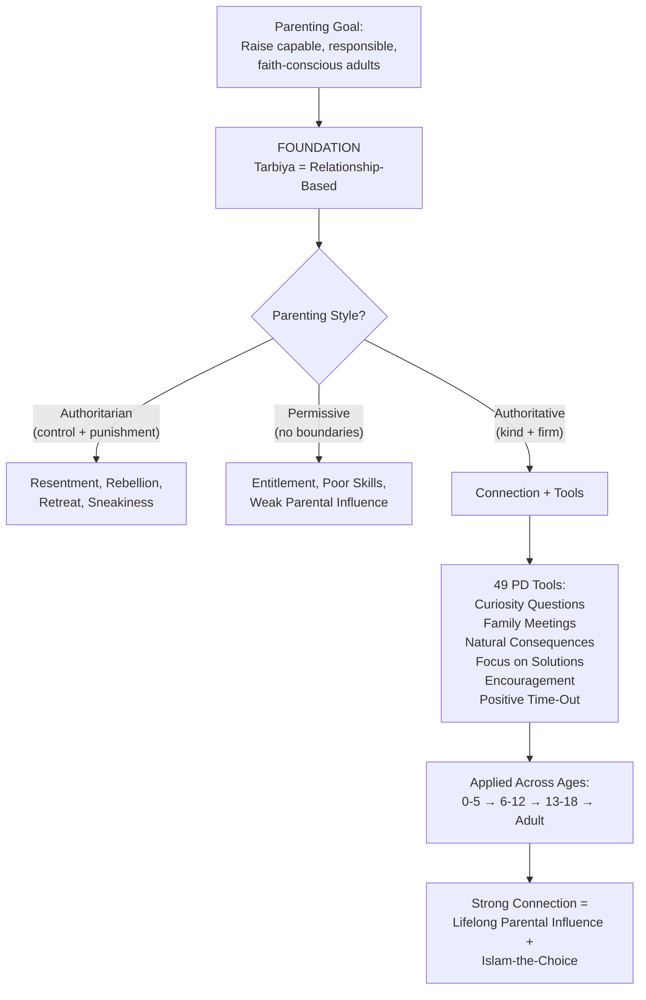
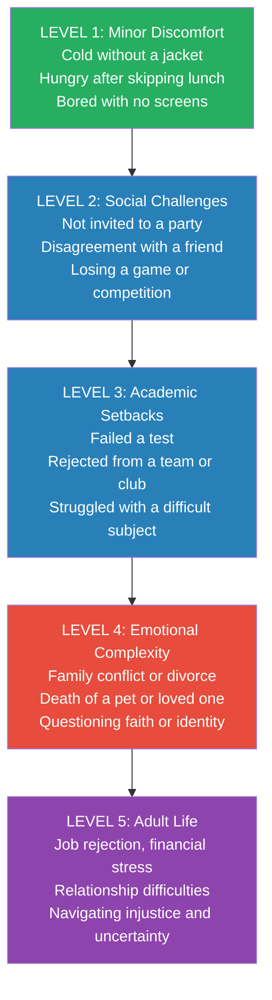

# Positive Parenting in the Muslim Home — Noha Alshugairi & Munira Lekovic Ezzeldine

> A Bedouin walks into the Prophet's mosque in Medina and urinates on the floor. The companions leap to their feet in outrage. The Prophet tells them to stop — let the man finish, pour water to purify the area, and then teach him the etiquette of the mosque. No punishment. No shaming. Just a calm focus on solutions. This prophetic response, recorded over fourteen centuries ago, captures the essence of what Noha Alshugairi and Munira Lekovic Ezzeldine argue throughout this book: that the Positive Discipline philosophy — kindness and firmness at the same time, connection before correction, mistakes as learning opportunities — is not a Western import but a rediscovery of principles already embedded in Islamic tradition. The book weaves 49 practical parenting tools with Quranic wisdom, prophetic stories, and the authors' own vulnerable confessions of parenting failures to offer Muslim families a third way between the authoritarian control many grew up with and the permissiveness many have swung toward.

---

## About the Authors

Noha Alshugairi is a first-generation American Muslim who immigrated from Saudi Arabia in her early twenties. She holds a Master's degree in Counseling and works as a family therapist in Southern California. Her parenting journey shifted from "slightly authoritarian" to authoritative after taking a class on parenting teenagers based on Adlerian psychology — earning her the nickname "extra-large" among friends for her above-average tolerance of teen moods. She later trained directly with Jane Nelsen, the founder of Positive Discipline, and became convinced the philosophy aligned deeply with Islam.

Munira Lekovic Ezzeldine is a second-generation American Muslim, born in Europe and raised in Southern California. Also a licensed counselor, she came to Positive Discipline through Noha during their shared Master's program. Her immediate reaction was: "It's just common sense." She is the mother of three sons and brings a Balkan Muslim perspective shaped by navigating faith and identity in a non-Muslim majority culture.

The book carries a foreword by Dr. Jane Nelsen herself, who writes that she never imagined her 1981 self-published book would become the seed of a global movement spanning cultures and faiths. The authors trained as Certified Positive Discipline Educators and draw on years of facilitating workshops in the diverse American Muslim community of Southern California — a microcosm with over 30 ethnic groups.

---

## The Big Idea

- <b style="color: #2980b9">Positive Discipline and Islam share the same parenting DNA</b>: the book identifies eight specific areas of alignment — from mutual respect and encouragement to focusing on solutions and long-term thinking — demonstrating that the authoritative parenting style is not imported but indigenous to Islamic tradition
- <b style="color: #e74c3c">Neither punishment nor permissiveness works</b>: punishment breeds resentment, revenge, rebellion, and retreat; permissiveness creates entitled children who lack boundaries. Both fail the long-term goal of raising capable, responsible adults
- <b style="color: #27ae60">Connection is the foundation for influence</b>: a strong parent-child bond is the single most critical factor ensuring continued parental influence across a lifetime. Values are transmitted through daily connection, not through lectures, coercion, or control
- The book provides 49 concrete Positive Discipline tools — from Curiosity Questions and Family Meetings to Natural Consequences and Positive Time-Out — each illustrated with Muslim-family examples
- Parents are gardeners, not sculptors: tend with the best care, but accept you cannot control which way the stems will grow

---

## Key Concepts at a Glance

| Concept | One-line summary |
|---------|-----------------|
| **Tarbiya** | Islamic child-rearing centered on relationship as the vehicle for transmitting values |
| **Authoritative style** | Kindness and firmness at the same time — the Positive Discipline way |
| **Connection Before Correction** | Always connect emotionally before attempting any behavioral correction |
| **No carrots and sticks** | Both punishment and rewards create external dependency; foster intrinsic motivation |
| **Encouragement vs. Praise** | Encourage effort and process (internal locus); praise rewards outcomes (external locus) |
| **Focus on Solutions** | Engage children in problem-solving rather than imposing consequences |
| **Family Meetings** | Weekly meetings with compliment circles, agenda items, and joint problem-solving |
| **Natural Consequences** | Step aside and let life teach — within safety limits |
| **Islam-the-Habit → Islam-the-Choice** | Parents establish religious habits in childhood; personal faith commitment develops in adolescence |
| **The Gardener Metaphor** | Influence, not control — tend with care but accept uncertainty about outcomes |
| **49 PD Tools** | An alphabetical toolkit for all ages: Act Without a Word through Winning Cooperation |

---

## 30-Second Version

Muslim parents often swing between two extremes: authoritarian control driven by fear their children will stray, or permissiveness to compensate for cultural restrictions. Both backfire. The Positive Discipline approach — kindness and firmness at the same time — is deeply congruent with Islamic principles. Connect with your child before correcting. Replace punishment with problem-solving. Ask curiosity questions instead of lecturing. Let natural consequences teach. Hold Family Meetings. Encourage effort, not outcomes. And remember: your job is to teach and guide, not to control. A connected child is a child who listens. A controlled child is a child who hides.

---

---

## Part I: Foundation — Islam Meets Positive Discipline

### Tarbiya: Parenting as Sacred Trust

The Arabic word *tarbiya* comes from the root *r-b-b*, meaning to supervise and manage. From the same root comes *ar-Rabb* — a name of Allah, the Supreme Sustainer of the universe. The parallel is deliberate: parents are in their children's lives as Allah is for creation — <b style="color: #2980b9">caretakers, supporters, and certainly not coercers</b>.

The authors define tarbiya as relationship-based. Rather than prescribing a specific way of practicing Islam in the home, they focus on the parent-child bond as the strongest foundation for transmitting values. The application will differ from family to family, but the principle is universal: "It is in your mundane daily interactions that your values will be imprinted in their hearts."

### The Eight Areas of Congruence

The book's most original contribution is mapping Positive Discipline principles onto Islamic sources:

| PD Principle | Islamic Source |
|-------------|---------------|
| **Building social interest** | Hadith: "The relation of the believer with another is like the bricks of a building, each strengthens the other" |
| **Fostering belonging & contribution** | The concept of the *umma* — instant belonging that permeates borders, cultures, and ethnicities |
| **Belief behind the behavior** | Islam's emphasis on intentions (*niyyah*): "Deeds are considered by the intentions behind them" |
| **Encouragement** | The Prophet dealt with people gently: "Had you been severe and harsh-hearted, they would have dispersed from around you" (Quran 3:159) |
| **Mutual respect** | The Prophet asking young Ibn Abbas's permission before serving elders first — and respecting the boy's refusal |
| **Kindness + firmness** | The Prophet at Hudaybiyah: silently breaking his *ihram* when the companions refused his command — firm in action, kind in not denigrating them |
| **Long-term focus** | "Begin with the end in mind" — the Islamic concept that this life determines the afterlife |
| **Focus on solutions** | The Bedouin in the mosque: no punishment, just purification and teaching |

All eight areas score 8 or above, demonstrating the authors' central thesis: Positive Discipline is not a Western import but a rediscovery of principles already embedded in the Prophetic tradition.

### Three Parenting Styles in the Muslim Home

The authors apply Baumrind's framework with a Muslim-specific lens:

> [!danger] The Authoritarian Trap
> Some Muslim families adopt this style because they believe it's the only way to raise obedient children who will be "good Muslims." The erroneous belief: since Allah rewards and punishes believers, parents must adopt the same attitude with their children. The result: children who comply out of fear, not understanding, and who rebel or retreat once parental control lifts.

> [!warning] The Permissive Swing
> Parents who suffered under authoritarianism often swing to permissiveness, giving children everything while setting no boundaries. The child learns: "I am loved if I get my way." Misbehavior follows because these children have never learned to work within limits.

> [!success] The Authoritative Sweet Spot
> Both parent and child have a voice. Mistakes are learning opportunities. Rules are consistent but discussed. The child learns: "I am loved even when I make mistakes, and I am responsible for my actions."

The authors identify a uniquely Muslim pattern they call <b style="color: #e74c3c">"The Paradoxical Dance"</b> — parents who are authoritarian about religious practices and academics but permissive about material things, routines, and responsibilities. The rationale: "I tell my children so many NOs because of Islam, so I make up for it by giving them anything they ask for." The result: children who can recite Quran but cannot make their own breakfast.

---

## Part II: The Toolkit — No Carrots and Sticks

### Why Punishment Fails

Jane Nelsen identifies four results of punishment — the <b style="color: #e74c3c">Four Rs</b>:

1. **Resentment** — "This is unfair. I can't trust adults."
2. **Revenge** — "They are winning now, but I'll get even."
3. **Rebellion** — "I'll do the opposite to prove I don't have to."
4. **Retreat** — either sneakiness ("I won't get caught next time") or reduced self-esteem ("I am a bad person")

The authors go further, identifying six adult personality types created by punishment-only parenting: the Tester (fragile trust), the Avenger (attacks at slight provocation), the Meek (subdued, direction-seeking), the Victim (world is out to get me), the Bully (must control to feel safe), and the Undercover (hides true feelings for fear of ridicule).

### Why Rewards Also Fail

Parents are often surprised that Positive Discipline rejects rewards too. The authors' case:

- **Short-term only** — what motivates a five-year-old bores a ten-year-old
- **Distraction from the task** — energy shifts to negotiating the reward, not learning the skill
- **Ceilings** — rewards escalate until parents feel stuck
- **External dependency** — children learn to ask "What's in it for me?" rather than finding intrinsic satisfaction

Noha's turning point: her second-grader said <b style="color: #e74c3c">"I don't care!"</b> when offered a reward. She was stunned. That was the last time she used rewards with any of her four children.

### The Gardener, Not the Sculptor

The book devotes significant attention to the issue of control. Noha confesses she once believed she was 100% responsible for how her children turned out. Through therapy and parenting experience, she came to understand the confluence of factors beyond parental control: genetics, temperament, birth order, social environment, culture, era, and free will.

> [!tip] The Gardener Metaphor
> Parents are gardeners who tend the flowers with the best care but don't know for certain which way the stems will grow. Dreams for your children should never become shackles that strangle and suffocate.

---

## The 49 Tools — Grouped by Function

Rather than the book's alphabetical ordering, here are the most powerful tools organized thematically:

### Communication Tools

| Tool | How It Works |
|------|-------------|
| **Curiosity Questions** | Ask "what," "how," "when" instead of telling. "Where do your books go?" instead of "Pick up your books!" |
| **I Notice... Instead of Did You...?** | "I noticed the trash bin is not at the curb" instead of "Did you take out the trash as you promised?" |
| **One Word / Ten Words or Less** | "Backpack." "Dishes." "Lunch." — enough to convey the message without lectures |
| **Eye to Eye** | Get down to the child's level. It's very difficult to be excessively angry when you're crouching |
| **Effective Communication** | I-Statements + Reflective Listening. "I feel disappointed when you promise to do the dishes and don't follow through" |
| **Listen** | "Children are more likely to listen to you after they feel listened to" — especially critical with teens |

### Connection Tools

| Tool | How It Works |
|------|-------------|
| **Connection Before Correction** | Connect emotionally before any correction. Hug, soothe, validate — then redirect |
| **Be There** | Prioritize presence over scheduled "quality time." Drop what you're doing when a child approaches |
| **Special Time** | Dedicated one-on-one time with each child |
| **Message of Love** | Express love in words and actions — culturally appropriate to your family |
| **Hugs When Upset or Not** | "Would a hug help right now?" — never forced, always offered |
| **Mirroring** | Reflect back emotions and strengths: "You seem sad. What happened?" |

### Problem-Solving Tools

| Tool | How It Works |
|------|-------------|
| **Family Meetings** | Weekly: compliment circle → agenda items → future plans. Everyone has a voice, problems are the problem (not people) |
| **Focus on Solutions** | Engage children in brainstorming solutions rather than imposing consequences |
| **Problem Solving** | Structured: state the issue → invite child's perspective → brainstorm → choose together → follow through |
| **Wheel of Choice** | Visual tool for young children: a wheel with self-soothing and problem-solving options they helped create |
| **Come Back With Your Plan** | "What is your plan about...?" — empowers critical thinking |

### Boundary Tools

| Tool | How It Works |
|------|-------------|
| **Decide What You Will Do** | Shift focus from controlling the child to controlling your own response. "I will no longer bring forgotten homework to school" |
| **Follow Through** | If you say it, mean it. If you mean it, do it. This builds trust in your words |
| **Natural Consequences** | Step aside and let life teach. Forgot your jacket? You'll feel cold. Forgot your lunch? You'll feel hungry |
| **Logical Consequences** | Must be Related, Respectful, Reasonable, and Helpful — or it's just punishment in disguise |
| **Limited Choices** | "Would you like cereal or muffins?" — works beautifully with toddlers, less so with teens |
| **Routines** | A posted routine chart replaces nagging: "What does your routine chart say needs to happen right now?" |

### Growth Tools

| Tool | How It Works |
|------|-------------|
| **Encouragement vs. Praise** | Encourage effort ("You worked hard on this"), not identity ("You're so smart"). See detailed table below |
| **Mistakes are Opportunities** | The Bedouin model: clean up, teach, move on. No shame, no "I told you so" |
| **Empowering vs. Enabling** | Shift responsibility to children as soon as capable. Stop carrying backpacks, making lunches, delivering homework |
| **Take Time for Training** | Teach the skill before expecting the behavior. Show, practice, then step back |
| **Letting Go** | Occurs in stages — not suddenly at 18. Every time you let a child be in charge of something, you're letting go |
| **Jobs (Contributions)** | Household chores from age 4. Belonging through contribution, not just receiving |
| **Get a Life** | Your identity must extend beyond parenting. Model a life of personal pursuit alongside family commitment |

### Encouragement vs. Praise — The Full Picture

This distinction is one of the book's most valuable contributions:

| Dimension | Encouragement | Praise |
|-----------|--------------|--------|
| **Focus** | The deed — goal-centered | The doer — ego-centered |
| **Timing** | Before, during, and after | Only after success |
| **Scope** | Given in success AND failure | Given only in success |
| **Self-worth** | Constant regardless of approval | Tied to others' approval |
| **Orientation** | Part of a group: "You helped the team" | Competition: "You're the best player" |
| **Locus of control** | Internal: "You figured it out yourself" | External: "You did exactly like I told you" |
| **Responsibility** | On the child: "This A reflects your hard work" | On the praiser: "I'm proud of you for getting an A" |
| **Change motivation** | For themselves: "What do I think?" | For others: "What does mom/dad think?" |

> [!example] Encouragement in Islamic Context
> Instead of "You are such a good Muslim" (praise — ego-centered, conditional), try "You prayed all five prayers on time today" (encouragement — deed-centered, specific). Instead of "I am so proud of you! You've done it again" (praise — external locus), try "You are working very hard; this semester you raised your GPA by 0.2 points — the changes you implemented are working for you" (encouragement — internal locus, process-focused).

---

## Part III: The Parenting Journey — Age by Age

### The Early Years (0-5): Structure, Soothe, and Train

This stage is about <b style="color: #2980b9">establishing routines, structuring the environment, and building the emotional vocabulary</b> that will serve the child for life.

**Tantrums — Three Responses Compared.** The book presents a powerful side-by-side:

| Style | Parent's Response | Child's Internal Message |
|-------|------------------|------------------------|
| Authoritarian | Punishment, spanking, punitive time-out | "I am bad. Nobody loves me. I'll get what I want behind their backs" |
| Permissive | Giving in, bribing, appeasing | "I'm the boss. I just need to cry and I'll get what I want" |
| Authoritative | Mirror feelings, offer hugs, invite Positive Time-Out | "It's OK to be upset. Mommy loves me even when I'm upset. I'm in charge of my emotions" |

**Food Battles.** The authors are direct: children will not starve themselves. Hunger is the natural alarm clock. When parents use coercion to force eating, children become desensitized to their own hunger signals and dependent on parents to tell them when and what to eat. The solution: Decide What You Will Do — offer healthy meals without pressure, let hunger do its job, and drop the battles early. Noha kept only approved sweets in the house, available only after dinner, in set amounts.

**Toilet Training.** Munira's story is refreshingly honest: epic failure at age 2, power struggles at 2.5, effortless success just before turning 3. Her realization: <b style="color: #e74c3c">her own anxiety was the obstacle</b>. Her son picked up on her nervousness. When her husband modeled calm confidence — encouraging, light-hearted, cheering successes, casually cleaning up accidents — the child flourished. A friend's wisdom: "You don't see any teens in diapers, do you?"

**Islam-the-Habit.** The authors introduce a critical developmental concept: before puberty, children are in the stage of *Islam-the-Habit* — absorbing religious practices through family routine and parental modeling. The shift to *Islam-the-Choice* — personal commitment to faith — develops in adolescence and beyond. A parent's role is to establish the habits with love and respect, not through force.

### Middle Childhood (6-12): Skills, Responsibility, and Spiritual Foundation

This is the period for <b style="color: #27ae60">building competence, shifting responsibility, and deepening the spiritual foundation</b>.

**Enabling vs. Empowering.** The book draws sharp contrasts:

| Enabling | Empowering |
|----------|------------|
| Carrying their backpacks | "You are capable of carrying your bag" |
| Running homework to school | "What can you do so it doesn't happen again?" |
| Calling school to say child is sick (when they're not) | Stating the truth: "My child stayed up late last night" |
| Doing the science project yourself | "What project can you make on your own?" |
| Giving money without limits | Establish allowance covering clothes, lunch, entertainment |

Munira's son once got in the car without shoes and didn't notice until arriving at school. She turned around, retrieved the shoes, and established the rule: first time, she helps; after that, he figures it out alone. Years later, when his teacher told him to call his mother about a forgotten item, the boy replied: <b style="color: #27ae60">"No, she won't come. It was my responsibility."</b>

**Establishing Prayer Habits.** The authors offer practical strategies that avoid the coercion trap:

- **Model first** — your children are empowered by what they see you do
- **Create a home-mosque** — a clean, beautiful dedicated prayer space
- **Project the athan at home** — the call to prayer marks the rhythm of the day
- **Apply the mosque rule** — prayer does not wait for people; start even if some family members are missing
- **No rewards for prayer** — "From the beginning, associate prayers with seeking a connection with Allah, nothing else"
- **Avoid criticizing how the child prays** — your role is to establish the habit; fine-tuning is a personal journey

> [!warning] The Reward Trap for Prayer
> Some parents associate every prayer with a monetary reward or create prayer charts with gifts. The danger: children associate worship with instant gratification. When the reward loses its appeal, the prayers go with it. Instead, connect prayer to its purpose — talking to Allah and grounding spiritually.

**The Hijab Journey.** Noha's handling of hijab with her daughters is one of the book's most nuanced passages. She set an expectation — when they reached puberty, they would wear hijab — without framing it as a choice or a non-negotiable. She differentiated between <b style="color: #2980b9">nudging</b> (setting expectations, working through concerns step by step, listening and validating) and <b style="color: #e74c3c">forcing</b> (refusing discussion, using threats, "my way or the highway"). Her daughters began wearing hijab with some struggle but without rejection.

Then, in her freshman year of college, Noha's youngest daughter chose to remove her hijab. It was painful. But because Noha had differentiated between her responsibilities (teach and encourage) and her daughter's responsibilities (choose her own actions), she was able to accept it. "I did my part, and it was up to her to walk her own spiritual journey."

### The Teen Years (13-18): Connect, Pick Battles, Let Go

The authors frame adolescence not as "turbulent years" but as <b style="color: #27ae60">"family team years"</b> — for families who built the connection early.

**Three Priorities for Parenting Teens:**

1. <b style="color: #2980b9">Connect with your teen</b> — love them for who they are, not for being "perfect." Connection is saying: "I love you even though I don't agree with what you're doing"
2. <b style="color: #2980b9">Pick your confrontations</b> — list all challenges, rank by seriousness, tackle one or two at a time. Drug use supersedes messy rooms
3. <b style="color: #2980b9">Work with what is under your control</b> — stop trying to control the teen's behavior; control your own responses (router settings, phone curfews, excusal limits)

**The Coach on the Sidelines.** Munira's teen son offered this analogy: "You are like coaches standing on the sidelines of the field. You can give me advice when I get into the locker room, but coaching from the sidelines distracts me — especially yelling from the sidelines if I do something wrong." The parents adopted this as their philosophy. Let teens play the game. Encourage. Correct privately after. Let them get back on the field.

**Identity Formation.** The authors normalize teen divergence from parental identity as developmentally necessary. They cite Islamic precedent: Ali bin Abu Talib accepted Islam as a boy, choosing a radically different path than his tribe. Salman al-Farisi migrated from Persia to Medina as a teen, rejecting local traditions in search of truth. The takeaway: teens forging different paths is not a modern crisis — it is historically normal, even in Islamic tradition.

**The Question of Faith.** The shift from Islam-the-Habit to Islam-the-Choice is the core spiritual challenge of adolescence. The authors advise: you cannot force faith. Your role was to teach, model, and encourage. Whether your child embraces Islam as a personal choice is between them and Allah. "A parent's sole responsibility is passing on the message and it is not tied to the results."

> [!tip] When Teens Question Faith
> Avoid panic, lectures, or threats. Use Curiosity Questions: "Help me understand what you're thinking." Listen more than you speak. Share your own spiritual journey — including your doubts. Remember that questioning can be the beginning of deeper, more authentic faith.

**Trust — The Ahmed Scenario.** The book presents a realistic dilemma: Ahmed attends a party where friends are drinking. He doesn't drink, but needs a ride home. A drinking friend offers one. Does he call his parents? That depends entirely on the relationship. Will they berate him for being at a party with alcohol — or be glad he called for a safe ride? The choice he makes reveals the quality of the connection, not the quality of the teen.

### Adult Children: The Final Letting Go

The book's brief final chapter addresses the continuation of the parent-child relationship into adulthood — letting go of control over career choices, marriage partners, money management, and faith practice. The authors return to their core principle: your influence was strongest when you connected, and your connection is strongest when you let go.

---

## Part IV: Parent Wisdom Essays — Highlights

The book closes with fifteen essays from the authors and guest contributors addressing topics many Muslim parenting books avoid entirely.

**Spanking in the Islamic Context** (Noha) — Addresses the hadith commonly cited to justify hitting children at age 10 for not praying. Noha contextualizes the hadith within the broader prophetic tradition of mercy, gentleness, and non-violence toward children. She argues that the overwhelming weight of prophetic example favors encouragement over force, and that spanking produces the same Four Rs (resentment, revenge, rebellion, retreat) regardless of religious justification.

**Blind Birr** (Noha) — Challenges the cultural expectation of *birr al-walidayn* (dutiful obedience to parents) when it becomes blind compliance. Argues that the Quranic command to honor parents does not extend to obeying them in matters that harm the adult child's well-being, autonomy, or faith. A courageous essay that names the damage done when "honor thy parents" is weaponized into emotional control.

**Fragile Adult Syndrome** (Noha) — Describes the generation of young adults raised with excessive praise, protection from failure, and no skills for contribution. These adults struggle with the demands of real life because they were never allowed to experience natural consequences, do household chores, or solve their own problems. The essay links directly to the book's case against enabling.

**Nurturing Spirituality** (Hina Khan-Mukhtar) — Argues that spirituality must be experienced, not just taught. Children who feel the beauty of Quran recitation, the peace of prayer, and the joy of Ramadan traditions will carry faith into adulthood far more readily than those who experience religion as a list of rules.

**When Addiction Rules** (Metra Azar-Salem) — Addresses substance abuse in Muslim families, breaking the silence around a topic often considered taboo. Connects addictive behavior to the failure to develop healthy self-soothing skills in childhood — directly reinforcing the book's emphasis on Positive Time-Out and emotional regulation.

---

## Best Stories

1. **The Bedouin in the Mosque** — A man urinates in the Prophet's mosque. The companions react with outrage. The Prophet says: calm down, let him finish, pour water, teach the etiquette. No punishment. No shaming. Just solutions. The foundational story of the entire book.

2. **Ibn Abbas and the Cup** — A boy refuses to yield his right to drink from the Prophet's cup before the elders. The Prophet respects his choice. Mutual respect demonstrated with a child in front of a room full of adults.

3. **Noha's "I Don't Care" Son** — Her second-grader throws the reward back in her face. She is paralyzed. That moment ends her use of rewards forever. The child unknowingly became the teacher.

4. **The Peanut Butter Solution** — Noha's son refuses dinner every night. After escalating battles, she offers two alternatives: PB&J or cereal. He eats cereal for a few days, then returns to her cooking. The power struggle vanishes because she changed her own behavior.

5. **Munira's Toilet Training** — Failure, power struggles, finally success — all driven by the parent's emotional state, not the child's readiness. Her husband's calm modeling transformed everything.

6. **The Shoeless Son** — Munira's boy arrives at school without shoes. She helps once. After that, he's on his own. Years later: "No, she won't come. It was my responsibility."

7. **The Coach on the Sidelines** — Munira's teen son reframes the parent-teen relationship in one analogy. "Give me advice in the locker room, not from the sidelines — especially not yelling."

8. **Noha's Daughter Removes Hijab** — After years of gentle nudging, her daughter removes hijab in college. Noha separates her duty (teach) from her daughter's duty (choose). Painful but principled.

9. **Sara's Homework Note** — A full problem-solving dialogue where mom resists giving the answer. Sara invents her own solution: a note on the garage door saying "Take Homework." Every PD principle demonstrated in one conversation.

10. **The Treaty of Hudaybiyah** — The Prophet's companions refuse his command. Following his wife Umm Salamah's advice, he silently does what he asked them to do. They immediately follow. Firmness without a single word of denigration.

---

## Practical Application

### The Family Meeting Protocol

Family Meetings are the cornerstone tool. The format:

1. **Compliment Circle** — Every member gives a compliment to someone else. Everyone participates. This shifts the family culture toward noticing positives.
2. **Agenda Items** — Challenges written during the week in a shared notebook. The person with the concern chooses: share only, share and ask for perceptions, or share and ask for solutions. The problem is the problem — never the person.
3. **Future Plans** — Vacations, weekly schedules, dinner menus, carpools.

Rules: 20 minutes maximum. Same day and time weekly. Members take turns chairing and recording. Parents do not monopolize. Children as young as four participate. Agenda items addressed in written order — parent concerns do not take priority over children's.

### The Problem-Solving Script

When facing a recurring issue:

1. Set a time: "When would be a good time to discuss...?"
2. Open with I-Notice: "I have noticed that..."
3. Express feeling: "I feel... when..."
4. Invite reflection: "What is going on from your perspective?"
5. Brainstorm: "Let's come up with solutions together"
6. Choose together: the person with the concern picks
7. Set a deadline: "When will you try this by?"
8. Follow Through: do what you agreed to do

### The 4 Rs of Recovery (When You Lose It)

Every parent will lose their temper. The authors — both therapists — are candid about their own failures. The recovery protocol:

1. **Regroup** — "I need to take time to calm down"
2. **Recognize** — "Oops! I overreacted!"
3. **Reconcile** — "I am sorry I hurt your feelings"
4. **Resolve** — "What can we do so this doesn't happen again?"

This models for children exactly what you want them to learn: mistakes happen, repair matters, and recovery is a skill.

### Quick-Reference: Tools by Age

| Age | Top Tools |
|-----|-----------|
| **0-2** | Structure Environment, Distraction, Routines, Limited Choices, Hugs |
| **2-5** | Positive Time-Out, Limited Choices, Routines, Take Time for Training, Natural Consequences |
| **6-9** | Family Meetings, Jobs, Encouragement, Curiosity Questions, Allowance |
| **10-12** | Problem Solving, Empowering vs. Enabling, Follow Through, Decide What You Will Do |
| **13-18** | Listen, Connection Before Correction, Letting Go, Curiosity Questions, Agreed Upon Deadlines |
| **Adult** | Letting Go, Message of Love, Be There, Mutual Respect |

Growth tools form the largest category, reflecting the book's emphasis on building long-term capability and intrinsic motivation over short-term behavioral compliance.

---

## Connections

- [[No-Drama Discipline - Daniel J. Siegel & Tina Payne Bryson]] — Siegel's "Connect and Redirect" maps directly onto "Connection Before Correction." Both books reject punishment-first approaches and ground their case in how the brain learns. Siegel provides the neuroscience; this book provides the prophetic wisdom.
- [[The Whole-Brain Child - Daniel J. Siegel & Tina Payne Bryson]] — The upstairs/downstairs brain model explains neurologically why Positive Time-Out and Connection Before Correction work. Tantrums happen when the upstairs brain goes offline — you cannot teach a brain that is in survival mode.
- [[Unconditional Parenting - Alfie Kohn]] — Kohn's philosophical rejection of rewards and punishment parallels Chapter 4 almost point for point. Both argue that external motivators undermine intrinsic motivation and damage the parent-child relationship.
- [[How to Talk So Kids Will Listen - Adele Faber & Elaine Mazlish]] — I-Statements, reflective listening, and acknowledging feelings appear in both books. Faber & Mazlish provide additional communication scripts that complement the PD toolkit.
- [[Hunt, Gather, Parent - Michaeleen Doucleff]] — Doucleff's emphasis on children contributing to household work through *acomedido* (helpful initiative) aligns perfectly with PD's "Jobs" tool and the Islamic concept of belonging through contribution to the family team.
- [[The Self-Driven Child - William Stixrud & Ned Johnson]] — The "consultant parent" model parallels the authoritative style. Both books argue that autonomy support — not control — produces resilient, self-motivated adults.
- [[Parenting from the Inside Out - Daniel J. Siegel]] — Siegel's emphasis on understanding your own attachment history and parenting triggers directly connects to Chapter 2's "Understanding Ourselves" and the observation that parents who were punished tend to either repeat the cycle or swing to permissiveness.
- [[The Montessori Toddler - Simone Davies]] — Structure the Environment, Limited Choices, and following the child's lead appear in both Montessori and Positive Discipline traditions. Both respect the child as a capable person from birth.
- [[Simplicity Parenting - Kim John Payne]] — Both books advocate routines as the foundation for emotional security, reducing overwhelm, and creating predictable rhythms that allow children to feel safe.
- [[The Danish Way of Parenting - Jessica Joelle Alexander]] — The Danish emphasis on *hygge* (cozy togetherness), reframing, and play resonates with PD's Family Meetings, encouragement, and the authoritative balance of kindness and firmness.

---

## Deep Dive: The Belief Behind the Behavior

One of the most powerful frameworks in the book comes from Rudolf Dreikurs's insight: <b style="color: #e74c3c">"A misbehaving child is a discouraged child."</b> The book identifies four pathways children use to seek belonging — each with a "useful" and a "mistaken" expression:

### The Four Mistaken Goals

**1. Attention** — "I belong only when I have the attention of others."
- *Mistaken expression*: constant nagging, whining, interrupting, learned helplessness ("I can't do it without you")
- *What the parent feels*: annoyed, irritated
- *What helps*: regular Special Time, mirroring strengths, catching them being capable, empowering independence

**2. Power** — "I belong only when I am in control."
- *Mistaken expression*: defiance ("No! Make me!"), refusing to cooperate, arguing every point
- *What the parent feels*: angry, challenged, provoked
- *What helps*: offer choices, joint Problem Solving, routines (the chart is the boss, not you), Positive Time-Out, Follow Through without escalation

**3. Justice/Revenge** — "I belong only when things are fair."
- *Mistaken expression*: hurting others ("I hate you! I don't want you to be my mom!"), destroying property, escalating conflict
- *What the parent feels*: hurt, disbelieving, wanting to retaliate
- *What helps*: Positive Time-Out first, then mirror feelings. Avoid retaliating. Family Meetings for systemic issues. Rebuild trust slowly.

**4. Competency/Inadequacy** — "I belong only when I am skilled."
- *Mistaken expression*: giving up ("I'm stupid. Nothing can change that"), passivity, avoiding challenges
- *What the parent feels*: helpless, despairing, wanting to give up too
- *What helps*: break tasks into tiny steps, celebrate small successes, discover and mirror innate strengths, provide low-risk opportunities to prove ability

> [!info] Key Insight
> The parent's emotional reaction to the misbehavior is the diagnostic clue. If you feel annoyed, the child is seeking attention. If you feel challenged, it's about power. If you feel hurt, the child is seeking justice. If you feel helpless, the child feels inadequate. Matching the tool to the underlying need — not the surface behavior — is the art of Positive Discipline.

The parent's emotional reaction is the diagnostic key — what you feel reveals what the child needs, and matching the tool to the underlying belief rather than the surface behavior is the art of Positive Discipline.

---

## Deep Dive: Parenting Myths in Muslim Homes

The book identifies nine myths that trap Muslim parents. Each myth connects to specific sections offering alternatives:

| Myth | Reality |
|------|---------|
| "I just have to teach them Islam and they'll be good Muslims" | Faith transmission requires connection, not just instruction. See Islam-the-Choice |
| "My children will be the best — they won't be like..." | Every child is unique. Control is an illusion. See Understanding Our Children |
| "If I am firm, they will hate me" | Firmness with kindness builds respect. Permissiveness breeds contempt. See The Dance |
| "It's my job to fix my children's emotions" | Your job is to mirror and validate, not to fix. Teach self-soothing |
| "Telling them they're special builds self-esteem" | Empty praise creates fragile adults. Encouragement builds genuine confidence |
| "I need to be there ALL the time or I'm a bad parent" | Self-care is not selfish. Exhausted parents cannot connect. See Get a Life |
| "I say so many NOs because of Islam, so I compensate with material things" | Material permissiveness plus religious authoritarianism creates the Paradoxical Dance |
| "If my spouse and I aren't on the same page, all is lost" | One parent changing is enough to shift the dynamic. Model, don't coerce |
| "I am responsible for my children's happiness" | You are responsible for connection and guidance. Happiness is their inside job |

---

## Deep Dive: Family Meetings as the Cornerstone

The authors call Family Meetings "the cornerstone of Positive Discipline." When done consistently, they transform the family culture:

### What Children Learn from Family Meetings

- **Belonging**: "My voice matters in this family, even though I'm the youngest"
- **Communication skills**: I-Statements, reflective listening, respectful disagreement
- **Problem-solving**: "When we have a problem, we brainstorm solutions together"
- **Delayed gratification**: "I wrote it in the agenda book. I can wait until Sunday to discuss it"
- **Democratic participation**: "We all take turns being chairperson"
- **Gratitude**: the weekly compliment circle trains the brain to notice what's going right

### Common Pitfalls to Avoid

- **Parents monopolizing** — children disengage when the meeting becomes a parent lecture
- **Shaming during agenda items** — "The problem is the problem, not the family member"
- **Skipping the compliment circle** — this is what shifts the family toward positivity
- **Going over 20 minutes** — shorter and consistent beats long and sporadic
- **Not following through** — if agreements made in meetings aren't honored, the meetings lose credibility

### Making It Work with Reluctant Teens

When teens resist attending, acknowledge their feelings while calmly stating participation is expected. Some families make the meeting part of a shared meal. Others keep it short and let teens choose agenda items. The authors note that teens who initially resist often become the most engaged participants once they experience having genuine influence over family decisions.

---

## Deep Dive: The Allowance System

The book's approach to money education through allowance deserves special attention as a practical life-skills tool:

**Core principles:**
- Allowance is a regular stipend **not tied to chores or good behavior** — it's a learning tool, not a payment
- Children decide how to spend within family rules (e.g., candy only at designated times, inappropriate clothes worn only at home)
- Parents share concerns but don't interfere with purchases — let them learn from experience
- "What have you learned?" replaces "I told you so!"
- The allowance covers progressively more as children age: random treats → toys → clothing → lunches → entertainment
- Islamic financial practices integrated: teach *zakat* (almsgiving), encourage charity from their own money

Noha's husband used a simple formula: monthly allowance = double the child's age until high school. The transformative anecdote: a mother whose 13-year-old daughter was obsessed with brand-name clothing gave her an allowance. The same girl who refused to look at sales racks was now the first to check them. The mother was flabbergasted. <b style="color: #27ae60">When the mother stepped out of the way, the daughter implemented every money lesson the mother had tried to teach through years of lectures.</b>

---

## Deep Dive: Understanding Temperament

The book presents ten temperament traits (Chess & Thomas) as critical knowledge for parents:

1. **Activity Level** — active movers vs. quiet observers
2. **Rhythmicity** — routine-dependent vs. spontaneous
3. **Approach/Withdraw** — embrace vs. retreat from newness
4. **Adaptability** — quick vs. slow adjustment to change
5. **Sensory Threshold** — high tolerance vs. high sensitivity to stimuli
6. **Quality of Mood** — naturally sunny vs. naturally serious
7. **Intensity of Reactions** — high-energy responses vs. subdued
8. **Distractibility** — easily pulled away vs. deeply focused
9. **Persistence** — tenacious vs. quick to abandon
10. **Attention Span** — long stretches vs. needs frequent breaks

The critical insight: <b style="color: #e74c3c">when parent and child temperaments mismatch, parents often believe something is "wrong" with the child</b>. An extroverted parent may worry about an introverted child. A structured parent may be baffled by a spontaneous child. The authors urge acceptance of inborn traits while teaching children skills to complement their temperaments — for example, a child with a short attention span can practice focusing with a timer, building the skill gradually rather than being punished for lacking it.

---

## Deep Dive: Innate Strengths — Gardner's Framework in Islamic Context

The book maps Howard Gardner's seven domains of intelligence onto Muslim exemplars:

| Domain | Description | Muslim Exemplars |
|--------|------------|-----------------|
| **Linguistic** | Mastery of written/oral expression | The Prophet Muhammad (hadith collection), Sheikh Hamza Yusuf, Malcolm X |
| **Logical-Mathematical** | Logic and mathematical reasoning | Al-Khawarizmi (father of Algebra), Ahmed Zewail (Nobel), Mohammad Abdus Salam (Nobel) |
| **Musical** | Appreciation and creation of patterns in sound | Bilal bin Rabah (first muezzin), Quran recitation (*tajweed*), Yasiin Bey, Lupe Fiasco |
| **Bodily-Kinesthetic** | Physical dexterity and body control | Kareem Abdul-Jabbar, Muhammad Ali, Ibtihaj Muhammad (Olympic fencer) |
| **Visual-Spatial** | Appreciation and manipulation of space | Mimar Sinan (Blue Mosque architect), Islamic calligraphy, the Taj Mahal |
| **Interpersonal** | Attunement to others' emotions | The Prophet Muhammad's leadership, mediators, counselors |
| **Intrapersonal** | Self-awareness and introspection | The Sufi tradition, Imam al-Ghazali: "Know yourself. Know Allah" |

The authors' plea: stop equating intelligence with math-science aptitude alone. "We have come across many families who would ridicule their children's choices in the Arts and Humanities as stupid and worthless." The Muslim community needs all talents — just as the Prophet utilized the diverse abilities of all his companions.

The story of Hassan bin Thabit is telling: the Prophet's poet was relegated to protect the women during battle, but when an intruder appeared, he could not intercept — it was Safiya, the Prophet's aunt, who handled the threat. Hassan's talent lay in words, not warfare. Both were needed. Both were honored.

---

## Final Reflection

The book ends where it began — with the conviction that parenting is a spiritual journey, not a control project. The authors quote Kahlil Gibran's "On Children," which Munira had posted on her refrigerator when her first son was 16 months old: "Your children are not your children. They are the sons and daughters of Life's longing for itself. They come through you but not from you." A friend read the poem and said blankly, "I really don't like that poem. How can you view children like that?" Munira's heart was at peace: she believed parenting was a spiritual journey, and she had no intention of parenting from a place of fear and control.

That poem — and that conversation — became the seed of this book. A book that says, in 49 practical tools and hundreds of real-life examples: <b style="color: #27ae60">connect with your children, set respectful boundaries, trust them to learn from life, and let your daily interactions — not your lectures — carry your values into their hearts</b>.

---

## Deep Dive: The Sara Homework Dialogue — A Masterclass in Problem Solving

The extended dialogue between Sara (a second-grader who keeps forgetting her homework) and her mother is the single best demonstration of Positive Discipline in action. Here is the condensed version showing every tool at work:

**Setup:** Sara has forgotten her homework three times in one week. Mom has been bringing it to school each time.

**Mom opens with I-Notice:** "Sara, I have noticed that you forgot your homework three times last week. What is going on?"

**Sara deflects:** "I don't know. I just forget it on the table."

**Mom mirrors and invites collaboration:** "I know you care about submitting homework on time. I also feel irritated and frustrated when I rush back home to get it. What can you do to remind yourself?"

**Sara resists:** "I don't know. You tell me what to do."

**Mom holds the boundary:** "I believe it's more important for you to come up with the solution than me telling you." She then asks Curiosity Questions: "Where do you leave homework on days you forget? Where is it on days you don't?"

**Sara blames Mom:** "When I remember, it's because you reminded me."

**Mom takes responsibility without taking over:** "I can see how I am contributing to the problem. Hmm. I am looking into the future and I cannot see myself reminding you of everything in your life. Can you imagine how funny it would be if you were waiting for me to remind you to take your report to work when you're an adult?"

**Sara invents the solution:** "Maybe some kind of note! On the garage door!"

**Mom confirms, then adds the firmness:** "You will post the note on the garage door. And you understand I won't be bringing your homework to school anymore. Right?"

**Sara agrees.**

**Mom adds safety net:** "And Sara, if this doesn't work out, we will work together to find another solution."

Tools demonstrated in this single conversation: I-Notice, Curiosity Questions, Mirroring, Connection Before Correction, Empowering vs. Enabling, Focus on Solutions, Decide What You Will Do, Follow Through, and Agreed Upon Deadline.

The beauty: the solution belongs to Sara. She will remember it because she created it. And the day it fails, the problem-solving process starts again — building a lifelong skill.

---

## Deep Dive: The Positive Time-Out Revolution

Traditional time-out is punitive: the child is sent to a spot, told not to move, and is supposed to "think about what they did." The reality: the child sits there either seething with resentment or wallowing in shame. No learning occurs.

Positive Time-Out is fundamentally different:

- **Collaboratively designed** — parent and child create the space together, choosing the name ("feel-good place," "peace corner") and the items (blankets, pillows, books, prayer beads, coloring supplies)
- **Not punitive** — no one is "sent" there. Family members are *invited* ("Would it help you to go to your peace corner?") or choose to go on their own
- **Self-regulated** — the person decides when to leave. No parental permission required
- **Modeled by parents** — a parent can say: "I am feeling very upset right now and I am going to take a Time-Out to cool off"
- **No electronics** — the space teaches self-soothing, not distraction. This is critical: children who learn to sit with negative emotions develop emotional resilience. Children who learn to escape negative emotions through screens develop addictive tendencies

The authors draw a direct line: <b style="color: #e74c3c">clients in Noha's therapy practice who engage in destructive addictive behaviors are clients who, as children, never learned to self-soothe effectively</b>. They learned to suppress negative emotions or distract from them through unhealthy habits. Positive Time-Out plants the seed of emotional health that grows across a lifetime.

---

## Deep Dive: Natural Consequences — The Jacket Example

The book walks through one challenge — cold weather and jackets — across every developmental stage, demonstrating how Natural Consequences evolve:

- **Under 3:** Parent is responsible for getting the jacket
- **Ages 3-4:** Train the child to get it themselves. Hang it at their level. Ask: "What do you need before we go outside?"
- **Over 4:** "It's cold outside. I'm taking my jacket. Would you like to take yours?" If no: "What would happen if you feel cold and don't have your jacket?"
- **If they refuse:** "You've decided not to take your jacket. If you feel cold, I expect you to refrain from complaining since this is your choice. I will have no solution to help you at that point."
- **When they're shivering:** DO NOT say "I told you so." Instead: "It seems you weren't expecting it to be this cold. I have a hunch you've learned a lot from this experience."
- **Older children:** "It's cold outside and I'm going to take a jacket." Full stop. No reminding. The responsibility is theirs.

The critical safety boundary: Natural Consequences are never used where there is real danger. Allowing a toddler to run into traffic to "learn" is absurd. The distinction: getting a cold is not life-threatening even if it occurs; being hit by a car is. Within the bounds of safety, let your children experience life.

The authors address the common objection — "But they'll get sick and I'll have to take care of them!" — with a question: <b style="color: #2980b9">"When will your children learn if you don't hand over the responsibility to them?"</b> Whatever age you have in mind, remember that lessons learned young are internalized more deeply than lessons learned later.

---

## Gems from the Islamic Tradition

The book opens with a collection of sayings that frame its philosophy:

> "Train your children with a different methodology than yours, for they were born for a time different than yours." — Ali bin Abi Talib (or al-Hasan al-Basri)

> "He is not amongst us who does not treat our youngsters with mercy nor respects our elders." — Hadith, Abu Dawood

> "To discipline one's child is better than to give a provision in charity." — Hadith, Tirmizi

> "Endeavor to converse with your children, in case others who transgress and disobey get to them before you." — Jafar al-Sadiq

These sayings, some dating back fourteen centuries, anticipate the core principles of modern authoritative parenting: mercy, respect, teaching over punishment, and the urgency of building connection before the outside world builds it for you.

---

## Extended Deep Dive: The Paradoxical Dance in Detail

### Anatomy of the Muslim Home's Unique Struggle

The authors identify a pattern they observe repeatedly in American Muslim households — and one that likely extends across Muslim communities globally. They call it <b style="color: #e74c3c">The Paradoxical Dance</b>: parents who oscillate between authoritarian control in some domains and permissive accommodation in others.

The typical configuration:

| Domain | Style | Rationale |
|--------|-------|-----------|
| **Religious practice** | Authoritarian — non-negotiable, enforced with punishment or guilt | "We can't compromise on *deen*" |
| **Academic performance** | Authoritarian — high expectations, strict monitoring, punishment for low grades | "Education is the only path to success" |
| **Material desires** | Permissive — branded clothes, latest technology, expensive outings | "I say so many NOs because of Islam, I have to say YES somewhere" |
| **Daily responsibilities** | Permissive — children don't cook, clean, do laundry, or manage money | "They have enough pressure from school and religion" |
| **Emotional expression** | Authoritarian — "Don't cry," "Be strong," "What will people think?" | Cultural norms around emotional restraint, especially for boys |
| **Social media and screen time** | Permissive — unlimited access, minimal monitoring | "I don't understand the technology" or "All their friends have it" |

The result: <b style="color: #e74c3c">children who can recite Quran but cannot make their own breakfast</b>. Children who pray five times a day but have never held a broom. Children who get perfect grades but crumble at the first real-world setback because they've never experienced natural consequences.

The Paradoxical Dance creates a specific psychological profile in children: they learn that love is conditional on performance (religious and academic) but unconditional on material acquisition. They develop what Noha calls <b style="color: #2980b9">"Fragile Adult Syndrome"</b> — technically accomplished but practically helpless, emotionally underdeveloped, and unable to navigate the inevitable failures and ambiguities of adult life.

The heatmap reveals the core asymmetry: authoritarian in religion, academics, and emotions; permissive in material, chores, and screens — while the authoritative column (the goal) remains consistently moderate across all domains.

### Breaking the Dance

The authors offer a systematic approach:

1. **Audit your domains.** Map your family's parenting style across different domains — religion, academics, material things, responsibilities, emotions, technology. Where are you authoritarian? Where are you permissive? The asymmetry reveals the dance.

2. **Choose authoritative across all domains.** This doesn't mean being soft on religion or hard on material things. It means being <b style="color: #27ae60">kind AND firm in every domain</b> — holding expectations while maintaining connection, involving the child in problem-solving, and allowing natural consequences to teach.

3. **Address the compensation reflex.** The belief "I restrict so much because of Islam, so I must compensate materially" is a distortion. Islam itself teaches moderation in material life. The compensation is not required — and it undermines the very values the religious teaching aims to build.

4. **Introduce responsibilities early.** Jobs (the PD term for household contributions) should begin at age four. A child who contributes to the household develops competence, belonging, and the practical skills that prevent Fragile Adult Syndrome.

---

## Extended Deep Dive: The Spiritual Journey — Islam-the-Habit to Islam-the-Choice

### The Developmental Arc of Faith

The authors propose one of the book's most important frameworks: the natural developmental progression from <b style="color: #2980b9">Islam-the-Habit</b> (childhood) to <b style="color: #27ae60">Islam-the-Choice</b> (adolescence and beyond).

**Islam-the-Habit (0-12):**
- The child absorbs religious practices through family routine, not personal conviction
- Prayer, fasting, Quran recitation, and modesty are experienced as "what our family does"
- The child is not yet developmentally capable of genuine theological commitment
- The parent's role: establish habits with love, model devotion, create positive associations with worship
- The danger: forcing intensity of practice that creates negative associations ("I hate prayer because it's what I get yelled at about")

**The Transition Zone (12-16):**
- Cognitive development enables abstract theological thinking for the first time
- The child begins asking genuine questions: "Why do we pray?" "How do we know the Quran is true?" "What if other religions are right?"
- This questioning is not rebellion — it is the beginning of personal faith
- The parent's role: welcome questions, share your own spiritual journey (including doubts), provide intellectually honest resources
- The danger: treating questions as betrayal, panicking, and doubling down on authoritarian enforcement

**Islam-the-Choice (16+):**
- The young adult begins to practice Islam — or not — based on personal conviction
- Their faith may look different from the parents' faith: more liberal, more conservative, more intellectual, more mystical, or temporarily absent
- The parent's role: love unconditionally, maintain connection regardless of the child's choices, continue modeling their own faith
- The critical insight: <b style="color: #e74c3c">you cannot control your child's relationship with God</b>. You can influence it through example and connection, but the ultimate choice is between the individual and their Creator

### What the Prophetic Model Actually Shows

The authors ground this developmental framework in Islamic tradition:

- **The Prophet's own family.** Abu Talib, the Prophet's uncle and protector, never accepted Islam despite decades of the closest possible relationship with the Prophet. If the greatest educator in Islam could not compel his own guardian's faith, no parent should expect to compel their child's.

- **The Quran's explicit statement.** "There is no compulsion in religion" (2:256). The authors argue this applies within families, not just between communities. A child compelled to pray is not practicing Islam — they are practicing compliance.

- **The companions' children.** Not all children of companions became exemplary Muslims. Some strayed, returned, or followed their own paths. This is historically documented and theologically normal.

The takeaway for parents: <b style="color: #27ae60">your responsibility is to plant the seeds, water them with love, and protect them from harm — not to force the flower to bloom on your schedule</b>. This requires an extraordinary act of trust — in your child, in the seeds you've planted, and ultimately in Allah's plan for each soul.

### When a Child Leaves the Faith

The authors address the most painful scenario directly: what happens when a child announces they no longer believe, or no longer wishes to practice Islam?

Their advice:

1. **Don't panic.** Panic leads to ultimatums, which lead to estrangement. The connection you've built is your most powerful tool — don't destroy it in a moment of fear.

2. **Listen before you speak.** Use Curiosity Questions: "Help me understand what you're experiencing." "What changed?" "What are you feeling?" The child who feels heard is more likely to remain in dialogue.

3. **Separate the relationship from the issue.** "I love you. My love does not depend on your faith choices. We will always be family." This is not permissiveness — it is unconditional love, which is both an Islamic and a Positive Discipline principle.

4. **Examine your own role.** Was faith presented as a joy or a burden? Was prayer experienced as connection or compliance? Were questions welcomed or punished? Honest self-examination may reveal that the child is not rejecting God — they may be rejecting the version of religion they experienced at home.

5. **Keep your own faith visible and joyful.** The most powerful argument for Islam is not a lecture — it is a parent whose life is visibly enriched by faith. When the child sees peace, purpose, and integrity flowing from the parent's practice, the seed remains alive even during dormant seasons.

6. **Trust Allah's plan.** The Quran reminds: "Indeed, you do not guide whom you like, but Allah guides whom He wills" (28:56). The parent who has done their sincere best can trust that guidance may come through channels and timelines they cannot foresee.

---

## Extended Deep Dive: Discipline Without Damage — The Complete Framework

### The PD Alternative to Every Common Punishment

For parents transitioning from punishment-based to connection-based discipline, the book provides practical alternatives:

| Situation | Punishment Response | PD Alternative |
|-----------|-------------------|----------------|
| **Child lies** | Confrontation, punishment for dishonesty | "I can see this is hard to talk about. I want you to know you can always tell me the truth — even when it's uncomfortable. Let's figure this out together" |
| **Child hits sibling** | Spanking, time-out, loss of privileges | Separate immediately. Empathize with both children. When calm: "Hitting is not okay. You were angry — what could you do instead next time?" |
| **Child refuses homework** | Threats, removal of screen privileges, standing over them | "I notice homework isn't done. What's going on?" Listen. Problem-solve together. Decide What You Will Do: "I will not nag about homework. It's your responsibility" |
| **Teen misses curfew** | Grounding, yelling, restriction | "I was worried. Help me understand what happened." Then: "What's your plan to make sure I'm not worried next time?" If it happens again: agreed-upon consequence set together in advance |
| **Child disrespects parent** | "How dare you talk to me that way!" followed by escalation | Walk away if needed. When calm: "That was hurtful. In our family, we speak to each other with respect — even when we're angry. Let's try a do-over" |
| **Child steals** | Shame, punishment, "What kind of person are you?" | Curiosity: "Can you tell me what happened?" Then problem-solve: return the item, make amends, understand the underlying need (was it peer pressure? scarcity? thrill-seeking?) |

The pattern across all alternatives: <b style="color: #27ae60">connect first, understand second, solve third</b>. The punishment-based pattern is the inverse: react first, judge second, punish third. The PD pattern takes longer in the moment but produces better outcomes over time — because the child learns skills rather than fear.

### Positive Discipline and the Prophetic Method — A Side-by-Side

The authors draw explicit parallels throughout the book. Here is a consolidated comparison:

| PD Principle | Prophetic Practice |
|-------------|-------------------|
| **Connection Before Correction** | The Prophet would smile at the person before delivering any message — even correction. He once saw a young boy eating with his left hand and gently said: "O boy, mention the name of Allah and eat with your right hand and eat from what is nearest to you" — teaching, not scolding |
| **Focus on Solutions** | The Bedouin in the mosque — no punishment, just practical cleanup and teaching |
| **Mutual Respect** | Ibn Abbas and the cup — respecting a child's legitimate right even in front of elders |
| **Encouragement** | The Prophet publicly praised the young companions' strengths: "The most merciful of my ummah is Abu Bakr... the strongest in the religion of Allah is Umar" — specific, strength-based, encouraging |
| **Kindness and Firmness** | Hudaybiyah — firm in action (breaking the ihram), kind in manner (no criticism of the companions who initially refused) |
| **Mistakes as Learning** | The young man who asked about fornication — met with questions and empathy, not condemnation |
| **Natural Consequences** | The Prophet allowed people to experience the results of their choices — he did not helicopter or rescue |
| **Let Go of Control** | "There is no compulsion in religion" — guidance without force, even in matters of ultimate importance |

---

## Extended Deep Dive: The Allowance System and Financial Tarbiyah

### Teaching Money Through Experience, Not Lectures

The book's approach to allowance deserves deeper treatment because it demonstrates several PD principles simultaneously:

**The transformation story.** The thirteen-year-old daughter who was obsessed with brand-name clothing illustrates the principle perfectly. When her mother controlled the clothing budget, the daughter demanded expensive brands with no awareness of cost. When the mother transferred a fixed monthly allowance and said "Your clothes are your responsibility," the same girl who refused to look at sale racks became the first person to check them. She started comparing prices, waiting for sales, and making trade-offs.

The mother was flabbergasted — not because the strategy worked, but because it worked instantly. <b style="color: #27ae60">Every money lesson she had tried to teach through years of lectures was implemented naturally the moment the child had ownership of the decision.</b>

This is Positive Discipline's core insight applied to finances: **experience teaches more than instruction**. The child who loses their allowance on a bad purchase learns more about money management than a child who receives a hundred lectures about fiscal responsibility.

### The Islamic Dimension

The authors integrate Islamic financial education into the allowance system:

- **Zakat awareness.** From the earliest age, children learn that 2.5% of saved wealth belongs to others. Some families create a "zakat jar" where children set aside a portion of their allowance.
- **Sadaqah culture.** Beyond obligatory zakat, children are encouraged to give voluntarily — choosing which charity, how much, and when. The child who gives from their own money experiences generosity differently than the child who watches parents write a check.
- **Delayed gratification.** Saving for a desired item — rather than receiving it instantly — builds the patience (*sabr*) that Islam emphasizes. The waiting period also provides time for the desire to settle: many children find they no longer want the item by the time they've saved enough.
- **Halal consumption.** As children grow, the allowance becomes a vehicle for discussing halal and haram in economic life — avoiding interest, choosing ethical products, understanding the concept of *tayyib* (wholesome) consumption.

---

## Deep Dive: Resilience Building Through Daily Life

### The Resilience Ladder

The authors present resilience not as a trait children are born with but as a capacity built through accumulated experiences of manageable difficulty:

<b style="color: #2980b9">Children who are allowed to experience Levels 1-3 with parental support develop the emotional infrastructure to handle Levels 4-5.</b> Children who are shielded from Levels 1-3 arrive at Level 4 without any coping skills — and collapse.

The PD approach builds resilience at every level:
- **Level 1:** Natural Consequences teach that discomfort is survivable
- **Level 2:** Problem Solving and Curiosity Questions help children navigate social difficulty
- **Level 3:** Encouragement (not praise) maintains motivation through setbacks
- **Level 4:** Connection Before Correction ensures the child brings their hardest problems to the parent
- **Level 5:** The skills accumulated through childhood become the adult's inner toolkit

The authors' plea to overprotective parents: <b style="color: #e74c3c">"Every time you rescue your child from a Level 1 difficulty, you steal a brick from the resilience wall they'll need at Level 4."</b>

---

## The Verdict

This book is not the most scientifically rigorous parenting book available, nor the most philosophically profound. What it is — and what makes it genuinely valuable — is the most practically useful bridge between Positive Discipline methodology and Islamic parenting tradition.

The authors' greatest achievement is demonstrating that the authoritative approach is not a Western import but a rediscovery of principles already embedded in the Prophetic tradition. Muslim parents who feel torn between "modern" and "traditional" approaches can find in this book an integrated third way that honors both their faith and their children's developmental needs.

The 49 tools are immediately actionable. The stories are vulnerable and real. The encouragement-vs-praise distinction alone is worth the price of the book. And the Islam-the-Habit to Islam-the-Choice framework provides something few Islamic parenting books offer: a developmentally honest answer to the question every Muslim parent fears: "What if my child leaves the faith?"

The answer — connect, model, trust, and let go — is both terrifying and liberating. It requires faith not just in God but in the seeds you've planted. And that, ultimately, is what *tarbiya* means: tending the garden with the best care you have, and trusting the Creator of gardens with the harvest.

---

## What Changes After Reading This Book

**In how you see discipline:**
- From "How do I make my child obey?" to "How do I help my child want to cooperate?"
- From punishment as first response to problem-solving as default mode
- From "No carrots and sticks" being a radical idea to being obviously correct
- From time-out as isolation to Positive Time-Out as self-regulation training

**In how you see your child:**
- From "This child is misbehaving" to "This child is discouraged — what unmet need is driving this?"
- From "My child should know better" to "Have I taken time for training?"
- From "Something is wrong with this child" to "Does this child's temperament mismatch mine, and am I misreading normal differences?"

**In how you see Islam and parenting:**
- From seeing PD as "Western" to seeing it as deeply congruent with the Prophetic model
- From "Islam requires strictness" to "The Prophet's overwhelming mode was mercy and gentleness"
- From "I must control my child's faith" to "I must model faith and trust the outcome to Allah"
- From blind enforcement to thoughtful tarbiya

**In how you see yourself:**
- From 100% responsible for outcomes to a gardener who tends with care but doesn't control the harvest
- From "I must be perfect" to "Mistakes are learning opportunities — including mine"
- From "I sacrifice everything for my children" to "My own well-being is essential for my effectiveness as a parent"

---

## Five Things You Can Do Tomorrow Morning

1. **Replace one lecture with one Curiosity Question.** Instead of "Why didn't you clean your room?" try "What is your plan for your room today?" Notice the difference in your child's response.

2. **Start a Family Meeting.** Set a 20-minute slot this Sunday. Open with a compliment circle — everyone gives one genuine compliment to someone else. Put an agenda notebook in the kitchen for issues to discuss. Keep the first meeting short and positive.

3. **Catch one moment of encouragement.** Notice something your child is working on — not the result, but the effort. "I see you're really concentrating on that math problem" beats "Good job getting an A." Watch what happens to their face.

4. **Audit the Paradoxical Dance.** Honestly map your family's parenting style across domains — religion, academics, material things, chores, emotions, screen time. Where are you authoritarian? Where are you permissive? What would authoritative look like in each domain?

5. **Connect before you correct — once.** The next time your child does something that triggers your "correct" reflex, pause. Make eye contact. Touch their shoulder. Say something warm: "I love you. Let's figure this out together." Then set whatever limit needs to be set. Just once. Notice the difference.

---

> [!info] Reading Time
> This summary covers a 280+ page book with 49 practical tools across four developmental stages. Estimated reading time: 30-40 minutes for a full read; 5 minutes for Key Concepts + 30-Second Version; 30 seconds for the Big Idea.

All eight areas score 8 or above, demonstrating the authors' central thesis: Positive Discipline is not a Western import but a rediscovery of principles already embedded in the Prophetic tradition.

### Three Parenting Styles in the Muslim Home

The authors apply Baumrind's framework with a Muslim-specific lens:

> [!danger] The Authoritarian Trap
> Some Muslim families adopt this style because they believe it's the only way to raise obedient children who will be "good Muslims." The erroneous belief: since Allah rewards and punishes believers, parents must adopt the same attitude with their children. The result: children who comply out of fear, not understanding, and who rebel or retreat once parental control lifts.

> [!warning] The Permissive Swing
> Parents who suffered under authoritarianism often swing to permissiveness, giving children everything while setting no boundaries. The child learns: "I am loved if I get my way." Misbehavior follows because these children have never learned to work within limits.

> [!success] The Authoritative Sweet Spot
> Both parent and child have a voice. Mistakes are learning opportunities. Rules are consistent but discussed. The child learns: "I am loved even when I make mistakes, and I am responsible for my actions."

The authors identify a uniquely Muslim pattern they call <b style="color: #e74c3c">"The Paradoxical Dance"</b> — parents who are authoritarian about religious practices and academics but permissive about material things, routines, and responsibilities. The rationale: "I tell my children so many NOs because of Islam, so I make up for it by giving them anything they ask for." The result: children who can recite Quran but cannot make their own breakfast.

---

## Part II: The Toolkit — No Carrots and Sticks

### Why Punishment Fails

Jane Nelsen identifies four results of punishment — the <b style="color: #e74c3c">Four Rs</b>:

1. **Resentment** — "This is unfair. I can't trust adults."
2. **Revenge** — "They are winning now, but I'll get even."
3. **Rebellion** — "I'll do the opposite to prove I don't have to."
4. **Retreat** — either sneakiness ("I won't get caught next time") or reduced self-esteem ("I am a bad person")

The authors go further, identifying six adult personality types created by punishment-only parenting: the Tester (fragile trust), the Avenger (attacks at slight provocation), the Meek (subdued, direction-seeking), the Victim (world is out to get me), the Bully (must control to feel safe), and the Undercover (hides true feelings for fear of ridicule).

### Why Rewards Also Fail

Parents are often surprised that Positive Discipline rejects rewards too. The authors' case:

- **Short-term only** — what motivates a five-year-old bores a ten-year-old
- **Distraction from the task** — energy shifts to negotiating the reward, not learning the skill
- **Ceilings** — rewards escalate until parents feel stuck
- **External dependency** — children learn to ask "What's in it for me?" rather than finding intrinsic satisfaction

Noha's turning point: her second-grader said <b style="color: #e74c3c">"I don't care!"</b> when offered a reward. She was stunned. That was the last time she used rewards with any of her four children.

### The Gardener, Not the Sculptor

The book devotes significant attention to the issue of control. Noha confesses she once believed she was 100% responsible for how her children turned out. Through therapy and parenting experience, she came to understand the confluence of factors beyond parental control: genetics, temperament, birth order, social environment, culture, era, and free will.

> [!tip] The Gardener Metaphor
> Parents are gardeners who tend the flowers with the best care but don't know for certain which way the stems will grow. Dreams for your children should never become shackles that strangle and suffocate.

---

## The 49 Tools — Grouped by Function

Rather than the book's alphabetical ordering, here are the most powerful tools organized thematically:

### Communication Tools

| Tool | How It Works |
|------|-------------|
| **Curiosity Questions** | Ask "what," "how," "when" instead of telling. "Where do your books go?" instead of "Pick up your books!" |
| **I Notice... Instead of Did You...?** | "I noticed the trash bin is not at the curb" instead of "Did you take out the trash as you promised?" |
| **One Word / Ten Words or Less** | "Backpack." "Dishes." "Lunch." — enough to convey the message without lectures |
| **Eye to Eye** | Get down to the child's level. It's very difficult to be excessively angry when you're crouching |
| **Effective Communication** | I-Statements + Reflective Listening. "I feel disappointed when you promise to do the dishes and don't follow through" |
| **Listen** | "Children are more likely to listen to you after they feel listened to" — especially critical with teens |

### Connection Tools

| Tool | How It Works |
|------|-------------|
| **Connection Before Correction** | Connect emotionally before any correction. Hug, soothe, validate — then redirect |
| **Be There** | Prioritize presence over scheduled "quality time." Drop what you're doing when a child approaches |
| **Special Time** | Dedicated one-on-one time with each child |
| **Message of Love** | Express love in words and actions — culturally appropriate to your family |
| **Hugs When Upset or Not** | "Would a hug help right now?" — never forced, always offered |
| **Mirroring** | Reflect back emotions and strengths: "You seem sad. What happened?" |

### Problem-Solving Tools

| Tool | How It Works |
|------|-------------|
| **Family Meetings** | Weekly: compliment circle → agenda items → future plans. Everyone has a voice, problems are the problem (not people) |
| **Focus on Solutions** | Engage children in brainstorming solutions rather than imposing consequences |
| **Problem Solving** | Structured: state the issue → invite child's perspective → brainstorm → choose together → follow through |
| **Wheel of Choice** | Visual tool for young children: a wheel with self-soothing and problem-solving options they helped create |
| **Come Back With Your Plan** | "What is your plan about...?" — empowers critical thinking |

### Boundary Tools

| Tool | How It Works |
|------|-------------|
| **Decide What You Will Do** | Shift focus from controlling the child to controlling your own response. "I will no longer bring forgotten homework to school" |
| **Follow Through** | If you say it, mean it. If you mean it, do it. This builds trust in your words |
| **Natural Consequences** | Step aside and let life teach. Forgot your jacket? You'll feel cold. Forgot your lunch? You'll feel hungry |
| **Logical Consequences** | Must be Related, Respectful, Reasonable, and Helpful — or it's just punishment in disguise |
| **Limited Choices** | "Would you like cereal or muffins?" — works beautifully with toddlers, less so with teens |
| **Routines** | A posted routine chart replaces nagging: "What does your routine chart say needs to happen right now?" |

### Growth Tools

| Tool | How It Works |
|------|-------------|
| **Encouragement vs. Praise** | Encourage effort ("You worked hard on this"), not identity ("You're so smart"). See detailed table below |
| **Mistakes are Opportunities** | The Bedouin model: clean up, teach, move on. No shame, no "I told you so" |
| **Empowering vs. Enabling** | Shift responsibility to children as soon as capable. Stop carrying backpacks, making lunches, delivering homework |
| **Take Time for Training** | Teach the skill before expecting the behavior. Show, practice, then step back |
| **Letting Go** | Occurs in stages — not suddenly at 18. Every time you let a child be in charge of something, you're letting go |
| **Jobs (Contributions)** | Household chores from age 4. Belonging through contribution, not just receiving |
| **Get a Life** | Your identity must extend beyond parenting. Model a life of personal pursuit alongside family commitment |

### Encouragement vs. Praise — The Full Picture

This distinction is one of the book's most valuable contributions:

| Dimension | Encouragement | Praise |
|-----------|--------------|--------|
| **Focus** | The deed — goal-centered | The doer — ego-centered |
| **Timing** | Before, during, and after | Only after success |
| **Scope** | Given in success AND failure | Given only in success |
| **Self-worth** | Constant regardless of approval | Tied to others' approval |
| **Orientation** | Part of a group: "You helped the team" | Competition: "You're the best player" |
| **Locus of control** | Internal: "You figured it out yourself" | External: "You did exactly like I told you" |
| **Responsibility** | On the child: "This A reflects your hard work" | On the praiser: "I'm proud of you for getting an A" |
| **Change motivation** | For themselves: "What do I think?" | For others: "What does mom/dad think?" |

> [!example] Encouragement in Islamic Context
> Instead of "You are such a good Muslim" (praise — ego-centered, conditional), try "You prayed all five prayers on time today" (encouragement — deed-centered, specific). Instead of "I am so proud of you! You've done it again" (praise — external locus), try "You are working very hard; this semester you raised your GPA by 0.2 points — the changes you implemented are working for you" (encouragement — internal locus, process-focused).

---

## Part III: The Parenting Journey — Age by Age

### The Early Years (0-5): Structure, Soothe, and Train

This stage is about <b style="color: #2980b9">establishing routines, structuring the environment, and building the emotional vocabulary</b> that will serve the child for life.

**Tantrums — Three Responses Compared.** The book presents a powerful side-by-side:

| Style | Parent's Response | Child's Internal Message |
|-------|------------------|------------------------|
| Authoritarian | Punishment, spanking, punitive time-out | "I am bad. Nobody loves me. I'll get what I want behind their backs" |
| Permissive | Giving in, bribing, appeasing | "I'm the boss. I just need to cry and I'll get what I want" |
| Authoritative | Mirror feelings, offer hugs, invite Positive Time-Out | "It's OK to be upset. Mommy loves me even when I'm upset. I'm in charge of my emotions" |

**Food Battles.** The authors are direct: children will not starve themselves. Hunger is the natural alarm clock. When parents use coercion to force eating, children become desensitized to their own hunger signals and dependent on parents to tell them when and what to eat. The solution: Decide What You Will Do — offer healthy meals without pressure, let hunger do its job, and drop the battles early. Noha kept only approved sweets in the house, available only after dinner, in set amounts.

**Toilet Training.** Munira's story is refreshingly honest: epic failure at age 2, power struggles at 2.5, effortless success just before turning 3. Her realization: <b style="color: #e74c3c">her own anxiety was the obstacle</b>. Her son picked up on her nervousness. When her husband modeled calm confidence — encouraging, light-hearted, cheering successes, casually cleaning up accidents — the child flourished. A friend's wisdom: "You don't see any teens in diapers, do you?"

**Islam-the-Habit.** The authors introduce a critical developmental concept: before puberty, children are in the stage of *Islam-the-Habit* — absorbing religious practices through family routine and parental modeling. The shift to *Islam-the-Choice* — personal commitment to faith — develops in adolescence and beyond. A parent's role is to establish the habits with love and respect, not through force.

### Middle Childhood (6-12): Skills, Responsibility, and Spiritual Foundation

This is the period for <b style="color: #27ae60">building competence, shifting responsibility, and deepening the spiritual foundation</b>.

**Enabling vs. Empowering.** The book draws sharp contrasts:

| Enabling | Empowering |
|----------|------------|
| Carrying their backpacks | "You are capable of carrying your bag" |
| Running homework to school | "What can you do so it doesn't happen again?" |
| Calling school to say child is sick (when they're not) | Stating the truth: "My child stayed up late last night" |
| Doing the science project yourself | "What project can you make on your own?" |
| Giving money without limits | Establish allowance covering clothes, lunch, entertainment |

Munira's son once got in the car without shoes and didn't notice until arriving at school. She turned around, retrieved the shoes, and established the rule: first time, she helps; after that, he figures it out alone. Years later, when his teacher told him to call his mother about a forgotten item, the boy replied: <b style="color: #27ae60">"No, she won't come. It was my responsibility."</b>

**Establishing Prayer Habits.** The authors offer practical strategies that avoid the coercion trap:

- **Model first** — your children are empowered by what they see you do
- **Create a home-mosque** — a clean, beautiful dedicated prayer space
- **Project the athan at home** — the call to prayer marks the rhythm of the day
- **Apply the mosque rule** — prayer does not wait for people; start even if some family members are missing
- **No rewards for prayer** — "From the beginning, associate prayers with seeking a connection with Allah, nothing else"
- **Avoid criticizing how the child prays** — your role is to establish the habit; fine-tuning is a personal journey

> [!warning] The Reward Trap for Prayer
> Some parents associate every prayer with a monetary reward or create prayer charts with gifts. The danger: children associate worship with instant gratification. When the reward loses its appeal, the prayers go with it. Instead, connect prayer to its purpose — talking to Allah and grounding spiritually.

**The Hijab Journey.** Noha's handling of hijab with her daughters is one of the book's most nuanced passages. She set an expectation — when they reached puberty, they would wear hijab — without framing it as a choice or a non-negotiable. She differentiated between <b style="color: #2980b9">nudging</b> (setting expectations, working through concerns step by step, listening and validating) and <b style="color: #e74c3c">forcing</b> (refusing discussion, using threats, "my way or the highway"). Her daughters began wearing hijab with some struggle but without rejection.

Then, in her freshman year of college, Noha's youngest daughter chose to remove her hijab. It was painful. But because Noha had differentiated between her responsibilities (teach and encourage) and her daughter's responsibilities (choose her own actions), she was able to accept it. "I did my part, and it was up to her to walk her own spiritual journey."

### The Teen Years (13-18): Connect, Pick Battles, Let Go

The authors frame adolescence not as "turbulent years" but as <b style="color: #27ae60">"family team years"</b> — for families who built the connection early.

**Three Priorities for Parenting Teens:**

1. <b style="color: #2980b9">Connect with your teen</b> — love them for who they are, not for being "perfect." Connection is saying: "I love you even though I don't agree with what you're doing"
2. <b style="color: #2980b9">Pick your confrontations</b> — list all challenges, rank by seriousness, tackle one or two at a time. Drug use supersedes messy rooms
3. <b style="color: #2980b9">Work with what is under your control</b> — stop trying to control the teen's behavior; control your own responses (router settings, phone curfews, excusal limits)

**The Coach on the Sidelines.** Munira's teen son offered this analogy: "You are like coaches standing on the sidelines of the field. You can give me advice when I get into the locker room, but coaching from the sidelines distracts me — especially yelling from the sidelines if I do something wrong." The parents adopted this as their philosophy. Let teens play the game. Encourage. Correct privately after. Let them get back on the field.

**Identity Formation.** The authors normalize teen divergence from parental identity as developmentally necessary. They cite Islamic precedent: Ali bin Abu Talib accepted Islam as a boy, choosing a radically different path than his tribe. Salman al-Farisi migrated from Persia to Medina as a teen, rejecting local traditions in search of truth. The takeaway: teens forging different paths is not a modern crisis — it is historically normal, even in Islamic tradition.

**The Question of Faith.** The shift from Islam-the-Habit to Islam-the-Choice is the core spiritual challenge of adolescence. The authors advise: you cannot force faith. Your role was to teach, model, and encourage. Whether your child embraces Islam as a personal choice is between them and Allah. "A parent's sole responsibility is passing on the message and it is not tied to the results."

> [!tip] When Teens Question Faith
> Avoid panic, lectures, or threats. Use Curiosity Questions: "Help me understand what you're thinking." Listen more than you speak. Share your own spiritual journey — including your doubts. Remember that questioning can be the beginning of deeper, more authentic faith.

**Trust — The Ahmed Scenario.** The book presents a realistic dilemma: Ahmed attends a party where friends are drinking. He doesn't drink, but needs a ride home. A drinking friend offers one. Does he call his parents? That depends entirely on the relationship. Will they berate him for being at a party with alcohol — or be glad he called for a safe ride? The choice he makes reveals the quality of the connection, not the quality of the teen.

### Adult Children: The Final Letting Go

The book's brief final chapter addresses the continuation of the parent-child relationship into adulthood — letting go of control over career choices, marriage partners, money management, and faith practice. The authors return to their core principle: your influence was strongest when you connected, and your connection is strongest when you let go.

---

## Part IV: Parent Wisdom Essays — Highlights

The book closes with fifteen essays from the authors and guest contributors addressing topics many Muslim parenting books avoid entirely.

**Spanking in the Islamic Context** (Noha) — Addresses the hadith commonly cited to justify hitting children at age 10 for not praying. Noha contextualizes the hadith within the broader prophetic tradition of mercy, gentleness, and non-violence toward children. She argues that the overwhelming weight of prophetic example favors encouragement over force, and that spanking produces the same Four Rs (resentment, revenge, rebellion, retreat) regardless of religious justification.

**Blind Birr** (Noha) — Challenges the cultural expectation of *birr al-walidayn* (dutiful obedience to parents) when it becomes blind compliance. Argues that the Quranic command to honor parents does not extend to obeying them in matters that harm the adult child's well-being, autonomy, or faith. A courageous essay that names the damage done when "honor thy parents" is weaponized into emotional control.

**Fragile Adult Syndrome** (Noha) — Describes the generation of young adults raised with excessive praise, protection from failure, and no skills for contribution. These adults struggle with the demands of real life because they were never allowed to experience natural consequences, do household chores, or solve their own problems. The essay links directly to the book's case against enabling.

**Nurturing Spirituality** (Hina Khan-Mukhtar) — Argues that spirituality must be experienced, not just taught. Children who feel the beauty of Quran recitation, the peace of prayer, and the joy of Ramadan traditions will carry faith into adulthood far more readily than those who experience religion as a list of rules.

**When Addiction Rules** (Metra Azar-Salem) — Addresses substance abuse in Muslim families, breaking the silence around a topic often considered taboo. Connects addictive behavior to the failure to develop healthy self-soothing skills in childhood — directly reinforcing the book's emphasis on Positive Time-Out and emotional regulation.

---

## Best Stories

1. **The Bedouin in the Mosque** — A man urinates in the Prophet's mosque. The companions react with outrage. The Prophet says: calm down, let him finish, pour water, teach the etiquette. No punishment. No shaming. Just solutions. The foundational story of the entire book.

2. **Ibn Abbas and the Cup** — A boy refuses to yield his right to drink from the Prophet's cup before the elders. The Prophet respects his choice. Mutual respect demonstrated with a child in front of a room full of adults.

3. **Noha's "I Don't Care" Son** — Her second-grader throws the reward back in her face. She is paralyzed. That moment ends her use of rewards forever. The child unknowingly became the teacher.

4. **The Peanut Butter Solution** — Noha's son refuses dinner every night. After escalating battles, she offers two alternatives: PB&J or cereal. He eats cereal for a few days, then returns to her cooking. The power struggle vanishes because she changed her own behavior.

5. **Munira's Toilet Training** — Failure, power struggles, finally success — all driven by the parent's emotional state, not the child's readiness. Her husband's calm modeling transformed everything.

6. **The Shoeless Son** — Munira's boy arrives at school without shoes. She helps once. After that, he's on his own. Years later: "No, she won't come. It was my responsibility."

7. **The Coach on the Sidelines** — Munira's teen son reframes the parent-teen relationship in one analogy. "Give me advice in the locker room, not from the sidelines — especially not yelling."

8. **Noha's Daughter Removes Hijab** — After years of gentle nudging, her daughter removes hijab in college. Noha separates her duty (teach) from her daughter's duty (choose). Painful but principled.

9. **Sara's Homework Note** — A full problem-solving dialogue where mom resists giving the answer. Sara invents her own solution: a note on the garage door saying "Take Homework." Every PD principle demonstrated in one conversation.

10. **The Treaty of Hudaybiyah** — The Prophet's companions refuse his command. Following his wife Umm Salamah's advice, he silently does what he asked them to do. They immediately follow. Firmness without a single word of denigration.

---

## Practical Application

### The Family Meeting Protocol

Family Meetings are the cornerstone tool. The format:

1. **Compliment Circle** — Every member gives a compliment to someone else. Everyone participates. This shifts the family culture toward noticing positives.
2. **Agenda Items** — Challenges written during the week in a shared notebook. The person with the concern chooses: share only, share and ask for perceptions, or share and ask for solutions. The problem is the problem — never the person.
3. **Future Plans** — Vacations, weekly schedules, dinner menus, carpools.

Rules: 20 minutes maximum. Same day and time weekly. Members take turns chairing and recording. Parents do not monopolize. Children as young as four participate. Agenda items addressed in written order — parent concerns do not take priority over children's.

### The Problem-Solving Script

When facing a recurring issue:

1. Set a time: "When would be a good time to discuss...?"
2. Open with I-Notice: "I have noticed that..."
3. Express feeling: "I feel... when..."
4. Invite reflection: "What is going on from your perspective?"
5. Brainstorm: "Let's come up with solutions together"
6. Choose together: the person with the concern picks
7. Set a deadline: "When will you try this by?"
8. Follow Through: do what you agreed to do

### The 4 Rs of Recovery (When You Lose It)

Every parent will lose their temper. The authors — both therapists — are candid about their own failures. The recovery protocol:

1. **Regroup** — "I need to take time to calm down"
2. **Recognize** — "Oops! I overreacted!"
3. **Reconcile** — "I am sorry I hurt your feelings"
4. **Resolve** — "What can we do so this doesn't happen again?"

This models for children exactly what you want them to learn: mistakes happen, repair matters, and recovery is a skill.

### Quick-Reference: Tools by Age

| Age | Top Tools |
|-----|-----------|
| **0-2** | Structure Environment, Distraction, Routines, Limited Choices, Hugs |
| **2-5** | Positive Time-Out, Limited Choices, Routines, Take Time for Training, Natural Consequences |
| **6-9** | Family Meetings, Jobs, Encouragement, Curiosity Questions, Allowance |
| **10-12** | Problem Solving, Empowering vs. Enabling, Follow Through, Decide What You Will Do |
| **13-18** | Listen, Connection Before Correction, Letting Go, Curiosity Questions, Agreed Upon Deadlines |
| **Adult** | Letting Go, Message of Love, Be There, Mutual Respect |

Growth tools form the largest category, reflecting the book's emphasis on building long-term capability and intrinsic motivation over short-term behavioral compliance.

---

## Connections

- [[No-Drama Discipline - Daniel J. Siegel & Tina Payne Bryson]] — Siegel's "Connect and Redirect" maps directly onto "Connection Before Correction." Both books reject punishment-first approaches and ground their case in how the brain learns. Siegel provides the neuroscience; this book provides the prophetic wisdom.
- [[The Whole-Brain Child - Daniel J. Siegel & Tina Payne Bryson]] — The upstairs/downstairs brain model explains neurologically why Positive Time-Out and Connection Before Correction work. Tantrums happen when the upstairs brain goes offline — you cannot teach a brain that is in survival mode.
- [[Unconditional Parenting - Alfie Kohn]] — Kohn's philosophical rejection of rewards and punishment parallels Chapter 4 almost point for point. Both argue that external motivators undermine intrinsic motivation and damage the parent-child relationship.
- [[How to Talk So Kids Will Listen - Adele Faber & Elaine Mazlish]] — I-Statements, reflective listening, and acknowledging feelings appear in both books. Faber & Mazlish provide additional communication scripts that complement the PD toolkit.
- [[Hunt, Gather, Parent - Michaeleen Doucleff]] — Doucleff's emphasis on children contributing to household work through *acomedido* (helpful initiative) aligns perfectly with PD's "Jobs" tool and the Islamic concept of belonging through contribution to the family team.
- [[The Self-Driven Child - William Stixrud & Ned Johnson]] — The "consultant parent" model parallels the authoritative style. Both books argue that autonomy support — not control — produces resilient, self-motivated adults.
- [[Parenting from the Inside Out - Daniel J. Siegel]] — Siegel's emphasis on understanding your own attachment history and parenting triggers directly connects to Chapter 2's "Understanding Ourselves" and the observation that parents who were punished tend to either repeat the cycle or swing to permissiveness.
- [[The Montessori Toddler - Simone Davies]] — Structure the Environment, Limited Choices, and following the child's lead appear in both Montessori and Positive Discipline traditions. Both respect the child as a capable person from birth.
- [[Simplicity Parenting - Kim John Payne]] — Both books advocate routines as the foundation for emotional security, reducing overwhelm, and creating predictable rhythms that allow children to feel safe.
- [[The Danish Way of Parenting - Jessica Joelle Alexander]] — The Danish emphasis on *hygge* (cozy togetherness), reframing, and play resonates with PD's Family Meetings, encouragement, and the authoritative balance of kindness and firmness.

---

## Deep Dive: The Belief Behind the Behavior

One of the most powerful frameworks in the book comes from Rudolf Dreikurs's insight: <b style="color: #e74c3c">"A misbehaving child is a discouraged child."</b> The book identifies four pathways children use to seek belonging — each with a "useful" and a "mistaken" expression:

### The Four Mistaken Goals

**1. Attention** — "I belong only when I have the attention of others."
- *Mistaken expression*: constant nagging, whining, interrupting, learned helplessness ("I can't do it without you")
- *What the parent feels*: annoyed, irritated
- *What helps*: regular Special Time, mirroring strengths, catching them being capable, empowering independence

**2. Power** — "I belong only when I am in control."
- *Mistaken expression*: defiance ("No! Make me!"), refusing to cooperate, arguing every point
- *What the parent feels*: angry, challenged, provoked
- *What helps*: offer choices, joint Problem Solving, routines (the chart is the boss, not you), Positive Time-Out, Follow Through without escalation

**3. Justice/Revenge** — "I belong only when things are fair."
- *Mistaken expression*: hurting others ("I hate you! I don't want you to be my mom!"), destroying property, escalating conflict
- *What the parent feels*: hurt, disbelieving, wanting to retaliate
- *What helps*: Positive Time-Out first, then mirror feelings. Avoid retaliating. Family Meetings for systemic issues. Rebuild trust slowly.

**4. Competency/Inadequacy** — "I belong only when I am skilled."
- *Mistaken expression*: giving up ("I'm stupid. Nothing can change that"), passivity, avoiding challenges
- *What the parent feels*: helpless, despairing, wanting to give up too
- *What helps*: break tasks into tiny steps, celebrate small successes, discover and mirror innate strengths, provide low-risk opportunities to prove ability

> [!info] Key Insight
> The parent's emotional reaction to the misbehavior is the diagnostic clue. If you feel annoyed, the child is seeking attention. If you feel challenged, it's about power. If you feel hurt, the child is seeking justice. If you feel helpless, the child feels inadequate. Matching the tool to the underlying need — not the surface behavior — is the art of Positive Discipline.

The parent's emotional reaction is the diagnostic key — what you feel reveals what the child needs, and matching the tool to the underlying belief rather than the surface behavior is the art of Positive Discipline.

---

## Deep Dive: Parenting Myths in Muslim Homes

The book identifies nine myths that trap Muslim parents. Each myth connects to specific sections offering alternatives:

| Myth | Reality |
|------|---------|
| "I just have to teach them Islam and they'll be good Muslims" | Faith transmission requires connection, not just instruction. See Islam-the-Choice |
| "My children will be the best — they won't be like..." | Every child is unique. Control is an illusion. See Understanding Our Children |
| "If I am firm, they will hate me" | Firmness with kindness builds respect. Permissiveness breeds contempt. See The Dance |
| "It's my job to fix my children's emotions" | Your job is to mirror and validate, not to fix. Teach self-soothing |
| "Telling them they're special builds self-esteem" | Empty praise creates fragile adults. Encouragement builds genuine confidence |
| "I need to be there ALL the time or I'm a bad parent" | Self-care is not selfish. Exhausted parents cannot connect. See Get a Life |
| "I say so many NOs because of Islam, so I compensate with material things" | Material permissiveness plus religious authoritarianism creates the Paradoxical Dance |
| "If my spouse and I aren't on the same page, all is lost" | One parent changing is enough to shift the dynamic. Model, don't coerce |
| "I am responsible for my children's happiness" | You are responsible for connection and guidance. Happiness is their inside job |

---

## Deep Dive: Family Meetings as the Cornerstone

The authors call Family Meetings "the cornerstone of Positive Discipline." When done consistently, they transform the family culture:

### What Children Learn from Family Meetings

- **Belonging**: "My voice matters in this family, even though I'm the youngest"
- **Communication skills**: I-Statements, reflective listening, respectful disagreement
- **Problem-solving**: "When we have a problem, we brainstorm solutions together"
- **Delayed gratification**: "I wrote it in the agenda book. I can wait until Sunday to discuss it"
- **Democratic participation**: "We all take turns being chairperson"
- **Gratitude**: the weekly compliment circle trains the brain to notice what's going right

### Common Pitfalls to Avoid

- **Parents monopolizing** — children disengage when the meeting becomes a parent lecture
- **Shaming during agenda items** — "The problem is the problem, not the family member"
- **Skipping the compliment circle** — this is what shifts the family toward positivity
- **Going over 20 minutes** — shorter and consistent beats long and sporadic
- **Not following through** — if agreements made in meetings aren't honored, the meetings lose credibility

### Making It Work with Reluctant Teens

When teens resist attending, acknowledge their feelings while calmly stating participation is expected. Some families make the meeting part of a shared meal. Others keep it short and let teens choose agenda items. The authors note that teens who initially resist often become the most engaged participants once they experience having genuine influence over family decisions.

---

## Deep Dive: The Allowance System

The book's approach to money education through allowance deserves special attention as a practical life-skills tool:

**Core principles:**
- Allowance is a regular stipend **not tied to chores or good behavior** — it's a learning tool, not a payment
- Children decide how to spend within family rules (e.g., candy only at designated times, inappropriate clothes worn only at home)
- Parents share concerns but don't interfere with purchases — let them learn from experience
- "What have you learned?" replaces "I told you so!"
- The allowance covers progressively more as children age: random treats → toys → clothing → lunches → entertainment
- Islamic financial practices integrated: teach *zakat* (almsgiving), encourage charity from their own money

Noha's husband used a simple formula: monthly allowance = double the child's age until high school. The transformative anecdote: a mother whose 13-year-old daughter was obsessed with brand-name clothing gave her an allowance. The same girl who refused to look at sales racks was now the first to check them. The mother was flabbergasted. <b style="color: #27ae60">When the mother stepped out of the way, the daughter implemented every money lesson the mother had tried to teach through years of lectures.</b>

---

## Deep Dive: Understanding Temperament

The book presents ten temperament traits (Chess & Thomas) as critical knowledge for parents:

1. **Activity Level** — active movers vs. quiet observers
2. **Rhythmicity** — routine-dependent vs. spontaneous
3. **Approach/Withdraw** — embrace vs. retreat from newness
4. **Adaptability** — quick vs. slow adjustment to change
5. **Sensory Threshold** — high tolerance vs. high sensitivity to stimuli
6. **Quality of Mood** — naturally sunny vs. naturally serious
7. **Intensity of Reactions** — high-energy responses vs. subdued
8. **Distractibility** — easily pulled away vs. deeply focused
9. **Persistence** — tenacious vs. quick to abandon
10. **Attention Span** — long stretches vs. needs frequent breaks

The critical insight: <b style="color: #e74c3c">when parent and child temperaments mismatch, parents often believe something is "wrong" with the child</b>. An extroverted parent may worry about an introverted child. A structured parent may be baffled by a spontaneous child. The authors urge acceptance of inborn traits while teaching children skills to complement their temperaments — for example, a child with a short attention span can practice focusing with a timer, building the skill gradually rather than being punished for lacking it.

---

## Deep Dive: Innate Strengths — Gardner's Framework in Islamic Context

The book maps Howard Gardner's seven domains of intelligence onto Muslim exemplars:

| Domain | Description | Muslim Exemplars |
|--------|------------|-----------------|
| **Linguistic** | Mastery of written/oral expression | The Prophet Muhammad (hadith collection), Sheikh Hamza Yusuf, Malcolm X |
| **Logical-Mathematical** | Logic and mathematical reasoning | Al-Khawarizmi (father of Algebra), Ahmed Zewail (Nobel), Mohammad Abdus Salam (Nobel) |
| **Musical** | Appreciation and creation of patterns in sound | Bilal bin Rabah (first muezzin), Quran recitation (*tajweed*), Yasiin Bey, Lupe Fiasco |
| **Bodily-Kinesthetic** | Physical dexterity and body control | Kareem Abdul-Jabbar, Muhammad Ali, Ibtihaj Muhammad (Olympic fencer) |
| **Visual-Spatial** | Appreciation and manipulation of space | Mimar Sinan (Blue Mosque architect), Islamic calligraphy, the Taj Mahal |
| **Interpersonal** | Attunement to others' emotions | The Prophet Muhammad's leadership, mediators, counselors |
| **Intrapersonal** | Self-awareness and introspection | The Sufi tradition, Imam al-Ghazali: "Know yourself. Know Allah" |

The authors' plea: stop equating intelligence with math-science aptitude alone. "We have come across many families who would ridicule their children's choices in the Arts and Humanities as stupid and worthless." The Muslim community needs all talents — just as the Prophet utilized the diverse abilities of all his companions.

The story of Hassan bin Thabit is telling: the Prophet's poet was relegated to protect the women during battle, but when an intruder appeared, he could not intercept — it was Safiya, the Prophet's aunt, who handled the threat. Hassan's talent lay in words, not warfare. Both were needed. Both were honored.

---

## Final Reflection

The book ends where it began — with the conviction that parenting is a spiritual journey, not a control project. The authors quote Kahlil Gibran's "On Children," which Munira had posted on her refrigerator when her first son was 16 months old: "Your children are not your children. They are the sons and daughters of Life's longing for itself. They come through you but not from you." A friend read the poem and said blankly, "I really don't like that poem. How can you view children like that?" Munira's heart was at peace: she believed parenting was a spiritual journey, and she had no intention of parenting from a place of fear and control.

That poem — and that conversation — became the seed of this book. A book that says, in 49 practical tools and hundreds of real-life examples: <b style="color: #27ae60">connect with your children, set respectful boundaries, trust them to learn from life, and let your daily interactions — not your lectures — carry your values into their hearts</b>.

---

## Deep Dive: The Sara Homework Dialogue — A Masterclass in Problem Solving

The extended dialogue between Sara (a second-grader who keeps forgetting her homework) and her mother is the single best demonstration of Positive Discipline in action. Here is the condensed version showing every tool at work:

**Setup:** Sara has forgotten her homework three times in one week. Mom has been bringing it to school each time.

**Mom opens with I-Notice:** "Sara, I have noticed that you forgot your homework three times last week. What is going on?"

**Sara deflects:** "I don't know. I just forget it on the table."

**Mom mirrors and invites collaboration:** "I know you care about submitting homework on time. I also feel irritated and frustrated when I rush back home to get it. What can you do to remind yourself?"

**Sara resists:** "I don't know. You tell me what to do."

**Mom holds the boundary:** "I believe it's more important for you to come up with the solution than me telling you." She then asks Curiosity Questions: "Where do you leave homework on days you forget? Where is it on days you don't?"

**Sara blames Mom:** "When I remember, it's because you reminded me."

**Mom takes responsibility without taking over:** "I can see how I am contributing to the problem. Hmm. I am looking into the future and I cannot see myself reminding you of everything in your life. Can you imagine how funny it would be if you were waiting for me to remind you to take your report to work when you're an adult?"

**Sara invents the solution:** "Maybe some kind of note! On the garage door!"

**Mom confirms, then adds the firmness:** "You will post the note on the garage door. And you understand I won't be bringing your homework to school anymore. Right?"

**Sara agrees.**

**Mom adds safety net:** "And Sara, if this doesn't work out, we will work together to find another solution."

Tools demonstrated in this single conversation: I-Notice, Curiosity Questions, Mirroring, Connection Before Correction, Empowering vs. Enabling, Focus on Solutions, Decide What You Will Do, Follow Through, and Agreed Upon Deadline.

The beauty: the solution belongs to Sara. She will remember it because she created it. And the day it fails, the problem-solving process starts again — building a lifelong skill.

---

## Deep Dive: The Positive Time-Out Revolution

Traditional time-out is punitive: the child is sent to a spot, told not to move, and is supposed to "think about what they did." The reality: the child sits there either seething with resentment or wallowing in shame. No learning occurs.

Positive Time-Out is fundamentally different:

- **Collaboratively designed** — parent and child create the space together, choosing the name ("feel-good place," "peace corner") and the items (blankets, pillows, books, prayer beads, coloring supplies)
- **Not punitive** — no one is "sent" there. Family members are *invited* ("Would it help you to go to your peace corner?") or choose to go on their own
- **Self-regulated** — the person decides when to leave. No parental permission required
- **Modeled by parents** — a parent can say: "I am feeling very upset right now and I am going to take a Time-Out to cool off"
- **No electronics** — the space teaches self-soothing, not distraction. This is critical: children who learn to sit with negative emotions develop emotional resilience. Children who learn to escape negative emotions through screens develop addictive tendencies

The authors draw a direct line: <b style="color: #e74c3c">clients in Noha's therapy practice who engage in destructive addictive behaviors are clients who, as children, never learned to self-soothe effectively</b>. They learned to suppress negative emotions or distract from them through unhealthy habits. Positive Time-Out plants the seed of emotional health that grows across a lifetime.

---

## Deep Dive: Natural Consequences — The Jacket Example

The book walks through one challenge — cold weather and jackets — across every developmental stage, demonstrating how Natural Consequences evolve:

- **Under 3:** Parent is responsible for getting the jacket
- **Ages 3-4:** Train the child to get it themselves. Hang it at their level. Ask: "What do you need before we go outside?"
- **Over 4:** "It's cold outside. I'm taking my jacket. Would you like to take yours?" If no: "What would happen if you feel cold and don't have your jacket?"
- **If they refuse:** "You've decided not to take your jacket. If you feel cold, I expect you to refrain from complaining since this is your choice. I will have no solution to help you at that point."
- **When they're shivering:** DO NOT say "I told you so." Instead: "It seems you weren't expecting it to be this cold. I have a hunch you've learned a lot from this experience."
- **Older children:** "It's cold outside and I'm going to take a jacket." Full stop. No reminding. The responsibility is theirs.

The critical safety boundary: Natural Consequences are never used where there is real danger. Allowing a toddler to run into traffic to "learn" is absurd. The distinction: getting a cold is not life-threatening even if it occurs; being hit by a car is. Within the bounds of safety, let your children experience life.

The authors address the common objection — "But they'll get sick and I'll have to take care of them!" — with a question: <b style="color: #2980b9">"When will your children learn if you don't hand over the responsibility to them?"</b> Whatever age you have in mind, remember that lessons learned young are internalized more deeply than lessons learned later.

---

## Gems from the Islamic Tradition

The book opens with a collection of sayings that frame its philosophy:

> "Train your children with a different methodology than yours, for they were born for a time different than yours." — Ali bin Abi Talib (or al-Hasan al-Basri)

> "He is not amongst us who does not treat our youngsters with mercy nor respects our elders." — Hadith, Abu Dawood

> "To discipline one's child is better than to give a provision in charity." — Hadith, Tirmizi

> "Endeavor to converse with your children, in case others who transgress and disobey get to them before you." — Jafar al-Sadiq

These sayings, some dating back fourteen centuries, anticipate the core principles of modern authoritative parenting: mercy, respect, teaching over punishment, and the urgency of building connection before the outside world builds it for you.

---

## Extended Deep Dive: The Paradoxical Dance in Detail

### Anatomy of the Muslim Home's Unique Struggle

The authors identify a pattern they observe repeatedly in American Muslim households — and one that likely extends across Muslim communities globally. They call it <b style="color: #e74c3c">The Paradoxical Dance</b>: parents who oscillate between authoritarian control in some domains and permissive accommodation in others.

The typical configuration:

| Domain | Style | Rationale |
|--------|-------|-----------|
| **Religious practice** | Authoritarian — non-negotiable, enforced with punishment or guilt | "We can't compromise on *deen*" |
| **Academic performance** | Authoritarian — high expectations, strict monitoring, punishment for low grades | "Education is the only path to success" |
| **Material desires** | Permissive — branded clothes, latest technology, expensive outings | "I say so many NOs because of Islam, I have to say YES somewhere" |
| **Daily responsibilities** | Permissive — children don't cook, clean, do laundry, or manage money | "They have enough pressure from school and religion" |
| **Emotional expression** | Authoritarian — "Don't cry," "Be strong," "What will people think?" | Cultural norms around emotional restraint, especially for boys |
| **Social media and screen time** | Permissive — unlimited access, minimal monitoring | "I don't understand the technology" or "All their friends have it" |

The result: <b style="color: #e74c3c">children who can recite Quran but cannot make their own breakfast</b>. Children who pray five times a day but have never held a broom. Children who get perfect grades but crumble at the first real-world setback because they've never experienced natural consequences.

The Paradoxical Dance creates a specific psychological profile in children: they learn that love is conditional on performance (religious and academic) but unconditional on material acquisition. They develop what Noha calls <b style="color: #2980b9">"Fragile Adult Syndrome"</b> — technically accomplished but practically helpless, emotionally underdeveloped, and unable to navigate the inevitable failures and ambiguities of adult life.

The heatmap reveals the core asymmetry: authoritarian in religion, academics, and emotions; permissive in material, chores, and screens — while the authoritative column (the goal) remains consistently moderate across all domains.

### Breaking the Dance

The authors offer a systematic approach:

1. **Audit your domains.** Map your family's parenting style across different domains — religion, academics, material things, responsibilities, emotions, technology. Where are you authoritarian? Where are you permissive? The asymmetry reveals the dance.

2. **Choose authoritative across all domains.** This doesn't mean being soft on religion or hard on material things. It means being <b style="color: #27ae60">kind AND firm in every domain</b> — holding expectations while maintaining connection, involving the child in problem-solving, and allowing natural consequences to teach.

3. **Address the compensation reflex.** The belief "I restrict so much because of Islam, so I must compensate materially" is a distortion. Islam itself teaches moderation in material life. The compensation is not required — and it undermines the very values the religious teaching aims to build.

4. **Introduce responsibilities early.** Jobs (the PD term for household contributions) should begin at age four. A child who contributes to the household develops competence, belonging, and the practical skills that prevent Fragile Adult Syndrome.

---

## Extended Deep Dive: The Spiritual Journey — Islam-the-Habit to Islam-the-Choice

### The Developmental Arc of Faith

The authors propose one of the book's most important frameworks: the natural developmental progression from <b style="color: #2980b9">Islam-the-Habit</b> (childhood) to <b style="color: #27ae60">Islam-the-Choice</b> (adolescence and beyond).

**Islam-the-Habit (0-12):**
- The child absorbs religious practices through family routine, not personal conviction
- Prayer, fasting, Quran recitation, and modesty are experienced as "what our family does"
- The child is not yet developmentally capable of genuine theological commitment
- The parent's role: establish habits with love, model devotion, create positive associations with worship
- The danger: forcing intensity of practice that creates negative associations ("I hate prayer because it's what I get yelled at about")

**The Transition Zone (12-16):**
- Cognitive development enables abstract theological thinking for the first time
- The child begins asking genuine questions: "Why do we pray?" "How do we know the Quran is true?" "What if other religions are right?"
- This questioning is not rebellion — it is the beginning of personal faith
- The parent's role: welcome questions, share your own spiritual journey (including doubts), provide intellectually honest resources
- The danger: treating questions as betrayal, panicking, and doubling down on authoritarian enforcement

**Islam-the-Choice (16+):**
- The young adult begins to practice Islam — or not — based on personal conviction
- Their faith may look different from the parents' faith: more liberal, more conservative, more intellectual, more mystical, or temporarily absent
- The parent's role: love unconditionally, maintain connection regardless of the child's choices, continue modeling their own faith
- The critical insight: <b style="color: #e74c3c">you cannot control your child's relationship with God</b>. You can influence it through example and connection, but the ultimate choice is between the individual and their Creator

### What the Prophetic Model Actually Shows

The authors ground this developmental framework in Islamic tradition:

- **The Prophet's own family.** Abu Talib, the Prophet's uncle and protector, never accepted Islam despite decades of the closest possible relationship with the Prophet. If the greatest educator in Islam could not compel his own guardian's faith, no parent should expect to compel their child's.

- **The Quran's explicit statement.** "There is no compulsion in religion" (2:256). The authors argue this applies within families, not just between communities. A child compelled to pray is not practicing Islam — they are practicing compliance.

- **The companions' children.** Not all children of companions became exemplary Muslims. Some strayed, returned, or followed their own paths. This is historically documented and theologically normal.

The takeaway for parents: <b style="color: #27ae60">your responsibility is to plant the seeds, water them with love, and protect them from harm — not to force the flower to bloom on your schedule</b>. This requires an extraordinary act of trust — in your child, in the seeds you've planted, and ultimately in Allah's plan for each soul.

### When a Child Leaves the Faith

The authors address the most painful scenario directly: what happens when a child announces they no longer believe, or no longer wishes to practice Islam?

Their advice:

1. **Don't panic.** Panic leads to ultimatums, which lead to estrangement. The connection you've built is your most powerful tool — don't destroy it in a moment of fear.

2. **Listen before you speak.** Use Curiosity Questions: "Help me understand what you're experiencing." "What changed?" "What are you feeling?" The child who feels heard is more likely to remain in dialogue.

3. **Separate the relationship from the issue.** "I love you. My love does not depend on your faith choices. We will always be family." This is not permissiveness — it is unconditional love, which is both an Islamic and a Positive Discipline principle.

4. **Examine your own role.** Was faith presented as a joy or a burden? Was prayer experienced as connection or compliance? Were questions welcomed or punished? Honest self-examination may reveal that the child is not rejecting God — they may be rejecting the version of religion they experienced at home.

5. **Keep your own faith visible and joyful.** The most powerful argument for Islam is not a lecture — it is a parent whose life is visibly enriched by faith. When the child sees peace, purpose, and integrity flowing from the parent's practice, the seed remains alive even during dormant seasons.

6. **Trust Allah's plan.** The Quran reminds: "Indeed, you do not guide whom you like, but Allah guides whom He wills" (28:56). The parent who has done their sincere best can trust that guidance may come through channels and timelines they cannot foresee.

---

## Extended Deep Dive: Discipline Without Damage — The Complete Framework

### The PD Alternative to Every Common Punishment

For parents transitioning from punishment-based to connection-based discipline, the book provides practical alternatives:

| Situation | Punishment Response | PD Alternative |
|-----------|-------------------|----------------|
| **Child lies** | Confrontation, punishment for dishonesty | "I can see this is hard to talk about. I want you to know you can always tell me the truth — even when it's uncomfortable. Let's figure this out together" |
| **Child hits sibling** | Spanking, time-out, loss of privileges | Separate immediately. Empathize with both children. When calm: "Hitting is not okay. You were angry — what could you do instead next time?" |
| **Child refuses homework** | Threats, removal of screen privileges, standing over them | "I notice homework isn't done. What's going on?" Listen. Problem-solve together. Decide What You Will Do: "I will not nag about homework. It's your responsibility" |
| **Teen misses curfew** | Grounding, yelling, restriction | "I was worried. Help me understand what happened." Then: "What's your plan to make sure I'm not worried next time?" If it happens again: agreed-upon consequence set together in advance |
| **Child disrespects parent** | "How dare you talk to me that way!" followed by escalation | Walk away if needed. When calm: "That was hurtful. In our family, we speak to each other with respect — even when we're angry. Let's try a do-over" |
| **Child steals** | Shame, punishment, "What kind of person are you?" | Curiosity: "Can you tell me what happened?" Then problem-solve: return the item, make amends, understand the underlying need (was it peer pressure? scarcity? thrill-seeking?) |

The pattern across all alternatives: <b style="color: #27ae60">connect first, understand second, solve third</b>. The punishment-based pattern is the inverse: react first, judge second, punish third. The PD pattern takes longer in the moment but produces better outcomes over time — because the child learns skills rather than fear.

### Positive Discipline and the Prophetic Method — A Side-by-Side

The authors draw explicit parallels throughout the book. Here is a consolidated comparison:

| PD Principle | Prophetic Practice |
|-------------|-------------------|
| **Connection Before Correction** | The Prophet would smile at the person before delivering any message — even correction. He once saw a young boy eating with his left hand and gently said: "O boy, mention the name of Allah and eat with your right hand and eat from what is nearest to you" — teaching, not scolding |
| **Focus on Solutions** | The Bedouin in the mosque — no punishment, just practical cleanup and teaching |
| **Mutual Respect** | Ibn Abbas and the cup — respecting a child's legitimate right even in front of elders |
| **Encouragement** | The Prophet publicly praised the young companions' strengths: "The most merciful of my ummah is Abu Bakr... the strongest in the religion of Allah is Umar" — specific, strength-based, encouraging |
| **Kindness and Firmness** | Hudaybiyah — firm in action (breaking the ihram), kind in manner (no criticism of the companions who initially refused) |
| **Mistakes as Learning** | The young man who asked about fornication — met with questions and empathy, not condemnation |
| **Natural Consequences** | The Prophet allowed people to experience the results of their choices — he did not helicopter or rescue |
| **Let Go of Control** | "There is no compulsion in religion" — guidance without force, even in matters of ultimate importance |

---

## Extended Deep Dive: The Allowance System and Financial Tarbiyah

### Teaching Money Through Experience, Not Lectures

The book's approach to allowance deserves deeper treatment because it demonstrates several PD principles simultaneously:

**The transformation story.** The thirteen-year-old daughter who was obsessed with brand-name clothing illustrates the principle perfectly. When her mother controlled the clothing budget, the daughter demanded expensive brands with no awareness of cost. When the mother transferred a fixed monthly allowance and said "Your clothes are your responsibility," the same girl who refused to look at sale racks became the first person to check them. She started comparing prices, waiting for sales, and making trade-offs.

The mother was flabbergasted — not because the strategy worked, but because it worked instantly. <b style="color: #27ae60">Every money lesson she had tried to teach through years of lectures was implemented naturally the moment the child had ownership of the decision.</b>

This is Positive Discipline's core insight applied to finances: **experience teaches more than instruction**. The child who loses their allowance on a bad purchase learns more about money management than a child who receives a hundred lectures about fiscal responsibility.

### The Islamic Dimension

The authors integrate Islamic financial education into the allowance system:

- **Zakat awareness.** From the earliest age, children learn that 2.5% of saved wealth belongs to others. Some families create a "zakat jar" where children set aside a portion of their allowance.
- **Sadaqah culture.** Beyond obligatory zakat, children are encouraged to give voluntarily — choosing which charity, how much, and when. The child who gives from their own money experiences generosity differently than the child who watches parents write a check.
- **Delayed gratification.** Saving for a desired item — rather than receiving it instantly — builds the patience (*sabr*) that Islam emphasizes. The waiting period also provides time for the desire to settle: many children find they no longer want the item by the time they've saved enough.
- **Halal consumption.** As children grow, the allowance becomes a vehicle for discussing halal and haram in economic life — avoiding interest, choosing ethical products, understanding the concept of *tayyib* (wholesome) consumption.

---

## Deep Dive: Resilience Building Through Daily Life

### The Resilience Ladder

The authors present resilience not as a trait children are born with but as a capacity built through accumulated experiences of manageable difficulty:

<b style="color: #2980b9">Children who are allowed to experience Levels 1-3 with parental support develop the emotional infrastructure to handle Levels 4-5.</b> Children who are shielded from Levels 1-3 arrive at Level 4 without any coping skills — and collapse.

The PD approach builds resilience at every level:
- **Level 1:** Natural Consequences teach that discomfort is survivable
- **Level 2:** Problem Solving and Curiosity Questions help children navigate social difficulty
- **Level 3:** Encouragement (not praise) maintains motivation through setbacks
- **Level 4:** Connection Before Correction ensures the child brings their hardest problems to the parent
- **Level 5:** The skills accumulated through childhood become the adult's inner toolkit

The authors' plea to overprotective parents: <b style="color: #e74c3c">"Every time you rescue your child from a Level 1 difficulty, you steal a brick from the resilience wall they'll need at Level 4."</b>

---

## The Verdict

This book is not the most scientifically rigorous parenting book available, nor the most philosophically profound. What it is — and what makes it genuinely valuable — is the most practically useful bridge between Positive Discipline methodology and Islamic parenting tradition.

The authors' greatest achievement is demonstrating that the authoritative approach is not a Western import but a rediscovery of principles already embedded in the Prophetic tradition. Muslim parents who feel torn between "modern" and "traditional" approaches can find in this book an integrated third way that honors both their faith and their children's developmental needs.

The 49 tools are immediately actionable. The stories are vulnerable and real. The encouragement-vs-praise distinction alone is worth the price of the book. And the Islam-the-Habit to Islam-the-Choice framework provides something few Islamic parenting books offer: a developmentally honest answer to the question every Muslim parent fears: "What if my child leaves the faith?"

The answer — connect, model, trust, and let go — is both terrifying and liberating. It requires faith not just in God but in the seeds you've planted. And that, ultimately, is what *tarbiya* means: tending the garden with the best care you have, and trusting the Creator of gardens with the harvest.

---

## What Changes After Reading This Book

**In how you see discipline:**
- From "How do I make my child obey?" to "How do I help my child want to cooperate?"
- From punishment as first response to problem-solving as default mode
- From "No carrots and sticks" being a radical idea to being obviously correct
- From time-out as isolation to Positive Time-Out as self-regulation training

**In how you see your child:**
- From "This child is misbehaving" to "This child is discouraged — what unmet need is driving this?"
- From "My child should know better" to "Have I taken time for training?"
- From "Something is wrong with this child" to "Does this child's temperament mismatch mine, and am I misreading normal differences?"

**In how you see Islam and parenting:**
- From seeing PD as "Western" to seeing it as deeply congruent with the Prophetic model
- From "Islam requires strictness" to "The Prophet's overwhelming mode was mercy and gentleness"
- From "I must control my child's faith" to "I must model faith and trust the outcome to Allah"
- From blind enforcement to thoughtful tarbiya

**In how you see yourself:**
- From 100% responsible for outcomes to a gardener who tends with care but doesn't control the harvest
- From "I must be perfect" to "Mistakes are learning opportunities — including mine"
- From "I sacrifice everything for my children" to "My own well-being is essential for my effectiveness as a parent"

---

## Five Things You Can Do Tomorrow Morning

1. **Replace one lecture with one Curiosity Question.** Instead of "Why didn't you clean your room?" try "What is your plan for your room today?" Notice the difference in your child's response.

2. **Start a Family Meeting.** Set a 20-minute slot this Sunday. Open with a compliment circle — everyone gives one genuine compliment to someone else. Put an agenda notebook in the kitchen for issues to discuss. Keep the first meeting short and positive.

3. **Catch one moment of encouragement.** Notice something your child is working on — not the result, but the effort. "I see you're really concentrating on that math problem" beats "Good job getting an A." Watch what happens to their face.

4. **Audit the Paradoxical Dance.** Honestly map your family's parenting style across domains — religion, academics, material things, chores, emotions, screen time. Where are you authoritarian? Where are you permissive? What would authoritative look like in each domain?

5. **Connect before you correct — once.** The next time your child does something that triggers your "correct" reflex, pause. Make eye contact. Touch their shoulder. Say something warm: "I love you. Let's figure this out together." Then set whatever limit needs to be set. Just once. Notice the difference.

---

> [!info] Reading Time
> This summary covers a 280+ page book with 49 practical tools across four developmental stages. Estimated reading time: 30-40 minutes for a full read; 5 minutes for Key Concepts + 30-Second Version; 30 seconds for the Big Idea.
