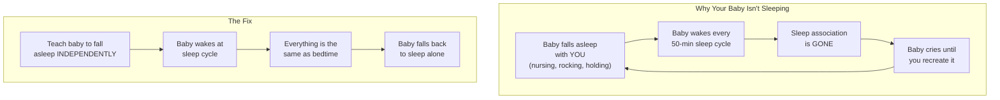
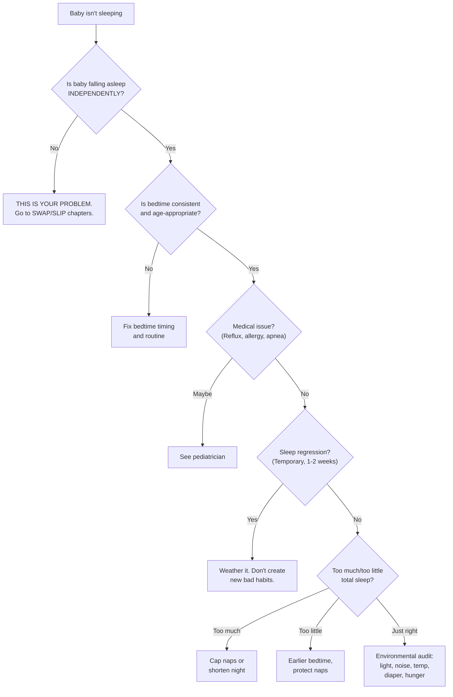
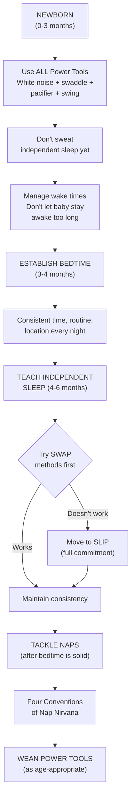

# Precious Little Sleep — Alexis Dubief

> Your baby isn't sleeping. You've read nine books, visited Dr. Google at 3 a.m., and whisper-fought with your partner about whose turn it is to bounce the screaming infant on the yoga ball. Alexis Dubief — a finance MBA turned baby-sleep researcher who spent five years working with thousands of families — has one core message that will save you: **teach your child to fall asleep without you**. Not without love, not without soothing, not without a plan — just without you being physically present at the moment of falling asleep. That single insight, backed by extensive research and delivered with the funniest writing in the parenting genre, resolves nearly every chronic sleep problem parents face from birth through kindergarten. This book won't judge you for co-sleeping out of desperation, for nursing your baby to sleep at 4 a.m., or for crying in the pediatrician's parking lot. It will give you the science, the tools, and a step-by-step plan to get everyone sleeping — and it will make you laugh while you're too exhausted to do anything else.

---

## About the Author

Alexis Dubief gave birth to her first child in 2006 and quickly discovered that sleep — or a lack thereof — was the bane of her existence. No book, website, or community seemed to have ready answers. Figuring that "this shouldn't be so hard," she spent the next five years researching and analyzing infant and child sleep, combining scientific evidence with insights from working with thousands of families.

She founded the Precious Little Sleep blog and podcast in 2011. Within a few years, it became one of the most popular online destinations for sleep-deprived parents worldwide, garnering millions of hits annually. The book grew from a Kickstarter campaign backed by a passionate community of parents who said, "You should write a book."

Dubief holds a Master of Finance and an MBA from the University of Colorado. She is not a pediatrician or a sleep scientist — she is a researcher and communicator who translates academic sleep science into actionable, humorous guidance. She writes from near Burlington, Vermont, where she lives with her husband and two boys. Her voice is unmistakable: warm, self-deprecating, packed with pop-culture references (Star Trek, The Princess Bride, Harry Potter), and utterly honest about how hard this parenting thing actually is. She is the rare author who can cite a peer-reviewed study on swaddling and SIDS in one paragraph and compare baby sleep to the Kobayashi Maru in the next.

---

## The Big Idea

- <b style="color: #2980b9">Teaching your child to fall asleep independently is the single most important thing you can do for their sleep</b> — not falling asleep independently at bedtime is the root cause of 99.8% of all chronic baby and toddler sleep problems
- <b style="color: #e74c3c">Babies don't outgrow sleep issues — they grow into them</b>: the myth that your child will "sleep when they're ready" is the most insidious sleep myth of all time, and waiting turns a 6-month problem into an 18-month problem
- <b style="color: #27ae60">You have powerful tools and proven methods to help your child sleep better, starting today</b> — white noise, swaddling, pacifiers, consistent routines, and step-by-step protocols (SWAP and SLIP) give you a clear path from sleepless chaos to everyone sleeping through the night
- What happens at bedtime determines the rest of the night — if the dominoes of bedtime are lined up correctly, you've set your child up for the best sleep possible
- Consistency is the foundation of everything — the "Goddess of Consistency" rewards devotion to routine and rains furious vengeance upon those who dare small disruptions
- More soothing is better for newborns — Sleep Power Tools aren't crutches, they're age-appropriate aids you can gently wean off later

---

## Key Concepts at a Glance

| Concept | One-line summary |
|---------|-----------------|
| **Independent sleep** | Baby falls asleep without nursing, rocking, or parental presence — the master key to solving sleep problems |
| **Sleep associations** | Whatever is present when baby falls asleep must remain present all night; non-persistent associations (nursing, rocking) cause repeated waking |
| **Object permanence** | At ~4-6 months, baby remembers you were there and is upset you're gone — the trigger for escalating sleep problems |
| **Sleep drive** | Pressure to sleep that builds with wakefulness — like a balloon that inflates; too early = saggy, too late = pops |
| **Circadian rhythm** | Hormonal day/night regulation; immature in newborns, develops by 2-4 months; consistency strengthens it |
| **Sleep Power Tools** | White noise, swaddling, pacifier, baby swing, schedule management — safe soothing aids that work without you |
| **SWAP** | Sleep With Assistance gradually Phased — gentle methods to wean off parental involvement at bedtime |
| **SLIP** | Sleep Learning Independence Plan — extinction-based methods (full or graduated) when SWAP doesn't work |
| **Goddess of Consistency** | Dubief's recurring metaphor: consistency in timing, location, and routine is the non-negotiable foundation |
| **Four Conventions of Nap Nirvana** | Age-appropriate soothing + consistent routine + proper timing + independent sleep = nap mastery |

Independent sleep is the book's gravitational center — everything else (Power Tools, consistency, science, troubleshooting) serves the single goal of teaching baby to fall asleep without you.

---

## 30-Second Version

A baby-sleep researcher who worked with thousands of families distills everything into one insight: **teach your child to fall asleep without you**. Babies wake naturally every 50 minutes during light sleep. If they fell asleep nursing or being rocked, they need that same thing recreated at every arousal — leading to the "up every hour" nightmare most parents know. The fix: use Sleep Power Tools (white noise, swaddling, pacifiers) to maximize soothing while gradually teaching baby to fall asleep independently. Start with gentle SWAP methods; if those fail, use SLIP (structured crying methods). Nail bedtime first, then naps. Be ruthlessly consistent. The result: babies who sleep 10-12 hours at night and take solid naps, parents who get their evenings and sanity back, and marriages that survive the first year intact.

---

---

## The Science of Baby Sleep

Understanding four concepts unlocks everything else in this book. Dubief calls Chapter 4 "the chapter you're tempted to skip over because it sounds tedious but you shouldn't because it's fundamental to the whole enchilada."

### How Baby Sleep Cycles Work

Baby sleep is fundamentally different from adult sleep. Adults cycle through sleep stages every 90-110 minutes; babies cycle every <b style="color: #2980b9">50 minutes</b>. Babies spend about 50% of their time in REM (active) sleep — double the adult proportion — which is why they're such noisy, twitchy sleepers. This large amount of light sleep means babies naturally wake <b style="color: #e74c3c">two to eight times per night</b>. That's normal. The question isn't whether your baby wakes up — it's whether they can fall back to sleep on their own.

The amount of REM sleep increases toward morning, which is why babies wake more frequently as the night progresses. The longest stretch of uninterrupted sleep happens right after bedtime, when the combined force of sleep drive and circadian rhythm is strongest.

### The Two Forces That Drive Sleep

Two biological mechanisms regulate sleep:

**Circadian rhythm** is the hormonal day/night cycle — including melatonin production — that makes you sleepy when it's dark and alert when it's light. Newborns are born with an immature circadian rhythm, which is why they party all night and sleep all day. It matures between 2-4 months. A consistent bedtime strengthens it enormously: when you fall asleep at the same time every night, your body chemistry regulates itself around that consistency.

**Sleep drive** (homeostatic sleep pressure) builds the longer you're awake, like a balloon slowly inflating. Put baby down too early and the balloon is saggy — no sleep. Wait too long and it overinflates and pops — overtired baby who paradoxically can't sleep. At bedtime, circadian rhythm and sleep drive combine their "wonder-twin powers," creating the strongest compulsion to sleep all day. This is why bedtime is the easiest time to establish independent sleep — and why naps, with their puny daytime sleep drive, are so much harder.

### Object Permanence Changes Everything

Around 4-6 months, babies develop <b style="color: #2980b9">object permanence</b> — the ability to remember that things exist even when they can't see them. This is why peek-a-boo becomes hilarious. It's also why sleep can suddenly fall apart.

Before object permanence, you could nurse baby to sleep, sneak them into the crib, and they'd wake up with no memory of the switch. After object permanence, baby remembers you were there and is genuinely upset that you've vanished. Dubief's analogy: imagine falling asleep in your own bed and waking up in your neighbor's bed. You'd be upset. You'd have trouble falling asleep the next night, worried it might happen again. That's exactly what your baby experiences every time you nurse them to sleep and then disappear.

### Sleep Associations: The Root of (Almost) Everything

All people have sleep associations — conditions present when falling asleep that the brain links with sleep itself. Dubief's own: her husband's presence, being in a bed, reading before lights out.

The critical distinction is between <b style="color: #27ae60">persistent</b> and <b style="color: #e74c3c">non-persistent</b> associations:

| Persistent (Good) | Non-Persistent (Problematic) |
|-------------------|------------------------------|
| Swaddle stays on all night | Pacifier falls out of mouth |
| White noise runs continuously | Nursing/bottle ends before waking |
| Lovey stays in crib | Parent leaves after baby sleeps |
| Dark room remains dark | Music/mobile turns off on timer |

When baby wakes at a natural sleep-cycle transition and finds everything the same as when they fell asleep, they drift back to sleep independently. When something has changed — Mom is gone, the pacifier is missing, the rocking has stopped — baby wakes fully and <b style="color: #e74c3c">cannot return to sleep</b> without that association being recreated.

> [!warning] The Escalation Pattern
> Dubief traces a devastatingly common scenario: Mom nurses newborn to sleep. Works great for months. Around 6 months, night wakings multiply. Dad tries rocking — baby refuses anyone but Mom and nursing. Nursing sessions get longer. Mom and baby end up co-sleeping out of desperation. Dad moves to the couch. Both parents are exhausted and resentful. The whole cascade started because the baby never learned to fall asleep without nursing.

---

## Baby Sleep Power Tools

Dubief defines five tools that meet strict criteria: they significantly improve sleep, persist through the night, work without parental involvement, are not "you," and can be weaned off later. She's emphatic that these are <b style="color: #27ae60">not crutches</b> — they're age-appropriate aids, and the fear of "addiction" to them causes parents to under-soothe their newborns.

### Power Tool #1: White Noise

The most effective, easiest, and cheapest sleep aid. White noise reduces stress, helps babies fall and stay asleep, reduces crying, may reduce SIDS risk, and masks household sounds. Use it at about <b style="color: #2980b9">50 decibels</b> (the volume of a running shower from across the bathroom). Leave it on for all sleep — anything on a timer will turn off and become a non-persistent sleep association. A free phone app or a clock radio set to static works fine.

### Power Tool #2: Swaddling

One study found swaddling reduced crying by 28%. It prevents the startle reflex from waking babies and helps them sleep longer. <b style="color: #e74c3c">Critical safety rule</b>: never place a swaddled baby face-down. Swaddling is safe only for back-sleeping babies. The moment your baby shows signs of rolling (getting onto their side), swaddling must stop immediately. Focus swaddling on the upper body — legs and hips should move freely to avoid hip dysplasia risk.

### Power Tool #3: The Pacifier

Sucking on a pacifier at sleep onset significantly reduces SIDS risk. Pacifiers are enormously soothing and, combined with other tools, dramatically improve sleep. The downside: some babies will require parental "reinsertion services" every hour all night. But this problem may never materialize, and even if it does, it won't happen for months. The benefits in the newborn period are worth the risk. Wean before age 2 to avoid dental issues.

### Power Tool #4: Baby Swings

Babies have been "swing-sleeping" since conception — the womb was their first swing. Motion-junkie babies may sleep dramatically better in a swing that provides consistent rocking, keeps baby slightly inclined (helpful for reflux), and can gradually be slowed to zero as a bridge to crib sleeping. Dubief's "Varsity Sleep Swing" technique: swaddled baby, pacifier, white noise, dark room, jiggle the back of the swing until baby's cheeks wiggle like Jell-O.

> [!tip] Safety Note on Swings
> The AAP recommends babies sleep only in cribs. Dubief acknowledges this and encourages discussing swing use with your pediatrician. If you use a swing: always strap baby in, fully recline, no loose items, monitor continuously, never use for a baby who schlumps forward (chin on chest restricts oxygen).

### Power Tool #5: Sleep Schedule Management

If you're trying to help your baby sleep when they're overtired or not tired enough, nothing else will work. This tool is about *when* rather than *how*. Key wake times by age:

| Age | Wake Time | Naps/Day | Bedtime |
|-----|-----------|----------|---------|
| 0-6 weeks | 30 min - 1 hr | 4-8 | Variable (8pm-midnight) |
| 6 wks - 3 mo | 45 min - 1 hr 45 min | 3-5 | Shifting earlier |
| 4 months | 1-2 hrs | 3-4 | 7-9 pm |
| 6 months | 1.5-3 hrs | 3 | 7-8 pm |
| 9-12 months | 2-4 hrs | 2 | 7-8 pm |
| 1-3 years | 4-6 hrs (1 nap) | 1-2 | 7-8 pm |

As babies grow, total sleep declines from ~16.5 hours at birth to ~11 hours by age 5 — with nap sleep shrinking steadily while nighttime sleep consolidates into a longer, more stable block.

Zero values indicate consolidated naps — by 12 months most babies are down to two naps, and by 18 months just one, making the gap before bedtime the critical wake window to manage.

---

## Handling Night Feedings

Night feeding is one of the most emotional topics in baby sleep. Dubief addresses it with both data and compassion — distinguishing genuine hunger from habit-driven feeding, and providing a clear framework for when and how to wean.

### When Are Night Feedings Necessary?

Newborns have marshmallow-sized stomachs and genuinely need to eat frequently — every 2-3 hours around the clock for the first months. By 3-4 months, most healthy, normally growing babies can sleep one longer stretch (4-6 hours) without eating. By 6 months, most babies are biologically capable of going 11-12 hours without food — though "capable" and "willing" are very different things.

The key question isn't "Is my baby hungry?" — it's "Is my baby waking because they're hungry, or are they waking for other reasons and eating because it's offered?" Dubief offers several diagnostic clues:

| Sign of True Hunger | Sign of Habit Feeding |
|---------------------|----------------------|
| Baby eats a full, vigorous feeding | Baby nurses/eats briefly, then falls asleep |
| Feedings are spaced 3+ hours apart | Baby wakes every 1-2 hours demanding food |
| Baby is genuinely upset until fed | Baby can be soothed by other means (sometimes) |
| Baby was hungry during the day too | Baby eats well during the day |
| Wakings happen at irregular times | Wakings happen like clockwork |

### Night Weaning Strategies

**Gradual reduction** — For nursing: reduce nursing duration by 1-2 minutes per night until the feeding is gone. For bottles: reduce volume by 1 oz per night. The goal is to give baby's body time to shift caloric intake to daytime.

**The snooze-button feeding** — For early-morning wakers: a quick feed at 5 am can buy an extra 1-2 hours of sleep for everyone. It's not ideal, but it's the "least bad" alternative for families stuck with uncivilized wake times.

**Cold turkey** — After establishing independent sleep, some parents find that night feedings simply disappear. When baby can fall asleep without nursing/feeding, they no longer need it to cycle back through light sleep phases. For many families, solving the independent-sleep problem automatically solves the night-feeding problem.

> [!tip] The Dad Test
> If Dad (or any non-nursing partner) can successfully get baby back to sleep without food, the baby is waking for sleep-association reasons, not hunger. If absolutely nothing but nursing will do, it could be a sleep association issue — or genuine hunger. Consider the full picture.

---

## Sleep Safety: What Every Parent Must Know

Dubief devotes significant space to SIDS prevention — the topic parents dread most but need to understand. SIDS is the third most common cause of infant mortality, with a peak between 2-3 months and a rate of about 1 in 2,000 babies.

### Non-Negotiable Safe Sleep Rules

- **Always on their back** — no stomach, no side sleeping. Once baby can roll independently, it's fine to let them stay on their stomach.
- **Firm, flat surface** — no pillows, blankets, sheepskins, bumpers, stuffed animals. Not on a couch. Not in a recliner. Not in a car seat for extended sleep.
- **Room-sharing for 6 months** — sleeping in your room reduces SIDS risk by up to 50%. Room-sharing, not bed-sharing.
- **No overheating** — at most one more layer than you're wearing. If baby has flushed cheeks, hot ears, or a sweaty neck, they're too warm.
- **Pacifier at sleep onset** — reduces SIDS risk even if it falls out after baby is asleep.
- **Keep immunizations current** — immunized babies are at lower risk for SIDS.

> [!danger] The Couch Warning
> Never fall asleep with your baby on a chair or couch. This happens more than you think — a parent takes baby to the living room to let the other parent sleep, starts nursing in a recliner, and dozes off. This is an **enormously risky** sleep location and one of the most dangerous scenarios for infant suffocation.

Dubief on co-sleeping: she presents the AAP's recommendation against it, cites the meta-study confirming increased risk even in non-smoking families, but also provides detailed harm-reduction guidance for families who choose to co-sleep anyway. Her position: don't casually ignore 60,000 pediatricians, but if you've made a mindful decision with your pediatrician, here's how to make it as safe as possible.

---

## The Complete Sleep Troubleshooting Guide

Dubief's approach to any sleep problem follows a consistent diagnostic sequence:

---

## Bedtime Is the New Happy Hour

Dubief devotes an entire chapter to bedtime because <b style="color: #2980b9">when bedtime happens and what happens at bedtime determines how the rest of the night goes</b>. If bedtime is wrong, you can't fix things at 2 a.m. You made your proverbial bed when your child went to bed, and now you're all going to sleep in it — or not, as the case may be.

Bedtime should be your favorite time of day. Kids in pajamas are fantastic, second only to naked bathtub babies, which are inarguably the greatest thing in all of history.

### The Seven Rules of Bedtime

1. **Same time each night** — A consistent bedtime is one of the most powerful sleep cues. When you fall asleep at the same time every night, your body chemistry regulates around it. The Goddess of Consistency will smite you with her all-powerful smiting staff if you routinely shuffle bedtime around.

2. **The right time** — Most kids 3 months to 8 years should be in bed around 7:30 pm. Most babies are hard-wired to wake early regardless of when they go to bed, so late bedtimes just mean less total sleep.

3. **Sufficient wake time before bed** — The gap between the last nap and bedtime should be the longest awake stretch of the day (roughly 1.3-1.5x any other wake time). Too short = can't fall asleep. Too long = overtired mess.

4. **Defend bedtime against late naps** — Even a 5-minute car nap after 4 pm can sabotage bedtime. Bedtime is your shining castle; dig a moat of nap-free time around it.

5. **Consistent routine** — "Boob or bottle, bath, books, bed" is a classic. Move from high-energy to low-energy, from bright to dim, toward the bedroom. Keep it 20-30 minutes.

6. **Same sleep location each night** — The Goddess of Consistency rewards this.

7. **One location per night** — Starting in the crib and ending in your bed teaches baby that persistence pays off. Studies show children who switch beds during the night get less sleep.

> [!example] Fixing a Late Bedtime
> If your baby goes to bed at 11 pm and you want 7:30 pm: wake baby 15 minutes earlier each morning, shift all naps 15 minutes earlier, and move bedtime 15 minutes earlier per day. Keep lights dim from target bedtime until actual bedtime. Expose baby to bright outdoor light first thing in the morning. It takes about 3 weeks for a major shift — slow and steady beats trying to force a 3-hour jump.

---

## The Newborn Survival Guide (0-3 Months)

Dubief is bracingly honest about the newborn period. Before she had a baby, she imagined herself in white capris and breezy espadrilles, gallivanting with cool mom friends like a diaper commercial. At age eight, she thought she'd grow up to be a professional horse jockey millionaire who married Erik Estrada. She's not sure which fantasy was more absurd.

### What's Actually Normal

Newborns sleep 14-18 hours per day — but in erratic chunks that leave parents feeling like sleep never happens. Crying peaks at about <b style="color: #e74c3c">6 weeks</b>, when sleep is also at its worst. About one-third of newborns are "colicky" — the Rule of Three: crying 3+ hours per day, 3+ days per week, for 3+ weeks.

The **Witching Hours** (roughly 5-11 pm) are a stretch when most newborns are awake and miserable. Survival tips: enlist visitors during this window, change scenery every 10 minutes, cluster-feed, run errands, and go to bed when baby finally goes to bed — even if it's 8 pm. A hundred years ago, people bathed twice a year. A few soap-free days won't kill you.

**Day/night reversal** is normal — baby partied all night in the womb (when Mom stopped moving) and slept all day (when Mom's walking rocked them to sleep). The circadian rhythm matures by 2-4 months. You can nudge it with light management: bright light during daytime wake periods, dim and quiet at night.

### Six Newborn Sleep Guidelines

1. **Get awesome footie pajamas** — preferably with monkey faces on the feet
2. **Don't sweat independent sleep yet** — very few newborns can do it; do what works
3. **Safety comes first** — no stomach sleeping, no soft bedding, no falling asleep with baby on the couch
4. **More soothing is better** — use every Power Tool; these aren't "sleep crutches," they're happy-makers
5. **Don't force the crib** — most newborns won't sleep well in it yet; co-room with a bassinet instead
6. **Don't let baby stay awake too long** — babies won't reliably fall asleep on their own when tired; managing wake times is your job

---

## Teaching Baby to Sleep: SWAP and SLIP

This is the heart of the book — the practical protocols for teaching independent sleep. Dubief organizes them into two tiers: <b style="color: #27ae60">SWAP</b> (gentler, try first) and <b style="color: #e74c3c">SLIP</b> (more direct, when SWAP fails).

### SWAP: Sleep With Assistance Gradually Phased

SWAP methods gradually reduce your involvement at bedtime. The core idea: instead of going from "fully nursing/rocking to sleep" to "putting baby down cold turkey," you take incremental steps toward independence.

**The Pull-Out Method** — Nurse or rock baby until drowsy but not fully asleep, then place them in the crib. Over several nights, put them down increasingly awake. The goal: baby's eyes are open when their butt hits the mattress. Some babies adapt quickly; others take weeks. If baby gets frustrated rather than sleepy, this method may not be the right fit.

**The Swing Transition** — For motion-junkie babies: start with baby falling asleep in a moving swing → gradually reduce swing speed → baby falls asleep in motionless swing → move swing next to crib → transition to crib. Each step takes a few days to a week.

**Pacifier Pull-Out** — Place pacifier in baby's mouth; when sucking slows and baby is drowsy, gently pull it out. Baby's reflexive response is to suck harder. Repeat. Over days, baby learns to fall asleep without the pacifier in their mouth. "Of course, if you were successful with the pull-out method, you wouldn't have a baby to begin with. Badum-CHING!"

**Fuss It Out** — Put baby down awake with full Power Tools (swaddle, white noise, pacifier). Allow 10-20 minutes of fussing (not screaming) to see if baby can settle independently. Many babies can — parents just never gave them the chance because they intervened at the first sound.

### SLIP: Sleep Learning Independence Plan

When SWAP methods don't work — or when baby is older (6+ months) and firmly entrenched in non-persistent sleep associations — SLIP methods use structured crying to teach independent sleep. Dubief is honest: there will be tears. "Tears are just a sign that something isn't easy. Lots of things in life aren't easy, but few of them are as important as healthy sleep."

**Full Extinction** (Weissbluth approach) — Complete bedtime routine, put baby down awake, leave. Don't return until morning (or a scheduled feeding). The simplest method and, counterintuitively, often involves the *least* total crying because parental check-ins can re-escalate distress. Most babies fall asleep within 30-60 minutes on night one, with rapid improvement over 3-5 nights.

**Graduated Extinction / Timed Checks** (Ferber approach) — Put baby down awake, leave. Return for brief check-ins at increasing intervals (3 min, 5 min, 10 min, 15 min). Keep checks short and boring — pat briefly, use your words, leave. Don't pick baby up. Some babies are soothed by checks; others get angrier each time you appear and leave again.

> [!warning] The Cardinal Rule of SWAP → SLIP
> You can start with any SWAP method and switch to SLIP later if it isn't working. But once you begin SLIP, <b style="color: #e74c3c">you are fully committed</b>. You cannot go backward. Going back to rocking/nursing after starting SLIP teaches baby that sufficient crying will eventually get them what they want — making every future attempt harder and longer.

### Key Principles for Both Methods

- **Tackle bedtime first, naps second** — Bedtime has the strongest sleep drive; success comes faster. Once bedtime is solid, naps are the next frontier.
- **Both parents must be fully on board** — If one partner caves at 2 a.m., the entire effort is undermined.
- **Expect improvement, not perfection, in 3-5 nights** — Most babies show dramatic improvement quickly, but some strong-willed babies take 1-2 weeks.
- **Temporary crying is not harmful** — Extensive research shows no negative long-term effects of sleep training on attachment, cortisol levels, or emotional development. (See also: [[Cribsheet - Emily Oster]] for the data review.)

SWAP methods (Pull-Out, Swing, Pacifier, Fuss It Out) trade speed for gentleness, while SLIP methods (Full and Graduated Extinction) deliver faster results but involve more crying — the right choice depends on baby's age, temperament, and family readiness.

---

## Becoming the Zen Nap Ninja Master

Naps are the Kobayashi Maru of baby sleep — the classic no-win scenario from Star Trek. Captain Kirk found a way to beat it (spoiler: he cheated), and you will too. But naps are genuinely harder than nighttime sleep for several reasons:

- <b style="color: #e74c3c">Daytime sleep drive is puny</b> compared to bedtime — biology isn't helping you much
- Baby's nap schedule constantly changes as they grow
- Babies can and will fight naps — life is exciting; naps are not
- Even small disruptions (a 5-minute car nap) can torpedo a whole nap day

### The Four Conventions of Nap Nirvana

1. **Age-appropriate soothing** — Use Power Tools generously. Babies may need more soothing for naps than bedtime. That's okay — nap soothing and bedtime soothing don't need to match.

2. **Consistent pre-nap routine** — 10-15 minutes of calm wind-down, same sequence every time. Not a 60-minute affair involving massage, a Turkish bath, interpretive dance, and a musical puppet show — but more than "Well, time for your nap — into the bed you go, my friend!"

3. **Timing is everything** — Too early = not enough sleep drive. Too late = overtired and paradoxically unable to sleep. Use the Wake-Time Method: track how long baby has been awake and put them down before the window closes.

4. **Independent sleep by 4-6 months** — The "fourth convention" Dubief deliberately held back because "three sounds cute and achievable — four sounds like AAARGH." Babies who aren't falling asleep independently at naptime will have persistent short naps. Babies must learn independent sleep *twice* — bedtime skill doesn't transfer to naptime.

### Wake-Time Method vs. By-the-Clock

For younger babies with unpredictable nap lengths, use **wake time** — put baby down based on how long they've been awake, not the clock. As sleep becomes predictable (usually 4-9 months), transition to **by-the-clock** napping at fixed times each day. The transition usually happens organically: consistent bedtime → consistent morning wake → predictable first nap → predictable second nap.

### Fixing Craptastic Short Naps

If baby is 6+ months, falling asleep independently, and still capping naps at 35 minutes:

**Method 1: Disrupt the sleep cycle** — Go in 5-10 minutes *before* baby's habitual wake time. Gently jostle — enough for eye-fluttering, not enough to fully wake. This disrupts the sleep/wake pattern and often lets baby fall back into deep sleep. Continue for 5-7 days to reset the habit.

**Method 2: Bore to sleep** — After a micronap (under 30 min), leave baby in their dark, boring sleep space for 15-30 minutes. Sometimes boredom wins and they fall back to sleep. If baby complains for the full 30 minutes after every nap for weeks, concede defeat graciously.

### Nap-Dropping Schedule

| Age | Transition | Notes |
|-----|-----------|-------|
| 3-6 months | 4-8 naps → 3 | Usually uneventful |
| 6-12 months | 3 naps → 2 | Third nap often becomes an on-the-go affair |
| 12-18 months | 2 naps → 1 | Often sloppy; can drag on for weeks |
| 3-5 years | 1 nap → 0 | Most kids still nap at age 3; don't be fooled by refusal |

When your child is fully done napping, transition to "quiet time" — 1 hour alone in a dim room with a few board books. Use a visual timer so they know when it's over.

---

## Weaning Off the Power Tools

The Sleep Power Tools are like perms, Dubief says — cool until they aren't, and eventually you'll be done with them for good. Fears of getting "stuck" lead many parents to wean too aggressively. Continued swaddling will make it challenging for your 8-year-old to have sleepovers, and ongoing pacifier use will hinder your 16-year-old's ability to get a date — but there's no rush to ditch tools that are actively helping.

### Pacifier Weaning

**When:** Easiest before 5 months (out of sight, out of mind before object permanence). Otherwise, when it causes nightly reinsertion chaos (usually 6-8 months), or before age 2 (dental concerns). **How:** Cold turkey (often less dramatic than expected), the pull-out method, or — for kids 18+ months — theater: mail pacifiers to Santa, trade them for a coveted toy, leave them for the Paci Fairy. Make sure no rogue pacifiers are hiding behind couch cushions to undermine the ceremony.

### Swaddle Weaning

**When:** Baby starts rolling (immediate stop required — face-down while swaddled is extremely dangerous) or when you think they're ready. **How:** One arm out → both arms out → done. Or use a transition swaddle product. Or just stop cold — if baby has strong independent sleep habits, the swaddle may go unnoticed.

### Swing Weaning

Progressive speed reduction: highest → one level down → slower → off → motionless swing → move swing next to crib → put baby in crib. If any step causes problems, go back one level and try again in a week.

### White Noise Weaning

Most babies benefit from white noise until at least their first birthday. No compelling reason to stop after that. When ready: gradually reduce volume over a few days until it's off. Quick and painless.

---

## (Un)Common Sleep Setbacks

Dubief warns: you can do all the right things and still have everything go wrong. A 3-week-old who sleeps 10 hours a night can turn into a 4.5-month-old who wakes up every hour "like they're giving free ponies to the kid who wakes up the most and she's determined to win."

### Sleep Regressions

Regressions — Dubief prefers "needy volcanoes" — are periods when baby's sleep mysteriously collapses while they become extremely fussy, clingy, and hungry. They're actually developmental leaps (the opposite of regression), but the sleep impact feels regressive. They commonly hit around <b style="color: #e74c3c">4 months, 6 months, and 8-10 months</b>, though roughly half of all babies won't experience any given regression.

Signs you're in one: sleep stops, fussiness spikes, baby demands constant feeding, and baby must be held at all times. Average duration: 1-2 weeks. Strategy: don't panic, temporarily reintroduce Power Tools if needed, but <b style="color: #27ae60">get back on the independent sleep path</b> once it passes. The classic trap: letting a temporary survival tactic (co-sleeping, nursing back to sleep) become the permanent new normal.

### Separation Anxiety

Peaks around 8-9 months, linked to object permanence. Baby now remembers you exist and is devastated when you leave the room. You'll know it's arrived when you find yourself using the bathroom with an 8-month-old on your lap.

Key strategies: longer bedtime routines with verbal reassurance, practice brief separations during the day ("I'll be back in 2 minutes"), fill their emotional bucket with extra quality time, and don't feed the anxiety — remain loving but consistent. Important: many cases of apparent "separation anxiety" at bedtime are actually just a baby who hasn't learned independent sleep. Once that's resolved, the bedtime drama often evaporates.

### Travel

Dubief's pro tip for traveling with babies: never travel with babies. Most babies sleep poorly in unfamiliar environments, and travel disrupts the schedule. The unwanted souvenir: Post-Travel Sleep Disruption (PTSD) — accumulated sleep debt that follows you home.

If you must travel: stick to your normal schedule militantly, adjust for time zones using light therapy (bright outdoor light at strategic times), bring familiar items, keep baby falling asleep independently, and expect a few rough days after returning home. Most critically: don't let travel turn your independent sleeper into a dependent one.

### Daylight Saving Time

DST brings jet lag without the perk of travel. **Spring forward:** spread the 1-hour change across 4 days (15 min/day earlier), dim lights before the new bedtime, bright morning light. **Fall back:** expose baby to bright light in the evening to shift their clock later; keep mornings dark and delay feeding until target wake time.

### Chronic Sleep Deprivation

When illness, travel, or regressions accumulate a sleep debt, cortisol rises — a naturally occurring stimulant that paradoxically makes it <b style="color: #e74c3c">harder to sleep</b>. The vicious cycle: baby is overtired → can't sleep → gets more overtired → sleeps even worse. Break the cycle with stroller naps (longer than crib naps for sleep-deprived babies, without creating new sleep-on-you habits) and temporarily earlier bedtimes (30 minutes earlier for a few days).

### Early Waking

All babies wake early. A 6:00-6:30 am target is realistic; some persistent early risers can't make it past 5:30. For truly uncivilized wake times:

- **Try earlier bedtime** — counterintuitively, an earlier bedtime often produces later mornings because baby isn't going to bed overtired
- **Try later bedtime + evening light therapy** — push bedtime back gradually while exposing baby to bright light in late afternoon
- **Environmental audit** — sneak into baby's room 30 minutes before wakeup; check for sunlight, neighbor noises, wet diapers
- **Disrupt the pattern** — gently rouse baby 45 minutes before habitual wake time; the disruption can break the entrenched cycle
- **Reverse alarm clock** (2+ years) — a light that changes color at the target wake time; start 15 minutes past current wake time and gradually extend

---

## Older Kids, Siblings, and Twins

Once your baby transforms into a toddler, you gain a powerful new tool: language. Your child can now understand rules, be motivated by incentives, and engage in dialogue. But they've also gained opinions, physical mobility, and a sophisticated talent for limit testing.

### Strategy #1: Boundaries and Bait

For kids 18+ months who need to learn (or re-learn) independent sleep:

1. **Determine bedtime rules** — two non-negotiables: child falls asleep without adult in room, child stays in bed. All caregivers must be on board.
2. **Talk about it at non-bedtime** — discuss the plan over lunch, not at 7:30 pm. Explain the what, why, and when. Give 3-5 days of advance notice.
3. **Connect emotionally** — normalize their feelings. "I know this will feel different at first, but I also know you can do this."
4. **Make bedtime distraction-free** — a 20-30 minute routine with your full attention fills their emotional bucket.
5. **Deploy the bait** — let child make their bed great (new sheets, special teddy), drive the bedtime routine (which books, how many kisses), use a reward chart (3+ years), and offer **bedtime tickets**: two cards exchangeable for one hug, one drink of water, etc. When tickets are used, no more getting out of bed.

### Strategy #2: The Fade

For kids used to a parent in the room at bedtime: progressively move yourself further away over 3-5 nights. Night 1: sitting next to the bed with hand on back. Night 2: sitting 2 feet away. Night 3: 4 feet away. Continue toward the door. Be a loving but silent, minimally engaged presence. When you're no longer visible at bedtime, you're done.

### Limit Testing: Your Child Is a Scientist

From your child's perspective, you are one giant science experiment. They're continuously testing hypotheses: what happens if I ask for one more book? What if I say I'm thirsty? What if I yell "I have to poop"?

Limit testing works because it works. The key is to make it stop working:

1. **Mean what you say** — "I'm not coming back" means you don't come back. The Goddess of Consistency forgives nothing.
2. **Fill their bucket** — limit testing often signals an empty emotional tank. Carve out small moments of undivided attention during the day.
3. **Don't reward it** — even negative attention (a lecture about staying in bed) is still attention. Ignore what you safely can.
4. **Commitment is the foundation** — "I hate the word *try*. When parents tell me they'll 'try' something, it's a clue they aren't really committed to change."

### The Big-Kid Bed Transition

Moving to a big-kid bed is like giving your toddler the car keys. Best-case scenario: they sleep as well as they did in the crib. The freedom of a bed doesn't fix sleep issues — it exacerbates them.

**Good reasons to move:** child is climbing out and risking injury (and doesn't stop after one try), or child is legitimately 3+ years old. **Bad reasons:** to "solve" sleep issues, or because a new baby needs the crib (buy a second crib if possible; if not, transition 3-6 months *before* the new baby arrives).

### New Siblings and the Bed Bounce

Most older kids seem unfazed by a new baby for 3-6 months — Dubief theorizes they view it like a visit from Aunt Matilda: vaguely unpleasant but mercifully brief. Once they realize the baby is permanent, the **New Baby Bed Bounce** erupts: fighting bedtime, skipping naps, waking at night. It's a plea for attention — not a sleep problem per se. The solution is dedicated one-on-one time during the day, firm bedtime boundaries, and not letting guilt turn temporary disruption into permanent bad habits.

### Nightmares and Night Terrors

Dubief brings in Dr. Ruid, PhD, for this section. The protocol for night waking (whether behavioral or fear-based) is the same:

1. Go to your child (don't let them come to you)
2. Brief empathy and validation ("I can see you're upset — sometimes I feel that way too")
3. Skill reminder ("Remember, you can use belly breathing")
4. Exit consistently ("I love you" → leave)

Teach coping skills during the day: **belly breathing** (inflate an imaginary balloon in your stomach), **visualization** (remember the beach trip — what do you hear, smell, feel?), and **calming self-talk** ("Everything is the same in the dark as in the light — I just can't see it").

Dubief is not a fan of "monster spray" — she believes it makes the fear more real. Her approach: "There is no monster in your closet because there is no such thing as monsters." Then redirect to coping tools.

---

## Medical Complications That Affect Sleep

Dubief's appendix covers medical issues that may cause sleep disruption. She emphasizes: 95% of the time, the reason your baby isn't sleeping is because they're a baby. Start with the assumption that everything is fine.

### Reflux (GERD)

About 67% of 4-month-olds spit up daily — that's normal. Reflux becomes a problem only when stomach contents irritate the esophagus, causing pain. Signs: crying far more than 3 hours/day, worse after feedings or when placed on back, chronic ear infections, arching after feeding. Management: consider a dairy-free trial (up to 50% of refluxing babies also have dairy intolerance), keep baby upright after feedings, use more soothing tools (pacifiers produce saliva — a natural antacid), adhere strictly to sleep schedules, and wait — most cases resolve by baby's first birthday.

### Food Allergies

About 5% of children have food allergies, with cow's milk protein being the most common infant allergen. Challenging to diagnose in babies under 1 — the most powerful diagnostic tool is a food diary. Dubief cautions: 43% of parents believe their child has a food issue when fewer than 5% actually do — always consult your pediatrician before cutting foods from your diet.

### Teething

Dubief drops a bomb: studies show teething is no big deal. Our perception of how terrible it is probably has nothing to do with teething and everything to do with the fact that they're babies — who are periodically fussy, sniffly, and rashy regardless. "If you share this fact with 100 parents, 99 will call you a liar and a fraud. Which is why I'm saying it in this book. Because while you may choose to yell at the book, I can't actually hear you." Best response: cold washcloths, teethers, distraction. Skip the amber beads and benzocaine gels.

---

## Best Stories

> [!quote] The Goddess of Consistency
> She appears in nearly every chapter — a vengeful deity who rewards devotion to routine and rains furious vengeance upon families who dare even small disruptions. She is "merciless toward parents of refluxing babies," "holds a grudge," and "doesn't take insult lightly." Her smiting staff is all-powerful. She forgives nothing.

**The 3 a.m. Whisper-Fight** — "One night you'll be whisper-fighting at 3 a.m. about how to handle the crying baby. The next night you'll be convinced your partner is a total dolt who is pretending to sleep to avoid dealing with whatever is happening. Everybody gets grumbly when they're tired. Forgive each other."

**The Invisible Zombie Hordes** — A parent writes: "Within 30 seconds of being put down he starts screaming and shadow-boxing the air like invisible demons are after him... There are only so many mushrooms and small animals I can forage from the backyard before I need to go grocery shopping."

**The Nursing Escalation** — Dubief traces a couple's journey from "baby nurses to sleep, wakes once at night" to "Dad on the couch, Mom as human pacifier, marriage strained" — all because nobody understood sleep associations. It's the most devastating and relatable passage in the book.

**The Kobayashi Maru of Naps** — Naps compared to Star Trek's famous no-win training scenario. "Some of you will feel like naps are the Kobayashi Maru, which may be enormously depressing. But Captain Kirk found a way to beat it (spoiler alert... he cheats), and you will too."

**The Whipped-Cream Dragon** — Dr. Ruid's son had a nightmare about a fire-breathing dragon chasing their family. She had him reimagine the dragon breathing whipped cream. "Our family is known for enjoying dessert."

**The Pull-Out Method** — Dubief introduces a pacifier-weaning technique and can't resist: "Of course, if you were successful with the pull-out method, you wouldn't have a baby to begin with. Badum-CHING!"

---

## Practical Application

### The Complete Sleep Action Plan

### If You Read Nothing Else

1. **Understand sleep associations** — whatever is present when baby falls asleep must be present all night. Non-persistent associations (you, nursing, rocking) cause night waking.

2. **Establish a consistent bedtime** by 3-4 months — same time, same routine, same place, every single night. Around 7:30 pm for most kids.

3. **Teach independent sleep** by 4-6 months — baby's butt hits the crib, they're awake, you leave, they fall asleep on their own. Start with SWAP methods; move to SLIP if needed.

4. **Use Power Tools generously** for newborns — white noise (50 dB, left on all night), swaddling (on back only), pacifier (reduces SIDS risk). These are not crutches.

5. **Nail naps after bedtime** — use the Four Conventions (soothing, routine, timing, independence). Expect naps to be the last thing to improve.

6. **Don't let setbacks become permanent** — regressions, illness, and travel will temporarily disrupt sleep. Get back on the independent-sleep path within 2 weeks.

7. **Be consistent** — the Goddess of Consistency is always watching. Pick one plan, commit fully, and execute it for at least a week before evaluating.

### Ten Things Dubief Wants You to Remember

1. You are the best parent for your child — nobody could do better
2. You and your partner will whisper-fight at 3 a.m. — forgive each other
3. Babies don't outgrow sleep issues; they grow into them
4. Helping your child develop healthy sleep habits is one of the best things you can do for them
5. If your whole day is spent obsessing about sleep, it's time to make a change
6. Every baby has a Sleep Fairy — but Sleep Fairies are lazy and notoriously unreliable
7. Sometimes making a change means things get worse before they get better
8. Sometimes getting everybody to sleep requires a few tears — that's okay
9. You need one plan, not five — be monogamous with this book for two weeks
10. "You can't make them eat, sleep, or poop. But you can create the conditions for all three."

---

## Connections

- [[Cribsheet - Emily Oster]] — Oster reviews the same sleep-training research from a data-analysis perspective and concludes it's safe and effective with no evidence of harm; Dubief provides the practical how-to that Oster deliberately doesn't
- [[Brain Rules for Baby - John Medina]] — Medina's chapters on sleep science provide the neuroscience backstory for why sleep deprivation is so damaging to developing brains
- [[The Whole-Brain Child - Daniel J. Siegel & Tina Payne Bryson]] — Siegel's co-regulation framework connects to Dubief's approach of teaching self-soothing as a developmental skill
- [[No-Drama Discipline - Daniel J. Siegel & Tina Payne Bryson]] — The limit-testing and natural-consequences approaches overlap significantly with Dubief's Boundaries and Bait
- [[No Bad Kids - Janet Lansbury]] — Lansbury's respectful approach to setting limits while acknowledging feelings parallels Dubief's empathy-validation-boundary sequence
- [[Hunt, Gather, Parent - Michaeleen Doucleff]] — Doucleff would push back on the rigidity of sleep schedules as culturally specific to Western parenting; Dubief would counter with the sleep-science evidence
- [[The Montessori Toddler - Simone Davies]] — Davies' emphasis on independence and prepared environment aligns philosophically with teaching independent sleep
- [[How to Talk So Little Kids Will Listen - Joanna Faber & Julie King]] — The communication techniques for nightmares and limit testing mirror Faber & King's empathy-first approach
- [[Unconditional Parenting - Alfie Kohn]] — Kohn would critique the reward charts and extinction methods as extrinsic motivation and potentially harmful; this represents the deepest philosophical tension in the parenting shelf
- [[Simplicity Parenting - Kim John Payne]] — Payne's emphasis on rhythm, routine, and reducing stimulation strongly supports Dubief's consistency framework and sleep environment recommendations

---

## A Note on Twins and Multiples

About 3% of U.S. births are multiples. Everything in the book applies, with important additions: over 50% of twins and 90% of triplets are born premature, increasing SIDS risk and requiring adjusted-age timelines. The critical survival strategy: **synchronize**. If one baby wakes to eat, both get fed. Make independent sleep a priority early (3-5 months adjusted age). Anecdotally, multiples sharing a room rarely wake each other — your baby's crying bothers you far more than it bothers their sibling. Give each baby their own crib (the AAP recommends against co-bedding). And accept help — the "following baby's lead" philosophy applies far less to you than to singleton parents.

---

## The Dubief Manifesto

Dubief closes not with a summary of techniques but with an emotional truth: parenting a baby who doesn't sleep is one of the hardest things you'll ever do. It can strain your marriage, your mental health, and your ability to enjoy the very child you love so fiercely.

But it doesn't have to stay this way.

You are not a garbage person for wanting sleep. You are not selfish for teaching your baby a life skill. You are not failing because it took some tears. You are doing one of the most important things a parent can do: giving your child the gift of healthy sleep — and giving yourself the capacity to be the parent they deserve when the sun comes up.

The Goddess of Consistency is always watching. The Sleep Fairy is unreliable. But you? You've got this.
