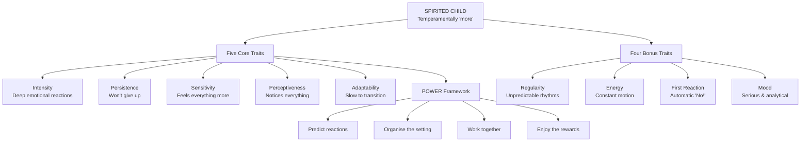

# Raising Your Spirited Child — Mary Sheedy Kurcinka

> Your three-year-old can't leave for class because a loose string in his sock has turned dressing into a fifteen-minute ordeal. Your daughter melts down at Thanksgiving dinner because you served tuna sandwiches instead of the burritos you'd promised. Your son has been asked to leave two birthday parties in a month. The pediatrician says he's fine. Your mother-in-law says you're too soft. Your gut says this child is *more* — more intense, more sensitive, more persistent, more everything — but nobody has given you a word for it. Mary Sheedy Kurcinka did. Drawing from decades of family education classes and the longitudinal temperament research of Chess and Thomas, she coined the term "spirited child" and built the first comprehensive framework for understanding and thriving with the 15–20% of children who are temperamentally more. The word you use to describe your child changes how you see them. "Difficult" makes you brace for combat. <b style="color: #2980b9">"Spirited" invites understanding</b>. That single reframe is the foundation everything else is built on.

---

## About the Author

Mary Sheedy Kurcinka holds a doctorate in education and has spent over thirty years directing family education programs in Minnesota. She developed the original "Raising Your Spirited Child" classes that became the testing ground for every strategy in this book. This third edition (2015) integrates new research on neuroscience, emotion regulation, and sensory processing, while preserving the real parent voices that have always been the book's signature.

Kurcinka is herself the parent of a spirited child — her son Joshua, whose early years drove her to search for a better word than "difficult" or "mother killer." She is refreshingly honest about her own struggles: hiding in her mother-in-law's bathroom on Christmas Day trying to soothe a screaming infant, shopping for consensus clothes across six trips, and learning to read her own temperament as much as her child's.

Her other books include *Sleepless in America*, *Kids, Parents, and Power Struggles*, and the *Raising Your Spirited Child Workbook*. The approach is grounded in the Chess and Thomas longitudinal temperament research and informed by Gottman's emotion coaching model, occupational therapy insights on sensory processing, and Jung/Myers-Briggs concepts of introversion and extroversion.

---

## The Big Idea

- <b style="color: #2980b9">Spirited children are normal children who are "more"</b> — more intense, persistent, sensitive, perceptive, and uncomfortable with change. They are not disordered, defiant, or difficult. They represent 15–20% of all children
- <b style="color: #e74c3c">The words you use to describe your child shape everything</b> — your perception, your emotional response, your discipline strategies, and ultimately your child's self-image. Replacing "stubborn" with "persistent" changes the entire interaction
- <b style="color: #27ae60">Understanding temperament gives you predictive power</b> — once you know which traits drive your child's behaviour, you can predict trouble spots, organise settings for success, and prevent meltdowns before they happen
- Every temperament trait is simultaneously a challenge and a strength. The intense child who screams at bedtime is the same child who laughs with abandon at the playground. The persistent child who won't give up the argument is the same child who won't give up the puzzle
- Behaviour problems come from "goodness of fit" — the mismatch between a child's temperament and their environment, not from a broken child. Change the fit and the behaviour changes
- You must understand your own temperament as much as your child's. Parent-child conflict often reflects temperament mismatch, not willful disobedience
- Connection before correction: a child in the "red zone" (flooded with emotion) cannot learn. Calm them first, teach them second

---

## Key Concepts at a Glance

| Concept | One-line summary |
|---------|-----------------|
| **Spirited = More** | Not difficult, not disordered — temperamentally more intense, persistent, sensitive, perceptive, and slow to adapt |
| **Nine Temperament Traits** | Five core + four bonus traits, each on a continuum from mild to spirited |
| **Reframing Labels** | Replace deficit words (stubborn, wild, picky) with strength words (persistent, energetic, selective) |
| **Goodness of Fit** | Behaviour problems arise from mismatch between child and environment, not from a broken child |
| **Energy Bank** | Spirited children deplete faster; introvert/extrovert determines how they refill |
| **Red/Yellow/Green Zone** | Arousal model — all teaching happens in green/yellow; red requires calming first |
| **Transparent Limits** | Three steps: state expectation, state consequence, state when — no surprises |
| **POWER Framework** | Predict, Organise, Work together, Enjoy Rewards — the daily planning method |
| **Emotion Coaching** | Notice emotion → see teaching opportunity → validate/label → set limits while problem-solving |
| **Consensus Clothes** | Shopping collaboratively so clothing feels good to the child and looks acceptable to the parent |

---

## 30-Second Version

About 15–20% of children are temperamentally "more" — more intense, persistent, sensitive, perceptive, and resistant to change. Kurcinka calls them spirited. The first step is replacing negative labels with strength-based ones (stubborn → persistent, wild → energetic). The second is understanding nine temperament traits that explain your child's behaviour. The third is using the POWER framework — Predict reactions, Organise settings, Work together, Enjoy Rewards — to prevent daily battles before they start. Throughout, the emphasis is on connection before correction, filling the child's energy bank, and recognising that every challenging trait is also a strength waiting to be channelled.

---

## Part One: Understanding Spirit

### Who Is the Spirited Child?

The word that distinguishes spirited children from other children is <b style="color: #2980b9">more</b>. They are normal children who are more intense, persistent, sensitive, perceptive, and uncomfortable with change. Kurcinka compares them to a Super Ball in a room full of rubber balls — other kids bounce three feet off the ground; spirited kids hit the ceiling.

Being the parent of a spirited child is like sliding from joy to exasperation in seconds, ten times a day. On good days, profound statements roll from their mouths. They drag you to the window to watch raindrops falling like diamonds. On dreadful days, you can't get their socks on, every word you've said has been a reprimand, and serving chicken instead of tacos incites a riot.

The five **core traits** appear in nearly all spirited children:

1. **Intensity** — They don't cry; they shriek. Their tantrums are raw and enduring. Some children's intensity is focused outward (loud, dramatic); others focus it inward (quietly observant but seething beneath)
2. **Persistence** — They lock in on goals and won't be moved. Debates are their sport. Getting them to change their minds is a major undertaking
3. **Sensitivity** — They respond to the slightest noises, textures, smells, and mood shifts. A wayward string in a sock renders clothing intolerable. They absorb your feelings before you know you're having them
4. **Perceptiveness** — Send them to get dressed and they'll never make it. A flash of light, a bird in a tree — something will catch their attention along the way. They notice everything and are often accused of not listening
5. **Adaptability** — They hate surprises. Switching from hamburgers to a restaurant triggers a revolt even if it's their favourite restaurant. Ending a game, changing clothes for a new season, sleeping at Grandma's — all signal struggle

The four **bonus traits** appear in roughly half of spirited children:

6. **Regularity** — Unpredictable body rhythms. You never know when they'll be hungry, tired, or need the bathroom
7. **Energy** — The two-week-old who "crawled" across a queen-size bed. The toddler who used the oven door to climb onto the counter and from there to the top of the refrigerator
8. **First Reaction** — Any new idea, thing, place, or person is met with an immediate, vehement "NO!" They need time to warm up before participating
9. **Mood** — The world is serious. They find flaws and suggest improvements. If they scored three goals, they'll fixate on the one they missed

The spirited child's temperament profile consistently exceeds the typical range across all nine dimensions — they aren't different in kind, just dramatically "more" in degree, especially on the five core traits of intensity, persistence, sensitivity, perceptiveness, and adaptability.

> [!info] The Credo for Parents of Spirited Children
> 1. **You're not alone** — 15–20% of children fit this description
> 2. **You did not make your child spirited** — there is a genetic factor
> 3. **You are not powerless** — there are skills to learn
> 4. **You have permission to take care of yourself** — your needs are real and legitimate
> 5. **You may celebrate your spirited child** — these traits are strengths we value in adults

### Spirited or Something Else?

Kurcinka addresses the question many parents fear: is my child spirited or is this a medical condition? The answer is nuanced. Spirited behaviour falls within the range of typical human behaviour — more but normal. With the right strategies, spirited children can focus at school, play smoothly with peers, and comply with routine requests most of the time.

But spirited and medical conditions can coexist. A child can be spirited *and* have a processing disorder, ADHD, or sensory integration issues. Temperament falls along a continuum — move far enough along and you shift from typical spirited behaviour into territory that may reflect a developmental or neurological condition.

The test: if you are teaching your child the skills to manage spirit and giving them practice, yet they continue to struggle with focusing in school, entering a peer group, or losing control at every simple request — trust your intuition. Note and video the concerning behaviours, then consult a paediatrician or early childhood professional. Early diagnosis and treatment are critical.

Even if a medical condition is diagnosed, the temperament strategies still apply. Your child still needs to learn to manage intensity, cope with transitions, and communicate feelings. The medical intervention addresses the condition; the temperament work addresses daily life.

### The Power of Labels

The vocabulary chapter delivers one of the book's most transformative ideas: <b style="color: #e74c3c">the label you attach to your child's behaviour changes your physiological response to it</b>. When you think "stubborn," your heart rate rises, your jaw clenches, and you prepare for battle. When you think "persistent," your shoulders drop, you take a breath, and you prepare to problem-solve.

When we hold a positive vision, our heart rate and pulse slow. The brain tells the body: this is someone we love. We smile more, offer more information, grow more patient. Neutral actions are perceived as neutral rather than as threats.

Kurcinka provides a reframing table:

| Old Label | New Frame |
|-----------|-----------|
| Difficult | Spirited |
| Stubborn | Persistent, goal-oriented |
| Wild | Energetic, enthusiastic |
| Picky | Selective, discerning |
| Nosy | Perceptive, curious |
| Explosive | Intense, passionate |
| Inflexible | Traditional, likes predictability |
| Whiny | Expressive, communicative |
| Manipulative | Assertive, knows what they want |
| Demanding | Committed, high standards |

Research by developmental psychologist J. J. Goodnow found that parents of highly socially competent children did not perceive their children's occasional social tussles as signs of aggressiveness. Instead, missteps were attributed to temporary factors — a high-energy child who played too long. The positive frame kept parent and child working together.

Labels are also contagious. When Erica started describing her son Silas as "dramatic" instead of "loud," her relatives and his teacher followed suit. Her mother was overheard saying: "Silas, your dramatic side is coming out again. Let's turn on some music and dance together."

Jason felt the shift too: "Leo always wants to climb into his car seat by himself. I thought he was being stubborn and uncooperative. But when I saw him as independent and goal oriented, I realised those were good qualities. That thought made it easier to stop and give him a few minutes."

### The Science of Temperament: Goodness of Fit

Kurcinka grounds her framework in the landmark longitudinal temperament research conducted by psychiatrists Stella Chess and Alexander Thomas beginning in 1956. They followed 133 children from infancy to adulthood and identified nine inborn temperament traits that exist on continuums from mild to intense. Their central finding: <b style="color: #2980b9">behaviour problems arise not from the child being broken but from "goodness of fit" — the match or mismatch between a child's temperament and the demands of their environment</b>.

A high-energy child in a classroom that requires stillness will struggle. A slow-to-adapt child in a family that changes plans constantly will melt down. The child isn't the problem. The fit is the problem. Change the fit and the behaviour changes.

Temperament is encoded genetically but shaped by life experiences. You cannot make a sensitive child unsensitive or a persistent child easygoing. But you can teach them skills to manage their traits, and you can adjust the environment so their traits become strengths rather than sources of daily conflict.

This is not a licence to excuse all behaviour. Spirited children still need to learn social norms, self-regulation, and respect for others. The difference is in the approach: instead of punishing temperament out of a child (which doesn't work), you teach them to express it in socially acceptable ways (which does).

### Your Own Temperament: The Two-Way Street

Building a healthy relationship with a spirited child requires understanding your own temperament. Kurcinka has parents complete a self-assessment across all nine traits, scored as Cool Parent (9–18), Spunky Parent (19–28), or Spirited Parent (29–45).

The key insight: <b style="color: #27ae60">conflict often reflects temperament mismatch rather than disobedience</b>. Sarah valued sit-down family dinners. Her husband Kevin and their son both scored 5 on energy — neither could tolerate sitting still. Sarah thought they did it to irritate her. When she understood the mismatch, they bought dining chairs that rock, roll, and swivel. Kevin and their son move to their hearts' content; Sarah gets her family dinner. Creative problem-solving replaced a daily battle.

If your child is more sensitive than you, you may struggle to believe that socks genuinely hurt. If your child is more persistent than you, you may cave on limits because you run out of energy before they do. If you are both intense, you may escalate together. The self-portrait is not about blame — it's about understanding the dance.

### Extrovert or Introvert: The Energy Dimension

A spirited child may be either an introvert or an extrovert. What matters is understanding how they recharge, because <b style="color: #e74c3c">when energy is low, coping skills collapse</b>.

**Extroverts** recharge through interaction. They come home from school and talk nonstop for fifteen minutes. They follow you to the bathroom to continue the conversation. If a friend isn't available, they demand your attention until their battery is full.

**Introverts** recharge through solitude. They come home and disappear into their room or in front of a screen — not antisocial but depleted. It may be bedtime before they share the day's events. If you push them to talk before they're ready, they withdraw further.

Introverts are outnumbered three-to-one in society and often misunderstood. Twenty-month-old Derrick was the class biter — drawing blood samples from anyone who got too close. He wasn't aggressive; he was an introvert whose personal space kept being invaded. When his teachers coached him to say "I need space," the biting stopped.

---

## Part Two: Working With Spirit

### Emotion Coaching and the Zone Model

Drawing on John Gottman's research, Kurcinka describes the "emotion coach" approach: instead of dismissing or punishing emotions, treat every emotional moment as a teaching opportunity.

The four steps:
1. **Notice the emotion** — read the cues before your child reaches the red zone
2. **See it as a teaching opportunity** — not a behaviour to suppress
3. **Validate and label the feeling** — "You're frustrated because the tower fell down"
4. **Set limits while problem-solving** — "It's OK to be angry. It's not OK to throw blocks. What else could you do?"

Gottman's research found that children whose parents used emotion coaching had better physical health, higher academic achievement, and stronger peer relationships. The difference wasn't that these children felt fewer negative emotions — they felt just as many. The difference was that they had learned to recognise, name, and manage them.

The opposite of emotion coaching is emotion dismissing: "Stop crying," "It's not a big deal," "You're fine," "Big boys don't cry." Dismissing doesn't eliminate the emotion; it teaches the child that their feelings are wrong, that they can't trust their own internal signals. Over time, dismissed children either suppress their feelings (becoming anxious) or amplify them (escalating until someone finally pays attention).

For spirited children, emotion coaching is not optional — it is essential. Their emotions are bigger, louder, and more frequent than those of other children. If they don't learn a vocabulary for what they feel, they will express it with their bodies: hitting, screaming, running, melting down.

> [!tip] Building Emotional Vocabulary
> Does your child know what scratchy, bumpy, sticky, tight, stinky, noisy, or screechy mean? Can they tell you when they feel sad, lonesome, scared, hot, irritated, or overwhelmed? Are you honest with them when they ask if you are upset? Sensitive kids need their observations confirmed. They need words that match the profound sensations they experience.

The **red/yellow/green zone** model provides a shared vocabulary for arousal:

- <b style="color: #27ae60">Green zone</b> — Calm, regulated, capable of learning and cooperation
- **Yellow zone** — Escalating, beginning to lose control, still reachable with support
- <b style="color: #e74c3c">Red zone</b> — Flooded, unreachable, fight-or-flight activated. No teaching is possible here

All learning, all discipline, all problem-solving happens in the green and yellow zones. When a child hits the red zone, the only job is to help them calm down. Lectures, consequences, and reasoning are wasted until they return to green.

### Soothing, Calming, and the Energy Bank

Every child has an "energy bank" — a finite capacity for coping. Spirited children deplete faster because everything requires more effort. Managing intensity, filtering stimulation, adapting to transitions — each withdrawal is larger for them.

The **calming basket** is a physical collection of soothing items kept in an accessible place: a soft blanket, a stress ball, headphones, a favourite book, playdough. When the child feels themselves escalating, they go to the basket. Over time, they learn to recognise the need and self-soothe without a parent directing them.

Practical calming strategies include:
- **Heavy work** — pushing, pulling, carrying, climbing (deep pressure calms the nervous system)
- **Water play** — baths, playing with water, swimming
- **Exercise** — running, jumping, swinging before (not after) high-demand situations
- **Humor** — laughter breaks tension and resets intensity
- **Deep breathing** — taught as blowing out birthday candles or smelling a flower
- **Quiet spaces** — a designated retreat where the child can decompress without it being a punishment

> [!tip] The Oxygen-Mask Principle
> When parent and child are both escalating, the parent must calm first. You cannot co-regulate a child who is in the red zone if you are in the red zone yourself. Self-care is not selfish — it is the prerequisite for effective parenting.

### When You Both Lose It: Co-regulation

Spirited children cannot calm themselves alone — they need co-regulation from a calm adult. But spirited parents (and many parents of spirited children are themselves spirited) often escalate at the same time their child does. Two people in the red zone is a house on fire.

Kurcinka describes this as the "two-way street" of intensity. Gretchen and her daughter Asher are both intense — "We both lose it over the same things." Abby and her daughter are both sensitive — "The noises that drive her nuts also get under my skin. She needs me to help her stay cool, but I don't have any energy to spare."

The strategies for parental self-regulation mirror those for children:
- **Know your triggers** — Which of your child's behaviours sends you to the red zone fastest?
- **Watch your body** — Clenched jaw, tight shoulders, rising voice — these are your own yellow-zone cues
- **Take a break before you break** — "I need a minute" is a powerful modelling tool. Your child learns that even adults need to calm down
- **Repair after rupture** — You will lose it sometimes. Everyone does. What matters is what you do next. Go back, acknowledge what happened, apologise if needed, and reconnect

Social psychologist Amy Cuddy found that body language changes how we see ourselves. Kurcinka recommends a daily practice: stand in front of the mirror, hands on hips, feet shoulder-width apart, and firmly declare: "I am an effective parent. I know what I am doing." Two minutes of "power posing" changes the hormones in your brain. Fake it until you become it.

---

## Part Three: The Five Core Traits in Practice

### Persistence: Choosing Your Battles

Spirited kids need confident parents — adults who, when it comes to basic rules and values, are willing to be just as persistent and adamant as their children.

Kurcinka uses the story of **Coach Lou Holtz** at Notre Dame as her model for transparent limit-setting. When Holtz told his young quarterback he'd be benched after his seventh interception, the quarterback knew exactly (1) what was expected, (2) what would happen if he didn't meet the expectation, (3) at what point the consequence would kick in, and (4) that the choice was his. The quarterback threw only six interceptions that season.

**Transparent limits** follow three steps:

1. **Tell your child what you want them to do** — "You can choose to hand me the phone and we'll look at it together"
2. **Tell them what you will do if they don't** — "If you choose not to hand it to me, I will put the phone away"
3. **Tell them when** — "I'm going to count to three. If you haven't chosen by three, I will put the phone away"

Two-year-old Emily loved snatching her dad Luke's phone and running. After implementing transparent limits, the first two times Luke had to put the phone away. Emily threw a fit both times. By the third attempt, she was willing to hand it over.

> [!warning] The Follow-Through Test
> Before setting a limit, ask yourself: "Can I do this?" and "Am I willing to do this?" If not, find a different consequence. Laura told Eleanor she'd turn the car around if she kicked the seat. Eleanor kicked. Laura didn't want to miss her break at the library, so she relented. Eleanor kicked again within a mile. Failing to follow through leads to "amplifying" — the child escalates to find where the real line is.

**Balanced control** sits between two failures:
- <b style="color: #e74c3c">Undercontrol</b> makes you feel resentful — your child keeps pushing and you keep caving because you don't know where the line should be
- <b style="color: #e74c3c">Overcontrol</b> makes you feel like a drill sergeant — you hear yourself barking reprimands: "Stop that! Watch out! Move over! Don't touch!"
- <b style="color: #27ae60">Balanced control</b> feels like progress — everyone is getting what they need, people listen to each other, expectations are clear, there are no surprises

The **"Pits of Fire" story** illustrates balanced control beautifully. When school-age boys discovered the thrill of "arm farts," teacher Lynn didn't ban the behaviour or threaten consequences. She held a meeting. The children renamed the sound "pits of fire" by democratic vote. Then they collaboratively decided where it was acceptable (the playground, if playing in a band) and where it was not (the classroom, at dinner). The behaviour lost its appeal. The children learned negotiation, respect, and self-governance — without a single threat.

The deeper lesson: no consequences, threats, or declarations of forbidden behaviour had been uttered. Instead there was a conversation — one in which both adults' and children's perspectives were addressed. The children had a voice and an opportunity to practice limit setting, problem solving, decision making, and negotiation with an adult guide. Did it take time? Yes. But by having that conversation the children now appreciate the importance of respect, understand why limits exist, know how to determine where a limit should be, and — most important — have enough information to make that value their own.

The POWER framework and emotion coaching together form the bulk of Kurcinka's practical toolkit — with reframing labels as the essential mindset shift that makes all other strategies possible.

Balanced control allows persistent children to work with us without breaking their spirit. And during the teen years, it will be what keeps your spirited adolescent working with you rather than against you.

### Persistence + You: The Confidence Question

If your spirited child is more persistent than you, there is a critical question to ask yourself before establishing any expectation: **Do you believe this expectation is in the best interest of your child and your family?** If you are uncertain, do not move forward. Only when you can look in the mirror and say with conviction "Yes, this is in everyone's best interest" will you be ready to enforce the expectation confidently.

Think about car seats. Even the most sensitive, nonpersistent parent enforces car-seat buckling without wavering. Your child resists; you persist. You never worry about wounding their spirit because you know it's a safety law in everyone's best interest. The reality is that you already know how to enforce clear expectations. Build off that success.

### Sensitivity: When the World Is Too Much

Sensitive spirited kids feel everything to a degree most people never know. They are not teasing when they say their socks hurt. They genuinely know the difference between brands of applesauce. The toilet paper at school smells different from the toilet paper at home — and yes, if you check, they're right.

Problems arise when stimulation concentrates and overwhelms their control systems. The craft fair story captures this perfectly:

Jessica walked into a huge craft fair and was immediately struck by the hawkers, the splashes of red, orange, purple, and green, the dangling lights, and the crush of people. She looked at four-year-old Kip and knew he would never make it through. She pleaded with Steve: "Give me thirty minutes." Steve told Kip, "It's pretty crowded in here. You might start to get that weird feeling again." Ten minutes in, Kip started jostling people — the cue. Steve pulled him to the quiet snack bar, then outside to run on the ramps. Thirty minutes, no meltdown. Jessica emerged with a lamp, and everyone went home successful.

Key strategies for sensitivity:
- **Monitor stimulation levels** — fluorescent lights, piped-in music, crowds are hidden triggers
- **Use words** — teach your child what "scratchy," "overwhelming," and "overstimulated" mean so they can eventually self-report
- **Reduce stimulation** — take them to a quiet room, remove the scratchy sweater, step outside
- **Know when to leave** — depart while everyone is still in good spirits rather than after the meltdown
- **Limit electronics** — bright colours and fast pace seem calming but often overstimulate, resulting in worse behaviour afterward
- **Check your emotional barometer** — spirited kids are the emotional barometer of any group. If you are stressed, they will absorb it and reflect it back amplified. Susan Cain writes in *Quiet*: "It's as if they have thinner boundaries separating them from other people's emotions and from the tragedies and cruelties of the world." If you don't talk about your stress, the spirited child may be frightened by it — and scared kids balk, cling, or refuse separation

Sensitivity also combines with intensity to make spirited kids profoundly tenderhearted. They form deep attachments. They have a fierce sense of justice. They are easily hurt. Mya's son Ethan cried for hours when a favourite toy broke or he lost a mitten. He needed to understand that although the bucket of water life dumped on his head was real, he wasn't drowning — he would survive. The strategy: validate the feeling, direct them to calming activities, and help them see that while they cannot control the emotions they experience, they *can* manage their responses.

> [!example] The Mysterious Appointments
> Andrea always tells party hosts she has "another appointment" so she can leave early if her 16-month-old hits sensory overload. "Before my 'mysterious appointments,' we weren't always welcomed back." The technique preserves relationships while protecting the child.

When sensitivity seems extreme — a child who craves water so intensely he can't stay away from the lake, or who wipes off every kiss and screams at swings — consider an occupational therapy evaluation. Sensory processing differences can coexist with spirited temperament and respond well to targeted intervention.

### Perceptiveness: The Child Who "Doesn't Listen"

Oscar stood frozen in the discount store while his child-care provider called his name three times. When she finally touched his shoulder, he whispered: "Shhhh, listen to the bell. I hate it." He was hearing the Salvation Army bell outside the store — a sound so faint his caregiver hadn't noticed it. Oscar wasn't being willful. He was doing what his perceptive brain told him to do: attend to every sound.

Perceptive children take in everything around them and struggle to sort what matters most. Kurcinka borrows strategies from advertising:

**Create good feelings** — Coca-Cola doesn't sell fizzy brown liquid; they sell optimism. Research shows that when we feel safe and good, our middle ear muscle tunes in to the human voice. When we feel threatened, it tunes in to environmental sounds instead. Yelling "GET YOUR PAJAMAS ON NOW!" triggers parent deafness. "Sit on my lap and I'll scratch your back before we get your pajamas on" brings them running.

**Vary your methods** — Sing it, write it, draw it, demonstrate it. The classroom "clean-up song" works because it's novel, pleasant, and multi-sensory. Change the tone of your voice — a robot voice or a whisper captures attention instantly.

**Make eye contact** — Walk to them, bend down, look them in the eye. Hollering across the room is the least effective strategy for perceptive kids.

**Keep it simple** — Initial messages should be headlines, not essays: "Snack time." "Shoes." "Outside." Save the reasons for after you have their attention.

**Say what you mean** — Adding "okay?" or "please" to directives turns them into questions. "It's time for bed, okay?" gets an immediate "No!" because the child heard a question.

**Tell them what they CAN do** — Disneyland doesn't tell you not to go to Six Flags. The preschool teacher who caught Damon running didn't say "Stop!" She whispered, "In this classroom, we walk slowly. Let's practice!" Then she demonstrated — big, exaggerated steps. He matched her stride for stride, grinning. Two minutes later, excited by a new toy, he raced again. She whispered once more: "Remember how we walk slowly?" He took her hand and tried again. She validated: "I knew you could do it!" He gave her a hug and said, "Thanks!"

This teacher recognised something crucial: telling a child what not to do leaves them without a script for what to do instead. "Don't run" creates a void. "Walk slowly" fills it. "Stop hitting your brother" leaves the child empty-handed. "Use your words to tell him you're angry" gives them an alternative. Whenever possible, replace "don't" with "do."

The pee-trap story rounds out perceptiveness with humour. Four-year-old Emma's son and his buddy urinated into a bucket near the sandbox, creating "a pee trap." When confronted, the boy dropped to the floor, rolled under the table, and covered his ears. His mother — remembering her spirited-child class — said, "I can see you're not ready to talk yet." He uncovered one ear: "I can hear with one ear." She waited. Three minutes later he emerged and said, "Mom, I'm only going to put my pee in the toilet." No thirty-minute tantrum. No power struggle. Just a child who needed a moment to regulate before he could hear the lesson.

### Adaptability: Making Transitions Bearable

Transitions are the virus of daily life — the little things that disrupt days. A transition is any change: stopping play to eat, switching from asleep to awake, shifting from expected burritos to surprise tuna sandwiches. For spirited children, every transition requires wrenching effort.

Anna's five-year-old Hazel was right on schedule until two minutes before the bus, when she realised her pants had no pockets. Meltdown. The bus was waiting. The neighbourhood was watching.

Strategies for smooth transitions:

**Establish routines** — Routines are lifelines. When spirited kids know what to expect, they can begin making the change themselves. A visual plan — four to six simple pictures showing the steps of a routine — gives even toddlers a sense of predictability.

Sarah's son Alex cried every morning at child-care drop-off. Together they created a six-frame cartoon: put away coat → find something to play → wave goodbye → lunchtime → story time → clock says 5:00 (Mom picks up). Sarah folded it into Alex's pocket. "The response was immediate. Instead of starting our day in tears, he put away his coat, found something to play with, and waved to me."

**Eliminate unnecessary transitions** — Every transition opens you up to a potential meltdown. Five-year-old Derrick went downstairs to watch TV, then had to go back upstairs to dress — two extra transitions that triggered daily battles. His parents banned morning electronics, had him dress before coming downstairs, and the fights disappeared.

**Allow time** — Every five minutes spent in prevention saves fifteen minutes of turmoil. Anna set her alarm fifteen minutes earlier. "I can't believe what a difference fifteen minutes made."

**Forewarn** — "In ten minutes, we're leaving. What else do you need to do?" "After this show, we will..." "When the timer goes off, it's time to go." The younger the child, the more concrete the cue — "Five more jumps" is better than "five more minutes" for a two-year-old who doesn't understand time.

**Allow closure** — Spirited kids need to finish what they're doing. "How many more minutes do you need?" Four-year-old Jake said ten. His mom countered with five and set the timer. "I'm finished and the timer hasn't even gone off yet!" Walking away and not hovering was key.

**Use "what if" for disappointment** — Disappointment is a surprise transition. Before events, play through possibilities: "What if we got to the movie and all tickets were sold out? How would you feel? What would we do?" What if teaches problem-solving and sets children up so that if the worst happens, they're already prepared.

Parents sometimes worry this raises anxiety. It doesn't — because the emphasis is not on what terrible thing might happen but on the child's ability to solve it. "What if" communicates confidence: you are a problem solver; you can handle whatever comes.

The New Year's Eve movie switch captures this beautifully. Josh's family planned dinner and a specific movie. At the theatre, a neighbour suggested a different film. The other kids cheered. Josh's face flushed. His mother pulled him aside: "Can you handle this? I know you didn't expect it." At five he wouldn't have survived the switch; at eight he did. But afterward, she could tell he was still upset. She created a private refueling stop: "I need to check on the puppy. Josh, would you like to help me?" He walked in the door and let loose — "You promised! That movie was awful! Why did we have to change?" She let him blow, then set the boundary: "That's it, buddy, time's up. You did a great job at the theatre." Together they walked back to the neighbours. Disappointment doesn't simply seep away. You have to find a respectful release.

### The Fuel Source: Discipline Through Temperament

Kurcinka redefines discipline as guidance, not punishment. Her central metaphor: when a fire is burning, you need to identify <b style="color: #27ae60">what's burning</b> before you can choose the right extinguisher. Temperament helps you identify the fuel source — the feelings and needs behind the flames of challenging behaviour.

A child who won't come to lunch isn't necessarily being disobedient. She might be slow to adapt (struggling with the transition), persistent (locked into what she's doing), or perceptive (so absorbed in the bird at the window that she genuinely didn't hear you).

Each fuel source requires a different response:
- **Intensity** → Help them calm before you teach. Use soothing activities, humour, deep breathing
- **Persistence** → Offer choices. Find the "yes." Involve them in problem-solving
- **Sensitivity** → Reduce stimulation. Check the emotional climate. Believe their sensory reports
- **Perceptiveness** → Get close, make eye contact, keep messages short. Vary your delivery method
- **Slow adaptability** → Forewarn, establish routine, allow time, provide closure

Intensity, sensitivity, and adaptability are the three traits that most frequently fuel daily conflict — they appear in nearly all spirited children and have the broadest impact on family life, sleep, meals, and transitions.

When you match your strategy to the fuel source, you stop fighting your child and start guiding them. The difference is transformational.

---

## Part Four: The POWER Framework

The practical engine of the book is <b style="color: #2980b9">POWER</b> — a planning method for any repetitive situation:

**P — Predict** the reactions. Run through the day mentally. Which temperament traits will be triggered? If dressing is always a fight, expect a fight today — and plan for it.

**O — Organise** the setting. Think like a stage designer. Remove temptations, reduce stimulation, select appropriate locations, bring soothing props. Daniel's family always fought at restaurants after a two-hour drive to the grandparents'. He planned a noon picnic at the park instead. His very regular father got fed on time. High-energy Milo got the monkey bars. Grandpa was actually boasting about Milo for the first time.

**W — Work together.** Share your vision of success with your child. Consider energy levels when scheduling. Let your persistent child participate rather than just comply. Clarify expectations: "We're driving to Chipotle. You can order a taco or a burrito. Think about which one."

**Know when to quit** — A good director knows the right length for a performance. Spirited children work harder to cope than other children. What exhausts them may not exhaust their siblings. Plan family activities with the most sensitive child in mind and leave while everyone is still smiling.

Kurcinka's own family illustrates this with grocery shopping. She and her husband used two carts: one for him and the spirited kids to meander (starting at the dairy case, checking yogurt shelves, getting a doughnut), and one for her to efficiently collect the week's food. Forty-five minutes later they met at checkout. He had five half-gallons of milk, two ice cream flavours, three cereal boxes, and big smiles. She had a basket bulging with actual groceries. It wasn't conventional — but it was planned for success, and nobody left in tears.

**E — Enjoy the Rewards.** Capture moments of success and celebrate them. "Thanks for sitting so quietly in the restaurant. We'll have to do that again." Tell others about your child's achievements within earshot. John's son started mirroring the behaviour: "Dad, you did a good job keeping your cool with that mean clerk." Pat yourself on the back — directors and stage designers win awards too.

> [!example] The Turkey Handprint — POWER in Action
> Three-year-old Jake refused the turkey handprint activity with a resounding "No!" His teacher Jenna **predicted**: Jake is highly sensitive to touch and his first reaction is always cautious. She **organised**: demonstrated on her own hand first, offered a dry brush test, and let him choose colours one finger at a time. She **worked together**: "We can wait until you're ready. If you want me to stop, say 'Stop' and I will." She **enjoyed the reward**: Jake held up his finished turkey with a rapturous smile and shouted, "They're going to love this! That wasn't too bad at all!"

### The Bonus Traits: Regularity, Energy, First Reaction, Mood

Unlike the five core traits common to nearly all spirited children, the four bonus traits appear in roughly half. But when present, they add an extra layer of challenge.

**Regularity** — Some spirited children have body rhythms that march to their own drummer. They are never hungry at the same time, can go days without a bowel movement, and bedtime is anyone's guess. Erin hadn't had eight hours of uninterrupted sleep since her sixteen-month-old was born. Meanwhile Zoe's son slept from eight to eight — twelve hours of saving grace. The irregular child isn't being defiant; his body simply works differently. External cues — consistent routines, predictable meal and snack times, bedtime rituals — gradually nudge his internal clock toward a more workable schedule, but it can take three to six weeks.

**Energy** — Not all spirited children are high-energy, but those who are tend to be relentless: the two-week-old who crawled across a queen-size bed, the toddler who used the oven door to reach the refrigerator top. Their motion has purpose even when it looks wild. Active children need outlets — exercise before sitting, movement breaks during homework, fidget tools during car rides. Watch active adults in meetings: they tap feet, wiggle pens, get coffee. The adult world has found socially acceptable ways to move. We need to offer children the same courtesy.

**First Reaction** — A quick, automatic "No!" to anything new — a new food, a new person, a new idea. This is not defiance; it is the child's nervous system buying time to evaluate. The key is never to take the first reaction as the final answer. Offer a second chance. Break new experiences into small, manageable steps. Remind them of past situations they initially rejected but now enjoy: "Remember how you hated swimming lessons? Now you love the pool."

**Mood** — Some spirited children are persistently analytical and serious. They score three goals and focus on the one they missed. They find flaws in every plan and aren't shy about suggesting improvements. This child will make a great judge, analyst, or quality engineer someday. Right now, they need help practising tact — learning to say "I appreciate X, and here's what I'd do differently" rather than "This is terrible."

---

## Part Five: Daily Life With Spirit

### Bedtime and Sleep

Sleep is the foundation on which all coping skills rest. When a spirited child is well-rested, they have the energy to manage their intensity, adapt to transitions, and filter stimulation. When they are overtired, every trait intensifies and every strategy fails.

The challenge is that many spirited children resist sleep. Intensity keeps them revving. Sensitivity makes them reactive to every noise and texture. Perceptiveness sends their minds racing. Slow adaptability makes the transition from waking to sleeping feel impossible. And irregular body rhythms mean they may not feel tired when you think they should.

Key sleep strategies:
- **Protect sleep fiercely** — it is more important than any extracurricular activity, family event, or social obligation
- **Establish a consistent bedtime routine** — same steps, same order, every night. A visual plan helps young children anticipate each step
- **Eliminate electronics before bed** — screen light disrupts melatonin production and the fast pace overstimulates
- **Create a "wind-down" period** — at least 30 minutes of calming activities: reading, quiet play, gentle music, a warm bath
- **Watch for the "sleep window"** — spirited children often get a second wind if you miss the window. When you see the first signs of fatigue (rubbing eyes, yawning, becoming cranky), act immediately
- **Use "heavy work" before bed** — activities that provide deep proprioceptive input (carrying books, pushing a laundry basket, bear-walking down the hall) calm the nervous system
- **Keep the bedroom boring** — dark, cool, minimal stimulation. Remove screens, bright toys, and anything that invites play

Emily's son Damon could never wind down at hotels or relatives' houses. "It takes hours. My sister's kid just goes to sleep anywhere." The solution: bring familiar props (own pillow, blanket, sound machine), show him the sleeping space before bedtime so it isn't a surprise, and expect to provide more support than at home. Over the years, as his skills grew, the settling time shortened.

### Getting Dressed

Assistant Pastor Dave wrote in his church bulletin about the daily sock ritual with his son Ben. Socks must be checked and rechecked for seams, loose threads, and anything with the potential for discomfort. When Dave yelled in frustration, Ben said simply: "I need you to help me, Daddy." Dave reflected: <b style="color: #2980b9">"Can you love me as I am, or will socks keep us apart?"</b>

Getting dressed is challenging not because spirited children want to be stubborn but because of temperament — sensitivity makes textures intolerable, persistence makes them insist on doing it themselves, perceptiveness makes them forget what they were doing, adaptability makes changing clothes feel like a betrayal of the current outfit.

The solution is **consensus clothes** — a collaborative shopping strategy:
- Let your child know you won't buy anything they hate, but you expect flexibility in trying things on
- Expect multiple shopping trips — negative first reactions mean the first attempt usually fails
- Take breaks; consensus shopping exhausts everyone
- Know when to quit (Kurcinka's daughter, on the fourth shopping trip and eighth store, looked at her mother's face and said: "I think your temper needs a break")
- When you find it, buy multiples — if they love the style, get it in every colour

For sensitive children: choose natural fabrics like cotton that lie quietly against skin. Look inside as well as outside each garment — the inside touches sensitive skin. Remove tags carefully. Consider leggings instead of stiff pants, hoods instead of tight-fitting hats, cotton sweaters instead of wool.

For the perceptive child who can't stay on task: create a distraction-free dressing space. Close doors, lower blinds, put away toys. Reduce choices — pull two outfits from the closet rather than opening the full wardrobe. A mirror helps them watch their progress and stay engaged.

### Mealtime

The division of responsibility (from nutritionist Ellyn Satter): parents decide what food is offered and when; the child decides whether and how much to eat. This single framework defuses most mealtime battles.

Kate learned the hard way about slow-to-adapt children and mealtimes. She promised burritos, discovered she was missing ingredients, switched to tuna-cheese sandwiches without informing her son. He washed his hands, sat down, took one look, and burst into tears. The surprise of unexpected food when he was tired and hungry put him over the edge.

Practical mealtime strategies:
- **Schedule consistent meals and snacks** — irregular children may not be hungry when you are, but consistent timing creates external cues that help set their body clock
- **Include at least one food they like** at every meal — this removes the anxiety of "nothing I can eat"
- **Look at several days, not one meal** — toddlers typically eat only one good meal a day. Over a few days, most children get what they need
- **Let them help prepare food** — involvement creates investment and eases the transition to the table
- **Expect toddlers to spit out new food** — this is exploration, not rejection. It can take 5–15 exposures before a child swallows a new food
- **Exercise before meals** — a physically active child sits better at the table

### Holidays and Vacations

Holidays are a minefield of hot spots — crowds, stimulation, new clothing, disrupted routines, gifts, sleep changes, and relatives who grab, kiss, and judge.

Kim was exhausted every holiday season: baking sugar cookies while the kids bawled, her husband yelled, and the dog peed on the floor. She threw the dough in the garbage, sat down, and made two lists: "What's fun" and "What isn't." The family slashed their shoulds. They stopped visiting Aunt Vera (who Aunt Vera came to them instead), stopped making sugar cookies (bought bakery ones and let the kids frost them), and started actually enjoying the holidays.

Kurcinka's holiday survival strategies:

**Set realistic expectations** — Make your plans, then cut them in half. You are working harder than other parents. You are exploring more feelings, teaching more skills, preparing a child who is more.

**Prepare for entry** — Arrive early. Show your child where they'll be before the crowds arrive. Practice greetings: hello, handshake, high-five, then find a comfortable observation spot.

**Watch out for crowds** — Alternate high-stimulation days with low-stimulation days. One day at Disney, the next lounging at the pool. Nicole called her aunt and told her to clean the basement so the kids could escape the crowd. "She even invited us back next year."

**Beware of gifts** — Every gift involves a surprise (a transition). Slow-to-adapt children need hints about what's inside. Eight-year-old Asher desperately wanted a microphone. Her mother, trying to manage expectations, told her it was too expensive. Asher grieved for days, worked through the disappointment, and arrived at her birthday prepared for something else. When she opened the box and saw the microphone, she burst into tears and fled — not ungrateful but overwhelmed by an abrupt transition she hadn't been prepared for.

**Create a travel hub** — Instead of a new hotel every night, stay at one base for two or three days before moving on. Slow-to-adapt children can't cope when changes come too fast.

**Plan for the letdown** — Spirited kids fly high during celebrations and crash afterward. Eleven-year-old Hazel told her mother: "I love how I feel at Christmas, but I hate how I feel afterward. I'm saving this present to open when I feel rotten."

### Success in School

School presents a concentrated challenge for spirited children: new environments, fixed schedules, sensory overload, social demands, and adults who may not understand temperament.

Kurcinka advises parents to become their child's advocate — not by demanding special treatment but by sharing information. Help the teacher understand that this child takes ten minutes to warm up (not twenty minutes of defiance), that he notices the buzzing fluorescent light (not that he's inattentive), that she needs a transition warning before cleanup time (not that she's willfully ignoring instructions).

Practical school strategies:
- **Visit the classroom before school starts** — reduce the novelty so your child can focus on the social demands
- **Establish a consistent morning routine** — the smoother the morning, the more energy your child has when she arrives
- **Create a re-entry routine after school** — spirited children need to decompress. Introverts need quiet; extroverts need to talk. Snacks help replenish energy
- **Communicate with the teacher early** — share your child's temperament profile, what works at home, and what the triggers are
- **Monitor homework demands** — break tasks into small chunks. Provide a quiet, distraction-free workspace. Allow movement breaks
- **Choose after-school activities carefully** — every activity is a transition. A spirited child with three after-school commitments may be in chronic overload. When ten-year-old Nora's mother asked why she was fighting every request, Nora said: "I want to be free"

Kim's daughter Claire wasn't finishing her schoolwork. The teacher said she'd have to stay in during recess. Claire kept getting slower. Finally, Kim demanded an explanation. Claire said: "The noise on the playground drives me crazy. The only way I can get some peace and quiet is to not finish my work." A sensitive introvert had found a creative (if alarming) solution to overstimulation. The fix wasn't punishment — it was earplugs and a quiet corner during outdoor time.

### When Spirited Children Grow Up

Kurcinka reminds parents to take the long view. Thomas Edison didn't know when to quit — we celebrate his persistence when we turn on a lightbulb. The intense child who screams at age three is the passionate advocate at age thirty. The sensitive child who can't handle the mall is the adult who notices the wind is cooler on the cheek facing the lake.

Kurcinka is surrounded by spirited adults she admires: her husband who notices little things and makes her laugh, her friend who has energy to help out even after handling her own responsibilities, her niece who won't quit the Monopoly game when everyone else would have filed for bankruptcy three rounds back.

These are individuals who learned to understand themselves, manage their strengths, and minimise their weaknesses. They are normal. They are more than normal. They are spirited.

The traits don't disappear. But with understanding, skill-building, and a relationship built on trust rather than combat, spirited children grow into spirited adults — intense, passionate, perceptive, determined people who make the world richer for being in it.

Teri, mother of sixteen-year-old Emily, captures it perfectly: "When she was little, she would scream so shrilly in a store that people would part the line to let me go first. Today that shrill voice is so amazing. She was the featured soloist at the holiday concert."

The same intensity. Channelled, celebrated, and finally freed.

> [!success] Progress, Not Perfection
> You will have bad days. You will yell when you meant to whisper. You will forget to forewarn. You will cave on a limit you should have held. That's normal. The goal was never perfection — it was progress. And every day you choose to see your child's strengths instead of their weaknesses, every time you take a breath before reacting, every moment you say "spirited" instead of "difficult," you are building a relationship that will last a lifetime.

---

## Best Stories

1. **The Turkey Handprint** — Jake's ten-minute journey from furious refusal to rapturous pride, guided by a teacher who understood sensitivity, first reaction, and the power of patience

2. **Pits of Fire** — School-age children democratically rename "arm farts," negotiate acceptable contexts, and learn self-governance without a single threat or consequence

3. **Can You Love Me As I Am, Or Will Socks Keep Us Apart?** — Pastor Dave's meditation on unconditional love, distilled into a daily battle over cotton

4. **The Craft Fair** — Jessica and Steve navigate Kip's sensory overload in real time — recognise the cue, name the feeling, reduce stimulation, exit while successful

5. **Sugar Cookies in the Garbage** — Kim's moment of liberation from holiday "shoulds," replacing tradition-as-obligation with tradition-as-joy

6. **Swiveling Dining Chairs** — Sarah and Kevin solve a daily mealtime battle by buying chairs that accommodate temperament difference rather than demanding conformity

7. **Eight-Year-Old Amy at the Grocery Store** — A child who has learned her own temperament well enough to say "I can't do it today" and a mother brave enough to listen

8. **Asher's Microphone** — Why lying to slow-to-adapt children about gifts backfires: the surprise transition overwhelms the gift itself

9. **Derrick the Biter** — A twenty-month-old introvert who stops drawing blood when he learns to say "I need space" — proof that even toddlers can use words when given the right ones

10. **The New Year's Eve Movie Switch** — Josh survives a surprise change of plans at age eight (he wouldn't have at five). His mother creates a private "refueling stop" with the puppy so he can let his feelings out, then return to the group

---

## Practical Application

> [!success] The Daily Checklist
> 1. **Morning**: Run through the day mentally. Where are the transitions? Which traits will be triggered? What can you plan for?
> 2. **Before each transition**: Forewarn. Allow time. Offer closure. Use a visual plan if the child is young
> 3. **When behaviour escalates**: Identify the fuel source. Is this intensity? Sensitivity? A transition? Hunger? Exhaustion?
> 4. **Before setting a limit**: Ask "Can I follow through?" and "Am I willing to follow through?" If not, find a different consequence
> 5. **After a meltdown**: Name what happened ("That was a surprise — your body had a big reaction"). Repair the connection. Celebrate whatever went right
> 6. **At the end of the day**: Fill your own energy bank. Take care of yourself. Progress, not perfection

### The Reframing Exercise

Pick three words you commonly use to describe your child's most challenging behaviours. Now replace them:

| Your current word | Strength-based reframe | What it means for your response |
|-------------------|----------------------|-------------------------------|
| Stubborn | Persistent, committed | Instead of overpowering, offer choices and negotiate |
| Hyper | Energetic, enthusiastic | Instead of restraining, provide outlets before demands |
| Picky | Selective, discerning | Instead of forcing, offer alternatives and trust their senses |
| Clingy | Cautious, security-seeking | Instead of pushing away, offer a warm-up period |
| Dramatic | Expressive, passionate | Instead of dismissing, validate the feeling behind the volume |

### The Transparent Limits Template

For any behaviour you need to stop:

1. **"You can choose to..."** (state the desired behaviour)
2. **"If you choose not to..., I will..."** (state your response)
3. **"If [specific observable trigger], I will know you have chosen..."** (state when you'll act)

Then follow through. Every time.

### The Spirited Child Survival Kit

Christie always travels with a backpack she calls the "survival kit": Handi Wipes, water, crackers, a notepad, crayons, a Nerf ball, and a blanket. Her three-year-old Olivia has started packing her own version. The kit provides soothing options (blanket), sensory outlets (Nerf ball), and distracting activities (crayons) — all portable, all preventive.

Build your own kit tailored to your child's temperament:
- **For intense children**: stress ball, headphones, a favourite book, playdough
- **For sensitive children**: earplugs, sunglasses, a familiar snack, a soft blanket
- **For perceptive children**: a simple activity to maintain focus (drawing, stickers)
- **For slow-to-adapt children**: a transitional object from home, a visual schedule card
- **For energetic children**: a fidget toy, a small ball, something to squeeze

### The Five-Minute Prevention Rule

Every five minutes invested in prevention saves fifteen minutes of turmoil. This is the book's most practical insight. It means:
- Five minutes of forewarning before a transition
- Five minutes of calming activity before a high-stimulation event
- Five minutes of checking in before behaviour escalates
- Five minutes of your own self-care before you hit your limit

The maths is simple: spend thirty minutes preventing meltdowns or spend ninety minutes recovering from them. Prevention always wins.

Each temperament trait (red) connects to the coping strategies (green) that most effectively address it — calming baskets and heavy work serve multiple traits, while some strategies like forewarning are highly specific to slow adaptability.

---

## Connections

- [[No-Drama Discipline - Daniel J. Siegel]] — Siegel's "connect and redirect" maps directly to Kurcinka's "connection before correction." Both insist that a flooded child cannot learn and that relationship is the vehicle for discipline
- [[The Whole-Brain Child - Daniel J. Siegel]] — The upstairs/downstairs brain model parallels Kurcinka's red/yellow/green zone arousal framework
- [[How to Talk So Kids Will Listen - Adele Faber & Elaine Mazlish]] — Faber's techniques for acknowledging feelings and offering choices align directly with emotion coaching and transparent limits
- [[How to Talk So Little Kids Will Listen - Joanna Faber & Julie King]] — Practical overlap in managing toddlers with big feelings and strong wills
- [[Parenting from the Inside Out - Daniel J. Siegel]] — Siegel's emphasis on understanding your own history mirrors Kurcinka's parent temperament self-assessment
- [[The Self-Driven Child - William Stixrud & Ned Johnson]] — Autonomy and control-sharing themes echo Kurcinka's collaborative problem-solving and balanced control
- [[Simplicity Parenting - Kim John Payne]] — Payne's argument for reducing stimulation, simplifying environment, and protecting rhythms directly supports strategies for sensitive and perceptive spirited children
- [[Unconditional Parenting - Alfie Kohn]] — Kohn's critique of punitive discipline aligns with Kurcinka's emphasis on teaching over punishment and intrinsic motivation over compliance
- [[No Bad Kids - Janet Lansbury]] — Lansbury's confident, calm limit-setting parallels Kurcinka's transparent limits framework
- [[The Danish Way of Parenting - Jessica Joelle Alexander]] — The Danish emphasis on reframing, empathy, and no ultimatums mirrors the spirited-child philosophy
- [[The Montessori Toddler - Simone Davies]] — Prepared environments and following the child's lead map to Kurcinka's organising settings for success
- [[Hunt, Gather, Parent - Michaeleen Doucleff]] — Acomedido (autonomous helpfulness) and calm parenting under pressure echo the emotion coaching model
- [[Brain Rules for Baby - John Medina]] — Medina's emphasis on empathy, naming emotions, and understanding temperament as hardwired aligns with the spirited-child framework
- [[Cribsheet - Emily Oster]] — Oster's data-driven approach to infant sleep and feeding complements Kurcinka's temperament-informed strategies for irregular children

---

> [!quote] The Last Word
> "Spirited kids are the Super Ball in a room full of rubber balls. Other kids bounce three feet off the ground. Every bounce for a spirited child hits the ceiling." The choice is whether you spend your energy trying to keep the ball from bouncing — a fight you will never win — or whether you build a room where bouncing is safe, productive, and celebrated. That room is built from understanding temperament, reframing how you see your child, planning for success rather than reacting to failure, and filling both your energy banks so that on the hard days, there is still something left. Your spirited child possesses personality traits that we value in adults: passion, determination, sensitivity, perceptiveness, and a deep commitment to their own values. It is never too early to begin proclaiming their virtues.
