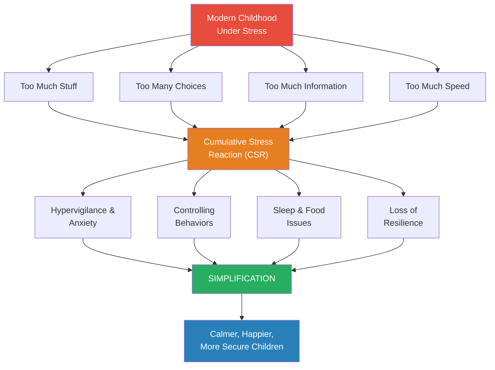
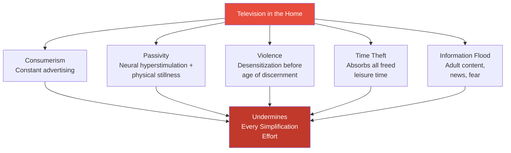
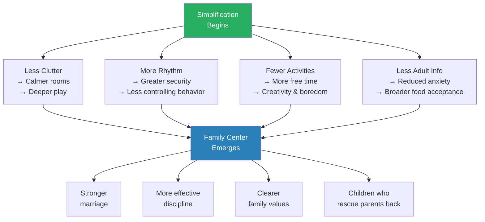
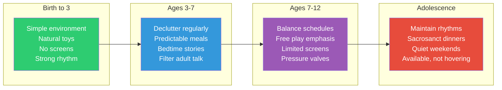
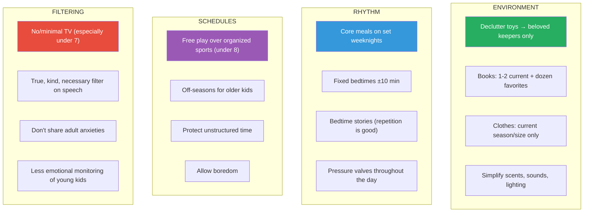

# Simplicity Parenting — Kim John Payne

> *"When you simplify a child's world, you prepare the way for positive change and growth."*

What if the greatest gift you could give your child isn't another enrichment class, another educational toy, or another carefully curated experience — but *less*? Kim John Payne arrived at this question not through abstract philosophy but through a gut-punch of clinical recognition: the treatment plans he was writing for anxious children in affluent England were *identical* to the ones he had developed for traumatized kids in refugee camps. Same hypervigilance. Same controlling behaviors. Same inability to relax. The only difference was the source of the stress — not war and displacement, but the relentless accumulation of too much stuff, too many choices, too much information, and too much speed. This book is his answer: a practical, four-level simplification regime that strips away what overwhelms and makes room for what matters.

---

## About the Author

Kim John Payne is a counselor, educator, and consultant trained in Waldorf education. He began his career volunteering with children in refugee camps in Jakarta and Cambodia, then moved to England for Waldorf teacher training. For over two decades he has worked with families across three continents — in war-torn regions of Africa, Israel, and Northern Ireland, as well as in affluent Western communities. His career-defining insight came when he recognized that ordinary children in comfortable homes were developing the same stress symptoms as displaced refugee children. He is also the author of *The Soul of Discipline* and founder of the Simplicity Parenting movement.

---

## The Big Idea

Modern childhood is built on **four pillars of "too much"**: too much stuff, too many choices, too much information, and too much speed. Together, these produce what Payne calls a **cumulative stress reaction** — a slow-building, chronic stress load that mirrors post-traumatic stress disorder. The antidote is **simplification across four domains**: decluttering the physical environment, establishing daily rhythms, balancing schedules, and filtering out the adult world. When parents simplify, they don't deprive — they *protect*. They restore the ecology of childhood: the slow, unfolding process by which children develop identity, resilience, and a sense of self.

---

## Key Concepts at a Glance

| Concept | What It Means |
|---------|--------------|
| **Cumulative Stress Reaction (CSR)** | Chronic low-level stress that accumulates to produce PTSD-like symptoms in children |
| **Soul Fever** | Emotional overwhelm treated like a physical fever — notice, simplify, draw close, let it run its course |
| **Four Pillars of Too Much** | Stuff, choices, information, speed — the architecture of modern childhood overload |
| **Four Levels of Simplification** | Environment → Rhythm → Schedules → Filtering the adult world |
| **The "Uncle Andy" Metaphor** | Television recast as an uninvited houseguest who undermines every parenting effort |
| **Pressure Valves** | Built-in daily moments for emotional release — snacks, candlelight, bedtime stories |
| **The Grit Sandwich** | A bedtime ritual: best thing today → hardest thing → hardest thing tomorrow → best thing tomorrow |
| **Crop Rotation** | Children, like soil, need fallow seasons — overscheduling depletes; rest restores |

---

## 30-Second Version

> Your children are overwhelmed — not by any single crisis, but by the relentless accumulation of too much in every dimension of their lives. Simplify their rooms (fewer toys, books, clothes). Establish predictable rhythms (regular meals, fixed bedtimes, repeating stories). Protect their free time (less scheduling, more unstructured play). Filter out the adult world (limit screens, stop sharing your anxieties, talk less). When you do, you'll see calmer sleep, broader appetites, deeper play, and children who can relax into becoming themselves.

---

---

## Part One: Why Simplify — The Insight That Changed Everything

### The Refugee Camp Revelation

In his late twenties, Payne volunteered at refugee camps in Jakarta and Cambodia. The children he worked with had never known life beyond the camp. They were jumpy, hypervigilant, and wary of anything new. Many had developed elaborate rituals — specific routes through the maze of shelters — that they imagined would keep them safe. They were classically diagnosable with PTSD.

Years later, working as a counselor in affluent England, Payne kept experiencing clinical déjà vu. The children of professors, city officials, and comfortable middle-class families were showing the same constellation of symptoms: controlling behaviors, explosive anger, food refusal, sleep difficulties, mistrust of novelty.

> [!danger] The Undeclared War on Childhood
> "What I came to realize was that for both groups the sanctity of childhood had been breached. Adult life was flooding in unchecked. These children were suffering from a different kind of war: the undeclared war on childhood."

The signature traumatic event was missing. But there were *enough* little stresses — enough consistent baseline pressure — to produce the same psychological adaptations. Payne called this **cumulative stress reaction (CSR)**: not one terrible thing, but a thousand small ones that never let up.

### The Four Pillars of Too Much

Payne identifies four interlocking forces that characterize modern childhood:

**1. Too Much Stuff**
The average American child receives seventy toys per year. Toys are no longer reserved for special occasions — they're staples, appropriate any day, available everywhere from gas stations to post offices. A child's room becomes an archaeological dig of commercial life, with deeper layers revealing earlier purchases.

**2. Too Many Choices**
From which of thirty cereals to eat, to which of five after-school activities to attend, children face a dizzying array of decisions. Studies show having too many choices doesn't produce happiness — it produces paralysis, raised expectations, and anxiety.

**3. Too Much Information**
Adult concerns — politics, global warming, financial stress, relationship problems — flood into children's awareness through overheard conversations, background news, and direct sharing. Children absorb parental anxiety like sponges.

**4. Too Much Speed**
Free time for children has decreased by twelve or more hours per week in a single generation. Structured activities have doubled. Homework has doubled. The childhood that used to be characterized by leisurely afternoons has become a sprint between appointments.

Environment is the easiest starting point (decluttering is tangible and immediate), while rhythm and filtering the adult world deliver the deepest transformation in both child behavior and family culture — though they require more sustained effort.

> [!warning] The Boiling Frog
> Payne uses the frog-in-hot-water metaphor: if the temperature rises slowly enough, we never notice we need to jump out. "The weirdness of 'too much' begins to seem normal."

### The James Story — A Case Study

Eight-year-old James had trouble sleeping, complained of stomachaches, ate almost nothing, and appointed himself the backseat traffic policeman on every car ride. His parents — a professor and a city official — were avid news followers. CNN played constantly. They discussed global warming at length and were proud of James's knowledge.

What they didn't see was that James was drowning in adult information. Simplification meant: reducing three computers to one (in the master bedroom), removing both televisions, and — hardest of all — saving political and professional discussions for after James's bedtime.

Within two weeks, James's anxiety dropped. He started playing outside, building things, catching lizards. Within a month, his teacher reported changes. His pickiness about food waned. He made a friend who became a lifelong buddy — the boys are in their early twenties now, still close.

> [!success] The Power of Compound Simplification
> No single change was the "magic bullet." But collectively, simplifying the environment and the emotional climate produced results greater than the sum of their parts. James's parents found a new measure for decisions: "Does this make sense for our family?"

Stuff and speed together account for over half the excess burden on modern children — but information overload and choice paralysis are equally corrosive because they flood children's awareness with adult-level complexity their brains aren't yet equipped to process.

---

## Part Two: Soul Fever — Your Child's Emotional Immune System

### The Metaphor

Every parent knows how to care for a sick child. You notice. You stop normal routines. You bring them close. You simplify their environment and intake. You let the illness run its course. You ease them back into regular life.

Payne's central insight: emotional overwhelm in children can be treated with the *exact same protocol*. He calls these episodes "soul fevers" — times when something is not right, when the child is upset, overwhelmed, at odds with the world and their truest selves.

### Recognizing Soul Fever

Young children make their emotional state obvious: hypersensitivity to itchy labels and twisted tights, deeper tantrums, changed sleep patterns, clenched fists, hair-trigger emotional switches. They act "out of character" — or rather, their character becomes amplified, almost caricatured.

Older children show different signs: shifts in friendships, changes in dress or work habits, feisty challenges to rules that were never challenged before.

> [!tip] The Two-to-Three-Day Reset
> Most children, regardless of age, can reset their emotional clock given two or three quiet days. One simplified weekend is usually enough to break a soul fever — enough space and grace to loosen an emotional knot.

### The Grit Sandwich

Single mother Sue developed a bedtime ritual for her son Henry, who was struggling at school. She would lie on his bed and ask:

1. **"What was a courageous thing about the day?"** (the good bread)
2. **"What was the hardest thing?"** (the grit)
3. **"What will be the hardest thing tomorrow?"** (more grit)
4. **"What will be the best thing?"** (the good bread)

Sue's responses were minimal — quiet validation, bearing witness. No psychoanalysis, no fixes, no judgments. Just listening and noticing. Henry was unpacking his day's suitcase of thoughts and emotions while ending on a cushion of hope.

> [!example] Stories as Medicine
> When Lola's brother was dying, she was being "as honest as she could" with six-year-old Amber, who became furious. Payne prescribed bedtime fairy tales — stories about someone lost in a dark forest who finds a way out. Lola was initially irritated: "Your prescription is fairy tales?" But the stories soothed Amber profoundly. Children process truth through imagination — they need containers for difficult realities, not just facts.

---

## Part Three: The Four Levels of Simplification

### Level 1 — Environment: Clearing the Clutter

The threshold to a child's room can feel like a border checkpoint. More items than physical space allows somehow find purchase on top of piles, overflowing baskets, and in jammed-open drawers. Under the bed, a superconductor magnet sucks down all manner of things to rest among dust bunnies.

In Payne's workshops, when parents choose which simplification level to discuss, the room tilts overwhelmingly toward "environment." It's tangible, doable, and strikes a universal chord.

> [!tip] The Decluttering Protocol
> Payne suggests sorting toys into three categories:
> 1. **Throw away** — broken toys, cheap fast-food giveaways, pieces of sets long since incomplete
> 2. **Store** — good toys that are currently out of rotation (becomes a "lending library" to rediscover later)
> 3. **Keep** — the beloved few that have earned a permanent place in your child's heart and play
>
> The test: "Is this toy one that my child cherishes? Does it spark deep, sustained play?" Most parents are amazed by how many toys won't even be missed.

**The principle of less-is-more in play:** The more elaborate the toy, the less a child exercises their own imagination. A fully detailed princess castle with turrets and drawbridge provides a huge initial liftoff — then nowhere to go. A simple wooden block can be a castle, a phone, a spaceship, and a loaf of bread, all in one afternoon.

Payne identifies nine dimensions of simplified play:

| Play Type | What It Develops | Examples |
|-----------|-----------------|----------|
| Trial & Error | Curiosity, perseverance, will | Floor time, stacking, building |
| Touch | Sensory awareness, body boundaries | Clay, mud, natural materials, cooking |
| Pretending | Identity, flexible thinking, executive function | Dress-up, dolls, open-ended props |
| Experience | Direct connection to the world | Nature play, element exploration |
| Purpose & Industry | Autonomy, competency, mastery | Real tools, cooking, chores |
| Nature | Restoration, awe, full sensory engagement | Outdoor exploration, gardens, special places |
| Social Interaction | Identity through relationship | Board games, puppets, shared play |
| Movement | Vitality, coordination, neural development | Running, climbing, rough-and-tumble play |
| Art & Music | Creative expression, emotional release | Painting, clay, simple instruments |

> [!example] Christmas Breakfast
> Five-year-old Jacob became fascinated with mixing concoctions in the kitchen. His mother Anna would let him use vinegar, spices, whatever she could spare. Jacob loved his "work," pondering each addition with great concentration. His name for each brew: "Christmas breakfast." Anna sometimes found unsupervised Christmas breakfasts in the oven or cupboard. She's convinced Jacob has a future — not as a chef, but as a chemist.

**Books follow the same principle.** For children under eight or nine: one or two current books accessible at a time, plus a dozen or fewer permanent favorites. A child racing through "Number 23 of the Magic Tree House Series" in competition with a friend isn't reading — they're consuming. When the desire for "the next thing" drives an experience, you're involved in an addiction, not a connection.

**Clothes get the same treatment.** Only current-season, current-size clothes should be accessible. Your child's closet should no longer be a jungle. Even a three-year-old can begin recognizing the pattern of drawers and dressing themselves when the only choices available are practical ones.

> [!warning] The Scent and Sound Environment
> Chemical air fresheners, scented candles, and perfumed products get the amygdala firing, pumping cortisol and adrenaline. Simplify smells in your home. One of the most calming sensory experiences for a young child is their parent's natural scent. Payne's wife snuggles with their girls using "Daddy's pillow" when he travels.

### Level 2 — Rhythm: The Heartbeat of Family Life

If the first level of simplification is about *space*, the second is about *time*. Rhythm is the heartbeat of family life — and most modern families have lost it entirely. When Payne asks parents to describe a "typical day," nine times out of ten they begin by saying there is no "typical."

A baby's first lullaby is its mother's heartbeat in the womb. New parents unconsciously sway at bus stops. Toddlers crave rocking. This is not nostalgia — it's neurobiology. Children depend on rhythmic structure for security, and from that security, they can venture out to explore.

**The core meals system:** Family dinners get simpler when they're predictable. Monday is pasta night, Tuesday rice, Wednesday soup, and so on. Variation exists within each night's staple, but you're not staging a new Broadway production every evening. The regularity extends back from meal to preparation to grocery store to shopping list.

> [!success] The Ripple Effect of Regular Meals
> CASA (the National Center on Addiction and Substance Abuse) found that compared to teens who ate dinner with their families five or more times a week, those who ate with their families fewer than three times weekly were: 3.5x more likely to have abused prescription drugs, 3.5x more likely to have used marijuana, and 1.5x more likely to have used tobacco or alcohol.

**Pressure valves:** Built-in daily moments for emotional release. Payne recommends at least two to four throughout the day:
- A baby or toddler's nap (hold on to quiet rest time as long as possible — even 8-year-olds benefit)
- After-school snack ritual (connection doesn't require conversation)
- A moment of silence before dinner (Payne's family started with 10 seconds and worked up to a minute)
- Candlelight (concentrates attention, creates a "magical circle" of calm)
- Bedtime stories (the most powerful pressure valve of all)

**Sleep is the ultimate rhythm.** Children age 2-6 need eleven hours. Ages 6-11 need ten to eleven. Adolescents need eleven to twelve. Most children get nowhere near these numbers. Half of all adolescents get less than seven hours on weeknights. The performance gap from just one hour less sleep equals the developmental gap between a sixth-grader and a fourth-grader.

> [!danger] Fixed Bedtimes Are Non-Negotiable
> Payne counsels a 20-minute window — 10 minutes grace on either side of a fixed time. Bedtimes that vary between weekday and weekend nights produce the physiological equivalent of jet lag. Sleep before midnight is worth more than post-midnight sleep, as deeper somatic sleep occurs earlier in the night.

---

### Level 3 — Schedules: The Crop Rotation Principle

Twelve-year-old Dylan plays in an all-year soccer league, is preparing for his tae kwon do purple belt, plays trumpet in both band and jazz orchestra, and averages one to two hours of homework nightly. His nine-year-old sister DeeDee does vaulting — a combination of gymnastics and horses — with weekend competitions in neighboring states. Their mother Carol wrote to Payne after a radio interview to insist that "overscheduled" was overused. Her kids were *motivated*.

Payne's response was gentle but unsparing: children are like crops. You can push a field to produce remarkable yields for a season or two. But without fallow time — without crop rotation — the soil becomes depleted and eventually produces nothing.

> [!warning] The Numbers Tell the Story
> Since the early 1980s:
> - Time in structured activities has doubled (from 11% to 20-22% of children's time)
> - Homework has more than doubled (52 min/week in 1981 → 80+ min/night by 2006)
> - Free time has decreased by 12+ hours per week
> - In 1981, school-age children had 40% of the day free; by 1997, it was 25%

In the overscheduled child's day, free play has been squeezed to just 8% of waking hours — crowded out by structured activities and screens, leaving almost no room for the boredom, imagination, and self-directed exploration that Payne identifies as essential for developing identity and resilience.

**The problem isn't motivation — it's balance.** Payne doesn't question whether busy kids enjoy what they're doing. He questions whether a child's love of an activity protects them from the stress of doing too much of it, too young. A genuine interest is sustainable over time. But a healthy interest *requires* leisure and rest to deepen and endure.

**Organized sports vs. free play before age 8-9:** Free play is self-regulating (children stop when tired). Organized sports have external pacing. Free play builds social and negotiation skills ("But it's always YOUR turn to be goalie!"). It provides broad physical foundations rather than repetitive specialized movements. And it doesn't require a parental shuttle service.

> [!example] Joelle's Family Sports System
> A mother of five kids (ages 3 to high school) felt like a bus driver who never arrived. After two years of thinking "it'll ease up next season," she implemented new rules:
> - Older kids (12+) choose two sports per year: one "major," one "minor"
> - Each child takes one entire season OFF — no sports involvement
> - Each child is responsible for arranging their own carpools
>
> Her oldest son Tom, a passionate soccer player, protested: "Passions aren't balanced." True. But neither are they fragile. The imposed limits strengthened his resolve, healed his chronic shin splints, and his passion survived — and grew.

**Boredom as gift:** When children don't have unstructured time, they never learn to fill it themselves. The "gift of boredom" — that restless, uncomfortable space before a child invents something to do — is where creativity, self-direction, and identity are forged. Children whose schedules are packed from dawn to dusk never develop the internal resources to entertain themselves.

**Anticipation as casualty:** When every desire is immediately gratified and every slot is pre-filled, there's no room for anticipation — the delicious waiting, the imagining, the looking-forward-to that makes experiences richer. Anticipation is one of the first victims of overscheduled lives.

### The Power of Stories

Stories deserve special attention because Payne treats them as both a pressure valve and a therapeutic tool of remarkable power.

Bedtime stories serve multiple functions:
- **Emotional processing** — the day's events and questions get washed by imagination
- **Identity building** — children recognize themselves in characters, sense their own worth through heroes' fears and bravery
- **Security** — the ritual of story time is itself a rhythm, a promise kept nightly
- **Imagination fuel** — stories open doors to other worlds, stretching a child's sense of possibility

> [!tip] Repetition Is Not Boredom — It's Depth
> Children under seven or eight can hear the same story repeatedly for days. This isn't laziness or limited attention — it's how children *claim* a story as their own. Repetition deepens the relationship. "Again!" from a three-year-old is not a failure of variety but a hunger for depth.

Family stories serve a creed function: "Remember when Anna cut her cheek and had to get stitches? Remember the milkshakes for dinner after the hospital?" The worry and relief transform in retelling. With repetition, the story becomes a family identity statement: "Look at our strength! See what we can do!"

Einstein once said: "If you want your children to be intelligent, read them fairy tales. If you want them to be more intelligent, read them more fairy tales."

---

## Part Four: Filtering Out the Adult World

### The Worry Epidemic

When Payne asked Annmarie — mother of eight-year-old twins — to describe motherhood in one word, she didn't hesitate: **"Worry."** She worried about the teacher liking one twin better, the coach not playing the other enough, their safety, their futures. Worry had eclipsed hope, trust, and joy.

Annmarie was one of eight children herself. Her parents' house was never locked. "Things were different then. There just wasn't so much to be worried about." But *was* there objectively more to worry about? Payne argues that the increase in parental anxiety has far outpaced the increase in actual risk. Sensationalism and fearmongering sustain media profit margins. Fear has cast a long shadow over trust.

### Uncle Andy Must Go

Payne's most memorable metaphor: imagine your spouse's brother Andy has moved in. He's entertaining, and the kids love him, but he shares scary and provocative content, constantly advertises products your kids now want, undermines every simplification effort, and requires constant vigilance to manage. Your older kids spend at least three hours a day with him. Even your two-year-old is hooked.

"Andy" is a television.

> [!danger] The Science Is Clear for Young Children
> - Babies need interaction with humans, manipulation of their environment, and problem-solving activities for optimal brain growth. Television provides NONE of these.
> - Multiple studies show TV delays rather than promotes language development, even "educational" programs like Sesame Street.
> - By 3 months, 40% of babies are regular viewers. By age 2, it's 90%.
> - The AAP has recommended no TV for children under 2 since 1999 — only 6% of parents are aware of this.
> - France banned TV shows aimed at children under 3.
> - Kids with a TV in their bedroom watch 90 minutes more per day.

**Payne's recommendation:** No television at all for families with children under seven. Not because TV is pure evil, but because on balance, for young children, the negatives vastly outweigh any benefit — and its absence supports every other simplification effort. The withdrawal period is typically two to three weeks. Most parents report it was far easier than they feared.

### True, Kind, Necessary

Payne borrows the Sufi triple-filter for what we say in front of our children. Before speaking, ask: Is it true? Is it kind? Is it necessary? All three must be met. This applies especially to:

- Adult conversations about money, work stress, relationship problems
- Commentary about other adults (teachers, coaches, neighbors)
- News and current events discussions
- Complaints and anxieties

> [!tip] The Parenting Whisper Rule
> "You increase your chances of being heard when you talk less." When everything is a request — "Howya doing? Would you like to get in the car now? What do you think? Can you buckle up?" — it becomes background noise. Directions should be direct: "Bedtime, Ben. You know what to do."

### Stop Taking Their Emotional Temperature

Parents who constantly ask young children "How do you feel?" and push for nuanced emotional vocabulary are actually *rushing* them into premature adolescence. Children under nine have feelings, but much of the time those feelings are unconscious and undifferentiated. Asked how they feel, most will honestly say: "Bad." To push further is invasive.

Emotional intelligence develops through *imitation*, not instruction. Your emotions and how you manage them are the model children imprint — far more than anything you say about emotions.

> [!example] The Driveway Bicycle
> Payne's seven-year-old daughter rode back and forth on the driveway singing "I'm as brave as a great big lion" (riding away from home) and "I'm as afraid as a 'fraidy cat'" (riding back). She packed a backpack with a hat, book, and water. Twenty-five minutes later, still on the driveway. Eventually she came inside in tears. Her mother asked: "What do you need to do it?" Surprised and hopeful: "Could you ride with me, just as far as the cow barn?" Her mother rode with her to the barn, kissed her, and turned home. The daughter came back an hour and fifteen minutes later, triumphant. No amount of emotional processing could have replaced that *doing*.

---

## Part Five: Simplification in Action — The Carla Story

### Before Simplification

Almost-six-year-old Carla had a steely gaze and total control of her household. Her parents, Michelle and Clark, were expecting a baby and Carla was acting out — hitting, kicking, and being aggressive. Her room looked like the dressing room for a national theater company after opening night: mounds of costumes, sequined shoes, feather boas atop heaps of toys and books.

Carla had sworn off all but three foods: bread, pasta, and apples. She insisted on a specific Wonder Woman placemat. She demanded particular driving routes. She had created an "off-limits" corner of her bedroom that only she knew the boundaries of — and could change at will. She wouldn't go to bed until she felt "really tired," which varied nightly.

Her parents' strategy: more presents, more appeasement, more trying to "get Carla excited about the baby." The baby's room was packed with unopened boxes and shopping bags.

### The Transformation

Payne's approach was comprehensive and fast — the baby was coming:

**Environment:** All but one or two costumes moved to a "lending library" rack in the attic. The room was dramatically decluttered. A comfy chair, wool rug, and lamp emerged from the chaos — Carla instantly proclaimed it "Carla's corner." The baby's room was set up simply: crib, changing table, two rockers (including a small one for Carla). Having just decluttered Carla's room, neither parent wanted to overload the baby's room.

**Rhythm:** Clark (previously a "walking force field") agreed to turn off his cellphones when home and make dinner at least four times a week. A balanced family meal replaced pasta-and-applesauce — even Carla ate it after a few days of fussing. Bath, reading, and talking about the day formed a bedtime platform leading to a set bedtime. TV was severely curtailed.

**Connection:** Michelle committed to daily time with Carla at the reclaimed dining room table. They started with clay and paints, moved to postcards, and eventually hit their stride making family photo albums — three beautiful albums, including one exclusively of Carla's baby years. It took weeks, surfacing forgotten stories and funny moments.

> [!success] What Carla Gained
> She had less stuff, less power, less TV, more bedtime rules, and expanded food. What she gained: time and connection, security and ease. The new rituals were reliable. The Wonder Woman placemat quietly disappeared into the back of a drawer — its power eclipsed by something bigger.

Clark, initially relieved to avoid the table-time commitment, saw what was happening between Carla and Michelle and wanted in. He started driving Carla to school instead of putting her on the bus. He took over piano practice — "But Carla hates practicing! I hated practicing, too." Perfect. A chance to work through resistance together. They allowed repetition and necessary silliness to carry them until practicing became a pattern and playing became a source of pride.

### The Food Simplification Principle

Payne has noticed a consistent pattern over twenty years: as families simplify, children become less picky about food. Whether parents simplify food alone or simplify more broadly, control issues around food substantially lessen or disappear. The mechanism: as children feel less overwhelmed and their lives become more predictable, they feel less need to exert control over food.

> [!tip] The Eight-Try Rule
> To get a child to accept a new food, offer it at least eight times. Start with a very small quantity with butter and salt. Over the eight servings, decrease and eliminate the salt. The underlying flavor comes through gradually. Eight tries almost guarantees acceptance — a food for life.

**The "red and white food" pattern:** Children stuck in a narrow alley of bread, pasta, and sweets are oscillating between carbohydrate comfort and sugar vigilance — a common stress reaction. Stress makes children reject novelty, so the alley narrows further. But power issues around food will spill into other areas.

**Core meals on regular nights** solve the eternal "What's for dinner?" question. What day of the week is it? That's your answer. One family took it further: making big batches on weekends and freezing them. "Twenty percent extra resourcing yielded eighty percent higher dinner yield." (The mother was, in fact, an efficiency expert.)

### Backing Off: Parental Over-Involvement

In two-parent households, Payne has noticed a pattern: when one parent is overinvolved, the other is underinvolved. Very often the mother's concerns are generalized and orbit around social adjustment, while the father's overinvolvement (when it occurs) tends to focus on academics or athletics.

The solution isn't philosophical manifestos — it's practical: Dad takes exclusive responsibility for specific daily tasks. Not "helping" but *owning*: packing lunches, bath time, school drop-off. Each parent needs fairly exclusive provinces so that in the child's eyes, Dad is the "go-to" for that slice of life, and Mom can genuinely let go.

> [!warning] The Magnifying Glass Problem
> Many parents look at their children through a magnifying glass — armed with percentages, benchmarks, and criteria from this study or that. But the magnifying lens is too close to be pretty or even representative. "For all of the measures we now have at our fingertips, by and large children defy them by being both more 'normal' and more extraordinary than any scientific measure."

### The Bedtime Meditation

Payne's simplest and most powerful recommendation for anxious parents: before falling asleep, remember the ordinary moments of the day. The funny thing your daughter said. The way your son climbed onto the bench by the window, sensing his sister's bus would arrive. The newly minted freckles. The way your daughter looked minutes ago — horizontal with one arm flung back, as though she'd tried to outrun sleep.

This exercise is a spiritual corrective lens. In your vision of your children, it restores "who they are" over "what they need to do" or "what they need to work on."

---

## Part Six: The Ripple Effects — What Happens When Families Simplify

### The Anti-Inflammatory Effect

Payne describes simplification as a powerful anti-inflammatory for families. Inflammation — the itch for "More," the craving for greater stimulation — can be acute or chronic. Chronic inflammation begins to seem normal. Simplification breaks the cycle.

The effects cascade outward:

**On discipline:** As Michelle and Clark lost their tentativeness with Carla, as expectations became more consistent, Carla lost her controlling behaviors. She didn't really want to co-parent herself — she wanted parents. More effective discipline is invariably an outgrowth of the simplification process.

The four sources of excess flow through distinct stress symptoms into targeted simplification strategies, ultimately producing the compound benefits Payne observes — calmer sleep, broader appetites, deeper play, and stronger family bonds emerge not from any single change but from the cascading effect of less across multiple domains.

**On marriage:** Payne reports that dads who began the process reluctantly often tell him it has profoundly affected their marriage. When a family slows down and limits distractions, "Dad may very well catch Mom's eye across the table." Having children is supposed to be the ultimate shared journey — simplification restores the sense of traveling together.

**On values:** When you act to limit what you *don't* want for your family, you clarify what you really *do* need. "Just as a singer has to shut out ambient noises to hear their own voice, simplification allows a family to tune in to their values, to what defines them."

**On the children rescuing parents:** This may be Payne's most beautiful observation. Children whose childhoods are protected from stress inevitably, remarkably, day by day, rescue their parents right back. Their silliness, their infectious enthusiasm, their sense of "mission" as they dress the dog in boxer shorts — these beckon parents to lighten up, to remember their own best selves.

### The Power of Less with Choices

Payne tells of watching a father at a community pool bombard his four-year-old twins with an unbroken stream of choices: "Sun or shade? Swim or snack? Rubber shark, missiles, or mask? Crackers, grapes, or cheese? Napkin or bag? An hour, or longer?" The unspoken question: would these little guys ever manage to get wet?

When choices are reduced, pressure lifts. Children have time and freedom for their own thoughts. They can forge an identity that is more than the sum of their preferences and purchases — more than a "brand identity."

> [!example] The Overflowing Refrigerator
> A refrigerator that is always crammed with everything imaginable isn't satisfying — it sets you dreaming about the one thing that might not be there. When a child's every desire is anticipated, their will is left "flaccid and weak." Anticipation quietly slips out the back door. Happy surprises tiptoe out after it. Sometimes parents only notice they're gone when their six-year-old greets each new thing with world-weary ennui.

### Simplification Through Adolescence

The book doesn't abandon parents when children hit their teens. Key principles for adolescents:

- **Teenagers will resist changes** — out of developmental necessity. Your quiet unwillingness to back down helps ease the transition.
- **Rhythms provide counterweight** — to the volatility and strong emotions that define adolescence. Family dinner stays sacrosanct.
- **Adolescent polarities are normal** — the whirlwind of activity OR the motionless couch weight; the intense need to belong OR hours alone in their room. When a teenager gets *stuck* in one extreme, that's the soul fever.
- **Teresa's story** — a fourteen-year-old disrupting class who shot back "I'm fourteen, that's my job!" was right about being self-absorbed but was *stuck*. Nobody was helping her find middle ground. Eventually adults in her life coordinated to provide more form and consistency.

> [!tip] The Adolescent Pressure Valve
> "Something's up; I've noticed. I'm here if you want to talk about it." Even if they won't open up, you can still offer a pullback from routines. "You don't have to tell me what's up, but I can tell something's bothering you. In this family, we pull back, take some quiet time."

### The Starting Point

Payne ends with an invitation, not a prescription:

*"Is there a step in the process of simplification that seems absolutely doable, something you know is possible now, in your own home? This is your starting point, the trailhead of your path toward the larger changes you envision. Once you have a clear image of this task — what you need to do and what your daily life will look like when it is done — get started. Step into that picture… Begin."*

---

## The Simplification Lifecycle

---

## Deep Dive: What Simplified Play Actually Looks Like

Too often, parenting books talk about "play" in the abstract. Payne is unusually concrete about what he means — and what he doesn't.

### What to Keep vs. What to Remove

**Throw away immediately:** Broken toys, cheap giveaway items (fast food, party favors, arcade prizes), pieces of sets that are hopelessly incomplete, anything that's clearly outgrown.

**Move to the "lending library" (attic/closet for rotation):** Good toys that haven't been played with in weeks, seasonal items, gifts from well-meaning relatives that don't fit the child's current interests.

**Keep accessible:** The beloved few. You know which ones they are — the ones carried around, talked to, incorporated into stories and dreams. Simple, open-ended toys that reward imagination.

> [!tip] The Fewer Toys Principle
> "The more elaborate the prop for pretend play, the less a child flexes their own imaginary muscles." A simple silk scarf can be a river, a wedding veil, a cape, a tablecloth, a bandage, and a baby blanket — all before lunch. A licensed princess costume can only be one thing.

### Real Tools, Not Toy Tools

Payne makes a strong case for giving children *real* tools rather than plastic imitations. A plastic hammer has no weight or heft. A child learns nothing from pretending to pound with something that can't actually pound. Small versions of real garden tools, cooking implements, and workshop equipment — monitored at first, then increasingly independent — build genuine competence.

The airport playhouse test: Payne frequently passes a bright plastic playhouse in an airport, always empty. He imagines the room instead filled with wooden blocks, planks, cloths, and clips. "Imagine the construction that would take place! And not only by kids — I picture travel-weary adults joining in as well."

### Nature as Non-Negotiable

Richard Louv's *Last Child in the Woods* provides the scientific case that Payne applies practically. Key points:

- Hospital patients with a view of trees recover faster than those without
- Nature shifts children out of amygdala-based fight-or-flight and into creative (limbic) and cognitive (frontal lobe) functioning
- Children don't need spectacular natural settings — knowing one modest place *deeply* is more valuable than visiting many places superficially
- Every child needs a "special place" — whether a tree branch wide enough for a perch, a mossy spot by a lilac bush, or a cardboard box fort

> [!example] Amy's Snakeskin
> Amy used to read and play in a mossy spot next to an old lilac bush. It was her special place. One day she found a perfect snakeskin there. She took it as a gift and a wink — confirmation that other creatures had noticed her.

### The Art-and-Sleep Connection

Six-year-old Esme, daughter of a mathematician and an engineer, couldn't fall asleep at night. The issue wasn't lack of exercise (the usual suspect) but lack of creative expression. Her home life was organized and streamlined; she was precise and focused. She needed the *flow* of creativity — the letting-go that art involves — to surrender into sleep. The creative process involves releasing conscious control, and opportunities for that release during the day help children transition into sleep at night.

Every child's room should have: a big pad or roll of paper, sturdy crayons, paints, a modeling medium (clay, beeswax, Play-Doh), fabric, scissors, glue, and dedicated art space. As children reach school age: whittling, knitting (builds graphomotor skills alongside early writing), beadwork, sewing, woodwork, and ceramics.

---

## Deep Dive: The Rhythm Chapter in Practice

### Why Rhythm Works Neurologically

Rhythm corresponds to a child's way of knowing their world. Day becomes night becomes day. When hungry, we are fed. The people we love leave and return. With security from these patterns, children can venture out — and with the promise of return, they can explore. This cycling is the pattern of learning throughout life.

> [!warning] The Absence of Rhythm = The Presence of Anxiety
> Without predictable rhythms, children attempt to create their own — through controlling behaviors. Carla's insistence on her Wonder Woman placemat, her specific driving routes, her "off-limits" zone: all were attempts to impose predictability on a chaotic life. When external rhythm was provided, her need for self-imposed rituals evaporated.

### The Moment of Silence

Payne's family observes a moment of silence before dinner. They started with ten seconds and worked up to a minute. "No, it isn't an hour of meditation every day, but any parent with small children will probably be impressed."

The point isn't mystical. It's physiological. When you have to be quiet for a moment, your shoulders drop. You notice your breath, perhaps for the first time that day. For a child who talks, moves, and fidgets continuously, this moment of quiet stillness is *very* noticeable. "A moment of silence not only releases the tension of constant doing — it presents a remarkable alternative: just being."

### The Compass Kisses

One family's ritual before the children head out the door: four kisses — north, south, east, and west. A tiny ritual. But with regularity, these small gestures become anchoring rituals that assure a child "all is right with the world."

### Jack Petrash's Dinner Table Strategy

Payne's colleague Jack Petrash, father of three, held family dinners as sacrosanct. As his boys got older and tried to escape, Jack and his wife Carol held firm — and spent an extra thirty to forty dollars weekly on food so the boys' friends could eat with them. "They figured that even with high food bills, compared to the costs of family therapy, they were coming out ahead." The result: a window into their teenagers' thinking, friendships, and lives that most parents of teens desperately lack.

---

## Deep Dive: Screens and the Modern Dilemma

### The Neuroscience of Passivity

EEG studies show diminished mental activity during television viewing compared to other activities. Viewers describe themselves as "relaxed" and "passive" while watching, but when the set turns off, the relaxation ends while passivity and lowered alertness continue. Viewers consistently report that television "absorbed or sucked out their energy, leaving them depleted."

The "orienting reflex" (OR) is particularly insidious in children's programming: flashing, animated figures, rapid zooms, and dancing letters trigger a neurological threat-assessment response. Children focus intently — not because they're learning, but because their brain is evaluating whether flashing stimuli are dangerous. "We're conditioning the mind to expect that level of input," says researcher Dmitri Christakis. In comparison, real life seems slow — and children respond with boredom and inattentiveness.

### Video Games and Identity

In a study titled "When I Die, I Feel Small," seventh- and eighth-graders reported that the person they wanted to be "was very similar to their favorite video game character." Beyond physiological effects, when children identify so strongly with game characters, their self-concept and identity are shaped by those virtual models rather than by real relationships and experiences.

### The Practical Middle Path

For families who can't go fully screen-free, Payne suggests:
- No screens for children under seven (non-negotiable recommendation)
- No TV in bedrooms at any age
- Television as the "pivot point" — limiting TV limits all other screen use
- After age seven: balanced, privilege-based screen access rather than unlimited default
- Withdrawal period of two to three weeks when removing screens

> [!danger] The Babysitting Trap
> Payne acknowledges the babysitting function of TV: "The long-term reality is this: the rich and diverse habits your children will develop without television will serve them well throughout their lives. Without automatically 'tuning in' for something to do, your kids will find deep inner wells of creativity and resourcefulness. Better, more reliable babysitters don't exist."

---

## The Verdict

### Strengths

This is one of those rare parenting books where the *vision* is as compelling as the *method*. Payne doesn't just tell you what to do — he shows you *why* in terms so vivid they change how you see your own household. The refugee camp insight alone is worth the price of admission: the idea that ordinary affluent childhood can produce the same stress symptoms as displacement and trauma is both alarming and illuminating.

The soul fever concept is immediately useful. Most parenting books address behavior; Payne addresses the emotional weather underneath it. And his four-step protocol (notice → stop routines → bring close → let it run its course) is simple enough to remember at 2 AM with a melting-down seven-year-old.

The practical advice is genuinely practical. This isn't vague philosophy — it's "Monday is pasta night." "Twenty-minute bedtime window." "Eight tries for a new food." "No TV under seven." Each recommendation is concrete, testable, and (crucially) doable without purchasing anything.

### Limitations

The book was published in 2009, which means its technology discussion focuses on television, Game Boys, and early computers. The current landscape of smartphones, social media, YouTube Kids, and algorithmic content feeds is orders of magnitude more complex. The principles apply, but parents will need to extrapolate significantly.

Payne's recommendations assume a level of parental control and presence that may be difficult for single parents, dual-income families with limited flexibility, or families where economic necessity dictates long working hours. The advice to remove all screens for children under seven, while neurologically sound, may feel impossible to parents who depend on occasional screen time as a practical tool.

The Waldorf education roots sometimes show in ways that may not resonate universally. The emphasis on natural materials, beeswax candles, and handmade cloth dolls can read as prescriptive or class-specific. Payne's recommendations work regardless of income, but some examples skew toward a particular aesthetic.

The book offers limited guidance for children with genuine neurodevelopmental differences (ADHD, autism spectrum) where some of the recommendations may need significant adaptation.

> [!warning] What This Book Doesn't Cover
> - Detailed strategies for managing screen time in the smartphone era
> - Specific approaches for children with neurodevelopmental conditions
> - The particular challenges of single-parent simplification
> - How to navigate simplification when co-parenting across two households
> - Cultural contexts where extended family involvement complicates "filtering"

---

## Who Should Read This Book

| Reader | Why |
|--------|-----|
| **Parents of toddlers and preschoolers** | Maximum impact window — simplify before the clutter accumulates |
| **Parents of anxious or controlling children** | The CSR framework explains what you're seeing and what to do about it |
| **Parents feeling the "too much" overwhelm** | Validation that your instinct to pull back is correct, plus a roadmap |
| **Parents reconsidering screen time** | The strongest case you'll find for dramatically limiting TV for young children |
| **Parents of overscheduled kids** | The crop rotation metaphor and practical scheduling guidelines |
| **Couples struggling with parenting balance** | The exclusive-provinces approach to shared responsibility |
| **Waldorf-curious families** | Practical application of Waldorf principles without requiring Waldorf schooling |
| **Teachers and counselors** | The CSR concept reframes many behavioral issues as environmental stress responses |

---

## Related Reading

Books in this vault that complement or extend the ideas in *Simplicity Parenting*:

**On the neuroscience underneath:**
- [[The Whole-Brain Child - Daniel J. Siegel & Tina Payne Bryson]] — Siegel's "flipping your lid" maps to Payne's soul fever; both address helping children regain emotional equilibrium
- [[Brain Rules for Baby - John Medina]] — The scientific evidence for why screens damage young brains and why sensory play builds them

**On discipline without punishment:**
- [[No-Drama Discipline - Daniel J. Siegel & Tina Payne Bryson]] — Connect-then-redirect complements Payne's simplify-then-observe; both advocate minimal verbal processing with young children
- [[No Bad Kids - Janet Lansbury]] — Lansbury's RIE philosophy shares the emphasis on trusting children's pace and not overstimulating

**On the prepared environment:**
- [[The Montessori Toddler - Simone Davies]] — Strongest overlap on decluttered, child-accessible spaces with real tools; Davies focuses on under-3 where Payne extends through adolescence

**On cross-cultural perspective:**
- [[Hunt, Gather, Parent - Michaeleen Doucleff]] — Indigenous parenting traditions naturally embody simplicity, rhythm, and filtered adult information — Payne's intuitions validated globally
- [[The Danish Way of Parenting - Jessica Joelle Alexander]] — Danish *hygge* culture IS simplicity parenting: less stuff, more togetherness, free play, filtered media

**On parenting philosophy:**
- [[Unconditional Parenting - Alfie Kohn]] — Kohn's critique of external rewards complements Payne's critique of material excess; both argue that more stuff undermines intrinsic development
- [[The Gardener and the Carpenter - Alison Gopnik]] — Gopnik's "gardener" metaphor (creating conditions for growth) is the scientific articulation of what Payne does practically
- [[Parenting from the Inside Out - Daniel J. Siegel]] — How parents' unresolved issues flood into children's awareness — the mechanism behind what Payne calls "filtering"

**On the adult version of the same principle:**
- [[Essentialism - Greg McKeown]] — McKeown's "less but better" applied to work/life is the adult mirror of Payne's childhood simplification

**On understanding emotional intelligence:**
- [[Cribsheet - Emily Oster]] — Oster's data-driven approach provides useful counterpoint to Payne's more intuitive framework; both conclude screens are bad for young children
- [[How to Talk So Little Kids Will Listen - Joanna Faber & Julie King]] — Practical communication tools that pair well with Payne's "talk less, listen more" philosophy

---

## Frequently Asked Questions

**Q: Won't my kids be deprived if I take away most of their toys?**
A: Payne's consistent experience across hundreds of families is that children rarely even notice. The toys that matter — the beloved few — remain. Everything else was background clutter that was actually fragmenting attention rather than enriching play. Within days, most children play *more deeply* with fewer toys, not less.

**Q: Is this just for affluent families who can afford to buy less?**
A: Simplification isn't about buying organic wooden toys instead of plastic ones. It's about having fewer of whatever you have. The quantity of stuff can be similar across class lines. And the core recommendations — rhythm, fewer choices, filtering adult information — cost nothing.

**Q: My partner and I disagree about screen time. What do we do?**
A: Payne acknowledges this is one of the most divisive issues for couples. He suggests starting with what you can agree on (perhaps no screens during meals, or no TV in bedrooms) and expanding from there as you see results. The evidence for young children (under 7) is compelling enough that most reluctant partners come around when they see the behavioral improvements.

**Q: What about when other kids all have screens and my child feels left out?**
A: Payne's response: given that these things are so widely available elsewhere, the fact that they won't be available at home shouldn't present much sacrifice. You can't control what happens everywhere, but you can be firm about what happens at home. Over time, "what happens at home" becomes accepted, anticipated, and depended on.

**Q: My teenager already has deeply ingrained habits. Is it too late?**
A: It's never too late, but the adjustment period will be longer for older children. Teenagers will resist — that's their developmental job. Your quiet unwillingness to back down is what matters. Start with what's doable: regular family dinners, a quieter weekend, reduced background noise of screens and news.

**Q: How do I handle grandparents and relatives who shower my kids with toys?**
A: This is one of the most common challenges families report. Be honest about what you're doing and why. Some families ask relatives to give *experiences* instead of things. Others quietly rotate excessive gifts into the "lending library" in the attic.

**Q: Isn't boredom bad for kids?**
A: Boredom is the gateway to creativity. The restless, uncomfortable space before a child invents something to do is where self-direction, imagination, and identity are forged. Children who never experience boredom never develop the internal resources to fill their own time.

**Q: How does simplification affect children with ADHD or similar challenges?**
A: Payne doesn't claim simplification is a cure for neurodevelopmental conditions. However, he argues that many children diagnosed with attention difficulties are actually experiencing cumulative stress reactions — the "too much" of modern life mimics ADHD symptoms. When simplification reduces the environmental stressors, some children's symptoms diminish significantly. For children with genuine ADHD, simplification still helps — a calmer environment benefits everyone — but it's not a replacement for professional evaluation and support.

**Q: What if I feel guilty about the toys we already bought?**
A: Payne addresses this directly: the goal isn't to feel bad about past purchases but to change course going forward. Most of those toys were bought with love and good intentions. They served their moment. Now they can be donated, stored, or passed on. The child won't miss them — they'll be too busy playing more deeply with what remains.

**Q: My child seems to NEED constant stimulation. Won't they fall apart without it?**
A: This is exactly the "inflammation" cycle Payne describes. A child habituated to constant stimulation will initially be restless without it — just as reducing sugar creates temporary cravings. The withdrawal is real but temporary (typically two to three weeks). On the other side: a child who can settle, focus, and generate their own engagement.

**Q: Can I simplify selectively, or do I need to do everything?**
A: Payne explicitly says his recommendations are "a menu, not a checklist." Every family will have its own areas of emphasis and levels of commitment. There's no right order. Start where you have the most energy and the clearest vision. Success in one area fuels motivation for the next.

---

## The Simplification Manifesto

Payne's "Imagine" lists at the end of each chapter form a kind of manifesto. Here are the most resonant:

**Imagine your child's room...**
- Uncluttered and restful to the senses
- With soft light, a sense of order and space
- With room to move, play, draw, and build
- As a peaceful and secure place for sleep

**Imagine your family's days...**
- Acquiring a sense of order, rhythm, and flow
- With difficult transitions smoothed by reliable patterns
- With a growing sense of consistency — and with it, the joy of anticipation

**Imagine your child...**
- Having time every day — unscheduled free time — to daydream and play
- Building their worldview from a deep well of unregulated, improvised, flexible free play
- Developing genuine interests over time that become lifelong pleasures

**Imagine yourself...**
- Feeling calmer, safer, and less anxious as a parent
- Being able to back off overinvolvement as rhythm provides the structure
- Feeding your dreams with a rich appreciation of the present

---

## The Central Paradox

The deepest paradox of *Simplicity Parenting* is this: by giving children less, you give them more. Less stuff means more imagination. Less scheduling means more self-direction. Less information means more innocence. Less speed means more depth. Less parental hovering means more resilience.

This isn't deprivation dressed up as philosophy. It's the recognition that childhood has its own ecology — its own pace, its own needs, its own logic. When that ecology is respected, children flourish. When it's flooded with adult pressures and consumer excess, children develop stress responses that can follow them for a lifetime.

> [!success] The Final Promise
> "When a family simplifies, what happens is usually more far-reaching and powerful than what they imagined when they started." Simplification isn't just a parenting strategy — it's a path of self-definition for the family. What you remove reveals what you truly value. And in that clarity, everyone — parents and children alike — can breathe.

---

## The Simplification Protocol — Quick Reference

---

## Five Things You Can Do This Week

> [!success] Immediate Actions

**1. Walk into your child's room and remove anything broken, forgotten, or clearly unplayed-with.** Don't overthink it. If your child doesn't notice in a week, it goes. Start a box in the attic for things on the fence — your "lending library."

**2. Establish one rhythmic anchor in your day.** The easiest: a regular family dinner at a set time. Even if it's just three nights a week to start. Same time. Same table. A moment of quiet before eating, even five seconds.

**3. Cancel one activity.** Look at your child's schedule and identify the activity they'd miss least. Replace it with unstructured time — at the park, in the yard, or even just at home with nothing planned.

**4. Remove screens from one transition point.** No TV during the after-school period. No screens at the dinner table. No devices in the bedroom at night. Pick one and hold it.

**5. Try the bedtime meditation.** Before you fall asleep tonight, replay the ordinary moments of the day with your children. The funny remark. The freckles. The way they looked asleep. Let those images, not your worries, carry you into sleep.

> [!tip] The Grandparent Phone Call
> If you can't summon enough lovely images to be your ballast in a storm, call the grandparents, godparents, or favorite aunt. Tell them: "Remind me of everything that is wonderful about Henry. And please — keep going until I say stop." This endorphin rush of sweet memories is addictive in the best way. Use it whenever you need it most — when your child's soul fever is testing your patience to its limits.

**6. Apply the triple filter for one day.** Before saying anything in front of your children, ask: Is it true? Is it kind? Is it necessary? Notice how much you normally say that fails at least one filter. Notice the quiet that emerges — and how your children respond to it.

---

## Key Phrases Worth Remembering

| Phrase | Meaning |
|--------|---------|
| "Cumulative stress reaction" | Many small stresses equal one big trauma |
| "Soul fever" | Emotional overwhelm — treat it like a physical fever |
| "The four pillars of too much" | Stuff, choices, information, speed |
| "Undeclared war on childhood" | Modern life's assault on childhood's natural pace |
| "The verbal expression of simplifying is 'No, thanks'" | Freedom through refusal |
| "Heroic consistency" | Not flying capes but showing up, every day |
| "A body at rest tends to stay at rest" | Why TV passivity is self-perpetuating |
| "Crop rotation" | Children need fallow seasons to produce bountifully |
| "The grit sandwich" | Best → hardest → hardest tomorrow → best tomorrow |
| "True, kind, necessary" | The triple filter for what we say in front of children |
| "Wonder Woman's power had been eclipsed" | When real rhythm replaces a child's controlling rituals |
| "Rescue their childhood and they'll rescue you right back" | The reciprocity of simplification |
| "You increase your chances of being heard when you talk less" | Fewer requests, more presence |
| "Passions aren't balanced" | True — but they're not fragile, either |
| "Christmas breakfast" | A child's purposeful, creative industry at its best |

---

## The Architecture of the Book

| Chapter | Focus | Core Idea |
|---------|-------|-----------|
| Introduction | Why this matters | Parents as architects of daily life; "too much" as the new normal |
| Ch. 1: Why Simplify? | The insight | Refugee camp to affluent suburb — same symptoms, same treatment |
| Ch. 2: Soul Fever | The metaphor | Emotional overwhelm treated like physical illness — notice, simplify, draw close |
| Ch. 3: Environment | Level 1 | Declutter toys, books, clothes; simplify the sensory environment |
| Ch. 4: Rhythm | Level 2 | Regular meals, fixed bedtimes, stories, pressure valves |
| Ch. 5: Schedules | Level 3 | Balance structured and free time; the crop rotation principle |
| Ch. 6: Filtering | Level 4 | Limit screens, filter adult information, back off overinvolvement |
| Epilogue | The ripple effects | Simplification strengthens family center, values, marriage, discipline |

---

## Special Topic: Simplification and Adolescence

Many parenting books effectively end at age ten. Payne is unusual in carrying his framework through adolescence, with specific adaptations:

### The Polarity Principle

Adolescence is defined by polarities: whirlwind activity or dead weight on the couch. Sleep through band practice or outlast you past midnight. Desperate need to belong or hours alone in their room. An urge to challenge every parental comment, yet total conformity among peers. These oscillations are *normal*. Soul fever in adolescence means getting *stuck* at one extreme.

### What Stays the Same

Family rhythms — especially dinner — remain non-negotiable. CASA research shows teens who eat fewer than three family dinners weekly are significantly more likely to use drugs, alcohol, and tobacco. The rhythm isn't a cage; it's a counterweight to adolescent volatility.

### What Changes

- **Pullbacks become collaborative.** Instead of parents deciding, you collaborate: "Something's bothering you. In this family, we pull back. Let's figure out how."
- **The grit sandwich evolves.** Teens may not answer your questions, but the *offer* to listen matters. "I'm here if you want to talk about it" — said once to a girl, dropped casually several times to a boy.
- **Pressure valves shift.** Hobbies, collections, organized sports, and deep passions replace the snack-time and candlelight valves of childhood.
- **Identity building becomes the central drama.** Teenagers trying on different voices, speech patterns, and personas are doing the work of identity formation. When they return to their own voice, the soul fever has broken.

> [!tip] Margaret's Swimming Daughter
> Margaret's fifteen-year-old daughter was busy at school and a competitive swimmer. She wouldn't slow down even when a dark cloud followed her. Margaret enforced a quiet weekend — missed training and all. The first time felt like being grounded. But afterward, her daughter began collaborating on making downtime when she felt overwhelmed. And once the calendar was cleared, she was more apt to open up about what was actually bothering her. "I think when your feelings are complicated, it helps to know that if you do choose to open up, you'll have time to talk it out."

### Screens and Teens

After age seven, some screen use becomes inevitable as children's primary focus moves beyond the home. Payne's recommendation: balanced, privilege-based access rather than unlimited default. Content monitoring continues. Background TV and news remain filtered. The family's relationship to media — established in the early years — continues to influence adolescent habits.

---

## The Steve Biddulph Warning

Payne's Australian colleague Steve Biddulph doesn't equivocate: "If either parent spends more than ten hours a day at work, including travel, then their child will suffer. Fifteen hours a day almost guarantees damage. Emotional problems, addictions, suicidality, depression, poor school performance all are increased by parental absence." This is the starkest version of Payne's argument — that time with children isn't optional, and the cost of not providing it is measured in therapeutic bills and broken relationships.

> [!danger] The Cost Comparison
> What would you "save" in terms of heartache by occasionally scheduling a quiet weekend together — convenient or not — compared with the cost of long-term professional counseling? Payne frames this not as guilt but as investment: a day off work for connection costs far less than years of therapy for disconnection.

The beauty of simplification is that its primary currency is *attention*, not money. You don't need to buy anything. You need to remove things. You don't need expertise. You need presence. The most impactful changes — a regular dinnertime, a story before bed, a moment of quiet — require nothing more than the decision to show up.

---

## Closing Thought

> *"The cape around your shoulders — the heroism of parenting — is well earned and deserved. But the cape is not for flying, or special effects. It is a symbol of heroic consistency. Heroic. Consistent. Simple. Lifelong. Love."*

The deepest message of *Simplicity Parenting* is that the most powerful thing parents can do is also the simplest: create space. Space in the room, space in the day, space in the conversation. Not because children are fragile — they're remarkably resilient when given the conditions to be — but because the slow, messy, unpredictable process of becoming a self requires room. Room to be bored, room to be sad, room to ride back and forth on the driveway singing about lions and 'fraidy cats until you're ready to ride past the fence and down the road toward the cow barn.

Your child doesn't need more. They need you to protect less.

The process of simplification is a pebble dropped in the waters of a family's daily life. Its ripples expand throughout the home, touching each member and their relationships. When the noise of popular culture, competition, and consumerism is turned down several notches, the voice that can be heard is your own — your true voice as a parent. With distractions in the background, what develops is a foreground. A center. A family center that emerges and strengthens.

And from that center, everything else follows: calmer children, clearer values, deeper connections, and the extraordinary discovery that in a world obsessed with more, the greatest abundance comes from having — and needing — less.

---

*"Go confidently in the direction of your dreams. As you simplify life the laws of the universe will be simpler." — Henry David Thoreau*
