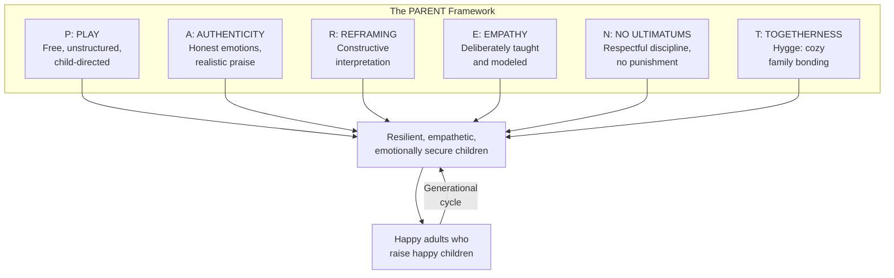
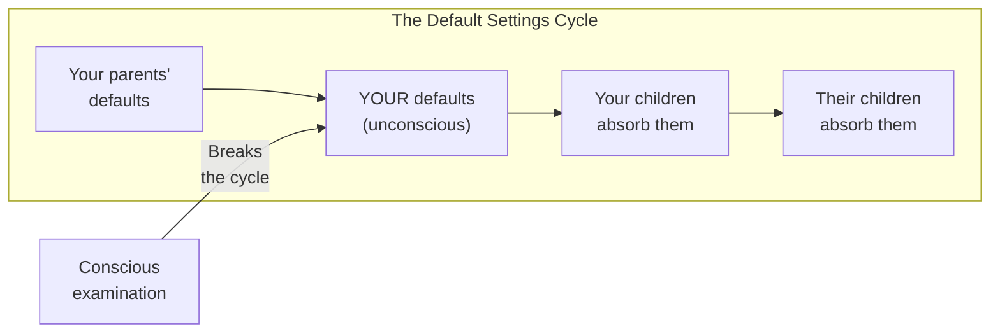
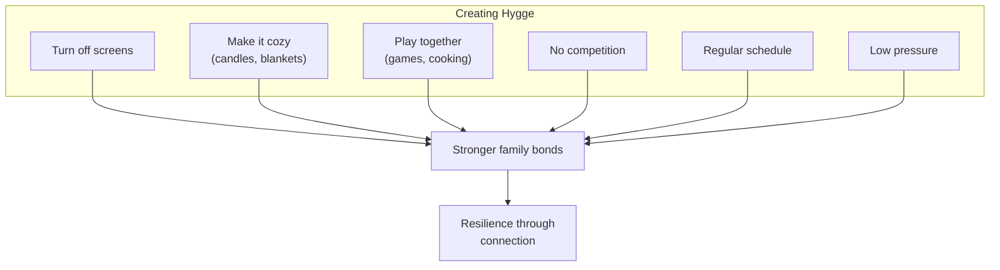
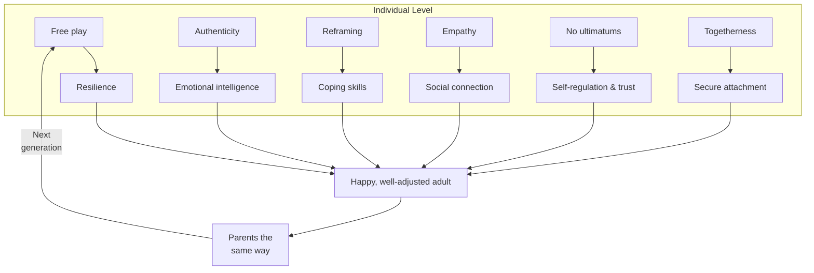
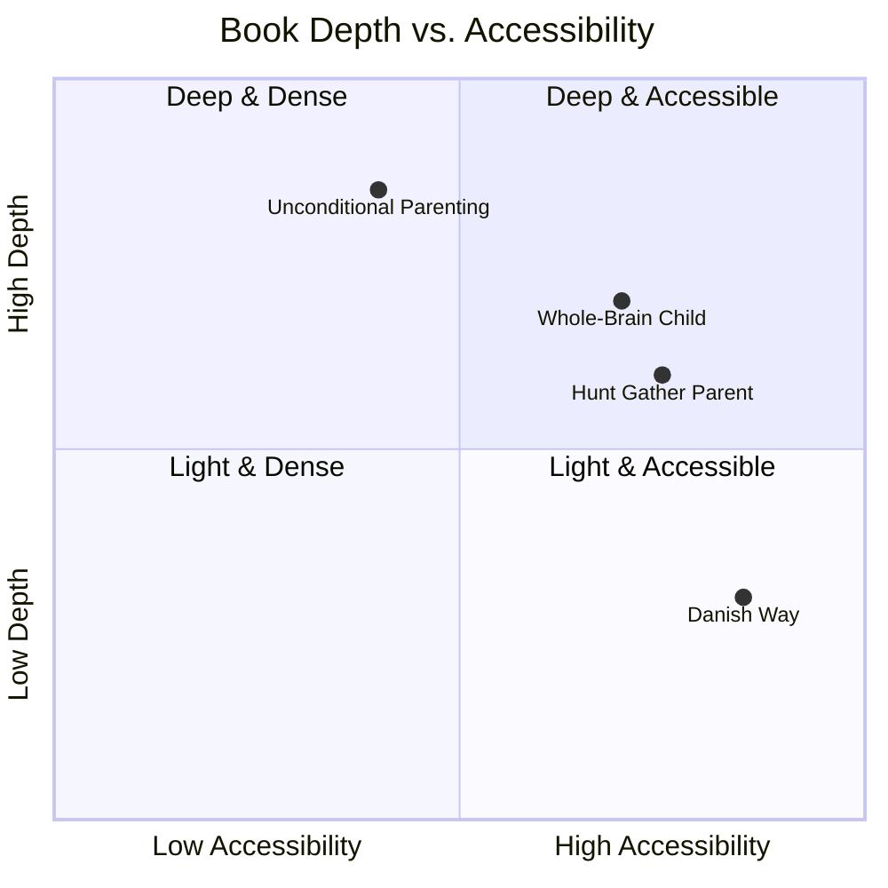
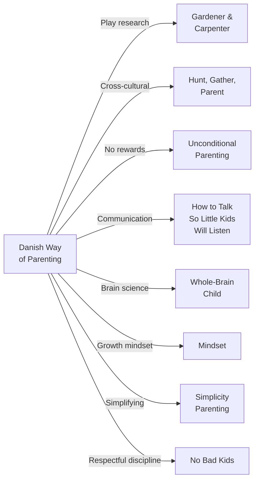

# The Danish Way of Parenting — Jessica Joelle Alexander & Iben Dissing Sandahl

> Denmark has been voted the happiest country in the world for over forty years running. This isn't an accident of geography or genetics — it's partly the result of how Danes raise their children. An American mother married to a Dane teams up with a Danish psychotherapist to decode the parenting philosophy behind the world's happiest people. The secret isn't any single technique. It's a cultural orientation — captured in the acronym PARENT — that produces resilient, empathetic, emotionally secure children who grow into happy adults who then raise happy children. The cycle has been running for generations, and the good news is: you don't have to be Danish to do it.

---

## About the Authors

Jessica Joelle Alexander is an American journalist, cultural researcher, and mother who married a Dane and spent years observing the differences between American and Danish parenting. The contrasts were so striking — Danish children seemed calmer, more resilient, and more socially skilled than their American counterparts — that she began formally researching the question: what are Danish parents doing differently?

Iben Dissing Sandahl is a Danish psychotherapist, educator, and mother who has worked with families for over two decades. She provides the clinical perspective and the insider's view of Danish parenting culture — the assumptions and practices that are so deeply embedded in Danish life that most Danes don't even think of them as a "parenting philosophy."

Together they wrote a book that is part cultural comparison, part parenting guide, and part invitation to examine your own "default settings" — the assumptions and habits you inherited from your own parents and culture.

### Jessica's Story

Alexander is candid about not being a "natural" mother. She describes herself as "the most nonmaternal woman" her friends knew — someone who didn't particularly like kids and became a mom because "that's what people do." Her fear of inadequacy drove her to read every parenting book she could find. But it was her Danish husband's family — their calm, their humor, their instinctive reframing — that finally showed her a different way. Over eight years of observing Danish families, she noticed a consistent pattern: calm children, minimal yelling, resilient kids who bounced back from setbacks, and adults who treated children as people rather than projects to optimize.

When she and Sandahl searched for a book about Danish parenting, they found nothing. The practices were so deeply woven into Danish culture that Danes themselves didn't recognize them as a distinct philosophy — they were just "the way things are." The pattern only became visible through the contrast of an outsider's eyes.

> [!example] A Global Response
> The book's journey is itself a story of cross-cultural resonance. Self-published initially, it attracted readers from New Zealand, South Africa, Vietnam, Indonesia, and across Europe. An Indian businessman who bought it wrote: "This is not a book — it's a movement. And I see it as a movement to change a country." A professor created an entire college course based on it. The response confirmed what the authors suspected: the Danish Way isn't just for Danes.

---

## The Big Idea

- <b style="color: #2980b9">Denmark's happiness is not an accident — it's partly the product of how children are raised</b>: the parenting practices that produce emotionally secure, resilient children are the same ones that produce happy adults who create happy societies
- <b style="color: #e74c3c">Most parents operate on "default settings" — the habits and assumptions inherited from their own upbringing and culture</b>: unless you consciously examine these defaults, you'll repeat them whether they serve your children or not
- <b style="color: #27ae60">The Danish approach can be captured in six principles (PARENT)</b>: Play, Authenticity, Reframing, Empathy, No Ultimatums, Togetherness — none of which require being Danish, wealthy, or having a particular kind of child
- Free play is not wasted time — it's the mechanism by which children develop resilience, creativity, social skills, and self-regulation
- Authenticity means being honest with children about difficult emotions and realities — Danish children's books address death, loneliness, and moral complexity directly
- Empathy is taught, not just caught — Danish schools dedicate one hour per week to explicit empathy education
- Hygge (cozy togetherness) is not just a lifestyle trend — it's a deliberate family practice that builds the bonds that sustain people through difficulty

---

## Danish vs. American Parenting at a Glance

| Dimension | Typical American Default | Danish Approach |
|---|---|---|
| **Philosophy** | Optimize the child for success | Develop the whole child for wellbeing |
| **Play** | Structured activities, early academics | Free play until age 7, risky playgrounds |
| **Praise** | "You're so smart!" (trait-based) | "You worked hard on that" (process-based) |
| **Difficult emotions** | Fix them, distract from them | Name them, sit with them, discuss them |
| **Children's stories** | Happy endings, sanitized | Full range of human experience, including tragedy |
| **Discipline** | Ultimatums, time-outs, sometimes spanking | Explanation, negotiation, calm firmness |
| **Failure** | Something to prevent or quickly fix | Something to learn from and reframe |
| **Competition** | Prized — be the best, win the trophy | Moderated — how well did the group do? |
| **Family time** | Often screen-based or activity-based | Hygge: deliberate, cozy, screen-free togetherness |
| **Empathy** | Hoped for but not explicitly taught | Taught weekly in schools (Klassens Tid) |
| **The toddler years** | "The terrible twos" | "Trodsalder" (the boundary age) — normal and welcomed |
| **Parenting style** | Often authoritarian or permissive | Consistently authoritative (high warmth + high standards) |

---

## Key Concepts at a Glance

| Letter | Concept | One-line summary |
|--------|---------|-----------------|
| **P** | Play | Free, unstructured play builds resilience, social skills, and self-regulation |
| **A** | Authenticity | Be honest about emotions and reality; avoid false praise; cultivate growth mindset |
| **R** | Reframing | Find less negative, more realistic interpretations of situations; focus on what you can learn |
| **E** | Empathy | Deliberately teach children to recognize and respond to others' emotions |
| **N** | No Ultimatums | Discipline through respect, explanation, and negotiation — not punishment or threats |
| **T** | Togetherness | Create hygge: cozy, screen-free, low-pressure family time that builds bonds |

Danish culture consistently scores higher across all six PARENT dimensions — the gap is widest on Play, Reframing, and No Ultimatums, where the American default toward structured activities, catastrophizing, and authoritarian discipline creates the starkest contrast.

---

## 30-Second Version

Denmark's parenting culture produces the world's happiest people through six principles: (1) Play — free, unstructured play that builds resilience. (2) Authenticity — honest emotional communication and realistic praise. (3) Reframing — finding constructive interpretations of difficult situations. (4) Empathy — deliberately taught in schools and modeled at home. (5) No Ultimatums — democratic, respectful discipline without punishment. (6) Togetherness (hygge) — cozy family time that builds the bonds sustaining people through life. These aren't uniquely Danish traits — they're learnable practices that any family can adopt.

---

## Chapter 1: Default Settings

*Before introducing the PARENT framework, Alexander asks the most important question: what are YOUR default settings?*

Every parent carries unconscious assumptions from their own upbringing:
- How conflict should be handled (yelling? silence? discussion?)
- What emotions are acceptable (crying is weak? anger is dangerous? joy is suspicious?)
- What constitutes "good" behavior (obedience? independence? achievement?)
- What praise looks like ("Good job!" vs. specific description vs. none at all)
- What discipline means (punishment? explanation? natural consequences?)

These defaults are not chosen. They're inherited — from your parents, your culture, your peer group. Unless you consciously examine them, you'll pass them on to your children automatically.

> [!tip] The Mirror Exercise
> Alexander recommends a simple exercise: write down how your parents handled conflict, emotions, praise, and discipline. Then write down how you handle the same things. Notice the overlaps. The places where you're unconsciously repeating your parents' patterns — for better or worse — are your default settings. You can't change what you don't see.

Alexander tells the story of chasing her almost-three-year-old son as he pushed his bike toward a busy street. Her instinct — the default — was to grab him hard, shake him, and yell "You'd better stop when I tell you to stop!" But she caught herself. She stopped, got down to his eye level, and calmly explained using words he could understand: "Do you want to go ow-ow? Cars go ow-ow!" Five minutes later at the next crosswalk, he stopped on his own and pointed at the road: "Cars. Ow-ow." She wasn't just happy with him — she was happy with herself for overriding her default settings in a high-stress moment.

Sara Harkness, a professor of human development at the University of Connecticut, has studied what she calls "parental ethnotheories" — the implicit, taken-for-granted beliefs about child-rearing that are so embedded in a culture they become invisible to those living inside it. Her research across dozens of cultures reveals that these beliefs aren't chosen. They're absorbed — from family, media, peers, and institutions — and they feel like objective truth rather than cultural habit.

> [!danger] The Stress Epidemic Behind American Defaults
> The book opens with sobering statistics about American wellbeing: antidepressant use rose 400% between 2005 and 2008. At least 5.2 million children aged 3–17 were taking Ritalin for attention deficit by 2010. Parents feel pressure to optimize every hour of their child's life — signing them up for structured activities, pushing early academics, competing with other families. The default American settings, Alexander argues, are producing anxious parents who produce anxious children. The Danish defaults produce something different.

This chapter is the book's foundation. Everything that follows is about examining your defaults and replacing the ones that don't serve your children with Danish-inspired alternatives.

---

### Default Settings Audit

*Use these questions to identify your own inherited patterns before reading the PARENT chapters.*

> [!tip] Self-Reflection Questions
> **Conflict:** How did your parents handle conflict when you were a child? Do you repeat those patterns? (Yelling? Silence? Explanation? Physicality?)
>
> **Emotions:** Which emotions were acceptable in your household growing up? Which were suppressed? Do you suppress the same emotions in your children?
>
> **Praise:** How were you praised as a child? ("You're so smart" vs. specific effort praise vs. minimal feedback?) What do you default to now?
>
> **Discipline:** What happened when you misbehaved? Time-outs? Spanking? Discussion? Loss of privileges? What do you do when your child misbehaves — especially when you're tired?
>
> **Competition:** Were you compared to siblings or peers? Do you compare your children to others? How much of your parenting energy goes toward your child "winning" vs. your child learning to cope?
>
> **Togetherness:** What did family time look like? Screens on? Arguments? Warmth? Silence? Do you deliberately create low-pressure family time, or does it just happen (or not)?

| Default Area | Common American Setting | Danish Alternative |
|---|---|---|
| Response to child's fear | "Don't be scared, you're fine" | "I can see you're scared. What's making you afraid?" |
| Response to failure | "You'll do better next time!" | "What did you learn? What would you try differently?" |
| Approach to messy play | "Be careful! Don't make a mess!" | Step back; mess is part of learning |
| View of unstructured time | "They should be doing something productive" | Free play IS productive |
| Dinner conflict | "You're not leaving until you finish your plate" | Put a little of everything out; keep mealtimes pleasant |
| Child's bad day | Try to fix it, cheer them up | Acknowledge the feeling; sit with the discomfort |

---

## P Is for Play

*Danish children have significantly more free, unstructured play time than American children. This isn't negligence — it's philosophy.*

### What Danish Play Looks Like

In Denmark, formal academics don't begin until age seven. Before that, children are in day care and kindergarten environments focused primarily on play. Danish adults believe children need to be children — that the years before formal schooling are for developing social skills, emotional regulation, creativity, and physical competence through play, not for getting a head start on reading and math.

Danish playgrounds are deliberately "risky" — tall climbing structures, loose parts, natural materials. The philosophy: children need to experience manageable risk in order to develop judgment about real risk. A child who has never climbed a tree doesn't know their limits. A child who climbs regularly develops a precise, embodied sense of what they can and can't do.

> [!example] The Lego Connection
> It's no coincidence that Lego was invented in Denmark. The Danish word "leg" means "play," and Lego itself means "play well." The company's origins reflect the national philosophy: that building, creating, experimenting, and failing are the essential activities of childhood.

### Why Free Play Matters

Alexander cites the same research Gopnik covers in [[The Gardener and the Carpenter - Alison Gopnik|The Gardener and the Carpenter]]:

- Free play develops **self-regulation**: children must manage their emotions, take turns, and negotiate rules
- Free play builds **resilience**: dealing with frustration, losing a game, and recovering from a fall are all practice for handling adversity
- Free play develops **internal locus of control**: children who direct their own play develop a sense that they can affect their world — the foundation of motivation
- Free play is **anti-anxiety**: children who play freely experience less stress and develop better coping mechanisms

### The Science of Play and Stress

Scientists have been studying play in animals for decades. In studies on domestic rats and rhesus monkeys, researchers found that animals deprived of playmates during a critical developmental stage became stressed adults — overreacting to challenges, unable to cope in social settings, responding with either excessive fear or exaggerated aggression. But when allowed even one hour of play per day, they developed more normally and coped better as adults.

The mechanism is neurochemical. Play fighting and roughhousing activate the same brain pathways as real stress — the fight-or-flight response. But because the context is safe, the brain learns to regulate that response. Each play session is a tiny stress inoculation. Over time, the child's brain becomes less reactive to stress, not because it avoids stress but because it has practiced mastering it hundreds of times.

> [!example] The Playground Study
> A pilot study at a Massachusetts child development center measured the correlation between preschoolers' playfulness and their coping skills. The finding was direct and significant: the more playful the child, the better their coping abilities. A parallel study by Louise Hess on adolescent boys — both typically developing and those with emotional problems — found the same pattern. Play didn't just correlate with coping; it appeared to be building it.

### Internal vs. External Locus of Control

Psychologist Jean Twenge and colleagues examined fifty years of data from the Children's Nowicki-Strickland Internal-External Control Scale. Their discovery was alarming: young people in 1960 were 80% more likely to believe they had control over their lives than young people in 2002. The shift toward an external locus of control — feeling helpless, at the mercy of external forces — was most pronounced in the youngest children. This rise tracks linearly with the rise of anxiety and depression in young people.

Free play reverses this trend. When children direct their own activities, solve their own problems, and determine their own level of risk, they develop the visceral sense that they can influence their world. No adult-directed activity can build this same feeling, because the agency belongs to the adult, not the child.

> [!tip] Vygotsky's Zone of Proximal Development
> Danish educators draw on the Russian psychologist Lev Vygotsky's concept of the "zone of proximal development" — the space between what a child can do alone and what they can do with help. The Danish approach: if a child needs a hand to climb over a log, give the hand. Then only a finger. Then let go. You don't carry or push. You scaffold, then step back. This builds genuine competence because the child experiences mastering the challenge themselves.

> [!warning] The Overscheduling Trap
> American children's schedules are packed with structured activities — sports, music, tutoring, clubs. Danish parents find this alarming. Structured activities have their place, but they replace rather than supplement free play. A child who spends every waking hour in adult-directed activities never develops the internal resources that free play builds. Boredom is not the enemy — it's the catalyst for creativity.

| American Default | Danish Alternative |
|-----------------|-------------------|
| Start academics early | Delay formal academics until age 7 |
| Fill every hour with structured activities | Protect unstructured free play time |
| Make playgrounds "safe" (flat, rubberized) | Include manageable risk (climbing, tools) |
| Praise achievement | Value process and effort |
| Supervise play closely | Step back and let children figure it out |

### Play Tips from the Book

The authors offer twelve practical tips, of which the most distinctive are:

1. **Turn off screens** — imagination is essential for play's positive effects
2. **Mix ages** — older children scaffold younger ones, and younger ones give older ones practice in leadership and patience
3. **Let them play alone** — solo play is how children process experiences, conflicts, and emotions through fantasy
4. **Avoid intervening too quickly** — learning to deal with difficult children provides some of the biggest lessons in self-control
5. **Get other parents involved** — the more parents who practice it, the more children can play freely together without adult direction

> [!success] The Play Patrol
> Many Danish schools have a program called Play Patrol (Legepatruljen), where older students facilitate play for younger ones during recess — organizing games of hide-and-seek, firefighter, or "family pet." This isn't adult-directed; it's student-led. The result: shy and lonely children are drawn in, bullying drops, social skills improve across age groups, and the older students practice empathy and leadership.

---

## A Is for Authenticity

*Danes are remarkably honest with their children — about emotions, about reality, and about praise.*

### Emotional Honesty

Danish parents don't pretend everything is fine when it isn't. They name difficult emotions — sadness, frustration, disappointment, fear — and treat them as normal parts of life. They don't rush to fix negative feelings or distract children from them. They sit with the discomfort.

Sandahl explains that parenting with authenticity means being a model of emotional health — not emotional perfection. Children are constantly observing how you experience and express anger, joy, frustration, and sadness. Many parents find it easy to manage their children's happy feelings but struggle with the harder ones: aggression, anxiety, grief. The result is that children learn less about these emotions, which undermines their ability to regulate them later.

> [!warning] The Danger of Self-Deception
> The book argues that self-deception is the worst kind of deception. Smiling and saying "Everything is fine!" when it clearly isn't teaches children to ignore their own emotional signals. This leads to choices based on external expectations rather than authentic desires — and it's the path to the midlife moment when people ask, "Is this what I really wanted? Or what I thought I was supposed to want?"

Alexander also highlights how authenticity connects to the concept of intrinsic versus extrinsic goals. Research shows that pursuing intrinsic goals — improving relationships, engaging in hobbies you love — produces genuine wellbeing, while pursuing extrinsic goals — the bigger house, the impressive résumé — can produce success by some measures but not deep satisfaction. Children who are pushed too hard or praised too lavishly for achievements may learn to do things for external recognition rather than internal satisfaction.

### Children's Literature: The Danish Difference

This starts with children's literature. Danish children's books are strikingly different from American ones. They address death, loneliness, bullying, moral ambiguity, and complex emotions directly. Characters don't always get happy endings. The stories reflect reality rather than sanitizing it.

Danish films follow the same pattern — rarely delivering the tidy Hollywood resolution. Communications professor Silvia Knobloch-Westerwick and colleagues at Ohio State found that watching tragic movies actually makes people happier by prompting reflection on the positive aspects of their own lives, leaving viewers feeling enriched and more connected to their own humanity.

> [!example] The Ugly Duckling
> Hans Christian Andersen — Denmark's most famous author — wrote stories that are far darker and more emotionally complex than the Disney versions suggest. *The Ugly Duckling* is about rejection, loneliness, and self-acceptance. *The Little Mermaid* ends not with a wedding but with death. Danish children grow up with stories that acknowledge the full range of human experience — and they develop emotional literacy as a result.

### Honest Praise

Danes are skeptical of over-the-top praise. Instead of "You're the best artist in the world!" they might say "I can see you worked really hard on that" or "Tell me about what you drew." This echoes the descriptive praise in [[How to Talk So Little Kids Will Listen - Joanna Faber & Julie King|How to Talk So Little Kids Will Listen]] and [[Unconditional Parenting - Alfie Kohn|Unconditional Parenting]].

> [!example] The Danish Scribble Test
> If a Danish child scribbles a drawing quickly and hands it to a parent, the parent probably wouldn't say "Wow! Great job! You are such a good artist!" They're more likely to ask about the drawing itself: "What is it?" "What were you thinking about when you drew this?" "Why did you use those colors?" Or simply say thank you if it was a gift. Focusing on the task rather than overcomplimenting the child teaches humility and builds a foundation of genuine mastery rather than hollow self-esteem.

The goal isn't to withhold positive feedback — it's to make it honest. Danish parents focus on effort and process rather than outcome and talent. This cultivates what Carol Dweck calls a "growth mindset": the belief that abilities can be developed through effort, rather than being fixed traits.

### The Research: Fixed vs. Growth Mindset

Stanford psychologist Carol Dweck's three decades of research show that the way we praise children profoundly affects their resilience. In her studies with fifth-graders:

- Students praised for intelligence ("You must be smart") developed a **fixed mindset** — they chose easy tasks to protect their "smart" image, lost confidence when challenged, and overreported their scores by 40%
- Students praised for effort ("You must have worked hard") developed a **growth mindset** — they chose challenging tasks, maintained confidence through difficulty, and continuously improved

The fixed-mindset children believed intelligence was innate and couldn't be changed. The growth-mindset children believed intelligence could be developed through effort. When tasks got hard, the fixed-mindset kids gave up; the growth-mindset kids leaned in.

> [!tip] Process Praise vs. Trait Praise
> - **Trait praise** ("You're so smart!"): creates a fixed mindset; children avoid challenges for fear of appearing not-smart
> - **Process praise** ("You worked really hard on that!"): creates a growth mindset; children embrace challenges because effort is what matters
>
> **Examples of process praise from the book:**
> - "I like how you tried putting the puzzle together again and again — you didn't give up!"
> - "You practiced that dance so many times, and the effort really showed today"
> - "It was a long assignment, but you stayed focused and got it done"
> - "I'm proud of how you shared your snack — it makes me happy to see you sharing"

### The "For Me" Technique

One of the book's most distinctive tools: add "for me" after statements to honor your child's individual experience. Instead of "The food isn't too hot" — which denies your child's reality — say "The food isn't too hot *for me*." Instead of "The weather isn't cold," say "The weather isn't cold *for me*." This small linguistic shift teaches children that their subjective experience is valid and that different people can have different perceptions of the same situation — a foundation for both authenticity and empathy.

---

## R Is for Reframing

*Danes are masters of reframing — finding less negative, more constructive interpretations of difficult situations.*

Reframing is not toxic positivity ("Everything happens for a reason!" or "Just look on the bright side!"). It's a realistic but constructive way of interpreting events that focuses on what can be learned or controlled rather than on what was lost or suffered.

Alexander describes the moment she realized her Danish husband was doing something fundamentally different with their children. Whenever a negative situation arose, she'd throw up her hands in exasperation: "She won't do it! She never listens!" Her husband, meanwhile, always had more patience, more calm, and a way of reframing the situation that opened a window of possibility where she'd seen a wall. It was like watching someone find a hidden door in a room she'd thought had no exit.

### The Art Gallery Metaphor

The book uses a powerful analogy: imagine standing in an art gallery. You see a somber picture — a mean man, a helpless woman, a dark mood. You're ready to move on. But a guide points out details you missed: jovial people arriving in the background, a child laughing, extraordinary light streaming through a window. The man looks mean because a dog is biting him. The woman is being helpful, not helpless. The same picture contains an entirely different story — you just needed someone to point it out. With practice, you become your own guide.

### The Neuroscience of Reframing

This isn't just a nice metaphor. Brain imaging research shows that deliberately reinterpreting an event decreases activity in brain areas that process negative emotions and increases activity in areas involved in cognitive control. In one study, participants shown pictures of angry faces were split into two groups: one was told the people were just having a bad day (a reframe), the other was told to feel whatever came naturally. The reframing group showed no disturbance — the negative brain signals were essentially wiped out. The other group was disturbed by the faces.

In a Stanford study, participants with phobias of spiders and snakes were divided into a reframing group and a control group. The trained reframers showed significantly less fear and panic — and the changes persisted when they were re-exposed later. Reframing doesn't just change how you think; it changes your brain's stress response durably.

### How Reframing Works

| Situation | Negative Frame | Danish Reframe |
|-----------|---------------|----------------|
| Child fails a test | "I'm so stupid" | "What can I learn from this? What would I do differently?" |
| It rains on a planned outing | "Everything is ruined" | "Let's find something fun to do inside" |
| Child doesn't make the team | "I'll never be good enough" | "Now you know what to work on for next time" |
| Family illness | "Why is this happening to us?" | "How can we support each other through this?" |
| Child fights with a friend | "She's so mean" | "What do you think was going on for her? How could you work it out?" |

> [!success] The Reframing Habit
> The key word is *habit*. Danes don't reframe because they're naturally optimistic. They reframe because it's culturally practiced and transmitted across generations. A child who grows up hearing adults reframe naturally develops the habit themselves. It becomes their default response to difficulty — and a powerful source of resilience throughout life.

Reframing doesn't mean denying pain. A Danish parent wouldn't say "Don't be sad about losing the game." They'd say "I can see you're disappointed. That's hard. What did you learn about your game today?" The feeling is acknowledged, and then a constructive direction is offered.

### Reframing in Action: A Danish Conversation

The book provides a detailed example of how Danish parents help children reframe. When a child comes home upset because another child took her doll:

- **Parent:** "What's wrong?" → "You look like something is wrong."
- **Child:** "Gary took my doll. He is mean."
- **Parent:** "Is Gary always mean? Last week you said you played a lot together."
- **Child:** "Sometimes he is nice."
- **Parent:** "So what could you do differently next time?"
- **Child:** "I could ask him to give it back. Or maybe we could play together."

The parent doesn't deny the child's feeling ("That's ridiculous, Gary is nice!") and doesn't impose a solution ("Just share!"). Instead, they guide the child to see the situation from multiple angles and generate their own solution. The child becomes the master of their own emotional response.

### Reframing with Humor

Danes also use humor as a reframing tool. The book gives this example of a child who played badly in soccer:

- **Child:** "I played terribly."
- **Parent:** "Did you break your leg?"
- **Child:** "No, but I'm a terrible player."
- **Parent:** "But you didn't break your leg, right?" *(goes down to check)* "At least you didn't break your leg!"
- **Child:** "Ha ha. I'm terrible. I should quit."
- **Parent:** "Remember last week when you scored two goals? Remember dancing around the field?"
- **Child:** "Yeah, that felt pretty good."
- **Parent:** "Let's think about what we can do to help you play better next time."
- **Child:** "Practice more, I guess."
- **Parent:** "Yes. And let's go have pizza and celebrate that you didn't break your leg!"

The parent acknowledges the poor performance (no denial), uses humor to show how much worse things could be, and redirects to a positive memory and a constructive plan.

### The Power of Labels

Sandahl, drawing on her work as a narrative psychotherapist, warns against the power of limiting language. Labels like "lazy," "stubborn," "not very academic," or "shy" become self-fulfilling prophecies. Children hear these descriptions, internalize them as identity, and begin to act accordingly. The antidote is what therapists call "externalization language" — separating the behavior from the person. Not "She is lazy" but "She is sometimes affected by laziness." Not "He is aggressive" but "He is struck by moments of aggressivity." This distinction makes the problem something to manage rather than something to be.

---

## E Is for Empathy

*This may be the most distinctive feature of Danish parenting. Empathy isn't just valued — it's deliberately taught.*

### The Empathy Crisis

Research shows empathy has dropped nearly 50% among young Americans since the 1980s and 1990s, while narcissism has doubled. The Narcissistic Personality Indicator (NPI), analyzed by Jean Twenge and colleagues across 25 years of college students, found that by 2007 nearly 70% scored higher in narcissism than the average student in 1982. Something in American culture is producing people who focus on themselves at the expense of connection to others.

The book traces this partly to a cultural belief that humans are fundamentally selfish and competitive — a belief embedded in American economic, political, and social systems since the industrial revolution. But primatologist Frans de Waal's research demonstrates that empathy is visible across the animal kingdom: mice, monkeys, apes, dolphins, elephants. From an evolutionary standpoint, empathy was essential for group survival. The belief that humans are "wired for selfishness" is incomplete — we are also wired for connection.

> [!example] The Prisoner's Dilemma
> Neuroscientist Matthew Lieberman tested cooperation using brain imaging during the classic prisoner's dilemma game. Contrary to expectations, players chose to cooperate more often than defect. More striking: their brain's reward center (the ventral striatum) was more sensitive to the total amount earned by *both* players than to their own personal outcome. People literally got more pleasure from shared success than from individual gain. The Danes have always believed caring about others' happiness is crucial for their own — and the neuroscience supports them.

### Klassens Tid

In Danish schools, one hour per week is dedicated to "Klassens Tid" (Class Time) — a structured empathy lesson where students:

- Discuss feelings, conflicts, and relationships
- Practice perspective-taking (imagining how others feel)
- Develop solutions to social problems together
- Learn to read facial expressions and body language
- Practice caring for one another

This isn't an add-on or an optional enrichment activity. It's a core part of the curriculum, mandated by law, from ages 6 through 16. Danes believe empathy is as important as math — and they back that belief with classroom time.

### Additional Danish Programs

Beyond Klassens Tid, several other programs reinforce empathy in Danish schools:

- **Step by Step**: Used from preschool onward, children are shown pictures of kids displaying different emotions (sadness, fear, anger, happiness) and practice naming what they see. The key rule: emotions are acknowledged without judgment.
- **CAT-kit**: A program to improve emotional awareness using picture cards of faces, measuring sticks to gauge intensity of emotions, and body maps where children draw where they feel emotions physically.
- **Free of Bullying**: Created by Crown Princess Mary's Foundation, this anti-bullying program teaches children aged 3–8 to discuss teasing and bullying so they can learn to care for each other. Over 98% of teachers recommend it.

> [!tip] The Danish Way of Mixing Strengths
> Danish teachers deliberately seat stronger students alongside weaker ones, shier kids with more outgoing ones. The math whiz may struggle at soccer; the soccer star may need help with reading. Students learn that everyone has strengths, that teaching others deepens your own understanding, and that helping someone is deeply satisfying. Research on the "social brain" confirms this: the brain registers more satisfaction from cooperating than from winning alone.

### Empathy at Home: The Danish Language of Kindness

When Danish parents talk about other children in front of their own kids, they consistently point out good qualities: "He is such a sweet boy, isn't he?" "That was very helpful of him, don't you think?" When another child behaves badly, they explain the behavior rather than labeling the child: "She was probably very tired and missed her nap." "You know how grumpy we can be when we're hungry." This language lays the groundwork for seeing the good in others as a default setting.

> [!warning] What Kills Empathy
> The book identifies two family patterns that damage a child's capacity for empathy: (1) **Abusive families**, where boundaries are breached and the child's ability to feel for others is directly damaged. (2) **Overprotective families**, where parents hide their own emotions, avoid conflict, and fulfill every wish. Children in these families can't accurately read others' emotions because what they see and feel doesn't match what parents confirm — creating a mismatch that breeds confusion, narcissism, and anxiety.

> [!tip] Teaching Empathy at Home
> You don't need a Danish school to teach empathy. Alexander and Sandahl suggest:
> - Read books together and ask: "How do you think that character feels?"
> - When conflicts arise, ask both children: "What do you think the other person was feeling?"
> - Model empathy by narrating your own emotional responses: "I'm feeling frustrated right now because..."
> - Point out nonverbal cues: "Did you see how his face looked when you said that?"
> - Watch movies and discuss characters' motivations and feelings

### The Empathy Foundation

Alexander tells a personal story that illustrates empathy's power. She and her sister had a deeply strained relationship for years — eye rolling, defensiveness, growing distance. It wasn't until she observed her Danish husband's empathic approach to his own brother that she tried something different: truly listening to her sister without her preconceived filters up, trying to understand how she felt rather than defending against her. The shift was profound. Within a year the relationship had dramatically improved. The tool that changed everything wasn't a technique — it was the willingness to feel *with* someone rather than just feel *about* them.

Danes see empathy as the foundation of social cohesion. A society of empathetic people is a society that trusts each other, cooperates, and takes care of its members. This isn't idealistic — it's functional. Danish social trust (measured by surveys asking "Do you trust most people?") is among the highest in the world. Empathetic parenting produces empathetic citizens who produce a society worth living in.

Daniel Siegel, a clinical professor of psychology at UCLA, puts it directly: "Empathy is not a luxury for human beings, it is a necessity. We survive not because we have claws and not because we have big fangs. We survive because we can communicate and collaborate."

---

## N Is for No Ultimatums

*Danish parents rarely yell, rarely punish, and almost never use ultimatums.*

### Democratic Discipline

Danish discipline is based on respect, explanation, and negotiation. Children are given reasons for rules and are expected to follow them — not out of fear, but out of understanding. When conflicts arise, Danish parents:

1. Stay calm (or leave the room to calm down before responding)
2. Acknowledge the child's feeling and perspective
3. Explain why a rule exists or why a behavior is problematic
4. Negotiate a solution when possible
5. Hold the limit with firmness and warmth when negotiation isn't possible

### The Four Parenting Styles

The book lays out the standard developmental psychology framework:

| Style | Description | Child Outcomes |
|---|---|---|
| **Authoritarian** | High demands, low responsiveness. "Because I said so." | Good grades but low self-esteem, depression, poor social skills |
| **Authoritative** | High demands, high responsiveness. Rules with explanation. | Socially competent, academically successful, well-behaved |
| **Permissive** | High responsiveness, few demands. Child self-regulates. | Problems in school and behavior |
| **Uninvolved** | Low responsiveness, low demands. | Poorest outcomes across all areas |

Denmark's parenting style maps closely to the authoritative quadrant. Rules and expectations exist, but they're communicated through respect. Research shows children of authoritative parents are more self-reliant, more socially accepted, less likely to report depression or anxiety, less likely to engage in delinquency — and more influenced by their parents than by their peers. Even one authoritative parent in a household can make a significant difference.

### The Hard Truth About Spanking

The book presents a comprehensive case against physical punishment. A meta-analysis covering two decades of research found that not one of more than eighty studies identified any positive association with physical punishment. The negative associations: depression, devalued self-worth, increased lying (to avoid being hit), mental health problems in adulthood including anxiety and substance abuse, and neuroimaging evidence of altered brain areas involved in emotion and stress regulation.

Some studies suggest up to 90% of Americans still use spanking. Nineteen US states still allow corporal punishment in public schools. Denmark banned spanking in 1997 — but the cultural aversion predated the law. Most Danes find the idea genuinely incomprehensible.

> [!danger] The Irony of Physical Discipline
> Parenting expert George Holden recorded a mother hitting her toddler after the toddler hit her, saying "This is to help you remember not to hit your mother." The irony speaks for itself. Physical punishment teaches children that hitting is how powerful people solve problems — which is the opposite of the lesson intended.

### How Danish Schools Practice No Ultimatums

At the beginning of each school year, Danish teachers and students create class rules together. Not a standard set imposed from above — each class negotiates its own code of conduct. One class decided that if someone interrupted, everyone had to stand up and clap ten times. The disruptive student feels direct responsibility to their peers, not just to the teacher — a surprisingly powerful motivator.

Danish schools also provide practical tools for children who struggle with behavior: inflatable ball cushions with massage knobs for children with attention difficulties (the balance stimulation unconsciously increases attention), fidget sets and stress balls for those who can't sit still, and the option to run laps for children with excess energy. Teachers follow a guiding principle called *differentiere* — seeing each student as an individual with specific needs and making personalized goal plans that cover academic, personal, and social objectives.

> [!example] Iben's "Troublemaker"
> Sandahl recalls a provocative, rebellious boy in her class — the kind other teachers would label a troublemaker. She knew he had a difficult home life and chose to focus on his strengths: funny, clever, sweet. She spoke to him with respect and trust, choosing to ignore provocations rather than reinforce the bad narrative. Years later, at a school reunion, the boy — now an adult who had completely turned his life around — came specifically to thank her. He remembered her telling him she wasn't worried about him and that she knew he'd do well. Her trust in him, he said, gave him the strength to trust in himself.

> [!warning] What "No Ultimatums" Does NOT Mean
> It doesn't mean no limits. It doesn't mean children get whatever they want. It doesn't mean permissiveness. It means that limits are communicated through respect rather than through threats. "If you don't clean up, you can't watch TV" is an ultimatum. "We need the living room clean before we can do the next activity. Would you like to start with the blocks or the books?" is collaborative discipline.

Spanking is illegal in Denmark (as it is in most of Scandinavia). But the cultural aversion to physical punishment goes beyond law — most Danes find the idea of hitting a child genuinely shocking. The cultural norm is so strong that legal prohibition merely codified what was already universal practice.

> [!example] The Yelling Contrast
> Alexander describes her shock upon realizing that Danish parents almost never yell at their children. In American culture, yelling is normalized — "I lost my temper" is a common and accepted parental confession. In Danish culture, yelling at a child is seen as a failure of self-regulation on the parent's part — something to reflect on and improve, not to justify or normalize.

### Why This Works

The Danish approach to discipline mirrors what Kohn calls "unconditional parenting" and what Siegel calls "connect and redirect." It works because:

- Children who feel respected are more willing to cooperate
- Children who understand the reason for a rule are more likely to follow it
- Children who are not threatened don't need to be defiant
- Children who participate in problem-solving develop genuine internal motivation

### Practical No-Ultimatum Techniques

The book provides concrete alternatives to common power struggles:

**The throwing child:**
- Instead of: "Don't throw that! If you throw it one more time, that's it!"
- Danish approach: Take it away calmly. Distract. Use humor. Mime getting hit by the object ("Ow-ow!") and show the child what throwing does. If they throw again, show again. They may not get it the first time, but over time they will.

**The mealtime battle:**
- Instead of: "You're not leaving until you finish your plate!"
- Danish approach: Put a little of everything on the plate and let them eat as they wish. Keep mealtimes pleasant and cozy above all. If you make it a big deal, it becomes a big deal. Danish parents often say: "You have to eat this food so you can be big and strong! Do you want to be big and strong?" Then ask the child to flex their muscles.

**The seat belt refusal:**
- Instead of: "Put your seat belt on NOW!"
- Danish approach: "Do you remember why I told you to buckle your seat belt?" → "Because if we have an accident you could be hurt." → Put the seat belt on firmly. Explaining the *why* conveys respect and creates shared understanding.

**The clothing standoff:**
- Instead of: forcing the jacket or socks
- Danish approach: Let them go outside without the jacket. They'll quickly discover they're cold. Alexander's daughter refused socks and jackets for weeks. One day, she grew out of it — on her own terms.

> [!tip] The Key Question Before Every Battle
> Ask yourself: "Is this a big line or a small line?" Hair looking perfect? Small line. Saying hello to strangers? Small line. Hitting another child? Big line. Running into traffic? Big line. Be consistent with big lines, and let the small ones go. Kids go through phases. If you stay cool, they will too. Calm begets calm.

---

## T Is for Togetherness (Hygge)

*Hygge (pronounced "hoo-ga") is the Danish concept of cozy, convivial togetherness — and it's a deliberate family practice, not just an Instagram aesthetic.*

### What Hygge Really Is

Alexander describes the moment — after thirteen years married to a Dane — when she finally understood hygge. She was lying in a hammock with her husband and two children, swinging lazily under a plum tree in her sister-in-law's backyard. Wind rustling trees, flickering sun through leaves, the smell of her baby son's hair, the warmth of her husband's leg, her daughter's foot in her hand. "Ah, I see you're enjoying some family hygge," her sister-in-law said. And that, Alexander realized, was hygge in a nutshell — not an aesthetic or a product, but a feeling of being fully present with the people you love.

| Hygge IS | Hygge is NOT |
|----------|-------------|
| Low-key, warm, screen-free family time | A Pinterest-perfect tablescape |
| Candles, blankets, board games, baking together | Expensive or Instagram-worthy |
| Everyone participates (no spectators) | One person doing all the work |
| Focus on being together, not on doing something impressive | A competition or a performance |
| A regular practice, not a special occasion | Something you do once and photograph |
| Room for all emotions — including comfortable silence | Forced cheerfulness |

### Individualism vs. Togetherness

The book draws a sharp contrast between American individualism and Danish collectivism. Cultural psychologist Geert Hofstede's famous study found the United States has the highest level of individualism in the world. Americans glorify the self-made man, the star quarterback, the lone hero. Danes prize teamwork. In Danish schools, success is measured not just by individual achievement but by how well children help others and how well the group functions together.

This isn't about suppressing individuality — it's about recognizing that individual happiness depends on the quality of relationships. Research from Brigham Young University pooled 148 studies involving over 300,000 people and found that poor social connections increased the odds of dying earlier by 50% — a mortality difference as large as that between smokers and nonsmokers.

> [!example] The Heaven and Hell Fable
> The book retells a famous fable: In hell, people sit around a feast but have very long sticks for arms and can't feed themselves. They starve despite abundance. In heaven, the same setup — but instead of trying to feed themselves, they feed each other. The simple shift from "me" to "we" transforms hell into heaven. This, the authors say, is hygge in a nutshell.

### The Hygge Oath

The book includes a "Hygge Oath" — a family pact to make cozy time work:

- Turn off phones and iPads
- Leave drama at the door — there are other times for problems
- Don't complain unnecessarily
- Look for ways to help so no one person does all the work
- Light candles if inside
- Don't bring up controversial topics that create fights
- Tell and retell funny, lovely stories about each other
- Don't brag (bragging is subtly divisive)
- Don't compete (think "we" not "me")
- Play games the whole group can participate in
- Feel gratitude for the people around you

### Singing: A Danish Hygge Tradition

Danes love to sing together — at Christmas lunches, birthdays, baptisms, weddings, and ordinary gatherings. They often write custom lyrics for occasions, sung to popular tunes, with everyone joining in to discover the words as they go. Research by Nick Stewart at Oxford Brookes University found that singing together makes people happier, creates a feeling of belonging to a meaningful group, and can even synchronize heartbeats among singers. The release of oxytocin lowers stress and increases trust and bonding.

### New Mothers and Danish Togetherness

When a woman gives birth in Denmark, a local midwife contacts her within the first week — not just to check on mother and baby, but to connect her with all the other new mothers in the neighborhood. These women form groups and meet weekly to share experiences and provide support. If a mother doesn't show up, others check on her — calling or visiting her home. These groups are a fundamental safety net during the most vulnerable period of new parenthood.

> [!tip] Creating Your Own "Foreningsliv"
> Danes have a rich tradition of "foreningsliv" (association life) — social groups built around shared hobbies or interests. Statistics show 79% of Denmark's business leaders were active in such associations before age thirty, and 94% believe the involvement benefited their social skills. You don't need to be Danish to start this: a regular book club, cooking group, or neighborhood play group serves the same function.

### How to Create Hygge

1. **Turn off screens**: no phones, no tablets, no TV during hygge time
2. **Make it cozy**: candles (Danes burn more candles per capita than any other nation), blankets, warm drinks
3. **Play together**: board games, card games, cooking together — activities where everyone participates
4. **Leave competition outside**: hygge is explicitly non-competitive; no winners, no losers
5. **Make it regular**: weekly family hygge time creates a rhythm that children can count on
6. **Keep it low-pressure**: no one has to perform, achieve, or be impressive; just be together

> [!warning] The Hygge Killers
> These things destroy hygge faster than anything:
> - **Phones**: even having them visible on the table signals divided attention
> - **Complaining**: there are other times to process problems; hygge is a deliberate break from them
> - **Bragging**: subtly divisive; it shifts the mood from "we" to "me"
> - **Controversial topics**: politics, arguments, and judgment all break the cozy container
> - **One person doing all the work**: hygge requires contribution from everyone; if one person cooks, the others clean, set up, or manage the kids

> [!success] Hygge as Emotional Insurance
> Hygge isn't just pleasant — it's functional. Regular, positive family time builds emotional reserves that sustain everyone during difficult times. A family with strong hygge habits has a foundation of connection to fall back on when stress, conflict, or crisis hits. It's emotional insurance — paid for in candles and board games, redeemed in resilience and trust.

---

## The Happiness Cycle

The book's deepest insight is that these six principles form a self-reinforcing cycle. Happy, resilient children become happy, resilient adults who parent in the same way — producing the next generation of happy, resilient children. Denmark's happiness isn't a one-generation phenomenon; it's a cultural inheritance transmitted through parenting.

Denmark's advantage is most dramatic in social trust and community belonging — the metrics most directly shaped by the empathy-first, togetherness-oriented parenting culture the book describes, suggesting the PARENT framework's impact extends well beyond individual families into societal cohesion.

### How the Cycle Works

The cycle operates at three levels simultaneously: individual, family, and societal. At the individual level, a child who experiences free play, authentic communication, reframing, empathy, respectful discipline, and hygge develops internal resources — resilience, emotional intelligence, social skills, and trust. At the family level, these practices create bonds that sustain people through difficulty. At the societal level, empathetic citizens create institutions that support families — quality early childhood education, work-life balance policies, social safety nets — which in turn make it easier for the next generation of parents to practice these principles.

| Generation | What They Receive | What They Pass On |
|-----------|------------------|------------------|
| Children | Free play, authenticity, empathy, reframing, respect, hygge | Resilience, emotional intelligence, social skills, trust |
| Adults | Resilience, emotional intelligence, social skills, trust | Free play, authenticity, empathy, reframing, respect, hygge |
| Society | High trust, social cohesion, cooperation, wellbeing | Support for families, quality education, work-life balance |

The cycle is self-sustaining — but it's not inevitable. It requires deliberate cultural investment: in early childhood education, in play-based learning, in empathy curriculum, in family-supportive policies. Denmark has made this investment as a society. Other countries can too — starting with individual families who choose to adopt these practices.

> [!tip] Breaking Into the Cycle
> You don't need your entire culture to change before you can start. The book's most empowering message is that the cycle can begin with a single family. One parent who examines their defaults and chooses differently creates a new pattern. That pattern shapes their children, who shape their children. The Indian businessman who bought the book wrote to the authors: "This is not a book — it's a movement. And I see it as a movement to change a country." He was right — movements start with individuals.

---

## The Verdict

This is the lightest and most accessible book in the parenting collection — a quick, inspiring read that plants seeds rather than providing deep technical guidance. Its strength is the cultural comparison: seeing Danish practices alongside American defaults throws both into sharp relief and makes change feel achievable.

### What It Gets Right

The PARENT acronym is genuinely memorable — you can recall all six principles weeks after reading. The cultural comparison device is powerful: seeing your own assumptions reflected in another culture's mirror reveals defaults you'd never notice from the inside. The reframing chapter offers a cognitive skill that extends far beyond parenting into relationships, work, and personal resilience. The empathy chapter (Klassens Tid) introduces a practice that every school on earth should adopt. And hygge — whatever its cultural specificity — names something universal: the deliberate creation of warm, low-pressure time with the people who matter most.

The book is also refreshingly short and actionable. You can finish it in an evening and start applying principles the next morning. Each chapter ends with concrete tips. The barrier to entry is zero — nothing requires money, special training, or being Danish.

### Where It Falls Short

- **Depth**: Each principle gets about 20 pages, which isn't enough for nuanced exploration. Parents wanting the "how" in detail will need companion books (Faber & King for communication scripts, Siegel for the brain science, Kohn for the philosophy of unconditional parenting).
- **Oversimplification**: The cultural comparison sometimes flattens both Denmark and America. Not all Danes parent this way; not all Americans parent the stereotyped way. The book acknowledges this but doesn't always resist the urge to generalize.
- **Research base**: Thinner than Oster, Siegel, or Kohn. The evidence presented is real but selectively curated. The book is more cultural journalism than systematic review.
- **Denmark boosterism**: At times reads like a tourism brochure. Uncritical enthusiasm can undermine credibility — readers may wonder what the authors are leaving out about Danish struggles.
- **Cultural specificity of hygge**: The concept resonates across cultures, but the specific expressions (candles, singing, long family gatherings) may not translate directly. Families need to find their own version.
- **The happiness metric**: The "happiest country" claim is based on specific survey measures (OECD, World Happiness Report) that capture life satisfaction but not the full picture of wellbeing. Denmark also has high rates of antidepressant use, which the book doesn't address.

### The Comparison Verdict

| Strength | Rating |
|---|---|
| Accessibility & readability | Excellent — one-evening read |
| Memorable framework | Excellent — PARENT acronym sticks |
| Actionable practical tips | Good — each chapter ends with concrete advice |
| Research depth | Moderate — real evidence, selectively presented |
| Cultural nuance | Moderate — sometimes oversimplifies both cultures |
| Emotional resonance | High — makes readers examine their own defaults |

The Danish Way sits in the "light and accessible" quadrant — easy to read, easy to apply, but not the deepest exploration of any single principle. It works best as an entry point that leads readers to deeper books on each topic.

---

## Who Should Read This Book

| Reader | Why |
|--------|-----|
| Parents feeling overwhelmed by competitive parenting culture | Permission to slow down, play more, and stop optimizing |
| Anyone curious about cross-cultural parenting | A specific, detailed look at how one of the world's happiest cultures raises children |
| Parents who want a quick, actionable read | Short, practical, memorable — can be implemented immediately |
| Fans of [[Hunt, Gather, Parent - Michaeleen Doucleff\|Hunt, Gather, Parent]] | Another cross-cultural perspective; Doucleff covers indigenous cultures, Alexander covers Danish |
| Teachers and educators | The empathy curriculum (Klassens Tid) is directly applicable to classrooms |
| Families looking to reduce screen time | Hygge provides a compelling, positive alternative to screens |
| Parents who yell and want to stop | The no-ultimatums chapter offers specific, culturally-modeled alternatives |
| Grandparents and extended family | Understanding the "why" behind gentler parenting approaches |
| New parents (prenatal or early months) | Start with the right defaults before old patterns take hold |
| Couples who disagree on discipline | The framework provides neutral ground: data and cultural evidence rather than personal opinion |

The heatmap reveals that Denmark's largest advantages over American defaults lie in empathy education (mandated weekly in schools), risk tolerance in play (deliberately "risky" playgrounds), and delayed academics (formal learning starts at age 7) — areas where cultural infrastructure reinforces individual parenting choices.

### Who Might Be Disappointed

- Parents looking for **specific scripts and phrases** — the book plants ideas but doesn't provide the detailed communication tools of [[How to Talk So Little Kids Will Listen - Joanna Faber & Julie King|How to Talk So Little Kids Will Listen]]
- Parents wanting **deep neuroscience** — the research is cited but not explored in depth; for that, see [[The Whole-Brain Child - Daniel J. Siegel|The Whole-Brain Child]] or [[Parenting from the Inside Out - Daniel J. Siegel|Parenting from the Inside Out]]
- Parents dealing with **specific behavioral challenges** (ADHD, autism, trauma) — this is a general philosophy book, not a clinical guide
- **Skeptics of cultural comparison** — if you find "Europeans do it better" framing irritating, the tone will grate at times despite the authors' genuine effort to be actionable rather than preachy

---

## Related Reading

- [[Hunt, Gather, Parent - Michaeleen Doucleff]] — another cross-cultural parenting perspective; together these books show that the American way is just one option
- [[The Gardener and the Carpenter - Alison Gopnik]] — evolutionary science supporting the Danish emphasis on play and the gardener approach
- [[Unconditional Parenting - Alfie Kohn]] — the research foundation for the Danish no-ultimatums approach
- [[How to Talk So Little Kids Will Listen - Joanna Faber & Julie King]] — practical scripts for implementing the no-ultimatums and empathy principles
- [[Simplicity Parenting - Kim John Payne]] — reducing overwhelm and creating space for play and togetherness
- [[The Whole-Brain Child - Daniel J. Siegel]] — the brain science behind why reframing, empathy, and play work
- [[No Bad Kids - Janet Lansbury]] — respectful discipline approach aligned with Danish principles
- [[The Self-Driven Child - William Stixrud & Ned Johnson]] — autonomy and resilience through the lens of Danish play
- [[Cribsheet - Emily Oster]] — data-driven complement to the Danish cultural approach
- [[Mindset - Carol S. Dweck]] — the growth-mindset research that underlies the Danish authenticity principle

---

## FAQ

**Q: Do I have to move to Denmark to do this?**
A: No. The principles are universal. You can create free play time, practice reframing, teach empathy, avoid ultimatums, and establish hygge anywhere in the world. The challenge is doing it within a culture that doesn't support these values — but that's exactly what makes the effort worthwhile.

**Q: Is this just another "Europeans do it better" book?**
A: Partly, and that's a fair critique. But the authors make a genuine effort to provide actionable advice rather than just making Americans feel inadequate. The PARENT acronym and the practical tips at the end of each chapter are designed for implementation, not envy.

**Q: How do I get my partner on board?**
A: Start with hygge — it's the easiest and most immediately rewarding practice. Once your family experiences regular, screen-free, cozy time together, the other principles become easier to discuss.

**Q: Isn't this just privileged parenting? What about families without time for hygge?**
A: Hygge doesn't require money — candles are cheap, board games can be borrowed, and cooking together costs nothing extra. But the critique about time is fair: single parents working multiple jobs have less capacity for deliberate family practices. The book is most applicable to families with some margin in their lives.

**Q: My child's school doesn't have an empathy curriculum. What can I do?**
A: Teach empathy at home: read books and discuss characters' feelings, ask "How do you think they felt?" during daily life, model emotional vocabulary, and practice perspective-taking during conflicts. You can also advocate for empathy education at your school — bring the Klassens Tid model as an example.

**Q: What if my partner grew up with authoritarian parenting and thinks it worked fine?**
A: The book addresses this directly: if someone smoked their whole life and "turned out OK," does that mean smoking is good? The fact that we survived our upbringing doesn't mean it was optimal. Start with the data on spanking (no positive associations in 80+ studies) and the data on authoritative vs. authoritarian outcomes. And start with hygge — it's the least threatening entry point and the most immediately rewarding.

**Q: Won't avoiding ultimatums make my children spoiled?**
A: No. "No ultimatums" doesn't mean no limits. It means limits are communicated through respect rather than threats. Danish children are expected to follow rules — they just understand the reasons behind them. Children who feel respected are *more* willing to cooperate, not less. The research on authoritative parenting (high expectations + high warmth) consistently shows the best outcomes.

**Q: How is Danish reframing different from toxic positivity?**
A: Toxic positivity denies negative emotions: "Don't be sad! Everything's fine!" Danish reframing acknowledges the emotion first ("I can see you're disappointed — that's hard"), then redirects toward a constructive interpretation ("What did you learn?"). It doesn't ignore pain; it sits with it and then finds something useful in it.

**Q: Is this book relevant for non-Western families?**
A: The principles are universal, though the specific cultural contrast is US vs. Denmark. Parents from India, Japan, Brazil, and elsewhere will find the PARENT framework applicable. The book's Indian reader who wanted to spread it across his country called it "not a book but a movement." The concepts — free play, emotional honesty, respectful discipline, family togetherness — resonate across cultures even if specific expressions vary.

**Q: At what age should I start?**
A: Immediately. The authors make clear that these principles apply from birth. Emotional honesty and authentic praise begin the moment you start communicating with your child. Free play is the primary mode of learning from infancy through at least age seven. Empathy development starts with the attachment relationship. There is no "too early" — and if your children are older, there is no "too late" either.

---

## How to Start: A Six-Week Implementation Plan

*You don't need to adopt all six PARENT principles at once. Here's a progressive plan for integrating them week by week.*

### Week 1: Examine Your Defaults
- Complete the Default Settings Audit above
- Write down your automatic responses when your child misbehaves, cries, or fails
- Notice (without yet changing) how often you use ultimatums, trait praise, or limiting language
- Discuss your findings with your partner

### Week 2: Play
- Identify one structured activity in your child's schedule that could be replaced with free play
- Protect at least 30 minutes of unstructured, screen-free play time daily
- Practice stepping back: when you feel the urge to direct or intervene, wait five seconds
- Let your child be bored — and see what they create from it

### Week 3: Authenticity
- Replace three instances of trait praise ("You're so smart!") with process praise ("You worked hard on that!")
- Read one children's book that doesn't have a happy ending — discuss the emotions it raises
- Use the "for me" technique at least once daily
- Be honest about one of your own difficult emotions in front of your child (age-appropriately)

### Week 4: Reframing
- When something goes wrong, ask "What can we learn?" instead of catastrophizing
- Practice the humor reframe once: acknowledge reality, lighten it, redirect
- Catch one instance of limiting language ("I always," "She never," "He is so...") and rewrite it
- Help your child see a conflict from the other person's perspective

### Week 5: Empathy + No Ultimatums
- At dinner, ask: "Did you notice anyone who seemed sad today? What do you think was going on?"
- Replace one ultimatum ("If you don't... then...") with a collaborative approach ("We need X to happen. Would you like to start with A or B?")
- When your child misbehaves, separate the behavior from the child: "That action wasn't OK" rather than "You're being bad"
- If you feel close to yelling, leave the room. Give yourself the time-out.

### Week 6: Togetherness (Hygge)
- Declare one evening as screen-free family hygge time
- Light candles, make hot chocolate, play a board game — everyone participates
- Take the Hygge Oath together as a family
- Reflect on the past five weeks: which changes felt natural? Which were hardest?

```mermaid
gantt
    title Six-Week PARENT Implementation Plan
    dateFormat  X
    axisFormat %s
    section Weeks
    Examine Defaults     :a1, 0, 1
    Play                 :a2, 1, 2
    Authenticity         :a3, 2, 3
    Reframing            :a4, 3, 4
    Empathy + No Ultimatums :a5, 4, 5
    Togetherness (Hygge) :a6, 5, 6
```

> [!success] The Compounding Effect
> Each principle builds on the previous ones. Once you can examine your defaults (Week 1), you can protect play time (Week 2). Once you practice authenticity (Week 3), reframing becomes natural (Week 4). Empathy and no ultimatums (Week 5) draw on everything before them. And hygge (Week 6) brings the family together to celebrate the culture you're building. After six weeks, these aren't techniques — they're habits. And habits become defaults. And defaults become the culture your children will inherit.

---

## Five Things You Can Do Tomorrow Morning

1. **Protect free play time** — look at your child's schedule and find one structured activity that could be replaced with unstructured play; defend that time fiercely against encroachment

2. **Reframe one thing today** — when something goes wrong, instead of catastrophizing, ask: "What can we learn from this?" Model the habit for your children

3. **Practice honest praise** — replace one "Good job!" with a specific description: "I see you tried three different ways before it worked"

4. **Start a hygge ritual** — designate one evening a week as screen-free family time with candles, games, and togetherness; make it non-negotiable

5. **Teach one empathy skill** — at dinner, ask each family member: "What was the kindest thing someone did for you today?" or "Did you notice anyone who seemed sad today?"

---

## Key Phrases to Remember

| Phrase | Meaning |
|--------|---------|
| "PARENT" | Play, Authenticity, Reframing, Empathy, No Ultimatums, Togetherness |
| "Default settings" | The unconscious parenting habits inherited from your own upbringing |
| "Hygge" | Cozy, warm, screen-free togetherness — a deliberate practice, not a passive state |
| "Klassens Tid" | The Danish school empathy hour — one hour per week of explicit empathy education |
| "Reframing" | Finding constructive interpretations of difficult situations — not denial, but realistic optimism |
| "Process praise" | Praising effort and strategy rather than outcome and talent |
| "Free play" | Child-directed, unstructured play — the foundation of resilience |
| "No ultimatums" | Discipline through respect and explanation rather than threats and punishment |
| "The happiness cycle" | Happy children → happy adults → happy parenting → happy children |
| "Leg godt" | Danish for "play well" — the origin of the word "Lego" |
| "Trodsalder" | Danish for "boundary age" — their term for what Americans call "the terrible twos" |
| "Foreningsliv" | "Association life" — Denmark's rich culture of social clubs and community groups |
| "Realistic optimist" | Someone who acknowledges reality but focuses on what can be learned or controlled |
| "Differentiere" | Danish teaching principle: seeing each student as an individual with specific needs |
| "Zone of proximal development" | The space between what a child can do alone and what they can do with help — scaffold, then step back |
| "Fixed vs. growth mindset" | Carol Dweck's framework: believing ability is fixed vs. believing it grows with effort |
| "Externalization language" | Separating the problem from the person — "laziness affects her" vs. "she is lazy" |
| "For me" | Adding "for me" to statements to honor your child's different experience of the same situation |

---

## How This Book Connects to Others

The Danish Way functions as a cultural bridge between the research-heavy parenting books and the practical ones. It provides the *why* through cultural observation (Denmark's happiness) and then points readers to deeper explorations: Gopnik for the evolutionary science of play, Kohn for the philosophy behind no-ultimatums, Siegel for the neuroscience of empathy and connection, Dweck for the mindset research. Reading it first — then branching out — gives the other books more context and more urgency.

---

## What Each Principle Actually Teaches

It's easy to see the PARENT principles as six separate techniques. But the book's deeper point is that each one builds a specific psychological capacity — and together they form the complete foundation of a well-adjusted human being.

| Principle | What It Builds | Why It Matters for Lifelong Happiness |
|---|---|---|
| **Play** | Resilience, self-regulation, internal locus of control | People who believe they can influence their world are less anxious and more motivated |
| **Authenticity** | Emotional literacy, strong internal compass | People who know their own feelings make better decisions and avoid self-deception |
| **Reframing** | Cognitive flexibility, realistic optimism | People who can reinterpret setbacks recover faster and experience less chronic stress |
| **Empathy** | Social connection, trust, forgiveness | The quality of our relationships is the single strongest predictor of happiness |
| **No Ultimatums** | Self-control, respect for rules, trust in authority | People who feel respected develop genuine internal motivation rather than fear-based compliance |
| **Togetherness** | Secure attachment, sense of belonging | Social support is as important to longevity as not smoking and more important than exercise |

The six PARENT principles (blue) don't operate in isolation — Play feeds Empathy, Reframing strengthens Authenticity, and Empathy deepens Togetherness, creating a densely interconnected web where practicing any single principle strengthens the others and accelerates the happiness cycle.

> [!success] The Meta-Lesson
> The deepest lesson of the book isn't any single principle — it's the act of examining your defaults. Most parents operate on autopilot, repeating patterns they inherited. The Danish Way's greatest gift is permission and motivation to stop, look at what you're doing, and ask: "Is this actually working? Is there a better way?" That question — asked honestly, without shame — is the beginning of change. And change, passed from parent to child, is how cultures transform.

---

*One Sentence That Changes Everything:*

> **"Happiness isn't something you pursue — it's something you create, generation after generation, through the way you raise your children."**

