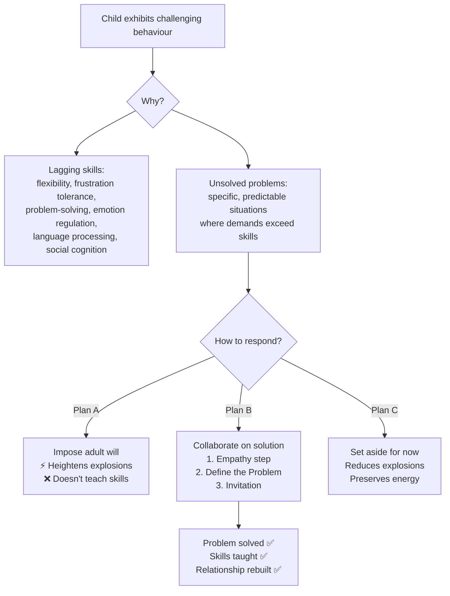
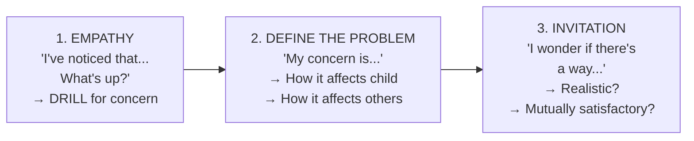

# The Explosive Child — Ross W. Greene

> Saturday morning. Eleven-year-old Jennifer counts six frozen waffles, plans three for today and three for tomorrow. When her seven-year-old brother Riley says he wants waffles, Jennifer erupts — screaming, face reddening, pushing her mother aside, seizing the container, and stalking to her room. Her family has endured hundreds of such episodes. Doctors have given her labels: oppositional-defiant disorder, bipolar disorder, intermittent explosive disorder. Therapists prescribed sticker charts and time-outs. Psychiatrists tried multiple medications. After eight years, Jennifer has changed little since she was a toddler. This book argues that every one of those approaches missed the point. Jennifer doesn't need firmer limits or better incentives. She needs someone to understand what skills she's lacking, identify the specific problems that trigger her episodes, and solve those problems *with* her — not *to* her.

---

## About the Author

Ross W. Greene is a clinical psychologist who developed the approach now known as Collaborative & Proactive Solutions (CPS). He was on the faculty at Harvard Medical School for over twenty years and founded the non-profit Lives in the Balance. Greene was mentored by Thomas Ollendick at Virginia Tech and shaped by decades of clinical work with behaviourally challenging children and their families — in homes, schools, inpatient units, residential facilities, and juvenile detention centres.

This is the fifth edition of a book originally published in 1998. Over sixteen years and five editions, Greene refined a single core insight: <b style="color: #2980b9">challenging kids are not manipulative, attention-seeking, or unmotivated — they are lacking the skills to behave differently</b>. Each edition incorporated feedback from thousands of families, educators, and clinicians. The book's companion resource, www.livesinthebalance.org, provides free tools including the Assessment of Lagging Skills and Unsolved Problems (ALSUP).

---

## The Big Idea

- <b style="color: #2980b9">"Kids do well if they can"</b> replaces the conventional belief that "kids do well if they want to." Challenging behaviour reflects a developmental delay in flexibility, frustration tolerance, and problem-solving — not a lack of motivation or a character flaw
- <b style="color: #e74c3c">Challenging episodes are predictable, not random</b>: the same five to twelve unsolved problems trigger the same episodes every day or every week. Identifying those problems is the diagnostic breakthrough
- <b style="color: #27ae60">Plan B (Collaborative & Proactive Solutions) is the remedy</b>: a three-step process — gather the child's concern (Empathy step), articulate the adult's concern (Define the Problem step), brainstorm solutions together (Invitation step) — that simultaneously solves problems, teaches skills, and rebuilds relationships
- Rewards, punishments, sticker charts, and time-outs were never designed to teach lagging skills — and they often make things worse
- <b style="color: #e74c3c">Plan A (imposition of adult will) is the primary trigger of challenging episodes</b>: when you "rewind the tape" on most meltdowns, an adult using Plan A is almost always the starting point
- The magic equation: **Inflexibility + Inflexibility = Meltdown.** When an inflexible child meets an inflexible adult, an explosion is the predictable result

---

## Key Concepts at a Glance

| Concept | One-line summary |
|---------|-----------------|
| **Kids do well if they can** | Challenging behaviour = skill deficit, not motivational deficit |
| **Lagging skills** | The specific cognitive capacities that are underdeveloped (flexibility, emotion regulation, language, social cognition) |
| **Unsolved problems** | The specific, predictable situations where lagging skills cause challenging episodes |
| **ALSUP** | Assessment of Lagging Skills and Unsolved Problems — the diagnostic instrument |
| **Plan A** | Imposing adult will unilaterally — heightens probability of explosion |
| **Plan B** | Collaborative problem-solving: Empathy → Define the Problem → Invitation |
| **Plan C** | Strategically setting aside low-priority expectations |
| **Proactive vs Emergency** | Solve problems before they erupt (proactive) rather than in the heat of the moment (emergency) |
| **Drilling** | The art of gathering information from the child — reflective listening, not grilling |
| **Realistic & mutually satisfactory** | The two criteria every solution must meet |
| **"Difficulty..."** | The word every unsolved problem should start with (not the behaviour) |

---

## 30-Second Version

Your explosive child isn't manipulative, coercive, or unmotivated. He's lacking skills — in flexibility, frustration tolerance, and problem-solving — that most people take for granted. The same problems trigger the same explosions, predictably, every day. Identify those problems. Then solve them *with* your child using three steps: (1) understand his concern, (2) share your concern, (3) brainstorm a solution that works for both of you. Stop imposing your will. Stop relying on stickers and time-outs. Start collaborating. The problems that get solved stop causing explosions. The skills get taught through the process of solving problems together. And your relationship — which years of battling have nearly destroyed — starts to heal.

---

---

## Chapter 1: The Waffle Episode

*The book opens not with theory but with a scene that every parent of a challenging child will recognise — the moment when something absurdly small becomes catastrophically large.*

Jennifer, age eleven, wakes up, counts six frozen waffles, and plans: three today, three tomorrow. When her brother Riley says he wants waffles, she detonates. Screaming, pushing her mother Debbie out of the way, seizing the container, slamming the freezer door, and stalking to her room. Debbie and Riley cry.

This is not an isolated incident. Jennifer has endured hundreds of such episodes. At eight, she kicked out a car window. Her brother is scared of her. Her parents argue constantly about how to handle her. She has no close friends. Over the years, Debbie and Kevin have tried everything mental health professionals recommended: firmer limits, sticker charts, time-outs, multiple medications. After eight years, nothing has worked.

Greene uses this scene to establish a critical insight: <b style="color: #e74c3c">the conventional approach — insisting on compliance, rewarding good behaviour, punishing bad behaviour — fails spectacularly with these children</b>. Not because the parents are weak, but because the approach doesn't address the actual problem.

The chapter also introduces Sandra and Frankie, a parallel narrative. Sandra is a single mother who had Frankie at sixteen. Frankie's aggression is more severe than Jennifer's — he has been hospitalised multiple times and is in a special education program. The two mothers met in a support group and speak almost daily. Their common bond: the humiliation, exhaustion, and isolation of raising a child whose behaviour terrifies everyone around them.

> [!quote] Debbie's Confession
> "Most people can't imagine how humiliating it is to be scared of your own daughter."

---

## Chapter 2: Kids Do Well If They Can

*The single most important idea in the book. If you absorb nothing else, absorb this: your child is already motivated to do well. The problem is not will — it is skill.*

### The Philosophical Reframe

For decades, the conventional wisdom has been: <b style="color: #e74c3c">"Kids do well if they want to."</b> Under this philosophy, challenging behaviour is intentional, purposeful, and within the child's control. The child has learned that screaming and hitting gets him what he wants. The parents are too permissive. The solution is more authority, firmer limits, better consequences.

Greene replaces this with a radically different lens: <b style="color: #2980b9">"Kids do well if they can."</b> Under this philosophy, challenging behaviour reflects a developmental delay in specific skills. The child would do well if he could. He isn't challenging every second — only in specific situations where the demands exceed his capacity. Those situations are predictable. And the solution is to identify what skills are lagging and what problems need solving.

This reframe changes everything. If you believe the child *won't* behave, you reach for rewards and punishments to make him *want* to. If you believe the child *can't* behave, you reach for a completely different toolkit — one focused on teaching skills and solving problems.

### What the Labels Really Mean

Greene systematically debunks the conventional labels applied to challenging children:

| Common Label | What It Really Means |
|-------------|---------------------|
| "He just wants attention" | If he had skills to seek attention adaptively, why is he doing it maladaptively? |
| "He just wants his own way" | We all do — some of us have the skills to get our own way adaptively |
| "He's manipulating us" | Manipulation requires forethought, planning, and impulse control — skills these kids lack |
| "He's not motivated" | He's already motivated. Rewards and punishments aren't what he needs |
| "He's making bad choices" | If he had the skills to make good choices, he wouldn't be making bad ones |
| "He has a bad attitude" | Bad attitudes are the by-product of years of being misunderstood and over-punished |
| "He knows just what buttons to push" | When frustrated, he does maladaptive things that adults experience as unpleasant |

> [!tip] Explanations, Not Excuses
> There is a critical difference between using lagging skills as **excuses** (which slams the door on helping) and using them as **explanations** (which opens the door to a vast array of alternative options).

---

## Chapter 3: Lagging Skills and Unsolved Problems

*The diagnostic chapter. If Chapter 2 answers "why is my child challenging?", this chapter answers "specifically what skills is he lacking?" and "specifically when does it happen?"*

### The Lagging Skills

The radar chart reveals how behaviourally challenging children are not globally deficient — they show specific, measurable gaps in flexibility, frustration tolerance, and emotion regulation while maintaining relatively stronger language and attention skills.

Greene identifies a range of specific cognitive skills that behaviourally challenging kids lack. Each one is illustrated with a parent-child dialogue showing what happens when the skill is absent:

**Difficulty handling transitions** — Simply being told to stop one activity and start another is a demand for a mental shift. When the child can't shift, and the adult insists more forcefully, the likelihood of an explosion increases. Thomas won't turn off the TV for bed. His parents escalate. Kaboom.

**Difficulty considering solutions and consequences** — Many kids are so disorganised in their thinking that they can't identify the problem, let alone think through multiple solutions. They act on the first impulse, which is usually the worst option.

**Difficulty expressing concerns in words** — Without language to communicate frustration, kids resort to growling, screaming, spitting, hitting. Gus kicks his classmate Sammy because he "didn't know what to say" when Sammy took his toys.

**Difficulty managing emotions to think rationally** — Philip responds to scrambled eggs with pure emotion, not thought. He knows what he wants (not eggs) but can't navigate the conversation without exploding. His parents escalate. The Xbox gets confiscated.

**Black-and-white thinking, difficulty with ambiguity** — Courtney can't go to the park because it's raining. "We're supposed to go to the park! That's the plan!" No alternative — a movie, going tomorrow — is acceptable. The plan was the plan.

> [!info] The Complete Lagging Skills List
> The ALSUP includes approximately 20 lagging skills spanning transitions, sequencing, persistence, time sense, focus, impulsivity, solution generation, language expression and comprehension, emotion regulation, irritability/anxiety, concrete thinking, rule rigidity, handling unpredictability, cognitive flexibility, social perception, social skills, attention-seeking, perspective-taking, empathy, self-awareness, and sensory/motor difficulties.

### Unsolved Problems: The When

Unsolved problems are even more important than lagging skills for reducing episodes. They answer the question: <b style="color: #2980b9">under what specific conditions does the challenging behaviour occur?</b>

The key insight: <b style="color: #27ae60">challenging episodes are not random</b>. The same five to twelve problems trigger episodes every day or week. Once you identify them, they become predictable. Once they're predictable, they can be solved proactively.

Examples from Jennifer's ALSUP:
- Difficulty when the food she wants for breakfast isn't available
- Difficulty when something she wants to wear is still in the laundry
- Difficulty turning off a video to get ready for bed
- Difficulty agreeing with Riley on what to watch on TV
- Difficulty if something has been moved in her room

Notice: <b style="color: #e74c3c">"hitting," "screaming," and "swearing" are not on this list</b>. Those are behaviours, not unsolved problems. The word "difficulty" covers the behaviours.

---

## Chapter 4: Getting Started — The ALSUP

*The practical tool. The Assessment of Lagging Skills and Unsolved Problems translates philosophy into action.*

### Four Guidelines for Identifying Unsolved Problems

1. **Start each unsolved problem with "difficulty"** — "Difficulty completing the science paragraphs" rather than "Screaming and crying when doing science homework." The word "difficulty" is neutral; listing behaviours makes children defensive and shuts down participation.

2. **Split, don't clump** — "Difficulty completing homework" is too broad. Split it: difficulty with the science paragraphs, difficulty with the double-digit division problems, difficulty with memorising multiplication tables. Different problems may have different causes.

3. **Keep your theories out** — The moment you write "because," stop. "Difficulty completing homework *because she just doesn't feel like it*" embeds your theory. The child will tell you the real reason when you start solving the problem together.

4. **Keep solutions out** — "Difficulty laying out clothes the night before so you don't have difficulty getting dressed in the morning" has a solution baked in. If that solution were working, it wouldn't still be an unsolved problem. Just write: "Difficulty getting dressed for school in the morning."

### The Working Examples

The book walks through complete ALSUPs for five children, each illustrating different profiles:

**Jennifer** (11, rigid, anxious, socially isolated): 15 lagging skills, unsolved problems including the waffles, the laundry, dinner with the family, TV scheduling with Riley, buying things immediately, things moved in her room.

**Frankie** (teenager, aggressive, special education): 13 lagging skills, unsolved problems including specific homework subjects, keeping his room clean, waking up, catching the bus, talking with his mother about school, keeping track of earbuds, music volume.

**Zach** (3, autism spectrum): Limited language, sensory issues. Unsolved problems identified through behaviour observation rather than conversation: joining circle time, playing with other children, staying with the group on the playground.

**Mitchell** (15, Tourette's, bright but struggling): Exceptional verbal IQ but average nonverbal, very slow processing speed, below-average writing. Unsolved problems centred on academic tasks requiring writing and sustained attention. Family communication patterns were a major contributing factor.

**Ana** (7, intense, perfectionistic): No diagnosis, but rigid about how clothes are put away, her brother entering her room, sleeping alone, completing homework before dinner, spelling when handwriting is messy.

> [!warning] Prioritise Ruthlessly
> Your child will have many unsolved problems. You cannot solve them all at once. Pick your **top three**. The rest go on Plan C (set aside for now). Unsafe problems and the most frequent triggers should be highest priority.

---

## Chapter 5: The Truth About Consequences

*Why reward-and-punishment programs fail for these children — not because the parents are doing them wrong, but because the approach addresses the wrong problem.*

### The Conventional Wisdom

The traditional view says challenging behaviour is **learned**: the child discovered that screaming gets him his way, and his parents are too permissive to stop it. The solution: teach the child that compliance is expected, track performance with stickers and points, deliver consequences for success or failure.

### What Consequences Actually Do Well

Greene acknowledges that consequences serve two legitimate purposes:

1. **They teach basic lessons about right and wrong** — "Don't touch the hot stove." "If you're bossy, friends won't play with you."
2. **They provide incentive** — rewards for desirable behaviour, punishments for undesirable behaviour.

But here's the problem: <b style="color: #e74c3c">the children this book is about already know right from wrong and are already motivated</b>. Jennifer knows she shouldn't scream. Frankie knows he shouldn't hit his mother. Gus knows he shouldn't kick Sammy. The bottleneck isn't knowledge or motivation — it's skills. And consequences weren't designed to teach skills.

### Jennifer's Failed Program

Debbie and Kevin were instructed to give clearer directions, praise good behaviour, track performance with a point system, and use time-out for non-compliance. The result: Jennifer rarely earned enough points for rewards. She spent enormous amounts of time in time-out. Her parents had to physically restrain her to keep her there. She scratched, clawed, bit, head-butted, and destroyed her room. Ten minutes to two hours later, the storm would pass. She'd be remorseful. Her parents would reissue the original direction that started the episode.

After months, they recognised: the program was making everyone feel worse, and Jennifer's behaviour hadn't improved at all.

> [!danger] The Paradox of Plan A
> The kids **least** capable of handling Plan A — the behaviourally challenging ones — are the ones **most likely** to get it. Because somewhere along the line, adults became convinced that these children needed massive doses of imposed will. The result: massive numbers of challenging episodes.

---

## Chapter 6: The Three Plans

*Every unsolved problem gets one of three responses. Understanding the difference is essential.*

### Plan A: Impose Your Will

"I've decided that you can't go outside until your homework is done." The adult decides the solution and imposes it. Plan A heightens the likelihood of an explosion because: (1) the child lacks the skills to handle imposition of will, (2) the solution is uninformed — you haven't found out what's actually causing the problem, and (3) inflexibility from you breeds inflexibility from the child.

### Plan B: Collaborate on a Solution

The three-step process — Empathy, Define the Problem, Invitation — in which adult and child identify each other's concerns and work toward a solution that is both **realistic** (both parties can actually follow through) and **mutually satisfactory** (both parties' concerns are addressed).

Critically, <b style="color: #2980b9">Proactive Plan B is far superior to Emergency Plan B</b>. Since the problems are predictable, solve them *before* they come up again. Make an appointment. Give the child advance notice of the topic. Don't wait for the next explosion.

### Plan C: Set Aside for Now

Not "giving in." Not "capitulating." Plan C is intentional, thoughtful prioritising. You cannot solve all problems at once. Setting aside low-priority expectations eliminates the challenging episodes associated with those expectations, freeing energy for the high-priority problems you're tackling with Plan B.

> [!tip] Plan C Is Not Capitulating
> **Giving in** = starting with Plan A and backing down because the child pitched a fit. That teaches the child that intensity works.
> **Plan C** = intentionally deciding, before anyone is upset, that a particular expectation is lower priority right now.

| | Plan A | Plan B | Plan C |
|---|--------|--------|--------|
| **Action** | Impose solution | Collaborate on solution | Set aside for now |
| **Who decides?** | Adult alone | Adult + child together | Adult decides to defer |
| **Child's concerns?** | Ignored | Central to the process | Irrelevant (problem isn't being worked on) |
| **Episode risk** | Very high | Low | Very low |
| **Problem solved?** | Rarely durably | Yes, when done well | No (deferred) |

Plan B dominates every outcome metric — it is the only approach that simultaneously reduces explosions, teaches lagging skills, durably solves problems, and makes the child feel heard.

---

## Chapter 7: Plan B — The Three Steps

*The operational heart of the book. If you learn nothing else, learn these three steps.*

### Step 1: The Empathy Step

**Goal:** Gather information from the child to understand his concern or perspective about a specific unsolved problem.

**How to start:** "I've noticed that it's been difficult for you to [unsolved problem]. What's up?"

This opening is designed to be neutral, specific, and inviting. No mention of behaviour. No theories. No solutions. Just: what's going on for you?

After "What's up?", one of five things happens:

1. **He says something** — Good. But the first response is rarely sufficient. Now you drill.
2. **He says "I don't know" or nothing** — Give him time. He may never have been asked before.
3. **He says "I don't have a problem with that"** — Drill further. "You're good with it? Tell me more."
4. **He says "I don't want to talk about it"** — That's OK. Often kids start talking the moment they're given permission not to.
5. **He gets defensive** — Don't match it. "You're not in trouble. I'm not telling you what to do. I'm just trying to understand."

### The Five Drilling Strategies

<b style="color: #2980b9">Drilling — not grilling — is the hardest and most important skill in Plan B.</b>

1. **Reflective listening** — Say back what the child said. "So the writing part is too much." Add a clarifier: "How so?" or "Can you say more about that?"
2. **Who/what/where/when questions** — "What part of the homework is hard?" "When does it happen?"
3. **Conditions analysis** — "I've noticed some nights you eat dinner fine and some nights you don't. What's different?"
4. **What are you thinking?** — Not "how are you feeling" (less useful), but "what are you thinking when that happens?"
5. **Break it into components** — "Let's think about what you have to do to write those paragraphs. First you figure out the topic. Is that hard? No. Then you figure out what to say..."

### The Ana Example — Drilling in Action

This is the book's signature demonstration. Ana says homework is "too hard." Through patient drilling, her parent discovers that it's specifically the science paragraphs, and specifically because Ana writes so slowly that she forgets what she wanted to say by the time she writes it down. She thinks she's stupid.

The journey from "It's too hard" to "It takes me so long to write the words that I forget what I wanted to say" is the journey from a locked door to an open one.

### Step 2: Define the Problem

**Goal:** Enter the adult's concern into the discussion.

Start with: "My concern is..." or "The thing is..."

Two categories of adult concerns:
1. **How the problem affects the child** — "If you stop doing homework completely, you won't get practice at writing and it'll always be hard."
2. **How the problem affects others** — "When you miss the bus, I have to drive you and my boss is upset about me being late."

> [!warning] Don't Put Solutions Here
> "My concern is that you need to do your homework before soccer practice" — that's a solution masquerading as a concern. The real concern might be: "If homework doesn't get done, your grades suffer."

### Step 3: The Invitation

**Goal:** Brainstorm solutions that address *both* sets of concerns.

Start with: "I wonder if there's a way to [child's concern] but also [adult's concern]. Do you have any ideas?"

Give the child the first crack at a solution. If he can't think of one, propose some — without imposing. Two criteria for every solution:

- **Realistic** — Can both parties actually follow through? "Trying harder" is not a solution.
- **Mutually satisfactory** — Does it truly address both concerns?

If the first solution doesn't work, go back to Plan B. Good solutions are usually refined versions of earlier ones.

### Ana's Complete Plan B

After drilling reveals that Ana forgets her thoughts because she writes slowly:

**Define the Problem:** "The thing is, if you stop doing homework completely, you won't get practice at writing and it'll always be hard for you."

**Invitation:** "I wonder if there's a way to help you with the writing so it doesn't take so long that you forget what you wanted to say, but also make sure you get some practice."

Ana's solution: use her mother's voice recorder to capture her thoughts, then play them back while writing.

Realistic? Yes — the recorder is available during homework time. Mutually satisfactory? Ana remembers her thoughts, and she still practices writing. Done. If it doesn't work, they'll talk again.

---

## Chapter 8: Trouble in Paradise — When Plan B Goes Wrong

*A systematic troubleshooting guide for the seventeen most common ways Plan B fails.*

The most important failure patterns:

**You haven't tried it yet.** You're still using Plan A and Plan C only. The paradox: you need to try Plan B to get good at it. No one is great at it in the beginning.

**You're using Emergency instead of Proactive.** Emergency Plan B happens in the heat of the moment — more rush, more heat, worse conditions. Since problems are predictable, solve them proactively.

**You're entering with a preordained solution.** You can't know the solution until you've identified both parties' concerns. If you enter knowing the answer, you're doing Plan A in a Plan B costume.

**You're skipping ingredients.** Skip the Empathy step and your solution is uninformed. Put a solution in the Define the Problem step and you've morphed into Plan A. Skip the Invitation and impose your solution and you've abandoned collaboration entirely.

**"I don't know" is freezing you.** Give the child time. Try educated guessing: "Sometimes it looks like the pill is hard to swallow. Is that it? No? Does it make your stomach hurt? No? Does it bother you that kids at school see you going to the nurse?"

**Your child got defensive.** Don't match it. "You don't have to talk to me." "You're not in trouble." "I'm not telling you what to do."

**Jennifer's First Plan B Attempt:** Debbie asks Jennifer about fighting with Riley over the TV. Jennifer proposes a solution ("He should let me watch what I want — I'm the older sister") before concerns are clarified. Debbie drills patiently. Jennifer reveals it's about SportsCenter vs. Dance Moms. Then Jennifer abruptly leaves. Debbie is disappointed — but Jennifer *talked*. The next day, Jennifer spontaneously returns with two solutions: a schedule, and a backup plan to record her shows. Problem-solving is incremental.

---

## Chapter 9: Got Questions?

*An extended Q&A addressing the objections that every parent, teacher, and therapist raises.*

**"How will my child be held accountable?"** If a child is putting his concerns on the table, taking yours into account, and working toward a mutually satisfactory solution — and if challenging episodes are decreasing — then he is being held accountable and taking responsibility. Accountability through Plan B is real accountability.

**"What about the real world? What if he has a Plan A boss someday?"** A Plan A boss is a problem to be solved. How does a child learn to solve problems? Through Plan B. The skills taught — identifying concerns, considering others' perspectives, working toward realistic solutions — are the survival skills of the real world. Blind adherence to authority didn't make the list.

**"What about safety?"** In emergent safety situations (child about to step in front of a car), yank him to safety. But if he *chronically* runs in parking lots, use Proactive Plan B to solve it. Chris's solution: hold Mom's belt loop instead of her hand (because "holding hands is for babies"). Durable. Realistic. His idea.

**"Does Plan B teach lagging skills?"** Yes — indirectly. When Luis and his parents solve the problem of turning off the TV for dinner, Luis practises transition-making. After solving multiple transition problems, he begins applying solutions to new transitions without reminders. Additionally, every Plan B conversation practises: reflecting on concerns, expressing them in words, listening without reacting, considering multiple solutions, evaluating outcomes — skills that are inherent in the three-step process.

### Adapting for Non-Verbal Children

Greene provides detailed guidance for children with significant language delays. The principles are the same; the mechanisms change:

**Roger** (adolescent, severely delayed expressive language but understands speech): Caregivers wrote his common unsolved problems on an index card — being hot, tired, sick, hungry, surprised, feeling people talk too much. When agitated, they read the list; he pointed. Over time, he learned to say "I'm hot" instead of screaming. Then they identified the specific conditions and solved problems proactively.

**Zach** (3, autism spectrum, very few words): Speech therapist created a laminated card using Google Images to depict unsolved problems: hot, cold, hungry, thirsty, something's the matter. Zach pointed to the picture. A second card showed potential solutions for each problem. Over time, words replaced pictures.

> [!info] Three General Solution Categories
> For children who become overwhelmed by the universe of possible solutions, teach three categories:
> 1. **Ask for help**
> 2. **Meet halfway / give a little**
> 3. **Do it a different way**
>
> These simplify brainstorming and give the child a framework for generating solutions in any situation.

### The Role of Medication

Greene takes a conservative but pragmatic position on medication. Some children are so hyperactive, impulsive, irritable, or emotionally reactive that they cannot participate in Plan B until these issues are addressed. Medication doesn't replace Plan B — it makes Plan B possible.

**Stimulants** (Ritalin, Concerta, Vyvanse) for inattention, hyperactivity, and impulsivity. The challenge: parents report "two different kids" — medicated and unmedicated — and solutions that are realistic when medicated may not be realistic when the medication wears off.

**SSRIs** (Lexapro, Prozac) for chronic irritability, crankiness, and anxiety that makes every small bump feel insurmountable.

**Atypical antipsychotics** (Risperdal, Abilify) for children who, despite heavy Plan B and Plan C, are still so short-fused or emotionally reactive that they cannot participate in problem-solving discussions.

Greene's guiding principles: far too many kids are medicated unnecessarily or on too much medication. But for some, medication is indispensable. Deciding should be difficult. Get a clinically savvy, attentive prescriber who understands that a diagnosis is not the most important thing to know about your child and that medication doesn't treat everything. Monitor continuously. And remember: <b style="color: #e74c3c">Plan A can trigger challenging episodes even when a child is on an effective medication regimen</b>.

---

## Chapter 10: Family Matters

*The book zooms out from the individual child to the family system.*

### Siblings

A behaviourally challenging child creates unique pressures on siblings. They're scared. They feel neglected. They see a double standard. Greene's guidance:

- Explain the sibling's difficulties at an age-appropriate level
- "Fair does not mean equal" — in every family, each child gets what they need
- Use Plan B as a facilitator between siblings (the extended Andrew/Caleb toy-sharing example walks through preliminary discussions with each child separately, then bringing them together for the Invitation step)
- Watch for the phenomenon where siblings' behaviour *deteriorates* as the challenging child *improves* — a sign that the siblings' emotional needs, which had been below the radar, now require attention

### Maladaptive Communication Patterns

Greene identifies seven destructive patterns:

| Pattern | Example | Why It's Destructive |
|---------|---------|---------------------|
| **Speculation** | "The reason Oscar doesn't listen is he thinks he's smarter than us" | Inaccurate; derails from actual problem-solving |
| **Overgeneralisation** | "Why do you never do your homework?" | Child reacts to the inaccuracy, not the concern |
| **Perfectionism** | "You're doing better, but you should do extra math problems" | Ignores progress; driven by parental anxiety |
| **Sarcasm** | "Well, we're off to a wonderful start" | Lost on black-and-white thinkers; muddies communication |
| **Put-downs** | "Why can't you be more like your sister?" | Shuts down collaborative engagement |
| **Catastrophising** | "He'll probably end up in jail someday" | Exaggerates effects, creates hopelessness |
| **Lecturing** | "How many times do I have to tell you..." | If you've told him enough times, the problem isn't knowledge |

### The Mitchell Family Session

One of the book's most vivid scenes. Fifteen-year-old Mitchell, his attorney father Paul, and social worker mother Kathryn cannot have a single exchange without sarcasm, one-upmanship, and speculation. The therapist names each pattern in real-time:

"That's one-upmanship," the therapist says to Paul. Mitchell's frown turns upside down. "Thank you," he says.

Mitchell — labelled the "explosive" one — is actually the first family member to correctly identify the patterns. The therapist establishes three rules: no sarcasm, no one-upmanship, no speculation. "If someone does one of those three things, just point it out without being judgmental."

"That's sarcasm," Mitchell says immediately when his father makes a crack. The family dynamic begins to shift.

### Partners and Co-Parents

A behaviourally challenging child strains marriages. A common pattern: one parent favours imposing authority ("If you'd just let me deal with him..."), the other favours backing off ("Somebody needs to give the kid a break!"). Since neither approach works, they blame each other.

Greene's advice: both partners need to agree on (1) which unsolved problems to work on and which to set aside, and (2) how they want to solve those problems. Plan B can help parents learn new skills right alongside their child. If one spouse won't read the book or try Plan B, recognise that many adults use Plan A out of habit — they may not have strong beliefs driving it. Help them give the matter some thought, starting with new information about lagging skills.

Some adults rely on Plan A because they fear their own concerns won't be heard otherwise — usually because *their* Plan A parents never heard their concerns. These adults need assurance that Plan B addresses adult concerns just as powerfully as child concerns.

For single parents, the challenge is compounded by having no co-parent to share the burden. Sandra's story illustrates this: her energy and determination — which had sustained her through everything — weren't enough for Frankie. She needed a different approach, not more effort.

---

## Chapter 11: The Dinosaur in the Building

*The "dinosaur" is the school discipline program — decades old, based on Plan A, and failing the students who need help most.*

### Why Zero Tolerance Fails

Greene makes a devastating case: years of research show that standard school discipline — detentions, suspensions, paddlings, expulsions — doesn't work for the students who receive it most often. The "frequent fliers" cycle through the office year after year without improvement.

The standard rationale: "Even if suspension doesn't help Frankie, at least it sets an example for the other students." Greene's response:

- The well-behaved students would behave well without the example
- The message to Frankie is: "We don't understand you and we can't help you"
- The only circumstance where you can help Frankie is when he's *in* school, not suspended from it
- Students to whom these interventions are counterproductively applied for years become more alienated and fall further outside the social fabric

### Key Components for School Implementation

Greene lists the essential elements: **Awareness** (these students are being ill-served), **Urgency** (this is a priority), **Mentality** ("kids do well if they can"), **Expertise** (ALSUP + Plan B), **Abandoning Blame** (stop blaming parents), **Time** ("Plan B takes time, but Plan B saves time"), **Assessment** (ALSUP as standard discussion guide), **Practice and Coaching**, **Ongoing Communication**, **Continuity** (don't hop between problems), and **Perseverance** (there is no quick fix).

### Plan B in Schools

The ingredients are identical; the settings differ:

**Student-Teacher:** Rickey refuses the social studies worksheet. Emergency Plan C avoids an explosion. Proactive Plan B later reveals that Rickey's concern is spelling frustration. Solution: DeJuan helps with words Rickey can't spell — because DeJuan won't "rag on him" the way Darren would.

**Student-Student:** Mr. Bartlett facilitates Plan B between Hank and Laura, who must work on a project together despite a bad experience last year. Separate Empathy steps with each student, then a joint Invitation step.

**Parent-Teacher:** Rickey's mother and teacher use Plan B to address homework difficulties. They identify specific unsolved problems (slow writing, spelling, trouble with details, exhaustion after football practice) and agree to include Rickey in the next meeting so he participates in generating solutions.

---

## Chapter 12: Better

*A brief closing chapter that defines progress and provides final updates on the running narratives.*

"Better" doesn't mean perfect. It doesn't mean the child is suddenly easy. <b style="color: #27ae60">Greene's definition: "It's better. And better begets better."</b>

Things might be better because you understand your child's difficulties more accurately. Because you've removed some low-priority demands (Plan C). Because you're relying less on Plan A. Because you and your child have collaboratively solved some of the problems that were causing explosions. Because you're communicating again.

Could things be even better? You'll find out. If you need more help, www.livesinthebalance.org provides ongoing resources.

**Sandra** reports that Frankie is in the partial hospitalisation program. The school placement problem is being worked on. His bedroom door isn't closed all the time. He participated in a Plan B conversation — about playing music too loud — right in their apartment. "I didn't know how to talk to my own kid," Sandra says. "I didn't know how to solve his problems. I was trying, but I didn't know how."

**Debbie** reports that Jennifer is talking. More with Debbie than with Kevin, though Kevin is trying hard — Jennifer corrects him when he rushes through the Empathy step. Debbie is finding out what's going on in "that head of hers." Jennifer let Debbie hug her (with advance warning). She screamed a few minutes later because Debbie rearranged something in her room. So there are more problems to solve. But: "It's a lot easier when your kid is your partner instead of your enemy."

"Do you think our lives will ever be normal?" Debbie asks. Sandra laughs. "I stopped shooting for normal a long time ago. The abnormal is my normal." The goal isn't perfection — it's doing what you can to make tomorrow slightly better than today.

The book closes with an email from a father: his twelve-year-old daughter had been a severely challenging child. They were certain inpatient treatment was the only path. Then they read The Explosive Child, implemented Plan B without professional help, and in twenty months she became "a well-balanced student athlete with a great circle of friends." He writes: "I consider this the greatest accomplishment of my life."

> [!quote] The Final Insight
> "Kids do well if they can. So do parents. And if things aren't going well for you and your behaviourally challenging child, now you know what to do."

---

## Best Stories

The treemap shows that the core deficits — emotion regulation, flexibility, frustration tolerance, and handling transitions — dominate the ALSUP profiles of most challenging children, while sensory and motor issues appear less frequently but can be equally disruptive when present.

1. **The Waffle Episode** — Jennifer's plan for six waffles collides with Riley's breakfast request. An absurd trigger that perfectly illustrates the pattern: inflexibility meets an unexpected change, and the explosion that follows has nothing to do with waffles and everything to do with lagging skills.

2. **Frankie Hits Sandra** — After years of escalation, Frankie punches his mother and disappears overnight. When he returns, he reveals to the therapist that he hates school, feels out of control, has been smoking marijuana, and is scared. The information pours out once someone asks the right way.

3. **Ana's Homework Discovery** — Through patient drilling, a parent discovers that the "too hard" science homework is really about writing speed and working memory. Ana writes so slowly she forgets her thoughts. She thinks she's stupid. Solution: a voice recorder. The problem was invisible until someone drilled past "It's too hard."

4. **Mitchell's Family Therapy** — A fifteen-year-old and his attorney father trade sarcasm at rapid speed. The therapist names each pattern. Mitchell — the "explosive child" — is the first to identify his father's sarcasm correctly and grins. The real communication problem isn't the child's.

5. **Jennifer's Spontaneous Solutions** — After a brief, incomplete first Plan B attempt, Jennifer returns the next day with two TV-scheduling solutions she thought up herself — including a backup plan. Debbie gives her a hug. Jennifer pushes her away but can't quite hide a smile. "My partner," Debbie whispers. "My problem-solving partner."

6. **Frankie and Ms. Brennan** — In the inpatient unit, the social worker gets Frankie to reveal his real concerns: feeling like a "speddie," wanting to be normal, being embarrassed by teachers. Sandra cries; Frankie says "I knew you couldn't do it" — but lets her stay. First real conversation in years.

7. **Chris and the Belt Loop** — A parking lot safety problem solved proactively. Chris doesn't want to hold hands ("that's for babies"). His solution: hold Mom's belt loop. Realistic, mutually satisfactory, dignity-preserving — and his idea.

---

## Practical Application

The sankey flow reveals the CPS system in action: lagging skills feed into predictable unsolved problems, which can be routed through Plan A (almost always producing explosions), Plan B (solving problems durably), or Plan C (preserving energy for higher-priority problems).

### Step 1: Diagnose with the ALSUP

Download the Assessment of Lagging Skills and Unsolved Problems from www.livesinthebalance.org. Go through the lagging skills list with your co-parent or partner. For each skill that applies, identify the specific unsolved problems associated with it — split, not clumped; starting with "difficulty"; no theories; no solutions.

### Step 2: Prioritise

Pick your **top three** unsolved problems. Everything else goes on Plan C for now. Unsafe problems and the most frequent triggers get highest priority.

### Step 3: Start Plan B

1. Make an appointment with your child: "Can we talk about something this weekend?"
2. Give advance notice of the topic if the child can handle it
3. Start the Empathy step: "I've noticed that it's been difficult for you to [specific unsolved problem]. What's up?"
4. Drill patiently using the five strategies — reflective listening, who/what/where/when, conditions analysis, what are you thinking, breaking into components
5. Move to Define the Problem: "My concern is..."
6. Move to the Invitation: "I wonder if there's a way to [child's concern] but also [adult's concern]. Do you have any ideas?"
7. Evaluate: Is the solution realistic? Mutually satisfactory?
8. If it doesn't work, go back to Plan B — the first solution often needs refinement

### Step 4: Reduce Plan A

Every time you're about to impose your will ("I've decided that..."), ask: Is this a high-priority problem? If yes, use Plan B. If no, use Plan C. If you slip into Plan A and it triggers an explosion, use the information from that explosion to update your ALSUP.

### Step 5: Be Patient

Problem-solving is incremental. The first Plan B conversation may not get past the Empathy step. That's success. Skills don't develop overnight. Relationships don't rebuild in a week. But better begets better.

---

## Connections

- [[No-Drama Discipline - Daniel J. Siegel]] — Near-identical philosophy. Siegel's "connection before redirection" parallels Greene's "Empathy step before solutions." Both reject punishment as a primary tool. Siegel adds the neuroscience; Greene adds the structured process.
- [[The Whole-Brain Child - Daniel J. Siegel]] — The upstairs/downstairs brain model explains why kids lose flexibility under stress — the same phenomenon Greene calls "responding with more emotion than thought"
- [[How to Talk So Kids Will Listen - Adele Faber & Elaine Mazlish]] — The empathic listening and collaborative problem-solving predate Greene's model and use remarkably similar ingredients
- [[Unconditional Parenting - Alfie Kohn]] — Kohn's critique of rewards and punishments aligns precisely with Chapter 5. Both authors argue that conventional consequences address the wrong problem
- [[The Self-Driven Child - William Stixrud & Ned Johnson]] — The collaborative approach preserves the child's sense of control, which Stixrud identifies as the single most important factor in child motivation
- [[Parenting from the Inside Out - Daniel J. Siegel]] — Essential reading for parents trying to stop using Plan A. Understanding your own triggers and attachment patterns is critical when your child's behaviour evokes strong emotions from your own past
- [[Crucial Conversations - Kerry Patterson]] — The drilling strategies and mutual purpose framework parallel Plan B's structure of identifying concerns and brainstorming mutually satisfactory solutions
- [[Emotional Intelligence - Daniel Goleman]] — Emotion regulation as a learnable skill, not a character trait — the same insight that underpins Greene's "lagging skills" framework
- [[Simplicity Parenting - Kim John Payne]] — Reducing environmental demands aligns with Plan C; fewer demands means fewer collisions with lagging skills
- [[Hunt, Gather, Parent - Michaeleen Doucleff]] — Cross-cultural evidence that collaborative, non-punitive approaches to child behaviour are the historical norm, not the exception

---

## Quick Reference: Plan B Cheat Sheet

### Before You Start

- [ ] Download the ALSUP from www.livesinthebalance.org
- [ ] Identify lagging skills with your co-parent
- [ ] For each lagging skill, list specific unsolved problems (starting with "difficulty")
- [ ] Split, don't clump. No theories. No solutions.
- [ ] Pick your top three unsolved problems
- [ ] Put everything else on Plan C

### The Three Steps

### Drilling Strategies

1. **Reflective listening** — repeat what the child said + "How so?" / "Can you say more?"
2. **Who / what / where / when** — "What part of the homework is hard?"
3. **Conditions analysis** — "Some nights you eat fine, some you don't. What's different?"
4. **What are you thinking?** — Not feeling. Thinking. In that moment.
5. **Break into components** — "Let's think about the steps. First you... Is that part hard?"

### When the Child Says...

| Child says | Your best response |
|-----------|-------------------|
| Something useful | Drill further — reflective listening is always safe |
| "I don't know" / silence | Give time. "Take your time. We're not in a rush." |
| "I don't have a problem with that" | "Tell me more about that." |
| "I don't want to talk about it" | "You don't have to. But can you tell me why?" |
| Defensive / hostile | "You're not in trouble. I'm not telling you what to do." |

### Signs Plan B Is Working (Even Before Problems Are Solved)

- You understand your child's difficulties more accurately
- Your child is talking to you about unsolved problems
- Your child perceives adults as trying to understand rather than punish
- The frequency and intensity of challenging episodes are decreasing
- Your child is taking your concerns into account
- Your relationship is improving
- You're feeling less exhausted, less adversarial, more hopeful

### The Equation to Remember

> **Inflexibility + Inflexibility = Meltdown**
>
> The most powerful variable you can change is your own flexibility. You cannot make your child more flexible through force. You can make yourself more flexible through practice.
