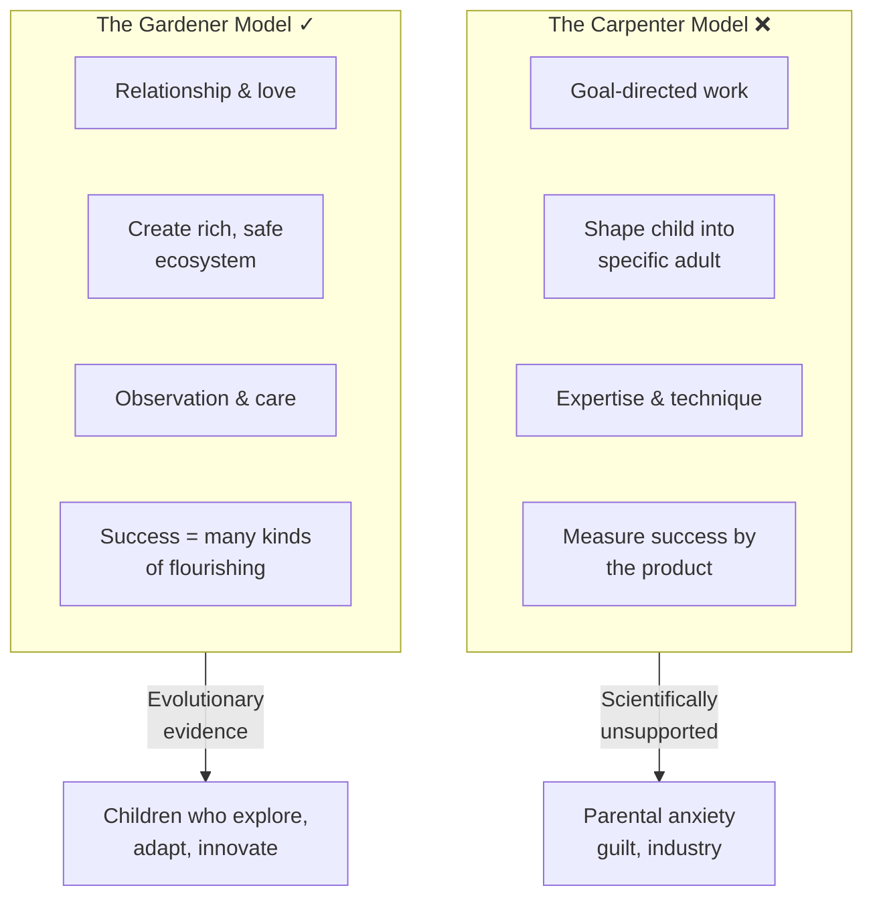
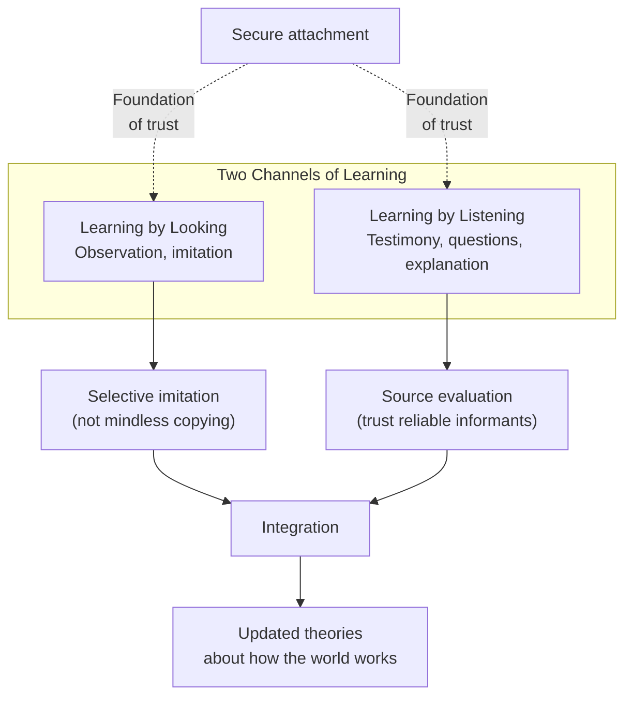
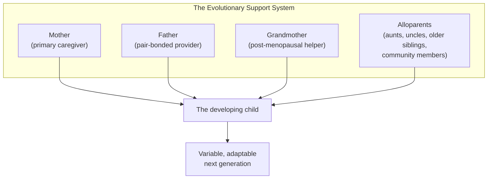
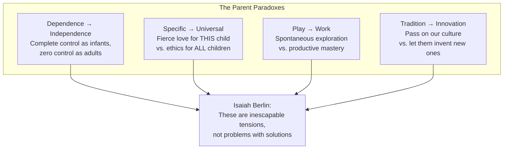
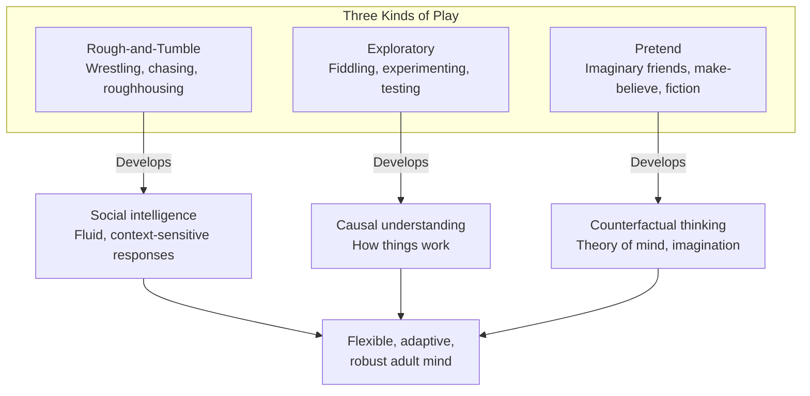
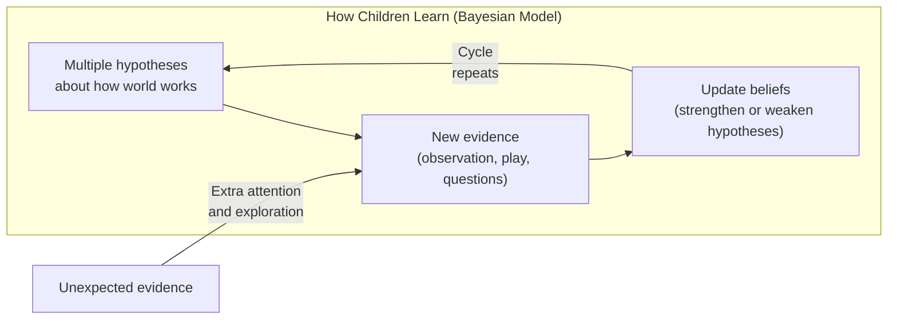
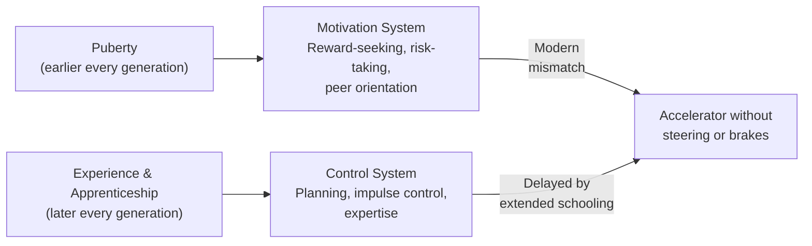
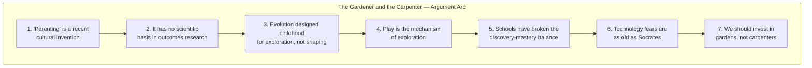

# The Gardener and the Carpenter — Alison Gopnik

> What if the most important thing about being a parent has nothing to do with "parenting"? Alison Gopnik — developmental psychologist, philosopher, and grandmother — argues that the modern obsession with parenting-as-a-verb is a recent invention that has made both parents and children miserable. The word barely existed before 1970. Before that, people didn't "parent" — they simply were parents. Gopnik draws on evolutionary biology, cognitive science, and decades of her own lab research to make a case that will unsettle every reader who has ever bought a parenting book (including this one): children are not raw material to be shaped by skilled carpenters into predetermined products. They are wild gardens — messy, unpredictable, and magnificent — and our job is not to sculpt them but to provide the soil, water, and sunlight that lets a thousand different flowers bloom.

---

## About the Author

Alison Gopnik is a professor of psychology and affiliate professor of philosophy at the University of California, Berkeley. She is one of the world's leading researchers on children's learning and cognitive development, with over 150 published journal articles and six books. Her work helped pioneer the "theory theory" — the idea that children learn about the world much the way scientists do, by forming hypotheses, running experiments, and updating their beliefs when evidence contradicts expectations.

Gopnik holds the rare distinction of being equally respected in cognitive science, developmental psychology, and philosophy of mind. Her TED talks have been viewed millions of times, and she writes regularly for *The Wall Street Journal*, *The Atlantic*, and *The New York Times*. She is also a mother of three grown sons and — crucially for this book — a grandmother. Her grandson Augie appears throughout as a living illustration of every principle she describes, from extractive foraging at the Berkeley farmers' market to populating the backyard garden with fairies named Titania and Ariel.

This book is her most personal and most polemical. Where her earlier work (*The Scientist in the Crib*, *The Philosophical Baby*) presented research findings for a general audience, *The Gardener and the Carpenter* takes an explicit stance: modern "parenting" is broken, and science tells us why.

---

## The Big Idea

- <b style="color: #2980b9">Being a parent is a relationship, not a job</b>: "parent" is not a verb, and caring for children is not goal-directed work aimed at producing a particular kind of adult — it is a form of love, one of the deepest and most distinctive forms humans experience
- <b style="color: #e74c3c">The carpenter model is scientifically wrong</b>: there is very little empirical evidence that the small variations in parenting technique that parenting books obsess over — co-sleeping vs. crib, cry-it-out vs. holding, structured play vs. free play — have reliable, predictable long-term effects on who children become
- <b style="color: #27ae60">The gardener model matches what evolution actually designed</b>: our job is to create a protected, stable, rich ecosystem — fertile soil — where many unpredictable kinds of children can flourish, not to shape each child into a predetermined product
- Children's messiness — their variability, randomness, and apparent irrationality — is the entire point of childhood from an evolutionary perspective; it is the engine of human adaptability and cultural innovation
- There is a fundamental trade-off between exploration and exploitation; childhood is the protected period for exploration, and play is the mechanism that makes it work
- The modern parenting industry has coincided with the highest rates of child poverty and infant mortality in the developed world — a society obsessed with parenting has failed to provide the basic resources children actually need

### The Meadow, Not the Hothouse

Gopnik distinguishes between two kinds of gardening. There is hothouse gardening — growing orchids, training bonsai — which requires the same kind of skill and expertise as fine carpentry. The British call anxious middle-class parenting "hothousing" for exactly this reason. Then there is the gardening of meadows, hedgerows, and cottage gardens.

The glory of a meadow is its messiness. Different grasses and flowers flourish or perish as circumstances change. No individual plant is guaranteed to become the tallest or most beautiful. The gardener's job is to create fertile soil that sustains a whole ecosystem — varied, flexible, dynamic, and robust. A good garden is constantly changing as it adapts to weather and seasons. In the long run, a varied, flexible ecosystem will be more robust and adaptable than the most carefully tended hothouse bloom.

> [!success] The Most Promising Sprout
> Gardening is risky and often heartbreaking. Every gardener knows the pain of watching the most promising sprout wither unexpectedly. But the only garden without those risks would be one made of Astroturf studded with plastic daisies.

---

## Key Concepts at a Glance

The radar chart captures Gopnik's central argument: the carpenter model maximises control and predictability at the cost of creativity, resilience, and the joy that comes from letting children explore — while the gardener model trades parental control for the adaptability and variability that evolution actually designed childhood to produce.

| Concept | One-line summary |
|---------|-----------------|
| **Gardener vs Carpenter** | Two models: cultivate an ecosystem vs. shape a product — science supports the gardener |
| **Explore vs Exploit** | Children explore possibilities, adults exploit what works — both are necessary, in sequence |
| **The Mess Thesis** | Variability and disorder in childhood drive human adaptability — mess is a feature, not a bug |
| **Cultural Ratchet** | Each generation absorbs previous innovations unconsciously, then adds new ones |
| **Discovery Learning** | How young children learn — forming theories, running experiments, updating beliefs |
| **Mastery Learning** | How older children learn — practice, apprenticeship, making skills automatic |
| **Three Kinds of Play** | Rough-and-tumble (social), exploratory (physical), pretend (counterfactual thinking) |
| **Guided Play** | Adults scaffold learning without directing it — better than free play or direct instruction |
| **Two Systems of Adolescence** | Motivation (reward-seeking, puberty) vs. control (prefrontal, experience) — modern mismatch |
| **Alloparenting** | Humans evolved for communal child-rearing, not isolated nuclear families |
| **Nonshared Environment** | Siblings raised by the same parents turn out surprisingly different — parenting explains less than we think |
| **Evolvability** | Some organisms produce more varied offspring — humans are the ultimate evolvable species |

---

## 30-Second Version

"Parenting" is a recent cultural invention — the word barely existed before 1970 — and it is scientifically misguided. There is almost no reliable evidence that the specific techniques parents agonize over make a predictable difference in who their children become. What does matter is providing a safe, stable, loving environment — fertile soil — where children can explore, play, and develop their own unpredictable strengths. Children's messiness is not a problem to solve but the evolutionary engine of human adaptability. Play is not wasted time but the mechanism by which children build flexible, robust minds. The carpenter who shapes raw material into a product is the wrong metaphor. The gardener who cultivates an ecosystem where many different flowers can bloom is the right one. And instead of spending billions on parenting advice, we should be spending it on the basic resources — prenatal care, paid leave, quality child care, poverty reduction — that actually help children thrive.

---

## The Invention of Parenting

*The word "parenting" first appeared in America in 1958 and became common only in the 1970s. For the entire previous history of our species, people were parents — they didn't "parent." Gopnik traces how a confluence of social changes created the parenting industry.*

Several forces converged to turn a relationship into a job. Families got smaller — most people no longer grew up surrounded by siblings, cousins, aunts, and uncles who modeled child-rearing. People moved away from extended families, eliminating the web of informal wisdom that once surrounded every new parent. And middle-class Americans started having children later, after years of school and career — so they naturally applied the mental model of school and work to child-rearing. You set goals. You acquire expertise. You measure outcomes.

> [!warning] The Parenting-Dieting Parallel
> Gopnik draws a devastating analogy to food. Traditional cooking cultures produced reasonably healthy outcomes without anyone consciously "dieting." When those traditions eroded, a culture of nutrition science and dieting replaced them — and obesity exploded. The same thing happened with parenting. Traditional child-rearing worked reasonably well. When those traditions eroded, a culture of parenting expertise replaced them — and parental anxiety, guilt, and child poverty all exploded. Sixty thousand parenting books on Amazon should be, by itself, evidence of their futility. If any of them worked, the others would be out of business.

The parenting model has a fatal flaw: there is almost no reliable empirical evidence connecting the small variations in parenting practice to predictable long-term outcomes in children. Co-sleeping or crib? Cry-it-out or comfort? Mandarin classes or free play? The science simply does not show that these choices reliably produce particular kinds of adults.

### The Behavioral Genetics Evidence

Gopnik marshals a devastating body of evidence from behavioral genetics — the field that uses twins, siblings, and adoption studies to disentangle nature and nurture. The findings:

- **Identical twins raised apart** are remarkably similar — much more similar than you'd expect if parenting techniques mattered
- **Adopted siblings raised together** by the same parents are remarkably *different* — much more different than you'd expect if shared parenting made a big difference
- **The nonshared environment** — everything other than genes and shared family experience — has a surprisingly large influence on outcomes. But "nonshared" includes random events, prenatal influences, birth order, epigenetic variation, peer groups, and the child's own interpretation of experiences. It does not mean "bad parenting"
- **Children influence parents** as much as parents influence children. A genetically bold child elicits different treatment from a genetically timid sibling — amplifying nature through nurture in ways that look like parenting effects but aren't

The bottom line: genetic variation plus unpredictable environmental factors produce most of the differences between children. The specific parenting choices that dominate the advice industry account for surprisingly little.

| What parents worry about | What the science actually shows |
|-------------------------|-------------------------------|
| Should I let them cry it out? | No reliable long-term effect either way |
| Co-sleeping vs. crib? | No reliable long-term effect either way |
| Helicopter vs. free-range? | No clear causal link to adult outcomes |
| Extra tutoring and enrichment? | Marginal effects at best |
| Organic food and screen limits? | No proven long-term cognitive impact |

### The Emily Rapp Test

Gopnik tells the most heartbreaking story in the book to make her most fundamental point. In 2011, Emily Rapp wrote about her son Ronan, who she knew would die of Tay-Sachs disease before turning three. Her son would never become an adult at all. And yet the intensity of her love was undeniable — she was one of the most profound examples of what it means to be a parent. If parenting is a job aimed at producing successful adults, Emily Rapp failed before she started. If being a parent is a relationship — a form of love — then Emily Rapp is a hero. The difference between these two frames is the difference between the entire book.

> [!danger] The American Paradox
> The United States, where all those parenting books are sold, has the highest rates of infant mortality and child poverty in the developed world. We spend billions on parenting advice and equipment while providing less institutional support to children than any other developed country. A society obsessed with parenting has produced worse outcomes for children, not better ones.

---

## The Evolution of Childhood

*Why do human children stay helpless for so long? The answer lies in an evolutionary trade-off between exploration and exploitation — and it reframes everything we think about what children are "supposed" to be doing.*

### The Mammoth Hunt vs. the Farmers' Market

Gopnik contrasts two pictures of our evolutionary past. The familiar one: bearded men in skins tracking a woolly mammoth, cooperating to bring it down. The unfamiliar but more accurate one: Gopnik at the Berkeley farmers' market with her grandson Augie, foraging for fruits and vegetables while Augie charms strangers with his shy smile, points at sunflowers, tries to eat one, shares sorbet with his grandfather, grooves to a cello player, and gets tossed around by his father and uncle.

The most recent anthropological evidence says the second picture captures our evolutionary past better than the first. "Extractive foraging" — the ingenious art of finding, processing, and sharing food — may have contributed as much to human success as hunting. And the social web around young children — grandmothers, fathers, uncles, community members — is as central to our evolutionary story as any spear or trap.

Human beings have the longest childhood of any species. A baby horse walks within hours. A human child can't feed itself for years. This seems like a terrible evolutionary design — unless the prolonged helplessness serves a purpose.

It does. The purpose is exploration. There is a fundamental trade-off in any intelligent system between exploring new possibilities and exploiting known solutions. You can't do both at once. If you're exploring, you're not being efficient. If you're exploiting, you're not discovering anything new.

Evolution's solution: give each new human a long protected period for exploration, surrounded by caregivers who handle exploitation (gathering food, providing shelter, fending off predators) while the child's brain wires itself through experience.

### The Dandelion and the Orchid

Not all children respond to their environment the same way. Some children are dandelions — they thrive in almost any conditions, good or bad. Others are orchids — they flourish spectacularly with careful tending but wilt without it. This variation isn't noise in the system; it's the system working as designed.

The mechanisms of variation go far beyond simple gene differences. Epigenetics — the process by which genes are turned on or off in response to environmental signals — means that the same genome can produce very different outcomes depending on experience. Stress in early life can alter gene expression in ways that persist into adulthood. Quality of caregiving can literally change which genes are active. So genes vary, experiences vary, and the interaction between them produces even more variation. This is the deep biological engine of human adaptability.

Behavioral geneticists also find that children influence the way their parents behave as much as parents influence children. If you have a child with a small genetic tendency toward risk-taking, you will probably treat him differently — even unconsciously — than his more timid brother. That difference in nurture amplifies the difference in nature. Much of what looks like the effect of parenting may really be the result of the way children's genes feed back on the environment around them.

> [!example] Risk-Taking: Feature, Not Bug
> Some children are born timid, others adventurous. Gopnik's own sons illustrate: Alexei always checked he had a way down before climbing; Nicholas went hell-bent for the top without looking back. A parent might worry about the risk-taker. But in a predictable world, the cautious strategy wins. In a changing world, the bold strategy wins. Since you can't predict which world your children will face, having *both kinds* of children is the best insurance policy. Nicholas ended up thriving in a high-risk career that his mother could never have predicted — or prescribed.

> [!tip] Young Brains vs. Old Brains
> A one-year-old's brain has *twice* as many neural connections as an adult's. Young brains are enormously flexible — they make many new connections and rearrange them easily. But each connection is relatively weak. As we age, unused connections are pruned away, and the remaining ones become faster, more efficient, and covered in myelin. Old brains are less flexible but more powerful. Young brains are designed to explore; old brains are designed to exploit.

The evolutionary picture also explains why children are so different from one another — even siblings raised by the same parents. Behavioral genetics research reveals that the "nonshared environment" (everything besides genes and shared family experience) has a surprisingly large influence on outcomes. Some children are bold, others timid. Some are dandelions that flourish anywhere; others are orchids that thrive with careful tending but wilt without it. This variability isn't a problem — it's the entire point. A species that produces many different kinds of children can adapt to many different kinds of futures.

### The Lyme Disease Analogy

Gopnik uses a striking example to explain "evolvability." Lyme disease bacteria are very good at producing new variants that resist antibiotics — that's why Lyme disease is hard to treat. When exposed to many different antibodies, the bacteria become *even more variable*. The new variants aren't necessarily effective against the particular antibodies attacking right now, but they make it more likely the bacteria will survive future attacks from *different* antibodies.

Human beings do the same thing at the cultural level, but much faster. Instead of waiting for natural selection to turn us into better-adapted creatures, we imagine different possibilities, try them out, and keep what works. The philosopher Karl Popper said science lets our theories die in our stead. Children are the mechanism by which this happens at the cultural level. Each generation generates new possibilities — new ideas, new behaviors, new technologies — and the next generation selects which ones to keep.

### Why Children Are Not Small Adults

Gopnik emphasizes a finding that still surprises many adults: a one-year-old brain has *twice* as many neural connections as an adult brain. Young brains don't have less — they have more. More connections, more flexibility, more possibilities. But each connection is weaker and less efficient.

As children grow, unused connections are pruned. Remaining connections become myelinated — coated in a substance that makes them faster but harder to change. The brain becomes more specialized: younger children typically use more brain areas to solve a task than older children or adults. The preschool brain is enormously flexible but noisy. The adult brain is enormously efficient but rigid.

This is not a deficit to be corrected. It is the explore/exploit trade-off in neural architecture. Young brains are optimized for learning; old brains are optimized for acting. Expecting a three-year-old to have the focused attention of an adult is like expecting a research lab to have the production efficiency of a factory. They do different things, and both are necessary.

> [!example] The Fox and the Hedgehog
> The philosopher Isaiah Berlin divided thinkers into foxes (who know many things) and hedgehogs (who know one big thing). Biology suggests the difference traces to childhood. Hedgehogs are independent at six weeks; foxes need their parents for six months. Fox couples stay together, and fathers bring food. Baby foxes play far more than hedgehogs. The result: hedgehogs are brilliant specialists, foxes are flexible generalists. Humans are the foxiest species of all — and we have the longest childhood to match.

---

## How Children Learn: Looking and Listening

*Children learn through two ancient channels — watching what people do and listening to what they say. But they are far more sophisticated learners than adults realize.*

### Learning by Looking

Even newborns imitate. When an adult sticks out her tongue at a newborn, the baby sticks out its tongue back — one of the most remarkable findings in developmental psychology. But children don't simply copy everything they see. They are remarkably selective imitators.

Imitation is more like a pas de deux than a copy machine. The child watches the adult, tries a simplified version, watches again, adjusts. This back-and-forth dance of observation and practice is the foundation of apprenticeship at every age — from the toddler "helping" in the kitchen to the graduate student learning to run experiments.

Children are also exquisitely sensitive to context. They imitate differently depending on who is demonstrating (someone from their own group vs. an outsider), whether the demonstrator seems confident or uncertain, and whether the action appears intentional or accidental.

> [!example] The Overimitation Puzzle
> Show a three-year-old how to get a toy out of a box by tapping the box three times, then opening a latch. Chimpanzees skip the tapping — they figure out it's irrelevant and go straight for the latch. But human children faithfully reproduce the tapping. Are kids dumber than chimps? No. They're doing something more sophisticated: they're assuming the adult has a *reason* for every action, even if they can't see it. This "overimitation" is actually a powerful engine for cultural transmission — it's how rituals, traditions, and conventions get passed down, even when the original reason has been forgotten.

Cross-cultural research adds nuance. Anthropologist Barbara Rogoff found that Mayan children learn far more from observation than Western children do. They are "adept at divided attention" — watching multiple activities simultaneously and picking up skills without anyone explicitly teaching them. Western children, by contrast, learn primarily when someone explicitly teaches them. This isn't because Mayan children are smarter or dumber — it's because their culture provides rich opportunities for observational learning that our culture increasingly lacks.

> [!tip] The WEIRD Problem
> Most psychological research is done on children from Western, Educated, Industrialized, Rich, Democratic societies — "WEIRD" children. These children represent a tiny fraction of the world's children, past and present. Gopnik warns that many findings about how children learn may reflect the peculiarities of WEIRD cultures, not universal truths about childhood. Mayan children, for example, don't need to be explicitly taught skills that WEIRD children need lessons for — because Mayan children spend their days surrounded by adults performing real work, while WEIRD children spend their days in artificial settings designed for children.

> [!example] The Overimitation Puzzle
> Show a three-year-old how to get a toy out of a box by tapping the box three times, then opening a latch. Chimpanzees skip the tapping — they figure out it's irrelevant and go straight for the latch. But human children faithfully reproduce the tapping. Are kids dumber than chimps? No. They're doing something more sophisticated: they're assuming the adult has a *reason* for every action, even if they can't see it. This "overimitation" is actually a powerful engine for cultural transmission — it's how rituals, traditions, and conventions get passed down, even when the original reason has been forgotten.

But children are not mindless copiers. In experiments where children can see that certain actions are unnecessary (because the box is transparent), they skip the irrelevant steps — just like chimps. And when an adult says "I have no idea how this works" before demonstrating, children are more likely to find simpler, more efficient solutions on their own.

### Learning by Listening

Children learn from testimony — what people tell them — with a sophistication that would make a journalist envious. By age three, they prefer information from people who have been accurate in the past. By four, they discount information from people who seem ignorant. By five, they factor in whether someone is an expert in the relevant domain. They are also sensitive to consensus — if three people say one thing and one person says another, four-year-olds trust the majority.

But children are also more vulnerable than adults to "blowhards" — people who express high confidence regardless of their actual accuracy. Confident liars can fool children. Adults develop better defenses against confident ignorance (though not as good as we might wish).

> [!tip] The Six Thousand Questions
> Analysis of recorded conversations shows that young children ask an average of six thousand questions per day — and most of those questions seek causal explanations, not just facts. They don't want to know *what*; they want to know *why*. When adults give explanations, children evaluate the quality: they push back on circular answers and prefer explanations that cite mechanisms or causes. Children from poor communities ask just as many "why" questions as affluent children — the drive to understand is universal, not class-dependent.

Children's sensitivity to testimony also extends to a fascinating "third realm" between fact and fiction. Psychologist Jacqueline Woolley has shown that children maintain sharp boundaries between reality and fantasy — they know the monsters under the bed aren't real. But they are much more uncertain about entities like germs, gravity, and God — things adults tell them are real but that they can't directly observe. Children navigate this "third realm" of unobservable-but-real entities with surprising sophistication, and they handle it differently across cultures. In communities where witchcraft is an accepted explanation for illness, children learn to hold both natural and supernatural explanations simultaneously — just as adults in those communities do.

> [!tip] The Six Thousand Questions
> Analysis of recorded conversations shows that young children ask an average of six thousand questions per day — and most of those questions seek causal explanations, not just facts. They don't want to know *what*; they want to know *why*. When adults give explanations, children evaluate the quality: they push back on circular answers and prefer explanations that cite mechanisms or causes.

Children are also sensitive to how adults use language in ways adults themselves don't notice. Generic statements ("Boys don't cry," "Girls like pink") have an outsized impact on children's thinking — even when adults use them to combat stereotypes. Saying "Girls *can* drive trucks" still implies that girls form a category with an essential nature. Children pick up these subtle signals and become even more essentialist about gender than their parents.

> [!danger] The Generic Trap
> Researchers studied conversations about gender between mothers and children. Even mothers completely committed to sexual equality used generics most of the time when discussing gender: "Boys drive trucks" or even "Girls can drive trucks." By age six, children were using gender generics *more* than their mothers. There was a strong correlation between how often moms used generics and how often children did. In one of those bitter ironies, the mothers were most likely to use generics precisely when trying to combat sexism. The implication: how you talk about categories matters more than what you believe about them. Saying "Sarah drives a truck" has a completely different effect on children's thinking than saying "Girls can drive trucks" — even though both are attempts to be egalitarian.

### The Dude Will Figure It Out

The treemap reveals Gopnik's hierarchy of learning: play, observation, and guided discovery — the ancient channels — tower over formal instruction and schooling, which are culturally recent and far less central to how children's brains actually develop.

What emerges from all this research is a picture of children as extraordinarily competent learners who need opportunity more than instruction. They need access to many different people doing many different things. They need the trust and stability that comes from secure attachment. They need adults who are honest, varied, and available. And they need the freedom to follow their own curiosity.

This doesn't mean adults are irrelevant — far from it. Adults provide the ecosystem. They provide the safety, the resources, the relationships, the cultural traditions, and the raw material for learning. But children are the ones who do the learning, in their own way, on their own schedule, following their own agenda. The gardener prepares the soil; the seed does its own growing.

### Attachment and Trust

Who children learn from depends on who they trust, and who they trust depends on attachment. Children with secure attachment to their caregivers are more likely to trust information from familiar adults — and more appropriately skeptical of strangers. Insecurely attached children are more erratic: they sometimes trust everyone indiscriminately and sometimes trust no one.

This finding reframes the entire question of "how to teach children." The most important thing is not the teaching technique but the relationship. Being a stable, reliable, trustworthy presence in a child's life is worth more than any curriculum. As Gopnik puts it: being a caregiver who is a stable and reliable resource for learning is more valuable than being a caregiver who explicitly teaches.

> [!success] The Real Meaning of Conversation
> Analysis of parent-child conversations over picture books reveals an intricate duet — call and response, question and answer, elaboration and correction. This isn't instruction. It's a relationship expressed through language. Conversation between parents and children is like conversation between lovers: not primarily a transfer of information but a way of being together. And children learn through this being-together far more than through any deliberate lesson.

### The Louis C.K. Principle

Gopnik invokes the comedian's parenting philosophy: "Give a man a fish and he'll eat for a day. Teach a man to fish and he'll eat for a lifetime. Or you can leave the dude alone and he'll figure it out." The science supports the comedian. Children are remarkably adept at getting the information they need. They ask the right questions. They seek out the right models. They evaluate the reliability of their sources. You don't need to engineer their learning — you need to be available, honest, and varied in your own knowledge and interests.

---

## The Evolutionary Love Story

*Gopnik devotes two early chapters to the evolutionary origins of human love for children. The argument is that our distinctive human capacities — for learning, invention, cooperation, and culture — evolved in tandem with our distinctive pattern of long childhood and intensive caregiving.*

### Grandmothers, Fathers, and Alloparents

The evolution of human childhood wasn't just about mothers and babies. Three evolutionary innovations made human childhood possible:

1. **Pair-bonding**: unlike most primates, human males bond with females and invest in offspring — not out of romance but because human babies are too expensive for one parent to raise alone. The human brain consumes 60% of a baby's metabolic resources — an extraordinary energy demand that no single caregiver can meet
2. **Grandmothering**: human females live decades past menopause — unique among mammals — and the "grandmother hypothesis" suggests this evolved because grandmothers who helped raise grandchildren gave their genes a survival advantage. Gopnik's own life as a Berkeley bubbe illustrates the point: she brings decades of accumulated wisdom plus the emotional distance to see the bigger picture
3. **Alloparenting**: humans evolved for communal child-rearing; throughout our evolutionary history, children were raised not by isolated parents but by extended networks of kin and community. The anthropologist Sarah Blaffer Hrdy argues that cooperative breeding — the involvement of many adults in raising each child — is one of the defining features of our species

> [!example] Augie's Village
> When Gopnik takes Augie to the farmers' market, the entire community participates in his development. Old ladies stop to interact with him. A pretty little girl talks to him in a high-pitched motherly voice. The pasta vendor offers him biscotti. The cellist provides musical stimulation. His grandfather, father, and uncle provide physical play. His mother nurses him. His grandmother points out flowers and lets him taste fruits. This is not a modern luxury — it's the ancient pattern of human child-rearing, adapted to a Berkeley setting. The nuclear family is the aberration; the village is the norm.

> [!warning] The Nuclear Family Is Not Natural
> The isolated nuclear family — working father, stay-at-home mother, children raised entirely by biological parents — is a historical blip. It emerged with industrialization in the 19th century, peaked in the 1950s, and has been crumbling since the 1970s. For the vast majority of human history, children were raised by communities. Gopnik argues we should be designing institutions (universal child care, community support, paid leave for *all* caregivers) that recreate this communal support in a modern context, rather than trying to restore a nuclear family model that has only existed for a few generations.

### The Specificity of Love

One of the deepest paradoxes of parenting is the specificity of our love. We feel that the welfare of our *own* children matters more than just about anything else — including the welfare of other children. This seems to violate every principle of universal morality. And yet it's an evolutionary necessity: children survive because *specific* adults are irrationally, unreasonably committed to *this particular* child.

Gopnik finds this commitment everywhere in the evolutionary record. It's not limited to biological parents. Almost anyone who cares for a specific child will develop this fierce, particular love. Adoptive parents feel it. Grandparents feel it. Aunts and uncles and teachers and nannies feel it. It's triggered by the relationship, not the genes.

---

## The Work of Play

*Play is perhaps the most paradoxical of all childhood activities. It has no goal, no purpose, no immediate payoff — and yet it may be the single most important thing children do. Gopnik devotes an entire chapter to unpacking why, drawing on research from rats to robots to preschoolers.*

Play has five defining characteristics according to biologists: it looks like real activity but doesn't accomplish anything real; it has special signals that distinguish it from the real thing (exaggerated movements, special faces); it is fun; it is voluntary; and it has a distinctive structure of repetition and variation.

### Rough-and-Tumble Play

Young rats who play-fight develop better social brains than rats who don't. They can perform the same individual actions — attacking, defending, retreating — but they lack the fluid, context-sensitive ability to read a social situation and respond appropriately. Their brains show measurable differences: play produces chemicals (cholinergic transmitters) that make the brain more plastic, and these effects persist into adulthood.

> [!example] The Play-Deprived Rat
> Scientists compared rats raised with playmates to rats raised with adults (who provide social contact but don't play). The play-deprived rats could fight and court, but they couldn't *dance*. They knew the steps but not the music. They couldn't read a complex social context at a glance and respond intuitively. That fluid social intelligence — knowing not just *what* to do but *when* to do it — comes specifically from play.

The brain science is specific. Rats who play develop different brains — some areas become more complex, others more streamlined. Both kinds of change contribute to adult social competence. Play produces cholinergic transmitters in the social parts of the frontal cortex — chemicals that make the brain more plastic. And the effects persist: adult rats who played when young respond more strongly to nicotine (which mimics these learning chemicals), suggesting that early play preserves the brain's capacity for flexibility even into adulthood.

In human children, early rough-and-tumble play is associated with better social competence later on. As the mother of three large sons, Gopnik knows the parental dilemma well: what does a pacifist with strong nonviolent values do when her beloved boys seem to be beating the hell out of each other? The answer, her sons patiently explained, is that in the community of little boys, rough-and-tumble is the most definitive sign of friendship. The science says they're right.

### Exploratory Play

Rats raised in "enriched" environments with things to play with develop bigger brains, more neural connections, and more learning chemicals than rats in plain cages. These classic experiments, dating back to the 1960s, show that across every age range and every measure of brain development, rats with toys did better. The "enriched" environments were actually more like a natural rat environment — think of the New York City rat surrounded by fascinating empty soda cups and discarded pizza boxes. The "normal" lab cages are the impoverished ones.

The same pattern holds for monkeys and crows. New Caledonian crows — among the smartest animals on earth — can make and use tools, and even use one tool to make another. It's no coincidence that they also have an exceptionally long childhood (up to two years as fledglings). Baby crows spend this time playing incompetently with the sticks and palm leaves that adults use as tools. They pick up leaves by the wrong end, put stems in upside down, and generally muck about ineffectively. The parent crows patiently let babies steal their tools and fumble with them — something they'd never allow another adult to do. In effect, the parents give the babies toys.

> [!tip] Babies as Scientists
> Laura Schulz's MIT lab showed that four-year-olds, given an unfamiliar toy, play in a way that is literally experimental. They systematically isolate variables, test hypotheses, and draw conclusions. When evidence contradicts their current theory, they play *more* with the contradictory evidence — following the philosopher Karl Popper's advice that good scientists should seek disconfirming evidence. Eleven-month-old babies do the same: they bang a ball that mysteriously passed through a wall (testing solidity) but drop a ball that hovered in midair (testing gravity).

### Pretend Play

Human children do something no other animal does — they pretend. From around age one, and peaking between three and four, children create elaborate imaginary worlds. This isn't because they can't tell reality from fantasy. Even very young children distinguish the two perfectly well. They pretend because pretending is practice for counterfactual thinking — the ability to consider how the world *might* be different.

Counterfactual thinking is one of humanity's most powerful cognitive tools. It underlies science (what would happen if this theory were true?), technology (what if we built a tool that did this?), and moral reasoning (what if I had done something different?). Everything in a modern room — woven fabrics, carpentered chairs, electric lights — started as a counterfactual imaginary vision in an ancestor's mind.

### Pretending and Understanding Other Minds

By far the most important and challenging kind of learning for young children is figuring out what's going on in other people's minds. "Theory of mind" — the ability to understand desires, perceptions, emotions, and beliefs of others — is quite possibly the most important kind of learning people ever do. You can see how important it is by looking at autism, where difficulty understanding other minds leads to painful social consequences.

The period from eighteen months to five years is the great watershed for developing theory of mind. Children learn that different people may want different things. They learn that beliefs can be false — that someone can believe something that isn't true, and act on that false belief. This sounds trivial, but it's a cognitive revolution: understanding that another person's mind contains a different model of reality than your own.

Most children's spontaneous pretending concerns people — what they do, want, think, and feel. When Augie and Gopnik tiptoe through the moonlit garden, they're predicting the actions of fairies and monsters. This is practice for the real thing: predicting the actions of the actual humans Augie will need to understand for the rest of his life.

> [!success] Imaginary Friends Are Good for You
> Psychologist Marjorie Taylor found that 66% of preschoolers have imaginary companions — not a sign of genius or craziness, but perfectly normal. Children with imaginary friends consistently score higher on theory-of-mind tasks. They are better at understanding other people's beliefs, desires, and emotions. The adult equivalent is reading literary fiction, which has the same effect: people who read more fiction are more empathetic and better at understanding others.

### Bayesian Babies

Gopnik introduces one of her key theoretical frameworks: Bayesian learning. Named after the 18th-century theologian Thomas Bayes, this approach models learning as a process of considering multiple hypotheses, weighing evidence, and updating beliefs. Children don't start with a blank slate and get filled up with knowledge. They start with a range of possible theories about how the world works, then use evidence to narrow down which theories are most likely true.

This sounds abstract, but children do it constantly. When a toddler drops food off the high chair tray for the fifteenth time, she's not being defiant — she's running a physics experiment. When a three-year-old asks "why?" for the hundredth time, he's not being annoying — he's seeking causal explanations to update his theories. When a four-year-old plays more with a toy that violated her expectations, she's doing exactly what Karl Popper said good scientists should do: seeking disconfirming evidence.

In fact, babies may be *better* scientists than grown-ups in one important respect. Adults suffer from "confirmation bias" — we pay attention to evidence that fits what we already believe and ignore evidence that contradicts it. Darwin famously kept a special list of facts that contradicted his theory, knowing he'd be tempted to forget them. Babies have no such bias. They are positively hungry for the unexpected. They stare longer at impossible events, explore more when predictions are violated, and systematically test the specific nature of the surprise.

> [!tip] The Monkey's Birthday Party
> Gopnik's graduate student Daphna Buchsbaum designed a clever experiment. Children learned which blocks (called "zandos") made a birthday machine play music. Then she asked them to *pretend*: what if this block *wasn't* a zando? Most three- and four-year-olds could do it — they reasoned correctly about what would happen in the pretend scenario. But about a third were "stern literalists" who could only report what would really happen. The same children who could pretend were also better at counterfactual reasoning in non-play contexts. Playful pretending and the ability to think about possibilities are deeply, specifically linked — not just correlated with general intelligence.

### The Dancing Robot

Why does play help? Computer scientist Hod Lipson found a clue. He was trying to build robots that could adapt to unexpected changes — losing a limb, bumping into a wall. The solution: let the robot "play" first by randomly trying different movements and recording what happened. This silly-looking dance phase gave the robot an internal model of its own body, which it could then use to adapt when things went wrong.

> [!warning] Teaching Can Backfire
> Elizabeth Bonawitz gave preschoolers a toy with hidden features (a beeper, a mirror, a light, music). When an experimenter "accidentally" triggered one feature, children explored freely and discovered all the hidden features. When the experimenter acted like a teacher and deliberately demonstrated one feature, children fixated on that feature and missed everything else. Direct instruction narrows exploration. The solution is not to stop teaching but to use "guided play" — where adults scaffold discovery without directing it.

### Guided Play: The Sweet Spot

Gopnik describes a geometry experiment that illustrates the ideal approach. Researchers gave four-year-olds cards with different shapes — typical triangles and squares, plus unusual parallelograms and irregular pentagons. One group just played freely with the cards. A second group got "guided play" — adults donned detective hats, pointed to groups of shapes, and asked children to discover their "common secret." A third group got direct instruction — adults told children the geometric rule.

A week later, the guided-play group dramatically outperformed both the free-play group and the direct-instruction group on sorting new shapes. They had internalized the geometric principles more deeply and could generalize to novel examples.

This is the model Gopnik recommends for all adult involvement in children's learning: join in, follow the child's lead, ask questions, elaborate on their ideas — but don't direct the outcome. It's what good grandmothers have always done instinctively.

> [!tip] Sticks: The Best Toy Ever Made
> *Wired* magazine awarded sticks the prize of the all-time best toy. Gopnik agrees. The best playthings are open-ended: sticks, boxes, blocks, sand, water, pots and pans. They can become anything a child's imagination needs them to be. Structured, single-purpose toys that do one thing (press the button, hear the noise) are the carpenter's tools. Open-ended materials that can become a thousand things are the gardener's soil.

### Play Is Fun (and That's the Point)

The force graph maps how childhood sits at the centre of a web of evolutionary, cognitive, cultural, and relational forces — pair bonding and grandmothering make the long childhood possible, neural plasticity enables exploration and play, and the cultural ratchet turns each generation's discoveries into the next generation's invisible baseline.

Why is play fun? This might seem like a silly question, but it has a deep answer. Evolution needs to ensure that young animals explore widely, even though exploration has no immediate payoff. The solution: make exploration intrinsically pleasurable. We don't play because we calculate that it will build cognitive flexibility — we play because it feels wonderful. The evolutionary function is a side effect of the joy, not the other way around.

Gopnik notes the irony of contemporary middle-class parenting: parents allow themselves to play with their children only when convinced that play is secretly a form of work — that it's "educational." There is a famously puritan streak in American culture. We take simple pleasures — food, walks, sex — and turn them into strenuous work projects. We follow a Mediterranean diet instead of just eating spaghetti. We take aerobic hikes instead of after-dinner strolls. And we practice "The Joy of Sex" instead of, well, the joy of sex. The sheer pleasure of playing with your children needs no further justification.

---

## Growing Up: School, Apprenticeship, and Adolescence

*The transition from early childhood to the school years involves a fundamental shift in how children learn. But Gopnik argues that modern schools have gotten this transition badly wrong.*

### Discovery vs. Mastery

Young children are discovery learners — they form theories, run experiments, and update their beliefs. But around age six or seven, a new kind of learning becomes possible: mastery learning. This is about taking what you already know and making it automatic through practice. It is exploitation rather than exploration.

The two kinds of learning involve different brain mechanisms and even different brain regions. Babies are as good at discovery learning as the smartest adults — or better. But mastery learning improves with age, as the prefrontal cortex exerts increasingly greater control over the rest of the brain. Neural connections are extensively pruned; the remaining ones become coated in myelin, making them faster and more efficient but harder to change.

> [!example] The Baseball Parable
> Imagine if we taught baseball the way we teach science. Until age twelve, children would read about baseball technique and history and fill out quizzes about baseball rules. College undergraduates might be allowed, under strict supervision, to reproduce famous historic baseball plays. Only in the second or third year of graduate school would they actually get to play a game. If we taught baseball this way, we might expect about the same degree of success in the Little League World Series that we currently see in our children's science scores.

| Discovery Learning | Mastery Learning |
|-------------------|-----------------|
| Explores possibilities | Exploits known solutions |
| Wide, flexible attention | Focused, narrow attention |
| Theory formation and testing | Practice and repetition |
| Babies and preschoolers | School-age children and adults |
| Brain is highly plastic | Brain becomes more efficient, less flexible |
| Noisy, variable | Streamlined, automatic |

In a sense, mastery learning is less about getting smarter than about getting "stupider" — in a good way. By turning knowledge into automatic, mindless procedures, we free up attention and thought for new discoveries. Reading is the perfect example: the enormous effort of decoding letters and sounds must become completely automatic before a child can lose herself in a story. The multiplication tables must be memorized before mathematics becomes interesting.

The problem is that discovery learning and mastery learning may be in tension with each other. The very changes that make mastery possible — neural pruning, myelination, prefrontal control — make discovery harder. The seven-year-old who has mastered the rules of addition may be less likely to notice the exceptions than the five-year-old who hasn't. And children sometimes learn new things more easily than adults *because* their brains haven't yet been streamlined for efficiency.

> [!warning] The Age of Reason
> Historically, cultures have recognized that something changes around age six or seven. This was when children began informal apprenticeships — learning to hunt, cook, or craft. Catholic tradition calls it the "age of reason." With adult teeth come new adult-like responsibilities. From an evolutionary perspective, this is when children shift from pure exploration to beginning the long process of mastery — still protected, still dependent, but starting to contribute to the family economy and internalize their culture's specific skills.

> [!tip] Apprenticeship, Not Schooling
> For most of human history, older children learned through apprenticeship — watching experts, trying simplified versions of real tasks, getting feedback, gradually taking on more complex work. The Japanese swordsman Matajuro spent three years slicing radishes while his master surprise-attacked him with a wooden sword. By the end, he had internalized sword readiness without ever attending a class. Gopnik argues that modern schools have replaced apprenticeship with something far less effective — learning how to go to school rather than learning real-world skills.

Gopnik also tells the story of a journalist who learned to write radio news through pure apprenticeship. As the youngest copywriter in a desolate overnight newsroom, he would type up stories from the Teletype machine. The grizzled, half-drunk editor would read each piece and either grunt "This is crap" and throw it in the wastebasket, or grunt and throw it in his in-box. Gradually, more stories landed in the in-box. The journalist discovered he had somehow learned to write — without a single lesson, lecture, or textbook.

This is not exactly how we'd want schools to work. But the pattern — observe, try, get feedback, repeat — is how humans have mastered complex skills for hundreds of thousands of years. Modern schools, ironically, are more likely to use apprenticeship in "extracurricular" activities (coaching, music lessons, art studios) than in the academic core. The stern but beloved baseball coach and the demanding but passionate music teacher let children learn through the apprenticeship cycle of trial, error, and feedback. But how many children ever watch a teacher actually *practice* science, mathematics, or essay-writing? How many see a teacher struggle with an unfamiliar problem and work through it?

### Reading and Writing: The Unnatural Skills

Gopnik is careful to distinguish between discovery learning and the mastery of what she calls "scholastic skills" — reading, writing, and arithmetic. These are artificial, culturally invented skills that no child would spontaneously discover. There is nothing natural about mapping sounds onto letters or memorizing multiplication tables. But mastering them is absolutely necessary because they open the door to everything else: reading lets you learn from every human expert who ever lived.

The challenge is leveraging children's natural learning capacities to master these unnatural skills. For many children, the problem isn't that they're not smart enough — it's that they haven't yet been able to make these skills automatic and transparent. In middle-class households, reading is as ubiquitous as tortilla-making in a Guatemalan village — children absorb it naturally. In poor households, the exposure is far less. The best predictor of reading performance in school is how much language children hear at home and how many books they encounter — not how their parents discipline them or whether they co-sleep.

### The ADHD Problem

The rise of ADHD diagnoses closely tracks the rise of high-stakes standardized testing. When states introduced test-based school accountability, ADHD diagnoses increased dramatically — particularly among poor children in public schools. Gopnik argues that ADHD sits on a continuum of attentional style, not a disease category. Broad attention was an advantage for hunters and foragers. Narrow attention is demanded by modern classrooms. Stimulant drugs don't "cure" anything — they shift everyone's attention toward the narrow end of the continuum.

Steve Hinshaw and Richard Scheffler used a natural experiment to prove the link. Different states introduced high-stakes testing at different times. The researchers tracked the relationship between when a state introduced the policies and the rate of ADHD diagnoses. Immediately after new testing policies, diagnoses rose sharply. The increases were especially dramatic for poor children in public schools — exactly the children whose test scores created the most pressure for schools. And notably, the increases did *not* occur in states that expressly prohibited school personnel from recommending ADHD medication.

> [!danger] Drugging Children into Focus
> One in five American boys receives an ADHD diagnosis by age seventeen. More than 70% of those diagnosed get drugs. Preschoolers are increasingly being diagnosed and medicated. But wide-ranging attention is a *feature* of early childhood, not a defect. Narrowing a three-year-old's attention with drugs to make them behave more like a focused adult is, Gopnik argues, a particularly dramatic expression of the carpentry model gone wrong. Instead of drugging children's brains to fit our schools, we could change our schools to accommodate a wider range of children's brains.

### Lantern vs. Spotlight Attention

Young children's attention works like a lantern — illuminating everything at once, equally sensitive to every interesting stimulus. Adult attention works like a spotlight — focused narrowly on one thing while everything else falls into darkness. When we say preschoolers are "bad at paying attention," we mean they're bad at *not* paying attention. They can't keep themselves from being drawn to distractions.

But recent studies show that babies' attention is far from random. It tracks precisely the events in their environment that contain the most information. One-year-olds shown videos of moving objects paid the most attention to scenes in an informational "sweet spot" — complex enough to learn from but not so overwhelming as to be incomprehensible. Their eye movements finely tracked how much new information was available.

This is fundamentally different from the attention schools demand — which is to attend to a lesson regardless of how informative it actually is. A child who is "distracted" in class may be doing exactly what evolution designed: scanning the environment for the most learnable information available.

> [!danger] Drugging Children into Focus
> One in five American boys receives an ADHD diagnosis by age seventeen. More than 70% of those diagnosed get drugs. Preschoolers are increasingly being diagnosed and medicated. But wide-ranging attention is a *feature* of early childhood, not a defect. Narrowing a three-year-old's attention with drugs to make them behave more like a focused adult is, Gopnik argues, a particularly dramatic expression of the carpentry model gone wrong.

### The School Paradox

Schools should do three things: give children opportunities for genuine discovery, help them master real-world skills through apprenticeship, and teach them the artificial but necessary skills of reading, writing, and arithmetic. In practice, most schools do none of these well. Instead, they teach children how to go to school — how to pay attention, take tests, and get grades.

By the time they arrive at Berkeley, Gopnik observes, many undergraduates are absolute Matajuros of test-taking. They can ace any exam. But ask them to actually *be* apprentice scientists or scholars — to form original hypotheses, design experiments, write with their own voice — and they're lost. Being the best test-taker in the world isn't much help for discovering new truths or inventing new solutions.

The deeper problem is that schools treat variability as a disease rather than a strength. If all children are expected to reach the same benchmarks on the same timeline, then any child who learns differently is classified as disabled, disordered, or deficient. But from an evolutionary perspective, that variability is the whole point — it ensures that a community can adapt to shifting circumstances.

### The Flynn Effect

IQ test scores have risen dramatically over the past century — about three points per decade. This is called the Flynn effect. The rise correlates strongly with the expansion of education: more children spending more years in school. So extended education does make children "smarter" in measurable ways.

But there's a twist. There is evidence that higher IQ correlates with *longer* frontal-lobe maturation. Children whose prefrontal cortex takes longer to mature tend to have higher IQs. So there may be an inverse relationship between the kind of control that schools demand and the kind of wide-ranging learning that produces the highest intelligence. The exploration phase — the very thing that makes children seem unfocused and difficult in classrooms — may be what produces the smartest adults.

### The Two Systems of Adolescence

Adolescence involves two neural systems on different developmental timelines. The motivation system — driven by puberty, the reward centers of the brain, and social reward-seeking — kicks in earlier and earlier. The control system — the prefrontal cortex that enables planning, impulse control, and expertise — develops through experience over decades.

In the past, these systems were in sync. A child who had been practicing real skills since age seven arrived at puberty with the control to handle new intensity. Today, puberty arrives earlier while genuine apprenticeship arrives later.

The precise reasons puberty is arriving earlier are still debated — changes in nutrition, artificial light, hormonelike substances in plastics — but the effect is clear. And at the other end, the control system develops through practice and experience, not through biological maturation alone. If teenagers spend their days in classrooms instead of practicing real-world skills, the prefrontal wiring that enables judgment and impulse control simply doesn't get built.

> [!example] Romeo and Juliet, Then and Now
> Shakespeare knew that the combination of teenage sexuality and peer-induced risk could end in tragedy — that's the plot of *Romeo and Juliet*. But thirteen-year-old Juliet would have been married and running a household within a year or two. Today's Juliets may experience the tumult of love for twenty years before settling down. Today's Romeos may remain poetic lunatics under the influence of Queen Mab well into graduate school. The motivational system fires with full force while the control system is still under construction — not because teenagers are defective, but because we've removed the experiences that build control.

The result: teenagers with a powerful accelerator and no brakes. Gopnik's solution isn't to lower the driving age or increase testing, but to create more opportunities for real apprenticeship — programs like AmeriCorps, meaningful summer jobs, and genuine mentorship.

### The People in the Playground

Some of the most important learning in middle childhood happens not in classrooms but at recess, at lunch, and on the bus. Gopnik cites the work of Peter and Iona Opie — folklorists who documented the rich, self-organizing culture of schoolchildren. Children create their own games, rhymes, rituals, and mythologies. Fragments of seventeenth-century political satire survive in playground chants. Each generation transforms this inherited culture while adding to it.

> [!example] K-I-S-S-I-N-G
> Every year, Gopnik asks her Berkeley undergraduates — from every background and corner of the country — to complete "John and Mary sitting in a tree…" Every year, they all know the answer. This shared cultural knowledge wasn't taught by any teacher. It was transmitted through playground culture, child to child, for generations. The games, jokes, and rituals of recess may be far more significant for development than anything happening in the classroom.

The evolutionary function of middle childhood (roughly ages 6-12) is to transition from family-centered dependence to peer-centered independence. School-age children move from solitary pretending to games with rules in groups. Deciding who's "it," negotiating the rules of wall ball, building tree houses — these are miniature versions of legislation, negotiation, and civic construction. Older children also create "paracosms" — elaborate imaginary worlds with alliances, battles, and social structures — from Tolkien's Middle-Earth to Rowling's Hogwarts.

> [!danger] The Disappearing Playground
> Recess is one of the first things cut when schools face pressure for test scores. Overscheduled children move from structured classes to structured extracurriculars to homework. But the unstructured social world of the playground — where children practice cooperation, negotiation, rule-making, and conflict resolution without adult direction — may be the most developmentally important part of the school day. We are systematically eliminating the very experiences that prepare children for adult social life.

### The Consciousness Connection

One of the most surprising findings Gopnik reports: recent neuroscience studies show parallels between the brain activity of young children and the brain activity of adults on psychedelic drugs like psilocybin. In both cases, the brain is less coordinated, the executive frontal areas exert less control, and different brain regions are more independent. This doesn't mean children are "tripping" — it means their natural state of consciousness is already one of expanded awareness, wide attention, and heightened sensitivity to novelty.

Adults on psychedelics report being captivated by branches, dandelions, and cracks in the pavement — exactly the experience of any toddler on a walk. The drugs don't create a new state; they return the brain temporarily to a childlike one. This is further evidence that wide-ranging, lantern-like attention (characteristic of children) and narrow, spotlight-like attention (characteristic of adults) represent different but equally valid modes of being — not a deficiency in children that needs to be corrected.

---

## Children and Technology

*The chapter on technology opens with one of the most brilliantly constructed passages in any parenting book — the parable of "the Device."*

> [!example] The Device
> They gave her the Device when she was only two. It had a sophisticated graphical interface that transported her brain to an alternate universe. By seven she was smuggling it into school. By fifteen, visions from the Device seemed more real than her actual life. She would sit motionless with it for hours. Its addictive grip was so great she stayed up half the night. When she grew up, no room was free from it. Even when she made love, images from the Device filled her mind. Psychologists showed she literally could not disengage from it. Neuroscientists demonstrated that large portions of her brain had been co-opted by it. **The Device is, of course, the book.**

The parable makes the essential point: every generation's familiar technology was once the terrifying new one. Socrates thought writing was a terrible idea — it would destroy memory and critical dialogue. He was completely right about the memory part (nobody memorizes Homer anymore) and completely wrong about the broader impact (writing enabled civilization).

### The Cultural Ratchet

Each generation absorbs the innovations of the previous generation unconsciously, as children, then consciously invents new ones as adults. This is the cultural ratchet — and children are its engine. Young people, especially adolescents, are often at the leading edge of cultural change. Uptalk (rising intonation at the end of statements) started with a small group of California teenagers and is now pervasive in American English. The first macaque monkey to wash sweet potatoes in the ocean was a prepubescent female — and the practice spread first among other young monkeys.

The ratchet works because children learn differently than adults. For adults, learning a new skill is painful, slow, and demands focused attention. For children, learning is unconscious and effortless. Because of this, each new generation rapidly absorbs all the accumulated innovations of the past — often without even knowing it. The story of the Device is startling to Gopnik's generation because they were born with print and can't remember learning to read. The next generation will be equally unable to remember learning to navigate screens.

Children don't just absorb culture — they drive its evolution. Systematic studies show that children drive linguistic change. Immigrant children quickly master the language of their adopted country that their parents may never fully acquire. When people from many different language backgrounds are thrown together, they invent simplified pidgin languages. But the next generation of children transforms these simple communication systems into fully-fledged creole languages — new languages with all the complexity of natural ones.

Adolescents are particularly important as cultural innovators. In the early nineteenth century, teenagers adopted a sexy, scandalous dance called the waltz. In the twentieth century, it was rock 'n' roll, punk, and hip-hop. As Gopnik wryly notes, baby boomers co-opted the easy forms of cultural rebellion (long hair, guitars) and left their children with more painful options (tattoos, piercings).

> [!tip] Innovation at Every Scale
> Cultural innovation is rare among animals, but when it occurs, it's often driven by the young. The sweet-potato-washing macaques are the most famous case, but the pattern extends to bird songs, tool use in crows, and even food preferences in rats. Human beings are simply the most extreme case of a general principle: youth generates innovation, and the protected period of childhood is what makes it possible.

> [!tip] Digital Natives vs. Digital Immigrants
> The Internet feels fragmented and distracting to adults because adults learn new technologies through effortful, conscious attention. Children learn them the way they learn language — unconsciously, effortlessly, and completely. Your grandchildren won't experience the Web the way you do. For them it will feel as fundamental, as rooted, and as timeless as a battered paperback feels to you.

### What the Research Actually Shows

Media scholar Danah Boyd spent thousands of hours with teenagers from diverse backgrounds and found that they use social media to do what teenagers have always done: form peer groups, distance themselves from parents, flirt, gossip, bully, experiment, and rebel. The physical spaces of lover's lane and the village square have been replaced by virtual spaces — partly because overscheduled suburban teenagers literally can't leave the house without a car.

| Common parental fear | What the research shows |
|---------------------|----------------------|
| Strangers will prey on my child online | Children are overwhelmingly more likely to be abused by family members |
| Social media creates loneliness | Popular kids online are popular offline; bullied kids are bullied in both |
| Screens destroy attention | The focused attention demanded by classrooms is itself a recent invention |
| Technology is unprecedented | Every generation faces this — books, telegraph, trains, TV, Internet |
| Children can't tell real from virtual | Children who cry over a robot pet are no different from those who weep for a doll |

The one genuine technology problem that emerges from the research is one most parents haven't thought about: the disruptive effect of LED screens on sleep. This affects adults as much as children.

### Socrates Was Right (and Wrong)

Gopnik notes that Socrates argued passionately against the new technology of writing. It would destroy memory, he said. It would replace genuine understanding with mere information. People would think something was true just because it was written down. You couldn't argue back to a written text.

And Socrates was right — about all of it. No one memorizes Homer anymore. We do tend to believe things because they're in print. Reading is fundamentally different from dialogue. But most of us would agree that on balance, the benefits of literacy vastly outweigh the costs. The ancient media of speech and song and theater were reshaped by writing but not supplanted. Every human medium that has ever existed — from cave painting to poetry slams — still exists in some form.

> [!success] The Reading Brain
> Reading is so recent an invention that our brains didn't evolve for it. Instead, we co-opt brain areas designed for other purposes — particularly the visual areas that primates use to recognize the edges of objects (which is why letters across many languages are built from combinations of vertical and horizontal lines). Learning to read literally rewires the brain, creating dedicated neural circuits that become so automatic we can't *not* read — the Stroop effect proves this. If we didn't know the history, we could easily conclude the reading brain resulted from hundreds of thousands of years of evolution, not a few thousand years of culture. The lesson: today's digital technologies will rewire our children's brains too — but that doesn't tell us whether the result will be good or bad. It will simply be different.

### The Eden/Mad Max Problem

Every generation sees the year before they were born as Eden and the year after their children were born as Mad Max. This is not new wisdom — it is a structural feature of generational change. The cultural ratchet means that each generation's innovations become the next generation's invisible baseline. Your grandchildren will no more notice the Internet than you notice the printing press. This does not mean technology doesn't matter — it means we are spectacularly bad at predicting which effects will persist and which will dissolve into the background of ordinary life.

### What to Do?

Gopnik's answer about technology mirrors her answer about everything else: pass on your traditions and values, knowing that your children will transform them. Because your children know how much you value books, they can go on to value screens — and books will remain part of their lives too. The Yiddish traditions of Gopnik's grandfather echo in her mind as jokes and a taste for cream cheese and lox. Each generation is a bridge between the past and the future. We can't control which direction our children walk, but we can ensure they have solid ground beneath their feet.

> [!success] The Bubbe's Advice
> Part of the point of parents — and especially grandparents — is to provide a sense of cultural history and continuity. Our children's lives would be poorer without that connection to the past. But it's precisely because we work so hard to pass on our traditions that our children are able to transform them into something fit for their own time. To be a parent is to be a bridge between past and future — not a gatekeeper who decides what crosses.

---

## The Value of Children

*The final chapter is the most philosophical and the most political. Gopnik argues that classical ethical theories simply don't apply well to parent-child relationships — and that our failure to properly value caring for children has produced a national disaster.*

### Why Classical Ethics Fails

The utilitarian Peter Singer argues, logically, that caring for severely disabled children is wrong because any happiness the child experiences is outweighed by the caregivers' unhappiness. Gopnik's response: that conclusion seems monstrous to nearly everyone, which means utilitarianism doesn't capture what we value about children.

The Kantian idea of universal moral principles doesn't fit either. Caring for children is a profound good, but it isn't and shouldn't be a universal imperative. Many people, by choice or circumstance, don't care for children, and their lives are no less moral.

Gopnik instead endorses Isaiah Berlin's value pluralism: we have a multiplicity of genuine, irreducible values that are often simply incompatible. Justice or mercy. Career or caregiving. Perfection of the life or perfection of the work. There is no single scale that weighs them against one another. This makes life inescapably tragic — but also rich and deep.

### The Transformative Experience

Philosopher L. A. Paul argues that having a child is a "transformative experience" — it changes who you are so fundamentally that the person making the decision is literally not the same person who will live with the consequences. You can't know what parental love feels like until you experience it. You might not even like other people's children and discover you love your own more than anything.

Gopnik takes this further: part of what makes having a child so morally transformative is that your child's well-being can genuinely become more important to you than your own. It may sound melodramatic to say you would give your life for your children, but that's exactly what every parent does, in ways both large and small, every day. Your ego expands to include another person — even though that person is utterly helpless and unable to reciprocate, and even though that person's desires and goals may be very different from your own.

This means the decision to have children is not like choosing between peaches and pears. It's a decision about who you will become. The person you are before children must make a choice for the person you will be afterward — and there's no way to bridge that gap with rational calculation.

> [!tip] Virginia Woolf's Consolation
> Berlin's value pluralism also consoles those who don't have children. There are many ways to lead a life of human value, and nobody can lead them all. Virginia Woolf, who chose not to have children, wisely said: "Never pretend that the things you haven't got are not worth having." Someone who decides not to have children can embrace other values without rejecting the value of children — and vice versa.

> [!warning] You Can't Rationally Decide to Have Children
> Philosopher L. A. Paul argues that having a child is a "transformative experience" — it changes who you are so fundamentally that the person making the decision is literally not the same person who will live with the consequences. You can't know what parental love feels like until you experience it. The person you are before having children has to make a decision for the person you will become afterward. This is not a decision that can be made by rationally weighing costs and benefits.

### The Policy Disaster

The most urgent argument in the book is political. In the richest country on earth, more than one-fifth of children grow up in poverty. More children are poor than people in any other age group. Child-care workers are among the lowest-paid workers in the country. And this disaster is getting worse — the percentage of children in poverty has actually increased over the past decade. The latest estimate is that it costs an average of $245,000 to raise a child in the United States, not counting college.

Worse than poverty itself is the chaos that accompanies it. Children in poverty are more likely to grow up in unstable housing, with inconsistent caregivers, in dangerous neighborhoods, with inadequate nutrition and healthcare. These are not small parenting-technique variations — these are the broad environmental conditions that genuinely damage development. And yet the public conversation focuses on which parenting book to buy rather than which policies to fund.

The irony is savage. Americans spend literally billions of dollars on parenting advice, equipment, and enrichment activities. But the United States provides less institutional support to children than any other developed country. We have the highest rates of infant mortality and child poverty in the developed world. A society obsessed with individual parenting has collectively abandoned its children.

Gopnik's policy prescriptions are straightforward and backed by overwhelming evidence:

| Policy | Evidence |
|--------|---------|
| Universal prenatal care | Multiple studies show lifelong benefits |
| Paid parental leave (men and women) | Standard in every other developed country |
| Universal, free, high-quality preschool | Strong evidence of long-term effects on health, income, and incarceration |
| Home-visiting programs | Nurses and social workers supporting new parents produce measurable decades-long benefits |
| Direct cash transfers to parents | Reducing child poverty has reliable, measurable effects |

> [!example] Nanook's Toy Sled
> In the 1920s film *Nanook of the North*, an Inuit hunter and his family struggle to survive in one of the harshest climates on earth. At one point, Nanook builds a little toy sled for his toddler son. Father and child romp in the snow. Consider how much of the family's gross domestic product — in time and materials, when survival itself is uncertain — went into that toy. Nanook knew something that our wealthy society has forgotten: there is no better investment in a future life than the playful exploration of the world. In the richest country on earth, we still haven't learned that lesson.

### The Old and the Young

Gopnik draws a powerful parallel between how we treat children and how we treat the elderly. Both groups need care. Both are in asymmetrical relationships where they cannot fully reciprocate. Both have been failed by a society that treats care as a private consumer choice rather than a communal responsibility. Child-care workers and elder-care workers are among the lowest-paid workers in the country.

The way forward, Gopnik argues, is to recognize caring for the people we love — young or old — as an intrinsic value that deserves institutional support. Paid parental leave, universal child care, and community-based elder care are not luxuries. They are the modern equivalent of the extended-family village that sustained our species for hundreds of thousands of years.

### The Nuclear Family Is a Blip

The data is striking. In 1830, 70% of American children lived with two parents who both worked on a farm. Only 15% lived in a "nuclear family" with a working father and a stay-at-home mother. By 1930, 55% were in nuclear families. By 1989, less than a third were. By 2014, more than 30% were being raised by single parents. The nuclear family is not our natural state — it's a brief experiment that peaked mid-twentieth century and has been crumbling ever since.

On a farm, both parents work *and* care for children simultaneously. It was only when industrialization separated home from work that caregiving and work became separated too. The "stay-at-home mother" solution emerged to bridge this gap — but it made both women and children dependent on fathers, isolated fathers from children, and collapsed entirely when divorce became common.

We need new institutions, not nostalgia. The question isn't "how do we restore the nuclear family?" but "how do we ensure resources flow to children in a mobile, dispersed society where home and work are separated?" Every other developed country has answered this question with universal policies. The United States, obsessed with individual parenting, has not.

### Neoteny: Grown-Ups Who Still Play

Humans are not only born with an exceptionally long childhood — even as adults, we maintain strikingly childlike characteristics. Biologists call this neoteny. Our flat faces, our curiosity, our capacity for play — all resemble juvenile rather than adult features of our primate relatives.

And we have formalized this capacity in adult institutions: sports, art, drama, science. These are all forms of adult play — structured exploration of movement, materials, imaginary worlds, and ideas. Science is perhaps the purest example: a scientist forms hypotheses (like a child theorizing), designs experiments (like a child fiddling with a toy), and gets excited by unexpected results (like a baby staring at a ball that passes through a wall).

Successful innovation-driven companies understand this. Google famously gave employees 20% time for undirected exploration. Pixar's headquarters includes secret passages and playhouses. These companies know what Nanook knew: play produces innovation, and you can't shortcut the process by demanding productive outcomes.

> [!danger] The Preschool Trap
> Even the push for universal preschool is being corrupted by the carpenter model. Some parents want to shape three-year-olds into Harvard freshmen. Policy makers want "outcomes" in the form of test scores. A New York mother sued her child's preschool because the children were "just playing." But the word "kindergarten" literally means "children's garden." Preschool should be a garden where children thrive — not the first step in a shaping process designed to yield successful adults.

---

## The Gardener's Toolkit

The doughnut chart illustrates what Gopnik's research implies about childhood: free play, observational learning, and social interaction should dominate waking hours, while structured academics — the focus of modern anxious parenting — occupies a surprisingly small slice of what children actually need.

Here are the practical principles that emerge from Gopnik's science — not prescriptions, but a philosophy of care.

| Gardener's Principle | What it looks like in practice |
|---------------------|-------------------------------|
| **Provide fertile soil** | Safety, stability, love, adequate resources — the big things, not the techniques |
| **Don't prune too early** | Let children explore widely before demanding specialization |
| **Welcome the weeds** | Your child's unexpected interests and traits may be their greatest strengths |
| **Water, don't sculpt** | Support growth without directing its shape |
| **Let it get messy** | Unstructured time, open-ended play, and productive chaos are features, not bugs |
| **Plant many varieties** | Expose children to diverse people, experiences, and ideas |
| **Trust the seasons** | Development has its own timetable; the prefrontal cortex isn't done until the mid-twenties |
| **Enjoy the garden** | Play with your children for the sheer joy of it, not as a technique |
| **Build a community garden** | Children thrive in webs of relationship, not isolated nuclear families |
| **Accept the harvest you get** | The gardener cannot control which flowers bloom — and the surprises are often the most beautiful |

---

## Before and After: Two Models of Parenting

| | The Carpenter | The Gardener |
|---|--------------|-------------|
| **Core metaphor** | Shape raw material into product | Cultivate ecosystem for growth |
| **Success measure** | Quality of the finished product | Diversity and resilience of the garden |
| **Role of parent** | Expert craftsperson | Committed caregiver |
| **Relationship to child** | Work | Love |
| **View of mess** | Enemy to be eliminated | Engine of adaptability |
| **View of play** | Waste of time (or tool for learning) | Intrinsically valuable and developmental |
| **View of variability** | Problem to be solved | Feature to be celebrated |
| **Emotional tone** | Anxiety and guilt | Joy and wonder |
| **Political implication** | Individual responsibility | Communal support |
| **Scientific support** | Weak | Strong |

> [!success] The Garden Metaphor in Practice
> Consider creating a meadow or a cottage garden. The glory of a meadow is its messiness — different grasses and flowers may flourish or perish as circumstances change, and there is no guarantee that any individual plant will become the tallest or fairest. The good gardener creates fertile soil that sustains a whole ecosystem of different plants with different strengths and beauties — and different weaknesses and difficulties too. Unlike a good chair, a good garden is constantly changing as it adapts to weather and seasons. And the greatest horticultural triumphs come when the garden escapes the gardener's control — when the weedy white Queen Anne's lace shows up in just the right place in front of the dark yew tree, when the grapevine meant to stay demurely on the arbor runs scarlet riot through the trees.

---

## The Verdict

This is the most intellectually ambitious parenting book in recent memory — possibly ever. Gopnik brings genuine expertise from three disciplines (developmental psychology, cognitive science, and philosophy) and writes with the warmth of a grandmother who has actually put in the diaper time. The gardener-carpenter metaphor is so clean and powerful that it reframes every subsequent parenting conversation.

**Limitations:**
- Gopnik is far better at demolishing the parenting industry than at providing concrete alternatives. If you come to this book looking for "what should I do Monday morning," you'll leave somewhat frustrated. The answer is always some variation of "love them and let them explore" — true but not always actionable when your toddler is biting another child at the playground.
- The book is weighted heavily toward the early years (birth to six) and becomes thinner on adolescence and school-age children.
- The political chapter, while morally compelling, feels rushed relative to the scientific chapters. The policy solutions are listed rather than developed.
- Gopnik's own privileged position (tenured Berkeley professor, intact family, resources for high-quality child care) occasionally creates blind spots about what "providing a rich environment" actually requires for parents without those advantages.
- The book sometimes overstates the case against any causal connection between parenting behavior and child outcomes. Even the behavioral genetics research she cites acknowledges that extreme neglect and abuse have clear effects — the question is about the smaller variations, and Gopnik sometimes blurs this distinction.

**What it does brilliantly:**
- Demolishes the guilt-industrial complex of modern parenting with actual science
- Provides the deepest evolutionary explanation of childhood in any popular book
- Makes the case for play with evidence from rats, crows, robots, and preschoolers
- Connects private parenting anxieties to genuine political and philosophical questions
- The Device parable alone is worth the price of the book

### How This Book Changes the Conversation

Gopnik's core contribution is not a technique or a method — it's a reframe. After reading this book, you cannot look at a child's tantrum, a toddler's mess, a preschooler's incessant "why?" questions, or an adolescent's risky behavior in quite the same way. Each becomes legible as a feature of a system designed by millions of years of evolution. The mess is the point. The questions are experiments. The risk-taking is practice. And your job is not to eliminate these things but to provide the safety and love that make them productive.

This is also the best book on education policy disguised as a parenting book. The chapters on schooling, ADHD, and standardized testing are devastating critiques of an education system that has replaced both discovery and mastery with compliance and test-taking. If policy makers read one chapter of one parenting book, it should be Gopnik's chapter on growing up.

The philosophical ambition is what sets this book apart from every other parenting title. Gopnik doesn't just say "relax and enjoy your kids" — she explains *why* this is the scientifically and philosophically correct response, using tools from evolutionary biology, cognitive science, Bayesian probability theory, and the moral philosophy of Isaiah Berlin. It is a book that takes parents seriously as thinkers, not just as anxious consumers of advice.

### What This Book Is Not

This is not a how-to book. You will not find sleep-training schedules, discipline scripts, or age-by-age developmental checklists. If your child is hitting at daycare and you need to know what to do right now, turn to [[No Bad Kids - Janet Lansbury|No Bad Kids]] or [[No-Drama Discipline - Daniel J. Siegel|No-Drama Discipline]]. If you want brain-science-based strategies for specific situations, try [[The Whole-Brain Child - Daniel J. Siegel|The Whole-Brain Child]].

What Gopnik offers is the conceptual foundation underneath all those practical books. She gives you the "why" that makes the "how" make sense. Once you understand that children's brains are wired for exploration, that play is the mechanism of learning, that variability is the engine of adaptability, and that love is a relationship rather than a job — then every specific technique becomes a choice you make with confidence rather than anxiety.

And that, perhaps, is the most practical advice of all: understanding the science well enough to stop worrying about the techniques.

---

## Who Should Read This Book

| Reader | Why |
|--------|-----|
| Anxious first-time parents | Permission to stop optimizing and start enjoying |
| Parents drowning in parenting advice | A scientific demolition of the advice industry |
| Teachers and educators | A powerful argument against standardized testing and for apprenticeship |
| Policy makers | Clear, evidence-based case for universal early childhood investment |
| Grandparents | Validation of the long view — and the irreplaceable value of simply being present |
| Anyone who feels guilty about their parenting | The science says the specific techniques matter far less than you think |
| Readers of [[Hunt, Gather, Parent - Michaeleen Doucleff\|Hunt, Gather, Parent]] | The scientific and philosophical foundation for Doucleff's anthropological observations |

---

## Related Reading

- [[Hunt, Gather, Parent - Michaeleen Doucleff]] — the anthropological fieldwork that supports Gopnik's evolutionary arguments; Doucleff visits the cultures Gopnik cites
- [[The Whole-Brain Child - Daniel J. Siegel]] — brain development strategies that complement Gopnik's evolutionary framework
- [[No-Drama Discipline - Daniel J. Siegel]] — practical discipline approach consistent with the gardener model
- [[The Montessori Toddler - Simone Davies]] — the prepared environment philosophy that echoes "create a rich ecosystem"
- [[No Bad Kids - Janet Lansbury]] — RIE philosophy of trust and observation, a gardener approach to toddlers
- [[Unconditional Parenting - Alfie Kohn]] — shares Gopnik's opposition to outcome-driven parenting from a different angle
- [[Brain Rules for Baby - John Medina]] — complementary neuroscience perspective on early development
- [[The Self-Driven Child - William Stixrud & Ned Johnson]] — autonomy and sense of control as gardener principles for older children
- [[Mindset - Carol S. Dweck]] — growth mindset aligns with the explore-don't-exploit ethos for young children
- [[Range - David Epstein]] — the case for breadth over early specialization mirrors Gopnik's explore vs. exploit framework
- [[Simplicity Parenting - Kim John Payne]] — practical implementation of the gardener philosophy: reduce clutter, schedules, and information overload to create space for play
- [[How to Talk So Little Kids Will Listen - Joanna Faber & Julie King]] — communication techniques that naturally support guided play and exploration
- [[Cribsheet - Emily Oster]] — complementary data-driven approach to evaluating parenting claims; Oster provides the cost-benefit analysis, Gopnik provides the evolutionary framework
- [[Parenting from the Inside Out - Daniel J. Siegel]] — the parent's own attachment history shapes the garden they create; Siegel's emphasis on self-understanding complements Gopnik's emphasis on relationship
- [[The Danish Way of Parenting - Jessica Joelle Alexander]] — Denmark's child-rearing culture embodies many gardener principles: free play, reframing, empathy, and community support

The books above roughly divide into two groups: those that provide *practical strategies* for specific situations (Siegel, Lansbury, Faber, Davies) and those that provide *conceptual frameworks* for understanding childhood (Doucleff, Kohn, Epstein, Oster). Gopnik's book is the deepest of the framework books — the one that gives you the evolutionary, scientific, and philosophical foundation for everything else.

Reading Gopnik alongside the practical books creates a powerful combination: the framework gives you confidence that the strategies will work, and the strategies give you tools for implementing the framework in real life.

Start with this book for the "why." Then turn to the practical titles for the "how."

---

## FAQ

**Q: If parenting techniques don't matter, why should I read parenting books at all?**
A: Gopnik's point is not that parents don't matter — they matter enormously. What doesn't matter much is the specific techniques you agonize over. What matters is providing a stable, loving, resource-rich environment. Understanding why this is true (the science) helps you stop agonizing and start enjoying.

**Q: Isn't "just love them" too vague to be useful?**
A: Gopnik acknowledges this. Her argument is more about what to *stop* doing (viewing parenting as goal-directed work, measuring children against benchmarks, filling every hour with enrichment) than what to start doing. The practical implication is: provide safety, stability, and love; expose children to a rich variety of people and experiences; let them play; and trust the process.

**Q: Does she really think all parenting choices are equally good?**
A: No. She distinguishes between the broad conditions that support development (safety, stability, adequate resources, responsive caregiving) and the specific techniques that parenting books debate (co-sleeping, screen time, teaching methods). The broad conditions matter enormously. The specific techniques have surprisingly little proven long-term impact.

**Q: What about children who grow up in genuinely bad environments?**
A: Gopnik is clear that neglect, abuse, poverty, and chaos damage children. Her argument is specifically about the small variations that middle-class parents worry about — not about the large-scale environmental factors. The policy chapter argues forcefully that we should be investing in eliminating child poverty rather than debating sleep training.

**Q: Is she against all teaching and structure?**
A: No. She argues for "guided play" over both pure free play and direct instruction. She values apprenticeship. She thinks schools should exist. But she believes that the goal-directed, test-score-obsessed version of education has replaced both genuine discovery and genuine mastery with something inferior to both.

**Q: How does this compare to other parenting books?**
A: Most parenting books, including excellent ones like *The Whole-Brain Child* or *No-Drama Discipline*, give you strategies — specific techniques for specific situations. Gopnik gives you a framework for thinking about *all* of those strategies. She doesn't tell you what to do when your child melts down. She tells you why your child melts down (their brain is exploring, not malfunctioning) and why your job is to provide safety for that exploration, not to prevent it.

**Q: Does she address the fact that some children have genuine special needs?**
A: Partially. She discusses ADHD at length and argues it sits on a continuum of attentional style rather than being a discrete disease. She is less thorough on autism, learning disabilities, and other conditions. Her argument applies most cleanly to the broad middle of the developmental spectrum.

**Q: What about poverty? Does this book apply to poor families?**
A: This is both the book's strongest and weakest point. Gopnik argues forcefully that the most important thing we can do for children is invest in universal policies that support *all* families — not sell more parenting books to middle-class parents. But her own examples are almost exclusively drawn from her privileged Berkeley world. The policy chapter is the most important in the book, but it's also the shortest and least developed.

**Q: If I read one chapter, which should it be?**
A: Chapter 6, "The Work of Play." It contains the most original research, the best stories (the dancing robot, the monkey's birthday party, the Pop-Bead experiments), and the clearest articulation of Gopnik's central insight: that the apparently purposeless mess of childhood is actually the engine of human intelligence.

---

## Five Things You Can Do Tomorrow Morning

1. **Stop optimizing** — the next time you catch yourself agonizing over a parenting decision (sleep training? screen time? the right preschool?), remind yourself that the research shows these small variations don't predict who your child becomes; the guilt is the parenting industry's product, not yours; then go play with your kid instead

2. **Let them be messy** — give children unstructured time with no agenda and no outcome in mind; let them follow their own curiosity even if it looks like "nothing"; resist the urge to turn play into a learning opportunity; the randomness is the point, and the mess is the mechanism

3. **Play *with* them without directing** — join in pretend play, follow the child's lead, elaborate on their ideas rather than correcting them; if your child says the stick is a magic wand, ask what spell it casts — don't explain that it's actually a stick; this "guided play" is more effective than either free play or direct instruction

4. **Expose them to many different people** — grandparents, neighbors, friends with different skills and perspectives; let them watch adults do real work (cooking, fixing, building, writing); humans evolved for communal child-rearing, and the best thing a parent can do is expand the village, not shrink it

5. **Protect the garden** — focus your parenting energy on the big things (safety, stability, love, adequate resources, your own mental health) rather than the small techniques; be soil, not a sculptor; and remember that the greatest horticultural triumphs often come when the garden escapes your control — when the forgotten daffodil travels to the other side and bursts out among the forget-me-nots

---

## Key Phrases to Remember

| Phrase | Meaning |
|--------|---------|
| "Parent is not a verb" | Caring for children is a relationship, not a job |
| "Gardener, not carpenter" | Cultivate an ecosystem; don't shape a product |
| "Explore, then exploit" | Childhood is for exploration; adulthood is for exploitation |
| "Mess has merits" | Variability and disorder drive human adaptability |
| "Young brains explore; old brains exploit" | Neural plasticity decreases as efficiency increases |
| "Love doesn't have benchmarks" | The value of caring for children isn't measured by outcomes |
| "Sixty thousand books on Amazon" | The size of the parenting industry is evidence of its futility |
| "The Device is the book" | Every generation's familiar technology was once the terrifying new one |
| "Call Mom and Dad" | Evolution's solution to the explore/exploit trade-off is protected childhood |
| "Kindergarten means children's garden" | Preschool should be a garden, not the first step in a shaping process |
| "Leave the dude alone" | Louis C.K.'s parenting advice, scientifically validated |
| "Dandelions and orchids" | Some children thrive anywhere; others need careful tending — both varieties are valuable |
| "The nonshared environment" | Siblings raised by the same parents turn out surprisingly different |
| "Guided play" | Adults scaffold discovery without directing it — the sweet spot between free play and instruction |
| "Apprenticeship, not schooling" | Real mastery comes from practice and feedback, not lectures and tests |

---

## A Grandmother's Perspective

Gopnik writes throughout as a "bubbe at Berkeley" — a grandmother who runs a cognitive science laboratory and writes philosophy papers between telling stories and making blueberry pancakes. This dual perspective is the book's secret weapon.

As a scientist, she marshals decades of evidence from developmental psychology, evolutionary biology, cognitive science, and neuroscience. As a grandmother, she brings the long view that only comes from watching your own children grow up, make their own mistakes, and become parents themselves. She confesses that her professional expertise brought her no closer to the right answers about her own parenting decisions — whether to walk her youngest son to school at eight but not at nine, whether to insist her oldest finish college or let him pursue music, whether to get divorced sooner or later or not at all.

The book's deepest message is that this is not a failure of knowledge but a recognition of reality. The paradoxes of parenting — dependence and independence, tradition and innovation, play and work, the specific and the universal — are not problems to be solved but tensions to be lived. The best we can do, Gopnik suggests, quoting Isaiah Berlin, is muddle through and make the best decision we can, given the particular context, accepting both the guilt and the consolation that follow.

> [!success] The Story of Eden
> The story of Eden is a good allegory for childhood. We grow as children in a garden of love and care — a garden so rich and stable that, as children, we don't even recognize the work and thought behind it. As adolescents we enter the world of knowledge and responsibility, labor and pain. Our lives wouldn't be fully human without both phases — Eden and the Fall, innocence and experience. And as parents, we are both witnesses and protagonists of this most compelling part of the human story.

---

*One Sentence That Changes Everything:*

> **"Our job as parents is not to make a particular kind of child — instead, our job is to provide a protected space of love, safety, and stability in which children of many unpredictable kinds can flourish."**
