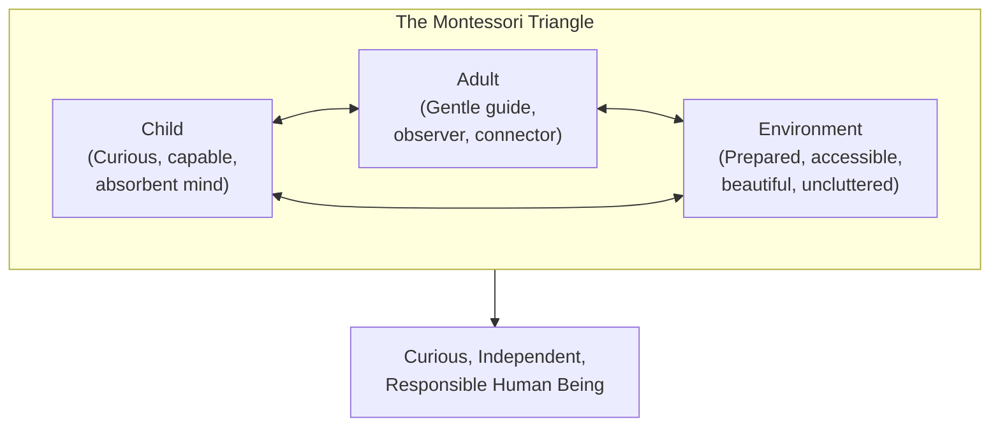
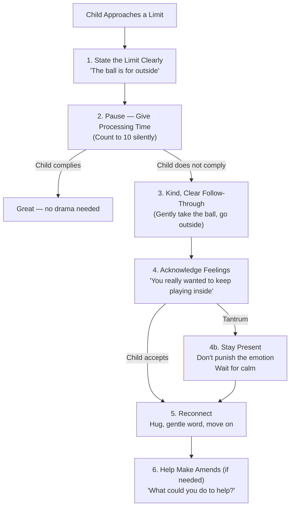
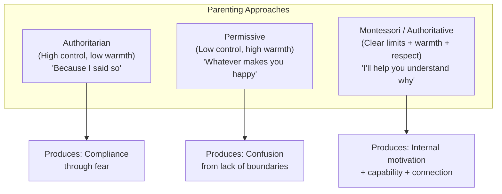
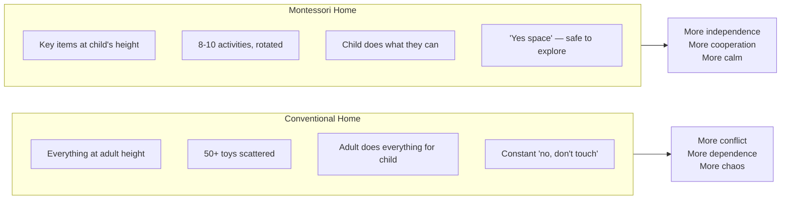

# The Montessori Toddler — Simone Davies

> Toddlers are misunderstood humans. They are not "terrible twos" — they are curious, capable, innocent, and driven to learn. They live in the present moment, they pick things up effortlessly, they do not hold grudges, and they say exactly what they mean. The Montessori approach does not try to control them. It treats each child as their own person on their own unique path, with the parent as a gentle guide. This book shows you how to set up your home so your toddler can be independent, how to choose activities matched to their developmental needs, and how to set limits with kindness and clarity — without threats, bribes, or punishments. The result is less chaos, more cooperation, and a child who is building the foundation for a curious and responsible life.

---

## About the Author

Simone Davies is an AMI (Association Montessori Internationale) certified Montessori teacher who founded Jacaranda Tree Montessori in Amsterdam, where she leads parent-toddler classes. Over more than fifteen years she has worked with nearly a thousand toddlers and their families, helping them see their children in a new way and incorporate Montessori principles at home.

Davies came to Montessori as a new parent in Sydney, fell in love with the approach, and trained formally with the AMI in 2004. When life took her family to Amsterdam, she found no Montessori parent-child classes available — so she started her own. She also draws on Positive Discipline teacher training and Nonviolent Communication, weaving these complementary approaches into her Montessori practice.

The book is beautifully illustrated by Hiyoko Imai, whose warm drawings make it feel less like a parenting manual and more like a conversation with a wise, patient friend. This visual quality is deliberate — Montessori is about beauty and accessibility in everything, including how you learn about it.

---

## The Big Idea

- <b style="color: #2980b9">Toddlers are not giving you a hard time — they are having a hard time</b>: what looks like defiance, stubbornness, or chaos is a child navigating enormous developmental changes with a still-developing brain
- <b style="color: #e74c3c">The Montessori approach rests on three pillars</b>: a carefully prepared environment, developmentally matched activities, and a respectful adult-child relationship
- <b style="color: #27ae60">"Help me to help myself"</b> is the Montessori motto: the goal is independence, not obedience. We set up conditions for the child to succeed, then step back
- The Montessori Triangle: the child, the adult, and the environment all interact dynamically — change any one element and the others shift
- Sensitive periods are windows of intense developmental interest (language, movement, order, small objects) during which learning is effortless — follow the child's lead
- The absorbent mind: children under 6 take in everything without conscious effort, like a sponge absorbing water. They do not need to be taught grammar — they absorb language. They do not need lessons on walking — they master it through practice
- Limits are essential, but they are set with kindness and clarity, not with threats, bribes, or punishments. The child needs to know what is expected. They do not need to suffer for getting it wrong.
- The parent is a gardener, not a carpenter: you plant the seeds, provide the right conditions, and let the child grow in their own direction

---

## Key Concepts at a Glance

The radar chart shows how the Montessori approach scores dramatically higher across every dimension — not because conventional parenting is bad, but because Montessori systematically and intentionally addresses each area rather than leaving them to chance.

| Concept | One-line summary |
|---------|-----------------|
| **Prepared environment** | Spaces set up for the child's independence — accessible, beautiful, uncluttered |
| **Sensitive periods** | Windows of intense developmental interest where learning is effortless |
| **Absorbent mind** | Children under 6 take in everything without effort |
| **Maximum effort** | The toddler's drive to physically challenge themselves (carry heavy things, climb, push) |
| **Crisis of self-affirmation** | The 18-month-to-3-year phase when children discover "I am separate" and start saying "no" |
| **Follow the child** | Observe what the child is drawn to and support that, rather than directing |
| **Help me to help myself** | Set up for independence, then step back |
| **Practical life** | Real-world activities (cooking, cleaning, dressing) that build skills and belonging |
| **Allow all feelings, not all behaviour** | Emotions are always welcome; some actions need limits |
| **Observation** | The parent's most powerful tool — watch before you intervene |
| **The Montessori Triangle** | Child ↔ Adult ↔ Environment — all three interact dynamically |

---

## 30-Second Version

Set up your home so your toddler can reach things, do things for themselves, and explore safely. Observe what they are drawn to and provide activities at the right level of challenge. Include them in daily life — cooking, cleaning, dressing. When they misbehave, set clear limits with kindness: acknowledge the feeling, stop the behaviour, help them make amends. Do not use threats, bribes, or punishments. Be their guide, not their boss. Trust that they are capable, curious, and doing their best with a brain that is still under construction. Slow down. Follow their pace. The goal is not a perfect house or a compliant child — it is a curious, responsible human being.

---

## Reframing the Toddler

The book opens with a radical reframe. Most adults see toddlers as difficult, demanding, irrational creatures — the "terrible twos." Davies asks us to see them differently:

| What It Looks Like | What It Actually Is |
|---|---|
| Stubbornness about the "wrong" spoon | A strong sense of order — they need predictability to feel safe |
| A battle of wills | A child learning that things do not always go their way |
| Repeating the same game endlessly | Mastery — they are perfecting a skill |
| An explosive tantrum | A child who feels safe enough with you to release everything they have been holding |
| Going impossibly slowly | Exploring everything in their path — living in the present moment |
| Embarrassing honesty in public | An inability to lie — a model of authenticity |

> [!success] The Core Reframe
> "Toddlers are not giving us a hard time. They are having a hard time." When we realise that difficult behaviour is a cry for help — not an attack on us — we move from feeling defensive to searching for a way to support them.

### What Toddlers Need

- **To say "no"** — the crisis of self-affirmation (18 months to 3 years) is when children discover they are separate beings. Saying "no" is not defiance — it is identity formation.
- **To move** — their bodies need to master walking, running, climbing, carrying. Sitting still is neurologically difficult.
- **To explore** — everything is new. Touching, tasting, investigating is how they learn.
- **Freedom AND limits** — freedom to explore and choose; limits to keep them safe and teach responsibility.
- **Order and consistency** — the same routine, things in the same place, the same rules. Predictability builds security.
- **Time to process** — instead of repeating a request, count to ten silently. By eight, they usually start responding.
- **To be included** — they want to contribute to family life, not just play alongside it.

---

## The Prepared Environment

The prepared environment is the most tangible and immediately actionable part of the Montessori approach. It means setting up your home so that the child can function independently.

### Principles

1. **Child-sized** — hooks, shelves, tables, and chairs at their height. A step stool in the kitchen and bathroom.
2. **Accessible** — their clothes in low drawers they can open. Their dishes where they can reach. Their shoes by the door at their level.
3. **Beautiful** — Montessori believes beauty matters. Simple, natural materials. Artwork hung at their eye level. Plants they can care for.
4. **Uncluttered** — fewer options, rotated regularly. Too many toys creates overwhelm, not engagement. Display 8-10 activities at a time, store the rest, and rotate every few weeks.
5. **Safe to say yes in** — set up "yes spaces" where the child can freely explore without constant redirection. Remove breakables rather than constantly saying "don't touch."
6. **Inviting independence** — everything the child needs to complete a task is available. A cloth near the table for wiping spills. A small broom for sweeping. An apron they can put on themselves.

### Room by Room

| Room | Montessori Setup |
|------|-----------------|
| **Entrance** | Low hooks for coat and bag. A place to sit to put on shoes. Their shoes accessible. |
| **Kitchen** | Step stool or learning tower. Child-sized utensils. A low shelf with their dishes. A small jug for pouring water. |
| **Eating area** | A small table and chair, or a seat at the family table. Real glass and ceramic (they learn to be careful). |
| **Bedroom** | Floor bed (so they can get in and out independently). Low shelves with a few toys/activities. Clothing in accessible drawers. |
| **Bathroom** | Step stool at the sink. A small mirror at their height. Toothbrush accessible. A small basket with washcloth. |
| **Living room** | A cosy reading corner with books facing outward on a low shelf. A small table for art activities. |

> [!tip] Start Small
> You do not need to renovate your home. Start by lowering one hook, putting out a step stool, and rotating half the toys into storage. Small changes make a big difference.

---

## Montessori Activities for Toddlers

### What Makes an Activity Montessori?

An activity is Montessori when it:
- Is hands-on and concrete (not abstract or screen-based)
- Isolates one skill or concept
- Has a built-in "control of error" — the child can tell if they got it right without an adult telling them
- Is at the right level — challenging enough to be interesting, not so hard they give up
- Is complete — all the pieces are there, nothing is missing
- Is attractive and inviting

### Types of Activities

**Eye-Hand Coordination:** Posting objects through slots, threading beads, puzzles with knobs, opening and closing containers, pouring (dry materials first, then water), spooning, using tweezers/tongs.

**Practical Life:** The most important category for toddlers. Real-world tasks that build independence, concentration, and belonging:
- Food preparation: spreading, cutting soft foods, stirring, pouring
- Care of self: dressing, hand washing, teeth brushing, nose blowing
- Care of environment: watering plants, wiping tables, sweeping, folding cloths
- Grace and courtesy: greeting people, saying please and thank you, learning to wait

> [!example] Why Practical Life Matters Most
> A toddler who helps prepare food is exercising fine motor skills, following a sequence, practising concentration, contributing to the family, and building self-worth — all simultaneously. No flashcard app accomplishes this. Montessori prioritises practical life over academic activities because the skills it builds (concentration, coordination, independence, order) are the foundation for all future learning.

**Music and Movement:** Singing, dancing, rhythm instruments, obstacle courses, balance activities, gross motor challenges.

**Arts and Crafts:** Open-ended process art (not product-focused crafts). Painting, drawing, clay, collage, gluing. The goal is exploration, not a "finished piece."

**Language:** Rich conversation, reading together, naming objects, singing songs, telling stories. The absorbent mind is soaking up vocabulary at an extraordinary rate.

### How to Show an Activity

1. Invite the child: "Would you like to try this?"
2. Sit beside them (not across from them)
3. Demonstrate slowly, with minimal words — let the hands do the talking
4. Break the task into clear, sequential steps
5. Then step back and let them try
6. Resist the urge to correct or help unless they ask or become frustrated

> [!warning] The Hardest Part for Adults
> Stepping back. Watching your toddler struggle with a zipper for three minutes when you could do it in two seconds. Watching them pour water and spill some. Watching them try to sweep and miss half the crumbs. This is where the learning happens. Your job is to set up for success and then restrain yourself from taking over.

---

## Raising a Curious Child: Five Ingredients and Seven Principles

### Five Ingredients for Curiosity

1. **Trust in the child** — believe they are capable before they prove it
2. **A rich learning environment** — prepared, beautiful, inviting
3. **Time** — unstructured, unhurried time to explore and concentrate
4. **A safe and secure base** — emotional security (attachment) from which to explore
5. **Fostering a sense of wonder** — slow down and notice the world alongside them

### Seven Principles for Curious Humans

1. **Follow the child** — observe what they are drawn to and support that interest
2. **Encourage hands-on learning** — concrete, sensory, tactile experiences
3. **Include the child in daily life** — cooking, cleaning, shopping, gardening
4. **Go slow** — match their pace, not yours
5. **Help me to help myself** — set up for independence, then step back
6. **Encourage creativity** — open-ended materials, no right or wrong way
7. **Observation** — the parent's most powerful tool. Watch before you intervene. Notice what the child is working on, what frustrates them, what captivates them.

> [!tip] Observation Is a Superpower
> Most parenting advice tells you what to DO. Montessori's first instruction is to WATCH. Sit quietly and observe your child for ten minutes. What are they drawn to? What are they practising? What sensitive period are they in? The answers will tell you what activities to provide, what environment to set up, and where they need your support. Observation replaces guessing with seeing.

---

## Nurturing Cooperation and Responsibility

### Why Montessori Does Not Use Threats, Bribes, or Punishments

This is where Montessori diverges most sharply from conventional parenting. Davies is direct: threats, bribes, and punishments are not part of the Montessori approach. Here is why:

| Tool | Why It Seems to Work | Why It Actually Fails |
|------|---------------------|----------------------|
| **Threats** ("If you don't stop, no dessert!") | Creates immediate compliance through fear | Teaches that power and intimidation get results. Does not build internal motivation. |
| **Bribes** ("If you brush your teeth, you get a sticker!") | Creates immediate compliance through reward | Undermines intrinsic motivation. What happens when the stickers run out? |
| **Punishments** (time-outs, removing privileges) | Stops the behaviour in the moment | Does not teach what to do instead. Creates resentment. Damages the relationship. |

> [!danger] The Problem with External Motivation
> When we use threats, bribes, and punishments, we train the child to ask: "What will happen to me?" We want them to ask: "What kind of person do I want to be?" The first question produces compliance. The second produces character.

### The Alternative: Natural and Logical Consequences

Instead of imposed punishments, Montessori relies on:

- **Natural consequences:** the world provides the feedback. You refuse to wear a coat, you feel cold. You throw your food, dinner is over. The parent does not need to add suffering — reality is the teacher.
- **Logical consequences:** when natural consequences are not safe or practical, the parent creates a consequence logically connected to the behaviour. You draw on the wall, you help clean the wall. You throw a toy, the toy is put away for the day.
- **Making amends:** instead of forced apologies, help the child take action. "Your friend is crying. What could you do to help?" Get ice, offer a toy, draw a picture. The amends are genuine, not performative.

> [!example] Natural vs Imposed Consequence
> **Imposed:** "You threw your food, so no TV tonight." (No logical connection between food and TV.)
> **Natural:** "I can see you're done eating. Let's clean up together." (The food is gone. The meal is over. The child helps clean. No drama, no punishment — just the natural result of the action.)

### How We Talk to Help Them Listen

Davies provides a comprehensive reframing of typical parent language:

| Instead of This | Say This | Why |
|---|---|---|
| "Good job!" | "You did it!" or "I noticed you worked hard on that" | Moves from external validation to internal satisfaction |
| "No running!" | "We walk inside" | Tells them what TO do, not just what NOT to do |
| "Be careful!" | "I see you're up high. Do you feel safe?" | Builds their own risk assessment instead of creating anxiety |
| "Say sorry!" | "Let's check if your friend is OK" | Encourages genuine empathy over hollow words |
| "Stop crying!" | "I can see you're really upset. I'm here." | Validates the emotion instead of suppressing it |
| "Because I said so!" | "The rule is we walk inside because the floor is slippery" | Gives the reason, building understanding |
| "If you don't... then..." | "When you've put on your shoes, then we can go" | Expectation, not threat |
| "You're such a good girl!" | "You remembered to put your dish in the sink" | Describes the action, not the identity |

---

## Deep Dive: Practical Life — The Heart of Montessori

Practical life is the single most important category of Montessori activities for toddlers, and it is the area most parents underestimate. Practical life means including the child in the real work of daily living.

### Why Practical Life Matters More Than Any Toy

When a toddler helps prepare food, they are simultaneously:
- **Developing fine motor skills** (cutting, spreading, stirring, pouring)
- **Practising sequencing** (first wash hands, then get ingredients, then...)
- **Building concentration** (focused attention on a real task with a real result)
- **Learning cause and effect** (if I pour too fast, the water spills)
- **Developing independence** ("I can do it myself")
- **Contributing to the family** ("I helped make this")
- **Building self-worth** ("I am capable and useful")
- **Absorbing vocabulary** (whisk, spatula, knead, slice, peel)

No educational toy achieves all of this simultaneously.

### Practical Life Activities by Age

| Age | Activities |
|-----|-----------|
| **12-18 months** | Wiping tables with a cloth. Putting dirty clothes in a basket. Helping load the washing machine. Watering plants with a small watering can. Carrying their plate to the kitchen. |
| **18-24 months** | Spreading butter or cream cheese. Pouring from a small jug. Peeling a banana. Helping sweep with a small broom. Folding simple cloths. Setting the table with help. Putting on and removing shoes. |
| **24-36 months** | Cutting soft foods with a butter knife. Washing dishes in a small basin. Folding laundry. Preparing simple snacks independently. Dressing themselves (with clothes laid out). Brushing teeth. Setting the table independently. |

> [!tip] The Setup Is Everything
> Practical life only works if the environment is set up for success. The child needs tools at their scale (small jug, small broom, low hooks), materials they can access independently, and enough time to complete the task. If you are rushing, practical life becomes frustrating for everyone. Build in extra time, especially in the morning.

### The Repairman Story

Davies tells of a repairman who came to fix something in her home. Her daughter, not yet two years old, walked past him, went to her bedroom, changed her clothes independently, put the wet clothes in the hamper, and walked off to play. The repairman stared in disbelief. This is what practical life builds: a child who takes care of themselves with quiet competence, because the environment and the expectations have made it possible.

---

## Deep Dive: Sensitive Periods

Language emerges as the most intense and longest-lasting sensitive period, spanning birth to age 6, while the sensitive period for order — though shorter — produces some of the most visible toddler behaviour (meltdowns over changed routines) that parents commonly misread as stubbornness.

Sensitive periods are one of Dr. Montessori's most important observations. They are windows of time when a child is intensely interested in a particular skill or concept, and learning happens with remarkable ease.

| Sensitive Period | Approximate Age | What You See | How to Support It |
|---|---|---|---|
| **Order** | 1-3 years | Insistence on routine, same sequence, things in the right place. Meltdown when something is "wrong." | Be consistent. Keep things in the same place. Warn before changes. |
| **Movement** | Birth-2.5 years | Constant motion. Climbing, carrying, running, jumping. Desire for "maximum effort." | Provide safe spaces to climb. Let them carry heavy things. Obstacle courses. |
| **Language** | Birth-6 years | Absorbing vocabulary. Babbling, first words, explosion of speech. | Rich conversation. Name everything. Read together. Sing. |
| **Small objects** | 1-3 years | Fascination with tiny things — crumbs, bugs, pebbles, buttons. | Provide safe small objects to handle. Supervise but do not prevent. |
| **Toileting** | 18 months-3 years | Interest in the toilet, awareness of wet/dry, desire to use the bathroom. | Offer the potty. Follow their lead. Do not force. |
| **Refinement of senses** | Birth-5 years | Touching everything. Tasting. Smelling. Listening intently. | Sensory-rich activities. Different textures, sounds, tastes. |

> [!warning] What Happens When We Fight a Sensitive Period
> If a child is in a sensitive period for order and we constantly rearrange things, they will melt down — not because they are "rigid" but because their brain is wired to absorb order right now. If a child is in a sensitive period for movement and we keep them contained, they will be restless, disruptive, and unhappy — not because they are "hyperactive" but because their body needs to move. Working with sensitive periods instead of against them eliminates much of the conflict parents experience.

---

## Deep Dive: The Crisis of Self-Affirmation

Between 18 months and 3 years, toddlers pass through what Montessori called the "crisis of self-affirmation." This is when they discover that their identity is separate from their parents'. They begin using "I" and "me." And they begin saying "no" — a lot.

This is not defiance. It is one of the most important developmental milestones of early childhood. The child is establishing: "I am a separate person with my own will."

Some days they push you away, wanting to do everything themselves. Other days they cling, wanting you to do everything. This oscillation between independence and dependence is normal and healthy.

> [!success] How to Support the Crisis of Self-Affirmation
> - Offer choices wherever possible (two options, not unlimited)
> - Respect their "no" when you can (not about safety, but about preferences)
> - Do not take it personally — they are not rejecting you, they are discovering themselves
> - Expect inconsistency — independence one hour, clinginess the next
> - Name what you see: "You want to do it yourself. I'll be right here if you need help."

---

## Frequently Asked Questions

> [!tip] "Do I need to buy special Montessori materials?"
> No. The most important Montessori activities are practical life — cooking, cleaning, dressing, gardening — all done with things you already have. A small jug, a butter knife, a step stool, and a cloth for wiping spills will take you further than any expensive Montessori toy set.

> [!tip] "Is Montessori only for wealthy families?"
> Absolutely not. The first Casa dei Bambini was in the slums of Rome. Montessori is about using what you have thoughtfully. A cardboard box with a slot cut in it is a posting activity. Dried pasta in a bowl with a spoon is a spooning activity. The philosophy costs nothing.

> [!tip] "My child attends a non-Montessori daycare. Can I still do Montessori at home?"
> Yes. Many families practise Montessori at home regardless of their child's school setting. The principles — prepared environment, following the child, respectful communication, practical life — work in any home.

> [!tip] "What about the floor bed? That sounds terrifying."
> It is one of the most discussed and debated Montessori recommendations. The room must be fully childproofed. Most children, after an initial adjustment period, settle into a predictable sleep pattern. Many parents find that the child actually sleeps better because they can get in and out independently without calling for help.

> [!tip] "How do I handle grandparents who think this is too permissive?"
> Montessori is not permissive — it has clear, consistent limits. Invite grandparents to observe the approach in action. When they see that the child is cooperative, independent, and capable, the results speak for themselves. The "Note to Caregivers" in the appendix provides a brief, gentle introduction for family members.

> [!tip] "My toddler doesn't sit still for activities. Is Montessori not for them?"
> Toddlers are not meant to sit still. If they walk away from an activity, they are done — or it was not the right match for their developmental stage. Follow the child. Offer activities that match their current interest and energy level. Movement-based activities (pouring water, carrying trays, threading beads while standing) often work better than seated ones.

> [!tip] "How do I handle transitions? My toddler melts down every time we leave the park."
> Transitions are hard because toddlers live in the present moment. Give advance warnings: "We're leaving in five minutes." Then: "Two more minutes." Then: "One more slide, and then we go." Be consistent — if you say one more slide, mean one more slide. Acknowledge the feeling: "It's hard to leave when you're having so much fun." Then follow through calmly. Over time, consistent transitions become smoother.

> [!tip] "Won't all this independence make my child defiant?"
> The opposite. A child who has genuine autonomy within clear boundaries has less need to fight for control. They get to make real choices (which shirt, which activity, how much food) within a framework of safety and respect. This reduces power struggles because the child is not constantly bumping up against restrictions on every front. They save their resistance for the limits that genuinely matter — which is healthy development.

> [!tip] "I feel overwhelmed. Where do I literally start?"
> Davies' answer: start with observation. Before you change a single thing in your home, spend one week simply watching your child. Notice what they are drawn to. Notice what frustrates them. Notice what they can already do that you have been doing for them. Then make one change. Just one. A step stool. A lower hook. A cloth for wiping spills. See what happens. Then make another change next week. Montessori is a journey, not a destination.

### How We Talk to Help Them Listen

Instead of commands and threats, Montessori uses respectful communication:

- **Get on their level** — crouch down, make eye contact
- **Use positive language** — say what they CAN do, not what they can't ("Walk inside" instead of "Don't run")
- **Offer limited choices** — "Would you like to wear the red shirt or the blue shirt?" (not "What do you want to wear?" which is overwhelming)
- **Give information** — "The water goes in the glass" instead of "Stop spilling!"
- **Use "when/then" instead of "if/then"** — "When you've put on your shoes, then we can go to the park" (expectation, not threat)
- **Describe what you see** — "I see blocks all over the floor" instead of "Clean up this mess!"
- **Say it once, then act** — if they do not respond after a reasonable pause, gently follow through with kind, clear action

> [!tip] The "Instead of This, Say That" Chart
> The appendix includes a practical reference chart with dozens of reframes. Examples:
> - Instead of "Good job!" → "You did it!" or "I noticed you worked really hard on that"
> - Instead of "No running!" → "We walk inside"
> - Instead of "Be careful!" → "I see you're up high. Do you feel safe?"
> - Instead of "Say sorry!" → "Let's check if your friend is OK"

---

## Setting Limits with Kindness and Clarity

> [!success] The Montessori Position on Limits
> Limits are essential. Children need them to feel safe, to learn about the world, and to develop responsibility. The Montessori approach is neither permissive (no limits) nor authoritarian (limits through force). It is authoritative: clear limits, consistently held, delivered with warmth and respect.

### The Limit-Setting Sequence

1. **Be clear on the limit.** Know your non-negotiables before the situation arises. Safety limits (no running in the car park), respect limits (no hitting), and household limits (food stays at the table).

2. **Follow through with kind and clear action.** If the child does not respond to the verbal limit, move to gentle physical follow-through. If they keep throwing food: calmly remove the plate. If they keep hitting: gently hold their hand. No anger, no drama, no lecture. Just calm, consistent action.

3. **Acknowledge negative feelings.** "You really wanted to keep throwing the ball inside. It's hard to stop when you're having fun. The ball is for outside."

4. **Deal with tantrums.** If the limit triggers a meltdown, stay present. Do not punish the tantrum. Do not dismiss it. Sit nearby, offer comfort if they want it, and wait for the storm to pass. The tantrum is not the problem — it is the child's way of processing a big emotion.

5. **Reconnect once they are calm.** After the tantrum or resistance has passed, reconnect. A hug, a gentle word, a return to normalcy. This communicates: "I love you even when we disagree."

6. **Help them make amends.** Instead of forcing "say sorry" (which teaches nothing), help them take action: "Your friend is upset. What could you do to help them feel better?" Maybe get a tissue, offer a toy, draw a picture. The amends should be genuine, not performative.

### Tips for Setting Limits

- **Be consistent** — the same rule every time. Inconsistency creates confusion and more testing.
- **Be calm** — your calm is contagious. Your agitation is also contagious.
- **Use few words** — long explanations lose toddlers. Short and clear.
- **Set up the environment to reduce the need for limits** — if you do not want them touching something, remove it. Prevention is better than correction.
- **Say "yes" as often as possible** — reserve "no" for genuine limits. A child who hears "no" all day stops hearing it.
- **Do not take it personally** — they are not testing YOU. They are testing the LIMIT. This is healthy development.

---

## Daily Life: Putting It Into Practice

### Daily Rhythm (Not Schedule)

Montessori does not recommend rigid schedules, but consistent rhythms — predictable patterns that give the child security without minute-by-minute rigidity.

A typical Montessori toddler rhythm:
- Wake up → get dressed (independently or with minimal help)
- Breakfast → child helps set table, prepare food
- Free exploration / activities
- Snack → child helps prepare
- Outside time
- Lunch → child helps
- Nap / quiet time
- Free exploration / activities
- Dinner preparation together
- Family dinner
- Bath → child participates in washing
- Bedtime routine → stories, songs, connection

The key: the child is included as a participant in daily life, not a bystander.

### Getting Dressed

- Lay out two clothing options the night before (child chooses)
- Teach them to dress themselves (start with undressing, which is easier)
- Allow extra time — rushing creates conflict
- Set up a low shelf or drawer where they can access their clothes

### Eating

- Offer food at predictable times
- Let the child serve themselves from small bowls
- Use real dishes (they learn to be careful)
- Do not force eating or use dessert as a reward
- The child decides how much to eat; the parent decides what is offered

### Sleeping

- A floor bed allows the child to get in and out independently
- A consistent, calm bedtime routine signals sleep is coming
- Keep the bedroom dark, quiet, and simple
- If they get out of bed, calmly return them without drama

> [!example] The Floor Bed
> One of the most distinctive Montessori recommendations. Instead of a crib (which contains the child), a floor bed (a mattress on the floor) allows the child to get in and out independently. This supports their autonomy and their sense of control over their own body. Many parents are nervous about this — "Won't they just roam the house?" The room should be fully childproofed so that even if they do get up, they are safe. Most children, once the novelty wears off, settle into a predictable sleep pattern.

---

## Common Challenges

### Tantrums

Montessori's approach to tantrums aligns closely with the whole-brain approach:

1. **Stay calm.** Your calm co-regulates their nervous system.
2. **Stay present.** Do not send them away. Do not punish the tantrum.
3. **Acknowledge the feeling.** "You're really upset that we had to leave the park."
4. **Offer comfort if wanted.** Some children want to be held; some want space. Respect their preference.
5. **Wait for it to pass.** Tantrums have a natural arc. They peak and subside.
6. **Reconnect.** When calm returns, a hug and a gentle word.
7. **Do not revisit with lectures.** They know what happened. Move on.

### Hitting / Biting / Pushing / Throwing

- **It is a phase.** Toddlers are impulsive and their prefrontal cortex is barely online.
- **Stop the behaviour calmly.** "I won't let you hit. Hitting hurts." Gently hold their hand if needed.
- **Offer alternatives.** "You can hit this pillow. You can stomp your feet."
- **Look for the trigger.** Are they tired? Hungry? Overstimulated? Frustrated? Address the underlying need.
- **Do not overreact.** A huge reaction (yelling, punishing) gives the behaviour more power than it deserves.

### Sharing

- **Toddlers are not developmentally ready to share.** They are still learning that objects exist independently of them.
- **Do not force sharing.** Instead, teach turn-taking: "When you're finished, Kai can have a turn."
- **Let them finish.** Forcing a child to give up a toy mid-play teaches them that their boundaries do not matter.
- **Model sharing yourself.** "Would you like some of my apple? I'm sharing with you."

### Screen Time

- **Montessori recommends minimal to no screen time for toddlers.** The absorbent mind needs real, three-dimensional, sensory-rich experiences — not flat, passive ones.
- **If you use screens, be intentional.** Short periods, high-quality content, watched together (not as a babysitter).
- **Focus on what you are adding, not what you are removing.** Fill their time with engaging activities, practical life, and outdoor exploration, and the demand for screens often reduces naturally.

---

## Being the Adult: Preparation of the Parent

> [!warning] The Most Challenging Part of Montessori Is Not the Environment
> It is the adult. Setting up shelves and rotating activities is the easy part. The hard part is slowing down, observing before intervening, stepping back when you want to help, staying calm during a tantrum, and examining your own triggers and patterns.

### Davies' Advice for the Adult

- **Physical self-care** — you cannot be a calm, patient guide when you are depleted
- **Cultivate a learning mindset** — you will make mistakes; treat them as data
- **Practise presence** — put the phone down. Be where your child is.
- **Observation** — watch your child for ten minutes a day without intervening
- **Fill your emotional bucket** — you need connection and joy too, not just your child
- **Slow down** — match their pace, not the world's
- **Be honest** — with your child and with yourself
- **Take responsibility** — for your emotions, your reactions, your choices
- **Learn from mistakes** — model repair: "I'm sorry I raised my voice. I was frustrated."
- **Celebrate where you are** — not where you think you should be

> [!success] The Gardener Metaphor
> "As a gardener, we plant seeds, provide the right conditions, and give enough food, water, and light. We observe the seeds and adjust our care if needed. And we let them grow." You are planting seeds. You are providing conditions. The direction your child's life takes will be of their own making.

---

## The Verdict

This is the most practical and accessible Montessori book for parents of toddlers. Davies does not assume you have read Maria Montessori's original works, attended a training course, or have a dedicated playroom. She meets you where you are — in a normal home with normal clutter and normal chaos — and shows you how to take small, manageable steps toward a more peaceful way of being with your toddler.

The book's greatest strength is its warmth. Davies genuinely loves toddlers, and it shows on every page. The "toddlers are misunderstood humans" reframe is worth the price of the book alone. When you stop seeing your child as difficult and start seeing them as a developing person doing their best with limited tools, your entire emotional posture shifts. You move from adversary to ally, from controller to guide.

The prepared environment guidance is immediately actionable — you can start tonight by lowering a hook and putting out a step stool. The activity suggestions are specific and age-appropriate. The limit-setting framework is clear and consistent. The beautiful illustrations by Hiyoko Imai make the book a pleasure to browse and return to.

What distinguishes this from other Montessori books is Davies' integration of complementary approaches — Positive Discipline and Nonviolent Communication — alongside traditional Montessori philosophy. She is pragmatic, not dogmatic. If something works and respects the child, she includes it, regardless of whether Maria Montessori specifically wrote about it.

The illustrations by Hiyoko Imai deserve special mention. They are not decorative — they are instructional. The home setup illustrations show exactly where to place shelves, how to arrange a kitchen helper station, what a floor bed looks like, and how to display activities. For visual learners, these drawings are as valuable as the text.

The book also includes real home tours from Montessori families in Australia, Mongolia, Canada, and the USA — showing that this approach works across cultures, climates, and living situations. Seeing real families in real homes (not Instagram-perfect setups) is deeply reassuring.

If you are expecting your first child, read this before they turn one. If your child is already a toddler and you are drowning in chaos, read it now. If your child is past three and you wish you had started sooner, read Davies' follow-up, *The Montessori Child*. The principles are timeless and the approach scales to every age.

### Limitations

- Focused on ages 1-3; does not extend significantly into the preschool years (Davies' follow-up, *The Montessori Child*, covers ages 3-12)
- Some recommendations (floor bed, open shelves, child-accessible kitchen) require childproofing and setup that may be impractical for all families
- The Montessori aesthetic (natural materials, minimal toys, curated beauty) can feel aspirational and potentially guilt-inducing for parents on tight budgets or in small spaces — though Davies emphasises starting small and using what you have
- Does not deeply address neurodivergent children, who may need adaptations to the standard Montessori approach
- Cultural norms around independence and autonomy vary — the level of toddler independence described may conflict with expectations in some family and cultural contexts
- The "no bribes, no rewards" stance may feel extreme to parents who have found these tools useful in specific situations
- Less theoretical depth than some readers want — for the full Montessori philosophy, you need to read Dr. Montessori's own works

Despite these limitations, this is the single best introduction to Montessori for home use.

---

## What Changes After Reading This Book

**In how you see your toddler:**
- From "difficult" to "developing"
- From "defiant" to "discovering their identity"
- From "tantrum" to "a child having a hard time"
- From "mess-maker" to "scientist exploring their world"
- From "won't listen" to "needs time to process"

**In how you set up your home:**
- Lower hooks, accessible shelves, step stools in kitchen and bathroom
- Fewer toys displayed, rotated regularly
- Real tools at their scale — small jug, small broom, child-sized utensils
- "Yes spaces" where they can explore freely
- Artwork and books at their eye level

**In how you respond to misbehaviour:**
- Clear limits with kindness — not threats, bribes, or punishments
- Acknowledge feelings, stop the behaviour, help make amends
- Stay calm and present during tantrums
- Look for the underlying need before reacting

**In your daily rhythm:**
- Toddler included in cooking, cleaning, dressing
- Extra time built in for their pace
- Consistent routines that provide security
- Less rushing, more observing

**In yourself:**
- More patience — because you understand what is happening developmentally
- More confidence — because you have a framework
- More joy — because you are seeing your toddler's capability, not just their chaos

---

## Before and After: Montessori Responses to Common Situations

| Situation | Before Montessori | After Montessori |
|-----------|------------------|-----------------|
| **Child refuses to get dressed** | Power struggle. Force the clothes on. Both end up upset. | Offer two choices the night before. "Red shirt or blue shirt?" Let them dress themselves with time. |
| **Child throws food** | "No throwing! Bad!" Anger. Timeout. | Calm: "I can see you're done eating. Food stays on the plate. Let's clean up." |
| **Child climbs on table** | "Get down! Don't climb!" | Redirect: "Tables are for eating. You can climb on the cushions / outside." Provide safe climbing options. |
| **Child has meltdown at the store** | Embarrassment. Threats. Bribe with a treat. | Stay calm. Acknowledge: "This is hard. There are so many things you want." Wait for it to pass. Reconnect. |
| **Child hits another child** | "We don't hit! Say sorry!" | Gently stop the hand. "I won't let you hit. Hitting hurts. Let's check if your friend is OK." Help make amends. |
| **Child won't share a toy** | "Share! Give it to your friend!" | "When you're finished, Kai can have a turn." Let them finish. Do not force. |
| **Child says "no" to everything** | Frustration. "You have to listen to me!" | Recognise the crisis of self-affirmation. Offer choices. Respect "no" when possible. |

---

## Five Things You Can Do Tomorrow Morning

1. **Lower one hook by the door** so your child can hang up their own coat. This takes five minutes and immediately changes the morning routine.

2. **Put a step stool in the kitchen.** Invite your child to help you with one task — washing vegetables, stirring something, pouring water into glasses.

3. **Reduce the toys on display by half.** Put the rest in a box in a closet. Rotate in two weeks. Watch what happens to their concentration.

4. **At the next meltdown, stay calm and stay present.** Do not punish the tantrum. Do not lecture. Just be there. "I can see you're really upset. I'm here." Wait for the storm to pass.

5. **Observe your child for ten minutes without intervening.** Do not direct, correct, or help. Just watch. Notice what they are drawn to, what they are practising, what captures their attention. This observation will tell you more about what they need than any book.

---

## The Montessori Approach Compared to Other Parenting Philosophies

The Montessori approach aligns with what developmental psychologists call **authoritative parenting** — the style consistently associated with the best outcomes across every measurable domain (emotional wellbeing, academic achievement, social skills, resilience). It is high on warmth AND high on structure. It is neither the drill sergeant nor the pushover. It is the guide.

---

## Key Phrases to Remember

| Phrase | What It Means |
|--------|--------------|
| "Help me to help myself" | Set up for independence, then step back |
| "Follow the child" | Observe their interests and support them |
| "The prepared environment" | Set up spaces so the child can succeed |
| "Allow all feelings, not all behaviour" | Emotions are always welcome; some actions need limits |
| "Toddlers are not giving us a hard time; they are having a hard time" | Reframe difficulty as a cry for help |
| "We are their prefrontal cortex" | We must provide the impulse control and decision-making they cannot yet do themselves |
| "Be a gardener, not a carpenter" | Provide conditions for growth, do not try to shape the child into a predetermined form |
| "Observation is the parent's superpower" | Watch before you intervene |
| "Say what they CAN do" | Positive language over negative |
| "When/then, not if/then" | Expectation, not threat |

---

## Who Should Read This Book

| Reader | Why |
|--------|-----|
| **Parents of 1-3 year olds** | This is written specifically for you — practical, warm, immediately usable |
| **Expectant parents** | Reading this before the toddler years gives you time to prepare the environment |
| **Parents interested in Montessori** | The best accessible introduction — no prior knowledge required |
| **Parents struggling with toddler behaviour** | The reframe alone will change your experience |
| **Grandparents and caregivers** | Helps align everyone on the same respectful approach |
| **Parents who feel overwhelmed by clutter and chaos** | The prepared environment guidance simplifies daily life |

---

## Related Reading

| Book | Connection |
|------|-----------|
| [[No Bad Kids - Janet Lansbury]] | RIE approach — overlapping philosophy of respectful limits. Lansbury is more focused on discipline language; Davies is broader across environment, activities, and daily life |
| [[The Whole-Brain Child - Daniel J. Siegel]] | The neuroscience behind why Montessori's approach works — understanding the developing brain explains *why* limits with kindness are more effective than punishment |
| [[No-Drama Discipline - Daniel J. Siegel]] | The discipline-specific companion — "connect and redirect" is the neuroscience term for what Montessori does naturally |
| [[Hunt, Gather, Parent - Michaeleen Doucleff]] | Cross-cultural evidence showing that involving children in daily life and granting age-appropriate autonomy is the global norm |
| [[Simplicity Parenting - Kim John Payne]] | Reducing overwhelm, toys, and overscheduling — deeply aligned with the Montessori prepared environment philosophy |
| [[Unconditional Parenting - Alfie Kohn]] | The philosophical case against rewards and punishments — more radical in tone, but the same underlying conviction |
| [[How to Talk So Little Kids Will Listen - Joanna Faber & Julie King]] | Practical communication strategies that complement the Montessori respectful approach |
| [[Brain Rules for Baby - John Medina]] | Neuroscience of 0-5 development — shows *why* hands-on, sensory-rich experiences matter for brain building |
| [[The Danish Way of Parenting - Jessica Joelle Alexander]] | Danish child-rearing emphasises play, empathy, and autonomy — philosophically close to Montessori |
| [[The Self-Driven Child - William Stixrud & Ned Johnson]] | Autonomy and the sense of control — the older-child extension of what Montessori begins in toddlerhood |
| [[Cribsheet - Emily Oster]] | Data-driven parenting decisions — for the parent who wants evidence alongside philosophy |
| [[The Gardener and the Carpenter - Alison Gopnik]] | The philosophical complement — reframes parenting from "shaping a child" to "creating conditions for growth," which is exactly what Montessori does |
| [[Parenting from the Inside Out - Daniel J. Siegel]] | For the parent who recognises that their own reactions are the hardest part of Montessori — understanding your own childhood patterns is the "preparation of the adult" |

---

## The One Sentence That Changes Everything

> <b style="color: #2980b9">"Help me to help myself."</b>

This is the Montessori motto, and it is the single idea that transforms how you parent a toddler. Stop doing things for them that they can do themselves. Set up the environment so they can succeed. Then step back, watch, and marvel at what they are capable of.

*They are not giving you a hard time. They are having a hard time. Be their guide.*

---

## Deep Dive: Setting Up Each Room — Detailed Guidance

The heatmap shows how activity complexity builds across Montessori areas: movement peaks early and plateaus, while practical life, language, and self-care activities ramp up steadily as the child's fine motor skills and concentration develop through the toddler years.

### The Entrance

The entrance sets the tone for independence. When a child can manage their own arrival and departure, the daily transition becomes smoother for everyone.

- **Low hooks** (not hangers — toddlers cannot manage hangers) for coat and bag
- **A small bench or stool** where they can sit to put on shoes
- **A shoe basket or tray** at floor level
- **A mirror** at their height so they can check themselves

> [!tip] The Morning Routine Transformed
> Before Montessori entrance: Parent dresses child, carries them to the car, manages every item. Both frustrated.
> After: Child walks to the entrance, sits on the bench, puts on their own shoes (Velcro — not laces), takes their coat from the hook, attempts to zip. Parent assists only where needed. Child feels competent. Morning has less conflict.

### The Kitchen

The kitchen is the most important room in Montessori — it is where practical life happens most naturally.

- **Learning tower or sturdy step stool** at the counter
- **A low shelf or drawer** with their own cup, plate, bowl, and utensils
- **A small jug** for pouring their own water
- **A child-sized apron** on a low hook
- **A small table** (if space allows) where they can do food prep independently
- **A cloth and small dustpan** accessible for cleaning up spills

Activities to do together in the kitchen: washing vegetables, tearing lettuce, spreading butter, cutting bananas (with a butter knife), stirring batter, pouring ingredients, setting the table, loading the dishwasher.

### The Bedroom

- **Floor bed** — mattress on the floor or very low bed frame. The child can get in and out independently.
- **Low shelves** with 5-8 activities/toys, rotated every 2-3 weeks
- **Clothing in accessible drawers** — limited selection, appropriate for the season
- **A few books** on a low shelf or forward-facing bookcase
- **Simple and calm** — no battery-operated toys, no screens, no visual overstimulation

### The Bathroom

- **Step stool at the sink** — they wash their own hands
- **Mirror at their height** — they see themselves, learn self-care
- **Toothbrush and small cup** accessible
- **Small basket with washcloth** for face washing
- **Potty** visible and accessible (when they show readiness signs)

### Outside

The outdoors is the most underrated Montessori environment. Nature provides sensory experiences that no toy can replicate.

- Let them dig in dirt, splash in puddles, feel grass, pick up sticks
- Provide a small garden patch they can water and tend
- Allow risk — climbing trees, balancing on low walls — with supervision, not prohibition
- Walk at their pace. Stop when they stop. Look at what they look at.

> [!success] The Outdoor Principle
> Nature is the ultimate prepared environment. It provides infinite sensory stimulation, physical challenges at every level, living things to observe, and an ever-changing landscape. A toddler who spends an hour outside every day has fewer behavioural problems, better sleep, and stronger concentration than one who does not. This is not philosophy — it is research.

---

## Deep Dive: Concentration — The Montessori Superpower

One of Montessori's most important observations: when a child is deeply engaged in an activity that matches their developmental need, they enter a state of deep concentration. This concentration is the foundation of all future learning.

### How to Build Concentration

1. **Do not interrupt.** When a child is focused — even on something that looks trivial (pouring water back and forth, opening and closing a box) — do not break their concentration. No "What are you doing?" or "That's great!" or "Come have a snack." Wait until they pause naturally.

2. **Provide the right level of challenge.** Too easy = boredom. Too hard = frustration. The sweet spot is activities that are challenging but achievable. Observe to find this level.

3. **Reduce stimulation.** A room with fifty toys produces flitting (a minute here, a minute there). A room with eight activities, beautifully arranged, produces engagement. Less is more.

4. **Protect their time.** Do not over-schedule. A toddler needs long, uninterrupted blocks of time to settle into an activity. Thirty minutes of free exploration is worth more than three ten-minute structured activities.

5. **Model concentration yourself.** If you are constantly on your phone, switching tasks, multitasking — your child mirrors that fragmented attention. When you sit and focus on one thing, they learn that focus is valued.

> [!warning] The Concentration Killer
> The single biggest killer of toddler concentration is adult interruption. We think we are being engaged parents when we constantly comment, praise, direct, and redirect. But often, the most supportive thing we can do is be quietly present and let them work. Maria Montessori called this "the great work of the child" — and our job is to not get in the way.

---

## Deep Dive: Toileting the Montessori Way

Montessori approaches toileting very differently from conventional "potty training."

### Principles

- **Follow the child's readiness.** Signs include: staying dry for longer periods, showing awareness of wet/dirty nappies, interest in the toilet, ability to pull pants up and down, discomfort with being wet.
- **No rewards or punishments.** No sticker charts, no bribes, no shame for accidents.
- **Start early with awareness.** From about 12 months, narrate nappy changes: "Your nappy is wet. Let's put a clean one on." This builds body awareness.
- **Offer the potty.** When signs of readiness appear, make the potty available. "Would you like to try sitting on the potty?" No pressure.
- **Use cloth training pants** (once they show readiness) rather than pull-ups — they feel the wetness, which builds awareness.
- **Handle accidents calmly.** "Oops, the pee went on the floor. Let's clean it up together." No drama.
- **Trust the process.** Toileting is a skill they will master — on their timeline, not yours.

> [!tip] The Montessori Toileting Difference
> Conventional potty training is often a parent-driven event: "This weekend we're doing potty training." Montessori toileting is a child-led process that begins with awareness and progresses through readiness to mastery. It tends to be gentler, longer in the initial phase, but produces more reliable results with fewer regressions.

---

## The Montessori Home vs The Conventional Home

---

## The Montessori Approach to Common Parenting Debates

| Debate | The Montessori Position |
|--------|----------------------|
| **Praise: good or bad?** | Avoid evaluative praise ("Good job!"). Use descriptive acknowledgement ("You put your shoes on all by yourself!"). Let the child build internal satisfaction rather than external validation. |
| **Rewards for good behaviour?** | No. Rewards undermine intrinsic motivation. The child should want to help, cooperate, and learn because it feels meaningful — not because there is a sticker at the end. |
| **Strict bedtimes or child-led sleep?** | Consistent bedtime routine within a rhythm. The floor bed gives the child agency within the structure. |
| **Structured activities or free play?** | Both. Montessori activities provide structure within freedom — the child chooses from prepared options. Free outdoor play is equally important. |
| **Screen time?** | Minimal to none for toddlers. The absorbent mind needs real, three-dimensional, sensory-rich experiences. |
| **Forcing sharing?** | Never. Teach turn-taking instead. Let the child finish before passing the item. Model sharing yourself. |
| **Saying sorry?** | Do not force hollow apologies. Help the child take genuine action to make amends. |
| **Helicopter vs free-range?** | Neither extreme. Be present and observant, but resist the urge to intervene. Manage risk, not eliminate it. |

---

## Working Together: When Everyone Else Parents Differently

Davies devotes a full chapter to the reality that you are not parenting in a vacuum. Your partner, your parents, your in-laws, your childcare provider — all may have different approaches.

### Key advice:

- **Start with your partner.** Agree on core values and non-negotiables. You do not need identical approaches, but you need compatible ones. Read the book together or share the "Note to Caregivers" from the appendix.
- **With grandparents:** be patient. They parented in a different era with different information. Share what you are doing without criticising what they did. Invite them to observe rather than lecturing them.
- **With childcare providers:** share the "Instead of This, Say That" chart. Focus on a few key principles (positive language, offering choices, not forcing food) rather than trying to convert them to full Montessori.
- **When there is conflict:** protect your relationship with your child above all. They need at least one consistent, calm, respectful adult. If that is you, that is enough.
- **When you and your partner disagree in front of the child:** discuss later, privately. Present a united front on core limits. It is OK for parents to have slightly different styles — children adapt.

> [!tip] The Most Important Thing
> Your child does not need every adult in their life to be Montessori. They need at least one adult who consistently sees them as capable, treats them with respect, and provides both warmth and clear limits. If that is you, you are giving them what they need.

---

## Maria Montessori's Legacy

Dr. Maria Montessori (1870-1952) was one of the first female doctors in Italy. She began her educational work with children with disabilities in an asylum in Rome, where she observed children picking up crumbs — not to eat, but to stimulate their sense of touch. She proposed that education, not medicine, was the answer.

Her first "Casa dei Bambini" (House of Children) opened in 1907 in the slums of Rome. The results were remarkable: children who had been labelled unteachable demonstrated concentration, self-discipline, and a love of learning that stunned observers. Word spread internationally.

Today there are over 20,000 Montessori schools worldwide. Alumni include Larry Page and Sergey Brin (Google), Jeff Bezos (Amazon), Jacqueline Kennedy Onassis, and Gabriel García Márquez.

Montessori spent her later years in India (in exile during World War II) and the Netherlands, where she died in 1952. She called her work "an education for life" — not just for the classroom, but for every aspect of human development.

> [!success] Why Montessori Endures
> Montessori was not inventing a method. She was observing children and responding to what she saw. Her approach works because it is built on what children actually need — not on what adults think children need. More than a century later, neuroscience confirms what Montessori observed: children learn best through hands-on experience, in prepared environments, with respectful adult guidance, at their own developmental pace.

*"The child is both a hope and a promise for mankind." — Dr. Maria Montessori*

---

## Montessori at a Glance: The Complete Framework

The kitchen emerges as the most important space in the Montessori home — not for its size, but because practical life activities (cooking, cleaning, pouring, preparing) simultaneously build fine motor skills, sequencing, concentration, independence, and a sense of belonging that no dedicated "playroom" can match.

| Pillar | What It Means | How to Start |
|--------|-------------|-------------|
| **Prepared Environment** | Spaces set up for the child's independence — accessible, beautiful, uncluttered | Lower one hook. Add a step stool. Rotate toys. |
| **Developmentally Matched Activities** | Hands-on, concrete, self-correcting activities at the right level of challenge | Start with practical life: cooking together, wiping tables, pouring water. |
| **Respectful Relationship** | The adult as guide, not controller. Clear limits with warmth. No threats/bribes/punishments. | Observe for ten minutes a day. Offer choices. Use positive language. |

### The Three Things That Matter Most

1. **See your child as capable.** This single belief changes everything — how you set up your home, how you speak to them, what you expect of them.

2. **Include them in real life.** The most powerful learning happens not through toys or apps, but through participation in the real work of living — cooking, cleaning, dressing, gardening, shopping.

3. **Be present.** Put the phone down. Match their pace. Watch what they watch. Delight in what they delight in. This is not a technique — it is the relationship.

> [!success] The Compound Effect of Montessori at Home
> You will not see dramatic changes overnight. But over weeks and months, small shifts accumulate: the child who puts on their own shoes, who carries their plate to the kitchen, who pours their own water, who says "I can do it myself" with genuine competence — this child is building the foundation for a lifetime of curiosity, responsibility, and self-belief. Every small act of independence is a brick in that foundation.
>
> You are not trying to raise a perfect child. You are planting seeds and providing conditions. The rest is up to them.

*They are not giving you a hard time. They are having a hard time. Be their guide.*

---

## A Note on Perfectionism

Davies includes an important caution throughout the book: do not let Montessori become another source of parenting guilt. You do not need a perfect home, perfect activities, or perfect patience. You need a direction and a willingness to keep learning.

Some days you will lose your temper. Some days the house will be chaos. Some days you will bribe your child with a biscuit to get through the grocery store. That is being human.

What matters is the overall pattern — not any single moment. If most of the time you are seeing your child as capable, offering them independence, setting limits with kindness, and repairing when you get it wrong, you are doing Montessori. Imperfectly. Beautifully. Enough.

> [!success] Davies' Closing Message
> "Use this book as inspiration. In the end, the goal is not to do every single activity, or have a completely clutter-free space, or be a perfect parent; it is learning how to see and support our toddlers. To have fun being with them. To help them when they are having a hard time. And to remember to smile when we start taking it all too seriously. It's a journey, not a destination."

*Plant the seeds. Provide the conditions. Trust the growth.*

---

*"The greatest sign of success for a teacher is to be able to say: the children are now working as if I did not exist." — Dr. Maria Montessori*

*And the greatest sign of success for a parent is a child who says, with quiet confidence: "I can do it myself."*

The radar chart shows how the Montessori approach scores dramatically higher across every dimension — not because conventional parenting is bad, but because Montessori systematically and intentionally addresses each area rather than leaving them to chance.

| Concept | One-line summary |
|---------|-----------------|
| **Prepared environment** | Spaces set up for the child's independence — accessible, beautiful, uncluttered |
| **Sensitive periods** | Windows of intense developmental interest where learning is effortless |
| **Absorbent mind** | Children under 6 take in everything without effort |
| **Maximum effort** | The toddler's drive to physically challenge themselves (carry heavy things, climb, push) |
| **Crisis of self-affirmation** | The 18-month-to-3-year phase when children discover "I am separate" and start saying "no" |
| **Follow the child** | Observe what the child is drawn to and support that, rather than directing |
| **Help me to help myself** | Set up for independence, then step back |
| **Practical life** | Real-world activities (cooking, cleaning, dressing) that build skills and belonging |
| **Allow all feelings, not all behaviour** | Emotions are always welcome; some actions need limits |
| **Observation** | The parent's most powerful tool — watch before you intervene |
| **The Montessori Triangle** | Child ↔ Adult ↔ Environment — all three interact dynamically |

---

## 30-Second Version

Set up your home so your toddler can reach things, do things for themselves, and explore safely. Observe what they are drawn to and provide activities at the right level of challenge. Include them in daily life — cooking, cleaning, dressing. When they misbehave, set clear limits with kindness: acknowledge the feeling, stop the behaviour, help them make amends. Do not use threats, bribes, or punishments. Be their guide, not their boss. Trust that they are capable, curious, and doing their best with a brain that is still under construction. Slow down. Follow their pace. The goal is not a perfect house or a compliant child — it is a curious, responsible human being.

---

## Reframing the Toddler

The book opens with a radical reframe. Most adults see toddlers as difficult, demanding, irrational creatures — the "terrible twos." Davies asks us to see them differently:

| What It Looks Like | What It Actually Is |
|---|---|
| Stubbornness about the "wrong" spoon | A strong sense of order — they need predictability to feel safe |
| A battle of wills | A child learning that things do not always go their way |
| Repeating the same game endlessly | Mastery — they are perfecting a skill |
| An explosive tantrum | A child who feels safe enough with you to release everything they have been holding |
| Going impossibly slowly | Exploring everything in their path — living in the present moment |
| Embarrassing honesty in public | An inability to lie — a model of authenticity |

> [!success] The Core Reframe
> "Toddlers are not giving us a hard time. They are having a hard time." When we realise that difficult behaviour is a cry for help — not an attack on us — we move from feeling defensive to searching for a way to support them.

### What Toddlers Need

- **To say "no"** — the crisis of self-affirmation (18 months to 3 years) is when children discover they are separate beings. Saying "no" is not defiance — it is identity formation.
- **To move** — their bodies need to master walking, running, climbing, carrying. Sitting still is neurologically difficult.
- **To explore** — everything is new. Touching, tasting, investigating is how they learn.
- **Freedom AND limits** — freedom to explore and choose; limits to keep them safe and teach responsibility.
- **Order and consistency** — the same routine, things in the same place, the same rules. Predictability builds security.
- **Time to process** — instead of repeating a request, count to ten silently. By eight, they usually start responding.
- **To be included** — they want to contribute to family life, not just play alongside it.

---

## The Prepared Environment

The prepared environment is the most tangible and immediately actionable part of the Montessori approach. It means setting up your home so that the child can function independently.

### Principles

1. **Child-sized** — hooks, shelves, tables, and chairs at their height. A step stool in the kitchen and bathroom.
2. **Accessible** — their clothes in low drawers they can open. Their dishes where they can reach. Their shoes by the door at their level.
3. **Beautiful** — Montessori believes beauty matters. Simple, natural materials. Artwork hung at their eye level. Plants they can care for.
4. **Uncluttered** — fewer options, rotated regularly. Too many toys creates overwhelm, not engagement. Display 8-10 activities at a time, store the rest, and rotate every few weeks.
5. **Safe to say yes in** — set up "yes spaces" where the child can freely explore without constant redirection. Remove breakables rather than constantly saying "don't touch."
6. **Inviting independence** — everything the child needs to complete a task is available. A cloth near the table for wiping spills. A small broom for sweeping. An apron they can put on themselves.

### Room by Room

| Room | Montessori Setup |
|------|-----------------|
| **Entrance** | Low hooks for coat and bag. A place to sit to put on shoes. Their shoes accessible. |
| **Kitchen** | Step stool or learning tower. Child-sized utensils. A low shelf with their dishes. A small jug for pouring water. |
| **Eating area** | A small table and chair, or a seat at the family table. Real glass and ceramic (they learn to be careful). |
| **Bedroom** | Floor bed (so they can get in and out independently). Low shelves with a few toys/activities. Clothing in accessible drawers. |
| **Bathroom** | Step stool at the sink. A small mirror at their height. Toothbrush accessible. A small basket with washcloth. |
| **Living room** | A cosy reading corner with books facing outward on a low shelf. A small table for art activities. |

> [!tip] Start Small
> You do not need to renovate your home. Start by lowering one hook, putting out a step stool, and rotating half the toys into storage. Small changes make a big difference.

---

## Montessori Activities for Toddlers

### What Makes an Activity Montessori?

An activity is Montessori when it:
- Is hands-on and concrete (not abstract or screen-based)
- Isolates one skill or concept
- Has a built-in "control of error" — the child can tell if they got it right without an adult telling them
- Is at the right level — challenging enough to be interesting, not so hard they give up
- Is complete — all the pieces are there, nothing is missing
- Is attractive and inviting

### Types of Activities

**Eye-Hand Coordination:** Posting objects through slots, threading beads, puzzles with knobs, opening and closing containers, pouring (dry materials first, then water), spooning, using tweezers/tongs.

**Practical Life:** The most important category for toddlers. Real-world tasks that build independence, concentration, and belonging:
- Food preparation: spreading, cutting soft foods, stirring, pouring
- Care of self: dressing, hand washing, teeth brushing, nose blowing
- Care of environment: watering plants, wiping tables, sweeping, folding cloths
- Grace and courtesy: greeting people, saying please and thank you, learning to wait

> [!example] Why Practical Life Matters Most
> A toddler who helps prepare food is exercising fine motor skills, following a sequence, practising concentration, contributing to the family, and building self-worth — all simultaneously. No flashcard app accomplishes this. Montessori prioritises practical life over academic activities because the skills it builds (concentration, coordination, independence, order) are the foundation for all future learning.

**Music and Movement:** Singing, dancing, rhythm instruments, obstacle courses, balance activities, gross motor challenges.

**Arts and Crafts:** Open-ended process art (not product-focused crafts). Painting, drawing, clay, collage, gluing. The goal is exploration, not a "finished piece."

**Language:** Rich conversation, reading together, naming objects, singing songs, telling stories. The absorbent mind is soaking up vocabulary at an extraordinary rate.

### How to Show an Activity

1. Invite the child: "Would you like to try this?"
2. Sit beside them (not across from them)
3. Demonstrate slowly, with minimal words — let the hands do the talking
4. Break the task into clear, sequential steps
5. Then step back and let them try
6. Resist the urge to correct or help unless they ask or become frustrated

> [!warning] The Hardest Part for Adults
> Stepping back. Watching your toddler struggle with a zipper for three minutes when you could do it in two seconds. Watching them pour water and spill some. Watching them try to sweep and miss half the crumbs. This is where the learning happens. Your job is to set up for success and then restrain yourself from taking over.

---

## Raising a Curious Child: Five Ingredients and Seven Principles

### Five Ingredients for Curiosity

1. **Trust in the child** — believe they are capable before they prove it
2. **A rich learning environment** — prepared, beautiful, inviting
3. **Time** — unstructured, unhurried time to explore and concentrate
4. **A safe and secure base** — emotional security (attachment) from which to explore
5. **Fostering a sense of wonder** — slow down and notice the world alongside them

### Seven Principles for Curious Humans

1. **Follow the child** — observe what they are drawn to and support that interest
2. **Encourage hands-on learning** — concrete, sensory, tactile experiences
3. **Include the child in daily life** — cooking, cleaning, shopping, gardening
4. **Go slow** — match their pace, not yours
5. **Help me to help myself** — set up for independence, then step back
6. **Encourage creativity** — open-ended materials, no right or wrong way
7. **Observation** — the parent's most powerful tool. Watch before you intervene. Notice what the child is working on, what frustrates them, what captivates them.

> [!tip] Observation Is a Superpower
> Most parenting advice tells you what to DO. Montessori's first instruction is to WATCH. Sit quietly and observe your child for ten minutes. What are they drawn to? What are they practising? What sensitive period are they in? The answers will tell you what activities to provide, what environment to set up, and where they need your support. Observation replaces guessing with seeing.

---

## Nurturing Cooperation and Responsibility

### Why Montessori Does Not Use Threats, Bribes, or Punishments

This is where Montessori diverges most sharply from conventional parenting. Davies is direct: threats, bribes, and punishments are not part of the Montessori approach. Here is why:

| Tool | Why It Seems to Work | Why It Actually Fails |
|------|---------------------|----------------------|
| **Threats** ("If you don't stop, no dessert!") | Creates immediate compliance through fear | Teaches that power and intimidation get results. Does not build internal motivation. |
| **Bribes** ("If you brush your teeth, you get a sticker!") | Creates immediate compliance through reward | Undermines intrinsic motivation. What happens when the stickers run out? |
| **Punishments** (time-outs, removing privileges) | Stops the behaviour in the moment | Does not teach what to do instead. Creates resentment. Damages the relationship. |

> [!danger] The Problem with External Motivation
> When we use threats, bribes, and punishments, we train the child to ask: "What will happen to me?" We want them to ask: "What kind of person do I want to be?" The first question produces compliance. The second produces character.

### The Alternative: Natural and Logical Consequences

Instead of imposed punishments, Montessori relies on:

- **Natural consequences:** the world provides the feedback. You refuse to wear a coat, you feel cold. You throw your food, dinner is over. The parent does not need to add suffering — reality is the teacher.
- **Logical consequences:** when natural consequences are not safe or practical, the parent creates a consequence logically connected to the behaviour. You draw on the wall, you help clean the wall. You throw a toy, the toy is put away for the day.
- **Making amends:** instead of forced apologies, help the child take action. "Your friend is crying. What could you do to help?" Get ice, offer a toy, draw a picture. The amends are genuine, not performative.

> [!example] Natural vs Imposed Consequence
> **Imposed:** "You threw your food, so no TV tonight." (No logical connection between food and TV.)
> **Natural:** "I can see you're done eating. Let's clean up together." (The food is gone. The meal is over. The child helps clean. No drama, no punishment — just the natural result of the action.)

### How We Talk to Help Them Listen

Davies provides a comprehensive reframing of typical parent language:

| Instead of This | Say This | Why |
|---|---|---|
| "Good job!" | "You did it!" or "I noticed you worked hard on that" | Moves from external validation to internal satisfaction |
| "No running!" | "We walk inside" | Tells them what TO do, not just what NOT to do |
| "Be careful!" | "I see you're up high. Do you feel safe?" | Builds their own risk assessment instead of creating anxiety |
| "Say sorry!" | "Let's check if your friend is OK" | Encourages genuine empathy over hollow words |
| "Stop crying!" | "I can see you're really upset. I'm here." | Validates the emotion instead of suppressing it |
| "Because I said so!" | "The rule is we walk inside because the floor is slippery" | Gives the reason, building understanding |
| "If you don't... then..." | "When you've put on your shoes, then we can go" | Expectation, not threat |
| "You're such a good girl!" | "You remembered to put your dish in the sink" | Describes the action, not the identity |

---

## Deep Dive: Practical Life — The Heart of Montessori

Practical life is the single most important category of Montessori activities for toddlers, and it is the area most parents underestimate. Practical life means including the child in the real work of daily living.

### Why Practical Life Matters More Than Any Toy

When a toddler helps prepare food, they are simultaneously:
- **Developing fine motor skills** (cutting, spreading, stirring, pouring)
- **Practising sequencing** (first wash hands, then get ingredients, then...)
- **Building concentration** (focused attention on a real task with a real result)
- **Learning cause and effect** (if I pour too fast, the water spills)
- **Developing independence** ("I can do it myself")
- **Contributing to the family** ("I helped make this")
- **Building self-worth** ("I am capable and useful")
- **Absorbing vocabulary** (whisk, spatula, knead, slice, peel)

No educational toy achieves all of this simultaneously.

### Practical Life Activities by Age

| Age | Activities |
|-----|-----------|
| **12-18 months** | Wiping tables with a cloth. Putting dirty clothes in a basket. Helping load the washing machine. Watering plants with a small watering can. Carrying their plate to the kitchen. |
| **18-24 months** | Spreading butter or cream cheese. Pouring from a small jug. Peeling a banana. Helping sweep with a small broom. Folding simple cloths. Setting the table with help. Putting on and removing shoes. |
| **24-36 months** | Cutting soft foods with a butter knife. Washing dishes in a small basin. Folding laundry. Preparing simple snacks independently. Dressing themselves (with clothes laid out). Brushing teeth. Setting the table independently. |

> [!tip] The Setup Is Everything
> Practical life only works if the environment is set up for success. The child needs tools at their scale (small jug, small broom, low hooks), materials they can access independently, and enough time to complete the task. If you are rushing, practical life becomes frustrating for everyone. Build in extra time, especially in the morning.

### The Repairman Story

Davies tells of a repairman who came to fix something in her home. Her daughter, not yet two years old, walked past him, went to her bedroom, changed her clothes independently, put the wet clothes in the hamper, and walked off to play. The repairman stared in disbelief. This is what practical life builds: a child who takes care of themselves with quiet competence, because the environment and the expectations have made it possible.

---

## Deep Dive: Sensitive Periods

Language emerges as the most intense and longest-lasting sensitive period, spanning birth to age 6, while the sensitive period for order — though shorter — produces some of the most visible toddler behaviour (meltdowns over changed routines) that parents commonly misread as stubbornness.

Sensitive periods are one of Dr. Montessori's most important observations. They are windows of time when a child is intensely interested in a particular skill or concept, and learning happens with remarkable ease.

| Sensitive Period | Approximate Age | What You See | How to Support It |
|---|---|---|---|
| **Order** | 1-3 years | Insistence on routine, same sequence, things in the right place. Meltdown when something is "wrong." | Be consistent. Keep things in the same place. Warn before changes. |
| **Movement** | Birth-2.5 years | Constant motion. Climbing, carrying, running, jumping. Desire for "maximum effort." | Provide safe spaces to climb. Let them carry heavy things. Obstacle courses. |
| **Language** | Birth-6 years | Absorbing vocabulary. Babbling, first words, explosion of speech. | Rich conversation. Name everything. Read together. Sing. |
| **Small objects** | 1-3 years | Fascination with tiny things — crumbs, bugs, pebbles, buttons. | Provide safe small objects to handle. Supervise but do not prevent. |
| **Toileting** | 18 months-3 years | Interest in the toilet, awareness of wet/dry, desire to use the bathroom. | Offer the potty. Follow their lead. Do not force. |
| **Refinement of senses** | Birth-5 years | Touching everything. Tasting. Smelling. Listening intently. | Sensory-rich activities. Different textures, sounds, tastes. |

> [!warning] What Happens When We Fight a Sensitive Period
> If a child is in a sensitive period for order and we constantly rearrange things, they will melt down — not because they are "rigid" but because their brain is wired to absorb order right now. If a child is in a sensitive period for movement and we keep them contained, they will be restless, disruptive, and unhappy — not because they are "hyperactive" but because their body needs to move. Working with sensitive periods instead of against them eliminates much of the conflict parents experience.

---

## Deep Dive: The Crisis of Self-Affirmation

Between 18 months and 3 years, toddlers pass through what Montessori called the "crisis of self-affirmation." This is when they discover that their identity is separate from their parents'. They begin using "I" and "me." And they begin saying "no" — a lot.

This is not defiance. It is one of the most important developmental milestones of early childhood. The child is establishing: "I am a separate person with my own will."

Some days they push you away, wanting to do everything themselves. Other days they cling, wanting you to do everything. This oscillation between independence and dependence is normal and healthy.

> [!success] How to Support the Crisis of Self-Affirmation
> - Offer choices wherever possible (two options, not unlimited)
> - Respect their "no" when you can (not about safety, but about preferences)
> - Do not take it personally — they are not rejecting you, they are discovering themselves
> - Expect inconsistency — independence one hour, clinginess the next
> - Name what you see: "You want to do it yourself. I'll be right here if you need help."

---

## Frequently Asked Questions

> [!tip] "Do I need to buy special Montessori materials?"
> No. The most important Montessori activities are practical life — cooking, cleaning, dressing, gardening — all done with things you already have. A small jug, a butter knife, a step stool, and a cloth for wiping spills will take you further than any expensive Montessori toy set.

> [!tip] "Is Montessori only for wealthy families?"
> Absolutely not. The first Casa dei Bambini was in the slums of Rome. Montessori is about using what you have thoughtfully. A cardboard box with a slot cut in it is a posting activity. Dried pasta in a bowl with a spoon is a spooning activity. The philosophy costs nothing.

> [!tip] "My child attends a non-Montessori daycare. Can I still do Montessori at home?"
> Yes. Many families practise Montessori at home regardless of their child's school setting. The principles — prepared environment, following the child, respectful communication, practical life — work in any home.

> [!tip] "What about the floor bed? That sounds terrifying."
> It is one of the most discussed and debated Montessori recommendations. The room must be fully childproofed. Most children, after an initial adjustment period, settle into a predictable sleep pattern. Many parents find that the child actually sleeps better because they can get in and out independently without calling for help.

> [!tip] "How do I handle grandparents who think this is too permissive?"
> Montessori is not permissive — it has clear, consistent limits. Invite grandparents to observe the approach in action. When they see that the child is cooperative, independent, and capable, the results speak for themselves. The "Note to Caregivers" in the appendix provides a brief, gentle introduction for family members.

> [!tip] "My toddler doesn't sit still for activities. Is Montessori not for them?"
> Toddlers are not meant to sit still. If they walk away from an activity, they are done — or it was not the right match for their developmental stage. Follow the child. Offer activities that match their current interest and energy level. Movement-based activities (pouring water, carrying trays, threading beads while standing) often work better than seated ones.

> [!tip] "How do I handle transitions? My toddler melts down every time we leave the park."
> Transitions are hard because toddlers live in the present moment. Give advance warnings: "We're leaving in five minutes." Then: "Two more minutes." Then: "One more slide, and then we go." Be consistent — if you say one more slide, mean one more slide. Acknowledge the feeling: "It's hard to leave when you're having so much fun." Then follow through calmly. Over time, consistent transitions become smoother.

> [!tip] "Won't all this independence make my child defiant?"
> The opposite. A child who has genuine autonomy within clear boundaries has less need to fight for control. They get to make real choices (which shirt, which activity, how much food) within a framework of safety and respect. This reduces power struggles because the child is not constantly bumping up against restrictions on every front. They save their resistance for the limits that genuinely matter — which is healthy development.

> [!tip] "I feel overwhelmed. Where do I literally start?"
> Davies' answer: start with observation. Before you change a single thing in your home, spend one week simply watching your child. Notice what they are drawn to. Notice what frustrates them. Notice what they can already do that you have been doing for them. Then make one change. Just one. A step stool. A lower hook. A cloth for wiping spills. See what happens. Then make another change next week. Montessori is a journey, not a destination.

### How We Talk to Help Them Listen

Instead of commands and threats, Montessori uses respectful communication:

- **Get on their level** — crouch down, make eye contact
- **Use positive language** — say what they CAN do, not what they can't ("Walk inside" instead of "Don't run")
- **Offer limited choices** — "Would you like to wear the red shirt or the blue shirt?" (not "What do you want to wear?" which is overwhelming)
- **Give information** — "The water goes in the glass" instead of "Stop spilling!"
- **Use "when/then" instead of "if/then"** — "When you've put on your shoes, then we can go to the park" (expectation, not threat)
- **Describe what you see** — "I see blocks all over the floor" instead of "Clean up this mess!"
- **Say it once, then act** — if they do not respond after a reasonable pause, gently follow through with kind, clear action

> [!tip] The "Instead of This, Say That" Chart
> The appendix includes a practical reference chart with dozens of reframes. Examples:
> - Instead of "Good job!" → "You did it!" or "I noticed you worked really hard on that"
> - Instead of "No running!" → "We walk inside"
> - Instead of "Be careful!" → "I see you're up high. Do you feel safe?"
> - Instead of "Say sorry!" → "Let's check if your friend is OK"

---

## Setting Limits with Kindness and Clarity

> [!success] The Montessori Position on Limits
> Limits are essential. Children need them to feel safe, to learn about the world, and to develop responsibility. The Montessori approach is neither permissive (no limits) nor authoritarian (limits through force). It is authoritative: clear limits, consistently held, delivered with warmth and respect.

### The Limit-Setting Sequence

1. **Be clear on the limit.** Know your non-negotiables before the situation arises. Safety limits (no running in the car park), respect limits (no hitting), and household limits (food stays at the table).

2. **Follow through with kind and clear action.** If the child does not respond to the verbal limit, move to gentle physical follow-through. If they keep throwing food: calmly remove the plate. If they keep hitting: gently hold their hand. No anger, no drama, no lecture. Just calm, consistent action.

3. **Acknowledge negative feelings.** "You really wanted to keep throwing the ball inside. It's hard to stop when you're having fun. The ball is for outside."

4. **Deal with tantrums.** If the limit triggers a meltdown, stay present. Do not punish the tantrum. Do not dismiss it. Sit nearby, offer comfort if they want it, and wait for the storm to pass. The tantrum is not the problem — it is the child's way of processing a big emotion.

5. **Reconnect once they are calm.** After the tantrum or resistance has passed, reconnect. A hug, a gentle word, a return to normalcy. This communicates: "I love you even when we disagree."

6. **Help them make amends.** Instead of forcing "say sorry" (which teaches nothing), help them take action: "Your friend is upset. What could you do to help them feel better?" Maybe get a tissue, offer a toy, draw a picture. The amends should be genuine, not performative.

### Tips for Setting Limits

- **Be consistent** — the same rule every time. Inconsistency creates confusion and more testing.
- **Be calm** — your calm is contagious. Your agitation is also contagious.
- **Use few words** — long explanations lose toddlers. Short and clear.
- **Set up the environment to reduce the need for limits** — if you do not want them touching something, remove it. Prevention is better than correction.
- **Say "yes" as often as possible** — reserve "no" for genuine limits. A child who hears "no" all day stops hearing it.
- **Do not take it personally** — they are not testing YOU. They are testing the LIMIT. This is healthy development.

---

## Daily Life: Putting It Into Practice

### Daily Rhythm (Not Schedule)

Montessori does not recommend rigid schedules, but consistent rhythms — predictable patterns that give the child security without minute-by-minute rigidity.

A typical Montessori toddler rhythm:
- Wake up → get dressed (independently or with minimal help)
- Breakfast → child helps set table, prepare food
- Free exploration / activities
- Snack → child helps prepare
- Outside time
- Lunch → child helps
- Nap / quiet time
- Free exploration / activities
- Dinner preparation together
- Family dinner
- Bath → child participates in washing
- Bedtime routine → stories, songs, connection

The key: the child is included as a participant in daily life, not a bystander.

### Getting Dressed

- Lay out two clothing options the night before (child chooses)
- Teach them to dress themselves (start with undressing, which is easier)
- Allow extra time — rushing creates conflict
- Set up a low shelf or drawer where they can access their clothes

### Eating

- Offer food at predictable times
- Let the child serve themselves from small bowls
- Use real dishes (they learn to be careful)
- Do not force eating or use dessert as a reward
- The child decides how much to eat; the parent decides what is offered

### Sleeping

- A floor bed allows the child to get in and out independently
- A consistent, calm bedtime routine signals sleep is coming
- Keep the bedroom dark, quiet, and simple
- If they get out of bed, calmly return them without drama

> [!example] The Floor Bed
> One of the most distinctive Montessori recommendations. Instead of a crib (which contains the child), a floor bed (a mattress on the floor) allows the child to get in and out independently. This supports their autonomy and their sense of control over their own body. Many parents are nervous about this — "Won't they just roam the house?" The room should be fully childproofed so that even if they do get up, they are safe. Most children, once the novelty wears off, settle into a predictable sleep pattern.

---

## Common Challenges

### Tantrums

Montessori's approach to tantrums aligns closely with the whole-brain approach:

1. **Stay calm.** Your calm co-regulates their nervous system.
2. **Stay present.** Do not send them away. Do not punish the tantrum.
3. **Acknowledge the feeling.** "You're really upset that we had to leave the park."
4. **Offer comfort if wanted.** Some children want to be held; some want space. Respect their preference.
5. **Wait for it to pass.** Tantrums have a natural arc. They peak and subside.
6. **Reconnect.** When calm returns, a hug and a gentle word.
7. **Do not revisit with lectures.** They know what happened. Move on.

### Hitting / Biting / Pushing / Throwing

- **It is a phase.** Toddlers are impulsive and their prefrontal cortex is barely online.
- **Stop the behaviour calmly.** "I won't let you hit. Hitting hurts." Gently hold their hand if needed.
- **Offer alternatives.** "You can hit this pillow. You can stomp your feet."
- **Look for the trigger.** Are they tired? Hungry? Overstimulated? Frustrated? Address the underlying need.
- **Do not overreact.** A huge reaction (yelling, punishing) gives the behaviour more power than it deserves.

### Sharing

- **Toddlers are not developmentally ready to share.** They are still learning that objects exist independently of them.
- **Do not force sharing.** Instead, teach turn-taking: "When you're finished, Kai can have a turn."
- **Let them finish.** Forcing a child to give up a toy mid-play teaches them that their boundaries do not matter.
- **Model sharing yourself.** "Would you like some of my apple? I'm sharing with you."

### Screen Time

- **Montessori recommends minimal to no screen time for toddlers.** The absorbent mind needs real, three-dimensional, sensory-rich experiences — not flat, passive ones.
- **If you use screens, be intentional.** Short periods, high-quality content, watched together (not as a babysitter).
- **Focus on what you are adding, not what you are removing.** Fill their time with engaging activities, practical life, and outdoor exploration, and the demand for screens often reduces naturally.

---

## Being the Adult: Preparation of the Parent

> [!warning] The Most Challenging Part of Montessori Is Not the Environment
> It is the adult. Setting up shelves and rotating activities is the easy part. The hard part is slowing down, observing before intervening, stepping back when you want to help, staying calm during a tantrum, and examining your own triggers and patterns.

### Davies' Advice for the Adult

- **Physical self-care** — you cannot be a calm, patient guide when you are depleted
- **Cultivate a learning mindset** — you will make mistakes; treat them as data
- **Practise presence** — put the phone down. Be where your child is.
- **Observation** — watch your child for ten minutes a day without intervening
- **Fill your emotional bucket** — you need connection and joy too, not just your child
- **Slow down** — match their pace, not the world's
- **Be honest** — with your child and with yourself
- **Take responsibility** — for your emotions, your reactions, your choices
- **Learn from mistakes** — model repair: "I'm sorry I raised my voice. I was frustrated."
- **Celebrate where you are** — not where you think you should be

> [!success] The Gardener Metaphor
> "As a gardener, we plant seeds, provide the right conditions, and give enough food, water, and light. We observe the seeds and adjust our care if needed. And we let them grow." You are planting seeds. You are providing conditions. The direction your child's life takes will be of their own making.

---

## The Verdict

This is the most practical and accessible Montessori book for parents of toddlers. Davies does not assume you have read Maria Montessori's original works, attended a training course, or have a dedicated playroom. She meets you where you are — in a normal home with normal clutter and normal chaos — and shows you how to take small, manageable steps toward a more peaceful way of being with your toddler.

The book's greatest strength is its warmth. Davies genuinely loves toddlers, and it shows on every page. The "toddlers are misunderstood humans" reframe is worth the price of the book alone. When you stop seeing your child as difficult and start seeing them as a developing person doing their best with limited tools, your entire emotional posture shifts. You move from adversary to ally, from controller to guide.

The prepared environment guidance is immediately actionable — you can start tonight by lowering a hook and putting out a step stool. The activity suggestions are specific and age-appropriate. The limit-setting framework is clear and consistent. The beautiful illustrations by Hiyoko Imai make the book a pleasure to browse and return to.

What distinguishes this from other Montessori books is Davies' integration of complementary approaches — Positive Discipline and Nonviolent Communication — alongside traditional Montessori philosophy. She is pragmatic, not dogmatic. If something works and respects the child, she includes it, regardless of whether Maria Montessori specifically wrote about it.

The illustrations by Hiyoko Imai deserve special mention. They are not decorative — they are instructional. The home setup illustrations show exactly where to place shelves, how to arrange a kitchen helper station, what a floor bed looks like, and how to display activities. For visual learners, these drawings are as valuable as the text.

The book also includes real home tours from Montessori families in Australia, Mongolia, Canada, and the USA — showing that this approach works across cultures, climates, and living situations. Seeing real families in real homes (not Instagram-perfect setups) is deeply reassuring.

If you are expecting your first child, read this before they turn one. If your child is already a toddler and you are drowning in chaos, read it now. If your child is past three and you wish you had started sooner, read Davies' follow-up, *The Montessori Child*. The principles are timeless and the approach scales to every age.

### Limitations

- Focused on ages 1-3; does not extend significantly into the preschool years (Davies' follow-up, *The Montessori Child*, covers ages 3-12)
- Some recommendations (floor bed, open shelves, child-accessible kitchen) require childproofing and setup that may be impractical for all families
- The Montessori aesthetic (natural materials, minimal toys, curated beauty) can feel aspirational and potentially guilt-inducing for parents on tight budgets or in small spaces — though Davies emphasises starting small and using what you have
- Does not deeply address neurodivergent children, who may need adaptations to the standard Montessori approach
- Cultural norms around independence and autonomy vary — the level of toddler independence described may conflict with expectations in some family and cultural contexts
- The "no bribes, no rewards" stance may feel extreme to parents who have found these tools useful in specific situations
- Less theoretical depth than some readers want — for the full Montessori philosophy, you need to read Dr. Montessori's own works

Despite these limitations, this is the single best introduction to Montessori for home use.

---

## What Changes After Reading This Book

**In how you see your toddler:**
- From "difficult" to "developing"
- From "defiant" to "discovering their identity"
- From "tantrum" to "a child having a hard time"
- From "mess-maker" to "scientist exploring their world"
- From "won't listen" to "needs time to process"

**In how you set up your home:**
- Lower hooks, accessible shelves, step stools in kitchen and bathroom
- Fewer toys displayed, rotated regularly
- Real tools at their scale — small jug, small broom, child-sized utensils
- "Yes spaces" where they can explore freely
- Artwork and books at their eye level

**In how you respond to misbehaviour:**
- Clear limits with kindness — not threats, bribes, or punishments
- Acknowledge feelings, stop the behaviour, help make amends
- Stay calm and present during tantrums
- Look for the underlying need before reacting

**In your daily rhythm:**
- Toddler included in cooking, cleaning, dressing
- Extra time built in for their pace
- Consistent routines that provide security
- Less rushing, more observing

**In yourself:**
- More patience — because you understand what is happening developmentally
- More confidence — because you have a framework
- More joy — because you are seeing your toddler's capability, not just their chaos

---

## Before and After: Montessori Responses to Common Situations

| Situation | Before Montessori | After Montessori |
|-----------|------------------|-----------------|
| **Child refuses to get dressed** | Power struggle. Force the clothes on. Both end up upset. | Offer two choices the night before. "Red shirt or blue shirt?" Let them dress themselves with time. |
| **Child throws food** | "No throwing! Bad!" Anger. Timeout. | Calm: "I can see you're done eating. Food stays on the plate. Let's clean up." |
| **Child climbs on table** | "Get down! Don't climb!" | Redirect: "Tables are for eating. You can climb on the cushions / outside." Provide safe climbing options. |
| **Child has meltdown at the store** | Embarrassment. Threats. Bribe with a treat. | Stay calm. Acknowledge: "This is hard. There are so many things you want." Wait for it to pass. Reconnect. |
| **Child hits another child** | "We don't hit! Say sorry!" | Gently stop the hand. "I won't let you hit. Hitting hurts. Let's check if your friend is OK." Help make amends. |
| **Child won't share a toy** | "Share! Give it to your friend!" | "When you're finished, Kai can have a turn." Let them finish. Do not force. |
| **Child says "no" to everything** | Frustration. "You have to listen to me!" | Recognise the crisis of self-affirmation. Offer choices. Respect "no" when possible. |

---

## Five Things You Can Do Tomorrow Morning

1. **Lower one hook by the door** so your child can hang up their own coat. This takes five minutes and immediately changes the morning routine.

2. **Put a step stool in the kitchen.** Invite your child to help you with one task — washing vegetables, stirring something, pouring water into glasses.

3. **Reduce the toys on display by half.** Put the rest in a box in a closet. Rotate in two weeks. Watch what happens to their concentration.

4. **At the next meltdown, stay calm and stay present.** Do not punish the tantrum. Do not lecture. Just be there. "I can see you're really upset. I'm here." Wait for the storm to pass.

5. **Observe your child for ten minutes without intervening.** Do not direct, correct, or help. Just watch. Notice what they are drawn to, what they are practising, what captures their attention. This observation will tell you more about what they need than any book.

---

## The Montessori Approach Compared to Other Parenting Philosophies

The Montessori approach aligns with what developmental psychologists call **authoritative parenting** — the style consistently associated with the best outcomes across every measurable domain (emotional wellbeing, academic achievement, social skills, resilience). It is high on warmth AND high on structure. It is neither the drill sergeant nor the pushover. It is the guide.

---

## Key Phrases to Remember

| Phrase | What It Means |
|--------|--------------|
| "Help me to help myself" | Set up for independence, then step back |
| "Follow the child" | Observe their interests and support them |
| "The prepared environment" | Set up spaces so the child can succeed |
| "Allow all feelings, not all behaviour" | Emotions are always welcome; some actions need limits |
| "Toddlers are not giving us a hard time; they are having a hard time" | Reframe difficulty as a cry for help |
| "We are their prefrontal cortex" | We must provide the impulse control and decision-making they cannot yet do themselves |
| "Be a gardener, not a carpenter" | Provide conditions for growth, do not try to shape the child into a predetermined form |
| "Observation is the parent's superpower" | Watch before you intervene |
| "Say what they CAN do" | Positive language over negative |
| "When/then, not if/then" | Expectation, not threat |

---

## Who Should Read This Book

| Reader | Why |
|--------|-----|
| **Parents of 1-3 year olds** | This is written specifically for you — practical, warm, immediately usable |
| **Expectant parents** | Reading this before the toddler years gives you time to prepare the environment |
| **Parents interested in Montessori** | The best accessible introduction — no prior knowledge required |
| **Parents struggling with toddler behaviour** | The reframe alone will change your experience |
| **Grandparents and caregivers** | Helps align everyone on the same respectful approach |
| **Parents who feel overwhelmed by clutter and chaos** | The prepared environment guidance simplifies daily life |

---

## Related Reading

| Book | Connection |
|------|-----------|
| [[No Bad Kids - Janet Lansbury]] | RIE approach — overlapping philosophy of respectful limits. Lansbury is more focused on discipline language; Davies is broader across environment, activities, and daily life |
| [[The Whole-Brain Child - Daniel J. Siegel]] | The neuroscience behind why Montessori's approach works — understanding the developing brain explains *why* limits with kindness are more effective than punishment |
| [[No-Drama Discipline - Daniel J. Siegel]] | The discipline-specific companion — "connect and redirect" is the neuroscience term for what Montessori does naturally |
| [[Hunt, Gather, Parent - Michaeleen Doucleff]] | Cross-cultural evidence showing that involving children in daily life and granting age-appropriate autonomy is the global norm |
| [[Simplicity Parenting - Kim John Payne]] | Reducing overwhelm, toys, and overscheduling — deeply aligned with the Montessori prepared environment philosophy |
| [[Unconditional Parenting - Alfie Kohn]] | The philosophical case against rewards and punishments — more radical in tone, but the same underlying conviction |
| [[How to Talk So Little Kids Will Listen - Joanna Faber & Julie King]] | Practical communication strategies that complement the Montessori respectful approach |
| [[Brain Rules for Baby - John Medina]] | Neuroscience of 0-5 development — shows *why* hands-on, sensory-rich experiences matter for brain building |
| [[The Danish Way of Parenting - Jessica Joelle Alexander]] | Danish child-rearing emphasises play, empathy, and autonomy — philosophically close to Montessori |
| [[The Self-Driven Child - William Stixrud & Ned Johnson]] | Autonomy and the sense of control — the older-child extension of what Montessori begins in toddlerhood |
| [[Cribsheet - Emily Oster]] | Data-driven parenting decisions — for the parent who wants evidence alongside philosophy |
| [[The Gardener and the Carpenter - Alison Gopnik]] | The philosophical complement — reframes parenting from "shaping a child" to "creating conditions for growth," which is exactly what Montessori does |
| [[Parenting from the Inside Out - Daniel J. Siegel]] | For the parent who recognises that their own reactions are the hardest part of Montessori — understanding your own childhood patterns is the "preparation of the adult" |

---

## The One Sentence That Changes Everything

> <b style="color: #2980b9">"Help me to help myself."</b>

This is the Montessori motto, and it is the single idea that transforms how you parent a toddler. Stop doing things for them that they can do themselves. Set up the environment so they can succeed. Then step back, watch, and marvel at what they are capable of.

*They are not giving you a hard time. They are having a hard time. Be their guide.*

---

## Deep Dive: Setting Up Each Room — Detailed Guidance

The heatmap shows how activity complexity builds across Montessori areas: movement peaks early and plateaus, while practical life, language, and self-care activities ramp up steadily as the child's fine motor skills and concentration develop through the toddler years.

### The Entrance

The entrance sets the tone for independence. When a child can manage their own arrival and departure, the daily transition becomes smoother for everyone.

- **Low hooks** (not hangers — toddlers cannot manage hangers) for coat and bag
- **A small bench or stool** where they can sit to put on shoes
- **A shoe basket or tray** at floor level
- **A mirror** at their height so they can check themselves

> [!tip] The Morning Routine Transformed
> Before Montessori entrance: Parent dresses child, carries them to the car, manages every item. Both frustrated.
> After: Child walks to the entrance, sits on the bench, puts on their own shoes (Velcro — not laces), takes their coat from the hook, attempts to zip. Parent assists only where needed. Child feels competent. Morning has less conflict.

### The Kitchen

The kitchen is the most important room in Montessori — it is where practical life happens most naturally.

- **Learning tower or sturdy step stool** at the counter
- **A low shelf or drawer** with their own cup, plate, bowl, and utensils
- **A small jug** for pouring their own water
- **A child-sized apron** on a low hook
- **A small table** (if space allows) where they can do food prep independently
- **A cloth and small dustpan** accessible for cleaning up spills

Activities to do together in the kitchen: washing vegetables, tearing lettuce, spreading butter, cutting bananas (with a butter knife), stirring batter, pouring ingredients, setting the table, loading the dishwasher.

### The Bedroom

- **Floor bed** — mattress on the floor or very low bed frame. The child can get in and out independently.
- **Low shelves** with 5-8 activities/toys, rotated every 2-3 weeks
- **Clothing in accessible drawers** — limited selection, appropriate for the season
- **A few books** on a low shelf or forward-facing bookcase
- **Simple and calm** — no battery-operated toys, no screens, no visual overstimulation

### The Bathroom

- **Step stool at the sink** — they wash their own hands
- **Mirror at their height** — they see themselves, learn self-care
- **Toothbrush and small cup** accessible
- **Small basket with washcloth** for face washing
- **Potty** visible and accessible (when they show readiness signs)

### Outside

The outdoors is the most underrated Montessori environment. Nature provides sensory experiences that no toy can replicate.

- Let them dig in dirt, splash in puddles, feel grass, pick up sticks
- Provide a small garden patch they can water and tend
- Allow risk — climbing trees, balancing on low walls — with supervision, not prohibition
- Walk at their pace. Stop when they stop. Look at what they look at.

> [!success] The Outdoor Principle
> Nature is the ultimate prepared environment. It provides infinite sensory stimulation, physical challenges at every level, living things to observe, and an ever-changing landscape. A toddler who spends an hour outside every day has fewer behavioural problems, better sleep, and stronger concentration than one who does not. This is not philosophy — it is research.

---

## Deep Dive: Concentration — The Montessori Superpower

One of Montessori's most important observations: when a child is deeply engaged in an activity that matches their developmental need, they enter a state of deep concentration. This concentration is the foundation of all future learning.

### How to Build Concentration

1. **Do not interrupt.** When a child is focused — even on something that looks trivial (pouring water back and forth, opening and closing a box) — do not break their concentration. No "What are you doing?" or "That's great!" or "Come have a snack." Wait until they pause naturally.

2. **Provide the right level of challenge.** Too easy = boredom. Too hard = frustration. The sweet spot is activities that are challenging but achievable. Observe to find this level.

3. **Reduce stimulation.** A room with fifty toys produces flitting (a minute here, a minute there). A room with eight activities, beautifully arranged, produces engagement. Less is more.

4. **Protect their time.** Do not over-schedule. A toddler needs long, uninterrupted blocks of time to settle into an activity. Thirty minutes of free exploration is worth more than three ten-minute structured activities.

5. **Model concentration yourself.** If you are constantly on your phone, switching tasks, multitasking — your child mirrors that fragmented attention. When you sit and focus on one thing, they learn that focus is valued.

> [!warning] The Concentration Killer
> The single biggest killer of toddler concentration is adult interruption. We think we are being engaged parents when we constantly comment, praise, direct, and redirect. But often, the most supportive thing we can do is be quietly present and let them work. Maria Montessori called this "the great work of the child" — and our job is to not get in the way.

---

## Deep Dive: Toileting the Montessori Way

Montessori approaches toileting very differently from conventional "potty training."

### Principles

- **Follow the child's readiness.** Signs include: staying dry for longer periods, showing awareness of wet/dirty nappies, interest in the toilet, ability to pull pants up and down, discomfort with being wet.
- **No rewards or punishments.** No sticker charts, no bribes, no shame for accidents.
- **Start early with awareness.** From about 12 months, narrate nappy changes: "Your nappy is wet. Let's put a clean one on." This builds body awareness.
- **Offer the potty.** When signs of readiness appear, make the potty available. "Would you like to try sitting on the potty?" No pressure.
- **Use cloth training pants** (once they show readiness) rather than pull-ups — they feel the wetness, which builds awareness.
- **Handle accidents calmly.** "Oops, the pee went on the floor. Let's clean it up together." No drama.
- **Trust the process.** Toileting is a skill they will master — on their timeline, not yours.

> [!tip] The Montessori Toileting Difference
> Conventional potty training is often a parent-driven event: "This weekend we're doing potty training." Montessori toileting is a child-led process that begins with awareness and progresses through readiness to mastery. It tends to be gentler, longer in the initial phase, but produces more reliable results with fewer regressions.

---

## The Montessori Home vs The Conventional Home

---

## The Montessori Approach to Common Parenting Debates

| Debate | The Montessori Position |
|--------|----------------------|
| **Praise: good or bad?** | Avoid evaluative praise ("Good job!"). Use descriptive acknowledgement ("You put your shoes on all by yourself!"). Let the child build internal satisfaction rather than external validation. |
| **Rewards for good behaviour?** | No. Rewards undermine intrinsic motivation. The child should want to help, cooperate, and learn because it feels meaningful — not because there is a sticker at the end. |
| **Strict bedtimes or child-led sleep?** | Consistent bedtime routine within a rhythm. The floor bed gives the child agency within the structure. |
| **Structured activities or free play?** | Both. Montessori activities provide structure within freedom — the child chooses from prepared options. Free outdoor play is equally important. |
| **Screen time?** | Minimal to none for toddlers. The absorbent mind needs real, three-dimensional, sensory-rich experiences. |
| **Forcing sharing?** | Never. Teach turn-taking instead. Let the child finish before passing the item. Model sharing yourself. |
| **Saying sorry?** | Do not force hollow apologies. Help the child take genuine action to make amends. |
| **Helicopter vs free-range?** | Neither extreme. Be present and observant, but resist the urge to intervene. Manage risk, not eliminate it. |

---

## Working Together: When Everyone Else Parents Differently

Davies devotes a full chapter to the reality that you are not parenting in a vacuum. Your partner, your parents, your in-laws, your childcare provider — all may have different approaches.

### Key advice:

- **Start with your partner.** Agree on core values and non-negotiables. You do not need identical approaches, but you need compatible ones. Read the book together or share the "Note to Caregivers" from the appendix.
- **With grandparents:** be patient. They parented in a different era with different information. Share what you are doing without criticising what they did. Invite them to observe rather than lecturing them.
- **With childcare providers:** share the "Instead of This, Say That" chart. Focus on a few key principles (positive language, offering choices, not forcing food) rather than trying to convert them to full Montessori.
- **When there is conflict:** protect your relationship with your child above all. They need at least one consistent, calm, respectful adult. If that is you, that is enough.
- **When you and your partner disagree in front of the child:** discuss later, privately. Present a united front on core limits. It is OK for parents to have slightly different styles — children adapt.

> [!tip] The Most Important Thing
> Your child does not need every adult in their life to be Montessori. They need at least one adult who consistently sees them as capable, treats them with respect, and provides both warmth and clear limits. If that is you, you are giving them what they need.

---

## Maria Montessori's Legacy

Dr. Maria Montessori (1870-1952) was one of the first female doctors in Italy. She began her educational work with children with disabilities in an asylum in Rome, where she observed children picking up crumbs — not to eat, but to stimulate their sense of touch. She proposed that education, not medicine, was the answer.

Her first "Casa dei Bambini" (House of Children) opened in 1907 in the slums of Rome. The results were remarkable: children who had been labelled unteachable demonstrated concentration, self-discipline, and a love of learning that stunned observers. Word spread internationally.

Today there are over 20,000 Montessori schools worldwide. Alumni include Larry Page and Sergey Brin (Google), Jeff Bezos (Amazon), Jacqueline Kennedy Onassis, and Gabriel García Márquez.

Montessori spent her later years in India (in exile during World War II) and the Netherlands, where she died in 1952. She called her work "an education for life" — not just for the classroom, but for every aspect of human development.

> [!success] Why Montessori Endures
> Montessori was not inventing a method. She was observing children and responding to what she saw. Her approach works because it is built on what children actually need — not on what adults think children need. More than a century later, neuroscience confirms what Montessori observed: children learn best through hands-on experience, in prepared environments, with respectful adult guidance, at their own developmental pace.

*"The child is both a hope and a promise for mankind." — Dr. Maria Montessori*

---

## Montessori at a Glance: The Complete Framework

The kitchen emerges as the most important space in the Montessori home — not for its size, but because practical life activities (cooking, cleaning, pouring, preparing) simultaneously build fine motor skills, sequencing, concentration, independence, and a sense of belonging that no dedicated "playroom" can match.

| Pillar | What It Means | How to Start |
|--------|-------------|-------------|
| **Prepared Environment** | Spaces set up for the child's independence — accessible, beautiful, uncluttered | Lower one hook. Add a step stool. Rotate toys. |
| **Developmentally Matched Activities** | Hands-on, concrete, self-correcting activities at the right level of challenge | Start with practical life: cooking together, wiping tables, pouring water. |
| **Respectful Relationship** | The adult as guide, not controller. Clear limits with warmth. No threats/bribes/punishments. | Observe for ten minutes a day. Offer choices. Use positive language. |

### The Three Things That Matter Most

1. **See your child as capable.** This single belief changes everything — how you set up your home, how you speak to them, what you expect of them.

2. **Include them in real life.** The most powerful learning happens not through toys or apps, but through participation in the real work of living — cooking, cleaning, dressing, gardening, shopping.

3. **Be present.** Put the phone down. Match their pace. Watch what they watch. Delight in what they delight in. This is not a technique — it is the relationship.

> [!success] The Compound Effect of Montessori at Home
> You will not see dramatic changes overnight. But over weeks and months, small shifts accumulate: the child who puts on their own shoes, who carries their plate to the kitchen, who pours their own water, who says "I can do it myself" with genuine competence — this child is building the foundation for a lifetime of curiosity, responsibility, and self-belief. Every small act of independence is a brick in that foundation.
>
> You are not trying to raise a perfect child. You are planting seeds and providing conditions. The rest is up to them.

*They are not giving you a hard time. They are having a hard time. Be their guide.*

---

## A Note on Perfectionism

Davies includes an important caution throughout the book: do not let Montessori become another source of parenting guilt. You do not need a perfect home, perfect activities, or perfect patience. You need a direction and a willingness to keep learning.

Some days you will lose your temper. Some days the house will be chaos. Some days you will bribe your child with a biscuit to get through the grocery store. That is being human.

What matters is the overall pattern — not any single moment. If most of the time you are seeing your child as capable, offering them independence, setting limits with kindness, and repairing when you get it wrong, you are doing Montessori. Imperfectly. Beautifully. Enough.

> [!success] Davies' Closing Message
> "Use this book as inspiration. In the end, the goal is not to do every single activity, or have a completely clutter-free space, or be a perfect parent; it is learning how to see and support our toddlers. To have fun being with them. To help them when they are having a hard time. And to remember to smile when we start taking it all too seriously. It's a journey, not a destination."

*Plant the seeds. Provide the conditions. Trust the growth.*

---

*"The greatest sign of success for a teacher is to be able to say: the children are now working as if I did not exist." — Dr. Maria Montessori*

*And the greatest sign of success for a parent is a child who says, with quiet confidence: "I can do it myself."*
