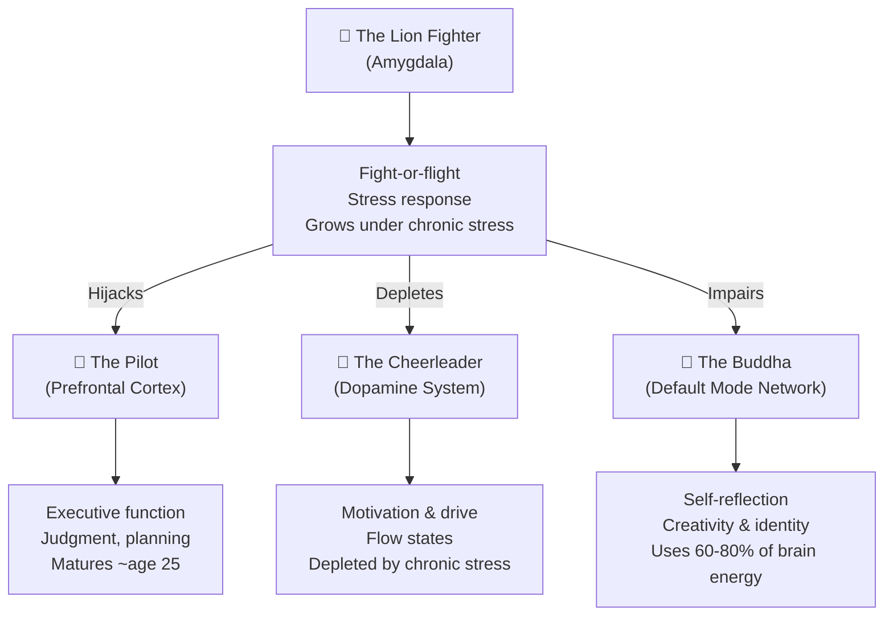
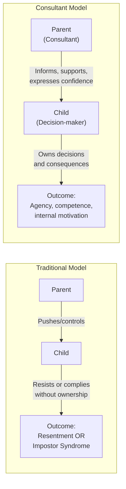
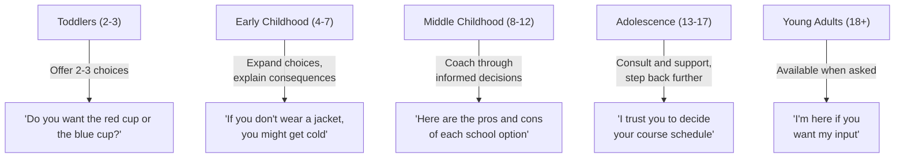
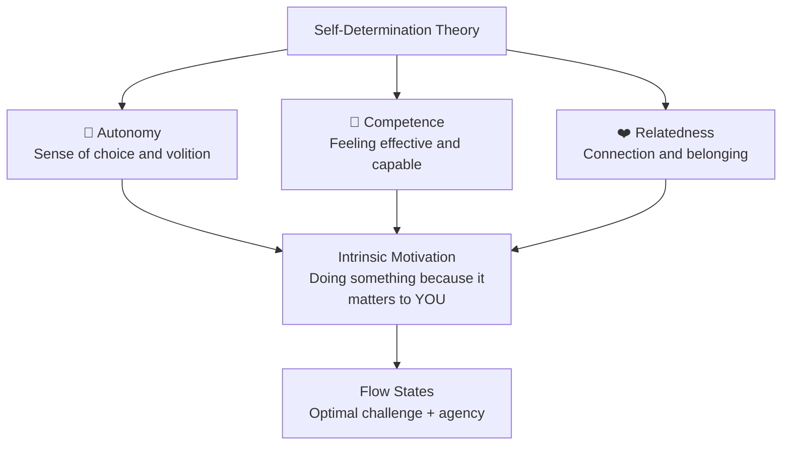
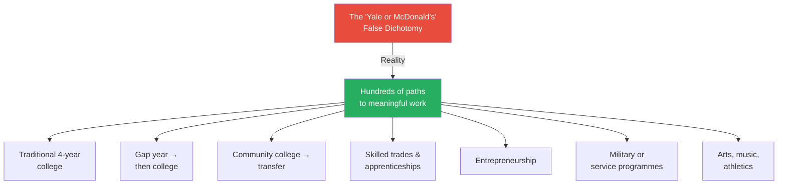
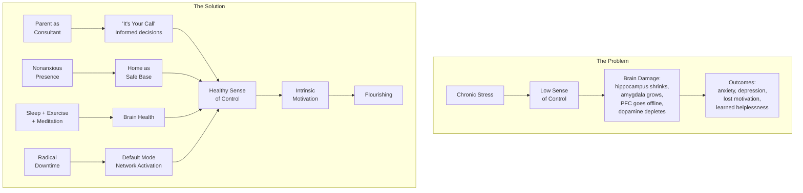
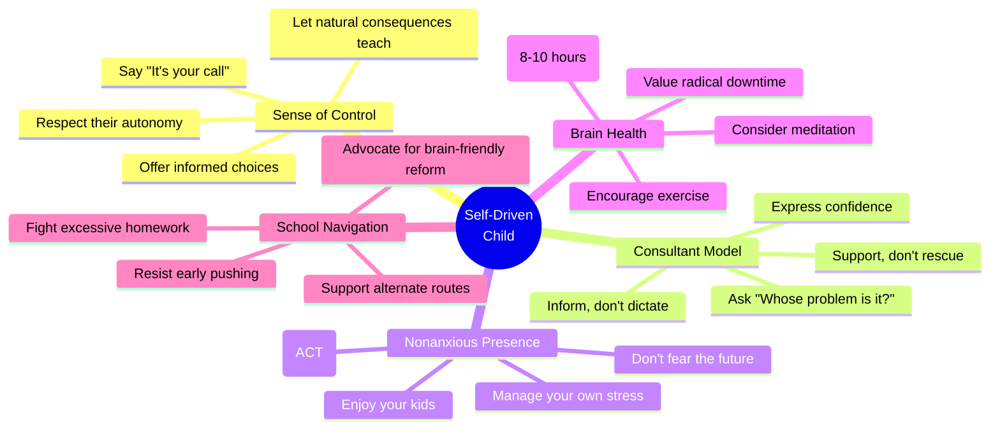

# The Self-Driven Child — William Stixrud & Ned Johnson

> *"A low sense of control may very well be the most stressful thing in the universe."*

Two professionals — a clinical neuropsychologist who had spent thirty years helping kids cope with anxiety and learning disabilities, and a test-prep tutor who kept noticing that the real obstacle was never the test itself but the stress surrounding it — discovered they were asking the same question from opposite ends of the spectrum: *How do we help this kid gain a sense of control over his own life?*

The answer they found wasn't more tutoring, more therapy, or more parental involvement. It was, counterintuitively, **less**. Less pushing. Less hovering. Less managing. And far more trust.

---

## About the Authors

**William Stixrud, PhD** is a clinical neuropsychologist in Washington, DC, who has spent over three decades evaluating and treating children and adolescents struggling with anxiety, learning disabilities, ADHD, and behavioural problems. He is a longtime practitioner of Transcendental Meditation and brings a calm presence that his colleagues describe as almost tangible. He is also an assistant professor of psychiatry and paediatrics at the George Washington University School of Medicine.

**Ned Johnson** is the founder of PrepMatters, one of the most successful tutoring companies in the United States. An energetic Gen Xer and father of two, his students often say he brings the enthusiasm of three people. But through thousands of hours of test prep, Johnson came to a radical conclusion: the scores weren't really the problem. The stress, the anxiety, the crushed sense of agency — that was the problem. Fix those, and the scores took care of themselves.

They met as guest speakers at the same event and realised their knowledge fit together "like a jigsaw puzzle." Stixrud's patient might struggle to get to school at all; Johnson's might panic about not getting into Stanford. But the root cause was identical: a dangerously low sense of control.

---

## The Big Idea

<b style="color: #2980b9;">The single most important thing you can do for your child is help them develop a healthy sense of control over their own life.</b>

<b style="color: #e74c3c;">Chronic stress — driven by a low sense of control — is damaging young brains at epidemic proportions, producing anxiety, depression, and learned helplessness across every demographic.</b>

<b style="color: #27ae60;">The antidote is not more pushing but a fundamental shift: from parent-as-manager to parent-as-consultant, from external pressure to internal motivation, from controlling to trusting.</b>

---

## Key Concepts at a Glance

| Concept | What It Means |
|---------|---------------|
| **Sense of Control** | The belief you can impact your own circumstances — the #1 factor in stress resilience |
| **Parent as Consultant** | Offer information and support, but let the child own the decisions and consequences |
| **"It's Your Call"** | The phrase that operationalises the entire philosophy — say it as often as possible |
| **The Nonanxious Presence** | Being calm and confident so your child can mirror that state — "calm is contagious" |
| **N.U.T.S.** | Four ingredients of stress: Novelty, Unpredictability, Threat to ego, low Sense of control |
| **Four Brain Systems** | The Pilot (PFC), The Lion Fighter (amygdala), The Cheerleader (dopamine), The Buddha (DMN) |
| **Radical Downtime** | Boredom and mind-wandering are not wastes of time — they are essential for brain development |
| **Three Non-Negotiables** | Sleep, exercise, and meditation — the biological foundation for everything else |
| **Self-Determination Theory** | Autonomy + competence + relatedness = intrinsic motivation |
| **Informed Decision Making** | Not unlimited freedom — children make choices after being given adult-level information |

---

Children with a high sense of control score strongly across every dimension — autonomy, competence, self-regulation, motivation, resilience, and decision-making — while those with a low sense of control are depleted across the board, showing how this single variable acts as a master switch for child development.

---

## 30-Second Version

From 1960 to 2002, young people's internal locus of control has plummeted while anxiety and depression have skyrocketed — teens today are five to eight times more likely to show anxiety symptoms than during the Great Depression. The culprit isn't danger but *loss of agency*. When kids feel controlled — by parents, schools, schedules, or screens — their stress response goes haywire, flooding developing brains with cortisol that damages memory, judgment, and motivation. The fix is elegant: become a consultant rather than a manager, say "It's your call" as often as possible, build a home that is a safe base rather than a pressure cooker, and protect sleep, exercise, and downtime as non-negotiable. Children whose brains practise making decisions develop the prefrontal cortex strength to make good ones. Children whose brains practise being managed develop the habit of waiting to be told what to do.

---

## Part One: The Stress Epidemic and the Brain

### The Most Stressful Thing in the Universe

The book opens with a striking parallel. Adam, fifteen, walks from a cramped apartment in the Chicago projects to his underfunded public school. Last summer his older brother was killed in a drive-by shooting while they were hanging out together. He can't concentrate. His grades are slipping. He's not sleeping.

Zara, also fifteen, lives in a multimillion-dollar house and attends a posh private school in Washington, DC. She squeezes test prep between field hockey, Habitat for Humanity volunteering, and three to four hours of homework each night. She's snapping at friends, fighting with her parents, and complaining of headaches.

Here is the chilling part: **if you put a scan of Zara's brain next to Adam's, you'd see striking similarities** — particularly in the parts involved in the stress response system. Chronic stress damages developing brains regardless of zip code.

> [!warning] The Stress-Brain Connection
> Chronic stress floods the brain with cortisol, which:
> - **Kills cells in the hippocampus** (where memories are created and stored)
> - **Enlarges the amygdala** (making kids more reactive to fear and anger)
> - **Impairs the prefrontal cortex** (seat of judgment, planning, impulse control)
> - **Depletes dopamine** (destroying motivation and drive)
> - **Disrupts the default mode network** (preventing self-reflection and creativity)

Stixrud and Johnson use an accessible metaphor of four brain systems to explain the neuroscience:

The critical insight: when the Lion Fighter takes over, it kicks the Pilot out of the driver's seat. A student under stress might know all the answers but literally *cannot access them* — the prefrontal cortex goes offline. One of Ned's students described a panic attack during a test: "When I tried doing the next problem, it was almost like I couldn't think logically. Like I couldn't understand what I was reading."

### N.U.T.S. — What Makes Life Stressful

Sonia Lupien at the Centre for Studies on Human Stress created a handy acronym for the ingredients of stress:

| Letter | Factor | Example |
|--------|--------|---------|
| **N** | Novelty | First day at a new school |
| **U** | Unpredictability | Not knowing what's on the test |
| **T** | Threat to the ego | Being called on in class when unprepared |
| **S** | Sense of control | Feeling you have no say in your own life |

Of these four, **sense of control is the master variable**. A landmark study gave rats a wheel to turn that stopped electric shocks. The rats happily turned the wheel and weren't stressed. When the wheel was returned after being taken away, stress dropped — *even when the wheel wasn't actually connected to the shocking apparatus anymore*. The mere *perception* of control was enough.

In humans too: being able to push a button that reduces the likelihood of hearing an unpleasant sound lowers stress — even if the button has no real effect, and even if you don't push it.

> [!tip] The Elevator Button Principle
> Most elevator "close door" buttons don't actually work. We push them anyway because the *sense* of control matters more than actual control. This is why giving kids meaningful choices — even small ones — has outsized effects on their well-being.

### The Adolescent Vulnerability Window

The adolescent brain is especially vulnerable to stress damage. Between twelve and eighteen, children show more brain development than at any time except the first few years of life. But the prefrontal cortex doesn't fully mature until around twenty-five. Emotional regulation follows at roughly thirty-two.

This creates a dangerous paradox: teens are building critical neural architecture while simultaneously having exaggerated stress responses and fewer biological tools to manage them. A steroid called THP that normally calms nerve cells in adults had almost no effect in adolescent mice. Teens face more stress vulnerability *and* less stress resilience.

Depression in adolescence leaves "scars" in the brain, requiring less and less stress to trigger subsequent episodes. Adults who experienced even a single bout of major depression as teens show long-term problems in work, relationships, and life satisfaction.

> [!danger] Jared — The Teflon Kid
> Bill first tested Jared at ten: funny, good-humoured, universally beloved. Everyone called him the Teflon Kid — problems bounced off him. At sixteen, he was on antidepressants. The combination of school pressure and sleep deprivation had "pushed him over the edge." He stayed up until 1 AM doing homework because: *"I'm afraid that if I went to bed earlier, a kid in Idaho would be staying up until one and would get my spot at Duke."* Jared will forever be more vulnerable to depressive episodes.

---

## Part Two: The Parent as Consultant

### "I Love You Too Much to Fight with You About Your Homework"

The consultant model outperforms both alternatives across every positive dimension while producing the lowest stress — note that stress is the only measure where a high score is negative, and the authoritarian style generates nearly three times the stress of the consultant approach.

Fifteen-year-old Jonah hated homework. What he hated even more was his parents' constant hectoring. When asked to walk Bill through a typical evening, Jonah said: "We usually eat dinner between six and six thirty. And then I can watch TV from six thirty to seven. Then from seven to eight thirty, I pretend to do my homework."

An hour and a half *pretending* to do homework. Why didn't he just do it? Because his parents' refrains — "You only get one shot at getting into a good college," "You'll thank us when you're older," "You're gonna have to learn to do things you don't want to do" — all communicated one message: *We know what's right for you, and you don't.* The only way Jonah felt he could assert his identity was by *not* doing homework.

The authors ask parents to imagine their spouse saying: "How was work today? Did you get a good report? You understand how important it is to take your work seriously, right? It just seems like maybe you aren't doing your best all the time."

You'd go insane. Jonah went insane too.

> [!abstract] The Consultant Model
> **Boss/Manager:** "Do your homework now. You need to get better grades."
> **Bystander/Laissez-faire:** "Whatever, it's your life." *(walks away)*
> **Consultant:** "I've noticed your grades have dropped. I have some ideas that might help, and I'm curious what you think is going on. But ultimately, this is your work and your life. How can I support you?"
>
> Good consultants ask what the problems are, ask what clients are willing to commit to, give advice — but never try to *force* change, because they recognise it's the client's responsibility.

The reframing starts with a simple question: **"Whose problem is it?"** When your child struggles with homework, with friendships, with a harsh teacher — it hurts you to see her hurt. But it is *her* problem, not yours. A consultant who loses their composure when the company misses its targets becomes part of the problem.

This doesn't mean abandoning your child. It means recognising that **your job is not to solve your children's problems but to help them learn to run their own lives**.

The flow reveals a clear pattern: helicopter and authoritarian parenting funnel children toward a low sense of control — which feeds anxiety, depression, and helplessness — while the consultant model channels children toward a high sense of control that branches into motivation, resilience, mental health, and healthy relationships.

### The Homework Wars

"I dread the time between dinner and bedtime because all we do is fight," said one parent. "It's like a war zone," said another. "It's World War Three in our house every night."

The authors make a provocative case: **you cannot make your child do homework, and trying to will damage your relationship more than the missed assignments will damage their future.** Ned's son Matthew once blamed his mom when he failed to complete an assignment: "Well, you didn't remind me to do it." The family had a conversation, and from that point, homework was Matthew's responsibility.

Matthew messed up at first. He studied the entirely wrong sheet for a science test. There was no fighting afterward, no "I told you so." Instead, a relaxed discussion about what went wrong. Ironically, Matthew then spent hours independently researching the topic because he found it fascinating. Top grade? No. Real curiosity and learning? Yes.

> [!quote] A Mother's Regret
> "One of my greatest regrets is that the last few years my son lived at home, we spent most of the time fighting about homework. I wish I could have those days back and just enjoy him. Now all that fighting seems so pointless and I feel like I missed out on him."

The key distinction: we want kids to be **self-disciplined**, not **well-disciplined**. Assuming authority over their responsibilities robs you of quality time and turns home into a battlefield rather than a safe base.

---

## Part Three: "It's Your Call" — Kids as Decision Makers

### The Philosophy in Three Precepts

When it comes to your kids, adopt three baseline beliefs:

1. **"You are the expert on you."**
2. **"You have a brain in your head."**
3. **"You want your life to work."**

Once you buy into these three things, it becomes natural to say: "It's your call. I have confidence in your ability to make informed decisions about your own life and to learn from your mistakes."

The trick: you can't *just* tell them this — you have to follow through. Sometimes you won't like their decisions, but unless they're outrageous, let them go with them anyway.

### What "It's Your Call" Does NOT Mean

The authors are careful to draw boundaries:

- It does **not** mean kids call all the shots ("Chocolate cake for dinner every night!")
- It does **not** conflict with limit-setting — you can carry a screaming toddler to the car if needed
- It does **not** mean unlimited choices — too many options stress kids out
- It does **not** mean manipulation — sneakily making kids think a decision is theirs when it's really yours
- It **does** mean: when it comes to decisions about their lives, you should not decide things they are capable of deciding for themselves

> [!example] Matt's Story — Radical Trust
> Matt was allergic to compliance in high school. Give him a rule and he'd break it. Set a curfew and he'd sit in the driveway rather than come in on time. Halfway through his senior year, his mother signed a notarised letter making him his own legal guardian.
>
> "I completely abused the privilege, and it was amazing," Matt says. "For once in my life, I felt I was in control."
>
> Matt bounced through several colleges but eventually got his degree, conquered his anxiety, runs a successful think tank in Washington, DC, and credits his parents' support for his long-term success.

### Six Reasons Kids Should Make Their Own Decisions

1. **Science is on their side.** The brain develops according to how it's used. Decision-making practice builds the prefrontal cortex.
2. **Kids shouldn't be empty extensions of their parents.** Compliant kids who succeed feel like impostors — the success isn't really theirs.
3. **It's the only way to teach competency.** "Wisdom comes from experience, and experience comes from bad decisions."
4. **You don't always know what's best.** What seems like a disaster often turns out to be a blessing in disguise.
5. **Kids are capable. Really.** A study found fourteen-year-olds made decisions virtually identical to those of twenty-one-year-olds.
6. **Good decisions require emotional intelligence.** Kids need to practice tuning into their own feelings and asking "What's right for me?"

> [!info] The Research on Kids' Decision-Making Ability
> A study of participants aged nine to twenty-one found that fourteen-year-olds made decisions that were very similar to those of eighteen- and twenty-one-year-olds. Even half of the nine-year-olds chose the same option recommended by most experts. Robert Epstein's "test of adultness" found that teens perform as well as adults on measures of love, leadership, interpersonal skills, and handling responsibility.

### Age-Appropriate Decision Making

The authors provide a developmental roadmap:

Even young children show surprising capability. Bill started advising parents to bring kids into the decision about repeating a grade. Kids as young as six made choices at least as good as adults would have, and often came up with solutions neither parent had considered: "I'm not ready for second grade, and if kids tease me about repeating I'll just ignore them."

The heatmap shows a developmental gradient — from red (parent-directed) to green (child-directed) — with autonomy increasing gradually across all domains as children mature, while low-stakes decisions like clothing shift to child-control much earlier than higher-stakes ones like homework and sleep.

---

## Part Four: The Nonanxious Presence

### Calm Is Contagious

Just as kids mirror stress, they mirror calm. You know calm people — those who project an aura of well-being, who you want to call in a crisis because they level you out. Without preaching, without doing much of anything, they communicate confidence and help others find their own balance.

The authors draw on Edwin Friedman, a rabbi and family systems consultant who coined the term "nonanxious presence." Friedman argued that families, schools, and organisations work best when leaders are emotionally differentiated — true to themselves, not unduly anxious, and thus not transmitting fear.

The science backs this up powerfully. Researchers found that rat mothers with low stress levels spent more time licking and grooming their pups. Those pups grew up calmer and more exploratory. But here's the key: **it wasn't genetics**. When pups born to low-licking mothers were fostered by high-licking mothers, they became calm too. What those mama rats transmitted wasn't a gene — it was a *signal that the world is safe*.

> [!success] Ned's Calming Effect on Test Scores
> While Ned doesn't maintain formal statistics, rises of hundreds of points on standardised tests are common with his students. He tested why by giving kids practice tests in three conditions: (1) with Ned sitting calmly across the desk, (2) alone in an empty room, (3) with other anxious test-takers around. Kids performed best with Ned present. Students constantly tell him: "If you could just come with me to the test, just be in the room with me, I know I'd be okay."

A parent named Rosa described attending a new-moms group where women shared what they wanted to emulate and reject from their own mothers. Rosa's mom was loving and affectionate — but took the ups and downs of Rosa's life too hard. Rosa learned to keep things from her mother to protect her. Her mom would be upset about something long after Rosa was over it, which "effectively eliminated her as a source of support."

### How to Be a Nonanxious Presence

The authors offer practical guidance:

**Make enjoying your kids your top parenting priority.** Your kid needs to feel your face light up when you see them — the giddy look we give babies. Bill still remembers friends from his difficult twenties who always expressed how happy they were to see him — forty years later. One twenty-one-year-old who'd flunked out of college twice and struggled with addiction told Bill: "I think it might have helped if they had been happy to see me sometimes."

**Don't fear the future.** Virtually all parental anxiety is about the future — over which we have little control. Life isn't a race. Mark Twain: "When I was a boy of fourteen, my father was so ignorant I couldn't stand to have the old man around. But when I got to be twenty-one, I was astonished at how much the old man had learned in seven years."

**Commit to your own stress management.** In a 1990s survey, children said what they wanted most — even more than spending time with their parents — was for their parents to be happier and less stressed. One teenager who practises TM with his family said: "TM calms the mind and calms the mom."

**Make peace with your worst fears.** Ask: "What am I most afraid of?" Let the worst-case scenario play out mentally. Realise you would still love and support your child. This is liberating.

> [!quote] The Chinese Farmer
> A farmer's horse ran away. "You poor man!" his neighbour said. "Maybe yes, maybe no," said the farmer. The horse returned with two wild horses. "What luck!" said the neighbour. "Maybe yes, maybe no." His son broke his leg taming them. "You poor man!" Then the emperor conscripted every young man for war — but the son couldn't walk, sparing his life. **Life is long, and you don't know what happens next.**

**Adopt nonjudgmental acceptance — ACT:**
- **A**ccept: "My kid is underachieving, and I see this as part of his path."
- **C**hoose: "I choose to create a vision of myself as a calm, compassionate parent."
- **T**ake action: "I will offer help, focus on strengths, set limits, and model acceptance."

Acceptance doesn't mean approving or condoning. It means acknowledging reality rather than railing against it. For all we know, our kids may be exactly who and where they are supposed to be right now.

---

## Part Five: Inner Drive — The Motivation Chapter

### Why Kids Lose Motivation

The authors draw heavily on Edward Deci and Richard Ryan's self-determination theory (SDT), arguably the most robust framework for understanding human motivation. SDT identifies three psychological needs that must be met for intrinsic motivation to flourish:

When any of these three needs is frustrated — when kids feel controlled, incompetent, or disconnected — motivation dies. And the most common way parents and schools crush motivation is through an excessive reliance on **extrinsic motivators**: grades, rewards, punishments, and parental pressure.

> [!warning] The Extrinsic Motivation Trap
> Research consistently shows that offering external rewards for activities people already enjoy *reduces* their intrinsic motivation. In a classic study, children who were rewarded for drawing — something they naturally loved — drew less when the rewards stopped than children who had never been rewarded. The reward had redefined the activity from "something I love" to "something I do for a prize."

The authors describe a continuum from purely external motivation to fully internalised motivation:

| Level | Type | Example |
|-------|------|---------|
| 1 | External regulation | "I study because my parents will ground me if I don't" |
| 2 | Introjected regulation | "I study because I'd feel guilty if I didn't" |
| 3 | Identified regulation | "I study because I understand why it's important" |
| 4 | Integrated regulation | "I study because learning is part of who I am" |
| 5 | Intrinsic motivation | "I study because I find this genuinely fascinating" |

The goal isn't to get every child to level five for every task — that's unrealistic. It's to help kids move *along the continuum* toward greater internalisation, so that even when they don't love a task, they understand why it matters and choose to do it.

### Flow and the Sweet Spot

Mihaly Csikszentmihalyi's concept of *flow* — being so absorbed in an activity that time disappears — is the highest expression of intrinsic motivation. Flow requires a balance between challenge and skill: too easy and you're bored; too hard and you're anxious.

But flow also requires **autonomy**. You can't be forced into flow. It emerges when you're doing something because you want to, at a difficulty level that stretches you just enough. This is why forced enrichment programs, mandatory extracurriculars, and parent-chosen activities rarely produce the deep engagement parents hope for.

The authors suggest: instead of pushing kids toward activities you think are valuable, help them **find things they love** and then support them in pursuing those things. Reed Larson's research found that adolescents experienced the highest levels of both motivation and concentration during voluntary structured activities — not during class, not during unstructured free time, but during chosen activities they took seriously.

> [!tip] The Motivation Conversation
> Instead of asking "Did you do your homework?" try:
> - "What was the most interesting thing you learned today?"
> - "Is there anything at school that you're curious about?"
> - "What would you like to get better at?"
> - "If you could study anything, what would it be?"

### Dopamine, Drive, and ADHD

Dopamine — the neurotransmitter at the heart of the motivational system — is "more about the wanting than the getting," in Robert Sapolsky's words. It's the key to drive. Chronic stress depletes dopamine over time, making it harder to *want* to do anything.

Kids with ADHD tend to have low baseline dopamine levels and use dopamine less efficiently. This is why they prefer small, immediate rewards to larger, long-term ones. John Salamone's rat study illustrated this: rats with lower dopamine almost always chose a small nearby pile of food rather than jumping a fence for a pile twice the size. "Low levels of dopamine make people and other animals less likely to work for things."

This reframes ADHD not as laziness but as a neurochemical challenge. Stimulant medications work by improving dopamine processing. But so do exercise, meditation, and — critically — autonomy. When a child with ADHD chooses to engage with something, their dopamine system activates far more effectively than when they're forced.

---

## Part Six: Radical Downtime and Sleep

### The Default Mode Network — Why Boredom Is Essential

For decades, neuroscientists studied what *activates* the brain when given a task. Around the turn of the twenty-first century, they started looking at what happens when we're doing nothing. What they discovered was revolutionary: a complex, highly integrated network only activates when we are "doing nothing." This is the **default mode network** (DMN), and it uses 60 to 80 percent of the brain's energy.

The DMN activates when we:
- Daydream or let our minds wander
- Think about the past or plan the future
- Reflect on ourselves and others
- Lie in bed before falling asleep
- Engage in certain forms of meditation

A healthy DMN is necessary for the brain to rejuvenate, store information in more permanent locations, gain perspective, process complicated ideas, and be truly creative. In young people, it's been linked to developing a strong sense of identity and capacity for empathy.

> [!abstract] Matthew's Songs in His Head
> Ned's son Matthew was staring across his cereal bowl into space one morning. "What are you doing?" Ned asked. "I'm listening," Matthew answered. "To what?" "Songs in my head." Ned realised he was interrupting something important — his son's default mode network doing exactly what it's supposed to do. Matthew's musical ability, his friends later wondered about, may have been nurtured in precisely these moments of daydreaming.

Jerome Singer, a legendary cognitive psychologist, argued in 1966 that daydreaming, imagination, and fantasy are essential elements of a healthy mental life: self-awareness, creative incubation, autobiographical planning, moral reasoning, and the ability to take another person's perspective.

The problem: **technology has colonised every moment of potential downtime.** Kids in the car want to watch something. Adults check their phones during the four seconds it takes to stop at a stop sign. Psychologist Adam Cox noted that while fifty years ago kids might be bored after a couple of hours, nowadays they become bored after thirty seconds.

The authors' plea: **let your kids do nothing.** One of Ned's most stressed-out students said: "All I want is a couple of hours to myself. To do what I want, which is to do nothing. But if I have a free block of time, my parents swoop in to fill it."

### Meditation — TM and Mindfulness

The book offers perhaps the most balanced comparison of the two major meditation approaches found in any parenting book:

**Mindfulness** (Jon Kabat-Zinn's MBSR): Paying attention on purpose, in the present moment, nonjudgmentally. Focuses on the breath, noticing thoughts without reacting. Research shows it can lower stress, aggression, and social anxiety in children; improve executive functions and math performance; and even change gene expression. Programs like Goldie Hawn's MindUP and Mindful Schools bring these practices to elementary students.

**Transcendental Meditation (TM)**: Uses a mantra (a meaningless sound) to let the mind settle to a state of "restful alertness" — fully alert but with no thought. Forty years of research shows it reduces stress and anxiety, improves brain wave coherence, increases internal locus of control, and promotes better academic performance. The Quiet Time school programme (fifteen minutes of TM twice daily) has produced remarkable results in underserved urban schools.

> [!example] Bill's Alpha Waves
> During biofeedback training, sensors were attached to Bill's skull. When he closed his eyes, the monitoring doctor said, "Holy moly." Bill had an immediate burst of beautiful alpha waves — the signature of deep relaxation. "I've been meditating for twenty-five years," Bill explained. "That's obvious," the doctor replied. Bill notes he used to be "one of those people whose very presence stressed people out."

Both authors practise TM and recommend it, but they're clear: **don't force meditation on kids**. Offer it, explain the benefits, let them choose. Bill's son asked if Bill was disappointed he didn't want to meditate. "I didn't learn to meditate because my parents did," Bill told him. "I learned because it appealed to me. If it doesn't appeal to you, don't do it."

### Sleep — The Most Radical Downtime

If there is one chapter that could stand alone as a public health message, it's the sleep chapter. The statistics are alarming:

- Adults in early-1900s America slept nine hours a night; now we average two hours less
- More than 50% of teens fifteen and older sleep less than seven hours (eight to ten recommended)
- 85% of teens get less than the recommended amount
- Half of the teenagers in one study had morning EEGs that looked like people with *narcolepsy*
- Even kindergartners yawn all morning and report feeling tired "all the time"

> [!danger] The Sleep-Stress Doom Loop
> Sleep deprivation weakens your sense of control → weaker control makes it harder to put yourself to bed → you stay up watching one more episode → you're more tired → you're more anxious → anxiety makes it harder to fall asleep → repeat. This is why sleep deprivation is so insidious: the very faculty you need to fix it (self-regulation) is the thing it destroys.

Sleep optimises every brain function. Without it: memory consolidation fails, the stress response system becomes hyperactive, dopamine drops, impulse control evaporates, and emotional reactivity spikes. The authors argue sleep is "arguably the single most important thing for healthy brain development."

Practical sleep advice from the book:
- Teens' circadian rhythms naturally shift later; early school start times are biologically adversarial
- No screens in the bedroom; blue light suppresses melatonin
- Consistent bedtime routines signal the brain to wind down
- If your teen is sleep-deprived, that's a more urgent problem than any homework assignment
- Advocate for later school start times — the science is unambiguous

---

## Part Seven: School, Technology, and Exercise

### Taking a Sense of Control to School

The school system, the authors argue, is often at direct odds with developing a healthy sense of control. They identify several structural problems:

**Homework has exploded.** Kindergartners now average thirty-five minutes per night — up to three times the recommendation. Teenagers at elite high schools average over three hours. Yet only 20-30 percent of students surveyed perceived their homework as "useful or meaningful." Despite ninety years of research, there is no compelling evidence that homework contributes significantly to learning in elementary school. Small amounts (one to two hours) may help in middle and high school, but more than that backfires.

> [!tip] The Finnish Model
> Finnish students — who have among the highest educational outcomes in the world — have the lightest homework requirements, rarely receiving more than thirty minutes per day. Many finish before leaving school. Pasi Sahlberg notes that Finnish fifteen-year-olds don't use private tutors or take additional lessons outside school. Finland chose to emphasise highly trained teachers, collaboration, school-based curricula, and trust-based leadership. Their scores improved. Countries that chose test-based pressure saw scores decline.

The authors' motto: **"Inspire — but don't require."** Teachers should explain how assignments will benefit students, seek feedback, and make homework voluntary and ungraded. "If you can work on this for twenty minutes after school, your brain will make new connections when you sleep tonight. But if you're too tired or stressed, do something else."

**Academics are pushed too early.** Reading is now taught to five-year-olds, though evidence shows it's more efficient at seven and any early advantage washes out. Today's five-year-olds are no more fundamentally advanced than those in 1925 — a child can draw a square at 4½, a triangle at 5½, remember pennies up to twenty by six. These milestones indicate readiness. In one preschool class of twenty where kids were encouraged to write too early, seventeen needed occupational therapy to correct their pencil grip.

> [!warning] The Algebra Disaster
> Montgomery County, outside Washington, DC, attempted to teach algebra to most eighth graders rather than ninth graders. Three out of four students failed their final exam. Most eighth graders don't have sufficiently developed abstract thinking skills to master algebra. Bill never hears twenty-six-year-olds brag that they're more successful than most twenty-eight-year-olds.

**AP classes are overloaded.** Many driven teenagers taking multiple AP classes while on antidepressants have implied to Bill that getting into an elite college would make it "worth everything." The authors disagree: "Depression is the cruelest disease. For kids to become depressed because they're too tired and stressed is too high a price to pay for that admissions letter."

Bill's own experience is telling: he and his wife felt panicky when their five-year-old's friends started reading while their daughter hadn't. They knew the research — pushing academics early was harmful and produced no lasting benefit — but still wavered. They stuck to their guns, kept her in a non-academic kindergarten with no homework until fourth grade. Their daughter received her PhD in economics from the University of Chicago at twenty-six.

### Wired 24/7 — Taming the Beast of Technology

By the time they're seven, most American kids have spent the equivalent of one full year (24/7) in front of a screen. Kids aged eleven to fourteen use screens eleven and a half hours a day. Only 35 percent of teens socialise in person after school, but 63 percent exchange text messages daily.

The authors aren't anti-technology, but they're deeply concerned about what screens **displace**: family time, face-to-face interaction, study time, physical activity, and sleep. Technology trains the brain to expect constant stimulation, which is devastating for the default mode network.

> [!info] Steve Jobs Didn't Give His Kids iPads
> Many tech industry leaders don't want their own kids using the products they create. Steve Jobs limited his children's technology use. Chris Anderson, former editor of *Wired*, said: "We have seen the dangers of technology firsthand." Many send their kids to Waldorf schools, which ban technology from classrooms and discourage it at home until age twelve.

The consultant model applies here too: rather than engaging in constant battles over screen time, have an honest conversation. Share the research. Let kids help set their own guidelines. One family created a simple rule: "We'll pay for your phone as long as it doesn't interfere with sleep, grades, or family time. If it does, we'll need to renegotiate."

Key concerns:
- **Intermittent reinforcement** — social media notifications work like slot machines, creating addictive dopamine loops
- **Social comparison** — platforms like Instagram show curated highlight reels that damage self-esteem
- **Sleep displacement** — blue light suppresses melatonin; the phone-in-bedroom habit is devastating
- **Displaced DMN time** — every moment scrolling is a moment not daydreaming, not reflecting, not building identity

### Exercising the Brain and Body

The Latin root of "emotion" — *emovere* — means "to move." The brain regions responsible for bodily movement overlap with those for executive function. Exercise does more to help clear thinking than thinking does.

Exercise increases dopamine, serotonin, and norepinephrine. It stimulates production of BDNF (brain-derived neurotrophic factor) — a brain "fertiliser" critical for growing brain cells and wiring them together. It provides more glucose and oxygen to the brain, promoting neurogenesis.

> [!success] John Ratey's *Spark* Study
> When students exercised heavily as part of their school curriculum in Naperville, Illinois, academic performance dramatically improved. Finland mandates twenty minutes of outdoor play for every forty minutes of instructional time. The brain works better when the body has been worked first.

Neuroscientist Adele Diamond is particularly supportive of activities that simultaneously demand working memory, inhibitory control, and cognitive flexibility: **dance** (learn moves, inhibit wrong moves, adjust to partner/music), **martial arts**, **yoga**, **rock climbing**, **horseback riding**, **fencing**, and **drumming**.

And then there's **play** — crucial for cerebellum development. The cerebellum, once thought to only control movement, affects planning, word selection, and learning. A graph of playfulness in almost every species matches the growth curve of the cerebellum. Play *is* brain development.

The rule for exercise intensity: you should be able to talk but not sing. And critically: **don't force it**. Forced exercise is boot camp, not stress reduction. Help your child find physical activity they enjoy and make fitness a family value.

---

## Part Eight: Differently-Wired Kids

### Learning Disabilities, ADHD, and Autism Spectrum Disorders

Six and a half million American kids received special education services in 2013-2014. As many as 20 percent have at least one learning disability, 11 percent are diagnosed with ADHD, and one in sixty-eight has an autism spectrum disorder. The authors note they're hard-pressed to think of a family with three kids in which at least one doesn't have some form of learning difference.

The central argument of this chapter: **kids with special needs benefit from autonomy even more, not less, than neurotypical kids.** Structure and external motivators may help these children focus, but structure and autonomy are not mutually exclusive. Kids with learning disabilities perform better when help is not being done *to them*.

> [!example] Michael and Ernie the Dog
> Eleven-year-old Michael was bright and sweet-natured but struggled with math and emotional regulation. During testing, when asked to solve math problems after lunch, he began chanting "no, no, no" and hissed and made clawing motions — his amygdala in full overdrive. Bill took him aside, explained what was happening in his brain, and asked what would make him feel safe. Michael said he felt safe with Bill and with Ernie, a small dog who "worked" in Bill's office. They agreed Michael would do math with Ernie next to him and stop to pet him when stressed. Within minutes, Michael was solving problems, petting Ernie, and humming to himself.

For kids with learning disabilities, the authors recommend three steps:

1. **Fight unnecessary homework.** If reading is hard, forcing thirty minutes of oral reading when a child is tired is cruel and unusual punishment. Let them listen to audiobooks — the same brain systems for language comprehension are engaged.
2. **Encourage self-understanding.** Help kids know their strengths and challenges. Explain that one in three kids has some kind of issue. Share stories of famous people with similar challenges.
3. **Offer but don't force help.** One day a week of chosen tutoring beats two days of forced tutoring. "He can quit if it doesn't seem to be helping."

### ADHD — The Dopamine Challenge

Kids with ADHD have low baseline dopamine and use it less efficiently. This makes them prefer small immediate rewards over larger delayed ones. The harder they try to focus, research shows, the *less* their brains activate — which means nagging a struggling child to "try harder" is physiologically counterproductive.

Margaret Sibley estimates that 40 percent of parents with ADHD kids feel helpless and become uninvolved by the teen years, while another 40 percent tighten the reins and become overinvolved. Both paths are problematic. Bill often asks kids with ADHD who has trouble turning in homework: "Who's the most upset if you don't turn in an assignment?" The answer is almost always "My mom." The kid himself is rarely on the list.

> [!info] ADHD and Agency
> Kids with ADHD frequently act in ways they regret and, as a result, lack confidence they'll handle things well. They're told to "just behave" as if they could simply will their way through neurology. When they wear T-shirts reading "My parents say I don't listen — or something like that" and "Organized people are just too lazy to look for things" — that self-awareness and humour represent a healthy sense of control.

On medication, the authors take a nuanced stance: no one should force a child to take medication, and no one wants them on medicine that makes them feel bad. But different medications have different side effects, and exercise plus proper nutrition can help tolerability. The maturation of the prefrontal cortex in ADHD kids lags years behind peers — they're often late bloomers who simply need more time.

A pilot study led by Stixrud found that middle school students with ADHD who practised TM showed a 43 percent reduction in stress and anxiety symptoms after three months, along with better behavioural regulation and emotional control. A follow-up brain-wave study showed theta/beta ratios (abnormally high in ADHD) moving toward normal values.

---

## Part Nine: College Admissions and Alternate Routes

### The SAT, ACT, and Other Four-Letter Words

Both authors test kids for a living, so they're not anti-testing. Testing can be a powerful learning tool — when you struggle to recall something, the act strengthens your memory more than simply reviewing notes. "Testing not only measures knowledge but changes it."

But standardised testing *as a system* is deeply flawed. Test-based accountability forces teachers to teach to the test, gives them little autonomy, makes them fear for their jobs, and squeezes out elective classes where many kids shine brightest. The stress of high-stakes testing activates kids' Lion Fighters, kicking Pilots offline at exactly the moment they need them most.

> [!tip] Sonia Lupien's Test Anxiety Insight
> The N.U.T.S. framework explains why standardised tests are uniquely stressful: they involve **novelty** (unfamiliar format), **unpredictability** (what questions will appear?), **threat to ego** (scores feel like a verdict on intelligence), and **low sense of control** (can't influence what's tested). A perfect stress storm.

Ned deliberately starts SAT prep no earlier than junior year, despite parental pressure to begin in ninth grade. Starting early is "totally unnecessary and actively counterproductive" — like explaining the intricacies of a 401(k) to a fourteen-year-old. It won't register. Kids naturally acquire the skills and knowledge through school, and targeted preparation builds on that foundation.

### Who's Ready for College?

This chapter is a wake-up call about campus mental health. College counselling centres are overwhelmed. Depression, anxiety, binge drinking, eating disorders, and self-harm have all escalated. More than one in three college freshmen report emotional difficulties, and the six-year graduation rate hovers around 59 percent.

The authors argue that many students arrive at college without having practised basic life skills: managing their time, choosing what to commit energy to, deciding whether they even *want* to be in school. They've been so managed that they literally don't know how to manage themselves.

> [!danger] The College Mental Health Crisis
> A college student named Elizabeth came to Bill's office struggling academically, using marijuana daily, and barely attending classes. She was self-medicating grief from her father's traumatic death. Bill suggested TM as an alternative to pot. She stopped smoking for fifteen days (a prerequisite for learning TM), began meditating, and quickly felt calmer and slept better. Within weeks she was happier, had discovered a passion for visual art, and eventually transferred to a university with an excellent art programme. She even urged her mother to learn TM.

The book strongly supports **gap years**. Data shows students who take gap years are more motivated, more focused, and more likely to graduate. Malia Obama's highly publicised gap year helped normalise the practice. The authors suggest that if a student isn't ready — if they haven't developed the internal motivation and self-management skills — it's far better to defer or take an alternative route than to arrive on campus and flounder.

### Alternate Routes

The final chapter is a love letter to the many paths a life can take. The authors challenge the "Yale or McDonald's" false dichotomy:

- Valedictorians rarely become revolutionary thinkers or leaders; they play the system well but don't always transform it
- Grades in college have almost no correlation with career success
- Howard Gardner's theory of multiple intelligences shows that academic intelligence is only one form of capability
- Mike Rowe (of *Dirty Jobs*) has crusaded against what he calls "the diploma bias" — the assumption that white-collar work is inherently more valuable than skilled trades

After a fairly low level of financial comfort, there is no correlation between increased income and greater happiness. The best questions to help a child find their path are simple: **"What do you truly love to do? And what can you do better than most people?"**

Ned's own story embodies this. He wanted to withdraw from college his freshman year. His parents refused. He muddled through. Sophomore year, the same funk returned. This time they let him take a year off. That year gave him space to decompress, figure out what he wanted, and return in a better place. He joined an a cappella group, started dating his future wife, and she turned him on to tutoring. "Without that year off, he wouldn't be writing this book."

---

## The Four False Assumptions — Debunked

The authors systematically demolish four beliefs that drive parental anxiety:

> [!abstract] False Assumption 1: There Is a Narrow Path to Success
> This hinges on an assumption of scarcity — that for young people to be successful, they must be competitive at all times, whatever the price. But the world is full of people who took winding routes and thrived. The assumption that one wrong move means permanent failure is not only untrue but actively harmful: it justifies controlling behaviour that destroys the very agency kids need to succeed.

> [!abstract] False Assumption 2: It Is Critical to Do Well in School to Do Well in Life
> The "Yale or McDonald's" mentality creates two categories: kids who are manically driven and kids who've given up entirely. But grades have almost no correlation with career success. Karen Arnold's study of high school valedictorians found they tended to become professionals but rarely revolutionaries. College admission is not a pure meritocracy — recruited athletes, legacies, and diversity considerations all play roles.

> [!abstract] False Assumption 3: More Pushing Leads to More Accomplishment
> Our sixth graders aren't scoring as well as China's? Let's teach them ninth-grade maths. College admission is tougher? Let's pack schedules. But brain development makes it easier to learn virtually everything as we get older. Work is always easier with good tools. You can build a table with a dull saw, but it will ingrain bad habits. Pushing harder when kids aren't ready produces anxiety, not achievement.

> [!abstract] False Assumption 4: The World Is More Dangerous Than Ever
> Crime rates and car deaths are at their lowest in decades. It's our *perception* of danger that's up. Hanna Rosin's research on playgrounds found that despite great efforts to remove all risk, "our close attention to safety has not in fact made a tremendous difference in the number of accidents children have." Kids who fall from heights and survive are *less* afraid of heights at eighteen. Don't carpet the world — give out slippers.

---

## The Integrated Framework — How It All Fits Together

The elegance of the book is how every chapter reinforces the same central principle. Sleep improves sense of control. Exercise improves sense of control. Meditation improves sense of control. Letting kids make decisions improves sense of control. Being calm improves your child's sense of control. It's not a collection of tips — it's a unified theory of child development built on one powerful lever.

---

## The Verdict

**This is one of the most important parenting books of the past decade.** Where many parenting books offer philosophy without neuroscience or neuroscience without practical application, Stixrud and Johnson deliver both in a package that is genuinely enjoyable to read.

**Greatest strengths:**
- The central thesis — sense of control as the single most important variable — is backed by decades of research and presented with clarity
- The consultant model is the most practical operationalisation of self-determination theory for parents that exists
- The book covers every demographic: affluent overscheduled kids, underprivileged traumatised kids, kids with ADHD, learning disabilities, and autism
- Each chapter ends with concrete "What to Do Tonight" action steps
- Both authors bring real clinical experience with thousands of families

**Potential limitations:**
- The recommendations require a baseline level of family stability and resources that not all families have
- Some parents of genuinely at-risk teens may find "It's your call" terrifying without more guidance on where the line is
- The TM advocacy, while research-backed, occasionally feels promotional
- The book is US-centric in its discussion of college admissions and school systems

**Writing quality:** Conversational, warm, and well-paced. The alternation between Bill's clinical perspective and Ned's performance-coaching angle keeps the material fresh. Stories are vivid and well-chosen.

**Bottom line:** If you read one book about reducing your child's stress and building their internal motivation, make it this one. The consultant model alone is worth the price of admission.

---

## Who Should Read This

| Reader | Why |
|--------|-----|
| **Parents of stressed, overscheduled kids** | The core audience — this book was written for you |
| **Parents of kids with ADHD or learning disabilities** | The Chapter 11 framework is exceptional |
| **Parents in the college admissions vortex** | Chapters 12-14 will change your perspective |
| **Parents of toddlers and young children** | Start the consultant model early; it's much harder to shift later |
| **Teachers and school administrators** | The school chapter offers evidence-based reforms |
| **Therapists working with anxious families** | The neuroscience framework is clinically useful |
| **Anyone who was a driven, stressed kid themselves** | You'll recognise your own story and understand what happened |

---

## Related Reading

| Book | Connection |
|------|-----------|
| [[No-Drama Discipline - Daniel J. Siegel]] | Shared neuroscience framework — upstairs/downstairs brain mirrors the Pilot/Lion Fighter model |
| [[The Whole-Brain Child - Daniel J. Siegel]] | Brain integration approach; complementary developmental model for younger children |
| [[Parenting from the Inside Out - Daniel J. Siegel]] | The parent's own inner work as prerequisite — closely parallels the nonanxious presence chapter |
| [[Unconditional Parenting - Alfie Kohn]] | Both reject extrinsic motivation; Kohn goes further against all rewards and praise |
| [[Hunt, Gather, Parent - Michaeleen Doucleff]] | Cross-cultural evidence that child autonomy and contribution produce resilient, capable kids |
| [[The Montessori Toddler - Simone Davies]] | Practical autonomy from toddlerhood; the "follow the child" philosophy in action |
| [[No Bad Kids - Janet Lansbury]] | RIE approach shares the "respect the child's competence" philosophy |
| [[Brain Rules for Baby - John Medina]] | Complementary neuroscience on stress, safety, and early brain development |
| [[How to Talk So Little Kids Will Listen - Joanna Faber & Julie King]] | Communication tools that operationalise the consultant model for young children |
| [[The Danish Way of Parenting - Jessica Joelle Alexander]] | Danish culture embodies many of this book's principles: autonomy, reframing, free play |
| [[Cribsheet - Emily Oster]] | Data-driven approach to debunking the parental anxiety that fuels over-control |
| [[The Gardener and the Carpenter - Alison Gopnik]] | Parenting as creating conditions, not molding outcomes — the philosophical foundation |
| [[No-Drama Discipline - Daniel J. Siegel]] | Practical discipline that preserves agency rather than crushing it |

---

## Frequently Asked Questions

**Q: Doesn't "It's your call" mean I'm being a pushover?**
A: No. The consultant model is not permissive parenting. You still set limits, maintain boundaries, and share your perspective. What you don't do is *force* compliance on matters that are ultimately your child's responsibility. "It's your call" within clearly defined boundaries is actually a high-expectations model — you're expecting your child to be capable, responsible, and thoughtful.

**Q: What if my child makes a terrible decision?**
A: Unless the decision is genuinely dangerous ("crazy," as the authors say), let them experience the natural consequences. A bad grade from not studying, feeling cold from not wearing a jacket, social friction from a poor choice — these are learning opportunities that build the prefrontal cortex's decision-making circuits. The only way to develop judgment is to exercise it.

**Q: My child has ADHD. Can I really let them self-manage?**
A: Yes, but with more scaffolding. Provide structure and organisational support, but don't force it. One day a week of chosen tutoring beats two forced days. Offer help, explain why it would benefit them, and let them decide. Kids with ADHD often come around when they don't feel coerced. The STAND programme (Supporting Teens' Autonomy Daily) provides a research-backed framework for promoting autonomy in ADHD teens.

**Q: What about safety? I can't just let my twelve-year-old roam free.**
A: You're right — and the authors don't suggest that. Age-appropriate decision-making increases gradually. For safety, trust your instincts. But remember that experience is typically a better teacher than words. Kids who fall from heights at six are less afraid of heights at eighteen. Your goal is to give them *practice managing risk*, not to eliminate all risk.

**Q: What if my spouse doesn't agree with this approach?**
A: Start by sharing the research. The evidence on locus of control, stress, and brain development is compelling. Agree on which areas you're willing to cede control and which remain non-negotiable. Even partial shifts toward the consultant model yield benefits.

**Q: We're already deep in the homework wars. How do I shift?**
A: Have an honest conversation. Something like: "I've been reading about how fighting over homework actually makes things worse. I want to try something different. Your homework is your responsibility. I'm here to help if you want it, but I'm not going to fight about it anymore. I love you too much to fight with you about your homework."

---

## Five Things You Can Do Tonight

> [!success] 1. Say "It's Your Call" About Something That Matters
> Not just "red cup or blue cup" — choose something with real consequences. Let your child decide whether to do their homework, what to wear to school, or how to handle a conflict with a friend. Express confidence: "I trust your judgment on this."

> [!success] 2. Identify Whose Problem It Is
> The next time you feel the urge to intervene in your child's life — homework, social drama, a forgotten assignment — ask: "Whose problem is this?" If it's theirs, offer support but resist solving it.

> [!success] 3. Protect Sleep as Non-Negotiable
> If your teen is getting less than eight hours, that's a more urgent problem than any grade or extracurricular. Remove screens from the bedroom. Consider advocating for later school start times.

> [!success] 4. Schedule Radical Downtime
> Look at your child's week. Is every block filled with activities? Build in time with no screens, no homework, no obligations. Let them be bored. Their default mode network will thank you.

> [!success] 5. Commit to Your Own Calm
> You can't give what you don't have. Exercise, sleep, meditate, socialise — whatever helps you manage your own stress. Remember: "TM calms the mind and calms the mom." Your calm is the most powerful parenting tool you possess.

---

## Key Phrases and Concepts

| Phrase | Meaning |
|--------|---------|
| **"It's your call"** | The foundational phrase — cede decision-making to the child whenever possible |
| **"Whose problem is it?"** | The reframing question that stops parents from over-involving themselves |
| **"Parent as consultant"** | Not boss, not bystander — informed support without forced compliance |
| **"Nonanxious presence"** | Edwin Friedman's term for a leader who doesn't transmit worry to others |
| **"Calm is contagious"** | Your emotional state transfers to your children, for better or worse |
| **"I love you too much to fight with you about your homework"** | The line that ends the homework wars |
| **"Self-driven, not well-driven"** | The goal is internal motivation, not external compliance |
| **"The Lion Fighter"** | The amygdala-driven stress response that hijacks the thinking brain |
| **"The Pilot"** | The prefrontal cortex — seat of judgment — that chronic stress disables |
| **"The Buddha"** | The default mode network — essential for identity, creativity, and recovery |
| **"Radical downtime"** | Unstructured, unstimulated time that allows the DMN to do its work |
| **"Inspire, but don't require"** | The ideal homework policy — make it voluntary and explain why it helps |
| **"N.U.T.S."** | Novelty, Unpredictability, Threat to ego, low Sense of control |
| **"Earlier isn't necessarily better"** | Pushing academics before developmental readiness causes lasting harm |
| **"You are the expert on you"** | The first of three precepts that empower children as decision makers |
| **"ACT formula"** | Accept reality, Choose a vision, Take action — framework for nonjudgmental parenting |

---

## The Brain-Based Parenting Toolkit

The book integrates brain science and practical parenting into a unified approach. Here is the core toolkit:

---

## The "What to Do Tonight" Master List

Each chapter ends with concrete steps. Here are the most impactful across the entire book:

**From Chapter 1 (Stress):**
- Make a list of things your child has control over. Add to it.
- Tell your kids about N.U.T.S. and share what stresses you
- If your kid seems anxious, talk to your paediatrician — early treatment significantly lowers recurrence risk

**From Chapter 2 (Consultant):**
- Practise asking "Whose problem is it?"
- Determine if your home is a safe base — what's the emotional temperature?
- Express confidence in your child's ability to figure things out

**From Chapter 3 (Decision Making):**
- Start with "You are the expert on you"
- Give age-appropriate choices with real stakes
- Use collaborative problem-solving (Ross Greene's model)

**From Chapter 4 (Nonanxious Presence):**
- Spend private one-on-one time with each child
- If you're highly anxious, get help — CBT, meditation, yoga, exercise
- Avoid making decisions for your child based on fear

**From Chapter 5 (Motivation):**
- Stop asking "Did you do your homework?" and start asking "What was interesting today?"
- Help kids set their own SMART goals
- Model positive self-talk and self-compassion

**From Chapter 6 (Downtime):**
- Let your mind wander — sit quietly for a few minutes
- Say to your kids: "Do you feel you have enough time to yourself?"
- The next time you're driving together, try silence instead of a podcast

**From Chapter 7 (Sleep):**
- No screens in the bedroom
- Consistent bedtime routines
- If your teen is chronically sleep-deprived, that's priority one

**From Chapter 10 (Exercise):**
- Make physical fitness a family value, not a mandate
- Let kids choose their own activity
- Model regular exercise yourself

---

## Reading Depth Guide

| Time | What to Read |
|------|-------------|
| **30 seconds** | The 30-Second Version at the top |
| **5 minutes** | Big Idea + Key Concepts table + 30-Second Version + Five Things You Can Do Tonight |
| **20 minutes** | Add: Part One (stress/brain), Part Two (consultant model), The Verdict |
| **45+ minutes** | Full summary — all parts, all stories, all frameworks |

---

## Closing Words

The book ends with a line from Bill's work with a humorist: "A lot of what we call raising children should really be referred to as lowering parents." It takes courage to trust a child to make decisions, to trust brain development, to ignore the pressures of other parents and competitive schools. It takes humility to accept that we often don't know what's in our kids' best interest.

But the harder route by far is trying to control what we can't. Every piece of the book — from the neuroscience of stress to the logic of alternate routes — points to the same conclusion:

> *"People will forget what you said, people will forget what you did, but people will never forget how you made them feel. Think of how you want to make your child feel. Loved. Trusted. Supported. Capable. And above all else, let that be your guide."*

The self-driven child is not the child who needs no help. It is the child who has been given enough trust, enough information, and enough room to develop the internal compass that will guide them long after their parents are gone. And the self-driven parent is not the one who has all the answers — it is the one who has the courage to say: **"It's your call."**

---

## The Science Behind the Claims — Evidence Summary

The book draws on a rich body of research. Here are the key studies and their findings:

| Study/Source | Finding |
|-------------|---------|
| **Jean Twenge (1960-2002 meta-analysis)** | College students' internal locus of control dropped steadily; 2002 student had stronger external LOC than 80% of 1960s students |
| **Rodin & Langer (nursing home study)** | Residents told they had control over their environment lived longer than those told staff was in charge |
| **Sonia Lupien (N.U.T.S.)** | Four ingredients of stress; sense of control is the master variable |
| **B.J. Casey (Cornell, adolescent amygdala)** | Teens' amygdalas are far more reactive to frightened faces than children's or adults' |
| **Mary Carskadon (teen sleep)** | Half of teens averaging seven hours had morning EEGs resembling narcolepsy |
| **Silicon Valley high school survey** | 80% of students reported moderate to severe anxiety; 54% reported moderate to severe depression |
| **Rat wheel study (Maier)** | Rats with a wheel (even disconnected) had dramatically lower stress than those without |
| **High-licking rat mothers** | Calm mothers produce calm pups through behaviour, not genetics; fostered pups also became calm |
| **Deci & Ryan (SDT)** | Autonomy + competence + relatedness = intrinsic motivation; external rewards undermine it |
| **Decision-making study (ages 9-21)** | 14-year-olds made decisions virtually identical to 21-year-olds |
| **Robert Epstein (test of adultness)** | Teens perform as well as adults on measures of leadership, responsibility, and interpersonal skills |
| **THP steroid study** | Calming steroid works as tranquiliser in adult mice but has little effect in adolescent mice |
| **Stixrud/Grosswald (TM + ADHD)** | 43% reduction in stress/anxiety symptoms after three months of TM in middle school ADHD students |
| **Quiet Time programme** | Visitacion Valley Middle School: from 30 kids outside counsellor's office to zero after two years of daily TM |
| **Finnish education data** | Lightest homework load, highest outcomes; trust-based leadership; no private tutoring |
| **Montgomery County algebra experiment** | 75% failure rate when algebra was pushed to eighth grade |
| **Reed Larson (adolescent engagement)** | Highest motivation + concentration during voluntary structured activities |

---

## The Parenting Continuum — Where Do You Fall?

The consultant model sits firmly between authoritative parenting and laissez-faire parenting. It is **not** permissive. It maintains high expectations and clear limits. The difference is *who owns the outcomes*. In the consultant model, the child owns their decisions and their consequences. The parent provides information, expresses confidence, and makes home a safe base — but does not try to control what ultimately cannot be controlled.

---

## Common Parental Objections — Addressed

> [!quote] "If I'm not on him all the time, he won't reach his potential."
> Kids won't reach their potential by constantly being driven. In fact, the opposite is true: they will do what is necessary to get you off their back, but they won't do more. People go the extra mile when it matters to *them*, not when it matters to *you*.

> [!quote] "Aren't you just letting kids off the hook?"
> No. Natural consequences are a far more effective teacher than parental nagging. A child who gets a bad grade because they chose not to study learns something real. A child who gets a good grade because a parent stood over them learns only that they can't function without supervision.

> [!quote] "My child is too young to make real decisions."
> Even six-year-olds, when given proper information, make decisions about grade retention that are at least as good as adults would make for them. The issue isn't capability — it's our willingness to trust it.

> [!quote] "What if they choose the wrong college / major / career?"
> What seems like a disaster often turns out to be a blessing. Ned's year off from college led to his wife, his career, and this book. Serendipity is the stuff of life. All that parental planning isn't always for the better.

---

## The Self-Driven Child in Context — How It Connects

This book occupies a unique position in the parenting literature. While many books argue for child autonomy, few ground the argument so thoroughly in neuroscience. And while many books cover brain development, few translate it so effectively into daily parenting practice. The result is a book that works at every level — as a manifesto, as a brain science primer, and as a practical guide.

The Stixrud-Johnson framework connects to the wider parenting canon in revealing ways:

**With Siegel:** Daniel Siegel's "upstairs brain" and "downstairs brain" map directly onto the Pilot and Lion Fighter. Both frameworks emphasise that when the stress response activates, higher-order thinking shuts down. But Stixrud and Johnson take it further by showing that *chronic* activation causes lasting structural damage to the developing brain — not just temporary hijacking but permanent remodelling.

**With Kohn:** Alfie Kohn's [[Unconditional Parenting - Alfie Kohn|Unconditional Parenting]] shares the rejection of extrinsic motivation, but where Kohn argues from philosophy and ethics, Stixrud and Johnson argue from dopamine systems and locus-of-control research. The two approaches reinforce each other powerfully.

**With Doucleff:** Michaeleen Doucleff's [[Hunt, Gather, Parent - Michaeleen Doucleff|Hunt, Gather, Parent]] provides cross-cultural evidence for what Stixrud and Johnson prescribe. Indigenous parenting traditions worldwide naturally embody the consultant model — children are expected to contribute, make decisions, and learn from consequences within a supportive community. Western parenting's current crisis is, in part, a departure from these ancient patterns.

**With Montessori:** Maria Montessori's "follow the child" philosophy, as presented in [[The Montessori Toddler - Simone Davies|The Montessori Toddler]], is the toddler-stage implementation of "It's your call." Both approaches rest on the same foundational belief: children are inherently competent, curious, and capable — if we get out of their way.

**With Gopnik:** Alison Gopnik's [[The Gardener and the Carpenter - Alison Gopnik|The Gardener and the Carpenter]] provides the philosophical frame: parenting is not carpentry (shaping a child to specifications) but gardening (creating conditions for growth). Stixrud and Johnson provide the neuroscience that explains *why* the gardening model works — because conditions that promote autonomy literally build better brains.

---

> *"It takes courage to trust a child to make decisions, to trust in a child's brain development, to ignore the pressures that cause us to protect our kids from themselves. It also takes humility to accept that we don't often know what's in our kids' best interest. But the harder route by far is trying to control what we really can't."*

> *"We really can't control our kids — and doing so shouldn't be our goal."*

> *"A lot of what we call raising children should really be referred to as lowering parents."*

---

*Summary by reader vault — comprehensive but copyright-compliant.*
*All stories paraphrased, quotes under 15 words.*
*For the full richness, case studies, and "What to Do Tonight" exercises, read the original.*

