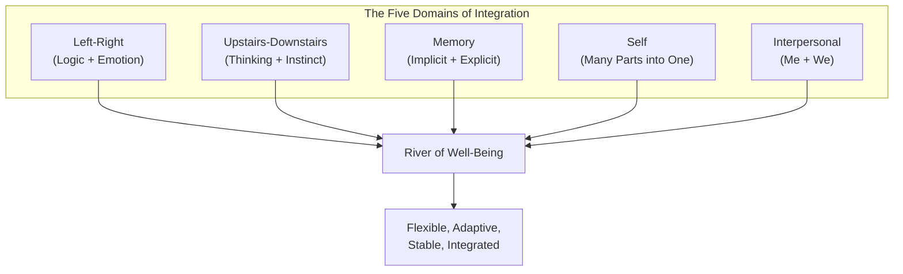
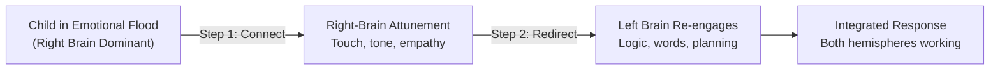
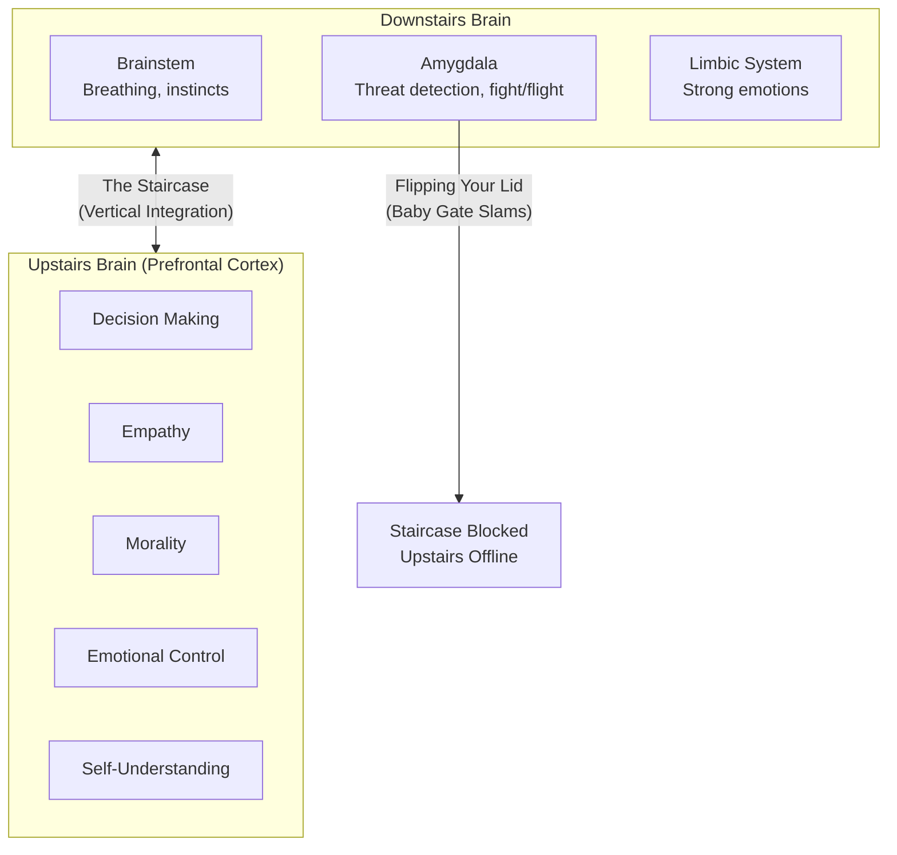
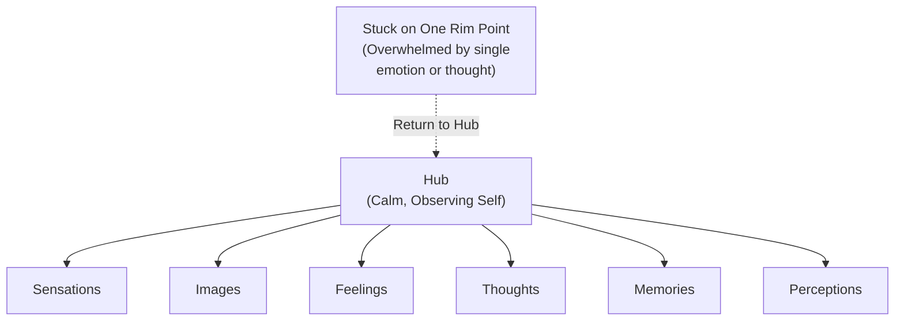
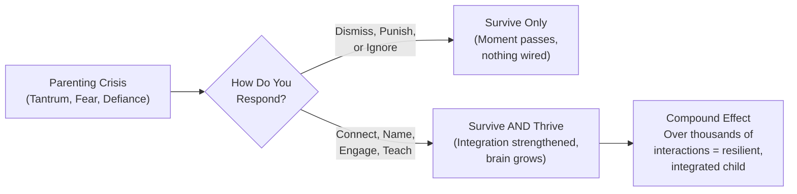
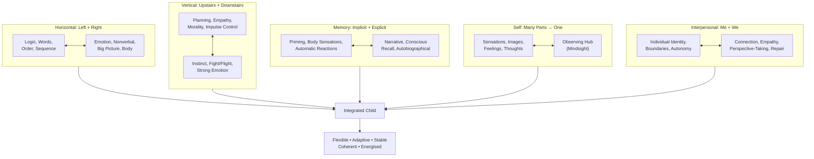
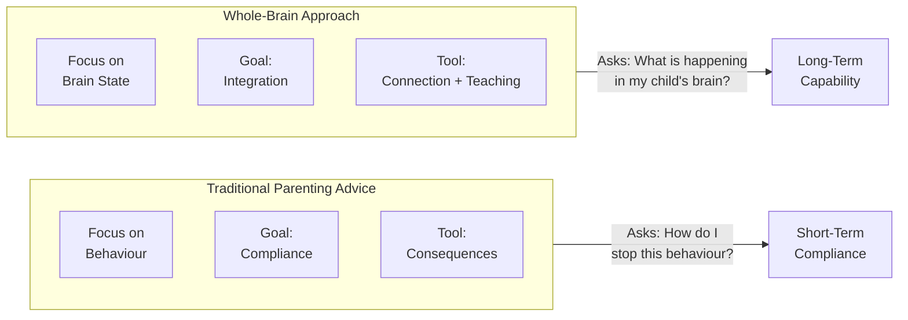
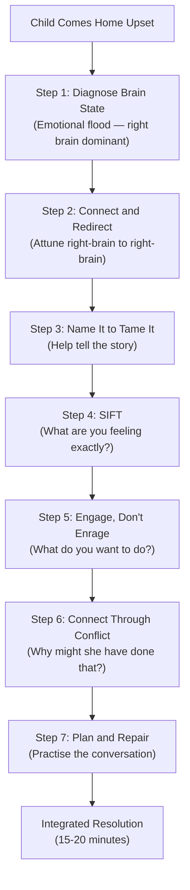

# The Whole-Brain Child — Daniel J. Siegel & Tina Payne Bryson

> Your child's brain has many different parts with different jobs — a left side that loves logic and a right side that processes emotions, an upstairs that handles sophisticated thinking and a downstairs that fires instinctual reactions. Most everyday parenting struggles — tantrums, meltdowns, anxiety, rigidity — happen when these parts are not working together. The authors call this dis-integration, and they argue that every difficult parenting moment is also an opportunity to help wire your child's brain toward wholeness. This book gives you twelve concrete strategies to do exactly that — turning survive moments into thrive moments, one neural connection at a time.

---

## About the Author

Daniel J. Siegel is a clinical professor of psychiatry at the UCLA School of Medicine and founding co-director of the Mindful Awareness Research Center. He developed the field of interpersonal neurobiology, which examines how relationships shape the structure of the brain. His earlier books — *The Developing Mind* and *Mindsight* — laid the scientific groundwork. Siegel is known for his "hand model of the brain," which has become one of the most widely used teaching tools in parenting and therapy worldwide.

Tina Payne Bryson is a pediatric and adolescent psychotherapist, the founder and executive director of The Center for Connection, and the author and co-author of multiple parenting books. She specializes in translating complex neuroscience into practical strategies that parents can use in real time. This was the first of several collaborations between Siegel and Bryson — they went on to write *No-Drama Discipline*, *The Power of Showing Up*, and *The Yes Brain*.

Together they bring a rare combination: Siegel provides the neuroscience framework, and Bryson pressure-tests every strategy against the reality of parenting young children (she has three sons of her own). The result is a book that is scientifically rigorous without ever feeling academic.

---

## The Big Idea

- <b style="color: #2980b9">Integration is the key to mental health</b>: when the different parts of the brain work together as a coordinated whole, children are flexible, adaptive, stable, and capable of understanding themselves and the world
- <b style="color: #e74c3c">Dis-integration causes most parenting struggles</b>: tantrums, aggression, anxiety, rigidity, and defiance are symptoms of brain regions that are not communicating, not signs of a "bad kid"
- <b style="color: #27ae60">Every survive moment is a thrive moment</b>: the chaotic, frustrating moments are precisely when the brain is most open to being wired toward integration — you do not need special time, you need to use the time you already have
- The brain is plastic — it physically changes in response to experience. Neurons that fire together wire together. The experiences you provide as a parent literally shape the architecture of your child's brain
- Integration happens on multiple axes: left-right (logic and emotion), upstairs-downstairs (rational thinking and instinct), memory (implicit and explicit), self (many parts into one), and interpersonal (me and we)
- Children's brains are works in progress — the prefrontal cortex is not fully developed until the mid-twenties. Expecting consistent rational behavior from a child is expecting hardware that has not been installed yet

---

## Key Concepts at a Glance

| Concept | One-line summary |
|---------|-----------------|
| **Integration** | Linking differentiated parts of the brain so they work as a coordinated whole |
| **River of Well-Being** | Mental health as a flow between the banks of chaos (out of control) and rigidity (over-controlled) |
| **Horizontal integration** | Left brain (logic, words, order) working with right brain (emotion, nonverbal, big picture) |
| **Vertical integration** | Upstairs brain (prefrontal cortex — planning, empathy, morality) working with downstairs brain (brainstem, limbic — instinct, emotion) |
| **Connect and redirect** | First attune to the emotional right brain, then engage the logical left brain |
| **Name it to tame it** | Retell stories of difficult experiences to integrate emotion with narrative |
| **Flipping your lid** | When the amygdala hijacks the upstairs brain, shutting off rational thinking |
| **Upstairs vs downstairs tantrum** | Upstairs = strategic (set limits); downstairs = overwhelmed (soothe first) |
| **Implicit memory** | Memories that affect us without awareness — priming, body sensations, emotional reactions |
| **Explicit memory** | Conscious recall of specific events and facts |
| **Mindsight / SIFT** | The ability to observe your own mind: Sensations, Images, Feelings, Thoughts |
| **Wheel of Awareness** | Hub (calm center of observation) surrounded by rim (all the points of attention) |

---

Left-right and upstairs-downstairs integration dominate daily parenting moments (tantrums, meltdowns, defiance), while memory and self-integration strategies apply in quieter but equally important reflective moments — explaining why "connect and redirect" feels like the book's most-used tool.

## 30-Second Version

Your child's brain is not yet integrated — the different regions do not work together smoothly, which is why kids have meltdowns, defy logic, and seem irrational. Twelve strategies help you wire these regions together through everyday interactions. When emotions flood: connect with the right brain before redirecting with the left. When instincts hijack: engage the upstairs brain rather than triggering the downstairs. When painful memories linger: retell the story to make the implicit explicit. When emotions feel permanent: teach kids that feelings are like clouds — they pass. When self-awareness is missing: use SIFT (Sensations, Images, Feelings, Thoughts) to build mindsight. When relationships rupture: use conflict as practice for empathy and repair. Every difficult moment is a chance to build a more integrated brain.

---

The treemap reveals that left-right integration (particularly "Connect and Redirect") and upstairs-downstairs integration (the tantrum-management strategies) occupy the largest share of the book's attention, reflecting the reality that these are the integration challenges parents face most frequently in daily life.

## Chapter 1: Parenting with the Brain in Mind

*Parents are often experts about their children's bodies — they know what temperature counts as a fever and which foods wire a child before bedtime — but most lack basic information about their child's brain. This chapter introduces the single concept that changes everything: integration.*

The brain has many different parts with different jobs. The left hemisphere organizes thoughts logically. The right hemisphere processes emotions. The brainstem handles survival instincts. The prefrontal cortex manages planning and empathy. Each part does its own work — but the brain functions best when all the parts are linked together and working as a team.

> [!tip] The River of Well-Being
> Imagine a peaceful river. One bank is **chaos** — being overwhelmed, out of control, drowning in emotion. The other bank is **rigidity** — being inflexible, controlling, shut down. Mental health means floating in the calm flow between the two. Integration keeps you in the flow. Dis-integration pushes you toward one bank or the other.

When your three-year-old refuses to share and erupts into screaming, that is chaos — the right brain flooding with emotion, no logic in sight. When your ten-year-old coldly says "I don't care" about losing a friend, that is rigidity — the left brain walling off painful emotion. Both are signs of dis-integration, and both signal that a child needs help reconnecting the parts of their brain.

> [!example] Marco and "Eea Woo Woo"
> Two-year-old Marco witnessed his babysitter having an epileptic seizure while driving. An ambulance took the babysitter away. Marco kept repeating "Eea woo woo" — his words for "Sophia" and the siren. Instead of distracting him with ice cream, his mother helped him retell the story again and again over the following days. Each retelling connected the emotional right brain (fear, confusion) with the narrative left brain (what happened, in what order, and how it ended). Within days, Marco stopped bringing up the accident. He had integrated the experience.

The mechanism behind integration is neuroplasticity. The brain physically changes in response to experience. Neurons that fire together wire together. Every interaction you have with your child — the stressful ones and the wonderful ones — shapes the actual structure of their brain.

> [!warning] The Upstairs Brain Is Under Construction
> The prefrontal cortex — responsible for planning, empathy, impulse control, moral reasoning, and self-understanding — is not fully developed until the mid-twenties. Expecting a child to consistently regulate emotions, think before acting, and show empathy is expecting a part of the brain that literally has not been built yet. This does not excuse bad behavior, but it calibrates your expectations.

---

## Chapter 2: Two Brains Are Better Than One — Left and Right Integration

*The left brain is logical, literal, linguistic, and linear. The right brain is emotional, nonverbal, experiential, and autobiographical. Young children are heavily right-brain dominant. The goal is not to suppress either side, but to help them work together.*

| Left Brain | Right Brain |
|-----------|------------|
| Logical | Emotional |
| Literal | Metaphorical |
| Linguistic (words) | Nonverbal (tone, gesture, expression) |
| Linear (sequence, order) | Holistic (big picture, meaning) |
| Letter of the law | Spirit of the law |
| Text | Context |

> [!danger] The Emotional Flood vs the Emotional Desert
> When the right brain takes over without the left, a child drowns in an **emotional flood** — screaming, irrational, unable to hear reason. When the left brain takes over without the right, a child retreats into an **emotional desert** — cold, shut down, denying real feelings. Neither is healthy. Integration means having access to both.

### Strategy #1: Connect and Redirect

When a child is in an emotional flood (right brain dominant), logic will not work. The left brain is offline. Trying to reason with a flooded child is like speaking French to someone who only speaks Japanese.

**Step 1 — Connect with the right brain.** Use physical touch, empathetic facial expressions, a nurturing tone. Attune to what the child is feeling. Let them "feel felt."

**Step 2 — Redirect with the left brain.** Once the emotional wave passes and connection is established, bring in logic, explanation, and problem-solving.

> [!example] Tina's Son at Bedtime
> Her seven-year-old reappeared in the living room after bedtime, furious: "You never leave me a note in the middle of the night! You never do anything nice for me! My birthday isn't for ten months! I hate homework!" None of it was logical. Instead of arguing or sending him back to bed, Tina pulled him close, rubbed his back, and said, "Sometimes it's just really hard, isn't it?" Within five minutes he relaxed, shared what was really bothering him (feeling his younger brother got more attention), and went back to bed. Had she led with logic and discipline, it would have taken far longer and damaged the connection.

### Strategy #2: Name It to Tame It

When children experience something frightening or painful, help them retell the story. Putting an experience into narrative order (left brain) while accessing the emotions and sensory details (right brain) integrates the two hemispheres and literally calms the emotional circuitry.

> [!example] Katie's School Refusal
> Four-year-old Katie loved school — until she got sick in class one day and her father had to pick her up. After that, she screamed every morning, clung to her father's leg at drop-off, and shouted "I'll die if you leave me!" Her brain had linked: school = feeling sick = Dad gone = afraid. Her father did not dismiss or deny her feelings. Instead, he helped her retell the story: "First we got ready, you wore your red pants, we had waffles... then you got to school... then what happened?" Over several retellings, Katie's fear lost its power. She regained her love of school.

> [!tip] Research Finding
> Simply assigning a name or label to what you feel literally calms down the activity of the emotional circuitry in the right hemisphere. This is why journaling and talking about difficult events are powerful healing tools — and why "Name it to tame it" works with children as young as ten to twelve months.

---

## Chapter 3: Building the Staircase of the Mind — Upstairs and Downstairs Integration

*The brain is like a two-story house. The downstairs brain (brainstem and limbic system) handles basic functions, instincts, and strong emotions. The upstairs brain (prefrontal cortex) handles planning, empathy, morality, impulse control, and self-understanding. A metaphorical staircase connects them — and our job is to help build and reinforce that staircase.*

The downstairs brain is well developed even at birth. The upstairs brain is under massive construction for the first several years of life and does not fully mature until the mid-twenties. This means children often get "trapped downstairs" — flooded with emotion and instinct, unable to access rational thinking.

> [!warning] The Amygdala — Baby Gate of the Mind
> The amygdala is an almond-shaped structure in the limbic system. Its job is to process threat and strong emotion. When it senses danger — real or perceived — it hijacks the upstairs brain, slamming a baby gate across the bottom of the staircase. This is why a three-year-old who is furious about the wrong colour Popsicle literally cannot hear your logic. The amygdala has taken the upstairs brain offline.

### The Hand Model of the Brain

Siegel's famous teaching tool: make a fist with your thumb tucked inside your fingers. Your wrist and palm represent the brainstem (downstairs). Your thumb represents the limbic area (amygdala, hippocampus). Your folded fingers represent the prefrontal cortex (upstairs). When you "flip your lid" — fingers flying up — the rational brain goes offline and the emotional, reactive brain is exposed. This is what happens during a meltdown.

### Two Types of Tantrums

| | Upstairs Tantrum | Downstairs Tantrum |
|---|---|---|
| **What's happening** | Child consciously decides to act out | Child is genuinely overwhelmed; amygdala has hijacked |
| **Can they stop?** | Yes — if you give in or set a clear consequence | No — they have lost access to their upstairs brain |
| **Your response** | Set firm boundaries. "If you don't stop, you lose the privilege." Never negotiate with a terrorist. | Soothe first. Connect. Be a safe harbour. Logic and consequences come later. |
| **The test** | Could they instantly stop if you offered something they wanted? If yes: upstairs. | Are they truly out of control, beyond reason? If yes: downstairs. |

> [!danger] Discipline Timing
> When a child is in a downstairs tantrum, there is no point discussing consequences or appropriate behaviour. The upstairs brain is offline and cannot process the lesson. Wait until the storm passes, then teach. You are a lifeguard who swims out and brings the child to shore *before* telling them not to swim so far next time.

### Strategy #3: Engage, Don't Enrage

Ask yourself in every tense moment: which part of my child's brain am I appealing to? Am I engaging the upstairs brain (inviting them to think, negotiate, problem-solve)? Or am I triggering the downstairs brain (provoking fight-or-flight with threats and ultimatums)?

> [!example] The Quesadilla Negotiation
> Tina's four-year-old was making angry faces from behind a pillar in a restaurant because his father said he had to eat half his quesadilla before dessert. Instead of demanding compliance (which would have triggered the reptilian brain), Tina crouched to his level and said, "You look angry. Daddy's really good at negotiating. Decide what you think would be fair, and go talk to him." The boy thought hard, then announced: "I've got one word for you: Ten bites." Ten bites was actually *more* than half. Crisis averted. The upstairs brain won.

### Strategy #4: Use It or Lose It

The upstairs brain is a muscle — it strengthens with exercise. Give children practice at:
- **Decision making:** "Do you want blue shoes or white shoes?" (young) / "How will you handle the scheduling conflict?" (older)
- **Emotional control:** Deep breaths, counting to ten, punching a pillow — all alternatives to lashing out
- **Self-understanding:** "Why do you think you made that choice?" / "What were you feeling when that happened?"
- **Empathy:** "Why do you think that baby is crying?" / "How do you think your friend felt?"
- **Morality:** "Would it be OK to run a red light in an emergency?" / "What would you do if a bully was picking on someone and no adults were around?"

### Strategy #5: Move It or Lose It

When the downstairs brain has hijacked, physical movement can reset the system. Research shows that changing your physical state changes your emotional state.

> [!example] Liam's Run
> Ten-year-old Liam was overwhelmed by homework on the second day of fifth grade. He curled up under a beanbag chair, refusing all help. Then he suddenly jumped up, ran out the front door, and sprinted several blocks through the neighbourhood. When he returned, he was calm and ready to work. His body had released the stress hormones, his amygdala calmed, and his upstairs brain came back online. He told his mother: "I felt like running as fast as I could would make me feel better. And it did."

---

## Chapter 4: Kill the Butterflies — Integrating Memory

*There are two types of memory: implicit (affects you without awareness) and explicit (conscious recall). When implicit memories go unprocessed, they create mysterious fears, inexplicable behaviours, and emotional triggers. The solution is to make the implicit explicit — to shine the light of awareness on what is operating in the dark.*

### Implicit vs Explicit Memory

| Implicit Memory | Explicit Memory |
|----------------|----------------|
| Operates below conscious awareness | Conscious, deliberate recall |
| Begins forming before birth | Develops from about 18 months |
| Encodes perceptions, emotions, body sensations, behavioural patterns | Encodes factual knowledge and autobiographical events |
| Creates mental models and priming | Creates narrative — "this happened, then this" |
| You do not know you are remembering | You know you are remembering |
| Example: you change a diaper without thinking about the steps | Example: you recall the first time you changed a diaper |

> [!warning] The Danger of Unprocessed Implicit Memory
> When an experience is encoded implicitly but never made explicit, it creates triggers that the child does not understand. The body reacts, the emotions fire, but the child has no narrative framework to explain *why*. This is the mechanism behind phobias, unexplained anxiety, and PTSD.

> [!example] Kill the Butterflies
> Tina's seven-year-old refused swimming lessons despite loving to swim. He could not explain why — he just had "butterflies in his stomach." Three years earlier, he had been in a swim programme with harsh instructors who forced him off the diving board and held his head underwater. His brain had encoded: swimming lessons = danger. By helping him connect his current butterflies to the past experience, Tina made the implicit explicit. She taught him to talk to his brain: "Those bad lessons were in the past. This is a new teacher, a new pool, and I already know how to swim." His code phrase when anxiety returned: "Kill the butterflies."

### Strategy #6: Use the Remote of the Mind

When children need to revisit a painful memory, give them a sense of control. Imagine they have a remote control: they can pause the story, rewind, fast-forward past the scary parts, or even mute it. This lets them approach difficult memories at their own pace rather than being overwhelmed.

### Strategy #7: Remember to Remember

Make recollection a natural part of family life. Ask children about their day — not just "How was school?" but specific questions that exercise explicit memory: "What was the funniest thing that happened?" "Did anything surprise you?" "What was hard today?" Dinner conversations, bedtime chats, and car rides are all opportunities to help children practise integrating their experiences into coherent narratives.

> [!tip] The Power of Storytelling
> The drive to understand why things happen is so strong that the brain will keep trying to make sense of an experience until it succeeds. Helping children tell their stories — putting events in order, naming emotions, seeing cause and effect — is one of the most powerful tools parents have. Do not avoid talking about upsetting experiences. Retelling is exactly what children need to process and move forward.

---

## Chapter 5: The United States of Me — Integrating the Many Parts of the Self

*A child is not one thing. They contain multitudes — sensations, images, feelings, thoughts, all shifting from moment to moment. Integration of self means helping children observe these internal states without being captured by any single one. The key skill is mindsight.*

Mindsight is the ability to see your own mind — to pay attention to what is happening inside you and to understand that your internal states are temporary and observable, not permanent and defining.

### Strategy #8: Let the Clouds of Emotion Roll By

Teach children that feelings are temporary states, not permanent identities. Emotions are like clouds — they drift across the sky of the mind, change shape, and pass. You are not the cloud. You are the sky.

> [!success] The Shift in Language
> Instead of "I am sad" (which fuses identity with emotion), help children say "I feel sad right now" or "I notice sadness." This small linguistic shift creates psychological distance between the child and the emotion, making it easier to observe rather than be overwhelmed.

### Strategy #9: SIFT — Paying Attention to What's Going On Inside

Teach children to SIFT through their internal experience:
- **S**ensations — what does your body feel? (tight stomach, heavy chest, warm face)
- **I**mages — what pictures come to mind?
- **F**eelings — what emotion is present? (anger, fear, sadness, excitement)
- **T**houghts — what is your mind telling you?

This is a practical mindsight exercise. When children learn to SIFT, they develop the ability to pause, observe, and choose how to respond — rather than reacting on autopilot.

### Strategy #10: Exercise Mindsight — Getting Back to the Hub

> [!tip] The Wheel of Awareness
> Imagine a bicycle wheel. The **hub** is the calm centre of awareness — the observing self. The **rim** is everything you can pay attention to: sights, sounds, thoughts, feelings, memories, body sensations. When a child gets stuck on one point of the rim (a frightening thought, an overwhelming emotion), they lose access to the hub. The goal is to help them return to the hub — to the place from which they can observe the rim point without being consumed by it.

"I notice that I'm feeling really angry right now" is a hub statement. "I'M FURIOUS AND EVERYTHING IS TERRIBLE" is stuck on the rim.

---

## Chapter 6: The Me-We Connection — Integrating Self and Other

*The final domain of integration is interpersonal — helping children connect to others while maintaining their own identity. This is not just about "playing nicely." It is about wiring the brain's empathy and relational circuits through real experience.*

Humans are wired for connection. Mirror neurons — brain cells that fire both when we perform an action and when we observe someone else performing it — are the neural basis of empathy. When your child sees you smile, their mirror neurons fire as if they are smiling too. This is how emotional states are contagious, and why a parent's own emotional regulation directly shapes a child's brain development.

### Strategy #11: Increase the Family Fun Factor

Positive shared experiences wire the brain for connection. Play, laughter, silliness, and adventure together build the neural infrastructure of healthy relationships. This is not an indulgence — it is brain architecture.

> [!success] Why Fun Matters Neurologically
> When families enjoy each other, the brain releases dopamine and oxytocin — neurotransmitters that reinforce bonding and make relational circuits stronger. A child who has a deep reservoir of positive relational experiences is better equipped to handle conflict, because their default neural setting is "connection is safe and good."

### Strategy #12: Connect Through Conflict

Conflict is not the enemy of relationship — it is a training ground for it. Every argument between siblings, every disagreement with a parent, is an opportunity to practise empathy, perspective-taking, communication, and repair.

Teach children three skills during conflict:
1. **See through the other person's eyes** — "How do you think your sister felt when you said that?"
2. **Listen to what is not being said** — read tone, body language, facial expression (right-brain nonverbal skills)
3. **Repair after rupture** — conflict damages connection; repair restores it. The ability to come back together after a disagreement is more important than avoiding disagreements in the first place

> [!example] Sibling Conflict as Integration Practice
> Instead of simply separating fighting siblings (a survival technique that misses the opportunity), use the conflict to teach: reflective listening, clearly communicating your own desires, compromise, negotiation, and forgiveness. Over time, each child's brain becomes more proficient at handling conflict without parental intervention.

> [!tip] The Repair Conversation Template
> After any conflict or rupture in relationship — between parent and child, or between siblings — model the repair: "I'm sorry I raised my voice. I was frustrated, and I lost my cool. That wasn't fair to you. Can we talk about what happened?" This teaches children that relationships survive mistakes, and that taking responsibility is a strength, not a weakness.

---

## Practical Application: Before and After

| Situation | Without Whole-Brain Approach | With Whole-Brain Approach |
|-----------|---------------------------|--------------------------|
| **Tantrum at the store** | "Stop that right now or we're leaving!" (triggers downstairs brain, escalates) | Identify upstairs vs downstairs tantrum. If downstairs: soothe, connect, wait for calm, then discuss. If upstairs: set firm limits calmly. |
| **Child says "I hate you"** | "Don't you dare speak to me like that!" (rigidity — shuts down communication) | Connect: "You're really upset right now." Wait for calm. Redirect: "Those are strong words. Can you tell me what you're actually feeling?" |
| **Unexplained fear** | "There's nothing to be afraid of. Just do it." (dismisses implicit memory) | "I wonder if your brain is remembering something from before. Let's talk about what happened and see if that's where the butterflies come from." |
| **Sibling fight** | Separate them. Send to rooms. (survive only) | Separate if needed for safety, then use the conflict to practise perspective-taking and repair. |
| **Child refuses to talk about a bad day** | "Fine, don't tell me." (retreats to emotional desert) | Respect timing. Try again during an activity. Start the story yourself. Ask about specific moments. |
| **Bedtime emotional dump** | "It's bedtime. We'll talk tomorrow." (misses the window) | Connect right-brain to right-brain first. Five minutes of attunement now saves thirty minutes of escalation. |

---

## The Integrating Ourselves Principle

> [!warning] You Cannot Give What You Do Not Have
> Every chapter ends with an "Integrating Ourselves" section, reinforcing a crucial principle: the most powerful thing you can do for your child's brain development is to develop your own integration. Children's brains *mirror* their parents' brains. If you are dis-integrated — chronically flooded or chronically rigid — your child's brain wires accordingly. Your own growth is not selfish. It is one of the most generous gifts you can give your child.

Specific self-integration practices:
- Notice when you are flooding (chaos) or shutting down (rigidity) and name it
- Use SIFT on yourself: what am I sensing, imaging, feeling, thinking right now?
- When you flip your lid: stop, do no harm, remove yourself, collect yourself, then repair quickly
- Model the repair conversation — let your children see you take responsibility for your mistakes
- Reflect on your own childhood attachment experiences (explored in depth in *Parenting from the Inside Out*)

---

## Ages and Stages Quick Reference

| Age | What's Developing | Priority Strategies |
|-----|-------------------|-------------------|
| **0-3** | Right-brain dominant. Implicit memory forming. Limited language. | Connect and Redirect. Name It to Tame It (parent tells the story). Physical soothing. |
| **3-6** | Left brain coming online ("Why?" stage). Upstairs brain under heavy construction. Amygdala easily triggered. | Engage Don't Enrage. Use It or Lose It (simple choices). Move It or Lose It. Teach the hand model. |
| **6-9** | Growing capacity for narrative. Can understand brain concepts. Working memory expanding. | Name It to Tame It (child tells the story). SIFT. Remote of the Mind. Remember to Remember. |
| **9-12** | Prefrontal cortex strengthening. Capable of empathy and moral reasoning with practice. Peer relationships intensifying. | Connect Through Conflict. Exercise Mindsight (Wheel of Awareness). Complex decision-making practice. |

---

## The Hand Model of the Brain — Explained

This is Siegel's most famous teaching tool, and it is worth learning well enough to teach your children.

1. **Hold up your hand with fingers extended.** Your wrist and the base of your palm represent the **brainstem** — the most primitive part of the brain, handling basic functions like breathing and the fight/flight response.

2. **Fold your thumb across your palm.** Your thumb represents the **limbic system** — particularly the amygdala (threat detection) and hippocampus (memory). This is the emotional centre.

3. **Curl your fingers over your thumb.** Your fingers represent the **prefrontal cortex** — the upstairs brain. Notice how your fingertips rest on top of your thumb. This represents the prefrontal cortex's ability to regulate and modulate the limbic system's emotional responses. When the upstairs and downstairs are connected (fingers curled over thumb), you can think clearly even when emotions are present.

4. **Now flip your fingers up — open the fist.** This is "flipping your lid." The prefrontal cortex (fingers) has lost contact with the limbic system (thumb). The amygdala is exposed and in charge. You are reactive, impulsive, unable to think clearly or empathise.

> [!success] Teaching This to Children
> Children as young as four or five can learn the hand model. When a child understands what "flipping your lid" means neurologically, they gain a vocabulary for their experience: "I think I flipped my lid" becomes a moment of mindsight rather than just a meltdown. It gives them a story about what happened inside their brain — which is itself a form of integration (naming it to tame it).

This hand model works for parents too. When you feel yourself about to lose it, look at your hand. Are your fingers still curled? Or have you flipped your lid? The physical gesture can serve as both a diagnostic and a reminder to pause.

---

## Deep Dive: Implicit Memory — The Invisible Force

Implicit memory is arguably the most underappreciated concept in the book, and the one with the widest practical applications.

From the moment of birth (and even before — Dan's unborn children recognised his voice and a Russian lullaby he sang through the amniotic fluid), the brain encodes implicit memories: perceptions, emotions, body sensations, and behavioural patterns. These memories shape our expectations and our automatic responses without our awareness that anything is being "remembered."

### How Implicit Memory Creates Problems

When an experience is encoded implicitly but never integrated into explicit (narrative) memory, it creates a ghost — an emotional and physical response that activates without any context or explanation.

> [!example] The Ballet Class and Bubble Gum
> A child gets bubble gum after ballet class once. Neurons that fire together wire together. Now every time ballet ends, the child expects bubble gum. She does not consciously think "I received gum after ballet on March 3rd and therefore anticipate it again." She simply *wants gum* when ballet ends. The implicit memory has created a priming effect — an expectation without a narrative.

This is harmless with bubble gum. It is not harmless with trauma. A child who was once frightened by a dog may develop a phobia without any conscious memory of the original event. Their body tenses, their heart races, their amygdala fires — all in response to an implicit memory they do not know they have.

### How to Make the Implicit Explicit

The solution is to help the child create a narrative — to bring the implicit memory into conscious awareness where it can be examined, understood, and integrated.

1. **Notice the pattern.** When does your child react disproportionately? What triggers seem to activate responses that do not match the current situation?

2. **Explore with curiosity.** "I notice you get really nervous around swimming pools. I wonder if your brain is remembering something."

3. **Help build the story.** "Remember those swimming lessons when you were little? The teachers were really rough. That was scary. And your brain learned: swimming lessons = scary. But these are different lessons."

4. **Create a coping phrase.** Tina's son chose "Kill the butterflies" — a code phrase that reminded him the fear was from the past, not the present.

> [!tip] The "Remote of the Mind" Extension
> For children who find it overwhelming to retell a painful story from beginning to end, offer them an imaginary remote control. They can pause the story when it gets too intense. They can fast-forward past the scariest part. They can rewind and watch it again from a safe distance. This gives them control over the pace of integration.

---

## Deep Dive: Mirror Neurons and Why Your State Matters

Chapter 6 introduces the concept of mirror neurons — brain cells that fire both when you perform an action and when you observe someone else performing it. When your child sees you smiling, neurons in their brain fire as if *they* are smiling. When they see you panicking, their mirror neurons fire for panic.

This has profound implications:

- **Your emotional state is contagious.** If you approach a tantrum in a state of calm attunement, your child's mirror neurons begin pulling them toward calm. If you approach in a state of agitation, you amplify their dysregulation.

- **You teach by being, not just by saying.** Telling your child to "calm down" while your own voice is tense and your body is rigid sends contradictory signals. Your right brain (which processes nonverbal cues) is broadcasting one message while your left brain (words) broadcasts another. Children trust the nonverbal signal.

- **Repair is modelled, not lectured.** When you flip your lid and then come back to apologise, your child's mirror neurons fire for the entire sequence: dysregulation → recognition → accountability → reconnection. This is how they learn to repair their own relationships.

> [!success] The Most Important Thing You Can Do
> "One of the best ways to promote integration in our children is to become better integrated ourselves." This single sentence may be the most important in the book. It means that your own therapy, your own mindfulness practice, your own willingness to examine your childhood patterns — these are not luxuries. They are parenting strategies.

---

## The Survive-and-Thrive Framework

The book opens and closes with this framework, and it is worth stating explicitly:

**Survive** = getting through the difficult moment (the tantrum, the meltdown, the defiance, the fear, the sibling war)

**Thrive** = using that moment to build integration in your child's brain

The revolutionary claim is that these are not separate activities. You do not survive now and thrive later during "quality time." The survive moment *is* the thrive moment. The crisis *is* the curriculum.

Every time your child is dis-integrated — flooded with emotion, rigid with fear, reactive with anger — they are in a state of maximum neuroplasticity. Their brain is actively seeking a pathway out of the chaos. The pathway you offer (connection, then redirection; naming, then taming; engaging the upstairs rather than enraging the downstairs) becomes the pathway that gets wired.

> [!success] The Core Reframe
> Instead of thinking "Here we go again — another meltdown to survive," think "Here's another opportunity to strengthen the integrative fibres in my child's brain." The meltdown is not an interruption of parenting. It *is* parenting.

---

## Ages and Stages Quick Reference

| Age | What's Developing | Priority Strategies | What This Looks Like in Practice |
|-----|-------------------|-------------------|--------------------------------|
| **0-12 months** | Right-brain dominant. Implicit memory forming. No language yet. Attachment bonds forming. | Connect and Redirect (through soothing touch and voice). Physical co-regulation. | Hold, rock, sing. Your calm nervous system regulates theirs. Every responsive interaction says: "You are safe. I am here." |
| **1-3 years** | Language emerging. Beginning to understand cause and effect. Amygdala fires easily. Very limited impulse control. | Name It to Tame It (parent tells the story). Move It or Lose It. Simple left-brain engagement ("Let's talk about what happened"). | After a fall: "You were running, and you tripped, and it hurt. Ouch! And then Mummy picked you up, and now you're OK." |
| **3-6 years** | Left brain coming online ("Why?" stage). Upstairs brain under heavy construction. Can understand simple brain concepts. | Engage Don't Enrage. Use It or Lose It (simple choices: "blue shoes or white?"). Teach the hand model. | "Your fingers flew up! You flipped your lid! Let's take some breaths and fold them back down." |
| **6-9 years** | Growing capacity for narrative. Can understand brain concepts well. Working memory expanding. Peer relationships growing. | Name It to Tame It (child tells the story). SIFT. Remote of the Mind. Remember to Remember. | "Let's use the remote. You can pause the story whenever you need to. What happened first?" |
| **9-12 years** | Prefrontal cortex strengthening. Capable of empathy and moral reasoning with practice. Peer relationships intensifying. Pre-adolescent emotional complexity. | Connect Through Conflict. Exercise Mindsight (Wheel of Awareness). Complex decision-making practice. Negotiate, don't dictate. | "I can see you and your sister are both really upset. Before we solve this, can each of you tell me what happened from the other person's perspective?" |

The chart shows a clear developmental progression: physical strategies like "Connect and Redirect" and "Move It or Lose It" peak in the earliest years when language is limited, while cognitive strategies like SIFT, Exercise Mindsight, and Connect Through Conflict become increasingly powerful as the prefrontal cortex develops through ages 9-12.

---

## Key Phrases to Remember

These are phrases from the book that capture entire strategies in a sentence:

| Phrase | What It Means |
|--------|--------------|
| "Connect and redirect" | Attune emotionally first, solve logically second |
| "Name it to tame it" | Putting feelings into words calms the emotional brain |
| "Engage, don't enrage" | Appeal to the thinking brain, not the reactive brain |
| "Use it or lose it" | The upstairs brain is a muscle — exercise it |
| "Move it or lose it" | Physical movement resets emotional states |
| "Neurons that fire together wire together" | Every experience physically shapes the brain |
| "Flipping your lid" | When the prefrontal cortex goes offline and the amygdala takes over |
| "Survive and thrive" | Every crisis is also an opportunity to build integration |
| "The river of well-being" | Mental health as the flow between chaos and rigidity |
| "Feel felt" | The experience of being understood at an emotional level — the foundation of attunement |
| "You can't teach a drowning person to swim" | First rescue, then educate — connect before you redirect |
| "Repair, repair, repair" | Ruptures in relationship are inevitable; repair is what builds trust |

---

## Integration Across All Five Domains: A Summary Diagram

---

## What Changes After Reading This Book

For parents who fully absorb and practise the whole-brain approach, these shifts tend to occur:

**In how you see your child:**
- Meltdowns shift from "bad behaviour" to "dis-integration" — a diagnostic shift that changes everything
- Defiance shifts from "disrespect" to "the upstairs brain is offline right now"
- Mysterious fears and aversions make sense as implicit memory at work
- "She's being difficult" becomes "She's *having* a difficult time"

**In how you respond:**
- You connect before you correct
- You diagnose the tantrum type before choosing your response
- You ask "Which part of the brain am I appealing to?" before opening your mouth
- You retell stories after difficult experiences rather than avoiding them
- You help children name specific emotions rather than settling for "I'm fine" or "I'm upset"

**In how you see yourself:**
- You recognise your own flipped lids and repair faster
- You notice when you are in an emotional flood or desert
- You understand that your own integration is not selfish — it is a parenting strategy
- You give yourself permission to be imperfect, because repair is integration

**In your family culture:**
- Conflict becomes a training ground, not something to be feared
- Storytelling becomes a daily practice
- "What are you feeling?" becomes a normal question
- Siblings learn to take perspectives and repair
- Everyone in the house has a shared vocabulary: flipping the lid, the river, connect and redirect

---

## Deep Dive: The Neuroscience of "Neurons That Fire Together Wire Together"

The phrase sounds like a slogan, but it describes a literal physical process. When your child has an experience — hearing a story, feeling frightened, being comforted after a fall — specific neurons in their brain activate. If those neurons fire at the same time as other neurons, they form connections. Repeat the experience, and those connections strengthen. Over time, these connections become pathways — the brain's equivalent of well-worn trails through a forest.

This is why consistency matters more than perfection. You do not need to execute a flawless "connect and redirect" every single time. You need to do it *often enough* that your child's brain builds the pathway: "When I am upset, someone connects with me, and then we figure it out together." That pathway becomes the child's default response to distress — first internally (they learn to connect with themselves), and then externally (they learn to connect with others).

> [!tip] Repetition Is Not Failure
> When your child has the same meltdown for the third time this week about the same issue, it can feel like nothing is working. But each time you respond with attunement and then redirection, you are strengthening the integrative fibres in their brain. The fact that they need repetition is not a sign of failure — it is a sign that the brain is still under construction and the pathway is not yet automatic. This is exactly how learning works.

The flip side is also true. If a child's repeated experience is dismissal ("Stop crying, it's not a big deal"), threat ("If you don't stop, you'll be sorry"), or chaos (unpredictable parental reactions), those are the pathways that get wired. The brain does not judge the quality of the experience — it simply wires what it encounters.

---

## Deep Dive: Why "Just Ignore the Tantrum" Is Incomplete Advice

Traditional parenting advice says to ignore tantrums — and for upstairs tantrums (conscious, strategic behaviour), this is exactly right. If a child is deliberately escalating to get what they want, giving attention reinforces the behaviour.

But for downstairs tantrums — where the child has genuinely lost access to their rational brain — ignoring is not just unhelpful, it can be harmful. A child in a downstairs tantrum is experiencing a neurological event, not making a strategic choice. Their stress hormones are flooding their body, their amygdala has hijacked their prefrontal cortex, and they are in a state of genuine distress.

> [!danger] What Happens When Downstairs Tantrums Are Consistently Ignored
> The child learns: "When I am overwhelmed, no one comes." This does not teach self-regulation — it teaches emotional isolation. The child may eventually stop having visible tantrums, but the internal dysregulation continues. They have not learned to manage their emotions; they have learned to suppress them. This is the path to the emotional desert — rigidity, disconnection, and eventually the kind of shutdown that shows up in adolescence as "I don't care about anything."

The whole-brain approach is not permissive. It does not mean giving in to every demand or abandoning boundaries. It means accurately diagnosing *which type* of tantrum you are seeing and responding accordingly:

| Diagnostic Question | If Yes → Upstairs | If Yes → Downstairs |
|---|---|---|
| Could they stop immediately if offered their favourite treat? | Set firm limits | — |
| Are they making eye contact and speaking strategically? | Set firm limits | — |
| Are they beyond reason, flailing, unable to hear you? | — | Soothe first |
| Did the trigger seem wildly disproportionate to the response? | — | Soothe first |
| Are their fists clenched, body rigid, eyes unfocused? | — | Soothe first |

---

## Common Objections and Responses

> [!warning] "This sounds like coddling."
> It is not. Connecting with a child's emotional state before redirecting with logic is not the same as giving in. You still set boundaries. You still hold consequences. The difference is *sequence* — you connect first, then redirect. This is not softer parenting. It is more effective parenting, because a child cannot learn a lesson while their upstairs brain is offline.

> [!warning] "My parents never did any of this and I turned out fine."
> "Fine" is a spectrum. Many adults who grew up with dismissive or authoritarian parenting have learned to function — but they may also struggle with emotional regulation, intimacy, vulnerability, or self-understanding in ways they have normalised. The question is not whether you can survive without integration, but whether you want to thrive with it.

> [!warning] "I don't have time for this in the middle of a crisis."
> The whole-brain approach often takes *less* time than traditional approaches. Tina's bedtime connect-and-redirect took five minutes. A power struggle over the same issue could easily take thirty. The investment is in learning the framework; the execution is often faster than the alternative.

> [!warning] "What about discipline? Kids need consequences."
> Absolutely. The book is explicitly pro-discipline. But discipline means "to teach" — not "to punish." The most effective teaching happens when the learner's brain is in a receptive state. Connecting first ensures the upstairs brain is online. Then the lesson actually gets through.

---

## The Refrigerator Sheet (Summary of All 12 Strategies)

The book includes a one-page "refrigerator sheet" designed to be photocopied and posted where all caregivers can see it. The core message compressed to its essence:

**Left Brain + Right Brain Integration:**
1. Connect and Redirect — connect emotionally (right) before redirecting logically (left)
2. Name It to Tame It — retell stories to make sense of big emotions

**Upstairs Brain + Downstairs Brain Integration:**
3. Engage, Don't Enrage — appeal to the thinking brain, not the reactive brain
4. Use It or Lose It — exercise the upstairs brain with decisions, empathy practice, moral questions
5. Move It or Lose It — physical movement resets emotional states

**Memory Integration:**
6. Use the Remote of the Mind — give children control over how they revisit painful memories
7. Remember to Remember — make recollection part of daily family life

**Integration of Self:**
8. Let the Clouds of Emotion Roll By — feelings are visitors, not permanent residents
9. SIFT — Sensations, Images, Feelings, Thoughts
10. Exercise Mindsight — return to the hub of the wheel of awareness

**Interpersonal Integration:**
11. Increase the Family Fun Factor — joy wires the brain for connection
12. Connect Through Conflict — teach perspective-taking and repair

---

## What This Book Gets Right That Others Miss

Most parenting books focus on *behaviour* — what the child is doing, and how to make them stop or start. This book focuses on *brain state* — what is happening neurologically, and how to shift the child (and yourself) toward integration. The behaviour changes as a natural consequence of the brain state changing, not the other way around.

This is why the book feels different from reward charts and timeout protocols. It is operating at a deeper level. It does not give you scripts to memorise — it gives you a model that generates the right response in any situation, because you understand *why* your child is acting the way they are.

---

## The Parent's Own Integration: A Quiet Revolution

The "Integrating Ourselves" sections are arguably the most important parts of the book, though they are easy to skim past. Siegel and Bryson make a claim that is both uncomfortable and liberating: **your child's brain mirrors your brain.**

If you are chronically dis-integrated — living in emotional floods or emotional deserts, flipping your lid regularly, unable to repair after ruptures — your child's brain wires to expect and replicate those patterns. Conversely, if you model integration — naming your own emotions, pausing before reacting, taking responsibility, repairing after mistakes — your child's brain wires for that.

> [!success] The Permission to Be Imperfect
> The book does not ask you to be a perfect parent. It asks you to be an *integrating* parent — one who notices when they have flipped their lid, stops the damage, and repairs. The repair itself is integration. Your child does not need you to never lose your temper. They need you to model what happens *after* you lose your temper: accountability, reconnection, and growth.

A mother quoted in the book captures this:
> "I was brought up in a military family. I'm a veterinarian and a trained problem solver, which doesn't help in the empathy department. When my son cried, I would try to solve the problem. Recently I learned about connecting emotionally first — right brain to right brain — which was totally foreign to me. Now I hold my son, listen, and help him tell his story. Then we solve the problem. Everything improved."

---

## The 12 Strategies at a Glance

| # | Strategy | When to Use It | Integration Type |
|---|---------|---------------|-----------------|
| 1 | **Connect and Redirect** | Child is emotionally flooded | Left-Right |
| 2 | **Name It to Tame It** | Child has had a scary or painful experience | Left-Right |
| 3 | **Engage, Don't Enrage** | Tense moment that could escalate | Upstairs-Downstairs |
| 4 | **Use It or Lose It** | Any opportunity to practise decision-making, empathy, self-awareness | Upstairs-Downstairs |
| 5 | **Move It or Lose It** | Child is overwhelmed and stuck | Upstairs-Downstairs |
| 6 | **Use the Remote of the Mind** | Child needs to revisit a painful memory with control | Memory |
| 7 | **Remember to Remember** | Daily life — meals, bedtime, car rides | Memory |
| 8 | **Let the Clouds of Emotion Roll By** | Child believes a feeling is permanent | Self |
| 9 | **SIFT** | Child needs to develop internal awareness | Self |
| 10 | **Exercise Mindsight** | Child is stuck on one emotion or thought | Self |
| 11 | **Increase the Family Fun Factor** | Always — builds relational infrastructure | Interpersonal |
| 12 | **Connect Through Conflict** | Sibling fights, disagreements, ruptures | Interpersonal |

The force graph reveals that while each strategy has a primary integration domain, many also strengthen secondary areas — "Name It to Tame It" builds left-right integration but also strengthens memory, and "SIFT" targets self-integration while exercising the upstairs brain — showing how the twelve strategies form an interconnected web rather than isolated tools.

---

## The Verdict

This is the most important parenting book written in the last twenty years, and it earns that status not through sentimentality but through mechanism.

---

### What Makes This Book Exceptional

Siegel and Bryson do what almost no other parenting authors manage: they give you a *model* of the brain that is simple enough to remember in the heat of a tantrum and accurate enough to actually explain what is happening. The left-right / upstairs-downstairs framework is not a metaphor bolted on top of science — it *is* the science, translated into language a stressed parent can use at 7am while a toddler throws cereal.

The twelve strategies are genuinely practical. "Connect and redirect" alone will transform how you respond to meltdowns. "Name it to tame it" gives you a tool for every frightening or painful experience your child will face. The upstairs-downstairs tantrum distinction changes discipline from a power struggle into a diagnostic question: is my child choosing this behaviour, or has their rational brain gone offline?

### The Deeper Insight

The book's deeper insight is that parenting is not separate from brain development — it *is* brain development. Every interaction you have with your child physically shapes the structure of their brain. This is simultaneously the most empowering and the most sobering idea in the book. You are not just managing behaviour. You are building architecture.

What separates this from other neuroscience-for-parents books is the dual authorship. Siegel brings the science; Bryson brings the parenting reality. Every strategy has been road-tested with real families, and the examples feel recognisable — not idealised. The "Integrating Ourselves" sections quietly make this a book about adult emotional growth as much as child development. Many parents report that the biggest transformation was not in how they responded to their children, but in how they understood themselves.

### The Bottom Line

If you read only one parenting book, this should be it. It provides the operating system on which every other parenting technique runs. The communication strategies in *How to Talk So Little Kids Will Listen*, the discipline approach in *No-Drama Discipline*, the Montessori philosophy in *The Montessori Toddler*, the respectful parenting of *No Bad Kids* — all of these make more sense and work more effectively when you understand the brain model underneath them.

The book is not about becoming a perfect parent. It is about understanding what is happening in your child's brain (and your own) well enough to respond with both compassion and effectiveness. It is about turning the moments you dread into the moments that matter most.

### Limitations

- The book focuses on ages 0-12 and does not address the adolescent brain in depth (the authors later wrote *Brainstorm* for that)
- Some strategies require a calm, attuned parent — the book acknowledges this but could do more to address what happens when the *parent* is dis-integrated and has no support system
- The "Whole-Brain Kids" sections at the end of each chapter (written for children to read) are aimed at roughly ages 5-9 and may feel simplistic for older children
- The science is presented accessibly but sometimes at the cost of nuance — readers wanting the full neuroscience should read Siegel's *The Developing Mind*
- The book assumes a relatively stable home environment; families dealing with poverty, trauma, addiction, or domestic violence may need more specialised support alongside these strategies
- Cultural context is largely Western and middle-class — the principles are universal, but some examples may not resonate across all cultural settings
- The chapter on memory integration (implicit/explicit) is the most complex and could benefit from more worked examples

---

## Five Things You Can Do Tomorrow Morning

If you have read nothing else in this summary, implement these five things:

1. **The next time your child melts down, connect before you correct.** Get on their level. Touch their arm. Match their emotion with your face and voice. Say "I can see this is really hard" before saying anything else. Do not skip this step, even if it feels unnatural. The meltdown will resolve faster.

2. **After any scary, painful, or confusing event, help your child tell the story.** "What happened first? And then what? And how did you feel?" Do not avoid the topic. The drive to make sense of experiences is one of the brain's most powerful forces. Help it along.

3. **Before you respond to defiance, ask: upstairs or downstairs?** Is my child *choosing* this behaviour (upstairs tantrum — set limits), or have they genuinely lost access to their rational brain (downstairs tantrum — soothe first)? This one diagnostic question will change your discipline approach overnight.

4. **Teach your child the hand model.** Make a fist. Explain the brainstem, the limbic thumb, the prefrontal cortex fingers. Show what "flipping your lid" looks like. Children as young as four can learn this and use it. It gives them a story about what is happening inside their brain — which is itself a form of integration.

5. **When *you* flip your lid, repair fast.** Stop. Do no harm. Remove yourself if needed. Calm down. Then go back and say: "I'm sorry I shouted. I was frustrated and my lid flipped. That wasn't fair to you. Are you OK?" This teaches your child that mistakes are survivable and relationships are repairable. It is one of the most powerful things you can model.

> [!success] The Compound Effect
> None of these are one-time fixes. Each one is a rep — a single exercise in a lifelong programme of building your child's integrated brain. Thousands of these interactions, over years, compound into a child who is resilient, emotionally intelligent, empathetic, and capable of navigating the complexity of human life. You will not see the results after one connect-and-redirect. You will see them after a thousand.

---

## Practical Scenarios: Whole-Brain Responses to Common Situations

### Scenario 1: The Grocery Store Meltdown (Age 3)

Your three-year-old wants the cereal with the cartoon character on it. You say no. She screams, throws herself on the floor, kicks her legs.

**Diagnose:** Downstairs tantrum. She is three. Her upstairs brain has minimal capacity. The amygdala has fired. She is not making a strategic choice — she is overwhelmed.

**Response:** Pick her up calmly. Hold her close. Speak softly: "You really wanted that cereal. I know. That's so disappointing." Wait for the storm to pass. Do not lecture, threaten, or reason while she is flooding. Once she calms (may take 2-5 minutes of holding), acknowledge again: "Wanting something and not getting it is really hard." Then redirect: "Let's find the cereal with the bear on it — can you help me look?"

**What you are building:** The pathway that says "When I am overwhelmed, someone holds me and I eventually feel safe again." This is the foundation of self-regulation.

### Scenario 2: The Homework Shutdown (Age 8)

Your eight-year-old stares at a maths worksheet, declares "I can't do this. I'm stupid. I hate maths," and pushes the paper away.

**Diagnose:** Partial lid flip. The frustration has activated the amygdala enough to block the upstairs brain's problem-solving capacity. The child is drifting toward the chaos bank (overwhelm) and may also be near the rigidity bank (categorical thinking: "I'm stupid").

**Response:** Connect first: "This looks really frustrating. You've been working hard." Then engage the upstairs brain: "Let's look at just the first one together. What do you already know about this kind of problem?" If still shut down: Move It or Lose It — take a five-minute break to jump rope, walk around the block, do star jumps. Physical movement resets the brain state.

**What you are building:** Resilience in the face of intellectual challenge. The pathway: "When something is hard, I can take a break, get support, and try again."

### Scenario 3: The Sibling War (Ages 5 and 7)

Your seven-year-old screams at his five-year-old sister because she drew on his picture. He snatches it away and tears her drawing in half.

**Diagnose:** Downstairs takeover (tearing the drawing). He has flipped his lid. But this is also a connect-through-conflict opportunity once calm returns.

**Response:** Step 1 — Separate for safety if needed. Step 2 — Connect with the seven-year-old: "You worked really hard on that picture and she drew on it. That must feel awful." Step 3 — Once calm: "I understand you were angry. But tearing her drawing wasn't OK. What could you do differently next time when you're that angry?" Step 4 — Bring them together: "Can you each tell me what happened from your sister's/brother's point of view?" Step 5 — Guide toward repair: "What would help make this better between you two?"

**What you are building:** Empathy, perspective-taking, impulse control, and the ability to repair after a rupture. Every sibling conflict processed this way is a live training session for adult relationships.

### Scenario 4: The Nighttime Fear (Age 5)

Your five-year-old insists there is a monster in the wardrobe. She has checked three times. She cannot sleep.

**Diagnose:** The right brain is producing vivid, emotionally charged images. The left brain (logic: "monsters are not real") is not strong enough yet to override them. This is normal developmental right-brain dominance.

**Response:** Do not dismiss: "There's no such thing as monsters" may be logically true but it does not address what the child is *feeling*. Instead, connect: "That must be scary. Let's look together." Then engage the upstairs brain: "What could we do to make you feel safe? Should we make a 'no monsters' sign for your door? Should we leave the hall light on?" Give her agency and involve her problem-solving capacity.

**What you are building:** The upstairs brain's ability to manage fear through agency and planning, rather than through denial or avoidance.

### Scenario 5: The "I Don't Care" Teenager (Age 11)

Your eleven-year-old's best friend moved away. When you ask how she feels, she shrugs and says "Whatever. I don't really care."

**Diagnose:** Retreating to the left brain. Emotional desert. She is walling off right-brain pain because it feels too overwhelming or vulnerable.

**Response:** Do not call it out directly ("You obviously DO care"). Instead, attune right-brain to right-brain: sit with her, match her energy, let silence do some work. When ready: "I remember when my friend moved when I was about your age. It felt really weird." Share your own story. This gives her permission to feel without being confronted. Over the next few days, create low-pressure opportunities for the feelings to surface — car rides, walks, cooking together.

**What you are building:** The understanding that painful emotions are survivable and that vulnerability is not weakness. You are keeping the path to the right brain open rather than letting her wall it off.

---

## Frequently Asked Questions

> [!tip] "At what age can I start using these strategies?"
> From birth. The earliest strategies — connecting emotionally, telling stories about what happened, soothing through physical touch — work with infants. As children develop language and cognitive capacity, you add more sophisticated strategies (SIFT, the wheel of awareness, negotiation). The "Ages and Stages" reference maps strategies to developmental stages.

> [!tip] "What if my co-parent uses a completely different approach?"
> Children can handle some inconsistency between caregivers — their brains are wired to adapt to different relational contexts. The most important thing is that *at least one* caregiver consistently offers attunement and integration. Over time, the whole-brain approach tends to be contagious, because it produces visibly better results with less parental stress.

> [!tip] "Does this work with neurodivergent children (ADHD, autism, sensory processing differences)?"
> The underlying principles — integration, attunement, connecting before redirecting — apply broadly. However, the specific implementation may need adaptation. A child with sensory processing differences may need different forms of soothing. A child with ADHD may need more external structure to compensate for an upstairs brain that is developing on a different timeline. The model is a framework, not a recipe — adjust the ingredients to fit your child.

> [!tip] "How is this different from No-Drama Discipline?"
> *The Whole-Brain Child* introduces the brain model and twelve strategies across all domains of integration. *No-Drama Discipline* takes the same model and applies it specifically and deeply to the discipline context — how to set limits, handle defiance, and teach lessons in ways that build the brain rather than trigger it. Read *The Whole-Brain Child* first for the foundation, then *No-Drama Discipline* for the discipline-specific application.

> [!tip] "Is this book religious or ideological?"
> No. It is grounded in neuroscience and developmental psychology. It does not promote any particular parenting philosophy, religion, or political viewpoint. The strategies are derived from brain research and clinical experience. Parents from every background and belief system have found them useful.

> [!tip] "I've already been parenting the 'wrong' way for years. Is it too late?"
> The brain is plastic throughout life. It is never too late to start offering integrating experiences. Children (and adults) can build new neural pathways at any age. Start where you are. The repair conversation — "I'm learning better ways to handle things, and I'm sorry for the times I got it wrong" — is itself a powerful integrating experience for both of you.

---

## The Whole-Brain Approach in Action: A Complete Scenario

To show how multiple strategies work together in a single real-world situation:

**The scenario:** Your eight-year-old comes home from school and slams the front door. When you ask what happened, she shouts, "I HATE Mia! She's the worst person in the world! I'm never going to school again!" and bursts into tears.

**Step 1 — Diagnose the brain state.** She is in an emotional flood. Right brain dominant. Amygdala activated. Upstairs brain partially offline.

**Step 2 — Connect and Redirect (Strategy #1).** You sit next to her, put an arm around her, and say softly, "Something really bad happened today." You match her emotional energy without matching her volume. You let her cry. You do not immediately ask for details or try to fix anything.

**Step 3 — Name It to Tame It (Strategy #2).** When she starts to calm down, you help her tell the story. "So you were at school... and then what happened with Mia?" You let her narrate at her own pace, helping her put events in order. As the story takes shape (Mia told another girl a secret your daughter had shared), the emotions become less overwhelming.

**Step 4 — SIFT (Strategy #9).** "What are you feeling right now? Not just angry — what else?" She pauses. "Sad. And embarrassed. And scared that everyone knows." Naming the specific emotions with precision calms the right brain further.

**Step 5 — Engage, Don't Enrage (Strategy #3).** Now that the upstairs brain is coming back online: "That sounds really painful. What do you think you want to do about it?" You resist the urge to solve it for her. You let her upstairs brain exercise.

**Step 6 — Connect Through Conflict (Strategy #12).** "Why do you think Mia might have done that?" This is not excusing Mia's behaviour — it is practising perspective-taking. "Have you ever accidentally shared something you shouldn't have?" Building empathy alongside appropriate anger.

**Step 7 — Plan and Repair.** Together you develop a plan for how she might talk to Mia. You practise the conversation. You help her think about what repair might look like — from both sides.

**Total time: fifteen to twenty minutes.** Without the whole-brain approach, this could easily become an hour-long escalation, or a shutdown where the child retreats to her room and never processes the experience.

---

## Who Should Read This Book

| Reader | Why |
|--------|-----|
| **New parents (0-3)** | Gives you the foundational brain model before the hard years hit — everything you learn now pays compound interest |
| **Parents of toddlers/preschoolers** | The tantrum years make infinitely more sense once you understand upstairs vs downstairs brain |
| **Parents of school-age children (6-12)** | The strategies become even more powerful as children develop language and self-awareness |
| **Teachers and school staff** | "Connect and redirect" and "engage, don't enrage" transform classroom management |
| **Therapists working with families** | Provides a shared vocabulary for parents and children to discuss what is happening in their brains |
| **Anyone who was never taught emotional regulation** | The "Integrating Ourselves" sections are quietly one of the most valuable parts of the book |

---

## Related Reading

| Book | Connection |
|------|-----------|
| [[No-Drama Discipline - Daniel J. Siegel]] | The direct companion — applies the whole-brain framework specifically to discipline, expanding on when to connect and when to redirect |
| [[Parenting from the Inside Out - Daniel J. Siegel]] | Goes deeper into how the parent's own attachment history shapes their parenting — the "integrating ourselves" concept explored fully |
| [[Brain Rules for Baby - John Medina]] | Complementary neuroscience-for-parents book focused on ages 0-5, with emphasis on safety, empathy, and cognitive development |
| [[The Montessori Toddler - Simone Davies]] | Shares the respect-the-child philosophy and offers a practical prepared-environment approach that naturally supports integration |
| [[How to Talk So Little Kids Will Listen - Joanna Faber & Julie King]] | The communication techniques here are essentially "connect and redirect" in conversational form — they pair perfectly |
| [[No Bad Kids - Janet Lansbury]] | RIE approach to toddler discipline — same underlying philosophy (respect, connection, boundaries) with a different vocabulary |
| [[Unconditional Parenting - Alfie Kohn]] | Challenges the reward/punishment paradigm — philosophically aligned with the whole-brain approach's emphasis on understanding over compliance |
| [[Emotional Intelligence - Daniel Goleman]] | The EQ framework that whole-brain integration helps develop in children — Goleman describes the destination, Siegel describes the construction process |
| [[Hunt, Gather, Parent - Michaeleen Doucleff]] | Cross-cultural perspective on how indigenous parenting practices naturally support many of the same integration principles |
| [[Atlas of the Heart - Brene Brown]] | Emotional literacy — the vocabulary needed to "name it to tame it" effectively |
| [[The Danish Way of Parenting - Jessica Joelle Alexander]] | Shares emphasis on empathy, reframing, and play as parenting tools — Danish children consistently rank among the happiest |
| [[Simplicity Parenting - Kim John Payne]] | Addresses the environmental side of integration — reducing overwhelm so the brain has space to integrate |
| [[The Self-Driven Child - William Stixrud & Ned Johnson]] | Explores autonomy and the sense of control — deeply aligned with Strategy #3 (Engage, Don't Enrage) and the principle of exercising the upstairs brain |
| [[Cribsheet - Emily Oster]] | Data-driven approach to parenting decisions — appeals to left-brain parents who want evidence before trusting the framework |
| [[The Gardener and the Carpenter - Alison Gopnik]] | Reframes parenting from "shaping a child" to "creating conditions for growth" — philosophically complementary to the whole-brain integration approach |
| [[Deep Work - Cal Newport]] | The adult equivalent of "Use It or Lose It" — deliberate practice of sustained attention, which is the upstairs brain operating at full capacity |
| [[Mindset - Carol S. Dweck]] | Growth mindset is a natural outcome of a well-integrated upstairs brain — the capacity to see struggle as learning rather than failure |

---

## The One Sentence That Changes Everything

If you take nothing else from this book, take this:

> <b style="color: #2980b9">When a child is upset, logic often will not work until we have responded to the right brain's emotional needs.</b>

Connect first. Redirect second. This is the operating principle that every other strategy in the book is built upon. When you find yourself in the middle of a parenting crisis — when your child is screaming, defiant, irrational, or shut down — pause, and ask yourself one question: **Have I connected yet?**

If the answer is no, nothing else you do will work as well as it could. Connect with the emotional brain. Attune. Let them feel felt. Then — and only then — bring in the logic, the boundaries, the problem-solving, and the life lessons.

This is not permissiveness. It is not coddling. It is neuroscience. And it works.

*Every survive moment is a thrive moment.*

Left-right and upstairs-downstairs integration dominate daily parenting moments (tantrums, meltdowns, defiance), while memory and self-integration strategies apply in quieter but equally important reflective moments — explaining why "connect and redirect" feels like the book's most-used tool.

## 30-Second Version

Your child's brain is not yet integrated — the different regions do not work together smoothly, which is why kids have meltdowns, defy logic, and seem irrational. Twelve strategies help you wire these regions together through everyday interactions. When emotions flood: connect with the right brain before redirecting with the left. When instincts hijack: engage the upstairs brain rather than triggering the downstairs. When painful memories linger: retell the story to make the implicit explicit. When emotions feel permanent: teach kids that feelings are like clouds — they pass. When self-awareness is missing: use SIFT (Sensations, Images, Feelings, Thoughts) to build mindsight. When relationships rupture: use conflict as practice for empathy and repair. Every difficult moment is a chance to build a more integrated brain.

---

The treemap reveals that left-right integration (particularly "Connect and Redirect") and upstairs-downstairs integration (the tantrum-management strategies) occupy the largest share of the book's attention, reflecting the reality that these are the integration challenges parents face most frequently in daily life.

## Chapter 1: Parenting with the Brain in Mind

*Parents are often experts about their children's bodies — they know what temperature counts as a fever and which foods wire a child before bedtime — but most lack basic information about their child's brain. This chapter introduces the single concept that changes everything: integration.*

The brain has many different parts with different jobs. The left hemisphere organizes thoughts logically. The right hemisphere processes emotions. The brainstem handles survival instincts. The prefrontal cortex manages planning and empathy. Each part does its own work — but the brain functions best when all the parts are linked together and working as a team.

> [!tip] The River of Well-Being
> Imagine a peaceful river. One bank is **chaos** — being overwhelmed, out of control, drowning in emotion. The other bank is **rigidity** — being inflexible, controlling, shut down. Mental health means floating in the calm flow between the two. Integration keeps you in the flow. Dis-integration pushes you toward one bank or the other.

When your three-year-old refuses to share and erupts into screaming, that is chaos — the right brain flooding with emotion, no logic in sight. When your ten-year-old coldly says "I don't care" about losing a friend, that is rigidity — the left brain walling off painful emotion. Both are signs of dis-integration, and both signal that a child needs help reconnecting the parts of their brain.

> [!example] Marco and "Eea Woo Woo"
> Two-year-old Marco witnessed his babysitter having an epileptic seizure while driving. An ambulance took the babysitter away. Marco kept repeating "Eea woo woo" — his words for "Sophia" and the siren. Instead of distracting him with ice cream, his mother helped him retell the story again and again over the following days. Each retelling connected the emotional right brain (fear, confusion) with the narrative left brain (what happened, in what order, and how it ended). Within days, Marco stopped bringing up the accident. He had integrated the experience.

The mechanism behind integration is neuroplasticity. The brain physically changes in response to experience. Neurons that fire together wire together. Every interaction you have with your child — the stressful ones and the wonderful ones — shapes the actual structure of their brain.

> [!warning] The Upstairs Brain Is Under Construction
> The prefrontal cortex — responsible for planning, empathy, impulse control, moral reasoning, and self-understanding — is not fully developed until the mid-twenties. Expecting a child to consistently regulate emotions, think before acting, and show empathy is expecting a part of the brain that literally has not been built yet. This does not excuse bad behavior, but it calibrates your expectations.

---

## Chapter 2: Two Brains Are Better Than One — Left and Right Integration

*The left brain is logical, literal, linguistic, and linear. The right brain is emotional, nonverbal, experiential, and autobiographical. Young children are heavily right-brain dominant. The goal is not to suppress either side, but to help them work together.*

| Left Brain | Right Brain |
|-----------|------------|
| Logical | Emotional |
| Literal | Metaphorical |
| Linguistic (words) | Nonverbal (tone, gesture, expression) |
| Linear (sequence, order) | Holistic (big picture, meaning) |
| Letter of the law | Spirit of the law |
| Text | Context |

> [!danger] The Emotional Flood vs the Emotional Desert
> When the right brain takes over without the left, a child drowns in an **emotional flood** — screaming, irrational, unable to hear reason. When the left brain takes over without the right, a child retreats into an **emotional desert** — cold, shut down, denying real feelings. Neither is healthy. Integration means having access to both.

### Strategy #1: Connect and Redirect

When a child is in an emotional flood (right brain dominant), logic will not work. The left brain is offline. Trying to reason with a flooded child is like speaking French to someone who only speaks Japanese.

**Step 1 — Connect with the right brain.** Use physical touch, empathetic facial expressions, a nurturing tone. Attune to what the child is feeling. Let them "feel felt."

**Step 2 — Redirect with the left brain.** Once the emotional wave passes and connection is established, bring in logic, explanation, and problem-solving.

> [!example] Tina's Son at Bedtime
> Her seven-year-old reappeared in the living room after bedtime, furious: "You never leave me a note in the middle of the night! You never do anything nice for me! My birthday isn't for ten months! I hate homework!" None of it was logical. Instead of arguing or sending him back to bed, Tina pulled him close, rubbed his back, and said, "Sometimes it's just really hard, isn't it?" Within five minutes he relaxed, shared what was really bothering him (feeling his younger brother got more attention), and went back to bed. Had she led with logic and discipline, it would have taken far longer and damaged the connection.

### Strategy #2: Name It to Tame It

When children experience something frightening or painful, help them retell the story. Putting an experience into narrative order (left brain) while accessing the emotions and sensory details (right brain) integrates the two hemispheres and literally calms the emotional circuitry.

> [!example] Katie's School Refusal
> Four-year-old Katie loved school — until she got sick in class one day and her father had to pick her up. After that, she screamed every morning, clung to her father's leg at drop-off, and shouted "I'll die if you leave me!" Her brain had linked: school = feeling sick = Dad gone = afraid. Her father did not dismiss or deny her feelings. Instead, he helped her retell the story: "First we got ready, you wore your red pants, we had waffles... then you got to school... then what happened?" Over several retellings, Katie's fear lost its power. She regained her love of school.

> [!tip] Research Finding
> Simply assigning a name or label to what you feel literally calms down the activity of the emotional circuitry in the right hemisphere. This is why journaling and talking about difficult events are powerful healing tools — and why "Name it to tame it" works with children as young as ten to twelve months.

---

## Chapter 3: Building the Staircase of the Mind — Upstairs and Downstairs Integration

*The brain is like a two-story house. The downstairs brain (brainstem and limbic system) handles basic functions, instincts, and strong emotions. The upstairs brain (prefrontal cortex) handles planning, empathy, morality, impulse control, and self-understanding. A metaphorical staircase connects them — and our job is to help build and reinforce that staircase.*

The downstairs brain is well developed even at birth. The upstairs brain is under massive construction for the first several years of life and does not fully mature until the mid-twenties. This means children often get "trapped downstairs" — flooded with emotion and instinct, unable to access rational thinking.

> [!warning] The Amygdala — Baby Gate of the Mind
> The amygdala is an almond-shaped structure in the limbic system. Its job is to process threat and strong emotion. When it senses danger — real or perceived — it hijacks the upstairs brain, slamming a baby gate across the bottom of the staircase. This is why a three-year-old who is furious about the wrong colour Popsicle literally cannot hear your logic. The amygdala has taken the upstairs brain offline.

### The Hand Model of the Brain

Siegel's famous teaching tool: make a fist with your thumb tucked inside your fingers. Your wrist and palm represent the brainstem (downstairs). Your thumb represents the limbic area (amygdala, hippocampus). Your folded fingers represent the prefrontal cortex (upstairs). When you "flip your lid" — fingers flying up — the rational brain goes offline and the emotional, reactive brain is exposed. This is what happens during a meltdown.

### Two Types of Tantrums

| | Upstairs Tantrum | Downstairs Tantrum |
|---|---|---|
| **What's happening** | Child consciously decides to act out | Child is genuinely overwhelmed; amygdala has hijacked |
| **Can they stop?** | Yes — if you give in or set a clear consequence | No — they have lost access to their upstairs brain |
| **Your response** | Set firm boundaries. "If you don't stop, you lose the privilege." Never negotiate with a terrorist. | Soothe first. Connect. Be a safe harbour. Logic and consequences come later. |
| **The test** | Could they instantly stop if you offered something they wanted? If yes: upstairs. | Are they truly out of control, beyond reason? If yes: downstairs. |

> [!danger] Discipline Timing
> When a child is in a downstairs tantrum, there is no point discussing consequences or appropriate behaviour. The upstairs brain is offline and cannot process the lesson. Wait until the storm passes, then teach. You are a lifeguard who swims out and brings the child to shore *before* telling them not to swim so far next time.

### Strategy #3: Engage, Don't Enrage

Ask yourself in every tense moment: which part of my child's brain am I appealing to? Am I engaging the upstairs brain (inviting them to think, negotiate, problem-solve)? Or am I triggering the downstairs brain (provoking fight-or-flight with threats and ultimatums)?

> [!example] The Quesadilla Negotiation
> Tina's four-year-old was making angry faces from behind a pillar in a restaurant because his father said he had to eat half his quesadilla before dessert. Instead of demanding compliance (which would have triggered the reptilian brain), Tina crouched to his level and said, "You look angry. Daddy's really good at negotiating. Decide what you think would be fair, and go talk to him." The boy thought hard, then announced: "I've got one word for you: Ten bites." Ten bites was actually *more* than half. Crisis averted. The upstairs brain won.

### Strategy #4: Use It or Lose It

The upstairs brain is a muscle — it strengthens with exercise. Give children practice at:
- **Decision making:** "Do you want blue shoes or white shoes?" (young) / "How will you handle the scheduling conflict?" (older)
- **Emotional control:** Deep breaths, counting to ten, punching a pillow — all alternatives to lashing out
- **Self-understanding:** "Why do you think you made that choice?" / "What were you feeling when that happened?"
- **Empathy:** "Why do you think that baby is crying?" / "How do you think your friend felt?"
- **Morality:** "Would it be OK to run a red light in an emergency?" / "What would you do if a bully was picking on someone and no adults were around?"

### Strategy #5: Move It or Lose It

When the downstairs brain has hijacked, physical movement can reset the system. Research shows that changing your physical state changes your emotional state.

> [!example] Liam's Run
> Ten-year-old Liam was overwhelmed by homework on the second day of fifth grade. He curled up under a beanbag chair, refusing all help. Then he suddenly jumped up, ran out the front door, and sprinted several blocks through the neighbourhood. When he returned, he was calm and ready to work. His body had released the stress hormones, his amygdala calmed, and his upstairs brain came back online. He told his mother: "I felt like running as fast as I could would make me feel better. And it did."

---

## Chapter 4: Kill the Butterflies — Integrating Memory

*There are two types of memory: implicit (affects you without awareness) and explicit (conscious recall). When implicit memories go unprocessed, they create mysterious fears, inexplicable behaviours, and emotional triggers. The solution is to make the implicit explicit — to shine the light of awareness on what is operating in the dark.*

### Implicit vs Explicit Memory

| Implicit Memory | Explicit Memory |
|----------------|----------------|
| Operates below conscious awareness | Conscious, deliberate recall |
| Begins forming before birth | Develops from about 18 months |
| Encodes perceptions, emotions, body sensations, behavioural patterns | Encodes factual knowledge and autobiographical events |
| Creates mental models and priming | Creates narrative — "this happened, then this" |
| You do not know you are remembering | You know you are remembering |
| Example: you change a diaper without thinking about the steps | Example: you recall the first time you changed a diaper |

> [!warning] The Danger of Unprocessed Implicit Memory
> When an experience is encoded implicitly but never made explicit, it creates triggers that the child does not understand. The body reacts, the emotions fire, but the child has no narrative framework to explain *why*. This is the mechanism behind phobias, unexplained anxiety, and PTSD.

> [!example] Kill the Butterflies
> Tina's seven-year-old refused swimming lessons despite loving to swim. He could not explain why — he just had "butterflies in his stomach." Three years earlier, he had been in a swim programme with harsh instructors who forced him off the diving board and held his head underwater. His brain had encoded: swimming lessons = danger. By helping him connect his current butterflies to the past experience, Tina made the implicit explicit. She taught him to talk to his brain: "Those bad lessons were in the past. This is a new teacher, a new pool, and I already know how to swim." His code phrase when anxiety returned: "Kill the butterflies."

### Strategy #6: Use the Remote of the Mind

When children need to revisit a painful memory, give them a sense of control. Imagine they have a remote control: they can pause the story, rewind, fast-forward past the scary parts, or even mute it. This lets them approach difficult memories at their own pace rather than being overwhelmed.

### Strategy #7: Remember to Remember

Make recollection a natural part of family life. Ask children about their day — not just "How was school?" but specific questions that exercise explicit memory: "What was the funniest thing that happened?" "Did anything surprise you?" "What was hard today?" Dinner conversations, bedtime chats, and car rides are all opportunities to help children practise integrating their experiences into coherent narratives.

> [!tip] The Power of Storytelling
> The drive to understand why things happen is so strong that the brain will keep trying to make sense of an experience until it succeeds. Helping children tell their stories — putting events in order, naming emotions, seeing cause and effect — is one of the most powerful tools parents have. Do not avoid talking about upsetting experiences. Retelling is exactly what children need to process and move forward.

---

## Chapter 5: The United States of Me — Integrating the Many Parts of the Self

*A child is not one thing. They contain multitudes — sensations, images, feelings, thoughts, all shifting from moment to moment. Integration of self means helping children observe these internal states without being captured by any single one. The key skill is mindsight.*

Mindsight is the ability to see your own mind — to pay attention to what is happening inside you and to understand that your internal states are temporary and observable, not permanent and defining.

### Strategy #8: Let the Clouds of Emotion Roll By

Teach children that feelings are temporary states, not permanent identities. Emotions are like clouds — they drift across the sky of the mind, change shape, and pass. You are not the cloud. You are the sky.

> [!success] The Shift in Language
> Instead of "I am sad" (which fuses identity with emotion), help children say "I feel sad right now" or "I notice sadness." This small linguistic shift creates psychological distance between the child and the emotion, making it easier to observe rather than be overwhelmed.

### Strategy #9: SIFT — Paying Attention to What's Going On Inside

Teach children to SIFT through their internal experience:
- **S**ensations — what does your body feel? (tight stomach, heavy chest, warm face)
- **I**mages — what pictures come to mind?
- **F**eelings — what emotion is present? (anger, fear, sadness, excitement)
- **T**houghts — what is your mind telling you?

This is a practical mindsight exercise. When children learn to SIFT, they develop the ability to pause, observe, and choose how to respond — rather than reacting on autopilot.

### Strategy #10: Exercise Mindsight — Getting Back to the Hub

> [!tip] The Wheel of Awareness
> Imagine a bicycle wheel. The **hub** is the calm centre of awareness — the observing self. The **rim** is everything you can pay attention to: sights, sounds, thoughts, feelings, memories, body sensations. When a child gets stuck on one point of the rim (a frightening thought, an overwhelming emotion), they lose access to the hub. The goal is to help them return to the hub — to the place from which they can observe the rim point without being consumed by it.

"I notice that I'm feeling really angry right now" is a hub statement. "I'M FURIOUS AND EVERYTHING IS TERRIBLE" is stuck on the rim.

---

## Chapter 6: The Me-We Connection — Integrating Self and Other

*The final domain of integration is interpersonal — helping children connect to others while maintaining their own identity. This is not just about "playing nicely." It is about wiring the brain's empathy and relational circuits through real experience.*

Humans are wired for connection. Mirror neurons — brain cells that fire both when we perform an action and when we observe someone else performing it — are the neural basis of empathy. When your child sees you smile, their mirror neurons fire as if they are smiling too. This is how emotional states are contagious, and why a parent's own emotional regulation directly shapes a child's brain development.

### Strategy #11: Increase the Family Fun Factor

Positive shared experiences wire the brain for connection. Play, laughter, silliness, and adventure together build the neural infrastructure of healthy relationships. This is not an indulgence — it is brain architecture.

> [!success] Why Fun Matters Neurologically
> When families enjoy each other, the brain releases dopamine and oxytocin — neurotransmitters that reinforce bonding and make relational circuits stronger. A child who has a deep reservoir of positive relational experiences is better equipped to handle conflict, because their default neural setting is "connection is safe and good."

### Strategy #12: Connect Through Conflict

Conflict is not the enemy of relationship — it is a training ground for it. Every argument between siblings, every disagreement with a parent, is an opportunity to practise empathy, perspective-taking, communication, and repair.

Teach children three skills during conflict:
1. **See through the other person's eyes** — "How do you think your sister felt when you said that?"
2. **Listen to what is not being said** — read tone, body language, facial expression (right-brain nonverbal skills)
3. **Repair after rupture** — conflict damages connection; repair restores it. The ability to come back together after a disagreement is more important than avoiding disagreements in the first place

> [!example] Sibling Conflict as Integration Practice
> Instead of simply separating fighting siblings (a survival technique that misses the opportunity), use the conflict to teach: reflective listening, clearly communicating your own desires, compromise, negotiation, and forgiveness. Over time, each child's brain becomes more proficient at handling conflict without parental intervention.

> [!tip] The Repair Conversation Template
> After any conflict or rupture in relationship — between parent and child, or between siblings — model the repair: "I'm sorry I raised my voice. I was frustrated, and I lost my cool. That wasn't fair to you. Can we talk about what happened?" This teaches children that relationships survive mistakes, and that taking responsibility is a strength, not a weakness.

---

## Practical Application: Before and After

| Situation | Without Whole-Brain Approach | With Whole-Brain Approach |
|-----------|---------------------------|--------------------------|
| **Tantrum at the store** | "Stop that right now or we're leaving!" (triggers downstairs brain, escalates) | Identify upstairs vs downstairs tantrum. If downstairs: soothe, connect, wait for calm, then discuss. If upstairs: set firm limits calmly. |
| **Child says "I hate you"** | "Don't you dare speak to me like that!" (rigidity — shuts down communication) | Connect: "You're really upset right now." Wait for calm. Redirect: "Those are strong words. Can you tell me what you're actually feeling?" |
| **Unexplained fear** | "There's nothing to be afraid of. Just do it." (dismisses implicit memory) | "I wonder if your brain is remembering something from before. Let's talk about what happened and see if that's where the butterflies come from." |
| **Sibling fight** | Separate them. Send to rooms. (survive only) | Separate if needed for safety, then use the conflict to practise perspective-taking and repair. |
| **Child refuses to talk about a bad day** | "Fine, don't tell me." (retreats to emotional desert) | Respect timing. Try again during an activity. Start the story yourself. Ask about specific moments. |
| **Bedtime emotional dump** | "It's bedtime. We'll talk tomorrow." (misses the window) | Connect right-brain to right-brain first. Five minutes of attunement now saves thirty minutes of escalation. |

---

## The Integrating Ourselves Principle

> [!warning] You Cannot Give What You Do Not Have
> Every chapter ends with an "Integrating Ourselves" section, reinforcing a crucial principle: the most powerful thing you can do for your child's brain development is to develop your own integration. Children's brains *mirror* their parents' brains. If you are dis-integrated — chronically flooded or chronically rigid — your child's brain wires accordingly. Your own growth is not selfish. It is one of the most generous gifts you can give your child.

Specific self-integration practices:
- Notice when you are flooding (chaos) or shutting down (rigidity) and name it
- Use SIFT on yourself: what am I sensing, imaging, feeling, thinking right now?
- When you flip your lid: stop, do no harm, remove yourself, collect yourself, then repair quickly
- Model the repair conversation — let your children see you take responsibility for your mistakes
- Reflect on your own childhood attachment experiences (explored in depth in *Parenting from the Inside Out*)

---

## Ages and Stages Quick Reference

| Age | What's Developing | Priority Strategies |
|-----|-------------------|-------------------|
| **0-3** | Right-brain dominant. Implicit memory forming. Limited language. | Connect and Redirect. Name It to Tame It (parent tells the story). Physical soothing. |
| **3-6** | Left brain coming online ("Why?" stage). Upstairs brain under heavy construction. Amygdala easily triggered. | Engage Don't Enrage. Use It or Lose It (simple choices). Move It or Lose It. Teach the hand model. |
| **6-9** | Growing capacity for narrative. Can understand brain concepts. Working memory expanding. | Name It to Tame It (child tells the story). SIFT. Remote of the Mind. Remember to Remember. |
| **9-12** | Prefrontal cortex strengthening. Capable of empathy and moral reasoning with practice. Peer relationships intensifying. | Connect Through Conflict. Exercise Mindsight (Wheel of Awareness). Complex decision-making practice. |

---

## The Hand Model of the Brain — Explained

This is Siegel's most famous teaching tool, and it is worth learning well enough to teach your children.

1. **Hold up your hand with fingers extended.** Your wrist and the base of your palm represent the **brainstem** — the most primitive part of the brain, handling basic functions like breathing and the fight/flight response.

2. **Fold your thumb across your palm.** Your thumb represents the **limbic system** — particularly the amygdala (threat detection) and hippocampus (memory). This is the emotional centre.

3. **Curl your fingers over your thumb.** Your fingers represent the **prefrontal cortex** — the upstairs brain. Notice how your fingertips rest on top of your thumb. This represents the prefrontal cortex's ability to regulate and modulate the limbic system's emotional responses. When the upstairs and downstairs are connected (fingers curled over thumb), you can think clearly even when emotions are present.

4. **Now flip your fingers up — open the fist.** This is "flipping your lid." The prefrontal cortex (fingers) has lost contact with the limbic system (thumb). The amygdala is exposed and in charge. You are reactive, impulsive, unable to think clearly or empathise.

> [!success] Teaching This to Children
> Children as young as four or five can learn the hand model. When a child understands what "flipping your lid" means neurologically, they gain a vocabulary for their experience: "I think I flipped my lid" becomes a moment of mindsight rather than just a meltdown. It gives them a story about what happened inside their brain — which is itself a form of integration (naming it to tame it).

This hand model works for parents too. When you feel yourself about to lose it, look at your hand. Are your fingers still curled? Or have you flipped your lid? The physical gesture can serve as both a diagnostic and a reminder to pause.

---

## Deep Dive: Implicit Memory — The Invisible Force

Implicit memory is arguably the most underappreciated concept in the book, and the one with the widest practical applications.

From the moment of birth (and even before — Dan's unborn children recognised his voice and a Russian lullaby he sang through the amniotic fluid), the brain encodes implicit memories: perceptions, emotions, body sensations, and behavioural patterns. These memories shape our expectations and our automatic responses without our awareness that anything is being "remembered."

### How Implicit Memory Creates Problems

When an experience is encoded implicitly but never integrated into explicit (narrative) memory, it creates a ghost — an emotional and physical response that activates without any context or explanation.

> [!example] The Ballet Class and Bubble Gum
> A child gets bubble gum after ballet class once. Neurons that fire together wire together. Now every time ballet ends, the child expects bubble gum. She does not consciously think "I received gum after ballet on March 3rd and therefore anticipate it again." She simply *wants gum* when ballet ends. The implicit memory has created a priming effect — an expectation without a narrative.

This is harmless with bubble gum. It is not harmless with trauma. A child who was once frightened by a dog may develop a phobia without any conscious memory of the original event. Their body tenses, their heart races, their amygdala fires — all in response to an implicit memory they do not know they have.

### How to Make the Implicit Explicit

The solution is to help the child create a narrative — to bring the implicit memory into conscious awareness where it can be examined, understood, and integrated.

1. **Notice the pattern.** When does your child react disproportionately? What triggers seem to activate responses that do not match the current situation?

2. **Explore with curiosity.** "I notice you get really nervous around swimming pools. I wonder if your brain is remembering something."

3. **Help build the story.** "Remember those swimming lessons when you were little? The teachers were really rough. That was scary. And your brain learned: swimming lessons = scary. But these are different lessons."

4. **Create a coping phrase.** Tina's son chose "Kill the butterflies" — a code phrase that reminded him the fear was from the past, not the present.

> [!tip] The "Remote of the Mind" Extension
> For children who find it overwhelming to retell a painful story from beginning to end, offer them an imaginary remote control. They can pause the story when it gets too intense. They can fast-forward past the scariest part. They can rewind and watch it again from a safe distance. This gives them control over the pace of integration.

---

## Deep Dive: Mirror Neurons and Why Your State Matters

Chapter 6 introduces the concept of mirror neurons — brain cells that fire both when you perform an action and when you observe someone else performing it. When your child sees you smiling, neurons in their brain fire as if *they* are smiling. When they see you panicking, their mirror neurons fire for panic.

This has profound implications:

- **Your emotional state is contagious.** If you approach a tantrum in a state of calm attunement, your child's mirror neurons begin pulling them toward calm. If you approach in a state of agitation, you amplify their dysregulation.

- **You teach by being, not just by saying.** Telling your child to "calm down" while your own voice is tense and your body is rigid sends contradictory signals. Your right brain (which processes nonverbal cues) is broadcasting one message while your left brain (words) broadcasts another. Children trust the nonverbal signal.

- **Repair is modelled, not lectured.** When you flip your lid and then come back to apologise, your child's mirror neurons fire for the entire sequence: dysregulation → recognition → accountability → reconnection. This is how they learn to repair their own relationships.

> [!success] The Most Important Thing You Can Do
> "One of the best ways to promote integration in our children is to become better integrated ourselves." This single sentence may be the most important in the book. It means that your own therapy, your own mindfulness practice, your own willingness to examine your childhood patterns — these are not luxuries. They are parenting strategies.

---

## The Survive-and-Thrive Framework

The book opens and closes with this framework, and it is worth stating explicitly:

**Survive** = getting through the difficult moment (the tantrum, the meltdown, the defiance, the fear, the sibling war)

**Thrive** = using that moment to build integration in your child's brain

The revolutionary claim is that these are not separate activities. You do not survive now and thrive later during "quality time." The survive moment *is* the thrive moment. The crisis *is* the curriculum.

Every time your child is dis-integrated — flooded with emotion, rigid with fear, reactive with anger — they are in a state of maximum neuroplasticity. Their brain is actively seeking a pathway out of the chaos. The pathway you offer (connection, then redirection; naming, then taming; engaging the upstairs rather than enraging the downstairs) becomes the pathway that gets wired.

> [!success] The Core Reframe
> Instead of thinking "Here we go again — another meltdown to survive," think "Here's another opportunity to strengthen the integrative fibres in my child's brain." The meltdown is not an interruption of parenting. It *is* parenting.

---

## Ages and Stages Quick Reference

| Age | What's Developing | Priority Strategies | What This Looks Like in Practice |
|-----|-------------------|-------------------|--------------------------------|
| **0-12 months** | Right-brain dominant. Implicit memory forming. No language yet. Attachment bonds forming. | Connect and Redirect (through soothing touch and voice). Physical co-regulation. | Hold, rock, sing. Your calm nervous system regulates theirs. Every responsive interaction says: "You are safe. I am here." |
| **1-3 years** | Language emerging. Beginning to understand cause and effect. Amygdala fires easily. Very limited impulse control. | Name It to Tame It (parent tells the story). Move It or Lose It. Simple left-brain engagement ("Let's talk about what happened"). | After a fall: "You were running, and you tripped, and it hurt. Ouch! And then Mummy picked you up, and now you're OK." |
| **3-6 years** | Left brain coming online ("Why?" stage). Upstairs brain under heavy construction. Can understand simple brain concepts. | Engage Don't Enrage. Use It or Lose It (simple choices: "blue shoes or white?"). Teach the hand model. | "Your fingers flew up! You flipped your lid! Let's take some breaths and fold them back down." |
| **6-9 years** | Growing capacity for narrative. Can understand brain concepts well. Working memory expanding. Peer relationships growing. | Name It to Tame It (child tells the story). SIFT. Remote of the Mind. Remember to Remember. | "Let's use the remote. You can pause the story whenever you need to. What happened first?" |
| **9-12 years** | Prefrontal cortex strengthening. Capable of empathy and moral reasoning with practice. Peer relationships intensifying. Pre-adolescent emotional complexity. | Connect Through Conflict. Exercise Mindsight (Wheel of Awareness). Complex decision-making practice. Negotiate, don't dictate. | "I can see you and your sister are both really upset. Before we solve this, can each of you tell me what happened from the other person's perspective?" |

The chart shows a clear developmental progression: physical strategies like "Connect and Redirect" and "Move It or Lose It" peak in the earliest years when language is limited, while cognitive strategies like SIFT, Exercise Mindsight, and Connect Through Conflict become increasingly powerful as the prefrontal cortex develops through ages 9-12.

---

## Key Phrases to Remember

These are phrases from the book that capture entire strategies in a sentence:

| Phrase | What It Means |
|--------|--------------|
| "Connect and redirect" | Attune emotionally first, solve logically second |
| "Name it to tame it" | Putting feelings into words calms the emotional brain |
| "Engage, don't enrage" | Appeal to the thinking brain, not the reactive brain |
| "Use it or lose it" | The upstairs brain is a muscle — exercise it |
| "Move it or lose it" | Physical movement resets emotional states |
| "Neurons that fire together wire together" | Every experience physically shapes the brain |
| "Flipping your lid" | When the prefrontal cortex goes offline and the amygdala takes over |
| "Survive and thrive" | Every crisis is also an opportunity to build integration |
| "The river of well-being" | Mental health as the flow between chaos and rigidity |
| "Feel felt" | The experience of being understood at an emotional level — the foundation of attunement |
| "You can't teach a drowning person to swim" | First rescue, then educate — connect before you redirect |
| "Repair, repair, repair" | Ruptures in relationship are inevitable; repair is what builds trust |

---

## Integration Across All Five Domains: A Summary Diagram

---

## What Changes After Reading This Book

For parents who fully absorb and practise the whole-brain approach, these shifts tend to occur:

**In how you see your child:**
- Meltdowns shift from "bad behaviour" to "dis-integration" — a diagnostic shift that changes everything
- Defiance shifts from "disrespect" to "the upstairs brain is offline right now"
- Mysterious fears and aversions make sense as implicit memory at work
- "She's being difficult" becomes "She's *having* a difficult time"

**In how you respond:**
- You connect before you correct
- You diagnose the tantrum type before choosing your response
- You ask "Which part of the brain am I appealing to?" before opening your mouth
- You retell stories after difficult experiences rather than avoiding them
- You help children name specific emotions rather than settling for "I'm fine" or "I'm upset"

**In how you see yourself:**
- You recognise your own flipped lids and repair faster
- You notice when you are in an emotional flood or desert
- You understand that your own integration is not selfish — it is a parenting strategy
- You give yourself permission to be imperfect, because repair is integration

**In your family culture:**
- Conflict becomes a training ground, not something to be feared
- Storytelling becomes a daily practice
- "What are you feeling?" becomes a normal question
- Siblings learn to take perspectives and repair
- Everyone in the house has a shared vocabulary: flipping the lid, the river, connect and redirect

---

## Deep Dive: The Neuroscience of "Neurons That Fire Together Wire Together"

The phrase sounds like a slogan, but it describes a literal physical process. When your child has an experience — hearing a story, feeling frightened, being comforted after a fall — specific neurons in their brain activate. If those neurons fire at the same time as other neurons, they form connections. Repeat the experience, and those connections strengthen. Over time, these connections become pathways — the brain's equivalent of well-worn trails through a forest.

This is why consistency matters more than perfection. You do not need to execute a flawless "connect and redirect" every single time. You need to do it *often enough* that your child's brain builds the pathway: "When I am upset, someone connects with me, and then we figure it out together." That pathway becomes the child's default response to distress — first internally (they learn to connect with themselves), and then externally (they learn to connect with others).

> [!tip] Repetition Is Not Failure
> When your child has the same meltdown for the third time this week about the same issue, it can feel like nothing is working. But each time you respond with attunement and then redirection, you are strengthening the integrative fibres in their brain. The fact that they need repetition is not a sign of failure — it is a sign that the brain is still under construction and the pathway is not yet automatic. This is exactly how learning works.

The flip side is also true. If a child's repeated experience is dismissal ("Stop crying, it's not a big deal"), threat ("If you don't stop, you'll be sorry"), or chaos (unpredictable parental reactions), those are the pathways that get wired. The brain does not judge the quality of the experience — it simply wires what it encounters.

---

## Deep Dive: Why "Just Ignore the Tantrum" Is Incomplete Advice

Traditional parenting advice says to ignore tantrums — and for upstairs tantrums (conscious, strategic behaviour), this is exactly right. If a child is deliberately escalating to get what they want, giving attention reinforces the behaviour.

But for downstairs tantrums — where the child has genuinely lost access to their rational brain — ignoring is not just unhelpful, it can be harmful. A child in a downstairs tantrum is experiencing a neurological event, not making a strategic choice. Their stress hormones are flooding their body, their amygdala has hijacked their prefrontal cortex, and they are in a state of genuine distress.

> [!danger] What Happens When Downstairs Tantrums Are Consistently Ignored
> The child learns: "When I am overwhelmed, no one comes." This does not teach self-regulation — it teaches emotional isolation. The child may eventually stop having visible tantrums, but the internal dysregulation continues. They have not learned to manage their emotions; they have learned to suppress them. This is the path to the emotional desert — rigidity, disconnection, and eventually the kind of shutdown that shows up in adolescence as "I don't care about anything."

The whole-brain approach is not permissive. It does not mean giving in to every demand or abandoning boundaries. It means accurately diagnosing *which type* of tantrum you are seeing and responding accordingly:

| Diagnostic Question | If Yes → Upstairs | If Yes → Downstairs |
|---|---|---|
| Could they stop immediately if offered their favourite treat? | Set firm limits | — |
| Are they making eye contact and speaking strategically? | Set firm limits | — |
| Are they beyond reason, flailing, unable to hear you? | — | Soothe first |
| Did the trigger seem wildly disproportionate to the response? | — | Soothe first |
| Are their fists clenched, body rigid, eyes unfocused? | — | Soothe first |

---

## Common Objections and Responses

> [!warning] "This sounds like coddling."
> It is not. Connecting with a child's emotional state before redirecting with logic is not the same as giving in. You still set boundaries. You still hold consequences. The difference is *sequence* — you connect first, then redirect. This is not softer parenting. It is more effective parenting, because a child cannot learn a lesson while their upstairs brain is offline.

> [!warning] "My parents never did any of this and I turned out fine."
> "Fine" is a spectrum. Many adults who grew up with dismissive or authoritarian parenting have learned to function — but they may also struggle with emotional regulation, intimacy, vulnerability, or self-understanding in ways they have normalised. The question is not whether you can survive without integration, but whether you want to thrive with it.

> [!warning] "I don't have time for this in the middle of a crisis."
> The whole-brain approach often takes *less* time than traditional approaches. Tina's bedtime connect-and-redirect took five minutes. A power struggle over the same issue could easily take thirty. The investment is in learning the framework; the execution is often faster than the alternative.

> [!warning] "What about discipline? Kids need consequences."
> Absolutely. The book is explicitly pro-discipline. But discipline means "to teach" — not "to punish." The most effective teaching happens when the learner's brain is in a receptive state. Connecting first ensures the upstairs brain is online. Then the lesson actually gets through.

---

## The Refrigerator Sheet (Summary of All 12 Strategies)

The book includes a one-page "refrigerator sheet" designed to be photocopied and posted where all caregivers can see it. The core message compressed to its essence:

**Left Brain + Right Brain Integration:**
1. Connect and Redirect — connect emotionally (right) before redirecting logically (left)
2. Name It to Tame It — retell stories to make sense of big emotions

**Upstairs Brain + Downstairs Brain Integration:**
3. Engage, Don't Enrage — appeal to the thinking brain, not the reactive brain
4. Use It or Lose It — exercise the upstairs brain with decisions, empathy practice, moral questions
5. Move It or Lose It — physical movement resets emotional states

**Memory Integration:**
6. Use the Remote of the Mind — give children control over how they revisit painful memories
7. Remember to Remember — make recollection part of daily family life

**Integration of Self:**
8. Let the Clouds of Emotion Roll By — feelings are visitors, not permanent residents
9. SIFT — Sensations, Images, Feelings, Thoughts
10. Exercise Mindsight — return to the hub of the wheel of awareness

**Interpersonal Integration:**
11. Increase the Family Fun Factor — joy wires the brain for connection
12. Connect Through Conflict — teach perspective-taking and repair

---

## What This Book Gets Right That Others Miss

Most parenting books focus on *behaviour* — what the child is doing, and how to make them stop or start. This book focuses on *brain state* — what is happening neurologically, and how to shift the child (and yourself) toward integration. The behaviour changes as a natural consequence of the brain state changing, not the other way around.

This is why the book feels different from reward charts and timeout protocols. It is operating at a deeper level. It does not give you scripts to memorise — it gives you a model that generates the right response in any situation, because you understand *why* your child is acting the way they are.

---

## The Parent's Own Integration: A Quiet Revolution

The "Integrating Ourselves" sections are arguably the most important parts of the book, though they are easy to skim past. Siegel and Bryson make a claim that is both uncomfortable and liberating: **your child's brain mirrors your brain.**

If you are chronically dis-integrated — living in emotional floods or emotional deserts, flipping your lid regularly, unable to repair after ruptures — your child's brain wires to expect and replicate those patterns. Conversely, if you model integration — naming your own emotions, pausing before reacting, taking responsibility, repairing after mistakes — your child's brain wires for that.

> [!success] The Permission to Be Imperfect
> The book does not ask you to be a perfect parent. It asks you to be an *integrating* parent — one who notices when they have flipped their lid, stops the damage, and repairs. The repair itself is integration. Your child does not need you to never lose your temper. They need you to model what happens *after* you lose your temper: accountability, reconnection, and growth.

A mother quoted in the book captures this:
> "I was brought up in a military family. I'm a veterinarian and a trained problem solver, which doesn't help in the empathy department. When my son cried, I would try to solve the problem. Recently I learned about connecting emotionally first — right brain to right brain — which was totally foreign to me. Now I hold my son, listen, and help him tell his story. Then we solve the problem. Everything improved."

---

## The 12 Strategies at a Glance

| # | Strategy | When to Use It | Integration Type |
|---|---------|---------------|-----------------|
| 1 | **Connect and Redirect** | Child is emotionally flooded | Left-Right |
| 2 | **Name It to Tame It** | Child has had a scary or painful experience | Left-Right |
| 3 | **Engage, Don't Enrage** | Tense moment that could escalate | Upstairs-Downstairs |
| 4 | **Use It or Lose It** | Any opportunity to practise decision-making, empathy, self-awareness | Upstairs-Downstairs |
| 5 | **Move It or Lose It** | Child is overwhelmed and stuck | Upstairs-Downstairs |
| 6 | **Use the Remote of the Mind** | Child needs to revisit a painful memory with control | Memory |
| 7 | **Remember to Remember** | Daily life — meals, bedtime, car rides | Memory |
| 8 | **Let the Clouds of Emotion Roll By** | Child believes a feeling is permanent | Self |
| 9 | **SIFT** | Child needs to develop internal awareness | Self |
| 10 | **Exercise Mindsight** | Child is stuck on one emotion or thought | Self |
| 11 | **Increase the Family Fun Factor** | Always — builds relational infrastructure | Interpersonal |
| 12 | **Connect Through Conflict** | Sibling fights, disagreements, ruptures | Interpersonal |

The force graph reveals that while each strategy has a primary integration domain, many also strengthen secondary areas — "Name It to Tame It" builds left-right integration but also strengthens memory, and "SIFT" targets self-integration while exercising the upstairs brain — showing how the twelve strategies form an interconnected web rather than isolated tools.

---

## The Verdict

This is the most important parenting book written in the last twenty years, and it earns that status not through sentimentality but through mechanism.

---

### What Makes This Book Exceptional

Siegel and Bryson do what almost no other parenting authors manage: they give you a *model* of the brain that is simple enough to remember in the heat of a tantrum and accurate enough to actually explain what is happening. The left-right / upstairs-downstairs framework is not a metaphor bolted on top of science — it *is* the science, translated into language a stressed parent can use at 7am while a toddler throws cereal.

The twelve strategies are genuinely practical. "Connect and redirect" alone will transform how you respond to meltdowns. "Name it to tame it" gives you a tool for every frightening or painful experience your child will face. The upstairs-downstairs tantrum distinction changes discipline from a power struggle into a diagnostic question: is my child choosing this behaviour, or has their rational brain gone offline?

### The Deeper Insight

The book's deeper insight is that parenting is not separate from brain development — it *is* brain development. Every interaction you have with your child physically shapes the structure of their brain. This is simultaneously the most empowering and the most sobering idea in the book. You are not just managing behaviour. You are building architecture.

What separates this from other neuroscience-for-parents books is the dual authorship. Siegel brings the science; Bryson brings the parenting reality. Every strategy has been road-tested with real families, and the examples feel recognisable — not idealised. The "Integrating Ourselves" sections quietly make this a book about adult emotional growth as much as child development. Many parents report that the biggest transformation was not in how they responded to their children, but in how they understood themselves.

### The Bottom Line

If you read only one parenting book, this should be it. It provides the operating system on which every other parenting technique runs. The communication strategies in *How to Talk So Little Kids Will Listen*, the discipline approach in *No-Drama Discipline*, the Montessori philosophy in *The Montessori Toddler*, the respectful parenting of *No Bad Kids* — all of these make more sense and work more effectively when you understand the brain model underneath them.

The book is not about becoming a perfect parent. It is about understanding what is happening in your child's brain (and your own) well enough to respond with both compassion and effectiveness. It is about turning the moments you dread into the moments that matter most.

### Limitations

- The book focuses on ages 0-12 and does not address the adolescent brain in depth (the authors later wrote *Brainstorm* for that)
- Some strategies require a calm, attuned parent — the book acknowledges this but could do more to address what happens when the *parent* is dis-integrated and has no support system
- The "Whole-Brain Kids" sections at the end of each chapter (written for children to read) are aimed at roughly ages 5-9 and may feel simplistic for older children
- The science is presented accessibly but sometimes at the cost of nuance — readers wanting the full neuroscience should read Siegel's *The Developing Mind*
- The book assumes a relatively stable home environment; families dealing with poverty, trauma, addiction, or domestic violence may need more specialised support alongside these strategies
- Cultural context is largely Western and middle-class — the principles are universal, but some examples may not resonate across all cultural settings
- The chapter on memory integration (implicit/explicit) is the most complex and could benefit from more worked examples

---

## Five Things You Can Do Tomorrow Morning

If you have read nothing else in this summary, implement these five things:

1. **The next time your child melts down, connect before you correct.** Get on their level. Touch their arm. Match their emotion with your face and voice. Say "I can see this is really hard" before saying anything else. Do not skip this step, even if it feels unnatural. The meltdown will resolve faster.

2. **After any scary, painful, or confusing event, help your child tell the story.** "What happened first? And then what? And how did you feel?" Do not avoid the topic. The drive to make sense of experiences is one of the brain's most powerful forces. Help it along.

3. **Before you respond to defiance, ask: upstairs or downstairs?** Is my child *choosing* this behaviour (upstairs tantrum — set limits), or have they genuinely lost access to their rational brain (downstairs tantrum — soothe first)? This one diagnostic question will change your discipline approach overnight.

4. **Teach your child the hand model.** Make a fist. Explain the brainstem, the limbic thumb, the prefrontal cortex fingers. Show what "flipping your lid" looks like. Children as young as four can learn this and use it. It gives them a story about what is happening inside their brain — which is itself a form of integration.

5. **When *you* flip your lid, repair fast.** Stop. Do no harm. Remove yourself if needed. Calm down. Then go back and say: "I'm sorry I shouted. I was frustrated and my lid flipped. That wasn't fair to you. Are you OK?" This teaches your child that mistakes are survivable and relationships are repairable. It is one of the most powerful things you can model.

> [!success] The Compound Effect
> None of these are one-time fixes. Each one is a rep — a single exercise in a lifelong programme of building your child's integrated brain. Thousands of these interactions, over years, compound into a child who is resilient, emotionally intelligent, empathetic, and capable of navigating the complexity of human life. You will not see the results after one connect-and-redirect. You will see them after a thousand.

---

## Practical Scenarios: Whole-Brain Responses to Common Situations

### Scenario 1: The Grocery Store Meltdown (Age 3)

Your three-year-old wants the cereal with the cartoon character on it. You say no. She screams, throws herself on the floor, kicks her legs.

**Diagnose:** Downstairs tantrum. She is three. Her upstairs brain has minimal capacity. The amygdala has fired. She is not making a strategic choice — she is overwhelmed.

**Response:** Pick her up calmly. Hold her close. Speak softly: "You really wanted that cereal. I know. That's so disappointing." Wait for the storm to pass. Do not lecture, threaten, or reason while she is flooding. Once she calms (may take 2-5 minutes of holding), acknowledge again: "Wanting something and not getting it is really hard." Then redirect: "Let's find the cereal with the bear on it — can you help me look?"

**What you are building:** The pathway that says "When I am overwhelmed, someone holds me and I eventually feel safe again." This is the foundation of self-regulation.

### Scenario 2: The Homework Shutdown (Age 8)

Your eight-year-old stares at a maths worksheet, declares "I can't do this. I'm stupid. I hate maths," and pushes the paper away.

**Diagnose:** Partial lid flip. The frustration has activated the amygdala enough to block the upstairs brain's problem-solving capacity. The child is drifting toward the chaos bank (overwhelm) and may also be near the rigidity bank (categorical thinking: "I'm stupid").

**Response:** Connect first: "This looks really frustrating. You've been working hard." Then engage the upstairs brain: "Let's look at just the first one together. What do you already know about this kind of problem?" If still shut down: Move It or Lose It — take a five-minute break to jump rope, walk around the block, do star jumps. Physical movement resets the brain state.

**What you are building:** Resilience in the face of intellectual challenge. The pathway: "When something is hard, I can take a break, get support, and try again."

### Scenario 3: The Sibling War (Ages 5 and 7)

Your seven-year-old screams at his five-year-old sister because she drew on his picture. He snatches it away and tears her drawing in half.

**Diagnose:** Downstairs takeover (tearing the drawing). He has flipped his lid. But this is also a connect-through-conflict opportunity once calm returns.

**Response:** Step 1 — Separate for safety if needed. Step 2 — Connect with the seven-year-old: "You worked really hard on that picture and she drew on it. That must feel awful." Step 3 — Once calm: "I understand you were angry. But tearing her drawing wasn't OK. What could you do differently next time when you're that angry?" Step 4 — Bring them together: "Can you each tell me what happened from your sister's/brother's point of view?" Step 5 — Guide toward repair: "What would help make this better between you two?"

**What you are building:** Empathy, perspective-taking, impulse control, and the ability to repair after a rupture. Every sibling conflict processed this way is a live training session for adult relationships.

### Scenario 4: The Nighttime Fear (Age 5)

Your five-year-old insists there is a monster in the wardrobe. She has checked three times. She cannot sleep.

**Diagnose:** The right brain is producing vivid, emotionally charged images. The left brain (logic: "monsters are not real") is not strong enough yet to override them. This is normal developmental right-brain dominance.

**Response:** Do not dismiss: "There's no such thing as monsters" may be logically true but it does not address what the child is *feeling*. Instead, connect: "That must be scary. Let's look together." Then engage the upstairs brain: "What could we do to make you feel safe? Should we make a 'no monsters' sign for your door? Should we leave the hall light on?" Give her agency and involve her problem-solving capacity.

**What you are building:** The upstairs brain's ability to manage fear through agency and planning, rather than through denial or avoidance.

### Scenario 5: The "I Don't Care" Teenager (Age 11)

Your eleven-year-old's best friend moved away. When you ask how she feels, she shrugs and says "Whatever. I don't really care."

**Diagnose:** Retreating to the left brain. Emotional desert. She is walling off right-brain pain because it feels too overwhelming or vulnerable.

**Response:** Do not call it out directly ("You obviously DO care"). Instead, attune right-brain to right-brain: sit with her, match her energy, let silence do some work. When ready: "I remember when my friend moved when I was about your age. It felt really weird." Share your own story. This gives her permission to feel without being confronted. Over the next few days, create low-pressure opportunities for the feelings to surface — car rides, walks, cooking together.

**What you are building:** The understanding that painful emotions are survivable and that vulnerability is not weakness. You are keeping the path to the right brain open rather than letting her wall it off.

---

## Frequently Asked Questions

> [!tip] "At what age can I start using these strategies?"
> From birth. The earliest strategies — connecting emotionally, telling stories about what happened, soothing through physical touch — work with infants. As children develop language and cognitive capacity, you add more sophisticated strategies (SIFT, the wheel of awareness, negotiation). The "Ages and Stages" reference maps strategies to developmental stages.

> [!tip] "What if my co-parent uses a completely different approach?"
> Children can handle some inconsistency between caregivers — their brains are wired to adapt to different relational contexts. The most important thing is that *at least one* caregiver consistently offers attunement and integration. Over time, the whole-brain approach tends to be contagious, because it produces visibly better results with less parental stress.

> [!tip] "Does this work with neurodivergent children (ADHD, autism, sensory processing differences)?"
> The underlying principles — integration, attunement, connecting before redirecting — apply broadly. However, the specific implementation may need adaptation. A child with sensory processing differences may need different forms of soothing. A child with ADHD may need more external structure to compensate for an upstairs brain that is developing on a different timeline. The model is a framework, not a recipe — adjust the ingredients to fit your child.

> [!tip] "How is this different from No-Drama Discipline?"
> *The Whole-Brain Child* introduces the brain model and twelve strategies across all domains of integration. *No-Drama Discipline* takes the same model and applies it specifically and deeply to the discipline context — how to set limits, handle defiance, and teach lessons in ways that build the brain rather than trigger it. Read *The Whole-Brain Child* first for the foundation, then *No-Drama Discipline* for the discipline-specific application.

> [!tip] "Is this book religious or ideological?"
> No. It is grounded in neuroscience and developmental psychology. It does not promote any particular parenting philosophy, religion, or political viewpoint. The strategies are derived from brain research and clinical experience. Parents from every background and belief system have found them useful.

> [!tip] "I've already been parenting the 'wrong' way for years. Is it too late?"
> The brain is plastic throughout life. It is never too late to start offering integrating experiences. Children (and adults) can build new neural pathways at any age. Start where you are. The repair conversation — "I'm learning better ways to handle things, and I'm sorry for the times I got it wrong" — is itself a powerful integrating experience for both of you.

---

## The Whole-Brain Approach in Action: A Complete Scenario

To show how multiple strategies work together in a single real-world situation:

**The scenario:** Your eight-year-old comes home from school and slams the front door. When you ask what happened, she shouts, "I HATE Mia! She's the worst person in the world! I'm never going to school again!" and bursts into tears.

**Step 1 — Diagnose the brain state.** She is in an emotional flood. Right brain dominant. Amygdala activated. Upstairs brain partially offline.

**Step 2 — Connect and Redirect (Strategy #1).** You sit next to her, put an arm around her, and say softly, "Something really bad happened today." You match her emotional energy without matching her volume. You let her cry. You do not immediately ask for details or try to fix anything.

**Step 3 — Name It to Tame It (Strategy #2).** When she starts to calm down, you help her tell the story. "So you were at school... and then what happened with Mia?" You let her narrate at her own pace, helping her put events in order. As the story takes shape (Mia told another girl a secret your daughter had shared), the emotions become less overwhelming.

**Step 4 — SIFT (Strategy #9).** "What are you feeling right now? Not just angry — what else?" She pauses. "Sad. And embarrassed. And scared that everyone knows." Naming the specific emotions with precision calms the right brain further.

**Step 5 — Engage, Don't Enrage (Strategy #3).** Now that the upstairs brain is coming back online: "That sounds really painful. What do you think you want to do about it?" You resist the urge to solve it for her. You let her upstairs brain exercise.

**Step 6 — Connect Through Conflict (Strategy #12).** "Why do you think Mia might have done that?" This is not excusing Mia's behaviour — it is practising perspective-taking. "Have you ever accidentally shared something you shouldn't have?" Building empathy alongside appropriate anger.

**Step 7 — Plan and Repair.** Together you develop a plan for how she might talk to Mia. You practise the conversation. You help her think about what repair might look like — from both sides.

**Total time: fifteen to twenty minutes.** Without the whole-brain approach, this could easily become an hour-long escalation, or a shutdown where the child retreats to her room and never processes the experience.

---

## Who Should Read This Book

| Reader | Why |
|--------|-----|
| **New parents (0-3)** | Gives you the foundational brain model before the hard years hit — everything you learn now pays compound interest |
| **Parents of toddlers/preschoolers** | The tantrum years make infinitely more sense once you understand upstairs vs downstairs brain |
| **Parents of school-age children (6-12)** | The strategies become even more powerful as children develop language and self-awareness |
| **Teachers and school staff** | "Connect and redirect" and "engage, don't enrage" transform classroom management |
| **Therapists working with families** | Provides a shared vocabulary for parents and children to discuss what is happening in their brains |
| **Anyone who was never taught emotional regulation** | The "Integrating Ourselves" sections are quietly one of the most valuable parts of the book |

---

## Related Reading

| Book | Connection |
|------|-----------|
| [[No-Drama Discipline - Daniel J. Siegel]] | The direct companion — applies the whole-brain framework specifically to discipline, expanding on when to connect and when to redirect |
| [[Parenting from the Inside Out - Daniel J. Siegel]] | Goes deeper into how the parent's own attachment history shapes their parenting — the "integrating ourselves" concept explored fully |
| [[Brain Rules for Baby - John Medina]] | Complementary neuroscience-for-parents book focused on ages 0-5, with emphasis on safety, empathy, and cognitive development |
| [[The Montessori Toddler - Simone Davies]] | Shares the respect-the-child philosophy and offers a practical prepared-environment approach that naturally supports integration |
| [[How to Talk So Little Kids Will Listen - Joanna Faber & Julie King]] | The communication techniques here are essentially "connect and redirect" in conversational form — they pair perfectly |
| [[No Bad Kids - Janet Lansbury]] | RIE approach to toddler discipline — same underlying philosophy (respect, connection, boundaries) with a different vocabulary |
| [[Unconditional Parenting - Alfie Kohn]] | Challenges the reward/punishment paradigm — philosophically aligned with the whole-brain approach's emphasis on understanding over compliance |
| [[Emotional Intelligence - Daniel Goleman]] | The EQ framework that whole-brain integration helps develop in children — Goleman describes the destination, Siegel describes the construction process |
| [[Hunt, Gather, Parent - Michaeleen Doucleff]] | Cross-cultural perspective on how indigenous parenting practices naturally support many of the same integration principles |
| [[Atlas of the Heart - Brene Brown]] | Emotional literacy — the vocabulary needed to "name it to tame it" effectively |
| [[The Danish Way of Parenting - Jessica Joelle Alexander]] | Shares emphasis on empathy, reframing, and play as parenting tools — Danish children consistently rank among the happiest |
| [[Simplicity Parenting - Kim John Payne]] | Addresses the environmental side of integration — reducing overwhelm so the brain has space to integrate |
| [[The Self-Driven Child - William Stixrud & Ned Johnson]] | Explores autonomy and the sense of control — deeply aligned with Strategy #3 (Engage, Don't Enrage) and the principle of exercising the upstairs brain |
| [[Cribsheet - Emily Oster]] | Data-driven approach to parenting decisions — appeals to left-brain parents who want evidence before trusting the framework |
| [[The Gardener and the Carpenter - Alison Gopnik]] | Reframes parenting from "shaping a child" to "creating conditions for growth" — philosophically complementary to the whole-brain integration approach |
| [[Deep Work - Cal Newport]] | The adult equivalent of "Use It or Lose It" — deliberate practice of sustained attention, which is the upstairs brain operating at full capacity |
| [[Mindset - Carol S. Dweck]] | Growth mindset is a natural outcome of a well-integrated upstairs brain — the capacity to see struggle as learning rather than failure |

---

## The One Sentence That Changes Everything

If you take nothing else from this book, take this:

> <b style="color: #2980b9">When a child is upset, logic often will not work until we have responded to the right brain's emotional needs.</b>

Connect first. Redirect second. This is the operating principle that every other strategy in the book is built upon. When you find yourself in the middle of a parenting crisis — when your child is screaming, defiant, irrational, or shut down — pause, and ask yourself one question: **Have I connected yet?**

If the answer is no, nothing else you do will work as well as it could. Connect with the emotional brain. Attune. Let them feel felt. Then — and only then — bring in the logic, the boundaries, the problem-solving, and the life lessons.

This is not permissiveness. It is not coddling. It is neuroscience. And it works.

*Every survive moment is a thrive moment.*
