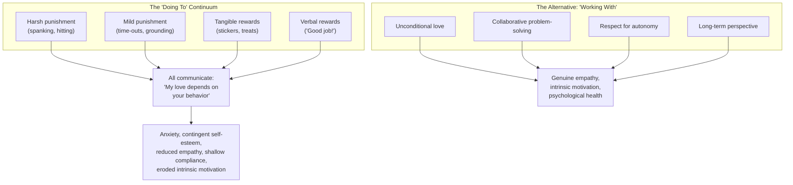
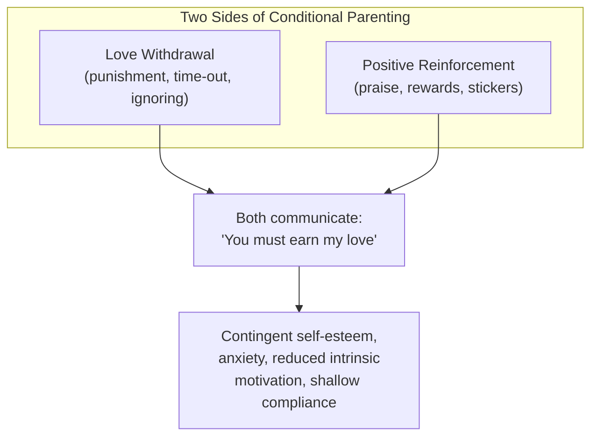
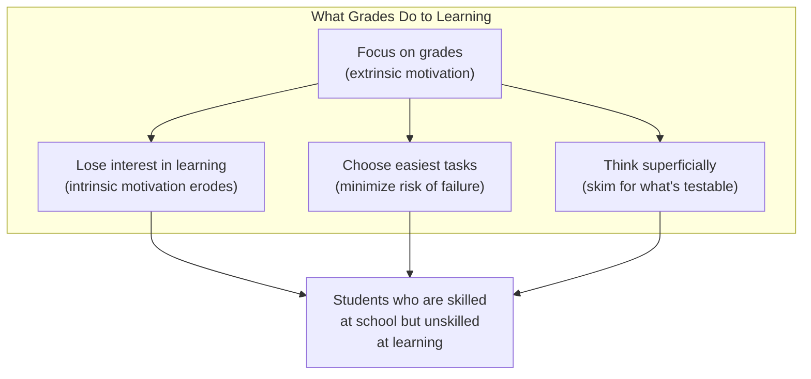
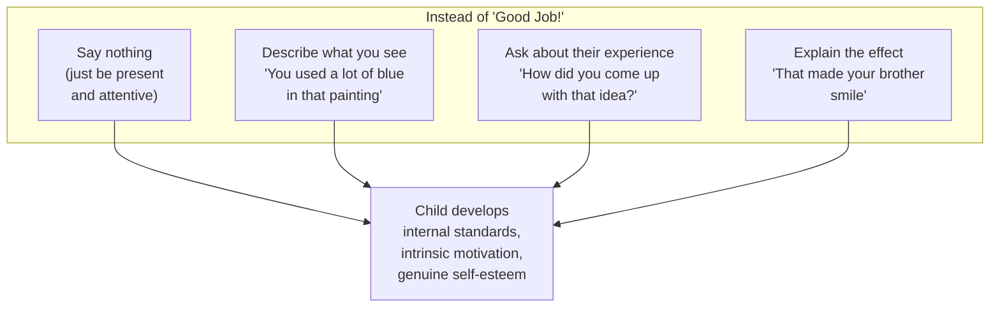
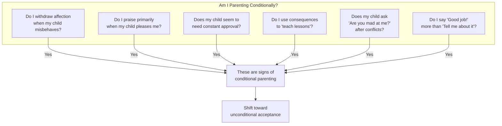
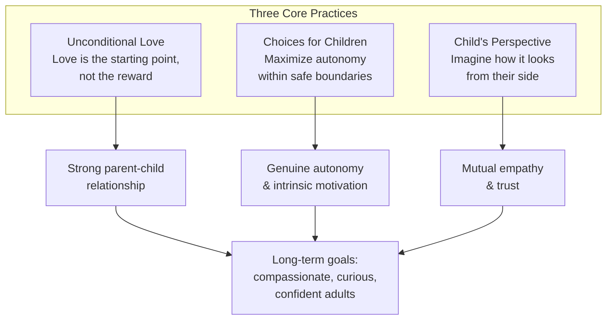
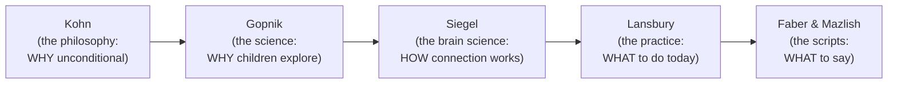

# Unconditional Parenting — Alfie Kohn

> What if the problem with modern parenting isn't that we're too harsh or too lenient — but that virtually everything we do, from punishment to praise, teaches our children the same toxic lesson: that our love depends on their behavior? Alfie Kohn — author, lecturer, and professional challenger of conventional wisdom — argues that the entire spectrum of mainstream discipline, from spanking to time-outs to sticker charts to "Good job!", falls on a single continuum of conditional parenting. All of it communicates: *You have to earn my love.* The alternative is not permissiveness. It's a fundamentally different relationship — one where love is the starting point, not the reward; where we work *with* children instead of doing things *to* them; and where we ask not "How do I get my child to obey?" but "What does my child need, and how can I meet that need?"

---

## About the Author

Alfie Kohn is the author of fourteen books on education, parenting, and human behavior, including *Punished by Rewards*, *No Contest: The Case Against Competition*, and *The Schools Our Children Deserve*. He has been described as "perhaps the country's most outspoken critic of education's fixation on grades and test scores" by *Time* magazine.

Kohn's intellectual style is distinctive: he reads hundreds of academic studies, synthesizes them into provocative theses, and then argues his case with the relentless logic of a trial lawyer. He is not afraid to take positions that upset everyone — he simultaneously attacks conservatives who want more discipline and progressives who think praise is the answer. His critics call him dogmatic; his admirers call him the rare parenting writer who actually reads the research.

*Unconditional Parenting* is his most personal book. He wrote it after becoming a father himself, and admits in the introduction that the experience humbled him. He didn't know it was possible to be so exhausted, or so clueless, or that children would scream because you served the wrong shape of pasta. But the book is far from a memoir — it's a systematic, evidence-based dismantling of almost every parenting strategy most parents take for granted.

Kohn's earlier works laid the groundwork. *Punished by Rewards* (1993) demolished the case for incentive systems across workplaces, schools, and homes — showing that rewards decrease intrinsic motivation. *No Contest* (1986) dismantled the myth that competition brings out the best in people. *The Schools Our Children Deserve* (1999) challenged standardized testing and traditional education. *Unconditional Parenting* brings all three threads together and applies them to the most intimate relationship in human life.

---

## The Big Idea

- <b style="color: #2980b9">Most parenting is conditional</b>: children receive love, attention, and approval contingent on their behavior — this includes not just punishment but also praise, rewards, time-outs, and "natural consequences"
- <b style="color: #e74c3c">Conditional love damages children at every level</b>: it produces anxiety, contingent self-esteem, resentment, shallow compliance, reduced generosity, diminished creativity, and fear of failure — and these effects are well-documented in research
- <b style="color: #27ae60">Unconditional love is not permissiveness</b>: it means loving children for who they are rather than what they do, working with them rather than doing things to them, and prioritizing the relationship and long-term character development over short-term compliance
- The entire "doing to" spectrum — from harsh punishment through mild punishment through tangible rewards through verbal praise — is conceptually connected; each item communicates that love must be earned
- Obedience is not a virtue. "Good" children who are trained to comply without question become adults who comply without question — including with peer pressure, abusive partners, and unethical authority
- The fundamental question every parent should ask is not "How do I get my child to do what I say?" but "What are my long-term goals for my child, and is what I'm doing right now consistent with those goals?"

---

## Key Concepts at a Glance

| Concept | One-line summary |
|---------|-----------------|
| **Conditional parenting** | Love/attention given or withdrawn based on child's behavior |
| **Unconditional parenting** | Love is the foundation, not the reward — given regardless of behavior |
| **"Doing to" vs "Working with"** | The continuum from punishment to praise is all "doing to"; the alternative is collaboration |
| **Love withdrawal** | Time-outs, ignoring, and emotional distance as punishment — can be worse than spanking |
| **The praise problem** | "Good job!" is positive reinforcement that makes love conditional and erodes intrinsic motivation |
| **Intrinsic vs extrinsic motivation** | Rewards (including praise) increase extrinsic motivation while decreasing intrinsic — the opposite of what we want |
| **Contingent self-esteem** | Not low self-esteem but self-worth that fluctuates based on performance or approval |
| **Long-term goals** | Ask what kind of person you want your child to become — then check if your current approach serves that goal |
| **Compulsive compliance** | Children so afraid of parents they obey immediately and unthinkingly — a sign of damage, not success |
| **The vicious circle** | Punishment creates anger → anger creates misbehavior → misbehavior creates more punishment |

Conditional parenting's only advantage is short-term compliance — the one dimension where it outscores unconditional parenting — but this comes at the cost of self-worth, motivation, relationship quality, resilience, empathy, and creativity, revealing Kohn's core argument that obedience is purchased at the price of everything else we actually want for our children.

---

## 30-Second Version

Nearly everything mainstream parenting does — from punishment to praise — is conditional: it teaches children they must earn love through behavior. This doesn't just fail to produce good people; it actively undermines the development of empathy, creativity, intrinsic motivation, and psychological health. The research is overwhelming: punishment (including time-outs) makes children more aggressive and self-centered; rewards (including praise) erode intrinsic motivation and generosity; love withdrawal produces anxiety that can last a lifetime. The alternative is unconditional parenting: love as a given, not a reward; working *with* children rather than doing things *to* them; replacing "How do I get compliance?" with "What does my child need?" This doesn't mean letting children do whatever they want. It means being willing to set limits while ensuring that children never doubt they are loved — regardless of their behavior.

---

## Chapter 1: Conditional Parenting

*Kohn opens with a scene on an airplane. A passenger congratulates the parents of a young boy: "He was so good during the flight!" Kohn notices the key word. "Good," for children, usually means "quiet" — or, more honestly, "not a pain in the butt to me."*

This is the seed of his entire argument. Most of what we call "good" behavior in children is simply compliance — doing what adults want without making trouble. And most parenting strategies, from the most punitive to the most progressive, are designed to produce exactly this: obedience.

Kohn asks parents a deceptively simple question: *What are your long-term goals for your children?* In workshops across the country, parents give remarkably similar answers: happy, balanced, independent, fulfilled, responsible, kind, thoughtful, loving, curious, confident. Then Kohn asks the devastating follow-up: *Is what you're doing right now consistent with those goals?*

> [!warning] The Two Questions
> There are two fundamentally different questions a parent can ask:
> 1. "How do I get my child to do what I say?"
> 2. "What does my child need, and how can I meet those needs?"
> You can predict most of what happens in a family just by knowing which question is more important to the parents.

Research by psychologist Elizabeth Cagan found that parenting books reflect a "blanket acceptance of parental prerogative," with virtually no consideration of whether the parent's demands are reasonable. The focus is always on *how* to get compliance, never on *whether* compliance is the right goal.

### The Problem with Obedience

Kohn makes a counterintuitive claim: there is such a thing as being too well-behaved. A study of Washington, D.C. toddlers found that "frequent compliance was sometimes associated with maladjustment." Psychologists have documented a disturbing phenomenon called "compulsive compliance" — children whose fear of their parents leads them to obey immediately and unthinkingly, at the cost of losing their sense of self.

Even "internalized" compliance (self-discipline) can be problematic. There's a crucial difference between a child who does something because she believes it's right and one who does it out of a compulsion instilled by her parents. Self-discipline sounds virtuous, but it may amount to "directing children's behavior by remote control" — a more powerful version of obedience, not a more enlightened one.

And if we train children to obey authority at home, we shouldn't be surprised when they obey authority everywhere else — including peer pressure. This is not a theoretical concern. It's the direct, predictable consequence of valuing obedience above independent thinking.

> [!example] Barbara Coloroso's Warning
> "He was such a good kid, so well behaved, so well mannered, so well dressed. Now look at him!" To which Coloroso replies: He hasn't changed. From the time he was young, he dressed the way you told him to dress, acted the way you told him to act. He's still listening to somebody else tell him what to do. The problem is, it isn't you anymore; it's his peers.

### The "Good" Airplane Kid

Consider what "good" really means when applied to children. My seatmate congratulated those parents for having a "good" child — meaning one who sat quietly and caused no trouble for the adults around him. But is "not a pain in the butt to grown-ups" really what we aspire to? The most common use of "good" for children has nothing to do with ethics, compassion, or character. It means: silent and compliant. The question Kohn wants us to ask is whether the strategies that produce silent, compliant children are the same ones that produce compassionate, curious, confident adults. The research says no.

### The Research That Started It All

Kohn traces the problem back to behaviorism — the psychological theory that all behavior can be explained by stimulus and response, reward and punishment. B.F. Skinner demonstrated that you could train pigeons and rats to press levers by giving them food pellets. The parenting industry took this insight and applied it to children: reward the behaviors you want, punish the ones you don't, and you'll shape the child like clay.

The fatal flaw: human beings are not pigeons. They have inner lives. They ask *why*. They develop a relationship with the person doing the rewarding and punishing. And they form beliefs about themselves based on how they're treated. When you give a pigeon a food pellet for pressing a lever, the pigeon doesn't conclude "I am only valued when I press levers." But when you give a child a "Good job!" for sharing, the child may very well conclude "I am valued when I share — and only when I share."

The entire edifice of mainstream discipline — from star charts to time-outs to "catch them being good" — rests on a behaviorist foundation that ignores the inner life of the child. Kohn's project is to replace that foundation with one based on what we now know about human psychology: that people have needs for autonomy, competence, and relatedness; that intrinsic motivation is more powerful and durable than extrinsic; and that unconditional love is not a luxury but a necessity.

> [!example] Barbara Coloroso's Warning
> "He was such a good kid, so well behaved, so well mannered, so well dressed. Now look at him!" To which Coloroso replies: He hasn't changed. From the time he was young, he dressed the way you told him to dress, acted the way you told him to act. He's still listening to somebody else tell him what to do. The problem is, it isn't you anymore; it's his peers.

---

## Chapter 2-3: Love Withdrawal, Control, and "Doing To"

*The heart of the book is a systematic demolition of the strategies most parents rely on, from the harshest to the mildest.*

### The Control Problem

Before addressing specific strategies, Kohn tackles the underlying issue: control itself. Most parenting advice assumes the question is *how much* to control children. Kohn argues the question should be *whether* to control them at all.

Research by psychologist Edward Deci and his colleagues distinguishes between "controlling" and "autonomy-supportive" parenting. Controlling parents tell children what to do and use pressure to ensure compliance. Autonomy-supportive parents explain reasons, acknowledge the child's perspective, and maximize the child's role in decision-making. Decades of research show that autonomy-supportive approaches produce children who are more psychologically healthy, more intrinsically motivated, more academically engaged, and — perhaps surprisingly — more willing to comply with reasonable requests.

> [!warning] The Illusion of "Too Much Control" vs. "Too Little"
> Conventional wisdom says you can err on the side of too much control (authoritarian) or too little (permissive), and the sweet spot is somewhere in between. But Kohn argues this frames the issue wrong. The problem with permissive parenting isn't that it's too far in one direction — it's that it fails to provide any guidance at all. And the problem with authoritarian parenting isn't that it's too far in the other direction — it's that guidance-through-force doesn't work. The alternative to both isn't a moderate amount of control. It's a fundamentally different kind of relationship.

### Love Withdrawal: Worse Than You Think

Time-outs are the most popular form of love withdrawal. But what is a time-out, really? It's not just removing a child from a fun activity. It's removing *your presence, your attention, your love*. You may insist your love is undiminished. But what matters is how things look to the child.

| Love withdrawal technique | What the child experiences |
|--------------------------|--------------------------|
| Time-out | Abandonment, isolation, loss of parental love |
| Ignoring | "I'm invisible when I'm bad" |
| Emotional distance | "Mom doesn't like me right now" |
| The silent treatment | "I don't exist to them" |
| Walking away | "They'll leave me if I'm not good" |

Martin Hoffman argued that love withdrawal may be *worse* than physical punishment: "Although it poses no immediate physical or material threat to the child, it may be more devastating emotionally because it poses the ultimate threat of abandonment or separation." The parent knows the distance is temporary. The young child, totally dependent and lacking time perspective, may not.

An important NIMH study of one-year-olds found that love withdrawal, combined with any other strategy, did produce temporary compliance. But the researchers were more alarmed than reassured. They emphasized three things: (1) "Disciplinary techniques effective for securing immediate compliance are not necessarily effective in the long run"; (2) children may react to love withdrawal in ways parents see as occasions for *further* discipline, creating a vicious spiral; and (3) even when it worked, the researchers were uneasy about *why* it worked — through anxiety about parental abandonment.

> [!danger] The Long-Term Effects
> The research on love withdrawal is small but disturbingly consistent. Children on the receiving end tend to have lower self-esteem, poorer emotional health, and may engage in more delinquent behavior. As adults, they are still more anxious, afraid to show anger, fearful of failure, and prone to avoiding attachment — "having decided essentially that 'the terms of this bargain are impossible to meet.'" Hoffman also found that seventh-graders subjected to love withdrawal showed a *lower-level* form of morality — they applied rules rigidly and inflexibly rather than considering circumstances and individual needs, because they'd learned to follow rules to avoid losing love.

### The "Doing To" Continuum

Kohn places all conventional discipline on a single continuum:

| Strategy | What it is | What it communicates |
|----------|-----------|---------------------|
| Harsh corporal punishment | Hitting, spanking | "I'll hurt you if you displease me" |
| Mild corporal punishment | Lighter spanking | Same message, less intensity |
| Other punishments | Time-out, grounding, loss of privilege | "I'll make you suffer emotionally" |
| "Natural consequences" | Deliberately withholding help | "You'll suffer and I won't help" |
| Tangible rewards | Stickers, treats, money | "You must earn my approval" |
| Verbal rewards | "Good job!", praise | "I'll express love when you please me" |

These are not opposites. They are points on the same spectrum. All communicate: *My response to you depends on your behavior.* Kohn argues we should reject the entire spectrum, not just pick a "nicer" point on it.

The sankey flow shows how all four conditional practices — whether punitive or "positive" — funnel through the same short-term effects (compliance, fear, extrinsic motivation, praise dependence) into the same long-term damage (contingent self-esteem, anxiety, eroded intrinsic motivation), revealing Kohn's central insight that punishment and praise are two ends of the same destructive continuum.

> [!success] The Bumper Sticker Mom
> A mother received a school bumper sticker: "I'M PROUD OF MY CHILD WHO WAS STUDENT OF THE MONTH." She went home, cut off the bottom half, and pasted on her car the five words that remained: "I'M PROUD OF MY CHILD." With a pair of scissors, she transformed conditional pride into unconditional love.

### The Praise Problem

This is Kohn's most provocative argument. Praise — "Good job!", "I'm so proud of you!", "What a great painting!" — is not the opposite of punishment. It's the mirror image. Both are forms of conditional love. Punishment says: "I'll make you suffer when you displease me." Praise says: "I'll shower you with approval when you please me." Both teach: *My love depends on your behavior.*

Think about the babysitter who said "Good behavior gets my attention." Now flip it: what's the mirror image of love withdrawal — withholding affection when kids do things we don't like? It would have to be giving them affection when they do things we *do* like — providing it selectively, contingently, in the explicit hope of reinforcing that behavior. Praise isn't just different from unconditional love; it's the polar opposite. It's a way of saying to children: "You have to jump through my hoops in order for me to express support and delight."

Caring parents are attentive and often describe what they've noticed a child has done. But "Good job!" isn't a description — it's a judgment. Instead of "I love you," what praise communicates is "I love you *because* you've done well." You don't need to say this in words. All that's required is that you *do* it — express love and excitement only under certain conditions.

The research is stark:

- Children praised for being generous become *less* generous when praise stops — they learned that the point of sharing was to get a reaction
- Children offered rewards for trying a new drink end up liking it *less* — the reward retroactively poisoned the experience
- Students told an assignment will be graded enjoy it *less* and learn it more superficially — grades are enemies of genuine learning
- Children praised for creative work become more cautious and less creative — they start trying to protect the praise flow rather than take risks
- The more children are praised, the more they need to be praised — a vicious cycle of escalating dependence on external validation
- Children who are frequently praised by their teachers become more tentative, more likely to answer in a questioning tone, less likely to share ideas, and quicker to back off when disagreed with

The mechanism is what psychologists call the erosion of intrinsic motivation. There are two kinds of motivation: intrinsic (you do it because it's interesting) and extrinsic (you do it for a reward). These aren't just different — they're antagonistic. As extrinsic motivation increases, intrinsic motivation decreases. The more you reward any behavior, the less likely it is to persist without the reward.

> [!warning] Not How Much Motivation, But What Kind
> It doesn't matter how "motivated" your child appears to be. What matters is *how* they're motivated. A child who practices piano to earn a sticker may look motivated — but the motivation is shallow, contingent, and will evaporate the moment stickers stop. A child who practices because she loves the sound she's making is genuinely motivated — and that love will sustain her for years.

> [!tip] Jack vs. Zack
> Jack shares his toy because he hopes Mom will say "Good sharing!" Zack shares because he doesn't want his friend to feel bad. Praise promotes the Jack motivation. Worse, it can *destroy* the Zack motivation — because once sharing is associated with earning approval, the intrinsic satisfaction of being kind gets crowded out.

The problem isn't frequency. Telling parents to praise less often but more selectively makes things *worse* — because it makes love even more contingent, more conditional on impressive performance.

---

## Chapter 4-5: Punishment and the Push to Succeed

### Why All Punishment Fails

Kohn reviews decades of research showing that punishment — of any kind — is counterproductive. A landmark 1957 study found that "the unhappy effects of punishment have run like a dismal thread through our findings." Punishment was ineffective regardless of whether parents were trying to stop aggression, bed-wetting, or anything else.

Here is Kohn's devastating list of why punishment fails — supported by research from multiple disciplines:

1. **It makes children angry** — and angry children are not reflective children; rage crowds out moral reasoning
2. **It models power** — teaching that might makes right; every punishment says "the bigger person gets to cause pain"
3. **It loses effectiveness over time** — as children grow, threats become hollow; by adolescence, "You're grounded!" produces only eye-rolls
4. **It erodes the parent-child relationship** — children learn their parents deliberately cause them suffering; this is hard to reconcile with love
5. **It distracts from the real issue** — the child sent to her room is thinking about how mean her parents are, not about what she did wrong
6. **It makes children self-centered** — they learn to ask "What will happen to *me*?" rather than "How does this affect *others*?"
7. **It teaches avoidance, not morality** — "I don't want to catch you doing that again" and the child thinks: "Okay. Next time you won't catch me"
8. **It incentivizes lying** — children punished for misbehavior quickly learn that confessing makes things worse; punishment is the single greatest driver of childhood dishonesty

> [!example] What the Child in the Time-Out Is Actually Thinking
> Picture a child sent to his room for punching his brother. What do you imagine is going through his mind? If your guess is that he's reflecting on his actions, perhaps saying, "Y'know, now I see that hurting people is wrong" — then by all means, keep using time-outs. But if you recognize that he's actually thinking about how mean his parents are, or planning revenge on the brother who got him in trouble, or figuring out how not to get caught next time — then why would you impose this punishment? Time-outs don't produce moral reflection. They produce strategic thinking about how to avoid detection.

The vicious circle is the most insidious feature of punishment. When punishment fails — as it invariably does — parents assume the child needs *more* punishment, not that the approach is wrong. Ground the disobedient teenager. Cut off her allowance. Use power to *make* her act responsibly. As Haim Ginott observed: "Misbehavior and punishment are not opposites that cancel each other; on the contrary, they breed and reinforce each other."

The treemap shows that corporal punishment's link to increased aggression carries the strongest research evidence (largest block), but the evidence against supposedly "gentler" methods — praise creating contingent self-esteem, rewards eroding intrinsic motivation, time-outs triggering abandonment anxiety — is almost equally robust, supporting Kohn's argument that these are all points on the same continuum.

### The 1957 Study

The landmark finding came from a study published in 1957 by Robert Sears, Eleanor Maccoby, and Harry Levin, who studied kindergartners and their mothers. Their conclusion: "The unhappy effects of punishment have run like a dismal thread through our findings." They found that punishment was counterproductive regardless of what behavior it was aimed at — aggression, bed-wetting, dependence, anything. And newer, better-designed studies have only strengthened this conclusion.

One particularly telling finding: parents who punished rule-breaking at home had children who demonstrated *higher* levels of rule-breaking away from home. Punishment doesn't teach moral behavior — it teaches avoidance behavior. Children learn where the surveillance is and adjust accordingly.

### Corporal Punishment: A Special Case

The data on spanking is so overwhelming that Kohn argues for zero tolerance. Hitting children makes them more aggressive, not less. It models the use of force. And it teaches that the most powerful person in the relationship gets to cause pain to get what they want. "Hitting children clearly teaches them a lesson," Kohn writes, "and the lesson is that you can get your way with people who are weaker than you are by hurting them."

But Kohn's argument goes further than the spanking debate. Joan McCord pointed out that substituting non-physical punishments for physical ones "might avoid teaching children to hit, punch, and kick; yet they would nevertheless perpetuate the idea that giving pain is a legitimate way to exercise power." The problem isn't the method — it's the principle.

> [!tip] Explanation Doesn't Fix Punishment
> Some parents believe punishment is fine as long as you explain the reason. But research shows that explanation doesn't minimize the bad effects of punishment so much as *punishment minimizes the good effects of explanation*. If Annie knows she might be punished, she's not thinking about how her actions affected Jeffrey. She's worried about what will happen to her. Anxiety about punishment crowds out moral reasoning.

### The Herbert Lovett Insight

The late psychologist Herbert Lovett observed that when we ignore misbehaving children, we're saying: "We don't know why you do this and we don't care." To justify ignoring by claiming children are acting out "just for attention" implies that "wanting to be noticed is a mysterious or stupid need." It's as if someone ridiculed you for going to dinner with friends, explaining you do it "just because of your need for companionship."

Children who act out for attention are children who *need attention*. The answer isn't to withhold it more effectively. The answer is to give it unconditionally — so they no longer need to misbehave to get it.

---

## A Final Provocation

Kohn closes the book not with reassurance but with a challenge. He quotes Jean Piaget's epigraph: "How much more precious is a little humanity than all the rules in the world." And he acknowledges that what he's proposing is genuinely subversive — it subverts not just specific discipline techniques but the entire framework that treats children as objects to be shaped rather than people to be loved.

The hardest part isn't learning new techniques. It's confronting the deep psychological forces — our own childhood wounds, our cultural assumptions, our fears — that make conditional love feel natural and unconditional love feel dangerous. Kohn doesn't promise this will be easy. He promises it will be worth it.

> [!success] The Unconditional Parent's Creed
> The key question is not "How do I get my child to do what I say?" It's "What does my child need — and how can I meet those needs?" The key feeling is not satisfaction when they obey. It's joy in who they are. The key relationship is not authority and subject. It's two people who love each other — one of whom happens to be very small and completely dependent on the other to know what that love means.

> [!warning] "Consequences" Are Just Rebranded Punishment
> Some consultants repackage punishment as "consequences" — supposedly less harsh, more "logical," or clearly spelled out in advance. Kohn doesn't buy it: "Announcing how we plan to punish children may salve *our* conscience because we gave them fair warning, but all we've really done is threaten them." Similarly, "natural consequences" — deliberately refusing to help a child who forgot her raincoat — teaches her that you could have helped but chose not to. The child experiences this as punishment regardless of what you call it.

### Pushed to Succeed

Kohn extends his critique to achievement pressure. A study of suburban 11- and 12-year-olds found disturbingly high rates of drinking and depression — traced to parents who emphasized getting into top colleges. Seventh-graders whose parents prioritized achievement over well-being showed more distress and "maladaptive perfectionism."

The press for success is a form of conditional parenting: children learn that love flows when they perform well and dries up when they don't. It produces children who avoid risks, choose easy tasks, think superficially, and lose their intrinsic love of learning. As Erich Fromm lamented: "Few parents have the courage and independence to care more for their children's happiness than for their success."

> [!danger] Grades Are the Enemy
> Research consistently shows three things happen when students focus on grades rather than learning: (1) they lose interest in the material, (2) they choose the easiest possible tasks, and (3) they think in shallower, more superficial ways. Kohn calls grades "enemies of exploration" and notes that the best schools committed to genuine learning minimize or eliminate letter grades entirely. They find more informative and less destructive methods — written summaries, personal conversations — for communicating about progress.

### Conditional Self-Esteem: The Real Problem

The debate about self-esteem misses the point. The real question isn't whether self-esteem is too high or too low. It's whether self-esteem is *conditional* — whether it fluctuates based on performance, approval, or success. Research by Edward Deci and Richard Ryan shows that people with truly unconditional self-esteem "would probably feel pleased when they succeed and disappointed when they fail. But their feelings of worth as people would not fluctuate as a function of those accomplishments."

Contingent self-esteem — the kind produced by conditional parenting and reward-based systems — is linked to anxiety, hostility, defensiveness, drinking to gain social approval, susceptibility to eating disorders, and a fragile sense of self that shatters at the first sign of failure. And Carol Dweck's research shows that positive reinforcement — the very thing parents use to "build self-esteem" — actually produces feelings of contingent worth that *undermine* genuine self-esteem.

The conservative critics of self-esteem — who argue that children shouldn't feel good about themselves until they've "earned" it — are actually attacking *unconditional* self-esteem. Their position reveals a deeply puritanical assumption: people should not be permitted to feel worthy except by the sweat of their brows. Kohn argues that it's precisely unconditional self-esteem — feeling worthy as a person regardless of accomplishments — that the research shows produces the healthiest outcomes.

> [!danger] The Praise Junkie Cycle
> Praise creates a vicious cycle similar to love withdrawal. The more we praise, the more children *need* to be praised. They seem insecure, longing for another pat on the head. We give it, and their longing increases. Dweck argues that what we're accepting only conditionally isn't just a particular behavior — "the child comes to see her whole self as good only when she pleases the parent." This is a powerful way of *undermining* self-esteem. The more we say "Good job!" the worse the child feels about herself — and the more praise she needs. We create the very insecurity we think we're treating.

### Competition: The Ultimate Conditional Game

In an important digression, Kohn connects his parenting critique to his earlier work on competition. When children are pushed to outperform their peers, every other child becomes a potential obstacle to success. The predictable results: alienation, aggression, envy of winners, contempt for losers. And self-esteem becomes tied to defeating others — which means, by definition, it can only be confirmed sometimes.

A study of over 800 high school students found that those who had become competitive were "unique by virtue of their greater dependence on evaluation- and performance-based assessments of personal worth." In other words, competitive kids are the ultimate conditional self-esteemers: they feel worthy only when they're winning. And since they can't always win, they are perpetually anxious.

The parenting analogy is direct: when parents push children to succeed — and especially to succeed *relative to others* — they make love conditional on performance. The child learns: I am valued for what I achieve. The logical corollary, never spoken but always felt: I am not valued for who I am.

---

## Chapter 6: What Holds Us Back

*Before offering solutions, Kohn diagnoses why parents keep using strategies they know aren't working.*

### Five Fears

Kohn identifies five fears that keep parents trapped in conditional strategies, even when they know those strategies don't work:

| Fear | How it distorts parenting |
|------|--------------------------|
| **Fear of inadequacy** | Accept bad advice from confident sources; compensate by becoming rigidly controlling |
| **Fear of powerlessness** | Need to "win" every conflict with your child; can't admit mistakes or change course |
| **Fear of being judged** | Resort to control in public; prioritize others' impressions over child's needs |
| **Fear for child's safety** | Rationalize excessive control as "protection" |
| **Fear of permissiveness** | Assume the only alternative to control is chaos; reject any approach that doesn't emphasize obedience |
| **Fear of babying** | Rush developmental milestones; refuse to carry a four-year-old; insist on independence before the child is ready |

Each fear has the potential to create a self-fulfilling prophecy. The parent who fears being judged becomes more controlling in public, which makes the child more miserable, which creates the behavior the parent feared being judged for. The parent who fears powerlessness insists on winning every conflict, which makes the child more defiant, which confirms the parent's fear of losing control.

### Cultural Assumptions We Don't Question

Kohn identifies several cultural beliefs that quietly drive conditional parenting without parents realizing it:

- **The retribution assumption**: people who do bad things deserve to suffer — therefore children who misbehave should be punished
- **The scarcity assumption**: love is a limited resource that must be rationed — therefore children must earn it
- **The competition assumption**: life is a race — therefore children must be pushed to outperform peers
- **The compliance assumption**: children are naturally unruly — therefore they need to be controlled
- **The immediacy assumption**: what matters is whether the child obeys *right now* — long-term character development can wait

Each assumption is so deeply embedded in our culture that questioning it can feel bizarre. But Kohn argues that none of them withstand scrutiny — and all of them produce the opposite of what we actually want for our children.

> [!tip] The Question to Ask Yourself
> "Is it possible that what I just did with my child had more to do with my needs, my fears, and my own upbringing than with what's really in their best interests?" The answer may well be a reassuring no. But you have to be willing to keep asking.

The deepest obstacle is our own upbringing. Alice Miller suggested that we repeat our parents' methods because we have an unconscious need to believe our parents were right. If they weren't, we have to face the possibility that we were damaged — and that's too threatening. So we do to our children what was done to us, to prove that it was fine.

John Bowlby offered a complementary explanation: if you didn't experience empathic parenting, you don't have it to give. People who received conditional love learn to think of love as a scarce commodity that must be rationed. They assume children need strict control — just as they were controlled.

> [!warning] The False Dichotomy
> The most popular false choice in parenting: "Either I punish my child, or I let her get away with it." This is like saying you must choose between freezing cold and boiling hot. Punishment and permissiveness are not the only options — in fact, paradoxically, they share the feature of offering no productive, respectful adult guidance. Kohn quotes a mother who captures the trap perfectly: "I'm permissive with my kids until I can't stand them; then I get so authoritarian that I can't stand myself."

> [!example] The Shirt Story
> Kohn's three-year-old resists getting undressed. Kohn removes his shirt and carries him upstairs. The child wails that he wanted to do it himself. Kohn, quite reasonably, explains he had his chance. An hour later, the child's smile still hasn't returned. Kohn realizes he was being as irrational as his toddler — insisting on his way just because yielding felt like losing control. They go back downstairs, put the shirt on, the child takes it off himself, and peace is restored. The lesson: many of our most heated parenting moments are about *our* need for control, not the child's behavior.

### The Babysitter Test

Kohn tells a pivotal story from his own life. While interviewing babysitters, one young woman crisply summarized her philosophy: "Good behavior gets my attention." She probably meant to contrast this with focusing on bad behavior. But Kohn and his wife immediately knew they didn't want her near their children. The message she was describing — "I will look at you and listen to you only when you've earned it" — is the essence of conditional love. Attention, presence, and warmth should never be doled out as rewards for compliance. They should be the constant, unconditional foundation of every interaction.

### The Deci and Ryan Framework

Throughout the book, Kohn draws heavily on Self-Determination Theory (SDT), developed by psychologists Edward Deci and Richard Ryan. SDT identifies three basic human needs:

1. **Autonomy** — the need to feel that your actions are self-chosen, not imposed
2. **Competence** — the need to feel capable and effective
3. **Relatedness** — the need to feel connected to and cared for by others

When these needs are met, people — including children — are intrinsically motivated, psychologically healthy, and prosocial. When these needs are thwarted, motivation becomes extrinsic, self-esteem becomes contingent, and behavior becomes either compliant or rebellious.

Conditional parenting thwarts all three needs simultaneously. It threatens relatedness (love depends on behavior), undermines autonomy (the child must conform to the parent's will), and attacks competence (the child feels worthy only when performing well). This is why its effects are so pervasive and so damaging.

Kohn argues that meeting these three needs isn't just good parenting — it's the foundation of all human flourishing. People whose autonomy, competence, and relatedness needs are met don't need to be externally motivated. They are naturally curious, naturally compassionate, and naturally cooperative. The entire apparatus of rewards and punishments exists only because we've failed to create conditions in which children's natural capacities can develop.

---

## Chapters 7-10: The Thirteen Principles and Three Practices

*The second half of the book offers Kohn's alternative: not techniques, but principles.*

### Thirteen Principles of Unconditional Parenting

| # | Principle | What it means in practice |
|---|-----------|--------------------------|
| 1 | **Be reflective** | Ask yourself regularly: Was that about my child's needs or my own? |
| 2 | **Reconsider your requests** | Before seeking compliance, ask if what you're demanding is reasonable |
| 3 | **Keep your long-term goals** | Would this strategy help my child become the person I hope they'll be? |
| 4 | **Put the relationship first** | The connection matters more than any single behavioral outcome |
| 5 | **Change how you see** | Look beyond behavior to the whole child — feelings, needs, development |
| 6 | **R-E-S-P-E-C-T** | Treat children as people whose feelings and preferences matter |
| 7 | **Be authentic** | Express genuine feelings honestly rather than performing a parenting role |
| 8 | **Talk less, ask more** | Replace lecturing with curious questions — "What happened? What do you think?" |
| 9 | **Keep their ages in mind** | Developmental expectations should match developmental reality |
| 10 | **Best possible motive** | When in doubt, attribute the best motive consistent with the facts |
| 11 | **Don't stick your no's in** | Say no only when it matters; ask yourself if this is a necessary battle |
| 12 | **Don't be rigid** | Be willing to change your mind, reconsider, negotiate |
| 13 | **Don't be in a hurry** | Let children proceed at their own pace; slow down |

The distribution shows that "Letting Go" — reducing unnecessary control — claims the largest share with three principles, reflecting Kohn's emphasis that most of what passes for discipline is the parent's need for control rather than the child's need for guidance.

> [!tip] Apologize Twice a Month
> Kohn recommends apologizing to your child at least twice a month. Why twice? "I don't know. It sounds about right to me. (Almost all the specific advice in parenting books is similarly arbitrary. At least I admit it.)" But the underlying principle is serious: apologizing sets a powerful example, takes you off the perfect-parent pedestal, and shows children that it's possible to acknowledge mistakes without losing face. The reasons apologizing is so important are the same reasons most parents don't do it: it requires vulnerability, and many parents unconsciously equate vulnerability with the powerlessness they felt as children.

### The "Don't Stick Your No's In" Principle

This principle deserves special attention. Descriptive studies show that young children are prevented from doing something they want, or made to do something they don't, literally every few minutes. Most parents say no far more than they realize. Kohn's recommendation: make "yes" the default. You need a good reason *not* to go along with what the child proposes. Ask yourself: is this no about the child's well-being, or about my convenience? Is this rule actually necessary, or is it just habit?

This doesn't mean saying yes to everything. It means being deliberate rather than reflexive. And it means recognizing that children who experience fewer unnecessary no's take the necessary ones more seriously — because they've learned that when you do say no, you mean it for a real reason.

### Three Practices

**1. Love Without Strings Attached** — The goal isn't just to love your child (most parents do) but to make sure your child *feels* loved unconditionally. This means not withdrawing affection when they misbehave, not making approval contingent on performance, and replacing "Good job!" with genuine interest: "Tell me about your painting" or "You figured that out!" or simply a warm hug that says nothing about what they did.

**2. Choices for Children** — Autonomy is not permissiveness. Give children as much choice as possible about matters that affect them. Let them decide what to wear, how to arrange their room, what order to do things in. When limits are necessary, explain the reason. When their preference can't be honored, acknowledge the disappointment.

Kohn distinguishes between pseudo-choices (which direction do you want to go to bed?) and real choices (would you rather read or build with blocks tonight?). Pseudo-choices are manipulation dressed as autonomy. Real choices communicate respect for the child as a person with legitimate preferences.

> [!example] The Snack Bag Father
> A father in Ontario described the day his four-year-old brought home snacks and dumped them on the living room floor. His first instinct was to demand she clean up — a "challenge to his authority." Instead, he asked, "Why don't you want to put them away?" She replied, "Because I want to eat them." The problem solved itself: "You can eat them after you put them in the bag." She immediately complied. The solution required him to listen rather than command — and it took about thirty seconds.

The deeper principle: autonomy breeds cooperation. Children who feel respected, who have real input into decisions that affect them, are *more* likely to cooperate when genuine limits are necessary — because they trust that the adult's reasons are good. Children who are constantly controlled are *less* likely to cooperate — because they've learned that the adult's agenda is all that matters.

### Problem-Solving Together

When conflicts arise, Kohn advocates collaborative problem-solving rather than either imposing your will or giving in. The process:

1. **Figure out what's going on** — ask the child what happened and why, and genuinely listen
2. **Brainstorm solutions together** — generate ideas without evaluating them yet
3. **Pick one to try** — choose an idea that works for both of you
4. **Evaluate afterward** — did it work? What could be improved?

This process treats the child as a partner rather than a subject. It communicates: "Your perspective matters. Your ideas might be better than mine. We're on the same team."

> [!warning] Pseudo-Choice vs. Real Choice
> "Do you want to put on your pajamas or brush your teeth first?" is often offered as an example of giving choices. But if the child says "Neither — I want to keep playing," the illusion shatters. This is pseudo-choice: the appearance of autonomy within a framework entirely determined by the parent. Real choice means the child has genuine power over the outcome. It means sometimes the answer to "What do you want to do?" is something you hadn't considered — and you do it anyway.

---

## Chapter 10: The Child's Perspective

*The final practical chapter may be the most important — and the most difficult. Kohn argues that truly seeing the world through your child's eyes transforms everything else in the book from theory into practice.*

### Perspective Taking as a Parenting Superpower

Perspective taking — the ability to imagine how the world looks from another person's point of view — is a skill we want our children to develop. But Kohn argues that parents need to develop it first. We need to practice it *on our children*.

When we see through their eyes, everything changes:

- A toddler saying "No!" is not being defiant — she's experiencing a world where *everyone* says no to *her* all day long
- A child described as "manipulative" may just be struggling to have some say over what happens to her
- A teenager who comes home late isn't necessarily being disrespectful — he may have lost track of time in the middle of something genuinely important to him
- A child who "tests limits" may be testing something far more important: the unconditionality of your love

> [!example] The Diaper-Changing Insight
> Kohn's infant daughter hated diaper changes, especially right after waking up. His initial response: "Sorry, but it has to be done." Then he tried seeing it from her perspective: *Hey! I'm still half-asleep and already I'm being whisked over to That Place Where They Do Things to My Butt!* He waited 10-15 minutes for her to wake up fully — and her resistance disappeared. A tiny act of perspective-taking solved a daily battle.

### Perspective Taking Changes Discipline

The most powerful application of perspective-taking is to discipline itself. Consider telling a teenager who missed dinner: "You missed dinner, so you'll have to go hungry." You think the lesson is: "Be more punctual." But imagine what the child hears: *They don't care about the reasons this happened. It would take two minutes to reheat my dinner, but they'd rather I go hungry. Their stupid rules matter more than my well-being. Am I not worth caring about?*

Once you genuinely see through the child's eyes, you can no longer use many of the strategies that seem so natural from the adult's perspective.

> [!tip] The Three Benefits of Perspective Taking
> Research across three countries (Netherlands, Canada, US) with children aged 2-15 confirms that parental perspective-taking:
> 1. **Helps us figure out what's really going on** — we don't leap to incorrect assumptions that lead to punitive responses
> 2. **Makes us more patient** — seeing the world as they see it makes us more likely to respond with kindness
> 3. **Sets an example** — children whose parents practice perspective-taking become better at it themselves

### Raising Moral Children

Kohn's chapter on moral development distills the research into four key practices:

1. **Care about them** — secure attachment is the cornerstone; children whose emotional needs are met can be open to others
2. **Show them how a moral person lives** — model concern for strangers, honesty, and wrestling with ethical dilemmas
3. **Let them practice** — give opportunities to help, care for others, and cooperate; competition suppresses generosity
4. **Talk with them** — not lectures but genuine dialogues about why things matter

The critical insight about moral reasoning: there are different kinds of explanations, and the kind you use matters enormously.

| Type of reasoning | What the child learns |
|------------------|----------------------|
| **Self-interest** ("If you push, someone will push back") | "Don't hurt people because you'll get hurt" — strategic, not moral |
| **Authority** ("Because I said so") | "Don't hurt people because you'll get punished" — compliance, not ethics |
| **Other-oriented** ("Look at Max's face — he seems very unhappy") | "Your actions affect real people with real feelings" — genuine empathy |

Kohn strongly advocates "other-oriented" reasoning — helping children see the effects of their actions on others. Research by Martin Hoffman found that children whose mothers consistently used this approach showed "advanced moral development." Even toddlers responded to someone's distress with more care and sympathy when their mothers explained the consequences of their actions for the victim.

> [!success] Say Thank You — But for the Right Reason
> Kohn vowed never to badger his children with "What's the magic word?" Instead, he reframed politeness as kindness: "Don't say thank you because you're afraid I'll get mad. Don't say it because it's polite. Say it because of its effect on the person you're thanking — it makes them feel good." The shift from rule-following to other-oriented reasoning is the essence of unconditional moral development.

### The Supermarket Mom Who Growled

Kohn overheard a mother growl at her child: "If you ever want to come to the store again, *calm down!*" A typical discipline expert would point out that this threat is silly — no kid fears being banned from the grocery store. But Kohn's critique goes deeper: the expert's concern would be about making threats *more effectively*, not about whether threatening is the right approach. The unconditional parent asks a different question entirely: What does this child need right now? Why is she upset? How can I help?

> [!tip] The Alternative to Praise
> Instead of evaluating ("Good job!"), try:
> - **Describe** what you see: "You used a lot of blue in that painting"
> - **Ask** about their experience: "How did you figure that out?"
> - **Express** interest without judgment: "Tell me about this"
> - **Say nothing** — just be present and attentive
> - **Share** your genuine reaction: "That made me laugh" (not "You're so funny!")

**3. The Child's Perspective** — This is the hardest practice: genuinely imagining how things look from the child's point of view. When a three-year-old "defies" you by refusing to put on shoes, consider: she may be engrossed in play, or testing her autonomy, or simply not understanding why shoes matter right now. None of these is "defiance." All of them are developmentally normal.

### When Things Go Wrong: What to Minimize

Kohn offers four guidelines for handling misbehavior without crossing into conditional love:

1. **Limit the number of criticisms** — bite your tongue often; if kids feel you're impossible to please, they'll stop trying; being selective makes the "no" count when it matters
2. **Limit the scope of each criticism** — focus on this specific action ("Your voice sounded unkind just now") rather than implying something is wrong with the child ("You're so mean")
3. **Limit the intensity** — a little emotion goes a long way; the power inherent in being a parent magnifies everything; children absorb more than they show
4. **Look for alternatives to criticism** — replace "What's the matter with you?" with "Jeremy looked sad after you said that" and "What do you think you could do differently next time?"

> [!success] The Auspicious Circle
> Just as punishment creates a vicious circle (misbehavior → punishment → anger → more misbehavior), unconditional love creates an auspicious one. When you attribute the best possible motive to your child — assuming she didn't *mean* to hurt someone, that the action was clumsy rather than malicious — she internalizes that positive view of herself and becomes more likely to act accordingly. Children construct their identity partly from our assumptions about their motives. Assume the worst, and they'll live down to it. Assume the best, and they'll live up to it.

### The Japanese Rock Story

A five-year-old boy picked up a large rock and appeared ready to throw it. A teacher said casually, "Lend me the rock," demonstrated by touching it to the child's head how the rock could hurt a classmate, and then *returned the rock*, saying, "Carry it carefully." The teacher neither took the rock away nor implied the boy intended harm. Instead, she treated the problem as one of information — the boy hadn't thought about how the rock might hurt someone — and communicated trust in his capacity for self-control. If she had confiscated the rock or imposed punishment, the lesson would have been: "You are untrustworthy." Instead, the lesson was: "You are capable of doing the right thing when you understand why."

### Beyond Threats: What to Do Instead of Punishing

Kohn doesn't just say "stop punishing." He offers a different framework entirely:

When a child misbehaves, the unconditional parent:

1. **Sees a problem to solve, not an infraction to punish** — "What happened here?" not "What did you do?"
2. **Looks beneath the behavior** — asks what need the child was trying to meet, what feeling drove the action
3. **Draws attention to the effect on others** — "Look at his face. How do you think he felt when that happened?"
4. **Invites the child to help fix it** — "What do you think you could do to make this better?"
5. **Offers a choice to calm down** — "Would you like to go sit in the cozy corner until you feel better?" (offered, not imposed)
6. **Stays present** — if physical removal is necessary, it's *with* you, not away from you: "Let's go snuggle in the den"

The goal is never to make the child suffer. It is always to help the child understand why certain actions are wrong — and to feel safe enough to choose differently next time.

### Beyond Bribes: What to Do Instead of Praising

The most destructive praise is the kind explicitly designed to reinforce behavior: "catch them being good." But even spontaneous enthusiasm can communicate conditional approval. The key question isn't what you *intended* — it's what the child *received*.

> [!example] The Snowflake Boy
> At a library crafts table, a boy showed his mother a pipe-cleaner snowflake. She gushed about how wonderful it was. When he showed it to Kohn, instead of evaluating, Kohn asked: "Do you like it?" "Not so much," the boy admitted — and then began explaining thoughtfully what he might do differently next time. This is exactly the kind of reflection that praise shuts down. Children stop thinking about what they've done as soon as an adult passes judgment on it.

### Testing the Unconditionality of Love

One of Kohn's most powerful insights: when children misbehave, they may be "testing limits" — but not the limits you think. They may be testing the unconditionality of your love. They act in unacceptable ways to see if you'll stop accepting *them*.

The response: a stubborn refusal to take the bait. "No matter what you do, no matter how frustrated I get, I will never, never, never stop loving you." Say it in words. Say it through actions. Say it especially during conflict — that's when children need to hear it most.

> [!success] The Teacher Who Changed Everything
> One teacher dealt with a particularly challenging student by sitting down and saying: "You know what? I really, really like you. You can keep doing all this stuff and it's not going to change my mind. It seems to me that you are trying to get me to dislike you, but it's not going to work. I'm not ever going to do that." The teacher added: "It was soon after that — and I'm not saying immediately — that his disruptive behaviors started to decrease."

This is unconditional love in action: not a technique for producing compliance, but a commitment to relationship that makes compliance almost beside the point.

---

## Schools, Grades, and the Classroom

*Kohn extends his critique from the home to the school, arguing that the same conditional logic that damages families also damages education.*

### The Classroom Parallel

Many parents who practice unconditional love at home send their children to "doing to" schools — classrooms dominated by rewards, punishments, behavior charts, and grades. Kohn hears from frustrated parents who describe creating "working with" homes only to realize their children spend six hours a day in "doing to" environments. (He also hears the reverse: teachers who hold democratic class meetings, only to send children home to star charts and time-outs.)

The key questions for evaluating your child's school:

- Is the primary agenda meeting children's needs, or getting compliance?
- Are troublesome behaviors seen as problems to be solved, or infractions to be punished?
- Do teachers help kids make decisions, or insist on making all decisions themselves?
- Are students encouraged to collaborate, or do assignments emphasize individual competition?
- If *you* attended this classroom, would you feel unconditionally accepted?

### Grades Destroy Learning

This is one of Kohn's most evidence-backed claims. Research consistently finds that when students focus on grades:

1. **Interest in learning declines** — every study that has examined this finds students enjoy graded work less
2. **Risk-taking decreases** — students choose the easiest path to protect their GPA
3. **Thinking becomes shallow** — students skim for what's testable and memorize rather than understand
4. **Cheating increases** — the incentive structure makes it rational to game the system

The title of one research article captures it perfectly: "Enemies of Exploration."

> [!warning] "Do We Need to Know This?"
> The student who asks "Do we need to know this?" has been taught — by grades, by the entire system — that the purpose of learning is to perform on assessments. The student who asks "What does this mean?" still retains a genuine intellectual curiosity. The grade system systematically converts the second type of student into the first.

Kohn notes that the best schools committed to deep learning eliminate grades entirely, replacing them with written narratives, conversations, and portfolios. Students from these schools have no trouble getting into college — in fact, they often stand out because they can articulate *why* they learned something, not just *what* they scored.

### Protecting Your Child

When unconditional parents find their child in a "doing to" classroom, Kohn recommends a multi-layered approach: talk diplomatically with the teacher about shared long-term goals; introduce research on alternatives; connect with like-minded parents; and, most importantly, provide your child with a kind of inoculation — enough unconditional love, trust, and perspective at home to buffer the damage of a controlling environment at school.

He offers a crucial insight: your primary obligation is to your child, not to institutional harmony. You don't want to encourage disrespect for teachers. But you also shouldn't endorse actions you believe are harmful. The tightrope is real — and perspective-taking helps you walk it.

---

## The Conditional Parenting Checklist

Kohn implicitly provides a self-assessment throughout the book. Here are the questions that reveal conditional patterns:

### Alice Miller and the Cycle of Repetition

Kohn draws heavily on psychoanalyst Alice Miller, who argued that parents repeat damaging patterns not *despite* having experienced them as children but *because* they did. The unconscious logic: "If what my parents did was wrong, then I was damaged — and that's too painful to accept. So I do the same thing to my children, which proves it was fine all along."

This helps explain one of the most puzzling phenomena in parenting: intelligent, loving adults who use the very strategies that made them miserable as children. The cure, Miller argues, is awareness — the willingness to look honestly at what was done to you and grieve for the child you were, so you can stop inflicting the same pain on the child you're raising.

> [!danger] The Parent Who Needed to Win
> Kohn describes parents whose lives are organized around a need to demonstrate power — people who feel compelled to "win" every interaction with their children. Paradoxically, research shows that the parents most likely to use coercive control are those who *see themselves as lacking power*. The need to dominate comes from fear, not from strength. And children raised by controlling parents often become controlling parents themselves — the cycle continues until someone has the courage to break it.

---

## Before and After: Conditional vs. Unconditional

| Situation | Conditional Response | Unconditional Response |
|-----------|---------------------|----------------------|
| Child hits sibling | Time-out; "Go to your room" | "Look at his face — how do you think he feels? What happened?" |
| Child shares toy | "Good sharing!" | Say nothing, or: "Sarah looked really happy when you let her play" |
| Child refuses dinner | "No dessert until you eat your peas" | Offer healthy options, respect autonomy; they won't starve |
| Child gets an A | "I'm so proud of you!" | "What was the most interesting thing you learned?" |
| Child gets an F | Silent disappointment; loss of privileges | "What happened? How do you feel about it? How can I help?" |
| Child throws tantrum in public | Threaten consequences; forcibly remove | Get down to their level; "I can see you're really upset. Let's figure this out" |
| Child says "I hate you" | Withdrawal; hurt silence | Remain calm; "You're really angry right now. I still love you" |
| Child won't do homework | Ground them; take away screen time | "What's making this hard? How can I help you get started?" |
| Teen misses curfew | Extend the grounding | Ask what happened; problem-solve together; express concern for safety |
| Child lies | Punish the lie on top of the offense | Ask yourself *why* the child felt the need to lie (fear of punishment?) |

### Never Hold a Grudge

Kohn tells a story about his two-year-old trying to grab a toy from his six-year-old sister. After fending him off, the sister announced: "Now I don't want to give it to him at all because he tried to grab it." She was going to punish him by withholding his turn. The question: do we want to act as though *we*, too, were six years old? Much of what passes for discipline is tit-for-tat retaliation that gives us the satisfaction of getting even — dressed up in the language of "teaching a lesson."

---

## The Verdict

This is the most intellectually rigorous and morally uncompromising parenting book you will ever read. Kohn doesn't negotiate, doesn't hedge, and doesn't try to make you feel comfortable. He takes positions that infuriate both traditionalists (punishment doesn't work) and progressives (praise doesn't work either). And he backs every claim with research — the bibliography runs to 30 pages of studies.

**Limitations:**
- Kohn is far better at demolishing than at building. The "what to do instead" chapters are shorter, vaguer, and less satisfying than the "what to stop doing" chapters
- The tone can be preachy and self-righteous. Kohn occasionally treats every parent who has ever said "Good job!" as though they've committed a moral crime
- The book is almost entirely about what *not* to do. Parents in the trenches, dealing with a biting toddler or a defiant teenager, may find the principles too abstract
- Kohn sometimes overstates the research. The studies he cites are real, but he presents correlational findings as though they prove causation, and often selects the most extreme interpretation of ambiguous data
- The book works best as a complement to more practical guides — read this for the philosophy, then read [[No Bad Kids - Janet Lansbury|No Bad Kids]] or [[How to Talk So Kids Will Listen - Adele Faber & Elaine Mazlish|How to Talk So Kids Will Listen]] for the implementation

**What it does brilliantly:**
- Forces you to examine assumptions you didn't know you had — about praise, time-outs, grades, obedience, and love itself
- Connects the research on intrinsic motivation (which is overwhelming) to everyday parenting in a way no other book does
- The "conditional vs. unconditional" framework is genuinely transformative — once you see it, you can't unsee it
- The chapter on what holds parents back (our own upbringing, our fears) is the most psychologically honest writing in any parenting book

### The Paradox of Control

One of Kohn's most important themes deserves its own summary. Control doesn't just fail to produce the outcomes we want — it actively produces the outcomes we fear. When we control children:

- They become more defiant (because autonomy is a basic human need)
- They learn to lie (because truth-telling is punished)
- They become more self-centered (because punishment focuses attention on self-interest)
- They lose intrinsic motivation (because rewards crowd out genuine interest)
- They develop contingent self-esteem (because approval is conditional)
- They struggle with adult relationships (because they learned love is transactional)

The irony is savage: the more desperately we try to control our children's behavior, the more we produce exactly the behaviors we're trying to prevent. And the more those behaviors appear, the more we feel justified in increasing control. This is the vicious circle that only unconditional love can break.

> [!tip] Thomas Gordon's Insight
> "The inevitable result of consistently employing power to control your kids when they are young is that you never learn how to *influence*." The more you rely on punishment, the less real influence you'll have on their lives — because influence requires a relationship of trust, and punishment destroys trust.

### The Conditional Parenting Industry

Kohn positions his critique against an entire industry. Over a hundred parenting books are published in the United States every year, and most of them are filled with advice about how to get children to comply. Even the titles reveal the agenda: *Don't Be Afraid to Discipline; Parents in Charge; Parent in Control; Taking Charge; Back in Control; Laying Down the Law; "The Answer Is No."*

Some defend old-fashioned methods. Others advocate newfangled techniques. But both groups share the same unstated assumption: the parent's desires are automatically legitimate, and the only question worth discussing is how to make children obey.

Elizabeth Cagan's review of parenting books found a "blanket acceptance of parental prerogative" with virtually no "serious consideration of a child's needs, feelings, or development." That was written twenty-five years before Kohn's book. He argues that nothing has changed — except that the methods have become more sophisticated while the goal remains control.

### What Kohn Gets Wrong

To be fair to skeptics, here are the strongest objections to Kohn's argument:

1. **He treats all praise as equivalent.** "Good job cleaning your room" said in a controlling tone is very different from "Wow, you figured that out!" said in genuine delight. Kohn acknowledges nuances but often writes as if all positive evaluation is toxic.

2. **He underestimates temperament.** Some children genuinely need more structure and firmer limits than others. The book sometimes reads as if all behavioral problems would dissolve if parents simply loved unconditionally enough.

3. **He offers little help for acute crises.** When your three-year-old is biting another child *right now*, "take their perspective and problem-solve collaboratively" isn't actionable. Books like [[No Bad Kids - Janet Lansbury|No Bad Kids]] fill this gap.

4. **The research is selectively presented.** Kohn cites hundreds of studies but almost always chooses the most extreme interpretation. Some of the research he cites is correlational (parenting style X is *associated with* outcome Y) but he presents it as if it proves causation.

5. **He dismisses Diana Baumrind too quickly.** Baumrind's "authoritative" parenting (warm but firm) has decades of research supporting it. Kohn treats it as just another form of control, but many researchers disagree.

Despite these limitations, the core argument stands: conditional love damages children, and the evidence for this is robust across multiple research traditions. Even readers who disagree with Kohn's most extreme positions will find their assumptions fundamentally challenged.

If you walk away from this book asking yourself "How would my child feel about what I just said?" before you speak, Kohn will have accomplished his purpose. If you find yourself pausing before the next "Good job!" and asking whether that comment is about your child's growth or your own need to evaluate — Kohn will have changed your parenting. And if you catch yourself, just once, choosing connection over control in a moment of frustration — the book will have been worth every uncomfortable page.

### Where This Book Fits in the Parenting Canon

Kohn occupies a unique position. He is more radical than any other mainstream parenting writer. While Siegel wants you to *connect before you redirect*, Kohn questions whether redirecting is the right goal. While Lansbury wants you to *acknowledge feelings before setting limits*, Kohn questions whether the limits are necessary. While Gopnik provides the evolutionary case for trusting children, Kohn provides the moral case for respecting them.

Read together, these books form a progression:

Each builds on the previous. Kohn provides the deepest foundation but the least practical guidance. Faber provides the most practical scripts but assumes you've already bought the philosophy. The ideal approach is to read them as layers of a single argument.

### The Ultimate Test

Kohn offers two litmus tests for your parenting. First, imagine you're standing around a corner and you overhear two other parents talking about your child. What would give you the most pleasure to hear? If the answer is "Boy, that child does everything he's told and you never hear a peep out of him" — then you've been infected by the compliance model. If the answer is something about your child's character — her kindness, his curiosity, their independence — then you're closer to unconditional parenting.

Second, ask yourself regularly: "If what I just did to my child had been done to *me*, would I feel unconditionally loved?" This simple imaginative reversal, performed regularly, can be transformative. When the answer is clearly no, it brings you up short. You might conclude that what you just did is something you shouldn't do again. You might apologize. But if you never ask the question, it's easy to continue justifying anything.

### The Courage to Be Different

Kohn acknowledges that unconditional parenting requires courage. It means resisting the pressure of other parents who judge your children by their compliance. It means enduring disapproving looks when your child has a meltdown in public and you choose connection over control. It means telling your own parents that you're raising your children differently than they raised you — without condemning what they did. It means being willing to look foolish, to be seen as too soft, to be the parent who sits on the floor with a screaming toddler rather than the one who marches him to the time-out chair.

And it means accepting that you will never do this perfectly. You will lose your patience. You will say things you regret. You will, in moments of exhaustion, reach for the very tools you've sworn off. The goal is not perfection. The goal is direction — moving steadily, imperfectly, toward a relationship where your child never has to wonder whether they are loved.

---

## Who Should Read This Book

| Reader | Why |
|--------|-----|
| Parents who rely on praise and time-outs | You need to hear why these "mild" strategies may be doing more harm than you think |
| Anyone raised with conditional love | Understanding what was done to you is the first step toward not repeating it |
| Teachers and educators | The sections on grades, rewards, and intrinsic motivation apply directly to classrooms |
| Fans of [[No Bad Kids - Janet Lansbury\|No Bad Kids]] | This provides the research foundation for Janet Lansbury's approach |
| Parents who feel vaguely uneasy | If you've sensed something is off about "Good job!" but can't articulate why, this book will crystallize your instinct |
| Anyone who thinks they're too permissive | Kohn distinguishes clearly between unconditional love and permissiveness — they are not the same thing |
| Readers of [[The Gardener and the Carpenter - Alison Gopnik\|Gopnik]] | This is the moral and research-based companion to Gopnik's evolutionary argument |
| Parents struggling with a "strong-willed" child | The "strong will" may be a healthy drive for autonomy that control is exacerbating |
| Couples who disagree about discipline | A shared philosophical framework is more useful than arguing about specific techniques |
| Anyone who was raised with conditional love | Understanding what happened to you is the first step toward not repeating it |

---

## Related Reading

- [[No Bad Kids - Janet Lansbury]] — the practical implementation of many of Kohn's principles, particularly for toddlers
- [[The Gardener and the Carpenter - Alison Gopnik]] — the evolutionary and scientific case against outcome-driven parenting; complements Kohn's moral argument
- [[How to Talk So Kids Will Listen - Adele Faber & Elaine Mazlish]] — communication techniques that embody "working with" rather than "doing to"
- [[How to Talk So Little Kids Will Listen - Joanna Faber & Julie King]] — the toddler/preschool version of the same approach
- [[No-Drama Discipline - Daniel J. Siegel]] — connect-and-redirect strategies that align with unconditional parenting
- [[The Whole-Brain Child - Daniel J. Siegel]] — brain science that explains *why* connection before correction works
- [[Hunt, Gather, Parent - Michaeleen Doucleff]] — cross-cultural evidence that non-punitive, non-reward-based parenting produces thriving children
- [[The Self-Driven Child - William Stixrud & Ned Johnson]] — the neuroscience of autonomy and intrinsic motivation
- [[Brain Rules for Baby - John Medina]] — neuroscience perspective on why safety and relationship trump technique
- [[Mindset - Carol S. Dweck]] — Kohn cites Dweck's work on how praise can undermine self-esteem
- [[Simplicity Parenting - Kim John Payne]] — practical environmental changes that reduce the need for discipline by reducing overwhelm
- [[The Danish Way of Parenting - Jessica Joelle Alexander]] — Denmark's parenting culture embodies many unconditional principles: empathy, reframing, free play, authenticity
- [[Parenting from the Inside Out - Daniel J. Siegel]] — understanding your own attachment history is essential for breaking the cycle of conditional love
- [[Cribsheet - Emily Oster]] — data-driven approach to evaluating parenting claims; Oster provides the cost-benefit analysis, Kohn provides the philosophical framework that questions whether cost-benefit is the right lens for love

Read Kohn for the *why*. Read Lansbury and Faber for the *how*. Read Gopnik for the *evolutionary why*. Together they form a complete philosophy of raising children who are loved, respected, and free to become who they're meant to be.

The journey starts with a single shift: from "How do I get my child to do what I say?" to "What does my child need?"

---

## FAQ

**Q: Isn't this just permissive parenting with a fancy name?**
A: No. Kohn explicitly distinguishes unconditional parenting from permissiveness. Unconditional parents still set limits, say no, and guide behavior. The difference is that they do so while ensuring children never feel their love is contingent on compliance. Permissive parents fail to provide guidance; unconditional parents provide guidance without conditions.

**Q: If I can't praise my child, what am I supposed to say?**
A: Replace evaluation with description, curiosity, and genuine presence. Instead of "Good job!" try "You figured that out!" or "Tell me about this" or "I noticed you shared with your brother." The goal is to show interest without making your approval the payoff.

**Q: What about safety situations where I need immediate compliance?**
A: Kohn acknowledges that some situations require immediate action — you grab a child running toward traffic. But these emergencies don't require an entire philosophy of control. The rare necessity of urgent intervention doesn't justify making control the default mode.

**Q: Doesn't this produce spoiled, entitled children?**
A: The research suggests the opposite. Children who receive unconditional love are *more* empathetic, *more* generous, and *more* willing to cooperate — because they've internalized values rather than learned to perform for rewards.

**Q: Can I change if I was raised with conditional love?**
A: Kohn believes insight is the first step. Understanding what was done to you, and why you repeat patterns, creates the possibility of change. But he's honest that a book alone probably can't transform deeply rooted patterns — therapy may help.

**Q: What about natural consequences? Aren't those okay?**
A: Kohn is skeptical. "Natural consequences" — deliberately letting your child get wet because she forgot her raincoat — is still deliberate non-help. The child experiences "the twin disappointments that something went wrong and you did not seem to care enough to lift a finger to help." A genuinely natural consequence would be one you don't engineer. The ones parenting books recommend are usually manufactured punishment with a fig leaf.

**Q: Isn't there a middle ground between punishment and permissiveness?**
A: Kohn argues the question is framed wrong. Punishment and permissiveness aren't opposite ends of a spectrum — they're both forms of failing to provide productive, respectful guidance. The alternative isn't "somewhere in between." It's an entirely different approach: collaborative problem-solving, unconditional love, and respect for the child as a person.

**Q: My child responds well to praise. Doesn't that mean it works?**
A: Children who respond eagerly to praise have become dependent on external validation — which is the very problem Kohn describes. The eagerness is evidence of the damage, not of success. It's like saying an employee who is terrified of being fired is "highly motivated."

**Q: How is this different from the "attachment parenting" movement?**
A: Attachment parenting (co-sleeping, babywearing, extended breastfeeding) focuses on specific physical practices in infancy. Kohn's unconditional parenting is a philosophy that applies at every age, and it's specifically about how love is communicated — not about any particular practice. You can co-sleep and still be conditional. You can use a crib and still be unconditional. What matters is whether the child feels loved regardless of behavior.

**Q: Doesn't this require being a stay-at-home parent?**
A: No. The quality of time matters more than the quantity, and the *kind* of relationship you build matters more than either. Working parents can be unconditional; stay-at-home parents can be deeply conditional. The question is always about the message the child receives, not the number of hours.

**Q: What about cultural differences? This seems very Western and individualistic.**
A: Kohn addresses this in an appendix. He acknowledges that parenting research is overwhelmingly based on white, middle-class, Western families. Some research suggests that authoritarian parenting may have different effects in different cultural contexts. But Kohn argues that the basic human needs for autonomy, competence, and relatedness are universal — even if the specific ways these needs are met vary across cultures. The damage from conditional love is not limited to any one culture.

**Q: If I read one chapter, which should it be?**
A: Chapter 8, "Love Without Strings Attached." It contains both the most devastating critique (the NIMH love-withdrawal study, the praise research, the conditional self-esteem data) and the most hopeful alternative (specific alternatives to both praise and punishment, the chart of what to say instead of "Good job!").

---

## Five Things You Can Do Tomorrow Morning

1. **Catch yourself saying "Good job!"** — don't panic, but notice it; each time, ask yourself: am I expressing genuine delight, or am I rewarding compliance? Try replacing it with a description ("You used a lot of blue in that") or a question ("How did you figure that out?") or simply a warm, attentive silence

2. **Before issuing a command, ask: "Is this request reasonable?"** — not "How do I get compliance?" but "Does this actually matter? Is there a good reason for this rule? Would I want to be on the receiving end of this demand?" If the answer to the last question is no, let it go

3. **After a conflict, reconnect unconditionally** — don't wait for your child to "earn" your warmth back; go to them, hold them, and make clear that your love was never in doubt; say it explicitly: "I was frustrated, but I always love you, no matter what"

4. **Give one more choice today** — find one situation where you can offer your child a real decision: what to wear, what to eat for snack, which route to walk, what order to do tasks in; a real choice, not a pseudo-choice where you've predetermined the acceptable answers

5. **Ask your child's opinion about something that matters** — not a token choice but a genuine question: "What do you think we should do about this?" Their answer may surprise you — and the question itself communicates a respect that no amount of praise can match

---

## Key Phrases to Remember

| Phrase | Meaning |
|--------|---------|
| "Good is just quiet" | What we call "good" behavior is usually just compliance |
| "Doing to vs. working with" | The entire continuum from punishment to praise is "doing to" |
| "Love without strings" | Unconditional love means the child never has to earn it |
| "What does my child need?" | The question that should replace "How do I get compliance?" |
| "Sugar-coated control" | What praise really is — manipulation dressed as warmth |
| "Conditional self-esteem" | The real problem isn't low self-esteem but self-worth that depends on performance |
| "The vicious circle" | Punishment → anger → misbehavior → more punishment |
| "Compulsive compliance" | A sign of damage, not success |
| "Consequences is just a euphemism" | Rebranding punishment doesn't change its effects |
| "Intrinsic vs. extrinsic" | Rewards don't just fail to help — they actively erode the motivation we want |
| "Not how much motivation but what kind" | The type of motivation matters more than the amount |
| "Put the relationship first" | The connection matters more than any behavioral outcome |
| "Enemies of exploration" | What grades become when they replace genuine curiosity |
| "Autonomy, competence, relatedness" | The three basic human needs (Deci & Ryan) that conditional parenting thwarts |
| "Working with asks more of us" | Unconditional parenting is harder than control — and infinitely more rewarding |
| "Be the parent" | Not "assert your power" but "rise above tit-for-tat; be the adult in the room" |
| "Punishments and rewards are never necessary" | Kohn's most radical claim — and the research supports it |
| "How would I feel?" | The transformative question: if this were done to me, would I feel loved? |
| "Testing the unconditionality" | When children misbehave, they may be testing whether you'll still love them |
| "Attribute the best possible motive" | Nel Noddings's golden rule for unconditional parents |

---

*One Sentence That Changes Everything:*

> **"The most important question a parent can ask is not 'How do I get my child to do what I say?' but 'What does my child need — and how can I meet those needs?'"**
