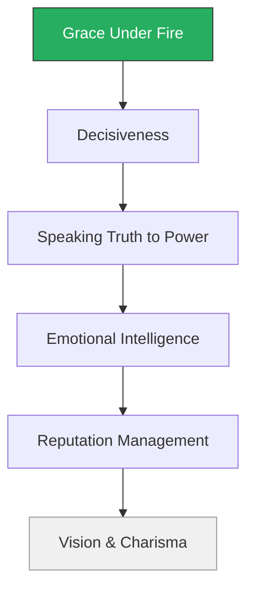
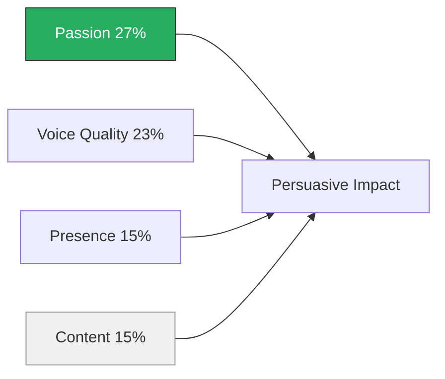
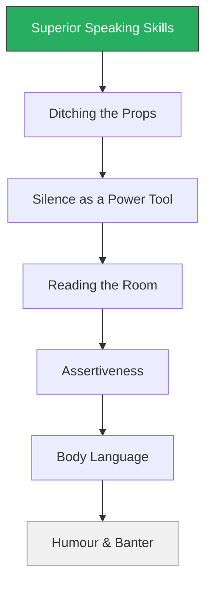
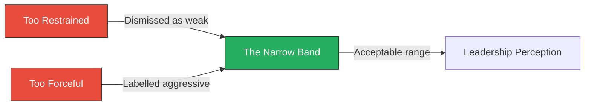
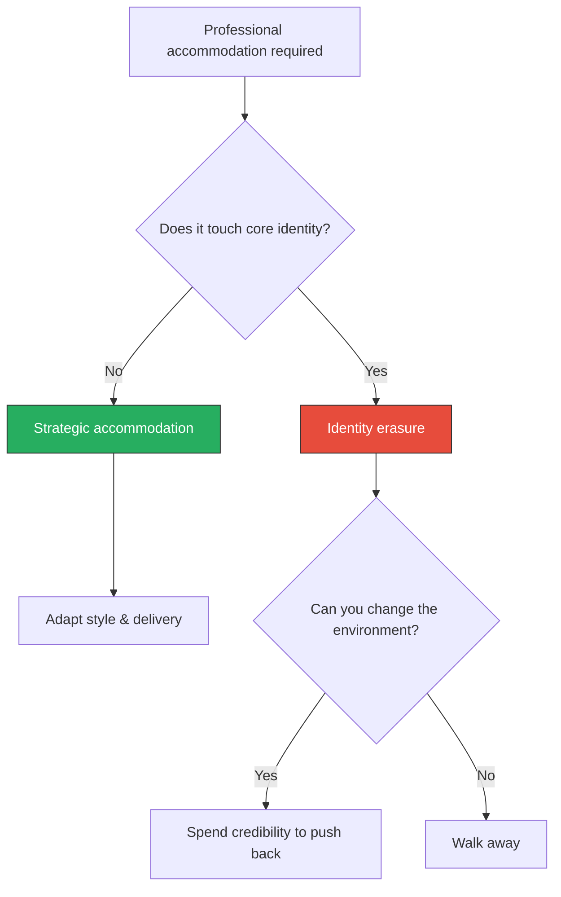

# Executive Presence — Sylvia Ann Hewlett

> Sylvia Ann Hewlett's central argument is deceptively simple: in every organisation, there is a gap between what you accomplish and how far you advance, and that gap has a name. She calls it **executive presence** — the cluster of signals that tell the people above you whether you are leadership material. Drawing on a survey of nearly 4,000 professionals, 268 senior executives, and 40 focus groups, Hewlett decomposes this notoriously vague concept into three measurable pillars: gravitas (how you act under pressure), communication (how you command a room), and appearance (how you present yourself). The uncomfortable finding is that gravitas accounts for 67% of the equation, communication for 28%, and appearance for just 5% — yet appearance is the initial filter, and failing it means no one ever evaluates the rest. The book is a practitioner's manual for closing the gap between doing the work and being seen as the person who should lead it.

---

## About the Author

Sylvia Ann Hewlett is an economist and the founder of the Center for Talent Innovation (now Coqual), a think tank focused on talent and diversity in the workplace. She was born in a Welsh mining village, educated at Cambridge, and spent her early career in academia before moving into corporate research and advisory work. Her personal narrative of cracking class-coded professional norms in British academia gives the book an experiential grounding that purely data-driven treatments lack — she opens the book with her own EP failures, from wearing a fox-fur collar to a Cambridge interview to her disastrous media appearances promoting an earlier book. She has written over a dozen books on talent, gender, and leadership, and her research has been cited in the *Harvard Business Review*, the *Wall Street Journal*, and the *Financial Times*. Hewlett's background matters because she is not writing from the summit of effortless authority; she is writing as someone who had to decode and learn the rules of professional signalling, which gives the book a practitioner's credibility that more academic treatments lack.

---

## The Big Idea

*Hewlett builds her entire framework on a single, well-evidenced claim — and then shows you exactly what to do about it.*

- <b style="color: #27ae60">Merit is necessary but not sufficient for advancement</b>
- The signals you send about your leadership potential determine whether you get the opportunity to demonstrate actual leadership
- Technical performance gets you noticed; executive presence gets you promoted
  - The two are not the same thing, and conflating them is the most common mistake high-performers make

Hewlett uses the analogy of a music competition to crystallise this:

- In a study by Chia-Jung Tsay, participants were shown silent video clips of piano competition finalists and asked to pick the winners
- They identified the actual winners at rates significantly above chance — from body language, stage presence, and physical conviction alone, with no sound at all
- If you can win a music competition on mute, you can certainly win a promotion on presence

---

- The uncomfortable corollary is that executive presence is fundamentally about <b style="color: #e74c3c">perception, not substance</b>
  - It is not a measure of how good you are
  - It is a measure of whether you *look and sound* like someone who should be running things
- Hewlett does not pretend this is fair — she simply documents how it works and offers a framework for developing it

The good news: <b style="color: #27ae60">EP is learnable</b>

- It is not charisma, not height, not the accident of a commanding voice
- It is a set of behaviours that can be practised, refined, and deployed — once you know what they are
- Hewlett's own trajectory is proof of this claim:
  - After a catastrophic media appearance in 2002 promoting her book *Creating a Life*, in which she froze on camera and was savaged by talk-show hosts, she spent six years systematically rebuilding her public presence
  - She hired a coach, learned to control her pace and body language, and eventually became a polished media performer
  - The transformation took half a decade — a sobering but ultimately encouraging data point on what "learnable" actually requires

---

## Key Concepts at a Glance

| Concept | One-line summary |
|---------|-----------------|
| **The Three-Pillar Model** | EP decomposes into gravitas (67%), communication (28%), and appearance (5%) — interactive and hierarchical |
| **The Gravitas Hierarchy** | Six ranked behaviours with grace under fire at the top and vision at the bottom |
| **The Communication Stack** | Six ranked behaviours; content accounts for only 15% of persuasive impact |
| **The Appearance Filter** | Lowest-weighted pillar but the first hurdle — judgments form in 250 milliseconds |
| **The Feedback Gap** | EP feedback is the rarest and most valuable development input, and it is systematically withheld |
| **The Double Bind** | Women and minorities face a narrower band of acceptable EP behaviours (the Goldilocks Syndrome) |
| **Authenticity vs. Conformity** | Conform enough to earn credibility, then spend that credibility on authenticity |
| **The Bleached-Out Professional** | Someone who conforms so completely their distinctiveness disappears — professionally counterproductive |
| **Non-Negotiables** | The principles and values you refuse to compromise, even at the cost of leaving an institution |

The pillars are not independent — appearance is the entrance exam, communication is the delivery mechanism, and gravitas is the substance that earns trust once you have passed the first two gates.

The network reveals how EP decomposes from a single amorphous concept into concrete, practicable behaviours — gravitas branches into five distinct skills, communication into three, and appearance into two, each independently developable.

The three pillars operate as a sequential gate: fail appearance and communication is never assessed; pass communication and gravitas determines whether you advance.

---

## Prologue: Hewlett's Own EP Failures

*The book opens not with research but with confession — establishing that EP is not something you are born with.*

> [!example] The Fox-Fur Collar at Cambridge
> - Hewlett arrived at Cambridge University as a scholarship student from a Welsh mining village
> - Her mother pressed a fox-fur collar on her as a mark of distinction
> - It was exactly wrong — a signal of working-class aspiration in a context where understated academic dress was the currency
> - The collar marked her as an outsider before she opened her mouth
> - The other students wore muted tweeds and rumpled wool — the studied understatement of people who did not need to try
> - Hewlett was trying, visibly, and that visible effort was itself the problem
> **The lesson:** Signals must be calibrated to context, not to intention.

> [!example] The Hippie Academic at Barnard
> - Years later, as an established academic at Barnard College, Hewlett swung to the opposite extreme
> - She adopted what she describes as the "hippie academic" look — flowing fabrics, no makeup, intellectual dishevelment
> - This worked inside the university, where it signalled membership in the academic tribe
> - But when she began to move into corporate advisory work and media appearances, the same look read as unprofessional and unserious
> - She was sending signals calibrated for one context into a completely different one
> - The rules had changed, but her appearance had not — she was still dressing for a world she no longer inhabited
> **The lesson:** What works in one professional world can destroy you in another.

> [!example]- Hewlett's *Today* Show Disaster (2002)
> - Hewlett had written *Creating a Life*, a book about professional women and fertility, and it landed a segment on the *Today* show
> - She was ambushed on camera — her data was challenged, her framing attacked, and she froze
> - She describes the experience as a public humiliation that took six years to recover from
> - She hired a media coach, learned to anticipate hostile framing, practised controlling her body language under pressure
> - She eventually rebuilt her media presence from the ground up
> - The reconstruction was not cosmetic — she had to learn an entirely new set of communication skills, from vocal pacing to posture to the management of hostile questions
> - By 2008, she could walk into a live television interview and project calm authority under pressure
> **The lesson:** EP failures are recoverable — but recovery demands years of deliberate practice, not a weekend seminar.

These personal stories serve a structural purpose:

- They establish that Hewlett, the book's own expert, failed at EP repeatedly and had to learn it through deliberate practice
- If the founder of the Center for Talent Innovation can freeze on camera and wear the wrong coat to Cambridge, the reader can be forgiven for their own EP gaps — and more importantly, can close them
- Hewlett uses her own failures as a credibility-building device:
  - An expert who has never struggled with the subject teaches from theory
  - An expert who has failed at it and rebuilt teaches from experience
  - The reader trusts the second kind more — and rightly so

---

## Chapter 1: What Is Executive Presence?

### The Three-Pillar Model

*Hewlett opens with the definition that structures the rest of the book — and the numbers are more surprising than they first appear.*

- <b style="color: #2980b9">Executive presence</b> is the combination of three pillars: **gravitas** (how you act), **communication** (how you speak), and **appearance** (how you look)
- When asked what matters most for EP, 67% of senior executives pointed to gravitas, 28% to communication, and 5% to appearance
- But these numbers are misleading if read in isolation — the pillars are not independent but interactive and sequential:
  - **Appearance** is the initial filter: fail it and no one ever gets to assess your gravitas
  - **Communication** is the delivery mechanism: without it, your inner composure and decisiveness remain invisible
  - **Gravitas** is the substance: the thing that actually earns trust and followership once you have passed the first two gates

> [!tip] Core Insight
> The 5% weight on appearance is deceptive — it is the first hurdle, not the least important one. Fail the filter and nothing else is evaluated.

| Pillar | Weight | Function | Key behaviours |
|--------|--------|----------|---------------|
| **Gravitas** | 67% | The substance | Composure, decisiveness, integrity, EQ |
| **Communication** | 28% | The delivery | Speaking skills, silence, reading the room |
| **Appearance** | 5% | The filter | Polish, grooming, fitness, clothing |

The weights reflect what matters *once you are already being evaluated* — but the sequential nature means appearance is the entrance exam you must pass first.

Gravitas dominates at 67% — yet appearance, despite its tiny 5% weight, functions as the first gate: fail it and neither communication nor gravitas are ever assessed.

---

### The Music Competition Analogy in Full

*A single study anchors the book's entire argument about presence trumping substance.*

- Chia-Jung Tsay took clips from international piano competitions — events where the explicit judging criteria are entirely musical
- She showed three groups of participants different versions: sound only, video only, and sound plus video
- The group shown **silent video** identified the actual competition winners most accurately
- The sound-only group performed worst

What this means:

- It is not that music does not matter — these were all world-class pianists
- When technical skill is roughly comparable (as it is among finalists), <b style="color: #27ae60">the differentiator is presence</b>
- Hewlett extends this directly to organisations: among the cohort of high-performers who are all technically capable, the one who gets promoted is the one whose presence signals leadership
- "Executive presence is the missing link between merit and success."

The implications are uncomfortable:

- Someone with inferior technical skills but superior presence can, and regularly does, outperform someone with better skills but weaker presence
- Hewlett does not celebrate this — she documents it and says: <b style="color: #e74c3c">work with the world as it is, not as you think it should be</b>
- The parallel to hiring research is direct:
  - Studies consistently show that interviewers' gut reactions in the first ten seconds of an interview predict hiring decisions better than structured assessments
  - This is not because gut reactions are more accurate — it is because humans cannot override first impressions with subsequent data
  - The first impression sets a filter, and all subsequent information passes through that filter

---

## Chapter 2: Gravitas — How You Act Under Pressure

*Gravitas is the core of executive presence — not intellect or charisma, but the quality of being perceived as someone who can handle whatever comes.*

Hewlett identifies six ranked behaviours that constitute gravitas, based on what senior executives report looking for:

| Rank | Behaviour | Senior execs who cited it |
|------|-----------|--------------------------|
| 1 | Grace under fire | 79% |
| 2 | Decisiveness | 70% |
| 3 | Speaking truth to power | 60%+ |
| 4 | Emotional intelligence | 58-61% |
| 5 | Reputation management | 56-57% |
| 6 | Vision and charisma | Lowest-ranked |

The ranking reflects a post-2008 world: composure and integrity now outweigh charisma and visionary thinking.

Grace under fire and decisiveness dominate for both genders, while emotional intelligence shows a slight gender gap — rated 3 points higher for women's EP than men's — reflecting prescriptive stereotypes about how women leaders should behave.

The gravitas hierarchy places composure at the top and vision at the bottom — a deliberate inversion of the pre-2008 charismatic-CEO model.

---

### Grace Under Fire

*The single most valued EP attribute — and the one that operates through a specific neurological mechanism.*

- <b style="color: #27ae60">Composure in crisis</b> is what 79% of senior executives identified as critical
- It matters more than brilliance, vision, or force of personality

The mechanism is <b style="color: #2980b9">emotional contagion</b>:

- When a leader projects calm during collective panic, that calm transfers to the people watching
- Humans are wired to take emotional cues from the most prominent person in a room
- If that person is steady, the group steadies; if that person is panicking, the panic amplifies
- This is documented in neuroscience research on mirror neurons and affect regulation
- The person who absorbs the group's anxiety and returns composure becomes, by that act alone, the person the group turns to for leadership

> [!example] Bob Dudley Takes Over BP (2010)
> - Dudley was appointed CEO of BP in the aftermath of the Deepwater Horizon oil spill
> - He took over from Tony Hayward, whose composure had failed catastrophically
> - He walked into a crisis that had already destroyed one CEO, with environmental destruction still ongoing, congressional hearings underway, and billions in liabilities accumulating
> - His approach was to project calm competence without detachment — acknowledging the scale of the disaster while demonstrating the response was structured, resourced, and moving
> - He did not pretend the crisis was manageable; he demonstrated that he could manage it anyway
> - The contrast with Hayward was deliberate and effective
> **The lesson:** Grace under fire must be empathetic, not cold — the leader who stays calm must also stay human.

> [!example] Sully Sullenberger on the Hudson (2009)
> - When both engines failed after a bird strike, Sullenberger had 208 seconds to decide: return to LaGuardia, divert to Teterboro, or land on the river
> - His cockpit voice recordings reveal a man of almost eerie calm — methodical, precise, completely absent of the vocal markers of panic
> - He made the decision, executed it, then walked the cabin twice to confirm every passenger was off before leaving the aircraft himself
> - The passengers followed his instructions because his voice told them, before his words did, that someone was in control
> **The lesson:** Composure is the mechanism through which 155 people survived — not bravery, but the transmission of calm.

The critical distinction is between composure and detachment:

> [!example] Tony Hayward's Self-Serving Calm (2010)
> - Hayward, also during the BP crisis, was composed in his own way — but his composure read as indifference
> - "I'd like my life back," he said during a press conference
> - The phrase became a symbol of executive tone-deafness
> - His calm appeared self-serving — he seemed to be managing the crisis for his own comfort rather than for the communities, workers, and ecosystems it was destroying
> - The juxtaposition with Dudley is instructive: same crisis, same company, but one man's composure read as leadership while the other's read as detachment
> **The lesson:** Composure without empathy reads as indifference — and indifference destroys gravitas faster than panic does.

> [!example] Jamie Dimon Before Congress
> - Questioned aggressively by legislators about JPMorgan's trading losses, Dimon maintained a posture of respectful confidence
> - He did not grovel, did not deflect, and did not become combative
> - He answered questions directly, acknowledged failures where they existed, and projected the manner of someone who understood the gravity of the situation without being destroyed by it
> - His reputation actually improved after the hearings — a counterintuitive outcome Hewlett attributes entirely to his demeanour under fire
> **The lesson:** The sweet spot is between deference and defiance — acknowledging gravity while projecting capability.

> [!tip] Core Insight
> Grace under fire is not the absence of fear — it is the visible absorption of collective anxiety and the return of composure. The group follows the person who steadies the room.

---

### Decisiveness

*Rendering a decision when others are paralysed confers gravitas — even if the decision later proves imperfect.*

- 70% of surveyed leaders identified decisiveness as core EP
- The mechanism is straightforward: <b style="color: #2980b9">indecision in groups creates anxiety</b>
  - When a group faces a complex situation and no one commits to a course of action, the anxiety compounds
  - Every minute of indecision signals that the situation may be unresolvable
  - The person who breaks the deadlock — who says "here is what we are going to do, and here is why" — absorbs the collective anxiety onto themselves
- That absorption of responsibility is exactly what followers want from leaders
  - They do not want perfection; they want direction

> [!example] Marissa Mayer Revokes Yahoo's Telecommuting (2013)
> - The decision was controversial and arguably wrong on the merits — many analysts criticised it as regressive and counterproductive
> - But Hewlett's point is not about the quality of the decision — it is about the signal it sent
> - Yahoo at the time was a company drifting without clear direction
> - Mayer's decision, whatever its flaws, demonstrated that someone was willing to make hard calls and absorb the consequences
> - The act of deciding was itself a leadership signal, independent of whether the specific decision was correct
> **The lesson:** In an organisation paralysed by drift, the person who decides — even imperfectly — becomes the leader.

> [!example] Lynn Utter Breaks the Deadlock at Coors
> - Utter needed to push through an investment decision that the executive team had been dithering over for months
> - She gathered the relevant data, built a clear case, and presented a binary recommendation rather than a menu of options
> - By narrowing the decision space and accepting personal accountability for the outcome, she moved the organisation past its paralysis
> - Her career accelerated markedly after this moment — not because the investment was spectacularly successful, but because senior leadership identified her as someone who could impose direction
> **The lesson:** Narrowing the decision space and accepting personal accountability is how you convert indecision into forward motion.

The qualifier is important:

- <b style="color: #e74c3c">Reckless decisiveness without preparation reads as impulsive, not leaderlike</b>
- Bob Dudley himself cautioned against being "too decisive too quickly"
- The art is timing the decision to the moment of maximum impact — waiting long enough to have the facts, but not so long that the window of action has closed
- Decisiveness is a performance art: it must appear deliberate, not desperate
- The best deciders Hewlett profiles share a common pattern:
  - They gather information quickly but not exhaustively
  - They frame the decision as a binary or ternary choice, not an open-ended exploration
  - They state their recommendation with conviction, not hedging
  - They absorb accountability explicitly: "If this goes wrong, it is on me"

---

### Speaking Truth to Power

*One of the most powerful EP signals — and one of the most dangerous.*

- Over 60% of respondents affirmed that challenging authority with conviction and evidence builds gravitas
- Leaders want people who will tell them what they need to hear, not what they want to hear
- But the line between courageous truth-teller and insubordinate troublemaker is thin
  - The interpretation depends almost entirely on context, political capital, and framing
- Hewlett is clear-eyed: speaking truth to power is <b style="color: #27ae60">high-reward and high-risk</b>

> [!example]- Sallie Krawcheck Fired Twice for Integrity
> - Krawcheck, a Wall Street executive, was fired twice — once from Citigroup and once from Bank of America — for refusing to back down from positions she believed were ethically correct
> - At Citigroup, she argued that the bank should reimburse clients who had been sold unsuitable products; the board disagreed and she was let go
> - At Bank of America, a similar dynamic played out around wealth management ethics
> - In both cases, her insistence on speaking truth cost her the immediate role
> - But each time, Krawcheck was hired into a bigger role by someone who valued her integrity
> - Her truth-telling built a reputation that compounded over time, even as it produced short-term losses
> - She went on to found Ellevest, a women-focused investment platform, where her reputation for integrity became her primary brand asset
> **The lesson:** Truth-telling can destroy the current position while building the long-term reputation — the compound interest of integrity.

> [!example] Katherine Phillips Names the Elephant
> - Phillips, a professor at Kellogg and later Columbia, built her academic reputation by being the person who would name the uncomfortable dynamic in the room
> - In faculty meetings, committee sessions, and tenure discussions, she would surface what everyone else was politely ignoring
> - This made her unpopular with some colleagues but invaluable to administrators who needed honest intelligence about what was actually happening in their departments
> - Her candour earned her trust from above even as it generated friction laterally
> **The lesson:** The person who names what the room is avoiding becomes indispensable to those who need the truth.

> [!example] Chris Christie During Superstorm Sandy
> - Christie's blunt, no-nonsense communication during the hurricane response — including his public willingness to work with President Obama despite being a Republican governor — was widely interpreted as truth-telling over partisan loyalty
> - His approval ratings surged
> - Hewlett attributes this directly to the gravitas that candour under pressure conferred
> - The public rewarded him for saying what the situation demanded rather than what his party expected
> **The lesson:** When crisis strips away the usual political calculus, authentic candour generates enormous trust.

The caveat Hewlett attaches is crucial:

- Truth-telling must be grounded in values or organisational benefit, not personal frustration or ego
- Tiger Tyagarajan, CEO of Genpact, tells Hewlett that he actively seeks people who will walk into his office and say "here is where I differ"
- <b style="color: #e74c3c">But if the challenge appears self-serving or insubordinate — if the person seems to be grandstanding rather than serving the organisation — it destroys gravitas rather than building it</b>
- The motivation must be visibly selfless, even when it is not entirely so
- The frame matters as much as the content:
  - "I disagree because this will hurt the company" builds gravitas
  - "I disagree because I think I know better" destroys it
  - The substance may be identical — only the framing differs

---

### Emotional Intelligence

*EQ in the EP context is not about being nice — it is the ability to sense what a room needs and provide it.*

- 61% of leaders see EQ as critical for women's EP; 58% for men's
- The relevant skill is precision: diagnosing the emotional state of a room with the same accuracy you would diagnose a legal argument
- <b style="color: #2980b9">EP-relevant EQ</b> encompasses sensing whether the room needs comfort, direction, empathy, or challenge — and providing the right one

> [!example] Mitt Romney's "47%" Comment (2012)
> - At a private fundraiser, Romney was recorded dismissing 47% of the American population as people who "believe they are victims" and would vote for Obama regardless
> - The comment revealed not just a political miscalculation but a fundamental inability to read the room
> - In the age of smartphones, every room is potentially a public stage
> - Romney's EQ failure was not the opinion itself but the failure to recognise that his audience was not confined to the people physically present
> **The lesson:** The room is always bigger than the people physically in it — read the invisible audience too.

> [!example] Michelle Obama's Evolution
> - In the early years of her husband's presidency, she was criticised for a Spanish vacation framed as a "Marie Antoinette moment" — tone-deaf luxury during a recession
> - She learned from this
> - Over the following years, she developed an almost unerring instinct for what the public moment required — grief after Sandy Hook, defiance on girls' education, warmth in her White House vegetable garden initiatives
> - The person who makes a catastrophic EQ error in year one can become a model of emotional attunement by year four, if they study the feedback and adjust
> **The lesson:** EQ is learnable — the catastrophic early failure can become the foundation for mastery.

> [!example] Kent Gardiner's Mediation Instincts
> - In mediation settings, Gardiner's ability to read the emotional subtext of a negotiation — sensing when one party was about to walk out, when another was ready to concede, when the room needed a break — was what made him effective
> - His legal skill was the baseline; his EQ was the differentiator
> - He describes this not as intuition but as pattern recognition developed over years of close observation
> **The lesson:** In professional contexts, EQ is not softness — it is diagnostic precision about the emotional state of the room.

The mechanism connecting EQ to gravitas:

- A leader who can read the room correctly and respond with the appropriate emotional tone demonstrates a form of control that transcends technical mastery
- It signals that you are not just managing the task — you are managing the people, the dynamics, and the unspoken currents beneath the surface
- <b style="color: #27ae60">This is what separates managers from leaders in the EP framework</b>: managers address the problem; leaders address the room

---

### Reputation Management

*Before you enter a room, your reputation has already shaped how people will receive you.*

- 56-57% of leaders say reputation matters for EP
- The mechanism is simple but often overlooked:
  - The people who make decisions about your future — stretch assignments, promotions, visible projects — have often never directly observed your work
  - They rely on <b style="color: #2980b9">reputation as a proxy</b>
  - Your reputation is the version of you that circulates in rooms you are not in
  - <b style="color: #e74c3c">If you do not proactively shape that narrative, others will shape it for you</b> — and they may not have your interests at heart

> [!example]- Angelina Jolie's Deliberate Pivot
> - In the early 2000s, Jolie's public image was defined by Billy Bob Thornton, blood vials, and provocative red-carpet behaviour
> - She made a conscious decision to redirect her public narrative
> - She became a UNHCR Goodwill Ambassador, visited refugee camps, adopted children, and eventually spoke at the United Nations
> - The transformation was not instantaneous — it took years of consistent, visible action in a new direction
> - By the time she directed *In the Land of Blood and Honey* in 2011, her reputation had shifted so fundamentally that the earlier tabloid persona seemed like a different person entirely
> - Hewlett's point is not that the humanitarian work was insincere — but that it was also a masterclass in deliberate reputation curation
> **The lesson:** Reputations are curated through consistent, visible action in a chosen direction over sustained periods.

> [!example] Magic Johnson's Transformation (1991)
> - Johnson could have retreated from public life after his HIV diagnosis — many expected him to
> - Instead, he transformed his diagnosis into a public health leadership platform, becoming one of the most visible HIV/AIDS advocates in the world
> - He founded the Magic Johnson Foundation, became a successful businessman and investor, and rebuilt his public identity around health advocacy and community development
> - His reputation before: "basketball legend." His reputation after: "leader who turned personal crisis into public mission"
> **The lesson:** The mechanism is identical to Jolie's — consistent, visible action in a chosen direction over a sustained period rewrites the public narrative.

Hewlett also tells her own story as a cautionary tale:

- After her disastrous *Creating a Life* media tour in 2002, her reputation in the public sphere was badly damaged
- It took six years of deliberate work — hiring coaches, building new media relationships, publishing carefully positioned research — to rebuild
- <b style="color: #e74c3c">Reputations can be curated, but they can also be destroyed, and rebuilding is far harder than building from scratch</b>

The mechanism behind reputation curation:

- Reputations are not built by single dramatic actions but by consistent patterns that others observe and aggregate over time
- The brain processes reputation through the same heuristics it uses for brand recognition:
  - Frequency of positive signals matters more than intensity
  - Consistency matters more than any single dramatic gesture
  - A reputation that contradicts itself confuses the observer and defaults to the negative interpretation
- This is why Hewlett insists on sustained, consistent action rather than dramatic pivots

---

### Vision and Charisma

*The lowest-ranked gravitas behaviour — but its position at the bottom tells a story about what changed after 2008.*

- In a pre-2008 world, vision and charisma might have ranked higher
- The era of the charismatic CEO — Jack Welch, Steve Jobs, the visionary leader who bends reality through force of personality — was also the era that produced Enron, WorldCom, and the financial crisis
- The post-2008 recalibration shifted the hierarchy:
  - <b style="color: #27ae60">Composure and integrity now outrank inspiration</b>
  - Leaders who can be trusted to hold steady are valued more than leaders who can inspire but might also implode
- This does not mean vision is irrelevant:
  - Vision without composure is dangerous
  - Composure without vision is merely competent
  - The ideal is both — but if you must choose where to invest your EP development energy, invest in composure first
- The cultural shift is significant:
  - The pre-2008 era rewarded leaders who could paint a compelling future
  - The post-2008 era rewards leaders who can be trusted not to blow things up while pursuing that future
  - Both skills matter — but trust now precedes inspiration in the hierarchy

---

## Chapter 3: Communication — How You Command a Room

*Hewlett's central insight here is counterintuitive: content is the least important element of persuasion.*

- Communication is the second pillar, accounting for 28% of EP
- A 2012 <b style="color: #2980b9">Quantified Impressions</b> study of 120 financial spokespersons found that content accounted for only 15% of persuasive impact:
  - **Passion** (27%) dominated
  - **Voice quality** (23%) followed
  - **Presence** (15%) matched content
- <b style="color: #27ae60">The way you deliver matters more than what you deliver</b>
- This finding is shocking to anyone who has spent their career perfecting the content of their arguments — and that is precisely Hewlett's point
- Technical experts who lead with data are actively undermining their own executive presence

| Communication factor | % of persuasive impact |
|---------------------|----------------------|
| Passion | 27% |
| Voice quality | 23% |
| Presence | 15% |
| Content | 15% |
| Other factors | 20% |

The data upends the conventional assumption that mastering the content is the primary communication task. Mastering the delivery is.

Passion and voice quality together account for 50% of persuasive impact — more than three times the weight of content alone — explaining why technically brilliant presenters who lead with data consistently underperform confident but less rigorous communicators.

> [!tip] Core Insight
> Content accounts for only 15% of persuasive impact. Technical experts who lead with data are actively undermining their own executive presence.

Passion and voice quality together account for 50% of impact — more than three times the weight of content alone.

---

### Superior Speaking Skills

*The top-ranked communication behaviour — and it has nothing to do with vocabulary.*

- Hewlett defines superior speaking not as eloquence but as the ability to deliver a message with conviction, clarity, and emotional engagement
- The best speakers are not the ones with the most polished vocabulary — they are the ones whose delivery communicates that they believe what they are saying
- The 2012 Quantified Impressions study is the anchor evidence:
  - Passion and voice quality together account for 50% of impact
  - Content accounts for 15%
  - This upends the conventional assumption that mastering the data is the primary communication task

Hewlett connects this to TED talks as a cultural phenomenon:

- The most-viewed TED talks are not necessarily the ones with the most rigorous data or the most novel ideas
- They are the ones where the speaker's delivery creates an emotional connection with the audience
- Sir Ken Robinson's talk on education — the most-viewed TED talk of all time at the book's writing — succeeds not because his argument is uniquely original but because his delivery is warm, funny, confident, and paced with the instincts of a performer
- The implication for professionals is direct:
  - If you are spending 90% of your preparation time on content and 10% on delivery, you have the ratio inverted
  - Hewlett recommends spending at least half your preparation time on delivery — pacing, vocal variety, physical movement, and emotional connection

---

### Ditching the Props

*Constantly referring to notes, using excessive slides, or reading from scripts actively undermines EP — because it signals you do not command your own material.*

- <b style="color: #27ae60">The less between you and your audience, the better</b>
- The absence of props communicates total command of the material
- It says: I know this cold, and I am confident enough to stand in front of you with nothing but my knowledge and my conviction

> [!example] Brady Dougan on the Power of Eye Contact
> - Dougan, then CEO of Credit Suisse, told Hewlett about the power of sustained eye contact
> - The executives who advanced were the ones who could walk into a room and present their position without a single piece of paper
> - Not because the paper was unnecessary — the data might be crucial
> - But because the absence of props communicated total command of the material
> **The lesson:** The prop-free presenter signals mastery; the note-dependent presenter signals uncertainty.

> [!example] "Elaine" and Her Lists
> - A senior executive at a major firm, "Elaine" was repeatedly passed over for C-suite roles despite strong performance reviews
> - When Hewlett investigated, the pattern was clear: Elaine always had her head in her lists
> - In meetings, she referred constantly to notes; in presentations, she read from scripts
> - She knew the material — her notes were largely unnecessary — but the act of consulting them created the perception that she did not
> - The observers did not think "she is thorough" — they thought "she is uncertain"
> - When Elaine, with coaching, learned to present without notes, her trajectory changed
> **The lesson:** Props meant for thoroughness are read as evidence of uncertainty.

> [!example] The Slide Deck Wall at Credit Suisse
> - A focus group participant described a colleague who was technically brilliant but could never present without a full deck of slides
> - The slides were excellent — detailed, well-designed, data-rich
> - But every time the colleague presented, the audience watched the slides, not the speaker
> - The slides became a wall between the presenter and the room
> - When the slides were stripped back to three anchor images, the same presenter — with the same content — suddenly commanded attention
> **The lesson:** Slides can become a wall between you and the room — strip them back to anchor images.

The paradox of preparation:

- You must know your material thoroughly enough to present without notes
- But you must also appear natural enough that it does not look rehearsed
- The sweet spot is what actors call "the illusion of the first time" — you know every word, but it sounds like you are thinking of it right now
- This requires more preparation, not less — you have to know the material so deeply that you can let go of the script entirely

---

### Silence as a Power Tool

*Deliberate pauses and silence create dramatic emphasis, signal confidence, and force the audience to attend.*

- "The rests between the notes are where the music lives."
- <b style="color: #2980b9">Strategic silence</b> works because of a specific psychological mechanism:
  - In environments where everyone is talking over everyone else, the sudden absence of input is more arresting than more input
  - A well-placed two-second pause after a critical number or a bold claim creates more impact than any amount of additional words

> [!example] Sallie Krawcheck's Boardroom Silence
> - Krawcheck uses silence as her signature tool in boardrooms dominated by loud male voices
> - Rather than trying to out-volume the room, she speaks at her normal pace and volume, then pauses
> - The pause creates a vacuum that the room fills by paying attention
> - The person who stops talking is the one who gets heard
> **The lesson:** In a noisy room, silence is louder than volume.

> [!example] Suzi Digby's Musical Analogy
> - Digby, a choral conductor consulted by Hewlett, observes that 98% of speakers go too fast — they rush through material as if afraid the audience will lose interest
> - The opposite is true: speed signals anxiety, while measured pacing signals confidence
> - In music, the emotional impact comes not from the notes but from the spaces between them
> - A great conductor controls silence as deliberately as sound
> **The lesson:** Speed signals anxiety; pacing signals confidence. Control the silence, not just the sound.

The qualifier is important:

- Silence must be intentional and confident
- <b style="color: #e74c3c">Silence born of uncertainty — the awkward pause of someone who has lost their train of thought — has the opposite effect</b>
- The audience can tell the difference instantly:
  - Intentional silence is accompanied by steady eye contact and relaxed posture
  - Uncertain silence is accompanied by fidgeting and broken gaze
- The physical cues distinguish power silence from panicked silence — the body tells the truth that the absence of words conceals

---

### Reading the Room

*Commanding a room requires first reading it — obliviousness to audience needs signals closed-mindedness and inflexibility.*

- 39% of respondents said this matters for women's EP specifically
- The ability to adapt on the fly demonstrates three things simultaneously:
  - Command of your subject (you can discuss it without slides)
  - Investment in your audience (you care enough to adjust)
  - Agility (you can course-correct in real time)

> [!example] Hewlett at Tulane University
> - She had prepared a full PowerPoint for a speaking engagement, expecting 300 attendees
> - When she arrived, she found 38 people in a seminar room
> - The presentation she had prepared — designed for a large auditorium — would have been absurdly over-produced for the intimate setting
> - She ditched the PowerPoint on the spot and ran the session as a conversation
> - It worked far better than the original plan would have
> **The lesson:** The willingness to abandon your prepared plan is itself a demonstration of executive presence.

> [!example] Rohini Anand Defuses a Hostile Room
> - Walking into a boardroom to present a diversity initiative, Anand sensed that the room was hostile — arms crossed, minimal eye contact, the body language of people who had already decided they were being lectured
> - Rather than launching into her prepared pitch, she opened with a question: "What's your biggest concern about this initiative?"
> - The question defused the hostility by acknowledging it, and the conversation that followed was far more productive than the presentation would have been
> **The lesson:** When the room is hostile, a question is more powerful than a pitch.

The warning Hewlett attaches:

- <b style="color: #e74c3c">Over-adapting can dilute your message or appear sycophantic</b>
- The principle is to adapt your delivery, not your substance
- If the room is hostile to your message, the answer is not to change the message — it is to change how you deliver it
- Reading the room is about calibration, not capitulation

---

### Assertiveness, Body Language, and Humour

*The lower-ranked communication behaviours receive briefer treatment but still matter — especially for people who default to deference.*

**Assertiveness** — the willingness to claim your share of airtime rather than waiting to be invited:

- Many technically strong professionals undermine themselves by beginning every statement with qualifiers:
  - "I might be wrong, but..."
  - "This may not be relevant, but..."
  - "I'm not sure, however..."
- These verbal tics signal uncertainty, and the audience codes them as evidence of low confidence regardless of the substance that follows
- Hewlett recommends a simple discipline: eliminate qualifying preambles entirely
  - Say "I recommend we..." not "I think maybe we should consider..."
  - The content can be identical — the framing changes everything

**Body language and posture:**

- Listeners form impressions from posture, gesture, and facial expression before processing verbal content
- Slumping, fidgeting, and avoiding eye contact communicate subordination
- An open posture, steady gaze, and deliberate gestures communicate authority
- The research on **power posing** is relevant here — while the claims about hormonal effects have been contested, the perceptual effects are well-documented:
  - People who take up more physical space are perceived as more authoritative
  - People who compress their bodies are perceived as less confident

**Humour and banter** rank last but serve as a social lubricant:

- A well-timed joke in a tense room can reset the emotional register and position the speaker as someone with social mastery
- The risk is misjudgment — humour that does not land, that is culturally inappropriate, or that comes at someone else's expense
- <b style="color: #e74c3c">Humour is the most context-dependent communication skill</b> — Hewlett advises caution over ambition

The communication behaviours are ranked from highest impact (speaking skills) to highest risk (humour) — invest your development energy from the top down.

---

## Chapter 4: Appearance — The Initial Filter

*Appearance accounts for only 5% of EP in the long run, but it is the first hurdle — and Hewlett's framing is deliberately uncomfortable.*

- Appearance should not matter this much, but it does
- <b style="color: #e74c3c">Pretending otherwise is a strategic error</b>

### The 250-Millisecond Verdict

- <b style="color: #2980b9">Nancy Etcoff</b> at Harvard Medical School showed that judgments about competence, likability, and trustworthiness form in **250 milliseconds** — based on appearance alone
- A quarter of a second — before you have spoken a word, shaken a hand, or made eye contact
- These snap judgments are sticky:
  - Subsequent information is filtered through the initial impression rather than replacing it
  - If the 250-millisecond verdict is "this person looks like a leader," everything they say is heard through a filter of assumed competence
  - If the verdict is "this person does not look like they belong here," they spend the rest of the meeting climbing out of a perceptual hole

> [!tip] Core Insight
> You have 250 milliseconds before anyone hears a word you say. The visual impression sets the filter through which all subsequent information is processed.

The neuroscience behind this:

- The brain's threat-assessment system (the amygdala) processes visual information faster than the prefrontal cortex can engage rational evaluation
- This means the emotional verdict on your appearance precedes any cognitive assessment of your competence
- You cannot reason your way past a negative first impression — you can only override it with sustained positive signals, which takes significantly more energy than getting the first impression right
- This is why appearance, despite being worth only 5% in the long run, functions as a gate: it sets the initial filter through which all subsequent EP signals are processed

---

### The Five Components

*Hewlett identifies five components of appearance, ranked by importance — and the top one has nothing to do with natural beauty.*

| Rank | Component | Key point |
|------|-----------|-----------|
| 1 | Polish and grooming | Signals effort and intention — the investment is in care, not money |
| 2 | Physical attractiveness | Relevant but largely uncontrollable; polish trumps raw attractiveness |
| 3 | Fitness and wellness | Energy and vitality project capacity, discipline, and stamina |
| 4 | Clothing positioning | Dress for the next role, not the current one — visual categorisation drives unconscious sorting |
| 5 | Height and youthfulness | Real impact but diminishing returns once awareness exists |

Key distinctions:

- <b style="color: #27ae60">Polish is not about expensive clothing or natural beauty — it is about care</b>
  - Clean, well-fitting clothes; neat grooming; attention to details like shoes and accessories
  - A well-groomed person of average attractiveness projects more EP than an attractive person who looks like they just rolled out of bed
- **Fitness signals** are not about aesthetics but about the signals a well-maintained physical presence sends about stamina and self-management
  - Senior executives interpreted physical fitness as evidence of discipline, energy, and the ability to sustain high performance under pressure
  - The logic: if you can manage your own body, you can probably manage a team
- **Clothing positioning** works through visual categorisation:
  - People unconsciously sort others into hierarchical levels based on dress
  - If you dress like everyone at your current level, you are categorised at your current level
  - If you dress one level up, you begin to be categorised — unconsciously — as someone who belongs there

---

### Stories of Appearance Failure and Success

> [!example] The Cellist's Flapping Sleeves
> - A cellist was competing for a position with a major orchestra
> - She was technically excellent, but she wore a dress with loose, flapping sleeves that moved visibly every time she drew the bow
> - The visual distraction was so powerful that the judges could not focus on the music
> - She did not get the position
> - The irony is that her clothing choice was aesthetically attractive — the dress was beautiful
> - But beauty is irrelevant when it distracts from performance
> **The lesson:** Appearance is not separate from performance — it is the frame through which performance is perceived. A distracting appearance actively degrades the audience's ability to assess your substance.

> [!example] The Casual Friday Mistake
> - A financial services executive lost a major client meeting because he dressed in casual Friday attire on a Thursday
> - The client had flown in from overseas and was dressed formally
> - The executive's clothing sent the signal — entirely unintentionally — that the meeting was not important enough to dress for
> - The client read it as disrespect, and the relationship suffered permanent damage
> - The executive had the best pitch deck, the best data, and the best solution — none of it mattered
> **The lesson:** Dress signals are read as signals of respect or disrespect — intention is irrelevant; reception is everything.

> [!example] Kalinda's Wardrobe Shift
> - Kalinda, a financial analyst, was performing well but felt invisible in a firm where appearance was part of the culture
> - She invested in a wardrobe upgrade — not extravagant, but deliberate
> - She was struck by how quickly people's perception of her shifted
> - She was included in meetings she had not been invited to before and asked for her opinion more frequently
> - Nothing about her work had changed; only her visual presentation
> - She was subsequently promoted — and while Hewlett is careful not to claim the wardrobe caused the promotion, she notes that it removed a barrier that had been silently holding Kalinda back
> **The lesson:** Removing a visual barrier can unlock recognition that the work had already earned.

---

## Chapter 5: The Feedback Gap

*This is the book's most practically valuable chapter — and it explains why talented people stall without ever understanding the real reason.*

### Why EP Feedback Is Withheld

- EP feedback is almost never given, and the reasons are structural, not personal:
  - <b style="color: #e74c3c">Senior men avoid giving appearance feedback to women</b> because they fear it will be perceived as sexist or inappropriate
  - White managers avoid giving communication feedback to minorities because they fear it will be perceived as racist
  - The risk of litigation, offence, or misinterpretation makes EP feedback the most fraught form of workplace communication
- The result is a <b style="color: #2980b9">systematic development blind spot</b>:
  - High-performing people get passed over for promotion without understanding the real reason
  - They are told they are doing great work — and they are — but they are not told that their presence, delivery, or appearance is undermining their candidacy for the next level
  - They leave the conversation thinking "I just need to work harder" when the real issue has nothing to do with work quality

The feedback gap creates a vicious cycle:

- The person does not know what to fix
- So they double down on what they can see — the work itself
- Which makes them even more technically competent but does not address the EP deficit
- Which leads to another pass-over, another round of confusion, and eventually either frustration or departure
- The organisation loses the very talent it most needs to develop

> [!example] The Pharmaceutical Executive's Lost Years
> - A pharmaceutical executive discovered she lacked EP only when her boss was replaced
> - Her previous manager had given her strong performance reviews for years without once mentioning that her communication style — hesitant, qualifier-laden, apologetic — was the reason she was not advancing
> - Her new boss, who had no relationship to protect and nothing to lose, told her within three months
> - She was initially devastated — years of advancement had been lost because no one would give her the one piece of feedback that could have changed her trajectory
> - Once she knew the problem, she fixed it within a year — the gap was not in her ability but in her awareness
> **The lesson:** The feedback that matters most is the feedback that is most dangerous to give — and therefore most likely to be withheld.

> [!example] Joe Stringer's Agony at EY
> - Stringer was asked to give appearance feedback to a talented young woman on his team — her clothing was not appropriate for client-facing events
> - He agonised over it for weeks, terrified of being perceived as commenting on a woman's body or clothing choices
> - He eventually delivered the feedback, and it went well — the woman was grateful rather than offended
> - But the weeks of delay illustrate the structural problem: even well-meaning managers with legitimate, career-relevant feedback are paralysed by the perceived risk of delivering it
> **The lesson:** The manager's fear of giving EP feedback is the primary mechanism by which the feedback gap perpetuates itself.

> [!tip] Core Insight
> The feedback that would most accelerate your career is the feedback no one will volunteer. If you want it, you must extract it — proactively, specifically, and safely.

---

### How to Close the Gap

*Hewlett's prescription is concrete and immediately actionable.*

> [!abstract] Closing the EP Feedback Gap
> 1. **Solicit feedback proactively** — it will rarely be volunteered. Ask specifically about presence, authority, and how you come across — not just content quality
> 2. **Ask the right question** — "How was my presentation?" gets content feedback. "How did I come across in terms of presence and authority?" gets EP feedback
> 3. **Make it safe to be honest** — set ground rules with a trusted advisor or mentor. Ask for one specific observation per interaction, not a comprehensive assessment
> 4. **Demand specificity** — "Be more strategic" is useless. "When you present to the board, slow your pace by half and pause after each key number" is actionable
> 5. **Act on one thing at a time** — pick the highest-impact behaviour, work on it for weeks until it becomes automatic, then move to the next one

Hewlett compares EP development to physical therapy: you do not rehabilitate an entire body at once. You work on one joint, one muscle, one movement pattern until it is restored, then move to the next.

> [!example] Christina's Three-Second Pause
> - Christina's boss gave her specific guidance before a key board presentation — not "be more confident" but "when you state the quarterly number, stop talking for three full seconds before moving to the next slide"
> - Christina followed the instruction and the board's reception of her presentation changed noticeably
> - The three-second pause did two things: it gave the number time to land, and it projected the confidence of someone who was not rushing to fill silence
> - One micro-behaviour, precisely specified, produced a visible change in perception
> **The lesson:** The difference between useless and actionable feedback is the difference between vague direction and concrete behaviour.

The contrast between useful and useless EP feedback:

| Useless feedback | Actionable feedback |
|-----------------|-------------------|
| "Be more strategic" | "When you present, open with the business impact, not the methodology" |
| "Show more confidence" | "Eliminate 'I think' and 'maybe' from your opening sentences" |
| "Improve your presence" | "Stand still when you make your key point — stop swaying" |
| "Be more polished" | "Your shoes are scuffed; invest in a shoe-shine kit" |
| "Speak up more" | "In the next meeting, make your first comment within the first ten minutes" |

The left column is what most people receive. The right column is what actually produces change.

---

## Chapter 6: Walking the Tightrope — The Double Bind

*Women and minorities face a narrower band of acceptable EP behaviours — what Hewlett calls the Goldilocks Syndrome.*

### The Narrow Band

- Too forceful and you are labelled aggressive, abrasive, or unlikable
- Too restrained and you are dismissed as lacking leadership potential
- <b style="color: #2980b9">The Goldilocks Syndrome</b>: the acceptable range — assertive enough to be taken seriously but not so assertive as to trigger backlash — is narrower for women and minorities than for white men
- This is not Hewlett's opinion; it is documented in her survey data and in research on <b style="color: #2980b9">prescriptive stereotypes</b> (expectations about how members of a group *should* behave, as distinct from descriptive stereotypes about how they *do* behave)
- Hewlett's data identifies a three-year "sweet spot" for women's age — roughly 39 to 42 — during which the double bind is narrowest:
  - Before 39, women face "too young to be taken seriously" discounts
  - After 42, they begin to face age-related scrutiny that men at the same age do not encounter at the same intensity
  - The window is absurdly narrow, and Hewlett does not pretend otherwise

The Goldilocks Syndrome: the acceptable band of EP behaviour is narrower for women and minorities, creating a tightrope where the same behaviour that earns a man respect can earn a woman backlash.

---

### The Specific Traps

For women, the double bind manifests in several specific ways:

| Behaviour | The bind | Double standard |
|-----------|----------|----------------|
| **Assertiveness** | Too forceful = aggressive; too restrained = weak | A man who pounds the table is passionate; a woman is aggressive |
| **Appearance** | Too much attention = vain; too little = unprofessional | Women's appearance is policed more intensely |
| **Emotional expression** | Too much = hysterical; too little = cold | Narrow band of acceptable emotion |
| **Voice quality** | Higher pitch = less authoritative | Perceived authority regardless of content |
| **Ambition** | Too visible = ruthless; too hidden = uninterested | Men's ambition is expected; women's is suspect |

For minorities, the patterns are different but equally constraining:

- **Communication style** faces code-switching pressure — professional environments often implicitly demand white-coded communication norms
- **Assertiveness** triggers different responses — research shows assertive behaviour from Black professionals is perceived as more threatening than identical behaviour from white professionals
- **Appearance norms** are culturally loaded — natural hair, culturally specific clothing, and other identity markers create friction with mainstream corporate appearance expectations
- **The cost of code-switching** is not just psychological — it is cognitive
  - Maintaining two parallel communication systems requires mental energy that could otherwise be invested in the work itself
  - This is a hidden tax on minority professionals that majority professionals never pay

---

### Hewlett's Honest Assessment

- <b style="color: #e74c3c">This is not a solvable problem within the existing framework</b>
- Hewlett is straightforward: the double bind is a structural constraint to navigate, not a personal deficiency to fix
- The book does not pretend that individual EP development will dismantle systemic bias — only that understanding the terrain makes it easier to cross
- She advises awareness over resentment:
  - Know that the band is narrower
  - Calibrate accordingly
  - Focus energy on behaviours within your control rather than on the injustice of the system

This is one of the most politically honest sections of the book. Most leadership books either ignore the double bind entirely or treat it as a motivational obstacle to overcome. Hewlett does neither — she documents it, quantifies it, and says: this is the landscape. Navigate it strategically.

- The book does not offer false comfort — it does not say "just be yourself and things will work out"
- It says: the rules are different for different people, the rules are unfair, and the most effective response is strategic awareness combined with gradual institutional change
- Individual EP development and systemic reform are not competing strategies — they are complementary ones

---

## Chapter 7: Authenticity vs. Conformity

*Every professional must make accommodations to organisational culture — the question is where the line falls between strategic adaptation and selling out.*

### The Bleached-Out Professional

- Hewlett introduces the concept of the <b style="color: #2980b9">"bleached-out professional"</b> — someone who has conformed so completely to institutional norms that their identity has been erased
  - They dress like everyone else, speak like everyone else, share the approved opinions, and suppress any marker of difference
  - The cost is high: energy, authenticity, and the very distinctiveness that might have been their greatest asset
- The bleaching-out is not always conscious:
  - It often happens gradually — one accommodation at a time, each one small enough to seem reasonable
  - Until the cumulative effect is a professional persona that bears little resemblance to the person underneath
- Hewlett argues this is not just personally costly but professionally counterproductive:
  - <b style="color: #e74c3c">The bleached-out professional is, by definition, interchangeable</b>
  - They have traded their distinctive value for institutional camouflage, and institutional camouflage does not get promoted
  - The irony is painful: conformity is intended to reduce risk, but it also eliminates the distinctiveness that makes someone memorable and promotable

---

### The Sequential Resolution

*Hewlett's resolution to the authenticity-conformity tension is sequential rather than simultaneous.*

- <b style="color: #27ae60">Conform enough to establish credibility, then use earned latitude to assert authenticity</b>
- Trust is the currency that buys freedom:
  - You earn trust by first demonstrating you can play within the system — that you understand the rules, respect the culture, and can deliver results on the culture's own terms
  - Once that trust is established, you have earned the right to push back, to be different, to introduce elements of your authentic identity that the system might otherwise reject

The sequential model: credibility earned through conformity buys the freedom to be authentically different.

> [!example]- Trevor Phillips at LWT
> - Phillips was a successful television executive at LWT (London Weekend Television), where he had built a strong reputation as a mainstream broadcaster
> - He had conformed to the norms of British commercial television and earned credibility within the system
> - Then, from that position of earned trust, he left to create *Windrush*, a documentary about the Caribbean immigrant experience in Britain that became one of the most important television events of its era
> - The documentary was explicitly about Black identity, racial history, and the immigrant experience — topics that LWT's mainstream programming would not have touched
> - Phillips could make it because he had first proven he could succeed on the system's terms
> - The credibility he had earned through conventional success gave him the platform for unconventional work
> **The lesson:** He earned the latitude to be different by first demonstrating he could be the same.

> [!example] Carolyn Buck Luce's Corporate-to-Mission Pivot
> - Buck Luce took a traditional corporate role at a major firm — conventional, well-compensated, and entirely within the institutional mainstream
> - She excelled in it, built her reputation, and accumulated political capital
> - Then she used that capital to fund her later work on women's leadership and work-life integration — a mission that was deeply personal
> - The firm might not have supported this from someone who had not first proven their value in conventional terms
> **The lesson:** Political capital earned through conventional success can be spent on unconventional missions.

> [!example] Hewlett's Own Rebuilt Presence
> - After her media disaster and six years of reputation rebuilding, Hewlett did not attempt to return as the same public figure she had been before
> - She returned with a more controlled, more deliberate public presence — one that was still authentically her but shaped by hard-won knowledge about what works and what does not
> - The authenticity was real, but it was also strategic
> - She brought her Welsh directness and her academic rigour, but she packaged it in a delivery system that corporate audiences could receive
> **The lesson:** Authenticity and strategy are not opposites — the most effective authenticity is the kind that has been tested and refined.

> [!tip] Core Insight
> The choice is not between selling out and being fired for nonconformity. It is between conforming strategically (earning the right to be different later) and conforming permanently (losing yourself entirely).

---

### The Non-Negotiables

*The "play the long game" advice has a dangerous edge — and Hewlett addresses it directly.*

- It can become a rationalisation for tolerating environments that violate your fundamental values indefinitely
- She advises identifying your **non-negotiables** — the principles, identities, and values you will not compromise under any circumstances — and being willing to walk away from environments that violate them
- The distinction is between:
  - <b style="color: #27ae60">Strategic accommodations</b> — adjustments to style, presentation, and communication that do not touch core identity
  - <b style="color: #e74c3c">Identity erasure</b> — fundamental compromises that require you to deny who you are
- The first is the price of professional life in any institution
- The second is the sign that you are in the wrong institution
- Not every battle is worth fighting in the moment — but some battles are worth walking away from the institution over
- Knowing which is which is the essence of the authenticity-conformity balance

> [!abstract] The Non-Negotiables Framework
> 1. **Identify your core values** — the 3-5 things you will not compromise under any circumstances
> 2. **Distinguish style from substance** — changing how you present is accommodation; changing what you believe is erasure
> 3. **Test the environment** — does the institution require style adjustments or identity suppression?
> 4. **Set a threshold** — if accommodations cross from strategic to existential, the institution is wrong for you
> 5. **Act on the threshold** — staying past the point of identity erasure damages you more than leaving does

The decision tree for navigating the authenticity-conformity tension: accommodate when it is strategic, walk away when it is existential.

---

## Key Quotes

- "Executive presence is the missing link between merit and success." — Hewlett
- "Content accounts for only 15% of persuasive impact." — Quantified Impressions study
- "Judgments about competence form in 250 milliseconds." — Nancy Etcoff, Harvard
- "I'd like my life back." — Tony Hayward (Hewlett's cautionary example of composure without empathy)
- "The rests between the notes are where the music lives." — Suzi Digby, on silence as a power tool
- "Leaders seek people who will walk in and say 'here is where I differ.'" — Tiger Tyagarajan, CEO of Genpact
- "98% of speakers go too fast." — Suzi Digby, choral conductor
- "Gravitas is not about intellect but about the quality of being perceived as someone who can handle whatever comes." — Hewlett

---

## The Verdict

*Executive Presence* is the most useful tactical manual available on the specific question of why high-performers stall. Its greatest contribution is decomposing a concept that most leadership books treat as mystical — "presence," "gravitas," "command" — into concrete, measurable, learnable components. The three-pillar model is genuinely diagnostic: it tells you where you are strong, where you are weak, and what to work on first. For anyone who has ever been told they need "more executive presence" without being told what that means, Hewlett provides the clearest answer available. The gravitas hierarchy is particularly valuable because it overturns the conventional wisdom that vision and charisma are the essence of leadership; in Hewlett's data, composure and decisiveness rank far above inspiration.

The book's weaknesses are real but bounded. The evidence relies heavily on self-reported survey data — what executives *say* they value may differ from what actually drives their decisions in practice. The appearance chapter leans on a narrow research base (primarily Etcoff's 250-millisecond study) and generalises broadly from a single set of findings. The communication chapter's central claim — that content accounts for only 15% of impact — is drawn from a study of 120 financial spokespersons, a narrow professional context that may not generalise to all leadership settings. The case studies, while vivid and numerous, suffer from survivorship bias: we hear about the leaders whose composure paid off, not the ones whose identical composure was ignored. And Hewlett never seriously interrogates whether a system that promotes based on image rather than substance *should* be reinforced by individual compliance — she documents the system and says "play it," without asking whether that compliance perpetuates the very problem she identifies.

The feedback chapter — on why EP feedback is systematically withheld and how to extract it — may be the single most actionable section in any leadership book of the last decade. The structural analysis of *why* managers avoid giving EP feedback is sharp and well-evidenced, and the practical prescriptions (solicit proactively, one observation at a time, make it safe, make it specific) are immediately deployable. For anyone who suspects they have a presence gap but cannot get anyone to tell them what it is, this chapter alone is worth the price of the book.

The book is most valuable for mid-career professionals who are technically competent but feel stuck — people who are doing the work at the next level but are not being perceived as belonging at the next level. It is less useful for people early in their careers (who need to build technical credibility before worrying about presence) or for senior executives (who have already passed the EP filter, for better or worse). Compared to Jeffrey Pfeffer's [[Power - Jeffrey Pfeffer|Power]], which addresses the broader structural question of why merit does not produce advancement, Hewlett is narrower but more actionable — she tells you exactly which behaviours to develop and in what order. Compared to Robert Greene, who treats image-crafting as a dimension of power strategy, Hewlett is less philosophical but more empirical — she has the survey data that Greene does not. The two complement each other well: Greene tells you why presence matters in the game of power; Hewlett tells you what to do about it on Monday morning.

---

## Related Reading

- [[The 48 Laws of Power - Robert Greene|The 48 Laws of Power]] — Greene's tactical manual for navigating power, with extensive overlap on reputation management, image-crafting, and the gap between substance and perception
- [[Power - Jeffrey Pfeffer|Power: Why Some People Have It and Others Don't]] — Pfeffer's research-based argument that power is a skill, not a birthright, with complementary evidence on why merit alone does not produce advancement
- [[The Charisma Myth - Olivia Fox Cabane|The Charisma Myth]] — Cabane's practical framework for developing charisma as a learnable skill, with specific exercises that complement Hewlett's diagnostic approach
- [[The First 90 Days - Michael D. Watkins|The First 90 Days]] — Watkins on establishing credibility in new roles, where executive presence is the mechanism for making early impressions stick
- [[The Credibility Code - Cara Hale Alter|The Credibility Code]] — Alter's companion guide on the specific physical behaviours (posture, gesture, vocal tone) that signal credibility
- [[Gravitas - Caroline Goyder|Gravitas]] — Goyder's exploration of presence from a performance and voice coaching perspective, complementing Hewlett's data-driven approach
- [[So Good They Can't Ignore You - Cal Newport|So Good They Can't Ignore You]] — Newport's counterargument that rare and valuable skills (career capital) are the foundation; Hewlett adds that capital alone is insufficient without the signalling layer of EP
