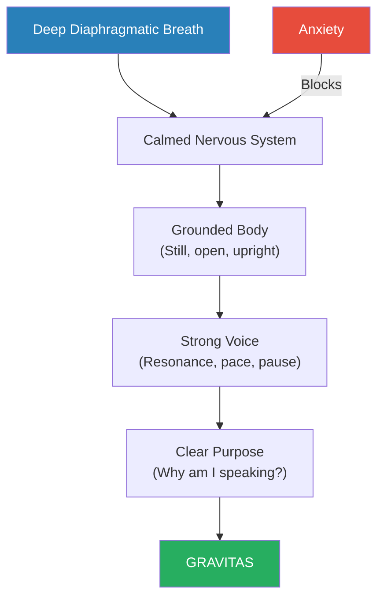
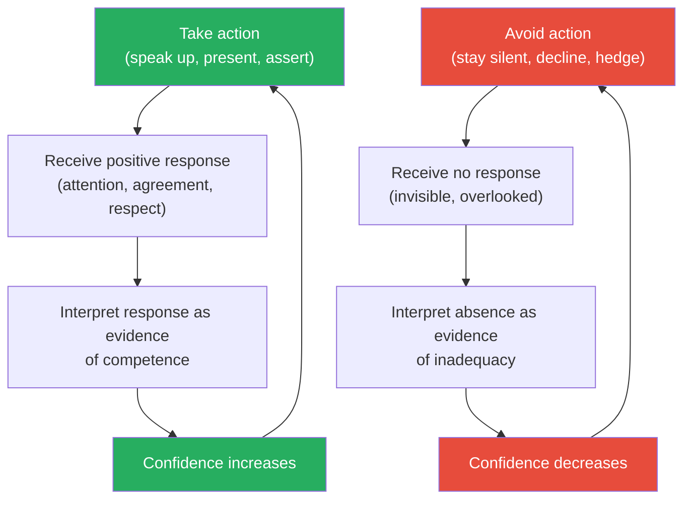
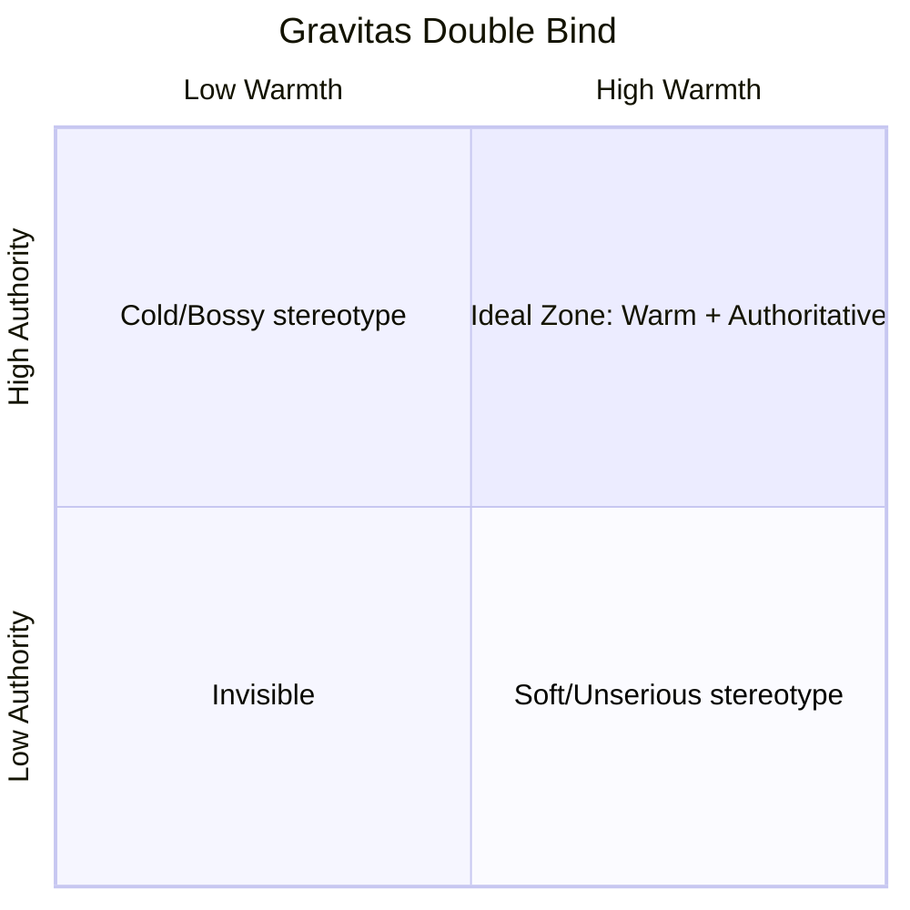
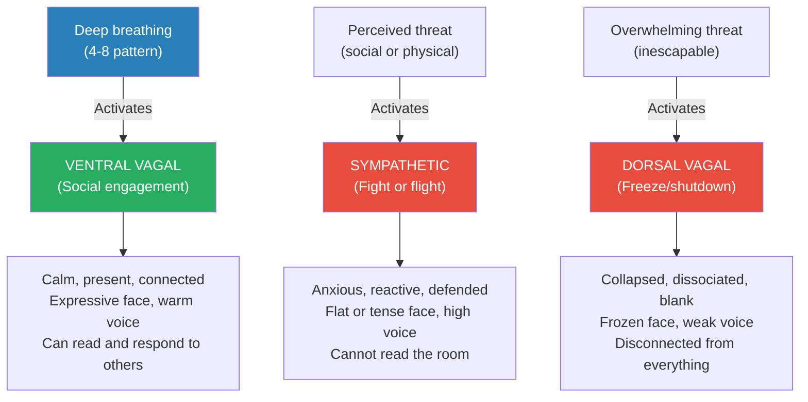
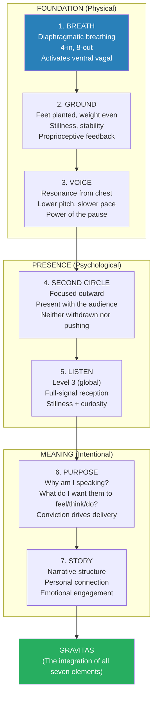

# Gravitas — Caroline Goyder

> Gravitas is the quality that makes people stop and listen — the sense that what you're saying matters and that you believe it.
> Caroline Goyder argues it's not a gift reserved for the powerful or the extroverted but a set of physical and psychological skills that anyone can develop.
> As a voice coach at London's Central School of Speech and Drama, she has watched nervous, uncertain people transform into commanding communicators — not through personality change but through reconnecting with their breath, voice, body, and authentic purpose.
> The book is part voice coaching, part confidence manual, and entirely practical.
> Its core insight: what kills gravitas is not lack of knowledge or charisma but <b style="color: #e74c3c">anxiety</b> — and anxiety can be managed through the body, starting with breath.

---

## About the Author

Caroline Goyder is a voice and communication coach who teaches at the Central School of Speech and Drama in London.
She has coached executives, politicians, barristers, and performers.
Her TED talk on gravitas has millions of views.
Before becoming a coach, she was a researcher at the University of London, studying the science of communication.
She brings both academic grounding and frontline coaching experience to the book.

---

## The Big Idea

- <b style="color: #2980b9">Gravitas = Knowledge + Purpose + Passion - Anxiety</b>
- Most people who lack gravitas don't lack knowledge or purpose — they lack the ability to manage the anxiety that blocks those qualities from showing
- <b style="color: #e74c3c">Anxiety produces shallow breathing, rushed speech, fidgeting, loss of eye contact, and vocal tremor</b> — all of which signal to the audience "this person is not in control"
- The foundation of gravitas is <b style="color: #27ae60">breath</b> — deep, diaphragmatic breathing calms the nervous system, grounds the body, and gives the voice its resonance and power
- Everything else in the book builds on this foundation: once you can breathe properly under pressure, your voice deepens, your pace slows, your body stills, and your presence transforms

---

## Key Concepts at a Glance

| Concept | One-line summary |
|---------|-----------------|
| **The Gravitas Equation** | Knowledge + Purpose + Passion - Anxiety = Gravitas |
| **Breath as Foundation** | Deep diaphragmatic breathing is the single most important physical skill for presence |
| **The Three Circles of Energy** | Withdrawn (First), Present (Second), Pushing (Third) — gravitas lives in Second Circle |
| **The Power of the Pause** | Silence after a key point signals confidence; rushing signals anxiety |
| **Vocal Resonance** | A voice that resonates from the chest and belly carries authority that a throat-squeezed voice cannot |
| **Grounding** | Physical connection to the floor through the feet creates visible stability |
| **Purpose Before Performance** | Knowing WHY you're speaking matters more than HOW you speak |
| **The Status Game** | High-status behaviour (stillness, slow movement, direct eye contact, low pitch) vs low-status behaviour (fidgeting, rushed speech, looking away) |

---

## The Three Circles of Energy

*This is Goyder's most immediately useful framework — borrowed from theatre director Patsy Rodenburg.*

| Circle | Energy | How It Feels to Others | Physical Signs |
|--------|--------|----------------------|----------------|
| **First Circle** | Withdrawn, inward, self-conscious | "They're not really here" | Mumbling, avoiding eye contact, shrinking posture, quiet voice, fidgeting |
| **Second Circle** | Present, connected, focused outward | "They're really HERE — speaking to ME" | Direct eye contact, grounded posture, measured pace, resonant voice, stillness |
| **Third Circle** | Pushing, performing, dominating | "They're broadcasting, not connecting" | Too loud, too forceful, monologue-style, big gestures, overwhelming |

- <b style="color: #27ae60">Second Circle is where gravitas lives</b> — present, connected, and outward-focused
- Most anxious speakers oscillate between First and Third Circle, never landing in Second
- First Circle speakers disappear — their audience drifts away because there's nothing to lock onto
- Third Circle speakers exhaust — their audience tunes out because the energy is overwhelming and impersonal
- <b style="color: #2980b9">Second Circle is intimate, focused, and magnetic</b> — it says "I am here, with you, right now"

The ideal speaker spends roughly 70% of their time in Second Circle — the zone of genuine presence and connection. Brief retreats into First Circle (10%) allow internal reflection, while occasional Third Circle energy (20%) can project passion to a large room. The danger is when First or Third dominates at Second Circle's expense.

> [!danger] Before: First Circle (anxious)
> A manager presents quarterly results. Eyes fixed on slides, voice barely audible, rushing through bullet points, body hunched over the lectern.
> The team checks their phones. The message is lost. Not because it lacks content, but because the presenter lacks presence.

> [!success] After: Second Circle (present)
> The same manager takes a breath before starting, makes eye contact with three people in the room, speaks at half the previous speed, pauses after the key number.
> The room is attentive. The message lands. Nothing about the content changed. Everything about the delivery did.

---

## Breath: The Foundation of Everything

### Why Breath Matters

- When anxious, we breathe <b style="color: #e74c3c">shallow and high in the chest</b> — triggering the sympathetic nervous system (fight-or-flight)
- This produces a cascade: voice rises in pitch, speech accelerates, body tenses, eye contact breaks, hands fidget
- <b style="color: #27ae60">Deep diaphragmatic breathing activates the parasympathetic nervous system</b> — calming the body, lowering the voice, slowing speech, and enabling presence
- Professional singers, actors, and barristers all train breath as the foundation of performance — yet most business professionals have never been taught it

### The Breathing Exercise

- Place one hand on your belly, one on your chest
- Breathe so that ONLY the belly hand moves — the chest stays still
- Inhale through the nose for 4 counts, exhale through the mouth for 8 counts
- The extended exhale activates the vagus nerve, which directly calms the nervous system
- <b style="color: #2980b9">Do this for 2 minutes before any high-stakes communication</b> — presentation, negotiation, difficult conversation, job interview

> [!tip] The 2-Minute Reset
> Goyder's simplest and most powerful technique: before any situation where you need gravitas, find a private space (even a bathroom stall), plant your feet hip-width apart, and do 2 minutes of diaphragmatic breathing.
> Your nervous system will shift from fight-or-flight to rest-and-digest. Your voice will drop. Your pace will slow. Your body will still. You will walk into the room in Second Circle.
> This is not woo-woo. It is physiology.

---

## Voice: Resonance, Pace, and the Power of the Pause

### Vocal Resonance

- Most anxious speakers squeeze their voice from the throat — producing a thin, high, strained sound
- <b style="color: #2980b9">A voice with gravitas resonates from the chest and belly</b> — it has depth, warmth, and carrying power
- The physical mechanism: deep breathing creates a column of air that vibrates the larger resonating chambers (chest, pharynx) rather than just the throat
- Think of the difference between a concert grand piano (full resonance from a large body) and a small electronic keyboard (thin, compressed sound)

### Pace and Pause

- Anxious speakers rush — the unconscious goal is to get the ordeal over with as quickly as possible
- <b style="color: #27ae60">The pause is the single most powerful tool of the confident speaker</b>
- A pause after a key point says: "What I just said was important enough to let sit"
- A pause before starting says: "I'm in no rush. I'm in control."
- <b style="color: #e74c3c">Silence feels much longer to the speaker than to the audience</b> — what feels like an eternity to you feels like confident emphasis to them
- Margaret Thatcher was coached to lower her voice and slow her pace — the transformation in perceived authority was dramatic

> [!example] Thatcher's Vocal Coaching
> Before coaching, Margaret Thatcher spoke quickly in a high-pitched voice that undermined her authority in Parliament.
> Voice coach Gordon Reece worked with her to lower her pitch, slow her pace, and introduce pauses. The result was a transformation in how she was perceived — not because her arguments changed, but because her delivery signalled authority instead of anxiety.
> Goyder uses this as evidence that gravitas is a learnable skill, not an innate quality.

---

## Status: The Physical Language of Authority

### High-Status vs Low-Status Behaviour

| Dimension | High Status (Gravitas) | Low Status (No Gravitas) |
|-----------|----------------------|-------------------------|
| **Movement** | Slow, deliberate | Quick, jerky, fidgety |
| **Stillness** | Comfortable with being still | Constantly shifting, touching face/hair |
| **Eye contact** | Direct, held for 3-5 seconds | Darting, breaking, looking down |
| **Voice pitch** | Low, resonant | High, thin, strained |
| **Speech pace** | Slow, with pauses | Fast, without pauses |
| **Space** | Takes up space (open posture) | Minimises space (crossed arms, hunched) |
| **Gestures** | Few, purposeful | Many, nervous |

- <b style="color: #2980b9">Status is not about dominance — it is about comfort</b>
- High-status behaviour signals "I am comfortable here, I belong, I am in control of myself"
- Low-status behaviour signals "I am uncomfortable, I don't belong, I am not in control"
- <b style="color: #27ae60">You can shift your status behaviour deliberately</b> — by slowing your movement, grounding your feet, lowering your voice, and holding stillness

> [!warning] The Status Trap
> High status is not the same as aggression. Third Circle energy (pushing, dominating, overwhelming) is not high status — it's insecurity masquerading as authority.
> True gravitas is Second Circle: present, connected, and calm. It doesn't need to dominate because it's not threatened.

---

## Purpose: Why You're Speaking Matters More Than How

- Goyder argues that <b style="color: #2980b9">technique without purpose produces performance, not gravitas</b>
- Before working on breath, voice, or body language, answer: <b style="color: #27ae60">"Why does this matter? Why am I the one saying it? What do I want the audience to feel, think, or do?"</b>
- Purpose provides the emotional fuel that makes technique authentic
- Without purpose, perfect technique looks polished but hollow — the audience senses something is missing
- With purpose, even imperfect technique feels compelling — because the audience senses conviction

> [!tip] The Purpose Test
> Before any presentation or important conversation, complete this sentence:
> "I'm saying this because _____, and what I want the listener to take away is _____."
> If you can't complete it, you're not ready to speak. Work on the purpose first, the technique second.

---

## Deep Dive: The Physiology of Stage Fright

*Goyder devotes significant attention to explaining WHY anxiety destroys gravitas, because understanding the mechanism is the first step to defeating it.*

### The Sympathetic Nervous System Hijack

- When you perceive a threat — even a social threat like speaking to a room full of people — your <b style="color: #e74c3c">sympathetic nervous system activates</b>
- This is the fight-or-flight response, and it produces a cascade of physical effects:
  - Heart rate increases by 15-30 beats per minute
  - Blood pressure rises
  - Breathing becomes shallow and rapid, moving high into the chest
  - Muscles tense, especially in the jaw, neck, shoulders, and hands
  - The vocal cords constrict, raising pitch and reducing resonance
  - Digestive system shuts down (dry mouth, "butterflies")
  - Perspiration increases
  - Peripheral vision narrows ("tunnel vision")
  - The prefrontal cortex — responsible for clear thinking, word retrieval, and executive function — is partially impaired

- <b style="color: #2980b9">Every single one of these symptoms is visible to your audience</b>
- They see the shallow breathing, hear the high pitch, notice the fidgeting, feel the tension
- And their unconscious assessment is immediate and unforgiving: <b style="color: #e74c3c">"This person is not in control"</b>

> [!warning] The Anxiety Spiral
> Anxiety produces visible symptoms → you notice the symptoms → you become more anxious about the symptoms → the symptoms worsen → the audience notices → you notice them noticing → anxiety escalates further.
> This is why "just relax" is useless advice. The spiral is physiological, not psychological. You cannot think your way out of it. You have to BREATHE your way out of it.

---

### The Parasympathetic Reset

- The <b style="color: #27ae60">parasympathetic nervous system</b> is the counterbalance — the "rest and digest" mode
- It lowers heart rate, deepens breathing, relaxes muscles, restores blood flow to the prefrontal cortex, and re-engages clear thinking
- <b style="color: #2980b9">The fastest way to activate it is through extended exhalation</b>
- When you exhale for longer than you inhale (e.g., 4-count inhale, 8-count exhale), you stimulate the vagus nerve
- The vagus nerve runs from the brainstem through the chest to the abdomen and directly controls heart rate
- Stimulating it literally slows your heart, drops your blood pressure, and calms your entire system

> [!tip] Goyder's Emergency Protocol
> If you feel anxiety rising before or during a high-stakes situation:
> 1. Plant your feet firmly on the floor (grounding)
> 2. Drop your shoulders away from your ears
> 3. Inhale through the nose for 4 counts
> 4. Exhale through the mouth for 8 counts
> 5. Repeat 3-4 times
> 6. On the final exhale, begin speaking
> 
> This takes less than 60 seconds and produces a measurable shift in your physiology.
> Professional performers do a version of this before every entrance. It is not optional — it is technique.

---

### Why "Power Posing" Is Incomplete

- Goyder acknowledges Amy Cuddy's popular research on "power posing" (standing in expansive poses to increase confidence)
- But she argues it addresses only the external — the posture — without addressing the internal — the breath and nervous system
- <b style="color: #2980b9">You can stand in a power pose and still have shallow, panicked breathing — which will undermine the posture the moment you open your mouth</b>
- Goyder's approach: breath first, then posture, then voice, then content — in that order
- The posture follows naturally from proper breathing because deep diaphragmatic breathing physically opens the chest and straightens the spine

---

## Deep Dive: Voice as an Instrument

*Goyder's background as a voice coach at one of the world's top drama schools gives her unique expertise in this area.*

### The Mechanics of Vocal Authority

- Your voice is produced by air passing over the vocal cords (vocal folds) in the larynx
- The pitch is determined by the tension in the vocal cords — more tension = higher pitch
- <b style="color: #e74c3c">When anxious, the muscles around the larynx tense, pulling the vocal cords tight and raising the pitch</b>
- This is why your voice goes up when you're nervous — it's a direct physical consequence of muscle tension
- <b style="color: #27ae60">Deep breathing relaxes these muscles, allowing the vocal cords to vibrate at their natural, lower frequency</b>

### Resonance vs Volume

- Most people think they need to be LOUDER to be heard
- <b style="color: #2980b9">Goyder argues that what you need is RESONANCE, not volume</b>
- Resonance is the amplification of sound through the body's natural resonating chambers — the chest, the throat, the sinuses, the skull
- A resonant voice fills a room with relatively little effort, the way a cello fills a concert hall
- A non-resonant voice requires effort to project, the way a small speaker requires maximum volume to fill the same space
- The difference: resonance comes from breathing deeply and allowing the voice to vibrate through the chest; volume comes from pushing air harder through constricted vocal cords
- <b style="color: #27ae60">Resonance sounds effortless and authoritative. Volume sounds strained and desperate.</b>

> [!example] The Opera Singer vs The Screamer
> An opera singer can fill a 3,000-seat theatre without a microphone — not because they're louder than a person screaming, but because they have developed extraordinary resonance.
> Their breath support, open throat, and relaxed body create a voice that vibrates through every resonating chamber.
> A screamer has none of this — they're pushing maximum air through a tight throat, producing high volume but no resonance.
> Goyder's point: you don't need to become an opera singer, but the same principles apply. More breath, less tension = more authority, less effort.

---

### The Art of the Pause

- Goyder considers the pause the single most underused tool in business communication
- <b style="color: #2980b9">Three types of pause, each with a different function:</b>

| Pause Type | When | Function | Duration |
|-----------|------|----------|----------|
| **Opening pause** | Before you start speaking | Signals confidence, creates anticipation, settles the room | 2-3 seconds |
| **Emphasis pause** | After a key point | Lets the point land; signals "this was important" | 1-2 seconds |
| **Thinking pause** | When you need to collect your thoughts | Shows you're considering carefully, not just filling airtime | 1-3 seconds |

- <b style="color: #e74c3c">Anxious speakers fill every pause with filler words</b> — "um," "uh," "so," "like," "you know"
- These fillers don't just sound unprofessional — they actively undermine perceived authority
- <b style="color: #27ae60">A pause feels much longer to the speaker than to the audience</b>
- What feels like an eternity of silence to you feels like confident emphasis to them
- Goyder's rule: if it feels uncomfortably long, it's probably the right length

> [!example] Obama's Pauses
> Barack Obama is one of the most effective users of the pause in modern political communication.
> His speeches are characterised by long, deliberate pauses between phrases — pauses that many speakers would fill with "um" or rush through.
> The effect: each phrase lands with weight. The audience has time to absorb. The speaker appears thoughtful, confident, and in complete control.
> Goyder uses Obama (along with Thatcher, Churchill, and Martin Luther King Jr.) as examples of how the pause creates gravitas.

---

## Deep Dive: The Body — Grounding, Stillness, and Gesture

### Grounding

- <b style="color: #2980b9">Grounding</b> means having a solid, stable connection between your feet and the floor
- It sounds trivial. It is not.
- When people are anxious, they shift weight, rock, pace, cross and uncross their legs, stand on one foot
- Every one of these movements signals instability to the audience
- <b style="color: #27ae60">Standing with feet hip-width apart, weight evenly distributed, both feet firmly on the floor, creates visible stability</b>
- It also creates FELT stability — the physical sensation of being rooted changes your internal state

> [!tip] The Grounding Test
> Next time you have to speak, pay attention to your feet. Are they planted? Or are you rocking, shifting, or standing on one leg?
> If you catch yourself moving, consciously plant both feet and distribute your weight evenly. Notice the immediate difference in how you feel internally.
> This is not placebo. The proprioceptive feedback from stable feet sends a signal to your nervous system: "We are stable. We are grounded. We are safe."

---

### Stillness

- <b style="color: #2980b9">Stillness is the physical signature of confidence</b>
- Movement that serves a purpose (a deliberate gesture, a step toward the audience) adds energy
- Movement that serves no purpose (fidgeting, swaying, touching hair, adjusting glasses) subtracts authority
- <b style="color: #e74c3c">The more unnecessary movement you eliminate, the more powerful the movement that remains</b>
- Think of the difference between a conductor who makes precise, deliberate gestures and one who flails constantly — the former commands; the latter distracts

> [!danger] Before: Anxiety-driven movement
> A presenter paces back and forth, touches their face every few seconds, shifts weight from foot to foot, plays with a pen, pushes hair behind their ear.
> The audience's unconscious assessment: "This person is uncomfortable. Their message may not be reliable."

> [!success] After: Purposeful stillness
> The same presenter plants their feet, holds their hands at their sides or in a neutral position, makes one deliberate step toward the audience at a key moment, and uses a single emphatic gesture.
> The audience's unconscious assessment: "This person is confident. I should pay attention."

---

### Gesture

- Goyder recommends <b style="color: #27ae60">fewer gestures, but more purposeful ones</b>
- The "power zone" for gestures: between the waist and the shoulders, in front of the body
- Below the waist: low energy, informal, can look defeated
- Above the shoulders: high energy, can look manic or desperate
- <b style="color: #2980b9">The chest-to-shoulder zone signals calm authority</b>
- One strong gesture that reinforces a key point is worth more than a hundred nervous hand movements

---

## Deep Dive: Authenticity and Connection

### Why Technique Without Authenticity Fails

- Goyder is careful to distinguish gravitas from performance
- <b style="color: #e74c3c">Technique alone — perfect breathing, resonant voice, grounded body — can produce a polished speaker who feels hollow</b>
- The audience senses the gap between technical perfection and genuine connection
- <b style="color: #27ae60">Gravitas requires technique AND authentic purpose — you must believe in what you're saying</b>
- This is why the "Purpose" question comes before the technique chapters: if you don't know why you're speaking, no amount of vocal coaching will give you gravitas

### Vulnerability as Strength

- Goyder draws on Brené Brown's research to argue that <b style="color: #2980b9">appropriate vulnerability increases, rather than decreases, perceived gravitas</b>
- A speaker who admits uncertainty ("I don't have all the answers, but here's what I believe") can paradoxically appear MORE authoritative than one who projects absolute certainty
- This works because it signals honesty — and <b style="color: #27ae60">audiences trust honest speakers more than confident ones</b>
- The key word is "appropriate" — vulnerability about your topic knowledge ("I'm not sure about these numbers") destroys credibility; vulnerability about your humanity ("This topic matters to me because...") builds it

> [!example] The CEO Who Showed Vulnerability
> Goyder describes coaching a CEO who was technically flawless but emotionally flat in his annual address. His team found him impressive but distant.
> She encouraged him to add one personal story about why the company's mission mattered to him personally — a story about his daughter's health scare that connected to the company's healthcare products.
> The next annual address was the first one his team described as "moving." His gravitas didn't decrease — it transformed from cold authority to warm conviction.
> Nothing about his technique changed. What changed was his willingness to connect his purpose to his humanity.

---

## Practical Exercises: Goyder's Daily Gravitas Programme

*Goyder includes exercises throughout the book. Here are the most impactful ones consolidated into a daily practice.*

Goyder's toolkit spans three layers: the physical foundation (breath, body, voice), the psychological presence (attention, focus, stillness), and the intentional meaning (purpose, story, language). Physical techniques form the largest base because they directly regulate the nervous system — without them, the psychological and intentional layers cannot function under pressure.

### Morning Routine (5 minutes)

1. <b style="color: #2980b9">Diaphragmatic breathing</b> — 2 minutes, 4-count inhale, 8-count exhale
2. <b style="color: #2980b9">Vocal warm-up</b> — hum with lips closed, feeling the vibration in your chest, for 1 minute
3. <b style="color: #2980b9">Grounding check</b> — stand with feet hip-width, distribute weight evenly, drop shoulders, for 30 seconds
4. <b style="color: #2980b9">Purpose statement</b> — say aloud: "Today I am going to [your most important task] because [why it matters]" — 30 seconds

### Pre-Meeting Protocol (2 minutes)

1. Find a private space (even a bathroom stall)
2. 4-8 breathing for 60 seconds
3. Drop shoulders, ground feet, unclench jaw
4. State your purpose for the meeting: "I want to [outcome] because [reason]"
5. Walk in

### The Weekly Review

- At the end of each week, ask yourself:
  - When did I feel most "in Second Circle" this week?
  - When did I retreat to First Circle (withdrawn) or push into Third Circle (dominating)?
  - What triggered each shift?
  - What will I do differently next week?

> [!tip] The 30-Day Gravitas Challenge
> Goyder suggests a progressive 30-day programme:
> - **Week 1:** Focus on breath only — practise diaphragmatic breathing before every meeting and conversation
> - **Week 2:** Add voice — warm up each morning, focus on speaking from the chest, introduce pauses
> - **Week 3:** Add body — grounding, stillness, purposeful gesture
> - **Week 4:** Add purpose — state your intention before every significant communication
> By week 4, the individual components have become an integrated habit. You don't think "breathe, ground, pause" — you simply speak with presence.

---

## Deep Dive: The Psychology of Confidence

*Beyond the physical techniques, Goyder explores the mental frameworks that sustain or destroy gravitas.*

### Imposter Syndrome: The Silent Gravitas Killer

- <b style="color: #e74c3c">Imposter syndrome</b> — the persistent feeling that you don't deserve your position and will eventually be "found out" — is one of the most common barriers to gravitas
- Research suggests 70% of people experience it at some point
- It is especially common among high achievers, because the higher you rise, the more you compare yourself to exceptional peers
- Imposter syndrome produces a specific set of gravitas-killing behaviours:
  - Over-preparing (reading slides word-for-word because you don't trust yourself to speak freely)
  - Hedging language ("I might be wrong, but..." "This is probably obvious, but..." "I'm not sure if this is right, but...")
  - Deflecting credit ("Oh, the team did everything" — even when you led the project)
  - Avoiding visibility (declining speaking opportunities, staying silent in meetings)

> [!example] The Senior Partner Who Couldn't Speak Up
> Goyder coached a senior partner at a law firm who, despite 25 years of experience and a stellar track record, would freeze in partner meetings and let junior colleagues dominate.
> In private, she was articulate, passionate, and insightful. In the meeting room, she became invisible.
> The root cause wasn't lack of knowledge — she was one of the most knowledgeable people in the room. It was imposter syndrome: she believed she didn't deserve to be there, despite decades of evidence to the contrary.
> The intervention wasn't psychological — it was physical. Goyder worked on her breathing, grounding, and voice projection. As the physical symptoms of anxiety decreased, the imposter thoughts lost their grip.
> <b style="color: #27ae60">"I didn't make the thoughts go away," the partner said later. "I just stopped believing them."</b>

---

### The Inner Critic vs The Inner Coach

- Goyder identifies the <b style="color: #e74c3c">inner critic</b> as the voice that narrates your failures in real time: "That didn't land." "They look bored." "You're going to forget what comes next."
- The inner critic produces a physical response identical to external threat — shallow breathing, muscle tension, vocal constriction
- <b style="color: #27ae60">The antidote is not to silence the critic but to REPLACE it with an inner coach</b>
- The inner coach speaks in the same real-time narration but with different content: "You know this material." "Make eye contact with that person." "Slow down. Breathe. You've got this."
- The switch from critic to coach is a deliberate mental practice — it requires catching the critical voice in the act and consciously redirecting it

> [!tip] The Redirect Technique
> 1. Notice the inner critic ("They're not interested. You're losing them.")
> 2. Label it: "That's the critic, not reality."
> 3. Replace with a coach instruction: "Make eye contact with someone who IS engaged. Speak to them."
> 4. Take a breath.
> 5. Continue.
> 
> This takes practice. At first, the critic will win most rounds. Over weeks of deliberate practice, the coach gets faster and stronger.

---

### Confidence as a Feedback Loop

- Goyder describes confidence not as a feeling but as a <b style="color: #2980b9">feedback loop between action and perception</b>:

- <b style="color: #27ae60">Confidence grows from action, not from feeling ready</b>
- Most people wait to feel confident before acting. Goyder argues the opposite: act first (with good technique), and confidence follows from the positive response
- This is why the physical techniques (breathing, grounding, voice) are so important — they give you the tools to ACT confidently even when you don't FEEL confident
- The positive responses you receive then build genuine confidence that no longer requires the techniques as a crutch

---

## Deep Dive: Gravitas in Specific Situations

Deep breathing and vocal resonance are universally critical across all situations, while storytelling is most valuable in presentations and least applicable in meetings. Eye contact becomes paramount in one-on-one difficult conversations, and the strategic pause is most powerful when handling tough questions under pressure.

### Gravitas in Meetings

- Most meetings are dominated by Third Circle energy — people competing for airtime, talking over each other, performing confidence
- <b style="color: #2980b9">The person with genuine gravitas often speaks least but is heard most</b>
- Goyder's meeting protocol:
  1. Arrive early. Choose your seat deliberately (eye-line to the decision-maker, not hidden in the corner)
  2. Settle in. Ground your feet. Take a breath before the meeting starts.
  3. Listen actively for the first 5-10 minutes. Don't rush to contribute.
  4. When you speak, use the <b style="color: #27ae60">PEP structure</b>: Point (state your position), Evidence (one supporting fact or example), Point (restate the position)
  5. After your point, STOP. Don't dilute it with qualifications or unnecessary additions.
  6. Use the pause. Let the point land before anyone else speaks.

> [!danger] Before: Meeting without gravitas
> You arrive late, slide into an empty chair, spend the first minutes catching up on what was said, then jump in with a rambling comment that tries to cover three different points, ending with "...but I don't know, maybe I'm wrong."
> Result: Ignored. The meeting moves on as if you hadn't spoken.

> [!success] After: Meeting with gravitas
> You arrive 3 minutes early. You ground. You breathe. You listen to the discussion. When you speak, you make ONE point, support it with ONE piece of evidence, restate it, and stop.
> Result: The room pauses. Your point is discussed. You've contributed more in 30 seconds than the people who talked for 10 minutes.

---

### Gravitas Under Fire: Handling Tough Questions

- The moment of greatest gravitas need is often when someone challenges you publicly — a hostile question, a pointed criticism, a "gotcha" moment
- <b style="color: #e74c3c">The instinctive response is either fight (aggressive counter-attack) or flight (crumble, backtrack, apologise)</b>
- Both destroy gravitas. The first looks defensive. The second looks weak.
- Goyder's protocol for tough questions:
  1. <b style="color: #2980b9">Pause.</b> Do NOT respond immediately. The pause signals that you're thinking, not panicking.
  2. <b style="color: #2980b9">Breathe.</b> One deep breath. This prevents the sympathetic nervous system from hijacking your response.
  3. <b style="color: #2980b9">Acknowledge.</b> "That's a fair challenge" or "Good question" — this buys time and shows you're not threatened.
  4. <b style="color: #2980b9">Respond.</b> Address the substance, not the tone. If you don't know the answer, say so: "I don't have that number right now. I'll get it to you by end of day."
  5. <b style="color: #2980b9">Return to your message.</b> Bridge back to your key point. Don't let the questioner set your agenda.

> [!example] The Politician's Bridge
> Goyder describes watching a senior politician handle a hostile media question. The journalist asked an aggressive, loaded question designed to provoke.
> The politician: paused for two full seconds, took a visible breath, made eye contact with the journalist, said "That's an important question, and here's what I think matters most about this issue..." — and pivoted cleanly to his message.
> He never answered the question as framed. But he looked completely in control. The audience remembered his message, not the journalist's attack.
> <b style="color: #27ae60">Gravitas under fire is not about having the perfect answer. It is about looking unshaken while you find one.</b>

---

### Gravitas in Difficult Conversations

- One-on-one difficult conversations (performance reviews, salary negotiations, delivering bad news) require a different kind of gravitas than public speaking
- Here the key is <b style="color: #2980b9">warmth combined with clarity</b> — not cold authority
- Goyder's protocol:
  1. Prepare your key message in advance — know exactly what you need to say
  2. Begin with genuine connection — eye contact, open posture, brief personal check-in
  3. Deliver the difficult message directly and simply — don't bury it in qualifications
  4. Pause after delivering it — let the other person process
  5. Listen to their response without interrupting
  6. Respond with empathy ("I understand this is difficult") without retracting ("...so maybe we don't need to do this")
  7. End with a clear next step

- <b style="color: #27ae60">The gravitas in difficult conversations comes from combining directness with compassion</b> — saying the hard thing clearly while making the other person feel respected
- <b style="color: #e74c3c">What destroys gravitas here: hedging ("I was kind of thinking maybe we should perhaps consider..."), apologising for the message ("I'm so sorry to have to say this, and I really hate doing it..."), or disappearing behind email (delivering the difficult message in writing to avoid the face-to-face discomfort)</b>

---

### Gravitas on Camera and Virtual

- Goyder updated the book for the post-COVID era of video calls and virtual presentations
- Virtual gravitas has unique challenges:
  - <b style="color: #e74c3c">You can only see shoulders and face</b> — no grounding, no full-body presence
  - Audio quality varies — resonance and volume are affected by microphone quality
  - Eye contact is impossible in the natural sense — you have to look at the camera, not the screen
  - Distractions are invisible to the speaker but ubiquitous for the audience (other tabs, phones, email)

- Goyder's virtual gravitas adjustments:
  - <b style="color: #2980b9">Look at the camera lens, not the screen</b> — this creates the illusion of direct eye contact for viewers
  - Sit upright with both feet on the floor (grounding works even when no one can see your feet — because YOU can feel it)
  - Slow your speech by 20% — audio compression and latency make fast speech even harder to follow
  - Use MORE pauses, not fewer — silence lands harder on camera because there's no ambient sound
  - <b style="color: #27ae60">Light your face from the front</b> — shadows create a subconscious sense of unease in viewers
  - Keep your background simple — visual clutter steals attention from your face
  - Use gestures sparingly and within the camera frame — keep hands visible, between chest and chin

> [!tip] The Virtual Gravitas Checklist
> Before any important video call:
> - [ ] Camera at eye level (not looking up your nose)
> - [ ] Front-facing light source (no backlight)
> - [ ] Clean, simple background
> - [ ] Both feet on the floor
> - [ ] Glass of water nearby (dry mouth is exacerbated by nerves + talking)
> - [ ] Notes at eye level (taped to screen edge, not on desk where you'd look down)
> - [ ] Phone off and face-down
> - [ ] 2 minutes of 4-8 breathing before the call starts

---

## Case Studies: Gravitas Transformations

### Case 1: The Quiet Engineer

- A software engineer was promoted to CTO but couldn't command a room
- In technical discussions he was brilliant — clear, precise, authoritative
- In leadership meetings and board presentations he was invisible — quiet, hedging, deferring
- Goyder's diagnosis: he had gravitas in his comfort zone (technical) but lost it the moment the context shifted to "leadership" — because he associated leadership with being someone he wasn't (loud, extroverted, political)
- The intervention: reframe gravitas as PRESENCE, not PERFORMANCE
- He didn't need to become an extrovert. He needed to bring the same clear, precise, authoritative energy from his technical discussions into the boardroom.
- Physical work: deeper breathing, lower pitch (his voice went up a full tone in board meetings vs technical meetings), grounding, pausing
- <b style="color: #27ae60">Result: within three months, the board chair commented that the CTO had "found his voice"</b>

### Case 2: The Overcompensating Director

- A marketing director was the opposite problem — too much energy, too much volume, too many gestures
- She was firmly in Third Circle: performing, broadcasting, dominating
- Colleagues found her exhausting. Her team felt they couldn't get a word in.
- She assumed more energy = more authority. The opposite was true.
- Goyder's intervention: SUBTRACTION, not addition
- Fewer gestures. Lower volume. More pauses. More questions ("What do you think?") and fewer declarations ("Here's what we're going to do!")
- The physical work was about RESTRAINT — holding still when every instinct said "move," pausing when every instinct said "talk," listening when every instinct said "assert"
- <b style="color: #27ae60">Result: her team engagement scores improved dramatically, and — counterintuitively — her perceived authority INCREASED as her volume DECREASED</b>

### Case 3: The Nervous Presenter

- A mid-level manager was technically excellent but physically fell apart in presentations
- Hands shaking, voice trembling, pace accelerating to the point of being barely comprehensible
- She had tried everything: toastmasters, CBT, beta-blockers
- Goyder started with breath — and only breath — for four weeks
- No voice work. No content work. No posture work. Just breathing.
- <b style="color: #2980b9">The breathing alone reduced her visible anxiety symptoms by about 60%</b>
- Then they added grounding (two weeks), then voice (two weeks), then pausing (two weeks)
- By week 10, she delivered a 20-minute presentation to 200 people — and received a standing ovation
- <b style="color: #27ae60">Her comment afterward: "I wasn't performing. For the first time, I was just THERE. And it turned out that being there was enough."</b>

---

## Deep Dive: Storytelling and Narrative Gravitas

*Goyder argues that the most memorable communicators are not the ones with the best data but the ones who wrap their data in story.*

### Why Stories Create Gravitas

- Data informs. Stories transform.
- <b style="color: #2980b9">A well-told story does something that no slide deck or spreadsheet can: it makes the audience FEEL what you want them to understand</b>
- This isn't just rhetoric — it's neuroscience. When someone hears a story, their brain activity synchronises with the storyteller's brain (neural coupling). This doesn't happen with bullet points.
- Stories also trigger the release of oxytocin, the "trust hormone" — which means <b style="color: #27ae60">telling a story literally increases the audience's trust in you</b>
- Goyder draws on the work of neurobiologist Paul Zak, who showed that character-driven stories consistently produce oxytocin synthesis in listeners

### The Three-Act Structure for Business

- Goyder adapts the classical three-act structure for business communication:

| Act | Content | Function | Example |
|-----|---------|----------|---------|
| **Act 1: Setup** | Establish the situation and the problem | Creates tension and relevance | "Last quarter, we lost our three largest clients in the same week." |
| **Act 2: Conflict** | Describe the challenge, the failed attempts, the stakes | Builds engagement and emotional investment | "We tried everything — new pricing, new features, executive visits. Nothing worked." |
| **Act 3: Resolution** | Reveal the insight, the solution, the lesson | Delivers the payoff and the call to action | "Then we did something we'd never done: we asked them why they left. The answer changed everything." |

- <b style="color: #27ae60">Most business presenters jump straight to Act 3</b> — "Here's what we should do" — without the setup and conflict that make the resolution meaningful
- Without Acts 1 and 2, the audience has no emotional investment in Act 3
- With them, the same recommendation lands with ten times the impact

> [!example] Churchill's Wartime Speeches
> Churchill didn't say "We shall win the war." He said: "We shall fight on the beaches, we shall fight on the landing grounds, we shall fight in the fields and in the streets, we shall fight in the hills; we shall never surrender."
> The repetition, the escalating specificity, the rhythm — this is storytelling technique applied to a policy statement.
> The content is simple: "we will fight." The delivery transforms it into one of the most galvanising speeches in history.
> Goyder uses Churchill as the ultimate example of narrative gravitas — someone who changed the course of a war not with better strategy but with better communication.

---

### Personal Stories: The Underused Weapon

- Most professionals avoid personal stories because they feel "unprofessional" or "irrelevant"
- <b style="color: #e74c3c">This is a mistake.</b> Personal stories are the fastest way to build connection and demonstrate authenticity
- A personal story says: "I am a human being, not a presentation machine. I have experiences, vulnerabilities, and values — just like you."
- The key is relevance: the personal story must connect to the professional point

> [!tip] The Personal Story Formula
> 1. Choose a moment from your own experience that illustrates the point you're making
> 2. Make it specific: names, places, dates, sensory details
> 3. Include a moment of vulnerability: what you didn't know, what scared you, what you got wrong
> 4. Connect it to the professional message: "And that's why I believe..."
> 5. Keep it under 90 seconds
>
> A 90-second personal story is worth more than 15 minutes of slides.

---

## Deep Dive: The Language of Gravitas

### Words That Build Authority

- Goyder identifies specific linguistic patterns that increase or decrease perceived gravitas:

| Gravitas-Building Language | Gravitas-Killing Language |
|---------------------------|--------------------------|
| "I believe..." | "I think maybe..." |
| "The evidence shows..." | "I'm not sure, but..." |
| "What I know is..." | "This is probably obvious, but..." |
| "Here's what I recommend." | "I don't know if this is right, but..." |
| "Let me be direct." | "Sorry, can I just say something?" |
| [Silence after a point] | "Does that make sense? Am I making sense?" |

- <b style="color: #e74c3c">The most common gravitas-killer in language is the apologetic preamble</b>: "Sorry, I just wanted to say..." "This might be a stupid question, but..." "I'm probably wrong, but..."
- Each of these telegraphs: "I don't believe what I'm about to say is worth your time"
- <b style="color: #27ae60">The fix is not to become arrogant but to become direct</b>: state your point, support it, stop

---

### The Power of "I Believe" vs "I Think"

- Goyder makes a subtle but important distinction between these two phrases:
- "I think" is cerebral — it positions you as processing information, which is passive
- <b style="color: #2980b9">"I believe" is conviction-based — it positions you as having reached a conclusion you're willing to stand behind</b>
- "I think we should invest in this market" invites debate about the thought process
- "I believe we should invest in this market" invites engagement with a position
- The difference in audience response is measurable: "I believe" statements are taken more seriously, remembered longer, and attributed more authority

---

### Eliminating Hedging

- Hedging language includes: "kind of," "sort of," "just," "maybe," "a little bit," "I guess"
- <b style="color: #e74c3c">Every hedge weakens the sentence it appears in by approximately half</b>
- "I just wanted to share a few thoughts" → "I want to share my perspective"
- "We could maybe look into this" → "I recommend we investigate this"
- "I sort of think we're heading in the wrong direction" → "I believe we're heading in the wrong direction"
- Goyder recommends recording yourself in meetings for a week and counting your hedges — most people are shocked by how many they use

> [!danger] Before: Hedge-laden communication
> "Hi everyone, sorry, I just wanted to quickly say something — and I might be wrong about this — but I kind of think maybe we should sort of look into the possibility that our pricing might be a little bit off? I don't know, just a thought."
> What the audience hears: uncertainty, apology, lack of conviction. The point is buried under twelve hedges.

> [!success] After: Direct communication
> "I want to raise something about our pricing. The data from Q3 suggests our mid-tier product is priced 15% above market. I recommend we review the pricing structure before the Q4 launch."
> Same point. Zero hedges. The audience hears authority, clarity, and a specific recommendation.

---

## Deep Dive: Gravitas and Gender

### The Double Bind

- Goyder addresses the particular challenges women face in developing gravitas
- Research consistently shows that <b style="color: #e74c3c">women face a double bind</b>: assertive behaviour that is coded as "strong leadership" in men is often coded as "aggressive" or "bossy" in women
- This creates a narrower "gravitas zone" for women — they must project authority without triggering the "cold/bossy" stereotype, and warmth without triggering the "soft/unserious" stereotype

- <b style="color: #27ae60">Goyder's approach: the physical techniques (breath, voice, grounding, pause) are gender-neutral</b>
- They project authority through physiological mechanisms (deeper voice, slower pace, physical stillness) rather than through behavioural stereotypes (dominance, aggression, volume)
- A woman who breathes deeply, speaks from the chest, pauses, and grounds herself projects gravitas without triggering the "bossy" label — because the authority comes from PRESENCE, not from DOMINANCE

> [!example] Margaret Thatcher's Vocal Transformation
> When Thatcher entered politics, her natural speaking voice was high-pitched and fast — coded by political commentators as "shrill"
> Voice coach Gordon Reece trained her to lower her pitch by a full octave, slow her pace dramatically, and introduce long pauses
> The transformation was not about becoming masculine — it was about activating the same physical mechanisms (deeper breathing, relaxed larynx, resonance from the chest) that Goyder teaches
> The result: one of the most commanding voices in 20th-century politics
> <b style="color: #27ae60">Thatcher's story demonstrates that vocal authority is a physical skill, not a gender trait</b>

---

### Upspeak: The Gravitas Destroyer

- <b style="color: #e74c3c">Upspeak</b> — ending declarative sentences with a rising intonation, as if asking a question — is one of the most damaging habits for perceived authority
- "We completed the project on time?" "The results were positive?" "I'd recommend we proceed?"
- Each rising intonation turns a statement into a question — telegraphing uncertainty where there is none
- Research shows that upspeak reduces perceived competence regardless of the speaker's actual expertise
- Goyder notes that upspeak disproportionately affects women (though men increasingly use it too)
- <b style="color: #27ae60">The fix: consciously drive your pitch DOWN at the end of declarative sentences</b>
- "We completed the project on time." (pitch falls on "time")
- "The results were positive." (pitch falls on "positive")
- This takes practice — many people don't even realise they're doing it until they hear a recording

---

## Deep Dive: Gravitas as a Daily Practice, Not a Performance

### The Misconception of "Turning It On"

- The biggest misconception about gravitas: it is something you "turn on" for big moments
- <b style="color: #2980b9">Goyder argues the opposite: gravitas is a daily practice that becomes your default state</b>
- You don't "perform" gravitas in a presentation any more than a pianist "performs" finger coordination in a concert — both are the result of thousands of hours of practice that have become automatic
- If you only practise gravitas before presentations, you will always look like you're performing
- If you practise it every day — in conversations, meetings, phone calls, and even how you walk into a room — it becomes who you are

### The Five-Minute Daily Practice (Expanded)

- Goyder prescribes a daily minimum of five minutes:
  1. <b style="color: #2980b9">2 minutes: Diaphragmatic breathing</b> (4-count in, 8-count out)
  2. <b style="color: #2980b9">1 minute: Vocal warm-up</b> (humming, lip trills, vowel sounds descending in pitch)
  3. <b style="color: #2980b9">1 minute: Body check</b> (ground feet, drop shoulders, unclench jaw, soften eyes)
  4. <b style="color: #2980b9">1 minute: Purpose statement</b> (say aloud what matters most to you today and why)

- This is not a warm-up for a specific event — it is <b style="color: #27ae60">a daily calibration of your nervous system, voice, and physical presence</b>
- Over weeks and months, the baseline shifts — you breathe more deeply by default, your voice sits lower, your body is stiller, your presence is more grounded
- <b style="color: #27ae60">Gravitas stops being something you do and becomes something you are</b>

> [!quote] Goyder's Final Message
> "Gravitas is not about being the loudest, the most confident, or the most charismatic person in the room. It is about being the most PRESENT. It is about being fully here — in your body, in your voice, in your message, in this moment. When you are fully present, people notice. They stop. They listen. Not because you demanded their attention, but because your presence earned it."

## Deep Dive: Gravitas and Listening

*Goyder devotes an often-overlooked chapter to the gravitas of listening — the idea that how you listen is as important as how you speak.*

### Active Listening as a Power Move

- Most people think of gravitas as a speaking skill
- <b style="color: #2980b9">Goyder argues that the most powerful display of gravitas in a room is often LISTENING, not speaking</b>
- A person who listens with full presence — body still, eyes engaged, head slightly tilted, not interrupting, not preparing their response — commands a different kind of authority
- They communicate: "I am so secure in my position that I don't need to fill every silence. I am genuinely interested in what you have to say. I am processing deeply."
- <b style="color: #27ae60">This is Second Circle applied to listening</b> — fully present, fully focused on the other person

### The Three Levels of Listening

| Level | Description | Gravitas Impact |
|-------|-------------|----------------|
| **Level 1: Internal** | Listening to your own internal chatter — waiting for your turn to talk, preparing your response, judging what's being said | Zero gravitas — the speaker can feel you're not actually listening |
| **Level 2: Focused** | Listening to the words and content — understanding the argument, tracking the logic | Moderate gravitas — you're engaged but still processing at the surface |
| **Level 3: Global** | Listening to everything — words, tone, emotion, body language, what's NOT being said, the energy in the room | <b style="color: #27ae60">Maximum gravitas</b> — you're reading the full signal, not just the verbal channel |

- Most professionals operate at Level 1 or 2
- <b style="color: #2980b9">Level 3 listening is what mind readers (like Fexeus), therapists, and the best leaders do</b>
- It requires the same skills Goyder teaches for speaking: breath (calm nervous system → open perception), grounding (physical stillness → mental stillness), and presence (Second Circle focus)

> [!example] The CEO Who Won by Listening
> Goyder describes a board meeting where two candidates were being assessed for a senior leadership role. 
> Candidate A spoke brilliantly — articulate, confident, well-structured arguments, commanding voice.
> Candidate B spoke less but listened more — asked probing questions, acknowledged others' points, built on what was said rather than broadcasting his own view.
> The board chose Candidate B. When asked why, the chair said: "We already have plenty of people who can talk. We needed someone who could HEAR."
> <b style="color: #27ae60">Listening with gravitas is not passive. It is one of the most active and impressive demonstrations of leadership presence.</b>

---

### The Listening Reset

- When you catch yourself at Level 1 (internal chatter, preparing your response), Goyder prescribes the <b style="color: #2980b9">Listening Reset</b>:
  1. Notice that your attention has drifted inward
  2. Take one conscious breath (inhale through nose)
  3. Relax your jaw and drop your shoulders
  4. Redirect your eyes to the speaker
  5. Listen for what they're FEELING, not just what they're SAYING
  6. Let go of the need to respond immediately — trust that the right response will come when it's your turn

- <b style="color: #27ae60">This takes 3-5 seconds and is invisible to everyone else — but it transforms the quality of your listening and the quality of the response you eventually give</b>

---

## Deep Dive: Gravitas and Energy Management

### The Energy Audit

- Goyder introduces the concept of an <b style="color: #2980b9">energy audit</b> — tracking how your physical and emotional energy fluctuates throughout the day
- Gravitas requires energy. You cannot project presence when you're depleted.
- Most people schedule their most important communications at arbitrary times — the meeting was booked at 4pm because the room was available, not because that's when you're at your best
- <b style="color: #27ae60">Where possible, schedule high-stakes communications for times when your energy is naturally highest</b>

> [!tip] The Energy Audit Exercise
> For one week, rate your energy on a 1-10 scale at four points each day: morning, midday, mid-afternoon, evening.
> Note which times you consistently score highest and lowest.
> Then review your calendar: are your most important meetings and presentations scheduled during your peak energy times?
> If not, rearrange where you can. Where you can't, use Goyder's physical techniques (breathing, grounding, vocal warm-up) to artificially boost your energy before the event.

---

### The Recovery Cycle

- Goyder argues that <b style="color: #e74c3c">sustained gravitas is impossible without recovery</b>
- Maintaining Second Circle presence is cognitively and physically demanding — you cannot do it for eight hours straight
- The solution is not to push through but to cycle: periods of intense presence followed by deliberate recovery
- Recovery techniques: walking (especially outdoors), brief silence, diaphragmatic breathing, changing physical environment, even a 2-minute eyes-closed reset at your desk
- <b style="color: #2980b9">Professional performers understand this intuitively</b> — an actor doesn't stay "in character" during intermission. They rest, reset, and re-energise for the next act.
- Business professionals need the same discipline: gravitas in the meeting, recovery between meetings

---

## Deep Dive: Gravitas and Physicality — Advanced Techniques

### The Alexander Technique Connection

- Goyder draws on the <b style="color: #2980b9">Alexander Technique</b> — a method of body awareness and posture correction developed by Australian actor Frederick Matthias Alexander in the 1890s
- Alexander discovered that habitual patterns of muscular tension (especially in the neck, head, and spine) were undermining his voice and stage presence
- By learning to release these patterns, he regained his voice — and developed a system used by actors, musicians, and performers worldwide
- Key Alexander principles that Goyder incorporates:
  - <b style="color: #27ae60">Release, don't hold</b> — good posture is not about holding yourself rigid but about releasing unnecessary tension
  - <b style="color: #27ae60">The head leads</b> — if the head is balanced freely at the top of the spine (not pushed forward or pulled back), the entire body organises naturally
  - <b style="color: #27ae60">Inhibition</b> — the skill of PAUSING before a habitual reaction (like tensing up when called on to speak) and choosing a different response

> [!tip] The Alexander "Directions"
> Goyder teaches a simplified version of Alexander's mental directions that can be practised anywhere:
> 1. "Let my neck be free" (release jaw tension, soften the back of the neck)
> 2. "Let my head go forward and up" (imagine the crown of the head floating toward the ceiling)
> 3. "Let my back lengthen and widen" (don't force the shoulders back — let them release outward)
> 4. "Let my knees release" (don't lock the knees — let them be soft)
> 
> Running through these four directions before speaking takes 10 seconds and produces a visibly more grounded, open, and authoritative physical presence.

---

### Walking with Gravitas

- How you enter a room is the first impression — and first impressions form in milliseconds
- <b style="color: #2980b9">Anxious walking</b>: fast pace, eyes down, hunched shoulders, arms close to body
- <b style="color: #27ae60">Gravitas walking</b>: moderate pace, eyes forward, shoulders back and down, arms swinging naturally
- Goyder's specific recommendations:
  - Walk 10% slower than feels natural (what feels slow to you looks calm and confident to others)
  - Keep your chin parallel to the floor (not up — which looks arrogant — or down — which looks defeated)
  - Let your arms swing naturally — don't lock them at your sides or clasp them in front
  - When entering a room, pause briefly in the doorway — this allows the room to register your arrival before you begin moving through it

> [!example] The Doorway Pause
> Watch any film actor entering a scene. They almost always pause in the doorway for a beat before moving into the room.
> This isn't dramatic affectation — it's a technique that signals "I'm here" before the character does anything.
> In business: when you arrive at a meeting room, don't rush in, head down, and slide into a chair while apologising for being two minutes late. 
> Instead: walk in at a measured pace, pause briefly to survey the room, make eye contact with two or three people, then move to your seat and settle.
> The difference in perceived authority is immediate and dramatic — and it costs nothing but five seconds of intentionality.

---

### Sitting with Gravitas

- Most people think about gravitas in the context of standing presentations, but <b style="color: #2980b9">the majority of high-stakes communication happens while sitting</b> — in meetings, negotiations, interviews, and one-on-ones
- Sitting gravitas requires:
  - Both feet flat on the floor (grounding works seated too — and it prevents the leg-crossing, foot-bouncing, chair-swivelling that signals anxiety)
  - Sitting slightly forward rather than leaning back (leaning back looks disengaged; leaning forward signals investment)
  - Hands visible on the table or in lap (hidden hands trigger unconscious distrust — humans evolved to be wary of concealed hands)
  - <b style="color: #27ae60">Occupying space</b> — don't huddle in a corner of a large chair. Sit centrally, let your arms rest on the armrests or table, take up the space you're entitled to

| Seated Behaviour | Gravitas Impact |
|-----------------|----------------|
| Both feet flat on floor | Grounded, stable, present |
| Legs crossed, foot bouncing | Anxious, restless, wanting to leave |
| Leaning slightly forward | Engaged, interested, invested |
| Leaning back, arms behind head | Disengaged or overconfident |
| Hands visible on table | Open, trustworthy |
| Hands hidden under table | Unconscious distrust triggered |
| Fingers steepled | High confidence (see Navarro) |
| Hands wringing or fidgeting | Low confidence, anxiety |

---

## Deep Dive: Gravitas Across Cultures

### High-Context vs Low-Context Cultures

- Goyder acknowledges that gravitas manifests differently across cultures
- In <b style="color: #2980b9">low-context cultures</b> (UK, US, Australia, Germany): gravitas is associated with directness, clear statements, and visible confidence
- In <b style="color: #2980b9">high-context cultures</b> (Japan, China, Korea, much of the Middle East): gravitas is associated with restraint, silence, deference to hierarchy, and what is NOT said
- <b style="color: #27ae60">The physical foundations (breath, grounding, stillness) are universal</b> — every culture reads physical calmness as a signal of confidence
- But the verbal and behavioural expressions differ:
  - In Japan, a long pause before answering is a sign of respect and thoughtfulness, not uncertainty
  - In the US, the same pause might be read as hesitation
  - In Germany, directness is valued; in Japan, indirectness is valued
  - In Arab cultures, vocal warmth and expressiveness signal engagement; in Scandinavian cultures, restraint and understatement do

> [!warning] The Cross-Cultural Gravitas Trap
> Don't assume that the gravitas behaviours that work in your culture will work elsewhere.
> A British executive who projects quiet authority through understatement may be perceived as disengaged or uninterested in Brazil.
> An American executive who projects authority through direct eye contact and confident assertion may be perceived as rude or aggressive in Japan.
> <b style="color: #27ae60">The universal foundation (breath, calm, presence) travels well. The cultural expression of gravitas must be adapted.</b>

---

## Deep Dive: The Neuroscience of Presence

*Goyder grounds her approach in the emerging neuroscience of mind-body connection, drawing on work by Antonio Damasio, Stephen Porges, and Amy Arnsten.*

### The Polyvagal Theory and Social Engagement

- Stephen Porges's <b style="color: #2980b9">polyvagal theory</b> provides the scientific foundation for Goyder's breath-first approach
- The vagus nerve has two branches:
  - The <b style="color: #e74c3c">dorsal vagal</b> (ancient, "freeze" response — shutdown, collapse, dissociation)
  - The <b style="color: #27ae60">ventral vagal</b> (newer, "social engagement" system — connection, calm, presence)
- When the ventral vagal system is active, we are in our optimal state for communication:
  - Facial muscles are relaxed and expressive
  - Voice has natural prosody (musical quality)
  - Heart rate is regulated
  - We can hear and process speech clearly
  - We feel safe, connected, and present
- <b style="color: #2980b9">This is the neurological state that Goyder calls "Second Circle"</b> — and it is activated through deep, slow breathing
- When we're anxious, the sympathetic system overrides the ventral vagal — shutting down the social engagement system and activating fight-or-flight
- This is why anxious speakers lose their vocal expressiveness, facial animation, and ability to read the room — the neurological system that enables these things has been switched off

> [!tip] Why Breath Is Not "Woo-Woo"
> When Goyder tells executives to breathe before presenting, some roll their eyes. "I didn't come here for meditation class."
> The polyvagal theory explains why they're wrong: deep breathing is not relaxation therapy. It is a **neurological switch** that activates the specific brain system responsible for social engagement — facial expressiveness, vocal warmth, the ability to read others, and the feeling of calm presence.
> Without activating this system, no amount of presentation coaching will produce gravitas. The hardware is switched off.
> Breathing is not step one because it's "nice to relax." It's step one because it literally turns on the neurological system that makes human connection possible.

---

### The Prefrontal Cortex Under Threat

- Amy Arnsten's research at Yale shows that <b style="color: #e74c3c">even moderate stress impairs the prefrontal cortex</b> — the brain region responsible for:
  - Working memory (holding information while speaking)
  - Cognitive flexibility (adapting to unexpected questions)
  - Impulse control (not blurting out defensive responses)
  - Executive function (structuring thoughts logically)
- This is why smart, knowledgeable people say stupid things when they're nervous — <b style="color: #2980b9">the part of the brain they need most is the part that goes offline first</b>
- Goyder connects this to a common experience: "You walk out of the meeting and immediately think of the perfect thing you should have said. Your prefrontal cortex came back online the moment the perceived threat (the meeting) ended."
- <b style="color: #27ae60">Breathing restores prefrontal cortex function</b> by reducing the cortisol and noradrenaline levels that impair it

> [!example] The Partner Who Forgot His Own Name
> Goyder recounts a barrister who, during his first appearance before the Supreme Court, was so nervous that when asked to state his name for the record, he went blank. He literally forgot his own name for several seconds.
> This is not stupidity. This is prefrontal cortex shutdown under extreme social threat.
> After working with Goyder on breathing techniques, the same barrister went on to argue cases before the Supreme Court routinely — with full access to his formidable intellect.
> The difference was not knowledge (he always had that). It was nervous system regulation.

---

## The Master Framework: Goyder's Gravitas Model

*Bringing together all the elements of the book into one integrated framework.*

| Element | What It Does | Without It |
|---------|-------------|-----------|
| **Breath** | Activates the social engagement nervous system | Anxiety cascade: high pitch, fast pace, flat face, no presence |
| **Ground** | Creates physical stability that signals psychological stability | Fidgeting, swaying, rocking — audience reads instability |
| **Voice** | Carries authority through resonance, pace, and pause | Thin, rushed, filler-laden speech — audience tunes out |
| **Second Circle** | Focuses attention outward on the audience | Either invisible (First Circle) or overwhelming (Third Circle) |
| **Listening** | Demonstrates security and genuine interest | Appears self-absorbed or waiting for your turn to talk |
| **Purpose** | Provides the conviction that makes technique authentic | Polished but hollow — the audience senses something is missing |
| **Story** | Creates emotional connection and memorability | Information without impact — forgotten by the time they leave the room |

Most professionals begin with strong purpose but weak physical foundations. Goyder's programme builds from the body upward: breath and grounding improve first, then voice and presence, and finally the integration of all seven elements into an automatic whole.

> [!tip] The Seven-Element Check
> Before any high-stakes communication, run through the seven elements:
> 1. Have I breathed? (Am I in ventral vagal, not sympathetic?)
> 2. Am I grounded? (Are my feet planted, shoulders dropped?)
> 3. Is my voice ready? (Have I warmed up? Am I speaking from the chest?)
> 4. Am I in Second Circle? (Am I focused on the audience, not on myself?)
> 5. Am I listening? (Am I truly hearing, not just waiting to speak?)
> 6. Do I know my purpose? (Can I complete: "I'm saying this because..."?)
> 7. Do I have a story? (Is there a human moment that makes this real?)
> 
> If any element is missing, address it before you begin. Each one takes less than a minute.

---

## The Paradox of Gravitas

*Goyder closes with a paradox that encapsulates the entire book.*

- The people with the most gravitas are often the most relaxed in the room
- <b style="color: #2980b9">Gravitas looks like effort but feels like ease</b> — to the person who has it
- This is because genuine gravitas comes from a calm nervous system (breathing), a grounded body (stillness), an authentic purpose (conviction), and the absence of anxiety about being judged
- <b style="color: #27ae60">The paradox: the harder you TRY to project gravitas, the less you have. The more you simply BREATHE, GROUND, and CONNECT, the more it appears.</b>
- Gravitas is not something you perform. It is what remains when you remove everything that blocks it.
- Remove the anxiety. Remove the hedging. Remove the fidgeting. Remove the filler words. Remove the need to impress.
- What's left is you — present, grounded, clear, and purposeful.
- <b style="color: #27ae60">That is gravitas.</b>

> [!quote] The Book's Core Message in One Sentence
> "Gravitas is not about being more. It is about being less — less anxious, less rushed, less distracted, less performative — so that what remains is your authentic presence, which is the most compelling thing you have."

---

## Expanded Case Studies: Gravitas in Different Professions

### Gravitas for Doctors

- Goyder has taught at medical schools throughout the UK and describes a specific challenge for physicians:
- <b style="color: #2980b9">Doctors need to project calm authority while delivering frightening information</b>
- The patient is searching the doctor's face and voice for signals: "Is this serious? Am I going to be okay? Does this person know what they're doing?"
- A doctor whose voice trembles, who avoids eye contact, or who rushes through bad news triggers fear in the patient — not because of the words but because of the nonverbal signals
- <b style="color: #27ae60">Goyder's recommendation for medical professionals: before entering a patient's room with difficult news, take 30 seconds to breathe, ground, and clarify purpose</b>
- The purpose question for doctors: "What does this patient need from me right now? Information, yes — but also reassurance that I'm in control and that there's a plan."
- Studies show that patients rate doctors higher on competence AND compassion when the doctor speaks slowly, makes eye contact, and pauses — all of which are Goyder's core techniques

> [!example] The Surgeon Who Changed His Approach
> A cardiac surgeon reported that after applying Goyder's techniques, his patient satisfaction scores improved dramatically — not because his surgical outcomes changed (they were already excellent) but because his bedside manner transformed.
> Before: he would rush into post-operative consultations, speak quickly, use medical jargon, and barely make eye contact. Patients rated him as "competent but cold."
> After: he entered slowly, sat down (not stood over the bed), made eye contact, spoke at half pace, and paused after delivering key information. Patients rated him as "outstanding — clearly knows what he's doing AND cares about me."
> <b style="color: #27ae60">Same surgeon. Same skills. Same outcomes. Different presence. Dramatically different patient experience.</b>

---

### Gravitas for Lawyers

- Barristers and trial lawyers need gravitas both in courtroom advocacy and in client consultations
- In the courtroom: <b style="color: #2980b9">the jury is reading your body language and voice as much as your arguments</b>
- If you look uncertain, the jury will doubt your case — regardless of the evidence
- If you look confident and measured, the jury will extend that confidence to your arguments
- Goyder worked with barristers at the Inns of Court in London, teaching:
  - <b style="color: #27ae60">The power of silence after a key question to a witness</b> — letting the silence create pressure, which is far more effective than immediately following up
  - <b style="color: #27ae60">Voice modulation</b> — dropping pitch and volume for the most important statements (counterintuitive but powerful: the quiet statement after a loud passage lands with maximum impact)
  - <b style="color: #27ae60">Physical stillness while the witness speaks</b> — no fidgeting, no note-checking, full eye contact. This unnerves dishonest witnesses and reassures honest ones.

> [!example] The Junior Barrister vs The QC
> Goyder observed a junior barrister and a Queen's Counsel (senior barrister) in the same court on the same day.
> The junior was talented but nervous: fast speech, rising intonation, excessive hand gestures, frequent glances at notes.
> The QC was no more intelligent but infinitely more present: slow, deliberate, grounded. She asked a question and then WAITED — for as long as it took. She made eye contact with each juror during her closing argument.
> The jury followed the QC's every word. They struggled to follow the junior's arguments — not because the arguments were worse, but because the delivery signals were saying "I'm not sure about this" at every turn.
> <b style="color: #2980b9">Gravitas in the courtroom is not performance — it is the physical expression of certainty that enables the arguments to land.</b>

---

### Gravitas for Teachers

- Teachers face a unique gravitas challenge: <b style="color: #e74c3c">their audience doesn't want to be there</b>
- Students, especially teenagers, are experts at detecting inauthenticity and will actively test a teacher's authority
- Goyder identifies the most common mistake teachers make: confusing volume with authority
- The teacher who shouts for quiet actually signals that they've lost control
- <b style="color: #27ae60">The teacher who LOWERS their voice — who speaks more quietly than the noise level in the room — creates a vacuum that draws attention</b>
- This is a classic Second Circle technique: rather than pushing energy outward (Third Circle shouting), you draw the room's energy toward you by being the calm centre

> [!tip] The Quiet Teacher Technique
> When a classroom is noisy and you need attention:
> 1. Stop talking. Stand still. Make eye contact with one student.
> 2. When that student goes quiet, make eye contact with the next.
> 3. As silence begins to spread, say something — quietly. Below normal conversational volume.
> 4. Students who can't hear will ask their neighbours to be quiet — doing your job for you.
> 5. By the time you've spoken two sentences, the room is silent.
> 
> This takes longer than shouting but produces a qualitatively different kind of attention: voluntary, respectful, and sustainable.

---

### Gravitas for Entrepreneurs

- Entrepreneurs need gravitas for investor pitches, team-building, and client meetings
- The unique challenge: they're often pitching something that doesn't exist yet, which makes confidence feel fraudulent
- <b style="color: #2980b9">The imposter syndrome is highest when the gap between where you are and where you're claiming to be is widest — which is the permanent state of an early-stage founder</b>
- Goyder's recommendation: anchor gravitas in PURPOSE, not in evidence
- You may not have revenue, customers, or a finished product — but you do have a reason for building this
- <b style="color: #27ae60">Lead with conviction about the problem, not promises about the solution</b>
- "The way [industry X] works is broken, and here's why" is a statement of observation, not a claim of achievement — and it can be delivered with full gravitas regardless of company stage

> [!example] The Pitch That Won
> Goyder coached a founder preparing for a Series A pitch. His first draft was all numbers: market size, revenue projections, growth metrics.
> His delivery was fast, nervous, and packed with hedges: "We think we can maybe get to...", "If things go well, we might..."
> After coaching, he restructured: opened with a 60-second personal story about why the problem mattered to him, stated his thesis about the market clearly and slowly, THEN showed the numbers.
> He paused after the key number. Made eye contact with the lead partner. Let the silence work.
> He got the investment. The lead partner later said: "We've seen better numbers. But we haven't seen someone who believes in their mission that deeply. That's what convinced us."
> <b style="color: #27ae60">Conviction communicated through presence outweighs data communicated through slides.</b>

---

## The Gravitas Toolkit: Quick Reference

*A consolidated reference of Goyder's most practical techniques.*

### Emergency Protocols

| Situation | Technique | Time Required |
|-----------|-----------|:------------:|
| Pre-presentation anxiety | 4-8 breathing + grounding | 2 minutes |
| Voice going high/thin | Humming for 30 seconds → speak from chest | 1 minute |
| Mind going blank | Pause. Breathe. Look at one person. Speak to them. | 10 seconds |
| Hostile question | Pause. Breathe. Acknowledge. Respond to substance, not tone. | 15 seconds |
| Losing the room's attention | Drop volume. Pause. Make eye contact with one person. | 5 seconds |
| Filler words ("um," "uh") taking over | Pause instead. Every "um" becomes a 1-second silence. | Ongoing |
| Imposter syndrome hitting mid-presentation | Inner coach redirect: "I know this. I'm here for a reason." | 3 seconds |

### Daily Maintenance

| Time | Practice | Duration |
|------|----------|:--------:|
| Morning | Diaphragmatic breathing + vocal warm-up + grounding + purpose statement | 5 minutes |
| Before each meeting | 4-8 breathing + shoulder drop + purpose check | 2 minutes |
| After each meeting | Quick self-assessment: Was I in Second Circle? Where did I lose it? | 1 minute |
| End of week | Review: When did I have gravitas this week? When did I lose it? Why? | 5 minutes |

### The One-Sentence Summary of Each Technique

| Technique | One Sentence |
|-----------|-------------|
| **Breath** | Deep diaphragmatic breathing activates the neurological system that makes human connection possible. |
| **Ground** | Standing with both feet planted tells your nervous system you're safe and tells the audience you're stable. |
| **Voice** | Resonance from the chest, not volume from the throat, creates the sound of authority. |
| **Pause** | Silence after a key point signals confidence; rushing through signals anxiety. |
| **Stillness** | Every unnecessary movement you eliminate makes the remaining movements more powerful. |
| **Eye contact** | Looking at one person for 3-5 seconds creates intimacy at scale; scanning the room creates nothing. |
| **Purpose** | Knowing WHY you're speaking gives the technique its soul. |
| **Story** | A 90-second personal story is worth more than 15 minutes of slides. |
| **Listening** | The most powerful display of gravitas is often not speaking but hearing. |
| **Second Circle** | Present, focused outward, connected to the audience — not withdrawn or performing. |

---

## The Verdict

*Gravitas* is the best book on commanding presence through physical technique.
Goyder's insight that anxiety is the enemy — not lack of knowledge or charisma — reframes the problem in a way that makes it solvable.
The breath-first approach is immediately actionable and physiologically sound.
The Three Circles of Energy framework gives you a real-time diagnostic: am I in First (withdrawn), Second (present), or Third (pushing)?

The book is strongest on voice and physical presence — the chapters on breath, pause, and vocal resonance contain techniques that professional performers train for years.
It is weaker on content strategy and storytelling.
And the spiritual/philosophical passages in the later chapters feel disconnected from the practical coaching that makes the book valuable.

For anyone who has ever walked into a room and wished they could command more attention, respect, or influence — without being louder, more aggressive, or more extroverted — this is the manual.

---

## Related Reading

- [[The Charisma Myth - Olivia Fox Cabane|The Charisma Myth]] — Internal state management (presence, power, warmth) that produces the gravitas Goyder describes
- [[Executive Presence - Sylvia Ann Hewlett|Executive Presence]] — Gravitas as one of three pillars of executive presence (alongside communication and appearance)
- [[The Credibility Code - Cara Hale Alter|The Credibility Code]] — Concrete behaviours that build credibility and authority
- [[What Every Body Is Saying - Joe Navarro|What Every Body Is Saying]] — The nonverbal signals that the audience reads to judge your status
- [[7 Rules of Power - Jeffrey Pfeffer|7 Rules of Power]] — "Appear Powerful" as a learnable skill — the organisational version of Goyder's status work
- [[How to Win Friends and Influence People - Dale Carnegie|How to Win Friends]] — The warmth and genuine interest that make gravitas feel inviting rather than intimidating
