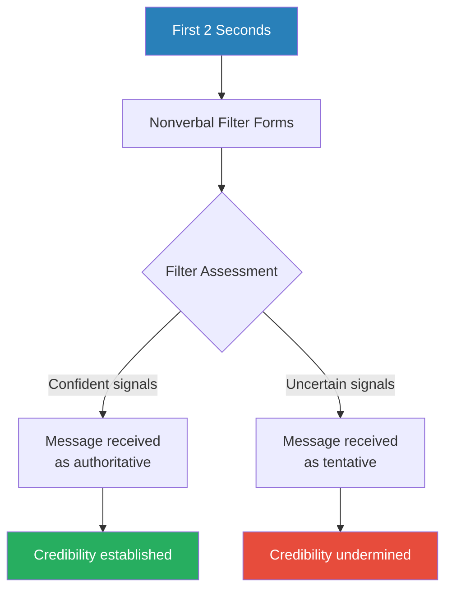
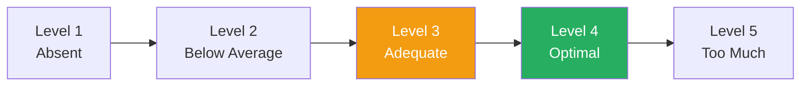
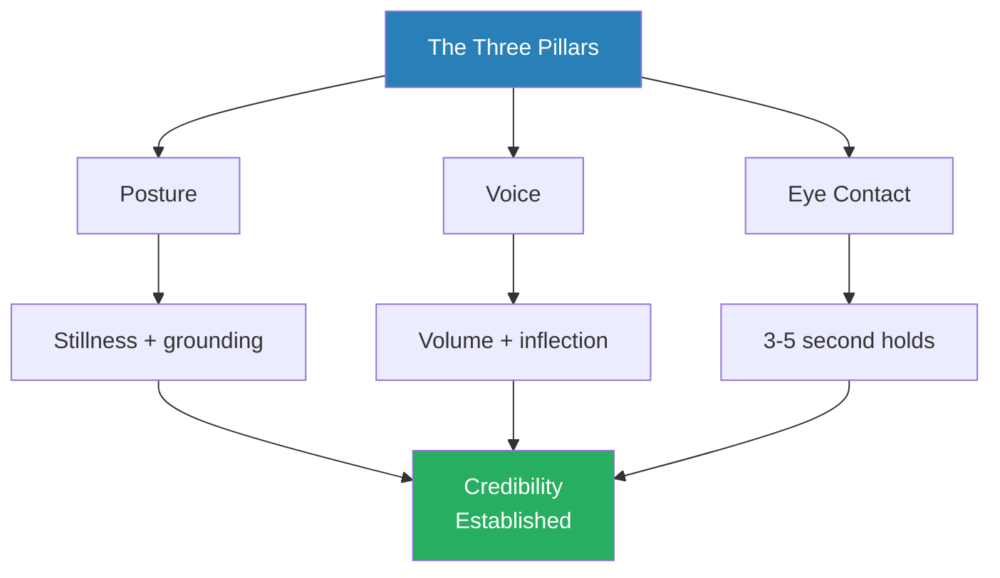
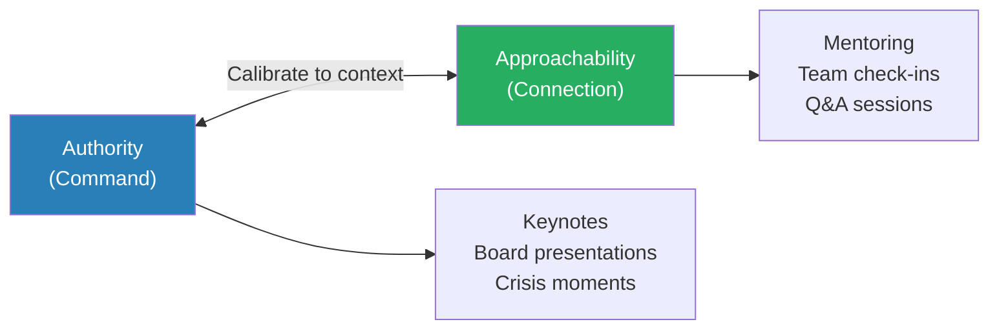
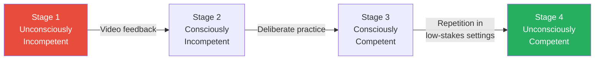
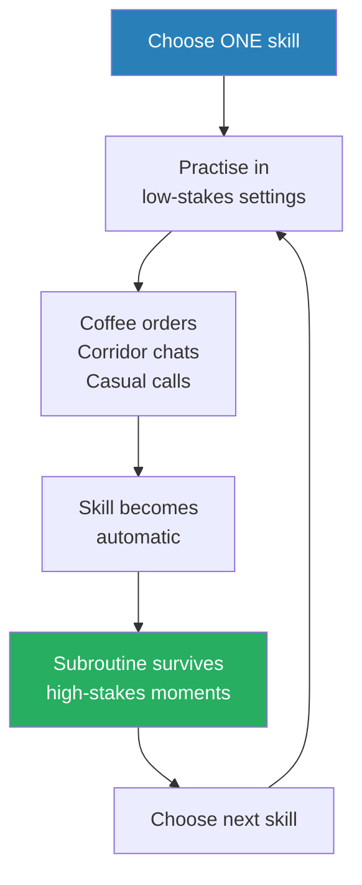

# The Credibility Code — Cara Hale Alter

> Cara Hale Alter's thesis is both reassuring and unsettling: credibility is not a gift you are born with but a set of observable physical behaviours you can learn -- and most people are unknowingly sabotaging theirs every day. Drawing on Nalini Ambady's thin-slicing research, which shows that people form consistent judgements about you in as little as two seconds, Alter argues that posture, voice, eye contact, and gesture are not secondary to your message -- they are the primary filter through which your message is received. The book catalogues the specific behaviours that signal confidence and authority, the common "derailers" that silently undermine them, and a systematic method for upgrading from adequate to exceptional. It is a practical, behaviour-by-behaviour manual for anyone who wants to close the gap between how competent they are and how competent they appear.

---

## About the Author

Cara Hale Alter is the founder of SpeechSkills, a San Francisco-based communication training firm that has coached thousands of professionals across industries including technology, finance, law, and healthcare. She has spent over two decades working with executives, engineers, salespeople, and emerging leaders on the physical mechanics of credibility -- posture, voice, eye contact, gesture, and facial expression. Her approach is grounded in observable behaviour rather than personality theory: she treats credibility as a trainable skill, not an innate trait. Alter's client list has included companies across Silicon Valley and beyond, and much of the book's evidence base comes from the patterns she has observed across thousands of workshop participants over many years. Her intellectual debts include Nalini Ambady's thin-slicing research, the classic four-stages-of-competency model from learning theory, and the practical orientation of executive coaching.

---

## The Big Idea

- Alter's central argument is that there is a **gap between your internal experience and your external impact** -- and you are almost certainly blind to it
- You may feel confident, but your posture says otherwise
- You may feel engaged, but your face looks bored
- You may feel authoritative, but your voice trails off into uncertainty at the end of every sentence
- The reason is that communication behaviours run as <b style="color: #2980b9">subroutines</b> -- automatic habits embedded so deeply that you never consciously examine them
- Under pressure, these subroutines take over entirely, and whatever you have practised (or failed to practise) is what the audience sees

This is why "just be yourself" is simultaneously the best and worst advice anyone can give:

- Under stress, "yourself" is whichever subroutine activates
- If you have spent years speaking softly, fidgeting, and avoiding eye contact, then being yourself under pressure means doing all of those things more intensely
- <b style="color: #e74c3c">The adrenaline of a high-stakes presentation does not magically summon a more commanding version of you</b> -- it amplifies whatever version is already there
- The only way to change the subroutine is to rewrite it through deliberate practice before the high-stakes moment arrives

---

- The good news is that subroutines can be rewritten, and Alter provides a systematic framework for doing so
- Every communication behaviour can be mapped onto a <b style="color: #2980b9">1-5 Perception Scale</b> -- from Absent (Level 1) through Below Average, Adequate, Optimal, to Too Much (Level 5)
- Most professionals, she finds, cluster at Level 3: **Adequate**
  - Not bad enough to draw criticism, not good enough to be memorable
- <b style="color: #27ae60">The competitive edge comes from moving to Level 4: Optimal</b> -- strong enough to differentiate, controlled enough to avoid pushback
- The single biggest barrier to reaching Level 4 is the fear of overshooting into Level 5
  - People are so afraid of being too loud, too intense, or too direct that they chronically undershoot
  - The cost of undershooting is invisible because nobody tells you when you are forgettably adequate

The architecture of the book follows naturally from this framework. Alter walks through the major categories of nonverbal behaviour -- posture, gesture, voice, eye contact, expression, and focus -- diagnosing where most people fall on the 1-5 scale, explaining what optimal looks like, identifying the common "derailers" that pull people down, and prescribing targeted practice methods for each.

---

## Key Concepts at a Glance

| Concept | One-line summary |
|---------|-----------------|
| **The 1-5 Perception Scale** | Every communication skill rated from Absent (1) to Too Much (5); the sweet spot is Level 4 (Optimal) |
| **The Subroutine Model** | Communication habits run on autopilot; changing them requires deliberate practice to overwrite the old code |
| **The Four Stages of Competency** | Learning progression from Unconsciously Incompetent to Unconsciously Competent |
| **The Three Pillars** | Posture, voice, and eye contact form the non-negotiable foundation of all credibility assessments |
| **The AvA Scale** | The spectrum from commanding authority to warm approachability; the best communicators project both |
| **The Pitcher/Catcher Model** | Different postures for speaking (projecting outward) versus listening (receiving inward) |
| **Thin Slicing** | People form consistent credibility assessments in as little as two seconds from nonverbal cues alone |
| **Derailers** | Invisible habits like fillers, uptalk, and fidgeting that silently destroy presence |
| **The Gesture Box** | The zone from sternum to hips where gestures appear most natural and controlled |
| **Projection as Calibrated Energy** | Projection is not raw volume but volume, eye contact, vitality, and expression aimed at the furthest listener |
| **The Internal-External Gap** | The disconnect between how you experience yourself and how others experience you |
| **The Duck-on-Water Principle** | Glide smoothly on the surface while paddling furiously underneath -- never self-comment on mistakes |

Alter's framework is hierarchical: the Three Pillars (posture, volume, eye contact) form the largest, most critical foundation. Derailers — the invisible habits that silently undercut credibility — form a nearly equal block because eliminating them is as important as building positive skills. Gestures and advanced skills build on top once the foundation is solid.

---

## Thin Slicing and the Science of Snap Judgements

*Before you finish your first sentence, the audience has already decided whether you are credible -- and the science behind that verdict is both robust and unsettling.*

- The book opens with the research that underpins its entire argument
- <b style="color: #2980b9">Nalini Ambady</b>, a Harvard social psychologist, conducted a series of studies in the 1990s showing that people form consistent assessments of competence, warmth, and credibility from exposure as brief as two seconds
- In one study, students watched silent two-second clips of teachers they had never met and rated them on various qualities
  - Those ratings correlated strongly with the ratings given by students who had taken the teacher's full-semester course
  - Two seconds of silent footage predicted the same outcome as four months of personal experience
- The implications are staggering:
  - Your audience is not waiting for your argument to unfold
  - They are not reserving judgement until they hear your data
  - They have already formed a powerful first draft of their opinion -- and everything you say after that either confirms or must overcome the draft

> [!tip] Core Insight
> Your audience is not waiting to hear your argument before deciding whether you are credible. They have already decided -- or at least formed a powerful first draft -- before you finish your first sentence. Nonverbal signals are the filter, not the supplement.

- The nonverbal signals you broadcast in those opening moments are not supplementary to your message -- they are the filter through which your message will be received:
  - If the filter says "uncertain," then even a brilliant argument sounds tentative
  - If the filter says "authoritative," then even a modest claim sounds confident
  - If the filter says "warm and competent," then even a disagreeable message lands as considered
  - If the filter says "nervous and fidgety," then even an agreeable message sounds unreliable

---

- <b style="color: #27ae60">Nonverbal credibility is the gateway through which all other competencies are evaluated</b>
- Content expertise, strategic thinking, technical knowledge -- none of these register with the audience if the physical delivery fails to open the gate
- This is why people with genuine expertise sometimes struggle to be heard, while people with less substance but stronger physical signals are listened to with rapt attention
- <b style="color: #e74c3c">The playing field is not fair</b> -- but it is readable, and once you understand the rules, you can play by them deliberately
- Alter is not cynical about this reality -- she treats it as a design feature of human cognition
  - Our ancestors needed to make rapid assessments of strangers: friend or threat, competent or incompetent, trustworthy or deceptive
  - Thin slicing is evolutionarily useful, even when it produces errors in modern contexts
  - The point is not to lament the injustice but to understand the mechanism and work with it

The thin-slicing mechanism means that nonverbal signals function as a pre-filter -- they shape how every subsequent piece of content is interpreted.

---

## The 1-5 Perception Scale

*Alter replaces vague feedback like "you need more presence" with a concrete five-level diagnostic that gives every behaviour its own rating and improvement path.*

| Level | Label | Description |
|-------|-------|-------------|
| 1 | Absent | The behaviour is missing entirely — devastating when it appears |
| 2 | Below Average | Exists but weak enough to be noticed as a deficit |
| 3 | Adequate | Good enough to avoid criticism, not good enough to be memorable |
| 4 | Optimal | Strong enough to differentiate, controlled enough to avoid pushback |
| 5 | Too Much | The overcorrection that most people fear — and almost nobody reaches |

Most professionals cluster at Level 3 across most behaviours. Level 4 is the target.

- **Level 1 -- Absent:**
  - Someone with Level 1 eye contact does not look at the audience at all
  - Someone with Level 1 volume whispers or trails off into inaudibility
  - This level is rare in professionals but devastating when it appears
  - It produces a visceral response in the audience -- not just "this person is weak" but "something is wrong"
- **Level 2 -- Below Average:**
  - Level 2 eye contact means glancing at people briefly but never holding a gaze
  - Level 2 volume means being heard in a quiet room but losing the audience in any setting with background noise
  - Level 2 is where most people who "need coaching" sit -- visible enough to be a problem, not visible enough for the person to notice on their own
- **Level 3 -- Adequate:**
  - This is where most professionals live -- the communication equivalent of a C grade
  - No one complains, but no one is impressed either
  - <b style="color: #e74c3c">The danger of Level 3 is its invisibility</b> -- you never get feedback that you are forgettable
  - Level 3 communicators get the meeting done, give the presentation adequately, survive the interview without embarrassment
  - But they are not remembered, not promoted on the basis of their presence, and not selected for the high-visibility assignments
- **Level 4 -- Optimal:**
  - <b style="color: #27ae60">Strong enough to differentiate you from the majority of Level 3 communicators</b>
  - Level 4 volume fills the room without shouting
  - Level 4 eye contact holds for three to five seconds per person, long enough to register as genuine connection
  - Level 4 posture is upright and grounded without rigidity
  - Level 4 is where people start saying things like "she has presence" or "he commands the room" -- and they cannot articulate why, because the signals are processed below conscious awareness
- **Level 5 -- Too Much:**
  - Level 5 volume is shouting; Level 5 eye contact is staring; Level 5 posture is wooden rigidity
  - In reality, Level 5 is extremely rare
  - For every person who speaks too loudly, two hundred speak too softly
  - The asymmetry is enormous: the risk of overshooting is almost always smaller than the risk of undershooting, yet the fear of overshooting dominates most people's self-regulation
  - <b style="color: #e74c3c">The fear of Level 5 is what keeps most professionals permanently parked at Level 3</b>

---

- The genius of the scale is that it gives people a concrete, non-judgemental diagnostic
- Instead of "you need more executive presence," the scale allows: "your eye contact is at Level 2, your volume is at Level 3, your posture is at Level 4"
- Each behaviour gets its own rating, its own diagnosis, and its own targeted improvement path
- This precision matters because credibility is not monolithic
  - A person can have excellent posture (Level 4) but terrible vocal projection (Level 2)
  - Another person can have commanding volume (Level 4) but no eye contact (Level 1)
  - The scale allows you to identify the weakest link and focus your practice there

Most professionals cluster at Level 3 across all behaviours — adequate but forgettable. The green line shows the Level 4 target across all dimensions. Targeted practice (blue) typically improves the pillar skills (posture, volume, eye contact) fastest, while facial expression and vocal variety take longer to upgrade because they involve more deeply embedded subroutines.

Most professionals cluster at Level 3 (amber) and need to push toward Level 4 (green) -- the fear of Level 5 is what keeps them stuck.

---

## The Three Pillars of Credibility

*Alter identifies three foundational behaviours that underpin every credibility assessment -- and without all three at Level 4, no amount of eloquence or expertise will land.*

- <b style="color: #2980b9">The Three Pillars</b> are **posture**, **voice**, and **eye contact**
- These are the non-negotiable baseline
- Without all three at Level 4, nothing else matters
- Alter's hierarchy is explicit: get these three right first, then worry about gestures, facial expression, and vocal variety
  - The pillars are foundational because they are always visible
  - You can choose not to gesture, but you cannot choose not to have posture
  - You can choose not to speak, but the moment you do, your volume and inflection are broadcasting
  - You can choose to close your eyes, but the moment you open them, your gaze patterns are being read

All three pillars must reach Level 4 before any other communication behaviour can meaningfully contribute to perceived credibility.

---

### Posture: The Silent Broadcast

*Your body speaks before your mouth opens, and it never stops broadcasting.*

- Alter argues that posture is the single most powerful nonverbal signal because it is always on
  - You cannot stop broadcasting it, and you cannot choose not to be seen
  - Every moment you are visible, your posture is telling the room something about your confidence, your comfort, and your authority
- Posture is also the hardest signal to fake, because it is the most automated
  - A person can consciously project their voice or force eye contact for a few minutes
  - But posture tends to revert to its default within seconds of the conscious effort relaxing

> [!tip] Core Insight
> The key principle is stillness. A still torso, a level head, minimal extraneous movement -- these are among the most powerful authority signals available.

- Alter draws a vivid animal analogy:
  - <b style="color: #27ae60">Eagles and owls sit still on their perches</b>, scanning the environment with calm control -- they are read as regal, wise, and powerful
  - <b style="color: #e74c3c">Small birds -- sparrows, wrens, starlings -- twitch, hop, and dart</b> -- they are read as nervous, inconsequential, and prey-like
  - Every weight shift, every foot shuffle, every head bob costs credibility in real time
- The analogy maps precisely onto human behaviour:
  - The CEO who sits still, hands resting calmly on the table, head level, eyes steady, is read as being in command
  - The junior analyst who shifts in the chair, crosses and uncrosses legs, adjusts glasses, and taps a pen is read as anxious and out of their depth
  - Neither person may be aware of what their body is doing -- but the room is reading it continuously

---

- The fix is not rigidity -- Alter is careful to distinguish between stillness and stiffness:
  - The trunk stays grounded and stable; the hands and face remain fluid and expressive
  - The combination of a stable base with animated expression reads as <b style="color: #2980b9">composed but human</b>
  - A person whose entire body moves constantly reads as scattered
  - A person whose entire body is frozen reads as tense
  - The middle ground -- still centre, animated periphery -- is what reads as genuine authority
- This distinction matters because many people, on hearing "be more still," overcorrect into rigidity
  - Rigidity looks tense, uncomfortable, and unnatural
  - It signals effort, not ease
  - True authority looks effortless -- the body is quiet because the mind is settled, not because the muscles are locked

> [!example] Bill the Architect -- Losing Pitches Despite the Best Designs
> - Bill, an architect, could not understand why he kept losing project pitches despite having the best designs in the room
> - When he was videotaped, the problem was immediately obvious: he rocked side to side, shifted his weight from foot to foot, and bobbed his head with every sentence
> - His body was telling the room he was nervous and uncertain, undermining the confident expertise his designs were supposed to convey
> - Once he learned to plant his feet and keep his torso still while letting his hands and face do the expressive work, his pitch success rate transformed
> **The lesson:** Your body's restlessness overrides the quality of your ideas.

> [!example] The CEO Candidate Rejected for His Spine
> - A search committee rejected a CEO candidate for a major hospital -- not because of anything he said, but because of how he sat during an informal coffee break
> - He slumped in his chair when he refilled his cup, and the committee members unconsciously registered this as a lack of gravitas
> - The candidate never knew why he was rejected -- he assumed it was about his strategy presentation
> - It was about his spine
> **The lesson:** Credibility is assessed in every moment you are visible, not just when you are formally presenting.

> [!abstract] Posture Mechanics
> 1. Stand with feet shoulder-width apart, weight balanced evenly
> 2. Keep the head level -- not tilted, not bobbing
> 3. Imagine a string pulling the crown of the head upward
> 4. When seated, sit forward on the chair with the spine supported by its own strength, not by the backrest
> 5. When standing, avoid leaning on the lectern, the table, or the wall -- each lean surrenders energy
> 6. These sound trivially simple -- which is why most people assume they are already doing them, and why video feedback is so consistently shocking

---

### Voice: Volume as a Proxy for Confidence

*Alter's data reveals a stunning asymmetry: for every person who speaks too loudly, two hundred speak too softly -- yet the fear of being too loud keeps the majority from correcting.*

- Alter's data on vocal volume is striking:
  - One in five professionals speaks too softly
  - Only one in two hundred speaks too loudly
  - The ratio is **40:1** in favour of undershooting
  - <b style="color: #e74c3c">Yet the fear of being too loud keeps the vast majority of underpowered speakers from correcting the problem</b>
- This asymmetry is one of the book's most powerful data points because it explodes a common assumption:
  - People believe the risk of being too loud is roughly equal to the risk of being too soft
  - The actual risk ratio is wildly skewed -- 40 to 1
  - Almost no one overshoots, but the phantom fear of overshooting keeps millions of people stuck at Level 3

Alter's workshop data reveals a staggering 40:1 ratio: for every person who speaks too loudly, forty speak too softly. Yet the fear of overshooting into "too loud" territory keeps the vast majority of underpowered speakers from correcting. This asymmetry is one of the book's most actionable insights — the risk of increasing your volume is almost always lower than the risk of staying quiet.

---

- Why does volume matter so much?
  - The voice is a physical instrument, and the strength of the instrument reflects the engagement of the body behind it
  - Strong volume requires diaphragmatic engagement, which also improves resonance, lowers pitch, and projects physical energy
  - <b style="color: #27ae60">A strong voice literally fills space, claiming the attention of the room</b>
  - A weak voice surrenders space, requiring the listener to work harder -- to lean in, to strain, to compensate
  - Listeners will do this for a while, but the effort depletes attention, and eventually they disengage
- The underlying problem is what Alter calls the <b style="color: #2980b9">internal meter problem</b>:
  - Most people think they are louder than they actually are
  - Their internal experience of effort does not match the external experience of output
  - They feel like they are projecting, but the person at the back of the table hears only a murmur
  - The internal meter is miscalibrated, and without external feedback the miscalibration persists indefinitely
- This miscalibration has a neurological basis:
  - When you speak, you hear your own voice through bone conduction as well as air conduction
  - Your voice sounds louder and deeper to you than it does to anyone else
  - The person standing ten feet away hears only the air conduction version -- which is significantly softer and thinner than what you hear internally

> [!example] Grant the Software Executive -- Confidence Without Volume
> - Grant, a software executive, felt confident and assertive in meetings but his team consistently ignored his input
> - When he watched his video playback, he was stunned to discover that his voice barely carried past the first row of seats
> - He was speaking at the volume appropriate for a private conversation, not a conference room
> - His internal experience of confidence was real, but his external signal was timidity
> - The gap between intention and perception was the entire problem
> **The lesson:** Feeling confident does not make you sound confident -- external calibration is the only reliable check.

> [!example] The Workshop Participant Who "Couldn't Be Louder"
> - A woman in one of Alter's workshops insisted she could not speak any louder
> - Alter asked her to imagine speaking to someone across a noisy restaurant -- her volume immediately doubled
> - She was not physically limited; she was psychologically limited
> - Her internal governor was set to "polite indoor voice," and she had never had reason to override it
> - The capacity was there; the permission was not
> **The lesson:** Most volume problems are not physical limitations but psychological governors set too low.

- The fix is deceptively simple: calibrate your volume so the person furthest from you hears every word without effort
  - Not shouting -- that is Level 5
  - Not projecting with theatrical intensity -- that is unnecessary
  - Simply aiming your voice at the back of the room rather than the front
- The physical adjustment is small -- a slight increase in breath support, a marginal engagement of the diaphragm -- but the perceptual difference is enormous
- <b style="color: #27ae60">The shift from Level 3 to Level 4 volume is the single easiest change with the highest return on investment in the entire credibility toolkit</b>

---

- Beyond volume, Alter addresses several other vocal dimensions:

| Vocal Dimension | What it does | Optimal state |
|-----------------|-------------|---------------|
| **Volume** | Signals confidence and claims space | Fills the room without shouting |
| **Pace** | Too fast signals nervousness; too slow signals boredom | Varied pace to keep listeners engaged |
| **Inflection** | The melody of the voice | Downward on statements, upward only on questions |
| **Resonance** | A chest voice sounds deeper and more authoritative | Diaphragmatic breathing as the foundation |

Diaphragmatic breathing underpins all four dimensions -- it is the single physical skill that improves volume, resonance, pace control, and inflection simultaneously.

- **Pace** deserves special attention:
  - Nervous speakers accelerate -- the faster they speak, the faster the audience loses them
  - But the opposite error -- speaking so slowly that every sentence feels laborious -- is equally damaging
  - The ideal is a varied pace: normal speed for exposition, slightly faster for energy and excitement, noticeably slower for emphasis and key points
  - <b style="color: #27ae60">The strategic slowdown is one of the most underused tools in the communicator's arsenal</b> -- dropping your pace for a single sentence signals "this is the important part"

---

### Eye Contact: The Credibility Multiplier

*The jump from two seconds to four seconds of sustained eye contact per person is small in absolute terms but enormous in perceptual impact.*

- Holding eye contact for <b style="color: #2980b9">three to five seconds per person</b> -- not scanning the room, not darting from face to face -- is the single behaviour that most transforms the perception of confidence and connection
- Most people operate at one to two seconds, which registers as evasive or distracted
- The difference between two seconds and four seconds sounds trivial -- but the perceptual impact is enormous
  - Two seconds feels glancing and uncommitted
  - Four seconds feels like a genuine conversation between two individuals
  - The listener at the receiving end of four-second eye contact feels personally addressed, which transforms passive listening into active engagement

Why is eye contact so powerful? Alter identifies two mechanisms:

- **First, eye contact is reciprocal:**
  - Strong eye contact from the speaker compels attention from the listener
  - When you look someone in the eye for a full phrase, they feel individually addressed, personally acknowledged, and therefore more engaged
  - They are more likely to nod, to pay attention, and to feel connected to your message
  - This creates a virtuous cycle: your eye contact produces their engagement, which produces your confidence, which improves your delivery
- **Second, strong eye contact focuses the speaker's own thinking:**
  - <b style="color: #27ae60">Darting eyes scatter thought; focused eyes focus thought</b>
  - When your gaze is anchored on one person for a complete idea, your brain organises itself around completing that idea coherently
  - When your eyes are flitting across the room, your brain follows them into fragmentation
  - This is why speakers who look at their slides, at the ceiling, or at the floor tend to lose their train of thought more frequently
  - The eyes are not just output devices -- they are steering mechanisms for cognitive processing

> [!example] Nikhil -- Rewriting a Cultural Subroutine
> - Nikhil, a workshop participant, found sustained eye contact genuinely uncomfortable
> - He had grown up in a culture where prolonged eye contact with authority figures was considered disrespectful, and he carried that habitual avoidance into professional settings
> - In meetings, his darting gaze made him appear evasive and uncertain, even though he was neither
> - The solution was not to override his cultural instincts overnight but to desensitise gradually -- starting with three-second holds in safe, low-stakes conversations, then extending the duration and raising the stakes over weeks
> - By the end of his coaching, Nikhil could maintain four-second eye contact in board presentations without conscious effort
> **The lesson:** Even deeply ingrained cultural subroutines can be rewritten through gradual, low-stakes practice.

> [!example] The Presenter Who Talked to the Projector Screen
> - A workshop participant consistently delivered his presentations to the projector screen rather than to the audience
> - He would turn to check the slide and then remain facing the screen while speaking -- sometimes for thirty seconds at a time
> - The audience saw his back and heard a muffled voice directed away from them
> - He was unaware of the habit until he saw the video -- from his perspective, he was simply referencing his slides
> - The fix was simple: glance at the slide, turn back to the audience, then speak
> **The lesson:** You cannot build credibility with the back of your head.

---

- In group settings, the discipline is specific:
  - Deliver one complete thought -- one phrase, one sentence -- to one person before moving your gaze to the next
  - <b style="color: #e74c3c">Do not scan</b> -- scanning means your eyes sweep the room without resting on anyone, creating the impression of talking to the room as an abstraction
  - <b style="color: #e74c3c">Do not dart</b> -- darting means your eyes jump from person to person mid-sentence, signalling anxiety and destroying the perception of focus
  - The rhythm is: land on one person, deliver one thought, land on the next person, deliver the next thought
- The optimal duration varies by context:
  - In Western business settings, three to five seconds is the sweet spot
  - Below three seconds feels fleeting and inattentive
  - Beyond five seconds, without softening facial animation, eye contact can begin to feel confrontational
  - Cultural variation exists, and Alter acknowledges it, though the book operates primarily within Western professional norms
- Eye contact also functions as a status signal:
  - Higher-status individuals tend to hold eye contact while speaking and reduce it while listening
  - Lower-status individuals tend to avoid eye contact while speaking and increase it while listening (looking up at the speaker deferentially)
  - By consciously maintaining strong eye contact while you speak, you are signalling equal status regardless of your actual position in the hierarchy

---

## Gestures: The Language of the Hands

*Gestures are not decorative add-ons to speech but are hardwired into human communication -- even congenitally blind individuals gesture while speaking.*

- The second tier of credibility behaviours, after the three pillars, involves the hands
- Alter identifies three categories of hand position
- Research on congenitally blind individuals shows that they gesture while speaking even though they have never seen anyone gesture -- the impulse is innate, not learned
- This means suppressing gesture -- holding your hands behind your back, stuffing them in your pockets, gripping a pen for dear life -- is working against your neurology
  - It requires effort that would be better spent on your message
  - It produces a visible tension that the audience reads as discomfort

### Masking Positions

- <b style="color: #2980b9">Masking positions</b> are postures where the hands are hidden, locked, or restrained:
  - Arms crossed, hands in pockets, the "fig leaf" (hands clasped in front of the groin)
  - The "reverse fig leaf" (hands clasped behind the back)
  - Gripping the lectern, holding a pen like a security blanket
- <b style="color: #e74c3c">All of these signal discomfort, defensiveness, or a desire to self-soothe</b>
- They tell the room that the speaker is not fully at ease, even when the speaker feels perfectly fine
- The problem is compounded by frequency:
  - People tend to adopt their masking position as a default whenever they are not actively gesturing
  - This means the majority of the presentation is spent in a position that signals defensiveness

> [!example] The Senior Engineer with Hidden Hands
> - A senior engineer habitually clasped his hands behind his back when presenting
> - He thought the posture looked professional and relaxed
> - On video, it looked like he was hiding his hands -- which the audience's subconscious read as concealment
> - The moment he released his hands and let them gesture naturally from the navel, his perceived openness and warmth increased dramatically without any change to his words
> **The lesson:** Hands that are hidden read as hands that are hiding something.

### The Gesture Box

- The <b style="color: #2980b9">gesture box</b> is the zone from the sternum to the hips, roughly shoulder-width
- Gestures that originate from within this box and move outward look natural, controlled, and purposeful
- Gestures that originate from outside the box -- wide sweeping arms, hands raised above the head, or below the waist -- look theatrical or desperate depending on context
- The navel is the **sweet spot** -- the default resting position from which gestures initiate naturally
- Why the navel? Because it is the body's centre of gravity
  - Hands resting at navel height look relaxed and ready
  - They can initiate gestures in any direction without the arm having to travel far
  - They neither signal defensiveness (too low) nor aggression (too high)

### Three Gesture Types

| Gesture Type | Motion | Signal | Best use |
|-------------|--------|--------|----------|
| **Reach** | Open palm extended toward listener | Invitation, inclusion, warmth | Default in first meetings; making people feel included |
| **Show** | Palms facing upward | Transparency and openness | Explaining concepts, walking through data |
| **Chop** | Edge of hand moving downward | Authority, emphasis, finality | Enumeration and decisiveness -- but overuse crosses into aggression |

Reach gestures are the safest default; chop gestures are the most powerful but the most easily overdone.

- <b style="color: #27ae60">Start gesturing with your first word</b>
- Many speakers begin with their hands locked or hidden and only start gesturing once they relax, which may be minutes into their talk
  - By then, the first impression is already set
- Beginning with hands at navel height and moving them outward with the first phrase signals immediate ease and engagement
- The relationship between gesture types and the AvA scale is direct:
  - Reach and show gestures lean toward approachability
  - Chop gestures lean toward authority
  - A speaker who uses all three in appropriate proportions can calibrate their presence moment by moment

---

## The Derailers

*Alter's most practically useful contribution is her catalogue of invisible habits that silently undercut credibility -- and the speaker never knows they are doing it.*

- <b style="color: #2980b9">Derailers</b> are behaviours that silently undercut credibility without the speaker knowing
- These are the invisible leaks in the system
- You could have Level 4 posture, volume, and eye contact, and a single persistent derailer could undermine all three
- <b style="color: #e74c3c">The danger of derailers is precisely their invisibility</b>: because the speaker is unaware of them, they persist indefinitely unless someone points them out
- Alter catalogues several categories of derailers, each with its own mechanism of damage

Filler words are most damaging in formal presentations where every pause is magnified. Uptalk is most devastating in interviews, where senior evaluators associate it with lack of conviction. Fidgeting and masking posture hurt most in meetings where prolonged visibility makes them cumulative. The resting face becomes the dominant derailer on virtual calls, where the camera frames only shoulders and face for extended periods.

### Filler Words

*Four out of five professionals use fillers excessively -- and the cost is far higher than most realise.*

- "Um," "uh," "you know," "sort of," "kind of," "actually," "basically," "like," "right?"
- Four out of five professionals use fillers excessively, according to Alter's workshop data
- The problem is not that fillers exist -- one or two per paragraph is natural and human
- The problem is when fillers become compulsive, filling every pause and cushioning every assertion
- The damage operates on two levels:
  - **Signal level:** each filler tells the listener "I am uncertain about what I am saying"
  - **Cumulative level:** a stream of fillers creates cognitive noise that makes the listener work harder to extract meaning from the speech

> [!example] Caroline Kennedy's "You Know" (2008-2009)
> - During her campaign for Hillary Clinton's vacated New York Senate seat, Kennedy sat for an interview with the New York Daily News
> - In that single interview, she used the phrase "you know" 138 times
> - The interview was widely mocked, and what might have been a serious candidacy became a punchline
> - Kennedy was by all accounts an intelligent, capable person
> - But the filler words converted what should have been authoritative answers into a stream of apparent uncertainty
> **The lesson:** Filler words can overwhelm content so completely that competence becomes invisible.

> [!example] The CEO's "Sort Of" Speech
> - A CEO delivered what should have been an inspiring motivational speech to his company
> - He peppered it with "sort of" and "kind of" -- phrases that function as hedging qualifiers
> - "We are sort of going to transform this industry" does not inspire; "We are going to transform this industry" does
> - The two-word addition is tiny; the credibility cost is massive
> **The lesson:** Hedging qualifiers turn assertions into apologies.

---

- Why do fillers persist? Because they serve a real psychological function:
  - They are **placeholders for silence** -- the speaker's brain abhors a vocal vacuum
  - When thinking, hesitating, or transitioning between ideas, the instinct is to fill the gap with sound rather than leaving it empty
  - Silence feels dangerous to the speaker -- it feels like losing control of the conversation
  - But the listener experiences silence completely differently
- The counterintuitive truth:
  - <b style="color: #27ae60">A deliberate pause actually increases perceived intelligence and confidence</b>
  - The listener interprets the pause as thoughtfulness, composure, and command
  - The speaker who pauses deliberately appears to be choosing their words carefully
  - The speaker who fills with "um" appears to be struggling to find words at all
  - Great orators throughout history have understood this -- the pause is not an absence of speech but a form of speech

> [!abstract] The Filler Replacement Drill
> 1. Practise speaking for 30 seconds on any topic
> 2. Have a trusted colleague count fillers
> 3. Repeat, aiming to replace each filler with a one-beat pause
> 4. The awkwardness fades quickly; the silence that felt unbearable to the speaker feels powerful to the listener
> 5. Goal: not to eliminate fillers entirely (that produces robotic speech) but to replace compulsive fillers with deliberate pauses

---

### Uptalk

*Ending declarative statements with upward vocal inflection converts assertions into implicit questions -- and the damage with senior audiences is severe.*

- <b style="color: #2980b9">Uptalk</b> means ending declarative statements with upward vocal inflection -- turning "I built this programme" into "I built this programme?"
- <b style="color: #e74c3c">Every time a statement rises at the end, the speaker is nonverbally asking the listener for permission or validation</b>
- The underlying message is not confidence in the claim but uncertainty about whether the listener agrees
- Alter traces the spread of uptalk from its origins in 1980s "valley girl" speech patterns in Southern California to its current pervasiveness across professional communication
  - The pattern has become so common that many people do not recognise they are doing it
  - They hear their own speech as neutral and are genuinely surprised when video reveals the rising inflection
  - Uptalk has spread across genders, ages, and regions -- it is no longer limited to any demographic

---

- The damage is asymmetric:
  - Among peers of the same generation, uptalk may go unnoticed or may even function as a collaborative signal
  - But among senior audiences -- executives, board members, decision-makers -- uptalk consistently registers as lacking conviction
  - The senior listener hears the rising inflection and instinctively interprets it as the speaker being unsure of their own claims
  - Whether this interpretation is fair is irrelevant; it is consistent and powerful
- Alter distinguishes between three contexts for upward inflection:
  - **Legitimate questions** -- upward inflection is correct and expected
  - **Lists** -- upward inflection on items 1 through n-1 signals "there is more coming"; the final item drops to signal completion
  - **Declarative statements** -- upward inflection is always a derailer, converting authority into uncertainty

> [!abstract] Fixing Uptalk
> 1. End every declarative statement with a pitch that drops -- a vocal period rather than a vocal question mark
> 2. Practise with simple, factual statements first: "My name is Sarah" (down) "I work in finance" (down) "This project launched in January" (down)
> 3. Build to more complex professional statements
> 4. The only appropriate context for upward inflection is actual questions and item-by-item lists (where upward inflection signals "there is more coming," and the final item drops to signal completion)

<b style="color: #27ae60">Downward inflection signals conviction and ownership</b> -- it is the vocal equivalent of a full stop.

---

### Self-Commenting

*When you stumble and wince, the audience registers the wince -- not the stumble. The goal is to glide smoothly on the surface while paddling furiously underneath.*

- Visibly reacting to your own mistakes -- wincing, apologising, narrating your struggle, rolling your eyes at yourself -- broadcasts internal self-doubt to the room
- Alter calls this the <b style="color: #2980b9">duck-on-water principle</b>: the goal is to glide smoothly on the surface while paddling furiously underneath
- Why is self-commenting so damaging?
  - Listeners do not notice minor verbal stumbles unless the speaker draws attention to them
  - A fumbled word, corrected without facial commentary, is a non-event -- the listener's brain auto-corrects and moves on
  - But a fumbled word followed by a wince, an "I'm sorry," or a visible grimace becomes a **credibility moment**
  - The speaker has flagged their own imperfection and invited the listener to register it
- The psychology is simple:
  - The audience takes its cue from the speaker
  - If the speaker treats a stumble as trivial, the audience does too
  - If the speaker treats a stumble as significant, the audience registers that significance

> [!example] Kimi's Pre-emptive Apologies
> - Kimi, a workshop participant, began every presentation with an apology
> - "I'm sorry, I'm not very good at this." "Sorry, I'm still getting used to presenting." "Sorry, this is more of a rough draft."
> - Each apology was intended to lower expectations and create psychological safety for herself
> - But the cumulative effect was to tell the room, repeatedly, that she was not competent
> - The room believed her -- not because it was true, but because she said it so often and so convincingly
> **The lesson:** The audience takes its cue from the speaker's self-assessment, not from the speaker's actual performance.

> [!example] The Surgeon Who Apologised Mid-Presentation
> - A surgeon presenting at a medical conference stumbled over a technical term and immediately said, "Sorry, I'm terrible with these long words"
> - The audience laughed politely, but the damage was done -- for the rest of the presentation, they were primed to notice any further stumbles
> - A colleague presenting the same day stumbled over a similar term, corrected it without any facial reaction, and continued
> - The audience did not register the second stumble at all
> **The lesson:** The wince costs more than the stumble.

- <b style="color: #27ae60">The fix: when you stumble, correct the word and continue without changing your facial expression, without breaking eye contact, and without apologising</b>
  - No wince, no shrug, no "sorry"
  - The stumble becomes a non-event because you treated it as one
  - The audience takes its cue from the speaker's reaction, not from the stumble itself

---

### Fidgeting and Nervous Movement

- This category encompasses all the small, repetitive movements that signal discomfort:
  - Tapping a pen, clicking a pen cap, playing with a ring
  - Touching the face, adjusting glasses, fixing hair
  - Bouncing a knee, rocking side to side, pacing without purpose
- Each individual movement is trivial; cumulatively, they create an impression of restless anxiety
- Alter distinguishes between two types of movement:
  - <b style="color: #27ae60">Purposeful movement</b> -- walking to the whiteboard, gesturing toward a slide, stepping toward a listener for emphasis -- adds energy and variety
  - <b style="color: #e74c3c">Purposeless movement</b> -- pacing, rocking, tapping -- leaks energy and focus
- The test is simple: if the movement serves the message, keep it; if it serves the speaker's nervous system, eliminate it
- Alter notes that fidgeting is particularly damaging in seated settings:
  - Standing, a speaker can at least channel nervous energy into purposeful movement
  - Seated, the energy has nowhere to go -- so it leaks out as pen-clicking, paper-shuffling, chair-rocking, and finger-drumming
  - In meetings, where you are seated and visible for long periods, fidgeting is a continuous credibility drain

---

## Authority vs Approachability

*Most people default to one end of the authority-approachability spectrum and are weak at the other -- exceptional communicators can project both simultaneously.*

- Alter's <b style="color: #2980b9">AvA Scale</b> maps communication style on a spectrum from authoritative to approachable
- Most people default to one end and are weak at the other
- Exceptional communicators are exceptional precisely because they can project both simultaneously, or shift fluidly between them depending on what the moment requires

### The Two Poles

| Signal type | Behaviours | Message to the room |
|------------|-----------|-------------------|
| **Authority** | Symmetrical posture, physical stillness, strong volume, downward inflection, commanding space, level head, direct eye contact, deliberate pacing | "I know what I am talking about, and I am in command" |
| **Approachability** | Fluid gestures, facial animation, vocal variety and warmth, reaching gestures, head tilts, nodding, slightly rounded posture | "I am interested in what you think, and I want to connect" |

Neither pole is inherently better -- the question is always what the situation requires.

- A keynote address to five hundred people requires more authority
- A one-on-one mentoring conversation requires more approachability
- A board presentation requires both -- authority when presenting the data, approachability when fielding questions
- <b style="color: #27ae60">The skill is calibration, not maximisation</b>
- The common mistakes:
  - People who default to authority become rigid and intimidating when the situation calls for connection
  - People who default to approachability become warm but weightless when the situation calls for command
  - Neither is wrong in absolute terms -- both are wrong when applied to the wrong context

The best communicators operate fluidly across this spectrum rather than being anchored to one pole.

---

### Authority Is Not Aggression

*The critical distinction most frequently confused in practice -- and the one that determines whether people want to follow you or fight you.*

- The critical distinction Alter draws is between <b style="color: #2980b9">authority</b> and **aggression**
- They look superficially similar but produce opposite reactions:

| Dimension | True Authority | Aggression |
|-----------|---------------|------------|
| **Head** | Level | Thrust forward |
| **Gestures** | Relaxed, open | Emphatic, chopping |
| **Gaze** | Direct but soft | Locked, intense |
| **Voice** | Strong but not strained | High tension, forced |
| **Body energy** | Calm, centred, settled | Leaning forward, coiled, tense |
| **Overall impression** | Calm control | Barely contained intensity |
| **Audience reaction** | Respect -- want to listen and follow | Resistance -- want to push back or disengage |

- The distinction is fundamentally about tension:
  - Authority is relaxed strength -- the person could escalate but chooses not to
  - Aggression is forced strength -- the person is already at maximum intensity and has nowhere to go

> [!example] The Woman Told She Was "Too Authoritative"
> - A woman in one of Alter's workshops had been told by her boss that she was "too authoritative" and needed to soften her style
> - When Alter watched her on video, the problem was not authority at all -- it was aggression
> - The woman used emphatic chopping gestures on every point, leaned forward with her whole body, and smiled with locked intensity that signals threat rather than warmth
> - She was not projecting too much authority; she was projecting insecurity masked by force
> - The fix was not to be less commanding but to be differently commanding: level head, open gestures, slightly lower volume, more pauses
> **The lesson:** Authority delivered with calm is exponentially more powerful than authority delivered with strain.

> [!tip] Core Insight
> When you feel the urge to emphasise a point through physical intensity -- louder voice, sharper gestures, leaning forward -- do the opposite: lower your voice slightly and pause. The person who gets quieter when they are most serious commands more attention than the person who gets louder.

---

## The Pitcher/Catcher Model

*One of Alter's most immediately useful frameworks -- and the primary reason most people's contributions get ignored in meetings.*

- <b style="color: #2980b9">The Pitcher/Catcher Model</b> divides communication posture into two modes:

> [!abstract] Pitcher vs Catcher Posture
> **Pitcher posture (when speaking):**
> - Strong spine, level head
> - Energy projected outward toward the audience
> - Open gestures, feet grounded
> - You are sending the ball -- your body language signals you are the source of energy
>
> **Catcher posture (when listening):**
> - Slightly rounded spine, receptive body language
> - Attentive focus directed at the speaker
> - Minimal movement, nodding
> - You are receiving the ball -- your body language signals all attention is on the speaker

- <b style="color: #e74c3c">The most common derailer in meetings is staying in catcher posture while speaking</b>
  - This is the primary reason contributions get ignored
  - The speaker's words say "I have a point to make," but the body says "I am receiving, not sending"
  - Rounded spine, head tilted, soft volume, uncertain gestures -- these conflict with the verbal signal of assertion
  - <b style="color: #e74c3c">When verbal and nonverbal signals conflict, the nonverbal wins</b>
  - The room registers the body, not the words

---

- The opposite error is also possible but less common: staying in pitcher posture while listening
  - This looks like the person who sits bolt upright, maintains aggressive eye contact, and shows no responsive animation while someone else is talking
  - It reads as dominance or disinterest -- either of which damages the relationship
- The shift between modes should be deliberate and distinct:
  - When someone finishes speaking and you begin: spine straightens, head levels, volume increases slightly, gestures initiate
  - When you finish speaking and someone else begins: spine relaxes slightly, head tilts toward the speaker, hands come to rest, eyes focus on the speaker's face
  - <b style="color: #27ae60">The transition itself signals awareness and social intelligence</b>

> [!example] The Meeting Wallflower
> - A talented product manager consistently made strong points in meetings but was routinely overlooked
> - Video review showed the problem: she made her points from catcher posture -- leaned back, head tilted, voice soft, hands in her lap
> - Her words said "I have an opinion," but her body said "please don't notice me"
> - After learning to shift into pitcher posture before speaking -- sitting forward, levelling her head, projecting her voice -- her contributions began landing with the weight they deserved
> **The lesson:** The posture you speak from determines whether your words are received as assertions or afterthoughts.

---

## Projection and Connection

### Projection as Calibrated Energy

*Alter reframes projection not as volume alone but as calibrated energy -- the combination of volume, eye contact, vitality, and expression aimed at the furthest listener in the room.*

- <b style="color: #2980b9">Projection</b> is not volume alone but calibrated energy -- volume, eye contact, vitality, and expression aimed at the furthest listener
- Her analogy is playing catch:
  - If you and a friend are playing catch, you throw the ball to where your friend is standing, not to a spot two feet in front of you
  - Most communicators do the vocal equivalent of lobbing the ball into the dirt at their own feet
  - Their message has enough energy to travel a few feet, but the audience is ten or twenty feet away
  - The listener has to supply their own energy to compensate -- leaning forward, straining to hear, working harder to stay engaged
  - They will do this for a limited time before fatigue sets in and attention wanders

---

- Alter cites a finding (attributed to a U.S. Navy study from the 1970s, via Granville Toogood) suggesting an <b style="color: #2980b9">18-minute attention wall</b>
  - The approximate point at which a one-way communication loses most of its audience
  - The number should be taken loosely (Alter herself does not defend it as rigorous science), but the principle is sound
  - Audiences have a finite supply of compensatory effort
  - <b style="color: #27ae60">Proper projection -- aiming your energy at the back of the room -- makes listening effortless and extends the window of attention considerably</b>
- Projection is not just a vocal phenomenon:
  - It includes facial expression -- expressions that are large enough to be read from the back row
  - It includes eye contact -- sweeping the room systematically so everyone feels included
  - It includes physical vitality -- the energy of the body matching the energy of the voice
  - A person who projects vocally but has a dead face creates a dissonant signal
  - A person who has an animated face but a weak voice creates a different kind of dissonance
  - True projection is the alignment of all channels at the appropriate intensity for the size of the room

> [!abstract] Projection Calibration
> 1. Before you begin speaking, identify the person furthest from you
> 2. Calibrate your volume, eye contact, and energy so that person hears every word without straining
> 3. Everyone between you and that person will be automatically served
> 4. Adjust upward as the room gets larger, noisier, or more formal
> 5. Adjust downward as the room gets smaller, quieter, or more intimate

---

### Eliciting Responses

*The second half of the communication equation -- actively inviting the listener to participate, creating a loop rather than a broadcast.*

- <b style="color: #2980b9">Eliciting responses</b> means actively inviting the listener to participate -- not just through questions, but through nonverbal cues that create a conversational loop even during a presentation
- The tools include:
  - Nodding while making a point (triggers reciprocal nodding from the listener)
  - Raised eyebrows (signals "this matters, are you with me?")
  - Reaching gestures toward specific people (makes individuals feel personally included)
  - Strategic pauses (creates space for the listener's internal processing and response)
- The mechanism behind reciprocal responses is <b style="color: #2980b9">mirror neurons</b>:
  - When you nod, the listener's mirror neurons fire, producing an impulse to nod back
  - When you lean forward, the listener's body subtly mirrors the lean
  - By managing your own nonverbal output, you are indirectly managing the audience's engagement

> [!example] The Unresponsive Garage Attendant
> - An employee was famously unresponsive, stone-faced, and resistant to any social interaction
> - A colleague decided to apply eliciting behaviours consistently: greeting him warmly, making eye contact, nodding, pausing to give him space to respond
> - For weeks, nothing happened -- the attendant remained stone-faced
> - But the colleague persisted, and eventually the attendant began to respond -- first with eye contact, then with a nod, then with a greeting of his own
> - The persistent application of reciprocal signals eventually trained even the most unresponsive person to engage
> **The lesson:** Communication is not a one-directional broadcast -- it is a loop, and the speaker who manages both sides sustains engagement far beyond the 18-minute wall.

---

## Active Listening Posture

*In most meetings, you listen far more than you speak -- so your credibility is being assessed far more often when you are not talking than when you are.*

- A chapter that many readers overlook because it seems less glamorous than the speaking chapters, but Alter argues it may be more important
- In most meetings, you listen far more than you speak
- <b style="color: #27ae60">Your credibility is therefore being assessed far more often when you are not talking than when you are</b>
- A disengaged listening posture -- slumped spine, wandering eyes, checking the phone, typing on a laptop -- can undo in minutes the credibility built during a strong speaking turn
- Senior people notice who is paying attention
  - They notice who is leaning in and who is checked out
  - The person who maintains focused, animated listening posture throughout a meeting is signalling: "I take this seriously. I am engaged. I am a stakeholder."

> [!example] George -- Excellent Speaker, Terrible Listener
> - George had excellent speaking skills -- strong voice, good posture, compelling content
> - But he could not get hired -- interview after interview, he made it to the final round and was rejected
> - When his listening posture was analysed on video, the problem was obvious: the moment someone else began speaking, George's face went blank, his body slumped, and his eyes drifted
> - He looked bored -- he was not bored, he was thinking carefully about what was being said
> - But his face did not show thinking; it showed absence
> - The interviewers read his listening posture as arrogance or disinterest, and it outweighed everything he said when it was his turn to speak
> **The lesson:** Your listening face can undo your speaking performance.

---

- Alter also raises the issue of the <b style="color: #2980b9">resting face</b> -- what your face does when you are not consciously managing it:
  - Some people's resting faces look angry, sad, bored, or confused
  - The resting face is another subroutine, and it runs continuously
  - In meetings, the resting face is your default broadcast -- and if it reads as bored or hostile, that is the message every person in the room receives when they glance at you

> [!example] Greta's Closed Eyes
> - Greta, a workshop participant, discovered through video playback that she closed her eyes when she was concentrating deeply
> - She thought she was showing intense focus
> - The room saw someone who had fallen asleep
> **The lesson:** Your internal experience of concentration has no bearing on what your face actually shows.

> [!example] The VP with the Angry Resting Face
> - A vice president was told by multiple colleagues that he always seemed angry
> - He was not angry; his resting face -- furrowed brow, downturned mouth, narrowed eyes -- simply defaulted to an expression that read as hostile
> - He had no idea until the feedback became impossible to ignore
> - The fix required him to practise a slightly lifted brow and relaxed jaw as his new default -- not a smile, just a neutral that did not read as angry
> **The lesson:** Your resting face is your most frequent broadcast -- and most people have never seen it.

- The fix for listening posture mirrors the fix for speaking posture:
  - Keep the head level, keep the eyes on the speaker, orient the body toward the speaker
  - Let the face show responsiveness -- nodding, slight eyebrow raises, reactions to key points
  - <b style="color: #27ae60">Active listening posture is not rigid attention; it is animated receptivity</b>

---

## The Internal-External Gap

*The concept that ties the entire book together: the disconnect between how you experience yourself and how others experience you -- and why you are almost certainly wrong about your own nonverbal behaviours.*

> [!tip] Core Insight
> People are consistently and dramatically wrong about their own nonverbal behaviours. They feel one thing and project something completely different. The only reliable diagnostic is external feedback -- and the most reliable form is video, because a camera cannot lie.

- The <b style="color: #2980b9">internal-external gap</b> is the disconnect between how you experience yourself and how others experience you
- This gap is not a minor inconvenience; it is the central obstacle to professional communication
- The gap exists because communication behaviours operate below conscious awareness:
  - You do not choose to fidget -- it happens automatically
  - You do not choose to speak softly -- your volume is set by a subroutine you last calibrated in childhood
  - You do not choose to avoid eye contact -- your gaze patterns were established long before you entered the professional world
  - These behaviours are invisible to the person performing them because they are automatic
- The gap is also maintained by social politeness:
  - People rarely give honest nonverbal feedback
  - No one tells you "you fidget constantly" or "your voice is too soft" because it feels rude
  - So the gap persists, reinforced by silence

---

Alter provides several case studies that illustrate the gap's consequences:

> [!example] Isabella -- Fear That Looked Like Hostility
> - Isabella felt timid and uncertain in meetings
> - When she watched her video playback, she was surprised to discover she did not look timid at all -- she looked hostile
> - Her coping mechanism for nervousness was to set her jaw, narrow her eyes, and hold her body in rigid posture
> - Others read this as anger and closed-off aggression
> - Her internal experience (fear) produced an external signal (hostility) that was its opposite
> **The lesson:** Your coping mechanisms for nervousness may create the opposite impression from what you intend.

> [!example] Jack -- The Man Who Thought He Smiled
> - Jack believed he smiled frequently during presentations
> - On video, his face was almost entirely still -- flat, unexpressive, occasionally stern
> - He was smiling internally, but the signal was not reaching his facial muscles
> **The lesson:** Feeling an expression is not the same as showing one.

> [!example] The Manager Who Looked Disinterested
> - A manager thought she was showing interest in her team's ideas during one-on-ones
> - She would nod internally but keep her face neutral, lean back in her chair, and look at her notepad
> - Her team read this as disinterest and stopped bringing ideas to her
> - When she saw the video, she understood -- her internal interest produced zero external signal
> - The fix was to make her interest visible: lean forward, make eye contact, nod visibly, let her face react
> **The lesson:** Internal engagement without external expression is invisible -- and invisible engagement is the same as no engagement.

- These stories illustrate a common theme:
  - People are consistently wrong about their own nonverbal behaviours
  - Not slightly wrong -- <b style="color: #e74c3c">dramatically wrong</b>
  - They feel one thing and project something completely different
  - The only reliable diagnostic is external feedback -- and the most reliable form is video

---

## Practice and the Subroutine Rewrite

*Alter's framework for skill acquisition explains why high-stakes presentations are the worst place to practise -- and why two hours of targeted practice in calm conditions is worth more than twenty high-stakes attempts.*

- Alter's framework follows the <b style="color: #2980b9">four stages of competency</b>, a model with roots in learning theory dating to the 1970s:

The journey from blind incompetence to automatic mastery requires different interventions at each stage.

- **Stage 1 -- Unconsciously Incompetent:**
  - You do not know what you are doing wrong
  - This is the default state for most professionals
  - They have never seen themselves on video, never received specific behavioural feedback
  - They are operating on assumptions about their own communication that are almost certainly inaccurate
- **Stage 2 -- Consciously Incompetent:**
  - You know what you are doing wrong but cannot yet fix it
  - This is the uncomfortable stage after watching your first video playback
  - You can see the fidgeting, hear the filler words, notice the darting eyes, but cannot stop them in real time
  - This stage feels like regression because awareness precedes ability
  - Many people get stuck here because the discomfort of awareness makes them avoid further practice
- **Stage 3 -- Consciously Competent:**
  - You can perform the correct behaviour, but only with deliberate effort and concentration
  - You can hold eye contact for four seconds, but only if you are actively thinking about it
  - The moment your attention shifts to content, the old subroutine reasserts itself
  - This is the fragile stage -- the skill exists but is not yet habitual
  - <b style="color: #e74c3c">This is also the stage where high-stakes situations are most dangerous</b> -- the new skill competes with content for conscious processing bandwidth
- **Stage 4 -- Unconsciously Competent:**
  - <b style="color: #27ae60">The new behaviour is automatic -- it is the new subroutine</b>
  - You hold eye contact for four seconds without thinking about it
  - Under pressure, the new behaviour persists because it is embedded in muscle memory, not in conscious effort
  - This is the only stage where the skill is reliable under stress

---

- The transition from Stage 1 to Stage 2 requires **external feedback** -- ideally video recording:
  - Most people are shocked by the gap between their self-image and their actual behaviours on camera
  - The shock is productive: it creates the motivation for change that vague feedback never provides
  - Hearing "you need more executive presence" is useless
  - Seeing yourself fidget, mumble, and dart your eyes is actionable
- The transition from Stage 3 to Stage 4 requires **deliberate, repeated practice in low-stakes environments**:
  - Alter uses the analogy of ice skating: you cannot deliver a speech while learning to skate
  - You can only deliver a speech while skating if skating is already automatic
  - Similarly, you cannot hold eye contact while also thinking about your content if eye contact is still a conscious skill
  - The practice must happen in environments where the content stakes are zero -- casual conversations, coffee orders, corridor chats
  - In these environments, the full bandwidth of conscious attention can be devoted to the new behaviour

> [!tip] Core Insight
> Under the adrenaline of a major presentation, conscious processing capacity is taxed to its limit. Any skill that still requires conscious effort will be the first to collapse. Only subroutines survive adrenaline.

---

> [!example] Ruby the Puppy -- Mastery That Didn't Survive the Dog Park
> - Alter uses the metaphor of "Ruby the puppy" -- a dog that mastered obedience commands perfectly in the living room
> - But the moment Ruby arrived at the dog park, where the stimulation overwhelmed her fragile new learning, she forgot everything
> - Mastery in controlled conditions is not mastery -- mastery is only proven in the chaos of the real environment
> - The only way to get there is to practise so thoroughly in controlled conditions that the skill survives the transition
> **The lesson:** Two hours of targeted practice in calm conditions is worth more than twenty high-stakes attempts.

> [!abstract] The One-Skill Practice Method
> 1. Choose one skill at a time
> 2. Practise it in everyday interactions -- ordering coffee, chatting with a colleague, a casual phone call
> 3. Each interaction is a miniature practice session
> 4. Over days and weeks, the conscious skill becomes a subroutine
> 5. The subroutine survives progressively higher-stakes situations
> 6. Only when the current skill is automatic should you add the next one

- The one-skill-at-a-time discipline is crucial:
  - Trying to fix posture, volume, eye contact, and fillers simultaneously is a recipe for paralysis
  - The conscious mind cannot monitor four things at once
  - Pick the weakest link, practise it until automatic, then move to the next

The key insight is that mastery transfers upward from calm to chaos, never the reverse -- and the cycle repeats for each new skill.

---

## Key Quotes

- "How you feel internally is frequently out of sync with how you are perceived externally."
- "The fear of being Level 5 keeps most people stuck at Level 3."
- "Under pressure, only subroutines survive."
- "Pauses increase perceived intelligence and confidence."
- "A still body signals a still mind."
- "The audience takes its cue from the speaker, not from the stumble."
- "Communication is energy transfer."

---

## The Verdict

*The Credibility Code* is a precise, practical manual for the mechanics of nonverbal credibility. Its greatest contribution is making the invisible visible. Most people go through their entire professional lives with no accurate understanding of how they physically present -- how they stand, how they sound, where their eyes go, what their face does when they think they are being expressive. Alter provides a systematic framework for diagnosing these behaviours, rating them on a concrete scale, and improving them through targeted practice. The 1-5 Perception Scale, the Authority vs Approachability framework, the Pitcher/Catcher model, and the catalogue of derailers are all mental models that stay with you long after reading and prove useful in real-time self-assessment.

The book's weaknesses are real but bounded. Alter treats credibility as a purely individual communication skill, disconnected from context, status dynamics, and the political realities of organisations. Whether your nonverbal signals land depends not only on their quality but on who you are relative to the people in the room -- a dimension Alter largely ignores. A junior person projecting Level 4 authority signals may be received very differently from a senior person doing the same, and the book does not address this variation. The evidence base is almost entirely anecdotal -- drawn from workshop observations rather than controlled studies. The "18-minute learning wall" is cited without a proper source, and the claim that "two hours of practice" rewrites a subroutine lacks empirical grounding.

The book also assumes Western business norms as the default, with only passing acknowledgement of cultural variation. Eye contact norms, personal space expectations, and vocal volume standards differ dramatically across cultures, and what reads as "optimal" in a San Francisco boardroom may read as aggressive in Tokyo or disrespectful in parts of South Asia. There is also no treatment of remote or hybrid communication, where many of these principles require significant adaptation (eye contact means looking at the camera, not the screen; the gesture box is smaller; vocal expression carries more weight because visual cues are limited).

That said, the core insight is sound and actionable: credibility is not a mystery -- it is a set of behaviours, and behaviours can be changed. If you have ever been told you are "hard to read," "too quiet," or "not executive enough" without being given anything concrete to fix, this book is the antidote. It replaces vague, unfixable feedback with specific, observable targets. The reader who takes the book seriously -- who actually records themselves on video, identifies their Level 3 behaviours, and practises the upgrades in low-stakes settings -- will see measurable improvement. Among books on communication and presence, *The Credibility Code* occupies a useful tactical niche. It is less strategic than Sylvia Ann Hewlett's *Executive Presence*, less theatrical than Amy Cuddy's body-language work, and less comprehensive than a full executive coaching programme. But for a self-directed reader who wants a clear, structured manual for the physical mechanics of credibility -- the equivalent of a workshop in book form -- it delivers exactly what it promises.

**Rating: 7/10** -- A strong tactical manual for anyone who wants to close the gap between competence and perceived competence. It excels at diagnostics and drills, and falls short on context and systemic dynamics.

---

## Related Reading

- [[The Charisma Myth - Olivia Fox Cabane|The Charisma Myth]] -- Cabane explores the psychological and behavioural components of charisma, overlapping with Alter's authority-approachability framework but adding warmth and presence as distinct dimensions
- [[What Every Body Is Saying - Joe Navarro|What Every Body Is Saying]] -- Navarro provides the reading side of nonverbal communication where Alter provides the broadcasting side -- together they cover both decoding and encoding body language
- [[Like Switch - Jack Schafer|The Like Switch]] -- Schafer's work on rapport and likability complements Alter's focus on credibility -- the approachability end of the AvA spectrum explored in depth
- [[How to Win Friends and Influence People - Dale Carnegie|How to Win Friends and Influence People]] -- Carnegie's classic on interpersonal connection, where Alter's nonverbal techniques provide the physical delivery system for Carnegie's principles
- [[Crucial Conversations - Kerry Patterson|Crucial Conversations]] -- Patterson et al on high-stakes dialogue, where Alter's authority-without-aggression framework directly supports the ability to stay calm and commanding under pressure
