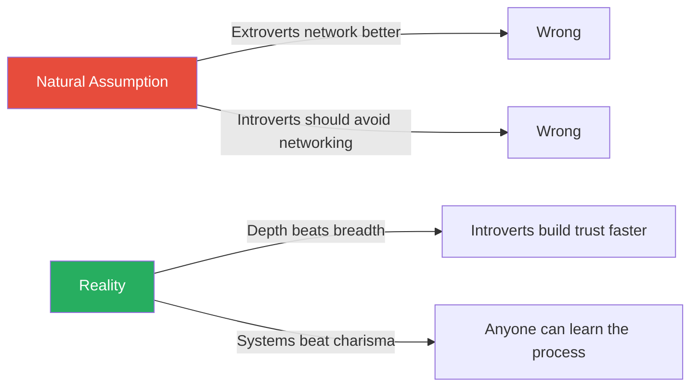
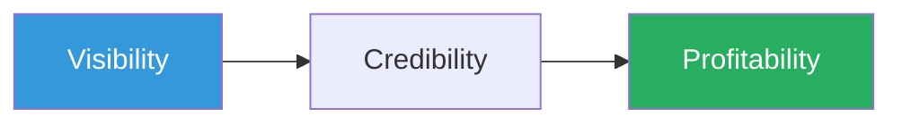
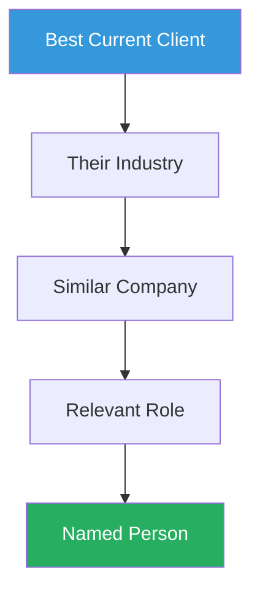
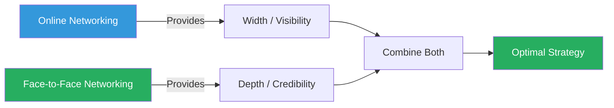
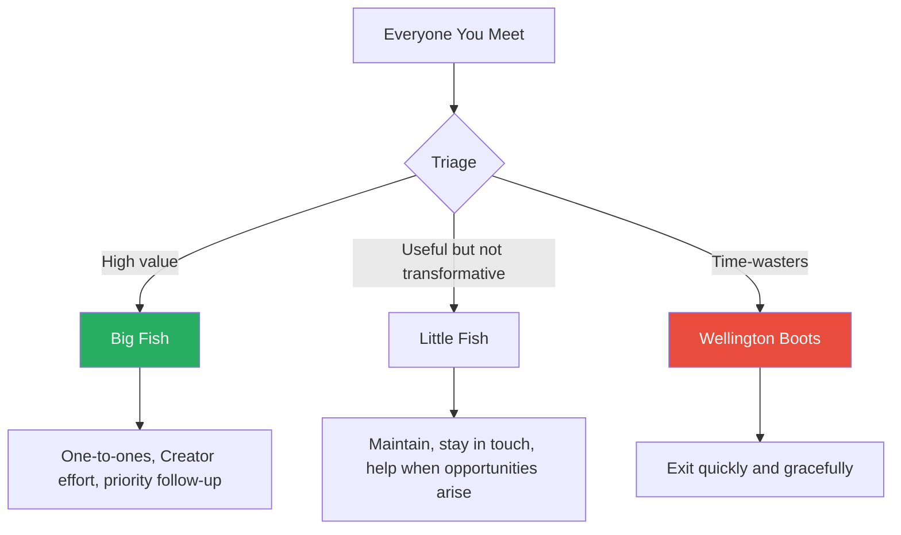

# The Unnatural Networker — Charlie Lawson

> Charlie Lawson's practical guide makes a simple but liberating argument: networking is a learnable skill, not a personality trait.
> Introverts, he claims, may actually have a structural advantage — they go deeper in fewer conversations, building stronger trust faster than the extrovert who works the room on autopilot.
> The book's core framework is the **VCP Process** (Visibility, Credibility, Profitability), which maps how every professional relationship moves from "I know your name" to "I trust you enough to stake my own reputation on recommending you."
> Lawson strips the mystique from networking by treating it as a repeatable discipline: prepare before you enter the room, read body language, have meaningful conversations, follow up relentlessly, and give before you ask.
> It is not a book about charisma.
> It is a book about systems — and about the quiet conviction that showing up, being useful, and staying patient will outperform any amount of natural charm.

---

## About the Author

Charlie Lawson is the BNI (Business Network International) National Director for the UK and Ireland, overseeing a referral network of tens of thousands of small-business owners. He spent years as a self-described "unnatural networker" — an introvert who found networking events physically uncomfortable and socially exhausting — before developing the structured approaches this book teaches. His background is in business development and referral marketing, and his frameworks draw heavily on BNI's methodology and data from its 150,000+ global members, who collectively generated over 339 million pounds in tracked referrals in the UK and Ireland alone. The book is shaped by this practitioner's lens: every concept is tested against real networking groups, real business outcomes, and the accumulated wisdom of people who network for a living, not academic theory. Lawson writes with the self-deprecating warmth of someone who genuinely understands the dread of entering a room full of strangers, which gives the book an authenticity that more polished networking guides often lack.

---

## The Big Idea

- <b style="color: #27ae60">Networking is not selling</b> — no one attends a networking event to buy, and treating it as a sales opportunity is structurally doomed to fail
- The person across from you did not wake up that morning thinking, "I hope a stranger pitches me their product over lukewarm coffee"
- Networking exists to build **relationships** that, over time, generate trust — and trust is the only currency that produces referrals, introductions, and genuine professional support

The mechanism is the <b style="color: #2980b9">VCP Process</b>:

- Every relationship passes through **Visibility** (they know who you are), then **Credibility** (they trust your competence and reliability), then **Profitability** (mutual value actually flows)
- You cannot skip phases
- Attempting to jump from Visibility to Profitability — the classic hard sell at a networking event — fails because the trust prerequisite has not been met
- It is like proposing marriage on a first date: the intention may be sincere, but the relationship has not earned the weight of the ask
- The VCP model reframes networking from a single-event activity into a long-term investment with compounding returns

---

The counterintuitive claim at the book's heart is that <b style="color: #27ae60">introverts have a natural advantage</b>:

- Extroverts accumulate Visibility quickly through broad, shallow contact, but often plateau at surface-level credibility because they never stay in any conversation long enough to build real trust
- Introverts who push through the initial discomfort of approaching strangers tend to go deeper in each conversation, crossing the Credibility threshold faster with each individual relationship
- **Depth beats breadth** — the introvert who has three meaningful conversations at an event and follows up on all three will outperform the extrovert who collected thirty business cards and followed up on none

This is not a motivational argument:

- Lawson backs it with BNI's organisational data, with Ivan Misner's (BNI's founder) self-identification as an introvert, and with Susan Cain's research on introversion
- The message is structural, not emotional: the introvert's natural inclination toward depth is exactly what the VCP model rewards
- The book is therefore not asking introverts to become something they are not — it is revealing that the system already favours what they naturally do

---

## Key Concepts at a Glance

| Concept | One-line summary |
|---------|-----------------|
| **VCP Process** | Every relationship moves through Visibility, Credibility, Profitability — you cannot skip phases |
| **Referral Confidence Curve** | Trust builds slowly then accelerates sharply once a threshold is crossed |
| **Reactor / Promoter / Creator** | Three tiers of referral behaviour, from passive response to proactive opportunity engineering |
| **The Fishing Net** | Triage contacts into big fish (invest), little fish (maintain), wellington boots (exit) |
| **The Money Funnel** | Specific referral requests by name activate memory better than vague asks |
| **Host vs Guest Mindset** | Acting as host at events transforms anxiety into purposeful action |
| **Width vs Depth** | Online gives broad visibility; face-to-face gives deep trust; combine both |
| **Givers Gain** | Helping others without immediate expectation of return generates long-term reciprocity |
| **One-to-One Tiers** | Three escalating meeting levels calibrated to relationship maturity |
| **Storytelling Over Features** | Present yourself through stories of people you helped, not lists of services |
| **Follow-Up as Credibility Test** | The first promise you keep after an event is the gateway to all future trust |
| **Body Language Reading** | Scan for open vs closed formations to choose who to approach |
| **Strong Contact Networks** | Structured, recurring groups outperform casual events because VCP needs continuity |
| **Congruence** | Dress and presentation must match your professional identity to avoid trust erosion |

The biggest gaps between typical and effective networkers are in follow-up discipline and specificity of ask — the two skills most people neglect because they seem mundane compared to charisma.

---

## Chapter 1: The Unnatural Networker's Problem

*Lawson opens with a confession that reframes who networking books are really for — not the charismatic salesperson, but the professional who dreads walking into a room full of strangers.*

- The book opens with Lawson's own admission: he is an introvert
- Networking events filled him with dread — the car park hesitation, the temptation to simply drive home, the internal monologue of "I don't belong here"
- He describes the feeling with visceral honesty:
  - The sweaty palms before pushing through the door
  - The immediate scan for someone — anyone — who looks approachable
  - The relief when someone else initiates conversation, immediately followed by the anxiety of how to end it gracefully
- His audience is not the extrovert who thrives on social energy — it is the professional who knows networking matters, suspects they are bad at it, and assumes the problem is their personality
- <b style="color: #27ae60">The central reframe: the problem is not who you are — the problem is that nobody taught you how</b>

---

- He draws on Susan Cain's research into introversion to make a structural point:
  - Introverts are not anti-social — they are differently social
  - They prefer depth over breadth, listening over broadcasting, substance over surface
  - These traits are not networking liabilities — they are <b style="color: #2980b9">networking assets</b> that have been mislabelled as weaknesses by a culture that confuses extroversion with competence
- Lawson distinguishes between the social energy spectrum and the competence spectrum:
  - Extroversion tells you how someone recharges — not how effective they are at building trust
  - The introvert who listens carefully, remembers details, and follows up reliably will build deeper relationships than the extrovert who entertains brilliantly and forgets your name by morning
  - <b style="color: #e74c3c">The networking industry has conflated performance with effectiveness</b> — being entertaining at events is not the same as being good at networking

> [!example] Ivan Misner — The Introvert Who Built BNI
> - Ivan Misner, the founder of BNI and arguably the world's most successful professional networker, describes himself as an introvert
> - He calls himself a "situational extrovert" who can perform the role when needed but recharges in solitude
> - He built a global networking organisation of hundreds of thousands of members — while identifying as someone who finds networking draining
> - Misner's success was built on systems, not charisma — structured meeting formats, accountability frameworks, and repeatable processes
> **The lesson:** If the man who built the world's largest networking organisation is an introvert, the "I'm just not a natural networker" excuse loses its force.

> [!example] Lawson's Car Park Confession
> - Lawson describes arriving at a networking event early in his career and sitting in his car for ten minutes
> - He watched other people walk in confidently while he rehearsed excuses to drive home
> - He eventually forced himself through the door — and discovered that several people inside felt exactly the same dread he did
> - The difference between them and the people who never came back was not personality — it was whether they had a system to follow once they walked in
> **The lesson:** The anxiety is universal. The system is what separates the people who network effectively from the people who quit.

> [!tip] Core Insight
> Networking is a skill like any other. It can be learned, practised, and systematised. You do not need to become an extrovert. You need a process.

---

The book's opening argument dismantles the assumption that networking ability is a personality trait and reframes it as a learnable discipline where introverts have structural advantages.

---

## Chapter 2: Networking Is Not Selling

*Lawson establishes the book's foundational distinction — networking is relationship-building, not a sales channel — and explains why treating events as selling opportunities guarantees failure.*

- <b style="color: #e74c3c">The most common networking mistake is treating it as a sales opportunity</b>
- Networking exists to build relationships that eventually produce referrals
- The people sitting in front of you are not your audience — their networks are your audience
- This is the distinction that most people miss entirely:
  - They walk into a room of 40 people and try to sell to 40 people
  - The correct frame is that those 40 people collectively know 40,000 people — and your job is to build enough trust that those 40 people actively recommend you to the right ones among those 40,000

> [!example] The Fire-and-Security Salesman in Croydon
> - A fire-and-security salesman attended an early morning networking event in Croydon
> - He worked the room aggressively, pitching his products to anyone who would listen
> - He cornered people with product brochures before they had finished their first coffee
> - He left without a single sale and declared that "networking doesn't work"
> - Lawson's diagnosis: the salesman was not networking — he was selling to people who had not come to buy
> - He had violated the fundamental social contract of the room
> **The lesson:** The failure was not in the method but in a fundamental misunderstanding of what he was there to do.

> [!example] The Decorator Who Lost on Trust
> - A decorator competed for a job against another decorator who had been recommended through a networking group
> - The first decorator was cheaper and arguably more skilled — yet he lost the job
> - The client had received the winning decorator through a trusted referral — someone had staked their own reputation on the recommendation
> - The client was not buying decorating services — she was buying the reduction of risk that comes from a trusted endorsement
> - Price and skill were secondary to the question: "Can I trust this person in my home?"
> **The lesson:** No amount of skill or competitive pricing can overcome a trust deficit.

---

### The Second-Degree Network

- Lawson introduces a simple but powerful calculation: each person at a networking event knows roughly 1,000 people
- A room of 40 attendees connects you, in theory, to 40,000 individuals
- <b style="color: #27ae60">The people in front of you are not your market — their networks are your market</b>
- This reframes every conversation:
  - You are not trying to sell to the person in front of you
  - You are trying to build enough trust that this person becomes a conduit to the thousands of people they know
  - The question changes from "Can I sell to you?" to "How can I earn your trust so that when someone in your network needs what I offer, you think of me?"

> [!example] The Events Company and the Hilton Hotel Group
> - An events company owner scoffed at a networking group because none of the attendees worked in her target market — hospitality and corporate entertainment
> - She said it was "inconceivable" that anyone in the room knew the marketing director of the Hilton Hotel Group
> - Lawson discovered that the man sitting two seats from her knew the group chairman personally
> - She had dismissed the entire room based on who was physically present, ignoring the vast invisible network behind each person
> **The lesson:** You systematically underestimate other people's networks.

"No one ever goes to a networking event to buy," Lawson writes. They go to meet people. The business comes later — through the relationships built, the trust earned, and the referrals generated when those people encounter someone in their own network who needs what you offer.

---

### The Trust Economics

- Lawson frames trust as the underlying economic mechanism:
  - When someone refers you, they are spending their own <b style="color: #2980b9">reputational capital</b>
  - If you deliver well, their reputation is enhanced — they are seen as someone who connects people with quality
  - If you deliver badly, their reputation is damaged — and they will never refer you again
- This creates a natural quality filter:
  - Only people who genuinely trust your competence will refer you
  - The referral itself carries embedded credibility — the client starts the relationship with a higher baseline of trust than a cold contact ever could
  - <b style="color: #27ae60">Referrals convert at dramatically higher rates than cold outreach</b> because the trust has already been partially established by the referrer

---

## Chapter 3: The VCP Process

*This is the book's central chapter — the framework that organises everything else, mapping how every professional relationship moves from recognition to trust to mutual value.*

Every relationship must pass through all three phases sequentially — attempting to skip from Visibility to Profitability is the classic networking failure.

Events drive visibility but barely move credibility; one-to-ones and follow-up are the engines of trust; and referral giving is the primary path to profitability — showing why most networkers plateau at visibility.

### Visibility

*The starting line — necessary but entirely insufficient.*

- <b style="color: #2980b9">Visibility</b> means people know your name, your face, and roughly what you do
- This is what a business card exchange or a LinkedIn connection produces
- It is necessary but generates nothing on its own — you are a name on a list, a face dimly recalled
- Most people mistake Visibility for networking success:
  - They attend an event, collect cards, add connections on LinkedIn, and feel productive
  - But nothing happens, because nothing was built
  - <b style="color: #e74c3c">Visibility without Credibility is a foundation with no structure on top</b>
- Visibility is also the easiest phase to accelerate:
  - Attend more events
  - Post more on social media
  - Join more groups
  - But acceleration at this phase has diminishing returns — being known by 500 people who do not trust you is less valuable than being known by 50 who do

### Credibility

*The bridge — where trust is earned through repeated evidence that you do what you say you will do.*

- <b style="color: #2980b9">Credibility</b> means people trust that you are competent, reliable, and worth staking their own reputation on
- Built through repeated positive interactions, demonstrated follow-through, and accumulated evidence
- The single most important behaviour in this phase is <b style="color: #27ae60">follow-up</b>:
  - BNI's surveys of 150,000+ networkers consistently rank follow-up as the number one trait of effective networkers
  - Ahead of communication skills, industry knowledge, and personal warmth
  - Follow-up is the first test of credibility — before anyone evaluates your technical ability, they evaluate whether you kept your word
- The email you promised to send, the article you said you would forward, the introduction you offered to make — these micro-commitments are the bricks of trust
- Credibility is fragile in early stages and robust in later stages:
  - A single broken promise early in a relationship can destroy months of Visibility work
  - But once deep Credibility is established, occasional failures are absorbed by the reservoir of goodwill
  - This asymmetry explains why early follow-up is so disproportionately important

> [!example] Chris and the Untouched Referral
> - Lawson gave Chris a genuine business referral — a real opportunity
> - Chris did not follow up — days passed, then weeks, the referral sat untouched
> - When Lawson eventually chased it up, Chris finally acted — but the delay had nearly killed the opportunity
> - More importantly, it damaged Lawson's willingness to refer Chris again
> - Lawson's internal calculation: if Chris ignores a referral, my own credibility with the person I referred him to is damaged
> - A single follow-up failure cost Chris not just one referral but an entire pipeline of future ones
> **The lesson:** Every broken promise costs you not one opportunity, but an entire pipeline of future referrals.

### Profitability

- <b style="color: #2980b9">Profitability</b> is the destination — mutually beneficial value flows naturally once Credibility is established
- It cannot be forced or accelerated by enthusiasm alone
- When someone trusts you enough to recommend you to their own contacts — knowing that your performance reflects on them — you have reached Profitability
- The key word is **mutually** beneficial:
  - Profitability is not one-directional — it flows both ways
  - The strongest networking relationships are ones where both parties actively create opportunities for each other
  - One-sided Profitability erodes over time — the giver eventually stops giving if the receiver never reciprocates

---

### The Referral Confidence Curve

*The curve explains why networking feels unproductive for months before suddenly producing results — and why impatience is the number one killer of networking ROI.*

The Referral Confidence Curve is not linear — it maps the VCP progression over time, showing why most people quit too early.

- <b style="color: #2980b9">The Referral Confidence Curve</b> shows that confidence builds slowly at first — the long, flat portion where networking feels completely unproductive — then accelerates sharply once the trust threshold is crossed
- The threshold varies by context:
  - **Low-risk referrals** cross quickly — recommending a florist or a coffee shop requires minimal trust because the consequences of a bad recommendation are trivial
  - **Medium-risk referrals** take moderate time — a plumber, an electrician, someone entering your home but not handling sensitive information
  - **High-risk referrals** take far longer — recommending a financial advisor or solicitor requires substantially more evidence of competence, because the referrer's own reputation is on the line
- <b style="color: #e74c3c">The curve always starts slowly, regardless of personal charm or professional brilliance</b>
- This is the part that kills most people's networking efforts:
  - They invest for three months, see no results, and conclude that networking does not work
  - They quit just before the curve would have started to steepen
  - The irony is that their three months of investment were not wasted — they were building the invisible trust capital that was about to pay off

| Referral Risk Level | Trust Required | Typical Timeline | Example |
|---------------------|---------------|-----------------|---------|
| Low | Minimal | 1-3 months | Florist, coffee shop, printer |
| Medium | Moderate | 3-6 months | Plumber, web designer, caterer |
| High | Substantial | 6-12+ months | Financial advisor, solicitor, accountant |

The timeline is not fixed — it depends on how many positive interactions you accumulate and how reliably you follow through on commitments.

Low-risk referrals (florists, printers) reach full confidence in about three months, but high-risk referrals (financial advisors, solicitors) take six to twelve months — explaining why most people quit networking before the highest-value referrals ever materialise.

> [!tip] Core Insight
> Most people quit networking precisely when patience would have paid off. The Referral Confidence Curve is flat for months, then accelerates sharply — and almost everyone gives up during the flat part.

---

### Reactor, Promoter, Creator

*Not all referral behaviour is equal — Lawson identifies three tiers that determine how actively someone works on your behalf.*

| Tier | Behaviour | Trigger | Example |
|------|-----------|---------|---------|
| **Reactor** | Responds when explicitly asked | "Do you know a good accountant?" | Mentions your name only when directly prompted |
| **Promoter** | Interprets situations as opportunities | Hears a complaint that matches your capability | Volunteers an introduction without being asked |
| **Creator** | Proactively seeks and engineers opportunities | Identifies openings the contact has not spotted | Cold-calls on your behalf, creates situations |

Someone willing to create for you will automatically react and promote too — but a reactor will rarely escalate to creating.

- **Reactors** are passive — they will help if prompted, but they will never think of you unprompted
  - Most network contacts remain at this level
  - It is not a failing — it simply reflects the natural limits of attention and investment
- **Promoters** are listening for problems that match your capabilities, even when no one has asked
  - They hear a friend complain about their current supplier and immediately think of you
  - This requires that they understand your business well enough to recognise a match — which is why one-to-one meetings are so critical
- **Creators** are the highest tier — they proactively seek out specific opportunities, cold-calling on your behalf and engineering situations
  - This level of effort requires deep trust and genuine care
  - <b style="color: #27ae60">The way to move people up the taxonomy is to create for them first</b>

> [!example] Tim's Office Supplies and the School
> - Tim, a web designer in Lawson's networking group, sold office supplies
> - Lawson cold-called a school on Tim's behalf, not because he had anything to gain, but because he wanted to help
> - The school took the call because Lawson had no sales agenda — he was making an introduction, not a pitch
> - Tim got the business
> - The interaction also deepened Tim's commitment to referring Lawson — reciprocity became natural
> **The lesson:** The Creator does what the contact cannot do for themselves — and creating for others is the fastest way to earn their Creator-level effort in return.

> [!example] The Solicitor Who Never Moved Past Reactor
> - A solicitor in a networking group attended reliably for over a year
> - When directly asked, he would offer referrals — he was a dependable Reactor
> - But he never volunteered introductions, never listened for opportunities during conversations outside the group, never proactively connected people
> - His referral volume plateaued because he waited to be prompted rather than scanning for matches
> - Meanwhile, members who operated as Promoters and Creators generated three to four times more business — because opportunities do not always arrive labelled
> **The lesson:** The jump from Reactor to Promoter requires actively listening for needs in every conversation, not waiting to be asked.

---

### Givers Gain

- <b style="color: #27ae60">Givers Gain</b> is the philosophical anchor of the book, attributed to BNI's founding philosophy
- The most effective way to get people creating referrals for you is to create for them first
- Help given without immediate expectation of return generates long-term reciprocity that far exceeds transactional exchange

Lawson uses the metaphor of bringing a bottle to a party:

- If you consistently show up empty-handed, it is noticed and socially punished — even if nobody says anything explicitly
- People simply stop inviting you
- The same dynamic operates in networking: people who take without giving are quietly dropped from the network, excluded from introductions, and passed over when opportunities arise

The principle is not naive altruism:

- Lawson is clear that giving without any strategic awareness can lead to exploitation — some people take without ever reciprocating
- His prescription is to give generously to the people worth investing in (the big fish) rather than to give indiscriminately to everyone you meet
- <b style="color: #2980b9">The Fishing Net</b> provides the filter: give to big fish, maintain little fish, exit wellington boots
- <b style="color: #e74c3c">Indiscriminate giving without triage leads to burnout and exploitation</b> — the framework prevents generosity from becoming self-destructive

---

## Chapter 4: Strong Contact Networks

*Lawson examines why structured, recurring networking groups dramatically outperform casual one-off events — and why the VCP process needs continuity to function.*

- Lawson distinguishes between two types of networking:
  - <b style="color: #2980b9">Casual contact networks</b> — open events where anyone can attend, no commitment, high turnover
  - <b style="color: #2980b9">Strong contact networks</b> — structured groups with regular attendance, limited membership, and accountability

| Feature | Casual Contact Network | Strong Contact Network |
|---------|----------------------|----------------------|
| Attendance | Different people each time | Same people weekly |
| VCP progress | Resets constantly | Accumulates over months |
| Credibility | Rarely builds | Steady accumulation |
| Accountability | None | Built into structure |
| Trust mechanism | Dramatic gestures | Small, reliable behaviours |
| Cost of membership | Usually free or low | Often paid, creating commitment |
| Typical outcome | Business cards collected | Referrals generated |

- In casual contact networks, the VCP process resets constantly because you rarely see the same person twice — Credibility never builds because the relationships lack continuity
- In strong contact networks, you watch someone keep their promises over months, hear their presentations repeatedly, and begin to genuinely understand what they do and who they serve
- The structural advantage compounds:
  - Week 1: you know their name
  - Week 4: you understand what they do
  - Week 12: you have seen them follow through multiple times
  - Week 24: you trust them enough to refer your best client
  - This timeline is simply not available in casual contact settings

> [!tip] Core Insight
> Trust builds not through dramatic gestures but through the steady accumulation of small, reliable behaviours — and that requires seeing the same people repeatedly.

- Lawson cites BNI's data: the average BNI member generates 48,000 pounds in referral business per year through their group
  - He acknowledges that this figure is self-reported and applies to members who stayed — survivorship bias is present
  - But the structural argument is compelling: repeated exposure plus accountability plus a norm of mutual help creates an environment where the VCP process operates at maximum efficiency

---

### The Substitute Strategy

- The chapter also introduces the concept of the **substitute** — standing in for an absent member:
  - By substituting, you gain access to a new group of established relationships
  - You demonstrate reliability to the member who asked you
  - It is a networking opportunity in itself
- Lawson recommends actively seeking out substitution opportunities:
  - You get a preview of a group's culture before committing
  - You build Visibility with a new set of contacts in a single morning
  - The existing members see you as someone who helps — you enter the room already positioned as a giver

> [!example] The Substitute Who Earned a Seat
> - A business owner substituted for a friend in a BNI group on three separate occasions
> - Each time, she brought a referral for someone in the room — not for the person she was substituting for, but for other members she had researched beforehand
> - By her third substitution, two members independently asked her to consider joining the group
> - She had built more Credibility in three guest appearances than some members had in six months — because she arrived prepared and gave before asking
> **The lesson:** Substituting is not a favour to a friend — it is a strategic networking opportunity in its own right.

---

## Chapter 5: Preparation — Before You Walk In

*Lawson argues that preparation is the difference between a productive networking event and a wasted morning — and that the right goal-setting eliminates the anxiety that paralyses introverts.*

### Setting Goals

- <b style="color: #27ae60">The quality of your networking goal determines whether you leave feeling confident or defeated</b>
- Lawson distinguishes four types of networking goals, arranged from worst to best:

| Goal | Quality | Problem |
|------|---------|---------|
| "Close 5 deals" | Worst | Impossible — no one came to buy; guarantees failure |
| "Arrange 5 follow-up meetings" | Poor | Partially within your control, but depends on others agreeing |
| "Make some contacts" | Mediocre | Not specific, not measurable, not actionable |
| "Meet 5 new people" | Best | Specific, measurable, achievable, entirely within your control |

- <b style="color: #27ae60">The best goal is always one you fully control</b> — "meet 5 new people" guarantees success if you execute, and guaranteed success builds the confidence that compounds across future events
- The psychological mechanism matters:
  - If your goal is to close deals and you close none, you leave feeling defeated — and that defeat makes the next event harder to attend
  - If your goal is to meet five new people and you meet six, you leave feeling successful — and that success makes the next event easier to approach
  - Over months, the person with controllable goals attends more consistently than the person with outcome-dependent goals
  - Attendance consistency is itself a major driver of VCP progression

### Researching the Room

- If a delegate list is available, study it
- Identify who you want to meet and why
- <b style="color: #2980b9">Knowing three names before you walk through the door</b> transforms a room of strangers into a room containing three known targets — and that reframe alone reduces anxiety dramatically
- The research does not need to be deep:
  - Check LinkedIn profiles for shared connections or interests
  - Look at the person's company website to understand what they do
  - Prepare one conversation opener based on something genuine — a recent project, a mutual contact, a shared industry challenge
  - The goal is to transform "I should talk to someone" into "I want to talk to Sarah about her work with the NHS contract"

---

### Dress and Congruence

*First impressions form in five to thirty seconds — by the time you have introduced yourself, the other person has already formed a judgement based entirely on how you look.*

- <b style="color: #2980b9">Congruence</b> is the alignment between your appearance and your professional identity
- People unconsciously assess whether what they see matches what they are being told
- When the match is clean, trust forms more easily
- When there is a gap — too casual for a serious profession, too formal for a creative one — a friction enters the interaction that no amount of charm can fully overcome

> [!example] The Financial Advisor in Shorts
> - A financial advisor in a BNI group began wearing shorts and displaying tattoos to meetings
> - The group's performance declined noticeably — not because of the tattoos themselves
> - The visual incongruence between a financial advisor and casual dress created cognitive dissonance
> - People could not reconcile the seriousness of the profession with the casualness of the presentation
> - Other members took their cue from his relaxation of standards, and the whole group's professional standard dropped
> - The effect was contagious: one person's incongruence lowered the bar for everyone
> **The lesson:** Incongruence between your appearance and your professional identity undermines trust before a word is spoken.

> [!example] The Chef in Whites
> - A chef attended networking events in full chef's whites
> - He was memorable, distinctive, and immediately credible
> - His appearance was completely congruent with his profession — exactly what you would expect from someone who wanted you to trust their food
> - The whites were not formal business attire, but they were the right attire for his identity
> - People remembered him weeks later, long after they had forgotten the suits and ties
> **The lesson:** Dress to match the professional identity you are projecting. Congruence builds credibility.

- <b style="color: #e74c3c">Incongruence — whether too casual or too formal for the context — creates a gap between what people see and what they are being told, and that gap undermines trust</b>
- "People buy people first," Lawson writes — first impressions are formed before you speak

---

### The Elevator Pitch

- Lawson is blunt about elevator pitches: most are terrible because they describe what you do instead of what value you create
- The standard format — "I'm John from XYZ Consulting and we offer strategic business solutions" — tells the listener nothing memorable
- <b style="color: #27ae60">The effective pitch answers one question: "What problem do you solve?"</b>
- It should be short enough to deliver in 30 seconds, specific enough to create a mental image, and compelling enough to provoke the response "tell me more"
- The pitch is not a sale — it is a door-opener, designed to start a conversation, not close one

---

## Chapter 6: Working the Room

*This is the book's most tactical chapter — a systematic playbook for the introvert who needs structure to replace the paralysis of "who should I talk to?"*

### Reading Body Language

- <b style="color: #27ae60">Before approaching anyone, scan the room</b> — Lawson provides a systematic framework for reading body language formations:

| Formation | Body Language | Signal | Action |
|-----------|-------------|--------|--------|
| **Open twos** | V-shape, angled toward room, visible gap | "We're open to others joining" | Safe to approach |
| **Closed twos** | Face-to-face, close, heads bowed | "Do not interrupt" | Avoid |
| **Open threes/fours** | Visible gaps, outward-facing | Aware of the room | Approachable |
| **Closed threes/fours** | Tight circle, all inward-facing | Locked in conversation | Not approachable |
| **Lone individuals** | Standing alone, phone or drink in hand | Often fellow introverts | Approach — strategically sound and genuinely kind |

- The value of this framework is not scientific precision — body language is probabilistic, not deterministic
- The value is that it eliminates the paralysing question of "who should I talk to?" by giving you a systematic decision process
- Instead of hovering anxiously, you scan, identify targets, and approach with purpose
- Lawson emphasises the lone individual as the most underrated opportunity:
  - They are often fellow introverts who are relieved to be approached
  - The social dynamic is the simplest — one-to-one conversation without group politics
  - Starting with lone individuals builds confidence for approaching pairs and groups later

---

### The Host Mindset

*Lawson's most psychologically astute reframe — replacing the anxiety of "I don't belong here" with the purpose of "I'm here to make sure other people feel welcome."*

- At any event, you are either a <b style="color: #2980b9">host</b> or a **guest**:
  - **Guests** wait passively for things to happen to them — they stand by the wall, hope someone approaches, and feel increasingly awkward
  - **Hosts** welcome newcomers, make introductions, ensure everyone is comfortable
- The reframe is simple: pretend you are the host of this event
  - Walk up to someone standing alone and say, "Hi, I don't think we've met"
  - See someone looking lost? Bring them into a conversation
  - Know two people who should meet? Introduce them
- <b style="color: #27ae60">For the introvert, this reframe is transformative</b> — it replaces anxiety with purposeful, generous action that is both genuine and socially rewarded
- Why the host mindset works psychologically:
  - Anxiety thrives on ambiguity — "What should I be doing?" fuels paralysis
  - The host role answers that question immediately — you are there to help others feel comfortable
  - This external focus removes the self-consciousness that makes networking painful for introverts
  - It also positions you as a connector, which is the fastest way to build Credibility in a room

> [!tip] Core Insight
> Adopting the host mindset gives every action a clear, generous motivation — which eliminates the introvert's central anxiety of "what am I supposed to be doing here?"

---

### Approaching and Joining Conversations

- For open pairs and groups, Lawson provides a simple approach method:
  - Stand at the edge of the open gap in the formation
  - Make eye contact with one person and smile
  - Wait for a natural pause or an invitation to join
  - Introduce yourself with a simple opener: "Hi, I'm Charlie — mind if I join you?"
- <b style="color: #e74c3c">Never interrupt a closed formation</b> — if people are face-to-face, heads down, speaking quietly, they are having a private or intense conversation and will resent the intrusion
- The timing of your approach matters:
  - Arrive during the mingling portion of the event, not during speeches or presentations
  - If you arrive late, scan for people who are between conversations — transitioning from one group to the next
  - These transition moments are the easiest entry points

### Exiting Conversations

- One of the most common fears for the unnatural networker: how do you end a conversation without being rude?
- <b style="color: #2980b9">Lawson's primary technique is exit by introduction</b>:
  - Early in the conversation, ask what kind of contacts would be valuable for the other person
  - When you are ready to move on, look around the room for someone who matches that description and introduce them
  - This transforms your departure from an awkward rejection into a generous act
  - You have not abandoned them — you have connected them with someone useful
- Even if you cannot find a perfect match, the attempt itself generates goodwill:
  - "I don't think I know a solicitor here tonight, but let me have a look" signals that you are trying to help, not trying to escape
- The fallback is simple and always acceptable:
  - "It was really lovely meeting you. I'm going to go and mingle a bit more. Can I take your card?"
  - A warm handshake, genuine eye contact, and a clean exit — no elaborate excuse needed
- <b style="color: #e74c3c">The mistake is staying too long in one conversation</b> out of social obligation:
  - If your goal is to meet five new people, spending 40 minutes with one person leaves no time for the other four
  - Clean exits are not rude — they are professional and expected at networking events

---

## Chapter 7: The One-to-One

*Group networking creates Visibility. One-to-one meetings create Credibility. This distinction is the most important in the book.*

- The one-to-one — a dedicated coffee, lunch, or meeting with a single contact — is what Lawson calls <b style="color: #27ae60">the most powerful networking activity available</b>
- It eliminates interruptions, creates focused attention, and allows the discovery of personal connections that transform passive goodwill into active support
- Why the one-to-one is structurally superior to group networking:
  - In a group, you share attention with 20-40 other people
  - In a one-to-one, you have someone's undivided focus for 30-60 minutes
  - Personal connections emerge that would never surface in a group setting — shared hobbies, mutual friends, similar life experiences
  - These personal connections are the emotional glue that converts Credibility into active referral behaviour

### The Steve Story

> [!example] Steve the Web Designer and the Formula 1 Connection
> - Steve, a web designer in Lawson's networking group, had identified a specific company as his dream client
> - Lawson drove past that company's office every single day on his commute — for months, he did nothing
> - He was aware of Steve's goal and physically proximate to the target, yet still did not act
> - Then Lawson and Steve had a one-to-one over coffee — they discovered a shared passion for Formula 1
> - They talked about races, drivers, engineering — nothing to do with business
> - The personal connection created an emotional bond that months of professional awareness had failed to produce
> - The next day, Lawson drove past the company, stopped, walked in, and made the introduction on Steve's behalf
> - The referral happened within 24 hours of the one-to-one
> **The lesson:** People act on emotional connection, not rational awareness. Knowledge alone does not produce action — the personal bond does.

This story illustrates the central mechanism of one-to-ones: they create the emotional fuel that converts passive awareness into active action.

---

### The Three Tiers

*One-to-ones should escalate through three tiers matching relationship depth — asking the wrong tier's questions damages trust rather than building it.*

> [!abstract] One-to-One Tier System
> **Tier 1 — Basic Relationship-Building (New Contacts):**
> - Who are you? What do you do? What are your goals?
> - What does a good referral look like for you?
> - Broad, open questions focused on understanding the person
>
> **Tier 2 — Business-Building (Established Contacts):**
> - Who are your best clients? Who currently passes you business?
> - What triggers should I listen for — what does someone say that tells me they need your help?
> - More intimate questions that require trust to answer
>
> **Tier 3 — "Let's Just Get On With It" (Deep Trust):**
> - Who do you need to speak to right now? Let me pick up the phone
> - Two people who trust each other deeply enough to act in real time

- The tiers are a spectrum, not rigid categories — most one-to-ones blend elements
- <b style="color: #e74c3c">Asking Tier 2 questions of a Tier 1 relationship feels intrusive</b>
  - "Who are your best clients?" asked by someone you met last week feels like interrogation
  - The same question from someone you have known for six months feels like genuine interest
- Asking Tier 1 questions of a Tier 3 relationship wastes everyone's time and signals that you have not been paying attention
- The tier system maps directly to VCP:
  - Tier 1 corresponds to early Credibility-building
  - Tier 2 corresponds to deepening Credibility
  - Tier 3 corresponds to Profitability — mutual value flowing in real time

> [!example] Phil Berg's Live Referral Sessions
> - Phil Berg conducts two-hour sessions with his closest contacts
> - They literally make referral phone calls during the meeting
> - No agenda, no formality — just two people who trust each other deeply enough to act in real time
> - The calls are warm introductions: "I'm sitting here with Phil, and he has something that would be perfect for you"
> - This is networking at its most efficient — the time between identifying an opportunity and acting on it is measured in seconds
> **The lesson:** Tier 3 one-to-ones are where networking produces immediate, tangible results.

---

### Schedule the Next Before Ending This One

- Lawson is adamant: the two most important questions in any one-to-one are:
  - What follow-up actions do we both have?
  - When is our next one-to-one?
- <b style="color: #27ae60">Never leave a one-to-one without both questions answered</b>
- Relationships are journeys, not destinations:
  - A single meeting cannot capture everything about a person
  - Circumstances change, new needs emerge, and trust deepens with repeated contact
  - Without a scheduled next meeting, entropy erodes the relationship
  - The goodwill built in a one-to-one has a half-life — it decays if not renewed
- Booking the next meeting in the moment eliminates the friction of later scheduling:
  - "Let's catch up again" is a polite way of saying "we probably won't"
  - "How about Tuesday the 15th at that same coffee place?" is a commitment
  - The difference between these two sentences is the difference between a relationship that develops and one that fades

---

## Chapter 8: Presenting Yourself — Stories Over Features

*When it is your turn to present yourself, Lawson offers a simple rule that transforms forgettable introductions into memorable ones: tell a story about someone you helped.*

- <b style="color: #27ae60">Stories work because humans are narrative creatures</b>
- A list of services activates the analytical brain — the part that compares, evaluates, and forgets
- A story activates empathy and imagination — the part that remembers, feels, and acts
- When a listener hears a story, they involuntarily place themselves in the client's position — that emotional response is what they remember and recall when someone in their own network needs your service
- The neuroscience is straightforward:
  - Facts are stored in working memory and decay rapidly
  - Stories trigger emotional encoding, which moves information to long-term memory
  - A week after a networking event, attendees remember zero facts about your services but can retell the story of the mother you helped

> [!example] ABC Lettings vs Deena the Lettings Agent
> - The first lettings agent said: "ABC Lettings offers a full range of property management services including lettings, sales, and property management"
> - Nobody remembered — the words created no image, no emotion, no reason to think of ABC Lettings
> - Deena told the story of a mother with her children who was stranded across town due to a property emergency
> - Deena drove across town at 5pm — outside working hours, with no obligation — to pick up the mother and her children and resolve the situation
> - Weeks later, when someone in the group needed a lettings agent, they did not think "who offers a full range of property services?"
> - They thought "Deena — the one who drove across town for that mum"
> **The lesson:** Stories create emotional anchors. Features create forgettable lists.

> [!example] Laura the Florist Who Got Zero Referrals
> - Laura, a florist in a networking group, struggled to get referrals
> - Her presentation was some variation of "Everyone knows what a florist does"
> - She assumed her profession was self-explanatory and therefore required no real presentation — result: zero referrals
> - The problem was not that people did not understand what a florist does
> - The problem was that "a florist" is a generic category — when someone needed flowers, they thought of the concept of florists in general and Googled one
> - Laura had Visibility but no Credibility, because she had given them no story, no emotional anchor, no reason to recommend her specifically
> **The lesson:** Even "obvious" professions need a story to move from generic category to specific recommendation.

---

> [!example] The IFA Who Breached Confidentiality
> - A financial advisor at a networking event pointed around the room and said, "I manage the finances of him, her, her, and him"
> - He meant to demonstrate credibility through his client roster
> - What he actually did was breach client confidentiality in public
> - Every person in the room immediately wondered: "If I become his client, will he point at me next?"
> - The attempt to build trust destroyed it instantly
> **The lesson:** Evidence of competence must be framed as a story about the client's experience, not as a display of the practitioner's portfolio.

### The Mechanism

- <b style="color: #2980b9">The story structure</b> that works follows a simple pattern:
  - The person's situation before (the problem)
  - What you did (the intervention)
  - How they felt afterward (the outcome)
- Not your process, not your qualifications — the client's experience
- <b style="color: #e74c3c">Never frame it as "what I did"</b> — always frame it as "how the client felt"
- Prepare two or three stories about real people you have helped, each following this structure
- Rotate your stories so regular contacts hear fresh examples each time

> [!abstract] The Story Formula
> 1. Name the person and their situation (anonymised if needed)
> 2. Describe the problem they faced — make it vivid and relatable
> 3. Briefly explain what you did (one sentence, not a process breakdown)
> 4. Focus on how the client felt afterward — relief, confidence, gratitude
> 5. End with the outcome in human terms, not business metrics

> [!tip] Core Insight
> "What I did" is boring and potentially off-putting. "How the client felt" is compelling and trust-building. Always present from the client's perspective.

---

## Chapter 9: The Money Funnel — Asking with Specificity

*Most people ask for referrals in a way that gives the listener nothing to act on — Lawson shows why narrowing your ask to a specific name paradoxically increases the number of introductions you receive.*

- Most people ask for referrals wrong — the typical request: "If you know anybody who needs help with X, send them my way"
- <b style="color: #e74c3c">Lawson calls this "Anybody plus Everybody plus Somebody equals Nobody"</b>
- The request is so broad that the listener's brain cannot connect it to a specific person in their memory — it washes over them and is immediately forgotten
- The cognitive mechanism:
  - When someone says "anyone who needs a plumber," your brain does not scroll through your 1,000 contacts looking for plumbing needs
  - It receives a vague input and produces a vague output — which is nothing
  - When someone says "the facilities manager at Barclays on King Street," your brain immediately checks a specific address in memory — either you know them or you do not

> [!example] The Osteopath vs Julia the Virtual PA
> - An osteopath asked his networking group for "anybody with a back" — the room laughed, he got zero referrals
> - The request was so absurdly broad that it was meaningless — everyone has a back
> - Julia, a virtual PA, used the Money Funnel approach:
>   - She started with her best current client — a practice manager at a dental surgery
>   - She identified the industry (healthcare), then a specific company (the Hurley Clinic), then the specific role (practice manager), then the specific person (Steven Hunt)
>   - Her request was: "I'd like to speak to Steven Hunt, the practice manager at the Hurley Clinic"
> - Either someone in the room knew Steven Hunt or they did not — but if they did, the connection was instant and actionable
> **The lesson:** Specificity does the work. No ambiguity, no interpretation required.

---

### How the Funnel Works

> [!abstract] The Money Funnel — Step by Step
> 1. Start with your best current client
> 2. Identify their industry
> 3. Pick a similar company in the same industry
> 4. Research the person within that company who holds the relevant role
> 5. Ask for that person by name

The Money Funnel narrows from broad category to specific individual — and counterintuitively, this specificity increases rather than decreases the volume of introductions you receive.

- <b style="color: #27ae60">Specificity increases referral volume</b> — a named, specific request triggers a specific memory pathway; a vague request triggers nothing
- The one caveat: specificity without a compelling reason is just name-dropping
  - Asking for "Sir Richard Branson" without being able to articulate why he would want to speak to you is presumptuous and unproductive
  - The specific ask must be paired with a specific reason — what value would the meeting create for both parties?
- Even when nobody knows the specific person you named, the specificity itself primes the listeners:
  - They now understand the type of person you are looking for — industry, role, company size
  - This priming means they are more likely to notice a match in future conversations
  - The vague ask primes nothing

> [!tip] Core Insight
> A specific referral request activates memory and pattern-matching in ways that vague requests cannot. "I'm looking for Steven Hunt at the Hurley Clinic" is actionable. "Anyone who needs a virtual PA" is forgettable.

---

## Chapter 10: Online Networking — Width Without Depth

*Lawson addresses online networking with nuance: it is a powerful tool for Visibility, but it cannot substitute for the face-to-face relationship-building that produces Credibility.*

### Width vs Depth

The optimal strategy uses online platforms for initial visibility and face-to-face meetings for the depth that produces credibility and referrals.

- <b style="color: #2980b9">Online platforms</b> — LinkedIn, Twitter, industry forums — provide **width**:
  - Connect with thousands of people, share content, build a public profile
  - Establish yourself as a visible presence in your field
  - This is the Visibility phase of VCP, and online platforms accelerate it dramatically
- <b style="color: #2980b9">Face-to-face networking</b> provides **depth**:
  - The trust required for Credibility — the willingness to stake your own reputation on recommending someone — is extremely difficult to build through a screen
  - You can like someone's posts for a year and still not trust them enough to introduce them to your most important client
  - Face-to-face interaction provides non-verbal cues, shared experiences, and emotional connection that screens cannot replicate
- <b style="color: #27ae60">The optimal strategy combines both</b>:
  - Use online platforms to identify and initially connect with people you want in your network
  - Build Visibility through content, comments, and engagement
  - Then move the relationship offline — a coffee, a phone call, a meeting at an event — for the depth that produces Credibility
  - The two channels are complementary, not competing

---

### The Follower Count Illusion

- <b style="color: #e74c3c">Large follower counts on social media do not translate to business without face-to-face credibility</b>
- A person with 10,000 Twitter followers and zero face-to-face relationships may have enormous Visibility and zero Profitability
- A person with 200 connections and 20 deep face-to-face relationships will outperform them every time
- Online networking is not useless — it is incomplete:
  - It excels at the phase it was designed for (broad visibility)
  - It fails at the phase it was not designed for (deep trust)
- Understanding which tool serves which purpose prevents the common mistake of investing heavily in online presence while neglecting the face-to-face work that actually produces results

### Social Media as a Research Tool

- Lawson suggests using social media primarily for intelligence-gathering:
  - Before a networking event, check who is attending and research their profiles
  - Before a one-to-one, study the person's recent posts, shared content, and professional updates
  - Use LinkedIn to identify mutual connections who could provide warm introductions
  - This preparation transforms the face-to-face meeting from a cold start into a warm conversation
- <b style="color: #27ae60">Social media's highest value is not broadcasting — it is research</b>

---

## Chapter 11: Follow-Up — The Bridge Between Visibility and Credibility

*If there is a single chapter that justifies the price of the book, it is this one — Lawson makes the case that follow-up is the highest-leverage networking behaviour, and the one most people neglect.*

### The Data

- BNI's surveys of 150,000+ networkers consistently rank <b style="color: #27ae60">follow-up as the number one trait of effective networkers</b>
  - Not charisma
  - Not industry expertise
  - Not presentation skills
  - Follow-up
- The reason is structural: follow-up is the first credibility test
  - Before anyone evaluates your technical competence, your industry knowledge, or your value proposition, they evaluate one thing: <b style="color: #27ae60">did you do what you said you would do?</b>
- Each small promise kept builds the bridge from Visibility to Credibility
- <b style="color: #e74c3c">Each small promise broken tears it down</b>
- The asymmetry is important:
  - Building takes many kept promises over many months
  - Destroying takes one broken promise in one moment
  - This is why follow-up is not just important — it is the single most important networking behaviour

> [!example] Chris and the Referral That Nearly Died
> - Lawson gave Chris a referral — a genuine business opportunity
> - Chris did not follow up — days passed, then weeks, the referral sat untouched
> - Eventually Lawson chased Chris directly, and Chris finally acted
> - The specific opportunity still produced some business, but the real damage was to Lawson's willingness to refer Chris again
> - Lawson's internal calculation: if I give Chris a referral and he does not act on it, my own credibility with the person I referred him to is damaged
> - The next time someone asked Lawson for a recommendation in Chris's field, Lawson hesitated
> **The lesson:** The failure to follow up did not just cost Chris one referral — it cost him the entire pipeline of future referrals that Lawson would have generated.

---

### The Post-Event Window

> [!abstract] Lawson's Follow-Up Protocol
> 1. Review your notes before leaving the venue (in the car park, on the train, wherever)
> 2. Within 24 hours, send personalised messages to everyone you had a meaningful conversation with — not generic "nice to meet you" notes, but messages that reference something specific from the conversation
> 3. Connect on LinkedIn with a personalised connection request
> 4. For big fish, propose a one-to-one meeting within the follow-up message
> 5. Execute any promises you made during the conversation (send the article, make the introduction, share the contact) within 48 hours

- The window matters:
  - Follow-up sent within 24 hours feels prompt and professional
  - Follow-up sent a week later feels like an afterthought
  - <b style="color: #e74c3c">Follow-up sent a month later is worse than no follow-up at all</b>, because it reminds the person that you forgot about them
- "Follow-up is the bridge between Visibility and Credibility," Lawson writes
- You can attend every event, have brilliant conversations, and make wonderful impressions — but if you do not follow up, you are rebuilding from Visibility every time
- The personalisation is what separates effective follow-up from generic follow-up:
  - "Great to meet you at the Chamber event" is forgettable
  - "Great to meet you at the Chamber event — I looked into that project management tool you mentioned and here's a link" is memorable
  - The difference is that the second message proves you were listening

> [!tip] Core Insight
> Follow-up is the single highest-leverage networking behaviour. The first promise you keep after an event is the gateway to all future trust.

---

## Chapter 12: The Fishing Net — Prioritising Your Network

*Not everyone in your network deserves equal investment — Lawson borrows the Fishing Net analogy (attributed to Andy Bounds) to provide a triage framework for where to spend your limited relationship-building energy.*

The Fishing Net provides a systematic triage for every contact — invest deeply in the few, maintain the many, and exit the draining.

The toolkit is weighted toward follow-up and deepening activities — reflecting Lawson's core argument that the work after the event matters far more than what happens in the room.

### Big Fish

- High-value contacts — people who could significantly move your business or professional life forward
- Well-connected, they operate in your target market, and a strong relationship with them would produce disproportionate returns
- <b style="color: #27ae60">Big fish get one-to-ones, priority follow-up, and Creator-level referral effort</b>
- When you are at an event and spot a big fish, that is the person you invest your time in — even if it means having only two conversations all evening instead of ten
- Identification criteria:
  - They know many people in your target market
  - Their profession is complementary to yours (e.g., a mortgage broker for an estate agent)
  - They are well-respected in their community — their endorsement carries disproportionate weight
  - They are generous networkers themselves — they actively help others

### Little Fish

- Useful but not transformative contacts
- Pleasant, in your broader network, may occasionally produce a referral or useful connection
- Little fish get maintained — you stay in touch, you are helpful when opportunities arise, you do not neglect them
- But you do not prioritise them over big fish
- Some little fish eventually become big fish as their careers develop, their networks expand, or your own needs change — the categories are not permanent

### Wellington Boots

- <b style="color: #e74c3c">The time-wasters</b> — hard sellers who monopolise your conversation to pitch their products, networkers who take without giving, people who drag you into long unproductive exchanges
- Wellington boots get exited quickly and gracefully
- Lawson does not advocate rudeness — a polite "it was lovely meeting you" and a clean departure is sufficient
- But spending twenty minutes trapped by a wellington boot is twenty minutes you cannot spend with a big fish
- Recognising wellington boots early saves enormous amounts of time:
  - They talk exclusively about themselves and their product
  - They show no interest in what you do or who you serve
  - They do not ask questions — they deliver monologues
  - They resist your attempts to exit the conversation

---

The critical extension:

- <b style="color: #e74c3c">Big fish are not targets for selling</b> — they are targets for one-to-ones
- The temptation when you identify a high-value contact is to pitch them immediately — resist
- The big fish gets invited to coffee, where the VCP process can operate without the noise and time pressure of a group event
- The investment pattern should be deliberate:
  - Identify your top 10-15 big fish
  - Schedule regular one-to-ones with each of them
  - Create for them before expecting them to create for you
  - Track your follow-through on commitments to them

---

## Key Quotes

- "No one ever goes to a networking event to buy." — Charlie Lawson
- "Anybody plus everybody plus somebody equals nobody." — Charlie Lawson
- "People buy people first." — Charlie Lawson
- "Follow-up is the bridge between Visibility and Credibility." — Charlie Lawson (paraphrased)
- "Networking is a contact sport." — Charlie Lawson
- "You wouldn't turn up to a party without a bottle, would you?" — Charlie Lawson
- "Relationships are journeys, not destinations." — Charlie Lawson (paraphrased)

---

## The Verdict

*The Unnatural Networker* is a well-structured, practical guide to face-to-face networking, written by someone who genuinely understands the psychological barriers that introverts face. The VCP model is the book's greatest contribution — a simple, three-phase framework that reframes networking from a personality contest into a trust-building process with identifiable phases, clear milestones, and predictable dynamics. Combined with the Referral Confidence Curve, it gives the reader a way to understand why networking feels unproductive for months before suddenly producing results, and why most people quit precisely when patience would have paid off. The Reactor/Promoter/Creator taxonomy, the Fishing Net, and the Money Funnel are genuinely useful mental models that extend well beyond the book's stated context of small-business referral groups.

The book's limitations are honest ones. It is built almost entirely on BNI's world of small-business owners networking for client acquisition. There is no treatment of networking across significant power differentials — what happens when you are trying to build credibility with someone who has substantially more authority, status, or organisational power than you. There is no discussion of internal organisational networking — the challenge of building trust and influence within your own company, where the dynamics are profoundly different from meeting strangers at an event. The "Givers Gain" philosophy, while compelling, rests on survivorship bias: BNI tracks the business generated by members who stayed, not the members who gave extensively, received nothing, and left. The book is also, to a degree, a marketing document for BNI, and the reader should note where advocacy replaces analysis — the strong contact network model is presented as clearly superior to all alternatives, which may say more about Lawson's professional role than about the evidence.

For anyone who finds networking events anxiety-inducing, this book provides a structured system that replaces social dread with repeatable process. The tactical playbook — body language reading, preparation, goal-setting, conversation frameworks, exit strategies, follow-up discipline, one-to-one escalation — is immediately actionable and genuinely reduces the emotional friction that prevents introverts from networking effectively. Lawson writes with warmth, practical specificity, and a complete absence of the "just be confident!" platitudes that make most networking advice useless to the people who need it most.

It will not teach you how to navigate political hierarchies, build alliances in complex organisations, or network with people who hold power over your future. But it will teach you how to walk into a room of strangers, have meaningful conversations, follow up with discipline, and build the kind of trust that makes people willing to stake their own reputation on recommending you. For many professionals, that is the skill they never learned — and this is the book that teaches it.

---

## Related Reading

- [[Strategize to Win - Carla A. Harris|Strategize to Win]] — Carla Harris on building relationships for career advancement, with more focus on corporate hierarchies and sponsorship dynamics
- [[Stealing the Corner Office - Brendan Reid|Stealing the Corner Office]] — Brendan Reid on the political and relational skills that drive promotion, including internal networking
- [[Never Split the Difference - Chris Voss|Never Split the Difference]] — Chris Voss on tactical communication and trust-building, applicable to the deeper conversations Lawson advocates
- [[The 48 Laws of Power - Robert Greene|The 48 Laws of Power]] — Robert Greene's framework for understanding power dynamics, which provides the political lens that Lawson's peer-to-peer model lacks
- [[How to Win Friends and Influence People - Dale Carnegie|How to Win Friends and Influence People]] — Dale Carnegie's foundational work on building genuine rapport and making people feel valued, which complements Lawson's structural approach
- [[Like Switch - Jack Schafer|The Like Switch]] — Jack Schafer on the nonverbal signals of friendliness and approachability, deepening the body language reading that Lawson introduces
