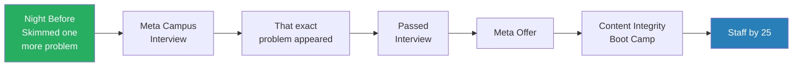
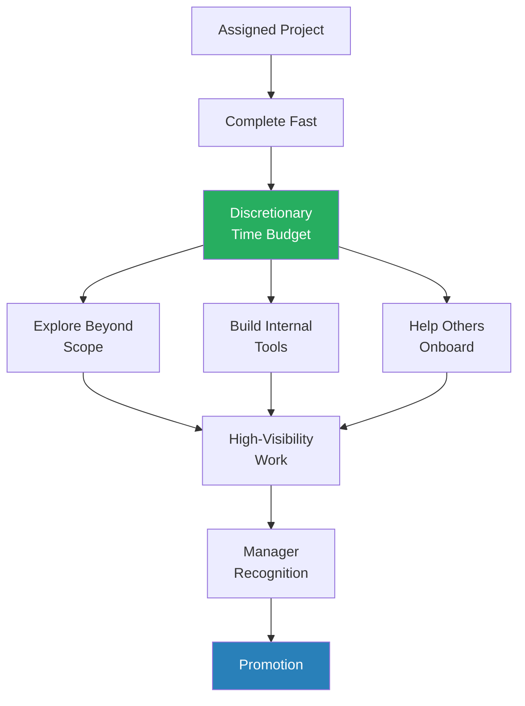
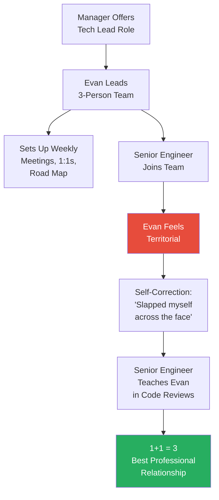
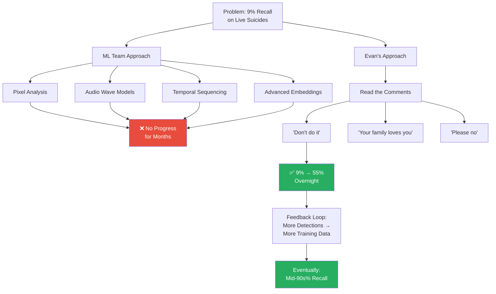
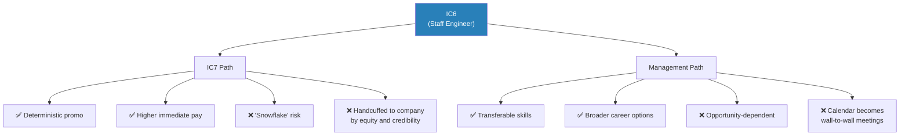
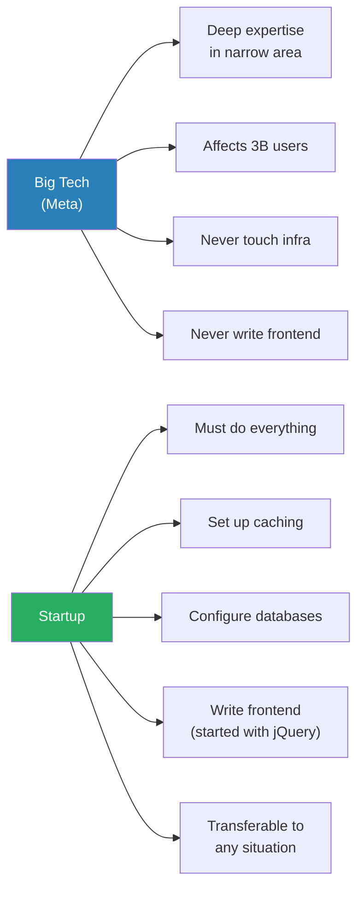

# 25 Year Old Staff Eng @ Meta (Promotion Story)

> Ryan Peterman interviews Evan King, a software engineer who reached Staff (IC6) at Meta by age 25 — promoted every single year for three consecutive years. What makes this episode unique is the dual-perspective format: because Ryan's trajectory at Instagram mirrors Evan's almost exactly, both share their parallel stories at each career stage. The conversation reveals that rapid promotion isn't about brilliance — it's about speed of execution, agency in seeking opportunities, the right manager, and an underrated willingness to try the simple solution when everyone else is chasing complexity. Evan's post-Meta startup journey then delivers a humbling counterpoint: three years of Big Tech excellence left him unable to set up a database on his own.

---

## Overview: Key Highlights

- <b style="color: #27ae60">Complete your assigned work fast — the extra time is your career acceleration budget</b> — both Ryan and Evan attribute their rapid growth to finishing projects quickly and using the surplus to explore high-visibility work beyond their scope
- <b style="color: #27ae60">The simplest solution often has the biggest impact</b> — Evan's team of PhDs spent months on sophisticated ML models with no progress; adding user comment signals took suicide detection from 9% to 55% recall overnight
- <b style="color: #2980b9">The Speed Budget</b> — a framework where fast execution creates discretionary time for career-accelerating work outside your assigned scope
- <b style="color: #2980b9">Impact Throughput</b> — prioritise like a fraction: impact (numerator) divided by effort (denominator). A one-line change with huge impact beats a year-long complex project
- <b style="color: #2980b9">Influence Without Authority</b> — at Meta, levels aren't public. You can't say "I'm IC6, listen to me." Trust must be earned daily by being right consistently
- <b style="color: #e74c3c">Territorial instincts will destroy your career</b> — Evan felt threatened when a senior engineer joined his team; had to overcome that instinct to unlock 1+1=3
- <b style="color: #e74c3c">Big Tech specialisation creates dangerous blindspots</b> — Evan left Meta unable to set up caching, configure a database, or write frontend code
- <b style="color: #27ae60">Your manager is the single largest factor after your own performance</b> — Evan's manager advocated behind the scenes far more than Evan realised at the time
- <b style="color: #27ae60">Agency turns NOs into YESes</b> — Ryan begged a manager with no headcount to let him join; Evan chose an obscure terrorism team over the "obvious" cybersecurity path
- <b style="color: #e74c3c">Over-optimising for career growth at the expense of relationships is the biggest regret</b> — Evan's closing advice: invest in friendships and romantic relationships, not just the next promotion
- <b style="color: #2980b9">The IC vs Management Fork</b> — at IC6, both faced the same decision. Ryan chose management (transferable skills); Evan stayed IC (deterministic path). Both have trade-offs

| Concept | One-line summary |
|---------|-----------------|
| **The Speed Budget** | Finish work fast → use surplus time for high-visibility, scope-expanding work |
| **Impact Throughput** | Impact ÷ effort — a trivial fix with massive impact beats a complex year-long project |
| **Context Accumulation** | Be the first person on a growing team → become the go-to person → earn de facto authority |
| **Influence Without Authority** | Levels aren't public at Meta — trust is built by being right, not by rank |
| **Golden Set Recall** | Evan's infrastructure to restream past atrocities on isolated Facebook for measurement |
| **The Comments Signal** | User comments ("don't do it") detected suicides faster than any ML model |
| **TLM (Tech Lead Manager)** | A hybrid role at Meta — 70% IC contribution, 30% managing a small team |
| **Boot Camp** | Meta's old onboarding system — join undeclared, try teams, choose where to go |
| **The Two Paths** | Either work IS your passion, or work funds your passions — both are valid |
| **The Startup Learning Inversion** | Ideal order: startup first (breadth), Big Tech second (depth) — but most do the reverse |

---

# The Conversation

## Neither of Us Were Prodigies

*Ryan opens by asking Evan how he got into computer science, expecting a story of early brilliance. Instead, both reveal they were late starters — Evan felt behind his Seattle peers whose parents worked at Microsoft, and Ryan didn't even know what CS was until college.*

> [!tip] Core Insight
> You don't need to be a programming prodigy to succeed in the tech industry. Both engineers who reached Staff by 25 started CS later than their peers and felt behind early on.

> [!note]- Expand: Full Conversation
> - Ryan asks Evan how he got into studying computer science — noting that when they published his rapid growth story, people debated whether he'd been coding since age 5
> - Evan says he took AP Computer Science in high school near Seattle
>   - Most classmates had parents at Microsoft and had been coding since childhood
>   - He was "horrible" and "knew nothing" — felt the subject didn't click for him
>   - But he was resilient enough to maintain his straight-A streak through sheer effort
>   - In college at Cornell, his AP background suddenly made him better than peers who had zero CS exposure — "it's that human nature that when you're good at something it's exciting and you want to keep going"
> - Ryan shares his own origin: grew up in Orange County, didn't have AP CS, "didn't even know what CS was until I got to UCLA"
>   - Started as Undeclared Engineering, declared Electrical Engineering because he liked video games
>   - Switched to CS in junior year — "pretty late"
>   - The overlap between EE and CS meant the switch didn't cost extra time
> - Both agree: you don't need to be a prodigy to succeed in industry

---

## Side Projects That Actually Matter

*Evan describes founding the Cornell Hacking Club after quitting Division 1 soccer, while Ryan built a Raspberry Pi occupancy sensor for his engineering lab. Both argue that the best side projects solve real problems — not tutorial exercises.*

> [!note]- Expand: Full Conversation
> - Ryan asks what made Evan start the Cornell Hacking Club
> - Evan explains he played Division 1 soccer at Cornell, then had a realisation in junior year: "I'm not going to be a professional soccer player, but I AM going to be a professional software engineer — so why am I dedicating so much time to soccer?"
>   - Quit soccer, suddenly had enormous free time
>   - Had been doing Capture the Flag competitions solo via Reddit teams
>   - Put up flyers around the engineering quad, found 25 people, built a core team
>   - At its peak: 25 competitive members, up to 200 attending weekly lectures on hacking
>   - This was the genesis of his love for teaching (now runs Hello Interview)
> - Ryan reflects that the leadership skills from running a club — alignment, communication, marketing — are "actually a lot of what more senior engineers need to do"
>
> > [!example] Ryan's Occupancy Sensor Side Project
> > - Ryan was in an engineering club whose lab was only open when an officer was present
> > - People would ping group chats asking "is the lab open?" — unreliable and slow
> > - He built a Raspberry Pi connected to the lab's Wi-Fi that tracked officers' MAC addresses
> > - A Slack bot let anyone ask "who is?" and get a list of officers currently in the lab
> > - He talked about this in interviews and it resonated with interviewers
> > **The lesson:** The best side projects solve real problems around you — not Redis clones nobody uses.
>
> - Both agree: "observe the problems around you and build software to solve it — that's the side project you should be working on"

---

## The Role of Luck in Getting Your Foot in the Door

*Both share their LeetCode struggles and interview experiences. Evan's career was shaped by a single lucky moment — skimming the exact problem that appeared in his Meta interview. Ryan ground LeetCode all summer at Bloomberg and still failed every onsite except Amazon.*

> [!quote] Evan King
> "Had I not skimmed it I certainly wouldn't have passed, wouldn't work at Meta, you and I probably wouldn't be having this conversation."

*One lucky night of studying cascaded into Evan's entire career trajectory — a reminder that small decisions compound unpredictably.*

> [!note]- Expand: Full Conversation
> - Ryan asks if CTF experience helped with LeetCode
> - Evan says LeetCode was genuinely hard for him: "I felt like people around me found it easier — that might have just been projecting insecurities"
>   - Spent hours every day in the library practising
> - Evan's luck story: Meta came to campus for on-site interviews. First question was a LeetCode Hard he'd never have solved — but the night before, he'd skimmed that exact problem and understood the trick
> - Ryan's parallel: ground LeetCode aggressively all summer during his Bloomberg internship, then failed every single onsite
>   - Only two offers: Bloomberg return offer (no interview needed) and Amazon (via a logic-puzzle SAT-style test, not a real interview loop)
>   - Chose Amazon to stay on the west coast
>
> > [!example] Ryan's Palantir Heartbreak
> > - Palantir was the dream company — "S-tier" at the time, especially at UCLA and Cornell
> > - Ryan did the onsite and was in the first group of names called afterwards
> > - Interviewers said being called early meant either "you crushed it and you're hired" or "you failed"
> > - Ryan was absolutely convinced he'd crushed it — waited two weeks in total confidence
> > - Got the rejection call — devastated by the gap between expectation and reality
> > - In hindsight: "I must have totally blown it and they were nice to me"
> > **The lesson:** Interview processes can be deeply deceptive — never assume you know how it went.

---

## Choosing Your Team: Agency Over Luck

*Both arrived at Meta through Boot Camp — the old system where new grads joined undeclared and tried multiple teams. Evan expected to go into cybersecurity but found it cold and unwelcoming; he fell in love with Content Integrity's mission to fight terrorism. Ryan begged a manager with no headcount to let him join Instagram infrastructure.*

> [!tip] Core Insight
> The best opportunities are the ones you seek out, not the ones that seek you. The teams actively recruiting you are often in positions of weakness; the great teams have everyone coming to them — so you have to fight your way in.

> [!note]- Expand: Full Conversation
> - Evan describes Meta's Boot Camp: you enter "undeclared," try tasks across teams, then choose
>   - Expected cybersecurity given his hacking background
>   - Found cybersecurity teams "stoic, less friendly, less welcoming"
>   - Discovered Content Integrity — ML models detecting terrorism, hate speech, graphic violence, suicide
>   - The terrorism team was brand new in the Seattle office: one manager (shared with another team), one half-time engineer
>   - "Who doesn't want to fight terrorism? Machine learning, cutting edge, cool"
>   - Content Integrity had "a bunch of young people that I could really relate to"
> - Ryan's team selection: wanted Instagram infrastructure
>   - The manager he wanted didn't have headcount
>   - Ryan begged: "I really want to work at Instagram, I promise I'm going to work as hard as I can"
>   - The manager saw his earnestness and "borrowed headcount from somewhere"
>   - Stayed on that team his entire Meta career
>
> > [!quote] Ryan Peterman
> > "The best opportunities are not the ones that seek you out but the ones that you seek out."

---

## The Speed Budget: How Fast Execution Accelerates Careers

*Both reveal the core behaviour behind their rapid promotions: finishing assigned work fast enough to create a surplus of discretionary time — then using that surplus for high-visibility work beyond their scope. The conversation gets honest about whether this requires brilliance (it doesn't) or extra hours (sometimes).*

*The "Speed Budget" — completing work fast creates discretionary time, which becomes the fuel for career-accelerating work outside your assigned scope.*

> [!note]- Expand: Full Conversation
> - Ryan asks: the article about Evan's career growth said "do your work fast and use the extra time to excel" — but HOW do you get through projects so fast?
> - Evan is honest: "I hate this question... I don't know, and it makes me feel held up in a status I don't deserve"
> - Ryan shares two concrete levers:
>   - **Workflow optimisation:** keybindings, memorising the codebase, knowing exactly which line to change. At peak, he was doing ~10 diffs/day
>   - **Working more hours:** "If you want an extra 30% of time, you can also just work an extra 30%. That's the answer nobody ever wants to hear"
>   - He would get in at 10am and leave on the latest shuttle at 9:27pm — "but I was enjoying it"
> - Evan adds two more levers:
>   - **Personal knowledge base:** at Zillow he built a personal search engine to store solutions; at Meta, just markdown files with Control+F. "I never needed to struggle to solve a problem twice"
>   - **Asking for help without fear:** spend an hour trying, then find the person who knows. "The ability to find the person at the company that knows and get the answer from them is a super powerful skill"
> - Ryan adds: **code search mastery** — in Meta's monolith, the chance you're solving something for the first time is "almost none." Guessing function names and hunting for similar patterns is "one of the absolute peak skills"
>
> > [!example] Evan's Zillow Internship — The Security Game
> > - Evan finished his assigned project quickly at Zillow (on the Rentals team)
> > - Noticed posters about not leaving computers unlocked — people ignored them
> > - Built a fun game: if someone's screen was unlocked, you could "get" them via an internal website
> > - Created a leaderboard tracking who left their screen open and who "got" the most people
> > - It became a hit in the office
> > - He also hung out with the cybersecurity team — they took him to DefCon in Las Vegas, completely unrelated to his Rentals team
> > - His manager called him "the best intern he had ever worked with"
> > **The lesson:** Finish your assigned work fast, then use the surplus to build things that solve problems around you — that's what makes you memorable.

---

## First Promotions and Confidence Building

*Evan's first promotion (IC3→IC4) happened in six months — he never asked for it, didn't expect it, and was pulled into a room by his manager. This became a pivotal confidence-building moment that freed him from imposter syndrome for the rest of his career.*

> [!note]- Expand: Full Conversation
> - Ryan asks about Evan's first promotion — did he talk to his manager about it?
> - Evan says it "definitely just happened" — he was new, shy, had insecurities
>   - Manager pulled him into a room, gave compliments, said "you're promoted"
>   - Showed him the new salary and equity — "I was shaking with giddiness"
>   - "From that moment on I had the assurance that I was good and I was capable"
>   - Was "freed of that anxiety questioning whether I was good enough"
> - This was the second confidence-building moment — the first was the Zillow manager calling him the best intern he'd ever worked with
> - Ryan had a different experience: his manager was supportive but never pushed promos proactively. Ryan had to self-advocate aggressively
>   - "Hey what do I have to do to get promoted? I'm super motivated"
>   - Being a high performer gave him leverage — manager had incentive to keep him happy
> - Both agree: <b style="color: #27ae60">managers are incentivised to invest in their high performers</b> — more promotions on their team reflects well on them
> - <b style="color: #e74c3c">If you're not getting attention from your manager, the first thing to fix is your own performance</b> — managers invest resources in the people who are excelling

---

## The Tech Lead Leap: Sharing Scope and Overcoming Territorial Instincts

*Evan's manager offers him the tech lead role for the Graphic Violence team — three engineers, greenfield scope. He doesn't even know what "tech lead" means. Meanwhile, a senior engineer joins and Evan feels territorial — a tension that nearly derails him before becoming the most valuable professional relationship of his career.*

*Territorial instincts are natural but career-destroying. Evan's willingness to overcome them transformed a potential rival into his most valuable mentor.*

> [!note]- Expand: Full Conversation
> - Ryan asks about the IC4→IC5 (mid to senior) promotion
> - Evan: the team had grown — from just him to 8-9 engineers with a full-time manager
>   - Because he was there first (even by a couple of weeks), he had the context and was helping senior engineers ramp up
>   - Manager asked if he wanted to be tech lead for the Graphic Violence team (3 people)
>   - "I didn't know what tech lead was. It sounded cool and fancy"
>   - The team: himself, a junior engineer, and a mid-level PhD research scientist
>   - He started running weekly meetings, setting road maps, having one-on-ones with teammates
>   - "This was the transformative moment in my career where I grew leadership skills"
> - The territorial moment:
>
> > [!example] The Territorial Senior Engineer
> > - A "incredibly brilliant" senior engineer joined from Microsoft
> > - Evan felt threatened: "This is MY project and MY things"
> > - He was "the little junior engineer" feeling threatened by a "sophisticated senior engineer"
> > - Had one conversation with his manager about it, then "slapped myself across the face"
> > - The senior engineer taught him enormously through code reviews and design meetings
> > - They became "one of my best friends in any professional context"
> > - The relationship was 1+1=3 — they accomplished far more together
> > **The lesson:** Scope is not zero-sum. The person you feel threatened by is often the person who will teach you the most — if you're humble enough to let them.
>
> - Ryan resonates: "I had people who were more senior, they knew way more than me, and I owe everything to those relationships"
>   - "I would go and put all this work into the docs, they would eat it alive, and the end result was so much better"
>   - Didn't care about who got credit: "I love working with this guy, I'm learning so much"
> - Ryan's parallel: had an intern who showed him the power of delegation
>   - Was always a workhorse taking on three work streams
>   - Realised he could entrust the intern with some work — "now I felt like I was two people at once, shipping twice as much impact"
>   - <b style="color: #2980b9">"Scaling yourself"</b> — the buzzword for the IC5→IC6 transition

---

## The Christchurch Crisis and the Birth of Real-Time Integrity

*The most consequential section of the episode. The Christchurch mosque shooting on March 15, 2019 was live-streamed on Facebook for 9.5 minutes. Evan, as tech lead for graphic violence, was in the war room with the VP of Integrity while his manager was on paternity leave. This crisis led to the creation of a new team — Real-Time Integrity — and ultimately to Evan's staff promotion.*

> [!tip] Core Insight
> Crisis creates opportunity — but only for those already in position. Evan's context, built through two years of consistent work, meant he was the natural person to lead the response. The promotion was a consequence of being prepared when the moment arrived.

> [!note]- Expand: Full Conversation
> - Ryan asks about the anchor project for Evan's IC6 (staff) promotion
> - Evan sets the timing: first promo took 1 half (6 months), second took 2 halves (1 year), this one took 3 halves (1.5 years) — "it went one, two, three"
> - The Christchurch shooting: March 15, 2019
>   - Someone live-streamed the shooting of a mosque in New Zealand — 51 people killed
>   - Facebook allowed it to be live on the platform for 9.5 minutes
>   - Copies kept spreading — people downloaded and reshared the video
>   - Evan got the emergency call around 5-6pm, already home
>   - In the war room: VP of Integrity, head of content policy, and Evan as technical lead
>   - His manager was on paternity leave
>   - Many nights staying up, training models overnight, adjusting detection algorithms
> - The aftermath: company decided they were "underinvested in detecting worst-of-the-worst atrocities in real time on live video"
>   - Created a new team: Real-Time Integrity
>   - Started with just Evan and a PM — "this is your problem, figure out the scope, how many engineers you need, the road map"
>   - Evan's manager advocated heavily behind the scenes for this team creation (Evan only learned this later)
> - The measurement problem:
>   - Built "Golden Set Recall" — curated every past live atrocity since Facebook launched live video
>   - Bots would restream this content on a fully isolated version of real Facebook — comments would come in at the right time, testing the full infrastructure end-to-end
>   - Discovered: 9% recall on live suicides — "this is bad, this is not good at all"

---

## The Comments Breakthrough: Simple Beats Complex

*With 9% recall and months of sophisticated ML research producing no improvement, Evan notices something the PhD researchers missed: the user comments. "Don't do it." "Your family loves you." The people commenting knew about the crisis long before any ML model did. Adding comment signals took recall from 9% to 55% overnight.*

*The PhD researchers had "horse blinders" — focused on optimising models with the most sophisticated technical means. Evan, with less ML expertise, looked at the holistic problem and found the obvious signal hiding in plain sight.*

> [!quote] Evan King
> "I was surrounded by brilliant people who had horse blinders, focusing on how to optimise the model in the most sophisticated technical means possible."

> [!note]- Expand: Full Conversation
> - Evan explains: the team iterated on models for months — "fancy things from a modelling perspective," embeddings from the AI org, applied ML on top, sophisticated temporal sequencing
>   - "Nothing's really happening"
> - Then the insight: Evan looked at the examples they were missing as they came in daily
>   - The comments read: "don't do it," "your family loves you," "please no"
>   - "The people posting the comments knew of the atrocity long before our sophisticated models"
>   - "We were so focused on pinching pixels and audio waves that we weren't focused on the thing that was obvious and right there beneath our nose"
> - Updated models to include temporal comment signals — "it was a revelation"
>   - Went from 9% to 50-55% recall "almost overnight"
>   - This created a feedback loop: better detection → more real examples → more training data → better models
>   - By the time Evan left: mid-90s% recall
> - Ryan confirms the same pattern from his staff promotion
>   - His biggest impact was a trivially simple compute efficiency optimisation — just eliminating redundant work
>   - "The most impactful idea was the most obvious, easy thing to do"
>   - Listed out all ideas with brilliant engineers, the flashy complex ones were less impactful
> - Both agree on <b style="color: #2980b9">Impact Throughput</b>: think of prioritisation as a fraction — impact (numerator) / effort (denominator). A one-line change with massive impact is better than a year-long complex project
> - Evan notes Meta's cultural advantage: "You had huge impact and nobody else thought to do it — you're rewarded for it." Other companies reward proportional to difficulty

---

## Influence Without Authority: Leading When Nobody Knows Your Level

*A revealing discussion about Meta's culture of hidden levels. Evan was effectively managing engineers, attending performance conversations, even attempting to sit in calibrations — all without the title of manager and without his teammates necessarily knowing his IC level.*

> [!note]- Expand: Full Conversation
> - Ryan asks: your management chain was trusting you almost as a manager — was that natural?
> - Evan: "Tech lead traditionally means setting technical direction, but my role had a lot more of a people aspect"
>   - Had one-on-ones with all team members
>   - Was explicitly included in performance review conversations to help his manager assess engineers
>   - Even attempted to attend a calibration session as an IC6 — got shut down by the director
>   - Read "The Making of a Manager" when he became tech lead of Graphic Violence — "I really got to learn how to lead"
> - The trust factor: Evan was "everyone's best friend" — genuinely cared about each person's growth
>   - "I was never aware of any time where people felt uneasy with my leadership"
>   - No competitiveness, jealousy, or aggression — "I just understood the value of being on everyone's team"
> - The hidden levels advantage:
>   - At Meta, your IC level isn't public — teammates can guess but don't know for certain
>   - "There's no fallback of 'I'm IC6, you should listen to me' — it needed to be earned every day"
>   - Evan sometimes felt insecure: "People are looking at my profile, seeing I've been at the company three years with all this responsibility — they're probably writing me off"
>   - But this kept him hungry — couldn't rely on title authority
> - Ryan confirms: before becoming a manager and learning everyone's levels, he had an accurate gauge just from observing who was consistently right in meetings. "When I became a manager and knew everyone's levels, there were no surprises"

---

## The IC7 vs Management Fork

*Both reached IC6 and faced the same career decision. Evan planned to stay IC and pursue IC7; Ryan chose management despite his manager warning the IC7 path was more deterministic. Their reasoning reveals different risk calculations about long-term career transferability.*

*The same fork, two different answers — Evan stayed IC chasing IC7, Ryan chose management for long-term transferability.*

> [!note]- Expand: Full Conversation
> - Ryan asks if Evan considered management
> - Evan: thought he'd go IC6 → management, but the IC7 opportunity seemed clear
>   - Talked to friends who'd recently switched to management — heard about the stress of being directly responsible for people's issues
>   - Was in an "amazing place" with VP/director visibility, cool cross-org projects
>   - Decided: get to IC7 first, then consider switching to M2 (skip the junior manager problems)
> - Ryan chose the opposite: went to management despite his manager saying IC7 was more deterministic
>   - Manager's exact advice: "If you stay IC, there's a path for IC7. If you go to management, it's a lot more based on opportunity"
>   - Ryan's concern: "If I grew to IC7, I would become a snowflake — a very unique tool only useful at a handful of very big companies"
>   - At IC8: "You're handcuffed — so much equity that leaving would be crazy, and no other company would match your level at your experience"
>   - Wanted to learn management while he had the opportunity as a young IC
> - Ryan on TLM (Tech Lead Manager): 70% IC, 30% manager with a small specialist team
>   - Eventually pivoted fully to management
> - Ryan on management reality:
>   - Calendar becomes a solid block of meetings 9-to-5
>   - As IC, had fragmented meetings and worked later on code — more flexibility
>   - "If you ARE working late as a manager, you're filling out performance reviews — which isn't exactly fun"
>   - Manager career growth is proportional to recursive reports — "couple yourself to the growth of your org"
>   - In the "age of efficiency" with orgs being squeezed, that coupling is risky

---

## Leaving Meta: When the Side Project Becomes More Fun Than the Day Job

*Evan's trusted ex-manager starts messaging him about Web3. They build something after hours, get 10,000 users, and Evan faces a decision: stay for the near-certain IC7 promotion and seven-figure earnings, or leave for a startup with no funding. He chose the startup — because the after-hours work had become more exciting than his day job.*

> [!note]- Expand: Full Conversation
> - Ryan asks what made Evan leave Meta after staying 1.5 years post-staff
> - Evan: his first manager — the person he "respected more than anybody in the world professionally" — had moved to a different team and started messaging about crypto/Web3
>   - Evan had crypto interests from college — his Cornell professor Emin Gün Sirer (now Avalanche CEO) was doing Bitcoin research
>   - They brainstormed ideas, built something for fun outside of work
>   - Got ~10,000 users relatively quickly
> - Evan initially said he wouldn't leave without funding
> - But the tipping point: "The things we were tinkering with after hours ended up becoming more fun than my day-to-day job"
>   - "I would wake up in the morning, go to Meta from 7 to 5, and be thinking about when work ended so I could work on those problems"
> - Left all the equity, all the promotion opportunities
> - The startup arc:
>   - Web3 social intelligence company → 100K users → raised money → acquisition interest → market crashed → sold
>   - 6-8 months trying random ideas: truck factoring, design tools, "literally all over the map"
>   - Built a website-to-Figma converter (one-click copy any website into editable Figma frames) → technology acquired
>   - Finally: Hello Interview
>
> > [!example] Hello Interview's Accidental Business Model
> > - Built AI mock interviews — technically sophisticated but people didn't pay much
> > - Did free in-person mock interviews to gather training data for the AI
> > - After every single session, the candidate said: "Please let me pay you to do more of that"
> > - Evan and his co-founder Stephan refused at first: "We're technologists, we're building AI interviews"
> > - After the 24th person asked, they finally listened
> > - Put "in-person mock interviews" in small text on the side of the website
> > - Quickly booked 6-7 mocks per day with just two full-time employees
> > **The lesson:** Do what people are willing to pay for — not what sounds technically impressive to you.

---

## The Startup Humbling: Realising You Don't Know a Damn Thing

*Evan left Meta with an ego — fast promotions, leading 16 engineers, affecting 3 billion users. Then he discovered he'd never set up caching, configured a database, or written a line of frontend code. The startup experience was humbling, overwhelming, and ultimately the fastest learning of his career.*

*Big Tech gives depth in a narrow area; startups give breadth across everything. Evan argues the ideal order is startup first, Big Tech second — but acknowledges most people do the reverse.*

> [!quote] Evan King
> "I left all of that to realise I don't know a damn thing."

> [!note]- Expand: Full Conversation
> - Evan: "I left Big Tech with a relative ego — all these promotions, I'm the man, leading 16 people, cool things"
>   - "At Meta you work on the narrowest thing. I work on my small thing, hit go, and within six hours it's affecting three billion people — but I didn't figure out how to make that happen. Everyone else did everything else around me"
>   - Had never set up a caching layer, configured a database, stood up infrastructure, written frontend code
>   - First startup: "slinging raw jQuery" — eventually evolved to React
>   - "Incredibly stressful, incredibly overwhelming"
> - Now on the other side: "You can drop me into any situation and I can figure it out"
> - Ryan asks: has the startup out-earned what you would have made at Meta?
>   - Evan: "No. Not yet anyway"
>   - But: "The value in terms of experiences and purely technical knowledge has far outpaced Meta"
>   - Believes projected lifetime earnings will be significantly higher because of breadth of skills learned
> - Evan's ideal career order: startup first (breadth), then Big Tech (depth) — because then the Big Tech optimisations have context
>   - "But I wouldn't recommend that for career perspective — I'd recommend it for learning perspective"
> - The regret version: "I wish I had been more inquisitive at Meta about how things worked — I used Facebook's caching layer every day but didn't care how it actually worked"

---

## Reflections: Work Hours, Regrets, and What Actually Matters

*The closing section gets personal. Evan worked ~50-hour weeks at Meta with snowboard Wednesdays. At his first startup he worked 7am to 2am and couldn't leave his house without a laptop. His biggest career regret isn't technical — it's under-investing in relationships outside of work.*

> [!tip] Core Insight
> Over-optimising for career growth at the expense of friendships and romantic relationships is the biggest mistake Evan identifies. He spent years goal-setting and checking in on his career progression but never applied "that same vigour" to his personal life.

> [!note]- Expand: Full Conversation
> - Ryan asks about work hours through different career stages
> - Evan at Meta: "I usually tell people not a lot, but in reflection it's probably not totally honest"
>   - Got to work at 8-8:30am, left at 5:30-6pm
>   - But would open laptop at home to check experiments, wake up in the middle of the night to check if training runs finished
>   - Also took snowboard Wednesdays — leave at 2pm, drive to mountains, no work until 8pm
>   - Probably ~50 hours/week but with high flexibility
> - Evan at first startup: everything changed
>   - Working 7am to midnight or 2am regularly
>   - Couldn't leave the house without his laptop
>
> > [!example] The Pager Duty Birthday Party
> > - During the stressful first startup, Evan thought things were stable enough for a friend's birthday
> > - Went to the party just up the street — brought his laptop "just in case"
> > - Sat down, ordered food, then PagerDuty went off
> > - His co-founder was unavailable (vacation or with family)
> > - Grabbed his laptop and ran down the hill to fix the outage
> > **The lesson:** Early-stage startups demand total availability — the flexibility of Big Tech is a luxury you sacrifice.
>
> - Evan's biggest regret: not slowing down to understand WHY things work
>   - At Meta: "ship it and run" culture — metrics went up, moved to next thing
>   - At startup: learning too fast to stop and understand deeply
>   - Only in the last year has he shifted to spending 30% of time on genuine learning
> - Evan's advice to his younger self: invest in relationships
>   - "I was underinvested in friendships and romantic relationships"
>   - "You spend all this time road-mapping and goaling about career progression but in terms of general life progression, I didn't apply nearly the same vigour"
>   - Moving to LA and making non-tech friends was the turning point
>   - "I have all these people I can rely on now — I'm moving apartments and I have any number of people I can call"
>   - If forced to choose between faster career or better relationships: "Of course your relationships matter more than anything else in the world"
>   - But: "I don't think it's a binary — you can absolutely do both. I just didn't understand the importance until I got older"

---

## Connections

**Related books in vault:**
- [[The 48 Laws of Power - Robert Greene]] — Law 1 (Never Outshine the Master) parallels Evan's territorial tension; agency in seeking opportunities echoes Law 28 (Enter Action with Boldness)
- [[Mastery - Robert Greene]] — the apprenticeship phase (IC3-IC4) mirrors Greene's emphasis on observation, humility, and finding mentors
- [[The Laws of Human Nature - Robert Greene]] — territorial instincts (Law 10: The Law of Envy); the importance of reading people's true motivations in the hidden-levels culture
- [[Never Split the Difference - Chris Voss]] — influence without authority resonates with tactical empathy and calibrated questions
- [[The 33 Strategies of War - Robert Greene]] — "the simple beats the complex" parallels Strategy 5 (Avoid the Snare of Groupthink)

**Previous episodes:**
- [[How Corporate Politics Work - Best]] — Ethan Evans on navigating politics aligns with Evan's discussion of manager advocacy and hidden promotion dynamics

---

## The Takeaway

- This episode's most transferable insight isn't about Big Tech promotions — it's about the relationship between speed, simplicity, and impact. Both Ryan and Evan built their careers on the same pattern: execute assigned work fast, use the surplus to explore beyond scope, and when choosing what to build, pick the obvious simple thing over the technically impressive complex thing. The comments breakthrough (9% → 55% recall overnight) is the episode's most powerful illustration: a room full of PhDs missed what the users were shouting in the comments section. The lesson applies far beyond engineering — in any field, the people closest to the complex technical details are often the last to see the simple solution.
- The episode's most surprising revelation is how little Evan knew after reaching Staff at Meta. He could build ML models affecting 3 billion users but couldn't set up a database on his own. This isn't a failure of Evan's — it's a structural feature of Big Tech that anyone planning a long career should understand. The specialisation that makes you a Staff engineer also makes you a "snowflake" who is difficult to transplant. Ryan's decision to move to management was explicitly motivated by this fear — he didn't want to become so specialised that his skills only worked at one company.
- What remains unresolved is the tension in Evan's closing advice. He tells his younger self to invest in relationships — but also acknowledges that the career obsession that cost him those relationships is exactly what got him to Staff by 25. He says "you can absolutely do both" but admits he didn't. The question for the listener isn't whether relationships matter more (they do) but whether the kind of person who reaches Staff by 25 is capable of the moderation Evan now recommends. The speed that built his career may be inseparable from the intensity that depleted everything else.
