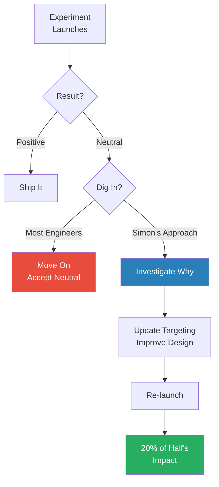
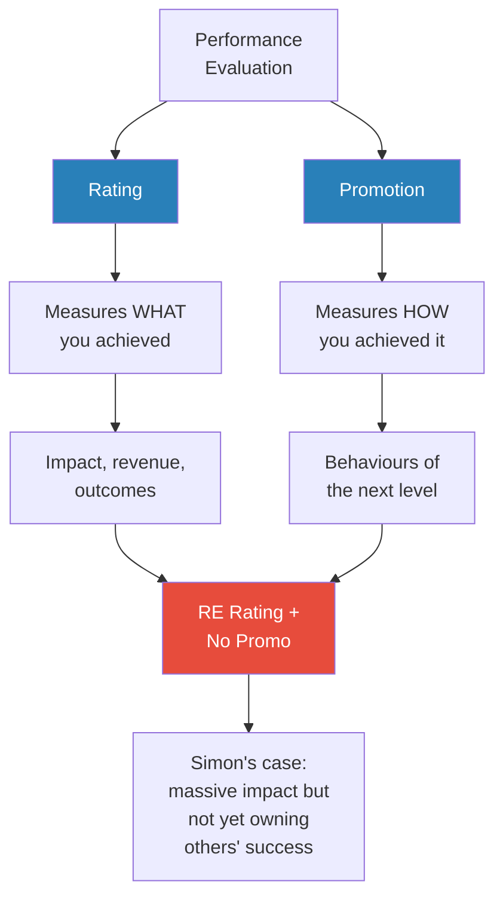
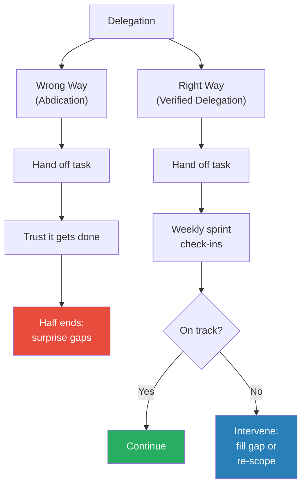
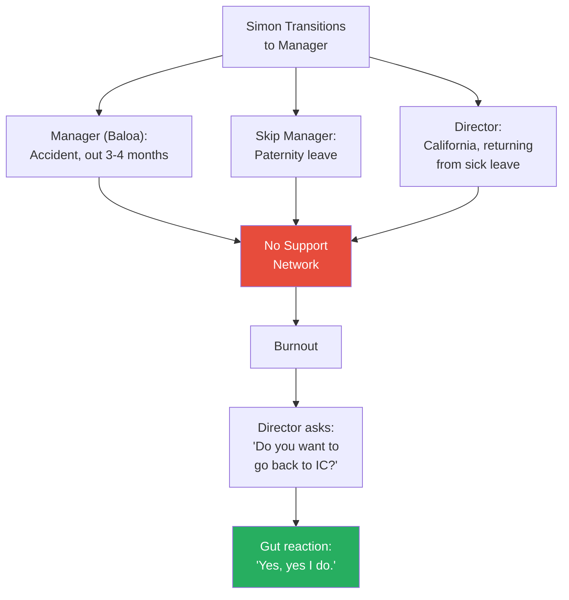
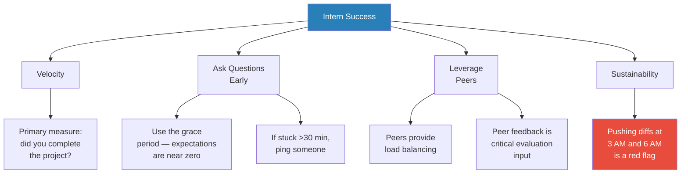
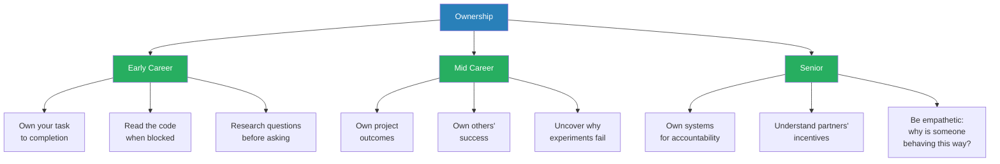

# 26 Year Old Meta Staff Eng on Promotions and Equity Bonuses

> Ryan Peterman interviews Simon, a Swedish engineer who went from new grad IC3 to Staff Engineer (IC6) at Meta in roughly three years, earning two RE (Redefines Expectations) ratings along the way — a performance tier so rare most engineers never receive it once. Simon stayed with the same manager for five and a half years across two continents, tried management, burned out under terrible circumstances, and returned to IC. The conversation is a masterclass in how ownership expands at each level, why ratings and promotions are not the same thing, and why written communication may be the most underrated career accelerator in tech.

---

## Overview: Key Highlights

- <b style="color: #27ae60">Ownership is the single thread through every promotion</b> — at IC3 you own your task, at IC4 you own project completion, at IC5 you own others' success, at IC6 you own the systems that make people and projects succeed
- <b style="color: #e74c3c">Ratings and promotions are correlated but not identical</b> — Simon got the highest possible rating (RE) without being promoted because his behaviours didn't yet match the next level
- <b style="color: #2980b9">Delegation is Not Abdication</b> — Simon's manager's principle: you delegate the work, never the responsibility. You must verify outcomes, not just hope
- <b style="color: #27ae60">Written communication is the highest-leverage career skill most engineers neglect</b> — effective posts follow an inverted pyramid: flashy title, TLDR with numbers above the fold, context, then technical details for "fellow nerds"
- <b style="color: #2980b9">People Breakdown + Project Breakdown</b> — track both separately because a project can be on track while an individual contributor is drowning
- <b style="color: #e74c3c">Management without a support network is a recipe for burnout</b> — Simon's manager, skip, and director all went offline simultaneously during his management transition
- <b style="color: #27ae60">The right manager is a career multiplier</b> — Baloa drew Simon's career plan on a whiteboard during boot camp and delivered on it for five and a half years
- <b style="color: #27ae60">Be generous with your time — it compounds</b> — investing heavily in a struggling intern's success was one of Simon's proudest moments and built his reputation as a force multiplier
- <b style="color: #2980b9">Additional Equity (AE)</b> — secret director-level grants of extra RSUs given to top performers, delivered via mysterious 15-minute calendar slots
- <b style="color: #e74c3c">Interest-driven energy is real</b> — Simon's 50-hour weeks felt like a grind until he switched teams; same hours, completely different experience
- <b style="color: #27ae60">IC6 is the sweet spot for people-oriented engineers</b> — you get mentoring and coaching upside without the unconditional responsibility of managing everyone
- <b style="color: #2980b9">Nothing at Meta is someone else's problem</b> — Simon's interpretation: read the code, research the blocker, propose a solution before waiting for another team

| Concept | One-line summary |
|---------|-----------------|
| **Ownership Radius** | Each promotion level expands what you're responsible for — from tasks to people to systems |
| **RE Rating** | "Redefines Expectations" — the rarest rating at Meta, above GE (Greatly Exceeds) |
| **Ratings vs Promotions** | Ratings measure impact (what); promotions measure behaviours (how) |
| **Delegation is Not Abdication** | Hand off work, keep responsibility. Verify outcomes through systems |
| **People + Project Breakdown** | Dual tracking reveals individual struggles that project-level views miss |
| **Written Communication Formula** | Title → TLDR with numbers → context → impact → technical details below fold |
| **Additional Equity (AE)** | Director-granted RSU bonuses for top performers, outside normal comp cycles |
| **Velocity** | The primary success measure for interns and early-career engineers |
| **Force Multiplier** | Being generous with time to grow others creates leverage that pays back |
| **Interest-Driven Energy** | Sustainable output depends on genuine interest, not just discipline |

---

# The Conversation

## Simon's Team and Career Context [0:00 - 3:00]

*Ryan introduces Simon's trajectory — new grad to Staff Engineer in three years, two RE ratings, a management detour, and a return to IC. Simon explains that he stayed on the same team with the same manager for five and a half years, an unusual run at Meta where reorgs are frequent.*

```mermaid
flowchart LR
    A["IC3<br/>New Grad"] -->|"H1: GE + Promo"| B["IC4<br/>Ads Payments"]
    B -->|"H2: RE, No Promo"| C["IC4<br/>Revenue Impact"]
    C -->|"H3: COVID<br/>No Ratings"| D["IC4<br/>Annotation Only"]
    D -->|"H4: RE + Promo"| E["IC5<br/>Pod Lead"]
    E -->|"2 Halves"| F["IC6<br/>Staff Eng"]
    F -->|"~1 Year"| G["M1<br/>Manager"]
    G -->|"Burnout"| H["IC6<br/>Back to IC"]
    style A fill:#2980b9,color:#fff
    style F fill:#27ae60,color:#fff
    style G fill:#e74c3c,color:#fff
    style H fill:#27ae60,color:#fff
```

*Simon's career at Meta: a rocket-ship IC trajectory, a management detour that ended in burnout, and a return to the IC track with renewed clarity.*

> [!note]- Expand: Full Conversation
> - Simon explains his team stayed together through multiple scope changes — always within the ads payments space
> - The team started as a payments growth team focused on revenue as the primary metric
> - They pivoted through several phases: ads payments growth, ads payments infrastructure (during a migration), and international payments (e.g. Messenger-based commerce in Thailand)
> - Ryan summarises: "monetization, went to product infrastructure, then back to product"
> - Simon confirms, noting the same manager (Baloa) throughout — across California and eventually London
> - The consistency of manager and team was unusual for Meta and became a defining advantage

---

## IC3 to IC4: The Internship Advantage and Early Velocity [3:00 - 10:00]

*Simon explains how a prior Meta internship shaved four to eight weeks off his ramp-up, how pre-studying React and TypeScript gave him pattern-matching advantages, and how joining a brand-new two-person team gave him outsized mentorship and impact.*

> [!tip] Core Insight
> The ramp-up period is the single biggest lever for early-career velocity. Simon's internship and self-study eliminated weeks of friction — and being the second engineer on a new team meant every project he shipped moved the needle.

> [!note]- Expand: Full Conversation
> - Simon interned at Meta before joining full-time, which meant he already knew internal tools like Fabricator
> - He estimates this saved four to eight weeks of ramp-up compared to peers
> - Before joining, he spent time exploring React, TypeScript, and building side projects — not deep expertise, but awareness
> - <b style="color: #27ae60">His philosophy: engineers are pattern-matching machines — the more patterns you've seen, the faster you adapt</b>
> - Example: never using Meta's internal type checker Flow, but being proficient in TypeScript made the transition trivial
> - He originally planned to join an infrastructure team (his internship was C++ infra)
> - During boot camp, he met Baloa, who was the first manager he spoke to
>
> > [!example] Baloa's Recruitment Pitch
> > - Baloa told Simon during boot camp: "We care about impact at Meta. What's more impactful than revenue?"
> > - Simon was planning to join an infra team, but Baloa's pitch changed his mind
> > - The team was just two engineers — Simon would be the second
> > - Baloa took Simon to a whiteboard and drew a plan for reaching IC5 in three years
> > - Baloa had followed a similar trajectory himself and knew the path was possible
> > **The lesson:** A great manager doesn't just manage — they recruit talent by showing them a credible path to their goals.
>
> - Being the second engineer meant heavy one-on-one time with Baloa, who was a recently converted IC6→manager with deep technical knowledge
> - Simon's IC3→IC4 promo came in his first half (H1) with a GE rating
> - <b style="color: #2980b9">The promo required at least six months of trailing performance</b> — Simon essentially needed to perform as an IC4 from day one
> - The rating was primarily driven by impact: on an ads payments team targeting revenue, his projects delivered more than three times the half goal
> - In his first half, Simon ran 20 of the org's 50 total experiments — exceptionally high velocity for any engineer, let alone a new grad
> - <b style="color: #27ae60">Key IC3→IC4 behaviour shift: taking ownership of project completion rather than just individual tasks</b>
> - When results were negative, Simon took ownership of figuring out why — not just reporting the failure

---

## The First RE Rating: Digging Into Counterintuitive Results [10:00 - 20:00]

*Simon's second half as IC4 produced a Redefines Expectations rating — driven not by luck but by refusing to accept neutral experiment results. Two stories illustrate how grit and curiosity turned flat outcomes into major revenue wins.*

> [!tip] Core Insight
> The difference between good and exceptional engineers shows up in experiment review. Good engineers accept neutral results. Exceptional engineers dig into counterintuitive data until they find the hidden win — or at least understand why.

*Most engineers accept neutral experiment results and move on. Simon's career-defining habit was digging into the why — and it consistently turned neutral launches into major wins.*

> [!note]- Expand: Full Conversation
> - The team had grown from two to about eight engineers by this point, and Simon had played a large role in recruiting and onboarding
> - Simon's RE was primarily driven by one project that overachieved even the team's ambitious half-goal — a goal measured in many dozens of millions of dollars
> - Ryan asks whether Simon knew the project would be that impactful at the start
> - Simon says no — they had a strong data scientist who had a hunch, but many projects initially launched neutral
>
> > [!example] The Payment Failure Notification Fix
> > - When an advertiser's payment failed, Meta notified them and asked them to pay to keep running ads
> > - The notification experience was not obvious to advertisers — many who wanted to pay couldn't figure out how
> > - Simon's team improved the notification to make it clearer
> > - First launch: completely neutral — no measurable impact
> > - Instead of moving on, Simon dug in with the data scientist to understand why
> > - They updated the targeting criteria and worked with a designer to improve the visual experience
> > - The fix ended up contributing about 20% of Simon's impact that half
> > **The lesson:** A neutral result isn't a dead end — it's often a signal that the targeting or execution needs refinement, not that the idea is wrong.
>
> > [!example] The Broken Experimentation Logging
> > - A script ran daily to update advertiser settings, but the experimentation logging wasn't recording results properly
> > - Simon personally investigated: reached out to the experimentation team, consulted the data scientist, and did deep code review
> > - He developed a hypothesis for why logging was failing and fixed it
> > - This project became the majority of his impact that half
> > - The data scientist — an IC5 or IC6 at the time, now an IC7 or IC8 — left peer feedback calling Simon one of his favourite engineers to work with
> > **The lesson:** End-to-end ownership means not just shipping code but ensuring the measurement infrastructure itself is working.
>
> - <b style="color: #27ae60">Simon's behaviour pattern: take ownership of the full success of a project, including measurement, not just the code</b>
> - Ryan reflects that in experiment review, the best engineers are intensely curious about counterintuitive results — they don't just report "it's neutral," they explain why
> - Simon also stretched across platforms during this period — reviewing code in Android, iOS, Hack (PHP), and JavaScript despite being primarily a JS engineer
> - He got feedback that his diff reviews sometimes felt "overbearing" but mostly received praise for uplevelling teammates through review comments
> - Ryan asks if Simon expected the RE rating
> - Simon says he was "pretty blue-eyed" — he didn't even understand RSUs when he joined and just looked at salary. His manager took him to dinner for the IC4 promo (a tradition for all promotions). The RE came as a surprise because he had no baseline for what was normal

---

## Why RE Doesn't Always Mean Promotion [20:00 - 28:00]

*Simon explains the critical distinction between ratings and promotions at Meta — a counterintuitive system where the highest possible rating doesn't guarantee advancement. The COVID half adds a frustrating twist.*

*Ratings and promotions evaluate different axes. Simon's RE without promotion illustrates how enormous impact (rating) can coexist with not yet demonstrating next-level behaviours (promotion).*

> [!note]- Expand: Full Conversation
> - Ryan asks: how is it possible to get the absolute highest rating and not get promoted?
> - <b style="color: #e74c3c">Simon explains: ratings measure what you achieved (impact), promotions measure how you achieved it (behaviours of the next level)</b>
> - As IC4, the expectation is driving your own project forward
> - As IC5, you need to take ownership of other people's success — not just your own output
> - Simon was starting to touch on this through onboarding and mentoring, but wasn't yet responsible for others' project outcomes
> - Ryan reframes: "Promos are all about how you're getting it done in a sustainable way expected of the next level. If you chanced upon very impactful IC4 work, that may not get you closer to promotion."
> - Simon confirms — "Correct"
> - The next half was the COVID half: no official ratings or promotions were given
> - Simon received a "significantly above" annotation — practically equivalent to a GE rating — but no official promo
> - He was "a little bit sour" because that half represented 33% of his entire career at that point
> - Simon acknowledges "our careers are long, one half isn't a big deal" — but at the time it felt like a significant loss

---

## Second RE and the IC5 Promotion: Leading a Pod [28:00 - 34:00]

*Simon's behaviour finally shifts to match IC5 expectations. He leads a virtual pod, takes responsibility for a new product space from zero to shipped, and manages an intern turnaround — all while earning his second RE rating and the IC5 promotion.*

> [!note]- Expand: Full Conversation
> - Simon acknowledges the second RE was "a little bit of a fluke" — the company bumped ratings slightly to compensate for the COVID half's lack of promotions
> - He estimates he was "on the border" and probably close to RE regardless
> - The critical change: the team split into two virtual teams, and Simon took responsibility for one half — four or five people
> - <b style="color: #27ae60">For the first time, Simon was responsible for going from an unscoped idea to completed projects — not just his own output but the pod's outcome</b>
> - The product wasn't ultimately successful, but the team handled it well, including leadership escalations up to director level and IC8s
> - Simon — still an IC4 at the time — received credit for the quality of his communication during those escalations
> - Ryan asks why Simon's manager trusted an IC4 to lead a pod of engineers
> - Simon identifies two factors: solid technical skills (CS since high school in Sweden, cross-platform expertise) and a genuine love for people and their growth
> - He cares more about the outcome of the people working on a project than the project itself
>
> > [!example] The Struggling Intern Turnaround
> > - Simon was an intern manager for the first time during this half
> > - His intern struggled significantly with fundamentals — React or Hack basics took longer than expected to click
> > - Simon was "very generous with my time" — investing hours of one-on-one support
> > - His wife got upset because the time commitment was eating into their dinner and date time
> > - The intern ultimately got a return offer
> > - Simon calls it one of his proudest moments at Meta
> > **The lesson:** Being generous with your time is high-leverage — it creates a force multiplier effect, and the turnaround case is far more impactful than the easy win.
>
> - Simon was also a peer mentor for four other interns simultaneously during this half
> - He admits he hasn't found the right balance for when to "call it quits" on someone who isn't improving
> - He tends to stick with people longer than might be worth it — "but at least my conscience is clear"

---

## IC5 to IC6: Scaling Yourself and Deep Technical Work [34:00 - 48:00]

*The biggest behaviour gap between IC5 and IC6: learning to delegate without abdicating. Simon leads two pods, then a 13-person project, while still demonstrating deep technical skill. His manager's phrase — "delegation is not abdication" — becomes the turning point.*

> [!tip] Core Insight
> Delegation is not abdication. You delegate the work, never the responsibility. The gap between IC5 and IC6 is building systems that catch problems before the half-end scramble — not just trusting that things will work out.

*The critical difference between IC5 and IC6 delegation: verified delegation catches problems through weekly check-ins, while abdication leads to half-end surprises.*

> [!note]- Expand: Full Conversation
> - Simon's first half as IC5: given responsibility for two pods with seven people total
> - He starts learning to scale himself: instead of running sprint planning, he assigns pod leads and coaches them through it
> - <b style="color: #27ae60">"Now they are growing in return... they can make it towards whatever goals they have"</b> — delegation as a growth tool for others
> - He also delegates recruiting outreach but retains the "hardest thing" — the first sell call to hook candidates
> - Problem: he doesn't yet know how to hold people accountable. Things slip and he doesn't discover issues until the half is ending
> - This was "pretty systematic" — the accountability gap persisted across multiple halves
> - Second half as IC5: the team splits officially. Simon leads eight people on one team while also heading a separate 13-person project
> - This stress-tests his ability to scale
> - Ryan asks about the tension between scaling and deep technical contribution (a common IC6 concern)
>
> > [!example] The Cross-Stack Debugging Sprint
> > - A payments product needed to cross from Instagram to Meta's main backend to a C++ payments backend to a third-party payments partner
> > - The team was stuck — they couldn't make the full chain work
> > - Simon went in as TL and spent days doing deep technical debugging
> > - He placed breakpoints across Android, iOS, Instagram server, Meta main backend, and C++ codebases simultaneously
> > - This demonstrated both breadth (working across five codebases) and depth (solving the hardest integration bugs)
> > **The lesson:** At IC6, deep technical work isn't about doing everyone's job — it's about being the person who can unblock the hardest cross-system problems that nobody else can see end-to-end.
>
> - Simon's approach to showing technical depth: sustained high-quality diff reviews throughout his career
> - He was consistently in the top three to five for both volume of diff reviews and words per review comment
> - <b style="color: #2980b9">He tracks "amount of words in diff comments" as a personal metric</b> — he finds strong correlation between comment length and review quality
> - Reviewing across Android, iOS, server, and JS let him catch inconsistencies: "the Android engineer implemented it this way, the iOS engineer this way, the server a third way — wait, let's figure out one unified approach"
> - Ryan asks: what was the one thing that closed the accountability gap?
> - Simon credits Baloa's phrase: <b style="color: #27ae60">"Delegation is not abdication"</b>
> - The fix was practical: weekly sprint meetings where you actually pay attention to whether each person's work is progressing as intended
> - <b style="color: #2980b9">Simon advocates for dual tracking: a people breakdown and a project breakdown</b>
> - A project can be on track while one contributor is drowning — only the people view reveals this
> - Ryan asks about the tension between stepping back (IC4→IC5 feedback: "you're stepping on my toes") and staying involved (IC5→IC6: verify outcomes)
> - Simon: "Between four and five you need to learn to let go. Five to six, you might not even review all the code anymore — you need to trust, but you still verify through systems, not micromanagement."

---

## The Decision to Try Management [48:00 - 54:00]

*Simon struggles with an identity crisis: he's a great engineer, but he loves growing people. The decision to try management is driven by his long relationship with Baloa and the fear that waiting too long would make the switch harder.*

> [!note]- Expand: Full Conversation
> - After reaching IC6, Simon had exceeded his original goal of IC5 in three years
> - He felt at a crossroads: pursue IC7, try management, or prioritise personal life
> - <b style="color: #e74c3c">His deepest fear: "Will I just become a middle manager who has lost all their technical abilities and stopped providing value?"</b>
> - The decision to try management was heavily influenced by Baloa still being his manager
> - They had moved from California to London together; Baloa was leading two teams and Simon took one as TL
> - With seven to eight people and Baloa getting too many direct reports, the manager slot opened naturally
> - Simon's reasoning: "If I do the manager switch, doing it together with [Baloa] might be the best time. I like how he is as a manager. If I become a manager, I would like to become similar to him."
> - Ryan notes: "Having a good manager may be the best gift someone could have if they're very ambitious"
> - Simon describes what made Baloa special:
>   - He genuinely cared about people, projects, and impact
>   - He knew the company deeply after 10+ years
>   - He was more of a product person than a typical engineering manager (recently switched to PM)
>   - He set the team roadmap at a great level of detail
>   - Exceptional at upward and downward communication
>   - <b style="color: #27ae60">He coached engineers to become valuable beyond just code — teaching product management, data analysis, and growth thinking</b>

---

## Management Struggles and the Return to IC [54:00 - 68:00]

*Everything that could go wrong with Simon's management transition does. His support network collapses, he overpromises, and he burns out. But the return to IC reveals a surprising insight: IC6 might be the optimal level for people-oriented engineers.*

*Simon's management support network collapsed simultaneously across three levels — leaving him alone in London managing a team through a critical period.*

> [!note]- Expand: Full Conversation
> - Simon was a manager for just under a year
> - He struggled with the IC-to-manager transition: he still wanted to do technical work
> - The company was encouraging managers to do more technical work at the time, which created mixed signals
> - He got feedback from reports: "Simon, step away from the technical"
> - He acknowledges he never fully corrected this before leaving management
>
> > [!example] The Support Network Collapse
> > - Within weeks of becoming a manager, three things happened simultaneously:
> > - Baloa (his manager of 5.5 years) had an accident and was out for three to four months
> > - His skip manager went on paternity leave
> > - The nearest person in the management chain was a director in California who had just returned from long-term sick leave and wasn't up to date
> > - Simon was left managing alone in London with a massive time zone gap to his only remaining support
> > - He also overpromised two IC5→IC6 paths on his team of eight — realistically only one could work
> > - The family also had to leave London for personal reasons, adding more stress
> > **The lesson:** The decision to enter management is heavily context-dependent. A great manager nearby and institutional support aren't just nice-to-haves — they're prerequisites for surviving the transition.
>
> > [!quote] Simon's Director
> > "Simon, do you want to go back to IC?"
>
> - Simon says it hit him as a gut feel: "Yes, yes I do."
> - He thinks he would have stayed in management longer if circumstances had been better, but probably would have eventually returned to IC regardless
> - <b style="color: #27ae60">IC6 insight: as an IC who enjoys people, he has more flexibility in how he applies mentoring and coaching</b>
> - As a manager, growing people is the primary evaluation criterion — unconditional responsibility for everyone
> - As an IC6, mentoring is "a bonus" — he can pick and choose who and what to coach
> - Ryan summarises: "As a manager you take on responsibility for everyone unconditionally. As IC6, you create scope, help who you want, and have more optionality."

---

## Additional Equity: The Secret Bonuses [68:00 - 74:00]

*Simon reveals the existence and mechanics of Additional Equity (AE) — director-level RSU grants that top performers receive outside normal compensation cycles, delivered via mysterious calendar invitations.*

> [!note]- Expand: Full Conversation
> - <b style="color: #2980b9">Additional Equity (AE)</b> is when a director chooses to give an engineer extra RSUs beyond their normal compensation
> - Simon received AE twice during his career
> - The first time: a random 15-minute calendar slot appeared from a director he'd never spoken to
>
> > [!example] The Mysterious 15-Minute Meeting
> > - A calendar invitation appeared from a senior director Simon had never met — 15 minutes, no agenda
> > - Simon showed up nervous: "I was a little sweaty going in"
> > - The director asked: "Simon, do you know why we have this meeting?" Simon had no idea
> > - The director told him he was receiving discretionary equity
> > - Simon had heard about AE from Meta's internal compensation forum — but those posts had extreme selection bias (only people with great ratings posted)
> > - A friend in a similar situation assumed the mysterious meeting meant they were getting fired
> > **The lesson:** The highest rewards in corporate tech are often invisible — you don't know they exist until they happen to you.
>
> - Simon suspects the first AE was partly retention-motivated: he started as IC3 with correspondingly lower stock grants, now at IC6 the gap to market was significant
> - The Meta stock had crashed at the time of both grants — which worked in his favour long-term
> - The second AE came about a year later, shortly after his management transition
> - He attributes it to the success of the London team: shipping a company-priority product faster than anticipated
> - Combined, the two AE grants "have definitely had a large impact on my total comp compared to normal market rate"

---

## Intern Advice: Velocity, Questions, and the Grace Period [74:00 - 82:00]

*Having been an intern, an intern manager twice, and an intern director managing ten intern managers, Simon offers the 80/20 of what separates the best interns from those who don't make it.*

*Simon's intern success framework: velocity is the primary measure, questions are the highest-leverage early investment, peers are underutilised, and unsustainable hours are a red flag, not a strength.*

> [!note]- Expand: Full Conversation
> - Simon's intern experience spans both sides: he was an intern himself (and nearly didn't get an offer), managed two interns, peer-mentored interns, and was an intern director overseeing ten intern managers
> - <b style="color: #27ae60">The primary measure of intern success: did you complete your intern project?</b> Velocity is everything
> - The biggest mistake failing interns make: not asking enough questions early on
> - "Those first couple weeks are so important to utilise your ability to be dumb"
> - Simon's rule for his interns and IC3s: "If a question takes you more than 30 minutes to an hour, ping me. If you keep spending an hour on small questions we could resolve in 30 seconds, you will not be successful."
> - There's a time decay on basic questions: asking how to do something basic in week one is fine; asking the same thing in week six raises concerns
> - Peers are underutilised: they load-balance questions away from the manager, and their feedback is a critical evaluation input
> - When evidence is insufficient, intern directors have to do deep digging — well-informed peers make this unnecessary
>
> > [!example] The Rockstar Intern From Mexico
> > - Simon's second intern was so proficient in JavaScript and React that they blew through their project
> > - The intern started coaching the new-hire IC3s on the team — teaching them how things worked
> > - Ryan was amazed: "They were coaching the IC3s?"
> > - Simon confirms — the intern's skills exceeded some of the full-time new hires
> > **The lesson:** The best interns don't just complete their project — they become net contributors to the team's productivity.
>
> - Ryan asks about the sustainability concern: what if someone works double hours to achieve velocity?
> - <b style="color: #e74c3c">Red flag: pushing diffs at 3 AM and 6 AM every day signals unsustainable output</b>
> - This is primarily a concern when someone is "on the line" — it suggests the level of performance can't be maintained
> - Simon emphasises personal care: working out, journaling daily, having morning focus time before meetings
> - He admits to sprinting (12-14 hour days for a week and a half during the cross-stack debugging) but knew he couldn't sustain it — he was skipping workouts, drinking too much coffee, and feeling his mind slow down each morning
> - His steady-state: about 50 hours per week, starting around 7:30-8:00 AM, sometimes working until 6 PM for California meetings

---

## Work-Life Balance and Interest-Driven Energy [82:00 - 92:00]

*Simon discovers that sustainable performance depends more on genuine interest than on discipline. When 50 hours start feeling like a grind, the fix isn't fewer hours — it's different work.*

> [!note]- Expand: Full Conversation
> - Simon averaged about 50 hours per week — a morning person who walks his dog, works out, then starts work
> - Some days run longer (until 6 PM for California meetings), some shorter
> - <b style="color: #27ae60">He recently switched teams specifically because his energy was dropping — same hours, but the work felt like a grind</b>
> - After self-reflection, he realised he was losing interest in the ads payments space after five and a half years
> - He considered leaving Meta entirely but decided to try internal mobility first
> - Joined an ID server infrastructure team — "got a lot of my fire back"
> - "The quality of work I'm able to produce is significantly different when I have that interest and fire"
> - Ryan reflects: "You could work 20 hours a week on something you hate and that could feel worse than 50 hours on something you're passionate about"
> - Simon agrees — when you love the work, the cliche of "it doesn't feel like work" holds true
> - Ryan adds his own experience: during his promo grind, he felt work-life balance despite long hours because the work was genuinely engaging
> - Why stay at Meta after six years?
>   - People: the first team felt like family — he recruited many of them, they were all young and out of college
>   - Flexibility: he's worked in Menlo Park, LA (during COVID), SF, London, and now New York
>   - Internal mobility: switching teams without switching companies
>   - Technical depth: the new infra team lets him "nerd out" deeply
> - Baloa, his longtime manager, recently switched from engineering manager to PM within Meta — confirming Simon's observation that he was always more of a product person

---

## Career Advice: Ownership, Curiosity, and Nothing Is Someone Else's Problem [92:00 - 97:00]

*Simon distils his career into one word — ownership — and unpacks how it applies at every level, from reading source code as a new grad to understanding cross-functional partners' incentives as a Staff Engineer.*

> [!tip] Core Insight
> Ownership at every level comes down to curiosity and refusing to be blocked. As a new grad, read the code instead of waiting for another team to unblock you. As a Staff Engineer, understand why your cross-functional partner is behaving a certain way — they might be evaluated on the exact metric you're regressing.

*Ownership expands in radius at each career stage — from owning tasks, to projects, to people, to systems and cross-functional relationships.*

> [!note]- Expand: Full Conversation
> - Ryan asks: what were the factors that led to your growth?
> - Simon: "The overall word is ownership"
> - Early career ownership means ensuring your one thing succeeds — which requires curiosity
> - <b style="color: #2980b9">"Nothing at Meta is someone else's problem"</b> — Simon's interpretation: if you're blocked, read the code in the monorepo, read the diffs to understand why a decision was made, come up with a proposal
> - "Don't just say 'it is this way, therefore it will always be this way' — question those early decisions, especially in a big company with layers of tech debt"
> - At senior levels, ownership becomes about understanding people's intentions and incentives
> - "Why is someone behaving a certain way? Are they getting evaluated on a metric that you're regressing? Be empathetic."
> - Ryan observes: the answer to "what drove your career" is a non-technical behaviour — ownership
> - Simon on technical vs non-technical: "You can be incredibly successful with just a baseline level of technical skills. You can get to IC5 without being the person who can solve any problem thrown your way."
> - <b style="color: #27ae60">Soft skills differentiate for fast career growth — people need to enjoy working with you for them to give you opportunities and trust</b>
> - Caveat: "There are some people who are just so technically talented that it outweighs everything"
> - Final advice if he could go back in time: "Be curious. Nothing is someone else's problem. Take ownership."

> [!quote] Simon
> "Nothing at Meta is someone else's problem."

---

## Connections

**Related episodes in vault:**
- [[25 Year Old Staff Eng at Meta - Evan King]] — near-identical trajectory (IC3→IC6 in ~3 years at Meta). Evan emphasises speed budget and simplicity; Simon emphasises ownership and scaling through people. Both credit their managers as the single biggest external factor.
- [[Amazon VP on Stack Ranking PIPs and Bezos - Ethan Evans]] — Ethan's Magic Loop parallels Simon's written communication formula: both are about communicating impact upward so decision-makers notice
- [[Meta IC9 on Influencing Engineers Failures and Learnings]] — Adam Ernst's depth-building at IC9 contrasts with Simon's breadth across platforms (Android, iOS, Hack, JS, C++). Both demonstrate that technical credibility takes different forms at different levels.
- [[Meta Senior Manager on Career Growth PIPs and Culture - Stefan Mai]] — Stefan's M1→M2 journey complements Simon's IC→manager→IC arc. Both discuss the difficulty of letting go of technical work as a manager.
- [[Frontline Manager to Senior Director in 3 Years - Rome]] — Rome's "directing vs managing" parallels Simon's struggle to step back from hands-on work during his management stint

**Related books in vault:**
- [[The 48 Laws of Power - Robert Greene]] — Law 1 (Never Outshine the Master) is inverted here: Baloa actively wanted Simon to shine and grow
- [[How to Win Friends and Influence People - Dale Carnegie]] — Simon's emphasis on caring about people, being generous with time, and written communication echo Carnegie's principles

---

## The Takeaway

Simon's story is a case study in how one word — ownership — compounds across a career. At IC3, ownership meant ensuring his tasks got done. At IC4, it meant digging into neutral experiments until they turned into wins. At IC5, it meant caring about whether the people around him succeeded. At IC6, it meant building systems so that delegation didn't become abdication. The word never changed; only the radius expanded. What makes this trajectory unusual isn't raw technical talent — Simon himself says you can reach IC5 with baseline technical skills — but the willingness to take responsibility for outcomes that no one explicitly assigned to him.

The management detour is perhaps the most instructive part of the conversation. Simon's decision to try management was thoughtful and well-reasoned: he had the best possible mentor, a natural opening, and genuine love for growing people. But circumstances demolished the support structure within weeks, and the lesson is stark. Management transitions are not just about your readiness — they depend on institutional scaffolding that can disappear overnight. His return to IC6 wasn't a failure; it was a recalibration. The insight that IC6 offers the mentoring upside of management without the unconditional responsibility is genuinely useful for any senior engineer weighing the same fork in the road.

The through-line that deserves more attention is written communication. Simon's claim that many engineers are "held back because they can't communicate just how good their work is" is quietly one of the most important ideas in the episode. In a company where a Workplace post can reach thousands, the engineer who writes a clear TLDR with numbers above the fold is playing a fundamentally different game than the one who buries impact under technical details. It is one of the few career accelerators that costs nothing, requires no manager advocacy, and compounds with every post you write.
