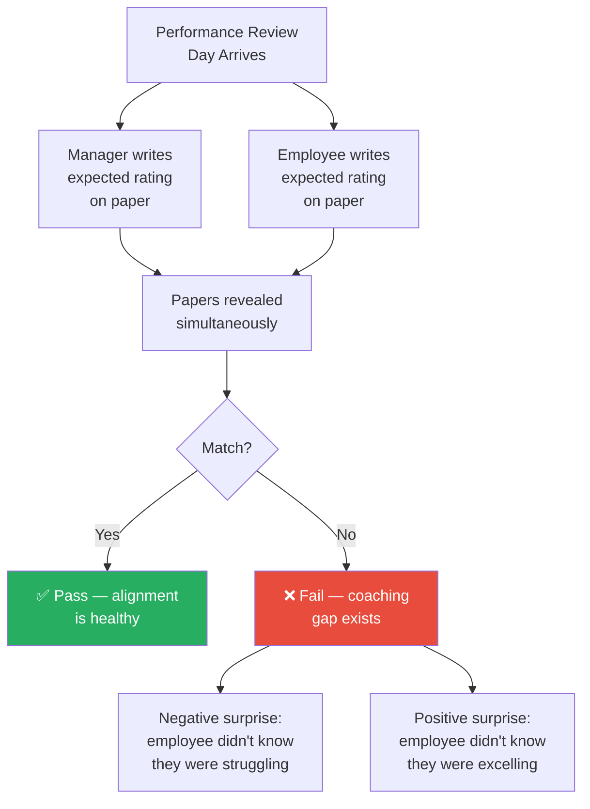
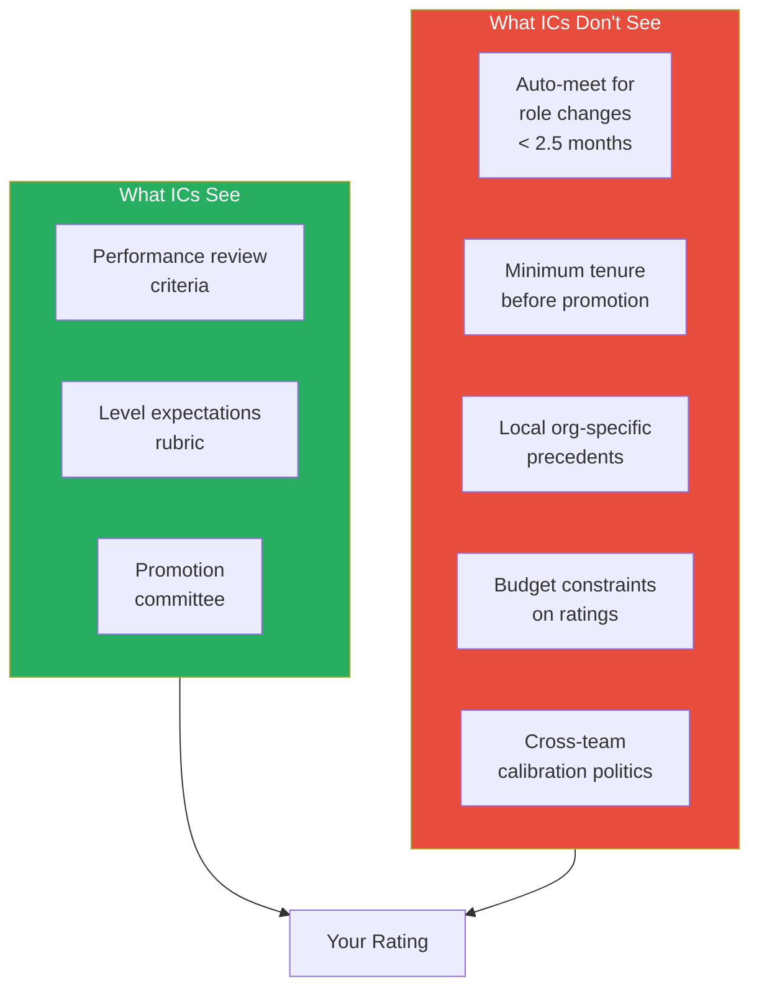
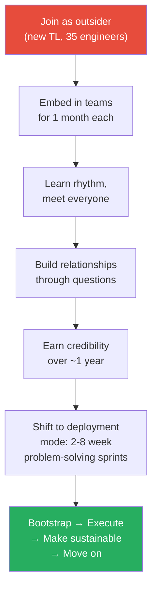
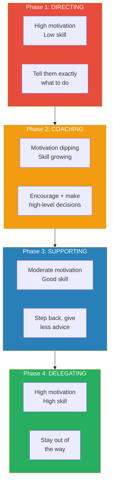
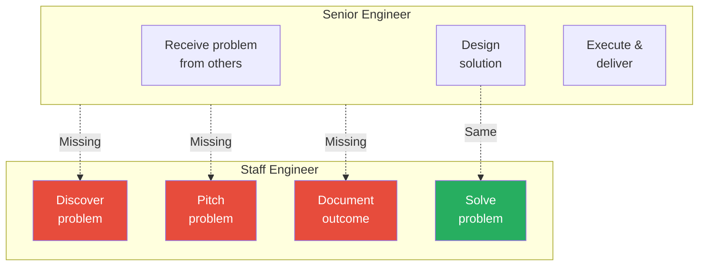

# Airbnb Staff Eng on Untold Rules of Calibrations and How To Not Get Stuck at Senior

> Laurent is a staff engineer and former manager with experience at Stripe, Airbnb, and Instagram/Meta. In this episode he walks through the hidden mechanics of calibration meetings, explains why most engineers are blindsided at performance review time, and lays out the precise mindset shift required to break past senior into staff. His core message: the engineers who advance fastest are the ones who explicitly align with their managers, challenge unfair rules from a place of evidence, and learn to discover problems rather than just solving them.

---

## Overview: Key Highlights

- <b style="color: #27ae60">Eliminate surprises at performance review</b> — Laurent's "surprise factor" metric: if manager and employee expectations don't match, something has gone wrong
- <b style="color: #2980b9">Situational leadership</b> — Four coaching styles (directing, coaching, supporting, delegating) matched to the learner's skill and motivation level
- <b style="color: #e74c3c">Passive career management is the biggest mistake</b> — Most engineers wait until year-end to present results and hope for the best instead of explicitly aligning throughout the year
- <b style="color: #2980b9">The problem discovery cycle</b> — Staff engineers discover, pitch, solve, and document problems end-to-end; seniors only handle the middle steps
- <b style="color: #27ae60">Boredom is a career signal</b> — When you feel bored, something needs to change; Laurent used boredom to trigger every major career transition
- <b style="color: #e74c3c">Calibration has unwritten local rules</b> — Auto-meets for role changes, minimum tenure before promo, and other hidden rules that are rarely communicated to ICs
- <b style="color: #2980b9">Friction logs</b> — Stripe's method: walk through any flow, screenshot every step, document every friction, categorise by family, rank, and solve
- <b style="color: #27ae60">Lead through questions, not directives</b> — At 70+ engineers, Laurent never told anyone what to do or rejected a design outright; he only asked questions
- <b style="color: #e74c3c">Claiming something wrong with confidence is career-ending</b> — Saying "I don't know" is vastly safer than guessing in tech culture
- <b style="color: #27ae60">Sustainability first</b> — Design every project so it runs without you; if you go on vacation, nobody should need to call you
- <b style="color: #2980b9">Code change journey metric</b> — Instead of counting lines of code, measure the full lifecycle from branch to merge to find where engineers are getting stuck
- <b style="color: #27ae60">Positive surprises are also failures</b> — If someone is doing great and doesn't know it, you've missed a coaching opportunity

| Concept | One-line summary |
|---------|-----------------|
| **Surprise factor** | Manager-employee expectation alignment metric at review time |
| **Situational leadership** | Match coaching style to learner's skill + motivation phase |
| **Problem discovery cycle** | The full loop (find → pitch → solve → document) that distinguishes staff from senior |
| **Friction log** | Systematic method for identifying developer experience problems |
| **Code change journey** | Measuring the lifecycle of a change instead of counting output |
| **Untold calibration rules** | Local, unwritten policies that determine ratings and promotions |
| **Calendar defrag tool** | Laurent built a tool to consolidate fragmented calendars for focus time |
| **Team health audit** | Surveying every team process to find what's actually valued |
| **Office hours model** | Scaling leadership by offering open booking slots instead of recurring 1:1s |
| **Value alignment** | Managers represent the company first — if you can't defend the decisions, you shouldn't be a manager |

---

# The Conversation

## Why Laurent Chose Airbnb [0:00 - 5:00]

*Ryan opens by asking about Laurent's career planning when he joined Airbnb. Laurent explains his focus on developer productivity and why Airbnb's early-stage DevProd was an exciting opportunity.*

*Laurent's career arc follows a consistent thread: developer productivity and infrastructure, with each move driven by either boredom, financial incentives, or the opportunity to build something from scratch.*

> [!note]- Expand: Full Conversation
> - Laurent explains he had been in the industry a few years, working at Apple and Meta, and decided developer productivity was his thing
> - He defines DevProd as making engineers as productive and effective as possible — how can they write code as effectively as they can
> - He was commuting 1.5 hours each way by bus from San Francisco to Meta's office, which triggered a job search
> - He picked Airbnb for three reasons: he loved the interviewers, it was walking distance from home, and they were very early in developer productivity
> - He joined as one of two engineers on test infrastructure — the beginning of DevProd becoming a multi-team org
> - The early stage was exciting because there was so much remaining to build

---

## The IC-to-Manager Transition [5:00 - 10:00]

*Laurent describes how he pitched his own manager on letting him become a frontline manager — not because he was asked, but because he identified a structural problem with the team's support.*

> [!tip] Core Insight
> The biggest mistake engineers make is not explicitly aligning with their manager on what they want. They passively wait for year-end, write down what they did, and hope for the best. Career progression should be an ongoing conversation.

> [!note]- Expand: Full Conversation
> - The team's manager was managing 3-4 teams — over 15 reports — leaving no time for anything but people management tasks
> - Laurent saw that many team members were new to the industry and needed more support than the overstretched manager could provide
> - He started as tech lead, grew the test infra team to 6-8 people, then pitched his manager directly
> - His pitch: "All those people need more support. I can do that. I can try. You can help me learn to be a manager."
> - The manager said yes — Laurent started with two reports, then the whole team reported to him
> - <b style="color: #27ae60">The pitch was value-driven</b>: here is the problem, here is how I solve it for you, here is why it benefits the team
> - Ryan highlights that most people either ask their manager or get asked — Laurent actively pitched with a value proposition

---

## The Manager Test [10:00 - 14:00]

*Laurent becomes manager of his former peers, creating an awkward power dynamic. One report immediately tests him with a scenario to determine whether Laurent is worth working for.*

> [!note]- Expand: Full Conversation
> - Becoming manager of your peers creates interesting challenges — Laurent and the team were upfront about the dynamic
>
> > [!example] The Interview Test
> > - On the first 1:1, a direct report says: "I have a situation. Based on how you answer, I'll know if you're a good manager or if I don't want to work with you."
> > - The scenario: you open your laptop and see an email from recruiting saying your employee missed a scheduled interview yesterday at 3pm — you need to talk to them about it
> > - Laurent's answer: "I'd ask you what happened and try to understand the facts"
> > - The report says: "You passed." The way you fail is by immediately saying "you're grounded" — because you don't know the full story; maybe recruiting had the wrong name or sent the email by mistake
> > **The lesson:** There are always two sides to a story. Managers who jump to punishment without understanding context fail the most basic test of leadership.
>
> - Ryan asks what percentage of managers would fail that test
> - Laurent says many managers think management is one-size-fits-all — "I'm going to be a tough manager" or "I'm going to be hands-off"
> - <b style="color: #e74c3c">Inflexibility is the failure mode</b>: micro-management works for new grads but fails with experienced engineers; hands-off works for experts but fails with juniors
> - The key is flexibility — knowing there is no single way to solve every coaching situation

---

## Boredom as a Career Signal [14:00 - 22:00]

*Laurent describes the arc from excited new manager to bored optimiser, including the tools and processes he built to make his team self-sufficient — which ultimately made him redundant.*

> [!note]- Expand: Full Conversation
> - Laurent says boredom is an important signal: if you feel bored, something is not right and you need to act
> - Phase 1 of management was intense: trainings revealed the "secrets" — how levels are decided, how promotions work, how performance reviews happen
> - Phase 2 was people management: building rapport, planning careers, representing interests
> - Phase 3 was optimisation — Laurent's natural instinct
>
> > [!example] The Calendar Defrag Tool
> > - Laurent built a tool that looked at all his reports' calendars and his own calendar
> > - It defragmented meeting schedules to eliminate gaps between meetings
> > - Result: engineers had maximised focus time blocks, could do more deep work with fewer interruptions
> > - Everyone liked it because it directly increased their productive hours
> > **The lesson:** Managers who can identify and remove systemic friction — even small things like calendar fragmentation — create outsized impact.
>
> > [!example] The Stand-Up Nobody Wanted
> > - Laurent sent a 20-25 minute Google Form surveying every team process: standup timing, usefulness, format preferences, planning process, code review scheduling
> > - The shocking result: everyone thought the stand-up was useful for the OTHER people — nobody found it useful for themselves
> > - They were spending significant time on a process that served nobody
> > - They redesigned the format and repeated the audit for every process
> > - Result: the team became more engaged, more effective, and actually spent less time working
> > **The lesson:** Never assume a process is working just because nobody complains. Survey explicitly and be prepared for uncomfortable answers.
>
> > [!example] The Wedding Quarter
> > - Laurent left for 3 weeks for his wedding
> > - When he returned, the team had planned the entire next quarter using his planning algorithm, assigned all projects, and figured out how to work together — without him
> > - His reaction: "What am I doing here? I'm bored. This is so easy. I have nothing to do."
> > - He had reached M1 and considered becoming a manager of managers, but decided he missed writing code too much
> > - He switched back to IC because the team no longer needed his direct involvement
> > **The lesson:** The best measure of a manager's success is whether the team can operate without them.

---

## The Surprise Factor [22:00 - 25:00]

*Laurent introduces his signature management metric: the surprise factor. He describes how he used it at Airbnb to ensure no engineer ever walked into a performance review without knowing what to expect.*

*Both negative and positive surprises indicate a coaching failure. If someone is doing well and doesn't know it, they're not taking enough risk — and that's coachable.*

> [!tip] Core Insight
> Positive surprises are also bad. If someone doesn't think they're doing well but the manager considers them promotion-ready, the manager should have coached them to take more risks and accelerate. Misalignment in either direction means the manager missed something.

> [!note]- Expand: Full Conversation
> - Laurent conducted this exercise in person at Airbnb: both write on paper, place papers in the middle, flip simultaneously
> - If papers match, it's a pass. If they don't, something went wrong in the preceding months
> - He aimed for 100% match rate — never quite hit it but came close
> - The goal is to remove stress and uncertainty: engineers who feel at risk don't perform their best
> - Ryan agrees that negative surprises are obviously bad, but Laurent emphasises that positive ones are equally problematic
> - A positive surprise means you could have coached the person to take more risk and grow faster, but instead they held back out of uncertainty

---

## Should ICs Try Management? [25:00 - 30:00]

*Laurent gives his advice on whether ICs should try management, starting with a surprising recommendation: begin with an intern.*

> [!note]- Expand: Full Conversation
> - Laurent's advice is direct: if you're considering it, just do it — worst case you fail and learn something about yourself
> - But start with an intern first to test the waters
> - Managing an intern is different from full-time management:
>   - You get very attached to one person
>   - Interns are much earlier in their career, so you're mostly directing
>   - You only manage one person, giving a massive sampling bias
>
> > [!example] The Intern Calibration Room
> > - Laurent ran some intern calibrations at Airbnb
> > - Every intern manager walks in thinking their intern exceeds expectations and deserves a return offer
> > - They think their own performance is tied to the intern's rating — which is wrong
> > - You can be a very successful intern manager even if your intern doesn't get a return offer, if that was the right call
> > - This is where people cry the most: managers who directed and coached intensely, convinced their intern is exceptional, discover in calibration that the bar is higher than they thought
> > **The lesson:** Managing an intern gives you a taste of management's emotional intensity without the full complexity — but the sampling bias means you shouldn't judge the job by that experience alone.

---

## The Untold Rules of Calibration [30:00 - 36:00]

*Laurent reveals the hidden mechanics of calibration: the locally-developed, rarely communicated rules that determine ratings and promotions — and how he was personally blindsided by one.*

*The visible criteria are only half the picture. Local, unwritten rules developed within specific orgs and teams often determine outcomes as much as actual performance.*

> [!note]- Expand: Full Conversation
>
> > [!example] Laurent's Role-Change Surprise
> > - Laurent was an IC expecting promotion to staff at end of year
> > - He transitioned to management mid-cycle, believing he was doing the same work but more people-oriented
> > - At performance review, he received "meets expectations" — an automatic rating for anyone who changed roles with less than 2.5 months in the new role
> > - He was devastated: had he stayed as an IC, he would likely have been promoted to staff
> > - The root cause: he hadn't had explicit conversations with his manager about what would happen to his rating if he changed roles mid-cycle
> > **The lesson:** Before making any career transition, ask your manager exactly what happens to your performance rating and promotion timeline. Untold rules can blindside you.
>
> - Every company does this differently — calibration rules are developed locally within specific teams and orgs
> - Over time, organisations mature and these rules get codified and communicated to ICs
> - Laurent's response: when he disagreed with a rule as a manager, he disputed it with evidence
> - He later ran a transparency session for all ICs in his org explaining exactly what happens in calibration
> - His standard: if you teleported anyone into that room at any time, they would be proud of the work being done — no scheming, nothing objectively unfair
> - <b style="color: #e74c3c">Key tension</b>: as a manager, you represent the company's interests first, before your reports. That's an untold rule. It requires strong value alignment between you and the company.

---

## How to Dispute Calibration Rules [36:00 - 42:00]

*Laurent explains his approach to challenging calibration rules he disagreed with — rooted in psychology, evidence-gathering, and strategic one-on-one conversations rather than public confrontations.*

> [!note]- Expand: Full Conversation
> - Laurent's interest in psychology and cognitive bias drives his approach — he looks for ways processes can lead to suboptimal decisions
> - Everyone has bias; the goal is to minimise it so the process is fair
> - <b style="color: #e74c3c">Never dispute in the room</b> — having a big disagreement in front of a group changes the dynamic entirely. People get defensive because their reputation is at stake
> - Instead: gather evidence, make your case one-on-one
> - Crucially: take time to understand WHY the rules exist. There's always a story behind them
> - Sometimes the story is compelling and you end up agreeing
> - Sometimes it's a wrong precedent set long ago that's no longer valid
> - Laurent was always ultimately aligned with rules at every company — sometimes only after helping change or edit them

---

## The Lines-of-Code Trap [42:00 - 46:00]

*Ryan poses a scenario: what if a VP mandates minimum code changes or you get docked in calibration? Laurent responds with the alternative he built at Stripe.*

*Instead of counting output (lines of code, number of PRs), measure the duration and friction at each stage of the code change journey. This reframes the question from "is this person productive?" to "why is this person's flow slower than others?"*

> [!note]- Expand: Full Conversation
> - Laurent was in this situation at Stripe as TL for developer productivity
> - The org kept wanting a measure of output — how productive are people?
> - Options: ask them, count lines of code, or find something better
> - Almost everyone disliked lines-of-code as a metric, even the people who suggested it
> - Laurent's alternative: map the full journey of a code change from branch to merge
> - When you compare this journey across organisations, you find one org takes twice as long — that's actionable signal
> - Maybe they work in a horrible codebase; maybe their process is inefficient
> - This reframes from judging the person to improving the system
> - <b style="color: #27ae60">The manager should assess all work someone does regardless of whether it's code or not</b> — the journey metric supplements that judgment with objective data about systemic friction

---

## Airbnb's Engineering Culture [46:00 - 48:00]

*Laurent reflects on what made Airbnb's engineering culture distinctive compared to Meta and Apple — a designer-led company that thought outside the box.*

> [!note]- Expand: Full Conversation
> - Airbnb was (and still is) led by designers, which made it harder to explain why low-level infrastructure matters
> - But the design-led culture brought unexpected advantages — different perspectives, creative problem-solving
>
> > [!example] Hiring Firefighters for Incident Management
> > - Airbnb had many reliability incidents and needed better crisis management
> > - Leadership asked: "Who is really good at solving things in emergency situations? Firefighters."
> > - They hired people from emergency response backgrounds and put them in charge of incident management
> > - These professionals brought rigour and practices that Laurent carried to every subsequent job
> > **The lesson:** The best solutions sometimes come from completely outside your domain. Looking for "who's already good at this?" rather than "how do we train our people?" can produce breakthrough results.

---

## Instagram Reliability and the Arianne Mentorship [48:00 - 55:00]

*Laurent leaves Airbnb after 4 years (stock cliff), joins Instagram as an infra generalist, and discovers a massive reliability gap that leads to his biggest project — and his most impactful mentorship.*

> [!note]- Expand: Full Conversation
> - After 4 years at Airbnb, Laurent's stock grants vested and his earning potential dropped
> - He thought he wanted to be an infra generalist (he was wrong, but it led him to Instagram)
> - On-call for Instagram on July 4th at a new house — kept getting paged, running back across the street
>
> > [!example] The Instagram Reliability Pitch
> > - Laurent noticed Instagram engineers weren't using tools that Facebook's side had been using for years to solve the exact same incident patterns
> > - He pitched his skip-level manager: "We have all these incidents. Facebook solved these problems years ago. We're not using any of their tools. It's time to partner with them."
> > - The pitch was accepted, and he was paired with Arianne on the Facebook side
> > **The lesson:** The most impactful projects often come from noticing a gap between what's available and what's being used. Pitch the solution to the right level of leadership.
>
> - Arianne was exceptional at getting buy-in on the Facebook side and bringing the right people to conversations
> - Laurent explicitly pitched her for mentorship — he identified qualities he looks for in mentors:
>   - Thoughtful, direct, challenging
>   - Able to change his mind on topics
>   - He could relate to them personally
> - The mentors don't have to be engineers — his current coach has the same qualities
> - <b style="color: #27ae60">The measure of successful mentorship: do you change your mind as a result of coaching, or do you just keep doing what you were doing before?</b>

---

## Stripe Culture and Gaining Credibility [55:00 - 60:00]

*Laurent joins Stripe as TL for build, test, and tooling — 35 engineers, most of them long-tenured. He describes how he earned credibility as an outsider without telling anyone what to do.*

*Laurent's approach to joining a large org: embed first, ask questions, never tell people what to do or reject designs outright. After building credibility over a year, shift to a deployment model — short sprints solving problems across the org.*

> [!note]- Expand: Full Conversation
> - Stripe had a strong data-driven culture — decisions based on rigor and science rather than hunches
> - Laurent felt at home because he loves metrics and measuring progress
> - His scope was build system (Bazel), remote building, code management (internal + GitHub), code review, testing infrastructure, testing data
> - He reflected on what previous new TLs did right and wrong when they joined his teams:
>   - <b style="color: #e74c3c">Wrong</b>: "It worked at Facebook so it must work here" — this belittles people and their experience
>   - <b style="color: #e74c3c">Wrong</b>: telling people what to do — this doesn't build trust
> - His rule: "I will not tell people what to do. I will not reject a design outright. I will never do that."
> - The only exception: incident response situations requiring urgent direction
> - All influence and direction changes came through asking questions — getting people to change their own minds
> - He embedded in different teams for about a month each, working on specific projects to understand the rhythm
> - After a year, he'd met everyone and embedded across all parts of the group
> - Then he shifted to a deployment model: 2-8 week assignments, not necessarily with one team, solving problems across the org
> - At every assignment, sustainability was the priority: "What happens if I want to go on vacation next week? Will they have to call me?"
> - Everything documented, automated, no single points of failure
> - He never wanted to be "that guy who knows all the secrets about the codebase"

---

## Scaling Yourself Across 70+ Engineers [60:00 - 63:00]

*As the org grew from 35 to 140 engineers, Laurent had to fundamentally change how he operated. He shares the mental shift and practical tactics that made it work.*

> [!note]- Expand: Full Conversation
> - At 70+ engineers, you cannot possibly know what everyone is working on at any given time
> - You need contacts in all the different places to gather information quickly
> - When someone asks about a project's progress in a leadership meeting, it's entirely possible you won't know — and that's okay
> - <b style="color: #e74c3c">"It's much better to say 'I don't know' than to say something wrong"</b>
> - Claiming something wrong with confidence in tech culture is career-ending — you lose all respect from coworkers who can no longer rely on your word
> - Practical scaling tactics:
>   - **Office hours**: set blocks where anyone can book time to chat — enough hours so people can always get time the same week
>   - **Timezone overlap**: shifted his schedule to 5:30am–noon to overlap with the European half of the team (about half the org)
>   - No more trying to meet everyone weekly — that's impossible at scale

---

## Situational Leadership [63:00 - 70:00]

*Laurent shares the coaching framework that unlocked his entire approach to developing people — from boot camp mentees to his own children.*

*The failure mode is picking one of these four styles and applying it to everyone. Each person is at a different phase for each skill they're learning — and the same person may need directing on one task and delegating on another.*

> [!tip] Core Insight
> Most coaches find one style that works and apply it universally. This means they're only effective for people who happen to be in that specific phase. Everyone else gets counterproductive coaching.

> [!note]- Expand: Full Conversation
> - Laurent encountered situational leadership when a programme lead at Facebook's boot camp told him to look it up
> - The model: as someone learns a new skill, they progress along two axes — mastery AND motivation
> - Initially: high motivation, low skill (excited to learn)
> - Then: growing skill, but realising how much they don't know — motivation drops
> - Eventually: both climb up and to the right
>
> > [!example] The Boot Camp Mentee Who Wasn't Progressing
> > - Laurent onboarded 4 people at Facebook boot camp in 2014
> > - Three were progressing normally; one showed no progress at all
> > - The programme leads were getting nervous — weekly progress meetings showed flat performance
> > - Scott Renfro, the programme lead, suggested: "Maybe look into situational leadership"
> > - Laurent discovered the mentee had already read all the documentation and internalised the content
> > - The mentee was NOT in Phase 1 (high motivation, low skill) — they were in Phase 3 (moderate skill, low motivation)
> > - Laurent had been directing them (Phase 1 coaching), which was interrupting their learning process
> > - When he switched to supporting (Phase 3 coaching) — giving less advice, stepping back — the mentee started performing
> > - That mentee became the most effective of the four
> > **The lesson:** Misdiagnosing where someone is in their learning journey leads to exactly the wrong coaching intervention. What looks like underperformance may actually be over-direction.
>
> - Laurent applies this to every context: software engineers, his mother's iPhone problems, his daughter learning a game controller
> - The key mental check: where am I on this skill they're trying to learn? Where are they? What approach matches?
>
> > [!quote] Laurent
> > "If my mom calls at 4am and her phone is reading notifications aloud, I'm not going to explain all the systems. I'm going to say: share your screen, click this, click this, done."

---

## The Senior-to-Staff Jump [70:00 - 74:00]

*Ryan asks Laurent for the specific reasons the senior-to-staff promotion is harder than staff-to-senior-staff — and how engineers can break through.*

*The senior-to-staff gap is not about doing harder work — it's about owning the complete problem lifecycle. Staff-to-senior-staff is the same cycle with higher-scope problems, making the initial jump the harder mindset shift.*

> [!tip] Core Insight
> Seniors solve problems other people identified. Staff engineers independently discover, pitch, solve, and document problems end-to-end. The distinction is not difficulty — it's autonomy over the full cycle.

> [!note]- Expand: Full Conversation
> - Laurent coached Ryan out of being stuck at IC5 (senior) at Instagram
> - The senior-to-staff promotion requires a fundamental mindset shift
> - At senior: you work on problems others have identified, design solutions, and execute
> - At staff: you own the entire cycle — find the problem, pitch it, solve it, document what you did
> - Staff-to-senior-staff is the same cycle at higher scope; principal is the same at even higher scope
> - The initial jump from senior to staff is hardest because it requires developing the discovery and pitching skills for the first time
> - How Laurent finds problems: **channel your inner frustration**
>   - Do something, notice every point of friction
>   - Ask: if I was exhausted, where would I fail? Where would I drop off?
>   - Identify 50-60 friction points per flow
>
> > [!example] Stripe's Friction Log Method
> > - Walk through the flow of whatever you're working on
> > - Take pictures of every step
> > - Annotate every friction: why a new window? Why a loading screen? How long did it take?
> > - Identify families of problems, rank them by impact
> > - Solve the top-ranked ones
> > - This works for any role — use your product from first principles and document your frustrations
> > **The lesson:** The staff-level skill is not coding harder — it's seeing problems that nobody asked you to see, and having a systematic method for finding them.
>
> - Laurent's analogy: if you travel for business 20 times a year, you should refine your process each time so by trip 20, you're extremely effective
> - Ryan laughs: "That's the staff engineer mindset"

---

## Book Recommendation and Career Advice [74:00 - 79:00]

*Laurent shares the single book that had the biggest impact on his career and gives one piece of advice to his younger self.*

> [!note]- Expand: Full Conversation
> - Book: **Radical Candor** by Kim Scott
>   - Written by someone who trained managers at Apple
>   - Covers how to build trust in manager-employee relationships
>   - Contains ideas that many companies and seasoned managers are missing
>   - Laurent considers it one of the most influential things he's read
>   - Also available as a TED Talk on YouTube
> - Career advice to his younger self: **the industry moves even faster than you think**
>   - When Laurent entered, Google interviews were "how many golf balls fit in a 747?"
>   - Now interviews involve cameras, screen recording, anti-AI monitoring, and live coding explanations
>   - Being a software engineer in 2025 requires completely different skills than in 2012
>   - His habit: read the most popular Hacker News posts from the past week (via hn.algolia.dev) — he's done this his entire career
>   - In 5 years it will be very different again — you have to keep learning

---

## Connections

**Related episodes:**
- [[Amazon VP on Stack Ranking PIPs and Bezos - Ethan Evans]] — calibration politics, performance surprises, the Magic Loop for manager alignment
- [[Meta IC9 on Influencing Engineers Failures and Learnings]] — influence through questions, depth-building, scaling yourself at senior IC levels
- [[25 Year Old Staff Eng at Meta - Evan King]] — the senior-to-staff transition, problem discovery, speed as a differentiator
- [[Frontline Manager to Senior Director in 3 Years - Rome]] — IC-to-manager transitions, directing vs managing at scale
- [[Meta Senior Manager on Career Growth PIPs and Culture - Stefan Mai]] — calibration mechanics, PIP culture, manager-employee alignment
- [[Retired Netflix Eng Director on Leetcode Regrets and Hiring]] — engineering culture comparisons, interview evolution

**Related books in vault:**
- [[What Got You Here Won't Get You There - Marshall Goldsmith]] — career transitions requiring fundamentally different skills at each level
- [[An Elegant Puzzle - Will Larson]] — engineering management, team health measurement, organisational scaling
- [[High Output Management - Andrew S. Grove]] — performance reviews, one-on-ones, management as leverage

---

## The Takeaway

Laurent's most valuable contribution in this conversation is the clarity he brings to the invisible machinery of calibration. Most engineers treat performance reviews as a black box — they do their work, write it up, and hope for a good outcome. Laurent reveals that calibration operates on locally-developed, rarely-communicated rules that can override individual performance. The auto-meet for role changes, the minimum tenure before promotion, the precedents set years ago that nobody questioned — these are the rules that actually determine outcomes, and most ICs never learn about them until they're blindsided. His advice is straightforward: ask your manager explicit questions about every rule that could affect your rating, and if you disagree with a rule, build an evidence-based case and dispute it one-on-one, never in the room.

The situational leadership framework is the other standout. It explains a failure mode that almost every manager and mentor falls into: finding one coaching style that works and applying it universally. Laurent's boot camp story makes the cost of this mistake concrete — a mentee who looked like they were failing was actually being over-directed, and simply switching to a less prescriptive coaching style unlocked their performance. The framework applies far beyond engineering: parenting, teaching, any context where someone is learning a new skill.

What remains unresolved is the fundamental tension Laurent identifies between the manager's dual role. Managers represent the company first and their reports second — that's the job. But this means the very person ICs rely on for career advocacy is structurally incentivised to prioritise the company's interests. Laurent's answer — strong value alignment — works when you find it, but leaves open the question of what to do when you don't.
