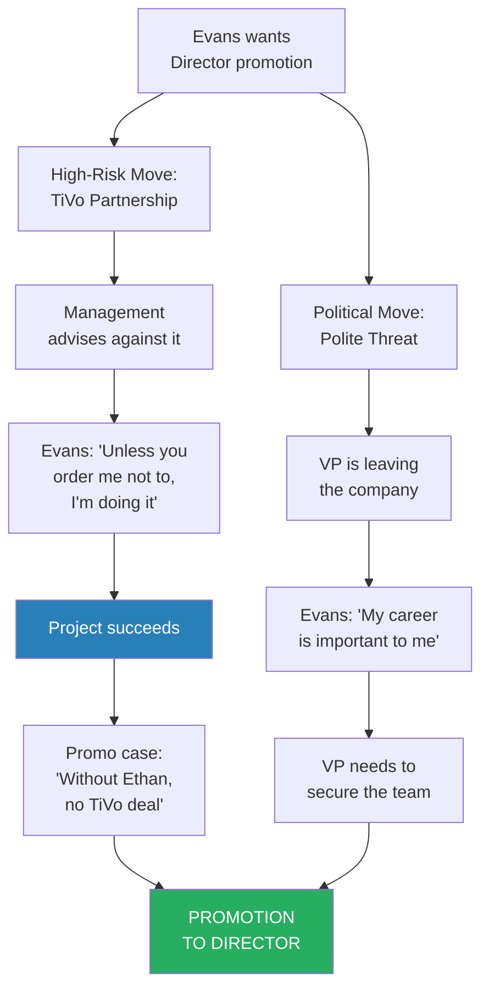
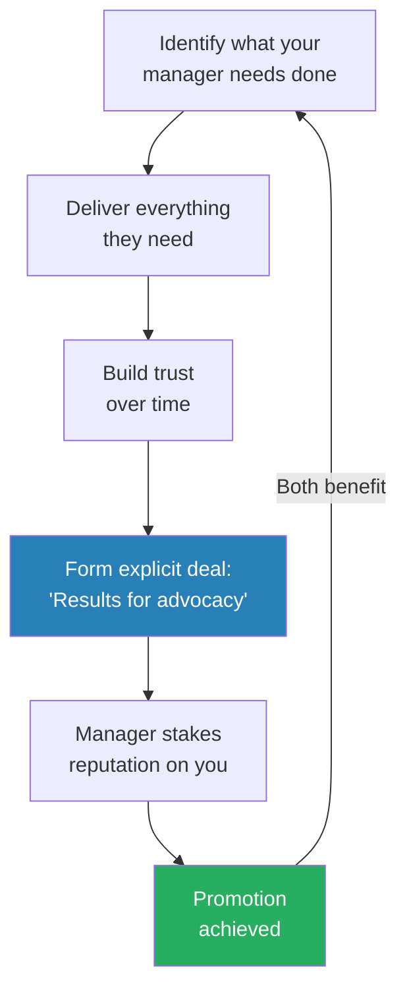
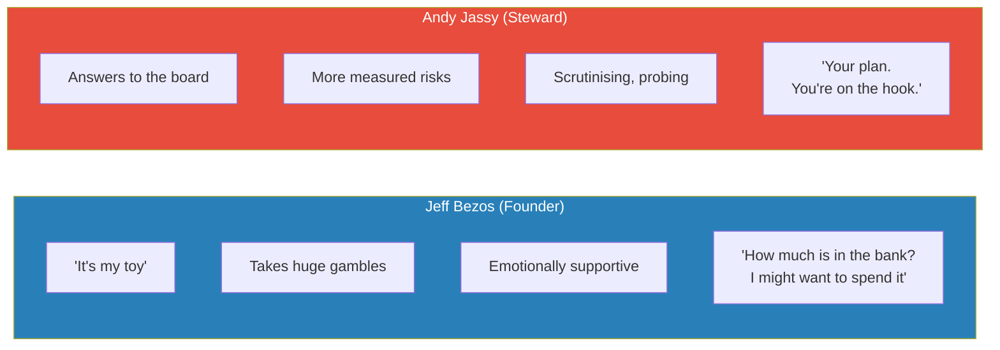
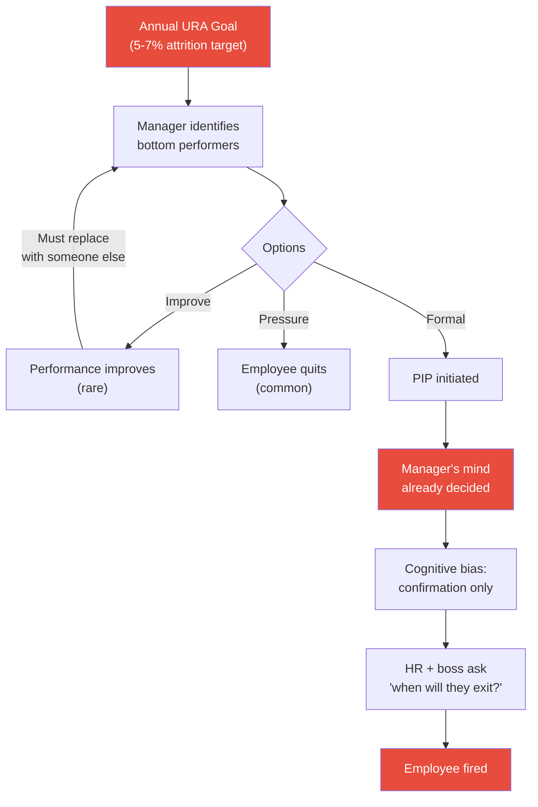
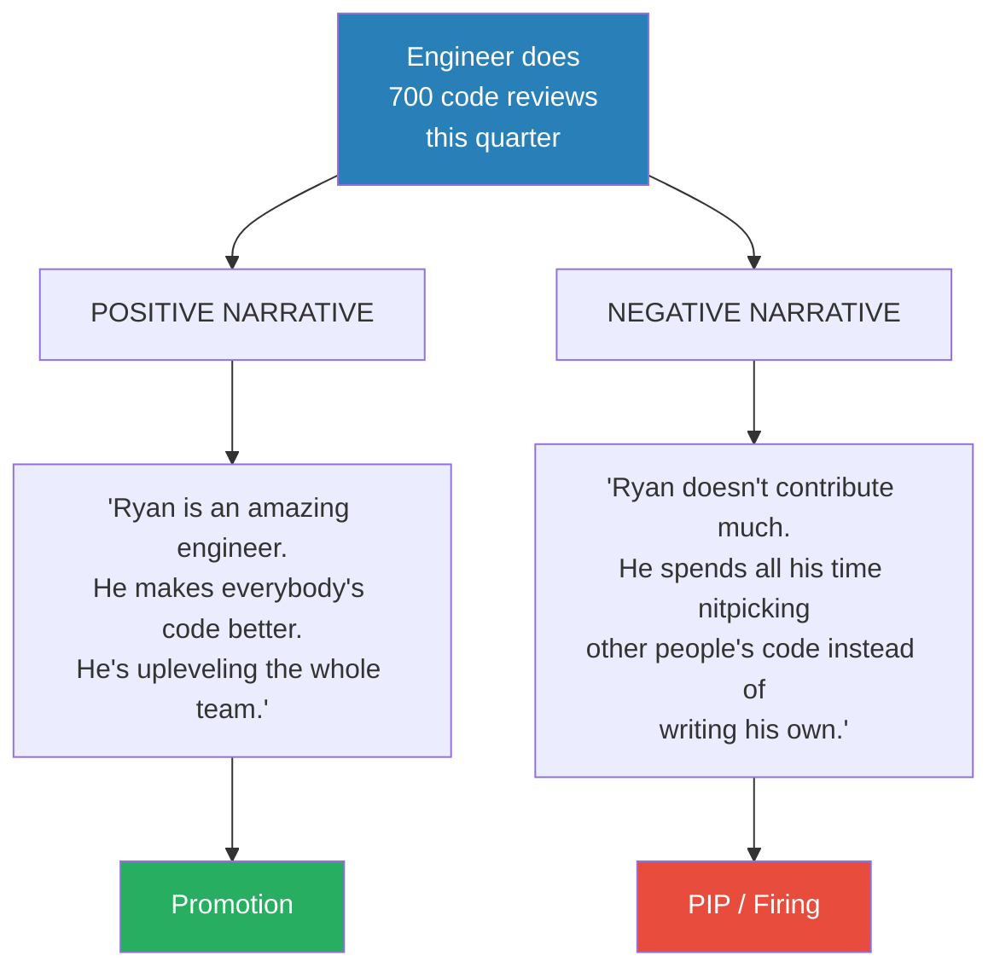
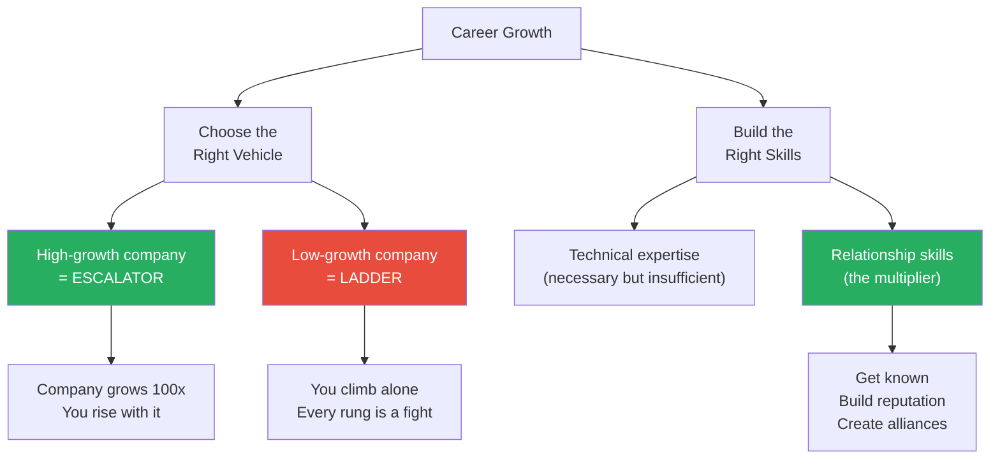

# Amazon VP on Stack Ranking, PIPs, and Bezos — Ethan Evans

> Ethan Evans went from being fired twice for abrasiveness to becoming a VP at Amazon with 800+ engineers. In this unusually candid interview with Ryan Peterman, he reveals how managers really make promotion decisions (they promote the squeaky wheel), why PIPs are functionally death sentences (every person he coached through one got fired), and how a single manager can end your career by spinning the same performance data two ways. His core message: being right is not enough — you need relationships, strategic self-advocacy, and the wisdom to fight well rather than fight hard.

---

## Overview: Key Highlights

- <b style="color: #e74c3c">Being abrasive is career-fatal</b> — Evans was fired twice from startups despite strong technical skills, because he fought peers instead of building alliances
- <b style="color: #27ae60">Study the psychology of work</b> — after his second firing, Evans transformed his entire approach by studying motivation, influence, and how to ask questions instead of making declarations
- <b style="color: #2980b9">Strategic annoyance</b> — the sweet spot between pushover and bully, where you push for what you want without escalating confrontation
- <b style="color: #27ae60">Managers want to promote you</b> — it makes their life easier, but they cannot do it for you; you must reach the bar and advocate for yourself
- <b style="color: #e74c3c">Silent hard workers get passed over</b> — Evans admits that as VP, he promoted the person threatening to leave over the patient team player
- <b style="color: #2980b9">The Magic Loop</b> — a partnership with your manager: you deliver everything they need, they stake their reputation on your promotion
- <b style="color: #e74c3c">PIPs are death sentences</b> — every person Evans coached through one at Amazon was fired; the manager's mind is already made up
- <b style="color: #27ae60">A manager can fire any one employee they want</b> — the same performance data can be narrated as exceptional or terrible, and the manager tells the story first
- <b style="color: #2980b9">Hitting goals is not creating value</b> — Amazon's App Store hit every goal for years, then was shut down; big companies confuse metrics with meaning
- <b style="color: #27ae60">Choose high-growth companies</b> — Amazon grew 100x during Evans' tenure; the escalator carried him upward while he climbed

| Concept | One-line summary |
|---------|-----------------|
| **Strategic annoyance** | Push for what you want without crossing into confrontation |
| **The Magic Loop** | Mutual deal with your manager: results for advocacy |
| **Unregretted attrition (URA)** | Amazon's annual quota of people managers must push out |
| **Narrative spinning** | Same performance, two stories — manager controls which one HR hears |
| **Career escalator** | High-growth companies lift you; low-growth ones make you climb alone |
| **Zombie products** | Projects nobody wants to kill but nobody knows how to grow |
| **The preemptive strike** | Whoever tells leadership their story first wins the conflict |

---

## The Startup Years and Getting Fired Twice

*Evans' early career is a cautionary tale about the limits of being technically right — and the cost of being interpersonally wrong.*

```mermaid
flowchart LR
    A["Carnegie Mellon<br/>CS Degree"] --> B["First Startup<br/>(Networking)"]
    B --> C["Internet Search<br/>(LCOS)"]
    C --> D["Network Mgmt<br/>(Telcos)"]
    D --> E["Ad Tech &<br/>Audio Streaming"]
    E --> F["Fired #1<br/>(Startup VP)"]
    F --> G["Fired #2<br/>(Layoff of One)"]
    G --> H["Personality<br/>Transformation"]
    H --> I["Amazon<br/>(Sr. Manager)"]
    I --> J["Director"]
    J --> K["VP<br/>(800 engineers)"]
    style F fill:#e74c3c,color:#fff
    style G fill:#e74c3c,color:#fff
    style H fill:#27ae60,color:#fff
    style K fill:#2980b9,color:#fff
```

*Evans' career arc: two firings forced the personality transformation that made his Amazon rise possible.*

> [!tip] Core Insight
> Being right is not a career strategy. Evans' first performance review said his approach was to "knock heads together." He was promoted on ability but destroyed by abrasiveness — because people who disagree with you stop telling you and start telling others instead.

> [!note]- Full Detail: The Startup Years
>
> - Evans grew up when home computers were new and wrote Apple a physical letter asking how to work there
> - Apple only hired from five universities — he went to Carnegie Mellon specifically to qualify
> - Never joined Apple — instead followed friends into startups during the dot-com boom
> - His college roommate made his first million by 25 through stock options
> - Evans made enough for a house down payment — "the real estate agent was pretty surprised"
> - Worked through a chain of startups in networking, internet search, audio streaming, and even entertainment lighting
>
> **The first firing:**
>
> > [!example] Fighting the Product Guy Who Was Right
> > - Evans was VP of Engineering at a startup; the product VP said their timelines were impossible
> > - Evans was furious — he saw it as disloyalty to the mission
> > - The product guy was actually correct; Evans was "fantasizing"
> > - When the company hit hard times and had to downsize, Evans negotiated his own exit
> > - In hindsight, the CEO was probably glad to eliminate the conflict
> > **The lesson:** Being committed to the mission does not make you right about what the mission can achieve.
>
> **The second firing:**
>
> > [!example] A Layoff of One
> > - At the next startup, Evans led engineering while the sales VP promised features they hadn't built
> > - Evans fought the sales VP over honesty — but didn't realise it was "promise the sun and moon or go bankrupt"
> > - The company called it a layoff, but Evans was the only person laid off
> > - "You're the only one in the room being laid off. I'd call that being fired."
> > - It was 100% about removing conflict from the team
> > **The lesson:** Even when you're morally right, if you don't have allies, being right just means being alone.
>
> - Evans' very first performance review noted his approach was to "knock their heads together"
> - He modified the phrase "loose cannon" — "that's only because I'm pointed at them"
> - He recognises now that the statement "I'm busy telling them how wrong they are" is pure arrogance
> - Without enough alliances with B, C, and D, when he fought with A, everyone agreed A was right to want him gone

---

## The Personality Transformation

*An interviewer's blunt observation after Evans' second firing broke through years of self-serving narrative and triggered a complete reinvention.*

> [!quote] Ethan Evans
> "After it happened twice, I damn sure looked at who's the common element. It's me."

> [!note]- Full Detail: How Evans Changed
>
> > [!example] The Interviewer Who Told the Truth
> > - After his second firing, right after 9/11 and the dot-com bust, Evans struggled to find work
> > - At one interview, he told his standard story of accomplishments
> > - The interviewer said: "Everything sounds fine, but if you were that valuable, these companies would have found a way to keep you"
> > - Evans realised the interviewer was right — the gap wasn't technical skills or drive
> > - The gap was his ability to work well with others
> > **The lesson:** If organisations keep discarding you despite your skills, the problem is how you make people feel, not what you can do.
>
> - Evans got deeply into the psychology of work — motivation, interaction, asking questions
> - As an engineer, he was trained to make statements: "the answer is this, the method is that"
> - He learned to ask questions instead — drawing people in rather than steamrolling them
> - Once he saw it worked — "I can lead and motivate and inspire people" — he was hooked
> - Now studies workplace psychology full-time
> - Key shift: from seeing disagreement as a battle to seeing it as a puzzle

> [!tip] Core Insight
> Engineers are trained to make statements. Leaders learn to ask questions. The moment Evans switched from declarations to inquiry, people stopped fighting him and started following him.

---

## Joining Amazon and the Director Promotion

*Evans joined Amazon not from a position of ambition but from startup fatigue — and his promotion to Director came from a calculated gamble that could easily have ended his career.*

> [!note]- Full Detail: How Evans Found Amazon
>
> - While working at LCOS (internet search), Evans helped their partner Barnes & Noble understand why they were losing to Amazon
> - Learned about Amazon as a competitor — "completely different, way ahead of bricks and mortar"
> - When Amazon's recruiter reached out, Evans could discuss Amazon's strengths from the competitor's perspective
> - Also sick of struggling startups — Amazon was 10,000 people, public, and felt stable
> - "To me, working in firms of dozens or hundreds, 10,000 seemed huge"

**The Director Promotion** required two things happening at once:

*The Director promotion required both a demonstrable achievement AND strategic pressure — neither alone would have worked.*

> [!quote] Ethan Evans
> "My career is very important to me, and I need to know if it's as important to Amazon."

> [!note]- Full Detail: The TiVo Gamble and the Polite Threat
>
> > [!example] The TiVo Partnership Gamble
> > - A project opportunity came up that Evans' management advised against pursuing
> > - Evans told his SVP: "Unless you order me not to do this, I'm going to do it"
> > - The SVP essentially said "great, hang yourself"
> > - Evans built the partnership with TiVo and it became a major success
> > - The key line in his eventual promotion case: "Without Ethan, we wouldn't have had TiVo"
> > **The lesson:** If you want to grow rapidly, you have to take risks. Had the project failed, Evans would have been the person who went against leadership's advice — but recoverable failures still move you forward faster than always playing it safe.
>
> - Evans' exact wording for the promotion push was deliberately crafted
> - He never said "promote me or I quit" — instead: "my career is very important to me"
> - "If it's not as important to Amazon as it is to me, I have to think about that"
> - No one could accuse him of making a threat — but the implication was unmistakable
> - His VP was leaving the company — losing Evans too would make the VP look bad
> - Evans: "That boss wouldn't have done anything if I hadn't been pushing. It was 100% because I put the squeeze on."
> - Philosophy: you can find polite and civil ways to raise any topic

---

## The Uncomfortable Truth About Promotions

*Evans reveals what most managers will never admit: when two people are equally qualified, the one who pushes harder gets promoted — not the patient team player.*

> [!tip] Core Insight
> Managers have limited promotion slots. When one candidate is agitating to leave and the other is willing to wait, the manager faces a triage: promote the pushy one and keep both, or promote the patient one and lose the other. Most managers — including Evans — choose pragmatism over fairness.

> [!note]- Full Detail: The Squeaky Wheel Gets the Promotion
>
> - Evans admits that as VP, he had situations with two equally qualified candidates
> - One was agitating and threatening to leave; the other was a "nice person willing to wait"
> - "I'd like to tell you I always did the right thing. I can't actually tell you that's true."
> - The triage: one promotion slot, realistic choice between losing the aggressive person or losing the patient one
> - "Almost everyone's doing what I'm doing. They're just not telling you."
> - His message to the "silent hard worker": you might dislike him for it, but this is how the world works
> - The fundamental misunderstanding: engineers think being right is what matters; relationships and how people feel matter just as much
> - "People will pick a worse solution that feels more comfortable. That happens all the time."

---

## The Magic Loop and the VP Promotion

*Evans' VP promotion took 2.5 years of deliberate partnership-building with his manager — a process he calls the Magic Loop.*

*The Magic Loop is a reinforcing partnership: you deliver results, your manager advocates for your advancement, both benefit from the outcome.*

> [!note]- Full Detail: The 2.5-Year VP Campaign
>
> - By the time Evans was pursuing VP, he "finally truly understood how everything worked"
> - He lined up stakeholders, got his manager on board, maintained a stable reporting relationship for 2.5-3 years
> - The deal: "I'll do everything you need. You do one critical thing — make sure I'm rewarded."
> - Not transactional in a crude sense — built on genuine trust and results
> - His VP eventually came to him: "I'm going to try and get your VP promotion through this cycle. I can't promise anything."
> - It took 2.5 years to get his boss ready to stake his credibility
> - Timing mattered enormously: his VP was reorged within 6 months after the promotion
> - Had Evans been just 6 months later, he'd have had a new boss and had to start over
> - Evans' one regret: "I didn't take more risk. I could have gone further."

---

## The Broken Promise: A Cautionary Tale

*Evans' most painful story — a star engineer he failed because he didn't understand Amazon's promotion process.*

> [!note]- Full Detail: The Promise Evans Couldn't Keep
>
> > [!example] The Star Engineer Who Left
> > - A talented young engineer made a deal with Evans: "I'll ship our first product version. You get me promoted from SDE1 to SDE2."
> > - Evans agreed in good faith — but had only worked at startups where promotions were informal
> > - Amazon had a formal cycle: promotions happened twice a year with specific deadlines
> > - The product launch was messy; Evans was focused on fixing problems and missed the promotion window
> > - The engineer asked where his promotion was; Evans discovered he'd missed the entire process
> > - The engineer left for another big tech company and had an amazing career there
> > - Evans: "It cost him a year. I feel terrible about it. That's why I've written about it publicly."
> > **The lesson:** Know the promotion process. If your manager doesn't know the deadlines, that's a warning sign — and it's YOUR career on the line, not theirs.
>
> - Evans uses the chickens-and-pigs analogy: in a ham and eggs restaurant, the pig is committed, the chicken is only involved
> - Your manager is the chicken — their life isn't on the line
> - You're the pig — so YOU must verify the process, the deadlines, and whether your manager has a real plan
> - Test question: ask your manager "will you have the document done by September 15th?"
> - If they say "why does September 15th matter?" — that's a warning sign
> - Careers are 20-30 years long — losing a year is painful but not fatal

---

## Twitch: Influence Without Authority

*Evans deliberately gave up his 800-person team to take a role with no authority — advising a young founder who had no reason to listen to him.*

> [!note]- Full Detail: The Twitch Integration
>
> - Amazon spent $970 million on Twitch — Evans was assigned as the integration liaison VP
> - Emmett Shear (Twitch CEO) was still in charge — Evans was not his boss
> - Evans sought the role deliberately as a soft-skills challenge: "achieve goals without giving anyone orders"
> - Challenges: Emmett was 15-16 years younger, running a millennial/Gen Z business; Evans was late 40s
> - Twitch was a venture-funded company bleeding cash — but Twitch's team initially didn't see profitability as important
> - Twitch management: "Now that Amazon's bought us, why do we need to worry about profitability?"
> - Meanwhile, Andy Jassy (Evans' chain of command) wanted profitability soon
> - Evans was trapped between a team that didn't see the problem and a boss who demanded results
> - Emmett's biggest growth lesson: not all early employees can scale
>   - Had to hire senior people over loyal friends
>   - Some early employees quit in anger
>   - The founder loyalty vs. company scaling tension is universal

---

## Bezos vs. Jassy: Founder vs. Steward

*Evans spent roughly 50 meetings with each of Amazon's two most important leaders and sees a fundamental difference rooted in ownership.*

*The founder can bet the company on black; the steward must preserve what the founder built. Both demand excellence — but the emotional experience of working for them is very different.*

> [!note]- Full Detail: Working With Both Leaders
>
> > [!example] Bezos and the CFO
> > - In a budget discussion, the CFO tried to slow Bezos' spending
> > - CFO: "Jeff, we only have so much money in the bank"
> > - Bezos: "Well, Tom, how much is that? Because I might want to spend it."
> > - Translation: "Your job is to count the pennies. My job is to allocate them. Don't confuse the two."
> > **The lesson:** Founders have a relationship with risk that hired CEOs structurally cannot replicate.
>
> - Evans felt Jeff was "emotionally behind me and supportive"
> - Evans felt Andy was "always waiting to see if I'd screw up"
> - Bezos asked all the questions, then said "Okay, I'm on board. Let's do it together."
> - Jassy's approach: "Okay, it's your plan. You're on the hook. Let me know when it's done."
> - Evans acknowledges this may reflect his personality needs more than an objective assessment
> - Not all executives who worked for both had the same experience

---

## Zombie Products: Hitting Goals Without Creating Value

*Evans' most counterintuitive observation: you can get excellent performance reviews for years while running a product that's going nowhere.*

> [!tip] Core Insight
> Big companies confuse hitting interim goals with doing something meaningful. Evans knew the Amazon App Store would eventually be shut down — a decade before it happened — but got good reviews every year because he hit his metrics.

> [!note]- Full Detail: Prime Gaming and the App Store
>
> - Jeff Bezos' vision for Prime Gaming: make Amazon as big as Tencent (the world's largest gaming company)
> - Evans' team hit most goals — shipped features, met financial targets
> - But they were never on track to become a Tencent competitor
> - Prime Gaming remains niche; Evans wouldn't be surprised if Amazon shutters it in 2-3 years
> - The Amazon App Store: Evans told a peer "this year I'm going to hit every goal and it's going to be meaningless"
> - Ten years later, Amazon shut down the App Store's external use
> - The tension: for your review and your pay, you want goals you know you can hit; for the company's good, you want goals you don't know how to achieve
> - "Zombie products" persist because shutting them down is an admission of failure, but nobody knows how to make them big

---

## Stack Ranking, PIPs, and the Manager's Power

*The most brutally honest section of the interview: how Amazon's performance management actually works, why PIPs are predetermined, and why a clever manager holds all the cards.*

*Amazon's URA system creates a quota that must be filled. Once a PIP is initiated, the manager's cognitive bias makes it a self-fulfilling prophecy — every person Evans coached through one was fired.*

> [!quote] Ethan Evans
> "I think most PIPs are a combination of dishonest and psychologically unrealistic."

> [!tip] Core Insight
> Amazon once removed the unregretted attrition goal as an experiment. Managers immediately stopped having hard conversations with struggling performers. The goal was reinstated the next year. Without forced accountability, most managers avoid discomfort — even when it hurts their teams.

> [!note]- Full Detail: The Stack Ranking System
>
> - Amazon calls it "unregretted attrition" (URA) — a euphemism for "people we want to leave"
> - Annual target usually 5-7% of the team
> - Managers can improve performance, pressure people to quit, or formally fire them
> - When Amazon removed the URA goal ~10 years ago, managers immediately stopped managing underperformers
>   - No pressure = no hard conversations
>   - Problem performers hung around because confrontation is unpleasant
>   - Worst case: an underperformer who is well-liked — "everybody loves them" but they can't do the job
> - Amazon reinstated the goal the following year and has kept it since
>
> **Why PIPs fail:**
> - Once a manager decides to put someone on the list, mentally they've moved to "we have to get rid of this person"
> - The PIP is a formality — the decision is already made
> - Cognitive bias becomes self-fulfilling: the manager only sees confirming evidence
> - Evans has coached half a dozen Amazon PIP recipients — all were fired
> - People he didn't coach were also fired
> - HR and the manager's boss constantly ask "when are we going to exit that person?"
> - Even if a manager honestly wants someone to succeed on a PIP, they face pressure: "if you take them off, who else are you putting on?"

---

## The Manager's Narrative Weapon

*Evans' most chilling revelation: the same engineer, doing the same work, can be described as exceptional or terrible depending on which story the manager tells.*

*Nothing about software engineering performance is so objective that it cannot be spun. The manager controls the narrative — and they get to tell their story first.*

> [!note]- Full Detail: Why HR Won't Save You
>
> - Evans: "As a manager, I could get rid of any one employee I wanted"
> - The nuance: can't fire everyone (patterns get caught), but any single person is vulnerable
> - The manager makes the preemptive strike — tells HR and leadership their story before the employee knows it's happening
> - When the employee complains "it's unfair, my boss hates me," HR hears this from every underperformer
> - Legitimate complaints sound identical to illegitimate ones
> - The manager has structural advantages: higher level, more tenure, established relationships with HR
> - Evans has never done this maliciously — but has examined the system and seen how easily it can be abused
> - Truly bad managers get caught eventually, but clever managers who just want one person gone can do it easily
> - Evans' advice: if you have a vindictive boss, don't fight — "you're bringing a knife to a gunfight"
> - Either make friends with them or find a different manager
> - "Don't think HR is going to come investigate and rescue you. That just isn't what they do."

---

## Career Advice: The Escalator and the Relationships

*Evans distills his entire career into two principles — one he followed from the start, and one he wishes he'd learned twenty years earlier.*

*The career escalator: Amazon grew from 10,000 to over 1,000,000 employees during Evans' tenure — the company's growth created opportunities that no amount of individual climbing could match.*

> [!note]- Full Detail: Evans' Two Pieces of Advice
>
> **What he'd keep the same: always prefer high growth**
> - Evans' entire career was in rapidly growing companies
> - "My ladder was always an escalator. I could climb, but it was also moving up for me."
> - Amazon grew from 10,000 to over 1,000,000 employees; revenue grew 80x
> - Growth creates new roles, new teams, new VP slots — opportunities that don't exist in stable companies
>
> **What he'd change: build relationships from day one**
> - "I would wake up much sooner to the fact that jobs are still with other humans"
> - Being an expert and being right matters — but only if people want to work with you
> - You don't have to be an extrovert — Evans was a classic introvert
> - Online tools (LinkedIn etc.) let you build a reputation "from the safety of your keyboard in your darkened room"
> - Amazon's recruiter found HIM — "you want that happening, so build that reputation"

---

## Connections

**Same guest, related episode:** [[How Corporate Politics Work - Best]] (covers corporate politics and empire-building in more depth; this episode goes deeper on personal career arc, stack ranking, and PIPs)

**Related books in vault:**
- [[The 48 Laws of Power - Robert Greene]] — Law 1 (Never Outshine the Master), Law 5 (Reputation), the politics of self-presentation
- [[Power - Jeffrey Pfeffer]] — structural power, managing up, why performance alone doesn't get you promoted
- [[Corporate Confidential - Cynthia Shapiro]] — HR exists to protect the company, not you; managers control narratives
- [[Stealing the Corner Office - Brendan Reid]] — strategic visibility, self-promotion as a career tool
- [[Never Split the Difference - Chris Voss]] — calibrated language, tactical empathy, Evans' "my career is important to me" is a textbook calibrated statement
- [[What Got You Here Won't Get You There - Marshall Goldsmith]] — the behavioural transformation from abrasive individual contributor to skilled leader
- [[Expect to Win - Carla A. Harris]] — the performance-perception gap; doing good work is not enough if no one sees it
- [[Crucial Conversations - Kerry Patterson]] — how to raise high-stakes topics without escalation

---

## The Takeaway

Evans' greatest contribution is his honesty. Most career advice is aspirational — work hard, be a team player, trust the system. Evans says what experienced leaders know but rarely admit publicly: managers promote the squeaky wheel, PIPs are predetermined, HR exists to protect the company, and the same performance data can make you look like a star or a failure depending on who's telling the story. This isn't cynicism — it's realism. Evans isn't encouraging manipulation; he's warning you that if you don't understand how the game works, you'll be played by people who do.

The most surprising insight is how easily a single manager can end your career at a company. Evans demonstrates with a simple thought experiment: take an engineer's quarterly code review numbers and write two narratives — one for promotion, one for termination. Same facts, opposite outcomes. The manager gets to choose which story to tell, and they tell it before you know there's a conversation happening. The defence isn't fighting back (you'll lose — they outrank you). The defence is building enough alliances that someone warns you before the narrative is set.

What remains unresolved is the tension between Evans' advice to be "strategically annoying" and his admission that the system punishes exactly the wrong people. He tells you to push for your promotion — but also tells you that pushing too hard turns people against you silently. He tells you to build alliances — but admits that some managers will destroy you regardless. The honest answer is that navigating corporate politics is a skill that can be learned but never perfected, and even a retired VP who has studied it for decades still calls it a system that "stinks." The question isn't whether the system is fair. It's whether you understand it well enough to survive it.
