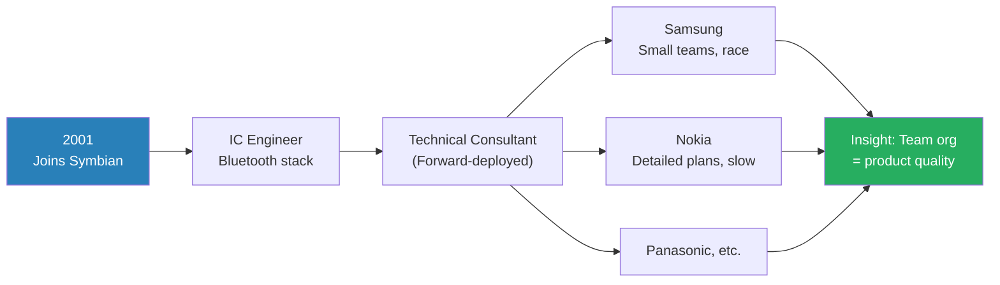
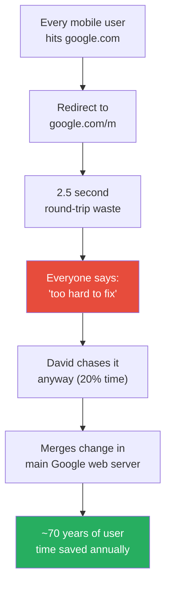
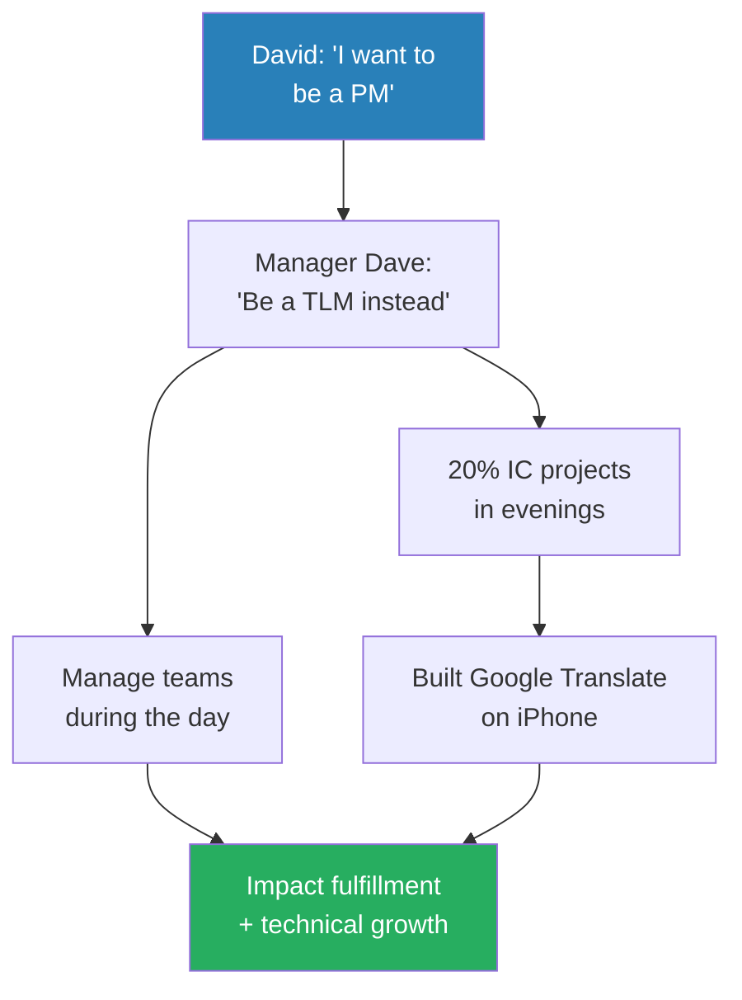
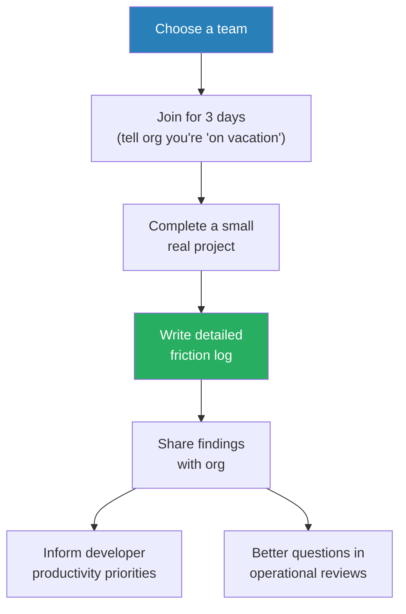
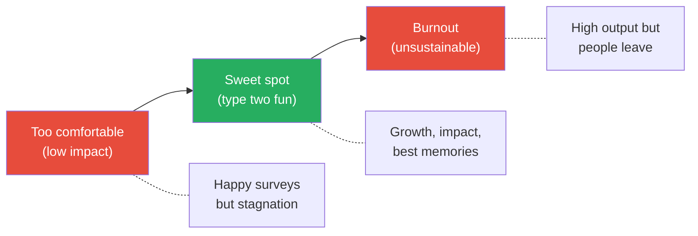
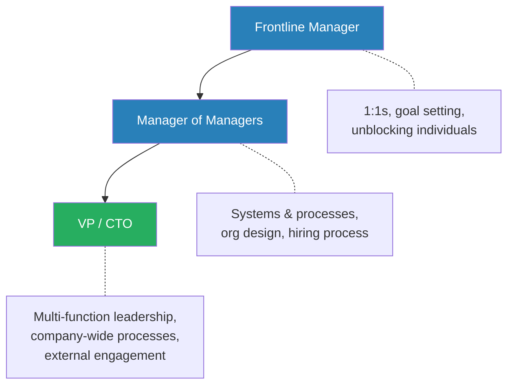
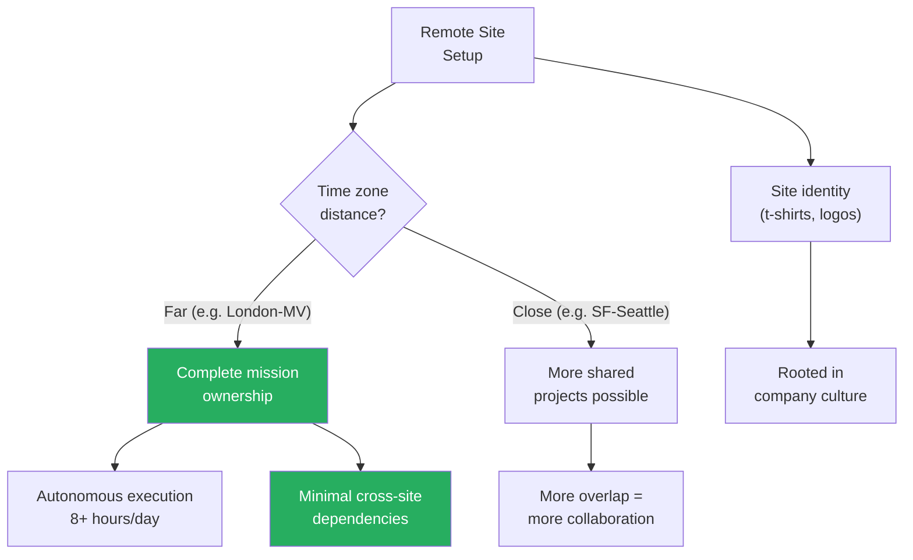
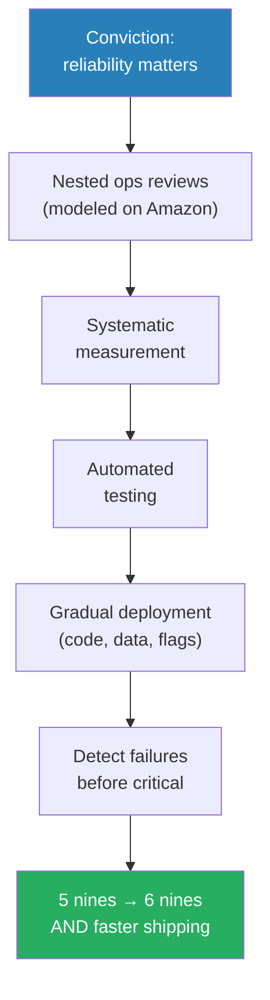
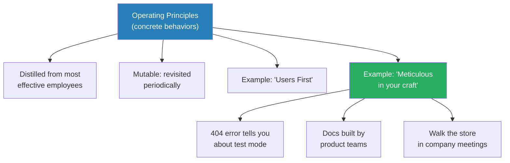
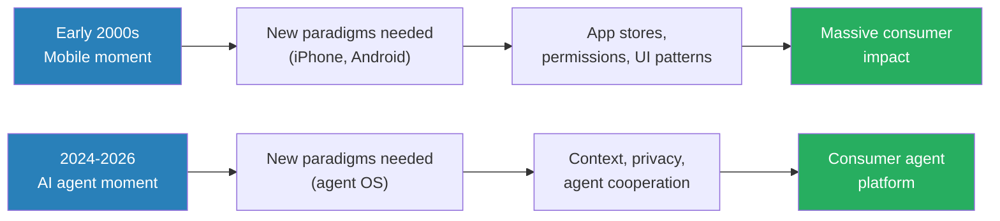

# Ex-Stripe CTO on Career Growth and Coding as a Leader

> David Singleton built invoicing software for his parents as a kid, joined Symbian before smartphones existed, spent 12 years at Google rising from IC to VP Engineering, then served as CTO of Stripe where he helped the company reach six nines of reliability. In this nearly three-hour conversation with Ryan Peterman, he shares the management frameworks, hiring philosophy, and cultural practices that shaped one of the most consequential engineering careers in tech — and explains why he left it all to start an AI company.

---

## Overview: Key Highlights

- <b style="color: #27ae60">Always be learning</b> — the single decision filter behind staying at Google for 12 years, leaving when the last year felt identical to the one before, and joining Stripe
- <b style="color: #2980b9">Engineeration</b> — a quarterly practice of joining a team for 3 days to code a real project and write a friction log, giving senior leaders ground-level context
- <b style="color: #e74c3c">Perfectly happy teams are a red flag</b> — David won Google's Great Manager Award early in his career and believes he did not deserve it, because he optimised for comfort over impact
- <b style="color: #2980b9">Type two fun</b> — the fun that is hard in the moment but becomes the best memory in retrospect; the manager's real goal
- <b style="color: #27ae60">Culture is the behaviors you accept</b> — if anyone sees a cultural violation go unchallenged, that violation becomes the new culture
- <b style="color: #2980b9">Balcony metaphor</b> — periodically step off the dance floor and look down at how everything is working, especially when you are also doing IC work
- <b style="color: #e74c3c">Don't go to your inbox, go to the Rocket Doc</b> — David's weekly planning habit that prevented his calendar and email from ruling his priorities
- <b style="color: #27ae60">Stripe hired without leetcode</b> — pair programming on real laptops with realistic exercises, maintained through volunteer effort and recognition
- <b style="color: #2980b9">Operating principles vs values</b> — Stripe's principles are concrete behaviors distilled from the most effective employees, not abstract aspirations
- <b style="color: #27ae60">First principles over pattern matching</b> — Stripe's leadership taught David to stop asking "how did we do it last time?" and instead deeply understand the dynamics before choosing a path
- <b style="color: #e74c3c">Remote site anti-pattern: splitting a team half-and-half across time zones</b> — creates hundreds of daily blockers that cannot be resolved in the small overlap window
- <b style="color: #2980b9">Friction logging</b> — systematically documenting every frustrating experience when using your own product, then using those logs to drive priorities

| Concept | One-line summary |
|---------|-----------------|
| **Engineeration** | Quarterly 3-day coding stints with teams to maintain ground-level context |
| **Type two fun** | Hard in the moment, best memory in retrospect — the standard for team experience |
| **Balcony metaphor** | Stepping out of execution to observe how the whole system is working |
| **Friction logging** | Systematic documentation of product pain points from dogfooding |
| **Walk the store** | Publicly using the product in company meetings to demonstrate the quality bar |
| **Rocket Doc** | Weekly to-do list written Sunday nights: "if I have a great week, what did I get done?" |
| **Operating principles** | Concrete behaviors distilled from the most effective employees, revisited periodically |
| **Meticulous in your craft** | Stripe's principle of polishing edges — the 404 error message that tells you about test mode |
| **Ops review** | Nested meeting cadence for reliability and efficiency, modeled on Amazon |
| **Shift left** | Automated testing + gradual deployment = speed AND safety |
| **Site autonomy model** | The further apart the time zones, the more independently each site must be able to execute |
| **First principles thinking** | Talk to people at 4 external companies, triangulate, then reason from the actual dynamics |

---

# The Conversation

## Origins: Coding for the Family Business [0:00 - 3:00]

*David explains how he got into programming by building invoicing software for his parents' small business in Northern Ireland in the late 80s, and how seeing its impact on his family planted the seed for a career in software.*

> [!note]- Expand: Full Conversation
> - Ryan asks how David first got into programming
> - David says a computer came into the household for his parents' business in the late 80s and early 90s
> - While other kids were learning to code by writing games, David built a bespoke invoicing system for his parents
> - Before the software, his parents would get "super grumpy" once a quarter because they were up all night manually tabulating invoices for tax returns
>   - David and his sister noticed this pattern clearly
> - After the software: press a button and the report came out of the printer
> - This showed David that software could have a big impact on real people
> - That impact-driven motivation drove him to study computer science and enter the industry

---

## Symbian: Smartphones Before Smartphones [3:00 - 10:00]

*David describes accidentally landing at Symbian in 2001 after his planned employer went bust in the dot-com crash, and how working as a technical consultant across Samsung, Nokia, and Panasonic taught him that how you organise teams profoundly shapes what gets built.*

*David's early exposure to radically different engineering cultures across handset manufacturers became the intellectual foundation for everything he later did in engineering leadership.*

> [!note]- Expand: Full Conversation
> - David originally planned to return to Belfast to join a software company, but it collapsed in the dot-com bust
> - He joined Symbian in Cambridge because "the people were really lovely"
> - Symbian built mobile phone operating systems before smartphones existed — this was 2001
> - David started as an IC, building parts of the Bluetooth stack and PC connect software
> - The last couple of years at Symbian were formative: he became a "technical consultant"
>   - Still an IC, but assigned to handset manufacturer teams turning Symbian OS into products
>   - He was the technical lead on the Symbian side for the same project executed by different companies
> - Ryan asks if this was similar to the forward-deployed engineer role
> - David says yes — he had never made the connection before, but it was exactly that model
>   - He helped customers integrate while bringing back insights to inform Symbian's roadmap
>
> > [!example] Samsung vs Nokia: Same OS, Completely Different Teams
> > - Samsung ran very small teams and gave multiple teams the same mission — the team that finished first got to ship
> > - This created an intense competitive incentive structure
> > - Nokia planned everything in intricate detail — predictable but significantly slower
> > - Seeing these differences directly and repeatedly gave David a lasting fascination with how team organisation impacts outcomes
> > **The lesson:** The way you organise a team matters as much as the technology you are building.

---

## Joining Google: London Mobile Office [10:00 - 14:00]

*David explains how Google opened a London engineering office focused on mobile, how the quality of people he met during interviews made him immediately certain it was his next move, and why he stayed for nearly 12 years despite never planning to.*

> [!tip] Core Insight
> David stayed at Google for 12 years by applying one simple test: every 18 months, he would pick up his head and check whether he had learned a tremendous amount. As long as the answer was yes, he stayed.

> [!note]- Expand: Full Conversation
> - Google opened a London engineering office post-IPO, specifically focused on mobile
> - London was recognised globally as a mobile industry centre of excellence because of companies like Symbian
> - David attended a recruiting event, interviewed in London, then flew to California for the first time
> - The quality of people and energy at the company made him immediately certain this was where he needed to be
> - He never imagined staying 12 years — he thought he would learn about distributed systems and take that knowledge elsewhere
> - But every 18 months he would realise he had learned so much that leaving did not make sense
> - Ryan observes this pattern in many successful people: they are constantly almost trying to leave, but the company keeps providing enough growth that they stay
> - David agrees — he did roughly six different jobs at Google, all with gradual transitions between them

---

## The Mobile Redirect Fix and the Power of Agency [14:00 - 20:00]

*David describes how Google's 20% time culture was real in the early days, and how his technical curiosity led him to fix a mobile redirect that wasted 2.5 seconds per visit — ultimately saving roughly 70 years of user time annually.*

*The redirect fix became a defining example of how technical curiosity combined with agency can produce outsized impact — and why 20% time, when taken seriously, was so powerful.*

> [!note]- Expand: Full Conversation
> - In the early days, Google's 20% culture was genuinely real
> - David was working on Google Maps for mobile (before Android) and noticed a problem
> - Every mobile user visiting google.com was redirected to google.com/m — a redirect costing 2.5 seconds on mobile networks
> - He talked to coworkers about it: "This is bonkers, right?"
> - Everyone agreed but said it was too hard — the front-end infrastructure was complicated and no one on his team knew how to work with it
> - David was determined: "It's just software, so I must be able to figure it out"
> - He went and learned the infrastructure, merged a change in the main Google web server, and removed the redirect
> - The result: roughly 70 years of user time saved every year, with a noticeable impact on usage
>
> > [!quote] David Singleton
> > "You get a real bug for those things — being able to follow your nose to learn, take agency to do stuff that matters."

---

## From Technical Curiosity to Impact Framing [20:00 - 24:00]

*David describes the moment his motivation shifted from pure technical curiosity to impact awareness, thanks to a product manager who framed active users as country populations.*

> [!note]- Expand: Full Conversation
> - Ryan asks whether David was motivated by perceived impact or technical curiosity
> - David says early in his career it was definitely technical curiosity — he had no real sense of how many people he was impacting
> - A product manager friend named Gi (who was Icelandic) changed that
> - Gi started framing their product's active users in terms of country populations
>   - "We now have as many active users as Iceland"
>   - Then Ireland, then Scotland, then eventually Germany
> - David found himself picturing the entire population of Iceland using their product in a day
> - This shifted his motivation permanently from technical curiosity to human impact
> - Ryan connects this to YouTube's approach of driving towards a billion minutes watched — a unifying goal that everyone can rally behind
> - David agrees: when you lay out a clearly defined, possible but audacious goal, teams do incredible things
>
> > [!example] The Iceland Population Framing
> > - Gi, an Icelandic PM, started measuring product usage in country populations
> > - Each week he would announce: "This week we surpassed the population of [country]"
> > - Starting with Iceland, then Ireland, Scotland, and eventually Germany
> > - This human-scale framing made abstract metrics viscerally meaningful
> > **The lesson:** Framing impact in human terms transforms how teams think about their work.

---

## The IC to Manager Fork: "Hey Dave, I Want to Be a PM" [24:00 - 32:00]

*David tells the story of walking into his manager's office wanting to become a PM, being pitched on the TLM role instead, and how he managed teams during the day while building Google Translate on iPhone during evenings — and offers nuanced advice on the TLM path.*

*The TLM path is notoriously difficult — David acknowledges this but argues it can work if IC work and management work are on separate projects, and if you deliberately "step onto the balcony" to check on the whole system.*

> [!note]- Expand: Full Conversation
> - David walked into his manager's office and said he wanted to be a product manager
> - His manager Dave (still a good friend) pitched him on the TLM (tech lead manager) role instead
>   - He could continue doing technical work while getting the impact fulfillment of management
> - David managed teams during the day and ran personal engineering projects in the evenings
>   - One of those was the first version of Google Translate on iPhone
> - Ryan notes that most people he talks to who tried TLM say it is too hard — you are doing two jobs
> - David acknowledges this but makes a key distinction:
>   - His IC projects were on different projects from the ones he managed
>   - If you are IC on the same project you manage, it is much harder to avoid getting sucked into your own work
> - He introduces the <b style="color: #2980b9">balcony metaphor</b> from management coach Jeff Lawrence at Stripe:
>   - You are on the dance floor doing work, but you must periodically step onto the balcony and look down at how everything is working
> - David's advice for the IC vs EM decision:
>   - Try management full-time if possible, not as a side project
>   - If your company offers a trial basis, take it — you are fortunate
>   - Really reflect on whether you get energy from helping other people accomplish more together
>   - Earlier in the industry, management felt like "the prize" — the IC ladder going all the way up has changed this
>
> > [!quote] David Singleton
> > "Being a good manager requires you to actually get a lot of energy from getting more out of other people. And that's not for everybody."

---

## Engineeration: Why CTOs Should Still Code [32:00 - 42:00]

*David explains his practice of "engineeration" — quarterly 3-day coding stints with teams — and why even the most senior leaders should experience work at "the one foot level," drawing an analogy to manufacturing managers working on the factory floor.*

> [!tip] Core Insight
> No matter how senior you are, the most effective leaders find some way to experience the work of the team at the actual one-foot level. The context this provides makes you a dramatically better leader.

*Engineeration is not about being a critical contributor — it is about gaining visceral context that makes you a more effective leader in every other conversation.*

> [!note]- Expand: Full Conversation
> - Even as VP at Google running Android Wear, David found it valuable to periodically do small projects in the codebase
> - At Stripe, he formalised this as <b style="color: #2980b9">engineeration</b> — a portmanteau of "engineer" and "vacation"
> - The practice: at least once a quarter, join a team for a few days and complete a small real project
>   - Tell the org to treat you as "on vacation" — only interrupt for real crises
>   - Every single time, write a very detailed friction log
> - The friction logs served dual purposes:
>   - Input for CTO decisions on developer productivity investment
>   - A resource for asking smarter questions in operational reviews
> - He also did a "sales occasion" at Stripe — shadowing salespeople to understand how engineering tools were used
> - David connects this to manufacturing practice: managers working one day a year on the factory floor
> - Ryan asks about the Elon Musk "managers should code" debate
> - David distinguishes two cases:
>   - As a junior TLM, doing a real engineering project end-to-end was appropriate to keep skills sharp
>   - As a senior leader, 95% of the job is context-setting, unblocking, partnerships — but carving out a little deliberate time for ground-level work provides tremendous context
> - Ryan asks: were you ever afraid of losing your technical edge?
> - David: not really — between work opportunities and spare time, he always found ways to code
>   - He does Advent of Code every December to keep skills sharp
>   - He genuinely gets into flow state when programming

---

## The Great Manager Award Mistake [42:00 - 48:00]

*David reveals that he won Google's Great Manager Award as an early manager — and believes he did not deserve it, because he was optimising for team happiness rather than team impact. He introduces the concept of "type two fun" as the real management goal.*

*The best teams are not the happiest in the moment — they are the ones that look back and say "we got a lot done in that time."*

> [!note]- Expand: Full Conversation
> - David's biggest skill gap when moving from frontline manager to manager of managers: he had learned the wrong lessons
> - As a single-team manager, he did everything possible to make the team happy
> - He won the Great Manager Award — voted by team members, so the team giving the most votes won
> - He does not think he deserved it, because <b style="color: #e74c3c">maximising happiness is not the same as maximising impact</b>
> - As a manager of managers, he started seeing the difference:
>   - Some managers had a good sense of mission, removed distractions, and pushed teams a little
>   - Others were doing what early David did — keeping everyone comfortable
> - When he compared teams a year later:
>   - The "perfectly happy" teams were rarely performing at their best potential
>   - The teams that were "pretty happy but had feedback on what could go better" had the best retrospective experience
> - He introduces <b style="color: #2980b9">type two fun</b>: the fun that is hard in the moment but becomes the best time of your life when you look back
> - Ryan connects this to the analogous principle: teams that never break anything are probably moving too slow
>
> > [!quote] David Singleton
> > "Teams that are perfectly happy are rarely performing at their very best potential."

---

## Frontline Manager to VP: The Transitions [48:00 - 55:00]

*David maps out how each management level requires fundamentally different skills — from 1:1s and goal-setting as a frontline manager, to systems thinking as a manager of managers, to multi-function leadership as a VP.*

*Each level adds a new dimension: frontline is about individuals, manager-of-managers is about systems, VP is about cross-functional integration and the organisation as an operating system.*

> [!note]- Expand: Full Conversation
> - As a manager of managers, the toolkit changes:
>   - Instead of just 1:1s and goals, you think about systems: how do product reviews work? How is hiring structured?
>   - David describes thinking of the org as a distributed operating system — how do all the daily/weekly/monthly/quarterly/yearly rituals fit together?
> - The VP transition was about leading functions beyond engineering
>   - Title was VP Engineering, but responsibility included product, business partnerships, UX, marketing
>   - Earlier in his career, David thought other functions existed to "feed the engineers"
>   - Leading design was a confidence challenge — he is a lousy designer but learned to have high-bandwidth conversations about design work
> - He also did engineeration for other functions:
>   - A "sales occasion" at Stripe: shadowing salespeople to understand how engineering tools were being used
> - Ryan asks about engineeration for non-engineering functions
> - David says it works but as more of a shadow model — you cannot jump in and do all the work yourself in design

---

## Communication: Speaking, Writing, and Always Being On Stage [55:00 - 64:00]

*David shares how he went from nervous presenter to confident keynote speaker through sheer practice, and why every hallway conversation for a senior leader is another chance to reinforce the mission.*

> [!note]- Expand: Full Conversation
> - Speaking: the number one way to improve is practice
>   - David was nervous presenting to large Android audiences early in his career
>   - His manager gave him more opportunities deliberately — including a talk to a thousand Google customers near King's Cross
>   - He credits that manager for saying "I can see there's something there, so let's get it done"
> - As a senior leader, you are "always on stage"
>   - People take confidence in the company's direction from the body language of the CTO
>   - Every hallway conversation is an opportunity to reinforce what the company is doing and why
> - Dynamic range matters: if everything is always awesome, no one believes you when it actually is
> - Before opening his mouth in any meeting, David takes a moment to think: what am I actually trying to communicate here?
> - Writing: David learned at Stripe to send drafts to reviewers before publishing
>   - The quality improvement was immense — reviewers asked questions he never anticipated
>   - He credits reviewers at the bottom of his blog posts (learned from Stripe culture)
>   - Not necessary for every email — but critical for important communications
> - For all-hands presentations: prepare, even for "top of mind" segments
>   - Tip from Google VP Alan Eustace: always take one step back and explain the context behind the question before answering it
>   - This helps people who are not already familiar follow along and learn something broader
>
> > [!quote] David Singleton
> > "They're all spending 15 or 20 minutes of their time listening to you. The least you can do is spend 30 minutes of your time preparing."

---

## Scaling Yourself: Processes, Ops Reviews, and the Dirty Word [64:00 - 72:00]

*David describes his journey from hating the word "process" to recognising that rituals and systems are the most powerful tool a senior leader has — and how he modeled Stripe's ops review on Amazon's system after a lunch with Charlie Bell.*

> [!note]- Expand: Full Conversation
> - David used to think "process" was a dirty word
>   - At Symbian, there was a "process library" tied to ISO 9001 certification — nobody used it, but you had to fill out documentation after the fact
> - As an org leader, he reframed it: processes are rituals, how we work, how we get stuff done
> - The most powerful scaling tool: nested ops reviews
>   - A weekly one David ran looking at the most important things
>   - Nested versions running across all engineering teams
>   - This made it possible to drive improvement on reliability, efficiency, and performance at scale — impossible through just talking to directs
> - How to decide if a process is net positive:
>   - The person responsible for running it must evaluate whether it is clearly a net positive for everyone operating within it
>   - Danger: when the person overseeing the process is not the person who cared about it existing — they cannot objectively assess fit-for-purpose
> - How to delegate process ownership effectively:
>   - Do not just say "do this" — say "here's the problem we're trying to solve, I think we should do this, you go do it and take agency to make sure we're really solving the real problem"
>   - Program managers at Stripe were passionate about the why behind what they were doing
>   - This came from company culture (users first principle)
> - Amazon influence: David modeled Stripe's ops review on Amazon's
>   - Charlie Bell spent a lunch walking him through exactly how it worked at Amazon
>   - They took the good bits applicable to Stripe's size and culture

---

## Building Remote Engineering Sites [72:00 - 82:00]

*David draws on his experience running Google's London engineering office and Stripe's Seattle site to explain the autonomy model for remote sites: the further apart the time zones, the more independently each site must execute.*

*The worst pattern: splitting a team half-and-half across oceans, creating hundreds of daily blockers that cannot be resolved in a one-hour overlap window.*

> [!note]- Expand: Full Conversation
> - Google London was far from Mountain View — small daily overlap
>   - Each team needed a clear and complete mission plus full autonomy
>   - For 8 hours when Mountain View was asleep, everyone could just crank along
>   - The worst setup: half the team in Mountain View, half in London — hundreds of daily blockers, progress grinds to a halt
> - The site lead's job: be at HQ building relationships so the team does not have to
>   - David's predecessor Shannon explained this: "The best thing I can do for London is be in Mountain View"
>   - David traveled to California a lot so everyone else did not have to
> - Site identity matters: Google London had t-shirts, laptop logos, conversations about what the site was good at
>   - Identity creates a sense of clan — people invest energy in making it better
>   - But the identity must be rooted in company culture, not in opposition to it
>   - "If you start feeling like everyone on the other side of the ocean is a bozo, you're never going to have a good time"
> - Stripe Seattle was different — same time zone, so more shared projects were possible
> - Philip Sue (Facebook London site lead) and David were fierce talent competitors
>   - Philip reached out to David, they started sharing craft knowledge
>   - Together they helped raise the bar for engineering in London
> - Document-based decision-making is essential for remote teams
>   - Stripe worked hard to ensure conversations got written up for the rest of the team
>   - Critical decisions came with a doc — everyone could understand context, contribute ideas, and buy into decisions
> - David personally believes the very best is all in one spot together, but acknowledges companies must learn to make distributed work well
>
> > [!example] Philip Sue and the Competitor-to-Collaborator Arc
> > - David ran Google London engineering; Philip ran Facebook London engineering
> > - They fiercely competed for the same talent — constantly finding they had offers with the same candidates
> > - Philip reached out: "Seems like we should probably talk"
> > - They started sharing craft knowledge about building effective remote sites
> > - Philip later recommended David as the best person to talk to about starting a new engineering site
> > - Years later, they almost started a company together
> > **The lesson:** The fiercest competitors in craft can become your strongest collaborators.

---

## Leaving Google: When Learning Stops [82:00 - 88:00]

*David explains staying at Google as VP for two and a half years due to unfinished business, then realising the last year was identical to the previous one — the signal that it was time to move.*

> [!note]- Expand: Full Conversation
> - David stayed as VP after Android Wear shipped because of exciting plans already kicked off with watch manufacturers
> - He was also learning for the first time about managing non-engineering functions
> - But about two years later, he had a wake-up moment:
>   - "If I think about the last year at this company, what I've done was exactly the same as the year before. You could change the code names, but it was essentially turning the crank on the same thing."
>   - "I haven't learned very much, and I'm here to learn. So, what's going on?"
> - Simultaneously, he started talking to Philip Sue about starting a company together
>   - They had an idea for a platform enabling fractional professional gig workers (legal, graphic design)
>   - The inspiration: David's side project making journals — he needed legal help and a graphic designer, and it was hard to find them
> - Personal circumstances meant they did not start the company at that time
> - Instead, David reached out to Stripe for advice on their Connect product (two-sided marketplace infrastructure)

---

## Joining Stripe: Advice Turned Recruitment [88:00 - 96:00]

*David tells the story of reaching out to Stripe for product advice, only to find himself being recruited by Patrick Collison — and how he fell in love with Stripe's mission of increasing the GDP of the internet.*

> [!note]- Expand: Full Conversation
> - David reached out to Stripe to learn about their Connect product for the platform he was planning to build
> - The first conversation was genuine advice — super valuable
> - Patrick Collison said: "I'm going to be in town, let's get together"
> - David thought: advice conversation. Patrick thought: hiring conversation
> - David realised Stripe's mission — increasing the GDP of the internet — deeply resonated with him
>   - It connected back to his origin: building invoicing software for his parents' small business
> - Much of what Stripe needed was things David had done before: opening global offices, building new products
> - He did not care about the title — what mattered was landing on the core leadership team with enough agency to make things happen
> - The CTO title came later, mostly to signal externally and help with customer and partner engagement
>
> > [!example] "Ask for Advice, Get Recruited"
> > - David reached out to Stripe to learn about their Connect product for a company he was planning to build
> > - Patrick Collison turned an advice meeting into a hiring conversation
> > - David quotes someone: "Anytime you want money, ask for advice. Anytime you want advice, ask for money."
> > - He thought it was cynical at the time but has seen it prove true repeatedly since
> > **The lesson:** The best senior hires come through relationship-based, custom processes — not job postings.

---

## Stripe's Hiring Philosophy: No Leetcode [96:00 - 104:00]

*David explains how Stripe rejected whiteboard interviews in favour of pair programming on real laptops with realistic exercises, and why maintaining this at scale required hard work, volunteer effort, and deliberate recognition.*

> [!note]- Expand: Full Conversation
> - The first pillar: ship a great product and engineers will want to work on it
>   - Stripe's documentation was considered part of the product — built by the product teams, not a separate docs team
>   - The APIs were well-designed, the marketing page polished
>   - Many candidates reached out because they had a great experience with Stripe's product
> - The second pillar: evaluate people through realistic work
>   - Stripe believed whiteboard interviews were a poor simulation of real engineering work
>   - Their process: candidates on a laptop with their own tools, pair programming with an interviewer
>   - Exercises deliberately designed to select for meticulousness, core engineering skill, and inquisitiveness
> - The hard part: interview questions get leaked online
>   - When that happens, you need a new question to ensure fair assessment
>   - A volunteer effort: engineers passionate about hiring built interview questions
>   - David recognised these contributors at engineering all-hands — contributions factored into advancement
> - Is this scalable?
>   - David: "If you tell me that Meta or Google don't have the resources to build good engineering interviews, I don't believe you"
>   - It is a revealed preference of how much they care about it
> - Is a great product sufficient to attract talent?
>   - David: probably neither necessary nor sufficient
>   - You can attract people to a mediocre product with above-market pay, but people are genuinely excited to work on something demonstrably awesome
>   - It also has to be clear that you can learn, advance your goals, and be surrounded by people worth spending time with

---

## Stripe Reliability: From Five Nines to Six [104:00 - 114:00]

*David describes how Stripe achieved extraordinary reliability through cultural change rather than just infrastructure investment, using nested ops reviews and a shift-left philosophy of automated testing and gradual deployment.*

*The counterintuitive result: shifting left did not slow teams down. It enabled every engineer to merge to main and reach production the same day through fully automated gradual release — far faster than Google's two-week release cycles.*

> [!note]- Expand: Full Conversation
> - In 2020, the pandemic drove massive demand for online business — Stripe's systems scaled faster than ever imagined
> - The engineering org had not been wired for reliability before — the focus had rightly been on product-market fit
> - The change was primarily cultural, not just infrastructure
> - David set up nested ops reviews with data tools so every team could make scientific trade-offs between feature work and reliability work
> - Two causes of unreliability:
>   - Capacity: serving more demand than you have capacity for (solution: overprovisioning, graceful degradation)
>   - Change: insufficient guardrails when engineers make legitimate changes (solution: automated testing, gradual deployment)
> - Stripe invested heavily in the second category — and it made the org faster, not slower
> - The result: merge to main and it reaches production the same day through fully automated gradual release
>   - Compared to Google, where changes took up to a month to reach production through manual two-week release cycles
> - David recommends the book *Accelerate* by Nicole Forsgren
> - Ryan asks: was it ever too reliable? Was the cost worth it?
> - David: Stripe achieved the reliability gains while also making the system significantly more efficient — they did not face that trade-off
>
> > [!quote] David Singleton
> > "If you tell me that Meta or Google don't have the resources to build good engineering interviews, I don't believe you. They could totally do this if they wanted to."

---

## Stripe's Culture: Operating Principles and Meticulous Craft [114:00 - 126:00]

*David explains the difference between operating principles and values, why Stripe's "meticulous in your craft" principle creates compounding reputation through details like the 404 error message, and how culture enforcement works through walking the store, friction logging, and being the "police" of culture.*

*Operating principles are not abstract aspirations — they are concrete behaviors distilled from how the most effective employees already work. That distinction makes them enforceable.*

> [!note]- Expand: Full Conversation
> - Operating principles vs values: Stripe's early team, after finding product-market fit, deliberately asked "what about how we work makes us most effective?"
>   - The principles were distilled from the behaviors of the most effective Stripes
>   - They are concrete and mutable — revisited periodically to ensure fit
> - "Users first": everything is focused on understanding why it matters to the user
> - "Meticulous in your craft": taking pride in how well things are done for the sake of how well they are done
>   - Hard to quantify but has dramatic impact on how products and services are perceived
> - Culture enforcement:
>   - Be an authentic exemplar — you cannot fake caring about the culture
>   - "Culture is the behaviors you accept" — if anyone sees a violation go unchallenged, that becomes the culture
>   - David introduced a mailing list for reporting quality issues — he would personally send examples with supportive suggestions
>   - "Walk the store": publicly dogfooding the product in company meetings, not to call people out but to demonstrate the aspiration
>   - Friction logging: using the product regularly and documenting everything frustrating
> - When to start caring about culture: day one
>   - David's startup incorporated and the co-founders immediately wrote down their values over drinks
>   - But formal programs can wait — early stage should be more organic
>   - Entropy will take over if you do not invest in culture
>
> > [!example] The Senior Leader Who Cleaned Up the Spill
> > - A senior leader was walking up the stairs in the office
> > - Someone had spilled a drink all over the floor
> > - The leader stopped, went to the kitchen, got supplies, and cleaned it up
> > - They clearly had far more important things to do that day
> > - The story spread through the company — far more people heard about it than witnessed it
> > - The signal: "me making a mess and not cleaning up is not okay"
> > **The lesson:** Culture is built in small visible moments, not in all-hands presentations.
>
> > [!example] Stripe's 404 Error Message
> > - Standard API: resource not found returns a generic 404
> > - Stripe's API: if the resource exists in test mode but you requested it in production mode, the error message tells you
> > - Stripe customers (often CTOs) would tell David they were inspired by Stripe's error messages and brought that energy into their own company culture
> > - This is "meticulous in your craft" in action — a tiny detail that creates compounding reputation
> > **The lesson:** Polish that most engineers would skip becomes the thing customers remember and talk about for years.

---

## First Principles Thinking: The Stripe Leadership Lesson [126:00 - 130:00]

*David describes the most important thing he learned from Stripe's leadership team: to stop asking "how did we do it last time?" and instead deeply understand the dynamics of a problem before choosing a solution.*

> [!tip] Core Insight
> At Google, David defaulted to pattern matching: "how did we do it last time?" At Stripe, the constant refrain was first principles: deeply understand the dynamics, talk to people at multiple external companies, then triangulate on the right solution. The 20% of the time this reveals something different is worth the effort.

> [!note]- Expand: Full Conversation
> - At Google, David would often reuse approaches: "We got to do this thing. How did we do it last time?"
> - At Stripe, the framing was always: from first principles, what is actually going on here?
> - Another form of first principles: go talk to people at 4 external companies who have handled similar problems, then triangulate
> - David initially found this potentially slow, but when applied to the most consequential decisions, the multiple perspectives were invaluable
> - About 80% of the time your intuition is confirmed; 20% of the time you discover something subtly different
> - David now tries to catch himself: "You think you've seen this before, but have you?"

---

## Dev Agents: AI as the New Mobile Moment [130:00 - 140:00]

*David explains why he left Stripe to co-found Dev Agents, drawing a direct parallel between the early days of mobile — where he helped build the smartphone paradigm — and the current AI agent moment.*

*David sees the same structural problem he solved in mobile — new technology needs new paradigms for permissions, discovery, and developer access to consumers — and believes the current incumbents are not guaranteed to win, just as Nokia and Sony Ericsson did not win mobile.*

> [!note]- Expand: Full Conversation
> - David started his career in the early days of mobile — working on smartphones before they existed
> - At Stripe, when GPT-4 came out, he had the opportunity to apply LLMs to business problems
>   - They were building some of the world's first AI agents without knowing to call them that: LLM perceiving data, reasoning, taking action
> - He got obsessed: this is as breakthrough as the early days of mobile
> - The problems are analogous:
>   - Agents need a place to exist with user context
>   - Privacy and security must be solved
>   - It is a dual-sided marketplace: developers need access to people, people need access to agent experiences
> - Co-founders: Hugo (early Android product team) and Nicholas (mobile interfaces, then Chrome)
> - Ryan asks about competing with OpenAI
> - David's answer: in the early days of mobile, everyone expected Nokia and Sony Ericsson to win — they did not
>   - Whole new paradigms (iPhone, Android) had to be invented
>   - The folks applying technology at the beginning are not necessarily the ones who make the biggest impact
> - Dev Agents is taking a differentiated approach — not ready to share publicly yet
> - The focus: what do people need? How can multiple developers' agents work together to compound value?

---

## Career Reflections: What Went Well, What Didn't [140:00 - 155:00]

*David reflects on the role of luck in his early career, the compounding value of always-be-learning, the mistake of not speaking up as a junior engineer, and two habits that shaped everything — the Rocket Doc and exercise.*

> [!note]- Expand: Full Conversation
> - What went well:
>   - Ending up at Symbian was random but formative — luck played a real role
>   - The always-be-learning philosophy: staying at Google because he was learning, leaving when he was not, choosing to work on Ads despite no background
>   - Deliberately seeking discomfort: when mobile search surpassed desktop, David chose Google Ads over the obvious Android team move, because he wanted to learn how Google made money
> - What he would change:
>   - He was a "pretty lousy manager" at the start — focused on happiness over impact
>   - As a junior engineer, he did not speak up in meetings
>     - He assumed his manager and their manager "had it all sorted out"
>     - But the people with the most context are the ones actually doing the building at the one-foot level
>     - In many of those meetings, he knew something was wrong but did not say it
>   - Now as a senior leader, he actively tries to create cultures where people speak up
>
> > [!example] Choosing Google Ads Over Android
> > - When mobile search surpassed desktop, Google disbanded its dedicated mobile team and pushed everyone into the broader org
> > - The default path for David would have been to join Android — he was already working on Android apps
> > - Instead, he chose Google Ads because he had no idea how Google made money
> > - It put him way outside his comfort zone — everyone in Ads had grown up there and knew everything
> > - He had to learn at a tremendous rate, but came away understanding auction systems, publisher/advertiser models
> > **The lesson:** The most uncomfortable career moves often produce the most valuable learning.
>
> > [!quote] David Singleton
> > "Assume that they're wrong and speak up. In the companies that I worked at, that is always rewarded."

---

## The Rocket Doc and Other Habits [155:00 - 165:00]

*David shares his most important habit — the weekly Rocket Doc — and explains how sharing it with an executive assistant became a "cheat code" for actually spending time on what matters.*

> [!note]- Expand: Full Conversation
> - For the longest time, David's calendar and inbox ruled him — he would just react to what came at him
> - He realised this was completely backwards
> - The <b style="color: #2980b9">Rocket Doc</b>: a weekly to-do list written Sunday nights
>   - The prompt: "If I have a great week this week, what did I get done?"
>   - During the week, when he needs to figure out what to do next: do not go to inbox, do not go to calendar — go to the Rocket Doc
>   - He gave it a rocket emoji as soon as Google Docs supported emojis
> - The cheat code: sharing it with his executive assistant
>   - Their collective goal: make sure David actually spends time on the Rocket Doc items
>   - By Tuesday midday, the EA would ping him on Slack asking how they were doing against the list
>   - The EA could also help shape his calendar to protect time for these priorities
> - Exercise: David found that every time he was grumpy and unhappy at work, the root cause was that he had forgotten to exercise
>   - Working out a few times a week produces endorphins — it is "amazing how often that was the thing"
> - Book recommendation: *High Output Management* by Andy Grove
>   - Almost every practice David encountered at Google and assumed Google invented actually came from this book
>   - OKRs, efficient 1:1s — all there
>   - Short enough to read on a London-to-Mountain-View flight
>
> > [!quote] David Singleton
> > "Don't go to your inbox. Don't go to your calendar. Go to the Rocket Doc."

---

## Final Advice: Speak Up [165:00 - End]

*If David could go back to his newly graduated self, he would say one thing: when you know something, assume the senior people might be wrong, and speak up.*

> [!note]- Expand: Full Conversation
> - David's single piece of advice to his younger self: speak up
> - As a junior engineer, he would sit in meetings thinking "I think they're wrong, but they must know, right?"
> - But the people doing the building at the one-foot level have the most context
> - In good companies, speaking up is always rewarded
> - One signal of a healthy company: titles are less visible
>   - Google used "Member of Technical Staff" for everyone at entry level — no public level
>   - The whole point: listen to ideas, not titles
>   - This came from Bell Labs
> - If a company patently does not reward speaking up: go work somewhere else

---

## Connections

**Other Peterman Pod episodes:**
- [[Amazon VP on Stack Ranking PIPs and Bezos - Ethan Evans]] — empire building, ops reviews, Amazon culture. David modeled Stripe's ops review directly on Amazon's after a lunch with Charlie Bell
- [[How Corporate Politics Work - Narrative]] — Ethan Evans on process and org design; David provides the Stripe/Google complementary perspective
- [[Frontline Manager to Senior Director in 3 Years - Rome]] — Rome's rapid IC-to-Director arc parallels David's emphasis on always learning and stepping onto the balcony
- [[Meta IC9 on Influencing Engineers Failures and Learnings]] — Adam Ernst on the IC track going all the way up; David explicitly advocates for this and discusses how the industry has improved
- [[Retired Netflix Eng Director on Leetcode Regrets and Hiring]] — David Rumpka on hiring regrets provides the counterpoint to David Singleton's anti-leetcode, pro-pair-programming stance
- [[Meta Senior Manager on Career Growth PIPs and Culture - Stefan Mai]] — Stefan's M1-to-M2 transition maps to David's frontline-to-manager-of-managers skill gap discussion

**Related books in vault:**
- [[High Output Management - Andrew S. Grove]] — David's top book recommendation; the source of OKRs and 1:1 practices he encountered at Google
- [[Working Backwards - Colin Bryar & Bill Carr]] — Amazon's operational model that David studied and adapted for Stripe
- [[The Culture Code - Daniel Coyle]] — culture enforcement practices align with David's "behaviors you accept" framework
- [[An Elegant Puzzle - Will Larsen]] — systems thinking about engineering management and org design
- [[Zero to One - Peter Thiel]] — first principles thinking David learned at Stripe's leadership table

---

## The Takeaway

David Singleton's career arc is a masterclass in compounding growth through deliberate learning. The thread connecting every decision — from choosing Symbian to leaving Google to joining Stripe to starting Dev Agents — is a simple question: am I still learning? When the answer was yes, he stayed. When it was no, he moved. This is not the advice of someone who optimised for titles or compensation (he explicitly says he did not care about his title at Stripe). It is the advice of someone who optimised for the rate at which he was becoming more capable, and trusted that everything else would follow.

The most counterintuitive insight is his claim that perfectly happy teams are a red flag. This challenges the dominant narrative in engineering management, which prizes engagement scores and psychological safety above all else. David is not arguing against psychological safety — he is arguing that comfort and growth are not the same thing, and that the best managers create type two fun: experiences that are demanding in the moment but become the best memories when people look back. The distinction matters because it changes what you optimise for as a manager. You stop asking "is everyone happy?" and start asking "will people look back on this as the best work of their career?"

The question this conversation leaves open is whether Dev Agents can replicate the structural insight David had at Symbian and Google — spotting a technology paradigm shift early and being in the right position to shape it. His argument that the AI agent moment is structurally identical to the early mobile moment is compelling, but the competitive landscape is radically different. In mobile, the incumbents (Nokia, Sony Ericsson) were hardware companies that could not adapt to software-first paradigms. In AI, the incumbents (OpenAI, Google, Anthropic) are software-first companies with massive distribution. Whether the same "new paradigms must be invented" dynamic applies remains to be seen.
